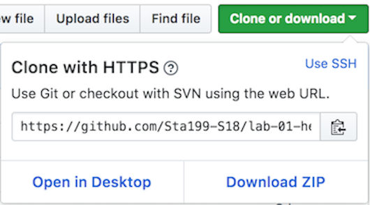
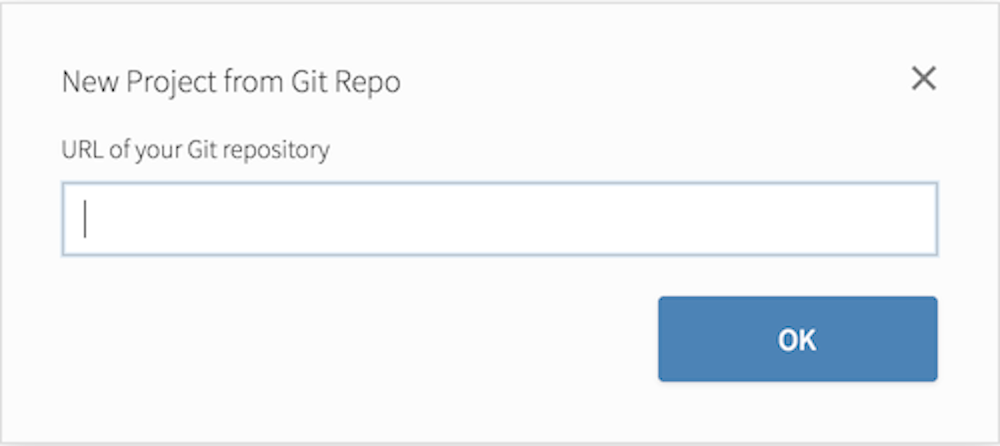

# Lab: Hello R! {#lab01}

The labs for this course have been adapted from a series of Rstudio tutorials. These tutorials were created by [Mine Çetinkaya-Rundel](https://en.wikipedia.org/wiki/Mine_%C3%87etinkaya-Rundel). Mine is fantastic; her work is fantastic; and she's just a badass! Plus, I think it useful to see other people working with R.

Pragmatically, using Mine's lab materials means that I can spend more time on other aspects of the course -- like the website, course notes, and videos. Seriously, you'd never know it but every hour of finished video takes about 6 hours to make. (2 hours of writing, 1.5 hours of filming, and 2.5 hours for video editing)


## Getting started

Each of your assignments will begin with the following steps. They're outlined in detail here. Going forward, each lab will start with a "Getting started" section but details will be a bit more sparse than this. You can always refer back to this lab for a detailed list of the steps involved for getting started with an assignment.

-   Click on the assignment link that you should have received in your email to create your GitHub repository (which we'll refer to as "repo" going forward) for the assignment. This repo contains a template you can build on to complete your assignment.

```{r clone-repo-link, fig.margin = TRUE, echo = FALSE, fig.width=3}

```

-   On GitHub, click on the green **Clone or download** button, select **Use HTTPS** (this might already be selected by default, and if it is, you'll see the text **Clone with HTTPS** as in the image below). Click on the clipboard icon to copy the repo URL.

```{r new-project-from-gh, fig.margin = TRUE, echo = FALSE, fig.width=3}
knitr::include_graphics("img/new-project-from-gh.png")
```

-   Go to RStudio. Create a **New Project from Git Repo**. You will need to click on the down arrow next to the **New Project** button to see this option.

```{r paste-gh-repo-url, fig.margin = TRUE, echo = FALSE, fig.width=5}

```

-   Copy and paste the URL of your assignment repo into the dialog box:

-   Hit OK, and you're good to go!


The compiled version should look something like the following...

```{r, echo=FALSE}
var_url="https://datascience4psych.github.io/ae-03-starwars-dataviz/starwars.html"
include_url(var_url, height = "400px")
```
