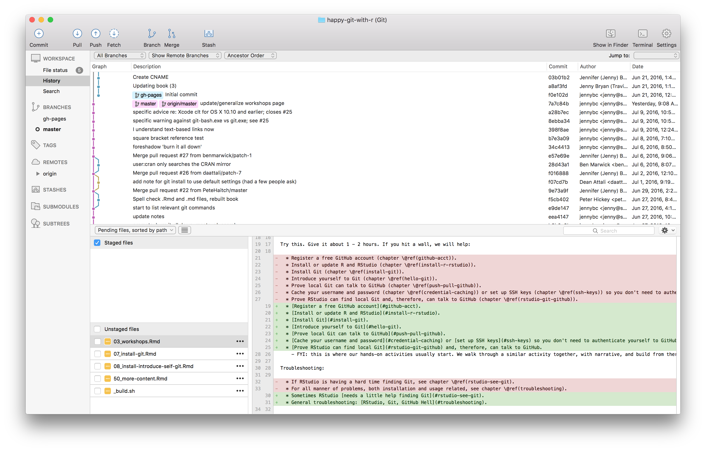
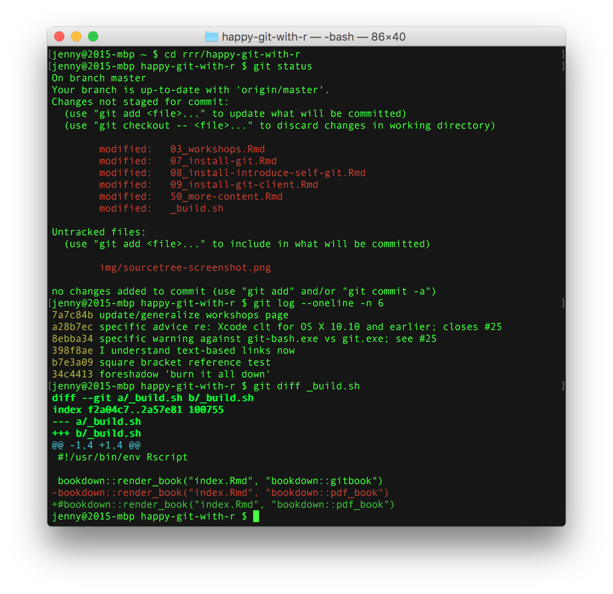

# ODD: Getting Started with Github {#shorthappygit}

This optional deep dive (ODD) is partially adapted from Jenny Bryan's [happygitwithr](https://happygitwithr.com/). I encourage you to check out the unabridged version as it has so much more detail.

## Half the battle {#install-intro}

Getting all the necessary software installed, configured, and playing nicely together is honestly half the battle when first adopting Git. Brace yourself for some pain. The upside is that you can give yourself a pat on the back once you get through this. And you WILL get through this.

You will find far more resources for how to *use Git* than for installation and configuration. Why? The experts ...

  * Have been doing this for years. It's simply not hard for them anymore.
  * Probably use some flavor of Unix. They may secretly (or not so secretly) take pride in neither using nor knowing Windows.
  * Get more satisfaction and reward for thinking and writing about Git concepts and workflows than Git installation.

In their defense, it's hard to write installation instructions. Failures can be specific to an individual OS or even individual computer.

## Register a GitHub account {#github-acct}

Register an account with GitHub. It's free!

  * <https://github.com>

### Username advice

You will be able to upgrade to a paid level of service, apply discounts, join organizations, etc. in the future, so don't fret about any of that now. **Except your username. You might want to give that some thought.**

A few tips, which sadly tend to contradict each other:

  * Incorporate your actual name! People like to know who they're dealing with. Also makes your username easier for people to guess or remember.
  * Reuse your username from other contexts, e.g., Twitter or Slack. But, of course, someone with no GitHub activity will probably be squatting on that.
  * Pick a username you will be comfortable revealing to your future boss.
  * Shorter is better than longer.
  * Be as unique as possible in as few characters as possible. In some settings GitHub auto-completes or suggests usernames.
  * Make it timeless. Don't highlight your current university, employer, or place of residence, e.g. JennyFromTheBlock.
  * Avoid words laden with special meaning in programming. In Jenny's first inept efforts to script around the GitHub API, she assigned lots of issues to [the guy with username `NA`](https://github.com/na) because my vector of GitHub usernames contained missing values. A variant of [Little Bobby Tables](https://xkcd.com/327/).
  * Avoid the use of upper vs. lower case to separate words. We highly recommend all lowercase. GitHub treats usernames in a case insensitive way, but using all lowercase is kinder to people doing downstream regular expression work with usernames, in various languages. A better strategy for word separation is to use a hyphen `-` or underscore `_`.

You can change your username later, but better to get this right the first time.

  * <https://help.github.com/articles/changing-your-github-username/>
  * <https://help.github.com/articles/what-happens-when-i-change-my-username/>

### Free private repos

GitHub offers free unlimited private repositories for all users. These free private repositories support up to three external collaborators, making them a perfect place for your personal projects, for job applications, and testing things out before making your project open source.

Go ahead and register your free account NOW and then pursue any special offer that applies to you:

- Students, faculty, and educational/research staff: [GitHub Education](https://education.github.com).
- GitHub "Organizations" can be extremely useful for courses or research/lab groups, 
    - where you need some coordination across a set of repos and users.
- Official nonprofit organizations and charities: [GitHub for Good](https://github.com/nonprofit)
  
## Install Git {#install_git}

You need Git, so you can use it at the command line and so RStudio can call it.

If there's any chance it's installed already, verify that, rejoice, and skip this step.

Otherwise, find installation instructions below for your operating system.

```{r setup, include = FALSE}
has_bash <- Sys.which('bash') != '' && .Platform$OS.type != 'windows'
```

### Git already installed?

Go to the shell ([More info on shell from Jenny Bryan](https://happygitwithr.com/shell.html)). Enter `which git` to request the path to your Git executable:

```{bash collapse = TRUE, eval = has_bash}
which git
```

and `git --version` to see its version:
 
```{bash collapse = TRUE, eval = has_bash}
git --version
```

If you are successful, that's great! You have Git already. No need to install! Move on.

If, instead, you see something more like `git: command not found`, keep reading.

macOS users might get an immediate offer to install command line developer tools. Yes, you should accept! Click "Install" and read more below.

## Windows  {#install-git-windows}

**Option 1** (*highly recommended*): Install [Git for Windows](https://git-for-windows.github.io/), also known as `msysgit` or "Git Bash", to get Git in addition to some other useful tools, such as the Bash shell. Yes, all those names are totally confusing, but you might encounter them elsewhere and I want you to be well-informed.

We like this because Git for Windows leaves the Git executable in a conventional location, which will help you and other programs, e.g. RStudio, find it and use it. This also supports a transition to more expert use, because the "Git Bash" shell will be useful as you venture outside of R/RStudio.

  *  **NOTE:** When asked about "Adjusting your PATH environment", make sure to select "Git from the command line and also from 3rd-party software". Otherwise, we believe it is good to accept the defaults.
  * Note that RStudio for Windows prefers for Git to be installed below `C:/Program Files` and this appears to be the default. This implies, for example, that the Git executable on my Windows system is found at `C:/Program Files/Git/bin/git.exe`. Unless you have specific reasons to otherwise, follow this convention.

This also leaves you with a Git client, though not a very good one. So check out Git clients we recommend (chapter \@ref(git-client)).

FYI, this appears to be equivalent to what you would download from here: <https://git-scm.com/download/>.

Additional approaches for Windows can be found [here](https://happygitwithr.com/install-git.html#install-git-windows)

### macOS

Although I (Mason) have limited knowledge about the inner workings of mac, I do know of quantitative psychologists who use macs with R, including Bill Revelle -- author of the psych package and Full Professor at Northwestern.


**Option 1** (*highly recommended*): Install the Xcode command line tools (**not all of Xcode**), which includes Git.

Go to the shell and enter one of these commands to elicit an offer to install developer command line tools:

``` bash
git --version
git config
```

Accept the offer! Click on "Install".

Here's another way to request this installation, more directly:

``` bash
xcode-select --install
```

We just happen to find this Git-based trigger apropos.

Note also that, after upgrading macOS, you might need to re-do the above and/or re-agree to the Xcode license agreement. We have seen this cause the RStudio Git pane to disappear on a system where it was previously working. Use commands like those above to tickle Xcode into prompting you for what it needs, then restart RStudio.

**Option 2** (*recommended*): Install Git from here: <http://git-scm.com/downloads>.

  * This arguably sets you up the best for the future. It will certainly get you the latest version of Git of all approaches described here.
  * The GitHub home for the macOS installer is here: <https://github.com/timcharper/git_osx_installer>.
    - At that link, you can find more info if something goes wrong or you are working on an old version of macOS.

Additional approaches for macOS can be found [here](https://happygitwithr.com/install-git.html#macos)


## Introduce yourself to Git {#hello-git}

In the shell  ([More info on shell from Jenny Bryan](https://happygitwithr.com/shell.html)):

``` bash
git config --global user.name 'Jane Doe'
git config --global user.email 'jane@example.com'
git config --global --list
```

substituting your name and **the email associated with your GitHub account**.

The [usethis package](https://usethis.r-lib.org) offers an alternative approach. You can set your Git user name and email from within R:

```{r, eval = FALSE}
## install if needed (do this exactly once):
## install.packages("usethis")
library(usethis)
use_git_config(user.name = "Jane Doe", user.email = "jane@example.org")
```

### More about `git config`

An easy way to get into a shell from RStudio is *Tools > Terminal* or *Tools > Shell*. ([More info on shell from Jenny Bryan](https://happygitwithr.com/shell.html)).

Special Windows gotchas: If you are struggling on Windows, consider there are different types of shell and you might be in the wrong one. You want to be in a "Git Bash" shell, as opposed to Power Shell or the legacy `cmd.exe` command prompt. This might also be a reason to do this configuration via the usethis package in R.

What user name should you give to Git? This does not have to be your GitHub user name, although it can be. Another good option is your actual first name and last name. If you commit from different machines, sometimes people work that info into the user name. Your commits will be labeled with this user name, so make it informative to potential collaborators and future you.

What email should you give to Git? This __must__ be the email associated with your GitHub account.

These commands return nothing. You can check that Git understood what you typed by looking at the output of `git config --global --list`.

### Configure the Git editor {#git-editor}

Another Git option that many people eventually configure is the editor. At some point, you will fail to give Git what it wants in terms of a commit message and it will kick you into an editor. This can be distressing, if it's not your editor of choice and you don't even know how to save and quit. You can enforce your will with something along these lines:

``` bash
git config --global core.editor "emacs"
```

Substitute your preferred editor for `"emacs"` here. Software Carpentry's Git lesson has a comprehensive listing of the exact `git config` command needed for [many combinations of OS and editor](http://swcarpentry.github.io/git-novice/02-setup/).

## Install a Git client {#git-client}

Although having a git client is, I **highly recommend** it for the same reasons as I recommend having Rstudio.

Learning to use version control can be rough at first. I found the use of a GUI – as opposed to the command line – extremely helpful when I was getting started. I call this sort of helper application a Git client. It's really a Git(Hub) client because it also helps you interact with GitHub or other remotes.


### What is a Git client? Why would you want one?

"Git" is really just a collection of individual commands you execute in the shell (Appendix \@ref(shell)). This interface is not appealing for everyone. Some may prefer to do Git operations via a client with a graphical interface.

Git and your Git client are not the same thing, just like R and RStudio are not the same thing. A Git client and an [integrated development environment](https://en.wikipedia.org/wiki/Integrated_development_environment), such as RStudio, are not necessary to use Git or R, respectively. But they make the experience more pleasant because they reduce the amount of [command line bullshittery](http://www.pgbovine.net/command-line-bullshittery.htm) and provide a richer visual representation of the current state.

RStudio offers a very basic Git client via its Git pane. I use this often for simple operations, but you probably want another, more powerful one as well.

Fair warning: for some tasks, you must use the command line. But the more powerful your Git client is, the less often this happens. The visual overview given by your Git client can also be invaluable for understanding the current state of things, even when preparing calls to command line Git. 

Fantastic news: because all of the clients are just forming and executing Git commands on your behalf, you don't have to pick one. You can literally do one operation from the command line, do another from RStudio, and another from SourceTree, one after the other, and it just works. *Very rarely, both clients will scan the repo at the same time and you'll get an error message about `.git/index.lock`. Try the operation again at least once before doing any further troubleshooting.*

### A picture is worth a thousand words

Here's a screenshot of SourceTree (see below) open to the repository for this site. You get a nice graphical overview of the recent commit history, branches, and diffs, as well as a GUI that facilitates the most common Git operations.



In contrast, here's a shell session where I've used command line Git to access some of the same information.



Which do you prefer?

### No one is giving out Git Nerd merit badges

Work with Git in whatever way makes you most effective. Feel free to revisit your approach over time or to use different approaches for different tasks. No one can tell whether you use the command line or a GUI when they look at your Git history or your GitHub repo.

If your Git life happens on your own computer, there is no reason to deny yourself a GUI if that's what you like. If you prefer working in the shell or if you frequently log into a remote server, then it makes sense to prioritize building Git skills at the command line. Do whatever works for you, but don't do anything for the sake of purity or heroism.  


## Another way to use github for this course

I will introduce one way to utilize github for this course.  For example, you might want to download lab-02-plastic-waste.  First, create account/password in the Github, and install desktop Github app. 

```{r echo=FALSE, eval=TRUE}
knitr::include_graphics("img/g1.png")
```
Go to your repositories 

```{r echo=FALSE, eval=TRUE}
knitr::include_graphics("img/g2.png")
```
Click the new button 

```{r echo=FALSE, eval=TRUE}
knitr::include_graphics("img/g3.png")
```
Repositories template -> DS4P/lab-02-plastic-waste

```{r echo=FALSE, eval=TRUE}
knitr::include_graphics("img/g4.png")
```
You can create this repositories. 

```{r echo=FALSE, eval=TRUE}
knitr::include_graphics("img/g5.png")
```
Than, go to the repository that you've just created. Click code>open with the GitHub Desktop

```{r echo=FALSE, eval=TRUE}
knitr::include_graphics("img/g6.png")
```
Click Open GitHubDesktop


```{r echo=FALSE, eval=TRUE}
knitr::include_graphics("img/g7.png")
```
You can change the local path by clicking “choose”. And if you click the “clone” button, the lab02 plastic waste file would be in your local path. 

```{r echo=FALSE, eval=TRUE}
knitr::include_graphics("img/g8.png")
```
Your changes would be automatically reflected in the app. 

```{r echo=FALSE, eval=TRUE}
knitr::include_graphics("img/g9.png")
```

write something in there (where I wrote "write something") and click "Commit to main" button

```{r echo=FALSE, eval=TRUE}
knitr::include_graphics("img/g10.png")
```

 click the "Push Origin" button, and tada~

### Recommended Git clients

  * [GitKraken](https://www.gitkraken.com) is a free, powerful Git(Hub) client that is Jenny Bryan's current favorite. It's especially exciting because it works on Windows, macOS, and Linux. This is great news, especially for long-suffering Linux users who have previously had very few options.

  * [SourceTree](https://www.sourcetreeapp.com) is another free client that Jenny highly recommends, at least on Windows ^[(ref:sourcetree-install)]. It was hery first and most beloved Git client, but she eventually had to give it up on macOS, due to a [long-standing bug re: leaking file handles](http://openradar.appspot.com/radar?id=1387401) that they will clearly never fix. I still use SourceTree on Windows.
  
(ref:sourcetree-install) During installation and registration, you'll need to create a free Atlassian Bitbucket account and link that to a free Atlassian Bitbucket Cloud account. Also, feel free to uncheck the checkbox about installing Mercurial (another version control system), unless you feel you need it.

  * GitHub offers a free Git(Hub) client, [GitHub Desktop](https://desktop.github.com/), for Windows and macOS. GitHub Desktop is aimed at beginners who want the most useful features of Git front and center. The flipside is that it may not support some of the more advanced workflows exposed by the clients above. At present, this client is what I mostly use. 

  * Others that I have heard positive reviews for:

    - [magit](https://magit.vc), for Emacs nerds  
    - [GitUp](https://gitup.co)
    - [SmartGit](http://www.syntevo.com/smartgit/)
    - [git-cola](https://git-cola.github.io)

  * Browse [even more Git(Hub) clients](http://git-scm.com/downloads/guis).
