# Lab: Hello R! {#lab01}

```{r include = FALSE}
source("common.R")
```


The labs for this course have been adapted from a series of Rstudio tutorials. 
These tutorials were initially created by [Mine Çetinkaya-Rundel](https://en.wikipedia.org/wiki/Mine_%C3%87etinkaya-Rundel). Mine is fantastic; her work is fantastic; and she's just a badass! 

I have adapted these tutorials for two reasons: 

1) I think it useful to see other people working with R; and 

2) Pragmatically, using Mine's lab materials means that I can spend more time on other aspects of the course -- like the website, course notes, videos, feedback, learning how to embed tweets... 

```{r, echo=FALSE}
include_tweet("https://twitter.com/minebocek/status/1352727542537605120")
```

Seriously, you'd never know it, but every hour of finished video takes between 4 and 6 hours to make. (2 hours of writing, 1.5 hours of filming, and 2.5 hours for video editing).

## Lab Goals

> Recall: R is the name of the programming language itself and RStudio is a convenient interface.


The main goal of this lab is to introduce you to R and RStudio. We will be using them throughout the course:

* to learn the statistical concepts discussed in the course, and
* to analyze real data and come to informed conclusions. 

> Recall: git is a version control system (like "Track Changes" features from Microsoft Word on steroids) and GitHub is the home for your Git-based projects on the Internet (like DropBox but much, much better).

An additional goal is to introduce you to Git and GitHub, which is the collaboration and version control system that we will be using throughout the course.

As the labs progress, you are encouraged to explore beyond what the labs dictate; a willingness to experiment will make you a much better programmer. Before we get to that stage, however, you need to build some basic fluency in R. Today we begin with the fundamental building blocks of R and RStudio: the interface, reading in data, and basic commands.

To make versioning simpler, this lab is a solo lab. I want to make sure everyone gets a significant amount of time at the steering wheel, working directly with R. In the future modules,you'll learn about collaborating on GitHub and produce a single lab report for your team.


## Getting started

Each of your assignments will begin with the following steps. They're outlined in detail here. Going forward, each lab will start with a "Getting started" section but details will be a bit more sparse than this. You can always refer back to this lab for a detailed list of the steps involved for getting started with an assignment.

-  You can find the assignment link for this lab right [here][lab01_hello]. That GitHub repository (which we'll refer to as "repo" going forward) is a template for the assignment. You can build on it to complete your assignment.

```{r clone-repo-link, fig.margin = TRUE, echo = FALSE, fig.width=3}
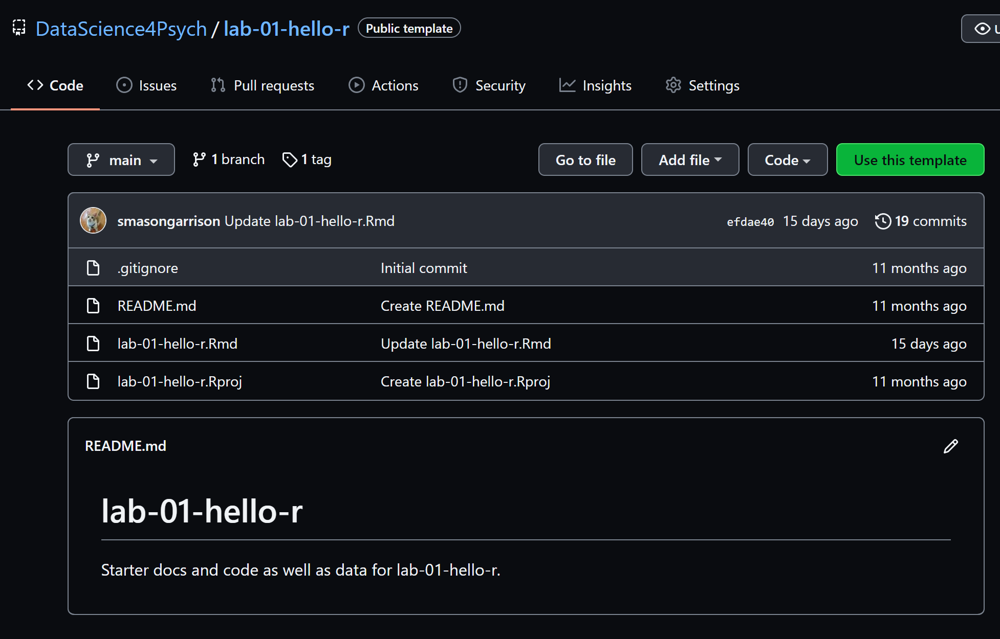
```
<!-- to do: make clear how to do this on you own account -->

- On GitHub, click on the **Use this template** button.

- This option initiates the creation of a repo on your account, based on the lab template. 

```{r createfromtemplate, fig.margin = TRUE, echo = FALSE, fig.width=3}
knitr::include_graphics("img/github_createfromtemplate.PNG")
```

- You should now provide a name to your new repository. Lab 01 or something to that effect should work nicely.

- I recommend making the repo public, but private is fine if you already have github pro set up.

- Once you fill out all the required information, click on the **Create Repository from Template** button.

- Now you should have your own copy of the lab!

```{r newcopylab1, fig.margin = TRUE, echo = FALSE, fig.width=3}
knitr::include_graphics("img/newcopylab1.PNG")
```

- Now we need to connect your new git repo with your computer.

```{r geturllab01, fig.margin = TRUE, echo = FALSE, fig.width=3}
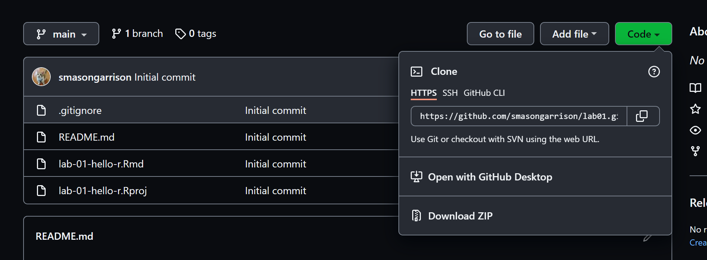
```
 

- Notice that are a few ways to interface between git and R.

  - *Clone*
  - *Open*
  - *Download*

 

### Option 1: Use RStudio

- From your repo, select **Code**. 
 
```{r geturllab01}```
 

- Use RStudio to **clone** the repo.

- Now, select **Use HTTPS** (this might already be selected by default, and if it is, you'll see the text **Clone with HTTPS** as in the image below). Click on the clipboard icon to copy the repo URL.

```{r new-project-from-gh, fig.margin = TRUE, echo = FALSE, fig.width=3}
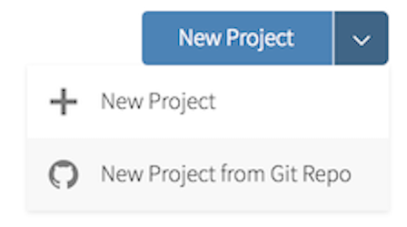

```

-   Go to RStudio. Select from the menu, **new project**.

```{r new-project, fig.margin = TRUE, echo = FALSE, fig.width=3}
knitr::include_graphics("img/lab1_newproject.PNG")
```

- Using the new project wizard, select **Version Control**

```{r newprojectwizard, fig.margin = TRUE, echo = FALSE, fig.width=3}
knitr::include_graphics("img/newprojectwizard.PNG")
```

- Select the option for *Git*

```{r wizardgit, fig.margin = TRUE, echo = FALSE, fig.width=3}
knitr::include_graphics("img/wizardgit.PNG")
```

-   Copy and paste the URL of your assignment repo into the dialog box.

```{r clonerstudio, fig.margin = TRUE, echo = FALSE, fig.width=5}
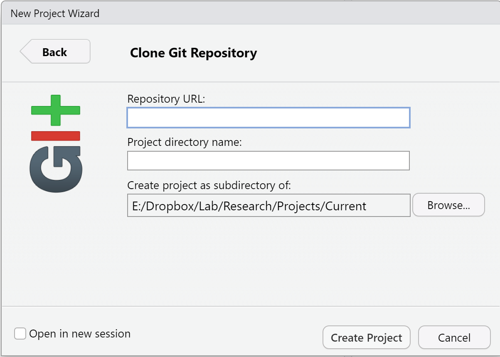
```

-  Fill out the information for what folder you'd like to store your lab in.

- Hit OK, and you're good to go!


### Option 2: Use Github Desktop


[Yoo Ri Hwang](https://github.com/YRHwang90) wrote up a lovely demo for how to get a lab via github desktop.  Her example uses lab 02, but we can use it for lab 1 as well. For example, you might want to download lab-02-plastic-waste.  First, create account/password in the Github, and install desktop Github app. 

```{r echo=FALSE, eval=TRUE}
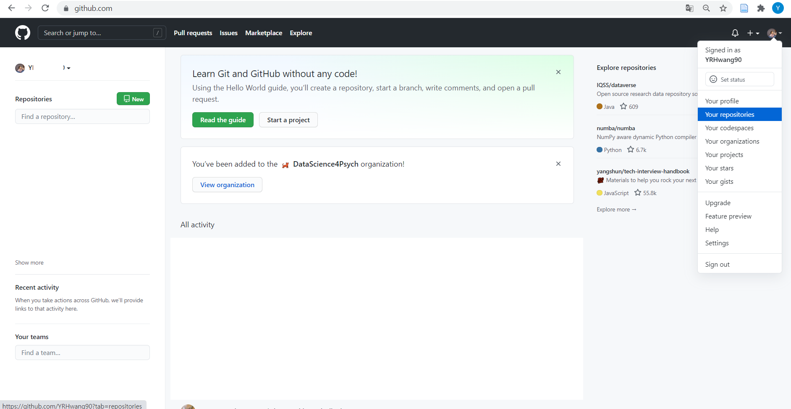
```

Go to your repositories 

```{r echo=FALSE, eval=TRUE}
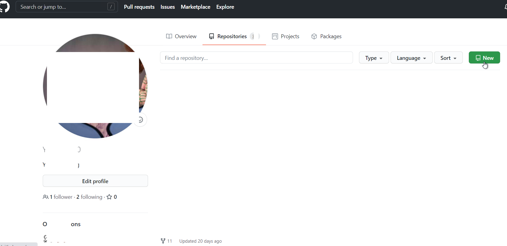
```

Click the new button 

```{r echo=FALSE, eval=TRUE}
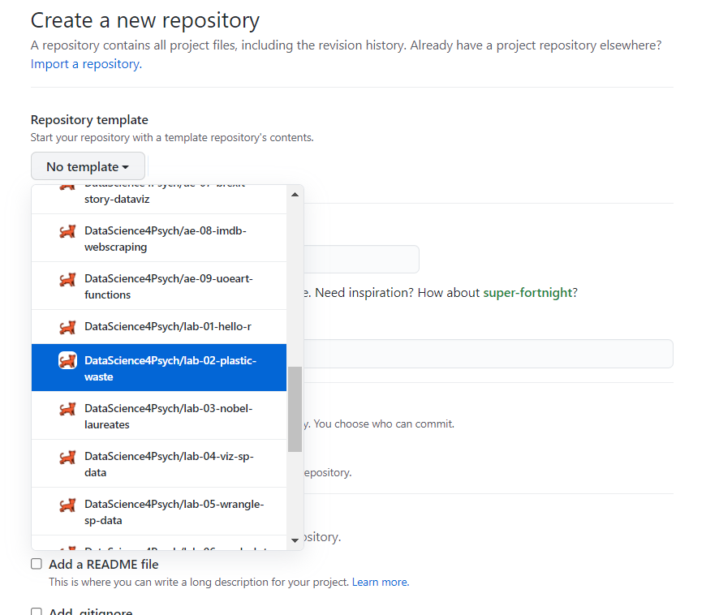
```

Repositories template -> DS4P/lab-02-plastic-waste

```{r echo=FALSE, eval=TRUE}
knitr::include_graphics("img/g4.png")
```
You can create this repositories. 

```{r echo=FALSE, eval=TRUE}
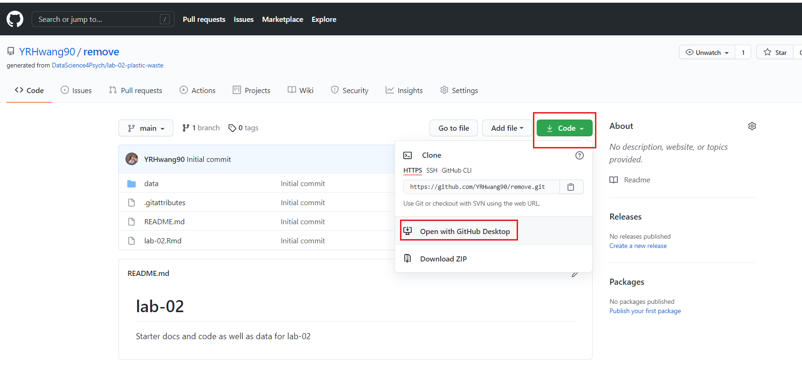
```

Than, go to the repository that you've just created. Click code -> open with the GitHub Desktop

```{r echo=FALSE, eval=TRUE}
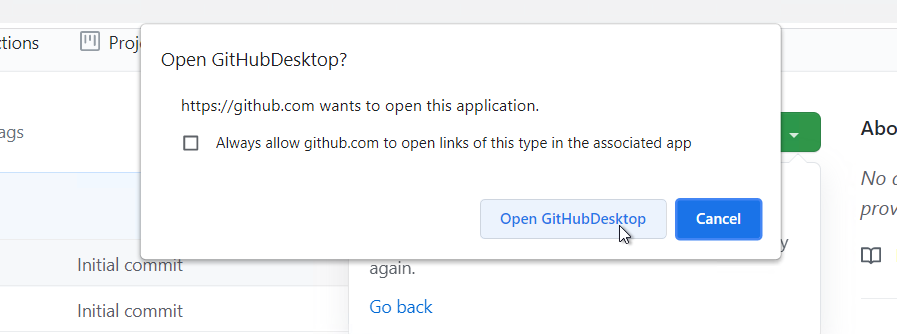
```

Click Open GitHubDesktop


```{r echo=FALSE, eval=TRUE}
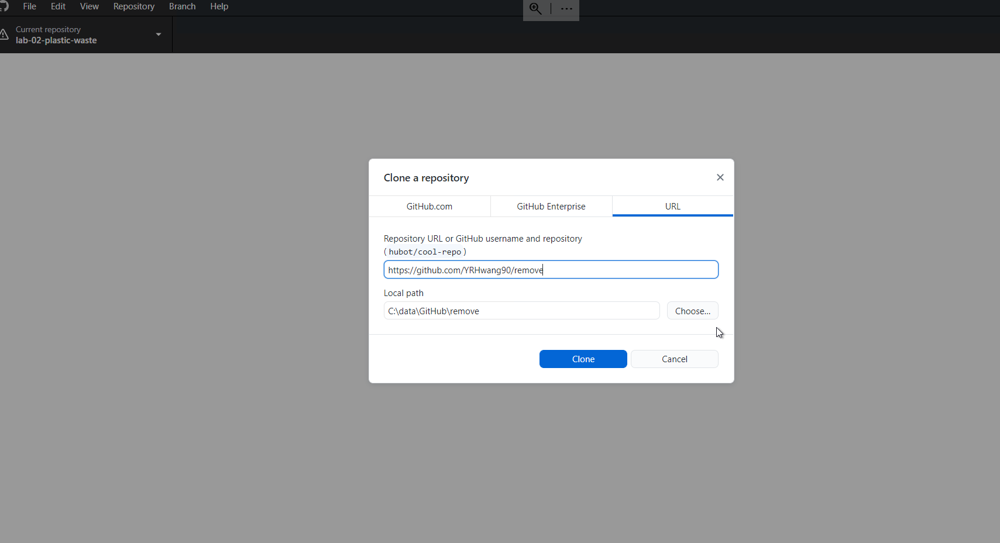
```

You can change the local path by clicking "choose". And if you click the “clone” button, the lab02 plastic waste file would be in your local path. 

```{r echo=FALSE, eval=TRUE}
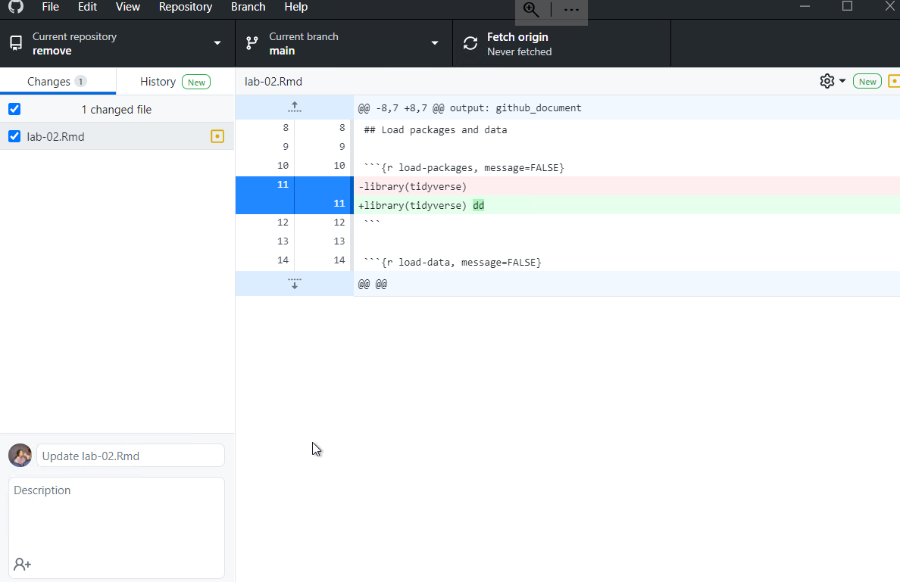
```

Your changes should be automatically reflected in the app. 

```{r echo=FALSE, eval=TRUE}
knitr::include_graphics("img/g9.png")
```

Write something in there (where I wrote "write something") and click "Commit to main" button

```{r echo=FALSE, eval=TRUE}
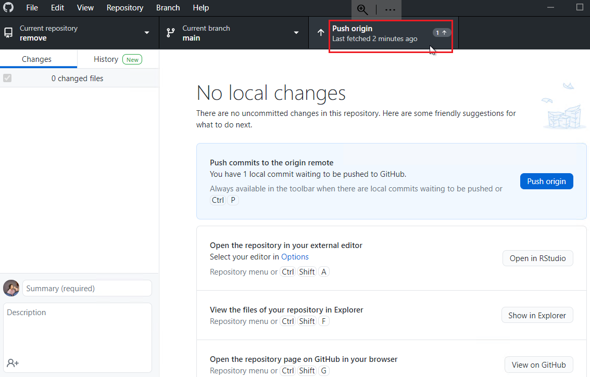
```

 click the "Push Origin" button, and tada~

- Hit OK, and you're good to go!


### Option 3: Brute Force


- INSTRUCTIONS GO HERE

- Hit OK, and you're good to go!


## Warm up

Before we introduce the data, let's warm up with some simple exercises.


> FYI: The top portion of your R Markdown file (between the three dashed lines) is called YAML. It stands for "YAML Ain't Markup Language". It is a human friendly data serialization standard for all programming languages. All you need to know is that this area is called the YAML (we will refer to it as such) and that it contains meta information about your document.


#### YAML

Open the R Markdown (Rmd) file in your project, change the author name to your name, and knit the document.

```{r yaml-raw-to-rendered, fig.fullwidth=TRUE, echo = FALSE}
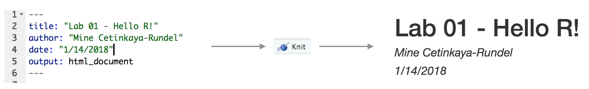
```

#### Committing changes

Then go to the Git pane in your RStudio.

If you have made changes to your Rmd file, you should see it listed here.
Click on it to select it in this list and then click on **Diff**.
This shows you the *diff*erence between the last committed state of the document and its current state that includes your changes.
If you're happy with these changes, write "Update author name" in the **Commit message** box and hit **Commit**.

```{r update-author-name-commit, fig.fullwidth=TRUE, echo = FALSE}
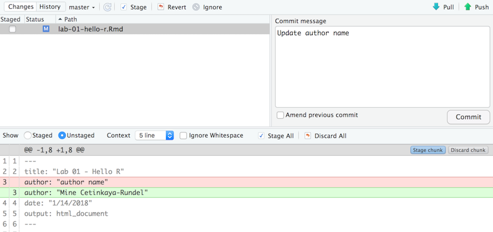
```

You don't have to commit after every change, doing so would get quite cumbersome.
You should consider committing states that are *meaningful to you* for inspection, comparison, or restoration.
In the first few assignments, I'll suggest exactly when to commit and in some cases, what commit message to use.
As the semester progresses, you make these decisions.

#### Pushing changes

Now that you have made an update and committed this change, it's time to push these changes to the web!
Or more specifically, to your repo on GitHub.
Why?
So that others can see your changes.
And by others, we mean the course teaching team (your repos in this course are private to you and us, only).

In order to push your changes to GitHub, click on **Push**.
This will prompt a dialog box where you first need to enter your user name, and then your password.
This might feel cumbersome.
Soon -- you *will* learn how to save your password so you don't have to enter it every time.
But for this one assignment you'll have to manually enter each time you push in order to gain some experience with it.

<iframe src="https://giphy.com/embed/SXqw0Vpql4sHX9pCl4" width="480" height="270" frameBorder="0" class="giphy-embed" allowFullScreen></iframe>

### Packages

In this lab, we will work with two packages: **datasauRus** and **tidyverse**. **datasauRus** contains the dataset we'll be using; **tidyverse** is a collection of packages for doing data analysis in a "tidy" way.


Install these packages by running the following commands in the console.

```{r eval = FALSE}
install.packages("tidyverse")
install.packages("datasauRus")
```

Now that the necessary packages are installed, you should be able to Knit your document and see the results.

If you'd like to run your code in the Console as well you'll also need to load the packages there. To do so, run the following in the console. 

```{r message=FALSE}
library(tidyverse) 
library(datasauRus)
```

Note that the packages are also loaded with the same commands in your R Markdown document.


### Data


> Fun fact: If it's confusing that the data frame is called `datasaurus_dozen` when it contains 13 datasets, you're not alone! Have you heard of a [baker's dozen](https://en.wikipedia.org/wiki/Dozen#Baker's_dozen)?


The data frame we will be working with today is called `datasaurus_dozen` and it's in the `datasauRus` package.
Actually, this single data frame contains 13 datasets, designed to show us why data visualization is important and how summary statistics alone can be misleading.
The different datasets are marked by the `dataset` variable.

To find out more about the dataset, type the following in your Console: `?datasaurus_dozen`.
A question mark before the name of an object will always bring up its help file.
This command must be run in the Console.

## Exercises

1.  Based on the help file, how many rows and how many columns does the `datasaurus_dozen` file have? What are the variables included in the data frame? Add your responses to your lab report.

Let's take a look at what these datasets are. To do so we can make a *frequency table* of the dataset variable:

```{r}
datasaurus_dozen %>%
  count(dataset) %>%
  print(13)
```


> Fun fact: Matejka, Justin, and George Fitzmaurice. "Same stats, different graphs: Generating datasets with varied appearance and identical statistics through simulated annealing." Proceedings of the 2017 CHI Conference on Human Factors in Computing Systems. ACM, 2017.


The original Datasaurus (`dino`) was created by Alberto Cairo in [this great blog post](http://www.thefunctionalart.com/2016/08/download-datasaurus-never-trust-summary.html).
The other Dozen were generated using simulated annealing and the process is described in the paper *Same Stats, Different Graphs: Generating Datasets with Varied Appearance and Identical Statistics* through Simulated Annealing by Justin Matejka and George Fitzmaurice.
In the paper, the authors simulate a variety of datasets that have the same summary statistics as the Datasaurus but have very different distributions.

🧶 ✅ ⬆️ *Knit, commit, and push your changes to GitHub with the commit message "Added answer for Ex 1". Make sure to commit and push all changed files so that your Git pane is cleared up afterwards.*

2.  Plot `y` vs. `x` for the `dino` dataset. Then, calculate the correlation coefficient between `x` and `y` for this dataset.

Below is the code you will need to complete this exercise.
Basically, the answer is already given, but you need to include relevant bits in your Rmd document and successfully knit it and view the results.

Start with the `datasaurus_dozen` and pipe it into the `filter` function to filter for observations where `dataset == "dino"`. Store the resulting filtered data frame as a new data frame called `dino_data`.

```{r}
dino_data <- datasaurus_dozen %>%
  filter(dataset == "dino")
```

Because a lot going on here -- let's slow down and unpack it a bit.

First, the pipe operator: `%>%`, takes what comes before it and sends it as the first argument to what comes after it.
So here, we're saying `filter` the `datasaurus_dozen` data frame for observations where `dataset == "dino"`.

Second, the assignment operator: `<-`, assigns the name `dino_data` to the filtered data frame.

Next, we need to visualize these data.
We will use the `ggplot` function for this. Its first argument is the data you're visualizing.
Next we define the `aes`thetic mappings.
In other words, the columns of the data that get mapped to certain aesthetic features of the plot, e.g. the `x` axis will represent the variable called `x` and the `y` axis will represent the variable called `y`.
Then, we add another layer to this plot where we define which `geom`etric shapes we want to use to represent each observation in the data.
In this case, we want these to be points, hence `geom_point`.

```{r fig.fullwidth=TRUE}
ggplot(data = dino_data, mapping = aes(x = x, y = y)) +
  geom_point()
```

If this seems like a lot, it is.
And you will learn about the philosophy of layering data visualizations in detail next week.
For now, follow along with the code that is provided.

For the second part of these exercises, we need to calculate a summary statistic: the correlation coefficient.

>Recall: Correlation coefficient, often referred to as $r$ in statistics, measures the linear association between two variables.

You will see that some of the pairs of variables we plot do not have a linear relationship between them.
This nonlinear relationships are exactly why we want to visualize first: visualize to assess the form of the relationship, and calculate $r$ only if relevant.
In this case, calculating a correlation coefficient really doesn't make sense since the relationship between `x` and `y` is definitely not linear -- it's dinosaurial!

But, for illustrative purposes, let's calculate the correlation coefficient between `x` and `y`.


> Tip: Start with `dino_data` and calculate a summary statistic that we will call `r` as the `cor`relation between `x` and `y`.


```{r}
dino_data %>%
  summarize(r = cor(x, y))
```

🧶 ✅ ⬆️ *Knit, commit, and push your changes to GitHub with the commit message "Added answer for Ex 2". Make sure to commit and push all changed files so that your Git pane is cleared up afterwards.*

3.  Plot `y` vs. `x` for the `star` dataset. You can (and should) reuse code we introduced above, just replace the dataset name with the desired dataset. Then, calculate the correlation coefficient between `x` and `y` for this dataset. How does this value compare to the `r` of `dino`?

🧶 ✅ ⬆️ *This is another good place to pause, knit, commit changes with the commit message "Added answer for Ex 3", and push. Make sure to commit and push all changed files so that your Git pane is cleared up afterwards.*

4.  Plot `y` vs. `x` for the `circle` dataset. You can (and should) reuse code we introduced above, just replace the dataset name with the desired dataset. Then, calculate the correlation coefficient between `x` and `y` for this dataset. How does this value compare to the `r` of `dino`?

🧶 ✅ ⬆️ *You should pause again, commit changes with the commit message "Added answer for Ex 4", and push. Make sure to commit and push all changed files so that your Git pane is cleared up afterwards.*


5.  Finally, let's plot all datasets at once. In order to do this we will make use of faceting.

> Hint: Facet by the dataset variable, placing the plots in a 3 column grid.

```{r all-viz, eval=FALSE, fig.fullwidth=TRUE}
ggplot(datasaurus_dozen, aes(x = x, y = y, color = dataset))+
  geom_point()+
  facet_wrap(~ dataset, ncol = 3) +
  theme(legend.position = "none")
```

And we can use the `group_by` function to generate all the summary correlation coefficients.

```{r all-r, eval=FALSE}
datasaurus_dozen %>%
  group_by(dataset) %>%
  summarize(r = cor(x, y)) %>%
  print(13)
```

You're done with the data analysis exercises, but we'd like you to do two more things:

```{r fig-resize-global, fig.margin = TRUE, echo = FALSE, fig.width=3}
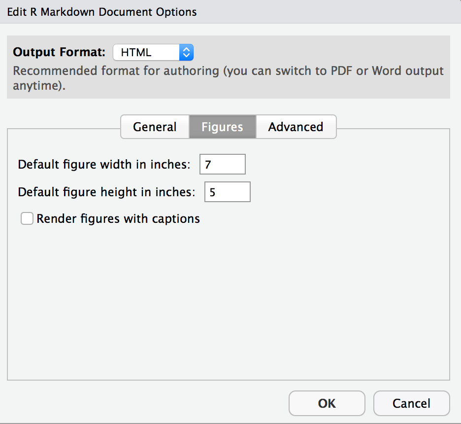
```

-   **Resize your figures:**

Click on the gear icon near the top of the R Markdown document, and select "Output Options..." in the dropdown menu.
In the pop up dialog box, go to the Figures tab and change the height and width of the figures, and hit OK when done.
Then, knit your document and see how you like the new sizes.
Change and knit again and again until you're happy with the figure sizes.
Note that these values get saved in the YAML.

```{r fig-resize-local, fig.margin = TRUE, echo = FALSE, fig.width=3}
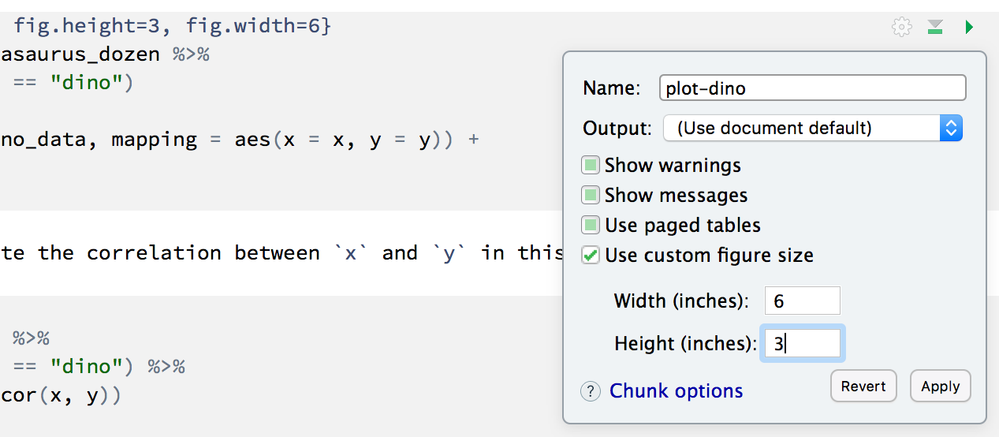
```

You can also use different figure sizes for different figures.
To do so, click on the gear icon within the chunk where you want to make a change.
Changing the figure sizes added new options to these chunks: `fig.width` and `fig.height`.
You can change them by defining different values directly in your R Markdown document as well.

```{r theme-highlight, fig.margin = TRUE, echo = FALSE, fig.width=3}
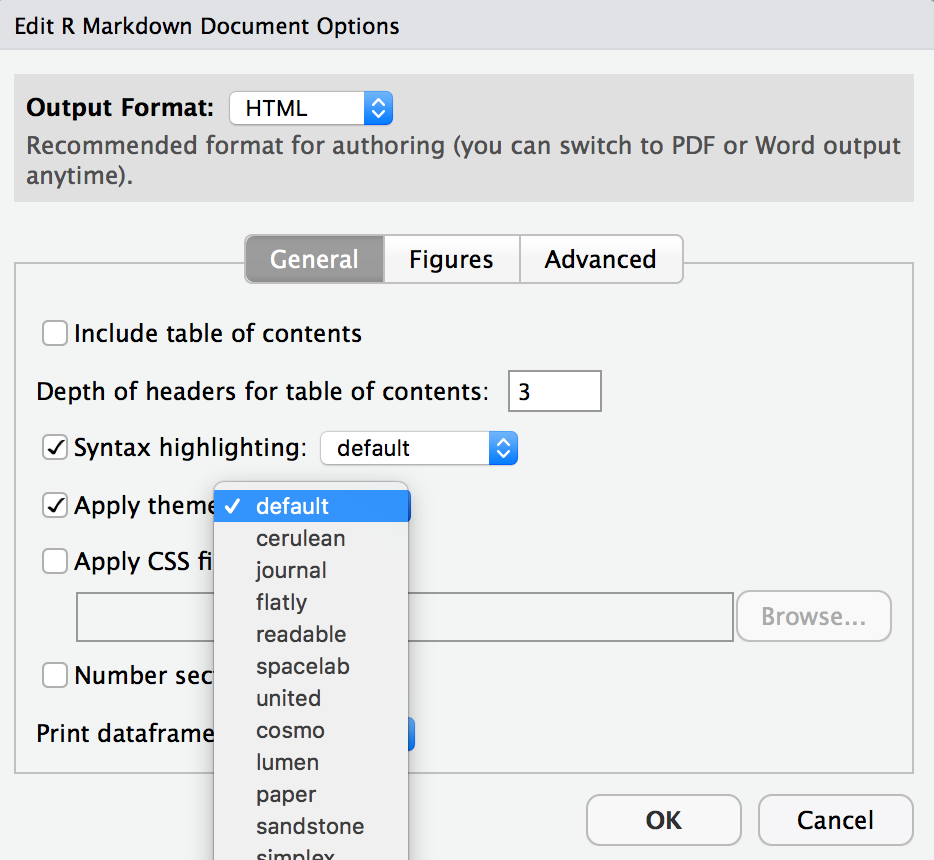
```

-   **Change the look of your report:**

Once again, click on the gear icon in on top of the R Markdown document, and select "Output Options..." in the dropdown menu.
In the General tab of the pop up dialog box, try out different Syntax highlighting and theme options.
Hit OK and knit your document to see how it looks.
Play around with these until you're happy with the look.

<br>

> Pro Tip: Not sure how to use emojis on your computer? Maybe a teammate can help?


🧶 ✅ ⬆️ *Yay, you're done! Commit all remaining changes, use the commit message "Done with Lab 1!* 💪*", and push. Make sure to commit and push all changed files so that your Git pane is cleared up afterwards. Before you wrap up the assignment, make sure all documents are updated on your GitHub repo.*

```{r links, child="admin/md/courselinks.md"}
```