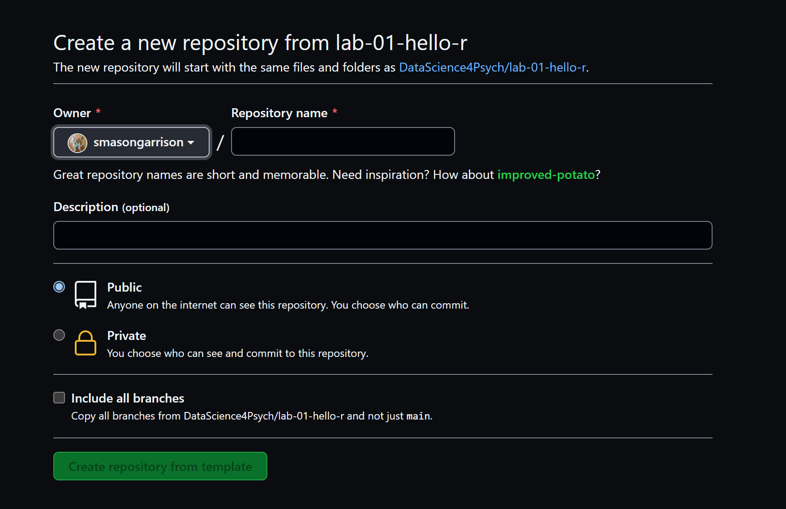
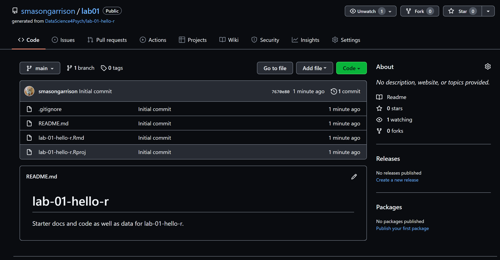
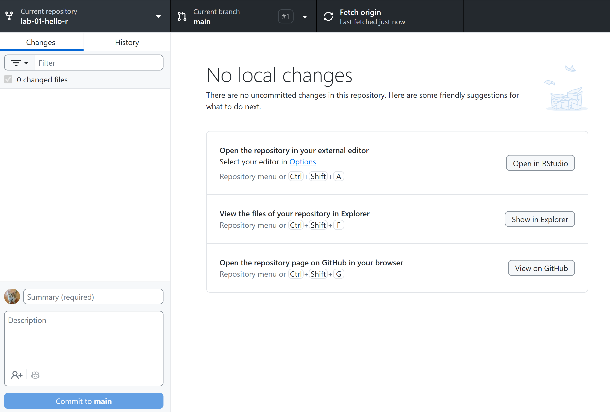
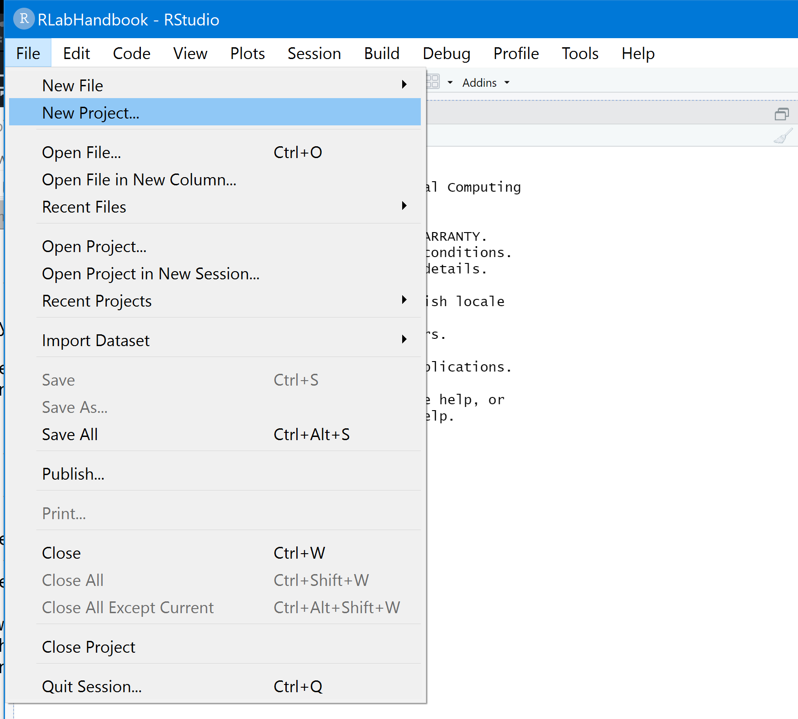
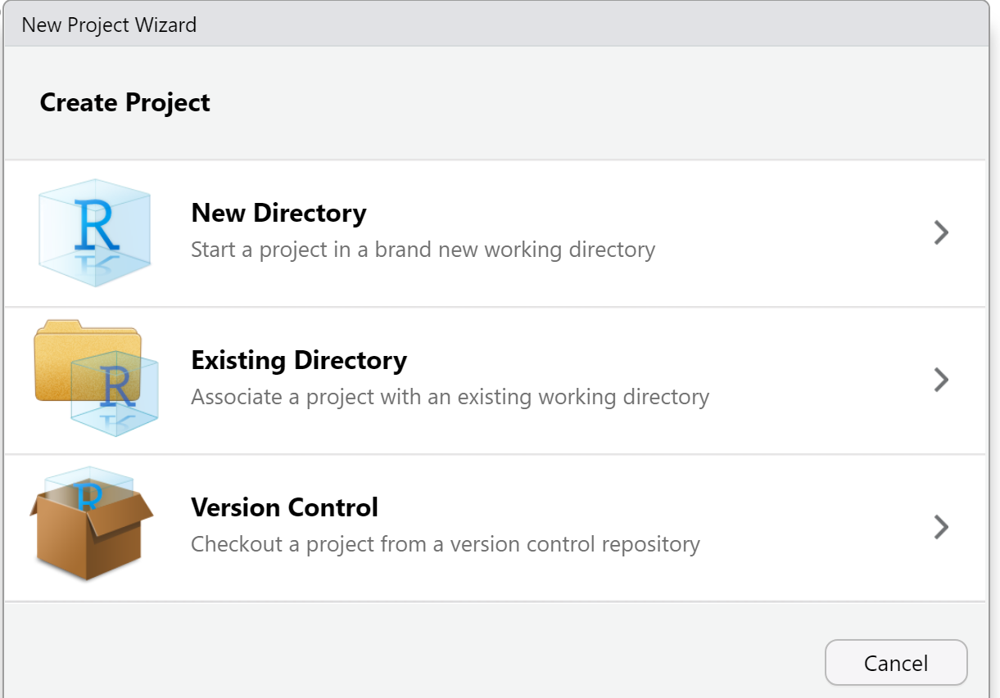
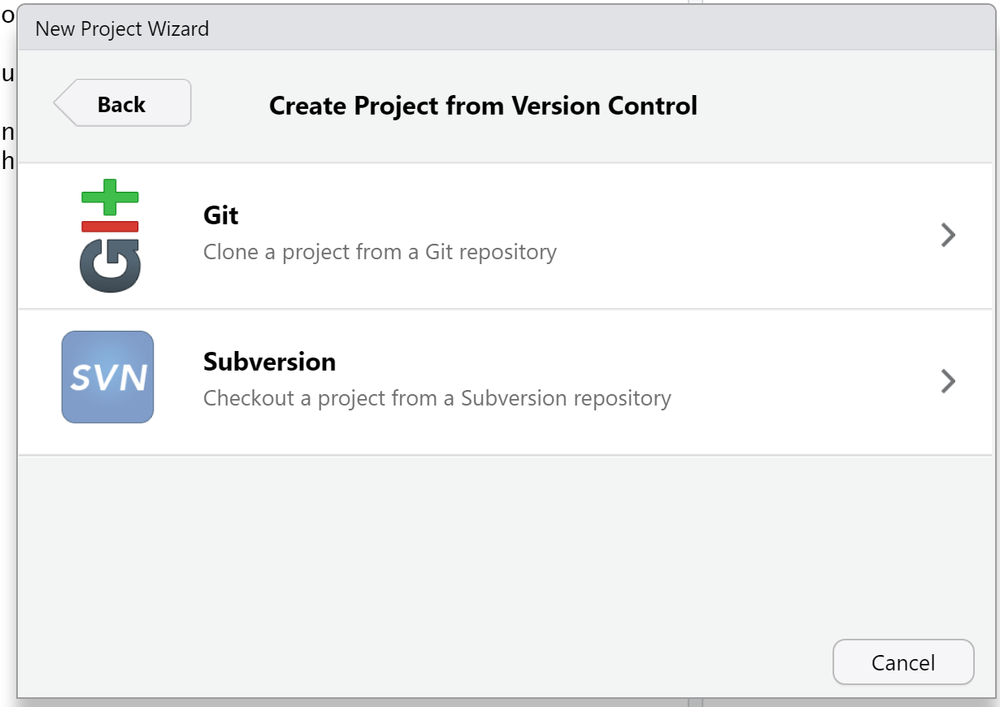

# Lab: Hello R! {#lab01}


Many of the labs for this course have been adapted from a series of Rstudio tutorials.
These tutorials were initially created by [Mine Çetinkaya-Rundel](https://en.wikipedia.org/wiki/Mine_%C3%87etinkaya-Rundel). Mine is fantastic; her work is fantastic; and she's just a badass!

I have adapted these tutorials for two reasons:

1) I think it useful to see other people working with R; and

2) Pragmatically, adapting Mine's lab materials means that I can spend more time on other aspects of the course -- like the website, course notes, videos, feedback, learning how to embed tweets...


```{=html}
<blockquote class="twitter-tweet" data-width="550" data-lang="en" data-dnt="true" data-theme="light"><p lang="en" dir="ltr">That&#39;s so wonderful to hear, thank you!</p>&mdash; Mine Çetinkaya-Rundel (@minebocek) <a href="https://twitter.com/minebocek/status/1352727542537605120?ref_src=twsrc%5Etfw">January 22, 2021</a></blockquote>

```


Seriously, you'd never know it, but every hour of finished video takes between 6 and 8 hours to make. (3 hours of writing, 1.5 hours of filming, and 3.5 hours for video editing).

## About The Hello R Lab {-}

This lab, collectively named the **Hello R** lab, is divided into two parts, A and Z. The first part, **Aloha R**, is focused on setting up GitHub, RStudio, and YAML. It also introduces some basics of R Markdown. The second part, **Zdravo R**, is the heart of the lab exercises, with a series of data visualization and analysis tasks, introducing `ggplot2`, `dplyr`, and related tools.

This is the hardest lab of the semester, but it's also the most important. If you can get through this, you can get through anything. Please complete the lab in order, and don't skip ahead. You'll need to know the basics before you can do the more advanced stuff.

## Lab Goals  {-}

> Recall: R is the name of the programming language itself, and RStudio is a convenient interface.

The primary goal of this lab is to introduce you to R and RStudio, tools we will use throughout the course:
* to learn the statistical concepts discussed in the course, and
* to analyze real data and come to informed conclusions.

> Recall: git is a version control system (like "Track Changes" features from Microsoft Word on steroids), and GitHub is the home of your Git-based projects on the Internet (like DropBox but much, much better).

The second goal is to introduce you to Git and GitHub, the collaboration and version control system that we will use throughout the course.

As the labs progress, you are encouraged to explore beyond what the labs dictate; a willingness to experiment will make you a much better programmer.  Before we get to that stage, however, you need to build some basic fluency in R. Today, we’ll start with the foundational building blocks of R and RStudio: the interface, reading in data, and basic commands.

To make versioning simpler, this lab is a solo lab. I want to make sure everyone gets a substantial amount of time at the steering wheel, working directly with R.

# Aloha R! {#lab01aloha}

The first part of the lab, **Aloha R**, focuses on setting up GitHub, RStudio, and YAML while introducing the basics of R Markdown. This section supports the second goal of the Hello R lab. The goal is to get you comfortable with the tools you'll be using throughout the course.


## Getting started {-}

Each of your assignments will begin with these initial steps. This lab provides a detailed overview of the process, but future labs will offer less detail. You can always refer back to this lab for a detailed list of the steps involved in getting started with an assignment.

* You can find the assignment link for this lab [here][lab01_hello]. This GitHub repository ("repo") serves as a template for the assignment. You can build on it to complete your assignment.


* First, log into your GitHub account. If you don't have one, you can create one [here](https://github.com/join), using your university email address.

* Next, you need to get a copy of the lab repo on your own GitHub account. This is called "cloning" the repo. You can do this by clicking on the green "Use this template" button.
  * On GitHub, click on the **Use this template** button.
  * This option initiates the creation of a repo on your account, based on the lab template.



* You should now provide a name to your new repository. Lab 01 or something to that effect should work nicely. You can also provide a description if you like. It's not necessary, but it can be helpful to future you.

* I recommend making the repo public, but private is fine if you already have GitHub Pro set up.

* Once you fill out all the required information, click on the **Create Repository from Template** button.

* Now you should have your own copy of the lab!



* Now we need to connect your new git repo with your computer.


* Click on the green **Code** button.

* Notice that are a few ways to interface between git and R.
  * *Clone*
  * *Open*
  * *Download*

* For this lab, we will use the *Open* option. This will allow us to open the repo directly in GitHub Desktop. If you would like to learn more about the *Clone* and *Download* options, please refer to the appendix at the end of this lab.  


## Using GitHub Desktop {-}

For this lab, we'll use GitHub Desktop to manage your repository. It's a simple, beginner-friendly tool for interacting with Git. [Yoo Ri Hwang](https://github.com/YRHwang90) wrote up a helpful demonstration of using GitHub Desktop, which you can find in the appendix at the end of this lab.

Here’s how to get started: 

1. If you don’t already have GitHub Desktop installed, download it from [desktop.github.com](https://desktop.github.com/) and install it.

2. Open GitHub on your browser and log in with your GitHub account.


3. Go to your repositories tab and find your newly created lab repository. It should look something like this:


4. Click "Code" -> "Open with GitHub Desktop." 


5. Click "Open GitHub Desktop." When prompted, click "Open GitHub Desktop" again. It may take a few moments to load. But once it does, you should see something like this:


6. After you have GitHub Desktop open, you need to choose a local path for your repository. Click "Choose..." and select a folder on your computer where you'd like to store the lab files. Then click "Clone." 



7. After you click "Clone," GitHub Desktop will download the files from your GitHub repository to your local computer. You should see a message indicating that the clone was successful.

## Introduction to R and RStudio {-}

Before we introduce the data, let's warm up with some simple exercises.

> FYI: The top portion of your R Markdown file (between the three dashed lines) is called YAML. It stands for "YAML Ain't Markup Language". It is a human friendly data serialization standard for all programming languages. All you need to know is that this area is called the YAML (we will refer to it as such) and that it contains meta information about your document.

### YAML  {-}

Open the R Markdown (Rmd) file in your project, change the author name to your name, save your changes, and then knit the document.


### Committing changes  {-}

Then go to the Git pane in your RStudio.

If you have made *saved* changes to your Rmd file, you should see it listed here.
Click on it to select it in this list and then click on **Diff**.
This shows you the *diff*erence between the last committed state of the document and its current state that includes your changes.
If you're happy with these changes, write "Update author name" in the **Commit message** box and hit **Commit**.


You do not have to commit after every change, indeed doing so would get quite cumbersome.
You should consider committing states that are *meaningful to you* for inspection, comparison, or restoration.
In the first few assignments, I'll suggest exactly when to commit and in some cases, what commit message to use.
As the semester progresses, you make these decisions.

### Pushing changes  {-}

Now that you have made an update and committed this change, it's time to push these changes to the web!
Or more specifically, to your repo on GitHub.
Why?
So that others can see your changes.
And by others, depending on your privacy settings, we mean the just you OR perhaps the world...

In order to push your changes to GitHub, click on **Push**.
This will prompt a dialog box where you first need to enter your user name, and then your password.
This might feel cumbersome.
Soon -- you *will* learn how to save your password so you don't have to enter it every time.
But for this one assignment you'll have to manually enter each time you push in order to gain some experience with it.

<!-- markdownlint-disable -->
<iframe src="https://giphy.com/embed/SXqw0Vpql4sHX9pCl4" width="480" height="270" frameBorder="0" class="giphy-embed" allowFullScreen></iframe>
<!-- markdownlint-restore -->


## ODD: Using GitHub Desktop {-}

 [Yoo Ri Hwang](https://github.com/YRHwang90) wrote up a helpful demonstration of using GitHub Desktop for Cloning, Committing, and Pushing changes to your repository. It is reproduced here with her permission. Please note that this is an optional section.

Here’s how to get started: 

1. If you don’t already have GitHub Desktop installed, download it from [desktop.github.com](https://desktop.github.com/) and install it.

2. Open GitHub on your browser and log in with your GitHub account.


3. Go to your repositories tab and click "New."


4. Click "Add" and select a repository template


In this case, the template is DataScience4Psych/lab-02-plastic-waste


You can create this repository.


Then, go to the repository that you've just created. Click code -> open with the GitHub Desktop.


Click Open GitHub Desktop


You can change the local path by clicking "choose". And if you click the "clone" button, the lab02 plastic waste file would be in your local path.


Your changes should be automatically reflected in the app.


Write something in there (where I wrote "write something") and click the "Commit to main" button.


* Click the "Push Origin" button, and tada~

* Hit OK, and you're good to go!


### Option 2: Use RStudio  {-}

<details>
  <summary>Option 2</summary>
* From your repo, select **Code**.

* Use RStudio to **clone** the repo.

* Now, select **Use HTTPS** (this might already be selected by default, and if it is, you'll see the text **Clone with HTTPS** as in the image below). Click on the clipboard icon to copy the repo URL.


* Go to RStudio. Select from the menu, **new project**.



* Using the new project wizard, select **Version Control**



* Select the option for *Git*



* Copy and paste the URL of your assignment repo into the dialog box.


* Fill out the information for what folder you'd like to store your lab in.

* Hit OK, and you're good to go!
</details>
