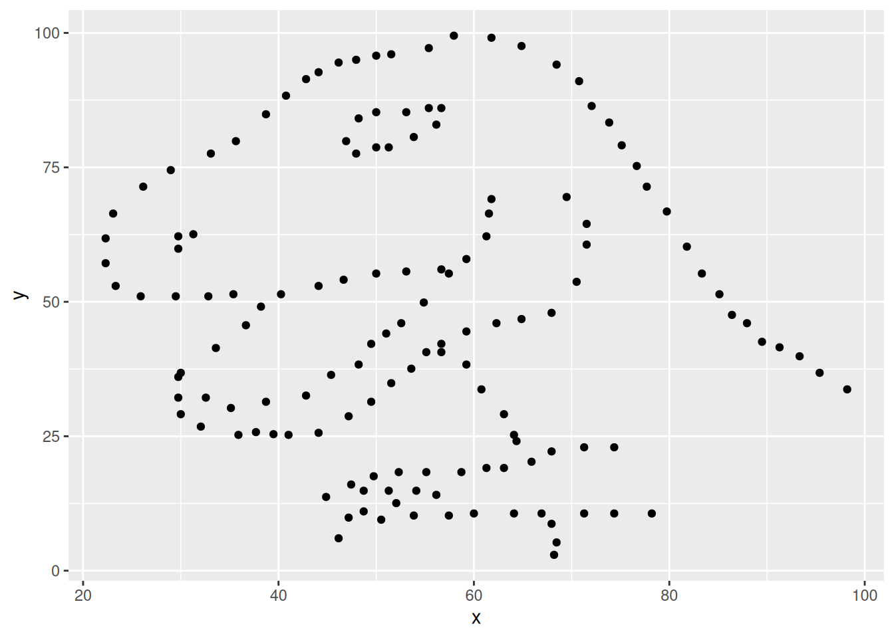

z# Zdravo R! {#lab01execercise}


The 2nd part of the lab is called **Zdravo R**. Zdravo is the Slovenian word for "hello". This is the second half of the Hellow R lab. You should have just finished the first part of the lab (**Aloha R**), which was focused on getting you set up with R and RStudio. This part of the lab is focused on actually using R to do some data analysis.


## Packages  {-}

In this lab, we will work with two packages: **datasauRus** and **tidyverse**. **datasauRus** contains the dataset we'll be using; **tidyverse** is a collection of packages for doing data analysis in a "tidy" way.

Install these packages by running the following commands in the console.


``` r
install.packages("tidyverse")
install.packages("datasauRus")
```

Now that the necessary packages are installed, you should be able to Knit your document and see the results.

If you'd like to run your code in the Console as well you'll also need to load the packages there. To do so, run the following in the console.


``` r
library(tidyverse)
library(datasauRus)
```

Note that the packages are also loaded with the same commands in your R Markdown document.

## Data  {-}

> Fun fact: If it's confusing that the data frame is called `datasaurus_dozen` when it contains 13 datasets, you're not alone! Have you heard of a [baker's dozen](https://en.wikipedia.org/wiki/Dozen#Baker's_dozen)?

The data frame we will be working with today is called `datasaurus_dozen` and it's in the `datasauRus` package.
Actually, this single data frame contains 13 datasets, designed to show us why data visualization is important and how summary statistics alone can be misleading.
The different datasets are marked by the `dataset` variable.

To find out more about the dataset, type the following in your Console: `?datasaurus_dozen`.
A question mark (or two, depending on the version) before the name of an object will always bring up its help file.
This command must be run in the Console.

## Exercises  {-}

1. Based on the help file, how many rows and how many columns does the `datasaurus_dozen` file have? What are the variables included in the data frame? Add your responses to your lab report.

Let's take a look at what these datasets are. To do so we can make a *frequency table* of the dataset variable:


``` r
data("datasaurus_dozen")

datasaurus_dozen %>%
  count(dataset) %>%
  print()
#> # A tibble: 13 × 2
#>    dataset        n
#>    <chr>      <int>
#>  1 away         142
#>  2 bullseye     142
#>  3 circle       142
#>  4 dino         142
#>  5 dots         142
#>  6 h_lines      142
#>  7 high_lines   142
#>  8 slant_down   142
#>  9 slant_up     142
#> 10 star         142
#> 11 v_lines      142
#> 12 wide_lines   142
#> 13 x_shape      142
```

> Fun fact: Matejka, Justin, and George Fitzmaurice. "Same stats, different graphs: Generating datasets with varied appearance and identical statistics through simulated annealing." Proceedings of the 2017 CHI Conference on Human Factors in Computing Systems. ACM, 2017.

The original Datasaurus (`dino`) was created by Alberto Cairo in [this great blog post](http://www.thefunctionalart.com/2016/08/download-datasaurus-never-trust-summary.html).
The other Dozen were generated using simulated annealing and the process is described in the paper *Same Stats, Different Graphs: Generating Datasets with Varied Appearance and Identical Statistics* through Simulated Annealing by Justin Matejka and George Fitzmaurice.
In the paper, the authors simulate a variety of datasets that have the same summary statistics as the Datasaurus but have very different distributions.

🧶 ✅ ⬆️ *Knit, commit, and push your changes to GitHub with the commit message "Added answer for Ex 1". Make sure to commit and push all changed files so that your Git pane is cleared up afterwards.*

2. Plot `y` vs. `x` for the `dino` dataset. Then, calculate the correlation coefficient between `x` and `y` for this dataset.

Below is the code you will need to complete this exercise.

Basically, the answer is already given, but you need to include relevant bits in your Rmd document and successfully knit it and view the results.

Start with the `datasaurus_dozen` and pipe it into the `filter` function to filter for observations where `dataset == "dino"`. Store the resulting filtered data frame as a new data frame called `dino_data`.


``` r
dino_data <- datasaurus_dozen %>%
  filter(dataset == "dino")
```

Because a lot going on here -- let's slow down and unpack it a bit.

First, the pipe operator: `%>%`, takes what comes before it and sends it as the first argument to what comes after it.
So here, we're saying `filter` the `datasaurus_dozen` data frame for observations where `dataset == "dino"`.

Second, the assignment operator: `<-`, assigns the name `dino_data` to the filtered data frame.

Next, we need to visualize these data.
We will use the `ggplot` function for this. Its first argument is the data you're visualizing.
Next we define the `aes`thetic mappings.
In other words, the columns of the data that get mapped to certain aesthetic features of the plot, e.g. the `x` axis will represent the variable called `x` and the `y` axis will represent the variable called `y`.
Then, we add another layer to this plot where we define which `geom`etric shapes we want to use to represent each observation in the data.
In this case, we want these to be points, hence `geom_point`.


``` r
ggplot(data = dino_data, mapping = aes(x = x, y = y)) +
  geom_point()
```



If this seems like a lot, it is.

You will learn about the philosophy of layering data visualizations in the next module.
For now, follow along with the code that is provided.

For the second part of these exercises, we need to calculate a summary statistic: the correlation coefficient.

> Recall: Correlation coefficient, often referred to as $r$ in statistics, measures the linear association between two variables.

You will see that some of the pairs of variables we plot do not have a linear relationship between them.
This nonlinear relationships are exactly why we want to visualize first: visualize to assess the form of the relationship, and calculate $r$ only if relevant.
In this case, calculating a correlation coefficient really doesn't make sense since the relationship between `x` and `y` is definitely not linear -- it's dinosaurial!

But, for illustrative purposes, let's calculate the correlation coefficient between `x` and `y`.

> Tip: Start with `dino_data` and calculate a summary statistic that we will call `r` as the `cor`relation between `x` and `y`.


``` r
dino_data %>%
  summarize(r = cor(x, y))
#> # A tibble: 1 × 1
#>         r
#>     <dbl>
#> 1 -0.0645
```

🧶 ✅ ⬆️ *Knit, commit, and push your changes to GitHub with the commit message "Added answer for Ex 2". Make sure to commit and push all changed files so that your Git pane is cleared up afterwards.*

3. Plot `y` vs. `x` for the `star` dataset. You can (and should) reuse code we introduced above, just replace the dataset name with the desired dataset. Then, calculate the correlation coefficient between `x` and `y` for this dataset. How does this value compare to the `r` of `dino`?


``` r
# code goes here
```

🧶 ✅ ⬆️ *This is another good place to pause, knit, commit changes with the commit message "Added answer for Ex 3", and push. Make sure to commit and push all changed files so that your Git pane is cleared up afterwards.*

4. Plot `y` vs. `x` for the `circle` dataset. You can (and should) reuse code we introduced above, just replace the dataset name with the desired dataset. Then, calculate the correlation coefficient between `x` and `y` for this dataset. How does this value compare to the `r` of `dino`?

🧶 ✅ ⬆️ *You should pause again, commit changes with the commit message "Added answer for Ex 4", and push. Make sure to commit and push all changed files so that your Git pane is cleared up afterwards.*

5. Finally, let's plot all datasets at once. In order to do this, we will make use of faceting.

> Hint: Facet by the dataset variable, placing the plots in a 3 column grid.


``` r
ggplot(datasaurus_dozen, aes(x = x, y = y, color = dataset)) +
  geom_point() +
  facet_wrap(~dataset, ncol = 3) +
  theme(legend.position = "none")
```

And we can use the `group_by` function to generate all the summary correlation coefficients.


``` r
datasaurus_dozen %>%
  group_by(dataset) %>%
  summarize(r = cor(x, y)) %>%
  print(13)
```

You're done with the data analysis exercises, but I'd like you to do two more things:


* **Resize your figures:**

Click on the gear icon near the top of the R Markdown document, and select "Output Options..." in the dropdown menu.
In the pop up dialog box, go to the Figures tab and change the height and width of the figures, and hit OK when done.
Then, knit your document and see how you like the new sizes.
Change and knit again and again until you're happy with the figure sizes.
Note that these values get saved in the YAML.


You can also use different figure sizes for different figures.
To do so, click on the gear icon within the chunk where you want to make a change.
Changing the figure sizes added new options to these chunks: `fig.width` and `fig.height`.
You can change them by defining different values directly in your R Markdown document as well.


* **Change the look of your report:**

Once again, click on the gear icon in on top of the R Markdown document, and select "Output Options..." in the dropdown menu.
In the General tab of the pop up dialog box, try out different Syntax highlighting and theme options.
Hit OK and knit your document to see how it looks. Play around with these until you're happy with the look.

<!-- markdownlint-disable -->
<br>
<!-- markdownlint-restore -->

> Pro Tip: Not sure how to use emojis on your computer? Maybe a teammate can help?

🧶 ✅ ⬆️ *Yay, you're done! Commit all remaining changes, use the commit message "Done with Lab 1!* 💪*", and push. Make sure to commit and push all changed files so that your Git pane is cleared up afterwards. Before you wrap up the assignment, make sure all documents are updated on your GitHub repo.*


<!--DS4P Links-->
[course_web]: https://datascience4psych.github.io/DataScience4Psych
[course_git]: https://github.com/DataScience4Psych/DataScience4Psych
[course_repo]: https://github.com/DataScience4Psych
[course_slides]: https://github.com/DataScience4Psych/slides
[course_syllabus]: https://smasongarrison.github.io/syllabi/ 
<!-- https://smasongarrison.github.io/syllabi/data-science.html -->
[syllabi]: https://smasongarrison.github.io/syllabi
[pl_00]: https://www.youtube.com/playlist?list=PLKrrdtYgOUYaEAnJX20Ryy4OSie375rVY
[pl_01]: https://www.youtube.com/playlist?list=PLKrrdtYgOUYao_7t5ycK4KDXNKaY-ECup
[pl_02]: https://www.youtube.com/playlist?list=PLKrrdtYgOUYZmr_T3PnuxjVIlj0C0kUNI
[pl_03]: https://www.youtube.com/playlist?list=PLKrrdtYgOUYaHmjzdRvfg0yhOIYQnfjwE
[pl_04]: https://www.youtube.com/playlist?list=PLKrrdtYgOUYYWFcel6_vp8__RUKLxhX4y
[pl_05]: https://www.youtube.com/playlist?list=PLKrrdtYgOUYYMIguiV1F8RagMYibTY4iW
[pl_06]: https://www.youtube.com/playlist?list=PLKrrdtYgOUYYV_KDod3Mk9-RmtFXii9Dv
[pl_07]: https://www.youtube.com/watch?list=PLKrrdtYgOUYZxvEvQ8-PcWrOY_dwY_ETI
[pl_08]: https://www.youtube.com/playlist?list=PLKrrdtYgOUYZgOzYB_dmauw55M7jXvsdo
[pl_09]: https://www.youtube.com/playlist?list=PLKrrdtYgOUYbaiTmldRY2ddsLrHp3z6yO
[pl_10]: https://www.youtube.com/playlist?list=PLKrrdtYgOUYbPw5iYzYEzoOKa7mJKNIhq
[pl_11]: https://www.youtube.com/playlist?list=PLKrrdtYgOUYZ-u6LzBbanrNFoeLHKaLL6
[pl_12]: https://www.youtube.com/playlist?list=PLKrrdtYgOUYbwRS-9Htmb80_t1NG-021e
[pl_13]: https://www.youtube.com/playlist?list=PLKrrdtYgOUYbWGmSnbLIYwdLOnGm6une6
[pl_14]: https://www.youtube.com/playlist?list=PLKrrdtYgOUYbWGmSnbLIYwdLOnGm6une6
[pl_15]: https://www.youtube.com/playlist?list=PLKrrdtYgOUYa5MoYrV8EsWQ5jIr5ZYMpM
[pl_all]: https://www.youtube.com/playlist?list=PLKrrdtYgOUYZomNqf-1dtCDW94ySdLv-9


<!--AE Links-->
[ae01a_unvotes]: https://github.com/DataScience4Psych/ae01a_unvotes
[ae01b_covid]: https://github.com/DataScience4Psych/ae01b_covid
[ae02_bechdel]: https://github.com/DataScience4Psych/ae-02-bechdel-rmarkdown
[ae03_starwars]: https://github.com/DataScience4Psych/ae-03-starwars-dataviz
[ae08_imdb]: https://github.com/DataScience4Psych/ae-08-imdb-webscraping

<!-- Lab Links-->

[lab01_hello]: https://github.com/DataScience4Psych/lab-01-hello-r
[lab02]: https://github.com/DataScience4Psych/lab-02-plastic-waste
[lab03]: https://github.com/DataScience4Psych/lab-03-nobel-laureates
[lab04]: https://github.com/DataScience4Psych/lab-04-viz-sp-data
[lab05]: https://github.com/DataScience4Psych/lab-05-wrangle-sp-data
[lab06]: https://github.com/DataScience4Psych/lab_06_sad_plots
[lab07]: https://github.com/DataScience4Psych/lab_07_betterviz
[lab08]: https://github.com/DataScience4Psych/lab-08-uoe-art
[lab09]: https://github.com/DataScience4Psych/lab-09-ethics-algorithmic-bias
[lab10]: https://github.com/DataScience4Psych/lab-10-slr-course-evals
[lab11]: https://github.com/DataScience4Psych/lab-11-mlr-course-evals
[lab12]: https://github.com/DataScience4Psych/lab-12-inference-smoking
[lab13]: https://github.com/DataScience4Psych/lab-13-simulating-mars

<!--Slides-->
[d01_welcome]: https://datascience4psych.github.io/slides/d01_welcome/d01_welcome.html
[d02_toolkit]: https://datascience4psych.github.io/slides/d02_toolkit/d02_toolkit.html
[d03_dataviz]: https://datascience4psych.github.io/slides/d03_dataviz/d03_dataviz.html
[d04_ggplot2]: https://datascience4psych.github.io/slides/d04_ggplot2/d04_ggplot2.html
[d05_viznum]: https://datascience4psych.github.io/slides/d05_viznum/d05_viznum.html
[d06_vizcat]: https://datascience4psych.github.io/slides/d06_vizcat/d06_vizcat.html
[d07_tidy]: https://datascience4psych.github.io/slides/d07_tidy/d07_tidy.html
[d08_grammar]: https://datascience4psych.github.io/slides/d08_grammar/d08_grammar.html
[d09_wrangle]: https://datascience4psych.github.io/slides/d09_wrangle/d09_wrangle.html
[d10_dfs]: https://datascience4psych.github.io/slides/d10_dfs/d10_dfs.html
[d11_types]: https://datascience4psych.github.io/slides/d11_types/d11_types.html
[d12_import]: https://datascience4psych.github.io/slides/d12_import/d12_import.html
[d13_goodviz]: https://datascience4psych.github.io/slides/d13_goodviz/d13_goodviz.html
[d13b_moreggplot]: https://datascience4psych.github.io/slides/d13_goodviz/d13b_moreggplot.html
[d14_confound]: https://datascience4psych.github.io/slides/d14_confound/d14_confound.html
[d15_goodtalk]: https://datascience4psych.github.io/slides/d15_goodtalk/d15_goodtalk.html
[d16_webscraping]: https://datascience4psych.github.io/slides/d16_webscraping/d16_webscraping.html
[d17_functions]: https://datascience4psych.github.io/slides/d17_functions/d17_functions.html
[d18_ethics]: https://datascience4psych.github.io/slides/d18_ethics/d18_ethics.html
[d19_bias]: https://datascience4psych.github.io/slides/d19_bias/d19_bias.html
[d20_language]: https://datascience4psych.github.io/slides/d20_language/d20_language.html
[d21_fitting]: https://datascience4psych.github.io/slides/d21_fitting/d21_fitting.html
[d22_nonlinear]: https://datascience4psych.github.io/slides/d22_nonlinear/d22_nonlinear.html
[d23_multiple]: https://datascience4psych.github.io/slides/d23_multiple/d23_multiple.html
[d24_overfitting]: https://datascience4psych.github.io/slides/d24_overfitting/d24_overfitting.html
[d25_crossvalidation]: https://datascience4psych.github.io/slides/d25_crossvalidation/d25_crossvalidation.html
[d26_quantify]: https://datascience4psych.github.io/slides/d26_quantify/d26_quantify.html
[d27_bootstrap]: https://datascience4psych.github.io/slides/d27_bootstrap/d27_bootstrap.html
[d28_interactive]: https://datascience4psych.github.io/slides/d28_interactive/d28_interactive.html
[d29_machine]: https://datascience4psych.github.io/slides/d29_machinelearning/d29_machine.html
[d30_simulations]: https://datascience4psych.github.io/slides/d30_simulations/d30_simulations.html
[d31_llmintro]: https://datascience4psych.github.io/slides/d31_llmintro/d31_llmintro.html
[d32_llmapplications]: https://datascience4psych.github.io/slides/d32_llmapplications/d32_llmapplications.html

<!--externals-->

[stat545]: https://stat545.com
[r4ds]: https://r4ds.had.co.nz
[cran]: https://cloud.r-project.org


<details> 
  <summary>Click this text for Bonus Tips by Yoo Ri</summary>
  Here are some helpful tips 😁

  * filter() is for extracting rows
  * group_by() is for grouping datasets by assigned column
  * ungroup() cancels the grouping
  * summarize()  is often used with group_by(). This function can print the output according to group_by().
  * facet_grid(y~x,...) creates a grid with variable y as a row, variable x as a column  
  * facet_wrap(x,... ) is useful when there is only one variable
</details> 
