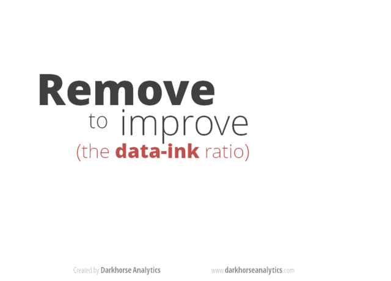

# Do's and don'ts of making effective graphics {#effective-graphs}

<!--Original content: https://stat545.com/block015_graph-dos-donts.html-->

<!--JB:
*In 2015, this was mercifully replaced by a [guest lecture from UBC colleague Tamara Munzner](http://stat545-ubc.github.io/cm014_viz-design-munzner.html). The content below would be better with links to specific figures from Naomi Robbins' book, but the Shiny app does not make that possible. Or perhaps I should just embed my versions of them.*
-->

## Goal: create more effective graphs

According to Naomi Robbins, effective graphs "improve understanding of data". They do not confuse or mislead.

To paraphrase: Most of us use a computer to write but we would never characterize a Nobel prize winning writer as being highly skilled with Microsoft Word. Similarly, advanced ggplot2 skills won't necessarily lead to effective communication of numerical data. You have to master the __principles of effective graphs__ in addition to the mechanics.

> One graph is more effective than another if its quantitative information can be decoded more quickly or more easily by most observers.

When I'm lost in data and struggling to make a figure, I repeat this mantra distilled from Gelman, et al. [-@gelman2002]:

* Facilitate comparisons
* Reveal trends

*CMEG = Naomi Robbins' book ["Creating More Effective Graphs"][robbins-effective-graphs] [-@robbins2012]; visual catalog of figures via the [R Graph Catalog][r-graph-catalog-github]*

## No no's

### Pie charts

The [most loathed graph of all][google-pie-charts] and yet surprisingly common. Give your average person a bunch of numbers that add up to one and they want to make a pie chart. Why? My hypothesis is it goes back to all the pies and pizzas referenced when kids learn to work with fractions.

Why do the pros hate pie charts? They are awful because they encode quantitative information in angles and areas, which are very hard for humans to judge. Skeptical? Read on.

Examples from CMEG and the [R Graph Catalog][r-graph-catalog-github]:

* Try to place the wedges in order from largest to smallest based on the pie chart in Fig 1.1. Now do same using the dot plot in Fig 1.2. Which figure made this task easier? Which presentation of this data improves your understanding of the data? Reflect on the same info presented as a table, Fig 1.3.
* Try to decode the data from the pie chart in Fig 2.2. Now do the same using the dot plot in Fig 2.3.
  
We are best able to make comparisons via position of objects along a common scale, which is why these simple dot plots are so much more effective than the pie charts.

### More pie charts

Tufte, as quoted by Robbins: "the only worse design than a pie chart is several of them."

* "Problem 2: pie charts are worse at showing trends" from [Three reasons that pie charts suck][why-pie-charts-suck] shows a series of 3 pie charts versus a line chart.
* Rob Hyndman nominated a 3 pie chart series as [the worst figure][worst-figure], which has the added horror of cross-hatching. Sorry, no before and after here.

### Stacked and group bar charts

The average person, if told they should not make a pie chart, might then take that bunch of numbers for different categories and make a stacked bar chart. Especially if they have a a series of such numbers. But this is also a very difficult graph to decode.

* Fig 8.11 from CMEG (not in the Catalog) presents a series of 4 pie charts, showing various nations' share of world car production from 1977 to 1980. The same data is presented as a stacked bar chart in Fig 8.12. How easy is it to figure out which countries are gaining and losing share? Now take a look at the faceted line chart in Fig 8.13. BOOM!
  
Stacked bar charts are difficult to decode because we need a common baseline to judge changes in length. So the trend for the category on the "ground floor" is easy to see but trends for those stuck in the middle are hard to see.

* Fig 5.1 shows petroleum stocks held by various countries over time as a stacked bar chart. Again it's easy to see the trend for the US, which sits on the "ground floor," but who knows what's going on with other countries. Fig 5.2 and 5.3 show alternative presentations that are much more effective.

Grouped bar charts also make it hard to see trends.

* Fig 8.1 shows high, average, and low prices for gold over time as a stacked bar chart. The same info is presented differently in Fig 8.2, to much better effect.
  
Grouped bar charts are difficult because it's hard to make comparisons between things that aren't adjacent or at least very near each other.

### Self-contradiction

When your text (especially the caption!) and the figure contradict each other, it undermines the reader's trust in everything you present. You can dramatically reduce your ability to shoot yourself in the foot this way by using an integrated reporting approach, such as R Markdown. If figures are made from live R code in chunks and numbers are inserted via live inline R code, the two cannot diverge.

Barring that, my advice is to proofread like a maniac.

### Using Microsoft Excel to obscure your data and annoy your readers

We will look through this section (slides 1 - 36) of Karl Broman's excellent talk How to Display Data Badly (see [Resources](#effective-graphs-resources) for links).

## Do: make the data stand out

This animation created by Darkhorse Analytics illustrates how communication can be greatly enhanced by eliminating clutter and de-emphasizing supporting elements. Every aspect of a figure should be there on a "need to have it" basis.

(\#fig:unnamed-chunk-2)From  [Data Looks Better Naked](https://www.darkhorseanalytics.com/blog/data-looks-better-naked) by Darkhorse Analytics

In CMEG, Figs 6.2 vs 6.3 make much the same point, i.e. stripping the figure way down is a huge improvement. Figs 5.4 and 5.5 are both decent graphs but using dots (Fig 5.5) instead of bars (Fig 5.4) improves the data\:ink ratio.

## Do: spare your reader from mental gymnastics

If you're going to talk about the difference between this and that, then please go ahead a plot the difference between this and that! Sure, it might be nice to plot this and that, on their own, but don't stop there. *You've got a computer. And software.* Use them to do annoying arithmetic for your reader.

* Figs 2.14 and 2.15 show imports to England and exports from England from long ago. But if you are interested in the balance of trade, imports - exports, then plot that! It's very hard to do this well in your head.
* Fig 2.16 show the function $y = \frac{1}{x^2}$ and the same function shifted vertically by a constant. But the figure is incredibly deceptive, underscoring how bad we are at taking differences.
* Figs 8.3, 8.4, 8.5, 8.6 show the time taken for subjects to do annoying things, like set the clock on their VCR, with two different sets of instructions. The original graph spread this out over 10 small bar charts, but the next 3 graphs present more direct looks at the improvement offered by revised instructions.

## Do: use position along a common scale

We are best able to make comparisons if items are positioned along a common scale. Design your graphs to take advantage of this.

We have a harder time with area, volume, length of non-adjacent things, length without a common baseline, angle, color, and shape.

* Fig 2.18 shows a poorly ordered bubble plot that depicts population of various cities. It's really hard to order the cities by population, until you look at the clean dot plot in Fig 2.19.
* Figs 6.24 and 6.25 encode numbers in the area of rectangles and triangles, respectively, when a simple bar chart or dotplot would have been better.  

## Do: take control of aspect ratio

We can see differences in angles when they're around 45 degrees. But as they get steeper, our ability to compare goes down quickly. You control the angles of line segments in your graphs by controlling the *aspect ratio*. Pick the ratio so that the "average line segment" is around 45 degrees, a.k.a. banking to 45.

* Fig 7.1 shows how a proper aspect ratio makes it easier to see that the sunspot data rises much faster than it falls.

## Do: think about including zero

There is no global rule about whether axis limits must be chosen to include zero. It depends.

Robbins proposes you always include it in bar charts, but use your judgement with, e.g., line charts or dot plots.

Figs 7.3, 7.4, and 7.5 explore the inclusion of zero.

## Do: choose the scale with intention

Logarithmically transformed scales are useful when:

* It makes sense to think of changes on a multiplicative scale, instead of additive.
    - example: gene expression ratios are naturally viewed on the log 2 scale, where 0 represents a ratio of 1 and equal expression and -1 and 1 represent ratios of 1/2 and 2, respectively
* The data are skewed

Figs 7.7 and 7.8 show a skewed dataset before and after log transformation. We are also used to logging the `gdpPercap` variable in the Gapminder data, for the same reasons.

How about presenting two scales for the same axis?

* It is OK to present tick marks in different "units," i.e. temperature in Fahrenheit vs. Celsius (Fig 7.16) or GDP per capita in raw dollars versus on the log 10 scale. However, this is not easy to do in ggplot2!
* It is NOT OK to present two entirely different scales, just so you can squeeze two different variables onto the same plot.
  - Figs 7.17 and 7.18 explore how deceptive this can be.
* Even if variables are technically reported in the same units, it might make a better graph to use facets and choose axis limits accordingly.
  - Figs 7.19 and 7.21 show the importance of faceting when looking at levels of blood lipids.

## Do: connect the dots with care

Consider two quantitative variables, where the x-axis is time or something similar. There are many legitimate ways to present such data. In ggplot2 jargon, there are many relevant geoms.

* Fig 4.17 shows a single time series presented 4 different ways, each serving a different purpose.
* Fig 4.21 presents another line graph, showing used car price against mileage of car. Connecting these dots allows buyers and sellers to determine fair value, even if a specific car's mileage is not in the dataset.

Beware connecting the dots when the x axis represents an unordered categorical variable.

* Figs 4.22, 4.23, and 4.24 depict mountain heights for different continents. The connecting line can be misleading here. What it the graph were targeted at an audience that speaks a different language? Even alphabetical is not a well-defined ordering. Unless sorting on size, best to avoid connecting these dots (and even then one must be careful).

## Do: convey groups clearly

Consider two quantitative variables, plus a third categorical variable. How to encode the factor?

If superposing, you have shape, filled-ness, and color at your disposal.

* Figs 6.6 and 6.7 explore using these singly or, often better, in combination.

It is often better to avoid superposition and, instead, to put the groups into different facets.

* Fig 6.8 revisits the data from Figs 6.6 and 6.7, but using faceting. Gridlines can be very helpful to facilitate comparisons across facets.
* Figs 6.9 and 6.10 make this point for line charts.

### A tour of the Do's

We will look through another section (slides 48 - 62) of Karl Broman's excellent talk How to Display Data Badly (see [Resources](#effective-graphs-resources) for links).

## Resources {#effective-graphs-resources}

["Creating More Effective Graphs"][robbins-effective-graphs] by [Naomi Robbins][naomi-robbins] [-@robbins2012].   

The [R Graph Catalog][r-graph-catalog-github] presents the figures from ["Creating More Effective Graphs"][robbins-effective-graphs] as a visual quilt. Click on a figure to see the ggplot2 code that makes it.

Karl Broman's talk "How to display data badly"  

* Home on GitHub: https://github.com/kbroman/Talk_Graphs  
* The version I showed is the [combined PDF from the iowastate2013 branch](https://www.biostat.wisc.edu/~kbroman/presentations/IowaState2013/graphs_combined.pdf)     
  
[ggplot2][ggplot2-web] written by [Hadley Wickham][hadley-github-index].  

[Winston Chang's][winston-chang-github] book ["R Graphics Cookbook"][r-graphics-cookbook] [-@chang2013] and the [Graphs section][cookbook-for-r-graphs] of his [Cookbook for R website][cookbook-for-r].  

Chapter \@ref(ggplot2-tutorial) - my [ggplot2 tutorial][ggplot2-tutorial].

Gelman et al.'s ["Let's Practice What We Preach"](https://www.jstor.org/stable/3087382?seq=1#page_scan_tab_contents) in The American Statistician [-@gelman2002].

<!--JB:
### Distribution one quantitative variable

stripplot (+ summary stats, jittering) Fig 4.1, 4.8
histogram Fig 4.6
densityplot
boxplot
combinations of the above

### Two quantitative variables

scatterplot + regression line / smooth
high volume scatterplots
-->

[cran]: https://cloud.r-project.org
[cran-faq]: https://cran.r-project.org/faqs.html
[cran-R-admin]: http://cran.r-project.org/doc/manuals/R-admin.html
[cran-add-ons]: https://cran.r-project.org/doc/manuals/R-admin.html#Add_002don-packages
[r-proj]: https://www.r-project.org
[stat-545]: https://stat545.com
[software-carpentry]: https://software-carpentry.org
[cran-r-extensions]: https://cran.r-project.org/doc/manuals/r-release/R-exts.html

<!--RStudio Links-->
[rstudio-preview]: https://www.rstudio.com/products/rstudio/download/preview/
[rstudio-official]: https://www.rstudio.com/products/rstudio/#Desktop
[rstudio-workbench]: https://www.rstudio.com/wp-content/uploads/2014/04/rstudio-workbench.png
[rstudio-support]: https://support.rstudio.com/hc/en-us
[rstudio-R-help]: https://support.rstudio.com/hc/en-us/articles/200552336-Getting-Help-with-R
[rstudio-customizing]: https://support.rstudio.com/hc/en-us/articles/200549016-Customizing-RStudio
[rstudio-key-shortcuts]: https://support.rstudio.com/hc/en-us/articles/200711853-Keyboard-Shortcuts
[rstudio-command-history]: https://support.rstudio.com/hc/en-us/articles/200526217-Command-History
[rstudio-using-projects]: https://support.rstudio.com/hc/en-us/articles/200526207-Using-Projects
[rstudio-code-snippets]: https://support.rstudio.com/hc/en-us/articles/204463668-Code-Snippets
[rstudio-dplyr-cheatsheet-download]: https://github.com/rstudio/cheatsheets/raw/master/data-transformation.pdf
[rstudio-regex-cheatsheet]: https://www.rstudio.com/wp-content/uploads/2016/09/RegExCheatsheet.pdf
[rstudio-devtools]: https://www.rstudio.com/products/rpackages/devtools/

<!--HappyGitWithR Links-->
[happy-git]: https://happygitwithr.com
[hg-install-git]: https://happygitwithr.com/install-git.html
[hg-git-client]: https://happygitwithr.com/git-client.html
[hg-github-account]: https://happygitwithr.com/github-acct.html
[hg-install-r-rstudio]: https://happygitwithr.com/install-r-rstudio.html
[hg-connect-intro]: https://happygitwithr.com/connect-intro.html
[hg-browsability]: https://happygitwithr.com/workflows-browsability.html
[hg-shell]: https://happygitwithr.com/shell.html

<!--Package Links-->
[rmarkdown]: https://rmarkdown.rstudio.com
[knitr-faq]: https://yihui.name/knitr/faq/

[tidyverse-main-page]: https://www.tidyverse.org
[tidyverse-web]: https://tidyverse.tidyverse.org
[tidyverse-github]: https://github.com/hadley/tidyverse

[dplyr-web]: https://dplyr.tidyverse.org
[dplyr-cran]: https://CRAN.R-project.org/package=dplyr
[dplyr-github]: https://github.com/hadley/dplyr
[dplyr-vignette-intro]: https://cran.r-project.org/web/packages/dplyr/vignettes/dplyr.html
[dplyr-vignette-window-fxns]: https://cran.r-project.org/web/packages/dplyr/vignettes/window-functions.html
[dplyr-vignette-two-table]: https://dplyr.tidyverse.org/articles/two-table.html

[lubridate-web]: https://lubridate.tidyverse.org
[lubridate-cran]: https://CRAN.R-project.org/package=lubridate
[lubridate-github]: https://github.com/tidyverse/lubridate
[lubridate-vignette]: https://cran.r-project.org/web/packages/lubridate/vignettes/lubridate.html

[tidyr-web]: https://tidyr.tidyverse.org
[tidyr-cran]: https://CRAN.R-project.org/package=tidyr 

[readr-web]: https://readr.tidyverse.org
[readr-vignette-intro]: https://cran.r-project.org/web/packages/readr/vignettes/readr.html

[stringr-web]: https://stringr.tidyverse.org
[stringr-cran]: https://CRAN.R-project.org/package=stringr

[ggplot2-web]: https://ggplot2.tidyverse.org
[ggplot2-tutorial]: https://github.com/jennybc/ggplot2-tutorial
[ggplot2-reference]: https://docs.ggplot2.org/current/
[ggplot2-cran]: https://CRAN.R-project.org/package=ggplot2
[ggplot2-github]: https://github.com/tidyverse/ggplot2
[ggplot2-theme-args]: https://ggplot2.tidyverse.org/reference/ggtheme.html#arguments

[gapminder-web]: https://www.gapminder.org
[gapminder-cran]: https://CRAN.R-project.org/package=gapminder

[assertthat-cran]: https://CRAN.R-project.org/package=assertthat
[assertthat-github]: https://github.com/hadley/assertthat

[ensurer-cran]: https://CRAN.R-project.org/package=ensurer
[ensurer-github]: https://github.com/smbache/ensurer

[assertr-cran]: https://CRAN.R-project.org/package=assertr
[assertr-github]: https://github.com/ropensci/assertr

[assertive-cran]: https://CRAN.R-project.org/package=assertive
[assertive-bitbucket]: https://bitbucket.org/richierocks/assertive/src/master/

[testthat-cran]: https://CRAN.R-project.org/package=testthat
[testthat-github]: https://github.com/r-lib/testthat
[testthat-web]: https://testthat.r-lib.org

[viridis-cran]: https://CRAN.R-project.org/package=viridis
[viridis-github]: https://github.com/sjmgarnier/viridis
[viridis-vignette]: https://cran.r-project.org/web/packages/viridis/vignettes/intro-to-viridis.html

[colorspace-cran]: https://CRAN.R-project.org/package=colorspace
[colorspace-vignette]: https://cran.r-project.org/web/packages/colorspace/vignettes/hcl-colors.pdf

[cowplot-cran]: https://CRAN.R-project.org/package=cowplot
[cowplot-github]: https://github.com/wilkelab/cowplot
[cowplot-vignette]: https://cran.r-project.org/web/packages/cowplot/vignettes/introduction.html

[devtools-cran]: https://CRAN.R-project.org/package=devtools
[devtools-github]: https://github.com/r-lib/devtools
[devtools-web]: https://devtools.r-lib.org
[devtools-cheatsheet]: https://www.rstudio.com/wp-content/uploads/2015/03/devtools-cheatsheet.pdf
[devtools-cheatsheet-old]: https://rawgit.com/rstudio/cheatsheets/master/package-development.pdf
[devtools-1-6]: https://blog.rstudio.com/2014/10/02/devtools-1-6/
[devtools-1-8]: https://blog.rstudio.com/2015/05/11/devtools-1-9-0/
[devtools-1-9-1]: https://blog.rstudio.com/2015/09/13/devtools-1-9-1/

[googlesheets-cran]: https://CRAN.R-project.org/package=googlesheets
[googlesheets-github]: https://github.com/jennybc/googlesheets

[tidycensus-cran]: https://CRAN.R-project.org/package=tidycensus
[tidycensus-github]: https://github.com/walkerke/tidycensus
[tidycensus-web]: https://walkerke.github.io/tidycensus/index.html

[fs-web]: https://fs.r-lib.org/index.html
[fs-cran]: https://CRAN.R-project.org/package=fs
[fs-github]: https://github.com/r-lib/fs

[plumber-web]: https://www.rplumber.io
[plumber-docs]: https://www.rplumber.io/docs/
[plumber-github]: https://github.com/trestletech/plumber
[plumber-cran]: https://CRAN.R-project.org/package=plumber

[plyr-web]: http://plyr.had.co.nz

[magrittr-web]: https://magrittr.tidyverse.org
[forcats-web]: https://forcats.tidyverse.org
[glue-web]: https://glue.tidyverse.org
[stringi-cran]: https://CRAN.R-project.org/package=stringi
[rex-github]: https://github.com/kevinushey/rex
[rcolorbrewer-cran]: https://CRAN.R-project.org/package=RColorBrewer
[dichromat-cran]: https://CRAN.R-project.org/package=dichromat

[rdryad-web]: https://docs.ropensci.org/rdryad/
[rdryad-cran]: https://CRAN.R-project.org/package=rdryad
[rdryad-github]: https://github.com/ropensci/rdryad

[roxygen2-cran]: https://CRAN.R-project.org/package=roxygen2
[roxygen2-vignette]: https://cran.r-project.org/web/packages/roxygen2/vignettes/rd.html

[shinythemes-web]: https://rstudio.github.io/shinythemes/
[shinythemes-cran]: https://CRAN.R-project.org/package=shinythemes

[shinyjs-web]: https://deanattali.com/shinyjs/
[shinyjs-cran]: https://CRAN.R-project.org/package=shinyjs
[shinyjs-github]: https://github.com/daattali/shinyjs

[leaflet-web]: https://rstudio.github.io/leaflet/
[leaflet-cran]: https://CRAN.R-project.org/package=leaflet
[leaflet-github]: https://github.com/rstudio/leaflet

[ggvis-web]: https://ggvis.rstudio.com
[ggvis-cran]: https://CRAN.R-project.org/package=ggvis
 
[usethis-web]: https://usethis.r-lib.org
[usethis-cran]: https://CRAN.R-project.org/package=usethis
[usethis-github]: https://github.com/r-lib/usethis

[pkgdown-web]: https://pkgdown.r-lib.org
[gh-github]: https://github.com/r-lib/gh

[httr-web]: https://httr.r-lib.org
[httr-cran]: https://CRAN.R-project.org/package=httr
[httr-github]: https://github.com/r-lib/httr

[gistr-web]: https://docs.ropensci.org/gistr
[gistr-cran]: https://CRAN.R-project.org/package=gistr
[gistr-github]: https://github.com/ropensci/gistr

[rvest-web]: https://rvest.tidyverse.org
[rvest-cran]: https://CRAN.R-project.org/package=rvest
[rvest-github]: https://github.com/tidyverse/rvest

[xml2-web]: https://xml2.r-lib.org
[xml2-cran]: https://CRAN.R-project.org/package=xml2
[xml2-github]: https://github.com/r-lib/xml2

[jsonlite-paper]: https://arxiv.org/abs/1403.2805
[jsonlite-cran]: https://CRAN.R-project.org/package=jsonlite
[jsonlite-github]: https://github.com/jeroen/jsonlite

[readxl-web]: https://readxl.tidyverse.org
[readxl-github]: https://github.com/tidyverse/readxl
[readxl-cran]: https://CRAN.R-project.org/package=readxl

[janitor-web]: http://sfirke.github.io/janitor/
[janitor-cran]: https://CRAN.R-project.org/package=janitor
[janitor-github]: https://github.com/sfirke/janitor

[purrr-web]: https://purrr.tidyverse.org
[curl-cran]: https://CRAN.R-project.org/package=curl

<!--Shiny links-->
[shinydashboard-web]: https://rstudio.github.io/shinydashboard/
[shinydashboard-cran]: https://CRAN.R-project.org/package=shinydashboard
[shinydashboard-github]: https://github.com/rstudio/shinydashboard

[shiny-official-web]: https://shiny.rstudio.com
[shiny-official-tutorial]: https://shiny.rstudio.com/tutorial/
[shiny-cheatsheet]: https://shiny.rstudio.com/images/shiny-cheatsheet.pdf
[shiny-articles]: https://shiny.rstudio.com/articles/
[shiny-bookdown]: https://bookdown.org/yihui/rmarkdown/shiny-documents.html
[shiny-google-groups]: https://groups.google.com/forum/#!forum/shiny-discuss
[shiny-stack-overflow]: https://stackoverflow.com/questions/tagged/shiny
[shinyapps-web]: https://www.shinyapps.io
[shiny-server-setup]: https://deanattali.com/2015/05/09/setup-rstudio-shiny-server-digital-ocean/
[shiny-reactivity]: https://shiny.rstudio.com/articles/understanding-reactivity.html
[shiny-debugging]: https://shiny.rstudio.com/articles/debugging.html
[shiny-server]: https://www.rstudio.com/products/shiny/shiny-server/

<!--Publications--> 
[adv-r]: http://adv-r.had.co.nz
[adv-r-fxns]: http://adv-r.had.co.nz/Functions.html
[adv-r-dsl]: http://adv-r.had.co.nz/dsl.html
[adv-r-defensive-programming]: http://adv-r.had.co.nz/Exceptions-Debugging.html#defensive-programming
[adv-r-fxn-args]: http://adv-r.had.co.nz/Functions.html#function-arguments
[adv-r-return-values]: http://adv-r.had.co.nz/Functions.html#return-values
[adv-r-closures]: http://adv-r.had.co.nz/Functional-programming.html#closures

[r4ds]: https://r4ds.had.co.nz
[r4ds-transform]: https://r4ds.had.co.nz/transform.html
[r4ds-strings]: https://r4ds.had.co.nz/strings.html
[r4ds-readr-strings]: https://r4ds.had.co.nz/data-import.html#readr-strings
[r4ds-dates-times]: https://r4ds.had.co.nz/dates-and-times.html
[r4ds-data-import]: http://r4ds.had.co.nz/data-import.html
[r4ds-relational-data]: https://r4ds.had.co.nz/relational-data.html
[r4ds-pepper-shaker]: https://r4ds.had.co.nz/vectors.html#lists-of-condiments

[r-pkgs2]: https://r-pkgs.org/index.html
[r-pkgs2-whole-game]: https://r-pkgs.org/whole-game.html
[r-pkgs2-description]: https://r-pkgs.org/description.html
[r-pkgs2-man]: https://r-pkgs.org/man.htm
[r-pkgs2-tests]: https://r-pkgs.org/tests.html
[r-pkgs2-namespace]: https://r-pkgs.org/namespace.html
[r-pkgs2-vignettes]: https://r-pkgs.org/vignettes.html
[r-pkgs2-release]: https://r-pkgs.org/release.html
[r-pkgs2-r-code]: https://r-pkgs.org/r.html#r

[r-graphics-cookbook]: http://shop.oreilly.com/product/0636920023135.do

[cookbook-for-r]: http://www.cookbook-r.com 
[cookbook-for-r-graphs]: http://www.cookbook-r.com/Graphs/
[cookbook-for-r-multigraphs]: http://www.cookbook-r.com/Graphs/Multiple_graphs_on_one_page_(ggplot2)/

[elegant-graphics-springer]: https://www.springer.com/gp/book/9780387981413

[testthat-article]: https://journal.r-project.org/archive/2011-1/RJournal_2011-1_Wickham.pdf
[worry-about-color]: https://www.google.com/url?sa=t&rct=j&q=&esrc=s&source=web&cd=2&cad=rja&uact=8&ved=2ahUKEwi0xYqJ8JbjAhWNvp4KHViYDxsQFjABegQIABAC&url=https%3A%2F%2Fwww.researchgate.net%2Fprofile%2FAhmed_Elhattab2%2Fpost%2FPlease_suggest_some_good_3D_plot_tool_Software_for_surface_plot%2Fattachment%2F5c05ba35cfe4a7645506948e%2FAS%253A699894335557644%25401543879221725%2Fdownload%2FWhy%2BShould%2BEngineers%2Band%2BScientists%2BBe%2BWorried%2BAbout%2BColor_.pdf&usg=AOvVaw1qwjjGMd7h_z6TLUjzu7Nb
[escaping-rgbland-pdf]: https://eeecon.uibk.ac.at/~zeileis/papers/Zeileis+Hornik+Murrell-2009.pdf
[escaping-rgbland-doi]: https://doi.org/10.1016/j.csda.2008.11.033

<!--R Documentation-->
[rdocs-extremes]: https://rdrr.io/r/base/Extremes.html
[rdocs-range]: https://rdrr.io/r/base/range.html
[rdocs-quantile]: https://rdrr.io/r/stats/quantile.html
[rdocs-c]: https://rdrr.io/r/base/c.html
[rdocs-list]: https://rdrr.io/r/base/list.html
[rdocs-lm]: https://rdrr.io/r/stats/lm.html
[rdocs-coef]: https://rdrr.io/r/stats/coef.html
[rdocs-devices]: https://rdrr.io/r/grDevices/Devices.html
[rdocs-ggsave]: https://rdrr.io/cran/ggplot2/man/ggsave.html
[rdocs-dev]: https://rdrr.io/r/grDevices/dev.html

<!--Wikipedia Links-->
[wiki-snake-case]: https://en.wikipedia.org/wiki/Snake_case
[wiki-hello-world]: https://en.wikipedia.org/wiki/%22Hello,_world!%22_program
[wiki-janus]: https://en.wikipedia.org/wiki/Janus
[wiki-nesting-dolls]: https://en.wikipedia.org/wiki/Matryoshka_doll
[wiki-pure-fxns]: https://en.wikipedia.org/wiki/Pure_function
[wiki-camel-case]: https://en.wikipedia.org/wiki/Camel_case
[wiki-mojibake]: https://en.wikipedia.org/wiki/Mojibake
[wiki-row-col-major-order]: https://en.wikipedia.org/wiki/Row-_and_column-major_order
[wiki-boxplot]: https://en.wikipedia.org/wiki/Box_plot
[wiki-brewer]: https://en.wikipedia.org/wiki/Cynthia_Brewer
[wiki-vector-graphics]: https://en.wikipedia.org/wiki/Vector_graphics
[wiki-raster-graphics]: https://en.wikipedia.org/wiki/Raster_graphics
[wiki-dry]: https://en.wikipedia.org/wiki/Don%27t_repeat_yourself
[wiki-web-scraping]: https://en.wikipedia.org/wiki/Web_scraping
[wiki-xpath]: https://en.wikipedia.org/wiki/XPath
[wiki-css-selector]: https://en.wikipedia.org/wiki/Cascading_Style_Sheets#Selector

<!--Misc. Links-->
[split-apply-combine]: https://www.jstatsoft.org/article/view/v040i01
[useR-2014-dropbox]: https://www.dropbox.com/sh/i8qnluwmuieicxc/AAAgt9tIKoIm7WZKIyK25lh6a
[gh-pages]: https://pages.github.com
[html-preview]: http://htmlpreview.github.io
[tj-mahr-slides]: https://github.com/tjmahr/MadR_Pipelines
[dataschool-dplyr]: https://www.dataschool.io/dplyr-tutorial-for-faster-data-manipulation-in-r/
[xckd-randall-munroe]: https://fivethirtyeight.com/features/xkcd-randall-munroe-qanda-what-if/
[athena-zeus-forehead]: https://tinyurl.com/athenaforehead
[tidydata-lotr]: https://github.com/jennybc/lotr-tidy#readme
[minimal-make]: https://kbroman.org/minimal_make/
[write-data-tweet]: https://twitter.com/vsbuffalo/statuses/358699162679787521
[belt-and-suspenders]: https://www.wisegeek.com/what-does-it-mean-to-wear-belt-and-suspenders.htm
[research-workflow]: https://www.carlboettiger.info/2012/05/06/research-workflow.html
[yak-shaving]: https://seths.blog/2005/03/dont_shave_that/
[yaml-with-csv]: https://blog.datacite.org/using-yaml-frontmatter-with-csv/
[reproducible-examples]: https://stackoverflow.com/questions/5963269/how-to-make-a-great-r-reproducible-example
[blog-strings-as-factors]: https://notstatschat.tumblr.com/post/124987394001/stringsasfactors-sigh
[bio-strings-as-factors]: https://simplystatistics.org/2015/07/24/stringsasfactors-an-unauthorized-biography
[stackexchange-outage]: https://stackstatus.net/post/147710624694/outage-postmortem-july-20-2016
[email-regex]: https://emailregex.com
[fix-atom-bug]: https://davidvgalbraith.com/how-i-fixed-atom/
[icu-regex]: http://userguide.icu-project.org/strings/regexp
[regex101]: https://regex101.com
[regexr]: https://regexr.com
[utf8-debug]: http://www.i18nqa.com/debug/utf8-debug.html
[unicode-no-excuses]: https://www.joelonsoftware.com/2003/10/08/the-absolute-minimum-every-software-developer-absolutely-positively-must-know-about-unicode-and-character-sets-no-excuses/
[programmers-encoding]: http://kunststube.net/encoding/
[encoding-probs-ruby]: https://www.justinweiss.com/articles/3-steps-to-fix-encoding-problems-in-ruby/
[theyre-to-theyre]: https://www.justinweiss.com/articles/how-to-get-from-theyre-to-theyre/
[lubridate-ex1]: https://www.r-exercises.com/2016/08/15/dates-and-times-simple-and-easy-with-lubridate-part-1/
[lubridate-ex2]: https://www.r-exercises.com/2016/08/29/dates-and-times-simple-and-easy-with-lubridate-exercises-part-2/
[lubridate-ex3]: https://www.r-exercises.com/2016/10/04/dates-and-times-simple-and-easy-with-lubridate-exercises-part-3/
[google-sql-join]: https://www.google.com/search?q=sql+join&tbm=isch
[min-viable-product]: https://blog.fastmonkeys.com/?utm_content=bufferc2d6e&utm_medium=social&utm_source=twitter.com&utm_campaign=buffer
[telescope-rule]: http://c2.com/cgi/wiki?TelescopeRule
[unix-philosophy]: http://www.faqs.org/docs/artu/ch01s06.html
[twitter-wrathematics]: https://twitter.com/wrathematics
[robbins-effective-graphs]: https://www.amazon.com/Creating-Effective-Graphs-Naomi-Robbins/dp/0985911123
[r-graph-catalog-github]: https://github.com/jennybc/r-graph-catalog
[google-pie-charts]: https://www.google.com/search?q=pie+charts+suck
[why-pie-charts-suck]: https://www.richardhollins.com/blog/why-pie-charts-suck/
[worst-figure]: https://robjhyndman.com/hyndsight/worst-figure/
[naomi-robbins]: http://www.nbr-graphs.com
[hadley-github-index]: https://hadley.github.io
[scipy-2015-matplotlib-colors]: https://www.youtube.com/watch?v=xAoljeRJ3lU&feature=youtu.be
[winston-chang-github]: https://github.com/wch
[favorite-rgb-color]: https://manyworldstheory.com/2013/01/15/my-favorite-rgb-color/
[stowers-color-chart]: https://web.archive.org/web/20121022044903/http://research.stowers-institute.org/efg/R/Color/Chart/
[stowers-using-color-in-R]: https://www.uv.es/conesa/CursoR/material/UsingColorInR.pdf
[zombie-project]: https://imgur.com/ewmBeQG
[tweet-project-resurfacing]: https://twitter.com/JohnDCook/status/522377493417033728
[rgraphics-looks-tips]: https://blog.revolutionanalytics.com/2009/01/10-tips-for-making-your-r-graphics-look-their-best.html
[rgraphics-svg-tips]: https://blog.revolutionanalytics.com/2011/07/r-svg-graphics.html
[zev-ross-cheatsheet]: http://zevross.com/blog/2014/08/04/beautiful-plotting-in-r-a-ggplot2-cheatsheet-3/
[parker-writing-r-packages]: https://hilaryparker.com/2014/04/29/writing-an-r-package-from-scratch/
[broman-r-packages]: https://kbroman.org/pkg_primer/
[broman-tools4rr]: https://kbroman.org/Tools4RR/
[leeks-r-packages]: https://github.com/jtleek/rpackages
[build-maintain-r-packages]: https://thepoliticalmethodologist.com/2014/08/14/building-and-maintaining-r-packages-with-devtools-and-roxygen2/
[murdoch-package-vignette-slides]: https://web.archive.org/web/20160824010213/http://www.stats.uwo.ca/faculty/murdoch/ism2013/5Vignettes.pdf
[how-r-searches]: http://blog.obeautifulcode.com/R/How-R-Searches-And-Finds-Stuff/
