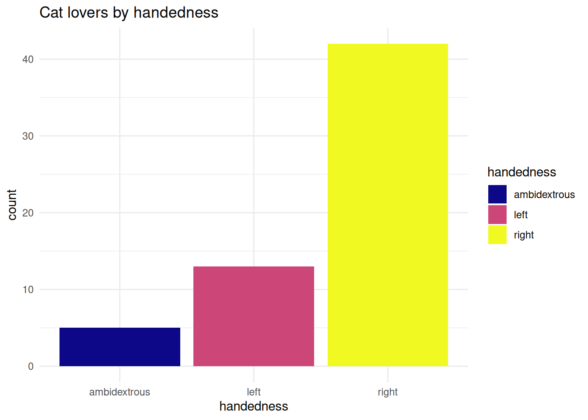
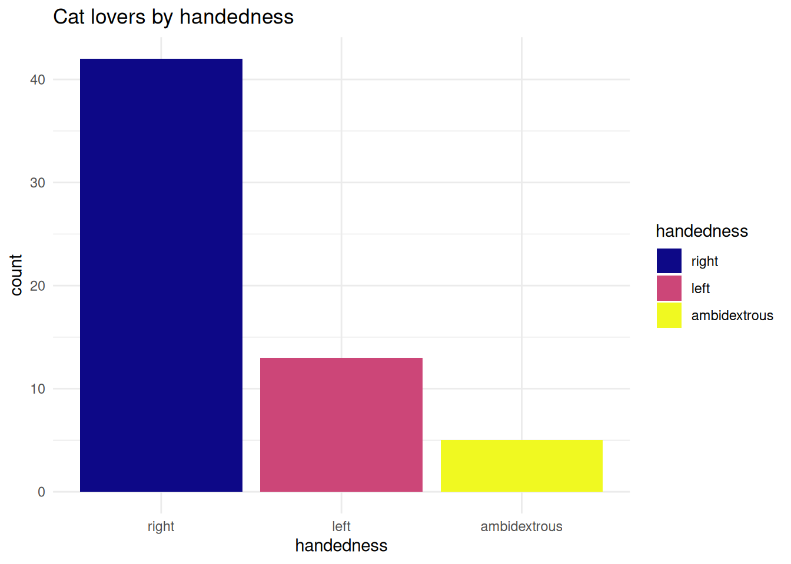

## Special Values

You can follow along with the slides [here][d11_types] if you would like to open them full-screen.


```{=html}
<div class="vembedr" align="center">
<div>
<iframe src="https://www.youtube.com/embed/3YoFhEKvieA" width="533" height="300" frameborder="0" allowfullscreen="" data-external="1"></iframe>
</div>
</div>
```


<iframe src="https://datascience4psych.github.io/slides/d11_types/d11_types.html#26" width="672" height="400px" data-external="1"></iframe>

R has a few special values you'll bump into when your calculations don't work as expected.


Try dividing by zero in R and you'll get `Inf` (infinity) - unlike other languages that might crash or throw an error. R is pretty chill about it (to an annoying degree):


``` r
pi / 0 # Returns Inf
#> [1] Inf
```

But if you try something truly undefined like dividing zero by zero, you'll get `NaN` (Not a Number):


``` r
0 / 0 # Returns NaN
#> [1] NaN
```

These special values appear when dealing with unusual or undefined operations in R:

- When dividing by zero: `pi / 0` gives `Inf`
- When performing undefined math: `0 / 0` gives `NaN`
- With contradictory operations: `1/0 - 1/0` gives `NaN`
- With consistent operations: `1/0` + `1/0` gives `Inf`


The most common special value you'll encounter is `NA` - missing data. `NA`s are sneaky because they're "contagious" - almost any calculation involving an `NA` will give you `NA` as the result:


``` r
mean(c(1, 2, NA, 4)) # Returns NA
#> [1] NA
```


The cool thing about `NA`s is that they're logically consistent. When you work with them in logical operations:

- `TRUE | NA` is `TRUE` (because "true or anything" is always true)
- `FALSE | NA` is `NA` (because we need to know what `NA` is to determine the result)

It's like `NA` is saying "I don't know what I am, but I'll follow the rules of logic!"


## Data classes

You can follow along with the slides [here][d11_types] if you would like to open them full-screen.


```{=html}
<div class="vembedr" align="center">
<div>
<iframe src="https://www.youtube.com/embed/9yNpsBKyXRE" width="533" height="300" frameborder="0" allowfullscreen="" data-external="1"></iframe>
</div>
</div>
```


<iframe src="https://datascience4psych.github.io/slides/d11_types/d11_types.html#35" width="672" height="400px" data-external="1"></iframe>

Think of R's data classes as Lego sets built from basic building blocks. The basic types (`logical`, `character`, `numeric`) are the individual Lego pieces, but classes are the cool structures you build with them.


Take factors - they look like character strings when you print them, but under the hood they're actually integers with labels:


``` r
x <- factor(c("BS", "MS", "PhD", "MS"))
x # Looks like text
#> [1] BS  MS  PhD MS 
#> Levels: BS MS PhD
typeof(x) # But it's stored as integers!
#> [1] "integer"
as.integer(x) # See the numbers behind the scenes
#> [1] 1 2 3 2
```

Or dates - they look like calendar dates when you print them:

``` r
Y2kday <- as.Date("2000-01-01")
Y2kday # Shows as "2000-01-01"
#> [1] "2000-01-01"
```

But they're actually just counting days since January 1, 1970:


``` r
as.integer(Y2kday) # Days since 1970-01-01
#> [1] 10957
```

Because you're just counting time since a fixed date. This explains why you can do math with dates, like finding out what date is 30 days from now:

``` r
Y2kday + 30 # Adds 30 days
#> [1] "2000-01-31"
```

Even data frames are secretly just lists where all the elements have the same length:

``` r
df <- data.frame(x = 1:2, y = 3:4)
typeof(df) # "list"
#> [1] "list"
```

Understanding these "secret identities" helps you avoid common pitfalls and work more effectively with your data.


## Working with factors

You can follow along with the slides [here][d11_types] if you would like to open them full-screen.


```{=html}
<div class="vembedr" align="center">
<div>
<iframe src="https://www.youtube.com/embed/yeEnw9rMJe4" width="533" height="300" frameborder="0" allowfullscreen="" data-external="1"></iframe>
</div>
</div>
```


<iframe src="https://datascience4psych.github.io/slides/d11_types/d11_types.html#45" width="672" height="400px" data-external="1"></iframe>

Ever made a bar chart where the categories were in a weird order? That's where factors come to the rescue!

When you make a simple plot like this:


``` r
ggplot(cat_lovers, mapping = aes(x = handedness, fill = handedness)) +
  geom_bar() +
  labs(title = "Cat lovers by handedness") +
  theme_minimal() +
  scale_fill_viridis_d(option = "plasma")
```


R automatically converts your text variable to a factor, but it uses alphabetical order by default. That's rarely what you want!
The `forcats` package (part of the tidyverse) gives you superpowers for controlling factor order. Want categories ordered by frequency? Just use `fct_infreq`():


``` r
cat_lovers %>%
  mutate(handedness = fct_infreq(handedness)) %>%
  ggplot(mapping = aes(x = handedness, fill = handedness)) +
  geom_bar() +
  labs(title = "Cat lovers by handedness") +
  theme_minimal() +
  scale_fill_viridis_d(option = "plasma")
```




Now your most common category appears first - much more informative!
The slides show an example with months, which is a classic problem. If you don't use factors, your months end up in alphabetical order (April, August, December...) instead of calendar order. Using `fct_relevel`() with `month.name` fixes this:

```r
hotels %>%
  mutate(FOO = fct_relevel(BAR, month.name))
```

So next time your plot looks oddly ordered, remember: there's probably a forcats function that can fix it in one line!


<!--DS4P Links-->
[course_web]: https://datascience4psych.github.io/DataScience4Psych
[course_git]: https://github.com/DataScience4Psych/DataScience4Psych
[course_repo]: https://github.com/DataScience4Psych
[course_slides]: https://github.com/DataScience4Psych/slides
[course_syllabus]: https://smasongarrison.github.io/syllabi/ 
<!-- https://smasongarrison.github.io/syllabi/data-science.html -->
[syllabi]: https://smasongarrison.github.io/syllabi
[pl_00]: https://www.youtube.com/playlist?list=PLKrrdtYgOUYaEAnJX20Ryy4OSie375rVY
[pl_01]: https://www.youtube.com/playlist?list=PLKrrdtYgOUYao_7t5ycK4KDXNKaY-ECup
[pl_02]: https://www.youtube.com/playlist?list=PLKrrdtYgOUYZmr_T3PnuxjVIlj0C0kUNI
[pl_03]: https://www.youtube.com/playlist?list=PLKrrdtYgOUYaHmjzdRvfg0yhOIYQnfjwE
[pl_04]: https://www.youtube.com/playlist?list=PLKrrdtYgOUYYWFcel6_vp8__RUKLxhX4y
[pl_05]: https://www.youtube.com/playlist?list=PLKrrdtYgOUYYMIguiV1F8RagMYibTY4iW
[pl_06]: https://www.youtube.com/playlist?list=PLKrrdtYgOUYYV_KDod3Mk9-RmtFXii9Dv
[pl_07]: https://www.youtube.com/watch?list=PLKrrdtYgOUYZxvEvQ8-PcWrOY_dwY_ETI
[pl_08]: https://www.youtube.com/playlist?list=PLKrrdtYgOUYZgOzYB_dmauw55M7jXvsdo
[pl_09]: https://www.youtube.com/playlist?list=PLKrrdtYgOUYbaiTmldRY2ddsLrHp3z6yO
[pl_10]: https://www.youtube.com/playlist?list=PLKrrdtYgOUYbPw5iYzYEzoOKa7mJKNIhq
[pl_11]: https://www.youtube.com/playlist?list=PLKrrdtYgOUYZ-u6LzBbanrNFoeLHKaLL6
[pl_12]: https://www.youtube.com/playlist?list=PLKrrdtYgOUYbwRS-9Htmb80_t1NG-021e
[pl_13]: https://www.youtube.com/playlist?list=PLKrrdtYgOUYbWGmSnbLIYwdLOnGm6une6
[pl_14]: https://www.youtube.com/playlist?list=PLKrrdtYgOUYbWGmSnbLIYwdLOnGm6une6
[pl_15]: https://www.youtube.com/playlist?list=PLKrrdtYgOUYa5MoYrV8EsWQ5jIr5ZYMpM
[pl_all]: https://www.youtube.com/playlist?list=PLKrrdtYgOUYZomNqf-1dtCDW94ySdLv-9


<!--AE Links-->
[ae01a_unvotes]: https://github.com/DataScience4Psych/ae01a_unvotes
[ae01b_covid]: https://github.com/DataScience4Psych/ae01b_covid
[ae02_bechdel]: https://github.com/DataScience4Psych/ae-02-bechdel-rmarkdown
[ae03_starwars]: https://github.com/DataScience4Psych/ae-03-starwars-dataviz
[ae08_imdb]: https://github.com/DataScience4Psych/ae-08-imdb-webscraping

<!-- Lab Links-->

[lab01_hello]: https://github.com/DataScience4Psych/lab-01-hello-r
[lab02]: https://github.com/DataScience4Psych/lab-02-plastic-waste
[lab03]: https://github.com/DataScience4Psych/lab-03-nobel-laureates
[lab04]: https://github.com/DataScience4Psych/lab-04-viz-sp-data
[lab05]: https://github.com/DataScience4Psych/lab-05-wrangle-sp-data
[lab06]: https://github.com/DataScience4Psych/lab_06_sad_plots
[lab07]: https://github.com/DataScience4Psych/lab_07_betterviz
[lab08]: https://github.com/DataScience4Psych/lab-08-uoe-art
[lab09]: https://github.com/DataScience4Psych/lab-09-ethics-algorithmic-bias
[lab10]: https://github.com/DataScience4Psych/lab-10-slr-course-evals
[lab11]: https://github.com/DataScience4Psych/lab-11-mlr-course-evals
[lab12]: https://github.com/DataScience4Psych/lab-12-inference-smoking
[lab13]: https://github.com/DataScience4Psych/lab-13-simulating-mars

<!--Slides-->
[d01_welcome]: https://datascience4psych.github.io/slides/d01_welcome/d01_welcome.html
[d02_toolkit]: https://datascience4psych.github.io/slides/d02_toolkit/d02_toolkit.html
[d03_dataviz]: https://datascience4psych.github.io/slides/d03_dataviz/d03_dataviz.html
[d04_ggplot2]: https://datascience4psych.github.io/slides/d04_ggplot2/d04_ggplot2.html
[d05_viznum]: https://datascience4psych.github.io/slides/d05_viznum/d05_viznum.html
[d06_vizcat]: https://datascience4psych.github.io/slides/d06_vizcat/d06_vizcat.html
[d07_tidy]: https://datascience4psych.github.io/slides/d07_tidy/d07_tidy.html
[d08_grammar]: https://datascience4psych.github.io/slides/d08_grammar/d08_grammar.html
[d09_wrangle]: https://datascience4psych.github.io/slides/d09_wrangle/d09_wrangle.html
[d10_dfs]: https://datascience4psych.github.io/slides/d10_dfs/d10_dfs.html
[d11_types]: https://datascience4psych.github.io/slides/d11_types/d11_types.html
[d12_import]: https://datascience4psych.github.io/slides/d12_import/d12_import.html
[d13_goodviz]: https://datascience4psych.github.io/slides/d13_goodviz/d13_goodviz.html
[d13b_moreggplot]: https://datascience4psych.github.io/slides/d13_goodviz/d13b_moreggplot.html
[d14_confound]: https://datascience4psych.github.io/slides/d14_confound/d14_confound.html
[d15_goodtalk]: https://datascience4psych.github.io/slides/d15_goodtalk/d15_goodtalk.html
[d16_webscraping]: https://datascience4psych.github.io/slides/d16_webscraping/d16_webscraping.html
[d17_functions]: https://datascience4psych.github.io/slides/d17_functions/d17_functions.html
[d18_ethics]: https://datascience4psych.github.io/slides/d18_ethics/d18_ethics.html
[d19_bias]: https://datascience4psych.github.io/slides/d19_bias/d19_bias.html
[d20_language]: https://datascience4psych.github.io/slides/d20_language/d20_language.html
[d21_fitting]: https://datascience4psych.github.io/slides/d21_fitting/d21_fitting.html
[d22_nonlinear]: https://datascience4psych.github.io/slides/d22_nonlinear/d22_nonlinear.html
[d23_multiple]: https://datascience4psych.github.io/slides/d23_multiple/d23_multiple.html
[d24_overfitting]: https://datascience4psych.github.io/slides/d24_overfitting/d24_overfitting.html
[d25_crossvalidation]: https://datascience4psych.github.io/slides/d25_crossvalidation/d25_crossvalidation.html
[d26_quantify]: https://datascience4psych.github.io/slides/d26_quantify/d26_quantify.html
[d27_bootstrap]: https://datascience4psych.github.io/slides/d27_bootstrap/d27_bootstrap.html
[d28_interactive]: https://datascience4psych.github.io/slides/d28_interactive/d28_interactive.html
[d29_machine]: https://datascience4psych.github.io/slides/d29_machinelearning/d29_machine.html
[d30_simulations]: https://datascience4psych.github.io/slides/d30_simulations/d30_simulations.html
[d31_llmintro]: https://datascience4psych.github.io/slides/d31_llmintro/d31_llmintro.html
[d32_llmapplications]: https://datascience4psych.github.io/slides/d32_llmapplications/d32_llmapplications.html

<!--externals-->

[stat545]: https://stat545.com
[r4ds]: https://r4ds.had.co.nz
[cran]: https://cloud.r-project.org
