# ODD: Data Transformations and Tukey's Ladder of Powers


This optional deep dive explores data transformations, focusing on Tukey's Ladder of Powers—an groundbreaking approach for reshaping data distributions and relationships between variables. Our journey through this topic is inspired by @fox2016applied (ch. 4, pp. 28 - 80)

## Transforming Data: Tukey's Ladder of Powers


John Tukey introduced a methodological toolkit, likened to a set of drill bits of varying sizes, for modifying the shapes of distributions and relationships between variables. This section delves into these transformations, particularly focusing on the mathematical formulations that underpin this approach.

<!-- http://blackwell.math.yorku.ca/math4939/lectures/transforming_data_tukeys_ladder_of_powers.R -->

### Dataset Preparation and Visualization

We'll be using data from @fox2016applied's book. You may need to download the data manually and save it in the "data" directory within your current working directory. The dataset is available [here](http://socserv.socsci.mcmaster.ca/jfox/Books/Applied-Regression-3E/datasets/UnitedNations.txt). You can use this r code to download the data.

```
download.file("http://socserv.socsci.mcmaster.ca/jfox/Books/Applied-Regression-3E/datasets/UnitedNations.txt", "data/UnitedNations.txt")
```


``` r
#if (!require("p3d")) install.packages("p3d", repos = "http://R-Forge.R-project.org")
#library(p3d)
#library(extras)
library(car)
library(latticeExtra)
library(gridExtra)
#if (!require("spida2")) devtools::install_github("smasongarrison/spida2",ref="patch-1")
library(spida2)
# read data
un <- read.table("data/UnitedNations.txt", header = TRUE) %>%
  mutate(country = rownames(.)) # Assigning country names
```

Let's visualize an attempt to make our regression behave. Below are the original and log-transformed relationships with ggplot2. You've likely used a log-transformation before, but we'll be exploring the more general family of transformations.

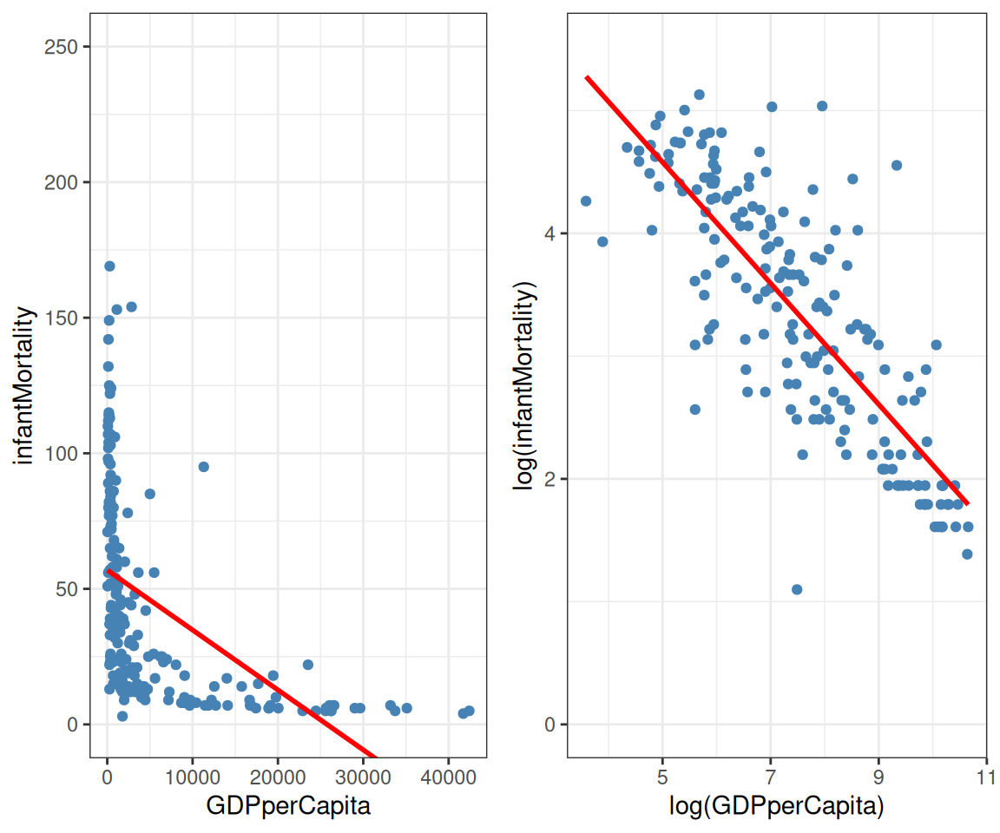
The log transformation has straightened out the data, allowing us to fit a more useful regression line. However, we're not limited to just a log transformation. We can use an entire family of transformations called Tukey's Ladder of Powers.


## Introduction to Tukey's Ladder of Powers

John Tukey suggested this simple toolkit, like a set drill bits of varying sizes, to modify the shape of distributions  and the shape of relationships between variables. 
The basic idea stems from the fact that functions of the form $y' = y^p, \quad y > 0$ have a graph that is concave up if $p >1$, and concave down if $0<p<1$ or $p<0$.  

Here are some examples to illustrate these concepts:


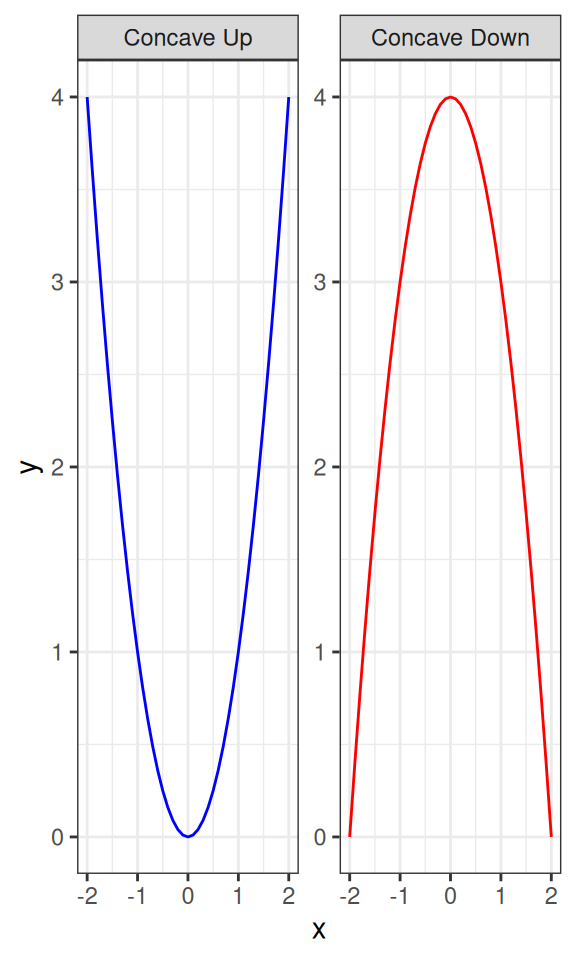

Concave Up ($y= x^2$): This plot shows a parabolic curve opening upwards, illustrating the concept of a concave up graph where the slope of the tangent line increases as $x$ increases.

Concave Down ($y= -x^2$): Conversely, this plot shows a parabolic curve opening downwards, illustrating a concave down graph where the slope of the tangent line decreases as $x$ increases.


We can use this information to modify the shape of a distribution or the shape of a relationship between variables by using a power transformation ($p$) on our data.


### Mathematical Formulation of Tukey's Ladder of Powers

To understand Tukey's Ladder of Powers, let's start with the general form of the transformation:

$$y' = \frac{y^p - 1}{p}$$


where $p$ is the power parameter. This formula helps us adjust the shape of the data distribution. When 
$p$ is positive, the transformation can help reduce right skewness. When $p$ is negative, it can help reduce left skewness.

#### Special Case: $p = 0$ {.unnumbered}

When $p = 0$, the transformation simplifies to a logarithmic transformation. This is because as $p$ approaches 0, the formula $\frac{y^p - 1}{p}$ approaches $\ln y$. This can be understood using a concept from calculus called l’Hôpital’s rule, which is used to evaluate limits of indeterminate forms. For our purposes, we can state that:

$$\lim_{p \to 0} \frac{y^p - 1}{p}= \lim_{p \to 0}\, e^{\, p \ln y} \ln  y = \ln  y$$

To make this concept more intuitive, imagine $y^p$ as a function that gets closer and closer to 1 as $p$ gets closer to 0. The subtraction of 1 and division by $p$ in the formula adjust this function to reflect the logarithmic behavior.

#### Negative Powers  {.unnumbered}
  For negative values of $p$, the formula $y = -y^p$ is used. This formula is concave down. The negative power causes the transformation to be concave down. This helps transform the data in a way that handles extreme values more effectively.
  
### Defining the Transformation Function in R


We define a function that produces this transformation. The easy way to define it is:


``` r
pow <- function(y, p) {
  if (p == 0) {
    log(y)
  } else {
    (y^p - 1) / p
  }
}
```

Let's test this function with a sequence of x values and visualize the transformations for different powers of p.


``` r
# Testing the transformation with a sequence of x values
x <- seq(-1, 3, by = .5)

# Applying the transformation for different powers of p
x_transformed <- tibble(
  x = x,
  `p=2` = pow(x, 2),
  `p=0` = pow(x, 0),
  `p=-1` = pow(x, -1)
)

# Visualizing the transformed data
x_transformed_long <- pivot_longer(x_transformed, cols = starts_with("p"), names_to = "Power", values_to = "Transformed")

```

Let's visualize the transformed data for different powers of p using ggplot2.


``` r

ggplot(x_transformed_long, aes(x = x, y = Transformed, color = Power)) +
  geom_line() +
  labs(title = "Visualization of Power Transformations", x = "Original x", y = "Transformed x") +
  theme_minimal()
```

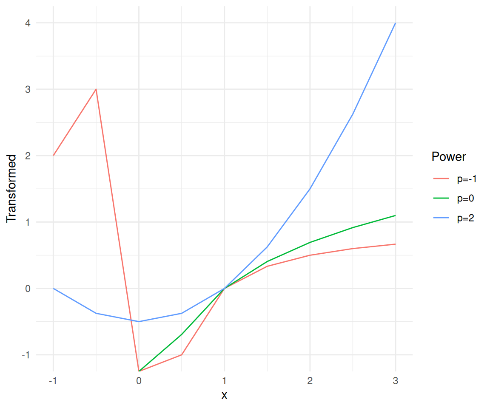

Looking at the plot, we can see how different values of $p$ affect the transformation of the data. The transformation with $p=2$ shows a concave up shape, while $p=-1$ shows a concave down shape. The logarithmic transformation ($p=0$) provides a middle ground between these two extremes.


``` r

# test:
x <- seq(-1, 3, by = .5)
x # note that these transformations are really intended for y > 0
#> [1] -1.0 -0.5  0.0  0.5  1.0  1.5  2.0  2.5  3.0
pow(x, 2)
#> [1]  0.000 -0.375 -0.500 -0.375  0.000  0.625  1.500  2.625  4.000
# pow(x, 0) %>%
#  name(x)
# pow(x, -1) %>%
#  name(x) %>%
#  cbind()
```

Because functions are first-class objects in R, we can also define the exponential function and plot it directly.


``` r

plot(exp) # easy plotting of a function
```

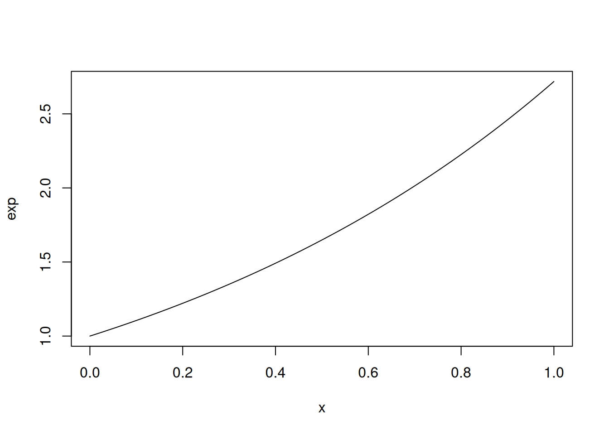

``` r
plot(function(x) pow(x, p = 2)) # anonymous function or 'lambda'
```

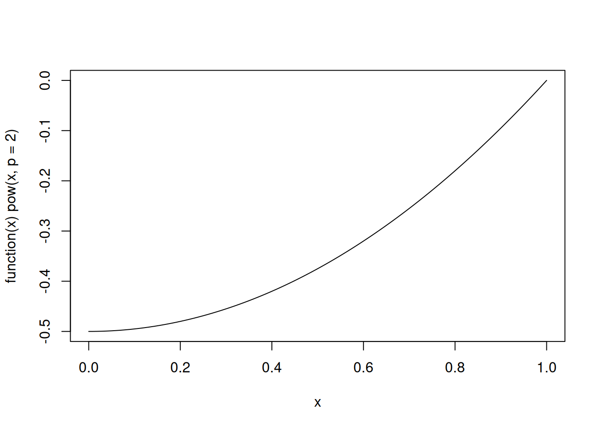

``` r
plot(function(x) pow(x, p = .5), xlim = c(0, 3))
```

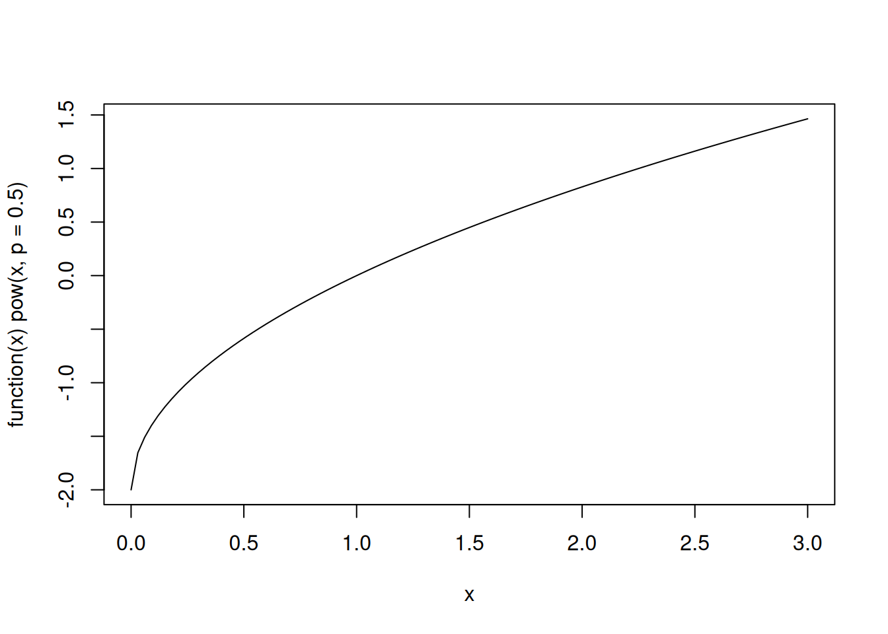

However, this approach works correctly only for a single value of $p$ because the statement `if(p == 0)` only tests the first element of `p`.

## Vectorizing a function

Most operators in R are __vectorized__ so they work element-wise when their arguments are vectors. When the arguments have incompatible lengths, the shorter argument is __recycled__ to have the same length as the longer one. That is why the following produces sensible results:


``` r
z <- c(3, 5, 9)
z + c(1, 1, 1)
#> [1]  4  6 10
z + 1 # 1 is recycled so the result is equivalent to the previous line
#> [1]  4  6 10
z + c(1, 2, 3)
#> [1]  4  7 12
z + c(1, 2) # recycles but gives a warning
#> Warning in z + c(1, 2): longer object length is not a multiple of shorter
#> object length
#> [1]  4  7 10
z + z
#> [1]  6 10 18
z^2
#> [1]  9 25 81
z^z
#> [1] 2.70e+01 3.12e+03 3.87e+08
```

We can use `ifelse` which works on a vector instead of a single value.


``` r
pow <- function(y, p) {
  p <- rep(p, length.out = length(y))
  y <- rep(y, length.out = length(p))
  ifelse(p == 0, log(y), (y^p - 1) / p)
}

# To apply the function over vectors of y and p, ensuring vectorized operations:
vectorized_pow <- function(y, p) {
  map2(y, p, pow)
}
# test:
pow(-1:4, c(2, 0, -1, 1, 3))
#> Warning in log(y): NaNs produced
#> [1] 0.00 -Inf 0.00 1.00 8.67 7.50
pow(-1:4, 2)
#> [1]  0.0 -0.5  0.0  1.5  4.0  7.5
```

With a bit more work, we can avoid unnecessary evaluations:


``` r
pow <- function(y, p) {
  p <- rep(p, length.out = length(y))
  y <- rep(y, length.out = length(p))
  y[p == 0] <- log(y[p == 0])
  y[p != 0] <- (y[p != 0]^p[p != 0] - 1) / p[p != 0]
  y
}

# Test:

pow(1:10, 0) == log(1:10)
#>  [1] TRUE TRUE TRUE TRUE TRUE TRUE TRUE TRUE TRUE TRUE
pow(1:10, -1)
#>  [1] 0.000 0.500 0.667 0.750 0.800 0.833 0.857 0.875 0.889 0.900
pow(1:10, .5)
#>  [1] 0.000 0.828 1.464 2.000 2.472 2.899 3.292 3.657 4.000 4.325
pow(1:10, -1:8)
#>  [1] 0.00e+00 6.93e-01 2.00e+00 7.50e+00 4.13e+01 3.24e+02 3.36e+03 4.37e+04
#>  [9] 6.83e+05 1.25e+07
```

Let's plot this transformation for a range of values of $p$. The value of `expand.grid` is a data frame whose rows consist of the Cartesian product (i.e. all possible combinations) of its arguments.


``` r
expand.grid(a = c("A", "B"), x = 1:3)
#>   a x
#> 1 A 1
#> 2 B 1
#> 3 A 2
#> 4 B 2
#> 5 A 3
#> 6 B 3


dd <- expand.grid(y = seq(.01, 3, .01), p = c(-2, -1, -.5, 0, .5, 1, 2, 3))
dim(dd)
#> [1] 2400    2
head(dd)
#>      y  p
#> 1 0.01 -2
#> 2 0.02 -2
#> 3 0.03 -2
#> 4 0.04 -2
#> 5 0.05 -2
#> 6 0.06 -2
some(dd) # 10 rows at random
#>         y    p
#> 37   0.37 -2.0
#> 46   0.46 -2.0
#> 128  1.28 -2.0
#> 338  0.38 -1.0
#> 827  2.27 -0.5
#> 1309 1.09  0.5
#> 1386 1.86  0.5
#> 1436 2.36  0.5
#> 1846 0.46  2.0
#> 2234 1.34  3.0


dd$yval <- with(dd, pow(y, p))
xyplot(yval ~ y | factor(p), dd, type = "l")
```

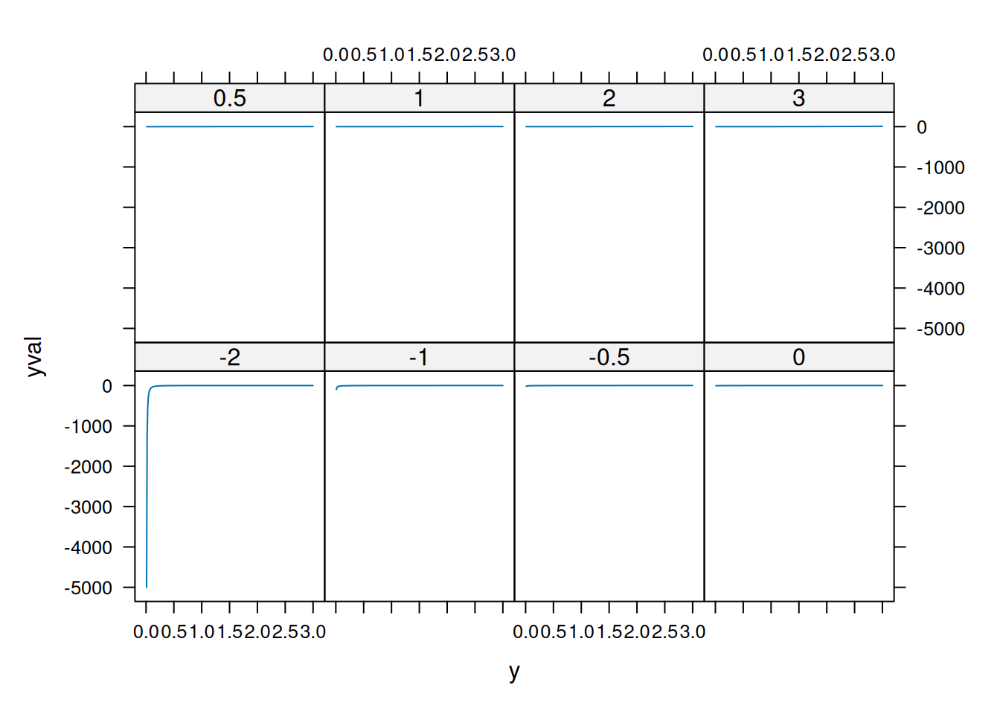

``` r
xyplot(yval ~ y | factor(p), dd, type = "l", ylim = c(-2, max(dd$yval)))
```

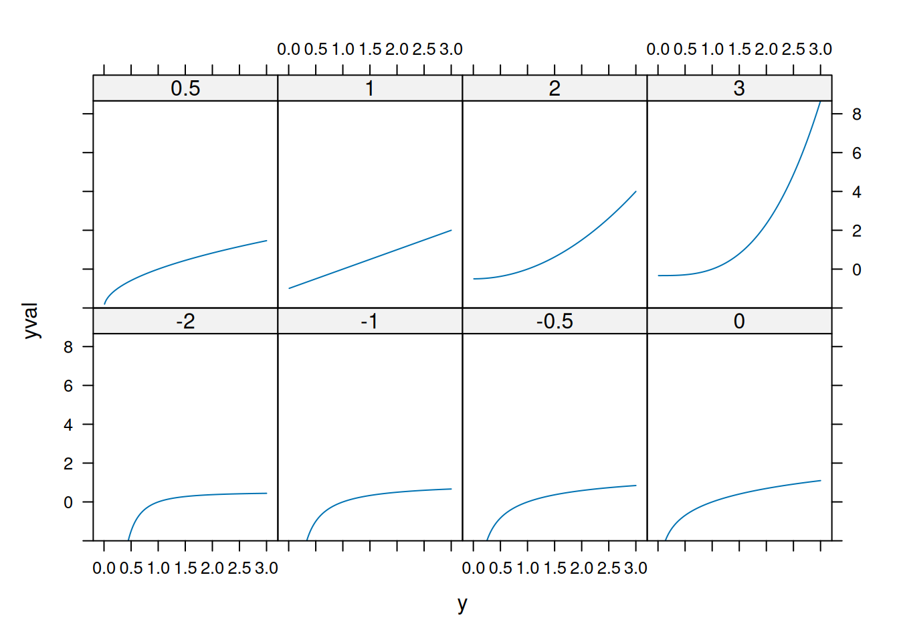

``` r
xyplot(yval ~ y, dd, groups = p, type = "l", ylim = c(-2, max(dd$yval)))
```

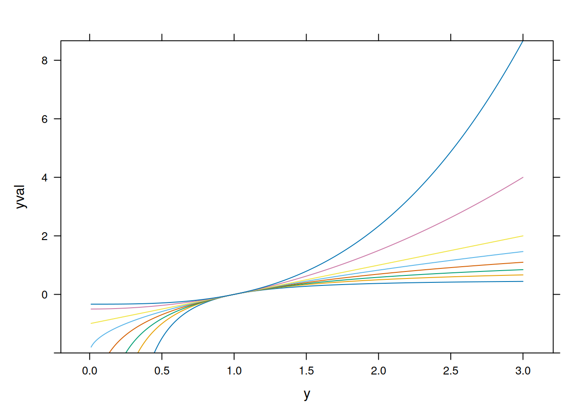

``` r
xyplot(yval ~ y, dd,
  groups = p,
  type = "l",
  xlim = c(0, 3),
  ylim = c(-2, max(dd$yval))
)
```

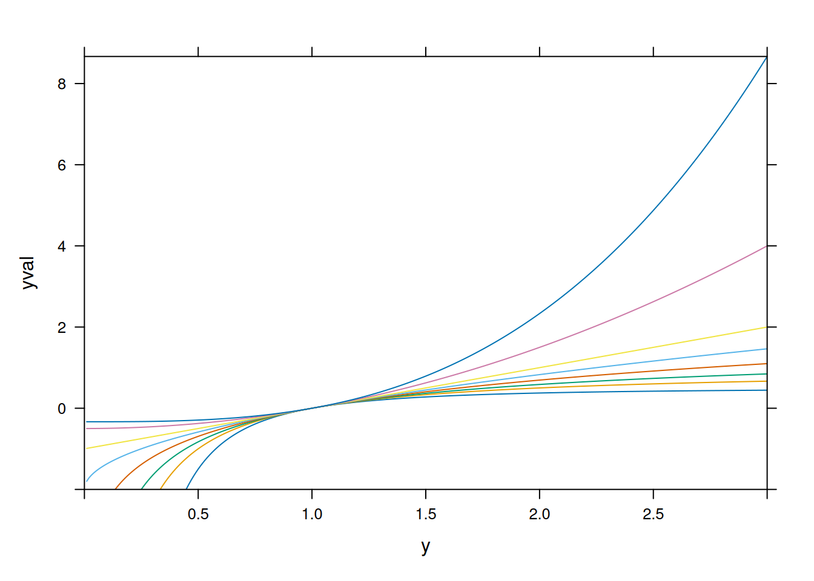

``` r
spida2::gd(8, lwd = 2) # number of colours needed
xyplot(yval ~ y, dd,
  groups = p,
  type = "l",
  xlim = c(0, 3),
  ylim = c(-2, max(dd$yval))
)
```

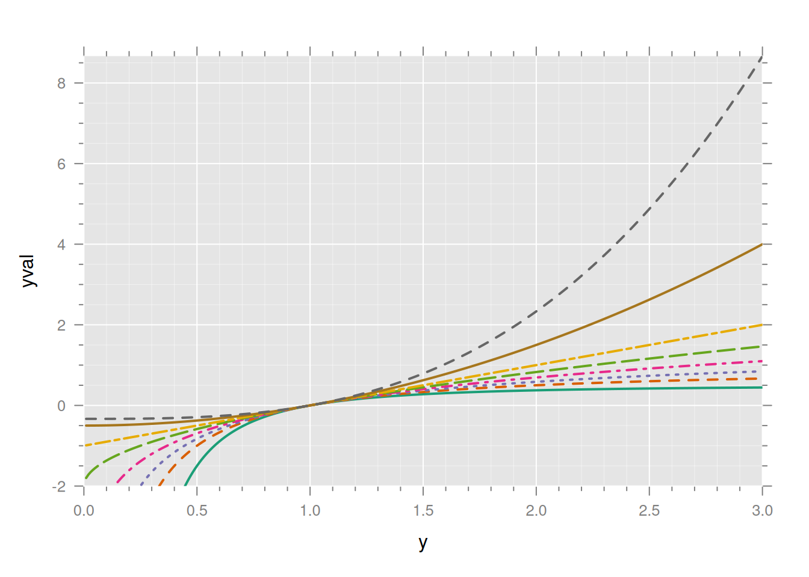

``` r
xyplot(yval ~ y, dd,
  groups = p,
  type = "l",
  auto.key = list(space = "right", lines = T, points = F),
  xlim = c(0, 3),
  ylim = c(-2, max(dd$yval))
)
```

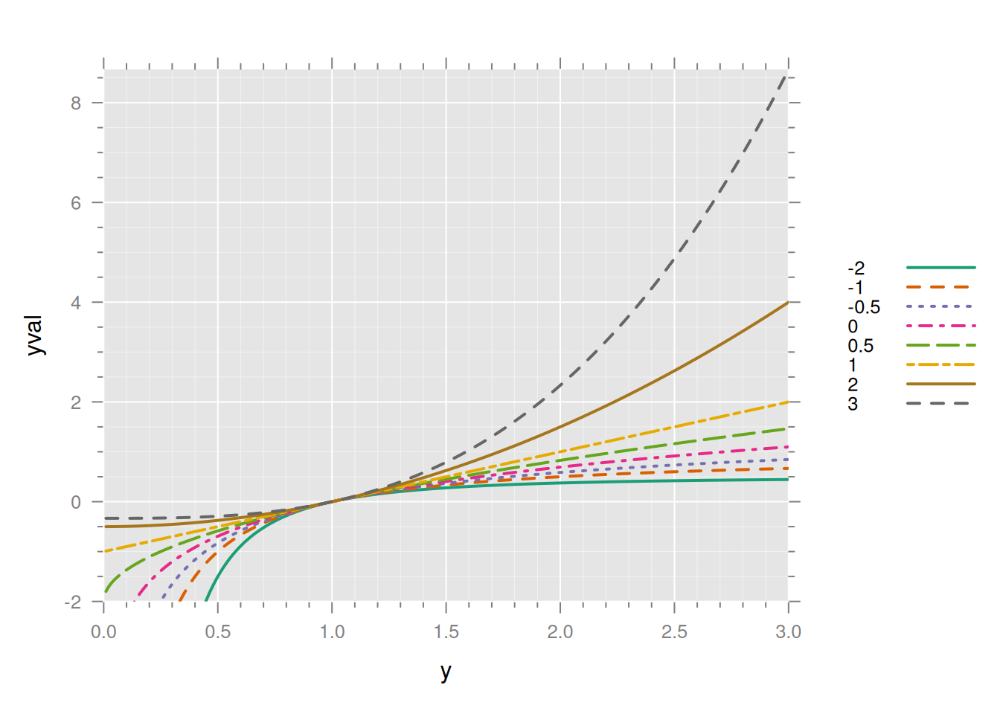

It's much better to have the legend in the same order as the lines in the graph. We can turn `p` into a factor and reverse its order.


``` r
dd$po <- factor(dd$p)
dd$po <- reorder(dd$po, -dd$p)
xyplot(yval ~ y, dd,
  groups = po,
  type = "l",
  auto.key = list(space = "right", lines = T, points = F, title = "power"),
  xlim = c(0, 3),
  ylim = c(-2, max(dd$yval))
)
```

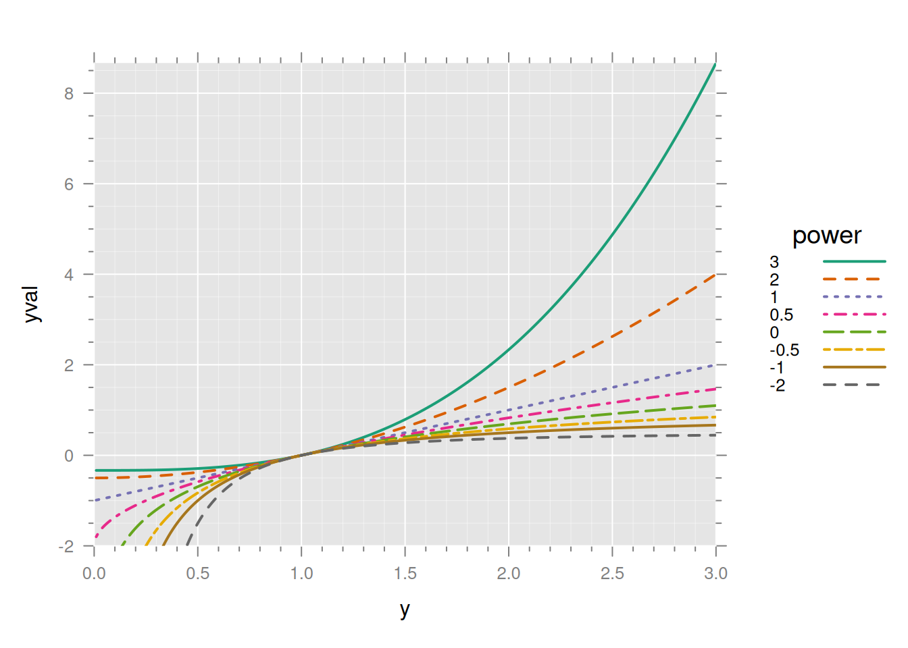

## Quantile plots

Uniform quantiles let's us see how far a distribution is from normal.


``` r
xqplot(un)
```

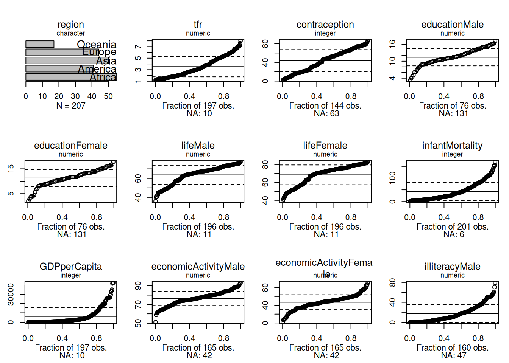

Normal quantiles let's us see how far a distribution is from normal.


``` r
xqplot(un, ptype = "normal")
```

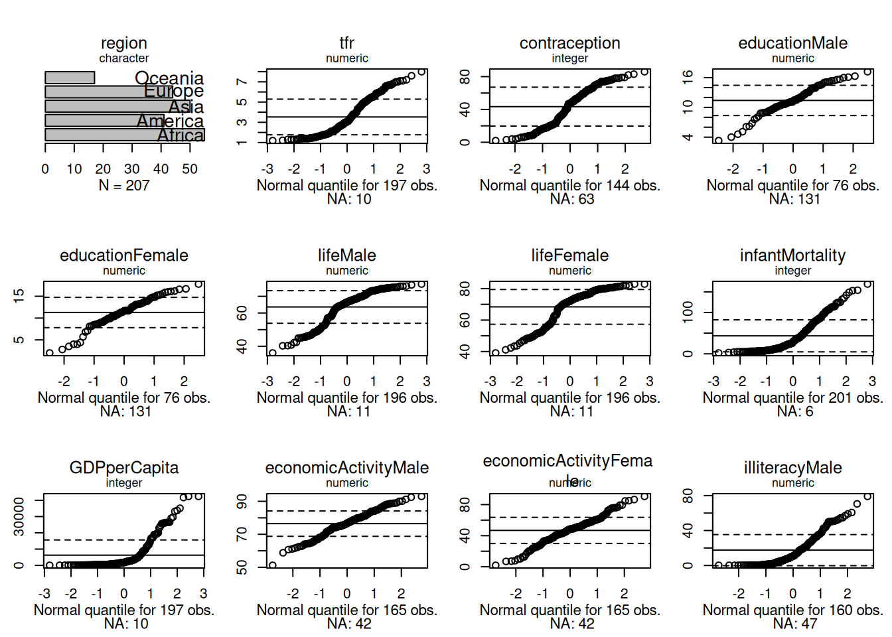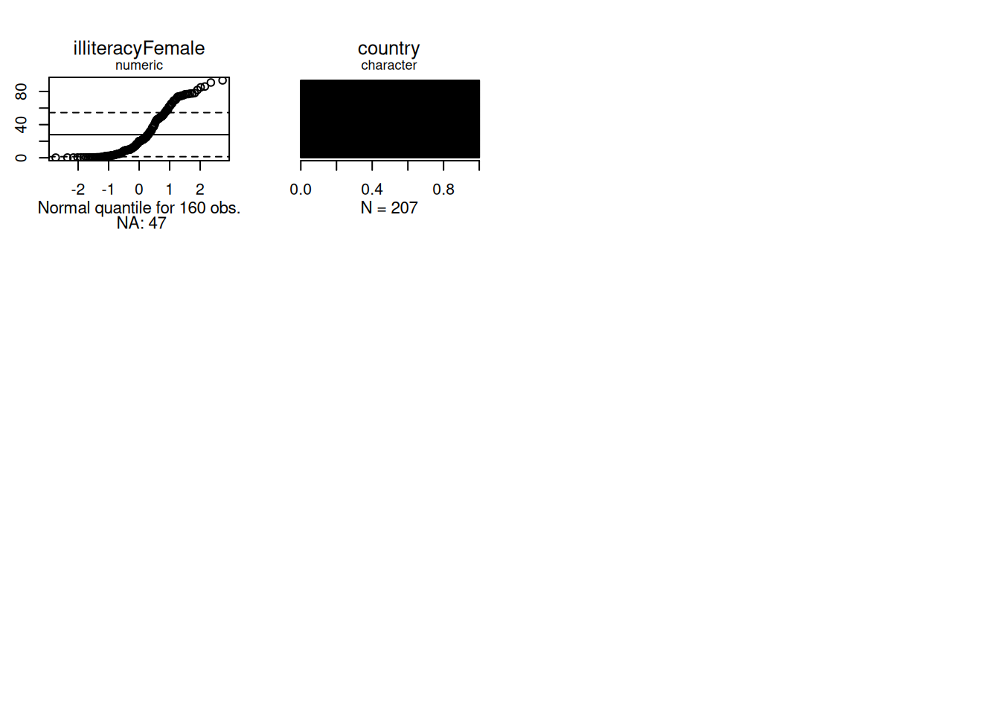

We see that none of the numeric variables have normal distributions.  

- 'age' is somewhat platykurtic compared with a normal
- 'compositeHourlyWages' has both a categorical (0) and  a continuous component
- 'education' is also platykurtic
- 'working' is dichotomous
- 'familyIncome' is skewed to the right

Note that the fact that $x$ or $y$ variables are not normal does not mean that the conditional distribution of $y$ given $x$ is not normal.  

Let's explore wages of working women as a function of education.


``` r
library(latticeExtra)
un %>%
  xyplot(infantMortality ~ GDPperCapita, .) +
  layer(panel.loess(..., lwd = 2))


# Scatterplot showing curvature in relationship

trellis.focus()
panel.identify(labels = rownames(un))
#> integer(0)
trellis.unfocus()
```

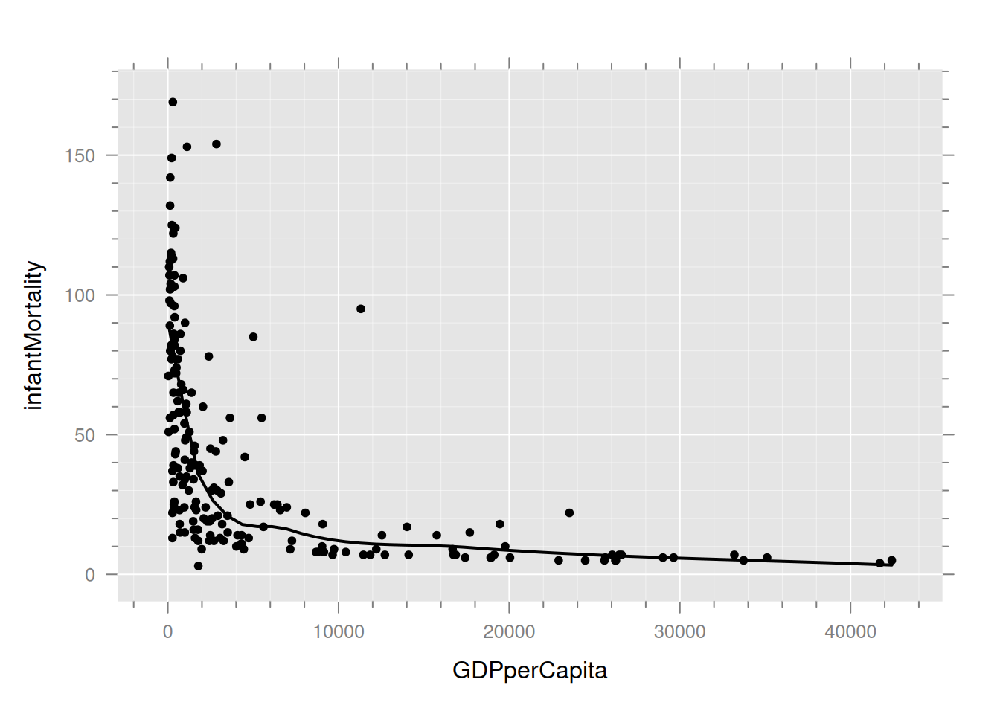

``` r

un %>%
  xyplot(log(infantMortality) ~ GDPperCapita | region, .) +
  layer(panel.loess(..., lwd = 2))
```

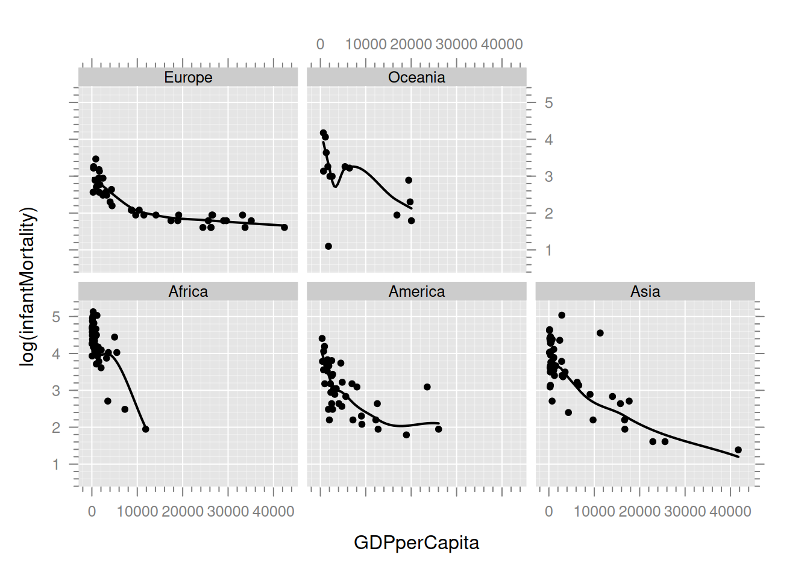

``` r

un %>% subset(country %in% c("United.States", "Canada"))
#>                region  tfr contraception educationMale educationFemale lifeMale
#> Canada        America 1.61            66          17.2            17.8     76.1
#> United.States America 1.96            71          15.4            16.2     73.4
#>               lifeFemale infantMortality GDPperCapita economicActivityMale
#> Canada              81.8               6        18943                 72.4
#> United.States       80.1               7        26037                 74.9
#>               economicActivityFemale illiteracyMale illiteracyFemale
#> Canada                          57.6             NA               NA
#> United.States                   59.3           2.24             2.23
#>                     country
#> Canada               Canada
#> United.States United.States
```
Below would be a 3D plot showing curvature. However, we can't get the p3d package to install properly right now. The 3D plot would help visualize curvature between wage and education, and heteroskedasticity in wage as a function of education.


``` r

if (require("p3d")) {

 library(p3d)

 slid %>%
  xyplot(sqrt(wage) ~ education, .) +
  layer(panel.loess(...))

 Init3d()
 Plot3d(log(infantMortality) ~ GDPperCapita + lifeFemale | region, un)
 Id3d()
 Id3d('United.States')
 Id3d('Canada')
 rownames(un)
 names(un)
 
}
#> Loading required package: p3d
#> Warning in library(package, lib.loc = lib.loc, character.only = TRUE,
#> logical.return = TRUE, : there is no package called 'p3d'
```

## Box Cox Transformation

This is another way to look at Tukey's Ladder of Powers. The Box-Cox transformation is defined as:

$$
y(\lambda) = \begin{cases}
\frac{y^\lambda - 1}{\lambda}, & \text{if }\lambda \neq 0 \\
\ln(y), & \text{if } \lambda = 0
\end{cases}
$$
The Box-Cox transformation is similar to Tukey's Ladder of Powers, with the parameter $\lambda$ playing a role analogous to $p$. The transformation is used to stabilize variance and make the data more normally distributed. I won't go into more detail here since it's very similar to what we've already discussed. But I have published a paper that used the Box-Cox transformation: Garrison, S. M. \& Rodgers, J. L. (2019) Decomposing the causes of the socioeconomic status-health gradient with biometrical modeling. *Journal of Personality and Social Psychology, 116*(4), 616–634. https://doi.org/10.1037/pspp0000226

### Video Explanation


```{=html}
<div class="vembedr" align="center">
<div>
<iframe src="https://www.youtube.com/embed/vGOpEpjz2Ks" width="533" height="300" frameborder="0" allowfullscreen="" data-external="1"></iframe>
</div>
</div>
```


This video was made by [math et al](https://www.youtube.com/channel/UCYNVcihAKkRW-bhzIrguvVw). I like their channel and found this video to be a good one.

### Additional Resources

- Salvatore S. Mangiafico's Summary and Analysis of Extension Program Evaluation in R, [rcompanion.org/handbook/](http://rcompanion.org/handbook/). [Pdf version]( http://rcompanion.org/documents/RHandbookProgramEvaluation.pdf)

- <http://www.unige.ch/ses/sococ/cl//stat/eda/ladder.html>
- <https://www.statisticshowto.com/tukey-ladder-of-powers/>
- <http://blackwell.math.yorku.ca/math4939/lectures/transforming_data_tukeys_ladder_of_powers.html>
- <https://thomaselove.github.io/431-notes/re-expression-tukeys-ladder-box-cox-plot.html>


<!--DS4P Links-->
[course_web]: https://datascience4psych.github.io/DataScience4Psych
[course_git]: https://github.com/DataScience4Psych/DataScience4Psych
[course_repo]: https://github.com/DataScience4Psych
[course_slides]: https://github.com/DataScience4Psych/slides
[course_syllabus]: https://smasongarrison.github.io/syllabi/ 
<!-- https://smasongarrison.github.io/syllabi/data-science.html -->
[syllabi]: https://smasongarrison.github.io/syllabi
[pl_00]: https://www.youtube.com/playlist?list=PLKrrdtYgOUYaEAnJX20Ryy4OSie375rVY
[pl_01]: https://www.youtube.com/playlist?list=PLKrrdtYgOUYao_7t5ycK4KDXNKaY-ECup
[pl_02]: https://www.youtube.com/playlist?list=PLKrrdtYgOUYZmr_T3PnuxjVIlj0C0kUNI
[pl_03]: https://www.youtube.com/playlist?list=PLKrrdtYgOUYaHmjzdRvfg0yhOIYQnfjwE
[pl_04]: https://www.youtube.com/playlist?list=PLKrrdtYgOUYYWFcel6_vp8__RUKLxhX4y
[pl_05]: https://www.youtube.com/playlist?list=PLKrrdtYgOUYYMIguiV1F8RagMYibTY4iW
[pl_06]: https://www.youtube.com/playlist?list=PLKrrdtYgOUYYV_KDod3Mk9-RmtFXii9Dv
[pl_07]: https://www.youtube.com/watch?list=PLKrrdtYgOUYZxvEvQ8-PcWrOY_dwY_ETI
[pl_08]: https://www.youtube.com/playlist?list=PLKrrdtYgOUYZgOzYB_dmauw55M7jXvsdo
[pl_09]: https://www.youtube.com/playlist?list=PLKrrdtYgOUYbaiTmldRY2ddsLrHp3z6yO
[pl_10]: https://www.youtube.com/playlist?list=PLKrrdtYgOUYbPw5iYzYEzoOKa7mJKNIhq
[pl_11]: https://www.youtube.com/playlist?list=PLKrrdtYgOUYZ-u6LzBbanrNFoeLHKaLL6
[pl_12]: https://www.youtube.com/playlist?list=PLKrrdtYgOUYbwRS-9Htmb80_t1NG-021e
[pl_13]: https://www.youtube.com/playlist?list=PLKrrdtYgOUYbWGmSnbLIYwdLOnGm6une6
[pl_14]: https://www.youtube.com/playlist?list=PLKrrdtYgOUYbWGmSnbLIYwdLOnGm6une6
[pl_15]: https://www.youtube.com/playlist?list=PLKrrdtYgOUYa5MoYrV8EsWQ5jIr5ZYMpM
[pl_all]: https://www.youtube.com/playlist?list=PLKrrdtYgOUYZomNqf-1dtCDW94ySdLv-9


<!--AE Links-->
[ae01a_unvotes]: https://github.com/DataScience4Psych/ae01a_unvotes
[ae01b_covid]: https://github.com/DataScience4Psych/ae01b_covid
[ae02_bechdel]: https://github.com/DataScience4Psych/ae-02-bechdel-rmarkdown
[ae03_starwars]: https://github.com/DataScience4Psych/ae-03-starwars-dataviz
[ae08_imdb]: https://github.com/DataScience4Psych/ae-08-imdb-webscraping

<!-- Lab Links-->

[lab01_hello]: https://github.com/DataScience4Psych/lab-01-hello-r
[lab02]: https://github.com/DataScience4Psych/lab-02-plastic-waste
[lab03]: https://github.com/DataScience4Psych/lab-03-nobel-laureates
[lab04]: https://github.com/DataScience4Psych/lab-04-viz-sp-data
[lab05]: https://github.com/DataScience4Psych/lab-05-wrangle-sp-data
[lab06]: https://github.com/DataScience4Psych/lab_06_sad_plots
[lab07]: https://github.com/DataScience4Psych/lab_07_betterviz
[lab08]: https://github.com/DataScience4Psych/lab-08-uoe-art
[lab09]: https://github.com/DataScience4Psych/lab-09-ethics-algorithmic-bias
[lab10]: https://github.com/DataScience4Psych/lab-10-slr-course-evals
[lab11]: https://github.com/DataScience4Psych/lab-11-mlr-course-evals
[lab12]: https://github.com/DataScience4Psych/lab-12-inference-smoking
[lab13]: https://github.com/DataScience4Psych/lab-13-simulating-mars

<!--Slides-->
[d01_welcome]: https://datascience4psych.github.io/slides/d01_welcome/d01_welcome.html
[d02_toolkit]: https://datascience4psych.github.io/slides/d02_toolkit/d02_toolkit.html
[d03_dataviz]: https://datascience4psych.github.io/slides/d03_dataviz/d03_dataviz.html
[d04_ggplot2]: https://datascience4psych.github.io/slides/d04_ggplot2/d04_ggplot2.html
[d05_viznum]: https://datascience4psych.github.io/slides/d05_viznum/d05_viznum.html
[d06_vizcat]: https://datascience4psych.github.io/slides/d06_vizcat/d06_vizcat.html
[d07_tidy]: https://datascience4psych.github.io/slides/d07_tidy/d07_tidy.html
[d08_grammar]: https://datascience4psych.github.io/slides/d08_grammar/d08_grammar.html
[d09_wrangle]: https://datascience4psych.github.io/slides/d09_wrangle/d09_wrangle.html
[d10_dfs]: https://datascience4psych.github.io/slides/d10_dfs/d10_dfs.html
[d11_types]: https://datascience4psych.github.io/slides/d11_types/d11_types.html
[d12_import]: https://datascience4psych.github.io/slides/d12_import/d12_import.html
[d13_goodviz]: https://datascience4psych.github.io/slides/d13_goodviz/d13_goodviz.html
[d13b_moreggplot]: https://datascience4psych.github.io/slides/d13_goodviz/d13b_moreggplot.html
[d14_confound]: https://datascience4psych.github.io/slides/d14_confound/d14_confound.html
[d15_goodtalk]: https://datascience4psych.github.io/slides/d15_goodtalk/d15_goodtalk.html
[d16_webscraping]: https://datascience4psych.github.io/slides/d16_webscraping/d16_webscraping.html
[d17_functions]: https://datascience4psych.github.io/slides/d17_functions/d17_functions.html
[d18_ethics]: https://datascience4psych.github.io/slides/d18_ethics/d18_ethics.html
[d19_bias]: https://datascience4psych.github.io/slides/d19_bias/d19_bias.html
[d20_language]: https://datascience4psych.github.io/slides/d20_language/d20_language.html
[d21_fitting]: https://datascience4psych.github.io/slides/d21_fitting/d21_fitting.html
[d22_nonlinear]: https://datascience4psych.github.io/slides/d22_nonlinear/d22_nonlinear.html
[d23_multiple]: https://datascience4psych.github.io/slides/d23_multiple/d23_multiple.html
[d24_overfitting]: https://datascience4psych.github.io/slides/d24_overfitting/d24_overfitting.html
[d25_crossvalidation]: https://datascience4psych.github.io/slides/d25_crossvalidation/d25_crossvalidation.html
[d26_quantify]: https://datascience4psych.github.io/slides/d26_quantify/d26_quantify.html
[d27_bootstrap]: https://datascience4psych.github.io/slides/d27_bootstrap/d27_bootstrap.html
[d28_interactive]: https://datascience4psych.github.io/slides/d28_interactive/d28_interactive.html
[d29_machine]: https://datascience4psych.github.io/slides/d29_machinelearning/d29_machine.html
[d30_simulations]: https://datascience4psych.github.io/slides/d30_simulations/d30_simulations.html
[d31_llmintro]: https://datascience4psych.github.io/slides/d31_llmintro/d31_llmintro.html
[d32_llmapplications]: https://datascience4psych.github.io/slides/d32_llmapplications/d32_llmapplications.html

<!--externals-->

[stat545]: https://stat545.com
[r4ds]: https://r4ds.had.co.nz
[cran]: https://cloud.r-project.org
