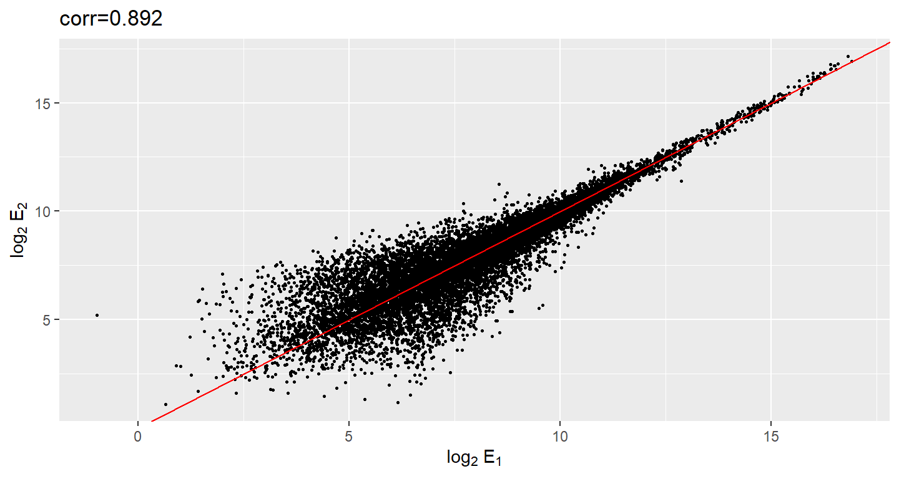

# Plots Behaving Badly

This section is based on talk by Karl W. Broman titled "How to Display Data Badly" in which he described how the default plots offered by Microsoft Excel "obscure your data and annoy your readers". His lecture was inspired by Howard Wainer's 1984 paper: How to display data badly. American Statistician 38(2): 137--147. Howard was the first to elucidate the principles of the bad display of data. But according to Karl "The now widespread use of Microsoft Excel has resulted in remarkable advances in the field."

## General Principles

General principles

The aims of good data graphics is to display data accurately and clearly. Some rules for displaying data badly:

*  Display as little information as possible.
*  Obscure what you do show (with chart junk).
*  Use pseudo-3d and color gratuitously.
*  Make a pie chart (preferably in color and 3d).
*  Use a poorly chosen scale.
*  Ignore significant figures.


### Piecharts


Say we want the report the results from a poll asking about browser preference (taken in August 2013). The standard way of displaying these is with a piechart:


```r
pie(browsers,
    main = "Browser Usage (August 2013)")
```


But as stated by the help file for the `pie` function:

> Pie charts are a very bad way of displaying information. The eye is good at judging linear measures and bad at judging relative areas. A bar chart or dot chart is a preferable way of displaying this type of data.

To see this, look at the figure above an try to determine the percentages just from looking at the plot. Simply showing the numbers is not only clear but it saves on printing costs.


```r
browsers
#>   Opera  Safari Firefox      IE  Chrome 
#>       1       9      20      26      44
```

If you do want to plot them, then a barplot is appropriate:


```r
barplot(browsers,
        main = "Browser Usage (August 2013)")
```


Note that we can now pretty easily determine the percentages by following a horizontal line to the x-axis. Do avoid 3-D version as they obfuscate the plot and remove this particular advantage.


Note that even worse that piecharts are donut plots.


The reason is that by removing the center we remove one of the visual cues for determining the different areas: the angles. There is no reason to ever use a donut to display data.

###  Barplots as data summaries

Although barplots are useful for showing percentages, they are incorrectly used to display data from two groups begin compared. Specifically, barplots are created with height equal to the group means and an antenna is added at the top to represent standard errors. This plot is simply showing two numbers per groups and the plot adds nothing:


Much more informative is to summarizing with a boxplot. If the number of points is small enough, we might as well add them to the plot. When the number of points is too large for us to see them, just showing a boxplot is preferable.


```r
#library("downloader")
#tmpfile <- tempfile()
#download("https://github.com/kbroman/Talk_Graphs/raw/master/R/fig1.RData")
#load("data/badgraphfig1.RData")
library(tidyverse)
library(rafalib)

df_fig1 <- read.csv("data/bromanfig1.csv")

mypar(1,1)
dat <- list(Treatment=df_fig1$x,
            Control=df_fig1$y)
dat %>%
  boxplot(xlab = "Group",
          ylab = "Response",
          cex = 0)
dat %>%
  stripchart(
    vertical = TRUE,
    method = "jitter",
    pch = 16,
    add = TRUE,
    col = 1
  )
```


Note how much more we see here: the center, spread, range and the points themselves while in the barplot we only see the mean and the SE and the SE has more to do with sample size than the spread of the data.

This problem is magnified when our data has outliers or very large tails. Note that from this plot there appears to be very large and consistent difference between the two groups:


A quick look at the data demonstrates that this difference is mostly driven by just two points. A version showing the data in the log-scale is much more informative.


```r
df_fig3 <- read.csv("data/bromanfig3.csv")

library(rafalib)
mypar(1, 2)
dat <- list(Treatment = df_fig3$x,
            Control = df_fig3$y)
dat %>%
boxplot(
  xlab = "Group",
  ylab = "Response",
  xlab = "Group",
  ylab = "Response",
  cex = 0
)
#> Warning in (function (z, notch = FALSE, width = NULL, varwidth = FALSE, :
#> Duplicated arguments xlab = "Group", ylab = "Response" are disregarded

dat %>%
stripchart(
  vertical = TRUE,
  method = "jitter",
  pch = 16,
  add = TRUE,
  col = 1
)
dat %>%
  boxplot(
    xlab = "Group",
    ylab = "Response",
    xlab = "Group",
    ylab = "Response",
    log = "y",
    cex = 0
  )
#> Warning in (function (z, notch = FALSE, width = NULL, varwidth = FALSE, :
#> Duplicated arguments xlab = "Group", ylab = "Response" are disregarded
dat %>%
  stripchart(
    vertical = TRUE,
    method = "jitter",
    pch = 16,
    add = TRUE,
    col = 1
  )
```


### Show the scatterplot

The purpose of many statistical analyses is to determine relationships between two variables. Sample correlations are typically reported and sometimes plots are displayed to show this. However, showing just the regression line is one way to display your data baldy as it hides the scatter. Surprisingly plots such as the following are commonly seen:


```r
df_fig4 <- read.csv("data/bromanfig4.csv")

fit <- lm(y ~ x,
          data = df_fig4)

rho <- (round(cor(df_fig4$x,
                  df_fig4$y),
              4))

ggplot(data = df_fig4,
       aes(x = x, y = y)) +
  geom_point(alpha=0) +
  geom_abline(intercept = fit$coef[1],
              slope = fit$coef[2], lwd = 1) +
  geom_text(x = 85, y = 200,
            label = paste("y =", round(fit$coef[1], 3),
                          "+", round(fit$coef[2], 3), "x")) +
  geom_text(x = 85, y = 187, 
            label = expression(paste(rho, " = 0.8567")))
```


Showing the data is much more informative:

```r
ggplot(data = df_fig4, aes(x = x, y = y)) +
  geom_point() +
  geom_abline(intercept = fit$coef[1],
              slope = fit$coef[2], lwd = 1) +
  geom_text(x = 85, y = 200,
            label = paste("y =", round(fit$coef[1], 3),
                          "+", round(fit$coef[2], 3), "x")) +
  geom_text(x = 85, y = 187, 
            label = expression(paste(rho, " = 0.8567")))
```


##  High correlation does not imply replication

When new technologies or laboratory techniques are introduced, we are often shown scatter plots and correlations from replicated samples. High correlations are used to demonstrate that the new technique is reproducible. But correlation can be very misleading. Below is a scatter plot showing data from replicated samples run on a high throughput technology. This technology outputs 12,626 simultaneously measurements.

In the plot on the left we see the original data which shows very high correlation. But the data follows a distribution with very fat tails. Note that 95% of the data is below the green line. The plot on the right is in the log scale. 


```r
# if (!requireNamespace("BiocManager", quietly = TRUE)) install.packages("BiocManager")
# BiocManager::install("Biobase")
# BiocManager::install("SpikeInSubset")

library(Biobase)
library(SpikeInSubset)
```


```r
data(mas95)
mypar(1, 2)

df_mas95 <- data.frame(r = exprs(mas95)[, 1], ##original measures were not logged
                       g = exprs(mas95)[, 2])

f <- function(a,
              x,
              y,
              p = 0.95) {
  mean(x <= a & y <= a) - p
}

a95 <- uniroot(
  f,
  lower = 2000,
  upper = 20000,
  x = df_mas95$r,
  y = df_mas95$g)$root

string_cor = signif(cor(df_mas95$r, df_mas95$g), 3)


ggplot(data = df_mas95, 
       aes(x = r, y = g)) +
  geom_point(color = "black",size=0.5) +
  geom_abline(slope = 1, intercept = 0, color = "red") +
  xlab(expression(paste(E[1]))) +
  ylab(expression(paste(E[2]))) +
  ggtitle(paste0("corr=", string_cor)) +

  geom_abline(slope = -1, intercept = a95, color = "seagreen") +
  geom_text(x = 8500, y = 0, 
            label = "95% of data below this line",vjust = "inward", hjust = "inward",
            color = "seagreen")
```


```r


df_mas95 <- df_mas95 %>% 
  mutate(r = log2(r),
         g = log2(g))

string_cor = signif(cor(df_mas95$r, df_mas95$g), 3)

ggplot(data = df_mas95, 
       aes(x = r, y = g)) +
  geom_point(color = "black",size=0.5) +
  geom_abline(slope = 1, intercept = 0, color = "red") +
  xlab(expression(paste(log[2], " ", E[1]))) +
  ylab(expression(paste(log[2], " ", E[2]))) +
  ggtitle(paste0("corr=",string_cor))
```



Although the correlation is reduced in the log-scale, it is very close to 1 in both cases. Does this mean these data are reproduced? To examine how well the second vector reproduces the first 
What we need to study the differences so we should instead plot that. In this plot we plot the difference (in the log scale) versus the average:


```r
df_mas95 <- df_mas95 %>%
  mutate(x = (r + g) / 2,
         y = (r - g))

string_sd = signif(sqrt(mean((df_mas95$r - df_mas95$g) ^ 2)), 3)


ggplot(data = df_mas95, aes(x = x, y = y)) +
  geom_point(size = .5, color = "black") +
  geom_hline(yintercept = 0, color = "red") +
  xlab(expression(paste("Ave{ ", log[2], " ", E[1], ", ", log[2], " ", E[2], " }"))) +
  ylab(expression(paste(log[2], " { ", E[1], " / ", E[2], " }"))) +
  ggtitle(paste0("SD=", string_sd))
```


These are referred to as Bland-Altman plots or MA plots in the genomics literature and will say more later. In this plot we see that the typical difference in the log (base 2) scale between two replicated measures is about 1. This means that when measurements should be the same we will, on average, observe 2 fold difference. We can now compare this variability to the differences we want to detect and decide if this technology is precise enough for our purposes.


##  Barpots for paired data

A common task in data analysis is the comparison of two groups. When the dataset is small and  data are paired, for example outcomes before and after a treatment, an unfortunate display that is used is the barplot with two colors:


There are various better ways of showing these data to illustrate there is an increase after treatment. One is to simply make a scatterplot and which shows that most points are above the identity line. Another alternative is plot the differences against the before values.


```r
set.seed(12201970)
before <- runif(6, 5, 8)
after <- rnorm(6, before * 1.05, 2)
li <- range(c(before, after))
ymx <- max(abs(after - before))

mypar(1, 2)
plot(
  before,
  after,
  xlab = "Before",
  ylab = "After",
  ylim = li,
  xlim = li
)
abline(0, 1, lty = 2, col = 1)


plot(
  before,
  after - before,
  xlab = "Before",
  ylim = c(-ymx, ymx),
  ylab = "Change (After - Before)",
  lwd = 2
)
abline(h = 0, lty = 2, col = 1)
```


Line plots are not a bad choice, although I find them harder to follow than the previous two. Boxplots show you the increase, but lose the paired information.


```r
z <- rep(c(0, 1), rep(6, 2))
mypar(1, 2)
plot(
  z,
  c(before, after),
  xaxt = "n",
  ylab = "Response",
  xlab = "",
  xlim = c(-0.5, 1.5)
)
axis(side = 1, at = c(0, 1), c("Before", "After"))
segments(rep(0, 6), before, rep(1, 6), after, col = 1)

boxplot(before,
        after,
        names = c("Before", "After"),
        ylab = "Response")
```


##  Gratuitous  3D

The follow figure shows three curves. Pseudo 3D is used but it is not clear way. Maybe to separate the three curves? Note how difficult it is to determine the values of the curves at any given point:


This plot can be made better by simply using color to distinguish the three lines:


```r
#download("https://github.com/kbroman/Talk_Graphs/raw/master/R/fig8dat.csv",tmpfile)
x <- read.table("data//fig8dat.csv", sep = ",", header = TRUE)
plot(
  x[, 1],
  x[, 2],
  xlab = "log Dose",
  ylab = "Proportion survived",
  ylim = c(0, 1),
  type = "l",
  lwd = 2,
  col = 1
)
lines(x[, 1], x[, 3], lwd = 2, col = 2)
lines(x[, 1], x[, 4], lwd = 2, col = 3)
legend(1,
       0.4,
       c("Drug A", "Drug B", "Drug C"),
       lwd = 2,
       col = 1:3)
```


## Ignoring important factors


In this example we generate data with a simulation. We are studying a dose response relationship between two groups treatment and control. We have three groups of measurements for both control and treatment. Comparing treatment and control using the common barplot:


Instead we should show each curve. We can use color to distinguish treatment and control and dashed and solid lines to distinguish the original data from the mean of the three groups.


```r
plot(
  x,
  y1,
  ylim = c(0, 1),
  type = "n",
  xlab = "Dose",
  ylab = "Response"
)
for (i in 1:3) {
  lines(x,
        z[, i],
        col = 1,
        lwd = 1,
        lty = 2)
}
for (i in 1:3) {
  lines(x,
        y[, i],
        col = 2,
        lwd = 1,
        lty = 2)
}
lines(x, ym, col = 1, lwd = 2)
lines(x, zm, col = 2, lwd = 2)
legend("bottomleft",
       lwd = 2,
       col = c(1, 2),
       c("Control", "Treated"))
```


## Too many significant digits

By default, statistical software like R return many significant digits. This does not mean we should report them. Cutting and pasting directly from R is a bad idea as you might end up showing a table like this for, say, heights of basketball players:


```r
heights <- cbind(rnorm(8, 73, 3),
                 rnorm(8, 73, 3),
                 rnorm(8, 80, 3),
                 rnorm(8, 78, 3),
                 rnorm(8, 78, 3))
colnames(heights) <- c("SG", "PG", "C", "PF", "SF")
rownames(heights) <- paste("team", 1:8)
heights
#>          SG   PG    C   PF   SF
#> team 1 76.4 76.2 81.7 75.3 77.2
#> team 2 74.1 71.1 80.3 81.6 73.0
#> team 3 71.5 69.0 85.8 80.1 72.8
#> team 4 78.7 72.8 81.3 76.3 82.9
#> team 5 73.4 73.3 79.2 79.7 80.3
#> team 6 72.9 71.8 77.4 81.7 80.4
#> team 7 68.4 73.0 79.1 71.2 77.2
#> team 8 73.8 75.6 83.0 75.6 87.7
```

Note we are reporting precision up to 0.00001 inches. Do you know of a tape measure with that much 
precision? This can be easily remedied:


```r
round(heights,1)
#>          SG   PG    C   PF   SF
#> team 1 76.4 76.2 81.7 75.3 77.2
#> team 2 74.1 71.1 80.3 81.6 73.0
#> team 3 71.5 69.0 85.8 80.1 72.8
#> team 4 78.7 72.8 81.3 76.3 82.9
#> team 5 73.4 73.3 79.2 79.7 80.3
#> team 6 72.9 71.8 77.4 81.7 80.4
#> team 7 68.4 73.0 79.1 71.2 77.2
#> team 8 73.8 75.6 83.0 75.6 87.7
```

## Displaying data well

In general you should follow these principles:

* Be accurate and clear.
* Let the data speak.
* Show as much information as possible, taking care not to obscure the message.
* Science not sales: avoid unnecessary frills (esp. gratuitous 3d).
* In tables, every digit should be meaningful. Don't drop ending 0s.

## Some further reading:

* ER Tufte (1983) The visual display of quantitative information.
Graphics Press.
* ER Tufte (1990) Envisioning information. Graphics Press.
* ER Tufte (1997) Visual explanations. Graphics Press.

* WS Cleveland (1993) Visualizing data. Hobart Press.
* WS Cleveland (1994) The elements of graphing data. CRC Press.

* A Gelman, C Pasarica, R Dodhia (2002) Let's practice what we preach:
Turning tables into graphs. The American Statistician 56:121-130
* NB Robbins (2004) Creating more effective graphs. Wiley
* [Nature Methods columns](http://bang.clearscience.info/?p=546) 


# ODD: Design choices in data visualization

I have curated this collection of external video sources on design choices in data visualization.

## How to spot a misleading graph 

When they're used well, graphs can help us intuitively grasp complex data. But as visual software has enabled more usage of graphs throughout all media, it has also made them easier to use in a careless or dishonest way — and as it turns out, there are plenty of ways graphs can mislead and outright manipulate. Lea Gaslowitz shares some things to look out for.


```{=html}
<div class="vembedr" align="center">
<div>
<iframe src="https://www.youtube.com/embed/E91bGT9BjYk" width="533" height="300" frameborder="0" allowfullscreen="" data-external="1"></iframe>
</div>
</div>
```

## Data Visualization and Misrepresentation

This animation was produced by some of my colleagues at Brown.


```{=html}
<div class="vembedr" align="center">
<div>
<iframe src="https://www.youtube.com/embed/x-rDVXVwW9s" width="533" height="300" frameborder="0" allowfullscreen="" data-external="1"></iframe>
</div>
</div>
```

## Vox on How coronavirus charts can mislead us


```{=html}
<div class="vembedr" align="center">
<div>
<iframe src="https://www.youtube.com/embed/O-3Mlj3MQ_Q" width="533" height="300" frameborder="0" allowfullscreen="" data-external="1"></iframe>
</div>
</div>
```

## Vox on Shut up about the y-axis. It shouldn't always start at zero.


```{=html}
<div class="vembedr" align="center">
<div>
<iframe src="https://www.youtube.com/embed/14VYnFhBKcY" width="533" height="300" frameborder="0" allowfullscreen="" data-external="1"></iframe>
</div>
</div>
```


```{=html}
<blockquote class="twitter-tweet" data-width="550" data-lang="en" data-dnt="true" data-theme="light"><p lang="en" dir="ltr">Also a nice example of appropriately choosing a y-axis window (cf. <a href="https://twitter.com/sharoz?ref_src=twsrc%5Etfw">@sharoz</a>) <a href="https://t.co/wCiOeyTo6k">https://t.co/wCiOeyTo6k</a></p>&mdash; Brenton Wiernik 🏳️‍🌈 (@bmwiernik) <a href="https://twitter.com/bmwiernik/status/1362437077820968960?ref_src=twsrc%5Etfw">February 18, 2021</a></blockquote>

```

## Gloriously Terrible Plots!!


```{=html}
<blockquote class="twitter-tweet" data-width="550" data-lang="en" data-dnt="true" data-theme="light"><p lang="en" dir="ltr">this is the worst figure i&#39;ve ever made in R. completely useless. 10/10 would make this aRt again <a href="https://t.co/8BN9j5H2C0">pic.twitter.com/8BN9j5H2C0</a></p>&mdash; jamie (@_quinntuition) <a href="https://twitter.com/_quinntuition/status/1380564902578913287?ref_src=twsrc%5Etfw">April 9, 2021</a></blockquote>

```


<!--DS4P Links-->
[course_web]: https://datascience4psych.github.io/DataScience4Psych
[course_git]: https://github.com/DataScience4Psych/DataScience4Psych
[course_repo]: https://github.com/DataScience4Psych
[course_slides]: https://github.com/DataScience4Psych/slides
[course_syllabus]: https://smasongarrison.github.io/syllabi/ 
<!-- https://smasongarrison.github.io/syllabi/data-science.html -->
[syllabi]: https://smasongarrison.github.io/syllabi
[pl_00]: https://www.youtube.com/playlist?list=PLKrrdtYgOUYaEAnJX20Ryy4OSie375rVY
[pl_01]: https://www.youtube.com/playlist?list=PLKrrdtYgOUYao_7t5ycK4KDXNKaY-ECup
[pl_02]: https://www.youtube.com/playlist?list=PLKrrdtYgOUYZmr_T3PnuxjVIlj0C0kUNI
[pl_03]: https://www.youtube.com/playlist?list=PLKrrdtYgOUYaHmjzdRvfg0yhOIYQnfjwE
[pl_04]: https://www.youtube.com/playlist?list=PLKrrdtYgOUYYWFcel6_vp8__RUKLxhX4y
[pl_05]: https://www.youtube.com/playlist?list=PLKrrdtYgOUYYMIguiV1F8RagMYibTY4iW
[pl_06]: https://www.youtube.com/playlist?list=PLKrrdtYgOUYYV_KDod3Mk9-RmtFXii9Dv
[pl_07]: https://www.youtube.com/watch?list=PLKrrdtYgOUYZxvEvQ8-PcWrOY_dwY_ETI
[pl_08]: https://www.youtube.com/playlist?list=PLKrrdtYgOUYZgOzYB_dmauw55M7jXvsdo
[pl_09]: https://www.youtube.com/playlist?list=PLKrrdtYgOUYbaiTmldRY2ddsLrHp3z6yO
[pl_10]: https://www.youtube.com/playlist?list=PLKrrdtYgOUYbPw5iYzYEzoOKa7mJKNIhq
[pl_11]: https://www.youtube.com/playlist?list=PLKrrdtYgOUYZ-u6LzBbanrNFoeLHKaLL6
[pl_12]: https://www.youtube.com/playlist?list=PLKrrdtYgOUYbwRS-9Htmb80_t1NG-021e
[pl_13]: https://www.youtube.com/playlist?list=PLKrrdtYgOUYbWGmSnbLIYwdLOnGm6une6
[pl_14]: https://www.youtube.com/playlist?list=PLKrrdtYgOUYbWGmSnbLIYwdLOnGm6une6
[pl_15]: https://www.youtube.com/playlist?list=PLKrrdtYgOUYa5MoYrV8EsWQ5jIr5ZYMpM
[pl_all]: https://www.youtube.com/playlist?list=PLKrrdtYgOUYZomNqf-1dtCDW94ySdLv-9


<!--AE Links-->
[ae01a_unvotes]: https://github.com/DataScience4Psych/ae01a_unvotes
[ae01b_covid]: https://github.com/DataScience4Psych/ae01b_covid
[ae02_bechdel]: https://github.com/DataScience4Psych/ae-02-bechdel-rmarkdown
[ae03_starwars]: https://github.com/DataScience4Psych/ae-03-starwars-dataviz


<!-- Lab Links-->

[lab01_hello]: https://github.com/DataScience4Psych/lab-01-hello-r

<!--Slides-->
[d01_welcome]: https://datascience4psych.github.io/slides/d01_welcome/d01_welcome.html
[d02_toolkit]: https://datascience4psych.github.io/slides/d02_toolkit/d02_toolkit.html
[d03_dataviz]: https://datascience4psych.github.io/slides/d03_dataviz/d03_dataviz.html
[d04_ggplot2]: https://datascience4psych.github.io/slides/d04_ggplot2/d04_ggplot2.html
[d05_viznum]: https://datascience4psych.github.io/slides/d05_viznum/d05_viznum.html
[d06_vizcat]: https://datascience4psych.github.io/slides/d06_vizcat/d06_vizcat.html
[d07_tidy]: https://datascience4psych.github.io/slides/d07_tidy/d07_tidy.html
[d08_grammar]: https://datascience4psych.github.io/slides/d08_grammar/d08_grammar.html
[d09_wrangle]: https://datascience4psych.github.io/slides/d09_wrangle/d09_wrangle.html
[d10_dfs]: https://datascience4psych.github.io/slides/d10_dfs/d10_dfs.html
[d11_types]: https://datascience4psych.github.io/slides/d11_types/d11_types.html
[d12_import]: https://datascience4psych.github.io/slides/d12_import/d12_import.html
[d13_goodviz]: https://datascience4psych.github.io/slides/d13_goodviz/d13_goodviz.html
[d13b_moreggplot]: https://datascience4psych.github.io/slides/d13_goodviz/d13b_moreggplot.html
[d14_confound]: https://datascience4psych.github.io/slides/d14_confound/d14_confound.html
[d15_goodtalk]: https://datascience4psych.github.io/slides/d15_goodtalk/d15_goodtalk.html
[d16_webscraping]: https://datascience4psych.github.io/slides/d16_webscraping/d16_webscraping.html
[d17_functions]: https://datascience4psych.github.io/slides/d17_functions/d17_functions.html
[d18_ethics]: https://datascience4psych.github.io/slides/d18_ethics/d18_ethics.html
[d19_bias]: https://datascience4psych.github.io/slides/d19_bias/d19_bias.html


<!--externals-->

[stat545]: https://stat545.com
[r4ds]: https://r4ds.had.co.nz
[cran]: https://cloud.r-project.org
