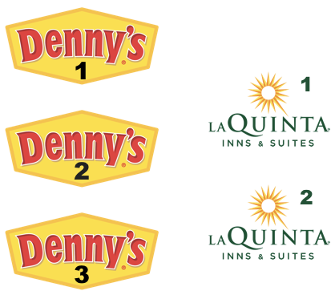
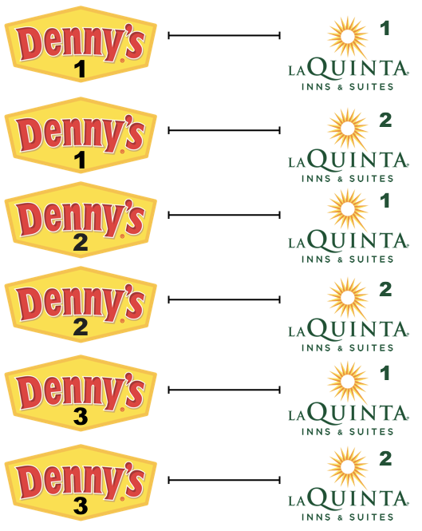
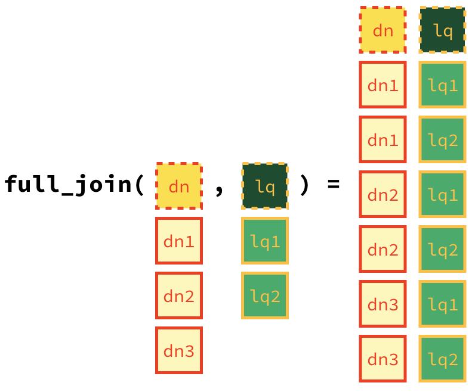
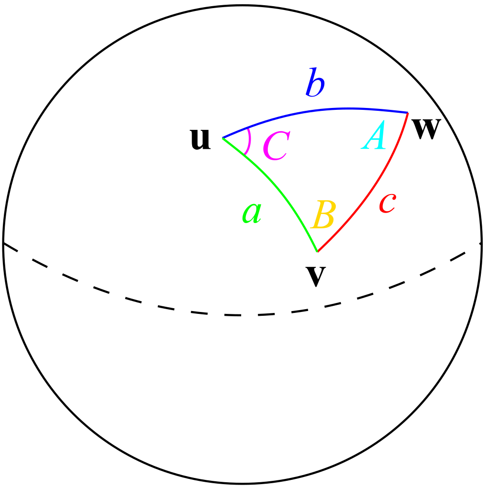
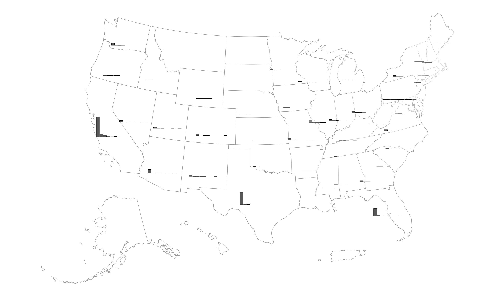

# LAB: Wrangling spatial data {#lab05}

## La Quinta is Spanish for *next to Denny's*, Pt. 2"

```{r lab_laquinta-setup, include=FALSE}
library(tufte)
library(knitr)
options(
  htmltools.dir.version = FALSE, # for blogdown
  show.signif.stars = FALSE, # for regression output
  digits = 2
)
# knitr::opts_chunk$set(eval = FALSE)
```

```{r fig.margin=TRUE, eval=TRUE, echo=FALSE}

```

In this lab, we revisit the Denny's and La Quinta Inn and Suites data we visualized in the previous lab.

## Getting started {.unnumbered}

- Go to the course organization on GitHub.

- Find your lab repo.

### Packages {.unnumbered}


```{r dsboxoncran, include=FALSE, eval=TRUE}
library(pak)
# error means not on cran
dsbox_status <- tryCatch(pkg_history("dsbox"), error = function(e) "not on CRAN")

```

In this lab, we will use the **tidyverse** and **dsbox** packages. The **dsbox** package is currently `r ifelse(dsbox_status == "not on CRAN","not ","")` available on CRAN.  `r ifelse(dsbox_status == "not on CRAN","However","If you are curious")`, you can find the most current version hosted on GitHub. `r ifelse(dsbox_status == "not on CRAN","Therefore, you will need to download and","If you'd like\ the cutting edge version of dsbox from GitHub, you can")` [install it yourself](https://github.com/tidyverse/dsbox#installation). This piece of code should help get you started.


```{r lab_dennys-example-install,eval=FALSE}
install.packages("devtools")
devtools::install_github("tidyverse/dsbox")
```

```{r lab_dennys-code-packages, eval = TRUE, message = FALSE}
library(tidyverse)
library(dsbox)
```

<!-- if dsbox is not on cran, provide alternative data loading instructions -->
If you run into issues installing the **dsbox** package, don't worry! You can still complete the lab by downloading the datasets directly from GitHub. The code below will load the two datasets we will be using directly from GitHub. 
<details>
  <summary>Click to expand alternative data loading instructions</summary>
If you cannot get `dsbox` to install, you can instead download the two datasets we will be using manually [here](https://github.com/DataScience4Psych/DataScience4Psych/raw/main/data/raw-data/laquinta.rda) and [here](https://github.com/DataScience4Psych/DataScience4Psych/raw/main/data/raw-data/dennys.rda).

```
githubURL_1 <- "https://github.com/DataScience4Psych/DataScience4Psych/raw/main/data/raw-data/laquinta.rda"

githubURL_2 <- "https://github.com/DataScience4Psych/DataScience4Psych/raw/main/data/raw-data/dennys.rda"

load(url(githubURL_1))
load(url(githubURL_2))

```
</details>

### Housekeeping {.unnumbered}

#### Password caching {.unnumbered}

If you would like your git password cached for a week for this project, type the following in the Terminal:

```{bash eval=FALSE}
git config --global credential.helper 'cache --timeout 604800'
```

#### Project name {.unnumbered}

Currently your project is called *Untitled Project*. Update the name of your project to be "Lab 05 - Wrangling spatial data".

## Warm up {.unnumbered}

Before we introduce the data, let's warm up with some simple exercises.

### YAML {.unnumbered}

Open the R Markdown (Rmd) file in your project, change the author name to your name, and knit the document.

### Commiting and pushing changes: {.unnumbered}

- Go to the **Git** pane in your RStudio.
- View the **Diff** and confirm that you are happy with the changes.
- Add a commit message like "Update team name" in the **Commit message** box and hit **Commit**.
- Click on **Push**. This action will prompt a dialogue box where you first need to enter your user name, and then your password.

## The data {.unnumbered}

The datasets we'll use are called `dennys` and `laquinta` from the **dsbox** package.

## Exercises {.unnumbered}

1. Filter the Denny's data frame for Alaska (AK) and save the result as  `dn_ak`. How many Denny's locations are there in Alaska?

```{r lab_laquinta-setup-config, include=FALSE,eval=TRUE}
data(dennys)
data(laquinta)

dn <- dennys
lq <- laquinta
```

```{r lab_laquinta-code-filter-alaska, echo=TRUE,results='hide'}
dn_ak <- dn %>%
  filter(state == "AK")
nrow(dn_ak)
```

Now, do the same for La Quinta data frame for Alaska (AK) and save the result as `lq_ak`. How many La Quinta locations are there in Alaska?

```{r lab_laquinta-setup-lq-alaska, include=FALSE,eval=TRUE}
lq_ak <- lq %>%
  filter(state == "AK")
```

```
lq_ak <- YOUR CODE GOES HERE

nrow(lq_ak)
```

2. Next we will be calculating the distance between all Denny's and all La Quinta locations in Alaska. 

Let's take this step by step:

**Step 1:** There are `r nrow(dn_ak)` Denny's and `r nrow(lq_ak)` La Quinta locations in Alaska.
(If you answered differently above, you might want to recheck your answers.)

{width=300px height=300px}

**Step 2:** Let's focus on the first Denny's location. We'll need to
calculate two distances for it: (1) distance between Denny's 1 and
La Quinta 1 and (2) distance between Denny's 1 and La Quinta (2).

{width=300px height=150px}

**Step 3:** Now let's consider all Denny's locations.

{width=300px height=450px}

How many pairings are there between all Denny's and all La Quinta locations in Alaska, i.e., how many distances do we need to calculate between the  locations of these establishments in Alaska? Calculate the number of pairings using the data frames you have already made

```
YOUR CODE GOES HERE
```

3. In order to calculate these distances, we need to first restructure our data to pair the Denny's and La Quinta locations. To do so, we will join the two data frames. We have six join options in R. Each of these join functions take at least three arguments: `x`, `y`, and `by`.

- `x` and `y` are data frames to join
- `by` is the variable(s) to join by

Four of these join functions combine variables from the two data frames:

> Note: These functions are called **mutating joins**.

- `inner_join()`: return all rows from `x` where there are matching values  in `y`, and all columns from `x` and `y`.

- `left_join()`: return all rows from `x`, and all columns from `x` and `y`. Rows in x with no match in y will have NA values in the new columns.

- `right_join()`: return all rows from `y`, and all columns from `x` and `y`. Rows in y with no match in x will have NA values in the new columns.

- `full_join()`: return all rows and all columns from both `x` and `y`, where there are not matching values, returns NA for the one missing.

And the other two join functions only keep cases from the left-hand data frame, and are called **filtering joins**. We'll learn about these another time, but you can find out more about the join functions in the help files for any one of them, e.g. `?full_join`.

In practice, we mostly use mutating joins. In this case, we want to keep all rows and columns from both `dn_ak` and `lq_ak` data frames. So we will use a `full_join`.

```{r lab_laquinta-fig-screenshot, echo=FALSE, out.width="300px", fig.cap="Full join of Denny's and La Quinta locations in AK"}

```


Let's join the data on Denny's and La Quinta locations in Alaska, and take a look at what it looks like:

```{r lab_laquinta-code-join-alaska, echo=TRUE, message=TRUE, warning=FALSE,results='hide'}
dn_lq_ak <- full_join(dn_ak, lq_ak,
  by = "state"
)
dn_lq_ak
```

4. How many observations are in the joined `dn_lq_ak` data frame? What are the names of the variables in this data frame.

`.x` in the variable names means the variable comes from the `x` data frame (the first argument in the `full_join` call, i.e. `dn_ak`), and `.y` means the variable comes from the `y` data frame. These variables are renamed to include `.x` and `.y` because the two data frames have the same variables and it's not possible to have two variables in a data frame with the exact same name.

Now that we have the data in the format we wanted, all that is left is to calculate the distances between the pairs.

5. What function from the tidyverse do we use the add a new variable to a data frame while keeping the existing variables?

One way of calculating the distance between any two points on the earth is to use the [Haversine distance formula](https://en.wikipedia.org/wiki/Haversine_formula). This formula takes into account the fact that the earth is not flat, but instead spherical.

```{r haversines, echo=FALSE, out.width="20%", fig.cap="[Image Credit](https://commons.wikimedia.org/wiki/File:Law-of-haversines.svg) to [TheOtherJesse](https://commons.wikimedia.org/wiki/User:TheOtherJesse) and [Steven G. Johnson](https://commons.wikimedia.org/wiki/User:Stevenj) via wikimedia commons"}

```


This function is not available in R, but we can save the following function to a file called `haversine.R` that we can load and then use:

```{r lab_laquinta-code-haversine-function}
haversine <- function(long1, lat1, long2, lat2, round = 3) {
  # convert to radians
  long1 <- long1 * pi / 180
  lat1 <- lat1 * pi / 180
  long2 <- long2 * pi / 180
  lat2 <- lat2 * pi / 180

  R <- 6371 # Earth mean radius in km

  a <- sin((lat2 - lat1) / 2)^2 + cos(lat1) * cos(lat2) * sin((long2 - long1) / 2)^2
  d <- R * 2 * asin(sqrt(a))

  return(round(d, round)) # distance in km
}
```

This function takes five arguments:

- Longitude and latitude of the first location
- Longitude and latitude of the second location
- The number of digits to round your response to

6. Calculate the distances between all pairs of Denny's and La Quinta locations and save this variable as `distance`. Make sure to save this variable in THE `dn_lq_ak` data frame, so that you can use it later.

7. Calculate the minimum distance between a Denny's and La Quinta for each Denny's location. To do so we group by Denny's locations and calculate a new variable that stores the information for the minimum distance.

```{r lab_laquinta-solution_q7, include=FALSE}
dn_lq_ak_mindist <- dn_lq_ak %>%
  group_by(address.x) %>%
  mutate(distance = haversine(longitude.x, latitude.x, longitude.y, latitude.y)) %>%
  summarize(closest = min(distance))
```

8. Describe the distribution of the distances Denny's and the nearest La Quinta locations in Alaska. Also include an __appropriate__ visualization and relevant summary statistics.

9. Repeat the same analysis for North Carolina: (i) filter Denny's and La Quinta Data Frames for NC, (ii) join these data frames to get a complete list of all possible pairings, (iii) calculate the distances between all possible pairings of Denny's and La Quinta in NC, (iv) find the minimum distance between each Denny's and La Quinta location, (v) visualize and describe the distribution of these shortest distances using appropriate summary statistics.

10. Repeat the same analysis for Texas.

11. Repeat the same analysis for a state of your choosing, different than the ones we covered so far.

12. Among the states you examined, where is Mitch Hedberg's joke most likely to hold true? Explain your reasoning.


## Wrapping up {.unnumbered}

If you still have some time left, move on to the remaining exercises below. These are optional stretch goals. They are designed to challenge you and hone your skills.


13. Recreate the following plot, and interpret what you see in context of the data.


```{r echo=FALSE, message=FALSE, eval=T, warning=FALSE} 
library(ggridges)
dn_lq_full <- full_join(dn, lq, by = "state", 
                        relationship = "many-to-many", 
                        suffix = c(".d", ".l") ) 

dn_lq_full_mindist <- dn_lq_full %>% 
  group_by(address.d) %>% 
  mutate(distance = haversine(longitude.d, latitude.d, longitude.l, latitude.l)) %>% 
  summarize(closest = min(distance), state = first(state) )
dn_lq_full_mindist<-
dn_lq_full_mindist %>%
  filter(grepl("^N", dn_lq_full_mindist$state))

dn_lq_full_mindist %>% 
  ggplot(aes(x = closest, y = state,fill = state)) +
  geom_density_ridges() +
scale_y_discrete(expand = c(0.04, 0)) +
  labs( title = "Distribution of Minimum Distances", 
       suptitle = "between Denny's and La Quinta Locations",
        x = "Minimum Distance (miles)", y = "Count" ) + 
  scale_fill_brewer(palette = 4) +
  theme_ridges() + theme(legend.position = "none")
```

<details>
  <summary>Click to expand for a hint</summary>
Hint, you'll need to use the `ggridges` package to make the plot below.
</details>

14. Inspect the [source code](https://github.com/DataScience4Psych/DataScience4Psych/blob/main/0505_lab_laquinta.Rmd) used to create the plot below, and try to understand how it works. Then, modify the code to do something different. For example, you could change the bin width for the mini bar charts, or you could change the size of the mini bar charts, or you could change the color of the bars in the mini bar charts, etc.

```{r lab_finalgraph, echo=FALSE}

```

<details>
  <summary>Click to expand the code used to create the plot above</summary>
```{r message=FALSE, warning=FALSE, echo=TRUE}
# Source pattern: https://stackoverflow.com/a/36149654
# Posted by inscaven
# Retrieved 2026-02-08, License - CC BY-SA 3.0

library(usmap) #import the package
library(tidyverse)
library(usmap)
library(ggplot2)
library(sf)
library(grid)

# 1) Closest La Quinta distance for each Denny's (all states)
dn_lq_full <- full_join(
  dn, lq,
  by = "state",
  suffix = c(".d", ".l")
) %>%
  filter(!is.na(latitude.d) & !is.na(latitude.l)) %>%
   filter(!state %in% c("AK", "HI")) 

dn_lq_full_mindist <- dn_lq_full %>%
  group_by(address.d) %>%
  mutate(distance = haversine(longitude.d, latitude.d, longitude.l, latitude.l)) %>%
  summarize(
    closest = min(distance, na.rm = TRUE),
    state   = first(state),
    .groups = "drop"
  )

# 2) Per-state binned distributions (these become the embedded mini bar charts)
binwidth_m <- 25

# Cap extreme tail so small charts remain legible
x_cap <- as.numeric(quantile(dn_lq_full_mindist$closest, 0.99, na.rm = TRUE))
x_max <- ceiling(x_cap / binwidth_m) * binwidth_m

state_bins <- dn_lq_full_mindist %>%
  mutate(
    closest_cap = pmin(closest, x_max),
    bin_left    = floor(closest_cap / binwidth_m) * binwidth_m,
    bin_mid     = bin_left + binwidth_m / 2
  ) %>%
  count(state, bin_mid, name = "n")

y_max <- max(state_bins$n, na.rm = TRUE)

# 3) US map as sf + centroids 
states_sf <- usmap::us_map(regions = "states") 

state_centroids <- states_sf %>%
  st_centroid() %>%
  mutate(
    x = st_coordinates(.)[, 1],
    y = st_coordinates(.)[, 2]
  ) %>%
  st_drop_geometry() %>%
  transmute(state = abbr, x = x, y = y)

# Bounding box for scaling embedded plot sizes
bb <- st_bbox(states_sf)
x_range <- as.numeric(bb["xmax"] - bb["xmin"])
y_range <- as.numeric(bb["ymax"] - bb["ymin"])

# Size of embedded mini-plots in map coordinate units
dx <- x_range * 0.04
dy <- y_range * 0.04

# 4) Base map
base_map <- ggplot() +
  geom_sf(data = states_sf, fill = "white", color = "gray60", linewidth = 0.2) +
  coord_sf(clip = "off") +
  theme_void()

# 5) Build one mini-plot per state and place it at the state's centroid
annotation_list <- purrr::pmap(
  list(state_centroids$state, state_centroids$x, state_centroids$y),
  function(st, cx, cy) {
    st_dat <- state_bins %>% filter(state == st)
    if (nrow(st_dat) < 2) return(NULL)
    
    mini <- ggplot(st_dat, aes(x = bin_mid, y = n)) +
      geom_col(color = "black", linewidth = 0.2) +
      scale_x_continuous(limits = c(0, x_max), expand = c(0, 0)) +
      scale_y_continuous(limits = c(0, y_max), expand = c(0, 0)) +
      theme_void() +
      theme(
        plot.background = element_rect(fill = scales::alpha("white", 0.3), color = NA),
        plot.margin = margin(1, 1, 1, 1)
      )
    
    annotation_custom(
      grob = ggplotGrob(mini),
      xmin = cx - dx, xmax = cx + dx,
      ymin = cy - dy, ymax = cy + dy
    )
  }
)

annotation_list <- purrr::compact(annotation_list)

result_plot <- Reduce(`+`, annotation_list, base_map)


ggsave(
  result_plot,
  filename = "img/histogram-map.png",
  width = 10, height = 6, units = "in", dpi = 300
)

```

</details>

🧶 ✅ ⬆️ Knit, *commit, and push your changes to GitHub with an appropriate commit message. Make sure to commit and push all changed files so that your Git pane is cleared up afterwards and review the md document on GitHub to make sure you're happy with the final state of your work.*

