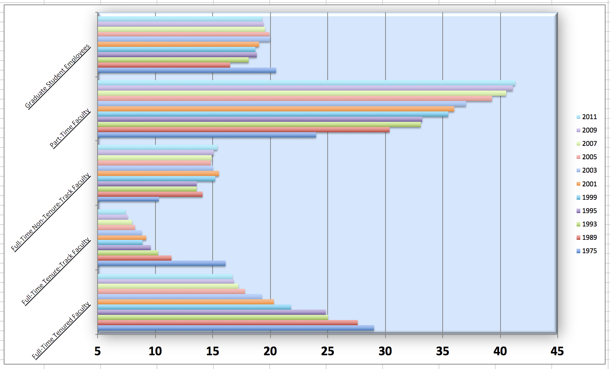
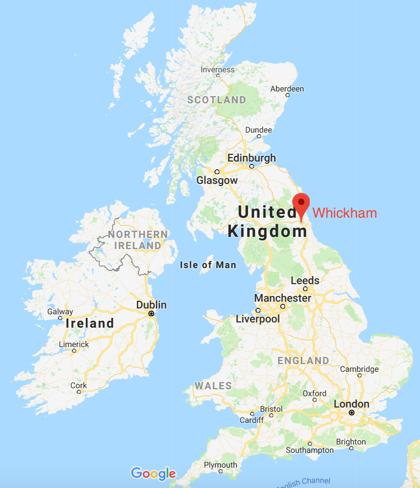

# Lab: Ugly charts and Simpson's paradox{#lab06}

```{r setup, include=FALSE}
knitr::opts_chunk$set(eval = TRUE)

library(tufte)
library(knitr)
options(
  htmltools.dir.version = FALSE, # for blogdown
  show.signif.stars = FALSE,     # for regression output
  digits = 2
  )
```


The two data visualized embedded in this lab violate many data visualization best practices.
Improve these visualizations using R and the tips for effective visualizations that we've introduced.
You should produce one visualization per dataset.
Your visualization should be accompanied by a brief paragraph describing the choices you made in your improvement, specifically discussing what you didn't like in the original plots and why, and how you addressed them in the visualization you created.


The learning goals for this lab are:

-   Telling a story with data
-   Data visualization best practices
-   Reshaping data

## Getting started

Go to the course GitHub organization and locate your lab repo. Either Fork it or copy it as a template. Then clone it in RStudio.
Refer to Lab 01 if you would like to see step-by-step instructions for cloning a repo into an RStudio project.

First, open the R Markdown document and Knit it. Make sure it compiles without errors. (Also, remember to check the final version after you upload!)

The output will be in the file markdown `.md` file with the same name.

### Housekeeping


> Remember: Your email address is the address tied to your GitHub account and your name should be first and last name.


Before we can get started we need to take care of some required housekeeping.
Specifically, we need to do some configuration so that RStudio can communicate with GitHub.
This requires two pieces of information: your email address and your name.

Run the following (but update it for your name and email!) in the Console to configure git:

```{r git-config, eval=FALSE}
library(usethis)
use_git_config(user.name = "Your Name", 
               user.email = "your.email@address.com")
```

## Packages

Run the following code in the Console to load this package.

```{r load-packages, message=FALSE, eval=TRUE}
library(tidyverse)
```

## Take a sad plot and make it better

### Instructional staff employment trends

The American Association of University Professors (AAUP) is a nonprofit membership association of faculty and other academic professionals.
[This report](https://www.aaup.org/sites/default/files/files/AAUP_Report_InstrStaff-75-11_apr2013.pdf) compiled by the AAUP shows trends in instructional staff employees between 1975 and 2011, and contains an image very similar to the one given below.

```{r echo=FALSE, fig.fullwidth=TRUE}

```

Let's start by loading the data used to create this plot.

```{r load-data-staff, message=FALSE, eval=TRUE}
staff <- read_csv("data/instructional-staff.csv")
```

Each row in this dataset represents a faculty type, and the columns are the years for which we have data.
The values are percentage of hires of that type of faculty for each year.

```{r echo=FALSE}
staff
```

In order to recreate this visualization we need to first reshape the data to have one variable for faculty type and one variable for year.
In other words, we will convert the data from wide format to long format.

But before we do so, a thought exercise: *How many rows will the long-format data have?* It will have a row for each combination of year and faculty type.
If there are 5 faculty types and 11 years of data, how many rows will we have?

We do the wide to long conversion using a new function: `pivot_longer()`.
The animation below show how this function works, as well as its counterpart `pivot_wider()`.

```{r echo=FALSE}
knitr::include_graphics("img/tidyr-longer-wider.gif")
```

The function has the following arguments:

```{r eval=FALSE}
pivot_longer(data, cols, names_to = "name")
```

-   The first argument is `data` as usual.
-   The second argument, `cols`, is where you specify which columns to pivot into longer format -- in this case all columns except for the `faculty_type`
-   The third argument, `names_to`, is a string specifying the name of the column to create from the data stored in the column names of data -- in this case `year`

```{r}
staff_long <- staff %>%
  pivot_longer(cols = -faculty_type, names_to = "year") %>%
  mutate(value = as.numeric(value))
```

Let's take a look at what the new longer data frame looks like.

```{r}
staff_long
```

And now let's plot is as a line plot.
A possible approach for creating a line plot where we color the lines by faculty type is the following:

```{r eval=TRUE, fig.width=10}
staff_long %>%
  ggplot(aes(x = year, y = value, color = faculty_type)) +
  geom_line()
```

But note that this results in a message as well as an unexpected plot.
The message is saying that there is only one observation for each faculty type year combination.
We can fix this using the `group` aesthetic following.

```{r eval=FALSE, fig.width=10}
staff_long %>%
  ggplot(aes(x = year, y = value, group = faculty_type, color = faculty_type)) +
  geom_line()
```

1. Include the line plot you made above in your report and make sure the figure width is large enough to make it legible.
>    Also fix the title, axis labels, and legend label.

2.  Suppose the objective of this plot was to show that the proportion of part-time faculty have gone up over time compared to other instructional staff types.
> What changes would you propose making to this plot to tell this story?


`r emo::ji("white_check_mark")` `r emo::ji("arrow_up")` *Commit and push your changes to GitHub with an appropriate commit message again. Make sure to commit and push all changed files so that your Git pane is cleared up afterwards.*

### Fisheries

Fisheries and Aquaculture Department of the Food and Agriculture Organization of the United Nations collects data on fisheries production of countries.
[This Wikipedia page](https://en.wikipedia.org/wiki/Fishing_industry_by_country) lists fishery production of countries for 2016.
For each country, tonnage from capture and aquaculture are listed.
Note that countries whose total harvest was less than 100,000 tons are not included in the visualization.

A researcher shared with you the following visualization they created based on these data <!--`r emo::ji("flushed")`-->.

```{r echo=FALSE, fig.fullwidth=TRUE}
knitr::include_graphics("img/fisheries.png")
```

3.  Can you help them make improve it? First, brainstorm how you would improve it. Then create the improved visualization and write up the changes/decisions you made as bullet points. It's ok if some of your improvements are aspirational, i.e. you don't know how to implement it, but you think it's a good idea. Ask a tutor for help, but also keep an eye on the time. Implement what you can and leave note identifying the aspirational improvements.

```{r load-data-fisheries, eval=FALSE}
fisheries <- read_csv("data/fisheries.csv")
```

`r emo::ji("white_check_mark")` `r emo::ji("arrow_up")` *Commit and push your changes to GitHub with an appropriate commit message again. Make sure to commit and push all changed files so that your Git pane is cleared up afterwards.*


## Stretch Practice with Smokers in Whickham


```{r fig.margin=TRUE, eval=TRUE, echo=FALSE}

```

A study of conducted in Whickham, England recorded participants' age, smoking status at baseline, and then 20 years later recorded their health outcome.

### Packages

Now, we will work with the `mosaicData` package.

Because this is first time we're using the `mosaicData` package, you need to make sure to install it first by running `install.packages("mosaicData")` in the console.

```{r}
library(tidyverse) 
library(mosaicData) 
```

Note that these packages are also loaded in your R Markdown document.

### The data

The data is in the `mosaicData` package. You can load it with

```{r load-data, eval = FALSE}
data(Whickham)
```

Take a peek at the codebook with

```{r eval=FALSE}
?Whickham
```

### Exercises

1. What type of study do you think these data come from: observational 
   or experiment? Why?

2. How many observations are in this dataset? What does each observation 
   represent?

3. How many variables are in this dataset? What type of variable is each? 
   Display each variable using an appropriate visualization.

4. What would you expect the relationship between smoking status and health outcome to be?

5. Create a visualization depicting the relationship between smoking status and health outcome. Briefly describe the relationship, and evaluate whether this meets your expectations. Additionally, calculate the relevant conditional probabilities to help your narrative. Here is some code to get you started:

```{r, eval = FALSE}
Whickham %>%
  count(smoker, outcome)
```

6. Create a new variable called `age_cat` using the following scheme:

- `age <= 44 ~ "18-44"`
- `age > 44 & age <= 64 ~ "45-64"`
- `age > 64 ~ "65+"`

7. Re-create the visualization depicting the relationship between smoking status and health outcome, faceted by `age_cat`. What changed? What might explain this change? Extend the contingency table from earlier by 
breaking it down by age category and use it to help your narrative.

```{r, eval = FALSE}
Whickham %>%
  count(smoker, age_cat, outcome)
```

## Wrapping up

Go back through your write up to make sure you're following coding style guidelines we discussed in class.
Make any edits as needed.

Also, make sure all of your R chunks are properly labeled, and your figures are reasonably sized.


## More ugly charts

Want to see more ugly charts?

-   [Flowing Data - Ugly Charts](https://flowingdata.com/category/visualization/ugly-visualization/)
-   [Reddit - Data is ugly](https://www.reddit.com/r/dataisugly/)
-   [Missed Opportunities and Graphical Failures](http://www.datavis.ca/gallery/missed.php)
-   [(Mostly Bad) Graphics and Tables](http://users.stat.umn.edu/~rend0020/Teaching/STAT8801-resources/graphics/index.html)

```{r links, child="admin/md/courselinks.md"}
```
