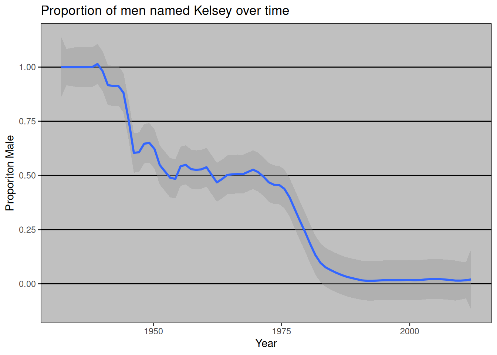
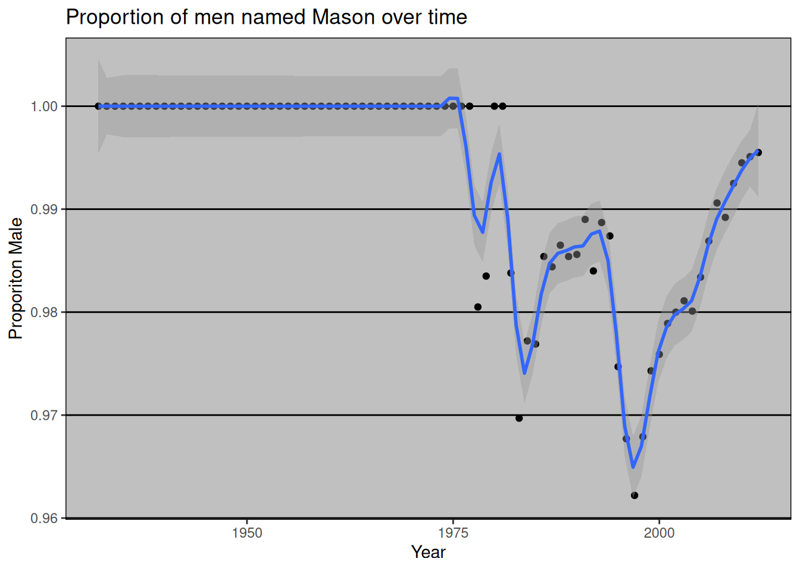
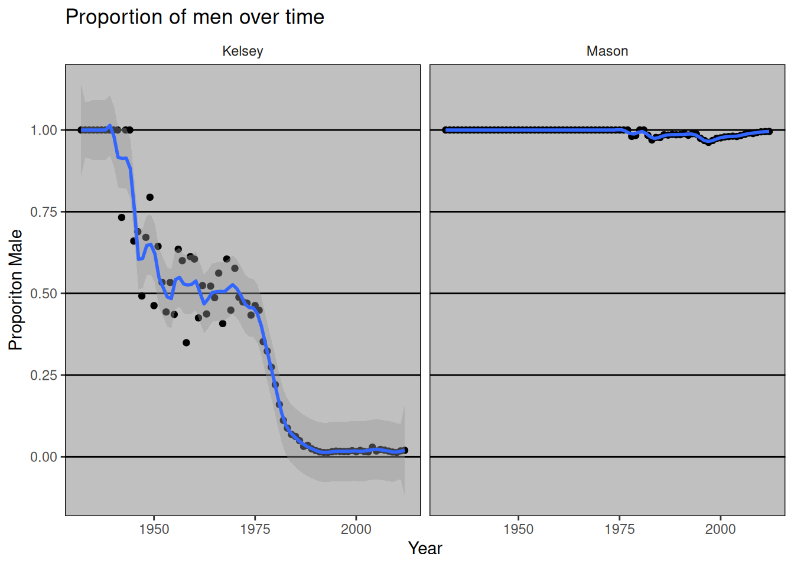

# Use API-wrapping packages {#api-wrappers}

This section explores how to use R packages that wrap APIs, allowing easy access to web data. We'll cover various approaches from simple downloads to more complex API interactions. This content builds on Jenny Bryan's stat545 materials, with significant updates and additions to reflect current best practices. For a more in-depth look at APIs, check out the [API chapter](https://r4ds.had.co.nz/apis.html) in the R for Data Science book. For a huge list of free apis to play with, check out [this list](https://free-apis.github.io/#/)


```{=html}
<blockquote class="twitter-tweet" data-width="550" data-lang="en" data-dnt="true" data-theme="light"><p lang="en" dir="ltr">Google trends analytics is helpful in the study of global web search patterns.<br><br>The {gtrends} function from {gtrendsR} 📦 helps extract and visualize this data for specified periods and geolocations 🔎<a href="https://t.co/yS01ELq5q4">https://t.co/yS01ELq5q4</a><a href="https://twitter.com/hashtag/rstats?src=hash&amp;ref_src=twsrc%5Etfw">#rstats</a> <a href="https://twitter.com/hashtag/DataScience?src=hash&amp;ref_src=twsrc%5Etfw">#DataScience</a> <a href="https://t.co/mhGTSXB2rN">pic.twitter.com/mhGTSXB2rN</a></p>&mdash; R Function A Day (@rfunctionaday) <a href="https://twitter.com/rfunctionaday/status/1381848183928729600?ref_src=twsrc%5Etfw">April 13, 2021</a></blockquote>

```


## The Data Acquisition Spectrum

When it comes to obtaining data from the internet, we can categorize methods into four main type
* *Direct Download*: Grabbing readily available flat files (CSV, XLS, etc.)
* *Wrapped API Access*: Using R packages designed for specific APIs
* *Raw API Interaction*: Crafting custom queries for APIs
* *Web Scraping*: Extracting data embedded in HTML structures

We'll focus primarily on the second method, but now you know about the full spectrum of options at your disposal.
For a comprehensive list of R tools for interacting with the internet, check out the [rOpenSci repository]( https://github.com/ropensci/webservices). These tools include packages for APIs, scraping, and more.


## Direct Download

In the simplest case, the data you need is already on the internet in a tabular format. Effectively, you just need to click and download whatever data you need. There are a couple of strategies here:

* Use `read.csv` or `readr::read_csv` to read the data straight into R.
* Use the command line program `curl` to do that work, and place it in a `Makefile` or shell script (see the [section on `make`](#automation-overview) for more on this).

The second case is most useful when the data you want has been provided in a format that needs cleanup. For example, the World Value Survey makes several datasets available as Excel sheets. The safest option here is to download the `.xls` file, then read it into R with `readxl::read_excel()` or something similar. An exception to this is data provided as Google Spreadsheets, which can be read straight into R using the [`googlesheets`](https://github.com/jennybc/googlesheets) package.

### From rOpenSci web services page

From rOpenSci's [CRAN Task View: Web Technologies and Services](https://github.com/ropensci/webservices):

* `downloader::download()` for SSL.
* `curl::curl()` for SSL.
* `httr::GET` data read this way needs to be parsed later with `read.table()`.
* `rio::import()` can "read a number of common data formats directly from an `https://` URL".  Isn't that very similar to the previous?

What about packages that install data?

## Data supplied on the web

Many times, the data that you want is not already organized into one or a few tables that you can read directly into R. More frequently, you find this data is given in the form of an API. **A**pplication **P**rogramming **I**nterfaces (APIs) are descriptions of the kind of requests that can be made of a certain piece of software, and descriptions of the kind of answers that are returned.

Many sources of data -- databases, websites, services -- have made all (or part) of their data available via APIs over the internet. Computer programs ("clients") can make requests of the server, and the server will respond by sending data (or an error message). This client can be many kinds of other programs or websites, including R running from your laptop.

## Streamlined Data Retrieval with API Wrappers

Many common web services and APIs have been "wrapped", i.e. R functions have been written around them which send your query to the server and format the response. This is a great way to get started with APIs, as you don't need to worry about the details of the API itself. You can just focus on the data you want to get.

API-wrapping packages act as intermediaries between your R environment and web services. They handle the nitty-gritty of API calls, authentication, and data parsing, allowing you to focus on analysis rather than data acquisition logistics. These packages are especially useful for beginners, as they abstract away the complexities of web service interaction. For added bonuses, they often ensure that the data you receive is actually from the API you intended to query, and they provide a structured reproducible way to access the data. 


### Case Study: Ornithological Data with rebird

Let's dive into a practical example using the [rebird](https://github.com/ropensci/rebird) package, which interfaces with the [eBird](http://ebird.org/content/ebird/) database. eBird lets birders upload sightings of birds, and allows everyone access to those data. rebird makes it easy to access this data from R (as long as you request an API key)


``` r
library(tidyverse)
library(kableExtra)
library(rebird)
```

First, let's fetch recent bird sightings from a specific location:


#### Search birds by geography

The eBird website categorizes some popular locations as "Hotspots". These are areas where there are both lots of birds and lots of birders. One such location is at Iona Island, near Vancouver. You can see data for this Hotspot at [http://ebird.org/ebird/hotspot/L261851](http://ebird.org/ebird/hotspot/L261851).

At that link, you will see a page like this:

<div class="figure">

<p class="caption">(\#fig:ebird-iona-island)Iona Island</p>
</div>

The data already looks to be organized in a data frame! rebird allows us to read these data directly into R (the ID code for Iona Island is **"L261851"**). Note that this requires an API key which you have to request from ebird via this [link](https://ebird.org/api/request) . I have set my key as an environment variable. However you can set it as a global variable in your R session. Like this:

<!--TODO: The following chunks are broken; ebird now requires an API key.-->

``` r
ebirdkey <- "SECRET API KEY"
```


``` r
ebirdregion(loc = "L261851", key = ebirdkey) %>%
  head() %>%
  kable()
```


|speciesCode |comName           |sciName            |locId   |locName               |obsDt            | howMany|  lat|  lng|obsValid |obsReviewed |locationPrivate |subId      |exoticCategory |
|:-----------|:-----------------|:------------------|:-------|:---------------------|:----------------|-------:|----:|----:|:--------|:-----------|:---------------|:----------|:--------------|
|norsho      |Northern Shoveler |Spatula clypeata   |L261851 |Iona Island (General) |2026-01-11 15:09 |       2| 49.2| -123|TRUE     |FALSE       |FALSE           |S293788930 |NA             |
|gadwal      |Gadwall           |Mareca strepera    |L261851 |Iona Island (General) |2026-01-11 15:09 |       5| 49.2| -123|TRUE     |FALSE       |FALSE           |S293788930 |NA             |
|amewig      |American Wigeon   |Mareca americana   |L261851 |Iona Island (General) |2026-01-11 15:09 |       3| 49.2| -123|TRUE     |FALSE       |FALSE           |S293788930 |NA             |
|mallar3     |Mallard           |Anas platyrhynchos |L261851 |Iona Island (General) |2026-01-11 15:09 |       7| 49.2| -123|TRUE     |FALSE       |FALSE           |S293788930 |NA             |
|norpin      |Northern Pintail  |Anas acuta         |L261851 |Iona Island (General) |2026-01-11 15:09 |      60| 49.2| -123|TRUE     |FALSE       |FALSE           |S293788930 |NA             |
|gnwtea      |Green-winged Teal |Anas crecca        |L261851 |Iona Island (General) |2026-01-11 15:09 |       1| 49.2| -123|TRUE     |FALSE       |FALSE           |S293788930 |NA             |


We can use the function `ebirdgeo()` to get a list for an area (note that South and West are negative):


``` r
vanbirds <- ebirdgeo(lat = 49.2500, lng = -123.1000, key = ebirdkey)
vanbirds %>%
  head() %>%
  kable()
```


|speciesCode |comName                |sciName             |locId    |locName                                                                    |obsDt            | howMany|  lat|  lng|obsValid |obsReviewed |locationPrivate |subId      |exoticCategory |
|:-----------|:----------------------|:-------------------|:--------|:--------------------------------------------------------------------------|:----------------|-------:|----:|----:|:--------|:-----------|:---------------|:----------|:--------------|
|whimbr3     |Hudsonian Whimbrel     |Numenius hudsonicus |L4473407 |Delta -- Roberts Bank, south dyke, jetty base (including 41b Street marsh) |2026-01-11 16:37 |       3| 49.0| -123|TRUE     |TRUE        |FALSE           |S293791838 |NA             |
|gockin      |Golden-crowned Kinglet |Regulus satrapa     |L519672  |North Vancouver--Inter River Park                                          |2026-01-11 15:52 |       7| 49.3| -123|TRUE     |FALSE       |FALSE           |S293811145 |NA             |
|varthr      |Varied Thrush          |Ixoreus naevius     |L519672  |North Vancouver--Inter River Park                                          |2026-01-11 15:52 |       3| 49.3| -123|TRUE     |FALSE       |FALSE           |S293811145 |NA             |
|daejun      |Dark-eyed Junco        |Junco hyemalis      |L519672  |North Vancouver--Inter River Park                                          |2026-01-11 15:52 |      27| 49.3| -123|TRUE     |FALSE       |FALSE           |S293811145 |NA             |
|sonspa      |Song Sparrow           |Melospiza melodia   |L519672  |North Vancouver--Inter River Park                                          |2026-01-11 15:52 |       4| 49.3| -123|TRUE     |FALSE       |FALSE           |S293811145 |NA             |
|spotow      |Spotted Towhee         |Pipilo maculatus    |L519672  |North Vancouver--Inter River Park                                          |2026-01-11 15:52 |       2| 49.3| -123|TRUE     |FALSE       |FALSE           |S293811145 |NA             |


**Note**: Check the defaults on this function (e.g. radius of circle, time of year).

We can also search by "region", which refers to short codes which serve as common shorthands for different political units. For example, France is represented by the letters **FR**.


``` r
frenchbirds <- ebirdregion("FR", key = ebirdkey)
frenchbirds %>%
  head() %>%
  kable()
```


|speciesCode |comName               |sciName                    |locId     |locName                                                                                |obsDt            | howMany|  lat|   lng|obsValid |obsReviewed |locationPrivate |subId      |exoticCategory |
|:-----------|:---------------------|:--------------------------|:---------|:--------------------------------------------------------------------------------------|:----------------|-------:|----:|-----:|:--------|:-----------|:---------------|:----------|:--------------|
|comcha      |Common Chaffinch      |Fringilla coelebs          |L54834369 |4 Rue William Bertrand, Bourcefranc-le-Chapus FR-Nouvelle-Aquitaine 45.84687, -1.15910 |2026-01-12 12:36 |       2| 45.8| -1.16|TRUE     |FALSE       |TRUE            |S293836503 |NA             |
|bkhgul      |Black-headed Gull     |Chroicocephalus ridibundus |L54834369 |4 Rue William Bertrand, Bourcefranc-le-Chapus FR-Nouvelle-Aquitaine 45.84687, -1.15910 |2026-01-12 12:36 |       1| 45.8| -1.16|TRUE     |FALSE       |TRUE            |S293836503 |NA             |
|yelgul1     |Yellow-legged Gull    |Larus michahellis          |L54834369 |4 Rue William Bertrand, Bourcefranc-le-Chapus FR-Nouvelle-Aquitaine 45.84687, -1.15910 |2026-01-12 12:36 |       1| 45.8| -1.16|TRUE     |FALSE       |TRUE            |S293836503 |NA             |
|euhgul1     |European Herring Gull |Larus argentatus           |L54834369 |4 Rue William Bertrand, Bourcefranc-le-Chapus FR-Nouvelle-Aquitaine 45.84687, -1.15910 |2026-01-12 12:36 |       2| 45.8| -1.16|TRUE     |FALSE       |TRUE            |S293836503 |NA             |
|eurrob1     |European Robin        |Erithacus rubecula         |L54834369 |4 Rue William Bertrand, Bourcefranc-le-Chapus FR-Nouvelle-Aquitaine 45.84687, -1.15910 |2026-01-12 12:36 |       1| 45.8| -1.16|TRUE     |FALSE       |TRUE            |S293836503 |NA             |
|cowpig1     |Common Wood-Pigeon    |Columba palumbus           |L54834369 |4 Rue William Bertrand, Bourcefranc-le-Chapus FR-Nouvelle-Aquitaine 45.84687, -1.15910 |2026-01-12 12:36 |       2| 45.8| -1.16|TRUE     |FALSE       |TRUE            |S293836503 |NA             |


Find out *when* a bird has been seen in a certain place! Choosing a name from `vanbirds` above (the Bald Eagle):


``` r
eagle <- ebirdgeo(
  species = "baleag",
  lat = 42, lng = -76, key = ebirdkey
)
eagle %>%
  head() %>%
  kable()
```


|speciesCode |comName    |sciName                  |locId     |locName                                                                   |obsDt            | howMany|  lat|   lng|obsValid |obsReviewed |locationPrivate |subId      |
|:-----------|:----------|:------------------------|:---------|:-------------------------------------------------------------------------|:----------------|-------:|----:|-----:|:--------|:-----------|:---------------|:----------|
|baleag      |Bald Eagle |Haliaeetus leucocephalus |L57108418 |I-86 W, Johnson City US-NY 42.10909, -76.00968                            |2026-01-11 11:51 |       2| 42.1| -76.0|TRUE     |FALSE       |TRUE            |S293696144 |
|baleag      |Bald Eagle |Haliaeetus leucocephalus |L57060723 |Fallon Rd, Binghamton US-NY 42.17661, -75.87953                           |2026-01-11 10:58 |       3| 42.2| -75.9|TRUE     |FALSE       |TRUE            |S293694901 |
|baleag      |Bald Eagle |Haliaeetus leucocephalus |L5642290  |Stone's in Great Bend Township                                            |2026-01-11 10:15 |       1| 42.0| -75.7|TRUE     |FALSE       |TRUE            |S293685230 |
|baleag      |Bald Eagle |Haliaeetus leucocephalus |L1869659  |Otsiningo Park                                                            |2026-01-10 09:46 |       1| 42.1| -75.9|TRUE     |FALSE       |FALSE           |S293466068 |
|baleag      |Bald Eagle |Haliaeetus leucocephalus |L57053215 |1582 Union Center Maine Highway, Endicott, New York, US (42.131, -76.064) |2026-01-10 09:18 |       1| 42.1| -76.1|TRUE     |FALSE       |TRUE            |S293445254 |
|baleag      |Bald Eagle |Haliaeetus leucocephalus |L2728020  |Castle Garden                                                             |2026-01-09 11:05 |       1| 42.1| -76.1|TRUE     |FALSE       |TRUE            |S293292819 |


rebird **knows where you are**:


``` r
ebirdgeo(species = "rolhaw", key = ebirdkey)
#> Warning: As a complete lat/long pair was not provided, your location was
#> determined using your computer's public-facing IP address. This will likely not
#> reflect your physical location if you are using a remote server or proxy.
#> # A tibble: 0 × 0
```

### Searching geographic info: geonames {#geonames}

[rOpenSci](https://ropensci.org) has a package called [geonames](https://docs.ropensci.org/geonames/) for accessing the [GeoNames API](https://www.geonames.org). First, install the geonames package from CRAN and load it.


``` r
# install.packages("geonames")
library(geonames)
```

The [geonames package website](https://docs.ropensci.org/geonames/) tells us that there are a few things we need to do before we can use geonames to access the GeoNames API:

1. Go to [the GeoNames site](https://www.geonames.org/login) and create a new user account.
1. Check your email and follow the instructions to activate your account.
1. You have to manually enable the free web services for your account (Note! You must be logged into your GeoNames account).
1. Tell R your GeoNames username.

To do the last step, we could run this line in R...

```r
options(geonamesUsername="my_user_name")
```


...but this is insecure. We don't want to risk committing this line and pushing it to our public GitHub page!

Instead, we can add this line to our `.Rprofile` so it will be hidden. One way to edit your `.Rprofile` is with the helper function `edit_r_profile()` from the [usethis][usethis-web] package. Install/load the usethis package and run `edit_r_profile()` in the R Console:


``` r
# install.packages("usethis")
library(usethis)
edit_r_profile()
```

This will open up your `.Rprofile` file. Add `options(geonamesUsername="my_user_name")` on a new line (replace "my_user_name" with your GeoNames username).

**Important**: Make sure your `.Rprofile` ends with a blank line!

Save the file, close it, and restart R. Now we're ready to start using geonames to search the GeoNames API.

(Also see the [Cache credentials for HTTPS](https://happygitwithr.com/credential-caching.html) chapter of [Happy Git and GitHub for the useR](https://happygitwithr.com).)

#### Using GeoNames

What can we do? We can get access to lots of geographical information via the various [GeoNames WebServices](http://www.geonames.org/export/ws-overview.html).


``` r
countryInfo <- geonames::GNcountryInfo()
```


``` r
glimpse(countryInfo)
#> Rows: 250
#> Columns: 18
#> $ continent        <chr> "EU", "AS", "AS", "NA", "NA", "EU", "AS", "AF", "AN",…
#> $ capital          <chr> "Andorra la Vella", "Abu Dhabi", "Kabul", "Saint John…
#> $ languages        <chr> "ca", "ar-AE,fa,en,hi,ur", "fa-AF,ps,uz-AF,tk", "en-A…
#> $ geonameId        <chr> "3041565", "290557", "1149361", "3576396", "3573511",…
#> $ south            <chr> "42.4287475", "22.6315119400001", "29.3770645357176",…
#> $ isoAlpha3        <chr> "AND", "ARE", "AFG", "ATG", "AIA", "ALB", "ARM", "AGO…
#> $ north            <chr> "42.6558875", "26.0693916590001", "38.4907920755748",…
#> $ fipsCode         <chr> "AN", "AE", "AF", "AC", "AV", "AL", "AM", "AO", "AY",…
#> $ population       <chr> "77006", "9630959", "37172386", "96286", "13254", "28…
#> $ east             <chr> "1.7866939", "56.381222289", "74.8894511481168", "-61…
#> $ isoNumeric       <chr> "020", "784", "004", "028", "660", "008", "051", "024…
#> $ areaInSqKm       <chr> "468.0", "82880.0", "647500.0", "443.0", "102.0", "28…
#> $ countryCode      <chr> "AD", "AE", "AF", "AG", "AI", "AL", "AM", "AO", "AQ",…
#> $ west             <chr> "1.4135734", "51.5904085340001", "60.4720833972263", …
#> $ countryName      <chr> "Principality of Andorra", "United Arab Emirates", "I…
#> $ postalCodeFormat <chr> "AD###", "##### #####", "", "", "AI-####", "####", "#…
#> $ continentName    <chr> "Europe", "Asia", "Asia", "North America", "North Ame…
#> $ currencyCode     <chr> "EUR", "AED", "AFN", "XCD", "XCD", "ALL", "AMD", "AOA…
```

This `countryInfo` dataset is very helpful for accessing the rest of the data because it gives us the standardized codes for country and language.

#### Remixing geonames

What are the cities of France?


``` r
francedata <- countryInfo %>%
  filter(countryName == "France")
```


``` r
frenchcities <- with(francedata, GNcities(
  north = north, east = east,
  south = south, west = west,
  maxRows = 500
))
```


``` r
glimpse(frenchcities)
#> Rows: 133
#> Columns: 12
#> $ lng         <chr> "2.3488", "4.34878349304199", "7.44744300842285", "6.13268…
#> $ geonameId   <chr> "2988507", "2800866", "2661552", "2960316", "2993458", "30…
#> $ countrycode <chr> "FR", "BE", "CH", "LU", "MC", "JE", "AD", "GG", "ES", "IT"…
#> $ name        <chr> "Paris", "Brussels", "Bern", "Luxembourg", "Monaco", "Sain…
#> $ fclName     <chr> "city, village,...", "city, village,...", "city, village,.…
#> $ toponymName <chr> "Paris", "Brussels", "Bern", "Luxembourg", "Monaco", "Sain…
#> $ fcodeName   <chr> "capital of a political entity", "capital of a political e…
#> $ wikipedia   <chr> "en.wikipedia.org/wiki/Paris", "en.wikipedia.org/wiki/City…
#> $ lat         <chr> "48.85341", "50.8504450552593", "46.9480943365053", "49.60…
#> $ fcl         <chr> "P", "P", "P", "P", "P", "P", "P", "P", "P", "P", "P", "P"…
#> $ population  <chr> "2138551", "1019022", "121631", "76684", "32965", "28000",…
#> $ fcode       <chr> "PPLC", "PPLC", "PPLC", "PPLC", "PPLC", "PPLC", "PPLC", "P…
```

### Wikipedia searching

We can use geonames to search for georeferenced Wikipedia articles. Here are those within 20 km of Rio de Janerio, comparing results for English-language Wikipedia (`lang = "en"`) and Portuguese-language Wikipedia (`lang = "pt"`):


``` r
rio_english <- geonames::GNfindNearbyWikipedia(
  lat = -22.9083, lng = -43.1964,
  radius = 20, lang = "en", maxRows = 500
)
rio_portuguese <- geonames::GNfindNearbyWikipedia(
  lat = -22.9083, lng = -43.1964,
  radius = 20, lang = "pt", maxRows = 500
)
```


``` r
nrow(rio_english)
#> [1] 457
nrow(rio_portuguese)
#> [1] 500
```


### Is it a boy or a girl? gender-associated names throughout US history

The gender package allows you access to data on the gender of names in the US. Because names change gender over the years, the probability of a name belonging to a man or a woman also depends on the *year*.

First, install/load the gender package from CRAN. You may be prompted to also install the companion package, genderdata. Go ahead and say yes. If you don't see this message no need to worry, it is a one-time install.


``` r
# install.packages("gender")
# remotes::install_github("lmullen/genderdata")
library(gender)
```

Let's do some searches for the name Kelsey.


``` r
gender("Kelsey")
#> # A tibble: 1 × 6
#>   name   proportion_male proportion_female gender year_min year_max
#>   <chr>            <dbl>             <dbl> <chr>     <dbl>    <dbl>
#> 1 Kelsey          0.0314             0.969 female     1932     2012
gender("Kelsey", years = 1940)
#> # A tibble: 1 × 6
#>   name   proportion_male proportion_female gender year_min year_max
#>   <chr>            <dbl>             <dbl> <chr>     <dbl>    <dbl>
#> 1 Kelsey               1                 0 male       1940     1940
```

As you can see, the probability of a name belonging to a specific gender can change over time.


``` r
df <- gender("Kelsey")

years <- c(df$year_min:df$year_max)

for (i in 1:length(years)) {
  df <- rbind(df, gender("Kelsey", years = years[i]))
}
df %>%
  filter(year_min == year_max) %>%
  ggplot(aes(year_min, proportion_male)) +
  geom_smooth(span = 0.1) +
  labs(
    title = "Proportion of men named Kelsey over time",
    x = "Year",
    y = "Proporiton Male"
  ) +
  ggthemes::theme_excel()
#> `geom_smooth()` using method = 'loess' and formula = 'y ~ x'
```




In contrast, the name Mason has been more consistently male.


``` r
gender("Mason")
#> # A tibble: 1 × 6
#>   name  proportion_male proportion_female gender year_min year_max
#>   <chr>           <dbl>             <dbl> <chr>     <dbl>    <dbl>
#> 1 Mason           0.987            0.0134 male       1932     2012
gender("Mason", years = 1940)
#> # A tibble: 1 × 6
#>   name  proportion_male proportion_female gender year_min year_max
#>   <chr>           <dbl>             <dbl> <chr>     <dbl>    <dbl>
#> 1 Mason               1                 0 male       1940     1940
```


``` r
mason <- gender("Mason")
years <- c(mason$year_min:mason$year_max)

df <- rbind(df, gender("Mason"))

for (i in 1:length(years)) {
  df <- rbind(df, gender("Mason", years = years[i]))
}

df %>%
  filter(year_min == year_max & name == "Mason") %>%
  ggplot(aes(year_min, proportion_male)) +
  geom_point() +
  geom_smooth(span = 0.1) +
  labs(
    title = "Proportion of men named Mason over time",
    x = "Year",
    y = "Proporiton Male"
  ) +
  ggthemes::theme_excel()
#> `geom_smooth()` using method = 'loess' and formula = 'y ~ x'
```




And when we compare the two names, we see that Kelsey has changed a lot more over time than Mason.


``` r
df %>%
  filter(year_min == year_max) %>%
  ggplot(aes(year_min, proportion_male)) +
  geom_point() +
  geom_smooth(span = 0.1) +
  labs(
    title = "Proportion of men over time",
    x = "Year",
    y = "Proporiton Male"
  ) +
  ggthemes::theme_excel() +
  facet_wrap(~name)
#> `geom_smooth()` using method = 'loess' and formula = 'y ~ x'
```




## Conclusion

API-wrapping packages in R provide powerful tools for accessing diverse data sources. As you progress in your data science journey, mastering these tools will greatly expand the range of data available for your analyses. Remember to always check the terms of service for any API you use, and be mindful of rate limits and data usage policies.


<!--DS4P Links-->
[course_web]: https://datascience4psych.github.io/DataScience4Psych
[course_git]: https://github.com/DataScience4Psych/DataScience4Psych
[course_repo]: https://github.com/DataScience4Psych
[course_slides]: https://github.com/DataScience4Psych/slides
[course_syllabus]: https://smasongarrison.github.io/syllabi/ 
<!-- https://smasongarrison.github.io/syllabi/data-science.html -->
[syllabi]: https://smasongarrison.github.io/syllabi
[pl_00]: https://www.youtube.com/playlist?list=PLKrrdtYgOUYaEAnJX20Ryy4OSie375rVY
[pl_01]: https://www.youtube.com/playlist?list=PLKrrdtYgOUYao_7t5ycK4KDXNKaY-ECup
[pl_02]: https://www.youtube.com/playlist?list=PLKrrdtYgOUYZmr_T3PnuxjVIlj0C0kUNI
[pl_03]: https://www.youtube.com/playlist?list=PLKrrdtYgOUYaHmjzdRvfg0yhOIYQnfjwE
[pl_04]: https://www.youtube.com/playlist?list=PLKrrdtYgOUYYWFcel6_vp8__RUKLxhX4y
[pl_05]: https://www.youtube.com/playlist?list=PLKrrdtYgOUYYMIguiV1F8RagMYibTY4iW
[pl_06]: https://www.youtube.com/playlist?list=PLKrrdtYgOUYYV_KDod3Mk9-RmtFXii9Dv
[pl_07]: https://www.youtube.com/watch?list=PLKrrdtYgOUYZxvEvQ8-PcWrOY_dwY_ETI
[pl_08]: https://www.youtube.com/playlist?list=PLKrrdtYgOUYZgOzYB_dmauw55M7jXvsdo
[pl_09]: https://www.youtube.com/playlist?list=PLKrrdtYgOUYbaiTmldRY2ddsLrHp3z6yO
[pl_10]: https://www.youtube.com/playlist?list=PLKrrdtYgOUYbPw5iYzYEzoOKa7mJKNIhq
[pl_11]: https://www.youtube.com/playlist?list=PLKrrdtYgOUYZ-u6LzBbanrNFoeLHKaLL6
[pl_12]: https://www.youtube.com/playlist?list=PLKrrdtYgOUYbwRS-9Htmb80_t1NG-021e
[pl_13]: https://www.youtube.com/playlist?list=PLKrrdtYgOUYbWGmSnbLIYwdLOnGm6une6
[pl_14]: https://www.youtube.com/playlist?list=PLKrrdtYgOUYbWGmSnbLIYwdLOnGm6une6
[pl_15]: https://www.youtube.com/playlist?list=PLKrrdtYgOUYa5MoYrV8EsWQ5jIr5ZYMpM
[pl_all]: https://www.youtube.com/playlist?list=PLKrrdtYgOUYZomNqf-1dtCDW94ySdLv-9


<!--AE Links-->
[ae01a_unvotes]: https://github.com/DataScience4Psych/ae01a_unvotes
[ae01b_covid]: https://github.com/DataScience4Psych/ae01b_covid
[ae02_bechdel]: https://github.com/DataScience4Psych/ae-02-bechdel-rmarkdown
[ae03_starwars]: https://github.com/DataScience4Psych/ae-03-starwars-dataviz
[ae08_imdb]: https://github.com/DataScience4Psych/ae-08-imdb-webscraping

<!-- Lab Links-->

[lab01_hello]: https://github.com/DataScience4Psych/lab-01-hello-r
[lab02]: https://github.com/DataScience4Psych/lab-02-plastic-waste
[lab03]: https://github.com/DataScience4Psych/lab-03-nobel-laureates
[lab04]: https://github.com/DataScience4Psych/lab-04-viz-sp-data
[lab05]: https://github.com/DataScience4Psych/lab-05-wrangle-sp-data
[lab06]: https://github.com/DataScience4Psych/lab_06_sad_plots
[lab07]: https://github.com/DataScience4Psych/lab_07_betterviz
[lab08]: https://github.com/DataScience4Psych/lab-08-uoe-art
[lab09]: https://github.com/DataScience4Psych/lab-09-ethics-algorithmic-bias
[lab10]: https://github.com/DataScience4Psych/lab-10-slr-course-evals
[lab11]: https://github.com/DataScience4Psych/lab-11-mlr-course-evals
[lab12]: https://github.com/DataScience4Psych/lab-12-inference-smoking
[lab13]: https://github.com/DataScience4Psych/lab-13-simulating-mars

<!--Slides-->
[d01_welcome]: https://datascience4psych.github.io/slides/d01_welcome/d01_welcome.html
[d02_toolkit]: https://datascience4psych.github.io/slides/d02_toolkit/d02_toolkit.html
[d03_dataviz]: https://datascience4psych.github.io/slides/d03_dataviz/d03_dataviz.html
[d04_ggplot2]: https://datascience4psych.github.io/slides/d04_ggplot2/d04_ggplot2.html
[d05_viznum]: https://datascience4psych.github.io/slides/d05_viznum/d05_viznum.html
[d06_vizcat]: https://datascience4psych.github.io/slides/d06_vizcat/d06_vizcat.html
[d07_tidy]: https://datascience4psych.github.io/slides/d07_tidy/d07_tidy.html
[d08_grammar]: https://datascience4psych.github.io/slides/d08_grammar/d08_grammar.html
[d09_wrangle]: https://datascience4psych.github.io/slides/d09_wrangle/d09_wrangle.html
[d10_dfs]: https://datascience4psych.github.io/slides/d10_dfs/d10_dfs.html
[d11_types]: https://datascience4psych.github.io/slides/d11_types/d11_types.html
[d12_import]: https://datascience4psych.github.io/slides/d12_import/d12_import.html
[d13_goodviz]: https://datascience4psych.github.io/slides/d13_goodviz/d13_goodviz.html
[d13b_moreggplot]: https://datascience4psych.github.io/slides/d13_goodviz/d13b_moreggplot.html
[d14_confound]: https://datascience4psych.github.io/slides/d14_confound/d14_confound.html
[d15_goodtalk]: https://datascience4psych.github.io/slides/d15_goodtalk/d15_goodtalk.html
[d16_webscraping]: https://datascience4psych.github.io/slides/d16_webscraping/d16_webscraping.html
[d17_functions]: https://datascience4psych.github.io/slides/d17_functions/d17_functions.html
[d18_ethics]: https://datascience4psych.github.io/slides/d18_ethics/d18_ethics.html
[d19_bias]: https://datascience4psych.github.io/slides/d19_bias/d19_bias.html
[d20_language]: https://datascience4psych.github.io/slides/d20_language/d20_language.html
[d21_fitting]: https://datascience4psych.github.io/slides/d21_fitting/d21_fitting.html
[d22_nonlinear]: https://datascience4psych.github.io/slides/d22_nonlinear/d22_nonlinear.html
[d23_multiple]: https://datascience4psych.github.io/slides/d23_multiple/d23_multiple.html
[d24_overfitting]: https://datascience4psych.github.io/slides/d24_overfitting/d24_overfitting.html
[d25_crossvalidation]: https://datascience4psych.github.io/slides/d25_crossvalidation/d25_crossvalidation.html
[d26_quantify]: https://datascience4psych.github.io/slides/d26_quantify/d26_quantify.html
[d27_bootstrap]: https://datascience4psych.github.io/slides/d27_bootstrap/d27_bootstrap.html
[d28_interactive]: https://datascience4psych.github.io/slides/d28_interactive/d28_interactive.html
[d29_machine]: https://datascience4psych.github.io/slides/d29_machinelearning/d29_machine.html
[d30_simulations]: https://datascience4psych.github.io/slides/d30_simulations/d30_simulations.html
[d31_llmintro]: https://datascience4psych.github.io/slides/d31_llmintro/d31_llmintro.html
[d32_llmapplications]: https://datascience4psych.github.io/slides/d32_llmapplications/d32_llmapplications.html

<!--externals-->

[stat545]: https://stat545.com
[r4ds]: https://r4ds.had.co.nz
[cran]: https://cloud.r-project.org


<!--HappyGitWithR Links-->

[hg-github-account]: https://happygitwithr.com/github-acct.html
[hg-install-r-rstudio]: https://happygitwithr.com/install-r-rstudio.html
[hg-connect-intro]: https://happygitwithr.com/connect-intro.html
[hg-browsability]: https://happygitwithr.com/workflows-browsability.html
[hg-shell]: https://happygitwithr.com/shell.html

<!--Package Links-->


[lubridate-web]: https://lubridate.tidyverse.org
[lubridate-cran]: https://CRAN.R-project.org/package=lubridate
[lubridate-github]: https://github.com/tidyverse/lubridate
[lubridate-vignette]: https://cran.r-project.org/web/packages/lubridate/vignettes/lubridate.html


[stringr-web]: https://stringr.tidyverse.org
[stringr-cran]: https://CRAN.R-project.org/package=stringr

[ggplot2-github]: https://github.com/tidyverse/ggplot2
[ggplot2-theme-args]: https://ggplot2.tidyverse.org/reference/ggtheme.html#arguments


[assertthat-cran]: https://CRAN.R-project.org/package=assertthat
[assertthat-github]: https://github.com/hadley/assertthat

[ensurer-cran]: https://CRAN.R-project.org/package=ensurer
[ensurer-github]: https://github.com/smbache/ensurer

[assertr-cran]: https://CRAN.R-project.org/package=assertr
[assertr-github]: https://github.com/ropensci/assertr

[assertive-cran]: https://CRAN.R-project.org/package=assertive
[assertive-bitbucket]: https://bitbucket.org/richierocks/assertive/src/master/

[testthat-cran]: https://CRAN.R-project.org/package=testthat
[testthat-github]: https://github.com/r-lib/testthat
[testthat-web]: https://testthat.r-lib.org

[viridis-cran]: https://CRAN.R-project.org/package=viridis
[viridis-github]: https://github.com/sjmgarnier/viridis
[viridis-vignette]: https://cran.r-project.org/web/packages/viridis/vignettes/intro-to-viridis.html

[colorspace-cran]: https://CRAN.R-project.org/package=colorspace
[colorspace-vignette]: https://cran.r-project.org/web/packages/colorspace/vignettes/hcl-colors.pdf

[cowplot-cran]: https://CRAN.R-project.org/package=cowplot
[cowplot-github]: https://github.com/wilkelab/cowplot
[cowplot-vignette]: https://cran.r-project.org/web/packages/cowplot/vignettes/introduction.html

[devtools-cran]: https://CRAN.R-project.org/package=devtools
[devtools-github]: https://github.com/r-lib/devtools
[devtools-web]: https://devtools.r-lib.org
[devtools-cheatsheet]: https://www.rstudio.com/wp-content/uploads/2015/03/devtools-cheatsheet.pdf
[devtools-cheatsheet-old]: https://rawgit.com/rstudio/cheatsheets/master/package-development.pdf
[devtools-1-6]: https://blog.rstudio.com/2014/10/02/devtools-1-6/
[devtools-1-8]: https://blog.rstudio.com/2015/05/11/devtools-1-9-0/
[devtools-1-9-1]: https://blog.rstudio.com/2015/09/13/devtools-1-9-1/

[googlesheets-cran]: https://CRAN.R-project.org/package=googlesheets
[googlesheets-github]: https://github.com/jennybc/googlesheets

[tidycensus-cran]: https://CRAN.R-project.org/package=tidycensus
[tidycensus-github]: https://github.com/walkerke/tidycensus
[tidycensus-web]: https://walkerke.github.io/tidycensus/index.html


[fs-cran]: https://CRAN.R-project.org/package=fs
[fs-github]: https://github.com/r-lib/fs

[plumber-web]: https://www.rplumber.io
[plumber-docs]: https://www.rplumber.io/docs/
[plumber-github]: https://github.com/trestletech/plumber
[plumber-cran]: https://CRAN.R-project.org/package=plumber


[glue-web]: https://glue.tidyverse.org
[stringi-cran]: https://CRAN.R-project.org/package=stringi
[rex-github]: https://github.com/kevinushey/rex
[rcolorbrewer-cran]: https://CRAN.R-project.org/package=RColorBrewer
[dichromat-cran]: https://CRAN.R-project.org/package=dichromat

[rdryad-web]: https://docs.ropensci.org/rdryad/
[rdryad-cran]: https://CRAN.R-project.org/package=rdryad
[rdryad-github]: https://github.com/ropensci/rdryad

[roxygen2-cran]: https://CRAN.R-project.org/package=roxygen2
[roxygen2-vignette]: https://cran.r-project.org/web/packages/roxygen2/vignettes/rd.html

[shinythemes-web]: https://rstudio.github.io/shinythemes/
[shinythemes-cran]: https://CRAN.R-project.org/package=shinythemes

[shinyjs-web]: https://deanattali.com/shinyjs/
[shinyjs-cran]: https://CRAN.R-project.org/package=shinyjs
[shinyjs-github]: https://github.com/daattali/shinyjs

[leaflet-web]: https://rstudio.github.io/leaflet/
[leaflet-cran]: https://CRAN.R-project.org/package=leaflet
[leaflet-github]: https://github.com/rstudio/leaflet

[ggvis-web]: https://ggvis.rstudio.com
[ggvis-cran]: https://CRAN.R-project.org/package=ggvis
 
[usethis-web]: https://usethis.r-lib.org
[usethis-cran]: https://CRAN.R-project.org/package=usethis
[usethis-github]: https://github.com/r-lib/usethis

[pkgdown-web]: https://pkgdown.r-lib.org
[gh-github]: https://github.com/r-lib/gh

[httr-web]: https://httr.r-lib.org
[httr-cran]: https://CRAN.R-project.org/package=httr
[httr-github]: https://github.com/r-lib/httr

[gistr-web]: https://docs.ropensci.org/gistr
[gistr-cran]: https://CRAN.R-project.org/package=gistr
[gistr-github]: https://github.com/ropensci/gistr

[rvest-web]: https://rvest.tidyverse.org
[rvest-cran]: https://CRAN.R-project.org/package=rvest
[rvest-github]: https://github.com/tidyverse/rvest

[xml2-web]: https://xml2.r-lib.org
[xml2-cran]: https://CRAN.R-project.org/package=xml2
[xml2-github]: https://github.com/r-lib/xml2

[jsonlite-paper]: https://arxiv.org/abs/1403.2805
[jsonlite-cran]: https://CRAN.R-project.org/package=jsonlite
[jsonlite-github]: https://github.com/jeroen/jsonlite

[readxl-web]: https://readxl.tidyverse.org
[readxl-github]: https://github.com/tidyverse/readxl
[readxl-cran]: https://CRAN.R-project.org/package=readxl

[janitor-web]: http://sfirke.github.io/janitor/
[janitor-cran]: https://CRAN.R-project.org/package=janitor
[janitor-github]: https://github.com/sfirke/janitor


<!--Shiny links-->
[shinydashboard-web]: https://rstudio.github.io/shinydashboard/
[shinydashboard-cran]: https://CRAN.R-project.org/package=shinydashboard
[shinydashboard-github]: https://github.com/rstudio/shinydashboard


[shiny-official-web]: https://shiny.rstudio.com
[shiny-official-tutorial]: https://shiny.rstudio.com/tutorial/
[shiny-cheatsheet]: https://github.com/rstudio/cheatsheets/raw/main/shiny.pdf
[shiny-articles]: https://shiny.rstudio.com/articles/
[shiny-bookdown]: https://bookdown.org/yihui/rmarkdown/shiny-documents.html
[shiny-google-groups]: https://groups.google.com/forum/#!forum/shiny-discuss
[shiny-stack-overflow]: https://stackoverflow.com/questions/tagged/shiny
[shinyapps-web]: https://www.shinyapps.io
[shiny-server-setup]: https://deanattali.com/2015/05/09/setup-rstudio-shiny-server-digital-ocean/
[shiny-reactivity]: https://shiny.rstudio.com/articles/understanding-reactivity.html
[shiny-debugging]: https://shiny.rstudio.com/articles/debugging.html


<!--Publications--> 


[adv-r-defensive-programming]: http://adv-r.had.co.nz/Exceptions-Debugging.html#defensive-programming
[adv-r-fxn-args]: http://adv-r.had.co.nz/Functions.html#function-arguments
[adv-r-return-values]: http://adv-r.had.co.nz/Functions.html#return-values
[adv-r-closures]: http://adv-r.had.co.nz/Functional-programming.html#closures


[r4ds-strings]: https://r4ds.had.co.nz/strings.html
[r4ds-readr-strings]: https://r4ds.had.co.nz/data-import.html#readr-strings
[r4ds-dates-times]: https://r4ds.had.co.nz/dates-and-times.html
[r4ds-data-import]: http://r4ds.had.co.nz/data-import.html
[r4ds-relational-data]: https://r4ds.had.co.nz/relational-data.html
[r4ds-pepper-shaker]: https://r4ds.had.co.nz/vectors.html#lists-of-condiments

[r-pkgs2]: https://r-pkgs.org/index.html
[r-pkgs2-whole-game]: https://r-pkgs.org/whole-game.html
[r-pkgs2-description]: https://r-pkgs.org/description.html
[r-pkgs2-man]: https://r-pkgs.org/man.htm
[r-pkgs2-tests]: https://r-pkgs.org/tests.html
[r-pkgs2-namespace]: https://r-pkgs.org/namespace.html
[r-pkgs2-vignettes]: https://r-pkgs.org/vignettes.html
[r-pkgs2-release]: https://r-pkgs.org/release.html
[r-pkgs2-r-code]: https://r-pkgs.org/r.html#r

[r-graphics-cookbook]: http://shop.oreilly.com/product/0636920023135.do


[cookbook-for-r-graphs]: http://www.cookbook-r.com/Graphs/
[cookbook-for-r-multigraphs]: http://www.cookbook-r.com/Graphs/Multiple_graphs_on_one_page_(ggplot2)/


[worry-about-color]: https://github.com/DataScience4Psych/DataScience4Psych/blob/master/admin/pdfs/Why%20Should%20Engineers%20and%20Scientists%20Be%20Worried%20About%20Color.pdf
[escaping-rgbland-pdf]: https://eeecon.uibk.ac.at/~zeileis/papers/Zeileis+Hornik+Murrell-2009.pdf
[escaping-rgbland-doi]: https://doi.org/10.1016/j.csda.2008.11.033


<!--R Documentation-->
[rdocs-extremes]: https://rdrr.io/r/base/Extremes.html
[rdocs-range]: https://rdrr.io/r/base/range.html
[rdocs-quantile]: https://rdrr.io/r/stats/quantile.html
[rdocs-c]: https://rdrr.io/r/base/c.html
[rdocs-list]: https://rdrr.io/r/base/list.html
[rdocs-lm]: https://rdrr.io/r/stats/lm.html
[rdocs-coef]: https://rdrr.io/r/stats/coef.html
[rdocs-devices]: https://rdrr.io/r/grDevices/Devices.html
[rdocs-ggsave]: https://rdrr.io/cran/ggplot2/man/ggsave.html


<!--Wikipedia Links-->


[wiki-row-col-major-order]: https://en.wikipedia.org/wiki/Row-_and_column-major_order
[wiki-boxplot]: https://en.wikipedia.org/wiki/Box_plot
[wiki-brewer]: https://en.wikipedia.org/wiki/Cynthia_Brewer
[wiki-vector-graphics]: https://en.wikipedia.org/wiki/Vector_graphics
[wiki-raster-graphics]: https://en.wikipedia.org/wiki/Raster_graphics
[wiki-dry]: https://en.wikipedia.org/wiki/Don%27t_repeat_yourself
[wiki-web-scraping]: https://en.wikipedia.org/wiki/Web_scraping
[wiki-xpath]: https://en.wikipedia.org/wiki/XPath

<!--Misc. Links-->

[useR-2014-dropbox]: https://www.dropbox.com/sh/i8qnluwmuieicxc/AAAgt9tIKoIm7WZKIyK25lh6a

[html-preview]: http://htmlpreview.github.io
[research-workflow]: https://www.carlboettiger.info/2012/05/06/research-workflow.html


[blog-strings-as-factors]: https://notstatschat.tumblr.com/post/124987394001/stringsasfactors-sigh
[bio-strings-as-factors]: https://simplystatistics.org/2015/07/24/stringsasfactors-an-unauthorized-biography
[stackexchange-outage]: https://stackstatus.net/post/147710624694/outage-postmortem-july-20-2016

[fix-atom-bug]: https://davidvgalbraith.com/how-i-fixed-atom/
[icu-regex]: http://userguide.icu-project.org/strings/regexp
[regex101]: https://regex101.com

[utf8-debug]: http://www.i18nqa.com/debug/utf8-debug.html

[programmers-encoding]: http://kunststube.net/encoding/
[encoding-probs-ruby]: https://www.justinweiss.com/articles/3-steps-to-fix-encoding-problems-in-ruby/
[theyre-to-theyre]: https://www.justinweiss.com/articles/how-to-get-from-theyre-to-theyre/
[lubridate-ex1]: https://www.r-exercises.com/2016/08/15/dates-and-times-simple-and-easy-with-lubridate-part-1/
[lubridate-ex2]: https://www.r-exercises.com/2016/08/29/dates-and-times-simple-and-easy-with-lubridate-exercises-part-2/
[lubridate-ex3]: https://www.r-exercises.com/2016/10/04/dates-and-times-simple-and-easy-with-lubridate-exercises-part-3/
[google-sql-join]: https://www.google.com/search?q=sql+join&tbm=isch
[min-viable-product]: https://blog.fastmonkeys.com/
[telescope-rule]: http://c2.com/cgi/wiki?TelescopeRule
[unix-philosophy]: http://www.faqs.org/docs/artu/ch01s06.html
[twitter-wrathematics]: https://twitter.com/wrathematics
[robbins-effective-graphs]: https://www.amazon.com/Creating-Effective-Graphs-Naomi-Robbins/dp/0985911123
[r-graph-catalog-github]: https://github.com/jennybc/r-graph-catalog
[google-pie-charts]: https://www.google.com/search?q=pie+charts+suck
[why-pie-charts-suck]: https://www.richardhollins.com/blog/why-pie-charts-suck/
[worst-figure]: https://robjhyndman.com/hyndsight/worst-figure/
[naomi-robbins]: http://www.nbr-graphs.com
[hadley-github-index]: https://hadley.github.io
[scipy-2015-matplotlib-colors]: https://www.youtube.com/watch?v=xAoljeRJ3lU
[winston-chang-github]: https://github.com/wch
[favorite-rgb-color]: https://manyworldstheory.com/2013/01/15/my-favorite-rgb-color/
[stowers-color-chart]: https://web.archive.org/web/20121022044903/http://research.stowers-institute.org/efg/R/Color/Chart/
[stowers-using-color-in-R]: https://www.uv.es/conesa/CursoR/material/UsingColorInR.pdf
[zombie-project]: https://imgur.com/ewmBeQG
[tweet-project-resurfacing]: https://twitter.com/JohnDCook/status/522377493417033728
[rgraphics-looks-tips]: https://blog.revolutionanalytics.com/2009/01/10-tips-for-making-your-r-graphics-look-their-best.html
[rgraphics-svg-tips]: https://blog.revolutionanalytics.com/2011/07/r-svg-graphics.html
[zev-ross-cheatsheet]: http://zevross.com/blog/2014/08/04/beautiful-plotting-in-r-a-ggplot2-cheatsheet-3/
[parker-writing-r-packages]: https://hilaryparker.com/2014/04/29/writing-an-r-package-from-scratch/
[broman-r-packages]: https://kbroman.org/pkg_primer/
[broman-tools4rr]: https://kbroman.org/Tools4RR/
[leeks-r-packages]: https://github.com/jtleek/rpackages
[build-maintain-r-packages]: https://thepoliticalmethodologist.com/2014/08/14/building-and-maintaining-r-packages-with-devtools-and-roxygen2/
[murdoch-package-vignette-slides]: https://web.archive.org/web/20160824010213/http://www.stats.uwo.ca/faculty/murdoch/ism2013/5Vignettes.pdf
[how-r-searches]: http://blog.obeautifulcode.com/R/How-R-Searches-And-Finds-Stuff/

