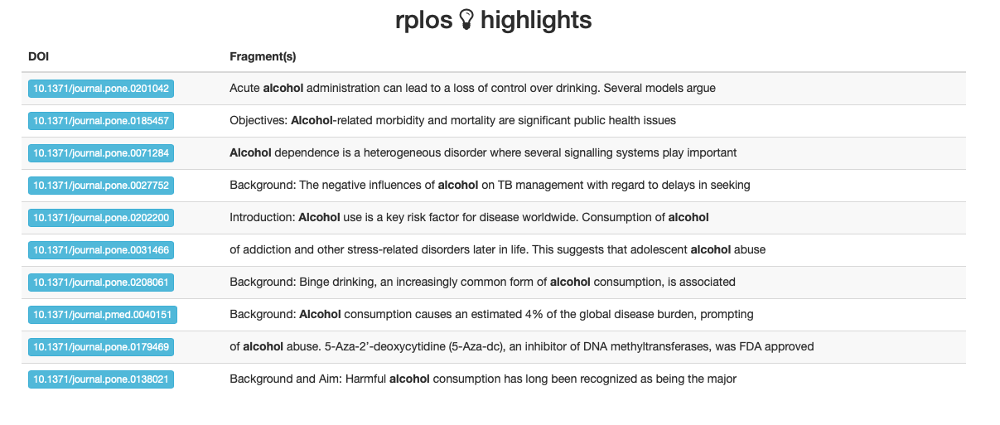

# Use API-wrapping packages {#api-wrappers}

These readings are adapted from Jenny Bryan's stat545 and were originally written by Andrew MacDonald. I've added bits and pieces.


```{=html}
<blockquote class="twitter-tweet" data-width="550" data-lang="en" data-dnt="true" data-theme="light"><p lang="en" dir="ltr">Google trends analytics is helpful in the study of global web search patterns.<br><br>The {gtrends} function from {gtrendsR} 📦 helps extract and visualize this data for specified periods and geolocations 🔎<a href="https://t.co/yS01ELq5q4">https://t.co/yS01ELq5q4</a><a href="https://twitter.com/hashtag/rstats?src=hash&amp;ref_src=twsrc%5Etfw">#rstats</a> <a href="https://twitter.com/hashtag/DataScience?src=hash&amp;ref_src=twsrc%5Etfw">#DataScience</a> <a href="https://t.co/mhGTSXB2rN">pic.twitter.com/mhGTSXB2rN</a></p>&mdash; R Function A Day (@rfunctionaday) <a href="https://twitter.com/rfunctionaday/status/1381848183928729600?ref_src=twsrc%5Etfw">April 13, 2021</a></blockquote>

```


## Introduction

**All this and more is described at the [rOpenSci repository of R tools for interacting with the internet]( https://github.com/ropensci/webservices).**

There are many ways to obtain data from the internet; let's consider four categories:

* *Click-and-download* - on the internet as a "flat" file, such as CSV, XLS.
* *Install-and-play* - an API for which someone has written a handy R package.
* *API-query* - published with an unwrapped API.
* *Scraping* - implicit in an HTML website.

## Click-and-Download

In the simplest case, the data you need is already on the internet in a tabular format. There are a couple of strategies here:

* Use `read.csv` or `readr::read_csv` to read the data straight into R.
* Use the command line program `curl` to do that work, and place it in a `Makefile` or shell script (see the [section on `make`](#automation-overview) for more on this).

The second case is most useful when the data you want has been provided in a format that needs cleanup. For example, the World Value Survey makes several datasets available as Excel sheets. The safest option here is to download the `.xls` file, then read it into R with `readxl::read_excel()` or something similar. An exception to this is data provided as Google Spreadsheets, which can be read straight into R using the [`googlesheets`](https://github.com/jennybc/googlesheets) package.

### From rOpenSci web services page:

From rOpenSci's [CRAN Task View: Web Technologies and Services](https://github.com/ropensci/webservices):

* `downloader::download()` for SSL.
* `curl::curl()` for SSL.
* `httr::GET` data read this way needs to be parsed later with `read.table()`.
* `rio::import()` can "read a number of common data formats directly from an `https://` URL".  Isn't that very similar to the previous?


What about packages that install data?

## Data supplied on the web

Many times, the data that you want is not already organized into one or a few tables that you can read directly into R. More frequently, you find this data is given in the form of an API. **A**pplication **P**rogramming **I**nterfaces (APIs) are descriptions of the kind of requests that can be made of a certain piece of software, and descriptions of the kind of answers that are returned.

Many sources of data -- databases, websites, services -- have made all (or part) of their data available via APIs over the internet. Computer programs ("clients") can make requests of the server, and the server will respond by sending data (or an error message). This client can be many kinds of other programs or websites, including R running from your laptop.

## Install-and-play

Many common web services and APIs have been "wrapped", i.e. R functions have been written around them which send your query to the server and format the response.

Why would we want this?

* Provenance
* Reproducible
* Updating
* Ease
* Scaling

### Load the tidyverse


```r
library(tidyverse)
```

### Sightings of birds: rebird

[rebird](https://github.com/ropensci/rebird) is an R interface for the [eBird](http://ebird.org/content/ebird/) database. eBird lets birders upload sightings of birds, and allows everyone access to those data. rebird is on CRAN.


```r
# install.packages("rebird")
library(rebird)
#> Error in library(rebird): there is no package called 'rebird'
```


#### Search birds by geography

The eBird website categorizes some popular locations as "Hotspots". These are areas where there are both lots of birds and lots of birders. One such location is at Iona Island, near Vancouver. You can see data for this Hotspot at [http://ebird.org/ebird/hotspot/L261851](http://ebird.org/ebird/hotspot/L261851).

At that link, you will see a page like this:

<div class="figure">

<p class="caption">(\#fig:ebird-iona-island)Iona Island</p>
</div>


The data already looks to be organized in a data frame! rebird allows us to read these data directly into R (the ID code for Iona Island is **"L261851"**).

<!--TODO: The following chunks are broken; ebird now requires an API key.-->

```r
ebirdhotspot(locID = "L261851") %>%
  head() %>%
  kable()
```

We can use the function `ebirdgeo()` to get a list for an area (note that South and West are negative):


```r
vanbirds <- ebirdgeo(lat = 49.2500, lng = -123.1000)
vanbirds %>%
  head() %>%
  kable()
```

**Note**: Check the defaults on this function (e.g. radius of circle, time of year).

We can also search by "region", which refers to short codes which serve as common shorthands for different political units. For example, France is represented by the letters **FR**.


```r
frenchbirds <- ebirdregion("FR")
frenchbirds %>%
  head() %>%
  kable()
```

Find out *when* a bird has been seen in a certain place! Choosing a name from `vanbirds` above (the Bald Eagle):


```r
eagle <- ebirdgeo(species = 'Haliaeetus leucocephalus', lat = 42, lng = -76)
eagle %>%
  head() %>%
  kable()
```

rebird **knows where you are**:

```r
ebirdgeo(species = 'Buteo lagopus')
```

### Searching geographic info: geonames {#geonames}

[rOpenSci](https://ropensci.org) has a package called [geonames](https://docs.ropensci.org/geonames/) for accessing the [GeoNames API](https://www.geonames.org). First, install the geonames package from CRAN and load it.


```r
# install.packages("geonames")
library(geonames)
#> Error in library(geonames): there is no package called 'geonames'
```

The [geonames package website](https://docs.ropensci.org/geonames/) tells us that there are a few things we need to do before we can use geonames to access the GeoNames API:

1. Go to [the GeoNames site](https://www.geonames.org/login) and create a new user account.
1. Check your email and follow the instructions to activate your account.
1. Click [here] to enable the free web services for your account (Note! You must be logged into your GeoNames account already for the link to work).
1. Tell R your GeoNames username.

To do the last step, we could run this line in R...
```r
options(geonamesUsername="my_user_name")
```
...but this is insecure. We don't want to risk committing this line and pushing it to our public GitHub page!

Instead, we can add this line to our `.Rprofile` so it will be hidden. One way to edit your `.Rprofile` is with the helper function `edit_r_profile()` from the [usethis][usethis-web] package. Install/load the usethis package and run `edit_r_profile()` in the R Console:


```r
# install.packages("usethis")
library(usethis)
edit_r_profile()
```

This will open up your `.Rprofile` file. Add `options(geonamesUsername="my_user_name")` on a new line (replace "my_user_name" with your GeoNames username).

**Important**: Make sure your `.Rprofile` ends with a blank line!

Save the file, close it, and restart R. Now we're ready to start using geonames to search the GeoNames API.

(Also see the [Cache credentials for HTTPS](https://happygitwithr.com/credential-caching.html) chapter of [Happy Git and GitHub for the useR](https://happygitwithr.com).)

#### Using GeoNames

What can we do? We can get access to lots of geographical information via the various [GeoNames WebServices](http://www.geonames.org/export/ws-overview.html).


```r
countryInfo <- GNcountryInfo()
```


```r
glimpse(countryInfo)
```


This `countryInfo` dataset is very helpful for accessing the rest of the data because it gives us the standardized codes for country and language.

#### Remixing geonames and rebird:

What are the cities of France?


```r
francedata <- countryInfo %>%
  filter(countryName == "France")
```


```r
frenchcities <-	with(francedata, GNcities(north = north, east = east,
                                          south = south, west = west,
                                          maxRows = 500))
```


```r
glimpse(frenchcities)
```


### Wikipedia searching

We can use geonames to search for georeferenced Wikipedia articles. Here are those within 20 km of Rio de Janerio, comparing results for English-language Wikipedia (`lang = "en"`) and Portuguese-language Wikipedia (`lang = "pt"`):


```r
rio_english <- GNfindNearbyWikipedia(lat = -22.9083, lng = -43.1964,
                                     radius = 20, lang = "en", maxRows = 500)
rio_portuguese <- GNfindNearbyWikipedia(lat = -22.9083, lng = -43.1964,
                                        radius = 20, lang = "pt", maxRows = 500)
```


```r
nrow(rio_english)
nrow(rio_portuguese)
```


### Searching the Public Library of Science: rplos {#plos-one}

[PLOS ONE](https://journals.plos.org/plosone/) is an open-access journal. They allow access to an impressive range of search tools, and allow you to obtain the full text of their articles. rOpenSci has a package called rplos that we can use to interact with the [PLOS API](http://api.plos.org). They have a nice tutorial on the rOpenSci website that you can see [here](https://ropensci.org/tutorials/rplos_tutorial.html). First, install/load the rplos package from CRAN.


```r
# install.packages("rplos")
library(rplos)
#> Error in library(rplos): there is no package called 'rplos'
```

#### Searching PLOS ONE

Let's follow along with the [`rOpenSci` tutorial](https://ropensci.org/tutorials/rplos_tutorial.html) and do some searches:


```r
searchplos(q= "Helianthus", fl= "id", limit = 5)
#> Error in searchplos(q = "Helianthus", fl = "id", limit = 5): could not find function "searchplos"
```


```r
searchplos("materials_and_methods:France", fl = "title, materials_and_methods")
#> Error in searchplos("materials_and_methods:France", fl = "title, materials_and_methods"): could not find function "searchplos"
```


```r
searchplos("materials_and_methods:study site", fl = "title, materials_and_methods")
#> Error in searchplos("materials_and_methods:study site", fl = "title, materials_and_methods"): could not find function "searchplos"
```


```r
searchplos("*:*", fl = "id")
#> Error in searchplos("*:*", fl = "id"): could not find function "searchplos"
```

Here is a list of [options for the search](http://api.plos.org/solr/search-fields/) or you can run `data(plosfields)` followed by `plosfields` in the R Console.


#### Take a highbrow look!

The `highplos()` function does "highlighted searches on PLOS Journals full-text content".


```r
highlighted <- highplos(q='alcohol', hl.fl = 'abstract', rows=10)
#> Error in highplos(q = "alcohol", hl.fl = "abstract", rows = 10): could not find function "highplos"
```

We can then pass this output to `highbrow()`, which will open up our default browser where we can browse the highlighted fragments. When we run `highbrow(highlighted)` in our R Console this is what we see in our browser:

<div class="figure">

<p class="caption">(\#fig:unnamed-chunk-25)Example rplos highlights</p>
</div>

#### Plots over time

We can use the `plot_throughtime()` function to visualize the results of a search over time.


```r
plot_throughtime(terms = "phylogeny", limit = 200)
#> Error in plot_throughtime(terms = "phylogeny", limit = 200): could not find function "plot_throughtime"
```


### Is it a boy or a girl? gender-associated names throughout US history

The gender package allows you access to data on the gender of names in the US. Because names change gender over the years, the probability of a name belonging to a man or a woman also depends on the *year*.

First, install/load the gender package from CRAN. You may be prompted to also install the companion package, genderdata. Go ahead and say yes. If you don't see this message no need to worry, it is a one-time install.


```r
# install.packages("gender")
library(gender)
#> Error in library(gender): there is no package called 'gender'
```

Let's do some searches for the name Kelsey.

```r
gender("Kelsey")
#> Error in gender("Kelsey"): could not find function "gender"
gender("Kelsey", years = 1940)
#> Error in gender("Kelsey", years = 1940): could not find function "gender"
```


<!--DS4P Links-->
[course_web]: https://datascience4psych.github.io/DataScience4Psych
[course_git]: https://github.com/DataScience4Psych/DataScience4Psych
[course_repo]: https://github.com/DataScience4Psych
[course_slides]: https://github.com/DataScience4Psych/slides
[course_syllabus]: https://smasongarrison.github.io/syllabi/ 
<!-- https://smasongarrison.github.io/syllabi/data-science.html -->
[syllabi]: https://smasongarrison.github.io/syllabi
[pl_00]: https://www.youtube.com/playlist?list=PLKrrdtYgOUYaEAnJX20Ryy4OSie375rVY
[pl_01]: https://www.youtube.com/playlist?list=PLKrrdtYgOUYao_7t5ycK4KDXNKaY-ECup
[pl_02]: https://www.youtube.com/playlist?list=PLKrrdtYgOUYZmr_T3PnuxjVIlj0C0kUNI
[pl_03]: https://www.youtube.com/playlist?list=PLKrrdtYgOUYaHmjzdRvfg0yhOIYQnfjwE
[pl_04]: https://www.youtube.com/playlist?list=PLKrrdtYgOUYYWFcel6_vp8__RUKLxhX4y
[pl_05]: https://www.youtube.com/playlist?list=PLKrrdtYgOUYYMIguiV1F8RagMYibTY4iW
[pl_06]: https://www.youtube.com/playlist?list=PLKrrdtYgOUYYV_KDod3Mk9-RmtFXii9Dv
[pl_07]: https://www.youtube.com/watch?list=PLKrrdtYgOUYZxvEvQ8-PcWrOY_dwY_ETI
[pl_08]: https://www.youtube.com/playlist?list=PLKrrdtYgOUYZgOzYB_dmauw55M7jXvsdo
[pl_09]: https://www.youtube.com/playlist?list=PLKrrdtYgOUYbaiTmldRY2ddsLrHp3z6yO
[pl_10]: https://www.youtube.com/playlist?list=PLKrrdtYgOUYbPw5iYzYEzoOKa7mJKNIhq
[pl_11]: https://www.youtube.com/playlist?list=PLKrrdtYgOUYZ-u6LzBbanrNFoeLHKaLL6
[pl_12]: https://www.youtube.com/playlist?list=PLKrrdtYgOUYbwRS-9Htmb80_t1NG-021e
[pl_13]: https://www.youtube.com/playlist?list=PLKrrdtYgOUYbWGmSnbLIYwdLOnGm6une6
[pl_14]: https://www.youtube.com/playlist?list=PLKrrdtYgOUYbWGmSnbLIYwdLOnGm6une6
[pl_15]: https://www.youtube.com/playlist?list=PLKrrdtYgOUYa5MoYrV8EsWQ5jIr5ZYMpM
[pl_all]: https://www.youtube.com/playlist?list=PLKrrdtYgOUYZomNqf-1dtCDW94ySdLv-9


<!--AE Links-->
[ae01a_unvotes]: https://github.com/DataScience4Psych/ae01a_unvotes
[ae01b_covid]: https://github.com/DataScience4Psych/ae01b_covid
[ae02_bechdel]: https://github.com/DataScience4Psych/ae-02-bechdel-rmarkdown
[ae03_starwars]: https://github.com/DataScience4Psych/ae-03-starwars-dataviz


<!-- Lab Links-->

[lab01_hello]: https://github.com/DataScience4Psych/lab-01-hello-r

<!--Slides-->
[d01_welcome]: https://datascience4psych.github.io/slides/d01_welcome/d01_welcome.html
[d02_toolkit]: https://datascience4psych.github.io/slides/d02_toolkit/d02_toolkit.html
[d03_dataviz]: https://datascience4psych.github.io/slides/d03_dataviz/d03_dataviz.html
[d04_ggplot2]: https://datascience4psych.github.io/slides/d04_ggplot2/d04_ggplot2.html
[d05_viznum]: https://datascience4psych.github.io/slides/d05_viznum/d05_viznum.html
[d06_vizcat]: https://datascience4psych.github.io/slides/d06_vizcat/d06_vizcat.html
[d07_tidy]: https://datascience4psych.github.io/slides/d07_tidy/d07_tidy.html
[d08_grammar]: https://datascience4psych.github.io/slides/d08_grammar/d08_grammar.html
[d09_wrangle]: https://datascience4psych.github.io/slides/d09_wrangle/d09_wrangle.html
[d10_dfs]: https://datascience4psych.github.io/slides/d10_dfs/d10_dfs.html
[d11_types]: https://datascience4psych.github.io/slides/d11_types/d11_types.html
[d12_import]: https://datascience4psych.github.io/slides/d12_import/d12_import.html
[d13_goodviz]: https://datascience4psych.github.io/slides/d13_goodviz/d13_goodviz.html
[d13b_moreggplot]: https://datascience4psych.github.io/slides/d13_goodviz/d13b_moreggplot.html
[d14_confound]: https://datascience4psych.github.io/slides/d14_confound/d14_confound.html
[d15_goodtalk]: https://datascience4psych.github.io/slides/d15_goodtalk/d15_goodtalk.html
[d16_webscraping]: https://datascience4psych.github.io/slides/d16_webscraping/d16_webscraping.html
[d17_functions]: https://datascience4psych.github.io/slides/d17_functions/d17_functions.html
[d18_ethics]: https://datascience4psych.github.io/slides/d18_ethics/d18_ethics.html
[d19_bias]: https://datascience4psych.github.io/slides/d19_bias/d19_bias.html


<!--externals-->

[stat545]: https://stat545.com
[r4ds]: https://r4ds.had.co.nz
[cran]: https://cloud.r-project.org


<!--HappyGitWithR Links-->


[hg-github-account]: https://happygitwithr.com/github-acct.html
[hg-install-r-rstudio]: https://happygitwithr.com/install-r-rstudio.html
[hg-connect-intro]: https://happygitwithr.com/connect-intro.html
[hg-browsability]: https://happygitwithr.com/workflows-browsability.html
[hg-shell]: https://happygitwithr.com/shell.html

<!--Package Links-->


[lubridate-web]: https://lubridate.tidyverse.org
[lubridate-cran]: https://CRAN.R-project.org/package=lubridate
[lubridate-github]: https://github.com/tidyverse/lubridate
[lubridate-vignette]: https://cran.r-project.org/web/packages/lubridate/vignettes/lubridate.html


[stringr-web]: https://stringr.tidyverse.org
[stringr-cran]: https://CRAN.R-project.org/package=stringr


[ggplot2-github]: https://github.com/tidyverse/ggplot2
[ggplot2-theme-args]: https://ggplot2.tidyverse.org/reference/ggtheme.html#arguments


[assertthat-cran]: https://CRAN.R-project.org/package=assertthat
[assertthat-github]: https://github.com/hadley/assertthat

[ensurer-cran]: https://CRAN.R-project.org/package=ensurer
[ensurer-github]: https://github.com/smbache/ensurer

[assertr-cran]: https://CRAN.R-project.org/package=assertr
[assertr-github]: https://github.com/ropensci/assertr

[assertive-cran]: https://CRAN.R-project.org/package=assertive
[assertive-bitbucket]: https://bitbucket.org/richierocks/assertive/src/master/

[testthat-cran]: https://CRAN.R-project.org/package=testthat
[testthat-github]: https://github.com/r-lib/testthat
[testthat-web]: https://testthat.r-lib.org

[viridis-cran]: https://CRAN.R-project.org/package=viridis
[viridis-github]: https://github.com/sjmgarnier/viridis
[viridis-vignette]: https://cran.r-project.org/web/packages/viridis/vignettes/intro-to-viridis.html

[colorspace-cran]: https://CRAN.R-project.org/package=colorspace
[colorspace-vignette]: https://cran.r-project.org/web/packages/colorspace/vignettes/hcl-colors.pdf

[cowplot-cran]: https://CRAN.R-project.org/package=cowplot
[cowplot-github]: https://github.com/wilkelab/cowplot
[cowplot-vignette]: https://cran.r-project.org/web/packages/cowplot/vignettes/introduction.html

[devtools-cran]: https://CRAN.R-project.org/package=devtools
[devtools-github]: https://github.com/r-lib/devtools
[devtools-web]: https://devtools.r-lib.org
[devtools-cheatsheet]: https://www.rstudio.com/wp-content/uploads/2015/03/devtools-cheatsheet.pdf
[devtools-cheatsheet-old]: https://rawgit.com/rstudio/cheatsheets/master/package-development.pdf
[devtools-1-6]: https://blog.rstudio.com/2014/10/02/devtools-1-6/
[devtools-1-8]: https://blog.rstudio.com/2015/05/11/devtools-1-9-0/
[devtools-1-9-1]: https://blog.rstudio.com/2015/09/13/devtools-1-9-1/

[googlesheets-cran]: https://CRAN.R-project.org/package=googlesheets
[googlesheets-github]: https://github.com/jennybc/googlesheets

[tidycensus-cran]: https://CRAN.R-project.org/package=tidycensus
[tidycensus-github]: https://github.com/walkerke/tidycensus
[tidycensus-web]: https://walkerke.github.io/tidycensus/index.html


[fs-cran]: https://CRAN.R-project.org/package=fs
[fs-github]: https://github.com/r-lib/fs

[plumber-web]: https://www.rplumber.io
[plumber-docs]: https://www.rplumber.io/docs/
[plumber-github]: https://github.com/trestletech/plumber
[plumber-cran]: https://CRAN.R-project.org/package=plumber


[glue-web]: https://glue.tidyverse.org
[stringi-cran]: https://CRAN.R-project.org/package=stringi
[rex-github]: https://github.com/kevinushey/rex
[rcolorbrewer-cran]: https://CRAN.R-project.org/package=RColorBrewer
[dichromat-cran]: https://CRAN.R-project.org/package=dichromat

[rdryad-web]: https://docs.ropensci.org/rdryad/
[rdryad-cran]: https://CRAN.R-project.org/package=rdryad
[rdryad-github]: https://github.com/ropensci/rdryad

[roxygen2-cran]: https://CRAN.R-project.org/package=roxygen2
[roxygen2-vignette]: https://cran.r-project.org/web/packages/roxygen2/vignettes/rd.html

[shinythemes-web]: https://rstudio.github.io/shinythemes/
[shinythemes-cran]: https://CRAN.R-project.org/package=shinythemes

[shinyjs-web]: https://deanattali.com/shinyjs/
[shinyjs-cran]: https://CRAN.R-project.org/package=shinyjs
[shinyjs-github]: https://github.com/daattali/shinyjs

[leaflet-web]: https://rstudio.github.io/leaflet/
[leaflet-cran]: https://CRAN.R-project.org/package=leaflet
[leaflet-github]: https://github.com/rstudio/leaflet

[ggvis-web]: https://ggvis.rstudio.com
[ggvis-cran]: https://CRAN.R-project.org/package=ggvis
 
[usethis-web]: https://usethis.r-lib.org
[usethis-cran]: https://CRAN.R-project.org/package=usethis
[usethis-github]: https://github.com/r-lib/usethis

[pkgdown-web]: https://pkgdown.r-lib.org
[gh-github]: https://github.com/r-lib/gh

[httr-web]: https://httr.r-lib.org
[httr-cran]: https://CRAN.R-project.org/package=httr
[httr-github]: https://github.com/r-lib/httr

[gistr-web]: https://docs.ropensci.org/gistr
[gistr-cran]: https://CRAN.R-project.org/package=gistr
[gistr-github]: https://github.com/ropensci/gistr

[rvest-web]: https://rvest.tidyverse.org
[rvest-cran]: https://CRAN.R-project.org/package=rvest
[rvest-github]: https://github.com/tidyverse/rvest

[xml2-web]: https://xml2.r-lib.org
[xml2-cran]: https://CRAN.R-project.org/package=xml2
[xml2-github]: https://github.com/r-lib/xml2

[jsonlite-paper]: https://arxiv.org/abs/1403.2805
[jsonlite-cran]: https://CRAN.R-project.org/package=jsonlite
[jsonlite-github]: https://github.com/jeroen/jsonlite

[readxl-web]: https://readxl.tidyverse.org
[readxl-github]: https://github.com/tidyverse/readxl
[readxl-cran]: https://CRAN.R-project.org/package=readxl

[janitor-web]: http://sfirke.github.io/janitor/
[janitor-cran]: https://CRAN.R-project.org/package=janitor
[janitor-github]: https://github.com/sfirke/janitor


<!--Shiny links-->
[shinydashboard-web]: https://rstudio.github.io/shinydashboard/
[shinydashboard-cran]: https://CRAN.R-project.org/package=shinydashboard
[shinydashboard-github]: https://github.com/rstudio/shinydashboard


[shiny-official-web]: https://shiny.rstudio.com
[shiny-official-tutorial]: https://shiny.rstudio.com/tutorial/
[shiny-cheatsheet]: https://shiny.rstudio.com/images/shiny-cheatsheet.pdf
[shiny-articles]: https://shiny.rstudio.com/articles/
[shiny-bookdown]: https://bookdown.org/yihui/rmarkdown/shiny-documents.html
[shiny-google-groups]: https://groups.google.com/forum/#!forum/shiny-discuss
[shiny-stack-overflow]: https://stackoverflow.com/questions/tagged/shiny
[shinyapps-web]: https://www.shinyapps.io
[shiny-server-setup]: https://deanattali.com/2015/05/09/setup-rstudio-shiny-server-digital-ocean/
[shiny-reactivity]: https://shiny.rstudio.com/articles/understanding-reactivity.html
[shiny-debugging]: https://shiny.rstudio.com/articles/debugging.html


<!--Publications--> 


[adv-r-defensive-programming]: http://adv-r.had.co.nz/Exceptions-Debugging.html#defensive-programming
[adv-r-fxn-args]: http://adv-r.had.co.nz/Functions.html#function-arguments
[adv-r-return-values]: http://adv-r.had.co.nz/Functions.html#return-values
[adv-r-closures]: http://adv-r.had.co.nz/Functional-programming.html#closures


[r4ds-strings]: https://r4ds.had.co.nz/strings.html
[r4ds-readr-strings]: https://r4ds.had.co.nz/data-import.html#readr-strings
[r4ds-dates-times]: https://r4ds.had.co.nz/dates-and-times.html
[r4ds-data-import]: http://r4ds.had.co.nz/data-import.html
[r4ds-relational-data]: https://r4ds.had.co.nz/relational-data.html
[r4ds-pepper-shaker]: https://r4ds.had.co.nz/vectors.html#lists-of-condiments

[r-pkgs2]: https://r-pkgs.org/index.html
[r-pkgs2-whole-game]: https://r-pkgs.org/whole-game.html
[r-pkgs2-description]: https://r-pkgs.org/description.html
[r-pkgs2-man]: https://r-pkgs.org/man.htm
[r-pkgs2-tests]: https://r-pkgs.org/tests.html
[r-pkgs2-namespace]: https://r-pkgs.org/namespace.html
[r-pkgs2-vignettes]: https://r-pkgs.org/vignettes.html
[r-pkgs2-release]: https://r-pkgs.org/release.html
[r-pkgs2-r-code]: https://r-pkgs.org/r.html#r

[r-graphics-cookbook]: http://shop.oreilly.com/product/0636920023135.do


[cookbook-for-r-graphs]: http://www.cookbook-r.com/Graphs/
[cookbook-for-r-multigraphs]: http://www.cookbook-r.com/Graphs/Multiple_graphs_on_one_page_(ggplot2)/


[testthat-article]: https://journal.r-project.org/archive/2011-1/RJournal_2011-1_Wickham.pdf
[worry-about-color]: https://github.com/DataScience4Psych/DataScience4Psych/blob/master/admin/pdfs/Why%20Should%20Engineers%20and%20Scientists%20Be%20Worried%20About%20Color.pdf
[escaping-rgbland-pdf]: https://eeecon.uibk.ac.at/~zeileis/papers/Zeileis+Hornik+Murrell-2009.pdf
[escaping-rgbland-doi]: https://doi.org/10.1016/j.csda.2008.11.033


<!--R Documentation-->
[rdocs-extremes]: https://rdrr.io/r/base/Extremes.html
[rdocs-range]: https://rdrr.io/r/base/range.html
[rdocs-quantile]: https://rdrr.io/r/stats/quantile.html
[rdocs-c]: https://rdrr.io/r/base/c.html
[rdocs-list]: https://rdrr.io/r/base/list.html
[rdocs-lm]: https://rdrr.io/r/stats/lm.html
[rdocs-coef]: https://rdrr.io/r/stats/coef.html
[rdocs-devices]: https://rdrr.io/r/grDevices/Devices.html
[rdocs-ggsave]: https://rdrr.io/cran/ggplot2/man/ggsave.html


<!--Wikipedia Links-->


[wiki-row-col-major-order]: https://en.wikipedia.org/wiki/Row-_and_column-major_order
[wiki-boxplot]: https://en.wikipedia.org/wiki/Box_plot
[wiki-brewer]: https://en.wikipedia.org/wiki/Cynthia_Brewer
[wiki-vector-graphics]: https://en.wikipedia.org/wiki/Vector_graphics
[wiki-raster-graphics]: https://en.wikipedia.org/wiki/Raster_graphics
[wiki-dry]: https://en.wikipedia.org/wiki/Don%27t_repeat_yourself
[wiki-web-scraping]: https://en.wikipedia.org/wiki/Web_scraping
[wiki-xpath]: https://en.wikipedia.org/wiki/XPath

<!--Misc. Links-->

[useR-2014-dropbox]: https://www.dropbox.com/sh/i8qnluwmuieicxc/AAAgt9tIKoIm7WZKIyK25lh6a

[html-preview]: http://htmlpreview.github.io
[research-workflow]: https://www.carlboettiger.info/2012/05/06/research-workflow.html


[blog-strings-as-factors]: https://notstatschat.tumblr.com/post/124987394001/stringsasfactors-sigh
[bio-strings-as-factors]: https://simplystatistics.org/2015/07/24/stringsasfactors-an-unauthorized-biography
[stackexchange-outage]: https://stackstatus.net/post/147710624694/outage-postmortem-july-20-2016

[fix-atom-bug]: https://davidvgalbraith.com/how-i-fixed-atom/
[icu-regex]: http://userguide.icu-project.org/strings/regexp
[regex101]: https://regex101.com

[utf8-debug]: http://www.i18nqa.com/debug/utf8-debug.html

[programmers-encoding]: http://kunststube.net/encoding/
[encoding-probs-ruby]: https://www.justinweiss.com/articles/3-steps-to-fix-encoding-problems-in-ruby/
[theyre-to-theyre]: https://www.justinweiss.com/articles/how-to-get-from-theyre-to-theyre/
[lubridate-ex1]: https://www.r-exercises.com/2016/08/15/dates-and-times-simple-and-easy-with-lubridate-part-1/
[lubridate-ex2]: https://www.r-exercises.com/2016/08/29/dates-and-times-simple-and-easy-with-lubridate-exercises-part-2/
[lubridate-ex3]: https://www.r-exercises.com/2016/10/04/dates-and-times-simple-and-easy-with-lubridate-exercises-part-3/
[google-sql-join]: https://www.google.com/search?q=sql+join&tbm=isch
[min-viable-product]: https://blog.fastmonkeys.com/
[telescope-rule]: http://c2.com/cgi/wiki?TelescopeRule
[unix-philosophy]: http://www.faqs.org/docs/artu/ch01s06.html
[twitter-wrathematics]: https://twitter.com/wrathematics
[robbins-effective-graphs]: https://www.amazon.com/Creating-Effective-Graphs-Naomi-Robbins/dp/0985911123
[r-graph-catalog-github]: https://github.com/jennybc/r-graph-catalog
[google-pie-charts]: https://www.google.com/search?q=pie+charts+suck
[why-pie-charts-suck]: https://www.richardhollins.com/blog/why-pie-charts-suck/
[worst-figure]: https://robjhyndman.com/hyndsight/worst-figure/
[naomi-robbins]: http://www.nbr-graphs.com
[hadley-github-index]: https://hadley.github.io
[scipy-2015-matplotlib-colors]: https://www.youtube.com/watch?v=xAoljeRJ3lU
[winston-chang-github]: https://github.com/wch
[favorite-rgb-color]: https://manyworldstheory.com/2013/01/15/my-favorite-rgb-color/
[stowers-color-chart]: https://web.archive.org/web/20121022044903/http://research.stowers-institute.org/efg/R/Color/Chart/
[stowers-using-color-in-R]: https://www.uv.es/conesa/CursoR/material/UsingColorInR.pdf
[zombie-project]: https://imgur.com/ewmBeQG
[tweet-project-resurfacing]: https://twitter.com/JohnDCook/status/522377493417033728
[rgraphics-looks-tips]: https://blog.revolutionanalytics.com/2009/01/10-tips-for-making-your-r-graphics-look-their-best.html
[rgraphics-svg-tips]: https://blog.revolutionanalytics.com/2011/07/r-svg-graphics.html
[zev-ross-cheatsheet]: http://zevross.com/blog/2014/08/04/beautiful-plotting-in-r-a-ggplot2-cheatsheet-3/
[parker-writing-r-packages]: https://hilaryparker.com/2014/04/29/writing-an-r-package-from-scratch/
[broman-r-packages]: https://kbroman.org/pkg_primer/
[broman-tools4rr]: https://kbroman.org/Tools4RR/
[leeks-r-packages]: https://github.com/jtleek/rpackages
[build-maintain-r-packages]: https://thepoliticalmethodologist.com/2014/08/14/building-and-maintaining-r-packages-with-devtools-and-roxygen2/
[murdoch-package-vignette-slides]: https://web.archive.org/web/20160824010213/http://www.stats.uwo.ca/faculty/murdoch/ism2013/5Vignettes.pdf
[how-r-searches]: http://blog.obeautifulcode.com/R/How-R-Searches-And-Finds-Stuff/

