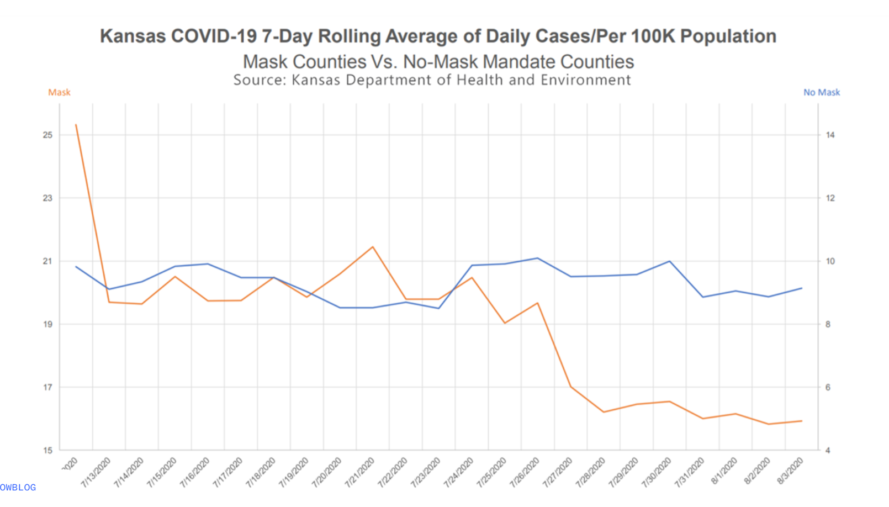

# LAB: Better Viz {#lab07}


```{r lab_betterviz-setup, include = FALSE}
source("common.R")
refresh_data <- FALSE
```

## Conveying the right message through visualization {.unnumbered}

In this lab, you'll play data detective. You'll start with a misleading visualization and no data, then track down the original sources on the web, wrangle raw data into shape, and use it to both reconstruct and improve the visualization. Along the way, you'll practice the data acquisition and wrangling skills from this module.

## Learning Goals {.unnumbered}

- Downloading data directly from URLs using `read_csv()` (direct download from the data acquisition spectrum)
- Wrangling real-world data with `pivot_longer()`, `filter()`, `mutate()`, `case_when()`, `left_join()`, `group_by()`, and `summarize()`
- Working with dates using the `lubridate` package
- Computing rolling averages with `zoo::rollmean()`
- Using `str_remove()` for string manipulation
- Critiquing visualizations that misrepresent data
- Applying principles of effective data visualizations to improve clarity and accuracy

## Getting started {.unnumbered}

Go to the course GitHub organization and locate the [template](https://github.com/DataScience4Psych/lab_07_betterviz). Clone and then open the R Markdown document.  Ensure it compiles without errors to confirm your setup is correct.

### Warm up {.unnumbered}

Let's warm up with some simple exercises.
Update the YAML of your R Markdown file with your information, knit, commit, and push your changes.
Make sure to commit with a meaningful commit message.
Then, go to your repo on GitHub and confirm that your changes are visible in your Rmd **and** md files.
If anything is missing, commit and push again.

### Packages {.unnumbered}

We'll use the **tidyverse** for data wrangling and visualization, along with several packages for working with web data and dates that we've been learning about in this module.

```{r load-packages, message = FALSE}
library(tidyverse)
library(scales)
library(lubridate)
library(zoo)
```

### Data {.unnumbered}

Unlike previous labs, you won't be starting with a tidy, ready-to-use dataset. Instead, you'll be acquiring and building the dataset yourself from publicly available web sources — just like a former student, Holland, did when they first tried to fact-check this visualization. The data you need is out there, but it takes some detective work to find it and some wrangling to get it into a usable form. If you're interested in Holland's original approach, you can refer to [this repository](https://github.com/HollandSun/Reproduce_Lab7plot.git) for the full pipeline and sources.


## Exercises {.unnumbered}

The following visualization was shared [on Twitter](https://twitter.com/JonBoeckenstedt/status/1291602888376999936) as "extraordinary misleading".

```{r lab_betterviz-include-screenshot, echo=FALSE}
try_include_tweet("https://twitter.com/JonBoeckenstedt/status/1291602888376999936")
```

```{r fig.fullwidth = TRUE, echo = FALSE,message = FALSE}



offset <- 11
df <- read_csv("data/kansas_grouped_rolling_avg.csv") %>%
  mutate(date = as.Date(date) + .5, # add 12 hours to make the date labels more accurate
    mask_mandate = ifelse(mask_mandate == "Mask", "Mask Counties", "No-Mask Mandate Counties") %>%
           factor(levels = c("Mask Counties", "No-Mask Mandate Counties")),
           rolling_avg = case_when(
           mask_mandate == "No-Mask Mandate Counties" ~ rolling_avg + offset,
           TRUE ~ rolling_avg
         ))
```

<details>
  <summary>Here's a close attempt at reconstructing the original plot. Can you spot the differences?</summary>
```{r fig.fullwidth = TRUE, echo = FALSE,message = FALSE}
left_breaks  <- seq(15, 25, by = 2)
right_breaks <- seq(4, 14, by = 2)
col_mask <- "#F28E2B"
col_nomask <- "#4E79A7"
date_lo <- as.Date("2020-07-12")
date_hi <- as.Date("2020-08-03")
df %>%
  ggplot(
    aes(x = date,
        y = rolling_avg,
        color = mask_mandate,
        group = mask_mandate
        )
  ) +
  geom_line(linewidth = 1,aes(group = mask_mandate)) +

    scale_color_manual(values = c("Mask Counties" = col_mask,
                                "No-Mask Mandate Counties" = col_nomask)) +
  scale_x_date(
    limits = c(date_lo-.5, date_hi+1),
    breaks  = seq(date_lo+.5, date_hi+.5, by = "1 day"),
    date_labels = "%m/%d/%Y",
    expand = expansion(mult = c(0, 0))
  ) +
    scale_y_continuous(
    name = NULL,
    breaks = left_breaks,
    labels = label_number(accuracy = 1),
    limits = c(15, 25),
    expand = expansion(mult = c(0, 0)),
    sec.axis = sec_axis(~ . - offset, name = NULL,
                        labels = label_number(accuracy = 1),
                         breaks = right_breaks,
                         )
  ) +
  labs(
    title = "Kansas COVID-19 7-Day Rolling Average of Daily Cases/Per 100K Population",
    subtitle =
      bquote(atop('Mask Counties Vs. No-Mask Mandate Counties' , scriptstyle('Source: Kansas Department of Health and Environment'))),
    x = NULL,
    y = NULL,
    color = NULL
  ) +
  coord_cartesian(ylim = c(15, 25.5),clip = "off") +
  theme_minimal() +
  theme(legend.position = "none",
    axis.text.x = element_text(angle = 45, hjust = 1, size = 6),
    legend.title = element_blank(),
     plot.title = element_text(hjust = -0.5),
     plot.subtitle = element_text(hjust = .5, size = 8),
     panel.grid.minor = element_blank(),
     axis.line = element_line(color= col_mix("black", "white", 0.80),
                              linewidth = 0.5)
  ) +
   annotate("text", x = date_lo+.5, y = Inf, label = "Mask",
           color = col_mask, vjust = -0.05, hjust = 2.05, size = 2.5) +
  annotate("text", x = date_hi-.5, y = Inf, label = "No Mask",
           color = col_nomask, vjust = -0.05, hjust = -.45, size = 2.5)


```
</details>

Before you dive in, think about what is misleading about this visualization and how you might go about fixing it.

### Part 1: The Problem — Where's the Data? {.unnumbered}

This visualization was presented at a KDHE press conference, but the underlying data was never released. If you wanted to fact-check it, where would you even start? A former student, Holland, faced exactly this problem and did some impressive detective work to track down the data. Let's retrace that journey.

1. Look carefully at the original visualization. What information does it give you about where the data *might* come from? Read the title, subtitle, axis labels, and source line. Write down what you can infer about the data: What state? What time period? What's being measured? What are the two groups being compared? What does "per 100K population" tell you about how the data was calculated?

2. Holland's first breakthrough was finding a [CDC MMWR report by Van Dyke et al. (2020)](https://www.cdc.gov/mmwr/volumes/69/wr/mm6947e2.htm) that analyzed this exact comparison. Skim the report (focus on the methods section). What key pieces of information does it reveal that the original visualization didn't?  In particular, look for: (a) the names of the counties that had mask mandates, and (b) any mention of where the case data came from.

### Part 2: Acquiring the Raw Data {.unnumbered}

The MMWR report tells us the case data came from [USAFacts](https://usafacts.org/visualizations/coronavirus-covid-19-spread-map/), which provides county-level COVID-19 data as downloadable CSV files. This is a *direct download* — the simplest method on the data acquisition spectrum we discussed in this module. No API key needed, no scraping required — just a URL and `read_csv()`.

3. Download the confirmed cases data and the county population data directly from USAFacts:

```{r, error=TRUE, eval = refresh_data}
    cases_raw <- read_csv(
      "https://static.usafacts.org/public/data/covid-19/covid_confirmed_usafacts.csv",
      show_col_types = FALSE
    )
    pop_raw <- read_csv(
      "https://static.usafacts.org/public/data/covid-19/covid_county_population_usafacts.csv",
      show_col_types = FALSE
    )
```

```{r,include=FALSE}
if(exists("cases_raw") && exists("pop_raw") && refresh_data) {
write_csv(cases_raw, "data/cases_raw.csv")
write_csv(pop_raw, "data/pop_raw.csv")
} else {
  cases_raw <- read_csv("data/cases_raw.csv", show_col_types = FALSE)
  pop_raw <- read_csv("data/pop_raw.csv", show_col_types = FALSE)
}
```

Use `glimpse()` to explore both datasets. The cases data covers *every county in the United States* — how many rows and columns does it have? What does each row represent? Notice that the cases data is in *wide format* — each date gets its own column. Why would that be a problem for plotting with ggplot2?

4. We only need Kansas. Filter `cases_raw` to just Kansas counties (`State == "KS"`) and exclude the statewide total row (`countyFIPS != 0`). Then use `pivot_longer()` to reshape the data from wide to long format, so you have one row per county per date with columns for `countyFIPS`, `County Name`, `date`, and `cumulative_cases`. Use `lubridate::ymd()` to parse the date strings into proper Date objects. Do the same filtering for `pop_raw` — keep only Kansas counties and select just `countyFIPS`, `County Name`, and `population`.

🧶 ✅ ⬆️ *Knit, commit, and push your changes. You've acquired and reshaped real web data — just like Holland did!*

### Part 3: From Cumulative Counts to Daily Rates {.unnumbered}

You now have cumulative case counts for every Kansas county on every date. But the KDHE visualization shows *daily new cases per 100K population* as a *7-day rolling average*. Getting from what you have to what you need requires several wrangling steps.

5. First, narrow the time window. The visualization covers July 12 through August 3, 2020 — but to compute a 7-day rolling average starting on July 12, you need data going back seven days before that. Filter your Kansas cases to dates from **July 5, 2020** through **August 3, 2020**.

Then, within each county (use `group_by()` and `arrange()`), calculate `daily_new_cases` as the difference between each day's cumulative count and the previous day's using `lag()`. Remove the resulting `NA` rows (the first day of each county has no previous day to subtract from).

6. Now you need to know which counties had mask mandates. From the MMWR report, you learned that these 24 Kansas counties had mandates in effect by July 3, 2020:

    *Allen, Atchison, Bourbon, Crawford, Dickinson, Douglas, Franklin, Geary, Gove, Harvey, Jewell, Johnson, Mitchell, Montgomery, Morris, Pratt, Reno, Republic, Saline, Scott, Sedgwick, Shawnee, Stanton, Wyandotte*

But there's a snag — your data has county names like `"Sedgwick County"` while this list uses just `"Sedgwick"`. Use `str_remove()` to strip the `" County"` suffix, then use `ifelse()` to create a `mask_mandate` column labeling each county as `"Mask"` or `"No Mask"`.

Finally, use `left_join()` to bring in each county's `population` from the population data you filtered earlier.

🧶 ✅ ⬆️ *Knit, commit, and push your changes. You've built an analysis-ready dataset from raw web data!*

### Part 4: Computing the Rolling Average {.unnumbered}

7. You now have daily new cases for each county, labeled by mask mandate status, with population data attached. But the visualization doesn't show individual counties — it shows *aggregate trends* for the two groups. Use `group_by(mask_mandate, date)` and `summarize()` to compute the total new cases and total population for each group on each date. Then:

    - Calculate the daily rate per 100K: `total_new / total_pop * 100000`
    - Compute the 7-day rolling average using `zoo::rollmean(per_100k, k = 7, fill = NA, align = "right")` (grouped by `mask_mandate`)
    - Filter to dates on or after July 12 and drop any `NA` rolling averages

    Use `glimpse()` to check your result. You should have three columns — `date`, `rolling_avg`, and `mask_mandate`. Compare your values to the `kansas_grouped_rolling_avg.csv` file in the lab repository — they should be very close.

8. Now use the dataset you just built to reconstruct the misleading visualization. Look carefully at the original — what specific choices make it misleading? (Hint: look at the y-axes. Are they the same? What effect does that have on how the viewer perceives the trends?)

🧶 ✅ ⬆️ *Knit, commit, and push your changes. You've gone from a press conference screenshot all the way to a reconstructed visualization — all from publicly available web data!*

### Part 5: Improving the Visualization {.unnumbered}

9. Make a visualization that more accurately (and honestly) reflects the data and conveys a clear message.

10. What message is more clear in your visualization than it was in the original visualization?

11. What, if any, useful information do these data and your visualization tell us about mask wearing and COVID?
    It'll be difficult to set aside what you already know about mask wearing, but you should try to focus only on what this visualization tells.
    Feel free to also comment on whether that lines up with what you know about mask wearing.

### Part 6: Visualization as Rhetoric {.unnumbered}

Using the same underlying data you recovered, your goal now is to create a new visualization that intentionally conveys the opposite message of your previous, accurate visualization. This exercise is designed to highlight the impact of visualization choices on the interpretation of data. 

12. Reflect on the message conveyed by your accurate visualization regarding mask-wearing and COVID-19. Discuss the key factors that contribute to this message, such as the variables used, the scale of the axes, and the type of visualization.

13. Plan Your Opposite Visualization: Briefly determine what opposite message you want to convey. Consider the data you have available (or could easily add). For example, you could pull weather data for Kansas during the same time period, using the API we covered in the data acquisition module, and create a visualization that suggests a relationship between weather patterns and COVID-19 cases, rather than mask-wearing.

14. Use visualization techniques to craft a chart or graph that conveys this contrary perspective. Pay careful attention to how different visualization choices, like altering the y-axis scale or changing the chart type, can influence the message received by the audience.

## Stretch Goal: Find and Reconstruct Your Own Misleading Graph {.unnumbered}

15. Now for the real challenge! Find your own misleading graph and try to reconstruct it. You can find misleading graphs in news articles, social media, or even academic papers. Analyze the graph to identify what makes it misleading and then attempt to recreate it using the same data (if available) or similar data. This exercise will help you understand the techniques used to mislead and how to critically evaluate visualizations.

🧶 ✅ ⬆️ Knit, *commit, and push your changes to GitHub with an appropriate commit message. Make sure to commit and push all changed files so that your Git pane is cleared up afterwards and review the md document on GitHub to make sure you're happy with the final state of your work.*

```{r courselinks, child="includes/courselinks.md"}
```
