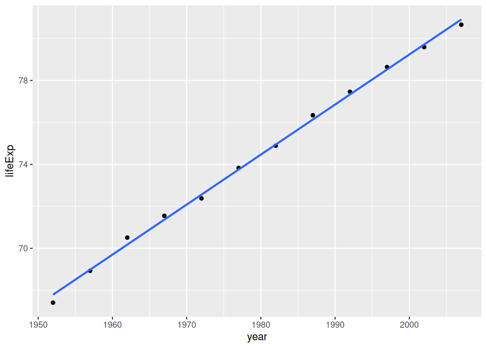
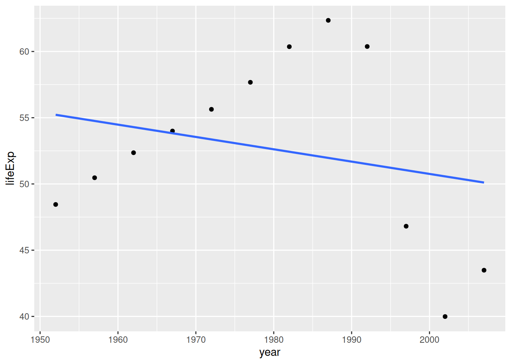

# Write your own R functions{#functions-part1}

Writing your own functions in R is a fundamental skill that enhances your ability to perform repetitive tasks efficiently, customize analyses, and improve the readability of your code. A function in R is a set of instructions designed to perform a specific task, which can be as simple or complex as needed. By now, you've used plenty of functions in R. Hopefully, you've absorbed some of their logic, and have seen first-hand how they simplify complex tasks. It's time to take that experience and start crafting your own. Doing so isn't just about following a set of instructions; it's about embracing the modular, building-block nature of R. This approach doesn't just make your code smarter; it makes it significantly more readable and customizable. Let's dive in and transform how you interact with R, turning you from a useR into a creatoR.


<!--DS4P Links-->
[course_web]: https://datascience4psych.github.io/DataScience4Psych
[course_git]: https://github.com/DataScience4Psych/DataScience4Psych
[course_repo]: https://github.com/DataScience4Psych
[course_slides]: https://github.com/DataScience4Psych/slides
[course_syllabus]: https://smasongarrison.github.io/syllabi/ 
<!-- https://smasongarrison.github.io/syllabi/data-science.html -->
[syllabi]: https://smasongarrison.github.io/syllabi
[pl_00]: https://www.youtube.com/playlist?list=PLKrrdtYgOUYaEAnJX20Ryy4OSie375rVY
[pl_01]: https://www.youtube.com/playlist?list=PLKrrdtYgOUYao_7t5ycK4KDXNKaY-ECup
[pl_02]: https://www.youtube.com/playlist?list=PLKrrdtYgOUYZmr_T3PnuxjVIlj0C0kUNI
[pl_03]: https://www.youtube.com/playlist?list=PLKrrdtYgOUYaHmjzdRvfg0yhOIYQnfjwE
[pl_04]: https://www.youtube.com/playlist?list=PLKrrdtYgOUYYWFcel6_vp8__RUKLxhX4y
[pl_05]: https://www.youtube.com/playlist?list=PLKrrdtYgOUYYMIguiV1F8RagMYibTY4iW
[pl_06]: https://www.youtube.com/playlist?list=PLKrrdtYgOUYYV_KDod3Mk9-RmtFXii9Dv
[pl_07]: https://www.youtube.com/watch?list=PLKrrdtYgOUYZxvEvQ8-PcWrOY_dwY_ETI
[pl_08]: https://www.youtube.com/playlist?list=PLKrrdtYgOUYZgOzYB_dmauw55M7jXvsdo
[pl_09]: https://www.youtube.com/playlist?list=PLKrrdtYgOUYbaiTmldRY2ddsLrHp3z6yO
[pl_10]: https://www.youtube.com/playlist?list=PLKrrdtYgOUYbPw5iYzYEzoOKa7mJKNIhq
[pl_11]: https://www.youtube.com/playlist?list=PLKrrdtYgOUYZ-u6LzBbanrNFoeLHKaLL6
[pl_12]: https://www.youtube.com/playlist?list=PLKrrdtYgOUYbwRS-9Htmb80_t1NG-021e
[pl_13]: https://www.youtube.com/playlist?list=PLKrrdtYgOUYbWGmSnbLIYwdLOnGm6une6
[pl_14]: https://www.youtube.com/playlist?list=PLKrrdtYgOUYbWGmSnbLIYwdLOnGm6une6
[pl_15]: https://www.youtube.com/playlist?list=PLKrrdtYgOUYa5MoYrV8EsWQ5jIr5ZYMpM
[pl_all]: https://www.youtube.com/playlist?list=PLKrrdtYgOUYZomNqf-1dtCDW94ySdLv-9


<!--AE Links-->
[ae01a_unvotes]: https://github.com/DataScience4Psych/ae01a_unvotes
[ae01b_covid]: https://github.com/DataScience4Psych/ae01b_covid
[ae02_bechdel]: https://github.com/DataScience4Psych/ae-02-bechdel-rmarkdown
[ae03_starwars]: https://github.com/DataScience4Psych/ae-03-starwars-dataviz
[ae08_imdb]: https://github.com/DataScience4Psych/ae-08-imdb-webscraping

<!-- Lab Links-->

[lab01_hello]: https://github.com/DataScience4Psych/lab-01-hello-r
[lab02]: https://github.com/DataScience4Psych/lab-02-plastic-waste
[lab03]: https://github.com/DataScience4Psych/lab-03-nobel-laureates
[lab04]: https://github.com/DataScience4Psych/lab-04-viz-sp-data
[lab05]: https://github.com/DataScience4Psych/lab-05-wrangle-sp-data
[lab06]: https://github.com/DataScience4Psych/lab_06_sad_plots
[lab07]: https://github.com/DataScience4Psych/lab_07_betterviz
[lab08]: https://github.com/DataScience4Psych/lab-08-uoe-art
[lab09]: https://github.com/DataScience4Psych/lab-09-ethics-algorithmic-bias
[lab10]: https://github.com/DataScience4Psych/lab-10-slr-course-evals
[lab11]: https://github.com/DataScience4Psych/lab-11-mlr-course-evals
[lab12]: https://github.com/DataScience4Psych/lab-12-inference-smoking
[lab13]: https://github.com/DataScience4Psych/lab-13-simulating-mars

<!--Slides-->
[d01_welcome]: https://datascience4psych.github.io/slides/d01_welcome/d01_welcome.html
[d02_toolkit]: https://datascience4psych.github.io/slides/d02_toolkit/d02_toolkit.html
[d03_dataviz]: https://datascience4psych.github.io/slides/d03_dataviz/d03_dataviz.html
[d04_ggplot2]: https://datascience4psych.github.io/slides/d04_ggplot2/d04_ggplot2.html
[d05_viznum]: https://datascience4psych.github.io/slides/d05_viznum/d05_viznum.html
[d06_vizcat]: https://datascience4psych.github.io/slides/d06_vizcat/d06_vizcat.html
[d07_tidy]: https://datascience4psych.github.io/slides/d07_tidy/d07_tidy.html
[d08_grammar]: https://datascience4psych.github.io/slides/d08_grammar/d08_grammar.html
[d09_wrangle]: https://datascience4psych.github.io/slides/d09_wrangle/d09_wrangle.html
[d10_dfs]: https://datascience4psych.github.io/slides/d10_dfs/d10_dfs.html
[d11_types]: https://datascience4psych.github.io/slides/d11_types/d11_types.html
[d12_import]: https://datascience4psych.github.io/slides/d12_import/d12_import.html
[d13_goodviz]: https://datascience4psych.github.io/slides/d13_goodviz/d13_goodviz.html
[d13b_moreggplot]: https://datascience4psych.github.io/slides/d13_goodviz/d13b_moreggplot.html
[d14_confound]: https://datascience4psych.github.io/slides/d14_confound/d14_confound.html
[d15_goodtalk]: https://datascience4psych.github.io/slides/d15_goodtalk/d15_goodtalk.html
[d16_webscraping]: https://datascience4psych.github.io/slides/d16_webscraping/d16_webscraping.html
[d17_functions]: https://datascience4psych.github.io/slides/d17_functions/d17_functions.html
[d18_ethics]: https://datascience4psych.github.io/slides/d18_ethics/d18_ethics.html
[d19_bias]: https://datascience4psych.github.io/slides/d19_bias/d19_bias.html
[d20_language]: https://datascience4psych.github.io/slides/d20_language/d20_language.html
[d21_fitting]: https://datascience4psych.github.io/slides/d21_fitting/d21_fitting.html
[d22_nonlinear]: https://datascience4psych.github.io/slides/d22_nonlinear/d22_nonlinear.html
[d23_multiple]: https://datascience4psych.github.io/slides/d23_multiple/d23_multiple.html
[d24_overfitting]: https://datascience4psych.github.io/slides/d24_overfitting/d24_overfitting.html
[d25_crossvalidation]: https://datascience4psych.github.io/slides/d25_crossvalidation/d25_crossvalidation.html
[d26_quantify]: https://datascience4psych.github.io/slides/d26_quantify/d26_quantify.html
[d27_bootstrap]: https://datascience4psych.github.io/slides/d27_bootstrap/d27_bootstrap.html
[d28_interactive]: https://datascience4psych.github.io/slides/d28_interactive/d28_interactive.html
[d29_machine]: https://datascience4psych.github.io/slides/d29_machinelearning/d29_machine.html
[d30_simulations]: https://datascience4psych.github.io/slides/d30_simulations/d30_simulations.html
[d31_llmintro]: https://datascience4psych.github.io/slides/d31_llmintro/d31_llmintro.html
[d32_llmapplications]: https://datascience4psych.github.io/slides/d32_llmapplications/d32_llmapplications.html

<!--externals-->

[stat545]: https://stat545.com
[r4ds]: https://r4ds.had.co.nz
[cran]: https://cloud.r-project.org

<!--Original content: https://stat545.com/block011_write-your-own-function-01.html-->

## What and why?

This section aims to demystify the __process__ experienced R useRs follow to write functions. I want to shed light on the rationale behind each step. Merely looking at the finished product, e.g., source code for R packages, can be extremely deceiving. Reality is generally much uglier ... but more interesting!

Why are we covering this now, smack in the middle of data aggregation? Powerful machines like dplyr, purrr, and the built-in "apply" family of functions, are ready and waiting to apply your purpose-built functions to various bits of your data. If you can express your analytical wishes in a function, these tools will give you great power.

## Load the nycflights13 data

We'll begin by loading the `nycflights13` dataset, which contains information about all flights that departed from New York City in 2013. This dataset provides a rich source of real-world data for practicing data manipulation and analysis


``` r
library(nycflights13)
library(dplyr)
data("flights")
# str(flights)
```

## Example Analysis: Average Delay by Airline

Consider we want to compute the average delay experienced by each airline. This is a great example of a typical input for a function. You can imagine wanting to get this statistic to evaluate airline performance. You might want to do this for different years, months, or days of the week. You might want to do this for different airports, or for different combinations of airports. You might want to do this for different types of delays. You might want to do this for different subsets of the data, e.g., only for flights that were delayed. You might want to do this for different airlines. You might want to do this for different combinations of the above.

## Get something that works

First, develop some working code for interactive use, using a representative input. I'll use flights operated by a specific airline as an example.

R functions that will be useful: `mean()` and `filter()` from the `dplyr` package.

``` r
## Investigate the structure of the flights dataset
str(flights)
#> tibble [336,776 × 19] (S3: tbl_df/tbl/data.frame)
#>  $ year          : int [1:336776] 2013 2013 2013 2013 2013 2013 2013 2013 2013..
#>  $ month         : int [1:336776] 1 1 1 1 1 1 1 1 1 1 ...
#>  $ day           : int [1:336776] 1 1 1 1 1 1 1 1 1 1 ...
#>  $ dep_time      : int [1:336776] 517 533 542 544 554 554 555 557 557 558 ...
#>  $ sched_dep_time: int [1:336776] 515 529 540 545 600 558 600 600 600 600 ...
#>  $ dep_delay     : num [1:336776] 2 4 2 -1 -6 -4 -5 -3 -3 -2 ...
#>  $ arr_time      : int [1:336776] 830 850 923 1004 812 740 913 709 838 753 ...
#>  $ sched_arr_time: int [1:336776] 819 830 850 1022 837 728 854 723 846 745 ...
#>  $ arr_delay     : num [1:336776] 11 20 33 -18 -25 12 19 -14 -8 8 ...
#>  $ carrier       : chr [1:336776] "UA" "UA" "AA" "B6" ...
#>  $ flight        : int [1:336776] 1545 1714 1141 725 461 1696 507 5708 79 301 ..
#>  $ tailnum       : chr [1:336776] "N14228" "N24211" "N619AA" "N804JB" ...
#>  $ origin        : chr [1:336776] "EWR" "LGA" "JFK" "JFK" ...
#>  $ dest          : chr [1:336776] "IAH" "IAH" "MIA" "BQN" ...
#>  $ air_time      : num [1:336776] 227 227 160 183 116 150 158 53 140 138 ...
#>  $ distance      : num [1:336776] 1400 1416 1089 1576 762 ...
#>  $ hour          : num [1:336776] 5 5 5 5 6 5 6 6 6 6 ...
#>  $ minute        : num [1:336776] 15 29 40 45 0 58 0 0 0 0 ...
#>  $ time_hour     : POSIXct[1:336776], format: "2013-01-01 05:00:00" "2013-01-"..
## get to know the functions mentioned above

mean(flights$dep_delay)
#> [1] NA

filter(.data = flights, carrier == "AA")
#> # A tibble: 32,729 × 19
#>     year month   day dep_time sched_dep_time dep_delay arr_time sched_arr_time
#>    <int> <int> <int>    <int>          <int>     <dbl>    <int>          <int>
#>  1  2013     1     1      542            540         2      923            850
#>  2  2013     1     1      558            600        -2      753            745
#>  3  2013     1     1      559            600        -1      941            910
#>  4  2013     1     1      606            610        -4      858            910
#>  5  2013     1     1      623            610        13      920            915
#>  6  2013     1     1      628            630        -2     1137           1140
#>  7  2013     1     1      629            630        -1      824            810
#>  8  2013     1     1      635            635         0     1028            940
#>  9  2013     1     1      656            700        -4      854            850
#> 10  2013     1     1      656            659        -3      949            959
#> # ℹ 32,719 more rows
#> # ℹ 11 more variables: arr_delay <dbl>, carrier <chr>, flight <int>,
#> #   tailnum <chr>, origin <chr>, dest <chr>, air_time <dbl>, distance <dbl>,
#> #   hour <dbl>, minute <dbl>, time_hour <dttm>
```


|Carrier | Average Departure Delay|
|:-------|-----------------------:|
|9E      |                   16.44|
|AA      |                    8.57|
|AS      |                    5.83|
|B6      |                   12.97|
|DL      |                    9.22|
|EV      |                   19.84|
|F9      |                   20.20|
|FL      |                   18.61|
|HA      |                    4.90|
|MQ      |                   10.45|
|OO      |                   12.59|
|UA      |                   12.02|
|US      |                    3.75|
|VX      |                   12.76|
|WN      |                   17.66|
|YV      |                   18.90|


Now lets go through some natural solutions to get the average delay for the airline "AA"

### Using `dplyr` for Data Filtering and Summary

This solution employs the dplyr package to filter flights by the airline code and then calculate the average departure delay.


``` r
flights %>%
  filter(carrier == "AA") %>%
  summarize(average_delay = mean(dep_delay, na.rm = TRUE))
#> # A tibble: 1 × 1
#>   average_delay
#>           <dbl>
#> 1          8.59
```

### Using Base R with Subsetting

Here, we use base R to achieve the same task without the `dplyr` package, directly subsetting the dataframe.


``` r
mean(flights$dep_delay[flights$carrier == "AA"], na.rm = TRUE)
#> [1] 8.59
```

### Using `with()` Function

The with() function provides a convenient way to perform operations within a dataframe subset, making the code more readable.


``` r
with(flights[flights$carrier == "AA", ], mean(dep_delay, na.rm = TRUE))
#> [1] 8.59
```

### Using `aggregate()` Function

The `aggregate()` function in R can be used to compute summary statistics for subgroups of data, which in this case are flights operated by "AA".


``` r
aggregate(dep_delay ~ carrier, data = flights[flights$carrier == "AA", ], FUN = mean, na.rm = TRUE)$dep_delay
#> [1] 8.59
```

###  Using tapply() Function

The tapply() function applies a function to subsets of a vector, which we can use to calculate the average delay for "AA" flights.

``` r
tapply(flights$dep_delay, flights$carrier, mean, na.rm = TRUE)["AA"]
#>   AA 
#> 8.59
```

Now, internalize this "answer" because our informal testing relies on you noticing departures from this number when we generalize the function.

## Turn the Working Interactive Code into a Function

When crafting your own functions in R, it's beneficial to start with a straightforward, minimal version that accomplishes the basic task at hand. This approach is akin to building a 'skateboard'—a simple, yet functional product. Let's apply this philosophy to our task of calculating the average delay for a specific airline in the nycflights13 dataset.

### Initial Simple Function: The 'Skateboard'

``` r
average_delay_by_airline <- function(airline_code) {
  flights %>%
    filter(carrier == airline_code) %>%
    summarize(average_delay = mean(dep_delay, na.rm = TRUE))
}
```

Check that you're getting the same answer as you did with your interactive code.


``` r
# Test the function with American Airlines (AA)
average_delay_by_airline("AA")
#> # A tibble: 1 × 1
#>   average_delay
#>           <dbl>
#> 1          8.59
```

This function represents our 'skateboard'. It's basic, and we have added no new functionality. Yet, it gets the job done by providing the average delay for a given airline code. It doesn't include error handling or support for additional details like distinguishing between departure and arrival delays, but it serves as a solid starting point. This is a minimal viable product (MVP) that we can build upon to create a more complex function (the 'car').

<div class="figure">

<p class="caption">(\#fig:spotify-howtobuildmvp)This image [widely attributed to the Spotify development team][min-viable-product] conveys an important point. From [Your ultimate guide to Minimum Viable Product (+great examples)](https://web.archive.org/web/20220318100638/https://blog.fastmonkeys.com/2014/06/18/minimum-viable-product-your-ultimate-guide-to-mvp-great-examples/)</p>
</div>

This idea is related to the valuable [Telescope Rule][telescope-rule]:

> It is faster to make a four-inch mirror then a six-inch mirror than to make a six-inch mirror.

## Test the Function
### Test on new inputs

Pick some new artificial inputs where you know (at least approximately) what your function should return.


``` r
average_delay_by_airline("UA")
#> # A tibble: 1 × 1
#>   average_delay
#>           <dbl>
#> 1          12.1
```

I know that UA had about 12 minutes of a delay.

### Test on real data but *different* real data

Back to the real world now. So typically, the next step is to check to see if your function can handle different data. This is a good way to check if your function is robust and generalizable. However, ours doesn't. It's hard-wired to the `flights` dataset. We'll fix that in the next section.


``` r
average_delay_by_airline <- function(data = flights, airline_code) {
  data %>%
    filter(carrier == airline_code) %>%
    summarize(average_delay = mean(dep_delay, na.rm = TRUE))
}
```

I've now added another variable to the function, `data`, which defaults to `flights`. This is a good habit to get into. It makes your function more flexible and more generalizable. It also makes it easier to test your function on different datasets. Now, we can test our function on a modified `flights` dataset, that I have named the `flights2` dataset. The only thing I have done to this dataset is multiplied all of the delays by 2.


``` r
flights2 <- flights

flights2$dep_delay <- flights2$dep_delay * 2

average_delay_by_airline(flights2, "AA")
#> # A tibble: 1 × 1
#>   average_delay
#>           <dbl>
#> 1          17.2
```


# Enhancing the Function: Towards the 'Perfectly Formed Rear-View Mirror'

Once you have a basic function that works, you can incrementally add features to make it more robust and versatile. This could include error handling (to gracefully deal with unexpected inputs), parameters for selecting between departure and arrival delays, or options for filtering by specific airports or dates.

Let's add the capability to choose between departure (dep_delay) and arrival (arr_delay) delays.


``` r
# Enhanced function to calculate average delay, with options for delay type and error handling
average_delay_by_airline <- function(data = flights, airline_code, delay_type = "dep_delay") {
  data %>%
    filter(carrier == airline_code) %>%
    summarize(average_delay = mean(get(delay_type), na.rm = TRUE))
}


# Test the enhanced function
average_delay_by_airline(airline_code = "AA", delay_type = "arr_delay")
#> # A tibble: 1 × 1
#>   average_delay
#>           <dbl>
#> 1         0.364
```

In this version, the function now accepts an additional argument, `delay_type`, which allows the user to specify the type of delay they are interested in analyzing. The function checks if the provided delay_type is valid and uses dynamic column selection via `get(delay_type)` to compute the mean delay.


# Test on Unexpected Inputs

Now, let's try to break our function. Don't get truly diabolical (yet). Just make the kind of mistakes you can imagine making at 2am when, 3 years from now, you rediscover this useful function you wrote. Give your function inputs it's not expecting.


``` r
average_delay_by_airline(flights)
#> Error in `filter()`:
#> ℹ In argument: `carrier == airline_code`.
#> Caused by error:
#> ! argument "airline_code" is missing, with no default

average_delay_by_airline(airline_code = "AB")
#> # A tibble: 1 × 1
#>   average_delay
#>           <dbl>
#> 1           NaN

average_delay_by_airline(delay_type = "arr-delay")
#> Error in `filter()`:
#> ℹ In argument: `carrier == airline_code`.
#> Caused by error:
#> ! argument "airline_code" is missing, with no default
```

How happy are you with those error messages? You must imagine that some entire __script__ has failed and that you were hoping to just `source()` it without re-reading it. If a colleague or future you encountered these errors, do you run screaming from the room? How hard is it to pinpoint the usage problem?


## Error Handling

We'll add some simple checks to ensure that the airline code provided to the function is valid. If it's not, we'll return an informative error message. We'll also add a check to ensure that the delay type provided is valid.


``` r
average_delay_by_airline <- function(data = flights, airline_code, delay_type = "dep_delay") {
  # Check if any of the provided airline codes are not in the dataset
  if (!any(airline_code %in% c(data$carrier, NA))) {
    stop("One or more airline codes not found in the dataset.")
  }
  if (!delay_type %in% c("dep_delay", "arr_delay")) {
    stop("Invalid delay type specified. Choose either 'dep_delay' or 'arr_delay'.")
  }

  data %>%
    filter(carrier == airline_code) %>%
    summarize(average_delay = mean(get(delay_type), na.rm = TRUE))
}
```


## Check the validity of arguments

For functions that will be used again -- which is not all of them! -- it is good to check the validity of arguments. This implements a rule from [the Unix philosophy][unix-philosophy]:

> Rule of Repair: When you must fail, fail noisily and as soon as possible.

### stop if not

`stopifnot()` is the entry level solution. I use it here to make sure the input `data` is a data.frame.


``` r
mmm <- function(data = flights, airline_code, delay_type = "dep_delay") {
  stopifnot(is.data.frame(data))
  # Check if any of the provided airline codes are not in the dataset
  if (!any(airline_code %in% c(data$carrier, NA))) {
    stop("One or more airline codes not found in the dataset.")
  }
  if (!delay_type %in% c("dep_delay", "arr_delay")) {
    stop("Invalid delay type specified. Choose either 'dep_delay' or 'arr_delay'.")
  }

  data %>%
    filter(carrier == airline_code) %>%
    summarize(average_delay = mean(get(delay_type), na.rm = TRUE))
}

mmm("eggplants are purple")
#> Error in `mmm()`:
#> ! is.data.frame(data) is not TRUE
```

And we see that it catches all of the self-inflicted damage we would like to avoid.

### if then stop

`stopifnot()` doesn't provide a helpful error message. The next approach is widely used. Put your validity check inside an `if()` statement and call `stop()` yourself, with a custom error message, in the body.


``` r
mmm2 <- function(x) {
  if (!is.numeric(x)) {
    stop(
      "I am so sorry, but this function only works for numeric input!\n",
      "You have provided an object of class: ", class(x)[1]
    )
  }
  max(x) - min(x)
}
mmm2(gapminder)
#> Error:
#> ! object 'gapminder' not found
```

In addition to a gratuitous apology, the error raised also contains two more pieces of helpful info:

* *Which* function threw the error.
* Hints on how to fix things: expected class of input vs actual class.

If it is easy to do so, I highly recommend this template: "you gave me THIS, but I need THAT".

The tidyverse style guide has a very useful [chapter on how to construct error messages](https://style.tidyverse.org/error-messages.html).

### Sidebar: non-programming uses for assertions

Another good use of this pattern is to leave checks behind in data analytical scripts. Consider our repetitive use of Gapminder in this course. Every time we load it, we inspect it, hoping to see the usual stuff. If we were loading from file (vs. a stable data package), we might want to formalize our expectations about the number of rows and columns, the names and flavors of the variables, etc. This would alert us if the data suddenly changed, which can be a useful wake-up call in scripts that you re-run *ad nauseam* on auto-pilot or non-interactively.

## Wrap-up and what's next?

Here's the function we've written so far:


``` r
mmm2
#> function (x) 
#> {
#>     if (!is.numeric(x)) {
#>         stop("I am so sorry, but this function only works for numeric input!\n", 
#>             "You have provided an object of class: ", class(x)[1])
#>     }
#>     max(x) - min(x)
#> }
```

What we've accomplished:

* We've written our first function.
* We are checking the validity of its input, argument `x`.
* We've done a good amount of informal testing.

Where to next? In [part 2](#functions-part2) we generalize this function to take differences in other quantiles and learn how to set default values for arguments.

## Where were we? Where are we going?

In [part 1](#functions-part1) we wrote our simple R function to compute the difference between the max and min of a numeric vector. We checked the validity of the function's only argument and, informally, we verified that it worked pretty well.

In this part, we generalize this function, learn more technical details about R functions, and set default values for some arguments.

## Load the Gapminder data

As usual, load gapminder.


``` r
library(gapminder)
```

## Restore our max minus min function

Let's keep our previous function around as a baseline.


``` r
mmm <- function(x) {
  stopifnot(is.numeric(x))
  max(x) - min(x)
}
```

## Generalize our function to other quantiles

The max and the min are special cases of a __quantile__. Here are other special cases you may have heard of:

* median = 0.5 quantile
* 1st quartile = 0.25 quantile
* 3rd quartile = 0.75 quantile

If you're familiar with [box plots][wiki-boxplot], the rectangle typically runs from the 1st quartile to the 3rd quartile, with a line at the median.

If $q$ is the $p$-th quantile of a set of $n$ observations, what does that mean? Approximately $pn$ of the observations are less than $q$ and $(1 - p)n$ are greater than $q$. Yeah, you need to worry about rounding to an integer and less/greater than or equal to, but these details aren't critical here.

Let's generalize our function to take the difference between any two quantiles. We can still consider the max and min, if we like, but we're not limited to that.

## Get something that works, again

The eventual inputs to our new function will be the data `x` and two probabilities.

First, play around with the `quantile()` function. Convince yourself you know how to use it, for example, by cross-checking your results with other built-in functions.


``` r
quantile(gapminder$lifeExp)
#>   0%  25%  50%  75% 100% 
#> 23.6 48.2 60.7 70.8 82.6
quantile(gapminder$lifeExp,
  probs = 0.5
)
#>  50% 
#> 60.7
median(gapminder$lifeExp)
#> [1] 60.7
quantile(gapminder$lifeExp,
  robs = c(0.25, 0.75)
)
#>   0%  25%  50%  75% 100% 
#> 23.6 48.2 60.7 70.8 82.6
boxplot(gapminder$lifeExp, plot = FALSE)$stats
#>      [,1]
#> [1,] 23.6
#> [2,] 48.2
#> [3,] 60.7
#> [4,] 70.8
#> [5,] 82.6
```

Now write a code snippet that takes the difference between two quantiles.


``` r
the_probs <- c(0.25, 0.75)
the_quantiles <- quantile(gapminder$lifeExp, probs = the_probs)
max(the_quantiles) - min(the_quantiles)
#> [1] 22.6
```

## Turn the working interactive code into a function, again

I'll use `qdiff` as the base of our function's name. I copy the overall structure from our previous "max minus min" work but replace the guts of the function with the more general code we just developed.


``` r
qdiff1 <- function(x, probs) {
  stopifnot(is.numeric(x))
  the_quantiles <- quantile(x = x, probs = probs)
  max(the_quantiles) - min(the_quantiles)
}
qdiff1(gapminder$lifeExp, probs = c(0.25, 0.75))
#> [1] 22.6
IQR(gapminder$lifeExp) # hey, we've reinvented IQR
#> [1] 22.6
qdiff1(gapminder$lifeExp, probs = c(0, 1))
#> [1] 59
mmm(gapminder$lifeExp)
#> [1] 59
```

Again we do some informal tests against familiar results and external implementations.

## Argument names: freedom and conventions

I want you to understand the importance of argument names.

I can name my arguments almost anything I like. Proof:


``` r
qdiff2 <- function(zeus, hera) {
  stopifnot(is.numeric(zeus))
  the_quantiles <- quantile(x = zeus, probs = hera)
  max(the_quantiles) - min(the_quantiles)
}
qdiff2(zeus = gapminder$lifeExp, hera = 0:1)
#> [1] 59
```

Although I can name my arguments after Greek gods, it's usually a bad idea. Take all opportunities to make things more self-explanatory via meaningful names. Future you will thank you.

If you are going to pass the arguments of your function as arguments of a built-in function, consider copying the argument names. Unless you have a good reason to do your own thing (some argument names are bad!), be consistent with the existing function. Again, the reason is to reduce your cognitive load. This is what I've been doing all along and now you know why:


``` r
qdiff1
#> function (x, probs) 
#> {
#>     stopifnot(is.numeric(x))
#>     the_quantiles <- quantile(x = x, probs = probs)
#>     max(the_quantiles) - min(the_quantiles)
#> }
#> <bytecode: 0x559cd463b050>
```

We took this detour so you could see there is no *structural* relationship between my arguments (`x` and `probs`) and those of `quantile()` (also `x` and `probs`). The similarity or equivalence of the names __accomplishes nothing__ as far as R is concerned; it is solely for the benefit of humans reading, writing, and using the code. Which is very important!

## What a function returns

By this point, I expect someone will have asked about the last line in my function's body. Look above for a reminder of the function's definition.

By default, a function returns the result of the last line of the body. I am just letting that happen with the line `max(the_quantiles) - min(the_quantiles)`. However, there is an explicit function for this: `return()`. I could just as easily make this the last line of my function's body:


``` r
return(max(the_quantiles) - min(the_quantiles))
```

You absolutely must use `return()` if you want to return early based on some condition, i.e. before execution gets to the last line of the body. Otherwise, you can decide your own conventions about when you use `return()` and when you don't.

## Default values: freedom to NOT specify the arguments

What happens if we call our function but neglect to specify the probabilities?


``` r
qdiff1(gapminder$lifeExp)
#> Error in `qdiff1()`:
#> ! argument "probs" is missing, with no default
```

Oops! At the moment, this causes a fatal error. It can be nice to provide some reasonable default values for certain arguments. In our case, it would not be a good idea to specify a default value for the primary input `x`, but it would be a good idea to specify a default for `probs`.

We started by focusing on the max and the min, so I think those make reasonable defaults. Here's how to specify that in a function definition.


``` r
qdiff3 <- function(x, probs = c(0, 1)) {
  stopifnot(is.numeric(x))
  the_quantiles <- quantile(x, probs)
  max(the_quantiles) - min(the_quantiles)
}
```

Again we check how the function works, in old examples and new, specifying the `probs` argument and not.


``` r
qdiff3(gapminder$lifeExp)
#> [1] 59
mmm(gapminder$lifeExp)
#> [1] 59
qdiff3(gapminder$lifeExp, c(0.1, 0.9))
#> [1] 33.6
```

## Check the validity of arguments, again

__Exercise:__ upgrade our argument validity checks in light of the new argument `probs`.


``` r
## problems identified during class
## we're not checking that probs is numeric
## we're not checking that probs is length 2
## we're not checking that probs are in [0,1]
```

## Wrap-up and what's next?

Here's the function we've written so far:


``` r
qdiff3
#> function (x, probs = c(0, 1)) 
#> {
#>     stopifnot(is.numeric(x))
#>     the_quantiles <- quantile(x, probs)
#>     max(the_quantiles) - min(the_quantiles)
#> }
#> <bytecode: 0x559cd566e738>
```

What we've accomplished:

* We've generalized our first function to take a difference between arbitrary quantiles.
* We've specified default values for the probabilities that set the quantiles.

Where to next? Next, we tackle `NA`s, the special `...` argument, and formal unit testing.

## Where were we? Where are we going?

Previously, we generalized our first R function so it could take the difference between any two quantiles of a numeric vector. We also set default values for the underlying probabilities, so that, by default, we compute the max minus the min.

In this part, we tackle `NA`s, the special argument `...` and formal testing.

## Load the Gapminder data

As usual, load gapminder.


``` r
library(gapminder)
```

## Restore our max minus min function

Let's keep our previous function around as a baseline.


``` r
qdiff3 <- function(x, probs = c(0, 1)) {
  stopifnot(is.numeric(x))
  the_quantiles <- quantile(x, probs)
  max(the_quantiles) - min(the_quantiles)
}
```

## Be proactive about `NA`s

I am being gentle by letting you practice with the Gapminder data. In real life, missing data will make your life a living hell. If you are lucky, it will be properly indicated by the special value `NA`, but don't hold your breath. Many built-in R functions have an `na.rm =` argument through which you can specify how you want to handle `NA`s. Typically the default value is `na.rm = FALSE` and typical default behavior is to either let `NA`s propagate or to raise an error. Let's see how `quantile()` handles `NA`s:


``` r
z <- gapminder$lifeExp
z[3] <- NA
quantile(gapminder$lifeExp)
#>   0%  25%  50%  75% 100% 
#> 23.6 48.2 60.7 70.8 82.6
quantile(z)
#> Error in `quantile.default()`:
#> ! missing values and NaN's not allowed if 'na.rm' is FALSE
quantile(z, na.rm = TRUE)
#>   0%  25%  50%  75% 100% 
#> 23.6 48.2 60.8 70.8 82.6
```

So `quantile()` simply will not operate in the presence of `NA`s unless `na.rm = TRUE`. How shall we modify our function?

If we wanted to hardwire `na.rm = TRUE`, we could. Focus on our call to `quantile()` inside our function definition.


``` r
qdiff4 <- function(x, probs = c(0, 1)) {
  stopifnot(is.numeric(x))
  the_quantiles <- quantile(x, probs, na.rm = TRUE)
  max(the_quantiles) - min(the_quantiles)
}
qdiff4(gapminder$lifeExp)
#> [1] 59
qdiff4(z)
#> [1] 59
```

This works but it is dangerous to invert the default behavior of a well-known built-in function and to provide the user with no way to override this.

We could add an `na.rm =` argument to our own function. We might even enforce our preferred default -- but at least we're giving the user a way to control the behavior around `NA`s.


``` r
qdiff5 <- function(x,
                   probs = c(0, 1),
                   na.rm = TRUE) {
  stopifnot(is.numeric(x))
  the_quantiles <- quantile(x, probs, na.rm = na.rm)
  max(the_quantiles) - min(the_quantiles)
}
qdiff5(gapminder$lifeExp)
#> [1] 59
qdiff5(z)
#> [1] 59
qdiff5(z, na.rm = FALSE)
#> Error in `quantile.default()`:
#> ! missing values and NaN's not allowed if 'na.rm' is FALSE
```

## The useful but mysterious `...` argument

You probably could have lived a long and happy life without knowing there are at least 9 different algorithms for computing quantiles. [Go read about the `type` argument][rdocs-quantile] of `quantile()`. TLDR: If a quantile is not unambiguously equal to an observed data point, you must somehow average two data points. You can weight this average different ways, depending on the rest of the data, and `type =` controls this.

Let's say we want to give the user of our function the ability to specify how the quantiles are computed, but we want to accomplish with as little fuss as possible. In fact, we don't even want to clutter our function's interface with this! This calls for the very special `...` argument. In English, this set of three dots is frequently called an "ellipsis".


``` r
qdiff6 <- function(x, probs = c(0, 1), na.rm = TRUE, ...) {
  the_quantiles <- quantile(x = x, probs = probs, na.rm = na.rm, ...)
  max(the_quantiles) - min(the_quantiles)
}
```

The practical significance of the `type =` argument is virtually nonexistent, so we can't demo with the Gapminder data. Thanks to [\@wrathematics][twitter-wrathematics], here's a small example where we can (barely) detect a difference due to `type`.


``` r
set.seed(1234)
z <- rnorm(10)
quantile(z, type = 1)
#>     0%    25%    50%    75%   100% 
#> -2.346 -0.890 -0.564  0.429  1.084
quantile(z, type = 4)
#>     0%    25%    50%    75%   100% 
#> -2.346 -1.049 -0.564  0.353  1.084
all.equal(quantile(z, type = 1), quantile(z, type = 4))
#> [1] "Mean relative difference: 0.178"
```

Now we can call our function, requesting that quantiles be computed in different ways.


``` r
qdiff6(z, probs = c(0.25, 0.75), type = 1)
#> [1] 1.32
qdiff6(z, probs = c(0.25, 0.75), type = 4)
#> [1] 1.4
```

While the difference may be subtle, __it's there__. Marvel at the fact that we have passed `type = 1` through to `quantile()` *even though it was not a formal argument of our own function*.

The special argument `...` is very useful when you want the ability to pass arbitrary arguments down to another function, but without constantly expanding the formal arguments to your function. This leaves you with a less cluttered function definition and gives you future flexibility to specify these arguments only when you need to.

You will also encounter the `...` argument in many built-in functions -- read up on [`c()`][rdocs-c] or [`list()`][rdocs-list] -- and now you have a better sense of what it means. It is not a breezy "and so on and so forth."

There are also downsides to `...`, so use it with intention. In a package, you will have to work harder to create truly informative documentation for your user. Also, the quiet, absorbent properties of `...` mean it can sometimes silently swallow other named arguments, when the user has a typo in the name. Depending on whether or how this fails, it can be a little tricky to find out what went wrong.

The [ellipsis package](https://ellipsis.r-lib.org) provides tools that help package developers use `...` more safely. The in-progress tidyverse principles guide provides further guidance on the design of functions that take `...` in [Data, dots, details](https://principles.tidyverse.org/dots-position.html).

## Use testthat for formal unit tests

Until now, we've relied on informal tests of our evolving function. If you are going to use a function a lot, especially if it is part of a package, it is wise to use formal unit tests.

The [testthat][testthat-web] package ([cran][testthat-cran]; [GitHub][testthat-github]) provides excellent facilities for this, with a distinct emphasis on automated unit testing of entire packages. However, we can take it out for a test drive even with our one measly function.

We will construct a test with `test_that()` and, within it, we put one or more *expectations* that check actual against expected results. You simply harden your informal, interactive tests into formal unit tests. Here are some examples of tests and indicative expectations.


``` r
library(testthat)

test_that("invalid args are detected", {
  expect_error(qdiff6("eggplants are purple"))
  expect_error(qdiff6(iris))
})

test_that("NA handling works", {
  expect_error(qdiff6(c(1:5, NA), na.rm = FALSE))
  expect_equal(qdiff6(c(1:5, NA)), 4)
})
```

No news is good news! Let's see what test failure would look like. Let's revert to a version of our function that does no `NA` handling, then test for proper `NA` handling. We can watch it fail.


``` r
qdiff_no_NA <- function(x, probs = c(0, 1)) {
  the_quantiles <- quantile(x = x, probs = probs)
  max(the_quantiles) - min(the_quantiles)
}

test_that("NA handling works", {
  expect_that(qdiff_no_NA(c(1:5, NA)), equals(4))
})
```

Similar to the advice to use assertions in data analytical scripts, I recommend you use unit tests to monitor the behavior of functions you (or others) will use often. If your tests cover the function's important behavior, then you can edit the internals freely. You'll rest easy in the knowledge that, if you broke anything important, the tests will fail and alert you to the problem. A function that is important enough for unit tests probably also belongs in a package, where there are obvious mechanisms for running the tests as part of overall package checks.

# Function-writing practicum {#functions-practicum}


<!--Original content: https://stat545.com/block012_function-regress-lifeexp-on-year.html-->

## Overview

We recently learned how to write our own R functions ([part 1](#functions-part1), [part 2](#functions-part2), [part 3](#functions-part3)).

Now we use that knowledge to write another useful function, within the context of the Gapminder data:

* Input: a data.frame that contains (at least) a life expectancy variable `lifeExp` and a variable for year `year`
* Output: a vector of estimated intercept and slope, from a linear regression of `lifeExp` on `year`

The ultimate goal is to apply this function to the Gapminder data for a specific country. We will eventually scale up to *all* countries using external machinery, e.g., the `dplyr::group_by()` + `dplyr::do()`.

## Load the Gapminder data

As usual, load gapminder. Load ggplot2 because we'll make some plots and load dplyr too.


``` r
library(gapminder)
library(ggplot2)
library(dplyr)
```

## Get data to practice with

I've extract the data for one country in order to develop some working code interactively.


``` r
j_country <- "France" # pick, but do not hard wire, an example
(j_dat <- gapminder %>%
  filter(country == j_country))
#> # A tibble: 12 × 6
#>    country continent  year lifeExp      pop gdpPercap
#>    <fct>   <fct>     <int>   <dbl>    <int>     <dbl>
#>  1 France  Europe     1952    67.4 42459667     7030.
#>  2 France  Europe     1957    68.9 44310863     8663.
#>  3 France  Europe     1962    70.5 47124000    10560.
#>  4 France  Europe     1967    71.6 49569000    13000.
#>  5 France  Europe     1972    72.4 51732000    16107.
#>  6 France  Europe     1977    73.8 53165019    18293.
#>  7 France  Europe     1982    74.9 54433565    20294.
#>  8 France  Europe     1987    76.3 55630100    22066.
#>  9 France  Europe     1992    77.5 57374179    24704.
#> 10 France  Europe     1997    78.6 58623428    25890.
#> 11 France  Europe     2002    79.6 59925035    28926.
#> 12 France  Europe     2007    80.7 61083916    30470.
```

Always always always plot the data. Yes, even now.


``` r
p <- ggplot(j_dat, aes(x = year, y = lifeExp))
p + geom_point() + geom_smooth(method = "lm", se = FALSE)
#> `geom_smooth()` using formula = 'y ~ x'
```



## Get some code that works

Fit the regression:


``` r
j_fit <- lm(lifeExp ~ year, j_dat)
coef(j_fit)
#> (Intercept)        year 
#>    -397.765       0.239
```

Whoa, check out that wild intercept! Apparently the life expectancy in France around year 0 A.D. was minus 400 years! Never forget to sanity check a model. In this case, a reparametrization is in order. I think it makes more sense for the intercept to correspond to life expectancy in 1952, the earliest date in our dataset. Estimate the intercept eye-ball-o-metrically from the plot and confirm that we've got something sane and interpretable now.


``` r
j_fit <- lm(lifeExp ~ I(year - 1952), j_dat)
coef(j_fit)
#>    (Intercept) I(year - 1952) 
#>         67.790          0.239
```

### Sidebar: regression stuff

There are two things above that might prompt questions.

First, how did I know to get the estimated coefficients from a fitted model via `coef()`? Years of experience. But how might a novice learn such things? Read [the documentation for `lm()`][rdocs-lm], in this case. The "See also" section advises us about many functions that can operate on fitted linear model objects, including, but by no means limited to, `coef()`. Read [the documentation on `coef()`][rdocs-coef] too.

Second, what am I doing here: `lm(lifeExp ~ I(year - 1952))`? I want the intercept to correspond to 1952 and an easy way to accomplish that is to create a new predictor on the fly: year minus 1952. The way I achieve that in the model formula, `I(year - 1952)`, uses the `I()` function which "inhibits interpretation/conversion of objects". By protecting the expression `year - 1952`, I ensure it is interpreted in the obvious arithmetical way.

## Turn working code into a function

Create the basic definition of a function and drop your working code inside. Add arguments and edit the inner code to match. Apply it to the practice data. Do you get the same result as before?


``` r
le_lin_fit <- function(dat, offset = 1952) {
  the_fit <- lm(lifeExp ~ I(year - offset), dat)
  coef(the_fit)
}
le_lin_fit(j_dat)
#>      (Intercept) I(year - offset) 
#>           67.790            0.239
```

I had to decide how to handle the offset. Given that I will scale this code up to many countries, which, in theory, might have data for different dates, I chose to set a default of 1952. Strategies that compute the offset from data, either the main Gapminder dataset or the excerpt passed to this function, are also reasonable to consider.

I loathe the names on this return value. This is not my first rodeo and I know that, downstream, these will contaminate variable names and factor levels and show up in public places like plots and tables. Fix names early!


``` r
le_lin_fit <- function(dat, offset = 1952) {
  the_fit <- lm(lifeExp ~ I(year - offset), dat)
  setNames(coef(the_fit), c("intercept", "slope"))
}
le_lin_fit(j_dat)
#> intercept     slope 
#>    67.790     0.239
```

Much better!

## Test on other data and in a clean workspace

It's always good to rotate through examples during development. The most common error this will help you catch is when you accidentally hard-wire your example into your function. If you're paying attention to your informal tests, you will find it creepy that your function returns __exactly the same results__ regardless which input data you give it. This actually happened to me while I was writing this document, I kid you not! I had left `j_fit` inside the call to `coef()`, instead of switching it to `the_fit`. How did I catch that error? I saw the fitted line below, which clearly did not have an intercept in the late 60s and a positive slope, as my first example did. Figures are a mighty weapon in the fight against nonsense. I don't trust analyses that have few/no figures.


``` r
j_country <- "Zimbabwe"
(j_dat <- gapminder %>% filter(country == j_country))
#> # A tibble: 12 × 6
#>    country  continent  year lifeExp      pop gdpPercap
#>    <fct>    <fct>     <int>   <dbl>    <int>     <dbl>
#>  1 Zimbabwe Africa     1952    48.5  3080907      407.
#>  2 Zimbabwe Africa     1957    50.5  3646340      519.
#>  3 Zimbabwe Africa     1962    52.4  4277736      527.
#>  4 Zimbabwe Africa     1967    54.0  4995432      570.
#>  5 Zimbabwe Africa     1972    55.6  5861135      799.
#>  6 Zimbabwe Africa     1977    57.7  6642107      686.
#>  7 Zimbabwe Africa     1982    60.4  7636524      789.
#>  8 Zimbabwe Africa     1987    62.4  9216418      706.
#>  9 Zimbabwe Africa     1992    60.4 10704340      693.
#> 10 Zimbabwe Africa     1997    46.8 11404948      792.
#> 11 Zimbabwe Africa     2002    40.0 11926563      672.
#> 12 Zimbabwe Africa     2007    43.5 12311143      470.
p <- ggplot(j_dat, aes(x = year, y = lifeExp))
p + geom_point() + geom_smooth(method = "lm", se = FALSE)
#> `geom_smooth()` using formula = 'y ~ x'
```



``` r
le_lin_fit(j_dat)
#> intercept     slope 
#>    55.221    -0.093
```

The linear fit is comically bad, but yes I believe the visual line and the regression results match up.

It's also a good idea to clean out the workspace, rerun the minimum amount of code, and retest your function. This will help you catch another common mistake: accidentally relying on objects that were lying around in the workspace during development but that are not actually defined in your function nor passed as formal arguments.


``` r
rm(list = ls())
le_lin_fit <- function(dat, offset = 1952) {
  the_fit <- lm(lifeExp ~ I(year - offset), dat)
  setNames(coef(the_fit), c("intercept", "slope"))
}
le_lin_fit(gapminder %>% filter(country == "Zimbabwe"))
#> intercept     slope 
#>    55.221    -0.093
```

## Are we there yet?

Yes.

Given how I plan to use this function, I don't feel the need to put it under formal unit tests or put in argument validity checks.

## Resources

* [Composing R Functions](https://joshuamarie.com/posts/11-composing-r-function/) - A practical guide to writing and composing R functions

Packages for runtime assertions (the last 3 seem to be under more active development than `assertthat`):

* assertthat on [cran][assertthat-cran] and [GitHub][assertthat-github] - *the Hadleyverse option*
* ensurer on [cran][ensurer-cran] and [GitHub][ensurer-github] - *general purpose, pipe-friendly*
* assertr on [cran][assertr-cran] and [GitHub][assertr-github] - *explicitly data pipeline oriented*
* assertive on [cran][assertive-cran] and [Bitbucket][assertive-bitbucket] - *rich set of built-in functions*

* Hadley Wickham's book [Advanced R](http://adv-r.had.co.nz) [-@wickham2015a]:
  * Section on [defensive programming][adv-r-defensive-programming]
  * Section on [function arguments][adv-r-fxn-args]
  * Section on [return values][adv-r-return-values]

* Unit testing with testthat
  * On [cran][testthat-cran], development on [GitHub][testthat-github], main [webpage][testthat-web]
* Wickham and Bryan's [R Packages][r-pkgs2] book [-@wickham-unpub]
  * [Testing chapter](https://r-pkgs.org/tests.html)
* Wickham's [testthat: Get Started with Testing](https://journal.r-project.org/archive/2011-1/RJournal_2011-1_Wickham.pdf) article in The R Journal [-@wickham2011b]. Maybe this is completely superseded by the newer chapter above? Be aware that parts could be out of date, but I recall it was a helpful read.


<!--DS4P Links-->
[course_web]: https://datascience4psych.github.io/DataScience4Psych
[course_git]: https://github.com/DataScience4Psych/DataScience4Psych
[course_repo]: https://github.com/DataScience4Psych
[course_slides]: https://github.com/DataScience4Psych/slides
[course_syllabus]: https://smasongarrison.github.io/syllabi/ 
<!-- https://smasongarrison.github.io/syllabi/data-science.html -->
[syllabi]: https://smasongarrison.github.io/syllabi
[pl_00]: https://www.youtube.com/playlist?list=PLKrrdtYgOUYaEAnJX20Ryy4OSie375rVY
[pl_01]: https://www.youtube.com/playlist?list=PLKrrdtYgOUYao_7t5ycK4KDXNKaY-ECup
[pl_02]: https://www.youtube.com/playlist?list=PLKrrdtYgOUYZmr_T3PnuxjVIlj0C0kUNI
[pl_03]: https://www.youtube.com/playlist?list=PLKrrdtYgOUYaHmjzdRvfg0yhOIYQnfjwE
[pl_04]: https://www.youtube.com/playlist?list=PLKrrdtYgOUYYWFcel6_vp8__RUKLxhX4y
[pl_05]: https://www.youtube.com/playlist?list=PLKrrdtYgOUYYMIguiV1F8RagMYibTY4iW
[pl_06]: https://www.youtube.com/playlist?list=PLKrrdtYgOUYYV_KDod3Mk9-RmtFXii9Dv
[pl_07]: https://www.youtube.com/watch?list=PLKrrdtYgOUYZxvEvQ8-PcWrOY_dwY_ETI
[pl_08]: https://www.youtube.com/playlist?list=PLKrrdtYgOUYZgOzYB_dmauw55M7jXvsdo
[pl_09]: https://www.youtube.com/playlist?list=PLKrrdtYgOUYbaiTmldRY2ddsLrHp3z6yO
[pl_10]: https://www.youtube.com/playlist?list=PLKrrdtYgOUYbPw5iYzYEzoOKa7mJKNIhq
[pl_11]: https://www.youtube.com/playlist?list=PLKrrdtYgOUYZ-u6LzBbanrNFoeLHKaLL6
[pl_12]: https://www.youtube.com/playlist?list=PLKrrdtYgOUYbwRS-9Htmb80_t1NG-021e
[pl_13]: https://www.youtube.com/playlist?list=PLKrrdtYgOUYbWGmSnbLIYwdLOnGm6une6
[pl_14]: https://www.youtube.com/playlist?list=PLKrrdtYgOUYbWGmSnbLIYwdLOnGm6une6
[pl_15]: https://www.youtube.com/playlist?list=PLKrrdtYgOUYa5MoYrV8EsWQ5jIr5ZYMpM
[pl_all]: https://www.youtube.com/playlist?list=PLKrrdtYgOUYZomNqf-1dtCDW94ySdLv-9


<!--AE Links-->
[ae01a_unvotes]: https://github.com/DataScience4Psych/ae01a_unvotes
[ae01b_covid]: https://github.com/DataScience4Psych/ae01b_covid
[ae02_bechdel]: https://github.com/DataScience4Psych/ae-02-bechdel-rmarkdown
[ae03_starwars]: https://github.com/DataScience4Psych/ae-03-starwars-dataviz
[ae08_imdb]: https://github.com/DataScience4Psych/ae-08-imdb-webscraping

<!-- Lab Links-->

[lab01_hello]: https://github.com/DataScience4Psych/lab-01-hello-r
[lab02]: https://github.com/DataScience4Psych/lab-02-plastic-waste
[lab03]: https://github.com/DataScience4Psych/lab-03-nobel-laureates
[lab04]: https://github.com/DataScience4Psych/lab-04-viz-sp-data
[lab05]: https://github.com/DataScience4Psych/lab-05-wrangle-sp-data
[lab06]: https://github.com/DataScience4Psych/lab_06_sad_plots
[lab07]: https://github.com/DataScience4Psych/lab_07_betterviz
[lab08]: https://github.com/DataScience4Psych/lab-08-uoe-art
[lab09]: https://github.com/DataScience4Psych/lab-09-ethics-algorithmic-bias
[lab10]: https://github.com/DataScience4Psych/lab-10-slr-course-evals
[lab11]: https://github.com/DataScience4Psych/lab-11-mlr-course-evals
[lab12]: https://github.com/DataScience4Psych/lab-12-inference-smoking
[lab13]: https://github.com/DataScience4Psych/lab-13-simulating-mars

<!--Slides-->
[d01_welcome]: https://datascience4psych.github.io/slides/d01_welcome/d01_welcome.html
[d02_toolkit]: https://datascience4psych.github.io/slides/d02_toolkit/d02_toolkit.html
[d03_dataviz]: https://datascience4psych.github.io/slides/d03_dataviz/d03_dataviz.html
[d04_ggplot2]: https://datascience4psych.github.io/slides/d04_ggplot2/d04_ggplot2.html
[d05_viznum]: https://datascience4psych.github.io/slides/d05_viznum/d05_viznum.html
[d06_vizcat]: https://datascience4psych.github.io/slides/d06_vizcat/d06_vizcat.html
[d07_tidy]: https://datascience4psych.github.io/slides/d07_tidy/d07_tidy.html
[d08_grammar]: https://datascience4psych.github.io/slides/d08_grammar/d08_grammar.html
[d09_wrangle]: https://datascience4psych.github.io/slides/d09_wrangle/d09_wrangle.html
[d10_dfs]: https://datascience4psych.github.io/slides/d10_dfs/d10_dfs.html
[d11_types]: https://datascience4psych.github.io/slides/d11_types/d11_types.html
[d12_import]: https://datascience4psych.github.io/slides/d12_import/d12_import.html
[d13_goodviz]: https://datascience4psych.github.io/slides/d13_goodviz/d13_goodviz.html
[d13b_moreggplot]: https://datascience4psych.github.io/slides/d13_goodviz/d13b_moreggplot.html
[d14_confound]: https://datascience4psych.github.io/slides/d14_confound/d14_confound.html
[d15_goodtalk]: https://datascience4psych.github.io/slides/d15_goodtalk/d15_goodtalk.html
[d16_webscraping]: https://datascience4psych.github.io/slides/d16_webscraping/d16_webscraping.html
[d17_functions]: https://datascience4psych.github.io/slides/d17_functions/d17_functions.html
[d18_ethics]: https://datascience4psych.github.io/slides/d18_ethics/d18_ethics.html
[d19_bias]: https://datascience4psych.github.io/slides/d19_bias/d19_bias.html
[d20_language]: https://datascience4psych.github.io/slides/d20_language/d20_language.html
[d21_fitting]: https://datascience4psych.github.io/slides/d21_fitting/d21_fitting.html
[d22_nonlinear]: https://datascience4psych.github.io/slides/d22_nonlinear/d22_nonlinear.html
[d23_multiple]: https://datascience4psych.github.io/slides/d23_multiple/d23_multiple.html
[d24_overfitting]: https://datascience4psych.github.io/slides/d24_overfitting/d24_overfitting.html
[d25_crossvalidation]: https://datascience4psych.github.io/slides/d25_crossvalidation/d25_crossvalidation.html
[d26_quantify]: https://datascience4psych.github.io/slides/d26_quantify/d26_quantify.html
[d27_bootstrap]: https://datascience4psych.github.io/slides/d27_bootstrap/d27_bootstrap.html
[d28_interactive]: https://datascience4psych.github.io/slides/d28_interactive/d28_interactive.html
[d29_machine]: https://datascience4psych.github.io/slides/d29_machinelearning/d29_machine.html
[d30_simulations]: https://datascience4psych.github.io/slides/d30_simulations/d30_simulations.html
[d31_llmintro]: https://datascience4psych.github.io/slides/d31_llmintro/d31_llmintro.html
[d32_llmapplications]: https://datascience4psych.github.io/slides/d32_llmapplications/d32_llmapplications.html

<!--externals-->

[stat545]: https://stat545.com
[r4ds]: https://r4ds.had.co.nz
[cran]: https://cloud.r-project.org
