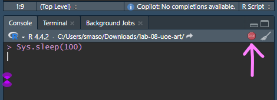

# Lab: University of Edinburgh Art Collection {#lab08}


The University of Edinburgh Art Collection _"supports the world-leading research and teaching that happens within the University. Comprised of an astonishing range of objects and ideas spanning two millennia and a multitude of artistic forms, the collection reflects not only the long and rich trajectory of the University, but also major national and international shifts in art history."_^[Source: https://collections.ed.ac.uk/art/about].


> **Note:** The collection contains 3321 pieces. You can explore them in the sidebar [here](https://collections.ed.ac.uk/art).


In this lab, you'll scrape data on all art pieces in the [Edinburgh College of Art collection](https://collections.ed.ac.uk/art/search/*:*/Collection:%22edinburgh+college+of+art%7C%7C%7CEdinburgh+College+of+Art%22).


### Learning Goals {.unnumbered}
By the end of this lab, you will:
- Scrape data from a webpage  
- Write functions to automate repetitive tasks  
- Use iteration to handle multiple pages  
- Save and analyze scraped data  


## Getting started {.unnumbered}

Before we begin, let's check whether bots are allowed to access pages on this domain.


``` r
library(robotstxt)
paths_allowed("https://collections.ed.ac.uk/art)")
#> 
 collections.ed.ac.uk
#> [1] TRUE
```


Go to the course GitHub organization and locate your lab repo, which should be named `lab-08-uoe-art`. Clone the repository and set up your workspace.


## R scripts vs. R Markdown documents {.unnumbered}

This lab uses both **R scripts** and **R Markdown documents**:

- `.R`: R scripts are plain text files containing **only** code and brief comments,
  - We'll use R scripts in the web scraping stage and ultimately save the scraped data as a csv.
- `.Rmd`: R Markdown documents are plain text files containing.
  - We'll use an R Markdown document in the web analysis stage, where we start off by reading in the csv file we wrote out in the scraping stage.
  
Here is the organization of your repo, and the corresponding section in the lab that each file will be used for:

```
|-data
|  |- README.md
|-lab-08-uoe-art.Rmd              # analysis
|-lab-08-uoe-art.Rproj            # project management
|-README.md
|-scripts                         # webscraping
|  |- 01-scrape-page-one.R        # scraping a single page
|  |- 02-scrape-page-function.R   # functions
|  |- 03-scrape-page-many.R       # iteration
```
  
## SelectorGadget {.unnumbered}

For this lab, I recommend using Google Chrome as your web browser. In case you haven't installed the SelectorGadget extension... go to the [SelectorGadget extension page](https://chrome.google.com/webstore/detail/selectorgadget/mhjhnkcfbdhnjickkkdbjoemdmbfginb?hl=en) on the Chrome Web Store and click on "Add to Chrome" (big blue button). A pop up window will ask _Add "SelectorGadget"?_, click "Add extension".

Another pop up window will ask whether you want to get your extensions on all your computer. If you want this, you can turn on sync, but you don't need to for the purpose of this lab.


You should now be able to access SelectorGadget by clicking on the icon next to the search bar in the Chrome browser.

### Scraping a single page {.unnumbered}

> **Tip:** To run the code you can highlight or put your cursor next to the lines of code you want to run and hit Command+Enter.

<div class="box">
Work in `scripts/01-scrape-page-one.R`.
</div>

We will start off by scraping data on the first 10 pieces in the collection from
[here](https://collections.ed.ac.uk/art/search/*:*/Collection:%22edinburgh+college+of+art%7C%7C%7CEdinburgh+College+of+Art%22?offset=0).

First, we define a new object called `first_url`, which is the link above. Then, we read the page at this url with the `read_html()` function from the **rvest** package. The code for this is already provided in `01-scrape-page-one.R`.


``` r
# set url
first_url <- "https://collections.ed.ac.uk/art/search/*:*/Collection:%22edinburgh+college+of+art%7C%7C%7CEdinburgh+College+of+Art%22?offset=0"

# read html page
page <- read_html(first_url)
```

For the ten pieces on this page, we will extract `title`, `artist`, and `link` information, and put these three variables in a data frame.

### Titles  {.unnumbered}

Let's start with titles. We make use of the SelectorGadget to identify the tags for the relevant nodes:

<!-- -->


``` r
page %>%
  html_nodes(".iteminfo") %>%
  html_node("h3 a")
#> {xml_nodeset (10)}
#>  [1] <a href="./record/20929?highlight=*:*">Standing Female Nude              ...
#>  [2] <a href="./record/20846?highlight=*:*">Head of a Woman Wearing Beads     ...
#>  [3] <a href="./record/99468?highlight=*:*">The Misadventure                  ...
#>  [4] <a href="./record/99348?highlight=*:*">Sweden - boats tied up at quaysid ...
#>  [5] <a href="./record/22690?highlight=*:*">Male Portrait                     ...
#>  [6] <a href="./record/20687?highlight=*:*">East Frieze of the Parthenon Frie ...
#>  [7] <a href="./record/122888?highlight=*:*">Sitting Nude Woman               ...
#>  [8] <a href="./record/20941?highlight=*:*">Seated Male Nude                  ...
#>  [9] <a href="./record/20991?highlight=*:*">Drawing of a Woman                ...
#> [10] <a href="./record/122805?highlight=*:*">The Sofa                         ...
```

Then we extract the text with `html_text()`:


``` r
page %>%
  html_nodes(".iteminfo") %>%
  html_node("h3 a") %>%
  html_text()
#>  [1] "Standing Female Nude                                                                            (1953)"                    
#>  [2] "Head of a Woman Wearing Beads                                                                            (1952)"           
#>  [3] "The Misadventure                                                                            (1989)"                        
#>  [4] "Sweden - boats tied up at quayside                                                                            (1963)"      
#>  [5] "Male Portrait                                                                            (1969)"                           
#>  [6] "East Frieze of the Parthenon Frieze                                                                            (1836-1837)"
#>  [7] "Sitting Nude Woman                                                                            (1961)"                      
#>  [8] "Seated Male Nude                                                                            (1953)"                        
#>  [9] "Drawing of a Woman                                                                            (12 NOV 1960)"               
#> [10] "The Sofa                                                                            (1950)"
```

And get rid of all the spurious whitespace in the text with `str_squish()`:


``` marginfigure
Take a look at the help docs for `str_squish()` (with `?str_squish`) to
```


``` r
page %>%
  html_nodes(".iteminfo") %>%
  html_node("h3 a") %>%
  html_text() %>%
  str_squish()
#>  [1] "Standing Female Nude (1953)"                    
#>  [2] "Head of a Woman Wearing Beads (1952)"           
#>  [3] "The Misadventure (1989)"                        
#>  [4] "Sweden - boats tied up at quayside (1963)"      
#>  [5] "Male Portrait (1969)"                           
#>  [6] "East Frieze of the Parthenon Frieze (1836-1837)"
#>  [7] "Sitting Nude Woman (1961)"                      
#>  [8] "Seated Male Nude (1953)"                        
#>  [9] "Drawing of a Woman (12 NOV 1960)"               
#> [10] "The Sofa (1950)"
```

And finally save the resulting data as a vector of length 10:


``` r
titles <- page %>%
  html_nodes(".iteminfo") %>%
  html_node("h3 a") %>%
  html_text() %>%
  str_squish()
```

### Links {.unnumbered}

Now that we’ve extracted the titles, let’s collect the links to the individual art pieces. The same nodes that contain the text for the titles also contain information on the links to individual art piece pages for each title. We can extract this information using a function from the `rvest` package, `html_attr()`, which extracts attributes.

To do this, we need to understand where the links are stored on the webpage and how we can extract them. 

Just like titles, links are stored inside HTML nodes. However, instead of being plain text, they are stored inside an attribute called href. 

Consider the following example of a hyperlink in HTML:

```
<a href="https://www.google.com">Seach on Google</a>
```

This code creates a clickable link that looks like this on a webpage: [Seach on Google](https://www.google.com).

Breaking it down:

- The text displayed on the webpage is `Search on Google`.
- The href attribute contains the URL: `https://www.google.com`.

When we extract links from a webpage, we do not extract the displayed text (e.g., "Search on Google"). Instead, we need to extract the href attribute, which contains the actual web address.

To do this, we use the rvest function `html_attr("href")`, which extracts the value of the href attribute from a given node.

The links to individual art pieces are stored inside the same .iteminfo nodes as the titles. Using the html_attr("href") function, we can extract them:


``` r
page %>%
  html_nodes(".iteminfo") %>% # same nodes
  html_node("h3 a") %>% # as before
  html_attr("href") # but get href attribute instead of text
#>  [1] "./record/20929?highlight=*:*"  "./record/20846?highlight=*:*" 
#>  [3] "./record/99468?highlight=*:*"  "./record/99348?highlight=*:*" 
#>  [5] "./record/22690?highlight=*:*"  "./record/20687?highlight=*:*" 
#>  [7] "./record/122888?highlight=*:*" "./record/20941?highlight=*:*" 
#>  [9] "./record/20991?highlight=*:*"  "./record/122805?highlight=*:*"
```
Now, print the first few results:

```
head(links)
```
You should see output similar to this:

```
/art/record/215578
/art/record/997987
/art/record/220175
```

At first glance, this looks correct—the links match what we see on the webpage. However, there's a problem: these are not full URLs. They're relative links.


> Note: See the help for `str_replace()` to find out how it works. Remember that the first argument is passed in from the pipeline, so you just need to define the `pattern` and `replacement` arguments.

1. Click on one of art piece titles in your browser and take note of the URL of the webpage it takes you to. How does that URL compare to what we scraped above? How is it different? Using `str_replace()`, fix the URLs.

### Artists {.unnumbered}

2. Fill in the blanks to scrape artist names.

### Put it altogether {.unnumbered}

3. Fill in the blanks to organize everything in a tibble.

### Scrape the next page {.unnumbered}

4. Click on the next page, and grab its url. Fill in the blank in to define a new object: `second_url`. Copy-paste code from top of the R script to scrape the new set of art pieces, and save the resulting data frame as `second_ten`.

## Functions {.unnumbered}


<div class="box">
Work in `scripts/02-scrape-page-function.R`.
</div>

You've been using R functions, now it's time to write your own!

Let's start simple. Here is a function that takes in an argument `x`, and adds 2 to it.


``` r
add_two <- function(x) {
  x + 2
}
```

Let's test it:


``` r
add_two(3)
#> [1] 5
add_two(10)
#> [1] 12
```

The skeleton for defining functions in R is as follows:


``` r
function_name <- function(input) {
  # do something with the input(s)
  # return something
}
```

Then, a function for scraping a page should look something like:

> **Tip:** Function names should be short but evocative verbs.


``` r
function_name <- function(url) {
  # read page at url
  # extract title, link, artist info for n pieces on page
  # return a n x 3 tibble
}
```

5. Fill in the blanks using code you already developed in the previous exercises. Name the function `scrape_page`.

6. Test out your new function by running the following in the console. Does the output look right?


``` r
scrape_page(first_url)
scrape_page(second_url)
```

## Iteration {.unnumbered}

<div class="box">
Work in `scripts/03-scrape-page-many.R`.
</div>

We went from manually scraping individual pages to writing a function to do the same. Next, we will make our workflow a little more efficient by using R to iterate over all pages that contain information on the art collection.

> **Reminder:** The collection has 3321 pieces in total, as of the last time this page was compiled.

That means we will develop a list of URLs, each corresponding to a page with 10 art pieces. Then, we will write some code that applies the `scrape_page()` function to each page and combines the resulting data frames into a single data frame with 3321 rows and 3 columns.


### List of URLs {.unnumbered}

Click through the first few pages of the art collection and observe their URLs to confirm the following pattern:

```
[sometext]offset=0     # Pieces 1-10
[sometext]offset=10    # Pieces 11-20
[sometext]offset=20    # Pieces 21-30
[sometext]offset=30    # Pieces 31-40
...
[sometext]offset=3310  # Pieces 3310-3319
```

We can construct these URLs in R by pasting together two pieces: (1) a common (`root`) text for the beginning of the URL, and (2) numbers starting at 0, increasing by 10, all the way up to 3320. Two useful functions for accomplishing this task are `paste0()` for pasting two pieces of text and `seq()` for generating a sequence of numbers.


7. Fill in the blanks to construct the list of URLs.

### Mapping {.unnumbered}

Finally, we are ready to iterate over the list of URLs we constructed. We will do this by **map**ping the function we developed over the list of URLs. Mapping functions in R apply a function to each element of a list. These functions each take the following form:


```
map([x], [function to apply to each element of x])
```

In our case:

- `x` is the list of URLs we just constructed
- The function to apply is **`scrape_page()`**, which we developed earlier.
- Since we want a **data frame**, we use **`map_dfr()`** to return a combined tibble.


``` r
map_dfr(urls, scrape_page)
```


8. Fill in the blanks to scrape all pages and create a data frame called `uoe_art`.

Be patient, this will take a few minutes to run. It's literally scraping 332 pages of data.
If its still running you'll see a stop sign in the corner of the console. 



### Write out data {.unnumbered}

9. **Save the final data frame** so that you can use it in the analysis section. Write it to the `data` folder.  


## Analysis {.unnumbered}

<div class="box">
Work in `lab-08-uoe-art.Rmd` for the rest of the lab.
</div>

Now that you have a **tidy dataset**, you'll analyze it. Follow the steps below.

### Step 1: Cleaning Up the Titles and Dates  

Some titles contain date information in parentheses. Some of these are years, others are more specific dates, some art pieces have no date information whatsoever, and others have some non-date information in parentheses. 

First thing, we'll try is to separate the `title` column into two: one for the actual `title` and the other for the `date` if it exists. In human speak, we need to

> separate the `title` column at the first occurence of `(` and put the contents on one side of the `(` into a column called `title` and the contents on the other side into a column called `date`

Luckily, there's a function that does just this: `separate()`!

Once we have completed separating the single `title` column into `title` and `date`, we need to do further cleanup in the `date` column to get rid of extraneous `)`s with `str_remove()`, capture year information, and save the data as a numeric variable.

> **Hint:** Remember escaping special characters from that video? Which video... oh you know the one. You'll need to use that trick again.

10. Fill in the blanks to implement the data wrangling we described above. Note that this approach will result in some warnings when you run the code, and that's OK! Read the warnings, and explain what they mean, and why we are ok with leaving them in given that our objective is to just capture `year` where it's convenient to do so.

11. Print out a summary of the data frame using the `skim()` function. How many pieces have artist info missing? How many have year info missing?

12. Make a histogram of years. Use a reasonable bin width. Do you see anything out of the ordinary?

13. Find which piece has the out-of-the-ordinary year and go to its page on the art collection website to find the correct year for it. Can you tell why our code didn't capture the correct year information? Correct the error in the data frame and visualize the data again.

> **Hint:** You'll want to use `mutate()` and `if_else()` or `case_when()` to
implement the correction.


14. Who is the most commonly featured artist in the collection? Do you know them? Any guess as to why the university has so many pieces from them?

15. Final question! How many art pieces have the word "child" in their title? See if you can figure it out, and ask for help if not.

> **Hint:** You can use a combination of `filter()` and `str_detect()`. You will want to read the help for `str_detect()` at a minimum, and consider how you might capture titles where the word appears as "child" and "Child".


<!--DS4P Links-->
[course_web]: https://datascience4psych.github.io/DataScience4Psych
[course_git]: https://github.com/DataScience4Psych/DataScience4Psych
[course_repo]: https://github.com/DataScience4Psych
[course_slides]: https://github.com/DataScience4Psych/slides
[course_syllabus]: https://smasongarrison.github.io/syllabi/ 
<!-- https://smasongarrison.github.io/syllabi/data-science.html -->
[syllabi]: https://smasongarrison.github.io/syllabi
[pl_00]: https://www.youtube.com/playlist?list=PLKrrdtYgOUYaEAnJX20Ryy4OSie375rVY
[pl_01]: https://www.youtube.com/playlist?list=PLKrrdtYgOUYao_7t5ycK4KDXNKaY-ECup
[pl_02]: https://www.youtube.com/playlist?list=PLKrrdtYgOUYZmr_T3PnuxjVIlj0C0kUNI
[pl_03]: https://www.youtube.com/playlist?list=PLKrrdtYgOUYaHmjzdRvfg0yhOIYQnfjwE
[pl_04]: https://www.youtube.com/playlist?list=PLKrrdtYgOUYYWFcel6_vp8__RUKLxhX4y
[pl_05]: https://www.youtube.com/playlist?list=PLKrrdtYgOUYYMIguiV1F8RagMYibTY4iW
[pl_06]: https://www.youtube.com/playlist?list=PLKrrdtYgOUYYV_KDod3Mk9-RmtFXii9Dv
[pl_07]: https://www.youtube.com/watch?list=PLKrrdtYgOUYZxvEvQ8-PcWrOY_dwY_ETI
[pl_08]: https://www.youtube.com/playlist?list=PLKrrdtYgOUYZgOzYB_dmauw55M7jXvsdo
[pl_09]: https://www.youtube.com/playlist?list=PLKrrdtYgOUYbaiTmldRY2ddsLrHp3z6yO
[pl_10]: https://www.youtube.com/playlist?list=PLKrrdtYgOUYbPw5iYzYEzoOKa7mJKNIhq
[pl_11]: https://www.youtube.com/playlist?list=PLKrrdtYgOUYZ-u6LzBbanrNFoeLHKaLL6
[pl_12]: https://www.youtube.com/playlist?list=PLKrrdtYgOUYbwRS-9Htmb80_t1NG-021e
[pl_13]: https://www.youtube.com/playlist?list=PLKrrdtYgOUYbWGmSnbLIYwdLOnGm6une6
[pl_14]: https://www.youtube.com/playlist?list=PLKrrdtYgOUYbWGmSnbLIYwdLOnGm6une6
[pl_15]: https://www.youtube.com/playlist?list=PLKrrdtYgOUYa5MoYrV8EsWQ5jIr5ZYMpM
[pl_all]: https://www.youtube.com/playlist?list=PLKrrdtYgOUYZomNqf-1dtCDW94ySdLv-9


<!--AE Links-->
[ae01a_unvotes]: https://github.com/DataScience4Psych/ae01a_unvotes
[ae01b_covid]: https://github.com/DataScience4Psych/ae01b_covid
[ae02_bechdel]: https://github.com/DataScience4Psych/ae-02-bechdel-rmarkdown
[ae03_starwars]: https://github.com/DataScience4Psych/ae-03-starwars-dataviz
[ae08_imdb]: https://github.com/DataScience4Psych/ae-08-imdb-webscraping

<!-- Lab Links-->

[lab01_hello]: https://github.com/DataScience4Psych/lab-01-hello-r
[lab02]: https://github.com/DataScience4Psych/lab-02-plastic-waste
[lab03]: https://github.com/DataScience4Psych/lab-03-nobel-laureates
[lab04]: https://github.com/DataScience4Psych/lab-04-viz-sp-data
[lab05]: https://github.com/DataScience4Psych/lab-05-wrangle-sp-data
[lab06]: https://github.com/DataScience4Psych/lab_06_sad_plots
[lab07]: https://github.com/DataScience4Psych/lab_07_betterviz
[lab08]: https://github.com/DataScience4Psych/lab-08-uoe-art
[lab09]: https://github.com/DataScience4Psych/lab-09-ethics-algorithmic-bias
[lab10]: https://github.com/DataScience4Psych/lab-10-slr-course-evals
[lab11]: https://github.com/DataScience4Psych/lab-11-mlr-course-evals
[lab12]: https://github.com/DataScience4Psych/lab-12-inference-smoking
[lab13]: https://github.com/DataScience4Psych/lab-13-simulating-mars

<!--Slides-->
[d01_welcome]: https://datascience4psych.github.io/slides/d01_welcome/d01_welcome.html
[d02_toolkit]: https://datascience4psych.github.io/slides/d02_toolkit/d02_toolkit.html
[d03_dataviz]: https://datascience4psych.github.io/slides/d03_dataviz/d03_dataviz.html
[d04_ggplot2]: https://datascience4psych.github.io/slides/d04_ggplot2/d04_ggplot2.html
[d05_viznum]: https://datascience4psych.github.io/slides/d05_viznum/d05_viznum.html
[d06_vizcat]: https://datascience4psych.github.io/slides/d06_vizcat/d06_vizcat.html
[d07_tidy]: https://datascience4psych.github.io/slides/d07_tidy/d07_tidy.html
[d08_grammar]: https://datascience4psych.github.io/slides/d08_grammar/d08_grammar.html
[d09_wrangle]: https://datascience4psych.github.io/slides/d09_wrangle/d09_wrangle.html
[d10_dfs]: https://datascience4psych.github.io/slides/d10_dfs/d10_dfs.html
[d11_types]: https://datascience4psych.github.io/slides/d11_types/d11_types.html
[d12_import]: https://datascience4psych.github.io/slides/d12_import/d12_import.html
[d13_goodviz]: https://datascience4psych.github.io/slides/d13_goodviz/d13_goodviz.html
[d13b_moreggplot]: https://datascience4psych.github.io/slides/d13_goodviz/d13b_moreggplot.html
[d14_confound]: https://datascience4psych.github.io/slides/d14_confound/d14_confound.html
[d15_goodtalk]: https://datascience4psych.github.io/slides/d15_goodtalk/d15_goodtalk.html
[d16_webscraping]: https://datascience4psych.github.io/slides/d16_webscraping/d16_webscraping.html
[d17_functions]: https://datascience4psych.github.io/slides/d17_functions/d17_functions.html
[d18_ethics]: https://datascience4psych.github.io/slides/d18_ethics/d18_ethics.html
[d19_bias]: https://datascience4psych.github.io/slides/d19_bias/d19_bias.html
[d20_language]: https://datascience4psych.github.io/slides/d20_language/d20_language.html
[d21_fitting]: https://datascience4psych.github.io/slides/d21_fitting/d21_fitting.html
[d22_nonlinear]: https://datascience4psych.github.io/slides/d22_nonlinear/d22_nonlinear.html
[d23_multiple]: https://datascience4psych.github.io/slides/d23_multiple/d23_multiple.html
[d24_overfitting]: https://datascience4psych.github.io/slides/d24_overfitting/d24_overfitting.html
[d25_crossvalidation]: https://datascience4psych.github.io/slides/d25_crossvalidation/d25_crossvalidation.html
[d26_quantify]: https://datascience4psych.github.io/slides/d26_quantify/d26_quantify.html
[d27_bootstrap]: https://datascience4psych.github.io/slides/d27_bootstrap/d27_bootstrap.html
[d28_interactive]: https://datascience4psych.github.io/slides/d28_interactive/d28_interactive.html
[d29_machine]: https://datascience4psych.github.io/slides/d29_machinelearning/d29_machine.html
[d30_simulations]: https://datascience4psych.github.io/slides/d30_simulations/d30_simulations.html
[d31_llmintro]: https://datascience4psych.github.io/slides/d31_llmintro/d31_llmintro.html
[d32_llmapplications]: https://datascience4psych.github.io/slides/d32_llmapplications/d32_llmapplications.html

<!--externals-->

[stat545]: https://stat545.com
[r4ds]: https://r4ds.had.co.nz
[cran]: https://cloud.r-project.org
