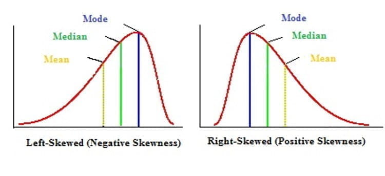

# Classic Things in R

```{r include = FALSE}
source("common.R")
ds4p_funyoutube <- read.csv("data/ds4p_funyoutube.csv", sep="")
ds4p_urls <- read.csv("./data/ds4p_urls.csv")
```

```{r links, child="links.md"}
```


This chapter is a collection of basic base R code that I've used in my undergraduate intro stats class. Eventually, there will be a lot more commentary/ context. In the meantime however...

```{r,error=TRUE}
######## Levels of Measurement Examples
# Ratio Example
library(HistData)   # loads the HistData package
data("Galton")			# loads the Galton dataset
attach(Galton)			# attaches the dataset
head(Galton, n=10)  # First ten rows of data
hist(child)	# Histogram		hist(Galton$child)  is the same, use if you do not want to attach the data file
plot(density(child))		# Density Plot
detach(Galton)			# Remember to detach you dataset!

# Interval Example
library(datasets)
data("nottem")
nottem[1:10] 			# First ten rows of data
hist(nottem) 			# Histogram
plot(density(nottem)) 	# Density Plot

# Ordinal Example
library(ggplot2movies)
data(movies)

variable<-movies$rating
head(movies, n=10) 		# First ten rows of data
hist(variable) 			# Histogram
plot(density(variable)) 	# Density Plot


# Nominal Example
library(vcd)
data(Arthritis)
Arthritis[1:10, ]  		# First ten rows of data

variable<-Arthritis$Treatment
hist(variable) 				# Histogram error

barplot_fix<-prop.table(table(variable))

barplot(barplot_fix)	# Sometimes, R is silly


######## Summary Examples
# Bar chart
library(car)
counts <- table(mtcars$gear)
barplot(counts, main="Car Distribution",
  	xlab="Number of Gears")
hist(counts)

# Pie chart
mytable <- table(iris$Species)
lbls <- paste(names(mytable), "\n", mytable, sep="")
pie(mytable, labels = lbls,
		main="Pie Chart of Species\n (with sample sizes)")

# Histogram
library(MASS)
variable<-cats$Bwt
hist(variable)
variable<-variable*2.2   #Convert to Imperial
hist(variable)

# Stem and Leaf plot
stem(faithful$eruptions,scale=1)

######## Central Tendency
library(pscl)
data(prussian)
variable<-prussian$y #horse kick fatality by year

# Mean
mean(variable)

#Median
median(variable)

#Mode
mode(variable) # That's not mode!
# Function to examine mode
Mode <- function(x) {
	ux <- unique(x)   #finds all unique values
	ux[which.max(tabulate(match(x, ux)))] #returns the value which is most frequent
}
Mode(variable)
## summary
hist(variable)
library(Hmisc)
describe(variable)


######## Spread
# Range
range(variable)
max(variable) -min(variable)

# 5 Number Summary / Quartiles
summary(variable)

# Variance
var(variable)

# Standard Deviation
sqrt(var(variable))
sd(variable)

################ Rescaling
variable<-movies$rating
scale(variable)[1:10]

plot(density(variable)) # no scaling
plot(density(scale(variable))) # with scaling

## bandwidth part of the smoothing method -- is a bit of a function of standard deviation


#### Normal Distribution

# Display the normal distributions with various means

x <- seq(-80, 80, length=1000)
hx <- dnorm(x)
colors <- c("red", "blue","green", "green", "gold", "black")

plot(x, hx, type="l", lty=2, xlab="x value",
		 ylab="Density", main="Comparison of normal Distributions",xlim=c(-5, 7))
location<-c(2,4,-2)
for (i in 1:3){
	lines(x, dnorm(x,mean=location[i]), lwd=1, col=colors[i])
}


# Display the normal distributions with various standard deviations
plot(x, hx, type="l", lty=2, xlab="x value",
		 ylab="Density", main="Comparison of normal Distributions",xlim=c(-10, 10))

for (i in c(.5,2,4,6)){
	lines(x, dnorm(x,sd=i), lwd=1, col=colors[i])
}
#### Z-Score Problem
# Data

IQ <-c(
114,
130,
74,
100,
120,
112,
104,
132,
107,
89,
111,
103,
102,
128,
98,
91,
118,
96,
114,
119,
112,
114,
86,
112,
103,
72,
93,
105,
111,
108,
103)

# Stem plot

stem(IQ,scale=1)

# Mean and SD
mean(IQ)

sd(IQ)

# What proportion of scores are within one standard deviation of the mean?

## 1 SD above
above1<- mean(IQ)+ 1*sd(IQ)


## 1 SD below
below1<- mean(IQ)- 1*sd(IQ)

## numbers within range
x<-IQ
y = c( below1, above1)
(x = x[ x >= y[1] & x <= y[2]])

# What would these proportions be in an exactly Normal distribution?
## Hard way
pnorm(above1,mean=mean(IQ),sd=sd(IQ)) - pnorm(below1,mean=mean(IQ),sd=sd(IQ))

## Easy Way
pnorm(1) - pnorm(-1)


## What about 2 SD?

### Hypothesis Testing and P-values
## probability X >= 145
1 - pnorm(145, 100, 15)

## probability X <= 55
pnorm(55, 100, 15)
pnorm(55, 100, 15)*2

# more significant?
1 - pt(2.54, 24)

2 * (1 - pt(2.54, 24))


### SLICING DATA
library(HSAUR)
data("womensrole")

data=womensrole[womensrole$education<5,]
data2=womensrole[womensrole$sex=="Male",]

#### Correlation
# Correlation
summary(womensrole$agree)
attach(womensrole)
cor(x=education,y=agree)
plot(x=education,y=agree) # Two variables, y and x together
detach(womensrole)

womensrole$percentage_agree<-womensrole$agree/(womensrole$agree+womensrole$disagree)
summary(womensrole$percentage_agree)

attach(womensrole)
cor(x=education,y=percentage_agree)
cor(x=education,y=percentage_agree,use="pairwise.complete") # missing data
plot(x=education,y=agree)
plot(x=education,y=percentage_agree,xlab="Years of Education",ylab="Percent who agree")
detach(womensrole)

## Continuous predictor -> continuous Outcome
fit.object <- lm(data=womensrole,percentage_agree ~ education)
summary(fit.object)
cor(womensrole$education,womensrole$percentage_agree,use="pairwise.complete")
plot(womensrole$education,womensrole$percentage_agree)
abline(fit.object, col = "red")
## predict
### at what levels of education do you want estimated agreement?
new.df <- data.frame(education=c(0, 6, 12))
predict(fit.object, new.df)


## Categoreical predictor -> continuous Outcome
fit.object <- lm(data=womensrole,percentage_agree ~ sex)
summary(fit.object)
plot(womensrole$sex,womensrole$percentage_agree)
abline(fit.object, col = "red")


## continuous predictor -> catergorical Outcome
#
#Predict classification of being "short movie" from length of running time
options(scipen=10) # to remove scientific notation from print out
fit.object <- glm(data=movies,as.factor(Short) ~ length,family=binomial())
summary(fit.object)
plot(as.factor(movies$Short),movies$length)
abline(fit.object, col = "red")
exp(coef(fit.object))
## catergorical predictor -> catergorical Outcome
#
#Predict classification of being "short movie" from whether it is an animated film or not
fit.object <- glm(data=movies,as.factor(Short) ~ as.factor(Animation),family=binomial())
summary(fit.object)
 exp(coef(fit.object))

```


## Descriptive Statistics

### Measures of Central tendency / location

- Central tendency aims to capture the center of the distribution.


```{r cent}

# Display the normal distributions with various means

x <- seq(-80, 80, length=1000)
hx <- dnorm(x)
colors <- c("red", "blue","green", "purple", "black")

plot(x, hx, type="l", lty=2, xlab="x value",ylab="Density", main="Distributions with Different Means",xlim=c(-7, 7))
location<-c(2,4,-2,-4)
labels=paste0("Mean = ",location)
labels[length(labels)+1]="Mean = 0"

for (i in 1:length(location)){
	lines(x, dnorm(x,mean=location[i]), lwd=1, col=colors[i])
}

legend("topright", inset=.05, title="Distributions",
  labels, lwd=2, lty=c(1, 1, 1, 1, 2), col=colors)

```


## Specific Measures of Central Tendency

- Measures of Central Tendency
    - Mean
    - Median
    - Mode
    

### Central tendency: Mean

- Mean ($\mu$; $\bar{X}$)
    - arithmetic average
    - $\bar{X}$ is used for samples
    - Mu ($\mu$) is used for population

$\bar{X}= \frac{1}{n}  \sum^{n}_{i=1}x_{i}$


- Properties
    - Is the balance point of the distribution (in terms of center of mass) $\sum^{n}_{i=1}(x_{i}-\bar{x})=0$
    - Least squares property
        - The sum of squared deviations about the mean is small 
    - highly sensitive to outliers (extreme scores)
        - (weakness; it means that the mean is not so good as a measure of central tendency in highly skewed distributions)
        - Is not a robust statistic (low robust = sensitive to outliers; high robust = not sensitive to outliers)
        
- Very good with quantitative data (interval and ratio data, 
    - especially bell shaped distributions)
    - Very popular statistic


```{r mean,echo=TRUE}
library(pscl)
data(prussian)

#horse kick fatalities by year
prussian$y

variable<-prussian$y 

# Mean
mean(variable)

```


### Central Tendency: Median
- Median (Md)
- Def: central score in a distribution
    - If *n is odd* then 
        - Med = value of the $\frac{n+1}{2}$ item term.
    - If *n is even* then 
        - Med = average of the $\frac{n+}{2}$  and $\frac{n+1}{2}$ item terms.


- Properties
    - Balance point of scores
    - Highly robust to outliers (less sensitive than the mean to outliers)
    - Sum of absolute deviations is smaller than any other constant (c)
        $\sum^{n}_{i=1}(\left|X-c\right|)$
        
- Often used for ordinal data

```{r median,echo=TRUE}

#Median
median(variable)

# By hand

# Sample Size?
(sample.size=length(variable))

# Even or Odd
## Test if number is divisible by 2.
## If yes, then even
## Else, is odd
sample.size %% 2 == 0 

# Sort our values
variable=sort(variable)

# if odd, grab the midpoint value sample size / 2

variable[sample.size/2]


# if even grab the average of the midpoint values sample size / 2  and sample size+1 / 2

(variable[sample.size/2] + variable[1+sample.size/2])/2

```


### Mode
- Mode: most common score
- Local modes are the highest point with a subset of the distribution, there can be multiple ones

```{r mode,echo=TRUE}
#Mode
mode(variable) # That's not mode!

# Function to examine mode
Mode <- function(x) {
	ux <- unique(x)   #finds all unique values
	ux[which.max(tabulate(match(x, ux)))] #returns the value which is most frequent
}
Mode(variable)
```

## Relationship between mean, median, and mode
- When we have a symmetric unimodal distribution
    - Mean=median=mode

- positively skewed
    - mode < median < mean
- negatively skewed
    - mean < median < mode
    
```{r}

```

```{r, echo=TRUE}
## summary
hist(variable)
library(Hmisc)
describe(variable)
```

## Variability/spread
- Variability describes how spread out the data are from that center
    - Low variance has a less wide distribution, with the bulk of the mass in the center
    - High variance has a very wide distribution, bulk of distribution is spread out
    
```{r spread}

# Display the normal distributions with various standard deviations
plot(x, hx, type="l", lty=2, xlab="x value",
		 ylab="Density", main="Distributions with Different Standard Deviations",xlim=c(-7, 7))
spread=c(.5,2,4)
labels=paste0("SD = ",spread)
labels[length(labels)+1]="SD = 1"
for (i in 1:length(spread)){
	lines(x, dnorm(x,sd=spread[i]), lwd=1, col=colors[i])
} 
legend("topright", inset=.05, title="Distributions",
  labels, lwd=2, lty=c(1, 1, 1, 1, 2), col=colors[c(1:3,5)])

```
## Measures of Spread around the Median

- Range
    - maximum value - minimum value
    - $max(x_{i})-min(x_{i})$
    - Non-robust to outliers
    
- Quartiles
    - Lower quartile (Q1), 25th percentile
    - Second quartile (Q2), 50th percentile / median
    - Upper quartile (Q3), 75th percentile

- Interquartile Range (IQR)
    - Q3-Q1
    - Sometimes called h-spread; h = hinges

### R Examples
```{r,echo=TRUE}
# Range
range(variable)
max(variable) -min(variable)

# 5 Number Summary / Quartiles
summary(variable)

```


## Spread around the Mean
- Variance ($\sigma^{2}$;$s^{2}$)
    - Measure of spread around the mean
    - Goal of the measure to use every score
    
    $\sigma^{2}$ = $\frac{\sum^{n}_{i=1}(x_{i}-\mu)^{2}}{N}$
    
    $s^{2}$ = $\frac{\sum^{n}_{i=1}(x_{i}-\bar{x})^{2}}{n-1}$

- Standard Deviation ($\sigma$;s)
    - $\sigma$ = $\sqrt{\sigma^{2}}$
    - s = $\sqrt{s^{2}}$

## R Examples

```{r,echo=TRUE}
# Variance
var(variable)

# Standard Deviation
sqrt(var(variable))
sd(variable)
```

   
## Bessel's Correction
- $s^{2}$ is nearly the average squared deviation

- $s^{2}$ uses n-1 instead of N
    - Otherwise we get biased estimates
    - This adjustment is called Bessel's correction
- In our formula, we are using the sample mean (x) instead of the true mean ($\mu$)
    - this results in underestimating each $x_{i} − \mu$ by $x − \mu$. 

- Properties
    - Std is in raw score units
    - Both the variance and standard deviation are highly NOT robust


