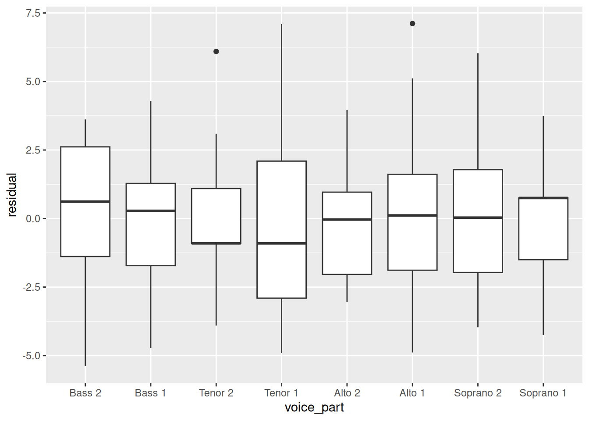
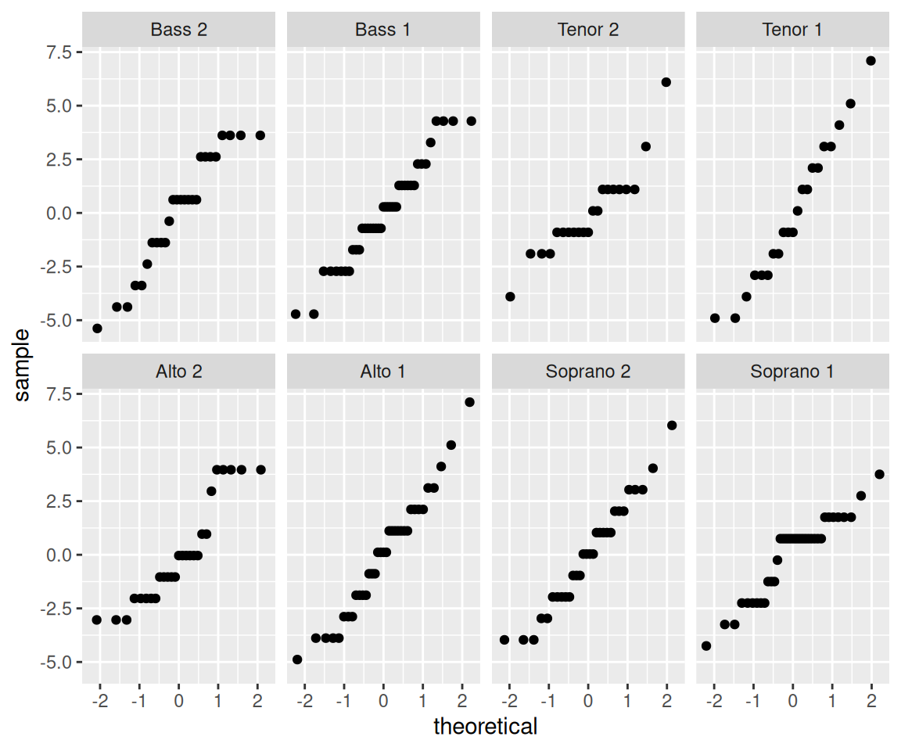
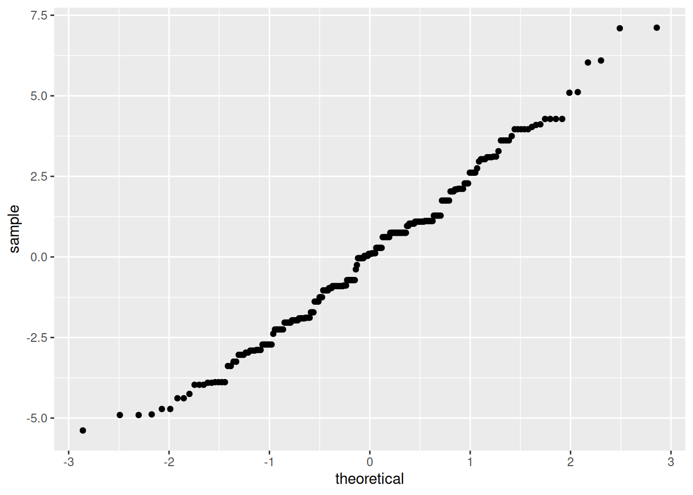
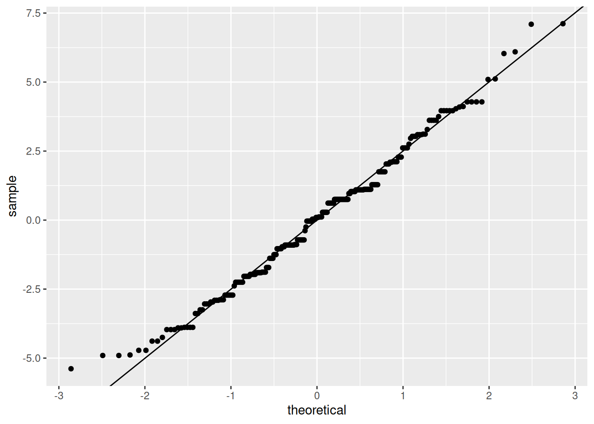
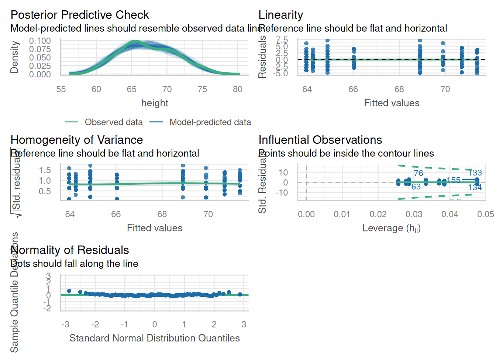
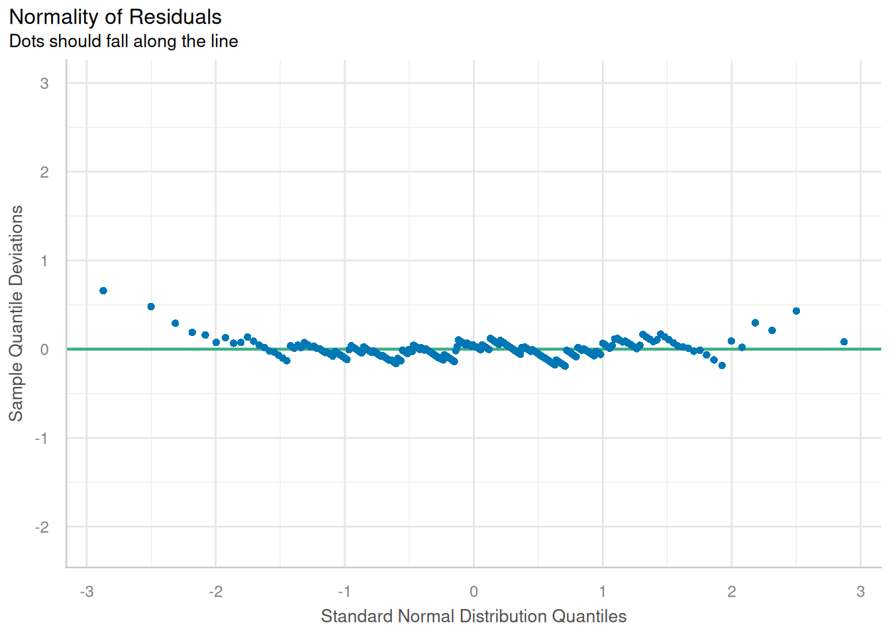
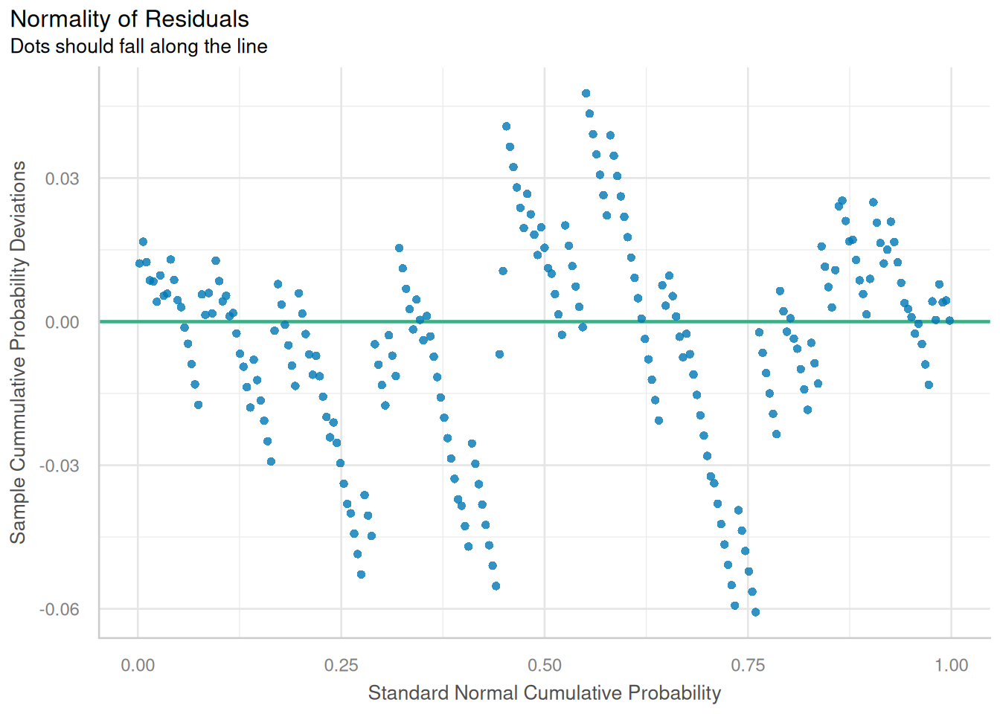

# Fitting and interpreting models


You can follow along with the slides [here](https://datascience4psych.github.io/slides/d21_fitting/d21_fitting.html) if you would like to open them full-screen.

## Models with numerical explanatory variables


```{=html}
<div class="vembedr" align="center">
<div>
<iframe src="https://www.youtube.com/embed/BVtVIO08KKE" width="533" height="300" frameborder="0" allowfullscreen="" data-external="1"></iframe>
</div>
</div>
```


<iframe src="https://datascience4psych.github.io/slides/d21_fitting/d21_fitting.html" width="672" height="400px" data-external="1"></iframe>

## A More Technical Worked Example

Let's load our standard libraries:


``` r
library(lattice)
library(ggplot2)
library(tidyverse)
```

- If you've taken a regression course, you might recognize this model as a special case of a linear model.

- If you haven't, well, it doesn't really matter much except... we can use the `lm()` function to fit the model.

The advantage is that `lm()` easily splits the data into **fitted values** and **residuals**:

Observed value = Fitted value + residual

Let's get the fitted values and residuals for each voice part:


``` r
lm_singer <- lm(height ~ 0 + voice.part,
  data = singer
)
```

We can extract the fitted values using `fitted.values(lm_singer)` and the residuals with `residuals(lm_singer)` or `lm_singer$residuals`.

For convenience, we create a data frame with two columns: the voice parts and the residuals.


``` r
res_singer <- data.frame(
  voice_part = singer$voice.part,
  residual = residuals(lm_singer)
)
```

We can also do this with `group_by` and `mutate`:


``` r
fits <- singer %>%
  group_by(voice.part) %>%
  mutate(
    fit = mean(height),
    residual = height - mean(height)
  )
```

### Does the linear model fit?

To assess whether the linear model is a good fit to the data, we need to know whether the errors look like they come from normal distributions with the same variance.

The residuals are our estimates of the errors, and so we need to check both homoscedasticity and normality.

### Homoscedasticity

Homoscedasticity, or homogeneity of variances, is a modeling assumption that we make that assummes we have equal or similar variances in different groups being compared. In other words, the variance of the residuals should be the same for all values of the predictor. We can check this by looking at the residuals for each voice part.

There are a few ways we can look at the residuals. Side-by-side boxplots give a broad overview:


``` r
ggplot(res_singer, aes(x = voice_part, y = residual)) +
  geom_boxplot()
```



We can also look at the ecdfs of the residuals for each voice part.


``` r
ggplot(res_singer, aes(x = residual, color = voice_part)) +
  stat_ecdf()
```


From these plots, it seems like the residuals in each group have approximately the same variance.

### Normality

Normality of the residuals is another important assumption of the linear model. We can check this assumption by looking at normal QQ plots of the residuals for each voice part. We can do this by faceting, which will allow us to examine each voice part separately. We can use the `stat_qq()` function to create the QQ plots.:


``` r
ggplot(res_singer, aes(sample = residual)) +
  stat_qq() +
  facet_wrap(~voice_part, ncol = 4)
```



Not only do the lines look reasonably straight, the scales look similar for all eight voice parts. This similarity suggests a model where all of the errors are normal with the *same* standard deviation. This is convenient because it is the form of a standard linear model:

Singer height = Average height for their voice part + Normal($0, \sigma^2$) error.

### Normality of pooled residuals

If this assumption for our linear model holds, then all the residuals come from the same normal distribution.

We've already checked for normality of the residuals within each voice part, but to get a little more power to see divergence from normality, we can pool the residuals and make a normal QQ plot of all the residuals together. This is a little more sensitive to non-normality than the separate QQ plots.


``` r
ggplot(res_singer, aes(sample = residual)) +
  stat_qq()
```



It's easier to check normality if we plot the line that the points should fall on: if we think the points come from a $N(\mu, \sigma^2)$ distribution, they should lie on a line with intercept $\mu$ and slope $\sigma$ (the standard deviation).

In the linear model, we assume that the mean of the error terms is zero. We don't know what their variance should be, but we can estimate it using the variance of the residuals.

Therefore, we add a line with the mean of the residuals (which should be zero) as the intercept, and the SD of the residuals as the slope. This is:


``` r
ggplot(res_singer, aes(sample = residual)) +
  stat_qq() +
  geom_abline(aes(
    intercept = 0,
    slope = sd(res_singer$residual)
  ))
#> Warning: Use of `res_singer$residual` is discouraged.
#> ℹ Use `residual` instead.
```


### The actually correct way

Pedantic note: We should use an $n-8$ denominator instead of $n-1$ in the SD calculation for degrees of freedom reasons. The $n-8$ part is necessary because there are 7 different variables associated with the model we fitted with lm_singer. We can get the SD directly from the linear model:


``` r
sd(res_singer$residual)
#> [1] 2.47
round(summary(lm_singer)$sigma, 3)
#> [1] 2.5
```

However, the difference between this adjustment and the SD above is negligible.

Add the line:


``` r
ggplot(res_singer, aes(sample = residual)) +
  stat_qq() +
  geom_abline(intercept = mean(res_singer$residual), slope = summary(lm_singer)$sigma)
```



The straight line isn't absolutely perfect, but it's doing a pretty good job. The residuals look like they come from a normal distribution with the same variance for each voice part.

### Our final model


Since the errors seem to be pretty normal, our final model is:

Singer height = Average height for their voice part + Normal($0, 2.5^2$) error.

Note: Although normality (or lack thereof) can be important for probabilistic prediction or (sometimes) for inferential data analysis, it's relatively unimportant for EDA. If your residuals are about normal that's nice, but as long as they're not horribly skewed they're probably not a problem.

### What have we learned?

About singers:

- We've seen that average height increases as the voice part range decreases.

- Within each voice part, the residuals look like they come from a normal distribution with the same variance for each voice part. This suggests that there's nothing further we need to do to explain singer heights: we have an average for each voice part, and there is no suggestion of systematic differences beyond that due to voice part.

About data analysis:

- We can use some of our univariate visualization tools, particularly boxplots and ecdfs, to look for evidence of heteroscedasticity.

- We can use normal QQ plots on both pooled and un-pooled residuals to look for evidence of non-normality.

- If we wanted to do formal tests or parameter estimation for singer heights, we would feel pretty secure using results based on normal theory.

### Commentary on Model Performance


```{=html}
<blockquote class="twitter-tweet" data-width="550" data-lang="en" data-dnt="true" data-theme="light"><p lang="en" dir="ltr">Somebody’s got some zero inflated count data he’s modeling as normal …</p>&mdash; Brenton Wiernik 🏳️‍🌈 (@bmwiernik) <a href="https://twitter.com/bmwiernik/status/1516597519228317701?ref_src=twsrc%5Etfw">April 20, 2022</a></blockquote>

```


``` r
library(performance)
check_model(lm_singer)
```



``` r
# model_performance(lm_singer)

# QQ-plot
plot(check_normality(lm_singer), type = "qq")
#> For confidence bands, please install `qqplotr`.
```



``` r

# PP-plot
plot(check_normality(lm_singer), type = "pp")
#> For confidence bands, please install `qqplotr`.
```



# Models with FOO


You can follow along with the slides [here](https://datascience4psych.github.io/slides/d21_fitting/d21_fitting.html) if you would like to open them full-screen.

##  Models with categorical explanatory variables


```{=html}
<div class="vembedr" align="center">
<div>
<iframe src="https://www.youtube.com/embed/7056Lt3yUY4" width="533" height="300" frameborder="0" allowfullscreen="" data-external="1"></iframe>
</div>
</div>
```


<iframe src="https://datascience4psych.github.io/slides/d21_fitting/d21_fitting.html#29" width="672" height="400px" data-external="1"></iframe>

## Modeling non-linear relationships

You can follow along with the slides [here](https://datascience4psych.github.io/slides/d22_nonlinear/d22_nonlinear.html) if you would like to open them full-screen.


```{=html}
<div class="vembedr" align="center">
<div>
<iframe src="https://www.youtube.com/embed/tSzwRyO7cNw" width="533" height="300" frameborder="0" allowfullscreen="" data-external="1"></iframe>
</div>
</div>
```


<iframe src="https://datascience4psych.github.io/slides/d22_nonlinear/d22_nonlinear.html#1" width="672" height="400px" data-external="1"></iframe>

# Modeling with multiple predictors

You can follow along with the slides [here](https://datascience4psych.github.io/slides/d23_multiple/d23_multiple.html) if you would like to open them full-screen.

## The linear model with multiple predictors


```{=html}
<div class="vembedr" align="center">
<div>
<iframe src="https://www.youtube.com/embed/xTv1wqNKbHI" width="533" height="300" frameborder="0" allowfullscreen="" data-external="1"></iframe>
</div>
</div>
```


<iframe src="https://datascience4psych.github.io/slides/d23_multiple/d23_multiple.html#2" width="672" height="400px" data-external="1"></iframe>

## Two numerical predictors


```{=html}
<div class="vembedr" align="center">
<div>
<iframe src="https://www.youtube.com/embed/SVoazCcAZ-s" width="533" height="300" frameborder="0" allowfullscreen="" data-external="1"></iframe>
</div>
</div>
```


<iframe src="https://datascience4psych.github.io/slides/d23_multiple/d23_multiple.html#24" width="672" height="400px" data-external="1"></iframe>

## My Thoughts on Tidy Modeling {tidymodelthoughts}


```{=html}
<blockquote class="twitter-tweet" data-width="550" data-lang="en" data-dnt="true" data-theme="light"><p lang="en" dir="ltr">That&#39;s a good distinction -- I think tidyverse is good for data cleaning and onboarding undergrads (my lab is very undergrad heavy); but that tidymodels can die in a fire because they don&#39;t report f-tests!!!!</p>&mdash; Prof. Mason Garrison 🌈💫✨ (@SMasonGarrison) <a href="https://twitter.com/SMasonGarrison/status/1387230798332506114?ref_src=twsrc%5Etfw">April 28, 2021</a></blockquote>

```

```{=html}
<blockquote class="twitter-tweet" data-width="550" data-lang="en" data-dnt="true" data-theme="light"><p lang="en" dir="ltr">Underfitting vs Overfitting in Machine Learning.<a href="https://twitter.com/hashtag/datascience?src=hash&amp;ref_src=twsrc%5Etfw">#datascience</a> <a href="https://twitter.com/hashtag/machinelearning?src=hash&amp;ref_src=twsrc%5Etfw">#machinelearning</a> <a href="https://twitter.com/hashtag/coding?src=hash&amp;ref_src=twsrc%5Etfw">#coding</a> <a href="https://twitter.com/hashtag/programming?src=hash&amp;ref_src=twsrc%5Etfw">#programming</a> <a href="https://twitter.com/hashtag/python?src=hash&amp;ref_src=twsrc%5Etfw">#python</a> <a href="https://twitter.com/hashtag/data?src=hash&amp;ref_src=twsrc%5Etfw">#data</a> <a href="https://twitter.com/hashtag/deeplearning?src=hash&amp;ref_src=twsrc%5Etfw">#deeplearning</a> <a href="https://twitter.com/hashtag/technology?src=hash&amp;ref_src=twsrc%5Etfw">#technology</a> <a href="https://twitter.com/hashtag/dataanalytics?src=hash&amp;ref_src=twsrc%5Etfw">#dataanalytics</a> <a href="https://twitter.com/hashtag/datascientist?src=hash&amp;ref_src=twsrc%5Etfw">#datascientist</a> <a href="https://twitter.com/hashtag/ai?src=hash&amp;ref_src=twsrc%5Etfw">#ai</a> <a href="https://twitter.com/hashtag/computerscience?src=hash&amp;ref_src=twsrc%5Etfw">#computerscience</a> <a href="https://twitter.com/hashtag/tech?src=hash&amp;ref_src=twsrc%5Etfw">#tech</a> <a href="https://twitter.com/hashtag/developer?src=hash&amp;ref_src=twsrc%5Etfw">#developer</a> <a href="https://twitter.com/hashtag/analytics?src=hash&amp;ref_src=twsrc%5Etfw">#analytics</a>  <a href="https://twitter.com/hashtag/iot?src=hash&amp;ref_src=twsrc%5Etfw">#iot</a> <a href="https://twitter.com/hashtag/coder?src=hash&amp;ref_src=twsrc%5Etfw">#coder</a> <a href="https://twitter.com/hashtag/programmerlife?src=hash&amp;ref_src=twsrc%5Etfw">#programmerlife</a> <a href="https://twitter.com/hashtag/100DaysOfCode?src=hash&amp;ref_src=twsrc%5Etfw">#100DaysOfCode</a> <a href="https://twitter.com/hashtag/DeepLearning?src=hash&amp;ref_src=twsrc%5Etfw">#DeepLearning</a> <a href="https://t.co/QRZqeHMsCg">pic.twitter.com/QRZqeHMsCg</a></p>&mdash; cat (@kitty_attac) <a href="https://twitter.com/kitty_attac/status/1466017023561912328?ref_src=twsrc%5Etfw">December 1, 2021</a></blockquote>

```


<!--DS4P Links-->
[course_web]: https://datascience4psych.github.io/DataScience4Psych
[course_git]: https://github.com/DataScience4Psych/DataScience4Psych
[course_repo]: https://github.com/DataScience4Psych
[course_slides]: https://github.com/DataScience4Psych/slides
[course_syllabus]: https://smasongarrison.github.io/syllabi/ 
<!-- https://smasongarrison.github.io/syllabi/data-science.html -->
[syllabi]: https://smasongarrison.github.io/syllabi
[pl_00]: https://www.youtube.com/playlist?list=PLKrrdtYgOUYaEAnJX20Ryy4OSie375rVY
[pl_01]: https://www.youtube.com/playlist?list=PLKrrdtYgOUYao_7t5ycK4KDXNKaY-ECup
[pl_02]: https://www.youtube.com/playlist?list=PLKrrdtYgOUYZmr_T3PnuxjVIlj0C0kUNI
[pl_03]: https://www.youtube.com/playlist?list=PLKrrdtYgOUYaHmjzdRvfg0yhOIYQnfjwE
[pl_04]: https://www.youtube.com/playlist?list=PLKrrdtYgOUYYWFcel6_vp8__RUKLxhX4y
[pl_05]: https://www.youtube.com/playlist?list=PLKrrdtYgOUYYMIguiV1F8RagMYibTY4iW
[pl_06]: https://www.youtube.com/playlist?list=PLKrrdtYgOUYYV_KDod3Mk9-RmtFXii9Dv
[pl_07]: https://www.youtube.com/watch?list=PLKrrdtYgOUYZxvEvQ8-PcWrOY_dwY_ETI
[pl_08]: https://www.youtube.com/playlist?list=PLKrrdtYgOUYZgOzYB_dmauw55M7jXvsdo
[pl_09]: https://www.youtube.com/playlist?list=PLKrrdtYgOUYbaiTmldRY2ddsLrHp3z6yO
[pl_10]: https://www.youtube.com/playlist?list=PLKrrdtYgOUYbPw5iYzYEzoOKa7mJKNIhq
[pl_11]: https://www.youtube.com/playlist?list=PLKrrdtYgOUYZ-u6LzBbanrNFoeLHKaLL6
[pl_12]: https://www.youtube.com/playlist?list=PLKrrdtYgOUYbwRS-9Htmb80_t1NG-021e
[pl_13]: https://www.youtube.com/playlist?list=PLKrrdtYgOUYbWGmSnbLIYwdLOnGm6une6
[pl_14]: https://www.youtube.com/playlist?list=PLKrrdtYgOUYbWGmSnbLIYwdLOnGm6une6
[pl_15]: https://www.youtube.com/playlist?list=PLKrrdtYgOUYa5MoYrV8EsWQ5jIr5ZYMpM
[pl_all]: https://www.youtube.com/playlist?list=PLKrrdtYgOUYZomNqf-1dtCDW94ySdLv-9


<!--AE Links-->
[ae01a_unvotes]: https://github.com/DataScience4Psych/ae01a_unvotes
[ae01b_covid]: https://github.com/DataScience4Psych/ae01b_covid
[ae02_bechdel]: https://github.com/DataScience4Psych/ae-02-bechdel-rmarkdown
[ae03_starwars]: https://github.com/DataScience4Psych/ae-03-starwars-dataviz
[ae08_imdb]: https://github.com/DataScience4Psych/ae-08-imdb-webscraping

<!-- Lab Links-->

[lab01_hello]: https://github.com/DataScience4Psych/lab-01-hello-r
[lab02]: https://github.com/DataScience4Psych/lab-02-plastic-waste
[lab03]: https://github.com/DataScience4Psych/lab-03-nobel-laureates
[lab04]: https://github.com/DataScience4Psych/lab-04-viz-sp-data
[lab05]: https://github.com/DataScience4Psych/lab-05-wrangle-sp-data
[lab06]: https://github.com/DataScience4Psych/lab_06_sad_plots
[lab07]: https://github.com/DataScience4Psych/lab_07_betterviz
[lab08]: https://github.com/DataScience4Psych/lab-08-uoe-art
[lab09]: https://github.com/DataScience4Psych/lab-09-ethics-algorithmic-bias
[lab10]: https://github.com/DataScience4Psych/lab-10-slr-course-evals
[lab11]: https://github.com/DataScience4Psych/lab-11-mlr-course-evals
[lab12]: https://github.com/DataScience4Psych/lab-12-inference-smoking
[lab13]: https://github.com/DataScience4Psych/lab-13-simulating-mars

<!--Slides-->
[d01_welcome]: https://datascience4psych.github.io/slides/d01_welcome/d01_welcome.html
[d02_toolkit]: https://datascience4psych.github.io/slides/d02_toolkit/d02_toolkit.html
[d03_dataviz]: https://datascience4psych.github.io/slides/d03_dataviz/d03_dataviz.html
[d04_ggplot2]: https://datascience4psych.github.io/slides/d04_ggplot2/d04_ggplot2.html
[d05_viznum]: https://datascience4psych.github.io/slides/d05_viznum/d05_viznum.html
[d06_vizcat]: https://datascience4psych.github.io/slides/d06_vizcat/d06_vizcat.html
[d07_tidy]: https://datascience4psych.github.io/slides/d07_tidy/d07_tidy.html
[d08_grammar]: https://datascience4psych.github.io/slides/d08_grammar/d08_grammar.html
[d09_wrangle]: https://datascience4psych.github.io/slides/d09_wrangle/d09_wrangle.html
[d10_dfs]: https://datascience4psych.github.io/slides/d10_dfs/d10_dfs.html
[d11_types]: https://datascience4psych.github.io/slides/d11_types/d11_types.html
[d12_import]: https://datascience4psych.github.io/slides/d12_import/d12_import.html
[d13_goodviz]: https://datascience4psych.github.io/slides/d13_goodviz/d13_goodviz.html
[d13b_moreggplot]: https://datascience4psych.github.io/slides/d13_goodviz/d13b_moreggplot.html
[d14_confound]: https://datascience4psych.github.io/slides/d14_confound/d14_confound.html
[d15_goodtalk]: https://datascience4psych.github.io/slides/d15_goodtalk/d15_goodtalk.html
[d16_webscraping]: https://datascience4psych.github.io/slides/d16_webscraping/d16_webscraping.html
[d17_functions]: https://datascience4psych.github.io/slides/d17_functions/d17_functions.html
[d18_ethics]: https://datascience4psych.github.io/slides/d18_ethics/d18_ethics.html
[d19_bias]: https://datascience4psych.github.io/slides/d19_bias/d19_bias.html
[d20_language]: https://datascience4psych.github.io/slides/d20_language/d20_language.html
[d21_fitting]: https://datascience4psych.github.io/slides/d21_fitting/d21_fitting.html
[d22_nonlinear]: https://datascience4psych.github.io/slides/d22_nonlinear/d22_nonlinear.html
[d23_multiple]: https://datascience4psych.github.io/slides/d23_multiple/d23_multiple.html
[d24_overfitting]: https://datascience4psych.github.io/slides/d24_overfitting/d24_overfitting.html
[d25_crossvalidation]: https://datascience4psych.github.io/slides/d25_crossvalidation/d25_crossvalidation.html
[d26_quantify]: https://datascience4psych.github.io/slides/d26_quantify/d26_quantify.html
[d27_bootstrap]: https://datascience4psych.github.io/slides/d27_bootstrap/d27_bootstrap.html
[d28_interactive]: https://datascience4psych.github.io/slides/d28_interactive/d28_interactive.html
[d29_machine]: https://datascience4psych.github.io/slides/d29_machinelearning/d29_machine.html
[d30_simulations]: https://datascience4psych.github.io/slides/d30_simulations/d30_simulations.html
[d31_llmintro]: https://datascience4psych.github.io/slides/d31_llmintro/d31_llmintro.html
[d32_llmapplications]: https://datascience4psych.github.io/slides/d32_llmapplications/d32_llmapplications.html

<!--externals-->

[stat545]: https://stat545.com
[r4ds]: https://r4ds.had.co.nz
[cran]: https://cloud.r-project.org
