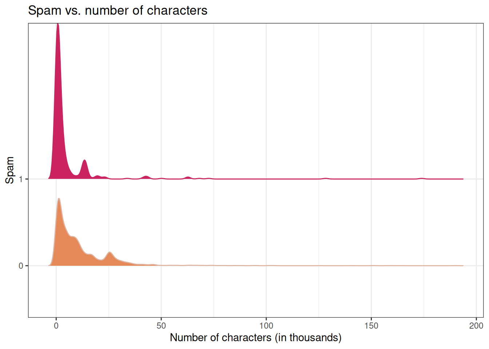
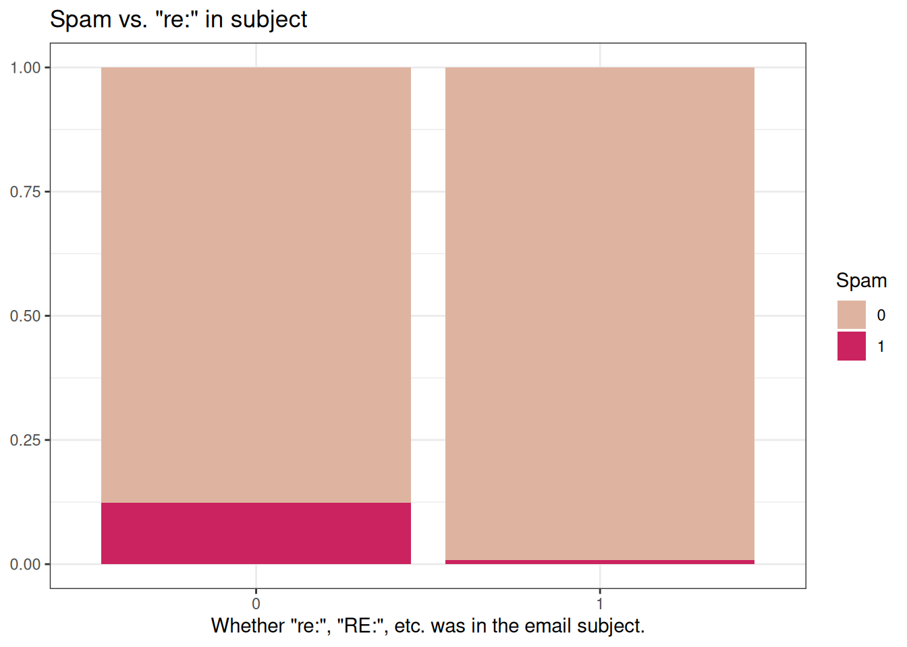
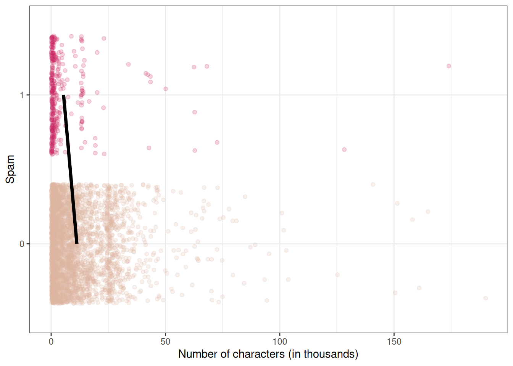
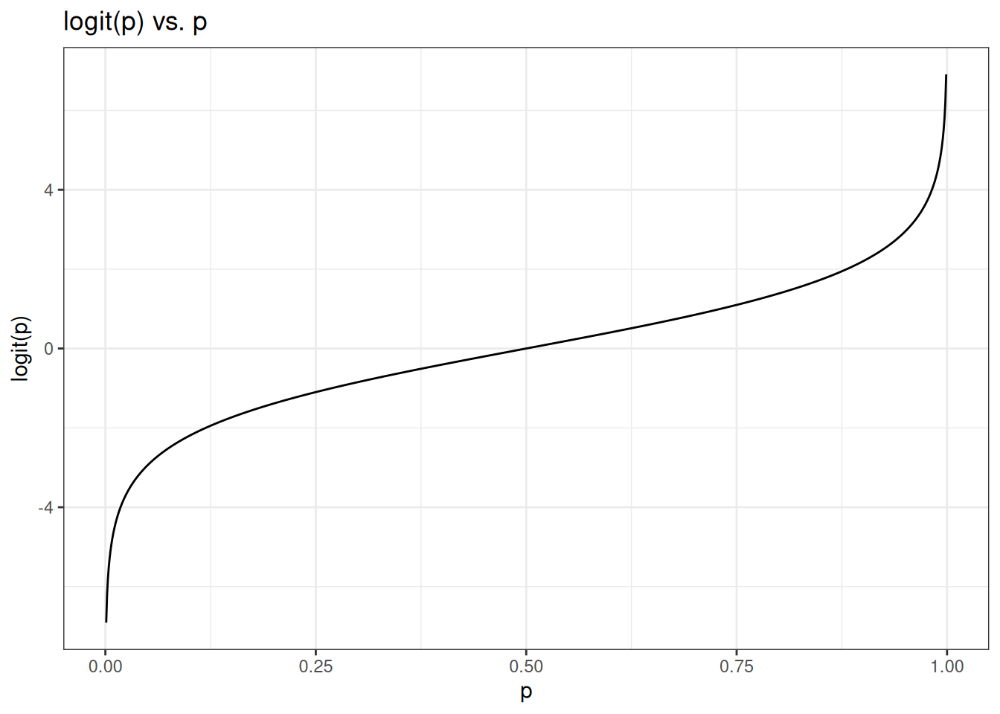
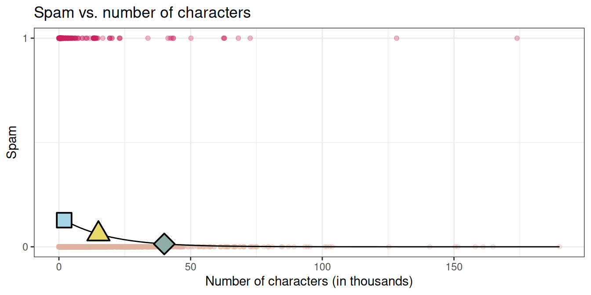

# Notes on Logistic Regression


## Predicting categorical data

#### Spam filters

- Data from 3921 emails and 21 variables on them
- Outcome: whether the email is spam or not
- Predictors: number of characters, whether the email had "Re:" in the subject, time at which email was sent, number of times the word "inherit" shows up in the email, etc.


``` r
library(openintro)
data(email)
glimpse(email)
#> Rows: 3,921
#> Columns: 21
#> $ spam         <fct> 0, 0, 0, 0, 0, 0, 0, 0, 0, 0, 0, 0, 0, 0, 0, 0, 0, 0, 0, …
#> $ to_multiple  <fct> 0, 0, 0, 0, 0, 0, 1, 1, 0, 0, 0, 0, 0, 0, 0, 0, 0, 0, 0, …
#> $ from         <fct> 1, 1, 1, 1, 1, 1, 1, 1, 1, 1, 1, 1, 1, 1, 1, 1, 1, 1, 1, …
#> $ cc           <int> 0, 0, 0, 0, 0, 0, 0, 1, 0, 0, 0, 1, 0, 1, 2, 1, 0, 2, 0, …
#> $ sent_email   <fct> 0, 0, 0, 0, 0, 0, 1, 1, 0, 0, 1, 0, 0, 1, 0, 1, 0, 0, 1, …
#> $ time         <dttm> 2012-01-01 06:16:41, 2012-01-01 07:03:59, 2012-01-01 16:…
#> $ image        <dbl> 0, 0, 0, 0, 0, 0, 0, 1, 0, 0, 0, 0, 0, 0, 0, 0, 0, 0, 0, …
#> $ attach       <dbl> 0, 0, 0, 0, 0, 0, 0, 1, 0, 0, 0, 0, 0, 0, 0, 0, 0, 0, 0, …
#> $ dollar       <dbl> 0, 0, 4, 0, 0, 0, 0, 0, 0, 0, 0, 0, 0, 0, 2, 0, 5, 0, 0, …
#> $ winner       <fct> no, no, no, no, no, no, no, no, no, no, no, no, no, no, n…
#> $ inherit      <dbl> 0, 0, 1, 0, 0, 0, 0, 0, 0, 0, 0, 0, 0, 0, 0, 0, 0, 0, 0, …
#> $ viagra       <dbl> 0, 0, 0, 0, 0, 0, 0, 0, 0, 0, 0, 0, 0, 0, 0, 0, 0, 0, 0, …
#> $ password     <dbl> 0, 0, 0, 0, 2, 2, 0, 0, 0, 0, 0, 0, 0, 0, 0, 0, 1, 0, 0, …
#> $ num_char     <dbl> 11.370, 10.504, 7.773, 13.256, 1.231, 1.091, 4.837, 7.421…
#> $ line_breaks  <int> 202, 202, 192, 255, 29, 25, 193, 237, 69, 68, 25, 79, 191…
#> $ format       <fct> 1, 1, 1, 1, 0, 0, 1, 1, 0, 1, 1, 0, 1, 1, 1, 1, 1, 1, 0, …
#> $ re_subj      <fct> 0, 0, 0, 0, 0, 0, 0, 0, 0, 0, 0, 1, 0, 1, 1, 1, 0, 1, 1, …
#> $ exclaim_subj <dbl> 0, 0, 0, 0, 0, 0, 0, 0, 0, 0, 0, 0, 0, 0, 0, 0, 1, 0, 0, …
#> $ urgent_subj  <fct> 0, 0, 0, 0, 0, 0, 0, 0, 0, 0, 0, 0, 0, 0, 0, 0, 0, 0, 0, …
#> $ exclaim_mess <dbl> 0, 1, 6, 48, 1, 1, 1, 18, 1, 0, 2, 1, 0, 10, 4, 10, 20, 0…
#> $ number       <fct> big, small, small, small, none, none, big, small, small, …
```

> Question: Would you expect longer or shorter emails to be spam?


```
#> Picking joint bandwidth of 1.18
```




```
#> # A tibble: 2 × 2
#>   spam  mean_num_char
#>   <fct>         <dbl>
#> 1 0             11.3 
#> 2 1              5.44
```

> Question: Would you expect emails that have subjects starting with "Re:", "RE:", "re:", or "rE:" to be spam or not?



#### Modeling spam

- Both number of characters and whether the message has "re:" in the subject might be related to whether the email is spam. How do we come up with a model that will let us explore this relationship?

- For simplicity, we'll focus on the number of characters (`num_char`) as predictor, but the model we describe can be expanded to take multiple predictors as well.

We can't reasonably fit a linear model to this data-- we need something different!



#### Framing the problem

- We can treat each outcome (spam and not) as successes and failures arising from separate Bernoulli trials
  - Bernoulli trial: a random experiment with exactly two possible outcomes, "success" and "failure", in which the probability of success is the same every time the experiment is conducted

- Each Bernoulli trial can have a separate probability of success

$$ y_i ∼ Bern(p) $$

- We can then use the predictor variables to model that probability of success, $p_i$

- We can't just use a linear model for $p_i$ (since $p_i$ must be between 0 and 1) but we can transform the linear model to have the appropriate range

#### Generalized linear models

- This is a very general way of addressing many problems in regression and the resulting models are called **generalized linear models (GLMs)**

- Logistic regression is just one example

#### Three characteristics of GLMs

All GLMs have the following three characteristics:

1. A probability distribution describing a generative model for the outcome variable

2. A linear model:
$$\eta = \beta_0 + \beta_1 X_1 + \cdots + \beta_k X_k$$

3. A link function that relates the linear model to the parameter of the outcome distribution
  
#### Logistic regression

- Logistic regression is a GLM used to model a binary categorical outcome using numerical and categorical predictors

- To finish specifying the Logistic model we just need to define a reasonable link function that connects $\eta_i$ to $p_i$: logit function

- **Logit function:** For $0\le p \le 1$

$$logit(p) = \log\left(\frac{p}{1-p}\right)$$

#### Logit function, visualized


``` r
d <- tibble(p = seq(0.001, 0.999,
  length.out = 1000
)) %>%
  mutate(logit_p = log(p / (1 - p)))

ggplot(d, aes(x = p, y = logit_p)) +
  geom_line() +
  xlim(0, 1) +
  ylab("logit(p)") +
  labs(title = "logit(p) vs. p") +
  theme_bw()
```



#### Properties of the logit

- The logit function takes a value between 0 and 1 and maps it to a value between $-\infty$ and $\infty$

- Inverse logit (logistic) function:
$$g^{-1}(x) = \frac{\exp(x)}{1+\exp(x)} = \frac{1}{1+\exp(-x)}$$

- The inverse logit function takes a value between $-\infty$ and $\infty$ and maps it to a value between 0 and 1

- This formulation is also useful for interpreting the model, since the logit can be interpreted as the log odds of a success -- more on this later

#### The logistic regression model

- Based on the three GLM criteria, we have
  - $y_i \sim \text{Bern}(p_i)$
  - $\eta_i = \beta_0+\beta_1 x_{1,i} + \cdots + \beta_n x_{n,i}$
  - $\text{logit}(p_i) = \eta_i$

- From which we get

$$p_i = \frac{\exp(\beta_0+\beta_1 x_{1,i} + \cdots + \beta_k x_{k,i})}{1+\exp(\beta_0+\beta_1 x_{1,i} + \cdots + \beta_k x_{k,i})}$$

#### Modeling spam

In R, we fit a GLM in the same way as a linear model except we

- specify the model with `logistic_reg()`
- use `"glm"` instead of `"lm"` as the engine
- define `family = "binomial"` for the link function to be used in the model


``` r
spam_fit <- logistic_reg() %>%
  set_engine("glm") %>%
  fit(spam ~ num_char,
    data = email,
    family = "binomial"
  )

# tidy(spam_fit)
```

#### Spam model


``` r
tidy(spam_fit)
#> # A tibble: 2 × 5
#>   term        estimate std.error statistic   p.value
#>   <chr>          <dbl>     <dbl>     <dbl>     <dbl>
#> 1 (Intercept)  -1.80     0.0716     -25.1  2.04e-139
#> 2 num_char     -0.0621   0.00801     -7.75 9.50e- 15
```

Model:
$$\log\left(\frac{p}{1-p}\right) = -1.80-0.0621\times \text{num_char}$$

#### P(spam) for an email with 2000 characters

$$\log\left(\frac{p}{1-p}\right) = -1.80-0.0621\times 2$$

$$\frac{p}{1-p} = \exp(-1.9242) = 0.15 \rightarrow p = 0.15 \times (1 - p)$$

$$p = 0.15 - 0.15p \rightarrow 1.15p = 0.15$$

$$p = 0.15 / 1.15 = 0.13$$

> Question: What is the probability that an email with 15000 characters is spam? What about an email with 40000 characters?


- 2K chars: P(spam) = 0.13
- 15K chars, P(spam) = 0.06
- 40K chars, P(spam) = 0.01

> Question: Would you prefer an email with 2000 characters to be labeled as spam or not? How about 40,000 characters?



## Sensitivity and specificity

#### False positive and negative

|                         | Email is spam                 | Email is not spam         |
|-------------------------|-------------------------------|-------------------------------|
| Email labeled spam     | True positive                 | False positive (Type 1 error) |
| Email labeled not spam | False negative (Type 2 error) | True negative                 |

- False negative rate = P(Labeled not spam | Email spam) = FN / (TP + FN)

- False positive rate = P(Labeled spam | Email not spam) = FP / (FP + TN)

#### Sensitivity and specificity

|                         | Email is spam                 | Email is not spam             |
|-------------------------|-------------------------------|-------------------------------|
| Email labeled spam     | True positive                 | False positive (Type 1 error) |
| Email labeled not spam | False negative (Type 2 error) | True negative                 |

- Sensitivity = P(Labeled spam | Email spam) = TP / (TP + FN)
  - Sensitivity = 1 − False negative rate
  
- Specificity = P(Labeled not spam | Email not spam) = TN / (FP + TN)
  - Specificity = 1 − False positive rate

> Question: If you were designing a spam filter, would you want sensitivity and specificity to be high or low? What are the trade-offs associated with each decision?


<!--DS4P Links-->
[course_web]: https://datascience4psych.github.io/DataScience4Psych
[course_git]: https://github.com/DataScience4Psych/DataScience4Psych
[course_repo]: https://github.com/DataScience4Psych
[course_slides]: https://github.com/DataScience4Psych/slides
[course_syllabus]: https://smasongarrison.github.io/syllabi/ 
<!-- https://smasongarrison.github.io/syllabi/data-science.html -->
[syllabi]: https://smasongarrison.github.io/syllabi
[pl_00]: https://www.youtube.com/playlist?list=PLKrrdtYgOUYaEAnJX20Ryy4OSie375rVY
[pl_01]: https://www.youtube.com/playlist?list=PLKrrdtYgOUYao_7t5ycK4KDXNKaY-ECup
[pl_02]: https://www.youtube.com/playlist?list=PLKrrdtYgOUYZmr_T3PnuxjVIlj0C0kUNI
[pl_03]: https://www.youtube.com/playlist?list=PLKrrdtYgOUYaHmjzdRvfg0yhOIYQnfjwE
[pl_04]: https://www.youtube.com/playlist?list=PLKrrdtYgOUYYWFcel6_vp8__RUKLxhX4y
[pl_05]: https://www.youtube.com/playlist?list=PLKrrdtYgOUYYMIguiV1F8RagMYibTY4iW
[pl_06]: https://www.youtube.com/playlist?list=PLKrrdtYgOUYYV_KDod3Mk9-RmtFXii9Dv
[pl_07]: https://www.youtube.com/watch?list=PLKrrdtYgOUYZxvEvQ8-PcWrOY_dwY_ETI
[pl_08]: https://www.youtube.com/playlist?list=PLKrrdtYgOUYZgOzYB_dmauw55M7jXvsdo
[pl_09]: https://www.youtube.com/playlist?list=PLKrrdtYgOUYbaiTmldRY2ddsLrHp3z6yO
[pl_10]: https://www.youtube.com/playlist?list=PLKrrdtYgOUYbPw5iYzYEzoOKa7mJKNIhq
[pl_11]: https://www.youtube.com/playlist?list=PLKrrdtYgOUYZ-u6LzBbanrNFoeLHKaLL6
[pl_12]: https://www.youtube.com/playlist?list=PLKrrdtYgOUYbwRS-9Htmb80_t1NG-021e
[pl_13]: https://www.youtube.com/playlist?list=PLKrrdtYgOUYbWGmSnbLIYwdLOnGm6une6
[pl_14]: https://www.youtube.com/playlist?list=PLKrrdtYgOUYbWGmSnbLIYwdLOnGm6une6
[pl_15]: https://www.youtube.com/playlist?list=PLKrrdtYgOUYa5MoYrV8EsWQ5jIr5ZYMpM
[pl_all]: https://www.youtube.com/playlist?list=PLKrrdtYgOUYZomNqf-1dtCDW94ySdLv-9


<!--AE Links-->
[ae01a_unvotes]: https://github.com/DataScience4Psych/ae01a_unvotes
[ae01b_covid]: https://github.com/DataScience4Psych/ae01b_covid
[ae02_bechdel]: https://github.com/DataScience4Psych/ae-02-bechdel-rmarkdown
[ae03_starwars]: https://github.com/DataScience4Psych/ae-03-starwars-dataviz
[ae08_imdb]: https://github.com/DataScience4Psych/ae-08-imdb-webscraping

<!-- Lab Links-->

[lab01_hello]: https://github.com/DataScience4Psych/lab-01-hello-r
[lab02]: https://github.com/DataScience4Psych/lab-02-plastic-waste
[lab03]: https://github.com/DataScience4Psych/lab-03-nobel-laureates
[lab04]: https://github.com/DataScience4Psych/lab-04-viz-sp-data
[lab05]: https://github.com/DataScience4Psych/lab-05-wrangle-sp-data
[lab06]: https://github.com/DataScience4Psych/lab_06_sad_plots
[lab07]: https://github.com/DataScience4Psych/lab_07_betterviz
[lab08]: https://github.com/DataScience4Psych/lab-08-uoe-art
[lab09]: https://github.com/DataScience4Psych/lab-09-ethics-algorithmic-bias
[lab10]: https://github.com/DataScience4Psych/lab-10-slr-course-evals
[lab11]: https://github.com/DataScience4Psych/lab-11-mlr-course-evals
[lab12]: https://github.com/DataScience4Psych/lab-12-inference-smoking
[lab13]: https://github.com/DataScience4Psych/lab-13-simulating-mars

<!--Slides-->
[d01_welcome]: https://datascience4psych.github.io/slides/d01_welcome/d01_welcome.html
[d02_toolkit]: https://datascience4psych.github.io/slides/d02_toolkit/d02_toolkit.html
[d03_dataviz]: https://datascience4psych.github.io/slides/d03_dataviz/d03_dataviz.html
[d04_ggplot2]: https://datascience4psych.github.io/slides/d04_ggplot2/d04_ggplot2.html
[d05_viznum]: https://datascience4psych.github.io/slides/d05_viznum/d05_viznum.html
[d06_vizcat]: https://datascience4psych.github.io/slides/d06_vizcat/d06_vizcat.html
[d07_tidy]: https://datascience4psych.github.io/slides/d07_tidy/d07_tidy.html
[d08_grammar]: https://datascience4psych.github.io/slides/d08_grammar/d08_grammar.html
[d09_wrangle]: https://datascience4psych.github.io/slides/d09_wrangle/d09_wrangle.html
[d10_dfs]: https://datascience4psych.github.io/slides/d10_dfs/d10_dfs.html
[d11_types]: https://datascience4psych.github.io/slides/d11_types/d11_types.html
[d12_import]: https://datascience4psych.github.io/slides/d12_import/d12_import.html
[d13_goodviz]: https://datascience4psych.github.io/slides/d13_goodviz/d13_goodviz.html
[d13b_moreggplot]: https://datascience4psych.github.io/slides/d13_goodviz/d13b_moreggplot.html
[d14_confound]: https://datascience4psych.github.io/slides/d14_confound/d14_confound.html
[d15_goodtalk]: https://datascience4psych.github.io/slides/d15_goodtalk/d15_goodtalk.html
[d16_webscraping]: https://datascience4psych.github.io/slides/d16_webscraping/d16_webscraping.html
[d17_functions]: https://datascience4psych.github.io/slides/d17_functions/d17_functions.html
[d18_ethics]: https://datascience4psych.github.io/slides/d18_ethics/d18_ethics.html
[d19_bias]: https://datascience4psych.github.io/slides/d19_bias/d19_bias.html
[d20_language]: https://datascience4psych.github.io/slides/d20_language/d20_language.html
[d21_fitting]: https://datascience4psych.github.io/slides/d21_fitting/d21_fitting.html
[d22_nonlinear]: https://datascience4psych.github.io/slides/d22_nonlinear/d22_nonlinear.html
[d23_multiple]: https://datascience4psych.github.io/slides/d23_multiple/d23_multiple.html
[d24_overfitting]: https://datascience4psych.github.io/slides/d24_overfitting/d24_overfitting.html
[d25_crossvalidation]: https://datascience4psych.github.io/slides/d25_crossvalidation/d25_crossvalidation.html
[d26_quantify]: https://datascience4psych.github.io/slides/d26_quantify/d26_quantify.html
[d27_bootstrap]: https://datascience4psych.github.io/slides/d27_bootstrap/d27_bootstrap.html
[d28_interactive]: https://datascience4psych.github.io/slides/d28_interactive/d28_interactive.html
[d29_machine]: https://datascience4psych.github.io/slides/d29_machinelearning/d29_machine.html
[d30_simulations]: https://datascience4psych.github.io/slides/d30_simulations/d30_simulations.html
[d31_llmintro]: https://datascience4psych.github.io/slides/d31_llmintro/d31_llmintro.html
[d32_llmapplications]: https://datascience4psych.github.io/slides/d32_llmapplications/d32_llmapplications.html

<!--externals-->

[stat545]: https://stat545.com
[r4ds]: https://r4ds.had.co.nz
[cran]: https://cloud.r-project.org
