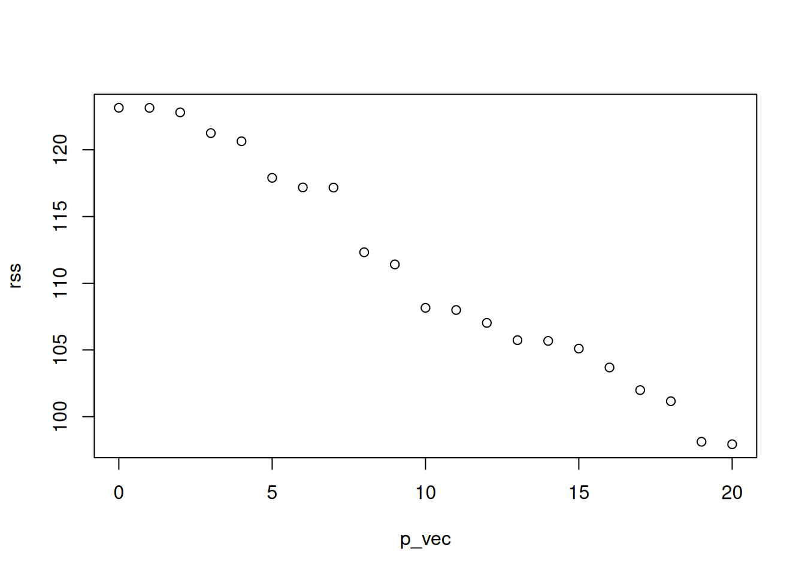
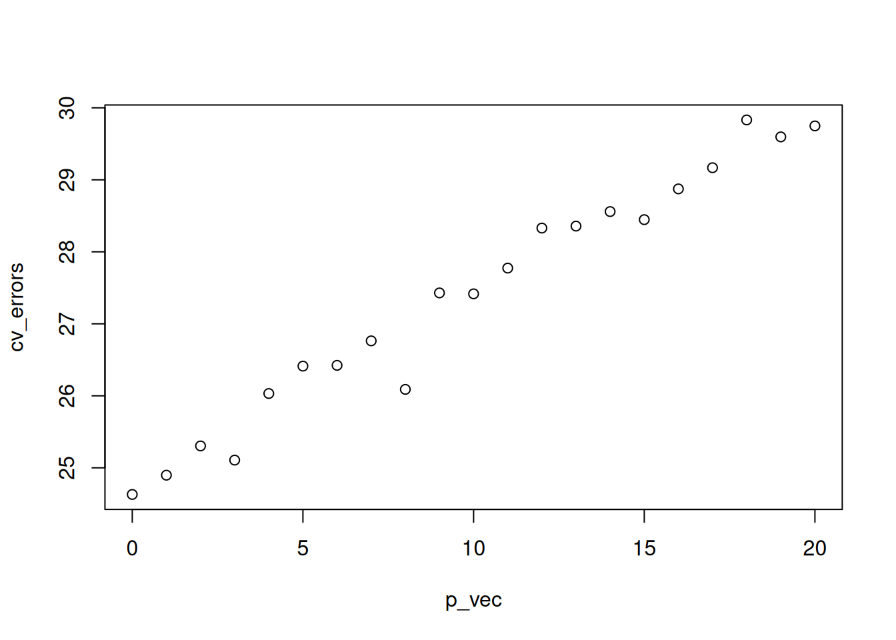

# ODD: Notes on Cross validation

These lecture notes are an optional deep-dive into cross-validation. The lecture presents examples from regression and mixture models. I highlight the effectiveness of resampling methods like cross-validation when the observed data accurately reflects the true data-generating distribution.


We have:

- Data $X_1, \ldots, X_n$.

- A tuning parameter $\theta$. Each value of $\theta$ corresponds to a different set of models.

- A function $L$ that takes a fitted model and a data point and returns a measure of model quality.

We would like to choose one model from the set of candidate models indexed by $\theta$.

## Example: Regression

- Data: Pairs of predictors and response variables, $(y_i, X_i)$, $i = 1,\ldots, n$, $y_i \in \mathbb R$, $X_i \in \mathbb R^p$

- Models: $y_i = X \beta + \epsilon$, $\beta_j = 0, j \in S_\theta$, where $S_\theta \subseteq \{1,\ldots, p\}$.

- Model quality: Squared-error loss. If $\hat \beta_\theta$ are our estimates of the regression coefficients in model $\theta$, model quality is measured by

$$
L(\hat \beta_\theta, (y_i, X_i)) = (y_i - X_i^T \hat \beta_\theta)^2
$$

We want to choose a subset of the predictors that do the best job of explaining the response.

Naive solution: Find the model that has the lowest value for the squared-error loss.

Why doesn't this work?

## Example: Mixture models

- Data: $x_1,\ldots, x_n$, $x_i \in \mathbb R$

- Models: Gaussian mixture models with $\theta$ mixture components.

- Model quality: Negative log likelihood of the data. If $\hat p_\theta$ is the density of the fitted model with $\theta$ components, model quality is measured by $L(\hat p_\theta, x_i) = -\log \hat p_\theta(x_i)$.

We want to choose the number of mixture components that best explains the data.

Naive solution: Choose the number of mixture components that minimizes the negative log likelihood of the data.

## Better Solution: Cross validation

Idea: Instead of measuring model quality on the same data we used to fit the model, we estimate model quality on new data.

If we knew the true distribution of the data, we could simulate new data and use a Monte Carlo estimate based on the simulations.

We can't actually get new data, and so we hold some back when we fit the model and then pretend that the held back data is new data.

Procedure:

- Divide the data into $K$ folds

- Let $X^{(k)}$ denote the data in fold $k$, and let $X^{(-k)}$ denote the data in all the folds except for $k$.

- For each fold and each value of the tuning parameter $\theta$, fit the model on $X^{(-k)}$ to get $\hat f_\theta^{(k)}$

- Compute

$$
\text{CV}(\theta) = \frac{1}{n} \sum_{k=1}^K \sum_{x \in X^{(k)}} L(\hat f_\theta^{(k)}, x)
$$

- Choose $\hat \theta = \text{argmin}_{\theta} \text{CV}(\theta)$

## Example


``` r
n <- 100
p <- 20
X <- matrix(rnorm(n * p), nrow = n)
y <- rnorm(n)
get_rss_submodels <- function(n_predictors, y, X) {
  if (n_predictors == 0) {
    lm_submodel <- lm(y ~ 0)
  } else {
    lm_submodel <- lm(y ~ 0 + X[, 1:n_predictors, drop = FALSE])
  }
  return(sum(residuals(lm_submodel)^2))
}
p_vec <- 0:p
rss <- sapply(p_vec, get_rss_submodels, y, X)
plot(rss ~ p_vec)
```




``` r
get_cv_error <- function(n_predictors,
                         y,
                         X,
                         folds) {
  cv_vec <- numeric(length(unique(folds)))
  for (f in unique(folds)) {
    cv_vec[f] <- rss_on_held_out(
      n_predictors,
      y_train = y[folds != f],
      X_train = X[folds != f, ],
      y_test = y[folds == f],
      X_test = X[folds == f, ]
    )
  }
  return(mean(cv_vec))
}

rss_on_held_out <- function(n_predictors,
                            y_train,
                            X_train,
                            y_test,
                            X_test) {
  if (n_predictors == 0) {
    lm_submodel <- lm(y_train ~ 0)
    preds_on_test <- rep(0, length(y_test))
  } else {
    lm_submodel <- lm(y_train ~ 0 + X_train[, 1:n_predictors, drop = FALSE])
    preds_on_test <- X_test[, 1:n_predictors, drop = FALSE] %*% coef(lm_submodel)
  }

  return(sum((y_test - preds_on_test)^2))
}
K <- 5

## normally you would do this at random
folds <- rep(1:K, each = n / K)
p_vec <- 0:p
cv_errors <- sapply(p_vec, get_cv_error, y, X, folds)
plot(cv_errors ~ p_vec)
```



## Choice of $K$

Considerations:

- Larger $K$ means more computation (although sometimes there is a shortcut for leave-one-out cross validation)

- Larger $K$ means less bias in the estimate of model accuracy

- Larger $K$ also means more variance in the estimate, so we don't necessarily want $K = n$

- Usually choose $K = 5$ or $K = 10$

- If your problem is structured (e.g. time series, spatial), you should choose the folds to respect the structure.

## Summing up

- We can use simulations to estimate arbitrary functions of our random variables.

- If we know the underlying distribution, we can simply simulate from it (Monte Carlo integration).

- If we don't know the underlying distribution, we can "simulate" from the data by resampling from the data (cross validation; ish). Resampling methods will do well to the extent that the observed data reflect the true data-generating distribution.


<!--DS4P Links-->
[course_web]: https://datascience4psych.github.io/DataScience4Psych
[course_git]: https://github.com/DataScience4Psych/DataScience4Psych
[course_repo]: https://github.com/DataScience4Psych
[course_slides]: https://github.com/DataScience4Psych/slides
[course_syllabus]: https://smasongarrison.github.io/syllabi/ 
<!-- https://smasongarrison.github.io/syllabi/data-science.html -->
[syllabi]: https://smasongarrison.github.io/syllabi
[pl_00]: https://www.youtube.com/playlist?list=PLKrrdtYgOUYaEAnJX20Ryy4OSie375rVY
[pl_01]: https://www.youtube.com/playlist?list=PLKrrdtYgOUYao_7t5ycK4KDXNKaY-ECup
[pl_02]: https://www.youtube.com/playlist?list=PLKrrdtYgOUYZmr_T3PnuxjVIlj0C0kUNI
[pl_03]: https://www.youtube.com/playlist?list=PLKrrdtYgOUYaHmjzdRvfg0yhOIYQnfjwE
[pl_04]: https://www.youtube.com/playlist?list=PLKrrdtYgOUYYWFcel6_vp8__RUKLxhX4y
[pl_05]: https://www.youtube.com/playlist?list=PLKrrdtYgOUYYMIguiV1F8RagMYibTY4iW
[pl_06]: https://www.youtube.com/playlist?list=PLKrrdtYgOUYYV_KDod3Mk9-RmtFXii9Dv
[pl_07]: https://www.youtube.com/watch?list=PLKrrdtYgOUYZxvEvQ8-PcWrOY_dwY_ETI
[pl_08]: https://www.youtube.com/playlist?list=PLKrrdtYgOUYZgOzYB_dmauw55M7jXvsdo
[pl_09]: https://www.youtube.com/playlist?list=PLKrrdtYgOUYbaiTmldRY2ddsLrHp3z6yO
[pl_10]: https://www.youtube.com/playlist?list=PLKrrdtYgOUYbPw5iYzYEzoOKa7mJKNIhq
[pl_11]: https://www.youtube.com/playlist?list=PLKrrdtYgOUYZ-u6LzBbanrNFoeLHKaLL6
[pl_12]: https://www.youtube.com/playlist?list=PLKrrdtYgOUYbwRS-9Htmb80_t1NG-021e
[pl_13]: https://www.youtube.com/playlist?list=PLKrrdtYgOUYbWGmSnbLIYwdLOnGm6une6
[pl_14]: https://www.youtube.com/playlist?list=PLKrrdtYgOUYbWGmSnbLIYwdLOnGm6une6
[pl_15]: https://www.youtube.com/playlist?list=PLKrrdtYgOUYa5MoYrV8EsWQ5jIr5ZYMpM
[pl_all]: https://www.youtube.com/playlist?list=PLKrrdtYgOUYZomNqf-1dtCDW94ySdLv-9


<!--AE Links-->
[ae01a_unvotes]: https://github.com/DataScience4Psych/ae01a_unvotes
[ae01b_covid]: https://github.com/DataScience4Psych/ae01b_covid
[ae02_bechdel]: https://github.com/DataScience4Psych/ae-02-bechdel-rmarkdown
[ae03_starwars]: https://github.com/DataScience4Psych/ae-03-starwars-dataviz
[ae08_imdb]: https://github.com/DataScience4Psych/ae-08-imdb-webscraping

<!-- Lab Links-->

[lab01_hello]: https://github.com/DataScience4Psych/lab-01-hello-r
[lab02]: https://github.com/DataScience4Psych/lab-02-plastic-waste
[lab03]: https://github.com/DataScience4Psych/lab-03-nobel-laureates
[lab04]: https://github.com/DataScience4Psych/lab-04-viz-sp-data
[lab05]: https://github.com/DataScience4Psych/lab-05-wrangle-sp-data
[lab06]: https://github.com/DataScience4Psych/lab_06_sad_plots
[lab07]: https://github.com/DataScience4Psych/lab_07_betterviz
[lab08]: https://github.com/DataScience4Psych/lab-08-uoe-art
[lab09]: https://github.com/DataScience4Psych/lab-09-ethics-algorithmic-bias
[lab10]: https://github.com/DataScience4Psych/lab-10-slr-course-evals
[lab11]: https://github.com/DataScience4Psych/lab-11-mlr-course-evals
[lab12]: https://github.com/DataScience4Psych/lab-12-inference-smoking
[lab13]: https://github.com/DataScience4Psych/lab-13-simulating-mars

<!--Slides-->
[d01_welcome]: https://datascience4psych.github.io/slides/d01_welcome/d01_welcome.html
[d02_toolkit]: https://datascience4psych.github.io/slides/d02_toolkit/d02_toolkit.html
[d03_dataviz]: https://datascience4psych.github.io/slides/d03_dataviz/d03_dataviz.html
[d04_ggplot2]: https://datascience4psych.github.io/slides/d04_ggplot2/d04_ggplot2.html
[d05_viznum]: https://datascience4psych.github.io/slides/d05_viznum/d05_viznum.html
[d06_vizcat]: https://datascience4psych.github.io/slides/d06_vizcat/d06_vizcat.html
[d07_tidy]: https://datascience4psych.github.io/slides/d07_tidy/d07_tidy.html
[d08_grammar]: https://datascience4psych.github.io/slides/d08_grammar/d08_grammar.html
[d09_wrangle]: https://datascience4psych.github.io/slides/d09_wrangle/d09_wrangle.html
[d10_dfs]: https://datascience4psych.github.io/slides/d10_dfs/d10_dfs.html
[d11_types]: https://datascience4psych.github.io/slides/d11_types/d11_types.html
[d12_import]: https://datascience4psych.github.io/slides/d12_import/d12_import.html
[d13_goodviz]: https://datascience4psych.github.io/slides/d13_goodviz/d13_goodviz.html
[d13b_moreggplot]: https://datascience4psych.github.io/slides/d13_goodviz/d13b_moreggplot.html
[d14_confound]: https://datascience4psych.github.io/slides/d14_confound/d14_confound.html
[d15_goodtalk]: https://datascience4psych.github.io/slides/d15_goodtalk/d15_goodtalk.html
[d16_webscraping]: https://datascience4psych.github.io/slides/d16_webscraping/d16_webscraping.html
[d17_functions]: https://datascience4psych.github.io/slides/d17_functions/d17_functions.html
[d18_ethics]: https://datascience4psych.github.io/slides/d18_ethics/d18_ethics.html
[d19_bias]: https://datascience4psych.github.io/slides/d19_bias/d19_bias.html
[d20_language]: https://datascience4psych.github.io/slides/d20_language/d20_language.html
[d21_fitting]: https://datascience4psych.github.io/slides/d21_fitting/d21_fitting.html
[d22_nonlinear]: https://datascience4psych.github.io/slides/d22_nonlinear/d22_nonlinear.html
[d23_multiple]: https://datascience4psych.github.io/slides/d23_multiple/d23_multiple.html
[d24_overfitting]: https://datascience4psych.github.io/slides/d24_overfitting/d24_overfitting.html
[d25_crossvalidation]: https://datascience4psych.github.io/slides/d25_crossvalidation/d25_crossvalidation.html
[d26_quantify]: https://datascience4psych.github.io/slides/d26_quantify/d26_quantify.html
[d27_bootstrap]: https://datascience4psych.github.io/slides/d27_bootstrap/d27_bootstrap.html
[d28_interactive]: https://datascience4psych.github.io/slides/d28_interactive/d28_interactive.html
[d29_machine]: https://datascience4psych.github.io/slides/d29_machinelearning/d29_machine.html
[d30_simulations]: https://datascience4psych.github.io/slides/d30_simulations/d30_simulations.html
[d31_llmintro]: https://datascience4psych.github.io/slides/d31_llmintro/d31_llmintro.html
[d32_llmapplications]: https://datascience4psych.github.io/slides/d32_llmapplications/d32_llmapplications.html

<!--externals-->

[stat545]: https://stat545.com
[r4ds]: https://r4ds.had.co.nz
[cran]: https://cloud.r-project.org
