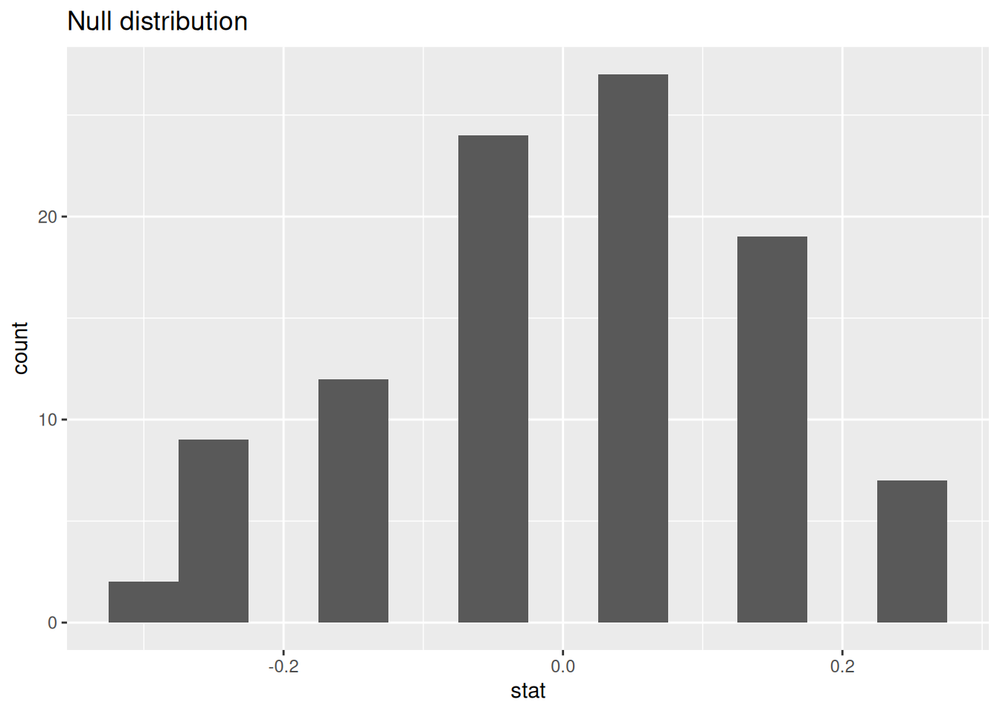

# Notes on Hypothesis Testing


## Hypothesis testing for a single proportion


``` r
## Packages
library(tidyverse)
library(tidymodels)
```

### Case Study: Organ Donors

Organ donors may seek the assistance of a medical consultant to help them navigate the surgical process. The consultant's goal is to minimize any potential complications during the procedure and recovery. Patients may choose a consultant based on their past clients' complication rates.

A consultant marketed her services by highlighting her exceptional track record. She stated that while the average complication rate for liver donor surgeries in the US is 10%, only 3 out of 62 surgeries she facilitated resulted in complications. She believes this rate demonstrates the significant impact of her work in reducing complications, making her a top choice for potential patients.

#### Data


``` r
organ_donor %>%
  count(outcome)
#> # A tibble: 2 × 2
#>   outcome             n
#>   <chr>           <int>
#> 1 complication        3
#> 2 no complication    59
```

### Parameter vs. statistic

A **parameter** for a hypothesis test is the "true" value of interest. We typically estimate the parameter using a **sample statistic** as a **point estimate**.

$p~$: true rate of complication

$\hat{p}~$: rate of complication in the sample = $\frac{3}{62}$ =
0.048

### Correlation vs. causation

> Is it possible to assess the consultant's claim using the data?

No. The claim is that there is a causal connection, but the data are observational. For example, maybe patients who can afford a medical consultant can afford better medical care, which can also lead to a lower complication rate. Although it is not possible to assess the causal claim, it is still possible to test for an association using these data. The question to consider is, is the low complication rate of 3 out of 62 surgeries  ( $\hat{p}$ = 0.048) simply due to chance?

### Two claims

- **Null hypothesis:** "There is nothing going on"

Complication rate for this consultant is no different than the US average of 10%

- **Alternative hypothesis:** "There is something going on"

Complication rate for this consultant is **lower** than the US average of 10%

### Hypothesis testing as a court trial

- **Null hypothesis**, $H_0$: Defendant is innocent

- **Alternative hypothesis**, $H_A$: Defendant is guilty

- **Present the evidence:** Collect data

- **Judge the evidence:** "Could these data plausibly have happened by chance if the null hypothesis were true?"
  - Yes: Fail to reject $H_0$
  - No: Reject $H_0$

### Hypothesis testing framework

- Start with a null hypothesis, $H_0$, that represents the status quo

- Set an alternative hypothesis, $H_A$, that represents the research question, i.e. what we're testing for

- Conduct a hypothesis test under the assumption that the null hypothesis is true and calculate a **p-value** (probability of observed or more extreme outcome given that the null hypothesis is true)
  - if the test results suggest that the data do not provide convincing evidence for the alternative hypothesis, stick with the null hypothesis
  - if they do, then reject the null hypothesis in favor of the alternative

### Setting the hypotheses

> Which of the following is the correct set of hypotheses?

(a) $H_0: p = 0.10$; $H_A: p \ne 0.10$ <br>

(b) $H_0: p = 0.10$; $H_A: p > 0.10$ <br>

(c) $H_0: p = 0.10$; $H_A: p < 0.10$ <br>

(d) $H_0: \hat{p} = 0.10$; $H_A: \hat{p} \ne 0.10$ <br>

(e) $H_0: \hat{p} = 0.10$; $H_A: \hat{p} > 0.10$ <br>

(f) $H_0: \hat{p} = 0.10$; $H_A: \hat{p} < 0.10$ <br>

### Simulating the null distribution

Since $H_0: p = 0.10$, we need to simulate a null distribution where the probability of success (complication) for each trial (patient) is 0.10.

> Describe how you would simulate the null distribution for this study using a bag of chips. How many chips? What colors? What do the colors indicate? How many draws? <b>With replacement</b> or <b>without replacement</b>?

### What do we expect?

> When sampling from the null distribution, what is the expected proportion of success (complications)?

### Simulation

Here are some simulations....


```
#> sim1
#>    complication no complication 
#>               3              59
#> [1] 0.0484
```


```
#> sim2
#>    complication no complication 
#>               9              53
#> [1] 0.145
```


```
#> sim3
#>    complication no complication 
#>               8              54
#> [1] 0.129
```


This process is getting boring... We need a way to automate this process!

### Using tidymodels to generate the null distribution


``` r
null_dist <- organ_donor %>%
  specify(
    response = outcome,
    success = "complication"
  ) %>%
  hypothesize(
    null = "point",
    p = c(
      "complication" = 0.10,
      "no complication" = 0.90
    )
  ) %>%
  generate(
    reps = 100,
    type = "simulate"
  ) %>%
  calculate(stat = "prop")
#> The `"simulate"` generation type has been renamed to `"draw"`. Use `type =
#> "draw"` instead to quiet this message.
```


```
#> Response: outcome (factor)
#> Null Hypothesis: point
#> # A tibble: 100 × 2
#>    replicate  stat
#>        <dbl> <dbl>
#>  1         1 0.161
#>  2         2 0.081
#>  3         3 0.161
#>  4         4 0.145
#>  5         5 0.097
#>  6         6 0.145
#>  7         7 0.081
#>  8         8 0.097
#>  9         9 0.161
#> 10        10 0.048
#> # ℹ 90 more rows
```

### Visualizing the null distribution

> What would you expect the center of the null distribution to be?


``` r
ggplot(data = null_dist, mapping = aes(x = stat)) +
  geom_histogram(binwidth = 0.01) +
  labs(title = "Null distribution")
```


### Calculating the p-value, visually

> What is the p-value, i.e. in what % of the simulations was the simulated sample proportion at least as extreme as the observed sample proportion?


### Calculating the p-value, directly


``` r
null_dist %>%
  filter(stat <= (3 / 62)) %>%
  summarize(p_value = n() / nrow(null_dist))
#> # A tibble: 1 × 1
#>   p_value
#>     <dbl>
#> 1    0.12
```

### Significance level

We often use 5% as the cutoff for whether the p-value is low enough that the data are unlikely to have come from the null model. This cutoff value is called the **significance level**, $\alpha$.

- If p-value < $\alpha$, reject $H_0$ in favor of $H_A$: The data provide convincing evidence for the alternative hypothesis.

- If p-value > $\alpha$, fail to reject $H_0$ in favor of $H_A$: The data do not provide convincing evidence for the alternative hypothesis.

### Conclusion

> What is the conclusion of the hypothesis test?

Since the p-value is greater than the significance level, we fail to reject the null hypothesis.
These data do not provide convincing evidence that this consultant incurs a lower complication rate than 10% (overall US complication rate).

### Let's get real

- 100 simulations is not sufficient

- We usually simulate around 15,000 times to get an accurate distribution, but we'll do 1,000 here for efficiency.

### Run the test


``` r
null_dist <- organ_donor %>%
  specify(
    response = outcome,
    success = "complication"
  ) %>%
  hypothesize(
    null = "point",
    p = c(
      "complication" = 0.10,
      "no complication" = 0.90
    )
  ) %>%
  generate(
    reps = 1000,
    type = "simulate"
  ) %>%
  calculate(stat = "prop")
#> The `"simulate"` generation type has been renamed to `"draw"`. Use `type =
#> "draw"` instead to quiet this message.
```

### Visualize and calculate


``` r
ggplot(data = null_dist, mapping = aes(x = stat)) +
  geom_histogram(binwidth = 0.01) +
  geom_vline(xintercept = 3 / 62, color = "red")
```


``` r

null_dist %>%
  filter(stat <= 3 / 62) %>%
  summarize(p_value = n() / nrow(null_dist))
#> # A tibble: 1 × 1
#>   p_value
#>     <dbl>
#> 1   0.124
```

## One vs. two sided hypothesis tests

### Types of alternative hypotheses

- One sided (one tailed) alternatives: The parameter is hypothesized to be less than or greater than the null value, < or >

- Two sided (two tailed) alternatives: The parameter is hypothesized to be not equal to the null value, $\ne$
  - Calculated as two times the tail area beyond the observed sample statistic
  - More objective, and hence more widely preferred

> Average systolic blood pressure of people with Stage 1 Hypertension is 150 mm Hg.

> Suppose we want to use a hypothesis test to evaluate whether a new blood pressure medication has <b>an effect</b> on the average blood pressure of heart patients. What are the hypotheses?

## Testing for independence

### Is yawning contagious?

> Do you think yawning is contagious?


An experiment conducted by the MythBusters tested if a person can be subconsciously influenced into yawning if another person near them yawns. ([Video](https://www.discovery.com/tv-shows/mythbusters/videos/is-yawning-contagious-2))

### Study description

This study involved 50 participants who were randomly divided into two groups. 34 participants were in the treatment group where they saw someone near them yawn, while 16 participants were in the control group where they did not witness a yawn.

The data are in the **openintro** package: `yawn`


``` r
yawn %>%
  count(group, result)
#> # A tibble: 4 × 3
#>   group result       n
#>   <fct> <fct>    <int>
#> 1 ctrl  not yawn    12
#> 2 ctrl  yawn         4
#> 3 trmt  not yawn    24
#> 4 trmt  yawn        10
```

### Proportion of yawners


``` r
yawn %>%
  count(group, result) %>%
  group_by(group) %>%
  mutate(p_hat = n / sum(n))
#> # A tibble: 4 × 4
#> # Groups:   group [2]
#>   group result       n p_hat
#>   <fct> <fct>    <int> <dbl>
#> 1 ctrl  not yawn    12 0.75 
#> 2 ctrl  yawn         4 0.25 
#> 3 trmt  not yawn    24 0.706
#> 4 trmt  yawn        10 0.294
```

- Proportion of yawners in the treatment group: $\frac{10}{34} = 0.2941$
- Proportion of yawners in the control group: $\frac{4}{16} = 0.25$
- Difference: $0.2941 - 0.25 = 0.0441$
- Our results match the ones calculated on the MythBusters episode.

### Independence?

> Based on the proportions we calculated, do you think yawning is really contagious, i.e. are seeing someone yawn and yawning dependent?


```
#> # A tibble: 4 × 4
#> # Groups:   group [2]
#>   group result       n p_hat
#>   <fct> <fct>    <int> <dbl>
#> 1 ctrl  not yawn    12 0.75 
#> 2 ctrl  yawn         4 0.25 
#> 3 trmt  not yawn    24 0.706
#> 4 trmt  yawn        10 0.294
```

### Dependence, or another possible explanation?

- The observed differences might suggest that yawning is contagious, i.e. seeing someone yawn and yawning are dependent.

- But the differences are small enough that we might wonder if they might simple be **due to chance**.

- Perhaps if we were to repeat the experiment, we would see slightly different results.

- So we will do just that - well, somewhat - and see what happens.

- Instead of actually conducting the experiment many times, we will **simulate** our results.

### Two competing claims

- "There is nothing going on."
Yawning and seeing someone yawn are **independent**, yawning is not contagious, observed difference in proportions is simply due to chance. $\rightarrow$ Null hypothesis

- "There is something going on."
Yawning and seeing someone yawn are **dependent**, yawning is contagious, observed difference in proportions is not due to chance. $\rightarrow$ Alternative hypothesis

### Simulation setup

1. A regular deck of cards is comprised of 52 cards: 4 aces, 4 of numbers 2-10, 4 jacks, 4 queens, and 4 kings.

2. Take out two aces from the deck of cards and set them aside.

3. The remaining 50 playing cards to represent each participant in the study:
    - 14 face cards (including the 2 aces) represent the people who yawn.
    - 36 non-face cards represent the people who don't yawn.

### Running the simulation

1. Shuffle the 50 cards at least 7 times^[http://www.dartmouth.edu/~chance/course/topics/winning_number.html] to ensure that the cards counted out are from a random process.

2. Count out the top 16 cards and set them aside. These cards represent the people in the control group.

3. Out of the remaining 34 cards (treatment group) count the \red{number of face cards} (the number of people who yawned in the treatment group).

4. Calculate the difference in proportions of yawners (treatment - control), and plot it
on the board.

5. Mark the difference you find on the dot plot on the board.

### Simulation by hand

> Do the simulation results suggest that yawning is contagious, i.e. does seeing someone yawn and yawning appear to be dependent?


### Simulation by computation


``` r
null_dist <- yawn %>%
  specify(
    response = result,
    explanatory = group,
    success = "yawn"
  ) %>%
  hypothesize(null = "independence") %>%
  generate(100, type = "permute") %>%
  calculate(
    stat = "diff in props",
    order = c("trmt", "ctrl")
  )
```

- Start with the data frame
- **Specify the variables**
  - **Since the response variable is categorical, specify the level which should be considered as "success"**

```r
yawn %>%
{{  specify(response = result, explanatory = group, 
          success = "yawn") }}
```

- **State the null hypothesis (yawning and whether or not you see someone yawn are independent)**

```r
yawn %>%
  specify(response = result, explanatory = group, 
          success = "yawn") %>%
{{ hypothesize(null = "independence") }}
```

- **Generate simulated differences via permutation**

```r
yawn %>%
  specify(response = result, explanatory = group, 
          success = "yawn") %>%
  hypothesize(null = "independence") %>%
{{ generate(100, type = "permute") }}
```

- **Calculate the sample statistic of interest (difference in proportions)**
  - **Since the explanatory variable is categorical, specify the order in which the subtraction should occur for the calculation of the sample statistic, $(\hat{p}_{treatment} - \hat{p}_{control})$.**

```r
yawn %>%
  specify(response = result, explanatory = group, 
          success = "yawn") %>%
  hypothesize(null = "independence") %>%
  generate(100, type = "permute") %>%
{{ calculate(stat = "diff in props", 
           order = c("trmt", "ctrl")) }}
```

### Recap

- **Save the result**
- Start with the data frame
- Specify the variables
  - Since the response variable is categorical, specify the level which should be considered as "success"
- State the null hypothesis (yawning and whether or not you see someone yawn are independent)
- Generate simulated differences via permutation
- Calculate the sample statistic of interest (difference in proportions)
  - Since the explanatory variable is categorical, specify the order in which the subtraction should occur for the calculation of the sample statistic, $(\hat{p}_{treatment} - \hat{p}_{control})$.

```r
{{null_dist <- yawn %>% }}
  specify(response = outcome, explanatory = group, 
          success = "yawn") %>%
  hypothesize(null = "independence") %>%
  generate(100, type = "permute") %>%
  calculate(stat = "diff in props", 
            order = c("treatment", "control"))
```

### Visualizing the null distribution

> What would you expect the center of the null distribution to be?


``` r
ggplot(data = null_dist, mapping = aes(x = stat)) +
  geom_histogram(binwidth = 0.05) +
  labs(title = "Null distribution")
```



### Calculating the p-value, visually

> What is the p-value, i.e. in what % of the simulations was the simulated difference in sample proportion at least as extreme as the observed difference in sample proportions?


### Calculating the p-value, directly


``` r
null_dist %>%
  filter(stat >= 0.0441) %>%
  summarize(p_value = n() / nrow(null_dist))
#> # A tibble: 1 × 1
#>   p_value
#>     <dbl>
#> 1    0.53
```

### Conclusion

> What is the conclusion of the hypothesis test?

> Do you "buy" this conclusion?


<!--DS4P Links-->
[course_web]: https://datascience4psych.github.io/DataScience4Psych
[course_git]: https://github.com/DataScience4Psych/DataScience4Psych
[course_repo]: https://github.com/DataScience4Psych
[course_slides]: https://github.com/DataScience4Psych/slides
[course_syllabus]: https://smasongarrison.github.io/syllabi/ 
<!-- https://smasongarrison.github.io/syllabi/data-science.html -->
[syllabi]: https://smasongarrison.github.io/syllabi
[pl_00]: https://www.youtube.com/playlist?list=PLKrrdtYgOUYaEAnJX20Ryy4OSie375rVY
[pl_01]: https://www.youtube.com/playlist?list=PLKrrdtYgOUYao_7t5ycK4KDXNKaY-ECup
[pl_02]: https://www.youtube.com/playlist?list=PLKrrdtYgOUYZmr_T3PnuxjVIlj0C0kUNI
[pl_03]: https://www.youtube.com/playlist?list=PLKrrdtYgOUYaHmjzdRvfg0yhOIYQnfjwE
[pl_04]: https://www.youtube.com/playlist?list=PLKrrdtYgOUYYWFcel6_vp8__RUKLxhX4y
[pl_05]: https://www.youtube.com/playlist?list=PLKrrdtYgOUYYMIguiV1F8RagMYibTY4iW
[pl_06]: https://www.youtube.com/playlist?list=PLKrrdtYgOUYYV_KDod3Mk9-RmtFXii9Dv
[pl_07]: https://www.youtube.com/watch?list=PLKrrdtYgOUYZxvEvQ8-PcWrOY_dwY_ETI
[pl_08]: https://www.youtube.com/playlist?list=PLKrrdtYgOUYZgOzYB_dmauw55M7jXvsdo
[pl_09]: https://www.youtube.com/playlist?list=PLKrrdtYgOUYbaiTmldRY2ddsLrHp3z6yO
[pl_10]: https://www.youtube.com/playlist?list=PLKrrdtYgOUYbPw5iYzYEzoOKa7mJKNIhq
[pl_11]: https://www.youtube.com/playlist?list=PLKrrdtYgOUYZ-u6LzBbanrNFoeLHKaLL6
[pl_12]: https://www.youtube.com/playlist?list=PLKrrdtYgOUYbwRS-9Htmb80_t1NG-021e
[pl_13]: https://www.youtube.com/playlist?list=PLKrrdtYgOUYbWGmSnbLIYwdLOnGm6une6
[pl_14]: https://www.youtube.com/playlist?list=PLKrrdtYgOUYbWGmSnbLIYwdLOnGm6une6
[pl_15]: https://www.youtube.com/playlist?list=PLKrrdtYgOUYa5MoYrV8EsWQ5jIr5ZYMpM
[pl_all]: https://www.youtube.com/playlist?list=PLKrrdtYgOUYZomNqf-1dtCDW94ySdLv-9


<!--AE Links-->
[ae01a_unvotes]: https://github.com/DataScience4Psych/ae01a_unvotes
[ae01b_covid]: https://github.com/DataScience4Psych/ae01b_covid
[ae02_bechdel]: https://github.com/DataScience4Psych/ae-02-bechdel-rmarkdown
[ae03_starwars]: https://github.com/DataScience4Psych/ae-03-starwars-dataviz
[ae08_imdb]: https://github.com/DataScience4Psych/ae-08-imdb-webscraping

<!-- Lab Links-->

[lab01_hello]: https://github.com/DataScience4Psych/lab-01-hello-r
[lab02]: https://github.com/DataScience4Psych/lab-02-plastic-waste
[lab03]: https://github.com/DataScience4Psych/lab-03-nobel-laureates
[lab04]: https://github.com/DataScience4Psych/lab-04-viz-sp-data
[lab05]: https://github.com/DataScience4Psych/lab-05-wrangle-sp-data
[lab06]: https://github.com/DataScience4Psych/lab_06_sad_plots
[lab07]: https://github.com/DataScience4Psych/lab_07_betterviz
[lab08]: https://github.com/DataScience4Psych/lab-08-uoe-art
[lab09]: https://github.com/DataScience4Psych/lab-09-ethics-algorithmic-bias
[lab10]: https://github.com/DataScience4Psych/lab-10-slr-course-evals
[lab11]: https://github.com/DataScience4Psych/lab-11-mlr-course-evals
[lab12]: https://github.com/DataScience4Psych/lab-12-inference-smoking
[lab13]: https://github.com/DataScience4Psych/lab-13-simulating-mars

<!--Slides-->
[d01_welcome]: https://datascience4psych.github.io/slides/d01_welcome/d01_welcome.html
[d02_toolkit]: https://datascience4psych.github.io/slides/d02_toolkit/d02_toolkit.html
[d03_dataviz]: https://datascience4psych.github.io/slides/d03_dataviz/d03_dataviz.html
[d04_ggplot2]: https://datascience4psych.github.io/slides/d04_ggplot2/d04_ggplot2.html
[d05_viznum]: https://datascience4psych.github.io/slides/d05_viznum/d05_viznum.html
[d06_vizcat]: https://datascience4psych.github.io/slides/d06_vizcat/d06_vizcat.html
[d07_tidy]: https://datascience4psych.github.io/slides/d07_tidy/d07_tidy.html
[d08_grammar]: https://datascience4psych.github.io/slides/d08_grammar/d08_grammar.html
[d09_wrangle]: https://datascience4psych.github.io/slides/d09_wrangle/d09_wrangle.html
[d10_dfs]: https://datascience4psych.github.io/slides/d10_dfs/d10_dfs.html
[d11_types]: https://datascience4psych.github.io/slides/d11_types/d11_types.html
[d12_import]: https://datascience4psych.github.io/slides/d12_import/d12_import.html
[d13_goodviz]: https://datascience4psych.github.io/slides/d13_goodviz/d13_goodviz.html
[d13b_moreggplot]: https://datascience4psych.github.io/slides/d13_goodviz/d13b_moreggplot.html
[d14_confound]: https://datascience4psych.github.io/slides/d14_confound/d14_confound.html
[d15_goodtalk]: https://datascience4psych.github.io/slides/d15_goodtalk/d15_goodtalk.html
[d16_webscraping]: https://datascience4psych.github.io/slides/d16_webscraping/d16_webscraping.html
[d17_functions]: https://datascience4psych.github.io/slides/d17_functions/d17_functions.html
[d18_ethics]: https://datascience4psych.github.io/slides/d18_ethics/d18_ethics.html
[d19_bias]: https://datascience4psych.github.io/slides/d19_bias/d19_bias.html
[d20_language]: https://datascience4psych.github.io/slides/d20_language/d20_language.html
[d21_fitting]: https://datascience4psych.github.io/slides/d21_fitting/d21_fitting.html
[d22_nonlinear]: https://datascience4psych.github.io/slides/d22_nonlinear/d22_nonlinear.html
[d23_multiple]: https://datascience4psych.github.io/slides/d23_multiple/d23_multiple.html
[d24_overfitting]: https://datascience4psych.github.io/slides/d24_overfitting/d24_overfitting.html
[d25_crossvalidation]: https://datascience4psych.github.io/slides/d25_crossvalidation/d25_crossvalidation.html
[d26_quantify]: https://datascience4psych.github.io/slides/d26_quantify/d26_quantify.html
[d27_bootstrap]: https://datascience4psych.github.io/slides/d27_bootstrap/d27_bootstrap.html
[d28_interactive]: https://datascience4psych.github.io/slides/d28_interactive/d28_interactive.html
[d29_machine]: https://datascience4psych.github.io/slides/d29_machinelearning/d29_machine.html
[d30_simulations]: https://datascience4psych.github.io/slides/d30_simulations/d30_simulations.html
[d31_llmintro]: https://datascience4psych.github.io/slides/d31_llmintro/d31_llmintro.html
[d32_llmapplications]: https://datascience4psych.github.io/slides/d32_llmapplications/d32_llmapplications.html

<!--externals-->

[stat545]: https://stat545.com
[r4ds]: https://r4ds.had.co.nz
[cran]: https://cloud.r-project.org
