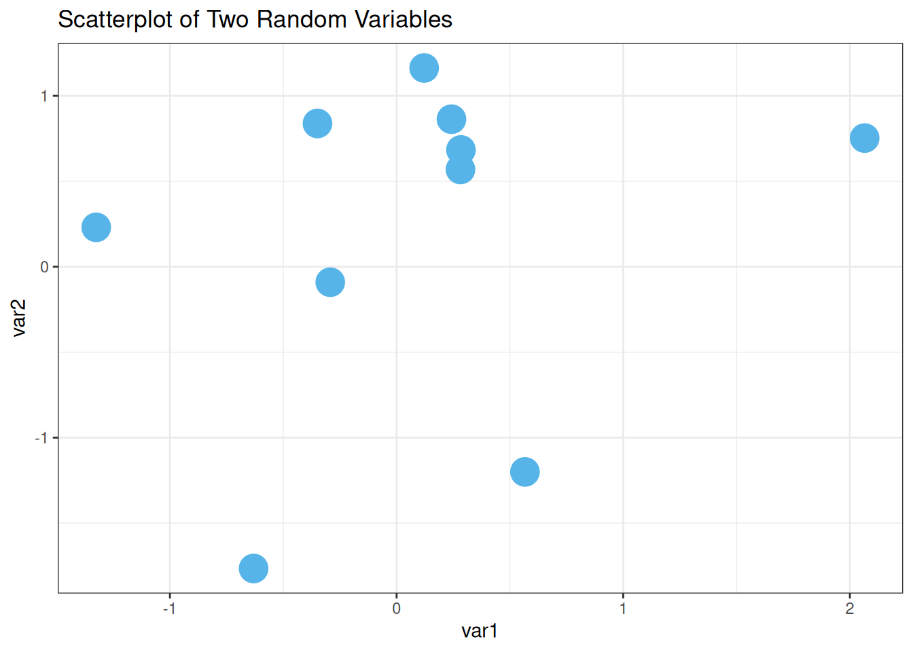
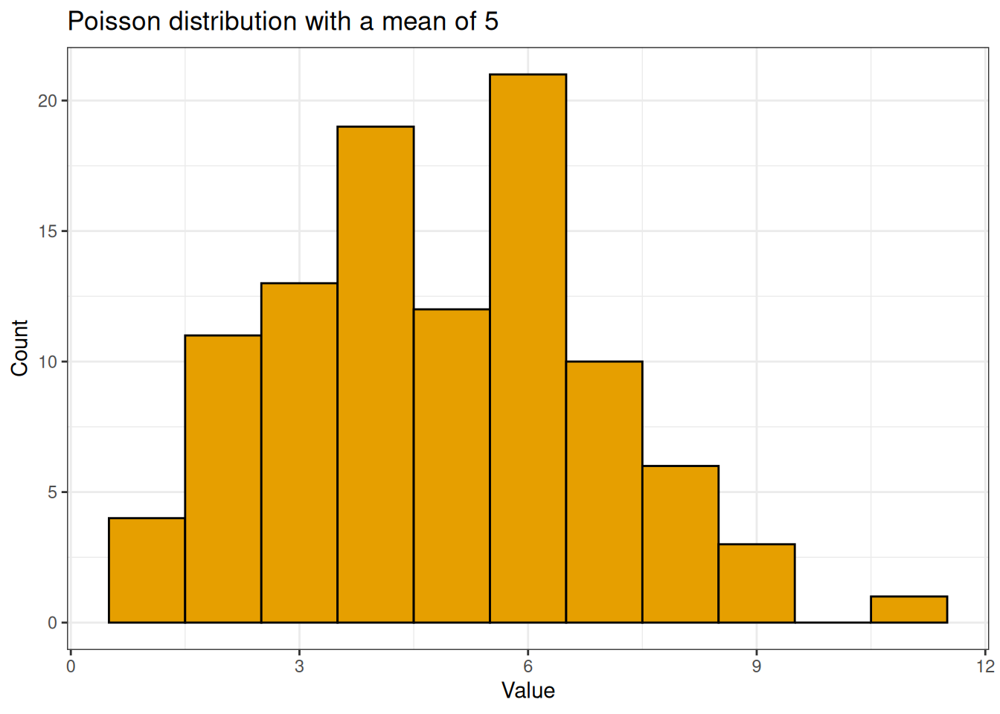
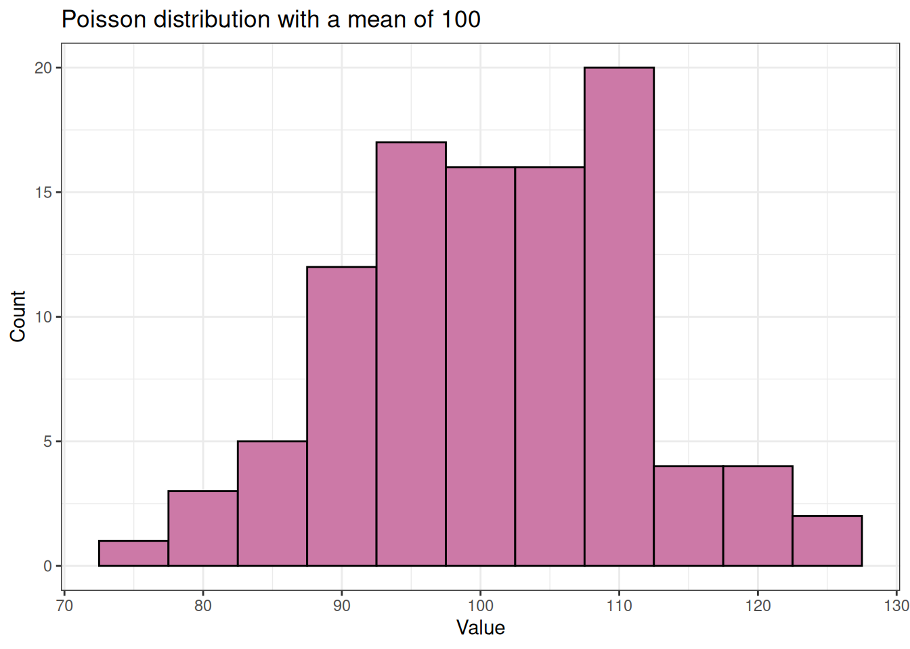

# Getting Started with Data Simulations in R {#data_simulations}


This module introduces the basics of data simulation using R.  We won't cover every aspect of data simulation, but we'll delve into some core functions. Drawing inspiration from [Ariel Muldoon](https://github.com/aosmith16)'s [tutorial](https://github.com/aosmith16/simulation-helper-functions) on simulation helper functions, this module presents practical methods for creating simulated datasets.

Our focus will be on functions from the base R package, which is included with every installation of R.  These functions are easy to use and are great for getting started with simulations. We will cover various approaches to generating both quantitative and categorical variables, enhancing your data science toolkit.


## Learning Goals

By the end of these notes, you will be able to:

1. Generate quantitative variables using functions such as `rnorm()`, `runif()`, and `rpois()`.
2. Generate categorical variables like group names using `rep()`, and explore various methods to replicate patterns.
3. Integrate the creation of datasets that include both quantitative and categorical variables.
4. Use `replicate()` to perform the data simulation process multiple times.

## Generating Variables

### Generating Random Numbers

One method for generating numeric data in R involves using the "random deviate" functions to pull random numbers from statistical distributions. These functions, which all begin with the letter 'r', are designed to generate random numbers from specific statistical distributions. Here are some commonly used random deviate functions in R:

- **Normal Distribution** (`rnorm()`): Used for generating data that follows a Gaussian distribution.
- **Uniform Distribution** (`runif()`): Ideal for creating evenly distributed numbers over a specified range.
- **Poisson Distribution** (`rpois()`): Useful for modeling count-based data, such as the number of events happening within a fixed period.

These functions are part of the core **stats** package. The syntax for these functions typically requires specifying the number of random numbers to generate (`n`) and defining the parameters for the distribution you want to draw from. 

For example, to generate random values from these distributions, you would use:


``` r
# Generating five random normal values
rnorm(5, mean = 0, sd = 1)
#> [1]  0.569 -0.808 -0.441 -0.640  0.322

# Generating five uniform values between 0 and 1
runif(5, min = 0, max = 1)
#> [1] 0.1656 0.7999 0.5566 0.0955 0.5456

# Generating five Poisson-distributed values with a mean of 3
rpois(5, lambda = 3)
#> [1] 1 0 2 2 2
```

The `r` functions for a chosen distribution all work similarly. Other distributions from the `stats` package. binomial, F, log-normal, beta, exponential, and gamma distributions. More exotic distributions are available through additional packages. 


### Deep Dive into the Normal Distribution (`rnorm()`)

`rnorm()` is frequently used in statistical simulations to generate random numbers that follow a normal (Gaussian) distribution. The function `rnorm()` requires three main arguments:

- `n`: the number of observations to generate.
- `mean`: the mean of the normal distribution.
- `sd`: the standard deviation of the distribution. (note that `sd` is the *standard deviation*, not the variance)

Generating five random numbers from a $Normal(0, 1)$ (aka the *standard* normal) distribution can be done as follows:


``` r
rnorm(n = 5, mean = 0, sd = 1)
#> [1]  0.6600  0.2000 -1.0319  0.0857  0.9072
```

Notice how I have written out the arguments explicitly. If I were coding "lazily", I'd likely have written something like this...


``` r
rnorm(5) # This uses the default values for mean and sd
#> [1] -0.7999 -0.6341 -0.4730 -0.0553  0.5047
```

Lazy, concise, code can look pretty mysterious to someone reading my code (or to my future self reading my code). Because I used the default values for `mean` and `sd`, it's not clear exactly what distribution I drew the numbers from. When future me revisits this code, she will have to remember what the defaults are. Is that a realistic request? Maybe, but future me has to remember a lot of things, so as a kindness to her, its worthwhile to make those arguments explicit. That way future me does not have to remember what the defaults are and she can quickly work her way through the code. 


In other words, specify the arguments explicitly, even if you are using default values. This practice makes your code self-documenting, meaning that anyone reading it can understand at a glance which distribution the data comes from, without needing to remember the default settings of the function.

Here's an even more readable version for generating five random numbers from a standard normal distribution, with explicit argument names:


``` r
rnorm(
  n = 5,
  mean = 0,
  sd = 1
)
#> [1]  0.4927  1.1599 -0.0422 -0.4339  0.4725
```

When I'm writing code for a project that I know will be shared with others, I always (try to) write out the arguments. When I'm writing code for myself, I'm more likely to use the defaults. It's a balance between being kind to future me and being efficient in the moment.


#### Setting the random seed for reproducible random numbers

As you've likely noticed, each time we run this code, we've gotten different numbers. To ensure reproducibility, we need to *set the seed* with `set.seed()`. Reproducibility means that whenwhen running the same code can be desirable

Setting the seed will ensure that others can replicate your results. This ability to get the same result when running the same code is also helpful when making example datasets to demonstrate coding issues or when asking questions on forums like Stack Overflow. I also set seeds when I'm creating functions to ensure they work correctly. However, in most simulations, setting the seed isn't necessary (and may be counter productive).

By setting the seed before running `rnorm()`, we can reproduce the values we generate.


``` r
set.seed(16)
rnorm(
  n = 5,
  mean = 0,
  sd = 1
)
#> [1]  0.476 -0.125  1.096 -1.444  1.148
```

If we reset the seed to the same number and run the code again, we get the same values.


``` r
set.seed(16)
rnorm(
  n = 5,
  mean = 0,
  sd = 1
)
#> [1]  0.476 -0.125  1.096 -1.444  1.148
```

#### Change parameters in `rnorm()`

To get a quick set of numbers, it's easy to use the default parameter values in `rnorm()`. However, we can certainly change these values. For example, when exploring the long-run behavior of variance estimated from linear models, varying the standard deviation is useful.

The `sd` argument specifies the *standard deviation* of the normal distribution. So drawing from a $Normal(0, 4)$ can be done by setting `sd` to 2.


``` r
rnorm(
  n = 5,
  mean = 0,
  sd = 2
)
#> [1] -0.937 -2.012  0.127  2.050  1.146
```

I've seen other people make changes the mean and standard deviation to create variables that are within a specific range. For example, if the mean is large and the standard deviation is small in relation to the mean, we can generate strictly positive numbers. (I usually use runif() for this, which we'll see below.)


``` r
rnorm(
  n = 5,
  mean = 50,
  sd = 20
)
#> [1] 86.9 52.2 35.1 83.2 64.4
```

#### Using vectors of values for the parameter arguments

We can also use vectors for arguments! Using a vector allows us to pull random numbers from a normal distribution with distinct parameters. For example, simulating data with different group means but the same variance can be useful, especially when creating data that we'd use for an ANOVA.


I'll keep the standard deviation at 1 but will draw data from three distributions centered at three locations: 0, 5, and 20. I make 10 total draws by setting `n` to 10.

Observe the repeating pattern: the function iteratively draws one value from each distribution until the total number requested is reached. This approach can lead to an imbalance in the sample size per distribution.


``` r
rnorm(
  n = 10,
  mean = c(0, 5, 20),
  sd = 1
)
#>  [1] -1.663  5.576 20.473 -0.543  6.128 18.352 -0.314  4.817 21.470 -0.866
```

We can also pass a vector to `sd`, allowing both the means and standard deviations to vary among the three distributions.


``` r
rnorm(
  n = 10,
  mean = c(0, 5, 20),
  sd = c(1, 5, 20)
)
#>  [1]  1.527 10.271 40.601  0.840  6.085  6.549  0.133  4.645  1.146 -1.022
```

Things are different for the `n` argument. If a vector is passed to `n`, the *length* of that vector is taken to be the number required (see the `Arguments` section of the documentation for details).


In the example below, we only get 3 values because the vector for `n` is length 3.


``` r
rnorm(
  n = c(2, 10, 10),
  mean = c(0, 5, 20),
  sd = c(1, 5, 20)
)
#> [1]  0.281  7.724 22.617
```

### Example of using the simulated numbers from `rnorm()`

Up to this point, we've printed the results of each simulation. In practice, we'd save our vectors as objects in R to use them for some future task. 

For example, we might simulate two unrelated variables to see how correlated they appear. This fun exercise can show how variables can seem related by chance, especially with small sample sizes. (See [Spurious correlations](https://www.tylervigen.com/spurious-correlations) for numerous fun empirical examples of this phenomenon. Or [Spurious scholar](https://tylervigen.com/spurious-scholar) for some fun academic examples.

Let's generate two quantitative vectors of length 10, named `x` and `y`, and plot the results. I'm using the default `mean` and `sd`.


``` r
x <- rnorm(
  n = 10,
  mean = 0,
  sd = 1
)

y <- rnorm(
  n = 10,
  mean = 0,
  sd = 1
)

data.frame(var1 = x, var2 = y) %>%
  ggplot(
    aes(
      x = var1,
      y = var2
    )
  ) +
  geom_point(color = "#56B4E9", size = 7) +
  theme_bw() +
  labs(title = "Scatterplot of Two Random Variables")
```



### `runif()` pulls from the uniform distribution

Pulling random numbers from other distributions is very similar to using `rnorm()`, so we'll go through them quickly.

I've started using `runif()` regularly, especially when I want to generate strictly positive continuous numbers. The uniform distribution is continuous, with numbers uniformly distributed between some minimum and maximum.

By default, `runif()` pulls random numbers between 0 and 1. The first argument,like all of these `r` functions, is the number of deviates to generate:

> runif(n, min = 0, max = 1)

Let's generate 5 numbers between 0 and 1.


``` r
runif(
  n = 5,
  min = 0,
  max = 1
)
#> [1] 0.999 0.943 0.250 0.648 0.113
```

What if we want to generate 5 numbers between 50 and 100?  We change the parameter values.


``` r
runif(
  n = 5,
  min = 50, max = 100
)
#> [1] 81.6 66.9 82.7 64.3 54.2
```

### Example of using the simulated numbers from `runif()`

`runif()` is handy for demonstrating the effect of the relative size of variable values on the size of the estimated coefficient in a regression.  For example, the size of the coefficient measured in kilometers is smaller than if that variable was converted into meters.

Let's generate data with the response variable (`y`) from a standard normal distribution and an explanatory variable with values between 1 and 2. The two variables are unrelated.


Writing out argument names for clarity, we generate the data as follows:


``` r
set.seed(16)
y <- rnorm(n = 100, mean = 0, sd = 1)
x1 <- runif(n = 100, min = 1, max = 2)
head(x1)
#> [1] 1.96 1.08 1.71 1.33 2.00 1.45
```


Now, simulate a second explanatory variable with values between 200 and 300. This variable is also unrelated to the other two.


``` r
x2 <- runif(n = 100, min = 200, max = 300)
head(x2)
#> [1] 220 263 210 245 265 257
```

We can fit a linear regression model via `lm()`. 


``` r
lm(y ~ x1 + x2)
#> 
#> Call:
#> lm(formula = y ~ x1 + x2)
#> 
#> Coefficients:
#> (Intercept)           x1           x2  
#>     0.38089      0.10494     -0.00191
```

The coefficient for the second variable, with a larger relative size, is generally going to be smaller than the first since the change in `y` for a "1-unit increase" in `x` depends on the units of `x`. This is a good example of how the scale of the variables can affect the size of the estimated coefficients in a regression model.

### Discrete counts with `rpois()`
Let's look at one last function for generating random numbers, `rpois()`, which generates discrete integers (including 0) from a Poisson distribution. The Poisson distribution is often used to model count data, such as the number of robo phone calls received in an hour or the number of fish caught in a day.

I use `rpois()` for generating counts to explore generalized linear models. I've also found this function useful in gaining a better understanding of the shape of Poisson distributions with different means.

The Poisson distribution is a single parameter distribution. The function looks like this:

> rpois(n, lambda)

The single parameter, `lambda`, is the mean. It has no default setting, so it must always be defined by the user.

Let's generate five values from a Poisson distribution with a mean of 2.5. Note that the *mean* of the Poisson distribution can be any non-negative value (i.e., it doesn't have to be an integer) even though the observed values will be discrete integers.


``` r
rpois(
  n = 5,
  lambda = 2.5
)
#> [1] 2 1 4 1 2
```

### Example of using the simulated numbers from `rpois()`
Let's explore the Poisson distribution a little more, seeing how the distribution looks when changing the mean. This helps understand the distribution better, including why it so often does a poor job modeling ecological count data.

We'll draw 100 values from a Poisson distribution with a mean of 5. We'll name this vector `y` and look at a summary of those values.


``` r
y <- rpois(100, lambda = 5)
```

The values we simulated fall between 1 and 14.


``` r
summary(y)
#>    Min. 1st Qu.  Median    Mean 3rd Qu.    Max. 
#>    1.00    3.00    5.00    4.83    6.00   11.00
```

There is a mild right skew when we draw a histogram of the values.


``` r
palette_OkabeIto <- c("#E69F00", "#56B4E9", "#009E73", "#F0E442", "#0072B2", "#D55E00", "#CC79A7", "#999999")

data.frame(y) %>%
  ggplot(aes(x = y)) +
  geom_histogram(binwidth = 1, color = "black", fill = "#E69F00") +
  labs(
    title = "Poisson distribution with a mean of 5",
    x = "Value", y = "Count"
  ) +
  theme_bw()
```



Let's do the same for a Poisson distribution with a mean of 100. The range of values is still pretty narrow; there are no values even remotely close to 0.


``` r
y <- rpois(100, lambda = 100)
summary(y)
#>    Min. 1st Qu.  Median    Mean 3rd Qu.    Max. 
#>    76.0    94.8   102.0   101.3   108.0   124.0
```

The distribution is more symmetric compared to the distribution with the smaller mean.


``` r
data.frame(y) %>%
  ggplot(aes(x = y)) +
  geom_histogram(binwidth = 5, color = "black", fill = "#CC79A7") +
  labs(title = "Poisson distribution with a mean of 100", x = "Value", y = "Count") +
  theme_bw()
```




An alternative to the Poisson distribution for discrete integers is the negative binomial distribution. The **MASS** package has a function called `rnegbin()` for generating random numbers from the negative binomial distribution.


## Generate character vectors with `rep()`

Quantitative variables are great, but in simulations, we often need categorical variables, as well. Categorical variables are useful for simulations that involve groups or treatments.

The `rep()` function in R simplifies creating these kinds of variables by *replicating elements of vectors or lists*. This functionality is particularly useful to avoid manually writing out an entire vector, making it easier to construct large datasets.

### Using `letters` and `LETTERS`

The first argument of `rep()` is the vector to be repeated.  One option is to write out the character vector you want to repeat.  You can also get a simple character vector through the use of `letters` or `LETTERS`.  These are *built in constants* in R.  `letters` is the 26 lowercase letters of the Roman alphabet and `LETTERS` is the 26 uppercase letters.


You can extract letters using brackets (`[`). These built-in constants are convenient for making basic categorical vectors when the form of the categories doesn't matter. Typing out the word and brackets is often more straightforward than creating a vector of characters with quotes.


Here are the first two `letters`.


``` r
letters[1:2]
#> [1] "a" "b"
```

And the last 17 `LETTERS`.


``` r
LETTERS[10:26]
#>  [1] "J" "K" "L" "M" "N" "O" "P" "Q" "R" "S" "T" "U" "V" "W" "X" "Y" "Z"
```

### Repeat each element of a vector with `each`

There are three arguments to repeat the values in a vector in `rep()` with different patterns: `each`, `times`, and `length.out`.  These approaches can be used individually or in combination.

With `each`, we repeat each unique character in the vector the defined number of times.  The replication is done "elementwise", so the repeats of each unique character are all in a row.  

Let's repeat two characters three times each.  The resulting vector is 6 observations long. This is an example of how you can quickly make a grouping variable for simulating data to be used in a two-sample analysis.  


``` r
rep(letters[1:2], each = 3)
#> [1] "a" "a" "a" "b" "b" "b"
```

### Repeat a whole vector with the `times` argument

The `times` argument can be used when we want to repeat the whole vector rather than repeating it elementwise.

We'll make a two-group variable again, but this time we'll change the repeating pattern of the values in the variable.


``` r
rep(letters[1:2], times = 3)
#> [1] "a" "b" "a" "b" "a" "b"
```

### Set the output vector length with the `length.out` argument

The `length.out` argument has `rep()` repeat the whole vector.  However, it repeats the vector only until the defined length is reached.  Using `length.out` is another way to get unbalanced groups.  

Rather than defining the number of repeats like we did with `each` and `times` we define the length of the output vector.  

Here we'll make a two-group variable of length 5.  This means the second group will have one less value than the first.


``` r
rep(letters[1:2], length.out = 5)
#> [1] "a" "b" "a" "b" "a"
```

### Repeat each element a different number of `times`

Unlike `each` and `length.out`, we can use `times` with a vector of values.  This allows us to repeat each element of the character vector a different number of times.  This is one way to simulate unbalanced groups.  Using `times` with a vector repeats each element like `each` does, which can make it harder to remember which argument does what.

Let's repeat the first element twice and the second four times.


``` r
rep(letters[1:2], times = c(2, 4))
#> [1] "a" "a" "b" "b" "b" "b"
```

### Combining `each` with `times`

As your simulation situation get more complicated, you may need more complicated patterns for your categorical variable.  The `each` argument can be combined with `times` to first repeat each value elementwise (via `each`) and then repeat that whole pattern (via `times`).

When using `times` this way it will only take a single value and not a vector.

Let's repeat each value twice, 3 times.


``` r
rep(letters[1:2], each = 2, times = 3)
#>  [1] "a" "a" "b" "b" "a" "a" "b" "b" "a" "a" "b" "b"
```

### Combining `each` with `length.out`

Similarly we can use `each` with `length.out`.  This can lead to some imbalance.  

Here we'll repeat the two values twice each but with a total final vector length of 7.


``` r
rep(letters[1:2], each = 2, length.out = 7)
#> [1] "a" "a" "b" "b" "a" "a" "b"
```

Note you can't use `length.out` and `times` together (if you try, `length.out` will be given priority and `times` ignored).

## Creating datasets with quantitative and categorical variables

We now have some tools for creating quantitative data as well as categorical.  Which means it's time to make some datasets!  We'll create several simple ones to get the general idea.

### Simulate data with no differences among two groups

Let's start by simulating data for a simple two-sample analysis with no difference between the groups. We'll create a dataset with six observations—three for each group.

We will use the functions discussed earlier to create this dataset and store the results in a data frame for organization and ease of access. Unlike some beginners who might use cbind() for this purpose, it's more efficient and standard to use data.frame() directly:

We'll be using the tools we reviewed above but will now name the output and combine them into a data.frame.  This last step isn't always necessary, but does help keep things organized in certain types of simulations.

First, we'll make separate vectors for the continuous and categorical data and then bind them together via `data.frame()`.

Notice there is no need to use `cbind()` here, which is commonly done by R beginners (I know I did!).  Instead we can use `data.frame()` directly.


``` r
group <- rep(letters[1:2], each = 3)
response <- rnorm(n = 6, mean = 0, sd = 1)
data.frame(
  group,
  response
)
#>   group response
#> 1     a    0.493
#> 2     a    0.523
#> 3     a    1.237
#> 4     b    0.356
#> 5     b    0.575
#> 6     b   -0.422
```

Some people like to define the vectors and the data frame simultaneously to minimize clutter in the R environment. Here is how you can do it all at once:


``` r
data.frame(
  group = rep(letters[1:2], each = 3),
  response = rnorm(n = 6, mean = 0, sd = 1)
)
#>   group response
#> 1     a    0.402
#> 2     a    0.959
#> 3     a   -1.876
#> 4     b   -0.212
#> 5     b    1.437
#> 6     b    0.386
```

(Personally, I like having longer code that is easier for future Mason to read.  But it's up to you!)


Now, let’s add another layer to our dataset by introducing a second categorical variable. Assume we have two factors, not one, and that these factors are 'crossed'—meaning every possible combination of the two factors appears at least once in the dataset.

For the second factor, which we'll call `factor`, let's give it the values "C", "D", and "E":


``` r
LETTERS[3:5]
#> [1] "C" "D" "E"
```

We need to repeat the values in a way that every combination of `group` and `factor` is present in the dataset at one time.

Remember the `group` factor is repeated elementwise.


``` r
rep(letters[1:2], each = 3)
#> [1] "a" "a" "a" "b" "b" "b"
```

We need to repeat the three values twice.  But what argument do we use in `rep()` to do so?

```r
rep(LETTERS[3:5], ?)
```

Does `each` work?


``` r
rep(LETTERS[3:5], each = 2)
#> [1] "C" "C" "D" "D" "E" "E"
```

No, if we use `each` then each element is repeated twice and some of the combinations of `group` and `factor` are missing.

This is a job for the `times` or `length.out` arguments, so the whole vector is repeated.  We can repeat the whole vector twice using `times`, or use `length.out = 6`.  I do the former.  

In the result below we can see every combination of the two factors is present once.


``` r
data.frame(
  group = rep(letters[1:2], each = 3),
  factor = rep(LETTERS[3:5], times = 2),
  response = rnorm(n = 6, mean = 0, sd = 1)
)
#>   group factor response
#> 1     a      C    0.426
#> 2     a      D    0.290
#> 3     a      E   -0.364
#> 4     b      C    1.978
#> 5     b      D    1.087
#> 6     b      E   -0.587
```

### Simulate data with a difference among groups

The dataset above is one with "no difference" among groups.  What if the means were different between groups?  Let's make two groups of three observations where the mean of one group is 5 and the other is 10.  The two groups have a shared variance (and so standard deviation) of 1.

Remembering how `rnorm()` works with a vector of means is key here.  The function draws iteratively from each distribution.  


``` r
response <- rnorm(n = 6, mean = c(5, 10), sd = 1)
response
#> [1]  4.41 12.48  4.74 10.27  5.37 10.02
```

How do we get the `group` pattern correct?

```r
group <- rep(letters[1:2], ?)
```

We need to repeat the whole vector three times instead of elementwise.

To get the groups in the correct order we need to use `times` or `length.out` in `rep()`.  With `length.out` we define the output length of the vector, which is 6.  Alternatively we could use `times = 3` to repeat the whole vector 3 times.


``` r
group <- rep(letters[1:2], length.out = 6)
group
#> [1] "a" "b" "a" "b" "a" "b"
```

These can then be combined into a data.frame.  Working out this process is another reason why sometimes we build each vector separately prior to combining together.


``` r
data.frame(
  group,
  response
)
#>   group response
#> 1     a     4.41
#> 2     b    12.48
#> 3     a     4.74
#> 4     b    10.27
#> 5     a     5.37
#> 6     b    10.02
```

### Multiple quantitative variables with groups

For our last dataset we'll have two groups, with 10 observations per group.


``` r
rep(LETTERS[3:4], each = 10)
#>  [1] "C" "C" "C" "C" "C" "C" "C" "C" "C" "C" "D" "D" "D" "D" "D" "D" "D" "D" "D"
#> [20] "D"
```

Let's make a dataset that has two quantitative variables, unrelated to both each other and the groups.  One variable ranges from 10 and 15 and one from 100 and 150.

How many observations should we draw from each uniform distribution?

```r
runif(n = ?, min = 10, max = 15)
```

We had 2 groups with 10 observations each and 2*10 = 20.  So we need to use `n = 20` in `runif()`.

Here is the dataset made in a single step.


``` r
data.frame(
  group = rep(LETTERS[3:4], each = 10),
  x = runif(n = 20, min = 10, max = 15),
  y = runif(n = 20, min = 100, max = 150)
)
#>    group    x   y
#> 1      C 13.2 127
#> 2      C 13.9 137
#> 3      C 12.7 135
#> 4      C 14.3 123
#> 5      C 11.7 118
#> 6      C 14.6 108
#> 7      C 12.8 142
#> 8      C 13.5 104
#> 9      C 13.9 107
#> 10     C 12.2 145
#> 11     D 12.0 117
#> 12     D 13.7 121
#> 13     D 14.8 145
#> 14     D 11.7 120
#> 15     D 13.3 140
#> 16     D 10.8 107
#> 17     D 14.0 148
#> 18     D 14.9 113
#> 19     D 13.5 105
#> 20     D 14.4 120
```

What happens if we get this wrong?  If we're lucky we get an error.


``` r
data.frame(
  group = rep(LETTERS[3:4], each = 10),
  x = runif(n = 15, min = 10, max = 15),
  y = runif(n = 15, min = 100, max = 150)
)
#> Error in `data.frame()`:
#> ! arguments imply differing number of rows: 20, 15
```

But if we get things wrong and the number we use goes into the number we need evenly, R will *recycle* the vector to the end of the `data.frame()`.  

This mistake is hard to catch.  If you look carefully through the output below, you can see that the continuous variables start to repeat on line 10.


``` r
data.frame(
  group = rep(LETTERS[3:4], each = 10),
  x = runif(n = 10, min = 10, max = 15),
  y = runif(n = 10, min = 100, max = 150)
)
#>    group    x   y
#> 1      C 12.3 108
#> 2      C 13.8 115
#> 3      C 12.4 105
#> 4      C 10.1 125
#> 5      C 10.8 130
#> 6      C 11.0 129
#> 7      C 11.5 149
#> 8      C 13.5 139
#> 9      C 11.6 120
#> 10     C 12.9 120
#> 11     D 12.3 108
#> 12     D 13.8 115
#> 13     D 12.4 105
#> 14     D 10.1 125
#> 15     D 10.8 130
#> 16     D 11.0 129
#> 17     D 11.5 149
#> 18     D 13.5 139
#> 19     D 11.6 120
#> 20     D 12.9 120
```

## Repeatedly simulate data with `replicate()`

The `replicate()` function is a real workhorse when making repeated simulations.  It is a member of the *apply* family in R, and is specifically made (per the documentation) for the *repeated evaluation of an expression (which will usually involve random number generation)*.  

We want to repeatedly simulate data that involves random number generation, so that sounds like a useful tool.

The `replicate()` function takes three arguments:

* `n`, which is the number of replications to perform.  This is to set the number of repeated runs we want.  
* `expr`, the expression that should be run repeatedly.  This is often a function.  
* `simplify`, which controls the type of output the results of `expr` are saved into.  Use `simplify = FALSE` to get output saved into a list instead of in an array.  

### Simple example of `replicate()`

Let's say we want to simulate some values from a normal distribution, which we can do using the `rnorm()` function as above.  But now instead of drawing some number of values from a distribution one time we want to do it many times.  This could be something we'd do when demonstrating the central limit theorem, for example.

Doing the random number generation many times is where `replicate()` comes in.  It allows us to run the function in `expr` exactly `n` times.  

Here I'll generate 5 values from a standard normal distribution three times.  Notice the addition of `simplify = FALSE` to get a list as output.

The output below is a list of three vectors.  Each vector is from a unique run of the function, so contains  five random numbers drawn from the normal distribution with a mean of 0 and standard deviation of 1.


``` r
set.seed(16)
replicate(
  n = 3,
  expr = rnorm(n = 5, mean = 0, sd = 1),
  simplify = FALSE
)
#> [[1]]
#> [1]  0.476 -0.125  1.096 -1.444  1.148
#> 
#> [[2]]
#> [1] -0.4684 -1.0060  0.0636  1.0250  0.5731
#> 
#> [[3]]
#> [1]  1.847  0.112 -0.746  1.658  0.722
```

Note if I don't use `simplify = FALSE` I will get a matrix of values instead of a list.  Each column in the matrix is the output from one run of the function.  

In this case there will be three columns in the output, one for each run, and 5 rows.  This can be a useful output type for some simulations.  I focus on list output throughout the rest of this post only because that's what I have been using recently for simulations.


``` r
set.seed(16)
replicate(
  n = 3,
  expr = rnorm(n = 5, mean = 0, sd = 1)
)
#>        [,1]    [,2]   [,3]
#> [1,]  0.476 -0.4684  1.847
#> [2,] -0.125 -1.0060  0.112
#> [3,]  1.096  0.0636 -0.746
#> [4,] -1.444  1.0250  1.658
#> [5,]  1.148  0.5731  0.722
```

### An equivalent `for()` loop example

A `for()` loop can be used in place of `replicate()` for simulations.  With time and practice I've found `replicate()` to be much more convenient in terms of writing the code.  However, in my experience some folks find `for()` loops intuitive when they are starting out in R.  I think it's because `for()` loops are more explicit on the looping process: the user can see the values that `i` takes and the output for each `i` iteration is saved into the output object because the code is written out explicitly.

In my example I'll save the output of each iteration of the loop into a list called `list1`.  I initialize this as an empty list prior to starting the loop.  To match what I did with `replicate()` I do three iterations of the loop (`i in 1:3`), drawing 5 values via `rnorm()` each time.

The result is identical to my `replicate()` code above.  It took a little more code to do it but the process is very clear since it is explicitly written out.


``` r
set.seed(16)
list1 <- list() # Make an empty list to save output in
for (i in 1:3) { # Indicate number of iterations with "i"
  list1[[i]] <- rnorm(n = 5, mean = 0, sd = 1) # Save output in list for each iteration
}
list1
#> [[1]]
#> [1]  0.476 -0.125  1.096 -1.444  1.148
#> 
#> [[2]]
#> [1] -0.4684 -1.0060  0.0636  1.0250  0.5731
#> 
#> [[3]]
#> [1]  1.847  0.112 -0.746  1.658  0.722
```

### Using `replicate()` to repeatedly make a dataset

Earlier we were making datasets with random numbers and some grouping variables.  Our code looked like


``` r
data.frame(
  group = rep(letters[1:2], each = 3),
  response = rnorm(n = 6, mean = 0, sd = 1)
)
#>   group response
#> 1     a   -1.663
#> 2     a    0.576
#> 3     a    0.473
#> 4     b   -0.543
#> 5     b    1.128
#> 6     b   -1.648
```

We could put this process as the `expr` argument in `replicate()` to get many simulated datasets.  I would do something like this if I wanted to compare the long-run performance of two different statistical tools using the exact same random datasets.  

I'll replicate things 3 times again to easily see the output.  I still use `simplify = FALSE` to get things into a list.


``` r
simlist <- replicate(
  n = 3,
  expr = data.frame(
    group = rep(letters[1:2], each = 3),
    response = rnorm(n = 6, mean = 0, sd = 1)
  ),
  simplify = FALSE
)
```

We can see this result is a list of three data.frames.


``` r
str(simlist)
#> List of 3
#>  $ :'data.frame':	6 obs. of  2 variables:
#>   ..$ group   : chr [1:6] "a" "a" "a" "b" ...
#>   ..$ response: num [1:6] -0.314 -0.183 1.47 -0.866 1.527 ...
#>  $ :'data.frame':	6 obs. of  2 variables:
#>   ..$ group   : chr [1:6] "a" "a" "a" "b" ...
#>   ..$ response: num [1:6] 1.03 0.84 0.217 -0.673 0.133 ...
#>  $ :'data.frame':	6 obs. of  2 variables:
#>   ..$ group   : chr [1:6] "a" "a" "a" "b" ...
#>   ..$ response: num [1:6] -0.943 -1.022 0.281 0.545 0.131 ...
```

Here is the first one.


``` r
simlist[[1]]
#>   group response
#> 1     a   -0.314
#> 2     a   -0.183
#> 3     a    1.470
#> 4     b   -0.866
#> 5     b    1.527
#> 6     b    1.054
```

## What's the next step?

I'm ending here, but there's still more to learn about simulations.  For a simulation to explore long-run behavior, some process is going to be repeated many times.  We did this via `replicate()`.  The next step would be to extract whatever results are of interest.  This latter process is often going to involve some sort of looping.  

By saving our generated variables or data.frames into a list we've made it so we can loop via list looping functions like `lapply()` or `purrr::map()`.  The family of *map* functions are newer and have a lot of convenient output types that make them pretty useful.  
Happy simulating!


<!--DS4P Links-->
[course_web]: https://datascience4psych.github.io/DataScience4Psych
[course_git]: https://github.com/DataScience4Psych/DataScience4Psych
[course_repo]: https://github.com/DataScience4Psych
[course_slides]: https://github.com/DataScience4Psych/slides
[course_syllabus]: https://smasongarrison.github.io/syllabi/ 
<!-- https://smasongarrison.github.io/syllabi/data-science.html -->
[syllabi]: https://smasongarrison.github.io/syllabi
[pl_00]: https://www.youtube.com/playlist?list=PLKrrdtYgOUYaEAnJX20Ryy4OSie375rVY
[pl_01]: https://www.youtube.com/playlist?list=PLKrrdtYgOUYao_7t5ycK4KDXNKaY-ECup
[pl_02]: https://www.youtube.com/playlist?list=PLKrrdtYgOUYZmr_T3PnuxjVIlj0C0kUNI
[pl_03]: https://www.youtube.com/playlist?list=PLKrrdtYgOUYaHmjzdRvfg0yhOIYQnfjwE
[pl_04]: https://www.youtube.com/playlist?list=PLKrrdtYgOUYYWFcel6_vp8__RUKLxhX4y
[pl_05]: https://www.youtube.com/playlist?list=PLKrrdtYgOUYYMIguiV1F8RagMYibTY4iW
[pl_06]: https://www.youtube.com/playlist?list=PLKrrdtYgOUYYV_KDod3Mk9-RmtFXii9Dv
[pl_07]: https://www.youtube.com/watch?list=PLKrrdtYgOUYZxvEvQ8-PcWrOY_dwY_ETI
[pl_08]: https://www.youtube.com/playlist?list=PLKrrdtYgOUYZgOzYB_dmauw55M7jXvsdo
[pl_09]: https://www.youtube.com/playlist?list=PLKrrdtYgOUYbaiTmldRY2ddsLrHp3z6yO
[pl_10]: https://www.youtube.com/playlist?list=PLKrrdtYgOUYbPw5iYzYEzoOKa7mJKNIhq
[pl_11]: https://www.youtube.com/playlist?list=PLKrrdtYgOUYZ-u6LzBbanrNFoeLHKaLL6
[pl_12]: https://www.youtube.com/playlist?list=PLKrrdtYgOUYbwRS-9Htmb80_t1NG-021e
[pl_13]: https://www.youtube.com/playlist?list=PLKrrdtYgOUYbWGmSnbLIYwdLOnGm6une6
[pl_14]: https://www.youtube.com/playlist?list=PLKrrdtYgOUYbWGmSnbLIYwdLOnGm6une6
[pl_15]: https://www.youtube.com/playlist?list=PLKrrdtYgOUYa5MoYrV8EsWQ5jIr5ZYMpM
[pl_all]: https://www.youtube.com/playlist?list=PLKrrdtYgOUYZomNqf-1dtCDW94ySdLv-9


<!--AE Links-->
[ae01a_unvotes]: https://github.com/DataScience4Psych/ae01a_unvotes
[ae01b_covid]: https://github.com/DataScience4Psych/ae01b_covid
[ae02_bechdel]: https://github.com/DataScience4Psych/ae-02-bechdel-rmarkdown
[ae03_starwars]: https://github.com/DataScience4Psych/ae-03-starwars-dataviz
[ae08_imdb]: https://github.com/DataScience4Psych/ae-08-imdb-webscraping

<!-- Lab Links-->

[lab01_hello]: https://github.com/DataScience4Psych/lab-01-hello-r
[lab02]: https://github.com/DataScience4Psych/lab-02-plastic-waste
[lab03]: https://github.com/DataScience4Psych/lab-03-nobel-laureates
[lab04]: https://github.com/DataScience4Psych/lab-04-viz-sp-data
[lab05]: https://github.com/DataScience4Psych/lab-05-wrangle-sp-data
[lab06]: https://github.com/DataScience4Psych/lab_06_sad_plots
[lab07]: https://github.com/DataScience4Psych/lab_07_betterviz
[lab08]: https://github.com/DataScience4Psych/lab-08-uoe-art
[lab09]: https://github.com/DataScience4Psych/lab-09-ethics-algorithmic-bias
[lab10]: https://github.com/DataScience4Psych/lab-10-slr-course-evals
[lab11]: https://github.com/DataScience4Psych/lab-11-mlr-course-evals
[lab12]: https://github.com/DataScience4Psych/lab-12-inference-smoking
[lab13]: https://github.com/DataScience4Psych/lab-13-simulating-mars

<!--Slides-->
[d01_welcome]: https://datascience4psych.github.io/slides/d01_welcome/d01_welcome.html
[d02_toolkit]: https://datascience4psych.github.io/slides/d02_toolkit/d02_toolkit.html
[d03_dataviz]: https://datascience4psych.github.io/slides/d03_dataviz/d03_dataviz.html
[d04_ggplot2]: https://datascience4psych.github.io/slides/d04_ggplot2/d04_ggplot2.html
[d05_viznum]: https://datascience4psych.github.io/slides/d05_viznum/d05_viznum.html
[d06_vizcat]: https://datascience4psych.github.io/slides/d06_vizcat/d06_vizcat.html
[d07_tidy]: https://datascience4psych.github.io/slides/d07_tidy/d07_tidy.html
[d08_grammar]: https://datascience4psych.github.io/slides/d08_grammar/d08_grammar.html
[d09_wrangle]: https://datascience4psych.github.io/slides/d09_wrangle/d09_wrangle.html
[d10_dfs]: https://datascience4psych.github.io/slides/d10_dfs/d10_dfs.html
[d11_types]: https://datascience4psych.github.io/slides/d11_types/d11_types.html
[d12_import]: https://datascience4psych.github.io/slides/d12_import/d12_import.html
[d13_goodviz]: https://datascience4psych.github.io/slides/d13_goodviz/d13_goodviz.html
[d13b_moreggplot]: https://datascience4psych.github.io/slides/d13_goodviz/d13b_moreggplot.html
[d14_confound]: https://datascience4psych.github.io/slides/d14_confound/d14_confound.html
[d15_goodtalk]: https://datascience4psych.github.io/slides/d15_goodtalk/d15_goodtalk.html
[d16_webscraping]: https://datascience4psych.github.io/slides/d16_webscraping/d16_webscraping.html
[d17_functions]: https://datascience4psych.github.io/slides/d17_functions/d17_functions.html
[d18_ethics]: https://datascience4psych.github.io/slides/d18_ethics/d18_ethics.html
[d19_bias]: https://datascience4psych.github.io/slides/d19_bias/d19_bias.html
[d20_language]: https://datascience4psych.github.io/slides/d20_language/d20_language.html
[d21_fitting]: https://datascience4psych.github.io/slides/d21_fitting/d21_fitting.html
[d22_nonlinear]: https://datascience4psych.github.io/slides/d22_nonlinear/d22_nonlinear.html
[d23_multiple]: https://datascience4psych.github.io/slides/d23_multiple/d23_multiple.html
[d24_overfitting]: https://datascience4psych.github.io/slides/d24_overfitting/d24_overfitting.html
[d25_crossvalidation]: https://datascience4psych.github.io/slides/d25_crossvalidation/d25_crossvalidation.html
[d26_quantify]: https://datascience4psych.github.io/slides/d26_quantify/d26_quantify.html
[d27_bootstrap]: https://datascience4psych.github.io/slides/d27_bootstrap/d27_bootstrap.html
[d28_interactive]: https://datascience4psych.github.io/slides/d28_interactive/d28_interactive.html
[d29_machine]: https://datascience4psych.github.io/slides/d29_machinelearning/d29_machine.html
[d30_simulations]: https://datascience4psych.github.io/slides/d30_simulations/d30_simulations.html
[d31_llmintro]: https://datascience4psych.github.io/slides/d31_llmintro/d31_llmintro.html
[d32_llmapplications]: https://datascience4psych.github.io/slides/d32_llmapplications/d32_llmapplications.html

<!--externals-->

[stat545]: https://stat545.com
[r4ds]: https://r4ds.had.co.nz
[cran]: https://cloud.r-project.org
