# LAB: R Projects and R Markdown {#lab16}

Welcome to the R Projects and R Markdown Lab! In this lab, you will build a complete, reproducible data analysis workflow from scratch using R Projects and R Markdown. Rather than just reading about these tools, you'll set up your own project, write markdown, embed code, and create interactive outputs. By the end, you'll have a polished, self-contained analysis document that you can share with collaborators or submit as coursework. This lab takes heavy inspiration from [Zachary M. Smith](https://github.com/zsmith27/rmarkdown_crash-course).

## Learning goals {.unnumbered}

- Set up an R Project and understand how it organizes your workspace and simplifies file paths.

- Create and knit an R Markdown document using multiple output formats (HTML, PDF, Word).

- Write effective markdown syntax including headings, lists, bold/italic text, hyperlinks, and images.

- Customize YAML headers to control document appearance (themes, table of contents, code folding).

- Use code chunks and inline code to integrate R output into your narrative.

- Build interactive outputs using packages like DT, plotly, and leaflet.


## Getting started and warming up {.unnumbered}

```{r setup, include=FALSE}
knitr::opts_chunk$set(echo = TRUE)
options(
  htmltools.dir.version = FALSE, # for blogdown
  show.signif.stars = FALSE, # for regression output
  digits = 2
)
```

### Packages {.unnumbered}

In this lab, we will work with the **tidyverse**, **DT**, **plotly**, and **leaflet** packages. We can install and load them with the following code:

```{r load-packages, message=FALSE, warning=FALSE}
if (!require("tidyverse")) install.packages("tidyverse")
library(tidyverse)

if (!require("DT")) install.packages("DT")
library(DT)

if (!require("plotly")) install.packages("plotly")
library(plotly)

if (!require("leaflet")) install.packages("leaflet")
library(leaflet)
```

## Exercises {.unnumbered}

### Part 1: Setting Up Your R Project {.unnumbered}

R Projects establish a self-contained environment for any data analysis project. They help in organizing your work and ensuring that file paths are consistent, making your work portable and easier to share with collaborators.


## Exercise 1: Create an R Project {.unnumbered}

In this exercise, you will create a new R Project from scratch. This project will serve as the home for all the work you do in this lab.

**1.1.** Create a new R Project in RStudio:

1. Click on the drop-down menu in the top right of your RStudio window and select "New Project."
2. Select "New Directory" within the "Create Project" window.
3. Select "New Project" within the "Project Type" window.
4. Enter a project name (e.g., "rmarkdown_lab") and choose a directory, then click "Create Project."

> **Tip**: Create a "projects" folder that will act as your parent directory for all R Projects. This will make it much easier to navigate to and between projects.

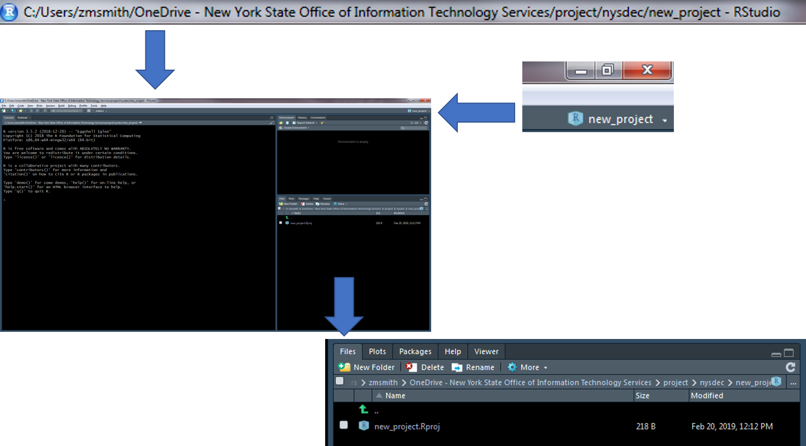

Once your project is open, notice how RStudio updates to reflect the project context. You can confirm which project is active by looking at the top-right corner of RStudio.

**1.2.** Inside your new project, create the following folder structure:

- A `data` folder for datasets
- An `output` folder for rendered documents

You can create folders using the "New Folder" button in the Files pane, or by running:

```{r exercise-1-2, eval=FALSE}
dir.create("data")
dir.create("output")
```

**1.3.** Navigate between projects by clicking the drop-down menu at the top right of RStudio and selecting a recent project. Open your new project again to confirm you're in the right workspace. What do you notice about the working directory when you switch projects?

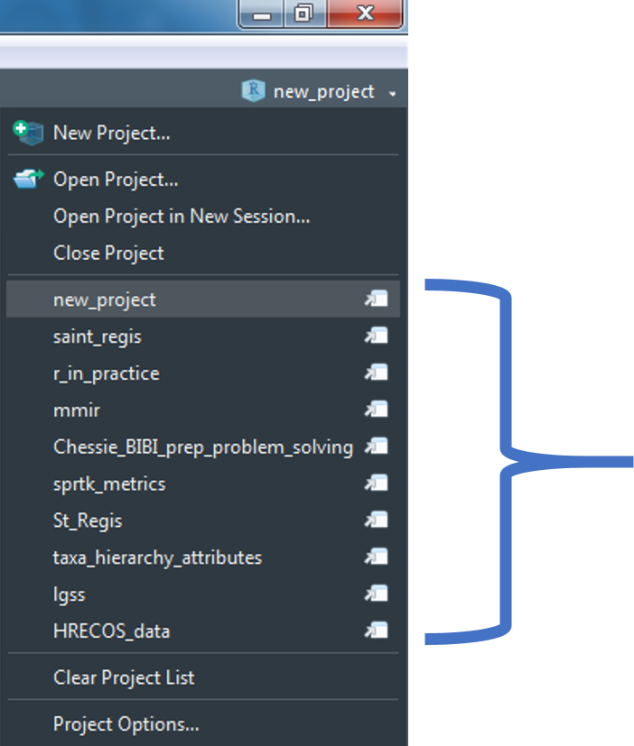{width="400px"}


🧶 ✅ ⬆️ Knit, commit, and push your changes to GitHub with an appropriate commit message. Make sure to commit and push all changed files so that your Git pane is cleared up afterwards.

<details>
<summary>Deep Dive: R Projects and Workflow</summary>

#### Navigate Between Projects

Quickly navigate between recently opened R projects by clicking on the drop-down menu at the top right of RStudio and selecting the project of interest.

{width="400px"}

#### Recommended Workflow

1. Set up a GitHub repository.
2. Create an R-project connected to the GitHub repository.
3. Develop R-scripts.
4. Push and pull project changes to and from GitHub.

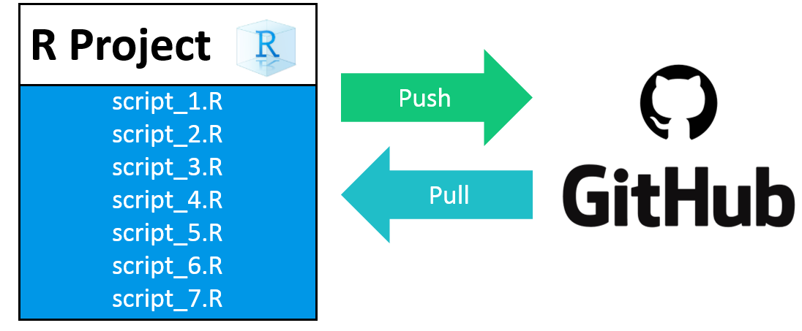

#### Working with File Paths in Projects

One of the biggest advantages of R Projects is that file paths are relative to the project root. For example, to read a CSV from a `data` folder, you only need:

```{r deep-dive-file-path, eval=FALSE}
df <- read.csv(
  file.path("data", "my_data.csv"),
  stringsAsFactors = FALSE
)
```

Notice that the entire file path to the CSV was not specified — just `file.path("data", "my_data.csv")`. This makes your project portable: anyone who opens the `.Rproj` file will have the same working directory.

</details>

### Part 2: Creating and Knitting an R Markdown Document {.unnumbered}

R Markdown documents let you combine narrative text, code, and output in a single reproducible document. In this section, you'll create your first `.Rmd` file and learn how to compile (knit) it.

## Exercise 2: Your First R Markdown Document {.unnumbered}

**2.1.** Create a new R Markdown document in RStudio:

1. Click the new document button (the white page with a green plus).
2. Select "R Markdown."
3. Provide a title (e.g., "My First Analysis"), enter your name as author, select HTML as the default output format, and click "OK."

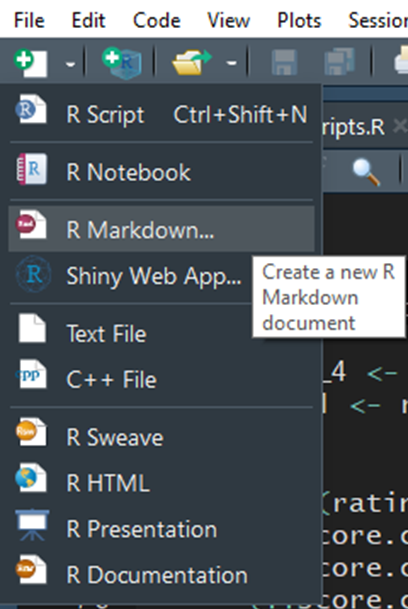{width="400px"}

A new R Markdown document will appear with some default instructions and example text/code.

**2.2.** Knit the default document by clicking the **Knit** button (the ball of yarn icon) in the toolbar. If prompted, install any required packages.

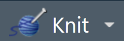{width="160px"}

Examine the rendered HTML output. What elements do you see in the output that correspond to parts of the `.Rmd` source file?

**2.3.** Using the drop-down arrow next to the Knit button, try knitting to a different format (e.g., Word). How does the output differ from the HTML version?

> Note: Knitting to PDF requires LaTeX. If you don't have LaTeX installed, you can install TinyTeX in R with `tinytex::install_tinytex()`.

<details>
  <summary>Click for a hint about output formats</summary>
  The available output formats include:

  - `html_document` — the default, supports interactive features
  - `pdf_document` — requires LaTeX, no interactive features
  - `word_document` — requires Microsoft Word

  Changing the output format updates your YAML header automatically.
</details>

🧶 ✅ ⬆️ Knit, commit, and push your changes to GitHub with an appropriate commit message. Make sure to commit and push all changed files so that your Git pane is cleared up afterwards.

<details>
<summary>Deep Dive: Document Types and Output Formats</summary>

#### HTML

Knitting to a Hyper Text Markup Language (HTML) document is the default for R Markdown. Using HTML will enable you to add interactive features to your document. To view HTML documents, simply open them in your internet browser of choice — by default, your machine should open HTML documents in your default browser automatically.

#### R Markdown vs. R Notebook

R Markdown documents (`html_document`) and R Notebook documents (`html_notebook`) are very similar; in fact, an R Notebook document is a special type of R Markdown document. The main difference is that with an R Markdown document you have to knit (render) the entire document each time you want to preview it, even if you have made a minor change. However, using an R Notebook document you can view a preview of the final document without rendering the entire document.

For all document types you can specify how you want to preview the rendered documents by clicking on the cog in the Source window toolbar to reveal a drop-down menu of options. The recommended setup for an R Notebook is to specify you want to view the preview in the Viewer pane (the bottom right pane shared with Files, Plots, Packages, and Help).

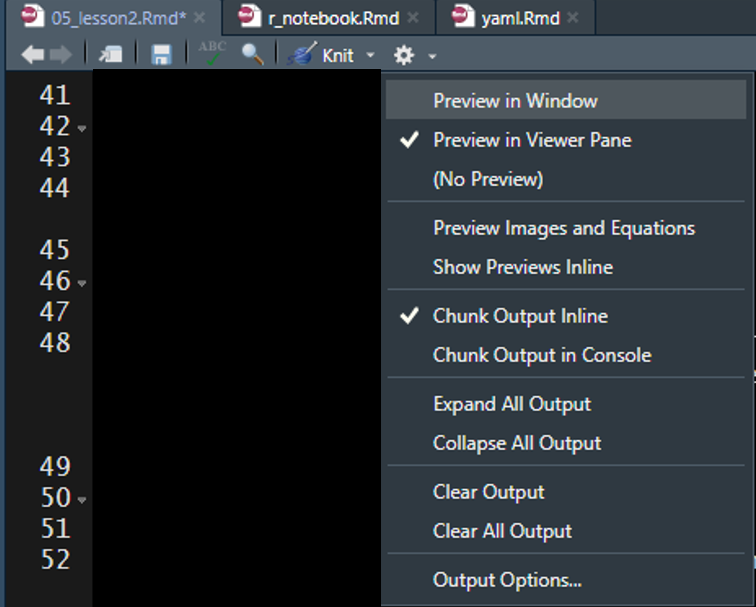

Then click on the "Preview" button in the Source window toolbar to render a preview of the final document.


Keep the Viewer pane open and do not close the preview of the document. Now begin to edit the markdown syntax in the document. Each time you save the document the preview window will render the changes made to the markdown syntax. If you edit R code chunks, you must run the code chunks within the notebook file prior to saving to see the changes in the Viewer window.

#### PDF

You have the ability to knit to Portable Document Format (PDF) but you will not be able to include interactive features in the document. Knitting to a PDF requires you to have the program LaTeX installed. If you don't have LaTeX installed, you can install TinyTeX in R with `tinytex::install_tinytex()`.

#### Word

You have the ability to knit to Microsoft Word if you have Microsoft Word installed on your machine. Similarly to PDFs, you will not be able to include interactive features in your Word documents.

#### Templates

There are a number of templates you can install or that will come with packages you install, which you can view in the pop-up window that appears when you select that you want to create a new R Markdown file.

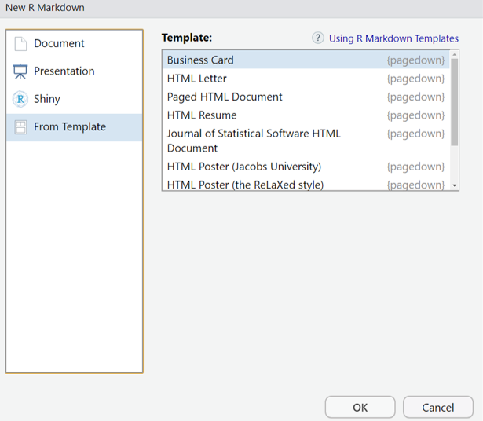

These templates may give you a jump-start to provide a large portion of the formatting specification to make specific documents. Some example templates from the package **pagedown** are:

- Business Card
- Letter
- Paged HTML Documents
- Resume
- Journal Article
- Poster
- Thesis
- Package Vignette

#### Presentations

You have the ability to create presentation slides using R Markdown. Below are the different format options available. Examples can be found at: <https://rmarkdown.rstudio.com/gallery.html>

- ioslides (HTML)
- Slidy (HTML)
- Beamer (PDF) — requires LaTeX
- Microsoft PowerPoint — requires Microsoft PowerPoint

#### Shiny Documents

Shiny documents enable you to embed a shiny application into an R Markdown document. This will enable you to insert custom interactive features into your document. The final document will need to be an HTML file.

</details>

### Part 3: Markdown Syntax Essentials {.unnumbered}

Now that you can create and knit documents, let's learn the markdown syntax that controls formatting.

## Exercise 3: Writing Markdown {.unnumbered}

Delete everything below the YAML header in your `.Rmd` file. You're going to build your document from scratch.

**3.1.** Add the following level-1 headers and knit the document to see the structure:

- Introduction
- Workflow
- Import Data
- Analysis
- Conclusions

**3.2.** Below the "Introduction" header, write a paragraph that includes:

- At least one **bold** word (surround with `**`)
- At least one *italicized* word (surround with `*`)
- A hyperlink to the [R Markdown: The Definitive Guide](https://bookdown.org/yihui/rmarkdown/)

<details>
  <summary>Click for a hint about hyperlinks</summary>
  To create a hyperlink with display text, use the syntax: `[display text](URL)`

  For example: `[R Markdown Guide](https://bookdown.org/yihui/rmarkdown/)`
</details>

**3.3.** Below the "Workflow" header, create an ordered list describing the workflow we've used so far:

1. Create an R Project
2. Add folders for organization
3. Create an R Markdown document
4. Knit the document to render output

Add at least two sub-bullets with helpful details under any of the items above.

<details>
  <summary>Click for a hint about lists</summary>
  Ordered lists use numbers followed by periods. Sub-bullets use four spaces of indentation followed by a dash (`-`):

  ```
  1. First item
      - Sub-bullet detail
      - Another detail
  2. Second item
  ```
</details>

**3.4.** Add an image to your document. You can use any image file in your project, or try the markdown syntax:

```
{width="200px"}
```

You can center an image using HTML:
```
<center>
{width="200px"}
</center>
```

🧶 ✅ ⬆️ Knit, commit, and push your changes to GitHub with an appropriate commit message. Make sure to commit and push all changed files so that your Git pane is cleared up afterwards.

<details>
<summary>Deep Dive: Markdown Syntax Reference</summary>

**Source:** <https://www.rstudio.com/wp-content/uploads/2015/03/rmarkdown-reference.pdf>

<center>

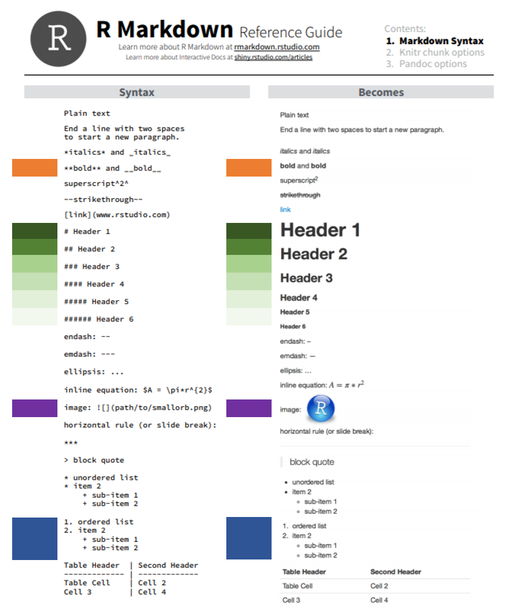{width="800"}

</center>

#### Heading Text

Heading text follows one or more hash-sign(s) (`#`). The number of hash-signs determines the hierarchy of headings. For example, `# Heading 1` would represent the primary heading, `## Heading 2` would represent the secondary heading, `### Heading 3` would represent the tertiary heading, and so forth.

#### Plain Text

Simply add text below the YAML header. To start a new paragraph, you will need to end your plain text line with two (2) spaces.

#### **Bold** and *Italicized* Text

There are two ways to format your text to be **bold** or *italicized*.

- **Bold**
  - Surround your text with two (2) asterisks (`*`) on each side.
  - Surround your text with two (2) underscores (`_`) on each side.

- *Italicized*
  - Surround your text with one (1) asterisk (`*`) on each side.
  - Surround your text with one (1) underscore (`_`) on each side.

The markdown syntax...

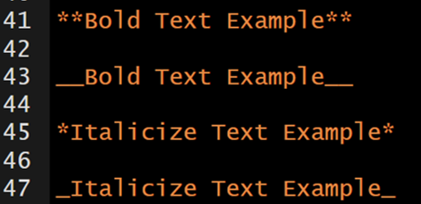

which renders to...

**Bold Text Example**

*Italicize Text Example*

#### Unordered Lists

Unordered or bulleted lists can be generated by using a single asterisk (`*`) followed by a space and the plain text intended to represent the bullet. To add sub-bullets, insert two spaces and a plus sign (`+`) followed by a space and the text for the sub-bullet. You can do this at multiple levels.

The markdown syntax...

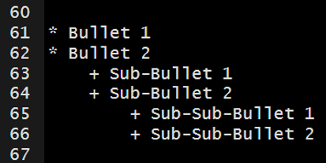

which renders to...

- Bullet 1
- Bullet 2
  - Sub-Bullet 1
  - Sub-Bullet 2
    - Sub-Sub-Bullet 1
    - Sub-Sub-Bullet 2

#### Ordered Lists

Follow the steps in Unordered Lists but instead of using asterisk (`*`) use sequential numbers followed by a period (`.`) — this cannot be done for sub-bullets. For example, "1.", "2.", and "3.".

The markdown syntax...

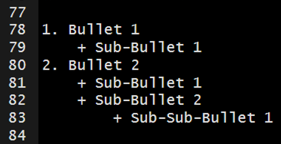

which renders to...

1. Bullet 1
    - Sub-Bullet 1
2. Bullet 2
    - Sub-Bullet 1
    - Sub-Bullet 2
        - Sub-Sub-Bullet 1

#### Hyperlinks

You simply need to paste in a full URL into your document and it will automatically be recognized as a hyperlink. For example: <https://bookdown.org/yihui/rmarkdown>

If you want to hide the full link and represent it with text, then surround the text with square brackets followed by the URL in parentheses.

The markdown syntax `[link](https://bookdown.org/yihui/rmarkdown/)` would render to: [link](https://bookdown.org/yihui/rmarkdown/).

#### Insert Images

You can insert images into your document using syntax similar to the hyperlink syntax above.

- Without a caption: ``
- With a caption: ``
- Control the size: `{width=200px}`
- Center with HTML:

```
<center>
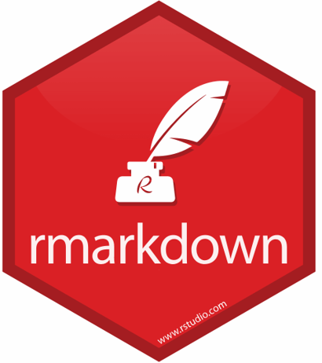{width="100px"}
</center>
```

#### Tabbed Sections

Tabbed sections can be added to sections of an HTML document that will fold all of the subsequent sub-sections into separate tabs. To do this you specify a section header followed by `{.tabset}`. For example, `## My Section Header {.tabset}`.

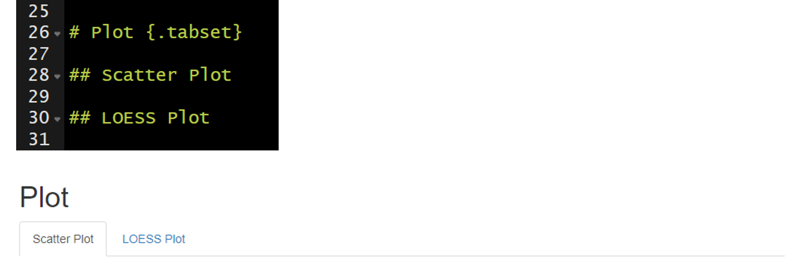

Note this feature is not available for use with **bookdown**.

#### Link to a Section

You can link to a section within the document by surrounding the name of the section in square brackets. For example, `[Introduction]` would create a clickable link that jumps to the "Introduction" section.

</details>

### Part 4: YAML Headers {.unnumbered}

The YAML header (enclosed by `---` at the top of your document) controls the document's metadata and formatting. YAML stands for "YAML Ain't Markup Language."

<center>
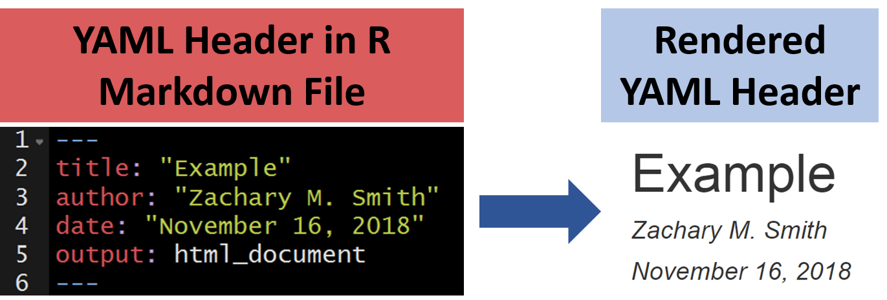
</center>

## Exercise 4: Customizing Your YAML Header {.unnumbered}

**4.1.** Edit your YAML header to include:

- A meaningful title
- Your name as author
- A dynamic date that updates each time you knit (hint: use inline R code)

<details>
  <summary>Click for a hint about dynamic dates</summary>
  You can use inline R code in the YAML header for a dynamic date. The syntax looks like:

  `date: "Last compiled on 2025-01-15"`

  But replace the static date with inline R code that calls `Sys.Date()`.
</details>

**4.2.** Add a table of contents to your document by modifying the `output` section of your YAML:

```yaml
output:
  html_document:
    toc: true
    toc_float: true
```

Knit the document. How does the floating table of contents change navigation?

**4.3.** Change the document theme by adding `theme: journal` to your YAML output options. Knit and compare the appearance.

<details>
  <summary>Click for a hint about available themes</summary>
  Some available themes include: `default`, `cerulean`, `journal`, `flatly`, `darkly`, `readable`, `spacelab`, `united`, `cosmo`, `lumen`, `paper`, `sandstone`, `simplex`, `yeti`.

  You can browse examples at: https://www.datadreaming.org/post/r-markdown-theme-gallery/
</details>

**4.4.** Add code folding to your document by adding `code_folding: hide` to your YAML output options. Knit the document and observe how code chunks are now hidden by default with a "Code" button to reveal them.

<center>
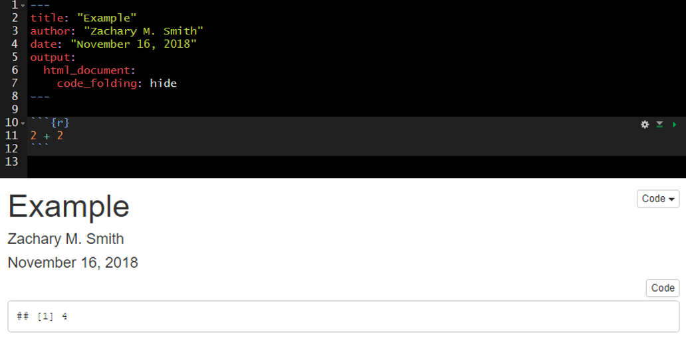
</center>


🧶 ✅ ⬆️ Knit, commit, and push your changes to GitHub with an appropriate commit message. Make sure to commit and push all changed files so that your Git pane is cleared up afterwards.

<details>
<summary>Deep Dive: YAML Header Options</summary>

#### Title and Subtitle

The specified title (`title: "My Title"`) will appear at the head of the document with a larger font size than the rest of the document. You can also specify a subtitle (`subtitle: "My Subtitle"`), which will appear below and in slightly smaller font size than the title.

#### Author(s)

An author can be specified (`author: "S. Mason Garrison"`) and will appear at the head of the document but below the title(s). You can specify multiple authors by separating the names with a comma (`author: "S. Mason Garrison, Tukey Garrison"`).

#### Date

You can supply a date that will be added to the head of the document. You can specify a static date (`date: "March 3rd, 2020"`) or a dynamic date that will update each time you knit the document.

<center>

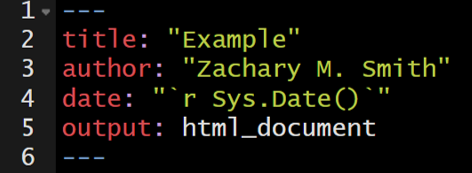

</center>

You can reformat the date using the `format()` function:

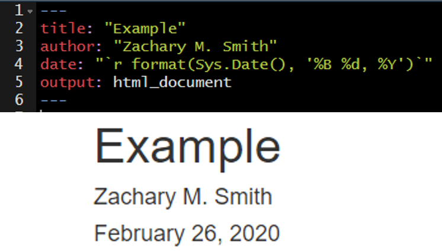

#### Table of Contents

<center>

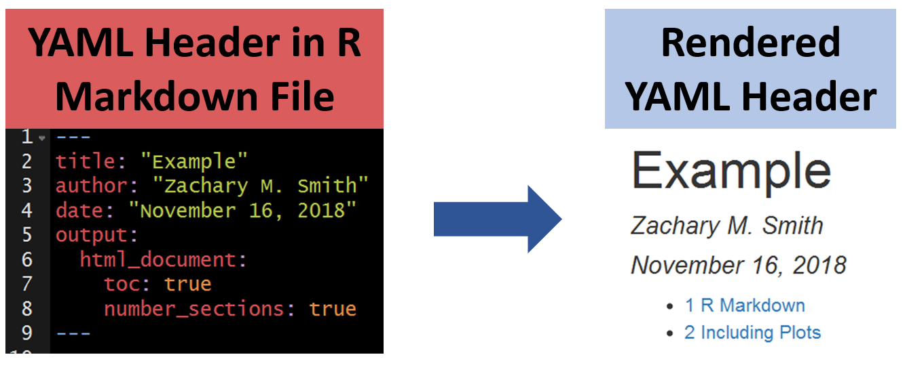

</center>

#### Floating Table of Contents

<center>

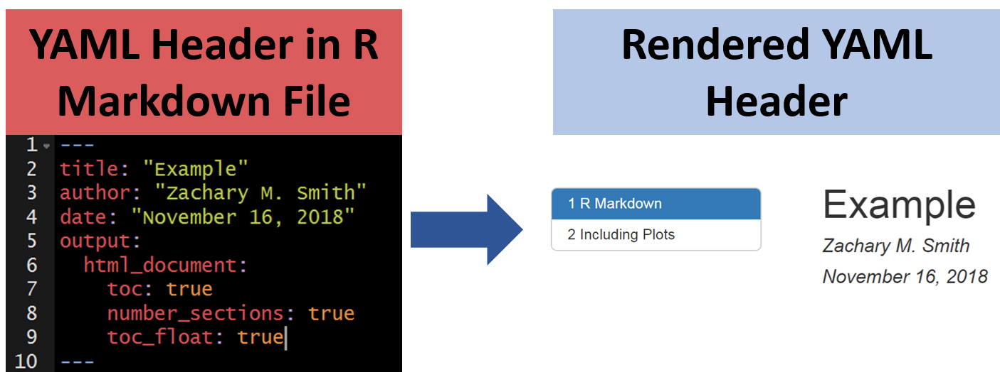

</center>

#### Themes

You can modify the YAML to specify the theme of the document, which will change document styling (e.g., font type, color, size). Browse examples at: <https://www.datadreaming.org/post/r-markdown-theme-gallery/>

<center>

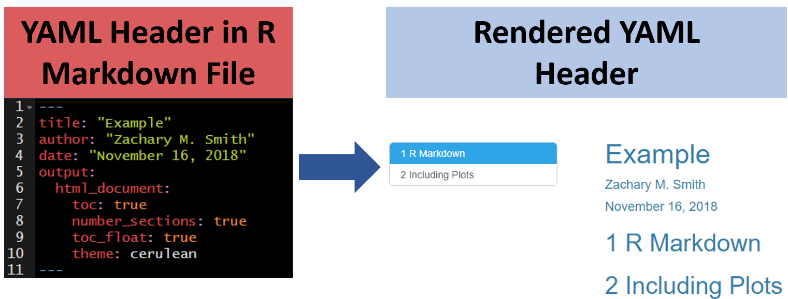

</center>

#### Code Folding

Code folding refers to the HTML YAML option to hide code chunks by default, but enable the reader to click a button to show the underlying code chunk.

**Without code folding:**

<center>

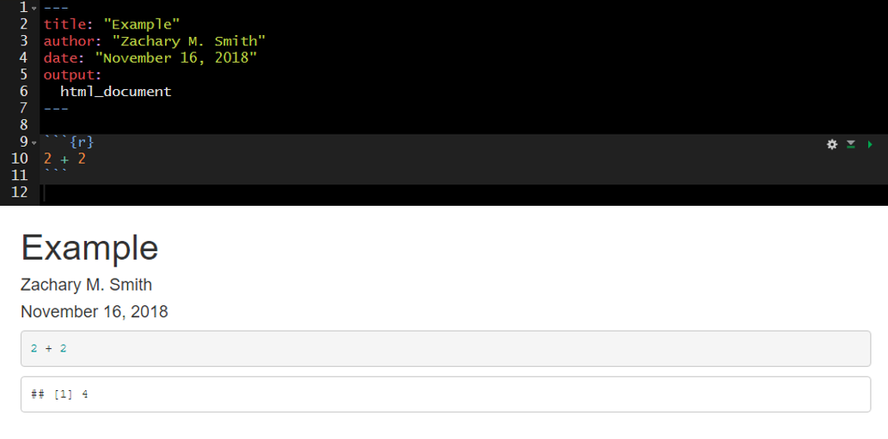

</center>

**With code folding (show):**

<center>

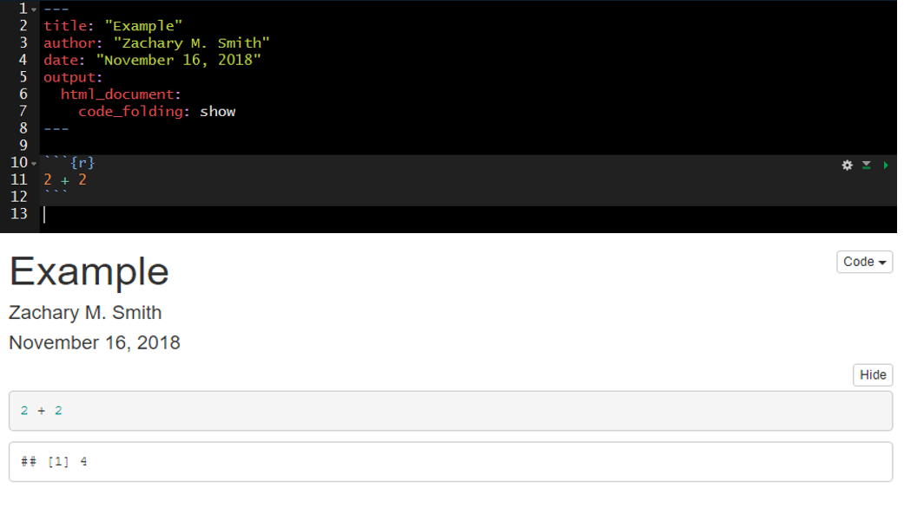

</center>

**With code folding (hide):**

<center>


</center>

#### Output Options

The `output` option allows you to specify the type of document you want to create. Some valid arguments include:

- `html_document`
- `html_notebook`
- `pdf_document`
- `word_document`

You can have multiple document types render at once (e.g., a separate HTML and Word document are created with each knit call).

<center>

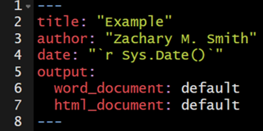

</center>

#### Custom Word Template

You have the ability to specify custom templates in your YAML header. For example, you can create a new document within Microsoft Word with your preferred formatting and then reference it:

<center>

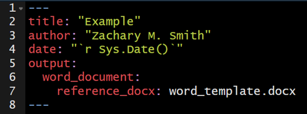

</center>

#### ymlthis Package

**ymlthis** is an R package intended to make it easier for you to generate YAML headers. The package also includes an interactive addin that provides an intuitive user-interface for generating YAML headers. You can visit the following link to learn more: <https://ymlthis.r-lib.org/>

Addins can be accessed by navigating to "Tools" in the RStudio banner, scrolling down to "Addins", and selecting "Browse Addins."

<center>

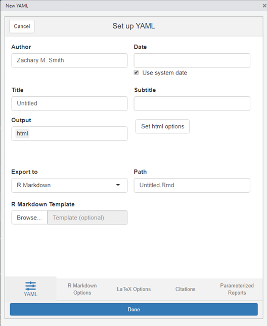

</center>

</details>


### Part 5: Code Chunks and Inline Code {.unnumbered}

Up to this point, we've mostly written a standard markdown document. Now it's time to integrate R code to create reproducible figures, tables, and text.

## Exercise 5: Working with Code Chunks {.unnumbered}

To insert a code chunk, press **Ctrl + Alt + I** (Windows/Linux) or **Cmd + Option + I** (Mac). A code chunk will appear where you can write and execute R code.

**Shortcuts you'll want to learn:**

- `Ctrl + Alt + I` — Insert a new code chunk
- `Ctrl + Enter` — Run the current line of code
- `Ctrl + Alt + R` — Run all code in the document
- `Ctrl + Shift + F10` — Restart R

**5.1.** Add a code chunk that loads the `iris` dataset and prints a summary. Give your code chunk a meaningful name in the header (e.g., `{r iris-summary}`).

```{r exercise-5-1-example, eval=FALSE}
data(iris)
summary(iris)
```

**5.2.** Add a code chunk that creates a scatter plot of the `iris` data. Experiment with the following chunk options:

- `echo=FALSE` — hide the code, show only the plot
- `fig.width=8, fig.height=5` — control figure dimensions
- `fig.cap="Scatter plot of iris petal dimensions"` — add a caption

```{r exercise-5-2-example, eval=FALSE}
ggplot(iris, aes(x = Petal.Width, y = Petal.Length, color = Species)) +
  geom_point() +
  labs(
    title = "Iris Petal Dimensions",
    x = "Petal Width",
    y = "Petal Length"
  ) +
  theme_minimal()
```

**5.3.** Use inline code to dynamically report a statistic in your narrative text. For example, write a sentence like:

> "The mean sepal length in the iris dataset is `r mean(iris$Sepal.Length)`."

The inline code syntax is: `` `r
knitr::inline_expr("mean(iris$Sepal.Length)")` ``

**5.4.** Add a global options chunk just below your YAML header that sets default figure dimensions for the entire document:

```{r exercise-5-4-example, eval=FALSE}
knitr::opts_chunk$set(fig.width = 8, fig.height = 4)
```

Set the chunk header to `include=FALSE` so this setup chunk doesn't appear in your rendered document.

<details>
  <summary>Click for a hint about chunk options</summary>
  Common chunk options include:

  - `echo` — show/hide the code (TRUE/FALSE)
  - `eval` — run/skip the code (TRUE/FALSE)
  - `include` — include chunk in output (TRUE/FALSE)
  - `message` and `warning` — show/hide messages and warnings
  - `fig.width`, `fig.height` — figure dimensions in inches
  - `fig.cap` — figure caption

  A comprehensive list is at: https://yihui.org/knitr/options/
</details>

🧶 ✅ ⬆️ Knit, commit, and push your changes to GitHub with an appropriate commit message. Make sure to commit and push all changed files so that your Git pane is cleared up afterwards.

<details>
<summary>Deep Dive: Code Chunk Options and Inline Code</summary>

#### Code Chunk Interface

Inside the code chunk you can write and run R-code. If you print the output of your R-code it will appear below the code chunk in the source pane and the printed output will appear in the final compiled document.

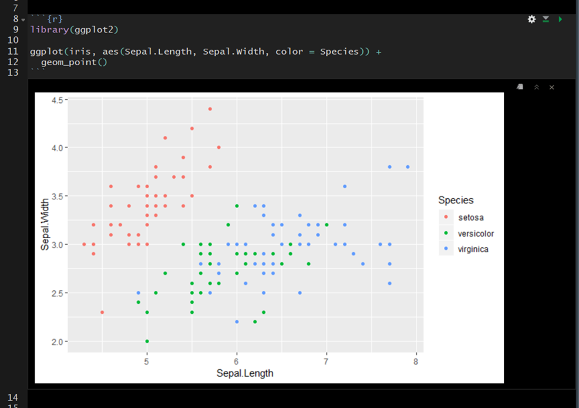

On the far right of the code chunk you will see three buttons:

- The cog makes it easy to specify code chunk options.
- The middle button will execute all code chunks prior to a given chunk (`Ctrl + Alt + P`).
- The far right button will execute all of the code in the chunk.

<center>

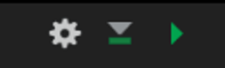

</center>

#### Naming Chunks

Best practice is to include a short and unique name within each code chunk header. This will be especially beneficial if you need to troubleshoot an error in your document as you will be able to track the source of the error down by code chunk name. The "name" is simply separated from the "r" by a space. For example, `{r addition}`.

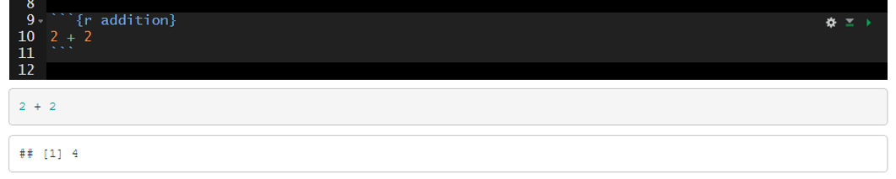

#### echo

A logical value (true or false) indicating if the code chunk should be visible in the rendered document. By default the code chunk will be visible upon knitting (`echo=TRUE`). To hide a specific code chunk set echo to false (`echo=FALSE`).

Include the code chunk in the rendered document with `echo=TRUE`:
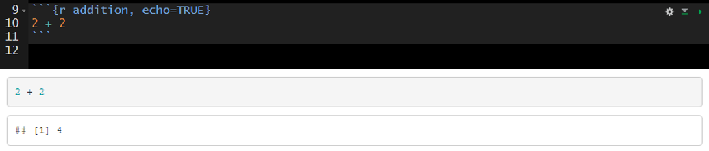

Exclude the code chunk from the rendered document with `echo=FALSE`:
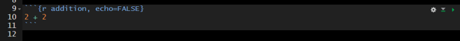

#### fig.width, fig.height, and fig.cap

The `fig.width` and `fig.height` options allow you to control the size of the figure generated from a given code chunk. `fig.cap` provides the ability to add a caption below the figure.

Default plot output:
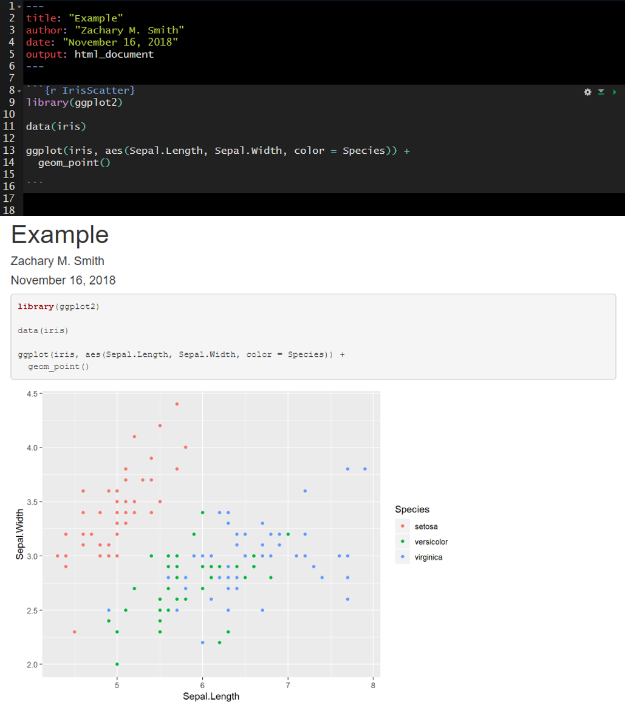

With `fig.width`, `fig.height`, and `fig.cap` specified:
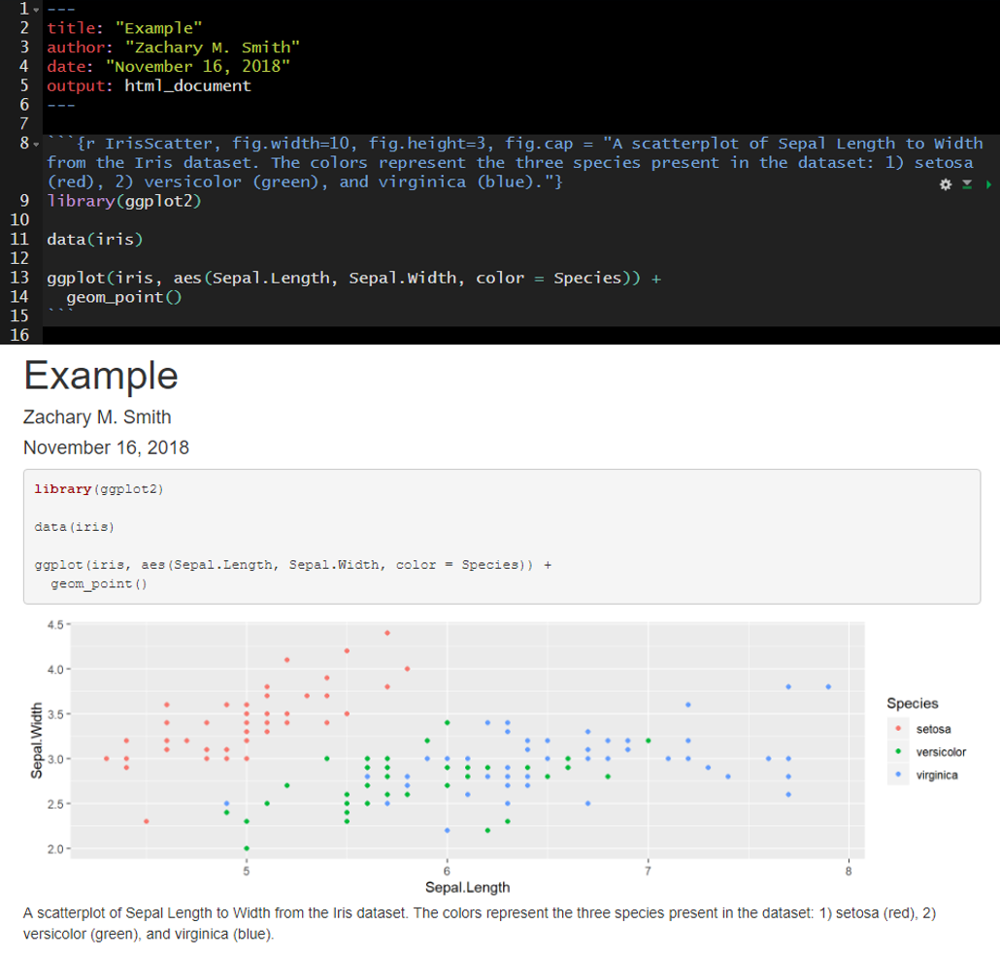

For automatic figure numbering, install the **bookdown** package and set `output: bookdown::html_document2` in your YAML header. Then cross-reference figures with `\@ref(fig:figure_name)`. For more information visit <https://bookdown.org/yihui/rmarkdown-cookbook/figure-number.html>.

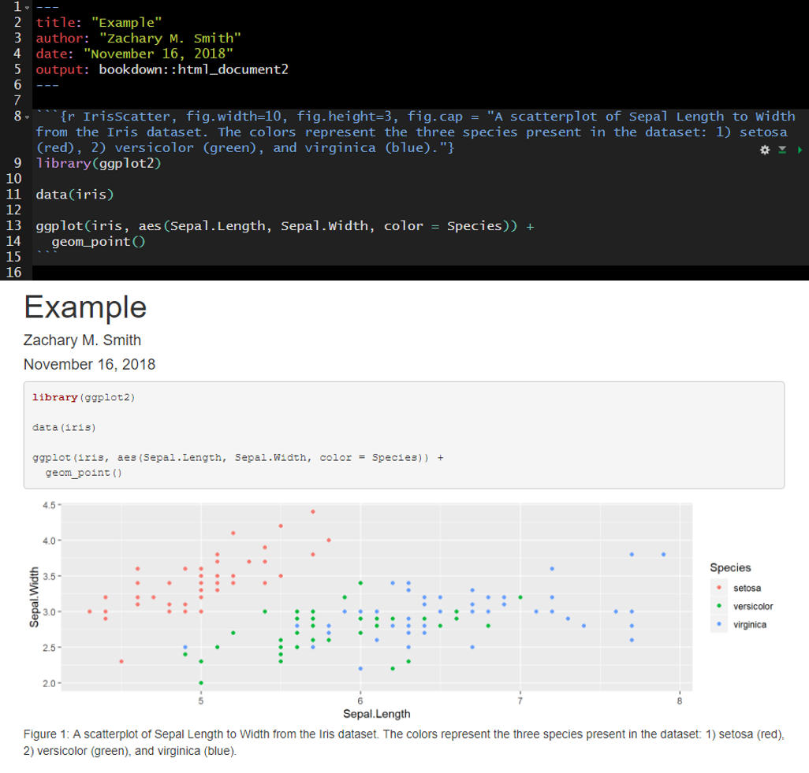

#### message and warning

Using `message=FALSE` and/or `warning=FALSE` will suppress messages and warnings preventing them from printing in the rendered document. **Warning:** Suppress these messages/warnings at your own risk.

An example of messages produced with the default `message=TRUE`:
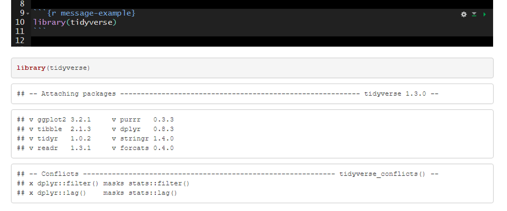

The messages suppressed with `message=FALSE`:
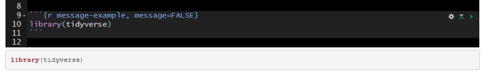

#### include

Code chunk headers with `include=FALSE` will be ignored when the document is rendered. This can be useful during document development — for example, you may have a code chunk producing an error that prevents you from rendering the rest of your document.

The default `include=TRUE` — all code chunks are present:
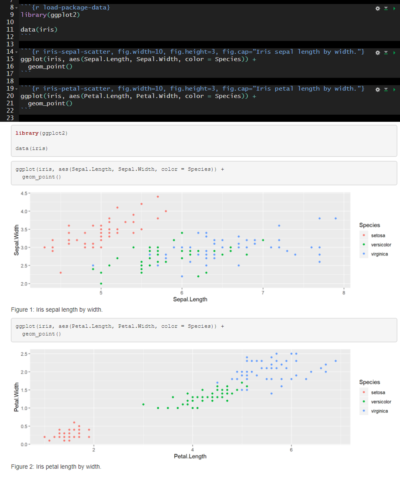

With `include=FALSE` on the second code chunk — it is excluded:
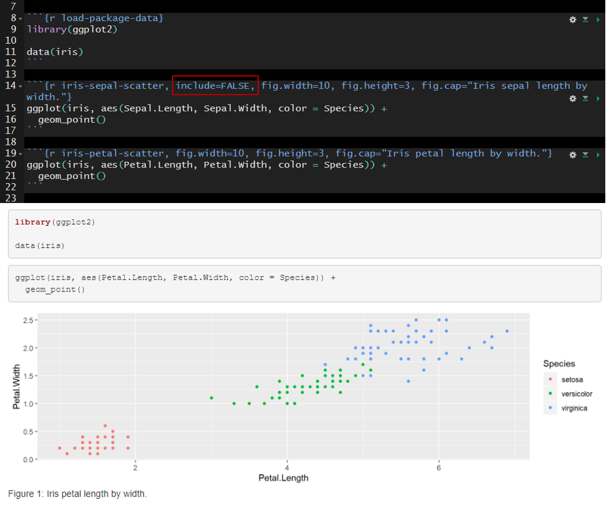

#### Setting Global Options

It can be helpful to establish global options to produce a standard format throughout the document. You can set this with the **knitr** function `opts_chunk$set()`. The options specified become the default when rendering the document. However, you still have the ability to overwrite these options for specific code chunks.

#### Inline Code

Inline code enables you to insert R code into your document to dynamically update portions of your text.

To insert inline code you need to encompass your R code within:
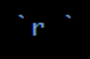

For example, you could write:

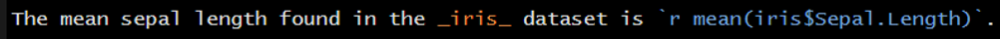

**Which would render to:** The mean sepal length found in the *iris* data set is `r mean(iris$Sepal.Length)`.

Inline code is also frequently used to make the YAML header date update dynamically:

<center>

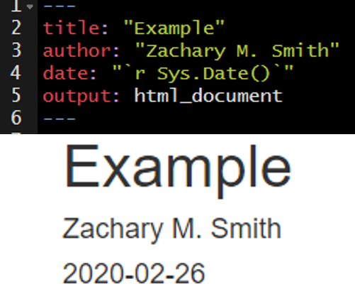

</center>

A comprehensive list of chunk options can be found here: <https://yihui.org/knitr/options/>

</details>


### Part 6: Interactive Features {.unnumbered}

Interactive tables and figures are a great way to make your HTML documents more engaging and useful for data exploration.

## Exercise 6: Adding Interactivity {.unnumbered}

**6.1.** Create an interactive data table using the **DT** package. Add this code chunk to the "Import Data" section of your document:

```{r lab_rmarkdown-code-dt-package}
library(DT)

datatable(iris)
```

Explore the interactive table — try sorting columns, searching, and filtering.

**6.2.** Convert your scatter plot from Exercise 5.2 into an interactive plot using **plotly**. The `ggplotly()` function makes this easy:

```{r plotly_example, message=FALSE}
library(plotly)

p_scatter <- ggplot(iris, aes(
  x = Petal.Width, y = Petal.Length,
  color = Species
)) +
  geom_point()

ggplotly(p_scatter)
```

Hover over points, zoom in, and try the toolbar buttons at the top right of the plot. What information appears when you hover?

**6.3.** Create an interactive map using **leaflet**. This example maps earthquake data that comes built into R:

```{r lab_rmarkdown-code-leaflet-basic}
library(leaflet)

data("quakes")

leaflet(
  data = quakes,
  options = leafletOptions(
    minZoom = 4,
    maxZoom = 18
  )
) %>%
  addTiles() %>%
  addCircleMarkers(~long, ~lat,
    fillOpacity = 0.75,
    stroke = FALSE,
    popup = paste(
      "Magnitude:", quakes$mag, "<br/>",
      "Latitude:", quakes$lat, "<br/>",
      "Longitude:", quakes$long
    )
  )
```

**6.4.** Modify the leaflet map to cluster nearby points for better visualization of density. Add `clusterOptions = markerClusterOptions()` to your `addCircleMarkers()` call. What changes when you zoom in and out?

```{r lab_rmarkdown-code-leaflet-cluster}
library(leaflet)

data("quakes")

leaflet(
  data = quakes,
  options = leafletOptions(
    minZoom = 4,
    maxZoom = 18
  )
) %>%
  addTiles() %>%
  addCircleMarkers(~long, ~lat,
    fillOpacity = 0.75,
    stroke = FALSE,
    popup = paste(
      "Magnitude:", quakes$mag, "<br/>",
      "Latitude:", quakes$lat, "<br/>",
      "Longitude:", quakes$long
    ),
    clusterOptions = markerClusterOptions()
  )
```

🧶 ✅ ⬆️ Knit, commit, and push your changes to GitHub with an appropriate commit message. Make sure to commit and push all changed files so that your Git pane is cleared up afterwards.

<details>
<summary>Deep Dive: Interactive Features Reference</summary>

#### DT

The **DT** package enables you and your readers to interact with tables in your document. You can filter and sort the table to view data that you are most interested in exploring or understanding.

For more information visit <https://rstudio.github.io/DT/>

A word of caution: if you use interactive features too frequently your document will become cluttered and will likely load and run slowly.

#### Plotly

**Plotly** makes it easy to create interactive figures. Some of the most useful features are the ability to:

- Roll over figure objects and see pop-up information related to specific features
- Zoom in and zoom out
- Take a picture of the figure

For more information visit: <https://plot.ly/ggplot2/>

The **plotly** function `ggplotly()` makes it simple to convert **ggplot2** figures to interactive **plotly** figures — you can use all the ggplot2 syntax you already know.

#### Leaflet

**Leaflet** is a great resource for creating interactive maps with a minimal amount of coding. The clustering feature (`clusterOptions = markerClusterOptions()`) is especially useful for visualizing density when you have many data points.

For more information visit: <https://rstudio.github.io/leaflet/>

</details>


## Stretch Tasks (Optional) {.unnumbered}

If you finish early, try these challenges to deepen your R Markdown skills.

**7.1.** **Child documents**: Break your R Markdown document into multiple "child" documents, one for each major section. In your parent document, source each child using `child = 'sections/filename.Rmd'` in the code chunk header. This strategy keeps large documents manageable.

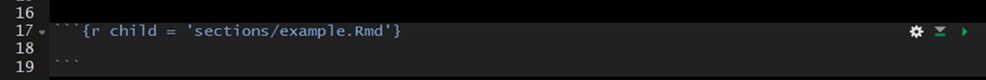

**7.2.** **R Notebook**: Change your output to `html_notebook` and explore the difference. With an R Notebook, you can preview output without re-knitting the entire document. Try running individual chunks and watching the preview update in the Viewer pane.

**7.3.** **Custom Word template**: If you have Microsoft Word installed, create a custom Word template with your preferred formatting (fonts, colors, spacing). Reference it in your YAML header:

```yaml
output:
  word_document:
    reference_docx: my_template.docx
```

**7.4.** **Presentations**: Try creating a presentation using R Markdown. Change your output to `ioslides_presentation` or `slidy_presentation` and experiment with creating slides using markdown headers.

<details>
<summary>Deep Dive: Child Documents and Advanced Workflow</summary>

#### Child Documents

In general, a single R Markdown file quickly becomes unwieldy. Breaking the document up into multiple "child" documents and sourcing them in a parent document keeps things manageable. Child documents generally represent major subsections of the document.

Store the parent R Markdown file in a folder labeled "markdown" (rproject/markdown) and the child R Markdown files in a sub-directory called "sections" (rproject/markdown/sections). In the parent file, the child files are sourced within the code chunk header using `child = 'sections/example.Rmd'`. After sourcing all the child chunks, the parent file can be knit like a normal R Markdown document.


#### Extract and Run R-Code from Child Documents

The child documents cannot be executed within RStudio like a normal code chunk. Without the ability to easily execute the R code within the child documents it can become very difficult to develop new child documents because they often depend on upstream code execution.

The most efficient approach is to extract the R-code chunks from each Rmd file, save them as `.R` scripts, and then source/execute the scripts. Here's how:

**Step 1: Set up paths and identify child documents**

```{r deep-dive-setup-paths, eval=FALSE}
sections_path <- file.path(
  rprojroot::find_root("my_project.Rproj"),
  "markdown",
  "sections"
)
r_files_vec <- list.files(sections_path)
r_files_vec <- r_files_vec[grepl(".Rmd", r_files_vec)]
```

**Step 2: Extract R code from Rmd files**

```{r deep-dive-extract-scripts, eval=FALSE}
extracted_path <- file.path(
  rprojroot::find_root("my_project.Rproj"),
  "markdown",
  "raw_scripts",
  "extracted"
)

purrr::map(r_files_vec, function(file.i) {
  file_name <- gsub(".Rmd", "", file.i)
  extracted_file <- paste0(file_name, ".R")
  knitr::purl(
    file.path(sections_path, file.i),
    file.path(extracted_path, extracted_file)
  )
})
```

**Step 3: Source the extracted scripts in order**

```{r deep-dive-read-scripts, eval=FALSE}
vec_source <- c(
  "introduction.R",
  "import_data.R",
  "preprocessing.R",
  "analysis.R"
)

purrr::map(vec_source, function(source_i) {
  source(file.path(extracted_path, source_i))
})
```

Once all the upstream R-scripts have been executed, you can begin or continue work on a new child R Markdown document.

</details>

<details>
<summary>Deep Dive: Parameterized Reports</summary>

Parameterized reports allow you to create a template for generating reports based on specific data. For example, imagine you are tasked with generating 100 one-page fact sheets for lakes in your state. Each fact sheet includes boilerplate language but needs to be customized with lake-specific data, metrics, and maps.

Here is a link to a great lecture on creating parameterized reports: <https://www.coursera.org/lecture/reproducible-templates-analysis/adding-parameters-in-a-document-template-6fQwc>

#### Adding Parameters

To add parameters to your document, add the `params:` argument below `output: html_document`. Below `params:` you specify any parameter name and default value. For example:

<center>

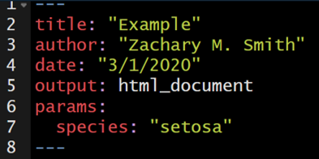

</center>

The specified parameter can be used throughout the document with the syntax `params$species`. This acts as a placeholder until the document is rendered and the species is specified.

You can use inline code to insert the parameter into the title:

<center>

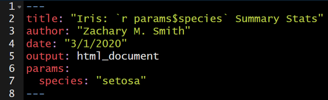

</center>

Parameters can also be used to filter data:

```{r deep-dive-param-filter, eval=FALSE}
data(iris)

iris_sub <- iris[iris$Species %in% params$species, ]
```

The parameter can be referenced frequently to update the text or filter data. In this example, the iris data set is filtered by the specified parameter to calculate summary statistics:

<center>

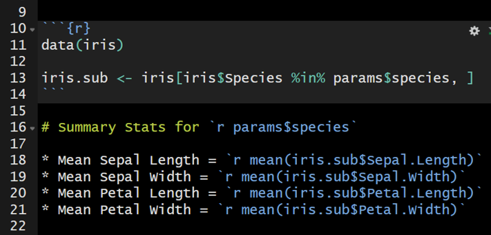

</center>

#### Knitting with Parameters

Click on the knit drop-down menu and select "Knit with Parameters..." A pop-up window will appear specifying the list of available parameters and their default values.

<center>

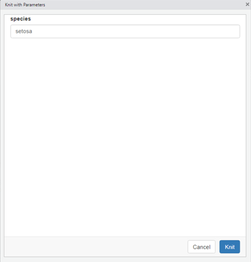

</center>

The document will then render:

<center>

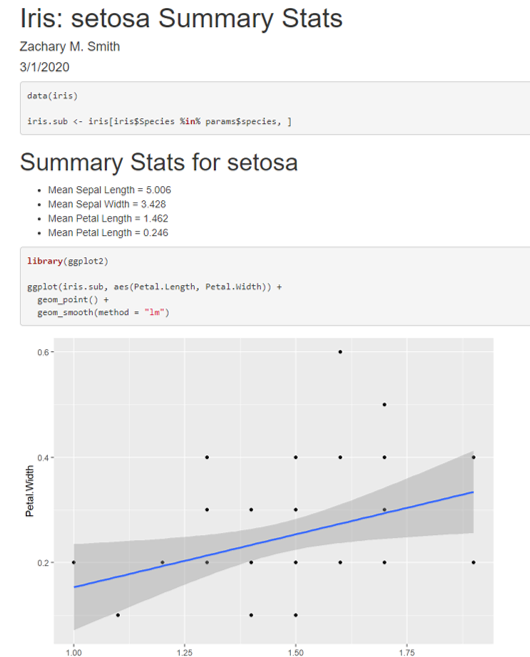{width="600px"}

</center>

#### Automating with render()

The **rmarkdown** function `render()` can also be used to compile the document programmatically:

```{r deep-dive-render-single, eval=FALSE}
rmarkdown::render(
  input = "parameterized/param_template.Rmd",
  params = list(species = "setosa")
)
```

Use a loop to iteratively generate parameterized documents:

```{r deep-dive-render-loop, eval=FALSE}
lapply(unique(iris$Species), function(species.i) {
  rmarkdown::render("parameterized/param_template.Rmd",
    params = list(species = species.i),
    output_file = paste0(species.i, ".HTML")
  )
})
```

</details>


## Conclusion {.unnumbered}

Congratulations on completing the R Projects and R Markdown Lab! You've built a complete, reproducible analysis document from scratch, learning how to organize your workspace with R Projects, write formatted text with markdown, customize your output with YAML headers, integrate code and visualizations with code chunks, and add interactivity with DT, plotly, and leaflet.

__Final Checklist__

- Ensure you have created and knit your R Markdown document without errors.
- Review your rendered output and confirm that all sections, code chunks, and interactive features are working correctly.
- Check that your project folder is well-organized with appropriate subfolders.

__Reflect on Your Learning__

- How does using R Projects change the way you organize your analysis work?
- What advantages does R Markdown offer over writing code in plain R scripts?
- Which interactive feature (DT, plotly, or leaflet) do you think will be most useful in your own work?

### Next Steps {.unnumbered}

- Commit all your changes to your project repository. Use a comprehensive commit message that reflects the completion of this lab.
- Push your changes to ensure everything is updated in your remote repository.

🧶 ✅ ⬆️ Knit, commit, and push your changes to GitHub with an appropriate commit message. Make sure to commit and push all changed files so that your Git pane is cleared up afterwards and review the md document on GitHub to make sure you're happy with the final state of your work.
