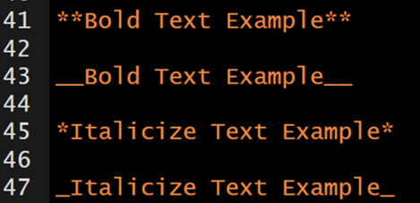
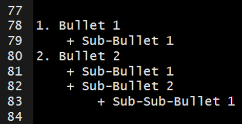
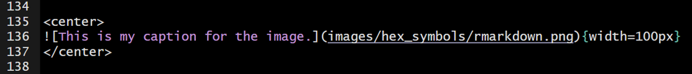
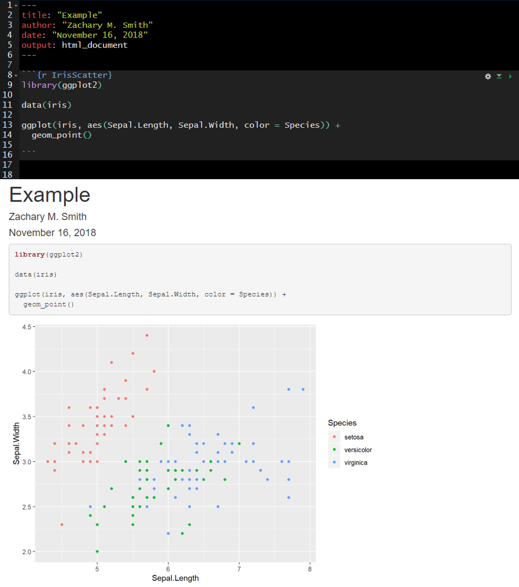
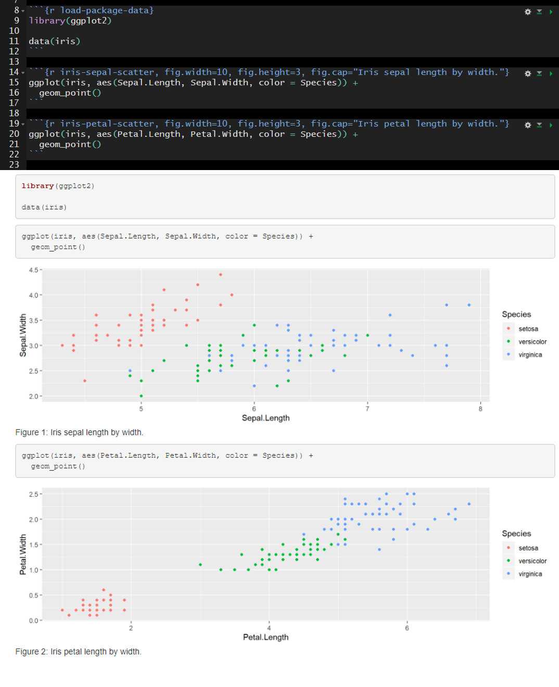

# Efficient Workflow with R Projects and R Markdown

## Overview

Are you ready to make your data analysis smoother and more efficient? R Projects and R Markdown provide a potent combination that streamlines data analysis and reporting in R. Combining R Projects with R Markdown is like having a Swiss Army knife for your R environment—it integrates perfectly with version control systems like Git and keeps your file paths consistent, no matter where you move your projects. This lesson will show you how to set up an R Project, organize your files, and create an R Markdown document to streamline your data analysis workflow. This section takes heavy inspiration from [Zachary M. Smith](https://github.com/zsmith27/rmarkdown_crash-course).

## R Projects: Your Workspace Anchor

R Projects establish a self-contained environment for any data analysis project. They help in organizing your work and ensuring that file paths are consistent, making your work portable and easier to share with collaborators.

### Create a New R Project

1. **Start New Project**:  In RStudio, create a new R project by clicking on the drop-down menu in top right of your window and selecting "New Project"

2. Select "New Directory" within the "Create Project" window


3. Select "New Project" within the "Project Type" window


4. Enter a project name (below I have given the name "new_project"), the project directory (where the project should live), and select "Create Project"

> **Tip**: Create a "project" folder that will act as your parent directory for all R projects. This will make it much easier to navigate to and between projects.


5. A new session specific to your R project will start within RStudio

    - There are a number of ways to tell which project is open...


## Navigate Between Projects

Quickly navigate between recently opened R projects by clicking on the drop-down menu at the top right of RStudio and selecting the project of interest.

{width="400px"}

## Recommended Workflow

1. Set up a GitHub repository.
2. Create an R-project connected to the GitHub repository.
3. Develop R-scripts.
4. Push and pull project changes to and from GitHub.


## Your Turn

1. Open R Studio.

2. Create a new Project.

3. Add an "data" folder and add the example data set to this folder.

4. Create a new R Script (Ctrl + Shift + N) and save the script as "lesson_1.R" to your project root folder.

5. Add the following script and run it (Ctrl + Enter)

    - Notice that the entire file path to CSV of interest ("zms_thesis_metrics.csv") was not specified just `file.path("data", "zms_thesis_metrics.csv")`.

    
    ``` r
    df_thesis <- read.csv(
      file.path(
    "data",
    "zms_thesis_metrics.csv"
      ),
      stringsAsFactors = FALSE
    )
    
    head(df_thesis)
    ```

6. View `df_thesis` in the Environment panel

    - How many rows and columns does our data frame have?

    - Click on the drop-down menu (the blue circle to the left of `df_thesis`).

        - Can you identify the column type (e.g., Character, Numeric, Integer, or Factor) of the columns `unique_id`, `substrate_size_d50`, `richness`, and `pct_diptera`?
        - What are the first, second, and third `unique_id`'s represented in the data frame and which `richness` values are associated with each `unique_id`?

    - Click on the button to view the data (the small girdded table to the far-right of `df_thesis`)

        - Filter the data frame to only see data from Onondaga Lake (`lake` = "onon")

## Rmd Creation

### Create a New Document

1. Click on the new document button:


2. Click on R Markdown:

{width="400px"}

3. Provide a "Title:", select the "Default Output Format:", and click "OK"

{width="600px"}

4. A new R Markdown document will appear with some instructions and example text/code.

{width="600px"}

## Compile the Document

{width="160px"}

To view the html document, you must compile the document using Knit. The easiest way to knit a document is to navigate to and click on the Knit button (it looks like a ball of yarn) in the toolbar above the editor window. If a window appears saying "Install Required Packages" for R Markdown, install the necessary packages for knitting the document. The compiled file will be saved in the same directory as your Rmd file (your R Markdown file). I generally store the R Markdown file(s) in a sub-directory labeled "rmarkdown" within the R-project folder (rproject/markdown), which prevents the project directory from becoming cluttered-- this is **NOT** necessary.

You can click on the small triangle to the right of the Knit button to view a drop-down menu of knitting options. Here you have the option to update the document type you want to knit (examples listed below).

- Knit to HTML
- Knit to PDF
- Knit to Word

By clicking one of these options your YAML header updates automatically. We will discuss YAML headers in a later section, but in short the YAML header defines some of the formatting options associated with the document, including the output type. You can have multiple document types render at once (e.g., a separate HTML and Word document are created with each knit call).

## Document Types

There are multiple document types available which designate how the .Rmd file will be rendered (knit).

### HTML

Knitting to a Hyper Text Markup Language (HTML) document is the default for R Markdown. Using HTML will enable you to add interactive features to your document. To view HTML documents, simply open them in your internet browser of choice-- by default, your machine should open HTML documents in your default browser automatically.

#### R Markdown vs. R Notebook

R Markdown documents (`html_documents`) and R Notebook documents (`html_notebook`) are very similar; in fact, an R Notebook document is a special type of R Markdown document. The main difference is using R Markdown document (`html_documents`) you have to knit (render) the entire document each time you want to preview the document, even if you have made a minor change. However, using an R Notebook document (`html_notebook`) you can view a preview of the final document without rendering the entire document.

For all document types you can specify how you want to preview the rendered documents by clicking on the cog in the Source window toolbar to reveal a drop-down menu of options. The recommended setup for use of an R Notebook document would be to specify you want to view the preview in the Viewer pane (i.e., the bottom right pane shared with Files, Plots, Packages, and Help).


Then click on the "Preview" button in the Source window toolbar to render a preview of the final document.


Keep the Viewer pane open and do not close the preview of the document. Now begin to edit the markdown syntax in the document. Each time you save the document the preview window will render the changes made to the markdown syntax. If you edit R code chunks, you must run the code chunks within the notebook file prior to saving to see the changes in the Viewer window.

### PDF

You have the ability to knit to Portable Document Format (PDF) but you will not be able include interactive features in the document. Knitting to a PDF requires you to have the program LaTeX installed. You will get the following error message if you try to knit a PDF document without LaTeX installed on your machine: \> No LaTeX installation detected (LaTeX is required to create PDF output). You should install a LaTeX distribution for your platform: <https://www.latex-project.org/get/> If you are not sure, you may install TinyTeX in R: tinytex::install_tinytex() Otherwise consider MiKTeX on Windows - <http://miktex.org> MacTeX on macOS - <https://tug.org/mactex/> (NOTE: Download with Safari rather than Chrome *strongly* recommended) Linux: Use system package manager

### Word

You have the ability to knit to Microsoft Word if you have Microsoft Word installed on your machine. Similarly to PDFs, you will not be able to include interactive features in your Word documents.

### Templates

#### Provide Templates

There are a number of templates you can install or will come with packages you install, which you can view in the pop-up window that appears when you select that you want to create a new R Markdown file.


These templates may give you a jump-start to provide a large portion of the formatting specification to make specific documents. Some example templates from the package **pagedown** are:

- Business Card
- Letter
- Paged HTML Documents
- Resume
- Journal Article
- Poster
- Thesis
- Package Vignette

#### Custom Templates

You also have the ability to specify custom templates in your YAML header. We will discuss YAML headers in a later section ([Lesson 4: YAML Headers]).

I have only used this feature for Microsoft Word documents. I created a new document within Microsoft Word and selected all of the formatting options I wanted for my document. I then added the template to the YAML header of my R Markdown document to specify that when the document is knit (rendered) to apply the formatting specifications found in the template Microsoft Word document.

### Other Types

#### Presentations

You have the ability to create presentation slides using R Markdown. Below are the different format options available. Examples can be found in the following link under the "Presentation" section: <https://rmarkdown.rstudio.com/gallery.html>

- ioslides (HTML)
- Slidy (HTML)
- Beamer (PDF)
  - Requires LaTeX
- Microsoft PowerPoint
  - Requires Microsoft PowerPoint

I have tried to create presentations with R Markdown on several occasions but I always revert back to using Microsoft PowerPoint. I have not found these slides to be very flexible and seem to only be able to generate simple slides without much content. My recommendation would be to try these slides out if you are making a presentation demonstrating how to use simple R code.

#### Shiny Documents

Shiny documents enable you to embed a shiny application into an R Markdown document. This will enable you to insert custom interactive features into your document. The final document will need to be an HTML file.

## Your Turn

1. Create a new HTML .Rmd file.

2. Save the document to your project root folder.

3. Knit the default document produced by RStudio.

4. Using the Knit drop-down menu, specify that you want to create a Word document.

    - This will only be possible if you have Microsoft Word installed on your machine.

5. **Bonus:** Try creating new R Markdown documents and selecting Presentation, Shiny, and other templates available. Each selection will provide you with an example .Rmd file that you can knit (render) and explore.

# Basic Syntax

- **Source:** <https://www.rstudio.com/wp-content/uploads/2015/03/rmarkdown-reference.pdf>

<center>

{width="800"}

</center>

## Heading Text

Heading text follows one or more hash-sign(s) (\#). The number of hash-signs determines the hierarchy of headings. For example, "\# Heading 1" would represent the primary heading, "\#\# Heading 2" would represent the secondary heading, "\#\#\# Heading 3" would represent the tertiary heading, and so forth.

## Plain Text

Simply add text below the YAML header. To start a new paragraph, you will need to end your plain text line with two (2) spaces.

## **Bold** and *Italicized* Text

There are two ways to format your text to be **bold** or *italicized*.

- **Bold**

  - Surround your text with two (2) asterisks (\*) on each side.
  - Surround your text with two (2) underscores (\_) on each side.

- *Italicized*

  - Surround your text with one (1) asterisk (\*) on each side.
  - Surround your text with one (1) underscore (\_) on each side.

The markdown syntax...



which renders to...

**Bold Text Example**

**Bold Text Example**

*Italicize Text Example*

*Italicize Text Example*

## Lists

### Unordered Lists

Unordered or bulleted lists can be generated by using a single asterisk (\*) followed by a space and the plain text intended to represent the bullet. To add another bullet, just hit enter or return and follow the previous steps. To add sub-bullets, insert two spaces and a plus sign (+) followed by a space and the plain text intended to represent the sub-bullet. You can do this at multiple levels; meaning you can add four spaces and a plus sign (+) to insert a sub-sub-bullet and six spaces and a plus sign (+) to add a sub-sub-sub-bullet.

The markdown syntax...


which renders to...

- Bullet 1

- Bullet 2

  - Sub-Bullet 1

  - Sub-Bullet 2

    - Sub-Sub-Bullet 1
    - Sub-Sub-Bullet 2

### Ordered Lists

Follow the steps in Unordered Lists but instead of using asterisk (\*) use sequential numbers followed by a period (.)-- this cannot be done for sub-bullets. For example, "1.", "2.", and "3.".

The markdown syntax...



which renders to...

1. Bullet 1

    - Sub-Bullet 1

2. Bullet 2

    - Sub-Bullet 1

    - Sub-Bullet 2

        - Sub-Sub-Bullet 1

## Link to a Section

You can link to a section within the document by surrounding the name of the section in square brackets.

The markdown syntax...

`[Lesson 3: Basic Syntax]`

would render to this...

[Lesson 3: Basic Syntax]

If you click on the "Lesson 3: Basic Syntax" above, it will jump you to the head of this section.

## Hyperlink

You simply need to paste in a full URL into your document and it will automatically be recognized as a hyperlink. For example...

<https://bookdown.org/yihui/rmarkdown>

If you want to hide the full link and represent it with text, then surround the text with square brackets followed by the URL in parenthesis.

The markdown syntax...

`[link](https://bookdown.org/yihui/rmarkdown/)`

would render to this...

[link](https://bookdown.org/yihui/rmarkdown/).

## Insert Images

You can insert images into your document using syntax similar to the hyperlink syntax above.

In the code below, you can see the file path the to the image. This image will render without a caption

``


You can add a caption for the image in between the square brackets.

``


You can control the size of the image like this...

`{width=200px}`

{width="100px"}

You can center the image with HTML like this...



<center>

{width="100px"}

</center>

## Tabbed Sections

Tabbed sections can be added to section of an HTML documents that will fold all of the subsequent sub-sections into separate tabs. To do this you specify a section header followed by `{.tabset}`. For example, `## My Section Header {.tabset}`.


Note this feature is not available for use with **bookdown**.

## Your Turn

1. Using the .Rmd file created in [Lesson 2: Rmd Creation], delete everything below the YAML header.

2. Add the following level-1 headers and knit the document.

    - Introduction
    - Workflow
    - Import Data
    - Preprocessing
    - Study Area
    - Plot
    - Conclusions

3. Add two level-2 headers below the Plot header and knit the document.

    - Scatter Plot
    - LOESS Plot

4. Add plain text below the Introduction header and knit the document.

    - Be sure to include some **bold** and *italicized* text.
    - Explain the purpose of the document (e.g., "This document was created during the 2020 NABs R Markdown workshop and will serve as an example workflow for my future use of R Markdown.")
    - Include the hyperlink to R Markdown: The Definitive Guide (<https://bookdown.org/yihui/rmarkdown/>). This will be a helpful resource in the future.

5. Add unordered or ordered list below the Workflow header and knit the document.

    - Describe the workflow we have talked about thus far (e.g., create an R project, add folders, create an rmarkdown document, knit the document to render).
    - Add sub-bullets with helpful details.

6. Add the image provided with the data to the Introduction.

7. Make the Plot section tabbed section with `{.tabset}`.

## Lesson 4: YAML Headers

**YAML:** YAML Ain't Markup Language

A YAML header contains YAML arguments, such as "title", "author", and "output", demarcated by three dashes (---) on either end.

<center>


</center>

### Title

The specified title (`title: "My Title"`) will appear at the head of the document with a larger font size than the rest of the document.

#### Subtitle

You can specify subtitle (`subtitle: "My Subtitle"`), which will appear below and in slightly smaller font size than the title of the document.

### Author(s)

An author can be specified (`author: "S. Mason Garrison"`) and will appear at the head of the document but below the title(s). You can specify multiple authors by separating the names of the authors by a comma (`author: "S. Mason Garrison, Tukey Garrison"`).

### Date

You can supply a date (date: "2026-01-12") that will be added to the head of the document. You can specify a static date (`date: "March 3rd, 2020"`) or a dynamic date (see image below) that will update each time you knit (render) the document-- we will discuss this further in a subsequent section.

<center>


</center>

## Table of Contents (TOC)

<center>


</center>

### Floating Table of Contents (TOC)

<center>


</center>

## Themes

You can modify the YAML to specify the .theme of the document, which will change document styling (e.g., font type, color, size)

The following link provides examples of some of the available R Markdown themes: <https://www.datadreaming.org/post/r-markdown-theme-gallery/>

<center>


</center>

## Code Folding

Code folding refers to the HTML YAML option to hide code chunks by default, but enable the reader to click a button to show the underlying code chunk.

### Example without Code Folding

<center>


</center>

### Examples with Code Folding

#### Show

<center>


</center>

#### Hide

<center>


</center>

## output

The output option allows you to specify the type of document you want to create. This will be auto-populated if you generate the .Rmd file in RStudio by creating a new R Markdown file through the toolbar. You can manually modify the output type, but you must specify valid arguments.

Some valid arguments include:

- `html_document`
- `html_notebook`
- `pdf_document`
- `word_document`

You can click on the small triangle to the right of the Knit button to view a drop-down menu of knitting options. Here you have the option to update the document type you want to knit (examples listed below).

- Knit to HTML
- Knit to PDF
- Knit to Word

By clicking one of these options, your YAML header updates automatically. You can have multiple document types render at once (e.g., a separate HTML and Word document are created with each knit call).

<center>


</center>

## Custom Template

You have the ability to specify custom templates in your YAML header.

I have only used this feature for Microsoft Word documents. I created a new document within Microsoft Word and selected all of the formatting options I wanted for my document. I then added the template to the YAML header of my R Markdown document to specify that when the document is knit (rendered) to apply the formatting specifications found in the template Microsoft Word document.

<center>


</center>

## ymlthis

**ymlthis** is an R package intended to make it easier for you to generate YAML headers. The package also includes an interactive addin that provides an intuitive user-interface for generating YAML headers. You can visit the following link to learn more about how to use ymlthis: []<https://ymlthis.r-lib.org/>

Addins can be accessed by navigating to "Tools" in the RStudio banner, scrolling down to "Addins", and selecting "Browse Addins." A pop-up window will appear. If you have **ymlthis** installed on your machine, you will see the **ymlthis** addin in the pop-up window table. Once you select the **ymlthis** addin, you will see a pop-up window like this...

<center>


</center>

## Your Turn

1. Edit the YAML title and author and knit the document.

2. Specify in the YAML that you want to include a table of contents and knit the document.

3. Specify in the YAML that you want a floating table of contents and knit the document.

4. Specify in the YAML that you want to change the theme to "journal" and knit the document.

5. If you have Microsoft Word installed on your computer, change the YAML output to `word_document` and the knit the document.

6. **Bonus:** If you finish early, install **ymlthis** (`install.packages("ymlthis")`), navigate to the **ymlthis** addin, and try to re-create the YAML header from steps 1-4.

## Lesson 5: Code Chunks and Inline Code

Up to this point in the workshop we have mostly just written a standard markdown document. However, we want to integrate R code into our document to create reproducible objects, such as figures, tables, and text.

### Code Chunks

To insert a code chunk, press **Ctrl + Alt + I** in the source pane (top left pane in the default settings of RStudio). A code chunk will appear: 

Inside the code chunk you can write and run R-code. If you print the output of your R-code it will appear below the code chunk in the source pane and the printed output will appear in the final compiled document. This is useful for producing figures and tables.


- On the far right of the code chunk you will see three buttons.

  - The cog makes it easy to specify code chunk options-- discussed below.
  - The middle button will execute all code chunks prior to a given function (`Ctrl + Alt + P`)
  - The far right button will execute all of the code in a code chunk.

<center>


</center>

### Shortcuts

**You will want to learn these ASAP.**

- `Ctrl + Alt + I` - Insert a new code chunk
- `Ctrl + Enter` - Run the line of code your cursor is on
- `Ctrl + Alt + R` - Run all of the code in the document
- `Ctrl + Alt + P` - Run all code chunks above your cursor
- `Ctrl + Shift + F10` - Restart R

### Options

There are a number of code chunk options that can be specified in the code chunk header to modify how the code chunk is rendered while kniting. These options will not be visible in the rendered document-- even if you choose not to hide the code chunks in your rendered document.

A comprehensive list of chunk options can be found here: <https://yihui.org/knitr/options/>

#### name

Best practice is to include a short and unique name within each code chunk header. This will be especially beneficial if you need to troubleshoot an error in your document as you will be able to track the source of the error down by code chunk name. The "name" is not specified as an argument within the header; it is simply separated from the "r" by a space. This is exemplified in the image below on line 9 where "addition" is supplied as the name of the code chunk (`{r addition}`).


#### echo

A logical value (true or false) indicating if the code chunk should be visible in the rendered document. By default the code chunk will be visible upon knitting (`echo=true`). To hide a specific code chunk set echo to "false" (`echo=false`).

Include the code chunk in the rendered document with `echo=true`. 

Exclude the code chunk in the rendered document with `echo=false`. 

#### fig.width, fig.height, and fig.cap

The `fig.width` and `fig.height` options allow you to control the size of the figure generated from a given code chunk. `fig.cap` provides the ability to add a caption below the figure generated from a given code chunk.

Here is an example of the plot output form a code chunk. 

Here I have specified `fig.width`, `fig.height`, and `fig.cap`. Notice that plot dimensions have changed from the previous image and a caption has been added to the bottom of the figure. 

In many cases, you will want the captions to be numbered and you will want this to occur automatically. To this you will first need to install the package **bookdown** (`install.packages("bookdown")`). Specify in the YAML header that the output should be "html_document2" from the **bookdown** package (`output: bookdown::html_document2`). When you render the document the figures will now be automatically numbered by the order they appear in the document. To cross reference a figure by name in the text use `\@ref(fig:figure_name)`. Using the example from the figure below, you might write "In `\@ref(fig:IrisScatter)` we can see that the species setosoa tend to have shorter sepal lengths than the other two species." For more information visit <https://bookdown.org/yihui/rmarkdown-cookbook/figure-number.html>. 

#### message and warning

Using `message=FALSE` and/or `warning=FALSE` will suppress messages and warnings preventing them from printing in the rendered document. **Warning:** Suppress these messages/warnings at your own risk. Without these messages/warnings you may make it very difficult to track down any issues in your code.

An example of messages that are produced with the default `message=TRUE`. 

The messages above can be suppressed by setting `message=FALSE` in the code chunk header. 

#### include

Code chunk headers with `include=FALSE` will be ignored when the document is rendered. This can be useful during document development. For example, you may have a code chunk producing an error that prevents you from rendering the rest of your document or you may be questioning the need to keep a given code chunk. `include=FALSE` will exclude the code from the rendered document without deleting the code entirely from the .Rmd file.

The default is `include=TRUE`. In the example below, `include` is not altered from the default and therefore all of the code chunks are present in the rendered document. 

In the example below I added `include=FALSE` to the header of the second code chunk named "iris-sepal-scatter." The second code chunk is excluded from the rendered document. 

#### Setting Global Options

It can be helpful to establish global options to produce a standard format throughout the document. You can set this with the **knitr** function `opts_chunk$set()`. For instance, you may want to set a standard dimensions for figures produced by code chunks throughout your document. In the code chunk below, you can see that I set `fig.width` to 8 and `fig.height` to 4.


``` r
knitr::opts_chunk$set(fig.width = 8, fig.height = 4)
```

The options specified in `opts_chunk$set()` become the default when rendering the document. However, you still have the ability to overwrite these options for specific code chunks. Building off of the previous example, you may find that one out of ten of your plots is not aesthetically pleasing with `fig.width = 8` and `fig.height = 4`. You could specify in the code chunk producing that plot that you want to set `fig.width = 6` and `fig.height = 6`, for example.

## Inline Code

Inline code enables you to insert R code into your document to dynamically updated portions of your text.

To insert inline code you need to encompass your R code within: .

For example, you could write:

 **Which would render to:** The mean sepal length found in the *iris* data set is 5.8433333.

I frequently use inline code to make my YAML header date update to the date the document was last rendered.

<center>


</center>

You can reformat the date using the `format()` function, as depicted in the image below. 

## Your Turn (Part 1)

*The point of this exercise is to get you familiar with code chunks and inline code, NOT to test your R knowledge; therefore, I have included the necessary code below each task.*

1. Add a code chunk using **Ctrl + Alt + i** to import the example data set.

    - `read.csv(file = file.path("data", "zms_thesis_metrics.csv"), stringsAsFactors = FALSE)`

    - Add a name to this code chunk header and all subsequent code chunk headers.

    - Add plain text description above the code chunk.

    - Add the following unordered list describing the contents of the imported data.

        - `unique_id` (character) unique sample ID
        - `lake` (character) lake code: caz = Cazenovia lake, onon = Onondaga, and ot = Otisco
        - `lat` (numeric) latitude of sampling location
        - `long` (numeric) longitude of sampling location
        - `substrate_size_d50` (numeric) median particle size from pebble count
        - `conductivity` (numeric) specific conductivity (µS/cm)
        - `richness` (numeric) taxonomic richness
        - `shannon` (numeric) Shannon-Wiener diversity index values
        - `pct_ephemeroptera` (numeric) relative abundance of Ephemeroptera taxa
        - `pct_amphipoda` (numeric) relative abundance of Amphipoda taxa
        - `pct_diptera` (numeric) relative abundance of Diptera taxa
        - `dom_1` (numeric) relative abundance of the most dominant taxon observed in each sample

2. Add a code chunk to import the **tidyverse** packages.

    - `library(tidyverse)`
    - Add plain text description above the code chunk.
    - Add `message=FALSE` to the code chunk header to prevent the package start-up messages

3. Add a code chunk below `libary(tidyverse)` to preprocess lake name (`lake`) associated with each sample.


``` r
df_thesis <- df_thesis %>%
  mutate(
    lake = case_when(
      lake %in% "caz" ~ "Cazenovia",
      lake %in% "onon" ~ "Onondaga",
      lake %in% "ot" ~ "Otisco",
      TRUE ~ "ERROR"
    ),
    lake = factor(lake, levels = c(
      "Onondaga",
      "Otisco",
      "Cazenovia"
    ))
  )
```

4. Add a code chunk just below the YAML header to specify global code chunk options

    - specify `fig.width` and `fig.height`
    - in the header specify `echo=FALSE` to hide this code chunk-- your reader does not need to see this

    
    ``` r
    knitr::opts_chunk$set()
    ```

5. Add a code chunk to generate a scatter plot.

    - Add a caption

    
    ``` r
    ggplot(df_thesis, aes(substrate_size_d50, pct_diptera, color = lake)) +
      geom_point()
    ```

6. Add a code chunk generate a boxplot.

    - Modify the figure size
    - Add a caption

    
    ``` r
    ggplot(df_thesis, aes(lake, richness, fill = lake)) +
      geom_boxplot()
    ```

7. Add a brief interpretation of the figures into the "Conclusions" section.

8. **Bonus:** Try using the cog at the top right of the code chunk to update a code chunks options.

<center>


</center>

## Interactive Features

Interactive tables and figures are a great way to make your document more interesting and can be very useful for data exploration. I will warn you that if you use these features too frequently your document will become cluttered and will likely load and run slowly.

### DT

The **DT** package enables you and your readers to interact with tables in your document. You can filter and sort the table to view data that you are most interested in exploring or understanding.

For more information visit <https://rstudio.github.io/DT/>


``` r
library(DT)

datatable(iris)
```

```{=html}
<div class="datatables html-widget html-fill-item" id="htmlwidget-aa4785b99d3d038b5202" style="width:100%;height:auto;"></div>
<script type="application/json" data-for="htmlwidget-aa4785b99d3d038b5202">{"x":{"filter":"none","vertical":false,"data":[["1","2","3","4","5","6","7","8","9","10","11","12","13","14","15","16","17","18","19","20","21","22","23","24","25","26","27","28","29","30","31","32","33","34","35","36","37","38","39","40","41","42","43","44","45","46","47","48","49","50","51","52","53","54","55","56","57","58","59","60","61","62","63","64","65","66","67","68","69","70","71","72","73","74","75","76","77","78","79","80","81","82","83","84","85","86","87","88","89","90","91","92","93","94","95","96","97","98","99","100","101","102","103","104","105","106","107","108","109","110","111","112","113","114","115","116","117","118","119","120","121","122","123","124","125","126","127","128","129","130","131","132","133","134","135","136","137","138","139","140","141","142","143","144","145","146","147","148","149","150"],[5.1,4.9,4.7,4.6,5,5.4,4.6,5,4.4,4.9,5.4,4.8,4.8,4.3,5.8,5.7,5.4,5.1,5.7,5.1,5.4,5.1,4.6,5.1,4.8,5,5,5.2,5.2,4.7,4.8,5.4,5.2,5.5,4.9,5,5.5,4.9,4.4,5.1,5,4.5,4.4,5,5.1,4.8,5.1,4.6,5.3,5,7,6.4,6.9,5.5,6.5,5.7,6.3,4.9,6.6,5.2,5,5.9,6,6.1,5.6,6.7,5.6,5.8,6.2,5.6,5.9,6.1,6.3,6.1,6.4,6.6,6.8,6.7,6,5.7,5.5,5.5,5.8,6,5.4,6,6.7,6.3,5.6,5.5,5.5,6.1,5.8,5,5.6,5.7,5.7,6.2,5.1,5.7,6.3,5.8,7.1,6.3,6.5,7.6,4.9,7.3,6.7,7.2,6.5,6.4,6.8,5.7,5.8,6.4,6.5,7.7,7.7,6,6.9,5.6,7.7,6.3,6.7,7.2,6.2,6.1,6.4,7.2,7.4,7.9,6.4,6.3,6.1,7.7,6.3,6.4,6,6.9,6.7,6.9,5.8,6.8,6.7,6.7,6.3,6.5,6.2,5.9],[3.5,3,3.2,3.1,3.6,3.9,3.4,3.4,2.9,3.1,3.7,3.4,3,3,4,4.4,3.9,3.5,3.8,3.8,3.4,3.7,3.6,3.3,3.4,3,3.4,3.5,3.4,3.2,3.1,3.4,4.1,4.2,3.1,3.2,3.5,3.6,3,3.4,3.5,2.3,3.2,3.5,3.8,3,3.8,3.2,3.7,3.3,3.2,3.2,3.1,2.3,2.8,2.8,3.3,2.4,2.9,2.7,2,3,2.2,2.9,2.9,3.1,3,2.7,2.2,2.5,3.2,2.8,2.5,2.8,2.9,3,2.8,3,2.9,2.6,2.4,2.4,2.7,2.7,3,3.4,3.1,2.3,3,2.5,2.6,3,2.6,2.3,2.7,3,2.9,2.9,2.5,2.8,3.3,2.7,3,2.9,3,3,2.5,2.9,2.5,3.6,3.2,2.7,3,2.5,2.8,3.2,3,3.8,2.6,2.2,3.2,2.8,2.8,2.7,3.3,3.2,2.8,3,2.8,3,2.8,3.8,2.8,2.8,2.6,3,3.4,3.1,3,3.1,3.1,3.1,2.7,3.2,3.3,3,2.5,3,3.4,3],[1.4,1.4,1.3,1.5,1.4,1.7,1.4,1.5,1.4,1.5,1.5,1.6,1.4,1.1,1.2,1.5,1.3,1.4,1.7,1.5,1.7,1.5,1,1.7,1.9,1.6,1.6,1.5,1.4,1.6,1.6,1.5,1.5,1.4,1.5,1.2,1.3,1.4,1.3,1.5,1.3,1.3,1.3,1.6,1.9,1.4,1.6,1.4,1.5,1.4,4.7,4.5,4.9,4,4.6,4.5,4.7,3.3,4.6,3.9,3.5,4.2,4,4.7,3.6,4.4,4.5,4.1,4.5,3.9,4.8,4,4.9,4.7,4.3,4.4,4.8,5,4.5,3.5,3.8,3.7,3.9,5.1,4.5,4.5,4.7,4.4,4.1,4,4.4,4.6,4,3.3,4.2,4.2,4.2,4.3,3,4.1,6,5.1,5.9,5.6,5.8,6.6,4.5,6.3,5.8,6.1,5.1,5.3,5.5,5,5.1,5.3,5.5,6.7,6.9,5,5.7,4.9,6.7,4.9,5.7,6,4.8,4.9,5.6,5.8,6.1,6.4,5.6,5.1,5.6,6.1,5.6,5.5,4.8,5.4,5.6,5.1,5.1,5.9,5.7,5.2,5,5.2,5.4,5.1],[0.2,0.2,0.2,0.2,0.2,0.4,0.3,0.2,0.2,0.1,0.2,0.2,0.1,0.1,0.2,0.4,0.4,0.3,0.3,0.3,0.2,0.4,0.2,0.5,0.2,0.2,0.4,0.2,0.2,0.2,0.2,0.4,0.1,0.2,0.2,0.2,0.2,0.1,0.2,0.2,0.3,0.3,0.2,0.6,0.4,0.3,0.2,0.2,0.2,0.2,1.4,1.5,1.5,1.3,1.5,1.3,1.6,1,1.3,1.4,1,1.5,1,1.4,1.3,1.4,1.5,1,1.5,1.1,1.8,1.3,1.5,1.2,1.3,1.4,1.4,1.7,1.5,1,1.1,1,1.2,1.6,1.5,1.6,1.5,1.3,1.3,1.3,1.2,1.4,1.2,1,1.3,1.2,1.3,1.3,1.1,1.3,2.5,1.9,2.1,1.8,2.2,2.1,1.7,1.8,1.8,2.5,2,1.9,2.1,2,2.4,2.3,1.8,2.2,2.3,1.5,2.3,2,2,1.8,2.1,1.8,1.8,1.8,2.1,1.6,1.9,2,2.2,1.5,1.4,2.3,2.4,1.8,1.8,2.1,2.4,2.3,1.9,2.3,2.5,2.3,1.9,2,2.3,1.8],["setosa","setosa","setosa","setosa","setosa","setosa","setosa","setosa","setosa","setosa","setosa","setosa","setosa","setosa","setosa","setosa","setosa","setosa","setosa","setosa","setosa","setosa","setosa","setosa","setosa","setosa","setosa","setosa","setosa","setosa","setosa","setosa","setosa","setosa","setosa","setosa","setosa","setosa","setosa","setosa","setosa","setosa","setosa","setosa","setosa","setosa","setosa","setosa","setosa","setosa","versicolor","versicolor","versicolor","versicolor","versicolor","versicolor","versicolor","versicolor","versicolor","versicolor","versicolor","versicolor","versicolor","versicolor","versicolor","versicolor","versicolor","versicolor","versicolor","versicolor","versicolor","versicolor","versicolor","versicolor","versicolor","versicolor","versicolor","versicolor","versicolor","versicolor","versicolor","versicolor","versicolor","versicolor","versicolor","versicolor","versicolor","versicolor","versicolor","versicolor","versicolor","versicolor","versicolor","versicolor","versicolor","versicolor","versicolor","versicolor","versicolor","versicolor","virginica","virginica","virginica","virginica","virginica","virginica","virginica","virginica","virginica","virginica","virginica","virginica","virginica","virginica","virginica","virginica","virginica","virginica","virginica","virginica","virginica","virginica","virginica","virginica","virginica","virginica","virginica","virginica","virginica","virginica","virginica","virginica","virginica","virginica","virginica","virginica","virginica","virginica","virginica","virginica","virginica","virginica","virginica","virginica","virginica","virginica","virginica","virginica","virginica","virginica"]],"container":"<table class=\"display\">\n  <thead>\n    <tr>\n      <th> <\/th>\n      <th>Sepal.Length<\/th>\n      <th>Sepal.Width<\/th>\n      <th>Petal.Length<\/th>\n      <th>Petal.Width<\/th>\n      <th>Species<\/th>\n    <\/tr>\n  <\/thead>\n<\/table>","options":{"columnDefs":[{"className":"dt-right","targets":[1,2,3,4]},{"orderable":false,"targets":0},{"name":" ","targets":0},{"name":"Sepal.Length","targets":1},{"name":"Sepal.Width","targets":2},{"name":"Petal.Length","targets":3},{"name":"Petal.Width","targets":4},{"name":"Species","targets":5}],"order":[],"autoWidth":false,"orderClasses":false}},"evals":[],"jsHooks":[]}</script>
```

### Plotly

**Plotly** makes it easy to create interactive figures. Some of the most useful features are the ability to...

- rollover figure objects and see a pop-up information related to specific features
- Zoom-in and zoom-out
- take a picture of the figure

For more information visit: <https://plot.ly/ggplot2/>

I generally use **plotly** in conjunction with **ggplot2**. The **plotly** function, `ggplotly()`, makes it simple to convert **ggplot2** figures to interactive **plotly** figures.


``` r
library(plotly)

p_scatter <- ggplot(iris, aes(
  x = Petal.Width, y = Petal.Length,
  color = Species
)) +
  geom_point()

ggplotly(p_scatter)
```

```{=html}
<div class="plotly html-widget html-fill-item" id="htmlwidget-a5f570f24957e9895865" style="width:672px;height:480px;"></div>
<script type="application/json" data-for="htmlwidget-a5f570f24957e9895865">{"x":{"data":[{"x":[0.20000000000000001,0.20000000000000001,0.20000000000000001,0.20000000000000001,0.20000000000000001,0.40000000000000002,0.29999999999999999,0.20000000000000001,0.20000000000000001,0.10000000000000001,0.20000000000000001,0.20000000000000001,0.10000000000000001,0.10000000000000001,0.20000000000000001,0.40000000000000002,0.40000000000000002,0.29999999999999999,0.29999999999999999,0.29999999999999999,0.20000000000000001,0.40000000000000002,0.20000000000000001,0.5,0.20000000000000001,0.20000000000000001,0.40000000000000002,0.20000000000000001,0.20000000000000001,0.20000000000000001,0.20000000000000001,0.40000000000000002,0.10000000000000001,0.20000000000000001,0.20000000000000001,0.20000000000000001,0.20000000000000001,0.10000000000000001,0.20000000000000001,0.20000000000000001,0.29999999999999999,0.29999999999999999,0.20000000000000001,0.59999999999999998,0.40000000000000002,0.29999999999999999,0.20000000000000001,0.20000000000000001,0.20000000000000001,0.20000000000000001],"y":[1.3999999999999999,1.3999999999999999,1.3,1.5,1.3999999999999999,1.7,1.3999999999999999,1.5,1.3999999999999999,1.5,1.5,1.6000000000000001,1.3999999999999999,1.1000000000000001,1.2,1.5,1.3,1.3999999999999999,1.7,1.5,1.7,1.5,1,1.7,1.8999999999999999,1.6000000000000001,1.6000000000000001,1.5,1.3999999999999999,1.6000000000000001,1.6000000000000001,1.5,1.5,1.3999999999999999,1.5,1.2,1.3,1.3999999999999999,1.3,1.5,1.3,1.3,1.3,1.6000000000000001,1.8999999999999999,1.3999999999999999,1.6000000000000001,1.3999999999999999,1.5,1.3999999999999999],"text":["Petal.Width: 0.2<br />Petal.Length: 1.4<br />Species: setosa","Petal.Width: 0.2<br />Petal.Length: 1.4<br />Species: setosa","Petal.Width: 0.2<br />Petal.Length: 1.3<br />Species: setosa","Petal.Width: 0.2<br />Petal.Length: 1.5<br />Species: setosa","Petal.Width: 0.2<br />Petal.Length: 1.4<br />Species: setosa","Petal.Width: 0.4<br />Petal.Length: 1.7<br />Species: setosa","Petal.Width: 0.3<br />Petal.Length: 1.4<br />Species: setosa","Petal.Width: 0.2<br />Petal.Length: 1.5<br />Species: setosa","Petal.Width: 0.2<br />Petal.Length: 1.4<br />Species: setosa","Petal.Width: 0.1<br />Petal.Length: 1.5<br />Species: setosa","Petal.Width: 0.2<br />Petal.Length: 1.5<br />Species: setosa","Petal.Width: 0.2<br />Petal.Length: 1.6<br />Species: setosa","Petal.Width: 0.1<br />Petal.Length: 1.4<br />Species: setosa","Petal.Width: 0.1<br />Petal.Length: 1.1<br />Species: setosa","Petal.Width: 0.2<br />Petal.Length: 1.2<br />Species: setosa","Petal.Width: 0.4<br />Petal.Length: 1.5<br />Species: setosa","Petal.Width: 0.4<br />Petal.Length: 1.3<br />Species: setosa","Petal.Width: 0.3<br />Petal.Length: 1.4<br />Species: setosa","Petal.Width: 0.3<br />Petal.Length: 1.7<br />Species: setosa","Petal.Width: 0.3<br />Petal.Length: 1.5<br />Species: setosa","Petal.Width: 0.2<br />Petal.Length: 1.7<br />Species: setosa","Petal.Width: 0.4<br />Petal.Length: 1.5<br />Species: setosa","Petal.Width: 0.2<br />Petal.Length: 1.0<br />Species: setosa","Petal.Width: 0.5<br />Petal.Length: 1.7<br />Species: setosa","Petal.Width: 0.2<br />Petal.Length: 1.9<br />Species: setosa","Petal.Width: 0.2<br />Petal.Length: 1.6<br />Species: setosa","Petal.Width: 0.4<br />Petal.Length: 1.6<br />Species: setosa","Petal.Width: 0.2<br />Petal.Length: 1.5<br />Species: setosa","Petal.Width: 0.2<br />Petal.Length: 1.4<br />Species: setosa","Petal.Width: 0.2<br />Petal.Length: 1.6<br />Species: setosa","Petal.Width: 0.2<br />Petal.Length: 1.6<br />Species: setosa","Petal.Width: 0.4<br />Petal.Length: 1.5<br />Species: setosa","Petal.Width: 0.1<br />Petal.Length: 1.5<br />Species: setosa","Petal.Width: 0.2<br />Petal.Length: 1.4<br />Species: setosa","Petal.Width: 0.2<br />Petal.Length: 1.5<br />Species: setosa","Petal.Width: 0.2<br />Petal.Length: 1.2<br />Species: setosa","Petal.Width: 0.2<br />Petal.Length: 1.3<br />Species: setosa","Petal.Width: 0.1<br />Petal.Length: 1.4<br />Species: setosa","Petal.Width: 0.2<br />Petal.Length: 1.3<br />Species: setosa","Petal.Width: 0.2<br />Petal.Length: 1.5<br />Species: setosa","Petal.Width: 0.3<br />Petal.Length: 1.3<br />Species: setosa","Petal.Width: 0.3<br />Petal.Length: 1.3<br />Species: setosa","Petal.Width: 0.2<br />Petal.Length: 1.3<br />Species: setosa","Petal.Width: 0.6<br />Petal.Length: 1.6<br />Species: setosa","Petal.Width: 0.4<br />Petal.Length: 1.9<br />Species: setosa","Petal.Width: 0.3<br />Petal.Length: 1.4<br />Species: setosa","Petal.Width: 0.2<br />Petal.Length: 1.6<br />Species: setosa","Petal.Width: 0.2<br />Petal.Length: 1.4<br />Species: setosa","Petal.Width: 0.2<br />Petal.Length: 1.5<br />Species: setosa","Petal.Width: 0.2<br />Petal.Length: 1.4<br />Species: setosa"],"type":"scatter","mode":"markers","marker":{"autocolorscale":false,"color":"rgba(248,118,109,1)","opacity":1,"size":5.6692913385826778,"symbol":"circle","line":{"width":1.8897637795275593,"color":"rgba(248,118,109,1)"}},"hoveron":"points","name":"setosa","legendgroup":"setosa","showlegend":true,"xaxis":"x","yaxis":"y","hoverinfo":"text","frame":null},{"x":[1.3999999999999999,1.5,1.5,1.3,1.5,1.3,1.6000000000000001,1,1.3,1.3999999999999999,1,1.5,1,1.3999999999999999,1.3,1.3999999999999999,1.5,1,1.5,1.1000000000000001,1.8,1.3,1.5,1.2,1.3,1.3999999999999999,1.3999999999999999,1.7,1.5,1,1.1000000000000001,1,1.2,1.6000000000000001,1.5,1.6000000000000001,1.5,1.3,1.3,1.3,1.2,1.3999999999999999,1.2,1,1.3,1.2,1.3,1.3,1.1000000000000001,1.3],"y":[4.7000000000000002,4.5,4.9000000000000004,4,4.5999999999999996,4.5,4.7000000000000002,3.2999999999999998,4.5999999999999996,3.8999999999999999,3.5,4.2000000000000002,4,4.7000000000000002,3.6000000000000001,4.4000000000000004,4.5,4.0999999999999996,4.5,3.8999999999999999,4.7999999999999998,4,4.9000000000000004,4.7000000000000002,4.2999999999999998,4.4000000000000004,4.7999999999999998,5,4.5,3.5,3.7999999999999998,3.7000000000000002,3.8999999999999999,5.0999999999999996,4.5,4.5,4.7000000000000002,4.4000000000000004,4.0999999999999996,4,4.4000000000000004,4.5999999999999996,4,3.2999999999999998,4.2000000000000002,4.2000000000000002,4.2000000000000002,4.2999999999999998,3,4.0999999999999996],"text":["Petal.Width: 1.4<br />Petal.Length: 4.7<br />Species: versicolor","Petal.Width: 1.5<br />Petal.Length: 4.5<br />Species: versicolor","Petal.Width: 1.5<br />Petal.Length: 4.9<br />Species: versicolor","Petal.Width: 1.3<br />Petal.Length: 4.0<br />Species: versicolor","Petal.Width: 1.5<br />Petal.Length: 4.6<br />Species: versicolor","Petal.Width: 1.3<br />Petal.Length: 4.5<br />Species: versicolor","Petal.Width: 1.6<br />Petal.Length: 4.7<br />Species: versicolor","Petal.Width: 1.0<br />Petal.Length: 3.3<br />Species: versicolor","Petal.Width: 1.3<br />Petal.Length: 4.6<br />Species: versicolor","Petal.Width: 1.4<br />Petal.Length: 3.9<br />Species: versicolor","Petal.Width: 1.0<br />Petal.Length: 3.5<br />Species: versicolor","Petal.Width: 1.5<br />Petal.Length: 4.2<br />Species: versicolor","Petal.Width: 1.0<br />Petal.Length: 4.0<br />Species: versicolor","Petal.Width: 1.4<br />Petal.Length: 4.7<br />Species: versicolor","Petal.Width: 1.3<br />Petal.Length: 3.6<br />Species: versicolor","Petal.Width: 1.4<br />Petal.Length: 4.4<br />Species: versicolor","Petal.Width: 1.5<br />Petal.Length: 4.5<br />Species: versicolor","Petal.Width: 1.0<br />Petal.Length: 4.1<br />Species: versicolor","Petal.Width: 1.5<br />Petal.Length: 4.5<br />Species: versicolor","Petal.Width: 1.1<br />Petal.Length: 3.9<br />Species: versicolor","Petal.Width: 1.8<br />Petal.Length: 4.8<br />Species: versicolor","Petal.Width: 1.3<br />Petal.Length: 4.0<br />Species: versicolor","Petal.Width: 1.5<br />Petal.Length: 4.9<br />Species: versicolor","Petal.Width: 1.2<br />Petal.Length: 4.7<br />Species: versicolor","Petal.Width: 1.3<br />Petal.Length: 4.3<br />Species: versicolor","Petal.Width: 1.4<br />Petal.Length: 4.4<br />Species: versicolor","Petal.Width: 1.4<br />Petal.Length: 4.8<br />Species: versicolor","Petal.Width: 1.7<br />Petal.Length: 5.0<br />Species: versicolor","Petal.Width: 1.5<br />Petal.Length: 4.5<br />Species: versicolor","Petal.Width: 1.0<br />Petal.Length: 3.5<br />Species: versicolor","Petal.Width: 1.1<br />Petal.Length: 3.8<br />Species: versicolor","Petal.Width: 1.0<br />Petal.Length: 3.7<br />Species: versicolor","Petal.Width: 1.2<br />Petal.Length: 3.9<br />Species: versicolor","Petal.Width: 1.6<br />Petal.Length: 5.1<br />Species: versicolor","Petal.Width: 1.5<br />Petal.Length: 4.5<br />Species: versicolor","Petal.Width: 1.6<br />Petal.Length: 4.5<br />Species: versicolor","Petal.Width: 1.5<br />Petal.Length: 4.7<br />Species: versicolor","Petal.Width: 1.3<br />Petal.Length: 4.4<br />Species: versicolor","Petal.Width: 1.3<br />Petal.Length: 4.1<br />Species: versicolor","Petal.Width: 1.3<br />Petal.Length: 4.0<br />Species: versicolor","Petal.Width: 1.2<br />Petal.Length: 4.4<br />Species: versicolor","Petal.Width: 1.4<br />Petal.Length: 4.6<br />Species: versicolor","Petal.Width: 1.2<br />Petal.Length: 4.0<br />Species: versicolor","Petal.Width: 1.0<br />Petal.Length: 3.3<br />Species: versicolor","Petal.Width: 1.3<br />Petal.Length: 4.2<br />Species: versicolor","Petal.Width: 1.2<br />Petal.Length: 4.2<br />Species: versicolor","Petal.Width: 1.3<br />Petal.Length: 4.2<br />Species: versicolor","Petal.Width: 1.3<br />Petal.Length: 4.3<br />Species: versicolor","Petal.Width: 1.1<br />Petal.Length: 3.0<br />Species: versicolor","Petal.Width: 1.3<br />Petal.Length: 4.1<br />Species: versicolor"],"type":"scatter","mode":"markers","marker":{"autocolorscale":false,"color":"rgba(0,186,56,1)","opacity":1,"size":5.6692913385826778,"symbol":"circle","line":{"width":1.8897637795275593,"color":"rgba(0,186,56,1)"}},"hoveron":"points","name":"versicolor","legendgroup":"versicolor","showlegend":true,"xaxis":"x","yaxis":"y","hoverinfo":"text","frame":null},{"x":[2.5,1.8999999999999999,2.1000000000000001,1.8,2.2000000000000002,2.1000000000000001,1.7,1.8,1.8,2.5,2,1.8999999999999999,2.1000000000000001,2,2.3999999999999999,2.2999999999999998,1.8,2.2000000000000002,2.2999999999999998,1.5,2.2999999999999998,2,2,1.8,2.1000000000000001,1.8,1.8,1.8,2.1000000000000001,1.6000000000000001,1.8999999999999999,2,2.2000000000000002,1.5,1.3999999999999999,2.2999999999999998,2.3999999999999999,1.8,1.8,2.1000000000000001,2.3999999999999999,2.2999999999999998,1.8999999999999999,2.2999999999999998,2.5,2.2999999999999998,1.8999999999999999,2,2.2999999999999998,1.8],"y":[6,5.0999999999999996,5.9000000000000004,5.5999999999999996,5.7999999999999998,6.5999999999999996,4.5,6.2999999999999998,5.7999999999999998,6.0999999999999996,5.0999999999999996,5.2999999999999998,5.5,5,5.0999999999999996,5.2999999999999998,5.5,6.7000000000000002,6.9000000000000004,5,5.7000000000000002,4.9000000000000004,6.7000000000000002,4.9000000000000004,5.7000000000000002,6,4.7999999999999998,4.9000000000000004,5.5999999999999996,5.7999999999999998,6.0999999999999996,6.4000000000000004,5.5999999999999996,5.0999999999999996,5.5999999999999996,6.0999999999999996,5.5999999999999996,5.5,4.7999999999999998,5.4000000000000004,5.5999999999999996,5.0999999999999996,5.0999999999999996,5.9000000000000004,5.7000000000000002,5.2000000000000002,5,5.2000000000000002,5.4000000000000004,5.0999999999999996],"text":["Petal.Width: 2.5<br />Petal.Length: 6.0<br />Species: virginica","Petal.Width: 1.9<br />Petal.Length: 5.1<br />Species: virginica","Petal.Width: 2.1<br />Petal.Length: 5.9<br />Species: virginica","Petal.Width: 1.8<br />Petal.Length: 5.6<br />Species: virginica","Petal.Width: 2.2<br />Petal.Length: 5.8<br />Species: virginica","Petal.Width: 2.1<br />Petal.Length: 6.6<br />Species: virginica","Petal.Width: 1.7<br />Petal.Length: 4.5<br />Species: virginica","Petal.Width: 1.8<br />Petal.Length: 6.3<br />Species: virginica","Petal.Width: 1.8<br />Petal.Length: 5.8<br />Species: virginica","Petal.Width: 2.5<br />Petal.Length: 6.1<br />Species: virginica","Petal.Width: 2.0<br />Petal.Length: 5.1<br />Species: virginica","Petal.Width: 1.9<br />Petal.Length: 5.3<br />Species: virginica","Petal.Width: 2.1<br />Petal.Length: 5.5<br />Species: virginica","Petal.Width: 2.0<br />Petal.Length: 5.0<br />Species: virginica","Petal.Width: 2.4<br />Petal.Length: 5.1<br />Species: virginica","Petal.Width: 2.3<br />Petal.Length: 5.3<br />Species: virginica","Petal.Width: 1.8<br />Petal.Length: 5.5<br />Species: virginica","Petal.Width: 2.2<br />Petal.Length: 6.7<br />Species: virginica","Petal.Width: 2.3<br />Petal.Length: 6.9<br />Species: virginica","Petal.Width: 1.5<br />Petal.Length: 5.0<br />Species: virginica","Petal.Width: 2.3<br />Petal.Length: 5.7<br />Species: virginica","Petal.Width: 2.0<br />Petal.Length: 4.9<br />Species: virginica","Petal.Width: 2.0<br />Petal.Length: 6.7<br />Species: virginica","Petal.Width: 1.8<br />Petal.Length: 4.9<br />Species: virginica","Petal.Width: 2.1<br />Petal.Length: 5.7<br />Species: virginica","Petal.Width: 1.8<br />Petal.Length: 6.0<br />Species: virginica","Petal.Width: 1.8<br />Petal.Length: 4.8<br />Species: virginica","Petal.Width: 1.8<br />Petal.Length: 4.9<br />Species: virginica","Petal.Width: 2.1<br />Petal.Length: 5.6<br />Species: virginica","Petal.Width: 1.6<br />Petal.Length: 5.8<br />Species: virginica","Petal.Width: 1.9<br />Petal.Length: 6.1<br />Species: virginica","Petal.Width: 2.0<br />Petal.Length: 6.4<br />Species: virginica","Petal.Width: 2.2<br />Petal.Length: 5.6<br />Species: virginica","Petal.Width: 1.5<br />Petal.Length: 5.1<br />Species: virginica","Petal.Width: 1.4<br />Petal.Length: 5.6<br />Species: virginica","Petal.Width: 2.3<br />Petal.Length: 6.1<br />Species: virginica","Petal.Width: 2.4<br />Petal.Length: 5.6<br />Species: virginica","Petal.Width: 1.8<br />Petal.Length: 5.5<br />Species: virginica","Petal.Width: 1.8<br />Petal.Length: 4.8<br />Species: virginica","Petal.Width: 2.1<br />Petal.Length: 5.4<br />Species: virginica","Petal.Width: 2.4<br />Petal.Length: 5.6<br />Species: virginica","Petal.Width: 2.3<br />Petal.Length: 5.1<br />Species: virginica","Petal.Width: 1.9<br />Petal.Length: 5.1<br />Species: virginica","Petal.Width: 2.3<br />Petal.Length: 5.9<br />Species: virginica","Petal.Width: 2.5<br />Petal.Length: 5.7<br />Species: virginica","Petal.Width: 2.3<br />Petal.Length: 5.2<br />Species: virginica","Petal.Width: 1.9<br />Petal.Length: 5.0<br />Species: virginica","Petal.Width: 2.0<br />Petal.Length: 5.2<br />Species: virginica","Petal.Width: 2.3<br />Petal.Length: 5.4<br />Species: virginica","Petal.Width: 1.8<br />Petal.Length: 5.1<br />Species: virginica"],"type":"scatter","mode":"markers","marker":{"autocolorscale":false,"color":"rgba(97,156,255,1)","opacity":1,"size":5.6692913385826778,"symbol":"circle","line":{"width":1.8897637795275593,"color":"rgba(97,156,255,1)"}},"hoveron":"points","name":"virginica","legendgroup":"virginica","showlegend":true,"xaxis":"x","yaxis":"y","hoverinfo":"text","frame":null}],"layout":{"margin":{"t":23.305936073059364,"r":7.3059360730593621,"b":37.260273972602747,"l":31.415525114155255},"plot_bgcolor":"rgba(235,235,235,1)","paper_bgcolor":"rgba(255,255,255,1)","font":{"color":"rgba(0,0,0,1)","family":"","size":14.611872146118724},"xaxis":{"domain":[0,1],"automargin":true,"type":"linear","autorange":false,"range":[-0.01999999999999999,2.6200000000000001],"tickmode":"array","ticktext":["0.0","0.5","1.0","1.5","2.0","2.5"],"tickvals":[0,0.5,1,1.4999999999999998,2,2.5],"categoryorder":"array","categoryarray":["0.0","0.5","1.0","1.5","2.0","2.5"],"nticks":null,"ticks":"outside","tickcolor":"rgba(51,51,51,1)","ticklen":3.6529680365296811,"tickwidth":0,"showticklabels":true,"tickfont":{"color":"rgba(77,77,77,1)","family":"","size":11.68949771689498},"tickangle":-0,"showline":false,"linecolor":null,"linewidth":0,"showgrid":true,"gridcolor":"rgba(255,255,255,1)","gridwidth":0,"zeroline":false,"anchor":"y","title":{"text":"Petal.Width","font":{"color":"rgba(0,0,0,1)","family":"","size":14.611872146118724}},"hoverformat":".2f"},"yaxis":{"domain":[0,1],"automargin":true,"type":"linear","autorange":false,"range":[0.70499999999999996,7.1950000000000003],"tickmode":"array","ticktext":["2","4","6"],"tickvals":[2,4,6],"categoryorder":"array","categoryarray":["2","4","6"],"nticks":null,"ticks":"outside","tickcolor":"rgba(51,51,51,1)","ticklen":3.6529680365296811,"tickwidth":0,"showticklabels":true,"tickfont":{"color":"rgba(77,77,77,1)","family":"","size":11.68949771689498},"tickangle":-0,"showline":false,"linecolor":null,"linewidth":0,"showgrid":true,"gridcolor":"rgba(255,255,255,1)","gridwidth":0,"zeroline":false,"anchor":"x","title":{"text":"Petal.Length","font":{"color":"rgba(0,0,0,1)","family":"","size":14.611872146118724}},"hoverformat":".2f"},"shapes":[{"type":"rect","fillcolor":null,"line":{"color":null,"width":0,"linetype":[]},"yref":"paper","xref":"paper","layer":"below","x0":0,"x1":1,"y0":0,"y1":1}],"showlegend":true,"legend":{"bgcolor":"rgba(255,255,255,1)","bordercolor":"transparent","borderwidth":0,"font":{"color":"rgba(0,0,0,1)","family":"","size":11.68949771689498},"title":{"text":"Species","font":{"color":"rgba(0,0,0,1)","family":"","size":14.611872146118724}}},"hovermode":"closest","barmode":"relative"},"config":{"doubleClick":"reset","modeBarButtonsToAdd":["hoverclosest","hovercompare"],"showSendToCloud":false},"source":"A","attrs":{"29eb6bd4bf3a":{"x":{},"y":{},"colour":{},"type":"scatter"}},"cur_data":"29eb6bd4bf3a","visdat":{"29eb6bd4bf3a":["function (y) ","x"]},"highlight":{"on":"plotly_click","persistent":false,"dynamic":false,"selectize":false,"opacityDim":0.20000000000000001,"selected":{"opacity":1},"debounce":0},"shinyEvents":["plotly_hover","plotly_click","plotly_selected","plotly_relayout","plotly_brushed","plotly_brushing","plotly_clickannotation","plotly_doubleclick","plotly_deselect","plotly_afterplot","plotly_sunburstclick"],"base_url":"https://plot.ly"},"evals":[],"jsHooks":[]}</script>
```

### Leaflet

**Leaflet** is a great resource for creating interactive maps with minimal amount of coding.

For more information visit: <https://rstudio.github.io/leaflet/>


``` r
library(leaflet)

data("quakes")

leaflet(
  data = quakes,
  options = leafletOptions(
    minZoom = 4,
    maxZoom = 18
  )
) %>%
  addTiles() %>%
  addCircleMarkers(~long, ~lat,
    fillOpacity = 0.75,
    stroke = FALSE,
    popup = paste(
      "Sample ID:", quakes$unique_id, "<br/>",
      "Magnitude:", quakes$mag, "<br/>",
      "Latitude:", quakes$lat, "<br/>",
      "Longitude:", quakes$long
    )
  )
```

```{=html}
<div class="leaflet html-widget html-fill-item" id="htmlwidget-b647587f48e495b5eb04" style="width:672px;height:480px;"></div>
<script type="application/json" data-for="htmlwidget-b647587f48e495b5eb04">{"x":{"options":{"minZoom":4,"maxZoom":18,"crs":{"crsClass":"L.CRS.EPSG3857","code":null,"proj4def":null,"projectedBounds":null,"options":{}}},"calls":[{"method":"addTiles","args":["https://{s}.tile.openstreetmap.org/{z}/{x}/{y}.png",null,null,{"minZoom":0,"maxZoom":18,"tileSize":256,"subdomains":"abc","errorTileUrl":"","tms":false,"noWrap":false,"zoomOffset":0,"zoomReverse":false,"opacity":1,"zIndex":1,"detectRetina":false,"attribution":"&copy; <a href=\"https://openstreetmap.org/copyright/\">OpenStreetMap<\/a>,  <a href=\"https://opendatacommons.org/licenses/odbl/\">ODbL<\/a>"}]},{"method":"addCircleMarkers","args":[[-20.42,-20.62,-26,-17.97,-20.42,-19.68,-11.7,-28.11,-28.74,-17.47,-21.44,-12.26,-18.54,-21,-20.7,-15.94,-13.64,-17.83,-23.5,-22.63,-20.84,-10.98,-23.3,-30.2,-19.66,-17.94,-14.72,-16.46,-20.97,-19.84,-22.58,-16.32,-15.55,-23.55,-16.3,-25.82,-18.73,-17.64,-17.66,-18.82,-37.37,-15.31,-24.97,-15.49,-19.23,-30.1,-26.4,-11.77,-24.12,-18.97,-18.75,-19.26,-22.75,-21.37,-20.1,-19.85,-22.7,-22.06,-17.8,-24.2,-20.69,-21.16,-13.82,-11.49,-20.68,-17.1,-20.14,-21.96,-20.42,-15.46,-15.31,-19.86,-11.55,-23.74,-17.7,-23.54,-19.21,-12.11,-21.81,-28.98,-34.02,-23.84,-19.57,-20.12,-17.7,-19.66,-21.5,-23.64,-15.43,-15.41,-15.48,-13.36,-20.64,-19.72,-15.44,-19.73,-27.24,-18.16,-13.66,-24.57,-16.98,-26.2,-21.88,-33,-21.33,-19.44,-34.89,-20.24,-22.55,-36.95,-15.75,-16.85,-19.06,-26.11,-26.2,-26.13,-13.66,-13.47,-14.6,-18.96,-14.65,-19.9,-22.05,-19.22,-31.24,-17.93,-19.3,-26.53,-27.72,-19.19,-17.43,-17.05,-19.52,-23.71,-21.3,-16.24,-16.14,-23.95,-25.2,-18.84,-12.66,-20.65,-13.23,-29.91,-14.31,-20.1,-17.8,-21.27,-23.58,-17.9,-23.34,-15.56,-23.83,-11.8,-15.54,-20.65,-11.75,-24.81,-20.9,-11.34,-17.98,-24.34,-13.86,-35.56,-35.48,-34.2,-26,-19.89,-23.43,-18.89,-17.82,-25.68,-20.2,-15.2,-15.03,-32.22,-22.64,-17.42,-17.84,-15.02,-18.04,-24.6,-19.88,-20.3,-20.45,-17.67,-22.3,-19.85,-24.27,-15.85,-20.02,-18.56,-17.87,-24.08,-32.2,-20.36,-23.85,-24,-20.41,-17.72,-19.67,-17.7,-16.23,-26.72,-12.95,-21.97,-21.96,-20.32,-30.28,-20.2,-30.66,-16.17,-28.25,-20.47,-23.55,-20.94,-26.67,-18.13,-20.21,-18.31,-16.52,-22.36,-22.43,-20.37,-23.77,-13.65,-21.55,-16.24,-23.73,-22.34,-19.4,-24.64,-16,-19.62,-23.84,-23.54,-28.23,-21.68,-13.44,-24.96,-20.08,-24.36,-14.7,-18.2,-16.65,-18.11,-17.95,-15.5,-23.36,-19.15,-10.97,-14.85,-17.8,-22.5,-29.1,-20.32,-16.09,-19.18,-23.81,-23.79,-19.02,-20.9,-19.06,-17.88,-19.41,-26.17,-14.95,-18.73,-20.21,-21.29,-19.76,-22.09,-23.8,-20.16,-22.13,-17.44,-23.33,-24.78,-22,-19.13,-30.72,-22.32,-16.45,-17.7,-17.95,-24.4,-19.3,-21.13,-18.07,-20.6,-18.48,-13.34,-20.92,-25.31,-15.24,-16.4,-24.57,-17.94,-30.64,-18.64,-13.09,-19.68,-16.44,-21.09,-14.99,-23.3,-17.68,-22,-21.38,-32.62,-13.05,-12.93,-18.6,-21.34,-21.48,-17.4,-17.32,-18.77,-26.16,-12.59,-14.82,-21.79,-19.83,-29.5,-12.49,-26.1,-21.04,-10.78,-20.76,-11.41,-19.1,-23.91,-27.33,-12.25,-23.49,-27.18,-25.8,-27.19,-27.27,-27.1,-27.22,-27.38,-27.27,-27.54,-27.2,-27.71,-27.6,-27.38,-21.54,-27.21,-28.96,-12.01,-17.46,-30.17,-27.27,-17.79,-22.19,-17.1,-27.18,-11.64,-17.98,-16.9,-21.98,-32.14,-18.8,-26.78,-20.43,-18.3,-15.83,-23.44,-23.73,-19.89,-17.59,-19.77,-20.31,-15.33,-18.2,-15.36,-15.29,-15.36,-16.24,-13.47,-25.5,-14.32,-20.04,-28.83,-17.82,-27.23,-10.72,-27,-20.36,-27.17,-20.94,-17.46,-21.04,-23.7,-17.72,-15.87,-17.84,-13.45,-30.8,-11.63,-30.4,-26.18,-15.7,-17.95,-20.51,-15.36,-23.61,-33.2,-17.68,-22.24,-20.07,-25.04,-21.5,-14.28,-14.43,-32.7,-34.1,-19.7,-24.19,-26.6,-17.04,-22.1,-32.6,-33,-20.58,-20.61,-19.47,-17.47,-18.4,-23.33,-18.55,-26.16,-21.8,-27.63,-18.89,-20.3,-20.56,-16.1,-12.66,-21.05,-17.97,-19.83,-22.55,-22.28,-15.72,-20.85,-21.11,-25.31,-26.46,-24.09,-16.96,-23.19,-20.81,-15.03,-18.06,-19,-23.53,-18.18,-15.66,-18,-18.08,-18.05,-29.9,-20.9,-15.61,-16.03,-17.68,-31.94,-19.14,-18,-16.95,-10.79,-20.83,-32.9,-37.93,-29.09,-23.56,-19.6,-21.39,-14.85,-22.7,-32.42,-17.9,-23.58,-34.4,-17.61,-21.07,-13.84,-30.24,-18.49,-23.45,-16.04,-17.14,-22.54,-15.9,-30.04,-24.03,-18.89,-16.51,-20.1,-21.06,-13.07,-23.46,-19.41,-11.81,-11.76,-12.08,-25.59,-26.54,-20.9,-16.99,-23.46,-17.81,-15.17,-11.67,-20.75,-19.5,-26.18,-20.66,-19.22,-24.68,-15.43,-32.45,-21.31,-15.44,-13.26,-15.26,-33.57,-15.77,-15.79,-21,-16.28,-23.28,-16.1,-17.7,-15.96,-15.95,-17.56,-15.9,-15.29,-15.86,-16.2,-15.71,-16.45,-11.54,-19.61,-15.61,-21.16,-20.65,-20.33,-15.08,-23.28,-23.44,-23.12,-23.65,-22.91,-22.06,-13.56,-17.99,-23.92,-30.69,-21.92,-25.04,-19.92,-27.75,-17.71,-19.6,-34.68,-14.46,-18.85,-17.02,-20.41,-18.18,-16.49,-17.74,-20.49,-18.51,-27.28,-15.9,-20.57,-11.25,-20.04,-20.89,-16.62,-20.09,-24.96,-20.95,-23.31,-20.95,-21.58,-13.62,-12.72,-21.79,-20.48,-12.84,-17.02,-23.89,-23.07,-27.98,-28.1,-21.24,-21.24,-19.89,-32.82,-22,-21.57,-24.5,-33.03,-30.09,-22.75,-17.99,-19.6,-15.65,-17.78,-22.04,-20.06,-18.07,-12.85,-33.29,-34.63,-24.18,-23.78,-22.37,-23.97,-34.12,-25.25,-22.87,-18.48,-21.46,-28.56,-28.56,-21.3,-20.08,-18.82,-19.51,-12.05,-17.4,-23.93,-21.23,-16.23,-28.15,-20.81,-20.72,-23.29,-38.46,-15.48,-37.03,-20.48,-18.12,-18.17,-11.4,-23.1,-14.28,-22.87,-17.59,-27.6,-17.94,-17.88,-30.01,-19.19,-18.14,-23.46,-18.44,-18.21,-18.26,-15.85,-23.82,-18.6,-17.8,-10.78,-18.12,-19.34,-15.34,-24.97,-15.97,-23.47,-23.11,-20.54,-18.92,-20.16,-25.48,-18.19,-15.35,-18.69,-18.89,-17.61,-20.93,-17.6,-17.96,-18.8,-20.61,-20.74,-25.23,-23.9,-18.07,-15.43,-14.3,-18.04,-13.9,-17.64,-17.98,-25,-19.45,-16.11,-23.73,-17.74,-21.56,-20.97,-15.45,-15.93,-21.47,-21.44,-22.16,-13.36,-21.22,-26.1,-18.35,-17.2,-22.42,-17.91,-26.53,-26.5,-16.31,-18.76,-17.1,-19.28,-23.5,-21.26,-17.97,-26.02,-30.3,-24.89,-14.57,-15.4,-22.06,-25.14,-20.3,-25.28,-20.63,-19.02,-22.1,-38.59,-19.3,-31.03,-30.51,-22.55,-22.14,-25.6,-18.04,-21.29,-21.08,-20.64,-24.41,-12.16,-17.1,-21.13,-12.34,-16.43,-20.7,-21.18,-17.78,-21.57,-13.7,-12.27,-19.1,-19.85,-11.37,-20.7,-20.24,-16.4,-19.6,-21.63,-21.6,-21.77,-21.8,-21.05,-10.8,-17.9,-22.26,-22.33,-24.04,-20.4,-15,-27.87,-14.12,-23.61,-21.56,-21.19,-18.07,-26,-20.21,-28,-20.74,-31.8,-18.91,-20.45,-22.9,-18.11,-23.8,-23.42,-23.2,-12.93,-21.14,-19.13,-21.08,-20.07,-20.9,-25.04,-21.85,-19.34,-15.83,-23.73,-18.1,-22.12,-15.39,-16.21,-21.75,-22.1,-24.97,-19.36,-22.14,-21.48,-18.54,-21.62,-13.4,-15.5,-15.67,-21.78,-30.63,-15.7,-19.2,-19.7,-19.4,-15.85,-17.38,-24.33,-20.89,-18.97,-17.99,-15.8,-25.42,-21.6,-26.06,-17.56,-25.63,-25.46,-22.23,-21.55,-15.18,-13.79,-15.18,-18.78,-17.9,-18.5,-14.82,-15.65,-30.01,-13.16,-21.03,-21.4,-17.93,-20.87,-12.01,-19.1,-22.85,-17.08,-21.14,-12.23,-20.91,-11.38,-11.02,-22.09,-17.8,-18.94,-18.85,-21.91,-22.03,-18.1,-18.4,-21.2,-12,-11.7,-26.72,-24.39,-19.64,-21.35,-22.82,-38.28,-12.57,-22.24,-13.8,-21.07,-17.74,-23.87,-21.29,-22.2,-15.24,-17.82,-32.14,-19.3,-33.09,-20.18,-17.46,-17.44,-24.71,-21.53,-19.17,-28.05,-23.39,-22.33,-15.28,-20.27,-10.96,-21.52,-19.57,-23.08,-25.06,-17.85,-15.99,-20.56,-17.98,-18.4,-27.64,-20.99,-14.86,-29.33,-25.81,-14.1,-17.63,-23.47,-23.92,-20.88,-20.25,-19.33,-18.14,-22.41,-20.77,-17.95,-20.83,-27.84,-19.94,-23.6,-23.7,-30.39,-18.98,-27.89,-23.5,-23.73,-17.93,-35.94,-18.68,-23.47,-23.49,-23.85,-27.08,-20.88,-20.97,-21.71,-23.9,-15.78,-12.57,-19.69,-22.04,-17.99,-23.5,-21.4,-15.86,-23.95,-25.79,-23.75,-24.1,-18.56,-23.3,-17.03,-20.77,-28.1,-18.83,-23,-20.82,-22.95,-28.22,-27.99,-15.54,-12.37,-22.33,-22.7,-17.86,-16,-20.73,-15.45,-20.05,-17.95,-17.7,-25.93,-12.28,-20.13,-17.4,-21.59],[181.62,181.03,184.1,181.66,181.96,184.31,166.1,181.93,181.74,179.59,180.69,167,182.11,181.66,169.92,184.95,165.96,181.5,179.78,180.31,181.16,166.32,180.16,182,180.28,181.49,167.51,180.79,181.47,182.37,179.24,166.74,185.05,180.8,186,179.33,169.23,181.28,181.4,169.33,176.78,186.1,179.82,186.04,169.41,182.3,181.7,166.32,180.08,185.25,182.35,184.42,173.2,180.67,182.16,182.13,181,180.6,181.35,179.2,181.55,182.4,172.38,166.22,181.41,184.93,181.6,179.62,181.86,187.81,185.8,184.35,166.2,179.99,181.23,180.04,184.7,167.06,181.71,181.11,180.21,180.99,182.38,183.4,181.7,184.31,170.5,179.96,186.3,186.44,167.53,167.06,182.02,169.71,185.26,182.4,181.11,183.41,166.54,179.92,185.61,178.41,180.39,181.6,180.69,183.5,180.6,169.49,185.9,177.81,185.23,182.31,182.45,178.3,178.35,178.31,172.23,172.29,167.4,169.48,166.97,178.9,180.4,182.43,180.6,167.89,183.84,178.57,181.7,183.51,185.43,181.22,168.98,180.3,180.82,168.02,187.32,182.8,182.6,184.16,169.46,181.4,167.1,181.43,173.5,184.4,185.17,173.49,180.17,181.5,184.5,167.62,182.56,165.8,167.68,181.32,166.07,180,169.84,166.24,180.5,179.52,167.16,180.2,179.9,179.43,182.12,183.84,180,169.42,181.83,180.34,180.9,184.68,182.29,180.2,180.64,185.16,181.48,184.24,181.75,183.5,184.3,183,181.85,187.09,181.9,181.85,179.88,185.13,184.09,169.31,182,179.5,179.61,181.19,182.53,182.75,181.74,180.3,182.18,182.2,183.59,183.35,169.09,182.32,180.54,181.69,180.62,182.3,180.13,184.1,181.71,185.68,180.27,181.58,182.4,181.52,183.83,182.39,185.7,171.65,184.48,182.1,180.16,166.66,182.9,185.75,182.53,171.52,180.94,180.81,182.82,185.35,180.13,179.93,182.68,180.63,166.53,180.22,182.74,182.84,166,183.68,185.51,181.67,181.65,186.9,180.01,169.5,166.26,167.24,181.38,170.4,182.1,180.88,184.89,169.33,179.36,179.89,184.23,181.51,169.01,181.47,183.05,184.2,167.24,168.8,182.37,180.85,181.41,180.38,179.9,181.99,180.38,181.4,180.18,179.22,180.52,182.51,180.1,180.54,177.77,185,184.68,179.85,180.6,185.32,181.57,182.28,181.49,166.2,181.5,179.69,186.21,185.86,178.4,181.51,181.2,169.32,169.28,184.14,185.74,181.38,171.39,179.7,181.36,180.53,181.39,181.5,169.58,169.63,181.91,181.41,183.78,181.02,181.03,169.24,179.5,167.1,167.32,183.48,182.04,182.31,166.36,182.3,181.2,165.77,185.77,166.24,183.87,180,182.6,166.6,179.07,182.18,182.1,182.18,182.38,182.18,182.28,181.7,182.5,182.5,182.39,182.47,182.4,182.39,185.48,182.43,182.61,166.29,181.32,182.02,182.36,181.32,171.4,182.68,182.53,166.47,181.58,185.72,179.6,179.9,169.21,183.61,182.37,183.2,182.51,182.93,179.99,184.08,181.09,181.4,184.06,186.75,181.6,186.66,186.42,186.71,167.95,167.14,182.82,167.33,182.01,181.66,181.49,180.98,165.99,183.88,186.16,183.68,181.26,181.9,181.2,179.6,181.42,188.13,181.3,170.3,182.16,166.14,181.4,178.59,184.5,181.5,182.3,167.51,180.23,181.6,186.8,184.56,169.14,180.1,185.2,167.26,167.26,181.7,181.8,186.2,180.38,182.77,186.8,179.71,180.9,182.4,181.24,182.6,169.15,180.96,183.4,180.26,182.23,178.47,183.2,182.93,169.48,182.3,182.04,185.32,166.37,184.68,168.52,182.54,183.81,183.52,185.64,181.59,181.5,180.15,182.5,179.68,167.7,182.8,184.7,167.32,181.59,185.6,179.99,180.63,186.8,180.62,180.7,180.86,181.16,181.9,167.5,185.43,181.11,180.57,184.36,185.48,185.94,166.06,185.9,181.6,177.47,183.2,180.23,185.2,180.68,184.87,183.3,181.21,181.3,183.4,180.5,181.2,181.13,170.62,181.63,169.04,180.23,183.54,185.31,172.91,185.3,181.2,180.22,184.46,187.1,186.3,183.81,166.87,180.09,182.3,165.98,165.96,165.76,180.02,183.63,184.28,187,180.17,181.82,187.2,166.02,184.52,186.9,179.79,185.77,182.54,183.33,167.38,181.15,180.84,167.18,167.01,183.13,180.8,167.01,166.83,183.2,166.94,184.6,167.25,181.31,166.69,167.34,181.59,167.42,166.9,166.85,166.8,166.91,167.54,166.18,181.91,187.15,181.41,182.22,168.71,166.62,184.61,184.6,184.42,184.46,183.95,180.47,166.49,181.57,184.47,182.1,182.8,180.97,183.91,182.26,181.18,183.84,179.82,167.26,187.55,182.41,186.51,182.04,187.8,181.31,181.69,182.64,183.4,167.16,181.33,166.36,181.87,181.25,186.74,168.75,179.87,181.42,179.27,181.06,181.9,167.15,166.28,185,169.76,166.78,182.93,182.39,184.03,181.96,182.25,180.81,180.86,174.46,179.8,185.5,185.62,180.92,180.2,182.4,170.99,168.98,181.87,186.26,181.53,184.91,168.69,181.54,165.67,181.3,179.1,179.02,180.31,171.5,179.91,181.75,179.86,172.65,182.37,181.02,183.47,183.59,180.92,183.22,182.21,183.97,167.39,186.54,180.18,181.09,167.91,183.4,185.01,181.41,184,176.03,186.73,177.52,181.38,181.88,181.98,166.07,180.12,170.34,171.72,180.98,182.1,180.6,180.58,180.8,182.3,180.87,180.11,181.04,180.87,180.98,184.83,180.09,184.28,181.32,166.1,181.71,182.62,167.1,182.85,186.08,180.24,179.15,181.66,169.37,184.27,180.94,181.74,186.4,169.1,181.24,183.32,181.54,181.5,181.4,182.41,182.44,181.53,179.86,179.9,181.58,185.19,167.32,181.57,167.18,177.01,181.51,180,184.48,187.48,179.98,186.78,183.23,181.72,186.73,167.91,185.86,170.45,180.49,172.76,181.51,182.5,185.27,182.9,171.4,181.48,178.3,178.29,168.08,169.71,182.8,182.78,180,181.69,181.48,181.2,180.8,179.67,167.24,186.87,183.95,178.42,181.4,181.17,181.61,186.83,185.3,175.7,183,181.59,181.3,183.34,180.64,180.3,181.84,185.77,180.85,169.66,180.03,167.03,185.9,185.6,167.43,186.73,184.3,180.92,185.33,183.86,166.75,167.41,184.52,184.51,166.55,186.3,185.1,182.73,184.53,180.77,180.5,181,183.6,180.9,165.8,181.5,171.44,171.46,184.85,186.1,184.62,183.4,166.64,180.27,185.5,181.58,181.65,178.43,181.9,182,180.7,180.6,169.46,182.1,183.8,181.63,184.7,180.21,184.8,169.52,181.06,184.97,181.3,181.75,182.02,179.84,180.89,186.59,167.1,183,181.72,180.49,185.1,186.52,180.67,180.4,179.54,186.36,179.62,182.44,168.93,182.4,166.9,185.3,185.23,183.11,180.9,185.1,184.37,182.44,182.29,185.9,168.63,179.97,185.26,169.44,181.62,185.25,182.65,169.9,180.05,181.23,180.26,179.98,180.48,181.39,185.93,166.56,167.23,186.72,181.41,185.4,171.17,185.17,181.15,167.24,180.78,180.78,181.89,181.7,166.66,169.63,181.37,185.96,174.21,167.02,181.57,167.05,167.01,180.58,181.2,182.43,182.2,181.28,179.77,181.63,184.84,181.4,166.2,166.3,182.69,178.98,169.5,170.04,184.52,177.1,167.11,180.28,166.53,183.78,181.25,180.15,185.8,180.58,185.11,181.27,180,185.86,180.94,181.62,181.42,181.33,179.85,170.52,169.53,182.39,179.97,171.51,185.98,181.51,165.97,169.75,184.47,183.45,182.8,181.44,167.95,184.41,181.61,181.77,182.22,181.02,167.32,182.72,182.54,166.01,185.13,180.21,180.21,185.18,184.75,186.16,181.71,183.99,181.16,181.73,181.01,182.1,182.39,183.99,184.13,182.4,182.32,182.92,184.9,184.49,181.62,178.52,184.5,179.95,180.06,180.26,183.44,184.95,181.2,183.58,184.6,167.44,166.72,184.23,183.95,181.59,180.13,180.74,166.98,184.64,182.38,184.5,184.5,169.05,184.68,185.74,183.71,183.5,182.26,170.7,181.67,170.56,183.6,183.5,187.15,166.93,171.66,170.3,181.3,184.53,181.42,181.42,183.86,181.37,188.1,179.54,167.06,184.2,187.8,170.56],10,null,null,{"interactive":true,"className":"","stroke":false,"color":"#03F","weight":5,"opacity":0.5,"fill":true,"fillColor":"#03F","fillOpacity":0.75},null,null,["Sample ID:  <br/> Magnitude: 4.8 <br/> Latitude: -20.42 <br/> Longitude: 181.62","Sample ID:  <br/> Magnitude: 4.2 <br/> Latitude: -20.62 <br/> Longitude: 181.03","Sample ID:  <br/> Magnitude: 5.4 <br/> Latitude: -26 <br/> Longitude: 184.1","Sample ID:  <br/> Magnitude: 4.1 <br/> Latitude: -17.97 <br/> Longitude: 181.66","Sample ID:  <br/> Magnitude: 4 <br/> Latitude: -20.42 <br/> Longitude: 181.96","Sample ID:  <br/> Magnitude: 4 <br/> Latitude: -19.68 <br/> Longitude: 184.31","Sample ID:  <br/> Magnitude: 4.8 <br/> Latitude: -11.7 <br/> Longitude: 166.1","Sample ID:  <br/> Magnitude: 4.4 <br/> Latitude: -28.11 <br/> Longitude: 181.93","Sample ID:  <br/> Magnitude: 4.7 <br/> Latitude: -28.74 <br/> Longitude: 181.74","Sample ID:  <br/> Magnitude: 4.3 <br/> Latitude: -17.47 <br/> Longitude: 179.59","Sample ID:  <br/> Magnitude: 4.4 <br/> Latitude: -21.44 <br/> Longitude: 180.69","Sample ID:  <br/> Magnitude: 4.6 <br/> Latitude: -12.26 <br/> Longitude: 167","Sample ID:  <br/> Magnitude: 4.4 <br/> Latitude: -18.54 <br/> Longitude: 182.11","Sample ID:  <br/> Magnitude: 4.4 <br/> Latitude: -21 <br/> Longitude: 181.66","Sample ID:  <br/> Magnitude: 6.1 <br/> Latitude: -20.7 <br/> Longitude: 169.92","Sample ID:  <br/> Magnitude: 4.3 <br/> Latitude: -15.94 <br/> Longitude: 184.95","Sample ID:  <br/> Magnitude: 6 <br/> Latitude: -13.64 <br/> Longitude: 165.96","Sample ID:  <br/> Magnitude: 4.5 <br/> Latitude: -17.83 <br/> Longitude: 181.5","Sample ID:  <br/> Magnitude: 4.4 <br/> Latitude: -23.5 <br/> Longitude: 179.78","Sample ID:  <br/> Magnitude: 4.4 <br/> Latitude: -22.63 <br/> Longitude: 180.31","Sample ID:  <br/> Magnitude: 4.5 <br/> Latitude: -20.84 <br/> Longitude: 181.16","Sample ID:  <br/> Magnitude: 4.2 <br/> Latitude: -10.98 <br/> Longitude: 166.32","Sample ID:  <br/> Magnitude: 4.4 <br/> Latitude: -23.3 <br/> Longitude: 180.16","Sample ID:  <br/> Magnitude: 4.7 <br/> Latitude: -30.2 <br/> Longitude: 182","Sample ID:  <br/> Magnitude: 5.4 <br/> Latitude: -19.66 <br/> Longitude: 180.28","Sample ID:  <br/> Magnitude: 4 <br/> Latitude: -17.94 <br/> Longitude: 181.49","Sample ID:  <br/> Magnitude: 4.6 <br/> Latitude: -14.72 <br/> Longitude: 167.51","Sample ID:  <br/> Magnitude: 5.2 <br/> Latitude: -16.46 <br/> Longitude: 180.79","Sample ID:  <br/> Magnitude: 4.5 <br/> Latitude: -20.97 <br/> Longitude: 181.47","Sample ID:  <br/> Magnitude: 4.4 <br/> Latitude: -19.84 <br/> Longitude: 182.37","Sample ID:  <br/> Magnitude: 4.6 <br/> Latitude: -22.58 <br/> Longitude: 179.24","Sample ID:  <br/> Magnitude: 4.7 <br/> Latitude: -16.32 <br/> Longitude: 166.74","Sample ID:  <br/> Magnitude: 4.8 <br/> Latitude: -15.55 <br/> Longitude: 185.05","Sample ID:  <br/> Magnitude: 4 <br/> Latitude: -23.55 <br/> Longitude: 180.8","Sample ID:  <br/> Magnitude: 4.5 <br/> Latitude: -16.3 <br/> Longitude: 186","Sample ID:  <br/> Magnitude: 4.3 <br/> Latitude: -25.82 <br/> Longitude: 179.33","Sample ID:  <br/> Magnitude: 4.5 <br/> Latitude: -18.73 <br/> Longitude: 169.23","Sample ID:  <br/> Magnitude: 4.6 <br/> Latitude: -17.64 <br/> Longitude: 181.28","Sample ID:  <br/> Magnitude: 4.1 <br/> Latitude: -17.66 <br/> Longitude: 181.4","Sample ID:  <br/> Magnitude: 4.4 <br/> Latitude: -18.82 <br/> Longitude: 169.33","Sample ID:  <br/> Magnitude: 4.7 <br/> Latitude: -37.37 <br/> Longitude: 176.78","Sample ID:  <br/> Magnitude: 4.6 <br/> Latitude: -15.31 <br/> Longitude: 186.1","Sample ID:  <br/> Magnitude: 4.4 <br/> Latitude: -24.97 <br/> Longitude: 179.82","Sample ID:  <br/> Magnitude: 4.3 <br/> Latitude: -15.49 <br/> Longitude: 186.04","Sample ID:  <br/> Magnitude: 4.6 <br/> Latitude: -19.23 <br/> Longitude: 169.41","Sample ID:  <br/> Magnitude: 4.9 <br/> Latitude: -30.1 <br/> Longitude: 182.3","Sample ID:  <br/> Magnitude: 4.5 <br/> Latitude: -26.4 <br/> Longitude: 181.7","Sample ID:  <br/> Magnitude: 4.4 <br/> Latitude: -11.77 <br/> Longitude: 166.32","Sample ID:  <br/> Magnitude: 4.3 <br/> Latitude: -24.12 <br/> Longitude: 180.08","Sample ID:  <br/> Magnitude: 5.1 <br/> Latitude: -18.97 <br/> Longitude: 185.25","Sample ID:  <br/> Magnitude: 4.2 <br/> Latitude: -18.75 <br/> Longitude: 182.35","Sample ID:  <br/> Magnitude: 4 <br/> Latitude: -19.26 <br/> Longitude: 184.42","Sample ID:  <br/> Magnitude: 4.6 <br/> Latitude: -22.75 <br/> Longitude: 173.2","Sample ID:  <br/> Magnitude: 4.3 <br/> Latitude: -21.37 <br/> Longitude: 180.67","Sample ID:  <br/> Magnitude: 4.2 <br/> Latitude: -20.1 <br/> Longitude: 182.16","Sample ID:  <br/> Magnitude: 4.4 <br/> Latitude: -19.85 <br/> Longitude: 182.13","Sample ID:  <br/> Magnitude: 4.5 <br/> Latitude: -22.7 <br/> Longitude: 181","Sample ID:  <br/> Magnitude: 4 <br/> Latitude: -22.06 <br/> Longitude: 180.6","Sample ID:  <br/> Magnitude: 4.4 <br/> Latitude: -17.8 <br/> Longitude: 181.35","Sample ID:  <br/> Magnitude: 4.3 <br/> Latitude: -24.2 <br/> Longitude: 179.2","Sample ID:  <br/> Magnitude: 4.7 <br/> Latitude: -20.69 <br/> Longitude: 181.55","Sample ID:  <br/> Magnitude: 4.1 <br/> Latitude: -21.16 <br/> Longitude: 182.4","Sample ID:  <br/> Magnitude: 5 <br/> Latitude: -13.82 <br/> Longitude: 172.38","Sample ID:  <br/> Magnitude: 4.6 <br/> Latitude: -11.49 <br/> Longitude: 166.22","Sample ID:  <br/> Magnitude: 4.9 <br/> Latitude: -20.68 <br/> Longitude: 181.41","Sample ID:  <br/> Magnitude: 4.7 <br/> Latitude: -17.1 <br/> Longitude: 184.93","Sample ID:  <br/> Magnitude: 4.1 <br/> Latitude: -20.14 <br/> Longitude: 181.6","Sample ID:  <br/> Magnitude: 5 <br/> Latitude: -21.96 <br/> Longitude: 179.62","Sample ID:  <br/> Magnitude: 4.5 <br/> Latitude: -20.42 <br/> Longitude: 181.86","Sample ID:  <br/> Magnitude: 5.5 <br/> Latitude: -15.46 <br/> Longitude: 187.81","Sample ID:  <br/> Magnitude: 4 <br/> Latitude: -15.31 <br/> Longitude: 185.8","Sample ID:  <br/> Magnitude: 4.5 <br/> Latitude: -19.86 <br/> Longitude: 184.35","Sample ID:  <br/> Magnitude: 4.3 <br/> Latitude: -11.55 <br/> Longitude: 166.2","Sample ID:  <br/> Magnitude: 5.2 <br/> Latitude: -23.74 <br/> Longitude: 179.99","Sample ID:  <br/> Magnitude: 4.4 <br/> Latitude: -17.7 <br/> Longitude: 181.23","Sample ID:  <br/> Magnitude: 4.3 <br/> Latitude: -23.54 <br/> Longitude: 180.04","Sample ID:  <br/> Magnitude: 4.1 <br/> Latitude: -19.21 <br/> Longitude: 184.7","Sample ID:  <br/> Magnitude: 4.5 <br/> Latitude: -12.11 <br/> Longitude: 167.06","Sample ID:  <br/> Magnitude: 4.2 <br/> Latitude: -21.81 <br/> Longitude: 181.71","Sample ID:  <br/> Magnitude: 5.3 <br/> Latitude: -28.98 <br/> Longitude: 181.11","Sample ID:  <br/> Magnitude: 5.2 <br/> Latitude: -34.02 <br/> Longitude: 180.21","Sample ID:  <br/> Magnitude: 4.5 <br/> Latitude: -23.84 <br/> Longitude: 180.99","Sample ID:  <br/> Magnitude: 4.6 <br/> Latitude: -19.57 <br/> Longitude: 182.38","Sample ID:  <br/> Magnitude: 4.3 <br/> Latitude: -20.12 <br/> Longitude: 183.4","Sample ID:  <br/> Magnitude: 4 <br/> Latitude: -17.7 <br/> Longitude: 181.7","Sample ID:  <br/> Magnitude: 4.3 <br/> Latitude: -19.66 <br/> Longitude: 184.31","Sample ID:  <br/> Magnitude: 4.7 <br/> Latitude: -21.5 <br/> Longitude: 170.5","Sample ID:  <br/> Magnitude: 4.5 <br/> Latitude: -23.64 <br/> Longitude: 179.96","Sample ID:  <br/> Magnitude: 4.2 <br/> Latitude: -15.43 <br/> Longitude: 186.3","Sample ID:  <br/> Magnitude: 4.3 <br/> Latitude: -15.41 <br/> Longitude: 186.44","Sample ID:  <br/> Magnitude: 5.1 <br/> Latitude: -15.48 <br/> Longitude: 167.53","Sample ID:  <br/> Magnitude: 4.7 <br/> Latitude: -13.36 <br/> Longitude: 167.06","Sample ID:  <br/> Magnitude: 5.2 <br/> Latitude: -20.64 <br/> Longitude: 182.02","Sample ID:  <br/> Magnitude: 4.2 <br/> Latitude: -19.72 <br/> Longitude: 169.71","Sample ID:  <br/> Magnitude: 4.2 <br/> Latitude: -15.44 <br/> Longitude: 185.26","Sample ID:  <br/> Magnitude: 4 <br/> Latitude: -19.73 <br/> Longitude: 182.4","Sample ID:  <br/> Magnitude: 4.5 <br/> Latitude: -27.24 <br/> Longitude: 181.11","Sample ID:  <br/> Magnitude: 5.2 <br/> Latitude: -18.16 <br/> Longitude: 183.41","Sample ID:  <br/> Magnitude: 5.1 <br/> Latitude: -13.66 <br/> Longitude: 166.54","Sample ID:  <br/> Magnitude: 4.7 <br/> Latitude: -24.57 <br/> Longitude: 179.92","Sample ID:  <br/> Magnitude: 4.1 <br/> Latitude: -16.98 <br/> Longitude: 185.61","Sample ID:  <br/> Magnitude: 4.6 <br/> Latitude: -26.2 <br/> Longitude: 178.41","Sample ID:  <br/> Magnitude: 4.7 <br/> Latitude: -21.88 <br/> Longitude: 180.39","Sample ID:  <br/> Magnitude: 4.7 <br/> Latitude: -33 <br/> Longitude: 181.6","Sample ID:  <br/> Magnitude: 4.6 <br/> Latitude: -21.33 <br/> Longitude: 180.69","Sample ID:  <br/> Magnitude: 4.2 <br/> Latitude: -19.44 <br/> Longitude: 183.5","Sample ID:  <br/> Magnitude: 4.4 <br/> Latitude: -34.89 <br/> Longitude: 180.6","Sample ID:  <br/> Magnitude: 4.6 <br/> Latitude: -20.24 <br/> Longitude: 169.49","Sample ID:  <br/> Magnitude: 5.7 <br/> Latitude: -22.55 <br/> Longitude: 185.9","Sample ID:  <br/> Magnitude: 5 <br/> Latitude: -36.95 <br/> Longitude: 177.81","Sample ID:  <br/> Magnitude: 4.5 <br/> Latitude: -15.75 <br/> Longitude: 185.23","Sample ID:  <br/> Magnitude: 4.2 <br/> Latitude: -16.85 <br/> Longitude: 182.31","Sample ID:  <br/> Magnitude: 4 <br/> Latitude: -19.06 <br/> Longitude: 182.45","Sample ID:  <br/> Magnitude: 4.8 <br/> Latitude: -26.11 <br/> Longitude: 178.3","Sample ID:  <br/> Magnitude: 4.4 <br/> Latitude: -26.2 <br/> Longitude: 178.35","Sample ID:  <br/> Magnitude: 4.2 <br/> Latitude: -26.13 <br/> Longitude: 178.31","Sample ID:  <br/> Magnitude: 5.3 <br/> Latitude: -13.66 <br/> Longitude: 172.23","Sample ID:  <br/> Magnitude: 4.7 <br/> Latitude: -13.47 <br/> Longitude: 172.29","Sample ID:  <br/> Magnitude: 4.8 <br/> Latitude: -14.6 <br/> Longitude: 167.4","Sample ID:  <br/> Magnitude: 4.2 <br/> Latitude: -18.96 <br/> Longitude: 169.48","Sample ID:  <br/> Magnitude: 4.8 <br/> Latitude: -14.65 <br/> Longitude: 166.97","Sample ID:  <br/> Magnitude: 4.3 <br/> Latitude: -19.9 <br/> Longitude: 178.9","Sample ID:  <br/> Magnitude: 4.7 <br/> Latitude: -22.05 <br/> Longitude: 180.4","Sample ID:  <br/> Magnitude: 4.5 <br/> Latitude: -19.22 <br/> Longitude: 182.43","Sample ID:  <br/> Magnitude: 4.4 <br/> Latitude: -31.24 <br/> Longitude: 180.6","Sample ID:  <br/> Magnitude: 5.1 <br/> Latitude: -17.93 <br/> Longitude: 167.89","Sample ID:  <br/> Magnitude: 4.2 <br/> Latitude: -19.3 <br/> Longitude: 183.84","Sample ID:  <br/> Magnitude: 5 <br/> Latitude: -26.53 <br/> Longitude: 178.57","Sample ID:  <br/> Magnitude: 4.8 <br/> Latitude: -27.72 <br/> Longitude: 181.7","Sample ID:  <br/> Magnitude: 4.3 <br/> Latitude: -19.19 <br/> Longitude: 183.51","Sample ID:  <br/> Magnitude: 4.5 <br/> Latitude: -17.43 <br/> Longitude: 185.43","Sample ID:  <br/> Magnitude: 4.2 <br/> Latitude: -17.05 <br/> Longitude: 181.22","Sample ID:  <br/> Magnitude: 4.5 <br/> Latitude: -19.52 <br/> Longitude: 168.98","Sample ID:  <br/> Magnitude: 4.6 <br/> Latitude: -23.71 <br/> Longitude: 180.3","Sample ID:  <br/> Magnitude: 4.3 <br/> Latitude: -21.3 <br/> Longitude: 180.82","Sample ID:  <br/> Magnitude: 4.7 <br/> Latitude: -16.24 <br/> Longitude: 168.02","Sample ID:  <br/> Magnitude: 5.1 <br/> Latitude: -16.14 <br/> Longitude: 187.32","Sample ID:  <br/> Magnitude: 4.6 <br/> Latitude: -23.95 <br/> Longitude: 182.8","Sample ID:  <br/> Magnitude: 4.9 <br/> Latitude: -25.2 <br/> Longitude: 182.6","Sample ID:  <br/> Magnitude: 4.2 <br/> Latitude: -18.84 <br/> Longitude: 184.16","Sample ID:  <br/> Magnitude: 4.6 <br/> Latitude: -12.66 <br/> Longitude: 169.46","Sample ID:  <br/> Magnitude: 4 <br/> Latitude: -20.65 <br/> Longitude: 181.4","Sample ID:  <br/> Magnitude: 5 <br/> Latitude: -13.23 <br/> Longitude: 167.1","Sample ID:  <br/> Magnitude: 4.4 <br/> Latitude: -29.91 <br/> Longitude: 181.43","Sample ID:  <br/> Magnitude: 4.2 <br/> Latitude: -14.31 <br/> Longitude: 173.5","Sample ID:  <br/> Magnitude: 4.2 <br/> Latitude: -20.1 <br/> Longitude: 184.4","Sample ID:  <br/> Magnitude: 4.4 <br/> Latitude: -17.8 <br/> Longitude: 185.17","Sample ID:  <br/> Magnitude: 4.9 <br/> Latitude: -21.27 <br/> Longitude: 173.49","Sample ID:  <br/> Magnitude: 5.3 <br/> Latitude: -23.58 <br/> Longitude: 180.17","Sample ID:  <br/> Magnitude: 4 <br/> Latitude: -17.9 <br/> Longitude: 181.5","Sample ID:  <br/> Magnitude: 5.7 <br/> Latitude: -23.34 <br/> Longitude: 184.5","Sample ID:  <br/> Magnitude: 6.4 <br/> Latitude: -15.56 <br/> Longitude: 167.62","Sample ID:  <br/> Magnitude: 4.3 <br/> Latitude: -23.83 <br/> Longitude: 182.56","Sample ID:  <br/> Magnitude: 4.2 <br/> Latitude: -11.8 <br/> Longitude: 165.8","Sample ID:  <br/> Magnitude: 4.7 <br/> Latitude: -15.54 <br/> Longitude: 167.68","Sample ID:  <br/> Magnitude: 4.7 <br/> Latitude: -20.65 <br/> Longitude: 181.32","Sample ID:  <br/> Magnitude: 4.2 <br/> Latitude: -11.75 <br/> Longitude: 166.07","Sample ID:  <br/> Magnitude: 4.3 <br/> Latitude: -24.81 <br/> Longitude: 180","Sample ID:  <br/> Magnitude: 4.9 <br/> Latitude: -20.9 <br/> Longitude: 169.84","Sample ID:  <br/> Magnitude: 4.6 <br/> Latitude: -11.34 <br/> Longitude: 166.24","Sample ID:  <br/> Magnitude: 4.1 <br/> Latitude: -17.98 <br/> Longitude: 180.5","Sample ID:  <br/> Magnitude: 4.8 <br/> Latitude: -24.34 <br/> Longitude: 179.52","Sample ID:  <br/> Magnitude: 4.6 <br/> Latitude: -13.86 <br/> Longitude: 167.16","Sample ID:  <br/> Magnitude: 4.6 <br/> Latitude: -35.56 <br/> Longitude: 180.2","Sample ID:  <br/> Magnitude: 4.8 <br/> Latitude: -35.48 <br/> Longitude: 179.9","Sample ID:  <br/> Magnitude: 5 <br/> Latitude: -34.2 <br/> Longitude: 179.43","Sample ID:  <br/> Magnitude: 5.6 <br/> Latitude: -26 <br/> Longitude: 182.12","Sample ID:  <br/> Magnitude: 5.3 <br/> Latitude: -19.89 <br/> Longitude: 183.84","Sample ID:  <br/> Magnitude: 4.7 <br/> Latitude: -23.43 <br/> Longitude: 180","Sample ID:  <br/> Magnitude: 4.5 <br/> Latitude: -18.89 <br/> Longitude: 169.42","Sample ID:  <br/> Magnitude: 4.3 <br/> Latitude: -17.82 <br/> Longitude: 181.83","Sample ID:  <br/> Magnitude: 4.6 <br/> Latitude: -25.68 <br/> Longitude: 180.34","Sample ID:  <br/> Magnitude: 4.1 <br/> Latitude: -20.2 <br/> Longitude: 180.9","Sample ID:  <br/> Magnitude: 4.1 <br/> Latitude: -15.2 <br/> Longitude: 184.68","Sample ID:  <br/> Magnitude: 4.1 <br/> Latitude: -15.03 <br/> Longitude: 182.29","Sample ID:  <br/> Magnitude: 5.7 <br/> Latitude: -32.22 <br/> Longitude: 180.2","Sample ID:  <br/> Magnitude: 5 <br/> Latitude: -22.64 <br/> Longitude: 180.64","Sample ID:  <br/> Magnitude: 4.5 <br/> Latitude: -17.42 <br/> Longitude: 185.16","Sample ID:  <br/> Magnitude: 4.1 <br/> Latitude: -17.84 <br/> Longitude: 181.48","Sample ID:  <br/> Magnitude: 4.6 <br/> Latitude: -15.02 <br/> Longitude: 184.24","Sample ID:  <br/> Magnitude: 4.5 <br/> Latitude: -18.04 <br/> Longitude: 181.75","Sample ID:  <br/> Magnitude: 4.3 <br/> Latitude: -24.6 <br/> Longitude: 183.5","Sample ID:  <br/> Magnitude: 4.4 <br/> Latitude: -19.88 <br/> Longitude: 184.3","Sample ID:  <br/> Magnitude: 4.2 <br/> Latitude: -20.3 <br/> Longitude: 183","Sample ID:  <br/> Magnitude: 4.1 <br/> Latitude: -20.45 <br/> Longitude: 181.85","Sample ID:  <br/> Magnitude: 4.9 <br/> Latitude: -17.67 <br/> Longitude: 187.09","Sample ID:  <br/> Magnitude: 4.3 <br/> Latitude: -22.3 <br/> Longitude: 181.9","Sample ID:  <br/> Magnitude: 4.9 <br/> Latitude: -19.85 <br/> Longitude: 181.85","Sample ID:  <br/> Magnitude: 4.6 <br/> Latitude: -24.27 <br/> Longitude: 179.88","Sample ID:  <br/> Magnitude: 4.6 <br/> Latitude: -15.85 <br/> Longitude: 185.13","Sample ID:  <br/> Magnitude: 5.3 <br/> Latitude: -20.02 <br/> Longitude: 184.09","Sample ID:  <br/> Magnitude: 4.7 <br/> Latitude: -18.56 <br/> Longitude: 169.31","Sample ID:  <br/> Magnitude: 4.6 <br/> Latitude: -17.87 <br/> Longitude: 182","Sample ID:  <br/> Magnitude: 4.1 <br/> Latitude: -24.08 <br/> Longitude: 179.5","Sample ID:  <br/> Magnitude: 4.6 <br/> Latitude: -32.2 <br/> Longitude: 179.61","Sample ID:  <br/> Magnitude: 4.2 <br/> Latitude: -20.36 <br/> Longitude: 181.19","Sample ID:  <br/> Magnitude: 4.6 <br/> Latitude: -23.85 <br/> Longitude: 182.53","Sample ID:  <br/> Magnitude: 4.5 <br/> Latitude: -24 <br/> Longitude: 182.75","Sample ID:  <br/> Magnitude: 4.3 <br/> Latitude: -20.41 <br/> Longitude: 181.74","Sample ID:  <br/> Magnitude: 5.2 <br/> Latitude: -17.72 <br/> Longitude: 180.3","Sample ID:  <br/> Magnitude: 4.3 <br/> Latitude: -19.67 <br/> Longitude: 182.18","Sample ID:  <br/> Magnitude: 4 <br/> Latitude: -17.7 <br/> Longitude: 182.2","Sample ID:  <br/> Magnitude: 4.7 <br/> Latitude: -16.23 <br/> Longitude: 183.59","Sample ID:  <br/> Magnitude: 4.5 <br/> Latitude: -26.72 <br/> Longitude: 183.35","Sample ID:  <br/> Magnitude: 4.5 <br/> Latitude: -12.95 <br/> Longitude: 169.09","Sample ID:  <br/> Magnitude: 4.3 <br/> Latitude: -21.97 <br/> Longitude: 182.32","Sample ID:  <br/> Magnitude: 5.2 <br/> Latitude: -21.96 <br/> Longitude: 180.54","Sample ID:  <br/> Magnitude: 4.5 <br/> Latitude: -20.32 <br/> Longitude: 181.69","Sample ID:  <br/> Magnitude: 4.7 <br/> Latitude: -30.28 <br/> Longitude: 180.62","Sample ID:  <br/> Magnitude: 4.2 <br/> Latitude: -20.2 <br/> Longitude: 182.3","Sample ID:  <br/> Magnitude: 4.7 <br/> Latitude: -30.66 <br/> Longitude: 180.13","Sample ID:  <br/> Magnitude: 4.3 <br/> Latitude: -16.17 <br/> Longitude: 184.1","Sample ID:  <br/> Magnitude: 4.1 <br/> Latitude: -28.25 <br/> Longitude: 181.71","Sample ID:  <br/> Magnitude: 5.4 <br/> Latitude: -20.47 <br/> Longitude: 185.68","Sample ID:  <br/> Magnitude: 4.3 <br/> Latitude: -23.55 <br/> Longitude: 180.27","Sample ID:  <br/> Magnitude: 4.3 <br/> Latitude: -20.94 <br/> Longitude: 181.58","Sample ID:  <br/> Magnitude: 4.2 <br/> Latitude: -26.67 <br/> Longitude: 182.4","Sample ID:  <br/> Magnitude: 4.6 <br/> Latitude: -18.13 <br/> Longitude: 181.52","Sample ID:  <br/> Magnitude: 4.4 <br/> Latitude: -20.21 <br/> Longitude: 183.83","Sample ID:  <br/> Magnitude: 4.2 <br/> Latitude: -18.31 <br/> Longitude: 182.39","Sample ID:  <br/> Magnitude: 4.7 <br/> Latitude: -16.52 <br/> Longitude: 185.7","Sample ID:  <br/> Magnitude: 4.6 <br/> Latitude: -22.36 <br/> Longitude: 171.65","Sample ID:  <br/> Magnitude: 4.9 <br/> Latitude: -22.43 <br/> Longitude: 184.48","Sample ID:  <br/> Magnitude: 4.2 <br/> Latitude: -20.37 <br/> Longitude: 182.1","Sample ID:  <br/> Magnitude: 4.5 <br/> Latitude: -23.77 <br/> Longitude: 180.16","Sample ID:  <br/> Magnitude: 4.9 <br/> Latitude: -13.65 <br/> Longitude: 166.66","Sample ID:  <br/> Magnitude: 4.2 <br/> Latitude: -21.55 <br/> Longitude: 182.9","Sample ID:  <br/> Magnitude: 4.5 <br/> Latitude: -16.24 <br/> Longitude: 185.75","Sample ID:  <br/> Magnitude: 5 <br/> Latitude: -23.73 <br/> Longitude: 182.53","Sample ID:  <br/> Magnitude: 5 <br/> Latitude: -22.34 <br/> Longitude: 171.52","Sample ID:  <br/> Magnitude: 4.7 <br/> Latitude: -19.4 <br/> Longitude: 180.94","Sample ID:  <br/> Magnitude: 4.3 <br/> Latitude: -24.64 <br/> Longitude: 180.81","Sample ID:  <br/> Magnitude: 4.4 <br/> Latitude: -16 <br/> Longitude: 182.82","Sample ID:  <br/> Magnitude: 4.9 <br/> Latitude: -19.62 <br/> Longitude: 185.35","Sample ID:  <br/> Magnitude: 4.5 <br/> Latitude: -23.84 <br/> Longitude: 180.13","Sample ID:  <br/> Magnitude: 4 <br/> Latitude: -23.54 <br/> Longitude: 179.93","Sample ID:  <br/> Magnitude: 4.4 <br/> Latitude: -28.23 <br/> Longitude: 182.68","Sample ID:  <br/> Magnitude: 5 <br/> Latitude: -21.68 <br/> Longitude: 180.63","Sample ID:  <br/> Magnitude: 4.7 <br/> Latitude: -13.44 <br/> Longitude: 166.53","Sample ID:  <br/> Magnitude: 4.8 <br/> Latitude: -24.96 <br/> Longitude: 180.22","Sample ID:  <br/> Magnitude: 4.5 <br/> Latitude: -20.08 <br/> Longitude: 182.74","Sample ID:  <br/> Magnitude: 4.1 <br/> Latitude: -24.36 <br/> Longitude: 182.84","Sample ID:  <br/> Magnitude: 5.3 <br/> Latitude: -14.7 <br/> Longitude: 166","Sample ID:  <br/> Magnitude: 4.8 <br/> Latitude: -18.2 <br/> Longitude: 183.68","Sample ID:  <br/> Magnitude: 5 <br/> Latitude: -16.65 <br/> Longitude: 185.51","Sample ID:  <br/> Magnitude: 4.6 <br/> Latitude: -18.11 <br/> Longitude: 181.67","Sample ID:  <br/> Magnitude: 4.3 <br/> Latitude: -17.95 <br/> Longitude: 181.65","Sample ID:  <br/> Magnitude: 4.7 <br/> Latitude: -15.5 <br/> Longitude: 186.9","Sample ID:  <br/> Magnitude: 5.3 <br/> Latitude: -23.36 <br/> Longitude: 180.01","Sample ID:  <br/> Magnitude: 4.2 <br/> Latitude: -19.15 <br/> Longitude: 169.5","Sample ID:  <br/> Magnitude: 4.7 <br/> Latitude: -10.97 <br/> Longitude: 166.26","Sample ID:  <br/> Magnitude: 4.5 <br/> Latitude: -14.85 <br/> Longitude: 167.24","Sample ID:  <br/> Magnitude: 5.1 <br/> Latitude: -17.8 <br/> Longitude: 181.38","Sample ID:  <br/> Magnitude: 4.9 <br/> Latitude: -22.5 <br/> Longitude: 170.4","Sample ID:  <br/> Magnitude: 4.4 <br/> Latitude: -29.1 <br/> Longitude: 182.1","Sample ID:  <br/> Magnitude: 4.2 <br/> Latitude: -20.32 <br/> Longitude: 180.88","Sample ID:  <br/> Magnitude: 4.6 <br/> Latitude: -16.09 <br/> Longitude: 184.89","Sample ID:  <br/> Magnitude: 4.7 <br/> Latitude: -19.18 <br/> Longitude: 169.33","Sample ID:  <br/> Magnitude: 4.2 <br/> Latitude: -23.81 <br/> Longitude: 179.36","Sample ID:  <br/> Magnitude: 4.9 <br/> Latitude: -23.79 <br/> Longitude: 179.89","Sample ID:  <br/> Magnitude: 5.1 <br/> Latitude: -19.02 <br/> Longitude: 184.23","Sample ID:  <br/> Magnitude: 4.7 <br/> Latitude: -20.9 <br/> Longitude: 181.51","Sample ID:  <br/> Magnitude: 4.4 <br/> Latitude: -19.06 <br/> Longitude: 169.01","Sample ID:  <br/> Magnitude: 4.4 <br/> Latitude: -17.88 <br/> Longitude: 181.47","Sample ID:  <br/> Magnitude: 4.2 <br/> Latitude: -19.41 <br/> Longitude: 183.05","Sample ID:  <br/> Magnitude: 4.9 <br/> Latitude: -26.17 <br/> Longitude: 184.2","Sample ID:  <br/> Magnitude: 4.6 <br/> Latitude: -14.95 <br/> Longitude: 167.24","Sample ID:  <br/> Magnitude: 4.4 <br/> Latitude: -18.73 <br/> Longitude: 168.8","Sample ID:  <br/> Magnitude: 4.6 <br/> Latitude: -20.21 <br/> Longitude: 182.37","Sample ID:  <br/> Magnitude: 4.5 <br/> Latitude: -21.29 <br/> Longitude: 180.85","Sample ID:  <br/> Magnitude: 4.4 <br/> Latitude: -19.76 <br/> Longitude: 181.41","Sample ID:  <br/> Magnitude: 4.9 <br/> Latitude: -22.09 <br/> Longitude: 180.38","Sample ID:  <br/> Magnitude: 4.1 <br/> Latitude: -23.8 <br/> Longitude: 179.9","Sample ID:  <br/> Magnitude: 4.2 <br/> Latitude: -20.16 <br/> Longitude: 181.99","Sample ID:  <br/> Magnitude: 5.7 <br/> Latitude: -22.13 <br/> Longitude: 180.38","Sample ID:  <br/> Magnitude: 4.6 <br/> Latitude: -17.44 <br/> Longitude: 181.4","Sample ID:  <br/> Magnitude: 5 <br/> Latitude: -23.33 <br/> Longitude: 180.18","Sample ID:  <br/> Magnitude: 4.3 <br/> Latitude: -24.78 <br/> Longitude: 179.22","Sample ID:  <br/> Magnitude: 4.5 <br/> Latitude: -22 <br/> Longitude: 180.52","Sample ID:  <br/> Magnitude: 5.2 <br/> Latitude: -19.13 <br/> Longitude: 182.51","Sample ID:  <br/> Magnitude: 4.4 <br/> Latitude: -30.72 <br/> Longitude: 180.1","Sample ID:  <br/> Magnitude: 4.2 <br/> Latitude: -22.32 <br/> Longitude: 180.54","Sample ID:  <br/> Magnitude: 4.6 <br/> Latitude: -16.45 <br/> Longitude: 177.77","Sample ID:  <br/> Magnitude: 4 <br/> Latitude: -17.7 <br/> Longitude: 185","Sample ID:  <br/> Magnitude: 4.4 <br/> Latitude: -17.95 <br/> Longitude: 184.68","Sample ID:  <br/> Magnitude: 4.7 <br/> Latitude: -24.4 <br/> Longitude: 179.85","Sample ID:  <br/> Magnitude: 4.2 <br/> Latitude: -19.3 <br/> Longitude: 180.6","Sample ID:  <br/> Magnitude: 4.7 <br/> Latitude: -21.13 <br/> Longitude: 185.32","Sample ID:  <br/> Magnitude: 4.5 <br/> Latitude: -18.07 <br/> Longitude: 181.57","Sample ID:  <br/> Magnitude: 5 <br/> Latitude: -20.6 <br/> Longitude: 182.28","Sample ID:  <br/> Magnitude: 5 <br/> Latitude: -18.48 <br/> Longitude: 181.49","Sample ID:  <br/> Magnitude: 4.8 <br/> Latitude: -13.34 <br/> Longitude: 166.2","Sample ID:  <br/> Magnitude: 4.6 <br/> Latitude: -20.92 <br/> Longitude: 181.5","Sample ID:  <br/> Magnitude: 4.6 <br/> Latitude: -25.31 <br/> Longitude: 179.69","Sample ID:  <br/> Magnitude: 5 <br/> Latitude: -15.24 <br/> Longitude: 186.21","Sample ID:  <br/> Magnitude: 5 <br/> Latitude: -16.4 <br/> Longitude: 185.86","Sample ID:  <br/> Magnitude: 5.6 <br/> Latitude: -24.57 <br/> Longitude: 178.4","Sample ID:  <br/> Magnitude: 4 <br/> Latitude: -17.94 <br/> Longitude: 181.51","Sample ID:  <br/> Magnitude: 4 <br/> Latitude: -30.64 <br/> Longitude: 181.2","Sample ID:  <br/> Magnitude: 4.6 <br/> Latitude: -18.64 <br/> Longitude: 169.32","Sample ID:  <br/> Magnitude: 4.4 <br/> Latitude: -13.09 <br/> Longitude: 169.28","Sample ID:  <br/> Magnitude: 4.8 <br/> Latitude: -19.68 <br/> Longitude: 184.14","Sample ID:  <br/> Magnitude: 4.7 <br/> Latitude: -16.44 <br/> Longitude: 185.74","Sample ID:  <br/> Magnitude: 4.6 <br/> Latitude: -21.09 <br/> Longitude: 181.38","Sample ID:  <br/> Magnitude: 4.3 <br/> Latitude: -14.99 <br/> Longitude: 171.39","Sample ID:  <br/> Magnitude: 4.7 <br/> Latitude: -23.3 <br/> Longitude: 179.7","Sample ID:  <br/> Magnitude: 4.1 <br/> Latitude: -17.68 <br/> Longitude: 181.36","Sample ID:  <br/> Magnitude: 4.9 <br/> Latitude: -22 <br/> Longitude: 180.53","Sample ID:  <br/> Magnitude: 4.6 <br/> Latitude: -21.38 <br/> Longitude: 181.39","Sample ID:  <br/> Magnitude: 4.8 <br/> Latitude: -32.62 <br/> Longitude: 181.5","Sample ID:  <br/> Magnitude: 4.9 <br/> Latitude: -13.05 <br/> Longitude: 169.58","Sample ID:  <br/> Magnitude: 5.1 <br/> Latitude: -12.93 <br/> Longitude: 169.63","Sample ID:  <br/> Magnitude: 5.4 <br/> Latitude: -18.6 <br/> Longitude: 181.91","Sample ID:  <br/> Magnitude: 4.5 <br/> Latitude: -21.34 <br/> Longitude: 181.41","Sample ID:  <br/> Magnitude: 4.9 <br/> Latitude: -21.48 <br/> Longitude: 183.78","Sample ID:  <br/> Magnitude: 4.4 <br/> Latitude: -17.4 <br/> Longitude: 181.02","Sample ID:  <br/> Magnitude: 4.1 <br/> Latitude: -17.32 <br/> Longitude: 181.03","Sample ID:  <br/> Magnitude: 5.3 <br/> Latitude: -18.77 <br/> Longitude: 169.24","Sample ID:  <br/> Magnitude: 4.5 <br/> Latitude: -26.16 <br/> Longitude: 179.5","Sample ID:  <br/> Magnitude: 4.9 <br/> Latitude: -12.59 <br/> Longitude: 167.1","Sample ID:  <br/> Magnitude: 4.8 <br/> Latitude: -14.82 <br/> Longitude: 167.32","Sample ID:  <br/> Magnitude: 5.2 <br/> Latitude: -21.79 <br/> Longitude: 183.48","Sample ID:  <br/> Magnitude: 4.4 <br/> Latitude: -19.83 <br/> Longitude: 182.04","Sample ID:  <br/> Magnitude: 4.4 <br/> Latitude: -29.5 <br/> Longitude: 182.31","Sample ID:  <br/> Magnitude: 4.9 <br/> Latitude: -12.49 <br/> Longitude: 166.36","Sample ID:  <br/> Magnitude: 4.4 <br/> Latitude: -26.1 <br/> Longitude: 182.3","Sample ID:  <br/> Magnitude: 4.2 <br/> Latitude: -21.04 <br/> Longitude: 181.2","Sample ID:  <br/> Magnitude: 4.6 <br/> Latitude: -10.78 <br/> Longitude: 165.77","Sample ID:  <br/> Magnitude: 4.6 <br/> Latitude: -20.76 <br/> Longitude: 185.77","Sample ID:  <br/> Magnitude: 5.3 <br/> Latitude: -11.41 <br/> Longitude: 166.24","Sample ID:  <br/> Magnitude: 5.3 <br/> Latitude: -19.1 <br/> Longitude: 183.87","Sample ID:  <br/> Magnitude: 4.5 <br/> Latitude: -23.91 <br/> Longitude: 180","Sample ID:  <br/> Magnitude: 4.4 <br/> Latitude: -27.33 <br/> Longitude: 182.6","Sample ID:  <br/> Magnitude: 5 <br/> Latitude: -12.25 <br/> Longitude: 166.6","Sample ID:  <br/> Magnitude: 5.1 <br/> Latitude: -23.49 <br/> Longitude: 179.07","Sample ID:  <br/> Magnitude: 4.5 <br/> Latitude: -27.18 <br/> Longitude: 182.18","Sample ID:  <br/> Magnitude: 4.5 <br/> Latitude: -25.8 <br/> Longitude: 182.1","Sample ID:  <br/> Magnitude: 5.4 <br/> Latitude: -27.19 <br/> Longitude: 182.18","Sample ID:  <br/> Magnitude: 4.5 <br/> Latitude: -27.27 <br/> Longitude: 182.38","Sample ID:  <br/> Magnitude: 4.7 <br/> Latitude: -27.1 <br/> Longitude: 182.18","Sample ID:  <br/> Magnitude: 4.2 <br/> Latitude: -27.22 <br/> Longitude: 182.28","Sample ID:  <br/> Magnitude: 4.8 <br/> Latitude: -27.38 <br/> Longitude: 181.7","Sample ID:  <br/> Magnitude: 4.5 <br/> Latitude: -27.27 <br/> Longitude: 182.5","Sample ID:  <br/> Magnitude: 4.3 <br/> Latitude: -27.54 <br/> Longitude: 182.5","Sample ID:  <br/> Magnitude: 4.3 <br/> Latitude: -27.2 <br/> Longitude: 182.39","Sample ID:  <br/> Magnitude: 4.3 <br/> Latitude: -27.71 <br/> Longitude: 182.47","Sample ID:  <br/> Magnitude: 4.6 <br/> Latitude: -27.6 <br/> Longitude: 182.4","Sample ID:  <br/> Magnitude: 4.5 <br/> Latitude: -27.38 <br/> Longitude: 182.39","Sample ID:  <br/> Magnitude: 5 <br/> Latitude: -21.54 <br/> Longitude: 185.48","Sample ID:  <br/> Magnitude: 4.6 <br/> Latitude: -27.21 <br/> Longitude: 182.43","Sample ID:  <br/> Magnitude: 4.6 <br/> Latitude: -28.96 <br/> Longitude: 182.61","Sample ID:  <br/> Magnitude: 4.9 <br/> Latitude: -12.01 <br/> Longitude: 166.29","Sample ID:  <br/> Magnitude: 4.1 <br/> Latitude: -17.46 <br/> Longitude: 181.32","Sample ID:  <br/> Magnitude: 5.5 <br/> Latitude: -30.17 <br/> Longitude: 182.02","Sample ID:  <br/> Magnitude: 4.7 <br/> Latitude: -27.27 <br/> Longitude: 182.36","Sample ID:  <br/> Magnitude: 5 <br/> Latitude: -17.79 <br/> Longitude: 181.32","Sample ID:  <br/> Magnitude: 5.1 <br/> Latitude: -22.19 <br/> Longitude: 171.4","Sample ID:  <br/> Magnitude: 5.5 <br/> Latitude: -17.1 <br/> Longitude: 182.68","Sample ID:  <br/> Magnitude: 4.6 <br/> Latitude: -27.18 <br/> Longitude: 182.53","Sample ID:  <br/> Magnitude: 4.7 <br/> Latitude: -11.64 <br/> Longitude: 166.47","Sample ID:  <br/> Magnitude: 4.2 <br/> Latitude: -17.98 <br/> Longitude: 181.58","Sample ID:  <br/> Magnitude: 4 <br/> Latitude: -16.9 <br/> Longitude: 185.72","Sample ID:  <br/> Magnitude: 5.4 <br/> Latitude: -21.98 <br/> Longitude: 179.6","Sample ID:  <br/> Magnitude: 4.3 <br/> Latitude: -32.14 <br/> Longitude: 179.9","Sample ID:  <br/> Magnitude: 4.4 <br/> Latitude: -18.8 <br/> Longitude: 169.21","Sample ID:  <br/> Magnitude: 4.6 <br/> Latitude: -26.78 <br/> Longitude: 183.61","Sample ID:  <br/> Magnitude: 5.1 <br/> Latitude: -20.43 <br/> Longitude: 182.37","Sample ID:  <br/> Magnitude: 4.5 <br/> Latitude: -18.3 <br/> Longitude: 183.2","Sample ID:  <br/> Magnitude: 4.2 <br/> Latitude: -15.83 <br/> Longitude: 182.51","Sample ID:  <br/> Magnitude: 4.1 <br/> Latitude: -23.44 <br/> Longitude: 182.93","Sample ID:  <br/> Magnitude: 5.1 <br/> Latitude: -23.73 <br/> Longitude: 179.99","Sample ID:  <br/> Magnitude: 5.4 <br/> Latitude: -19.89 <br/> Longitude: 184.08","Sample ID:  <br/> Magnitude: 5.1 <br/> Latitude: -17.59 <br/> Longitude: 181.09","Sample ID:  <br/> Magnitude: 5.1 <br/> Latitude: -19.77 <br/> Longitude: 181.4","Sample ID:  <br/> Magnitude: 4.4 <br/> Latitude: -20.31 <br/> Longitude: 184.06","Sample ID:  <br/> Magnitude: 5.7 <br/> Latitude: -15.33 <br/> Longitude: 186.75","Sample ID:  <br/> Magnitude: 4.4 <br/> Latitude: -18.2 <br/> Longitude: 181.6","Sample ID:  <br/> Magnitude: 5.1 <br/> Latitude: -15.36 <br/> Longitude: 186.66","Sample ID:  <br/> Magnitude: 4.6 <br/> Latitude: -15.29 <br/> Longitude: 186.42","Sample ID:  <br/> Magnitude: 5.5 <br/> Latitude: -15.36 <br/> Longitude: 186.71","Sample ID:  <br/> Magnitude: 5.1 <br/> Latitude: -16.24 <br/> Longitude: 167.95","Sample ID:  <br/> Magnitude: 4.4 <br/> Latitude: -13.47 <br/> Longitude: 167.14","Sample ID:  <br/> Magnitude: 5 <br/> Latitude: -25.5 <br/> Longitude: 182.82","Sample ID:  <br/> Magnitude: 5 <br/> Latitude: -14.32 <br/> Longitude: 167.33","Sample ID:  <br/> Magnitude: 5.1 <br/> Latitude: -20.04 <br/> Longitude: 182.01","Sample ID:  <br/> Magnitude: 5.1 <br/> Latitude: -28.83 <br/> Longitude: 181.66","Sample ID:  <br/> Magnitude: 4.2 <br/> Latitude: -17.82 <br/> Longitude: 181.49","Sample ID:  <br/> Magnitude: 4.5 <br/> Latitude: -27.23 <br/> Longitude: 180.98","Sample ID:  <br/> Magnitude: 4 <br/> Latitude: -10.72 <br/> Longitude: 165.99","Sample ID:  <br/> Magnitude: 4.9 <br/> Latitude: -27 <br/> Longitude: 183.88","Sample ID:  <br/> Magnitude: 4.3 <br/> Latitude: -20.36 <br/> Longitude: 186.16","Sample ID:  <br/> Magnitude: 4.8 <br/> Latitude: -27.17 <br/> Longitude: 183.68","Sample ID:  <br/> Magnitude: 4.4 <br/> Latitude: -20.94 <br/> Longitude: 181.26","Sample ID:  <br/> Magnitude: 4.2 <br/> Latitude: -17.46 <br/> Longitude: 181.9","Sample ID:  <br/> Magnitude: 4.9 <br/> Latitude: -21.04 <br/> Longitude: 181.2","Sample ID:  <br/> Magnitude: 4.2 <br/> Latitude: -23.7 <br/> Longitude: 179.6","Sample ID:  <br/> Magnitude: 5.3 <br/> Latitude: -17.72 <br/> Longitude: 181.42","Sample ID:  <br/> Magnitude: 5 <br/> Latitude: -15.87 <br/> Longitude: 188.13","Sample ID:  <br/> Magnitude: 5.7 <br/> Latitude: -17.84 <br/> Longitude: 181.3","Sample ID:  <br/> Magnitude: 5.3 <br/> Latitude: -13.45 <br/> Longitude: 170.3","Sample ID:  <br/> Magnitude: 4.7 <br/> Latitude: -30.8 <br/> Longitude: 182.16","Sample ID:  <br/> Magnitude: 4.6 <br/> Latitude: -11.63 <br/> Longitude: 166.14","Sample ID:  <br/> Magnitude: 4.3 <br/> Latitude: -30.4 <br/> Longitude: 181.4","Sample ID:  <br/> Magnitude: 5.4 <br/> Latitude: -26.18 <br/> Longitude: 178.59","Sample ID:  <br/> Magnitude: 4.4 <br/> Latitude: -15.7 <br/> Longitude: 184.5","Sample ID:  <br/> Magnitude: 4.3 <br/> Latitude: -17.95 <br/> Longitude: 181.5","Sample ID:  <br/> Magnitude: 4.3 <br/> Latitude: -20.51 <br/> Longitude: 182.3","Sample ID:  <br/> Magnitude: 4.7 <br/> Latitude: -15.36 <br/> Longitude: 167.51","Sample ID:  <br/> Magnitude: 4.4 <br/> Latitude: -23.61 <br/> Longitude: 180.23","Sample ID:  <br/> Magnitude: 4.2 <br/> Latitude: -33.2 <br/> Longitude: 181.6","Sample ID:  <br/> Magnitude: 4.5 <br/> Latitude: -17.68 <br/> Longitude: 186.8","Sample ID:  <br/> Magnitude: 4.8 <br/> Latitude: -22.24 <br/> Longitude: 184.56","Sample ID:  <br/> Magnitude: 4.8 <br/> Latitude: -20.07 <br/> Longitude: 169.14","Sample ID:  <br/> Magnitude: 4.3 <br/> Latitude: -25.04 <br/> Longitude: 180.1","Sample ID:  <br/> Magnitude: 4.4 <br/> Latitude: -21.5 <br/> Longitude: 185.2","Sample ID:  <br/> Magnitude: 5.1 <br/> Latitude: -14.28 <br/> Longitude: 167.26","Sample ID:  <br/> Magnitude: 4.4 <br/> Latitude: -14.43 <br/> Longitude: 167.26","Sample ID:  <br/> Magnitude: 4.4 <br/> Latitude: -32.7 <br/> Longitude: 181.7","Sample ID:  <br/> Magnitude: 4.3 <br/> Latitude: -34.1 <br/> Longitude: 181.8","Sample ID:  <br/> Magnitude: 4.8 <br/> Latitude: -19.7 <br/> Longitude: 186.2","Sample ID:  <br/> Magnitude: 4.3 <br/> Latitude: -24.19 <br/> Longitude: 180.38","Sample ID:  <br/> Magnitude: 4.5 <br/> Latitude: -26.6 <br/> Longitude: 182.77","Sample ID:  <br/> Magnitude: 4.1 <br/> Latitude: -17.04 <br/> Longitude: 186.8","Sample ID:  <br/> Magnitude: 5.1 <br/> Latitude: -22.1 <br/> Longitude: 179.71","Sample ID:  <br/> Magnitude: 4.7 <br/> Latitude: -32.6 <br/> Longitude: 180.9","Sample ID:  <br/> Magnitude: 4.6 <br/> Latitude: -33 <br/> Longitude: 182.4","Sample ID:  <br/> Magnitude: 4.7 <br/> Latitude: -20.58 <br/> Longitude: 181.24","Sample ID:  <br/> Magnitude: 4.6 <br/> Latitude: -20.61 <br/> Longitude: 182.6","Sample ID:  <br/> Magnitude: 4.4 <br/> Latitude: -19.47 <br/> Longitude: 169.15","Sample ID:  <br/> Magnitude: 4.2 <br/> Latitude: -17.47 <br/> Longitude: 180.96","Sample ID:  <br/> Magnitude: 4.1 <br/> Latitude: -18.4 <br/> Longitude: 183.4","Sample ID:  <br/> Magnitude: 4.7 <br/> Latitude: -23.33 <br/> Longitude: 180.26","Sample ID:  <br/> Magnitude: 4 <br/> Latitude: -18.55 <br/> Longitude: 182.23","Sample ID:  <br/> Magnitude: 4.8 <br/> Latitude: -26.16 <br/> Longitude: 178.47","Sample ID:  <br/> Magnitude: 4.4 <br/> Latitude: -21.8 <br/> Longitude: 183.2","Sample ID:  <br/> Magnitude: 4.3 <br/> Latitude: -27.63 <br/> Longitude: 182.93","Sample ID:  <br/> Magnitude: 4.4 <br/> Latitude: -18.89 <br/> Longitude: 169.48","Sample ID:  <br/> Magnitude: 4.5 <br/> Latitude: -20.3 <br/> Longitude: 182.3","Sample ID:  <br/> Magnitude: 4.5 <br/> Latitude: -20.56 <br/> Longitude: 182.04","Sample ID:  <br/> Magnitude: 4.7 <br/> Latitude: -16.1 <br/> Longitude: 185.32","Sample ID:  <br/> Magnitude: 4.3 <br/> Latitude: -12.66 <br/> Longitude: 166.37","Sample ID:  <br/> Magnitude: 4.7 <br/> Latitude: -21.05 <br/> Longitude: 184.68","Sample ID:  <br/> Magnitude: 4.8 <br/> Latitude: -17.97 <br/> Longitude: 168.52","Sample ID:  <br/> Magnitude: 4.6 <br/> Latitude: -19.83 <br/> Longitude: 182.54","Sample ID:  <br/> Magnitude: 5.1 <br/> Latitude: -22.55 <br/> Longitude: 183.81","Sample ID:  <br/> Magnitude: 4.7 <br/> Latitude: -22.28 <br/> Longitude: 183.52","Sample ID:  <br/> Magnitude: 4.3 <br/> Latitude: -15.72 <br/> Longitude: 185.64","Sample ID:  <br/> Magnitude: 5.1 <br/> Latitude: -20.85 <br/> Longitude: 181.59","Sample ID:  <br/> Magnitude: 5.5 <br/> Latitude: -21.11 <br/> Longitude: 181.5","Sample ID:  <br/> Magnitude: 4.5 <br/> Latitude: -25.31 <br/> Longitude: 180.15","Sample ID:  <br/> Magnitude: 4.3 <br/> Latitude: -26.46 <br/> Longitude: 182.5","Sample ID:  <br/> Magnitude: 4.3 <br/> Latitude: -24.09 <br/> Longitude: 179.68","Sample ID:  <br/> Magnitude: 4.7 <br/> Latitude: -16.96 <br/> Longitude: 167.7","Sample ID:  <br/> Magnitude: 4.3 <br/> Latitude: -23.19 <br/> Longitude: 182.8","Sample ID:  <br/> Magnitude: 4.3 <br/> Latitude: -20.81 <br/> Longitude: 184.7","Sample ID:  <br/> Magnitude: 4.6 <br/> Latitude: -15.03 <br/> Longitude: 167.32","Sample ID:  <br/> Magnitude: 4.5 <br/> Latitude: -18.06 <br/> Longitude: 181.59","Sample ID:  <br/> Magnitude: 4.5 <br/> Latitude: -19 <br/> Longitude: 185.6","Sample ID:  <br/> Magnitude: 5.4 <br/> Latitude: -23.53 <br/> Longitude: 179.99","Sample ID:  <br/> Magnitude: 4.6 <br/> Latitude: -18.18 <br/> Longitude: 180.63","Sample ID:  <br/> Magnitude: 4.4 <br/> Latitude: -15.66 <br/> Longitude: 186.8","Sample ID:  <br/> Magnitude: 5 <br/> Latitude: -18 <br/> Longitude: 180.62","Sample ID:  <br/> Magnitude: 5.2 <br/> Latitude: -18.08 <br/> Longitude: 180.7","Sample ID:  <br/> Magnitude: 4.4 <br/> Latitude: -18.05 <br/> Longitude: 180.86","Sample ID:  <br/> Magnitude: 5.1 <br/> Latitude: -29.9 <br/> Longitude: 181.16","Sample ID:  <br/> Magnitude: 4.4 <br/> Latitude: -20.9 <br/> Longitude: 181.9","Sample ID:  <br/> Magnitude: 4.4 <br/> Latitude: -15.61 <br/> Longitude: 167.5","Sample ID:  <br/> Magnitude: 4.8 <br/> Latitude: -16.03 <br/> Longitude: 185.43","Sample ID:  <br/> Magnitude: 4.4 <br/> Latitude: -17.68 <br/> Longitude: 181.11","Sample ID:  <br/> Magnitude: 4.7 <br/> Latitude: -31.94 <br/> Longitude: 180.57","Sample ID:  <br/> Magnitude: 4.7 <br/> Latitude: -19.14 <br/> Longitude: 184.36","Sample ID:  <br/> Magnitude: 4.4 <br/> Latitude: -18 <br/> Longitude: 185.48","Sample ID:  <br/> Magnitude: 4.3 <br/> Latitude: -16.95 <br/> Longitude: 185.94","Sample ID:  <br/> Magnitude: 5 <br/> Latitude: -10.79 <br/> Longitude: 166.06","Sample ID:  <br/> Magnitude: 4.5 <br/> Latitude: -20.83 <br/> Longitude: 185.9","Sample ID:  <br/> Magnitude: 4.6 <br/> Latitude: -32.9 <br/> Longitude: 181.6","Sample ID:  <br/> Magnitude: 5.4 <br/> Latitude: -37.93 <br/> Longitude: 177.47","Sample ID:  <br/> Magnitude: 4.6 <br/> Latitude: -29.09 <br/> Longitude: 183.2","Sample ID:  <br/> Magnitude: 4.5 <br/> Latitude: -23.56 <br/> Longitude: 180.23","Sample ID:  <br/> Magnitude: 4.4 <br/> Latitude: -19.6 <br/> Longitude: 185.2","Sample ID:  <br/> Magnitude: 4.5 <br/> Latitude: -21.39 <br/> Longitude: 180.68","Sample ID:  <br/> Magnitude: 4.1 <br/> Latitude: -14.85 <br/> Longitude: 184.87","Sample ID:  <br/> Magnitude: 4 <br/> Latitude: -22.7 <br/> Longitude: 183.3","Sample ID:  <br/> Magnitude: 4.9 <br/> Latitude: -32.42 <br/> Longitude: 181.21","Sample ID:  <br/> Magnitude: 4.1 <br/> Latitude: -17.9 <br/> Longitude: 181.3","Sample ID:  <br/> Magnitude: 5.2 <br/> Latitude: -23.58 <br/> Longitude: 183.4","Sample ID:  <br/> Magnitude: 4.4 <br/> Latitude: -34.4 <br/> Longitude: 180.5","Sample ID:  <br/> Magnitude: 4.1 <br/> Latitude: -17.61 <br/> Longitude: 181.2","Sample ID:  <br/> Magnitude: 4.9 <br/> Latitude: -21.07 <br/> Longitude: 181.13","Sample ID:  <br/> Magnitude: 4.6 <br/> Latitude: -13.84 <br/> Longitude: 170.62","Sample ID:  <br/> Magnitude: 4.5 <br/> Latitude: -30.24 <br/> Longitude: 181.63","Sample ID:  <br/> Magnitude: 4.8 <br/> Latitude: -18.49 <br/> Longitude: 169.04","Sample ID:  <br/> Magnitude: 4.2 <br/> Latitude: -23.45 <br/> Longitude: 180.23","Sample ID:  <br/> Magnitude: 4.2 <br/> Latitude: -16.04 <br/> Longitude: 183.54","Sample ID:  <br/> Magnitude: 4.1 <br/> Latitude: -17.14 <br/> Longitude: 185.31","Sample ID:  <br/> Magnitude: 5.5 <br/> Latitude: -22.54 <br/> Longitude: 172.91","Sample ID:  <br/> Magnitude: 4.4 <br/> Latitude: -15.9 <br/> Longitude: 185.3","Sample ID:  <br/> Magnitude: 4.8 <br/> Latitude: -30.04 <br/> Longitude: 181.2","Sample ID:  <br/> Magnitude: 4.2 <br/> Latitude: -24.03 <br/> Longitude: 180.22","Sample ID:  <br/> Magnitude: 4.8 <br/> Latitude: -18.89 <br/> Longitude: 184.46","Sample ID:  <br/> Magnitude: 4.9 <br/> Latitude: -16.51 <br/> Longitude: 187.1","Sample ID:  <br/> Magnitude: 4.6 <br/> Latitude: -20.1 <br/> Longitude: 186.3","Sample ID:  <br/> Magnitude: 4.5 <br/> Latitude: -21.06 <br/> Longitude: 183.81","Sample ID:  <br/> Magnitude: 4.4 <br/> Latitude: -13.07 <br/> Longitude: 166.87","Sample ID:  <br/> Magnitude: 4.6 <br/> Latitude: -23.46 <br/> Longitude: 180.09","Sample ID:  <br/> Magnitude: 4.2 <br/> Latitude: -19.41 <br/> Longitude: 182.3","Sample ID:  <br/> Magnitude: 4.7 <br/> Latitude: -11.81 <br/> Longitude: 165.98","Sample ID:  <br/> Magnitude: 4.4 <br/> Latitude: -11.76 <br/> Longitude: 165.96","Sample ID:  <br/> Magnitude: 4.5 <br/> Latitude: -12.08 <br/> Longitude: 165.76","Sample ID:  <br/> Magnitude: 4.9 <br/> Latitude: -25.59 <br/> Longitude: 180.02","Sample ID:  <br/> Magnitude: 4.7 <br/> Latitude: -26.54 <br/> Longitude: 183.63","Sample ID:  <br/> Magnitude: 5.5 <br/> Latitude: -20.9 <br/> Longitude: 184.28","Sample ID:  <br/> Magnitude: 4.7 <br/> Latitude: -16.99 <br/> Longitude: 187","Sample ID:  <br/> Magnitude: 4.6 <br/> Latitude: -23.46 <br/> Longitude: 180.17","Sample ID:  <br/> Magnitude: 4.1 <br/> Latitude: -17.81 <br/> Longitude: 181.82","Sample ID:  <br/> Magnitude: 4.7 <br/> Latitude: -15.17 <br/> Longitude: 187.2","Sample ID:  <br/> Magnitude: 4.6 <br/> Latitude: -11.67 <br/> Longitude: 166.02","Sample ID:  <br/> Magnitude: 4.3 <br/> Latitude: -20.75 <br/> Longitude: 184.52","Sample ID:  <br/> Magnitude: 4.4 <br/> Latitude: -19.5 <br/> Longitude: 186.9","Sample ID:  <br/> Magnitude: 4.7 <br/> Latitude: -26.18 <br/> Longitude: 179.79","Sample ID:  <br/> Magnitude: 4.3 <br/> Latitude: -20.66 <br/> Longitude: 185.77","Sample ID:  <br/> Magnitude: 4.1 <br/> Latitude: -19.22 <br/> Longitude: 182.54","Sample ID:  <br/> Magnitude: 4.7 <br/> Latitude: -24.68 <br/> Longitude: 183.33","Sample ID:  <br/> Magnitude: 4.5 <br/> Latitude: -15.43 <br/> Longitude: 167.38","Sample ID:  <br/> Magnitude: 5.5 <br/> Latitude: -32.45 <br/> Longitude: 181.15","Sample ID:  <br/> Magnitude: 4.5 <br/> Latitude: -21.31 <br/> Longitude: 180.84","Sample ID:  <br/> Magnitude: 4.6 <br/> Latitude: -15.44 <br/> Longitude: 167.18","Sample ID:  <br/> Magnitude: 5.1 <br/> Latitude: -13.26 <br/> Longitude: 167.01","Sample ID:  <br/> Magnitude: 4.4 <br/> Latitude: -15.26 <br/> Longitude: 183.13","Sample ID:  <br/> Magnitude: 4.7 <br/> Latitude: -33.57 <br/> Longitude: 180.8","Sample ID:  <br/> Magnitude: 5.5 <br/> Latitude: -15.77 <br/> Longitude: 167.01","Sample ID:  <br/> Magnitude: 4.6 <br/> Latitude: -15.79 <br/> Longitude: 166.83","Sample ID:  <br/> Magnitude: 4 <br/> Latitude: -21 <br/> Longitude: 183.2","Sample ID:  <br/> Magnitude: 4.6 <br/> Latitude: -16.28 <br/> Longitude: 166.94","Sample ID:  <br/> Magnitude: 4.8 <br/> Latitude: -23.28 <br/> Longitude: 184.6","Sample ID:  <br/> Magnitude: 4.7 <br/> Latitude: -16.1 <br/> Longitude: 167.25","Sample ID:  <br/> Magnitude: 4.7 <br/> Latitude: -17.7 <br/> Longitude: 181.31","Sample ID:  <br/> Magnitude: 4.2 <br/> Latitude: -15.96 <br/> Longitude: 166.69","Sample ID:  <br/> Magnitude: 5.4 <br/> Latitude: -15.95 <br/> Longitude: 167.34","Sample ID:  <br/> Magnitude: 4.6 <br/> Latitude: -17.56 <br/> Longitude: 181.59","Sample ID:  <br/> Magnitude: 5.5 <br/> Latitude: -15.9 <br/> Longitude: 167.42","Sample ID:  <br/> Magnitude: 4.2 <br/> Latitude: -15.29 <br/> Longitude: 166.9","Sample ID:  <br/> Magnitude: 4.5 <br/> Latitude: -15.86 <br/> Longitude: 166.85","Sample ID:  <br/> Magnitude: 4.5 <br/> Latitude: -16.2 <br/> Longitude: 166.8","Sample ID:  <br/> Magnitude: 4.8 <br/> Latitude: -15.71 <br/> Longitude: 166.91","Sample ID:  <br/> Magnitude: 4.6 <br/> Latitude: -16.45 <br/> Longitude: 167.54","Sample ID:  <br/> Magnitude: 5.4 <br/> Latitude: -11.54 <br/> Longitude: 166.18","Sample ID:  <br/> Magnitude: 4.6 <br/> Latitude: -19.61 <br/> Longitude: 181.91","Sample ID:  <br/> Magnitude: 5 <br/> Latitude: -15.61 <br/> Longitude: 187.15","Sample ID:  <br/> Magnitude: 4.3 <br/> Latitude: -21.16 <br/> Longitude: 181.41","Sample ID:  <br/> Magnitude: 4.3 <br/> Latitude: -20.65 <br/> Longitude: 182.22","Sample ID:  <br/> Magnitude: 4.8 <br/> Latitude: -20.33 <br/> Longitude: 168.71","Sample ID:  <br/> Magnitude: 4.7 <br/> Latitude: -15.08 <br/> Longitude: 166.62","Sample ID:  <br/> Magnitude: 4.7 <br/> Latitude: -23.28 <br/> Longitude: 184.61","Sample ID:  <br/> Magnitude: 4.8 <br/> Latitude: -23.44 <br/> Longitude: 184.6","Sample ID:  <br/> Magnitude: 4.2 <br/> Latitude: -23.12 <br/> Longitude: 184.42","Sample ID:  <br/> Magnitude: 4.2 <br/> Latitude: -23.65 <br/> Longitude: 184.46","Sample ID:  <br/> Magnitude: 5.9 <br/> Latitude: -22.91 <br/> Longitude: 183.95","Sample ID:  <br/> Magnitude: 4.6 <br/> Latitude: -22.06 <br/> Longitude: 180.47","Sample ID:  <br/> Magnitude: 4.5 <br/> Latitude: -13.56 <br/> Longitude: 166.49","Sample ID:  <br/> Magnitude: 4.9 <br/> Latitude: -17.99 <br/> Longitude: 181.57","Sample ID:  <br/> Magnitude: 4.7 <br/> Latitude: -23.92 <br/> Longitude: 184.47","Sample ID:  <br/> Magnitude: 4.9 <br/> Latitude: -30.69 <br/> Longitude: 182.1","Sample ID:  <br/> Magnitude: 5.3 <br/> Latitude: -21.92 <br/> Longitude: 182.8","Sample ID:  <br/> Magnitude: 4.2 <br/> Latitude: -25.04 <br/> Longitude: 180.97","Sample ID:  <br/> Magnitude: 4.2 <br/> Latitude: -19.92 <br/> Longitude: 183.91","Sample ID:  <br/> Magnitude: 4.5 <br/> Latitude: -27.75 <br/> Longitude: 182.26","Sample ID:  <br/> Magnitude: 5.2 <br/> Latitude: -17.71 <br/> Longitude: 181.18","Sample ID:  <br/> Magnitude: 4.5 <br/> Latitude: -19.6 <br/> Longitude: 183.84","Sample ID:  <br/> Magnitude: 5.6 <br/> Latitude: -34.68 <br/> Longitude: 179.82","Sample ID:  <br/> Magnitude: 5.2 <br/> Latitude: -14.46 <br/> Longitude: 167.26","Sample ID:  <br/> Magnitude: 4.8 <br/> Latitude: -18.85 <br/> Longitude: 187.55","Sample ID:  <br/> Magnitude: 4.5 <br/> Latitude: -17.02 <br/> Longitude: 182.41","Sample ID:  <br/> Magnitude: 5 <br/> Latitude: -20.41 <br/> Longitude: 186.51","Sample ID:  <br/> Magnitude: 4.4 <br/> Latitude: -18.18 <br/> Longitude: 182.04","Sample ID:  <br/> Magnitude: 4.5 <br/> Latitude: -16.49 <br/> Longitude: 187.8","Sample ID:  <br/> Magnitude: 4.6 <br/> Latitude: -17.74 <br/> Longitude: 181.31","Sample ID:  <br/> Magnitude: 4.5 <br/> Latitude: -20.49 <br/> Longitude: 181.69","Sample ID:  <br/> Magnitude: 5.2 <br/> Latitude: -18.51 <br/> Longitude: 182.64","Sample ID:  <br/> Magnitude: 5.1 <br/> Latitude: -27.28 <br/> Longitude: 183.4","Sample ID:  <br/> Magnitude: 4.8 <br/> Latitude: -15.9 <br/> Longitude: 167.16","Sample ID:  <br/> Magnitude: 4.3 <br/> Latitude: -20.57 <br/> Longitude: 181.33","Sample ID:  <br/> Magnitude: 5.1 <br/> Latitude: -11.25 <br/> Longitude: 166.36","Sample ID:  <br/> Magnitude: 4.7 <br/> Latitude: -20.04 <br/> Longitude: 181.87","Sample ID:  <br/> Magnitude: 4.6 <br/> Latitude: -20.89 <br/> Longitude: 181.25","Sample ID:  <br/> Magnitude: 4.8 <br/> Latitude: -16.62 <br/> Longitude: 186.74","Sample ID:  <br/> Magnitude: 4.6 <br/> Latitude: -20.09 <br/> Longitude: 168.75","Sample ID:  <br/> Magnitude: 4.4 <br/> Latitude: -24.96 <br/> Longitude: 179.87","Sample ID:  <br/> Magnitude: 4.6 <br/> Latitude: -20.95 <br/> Longitude: 181.42","Sample ID:  <br/> Magnitude: 5.1 <br/> Latitude: -23.31 <br/> Longitude: 179.27","Sample ID:  <br/> Magnitude: 4.3 <br/> Latitude: -20.95 <br/> Longitude: 181.06","Sample ID:  <br/> Magnitude: 4.4 <br/> Latitude: -21.58 <br/> Longitude: 181.9","Sample ID:  <br/> Magnitude: 4.7 <br/> Latitude: -13.62 <br/> Longitude: 167.15","Sample ID:  <br/> Magnitude: 4.8 <br/> Latitude: -12.72 <br/> Longitude: 166.28","Sample ID:  <br/> Magnitude: 4.1 <br/> Latitude: -21.79 <br/> Longitude: 185","Sample ID:  <br/> Magnitude: 4.6 <br/> Latitude: -20.48 <br/> Longitude: 169.76","Sample ID:  <br/> Magnitude: 4.9 <br/> Latitude: -12.84 <br/> Longitude: 166.78","Sample ID:  <br/> Magnitude: 4 <br/> Latitude: -17.02 <br/> Longitude: 182.93","Sample ID:  <br/> Magnitude: 4.7 <br/> Latitude: -23.89 <br/> Longitude: 182.39","Sample ID:  <br/> Magnitude: 4.7 <br/> Latitude: -23.07 <br/> Longitude: 184.03","Sample ID:  <br/> Magnitude: 5.2 <br/> Latitude: -27.98 <br/> Longitude: 181.96","Sample ID:  <br/> Magnitude: 4.6 <br/> Latitude: -28.1 <br/> Longitude: 182.25","Sample ID:  <br/> Magnitude: 4.6 <br/> Latitude: -21.24 <br/> Longitude: 180.81","Sample ID:  <br/> Magnitude: 4.9 <br/> Latitude: -21.24 <br/> Longitude: 180.86","Sample ID:  <br/> Magnitude: 5.7 <br/> Latitude: -19.89 <br/> Longitude: 174.46","Sample ID:  <br/> Magnitude: 4.7 <br/> Latitude: -32.82 <br/> Longitude: 179.8","Sample ID:  <br/> Magnitude: 4.4 <br/> Latitude: -22 <br/> Longitude: 185.5","Sample ID:  <br/> Magnitude: 4.9 <br/> Latitude: -21.57 <br/> Longitude: 185.62","Sample ID:  <br/> Magnitude: 4.8 <br/> Latitude: -24.5 <br/> Longitude: 180.92","Sample ID:  <br/> Magnitude: 4.6 <br/> Latitude: -33.03 <br/> Longitude: 180.2","Sample ID:  <br/> Magnitude: 4.4 <br/> Latitude: -30.09 <br/> Longitude: 182.4","Sample ID:  <br/> Magnitude: 4.8 <br/> Latitude: -22.75 <br/> Longitude: 170.99","Sample ID:  <br/> Magnitude: 4.7 <br/> Latitude: -17.99 <br/> Longitude: 168.98","Sample ID:  <br/> Magnitude: 4.2 <br/> Latitude: -19.6 <br/> Longitude: 181.87","Sample ID:  <br/> Magnitude: 5.1 <br/> Latitude: -15.65 <br/> Longitude: 186.26","Sample ID:  <br/> Magnitude: 4.8 <br/> Latitude: -17.78 <br/> Longitude: 181.53","Sample ID:  <br/> Magnitude: 4.9 <br/> Latitude: -22.04 <br/> Longitude: 184.91","Sample ID:  <br/> Magnitude: 5.1 <br/> Latitude: -20.06 <br/> Longitude: 168.69","Sample ID:  <br/> Magnitude: 4.3 <br/> Latitude: -18.07 <br/> Longitude: 181.54","Sample ID:  <br/> Magnitude: 4.4 <br/> Latitude: -12.85 <br/> Longitude: 165.67","Sample ID:  <br/> Magnitude: 4.7 <br/> Latitude: -33.29 <br/> Longitude: 181.3","Sample ID:  <br/> Magnitude: 4.7 <br/> Latitude: -34.63 <br/> Longitude: 179.1","Sample ID:  <br/> Magnitude: 5.3 <br/> Latitude: -24.18 <br/> Longitude: 179.02","Sample ID:  <br/> Magnitude: 5.1 <br/> Latitude: -23.78 <br/> Longitude: 180.31","Sample ID:  <br/> Magnitude: 4.9 <br/> Latitude: -22.37 <br/> Longitude: 171.5","Sample ID:  <br/> Magnitude: 4.5 <br/> Latitude: -23.97 <br/> Longitude: 179.91","Sample ID:  <br/> Magnitude: 4.7 <br/> Latitude: -34.12 <br/> Longitude: 181.75","Sample ID:  <br/> Magnitude: 4.2 <br/> Latitude: -25.25 <br/> Longitude: 179.86","Sample ID:  <br/> Magnitude: 5.1 <br/> Latitude: -22.87 <br/> Longitude: 172.65","Sample ID:  <br/> Magnitude: 4.8 <br/> Latitude: -18.48 <br/> Longitude: 182.37","Sample ID:  <br/> Magnitude: 4.2 <br/> Latitude: -21.46 <br/> Longitude: 181.02","Sample ID:  <br/> Magnitude: 4.8 <br/> Latitude: -28.56 <br/> Longitude: 183.47","Sample ID:  <br/> Magnitude: 4.4 <br/> Latitude: -28.56 <br/> Longitude: 183.59","Sample ID:  <br/> Magnitude: 4.5 <br/> Latitude: -21.3 <br/> Longitude: 180.92","Sample ID:  <br/> Magnitude: 4.3 <br/> Latitude: -20.08 <br/> Longitude: 183.22","Sample ID:  <br/> Magnitude: 5.6 <br/> Latitude: -18.82 <br/> Longitude: 182.21","Sample ID:  <br/> Magnitude: 4 <br/> Latitude: -19.51 <br/> Longitude: 183.97","Sample ID:  <br/> Magnitude: 5 <br/> Latitude: -12.05 <br/> Longitude: 167.39","Sample ID:  <br/> Magnitude: 4.2 <br/> Latitude: -17.4 <br/> Longitude: 186.54","Sample ID:  <br/> Magnitude: 4.6 <br/> Latitude: -23.93 <br/> Longitude: 180.18","Sample ID:  <br/> Magnitude: 4.6 <br/> Latitude: -21.23 <br/> Longitude: 181.09","Sample ID:  <br/> Magnitude: 4.5 <br/> Latitude: -16.23 <br/> Longitude: 167.91","Sample ID:  <br/> Magnitude: 5 <br/> Latitude: -28.15 <br/> Longitude: 183.4","Sample ID:  <br/> Magnitude: 4.7 <br/> Latitude: -20.81 <br/> Longitude: 185.01","Sample ID:  <br/> Magnitude: 4.6 <br/> Latitude: -20.72 <br/> Longitude: 181.41","Sample ID:  <br/> Magnitude: 4.8 <br/> Latitude: -23.29 <br/> Longitude: 184","Sample ID:  <br/> Magnitude: 4.6 <br/> Latitude: -38.46 <br/> Longitude: 176.03","Sample ID:  <br/> Magnitude: 4.4 <br/> Latitude: -15.48 <br/> Longitude: 186.73","Sample ID:  <br/> Magnitude: 5.6 <br/> Latitude: -37.03 <br/> Longitude: 177.52","Sample ID:  <br/> Magnitude: 4.2 <br/> Latitude: -20.48 <br/> Longitude: 181.38","Sample ID:  <br/> Magnitude: 5.4 <br/> Latitude: -18.12 <br/> Longitude: 181.88","Sample ID:  <br/> Magnitude: 4.8 <br/> Latitude: -18.17 <br/> Longitude: 181.98","Sample ID:  <br/> Magnitude: 5.6 <br/> Latitude: -11.4 <br/> Longitude: 166.07","Sample ID:  <br/> Magnitude: 4.4 <br/> Latitude: -23.1 <br/> Longitude: 180.12","Sample ID:  <br/> Magnitude: 4.7 <br/> Latitude: -14.28 <br/> Longitude: 170.34","Sample ID:  <br/> Magnitude: 4.6 <br/> Latitude: -22.87 <br/> Longitude: 171.72","Sample ID:  <br/> Magnitude: 5.1 <br/> Latitude: -17.59 <br/> Longitude: 180.98","Sample ID:  <br/> Magnitude: 4.6 <br/> Latitude: -27.6 <br/> Longitude: 182.1","Sample ID:  <br/> Magnitude: 4.5 <br/> Latitude: -17.94 <br/> Longitude: 180.6","Sample ID:  <br/> Magnitude: 4.2 <br/> Latitude: -17.88 <br/> Longitude: 180.58","Sample ID:  <br/> Magnitude: 4.8 <br/> Latitude: -30.01 <br/> Longitude: 180.8","Sample ID:  <br/> Magnitude: 4.9 <br/> Latitude: -19.19 <br/> Longitude: 182.3","Sample ID:  <br/> Magnitude: 5.5 <br/> Latitude: -18.14 <br/> Longitude: 180.87","Sample ID:  <br/> Magnitude: 5 <br/> Latitude: -23.46 <br/> Longitude: 180.11","Sample ID:  <br/> Magnitude: 4.2 <br/> Latitude: -18.44 <br/> Longitude: 181.04","Sample ID:  <br/> Magnitude: 5.2 <br/> Latitude: -18.21 <br/> Longitude: 180.87","Sample ID:  <br/> Magnitude: 4.8 <br/> Latitude: -18.26 <br/> Longitude: 180.98","Sample ID:  <br/> Magnitude: 4.4 <br/> Latitude: -15.85 <br/> Longitude: 184.83","Sample ID:  <br/> Magnitude: 4.8 <br/> Latitude: -23.82 <br/> Longitude: 180.09","Sample ID:  <br/> Magnitude: 4.4 <br/> Latitude: -18.6 <br/> Longitude: 184.28","Sample ID:  <br/> Magnitude: 4.1 <br/> Latitude: -17.8 <br/> Longitude: 181.32","Sample ID:  <br/> Magnitude: 4.9 <br/> Latitude: -10.78 <br/> Longitude: 166.1","Sample ID:  <br/> Magnitude: 4.6 <br/> Latitude: -18.12 <br/> Longitude: 181.71","Sample ID:  <br/> Magnitude: 4.5 <br/> Latitude: -19.34 <br/> Longitude: 182.62","Sample ID:  <br/> Magnitude: 5.3 <br/> Latitude: -15.34 <br/> Longitude: 167.1","Sample ID:  <br/> Magnitude: 4.8 <br/> Latitude: -24.97 <br/> Longitude: 182.85","Sample ID:  <br/> Magnitude: 4.6 <br/> Latitude: -15.97 <br/> Longitude: 186.08","Sample ID:  <br/> Magnitude: 4.8 <br/> Latitude: -23.47 <br/> Longitude: 180.24","Sample ID:  <br/> Magnitude: 4.7 <br/> Latitude: -23.11 <br/> Longitude: 179.15","Sample ID:  <br/> Magnitude: 4.9 <br/> Latitude: -20.54 <br/> Longitude: 181.66","Sample ID:  <br/> Magnitude: 5.3 <br/> Latitude: -18.92 <br/> Longitude: 169.37","Sample ID:  <br/> Magnitude: 4.4 <br/> Latitude: -20.16 <br/> Longitude: 184.27","Sample ID:  <br/> Magnitude: 4.6 <br/> Latitude: -25.48 <br/> Longitude: 180.94","Sample ID:  <br/> Magnitude: 4.3 <br/> Latitude: -18.19 <br/> Longitude: 181.74","Sample ID:  <br/> Magnitude: 4.4 <br/> Latitude: -15.35 <br/> Longitude: 186.4","Sample ID:  <br/> Magnitude: 4.2 <br/> Latitude: -18.69 <br/> Longitude: 169.1","Sample ID:  <br/> Magnitude: 4.1 <br/> Latitude: -18.89 <br/> Longitude: 181.24","Sample ID:  <br/> Magnitude: 4.2 <br/> Latitude: -17.61 <br/> Longitude: 183.32","Sample ID:  <br/> Magnitude: 5 <br/> Latitude: -20.93 <br/> Longitude: 181.54","Sample ID:  <br/> Magnitude: 4.1 <br/> Latitude: -17.6 <br/> Longitude: 181.5","Sample ID:  <br/> Magnitude: 4.3 <br/> Latitude: -17.96 <br/> Longitude: 181.4","Sample ID:  <br/> Magnitude: 5.2 <br/> Latitude: -18.8 <br/> Longitude: 182.41","Sample ID:  <br/> Magnitude: 4.2 <br/> Latitude: -20.61 <br/> Longitude: 182.44","Sample ID:  <br/> Magnitude: 4.5 <br/> Latitude: -20.74 <br/> Longitude: 181.53","Sample ID:  <br/> Magnitude: 4.4 <br/> Latitude: -25.23 <br/> Longitude: 179.86","Sample ID:  <br/> Magnitude: 4.4 <br/> Latitude: -23.9 <br/> Longitude: 179.9","Sample ID:  <br/> Magnitude: 5 <br/> Latitude: -18.07 <br/> Longitude: 181.58","Sample ID:  <br/> Magnitude: 4 <br/> Latitude: -15.43 <br/> Longitude: 185.19","Sample ID:  <br/> Magnitude: 4.8 <br/> Latitude: -14.3 <br/> Longitude: 167.32","Sample ID:  <br/> Magnitude: 5 <br/> Latitude: -18.04 <br/> Longitude: 181.57","Sample ID:  <br/> Magnitude: 4.2 <br/> Latitude: -13.9 <br/> Longitude: 167.18","Sample ID:  <br/> Magnitude: 5.2 <br/> Latitude: -17.64 <br/> Longitude: 177.01","Sample ID:  <br/> Magnitude: 5.2 <br/> Latitude: -17.98 <br/> Longitude: 181.51","Sample ID:  <br/> Magnitude: 4.5 <br/> Latitude: -25 <br/> Longitude: 180","Sample ID:  <br/> Magnitude: 4.3 <br/> Latitude: -19.45 <br/> Longitude: 184.48","Sample ID:  <br/> Magnitude: 4.5 <br/> Latitude: -16.11 <br/> Longitude: 187.48","Sample ID:  <br/> Magnitude: 4.6 <br/> Latitude: -23.73 <br/> Longitude: 179.98","Sample ID:  <br/> Magnitude: 5.1 <br/> Latitude: -17.74 <br/> Longitude: 186.78","Sample ID:  <br/> Magnitude: 4.4 <br/> Latitude: -21.56 <br/> Longitude: 183.23","Sample ID:  <br/> Magnitude: 4.3 <br/> Latitude: -20.97 <br/> Longitude: 181.72","Sample ID:  <br/> Magnitude: 4.7 <br/> Latitude: -15.45 <br/> Longitude: 186.73","Sample ID:  <br/> Magnitude: 5.6 <br/> Latitude: -15.93 <br/> Longitude: 167.91","Sample ID:  <br/> Magnitude: 4.9 <br/> Latitude: -21.47 <br/> Longitude: 185.86","Sample ID:  <br/> Magnitude: 5.1 <br/> Latitude: -21.44 <br/> Longitude: 170.45","Sample ID:  <br/> Magnitude: 4.6 <br/> Latitude: -22.16 <br/> Longitude: 180.49","Sample ID:  <br/> Magnitude: 4.4 <br/> Latitude: -13.36 <br/> Longitude: 172.76","Sample ID:  <br/> Magnitude: 4.8 <br/> Latitude: -21.22 <br/> Longitude: 181.51","Sample ID:  <br/> Magnitude: 4.2 <br/> Latitude: -26.1 <br/> Longitude: 182.5","Sample ID:  <br/> Magnitude: 4.7 <br/> Latitude: -18.35 <br/> Longitude: 185.27","Sample ID:  <br/> Magnitude: 4.1 <br/> Latitude: -17.2 <br/> Longitude: 182.9","Sample ID:  <br/> Magnitude: 4.7 <br/> Latitude: -22.42 <br/> Longitude: 171.4","Sample ID:  <br/> Magnitude: 4 <br/> Latitude: -17.91 <br/> Longitude: 181.48","Sample ID:  <br/> Magnitude: 4.9 <br/> Latitude: -26.53 <br/> Longitude: 178.3","Sample ID:  <br/> Magnitude: 5 <br/> Latitude: -26.5 <br/> Longitude: 178.29","Sample ID:  <br/> Magnitude: 4.5 <br/> Latitude: -16.31 <br/> Longitude: 168.08","Sample ID:  <br/> Magnitude: 4.4 <br/> Latitude: -18.76 <br/> Longitude: 169.71","Sample ID:  <br/> Magnitude: 4 <br/> Latitude: -17.1 <br/> Longitude: 182.8","Sample ID:  <br/> Magnitude: 4.5 <br/> Latitude: -19.28 <br/> Longitude: 182.78","Sample ID:  <br/> Magnitude: 4.7 <br/> Latitude: -23.5 <br/> Longitude: 180","Sample ID:  <br/> Magnitude: 4.4 <br/> Latitude: -21.26 <br/> Longitude: 181.69","Sample ID:  <br/> Magnitude: 4.7 <br/> Latitude: -17.97 <br/> Longitude: 181.48","Sample ID:  <br/> Magnitude: 4.7 <br/> Latitude: -26.02 <br/> Longitude: 181.2","Sample ID:  <br/> Magnitude: 4 <br/> Latitude: -30.3 <br/> Longitude: 180.8","Sample ID:  <br/> Magnitude: 4.2 <br/> Latitude: -24.89 <br/> Longitude: 179.67","Sample ID:  <br/> Magnitude: 4.5 <br/> Latitude: -14.57 <br/> Longitude: 167.24","Sample ID:  <br/> Magnitude: 4.7 <br/> Latitude: -15.4 <br/> Longitude: 186.87","Sample ID:  <br/> Magnitude: 4.5 <br/> Latitude: -22.06 <br/> Longitude: 183.95","Sample ID:  <br/> Magnitude: 4.1 <br/> Latitude: -25.14 <br/> Longitude: 178.42","Sample ID:  <br/> Magnitude: 4.6 <br/> Latitude: -20.3 <br/> Longitude: 181.4","Sample ID:  <br/> Magnitude: 4.3 <br/> Latitude: -25.28 <br/> Longitude: 181.17","Sample ID:  <br/> Magnitude: 4.6 <br/> Latitude: -20.63 <br/> Longitude: 181.61","Sample ID:  <br/> Magnitude: 5.2 <br/> Latitude: -19.02 <br/> Longitude: 186.83","Sample ID:  <br/> Magnitude: 4.6 <br/> Latitude: -22.1 <br/> Longitude: 185.3","Sample ID:  <br/> Magnitude: 4.7 <br/> Latitude: -38.59 <br/> Longitude: 175.7","Sample ID:  <br/> Magnitude: 5 <br/> Latitude: -19.3 <br/> Longitude: 183","Sample ID:  <br/> Magnitude: 5.2 <br/> Latitude: -31.03 <br/> Longitude: 181.59","Sample ID:  <br/> Magnitude: 4.4 <br/> Latitude: -30.51 <br/> Longitude: 181.3","Sample ID:  <br/> Magnitude: 4.6 <br/> Latitude: -22.55 <br/> Longitude: 183.34","Sample ID:  <br/> Magnitude: 4.5 <br/> Latitude: -22.14 <br/> Longitude: 180.64","Sample ID:  <br/> Magnitude: 4 <br/> Latitude: -25.6 <br/> Longitude: 180.3","Sample ID:  <br/> Magnitude: 4.2 <br/> Latitude: -18.04 <br/> Longitude: 181.84","Sample ID:  <br/> Magnitude: 5.3 <br/> Latitude: -21.29 <br/> Longitude: 185.77","Sample ID:  <br/> Magnitude: 5.9 <br/> Latitude: -21.08 <br/> Longitude: 180.85","Sample ID:  <br/> Magnitude: 4.9 <br/> Latitude: -20.64 <br/> Longitude: 169.66","Sample ID:  <br/> Magnitude: 4.5 <br/> Latitude: -24.41 <br/> Longitude: 180.03","Sample ID:  <br/> Magnitude: 4.4 <br/> Latitude: -12.16 <br/> Longitude: 167.03","Sample ID:  <br/> Magnitude: 5.4 <br/> Latitude: -17.1 <br/> Longitude: 185.9","Sample ID:  <br/> Magnitude: 5.3 <br/> Latitude: -21.13 <br/> Longitude: 185.6","Sample ID:  <br/> Magnitude: 5.1 <br/> Latitude: -12.34 <br/> Longitude: 167.43","Sample ID:  <br/> Magnitude: 4.1 <br/> Latitude: -16.43 <br/> Longitude: 186.73","Sample ID:  <br/> Magnitude: 4.3 <br/> Latitude: -20.7 <br/> Longitude: 184.3","Sample ID:  <br/> Magnitude: 4.5 <br/> Latitude: -21.18 <br/> Longitude: 180.92","Sample ID:  <br/> Magnitude: 4.1 <br/> Latitude: -17.78 <br/> Longitude: 185.33","Sample ID:  <br/> Magnitude: 5.1 <br/> Latitude: -21.57 <br/> Longitude: 183.86","Sample ID:  <br/> Magnitude: 5.3 <br/> Latitude: -13.7 <br/> Longitude: 166.75","Sample ID:  <br/> Magnitude: 4.5 <br/> Latitude: -12.27 <br/> Longitude: 167.41","Sample ID:  <br/> Magnitude: 4.1 <br/> Latitude: -19.1 <br/> Longitude: 184.52","Sample ID:  <br/> Magnitude: 4.4 <br/> Latitude: -19.85 <br/> Longitude: 184.51","Sample ID:  <br/> Magnitude: 4.7 <br/> Latitude: -11.37 <br/> Longitude: 166.55","Sample ID:  <br/> Magnitude: 4 <br/> Latitude: -20.7 <br/> Longitude: 186.3","Sample ID:  <br/> Magnitude: 5.1 <br/> Latitude: -20.24 <br/> Longitude: 185.1","Sample ID:  <br/> Magnitude: 4 <br/> Latitude: -16.4 <br/> Longitude: 182.73","Sample ID:  <br/> Magnitude: 4.3 <br/> Latitude: -19.6 <br/> Longitude: 184.53","Sample ID:  <br/> Magnitude: 4.3 <br/> Latitude: -21.63 <br/> Longitude: 180.77","Sample ID:  <br/> Magnitude: 4 <br/> Latitude: -21.6 <br/> Longitude: 180.5","Sample ID:  <br/> Magnitude: 4.1 <br/> Latitude: -21.77 <br/> Longitude: 181","Sample ID:  <br/> Magnitude: 4.4 <br/> Latitude: -21.8 <br/> Longitude: 183.6","Sample ID:  <br/> Magnitude: 4.3 <br/> Latitude: -21.05 <br/> Longitude: 180.9","Sample ID:  <br/> Magnitude: 4.2 <br/> Latitude: -10.8 <br/> Longitude: 165.8","Sample ID:  <br/> Magnitude: 4 <br/> Latitude: -17.9 <br/> Longitude: 181.5","Sample ID:  <br/> Magnitude: 4.5 <br/> Latitude: -22.26 <br/> Longitude: 171.44","Sample ID:  <br/> Magnitude: 4.7 <br/> Latitude: -22.33 <br/> Longitude: 171.46","Sample ID:  <br/> Magnitude: 5 <br/> Latitude: -24.04 <br/> Longitude: 184.85","Sample ID:  <br/> Magnitude: 4.3 <br/> Latitude: -20.4 <br/> Longitude: 186.1","Sample ID:  <br/> Magnitude: 5.1 <br/> Latitude: -15 <br/> Longitude: 184.62","Sample ID:  <br/> Magnitude: 4.7 <br/> Latitude: -27.87 <br/> Longitude: 183.4","Sample ID:  <br/> Magnitude: 5.3 <br/> Latitude: -14.12 <br/> Longitude: 166.64","Sample ID:  <br/> Magnitude: 5 <br/> Latitude: -23.61 <br/> Longitude: 180.27","Sample ID:  <br/> Magnitude: 4.5 <br/> Latitude: -21.56 <br/> Longitude: 185.5","Sample ID:  <br/> Magnitude: 5 <br/> Latitude: -21.19 <br/> Longitude: 181.58","Sample ID:  <br/> Magnitude: 4.1 <br/> Latitude: -18.07 <br/> Longitude: 181.65","Sample ID:  <br/> Magnitude: 4.9 <br/> Latitude: -26 <br/> Longitude: 178.43","Sample ID:  <br/> Magnitude: 4.1 <br/> Latitude: -20.21 <br/> Longitude: 181.9","Sample ID:  <br/> Magnitude: 4 <br/> Latitude: -28 <br/> Longitude: 182","Sample ID:  <br/> Magnitude: 4.4 <br/> Latitude: -20.74 <br/> Longitude: 180.7","Sample ID:  <br/> Magnitude: 4.5 <br/> Latitude: -31.8 <br/> Longitude: 180.6","Sample ID:  <br/> Magnitude: 4.4 <br/> Latitude: -18.91 <br/> Longitude: 169.46","Sample ID:  <br/> Magnitude: 4.5 <br/> Latitude: -20.45 <br/> Longitude: 182.1","Sample ID:  <br/> Magnitude: 4.3 <br/> Latitude: -22.9 <br/> Longitude: 183.8","Sample ID:  <br/> Magnitude: 4.3 <br/> Latitude: -18.11 <br/> Longitude: 181.63","Sample ID:  <br/> Magnitude: 5 <br/> Latitude: -23.8 <br/> Longitude: 184.7","Sample ID:  <br/> Magnitude: 4.5 <br/> Latitude: -23.42 <br/> Longitude: 180.21","Sample ID:  <br/> Magnitude: 4.5 <br/> Latitude: -23.2 <br/> Longitude: 184.8","Sample ID:  <br/> Magnitude: 4.4 <br/> Latitude: -12.93 <br/> Longitude: 169.52","Sample ID:  <br/> Magnitude: 4.5 <br/> Latitude: -21.14 <br/> Longitude: 181.06","Sample ID:  <br/> Magnitude: 4.1 <br/> Latitude: -19.13 <br/> Longitude: 184.97","Sample ID:  <br/> Magnitude: 4.9 <br/> Latitude: -21.08 <br/> Longitude: 181.3","Sample ID:  <br/> Magnitude: 4.7 <br/> Latitude: -20.07 <br/> Longitude: 181.75","Sample ID:  <br/> Magnitude: 4.3 <br/> Latitude: -20.9 <br/> Longitude: 182.02","Sample ID:  <br/> Magnitude: 4.6 <br/> Latitude: -25.04 <br/> Longitude: 179.84","Sample ID:  <br/> Magnitude: 4.6 <br/> Latitude: -21.85 <br/> Longitude: 180.89","Sample ID:  <br/> Magnitude: 5.2 <br/> Latitude: -19.34 <br/> Longitude: 186.59","Sample ID:  <br/> Magnitude: 4.5 <br/> Latitude: -15.83 <br/> Longitude: 167.1","Sample ID:  <br/> Magnitude: 4.3 <br/> Latitude: -23.73 <br/> Longitude: 183","Sample ID:  <br/> Magnitude: 4.6 <br/> Latitude: -18.1 <br/> Longitude: 181.72","Sample ID:  <br/> Magnitude: 4 <br/> Latitude: -22.12 <br/> Longitude: 180.49","Sample ID:  <br/> Magnitude: 4.5 <br/> Latitude: -15.39 <br/> Longitude: 185.1","Sample ID:  <br/> Magnitude: 4.8 <br/> Latitude: -16.21 <br/> Longitude: 186.52","Sample ID:  <br/> Magnitude: 4.6 <br/> Latitude: -21.75 <br/> Longitude: 180.67","Sample ID:  <br/> Magnitude: 4.1 <br/> Latitude: -22.1 <br/> Longitude: 180.4","Sample ID:  <br/> Magnitude: 4.9 <br/> Latitude: -24.97 <br/> Longitude: 179.54","Sample ID:  <br/> Magnitude: 4.7 <br/> Latitude: -19.36 <br/> Longitude: 186.36","Sample ID:  <br/> Magnitude: 4.1 <br/> Latitude: -22.14 <br/> Longitude: 179.62","Sample ID:  <br/> Magnitude: 4.3 <br/> Latitude: -21.48 <br/> Longitude: 182.44","Sample ID:  <br/> Magnitude: 4.4 <br/> Latitude: -18.54 <br/> Longitude: 168.93","Sample ID:  <br/> Magnitude: 4 <br/> Latitude: -21.62 <br/> Longitude: 182.4","Sample ID:  <br/> Magnitude: 4.8 <br/> Latitude: -13.4 <br/> Longitude: 166.9","Sample ID:  <br/> Magnitude: 4.4 <br/> Latitude: -15.5 <br/> Longitude: 185.3","Sample ID:  <br/> Magnitude: 4.4 <br/> Latitude: -15.67 <br/> Longitude: 185.23","Sample ID:  <br/> Magnitude: 4.6 <br/> Latitude: -21.78 <br/> Longitude: 183.11","Sample ID:  <br/> Magnitude: 4.2 <br/> Latitude: -30.63 <br/> Longitude: 180.9","Sample ID:  <br/> Magnitude: 4.1 <br/> Latitude: -15.7 <br/> Longitude: 185.1","Sample ID:  <br/> Magnitude: 4.2 <br/> Latitude: -19.2 <br/> Longitude: 184.37","Sample ID:  <br/> Magnitude: 4 <br/> Latitude: -19.7 <br/> Longitude: 182.44","Sample ID:  <br/> Magnitude: 4.1 <br/> Latitude: -19.4 <br/> Longitude: 182.29","Sample ID:  <br/> Magnitude: 4.1 <br/> Latitude: -15.85 <br/> Longitude: 185.9","Sample ID:  <br/> Magnitude: 4.7 <br/> Latitude: -17.38 <br/> Longitude: 168.63","Sample ID:  <br/> Magnitude: 4.8 <br/> Latitude: -24.33 <br/> Longitude: 179.97","Sample ID:  <br/> Magnitude: 5.1 <br/> Latitude: -20.89 <br/> Longitude: 185.26","Sample ID:  <br/> Magnitude: 5 <br/> Latitude: -18.97 <br/> Longitude: 169.44","Sample ID:  <br/> Magnitude: 4.8 <br/> Latitude: -17.99 <br/> Longitude: 181.62","Sample ID:  <br/> Magnitude: 4.4 <br/> Latitude: -15.8 <br/> Longitude: 185.25","Sample ID:  <br/> Magnitude: 5 <br/> Latitude: -25.42 <br/> Longitude: 182.65","Sample ID:  <br/> Magnitude: 5.2 <br/> Latitude: -21.6 <br/> Longitude: 169.9","Sample ID:  <br/> Magnitude: 4.2 <br/> Latitude: -26.06 <br/> Longitude: 180.05","Sample ID:  <br/> Magnitude: 4.1 <br/> Latitude: -17.56 <br/> Longitude: 181.23","Sample ID:  <br/> Magnitude: 4.8 <br/> Latitude: -25.63 <br/> Longitude: 180.26","Sample ID:  <br/> Magnitude: 4.5 <br/> Latitude: -25.46 <br/> Longitude: 179.98","Sample ID:  <br/> Magnitude: 5 <br/> Latitude: -22.23 <br/> Longitude: 180.48","Sample ID:  <br/> Magnitude: 5.1 <br/> Latitude: -21.55 <br/> Longitude: 181.39","Sample ID:  <br/> Magnitude: 4.1 <br/> Latitude: -15.18 <br/> Longitude: 185.93","Sample ID:  <br/> Magnitude: 4.7 <br/> Latitude: -13.79 <br/> Longitude: 166.56","Sample ID:  <br/> Magnitude: 5.2 <br/> Latitude: -15.18 <br/> Longitude: 167.23","Sample ID:  <br/> Magnitude: 4.8 <br/> Latitude: -18.78 <br/> Longitude: 186.72","Sample ID:  <br/> Magnitude: 4.5 <br/> Latitude: -17.9 <br/> Longitude: 181.41","Sample ID:  <br/> Magnitude: 4 <br/> Latitude: -18.5 <br/> Longitude: 185.4","Sample ID:  <br/> Magnitude: 4.7 <br/> Latitude: -14.82 <br/> Longitude: 171.17","Sample ID:  <br/> Magnitude: 4.1 <br/> Latitude: -15.65 <br/> Longitude: 185.17","Sample ID:  <br/> Magnitude: 4.3 <br/> Latitude: -30.01 <br/> Longitude: 181.15","Sample ID:  <br/> Magnitude: 4.3 <br/> Latitude: -13.16 <br/> Longitude: 167.24","Sample ID:  <br/> Magnitude: 4 <br/> Latitude: -21.03 <br/> Longitude: 180.78","Sample ID:  <br/> Magnitude: 4.7 <br/> Latitude: -21.4 <br/> Longitude: 180.78","Sample ID:  <br/> Magnitude: 4.1 <br/> Latitude: -17.93 <br/> Longitude: 181.89","Sample ID:  <br/> Magnitude: 4.2 <br/> Latitude: -20.87 <br/> Longitude: 181.7","Sample ID:  <br/> Magnitude: 4.8 <br/> Latitude: -12.01 <br/> Longitude: 166.66","Sample ID:  <br/> Magnitude: 4.8 <br/> Latitude: -19.1 <br/> Longitude: 169.63","Sample ID:  <br/> Magnitude: 4.2 <br/> Latitude: -22.85 <br/> Longitude: 181.37","Sample ID:  <br/> Magnitude: 4.2 <br/> Latitude: -17.08 <br/> Longitude: 185.96","Sample ID:  <br/> Magnitude: 5.7 <br/> Latitude: -21.14 <br/> Longitude: 174.21","Sample ID:  <br/> Magnitude: 6 <br/> Latitude: -12.23 <br/> Longitude: 167.02","Sample ID:  <br/> Magnitude: 4.2 <br/> Latitude: -20.91 <br/> Longitude: 181.57","Sample ID:  <br/> Magnitude: 4.5 <br/> Latitude: -11.38 <br/> Longitude: 167.05","Sample ID:  <br/> Magnitude: 4.9 <br/> Latitude: -11.02 <br/> Longitude: 167.01","Sample ID:  <br/> Magnitude: 4.4 <br/> Latitude: -22.09 <br/> Longitude: 180.58","Sample ID:  <br/> Magnitude: 4 <br/> Latitude: -17.8 <br/> Longitude: 181.2","Sample ID:  <br/> Magnitude: 4.3 <br/> Latitude: -18.94 <br/> Longitude: 182.43","Sample ID:  <br/> Magnitude: 4.2 <br/> Latitude: -18.85 <br/> Longitude: 182.2","Sample ID:  <br/> Magnitude: 4.5 <br/> Latitude: -21.91 <br/> Longitude: 181.28","Sample ID:  <br/> Magnitude: 4.8 <br/> Latitude: -22.03 <br/> Longitude: 179.77","Sample ID:  <br/> Magnitude: 4.4 <br/> Latitude: -18.1 <br/> Longitude: 181.63","Sample ID:  <br/> Magnitude: 4.2 <br/> Latitude: -18.4 <br/> Longitude: 184.84","Sample ID:  <br/> Magnitude: 4.2 <br/> Latitude: -21.2 <br/> Longitude: 181.4","Sample ID:  <br/> Magnitude: 5 <br/> Latitude: -12 <br/> Longitude: 166.2","Sample ID:  <br/> Magnitude: 4.2 <br/> Latitude: -11.7 <br/> Longitude: 166.3","Sample ID:  <br/> Magnitude: 5.2 <br/> Latitude: -26.72 <br/> Longitude: 182.69","Sample ID:  <br/> Magnitude: 4.5 <br/> Latitude: -24.39 <br/> Longitude: 178.98","Sample ID:  <br/> Magnitude: 4.6 <br/> Latitude: -19.64 <br/> Longitude: 169.5","Sample ID:  <br/> Magnitude: 5 <br/> Latitude: -21.35 <br/> Longitude: 170.04","Sample ID:  <br/> Magnitude: 5 <br/> Latitude: -22.82 <br/> Longitude: 184.52","Sample ID:  <br/> Magnitude: 5.4 <br/> Latitude: -38.28 <br/> Longitude: 177.1","Sample ID:  <br/> Magnitude: 4.8 <br/> Latitude: -12.57 <br/> Longitude: 167.11","Sample ID:  <br/> Magnitude: 4.2 <br/> Latitude: -22.24 <br/> Longitude: 180.28","Sample ID:  <br/> Magnitude: 5.5 <br/> Latitude: -13.8 <br/> Longitude: 166.53","Sample ID:  <br/> Magnitude: 4.3 <br/> Latitude: -21.07 <br/> Longitude: 183.78","Sample ID:  <br/> Magnitude: 4.1 <br/> Latitude: -17.74 <br/> Longitude: 181.25","Sample ID:  <br/> Magnitude: 4.4 <br/> Latitude: -23.87 <br/> Longitude: 180.15","Sample ID:  <br/> Magnitude: 4.9 <br/> Latitude: -21.29 <br/> Longitude: 185.8","Sample ID:  <br/> Magnitude: 4.5 <br/> Latitude: -22.2 <br/> Longitude: 180.58","Sample ID:  <br/> Magnitude: 4.9 <br/> Latitude: -15.24 <br/> Longitude: 185.11","Sample ID:  <br/> Magnitude: 4 <br/> Latitude: -17.82 <br/> Longitude: 181.27","Sample ID:  <br/> Magnitude: 4.5 <br/> Latitude: -32.14 <br/> Longitude: 180","Sample ID:  <br/> Magnitude: 5 <br/> Latitude: -19.3 <br/> Longitude: 185.86","Sample ID:  <br/> Magnitude: 4.9 <br/> Latitude: -33.09 <br/> Longitude: 180.94","Sample ID:  <br/> Magnitude: 4.5 <br/> Latitude: -20.18 <br/> Longitude: 181.62","Sample ID:  <br/> Magnitude: 4.2 <br/> Latitude: -17.46 <br/> Longitude: 181.42","Sample ID:  <br/> Magnitude: 4.2 <br/> Latitude: -17.44 <br/> Longitude: 181.33","Sample ID:  <br/> Magnitude: 4.2 <br/> Latitude: -24.71 <br/> Longitude: 179.85","Sample ID:  <br/> Magnitude: 5.2 <br/> Latitude: -21.53 <br/> Longitude: 170.52","Sample ID:  <br/> Magnitude: 4.3 <br/> Latitude: -19.17 <br/> Longitude: 169.53","Sample ID:  <br/> Magnitude: 5.1 <br/> Latitude: -28.05 <br/> Longitude: 182.39","Sample ID:  <br/> Magnitude: 4.6 <br/> Latitude: -23.39 <br/> Longitude: 179.97","Sample ID:  <br/> Magnitude: 4.6 <br/> Latitude: -22.33 <br/> Longitude: 171.51","Sample ID:  <br/> Magnitude: 4.4 <br/> Latitude: -15.28 <br/> Longitude: 185.98","Sample ID:  <br/> Magnitude: 4.4 <br/> Latitude: -20.27 <br/> Longitude: 181.51","Sample ID:  <br/> Magnitude: 4.9 <br/> Latitude: -10.96 <br/> Longitude: 165.97","Sample ID:  <br/> Magnitude: 5.1 <br/> Latitude: -21.52 <br/> Longitude: 169.75","Sample ID:  <br/> Magnitude: 4.2 <br/> Latitude: -19.57 <br/> Longitude: 184.47","Sample ID:  <br/> Magnitude: 4.7 <br/> Latitude: -23.08 <br/> Longitude: 183.45","Sample ID:  <br/> Magnitude: 4 <br/> Latitude: -25.06 <br/> Longitude: 182.8","Sample ID:  <br/> Magnitude: 5.6 <br/> Latitude: -17.85 <br/> Longitude: 181.44","Sample ID:  <br/> Magnitude: 5.3 <br/> Latitude: -15.99 <br/> Longitude: 167.95","Sample ID:  <br/> Magnitude: 5 <br/> Latitude: -20.56 <br/> Longitude: 184.41","Sample ID:  <br/> Magnitude: 4.3 <br/> Latitude: -17.98 <br/> Longitude: 181.61","Sample ID:  <br/> Magnitude: 4.1 <br/> Latitude: -18.4 <br/> Longitude: 181.77","Sample ID:  <br/> Magnitude: 5.1 <br/> Latitude: -27.64 <br/> Longitude: 182.22","Sample ID:  <br/> Magnitude: 4.5 <br/> Latitude: -20.99 <br/> Longitude: 181.02","Sample ID:  <br/> Magnitude: 4.9 <br/> Latitude: -14.86 <br/> Longitude: 167.32","Sample ID:  <br/> Magnitude: 5.4 <br/> Latitude: -29.33 <br/> Longitude: 182.72","Sample ID:  <br/> Magnitude: 4.7 <br/> Latitude: -25.81 <br/> Longitude: 182.54","Sample ID:  <br/> Magnitude: 4.8 <br/> Latitude: -14.1 <br/> Longitude: 166.01","Sample ID:  <br/> Magnitude: 4.5 <br/> Latitude: -17.63 <br/> Longitude: 185.13","Sample ID:  <br/> Magnitude: 4.2 <br/> Latitude: -23.47 <br/> Longitude: 180.21","Sample ID:  <br/> Magnitude: 4.6 <br/> Latitude: -23.92 <br/> Longitude: 180.21","Sample ID:  <br/> Magnitude: 4.6 <br/> Latitude: -20.88 <br/> Longitude: 185.18","Sample ID:  <br/> Magnitude: 5.6 <br/> Latitude: -20.25 <br/> Longitude: 184.75","Sample ID:  <br/> Magnitude: 5.4 <br/> Latitude: -19.33 <br/> Longitude: 186.16","Sample ID:  <br/> Magnitude: 4 <br/> Latitude: -18.14 <br/> Longitude: 181.71","Sample ID:  <br/> Magnitude: 5.2 <br/> Latitude: -22.41 <br/> Longitude: 183.99","Sample ID:  <br/> Magnitude: 4.2 <br/> Latitude: -20.77 <br/> Longitude: 181.16","Sample ID:  <br/> Magnitude: 4.7 <br/> Latitude: -17.95 <br/> Longitude: 181.73","Sample ID:  <br/> Magnitude: 4.3 <br/> Latitude: -20.83 <br/> Longitude: 181.01","Sample ID:  <br/> Magnitude: 4.8 <br/> Latitude: -27.84 <br/> Longitude: 182.1","Sample ID:  <br/> Magnitude: 4.6 <br/> Latitude: -19.94 <br/> Longitude: 182.39","Sample ID:  <br/> Magnitude: 5.4 <br/> Latitude: -23.6 <br/> Longitude: 183.99","Sample ID:  <br/> Magnitude: 4.8 <br/> Latitude: -23.7 <br/> Longitude: 184.13","Sample ID:  <br/> Magnitude: 4.6 <br/> Latitude: -30.39 <br/> Longitude: 182.4","Sample ID:  <br/> Magnitude: 4.2 <br/> Latitude: -18.98 <br/> Longitude: 182.32","Sample ID:  <br/> Magnitude: 5.5 <br/> Latitude: -27.89 <br/> Longitude: 182.92","Sample ID:  <br/> Magnitude: 4.7 <br/> Latitude: -23.5 <br/> Longitude: 184.9","Sample ID:  <br/> Magnitude: 4.7 <br/> Latitude: -23.73 <br/> Longitude: 184.49","Sample ID:  <br/> Magnitude: 4.5 <br/> Latitude: -17.93 <br/> Longitude: 181.62","Sample ID:  <br/> Magnitude: 5.5 <br/> Latitude: -35.94 <br/> Longitude: 178.52","Sample ID:  <br/> Magnitude: 4.5 <br/> Latitude: -18.68 <br/> Longitude: 184.5","Sample ID:  <br/> Magnitude: 4.1 <br/> Latitude: -23.47 <br/> Longitude: 179.95","Sample ID:  <br/> Magnitude: 4 <br/> Latitude: -23.49 <br/> Longitude: 180.06","Sample ID:  <br/> Magnitude: 4.3 <br/> Latitude: -23.85 <br/> Longitude: 180.26","Sample ID:  <br/> Magnitude: 4.7 <br/> Latitude: -27.08 <br/> Longitude: 183.44","Sample ID:  <br/> Magnitude: 4.9 <br/> Latitude: -20.88 <br/> Longitude: 184.95","Sample ID:  <br/> Magnitude: 4.5 <br/> Latitude: -20.97 <br/> Longitude: 181.2","Sample ID:  <br/> Magnitude: 4.7 <br/> Latitude: -21.71 <br/> Longitude: 183.58","Sample ID:  <br/> Magnitude: 4.5 <br/> Latitude: -23.9 <br/> Longitude: 184.6","Sample ID:  <br/> Magnitude: 4.8 <br/> Latitude: -15.78 <br/> Longitude: 167.44","Sample ID:  <br/> Magnitude: 4.3 <br/> Latitude: -12.57 <br/> Longitude: 166.72","Sample ID:  <br/> Magnitude: 4.1 <br/> Latitude: -19.69 <br/> Longitude: 184.23","Sample ID:  <br/> Magnitude: 5.4 <br/> Latitude: -22.04 <br/> Longitude: 183.95","Sample ID:  <br/> Magnitude: 4.1 <br/> Latitude: -17.99 <br/> Longitude: 181.59","Sample ID:  <br/> Magnitude: 4.8 <br/> Latitude: -23.5 <br/> Longitude: 180.13","Sample ID:  <br/> Magnitude: 4.2 <br/> Latitude: -21.4 <br/> Longitude: 180.74","Sample ID:  <br/> Magnitude: 4.8 <br/> Latitude: -15.86 <br/> Longitude: 166.98","Sample ID:  <br/> Magnitude: 5.4 <br/> Latitude: -23.95 <br/> Longitude: 184.64","Sample ID:  <br/> Magnitude: 4.4 <br/> Latitude: -25.79 <br/> Longitude: 182.38","Sample ID:  <br/> Magnitude: 5.2 <br/> Latitude: -23.75 <br/> Longitude: 184.5","Sample ID:  <br/> Magnitude: 4.7 <br/> Latitude: -24.1 <br/> Longitude: 184.5","Sample ID:  <br/> Magnitude: 4.9 <br/> Latitude: -18.56 <br/> Longitude: 169.05","Sample ID:  <br/> Magnitude: 4.9 <br/> Latitude: -23.3 <br/> Longitude: 184.68","Sample ID:  <br/> Magnitude: 4.2 <br/> Latitude: -17.03 <br/> Longitude: 185.74","Sample ID:  <br/> Magnitude: 4.4 <br/> Latitude: -20.77 <br/> Longitude: 183.71","Sample ID:  <br/> Magnitude: 4.4 <br/> Latitude: -28.1 <br/> Longitude: 183.5","Sample ID:  <br/> Magnitude: 4.3 <br/> Latitude: -18.83 <br/> Longitude: 182.26","Sample ID:  <br/> Magnitude: 4.9 <br/> Latitude: -23 <br/> Longitude: 170.7","Sample ID:  <br/> Magnitude: 5 <br/> Latitude: -20.82 <br/> Longitude: 181.67","Sample ID:  <br/> Magnitude: 4.7 <br/> Latitude: -22.95 <br/> Longitude: 170.56","Sample ID:  <br/> Magnitude: 4.9 <br/> Latitude: -28.22 <br/> Longitude: 183.6","Sample ID:  <br/> Magnitude: 4.3 <br/> Latitude: -27.99 <br/> Longitude: 183.5","Sample ID:  <br/> Magnitude: 4.5 <br/> Latitude: -15.54 <br/> Longitude: 187.15","Sample ID:  <br/> Magnitude: 4.2 <br/> Latitude: -12.37 <br/> Longitude: 166.93","Sample ID:  <br/> Magnitude: 5.2 <br/> Latitude: -22.33 <br/> Longitude: 171.66","Sample ID:  <br/> Magnitude: 4.8 <br/> Latitude: -22.7 <br/> Longitude: 170.3","Sample ID:  <br/> Magnitude: 4 <br/> Latitude: -17.86 <br/> Longitude: 181.3","Sample ID:  <br/> Magnitude: 4.7 <br/> Latitude: -16 <br/> Longitude: 184.53","Sample ID:  <br/> Magnitude: 4.3 <br/> Latitude: -20.73 <br/> Longitude: 181.42","Sample ID:  <br/> Magnitude: 4.3 <br/> Latitude: -15.45 <br/> Longitude: 181.42","Sample ID:  <br/> Magnitude: 4.9 <br/> Latitude: -20.05 <br/> Longitude: 183.86","Sample ID:  <br/> Magnitude: 4 <br/> Latitude: -17.95 <br/> Longitude: 181.37","Sample ID:  <br/> Magnitude: 4.2 <br/> Latitude: -17.7 <br/> Longitude: 188.1","Sample ID:  <br/> Magnitude: 4.4 <br/> Latitude: -25.93 <br/> Longitude: 179.54","Sample ID:  <br/> Magnitude: 4.7 <br/> Latitude: -12.28 <br/> Longitude: 167.06","Sample ID:  <br/> Magnitude: 4.5 <br/> Latitude: -20.13 <br/> Longitude: 184.2","Sample ID:  <br/> Magnitude: 4.5 <br/> Latitude: -17.4 <br/> Longitude: 187.8","Sample ID:  <br/> Magnitude: 6 <br/> Latitude: -21.59 <br/> Longitude: 170.56"],null,null,{"interactive":false,"permanent":false,"direction":"auto","opacity":1,"offset":[0,0],"textsize":"10px","textOnly":false,"className":"","sticky":true},null]}],"limits":{"lat":[-38.59,-10.72],"lng":[165.67,188.13]}},"evals":[],"jsHooks":[]}</script>
```

Another neat feature is the ability to cluster points to better visualize density. You can do this by setting `clusterOptions = markerClusterOptions()`.


``` r
library(leaflet)

data("quakes")

leaflet(
  data = quakes,
  options = leafletOptions(
    minZoom = 4,
    maxZoom = 18
  )
) %>%
  addTiles() %>%
  addCircleMarkers(~long, ~lat,
    fillOpacity = 0.75,
    stroke = FALSE,
    popup = paste(
      "Sample ID:", quakes$unique_id, "<br/>",
      "Magnitude:", quakes$mag, "<br/>",
      "Latitude:", quakes$lat, "<br/>",
      "Longitude:", quakes$long
    ),
    clusterOptions = markerClusterOptions()
  )
```

```{=html}
<div class="leaflet html-widget html-fill-item" id="htmlwidget-4f8538e01a486e0359c6" style="width:672px;height:480px;"></div>
<script type="application/json" data-for="htmlwidget-4f8538e01a486e0359c6">{"x":{"options":{"minZoom":4,"maxZoom":18,"crs":{"crsClass":"L.CRS.EPSG3857","code":null,"proj4def":null,"projectedBounds":null,"options":{}}},"calls":[{"method":"addTiles","args":["https://{s}.tile.openstreetmap.org/{z}/{x}/{y}.png",null,null,{"minZoom":0,"maxZoom":18,"tileSize":256,"subdomains":"abc","errorTileUrl":"","tms":false,"noWrap":false,"zoomOffset":0,"zoomReverse":false,"opacity":1,"zIndex":1,"detectRetina":false,"attribution":"&copy; <a href=\"https://openstreetmap.org/copyright/\">OpenStreetMap<\/a>,  <a href=\"https://opendatacommons.org/licenses/odbl/\">ODbL<\/a>"}]},{"method":"addCircleMarkers","args":[[-20.42,-20.62,-26,-17.97,-20.42,-19.68,-11.7,-28.11,-28.74,-17.47,-21.44,-12.26,-18.54,-21,-20.7,-15.94,-13.64,-17.83,-23.5,-22.63,-20.84,-10.98,-23.3,-30.2,-19.66,-17.94,-14.72,-16.46,-20.97,-19.84,-22.58,-16.32,-15.55,-23.55,-16.3,-25.82,-18.73,-17.64,-17.66,-18.82,-37.37,-15.31,-24.97,-15.49,-19.23,-30.1,-26.4,-11.77,-24.12,-18.97,-18.75,-19.26,-22.75,-21.37,-20.1,-19.85,-22.7,-22.06,-17.8,-24.2,-20.69,-21.16,-13.82,-11.49,-20.68,-17.1,-20.14,-21.96,-20.42,-15.46,-15.31,-19.86,-11.55,-23.74,-17.7,-23.54,-19.21,-12.11,-21.81,-28.98,-34.02,-23.84,-19.57,-20.12,-17.7,-19.66,-21.5,-23.64,-15.43,-15.41,-15.48,-13.36,-20.64,-19.72,-15.44,-19.73,-27.24,-18.16,-13.66,-24.57,-16.98,-26.2,-21.88,-33,-21.33,-19.44,-34.89,-20.24,-22.55,-36.95,-15.75,-16.85,-19.06,-26.11,-26.2,-26.13,-13.66,-13.47,-14.6,-18.96,-14.65,-19.9,-22.05,-19.22,-31.24,-17.93,-19.3,-26.53,-27.72,-19.19,-17.43,-17.05,-19.52,-23.71,-21.3,-16.24,-16.14,-23.95,-25.2,-18.84,-12.66,-20.65,-13.23,-29.91,-14.31,-20.1,-17.8,-21.27,-23.58,-17.9,-23.34,-15.56,-23.83,-11.8,-15.54,-20.65,-11.75,-24.81,-20.9,-11.34,-17.98,-24.34,-13.86,-35.56,-35.48,-34.2,-26,-19.89,-23.43,-18.89,-17.82,-25.68,-20.2,-15.2,-15.03,-32.22,-22.64,-17.42,-17.84,-15.02,-18.04,-24.6,-19.88,-20.3,-20.45,-17.67,-22.3,-19.85,-24.27,-15.85,-20.02,-18.56,-17.87,-24.08,-32.2,-20.36,-23.85,-24,-20.41,-17.72,-19.67,-17.7,-16.23,-26.72,-12.95,-21.97,-21.96,-20.32,-30.28,-20.2,-30.66,-16.17,-28.25,-20.47,-23.55,-20.94,-26.67,-18.13,-20.21,-18.31,-16.52,-22.36,-22.43,-20.37,-23.77,-13.65,-21.55,-16.24,-23.73,-22.34,-19.4,-24.64,-16,-19.62,-23.84,-23.54,-28.23,-21.68,-13.44,-24.96,-20.08,-24.36,-14.7,-18.2,-16.65,-18.11,-17.95,-15.5,-23.36,-19.15,-10.97,-14.85,-17.8,-22.5,-29.1,-20.32,-16.09,-19.18,-23.81,-23.79,-19.02,-20.9,-19.06,-17.88,-19.41,-26.17,-14.95,-18.73,-20.21,-21.29,-19.76,-22.09,-23.8,-20.16,-22.13,-17.44,-23.33,-24.78,-22,-19.13,-30.72,-22.32,-16.45,-17.7,-17.95,-24.4,-19.3,-21.13,-18.07,-20.6,-18.48,-13.34,-20.92,-25.31,-15.24,-16.4,-24.57,-17.94,-30.64,-18.64,-13.09,-19.68,-16.44,-21.09,-14.99,-23.3,-17.68,-22,-21.38,-32.62,-13.05,-12.93,-18.6,-21.34,-21.48,-17.4,-17.32,-18.77,-26.16,-12.59,-14.82,-21.79,-19.83,-29.5,-12.49,-26.1,-21.04,-10.78,-20.76,-11.41,-19.1,-23.91,-27.33,-12.25,-23.49,-27.18,-25.8,-27.19,-27.27,-27.1,-27.22,-27.38,-27.27,-27.54,-27.2,-27.71,-27.6,-27.38,-21.54,-27.21,-28.96,-12.01,-17.46,-30.17,-27.27,-17.79,-22.19,-17.1,-27.18,-11.64,-17.98,-16.9,-21.98,-32.14,-18.8,-26.78,-20.43,-18.3,-15.83,-23.44,-23.73,-19.89,-17.59,-19.77,-20.31,-15.33,-18.2,-15.36,-15.29,-15.36,-16.24,-13.47,-25.5,-14.32,-20.04,-28.83,-17.82,-27.23,-10.72,-27,-20.36,-27.17,-20.94,-17.46,-21.04,-23.7,-17.72,-15.87,-17.84,-13.45,-30.8,-11.63,-30.4,-26.18,-15.7,-17.95,-20.51,-15.36,-23.61,-33.2,-17.68,-22.24,-20.07,-25.04,-21.5,-14.28,-14.43,-32.7,-34.1,-19.7,-24.19,-26.6,-17.04,-22.1,-32.6,-33,-20.58,-20.61,-19.47,-17.47,-18.4,-23.33,-18.55,-26.16,-21.8,-27.63,-18.89,-20.3,-20.56,-16.1,-12.66,-21.05,-17.97,-19.83,-22.55,-22.28,-15.72,-20.85,-21.11,-25.31,-26.46,-24.09,-16.96,-23.19,-20.81,-15.03,-18.06,-19,-23.53,-18.18,-15.66,-18,-18.08,-18.05,-29.9,-20.9,-15.61,-16.03,-17.68,-31.94,-19.14,-18,-16.95,-10.79,-20.83,-32.9,-37.93,-29.09,-23.56,-19.6,-21.39,-14.85,-22.7,-32.42,-17.9,-23.58,-34.4,-17.61,-21.07,-13.84,-30.24,-18.49,-23.45,-16.04,-17.14,-22.54,-15.9,-30.04,-24.03,-18.89,-16.51,-20.1,-21.06,-13.07,-23.46,-19.41,-11.81,-11.76,-12.08,-25.59,-26.54,-20.9,-16.99,-23.46,-17.81,-15.17,-11.67,-20.75,-19.5,-26.18,-20.66,-19.22,-24.68,-15.43,-32.45,-21.31,-15.44,-13.26,-15.26,-33.57,-15.77,-15.79,-21,-16.28,-23.28,-16.1,-17.7,-15.96,-15.95,-17.56,-15.9,-15.29,-15.86,-16.2,-15.71,-16.45,-11.54,-19.61,-15.61,-21.16,-20.65,-20.33,-15.08,-23.28,-23.44,-23.12,-23.65,-22.91,-22.06,-13.56,-17.99,-23.92,-30.69,-21.92,-25.04,-19.92,-27.75,-17.71,-19.6,-34.68,-14.46,-18.85,-17.02,-20.41,-18.18,-16.49,-17.74,-20.49,-18.51,-27.28,-15.9,-20.57,-11.25,-20.04,-20.89,-16.62,-20.09,-24.96,-20.95,-23.31,-20.95,-21.58,-13.62,-12.72,-21.79,-20.48,-12.84,-17.02,-23.89,-23.07,-27.98,-28.1,-21.24,-21.24,-19.89,-32.82,-22,-21.57,-24.5,-33.03,-30.09,-22.75,-17.99,-19.6,-15.65,-17.78,-22.04,-20.06,-18.07,-12.85,-33.29,-34.63,-24.18,-23.78,-22.37,-23.97,-34.12,-25.25,-22.87,-18.48,-21.46,-28.56,-28.56,-21.3,-20.08,-18.82,-19.51,-12.05,-17.4,-23.93,-21.23,-16.23,-28.15,-20.81,-20.72,-23.29,-38.46,-15.48,-37.03,-20.48,-18.12,-18.17,-11.4,-23.1,-14.28,-22.87,-17.59,-27.6,-17.94,-17.88,-30.01,-19.19,-18.14,-23.46,-18.44,-18.21,-18.26,-15.85,-23.82,-18.6,-17.8,-10.78,-18.12,-19.34,-15.34,-24.97,-15.97,-23.47,-23.11,-20.54,-18.92,-20.16,-25.48,-18.19,-15.35,-18.69,-18.89,-17.61,-20.93,-17.6,-17.96,-18.8,-20.61,-20.74,-25.23,-23.9,-18.07,-15.43,-14.3,-18.04,-13.9,-17.64,-17.98,-25,-19.45,-16.11,-23.73,-17.74,-21.56,-20.97,-15.45,-15.93,-21.47,-21.44,-22.16,-13.36,-21.22,-26.1,-18.35,-17.2,-22.42,-17.91,-26.53,-26.5,-16.31,-18.76,-17.1,-19.28,-23.5,-21.26,-17.97,-26.02,-30.3,-24.89,-14.57,-15.4,-22.06,-25.14,-20.3,-25.28,-20.63,-19.02,-22.1,-38.59,-19.3,-31.03,-30.51,-22.55,-22.14,-25.6,-18.04,-21.29,-21.08,-20.64,-24.41,-12.16,-17.1,-21.13,-12.34,-16.43,-20.7,-21.18,-17.78,-21.57,-13.7,-12.27,-19.1,-19.85,-11.37,-20.7,-20.24,-16.4,-19.6,-21.63,-21.6,-21.77,-21.8,-21.05,-10.8,-17.9,-22.26,-22.33,-24.04,-20.4,-15,-27.87,-14.12,-23.61,-21.56,-21.19,-18.07,-26,-20.21,-28,-20.74,-31.8,-18.91,-20.45,-22.9,-18.11,-23.8,-23.42,-23.2,-12.93,-21.14,-19.13,-21.08,-20.07,-20.9,-25.04,-21.85,-19.34,-15.83,-23.73,-18.1,-22.12,-15.39,-16.21,-21.75,-22.1,-24.97,-19.36,-22.14,-21.48,-18.54,-21.62,-13.4,-15.5,-15.67,-21.78,-30.63,-15.7,-19.2,-19.7,-19.4,-15.85,-17.38,-24.33,-20.89,-18.97,-17.99,-15.8,-25.42,-21.6,-26.06,-17.56,-25.63,-25.46,-22.23,-21.55,-15.18,-13.79,-15.18,-18.78,-17.9,-18.5,-14.82,-15.65,-30.01,-13.16,-21.03,-21.4,-17.93,-20.87,-12.01,-19.1,-22.85,-17.08,-21.14,-12.23,-20.91,-11.38,-11.02,-22.09,-17.8,-18.94,-18.85,-21.91,-22.03,-18.1,-18.4,-21.2,-12,-11.7,-26.72,-24.39,-19.64,-21.35,-22.82,-38.28,-12.57,-22.24,-13.8,-21.07,-17.74,-23.87,-21.29,-22.2,-15.24,-17.82,-32.14,-19.3,-33.09,-20.18,-17.46,-17.44,-24.71,-21.53,-19.17,-28.05,-23.39,-22.33,-15.28,-20.27,-10.96,-21.52,-19.57,-23.08,-25.06,-17.85,-15.99,-20.56,-17.98,-18.4,-27.64,-20.99,-14.86,-29.33,-25.81,-14.1,-17.63,-23.47,-23.92,-20.88,-20.25,-19.33,-18.14,-22.41,-20.77,-17.95,-20.83,-27.84,-19.94,-23.6,-23.7,-30.39,-18.98,-27.89,-23.5,-23.73,-17.93,-35.94,-18.68,-23.47,-23.49,-23.85,-27.08,-20.88,-20.97,-21.71,-23.9,-15.78,-12.57,-19.69,-22.04,-17.99,-23.5,-21.4,-15.86,-23.95,-25.79,-23.75,-24.1,-18.56,-23.3,-17.03,-20.77,-28.1,-18.83,-23,-20.82,-22.95,-28.22,-27.99,-15.54,-12.37,-22.33,-22.7,-17.86,-16,-20.73,-15.45,-20.05,-17.95,-17.7,-25.93,-12.28,-20.13,-17.4,-21.59],[181.62,181.03,184.1,181.66,181.96,184.31,166.1,181.93,181.74,179.59,180.69,167,182.11,181.66,169.92,184.95,165.96,181.5,179.78,180.31,181.16,166.32,180.16,182,180.28,181.49,167.51,180.79,181.47,182.37,179.24,166.74,185.05,180.8,186,179.33,169.23,181.28,181.4,169.33,176.78,186.1,179.82,186.04,169.41,182.3,181.7,166.32,180.08,185.25,182.35,184.42,173.2,180.67,182.16,182.13,181,180.6,181.35,179.2,181.55,182.4,172.38,166.22,181.41,184.93,181.6,179.62,181.86,187.81,185.8,184.35,166.2,179.99,181.23,180.04,184.7,167.06,181.71,181.11,180.21,180.99,182.38,183.4,181.7,184.31,170.5,179.96,186.3,186.44,167.53,167.06,182.02,169.71,185.26,182.4,181.11,183.41,166.54,179.92,185.61,178.41,180.39,181.6,180.69,183.5,180.6,169.49,185.9,177.81,185.23,182.31,182.45,178.3,178.35,178.31,172.23,172.29,167.4,169.48,166.97,178.9,180.4,182.43,180.6,167.89,183.84,178.57,181.7,183.51,185.43,181.22,168.98,180.3,180.82,168.02,187.32,182.8,182.6,184.16,169.46,181.4,167.1,181.43,173.5,184.4,185.17,173.49,180.17,181.5,184.5,167.62,182.56,165.8,167.68,181.32,166.07,180,169.84,166.24,180.5,179.52,167.16,180.2,179.9,179.43,182.12,183.84,180,169.42,181.83,180.34,180.9,184.68,182.29,180.2,180.64,185.16,181.48,184.24,181.75,183.5,184.3,183,181.85,187.09,181.9,181.85,179.88,185.13,184.09,169.31,182,179.5,179.61,181.19,182.53,182.75,181.74,180.3,182.18,182.2,183.59,183.35,169.09,182.32,180.54,181.69,180.62,182.3,180.13,184.1,181.71,185.68,180.27,181.58,182.4,181.52,183.83,182.39,185.7,171.65,184.48,182.1,180.16,166.66,182.9,185.75,182.53,171.52,180.94,180.81,182.82,185.35,180.13,179.93,182.68,180.63,166.53,180.22,182.74,182.84,166,183.68,185.51,181.67,181.65,186.9,180.01,169.5,166.26,167.24,181.38,170.4,182.1,180.88,184.89,169.33,179.36,179.89,184.23,181.51,169.01,181.47,183.05,184.2,167.24,168.8,182.37,180.85,181.41,180.38,179.9,181.99,180.38,181.4,180.18,179.22,180.52,182.51,180.1,180.54,177.77,185,184.68,179.85,180.6,185.32,181.57,182.28,181.49,166.2,181.5,179.69,186.21,185.86,178.4,181.51,181.2,169.32,169.28,184.14,185.74,181.38,171.39,179.7,181.36,180.53,181.39,181.5,169.58,169.63,181.91,181.41,183.78,181.02,181.03,169.24,179.5,167.1,167.32,183.48,182.04,182.31,166.36,182.3,181.2,165.77,185.77,166.24,183.87,180,182.6,166.6,179.07,182.18,182.1,182.18,182.38,182.18,182.28,181.7,182.5,182.5,182.39,182.47,182.4,182.39,185.48,182.43,182.61,166.29,181.32,182.02,182.36,181.32,171.4,182.68,182.53,166.47,181.58,185.72,179.6,179.9,169.21,183.61,182.37,183.2,182.51,182.93,179.99,184.08,181.09,181.4,184.06,186.75,181.6,186.66,186.42,186.71,167.95,167.14,182.82,167.33,182.01,181.66,181.49,180.98,165.99,183.88,186.16,183.68,181.26,181.9,181.2,179.6,181.42,188.13,181.3,170.3,182.16,166.14,181.4,178.59,184.5,181.5,182.3,167.51,180.23,181.6,186.8,184.56,169.14,180.1,185.2,167.26,167.26,181.7,181.8,186.2,180.38,182.77,186.8,179.71,180.9,182.4,181.24,182.6,169.15,180.96,183.4,180.26,182.23,178.47,183.2,182.93,169.48,182.3,182.04,185.32,166.37,184.68,168.52,182.54,183.81,183.52,185.64,181.59,181.5,180.15,182.5,179.68,167.7,182.8,184.7,167.32,181.59,185.6,179.99,180.63,186.8,180.62,180.7,180.86,181.16,181.9,167.5,185.43,181.11,180.57,184.36,185.48,185.94,166.06,185.9,181.6,177.47,183.2,180.23,185.2,180.68,184.87,183.3,181.21,181.3,183.4,180.5,181.2,181.13,170.62,181.63,169.04,180.23,183.54,185.31,172.91,185.3,181.2,180.22,184.46,187.1,186.3,183.81,166.87,180.09,182.3,165.98,165.96,165.76,180.02,183.63,184.28,187,180.17,181.82,187.2,166.02,184.52,186.9,179.79,185.77,182.54,183.33,167.38,181.15,180.84,167.18,167.01,183.13,180.8,167.01,166.83,183.2,166.94,184.6,167.25,181.31,166.69,167.34,181.59,167.42,166.9,166.85,166.8,166.91,167.54,166.18,181.91,187.15,181.41,182.22,168.71,166.62,184.61,184.6,184.42,184.46,183.95,180.47,166.49,181.57,184.47,182.1,182.8,180.97,183.91,182.26,181.18,183.84,179.82,167.26,187.55,182.41,186.51,182.04,187.8,181.31,181.69,182.64,183.4,167.16,181.33,166.36,181.87,181.25,186.74,168.75,179.87,181.42,179.27,181.06,181.9,167.15,166.28,185,169.76,166.78,182.93,182.39,184.03,181.96,182.25,180.81,180.86,174.46,179.8,185.5,185.62,180.92,180.2,182.4,170.99,168.98,181.87,186.26,181.53,184.91,168.69,181.54,165.67,181.3,179.1,179.02,180.31,171.5,179.91,181.75,179.86,172.65,182.37,181.02,183.47,183.59,180.92,183.22,182.21,183.97,167.39,186.54,180.18,181.09,167.91,183.4,185.01,181.41,184,176.03,186.73,177.52,181.38,181.88,181.98,166.07,180.12,170.34,171.72,180.98,182.1,180.6,180.58,180.8,182.3,180.87,180.11,181.04,180.87,180.98,184.83,180.09,184.28,181.32,166.1,181.71,182.62,167.1,182.85,186.08,180.24,179.15,181.66,169.37,184.27,180.94,181.74,186.4,169.1,181.24,183.32,181.54,181.5,181.4,182.41,182.44,181.53,179.86,179.9,181.58,185.19,167.32,181.57,167.18,177.01,181.51,180,184.48,187.48,179.98,186.78,183.23,181.72,186.73,167.91,185.86,170.45,180.49,172.76,181.51,182.5,185.27,182.9,171.4,181.48,178.3,178.29,168.08,169.71,182.8,182.78,180,181.69,181.48,181.2,180.8,179.67,167.24,186.87,183.95,178.42,181.4,181.17,181.61,186.83,185.3,175.7,183,181.59,181.3,183.34,180.64,180.3,181.84,185.77,180.85,169.66,180.03,167.03,185.9,185.6,167.43,186.73,184.3,180.92,185.33,183.86,166.75,167.41,184.52,184.51,166.55,186.3,185.1,182.73,184.53,180.77,180.5,181,183.6,180.9,165.8,181.5,171.44,171.46,184.85,186.1,184.62,183.4,166.64,180.27,185.5,181.58,181.65,178.43,181.9,182,180.7,180.6,169.46,182.1,183.8,181.63,184.7,180.21,184.8,169.52,181.06,184.97,181.3,181.75,182.02,179.84,180.89,186.59,167.1,183,181.72,180.49,185.1,186.52,180.67,180.4,179.54,186.36,179.62,182.44,168.93,182.4,166.9,185.3,185.23,183.11,180.9,185.1,184.37,182.44,182.29,185.9,168.63,179.97,185.26,169.44,181.62,185.25,182.65,169.9,180.05,181.23,180.26,179.98,180.48,181.39,185.93,166.56,167.23,186.72,181.41,185.4,171.17,185.17,181.15,167.24,180.78,180.78,181.89,181.7,166.66,169.63,181.37,185.96,174.21,167.02,181.57,167.05,167.01,180.58,181.2,182.43,182.2,181.28,179.77,181.63,184.84,181.4,166.2,166.3,182.69,178.98,169.5,170.04,184.52,177.1,167.11,180.28,166.53,183.78,181.25,180.15,185.8,180.58,185.11,181.27,180,185.86,180.94,181.62,181.42,181.33,179.85,170.52,169.53,182.39,179.97,171.51,185.98,181.51,165.97,169.75,184.47,183.45,182.8,181.44,167.95,184.41,181.61,181.77,182.22,181.02,167.32,182.72,182.54,166.01,185.13,180.21,180.21,185.18,184.75,186.16,181.71,183.99,181.16,181.73,181.01,182.1,182.39,183.99,184.13,182.4,182.32,182.92,184.9,184.49,181.62,178.52,184.5,179.95,180.06,180.26,183.44,184.95,181.2,183.58,184.6,167.44,166.72,184.23,183.95,181.59,180.13,180.74,166.98,184.64,182.38,184.5,184.5,169.05,184.68,185.74,183.71,183.5,182.26,170.7,181.67,170.56,183.6,183.5,187.15,166.93,171.66,170.3,181.3,184.53,181.42,181.42,183.86,181.37,188.1,179.54,167.06,184.2,187.8,170.56],10,null,null,{"interactive":true,"className":"","stroke":false,"color":"#03F","weight":5,"opacity":0.5,"fill":true,"fillColor":"#03F","fillOpacity":0.75},{"showCoverageOnHover":true,"zoomToBoundsOnClick":true,"spiderfyOnMaxZoom":true,"removeOutsideVisibleBounds":true,"spiderLegPolylineOptions":{"weight":1.5,"color":"#222","opacity":0.5},"freezeAtZoom":false},null,["Sample ID:  <br/> Magnitude: 4.8 <br/> Latitude: -20.42 <br/> Longitude: 181.62","Sample ID:  <br/> Magnitude: 4.2 <br/> Latitude: -20.62 <br/> Longitude: 181.03","Sample ID:  <br/> Magnitude: 5.4 <br/> Latitude: -26 <br/> Longitude: 184.1","Sample ID:  <br/> Magnitude: 4.1 <br/> Latitude: -17.97 <br/> Longitude: 181.66","Sample ID:  <br/> Magnitude: 4 <br/> Latitude: -20.42 <br/> Longitude: 181.96","Sample ID:  <br/> Magnitude: 4 <br/> Latitude: -19.68 <br/> Longitude: 184.31","Sample ID:  <br/> Magnitude: 4.8 <br/> Latitude: -11.7 <br/> Longitude: 166.1","Sample ID:  <br/> Magnitude: 4.4 <br/> Latitude: -28.11 <br/> Longitude: 181.93","Sample ID:  <br/> Magnitude: 4.7 <br/> Latitude: -28.74 <br/> Longitude: 181.74","Sample ID:  <br/> Magnitude: 4.3 <br/> Latitude: -17.47 <br/> Longitude: 179.59","Sample ID:  <br/> Magnitude: 4.4 <br/> Latitude: -21.44 <br/> Longitude: 180.69","Sample ID:  <br/> Magnitude: 4.6 <br/> Latitude: -12.26 <br/> Longitude: 167","Sample ID:  <br/> Magnitude: 4.4 <br/> Latitude: -18.54 <br/> Longitude: 182.11","Sample ID:  <br/> Magnitude: 4.4 <br/> Latitude: -21 <br/> Longitude: 181.66","Sample ID:  <br/> Magnitude: 6.1 <br/> Latitude: -20.7 <br/> Longitude: 169.92","Sample ID:  <br/> Magnitude: 4.3 <br/> Latitude: -15.94 <br/> Longitude: 184.95","Sample ID:  <br/> Magnitude: 6 <br/> Latitude: -13.64 <br/> Longitude: 165.96","Sample ID:  <br/> Magnitude: 4.5 <br/> Latitude: -17.83 <br/> Longitude: 181.5","Sample ID:  <br/> Magnitude: 4.4 <br/> Latitude: -23.5 <br/> Longitude: 179.78","Sample ID:  <br/> Magnitude: 4.4 <br/> Latitude: -22.63 <br/> Longitude: 180.31","Sample ID:  <br/> Magnitude: 4.5 <br/> Latitude: -20.84 <br/> Longitude: 181.16","Sample ID:  <br/> Magnitude: 4.2 <br/> Latitude: -10.98 <br/> Longitude: 166.32","Sample ID:  <br/> Magnitude: 4.4 <br/> Latitude: -23.3 <br/> Longitude: 180.16","Sample ID:  <br/> Magnitude: 4.7 <br/> Latitude: -30.2 <br/> Longitude: 182","Sample ID:  <br/> Magnitude: 5.4 <br/> Latitude: -19.66 <br/> Longitude: 180.28","Sample ID:  <br/> Magnitude: 4 <br/> Latitude: -17.94 <br/> Longitude: 181.49","Sample ID:  <br/> Magnitude: 4.6 <br/> Latitude: -14.72 <br/> Longitude: 167.51","Sample ID:  <br/> Magnitude: 5.2 <br/> Latitude: -16.46 <br/> Longitude: 180.79","Sample ID:  <br/> Magnitude: 4.5 <br/> Latitude: -20.97 <br/> Longitude: 181.47","Sample ID:  <br/> Magnitude: 4.4 <br/> Latitude: -19.84 <br/> Longitude: 182.37","Sample ID:  <br/> Magnitude: 4.6 <br/> Latitude: -22.58 <br/> Longitude: 179.24","Sample ID:  <br/> Magnitude: 4.7 <br/> Latitude: -16.32 <br/> Longitude: 166.74","Sample ID:  <br/> Magnitude: 4.8 <br/> Latitude: -15.55 <br/> Longitude: 185.05","Sample ID:  <br/> Magnitude: 4 <br/> Latitude: -23.55 <br/> Longitude: 180.8","Sample ID:  <br/> Magnitude: 4.5 <br/> Latitude: -16.3 <br/> Longitude: 186","Sample ID:  <br/> Magnitude: 4.3 <br/> Latitude: -25.82 <br/> Longitude: 179.33","Sample ID:  <br/> Magnitude: 4.5 <br/> Latitude: -18.73 <br/> Longitude: 169.23","Sample ID:  <br/> Magnitude: 4.6 <br/> Latitude: -17.64 <br/> Longitude: 181.28","Sample ID:  <br/> Magnitude: 4.1 <br/> Latitude: -17.66 <br/> Longitude: 181.4","Sample ID:  <br/> Magnitude: 4.4 <br/> Latitude: -18.82 <br/> Longitude: 169.33","Sample ID:  <br/> Magnitude: 4.7 <br/> Latitude: -37.37 <br/> Longitude: 176.78","Sample ID:  <br/> Magnitude: 4.6 <br/> Latitude: -15.31 <br/> Longitude: 186.1","Sample ID:  <br/> Magnitude: 4.4 <br/> Latitude: -24.97 <br/> Longitude: 179.82","Sample ID:  <br/> Magnitude: 4.3 <br/> Latitude: -15.49 <br/> Longitude: 186.04","Sample ID:  <br/> Magnitude: 4.6 <br/> Latitude: -19.23 <br/> Longitude: 169.41","Sample ID:  <br/> Magnitude: 4.9 <br/> Latitude: -30.1 <br/> Longitude: 182.3","Sample ID:  <br/> Magnitude: 4.5 <br/> Latitude: -26.4 <br/> Longitude: 181.7","Sample ID:  <br/> Magnitude: 4.4 <br/> Latitude: -11.77 <br/> Longitude: 166.32","Sample ID:  <br/> Magnitude: 4.3 <br/> Latitude: -24.12 <br/> Longitude: 180.08","Sample ID:  <br/> Magnitude: 5.1 <br/> Latitude: -18.97 <br/> Longitude: 185.25","Sample ID:  <br/> Magnitude: 4.2 <br/> Latitude: -18.75 <br/> Longitude: 182.35","Sample ID:  <br/> Magnitude: 4 <br/> Latitude: -19.26 <br/> Longitude: 184.42","Sample ID:  <br/> Magnitude: 4.6 <br/> Latitude: -22.75 <br/> Longitude: 173.2","Sample ID:  <br/> Magnitude: 4.3 <br/> Latitude: -21.37 <br/> Longitude: 180.67","Sample ID:  <br/> Magnitude: 4.2 <br/> Latitude: -20.1 <br/> Longitude: 182.16","Sample ID:  <br/> Magnitude: 4.4 <br/> Latitude: -19.85 <br/> Longitude: 182.13","Sample ID:  <br/> Magnitude: 4.5 <br/> Latitude: -22.7 <br/> Longitude: 181","Sample ID:  <br/> Magnitude: 4 <br/> Latitude: -22.06 <br/> Longitude: 180.6","Sample ID:  <br/> Magnitude: 4.4 <br/> Latitude: -17.8 <br/> Longitude: 181.35","Sample ID:  <br/> Magnitude: 4.3 <br/> Latitude: -24.2 <br/> Longitude: 179.2","Sample ID:  <br/> Magnitude: 4.7 <br/> Latitude: -20.69 <br/> Longitude: 181.55","Sample ID:  <br/> Magnitude: 4.1 <br/> Latitude: -21.16 <br/> Longitude: 182.4","Sample ID:  <br/> Magnitude: 5 <br/> Latitude: -13.82 <br/> Longitude: 172.38","Sample ID:  <br/> Magnitude: 4.6 <br/> Latitude: -11.49 <br/> Longitude: 166.22","Sample ID:  <br/> Magnitude: 4.9 <br/> Latitude: -20.68 <br/> Longitude: 181.41","Sample ID:  <br/> Magnitude: 4.7 <br/> Latitude: -17.1 <br/> Longitude: 184.93","Sample ID:  <br/> Magnitude: 4.1 <br/> Latitude: -20.14 <br/> Longitude: 181.6","Sample ID:  <br/> Magnitude: 5 <br/> Latitude: -21.96 <br/> Longitude: 179.62","Sample ID:  <br/> Magnitude: 4.5 <br/> Latitude: -20.42 <br/> Longitude: 181.86","Sample ID:  <br/> Magnitude: 5.5 <br/> Latitude: -15.46 <br/> Longitude: 187.81","Sample ID:  <br/> Magnitude: 4 <br/> Latitude: -15.31 <br/> Longitude: 185.8","Sample ID:  <br/> Magnitude: 4.5 <br/> Latitude: -19.86 <br/> Longitude: 184.35","Sample ID:  <br/> Magnitude: 4.3 <br/> Latitude: -11.55 <br/> Longitude: 166.2","Sample ID:  <br/> Magnitude: 5.2 <br/> Latitude: -23.74 <br/> Longitude: 179.99","Sample ID:  <br/> Magnitude: 4.4 <br/> Latitude: -17.7 <br/> Longitude: 181.23","Sample ID:  <br/> Magnitude: 4.3 <br/> Latitude: -23.54 <br/> Longitude: 180.04","Sample ID:  <br/> Magnitude: 4.1 <br/> Latitude: -19.21 <br/> Longitude: 184.7","Sample ID:  <br/> Magnitude: 4.5 <br/> Latitude: -12.11 <br/> Longitude: 167.06","Sample ID:  <br/> Magnitude: 4.2 <br/> Latitude: -21.81 <br/> Longitude: 181.71","Sample ID:  <br/> Magnitude: 5.3 <br/> Latitude: -28.98 <br/> Longitude: 181.11","Sample ID:  <br/> Magnitude: 5.2 <br/> Latitude: -34.02 <br/> Longitude: 180.21","Sample ID:  <br/> Magnitude: 4.5 <br/> Latitude: -23.84 <br/> Longitude: 180.99","Sample ID:  <br/> Magnitude: 4.6 <br/> Latitude: -19.57 <br/> Longitude: 182.38","Sample ID:  <br/> Magnitude: 4.3 <br/> Latitude: -20.12 <br/> Longitude: 183.4","Sample ID:  <br/> Magnitude: 4 <br/> Latitude: -17.7 <br/> Longitude: 181.7","Sample ID:  <br/> Magnitude: 4.3 <br/> Latitude: -19.66 <br/> Longitude: 184.31","Sample ID:  <br/> Magnitude: 4.7 <br/> Latitude: -21.5 <br/> Longitude: 170.5","Sample ID:  <br/> Magnitude: 4.5 <br/> Latitude: -23.64 <br/> Longitude: 179.96","Sample ID:  <br/> Magnitude: 4.2 <br/> Latitude: -15.43 <br/> Longitude: 186.3","Sample ID:  <br/> Magnitude: 4.3 <br/> Latitude: -15.41 <br/> Longitude: 186.44","Sample ID:  <br/> Magnitude: 5.1 <br/> Latitude: -15.48 <br/> Longitude: 167.53","Sample ID:  <br/> Magnitude: 4.7 <br/> Latitude: -13.36 <br/> Longitude: 167.06","Sample ID:  <br/> Magnitude: 5.2 <br/> Latitude: -20.64 <br/> Longitude: 182.02","Sample ID:  <br/> Magnitude: 4.2 <br/> Latitude: -19.72 <br/> Longitude: 169.71","Sample ID:  <br/> Magnitude: 4.2 <br/> Latitude: -15.44 <br/> Longitude: 185.26","Sample ID:  <br/> Magnitude: 4 <br/> Latitude: -19.73 <br/> Longitude: 182.4","Sample ID:  <br/> Magnitude: 4.5 <br/> Latitude: -27.24 <br/> Longitude: 181.11","Sample ID:  <br/> Magnitude: 5.2 <br/> Latitude: -18.16 <br/> Longitude: 183.41","Sample ID:  <br/> Magnitude: 5.1 <br/> Latitude: -13.66 <br/> Longitude: 166.54","Sample ID:  <br/> Magnitude: 4.7 <br/> Latitude: -24.57 <br/> Longitude: 179.92","Sample ID:  <br/> Magnitude: 4.1 <br/> Latitude: -16.98 <br/> Longitude: 185.61","Sample ID:  <br/> Magnitude: 4.6 <br/> Latitude: -26.2 <br/> Longitude: 178.41","Sample ID:  <br/> Magnitude: 4.7 <br/> Latitude: -21.88 <br/> Longitude: 180.39","Sample ID:  <br/> Magnitude: 4.7 <br/> Latitude: -33 <br/> Longitude: 181.6","Sample ID:  <br/> Magnitude: 4.6 <br/> Latitude: -21.33 <br/> Longitude: 180.69","Sample ID:  <br/> Magnitude: 4.2 <br/> Latitude: -19.44 <br/> Longitude: 183.5","Sample ID:  <br/> Magnitude: 4.4 <br/> Latitude: -34.89 <br/> Longitude: 180.6","Sample ID:  <br/> Magnitude: 4.6 <br/> Latitude: -20.24 <br/> Longitude: 169.49","Sample ID:  <br/> Magnitude: 5.7 <br/> Latitude: -22.55 <br/> Longitude: 185.9","Sample ID:  <br/> Magnitude: 5 <br/> Latitude: -36.95 <br/> Longitude: 177.81","Sample ID:  <br/> Magnitude: 4.5 <br/> Latitude: -15.75 <br/> Longitude: 185.23","Sample ID:  <br/> Magnitude: 4.2 <br/> Latitude: -16.85 <br/> Longitude: 182.31","Sample ID:  <br/> Magnitude: 4 <br/> Latitude: -19.06 <br/> Longitude: 182.45","Sample ID:  <br/> Magnitude: 4.8 <br/> Latitude: -26.11 <br/> Longitude: 178.3","Sample ID:  <br/> Magnitude: 4.4 <br/> Latitude: -26.2 <br/> Longitude: 178.35","Sample ID:  <br/> Magnitude: 4.2 <br/> Latitude: -26.13 <br/> Longitude: 178.31","Sample ID:  <br/> Magnitude: 5.3 <br/> Latitude: -13.66 <br/> Longitude: 172.23","Sample ID:  <br/> Magnitude: 4.7 <br/> Latitude: -13.47 <br/> Longitude: 172.29","Sample ID:  <br/> Magnitude: 4.8 <br/> Latitude: -14.6 <br/> Longitude: 167.4","Sample ID:  <br/> Magnitude: 4.2 <br/> Latitude: -18.96 <br/> Longitude: 169.48","Sample ID:  <br/> Magnitude: 4.8 <br/> Latitude: -14.65 <br/> Longitude: 166.97","Sample ID:  <br/> Magnitude: 4.3 <br/> Latitude: -19.9 <br/> Longitude: 178.9","Sample ID:  <br/> Magnitude: 4.7 <br/> Latitude: -22.05 <br/> Longitude: 180.4","Sample ID:  <br/> Magnitude: 4.5 <br/> Latitude: -19.22 <br/> Longitude: 182.43","Sample ID:  <br/> Magnitude: 4.4 <br/> Latitude: -31.24 <br/> Longitude: 180.6","Sample ID:  <br/> Magnitude: 5.1 <br/> Latitude: -17.93 <br/> Longitude: 167.89","Sample ID:  <br/> Magnitude: 4.2 <br/> Latitude: -19.3 <br/> Longitude: 183.84","Sample ID:  <br/> Magnitude: 5 <br/> Latitude: -26.53 <br/> Longitude: 178.57","Sample ID:  <br/> Magnitude: 4.8 <br/> Latitude: -27.72 <br/> Longitude: 181.7","Sample ID:  <br/> Magnitude: 4.3 <br/> Latitude: -19.19 <br/> Longitude: 183.51","Sample ID:  <br/> Magnitude: 4.5 <br/> Latitude: -17.43 <br/> Longitude: 185.43","Sample ID:  <br/> Magnitude: 4.2 <br/> Latitude: -17.05 <br/> Longitude: 181.22","Sample ID:  <br/> Magnitude: 4.5 <br/> Latitude: -19.52 <br/> Longitude: 168.98","Sample ID:  <br/> Magnitude: 4.6 <br/> Latitude: -23.71 <br/> Longitude: 180.3","Sample ID:  <br/> Magnitude: 4.3 <br/> Latitude: -21.3 <br/> Longitude: 180.82","Sample ID:  <br/> Magnitude: 4.7 <br/> Latitude: -16.24 <br/> Longitude: 168.02","Sample ID:  <br/> Magnitude: 5.1 <br/> Latitude: -16.14 <br/> Longitude: 187.32","Sample ID:  <br/> Magnitude: 4.6 <br/> Latitude: -23.95 <br/> Longitude: 182.8","Sample ID:  <br/> Magnitude: 4.9 <br/> Latitude: -25.2 <br/> Longitude: 182.6","Sample ID:  <br/> Magnitude: 4.2 <br/> Latitude: -18.84 <br/> Longitude: 184.16","Sample ID:  <br/> Magnitude: 4.6 <br/> Latitude: -12.66 <br/> Longitude: 169.46","Sample ID:  <br/> Magnitude: 4 <br/> Latitude: -20.65 <br/> Longitude: 181.4","Sample ID:  <br/> Magnitude: 5 <br/> Latitude: -13.23 <br/> Longitude: 167.1","Sample ID:  <br/> Magnitude: 4.4 <br/> Latitude: -29.91 <br/> Longitude: 181.43","Sample ID:  <br/> Magnitude: 4.2 <br/> Latitude: -14.31 <br/> Longitude: 173.5","Sample ID:  <br/> Magnitude: 4.2 <br/> Latitude: -20.1 <br/> Longitude: 184.4","Sample ID:  <br/> Magnitude: 4.4 <br/> Latitude: -17.8 <br/> Longitude: 185.17","Sample ID:  <br/> Magnitude: 4.9 <br/> Latitude: -21.27 <br/> Longitude: 173.49","Sample ID:  <br/> Magnitude: 5.3 <br/> Latitude: -23.58 <br/> Longitude: 180.17","Sample ID:  <br/> Magnitude: 4 <br/> Latitude: -17.9 <br/> Longitude: 181.5","Sample ID:  <br/> Magnitude: 5.7 <br/> Latitude: -23.34 <br/> Longitude: 184.5","Sample ID:  <br/> Magnitude: 6.4 <br/> Latitude: -15.56 <br/> Longitude: 167.62","Sample ID:  <br/> Magnitude: 4.3 <br/> Latitude: -23.83 <br/> Longitude: 182.56","Sample ID:  <br/> Magnitude: 4.2 <br/> Latitude: -11.8 <br/> Longitude: 165.8","Sample ID:  <br/> Magnitude: 4.7 <br/> Latitude: -15.54 <br/> Longitude: 167.68","Sample ID:  <br/> Magnitude: 4.7 <br/> Latitude: -20.65 <br/> Longitude: 181.32","Sample ID:  <br/> Magnitude: 4.2 <br/> Latitude: -11.75 <br/> Longitude: 166.07","Sample ID:  <br/> Magnitude: 4.3 <br/> Latitude: -24.81 <br/> Longitude: 180","Sample ID:  <br/> Magnitude: 4.9 <br/> Latitude: -20.9 <br/> Longitude: 169.84","Sample ID:  <br/> Magnitude: 4.6 <br/> Latitude: -11.34 <br/> Longitude: 166.24","Sample ID:  <br/> Magnitude: 4.1 <br/> Latitude: -17.98 <br/> Longitude: 180.5","Sample ID:  <br/> Magnitude: 4.8 <br/> Latitude: -24.34 <br/> Longitude: 179.52","Sample ID:  <br/> Magnitude: 4.6 <br/> Latitude: -13.86 <br/> Longitude: 167.16","Sample ID:  <br/> Magnitude: 4.6 <br/> Latitude: -35.56 <br/> Longitude: 180.2","Sample ID:  <br/> Magnitude: 4.8 <br/> Latitude: -35.48 <br/> Longitude: 179.9","Sample ID:  <br/> Magnitude: 5 <br/> Latitude: -34.2 <br/> Longitude: 179.43","Sample ID:  <br/> Magnitude: 5.6 <br/> Latitude: -26 <br/> Longitude: 182.12","Sample ID:  <br/> Magnitude: 5.3 <br/> Latitude: -19.89 <br/> Longitude: 183.84","Sample ID:  <br/> Magnitude: 4.7 <br/> Latitude: -23.43 <br/> Longitude: 180","Sample ID:  <br/> Magnitude: 4.5 <br/> Latitude: -18.89 <br/> Longitude: 169.42","Sample ID:  <br/> Magnitude: 4.3 <br/> Latitude: -17.82 <br/> Longitude: 181.83","Sample ID:  <br/> Magnitude: 4.6 <br/> Latitude: -25.68 <br/> Longitude: 180.34","Sample ID:  <br/> Magnitude: 4.1 <br/> Latitude: -20.2 <br/> Longitude: 180.9","Sample ID:  <br/> Magnitude: 4.1 <br/> Latitude: -15.2 <br/> Longitude: 184.68","Sample ID:  <br/> Magnitude: 4.1 <br/> Latitude: -15.03 <br/> Longitude: 182.29","Sample ID:  <br/> Magnitude: 5.7 <br/> Latitude: -32.22 <br/> Longitude: 180.2","Sample ID:  <br/> Magnitude: 5 <br/> Latitude: -22.64 <br/> Longitude: 180.64","Sample ID:  <br/> Magnitude: 4.5 <br/> Latitude: -17.42 <br/> Longitude: 185.16","Sample ID:  <br/> Magnitude: 4.1 <br/> Latitude: -17.84 <br/> Longitude: 181.48","Sample ID:  <br/> Magnitude: 4.6 <br/> Latitude: -15.02 <br/> Longitude: 184.24","Sample ID:  <br/> Magnitude: 4.5 <br/> Latitude: -18.04 <br/> Longitude: 181.75","Sample ID:  <br/> Magnitude: 4.3 <br/> Latitude: -24.6 <br/> Longitude: 183.5","Sample ID:  <br/> Magnitude: 4.4 <br/> Latitude: -19.88 <br/> Longitude: 184.3","Sample ID:  <br/> Magnitude: 4.2 <br/> Latitude: -20.3 <br/> Longitude: 183","Sample ID:  <br/> Magnitude: 4.1 <br/> Latitude: -20.45 <br/> Longitude: 181.85","Sample ID:  <br/> Magnitude: 4.9 <br/> Latitude: -17.67 <br/> Longitude: 187.09","Sample ID:  <br/> Magnitude: 4.3 <br/> Latitude: -22.3 <br/> Longitude: 181.9","Sample ID:  <br/> Magnitude: 4.9 <br/> Latitude: -19.85 <br/> Longitude: 181.85","Sample ID:  <br/> Magnitude: 4.6 <br/> Latitude: -24.27 <br/> Longitude: 179.88","Sample ID:  <br/> Magnitude: 4.6 <br/> Latitude: -15.85 <br/> Longitude: 185.13","Sample ID:  <br/> Magnitude: 5.3 <br/> Latitude: -20.02 <br/> Longitude: 184.09","Sample ID:  <br/> Magnitude: 4.7 <br/> Latitude: -18.56 <br/> Longitude: 169.31","Sample ID:  <br/> Magnitude: 4.6 <br/> Latitude: -17.87 <br/> Longitude: 182","Sample ID:  <br/> Magnitude: 4.1 <br/> Latitude: -24.08 <br/> Longitude: 179.5","Sample ID:  <br/> Magnitude: 4.6 <br/> Latitude: -32.2 <br/> Longitude: 179.61","Sample ID:  <br/> Magnitude: 4.2 <br/> Latitude: -20.36 <br/> Longitude: 181.19","Sample ID:  <br/> Magnitude: 4.6 <br/> Latitude: -23.85 <br/> Longitude: 182.53","Sample ID:  <br/> Magnitude: 4.5 <br/> Latitude: -24 <br/> Longitude: 182.75","Sample ID:  <br/> Magnitude: 4.3 <br/> Latitude: -20.41 <br/> Longitude: 181.74","Sample ID:  <br/> Magnitude: 5.2 <br/> Latitude: -17.72 <br/> Longitude: 180.3","Sample ID:  <br/> Magnitude: 4.3 <br/> Latitude: -19.67 <br/> Longitude: 182.18","Sample ID:  <br/> Magnitude: 4 <br/> Latitude: -17.7 <br/> Longitude: 182.2","Sample ID:  <br/> Magnitude: 4.7 <br/> Latitude: -16.23 <br/> Longitude: 183.59","Sample ID:  <br/> Magnitude: 4.5 <br/> Latitude: -26.72 <br/> Longitude: 183.35","Sample ID:  <br/> Magnitude: 4.5 <br/> Latitude: -12.95 <br/> Longitude: 169.09","Sample ID:  <br/> Magnitude: 4.3 <br/> Latitude: -21.97 <br/> Longitude: 182.32","Sample ID:  <br/> Magnitude: 5.2 <br/> Latitude: -21.96 <br/> Longitude: 180.54","Sample ID:  <br/> Magnitude: 4.5 <br/> Latitude: -20.32 <br/> Longitude: 181.69","Sample ID:  <br/> Magnitude: 4.7 <br/> Latitude: -30.28 <br/> Longitude: 180.62","Sample ID:  <br/> Magnitude: 4.2 <br/> Latitude: -20.2 <br/> Longitude: 182.3","Sample ID:  <br/> Magnitude: 4.7 <br/> Latitude: -30.66 <br/> Longitude: 180.13","Sample ID:  <br/> Magnitude: 4.3 <br/> Latitude: -16.17 <br/> Longitude: 184.1","Sample ID:  <br/> Magnitude: 4.1 <br/> Latitude: -28.25 <br/> Longitude: 181.71","Sample ID:  <br/> Magnitude: 5.4 <br/> Latitude: -20.47 <br/> Longitude: 185.68","Sample ID:  <br/> Magnitude: 4.3 <br/> Latitude: -23.55 <br/> Longitude: 180.27","Sample ID:  <br/> Magnitude: 4.3 <br/> Latitude: -20.94 <br/> Longitude: 181.58","Sample ID:  <br/> Magnitude: 4.2 <br/> Latitude: -26.67 <br/> Longitude: 182.4","Sample ID:  <br/> Magnitude: 4.6 <br/> Latitude: -18.13 <br/> Longitude: 181.52","Sample ID:  <br/> Magnitude: 4.4 <br/> Latitude: -20.21 <br/> Longitude: 183.83","Sample ID:  <br/> Magnitude: 4.2 <br/> Latitude: -18.31 <br/> Longitude: 182.39","Sample ID:  <br/> Magnitude: 4.7 <br/> Latitude: -16.52 <br/> Longitude: 185.7","Sample ID:  <br/> Magnitude: 4.6 <br/> Latitude: -22.36 <br/> Longitude: 171.65","Sample ID:  <br/> Magnitude: 4.9 <br/> Latitude: -22.43 <br/> Longitude: 184.48","Sample ID:  <br/> Magnitude: 4.2 <br/> Latitude: -20.37 <br/> Longitude: 182.1","Sample ID:  <br/> Magnitude: 4.5 <br/> Latitude: -23.77 <br/> Longitude: 180.16","Sample ID:  <br/> Magnitude: 4.9 <br/> Latitude: -13.65 <br/> Longitude: 166.66","Sample ID:  <br/> Magnitude: 4.2 <br/> Latitude: -21.55 <br/> Longitude: 182.9","Sample ID:  <br/> Magnitude: 4.5 <br/> Latitude: -16.24 <br/> Longitude: 185.75","Sample ID:  <br/> Magnitude: 5 <br/> Latitude: -23.73 <br/> Longitude: 182.53","Sample ID:  <br/> Magnitude: 5 <br/> Latitude: -22.34 <br/> Longitude: 171.52","Sample ID:  <br/> Magnitude: 4.7 <br/> Latitude: -19.4 <br/> Longitude: 180.94","Sample ID:  <br/> Magnitude: 4.3 <br/> Latitude: -24.64 <br/> Longitude: 180.81","Sample ID:  <br/> Magnitude: 4.4 <br/> Latitude: -16 <br/> Longitude: 182.82","Sample ID:  <br/> Magnitude: 4.9 <br/> Latitude: -19.62 <br/> Longitude: 185.35","Sample ID:  <br/> Magnitude: 4.5 <br/> Latitude: -23.84 <br/> Longitude: 180.13","Sample ID:  <br/> Magnitude: 4 <br/> Latitude: -23.54 <br/> Longitude: 179.93","Sample ID:  <br/> Magnitude: 4.4 <br/> Latitude: -28.23 <br/> Longitude: 182.68","Sample ID:  <br/> Magnitude: 5 <br/> Latitude: -21.68 <br/> Longitude: 180.63","Sample ID:  <br/> Magnitude: 4.7 <br/> Latitude: -13.44 <br/> Longitude: 166.53","Sample ID:  <br/> Magnitude: 4.8 <br/> Latitude: -24.96 <br/> Longitude: 180.22","Sample ID:  <br/> Magnitude: 4.5 <br/> Latitude: -20.08 <br/> Longitude: 182.74","Sample ID:  <br/> Magnitude: 4.1 <br/> Latitude: -24.36 <br/> Longitude: 182.84","Sample ID:  <br/> Magnitude: 5.3 <br/> Latitude: -14.7 <br/> Longitude: 166","Sample ID:  <br/> Magnitude: 4.8 <br/> Latitude: -18.2 <br/> Longitude: 183.68","Sample ID:  <br/> Magnitude: 5 <br/> Latitude: -16.65 <br/> Longitude: 185.51","Sample ID:  <br/> Magnitude: 4.6 <br/> Latitude: -18.11 <br/> Longitude: 181.67","Sample ID:  <br/> Magnitude: 4.3 <br/> Latitude: -17.95 <br/> Longitude: 181.65","Sample ID:  <br/> Magnitude: 4.7 <br/> Latitude: -15.5 <br/> Longitude: 186.9","Sample ID:  <br/> Magnitude: 5.3 <br/> Latitude: -23.36 <br/> Longitude: 180.01","Sample ID:  <br/> Magnitude: 4.2 <br/> Latitude: -19.15 <br/> Longitude: 169.5","Sample ID:  <br/> Magnitude: 4.7 <br/> Latitude: -10.97 <br/> Longitude: 166.26","Sample ID:  <br/> Magnitude: 4.5 <br/> Latitude: -14.85 <br/> Longitude: 167.24","Sample ID:  <br/> Magnitude: 5.1 <br/> Latitude: -17.8 <br/> Longitude: 181.38","Sample ID:  <br/> Magnitude: 4.9 <br/> Latitude: -22.5 <br/> Longitude: 170.4","Sample ID:  <br/> Magnitude: 4.4 <br/> Latitude: -29.1 <br/> Longitude: 182.1","Sample ID:  <br/> Magnitude: 4.2 <br/> Latitude: -20.32 <br/> Longitude: 180.88","Sample ID:  <br/> Magnitude: 4.6 <br/> Latitude: -16.09 <br/> Longitude: 184.89","Sample ID:  <br/> Magnitude: 4.7 <br/> Latitude: -19.18 <br/> Longitude: 169.33","Sample ID:  <br/> Magnitude: 4.2 <br/> Latitude: -23.81 <br/> Longitude: 179.36","Sample ID:  <br/> Magnitude: 4.9 <br/> Latitude: -23.79 <br/> Longitude: 179.89","Sample ID:  <br/> Magnitude: 5.1 <br/> Latitude: -19.02 <br/> Longitude: 184.23","Sample ID:  <br/> Magnitude: 4.7 <br/> Latitude: -20.9 <br/> Longitude: 181.51","Sample ID:  <br/> Magnitude: 4.4 <br/> Latitude: -19.06 <br/> Longitude: 169.01","Sample ID:  <br/> Magnitude: 4.4 <br/> Latitude: -17.88 <br/> Longitude: 181.47","Sample ID:  <br/> Magnitude: 4.2 <br/> Latitude: -19.41 <br/> Longitude: 183.05","Sample ID:  <br/> Magnitude: 4.9 <br/> Latitude: -26.17 <br/> Longitude: 184.2","Sample ID:  <br/> Magnitude: 4.6 <br/> Latitude: -14.95 <br/> Longitude: 167.24","Sample ID:  <br/> Magnitude: 4.4 <br/> Latitude: -18.73 <br/> Longitude: 168.8","Sample ID:  <br/> Magnitude: 4.6 <br/> Latitude: -20.21 <br/> Longitude: 182.37","Sample ID:  <br/> Magnitude: 4.5 <br/> Latitude: -21.29 <br/> Longitude: 180.85","Sample ID:  <br/> Magnitude: 4.4 <br/> Latitude: -19.76 <br/> Longitude: 181.41","Sample ID:  <br/> Magnitude: 4.9 <br/> Latitude: -22.09 <br/> Longitude: 180.38","Sample ID:  <br/> Magnitude: 4.1 <br/> Latitude: -23.8 <br/> Longitude: 179.9","Sample ID:  <br/> Magnitude: 4.2 <br/> Latitude: -20.16 <br/> Longitude: 181.99","Sample ID:  <br/> Magnitude: 5.7 <br/> Latitude: -22.13 <br/> Longitude: 180.38","Sample ID:  <br/> Magnitude: 4.6 <br/> Latitude: -17.44 <br/> Longitude: 181.4","Sample ID:  <br/> Magnitude: 5 <br/> Latitude: -23.33 <br/> Longitude: 180.18","Sample ID:  <br/> Magnitude: 4.3 <br/> Latitude: -24.78 <br/> Longitude: 179.22","Sample ID:  <br/> Magnitude: 4.5 <br/> Latitude: -22 <br/> Longitude: 180.52","Sample ID:  <br/> Magnitude: 5.2 <br/> Latitude: -19.13 <br/> Longitude: 182.51","Sample ID:  <br/> Magnitude: 4.4 <br/> Latitude: -30.72 <br/> Longitude: 180.1","Sample ID:  <br/> Magnitude: 4.2 <br/> Latitude: -22.32 <br/> Longitude: 180.54","Sample ID:  <br/> Magnitude: 4.6 <br/> Latitude: -16.45 <br/> Longitude: 177.77","Sample ID:  <br/> Magnitude: 4 <br/> Latitude: -17.7 <br/> Longitude: 185","Sample ID:  <br/> Magnitude: 4.4 <br/> Latitude: -17.95 <br/> Longitude: 184.68","Sample ID:  <br/> Magnitude: 4.7 <br/> Latitude: -24.4 <br/> Longitude: 179.85","Sample ID:  <br/> Magnitude: 4.2 <br/> Latitude: -19.3 <br/> Longitude: 180.6","Sample ID:  <br/> Magnitude: 4.7 <br/> Latitude: -21.13 <br/> Longitude: 185.32","Sample ID:  <br/> Magnitude: 4.5 <br/> Latitude: -18.07 <br/> Longitude: 181.57","Sample ID:  <br/> Magnitude: 5 <br/> Latitude: -20.6 <br/> Longitude: 182.28","Sample ID:  <br/> Magnitude: 5 <br/> Latitude: -18.48 <br/> Longitude: 181.49","Sample ID:  <br/> Magnitude: 4.8 <br/> Latitude: -13.34 <br/> Longitude: 166.2","Sample ID:  <br/> Magnitude: 4.6 <br/> Latitude: -20.92 <br/> Longitude: 181.5","Sample ID:  <br/> Magnitude: 4.6 <br/> Latitude: -25.31 <br/> Longitude: 179.69","Sample ID:  <br/> Magnitude: 5 <br/> Latitude: -15.24 <br/> Longitude: 186.21","Sample ID:  <br/> Magnitude: 5 <br/> Latitude: -16.4 <br/> Longitude: 185.86","Sample ID:  <br/> Magnitude: 5.6 <br/> Latitude: -24.57 <br/> Longitude: 178.4","Sample ID:  <br/> Magnitude: 4 <br/> Latitude: -17.94 <br/> Longitude: 181.51","Sample ID:  <br/> Magnitude: 4 <br/> Latitude: -30.64 <br/> Longitude: 181.2","Sample ID:  <br/> Magnitude: 4.6 <br/> Latitude: -18.64 <br/> Longitude: 169.32","Sample ID:  <br/> Magnitude: 4.4 <br/> Latitude: -13.09 <br/> Longitude: 169.28","Sample ID:  <br/> Magnitude: 4.8 <br/> Latitude: -19.68 <br/> Longitude: 184.14","Sample ID:  <br/> Magnitude: 4.7 <br/> Latitude: -16.44 <br/> Longitude: 185.74","Sample ID:  <br/> Magnitude: 4.6 <br/> Latitude: -21.09 <br/> Longitude: 181.38","Sample ID:  <br/> Magnitude: 4.3 <br/> Latitude: -14.99 <br/> Longitude: 171.39","Sample ID:  <br/> Magnitude: 4.7 <br/> Latitude: -23.3 <br/> Longitude: 179.7","Sample ID:  <br/> Magnitude: 4.1 <br/> Latitude: -17.68 <br/> Longitude: 181.36","Sample ID:  <br/> Magnitude: 4.9 <br/> Latitude: -22 <br/> Longitude: 180.53","Sample ID:  <br/> Magnitude: 4.6 <br/> Latitude: -21.38 <br/> Longitude: 181.39","Sample ID:  <br/> Magnitude: 4.8 <br/> Latitude: -32.62 <br/> Longitude: 181.5","Sample ID:  <br/> Magnitude: 4.9 <br/> Latitude: -13.05 <br/> Longitude: 169.58","Sample ID:  <br/> Magnitude: 5.1 <br/> Latitude: -12.93 <br/> Longitude: 169.63","Sample ID:  <br/> Magnitude: 5.4 <br/> Latitude: -18.6 <br/> Longitude: 181.91","Sample ID:  <br/> Magnitude: 4.5 <br/> Latitude: -21.34 <br/> Longitude: 181.41","Sample ID:  <br/> Magnitude: 4.9 <br/> Latitude: -21.48 <br/> Longitude: 183.78","Sample ID:  <br/> Magnitude: 4.4 <br/> Latitude: -17.4 <br/> Longitude: 181.02","Sample ID:  <br/> Magnitude: 4.1 <br/> Latitude: -17.32 <br/> Longitude: 181.03","Sample ID:  <br/> Magnitude: 5.3 <br/> Latitude: -18.77 <br/> Longitude: 169.24","Sample ID:  <br/> Magnitude: 4.5 <br/> Latitude: -26.16 <br/> Longitude: 179.5","Sample ID:  <br/> Magnitude: 4.9 <br/> Latitude: -12.59 <br/> Longitude: 167.1","Sample ID:  <br/> Magnitude: 4.8 <br/> Latitude: -14.82 <br/> Longitude: 167.32","Sample ID:  <br/> Magnitude: 5.2 <br/> Latitude: -21.79 <br/> Longitude: 183.48","Sample ID:  <br/> Magnitude: 4.4 <br/> Latitude: -19.83 <br/> Longitude: 182.04","Sample ID:  <br/> Magnitude: 4.4 <br/> Latitude: -29.5 <br/> Longitude: 182.31","Sample ID:  <br/> Magnitude: 4.9 <br/> Latitude: -12.49 <br/> Longitude: 166.36","Sample ID:  <br/> Magnitude: 4.4 <br/> Latitude: -26.1 <br/> Longitude: 182.3","Sample ID:  <br/> Magnitude: 4.2 <br/> Latitude: -21.04 <br/> Longitude: 181.2","Sample ID:  <br/> Magnitude: 4.6 <br/> Latitude: -10.78 <br/> Longitude: 165.77","Sample ID:  <br/> Magnitude: 4.6 <br/> Latitude: -20.76 <br/> Longitude: 185.77","Sample ID:  <br/> Magnitude: 5.3 <br/> Latitude: -11.41 <br/> Longitude: 166.24","Sample ID:  <br/> Magnitude: 5.3 <br/> Latitude: -19.1 <br/> Longitude: 183.87","Sample ID:  <br/> Magnitude: 4.5 <br/> Latitude: -23.91 <br/> Longitude: 180","Sample ID:  <br/> Magnitude: 4.4 <br/> Latitude: -27.33 <br/> Longitude: 182.6","Sample ID:  <br/> Magnitude: 5 <br/> Latitude: -12.25 <br/> Longitude: 166.6","Sample ID:  <br/> Magnitude: 5.1 <br/> Latitude: -23.49 <br/> Longitude: 179.07","Sample ID:  <br/> Magnitude: 4.5 <br/> Latitude: -27.18 <br/> Longitude: 182.18","Sample ID:  <br/> Magnitude: 4.5 <br/> Latitude: -25.8 <br/> Longitude: 182.1","Sample ID:  <br/> Magnitude: 5.4 <br/> Latitude: -27.19 <br/> Longitude: 182.18","Sample ID:  <br/> Magnitude: 4.5 <br/> Latitude: -27.27 <br/> Longitude: 182.38","Sample ID:  <br/> Magnitude: 4.7 <br/> Latitude: -27.1 <br/> Longitude: 182.18","Sample ID:  <br/> Magnitude: 4.2 <br/> Latitude: -27.22 <br/> Longitude: 182.28","Sample ID:  <br/> Magnitude: 4.8 <br/> Latitude: -27.38 <br/> Longitude: 181.7","Sample ID:  <br/> Magnitude: 4.5 <br/> Latitude: -27.27 <br/> Longitude: 182.5","Sample ID:  <br/> Magnitude: 4.3 <br/> Latitude: -27.54 <br/> Longitude: 182.5","Sample ID:  <br/> Magnitude: 4.3 <br/> Latitude: -27.2 <br/> Longitude: 182.39","Sample ID:  <br/> Magnitude: 4.3 <br/> Latitude: -27.71 <br/> Longitude: 182.47","Sample ID:  <br/> Magnitude: 4.6 <br/> Latitude: -27.6 <br/> Longitude: 182.4","Sample ID:  <br/> Magnitude: 4.5 <br/> Latitude: -27.38 <br/> Longitude: 182.39","Sample ID:  <br/> Magnitude: 5 <br/> Latitude: -21.54 <br/> Longitude: 185.48","Sample ID:  <br/> Magnitude: 4.6 <br/> Latitude: -27.21 <br/> Longitude: 182.43","Sample ID:  <br/> Magnitude: 4.6 <br/> Latitude: -28.96 <br/> Longitude: 182.61","Sample ID:  <br/> Magnitude: 4.9 <br/> Latitude: -12.01 <br/> Longitude: 166.29","Sample ID:  <br/> Magnitude: 4.1 <br/> Latitude: -17.46 <br/> Longitude: 181.32","Sample ID:  <br/> Magnitude: 5.5 <br/> Latitude: -30.17 <br/> Longitude: 182.02","Sample ID:  <br/> Magnitude: 4.7 <br/> Latitude: -27.27 <br/> Longitude: 182.36","Sample ID:  <br/> Magnitude: 5 <br/> Latitude: -17.79 <br/> Longitude: 181.32","Sample ID:  <br/> Magnitude: 5.1 <br/> Latitude: -22.19 <br/> Longitude: 171.4","Sample ID:  <br/> Magnitude: 5.5 <br/> Latitude: -17.1 <br/> Longitude: 182.68","Sample ID:  <br/> Magnitude: 4.6 <br/> Latitude: -27.18 <br/> Longitude: 182.53","Sample ID:  <br/> Magnitude: 4.7 <br/> Latitude: -11.64 <br/> Longitude: 166.47","Sample ID:  <br/> Magnitude: 4.2 <br/> Latitude: -17.98 <br/> Longitude: 181.58","Sample ID:  <br/> Magnitude: 4 <br/> Latitude: -16.9 <br/> Longitude: 185.72","Sample ID:  <br/> Magnitude: 5.4 <br/> Latitude: -21.98 <br/> Longitude: 179.6","Sample ID:  <br/> Magnitude: 4.3 <br/> Latitude: -32.14 <br/> Longitude: 179.9","Sample ID:  <br/> Magnitude: 4.4 <br/> Latitude: -18.8 <br/> Longitude: 169.21","Sample ID:  <br/> Magnitude: 4.6 <br/> Latitude: -26.78 <br/> Longitude: 183.61","Sample ID:  <br/> Magnitude: 5.1 <br/> Latitude: -20.43 <br/> Longitude: 182.37","Sample ID:  <br/> Magnitude: 4.5 <br/> Latitude: -18.3 <br/> Longitude: 183.2","Sample ID:  <br/> Magnitude: 4.2 <br/> Latitude: -15.83 <br/> Longitude: 182.51","Sample ID:  <br/> Magnitude: 4.1 <br/> Latitude: -23.44 <br/> Longitude: 182.93","Sample ID:  <br/> Magnitude: 5.1 <br/> Latitude: -23.73 <br/> Longitude: 179.99","Sample ID:  <br/> Magnitude: 5.4 <br/> Latitude: -19.89 <br/> Longitude: 184.08","Sample ID:  <br/> Magnitude: 5.1 <br/> Latitude: -17.59 <br/> Longitude: 181.09","Sample ID:  <br/> Magnitude: 5.1 <br/> Latitude: -19.77 <br/> Longitude: 181.4","Sample ID:  <br/> Magnitude: 4.4 <br/> Latitude: -20.31 <br/> Longitude: 184.06","Sample ID:  <br/> Magnitude: 5.7 <br/> Latitude: -15.33 <br/> Longitude: 186.75","Sample ID:  <br/> Magnitude: 4.4 <br/> Latitude: -18.2 <br/> Longitude: 181.6","Sample ID:  <br/> Magnitude: 5.1 <br/> Latitude: -15.36 <br/> Longitude: 186.66","Sample ID:  <br/> Magnitude: 4.6 <br/> Latitude: -15.29 <br/> Longitude: 186.42","Sample ID:  <br/> Magnitude: 5.5 <br/> Latitude: -15.36 <br/> Longitude: 186.71","Sample ID:  <br/> Magnitude: 5.1 <br/> Latitude: -16.24 <br/> Longitude: 167.95","Sample ID:  <br/> Magnitude: 4.4 <br/> Latitude: -13.47 <br/> Longitude: 167.14","Sample ID:  <br/> Magnitude: 5 <br/> Latitude: -25.5 <br/> Longitude: 182.82","Sample ID:  <br/> Magnitude: 5 <br/> Latitude: -14.32 <br/> Longitude: 167.33","Sample ID:  <br/> Magnitude: 5.1 <br/> Latitude: -20.04 <br/> Longitude: 182.01","Sample ID:  <br/> Magnitude: 5.1 <br/> Latitude: -28.83 <br/> Longitude: 181.66","Sample ID:  <br/> Magnitude: 4.2 <br/> Latitude: -17.82 <br/> Longitude: 181.49","Sample ID:  <br/> Magnitude: 4.5 <br/> Latitude: -27.23 <br/> Longitude: 180.98","Sample ID:  <br/> Magnitude: 4 <br/> Latitude: -10.72 <br/> Longitude: 165.99","Sample ID:  <br/> Magnitude: 4.9 <br/> Latitude: -27 <br/> Longitude: 183.88","Sample ID:  <br/> Magnitude: 4.3 <br/> Latitude: -20.36 <br/> Longitude: 186.16","Sample ID:  <br/> Magnitude: 4.8 <br/> Latitude: -27.17 <br/> Longitude: 183.68","Sample ID:  <br/> Magnitude: 4.4 <br/> Latitude: -20.94 <br/> Longitude: 181.26","Sample ID:  <br/> Magnitude: 4.2 <br/> Latitude: -17.46 <br/> Longitude: 181.9","Sample ID:  <br/> Magnitude: 4.9 <br/> Latitude: -21.04 <br/> Longitude: 181.2","Sample ID:  <br/> Magnitude: 4.2 <br/> Latitude: -23.7 <br/> Longitude: 179.6","Sample ID:  <br/> Magnitude: 5.3 <br/> Latitude: -17.72 <br/> Longitude: 181.42","Sample ID:  <br/> Magnitude: 5 <br/> Latitude: -15.87 <br/> Longitude: 188.13","Sample ID:  <br/> Magnitude: 5.7 <br/> Latitude: -17.84 <br/> Longitude: 181.3","Sample ID:  <br/> Magnitude: 5.3 <br/> Latitude: -13.45 <br/> Longitude: 170.3","Sample ID:  <br/> Magnitude: 4.7 <br/> Latitude: -30.8 <br/> Longitude: 182.16","Sample ID:  <br/> Magnitude: 4.6 <br/> Latitude: -11.63 <br/> Longitude: 166.14","Sample ID:  <br/> Magnitude: 4.3 <br/> Latitude: -30.4 <br/> Longitude: 181.4","Sample ID:  <br/> Magnitude: 5.4 <br/> Latitude: -26.18 <br/> Longitude: 178.59","Sample ID:  <br/> Magnitude: 4.4 <br/> Latitude: -15.7 <br/> Longitude: 184.5","Sample ID:  <br/> Magnitude: 4.3 <br/> Latitude: -17.95 <br/> Longitude: 181.5","Sample ID:  <br/> Magnitude: 4.3 <br/> Latitude: -20.51 <br/> Longitude: 182.3","Sample ID:  <br/> Magnitude: 4.7 <br/> Latitude: -15.36 <br/> Longitude: 167.51","Sample ID:  <br/> Magnitude: 4.4 <br/> Latitude: -23.61 <br/> Longitude: 180.23","Sample ID:  <br/> Magnitude: 4.2 <br/> Latitude: -33.2 <br/> Longitude: 181.6","Sample ID:  <br/> Magnitude: 4.5 <br/> Latitude: -17.68 <br/> Longitude: 186.8","Sample ID:  <br/> Magnitude: 4.8 <br/> Latitude: -22.24 <br/> Longitude: 184.56","Sample ID:  <br/> Magnitude: 4.8 <br/> Latitude: -20.07 <br/> Longitude: 169.14","Sample ID:  <br/> Magnitude: 4.3 <br/> Latitude: -25.04 <br/> Longitude: 180.1","Sample ID:  <br/> Magnitude: 4.4 <br/> Latitude: -21.5 <br/> Longitude: 185.2","Sample ID:  <br/> Magnitude: 5.1 <br/> Latitude: -14.28 <br/> Longitude: 167.26","Sample ID:  <br/> Magnitude: 4.4 <br/> Latitude: -14.43 <br/> Longitude: 167.26","Sample ID:  <br/> Magnitude: 4.4 <br/> Latitude: -32.7 <br/> Longitude: 181.7","Sample ID:  <br/> Magnitude: 4.3 <br/> Latitude: -34.1 <br/> Longitude: 181.8","Sample ID:  <br/> Magnitude: 4.8 <br/> Latitude: -19.7 <br/> Longitude: 186.2","Sample ID:  <br/> Magnitude: 4.3 <br/> Latitude: -24.19 <br/> Longitude: 180.38","Sample ID:  <br/> Magnitude: 4.5 <br/> Latitude: -26.6 <br/> Longitude: 182.77","Sample ID:  <br/> Magnitude: 4.1 <br/> Latitude: -17.04 <br/> Longitude: 186.8","Sample ID:  <br/> Magnitude: 5.1 <br/> Latitude: -22.1 <br/> Longitude: 179.71","Sample ID:  <br/> Magnitude: 4.7 <br/> Latitude: -32.6 <br/> Longitude: 180.9","Sample ID:  <br/> Magnitude: 4.6 <br/> Latitude: -33 <br/> Longitude: 182.4","Sample ID:  <br/> Magnitude: 4.7 <br/> Latitude: -20.58 <br/> Longitude: 181.24","Sample ID:  <br/> Magnitude: 4.6 <br/> Latitude: -20.61 <br/> Longitude: 182.6","Sample ID:  <br/> Magnitude: 4.4 <br/> Latitude: -19.47 <br/> Longitude: 169.15","Sample ID:  <br/> Magnitude: 4.2 <br/> Latitude: -17.47 <br/> Longitude: 180.96","Sample ID:  <br/> Magnitude: 4.1 <br/> Latitude: -18.4 <br/> Longitude: 183.4","Sample ID:  <br/> Magnitude: 4.7 <br/> Latitude: -23.33 <br/> Longitude: 180.26","Sample ID:  <br/> Magnitude: 4 <br/> Latitude: -18.55 <br/> Longitude: 182.23","Sample ID:  <br/> Magnitude: 4.8 <br/> Latitude: -26.16 <br/> Longitude: 178.47","Sample ID:  <br/> Magnitude: 4.4 <br/> Latitude: -21.8 <br/> Longitude: 183.2","Sample ID:  <br/> Magnitude: 4.3 <br/> Latitude: -27.63 <br/> Longitude: 182.93","Sample ID:  <br/> Magnitude: 4.4 <br/> Latitude: -18.89 <br/> Longitude: 169.48","Sample ID:  <br/> Magnitude: 4.5 <br/> Latitude: -20.3 <br/> Longitude: 182.3","Sample ID:  <br/> Magnitude: 4.5 <br/> Latitude: -20.56 <br/> Longitude: 182.04","Sample ID:  <br/> Magnitude: 4.7 <br/> Latitude: -16.1 <br/> Longitude: 185.32","Sample ID:  <br/> Magnitude: 4.3 <br/> Latitude: -12.66 <br/> Longitude: 166.37","Sample ID:  <br/> Magnitude: 4.7 <br/> Latitude: -21.05 <br/> Longitude: 184.68","Sample ID:  <br/> Magnitude: 4.8 <br/> Latitude: -17.97 <br/> Longitude: 168.52","Sample ID:  <br/> Magnitude: 4.6 <br/> Latitude: -19.83 <br/> Longitude: 182.54","Sample ID:  <br/> Magnitude: 5.1 <br/> Latitude: -22.55 <br/> Longitude: 183.81","Sample ID:  <br/> Magnitude: 4.7 <br/> Latitude: -22.28 <br/> Longitude: 183.52","Sample ID:  <br/> Magnitude: 4.3 <br/> Latitude: -15.72 <br/> Longitude: 185.64","Sample ID:  <br/> Magnitude: 5.1 <br/> Latitude: -20.85 <br/> Longitude: 181.59","Sample ID:  <br/> Magnitude: 5.5 <br/> Latitude: -21.11 <br/> Longitude: 181.5","Sample ID:  <br/> Magnitude: 4.5 <br/> Latitude: -25.31 <br/> Longitude: 180.15","Sample ID:  <br/> Magnitude: 4.3 <br/> Latitude: -26.46 <br/> Longitude: 182.5","Sample ID:  <br/> Magnitude: 4.3 <br/> Latitude: -24.09 <br/> Longitude: 179.68","Sample ID:  <br/> Magnitude: 4.7 <br/> Latitude: -16.96 <br/> Longitude: 167.7","Sample ID:  <br/> Magnitude: 4.3 <br/> Latitude: -23.19 <br/> Longitude: 182.8","Sample ID:  <br/> Magnitude: 4.3 <br/> Latitude: -20.81 <br/> Longitude: 184.7","Sample ID:  <br/> Magnitude: 4.6 <br/> Latitude: -15.03 <br/> Longitude: 167.32","Sample ID:  <br/> Magnitude: 4.5 <br/> Latitude: -18.06 <br/> Longitude: 181.59","Sample ID:  <br/> Magnitude: 4.5 <br/> Latitude: -19 <br/> Longitude: 185.6","Sample ID:  <br/> Magnitude: 5.4 <br/> Latitude: -23.53 <br/> Longitude: 179.99","Sample ID:  <br/> Magnitude: 4.6 <br/> Latitude: -18.18 <br/> Longitude: 180.63","Sample ID:  <br/> Magnitude: 4.4 <br/> Latitude: -15.66 <br/> Longitude: 186.8","Sample ID:  <br/> Magnitude: 5 <br/> Latitude: -18 <br/> Longitude: 180.62","Sample ID:  <br/> Magnitude: 5.2 <br/> Latitude: -18.08 <br/> Longitude: 180.7","Sample ID:  <br/> Magnitude: 4.4 <br/> Latitude: -18.05 <br/> Longitude: 180.86","Sample ID:  <br/> Magnitude: 5.1 <br/> Latitude: -29.9 <br/> Longitude: 181.16","Sample ID:  <br/> Magnitude: 4.4 <br/> Latitude: -20.9 <br/> Longitude: 181.9","Sample ID:  <br/> Magnitude: 4.4 <br/> Latitude: -15.61 <br/> Longitude: 167.5","Sample ID:  <br/> Magnitude: 4.8 <br/> Latitude: -16.03 <br/> Longitude: 185.43","Sample ID:  <br/> Magnitude: 4.4 <br/> Latitude: -17.68 <br/> Longitude: 181.11","Sample ID:  <br/> Magnitude: 4.7 <br/> Latitude: -31.94 <br/> Longitude: 180.57","Sample ID:  <br/> Magnitude: 4.7 <br/> Latitude: -19.14 <br/> Longitude: 184.36","Sample ID:  <br/> Magnitude: 4.4 <br/> Latitude: -18 <br/> Longitude: 185.48","Sample ID:  <br/> Magnitude: 4.3 <br/> Latitude: -16.95 <br/> Longitude: 185.94","Sample ID:  <br/> Magnitude: 5 <br/> Latitude: -10.79 <br/> Longitude: 166.06","Sample ID:  <br/> Magnitude: 4.5 <br/> Latitude: -20.83 <br/> Longitude: 185.9","Sample ID:  <br/> Magnitude: 4.6 <br/> Latitude: -32.9 <br/> Longitude: 181.6","Sample ID:  <br/> Magnitude: 5.4 <br/> Latitude: -37.93 <br/> Longitude: 177.47","Sample ID:  <br/> Magnitude: 4.6 <br/> Latitude: -29.09 <br/> Longitude: 183.2","Sample ID:  <br/> Magnitude: 4.5 <br/> Latitude: -23.56 <br/> Longitude: 180.23","Sample ID:  <br/> Magnitude: 4.4 <br/> Latitude: -19.6 <br/> Longitude: 185.2","Sample ID:  <br/> Magnitude: 4.5 <br/> Latitude: -21.39 <br/> Longitude: 180.68","Sample ID:  <br/> Magnitude: 4.1 <br/> Latitude: -14.85 <br/> Longitude: 184.87","Sample ID:  <br/> Magnitude: 4 <br/> Latitude: -22.7 <br/> Longitude: 183.3","Sample ID:  <br/> Magnitude: 4.9 <br/> Latitude: -32.42 <br/> Longitude: 181.21","Sample ID:  <br/> Magnitude: 4.1 <br/> Latitude: -17.9 <br/> Longitude: 181.3","Sample ID:  <br/> Magnitude: 5.2 <br/> Latitude: -23.58 <br/> Longitude: 183.4","Sample ID:  <br/> Magnitude: 4.4 <br/> Latitude: -34.4 <br/> Longitude: 180.5","Sample ID:  <br/> Magnitude: 4.1 <br/> Latitude: -17.61 <br/> Longitude: 181.2","Sample ID:  <br/> Magnitude: 4.9 <br/> Latitude: -21.07 <br/> Longitude: 181.13","Sample ID:  <br/> Magnitude: 4.6 <br/> Latitude: -13.84 <br/> Longitude: 170.62","Sample ID:  <br/> Magnitude: 4.5 <br/> Latitude: -30.24 <br/> Longitude: 181.63","Sample ID:  <br/> Magnitude: 4.8 <br/> Latitude: -18.49 <br/> Longitude: 169.04","Sample ID:  <br/> Magnitude: 4.2 <br/> Latitude: -23.45 <br/> Longitude: 180.23","Sample ID:  <br/> Magnitude: 4.2 <br/> Latitude: -16.04 <br/> Longitude: 183.54","Sample ID:  <br/> Magnitude: 4.1 <br/> Latitude: -17.14 <br/> Longitude: 185.31","Sample ID:  <br/> Magnitude: 5.5 <br/> Latitude: -22.54 <br/> Longitude: 172.91","Sample ID:  <br/> Magnitude: 4.4 <br/> Latitude: -15.9 <br/> Longitude: 185.3","Sample ID:  <br/> Magnitude: 4.8 <br/> Latitude: -30.04 <br/> Longitude: 181.2","Sample ID:  <br/> Magnitude: 4.2 <br/> Latitude: -24.03 <br/> Longitude: 180.22","Sample ID:  <br/> Magnitude: 4.8 <br/> Latitude: -18.89 <br/> Longitude: 184.46","Sample ID:  <br/> Magnitude: 4.9 <br/> Latitude: -16.51 <br/> Longitude: 187.1","Sample ID:  <br/> Magnitude: 4.6 <br/> Latitude: -20.1 <br/> Longitude: 186.3","Sample ID:  <br/> Magnitude: 4.5 <br/> Latitude: -21.06 <br/> Longitude: 183.81","Sample ID:  <br/> Magnitude: 4.4 <br/> Latitude: -13.07 <br/> Longitude: 166.87","Sample ID:  <br/> Magnitude: 4.6 <br/> Latitude: -23.46 <br/> Longitude: 180.09","Sample ID:  <br/> Magnitude: 4.2 <br/> Latitude: -19.41 <br/> Longitude: 182.3","Sample ID:  <br/> Magnitude: 4.7 <br/> Latitude: -11.81 <br/> Longitude: 165.98","Sample ID:  <br/> Magnitude: 4.4 <br/> Latitude: -11.76 <br/> Longitude: 165.96","Sample ID:  <br/> Magnitude: 4.5 <br/> Latitude: -12.08 <br/> Longitude: 165.76","Sample ID:  <br/> Magnitude: 4.9 <br/> Latitude: -25.59 <br/> Longitude: 180.02","Sample ID:  <br/> Magnitude: 4.7 <br/> Latitude: -26.54 <br/> Longitude: 183.63","Sample ID:  <br/> Magnitude: 5.5 <br/> Latitude: -20.9 <br/> Longitude: 184.28","Sample ID:  <br/> Magnitude: 4.7 <br/> Latitude: -16.99 <br/> Longitude: 187","Sample ID:  <br/> Magnitude: 4.6 <br/> Latitude: -23.46 <br/> Longitude: 180.17","Sample ID:  <br/> Magnitude: 4.1 <br/> Latitude: -17.81 <br/> Longitude: 181.82","Sample ID:  <br/> Magnitude: 4.7 <br/> Latitude: -15.17 <br/> Longitude: 187.2","Sample ID:  <br/> Magnitude: 4.6 <br/> Latitude: -11.67 <br/> Longitude: 166.02","Sample ID:  <br/> Magnitude: 4.3 <br/> Latitude: -20.75 <br/> Longitude: 184.52","Sample ID:  <br/> Magnitude: 4.4 <br/> Latitude: -19.5 <br/> Longitude: 186.9","Sample ID:  <br/> Magnitude: 4.7 <br/> Latitude: -26.18 <br/> Longitude: 179.79","Sample ID:  <br/> Magnitude: 4.3 <br/> Latitude: -20.66 <br/> Longitude: 185.77","Sample ID:  <br/> Magnitude: 4.1 <br/> Latitude: -19.22 <br/> Longitude: 182.54","Sample ID:  <br/> Magnitude: 4.7 <br/> Latitude: -24.68 <br/> Longitude: 183.33","Sample ID:  <br/> Magnitude: 4.5 <br/> Latitude: -15.43 <br/> Longitude: 167.38","Sample ID:  <br/> Magnitude: 5.5 <br/> Latitude: -32.45 <br/> Longitude: 181.15","Sample ID:  <br/> Magnitude: 4.5 <br/> Latitude: -21.31 <br/> Longitude: 180.84","Sample ID:  <br/> Magnitude: 4.6 <br/> Latitude: -15.44 <br/> Longitude: 167.18","Sample ID:  <br/> Magnitude: 5.1 <br/> Latitude: -13.26 <br/> Longitude: 167.01","Sample ID:  <br/> Magnitude: 4.4 <br/> Latitude: -15.26 <br/> Longitude: 183.13","Sample ID:  <br/> Magnitude: 4.7 <br/> Latitude: -33.57 <br/> Longitude: 180.8","Sample ID:  <br/> Magnitude: 5.5 <br/> Latitude: -15.77 <br/> Longitude: 167.01","Sample ID:  <br/> Magnitude: 4.6 <br/> Latitude: -15.79 <br/> Longitude: 166.83","Sample ID:  <br/> Magnitude: 4 <br/> Latitude: -21 <br/> Longitude: 183.2","Sample ID:  <br/> Magnitude: 4.6 <br/> Latitude: -16.28 <br/> Longitude: 166.94","Sample ID:  <br/> Magnitude: 4.8 <br/> Latitude: -23.28 <br/> Longitude: 184.6","Sample ID:  <br/> Magnitude: 4.7 <br/> Latitude: -16.1 <br/> Longitude: 167.25","Sample ID:  <br/> Magnitude: 4.7 <br/> Latitude: -17.7 <br/> Longitude: 181.31","Sample ID:  <br/> Magnitude: 4.2 <br/> Latitude: -15.96 <br/> Longitude: 166.69","Sample ID:  <br/> Magnitude: 5.4 <br/> Latitude: -15.95 <br/> Longitude: 167.34","Sample ID:  <br/> Magnitude: 4.6 <br/> Latitude: -17.56 <br/> Longitude: 181.59","Sample ID:  <br/> Magnitude: 5.5 <br/> Latitude: -15.9 <br/> Longitude: 167.42","Sample ID:  <br/> Magnitude: 4.2 <br/> Latitude: -15.29 <br/> Longitude: 166.9","Sample ID:  <br/> Magnitude: 4.5 <br/> Latitude: -15.86 <br/> Longitude: 166.85","Sample ID:  <br/> Magnitude: 4.5 <br/> Latitude: -16.2 <br/> Longitude: 166.8","Sample ID:  <br/> Magnitude: 4.8 <br/> Latitude: -15.71 <br/> Longitude: 166.91","Sample ID:  <br/> Magnitude: 4.6 <br/> Latitude: -16.45 <br/> Longitude: 167.54","Sample ID:  <br/> Magnitude: 5.4 <br/> Latitude: -11.54 <br/> Longitude: 166.18","Sample ID:  <br/> Magnitude: 4.6 <br/> Latitude: -19.61 <br/> Longitude: 181.91","Sample ID:  <br/> Magnitude: 5 <br/> Latitude: -15.61 <br/> Longitude: 187.15","Sample ID:  <br/> Magnitude: 4.3 <br/> Latitude: -21.16 <br/> Longitude: 181.41","Sample ID:  <br/> Magnitude: 4.3 <br/> Latitude: -20.65 <br/> Longitude: 182.22","Sample ID:  <br/> Magnitude: 4.8 <br/> Latitude: -20.33 <br/> Longitude: 168.71","Sample ID:  <br/> Magnitude: 4.7 <br/> Latitude: -15.08 <br/> Longitude: 166.62","Sample ID:  <br/> Magnitude: 4.7 <br/> Latitude: -23.28 <br/> Longitude: 184.61","Sample ID:  <br/> Magnitude: 4.8 <br/> Latitude: -23.44 <br/> Longitude: 184.6","Sample ID:  <br/> Magnitude: 4.2 <br/> Latitude: -23.12 <br/> Longitude: 184.42","Sample ID:  <br/> Magnitude: 4.2 <br/> Latitude: -23.65 <br/> Longitude: 184.46","Sample ID:  <br/> Magnitude: 5.9 <br/> Latitude: -22.91 <br/> Longitude: 183.95","Sample ID:  <br/> Magnitude: 4.6 <br/> Latitude: -22.06 <br/> Longitude: 180.47","Sample ID:  <br/> Magnitude: 4.5 <br/> Latitude: -13.56 <br/> Longitude: 166.49","Sample ID:  <br/> Magnitude: 4.9 <br/> Latitude: -17.99 <br/> Longitude: 181.57","Sample ID:  <br/> Magnitude: 4.7 <br/> Latitude: -23.92 <br/> Longitude: 184.47","Sample ID:  <br/> Magnitude: 4.9 <br/> Latitude: -30.69 <br/> Longitude: 182.1","Sample ID:  <br/> Magnitude: 5.3 <br/> Latitude: -21.92 <br/> Longitude: 182.8","Sample ID:  <br/> Magnitude: 4.2 <br/> Latitude: -25.04 <br/> Longitude: 180.97","Sample ID:  <br/> Magnitude: 4.2 <br/> Latitude: -19.92 <br/> Longitude: 183.91","Sample ID:  <br/> Magnitude: 4.5 <br/> Latitude: -27.75 <br/> Longitude: 182.26","Sample ID:  <br/> Magnitude: 5.2 <br/> Latitude: -17.71 <br/> Longitude: 181.18","Sample ID:  <br/> Magnitude: 4.5 <br/> Latitude: -19.6 <br/> Longitude: 183.84","Sample ID:  <br/> Magnitude: 5.6 <br/> Latitude: -34.68 <br/> Longitude: 179.82","Sample ID:  <br/> Magnitude: 5.2 <br/> Latitude: -14.46 <br/> Longitude: 167.26","Sample ID:  <br/> Magnitude: 4.8 <br/> Latitude: -18.85 <br/> Longitude: 187.55","Sample ID:  <br/> Magnitude: 4.5 <br/> Latitude: -17.02 <br/> Longitude: 182.41","Sample ID:  <br/> Magnitude: 5 <br/> Latitude: -20.41 <br/> Longitude: 186.51","Sample ID:  <br/> Magnitude: 4.4 <br/> Latitude: -18.18 <br/> Longitude: 182.04","Sample ID:  <br/> Magnitude: 4.5 <br/> Latitude: -16.49 <br/> Longitude: 187.8","Sample ID:  <br/> Magnitude: 4.6 <br/> Latitude: -17.74 <br/> Longitude: 181.31","Sample ID:  <br/> Magnitude: 4.5 <br/> Latitude: -20.49 <br/> Longitude: 181.69","Sample ID:  <br/> Magnitude: 5.2 <br/> Latitude: -18.51 <br/> Longitude: 182.64","Sample ID:  <br/> Magnitude: 5.1 <br/> Latitude: -27.28 <br/> Longitude: 183.4","Sample ID:  <br/> Magnitude: 4.8 <br/> Latitude: -15.9 <br/> Longitude: 167.16","Sample ID:  <br/> Magnitude: 4.3 <br/> Latitude: -20.57 <br/> Longitude: 181.33","Sample ID:  <br/> Magnitude: 5.1 <br/> Latitude: -11.25 <br/> Longitude: 166.36","Sample ID:  <br/> Magnitude: 4.7 <br/> Latitude: -20.04 <br/> Longitude: 181.87","Sample ID:  <br/> Magnitude: 4.6 <br/> Latitude: -20.89 <br/> Longitude: 181.25","Sample ID:  <br/> Magnitude: 4.8 <br/> Latitude: -16.62 <br/> Longitude: 186.74","Sample ID:  <br/> Magnitude: 4.6 <br/> Latitude: -20.09 <br/> Longitude: 168.75","Sample ID:  <br/> Magnitude: 4.4 <br/> Latitude: -24.96 <br/> Longitude: 179.87","Sample ID:  <br/> Magnitude: 4.6 <br/> Latitude: -20.95 <br/> Longitude: 181.42","Sample ID:  <br/> Magnitude: 5.1 <br/> Latitude: -23.31 <br/> Longitude: 179.27","Sample ID:  <br/> Magnitude: 4.3 <br/> Latitude: -20.95 <br/> Longitude: 181.06","Sample ID:  <br/> Magnitude: 4.4 <br/> Latitude: -21.58 <br/> Longitude: 181.9","Sample ID:  <br/> Magnitude: 4.7 <br/> Latitude: -13.62 <br/> Longitude: 167.15","Sample ID:  <br/> Magnitude: 4.8 <br/> Latitude: -12.72 <br/> Longitude: 166.28","Sample ID:  <br/> Magnitude: 4.1 <br/> Latitude: -21.79 <br/> Longitude: 185","Sample ID:  <br/> Magnitude: 4.6 <br/> Latitude: -20.48 <br/> Longitude: 169.76","Sample ID:  <br/> Magnitude: 4.9 <br/> Latitude: -12.84 <br/> Longitude: 166.78","Sample ID:  <br/> Magnitude: 4 <br/> Latitude: -17.02 <br/> Longitude: 182.93","Sample ID:  <br/> Magnitude: 4.7 <br/> Latitude: -23.89 <br/> Longitude: 182.39","Sample ID:  <br/> Magnitude: 4.7 <br/> Latitude: -23.07 <br/> Longitude: 184.03","Sample ID:  <br/> Magnitude: 5.2 <br/> Latitude: -27.98 <br/> Longitude: 181.96","Sample ID:  <br/> Magnitude: 4.6 <br/> Latitude: -28.1 <br/> Longitude: 182.25","Sample ID:  <br/> Magnitude: 4.6 <br/> Latitude: -21.24 <br/> Longitude: 180.81","Sample ID:  <br/> Magnitude: 4.9 <br/> Latitude: -21.24 <br/> Longitude: 180.86","Sample ID:  <br/> Magnitude: 5.7 <br/> Latitude: -19.89 <br/> Longitude: 174.46","Sample ID:  <br/> Magnitude: 4.7 <br/> Latitude: -32.82 <br/> Longitude: 179.8","Sample ID:  <br/> Magnitude: 4.4 <br/> Latitude: -22 <br/> Longitude: 185.5","Sample ID:  <br/> Magnitude: 4.9 <br/> Latitude: -21.57 <br/> Longitude: 185.62","Sample ID:  <br/> Magnitude: 4.8 <br/> Latitude: -24.5 <br/> Longitude: 180.92","Sample ID:  <br/> Magnitude: 4.6 <br/> Latitude: -33.03 <br/> Longitude: 180.2","Sample ID:  <br/> Magnitude: 4.4 <br/> Latitude: -30.09 <br/> Longitude: 182.4","Sample ID:  <br/> Magnitude: 4.8 <br/> Latitude: -22.75 <br/> Longitude: 170.99","Sample ID:  <br/> Magnitude: 4.7 <br/> Latitude: -17.99 <br/> Longitude: 168.98","Sample ID:  <br/> Magnitude: 4.2 <br/> Latitude: -19.6 <br/> Longitude: 181.87","Sample ID:  <br/> Magnitude: 5.1 <br/> Latitude: -15.65 <br/> Longitude: 186.26","Sample ID:  <br/> Magnitude: 4.8 <br/> Latitude: -17.78 <br/> Longitude: 181.53","Sample ID:  <br/> Magnitude: 4.9 <br/> Latitude: -22.04 <br/> Longitude: 184.91","Sample ID:  <br/> Magnitude: 5.1 <br/> Latitude: -20.06 <br/> Longitude: 168.69","Sample ID:  <br/> Magnitude: 4.3 <br/> Latitude: -18.07 <br/> Longitude: 181.54","Sample ID:  <br/> Magnitude: 4.4 <br/> Latitude: -12.85 <br/> Longitude: 165.67","Sample ID:  <br/> Magnitude: 4.7 <br/> Latitude: -33.29 <br/> Longitude: 181.3","Sample ID:  <br/> Magnitude: 4.7 <br/> Latitude: -34.63 <br/> Longitude: 179.1","Sample ID:  <br/> Magnitude: 5.3 <br/> Latitude: -24.18 <br/> Longitude: 179.02","Sample ID:  <br/> Magnitude: 5.1 <br/> Latitude: -23.78 <br/> Longitude: 180.31","Sample ID:  <br/> Magnitude: 4.9 <br/> Latitude: -22.37 <br/> Longitude: 171.5","Sample ID:  <br/> Magnitude: 4.5 <br/> Latitude: -23.97 <br/> Longitude: 179.91","Sample ID:  <br/> Magnitude: 4.7 <br/> Latitude: -34.12 <br/> Longitude: 181.75","Sample ID:  <br/> Magnitude: 4.2 <br/> Latitude: -25.25 <br/> Longitude: 179.86","Sample ID:  <br/> Magnitude: 5.1 <br/> Latitude: -22.87 <br/> Longitude: 172.65","Sample ID:  <br/> Magnitude: 4.8 <br/> Latitude: -18.48 <br/> Longitude: 182.37","Sample ID:  <br/> Magnitude: 4.2 <br/> Latitude: -21.46 <br/> Longitude: 181.02","Sample ID:  <br/> Magnitude: 4.8 <br/> Latitude: -28.56 <br/> Longitude: 183.47","Sample ID:  <br/> Magnitude: 4.4 <br/> Latitude: -28.56 <br/> Longitude: 183.59","Sample ID:  <br/> Magnitude: 4.5 <br/> Latitude: -21.3 <br/> Longitude: 180.92","Sample ID:  <br/> Magnitude: 4.3 <br/> Latitude: -20.08 <br/> Longitude: 183.22","Sample ID:  <br/> Magnitude: 5.6 <br/> Latitude: -18.82 <br/> Longitude: 182.21","Sample ID:  <br/> Magnitude: 4 <br/> Latitude: -19.51 <br/> Longitude: 183.97","Sample ID:  <br/> Magnitude: 5 <br/> Latitude: -12.05 <br/> Longitude: 167.39","Sample ID:  <br/> Magnitude: 4.2 <br/> Latitude: -17.4 <br/> Longitude: 186.54","Sample ID:  <br/> Magnitude: 4.6 <br/> Latitude: -23.93 <br/> Longitude: 180.18","Sample ID:  <br/> Magnitude: 4.6 <br/> Latitude: -21.23 <br/> Longitude: 181.09","Sample ID:  <br/> Magnitude: 4.5 <br/> Latitude: -16.23 <br/> Longitude: 167.91","Sample ID:  <br/> Magnitude: 5 <br/> Latitude: -28.15 <br/> Longitude: 183.4","Sample ID:  <br/> Magnitude: 4.7 <br/> Latitude: -20.81 <br/> Longitude: 185.01","Sample ID:  <br/> Magnitude: 4.6 <br/> Latitude: -20.72 <br/> Longitude: 181.41","Sample ID:  <br/> Magnitude: 4.8 <br/> Latitude: -23.29 <br/> Longitude: 184","Sample ID:  <br/> Magnitude: 4.6 <br/> Latitude: -38.46 <br/> Longitude: 176.03","Sample ID:  <br/> Magnitude: 4.4 <br/> Latitude: -15.48 <br/> Longitude: 186.73","Sample ID:  <br/> Magnitude: 5.6 <br/> Latitude: -37.03 <br/> Longitude: 177.52","Sample ID:  <br/> Magnitude: 4.2 <br/> Latitude: -20.48 <br/> Longitude: 181.38","Sample ID:  <br/> Magnitude: 5.4 <br/> Latitude: -18.12 <br/> Longitude: 181.88","Sample ID:  <br/> Magnitude: 4.8 <br/> Latitude: -18.17 <br/> Longitude: 181.98","Sample ID:  <br/> Magnitude: 5.6 <br/> Latitude: -11.4 <br/> Longitude: 166.07","Sample ID:  <br/> Magnitude: 4.4 <br/> Latitude: -23.1 <br/> Longitude: 180.12","Sample ID:  <br/> Magnitude: 4.7 <br/> Latitude: -14.28 <br/> Longitude: 170.34","Sample ID:  <br/> Magnitude: 4.6 <br/> Latitude: -22.87 <br/> Longitude: 171.72","Sample ID:  <br/> Magnitude: 5.1 <br/> Latitude: -17.59 <br/> Longitude: 180.98","Sample ID:  <br/> Magnitude: 4.6 <br/> Latitude: -27.6 <br/> Longitude: 182.1","Sample ID:  <br/> Magnitude: 4.5 <br/> Latitude: -17.94 <br/> Longitude: 180.6","Sample ID:  <br/> Magnitude: 4.2 <br/> Latitude: -17.88 <br/> Longitude: 180.58","Sample ID:  <br/> Magnitude: 4.8 <br/> Latitude: -30.01 <br/> Longitude: 180.8","Sample ID:  <br/> Magnitude: 4.9 <br/> Latitude: -19.19 <br/> Longitude: 182.3","Sample ID:  <br/> Magnitude: 5.5 <br/> Latitude: -18.14 <br/> Longitude: 180.87","Sample ID:  <br/> Magnitude: 5 <br/> Latitude: -23.46 <br/> Longitude: 180.11","Sample ID:  <br/> Magnitude: 4.2 <br/> Latitude: -18.44 <br/> Longitude: 181.04","Sample ID:  <br/> Magnitude: 5.2 <br/> Latitude: -18.21 <br/> Longitude: 180.87","Sample ID:  <br/> Magnitude: 4.8 <br/> Latitude: -18.26 <br/> Longitude: 180.98","Sample ID:  <br/> Magnitude: 4.4 <br/> Latitude: -15.85 <br/> Longitude: 184.83","Sample ID:  <br/> Magnitude: 4.8 <br/> Latitude: -23.82 <br/> Longitude: 180.09","Sample ID:  <br/> Magnitude: 4.4 <br/> Latitude: -18.6 <br/> Longitude: 184.28","Sample ID:  <br/> Magnitude: 4.1 <br/> Latitude: -17.8 <br/> Longitude: 181.32","Sample ID:  <br/> Magnitude: 4.9 <br/> Latitude: -10.78 <br/> Longitude: 166.1","Sample ID:  <br/> Magnitude: 4.6 <br/> Latitude: -18.12 <br/> Longitude: 181.71","Sample ID:  <br/> Magnitude: 4.5 <br/> Latitude: -19.34 <br/> Longitude: 182.62","Sample ID:  <br/> Magnitude: 5.3 <br/> Latitude: -15.34 <br/> Longitude: 167.1","Sample ID:  <br/> Magnitude: 4.8 <br/> Latitude: -24.97 <br/> Longitude: 182.85","Sample ID:  <br/> Magnitude: 4.6 <br/> Latitude: -15.97 <br/> Longitude: 186.08","Sample ID:  <br/> Magnitude: 4.8 <br/> Latitude: -23.47 <br/> Longitude: 180.24","Sample ID:  <br/> Magnitude: 4.7 <br/> Latitude: -23.11 <br/> Longitude: 179.15","Sample ID:  <br/> Magnitude: 4.9 <br/> Latitude: -20.54 <br/> Longitude: 181.66","Sample ID:  <br/> Magnitude: 5.3 <br/> Latitude: -18.92 <br/> Longitude: 169.37","Sample ID:  <br/> Magnitude: 4.4 <br/> Latitude: -20.16 <br/> Longitude: 184.27","Sample ID:  <br/> Magnitude: 4.6 <br/> Latitude: -25.48 <br/> Longitude: 180.94","Sample ID:  <br/> Magnitude: 4.3 <br/> Latitude: -18.19 <br/> Longitude: 181.74","Sample ID:  <br/> Magnitude: 4.4 <br/> Latitude: -15.35 <br/> Longitude: 186.4","Sample ID:  <br/> Magnitude: 4.2 <br/> Latitude: -18.69 <br/> Longitude: 169.1","Sample ID:  <br/> Magnitude: 4.1 <br/> Latitude: -18.89 <br/> Longitude: 181.24","Sample ID:  <br/> Magnitude: 4.2 <br/> Latitude: -17.61 <br/> Longitude: 183.32","Sample ID:  <br/> Magnitude: 5 <br/> Latitude: -20.93 <br/> Longitude: 181.54","Sample ID:  <br/> Magnitude: 4.1 <br/> Latitude: -17.6 <br/> Longitude: 181.5","Sample ID:  <br/> Magnitude: 4.3 <br/> Latitude: -17.96 <br/> Longitude: 181.4","Sample ID:  <br/> Magnitude: 5.2 <br/> Latitude: -18.8 <br/> Longitude: 182.41","Sample ID:  <br/> Magnitude: 4.2 <br/> Latitude: -20.61 <br/> Longitude: 182.44","Sample ID:  <br/> Magnitude: 4.5 <br/> Latitude: -20.74 <br/> Longitude: 181.53","Sample ID:  <br/> Magnitude: 4.4 <br/> Latitude: -25.23 <br/> Longitude: 179.86","Sample ID:  <br/> Magnitude: 4.4 <br/> Latitude: -23.9 <br/> Longitude: 179.9","Sample ID:  <br/> Magnitude: 5 <br/> Latitude: -18.07 <br/> Longitude: 181.58","Sample ID:  <br/> Magnitude: 4 <br/> Latitude: -15.43 <br/> Longitude: 185.19","Sample ID:  <br/> Magnitude: 4.8 <br/> Latitude: -14.3 <br/> Longitude: 167.32","Sample ID:  <br/> Magnitude: 5 <br/> Latitude: -18.04 <br/> Longitude: 181.57","Sample ID:  <br/> Magnitude: 4.2 <br/> Latitude: -13.9 <br/> Longitude: 167.18","Sample ID:  <br/> Magnitude: 5.2 <br/> Latitude: -17.64 <br/> Longitude: 177.01","Sample ID:  <br/> Magnitude: 5.2 <br/> Latitude: -17.98 <br/> Longitude: 181.51","Sample ID:  <br/> Magnitude: 4.5 <br/> Latitude: -25 <br/> Longitude: 180","Sample ID:  <br/> Magnitude: 4.3 <br/> Latitude: -19.45 <br/> Longitude: 184.48","Sample ID:  <br/> Magnitude: 4.5 <br/> Latitude: -16.11 <br/> Longitude: 187.48","Sample ID:  <br/> Magnitude: 4.6 <br/> Latitude: -23.73 <br/> Longitude: 179.98","Sample ID:  <br/> Magnitude: 5.1 <br/> Latitude: -17.74 <br/> Longitude: 186.78","Sample ID:  <br/> Magnitude: 4.4 <br/> Latitude: -21.56 <br/> Longitude: 183.23","Sample ID:  <br/> Magnitude: 4.3 <br/> Latitude: -20.97 <br/> Longitude: 181.72","Sample ID:  <br/> Magnitude: 4.7 <br/> Latitude: -15.45 <br/> Longitude: 186.73","Sample ID:  <br/> Magnitude: 5.6 <br/> Latitude: -15.93 <br/> Longitude: 167.91","Sample ID:  <br/> Magnitude: 4.9 <br/> Latitude: -21.47 <br/> Longitude: 185.86","Sample ID:  <br/> Magnitude: 5.1 <br/> Latitude: -21.44 <br/> Longitude: 170.45","Sample ID:  <br/> Magnitude: 4.6 <br/> Latitude: -22.16 <br/> Longitude: 180.49","Sample ID:  <br/> Magnitude: 4.4 <br/> Latitude: -13.36 <br/> Longitude: 172.76","Sample ID:  <br/> Magnitude: 4.8 <br/> Latitude: -21.22 <br/> Longitude: 181.51","Sample ID:  <br/> Magnitude: 4.2 <br/> Latitude: -26.1 <br/> Longitude: 182.5","Sample ID:  <br/> Magnitude: 4.7 <br/> Latitude: -18.35 <br/> Longitude: 185.27","Sample ID:  <br/> Magnitude: 4.1 <br/> Latitude: -17.2 <br/> Longitude: 182.9","Sample ID:  <br/> Magnitude: 4.7 <br/> Latitude: -22.42 <br/> Longitude: 171.4","Sample ID:  <br/> Magnitude: 4 <br/> Latitude: -17.91 <br/> Longitude: 181.48","Sample ID:  <br/> Magnitude: 4.9 <br/> Latitude: -26.53 <br/> Longitude: 178.3","Sample ID:  <br/> Magnitude: 5 <br/> Latitude: -26.5 <br/> Longitude: 178.29","Sample ID:  <br/> Magnitude: 4.5 <br/> Latitude: -16.31 <br/> Longitude: 168.08","Sample ID:  <br/> Magnitude: 4.4 <br/> Latitude: -18.76 <br/> Longitude: 169.71","Sample ID:  <br/> Magnitude: 4 <br/> Latitude: -17.1 <br/> Longitude: 182.8","Sample ID:  <br/> Magnitude: 4.5 <br/> Latitude: -19.28 <br/> Longitude: 182.78","Sample ID:  <br/> Magnitude: 4.7 <br/> Latitude: -23.5 <br/> Longitude: 180","Sample ID:  <br/> Magnitude: 4.4 <br/> Latitude: -21.26 <br/> Longitude: 181.69","Sample ID:  <br/> Magnitude: 4.7 <br/> Latitude: -17.97 <br/> Longitude: 181.48","Sample ID:  <br/> Magnitude: 4.7 <br/> Latitude: -26.02 <br/> Longitude: 181.2","Sample ID:  <br/> Magnitude: 4 <br/> Latitude: -30.3 <br/> Longitude: 180.8","Sample ID:  <br/> Magnitude: 4.2 <br/> Latitude: -24.89 <br/> Longitude: 179.67","Sample ID:  <br/> Magnitude: 4.5 <br/> Latitude: -14.57 <br/> Longitude: 167.24","Sample ID:  <br/> Magnitude: 4.7 <br/> Latitude: -15.4 <br/> Longitude: 186.87","Sample ID:  <br/> Magnitude: 4.5 <br/> Latitude: -22.06 <br/> Longitude: 183.95","Sample ID:  <br/> Magnitude: 4.1 <br/> Latitude: -25.14 <br/> Longitude: 178.42","Sample ID:  <br/> Magnitude: 4.6 <br/> Latitude: -20.3 <br/> Longitude: 181.4","Sample ID:  <br/> Magnitude: 4.3 <br/> Latitude: -25.28 <br/> Longitude: 181.17","Sample ID:  <br/> Magnitude: 4.6 <br/> Latitude: -20.63 <br/> Longitude: 181.61","Sample ID:  <br/> Magnitude: 5.2 <br/> Latitude: -19.02 <br/> Longitude: 186.83","Sample ID:  <br/> Magnitude: 4.6 <br/> Latitude: -22.1 <br/> Longitude: 185.3","Sample ID:  <br/> Magnitude: 4.7 <br/> Latitude: -38.59 <br/> Longitude: 175.7","Sample ID:  <br/> Magnitude: 5 <br/> Latitude: -19.3 <br/> Longitude: 183","Sample ID:  <br/> Magnitude: 5.2 <br/> Latitude: -31.03 <br/> Longitude: 181.59","Sample ID:  <br/> Magnitude: 4.4 <br/> Latitude: -30.51 <br/> Longitude: 181.3","Sample ID:  <br/> Magnitude: 4.6 <br/> Latitude: -22.55 <br/> Longitude: 183.34","Sample ID:  <br/> Magnitude: 4.5 <br/> Latitude: -22.14 <br/> Longitude: 180.64","Sample ID:  <br/> Magnitude: 4 <br/> Latitude: -25.6 <br/> Longitude: 180.3","Sample ID:  <br/> Magnitude: 4.2 <br/> Latitude: -18.04 <br/> Longitude: 181.84","Sample ID:  <br/> Magnitude: 5.3 <br/> Latitude: -21.29 <br/> Longitude: 185.77","Sample ID:  <br/> Magnitude: 5.9 <br/> Latitude: -21.08 <br/> Longitude: 180.85","Sample ID:  <br/> Magnitude: 4.9 <br/> Latitude: -20.64 <br/> Longitude: 169.66","Sample ID:  <br/> Magnitude: 4.5 <br/> Latitude: -24.41 <br/> Longitude: 180.03","Sample ID:  <br/> Magnitude: 4.4 <br/> Latitude: -12.16 <br/> Longitude: 167.03","Sample ID:  <br/> Magnitude: 5.4 <br/> Latitude: -17.1 <br/> Longitude: 185.9","Sample ID:  <br/> Magnitude: 5.3 <br/> Latitude: -21.13 <br/> Longitude: 185.6","Sample ID:  <br/> Magnitude: 5.1 <br/> Latitude: -12.34 <br/> Longitude: 167.43","Sample ID:  <br/> Magnitude: 4.1 <br/> Latitude: -16.43 <br/> Longitude: 186.73","Sample ID:  <br/> Magnitude: 4.3 <br/> Latitude: -20.7 <br/> Longitude: 184.3","Sample ID:  <br/> Magnitude: 4.5 <br/> Latitude: -21.18 <br/> Longitude: 180.92","Sample ID:  <br/> Magnitude: 4.1 <br/> Latitude: -17.78 <br/> Longitude: 185.33","Sample ID:  <br/> Magnitude: 5.1 <br/> Latitude: -21.57 <br/> Longitude: 183.86","Sample ID:  <br/> Magnitude: 5.3 <br/> Latitude: -13.7 <br/> Longitude: 166.75","Sample ID:  <br/> Magnitude: 4.5 <br/> Latitude: -12.27 <br/> Longitude: 167.41","Sample ID:  <br/> Magnitude: 4.1 <br/> Latitude: -19.1 <br/> Longitude: 184.52","Sample ID:  <br/> Magnitude: 4.4 <br/> Latitude: -19.85 <br/> Longitude: 184.51","Sample ID:  <br/> Magnitude: 4.7 <br/> Latitude: -11.37 <br/> Longitude: 166.55","Sample ID:  <br/> Magnitude: 4 <br/> Latitude: -20.7 <br/> Longitude: 186.3","Sample ID:  <br/> Magnitude: 5.1 <br/> Latitude: -20.24 <br/> Longitude: 185.1","Sample ID:  <br/> Magnitude: 4 <br/> Latitude: -16.4 <br/> Longitude: 182.73","Sample ID:  <br/> Magnitude: 4.3 <br/> Latitude: -19.6 <br/> Longitude: 184.53","Sample ID:  <br/> Magnitude: 4.3 <br/> Latitude: -21.63 <br/> Longitude: 180.77","Sample ID:  <br/> Magnitude: 4 <br/> Latitude: -21.6 <br/> Longitude: 180.5","Sample ID:  <br/> Magnitude: 4.1 <br/> Latitude: -21.77 <br/> Longitude: 181","Sample ID:  <br/> Magnitude: 4.4 <br/> Latitude: -21.8 <br/> Longitude: 183.6","Sample ID:  <br/> Magnitude: 4.3 <br/> Latitude: -21.05 <br/> Longitude: 180.9","Sample ID:  <br/> Magnitude: 4.2 <br/> Latitude: -10.8 <br/> Longitude: 165.8","Sample ID:  <br/> Magnitude: 4 <br/> Latitude: -17.9 <br/> Longitude: 181.5","Sample ID:  <br/> Magnitude: 4.5 <br/> Latitude: -22.26 <br/> Longitude: 171.44","Sample ID:  <br/> Magnitude: 4.7 <br/> Latitude: -22.33 <br/> Longitude: 171.46","Sample ID:  <br/> Magnitude: 5 <br/> Latitude: -24.04 <br/> Longitude: 184.85","Sample ID:  <br/> Magnitude: 4.3 <br/> Latitude: -20.4 <br/> Longitude: 186.1","Sample ID:  <br/> Magnitude: 5.1 <br/> Latitude: -15 <br/> Longitude: 184.62","Sample ID:  <br/> Magnitude: 4.7 <br/> Latitude: -27.87 <br/> Longitude: 183.4","Sample ID:  <br/> Magnitude: 5.3 <br/> Latitude: -14.12 <br/> Longitude: 166.64","Sample ID:  <br/> Magnitude: 5 <br/> Latitude: -23.61 <br/> Longitude: 180.27","Sample ID:  <br/> Magnitude: 4.5 <br/> Latitude: -21.56 <br/> Longitude: 185.5","Sample ID:  <br/> Magnitude: 5 <br/> Latitude: -21.19 <br/> Longitude: 181.58","Sample ID:  <br/> Magnitude: 4.1 <br/> Latitude: -18.07 <br/> Longitude: 181.65","Sample ID:  <br/> Magnitude: 4.9 <br/> Latitude: -26 <br/> Longitude: 178.43","Sample ID:  <br/> Magnitude: 4.1 <br/> Latitude: -20.21 <br/> Longitude: 181.9","Sample ID:  <br/> Magnitude: 4 <br/> Latitude: -28 <br/> Longitude: 182","Sample ID:  <br/> Magnitude: 4.4 <br/> Latitude: -20.74 <br/> Longitude: 180.7","Sample ID:  <br/> Magnitude: 4.5 <br/> Latitude: -31.8 <br/> Longitude: 180.6","Sample ID:  <br/> Magnitude: 4.4 <br/> Latitude: -18.91 <br/> Longitude: 169.46","Sample ID:  <br/> Magnitude: 4.5 <br/> Latitude: -20.45 <br/> Longitude: 182.1","Sample ID:  <br/> Magnitude: 4.3 <br/> Latitude: -22.9 <br/> Longitude: 183.8","Sample ID:  <br/> Magnitude: 4.3 <br/> Latitude: -18.11 <br/> Longitude: 181.63","Sample ID:  <br/> Magnitude: 5 <br/> Latitude: -23.8 <br/> Longitude: 184.7","Sample ID:  <br/> Magnitude: 4.5 <br/> Latitude: -23.42 <br/> Longitude: 180.21","Sample ID:  <br/> Magnitude: 4.5 <br/> Latitude: -23.2 <br/> Longitude: 184.8","Sample ID:  <br/> Magnitude: 4.4 <br/> Latitude: -12.93 <br/> Longitude: 169.52","Sample ID:  <br/> Magnitude: 4.5 <br/> Latitude: -21.14 <br/> Longitude: 181.06","Sample ID:  <br/> Magnitude: 4.1 <br/> Latitude: -19.13 <br/> Longitude: 184.97","Sample ID:  <br/> Magnitude: 4.9 <br/> Latitude: -21.08 <br/> Longitude: 181.3","Sample ID:  <br/> Magnitude: 4.7 <br/> Latitude: -20.07 <br/> Longitude: 181.75","Sample ID:  <br/> Magnitude: 4.3 <br/> Latitude: -20.9 <br/> Longitude: 182.02","Sample ID:  <br/> Magnitude: 4.6 <br/> Latitude: -25.04 <br/> Longitude: 179.84","Sample ID:  <br/> Magnitude: 4.6 <br/> Latitude: -21.85 <br/> Longitude: 180.89","Sample ID:  <br/> Magnitude: 5.2 <br/> Latitude: -19.34 <br/> Longitude: 186.59","Sample ID:  <br/> Magnitude: 4.5 <br/> Latitude: -15.83 <br/> Longitude: 167.1","Sample ID:  <br/> Magnitude: 4.3 <br/> Latitude: -23.73 <br/> Longitude: 183","Sample ID:  <br/> Magnitude: 4.6 <br/> Latitude: -18.1 <br/> Longitude: 181.72","Sample ID:  <br/> Magnitude: 4 <br/> Latitude: -22.12 <br/> Longitude: 180.49","Sample ID:  <br/> Magnitude: 4.5 <br/> Latitude: -15.39 <br/> Longitude: 185.1","Sample ID:  <br/> Magnitude: 4.8 <br/> Latitude: -16.21 <br/> Longitude: 186.52","Sample ID:  <br/> Magnitude: 4.6 <br/> Latitude: -21.75 <br/> Longitude: 180.67","Sample ID:  <br/> Magnitude: 4.1 <br/> Latitude: -22.1 <br/> Longitude: 180.4","Sample ID:  <br/> Magnitude: 4.9 <br/> Latitude: -24.97 <br/> Longitude: 179.54","Sample ID:  <br/> Magnitude: 4.7 <br/> Latitude: -19.36 <br/> Longitude: 186.36","Sample ID:  <br/> Magnitude: 4.1 <br/> Latitude: -22.14 <br/> Longitude: 179.62","Sample ID:  <br/> Magnitude: 4.3 <br/> Latitude: -21.48 <br/> Longitude: 182.44","Sample ID:  <br/> Magnitude: 4.4 <br/> Latitude: -18.54 <br/> Longitude: 168.93","Sample ID:  <br/> Magnitude: 4 <br/> Latitude: -21.62 <br/> Longitude: 182.4","Sample ID:  <br/> Magnitude: 4.8 <br/> Latitude: -13.4 <br/> Longitude: 166.9","Sample ID:  <br/> Magnitude: 4.4 <br/> Latitude: -15.5 <br/> Longitude: 185.3","Sample ID:  <br/> Magnitude: 4.4 <br/> Latitude: -15.67 <br/> Longitude: 185.23","Sample ID:  <br/> Magnitude: 4.6 <br/> Latitude: -21.78 <br/> Longitude: 183.11","Sample ID:  <br/> Magnitude: 4.2 <br/> Latitude: -30.63 <br/> Longitude: 180.9","Sample ID:  <br/> Magnitude: 4.1 <br/> Latitude: -15.7 <br/> Longitude: 185.1","Sample ID:  <br/> Magnitude: 4.2 <br/> Latitude: -19.2 <br/> Longitude: 184.37","Sample ID:  <br/> Magnitude: 4 <br/> Latitude: -19.7 <br/> Longitude: 182.44","Sample ID:  <br/> Magnitude: 4.1 <br/> Latitude: -19.4 <br/> Longitude: 182.29","Sample ID:  <br/> Magnitude: 4.1 <br/> Latitude: -15.85 <br/> Longitude: 185.9","Sample ID:  <br/> Magnitude: 4.7 <br/> Latitude: -17.38 <br/> Longitude: 168.63","Sample ID:  <br/> Magnitude: 4.8 <br/> Latitude: -24.33 <br/> Longitude: 179.97","Sample ID:  <br/> Magnitude: 5.1 <br/> Latitude: -20.89 <br/> Longitude: 185.26","Sample ID:  <br/> Magnitude: 5 <br/> Latitude: -18.97 <br/> Longitude: 169.44","Sample ID:  <br/> Magnitude: 4.8 <br/> Latitude: -17.99 <br/> Longitude: 181.62","Sample ID:  <br/> Magnitude: 4.4 <br/> Latitude: -15.8 <br/> Longitude: 185.25","Sample ID:  <br/> Magnitude: 5 <br/> Latitude: -25.42 <br/> Longitude: 182.65","Sample ID:  <br/> Magnitude: 5.2 <br/> Latitude: -21.6 <br/> Longitude: 169.9","Sample ID:  <br/> Magnitude: 4.2 <br/> Latitude: -26.06 <br/> Longitude: 180.05","Sample ID:  <br/> Magnitude: 4.1 <br/> Latitude: -17.56 <br/> Longitude: 181.23","Sample ID:  <br/> Magnitude: 4.8 <br/> Latitude: -25.63 <br/> Longitude: 180.26","Sample ID:  <br/> Magnitude: 4.5 <br/> Latitude: -25.46 <br/> Longitude: 179.98","Sample ID:  <br/> Magnitude: 5 <br/> Latitude: -22.23 <br/> Longitude: 180.48","Sample ID:  <br/> Magnitude: 5.1 <br/> Latitude: -21.55 <br/> Longitude: 181.39","Sample ID:  <br/> Magnitude: 4.1 <br/> Latitude: -15.18 <br/> Longitude: 185.93","Sample ID:  <br/> Magnitude: 4.7 <br/> Latitude: -13.79 <br/> Longitude: 166.56","Sample ID:  <br/> Magnitude: 5.2 <br/> Latitude: -15.18 <br/> Longitude: 167.23","Sample ID:  <br/> Magnitude: 4.8 <br/> Latitude: -18.78 <br/> Longitude: 186.72","Sample ID:  <br/> Magnitude: 4.5 <br/> Latitude: -17.9 <br/> Longitude: 181.41","Sample ID:  <br/> Magnitude: 4 <br/> Latitude: -18.5 <br/> Longitude: 185.4","Sample ID:  <br/> Magnitude: 4.7 <br/> Latitude: -14.82 <br/> Longitude: 171.17","Sample ID:  <br/> Magnitude: 4.1 <br/> Latitude: -15.65 <br/> Longitude: 185.17","Sample ID:  <br/> Magnitude: 4.3 <br/> Latitude: -30.01 <br/> Longitude: 181.15","Sample ID:  <br/> Magnitude: 4.3 <br/> Latitude: -13.16 <br/> Longitude: 167.24","Sample ID:  <br/> Magnitude: 4 <br/> Latitude: -21.03 <br/> Longitude: 180.78","Sample ID:  <br/> Magnitude: 4.7 <br/> Latitude: -21.4 <br/> Longitude: 180.78","Sample ID:  <br/> Magnitude: 4.1 <br/> Latitude: -17.93 <br/> Longitude: 181.89","Sample ID:  <br/> Magnitude: 4.2 <br/> Latitude: -20.87 <br/> Longitude: 181.7","Sample ID:  <br/> Magnitude: 4.8 <br/> Latitude: -12.01 <br/> Longitude: 166.66","Sample ID:  <br/> Magnitude: 4.8 <br/> Latitude: -19.1 <br/> Longitude: 169.63","Sample ID:  <br/> Magnitude: 4.2 <br/> Latitude: -22.85 <br/> Longitude: 181.37","Sample ID:  <br/> Magnitude: 4.2 <br/> Latitude: -17.08 <br/> Longitude: 185.96","Sample ID:  <br/> Magnitude: 5.7 <br/> Latitude: -21.14 <br/> Longitude: 174.21","Sample ID:  <br/> Magnitude: 6 <br/> Latitude: -12.23 <br/> Longitude: 167.02","Sample ID:  <br/> Magnitude: 4.2 <br/> Latitude: -20.91 <br/> Longitude: 181.57","Sample ID:  <br/> Magnitude: 4.5 <br/> Latitude: -11.38 <br/> Longitude: 167.05","Sample ID:  <br/> Magnitude: 4.9 <br/> Latitude: -11.02 <br/> Longitude: 167.01","Sample ID:  <br/> Magnitude: 4.4 <br/> Latitude: -22.09 <br/> Longitude: 180.58","Sample ID:  <br/> Magnitude: 4 <br/> Latitude: -17.8 <br/> Longitude: 181.2","Sample ID:  <br/> Magnitude: 4.3 <br/> Latitude: -18.94 <br/> Longitude: 182.43","Sample ID:  <br/> Magnitude: 4.2 <br/> Latitude: -18.85 <br/> Longitude: 182.2","Sample ID:  <br/> Magnitude: 4.5 <br/> Latitude: -21.91 <br/> Longitude: 181.28","Sample ID:  <br/> Magnitude: 4.8 <br/> Latitude: -22.03 <br/> Longitude: 179.77","Sample ID:  <br/> Magnitude: 4.4 <br/> Latitude: -18.1 <br/> Longitude: 181.63","Sample ID:  <br/> Magnitude: 4.2 <br/> Latitude: -18.4 <br/> Longitude: 184.84","Sample ID:  <br/> Magnitude: 4.2 <br/> Latitude: -21.2 <br/> Longitude: 181.4","Sample ID:  <br/> Magnitude: 5 <br/> Latitude: -12 <br/> Longitude: 166.2","Sample ID:  <br/> Magnitude: 4.2 <br/> Latitude: -11.7 <br/> Longitude: 166.3","Sample ID:  <br/> Magnitude: 5.2 <br/> Latitude: -26.72 <br/> Longitude: 182.69","Sample ID:  <br/> Magnitude: 4.5 <br/> Latitude: -24.39 <br/> Longitude: 178.98","Sample ID:  <br/> Magnitude: 4.6 <br/> Latitude: -19.64 <br/> Longitude: 169.5","Sample ID:  <br/> Magnitude: 5 <br/> Latitude: -21.35 <br/> Longitude: 170.04","Sample ID:  <br/> Magnitude: 5 <br/> Latitude: -22.82 <br/> Longitude: 184.52","Sample ID:  <br/> Magnitude: 5.4 <br/> Latitude: -38.28 <br/> Longitude: 177.1","Sample ID:  <br/> Magnitude: 4.8 <br/> Latitude: -12.57 <br/> Longitude: 167.11","Sample ID:  <br/> Magnitude: 4.2 <br/> Latitude: -22.24 <br/> Longitude: 180.28","Sample ID:  <br/> Magnitude: 5.5 <br/> Latitude: -13.8 <br/> Longitude: 166.53","Sample ID:  <br/> Magnitude: 4.3 <br/> Latitude: -21.07 <br/> Longitude: 183.78","Sample ID:  <br/> Magnitude: 4.1 <br/> Latitude: -17.74 <br/> Longitude: 181.25","Sample ID:  <br/> Magnitude: 4.4 <br/> Latitude: -23.87 <br/> Longitude: 180.15","Sample ID:  <br/> Magnitude: 4.9 <br/> Latitude: -21.29 <br/> Longitude: 185.8","Sample ID:  <br/> Magnitude: 4.5 <br/> Latitude: -22.2 <br/> Longitude: 180.58","Sample ID:  <br/> Magnitude: 4.9 <br/> Latitude: -15.24 <br/> Longitude: 185.11","Sample ID:  <br/> Magnitude: 4 <br/> Latitude: -17.82 <br/> Longitude: 181.27","Sample ID:  <br/> Magnitude: 4.5 <br/> Latitude: -32.14 <br/> Longitude: 180","Sample ID:  <br/> Magnitude: 5 <br/> Latitude: -19.3 <br/> Longitude: 185.86","Sample ID:  <br/> Magnitude: 4.9 <br/> Latitude: -33.09 <br/> Longitude: 180.94","Sample ID:  <br/> Magnitude: 4.5 <br/> Latitude: -20.18 <br/> Longitude: 181.62","Sample ID:  <br/> Magnitude: 4.2 <br/> Latitude: -17.46 <br/> Longitude: 181.42","Sample ID:  <br/> Magnitude: 4.2 <br/> Latitude: -17.44 <br/> Longitude: 181.33","Sample ID:  <br/> Magnitude: 4.2 <br/> Latitude: -24.71 <br/> Longitude: 179.85","Sample ID:  <br/> Magnitude: 5.2 <br/> Latitude: -21.53 <br/> Longitude: 170.52","Sample ID:  <br/> Magnitude: 4.3 <br/> Latitude: -19.17 <br/> Longitude: 169.53","Sample ID:  <br/> Magnitude: 5.1 <br/> Latitude: -28.05 <br/> Longitude: 182.39","Sample ID:  <br/> Magnitude: 4.6 <br/> Latitude: -23.39 <br/> Longitude: 179.97","Sample ID:  <br/> Magnitude: 4.6 <br/> Latitude: -22.33 <br/> Longitude: 171.51","Sample ID:  <br/> Magnitude: 4.4 <br/> Latitude: -15.28 <br/> Longitude: 185.98","Sample ID:  <br/> Magnitude: 4.4 <br/> Latitude: -20.27 <br/> Longitude: 181.51","Sample ID:  <br/> Magnitude: 4.9 <br/> Latitude: -10.96 <br/> Longitude: 165.97","Sample ID:  <br/> Magnitude: 5.1 <br/> Latitude: -21.52 <br/> Longitude: 169.75","Sample ID:  <br/> Magnitude: 4.2 <br/> Latitude: -19.57 <br/> Longitude: 184.47","Sample ID:  <br/> Magnitude: 4.7 <br/> Latitude: -23.08 <br/> Longitude: 183.45","Sample ID:  <br/> Magnitude: 4 <br/> Latitude: -25.06 <br/> Longitude: 182.8","Sample ID:  <br/> Magnitude: 5.6 <br/> Latitude: -17.85 <br/> Longitude: 181.44","Sample ID:  <br/> Magnitude: 5.3 <br/> Latitude: -15.99 <br/> Longitude: 167.95","Sample ID:  <br/> Magnitude: 5 <br/> Latitude: -20.56 <br/> Longitude: 184.41","Sample ID:  <br/> Magnitude: 4.3 <br/> Latitude: -17.98 <br/> Longitude: 181.61","Sample ID:  <br/> Magnitude: 4.1 <br/> Latitude: -18.4 <br/> Longitude: 181.77","Sample ID:  <br/> Magnitude: 5.1 <br/> Latitude: -27.64 <br/> Longitude: 182.22","Sample ID:  <br/> Magnitude: 4.5 <br/> Latitude: -20.99 <br/> Longitude: 181.02","Sample ID:  <br/> Magnitude: 4.9 <br/> Latitude: -14.86 <br/> Longitude: 167.32","Sample ID:  <br/> Magnitude: 5.4 <br/> Latitude: -29.33 <br/> Longitude: 182.72","Sample ID:  <br/> Magnitude: 4.7 <br/> Latitude: -25.81 <br/> Longitude: 182.54","Sample ID:  <br/> Magnitude: 4.8 <br/> Latitude: -14.1 <br/> Longitude: 166.01","Sample ID:  <br/> Magnitude: 4.5 <br/> Latitude: -17.63 <br/> Longitude: 185.13","Sample ID:  <br/> Magnitude: 4.2 <br/> Latitude: -23.47 <br/> Longitude: 180.21","Sample ID:  <br/> Magnitude: 4.6 <br/> Latitude: -23.92 <br/> Longitude: 180.21","Sample ID:  <br/> Magnitude: 4.6 <br/> Latitude: -20.88 <br/> Longitude: 185.18","Sample ID:  <br/> Magnitude: 5.6 <br/> Latitude: -20.25 <br/> Longitude: 184.75","Sample ID:  <br/> Magnitude: 5.4 <br/> Latitude: -19.33 <br/> Longitude: 186.16","Sample ID:  <br/> Magnitude: 4 <br/> Latitude: -18.14 <br/> Longitude: 181.71","Sample ID:  <br/> Magnitude: 5.2 <br/> Latitude: -22.41 <br/> Longitude: 183.99","Sample ID:  <br/> Magnitude: 4.2 <br/> Latitude: -20.77 <br/> Longitude: 181.16","Sample ID:  <br/> Magnitude: 4.7 <br/> Latitude: -17.95 <br/> Longitude: 181.73","Sample ID:  <br/> Magnitude: 4.3 <br/> Latitude: -20.83 <br/> Longitude: 181.01","Sample ID:  <br/> Magnitude: 4.8 <br/> Latitude: -27.84 <br/> Longitude: 182.1","Sample ID:  <br/> Magnitude: 4.6 <br/> Latitude: -19.94 <br/> Longitude: 182.39","Sample ID:  <br/> Magnitude: 5.4 <br/> Latitude: -23.6 <br/> Longitude: 183.99","Sample ID:  <br/> Magnitude: 4.8 <br/> Latitude: -23.7 <br/> Longitude: 184.13","Sample ID:  <br/> Magnitude: 4.6 <br/> Latitude: -30.39 <br/> Longitude: 182.4","Sample ID:  <br/> Magnitude: 4.2 <br/> Latitude: -18.98 <br/> Longitude: 182.32","Sample ID:  <br/> Magnitude: 5.5 <br/> Latitude: -27.89 <br/> Longitude: 182.92","Sample ID:  <br/> Magnitude: 4.7 <br/> Latitude: -23.5 <br/> Longitude: 184.9","Sample ID:  <br/> Magnitude: 4.7 <br/> Latitude: -23.73 <br/> Longitude: 184.49","Sample ID:  <br/> Magnitude: 4.5 <br/> Latitude: -17.93 <br/> Longitude: 181.62","Sample ID:  <br/> Magnitude: 5.5 <br/> Latitude: -35.94 <br/> Longitude: 178.52","Sample ID:  <br/> Magnitude: 4.5 <br/> Latitude: -18.68 <br/> Longitude: 184.5","Sample ID:  <br/> Magnitude: 4.1 <br/> Latitude: -23.47 <br/> Longitude: 179.95","Sample ID:  <br/> Magnitude: 4 <br/> Latitude: -23.49 <br/> Longitude: 180.06","Sample ID:  <br/> Magnitude: 4.3 <br/> Latitude: -23.85 <br/> Longitude: 180.26","Sample ID:  <br/> Magnitude: 4.7 <br/> Latitude: -27.08 <br/> Longitude: 183.44","Sample ID:  <br/> Magnitude: 4.9 <br/> Latitude: -20.88 <br/> Longitude: 184.95","Sample ID:  <br/> Magnitude: 4.5 <br/> Latitude: -20.97 <br/> Longitude: 181.2","Sample ID:  <br/> Magnitude: 4.7 <br/> Latitude: -21.71 <br/> Longitude: 183.58","Sample ID:  <br/> Magnitude: 4.5 <br/> Latitude: -23.9 <br/> Longitude: 184.6","Sample ID:  <br/> Magnitude: 4.8 <br/> Latitude: -15.78 <br/> Longitude: 167.44","Sample ID:  <br/> Magnitude: 4.3 <br/> Latitude: -12.57 <br/> Longitude: 166.72","Sample ID:  <br/> Magnitude: 4.1 <br/> Latitude: -19.69 <br/> Longitude: 184.23","Sample ID:  <br/> Magnitude: 5.4 <br/> Latitude: -22.04 <br/> Longitude: 183.95","Sample ID:  <br/> Magnitude: 4.1 <br/> Latitude: -17.99 <br/> Longitude: 181.59","Sample ID:  <br/> Magnitude: 4.8 <br/> Latitude: -23.5 <br/> Longitude: 180.13","Sample ID:  <br/> Magnitude: 4.2 <br/> Latitude: -21.4 <br/> Longitude: 180.74","Sample ID:  <br/> Magnitude: 4.8 <br/> Latitude: -15.86 <br/> Longitude: 166.98","Sample ID:  <br/> Magnitude: 5.4 <br/> Latitude: -23.95 <br/> Longitude: 184.64","Sample ID:  <br/> Magnitude: 4.4 <br/> Latitude: -25.79 <br/> Longitude: 182.38","Sample ID:  <br/> Magnitude: 5.2 <br/> Latitude: -23.75 <br/> Longitude: 184.5","Sample ID:  <br/> Magnitude: 4.7 <br/> Latitude: -24.1 <br/> Longitude: 184.5","Sample ID:  <br/> Magnitude: 4.9 <br/> Latitude: -18.56 <br/> Longitude: 169.05","Sample ID:  <br/> Magnitude: 4.9 <br/> Latitude: -23.3 <br/> Longitude: 184.68","Sample ID:  <br/> Magnitude: 4.2 <br/> Latitude: -17.03 <br/> Longitude: 185.74","Sample ID:  <br/> Magnitude: 4.4 <br/> Latitude: -20.77 <br/> Longitude: 183.71","Sample ID:  <br/> Magnitude: 4.4 <br/> Latitude: -28.1 <br/> Longitude: 183.5","Sample ID:  <br/> Magnitude: 4.3 <br/> Latitude: -18.83 <br/> Longitude: 182.26","Sample ID:  <br/> Magnitude: 4.9 <br/> Latitude: -23 <br/> Longitude: 170.7","Sample ID:  <br/> Magnitude: 5 <br/> Latitude: -20.82 <br/> Longitude: 181.67","Sample ID:  <br/> Magnitude: 4.7 <br/> Latitude: -22.95 <br/> Longitude: 170.56","Sample ID:  <br/> Magnitude: 4.9 <br/> Latitude: -28.22 <br/> Longitude: 183.6","Sample ID:  <br/> Magnitude: 4.3 <br/> Latitude: -27.99 <br/> Longitude: 183.5","Sample ID:  <br/> Magnitude: 4.5 <br/> Latitude: -15.54 <br/> Longitude: 187.15","Sample ID:  <br/> Magnitude: 4.2 <br/> Latitude: -12.37 <br/> Longitude: 166.93","Sample ID:  <br/> Magnitude: 5.2 <br/> Latitude: -22.33 <br/> Longitude: 171.66","Sample ID:  <br/> Magnitude: 4.8 <br/> Latitude: -22.7 <br/> Longitude: 170.3","Sample ID:  <br/> Magnitude: 4 <br/> Latitude: -17.86 <br/> Longitude: 181.3","Sample ID:  <br/> Magnitude: 4.7 <br/> Latitude: -16 <br/> Longitude: 184.53","Sample ID:  <br/> Magnitude: 4.3 <br/> Latitude: -20.73 <br/> Longitude: 181.42","Sample ID:  <br/> Magnitude: 4.3 <br/> Latitude: -15.45 <br/> Longitude: 181.42","Sample ID:  <br/> Magnitude: 4.9 <br/> Latitude: -20.05 <br/> Longitude: 183.86","Sample ID:  <br/> Magnitude: 4 <br/> Latitude: -17.95 <br/> Longitude: 181.37","Sample ID:  <br/> Magnitude: 4.2 <br/> Latitude: -17.7 <br/> Longitude: 188.1","Sample ID:  <br/> Magnitude: 4.4 <br/> Latitude: -25.93 <br/> Longitude: 179.54","Sample ID:  <br/> Magnitude: 4.7 <br/> Latitude: -12.28 <br/> Longitude: 167.06","Sample ID:  <br/> Magnitude: 4.5 <br/> Latitude: -20.13 <br/> Longitude: 184.2","Sample ID:  <br/> Magnitude: 4.5 <br/> Latitude: -17.4 <br/> Longitude: 187.8","Sample ID:  <br/> Magnitude: 6 <br/> Latitude: -21.59 <br/> Longitude: 170.56"],null,null,{"interactive":false,"permanent":false,"direction":"auto","opacity":1,"offset":[0,0],"textsize":"10px","textOnly":false,"className":"","sticky":true},null]}],"limits":{"lat":[-38.59,-10.72],"lng":[165.67,188.13]}},"evals":[],"jsHooks":[]}</script>
```

## Your Turn (Part 2)

1. Add a code chunk below the "Preproccessing" header and add the following **DT** code

    - add this link (<https://rstudio.github.io/DT/>) to your description above the code chunk to describe where you can find more information on **DT**

    
    ``` r
    library(DT)
    
    datatable(df_thesis, options = list(scrollX = TRUE))
    ```

2. Add a code chunk below the "Study Area" header and add the following **leaflet** code

    - add this link (<https://rstudio.github.io/leaflet/>) to your description above the code chunk to describe where you can find more information on **leaflet**

    
    ``` r
    library(leaflet)
    
    pal <- colorFactor(c("#619Cff", "#F8766D", "#00BA38"),
      domain = c("Cazenovia", "Onondaga", "Otisco")
    )
    
    leaflet(
      data = df_thesis,
      options = leafletOptions(
    minZoom = 7,
    maxZoom = 13
      )
    ) %>%
      addTiles() %>%
      addCircleMarkers(~long, ~lat,
    fillOpacity = 0.75,
    fillColor = ~ pal(lake),
    stroke = FALSE,
    popup = paste(
      "Sample ID:", df_thesis$unique_id, "<br/>",
      "Lake:", df_thesis$lake, "<br/>",
      "Latitude:", df_thesis$lat, "<br/>",
      "Longitude:", df_thesis$long
    )
      )
    ```

3. Edit the scatter plot code chunk to make the figure interactive with **plotly**

    - add this link (<https://plot.ly/ggplot2/>) to your description above the code chunk

    - play around with the interactive plot and the tools provided at the top right of the plot

        - For example, you can zoom in, click on points to get more information, take a snapshot of the current plot, etc.

        
        ``` r
        library(plotly)
        
        p_scatter <- ggplot(
          df_thesis,
          aes(
            substrate_size_d50,
            pct_diptera
          )
        ) +
          geom_point(aes(color = lake)) +
          geom_smooth(method = "lm")
        
        ggplotly(p_scatter)
        ```

# Child Documents

In general, I find that a single R Markdown file quickly becomes unwieldy. I recommend breaking the document up into multiple "child" documents and sourcing these child documents in a parent document. My child documents generally represent major subsections of the document.

I prefer to store the parent R Markdown file in a folder labeled "markdown" (rproject/markdown) and the child R Markdown files in a sub-directory of my "markdown" folder called "sections" (rproject/markdown/sections). In the parent file, the child files are sourced within the code chunk header using `child = 'sections/example.Rmd'`. After sourcing all the child chunks, the parent file can be knit (compiled) like a normal R markdown document. The child documents cannot be run in the parent file.


## Extract and Run R-Code from R Markdown Files

The parent file is great for organizing sections of your document, but the child documents cannot be executed within R Studio like a normal code chunk. Without the ability to easily execute the R code within the child documents it can become very difficult to develop new child documents because new child documents often depend on upstream code execution.

Imagine you have a parent document that sources child sections which import your data and clean your data. You now want to visualize your data; accordingly, you begin to develop a visualization child document, which depends on information from the upstream child sections. It would be inefficient and inappropriate to perform all the steps in the upstream child sections within the visualization section. Therefore, you need an effective way to execute the upstream child sections while you continue to develop the visualization section. The inefficient way of doing this is to open each child Rmd file in R Studio and execute them manually in the correct sequence. This becomes tedious after you have three or more documents (imagine doing this for 10+ child sections). The most efficient way that I have found to run upstream child sections is to extract the R-code chunks from each Rmd file, save them in a "raw_scripts" folder, and then source/execute the scripts within a regular R script file (.R).

### R Code

In this section we establish the file path to the folder that contains all the child documents. The names of the child documents are extracted and stored as a vector. The `grepl()` function is used to retain only the Rmd files stored in the vector.


``` r
sections_path <- file.path(
  rprojroot::find_root("r_in_practice.Rproj"),
  "markdown",
  "sections"
)
r_files_vec <- list.files(sections_path)
r_files_vec <- r_files_vec[grepl(".Rmd", r_files_vec)]
```

Next, a file path is specified for the R-scripts that will be extracted from the R Markdown documents; I place these files within a "raw_script/extracted" folder. The `map()` function from the purrr package is used to loop through each file in the vector (r_files_vec). Within the `map()` loop, the `purl()` function from knitr is used to extract the R-code from the R Markdown documents and save the code to the specified folder.


``` r
extracted_path <- file.path(
  rprojroot::find_root("r_in_practice.Rproj"),
  "markdown",
  "raw_scripts",
  "extracted"
)

purrr::map(r_files_vec, function(file.i) {
  # print(file.i)
  file_name <- gsub(".Rmd", "", file.i)
  extracted_file <- paste0(file_name, ".R")
  knitr::purl(
    file.path(sections_path, file.i),
    file.path(extracted_path, extracted_file)
  )
})
```

Finally, create a vector of file names (`vec_source`) stored in the "raw_script/extracted" folder. You will want to type these out manually (do not use `list.files()` functions) because in this format you can easily comment out certain scripts and only run the scripts of interest. `map()` is then used to loop through each specified file in `vec_source`. Keep in mind that the order of the file names specified in `vec_source` will determine the order that these files are executed in the `map()` function; therefore, order the files in `vec_source` from furthest upstream to furthest downstream. Each iteration of the loop, executes (sources) the specified R-script.


``` r
vec_source <- c(
  "introduction.R",
  "quick_reference.R",
  "installation_updates.R",
  "r_project.R",
  "version_control.R"
)

purrr::map(vec_source, function(source_i) {
  source(file.path(extracted_path, source_i))
})
```

Once all the R-scripts extracted from the upstream child R Markdown files have been executed, you can begin or continue work on a new child R Markdown document. I keep all the above code in a single R-script and execute the entire script each time I use this file to make sure all of the files are up-to-date.

## Your Turn

1. Create an R Markdown document for each of the sections, designated by Header level 1s, we have created thus far.

    - save the documents within your project root (where your .Rproj file lives)

2. Copy the Header and the relevant content below the header. Paste the content into the appropriate R Markdown document.

3. Create a parent R Markdown document.

    - create a code chunk for each section.
    - add `child = 'insert-file-name-here.Rmd'` to the header of the appropriate code chunk

4. Knit the document

# Parameterized Reports

Parameterized reports allow you to create a template for generating reports based on specific data.

For example, imagine you are tasked with generating 100 one page fact sheets for lakes in your state. The fact sheets will include boilerplate language but for each lake's fact sheet you will need to update the name of the lake used through out the document, provide a list of metrics relevant to the lake (e.g., lake area, lat/longs, and max depth), and map of the lake. Think about how long it would take you to compile of the necessary components (e.g., lake metrics and lake maps), the amount of time it would take you to manually add these components to each fact sheet, and the struggles you would likely run into with formatting. Now imagine you complete all 100 fact sheets, hand the fact sheets to your boss, and they ask you to change the format of all the maps in the fact sheets. You would likely need to manually re-generate all of the maps and manually replace the maps in each document.

Here is a link to a great lecture on creating parameterized reports: <https://www.coursera.org/lecture/reproducible-templates-analysis/adding-parameters-in-a-document-template-6fQwc>

## params

To add a parameter or parameters to your document, add the `params:` argument below `output: html_document`. Below `params:` you can specify any parameter name you want to use and any default value you want to supply. In this example I will be using the `iris` data set, and therefore I specified that the name of my parameter would be "species" and the default value would be "setosa."

<center>


</center>

The specified parameter can be used throughout the document with the syntax `params$species`. `params$species` will act as a place holder throughout the document until the document is rendered and, in this case, the species is specified; this specified species will be used throughout the document where `params$species` was acting as a placeholder.

In the example below, I use inline code to insert the species name into the title of the document. Therefore, the title will automatically update during rendering depending on the specified parameter.

<center>


</center>

The parameters can also be used to filter the original data frame to a subset of interest. For example, the iris data frame can be filtered to only include the specified species of interest using the code below.


``` r
data(iris)

iris_sub <- iris[iris$Species %in% params$species, ]
```

The parameter can be referenced frequently to update the text in the document or to filter to the data of interest. In the image below, the iris data set will be filtered by the specified parameter to generate `iris_sub`. `iris_sub` will be used to calculate the mean value for each flower characteristic.

<center>


</center>

## Knitting

To the knit the document, click on the knit drop-down menu (the small triangle to the right of the Knit button) and select "Knit with Parameters..." A pop-up window will appear specifying the list of available parameters and their default values. These default values can be edited prior to clicking "knit" at the bottom right of the window.

<center>


</center>

The document will then render.

<center>

{width="600px"}

</center>

## rmarkdown::render()

The **rmarkdown** function `render()` can also be used to compile the document. The `input` specifies the parameterized .Rmd file. The `params` argument species the parameter values to be used when rendering the document. Note that the value supplied to `params` must be wrapped by `list()`.


``` r
rmarkdown::render(
  input = "parameterized/param_template.Rmd",
  params = list(species = "setosa")
)
```

It would not be efficient to specify each parameter of interest one-by-one. Instead a loop can be written to iteratively generate parameterized documents. Below the function `lapply()` is used to create the loop. `unique(iris$Species)` supplies a vector of unique species names (i.e., "setosa", "versicolor", and "virginica") to generate parameterized reports. `species.i` is specified as a placeholder to represent each unique species in the iris data set; therefore `species.i` is used to specify what the species parameter should equal and it is used to generate a unique and easy to interpret file name `output_file = paste0(species.i, ".HTML")`.


``` r
lapply(unique(iris$Species), function(species.i) {
  rmarkdown::render("parameterized/param_template.Rmd",
    params = list(species = species.i),
    output_file = paste0(species.i, ".HTML")
  )
})
```

## Your Turn

1. Create a new .Rmd file and copy/paste the content of the .Rmd file created in [Lesson 5: Code Chunks and Inline Code]
2. add `params:` and specify lake as a parameter with Onondaga as the default (`lake: Onondaga`) to the YAML header
3. Use inline code to have the YAML title update to include the specified parameter (`params$lake`)
4. In your introductory paragraph, use inline code to specify that this document is specific to X Lake.
5. Filter `df_thesis` to only represent the specified lake parameter


``` r
df_thesis <- df_thesis %>%
  filter(lake %in% params$lake)
```

5. Update your conclusion section text to specify that the results are from X Lake and use inline code to specify:

    - the minimum relative abundance of Diptera taxa `min(df_thesis$pct_diptera)`
    - the maximum relative abundance of Diptera taxa `max(df_thesis$pct_diptera)`
    - the median richness value observed in the lake `median(df_thesis$richness)`

6. Render the document using the "Knit with Parameters..." button

    - Use the default parameter
    - Specify a different parameter (e.g., lake = Cazenovia)

7. **Bonus:** Try to write a loop with `lapply()` and `render()` to automate the process to generate a report for each of the three lakes in the data set.
