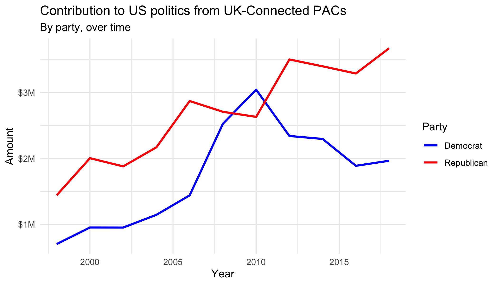

# Optional Lab 08b {#lab08b}

This lab is optional. You are welcome to try it and can count it either as a lab or as a portfolio piece.

**Disclaimer** It is a more extensive lab that I'm not quite happy with. Specifically, I think it is a bit too time consuming and I've not been able to calibrate the difficulty.


```{r include = FALSE}
source("common.R")
ds4p_funyoutube <- read.csv("admin/csv/ds4p_funyoutube.csv", sep="")
ds4p_urls <- read.csv("./admin/csv/ds4p_urls.csv")
```


```{r setup, include=FALSE}
library(tidyverse)
library(robotstxt)

knitr::opts_chunk$set(out.width = "100%", eval = TRUE)
```

```{r unsplash, fig.margin = TRUE, echo = FALSE, eval=FALSE}
knitr::include_graphics("img/lego-grad-cap.jpg")
```

<!--
In this assignment you will work on data scraping.
Having worked through the interactive tutorial titled [Money in politics](https://minecr.shinyapps.io/dsbox-05-moneyinpolitics/) will be a good preparation for this homework assignment as you'll be working with the same website.
-->


```{=html}
<details>
  <summary>Tired of typing your password?</summary>

<p>Chances are your browser has already saved your password, but if not, you can ask Git to save (cache) your password for a period of time, where you indicate the period of time in seconds. For example, if you want it to cache your password for 1 hour, that would be 3,600 seconds. To do so, run the following <b>in the console</b>, <code>usethis::use_git_config(credential.helper = "cache --timeout=3600")</code>. If you want to cache it for a longer amount of time, you can adjust the number in the code.</p>
  
</details>
```
## Packages

In this assignment we will use the following packages:

-   **tidyverse**: a collection of packages for doing data analysis in a "tidy" way
-   **robotstxt**: provides functions to download and parse `robots.txt` files, making it easy to check if bots (spiders, crawler, scrapers, ...) are allowed to access specific resources on a domain
-   **rvest**: helps you scrape information from web pages
-   **scales**: provides the internal scaling infrastructure used by ggplot2 and gives you tools to override the default breaks, labels, transformations and palettes

## Data collection via web scraping

```{r opensecrets, eval=TRUE, echo=FALSE, fig.margin = TRUE}

```

The data come from [OpenSecrets.org](https://www.opensecrets.org), a *"website tracking the influence of money on U.S. politics, and how that money affects policy and citizens' lives"*.
This website is hosted by The Center for Responsive Politics, which is a nonpartisan, independent nonprofit that *"tracks money in U.S. politics and its effect on elections and public policy."*[^1]

Before getting started, let's check that a bot has permissions to access pages on this domain.

```{r paths-allowed, eval=TRUE, warning=FALSE, message=FALSE}
library(robotstxt)
paths_allowed("https://www.opensecrets.org")
```

Our goal is to scrape data for contributions in all election years Open Secrets has data for.
Since that means repeating a task many times, let's first write a function that works on the first page.
Confirm it works on a few others.
Then iterate it over pages for all years.

::: {.box}
Complete the following set of steps in the `scrape-pac.R` file in the `scripts` folder of your repository.
This file already contains some starter code to help you out.
:::

-   Write a function called `scrape_pac()` that scrapes information from the Open Secrets webpage for foreign-contected PAC contributions in a given year.
    This function should

    -   have one input: the URL of the webpage and should return a data frame.
    -   rename variables scraped, using `snake_case` naming.
    -   clean up the `Country of Origin/Parent Company` variable with `str_squish()`.
    -   add a new column to the data frame for `year`. We will want this information when we ultimately have data from all years, so this is a good time to keep track of it. Our function doesn't take a year argument, but the year is embedded in the URL, so we can extract it out of there, and add it as a new column. Use the `str_sub()` function to extract the last 4 characters from the URL. You will probably want to look at the help for this function to figure out how to specify "last 4 characters".

-   Define the URLs for 2020, 2018, and 1998 contributions.
    Then, test your function using these URLs as inputs.
    Does the function seem to do what you expected it to do?

-   Construct a vector called `urls` that contains the URLs for each webpage that contains information on foreign-connected PAC contributions for a given year.

-   Map the `scrape_pac()` function over `urls` in a way that will result in a data frame called `pac_all`.

-   Write the data frame to a csv file called `pac-all.csv` in the `data` folder.

*✅⬆️ If you haven't yet done so, now is definitely a good time to commit and push your changes to GitHub with an appropriate commit message (e.g. "Data scraping complete"). Make sure to commit and push all changed files so that your Git pane is cleared up afterwards.*

1.  In your R Markdown file, load `pac-all.csv` and report its number of observations and variables using inline code.

## Data cleaning

In this section, we clean the `pac_all` data frame to prepare it for analysis and visualization.
We have two goals in data cleaning:

-   Separate the `country_parent` into two such that country and parent company appear in different columns for country-level analysis.

-   Convert contribution amounts in `total`, `dems`, and `repubs` from character strings to numeric values.

The following exercises walk you through how to make these fixes to the data.

2.  Use the `separate()` function to separate `country_parent` into `country` and `parent` columns.
    Note that country and parent company names are separated by `\` (which will need to be specified in your function) and also note that there are some entries where the `\` sign appears twice and in these cases we want to only split the value at the first occurrence of `\`.
    This can be accomplished by setting the `extra` argument in to `"merge"` so that the cell is split into only 2 segments, e.g. we want `"Denmark/Novo Nordisk A/S"` to be split into `"Denmark"` and `"Novo Nordisk A/S"`.
    (See help for `separate()` for more on this.) End your code chunk by printing out the top 10 rows of your data frame (if you just type the data frame name it should automatically do this for you).

3.  Remove the character strings including `$` and `,` signs in the `total`, `dems`,and `repubs` columns and convert these columns to numeric.
    End your code chunk by printing out the top 10 rows of your data frame (if you just type the data frame name it should automatically do this for you).
    A couple hints to help you out:

    -   The `$` character is a special character so it will need to be escaped.

    -   Some contribution amounts are in the millions (e.g. Anheuser-Busch contributed a total of \$1,510,897 in 2008).
        In this case we need to remove all occurrences of `,`, which we can do by using `str_remove_all()` instead of `str_remove()`.

🧶 ✅ ⬆️ *Now is a good time to knit your document, and commit and push your changes to GitHub with an appropriate commit message. Make sure to commit and push all changed files so that your Git pane is cleared up afterwards.*

## Data visualization and interpretation

4.  Create a line plot of total contributions from all foreign-connected PACs in the Canada and Mexico over the years.
    Once you have made the plot, write a brief interpretation of what the graph reveals.
    Few hints to help you out:

    -   Filter for only `Canada` and `Mexico`.
    -   Calculate sum of total contributions from PACs for each year for each country by using a sequence of `group_by()` then `summarize()`.
    -   Make a plot of total contributions (y-axis) by year (x-axis) where two lines identified by different colors represent each of Canada and Mexico.

<!-- -->

5.  Recreate the following visualization. Once you have made the plot, write a brief interpretation of what the graph reveals. Note that these are only UK contributions. You will need to make use of functions from the **scales** package for axis labels as well as from **ggplot2**. Remember, if you can't figure out certain bits, you can always ask on the class github!

```{r echo=FALSE, out.width="100%", fig.fullwidth = TRUE}

```

🧶 ✅ ⬆️ *Knit your document, and commit and push your changes to GitHub with an appropriate commit message. Make sure to commit and push all changed files so that your Git pane is cleared up afterwards.*

[^1]: Source: [Open Secrets - About](https://www.opensecrets.org/about/).

```{r links, child="admin/md/courselinks.md"}
```

