--- 
title: "Data Science for Psychologists"
subtitle: "A Refreshed Exploratory & Graphical Data Analysis in R"
author: 
- S. Mason Garrison
date: "2022-12-27"
knit: "bookdown::render_book"
site: bookdown::bookdown_site
url: 'https\://github.com/DataScience4Psych/DataScience4Psych'
github-repo: DataScience4Psych/DataScience4Psych
twitter-handle: smasongarrison
cover-image: assets/logo.png
documentclass: book
bibliography: [book.bib, packages.bib]
biblio-style: apalike
link-citations: yes
description: "PSY 703: Data Science for Psychologists: A Refreshed Exploratory and Graphical Data Analysis in R"
favicon: assets/favicon.ico

---


# (PART\*) Front Matter {-}


# Welcome to PSY 703 {-}

Welcome to class! This website is designed to accompany Mason Garrison's Data Science for Psychologists (DS4P). DS4P is a graduate-level quantitative methods course at Wake Forest University. This class assumes zero knowledge of programming, computer science, linear algebra, probability, or really anything fancy. I encourage anyone who is quant-curious to work their way through these course notes. The course notes include lectures, worked examples, readings, activities, and labs. You can find the current version of the course syllabus [here][course_syllabus], along with all of the [other syllabi for my classes][syllabi]. All the embedded lecture videos can be found on a [youtube playlist][pl_all]. 


```{=html}
<div class="vembedr" align="center">
<div>
<iframe src="https://www.youtube.com/embed/nYYJmmcgzr8" width="533" height="300" frameborder="0" allowfullscreen="" data-external="1"></iframe>
</div>
</div>
```


<!--DS4P Links-->
[course_web]: https://datascience4psych.github.io/DataScience4Psych
[course_git]: https://github.com/DataScience4Psych/DataScience4Psych
[course_repo]: https://github.com/DataScience4Psych
[course_slides]: https://github.com/DataScience4Psych/slides
[course_syllabus]: https://smasongarrison.github.io/syllabi/ 
<!-- https://smasongarrison.github.io/syllabi/data-science.html -->
[syllabi]: https://smasongarrison.github.io/syllabi
[pl_00]: https://www.youtube.com/playlist?list=PLKrrdtYgOUYaEAnJX20Ryy4OSie375rVY
[pl_01]: https://www.youtube.com/playlist?list=PLKrrdtYgOUYao_7t5ycK4KDXNKaY-ECup
[pl_02]: https://www.youtube.com/playlist?list=PLKrrdtYgOUYZmr_T3PnuxjVIlj0C0kUNI
[pl_03]: https://www.youtube.com/playlist?list=PLKrrdtYgOUYaHmjzdRvfg0yhOIYQnfjwE
[pl_04]: https://www.youtube.com/playlist?list=PLKrrdtYgOUYYWFcel6_vp8__RUKLxhX4y
[pl_05]: https://www.youtube.com/playlist?list=PLKrrdtYgOUYYMIguiV1F8RagMYibTY4iW
[pl_06]: https://www.youtube.com/playlist?list=PLKrrdtYgOUYYV_KDod3Mk9-RmtFXii9Dv
[pl_07]: https://www.youtube.com/watch?list=PLKrrdtYgOUYZxvEvQ8-PcWrOY_dwY_ETI
[pl_08]: https://www.youtube.com/playlist?list=PLKrrdtYgOUYZgOzYB_dmauw55M7jXvsdo
[pl_09]: https://www.youtube.com/playlist?list=PLKrrdtYgOUYbaiTmldRY2ddsLrHp3z6yO
[pl_10]: https://www.youtube.com/playlist?list=PLKrrdtYgOUYbPw5iYzYEzoOKa7mJKNIhq
[pl_11]: https://www.youtube.com/playlist?list=PLKrrdtYgOUYZ-u6LzBbanrNFoeLHKaLL6
[pl_12]: https://www.youtube.com/playlist?list=PLKrrdtYgOUYbwRS-9Htmb80_t1NG-021e
[pl_13]: https://www.youtube.com/playlist?list=PLKrrdtYgOUYbWGmSnbLIYwdLOnGm6une6
[pl_14]: https://www.youtube.com/playlist?list=PLKrrdtYgOUYbWGmSnbLIYwdLOnGm6une6
[pl_15]: https://www.youtube.com/playlist?list=PLKrrdtYgOUYa5MoYrV8EsWQ5jIr5ZYMpM
[pl_all]: https://www.youtube.com/playlist?list=PLKrrdtYgOUYZomNqf-1dtCDW94ySdLv-9


<!--AE Links-->
[ae01a_unvotes]: https://github.com/DataScience4Psych/ae01a_unvotes
[ae01b_covid]: https://github.com/DataScience4Psych/ae01b_covid
[ae02_bechdel]: https://github.com/DataScience4Psych/ae-02-bechdel-rmarkdown
[ae03_starwars]: https://github.com/DataScience4Psych/ae-03-starwars-dataviz


<!-- Lab Links-->

[lab01_hello]: https://github.com/DataScience4Psych/lab-01-hello-r

<!--Slides-->
[d01_welcome]: https://datascience4psych.github.io/slides/d01_welcome/d01_welcome.html
[d02_toolkit]: https://datascience4psych.github.io/slides/d02_toolkit/d02_toolkit.html
[d03_dataviz]: https://datascience4psych.github.io/slides/d03_dataviz/d03_dataviz.html
[d04_ggplot2]: https://datascience4psych.github.io/slides/d04_ggplot2/d04_ggplot2.html
[d05_viznum]: https://datascience4psych.github.io/slides/d05_viznum/d05_viznum.html
[d06_vizcat]: https://datascience4psych.github.io/slides/d06_vizcat/d06_vizcat.html
[d07_tidy]: https://datascience4psych.github.io/slides/d07_tidy/d07_tidy.html
[d08_grammar]: https://datascience4psych.github.io/slides/d08_grammar/d08_grammar.html
[d09_wrangle]: https://datascience4psych.github.io/slides/d09_wrangle/d09_wrangle.html
[d10_dfs]: https://datascience4psych.github.io/slides/d10_dfs/d10_dfs.html
[d11_types]: https://datascience4psych.github.io/slides/d11_types/d11_types.html
[d12_import]: https://datascience4psych.github.io/slides/d12_import/d12_import.html
[d13_goodviz]: https://datascience4psych.github.io/slides/d13_goodviz/d13_goodviz.html
[d13b_moreggplot]: https://datascience4psych.github.io/slides/d13_goodviz/d13b_moreggplot.html
[d14_confound]: https://datascience4psych.github.io/slides/d14_confound/d14_confound.html
[d15_goodtalk]: https://datascience4psych.github.io/slides/d15_goodtalk/d15_goodtalk.html
[d16_webscraping]: https://datascience4psych.github.io/slides/d16_webscraping/d16_webscraping.html
[d17_functions]: https://datascience4psych.github.io/slides/d17_functions/d17_functions.html
[d18_ethics]: https://datascience4psych.github.io/slides/d18_ethics/d18_ethics.html
[d19_bias]: https://datascience4psych.github.io/slides/d19_bias/d19_bias.html


<!--externals-->

[stat545]: https://stat545.com
[r4ds]: https://r4ds.had.co.nz
[cran]: https://cloud.r-project.org


<!--chapter:end:index.Rmd-->

<!-- front page -->


## Mason Notes {-}


This website is constantly changing. I am actively developing this course, and is approximately 99.2% done. I have made this process explicitly transparent because I want you to see how you can use R to produce some pretty neat things. Indeed, I've included the source code for this website in the class [repo][course_repo]. I encourage you to contribute to the [course code][course_git]. If you catch typos or errors, please issue a pull request with the fixes. If you find cool or useful resources, please add them. By the end of the semester, I would love for everyone to have contributed to the course materials.


### How to use these notes {-}

To navigate these course notes, use the table of contents on the left side of the screen. You can open or close the table of contents using the hamburger icon (horizontal bars) at the top of the document. There are also additional icons at the top of the document that allow you to search the document, change the size, font, or color scheme of the page. The document will be updated (unpredictably) throughout the semester.

Every module corresponds to a week's worth of material. Most modules are dedicated to improving a specific skill or at the very least dedicated to a specific theme. Within each module, there are embedded videos, slides, activities, labs, and tutorials. The skills developed in each module build upon skills you've developed in previous modules. Eventually, this class will have more modules available than weeks in a semester, so that you -- the reader -- can choose your own adventure (err... module) you'd like to start with. 

Although these notes have some textbook-like features, they are neither comprehensive nor completely original. The main purpose is to give you all a set of common materials to draw upon during the course. In class, we will sometimes do things outside the notes. The idea here is that you will read the materials and try to learn from them, just as you will attend classes and try to learn from them.


### Status of course {-}

In terms of timing, I will have each module completed by the start of the week. Given that the class meets on Tuesday and Thursday, the start of the "week" will be Monday at 12 p.m. EST. I may get ahead of this deadline. You can see the current status of the course below. Although you are welcome to work ahead, be aware that I will be making changes to modules that haven't officially started yet. In addition, I may add optional materials to previous modules that might be helpful. 


```{=html}
<div class="vembedr" align="center">
<div>
<iframe src="https://www.youtube.com/embed/fwJHNw9jU_U" width="533" height="300" frameborder="0" allowfullscreen="" data-external="1"></iframe>
</div>
</div>
```

This table provides the current status of the course. It lists proportions of specific components by module. Overall, it is 99.167% complete. 


```{=html}
<div class="datatables html-widget html-fill-item-overflow-hidden html-fill-item" id="htmlwidget-89bc4a34c722eeeb8166" style="width:100%;height:auto;"></div>
<script type="application/json" data-for="htmlwidget-89bc4a34c722eeeb8166">{"x":{"filter":"none","vertical":false,"data":[[0,1,2,3,4,5,6,7,8,9,10,11,12,13,14,15],[1,1,1,1,1,1,1,1,1,1,1,1,1,1,null,null],[null,1,1,1,1,1,1,1,1,1,1,1,1,1,null,null],[1,1,1,1,1,1,1,1,1,0.5,1,1,1,1,null,null],[null,1,1,1,1,1,null,1,1,null,null,null,null,null,null,null],[1,1,1,1,1,1,1,1,1,1,1,1,1,1,1,null],[1,1,1,1,1,1,1,1,1,0.875,1,1,1,1,1,null]],"container":"<table class=\"cell-border stripe\">\n  <thead>\n    <tr>\n      <th>Module<\/th>\n      <th>Slides<\/th>\n      <th>Lab<\/th>\n      <th>Videos<\/th>\n      <th>Application<\/th>\n      <th>Lecture Notes<\/th>\n      <th>Status<\/th>\n    <\/tr>\n  <\/thead>\n<\/table>","options":{"autoWidth":true,"bInfo":false,"paging":false,"columnDefs":[{"className":"dt-right","targets":[0,1,2,3,4,5,6]}],"order":[],"orderClasses":false}},"evals":[],"jsHooks":[]}</script>
```


# Attribution {-}
This class leans heavily on other peoples' materials and ideas. I have done my best to document the origin of the materials and ideas. In particular, I have noted people whose work has been a major contribution as well as those who have additional contributions. You can see specific changes by examining the [edit history on the git repo](https://github.com/DataScience4Psych/DataScience4Psych/commits/main)


## Major Attributions  {-}

* Jenny Bryan's ([jennybryan.org](https://jennybryan.org)) [STAT 545][stat545] and [Happy Git with R](https://happygitwithr.com/);
* Joe Rodgers's PSY 8751 Exploratory and Graphical Data Analysis Course
* Mine Çetinkaya-Rundel's [Data Science in a Box](https://datasciencebox.org/).


## Additional Attributions  {-}

* Academic.io's [AWESOME DATA SCIENCE](https://github.com/academic/awesome-datascience)
* [Julia Fukuyama](https://jfukuyama.github.io/)'s [EXPLORATORY DATA ANALYSIS](https://jfukuyama.github.io/teaching/stat670/)
* Benjamin Soltoff's [Computing for the Social Sciences](https://cfss.uchicago.edu/)
* [Grant McDermott](https://github.com/grantmcdermott)'s course materials on [environmental economics and data science](https://github.com/uo-ec607)
* [Zachary M. Smith](https://github.com/zsmith27/)'s [crash course in rmarkdown](https://github.com/zsmith27/rmarkdown_crash-course)
* [Thomas E. Love](https://thomaselove.github.io/431-notes/)
* [Karl Broman](https://www.biostat.wisc.edu/~kbroman/topten_worstgraphs/)
* [EMILY SUZANNE CLARK](https://esclark.hcommons.org/the-unessay/)'s Rubric for Unessays
* [Ariel Muldoon](https://github.com/aosmith16)'s [tutorial on simulations](https://github.com/aosmith16/simulation-helper-functions)

# License {-#license}

This work is licensed under a [Creative Commons Attribution-ShareAlike 4.0 International License](https://creativecommons.org/licenses/by-sa/4.0/).

<center>
<i class="fab fa-creative-commons fa-2x"></i><i class="fab fa-creative-commons-by fa-2x"></i><i class="fab fa-creative-commons-sa fa-2x"></i>
</center>

*This information is a human-readable summary of (and not a substitute for) the license. Please see <https://creativecommons.org/licenses/by-sa/4.0/legalcode> for the full legal text.*

**You are free to:**

- **Share**---copy and redistribute the material in any medium or format

- **Remix**---remix, transform, and build upon the material for any purpose, even commercially.

The licensor cannot revoke these freedoms as long as you follow the license terms.

**Under the following terms:**

- **Attribution**---You must give appropriate credit, provide a link to the license, and indicate if changes were made. You may do so in any reasonable manner, but not in any way that suggests the licensor endorses you or your use.
  
- **ShareAlike**---If you remix, transform, or build upon the material, you must distribute your contributions under the same license as the original. 

- **No additional restrictions**---You may not apply legal terms or technological measures that legally restrict others from doing anything the license permits.

**Notices:**

You do not have to comply with the license for elements of the material in the public domain or where your use is permitted by an applicable exception or limitation.

No warranties are given. The license may not give you all of the permissions necessary for your intended use. For example, other rights such as publicity, privacy, or moral rights may limit how you use the material.


# Sitemap {-}


```{=html}
<div id="jkuhcolbgk" style="padding-left:0px;padding-right:0px;padding-top:10px;padding-bottom:10px;overflow-x:auto;overflow-y:auto;width:auto;height:auto;">
<style>html {
  font-family: -apple-system, BlinkMacSystemFont, 'Segoe UI', Roboto, Oxygen, Ubuntu, Cantarell, 'Helvetica Neue', 'Fira Sans', 'Droid Sans', Arial, sans-serif;
}

#jkuhcolbgk .gt_table {
  display: table;
  border-collapse: collapse;
  margin-left: auto;
  margin-right: auto;
  color: #333333;
  font-size: 16px;
  font-weight: normal;
  font-style: normal;
  background-color: #FFFFFF;
  width: auto;
  border-top-style: solid;
  border-top-width: 2px;
  border-top-color: #A8A8A8;
  border-right-style: none;
  border-right-width: 2px;
  border-right-color: #D3D3D3;
  border-bottom-style: solid;
  border-bottom-width: 2px;
  border-bottom-color: #A8A8A8;
  border-left-style: none;
  border-left-width: 2px;
  border-left-color: #D3D3D3;
}

#jkuhcolbgk .gt_heading {
  background-color: #FFFFFF;
  text-align: center;
  border-bottom-color: #FFFFFF;
  border-left-style: none;
  border-left-width: 1px;
  border-left-color: #D3D3D3;
  border-right-style: none;
  border-right-width: 1px;
  border-right-color: #D3D3D3;
}

#jkuhcolbgk .gt_caption {
  padding-top: 4px;
  padding-bottom: 4px;
}

#jkuhcolbgk .gt_title {
  color: #333333;
  font-size: 125%;
  font-weight: initial;
  padding-top: 4px;
  padding-bottom: 4px;
  padding-left: 5px;
  padding-right: 5px;
  border-bottom-color: #FFFFFF;
  border-bottom-width: 0;
}

#jkuhcolbgk .gt_subtitle {
  color: #333333;
  font-size: 85%;
  font-weight: initial;
  padding-top: 0;
  padding-bottom: 6px;
  padding-left: 5px;
  padding-right: 5px;
  border-top-color: #FFFFFF;
  border-top-width: 0;
}

#jkuhcolbgk .gt_bottom_border {
  border-bottom-style: solid;
  border-bottom-width: 2px;
  border-bottom-color: #D3D3D3;
}

#jkuhcolbgk .gt_col_headings {
  border-top-style: solid;
  border-top-width: 2px;
  border-top-color: #D3D3D3;
  border-bottom-style: solid;
  border-bottom-width: 2px;
  border-bottom-color: #D3D3D3;
  border-left-style: none;
  border-left-width: 1px;
  border-left-color: #D3D3D3;
  border-right-style: none;
  border-right-width: 1px;
  border-right-color: #D3D3D3;
}

#jkuhcolbgk .gt_col_heading {
  color: #333333;
  background-color: #FFFFFF;
  font-size: 100%;
  font-weight: normal;
  text-transform: inherit;
  border-left-style: none;
  border-left-width: 1px;
  border-left-color: #D3D3D3;
  border-right-style: none;
  border-right-width: 1px;
  border-right-color: #D3D3D3;
  vertical-align: bottom;
  padding-top: 5px;
  padding-bottom: 6px;
  padding-left: 5px;
  padding-right: 5px;
  overflow-x: hidden;
}

#jkuhcolbgk .gt_column_spanner_outer {
  color: #333333;
  background-color: #FFFFFF;
  font-size: 100%;
  font-weight: normal;
  text-transform: inherit;
  padding-top: 0;
  padding-bottom: 0;
  padding-left: 4px;
  padding-right: 4px;
}

#jkuhcolbgk .gt_column_spanner_outer:first-child {
  padding-left: 0;
}

#jkuhcolbgk .gt_column_spanner_outer:last-child {
  padding-right: 0;
}

#jkuhcolbgk .gt_column_spanner {
  border-bottom-style: solid;
  border-bottom-width: 2px;
  border-bottom-color: #D3D3D3;
  vertical-align: bottom;
  padding-top: 5px;
  padding-bottom: 5px;
  overflow-x: hidden;
  display: inline-block;
  width: 100%;
}

#jkuhcolbgk .gt_group_heading {
  padding-top: 8px;
  padding-bottom: 8px;
  padding-left: 5px;
  padding-right: 5px;
  color: #333333;
  background-color: #FFFFFF;
  font-size: 100%;
  font-weight: initial;
  text-transform: inherit;
  border-top-style: solid;
  border-top-width: 2px;
  border-top-color: #D3D3D3;
  border-bottom-style: solid;
  border-bottom-width: 2px;
  border-bottom-color: #D3D3D3;
  border-left-style: none;
  border-left-width: 1px;
  border-left-color: #D3D3D3;
  border-right-style: none;
  border-right-width: 1px;
  border-right-color: #D3D3D3;
  vertical-align: middle;
  text-align: left;
}

#jkuhcolbgk .gt_empty_group_heading {
  padding: 0.5px;
  color: #333333;
  background-color: #FFFFFF;
  font-size: 100%;
  font-weight: initial;
  border-top-style: solid;
  border-top-width: 2px;
  border-top-color: #D3D3D3;
  border-bottom-style: solid;
  border-bottom-width: 2px;
  border-bottom-color: #D3D3D3;
  vertical-align: middle;
}

#jkuhcolbgk .gt_from_md > :first-child {
  margin-top: 0;
}

#jkuhcolbgk .gt_from_md > :last-child {
  margin-bottom: 0;
}

#jkuhcolbgk .gt_row {
  padding-top: 8px;
  padding-bottom: 8px;
  padding-left: 5px;
  padding-right: 5px;
  margin: 10px;
  border-top-style: solid;
  border-top-width: 1px;
  border-top-color: #D3D3D3;
  border-left-style: none;
  border-left-width: 1px;
  border-left-color: #D3D3D3;
  border-right-style: none;
  border-right-width: 1px;
  border-right-color: #D3D3D3;
  vertical-align: middle;
  overflow-x: hidden;
}

#jkuhcolbgk .gt_stub {
  color: #333333;
  background-color: #FFFFFF;
  font-size: 100%;
  font-weight: initial;
  text-transform: inherit;
  border-right-style: solid;
  border-right-width: 2px;
  border-right-color: #D3D3D3;
  padding-left: 5px;
  padding-right: 5px;
}

#jkuhcolbgk .gt_stub_row_group {
  color: #333333;
  background-color: #FFFFFF;
  font-size: 100%;
  font-weight: initial;
  text-transform: inherit;
  border-right-style: solid;
  border-right-width: 2px;
  border-right-color: #D3D3D3;
  padding-left: 5px;
  padding-right: 5px;
  vertical-align: top;
}

#jkuhcolbgk .gt_row_group_first td {
  border-top-width: 2px;
}

#jkuhcolbgk .gt_summary_row {
  color: #333333;
  background-color: #FFFFFF;
  text-transform: inherit;
  padding-top: 8px;
  padding-bottom: 8px;
  padding-left: 5px;
  padding-right: 5px;
}

#jkuhcolbgk .gt_first_summary_row {
  border-top-style: solid;
  border-top-color: #D3D3D3;
}

#jkuhcolbgk .gt_first_summary_row.thick {
  border-top-width: 2px;
}

#jkuhcolbgk .gt_last_summary_row {
  padding-top: 8px;
  padding-bottom: 8px;
  padding-left: 5px;
  padding-right: 5px;
  border-bottom-style: solid;
  border-bottom-width: 2px;
  border-bottom-color: #D3D3D3;
}

#jkuhcolbgk .gt_grand_summary_row {
  color: #333333;
  background-color: #FFFFFF;
  text-transform: inherit;
  padding-top: 8px;
  padding-bottom: 8px;
  padding-left: 5px;
  padding-right: 5px;
}

#jkuhcolbgk .gt_first_grand_summary_row {
  padding-top: 8px;
  padding-bottom: 8px;
  padding-left: 5px;
  padding-right: 5px;
  border-top-style: double;
  border-top-width: 6px;
  border-top-color: #D3D3D3;
}

#jkuhcolbgk .gt_striped {
  background-color: rgba(128, 128, 128, 0.05);
}

#jkuhcolbgk .gt_table_body {
  border-top-style: solid;
  border-top-width: 2px;
  border-top-color: #D3D3D3;
  border-bottom-style: solid;
  border-bottom-width: 2px;
  border-bottom-color: #D3D3D3;
}

#jkuhcolbgk .gt_footnotes {
  color: #333333;
  background-color: #FFFFFF;
  border-bottom-style: none;
  border-bottom-width: 2px;
  border-bottom-color: #D3D3D3;
  border-left-style: none;
  border-left-width: 2px;
  border-left-color: #D3D3D3;
  border-right-style: none;
  border-right-width: 2px;
  border-right-color: #D3D3D3;
}

#jkuhcolbgk .gt_footnote {
  margin: 0px;
  font-size: 90%;
  padding-left: 4px;
  padding-right: 4px;
  padding-left: 5px;
  padding-right: 5px;
}

#jkuhcolbgk .gt_sourcenotes {
  color: #333333;
  background-color: #FFFFFF;
  border-bottom-style: none;
  border-bottom-width: 2px;
  border-bottom-color: #D3D3D3;
  border-left-style: none;
  border-left-width: 2px;
  border-left-color: #D3D3D3;
  border-right-style: none;
  border-right-width: 2px;
  border-right-color: #D3D3D3;
}

#jkuhcolbgk .gt_sourcenote {
  font-size: 90%;
  padding-top: 4px;
  padding-bottom: 4px;
  padding-left: 5px;
  padding-right: 5px;
}

#jkuhcolbgk .gt_left {
  text-align: left;
}

#jkuhcolbgk .gt_center {
  text-align: center;
}

#jkuhcolbgk .gt_right {
  text-align: right;
  font-variant-numeric: tabular-nums;
}

#jkuhcolbgk .gt_font_normal {
  font-weight: normal;
}

#jkuhcolbgk .gt_font_bold {
  font-weight: bold;
}

#jkuhcolbgk .gt_font_italic {
  font-style: italic;
}

#jkuhcolbgk .gt_super {
  font-size: 65%;
}

#jkuhcolbgk .gt_footnote_marks {
  font-style: italic;
  font-weight: normal;
  font-size: 75%;
  vertical-align: 0.4em;
}

#jkuhcolbgk .gt_asterisk {
  font-size: 100%;
  vertical-align: 0;
}

#jkuhcolbgk .gt_indent_1 {
  text-indent: 5px;
}

#jkuhcolbgk .gt_indent_2 {
  text-indent: 10px;
}

#jkuhcolbgk .gt_indent_3 {
  text-indent: 15px;
}

#jkuhcolbgk .gt_indent_4 {
  text-indent: 20px;
}

#jkuhcolbgk .gt_indent_5 {
  text-indent: 25px;
}
</style>
<table class="gt_table">
  
  <thead class="gt_col_headings">
    <tr>
      <th class="gt_col_heading gt_columns_bottom_border gt_left" rowspan="1" colspan="1" scope="col" id="title">title</th>
      <th class="gt_col_heading gt_columns_bottom_border gt_center" rowspan="1" colspan="1" scope="col" id="link">link</th>
    </tr>
  </thead>
  <tbody class="gt_table_body">
    <tr><td headers="title" class="gt_row gt_left">404</td>
<td headers="link" class="gt_row gt_center"><a href="https://datascience4psych.github.io/DataScience4Psych/404.html">website</a></td></tr>
    <tr><td headers="title" class="gt_row gt_left">api wrappers</td>
<td headers="link" class="gt_row gt_center"><a href="https://datascience4psych.github.io/DataScience4Psych/api-wrappers.html">website</a></td></tr>
    <tr><td headers="title" class="gt_row gt_left">attribution</td>
<td headers="link" class="gt_row gt_center"><a href="https://datascience4psych.github.io/DataScience4Psych/attribution.html">website</a></td></tr>
    <tr><td headers="title" class="gt_row gt_left">automation</td>
<td headers="link" class="gt_row gt_center"><a href="https://datascience4psych.github.io/DataScience4Psych/automation.html">website</a></td></tr>
    <tr><td headers="title" class="gt_row gt_left">basic syntax</td>
<td headers="link" class="gt_row gt_center"><a href="https://datascience4psych.github.io/DataScience4Psych/basic-syntax.html">website</a></td></tr>
    <tr><td headers="title" class="gt_row gt_left">basic data care</td>
<td headers="link" class="gt_row gt_center"><a href="https://datascience4psych.github.io/DataScience4Psych/basic_data_care.html">website</a></td></tr>
    <tr><td headers="title" class="gt_row gt_left">basiccare</td>
<td headers="link" class="gt_row gt_center"><a href="https://datascience4psych.github.io/DataScience4Psych/basiccare.html">website</a></td></tr>
    <tr><td headers="title" class="gt_row gt_left">bechdal</td>
<td headers="link" class="gt_row gt_center"><a href="https://datascience4psych.github.io/DataScience4Psych/bechdal.html">website</a></td></tr>
    <tr><td headers="title" class="gt_row gt_left">bias</td>
<td headers="link" class="gt_row gt_center"><a href="https://datascience4psych.github.io/DataScience4Psych/bias.html">website</a></td></tr>
    <tr><td headers="title" class="gt_row gt_left">bootstrapping</td>
<td headers="link" class="gt_row gt_center"><a href="https://datascience4psych.github.io/DataScience4Psych/bootstrapping.html">website</a></td></tr>
    <tr><td headers="title" class="gt_row gt_left">child documents</td>
<td headers="link" class="gt_row gt_center"><a href="https://datascience4psych.github.io/DataScience4Psych/child-documents.html">website</a></td></tr>
    <tr><td headers="title" class="gt_row gt_left">colophon</td>
<td headers="link" class="gt_row gt_center"><a href="https://datascience4psych.github.io/DataScience4Psych/colophon.html">website</a></td></tr>
    <tr><td headers="title" class="gt_row gt_left">communicating data science results effectively</td>
<td headers="link" class="gt_row gt_center"><a href="https://datascience4psych.github.io/DataScience4Psych/communicating-data-science-results-effectively.html">website</a></td></tr>
    <tr><td headers="title" class="gt_row gt_left">creating datasets with quantiative and categorical variables</td>
<td headers="link" class="gt_row gt_center"><a href="https://datascience4psych.github.io/DataScience4Psych/creating-datasets-with-quantiative-and-categorical-variables.html">website</a></td></tr>
    <tr><td headers="title" class="gt_row gt_left">cross validation</td>
<td headers="link" class="gt_row gt_center"><a href="https://datascience4psych.github.io/DataScience4Psych/cross-validation.html">website</a></td></tr>
    <tr><td headers="title" class="gt_row gt_left">data science and ethics</td>
<td headers="link" class="gt_row gt_center"><a href="https://datascience4psych.github.io/DataScience4Psych/data-science-and-ethics.html">website</a></td></tr>
    <tr><td headers="title" class="gt_row gt_left">data types and recoding</td>
<td headers="link" class="gt_row gt_center"><a href="https://datascience4psych.github.io/DataScience4Psych/data-types-and-recoding.html">website</a></td></tr>
    <tr><td headers="title" class="gt_row gt_left">data usually finds me</td>
<td headers="link" class="gt_row gt_center"><a href="https://datascience4psych.github.io/DataScience4Psych/data-usually-finds-me.html">website</a></td></tr>
    <tr><td headers="title" class="gt_row gt_left">deeper diving into ggplot2</td>
<td headers="link" class="gt_row gt_center"><a href="https://datascience4psych.github.io/DataScience4Psych/deeper-diving-into-ggplot2.html">website</a></td></tr>
    <tr><td headers="title" class="gt_row gt_left">designing effective visualizations</td>
<td headers="link" class="gt_row gt_center"><a href="https://datascience4psych.github.io/DataScience4Psych/designing-effective-visualizations.html">website</a></td></tr>
    <tr><td headers="title" class="gt_row gt_left">diy web data</td>
<td headers="link" class="gt_row gt_center"><a href="https://datascience4psych.github.io/DataScience4Psych/diy-web-data.html">website</a></td></tr>
    <tr><td headers="title" class="gt_row gt_left">dont miss module 00</td>
<td headers="link" class="gt_row gt_center"><a href="https://datascience4psych.github.io/DataScience4Psych/dont-miss-module-00.html">website</a></td></tr>
    <tr><td headers="title" class="gt_row gt_left">dont miss the last module</td>
<td headers="link" class="gt_row gt_center"><a href="https://datascience4psych.github.io/DataScience4Psych/dont-miss-the-last-module.html">website</a></td></tr>
    <tr><td headers="title" class="gt_row gt_left">dplyr intro</td>
<td headers="link" class="gt_row gt_center"><a href="https://datascience4psych.github.io/DataScience4Psych/dplyr-intro.html">website</a></td></tr>
    <tr><td headers="title" class="gt_row gt_left">dplyr intro</td>
<td headers="link" class="gt_row gt_center"><a href="https://datascience4psych.github.io/DataScience4Psych/dplyr_intro.html">website</a></td></tr>
    <tr><td headers="title" class="gt_row gt_left">exploratory data analysis</td>
<td headers="link" class="gt_row gt_center"><a href="https://datascience4psych.github.io/DataScience4Psych/exploratory-data-analysis.html">website</a></td></tr>
    <tr><td headers="title" class="gt_row gt_left">featurenotes</td>
<td headers="link" class="gt_row gt_center"><a href="https://datascience4psych.github.io/DataScience4Psych/featurenotes.html">website</a></td></tr>
    <tr><td headers="title" class="gt_row gt_left">fitting and interpreting models</td>
<td headers="link" class="gt_row gt_center"><a href="https://datascience4psych.github.io/DataScience4Psych/fitting-and-interpreting-models.html">website</a></td></tr>
    <tr><td headers="title" class="gt_row gt_left">functions 1</td>
<td headers="link" class="gt_row gt_center"><a href="https://datascience4psych.github.io/DataScience4Psych/functions-1.html">website</a></td></tr>
    <tr><td headers="title" class="gt_row gt_left">functions part1</td>
<td headers="link" class="gt_row gt_center"><a href="https://datascience4psych.github.io/DataScience4Psych/functions-part1.html">website</a></td></tr>
    <tr><td headers="title" class="gt_row gt_left">functions practicum</td>
<td headers="link" class="gt_row gt_center"><a href="https://datascience4psych.github.io/DataScience4Psych/functions-practicum.html">website</a></td></tr>
    <tr><td headers="title" class="gt_row gt_left">generate character vectors with rep</td>
<td headers="link" class="gt_row gt_center"><a href="https://datascience4psych.github.io/DataScience4Psych/generate-character-vectors-with-rep.html">website</a></td></tr>
    <tr><td headers="title" class="gt_row gt_left">getting started with simulating data in r</td>
<td headers="link" class="gt_row gt_center"><a href="https://datascience4psych.github.io/DataScience4Psych/getting-started-with-simulating-data-in-r.html">website</a></td></tr>
    <tr><td headers="title" class="gt_row gt_left">good resources</td>
<td headers="link" class="gt_row gt_center"><a href="https://datascience4psych.github.io/DataScience4Psych/good-resources.html">website</a></td></tr>
    <tr><td headers="title" class="gt_row gt_left">grammar of data wrangling</td>
<td headers="link" class="gt_row gt_center"><a href="https://datascience4psych.github.io/DataScience4Psych/grammar-of-data-wrangling.html">website</a></td></tr>
    <tr><td headers="title" class="gt_row gt_left">guidance</td>
<td headers="link" class="gt_row gt_center"><a href="https://datascience4psych.github.io/DataScience4Psych/guidance.html">website</a></td></tr>
    <tr><td headers="title" class="gt_row gt_left">handson</td>
<td headers="link" class="gt_row gt_center"><a href="https://datascience4psych.github.io/DataScience4Psych/handson.html">website</a></td></tr>
    <tr><td headers="title" class="gt_row gt_left">import export</td>
<td headers="link" class="gt_row gt_center"><a href="https://datascience4psych.github.io/DataScience4Psych/import-export.html">website</a></td></tr>
    <tr><td headers="title" class="gt_row gt_left">importing data</td>
<td headers="link" class="gt_row gt_center"><a href="https://datascience4psych.github.io/DataScience4Psych/importing-data.html">website</a></td></tr>
    <tr><td headers="title" class="gt_row gt_left">index</td>
<td headers="link" class="gt_row gt_center"><a href="https://datascience4psych.github.io/DataScience4Psych/index.html">website</a></td></tr>
    <tr><td headers="title" class="gt_row gt_left">lab01</td>
<td headers="link" class="gt_row gt_center"><a href="https://datascience4psych.github.io/DataScience4Psych/lab01.html">website</a></td></tr>
    <tr><td headers="title" class="gt_row gt_left">lab02</td>
<td headers="link" class="gt_row gt_center"><a href="https://datascience4psych.github.io/DataScience4Psych/lab02.html">website</a></td></tr>
    <tr><td headers="title" class="gt_row gt_left">lab03</td>
<td headers="link" class="gt_row gt_center"><a href="https://datascience4psych.github.io/DataScience4Psych/lab03.html">website</a></td></tr>
    <tr><td headers="title" class="gt_row gt_left">lab04</td>
<td headers="link" class="gt_row gt_center"><a href="https://datascience4psych.github.io/DataScience4Psych/lab04.html">website</a></td></tr>
    <tr><td headers="title" class="gt_row gt_left">lab05</td>
<td headers="link" class="gt_row gt_center"><a href="https://datascience4psych.github.io/DataScience4Psych/lab05.html">website</a></td></tr>
    <tr><td headers="title" class="gt_row gt_left">lab06</td>
<td headers="link" class="gt_row gt_center"><a href="https://datascience4psych.github.io/DataScience4Psych/lab06.html">website</a></td></tr>
    <tr><td headers="title" class="gt_row gt_left">lab07</td>
<td headers="link" class="gt_row gt_center"><a href="https://datascience4psych.github.io/DataScience4Psych/lab07.html">website</a></td></tr>
    <tr><td headers="title" class="gt_row gt_left">lab08</td>
<td headers="link" class="gt_row gt_center"><a href="https://datascience4psych.github.io/DataScience4Psych/lab08.html">website</a></td></tr>
    <tr><td headers="title" class="gt_row gt_left">lab08b</td>
<td headers="link" class="gt_row gt_center"><a href="https://datascience4psych.github.io/DataScience4Psych/lab08b.html">website</a></td></tr>
    <tr><td headers="title" class="gt_row gt_left">lab09</td>
<td headers="link" class="gt_row gt_center"><a href="https://datascience4psych.github.io/DataScience4Psych/lab09.html">website</a></td></tr>
    <tr><td headers="title" class="gt_row gt_left">lab10</td>
<td headers="link" class="gt_row gt_center"><a href="https://datascience4psych.github.io/DataScience4Psych/lab10.html">website</a></td></tr>
    <tr><td headers="title" class="gt_row gt_left">lab11</td>
<td headers="link" class="gt_row gt_center"><a href="https://datascience4psych.github.io/DataScience4Psych/lab11.html">website</a></td></tr>
    <tr><td headers="title" class="gt_row gt_left">language of models</td>
<td headers="link" class="gt_row gt_center"><a href="https://datascience4psych.github.io/DataScience4Psych/language-of-models.html">website</a></td></tr>
    <tr><td headers="title" class="gt_row gt_left">lesson 2 rmd creation</td>
<td headers="link" class="gt_row gt_center"><a href="https://datascience4psych.github.io/DataScience4Psych/lesson-2-rmd-creation.html">website</a></td></tr>
    <tr><td headers="title" class="gt_row gt_left">lesson 3 basic syntax</td>
<td headers="link" class="gt_row gt_center"><a href="https://datascience4psych.github.io/DataScience4Psych/lesson-3-basic-syntax.html">website</a></td></tr>
    <tr><td headers="title" class="gt_row gt_left">lesson 4 yaml headers</td>
<td headers="link" class="gt_row gt_center"><a href="https://datascience4psych.github.io/DataScience4Psych/lesson-4-yaml-headers.html">website</a></td></tr>
    <tr><td headers="title" class="gt_row gt_left">lesson 5 code chunks and inline code</td>
<td headers="link" class="gt_row gt_center"><a href="https://datascience4psych.github.io/DataScience4Psych/lesson-5-code-chunks-and-inline-code.html">website</a></td></tr>
    <tr><td headers="title" class="gt_row gt_left">lesson 6 child documents</td>
<td headers="link" class="gt_row gt_center"><a href="https://datascience4psych.github.io/DataScience4Psych/lesson-6-child-documents.html">website</a></td></tr>
    <tr><td headers="title" class="gt_row gt_left">lesson 7 parameterized reports</td>
<td headers="link" class="gt_row gt_center"><a href="https://datascience4psych.github.io/DataScience4Psych/lesson-7-parameterized-reports.html">website</a></td></tr>
    <tr><td headers="title" class="gt_row gt_left">license</td>
<td headers="link" class="gt_row gt_center"><a href="https://datascience4psych.github.io/DataScience4Psych/license.html">website</a></td></tr>
    <tr><td headers="title" class="gt_row gt_left">media without a home yet</td>
<td headers="link" class="gt_row gt_center"><a href="https://datascience4psych.github.io/DataScience4Psych/media-without-a-home-yet.html">website</a></td></tr>
    <tr><td headers="title" class="gt_row gt_left">meet our toolbox</td>
<td headers="link" class="gt_row gt_center"><a href="https://datascience4psych.github.io/DataScience4Psych/meet-our-toolbox.html">website</a></td></tr>
    <tr><td headers="title" class="gt_row gt_left">merges</td>
<td headers="link" class="gt_row gt_center"><a href="https://datascience4psych.github.io/DataScience4Psych/merges.html">website</a></td></tr>
    <tr><td headers="title" class="gt_row gt_left">mod06</td>
<td headers="link" class="gt_row gt_center"><a href="https://datascience4psych.github.io/DataScience4Psych/mod06.html">website</a></td></tr>
    <tr><td headers="title" class="gt_row gt_left">modeling non linear relationships</td>
<td headers="link" class="gt_row gt_center"><a href="https://datascience4psych.github.io/DataScience4Psych/modeling-non-linear-relationships.html">website</a></td></tr>
    <tr><td headers="title" class="gt_row gt_left">modeling with multiple predictors</td>
<td headers="link" class="gt_row gt_center"><a href="https://datascience4psych.github.io/DataScience4Psych/modeling-with-multiple-predictors.html">website</a></td></tr>
    <tr><td headers="title" class="gt_row gt_left">natural language processing</td>
<td headers="link" class="gt_row gt_center"><a href="https://datascience4psych.github.io/DataScience4Psych/natural-language-processing.html">website</a></td></tr>
    <tr><td headers="title" class="gt_row gt_left">neural networks</td>
<td headers="link" class="gt_row gt_center"><a href="https://datascience4psych.github.io/DataScience4Psych/neural-networks.html">website</a></td></tr>
    <tr><td headers="title" class="gt_row gt_left">notes on feature engineering</td>
<td headers="link" class="gt_row gt_center"><a href="https://datascience4psych.github.io/DataScience4Psych/notes-on-feature-engineering.html">website</a></td></tr>
    <tr><td headers="title" class="gt_row gt_left">notes on hypothesis testing</td>
<td headers="link" class="gt_row gt_center"><a href="https://datascience4psych.github.io/DataScience4Psych/notes-on-hypothesis-testing.html">website</a></td></tr>
    <tr><td headers="title" class="gt_row gt_left">notes on logistic regression</td>
<td headers="link" class="gt_row gt_center"><a href="https://datascience4psych.github.io/DataScience4Psych/notes-on-logistic-regression.html">website</a></td></tr>
    <tr><td headers="title" class="gt_row gt_left">odd design choices in data visualization</td>
<td headers="link" class="gt_row gt_center"><a href="https://datascience4psych.github.io/DataScience4Psych/odd-design-choices-in-data-visualization.html">website</a></td></tr>
    <tr><td headers="title" class="gt_row gt_left">odd notes on cross validation</td>
<td headers="link" class="gt_row gt_center"><a href="https://datascience4psych.github.io/DataScience4Psych/odd-notes-on-cross-validation.html">website</a></td></tr>
    <tr><td headers="title" class="gt_row gt_left">odd transformations data</td>
<td headers="link" class="gt_row gt_center"><a href="https://datascience4psych.github.io/DataScience4Psych/odd-transformations-data.html">website</a></td></tr>
    <tr><td headers="title" class="gt_row gt_left">overfitting</td>
<td headers="link" class="gt_row gt_center"><a href="https://datascience4psych.github.io/DataScience4Psych/overfitting.html">website</a></td></tr>
    <tr><td headers="title" class="gt_row gt_left">parameterized reports</td>
<td headers="link" class="gt_row gt_center"><a href="https://datascience4psych.github.io/DataScience4Psych/parameterized-reports.html">website</a></td></tr>
    <tr><td headers="title" class="gt_row gt_left">plots behaving badly</td>
<td headers="link" class="gt_row gt_center"><a href="https://datascience4psych.github.io/DataScience4Psych/plots-behaving-badly.html">website</a></td></tr>
    <tr><td headers="title" class="gt_row gt_left">practical advice from the data professor</td>
<td headers="link" class="gt_row gt_center"><a href="https://datascience4psych.github.io/DataScience4Psych/practical-advice-from-the-data-professor.html">website</a></td></tr>
    <tr><td headers="title" class="gt_row gt_left">public health</td>
<td headers="link" class="gt_row gt_center"><a href="https://datascience4psych.github.io/DataScience4Psych/public-health.html">website</a></td></tr>
    <tr><td headers="title" class="gt_row gt_left">quantifying uncertainty</td>
<td headers="link" class="gt_row gt_center"><a href="https://datascience4psych.github.io/DataScience4Psych/quantifying-uncertainty.html">website</a></td></tr>
    <tr><td headers="title" class="gt_row gt_left">r project development</td>
<td headers="link" class="gt_row gt_center"><a href="https://datascience4psych.github.io/DataScience4Psych/r-project-development.html">website</a></td></tr>
    <tr><td headers="title" class="gt_row gt_left">r workflow</td>
<td headers="link" class="gt_row gt_center"><a href="https://datascience4psych.github.io/DataScience4Psych/r-workflow.html">website</a></td></tr>
    <tr><td headers="title" class="gt_row gt_left">r basics</td>
<td headers="link" class="gt_row gt_center"><a href="https://datascience4psych.github.io/DataScience4Psych/r_basics.html">website</a></td></tr>
    <tr><td headers="title" class="gt_row gt_left">references</td>
<td headers="link" class="gt_row gt_center"><a href="https://datascience4psych.github.io/DataScience4Psych/references.html">website</a></td></tr>
    <tr><td headers="title" class="gt_row gt_left">repeatedly simulate data with replicate</td>
<td headers="link" class="gt_row gt_center"><a href="https://datascience4psych.github.io/DataScience4Psych/repeatedly-simulate-data-with-replicate.html">website</a></td></tr>
    <tr><td headers="title" class="gt_row gt_left">rmd creation</td>
<td headers="link" class="gt_row gt_center"><a href="https://datascience4psych.github.io/DataScience4Psych/rmd-creation.html">website</a></td></tr>
    <tr><td headers="title" class="gt_row gt_left">rshiny overview</td>
<td headers="link" class="gt_row gt_center"><a href="https://datascience4psych.github.io/DataScience4Psych/rshiny-overview.html">website</a></td></tr>
    <tr><td headers="title" class="gt_row gt_left">rshiny</td>
<td headers="link" class="gt_row gt_center"><a href="https://datascience4psych.github.io/DataScience4Psych/rshiny.html">website</a></td></tr>
    <tr><td headers="title" class="gt_row gt_left">save figs</td>
<td headers="link" class="gt_row gt_center"><a href="https://datascience4psych.github.io/DataScience4Psych/save-figs.html">website</a></td></tr>
    <tr><td headers="title" class="gt_row gt_left">scientific studies and confounding</td>
<td headers="link" class="gt_row gt_center"><a href="https://datascience4psych.github.io/DataScience4Psych/scientific-studies-and-confounding.html">website</a></td></tr>
    <tr><td headers="title" class="gt_row gt_left">scraping the web</td>
<td headers="link" class="gt_row gt_center"><a href="https://datascience4psych.github.io/DataScience4Psych/scraping-the-web.html">website</a></td></tr>
    <tr><td headers="title" class="gt_row gt_left">secrets</td>
<td headers="link" class="gt_row gt_center"><a href="https://datascience4psych.github.io/DataScience4Psych/secrets.html">website</a></td></tr>
    <tr><td headers="title" class="gt_row gt_left">shiny overview</td>
<td headers="link" class="gt_row gt_center"><a href="https://datascience4psych.github.io/DataScience4Psych/shiny-overview.html">website</a></td></tr>
    <tr><td headers="title" class="gt_row gt_left">shiny resources</td>
<td headers="link" class="gt_row gt_center"><a href="https://datascience4psych.github.io/DataScience4Psych/shiny-resources.html">website</a></td></tr>
    <tr><td headers="title" class="gt_row gt_left">shorthappygit</td>
<td headers="link" class="gt_row gt_center"><a href="https://datascience4psych.github.io/DataScience4Psych/shorthappygit.html">website</a></td></tr>
    <tr><td headers="title" class="gt_row gt_left">sitemap</td>
<td headers="link" class="gt_row gt_center"><a href="https://datascience4psych.github.io/DataScience4Psych/sitemap.html">website</a></td></tr>
    <tr><td headers="title" class="gt_row gt_left">special topics machine learn</td>
<td headers="link" class="gt_row gt_center"><a href="https://datascience4psych.github.io/DataScience4Psych/special-topics-machine-learn.html">website</a></td></tr>
    <tr><td headers="title" class="gt_row gt_left">star wars activity</td>
<td headers="link" class="gt_row gt_center"><a href="https://datascience4psych.github.io/DataScience4Psych/star-wars-activity.html">website</a></td></tr>
    <tr><td headers="title" class="gt_row gt_left">thoughtful workflow</td>
<td headers="link" class="gt_row gt_center"><a href="https://datascience4psych.github.io/DataScience4Psych/thoughtful-workflow.html">website</a></td></tr>
    <tr><td headers="title" class="gt_row gt_left">thoughts from hadley wickham on tidyverse</td>
<td headers="link" class="gt_row gt_center"><a href="https://datascience4psych.github.io/DataScience4Psych/thoughts-from-hadley-wickham-on-tidyverse.html">website</a></td></tr>
    <tr><td headers="title" class="gt_row gt_left">tidy data</td>
<td headers="link" class="gt_row gt_center"><a href="https://datascience4psych.github.io/DataScience4Psych/tidy-data.html">website</a></td></tr>
    <tr><td headers="title" class="gt_row gt_left">visualization examples</td>
<td headers="link" class="gt_row gt_center"><a href="https://datascience4psych.github.io/DataScience4Psych/visualization-examples.html">website</a></td></tr>
    <tr><td headers="title" class="gt_row gt_left">visualizing categorical data</td>
<td headers="link" class="gt_row gt_center"><a href="https://datascience4psych.github.io/DataScience4Psych/visualizing-categorical-data.html">website</a></td></tr>
    <tr><td headers="title" class="gt_row gt_left">visualizing data with ggplot2</td>
<td headers="link" class="gt_row gt_center"><a href="https://datascience4psych.github.io/DataScience4Psych/visualizing-data-with-ggplot2.html">website</a></td></tr>
    <tr><td headers="title" class="gt_row gt_left">visualizing numerical data</td>
<td headers="link" class="gt_row gt_center"><a href="https://datascience4psych.github.io/DataScience4Psych/visualizing-numerical-data.html">website</a></td></tr>
    <tr><td headers="title" class="gt_row gt_left">welcome to a markdown crashcourse</td>
<td headers="link" class="gt_row gt_center"><a href="https://datascience4psych.github.io/DataScience4Psych/welcome-to-a-markdown-crashcourse.html">website</a></td></tr>
    <tr><td headers="title" class="gt_row gt_left">welcome to data and ethics</td>
<td headers="link" class="gt_row gt_center"><a href="https://datascience4psych.github.io/DataScience4Psych/welcome-to-data-and-ethics.html">website</a></td></tr>
    <tr><td headers="title" class="gt_row gt_left">welcome to data and visualization</td>
<td headers="link" class="gt_row gt_center"><a href="https://datascience4psych.github.io/DataScience4Psych/welcome-to-data-and-visualization.html">website</a></td></tr>
    <tr><td headers="title" class="gt_row gt_left">welcome to data diving with types</td>
<td headers="link" class="gt_row gt_center"><a href="https://datascience4psych.github.io/DataScience4Psych/welcome-to-data-diving-with-types.html">website</a></td></tr>
    <tr><td headers="title" class="gt_row gt_left">welcome to data science</td>
<td headers="link" class="gt_row gt_center"><a href="https://datascience4psych.github.io/DataScience4Psych/welcome-to-data-science.html">website</a></td></tr>
    <tr><td headers="title" class="gt_row gt_left">welcome to functions and automation</td>
<td headers="link" class="gt_row gt_center"><a href="https://datascience4psych.github.io/DataScience4Psych/welcome-to-functions-and-automation.html">website</a></td></tr>
    <tr><td headers="title" class="gt_row gt_left">welcome to modeling the tidy way</td>
<td headers="link" class="gt_row gt_center"><a href="https://datascience4psych.github.io/DataScience4Psych/welcome-to-modeling-the-tidy-way.html">website</a></td></tr>
    <tr><td headers="title" class="gt_row gt_left">welcome to overfitting and cross validation</td>
<td headers="link" class="gt_row gt_center"><a href="https://datascience4psych.github.io/DataScience4Psych/welcome-to-overfitting-and-cross-validation.html">website</a></td></tr>
    <tr><td headers="title" class="gt_row gt_left">welcome to quantifying uncertainty</td>
<td headers="link" class="gt_row gt_center"><a href="https://datascience4psych.github.io/DataScience4Psych/welcome-to-quantifying-uncertainty.html">website</a></td></tr>
    <tr><td headers="title" class="gt_row gt_left">welcome to simulating data</td>
<td headers="link" class="gt_row gt_center"><a href="https://datascience4psych.github.io/DataScience4Psych/welcome-to-simulating-data.html">website</a></td></tr>
    <tr><td headers="title" class="gt_row gt_left">welcome to the tidyverse</td>
<td headers="link" class="gt_row gt_center"><a href="https://datascience4psych.github.io/DataScience4Psych/welcome-to-the-tidyverse.html">website</a></td></tr>
    <tr><td headers="title" class="gt_row gt_left">welcome to tips for effective data visualization</td>
<td headers="link" class="gt_row gt_center"><a href="https://datascience4psych.github.io/DataScience4Psych/welcome-to-tips-for-effective-data-visualization.html">website</a></td></tr>
    <tr><td headers="title" class="gt_row gt_left">welcome to web scraping</td>
<td headers="link" class="gt_row gt_center"><a href="https://datascience4psych.github.io/DataScience4Psych/welcome-to-web-scraping.html">website</a></td></tr>
    <tr><td headers="title" class="gt_row gt_left">what is data science</td>
<td headers="link" class="gt_row gt_center"><a href="https://datascience4psych.github.io/DataScience4Psych/what-is-data-science.html">website</a></td></tr>
    <tr><td headers="title" class="gt_row gt_left">whats the next step</td>
<td headers="link" class="gt_row gt_center"><a href="https://datascience4psych.github.io/DataScience4Psych/whats-the-next-step.html">website</a></td></tr>
    <tr><td headers="title" class="gt_row gt_left">working with multiple data frames</td>
<td headers="link" class="gt_row gt_center"><a href="https://datascience4psych.github.io/DataScience4Psych/working-with-multiple-data-frames.html">website</a></td></tr>
  </tbody>
  
  
</table>
</div>
```


# Colophon {-}

These notes was written in [bookdown](http://bookdown.org/) inside [RStudio](http://www.rstudio.com/ide/). The [website][course_web] is hosted with [github](https://www.github.com), The complete source is available from [github][course_git].

The book style was designed by [Desirée De Leon](https://desiree.rbind.io/).

This version of the notes was built with:


```
#> Finding R package dependencies ... Done!
#>  setting  value
#>  version  R version 4.2.2 (2022-10-31 ucrt)
#>  os       Windows 10 x64 (build 22623)
#>  system   x86_64, mingw32
#>  ui       RTerm
#>  language (EN)
#>  collate  English_United States.utf8
#>  ctype    English_United States.utf8
#>  tz       America/New_York
#>  date     2022-12-27
#>  pandoc   2.19.2 @ C:/Program Files/RStudio/resources/app/bin/quarto/bin/tools/ (via rmarkdown)
```

Along with these packages:


```{=html}
<div class="datatables html-widget html-fill-item-overflow-hidden html-fill-item" id="htmlwidget-4af7cbf85b5834f17747" style="width:100%;height:auto;"></div>
<script type="application/json" data-for="htmlwidget-4af7cbf85b5834f17747">{"x":{"filter":"top","vertical":false,"filterHTML":"<tr>\n  <td data-type=\"character\" style=\"vertical-align: top;\">\n    <div class=\"form-group has-feedback\" style=\"margin-bottom: auto;\">\n      <input type=\"search\" placeholder=\"All\" class=\"form-control\" style=\"width: 100%;\"/>\n      <span class=\"glyphicon glyphicon-remove-circle form-control-feedback\"><\/span>\n    <\/div>\n  <\/td>\n  <td data-type=\"character\" style=\"vertical-align: top;\">\n    <div class=\"form-group has-feedback\" style=\"margin-bottom: auto;\">\n      <input type=\"search\" placeholder=\"All\" class=\"form-control\" style=\"width: 100%;\"/>\n      <span class=\"glyphicon glyphicon-remove-circle form-control-feedback\"><\/span>\n    <\/div>\n  <\/td>\n  <td data-type=\"character\" style=\"vertical-align: top;\">\n    <div class=\"form-group has-feedback\" style=\"margin-bottom: auto;\">\n      <input type=\"search\" placeholder=\"All\" class=\"form-control\" style=\"width: 100%;\"/>\n      <span class=\"glyphicon glyphicon-remove-circle form-control-feedback\"><\/span>\n    <\/div>\n  <\/td>\n  <td data-type=\"character\" style=\"vertical-align: top;\">\n    <div class=\"form-group has-feedback\" style=\"margin-bottom: auto;\">\n      <input type=\"search\" placeholder=\"All\" class=\"form-control\" style=\"width: 100%;\"/>\n      <span class=\"glyphicon glyphicon-remove-circle form-control-feedback\"><\/span>\n    <\/div>\n  <\/td>\n<\/tr>","data":[["askpass","assertthat","backports","base64enc","bigD","bit","bit64","bitops","blob","bookdown","brew","brio","broom","bslib","cachem","callr","cellranger","cli","clipr","colorspace","commonmark","conflicted","cpp11","crayon","credentials","crosstalk","crul","curl","data.table","DBI","dbplyr","desc","devtools","dichromat","diffobj","digest","downlit","dplyr","DT","dtplyr","ellipsis","evaluate","fansi","farver","fastmap","fontawesome","forcats","fs","gapminder","gargle","gender","genderdata","generics","geonames","gert","ggplot2","gh","gitcreds","glue","googledrive","googlesheets4","gridExtra","gt","gtable","haven","highr","hms","htmltools","htmlwidgets","httpcode","httpuv","httr","ids","ini","isoband","jquerylib","jsonlite","juicyjuice","knitr","labeling","later","lattice","lazyeval","lifecycle","lubridate","magrittr","MASS","Matrix","memoise","mgcv","mime","miniUI","modelr","munsell","nlme","openssl","pillar","pkgbuild","pkgconfig","pkgdown","pkgload","plyr","praise","prettyunits","processx","profvis","progress","promises","ps","purrr","R6","ragg","rappdirs","rcmdcheck","RColorBrewer","Rcpp","readr","readxl","rebird","rematch","rematch2","remotes","reprex","reshape2","rjson","rlang","rmarkdown","roxygen2","rplos","rprojroot","rstudioapi","rversions","rvest","sass","scales","selectr","sessioninfo","shiny","solrium","sourcetools","stringi","stringr","sys","systemfonts","testthat","textshaping","tibble","tidyr","tidyselect","tidyverse","timechange","tinytex","triebeard","tzdb","urlchecker","urltools","usethis","utf8","uuid","V8","vctrs","viridis","viridisLite","vroom","waldo","whisker","withr","xfun","xml2","xopen","xtable","yaml","zip"],[null,"0.2.1","1.4.1",null,null,"4.0.5","4.0.5",null,null,"0.31",null,null,"1.0.2","0.4.2","1.0.6","3.7.3","1.1.0","3.5.0",null,"2.0-3","1.8.1",null,null,"1.5.2",null,"1.2.0",null,"4.3.3",null,"1.1.3","2.2.1",null,"2.4.5",null,null,"0.6.31",null,"1.0.10","0.26",null,"0.3.2","0.19","1.0.3",null,"1.1.0",null,"0.5.2","1.5.2",null,"1.2.1",null,null,"0.1.3",null,null,"3.4.0",null,null,"1.6.2","2.0.0","1.0.1",null,"0.8.0","0.3.1","2.5.1",null,"1.1.2","0.5.4","1.6.0",null,"1.6.7","1.4.4",null,null,null,"0.1.4","1.8.4",null,"1.41",null,"1.3.0",null,null,"1.0.3","1.9.0","2.0.3",null,null,"2.0.1",null,"0.12","0.1.1.1","0.1.10","0.5.0",null,null,"1.8.1","1.4.0","2.0.3",null,"1.3.2",null,null,"1.1.1","3.8.0","0.3.7",null,"1.2.0.1","1.7.2","1.0.0","2.5.1",null,null,null,null,"1.0.9","2.1.3","1.4.1",null,null,null,"2.4.2","2.0.2",null,null,"1.0.6","2.19",null,null,null,"0.14",null,"1.0.3","0.4.4","1.2.1",null,"1.2.2","1.7.4",null,null,"1.7.8","1.5.0",null,null,null,null,"3.1.8","1.2.1","1.2.0","1.3.2","0.1.1",null,null,"0.3.0","1.0.1",null,"2.1.6","1.2.2",null,null,"0.5.1",null,null,"1.6.0",null,null,"2.5.0","0.36","1.3.3",null,"1.8-4","2.3.6",null],["2019-01-13","2019-03-21","2021-12-13","2015-07-28","2022-09-05","2022-11-15","2020-08-30","2021-04-24","2022-04-10","2022-12-13","2022-09-29","2021-11-30","2022-12-15","2022-12-16","2021-08-19","2022-11-02","2016-07-27","2022-12-20","2022-02-22","2022-02-21","2022-10-14","2021-11-26","2022-10-12","2022-09-29","2021-11-29","2021-11-04","2022-09-03","2022-10-06","2022-11-16","2022-06-18","2022-06-27","2022-09-08","2022-10-11","2022-05-02","2021-10-05","2022-12-11","2022-07-05","2022-09-01","2022-10-19","2022-08-20","2021-04-29","2022-12-13","2022-03-24","2022-07-06","2021-01-25","2022-10-25","2022-08-19","2021-12-08","2017-10-31","2022-09-08","2021-10-13",null,"2022-07-05","2019-02-19","2022-12-05","2022-11-04","2022-09-08","2022-09-08","2022-02-24","2021-07-08","2022-08-13","2017-09-09","2022-11-16","2022-09-01","2022-08-22","2022-12-22","2022-08-19","2022-12-07","2022-12-15","2020-04-10","2022-12-14","2022-08-17","2017-05-31","2018-05-20","2022-12-20","2021-04-26","2022-12-06","2022-11-10","2022-11-18","2020-10-20","2021-08-18","2021-09-22","2019-03-15","2022-10-07","2022-11-06","2022-03-30","2022-08-03","2022-09-13","2021-11-26","2022-10-21","2021-09-28","2018-05-18","2022-11-11","2018-06-12","2022-10-10","2022-12-06","2022-08-19","2022-11-27","2019-09-22","2022-12-14","2022-11-16","2022-11-11","2015-08-11","2020-01-24","2022-10-26","2020-11-02","2019-05-16","2021-02-11","2022-10-26","2022-12-20","2021-08-19","2022-10-24","2021-01-31","2021-09-27","2022-04-03","2022-07-08","2022-10-01","2022-08-17","2021-09-20","2016-04-21","2020-05-01","2021-11-30","2022-08-17","2020-04-09","2022-01-09","2022-09-24","2022-12-15","2022-12-08","2021-02-23","2022-04-02","2022-08-22","2022-08-31","2022-08-19","2022-11-24","2022-08-20","2019-11-20","2021-12-06","2022-12-15","2021-05-19","2018-04-25","2022-07-11","2022-12-02","2022-10-18","2022-02-11","2022-12-09","2021-10-13","2022-07-22","2022-09-08","2022-10-10","2022-07-18","2022-11-04","2022-12-13","2016-08-04","2022-03-28","2021-11-30","2019-04-14","2022-05-25","2021-07-24","2022-04-19","2022-11-03","2022-11-16","2021-10-13","2022-08-22","2022-09-30","2022-03-16","2022-12-05","2022-03-03","2022-12-21","2021-11-30","2018-09-17","2019-04-21","2022-10-18","2022-10-26"],["CRAN (R 4.2.2)","CRAN (R 4.2.2)","CRAN (R 4.2.0)","CRAN (R 4.2.0)","CRAN (R 4.2.2)","CRAN (R 4.2.2)","CRAN (R 4.2.2)","CRAN (R 4.2.0)","CRAN (R 4.2.2)","CRAN (R 4.2.2)","CRAN (R 4.2.2)","CRAN (R 4.2.2)","CRAN (R 4.2.2)","CRAN (R 4.2.2)","CRAN (R 4.2.2)","CRAN (R 4.2.2)","CRAN (R 4.2.2)","CRAN (R 4.2.2)","CRAN (R 4.2.2)","CRAN (R 4.2.2)","CRAN (R 4.2.2)","CRAN (R 4.2.2)","CRAN (R 4.2.2)","CRAN (R 4.2.2)","CRAN (R 4.2.2)","CRAN (R 4.2.2)","CRAN (R 4.2.2)","CRAN (R 4.2.2)","CRAN (R 4.2.2)","CRAN (R 4.2.2)","CRAN (R 4.2.2)","CRAN (R 4.2.2)","CRAN (R 4.2.2)","CRAN (R 4.2.0)","CRAN (R 4.2.2)","CRAN (R 4.2.2)","CRAN (R 4.2.2)","CRAN (R 4.2.2)","CRAN (R 4.2.2)","CRAN (R 4.2.2)","CRAN (R 4.2.2)","CRAN (R 4.2.2)","CRAN (R 4.2.2)","CRAN (R 4.2.2)","CRAN (R 4.2.2)","CRAN (R 4.2.2)","CRAN (R 4.2.2)","CRAN (R 4.2.2)","CRAN (R 4.2.2)","CRAN (R 4.2.2)","CRAN (R 4.2.2)",null,"CRAN (R 4.2.2)","CRAN (R 4.2.0)","CRAN (R 4.2.2)","CRAN (R 4.2.2)","CRAN (R 4.2.2)","CRAN (R 4.2.2)","CRAN (R 4.2.2)","CRAN (R 4.2.2)","CRAN (R 4.2.2)","CRAN (R 4.2.2)","CRAN (R 4.2.2)","CRAN (R 4.2.2)","CRAN (R 4.2.2)","CRAN (R 4.2.2)","CRAN (R 4.2.2)","CRAN (R 4.2.2)","CRAN (R 4.2.2)","CRAN (R 4.2.2)","CRAN (R 4.2.2)","CRAN (R 4.2.2)","CRAN (R 4.2.2)","CRAN (R 4.2.2)","CRAN (R 4.2.2)","CRAN (R 4.2.2)","CRAN (R 4.2.2)","CRAN (R 4.2.2)","CRAN (R 4.2.2)","CRAN (R 4.2.0)","CRAN (R 4.2.2)","CRAN (R 4.2.2)","CRAN (R 4.2.2)","CRAN (R 4.2.2)","CRAN (R 4.2.2)","CRAN (R 4.2.2)","CRAN (R 4.2.2)","CRAN (R 4.2.2)","CRAN (R 4.2.2)","CRAN (R 4.2.2)","CRAN (R 4.2.0)","CRAN (R 4.2.2)","CRAN (R 4.2.2)","CRAN (R 4.2.2)","CRAN (R 4.2.2)","CRAN (R 4.2.2)","CRAN (R 4.2.2)","CRAN (R 4.2.2)","CRAN (R 4.2.2)","CRAN (R 4.2.2)","CRAN (R 4.2.2)","CRAN (R 4.2.2)","CRAN (R 4.2.2)","CRAN (R 4.2.2)","CRAN (R 4.2.2)","CRAN (R 4.2.2)","CRAN (R 4.2.2)","CRAN (R 4.2.2)","CRAN (R 4.2.2)","CRAN (R 4.2.2)","CRAN (R 4.2.2)","CRAN (R 4.2.2)","CRAN (R 4.2.2)","CRAN (R 4.2.2)","CRAN (R 4.2.0)","CRAN (R 4.2.1)","CRAN (R 4.2.2)","CRAN (R 4.2.2)","CRAN (R 4.2.2)","CRAN (R 4.2.2)","CRAN (R 4.2.2)","CRAN (R 4.2.2)","CRAN (R 4.2.2)","CRAN (R 4.2.2)","CRAN (R 4.2.0)","CRAN (R 4.2.2)","CRAN (R 4.2.2)","CRAN (R 4.2.2)","CRAN (R 4.2.2)","CRAN (R 4.2.2)","CRAN (R 4.2.2)","CRAN (R 4.2.2)","CRAN (R 4.2.2)","CRAN (R 4.2.2)","CRAN (R 4.2.2)","CRAN (R 4.2.2)","CRAN (R 4.2.2)","CRAN (R 4.2.2)","CRAN (R 4.2.2)","CRAN (R 4.2.2)","CRAN (R 4.2.1)","CRAN (R 4.2.2)","CRAN (R 4.2.2)","CRAN (R 4.2.2)","CRAN (R 4.2.2)","CRAN (R 4.2.2)","CRAN (R 4.2.2)","CRAN (R 4.2.2)","CRAN (R 4.2.2)","CRAN (R 4.2.2)","CRAN (R 4.2.2)","CRAN (R 4.2.2)","CRAN (R 4.2.2)","CRAN (R 4.2.2)","CRAN (R 4.2.2)","CRAN (R 4.2.2)","CRAN (R 4.2.2)","CRAN (R 4.2.2)","CRAN (R 4.2.0)","CRAN (R 4.2.2)","CRAN (R 4.2.2)","CRAN (R 4.2.2)","CRAN (R 4.2.2)","CRAN (R 4.2.2)","CRAN (R 4.2.2)","CRAN (R 4.2.2)","CRAN (R 4.2.2)","CRAN (R 4.2.2)","CRAN (R 4.2.2)","CRAN (R 4.2.2)","CRAN (R 4.2.2)","CRAN (R 4.2.1)","CRAN (R 4.2.2)"]],"container":"<table class=\"cell-border stripe\">\n  <thead>\n    <tr>\n      <th>package<\/th>\n      <th>loadedversion<\/th>\n      <th>date<\/th>\n      <th>source<\/th>\n    <\/tr>\n  <\/thead>\n<\/table>","options":{"pageLength":173,"autoWidth":true,"bInfo":false,"paging":false,"columnDefs":[],"order":[],"orderClasses":false,"orderCellsTop":true,"lengthMenu":[10,25,50,100,173]}},"evals":[],"jsHooks":[]}</script>
```


<!--DS4P Links-->
[course_web]: https://datascience4psych.github.io/DataScience4Psych
[course_git]: https://github.com/DataScience4Psych/DataScience4Psych
[course_repo]: https://github.com/DataScience4Psych
[course_slides]: https://github.com/DataScience4Psych/slides
[course_syllabus]: https://smasongarrison.github.io/syllabi/ 
<!-- https://smasongarrison.github.io/syllabi/data-science.html -->
[syllabi]: https://smasongarrison.github.io/syllabi
[pl_00]: https://www.youtube.com/playlist?list=PLKrrdtYgOUYaEAnJX20Ryy4OSie375rVY
[pl_01]: https://www.youtube.com/playlist?list=PLKrrdtYgOUYao_7t5ycK4KDXNKaY-ECup
[pl_02]: https://www.youtube.com/playlist?list=PLKrrdtYgOUYZmr_T3PnuxjVIlj0C0kUNI
[pl_03]: https://www.youtube.com/playlist?list=PLKrrdtYgOUYaHmjzdRvfg0yhOIYQnfjwE
[pl_04]: https://www.youtube.com/playlist?list=PLKrrdtYgOUYYWFcel6_vp8__RUKLxhX4y
[pl_05]: https://www.youtube.com/playlist?list=PLKrrdtYgOUYYMIguiV1F8RagMYibTY4iW
[pl_06]: https://www.youtube.com/playlist?list=PLKrrdtYgOUYYV_KDod3Mk9-RmtFXii9Dv
[pl_07]: https://www.youtube.com/watch?list=PLKrrdtYgOUYZxvEvQ8-PcWrOY_dwY_ETI
[pl_08]: https://www.youtube.com/playlist?list=PLKrrdtYgOUYZgOzYB_dmauw55M7jXvsdo
[pl_09]: https://www.youtube.com/playlist?list=PLKrrdtYgOUYbaiTmldRY2ddsLrHp3z6yO
[pl_10]: https://www.youtube.com/playlist?list=PLKrrdtYgOUYbPw5iYzYEzoOKa7mJKNIhq
[pl_11]: https://www.youtube.com/playlist?list=PLKrrdtYgOUYZ-u6LzBbanrNFoeLHKaLL6
[pl_12]: https://www.youtube.com/playlist?list=PLKrrdtYgOUYbwRS-9Htmb80_t1NG-021e
[pl_13]: https://www.youtube.com/playlist?list=PLKrrdtYgOUYbWGmSnbLIYwdLOnGm6une6
[pl_14]: https://www.youtube.com/playlist?list=PLKrrdtYgOUYbWGmSnbLIYwdLOnGm6une6
[pl_15]: https://www.youtube.com/playlist?list=PLKrrdtYgOUYa5MoYrV8EsWQ5jIr5ZYMpM
[pl_all]: https://www.youtube.com/playlist?list=PLKrrdtYgOUYZomNqf-1dtCDW94ySdLv-9


<!--AE Links-->
[ae01a_unvotes]: https://github.com/DataScience4Psych/ae01a_unvotes
[ae01b_covid]: https://github.com/DataScience4Psych/ae01b_covid
[ae02_bechdel]: https://github.com/DataScience4Psych/ae-02-bechdel-rmarkdown
[ae03_starwars]: https://github.com/DataScience4Psych/ae-03-starwars-dataviz


<!-- Lab Links-->

[lab01_hello]: https://github.com/DataScience4Psych/lab-01-hello-r

<!--Slides-->
[d01_welcome]: https://datascience4psych.github.io/slides/d01_welcome/d01_welcome.html
[d02_toolkit]: https://datascience4psych.github.io/slides/d02_toolkit/d02_toolkit.html
[d03_dataviz]: https://datascience4psych.github.io/slides/d03_dataviz/d03_dataviz.html
[d04_ggplot2]: https://datascience4psych.github.io/slides/d04_ggplot2/d04_ggplot2.html
[d05_viznum]: https://datascience4psych.github.io/slides/d05_viznum/d05_viznum.html
[d06_vizcat]: https://datascience4psych.github.io/slides/d06_vizcat/d06_vizcat.html
[d07_tidy]: https://datascience4psych.github.io/slides/d07_tidy/d07_tidy.html
[d08_grammar]: https://datascience4psych.github.io/slides/d08_grammar/d08_grammar.html
[d09_wrangle]: https://datascience4psych.github.io/slides/d09_wrangle/d09_wrangle.html
[d10_dfs]: https://datascience4psych.github.io/slides/d10_dfs/d10_dfs.html
[d11_types]: https://datascience4psych.github.io/slides/d11_types/d11_types.html
[d12_import]: https://datascience4psych.github.io/slides/d12_import/d12_import.html
[d13_goodviz]: https://datascience4psych.github.io/slides/d13_goodviz/d13_goodviz.html
[d13b_moreggplot]: https://datascience4psych.github.io/slides/d13_goodviz/d13b_moreggplot.html
[d14_confound]: https://datascience4psych.github.io/slides/d14_confound/d14_confound.html
[d15_goodtalk]: https://datascience4psych.github.io/slides/d15_goodtalk/d15_goodtalk.html
[d16_webscraping]: https://datascience4psych.github.io/slides/d16_webscraping/d16_webscraping.html
[d17_functions]: https://datascience4psych.github.io/slides/d17_functions/d17_functions.html
[d18_ethics]: https://datascience4psych.github.io/slides/d18_ethics/d18_ethics.html
[d19_bias]: https://datascience4psych.github.io/slides/d19_bias/d19_bias.html


<!--externals-->

[stat545]: https://stat545.com
[r4ds]: https://r4ds.had.co.nz
[cran]: https://cloud.r-project.org

<!--chapter:end:0000_front.Rmd-->

# (PART\*) Module 00 {.unnumbered}

# Don't Miss Module 00 {.unnumbered}


This overview is designed to orient you to the class. Please watch the videos from this [playlist][pl_00] and work your way through the notes. Although the module-level playlists are embedded in the course, you can find the full-course video playlist [here][pl_all]. In addition, you can find the slides for this module [here](https://github.com/DataScience4Psych/DataScience4Psych/blob/main/admin/pdf/001_Introduction.pdf). Currently, there are seven videos in this playlist. The average video length is 12 minutes, 27 seconds. The total length of the playlist is 1 hour, 27 minutes, 10 seconds. <!-- https://ytplaylist-len.herokuapp.com/ -->


```{=html}
<div class="vembedr" align="center">
<div>
<iframe src="https://www.youtube.com/embed/HU39nOxcJYg" width="533" height="300" frameborder="0" allowfullscreen="" data-external="1"></iframe>
</div>
</div>
```

Data Science for Psychologists (DS4P) introduces on the principles of data science, including:

-   data wrangling,
-   modeling,
-   visualization, and
-   communication.

This class links those principles to psychological methods and open science practices by emphasizing exploratory analyses and description rather than confirmatory analyses and prediction. Through the semester, we will work our way through [Wickham and Grolemund's R for Data Science text](http://r4ds.had.co.nz/) and develop proficiency with [tidyverse](https://www.tidyverse.org/). This class emphasizes replication and reproducibility. DS4P is a practical skilled-based class and should be helpful to students aiming for academia and those interested in industry. Applications of these methods can be applied to a full range of psychological areas, including perception (e.g., eye-tracking data), neuroscience (e.g., visualizing neural networks), and individual differences (e.g., valence analysis).

## Big Ideas

This class covers the following broad five areas:

-   Reproducibility;
-   Replication;
-   Robust Methods;
-   Resplendent Visualizations; and
-   R Programming.

## Course Modality

Technically, this course is designated as a blended course. This designation is because this course's modality changes based on the level of COVID-19 transmission in the community. When COVID-19 community transmission is low or medium, this class will be in-person and masking will be required. However, if COVID-19 transmission is high in the community, this course may be moved entirely online in order to protect the health and safety of students and instructor. In the case that we move online, the in-person sessions will become synchronous online sessions. Any changes will be clearly and promptly communicated via email.

Pragmatically, the face-to-face portions of the class are -- well -- face-to-face. Or that was the idea anyway... however, during the first semester I taught this course, a few members of the class were on the other side of the planet. Accordingly, I pivoted all the planned in-class activities and labs so that the entire class could complete their degrees on-time. So obviously this last-minute pivot was a little messy, but I think it turned out ok... So again, technically, this class was blended, but effectively, it can be completed from anywhere at any time. It had to be.


### Successful Asynchronous Learning

I've created a video highlighting how to be a successful asynchronous learner.


```{=html}
<div class="vembedr" align="center">
<div>
<iframe src="https://www.youtube.com/embed/dc3D2tbl8G0" width="533" height="300" frameborder="0" allowfullscreen="" data-external="1"></iframe>
</div>
</div>
```

Much of this information comes from Northeastern University's [Tips for Taking Online Classes](https://www.northeastern.edu/graduate/blog/tips-for-taking-online-classes/)

#### Productivity During Lockdown


```{=html}
<div class="vembedr" align="center">
<div>
<iframe src="https://www.youtube.com/embed/snAhsXyO3Ck" width="533" height="300" frameborder="0" allowfullscreen="" data-external="1"></iframe>
</div>
</div>
```

## Knowledge is Power


```{=html}
<div class="vembedr" align="center">
<div>
<iframe src="https://www.youtube.com/embed/ZbGMbdDLnyY" width="533" height="300" frameborder="0" allowfullscreen="" data-external="1"></iframe>
</div>
</div>
```

This brief video is covers the icebreaker I do in all of my classes. I encourage you to watch it. In it, I discuss stereotype threats and statistics anxiety.

## Meet Prof. Mason


```{=html}
<div class="vembedr" align="center">
<div>
<iframe src="https://www.youtube.com/embed/1IOCKxgowaQ" width="533" height="300" frameborder="0" allowfullscreen="" data-external="1"></iframe>
</div>
</div>
```

## Website Tour


```{=html}
<div class="vembedr" align="center">
<div>
<iframe src="https://www.youtube.com/embed/Fq_hAQd78zo" width="533" height="300" frameborder="0" allowfullscreen="" data-external="1"></iframe>
</div>
</div>
```


<!--DS4P Links-->
[course_web]: https://datascience4psych.github.io/DataScience4Psych
[course_git]: https://github.com/DataScience4Psych/DataScience4Psych
[course_repo]: https://github.com/DataScience4Psych
[course_slides]: https://github.com/DataScience4Psych/slides
[course_syllabus]: https://smasongarrison.github.io/syllabi/ 
<!-- https://smasongarrison.github.io/syllabi/data-science.html -->
[syllabi]: https://smasongarrison.github.io/syllabi
[pl_00]: https://www.youtube.com/playlist?list=PLKrrdtYgOUYaEAnJX20Ryy4OSie375rVY
[pl_01]: https://www.youtube.com/playlist?list=PLKrrdtYgOUYao_7t5ycK4KDXNKaY-ECup
[pl_02]: https://www.youtube.com/playlist?list=PLKrrdtYgOUYZmr_T3PnuxjVIlj0C0kUNI
[pl_03]: https://www.youtube.com/playlist?list=PLKrrdtYgOUYaHmjzdRvfg0yhOIYQnfjwE
[pl_04]: https://www.youtube.com/playlist?list=PLKrrdtYgOUYYWFcel6_vp8__RUKLxhX4y
[pl_05]: https://www.youtube.com/playlist?list=PLKrrdtYgOUYYMIguiV1F8RagMYibTY4iW
[pl_06]: https://www.youtube.com/playlist?list=PLKrrdtYgOUYYV_KDod3Mk9-RmtFXii9Dv
[pl_07]: https://www.youtube.com/watch?list=PLKrrdtYgOUYZxvEvQ8-PcWrOY_dwY_ETI
[pl_08]: https://www.youtube.com/playlist?list=PLKrrdtYgOUYZgOzYB_dmauw55M7jXvsdo
[pl_09]: https://www.youtube.com/playlist?list=PLKrrdtYgOUYbaiTmldRY2ddsLrHp3z6yO
[pl_10]: https://www.youtube.com/playlist?list=PLKrrdtYgOUYbPw5iYzYEzoOKa7mJKNIhq
[pl_11]: https://www.youtube.com/playlist?list=PLKrrdtYgOUYZ-u6LzBbanrNFoeLHKaLL6
[pl_12]: https://www.youtube.com/playlist?list=PLKrrdtYgOUYbwRS-9Htmb80_t1NG-021e
[pl_13]: https://www.youtube.com/playlist?list=PLKrrdtYgOUYbWGmSnbLIYwdLOnGm6une6
[pl_14]: https://www.youtube.com/playlist?list=PLKrrdtYgOUYbWGmSnbLIYwdLOnGm6une6
[pl_15]: https://www.youtube.com/playlist?list=PLKrrdtYgOUYa5MoYrV8EsWQ5jIr5ZYMpM
[pl_all]: https://www.youtube.com/playlist?list=PLKrrdtYgOUYZomNqf-1dtCDW94ySdLv-9


<!--AE Links-->
[ae01a_unvotes]: https://github.com/DataScience4Psych/ae01a_unvotes
[ae01b_covid]: https://github.com/DataScience4Psych/ae01b_covid
[ae02_bechdel]: https://github.com/DataScience4Psych/ae-02-bechdel-rmarkdown
[ae03_starwars]: https://github.com/DataScience4Psych/ae-03-starwars-dataviz


<!-- Lab Links-->

[lab01_hello]: https://github.com/DataScience4Psych/lab-01-hello-r

<!--Slides-->
[d01_welcome]: https://datascience4psych.github.io/slides/d01_welcome/d01_welcome.html
[d02_toolkit]: https://datascience4psych.github.io/slides/d02_toolkit/d02_toolkit.html
[d03_dataviz]: https://datascience4psych.github.io/slides/d03_dataviz/d03_dataviz.html
[d04_ggplot2]: https://datascience4psych.github.io/slides/d04_ggplot2/d04_ggplot2.html
[d05_viznum]: https://datascience4psych.github.io/slides/d05_viznum/d05_viznum.html
[d06_vizcat]: https://datascience4psych.github.io/slides/d06_vizcat/d06_vizcat.html
[d07_tidy]: https://datascience4psych.github.io/slides/d07_tidy/d07_tidy.html
[d08_grammar]: https://datascience4psych.github.io/slides/d08_grammar/d08_grammar.html
[d09_wrangle]: https://datascience4psych.github.io/slides/d09_wrangle/d09_wrangle.html
[d10_dfs]: https://datascience4psych.github.io/slides/d10_dfs/d10_dfs.html
[d11_types]: https://datascience4psych.github.io/slides/d11_types/d11_types.html
[d12_import]: https://datascience4psych.github.io/slides/d12_import/d12_import.html
[d13_goodviz]: https://datascience4psych.github.io/slides/d13_goodviz/d13_goodviz.html
[d13b_moreggplot]: https://datascience4psych.github.io/slides/d13_goodviz/d13b_moreggplot.html
[d14_confound]: https://datascience4psych.github.io/slides/d14_confound/d14_confound.html
[d15_goodtalk]: https://datascience4psych.github.io/slides/d15_goodtalk/d15_goodtalk.html
[d16_webscraping]: https://datascience4psych.github.io/slides/d16_webscraping/d16_webscraping.html
[d17_functions]: https://datascience4psych.github.io/slides/d17_functions/d17_functions.html
[d18_ethics]: https://datascience4psych.github.io/slides/d18_ethics/d18_ethics.html
[d19_bias]: https://datascience4psych.github.io/slides/d19_bias/d19_bias.html


<!--externals-->

[stat545]: https://stat545.com
[r4ds]: https://r4ds.had.co.nz
[cran]: https://cloud.r-project.org

<!--chapter:end:0001_opener.Rmd-->

# Guidance {.unnumbered}


This document provides some basic assignment instructions and information. It is not the syllabus for students taking this course. Please see the [data science syllabus](https://smasongarrison.github.io/syllabi/data-science.html) on my [syllabus website](https://smasongarrison.github.io/syllabi/). And yes, the bookdown theme looks familiar...

<!-- To Do: find a way to embed a pdf in rmarkdown -->

## Materials

### Hardware

This class requires that you have a laptop that can run R.

### Required Texts

The text is intended to supplement the videos, lecture notes, tutorials, activities, and labs. You probably need to consume all of them in order to be successful in this class. All materials for this course are open source, including the multimedia course notes. 
- Garrison's Data Science for Psychologists (https://datascience4psych.github.io/DataScience4Psych/)
- Wickham and Grolemund's [R for Data Science text][r4ds]

### Software {#syllabussoftware}

#### R and RStudio {#syllabusr}


```{=html}
<div class="vembedr" align="center">
<div>
<iframe src="https://www.youtube.com/embed/kVIZGCT5p9U" width="533" height="300" frameborder="0" allowfullscreen="" data-external="1"></iframe>
</div>
</div>
```

R is a free software environment for statistical computing and graphics. It compiles and runs on a wide variety of UNIX platforms, Windows, and MacOS.

RStudio is a free *integrated development environment* (IDE), a powerful user interface for R.

#### Git and Github {#syllabusgit}

Git is a version control system. Its original purpose was to help groups of developers work collaboratively on big software projects. Git manages the evolution of a set of files -- called a repository -- in a structured way. Think of it like the "Track Changes" features from Microsoft Word.

Github is a free IDE and hosting service for Git. As a Wake Forest student, you should be able to access the [GitHub Student Developer Pack for free](https://education.github.com/benefits?type=student). It includes a free PRO upgrade for your github account.

## Assignment Instructions

### Portfolio {#portfolio}

This description is from my advisor, Joe Rodgers. 
<!-- To Do: desportify Joe's introduction -->

DS is like basketball. We can watch either being done, and appreciate the art and skill involved in high-level performance. In the hands of Lebron James or Michael Jordan, a basketball is a highly-tuned artistic instrument; in the hands of John Tukey, a graph sings the praises of data in melodies both harmonious and discordant, reflecting model, data, and mood. Part of this course will be devoted to Watching and Studying the master at his work.

But basketball is played by thousands of bodies with less than NBA training and ability. Some novice basketball players are just learning their craft, and others will evolve into future LJs and MJs; others have lower aspirations, yet still enjoy participating. So also should DS be played. A second part of this course will involve learning to do EDA by Doing It.

Each of you will be expected to do several portfolio pieces. These projects can be done during class, as well as during out-of-class effort. The nature of most of the particular projects will be entirely up to you. You will report to your instructor during EDA Labs on what you have been doing and what you plan to do. You will give a 10-minute individual presentation to the class at the end of the course on what you did in one or two of your major projects. <!-- There are three requirements. Your projects must include some hand plotting. Your projects must include some computer work. And your projects must include one group project with two other people (your team projects). Results of this group project will also be presented toward the end of the course.-->

Each project will require some data, to which EDA techniques will be applied. You are welcomed (in fact, strongly encouraged) to use data with which you are currently involved; dissertation or thesis data, a research project, the almanac, data from an article, data from EDA or VDat, data you collect from your family or friends, or data provided to you by your instructor are possible sources.

### Additional Ground Rules

In this class, I actively encourage you to "double-dip." My aim is for you to incorporate your research into portfolio pieces and use these pieces in other places. However, I *Mason* have some ground rules. These rules have been implemented for various reasons, but they primarily preserve my sanity by establishing some boundaries. As much as I adore this class, my students (especially you, dear reader!), and everything it stands for -- it blurs many lines because I often serve numerous roles while teaching this class. In particular, I may also be your mentor, committee member, collaborator, letter of recommendation writer, colleague, confidant, statistics consultant, friend, or cat caretaker. I do my best to navigate these roles. However, for my sanity, here are my basic rules.

For anything that is related to a graduate school milestone (thesis, first year project, major area paper) or something else that you're working with your advisor on... you need to *actively* discuss it with your advisor and get their approval in advance.

They may not -- and that's okay. If they're unsure, I'm very happy to schedule a quick 30 minute chat with all three of us. My role on anything milestone related is to assist you with the implementation or give you general feedback. I cannot give you advice related to modeling or anything that would merit a discussion about authorship on the final work. I may disagree with something they recommend that you do... such as use a specific software that isn't R. (I do have many strong opinions about SPSS and AMOS, as well as modeling choices. However, there is nearly always room for debate in these issues. I try to remind folks that my opinion is just that -- an opinion.)

For all things related to your research at Wake Forest, *please defer to your advisor.* Everyone in the department are amazing at what they do. Seriously, each is an expert in their research area -- just as I am an expert in R (and genetically-informed designs and strange data...). In all likelihood, they know more about the modeling in their specific area. I am happy to share my expert opinions and I have the privilege to facilitate such conversations through the nature of this class. HOWEVER, please defer to your advisor for all design decisions. I will do my best to tell you when something is outside the scope of the class or if we're approaching a gray area. I will not always be successful at navigating this issue. However, I will do my best to do so because I think it is worth the extra challenge.

#### Possible Projects

Examples of appropriate portfolio pieces are listed below. I hope some or all of these will be worked on by members of the class. You should develop and work on your projects individually, but discussion with the instructor and others class members is encouraged and in fact expected.

1)  Draw plots by hand of some data that are of interest to you, and transform the variables in several different ways. Interpret your results.

2)  Choose some data from EDA or VDat; table or plot them in a way that Tukey/Cleveland didn't.

3)  Find some population data of interest to you (e.g., North Carolina, Forsyth County,your cat herd, etc.) and do several hand plots like those in Chapter 5 of EDA. Interpret results.

4)  Find some data in the World Almanac and plot and/or table them.

5)  Use some two-way data, and repeatedly extract the medians like Tukey does in Ch. 10 & 11.

6)  Find some time series data, and smooth them in several different ways (see EDA, ch. 7). Data with seasonal patterns are especially interesting (see VDat, pp. 152-172).

7)  Write an R, SAS-Graph, SPSS, BASIC, FORTRAN, C, JAVA, or other program to portray influence-enhanced scatterplots. Produce scatterplots of several relationships.

8)  Write a BASIC, FORTRAN, C, SAS, SPSS, JAVA, or other program to portray scatter plots on a computer. Give the user the option to plot X and/or Y as either raw data, logs, squares, cubes, reciprocals, roots, etc.

9)  Write an R, SAS-Graph, SPSS, BASIC, FORTRAN, C, JAVA or other program to produce some exotic version of stem-and-leaf diagrams.

10) Write a an R, SAS-Graph, SPSS, BASIC, FORTRAN, C, JAVA or other program to plot in three-dimensions with time as one of the dimensions (i.e., a kinostatistical plot).

11) Use R or SAS-Graph or some other dedicated graphical package to plot some interesting data (preferably in color, possibly in 3D, maybe even in higher than 3D).

12) Write an R/SAS routine to do median smoothing by three, and use it on some data.

13) Write an R program, or SAS MACRO or SAS PROC or SAS program to produce some EDA output (but don't duplicate what PROC UNIVARIATE already does).

14) Find an R program in the R library that does interesting EDA; apply it to some interesting data.

15) Produce a correlation matrix between many variables, and develop a scatterplot matrix from it.

16) Read the literature on graphical data analysis and develop some new graphical techniques. Program your techniques. Apply them to real data.

17) Invent a new EDA graphical application, and apply it to real data.

Additional ideas that aren't thoroughly thought out:

-   Data Cleaning Project using Lab Data
-   Web scraping project
-   Tidy Tuesday Project
-   Data Innovation
-   Recreate a classic visualization
-   Interactive Project (Rshiny)
-   Infographic
-   master's thesis / first year project
-   Misleading Graph
-   Impossible to Read
-   Colorblind Friendly
-   Visualization that only uses X colors
-   Animated/video
-   Tutorial
-   Webscraper data
-   Digital Humanities Project
-   reproduce findings from an article in your content area
-   machine learn!
-   live dashboard
-   maps/ geospatial things
-   lie to me graphic

#### Documenting Your Project

You should keep a log describing all EDA projects you undertake. At the end of the course, two things will happen. First, you will give a 10 minute presentation in which you choose one of your EDA projects to describe to the class. Your description should include the goal of the project, the data you used, and a demonstration (PowerPoint, handout, holdup, computer demo, etc.) of the product. 2nd, you will turn in a Portfolio, which consists of two components:

1)  A report describing all your projects. The total number depends on the scope and difficulty of each project (as specified in your contract). There may be projects that you don't finish. That's fine; EDA projects are hardly ever completely finished; write them up anyway. The projects should be numbered consecutively (i.e., in the order in which you began them), and should include for each project a description of the goal, the product (computer program, hand graph, computer graph, etc.), the data, and some interpretation. Reports must be reproducible and of high quality in terms of writing, grammar, presentation, etc.

2)  A prototypical example of the product of each project (e.g., a graph, computer code, etc.). You may wish to put computer output into binders or appendices, graphs into report folders, etc.

Portfolios will not be returned; if you wish to have a copy, make one before you turn it in. Portfolios are due the last week of class. Project reports will not be accepted late. Please, no exceptions!!!

#### More Information about contract grading

-   <https://marckissel.netlify.app/post/on-the-unessay/>

-   <https://esclark.hcommons.org/the-unessay/>

-   <https://ryancordell.org/teaching/how-not-to-teach-digital-humanities/>


<!--DS4P Links-->
[course_web]: https://datascience4psych.github.io/DataScience4Psych
[course_git]: https://github.com/DataScience4Psych/DataScience4Psych
[course_repo]: https://github.com/DataScience4Psych
[course_slides]: https://github.com/DataScience4Psych/slides
[course_syllabus]: https://smasongarrison.github.io/syllabi/ 
<!-- https://smasongarrison.github.io/syllabi/data-science.html -->
[syllabi]: https://smasongarrison.github.io/syllabi
[pl_00]: https://www.youtube.com/playlist?list=PLKrrdtYgOUYaEAnJX20Ryy4OSie375rVY
[pl_01]: https://www.youtube.com/playlist?list=PLKrrdtYgOUYao_7t5ycK4KDXNKaY-ECup
[pl_02]: https://www.youtube.com/playlist?list=PLKrrdtYgOUYZmr_T3PnuxjVIlj0C0kUNI
[pl_03]: https://www.youtube.com/playlist?list=PLKrrdtYgOUYaHmjzdRvfg0yhOIYQnfjwE
[pl_04]: https://www.youtube.com/playlist?list=PLKrrdtYgOUYYWFcel6_vp8__RUKLxhX4y
[pl_05]: https://www.youtube.com/playlist?list=PLKrrdtYgOUYYMIguiV1F8RagMYibTY4iW
[pl_06]: https://www.youtube.com/playlist?list=PLKrrdtYgOUYYV_KDod3Mk9-RmtFXii9Dv
[pl_07]: https://www.youtube.com/watch?list=PLKrrdtYgOUYZxvEvQ8-PcWrOY_dwY_ETI
[pl_08]: https://www.youtube.com/playlist?list=PLKrrdtYgOUYZgOzYB_dmauw55M7jXvsdo
[pl_09]: https://www.youtube.com/playlist?list=PLKrrdtYgOUYbaiTmldRY2ddsLrHp3z6yO
[pl_10]: https://www.youtube.com/playlist?list=PLKrrdtYgOUYbPw5iYzYEzoOKa7mJKNIhq
[pl_11]: https://www.youtube.com/playlist?list=PLKrrdtYgOUYZ-u6LzBbanrNFoeLHKaLL6
[pl_12]: https://www.youtube.com/playlist?list=PLKrrdtYgOUYbwRS-9Htmb80_t1NG-021e
[pl_13]: https://www.youtube.com/playlist?list=PLKrrdtYgOUYbWGmSnbLIYwdLOnGm6une6
[pl_14]: https://www.youtube.com/playlist?list=PLKrrdtYgOUYbWGmSnbLIYwdLOnGm6une6
[pl_15]: https://www.youtube.com/playlist?list=PLKrrdtYgOUYa5MoYrV8EsWQ5jIr5ZYMpM
[pl_all]: https://www.youtube.com/playlist?list=PLKrrdtYgOUYZomNqf-1dtCDW94ySdLv-9


<!--AE Links-->
[ae01a_unvotes]: https://github.com/DataScience4Psych/ae01a_unvotes
[ae01b_covid]: https://github.com/DataScience4Psych/ae01b_covid
[ae02_bechdel]: https://github.com/DataScience4Psych/ae-02-bechdel-rmarkdown
[ae03_starwars]: https://github.com/DataScience4Psych/ae-03-starwars-dataviz


<!-- Lab Links-->

[lab01_hello]: https://github.com/DataScience4Psych/lab-01-hello-r

<!--Slides-->
[d01_welcome]: https://datascience4psych.github.io/slides/d01_welcome/d01_welcome.html
[d02_toolkit]: https://datascience4psych.github.io/slides/d02_toolkit/d02_toolkit.html
[d03_dataviz]: https://datascience4psych.github.io/slides/d03_dataviz/d03_dataviz.html
[d04_ggplot2]: https://datascience4psych.github.io/slides/d04_ggplot2/d04_ggplot2.html
[d05_viznum]: https://datascience4psych.github.io/slides/d05_viznum/d05_viznum.html
[d06_vizcat]: https://datascience4psych.github.io/slides/d06_vizcat/d06_vizcat.html
[d07_tidy]: https://datascience4psych.github.io/slides/d07_tidy/d07_tidy.html
[d08_grammar]: https://datascience4psych.github.io/slides/d08_grammar/d08_grammar.html
[d09_wrangle]: https://datascience4psych.github.io/slides/d09_wrangle/d09_wrangle.html
[d10_dfs]: https://datascience4psych.github.io/slides/d10_dfs/d10_dfs.html
[d11_types]: https://datascience4psych.github.io/slides/d11_types/d11_types.html
[d12_import]: https://datascience4psych.github.io/slides/d12_import/d12_import.html
[d13_goodviz]: https://datascience4psych.github.io/slides/d13_goodviz/d13_goodviz.html
[d13b_moreggplot]: https://datascience4psych.github.io/slides/d13_goodviz/d13b_moreggplot.html
[d14_confound]: https://datascience4psych.github.io/slides/d14_confound/d14_confound.html
[d15_goodtalk]: https://datascience4psych.github.io/slides/d15_goodtalk/d15_goodtalk.html
[d16_webscraping]: https://datascience4psych.github.io/slides/d16_webscraping/d16_webscraping.html
[d17_functions]: https://datascience4psych.github.io/slides/d17_functions/d17_functions.html
[d18_ethics]: https://datascience4psych.github.io/slides/d18_ethics/d18_ethics.html
[d19_bias]: https://datascience4psych.github.io/slides/d19_bias/d19_bias.html


<!--externals-->

[stat545]: https://stat545.com
[r4ds]: https://r4ds.had.co.nz
[cran]: https://cloud.r-project.org

<!--chapter:end:0002_guidelines.Rmd-->

# (PART) Module 01 {-}


# Welcome to Data Science

This module is designed to introduce you to data science. Please watch the videos and work your way through the notes. **The videos start on the next page.**  You can find the module playlist [here][pl_01]. Most of the slides used to make the videos in this module can be found in the [slides repo][course_slides].


## Module Materials
* Videos
  * Located in the subchapters of this module
* Slidedecks
  * [Welcome Slides][d01_welcome]
  * [Meet the toolkit][d02_toolkit]
* Suggested Readings
    * All subchapters of this module, including
        * [R basics and workflow](#r_basics)
    * R4DS
        * [Book Introduction](https://r4ds.had.co.nz/introduction.html)
        * [Data exploration Introduction](https://r4ds.had.co.nz/explore-intro.html)
    * [Happy Git with R](https://happygitwithr.com/)
        * If Happy Git is too much, start [here](#shorthappygit)
        * If Short Happy Git is too much, start with [Oh My Git](https://ohmygit.org/)
* Activities
  * [UN Voting][ae01a_unvotes]
  * [Covid Data][ae01b_covid]
  * [Bechdal Test][ae02_bechdel]
  * [Oh My Git](https://ohmygit.org/)
* Lab
  * [Hello R](#lab01)


### Estimated Video Length

<!--https://www.youtube.com/playlist?list=PLKrrdtYgOUYao_7t5ycK4KDXNKaY-ECup & https://ytplaylist-len.herokuapp.com/ -->

No of videos : 8

Average length of video: 12 minutes, 6 seconds

Total length of playlist: 1 hour, 36 minutes, 48 seconds

# What is Data Science?


```{=html}
<div class="vembedr" align="center">
<div>
<iframe src="https://www.youtube.com/embed/BpKXkkU-NiY" width="533" height="300" frameborder="0" allowfullscreen="" data-external="1"></iframe>
</div>
</div>
```

You can follow along with the slides [here][d01_welcome] if they do not appear below.


<iframe src="https://datascience4psych.github.io/slides/d01_welcome/d01_welcome.html" width="672" height="400px" data-external="1"></iframe>

## See for yourselves!
I've embedded a few examples below.

### Shiny App

<iframe src="https://minecr.shinyapps.io/unvotes/?showcase=0" width="672" height="400px" data-external="1"></iframe>


### Hans Rosling

The video below is the shorter version. Hans Rosling's 200 Countries, 200 Years, 4 Minutes - The Joy of Stats


```{=html}
<div class="vembedr" align="center">
<div>
<iframe src="https://www.youtube.com/embed/jbkSRLYSojo" width="533" height="300" frameborder="0" allowfullscreen="" data-external="1"></iframe>
</div>
</div>
```

You can find a longer talk-length version below.


```{=html}
<div class="vembedr" align="center">
<div>
<iframe src="https://www.youtube.com/embed/hVimVzgtD6w" width="533" height="300" frameborder="0" allowfullscreen="" data-external="1"></iframe>
</div>
</div>
```

### Social Media

Social media contains a ton of great (and terrible) examples of data science in action. These examples range from entire subreddits, such as
[/r/DataisBeautiful](https://www.reddit.com/r/dataisbeautiful/) ([be sure to check out the highest voted posts](https://www.reddit.com/r/dataisbeautiful/top/?sort=top&t=all)) to celebrity tweets about data scientists.


```{=html}
<blockquote class="twitter-tweet" data-width="550" data-lang="en" data-dnt="true" data-theme="light"><p lang="en" dir="ltr">YASSSSSSSSSS MY LOVE STEVE IS BACK!!! <a href="https://twitter.com/hashtag/KornackiThirstcontinues?src=hash&amp;ref_src=twsrc%5Etfw">#KornackiThirstcontinues</a> <a href="https://t.co/ynK4D87Bhr">pic.twitter.com/ynK4D87Bhr</a></p>&mdash; Leslie Jones 🦋 (@Lesdoggg) <a href="https://twitter.com/Lesdoggg/status/1346584128368508930?ref_src=twsrc%5Etfw">January 5, 2021</a></blockquote>

```

```{=html}
<blockquote class="twitter-tweet" data-width="550" data-lang="en" data-dnt="true" data-theme="light"><p lang="en" dir="ltr">Good reasons to not be a Data Scientist:<br><br>- It is a lot of work<br>- Literally nobody will know what you&#39;re talking about<br>- In the end, your computer will be your only real friend</p>&mdash; Kareem Carr | Data Scientist (@kareem_carr) <a href="https://twitter.com/kareem_carr/status/1352655262054834182?ref_src=twsrc%5Etfw">January 22, 2021</a></blockquote>

```

### Read for yourselves!
<!-- source: https://raw.githubusercontent.com/academic/awesome-datascience/live/README.md -->

| Link | Preview |
| --- | --- |
| [What is Data Science @ O'reilly](https://www.oreilly.com/ideas/what-is-data-science) | _Data scientists combine entrepreneurship with patience, the willingness to build data products incrementally, the ability to explore, and the ability to iterate over a solution. They are inherently interdiscplinary. They can tackle all aspects of a problem, from initial data collection and data conditioning to drawing conclusions. They can think outside the box to come up with new ways to view the problem, or to work with very broadly defined problems: "here's a lot of data, what can you make from it?"_ |
| [What is Data Science @ Quora](https://www.quora.com/Data-Science/What-is-data-science) | Data Science is a combination of a number of aspects of Data such as Technology, Algorithm development, and data interference to study the data, analyze it, and find innovative solutions to difficult problems. Basically Data Science is all about Analyzing data and driving for business growth by finding creative ways. |
| [The sexiest job of 21st century](https://hbr.org/2012/10/data-scientist-the-sexiest-job-of-the-21st-century) | _Data scientists today are akin to Wall Street "quants" of the 1980s and 1990s. In those days people with backgrounds in physics and math streamed to investment banks and hedge funds, where they could devise entirely new algorithms and data strategies. Then a variety of universities developed master's programs in financial engineering, which churned out a second generation of talent that was more accessible to mainstream firms. The pattern was repeated later in the 1990s with search engineers, whose rarefied skills soon came to be taught in computer science programs._ |
| [Wikipedia](https://en.wikipedia.org/wiki/Data_science) | _Data science is an inter-disciplinary field that uses scientific methods, processes, algorithms and systems to extract knowledge and insights from many structural and unstructured data. Data science is related to data mining, machine learning and big data._ |
| [How to Become a Data Scientist](https://www.mastersindatascience.org/careers/data-scientist/) | _Data scientists are big data wranglers, gathering and analyzing large sets of structured and unstructured data. A data scientist's role combines computer science, statistics, and mathematics. They analyze, process, and model data then interpret the results to create actionable plans for companies and other organizations._ |
| [a very short history of #datascience](http://www.forbes.com/sites/gilpress/2013/05/28/a-very-short-history-of-data-science/) | _The story of how data scientists became sexy is mostly the story of the coupling of the mature discipline of statistics with a very young one--computer science.  The term "Data Science" has emerged only recently to specifically designate a new profession that is expected to make sense of the vast stores of big data. But making sense of data has a long history and has been discussed by scientists, statisticians, librarians, computer scientists and others for years. The following timeline traces the evolution of the term "Data Science" and its use, attempts to define it, and related terms._ |


## Course structure and some other useful things


```{=html}
<div class="vembedr" align="center">
<div>
<iframe src="https://www.youtube.com/embed/3mz3HNyew-s" width="533" height="300" frameborder="0" allowfullscreen="" data-external="1"></iframe>
</div>
</div>
```

You can follow along with the slides [here](https://datascience4psych.github.io/slides/d01_welcome/d01_welcome.html#28) if they do not appear below.

<iframe src="https://datascience4psych.github.io/slides/d01_welcome/d01_welcome.html#28" width="672" height="400px" data-external="1"></iframe>


## In-Class Activity

You can do either activity. The choice is yours.

### UN Votes
<iframe src="https://datascience4psych.github.io/slides/d01_welcome/d01_welcome.html#25" width="672" height="400px" data-external="1"></iframe>

You can find the materials for the UN activity [here][ae01a_unvotes]. The compiled version should look something like the following...

<iframe src="https://datascience4psych.github.io/ae01a_unvotes/unvotes.html" width="672" height="400px" data-external="1"></iframe>


### Covid Data

<iframe src="https://datascience4psych.github.io/slides/d01_welcome/d01_welcome.html#26" width="672" height="400px" data-external="1"></iframe>


You can find the materials for the Covid version of this activity [here][ae01b_covid]. The compiled version should look something like the following...

<iframe src="https://datascience4psych.github.io/ae01b_covid/covid.html" width="672" height="400px" data-external="1"></iframe>


# Meet our toolbox!


```{=html}
<div class="vembedr" align="center">
<div>
<iframe src="https://www.youtube.com/embed/SJaQtRLFb-Y" width="533" height="300" frameborder="0" allowfullscreen="" data-external="1"></iframe>
</div>
</div>
```
You can follow along with the slides [here][d02_toolkit] if they do not appear below. I recommend installing [R, Rstudio](#install), [git, and github](#installgit) before starting [activity 02](#bechdal)

<iframe src="https://datascience4psych.github.io/slides/d02_toolkit/d02_toolkit.html" width="672" height="400px" data-external="1"></iframe>

## R and RStudio

### Install R and RStudio {#install}

```r
"https://www.youtube.com/watch?v=kVIZGCT5p9U" %>%
embed_url() %>%
  use_align("center")
```

```{=html}
<div class="vembedr" align="center">
<div>
<iframe src="https://www.youtube.com/embed/kVIZGCT5p9U" width="533" height="300" frameborder="0" allowfullscreen="" data-external="1"></iframe>
</div>
</div>
```

* Install [R, a free software environment for statistical computing and graphics](https://www.r-project.org) from [CRAN][cran], the Comprehensive R Archive Network. I __highly recommend__ you install a precompiled binary distribution for your operating system -- use the links up at the top of the CRAN page linked above!

* Install RStudio's IDE (stands for _integrated development environment_), a powerful user interface for R. Get the Open Source Edition of RStudio Desktop.

  - You can run either the [Preview version](https://www.rstudio.com/products/rstudio/download/preview/) or the official releases available [here](https://www.rstudio.com/products/rstudio/#Desktop).
  - RStudio comes with a __text editor__, so there is no immediate need to install a separate stand-alone editor.
  - RStudio can __interface with Git(Hub)__. However, you must do all the Git(Hub) set up [described elsewhere](https://happygitwithr.com) before you can take advantage of this.
    
If you have a pre-existing installation of R and/or RStudio, I __highly recommend__ that you reinstall both and get as current as possible. It can be considerably harder to run old software than new.

* If you upgrade R, you will need to update any packages you have installed. The command below should get you started, though you may need to specify more arguments if, e.g., you have been using a non-default library for your packages.

``` r
update.packages(ask = FALSE, checkBuilt = TRUE)
```

__Note:__ this  code will only look for updates on [CRAN][cran]. So if you use a package that lives *only* on GitHub or if you want a development version from GitHub, you will need to  update manually, e.g. via `devtools::install_github()`.


### Testing testing

* Do whatever is appropriate for your OS to launch RStudio. You should get a window similar to the screenshot you see [here](https://www.rstudio.com/wp-content/uploads/2014/04/rstudio-workbench.png), but yours will be more boring because you haven't written any code or made any figures yet!

* Put your cursor in the pane labeled Console, which is where you interact with the live R process. Create a simple object with code like `x <- 3 * 4` (followed by enter or return). Then inspect the `x` object by typing `x` followed by enter or return. You should see the value 12 print to screen. If yes, you've succeeded in installing R and RStudio.

### Add-on packages

R is an extensible system and many people share useful code they have developed as a _package_ via [CRAN][cran] and GitHub. To install a package from [CRAN][cran], for example the [dplyr](https://CRAN.R-project.org/package=dplyr) package for data manipulation, here is one way to do it in the R console (there are others).

```r
install.packages("dplyr", dependencies = TRUE)
```

By including `dependencies = TRUE`, we are being explicit and extra-careful to install any additional packages the target package, dplyr in the example above, needs to have around.

You could use the above method to install the following packages, all of which we will use:

* tidyr, [package webpage](https://tidyr.tidyverse.org)
* ggplot2, [package webpage](https://ggplot2.tidyverse.org)


### Further resources

The above will get your basic setup ready but here are some links if you are interested in reading a bit further.

* [How to Use RStudio](https://support.rstudio.com/hc/en-us)
* [RStudio's leads for learning R](https://support.rstudio.com/hc/en-us/articles/200552336-Getting-Help-with-R)
* [R FAQ](https://cran.r-project.org/faqs.html)
* [R Installation and Administration](http://cran.r-project.org/doc/manuals/R-admin.html)
* [More about add-on packages in the R Installation and Administration Manual](https://cran.r-project.org/doc/manuals/R-admin.html#Add_002don-packages)


# Bechdel Activity {#bechdal}

<iframe src="https://datascience4psych.github.io/slides/d02_toolkit/d02_toolkit.html#24" width="672" height="400px" data-external="1"></iframe>


You can find the materials for the Bechdel activity [here][ae02_bechdel]. The compiled version should look something like the following...


<iframe src="https://datascience4psych.github.io/ae-02-bechdel-rmarkdown/bechdel.html" width="672" height="400px" data-external="1"></iframe>


# Thoughtful Workflow

At this point, I recommend you pause and think about your workflow. I give you permission to spend some time and energy sorting this out! It can be as or more important than learning a new R function or package. The experts don't talk about this much, because they've already got a workflow; it's something they do almost without thinking.

Working through subsequent material in R Markdown documents, possibly using Git and GitHub to track and share your progress, is a great idea and will leave you more prepared for your future data analysis projects. Typing individual lines of R code is but a small part of data analysis and it pays off to think holistically about your workflow. 

If you want a lot more detail on workflows, you can wander over to the optional bit on [r basics and workflow](#r_basics).

## R Markdown {#rmarkdown}


If you'd rather just get on with it, here's the abridged version.

```{=html}
<div class="vembedr" align="center">
<div>
<iframe src="https://www.youtube.com/embed/fIhIqTy8PVw" width="533" height="300" frameborder="0" allowfullscreen="" data-external="1"></iframe>
</div>
</div>
```
But, if you are in the mood to be entertained, start the video from the beginning. 


```{=html}
<div class="vembedr" align="center">
<div>
<iframe src="https://www.youtube.com/embed/r5dlYNLIG4E" width="533" height="300" frameborder="0" allowfullscreen="" data-external="1"></iframe>
</div>
</div>
```


You can follow along with the slides [here][d02_toolkit] if they do not appear below.

<iframe src="https://datascience4psych.github.io/slides/d02_toolkit/d02_toolkit.html#26" width="672" height="400px" data-external="1"></iframe>


<!--Original content: https://stat545.com/block007_first-use-rmarkdown.html-->

R Markdown is an accessible way to create computational documents that combine prose and tables and figures produced by R code.

An introductory R Markdown workflow, including how it intersects with Git, GitHub, and RStudio, is now maintained within the Happy Git site:

[Test drive R Markdown](https://happygitwithr.com/rmd-test-drive.html)


## Git and Github {#installgit}


<!-- source https://github.com/uo-ec607/lectures/blob/master/02-git/02-Git.Rmd -->

First, it's important to realize that Git and GitHub are distinct things. GitHub is an online hosting platform that provides an array of services built on top of the Git system. (Similar platforms include Bitbucket and GitLab.) Just like we don't *need* Rstudio to run R code, we don't *need* GitHub to use Git... But, it will make our lives so much easier. 

I recommend checking out Jenny Bryan's instructions around installation, setup, and early Git usage with her book [Happy Git with R](https://happygitwithr.com). I have a recommended deep dive in a later chapter](#shorthappygit).  


```{=html}
<div class="vembedr" align="center">
<div>
<iframe src="https://www.youtube.com/embed/RIOp8biwBZ4" width="533" height="300" frameborder="0" allowfullscreen="" data-external="1"></iframe>
</div>
</div>
```

You can follow along with the slides [here][d02_toolkit] if they do not appear below.

<iframe src="https://datascience4psych.github.io/slides/d02_toolkit/d02_toolkit.html#30" width="672" height="400px" data-external="1"></iframe>


### What is Github?


```{=html}
<div class="vembedr" align="center">
<div>
<iframe src="https://www.youtube.com/embed/w3jLJU7DT5E" width="533" height="300" frameborder="0" allowfullscreen="" data-external="1"></iframe>
</div>
</div>
```


### Git

Git is a **distributed Version Control System (VCS)**.  It is a useful tool for easily tracking changes to your code, collaborating, and sharing.

> (Wait, what?) 
> Okay, try this: Imagine if Dropbox and the "Track changes" feature in MS Word had a baby. Git would be that baby. 
> In fact, it's even better than that because Git is optimized for the things that social scientists and data scientists spend a lot of time working on (e.g. code).


The learning curve is worth it -- I promise you!

With Git, you can track the changes you make to your project so you always have a record of what you've worked on and can easily revert back to an older version if need be. It also makes working with others easier -— groups of people can work together on the same project and merge their changes into one final source!

GitHub is a way to use the same power of Git all online with an easy-to-use interface. It's used across the software world and beyond to collaborate and maintain the history of projects. 

> There's a high probability that your favorite app, program or package is built using Git-based tools. (RStudio is a case in point.)

Scientists and academic researchers are starting to use it as well. Benefits of version control and collaboration tools aside, Git(Hub) helps to operationalize the ideals of open science and reproducibility. Journals have increasingly strict requirements regarding reproducibility and data access. GH makes this easy (DOI integration, off-the-shelf licenses, etc.). I run my [entire lab on GH](https://github.com/R-Computing-Lab); this entire course is running on github; these lecture notes are hosted on github...


## Getting Help with R

You can follow along with the slides [here][d02_toolkit] if they do not appear below. Check out this helpful post on [asking good R questions...](https://www.r-project.org/posting-guide.html)


```{=html}
<div class="vembedr" align="center">
<div>
<iframe src="https://www.youtube.com/embed/O2wfi7Z0Py4" width="533" height="300" frameborder="0" allowfullscreen="" data-external="1"></iframe>
</div>
</div>
```


<iframe src="https://datascience4psych.github.io/slides/d02_toolkit/d02_toolkit.html#41" width="672" height="400px" data-external="1"></iframe>


<!--DS4P Links-->
[course_web]: https://datascience4psych.github.io/DataScience4Psych
[course_git]: https://github.com/DataScience4Psych/DataScience4Psych
[course_repo]: https://github.com/DataScience4Psych
[course_slides]: https://github.com/DataScience4Psych/slides
[course_syllabus]: https://smasongarrison.github.io/syllabi/ 
<!-- https://smasongarrison.github.io/syllabi/data-science.html -->
[syllabi]: https://smasongarrison.github.io/syllabi
[pl_00]: https://www.youtube.com/playlist?list=PLKrrdtYgOUYaEAnJX20Ryy4OSie375rVY
[pl_01]: https://www.youtube.com/playlist?list=PLKrrdtYgOUYao_7t5ycK4KDXNKaY-ECup
[pl_02]: https://www.youtube.com/playlist?list=PLKrrdtYgOUYZmr_T3PnuxjVIlj0C0kUNI
[pl_03]: https://www.youtube.com/playlist?list=PLKrrdtYgOUYaHmjzdRvfg0yhOIYQnfjwE
[pl_04]: https://www.youtube.com/playlist?list=PLKrrdtYgOUYYWFcel6_vp8__RUKLxhX4y
[pl_05]: https://www.youtube.com/playlist?list=PLKrrdtYgOUYYMIguiV1F8RagMYibTY4iW
[pl_06]: https://www.youtube.com/playlist?list=PLKrrdtYgOUYYV_KDod3Mk9-RmtFXii9Dv
[pl_07]: https://www.youtube.com/watch?list=PLKrrdtYgOUYZxvEvQ8-PcWrOY_dwY_ETI
[pl_08]: https://www.youtube.com/playlist?list=PLKrrdtYgOUYZgOzYB_dmauw55M7jXvsdo
[pl_09]: https://www.youtube.com/playlist?list=PLKrrdtYgOUYbaiTmldRY2ddsLrHp3z6yO
[pl_10]: https://www.youtube.com/playlist?list=PLKrrdtYgOUYbPw5iYzYEzoOKa7mJKNIhq
[pl_11]: https://www.youtube.com/playlist?list=PLKrrdtYgOUYZ-u6LzBbanrNFoeLHKaLL6
[pl_12]: https://www.youtube.com/playlist?list=PLKrrdtYgOUYbwRS-9Htmb80_t1NG-021e
[pl_13]: https://www.youtube.com/playlist?list=PLKrrdtYgOUYbWGmSnbLIYwdLOnGm6une6
[pl_14]: https://www.youtube.com/playlist?list=PLKrrdtYgOUYbWGmSnbLIYwdLOnGm6une6
[pl_15]: https://www.youtube.com/playlist?list=PLKrrdtYgOUYa5MoYrV8EsWQ5jIr5ZYMpM
[pl_all]: https://www.youtube.com/playlist?list=PLKrrdtYgOUYZomNqf-1dtCDW94ySdLv-9


<!--AE Links-->
[ae01a_unvotes]: https://github.com/DataScience4Psych/ae01a_unvotes
[ae01b_covid]: https://github.com/DataScience4Psych/ae01b_covid
[ae02_bechdel]: https://github.com/DataScience4Psych/ae-02-bechdel-rmarkdown
[ae03_starwars]: https://github.com/DataScience4Psych/ae-03-starwars-dataviz


<!-- Lab Links-->

[lab01_hello]: https://github.com/DataScience4Psych/lab-01-hello-r

<!--Slides-->
[d01_welcome]: https://datascience4psych.github.io/slides/d01_welcome/d01_welcome.html
[d02_toolkit]: https://datascience4psych.github.io/slides/d02_toolkit/d02_toolkit.html
[d03_dataviz]: https://datascience4psych.github.io/slides/d03_dataviz/d03_dataviz.html
[d04_ggplot2]: https://datascience4psych.github.io/slides/d04_ggplot2/d04_ggplot2.html
[d05_viznum]: https://datascience4psych.github.io/slides/d05_viznum/d05_viznum.html
[d06_vizcat]: https://datascience4psych.github.io/slides/d06_vizcat/d06_vizcat.html
[d07_tidy]: https://datascience4psych.github.io/slides/d07_tidy/d07_tidy.html
[d08_grammar]: https://datascience4psych.github.io/slides/d08_grammar/d08_grammar.html
[d09_wrangle]: https://datascience4psych.github.io/slides/d09_wrangle/d09_wrangle.html
[d10_dfs]: https://datascience4psych.github.io/slides/d10_dfs/d10_dfs.html
[d11_types]: https://datascience4psych.github.io/slides/d11_types/d11_types.html
[d12_import]: https://datascience4psych.github.io/slides/d12_import/d12_import.html
[d13_goodviz]: https://datascience4psych.github.io/slides/d13_goodviz/d13_goodviz.html
[d13b_moreggplot]: https://datascience4psych.github.io/slides/d13_goodviz/d13b_moreggplot.html
[d14_confound]: https://datascience4psych.github.io/slides/d14_confound/d14_confound.html
[d15_goodtalk]: https://datascience4psych.github.io/slides/d15_goodtalk/d15_goodtalk.html
[d16_webscraping]: https://datascience4psych.github.io/slides/d16_webscraping/d16_webscraping.html
[d17_functions]: https://datascience4psych.github.io/slides/d17_functions/d17_functions.html
[d18_ethics]: https://datascience4psych.github.io/slides/d18_ethics/d18_ethics.html
[d19_bias]: https://datascience4psych.github.io/slides/d19_bias/d19_bias.html


<!--externals-->

[stat545]: https://stat545.com
[r4ds]: https://r4ds.had.co.nz
[cran]: https://cloud.r-project.org

<!--chapter:end:0101_welcome.Rmd-->

# R basics and workflows {#r_basics}


```{=html}
<blockquote class="twitter-tweet" data-width="550" data-lang="en" data-dnt="true" data-theme="light"><p lang="en" dir="ltr">Who is R? Why is R troubling PhD students?<a href="https://twitter.com/AcademicChatter?ref_src=twsrc%5Etfw">@AcademicChatter</a> <a href="https://twitter.com/hashtag/AcademicTwitter?src=hash&amp;ref_src=twsrc%5Etfw">#AcademicTwitter</a></p>&mdash; Dr. Marie Curie (@CurieDr) <a href="https://twitter.com/CurieDr/status/1355911682585931777?ref_src=twsrc%5Etfw">January 31, 2021</a></blockquote>

```


There is an implicit contract between computers and scripting languages. The computer will do tedious tasks for you. In return, you must be explicit in your instructions. The computer does not have the ability to extrapolate. So we have to work within the range of what it does understand. And that is where this entire course comes into play. We are learning how to communicate in a way that it does understand. So let's begin!


```{=html}
<blockquote class="twitter-tweet" data-width="550" data-lang="en" data-dnt="true" data-theme="light"><p lang="en" dir="ltr">The 8 year old is learning Python, and after a dealing with a syntax bug she asks: “If the computer knows I’m missing a semicolon here, why won’t it add it itself?”<br><br>I don’t know. I really don’t know.</p>&mdash; Joe Magerramov (@_joemag_) <a href="https://twitter.com/_joemag_/status/1490899167446589443?ref_src=twsrc%5Etfw">February 8, 2022</a></blockquote>

```
## Basics of working with R at the command line and RStudio goodies

Launch RStudio/R.

Notice the default panes:

* Console (entire left)
* Environment/History (tabbed in upper right)
* Files/Plots/Packages/Help (tabbed in lower right)

FYI: you can change the default location of the panes, among many other things: [Customizing RStudio](https://support.rstudio.com/hc/en-us/articles/200549016-Customizing-RStudio).

Go into the Console, where we interact with the live R process.

Make an assignment and then inspect the object you just created:


```r
x <- 3 * 4
x
#> [1] 12
```

All R statements where you create objects -- "assignments" -- have this form:

```r
objectName <- value
```
and in my head I hear, e.g., "x gets 12".

You will make lots of assignments. Even thought, the operator `<-` is a hassle to type, resist the urge to  use `=`. Technically, it would work. But it will be really confusing later. Instead, try RStudio's keyboard shortcut: Alt + - (the minus sign).

Notice that RStudio auto-magically surrounds `<-` with spaces, which demonstrates a useful code formatting practice. Code is miserable to read on a good day. Give your eyes a break and use spaces.

RStudio offers many handy [keyboard shortcuts](https://support.rstudio.com/hc/en-us/articles/200711853-Keyboard-Shortcuts). Also, Alt+Shift+K brings up a keyboard shortcut reference card.

### Object names

Object names cannot start with a digit and cannot contain certain other characters such as a comma or a space. You will be wise to adopt a [convention for demarcating words](https://en.wikipedia.org/wiki/Snake_case) in names.

```
i_use_snake_case
other.people.use.periods
evenOthersUseCamelCase
```

Make another assignment:

```r
this_is_a_really_long_name <- 2.5
```

To inspect this assignment, try out RStudio's completion facility: type the first few characters, press TAB, add characters until you disambiguate, then press return.

Make another assignment:

```r
mason_rocks <- 2 ^ 3
```

Let's try to inspect:

```r
masonrocks
#> Error in eval(expr, envir, enclos): object 'masonrocks' not found
masn_rocks
#> Error in eval(expr, envir, enclos): object 'masn_rocks' not found
```

Here's where that implicit contract comes in. The computer (and R) will do amazing things, if we can ask it to do those things in a way it understands. 
Typos matter. Case matters. Precision matters. We have to work within it's narrow range of ability. The computer isn't accommodating, unfortunately. 

However, if you struggle with precise typing, it might be worth your time to teach your computer to be accommodating. And as a result, you might discover that you have a real knack for programming... and that knack will lead you toward quantitative psychology... and teaching data science for psychologists... 

In other words, [I have some typing macros](https://github.com/smasongarrison/AutoHotKey_Scripts) and tricks that may help you. If there's interest, I can carve out some time in-class to discuss them.

### Functions

R has a mind-blowing collection of built-in functions that are accessed like so:


```r
functionName(arg1 = val1, arg2 = val2, and so on)
```

Let's try using `seq()` which makes regular sequences of numbers and, while we're at it, demo more helpful features of RStudio.

Type `se` and hit TAB. A pop up shows you possible completions. Specify `seq()` by typing more to disambiguate or using the up/down arrows to select. Notice the floating tool-tip-type help that pops up, reminding you of a function's arguments. If you want even more help, press F1 as directed to get the full documentation in the help tab of the lower right pane. Now open the parentheses and notice the automatic addition of the closing parenthesis and the placement of cursor in the middle.  Type the arguments `1, 10` and hit return. RStudio also exits the parenthetical expression for you.  IDEs are great.


```r
seq(1, 10)
#>  [1]  1  2  3  4  5  6  7  8  9 10
```

The above also demonstrates something about how R resolves function arguments. You can always specify in `name = value` form. But if you do not, R attempts to resolve by position. So above, it is assumed that we want a sequence `from = 1` that goes `to = 10`. Because we didn't specify step size, the default value of `by` in the function definition is used. In this case, the default is 1. For functions I call often, I might use this resolve by position for the first argument or maybe the first two. After that, I always use `name = value`.


Make this assignment and notice similar help with quotation marks.


```r
yo <- "hello world"
```

If you just make an assignment, you don't get to see the value. Then you're tempted to immediately inspect.


```r
y <- seq(1, 10)
y
#>  [1]  1  2  3  4  5  6  7  8  9 10
```

This common action can be shortened by surrounding the assignment with parentheses. These combined action causes assignment and "print to screen" to happen.


```r
(y <- seq(1, 10))
#>  [1]  1  2  3  4  5  6  7  8  9 10
```

Not all functions have (or require) arguments:

```r
date()
#> [1] "Tue Dec 27 09:53:32 2022"
```


Now look at your workspace -- in the upper right pane. The workspace is where user-defined objects accumulate. You can also get a listing of these objects with commands:


```r
objects()
#>  [1] "check_quietly"              "ds4p_urls"                 
#>  [3] "install_quietly"            "mason_rocks"               
#>  [5] "pretty_install"             "sample_no_surprises"       
#>  [7] "shhh_check"                 "slide_url"                 
#>  [9] "this_is_a_really_long_name" "x"                         
#> [11] "y"                          "yo"
ls()
#>  [1] "check_quietly"              "ds4p_urls"                 
#>  [3] "install_quietly"            "mason_rocks"               
#>  [5] "pretty_install"             "sample_no_surprises"       
#>  [7] "shhh_check"                 "slide_url"                 
#>  [9] "this_is_a_really_long_name" "x"                         
#> [11] "y"                          "yo"
```

If you want to remove the object named `y`, you can do this:


```r
rm(y)
```

To remove everything:


```r
rm(list = ls())
```

or click the broom in RStudio's Environment pane.

## Workspace and working directory

One day you will need to quit R, go do something else and return to your analysis later.

One day you will have multiple analyses going that use R and you want to keep them separate.

One day you will need to bring data from the outside world into R and send numerical results and figures from R back out into the world.

To handle these real life situations, you need to make two decisions:

* What about your analysis is "real", i.e. will you save it as your lasting record of what happened?
* Where does your analysis "live"?

### Workspace, `.RData`


```{=html}
<blockquote class="twitter-tweet" data-width="550" data-lang="en" data-dnt="true" data-theme="light"><p lang="en" dir="ltr">A lot of grad school so far has been fighting with R. R-guing, if you will</p>&mdash; Valerie Polad (@valeriepolad) <a href="https://twitter.com/valeriepolad/status/1448857970046087192?ref_src=twsrc%5Etfw">October 15, 2021</a></blockquote>

```


As a beginning R user, it's OK to consider your workspace "real". _Very soon_, I urge you to evolve to the next level, where you consider your saved R scripts as "real". (In either case, of course the input data is very much real and requires preservation!) With the input data and the R code you used, you can reproduce
_everything_. You can make your analysis fancier. You can get to the bottom of puzzling results and discover and fix bugs in your code. You can reuse the code to conduct similar analyses in new projects. You can remake a figure with different aspect ratio or save is as TIFF instead of PDF. You are ready to take questions. You are ready for the future.

If you regard your workspace as "real" (saving and reloading all the time), if you need to redo analysis ... you're going to either redo a lot of typing (making mistakes all the way) or will have to mine your R history for the commands you used. Rather than [becoming an expert on managing the R history](https://support.rstudio.com/hc/en-us/articles/200526217-Command-History), a better use of your time and energy is to keep your "good" R code in a script for future reuse.

Because it can be useful sometimes, note the commands you've recently run appear in the History pane.

But you don't have to choose right now and the two strategies are not incompatible. Let's demo the save / reload the workspace approach.

Upon quitting R, you have to decide if you want to save your workspace, for potential restoration the next time you launch R. Depending on your set up, R or your IDE, e.g. RStudio, will probably prompt you to make this decision.

Quit R/RStudio, either from the menu, using a keyboard shortcut, or by typing `q()` in the Console. You'll get a prompt like this:

> Save workspace image to ~/.Rdata?

_Note where the workspace image is to be saved_ and then click "Save".

Using your favorite method, visit the directory where image was saved and verify there is a file named `.RData`. You will also see a file `.Rhistory`, holding the commands submitted in your recent session.

Restart RStudio. In the Console you will see a line like this:

```
[Workspace loaded from ~/.RData]
```

indicating that your workspace has been restored. Look in the Workspace pane and you'll see the same objects as before. In the History tab of the same pane, you should also see your command history. You're back in business. This way of starting and stopping analytical work will not serve you well for long but it's a start.

### Working directory

Any process running on your computer has a notion of its "working directory". In R, this is where R will look, by default, for files you ask it to load. It also where, by default, any files you write to disk will go. Chances are your current working directory is the directory we inspected above, i.e. the one where RStudio wanted to save the workspace.

You can explicitly check your working directory with:


```r
getwd()
```

It is also displayed at the top of the RStudio console.

As a beginning R user, it's OK let your home directory or any other weird directory on your computer be R's working directory. _Very soon_, I urge you to evolve to the next level, where you organize your projects into directories and, when working on project A, set R's working directory to the associated directory.

__Although I do not recommend it__, in case you're curious, you can set R's working directory at the command line like so:


```r
setwd("~/myCoolProject")
```

__Although I do not recommend it__, you can also use RStudio's Files pane to navigate to a directory and then set it as working directory from the menu: *Session > Set Working Directory > To Files Pane Location*. (You'll see even more options there). Or within the Files pane, choose "More" and "Set As Working Directory".

But there's a better way. A way that also puts you on the path to managing your R work like an expert.

## RStudio projects {#rprojs}

Keeping all the files associated with a project organized together -- input data, R scripts, results, figures -- is such a wise and common practice that RStudio has built-in support for this via its [_projects_](https://support.rstudio.com/hc/en-us/articles/200526207-Using-Projects).

Let's make one to use for the rest of this class. Do this: *File > New Project...*. The directory name you choose here will be the project name. Call it whatever you want (or follow me for convenience).

I created a directory and, therefore RStudio project, called `swc` in my `tmp` directory, FYI.


```r
setwd("~/tmp/swc")
```

Now check that the "home" directory for your project is the working directory of our current R process:

```r
getwd()
```
_I can't print my output here because this document itself does not reside in the RStudio Project we just created._

Let's enter a few commands in the Console, as if we are just beginning a project:


```r
a <- 2
b <- -3
sig_sq <- 0.5
x <- runif(40)
y <- a + b * x + rnorm(40, sd = sqrt(sig_sq))
(avg_x <- mean(x))
#> [1] 0.467
write(avg_x, "avg_x.txt")
plot(x, y)
abline(a, b, col = "purple")
```


```r
dev.print(pdf, "toy_line_plot.pdf")
#> png 
#>   2
```

Let's say this is a good start of an analysis and your ready to start preserving the logic and code. Visit the History tab of the upper right pane. Select these commands. Click "To Source". Now you have a new pane containing a nascent R script. Click on the floppy disk to save. Give it a name ending in `.R` or `.r`, I used `toy-line.r` and note that, by default, it will go in the directory associated with your project.

Quit RStudio. Inspect the folder associated with your project if you wish. Maybe view the PDF in an external viewer.

Restart RStudio. Notice that things, by default, restore to where we were earlier, e.g. objects in the workspace, the command history, which files are open for editing, where we are in the file system browser, the working directory for the R process, etc. These are all Good Things.

Change some things about your code. Top priority would be to set a sample size `n` at the top, e.g. `n <- 40`, and then replace all the hard-wired 40s with `n`. Change some other minor-but-detectable stuff, e.g. alter the sample size `n`, the slope of the line `b`,the color of the line ... whatever. Practice the different ways to re-run the code:

* Walk through line by line by keyboard shortcut (Command+Enter) or mouse (click "Run" in the upper right corner of editor pane).
  
* Source the entire document -- equivalent to entering `source('toy-line.r')` in the Console -- by keyboard shortcut (Shift+Command+S) or mouse (click "Source" in the upper right corner of editor pane or select from the mini-menu accessible from the associated down triangle).
  
* Source with echo from the Source mini-menu.
  
Visit your figure in an external viewer to verify that the PDF is changing as you expect.

In your favorite OS-specific way, search your files for `toy_line_plot.pdf` and presumably you will find the PDF itself (no surprise) but _also the script that created it (`toy-line.r`)_. This latter phenomenon is a huge win. One day you will want to remake a figure or just simply understand where it came from. If you rigorously save figures to file __with R code and not ever ever ever the mouse or the clipboard__, you will sing my praises one day. Trust me.

## Tradition


```{=html}
<div class="vembedr" align="center">
<div>
<iframe src="https://www.youtube.com/embed/gRdfX7ut8gw" width="533" height="300" frameborder="0" allowfullscreen="" data-external="1"></iframe>
</div>
</div>
```


It is traditional to save R scripts with a `.R` or `.r` suffix. Follow this convention unless you have some extraordinary reason not to. 

Comments start with one or more `#` symbols. Use them. RStudio helps you (de)comment selected lines with Ctrl+Shift+C (Windows and Linux) or Command+Shift+C (Mac).

Clean out the workspace, i.e. pretend like you've just revisited this project after a long absence.  The broom icon or `rm(list = ls())`. Good idea to do this, restart R (available from the Session menu), re-run your analysis to truly check that the code you're saving is complete and correct (or at least rule out obvious problems!).

This workflow will serve you well in the future:

* Create an RStudio project for an analytical project
* Keep inputs there (we'll soon talk about importing)
* Keep scripts there; edit them, run them in bits or as a whole from there
* Keep outputs there (like the PDF written above)

Avoid using the mouse for pieces of your analytical workflow, such as loading a dataset or saving a figure. Terribly important for reproducibility and for making it possible to retrospectively determine how a numerical table or PDF was actually produced (searching on local disk on filename, among `.R` files, will lead to the relevant script).

Many long-time users never save the workspace, never save `.RData` files (I'm one of them), never save or consult the history. Once you get to that point, there are options available in RStudio to deactivate the loading of `.RData` and permanently suppress the prompt on exit to save the workspace (go to *Tools > Options > General*).

For the record, when loading data into R or writing outputs to file, you can always specify the absolute path and thereby insulate yourself from the current working directory. This method is rarely necessary when using RStudio projects, and can be challenging for collaborators.


<!--DS4P Links-->
[course_web]: https://datascience4psych.github.io/DataScience4Psych
[course_git]: https://github.com/DataScience4Psych/DataScience4Psych
[course_repo]: https://github.com/DataScience4Psych
[course_slides]: https://github.com/DataScience4Psych/slides
[course_syllabus]: https://smasongarrison.github.io/syllabi/ 
<!-- https://smasongarrison.github.io/syllabi/data-science.html -->
[syllabi]: https://smasongarrison.github.io/syllabi
[pl_00]: https://www.youtube.com/playlist?list=PLKrrdtYgOUYaEAnJX20Ryy4OSie375rVY
[pl_01]: https://www.youtube.com/playlist?list=PLKrrdtYgOUYao_7t5ycK4KDXNKaY-ECup
[pl_02]: https://www.youtube.com/playlist?list=PLKrrdtYgOUYZmr_T3PnuxjVIlj0C0kUNI
[pl_03]: https://www.youtube.com/playlist?list=PLKrrdtYgOUYaHmjzdRvfg0yhOIYQnfjwE
[pl_04]: https://www.youtube.com/playlist?list=PLKrrdtYgOUYYWFcel6_vp8__RUKLxhX4y
[pl_05]: https://www.youtube.com/playlist?list=PLKrrdtYgOUYYMIguiV1F8RagMYibTY4iW
[pl_06]: https://www.youtube.com/playlist?list=PLKrrdtYgOUYYV_KDod3Mk9-RmtFXii9Dv
[pl_07]: https://www.youtube.com/watch?list=PLKrrdtYgOUYZxvEvQ8-PcWrOY_dwY_ETI
[pl_08]: https://www.youtube.com/playlist?list=PLKrrdtYgOUYZgOzYB_dmauw55M7jXvsdo
[pl_09]: https://www.youtube.com/playlist?list=PLKrrdtYgOUYbaiTmldRY2ddsLrHp3z6yO
[pl_10]: https://www.youtube.com/playlist?list=PLKrrdtYgOUYbPw5iYzYEzoOKa7mJKNIhq
[pl_11]: https://www.youtube.com/playlist?list=PLKrrdtYgOUYZ-u6LzBbanrNFoeLHKaLL6
[pl_12]: https://www.youtube.com/playlist?list=PLKrrdtYgOUYbwRS-9Htmb80_t1NG-021e
[pl_13]: https://www.youtube.com/playlist?list=PLKrrdtYgOUYbWGmSnbLIYwdLOnGm6une6
[pl_14]: https://www.youtube.com/playlist?list=PLKrrdtYgOUYbWGmSnbLIYwdLOnGm6une6
[pl_15]: https://www.youtube.com/playlist?list=PLKrrdtYgOUYa5MoYrV8EsWQ5jIr5ZYMpM
[pl_all]: https://www.youtube.com/playlist?list=PLKrrdtYgOUYZomNqf-1dtCDW94ySdLv-9


<!--AE Links-->
[ae01a_unvotes]: https://github.com/DataScience4Psych/ae01a_unvotes
[ae01b_covid]: https://github.com/DataScience4Psych/ae01b_covid
[ae02_bechdel]: https://github.com/DataScience4Psych/ae-02-bechdel-rmarkdown
[ae03_starwars]: https://github.com/DataScience4Psych/ae-03-starwars-dataviz


<!-- Lab Links-->

[lab01_hello]: https://github.com/DataScience4Psych/lab-01-hello-r

<!--Slides-->
[d01_welcome]: https://datascience4psych.github.io/slides/d01_welcome/d01_welcome.html
[d02_toolkit]: https://datascience4psych.github.io/slides/d02_toolkit/d02_toolkit.html
[d03_dataviz]: https://datascience4psych.github.io/slides/d03_dataviz/d03_dataviz.html
[d04_ggplot2]: https://datascience4psych.github.io/slides/d04_ggplot2/d04_ggplot2.html
[d05_viznum]: https://datascience4psych.github.io/slides/d05_viznum/d05_viznum.html
[d06_vizcat]: https://datascience4psych.github.io/slides/d06_vizcat/d06_vizcat.html
[d07_tidy]: https://datascience4psych.github.io/slides/d07_tidy/d07_tidy.html
[d08_grammar]: https://datascience4psych.github.io/slides/d08_grammar/d08_grammar.html
[d09_wrangle]: https://datascience4psych.github.io/slides/d09_wrangle/d09_wrangle.html
[d10_dfs]: https://datascience4psych.github.io/slides/d10_dfs/d10_dfs.html
[d11_types]: https://datascience4psych.github.io/slides/d11_types/d11_types.html
[d12_import]: https://datascience4psych.github.io/slides/d12_import/d12_import.html
[d13_goodviz]: https://datascience4psych.github.io/slides/d13_goodviz/d13_goodviz.html
[d13b_moreggplot]: https://datascience4psych.github.io/slides/d13_goodviz/d13b_moreggplot.html
[d14_confound]: https://datascience4psych.github.io/slides/d14_confound/d14_confound.html
[d15_goodtalk]: https://datascience4psych.github.io/slides/d15_goodtalk/d15_goodtalk.html
[d16_webscraping]: https://datascience4psych.github.io/slides/d16_webscraping/d16_webscraping.html
[d17_functions]: https://datascience4psych.github.io/slides/d17_functions/d17_functions.html
[d18_ethics]: https://datascience4psych.github.io/slides/d18_ethics/d18_ethics.html
[d19_bias]: https://datascience4psych.github.io/slides/d19_bias/d19_bias.html


<!--externals-->

[stat545]: https://stat545.com
[r4ds]: https://r4ds.had.co.nz
[cran]: https://cloud.r-project.org

<!--chapter:end:0102_rbasics.Rmd-->

# RDD: Getting Started with Github {#shorthappygit}

This section is an adapted fusion of GitHub Classroom's github-starter-course and Jenny Bryan's [happygitwithr](https://happygitwithr.com/). I encourage you to check out the unabridged version of happygit as it has so much more detail.


```
## ── Attaching packages ─────────────────────────────────────── tidyverse 1.3.2 ──
## ✔ ggplot2 3.4.0      ✔ purrr   1.0.0 
## ✔ tibble  3.1.8      ✔ dplyr   1.0.10
## ✔ tidyr   1.2.1      ✔ stringr 1.5.0 
## ✔ readr   2.1.3      ✔ forcats 0.5.2 
## ── Conflicts ────────────────────────────────────────── tidyverse_conflicts() ──
## ✖ dplyr::filter() masks stats::filter()
## ✖ dplyr::lag()    masks stats::lag()
```

```{=html}
<blockquote class="twitter-tweet" data-width="550" data-lang="en" data-dnt="true" data-theme="light"><p lang="en" dir="ltr">Following along with <a href="https://twitter.com/SMasonGarrison?ref_src=twsrc%5Etfw">@SMasonGarrison</a>&#39;s open source data science for psychologists course has helped me finally understand <a href="https://twitter.com/github?ref_src=twsrc%5Etfw">@github</a> which has improved my work and my life so much 😭🎉</p>&mdash; Jen Traver (@jmtraver1) <a href="https://twitter.com/jmtraver1/status/1449752767510220807?ref_src=twsrc%5Etfw">October 17, 2021</a></blockquote>

```

## The Basics of GitHub

The goal of this course is to give you a brief introduction to GitHub. We'll also provide you with materials for further learning and a few ideas to get you started on our platform. 🚀


```{=html}
<blockquote class="twitter-tweet" data-width="550" data-lang="en" data-dnt="true" data-theme="light"><p lang="en" dir="ltr">I just got a recruiter message as a comment on a Github commit... now that&#39;s a first. <a href="https://t.co/ON9yBzs9xt">pic.twitter.com/ON9yBzs9xt</a></p>&mdash; Dylan Garcia (@_dylanga) <a href="https://twitter.com/_dylanga/status/1492249604611522566?ref_src=twsrc%5Etfw">February 11, 2022</a></blockquote>

```

## :octocat: Git and GitHub

Git is a **distributed Version Control System (VCS)**, which means it is a useful tool for easily tracking changes to your code, collaborating, and sharing. With Git you can track the changes you make to your project so you always have a record of what you've worked on and can easily revert back to an older version if need be. It also makes working with others easier---groups of people can work together on the same project and merge their changes into one final source!

GitHub is a way to use the same power of Git all online with an easy-to-use interface. It's used across the software world and beyond to collaborate and maintain the history of projects.

GitHub is home to some of the most advanced technologies in the world. Whether you're visualizing data or building a new game, there's a whole community and set of tools on GitHub that can get you to the next step. This course starts with the basics of GitHub, but we'll dig into the rest later.

## :octocat: Understanding the GitHub flow

The GitHub flow is a lightweight workflow that allows you to experiment and collaborate on your projects easily, without the risk of losing your previous work.

### Repositories

A repository is where your project work happens--think of it as your project folder. It contains all of your project's files and revision history. You can work within a repository alone or invite others to collaborate with you on those files.

### Cloning

When a repository is created with GitHub, it's stored remotely in the ☁️. You can clone a repository to create a local copy on your computer and then use Git to sync the two. This makes it easier to fix issues, add or remove files, and push larger commits. You can also use the editing tool of your choice as opposed to the GitHub UI. Cloning a repository also pulls down all the repository data that GitHub has at that point in time, including all versions of every file and folder for the project! This can be helpful if you experiment with your project and then realize you liked a previous version more. To learn more about cloning, read ["Cloning a Repository"](https://docs.github.com/en/github/creating-cloning-and-archiving-repositories/cloning-a-repository).

### Committing and pushing

**Committing** and **pushing** are how you can add the changes you made on your local machine to the remote repository in GitHub. That way your instructor and/or teammates can see your latest work when you're ready to share it. You can make a commit when you have made changes to your project that you want to "checkpoint." You can also add a helpful **commit message** to remind yourself or your teammates what work you did (e.g. "Added a README with information about our project").

Once you have a commit or multiple commits that you're ready to add to your repository, you can use the push command to add those changes to your remote repository. Committing and pushing may feel new at first, but we promise you'll get used to it 🙂

## 💻 GitHub terms to know

### Repositories

We mentioned repositories already, they are where your project work happens, but let's talk a bit more about the details of them! As you work more on GitHub you will have many repositories which may feel confusing at first. Fortunately, your ["GitHub dashboard"](https://docs.github.com/en/github/setting-up-and-managing-your-github-user-account/about-your-personal-dashboard) helps to easily navigate to your repositories and see useful information about them. Make sure you're logged in to see it!

Repositories also contain **README**s. You can add a README file to your repository to tell other people why your project is useful, what they can do with your project, and how they can use it. We are using this README to communicate how to learn Git and GitHub with you. 😄

To learn more about repositories read ["Creating, Cloning, and Archiving Repositories](https://docs.github.com/en/github/creating-cloning-and-archiving-repositories/about-repositories) and ["About README's"](https://docs.github.com/en/github/creating-cloning-and-archiving-repositories/about-readmes).

### Branches

You can use branches on GitHub to isolate work that you do not want merged into your final project just yet. Branches allow you to develop features, fix bugs, or safely experiment with new ideas in a contained area of your repository. Typically, you might create a new branch from the default branch of your repository---main. This makes a new working copy of your repository for you to experiment with. Once your new changes have been reviewed by a teammate, or you are satisfied with them, you can merge your changes into the default branch of your repository.

To learn more about branching, read ["About Branches"](https://docs.github.com/en/github/collaborating-with-issues-and-pull-requests/about-branches).

### Forks

A fork is another way to copy a repository, but is usually used when you want to contribute to someone else's project. Forking a repository allows you to freely experiment with changes without affecting the original project and is very popular when contributing to open source software projects!

To learn more about forking, read ["Fork a repo"](https://docs.github.com/en/github/getting-started-with-github/fork-a-repo)

### Pull requests

When working with branches, you can use a pull request to tell others about the changes you want to make and ask for their feedback. Once a pull request is opened, you can discuss and review the potential changes with collaborators and add more changes if need be. You can add specific people as reviewers of your pull request which shows you want their feedback on your changes! Once a pull request is ready-to-go, it can be merged into your main branch.

To learn more about pull requests, read ["About Pull Requests"](https://docs.github.com/en/github/collaborating-with-issues-and-pull-requests/about-pull-requests).

### Issues

Issues are a way to track enhancements, tasks, or bugs for your work on GitHub. Issues are a great way to keep track of all the tasks you want to work on for your project and let others know what you plan to work on. You can also use issues to tell a favorite open source project about a bug you found or a feature you think would be great to add!

For larger projects, you can keep track of many issues on a project board. GitHub Projects help you organize and prioritize your work and you can read more about them [in this "About Project boards document](https://docs.github.com/en/github/managing-your-work-on-github/about-project-boards). You likely won't need a project board for your assignments, but once you move on to even bigger projects, they're a great way to organize your team's work! You can also link together pull requests and issues to show that a fix is in progress and to automatically close the issue when someone merges the pull request.

To learn more about issues and linking them to your pull requests, read ["About Issues"](https://docs.github.com/en/github/managing-your-work-on-github/about-issues).

### Your user profile

Your profile page tells people the story of your work through the repositories you're interested in, the contributions you've made, and the conversations you've had. You can also give the world a unique view into who you are with your profile README. You can use your profile to let future employers know all about you!

To learn more about your user profile and adding and updating your profile README, read ["Managing Your Profile README"](https://docs.github.com/en/github/setting-up-and-managing-your-github-profile/managing-your-profile-readme).

### Using markdown on GitHub

You might have noticed already, but you can add some fun styling to your issues, pull requests, and files. ["Markdown"](https://guides.github.com/features/mastering-markdown/) is an easy way to style your issues, pull requests, and files with some simple syntax. This can be helpful to organize your information and make it easier for others to read. You can also drop in gifs and images to help convey your point!

To learn more about using GitHub's flavor of markdown, read ["Basic Writing and Formatting Syntax"](https://docs.github.com/en/github/writing-on-github/basic-writing-and-formatting-syntax).

### Engaging with the GitHub community

The GitHub community is vast. There are many types of people who use GitHub in their day to day---students like you, professional developers, hobbyists working on open source projects, and explorers who are just jumping into the world of software development on their own. There are many ways you can interact with the larger GitHub community, but here are three places where you can start.

#### Starring repositories

If you find a repository interesting or you want to keep track of it, star it! When you star a repository it's also used as a signal to surface better recommendations on github.com/explore. If you'd like to get back to your starred repositories you can do so via your user profile.

To learn more about starring repositories, read ["Saving Repositories with Stars"](https://docs.github.com/en/github/getting-started-with-github/saving-repositories-with-stars).

#### Following users

You can follow people on GitHub to receive notifications about their activity and discover projects in their communities. When you follow a user, their public GitHub activity will show up on your dashboard so you can see all the cool things they are working on.

To learn more about following users, read ["Following People"](https://docs.github.com/en/github/getting-started-with-github/following-people).

#### Browsing GitHub Explore

GitHub Explore is a great place to do just that ... explore :smile: You can find new projects, events, and developers to interact with. You can check out the GitHub Explore website [at github.com/explore](https://github.com/explore). The more you intereact with GitHub the more tailored your Explore view will be.

## Half the battle {#install-intro}

Getting all the necessary software installed, configured, and playing nicely together is honestly half the battle when first adopting Git. Brace yourself for some pain. The upside is that you can give yourself a pat on the back once you get through this. And you WILL get through this.

You will find far more resources for how to *use Git* than for installation and configuration. Why? The experts ...

-   Have been doing this for years. It's simply not hard for them anymore.
-   Probably use some flavor of Unix. They may secretly (or not so secretly) take pride in neither using nor knowing Windows.
-   Get more satisfaction and reward for thinking and writing about Git concepts and workflows than Git installation.

In their defense, it's hard to write installation instructions. Failures can be specific to an individual OS or even individual computer.

## Register a GitHub account {#github-acct}

Register an account with GitHub. It's free!

-   <https://github.com>

### Username advice

You will be able to upgrade to a paid level of service, apply discounts, join organizations, etc. in the future, so don't fret about any of that now. **Except your username. You might want to give that some thought.**

A few tips, which sadly tend to contradict each other:

-   Incorporate your actual name! People like to know who they're dealing with. Also makes your username easier for people to guess or remember.
-   Reuse your username from other contexts, e.g., Twitter or Slack. But, of course, someone with no GitHub activity will probably be squatting on that.
-   Pick a username you will be comfortable revealing to your future boss.
-   Shorter is better than longer.
-   Be as unique as possible in as few characters as possible. In some settings GitHub auto-completes or suggests usernames.
-   Make it timeless. Don't highlight your current university, employer, or place of residence, e.g. JennyFromTheBlock.
-   Avoid words laden with special meaning in programming. In Jenny's first inept efforts to script around the GitHub API, she assigned lots of issues to [the guy with username `NA`](https://github.com/na) because my vector of GitHub usernames contained missing values. A variant of [Little Bobby Tables](https://xkcd.com/327/).
-   Avoid the use of upper vs. lower case to separate words. We highly recommend all lowercase. GitHub treats usernames in a case insensitive way, but using all lowercase is kinder to people doing downstream regular expression work with usernames, in various languages. A better strategy for word separation is to use a hyphen `-` or underscore `_`.

You can change your username later, but better to get this right the first time.

-   <https://help.github.com/articles/changing-your-github-username/>
-   <https://help.github.com/articles/what-happens-when-i-change-my-username/>

### Free private repos

GitHub offers free unlimited private repositories for all users. These free private repositories support up to three external collaborators, making them a perfect place for your personal projects, for job applications, and testing things out before making your project open source.

Go ahead and register your free account NOW and then pursue any special offer that applies to you:

-   Students, faculty, and educational/research staff: [GitHub Education](https://education.github.com).

-   GitHub "Organizations" can be extremely useful for courses or research/lab groups,

    -   where you need some coordination across a set of repos and users.

-   Official nonprofit organizations and charities: [GitHub for Good](https://github.com/nonprofit)

## Install Git {#install_git}

You need Git, so you can use it at the command line and so RStudio can call it.

If there's any chance it's installed already, verify that, rejoice, and skip this step.

Otherwise, find installation instructions below for your operating system.


### Git already installed?

Go to the shell ([More info on shell from Jenny Bryan](https://happygitwithr.com/shell.html)). Enter `which git` to request the path to your Git executable:


```bash
which git
```

and `git --version` to see its version:


```bash
git --version
```

If you are successful, that's great! You have Git already. No need to install! Move on.

If, instead, you see something more like `git: command not found`, keep reading.

macOS users might get an immediate offer to install command line developer tools. Yes, you should accept! Click "Install" and read more below.

## Windows {#install-git-windows}

**Option 1** (*highly recommended*): Install [Git for Windows](https://git-for-windows.github.io/), also known as `msysgit` or "Git Bash", to get Git in addition to some other useful tools, such as the Bash shell. Yes, all those names are totally confusing, but you might encounter them elsewhere and I want you to be well-informed.

We like this because Git for Windows leaves the Git executable in a conventional location, which will help you and other programs, e.g. RStudio, find it and use it. This also supports a transition to more expert use, because the "Git Bash" shell will be useful as you venture outside of R/RStudio.

-   **NOTE:** When asked about "Adjusting your PATH environment", make sure to select "Git from the command line and also from 3rd-party software". Otherwise, we believe it is good to accept the defaults.
-   Note that RStudio for Windows prefers for Git to be installed below `C:/Program Files` and this appears to be the default. This implies, for example, that the Git executable on my Windows system is found at `C:/Program Files/Git/bin/git.exe`. Unless you have specific reasons to otherwise, follow this convention.

This also leaves you with a Git client, though not a very good one. So check out Git clients the Jenny recommends

FYI, this appears to be equivalent to what you would download from here: <https://git-scm.com/download/>.

Additional approaches for Windows can be found [here](https://happygitwithr.com/install-git.html#install-git-windows)

### macOS

Although I (Mason) have limited knowledge about the inner workings of mac, I do know of quantitative psychologists who use macs with R, including Bill Revelle -- author of the psych package and Full Professor at Northwestern.

**Option 1** (*highly recommended*): Install the Xcode command line tools (**not all of Xcode**), which includes Git.

Go to the shell and enter one of these commands to elicit an offer to install developer command line tools:

``` {.bash}
git --version
git config
```

Accept the offer! Click on "Install".

Here's another way to request this installation, more directly:

``` {.bash}
xcode-select --install
```

We just happen to find this Git-based trigger apropos.

Note also that, after upgrading macOS, you might need to re-do the above and/or re-agree to the Xcode license agreement. We have seen this cause the RStudio Git pane to disappear on a system where it was previously working. Use commands like those above to tickle Xcode into prompting you for what it needs, then restart RStudio.

**Option 2** (*recommended*): Install Git from here: <http://git-scm.com/downloads>.

-   This option arguably sets you up the best for the future. It will certainly get you the latest version of Git of all approaches described here.

-   The GitHub home for the macOS installer is here: <https://github.com/timcharper/git_osx_installer>.

    -   At that link, you can find more info if something goes wrong or you are working on an old version of macOS.

Additional approaches for macOS can be found [here](https://happygitwithr.com/install-git.html#macos)

## Introduce yourself to Git {#hello-git}

In the shell ([More info on shell from Jenny Bryan](https://happygitwithr.com/shell.html)):

``` {.bash}
git config --global user.name 'Jane Doe'
git config --global user.email 'jane@example.com'
git config --global --list
```

substituting your name and **the email associated with your GitHub account**.

The [usethis package](https://usethis.r-lib.org) offers an alternative approach. You can set your Git user name and email from within R:


```r
## install if needed (do this exactly once):
## install.packages("usethis")
library(usethis)
use_git_config(user.name = "Jane Doe",
               user.email = "jane@example.org")
```

### More about `git config`

An easy way to get into a shell from RStudio is *Tools \> Terminal* or *Tools \> Shell*. ([More info on shell from Jenny Bryan](https://happygitwithr.com/shell.html)).

Special Windows gotchas: If you are struggling on Windows, consider there are different types of shell and you might be in the wrong one. You want to be in a "Git Bash" shell, as opposed to Power Shell or the legacy `cmd.exe` command prompt. This might also be a reason to do this configuration via the usethis package in R.

What user name should you give to Git? This does not have to be your GitHub user name, although it can be. Another good option is your actual first name and last name. If you commit from different machines, sometimes people work that info into the user name. Your commits will be labeled with this user name, so make it informative to potential collaborators and future you.

What email should you give to Git? This email **must** be the email associated with your GitHub account.

These commands return nothing. You can check that Git understood what you typed by looking at the output of `git config --global --list`.

### Configure the Git editor {#git-editor}

Another Git option that many people eventually configure is the editor. At some point, you will fail to give Git what it wants in terms of a commit message and it will kick you into an editor. This can be distressing, if it's not your editor of choice and you don't even know how to save and quit. You can enforce your will with something along these lines:

``` {.bash}
git config --global core.editor "emacs"
```

Substitute your preferred editor for `"emacs"` here. Software Carpentry's Git lesson has a comprehensive listing of the exact `git config` command needed for [many combinations of OS and editor](http://swcarpentry.github.io/git-novice/02-setup/).

## Install a Git client {#git-client}

Although having a git client is optional, I **highly recommend** it for the same reasons as I recommend having Rstudio.

Learning to use version control can be rough at first. I found the use of a GUI -- as opposed to the command line -- extremely helpful when I was getting started. I call this sort of helper application a Git client. It's really a Git(Hub) client because it also helps you interact with GitHub or other remotes.

### What is a Git client? Why would you want one?

"Git" is really just a collection of individual commands you execute in the shell. This interface is not appealing for everyone. Some may prefer to do Git operations via a client with a graphical interface.

Git and your Git client are not the same thing, just like R and RStudio are not the same thing. A Git client and an [integrated development environment](https://en.wikipedia.org/wiki/Integrated_development_environment), such as RStudio, are not necessary to use Git or R, respectively. But they make the experience more pleasant because they reduce the amount of [command line bullshittery](http://www.pgbovine.net/command-line-bullshittery.htm) and provide a richer visual representation of the current state.

RStudio offers a very basic Git client via its Git pane. I use this often for simple operations, but you probably want another, more powerful one as well.

Fair warning: for some tasks, you must use the command line. But the more powerful your Git client is, the less often this happens. The visual overview given by your Git client can also be invaluable for understanding the current state of things, even when preparing calls to command line Git.

Fantastic news: because all of the clients are just forming and executing Git commands on your behalf, you don't have to pick one. You can literally do one operation from the command line, do another from RStudio, and another from SourceTree, one after the other, and it just works. *Very rarely, both clients will scan the repo at the same time and you'll get an error message about `.git/index.lock`. Try the operation again at least once before doing any further troubleshooting.*

### A picture is worth a thousand words

Here's a screenshot of SourceTree (see below) open to the repository for this site. You get a nice graphical overview of the recent commit history, branches, and diffs, as well as a GUI that facilitates the most common Git operations.


In contrast, here's a shell session where I've used command line Git to access some of the same information.


Which do you prefer?

### No one is giving out Git Nerd merit badges

Work with Git in whatever way makes you most effective. Feel free to revisit your approach over time or to use different approaches for different tasks. No one can tell whether you use the command line or a GUI when they look at your Git history or your GitHub repo.

If your Git life happens on your own computer, there is no reason to deny yourself a GUI if that's what you like. If you prefer working in the shell or if you frequently log into a remote server, then it makes sense to prioritize building Git skills at the command line. Do whatever works for you, but don't do anything for the sake of purity or heroism.

### Recommended Git clients

-   [GitKraken](https://www.gitkraken.com) is a free, powerful Git(Hub) client that is Jenny Bryan's current favorite. It's especially exciting because it works on Windows, macOS, and Linux. This is great news, especially for long-suffering Linux users who have previously had very few options.

-   [SourceTree](https://www.sourcetreeapp.com) is another free client that Jenny highly recommends, at least on Windows [^happygit-1]. It was hery first and most beloved Git client, but she eventually had to give it up on macOS, due to a [long-standing bug re: leaking file handles](http://openradar.appspot.com/radar?id=1387401) that they will clearly never fix. I still use SourceTree on Windows.

[^happygit-1]: (ref:sourcetree-install)

(ref:sourcetree-install) During installation and registration, you'll need to create a free Atlassian Bitbucket account and link that to a free Atlassian Bitbucket Cloud account. Also, feel free to uncheck the checkbox about installing Mercurial (another version control system), unless you feel you need it.

-   GitHub offers a free Git(Hub) client, [GitHub Desktop](https://desktop.github.com/), for Windows and macOS. GitHub Desktop is aimed at beginners who want the most useful features of Git front and center. The flipside is that it may not support some of the more advanced workflows exposed by the clients above. At present, this client is what I mostly use.

-   Others that I have heard positive reviews for:

    -   [magit](https://magit.vc), for Emacs nerds\
    -   [GitUp](https://gitup.co)
    -   [SmartGit](http://www.syntevo.com/smartgit/)
    -   [git-cola](https://git-cola.github.io)

-   Browse [even more Git(Hub) clients](http://git-scm.com/downloads/guis).

## 📚 Resources

-   [A short video explaining what GitHub is](https://www.youtube.com/watch?v=w3jLJU7DT5E&feature=youtu.be)
-   [Git and GitHub learning resources](https://docs.github.com/en/github/getting-started-with-github/git-and-github-learning-resources)
-   [Understanding the GitHub flow](https://guides.github.com/introduction/flow/)
-   [How to use GitHub branches](https://www.youtube.com/watch?v=H5GJfcp3p4Q&feature=youtu.be)
-   [Interactive Git training materials](https://githubtraining.github.io/training-manual/#/01_getting_ready_for_class)
-   [GitHub's Learning Lab](https://lab.github.com/)
-   [Education community forum](https://education.github.community/)
-   [GitHub community forum](https://github.community/)

## 📝 Optional next steps

-   Open a pull request and let your teacher know that you've finished this course.
-   Create a new markdown file in this repository. Let them know what you learned and what you are still confused about! Experiment with different styles!
-   Create your profile README. Let the world know a little bit more about you! What are you interested in learning? What are you working on? What's your favorite hobby? Learn more about creating your profile README in the document, ["Managing Your Profile README"](https://docs.github.com/en/github/setting-up-and-managing-your-github-profile/managing-your-profile-readme).
-   Go to your user dashboard and create a new repository. Experiment with the features within that repository to familiarize yourself with them.
-   [Let github know what you liked or didn't like about the content of this course](https://support.github.com/contact/education). What would you like to see more of? What would be interesting or helpful to your learning journey?


<!--DS4P Links-->
[course_web]: https://datascience4psych.github.io/DataScience4Psych
[course_git]: https://github.com/DataScience4Psych/DataScience4Psych
[course_repo]: https://github.com/DataScience4Psych
[course_slides]: https://github.com/DataScience4Psych/slides
[course_syllabus]: https://smasongarrison.github.io/syllabi/ 
<!-- https://smasongarrison.github.io/syllabi/data-science.html -->
[syllabi]: https://smasongarrison.github.io/syllabi
[pl_00]: https://www.youtube.com/playlist?list=PLKrrdtYgOUYaEAnJX20Ryy4OSie375rVY
[pl_01]: https://www.youtube.com/playlist?list=PLKrrdtYgOUYao_7t5ycK4KDXNKaY-ECup
[pl_02]: https://www.youtube.com/playlist?list=PLKrrdtYgOUYZmr_T3PnuxjVIlj0C0kUNI
[pl_03]: https://www.youtube.com/playlist?list=PLKrrdtYgOUYaHmjzdRvfg0yhOIYQnfjwE
[pl_04]: https://www.youtube.com/playlist?list=PLKrrdtYgOUYYWFcel6_vp8__RUKLxhX4y
[pl_05]: https://www.youtube.com/playlist?list=PLKrrdtYgOUYYMIguiV1F8RagMYibTY4iW
[pl_06]: https://www.youtube.com/playlist?list=PLKrrdtYgOUYYV_KDod3Mk9-RmtFXii9Dv
[pl_07]: https://www.youtube.com/watch?list=PLKrrdtYgOUYZxvEvQ8-PcWrOY_dwY_ETI
[pl_08]: https://www.youtube.com/playlist?list=PLKrrdtYgOUYZgOzYB_dmauw55M7jXvsdo
[pl_09]: https://www.youtube.com/playlist?list=PLKrrdtYgOUYbaiTmldRY2ddsLrHp3z6yO
[pl_10]: https://www.youtube.com/playlist?list=PLKrrdtYgOUYbPw5iYzYEzoOKa7mJKNIhq
[pl_11]: https://www.youtube.com/playlist?list=PLKrrdtYgOUYZ-u6LzBbanrNFoeLHKaLL6
[pl_12]: https://www.youtube.com/playlist?list=PLKrrdtYgOUYbwRS-9Htmb80_t1NG-021e
[pl_13]: https://www.youtube.com/playlist?list=PLKrrdtYgOUYbWGmSnbLIYwdLOnGm6une6
[pl_14]: https://www.youtube.com/playlist?list=PLKrrdtYgOUYbWGmSnbLIYwdLOnGm6une6
[pl_15]: https://www.youtube.com/playlist?list=PLKrrdtYgOUYa5MoYrV8EsWQ5jIr5ZYMpM
[pl_all]: https://www.youtube.com/playlist?list=PLKrrdtYgOUYZomNqf-1dtCDW94ySdLv-9


<!--AE Links-->
[ae01a_unvotes]: https://github.com/DataScience4Psych/ae01a_unvotes
[ae01b_covid]: https://github.com/DataScience4Psych/ae01b_covid
[ae02_bechdel]: https://github.com/DataScience4Psych/ae-02-bechdel-rmarkdown
[ae03_starwars]: https://github.com/DataScience4Psych/ae-03-starwars-dataviz


<!-- Lab Links-->

[lab01_hello]: https://github.com/DataScience4Psych/lab-01-hello-r

<!--Slides-->
[d01_welcome]: https://datascience4psych.github.io/slides/d01_welcome/d01_welcome.html
[d02_toolkit]: https://datascience4psych.github.io/slides/d02_toolkit/d02_toolkit.html
[d03_dataviz]: https://datascience4psych.github.io/slides/d03_dataviz/d03_dataviz.html
[d04_ggplot2]: https://datascience4psych.github.io/slides/d04_ggplot2/d04_ggplot2.html
[d05_viznum]: https://datascience4psych.github.io/slides/d05_viznum/d05_viznum.html
[d06_vizcat]: https://datascience4psych.github.io/slides/d06_vizcat/d06_vizcat.html
[d07_tidy]: https://datascience4psych.github.io/slides/d07_tidy/d07_tidy.html
[d08_grammar]: https://datascience4psych.github.io/slides/d08_grammar/d08_grammar.html
[d09_wrangle]: https://datascience4psych.github.io/slides/d09_wrangle/d09_wrangle.html
[d10_dfs]: https://datascience4psych.github.io/slides/d10_dfs/d10_dfs.html
[d11_types]: https://datascience4psych.github.io/slides/d11_types/d11_types.html
[d12_import]: https://datascience4psych.github.io/slides/d12_import/d12_import.html
[d13_goodviz]: https://datascience4psych.github.io/slides/d13_goodviz/d13_goodviz.html
[d13b_moreggplot]: https://datascience4psych.github.io/slides/d13_goodviz/d13b_moreggplot.html
[d14_confound]: https://datascience4psych.github.io/slides/d14_confound/d14_confound.html
[d15_goodtalk]: https://datascience4psych.github.io/slides/d15_goodtalk/d15_goodtalk.html
[d16_webscraping]: https://datascience4psych.github.io/slides/d16_webscraping/d16_webscraping.html
[d17_functions]: https://datascience4psych.github.io/slides/d17_functions/d17_functions.html
[d18_ethics]: https://datascience4psych.github.io/slides/d18_ethics/d18_ethics.html
[d19_bias]: https://datascience4psych.github.io/slides/d19_bias/d19_bias.html


<!--externals-->

[stat545]: https://stat545.com
[r4ds]: https://r4ds.had.co.nz
[cran]: https://cloud.r-project.org

<!--chapter:end:0103_happygit.Rmd-->

# Lab: Hello R! {#lab01}


The labs for this course have been adapted from a series of Rstudio tutorials. 
These tutorials were initially created by [Mine Çetinkaya-Rundel](https://en.wikipedia.org/wiki/Mine_%C3%87etinkaya-Rundel). Mine is fantastic; her work is fantastic; and she's just a badass! 

I have adapted these tutorials for two reasons: 

1) I think it useful to see other people working with R; and 

2) Pragmatically, using Mine's lab materials means that I can spend more time on other aspects of the course -- like the website, course notes, videos, feedback, learning how to embed tweets... 


```{=html}
<blockquote class="twitter-tweet" data-width="550" data-lang="en" data-dnt="true" data-theme="light"><p lang="en" dir="ltr">That&#39;s so wonderful to hear, thank you!</p>&mdash; Mine Çetinkaya-Rundel (@minebocek) <a href="https://twitter.com/minebocek/status/1352727542537605120?ref_src=twsrc%5Etfw">January 22, 2021</a></blockquote>

```

Seriously, you'd never know it, but every hour of finished video takes between 4 and 6 hours to make. (2 hours of writing, 1.5 hours of filming, and 2.5 hours for video editing).

## Lab Goals  {-}

> Recall: R is the name of the programming language itself and RStudio is a convenient interface.

The main goal of this lab is to introduce you to R and RStudio. We will be using them throughout the course:

* to learn the statistical concepts discussed in the course, and
* to analyze real data and come to informed conclusions. 

> Recall: git is a version control system (like "Track Changes" features from Microsoft Word on steroids) and GitHub is the home for your Git-based projects on the Internet (like DropBox but much, much better).

An additional goal is to introduce you to Git and GitHub, which is the collaboration and version control system that we will be using throughout the course.

As the labs progress, you are encouraged to explore beyond what the labs dictate; a willingness to experiment will make you a much better programmer. Before we get to that stage, however, you need to build some basic fluency in R. Today we begin with the fundamental building blocks of R and RStudio: the interface, reading in data, and basic commands.

To make versioning simpler, this lab is a solo lab. I want to make sure everyone gets a significant amount of time at the steering wheel, working directly with R. In the future modules,you'll learn about collaborating on GitHub and produce a single lab report for your team.


## Getting started  {-}

Each of your assignments will begin with the following steps. They're outlined in detail here. Going forward, each lab will start with a "Getting started" section but details will be a bit more sparse than this. You can always refer back to this lab for a detailed list of the steps involved for getting started with an assignment.

-  You can find the assignment link for this lab right [here][lab01_hello]. That GitHub repository (which we'll refer to as "repo" going forward) is a template for the assignment. You can build on it to complete your assignment.


<!-- to do: make clear how to do this on you own account -->

- On GitHub, click on the **Use this template** button.

- This option initiates the creation of a repo on your account, based on the lab template. 


- You should now provide a name to your new repository. Lab 01 or something to that effect should work nicely.

- I recommend making the repo public, but private is fine if you already have github pro set up.

- Once you fill out all the required information, click on the **Create Repository from Template** button.

- Now you should have your own copy of the lab!


- Now we need to connect your new git repo with your computer.


 

- Notice that are a few ways to interface between git and R.

  - *Clone*
  - *Open*
  - *Download*

 

### Option 1: Use RStudio  {-}

- From your repo, select **Code**. 

- Use RStudio to **clone** the repo.

- Now, select **Use HTTPS** (this might already be selected by default, and if it is, you'll see the text **Clone with HTTPS** as in the image below). Click on the clipboard icon to copy the repo URL.


-   Go to RStudio. Select from the menu, **new project**.


- Using the new project wizard, select **Version Control**


- Select the option for *Git*


-   Copy and paste the URL of your assignment repo into the dialog box.


-  Fill out the information for what folder you'd like to store your lab in.

- Hit OK, and you're good to go!


### Option 2: Use Github Desktop  {-}


[Yoo Ri Hwang](https://github.com/YRHwang90) wrote up a lovely demo for how to get a lab via github desktop.  Her example uses lab 02, but we can use it for lab 1 as well. For example, you might want to download lab-02-plastic-waste.  First, create account/password in the Github, and install desktop Github app. 


Go to your repositories 


Click the new button 


Repositories template -> DS4P/lab-02-plastic-waste


You can create this repositories. 


Than, go to the repository that you've just created. Click code -> open with the GitHub Desktop


Click Open GitHubDesktop


You can change the local path by clicking "choose". And if you click the "clone" button, the lab02 plastic waste file would be in your local path. 


Your changes should be automatically reflected in the app. 


Write something in there (where I wrote "write something") and click "Commit to main" button


 click the "Push Origin" button, and tada~

- Hit OK, and you're good to go!


### Option 3: Brute Force  {-}


- INSTRUCTIONS GO HERE

- Hit OK, and you're good to go!


## Warm up  {-}

Before we introduce the data, let's warm up with some simple exercises.


> FYI: The top portion of your R Markdown file (between the three dashed lines) is called YAML. It stands for "YAML Ain't Markup Language". It is a human friendly data serialization standard for all programming languages. All you need to know is that this area is called the YAML (we will refer to it as such) and that it contains meta information about your document.


### YAML  {-}

Open the R Markdown (Rmd) file in your project, change the author name to your name, save your changes, and then knit the document. 


### Committing changes  {-}

Then go to the Git pane in your RStudio.

If you have made *saved* changes to your Rmd file, you should see it listed here.
Click on it to select it in this list and then click on **Diff**.
This shows you the *diff*erence between the last committed state of the document and its current state that includes your changes.
If you're happy with these changes, write "Update author name" in the **Commit message** box and hit **Commit**.


You don't have to commit after every change, doing so would get quite cumbersome.
You should consider committing states that are *meaningful to you* for inspection, comparison, or restoration.
In the first few assignments, I'll suggest exactly when to commit and in some cases, what commit message to use.
As the semester progresses, you make these decisions.

### Pushing changes  {-}

Now that you have made an update and committed this change, it's time to push these changes to the web!
Or more specifically, to your repo on GitHub.
Why?
So that others can see your changes.
And by others, depending on your privacy settings, we mean the just you OR perhaps the world... 

In order to push your changes to GitHub, click on **Push**.
This will prompt a dialog box where you first need to enter your user name, and then your password.
This might feel cumbersome.
Soon -- you *will* learn how to save your password so you don't have to enter it every time.
But for this one assignment you'll have to manually enter each time you push in order to gain some experience with it.

<iframe src="https://giphy.com/embed/SXqw0Vpql4sHX9pCl4" width="480" height="270" frameBorder="0" class="giphy-embed" allowFullScreen></iframe>

### Packages  {-}

In this lab, we will work with two packages: **datasauRus** and **tidyverse**. **datasauRus** contains the dataset we'll be using; **tidyverse** is a collection of packages for doing data analysis in a "tidy" way.


Install these packages by running the following commands in the console.


```r
install.packages("tidyverse")
install.packages("datasauRus")
```

Now that the necessary packages are installed, you should be able to Knit your document and see the results.

If you'd like to run your code in the Console as well you'll also need to load the packages there. To do so, run the following in the console. 


```r
library(tidyverse) 
library(datasauRus)
```

Note that the packages are also loaded with the same commands in your R Markdown document.


### Data  {-}


> Fun fact: If it's confusing that the data frame is called `datasaurus_dozen` when it contains 13 datasets, you're not alone! Have you heard of a [baker's dozen](https://en.wikipedia.org/wiki/Dozen#Baker's_dozen)?


The data frame we will be working with today is called `datasaurus_dozen` and it's in the `datasauRus` package.
Actually, this single data frame contains 13 datasets, designed to show us why data visualization is important and how summary statistics alone can be misleading.
The different datasets are marked by the `dataset` variable.

To find out more about the dataset, type the following in your Console: `?datasaurus_dozen`.
A question mark before the name of an object will always bring up its help file.
This command must be run in the Console.

## Exercises  {-}

1.  Based on the help file, how many rows and how many columns does the `datasaurus_dozen` file have? What are the variables included in the data frame? Add your responses to your lab report.

Let's take a look at what these datasets are. To do so we can make a *frequency table* of the dataset variable:


```r
datasaurus_dozen %>%
  count(dataset) %>%
  print(13)
#> # A tibble:
#> #   13 × 2
#>    dataset   
#>    <chr>     
#>  1 away      
#>  2 bullseye  
#>  3 circle    
#>  4 dino      
#>  5 dots      
#>  6 h_lines   
#>  7 high_lines
#>  8 slant_down
#>  9 slant_up  
#> 10 star      
#> 11 v_lines   
#> 12 wide_lines
#> 13 x_shape   
#> # … with 1
#> #   more
#> #   variable:
#> #   n <int>
```


> Fun fact: Matejka, Justin, and George Fitzmaurice. "Same stats, different graphs: Generating datasets with varied appearance and identical statistics through simulated annealing." Proceedings of the 2017 CHI Conference on Human Factors in Computing Systems. ACM, 2017.


The original Datasaurus (`dino`) was created by Alberto Cairo in [this great blog post](http://www.thefunctionalart.com/2016/08/download-datasaurus-never-trust-summary.html).
The other Dozen were generated using simulated annealing and the process is described in the paper *Same Stats, Different Graphs: Generating Datasets with Varied Appearance and Identical Statistics* through Simulated Annealing by Justin Matejka and George Fitzmaurice.
In the paper, the authors simulate a variety of datasets that have the same summary statistics as the Datasaurus but have very different distributions.

🧶 ✅ ⬆️ *Knit, commit, and push your changes to GitHub with the commit message "Added answer for Ex 1". Make sure to commit and push all changed files so that your Git pane is cleared up afterwards.*

2.  Plot `y` vs. `x` for the `dino` dataset. Then, calculate the correlation coefficient between `x` and `y` for this dataset.

Below is the code you will need to complete this exercise.
Basically, the answer is already given, but you need to include relevant bits in your Rmd document and successfully knit it and view the results.

Start with the `datasaurus_dozen` and pipe it into the `filter` function to filter for observations where `dataset == "dino"`. Store the resulting filtered data frame as a new data frame called `dino_data`.


```r
dino_data <- datasaurus_dozen %>%
  filter(dataset == "dino")
```

Because a lot going on here -- let's slow down and unpack it a bit.

First, the pipe operator: `%>%`, takes what comes before it and sends it as the first argument to what comes after it.
So here, we're saying `filter` the `datasaurus_dozen` data frame for observations where `dataset == "dino"`.

Second, the assignment operator: `<-`, assigns the name `dino_data` to the filtered data frame.

Next, we need to visualize these data.
We will use the `ggplot` function for this. Its first argument is the data you're visualizing.
Next we define the `aes`thetic mappings.
In other words, the columns of the data that get mapped to certain aesthetic features of the plot, e.g. the `x` axis will represent the variable called `x` and the `y` axis will represent the variable called `y`.
Then, we add another layer to this plot where we define which `geom`etric shapes we want to use to represent each observation in the data.
In this case, we want these to be points, hence `geom_point`.


```r
ggplot(data = dino_data, mapping = aes(x = x, y = y)) +
  geom_point()
```


If this seems like a lot, it is.
And you will learn about the philosophy of layering data visualizations in detail next week.
For now, follow along with the code that is provided.

For the second part of these exercises, we need to calculate a summary statistic: the correlation coefficient.

>Recall: Correlation coefficient, often referred to as $r$ in statistics, measures the linear association between two variables.

You will see that some of the pairs of variables we plot do not have a linear relationship between them.
This nonlinear relationships are exactly why we want to visualize first: visualize to assess the form of the relationship, and calculate $r$ only if relevant.
In this case, calculating a correlation coefficient really doesn't make sense since the relationship between `x` and `y` is definitely not linear -- it's dinosaurial!

But, for illustrative purposes, let's calculate the correlation coefficient between `x` and `y`.


> Tip: Start with `dino_data` and calculate a summary statistic that we will call `r` as the `cor`relation between `x` and `y`.


```r
dino_data %>%
  summarize(r = cor(x, y))
#> # A tibble: 1 × 1
#>         r
#>     <dbl>
#> 1 -0.0645
```

🧶 ✅ ⬆️ *Knit, commit, and push your changes to GitHub with the commit message "Added answer for Ex 2". Make sure to commit and push all changed files so that your Git pane is cleared up afterwards.*

3.  Plot `y` vs. `x` for the `star` dataset. You can (and should) reuse code we introduced above, just replace the dataset name with the desired dataset. Then, calculate the correlation coefficient between `x` and `y` for this dataset. How does this value compare to the `r` of `dino`?

🧶 ✅ ⬆️ *This is another good place to pause, knit, commit changes with the commit message "Added answer for Ex 3", and push. Make sure to commit and push all changed files so that your Git pane is cleared up afterwards.*

4.  Plot `y` vs. `x` for the `circle` dataset. You can (and should) reuse code we introduced above, just replace the dataset name with the desired dataset. Then, calculate the correlation coefficient between `x` and `y` for this dataset. How does this value compare to the `r` of `dino`?

🧶 ✅ ⬆️ *You should pause again, commit changes with the commit message "Added answer for Ex 4", and push. Make sure to commit and push all changed files so that your Git pane is cleared up afterwards.*


5.  Finally, let's plot all datasets at once. In order to do this we will make use of faceting.

> Hint: Facet by the dataset variable, placing the plots in a 3 column grid.


```r
ggplot(datasaurus_dozen, aes(x = x, y = y, color = dataset))+
  geom_point()+
  facet_wrap(~ dataset, ncol = 3) +
  theme(legend.position = "none")
```

And we can use the `group_by` function to generate all the summary correlation coefficients.


```r
datasaurus_dozen %>%
  group_by(dataset) %>%
  summarize(r = cor(x, y)) %>%
  print(13)
```

You're done with the data analysis exercises, but we'd like you to do two more things:


-   **Resize your figures:**

Click on the gear icon near the top of the R Markdown document, and select "Output Options..." in the dropdown menu.
In the pop up dialog box, go to the Figures tab and change the height and width of the figures, and hit OK when done.
Then, knit your document and see how you like the new sizes.
Change and knit again and again until you're happy with the figure sizes.
Note that these values get saved in the YAML.


You can also use different figure sizes for different figures.
To do so, click on the gear icon within the chunk where you want to make a change.
Changing the figure sizes added new options to these chunks: `fig.width` and `fig.height`.
You can change them by defining different values directly in your R Markdown document as well.


-   **Change the look of your report:**

Once again, click on the gear icon in on top of the R Markdown document, and select "Output Options..." in the dropdown menu.
In the General tab of the pop up dialog box, try out different Syntax highlighting and theme options.
Hit OK and knit your document to see how it looks.
Play around with these until you're happy with the look.

<br>

> Pro Tip: Not sure how to use emojis on your computer? Maybe a teammate can help?


🧶 ✅ ⬆️ *Yay, you're done! Commit all remaining changes, use the commit message "Done with Lab 1!* 💪*", and push. Make sure to commit and push all changed files so that your Git pane is cleared up afterwards. Before you wrap up the assignment, make sure all documents are updated on your GitHub repo.*


<!--DS4P Links-->
[course_web]: https://datascience4psych.github.io/DataScience4Psych
[course_git]: https://github.com/DataScience4Psych/DataScience4Psych
[course_repo]: https://github.com/DataScience4Psych
[course_slides]: https://github.com/DataScience4Psych/slides
[course_syllabus]: https://smasongarrison.github.io/syllabi/ 
<!-- https://smasongarrison.github.io/syllabi/data-science.html -->
[syllabi]: https://smasongarrison.github.io/syllabi
[pl_00]: https://www.youtube.com/playlist?list=PLKrrdtYgOUYaEAnJX20Ryy4OSie375rVY
[pl_01]: https://www.youtube.com/playlist?list=PLKrrdtYgOUYao_7t5ycK4KDXNKaY-ECup
[pl_02]: https://www.youtube.com/playlist?list=PLKrrdtYgOUYZmr_T3PnuxjVIlj0C0kUNI
[pl_03]: https://www.youtube.com/playlist?list=PLKrrdtYgOUYaHmjzdRvfg0yhOIYQnfjwE
[pl_04]: https://www.youtube.com/playlist?list=PLKrrdtYgOUYYWFcel6_vp8__RUKLxhX4y
[pl_05]: https://www.youtube.com/playlist?list=PLKrrdtYgOUYYMIguiV1F8RagMYibTY4iW
[pl_06]: https://www.youtube.com/playlist?list=PLKrrdtYgOUYYV_KDod3Mk9-RmtFXii9Dv
[pl_07]: https://www.youtube.com/watch?list=PLKrrdtYgOUYZxvEvQ8-PcWrOY_dwY_ETI
[pl_08]: https://www.youtube.com/playlist?list=PLKrrdtYgOUYZgOzYB_dmauw55M7jXvsdo
[pl_09]: https://www.youtube.com/playlist?list=PLKrrdtYgOUYbaiTmldRY2ddsLrHp3z6yO
[pl_10]: https://www.youtube.com/playlist?list=PLKrrdtYgOUYbPw5iYzYEzoOKa7mJKNIhq
[pl_11]: https://www.youtube.com/playlist?list=PLKrrdtYgOUYZ-u6LzBbanrNFoeLHKaLL6
[pl_12]: https://www.youtube.com/playlist?list=PLKrrdtYgOUYbwRS-9Htmb80_t1NG-021e
[pl_13]: https://www.youtube.com/playlist?list=PLKrrdtYgOUYbWGmSnbLIYwdLOnGm6une6
[pl_14]: https://www.youtube.com/playlist?list=PLKrrdtYgOUYbWGmSnbLIYwdLOnGm6une6
[pl_15]: https://www.youtube.com/playlist?list=PLKrrdtYgOUYa5MoYrV8EsWQ5jIr5ZYMpM
[pl_all]: https://www.youtube.com/playlist?list=PLKrrdtYgOUYZomNqf-1dtCDW94ySdLv-9


<!--AE Links-->
[ae01a_unvotes]: https://github.com/DataScience4Psych/ae01a_unvotes
[ae01b_covid]: https://github.com/DataScience4Psych/ae01b_covid
[ae02_bechdel]: https://github.com/DataScience4Psych/ae-02-bechdel-rmarkdown
[ae03_starwars]: https://github.com/DataScience4Psych/ae-03-starwars-dataviz


<!-- Lab Links-->

[lab01_hello]: https://github.com/DataScience4Psych/lab-01-hello-r

<!--Slides-->
[d01_welcome]: https://datascience4psych.github.io/slides/d01_welcome/d01_welcome.html
[d02_toolkit]: https://datascience4psych.github.io/slides/d02_toolkit/d02_toolkit.html
[d03_dataviz]: https://datascience4psych.github.io/slides/d03_dataviz/d03_dataviz.html
[d04_ggplot2]: https://datascience4psych.github.io/slides/d04_ggplot2/d04_ggplot2.html
[d05_viznum]: https://datascience4psych.github.io/slides/d05_viznum/d05_viznum.html
[d06_vizcat]: https://datascience4psych.github.io/slides/d06_vizcat/d06_vizcat.html
[d07_tidy]: https://datascience4psych.github.io/slides/d07_tidy/d07_tidy.html
[d08_grammar]: https://datascience4psych.github.io/slides/d08_grammar/d08_grammar.html
[d09_wrangle]: https://datascience4psych.github.io/slides/d09_wrangle/d09_wrangle.html
[d10_dfs]: https://datascience4psych.github.io/slides/d10_dfs/d10_dfs.html
[d11_types]: https://datascience4psych.github.io/slides/d11_types/d11_types.html
[d12_import]: https://datascience4psych.github.io/slides/d12_import/d12_import.html
[d13_goodviz]: https://datascience4psych.github.io/slides/d13_goodviz/d13_goodviz.html
[d13b_moreggplot]: https://datascience4psych.github.io/slides/d13_goodviz/d13b_moreggplot.html
[d14_confound]: https://datascience4psych.github.io/slides/d14_confound/d14_confound.html
[d15_goodtalk]: https://datascience4psych.github.io/slides/d15_goodtalk/d15_goodtalk.html
[d16_webscraping]: https://datascience4psych.github.io/slides/d16_webscraping/d16_webscraping.html
[d17_functions]: https://datascience4psych.github.io/slides/d17_functions/d17_functions.html
[d18_ethics]: https://datascience4psych.github.io/slides/d18_ethics/d18_ethics.html
[d19_bias]: https://datascience4psych.github.io/slides/d19_bias/d19_bias.html


<!--externals-->

[stat545]: https://stat545.com
[r4ds]: https://r4ds.had.co.nz
[cran]: https://cloud.r-project.org

<!--chapter:end:0104_lab_hellor.Rmd-->

# (PART) Module 02 {-}


# Welcome to Data and Visualization

This module is designed to introduce you to exploratory and graphical data analysis. 
Please watch the videos and work your way through the notes. **The videos start on the next page.**  
You can find the video playlist for this module [here][pl_02]. The slides used to make the videos in this module can be found in the [slides repo][course_slides].


## Module Materials

* Slides from Lectures
  * [Data and visualization][d03_dataviz]
  * [Visualizing data with ggplot2][d04_ggplot2]
  * [Visualizing numerical data][d05_viznum]
  * [Visualizing categorical data][d06_vizcat]
* Suggested Readings
  * All subchapters of this module, including
      *  [Basic care and feeding of data in R](#basiccare)
  * R4DS
      * [Data Exploratation Section](https://r4ds.had.co.nz/explore-intro.html), including
      * [Data visualization](https://r4ds.had.co.nz/data-visualization.html)
      * [Exploratory Data Analysis](https://r4ds.had.co.nz/exploratory-data-analysis.html)
* Activities
  * [Star Wars!][ae03_starwars]
* Lab
  * [Plastic waste](#lab02)
  
### Estimated Video Length

<!-- https://www.youtube.com/playlist?list=PLKrrdtYgOUYZmr_T3PnuxjVIlj0C0kUNI & https://ytplaylist-len.herokuapp.com/ -->

No of videos : 9

Average length of video : 13 minutes, 34 seconds

Total length of playlist : 2 hours, 2 minutes, 11 seconds

# Exploratory Data Analysis
 
You can follow along with the slides [here][d03_dataviz] if they do not appear below.
 

```{=html}
<div class="vembedr" align="center">
<div>
<iframe src="https://www.youtube.com/embed/IUP3qCIjk4Q" width="533" height="300" frameborder="0" allowfullscreen="" data-external="1"></iframe>
</div>
</div>
```


<iframe src="https://datascience4psych.github.io/slides/d03_dataviz/d03_dataviz.html" width="672" height="400px" data-external="1"></iframe>

## What is in a dataset?


```{=html}
<div class="vembedr" align="center">
<div>
<iframe src="https://www.youtube.com/embed/J6arziOCQpk" width="533" height="300" frameborder="0" allowfullscreen="" data-external="1"></iframe>
</div>
</div>
```

<iframe src="https://datascience4psych.github.io/slides/d03_dataviz/d03_dataviz.html#23" width="672" height="400px" data-external="1"></iframe>

### Why do we visualize?


```{=html}
<div class="vembedr" align="center">
<div>
<iframe src="https://www.youtube.com/embed/E5IY1FQv0OM" width="533" height="300" frameborder="0" allowfullscreen="" data-external="1"></iframe>
</div>
</div>
```

<iframe src="https://datascience4psych.github.io/slides/d03_dataviz/d03_dataviz.html#35" width="672" height="400px" data-external="1"></iframe>

# Visualizing data with ggplot2


```{=html}
<blockquote class="twitter-tweet" data-width="550" data-lang="en" data-dnt="true" data-theme="light"><p lang="en" dir="ltr">Does anyone else feel that their affinity for an artistic skill helps them with statistics? Just me?</p>&mdash; Valerie Polad (@valeriepolad) <a href="https://twitter.com/valeriepolad/status/1388733898926870533?ref_src=twsrc%5Etfw">May 2, 2021</a></blockquote>

```

```{=html}
<blockquote class="twitter-tweet" data-width="550" data-lang="en" data-dnt="true" data-theme="light"><p lang="en" dir="ltr">Your data visualizations suck.<br><br>In the beginning, at least. <br><br>See, that’s the secret no one tells you. We all sucked when we got started. <br><br>Make bad visualizations and share them. A lot of them. Then people will help you and they’ll get better. <br><br>That’s how you learn.</p>&mdash; Oh, Friend. (@oh__friend) <a href="https://twitter.com/oh__friend/status/1469332905503731713?ref_src=twsrc%5Etfw">December 10, 2021</a></blockquote>

```


You can follow along with the slides [here][d04_ggplot2] if they do not appear below.


```{=html}
<div class="vembedr" align="center">
<div>
<iframe src="https://www.youtube.com/embed/-tdEQXdx-SA" width="533" height="300" frameborder="0" allowfullscreen="" data-external="1"></iframe>
</div>
</div>
```

<iframe src="https://datascience4psych.github.io/slides/d04_ggplot2/d04_ggplot2.html" width="672" height="400px" data-external="1"></iframe>


## ggplot2 and aesthetics


```{=html}
<div class="vembedr" align="center">
<div>
<iframe src="https://www.youtube.com/embed/K2u2_lcgdks" width="533" height="300" frameborder="0" allowfullscreen="" data-external="1"></iframe>
</div>
</div>
```

<iframe src="https://datascience4psych.github.io/slides/d04_ggplot2/d04_ggplot2.html#26" width="672" height="400px" data-external="1"></iframe>


# Visualizing numerical data

You can follow along with the slides [here][d05_viznum] if they do not appear below.


```{=html}
<div class="vembedr" align="center">
<div>
<iframe src="https://www.youtube.com/embed/hGylk9UaM2k" width="533" height="300" frameborder="0" allowfullscreen="" data-external="1"></iframe>
</div>
</div>
```

<iframe src="https://datascience4psych.github.io/slides/d05_viznum/d05_viznum.html" width="672" height="400px" data-external="1"></iframe>


## Looking at Data


```{=html}
<div class="vembedr" align="center">
<div>
<iframe src="https://www.youtube.com/embed/sN2gCCd2Rr8" width="533" height="300" frameborder="0" allowfullscreen="" data-external="1"></iframe>
</div>
</div>
```

## More on visualizing numerical data

Fun fact, when you screen capture with [f.lux](https://justgetflux.com/) running in the background, f.lux is captured too.


```{=html}
<div class="vembedr" align="center">
<div>
<iframe src="https://www.youtube.com/embed/7OWyhBWMoM8" width="533" height="300" frameborder="0" allowfullscreen="" data-external="1"></iframe>
</div>
</div>
```


<iframe src="https://datascience4psych.github.io/slides/d05_viznum/d05_viznum.html#12" width="672" height="400px" data-external="1"></iframe>

# Visualizing categorical data

You can follow along with the slides [here][d06_vizcat] if they do not appear below.


```{=html}
<div class="vembedr" align="center">
<div>
<iframe src="https://www.youtube.com/embed/xY819zNKdnY" width="533" height="300" frameborder="0" allowfullscreen="" data-external="1"></iframe>
</div>
</div>
```

<iframe src="https://datascience4psych.github.io/slides/d06_vizcat/d06_vizcat.html" width="672" height="400px" data-external="1"></iframe>


# Star Wars Activity!

<iframe src="https://datascience4psych.github.io/slides/d06_vizcat/d06_vizcat.html#15" width="672" height="400px" data-external="1"></iframe>


You can find the materials for the Star Wars activity [here][ae03_starwars]. The compiled version should look something like the following...

<iframe src="https://datascience4psych.github.io/ae-03-starwars-dataviz/starwars.html" width="672" height="400px" data-external="1"></iframe>


# Visualization Examples

Here are some fun examples of data visualization. Eventually, this section will include examples from previous classes. :) For now, it's going to just include random stuff.

## Census Reporter Data from North Carolina

<iframe id="cr-embed-04000US37-demographics-age-distribution_by_category" class="census-reporter-embed" src="https://s3.amazonaws.com/embed.censusreporter.org/1.0/iframe.html?geoID=04000US37&chartDataID=demographics-age-distribution_by_category&dataYear=2019&releaseID=ACS_2019_1-year&chartType=pie&chartHeight=200&chartQualifier=&chartTitle=Population+by+age+category&initialSort=-value&statType=percentage" frameborder="0" width="100%" height="300" style="margin: 1em; max-width: 300px; float: right;"></iframe>

<iframe id="cr-embed-04000US37-social-language-children" class="census-reporter-embed" src="https://s3.amazonaws.com/embed.censusreporter.org/1.0/iframe.html?geoID=04000US37&chartDataID=social-language-children&dataYear=2019&releaseID=ACS_2019_1-year&chartType=pie&chartHeight=200&chartQualifier=&chartTitle=Language+at+home%2C+children+5-17&initialSort=-value&statType=percentage" frameborder="0" width="100%" height="300" style="margin: 1em; max-width: 300px;float: left;"></iframe>

<script src="https://s3.amazonaws.com/embed.censusreporter.org/1.0/js/embed.chart.make.js"></script>
<iframe id="cr-embed-04000US37-social-educational_attainment_distribution" class="census-reporter-embed" src="https://s3.amazonaws.com/embed.censusreporter.org/1.0/iframe.html?geoID=04000US37&chartDataID=social-educational_attainment_distribution&dataYear=2019&releaseID=ACS_2019_1-year&chartType=histogram&chartHeight=200&chartQualifier=Universe%3A+Population+25+years+and+over&chartTitle=Population+by+minimum+level+of+education&initialSort=&statType=scaled-percentage" frameborder="0" width="100%" height="300" style="margin: 1em; max-width: 720px; "></iframe>


<script src="https://s3.amazonaws.com/embed.censusreporter.org/1.0/js/embed.chart.make.js"></script>


<!--DS4P Links-->
[course_web]: https://datascience4psych.github.io/DataScience4Psych
[course_git]: https://github.com/DataScience4Psych/DataScience4Psych
[course_repo]: https://github.com/DataScience4Psych
[course_slides]: https://github.com/DataScience4Psych/slides
[course_syllabus]: https://smasongarrison.github.io/syllabi/ 
<!-- https://smasongarrison.github.io/syllabi/data-science.html -->
[syllabi]: https://smasongarrison.github.io/syllabi
[pl_00]: https://www.youtube.com/playlist?list=PLKrrdtYgOUYaEAnJX20Ryy4OSie375rVY
[pl_01]: https://www.youtube.com/playlist?list=PLKrrdtYgOUYao_7t5ycK4KDXNKaY-ECup
[pl_02]: https://www.youtube.com/playlist?list=PLKrrdtYgOUYZmr_T3PnuxjVIlj0C0kUNI
[pl_03]: https://www.youtube.com/playlist?list=PLKrrdtYgOUYaHmjzdRvfg0yhOIYQnfjwE
[pl_04]: https://www.youtube.com/playlist?list=PLKrrdtYgOUYYWFcel6_vp8__RUKLxhX4y
[pl_05]: https://www.youtube.com/playlist?list=PLKrrdtYgOUYYMIguiV1F8RagMYibTY4iW
[pl_06]: https://www.youtube.com/playlist?list=PLKrrdtYgOUYYV_KDod3Mk9-RmtFXii9Dv
[pl_07]: https://www.youtube.com/watch?list=PLKrrdtYgOUYZxvEvQ8-PcWrOY_dwY_ETI
[pl_08]: https://www.youtube.com/playlist?list=PLKrrdtYgOUYZgOzYB_dmauw55M7jXvsdo
[pl_09]: https://www.youtube.com/playlist?list=PLKrrdtYgOUYbaiTmldRY2ddsLrHp3z6yO
[pl_10]: https://www.youtube.com/playlist?list=PLKrrdtYgOUYbPw5iYzYEzoOKa7mJKNIhq
[pl_11]: https://www.youtube.com/playlist?list=PLKrrdtYgOUYZ-u6LzBbanrNFoeLHKaLL6
[pl_12]: https://www.youtube.com/playlist?list=PLKrrdtYgOUYbwRS-9Htmb80_t1NG-021e
[pl_13]: https://www.youtube.com/playlist?list=PLKrrdtYgOUYbWGmSnbLIYwdLOnGm6une6
[pl_14]: https://www.youtube.com/playlist?list=PLKrrdtYgOUYbWGmSnbLIYwdLOnGm6une6
[pl_15]: https://www.youtube.com/playlist?list=PLKrrdtYgOUYa5MoYrV8EsWQ5jIr5ZYMpM
[pl_all]: https://www.youtube.com/playlist?list=PLKrrdtYgOUYZomNqf-1dtCDW94ySdLv-9


<!--AE Links-->
[ae01a_unvotes]: https://github.com/DataScience4Psych/ae01a_unvotes
[ae01b_covid]: https://github.com/DataScience4Psych/ae01b_covid
[ae02_bechdel]: https://github.com/DataScience4Psych/ae-02-bechdel-rmarkdown
[ae03_starwars]: https://github.com/DataScience4Psych/ae-03-starwars-dataviz


<!-- Lab Links-->

[lab01_hello]: https://github.com/DataScience4Psych/lab-01-hello-r

<!--Slides-->
[d01_welcome]: https://datascience4psych.github.io/slides/d01_welcome/d01_welcome.html
[d02_toolkit]: https://datascience4psych.github.io/slides/d02_toolkit/d02_toolkit.html
[d03_dataviz]: https://datascience4psych.github.io/slides/d03_dataviz/d03_dataviz.html
[d04_ggplot2]: https://datascience4psych.github.io/slides/d04_ggplot2/d04_ggplot2.html
[d05_viznum]: https://datascience4psych.github.io/slides/d05_viznum/d05_viznum.html
[d06_vizcat]: https://datascience4psych.github.io/slides/d06_vizcat/d06_vizcat.html
[d07_tidy]: https://datascience4psych.github.io/slides/d07_tidy/d07_tidy.html
[d08_grammar]: https://datascience4psych.github.io/slides/d08_grammar/d08_grammar.html
[d09_wrangle]: https://datascience4psych.github.io/slides/d09_wrangle/d09_wrangle.html
[d10_dfs]: https://datascience4psych.github.io/slides/d10_dfs/d10_dfs.html
[d11_types]: https://datascience4psych.github.io/slides/d11_types/d11_types.html
[d12_import]: https://datascience4psych.github.io/slides/d12_import/d12_import.html
[d13_goodviz]: https://datascience4psych.github.io/slides/d13_goodviz/d13_goodviz.html
[d13b_moreggplot]: https://datascience4psych.github.io/slides/d13_goodviz/d13b_moreggplot.html
[d14_confound]: https://datascience4psych.github.io/slides/d14_confound/d14_confound.html
[d15_goodtalk]: https://datascience4psych.github.io/slides/d15_goodtalk/d15_goodtalk.html
[d16_webscraping]: https://datascience4psych.github.io/slides/d16_webscraping/d16_webscraping.html
[d17_functions]: https://datascience4psych.github.io/slides/d17_functions/d17_functions.html
[d18_ethics]: https://datascience4psych.github.io/slides/d18_ethics/d18_ethics.html
[d19_bias]: https://datascience4psych.github.io/slides/d19_bias/d19_bias.html


<!--externals-->

[stat545]: https://stat545.com
[r4ds]: https://r4ds.had.co.nz
[cran]: https://cloud.r-project.org

<!--chapter:end:0201_visualization.Rmd-->

# Basic care and feeding of data in R {#basiccare}


*Feel free to ignore it if you don't need this extra scaffolding / bit of support.* But I strongly encourage you to take a look, even if you think you know what you're doing. 


```{=html}
<blockquote class="twitter-tweet" data-width="550" data-lang="en" data-dnt="true" data-theme="light"><p lang="en" dir="ltr">Bestie, don’t feel bad about ANY data set up you have 💙 LuLaRoe is a billion dollar company using a GOOGLE SPREADSHEET THAT MULTIPLE PEOPLE HAD EDIT ACCESS TO 😘 <a href="https://t.co/DbD7X9thUk">pic.twitter.com/DbD7X9thUk</a></p>&mdash; Chelsea Parlett-Pelleriti (@ChelseaParlett) <a href="https://twitter.com/ChelseaParlett/status/1439003000740085760?ref_src=twsrc%5Etfw">September 17, 2021</a></blockquote>

```
## Buckle your seatbelt

Now is the time to make sure you are working in an appropriate directory on your computer, probably through the use of an [RStudio project](#rprojs). Enter `getwd()` in the Console to see current working directory or, in RStudio, this is displayed in the bar at the top of Console.

You should clean out your workspace. In RStudio, click on the "Clear" broom icon from the Environment tab or use *Session > Clear Workspace*. You can also enter `rm(list = ls())` in the Console to accomplish same.

Now restart R. Restarting will ensure you don't have any packages loaded from previous calls to `library()`. In RStudio, use *Session > Restart R*. Otherwise, quit R with `q()` and re-launch it.

Why do we do this? So that the code you write is complete and re-runnable. If you return to a clean slate often, you will root out hidden dependencies where one snippet of code only works because it relies on objects created by code saved elsewhere or, much worse, never saved at all. Similarly, an aggressive clean slate approach will expose any usage of packages that have not been explicitly loaded. 

Finally, open a new R script and develop and run your code from there. In RStudio, use *File > New File > R Script*. Save this script with a name ending in `.r` or `.R`, containing no spaces or other funny stuff, and that evokes whatever it is we're doing today. __Example:__ `cm004_data-care-feeding.r`.

Another great idea is to do this in an R Markdown document. See [Test drive R Markdown](#rmarkdown) for a refresher.

## Data frames are awesome

Whenever you have rectangular, spreadsheet-y data, your default data receptacle in R is a data frame. Do not depart from this practice without good reason. Data frames are awesome because...

* Data frames package related variables neatly together,
  - keeping them in sync vis-a-vis row order
  - applying any filtering of observations uniformly
* Most functions for inference, modeling, and graphing are happy to be passed a data frame via a `data =` argument. This has been true in base R for a long time.
* The set of packages known as the [tidyverse](https://www.tidyverse.org) takes this one step further and explicitly prioritizes the processing of data frames. This includes popular packages like dplyr and ggplot2. In fact the tidyverse prioritizes a special flavor of data frame, called a "tibble".

Data frames -- unlike general arrays or, specifically, matrices in R -- can hold variables of different flavors, such as character data (subject ID or name), quantitative data (white blood cell count), and categorical information (treated vs. untreated). If you use homogeneous structures, like matrices, for data analysis, you  are likely to make the terrible mistake of spreading a dataset out over multiple, unlinked objects. Why? Because you can't put character data, such as subject name, into the numeric matrix that holds white blood cell count. This fragmentation is a Bad Idea.

## Get the Gapminder data

We will work with some of the data from the [Gapminder project](https://www.gapminder.org). Jenny Bryan has released this data as an [R package](https://CRAN.R-project.org/package=gapminder), so we can install it from CRAN like so:


```r
install.packages("gapminder")
```

Now load the package:


```r
library(gapminder)
```

## Meet the `gapminder` data frame or "tibble"

By loading the gapminder package, we now have access to a data frame by the same name. Get an overview of this with `str()`, which displays the structure of an object.


```r
str(gapminder)
#> tibble [1,704 × 6] (S3: tbl_df/tbl/data.frame)
#>  $ country  : Factor w/ 142 levels "Afghanistan",..: 1 1 1 1 1 1 1 1 1 1 ...
#>  $ continent: Factor w/ 5 levels "Africa","Americas",..: 3 3 3 3 3 3 3 3 3 3 ...
#>  $ year     : int [1:1704] 1952 1957 1962 1967 1972 1977 1982 1987 1992 1997 ...
#>  $ lifeExp  : num [1:1704] 28.8 30.3 32 34 36.1 ...
#>  $ pop      : int [1:1704] 8425333 9240934 10267083 11537966 13079460 14880372..
#>  $ gdpPercap: num [1:1704] 779 821 853 836 740 ...
```

`str()` will provide a sensible description of almost anything and, worst case, nothing bad can actually happen. When in doubt, just `str()` some of the recently created objects to get some ideas about what to do next.

We could print the `gapminder` object itself to screen. However, if you've used R before, you might be reluctant to do this, because large datasets just fill up your Console and provide very little insight.

This is the first big win for **tibbles**. The [tidyverse](https://tidyverse.tidyverse.org) offers a special case of R's default data frame: the "tibble", which is a nod to the actual class of these objects, `tbl_df`.

If you have not already done so, install the tidyverse meta-package now:


```r
install.packages("tidyverse")
```

Now load it:


```r
library(tidyverse)
#> ── Attaching packages ─────────────────────────────────────── tidyverse 1.3.2 ──
#> ✔ ggplot2 3.4.0      ✔ purrr   1.0.0 
#> ✔ tibble  3.1.8      ✔ dplyr   1.0.10
#> ✔ tidyr   1.2.1      ✔ stringr 1.5.0 
#> ✔ readr   2.1.3      ✔ forcats 0.5.2 
#> ── Conflicts ────────────────────────────────────────── tidyverse_conflicts() ──
#> ✖ dplyr::filter() masks stats::filter()
#> ✖ dplyr::lag()    masks stats::lag()
```

Now we can boldly print `gapminder` to screen! It is a tibble (and also a regular data frame) and the tidyverse provides a nice print method that shows the most important stuff and doesn't fill up your Console.


```r
## see? it's still a regular data frame, but also a tibble
class(gapminder)
#> [1] "tbl_df"     "tbl"        "data.frame"
gapminder
#> # A tibble: 1,704 × 6
#>    country     continent  year lifeExp      pop gdpPercap
#>    <fct>       <fct>     <int>   <dbl>    <int>     <dbl>
#>  1 Afghanistan Asia       1952    28.8  8425333      779.
#>  2 Afghanistan Asia       1957    30.3  9240934      821.
#>  3 Afghanistan Asia       1962    32.0 10267083      853.
#>  4 Afghanistan Asia       1967    34.0 11537966      836.
#>  5 Afghanistan Asia       1972    36.1 13079460      740.
#>  6 Afghanistan Asia       1977    38.4 14880372      786.
#>  7 Afghanistan Asia       1982    39.9 12881816      978.
#>  8 Afghanistan Asia       1987    40.8 13867957      852.
#>  9 Afghanistan Asia       1992    41.7 16317921      649.
#> 10 Afghanistan Asia       1997    41.8 22227415      635.
#> # … with 1,694 more rows
```

If you are dealing with plain vanilla data frames, you can rein in data frame printing explicitly with `head()` and `tail()`. Or turn it into a tibble with `as_tibble()`!


```r
head(gapminder)
#> # A tibble: 6 × 6
#>   country     continent  year lifeExp      pop gdpPercap
#>   <fct>       <fct>     <int>   <dbl>    <int>     <dbl>
#> 1 Afghanistan Asia       1952    28.8  8425333      779.
#> 2 Afghanistan Asia       1957    30.3  9240934      821.
#> 3 Afghanistan Asia       1962    32.0 10267083      853.
#> 4 Afghanistan Asia       1967    34.0 11537966      836.
#> 5 Afghanistan Asia       1972    36.1 13079460      740.
#> 6 Afghanistan Asia       1977    38.4 14880372      786.
tail(gapminder)
#> # A tibble: 6 × 6
#>   country  continent  year lifeExp      pop gdpPercap
#>   <fct>    <fct>     <int>   <dbl>    <int>     <dbl>
#> 1 Zimbabwe Africa     1982    60.4  7636524      789.
#> 2 Zimbabwe Africa     1987    62.4  9216418      706.
#> 3 Zimbabwe Africa     1992    60.4 10704340      693.
#> 4 Zimbabwe Africa     1997    46.8 11404948      792.
#> 5 Zimbabwe Africa     2002    40.0 11926563      672.
#> 6 Zimbabwe Africa     2007    43.5 12311143      470.
as_tibble(iris)
#> # A tibble: 150 × 5
#>    Sepal.Length Sepal.Width Petal.Length Petal.Width Species
#>           <dbl>       <dbl>        <dbl>       <dbl> <fct>  
#>  1          5.1         3.5          1.4         0.2 setosa 
#>  2          4.9         3            1.4         0.2 setosa 
#>  3          4.7         3.2          1.3         0.2 setosa 
#>  4          4.6         3.1          1.5         0.2 setosa 
#>  5          5           3.6          1.4         0.2 setosa 
#>  6          5.4         3.9          1.7         0.4 setosa 
#>  7          4.6         3.4          1.4         0.3 setosa 
#>  8          5           3.4          1.5         0.2 setosa 
#>  9          4.4         2.9          1.4         0.2 setosa 
#> 10          4.9         3.1          1.5         0.1 setosa 
#> # … with 140 more rows
```

More ways to query basic info on a data frame:


```r
names(gapminder)
#> [1] "country"   "continent" "year"      "lifeExp"   "pop"       "gdpPercap"
ncol(gapminder)
#> [1] 6
length(gapminder)
#> [1] 6
dim(gapminder)
#> [1] 1704    6
nrow(gapminder)
#> [1] 1704
```

A statistical overview can be obtained with `summary()`:


```r
summary(gapminder)
#>         country        continent        year         lifeExp    
#>  Afghanistan:  12   Africa  :624   Min.   :1952   Min.   :23.6  
#>  Albania    :  12   Americas:300   1st Qu.:1966   1st Qu.:48.2  
#>  Algeria    :  12   Asia    :396   Median :1980   Median :60.7  
#>  Angola     :  12   Europe  :360   Mean   :1980   Mean   :59.5  
#>  Argentina  :  12   Oceania : 24   3rd Qu.:1993   3rd Qu.:70.8  
#>  Australia  :  12                  Max.   :2007   Max.   :82.6  
#>  (Other)    :1632                                               
#>       pop             gdpPercap     
#>  Min.   :6.00e+04   Min.   :   241  
#>  1st Qu.:2.79e+06   1st Qu.:  1202  
#>  Median :7.02e+06   Median :  3532  
#>  Mean   :2.96e+07   Mean   :  7215  
#>  3rd Qu.:1.96e+07   3rd Qu.:  9325  
#>  Max.   :1.32e+09   Max.   :113523  
#> 
```

Although we haven't begun our formal coverage of visualization yet, it's so important for smell-testing dataset that we will make a few figures anyway. Here we use only base R graphics, which are very basic.


```r
plot(lifeExp ~ year, gapminder)
```


```r
plot(lifeExp ~ gdpPercap, gapminder)
```


```r
plot(lifeExp ~ log(gdpPercap), gapminder)
```


<!--JB: This is a non-sequitur here ... where came from originally?
> Sidebar on equals: A single equal sign `=` is most commonly used to specify values of arguments when calling functions in R, e.g. `group = continent`. It can be used for assignment but we advise against that, in favor of `<-`. A double equal sign `==` is a binary comparison operator, akin to less than `<` or greater than `>`, returning the logical value `TRUE` in the case of equality and `FALSE` otherwise. Although you may not yet understand exactly why, `subset = country == "Colombia"` restricts operation -- scatterplotting, in above examples -- to observations where the country is Colombia.
-->

Let's go back to the result of `str()` to talk about what a data frame is.


```r
str(gapminder)
#> tibble [1,704 × 6] (S3: tbl_df/tbl/data.frame)
#>  $ country  : Factor w/ 142 levels "Afghanistan",..: 1 1 1 1 1 1 1 1 1 1 ...
#>  $ continent: Factor w/ 5 levels "Africa","Americas",..: 3 3 3 3 3 3 3 3 3 3 ...
#>  $ year     : int [1:1704] 1952 1957 1962 1967 1972 1977 1982 1987 1992 1997 ...
#>  $ lifeExp  : num [1:1704] 28.8 30.3 32 34 36.1 ...
#>  $ pop      : int [1:1704] 8425333 9240934 10267083 11537966 13079460 14880372..
#>  $ gdpPercap: num [1:1704] 779 821 853 836 740 ...
```

A data frame is a special case of a *list*, which is used in R to hold just about anything. Data frames are a special case where the length of each list component is the same. Data frames are superior to matrices in R because they can hold vectors of different flavors, e.g. numeric, character, and categorical data can be stored together. This comes up a lot!

## Look at the variables inside a data frame

To specify a single variable from a data frame, use the dollar sign `$`. Let's explore the numeric variable for life expectancy.


```r
head(gapminder$lifeExp)
#> [1] 28.8 30.3 32.0 34.0 36.1 38.4
summary(gapminder$lifeExp)
#>    Min. 1st Qu.  Median    Mean 3rd Qu.    Max. 
#>    23.6    48.2    60.7    59.5    70.8    82.6
hist(gapminder$lifeExp)
```


The year variable is an integer variable, but since there are so few unique values it also functions a bit like a categorical variable.


```r
summary(gapminder$year)
#>    Min. 1st Qu.  Median    Mean 3rd Qu.    Max. 
#>    1952    1966    1980    1980    1993    2007
table(gapminder$year)
#> 
#> 1952 1957 1962 1967 1972 1977 1982 1987 1992 1997 2002 2007 
#>  142  142  142  142  142  142  142  142  142  142  142  142
```

The variables for country and continent hold truly categorical information, which is stored as a *factor* in R.


```r
class(gapminder$continent)
#> [1] "factor"
summary(gapminder$continent)
#>   Africa Americas     Asia   Europe  Oceania 
#>      624      300      396      360       24
levels(gapminder$continent)
#> [1] "Africa"   "Americas" "Asia"     "Europe"   "Oceania"
nlevels(gapminder$continent)
#> [1] 5
```

The __levels__ of the factor `continent` are "Africa", "Americas", etc. and this is what's usually presented to your eyeballs by R. In general, the levels are friendly human-readable character strings, like "male/female" and "control/treated". But *never ever ever* forget that, under the hood, R is really storing integer codes 1, 2, 3, etc. Look at the result from `str(gapminder$continent)` if you are skeptical.


```r
str(gapminder$continent)
#>  Factor w/ 5 levels "Africa","Americas",..: 3 3 3 3 3 3 3 3 3 3 ...
```

This [Janus](https://en.wikipedia.org/wiki/Janus)-like nature of factors means they are rich with booby traps for the unsuspecting but they are a necessary evil. I recommend you resolve to learn how to [properly care and feed for factors](#factors-boss). The pros far outweigh the cons. Specifically in modelling and figure-making, factors are anticipated and accommodated by the functions and packages you will want to exploit.

Here we count how many observations are associated with each continent and, as usual, try to portray that info visually. This makes it much easier to quickly see that African countries are well represented in this dataset.


```r
table(gapminder$continent)
#> 
#>   Africa Americas     Asia   Europe  Oceania 
#>      624      300      396      360       24
barplot(table(gapminder$continent))
```


In the figures below, we see how factors can be put to work in figures. The `continent` factor is easily mapped into "facets" or colors and a legend by the ggplot2 package. *Making figures with ggplot2 is covered a bit later. So feel free to just sit back and enjoy these plots or mindlessly copy/paste.*


```r
## we exploit the fact that ggplot2 was installed and loaded via the tidyverse
p <- ggplot(filter(gapminder, continent != "Oceania"),
            aes(x = gdpPercap, y = lifeExp)) # just initializes
p <- p + scale_x_log10() # log the x axis the right way
p + geom_point() # scatterplot
p + geom_point(aes(color = continent)) # map continent to color
p + geom_point(alpha = (1/3), size = 3) + geom_smooth(lwd = 3, se = FALSE)
#> Warning: Using `size` aesthetic for lines was deprecated in ggplot2 3.4.0.
#> ℹ Please use `linewidth` instead.
#> `geom_smooth()` using method = 'gam' and formula = 'y ~ s(x, bs = "cs")'
p + geom_point(alpha = (1/3), size = 3) + facet_wrap(~ continent) +
  geom_smooth(lwd = 1.5, se = FALSE)
#> `geom_smooth()` using method = 'loess' and formula = 'y ~ x'
```


<!---JB:
EXERCISES I have used and let languish.
Let's get the data for just 2007.
How many rows?
How many observations per continent?
Scatterplot life expectancy against GDP per capita.
Variants of that: indicate continent by color, do for just one continent, do for multiple continents at once but in separate plots

```r
hDat <- subset(gapminder, subset = year == 2007)
str(hDat)
#> tibble [142 × 6] (S3: tbl_df/tbl/data.frame)
#>  $ country  : Factor w/ 142 levels "Afghanistan",..: 1 2 3 4 5 6 7 8 9 10 ...
#>  $ continent: Factor w/ 5 levels "Africa","Americas",..: 3 4 1 1 2 5 4 3 3 4 ...
#>  $ year     : int [1:142] 2007 2007 2007 2007 2007 2007 2007 2007 2007 2007 ...
#>  $ lifeExp  : num [1:142] 43.8 76.4 72.3 42.7 75.3 ...
#>  $ pop      : int [1:142] 31889923 3600523 33333216 12420476 40301927 20434176..
#>  $ gdpPercap: num [1:142] 975 5937 6223 4797 12779 ...
table(hDat$continent)
#> 
#>   Africa Americas     Asia   Europe  Oceania 
#>       52       25       33       30        2
#xyplot(lifeExp ~ gdpPercap, hDat)
#xyplot(lifeExp ~ gdpPercap, hDat, group = continent, auto.key = TRUE)
#xyplot(lifeExp ~ gdpPercap | continent, hDat)
```
## if you want just some rows and/or just some variables, for inspection or to
## assign as a new object, use subset()
subset(gapminder, subset = country == "Cambodia")
subset(gapminder, subset = country %in% c("Japan", "Belgium"))
subset(gapminder, subset = year == 1952)
subset(gapminder, subset = country == "Uruguay", select = c(country, year, lifeExp))

plot(lifeExp ~ year, gapminder, subset = country == "Zimbabwe")
plot(lifeExp ~ log(gdpPercap), gapminder, subset = year == 2007)

## exercise:
## get data for which life expectancy is less than 32 years
## assign to an object
## how many rows? how many observations per continent?
--->

## Recap

* Use data frames!!!

* Use the [tidyverse](https://tidyverse.tidyverse.org)!!! This will provide a special type of data frame called a "tibble" that has nice default printing behavior, among other benefits.

* When in doubt, `str()` something or print something.

* Always understand the basic extent of your data frames: number of rows and columns.

* Understand what flavor the variables are.

* Use factors!!! But with intention and care.

* Do basic statistical and visual sanity checking of each variable.

* Refer to variables by name, e.g., `gapminder$lifeExp`, not by column number. Your code will be more hardy and readable.


<!--DS4P Links-->
[course_web]: https://datascience4psych.github.io/DataScience4Psych
[course_git]: https://github.com/DataScience4Psych/DataScience4Psych
[course_repo]: https://github.com/DataScience4Psych
[course_slides]: https://github.com/DataScience4Psych/slides
[course_syllabus]: https://smasongarrison.github.io/syllabi/ 
<!-- https://smasongarrison.github.io/syllabi/data-science.html -->
[syllabi]: https://smasongarrison.github.io/syllabi
[pl_00]: https://www.youtube.com/playlist?list=PLKrrdtYgOUYaEAnJX20Ryy4OSie375rVY
[pl_01]: https://www.youtube.com/playlist?list=PLKrrdtYgOUYao_7t5ycK4KDXNKaY-ECup
[pl_02]: https://www.youtube.com/playlist?list=PLKrrdtYgOUYZmr_T3PnuxjVIlj0C0kUNI
[pl_03]: https://www.youtube.com/playlist?list=PLKrrdtYgOUYaHmjzdRvfg0yhOIYQnfjwE
[pl_04]: https://www.youtube.com/playlist?list=PLKrrdtYgOUYYWFcel6_vp8__RUKLxhX4y
[pl_05]: https://www.youtube.com/playlist?list=PLKrrdtYgOUYYMIguiV1F8RagMYibTY4iW
[pl_06]: https://www.youtube.com/playlist?list=PLKrrdtYgOUYYV_KDod3Mk9-RmtFXii9Dv
[pl_07]: https://www.youtube.com/watch?list=PLKrrdtYgOUYZxvEvQ8-PcWrOY_dwY_ETI
[pl_08]: https://www.youtube.com/playlist?list=PLKrrdtYgOUYZgOzYB_dmauw55M7jXvsdo
[pl_09]: https://www.youtube.com/playlist?list=PLKrrdtYgOUYbaiTmldRY2ddsLrHp3z6yO
[pl_10]: https://www.youtube.com/playlist?list=PLKrrdtYgOUYbPw5iYzYEzoOKa7mJKNIhq
[pl_11]: https://www.youtube.com/playlist?list=PLKrrdtYgOUYZ-u6LzBbanrNFoeLHKaLL6
[pl_12]: https://www.youtube.com/playlist?list=PLKrrdtYgOUYbwRS-9Htmb80_t1NG-021e
[pl_13]: https://www.youtube.com/playlist?list=PLKrrdtYgOUYbWGmSnbLIYwdLOnGm6une6
[pl_14]: https://www.youtube.com/playlist?list=PLKrrdtYgOUYbWGmSnbLIYwdLOnGm6une6
[pl_15]: https://www.youtube.com/playlist?list=PLKrrdtYgOUYa5MoYrV8EsWQ5jIr5ZYMpM
[pl_all]: https://www.youtube.com/playlist?list=PLKrrdtYgOUYZomNqf-1dtCDW94ySdLv-9


<!--AE Links-->
[ae01a_unvotes]: https://github.com/DataScience4Psych/ae01a_unvotes
[ae01b_covid]: https://github.com/DataScience4Psych/ae01b_covid
[ae02_bechdel]: https://github.com/DataScience4Psych/ae-02-bechdel-rmarkdown
[ae03_starwars]: https://github.com/DataScience4Psych/ae-03-starwars-dataviz


<!-- Lab Links-->

[lab01_hello]: https://github.com/DataScience4Psych/lab-01-hello-r

<!--Slides-->
[d01_welcome]: https://datascience4psych.github.io/slides/d01_welcome/d01_welcome.html
[d02_toolkit]: https://datascience4psych.github.io/slides/d02_toolkit/d02_toolkit.html
[d03_dataviz]: https://datascience4psych.github.io/slides/d03_dataviz/d03_dataviz.html
[d04_ggplot2]: https://datascience4psych.github.io/slides/d04_ggplot2/d04_ggplot2.html
[d05_viznum]: https://datascience4psych.github.io/slides/d05_viznum/d05_viznum.html
[d06_vizcat]: https://datascience4psych.github.io/slides/d06_vizcat/d06_vizcat.html
[d07_tidy]: https://datascience4psych.github.io/slides/d07_tidy/d07_tidy.html
[d08_grammar]: https://datascience4psych.github.io/slides/d08_grammar/d08_grammar.html
[d09_wrangle]: https://datascience4psych.github.io/slides/d09_wrangle/d09_wrangle.html
[d10_dfs]: https://datascience4psych.github.io/slides/d10_dfs/d10_dfs.html
[d11_types]: https://datascience4psych.github.io/slides/d11_types/d11_types.html
[d12_import]: https://datascience4psych.github.io/slides/d12_import/d12_import.html
[d13_goodviz]: https://datascience4psych.github.io/slides/d13_goodviz/d13_goodviz.html
[d13b_moreggplot]: https://datascience4psych.github.io/slides/d13_goodviz/d13b_moreggplot.html
[d14_confound]: https://datascience4psych.github.io/slides/d14_confound/d14_confound.html
[d15_goodtalk]: https://datascience4psych.github.io/slides/d15_goodtalk/d15_goodtalk.html
[d16_webscraping]: https://datascience4psych.github.io/slides/d16_webscraping/d16_webscraping.html
[d17_functions]: https://datascience4psych.github.io/slides/d17_functions/d17_functions.html
[d18_ethics]: https://datascience4psych.github.io/slides/d18_ethics/d18_ethics.html
[d19_bias]: https://datascience4psych.github.io/slides/d19_bias/d19_bias.html


<!--externals-->

[stat545]: https://stat545.com
[r4ds]: https://r4ds.had.co.nz
[cran]: https://cloud.r-project.org

<!--chapter:end:0202_datafeeding.Rmd-->

# Lab: Global plastic waste {#lab02}


Plastic pollution is a major and growing problem, negatively affecting oceans and wildlife health. [Our World in Data](https://ourworldindata.org/plastic-pollution) has a lot of great data at various levels including globally, per country, and over time. For this lab, we focus on data from 2010.

Additionally, National Geographic ran a data visualization communication contest on plastic waste as seen [here](https://www.nationalgeographic.org/funding-opportunities/innovation-challenges/plastic/dataviz/).

## Learning goals {.unnumbered}

-   Visualizing numerical and categorical data and interpreting visualizations
-   Recreating visualizations
-   Getting more practice using with R, RStudio, Git, and GitHub

## Getting started {.unnumbered}

Go to the course GitHub organization and locate the assignment repo template, which should be named `lab-02-plastic-waste`. If you're in the right place, it should look like the following.


Fork or use the template to make your own repo, and then clone it in RStudio.

First, open the R Markdown document `lab-02.Rmd` and Knit it. Make sure it compiles without errors. The output will be in the file markdown `.md` file with the same name.

### Packages {.unnumbered}

We'll use the **tidyverse** package for this analysis. Run the following code in the Console to load this package.


```r
library(tidyverse)
```

### Data {.unnumbered}

The dataset for this assignment can be found as a csv file in the `data` folder of your repository. You can read it in using the following.


```r
plastic_waste <- read.csv("data/plastic-waste.csv")
```

The variable descriptions are as follows:

-   `code`: 3 Letter country code
-   `entity`: Country name
-   `continent`: Continent name
-   `year`: Year
-   `gdp_per_cap`: GDP per capita constant 2011 international \$, rate
-   `plastic_waste_per_cap`: Amount of plastic waste per capita in kg/day
-   `mismanaged_plastic_waste_per_cap`: Amount of mismanaged plastic waste per capita in kg/day
-   `mismanaged_plastic_waste`: Tonnes of mismanaged plastic waste
-   `coastal_pop`: Number of individuals living on/near coast
-   `total_pop`: Total population according to Gapminder

## Warm up {.unnumbered}

-   Recall that RStudio is divided into four panes. Without looking, can you name them all and briefly describe their purpose?
-   Verify that the dataset has loaded into the Environment. How many observations are in the dataset? Clicking on the dataset in the Environment will allow you to inspect it more carefully. Alternatively, you can type `View(plastic_waste)` into the Console to do this.

> **Hint:** If you're not sure, run the command `?NA` which will lead you to the documentation.

-   Have a quick look at the data and notice that there are cells taking the value `NA` -- what does this mean?

## Exercises {.unnumbered}

Let's start by taking a look at the distribution of plastic waste per capita in 2010.


```r
ggplot(data = plastic_waste, aes(x = plastic_waste_per_cap)) +
  geom_histogram(binwidth = 0.2)
```

```
## Warning: Removed 51 rows containing non-finite values (`stat_bin()`).
```


One country stands out as an unusual observation at the top of the distribution. One way of identifying this country is to filter the data for countries where plastic waste per capita is greater than 3.5 kg/person.


```r
plastic_waste %>%
  filter(plastic_waste_per_cap > 3.5)
```

```
##   code              entity     continent year gdp_per_cap plastic_waste_per_cap
## 1  TTO Trinidad and Tobago North America 2010    31260.91                   3.6
##   mismanaged_plastic_waste_per_cap mismanaged_plastic_waste coastal_pop
## 1                             0.19                    94066     1358433
##   total_pop
## 1   1341465
```

Did you expect this result? You might consider doing some research on Trinidad and Tobago to see why plastic waste per capita is so high there, or whether this is a data error.

1.1. Plot, using histograms, the distribution of plastic waste per capita faceted by continent. What can you say about how the continents compare to each other in terms of their plastic waste per capita?

> **NOTE:** From this point onwards, the plots and the output of the code are not displayed in the lab instructions, but you can and should the code and view the results yourself.

Another way of visualizing numerical data is using density plots.


```r
ggplot(data = plastic_waste,
       aes(x = plastic_waste_per_cap)) +
  geom_density()
```

And compare distributions across continents by coloring density curves by continent.


```r
ggplot(data = plastic_waste, 
       mapping = aes(x = plastic_waste_per_cap, 
                     color = continent)) +
  geom_density()
```

The resulting plot may be a little difficult to read, so let's also fill the curves in with colors as well.


```r
ggplot(data = plastic_waste, 
       mapping = aes(x = plastic_waste_per_cap, 
                     color = continent, 
                     fill = continent)) +
  geom_density()
```

The overlapping colors make it difficult to tell what's happening with the distributions. The first plotted in continents get covered by continents plotted over them.

We can change the transparency level of the fill color to help with this problem.

The `alpha` argument takes values between 0 and 1: 0 is completely transparent and 1 is completely opaque. There is no way to tell what value will work best, so you just need to try a few.


```r
ggplot(data = plastic_waste, 
       mapping = aes(x = plastic_waste_per_cap, 
                     color = continent, 
                     fill = continent)) +
  geom_density(alpha = 0.7)
```

This plot still doesn't look great...

2.1. Recreate the density plots above using a different (lower) alpha level that works better for displaying the density curves for all continents.

2.2. Describe why we defined the `color` and `fill` of the curves by mapping aesthetics of the plot but we defined the `alpha` level as a characteristic of the plotting geom.

🧶 ✅ ⬆️ *Now is a good time to knit your document and commit and push your changes to GitHub with an appropriate commit message. Make sure to commit and push all changed files so that your Git pane is cleared up afterwards.*

And yet another way to visualize this relationship is using side-by-side box plots.


```r
ggplot(data = plastic_waste, 
       mapping = aes(x = continent, 
                     y = plastic_waste_per_cap)) +
  geom_boxplot()
```

3.1. Convert your side-by-side box plots from the previous task to [violin plots](http://ggplot2.tidyverse.org/reference/geom_violin.html). What do the violin plots reveal that box plots do not? What features are apparent in the box plots but not in the violin plots?

> **Remember:** We use `geom_point()` to make scatterplots.

4.1. Visualize the relationship between plastic waste per capita and mismanaged plastic waste per capita using a scatterplot. Describe the relationship.

4.2. Color the points in the scatterplot by continent. Does there seem to be any clear distinctions between continents with respect to how plastic waste per capita and mismanaged plastic waste per capita are associated?

4.3. Visualize the relationship between plastic waste per capita and total population as well as plastic waste per capita and coastal population. You will need to make two separate plots. Do either of these pairs of variables appear to be more strongly linearly associated?

🧶 ✅ ⬆️ *Now is another good time to knit your document and commit and push your changes to GitHub with an appropriate commit message. Make sure to commit and push all changed files so that your Git pane is cleared up afterwards.*

## Wrapping up {.unnumbered}

If you still have some time left, move on to the remaining exercises below.

> **Hint:** The x-axis is a calculated variable. One country with plastic waste per capita over 3 kg/day has been filtered out. And the data are not only represented with points on the plot but also a smooth curve. The term "smooth" should help you [pick which geom to use](https://ggplot2.tidyverse.org/reference/index.html#section-geoms).

5.1. Recreate the following plot, and interpret what you see in context of the data.


🧶 ✅ ⬆️ Knit, *commit, and push your changes to GitHub with an appropriate commit message. Make sure to commit and push all changed files so that your Git pane is cleared up afterwards and review the md document on GitHub to make sure you're happy with the final state of your work.*

Once you're done, check to make sure your latest changes are on GitHub and readable.^[(If previous versions of this lab, there was an automated check to see if for your R Markdown document knitted properly. It required using github actions, which made this lab a tad too complicated.)]


<!--chapter:end:0203_lab_plasticwaste.Rmd-->

# (PART) Module 03 {-}


# Welcome to the tidyverse!

This module is designed to introduce you to the key ideas of data wrangling and the grammar of tidyverse. In essence, data wrangling is the process of transforming and mapping data from one "raw" data form into a better-suited format. Please watch the videos and work your way through the notes. **The videos start on the next page.**  You can find the video playlist for this module [here][pl_03]. The slides used to make the videos in this module can be found in the [slides repo][course_slides].


## Module Materials

* Slides from Lectures
  * [Tidy data][d07_tidy]
  * [Grammar of data wrangling][d08_grammar]
  * [Hands on Data Wrangling][d09_wrangle]
  * [Working with Multiple Data Frames][d10_dfs]
* Suggested Readings
  * All subchapters of this module, including
      * [Introduction to dplyr](#dplyr_intro)
      * [Merges on Github](#merges)
  * R4DS     
      * [Data Wrangling](https://r4ds.had.co.nz/wrangle-intro.html), including
        * [Tidy Data](https://r4ds.had.co.nz/tidy-data.html)
        * [Pipes](https://r4ds.had.co.nz/pipes.html)
* Activities
  * [Hotels!](https://github.com/DataScience4Psych/ae-04-hotels-datawrangling)
* Lab
  * [Nobel Laureates](#lab03)

## Estimated Video Length

<!--https://ytplaylist-len.herokuapp.com/ -->


No of videos : 8

Average length of video : 14 minutes, 11 seconds

Total length of playlist : 1 hour, 53 minutes, 34 seconds


# Tidy data

You can follow along with the slides [here][d07_tidy] if they do not appear below.


```{=html}
<div class="vembedr" align="center">
<div>
<iframe src="https://www.youtube.com/embed/wdDKr92ZT3s" width="533" height="300" frameborder="0" allowfullscreen="" data-external="1"></iframe>
</div>
</div>
```


<iframe src="https://datascience4psych.github.io/slides/d07_tidy/d07_tidy.html" width="672" height="400px" data-external="1"></iframe>

## Data structures in R


```{=html}
<div class="vembedr" align="center">
<div>
<iframe src="https://www.youtube.com/embed/fE2zILoY53Y" width="533" height="300" frameborder="0" allowfullscreen="" data-external="1"></iframe>
</div>
</div>
```


<iframe src="https://datascience4psych.github.io/slides/d07_tidy/d07_tidy.html#11" width="672" height="400px" data-external="1"></iframe>


# Grammar of data wrangling

You can follow along with the slides [here][d08_grammar] if they do not appear below.


```{=html}
<div class="vembedr" align="center">
<div>
<iframe src="https://www.youtube.com/embed/XLj1sJWIv84" width="533" height="300" frameborder="0" allowfullscreen="" data-external="1"></iframe>
</div>
</div>
```

<iframe src="https://datascience4psych.github.io/slides/d08_grammar/d08_grammar.html" width="672" height="400px" data-external="1"></iframe>

## Piping


```{=html}
<div class="vembedr" align="center">
<div>
<iframe src="https://www.youtube.com/embed/nOrblReuiiA" width="533" height="300" frameborder="0" allowfullscreen="" data-external="1"></iframe>
</div>
</div>
```


<iframe src="https://datascience4psych.github.io/slides/d08_grammar/d08_grammar.html#19" width="672" height="400px" data-external="1"></iframe>


<!--DS4P Links-->
[course_web]: https://datascience4psych.github.io/DataScience4Psych
[course_git]: https://github.com/DataScience4Psych/DataScience4Psych
[course_repo]: https://github.com/DataScience4Psych
[course_slides]: https://github.com/DataScience4Psych/slides
[course_syllabus]: https://smasongarrison.github.io/syllabi/ 
<!-- https://smasongarrison.github.io/syllabi/data-science.html -->
[syllabi]: https://smasongarrison.github.io/syllabi
[pl_00]: https://www.youtube.com/playlist?list=PLKrrdtYgOUYaEAnJX20Ryy4OSie375rVY
[pl_01]: https://www.youtube.com/playlist?list=PLKrrdtYgOUYao_7t5ycK4KDXNKaY-ECup
[pl_02]: https://www.youtube.com/playlist?list=PLKrrdtYgOUYZmr_T3PnuxjVIlj0C0kUNI
[pl_03]: https://www.youtube.com/playlist?list=PLKrrdtYgOUYaHmjzdRvfg0yhOIYQnfjwE
[pl_04]: https://www.youtube.com/playlist?list=PLKrrdtYgOUYYWFcel6_vp8__RUKLxhX4y
[pl_05]: https://www.youtube.com/playlist?list=PLKrrdtYgOUYYMIguiV1F8RagMYibTY4iW
[pl_06]: https://www.youtube.com/playlist?list=PLKrrdtYgOUYYV_KDod3Mk9-RmtFXii9Dv
[pl_07]: https://www.youtube.com/watch?list=PLKrrdtYgOUYZxvEvQ8-PcWrOY_dwY_ETI
[pl_08]: https://www.youtube.com/playlist?list=PLKrrdtYgOUYZgOzYB_dmauw55M7jXvsdo
[pl_09]: https://www.youtube.com/playlist?list=PLKrrdtYgOUYbaiTmldRY2ddsLrHp3z6yO
[pl_10]: https://www.youtube.com/playlist?list=PLKrrdtYgOUYbPw5iYzYEzoOKa7mJKNIhq
[pl_11]: https://www.youtube.com/playlist?list=PLKrrdtYgOUYZ-u6LzBbanrNFoeLHKaLL6
[pl_12]: https://www.youtube.com/playlist?list=PLKrrdtYgOUYbwRS-9Htmb80_t1NG-021e
[pl_13]: https://www.youtube.com/playlist?list=PLKrrdtYgOUYbWGmSnbLIYwdLOnGm6une6
[pl_14]: https://www.youtube.com/playlist?list=PLKrrdtYgOUYbWGmSnbLIYwdLOnGm6une6
[pl_15]: https://www.youtube.com/playlist?list=PLKrrdtYgOUYa5MoYrV8EsWQ5jIr5ZYMpM
[pl_all]: https://www.youtube.com/playlist?list=PLKrrdtYgOUYZomNqf-1dtCDW94ySdLv-9


<!--AE Links-->
[ae01a_unvotes]: https://github.com/DataScience4Psych/ae01a_unvotes
[ae01b_covid]: https://github.com/DataScience4Psych/ae01b_covid
[ae02_bechdel]: https://github.com/DataScience4Psych/ae-02-bechdel-rmarkdown
[ae03_starwars]: https://github.com/DataScience4Psych/ae-03-starwars-dataviz


<!-- Lab Links-->

[lab01_hello]: https://github.com/DataScience4Psych/lab-01-hello-r

<!--Slides-->
[d01_welcome]: https://datascience4psych.github.io/slides/d01_welcome/d01_welcome.html
[d02_toolkit]: https://datascience4psych.github.io/slides/d02_toolkit/d02_toolkit.html
[d03_dataviz]: https://datascience4psych.github.io/slides/d03_dataviz/d03_dataviz.html
[d04_ggplot2]: https://datascience4psych.github.io/slides/d04_ggplot2/d04_ggplot2.html
[d05_viznum]: https://datascience4psych.github.io/slides/d05_viznum/d05_viznum.html
[d06_vizcat]: https://datascience4psych.github.io/slides/d06_vizcat/d06_vizcat.html
[d07_tidy]: https://datascience4psych.github.io/slides/d07_tidy/d07_tidy.html
[d08_grammar]: https://datascience4psych.github.io/slides/d08_grammar/d08_grammar.html
[d09_wrangle]: https://datascience4psych.github.io/slides/d09_wrangle/d09_wrangle.html
[d10_dfs]: https://datascience4psych.github.io/slides/d10_dfs/d10_dfs.html
[d11_types]: https://datascience4psych.github.io/slides/d11_types/d11_types.html
[d12_import]: https://datascience4psych.github.io/slides/d12_import/d12_import.html
[d13_goodviz]: https://datascience4psych.github.io/slides/d13_goodviz/d13_goodviz.html
[d13b_moreggplot]: https://datascience4psych.github.io/slides/d13_goodviz/d13b_moreggplot.html
[d14_confound]: https://datascience4psych.github.io/slides/d14_confound/d14_confound.html
[d15_goodtalk]: https://datascience4psych.github.io/slides/d15_goodtalk/d15_goodtalk.html
[d16_webscraping]: https://datascience4psych.github.io/slides/d16_webscraping/d16_webscraping.html
[d17_functions]: https://datascience4psych.github.io/slides/d17_functions/d17_functions.html
[d18_ethics]: https://datascience4psych.github.io/slides/d18_ethics/d18_ethics.html
[d19_bias]: https://datascience4psych.github.io/slides/d19_bias/d19_bias.html


<!--externals-->

[stat545]: https://stat545.com
[r4ds]: https://r4ds.had.co.nz
[cran]: https://cloud.r-project.org

<!--chapter:end:0301_tools.Rmd-->

# Introduction to dplyr {#dplyr_intro}


<!--Original content: https://stat545.com/block009_dplyr-intro.html-->


<!-- add me: https://allisonhorst.shinyapps.io/dplyr-learnr/ -->

[dplyr](https://dplyr.tidyverse.org) is a package for data manipulation, developed by Hadley Wickham and Romain Francois. It is built to be fast, highly expressive, and open-minded about how your data is stored. It is installed as part of the [tidyverse](https://tidyverse.tidyverse.org) meta-package and, as a core package, it is among those loaded via `library(tidyverse)`.

dplyr's roots are in an earlier package called [plyr](http://plyr.had.co.nz), which implements the ["split-apply-combine" strategy for data analysis](https://www.jstatsoft.org/article/view/v040i01) [@wickham2011a]. Where plyr covers a diverse set of inputs and outputs (e.g., arrays, data frames, lists), dplyr has a laser-like focus on data frames or, in the tidyverse, "tibbles". dplyr is a package-level treatment of the `ddply()` function from plyr, because "data frame in, data frame out" proved to be so incredibly important.

Have no idea what I'm talking about? Not sure if you care? If you use these base R functions: `subset()`, `apply()`, `[sl]apply()`, `tapply()`, `aggregate()`, `split()`, `do.call()`, `with()`, `within()`, then you should keep reading. Also, if you use `for()` loops a lot, you might enjoy learning other ways to iterate over rows or groups of rows or variables in a data frame.

### Load dplyr and gapminder

I choose to load the tidyverse, which will load dplyr, among other packages we'll use incidentally below. 


```r
library(tidyverse)
#> ── Attaching packages ─────────────────────────────────────── tidyverse 1.3.2 ──
#> ✔ ggplot2 3.4.0      ✔ purrr   1.0.0 
#> ✔ tibble  3.1.8      ✔ dplyr   1.0.10
#> ✔ tidyr   1.2.1      ✔ stringr 1.5.0 
#> ✔ readr   2.1.3      ✔ forcats 0.5.2 
#> ── Conflicts ────────────────────────────────────────── tidyverse_conflicts() ──
#> ✖ dplyr::filter() masks stats::filter()
#> ✖ dplyr::lag()    masks stats::lag()
```

Also load gapminder.


```r
library(gapminder)
```

### Say hello to the `gapminder` tibble

The `gapminder` data frame is a special kind of data frame: a tibble.


```r
gapminder
#> # A tibble: 1,704 × 6
#>    country     continent  year lifeExp      pop gdpPercap
#>    <fct>       <fct>     <int>   <dbl>    <int>     <dbl>
#>  1 Afghanistan Asia       1952    28.8  8425333      779.
#>  2 Afghanistan Asia       1957    30.3  9240934      821.
#>  3 Afghanistan Asia       1962    32.0 10267083      853.
#>  4 Afghanistan Asia       1967    34.0 11537966      836.
#>  5 Afghanistan Asia       1972    36.1 13079460      740.
#>  6 Afghanistan Asia       1977    38.4 14880372      786.
#>  7 Afghanistan Asia       1982    39.9 12881816      978.
#>  8 Afghanistan Asia       1987    40.8 13867957      852.
#>  9 Afghanistan Asia       1992    41.7 16317921      649.
#> 10 Afghanistan Asia       1997    41.8 22227415      635.
#> # … with 1,694 more rows
```

It's tibble-ness is why we get nice compact printing. For a reminder of the problems with base data frame printing, go type `iris` in the R Console or, better yet, print a data frame to screen that has lots of columns.

Note how `gapminder`'s `class()` includes `tbl_df`; the "tibble" terminology is a nod to this.


```r
class(gapminder)
#> [1] "tbl_df"     "tbl"        "data.frame"
```

Some functions, like `print()`, know about tibbles and do something special. However, other functions do not, like `summary()`. In those cases, the tibble will be treated the same as a regular data because every tibble is also a regular data frame.

To turn any data frame into a tibble, use `as_tibble()`:


```r
as_tibble(iris)
#> # A tibble: 150 × 5
#>    Sepal.Length Sepal.Width Petal.Length Petal.Width Species
#>           <dbl>       <dbl>        <dbl>       <dbl> <fct>  
#>  1          5.1         3.5          1.4         0.2 setosa 
#>  2          4.9         3            1.4         0.2 setosa 
#>  3          4.7         3.2          1.3         0.2 setosa 
#>  4          4.6         3.1          1.5         0.2 setosa 
#>  5          5           3.6          1.4         0.2 setosa 
#>  6          5.4         3.9          1.7         0.4 setosa 
#>  7          4.6         3.4          1.4         0.3 setosa 
#>  8          5           3.4          1.5         0.2 setosa 
#>  9          4.4         2.9          1.4         0.2 setosa 
#> 10          4.9         3.1          1.5         0.1 setosa 
#> # … with 140 more rows
```

## Think before you create excerpts of your data ...

If you feel the urge to store a little snippet of your data:


```r
(canada <- gapminder[241:252, ])
#> # A tibble: 12 × 6
#>    country continent  year lifeExp      pop gdpPercap
#>    <fct>   <fct>     <int>   <dbl>    <int>     <dbl>
#>  1 Canada  Americas   1952    68.8 14785584    11367.
#>  2 Canada  Americas   1957    70.0 17010154    12490.
#>  3 Canada  Americas   1962    71.3 18985849    13462.
#>  4 Canada  Americas   1967    72.1 20819767    16077.
#>  5 Canada  Americas   1972    72.9 22284500    18971.
#>  6 Canada  Americas   1977    74.2 23796400    22091.
#>  7 Canada  Americas   1982    75.8 25201900    22899.
#>  8 Canada  Americas   1987    76.9 26549700    26627.
#>  9 Canada  Americas   1992    78.0 28523502    26343.
#> 10 Canada  Americas   1997    78.6 30305843    28955.
#> 11 Canada  Americas   2002    79.8 31902268    33329.
#> 12 Canada  Americas   2007    80.7 33390141    36319.
```

Stop and ask yourself ...

> Do I want to create mini datasets for each level of some factor (or unique combination of several factors) ... in order to compute or graph something?  

If YES, __use proper data aggregation techniques__ or faceting in ggplot2 -- __don't subset the data__. Or, more realistic, only subset the data as a temporary measure while you develop your elegant code for computing on or visualizing these data subsets.

If NO, then maybe you really do need to store a copy of a subset of the data. But seriously consider whether you can achieve your goals by simply using the `subset =` argument of, e.g., the `lm()` function, to limit computation to your excerpt of choice. Lots of functions offer a `subset =` argument!

Copies and excerpts of your data clutter your workspace, invite mistakes, and sow general confusion. Avoid whenever possible.

Reality can also lie somewhere in between. You will find the workflows presented below can help you accomplish your goals with minimal creation of temporary, intermediate objects.

## Use `filter()` to subset data row-wise

`filter()` takes logical expressions and returns the rows for which all are `TRUE`.


```r
filter(gapminder, lifeExp < 29)
#> # A tibble: 2 × 6
#>   country     continent  year lifeExp     pop gdpPercap
#>   <fct>       <fct>     <int>   <dbl>   <int>     <dbl>
#> 1 Afghanistan Asia       1952    28.8 8425333      779.
#> 2 Rwanda      Africa     1992    23.6 7290203      737.
filter(gapminder, country == "Rwanda", year > 1979)
#> # A tibble: 6 × 6
#>   country continent  year lifeExp     pop gdpPercap
#>   <fct>   <fct>     <int>   <dbl>   <int>     <dbl>
#> 1 Rwanda  Africa     1982    46.2 5507565      882.
#> 2 Rwanda  Africa     1987    44.0 6349365      848.
#> 3 Rwanda  Africa     1992    23.6 7290203      737.
#> 4 Rwanda  Africa     1997    36.1 7212583      590.
#> 5 Rwanda  Africa     2002    43.4 7852401      786.
#> 6 Rwanda  Africa     2007    46.2 8860588      863.
filter(gapminder, country %in% c("Rwanda", "Afghanistan"))
#> # A tibble: 24 × 6
#>    country     continent  year lifeExp      pop gdpPercap
#>    <fct>       <fct>     <int>   <dbl>    <int>     <dbl>
#>  1 Afghanistan Asia       1952    28.8  8425333      779.
#>  2 Afghanistan Asia       1957    30.3  9240934      821.
#>  3 Afghanistan Asia       1962    32.0 10267083      853.
#>  4 Afghanistan Asia       1967    34.0 11537966      836.
#>  5 Afghanistan Asia       1972    36.1 13079460      740.
#>  6 Afghanistan Asia       1977    38.4 14880372      786.
#>  7 Afghanistan Asia       1982    39.9 12881816      978.
#>  8 Afghanistan Asia       1987    40.8 13867957      852.
#>  9 Afghanistan Asia       1992    41.7 16317921      649.
#> 10 Afghanistan Asia       1997    41.8 22227415      635.
#> # … with 14 more rows
```

Compare with some base R code to accomplish the same things:

```r
gapminder[gapminder$lifeExp < 29, ] ## repeat `gapminder`, [i, j] indexing is distracting
subset(gapminder, country == "Rwanda") ## almost same as filter; quite nice actually
```

Under no circumstances should you subset your data the way I did at first:


```r
excerpt <- gapminder[241:252, ]
```

Why is this approach a terrible idea?

* It is not self-documenting. What is so special about rows 241 through 252?
* It is fragile. This line of code will produce different results if someone changes the row order of `gapminder`, e.g. sorts the data earlier in the script.
  

```r
filter(gapminder, country == "Canada")
```

This call explains itself and is fairly robust.

## Meet the new pipe operator

Before we go any further, we should exploit the new pipe operator that the tidyverse imports from the [magrittr](https://magrittr.tidyverse.org) package by Stefan Bache. This is going to change your data analytical life. You no longer need to enact multi-operation commands by nesting them inside each other, like so many [Russian nesting dolls](https://en.wikipedia.org/wiki/Matryoshka_doll). This new syntax leads to code that is much easier to write and to read.

Here's what it looks like: `%>%`. The RStudio keyboard shortcut: Ctrl+Shift+M (Windows), Cmd+Shift+M (Mac).

Let's demo, then I'll explain.


```r
gapminder %>% head()
#> # A tibble: 6 × 6
#>   country     continent  year lifeExp      pop gdpPercap
#>   <fct>       <fct>     <int>   <dbl>    <int>     <dbl>
#> 1 Afghanistan Asia       1952    28.8  8425333      779.
#> 2 Afghanistan Asia       1957    30.3  9240934      821.
#> 3 Afghanistan Asia       1962    32.0 10267083      853.
#> 4 Afghanistan Asia       1967    34.0 11537966      836.
#> 5 Afghanistan Asia       1972    36.1 13079460      740.
#> 6 Afghanistan Asia       1977    38.4 14880372      786.
```

This code is equivalent to `head(gapminder)`. The pipe operator takes the thing on the left-hand-side and __pipes__ it into the function call on the right-hand-side -- literally, drops it in as the first argument.

Never fear, you can still specify other arguments to this function! To see the first 3 rows of `gapminder`, we could say `head(gapminder, 3)` or this:


```r
gapminder %>% head(3)
#> # A tibble: 3 × 6
#>   country     continent  year lifeExp      pop gdpPercap
#>   <fct>       <fct>     <int>   <dbl>    <int>     <dbl>
#> 1 Afghanistan Asia       1952    28.8  8425333      779.
#> 2 Afghanistan Asia       1957    30.3  9240934      821.
#> 3 Afghanistan Asia       1962    32.0 10267083      853.
```

I've advised you to think "gets" whenever you see the assignment operator, `<-`. Similarly, you should think "then" whenever you see the pipe operator, `%>%`.

You are probably not impressed yet, but the magic will soon happen.

## Use `select()` to subset the data on variables or columns.

Back to dplyr....

Use `select()` to subset the data on variables or columns. Here's a conventional call:


```r
select(gapminder, year, lifeExp)
#> # A tibble: 1,704 × 2
#>     year lifeExp
#>    <int>   <dbl>
#>  1  1952    28.8
#>  2  1957    30.3
#>  3  1962    32.0
#>  4  1967    34.0
#>  5  1972    36.1
#>  6  1977    38.4
#>  7  1982    39.9
#>  8  1987    40.8
#>  9  1992    41.7
#> 10  1997    41.8
#> # … with 1,694 more rows
```

And here's the same operation, but written with the pipe operator and piped through `head()`:

```r
gapminder %>%
  select(year, lifeExp) %>%
  head(4)
#> # A tibble: 4 × 2
#>    year lifeExp
#>   <int>   <dbl>
#> 1  1952    28.8
#> 2  1957    30.3
#> 3  1962    32.0
#> 4  1967    34.0
```

Think: "Take `gapminder`, then select the variables year and lifeExp, then show the first 4 rows."

## Revel in the convenience

Here's the data for Cambodia, but only certain variables:


```r
gapminder %>%
  filter(country == "Cambodia") %>%
  select(year, lifeExp)
#> # A tibble: 12 × 2
#>     year lifeExp
#>    <int>   <dbl>
#>  1  1952    39.4
#>  2  1957    41.4
#>  3  1962    43.4
#>  4  1967    45.4
#>  5  1972    40.3
#>  6  1977    31.2
#>  7  1982    51.0
#>  8  1987    53.9
#>  9  1992    55.8
#> 10  1997    56.5
#> 11  2002    56.8
#> 12  2007    59.7
```

and what a typical base R call would look like:


```r
gapminder[gapminder$country == "Cambodia", c("year", "lifeExp")]
#> # A tibble: 12 × 2
#>     year lifeExp
#>    <int>   <dbl>
#>  1  1952    39.4
#>  2  1957    41.4
#>  3  1962    43.4
#>  4  1967    45.4
#>  5  1972    40.3
#>  6  1977    31.2
#>  7  1982    51.0
#>  8  1987    53.9
#>  9  1992    55.8
#> 10  1997    56.5
#> 11  2002    56.8
#> 12  2007    59.7
```

## Pure, predictable, pipeable

We've barely scratched the surface of dplyr but I want to point out key principles you may start to appreciate. If you're new to R or "programming with data", feel free skip this section and [move on](#handson).

dplyr's verbs, such as `filter()` and `select()`, are what's called [pure functions](https://en.wikipedia.org/wiki/Pure_function). To quote from Wickham's [Advanced R Programming book](http://adv-r.had.co.nz/Functions.html)  [-@wickham2015a]:

> The functions that are the easiest to understand and reason about are pure functions: functions that always map the same input to the same output and have no other impact on the workspace. In other words, pure functions have no side effects: they don't affect the state of the world in any way apart from the value they return.

In fact, these verbs are a special case of pure functions: they take the same flavor of object as input and output. Namely, a data frame or one of the other data receptacles dplyr supports.

And finally, the data is __always__ the very first argument of the verb functions.

These design choices are deliberate. When combined with the new pipe operator, the result is a highly effective, low friction [domain-specific language](http://adv-r.had.co.nz/dsl.html) for data analysis.


Furthermore, [cheatsheets](https://www.rstudio.com/resources/cheatsheets/) are really great resources to learn functions. Click the link to download it! 

Go to the next [section](#handson), for more dplyr!


<!--DS4P Links-->
[course_web]: https://datascience4psych.github.io/DataScience4Psych
[course_git]: https://github.com/DataScience4Psych/DataScience4Psych
[course_repo]: https://github.com/DataScience4Psych
[course_slides]: https://github.com/DataScience4Psych/slides
[course_syllabus]: https://smasongarrison.github.io/syllabi/ 
<!-- https://smasongarrison.github.io/syllabi/data-science.html -->
[syllabi]: https://smasongarrison.github.io/syllabi
[pl_00]: https://www.youtube.com/playlist?list=PLKrrdtYgOUYaEAnJX20Ryy4OSie375rVY
[pl_01]: https://www.youtube.com/playlist?list=PLKrrdtYgOUYao_7t5ycK4KDXNKaY-ECup
[pl_02]: https://www.youtube.com/playlist?list=PLKrrdtYgOUYZmr_T3PnuxjVIlj0C0kUNI
[pl_03]: https://www.youtube.com/playlist?list=PLKrrdtYgOUYaHmjzdRvfg0yhOIYQnfjwE
[pl_04]: https://www.youtube.com/playlist?list=PLKrrdtYgOUYYWFcel6_vp8__RUKLxhX4y
[pl_05]: https://www.youtube.com/playlist?list=PLKrrdtYgOUYYMIguiV1F8RagMYibTY4iW
[pl_06]: https://www.youtube.com/playlist?list=PLKrrdtYgOUYYV_KDod3Mk9-RmtFXii9Dv
[pl_07]: https://www.youtube.com/watch?list=PLKrrdtYgOUYZxvEvQ8-PcWrOY_dwY_ETI
[pl_08]: https://www.youtube.com/playlist?list=PLKrrdtYgOUYZgOzYB_dmauw55M7jXvsdo
[pl_09]: https://www.youtube.com/playlist?list=PLKrrdtYgOUYbaiTmldRY2ddsLrHp3z6yO
[pl_10]: https://www.youtube.com/playlist?list=PLKrrdtYgOUYbPw5iYzYEzoOKa7mJKNIhq
[pl_11]: https://www.youtube.com/playlist?list=PLKrrdtYgOUYZ-u6LzBbanrNFoeLHKaLL6
[pl_12]: https://www.youtube.com/playlist?list=PLKrrdtYgOUYbwRS-9Htmb80_t1NG-021e
[pl_13]: https://www.youtube.com/playlist?list=PLKrrdtYgOUYbWGmSnbLIYwdLOnGm6une6
[pl_14]: https://www.youtube.com/playlist?list=PLKrrdtYgOUYbWGmSnbLIYwdLOnGm6une6
[pl_15]: https://www.youtube.com/playlist?list=PLKrrdtYgOUYa5MoYrV8EsWQ5jIr5ZYMpM
[pl_all]: https://www.youtube.com/playlist?list=PLKrrdtYgOUYZomNqf-1dtCDW94ySdLv-9


<!--AE Links-->
[ae01a_unvotes]: https://github.com/DataScience4Psych/ae01a_unvotes
[ae01b_covid]: https://github.com/DataScience4Psych/ae01b_covid
[ae02_bechdel]: https://github.com/DataScience4Psych/ae-02-bechdel-rmarkdown
[ae03_starwars]: https://github.com/DataScience4Psych/ae-03-starwars-dataviz


<!-- Lab Links-->

[lab01_hello]: https://github.com/DataScience4Psych/lab-01-hello-r

<!--Slides-->
[d01_welcome]: https://datascience4psych.github.io/slides/d01_welcome/d01_welcome.html
[d02_toolkit]: https://datascience4psych.github.io/slides/d02_toolkit/d02_toolkit.html
[d03_dataviz]: https://datascience4psych.github.io/slides/d03_dataviz/d03_dataviz.html
[d04_ggplot2]: https://datascience4psych.github.io/slides/d04_ggplot2/d04_ggplot2.html
[d05_viznum]: https://datascience4psych.github.io/slides/d05_viznum/d05_viznum.html
[d06_vizcat]: https://datascience4psych.github.io/slides/d06_vizcat/d06_vizcat.html
[d07_tidy]: https://datascience4psych.github.io/slides/d07_tidy/d07_tidy.html
[d08_grammar]: https://datascience4psych.github.io/slides/d08_grammar/d08_grammar.html
[d09_wrangle]: https://datascience4psych.github.io/slides/d09_wrangle/d09_wrangle.html
[d10_dfs]: https://datascience4psych.github.io/slides/d10_dfs/d10_dfs.html
[d11_types]: https://datascience4psych.github.io/slides/d11_types/d11_types.html
[d12_import]: https://datascience4psych.github.io/slides/d12_import/d12_import.html
[d13_goodviz]: https://datascience4psych.github.io/slides/d13_goodviz/d13_goodviz.html
[d13b_moreggplot]: https://datascience4psych.github.io/slides/d13_goodviz/d13b_moreggplot.html
[d14_confound]: https://datascience4psych.github.io/slides/d14_confound/d14_confound.html
[d15_goodtalk]: https://datascience4psych.github.io/slides/d15_goodtalk/d15_goodtalk.html
[d16_webscraping]: https://datascience4psych.github.io/slides/d16_webscraping/d16_webscraping.html
[d17_functions]: https://datascience4psych.github.io/slides/d17_functions/d17_functions.html
[d18_ethics]: https://datascience4psych.github.io/slides/d18_ethics/d18_ethics.html
[d19_bias]: https://datascience4psych.github.io/slides/d19_bias/d19_bias.html


<!--externals-->

[stat545]: https://stat545.com
[r4ds]: https://r4ds.had.co.nz
[cran]: https://cloud.r-project.org

<!--chapter:end:0302_dplyr.Rmd-->


# Hands on Data Wrangling {#handson}

## Working with a single data frame


```{=html}
<div class="vembedr" align="center">
<div>
<iframe src="https://www.youtube.com/embed/eeKBSjv7K6E" width="533" height="300" frameborder="0" allowfullscreen="" data-external="1"></iframe>
</div>
</div>
```

You can follow along with the slides [here][d09_wrangle]) if they do not appear below.

<iframe src="https://datascience4psych.github.io/slides/d09_wrangle/d09_wrangle.html" width="672" height="400px" data-external="1"></iframe>


## Activity 04: Hotels!

<iframe src="https://datascience4psych.github.io/slides/d09_wrangle/d09_wrangle.html#18" width="672" height="400px" data-external="1"></iframe>

You can find the materials for the Hotels activity [here](https://github.com/DataScience4Psych/ae-04-hotels-datawrangling). The compiled version should look something like the following...

<iframe src="https://datascience4psych.github.io/ae-04-hotels-datawrangling/hotels-datawrangling.html" width="672" height="400px" data-external="1"></iframe>


## ODD: Single table dplyr functions {#dplyr_single}

This optional deep dive covers more detail on dplyr.

<!--Original content: https://stat545.com/block010_dplyr-end-single-table.html-->

Previously, on [Introduction to dplyr](#dplyr_intro), we used two very important verbs and an operator:

* `filter()` for subsetting data with row logic
* `select()` for subsetting data variable- or column-wise
* the pipe operator `%>%`, which feeds the LHS as the first argument to the expression on the RHS
  
We also discussed dplyr's role inside the tidyverse and tibbles:

* dplyr is a core package in the [tidyverse](https://github.com/hadley/tidyverse) meta-package. Because we often make incidental usage of the others, we will load dplyr and the others via `library(tidyverse)`.
* The tidyverse embraces a special flavor of data frame, called a tibble. The `gapminder` dataset is stored as a tibble.  

This time, we're going to dive a bit deeper into dplyr.

### Load dplyr and gapminder

I choose to load the tidyverse, which will load dplyr, among other packages we use incidentally below. 


```r
library(tidyverse)
#> ── Attaching packages ─────────────────────────────────────── tidyverse 1.3.2 ──
#> ✔ ggplot2 3.4.0      ✔ purrr   1.0.0 
#> ✔ tibble  3.1.8      ✔ dplyr   1.0.10
#> ✔ tidyr   1.2.1      ✔ stringr 1.5.0 
#> ✔ readr   2.1.3      ✔ forcats 0.5.2 
#> ── Conflicts ────────────────────────────────────────── tidyverse_conflicts() ──
#> ✖ dplyr::filter() masks stats::filter()
#> ✖ dplyr::lag()    masks stats::lag()
```

Also load `gapminder.`

```r
library(gapminder)
```


### Create a copy of `gapminder`

We're going to make changes to the `gapminder` tibble. To eliminate any fear that you're damaging the data that comes with the package, we create an explicit copy of `gapminder` for our experiments.


```r
(my_gap <- gapminder)
#> # A tibble: 1,704 × 6
#>    country     continent  year lifeExp      pop gdpPercap
#>    <fct>       <fct>     <int>   <dbl>    <int>     <dbl>
#>  1 Afghanistan Asia       1952    28.8  8425333      779.
#>  2 Afghanistan Asia       1957    30.3  9240934      821.
#>  3 Afghanistan Asia       1962    32.0 10267083      853.
#>  4 Afghanistan Asia       1967    34.0 11537966      836.
#>  5 Afghanistan Asia       1972    36.1 13079460      740.
#>  6 Afghanistan Asia       1977    38.4 14880372      786.
#>  7 Afghanistan Asia       1982    39.9 12881816      978.
#>  8 Afghanistan Asia       1987    40.8 13867957      852.
#>  9 Afghanistan Asia       1992    41.7 16317921      649.
#> 10 Afghanistan Asia       1997    41.8 22227415      635.
#> # … with 1,694 more rows
```

**Pay close attention** to when we evaluate statements but let the output just print to screen:


```r
## let output print to screen, but do not store
my_gap %>% filter(country == "Canada")
```

... versus when we assign the output to an object, possibly overwriting an existing object.


```r
## store the output as an R object
my_precious <- my_gap %>% filter(country == "Canada")
```

### Use `mutate()` to add new variables

Imagine we wanted to recover each country's GDP. After all, the Gapminder data has a variable for population and GDP per capita. Let's multiply them together.

`mutate()` is a function that defines and inserts new variables into a tibble. You can refer to existing variables by name.


```r
my_gap %>%
  mutate(gdp = pop * gdpPercap)
#> # A tibble: 1,704 × 7
#>    country     continent  year lifeExp      pop gdpPercap          gdp
#>    <fct>       <fct>     <int>   <dbl>    <int>     <dbl>        <dbl>
#>  1 Afghanistan Asia       1952    28.8  8425333      779.  6567086330.
#>  2 Afghanistan Asia       1957    30.3  9240934      821.  7585448670.
#>  3 Afghanistan Asia       1962    32.0 10267083      853.  8758855797.
#>  4 Afghanistan Asia       1967    34.0 11537966      836.  9648014150.
#>  5 Afghanistan Asia       1972    36.1 13079460      740.  9678553274.
#>  6 Afghanistan Asia       1977    38.4 14880372      786. 11697659231.
#>  7 Afghanistan Asia       1982    39.9 12881816      978. 12598563401.
#>  8 Afghanistan Asia       1987    40.8 13867957      852. 11820990309.
#>  9 Afghanistan Asia       1992    41.7 16317921      649. 10595901589.
#> 10 Afghanistan Asia       1997    41.8 22227415      635. 14121995875.
#> # … with 1,694 more rows
```

Hmmmm ... those GDP numbers are almost uselessly large and abstract. Consider the [advice of Randall Munroe of xkcd](https://fivethirtyeight.com/features/xkcd-randall-munroe-qanda-what-if/):

>One thing that bothers me is large numbers presented without context... 'If I added a zero to this number, would the sentence containing it mean something different to me?' If the answer is 'no,' maybe the number has no business being in the sentence in the first place."

Maybe it would be more meaningful to consumers of my tables and figures to stick with GDP per capita. But what if I reported GDP per capita, *relative to some benchmark country*. Since Canada is my adopted home, I'll go with that. 

I need to create a new variable that is `gdpPercap` divided by Canadian `gdpPercap`, taking care that I always divide two numbers that pertain to the same year.

How I achieve this:

1. Filter down to the rows for Canada.
1. Create a new temporary variable in `my_gap`:
    i) Extract the `gdpPercap` variable from the Canadian data.
    i) Replicate it once per country in the dataset, so it has the right length.
1. Divide raw `gdpPercap` by this Canadian figure.
1. Discard the temporary variable of replicated Canadian `gdpPercap`.


```r
ctib <- my_gap %>%
  filter(country == "Canada")
## this is a semi-dangerous way to add this variable
## I'd prefer to join on year, but we haven't covered joins yet
my_gap <- my_gap %>%
  mutate(
    tmp = rep(ctib$gdpPercap, nlevels(country)),
    gdpPercapRel = gdpPercap / tmp,
    tmp = NULL
  )
```

Note that, `mutate()` builds new variables sequentially so you can reference earlier ones (like `tmp`) when defining later ones (like `gdpPercapRel`). Also, you can get rid of a variable by setting it to `NULL`.

How could we sanity check that this worked? The Canadian values for `gdpPercapRel` better all be 1!


```r
my_gap %>%
  filter(country == "Canada") %>%
  select(country, year, gdpPercapRel)
#> # A tibble: 12 × 3
#>    country  year gdpPercapRel
#>    <fct>   <int>        <dbl>
#>  1 Canada   1952            1
#>  2 Canada   1957            1
#>  3 Canada   1962            1
#>  4 Canada   1967            1
#>  5 Canada   1972            1
#>  6 Canada   1977            1
#>  7 Canada   1982            1
#>  8 Canada   1987            1
#>  9 Canada   1992            1
#> 10 Canada   1997            1
#> 11 Canada   2002            1
#> 12 Canada   2007            1
```

I perceive Canada to be a "high GDP" country, so I predict that the distribution of `gdpPercapRel` is located below 1, possibly even well below. Check your intuition!


```r
summary(my_gap$gdpPercapRel)
#>    Min. 1st Qu.  Median    Mean 3rd Qu.    Max. 
#>    0.01    0.06    0.17    0.33    0.45    9.53
```

The relative GDP per capita numbers are, in general, well below 1. We see that most of the countries covered by this dataset have substantially lower GDP per capita, relative to Canada, across the entire time period.

Remember: Trust No One. Including (especially?) yourself. Always try to find a way to check that you've done what meant to. Prepare to be horrified.

### Use `arrange()` to row-order data in a principled way

`arrange()` reorders the rows in a data frame. Imagine you wanted this data ordered by year then country, as opposed to by country then year.


```r
my_gap %>%
  arrange(year, country)
#> # A tibble: 1,704 × 7
#>    country     continent  year lifeExp      pop gdpPercap gdpPercapRel
#>    <fct>       <fct>     <int>   <dbl>    <int>     <dbl>        <dbl>
#>  1 Afghanistan Asia       1952    28.8  8425333      779.       0.0686
#>  2 Albania     Europe     1952    55.2  1282697     1601.       0.141 
#>  3 Algeria     Africa     1952    43.1  9279525     2449.       0.215 
#>  4 Angola      Africa     1952    30.0  4232095     3521.       0.310 
#>  5 Argentina   Americas   1952    62.5 17876956     5911.       0.520 
#>  6 Australia   Oceania    1952    69.1  8691212    10040.       0.883 
#>  7 Austria     Europe     1952    66.8  6927772     6137.       0.540 
#>  8 Bahrain     Asia       1952    50.9   120447     9867.       0.868 
#>  9 Bangladesh  Asia       1952    37.5 46886859      684.       0.0602
#> 10 Belgium     Europe     1952    68    8730405     8343.       0.734 
#> # … with 1,694 more rows
```

Or maybe you want just the data from 2007, sorted on life expectancy?


```r
my_gap %>%
  filter(year == 2007) %>%
  arrange(lifeExp)
#> # A tibble: 142 × 7
#>    country                  continent  year lifeExp      pop gdpPercap gdpPerc…¹
#>    <fct>                    <fct>     <int>   <dbl>    <int>     <dbl>     <dbl>
#>  1 Swaziland                Africa     2007    39.6  1133066     4513.    0.124 
#>  2 Mozambique               Africa     2007    42.1 19951656      824.    0.0227
#>  3 Zambia                   Africa     2007    42.4 11746035     1271.    0.0350
#>  4 Sierra Leone             Africa     2007    42.6  6144562      863.    0.0237
#>  5 Lesotho                  Africa     2007    42.6  2012649     1569.    0.0432
#>  6 Angola                   Africa     2007    42.7 12420476     4797.    0.132 
#>  7 Zimbabwe                 Africa     2007    43.5 12311143      470.    0.0129
#>  8 Afghanistan              Asia       2007    43.8 31889923      975.    0.0268
#>  9 Central African Republic Africa     2007    44.7  4369038      706.    0.0194
#> 10 Liberia                  Africa     2007    45.7  3193942      415.    0.0114
#> # … with 132 more rows, and abbreviated variable name ¹​gdpPercapRel
```

Oh, you'd like to sort on life expectancy in **desc**ending order? Then use `desc()`.


```r
my_gap %>%
  filter(year == 2007) %>%
  arrange(desc(lifeExp))
#> # A tibble: 142 × 7
#>    country          continent  year lifeExp       pop gdpPercap gdpPercapRel
#>    <fct>            <fct>     <int>   <dbl>     <int>     <dbl>        <dbl>
#>  1 Japan            Asia       2007    82.6 127467972    31656.        0.872
#>  2 Hong Kong, China Asia       2007    82.2   6980412    39725.        1.09 
#>  3 Iceland          Europe     2007    81.8    301931    36181.        0.996
#>  4 Switzerland      Europe     2007    81.7   7554661    37506.        1.03 
#>  5 Australia        Oceania    2007    81.2  20434176    34435.        0.948
#>  6 Spain            Europe     2007    80.9  40448191    28821.        0.794
#>  7 Sweden           Europe     2007    80.9   9031088    33860.        0.932
#>  8 Israel           Asia       2007    80.7   6426679    25523.        0.703
#>  9 France           Europe     2007    80.7  61083916    30470.        0.839
#> 10 Canada           Americas   2007    80.7  33390141    36319.        1    
#> # … with 132 more rows
```

I advise that your analyses NEVER rely on rows or variables being in a specific order. But it's still true that human beings write the code and the interactive development process can be much nicer if you reorder the rows of your data as you go along. Also, once you are preparing tables for human eyeballs, it is imperative that you step up and take control of row order.

### Use `rename()` to rename variables

When I first cleaned this Gapminder excerpt, I was a [`camelCase`](https://en.wikipedia.org/wiki/Camel_case) person, but now I'm all about [`snake_case`](https://en.wikipedia.org/wiki/Snake_case). So I am vexed by the variable names I chose when I cleaned this data years ago. Let's rename some variables!


```r
my_gap %>%
  rename(life_exp = lifeExp,
         gdp_percap = gdpPercap,
         gdp_percap_rel = gdpPercapRel)
#> # A tibble: 1,704 × 7
#>    country     continent  year life_exp      pop gdp_percap gdp_percap_rel
#>    <fct>       <fct>     <int>    <dbl>    <int>      <dbl>          <dbl>
#>  1 Afghanistan Asia       1952     28.8  8425333       779.         0.0686
#>  2 Afghanistan Asia       1957     30.3  9240934       821.         0.0657
#>  3 Afghanistan Asia       1962     32.0 10267083       853.         0.0634
#>  4 Afghanistan Asia       1967     34.0 11537966       836.         0.0520
#>  5 Afghanistan Asia       1972     36.1 13079460       740.         0.0390
#>  6 Afghanistan Asia       1977     38.4 14880372       786.         0.0356
#>  7 Afghanistan Asia       1982     39.9 12881816       978.         0.0427
#>  8 Afghanistan Asia       1987     40.8 13867957       852.         0.0320
#>  9 Afghanistan Asia       1992     41.7 16317921       649.         0.0246
#> 10 Afghanistan Asia       1997     41.8 22227415       635.         0.0219
#> # … with 1,694 more rows
```

I did NOT assign the post-rename object back to `my_gap` because that would make the chunks in this tutorial harder to copy/paste and run out of order. In real life, I would probably assign this back to `my_gap`, in a data preparation script, and proceed with the new variable names.

### `select()` can rename and reposition variables

You've seen simple use of `select()`. There are two tricks you might enjoy:

1. `select()` can rename the variables you request to keep.
1. `select()` can be used with `everything()` to hoist a variable up to the front of the tibble.
  

```r
my_gap %>%
  filter(country == "Burundi", year > 1996) %>%
  select(yr = year, lifeExp, gdpPercap) %>%
  select(gdpPercap, everything())
#> # A tibble: 3 × 3
#>   gdpPercap    yr lifeExp
#>       <dbl> <int>   <dbl>
#> 1      463.  1997    45.3
#> 2      446.  2002    47.4
#> 3      430.  2007    49.6
```

`everything()` is one of several helpers for variable selection. Read its help to see the rest.

### `group_by()` is a mighty weapon

I have found ~~friends and family~~ collaborators love to ask seemingly innocuous questions like, "which country experienced the sharpest 5-year drop in life expectancy?". In fact, that is a totally natural question to ask. But if you are using a language that doesn't know about data, it's an incredibly annoying question to answer.


dplyr offers powerful tools to solve this class of problem:

* `group_by()` adds extra structure to your dataset -- grouping information -- which lays the groundwork for computations within the groups.
* `summarize()` takes a dataset with $n$ observations, computes requested summaries, and returns a dataset with 1 observation.
* Window functions take a dataset with $n$ observations and return a dataset with $n$ observations.
* `mutate()` and `summarize()` will honor groups.
* You can also do very general computations on your groups with `do()`, though elsewhere in this course, I advocate for other approaches that I find more intuitive, using the [purrr package](https://purrr.tidyverse.org).
  
Combined with the verbs you already know, these new tools allow you to solve an extremely diverse set of problems with relative ease.

#### Counting things up

Let's start with simple counting.  How many observations do we have per continent?


```r
my_gap %>%
  group_by(continent) %>%
  summarize(n = n())
#> # A tibble: 5 × 2
#>   continent     n
#>   <fct>     <int>
#> 1 Africa      624
#> 2 Americas    300
#> 3 Asia        396
#> 4 Europe      360
#> 5 Oceania      24
```

Let us pause here to think about the tidyverse. You could get these same frequencies using `table()` from base R.


```r
table(gapminder$continent)
#> 
#>   Africa Americas     Asia   Europe  Oceania 
#>      624      300      396      360       24
str(table(gapminder$continent))
#>  'table' int [1:5(1d)] 624 300 396 360 24
#>  - attr(*, "dimnames")=List of 1
#>   ..$ : chr [1:5] "Africa" "Americas" "Asia" "Europe" ...
```

But the object of class `table` that is returned makes downstream computation a bit fiddlier than you'd like. For example, it's too bad the continent levels come back only as *names* and not as a proper factor, with the original set of levels. This is an example of how the tidyverse smooths transitions where you want the output of step `i` to become the input of step `i + 1`.

The `tally()` function is a convenience function that knows to count rows. It honors groups.


```r
my_gap %>%
  group_by(continent) %>%
  tally()
#> # A tibble: 5 × 2
#>   continent     n
#>   <fct>     <int>
#> 1 Africa      624
#> 2 Americas    300
#> 3 Asia        396
#> 4 Europe      360
#> 5 Oceania      24
```

The `count()` function is an even more convenient function that does both grouping and counting.


```r
my_gap %>%
  count(continent)
#> # A tibble: 5 × 2
#>   continent     n
#>   <fct>     <int>
#> 1 Africa      624
#> 2 Americas    300
#> 3 Asia        396
#> 4 Europe      360
#> 5 Oceania      24
```

What if we wanted to add the number of unique countries for each continent? You can compute multiple summaries inside `summarize()`. Use the `n_distinct()` function to count the number of distinct countries within each continent.


```r
my_gap %>%
  group_by(continent) %>%
  summarize(n = n(),
            n_countries = n_distinct(country))
#> # A tibble: 5 × 3
#>   continent     n n_countries
#>   <fct>     <int>       <int>
#> 1 Africa      624          52
#> 2 Americas    300          25
#> 3 Asia        396          33
#> 4 Europe      360          30
#> 5 Oceania      24           2
```

#### General summarization

The functions you'll apply within `summarize()` include classical statistical summaries, like  `mean()`, `median()`, `var()`, `sd()`, `mad()`, `IQR()`, `min()`, and `max()`. Remember they are functions that take $n$ inputs and distill them down into 1 output.

Although this may be statistically ill-advised, let's compute the average life expectancy by continent.


```r
my_gap %>%
  group_by(continent) %>%
  summarize(avg_lifeExp = mean(lifeExp))
#> # A tibble: 5 × 2
#>   continent avg_lifeExp
#>   <fct>           <dbl>
#> 1 Africa           48.9
#> 2 Americas         64.7
#> 3 Asia             60.1
#> 4 Europe           71.9
#> 5 Oceania          74.3
```

<!--TODO: summarize_at() is soft deprecated as of dplyr 0.8.0-->
`summarize_at()` applies the same summary function(s) to multiple variables. Let's compute average and median life expectancy and GDP per capita by continent by year...but only for 1952 and 2007.


```r
my_gap %>%
  filter(year %in% c(1952, 2007)) %>%
  group_by(continent, year) %>%
  summarize_at(vars(lifeExp, gdpPercap), list( ~ mean(.), ~ median(.)))
#> # A tibble: 10 × 6
#> # Groups:   continent [5]
#>    continent  year lifeExp_mean gdpPercap_mean lifeExp_median gdpPercap_median
#>    <fct>     <int>        <dbl>          <dbl>          <dbl>            <dbl>
#>  1 Africa     1952         39.1          1253.           38.8             987.
#>  2 Africa     2007         54.8          3089.           52.9            1452.
#>  3 Americas   1952         53.3          4079.           54.7            3048.
#>  4 Americas   2007         73.6         11003.           72.9            8948.
#>  5 Asia       1952         46.3          5195.           44.9            1207.
#>  6 Asia       2007         70.7         12473.           72.4            4471.
#>  7 Europe     1952         64.4          5661.           65.9            5142.
#>  8 Europe     2007         77.6         25054.           78.6           28054.
#>  9 Oceania    1952         69.3         10298.           69.3           10298.
#> 10 Oceania    2007         80.7         29810.           80.7           29810.
```

Let's focus just on Asia. What are the minimum and maximum life expectancies seen by year?


```r
my_gap %>%
  filter(continent == "Asia") %>%
  group_by(year) %>%
  summarize(min_lifeExp = min(lifeExp),
            max_lifeExp = max(lifeExp))
#> # A tibble: 12 × 3
#>     year min_lifeExp max_lifeExp
#>    <int>       <dbl>       <dbl>
#>  1  1952        28.8        65.4
#>  2  1957        30.3        67.8
#>  3  1962        32.0        69.4
#>  4  1967        34.0        71.4
#>  5  1972        36.1        73.4
#>  6  1977        31.2        75.4
#>  7  1982        39.9        77.1
#>  8  1987        40.8        78.7
#>  9  1992        41.7        79.4
#> 10  1997        41.8        80.7
#> 11  2002        42.1        82  
#> 12  2007        43.8        82.6
```

Of course it would be much more interesting to see *which* country contributed these extreme observations. Is the minimum (maximum) always coming from the same country? We tackle that with window functions shortly.

### Grouped mutate

Sometimes you don't want to collapse the $n$ rows for each group into one row. You want to keep your groups, but compute within them.

#### Computing with group-wise summaries

Let's make a new variable that is the years of life expectancy gained (lost) relative to 1952, for each individual country. We group by country and use `mutate()` to make a new variable. The `first()` function extracts the first value from a vector. Notice that `first()` is operating on the vector of life expectancies *within each country group*.


```r
my_gap %>%
  group_by(country) %>%
  select(country, year, lifeExp) %>%
  mutate(lifeExp_gain = lifeExp - first(lifeExp)) %>%
  filter(year < 1963)
#> # A tibble: 426 × 4
#> # Groups:   country [142]
#>    country      year lifeExp lifeExp_gain
#>    <fct>       <int>   <dbl>        <dbl>
#>  1 Afghanistan  1952    28.8         0   
#>  2 Afghanistan  1957    30.3         1.53
#>  3 Afghanistan  1962    32.0         3.20
#>  4 Albania      1952    55.2         0   
#>  5 Albania      1957    59.3         4.05
#>  6 Albania      1962    64.8         9.59
#>  7 Algeria      1952    43.1         0   
#>  8 Algeria      1957    45.7         2.61
#>  9 Algeria      1962    48.3         5.23
#> 10 Angola       1952    30.0         0   
#> # … with 416 more rows
```

Within country, we take the difference between life expectancy in year $i$ and life expectancy in 1952. Therefore we always see zeroes for 1952 and, for most countries, a sequence of positive and increasing numbers.

#### Window functions {#window-functions}

Window functions take $n$ inputs and give back $n$ outputs. Furthermore, the output depends on all the values. So `rank()` is a window function but `log()` is not. Here we use window functions based on ranks and offsets.

Let's revisit the worst and best life expectancies in Asia over time, but retaining info about *which* country contributes these extreme values.


```r
my_gap %>%
  filter(continent == "Asia") %>%
  select(year, country, lifeExp) %>%
  group_by(year) %>%
  filter(min_rank(desc(lifeExp)) < 2 | min_rank(lifeExp) < 2) %>%
  arrange(year) %>%
  print(n = Inf)
#> # A tibble: 24 × 3
#> # Groups:   year [12]
#>     year country     lifeExp
#>    <int> <fct>         <dbl>
#>  1  1952 Afghanistan    28.8
#>  2  1952 Israel         65.4
#>  3  1957 Afghanistan    30.3
#>  4  1957 Israel         67.8
#>  5  1962 Afghanistan    32.0
#>  6  1962 Israel         69.4
#>  7  1967 Afghanistan    34.0
#>  8  1967 Japan          71.4
#>  9  1972 Afghanistan    36.1
#> 10  1972 Japan          73.4
#> 11  1977 Cambodia       31.2
#> 12  1977 Japan          75.4
#> 13  1982 Afghanistan    39.9
#> 14  1982 Japan          77.1
#> 15  1987 Afghanistan    40.8
#> 16  1987 Japan          78.7
#> 17  1992 Afghanistan    41.7
#> 18  1992 Japan          79.4
#> 19  1997 Afghanistan    41.8
#> 20  1997 Japan          80.7
#> 21  2002 Afghanistan    42.1
#> 22  2002 Japan          82  
#> 23  2007 Afghanistan    43.8
#> 24  2007 Japan          82.6
```

We see that (min = Afghanistan, max = Japan) is the most frequent result, but Cambodia and Israel pop up at least once each as the min or max, respectively. That table should make you impatient for our upcoming work on tidying and reshaping data! Wouldn't it be nice to have one row per year?

How did that actually work? First, I store and view a partial that leaves off the `filter()` statement. All of these operations should be familiar.


```r
asia <- my_gap %>%
  filter(continent == "Asia") %>%
  select(year, country, lifeExp) %>%
  group_by(year)
asia
#> # A tibble: 396 × 3
#> # Groups:   year [12]
#>     year country     lifeExp
#>    <int> <fct>         <dbl>
#>  1  1952 Afghanistan    28.8
#>  2  1957 Afghanistan    30.3
#>  3  1962 Afghanistan    32.0
#>  4  1967 Afghanistan    34.0
#>  5  1972 Afghanistan    36.1
#>  6  1977 Afghanistan    38.4
#>  7  1982 Afghanistan    39.9
#>  8  1987 Afghanistan    40.8
#>  9  1992 Afghanistan    41.7
#> 10  1997 Afghanistan    41.8
#> # … with 386 more rows
```

Now we apply a window function -- `min_rank()`. Since `asia` is grouped by year, `min_rank()` operates within mini-datasets, each for a specific year. Applied to the variable `lifeExp`, `min_rank()` returns the rank of each country's observed life expectancy. FYI, the `min` part just specifies how ties are broken. Here is an explicit peek at these within-year life expectancy ranks, in both the (default) ascending and descending order.

For concreteness, I use `mutate()` to actually create these variables, even though I dropped this in the solution above. Let's look at a bit of that.


```r
asia %>%
  mutate(le_rank = min_rank(lifeExp),
         le_desc_rank = min_rank(desc(lifeExp))) %>%
  filter(country %in% c("Afghanistan", "Japan", "Thailand"), year > 1995)
#> # A tibble: 9 × 5
#> # Groups:   year [3]
#>    year country     lifeExp le_rank le_desc_rank
#>   <int> <fct>         <dbl>   <int>        <int>
#> 1  1997 Afghanistan    41.8       1           33
#> 2  2002 Afghanistan    42.1       1           33
#> 3  2007 Afghanistan    43.8       1           33
#> 4  1997 Japan          80.7      33            1
#> 5  2002 Japan          82        33            1
#> 6  2007 Japan          82.6      33            1
#> 7  1997 Thailand       67.5      12           22
#> 8  2002 Thailand       68.6      12           22
#> 9  2007 Thailand       70.6      12           22
```

Afghanistan tends to present 1's in the `le_rank` variable, Japan tends to present 1's in the `le_desc_rank` variable and other countries, like Thailand, present less extreme ranks.

You can understand the original `filter()` statement now:


```r
filter(min_rank(desc(lifeExp)) < 2 | min_rank(lifeExp) < 2)
```

These two sets of ranks are formed on-the-fly, within year group, and `filter()` retains rows with rank less than 2, which means ... the row with rank = 1. Since we do for ascending and descending ranks, we get both the min and the max.

If we had wanted just the min OR the max, an alternative approach using `top_n()` would have worked.


```r
my_gap %>%
  filter(continent == "Asia") %>%
  select(year, country, lifeExp) %>%
  arrange(year) %>%
  group_by(year) %>%
  #top_n(1, wt = lifeExp)        ## gets the min
  top_n(1, wt = desc(lifeExp)) ## gets the max
#> # A tibble: 12 × 3
#> # Groups:   year [12]
#>     year country     lifeExp
#>    <int> <fct>         <dbl>
#>  1  1952 Afghanistan    28.8
#>  2  1957 Afghanistan    30.3
#>  3  1962 Afghanistan    32.0
#>  4  1967 Afghanistan    34.0
#>  5  1972 Afghanistan    36.1
#>  6  1977 Cambodia       31.2
#>  7  1982 Afghanistan    39.9
#>  8  1987 Afghanistan    40.8
#>  9  1992 Afghanistan    41.7
#> 10  1997 Afghanistan    41.8
#> 11  2002 Afghanistan    42.1
#> 12  2007 Afghanistan    43.8
```

### Grand Finale

So let's answer that "simple" question: which country experienced the sharpest 5-year drop in life expectancy? Recall that this excerpt of the Gapminder data only has data every five years, e.g. for 1952, 1957, etc. So this really means looking at life expectancy changes between adjacent timepoints.

At this point, that's just too easy, so let's do it by continent while we're at it.


```r
my_gap %>%
  select(country, year, continent, lifeExp) %>%
  group_by(continent, country) %>%
  ## within country, take (lifeExp in year i) - (lifeExp in year i - 1)
  ## positive means lifeExp went up, negative means it went down
  mutate(le_delta = lifeExp - lag(lifeExp)) %>%
  ## within country, retain the worst lifeExp change = smallest or most negative
  summarize(worst_le_delta = min(le_delta, na.rm = TRUE)) %>%
  ## within continent, retain the row with the lowest worst_le_delta
  top_n(-1, wt = worst_le_delta) %>%
  arrange(worst_le_delta)
#> `summarise()` has grouped output by 'continent'. You can override using the
#> `.groups` argument.
#> # A tibble: 5 × 3
#> # Groups:   continent [5]
#>   continent country     worst_le_delta
#>   <fct>     <fct>                <dbl>
#> 1 Africa    Rwanda             -20.4  
#> 2 Asia      Cambodia            -9.10 
#> 3 Americas  El Salvador         -1.51 
#> 4 Europe    Montenegro          -1.46 
#> 5 Oceania   Australia            0.170
```

Ponder that for a while. The subject matter and the code. Mostly you're seeing what genocide looks like in dry statistics on average life expectancy.

Break the code into pieces, starting at the top, and inspect the intermediate results. That's certainly how I was able to *write* such a thing. These commands do not [leap fully formed out of anyone's forehead](https://tinyurl.com/athenaforehead) -- they are built up gradually, with lots of errors and refinements along the way. I'm not even sure it's a great idea to do so much manipulation in one fell swoop. Is the statement above really hard for you to read? If yes, then by all means break it into pieces and make some intermediate objects. Your code should be easy to write and read when you're done.

In later tutorials, we'll explore more of dplyr, such as operations based on two datasets.

### Resources

dplyr official stuff:

* Package home [on CRAN](https://CRAN.R-project.org/package=dplyr).
  - Note there are several vignettes, with the [introduction](https://cran.r-project.org/web/packages/dplyr/vignettes/dplyr.html) being the most relevant right now.
  - The [one on window functions](https://cran.r-project.org/web/packages/dplyr/vignettes/window-functions.html) will also be interesting to you now.
* Development home [on GitHub](https://github.com/hadley/dplyr).
  
    
[RStudio Data Transformation Cheat Sheet](https://github.com/rstudio/cheatsheets/raw/master/data-transformation.pdf), covering dplyr. Remember you can get to these via *Help > Cheatsheets.* 

[Data transformation](https://r4ds.had.co.nz/transform.html) chapter of [R for Data Science][r4ds] [@wickham2016].


<!--TODO: This should probably be updated with something more recent-->
[Excellent slides](https://github.com/tjmahr/MadR_Pipelines) on pipelines and dplyr by TJ Mahr, talk given to the Madison R Users Group.

<!--TODO: This should probably be updated with something more recent-->
Blog post [Hands-on dplyr tutorial for faster data manipulation in R](https://www.dataschool.io/dplyr-tutorial-for-faster-data-manipulation-in-r/) by Data School, that includes a link to an R Markdown document and links to videos.


<!--DS4P Links-->
[course_web]: https://datascience4psych.github.io/DataScience4Psych
[course_git]: https://github.com/DataScience4Psych/DataScience4Psych
[course_repo]: https://github.com/DataScience4Psych
[course_slides]: https://github.com/DataScience4Psych/slides
[course_syllabus]: https://smasongarrison.github.io/syllabi/ 
<!-- https://smasongarrison.github.io/syllabi/data-science.html -->
[syllabi]: https://smasongarrison.github.io/syllabi
[pl_00]: https://www.youtube.com/playlist?list=PLKrrdtYgOUYaEAnJX20Ryy4OSie375rVY
[pl_01]: https://www.youtube.com/playlist?list=PLKrrdtYgOUYao_7t5ycK4KDXNKaY-ECup
[pl_02]: https://www.youtube.com/playlist?list=PLKrrdtYgOUYZmr_T3PnuxjVIlj0C0kUNI
[pl_03]: https://www.youtube.com/playlist?list=PLKrrdtYgOUYaHmjzdRvfg0yhOIYQnfjwE
[pl_04]: https://www.youtube.com/playlist?list=PLKrrdtYgOUYYWFcel6_vp8__RUKLxhX4y
[pl_05]: https://www.youtube.com/playlist?list=PLKrrdtYgOUYYMIguiV1F8RagMYibTY4iW
[pl_06]: https://www.youtube.com/playlist?list=PLKrrdtYgOUYYV_KDod3Mk9-RmtFXii9Dv
[pl_07]: https://www.youtube.com/watch?list=PLKrrdtYgOUYZxvEvQ8-PcWrOY_dwY_ETI
[pl_08]: https://www.youtube.com/playlist?list=PLKrrdtYgOUYZgOzYB_dmauw55M7jXvsdo
[pl_09]: https://www.youtube.com/playlist?list=PLKrrdtYgOUYbaiTmldRY2ddsLrHp3z6yO
[pl_10]: https://www.youtube.com/playlist?list=PLKrrdtYgOUYbPw5iYzYEzoOKa7mJKNIhq
[pl_11]: https://www.youtube.com/playlist?list=PLKrrdtYgOUYZ-u6LzBbanrNFoeLHKaLL6
[pl_12]: https://www.youtube.com/playlist?list=PLKrrdtYgOUYbwRS-9Htmb80_t1NG-021e
[pl_13]: https://www.youtube.com/playlist?list=PLKrrdtYgOUYbWGmSnbLIYwdLOnGm6une6
[pl_14]: https://www.youtube.com/playlist?list=PLKrrdtYgOUYbWGmSnbLIYwdLOnGm6une6
[pl_15]: https://www.youtube.com/playlist?list=PLKrrdtYgOUYa5MoYrV8EsWQ5jIr5ZYMpM
[pl_all]: https://www.youtube.com/playlist?list=PLKrrdtYgOUYZomNqf-1dtCDW94ySdLv-9


<!--AE Links-->
[ae01a_unvotes]: https://github.com/DataScience4Psych/ae01a_unvotes
[ae01b_covid]: https://github.com/DataScience4Psych/ae01b_covid
[ae02_bechdel]: https://github.com/DataScience4Psych/ae-02-bechdel-rmarkdown
[ae03_starwars]: https://github.com/DataScience4Psych/ae-03-starwars-dataviz


<!-- Lab Links-->

[lab01_hello]: https://github.com/DataScience4Psych/lab-01-hello-r

<!--Slides-->
[d01_welcome]: https://datascience4psych.github.io/slides/d01_welcome/d01_welcome.html
[d02_toolkit]: https://datascience4psych.github.io/slides/d02_toolkit/d02_toolkit.html
[d03_dataviz]: https://datascience4psych.github.io/slides/d03_dataviz/d03_dataviz.html
[d04_ggplot2]: https://datascience4psych.github.io/slides/d04_ggplot2/d04_ggplot2.html
[d05_viznum]: https://datascience4psych.github.io/slides/d05_viznum/d05_viznum.html
[d06_vizcat]: https://datascience4psych.github.io/slides/d06_vizcat/d06_vizcat.html
[d07_tidy]: https://datascience4psych.github.io/slides/d07_tidy/d07_tidy.html
[d08_grammar]: https://datascience4psych.github.io/slides/d08_grammar/d08_grammar.html
[d09_wrangle]: https://datascience4psych.github.io/slides/d09_wrangle/d09_wrangle.html
[d10_dfs]: https://datascience4psych.github.io/slides/d10_dfs/d10_dfs.html
[d11_types]: https://datascience4psych.github.io/slides/d11_types/d11_types.html
[d12_import]: https://datascience4psych.github.io/slides/d12_import/d12_import.html
[d13_goodviz]: https://datascience4psych.github.io/slides/d13_goodviz/d13_goodviz.html
[d13b_moreggplot]: https://datascience4psych.github.io/slides/d13_goodviz/d13b_moreggplot.html
[d14_confound]: https://datascience4psych.github.io/slides/d14_confound/d14_confound.html
[d15_goodtalk]: https://datascience4psych.github.io/slides/d15_goodtalk/d15_goodtalk.html
[d16_webscraping]: https://datascience4psych.github.io/slides/d16_webscraping/d16_webscraping.html
[d17_functions]: https://datascience4psych.github.io/slides/d17_functions/d17_functions.html
[d18_ethics]: https://datascience4psych.github.io/slides/d18_ethics/d18_ethics.html
[d19_bias]: https://datascience4psych.github.io/slides/d19_bias/d19_bias.html


<!--externals-->

[stat545]: https://stat545.com
[r4ds]: https://r4ds.had.co.nz
[cran]: https://cloud.r-project.org

<!--chapter:end:0303_hands.Rmd-->

# Working with multiple data frames


```{=html}
<div class="vembedr" align="center">
<div>
<iframe src="https://www.youtube.com/embed/fgA7Ou2e9aA" width="533" height="300" frameborder="0" allowfullscreen="" data-external="1"></iframe>
</div>
</div>
```

You can follow along with the slides [here][d10_dfs] if they do not appear below.

<iframe src="https://datascience4psych.github.io/slides/d10_dfs/d10_dfs.html" width="672" height="400px" data-external="1"></iframe>

## Case Studies in Joining


```{=html}
<div class="vembedr" align="center">
<div>
<iframe src="https://www.youtube.com/embed/VHOwnMW8msg" width="533" height="300" frameborder="0" allowfullscreen="" data-external="1"></iframe>
</div>
</div>
```

You can follow along with the slides [here][d10_dfs] if they do not appear below.

<iframe src="https://datascience4psych.github.io/slides/d10_dfs/d10_dfs.html#26" width="672" height="400px" data-external="1"></iframe>

# ODD: Merges and Collaboration {#merges}


This optional deep dive is about merge conflicts. You are welcome to try it with your classmates.

## Learning goal

-   Collaborating on GitHub and resolving merge conflicts

## Merges and merge conflicts

We're going to make things a little more interesting and let all of you make changes and push those changes to your team repository. Sometimes things will go swimmingly, and sometimes you'll run into merge conflicts. So our first task today is to walk you through a merge conflict!

-   Pushing to a repo replaces the code on GitHub with the code you have on your computer.
-   If a collaborator has made a change to your repo on GitHub that you haven't incorporated into your local work, GitHub will stop you from pushing to the repo because this could overwrite your collaborator's work!
-   So you need to explicitly "merge" your collaborator's work before you can push.
-   If your and your collaborator's changes are in different files or in different parts of the same file, git merges the work for you automatically when you \*pull\*.
-   If you both changed the same part of a file, git will produce a \*\*merge conflict\*\* because it doesn't know how which change you want to keep and which change you want to overwrite.

Git will put conflict markers in your code that look like:

    <<<<<<< HEAD 

    See also: [dplyr documentation](https://dplyr.tidyverse.org/)   

    ======= 

    See also [ggplot2 documentation](https://ggplot2.tidyverse.org/)  

    >>>>>>> some1alpha2numeric3string4

The `===`s separate *your* changes (top) from *their* changes (bottom).

Note that on top you see the word `HEAD`, which indicates that these are your changes.

And at the bottom you see `some1alpha2numeric3string4` (well, it probably looks more like `28e7b2ceb39972085a0860892062810fb812a08f`).

This is the **hash** (a unique identifier) of the commit your collaborator made with the conflicting change.

Your job is to *reconcile* the changes: edit the file so that it incorporates the best of both versions and delete the `<<<`, `===`, and `>>>` lines. Then you can stage and commit the result.

## Merge conflict activity

### Setup

-   Clone the repo and open the .Rmd file.
-   Assign the numbers 1, 2, 3, and 4 to each of the team members. If your team has fewer than 4 people, some people will need to have multiple numbers. If your team has more than 4 people, some people will need to share some numbers.

### Let's cause a merge conflict!

Our goal is to see two different types of merges: first we'll see a type of merge that git can't figure out on its own how to do on its own (a **merge conflict**) and requires human intervention, then another type of where that git can figure out how to do without human intervention.

Doing this will require some tight choreography, so pay attention!

Take turns in completing the exercise, only one member at a time. **Others should just watch, not doing anything on their own projects (this includes not even pulling changes!)** until they are instructed to. If you feel like you won't be able to resist the urge to touch your computer when it's not your turn, we recommend putting your hands in your pockets or sitting on them!

**Before starting**: everyone should have the repo cloned and know which role number(s) they are.

**Role 1:**

-   Change the team name to your actual team name.
-   Knit, commit, push.

🛑 Make sure the previous role has finished before moving on to the next step.

**Role 2:**

-   Change the team name to some other word.
-   Knit, commit, push. You should get an error.
-   Pull. Take a look at the document with the merge conflict.
-   Clear the merge conflict by editing the document to choose the correct/preferred change.
-   Knit.
-   **Click the Stage checkbox** for all files in your Git tab. Make sure they all have check marks, not filled-in boxes.
-   Commit and push.

🛑 Make sure the previous role has finished before moving on to the next step.

**Role 3:**

-   Change the a label of the first code chunk
-   Knit, commit, push. You should get an error.
-   Pull. No merge conflicts should occur, but you should see a message about merging.
-   Now push.

🛑 Make sure the previous role has finished before moving on to the next step.

**Role 4:**

-   Change the label of the first code chunk to something other than previous role did.
-   Knit, commit, push. You should get an error.
-   Pull. Take a look at the document with the merge conflict. Clear the merge conflict by choosing the correct/preferred change. Commit, and push.

🛑 Make sure the previous role has finished before moving on to the next step.

**Everyone:** Pull, and observe the changes in your document.

## Tips for collaborating via GitHub

-   Always pull first before you start working.
-   Resolve a merge conflict (commit and push) *before* continuing your work. Never do new work while resolving a merge conflict.
-   Knit, commit, and push often to minimize merge conflicts and/or to make merge conflicts easier to resolve.
-   If you find yourself in a situation that is difficult to resolve, ask questions as soon as possible. Don't let it linger and get bigger.


<!--DS4P Links-->
[course_web]: https://datascience4psych.github.io/DataScience4Psych
[course_git]: https://github.com/DataScience4Psych/DataScience4Psych
[course_repo]: https://github.com/DataScience4Psych
[course_slides]: https://github.com/DataScience4Psych/slides
[course_syllabus]: https://smasongarrison.github.io/syllabi/ 
<!-- https://smasongarrison.github.io/syllabi/data-science.html -->
[syllabi]: https://smasongarrison.github.io/syllabi
[pl_00]: https://www.youtube.com/playlist?list=PLKrrdtYgOUYaEAnJX20Ryy4OSie375rVY
[pl_01]: https://www.youtube.com/playlist?list=PLKrrdtYgOUYao_7t5ycK4KDXNKaY-ECup
[pl_02]: https://www.youtube.com/playlist?list=PLKrrdtYgOUYZmr_T3PnuxjVIlj0C0kUNI
[pl_03]: https://www.youtube.com/playlist?list=PLKrrdtYgOUYaHmjzdRvfg0yhOIYQnfjwE
[pl_04]: https://www.youtube.com/playlist?list=PLKrrdtYgOUYYWFcel6_vp8__RUKLxhX4y
[pl_05]: https://www.youtube.com/playlist?list=PLKrrdtYgOUYYMIguiV1F8RagMYibTY4iW
[pl_06]: https://www.youtube.com/playlist?list=PLKrrdtYgOUYYV_KDod3Mk9-RmtFXii9Dv
[pl_07]: https://www.youtube.com/watch?list=PLKrrdtYgOUYZxvEvQ8-PcWrOY_dwY_ETI
[pl_08]: https://www.youtube.com/playlist?list=PLKrrdtYgOUYZgOzYB_dmauw55M7jXvsdo
[pl_09]: https://www.youtube.com/playlist?list=PLKrrdtYgOUYbaiTmldRY2ddsLrHp3z6yO
[pl_10]: https://www.youtube.com/playlist?list=PLKrrdtYgOUYbPw5iYzYEzoOKa7mJKNIhq
[pl_11]: https://www.youtube.com/playlist?list=PLKrrdtYgOUYZ-u6LzBbanrNFoeLHKaLL6
[pl_12]: https://www.youtube.com/playlist?list=PLKrrdtYgOUYbwRS-9Htmb80_t1NG-021e
[pl_13]: https://www.youtube.com/playlist?list=PLKrrdtYgOUYbWGmSnbLIYwdLOnGm6une6
[pl_14]: https://www.youtube.com/playlist?list=PLKrrdtYgOUYbWGmSnbLIYwdLOnGm6une6
[pl_15]: https://www.youtube.com/playlist?list=PLKrrdtYgOUYa5MoYrV8EsWQ5jIr5ZYMpM
[pl_all]: https://www.youtube.com/playlist?list=PLKrrdtYgOUYZomNqf-1dtCDW94ySdLv-9


<!--AE Links-->
[ae01a_unvotes]: https://github.com/DataScience4Psych/ae01a_unvotes
[ae01b_covid]: https://github.com/DataScience4Psych/ae01b_covid
[ae02_bechdel]: https://github.com/DataScience4Psych/ae-02-bechdel-rmarkdown
[ae03_starwars]: https://github.com/DataScience4Psych/ae-03-starwars-dataviz


<!-- Lab Links-->

[lab01_hello]: https://github.com/DataScience4Psych/lab-01-hello-r

<!--Slides-->
[d01_welcome]: https://datascience4psych.github.io/slides/d01_welcome/d01_welcome.html
[d02_toolkit]: https://datascience4psych.github.io/slides/d02_toolkit/d02_toolkit.html
[d03_dataviz]: https://datascience4psych.github.io/slides/d03_dataviz/d03_dataviz.html
[d04_ggplot2]: https://datascience4psych.github.io/slides/d04_ggplot2/d04_ggplot2.html
[d05_viznum]: https://datascience4psych.github.io/slides/d05_viznum/d05_viznum.html
[d06_vizcat]: https://datascience4psych.github.io/slides/d06_vizcat/d06_vizcat.html
[d07_tidy]: https://datascience4psych.github.io/slides/d07_tidy/d07_tidy.html
[d08_grammar]: https://datascience4psych.github.io/slides/d08_grammar/d08_grammar.html
[d09_wrangle]: https://datascience4psych.github.io/slides/d09_wrangle/d09_wrangle.html
[d10_dfs]: https://datascience4psych.github.io/slides/d10_dfs/d10_dfs.html
[d11_types]: https://datascience4psych.github.io/slides/d11_types/d11_types.html
[d12_import]: https://datascience4psych.github.io/slides/d12_import/d12_import.html
[d13_goodviz]: https://datascience4psych.github.io/slides/d13_goodviz/d13_goodviz.html
[d13b_moreggplot]: https://datascience4psych.github.io/slides/d13_goodviz/d13b_moreggplot.html
[d14_confound]: https://datascience4psych.github.io/slides/d14_confound/d14_confound.html
[d15_goodtalk]: https://datascience4psych.github.io/slides/d15_goodtalk/d15_goodtalk.html
[d16_webscraping]: https://datascience4psych.github.io/slides/d16_webscraping/d16_webscraping.html
[d17_functions]: https://datascience4psych.github.io/slides/d17_functions/d17_functions.html
[d18_ethics]: https://datascience4psych.github.io/slides/d18_ethics/d18_ethics.html
[d19_bias]: https://datascience4psych.github.io/slides/d19_bias/d19_bias.html


<!--externals-->

[stat545]: https://stat545.com
[r4ds]: https://r4ds.had.co.nz
[cran]: https://cloud.r-project.org

<!--chapter:end:0304_merges.Rmd-->

# Lab: Nobel laureates {#lab03}


In January 2017, Buzzfeed published an article on why Nobel laureates show immigration is so important for American science. You can read the article [here](https://www.buzzfeednews.com/article/peteraldhous/immigration-and-science). In the article, they show that while most living Nobel laureates in the sciences are based in the US, many of them were born in other countries. This reality is one reason why scientific leaders say that immigration is vital for progress. In this lab we will work with the data from this article to recreate some of their visualizations as well as explore new questions.

## Learning goals

-   Replicating published results
-   Data wrangling and visualization

## Lab prep

-   **Task:** Read the Buzzfeed article titled [*These Nobel Prize Winners Show Why Immigration Is So Important For American Science*](https://www.buzzfeednews.com/article/peteraldhous/immigration-and-science)*.* We will be replicating this analysis in the lab. So it's crucial that you're familiar with it ahead of time.


## Getting started

Go to the course GitHub organization and locate the lab repo, which should be named something like  `lab-03-nobel-laureates`.
Either Fork it or copy it as a template. Then clone it in RStudio.
First, open the R Markdown document `lab-03.Rmd` and Knit it.
Make sure it compiles without errors.
The output will be in the file markdown `.md` file with the same name.

### Warm up

Before we introduce the data, let's warm up with some simple exercises.

-   Update the YAML, changing the author name to your name, and **knit** the document.
-   Commit your changes with a meaningful commit message.
-   Push your changes to GitHub.
-   Go to your repo on GitHub and confirm that your changes are visible in your Rmd **and** md files. If anything is missing, commit and push again.

### Packages

We'll use the **tidyverse** package for much of the data wrangling.
This package is already installed for you.
You can load them by running the following in your Console:


```r
library(tidyverse)
```

### Data

The dataset for this assignment can be found as a csv (comma separated values) file in the `data` folder of your repository.
You can read it in using the following.


```r
nobel <- read_csv("data/nobel.csv")
```

The variable descriptions are as follows:

-   `id`: ID number
-   `firstname`: First name of laureate
-   `surname`: Surname
-   `year`: Year prize won
-   `category`: Category of prize
-   `affiliation`: Affiliation of laureate
-   `city`: City of laureate in prize year
-   `country`: Country of laureate in prize year
-   `born_date`: Birth date of laureate
-   `died_date`: Death date of laureate
-   `gender`: Gender of laureate
-   `born_city`: City where laureate was born
-   `born_country`: Country where laureate was born
-   `born_country_code`: Code of country where laureate was born
-   `died_city`: City where laureate died
-   `died_country`: Country where laureate died
-   `died_country_code`: Code of country where laureate died
-   `overall_motivation`: Overall motivation for recognition
-   `share`: Number of other winners award is shared with
-   `motivation`: Motivation for recognition

In a few cases, the name of the city/country changed after laureate was given (e.g., in 1975, Bosnia and Herzegovina was called the Socialist Federative Republic of Yugoslavia).
In these cases the variables below reflect a different name than their counterparts without the suffix \`\_original\`.

-   `born_country_original`: Original country where laureate was born
-   `born_city_original`: Original city where laureate was born
-   `died_country_original`: Original country where laureate died
-   `died_city_original`: Original city where laureate died
-   `city_original`: Original city where laureate lived at the time of winning the award
-   `country_original`: Original country where laureate lived at the time of winning the award

## Exercises


### Get to know your data

1.  How many observations and how many variables are in the dataset? Use inline code to answer this question. What does each row represent?

There are some observations in this dataset that we will exclude from our analysis to match the Buzzfeed results.

2.  Create a new data frame called `nobel_living` that filters for

-   laureates for whom `country` is available
-   laureates who are people as opposed to organizations (organizations are denoted with `"org"` as their `gender`)
-   laureates who are still alive (their `died_date` is `NA`)


Confirm that once you have filtered for these characteristics you are left with a data frame with 228 observations, once again using inline code.

🧶 ✅ ⬆️ Knit, *commit, and push your changes to GitHub with an appropriate commit message. Make sure to commit and push all changed files so that your Git pane is cleared up afterwards.*

### Most living Nobel laureates were based in the US when they won their prizes

... says the Buzzfeed article.
Let's see if that's true.

First, we'll create a new variable to identify whether the laureate was in the US when they won their prize.
We'll use the `mutate()` function for this.
The following pipeline mutates the `nobel_living` data frame by adding a new variable called `country_us`.
We use an if statement to create this variable.
The first argument in the `if_else()` function we're using to write this if statement is the condition we're testing for.
If `country` is equal to `"USA"`, we set `country_us` to `"USA"`.
If not, we set the `country_us` to `"Other"`.


> Note: We can achieve the same result using the `fct_other()` function we've seen before (i.e. with `country_us = fct_other(country, "USA")`). We decided to use the `if_else()` here to show you one example of an if statement in R.


```r
nobel_living <- nobel_living %>%
  mutate(
    country_us = if_else(country == "USA", "USA", "Other")
  )
```

Next, we will limit our analysis to only the following categories: Physics, Medicine, Chemistry, and Economics.

> Note: Technically, the Nobel Prize in Economics is a memorial prize. It was established in 1968. If you want to annoy an economist, point that distinction out to them... More info  [here](https://en.wikipedia.org/wiki/Nobel_Memorial_Prize_in_Economic_Sciences) if you want to learn some more.


```r
nobel_living_science <- nobel_living %>%
  filter(category %in% c("Physics", "Medicine", "Chemistry", "Economics"))
```

For the next exercise, work with the `nobel_living_science` data frame you created above.
You'll need to define this data frame in your R Markdown document, even though the next exercise doesn't explicitly ask you to do so.

3.  Create a faceted bar plot visualizing the relationship between the category of prize and whether the laureate was in the US when they won the nobel prize.
    Interpret your visualization, and say a few words about whether the Buzzfeed headline is supported by the data.

    -   Your visualization should be faceted by category.
    -   For each facet you should have two bars, one for winners in the US and one for Other.
    -   Flip the coordinates so the bars are horizontal, not vertical.

🧶 ✅ ⬆️ Knit, *commit, and push your changes to GitHub with an appropriate commit message. Make sure to commit and push all changed files so that your Git pane is cleared up afterwards.*

## But of those US-based Nobel laureates, many were born in other countries


> **Hint:** You should be able to ~~cheat~~ borrow from code you used earlier to create the `country_us` variable.


4.  Create a new variable called `born_country_us` that has the value `"USA"` if the laureate is born in the US, and `"Other"` otherwise.
    How many of the winners are born in the US?

5.  Add a second variable to your visualization from Exercise 3 based on whether the laureate was born in the US or not.
    Based on your visualization, do the data appear to support Buzzfeed's claim?
    Explain your reasoning in 1-2 sentences.

    -   Your final visualization should contain a facet for each category.
    -   Within each facet, there should be a bar for whether the laureate won the award in the US or not.
    -   Each bar should have segments for whether the laureate was born in the US or not.

🧶 ✅ ⬆️ Knit, *commit, and push your changes to GitHub with an appropriate commit message. Make sure to commit and push all changed files so that your Git pane is cleared up afterwards.*

### Here's where those immigrant Nobelists were born


> Note: Your bar plot won't exactly match the one from the Buzzfeed article. This is likely because the data has been updated since the article was published.


6.  In a single pipeline, filter for laureates who won their prize in the US, but were born outside of the US, and then create a frequency table (with the `count()` function) for their birth country (`born_country`) and arrange the resulting data frame in descending order of number of observations for each country. Which country is the most common?

🧶 ✅ ⬆️ Knit, *commit, and push your changes to GitHub with an appropriate commit message. Make sure to commit and push all changed files so that your Git pane is cleared up afterwards and review the md document on GitHub to make sure you're happy with the final state of your work.*

Now go back through your write up to make sure you've answered all questions and all of your R chunks are properly labeled.


## Interested in how Buzzfeed made their visualizations?

The plots in the Buzzfeed article are called waffle plots.
You can find the code used for making these plots in Buzzfeed's GitHub repo (yes, they have one!) [here](https://buzzfeednews.github.io/2017-01-immigration-and-science/).
You're not expected to recreate them as part of your assignment, but you're welcomed to do so for fun!

<!--chapter:end:0305_lab_nobellaureates.Rmd-->

# (PART) Module 04 {-}


# Welcome to Data Diving with Types

This module is designed to dive into data types and data importing. Please watch the videos and work your way through the notes. **The videos start on the next page.**  You can find the video playlist for this module [here][pl_04]. Most of the slides used to make the videos in this module can be found in the [slides repo][course_slides].


## Module Materials

* Slides from Lectures
  * [Data types and recoding][d11_types]
  * [Importing data][d12_import]
* Suggested Readings
  * All subchapters of this module
  * R4DS     
    * [Wrangle](https://r4ds.had.co.nz/wrangle-intro.html)
    * [Data Transformation](https://r4ds.had.co.nz/transform.html)
    * [Data Importing](https://r4ds.had.co.nz/data-import.html)
* Activities
  * [Hotels, again!](https://github.com/DataScience4Psych/ae-05-hotels-datatypes)
  * [Data Import](https://github.com/DataScience4Psych/ae-06-nobels-sales-dataimport)
* Lab
  * [Visualizing spatial data](#lab04)
  
## Estimated Video Length

No of videos : 9

Average length of video : 8 minutes, 28 seconds

Total length of playlist : 1 hour, 16 minutes, 15 seconds


# Data types and recoding

You can follow along with the slides [here][d11_types] if they do not appear below.


```{=html}
<blockquote class="twitter-tweet" data-width="550" data-lang="en" data-dnt="true" data-theme="light"><p lang="en" dir="ltr">That’s when you realize you can educate those you work with to give you better data, better questions to answer, etc., so that you can give them better insights. You have more power than you think!</p>&mdash; Isabella R. Ghement (@IsabellaGhement) <a href="https://twitter.com/IsabellaGhement/status/1473649548778106889?ref_src=twsrc%5Etfw">December 22, 2021</a></blockquote>

```

```{=html}
<blockquote class="twitter-tweet" data-width="550" data-lang="en" data-dnt="true" data-theme="light"><p lang="en" dir="ltr">Wonderful visual illustration of data types in <a href="https://twitter.com/hashtag/rstats?src=hash&amp;ref_src=twsrc%5Etfw">#rstats</a>! 🤩<br><br>Image credits:<a href="https://t.co/ESrtYBwtNm">https://t.co/ESrtYBwtNm</a><br><br>For further reading, see:<a href="https://t.co/nrR59hLniV">https://t.co/nrR59hLniV</a><a href="https://twitter.com/hashtag/DataScience?src=hash&amp;ref_src=twsrc%5Etfw">#DataScience</a> <a href="https://t.co/iO0key2mnh">pic.twitter.com/iO0key2mnh</a></p>&mdash; Indrajeet Patil (इंद्रजीत पाटील) (@patilindrajeets) <a href="https://twitter.com/patilindrajeets/status/1476171334400954371?ref_src=twsrc%5Etfw">December 29, 2021</a></blockquote>

```

## Why should you care about data types?


```{=html}
<div class="vembedr" align="center">
<div>
<iframe src="https://www.youtube.com/embed/1pErauWQTQY" width="533" height="300" frameborder="0" allowfullscreen="" data-external="1"></iframe>
</div>
</div>
```


<iframe src="https://datascience4psych.github.io/slides/d11_types/d11_types.html" width="672" height="400px" data-external="1"></iframe>


## Data types!


```{=html}
<div class="vembedr" align="center">
<div>
<iframe src="https://www.youtube.com/embed/d8pBipXpDVU" width="533" height="300" frameborder="0" allowfullscreen="" data-external="1"></iframe>
</div>
</div>
```


<iframe src="https://datascience4psych.github.io/slides/d11_types/d11_types.html#14" width="672" height="400px" data-external="1"></iframe>


### Another Hotels Activity


<iframe src="https://datascience4psych.github.io/slides/d11_types/d11_types.html#24" width="672" height="400px" data-external="1"></iframe>

You can find the materials for the Hotels activity [here](https://github.com/DataScience4Psych/ae-05-hotels-datatypes). The compiled version should look something like the following...

<iframe src="https://datascience4psych.github.io/ae-05-hotels-datatypes/type-coercion.html" width="672" height="400px" data-external="1"></iframe>


## Special Values


```{=html}
<div class="vembedr" align="center">
<div>
<iframe src="https://www.youtube.com/embed/3YoFhEKvieA" width="533" height="300" frameborder="0" allowfullscreen="" data-external="1"></iframe>
</div>
</div>
```

<iframe src="https://datascience4psych.github.io/slides/d11_types/d11_types.html#26" width="672" height="400px" data-external="1"></iframe>

## Data classes


```{=html}
<div class="vembedr" align="center">
<div>
<iframe src="https://www.youtube.com/embed/9yNpsBKyXRE" width="533" height="300" frameborder="0" allowfullscreen="" data-external="1"></iframe>
</div>
</div>
```

<iframe src="https://datascience4psych.github.io/slides/d11_types/d11_types.html#35" width="672" height="400px" data-external="1"></iframe>


## Working with factors


```{=html}
<div class="vembedr" align="center">
<div>
<iframe src="https://www.youtube.com/embed/yeEnw9rMJe4" width="533" height="300" frameborder="0" allowfullscreen="" data-external="1"></iframe>
</div>
</div>
```


<iframe src="https://datascience4psych.github.io/slides/d11_types/d11_types.html#45" width="672" height="400px" data-external="1"></iframe>


### (An) Another Hotels Activity


<iframe src="https://datascience4psych.github.io/slides/d11_types/d11_types.html#50" width="672" height="400px" data-external="1"></iframe>

You can find the materials for the Hotels activity [here](https://github.com/DataScience4Psych/ae-05-hotels-datatypes). The compiled version should look something like the following...

<iframe src="https://datascience4psych.github.io/ae-05-hotels-datatypes/hotels-forcats.html" width="672" height="400px" data-external="1"></iframe>

## Working with Dates


```{=html}
<div class="vembedr" align="center">
<div>
<iframe src="https://www.youtube.com/embed/R6cEDlzCBfQ" width="533" height="300" frameborder="0" allowfullscreen="" data-external="1"></iframe>
</div>
</div>
```

<iframe src="https://datascience4psych.github.io/slides/d11_types/d11_types.html#52" width="672" height="400px" data-external="1"></iframe>


<!--DS4P Links-->
[course_web]: https://datascience4psych.github.io/DataScience4Psych
[course_git]: https://github.com/DataScience4Psych/DataScience4Psych
[course_repo]: https://github.com/DataScience4Psych
[course_slides]: https://github.com/DataScience4Psych/slides
[course_syllabus]: https://smasongarrison.github.io/syllabi/ 
<!-- https://smasongarrison.github.io/syllabi/data-science.html -->
[syllabi]: https://smasongarrison.github.io/syllabi
[pl_00]: https://www.youtube.com/playlist?list=PLKrrdtYgOUYaEAnJX20Ryy4OSie375rVY
[pl_01]: https://www.youtube.com/playlist?list=PLKrrdtYgOUYao_7t5ycK4KDXNKaY-ECup
[pl_02]: https://www.youtube.com/playlist?list=PLKrrdtYgOUYZmr_T3PnuxjVIlj0C0kUNI
[pl_03]: https://www.youtube.com/playlist?list=PLKrrdtYgOUYaHmjzdRvfg0yhOIYQnfjwE
[pl_04]: https://www.youtube.com/playlist?list=PLKrrdtYgOUYYWFcel6_vp8__RUKLxhX4y
[pl_05]: https://www.youtube.com/playlist?list=PLKrrdtYgOUYYMIguiV1F8RagMYibTY4iW
[pl_06]: https://www.youtube.com/playlist?list=PLKrrdtYgOUYYV_KDod3Mk9-RmtFXii9Dv
[pl_07]: https://www.youtube.com/watch?list=PLKrrdtYgOUYZxvEvQ8-PcWrOY_dwY_ETI
[pl_08]: https://www.youtube.com/playlist?list=PLKrrdtYgOUYZgOzYB_dmauw55M7jXvsdo
[pl_09]: https://www.youtube.com/playlist?list=PLKrrdtYgOUYbaiTmldRY2ddsLrHp3z6yO
[pl_10]: https://www.youtube.com/playlist?list=PLKrrdtYgOUYbPw5iYzYEzoOKa7mJKNIhq
[pl_11]: https://www.youtube.com/playlist?list=PLKrrdtYgOUYZ-u6LzBbanrNFoeLHKaLL6
[pl_12]: https://www.youtube.com/playlist?list=PLKrrdtYgOUYbwRS-9Htmb80_t1NG-021e
[pl_13]: https://www.youtube.com/playlist?list=PLKrrdtYgOUYbWGmSnbLIYwdLOnGm6une6
[pl_14]: https://www.youtube.com/playlist?list=PLKrrdtYgOUYbWGmSnbLIYwdLOnGm6une6
[pl_15]: https://www.youtube.com/playlist?list=PLKrrdtYgOUYa5MoYrV8EsWQ5jIr5ZYMpM
[pl_all]: https://www.youtube.com/playlist?list=PLKrrdtYgOUYZomNqf-1dtCDW94ySdLv-9


<!--AE Links-->
[ae01a_unvotes]: https://github.com/DataScience4Psych/ae01a_unvotes
[ae01b_covid]: https://github.com/DataScience4Psych/ae01b_covid
[ae02_bechdel]: https://github.com/DataScience4Psych/ae-02-bechdel-rmarkdown
[ae03_starwars]: https://github.com/DataScience4Psych/ae-03-starwars-dataviz


<!-- Lab Links-->

[lab01_hello]: https://github.com/DataScience4Psych/lab-01-hello-r

<!--Slides-->
[d01_welcome]: https://datascience4psych.github.io/slides/d01_welcome/d01_welcome.html
[d02_toolkit]: https://datascience4psych.github.io/slides/d02_toolkit/d02_toolkit.html
[d03_dataviz]: https://datascience4psych.github.io/slides/d03_dataviz/d03_dataviz.html
[d04_ggplot2]: https://datascience4psych.github.io/slides/d04_ggplot2/d04_ggplot2.html
[d05_viznum]: https://datascience4psych.github.io/slides/d05_viznum/d05_viznum.html
[d06_vizcat]: https://datascience4psych.github.io/slides/d06_vizcat/d06_vizcat.html
[d07_tidy]: https://datascience4psych.github.io/slides/d07_tidy/d07_tidy.html
[d08_grammar]: https://datascience4psych.github.io/slides/d08_grammar/d08_grammar.html
[d09_wrangle]: https://datascience4psych.github.io/slides/d09_wrangle/d09_wrangle.html
[d10_dfs]: https://datascience4psych.github.io/slides/d10_dfs/d10_dfs.html
[d11_types]: https://datascience4psych.github.io/slides/d11_types/d11_types.html
[d12_import]: https://datascience4psych.github.io/slides/d12_import/d12_import.html
[d13_goodviz]: https://datascience4psych.github.io/slides/d13_goodviz/d13_goodviz.html
[d13b_moreggplot]: https://datascience4psych.github.io/slides/d13_goodviz/d13b_moreggplot.html
[d14_confound]: https://datascience4psych.github.io/slides/d14_confound/d14_confound.html
[d15_goodtalk]: https://datascience4psych.github.io/slides/d15_goodtalk/d15_goodtalk.html
[d16_webscraping]: https://datascience4psych.github.io/slides/d16_webscraping/d16_webscraping.html
[d17_functions]: https://datascience4psych.github.io/slides/d17_functions/d17_functions.html
[d18_ethics]: https://datascience4psych.github.io/slides/d18_ethics/d18_ethics.html
[d19_bias]: https://datascience4psych.github.io/slides/d19_bias/d19_bias.html


<!--externals-->

[stat545]: https://stat545.com
[r4ds]: https://r4ds.had.co.nz
[cran]: https://cloud.r-project.org

<!--chapter:end:0401_data.Rmd-->

# Importing data!


## Importing data!


```{=html}
<div class="vembedr" align="center">
<div>
<iframe src="https://www.youtube.com/embed/hnUGwlyqx1M" width="533" height="300" frameborder="0" allowfullscreen="" data-external="1"></iframe>
</div>
</div>
```

You can follow along with the slides [here][d12_import] if they do not appear below.

<iframe src="https://datascience4psych.github.io/slides/d12_import/d12_import.html" width="672" height="400px" data-external="1"></iframe>

### Another Activity

<iframe src="https://datascience4psych.github.io/slides/d12_import/d12_import.html#9" width="672" height="400px" data-external="1"></iframe>

You can find the materials for the Nobels and sales activities [here](https://github.com/DataScience4Psych/ae-06-nobels-sales-dataimport).

## Importing and Variable Types!


```{=html}
<div class="vembedr" align="center">
<div>
<iframe src="https://www.youtube.com/embed/g7G8ZTnDSv8" width="533" height="300" frameborder="0" allowfullscreen="" data-external="1"></iframe>
</div>
</div>
```

You can follow along with the slides [here][d12_import] if they do not appear below.

<iframe src="https://datascience4psych.github.io/slides/d12_import/d12_import.html#17" width="672" height="400px" data-external="1"></iframe>

### More Activity

<iframe src="https://datascience4psych.github.io/slides/d12_import/d12_import.html#22" width="672" height="400px" data-external="1"></iframe>

You can find the materials for the Nobels and sales activities [here](https://github.com/DataScience4Psych/ae-06-nobels-sales-dataimport).

## Vroom!


```{=html}
<div class="vembedr" align="center">
<div>
<iframe src="https://www.youtube.com/embed/EmB1yyzRX0c" width="533" height="300" frameborder="0" allowfullscreen="" data-external="1"></iframe>
</div>
</div>
```

You can follow along with the slides [here][#d12_import] if they do not appear below.

<iframe src="https://datascience4psych.github.io/slides/d12_import/d12_import.html#30" width="672" height="400px" data-external="1"></iframe>


```{=html}
<blockquote class="twitter-tweet" data-width="550" data-lang="en" data-dnt="true" data-theme="light"><p lang="en" dir="ltr">Live look at me opening a &quot;dataset&quot; <a href="https://t.co/eaBEguiA11">pic.twitter.com/eaBEguiA11</a></p>&mdash; Darren Dahly https://mastodon.social/@statsepi (@statsepi) <a href="https://twitter.com/statsepi/status/1323619993263755264?ref_src=twsrc%5Etfw">November 3, 2020</a></blockquote>

```

# Writing and reading files {#import-export}

This deep dive has been adapted from Jenny Bryan's Stat545.

## File I/O overview

For the most part, we've been working with (p)reprocessed data, like the Gapminder data from the gapminder data package or data from any of the labs. In other words, we haven't been explicitly writing any data or derived results to file. In real life (and in this class), you'll have to bring rectangular data into and out of R. Sometimes you'll need to do same for non-rectangular objects.

How do you do this? What issues should you think about?

### Data import mindset

Data import generally feels one of two ways:

-   "Surprise me!" You probably have to adopt this attitude when you first get a dataset. You are just happy to import without an error. You start to explore. You discover flaws in the data and/or the import. You address them. Lather, rinse, repeat.
-   "Another day in paradise." This attitude is when you bring in a tidy dataset you have maniacally cleaned in one or more cleaning scripts. There should be no surprises. You should express your expectations about the data in formal assertions at the very start of these downstream scripts.

In the second case, and as the first cases progresses, you actually know a lot about how the data is / should be. My main import advice: **use the arguments of your import function to get as far as you can, as fast as possible**. Novice code often has a great deal of unnecessary post import fussing around. Read the docs for the import functions and take maximum advantage of the arguments to control the import.

### Data export mindset

There will be many occasions when you need to write data from R. Two main examples:

-   a tidy ready-to-analyze dataset that you heroically created from messy data
-   a numerical result from data aggregation or modelling or statistical inference

First tip: **today's outputs are tomorrow's inputs**. Think back on all the pain you have suffered importing data and don't inflict such pain on yourself!

Second tip: don't be too cute or clever. A plain text file that is readable by a human being in a text editor should be your default until you have **actual proof** that this will not work. Reading and writing to exotic or proprietary formats will be the first thing to break in the future or on a different computer. It also creates barriers for anyone who has a different toolkit than you do. Be software-agnostic. Aim for future-proof and forgetfu-proof.

How does this approach fit with our emphasis on dynamic reporting via R Markdown? There is a time and place for everything. There are projects and documents where the scope and personnel will allow you to geek out with knitr and R Markdown. But there are lots of good reasons why (parts of) an analysis should not (only) be embedded in a dynamic report. Maybe you are just doing data cleaning to produce a valid input dataset. Maybe you are making a small but crucial contribution to a giant multi-author paper. Etc. Also remember there are other tools and workflows for making something reproducible. I'm looking at you, [make](https://kbroman.org/minimal_make/).

## Let's Begin!

### Load the tidyverse

The main package we will be using is [readr](https://readr.tidyverse.org), which provides drop-in substitute functions for `read.table()` and friends. However, to make some points about data export and import, it is nice to reorder factor levels. For that, we will use the [forcats](https://forcats.tidyverse.org) package, which is also included in the tidyverse package.


```r
library(tidyverse)
#> ── Attaching packages ─────────────────────────────────────── tidyverse 1.3.2 ──
#> ✔ ggplot2 3.4.0      ✔ purrr   1.0.0 
#> ✔ tibble  3.1.8      ✔ dplyr   1.0.10
#> ✔ tidyr   1.2.1      ✔ stringr 1.5.0 
#> ✔ readr   2.1.3      ✔ forcats 0.5.2 
#> ── Conflicts ────────────────────────────────────────── tidyverse_conflicts() ──
#> ✖ dplyr::filter() masks stats::filter()
#> ✖ dplyr::lag()    masks stats::lag()
```

### Locate the Gapminder data

We could load the data from the package as usual, but instead we will load it from tab delimited file. The gapminder package includes the data normally found in the `gapminder` data frame as a `.tsv`. So let's get the path to that file on *your* system using the [`fs` package](https://fs.r-lib.org/index.html).


```r
library(fs)
(gap_tsv <- path_package("gapminder", "extdata", "gapminder.tsv"))
#> C:/Users/smaso/AppData/Local/R/win-library/4.2/gapminder/extdata/gapminder.tsv
```

### Bring rectangular data in

The workhorse data import function of readr is `read_delim()`. Here we'll use a variant, `read_tsv()`, that anticipates tab-delimited data:


```r
gapminder <- read_tsv(gap_tsv)
#> Rows: 1704 Columns: 6
#> ── Column specification ────────────────────────────────────────────────────────
#> Delimiter: "\t"
#> chr (2): country, continent
#> dbl (4): year, lifeExp, pop, gdpPercap
#> 
#> ℹ Use `spec()` to retrieve the full column specification for this data.
#> ℹ Specify the column types or set `show_col_types = FALSE` to quiet this message.
str(gapminder, give.attr = FALSE)
#> spc_tbl_ [1,704 × 6] (S3: spec_tbl_df/tbl_df/tbl/data.frame)
#>  $ country  : chr [1:1704] "Afghanistan" "Afghanistan" "Afghanistan" "Afghani"..
#>  $ continent: chr [1:1704] "Asia" "Asia" "Asia" "Asia" ...
#>  $ year     : num [1:1704] 1952 1957 1962 1967 1972 ...
#>  $ lifeExp  : num [1:1704] 28.8 30.3 32 34 36.1 ...
#>  $ pop      : num [1:1704] 8425333 9240934 10267083 11537966 13079460 ...
#>  $ gdpPercap: num [1:1704] 779 821 853 836 740 ...
```

For full flexibility re: specifying the delimiter, you can always use `readr::read_delim()`.

There's a similar convenience wrapper for comma-separated values, `read_csv()`.

The most noticeable difference between the readr functions and base is that readr does NOT convert strings to factors by default. In the grand scheme of things, this default behavior is better, although we go ahead and convert them to factor here. Do not be deceived -- in general, you will do less post-import fussing if you use readr.


```r
gapminder <- gapminder %>%
  mutate(country = factor(country),
         continent = factor(continent))
str(gapminder)
#> tibble [1,704 × 6] (S3: tbl_df/tbl/data.frame)
#>  $ country  : Factor w/ 142 levels "Afghanistan",..: 1 1 1 1 1 1 1 1 1 1 ...
#>  $ continent: Factor w/ 5 levels "Africa","Americas",..: 3 3 3 3 3 3 3 3 3 3 ...
#>  $ year     : num [1:1704] 1952 1957 1962 1967 1972 ...
#>  $ lifeExp  : num [1:1704] 28.8 30.3 32 34 36.1 ...
#>  $ pop      : num [1:1704] 8425333 9240934 10267083 11537966 13079460 ...
#>  $ gdpPercap: num [1:1704] 779 821 853 836 740 ...
```

#### Bring rectangular data in -- summary

Default to `readr::read_delim()` and friends. Use the arguments!

The Gapminder data is too clean and simple to show off the great features of readr, so I encourage you to check out the part of the introduction vignette on [column types](https://cran.r-project.org/web/packages/readr/vignettes/readr.html). There are many variable types that you will be able to parse correctly upon import, thereby eliminating a great deal of post-import fussing.

## Compute something worthy of export

We need compute something worth writing to file. Let's create a country-level summary of maximum life expectancy.


```r
gap_life_exp <- gapminder %>%
  group_by(country, continent) %>% 
  summarize(life_exp = max(lifeExp)) %>% 
  ungroup()
#> `summarise()` has grouped output by 'country'. You can override using the
#> `.groups` argument.
gap_life_exp
#> # A tibble: 142 × 3
#>    country     continent life_exp
#>    <fct>       <fct>        <dbl>
#>  1 Afghanistan Asia          43.8
#>  2 Albania     Europe        76.4
#>  3 Algeria     Africa        72.3
#>  4 Angola      Africa        42.7
#>  5 Argentina   Americas      75.3
#>  6 Australia   Oceania       81.2
#>  7 Austria     Europe        79.8
#>  8 Bahrain     Asia          75.6
#>  9 Bangladesh  Asia          64.1
#> 10 Belgium     Europe        79.4
#> # … with 132 more rows
```

The `gap_life_exp` data frame is an example of an intermediate result that we want to store for the future and for downstream analyses or visualizations.

### Write rectangular data out

The workhorse export function for rectangular data in readr is `write_delim()` and friends. Let's use `write_csv()` to get a comma-delimited file.


```r
write_csv(gap_life_exp, "gap_life_exp.csv")
```

Let's look at the first few lines of `gap_life_exp.csv`. If you're following along, you should be able to open this file or, in a shell, use `head()` on it.


```
country,continent,life_exp
Afghanistan,Asia,43.828
Albania,Europe,76.423
Algeria,Africa,72.301
Angola,Africa,42.731
Argentina,Americas,75.32
```

This output is pretty decent looking, though there is no visible alignment or separation into columns. Had we used the base function `read.csv()`, we would be seeing rownames and lots of quotes, unless we had explicitly shut that down. Nicer default behavior is the main reason we are using `readr::write_csv()` over `write.csv()`.

-   It's not really fair to complain about the lack of visible alignment. Remember we are ["writing data for computers"](https://twitter.com/vsbuffalo/statuses/358699162679787521). If you really want to browse around the file, use `View()` in RStudio or open it in Microsoft Excel (!) but don't succumb to the temptation to start doing artisanal data manipulations there ... get back to R and construct commands that you can re-run the next 15 times you import/clean/aggregate/export the same dataset. Trust me, it will happen.


```{=html}
<blockquote class="twitter-tweet" data-width="550" data-lang="en" data-dnt="true" data-theme="light"><p lang="en" dir="ltr">If I had one thing to tell biologists learning bioinformatics, it would be &quot;write code for humans, write data for computers&quot;.</p>&mdash; Vince Buffalo (@vsbuffalo) <a href="https://twitter.com/vsbuffalo/status/358699162679787521?ref_src=twsrc%5Etfw">July 20, 2013</a></blockquote>

```

### Invertibility

It turns out these self-imposed rules are often in conflict with one another:

-   Write to plain text files
-   Break analysis into pieces: the output of script `i` is an input for script `i + 1`
-   Be the boss of factors: order the levels in a meaningful, usually non-alphabetical way
-   Avoid duplication of code and data

**Example:** after performing the country-level summarization, we reorder the levels of the country factor, based on life expectancy. This reordering operation is conceptually important and must be embodied in R commands stored in a script. However, as soon as we write `gap_life_exp` to a plain text file, that meta-information about the countries is lost. Upon re-import with `read_delim()` and friends, we are back to alphabetically ordered factor levels. Any measure we take to avoid this loss immediately breaks another one of our rules.

So what do I do? I must admit I save (and re-load) R-specific binary files. Right after I save the plain text file. [Belt and suspenders](https://www.wisegeek.com/what-does-it-mean-to-wear-belt-and-suspenders.htm)!

I have toyed with the idea of writing import helper functions for a specific project, that would re-order factor levels in principled ways. They could be defined in one file and called from many. This would also have a very natural implementation within [a workflow where each analytic project is an R package](https://www.carlboettiger.info/2012/05/06/research-workflow.html). But so far it has seemed too much like [yak shaving](https://seths.blog/2005/03/dont_shave_that/). I'm intrigued by a recent discussion of putting such information in YAML frontmatter (see Martin Fenner's blog post [Using YAML frontmatter with CSV](https://blog.datacite.org/using-yaml-frontmatter-with-csv/)).

### Reordering the levels of the country factor

I reorder the country factor levels according to the life expectancy summary we've already computed.


```r
head(levels(gap_life_exp$country)) # alphabetical order
#> [1] "Afghanistan" "Albania"     "Algeria"     "Angola"      "Argentina"  
#> [6] "Australia"
gap_life_exp <- gap_life_exp %>% 
  mutate(country = fct_reorder(country, life_exp))
head(levels(gap_life_exp$country)) # in increasing order of maximum life expectancy
#> [1] "Sierra Leone" "Angola"       "Afghanistan"  "Liberia"      "Rwanda"      
#> [6] "Mozambique"
head(gap_life_exp)
#> # A tibble: 6 × 3
#>   country     continent life_exp
#>   <fct>       <fct>        <dbl>
#> 1 Afghanistan Asia          43.8
#> 2 Albania     Europe        76.4
#> 3 Algeria     Africa        72.3
#> 4 Angola      Africa        42.7
#> 5 Argentina   Americas      75.3
#> 6 Australia   Oceania       81.2
```

Note that the **row order of `gap_life_exp` has not changed**. I could choose to reorder the rows of the data frame if, for example, I was about to prepare a table to present to people. But I'm not, so I won't.

### `saveRDS()` and `readRDS()`

If you have a data frame AND you have exerted yourself to rationalize the factor levels, you have my blessing to save it to file in a way that will preserve this hard work upon re-import. Use `saveRDS()`.


```r
saveRDS(gap_life_exp, "gap_life_exp.rds")
```

`saveRDS()` serializes an R object to a binary file. It's not a file you will able to open in an editor, diff nicely with Git(Hub), or share with non-R friends. It's a special purpose, limited use function that I use in specific situations.

The opposite of `saveRDS()` is `readRDS()`. You must assign the return value to an object. I highly recommend you assign back to the same name as before. Why confuse yourself?!?


```r
rm(gap_life_exp)
gap_life_exp
#> Error in eval(expr, envir, enclos): object 'gap_life_exp' not found
gap_life_exp <- readRDS("gap_life_exp.rds")
gap_life_exp
#> # A tibble: 142 × 3
#>    country     continent life_exp
#>    <fct>       <fct>        <dbl>
#>  1 Afghanistan Asia          43.8
#>  2 Albania     Europe        76.4
#>  3 Algeria     Africa        72.3
#>  4 Angola      Africa        42.7
#>  5 Argentina   Americas      75.3
#>  6 Australia   Oceania       81.2
#>  7 Austria     Europe        79.8
#>  8 Bahrain     Asia          75.6
#>  9 Bangladesh  Asia          64.1
#> 10 Belgium     Europe        79.4
#> # … with 132 more rows
```

`saveRDS()` has more arguments, in particular `compress` for controlling compression, so read the help for more advanced usage. It is also very handy for saving non-rectangular objects, like a fitted regression model, that took a nontrivial amount of time to compute.

You will eventually hear about `save()` + `load()` and even `save.image()`. You may even see them in documentation and tutorials, but don't be tempted. Just say no. These functions encourage unsafe practices, like storing multiple objects together and even entire workspaces. There are legitimate uses of these functions, but not in your typical data analysis.

### Retaining factor levels upon re-import

Here is a concrete demonstration of how non-alphabetical factor level order is lost with `write_delim()` / `read_delim()` workflows but maintained with `saveRDS()` / `readRDS()`.


```r
(country_levels <- tibble(original = head(levels(gap_life_exp$country))))
#> # A tibble: 6 × 1
#>   original    
#>   <chr>       
#> 1 Sierra Leone
#> 2 Angola      
#> 3 Afghanistan 
#> 4 Liberia     
#> 5 Rwanda      
#> 6 Mozambique
write_csv(gap_life_exp, "gap_life_exp.csv")
saveRDS(gap_life_exp, "gap_life_exp.rds")
rm(gap_life_exp)
head(gap_life_exp) # will cause error! proving gap_life_exp is really gone 
#> Error in head(gap_life_exp): object 'gap_life_exp' not found
gap_via_csv <- read_csv("gap_life_exp.csv") %>% 
  mutate(country = factor(country))
#> Rows: 142 Columns: 3
#> ── Column specification ────────────────────────────────────────────────────────
#> Delimiter: ","
#> chr (2): country, continent
#> dbl (1): life_exp
#> 
#> ℹ Use `spec()` to retrieve the full column specification for this data.
#> ℹ Specify the column types or set `show_col_types = FALSE` to quiet this message.
gap_via_rds <- readRDS("gap_life_exp.rds")
country_levels <- country_levels %>% 
  mutate(via_csv = head(levels(gap_via_csv$country)),
         via_rds = head(levels(gap_via_rds$country)))
country_levels
#> # A tibble: 6 × 3
#>   original     via_csv     via_rds     
#>   <chr>        <chr>       <chr>       
#> 1 Sierra Leone Afghanistan Sierra Leone
#> 2 Angola       Albania     Angola      
#> 3 Afghanistan  Algeria     Afghanistan 
#> 4 Liberia      Angola      Liberia     
#> 5 Rwanda       Argentina   Rwanda      
#> 6 Mozambique   Australia   Mozambique
```

Note how the original, post-reordering country factor levels are restored using the `saveRDS()` / `readRDS()` strategy but revert to alphabetical ordering using `write_csv()` / `read_csv()`.

### `dput()` and `dget()`

One last method of saving and restoring data deserves a mention: `dput()` and `dget()`. `dput()` offers this odd combination of features: it creates a plain text representation of an R object which still manages to be quite opaque. If you use the `file =` argument, `dput()` can write this representation to file but you won't be tempted to actually read that thing. `dput()` creates an R-specific-but-not-binary representation. Let's try it out.


```r
## first restore gap_life_exp with our desired country factor level order
gap_life_exp <- readRDS("gap_life_exp.rds")
dput(gap_life_exp, "gap_life_exp-dput.txt")
```

Now let's look at the first few lines of the file `gap_life_exp-dput.txt`.


```
structure(list(country = structure(c(3L, 107L, 74L, 2L, 98L, 
138L, 128L, 102L, 49L, 125L, 26L, 56L, 96L, 47L, 75L, 85L, 18L, 
12L, 37L, 24L, 133L, 13L, 16L, 117L, 84L, 82L, 53L, 9L, 28L, 
120L, 22L, 104L, 114L, 109L, 115L, 23L, 73L, 97L, 66L, 71L, 15L, 
29L, 20L, 122L, 134L, 40L, 35L, 123L, 38L, 126L, 60L, 25L, 7L, 
39L, 59L, 141L, 86L, 140L, 51L, 63L, 64L, 52L, 121L, 135L, 132L, 
```

Huh? Don't worry about it. Remember we are ["writing data for computers"](https://twitter.com/vsbuffalo/statuses/358699162679787521). The partner function `dget()` reads this representation back in.


```r
gap_life_exp_dget <- dget("gap_life_exp-dput.txt")
country_levels <- country_levels %>% 
  mutate(via_dput = head(levels(gap_life_exp_dget$country)))
country_levels
#> # A tibble: 6 × 4
#>   original     via_csv     via_rds      via_dput    
#>   <chr>        <chr>       <chr>        <chr>       
#> 1 Sierra Leone Afghanistan Sierra Leone Sierra Leone
#> 2 Angola       Albania     Angola       Angola      
#> 3 Afghanistan  Algeria     Afghanistan  Afghanistan 
#> 4 Liberia      Angola      Liberia      Liberia     
#> 5 Rwanda       Argentina   Rwanda       Rwanda      
#> 6 Mozambique   Australia   Mozambique   Mozambique
```

Note how the original, post-reordering country factor levels are restored using the `dput()` / `dget()` strategy.

But why on earth would you ever do this?

The main application of this is [the creation of highly portable, self-contained minimal examples](https://stackoverflow.com/questions/5963269/how-to-make-a-great-r-reproducible-example). For example, if you want to pose a question on a forum or directly to an expert, it might be required or just plain courteous to NOT attach any data files. You will need a monolithic, plain text blob that defines any necessary objects and has the necessary code. `dput()` can be helpful for producing the piece of code that defines the object. If you `dput()` without specifying a file, you can copy the return value from Console and paste into a script. Or you can write to file and copy from there or add R commands below.

### Other types of objects to use `dput()` or `saveRDS()` on

My special dispensation to abandon human-readable, plain text files is even broader than I've let on. Above, I give my blessing to store data.frames via `dput()` and/or `saveRDS()`, when you've done some rational factor level re-ordering. The same advice and mechanics apply a bit more broadly: you're also allowed to use R-specific file formats to save vital non-rectangular objects, such as a fitted nonlinear mixed effects model or a classification and regression tree.

## Clean up

We've written several files in this tutorial. Some of them are not of lasting value or have confusing filenames. I choose to delete them, while demonstrating some of the many functions R offers for interacting with the filesystem. It's up to you whether you want to submit this command or not.


```r
file.remove(list.files(pattern = "^gap_life_exp"))
#> [1] TRUE TRUE TRUE
```

### Pitfalls of delimited files

If a delimited file contains fields where a human being has typed, be proactive! Expect the unexpected. People do all sorts of things. Especially people who aren't in the business of programming and have never had to compute on text. Claim: a person's regular expression skill is inversely proportional to the skill required to handle the files they create. Implication: if someone has never heard of regular expressions, prepare for lots of pain working with their files.

When the header fields (often, but not always, the variable names) or actual data contain the delimiter, it can lead to parsing and import failures. Two popular delimiters are the comma `,` and the TAB `\t` and humans tend to use these when typing. If you can design this problem away during data capture, such as by using a drop down menu on an input form, by all means do so. Sometimes this is impossible or undesirable and you must deal with fairly free form text. That's a good time to allow/force text to be protected with quotes, because it will make parsing the delimited file go more smoothly.

Sometimes, instead of rigid tab-delimiting, whitespace is used as the delimiter. That is, in fact, the default for both `read.table()` and `write.table()`. Assuming you will write/read variable names from the first line (a.k.a. the `header` in `write.table()` and `read.table()`), they must be valid R variable names ... or they will be coerced into something valid. So, for these two reasons, it is good practice to use "one word" variable names whenever possible. If you need to evoke multiple words, use `snake_case` or `camelCase` to cope. **Example:** the header entry for the field holding the subject's last name should be `last_name` or `lastName` NOT `last name`. With the readr package, "column names are left as is, not munged into valid R identifiers (i.e. there is no `check.names = TRUE`)". So you can get away with whitespace in variable names and yet I recommend that you do not.

## Resources

[Data import](http://r4ds.had.co.nz/data-import.html) chapter of [R for Data Science][r4ds] by Hadley Wickham and Garrett Grolemund [-@wickham2016].

White et al.'s "Nine simple ways to make it easier to (re)use your data" [-@white2013].

-   First appeared [in PeerJ Preprints](https://doi.org/10.7287/peerj.preprints.7v2)
-   Published in [Ideas in Ecology and Evolution in 2013](https://ojs.library.queensu.ca/index.php/IEE/article/view/4608)
-   Section 4 "Use Standard Data Formats" is especially good reading.

Wickham's paper on tidy data in the Journal of Statistical Software [-@wickham2014].

-   Available as a PDF [here](http://vita.had.co.nz/papers/tidy-data.pdf)

Data Manipulation in R by Phil Spector [-@spector2008].

-   Available via [SpringerLink](https://www.springer.com/gp/book/9780387747309)
-   [Author's webpage](https://www.stat.berkeley.edu/%7Espector/)
-   [GoogleBooks search](https://books.google.com/books?id=grfuq1twFe4C&lpg=PP1&dq=data%2520manipulation%2520spector&pg=PP1#v=onepage&q&f=false)


<!--DS4P Links-->
[course_web]: https://datascience4psych.github.io/DataScience4Psych
[course_git]: https://github.com/DataScience4Psych/DataScience4Psych
[course_repo]: https://github.com/DataScience4Psych
[course_slides]: https://github.com/DataScience4Psych/slides
[course_syllabus]: https://smasongarrison.github.io/syllabi/ 
<!-- https://smasongarrison.github.io/syllabi/data-science.html -->
[syllabi]: https://smasongarrison.github.io/syllabi
[pl_00]: https://www.youtube.com/playlist?list=PLKrrdtYgOUYaEAnJX20Ryy4OSie375rVY
[pl_01]: https://www.youtube.com/playlist?list=PLKrrdtYgOUYao_7t5ycK4KDXNKaY-ECup
[pl_02]: https://www.youtube.com/playlist?list=PLKrrdtYgOUYZmr_T3PnuxjVIlj0C0kUNI
[pl_03]: https://www.youtube.com/playlist?list=PLKrrdtYgOUYaHmjzdRvfg0yhOIYQnfjwE
[pl_04]: https://www.youtube.com/playlist?list=PLKrrdtYgOUYYWFcel6_vp8__RUKLxhX4y
[pl_05]: https://www.youtube.com/playlist?list=PLKrrdtYgOUYYMIguiV1F8RagMYibTY4iW
[pl_06]: https://www.youtube.com/playlist?list=PLKrrdtYgOUYYV_KDod3Mk9-RmtFXii9Dv
[pl_07]: https://www.youtube.com/watch?list=PLKrrdtYgOUYZxvEvQ8-PcWrOY_dwY_ETI
[pl_08]: https://www.youtube.com/playlist?list=PLKrrdtYgOUYZgOzYB_dmauw55M7jXvsdo
[pl_09]: https://www.youtube.com/playlist?list=PLKrrdtYgOUYbaiTmldRY2ddsLrHp3z6yO
[pl_10]: https://www.youtube.com/playlist?list=PLKrrdtYgOUYbPw5iYzYEzoOKa7mJKNIhq
[pl_11]: https://www.youtube.com/playlist?list=PLKrrdtYgOUYZ-u6LzBbanrNFoeLHKaLL6
[pl_12]: https://www.youtube.com/playlist?list=PLKrrdtYgOUYbwRS-9Htmb80_t1NG-021e
[pl_13]: https://www.youtube.com/playlist?list=PLKrrdtYgOUYbWGmSnbLIYwdLOnGm6une6
[pl_14]: https://www.youtube.com/playlist?list=PLKrrdtYgOUYbWGmSnbLIYwdLOnGm6une6
[pl_15]: https://www.youtube.com/playlist?list=PLKrrdtYgOUYa5MoYrV8EsWQ5jIr5ZYMpM
[pl_all]: https://www.youtube.com/playlist?list=PLKrrdtYgOUYZomNqf-1dtCDW94ySdLv-9


<!--AE Links-->
[ae01a_unvotes]: https://github.com/DataScience4Psych/ae01a_unvotes
[ae01b_covid]: https://github.com/DataScience4Psych/ae01b_covid
[ae02_bechdel]: https://github.com/DataScience4Psych/ae-02-bechdel-rmarkdown
[ae03_starwars]: https://github.com/DataScience4Psych/ae-03-starwars-dataviz


<!-- Lab Links-->

[lab01_hello]: https://github.com/DataScience4Psych/lab-01-hello-r

<!--Slides-->
[d01_welcome]: https://datascience4psych.github.io/slides/d01_welcome/d01_welcome.html
[d02_toolkit]: https://datascience4psych.github.io/slides/d02_toolkit/d02_toolkit.html
[d03_dataviz]: https://datascience4psych.github.io/slides/d03_dataviz/d03_dataviz.html
[d04_ggplot2]: https://datascience4psych.github.io/slides/d04_ggplot2/d04_ggplot2.html
[d05_viznum]: https://datascience4psych.github.io/slides/d05_viznum/d05_viznum.html
[d06_vizcat]: https://datascience4psych.github.io/slides/d06_vizcat/d06_vizcat.html
[d07_tidy]: https://datascience4psych.github.io/slides/d07_tidy/d07_tidy.html
[d08_grammar]: https://datascience4psych.github.io/slides/d08_grammar/d08_grammar.html
[d09_wrangle]: https://datascience4psych.github.io/slides/d09_wrangle/d09_wrangle.html
[d10_dfs]: https://datascience4psych.github.io/slides/d10_dfs/d10_dfs.html
[d11_types]: https://datascience4psych.github.io/slides/d11_types/d11_types.html
[d12_import]: https://datascience4psych.github.io/slides/d12_import/d12_import.html
[d13_goodviz]: https://datascience4psych.github.io/slides/d13_goodviz/d13_goodviz.html
[d13b_moreggplot]: https://datascience4psych.github.io/slides/d13_goodviz/d13b_moreggplot.html
[d14_confound]: https://datascience4psych.github.io/slides/d14_confound/d14_confound.html
[d15_goodtalk]: https://datascience4psych.github.io/slides/d15_goodtalk/d15_goodtalk.html
[d16_webscraping]: https://datascience4psych.github.io/slides/d16_webscraping/d16_webscraping.html
[d17_functions]: https://datascience4psych.github.io/slides/d17_functions/d17_functions.html
[d18_ethics]: https://datascience4psych.github.io/slides/d18_ethics/d18_ethics.html
[d19_bias]: https://datascience4psych.github.io/slides/d19_bias/d19_bias.html


<!--externals-->

[stat545]: https://stat545.com
[r4ds]: https://r4ds.had.co.nz
[cran]: https://cloud.r-project.org

<!--chapter:end:0402_import.Rmd-->


# ODD: Transformations data!


This optional deep dive covers data transformations, and Tukey's ladder of powers. (It isn't complete right now...)


## Transforming Data: Tukey's Ladder of Powers

<!-- http://blackwell.math.yorku.ca/math4939/lectures/transforming_data_tukeys_ladder_of_powers.R -->

This material is based on @fox2016applied ch. 4, pp. 28 - 80.

We will use the following data set(s) from @fox2016applied.


```r
# Download these files manually.
# Make sure to the directory to the file in which this file was saved
#fox_data <- "http://socserv.socsci.mcmaster.ca/jfox/Books/Applied-Regression-3E/datasets/"
#download.file(paste0(fox_data,'UnitedNations.txt'),'UnitedNations.txt')

# 
if (!require("spida2"))  devtools::install_github('gmonette/spida2')
#> Loading required package: spida2
if (!require("p3d"))  install.packages("p3d", repos = "http://R-Forge.R-project.org")
#> Loading required package: p3d
#> Loading required package: rgl
#> Loading required package: car
#> Loading required package: carData
#> Loading required package: mgcv
#> Loading required package: nlme
#> 
#> Attaching package: 'nlme'
#> The following object is masked from 'package:spida2':
#> 
#>     getData
#> This is mgcv 1.8-41. For overview type 'help("mgcv-package")'.
#> 
#> Attaching package: 'p3d'
#> The following object is masked from 'package:car':
#> 
#>     Identify3d
#> The following objects are masked from 'package:spida2':
#> 
#>     cell, center, ConjComp, dell, disp, ell, ell.conj, ellbox, ellplus,
#>     ellpt, ellptc, elltan, elltanc, uv
#> The following object is masked from 'package:knitr':
#> 
#>     spin

library(p3d)
library(car)
library(spida2)
library(latticeExtra)
#> Loading required package: lattice

# read data
un <- read.table('data/UnitedNations.txt', header = TRUE)
head(un)
#>                region  tfr contraception educationMale educationFemale lifeMale
#> Afghanistan      Asia 6.90            NA            NA              NA     45.0
#> Albania        Europe 2.60            NA            NA              NA     68.0
#> Algeria        Africa 3.81            52          11.1             9.9     67.5
#> American.Samoa   Asia   NA            NA            NA              NA     68.0
#> Andorra        Europe   NA            NA            NA              NA       NA
#> Angola         Africa 6.69            NA            NA              NA     44.9
#>                lifeFemale infantMortality GDPperCapita economicActivityMale
#> Afghanistan          46.0             154         2848                 87.5
#> Albania              74.0              32          863                   NA
#> Algeria              70.3              44         1531                 76.4
#> American.Samoa       73.0              11           NA                 58.8
#> Andorra                NA              NA           NA                   NA
#> Angola               48.1             124          355                   NA
#>                economicActivityFemale illiteracyMale illiteracyFemale
#> Afghanistan                       7.2         52.800            85.00
#> Albania                            NA             NA               NA
#> Algeria                           7.8         26.100            51.00
#> American.Samoa                   42.4          0.264             0.36
#> Andorra                            NA             NA               NA
#> Angola                             NA             NA               NA
un$country <- rownames(un)
```

Finding transformations to make regressions behave


```r
gd() 
xyplot(infantMortality ~ GDPperCapita, un)
```


```r
xyplot(log(infantMortality) ~ log(GDPperCapita), un)
```


John Tukey suggested this simple toolkit, like a set drill bits of varying sizes, to modify the shape of distributions  and the shape of relationships between variables. The basic idea stems from the fact that functions of the form

$$y' = y^p, \quad y > 0$$
have a graph that is concave up if $p >1$, and concave down if $0<p<1$.


For $p < 0$,

$$y' = - y^p, \quad y > 0$$

The graph is also concave down.

This graph leaves out $p=0$ but we will see shortly that $y' = \ln y$ is the sensible transformation that corresponds to $p = 0$.

Now, we standardize the family of power transformations so that they have the value 0 when $y = 1$ and so their derivative is equal to 1 when $y=1$.

For $p \ne 0$, this yields $$y' = \frac{y^p - 1}{p}$$

Note that, by l’Hôpital’s rule: 

$$\lim_{p \to 0} \frac{y^p - 1}{p}= \lim_{p \to 0}\, e^{\, p \ln y} \ln  y = \ln  y$$

We define a function that produces this transformation. The easy way to define it is:


```r
pow <- function(y, p) {
  if (p == 0) {
    log(y) 
  } else (y^p - 1)/p 
}

# test:
x <- seq(-1,3,.5)
x # note that these transformations are really intended for y > 0
#> [1] -1.0 -0.5  0.0  0.5  1.0  1.5  2.0  2.5  3.0
pow(x, 2) 
#> [1]  0.000 -0.375 -0.500 -0.375  0.000  0.625  1.500  2.625  4.000
pow(x, 0)  %>% 
  name(x)
#> Warning in log(y): NaNs produced
#>     -1   -0.5      0    0.5      1    1.5      2    2.5      3 
#>    NaN    NaN   -Inf -0.693  0.000  0.405  0.693  0.916  1.099
pow(x, -1) %>% 
  name(x) %>% 
  cbind
#>           .
#> -1    2.000
#> -0.5  3.000
#> 0      -Inf
#> 0.5  -1.000
#> 1     0.000
#> 1.5   0.333
#> 2     0.500
#> 2.5   0.600
#> 3     0.667
plot(exp) # easy plotting of a function
```


```r
plot(function(x) pow(x, p=2)) # anonymous function or 'lambda'
```


```r
plot(function(x) pow(x, p=.5), xlim=c(0,3)) 
```


But this approach has the disadvantage that it works correctly only for a single value of $p$ because the statement `if(p == 0)` only tests the first element of `p`.

## Vectorizing a function

Most operators in R are __vectorized__ so they work element-wise when their arguments are vectors. When the arguments have incompatible lengths, the shorter argument is __recycled__ to have the same length as the longer one. That is why the following produces sensible results:


```r
z <- c(3,5,9)
z + c(1,1,1)
#> [1]  4  6 10
z + 1  # 1 is recycled so the result is equivalent to the previous line
#> [1]  4  6 10
z + c(1,2,3)
#> [1]  4  7 12
z + c(1,2) # recycles but gives a warning
#> Warning in z + c(1, 2): longer object length is not a multiple of shorter object
#> length
#> [1]  4  7 10
z + z
#> [1]  6 10 18
z^2
#> [1]  9 25 81
z^z
#> [1] 2.70e+01 3.12e+03 3.87e+08
```

We can use `ifelse` which works on a vector instead of a single value.


```r
pow <- function(y, p) {
  p <- rep(p, length.out = length(y))
  y <- rep(y, length.out = length(p))
  ifelse(p==0, log(y), (y^p - 1)/p) 
}
# test:
pow(-1:4, c(2,0,-1,1,3))
#> Warning in log(y): NaNs produced
#> [1] 0.00 -Inf 0.00 1.00 8.67 7.50
pow(-1:4, 2)
#> [1]  0.0 -0.5  0.0  1.5  4.0  7.5
```

With a bit more work, we can avoid unnecessary evaluations:


```r
pow <- function(y, p) {
  p <- rep(p, length.out = length(y))
  y <- rep(y, length.out = length(p))
  y[p==0] <- log(y[p==0])
  y[p!=0] <- (y[p!=0]^p[p!=0] -1) / p[p!=0]
  y
}

# Test:

pow(1:10,0) == log(1:10)
#>  [1] TRUE TRUE TRUE TRUE TRUE TRUE TRUE TRUE TRUE TRUE
pow(1:10,-1)
#>  [1] 0.000 0.500 0.667 0.750 0.800 0.833 0.857 0.875 0.889 0.900
pow(1:10,.5)
#>  [1] 0.000 0.828 1.464 2.000 2.472 2.899 3.292 3.657 4.000 4.325
pow(1:10,-1:8)
#>  [1] 0.00e+00 6.93e-01 2.00e+00 7.50e+00 4.13e+01 3.24e+02 3.36e+03 4.37e+04
#>  [9] 6.83e+05 1.25e+07
```


Let's plot this transformation for a range of values of $p$. The value of `expand.grid` is a data frame whose rows consist of the Cartesian product (i.e. all possible combinations) of its arguments.


```r
expand.grid(a = c("A","B"), x = 1:3) 
#>   a x
#> 1 A 1
#> 2 B 1
#> 3 A 2
#> 4 B 2
#> 5 A 3
#> 6 B 3


dd <- expand.grid(y = seq(.01,3,.01), p = c(-2,-1,-.5,0,.5,1,2,3))
dim(dd)
#> [1] 2400    2
head(dd)
#>      y  p
#> 1 0.01 -2
#> 2 0.02 -2
#> 3 0.03 -2
#> 4 0.04 -2
#> 5 0.05 -2
#> 6 0.06 -2
some(dd) # 10 rows at random
#>         y  p
#> 24   0.24 -2
#> 39   0.39 -2
#> 270  2.70 -2
#> 330  0.30 -1
#> 385  0.85 -1
#> 954  0.54  0
#> 1671 1.71  1
#> 1726 2.26  1
#> 1838 0.38  2
#> 1881 0.81  2


dd$yval <- with(dd, pow(y,p))
xyplot(yval ~ y| factor(p), dd, type = 'l')
```


```r
xyplot(yval ~ y| factor(p), dd, type = 'l', ylim =c(-2,max(dd$yval)))
```


```r
xyplot(yval ~ y , dd, groups = p, type = 'l', ylim =c(-2,max(dd$yval)))
```


```r
xyplot(yval ~ y , dd, 
       groups = p, 
       type = 'l',
       xlim = c(0,3),
       ylim =c(-2,max(dd$yval)))
```


```r
gd(8, lwd = 2) # number of colours needed
xyplot(yval ~ y , dd, 
       groups = p, 
       type = 'l',
       xlim = c(0,3),
       ylim =c(-2,max(dd$yval)))
```


```r
xyplot(yval ~ y , dd, 
       groups = p, 
       type = 'l',
       auto.key = list(space = 'right',lines = T, points = F),
       xlim = c(0,3),
       ylim =c(-2,max(dd$yval)))
```


It's much better to have the legend in the same order as the lines in the graph. We can turn `p` into a factor and reverse its order.


```r
dd$po <- factor(dd$p)
dd$po <- reorder(dd$po, -dd$p)
xyplot(yval ~ y , dd, 
       groups = po, 
       type = 'l',
       auto.key = list(space = 'right',lines = T, points = F, title='power'),
       xlim = c(0,3),
       ylim =c(-2,max(dd$yval)))
```


From quantile plots:

Uniform quantiles...


```r


xqplot(un)
```


Normal quantiles

```r
xqplot(un, ptype = 'normal')
```


We see that none of the numeric variables have normal distributions.  

- 'age' is somewhat platykurtic compared with a normal
- 'compositeHourlyWages' has both a categorical (0) and  a continuous component
- 'education' is also platykurtic
- 'working' is dichotomous
- 'familyIncome' is skewed to the right

Note that the fact that $x$ or $y$ variables are not normal does not mean that the conditional distribution of $y$ given $x$ is not normal.  


Let's explore wages of working women as a function of education.


```r
library(latticeExtra)
un %>% 
  xyplot(infantMortality ~ GDPperCapita, .) +
  layer(panel.loess(..., lwd = 2))


# Scatterplot showing curvature in relationship

trellis.focus()
panel.identify(labels=rownames(un))
#> integer(0)
trellis.unfocus()
```


```r

un %>% 
  xyplot(log(infantMortality) ~ GDPperCapita | region, .) +
  layer(panel.loess(..., lwd = 2))
```


```r

un %>% subset(country %in% c('United.States','Canada'))
#>                region  tfr contraception educationMale educationFemale lifeMale
#> Canada        America 1.61            66          17.2            17.8     76.1
#> United.States America 1.96            71          15.4            16.2     73.4
#>               lifeFemale infantMortality GDPperCapita economicActivityMale
#> Canada              81.8               6        18943                 72.4
#> United.States       80.1               7        26037                 74.9
#>               economicActivityFemale illiteracyMale illiteracyFemale
#> Canada                          57.6             NA               NA
#> United.States                   59.3           2.24             2.23
#>                     country
#> Canada               Canada
#> United.States United.States
```

between wage and education, and heteroskedasticity in wage as a function of education.


```r


#library(p3d)

#slid %>% 
#  xyplot(sqrt(wage) ~ education, .) + 
#  layer(panel.loess(...))

#Init3d()
#Plot3d(log(infantMortality) ~ GDPperCapita + lifeFemale | region, un)
#Id3d()
#Id3d('United.States')
#Id3d('Canada')
#rownames(un)
#names(un)
```


## Box Cox Transformation


```{=html}
<div class="vembedr" align="center">
<div>
<iframe src="https://www.youtube.com/embed/vGOpEpjz2Ks" width="533" height="300" frameborder="0" allowfullscreen="" data-external="1"></iframe>
</div>
</div>
```

This video was made by [math et al](https://www.youtube.com/channel/UCYNVcihAKkRW-bhzIrguvVw). I like their channel and found this video to be a good one.


### Additional Resources

* Salvatore S. Mangiafico's Summary and Analysis of Extension Program Evaluation in R, [rcompanion.org/handbook/](http://rcompanion.org/handbook/). [Pdf version]( http://rcompanion.org/documents/RHandbookProgramEvaluation.pdf)

* http://www.unige.ch/ses/sococ/cl//stat/eda/ladder.html
* https://www.statisticshowto.com/tukey-ladder-of-powers/
* http://blackwell.math.yorku.ca/math4939/lectures/transforming_data_tukeys_ladder_of_powers.html
* https://thomaselove.github.io/431-notes/re-expression-tukeys-ladder-box-cox-plot.html


<!--DS4P Links-->
[course_web]: https://datascience4psych.github.io/DataScience4Psych
[course_git]: https://github.com/DataScience4Psych/DataScience4Psych
[course_repo]: https://github.com/DataScience4Psych
[course_slides]: https://github.com/DataScience4Psych/slides
[course_syllabus]: https://smasongarrison.github.io/syllabi/ 
<!-- https://smasongarrison.github.io/syllabi/data-science.html -->
[syllabi]: https://smasongarrison.github.io/syllabi
[pl_00]: https://www.youtube.com/playlist?list=PLKrrdtYgOUYaEAnJX20Ryy4OSie375rVY
[pl_01]: https://www.youtube.com/playlist?list=PLKrrdtYgOUYao_7t5ycK4KDXNKaY-ECup
[pl_02]: https://www.youtube.com/playlist?list=PLKrrdtYgOUYZmr_T3PnuxjVIlj0C0kUNI
[pl_03]: https://www.youtube.com/playlist?list=PLKrrdtYgOUYaHmjzdRvfg0yhOIYQnfjwE
[pl_04]: https://www.youtube.com/playlist?list=PLKrrdtYgOUYYWFcel6_vp8__RUKLxhX4y
[pl_05]: https://www.youtube.com/playlist?list=PLKrrdtYgOUYYMIguiV1F8RagMYibTY4iW
[pl_06]: https://www.youtube.com/playlist?list=PLKrrdtYgOUYYV_KDod3Mk9-RmtFXii9Dv
[pl_07]: https://www.youtube.com/watch?list=PLKrrdtYgOUYZxvEvQ8-PcWrOY_dwY_ETI
[pl_08]: https://www.youtube.com/playlist?list=PLKrrdtYgOUYZgOzYB_dmauw55M7jXvsdo
[pl_09]: https://www.youtube.com/playlist?list=PLKrrdtYgOUYbaiTmldRY2ddsLrHp3z6yO
[pl_10]: https://www.youtube.com/playlist?list=PLKrrdtYgOUYbPw5iYzYEzoOKa7mJKNIhq
[pl_11]: https://www.youtube.com/playlist?list=PLKrrdtYgOUYZ-u6LzBbanrNFoeLHKaLL6
[pl_12]: https://www.youtube.com/playlist?list=PLKrrdtYgOUYbwRS-9Htmb80_t1NG-021e
[pl_13]: https://www.youtube.com/playlist?list=PLKrrdtYgOUYbWGmSnbLIYwdLOnGm6une6
[pl_14]: https://www.youtube.com/playlist?list=PLKrrdtYgOUYbWGmSnbLIYwdLOnGm6une6
[pl_15]: https://www.youtube.com/playlist?list=PLKrrdtYgOUYa5MoYrV8EsWQ5jIr5ZYMpM
[pl_all]: https://www.youtube.com/playlist?list=PLKrrdtYgOUYZomNqf-1dtCDW94ySdLv-9


<!--AE Links-->
[ae01a_unvotes]: https://github.com/DataScience4Psych/ae01a_unvotes
[ae01b_covid]: https://github.com/DataScience4Psych/ae01b_covid
[ae02_bechdel]: https://github.com/DataScience4Psych/ae-02-bechdel-rmarkdown
[ae03_starwars]: https://github.com/DataScience4Psych/ae-03-starwars-dataviz


<!-- Lab Links-->

[lab01_hello]: https://github.com/DataScience4Psych/lab-01-hello-r

<!--Slides-->
[d01_welcome]: https://datascience4psych.github.io/slides/d01_welcome/d01_welcome.html
[d02_toolkit]: https://datascience4psych.github.io/slides/d02_toolkit/d02_toolkit.html
[d03_dataviz]: https://datascience4psych.github.io/slides/d03_dataviz/d03_dataviz.html
[d04_ggplot2]: https://datascience4psych.github.io/slides/d04_ggplot2/d04_ggplot2.html
[d05_viznum]: https://datascience4psych.github.io/slides/d05_viznum/d05_viznum.html
[d06_vizcat]: https://datascience4psych.github.io/slides/d06_vizcat/d06_vizcat.html
[d07_tidy]: https://datascience4psych.github.io/slides/d07_tidy/d07_tidy.html
[d08_grammar]: https://datascience4psych.github.io/slides/d08_grammar/d08_grammar.html
[d09_wrangle]: https://datascience4psych.github.io/slides/d09_wrangle/d09_wrangle.html
[d10_dfs]: https://datascience4psych.github.io/slides/d10_dfs/d10_dfs.html
[d11_types]: https://datascience4psych.github.io/slides/d11_types/d11_types.html
[d12_import]: https://datascience4psych.github.io/slides/d12_import/d12_import.html
[d13_goodviz]: https://datascience4psych.github.io/slides/d13_goodviz/d13_goodviz.html
[d13b_moreggplot]: https://datascience4psych.github.io/slides/d13_goodviz/d13b_moreggplot.html
[d14_confound]: https://datascience4psych.github.io/slides/d14_confound/d14_confound.html
[d15_goodtalk]: https://datascience4psych.github.io/slides/d15_goodtalk/d15_goodtalk.html
[d16_webscraping]: https://datascience4psych.github.io/slides/d16_webscraping/d16_webscraping.html
[d17_functions]: https://datascience4psych.github.io/slides/d17_functions/d17_functions.html
[d18_ethics]: https://datascience4psych.github.io/slides/d18_ethics/d18_ethics.html
[d19_bias]: https://datascience4psych.github.io/slides/d19_bias/d19_bias.html


<!--externals-->

[stat545]: https://stat545.com
[r4ds]: https://r4ds.had.co.nz
[cran]: https://cloud.r-project.org

<!--chapter:end:0403_transformations.Rmd-->

# Lab: Visualizing spatial data {#lab04}

## La Quinta is Spanish for 'next to Denny's', Pt. 1


Have you ever taken a road trip in the US and thought to yourself "I wonder what La Quinta means". Well, the late comedian [Mitch Hedberg](https://en.wikipedia.org/wiki/Mitch_Hedberg) has joked that it's Spanish for *next to Denny's*.

If you're not familiar with these two establishments, [Denny's](https://www.dennys.com/) is a casual diner chain that is open 24 hours and [La Quinta Inn and Suites](http://www.lq.com/) is a hotel chain.

These two establishments tend to be clustered together, or at least this observation is a joke made famous by Mitch Hedberg. In this lab, we explore the validity of this joke and along the way learn some more data wrangling and tips for visualizing spatial data.

This lab was inspired by John Reiser's post in his *New Jersey geographer* blog. You can read that analysis [here](http://njgeo.org/2014/01/30/mitch-hedberg-and-gis/). Reiser's blog post focuses on scraping data from Denny's and La Quinta Inn and Suites websites using Python. In this lab, we focus on visualization and analysis of those data. However, it's worth noting that the data scraping was also done in R. Later in the course,we will discuss web scraping using R . But for now, we're focusing on the data that has already been scraped and tidied up for you.

## Getting started


Go to the course GitHub organization and locate the lab repo, which should be named something like  `lab-04-viz-sp-data`.
Either Fork it or copy it as a template. Then clone it in RStudio. First, open the R Markdown document `lab-04.Rmd` and Knit it. Make sure it compiles without errors. The output will be in the file markdown `.md` file with the same name.

### Packages

In this lab, we will use the **tidyverse** and **dsbox** packages. The *dsbox** package is not on CRAN yet; instead it is hosted on github. You will have to download and [install it yourself](https://github.com/rstudio-education/dsbox#installation). This piece of code should help get you started.


```r
install.packages("devtools")
devtools::install_github("rstudio-education/dsbox")
```

```r
library(tidyverse) 
library(dsbox) 
```
If you cannot get `dsbox` to install, you can also download the two datasets we will be using manually [here](https://github.com/DataScience4Psych/DataScience4Psych/raw/main/data/raw-data/laquinta.rda) and [here](https://github.com/DataScience4Psych/DataScience4Psych/raw/main/data/raw-data/dennys.rda) . 
```
githubURL_1 <- "https://github.com/DataScience4Psych/DataScience4Psych/raw/main/data/raw-data/laquinta.rda"

githubURL_2 <- "https://github.com/DataScience4Psych/DataScience4Psych/raw/main/data/raw-data/dennys.rda"

load(url(githubURL_1))
load(url(githubURL_2))

```


### Project name

Currently your project is called *Untitled Project*. Update the name of your project to be "Lab 04 - Visualizing spatial data".

### Warm up

Before we introduce the data, let's warm up with some simple exercises.

### YAML

Open the R Markdown (Rmd) file in your project, change the author name to your name, and knit the document.

### Commiting and pushing changes

- Go to the **Git** pane in your RStudio. 
- View the **Diff** and confirm that you are happy with the changes.
- Add a commit message like "Update team name" in the **Commit message** box and hit **Commit**.
- Click on **Push**. This action will prompt a dialogue box where you first need to enter your user name, and then your password.


## The data

The datasets we'll use are called `dennys` and `laquinta` from the **dsbox** package. 
Note that these data were scraped from [here](https://locations.dennys.com/) and [here](https://www.lq.com/en/findandbook/hotel-listings.html), respectively.

To help with our analysis we will also use a dataset on US states:


```r
states <- read_csv("data/states.csv")
```

Each observation in this dataset represents a state, including DC. Along with the name of the state we have the two-letter abbreviation and we have the geographic area of the state (in square miles).

## Exercises {-}

1. What are the dimensions of the Denny's dataset? (Hint: Use inline R code and functions like `nrow` and `ncol` to compose your answer.) What does each row in the dataset represent? What are the variables? 

2. What are the dimensions of the La Quinta's dataset? What does each row in the dataset represent? What are the variables?

We would like to limit our analysis to Denny's and La Quinta locations in the United States. 

3. Take a look at the websites that the data come from (linked above). Are there any La Quinta's locations outside of the US? If so, which countries? What about Denny's?  


4. Now take a look at the data. What would be some ways of determining whether or not either establishment has any locations outside the US using just the data (and not the websites). Don't worry about whether you know how to implement this, just brainstorm some ideas. Write down at least one as your answer, but you're welcomed to write down a few options too.

We will determine whether or not the establishment has a location outside the US using the `state` variable in the `dn` and `lq` datasets. We know exactly which states are in the US, and we have this information in the `states` dataframe we loaded.

5. Find the Denny's locations that are outside the US, if any. To do so, filter the Denny's locations for observations where `state` is not in `states$abbreviation`. The code for this is given below. Note that the `%in%` operator matches the states listed in the `state` variable to those listed in `states$abbreviation`. The `!` operator means **not**. Are there any Denny's locations outside the US?

> Hint: Some of the abbreviations may not be familiar to you. Professor Google might be able to help. 


> "Filter for `state`s that are not in `states$abbreviation`."


```r
dn %>%
  filter(!(state %in% states$abbreviation))
```

6. Add a country variable to the Denny's dataset and set all observations equal to `"United States"`. Remember, you can use the `mutate` function for adding a variable. Make sure to save the result of this as `dn` again so that the stored data frame contains the new variable going forward.


> Comment: We don't need to tell R how many times to repeat the character string "United States" to fill in the data for all observations, R takes care of that automatically.


```r
dn %>%
  mutate(country = "United States")
```

7. Find the La Quinta locations that are outside the US, and figure out which country they are in. This might require some googling. Take notes, you will need to use this information in the next exercise.

8. Add a country variable to the La Quinta dataset. Use the `case_when` function to populate this variable. You'll need to refer to your notes from Exercise 7 about which country the non-US locations are in. Here is some starter code to get you going:

```r
lq %>%
  mutate(country = case_when(
    state %in% state.abb     ~ "United States",
    state %in% c("ON", "BC") ~ "Canada",
    state == "ANT"           ~ "Colombia",
    ...                      # fill in the rest
  ))
```

<span class="newthought">Going forward</span> we will work with the data from the United States only. All Denny's locations are in the United States, so we don't need to worry about them. However we do need to filter the La Quinta dataset for locations in United States.


```r
lq <- lq %>%
  filter(country == "United States")
```

9. Which states have the most and fewest Denny's locations? What about La Quinta? Is this surprising? Why or why not?

Next, let's calculate which states have the most Denny's locations *per thousand square miles*. This requires *join*ining information from the frequency tables you created in the previous set with information from the `states` data frame.

First, we count how many observations are in each state, which will give us a data frame with two variables: `state` and `n`. Then, we join this data frame with the `states` data frame. However note that the variables in the `states` data frame that has the two-letter abbreviations is called `abbreviation`. So when we're joining the two data frames we specify that the `state` variable from the Denny's data should be matched `by` the `abbreviation` variable from the `states` data:


```r
dn %>%
  count(state) %>%
  inner_join(states, by = c("state" = "abbreviation"))
```

Before you move on the the next question, run the code above and take a look at the output. In the next exercise, you will need to build on this pipe.

10. Which states have the most Denny's locations per thousand square miles? What about La Quinta?

Next, we put the two datasets together into a single data frame. However before we do so, we need to add an identifier variable. We'll call this `establishment` and set the value to `"Denny's"` and `"La Quinta"` for the `dn` and `lq` data frames, respectively.


```r
dn <- dn %>%
  mutate(establishment = "Denny's")
lq <- lq %>%
  mutate(establishment = "La Quinta")
```

Because the two data frames have the same columns, we can easily bind them with the `bind_rows` function:


```r
dn_lq <- bind_rows(dn, lq)
```

We can plot the locations of the two establishments using a scatter plot, and color the points by the establishment type. Note that the latitude is plotted on the x-axis and the longitude on the y-axis.


```r
ggplot(dn_lq, mapping = aes(x = longitude,
                            y = latitude,
                            color = establishment)) +
  geom_point()
```

The following two questions ask you to create visualizations. These visualizations should follow best practices you learned in class, such as informative titles, axis labels, etc. See http://ggplot2.tidyverse.org/reference/labs.html for help with the syntax. You can also choose different themes to change the overall look of your plots, see http://ggplot2.tidyverse.org/reference/ggtheme.html for help with these.

11. Filter the data for observations in North Carolina only, and recreate the plot. You should also adjust the transparency of the points, by setting the `alpha` level, so that it's easier to see the overplotted ones. Visually, does Mitch Hedberg's joke appear to hold here?

12. Now filter the data for observations in Texas only, and recreate the plot, with an appropriate `alpha` level. Visually, does Mitch Hedberg's joke appear to hold here?

That's it for now! In the next lab, we will take a more quantitative approach to answering these questions.

<!--chapter:end:0404_lab_dennys.Rmd-->


# (PART) Module 05 {-}


# Welcome to Tips for effective data visualization

This module is designed to introduce ideas related to effective data visualization. Please watch the videos and work your way through the notes. **The videos start on the next page.**  You can find the video playlist for this module [here][pl_05]. Most of the slides used to make the videos in this module can be found in the [slides repo][course_slides].


## Module Materials

* Slides
  * [Tips for effective data visualization][d13_goodviz]
  * [Deep Diving into ggplot][d13b_moreggplot]
* Activities
  * [Brexit](https://github.com/DataScience4Psych/ae-07-brexit-story-dataviz)
* Lab
  * [More Dennys](#lab05) 
* Suggested Readings
  * [A layered grammar of graphics](http://vita.had.co.nz/papers/layered-grammar.html)
  * All subchapters of this module
  * [r4ds](https://r4ds.had.co.nz/)
    * [Graphics for communication](https://r4ds.had.co.nz/graphics-for-communication.html)
    * [Data visualisation](https://r4ds.had.co.nz/data-visualisation.html)

## Estimated Video Length

No of videos : 7

Average length of video : 12 minutes, 23 seconds

Total length of playlist : 1 hour, 26 minutes, 46 seconds


```{=html}
<blockquote class="twitter-tweet" data-width="550" data-lang="en" data-dnt="true" data-theme="light"><p lang="en" dir="ltr">Me to the first drafts of my data visualizations : <a href="https://t.co/oorGsjxe9Z">pic.twitter.com/oorGsjxe9Z</a></p>&mdash; Chelsea Parlett-Pelleriti (@ChelseaParlett) <a href="https://twitter.com/ChelseaParlett/status/1361516386925744129?ref_src=twsrc%5Etfw">February 16, 2021</a></blockquote>

```

```{=html}
<blockquote class="twitter-tweet" data-width="550" data-lang="en" data-dnt="true" data-theme="light"><p lang="en" dir="ltr">A piece of advice that I constantly think about from grad school:<br><br>Design your tables and figures as though that&#39;s the only thing your reviewers are reading.</p>&mdash; Joshua P. Darr (@joshuadarr) <a href="https://twitter.com/joshuadarr/status/1466150736283242498?ref_src=twsrc%5Etfw">December 1, 2021</a></blockquote>

```
	


# Designing effective visualizations


```{=html}
<div class="vembedr" align="center">
<div>
<iframe src="https://www.youtube.com/embed/H9NHHs5VKZc" width="533" height="300" frameborder="0" allowfullscreen="" data-external="1"></iframe>
</div>
</div>
```


You can follow along with the slides [here][d13_goodviz] if they do not appear below.

<iframe src="https://datascience4psych.github.io/slides/d13_goodviz/d13_goodviz.html" width="672" height="400px" data-external="1"></iframe>


## Principles for effective visualizations!


```{=html}
<div class="vembedr" align="center">
<div>
<iframe src="https://www.youtube.com/embed/oxLB5rg3prA" width="533" height="300" frameborder="0" allowfullscreen="" data-external="1"></iframe>
</div>
</div>
```

You can follow along with the slides [here][d13_goodviz] if they do not appear below.

<iframe src="https://datascience4psych.github.io/slides/d13_goodviz/d13_goodviz.html#7" width="672" height="400px" data-external="1"></iframe>


```{=html}
<blockquote class="twitter-tweet" data-width="550" data-lang="en" data-dnt="true" data-theme="light"><p lang="en" dir="ltr">My very favorite example about truncating the y-axis. <a href="https://t.co/h6jxCQqgz5">https://t.co/h6jxCQqgz5</a></p>&mdash; Dr. Jess Hartnett 📊 (@Notawful) <a href="https://twitter.com/Notawful/status/1457441237787676672?ref_src=twsrc%5Etfw">November 7, 2021</a></blockquote>

```


# Deeper Diving into ggplot2!


```{=html}
<div class="vembedr" align="center">
<div>
<iframe src="https://www.youtube.com/embed/xLBMJMkwc-U" width="533" height="300" frameborder="0" allowfullscreen="" data-external="1"></iframe>
</div>
</div>
```


You can follow along with the slides [here][d13b_moreggplot] if they do not appear below.

<iframe src="https://datascience4psych.github.io/slides/d13_goodviz/d13b_moreggplot.html" width="672" height="400px" data-external="1"></iframe>

## What are the components of a plot?


```{=html}
<div class="vembedr" align="center">
<div>
<iframe src="https://www.youtube.com/embed/Eg6hH-1qX5I" width="533" height="300" frameborder="0" allowfullscreen="" data-external="1"></iframe>
</div>
</div>
```

<iframe src="https://datascience4psych.github.io/slides/d13_goodviz/d13b_moreggplot.html#15" width="672" height="400px" data-external="1"></iframe>


## Stats, Geoms, and Positions


```{=html}
<div class="vembedr" align="center">
<div>
<iframe src="https://www.youtube.com/embed/SklAl8uyuv4" width="533" height="300" frameborder="0" allowfullscreen="" data-external="1"></iframe>
</div>
</div>
```


<iframe src="https://datascience4psych.github.io/slides/d13_goodviz/d13b_moreggplot.html#27" width="672" height="400px" data-external="1"></iframe>

### Jitter to the rescue!


```{=html}
<blockquote class="twitter-tweet" data-width="550" data-lang="en" data-dnt="true" data-theme="light"><p lang="en" dir="ltr">now with jitter: <a href="https://t.co/XziQHdYN4s">pic.twitter.com/XziQHdYN4s</a></p>&mdash; Mijke Rhemtulla (@mijkenijk) <a href="https://twitter.com/mijkenijk/status/1365913365755822089?ref_src=twsrc%5Etfw">February 28, 2021</a></blockquote>

```

## Scales and Coordinates


```{=html}
<div class="vembedr" align="center">
<div>
<iframe src="https://www.youtube.com/embed/vn8RToV1cc4" width="533" height="300" frameborder="0" allowfullscreen="" data-external="1"></iframe>
</div>
</div>
```


<iframe src="https://datascience4psych.github.io/slides/d13_goodviz/d13b_moreggplot.html#39" width="672" height="400px" data-external="1"></iframe>


## How this all works with Minard


```{=html}
<div class="vembedr" align="center">
<div>
<iframe src="https://www.youtube.com/embed/9nWaGrEMA54" width="533" height="300" frameborder="0" allowfullscreen="" data-external="1"></iframe>
</div>
</div>
```


<iframe src="https://datascience4psych.github.io/slides/d13_goodviz/d13b_moreggplot.html#57" width="672" height="400px" data-external="1"></iframe>


<!--DS4P Links-->
[course_web]: https://datascience4psych.github.io/DataScience4Psych
[course_git]: https://github.com/DataScience4Psych/DataScience4Psych
[course_repo]: https://github.com/DataScience4Psych
[course_slides]: https://github.com/DataScience4Psych/slides
[course_syllabus]: https://smasongarrison.github.io/syllabi/ 
<!-- https://smasongarrison.github.io/syllabi/data-science.html -->
[syllabi]: https://smasongarrison.github.io/syllabi
[pl_00]: https://www.youtube.com/playlist?list=PLKrrdtYgOUYaEAnJX20Ryy4OSie375rVY
[pl_01]: https://www.youtube.com/playlist?list=PLKrrdtYgOUYao_7t5ycK4KDXNKaY-ECup
[pl_02]: https://www.youtube.com/playlist?list=PLKrrdtYgOUYZmr_T3PnuxjVIlj0C0kUNI
[pl_03]: https://www.youtube.com/playlist?list=PLKrrdtYgOUYaHmjzdRvfg0yhOIYQnfjwE
[pl_04]: https://www.youtube.com/playlist?list=PLKrrdtYgOUYYWFcel6_vp8__RUKLxhX4y
[pl_05]: https://www.youtube.com/playlist?list=PLKrrdtYgOUYYMIguiV1F8RagMYibTY4iW
[pl_06]: https://www.youtube.com/playlist?list=PLKrrdtYgOUYYV_KDod3Mk9-RmtFXii9Dv
[pl_07]: https://www.youtube.com/watch?list=PLKrrdtYgOUYZxvEvQ8-PcWrOY_dwY_ETI
[pl_08]: https://www.youtube.com/playlist?list=PLKrrdtYgOUYZgOzYB_dmauw55M7jXvsdo
[pl_09]: https://www.youtube.com/playlist?list=PLKrrdtYgOUYbaiTmldRY2ddsLrHp3z6yO
[pl_10]: https://www.youtube.com/playlist?list=PLKrrdtYgOUYbPw5iYzYEzoOKa7mJKNIhq
[pl_11]: https://www.youtube.com/playlist?list=PLKrrdtYgOUYZ-u6LzBbanrNFoeLHKaLL6
[pl_12]: https://www.youtube.com/playlist?list=PLKrrdtYgOUYbwRS-9Htmb80_t1NG-021e
[pl_13]: https://www.youtube.com/playlist?list=PLKrrdtYgOUYbWGmSnbLIYwdLOnGm6une6
[pl_14]: https://www.youtube.com/playlist?list=PLKrrdtYgOUYbWGmSnbLIYwdLOnGm6une6
[pl_15]: https://www.youtube.com/playlist?list=PLKrrdtYgOUYa5MoYrV8EsWQ5jIr5ZYMpM
[pl_all]: https://www.youtube.com/playlist?list=PLKrrdtYgOUYZomNqf-1dtCDW94ySdLv-9


<!--AE Links-->
[ae01a_unvotes]: https://github.com/DataScience4Psych/ae01a_unvotes
[ae01b_covid]: https://github.com/DataScience4Psych/ae01b_covid
[ae02_bechdel]: https://github.com/DataScience4Psych/ae-02-bechdel-rmarkdown
[ae03_starwars]: https://github.com/DataScience4Psych/ae-03-starwars-dataviz


<!-- Lab Links-->

[lab01_hello]: https://github.com/DataScience4Psych/lab-01-hello-r

<!--Slides-->
[d01_welcome]: https://datascience4psych.github.io/slides/d01_welcome/d01_welcome.html
[d02_toolkit]: https://datascience4psych.github.io/slides/d02_toolkit/d02_toolkit.html
[d03_dataviz]: https://datascience4psych.github.io/slides/d03_dataviz/d03_dataviz.html
[d04_ggplot2]: https://datascience4psych.github.io/slides/d04_ggplot2/d04_ggplot2.html
[d05_viznum]: https://datascience4psych.github.io/slides/d05_viznum/d05_viznum.html
[d06_vizcat]: https://datascience4psych.github.io/slides/d06_vizcat/d06_vizcat.html
[d07_tidy]: https://datascience4psych.github.io/slides/d07_tidy/d07_tidy.html
[d08_grammar]: https://datascience4psych.github.io/slides/d08_grammar/d08_grammar.html
[d09_wrangle]: https://datascience4psych.github.io/slides/d09_wrangle/d09_wrangle.html
[d10_dfs]: https://datascience4psych.github.io/slides/d10_dfs/d10_dfs.html
[d11_types]: https://datascience4psych.github.io/slides/d11_types/d11_types.html
[d12_import]: https://datascience4psych.github.io/slides/d12_import/d12_import.html
[d13_goodviz]: https://datascience4psych.github.io/slides/d13_goodviz/d13_goodviz.html
[d13b_moreggplot]: https://datascience4psych.github.io/slides/d13_goodviz/d13b_moreggplot.html
[d14_confound]: https://datascience4psych.github.io/slides/d14_confound/d14_confound.html
[d15_goodtalk]: https://datascience4psych.github.io/slides/d15_goodtalk/d15_goodtalk.html
[d16_webscraping]: https://datascience4psych.github.io/slides/d16_webscraping/d16_webscraping.html
[d17_functions]: https://datascience4psych.github.io/slides/d17_functions/d17_functions.html
[d18_ethics]: https://datascience4psych.github.io/slides/d18_ethics/d18_ethics.html
[d19_bias]: https://datascience4psych.github.io/slides/d19_bias/d19_bias.html


<!--externals-->

[stat545]: https://stat545.com
[r4ds]: https://r4ds.had.co.nz
[cran]: https://cloud.r-project.org

<!--chapter:end:0501_goodviz.Rmd-->


# Plots Behaving Badly

This section is based on talk by Karl W. Broman titled "How to Display Data Badly" in which he described how the default plots offered by Microsoft Excel "obscure your data and annoy your readers". His lecture was inspired by Howard Wainer's 1984 paper: How to display data badly. American Statistician 38(2): 137--147. Howard was the first to elucidate the principles of the bad display of data. But according to Karl "The now widespread use of Microsoft Excel has resulted in remarkable advances in the field."

## General Principles

General principles

The aims of good data graphics is to display data accurately and clearly. Some rules for displaying data badly:

*  Display as little information as possible.
*  Obscure what you do show (with chart junk).
*  Use pseudo-3d and color gratuitously.
*  Make a pie chart (preferably in color and 3d).
*  Use a poorly chosen scale.
*  Ignore significant figures.


### Piecharts


Say we want the report the results from a poll asking about browser preference (taken in August 2013). The standard way of displaying these is with a piechart:


```r
pie(browsers,
    main = "Browser Usage (August 2013)")
```


But as stated by the help file for the `pie` function:

> Pie charts are a very bad way of displaying information. The eye is good at judging linear measures and bad at judging relative areas. A bar chart or dot chart is a preferable way of displaying this type of data.

To see this, look at the figure above an try to determine the percentages just from looking at the plot. Simply showing the numbers is not only clear but it saves on printing costs.


```r
browsers
#>   Opera  Safari Firefox      IE  Chrome 
#>       1       9      20      26      44
```

If you do want to plot them, then a barplot is appropriate:


```r
barplot(browsers,
        main = "Browser Usage (August 2013)")
```


Note that we can now pretty easily determine the percentages by following a horizontal line to the x-axis. Do avoid 3-D version as they obfuscate the plot and remove this particular advantage.


Note that even worse that piecharts are donut plots.


The reason is that by removing the center we remove one of the visual cues for determining the different areas: the angles. There is no reason to ever use a donut to display data.

###  Barplots as data summaries

Although barplots are useful for showing percentages, they are incorrectly used to display data from two groups begin compared. Specifically, barplots are created with height equal to the group means and an antenna is added at the top to represent standard errors. This plot is simply showing two numbers per groups and the plot adds nothing:


Much more informative is to summarizing with a boxplot. If the number of points is small enough, we might as well add them to the plot. When the number of points is too large for us to see them, just showing a boxplot is preferable.


```r
#library("downloader")
#tmpfile <- tempfile()
#download("https://github.com/kbroman/Talk_Graphs/raw/master/R/fig1.RData")
load("data/badgraphfig1.RData")

library(rafalib)
mypar(1,1)
dat <- list(Treatment=x,
            Control=y)
dat %>%
  boxplot(xlab = "Group",
          ylab = "Response",
          cex = 0)
dat %>%
  stripchart(
    vertical = TRUE,
    method = "jitter",
    pch = 16,
    add = TRUE,
    col = 1
  )
```


Note how much more we see here: the center, spread, range and the points themselves while in the barplot we only see the mean and the SE and the SE has more to do with sample size than the spread of the data.

This problem is magnified when our data has outliers or very large tails. Note that from this plot there appears to be very large and consistent difference between the two groups:


A quick look at the data demonstrates that this difference is mostly driven by just two points. A version showing the data in the log-scale is much more informative.


```r
#download("https://github.com/kbroman/Talk_Graphs/raw/master/R/fig3.RData",tmpfile) ##overwrite
#load(tmpfile)


load("data/badgraphfig3.RData")

library(rafalib)
mypar(1, 2)
dat <- list(Treatment = x,
            Control = y)
dat %>%
boxplot(
  xlab = "Group",
  ylab = "Response",
  xlab = "Group",
  ylab = "Response",
  cex = 0
)
#> Warning in (function (z, notch = FALSE, width = NULL, varwidth = FALSE, :
#> Duplicated arguments xlab = "Group", ylab = "Response" are disregarded

dat %>%
stripchart(
  vertical = TRUE,
  method = "jitter",
  pch = 16,
  add = TRUE,
  col = 1
)
dat %>%
  boxplot(
    xlab = "Group",
    ylab = "Response",
    xlab = "Group",
    ylab = "Response",
    log = "y",
    cex = 0
  )
#> Warning in (function (z, notch = FALSE, width = NULL, varwidth = FALSE, :
#> Duplicated arguments xlab = "Group", ylab = "Response" are disregarded
dat %>%
  stripchart(
    vertical = TRUE,
    method = "jitter",
    pch = 16,
    add = TRUE,
    col = 1
  )
```


### Show the scatterplot

The purpose of many statistical analyses is to determine relationships between two variables. Sample correlations are typically reported and sometimes plots are displayed to show this. However, showing just the regression line is one way to display your data baldy as it hides the scatter. Surprisingly plots such as the following are commonly seen:


```r
#download("https://github.com/kbroman/Talk_Graphs/raw/master/R/fig4.RData",tmpfile)
load("data/badgraphfig4.RData")
plot(x, y, lwd = 2, type = "n")

fit <- lm(y ~ x)
abline(fit$coef, lwd = 2)

b <- round(fit$coef, 4)
text(78, 200, paste("y =", b[1], "+", b[2], "x"), adj = c(0, 0.5))

rho <- round(cor(x, y), 4) # 0.8567

text(78, 187, expression(paste(rho, " = 0.8567")), adj = c(0, 0.5))
```


Showing the data is much more informative:

```r
plot(x, y, lwd = 2)
fit <- lm(y ~ x)
abline(fit$coef, lwd = 2)
```


##  High correlation does not imply replication

When new technologies or laboratory techniques are introduced, we are often shown scatter plots and correlations from replicated samples. High correlations are used to demonstrate that the new technique is reproducible. But correlation can be very misleading. Below is a scatter plot showing data from replicated samples run on a high throughput technology. This technology outputs 12,626 simultaneously measurements.

In the plot on the left we see the original data which shows very high correlation. But the data follows a distribution with very fat tails. Note that 95% of the data is below the green line. The plot on the right is in the log scale. 


```r
# if (!requireNamespace("BiocManager", quietly = TRUE)) install.packages("BiocManager")
# BiocManager::install("Biobase")
# BiocManager::install("SpikeInSubset")

library(Biobase)
library(SpikeInSubset)
```


```r
data(mas95)
mypar(1, 2)
r <- exprs(mas95)[, 1] ##original measures were not logged
g <- exprs(mas95)[, 2]

plot(r,
  g,
  lwd = 2,
  cex = 0.2,
  pch = 16,
  xlab = expression(paste(E[1])),
  ylab = expression(paste(E[2])),
  main = paste0("corr=", signif(cor(r, g), 3))
)
abline(0, 1, col = 2, lwd = 2)

f <- function(a,
              x,
              y,
              p = 0.95) {
  mean(x <= a & y <= a) - p
}


a95 <- uniroot(
  f,
  lower = 2000,
  upper = 20000,
  x = r,
  y = g)$root

abline(a95, -1, lwd = 2, col = 1)
text(
  8500,
  0,
  "95% of data below this line",
  col = 1,
  cex = 1.2,
  adj = c(0, 0)
)

r <- log2(r)
g <- log2(g)

plot(r,g,
  lwd = 2,
  cex = 0.2,
  pch = 16,
  xlab = expression(paste(log[2], " ", E[1])),
  ylab = expression(paste(log[2], " ", E[2])),
  main = paste0("corr=", signif(cor(r, g), 3))
)
abline(0, 1, col = 2, lwd = 2)
```


Although the correlation is reduced in the log-scale, it is very close to 1 in both cases. Does this mean these data are reproduced? To examine how well the second vector reproduces the first 
What we need to study the differences so we should instead plot that. In this plot we plot the difference (in the log scale) versus the average:


```r
mypar(1, 1)
plot((r + g) / 2,
     (r - g),
     lwd = 2,
     cex = 0.2,
     pch = 16,
     xlab = expression(paste("Ave{ ", log[2], " ", E[1], ", ", log[2], " ", E[2], " }")),
     ylab = expression(paste(log[2], " { ", E[1], " / ", E[2], " }")),
     main = paste0("SD=", signif(sqrt(mean((r - g) ^ 2
     )), 3))
)
abline(h = 0, col = 2, lwd = 2)
```


These are referred to as Bland-Altman plots or MA plots in the genomics literature and will say more later. In this plot we see that the typical difference in the log (base 2) scale between two replicated measures is about 1. This means that when measurements should be the same we will, on average, observe 2 fold difference. We can now compare this variability to the differences we want to detect and decide if this technology is precise enough for our purposes.


##  Barpots for paired data

A common task in data analysis is the comparison of two groups. When the dataset is small and  data are paired, for example outcomes before and after a treatment, an unfortunate display that is used is the barplot with two colors:


There are various better ways of showing these data to illustrate there is an increase after treatment. One is to simply make a scatterplot and which shows that most points are above the identity line. Another alternative is plot the differences against the before values.


```r
set.seed(12201970)
before <- runif(6, 5, 8)
after <- rnorm(6, before * 1.05, 2)
li <- range(c(before, after))
ymx <- max(abs(after - before))

mypar(1, 2)
plot(
  before,
  after,
  xlab = "Before",
  ylab = "After",
  ylim = li,
  xlim = li
)
abline(0, 1, lty = 2, col = 1)


plot(
  before,
  after - before,
  xlab = "Before",
  ylim = c(-ymx, ymx),
  ylab = "Change (After - Before)",
  lwd = 2
)
abline(h = 0, lty = 2, col = 1)
```


Line plots are not a bad choice, although I find them harder to follow than the previous two. Boxplots show you the increase, but lose the paired information.


```r
z <- rep(c(0, 1), rep(6, 2))
mypar(1, 2)
plot(
  z,
  c(before, after),
  xaxt = "n",
  ylab = "Response",
  xlab = "",
  xlim = c(-0.5, 1.5)
)
axis(side = 1, at = c(0, 1), c("Before", "After"))
segments(rep(0, 6), before, rep(1, 6), after, col = 1)

boxplot(before,
        after,
        names = c("Before", "After"),
        ylab = "Response")
```


##  Gratuitous  3D

The follow figure shows three curves. Pseudo 3D is used but it is not clear way. Maybe to separate the three curves? Note how difficult it is to determine the values of the curves at any given point:


This plot can be made better by simply using color to distinguish the three lines:


```r
#download("https://github.com/kbroman/Talk_Graphs/raw/master/R/fig8dat.csv",tmpfile)
x <- read.table("data//fig8dat.csv", sep = ",", header = TRUE)
plot(
  x[, 1],
  x[, 2],
  xlab = "log Dose",
  ylab = "Proportion survived",
  ylim = c(0, 1),
  type = "l",
  lwd = 2,
  col = 1
)
lines(x[, 1], x[, 3], lwd = 2, col = 2)
lines(x[, 1], x[, 4], lwd = 2, col = 3)
legend(1,
       0.4,
       c("Drug A", "Drug B", "Drug C"),
       lwd = 2,
       col = 1:3)
```


## Ignoring important factors


In this example we generate data with a simulation. We are studying a dose response relationship between two groups treatment and control. We have three groups of measurements for both control and treatment. Comparing treatment and control using the common barplot:


Instead we should show each curve. We can use color to distinguish treatment and control and dashed and solid lines to distinguish the original data from the mean of the three groups.


```r
plot(
  x,
  y1,
  ylim = c(0, 1),
  type = "n",
  xlab = "Dose",
  ylab = "Response"
)
for (i in 1:3) {
  lines(x,
        z[, i],
        col = 1,
        lwd = 1,
        lty = 2)
}
for (i in 1:3) {
  lines(x,
        y[, i],
        col = 2,
        lwd = 1,
        lty = 2)
}
lines(x, ym, col = 1, lwd = 2)
lines(x, zm, col = 2, lwd = 2)
legend("bottomleft",
       lwd = 2,
       col = c(1, 2),
       c("Control", "Treated"))
```


## Too many significant digits

By default, statistical software like R return many significant digits. This does not mean we should report them. Cutting and pasting directly from R is a bad idea as you might end up showing a table like this for, say, heights of basketball players:


```r
heights <- cbind(rnorm(8, 73, 3),
                 rnorm(8, 73, 3),
                 rnorm(8, 80, 3),
                 rnorm(8, 78, 3),
                 rnorm(8, 78, 3))
colnames(heights) <- c("SG", "PG", "C", "PF", "SF")
rownames(heights) <- paste("team", 1:8)
heights
#>          SG   PG    C   PF   SF
#> team 1 76.4 76.2 81.7 75.3 77.2
#> team 2 74.1 71.1 80.3 81.6 73.0
#> team 3 71.5 69.0 85.8 80.1 72.8
#> team 4 78.7 72.8 81.3 76.3 82.9
#> team 5 73.4 73.3 79.2 79.7 80.3
#> team 6 72.9 71.8 77.4 81.7 80.4
#> team 7 68.4 73.0 79.1 71.2 77.2
#> team 8 73.8 75.6 83.0 75.6 87.7
```

Note we are reporting precision up to 0.00001 inches. Do you know of a tape measure with that much 
precision? This can be easily remedied:


```r
round(heights,1)
#>          SG   PG    C   PF   SF
#> team 1 76.4 76.2 81.7 75.3 77.2
#> team 2 74.1 71.1 80.3 81.6 73.0
#> team 3 71.5 69.0 85.8 80.1 72.8
#> team 4 78.7 72.8 81.3 76.3 82.9
#> team 5 73.4 73.3 79.2 79.7 80.3
#> team 6 72.9 71.8 77.4 81.7 80.4
#> team 7 68.4 73.0 79.1 71.2 77.2
#> team 8 73.8 75.6 83.0 75.6 87.7
```

## Displaying data well

In general you should follow these principles:

* Be accurate and clear.
* Let the data speak.
* Show as much information as possible, taking care not to obscure the message.
* Science not sales: avoid unnecessary frills (esp. gratuitous 3d).
* In tables, every digit should be meaningful. Don't drop ending 0s.

## Some further reading:

* ER Tufte (1983) The visual display of quantitative information.
Graphics Press.
* ER Tufte (1990) Envisioning information. Graphics Press.
* ER Tufte (1997) Visual explanations. Graphics Press.

* WS Cleveland (1993) Visualizing data. Hobart Press.
* WS Cleveland (1994) The elements of graphing data. CRC Press.

* A Gelman, C Pasarica, R Dodhia (2002) Let's practice what we preach:
Turning tables into graphs. The American Statistician 56:121-130
* NB Robbins (2004) Creating more effective graphs. Wiley
* [Nature Methods columns](http://bang.clearscience.info/?p=546) 


# ODD: Design choices in data visualization

I have curated this collection of external video sources on design choices in data visualization.

## How to spot a misleading graph 

When they're used well, graphs can help us intuitively grasp complex data. But as visual software has enabled more usage of graphs throughout all media, it has also made them easier to use in a careless or dishonest way — and as it turns out, there are plenty of ways graphs can mislead and outright manipulate. Lea Gaslowitz shares some things to look out for.


```{=html}
<div class="vembedr" align="center">
<div>
<iframe src="https://www.youtube.com/embed/E91bGT9BjYk" width="533" height="300" frameborder="0" allowfullscreen="" data-external="1"></iframe>
</div>
</div>
```

## Data Visualization and Misrepresentation

This animation was produced by some of my colleagues at Brown.


```{=html}
<div class="vembedr" align="center">
<div>
<iframe src="https://www.youtube.com/embed/x-rDVXVwW9s" width="533" height="300" frameborder="0" allowfullscreen="" data-external="1"></iframe>
</div>
</div>
```

## Vox on How coronavirus charts can mislead us


```{=html}
<div class="vembedr" align="center">
<div>
<iframe src="https://www.youtube.com/embed/O-3Mlj3MQ_Q" width="533" height="300" frameborder="0" allowfullscreen="" data-external="1"></iframe>
</div>
</div>
```

## Vox on Shut up about the y-axis. It shouldn't always start at zero.


```{=html}
<div class="vembedr" align="center">
<div>
<iframe src="https://www.youtube.com/embed/14VYnFhBKcY" width="533" height="300" frameborder="0" allowfullscreen="" data-external="1"></iframe>
</div>
</div>
```


```{=html}
<blockquote class="twitter-tweet" data-width="550" data-lang="en" data-dnt="true" data-theme="light"><p lang="en" dir="ltr">Also a nice example of appropriately choosing a y-axis window (cf. <a href="https://twitter.com/sharoz?ref_src=twsrc%5Etfw">@sharoz</a>) <a href="https://t.co/wCiOeyTo6k">https://t.co/wCiOeyTo6k</a></p>&mdash; Brenton Wiernik 🏳️‍🌈 (@bmwiernik) <a href="https://twitter.com/bmwiernik/status/1362437077820968960?ref_src=twsrc%5Etfw">February 18, 2021</a></blockquote>

```

## Gloriously Terrible Plots!!


```{=html}
<blockquote class="twitter-tweet" data-width="550" data-lang="en" data-dnt="true" data-theme="light"><p lang="en" dir="ltr">this is the worst figure i&#39;ve ever made in R. completely useless. 10/10 would make this aRt again <a href="https://t.co/8BN9j5H2C0">pic.twitter.com/8BN9j5H2C0</a></p>&mdash; jamie (@_quinntuition) <a href="https://twitter.com/_quinntuition/status/1380564902578913287?ref_src=twsrc%5Etfw">April 9, 2021</a></blockquote>

```


<!--DS4P Links-->
[course_web]: https://datascience4psych.github.io/DataScience4Psych
[course_git]: https://github.com/DataScience4Psych/DataScience4Psych
[course_repo]: https://github.com/DataScience4Psych
[course_slides]: https://github.com/DataScience4Psych/slides
[course_syllabus]: https://smasongarrison.github.io/syllabi/ 
<!-- https://smasongarrison.github.io/syllabi/data-science.html -->
[syllabi]: https://smasongarrison.github.io/syllabi
[pl_00]: https://www.youtube.com/playlist?list=PLKrrdtYgOUYaEAnJX20Ryy4OSie375rVY
[pl_01]: https://www.youtube.com/playlist?list=PLKrrdtYgOUYao_7t5ycK4KDXNKaY-ECup
[pl_02]: https://www.youtube.com/playlist?list=PLKrrdtYgOUYZmr_T3PnuxjVIlj0C0kUNI
[pl_03]: https://www.youtube.com/playlist?list=PLKrrdtYgOUYaHmjzdRvfg0yhOIYQnfjwE
[pl_04]: https://www.youtube.com/playlist?list=PLKrrdtYgOUYYWFcel6_vp8__RUKLxhX4y
[pl_05]: https://www.youtube.com/playlist?list=PLKrrdtYgOUYYMIguiV1F8RagMYibTY4iW
[pl_06]: https://www.youtube.com/playlist?list=PLKrrdtYgOUYYV_KDod3Mk9-RmtFXii9Dv
[pl_07]: https://www.youtube.com/watch?list=PLKrrdtYgOUYZxvEvQ8-PcWrOY_dwY_ETI
[pl_08]: https://www.youtube.com/playlist?list=PLKrrdtYgOUYZgOzYB_dmauw55M7jXvsdo
[pl_09]: https://www.youtube.com/playlist?list=PLKrrdtYgOUYbaiTmldRY2ddsLrHp3z6yO
[pl_10]: https://www.youtube.com/playlist?list=PLKrrdtYgOUYbPw5iYzYEzoOKa7mJKNIhq
[pl_11]: https://www.youtube.com/playlist?list=PLKrrdtYgOUYZ-u6LzBbanrNFoeLHKaLL6
[pl_12]: https://www.youtube.com/playlist?list=PLKrrdtYgOUYbwRS-9Htmb80_t1NG-021e
[pl_13]: https://www.youtube.com/playlist?list=PLKrrdtYgOUYbWGmSnbLIYwdLOnGm6une6
[pl_14]: https://www.youtube.com/playlist?list=PLKrrdtYgOUYbWGmSnbLIYwdLOnGm6une6
[pl_15]: https://www.youtube.com/playlist?list=PLKrrdtYgOUYa5MoYrV8EsWQ5jIr5ZYMpM
[pl_all]: https://www.youtube.com/playlist?list=PLKrrdtYgOUYZomNqf-1dtCDW94ySdLv-9


<!--AE Links-->
[ae01a_unvotes]: https://github.com/DataScience4Psych/ae01a_unvotes
[ae01b_covid]: https://github.com/DataScience4Psych/ae01b_covid
[ae02_bechdel]: https://github.com/DataScience4Psych/ae-02-bechdel-rmarkdown
[ae03_starwars]: https://github.com/DataScience4Psych/ae-03-starwars-dataviz


<!-- Lab Links-->

[lab01_hello]: https://github.com/DataScience4Psych/lab-01-hello-r

<!--Slides-->
[d01_welcome]: https://datascience4psych.github.io/slides/d01_welcome/d01_welcome.html
[d02_toolkit]: https://datascience4psych.github.io/slides/d02_toolkit/d02_toolkit.html
[d03_dataviz]: https://datascience4psych.github.io/slides/d03_dataviz/d03_dataviz.html
[d04_ggplot2]: https://datascience4psych.github.io/slides/d04_ggplot2/d04_ggplot2.html
[d05_viznum]: https://datascience4psych.github.io/slides/d05_viznum/d05_viznum.html
[d06_vizcat]: https://datascience4psych.github.io/slides/d06_vizcat/d06_vizcat.html
[d07_tidy]: https://datascience4psych.github.io/slides/d07_tidy/d07_tidy.html
[d08_grammar]: https://datascience4psych.github.io/slides/d08_grammar/d08_grammar.html
[d09_wrangle]: https://datascience4psych.github.io/slides/d09_wrangle/d09_wrangle.html
[d10_dfs]: https://datascience4psych.github.io/slides/d10_dfs/d10_dfs.html
[d11_types]: https://datascience4psych.github.io/slides/d11_types/d11_types.html
[d12_import]: https://datascience4psych.github.io/slides/d12_import/d12_import.html
[d13_goodviz]: https://datascience4psych.github.io/slides/d13_goodviz/d13_goodviz.html
[d13b_moreggplot]: https://datascience4psych.github.io/slides/d13_goodviz/d13b_moreggplot.html
[d14_confound]: https://datascience4psych.github.io/slides/d14_confound/d14_confound.html
[d15_goodtalk]: https://datascience4psych.github.io/slides/d15_goodtalk/d15_goodtalk.html
[d16_webscraping]: https://datascience4psych.github.io/slides/d16_webscraping/d16_webscraping.html
[d17_functions]: https://datascience4psych.github.io/slides/d17_functions/d17_functions.html
[d18_ethics]: https://datascience4psych.github.io/slides/d18_ethics/d18_ethics.html
[d19_bias]: https://datascience4psych.github.io/slides/d19_bias/d19_bias.html


<!--externals-->

[stat545]: https://stat545.com
[r4ds]: https://r4ds.had.co.nz
[cran]: https://cloud.r-project.org

<!--chapter:end:0502_plots_to_avoid.Rmd-->

# ODD: Secrets of a happy graphing life {#secrets}


This chapter is an optional deep dive (ODD) that might be useful to you.

<!--Original content: https://stat545.com/block016_secrets-happy-graphing.html-->

##  Load gapminder and the tidyverse


```r
library(gapminder)
library(tidyverse)
```

##  Hidden data wrangling problems

If you are struggling to make a figure, don't assume it's a problem between you and ggplot2. Stop and ask yourself which of these rules you are breaking:

* Keep stuff in data frames
* Keep your data frames *tidy*; be willing to reshape your data often
* Use factors and be the boss of them
  
In my experience, the vast majority of graphing agony is due to insufficient data wrangling. Tackle your latent data storage and manipulation problems and your graphing problem often melts away.

##  Keep stuff in data frames

I see a fair amount of early-career code where variables are *copied out* of a data frame, to exist as stand-alone objects in the workspace.


```r
life_exp <- gapminder$lifeExp
year <- gapminder$year
```


Historically, ggplot2 has had an incredibly strong preference for variables in data frames. It used to be a requirement for the main data frame underpinning a plot. Although this requirement is no longer the case, it is still a good idea to keep your variables associated with their data frames.


```r
ggplot(mapping = aes(x = year,
                     y = life_exp)) + geom_jitter()
```


**Just leave the variables in place and pass the associated data frame!** This advice applies to base and lattice graphics as well. It is not specific to ggplot2.


```r
ggplot(data = gapminder, aes(x = year,
                             y = life_exp)) + geom_jitter()
```


What if we wanted to filter the data by country, continent, or year? This is much easier to do safely if all affected variables live together in a data frame, not as individual objects that can get "out of sync."

Don't write-off ggplot2 as a highly opinionated outlier! In fact, keeping data in data frames and computing and visualizing it *in situ* are widely regarded as best practices. The option to pass a data frame via `data =` is a common feature of many high-use R functions, e.g. `lm()`, `aggregate()`, `plot()`, and `t.test()`, so make this your default *modus operandi*.

### Explicit data frame creation via `tibble::tibble()` and `tibble::tribble()`

If your data is already lying around and it's __not__ in a data frame, ask yourself "why not?". Did you create those variables? Maybe you should have created them in a data frame in the first place! The `tibble()` function is an improved version of the built-in `data.frame()`, which makes it possible to define one variable in terms of another and which won't turn character data into factor. If constructing tiny tibbles "by hand", `tribble()` can be an even handier function, in which your code will be laid out like the table you are creating. These functions should remove the most common excuses for data frame procrastination and avoidance.


```r
my_dat <-
  tibble(
    x = 1:5,
    y = x ^ 2,
    text = c("alpha", "beta", "gamma", "delta", "epsilon")
  )
## if you're truly "hand coding", tribble() is an alternative
my_dat <- tribble(
  ~ x, ~ y,    ~ text,
    1,   1,   "alpha",
    2,   4,    "beta",
    3,   9,   "gamma",
    4,  16,   "delta",
    5,  25, "epsilon"
)
str(my_dat)
#> tibble [5 × 3] (S3: tbl_df/tbl/data.frame)
#>  $ x   : num [1:5] 1 2 3 4 5
#>  $ y   : num [1:5] 1 4 9 16 25
#>  $ text: chr [1:5] "alpha" "beta" "gamma" "delta" ...
ggplot(my_dat,
       aes(x, y)) + 
  geom_line() + 
  geom_text(aes(label = text))
```


Together with `dplyr::mutate()`, which adds new variables to a data frame, this gives you the tools to work within data frames whenever you're handling related variables of the same length.

### Sidebar: `with()`

Sadly, not all functions offer a `data =` argument. Take `cor()`, for example, which computes correlation. This does __not__ work:


```r
cor(year, lifeExp, data = gapminder)
#> Error in cor(year, lifeExp, data = gapminder): unused argument (data = gapminder)
```

Sure, you can always just repeat the data frame name like so:

```r
cor(gapminder$year, gapminder$lifeExp)
#> [1] 0.436
```

but people hate typing. I suspect subconscious dread of repeatedly typing `gapminder` is what motivates those who copy variables into stand-alone objects in the workspace.

The `with()` function is a better workaround. Provide the data frame as the first argument. The second argument is an expression that will be evaluated in a special environment. It could be a single command or a multi-line snippet of code. What's special is that you can refer to variables in the data frame by name.


```r
with(gapminder,
     cor(year, lifeExp))
#> [1] 0.436
```

If you use the magrittr package, another option is to use the `%$%` operator to expose the variables inside a data frame for further computation:


```r
library(magrittr)
gapminder %$%
  cor(year, lifeExp)
#> [1] 0.436
```


##  Worked example

Inspired by this question from a student when we first started using ggplot2: How can I focus in on country, Japan for example, and plot all the quantitative variables against year?

Your first instinct might be to filter the Gapminder data for Japan and then loop over the variables, creating separate plots which need to be glued together. And, indeed, this can be done. But in my opinion, the data reshaping route is more "R native" given our current ecosystem, than the loop way.

### Reshape your data

We filter the Gapminder data and keep only Japan. Then we use `tidyr::gather()` to *gather* up the variables `pop`, `lifeExp`, and `gdpPercap` into a single `value` variable, with a companion variable `key`.


```r
japan_dat <- gapminder %>%
  filter(country == "Japan")
japan_tidy <- japan_dat %>%
  gather(key = var,
         value = value,
         pop, lifeExp, gdpPercap)
dim(japan_dat)
#> [1] 12  6
dim(japan_tidy)
#> [1] 36  5
```

The filtered `japan_dat` has 12 rows. Since we are gathering or stacking three variables in `japan_tidy`, it makes sense to see three times as many rows, namely 36 in the reshaped result.

### Iterate over the variables via faceting

Now that we have the data we need in a tidy data frame, with a proper factor representing the variables we want to "iterate" over, we just have to facet.


```r
p <- ggplot(japan_tidy, aes(x = year, y = value)) +
  facet_wrap(~ var, scales = "free_y")
p + geom_point() + geom_line() +
  scale_x_continuous(breaks = seq(1950, 2011, 15))
```


### Recap

Here's the minimal code to produce our Japan example.


```r
japan_tidy <- gapminder %>%
  filter(country == "Japan") %>%
  gather(key = var, value = value, pop, lifeExp, gdpPercap)
ggplot(japan_tidy, aes(x = year, y = value)) +
  facet_wrap( ~ var, scales = "free_y") +
  geom_point() + geom_line() +
  scale_x_continuous(breaks = seq(1950, 2011, 15))
```

This snippet demonstrates the payoffs from the rules we laid out at the start:

* We isolate the Japan data into its own __data frame__.
* We __reshape__ the data. We gather three columns into one, because we want to depict them via position along the y-axis in the plot.
* We use a __factor__ to distinguish the observations that belong in each mini-plot, which then becomes a simple application of faceting.
* This is an example of expedient data reshaping. I don't actually believe that `gdpPercap`, `lifeExp`, and `pop` naturally belong together in one variable. But gathering them was by far the easiest way to get this plot.


<!--DS4P Links-->
[course_web]: https://datascience4psych.github.io/DataScience4Psych
[course_git]: https://github.com/DataScience4Psych/DataScience4Psych
[course_repo]: https://github.com/DataScience4Psych
[course_slides]: https://github.com/DataScience4Psych/slides
[course_syllabus]: https://smasongarrison.github.io/syllabi/ 
<!-- https://smasongarrison.github.io/syllabi/data-science.html -->
[syllabi]: https://smasongarrison.github.io/syllabi
[pl_00]: https://www.youtube.com/playlist?list=PLKrrdtYgOUYaEAnJX20Ryy4OSie375rVY
[pl_01]: https://www.youtube.com/playlist?list=PLKrrdtYgOUYao_7t5ycK4KDXNKaY-ECup
[pl_02]: https://www.youtube.com/playlist?list=PLKrrdtYgOUYZmr_T3PnuxjVIlj0C0kUNI
[pl_03]: https://www.youtube.com/playlist?list=PLKrrdtYgOUYaHmjzdRvfg0yhOIYQnfjwE
[pl_04]: https://www.youtube.com/playlist?list=PLKrrdtYgOUYYWFcel6_vp8__RUKLxhX4y
[pl_05]: https://www.youtube.com/playlist?list=PLKrrdtYgOUYYMIguiV1F8RagMYibTY4iW
[pl_06]: https://www.youtube.com/playlist?list=PLKrrdtYgOUYYV_KDod3Mk9-RmtFXii9Dv
[pl_07]: https://www.youtube.com/watch?list=PLKrrdtYgOUYZxvEvQ8-PcWrOY_dwY_ETI
[pl_08]: https://www.youtube.com/playlist?list=PLKrrdtYgOUYZgOzYB_dmauw55M7jXvsdo
[pl_09]: https://www.youtube.com/playlist?list=PLKrrdtYgOUYbaiTmldRY2ddsLrHp3z6yO
[pl_10]: https://www.youtube.com/playlist?list=PLKrrdtYgOUYbPw5iYzYEzoOKa7mJKNIhq
[pl_11]: https://www.youtube.com/playlist?list=PLKrrdtYgOUYZ-u6LzBbanrNFoeLHKaLL6
[pl_12]: https://www.youtube.com/playlist?list=PLKrrdtYgOUYbwRS-9Htmb80_t1NG-021e
[pl_13]: https://www.youtube.com/playlist?list=PLKrrdtYgOUYbWGmSnbLIYwdLOnGm6une6
[pl_14]: https://www.youtube.com/playlist?list=PLKrrdtYgOUYbWGmSnbLIYwdLOnGm6une6
[pl_15]: https://www.youtube.com/playlist?list=PLKrrdtYgOUYa5MoYrV8EsWQ5jIr5ZYMpM
[pl_all]: https://www.youtube.com/playlist?list=PLKrrdtYgOUYZomNqf-1dtCDW94ySdLv-9


<!--AE Links-->
[ae01a_unvotes]: https://github.com/DataScience4Psych/ae01a_unvotes
[ae01b_covid]: https://github.com/DataScience4Psych/ae01b_covid
[ae02_bechdel]: https://github.com/DataScience4Psych/ae-02-bechdel-rmarkdown
[ae03_starwars]: https://github.com/DataScience4Psych/ae-03-starwars-dataviz


<!-- Lab Links-->

[lab01_hello]: https://github.com/DataScience4Psych/lab-01-hello-r

<!--Slides-->
[d01_welcome]: https://datascience4psych.github.io/slides/d01_welcome/d01_welcome.html
[d02_toolkit]: https://datascience4psych.github.io/slides/d02_toolkit/d02_toolkit.html
[d03_dataviz]: https://datascience4psych.github.io/slides/d03_dataviz/d03_dataviz.html
[d04_ggplot2]: https://datascience4psych.github.io/slides/d04_ggplot2/d04_ggplot2.html
[d05_viznum]: https://datascience4psych.github.io/slides/d05_viznum/d05_viznum.html
[d06_vizcat]: https://datascience4psych.github.io/slides/d06_vizcat/d06_vizcat.html
[d07_tidy]: https://datascience4psych.github.io/slides/d07_tidy/d07_tidy.html
[d08_grammar]: https://datascience4psych.github.io/slides/d08_grammar/d08_grammar.html
[d09_wrangle]: https://datascience4psych.github.io/slides/d09_wrangle/d09_wrangle.html
[d10_dfs]: https://datascience4psych.github.io/slides/d10_dfs/d10_dfs.html
[d11_types]: https://datascience4psych.github.io/slides/d11_types/d11_types.html
[d12_import]: https://datascience4psych.github.io/slides/d12_import/d12_import.html
[d13_goodviz]: https://datascience4psych.github.io/slides/d13_goodviz/d13_goodviz.html
[d13b_moreggplot]: https://datascience4psych.github.io/slides/d13_goodviz/d13b_moreggplot.html
[d14_confound]: https://datascience4psych.github.io/slides/d14_confound/d14_confound.html
[d15_goodtalk]: https://datascience4psych.github.io/slides/d15_goodtalk/d15_goodtalk.html
[d16_webscraping]: https://datascience4psych.github.io/slides/d16_webscraping/d16_webscraping.html
[d17_functions]: https://datascience4psych.github.io/slides/d17_functions/d17_functions.html
[d18_ethics]: https://datascience4psych.github.io/slides/d18_ethics/d18_ethics.html
[d19_bias]: https://datascience4psych.github.io/slides/d19_bias/d19_bias.html


<!--externals-->

[stat545]: https://stat545.com
[r4ds]: https://r4ds.had.co.nz
[cran]: https://cloud.r-project.org

# Writing figures to file {#save-figs}

<!--Original content: https://stat545.com/block017_write-figure-to-file.html-->

It is not always appropriate or sufficient for figures to exist *only* inside a dynamic report, such as an R Markdown document. You should know how to write key figures to file for downstream use in a variety of settings. 

During development, you need the immediate feedback from seeing your figures appear in a screen device, such as the RStudio Plots pane. Once you're satisfied, make sure you have all of the commands to produce the figure saved in an R script. You want *everything*, nachos to cheesecake: data import, any necessary manipulation, then plotting.

Now what? How do you preserve the figure in a file?

## Step away from the mouse

_Do not_ succumb to the temptation of a mouse-based process. If might feel handy at the time, but you will regret it. This workflow establishes no link between the source code and the figure product. So when -- not if -- you need to remake the figure with a different color scheme or aspect ratio or graphics device, you will struggle to dig up the proper source code. Use one of the methods below to avoid this predicament.

## Good names are like breadcrumbs

If you save figure-making code in a source file and you give figure files machine-readable, self-documenting names, your future self will be able to find its way back to this code.

Hypothetical: a [zombie project][zombie-project] comes back to life and your collaborator presents you with [a figure you made 18 months ago][tweet-project-resurfacing]. Can you remake `fig08_scatterplot-lifeExp-vs-year.pdf` as a TIFF and with smooth regression? Fun times!

This filename offers several properties to help you find the code that produced it:

  * __Human-readability__: It's helpful to know you're searching for a scatterplot and maybe which variables are important. It gives important context for your personal archaeological dig.
  
  * __Specificity__: Note how specific and descriptive the name of this figure file is; we didn't settle for the generic `fig08.pdf` or `scatterplot.pdf`. This makes the name at least somewhat unique, which will help you search your home directory for files containing part or all of this filename.

* __Machine-readability__: Every modern OS provides a way to search your hard drive for a file with a specific name or containing a specific string. This will be easier if the name contains no spaces, punctuation, or other funny stuff. If you use conventional extensions, you can even narrow the search to files ending in `.R` or `.Rmd`.

All of these human practices will help you zero in on the R code you need, so you can modify, re-run, and reuse.

## Graphics devices

Read the [R help for `Devices`][rdocs-devices] to learn about graphics devices in general and which are available on your system (*obviously requires that you read your local help*).

It is essential to understand the difference between [vector graphics][wiki-vector-graphics] and [raster graphics][wiki-raster-graphics]. Vector graphics are represented in terms of shapes and lines, whereas raster graphics are pixel-based.

  * __Vector__ examples: PDF, postscript, SVG
    - Pros: re-size gracefully, good for print. SVG is where the web is heading, though we are not necessarily quite there yet. 
  * __Raster__ examples: PNG, JPEG, BMP, GIF 
    - Cons: look awful "blown up" ... in fact, look awful quite frequently
    - Pros: play very nicely with Microsoft Office products and the web. Files can be blessedly small!
  
Tough love: you will not be able to pick vector or raster or a single device and use it all the time. You must think about your downstream use cases and plan accordingly. It is entirely possible that you should save key figures __in more than one format__ for maximum flexibility in the future. Worst case, if you obey the rules given here, you can always remake the figure to save in a new format.

For what its worth, most of Jenny Bryan's figures exist as `pdf()`, `png()`, or both. Although it is not true yet, SVG will hopefully become the new standard, offering the resizability of vector graphics but with web-friendliness as well.

Here are two good posts from the [Revolutions Analytics blog](https://blog.revolutionanalytics.com) with tips for saving figures to file:

  * [10 tips for making your R graphics look their best][rgraphics-looks-tips]
  * [High-quality R graphics on the Web with SVG][rgraphics-svg-tips]
  
## Write figures to file with `ggsave()`

If you are using ggplot2, write figures to file with [`ggsave()`][rdocs-ggsave].

If you are staring at a plot you just made on your screen, you can call `ggsave()`, specifying only a filename:

```r
ggsave("my-awesome-graph.png")
```

It makes a sensible decision about everything else. In particular, as long as you use a conventional extension, it will guess what type of graphics file you want. If you need control over, e.g., width, height, or dpi, roll up your sleeves and [use the arguments][rdocs-ggsave].

### Passing a plot object to `ggsave()`

After the filename, the most common argument you will provide is `plot =`, which is the second argument by position. If you've been building up a plot with the typical ggplot2 workflow, you will pass the resulting object to `ggsave()`. __Example:__


```r
p <- ggplot(gapminder, aes(x = year, y = lifeExp)) + geom_jitter()
# during development, you will uncomment next line to print p to screen
# p
ggsave("fig-io-practice.png", p)
```

See below for gotchas and FAQs when making figures in a non-interactive setting!

### Scaling

Figures need to be prepared differently for a presentation versus a poster versus a manuscript. You need to fiddle with the size of text, such as the title and axis labels, relative to the entire plot area. There are at least two ways to do this, with slightly different effects and workflows.

__Via the `scale =` argument to `ggsave()`__: This actually changes the physical size of the plot, but as an interesting side effect, it changes the relative size of the title and axis labels. Therefore, tweaking this can be a quick-and-dirty way to get different versions of a figure appropriate for a presentation versus a poster versus a manuscript. You can still insert the figure downstream with a different physical size, though you may need to adjust the dpi accordingly on the front end. When `scale < 1`, various plot elements will be bigger relative to the plotting area; when `scale > 1`, these elements will be smaller. YMMV but `scale = 0.8` often works well for posters and slides. Figure \@ref(fig:exaggerated-scale) shows two versions of a figure, with exaggerated values of `scale`, to illustrate its effect.


```r
library(ggplot2)
library(gapminder)
p <- ggplot(gapminder, aes(x = year,
                           y = lifeExp)) + geom_jitter()
```

```r
p1 <- p + ggtitle("scale = 0.6")
p2 <- p + ggtitle("scale = 2")

ggsave("img/fig-io-practice-scale-0.6.png", p1, scale = 0.6)
#> Saving 4.2 x 3 in image
ggsave("img/fig-io-practice-scale-2.png", p2, scale = 2)
#> Saving 14 x 10 in image
```

<div class="figure">

<p class="caption">(\#fig:exaggerated-scale)Two versions of a figure with exaggerated values of `scale`</p>
</div>


__Via the `base_size` of the active theme__: The `base_size` of the [theme][ggplot2-theme-args] refers to the base font size. This is NOT a theme element that can be modified via `ggplot(...) + theme(...)`. Rather, it's an argument to various functions that set theme elements. Therefore, to get the desired effect you need to create a complete theme, specifying the desired `base_size`. By setting `base size < 12`, the default value, you shrink text elements and by setting `base_size > 12`, you make them larger. Figure \@ref(fig:exaggerated-base-size) shows two versions of a figure, with exaggerated values of `base_size`, to illustrate its effect. 

```r
p3 <- p + ggtitle("base_size = 20") + theme_grey(base_size = 20)
p4 <- p + ggtitle("base_size = 3") + theme_grey(base_size = 3)

ggsave("img/fig-io-practice-base-size-20.png", p3)
#> Saving 7 x 5 in image
ggsave("img/fig-io-practice-base-size-3.png", p4)
#> Saving 7 x 5 in image
```

<div class="figure">

<p class="caption">(\#fig:exaggerated-base-size)Two versions of a figure with exaggerated values of `base_size`</p>
</div>

*Thanks to [Casey Shannon](https://twitter.com/cashoes_) for tips about `scale =` and this [cheatsheet from Zev Ross][zev-ross-cheatsheet] for tips about `base_size`.*


## Write non-ggplot2 figures to file

Recall that `ggsave()` is recommended if you're using ggplot2. But if you're using base graphics or lattice, here's generic advice for writing figures to file. To be clear, this *also* works for ggplot2 graphs, but I can't think of any good reasons to NOT use `ggsave()`.
  
Edit your source code in the following way: precede the figure-making code by opening a graphics device and follow it with a command that closes the device. Here's an example:


```r
pdf("test-fig-proper.pdf")    # starts writing a PDF to file
plot(1:10)                    # makes the actual plot
dev.off()                     # closes the PDF file
#> png 
#>   2
```

You will see that there's a new file in the working directory:


```r
list.files(pattern = "^test-fig*")
#> [1] "test-fig-proper.pdf"
```

If you run this code interactively, don't be surprised when you don't see the figure appear in your screen device. While you're sending graphics output to, e.g. the `pdf()` device, you'll be "flying blind", which is why it's important to work out the graphics commands in advance. This is like using `sink()`, which diverts the output you'd normally see in R Console.

Read the [R help for `Devices`][rdocs-devices] to learn about graphics devices in general and which are available on your system (*obviously requires that you read your local help*). If you need control over, e.g., width, height, or dpi, roll up your sleeves and use the arguments to the graphics device function you are using. There are many.

If you are staring at a plot you just made on your screen, here's a handy short cut for writing a figure to file:


```r
plot(1:10)    # makes the actual plot
```


```r
dev.print(pdf, "test-fig-quick-dirty.pdf")    # copies the plot to a the PDF file
#> png 
#>   2
```

You will see there's now another new file in the working directory:


```r
list.files(pattern = "^test-fig*")
#> [1] "test-fig-proper.pdf"      "test-fig-quick-dirty.pdf"
```

The appeal of this method is that you will literally copy the figure in front of your eyeballs to file, which is pleasingly immediate. There's also less code to repeatedly (de-)comment as you run and re-run the script during development.

Why is this method improper? Various aspects of a figure -- such as font size -- are determined by the target graphics device and its physical size. Therefore, it is best practice to open your desired graphics device explicitly, using any necessary arguments to control height, width, fonts, etc. Make your plot. And close the device. But for lots of everyday plots the `dev.print()` method works just fine.

If you call up the help file for [`dev.off()`, `dev.print()`, and friends][rdocs-dev], you can learn about many other functions for controlling graphics devices.

## Preemptive answers to some FAQs

### Despair over non-existent or empty figures

Certain workflows are suited to interactive development and will break when played back non-interactively or at arm's length. Wake up and pay attention when you cross these lines:

* You package graph-producing code into a function or put it inside a loop or other iterative machine.
* You run an R script non-interactively, e.g. via `source()`, `Rscript`, or `R CMD batch`.

__Basic issue__: When working interactively, if you inspect the plot object `p` by entering `p` at the command line, the plot gets printed to screen. You're actually enjoying the result of `print(p)`, but it's easy to not realize this. To get the same result from code run non-interactively, you will need to call `print()` explicitly yourself.

Here I wrap plotting commands inside a function. The function on the left will fail to produce a PNG, whereas the function on the right will produce a good PNG. Both assume the Gapminder data is present as `gapminder` and that ggplot2 has been loaded.

<table>
<tr>
<td valign="top">
```r
## implicit print --> no PNG
f_despair <- function() {
  png("test-fig-despair.png")
  p <- ggplot(gapminder,
     aes(x = year, y = lifeExp))
  p + geom_jitter()
  dev.off()    
}
f_despair()
```
</td>
<td valign="top">
```r
## explicit print --> good PNG
f_joy <- function() {
  png("test-fig-joy.png")
  p <- ggplot(gapminder,
     aes(x = year, y = lifeExp))
  p <- p + geom_jitter()
  print(p) ## <-- VERY IMPORTANT!!!
  dev.off()    
}
f_joy() 
```
</td>
</tr>
</table>

Other versions of this fiasco result in a figure file that is, frustratingly, empty. If you expect a figure, but it's missing or empty, __remember to print the plot explicitly.__

It is worth noting here that the `ggsave()` workflow is not vulnerable to this gotcha, which is yet another reason to prefer it when using ggplot2.

Some relevant threads on stackoverflow:

* [Using png not working when called within a function](https://stackoverflow.com/questions/9206110/using-png-function-not-working-when-called-within-a-function)
* [ggplot's qplot does not execute on sourcing](https://stackoverflow.com/questions/6675066/ggplots-qplot-does-not-execute-on-sourcing)
* [Save ggplot within a function](https://stackoverflow.com/questions/7034647/save-ggplot-within-a-function)

### Mysterious empty `Rplots.pdf` file

*Note: [This has been fixed as of ggplot2 v2.0.0](https://github.com/tidyverse/ggplot2/issues/1326). Hallelujah! I will leave this here for a while, since old versions of a package like ggplot2 linger around for months and years.*

When creating and writing figures from R running non-interactively, you can inadvertently trigger a request to query the active graphics device. For example, `ggsave()` might try to ascertain the physical size of the current device. But when running non-interactively there is often no such device available, which can lead to the unexpected creation of `Rplots.pdf` so this request can be fulfilled.

I don't know of a reliable way to suppress this behavior uniformly and I just peacefully coexist with `Rplots.pdf` when this happens. That is, I just delete it.

Some relevant threads on stackoverflow:

* [How to stop R from creating empty Rplots.pdf file when using ggsave and Rscript](https://stackoverflow.com/questions/17348359/how-to-stop-r-from-creating-empty-rplots-pdf-file-when-using-ggsave-and-rscript)

## Chunk name determines figure file name

Circling back, we return to the topic of figures produced via an R chunk in an R Markdown file. If you are writing [GitHub-flavored markdown or keeping the intermediate markdown](#r-markdown-step3), your figures will also be saved to file. Rendering `foo.Rmd` will leave behind `foo.md`, maybe `foo.html`, and a directory `foo_files`, containing any figures created in the document. By default, they will have meaningless names, like `unnamed-chunk-7.png`. This makes it difficult to find specific figures, e.g. for unplanned use in another setting. However, if you name an R chunk, this name will be baked into the figure file name.

<!--JB: the "live" version of the chunk I include verbatim below -->


__Example:__ here's an R chunk called `scatterplot-lifeExp-vs-year`:
 
````
```{r scatterplot-lifeExp-vs-year}
p <- ggplot(gapminder, aes(x = year, y = lifeExp)) + geom_jitter()
p
```
````

And it will lead to the creation of a suitably named figure file (you may see other figures produced in the document as well):


```r
book_figs <- fs::path("_bookdown_files", "stat545_files", "figure-html")
fs::dir_ls(book_figs, regexp = "scatterplot-lifeExp")
```

If you have concrete plans to use a figure elsewhere, you should probably write it to file using an explicit method described above. But the chunk-naming trick is a nice way to avoid that work, while maintaining flexibility for the future.

## Clean up

Let's delete the temp files we've created.


```r
library(fs)
file_delete(dir_ls(path("img"),regexp = "fig-io-practice"))
file_delete(dir_ls(".", regexp = "test-fig"))
```

<!--chapter:end:0503_secrets_happy_graphics.Rmd-->

# Lab: Wrangling spatial data {#lab05}
## La Quinta is Spanish for *next to Denny's*, Pt. 2"


In this lab, we revisit the Denny's and La Quinta Inn and Suites data we visualized in the previous lab.

## Getting started

- Go to the course organization on GitHub.

- Find your lab repo.


### Packages

In this lab, we will use the **tidyverse** and **dsbox** packages. The *dsbox** package is not on CRAN yet; instead it is hosted on github. You will have to download and [install it yourself](https://github.com/rstudio-education/dsbox#installation). This piece of code should help get you started.


```r
# install.packages("devtools")
devtools::install_github("rstudio-education/dsbox")
```

```r
library(tidyverse) 
library(dsbox) 
```
If you cannot get dsbox to install, you can also download the two datasets we will be using manually [here](https://github.com/DataScience4Psych/DataScience4Psych/raw/main/data/raw-data/laquinta.rda) and [here](https://github.com/DataScience4Psych/DataScience4Psych/raw/main/data/raw-data/dennys.rda). 

```
githubURL_1 <- "https://github.com/DataScience4Psych/DataScience4Psych/raw/main/data/raw-data/laquinta.rda"

githubURL_2 <- "https://github.com/DataScience4Psych/DataScience4Psych/raw/main/data/raw-data/dennys.rda"

load(url(githubURL_1))
load(url(githubURL_2))
```
### Housekeeping

#### Password caching

If you would like your git password cached for a week for this project, type the following in the Terminal:


```bash
git config --global credential.helper 'cache --timeout 604800'
```

#### Project name

Currently your project is called *Untitled Project*. Update the name of your project to be "Lab 05 - Wrangling spatial data".

## Warm up


Before we introduce the data, let's warm up with some simple exercises.

### YAML 

Open the R Markdown (Rmd) file in your project, change the author name to your name, and knit the document.

### Commiting and pushing changes:

- Go to the **Git** pane in your RStudio. 
- View the **Diff** and confirm that you are happy with the changes.
- Add a commit message like "Update team name" in the **Commit message** box and hit **Commit**.
- Click on **Push**. This action will prompt a dialogue box where you first need to enter your user name, and then your password.


## The data

The datasets we'll use are called `dennys` and `laquinta` from the **dsbox** package. 

## Exercises

1. Filter the Denny's dataframe for Alaska (AK) and save the result as  `dn_ak`. How many Denny's locations are there in Alaska?
   

```r
dn_ak <- dn %>%
  filter(state == "AK")
nrow(dn_ak)
```

2. Filter the La Quinta dataframe for Alaska (AK) and save the result as `lq_ak`. How many La Quinta locations are there in Alaska?
   

```r
lq_ak <- lq %>%
  filter(state == "AK")
nrow(lq_ak)
```

Next we'll calculate the distance between all Denny's and all La Quinta locations in Alaska. Let's take this step by step:

**Step 1:** There are 3 Denny's and 2 La Quinta locations in Alaska. 
(If you answered differently above, you might want to recheck your answers.)

{width=300px height=300px}

**Step 2:** Let's focus on the first Denny's location. We'll need to 
calculate two distances for it: (1) distance between Denny's 1 and 
La Quinta 1 and (2) distance between Denny's 1 and La Quinta (2).

{width=300px height=150px}

**Step 3:** Now let's consider all Denny's locations.

{width=300px height=450px}

3. How many pairings are there between all Denny's and all La Quinta locations in Alaska, i.e., how many distances do we need to calculate between the  locations of these establishments in Alaska?

In order to calculate these distances, we need to first restructure our data to pair the Denny's and La Quinta locations. To do so, we will join the two data frames. We have six join options in R. Each of these join functions take at least three arguments: `x`, `y`, and `by`.

- `x` and `y` are data frames to join
- `by` is the variable(s) to join by

Four of these join functions combine variables from the two dataframes:


> Note: These functions are called **mutating joins**.


- `inner_join()`: return all rows from `x` where there are matching values  in `y`, and all columns from `x` and `y`.

- `left_join()`: return all rows from `x`, and all columns from `x` and `y`. Rows in x with no match in y will have NA values in the new columns.

- `right_join()`: return all rows from `y`, and all columns from `x` and `y`. Rows in y with no match in x will have NA values in the new columns.

- `full_join()`: return all rows and all columns from both `x` and `y`, where there are not matching values, returns NA for the one missing.

And the other two join functions only keep cases from the left-hand data frame, and are called **filtering joins**. We'll learn about these another time, but you can find out more about the join functions in the help files for any one of them, e.g. `?full_join`.

In practice, we mostly use mutating joins. In this case, we want to keep all rows and columns from both `dn_ak` and `lq_ak` data frames. So we will use a `full_join`.

{height=300px width=300px}

Let's join the data on Denny's and La Quinta locations in Alaska, and take a look at what it looks like:


```r
dn_lq_ak <- full_join(dn_ak, lq_ak, by = "state")
dn_lq_ak
```

4. How many observations are in the joined `dn_lq_ak` data frame? What are the names of the variables in this data frame. 
   
`.x` in the variable names means the variable comes from the `x` data frame (the first argument in the `full_join` call, i.e. `dn_ak`), and `.y` means the variable comes from the `y` data frame. These variables are renamed to include `.x` and `.y` because the two data frames have the same variables and it's not possible to have two variables in a data frame with the exact same name.

Now that we have the data in the format we wanted, all that is left is to calculate the distances between the pairs.

5.  What function from the tidyverse do we use the add a new variable to a data frame while keeping the existing variables?

One way of calculating the distance between any two points on the earth is to use the Haversine distance formula. This formula takes into account the fact that the earth is not flat, but instead spherical.

This function is not available in R, but we can save  the following function to a file called `haversine.R` that we can load and then use:


```r
haversine <- function(long1, lat1, long2, lat2, round = 3) {
  # convert to radians
  long1 = long1 * pi / 180
  lat1  = lat1  * pi / 180
  long2 = long2 * pi / 180
  lat2  = lat2  * pi / 180
  
  R = 6371 # Earth mean radius in km
  
  a = sin((lat2 - lat1)/2)^2 + cos(lat1) * cos(lat2) * sin((long2 - long1)/2)^2
  d = R * 2 * asin(sqrt(a))
  
  return( round(d,round) ) # distance in km
}
```

This function takes five arguments:

- Longitude and latitude of the first location
- Longitude and latitude of the second location
- A parameter by which to round the responses

6. Calculate the distances between all pairs of Denny's and La Quinta locations and save this variable as `distance`. Make sure to save this variable in THE `dn_lq_ak` data frame so that you can use it later.
   
7. Calculate the minimum distance between a Denny's and La Quinta for each Denny's location. To do so we group by Denny's locations and calculate a new variable that stores the information for the minimum distance.


```r
dn_lq_ak_mindist <- dn_lq_ak %>%
  group_by(address.x) %>%
  summarize(closest = min(distance))
```

8. Describe the distribution of the distances Denny's and the nearest La Quinta locations in Alaska. Also include an appripriate visualization and relevant summary statistics. 
   
9. Repeat the same analysis for North Carolina: (i) filter Denny's and La Quinta Data Frames for NC, (ii) join these data frames to get a complete list of all possible pairings, (iii) calculate the distances between all possible pairings of Denny's and La Quinta in NC, (iv) find the minimum distance between each Denny's and La Quinta location, (v) visualize and describe the distribution of these shortest distances using appropriate summary statistics.

10. Repeat the same analysis for Texas.

11. Repeat the same analysis for a state of your choosing, different than the ones we covered so far.
    
12. Among the states you examined, where is Mitch Hedberg's joke most likely to hold true? Explain your reasoning.
    

<!--chapter:end:0504_lab_laquinta.Rmd-->

# (PART) Module 06 {-}


# Welcome to Confounding and Communication! {#mod06}

This module introduces ideas related to study design and science communication. Please watch the videos and work your way through the notes. **The videos start on the next page.**  You can find the video playlist for this module [here][pl_06]. Most of the slides used to make the videos in this module can be found in the [slides repo][course_slides]. Note that you only have to do one of the labs. Pick either (or both if you want...)


## Module Materials

* Slides from Lectures
  * [Scientific studies and confounding][d14_confound]
  * [Communicating data science results effectively][d15_goodtalk]
* Suggested Readings
  * Judea Pearl on [Understanding Simpson's Paradox](https://ftp.cs.ucla.edu/pub/stat_ser/r414-reprint.pdf)
  * R4DS on [communication](https://r4ds.had.co.nz/communicate-intro.html), including
      * [Graphics for Communication](https://r4ds.had.co.nz/graphics-for-communication.html)
  * All subchapters of this module
* Lab
  * [Ugly Charts](#lab06)

## Video Length

No of videos : 5

Average length of video : 11 minutes, 16 seconds

Total length of playlist : 56 minutes, 20 seconds


# Scientific studies and confounding!

```{=html}
<blockquote class="twitter-tweet" data-width="550" data-lang="en" data-dnt="true" data-theme="light"><p lang="en" dir="ltr">And don&#39;t even start thinking about latent variables... <a href="https://t.co/kDRZeYlFe2">https://t.co/kDRZeYlFe2</a></p>&mdash; JK Flake 📈📏 (@JkayFlake) <a href="https://twitter.com/JkayFlake/status/1475533542302093315?ref_src=twsrc%5Etfw">December 27, 2021</a></blockquote>

```


You can follow along with the slides [here][d14_confound] if they do not appear below.


## Scientific studies

```{=html}
<div class="vembedr" align="center">
<div>
<iframe src="https://www.youtube.com/embed/OHfk4dbzNBc" width="533" height="300" frameborder="0" allowfullscreen="" data-external="1"></iframe>
</div>
</div>
```


<iframe src="https://datascience4psych.github.io/slides/d14_confound/d14_confound.html" width="672" height="400px" data-external="1"></iframe>

##  Climate Change: A Conditional Probability Case Study


```{=html}
<div class="vembedr" align="center">
<div>
<iframe src="https://www.youtube.com/embed/Fv-yucms7lQ" width="533" height="300" frameborder="0" allowfullscreen="" data-external="1"></iframe>
</div>
</div>
```


<iframe src="https://datascience4psych.github.io/slides/d14_confound/d14_confound.html#20" width="672" height="400px" data-external="1"></iframe>

##  Introducing Simpson's Paradox with a case study

```{=html}
<div class="vembedr" align="center">
<div>
<iframe src="https://www.youtube.com/embed/My68gFE_usU" width="533" height="300" frameborder="0" allowfullscreen="" data-external="1"></iframe>
</div>
</div>
```


<iframe src="https://datascience4psych.github.io/slides/d14_confound/d14_confound.html#29" width="672" height="400px" data-external="1"></iframe>

## Revisiting Simpson's Paradox


```{=html}
<div class="vembedr" align="center">
<div>
<iframe src="https://www.youtube.com/embed/vVq_G-a6K30" width="533" height="300" frameborder="0" allowfullscreen="" data-external="1"></iframe>
</div>
</div>
```

<iframe src="https://datascience4psych.github.io/slides/d14_confound/d14_confound.html#37" width="672" height="400px" data-external="1"></iframe>


# Communicating data science results effectively!

You can follow along with the slides [here][d15_goodtalk] if they do not appear below.


```{=html}
<blockquote class="twitter-tweet" data-width="550" data-lang="en" data-dnt="true" data-theme="light"><p lang="en" dir="ltr">This ⬇️. If you want to be a collaborative statistician, you need to be able to talk to and help people who don&#39;t have the same training as you. It&#39;s not their job to be able to talk like they have a degree in statistics. <a href="https://t.co/XcvXazNHEw">https://t.co/XcvXazNHEw</a></p>&mdash; Daphna Harel (daphnaharel at mastodon.social) (@DaphnaHarel) <a href="https://twitter.com/DaphnaHarel/status/1366792094279495685?ref_src=twsrc%5Etfw">March 2, 2021</a></blockquote>

```


```{=html}
<div class="vembedr" align="center">
<div>
<iframe src="https://www.youtube.com/embed/xGP08paoAKI" width="533" height="300" frameborder="0" allowfullscreen="" data-external="1"></iframe>
</div>
</div>
```

<iframe src="https://datascience4psych.github.io/slides/d15_goodtalk/d15_goodtalk.html" width="672" height="400px" data-external="1"></iframe>


<!--DS4P Links-->
[course_web]: https://datascience4psych.github.io/DataScience4Psych
[course_git]: https://github.com/DataScience4Psych/DataScience4Psych
[course_repo]: https://github.com/DataScience4Psych
[course_slides]: https://github.com/DataScience4Psych/slides
[course_syllabus]: https://smasongarrison.github.io/syllabi/ 
<!-- https://smasongarrison.github.io/syllabi/data-science.html -->
[syllabi]: https://smasongarrison.github.io/syllabi
[pl_00]: https://www.youtube.com/playlist?list=PLKrrdtYgOUYaEAnJX20Ryy4OSie375rVY
[pl_01]: https://www.youtube.com/playlist?list=PLKrrdtYgOUYao_7t5ycK4KDXNKaY-ECup
[pl_02]: https://www.youtube.com/playlist?list=PLKrrdtYgOUYZmr_T3PnuxjVIlj0C0kUNI
[pl_03]: https://www.youtube.com/playlist?list=PLKrrdtYgOUYaHmjzdRvfg0yhOIYQnfjwE
[pl_04]: https://www.youtube.com/playlist?list=PLKrrdtYgOUYYWFcel6_vp8__RUKLxhX4y
[pl_05]: https://www.youtube.com/playlist?list=PLKrrdtYgOUYYMIguiV1F8RagMYibTY4iW
[pl_06]: https://www.youtube.com/playlist?list=PLKrrdtYgOUYYV_KDod3Mk9-RmtFXii9Dv
[pl_07]: https://www.youtube.com/watch?list=PLKrrdtYgOUYZxvEvQ8-PcWrOY_dwY_ETI
[pl_08]: https://www.youtube.com/playlist?list=PLKrrdtYgOUYZgOzYB_dmauw55M7jXvsdo
[pl_09]: https://www.youtube.com/playlist?list=PLKrrdtYgOUYbaiTmldRY2ddsLrHp3z6yO
[pl_10]: https://www.youtube.com/playlist?list=PLKrrdtYgOUYbPw5iYzYEzoOKa7mJKNIhq
[pl_11]: https://www.youtube.com/playlist?list=PLKrrdtYgOUYZ-u6LzBbanrNFoeLHKaLL6
[pl_12]: https://www.youtube.com/playlist?list=PLKrrdtYgOUYbwRS-9Htmb80_t1NG-021e
[pl_13]: https://www.youtube.com/playlist?list=PLKrrdtYgOUYbWGmSnbLIYwdLOnGm6une6
[pl_14]: https://www.youtube.com/playlist?list=PLKrrdtYgOUYbWGmSnbLIYwdLOnGm6une6
[pl_15]: https://www.youtube.com/playlist?list=PLKrrdtYgOUYa5MoYrV8EsWQ5jIr5ZYMpM
[pl_all]: https://www.youtube.com/playlist?list=PLKrrdtYgOUYZomNqf-1dtCDW94ySdLv-9


<!--AE Links-->
[ae01a_unvotes]: https://github.com/DataScience4Psych/ae01a_unvotes
[ae01b_covid]: https://github.com/DataScience4Psych/ae01b_covid
[ae02_bechdel]: https://github.com/DataScience4Psych/ae-02-bechdel-rmarkdown
[ae03_starwars]: https://github.com/DataScience4Psych/ae-03-starwars-dataviz


<!-- Lab Links-->

[lab01_hello]: https://github.com/DataScience4Psych/lab-01-hello-r

<!--Slides-->
[d01_welcome]: https://datascience4psych.github.io/slides/d01_welcome/d01_welcome.html
[d02_toolkit]: https://datascience4psych.github.io/slides/d02_toolkit/d02_toolkit.html
[d03_dataviz]: https://datascience4psych.github.io/slides/d03_dataviz/d03_dataviz.html
[d04_ggplot2]: https://datascience4psych.github.io/slides/d04_ggplot2/d04_ggplot2.html
[d05_viznum]: https://datascience4psych.github.io/slides/d05_viznum/d05_viznum.html
[d06_vizcat]: https://datascience4psych.github.io/slides/d06_vizcat/d06_vizcat.html
[d07_tidy]: https://datascience4psych.github.io/slides/d07_tidy/d07_tidy.html
[d08_grammar]: https://datascience4psych.github.io/slides/d08_grammar/d08_grammar.html
[d09_wrangle]: https://datascience4psych.github.io/slides/d09_wrangle/d09_wrangle.html
[d10_dfs]: https://datascience4psych.github.io/slides/d10_dfs/d10_dfs.html
[d11_types]: https://datascience4psych.github.io/slides/d11_types/d11_types.html
[d12_import]: https://datascience4psych.github.io/slides/d12_import/d12_import.html
[d13_goodviz]: https://datascience4psych.github.io/slides/d13_goodviz/d13_goodviz.html
[d13b_moreggplot]: https://datascience4psych.github.io/slides/d13_goodviz/d13b_moreggplot.html
[d14_confound]: https://datascience4psych.github.io/slides/d14_confound/d14_confound.html
[d15_goodtalk]: https://datascience4psych.github.io/slides/d15_goodtalk/d15_goodtalk.html
[d16_webscraping]: https://datascience4psych.github.io/slides/d16_webscraping/d16_webscraping.html
[d17_functions]: https://datascience4psych.github.io/slides/d17_functions/d17_functions.html
[d18_ethics]: https://datascience4psych.github.io/slides/d18_ethics/d18_ethics.html
[d19_bias]: https://datascience4psych.github.io/slides/d19_bias/d19_bias.html


<!--externals-->

[stat545]: https://stat545.com
[r4ds]: https://r4ds.had.co.nz
[cran]: https://cloud.r-project.org

<!--chapter:end:0601_confounds.Rmd-->

# Lab: Ugly charts and Simpson's paradox{#lab06}


The two data visualized embedded in this lab violate many data visualization best practices.
Improve these visualizations using R and the tips for effective visualizations that we've introduced.
You should produce one visualization per dataset.
Your visualization should be accompanied by a brief paragraph describing the choices you made in your improvement, specifically discussing what you didn't like in the original plots and why, and how you addressed them in the visualization you created.


The learning goals for this lab are:

-   Telling a story with data
-   Data visualization best practices
-   Reshaping data

## Getting started

Go to the course GitHub organization and locate your lab repo. Either Fork it or copy it as a template. Then clone it in RStudio.
Refer to Lab 01 if you would like to see step-by-step instructions for cloning a repo into an RStudio project.

First, open the R Markdown document and Knit it. Make sure it compiles without errors. (Also, remember to check the final version after you upload!)

The output will be in the file markdown `.md` file with the same name.

### Housekeeping


> Remember: Your email address is the address tied to your GitHub account and your name should be first and last name.


Before we can get started we need to take care of some required housekeeping.
Specifically, we need to do some configuration so that RStudio can communicate with GitHub.
This requires two pieces of information: your email address and your name.

Run the following (but update it for your name and email!) in the Console to configure git:


```r
library(usethis)
use_git_config(user.name = "Your Name", 
               user.email = "your.email@address.com")
```

## Packages

Run the following code in the Console to load this package.


```r
library(tidyverse)
```

## Take a sad plot and make it better

### Instructional staff employment trends

The American Association of University Professors (AAUP) is a nonprofit membership association of faculty and other academic professionals.
[This report](https://www.aaup.org/sites/default/files/files/AAUP_Report_InstrStaff-75-11_apr2013.pdf) compiled by the AAUP shows trends in instructional staff employees between 1975 and 2011, and contains an image very similar to the one given below.


Let's start by loading the data used to create this plot.


```r
staff <- read_csv("data/instructional-staff.csv")
```

Each row in this dataset represents a faculty type, and the columns are the years for which we have data.
The values are percentage of hires of that type of faculty for each year.


```
## # A tibble: 5 × 12
##   facult…¹ `1975` `1989` `1993` `1995` `1999` `2001` `2003` `2005` `2007` `2009`
##   <chr>     <dbl>  <dbl>  <dbl>  <dbl>  <dbl>  <dbl>  <dbl>  <dbl>  <dbl>  <dbl>
## 1 Full-Ti…   29     27.6   25     24.8   21.8   20.3   19.3   17.8   17.2   16.8
## 2 Full-Ti…   16.1   11.4   10.2    9.6    8.9    9.2    8.8    8.2    8      7.6
## 3 Full-Ti…   10.3   14.1   13.6   13.6   15.2   15.5   15     14.8   14.9   15.1
## 4 Part-Ti…   24     30.4   33.1   33.2   35.5   36     37     39.3   40.5   41.1
## 5 Graduat…   20.5   16.5   18.1   18.8   18.7   19     20     19.9   19.5   19.4
## # … with 1 more variable: `2011` <dbl>, and abbreviated variable name
## #   ¹​faculty_type
```

In order to recreate this visualization we need to first reshape the data to have one variable for faculty type and one variable for year.
In other words, we will convert the data from wide format to long format.

But before we do so, a thought exercise: *How many rows will the long-format data have?* It will have a row for each combination of year and faculty type.
If there are 5 faculty types and 11 years of data, how many rows will we have?

We do the wide to long conversion using a new function: `pivot_longer()`.
The animation below show how this function works, as well as its counterpart `pivot_wider()`.

<!-- -->

The function has the following arguments:


```r
pivot_longer(data, cols, names_to = "name")
```

-   The first argument is `data` as usual.
-   The second argument, `cols`, is where you specify which columns to pivot into longer format -- in this case all columns except for the `faculty_type`
-   The third argument, `names_to`, is a string specifying the name of the column to create from the data stored in the column names of data -- in this case `year`


```r
staff_long <- staff %>%
  pivot_longer(cols = -faculty_type, names_to = "year") %>%
  mutate(value = as.numeric(value))
```

Let's take a look at what the new longer data frame looks like.


```r
staff_long
```

```
## # A tibble: 55 × 3
##    faculty_type              year  value
##    <chr>                     <chr> <dbl>
##  1 Full-Time Tenured Faculty 1975   29  
##  2 Full-Time Tenured Faculty 1989   27.6
##  3 Full-Time Tenured Faculty 1993   25  
##  4 Full-Time Tenured Faculty 1995   24.8
##  5 Full-Time Tenured Faculty 1999   21.8
##  6 Full-Time Tenured Faculty 2001   20.3
##  7 Full-Time Tenured Faculty 2003   19.3
##  8 Full-Time Tenured Faculty 2005   17.8
##  9 Full-Time Tenured Faculty 2007   17.2
## 10 Full-Time Tenured Faculty 2009   16.8
## # … with 45 more rows
```

And now let's plot is as a line plot.
A possible approach for creating a line plot where we color the lines by faculty type is the following:


```r
staff_long %>%
  ggplot(aes(x = year, y = value, color = faculty_type)) +
  geom_line()
```

```
## `geom_line()`: Each group consists of only one observation.
## ℹ Do you need to adjust the group aesthetic?
```


But note that this results in a message as well as an unexpected plot.
The message is saying that there is only one observation for each faculty type year combination.
We can fix this using the `group` aesthetic following.


```r
staff_long %>%
  ggplot(aes(x = year,
             y = value,
             group = faculty_type,
             color = faculty_type)) +
  geom_line()
```

1. Include the line plot you made above in your report and make sure the figure width is large enough to make it legible.
>    Also fix the title, axis labels, and legend label.

2.  Suppose the objective of this plot was to show that the proportion of part-time faculty have gone up over time compared to other instructional staff types.
> What changes would you propose making to this plot to tell this story?


✅ ⬆️ *Commit and push your changes to GitHub with an appropriate commit message again. Make sure to commit and push all changed files so that your Git pane is cleared up afterwards.*

### Fisheries

Fisheries and Aquaculture Department of the Food and Agriculture Organization of the United Nations collects data on fisheries production of countries.
[This Wikipedia page](https://en.wikipedia.org/wiki/Fishing_industry_by_country) lists fishery production of countries for 2016.
For each country, tonnage from capture and aquaculture are listed.
Note that countries whose total harvest was less than 100,000 tons are not included in the visualization.

A researcher shared with you the following visualization they created based on these data <!--😳-->.


3.  Can you help them make improve it? First, brainstorm how you would improve it. Then create the improved visualization and write up the changes/decisions you made as bullet points. It's ok if some of your improvements are aspirational, i.e. you don't know how to implement it, but you think it's a good idea. Ask a tutor for help, but also keep an eye on the time. Implement what you can and leave note identifying the aspirational improvements.


```r
fisheries <- read_csv("data/fisheries.csv")
```

✅ ⬆️ *Commit and push your changes to GitHub with an appropriate commit message again. Make sure to commit and push all changed files so that your Git pane is cleared up afterwards.*


## Stretch Practice with Smokers in Whickham


A study of conducted in Whickham, England recorded participants' age, smoking status at baseline, and then 20 years later recorded their health outcome.

### Packages

Now, we will work with the `mosaicData` package.

Because this is first time we're using the `mosaicData` package, you need to make sure to install it first by running `install.packages("mosaicData")` in the console.


```r
library(tidyverse) 
library(mosaicData) 
```

Note that these packages are also loaded in your R Markdown document.

### The data

The data is in the `mosaicData` package. You can load it with


```r
data(Whickham)
```

Take a peek at the codebook with


```r
?Whickham
library(performance)
performance::compare_performance()
```

### Exercises

1. What type of study do you think these data come from: observational 
   or experiment? Why?

2. How many observations are in this dataset? What does each observation 
   represent?

3. How many variables are in this dataset? What type of variable is each? 
   Display each variable using an appropriate visualization.

4. What would you expect the relationship between smoking status and health outcome to be?

5. Create a visualization depicting the relationship between smoking status and health outcome. Briefly describe the relationship, and evaluate whether this meets your expectations. Additionally, calculate the relevant conditional probabilities to help your narrative. Here is some code to get you started:


```r
Whickham %>%
  count(smoker, outcome)
```

6. Create a new variable called `age_cat` using the following scheme:

- `age <= 44 ~ "18-44"`
- `age > 44 & age <= 64 ~ "45-64"`
- `age > 64 ~ "65+"`

7. Re-create the visualization depicting the relationship between smoking status and health outcome, faceted by `age_cat`. What changed? What might explain this change? Extend the contingency table from earlier by 
breaking it down by age category and use it to help your narrative.


```r
Whickham %>%
  count(smoker, age_cat, outcome)
```

## Wrapping up

Go back through your write up to make sure you're following coding style guidelines we discussed in class.
Make any edits as needed.

Also, make sure all of your R chunks are properly labeled, and your figures are reasonably sized.


## More ugly charts

Want to see more ugly charts?

-   [Flowing Data - Ugly Charts](https://flowingdata.com/category/visualization/ugly-visualization/)
-   [Reddit - Data is ugly](https://www.reddit.com/r/dataisugly/)
-   [Missed Opportunities and Graphical Failures](http://www.datavis.ca/gallery/missed.php)
-   [(Mostly Bad) Graphics and Tables](http://users.stat.umn.edu/~rend0020/Teaching/STAT8801-resources/graphics/index.html)


<!--DS4P Links-->
[course_web]: https://datascience4psych.github.io/DataScience4Psych
[course_git]: https://github.com/DataScience4Psych/DataScience4Psych
[course_repo]: https://github.com/DataScience4Psych
[course_slides]: https://github.com/DataScience4Psych/slides
[course_syllabus]: https://smasongarrison.github.io/syllabi/ 
<!-- https://smasongarrison.github.io/syllabi/data-science.html -->
[syllabi]: https://smasongarrison.github.io/syllabi
[pl_00]: https://www.youtube.com/playlist?list=PLKrrdtYgOUYaEAnJX20Ryy4OSie375rVY
[pl_01]: https://www.youtube.com/playlist?list=PLKrrdtYgOUYao_7t5ycK4KDXNKaY-ECup
[pl_02]: https://www.youtube.com/playlist?list=PLKrrdtYgOUYZmr_T3PnuxjVIlj0C0kUNI
[pl_03]: https://www.youtube.com/playlist?list=PLKrrdtYgOUYaHmjzdRvfg0yhOIYQnfjwE
[pl_04]: https://www.youtube.com/playlist?list=PLKrrdtYgOUYYWFcel6_vp8__RUKLxhX4y
[pl_05]: https://www.youtube.com/playlist?list=PLKrrdtYgOUYYMIguiV1F8RagMYibTY4iW
[pl_06]: https://www.youtube.com/playlist?list=PLKrrdtYgOUYYV_KDod3Mk9-RmtFXii9Dv
[pl_07]: https://www.youtube.com/watch?list=PLKrrdtYgOUYZxvEvQ8-PcWrOY_dwY_ETI
[pl_08]: https://www.youtube.com/playlist?list=PLKrrdtYgOUYZgOzYB_dmauw55M7jXvsdo
[pl_09]: https://www.youtube.com/playlist?list=PLKrrdtYgOUYbaiTmldRY2ddsLrHp3z6yO
[pl_10]: https://www.youtube.com/playlist?list=PLKrrdtYgOUYbPw5iYzYEzoOKa7mJKNIhq
[pl_11]: https://www.youtube.com/playlist?list=PLKrrdtYgOUYZ-u6LzBbanrNFoeLHKaLL6
[pl_12]: https://www.youtube.com/playlist?list=PLKrrdtYgOUYbwRS-9Htmb80_t1NG-021e
[pl_13]: https://www.youtube.com/playlist?list=PLKrrdtYgOUYbWGmSnbLIYwdLOnGm6une6
[pl_14]: https://www.youtube.com/playlist?list=PLKrrdtYgOUYbWGmSnbLIYwdLOnGm6une6
[pl_15]: https://www.youtube.com/playlist?list=PLKrrdtYgOUYa5MoYrV8EsWQ5jIr5ZYMpM
[pl_all]: https://www.youtube.com/playlist?list=PLKrrdtYgOUYZomNqf-1dtCDW94ySdLv-9


<!--AE Links-->
[ae01a_unvotes]: https://github.com/DataScience4Psych/ae01a_unvotes
[ae01b_covid]: https://github.com/DataScience4Psych/ae01b_covid
[ae02_bechdel]: https://github.com/DataScience4Psych/ae-02-bechdel-rmarkdown
[ae03_starwars]: https://github.com/DataScience4Psych/ae-03-starwars-dataviz


<!-- Lab Links-->

[lab01_hello]: https://github.com/DataScience4Psych/lab-01-hello-r

<!--Slides-->
[d01_welcome]: https://datascience4psych.github.io/slides/d01_welcome/d01_welcome.html
[d02_toolkit]: https://datascience4psych.github.io/slides/d02_toolkit/d02_toolkit.html
[d03_dataviz]: https://datascience4psych.github.io/slides/d03_dataviz/d03_dataviz.html
[d04_ggplot2]: https://datascience4psych.github.io/slides/d04_ggplot2/d04_ggplot2.html
[d05_viznum]: https://datascience4psych.github.io/slides/d05_viznum/d05_viznum.html
[d06_vizcat]: https://datascience4psych.github.io/slides/d06_vizcat/d06_vizcat.html
[d07_tidy]: https://datascience4psych.github.io/slides/d07_tidy/d07_tidy.html
[d08_grammar]: https://datascience4psych.github.io/slides/d08_grammar/d08_grammar.html
[d09_wrangle]: https://datascience4psych.github.io/slides/d09_wrangle/d09_wrangle.html
[d10_dfs]: https://datascience4psych.github.io/slides/d10_dfs/d10_dfs.html
[d11_types]: https://datascience4psych.github.io/slides/d11_types/d11_types.html
[d12_import]: https://datascience4psych.github.io/slides/d12_import/d12_import.html
[d13_goodviz]: https://datascience4psych.github.io/slides/d13_goodviz/d13_goodviz.html
[d13b_moreggplot]: https://datascience4psych.github.io/slides/d13_goodviz/d13b_moreggplot.html
[d14_confound]: https://datascience4psych.github.io/slides/d14_confound/d14_confound.html
[d15_goodtalk]: https://datascience4psych.github.io/slides/d15_goodtalk/d15_goodtalk.html
[d16_webscraping]: https://datascience4psych.github.io/slides/d16_webscraping/d16_webscraping.html
[d17_functions]: https://datascience4psych.github.io/slides/d17_functions/d17_functions.html
[d18_ethics]: https://datascience4psych.github.io/slides/d18_ethics/d18_ethics.html
[d19_bias]: https://datascience4psych.github.io/slides/d19_bias/d19_bias.html


<!--externals-->

[stat545]: https://stat545.com
[r4ds]: https://r4ds.had.co.nz
[cran]: https://cloud.r-project.org

<!--chapter:end:0602_lab_charts.Rmd-->

# (PART) Module 07 {-}


# Welcome to web scraping

This module is designed to introduce you to the basic ideas behind web scraping. Please watch the videos and work your way through the notes. **The videos start on the next page.**  You can find the video playlist for this module [here][pl_07]. Most of the slides used to make the videos in this module can be found in the [slides repo][course_slides]. In the original filming, this unit was module 07.


## Module Materials

* Slides from Lectures
  * [Webscraping][d16_webscraping]
* Suggested Readings
  * All subchapters of this module
  * R4DS,
    * Section on [functions](https://r4ds.had.co.nz/functions.html)
  * [Wrap Scraping from An Introduction to Statistical Programming Methods with R](https://smac-group.github.io/ds/section-web-scraping.html)
* Activities
  * [Scraping IMDB](https://github.com/DataScience4Psych/ae-08-imdb-webscraping)
* Lab
  * [Better Viz][lab07]

## Estimated Video Length

No of videos : 3

Average length of video : 14 minutes, 40 seconds

Total length of playlist : 44 minutes

# Scraping the web

You can follow along with the slides [here][d16_webscraping] if they do not appear below.


```{=html}
<div class="vembedr" align="center">
<div>
<iframe src="https://www.youtube.com/embed/iy11CqHnfcM" width="533" height="300" frameborder="0" allowfullscreen="" data-external="1"></iframe>
</div>
</div>
```


<iframe src="https://datascience4psych.github.io/slides/d16_webscraping/d16_webscraping.html" width="672" height="400px" data-external="1"></iframe>


## Using the SelectorGadget!


```{=html}
<div class="vembedr" align="center">
<div>
<iframe src="https://www.youtube.com/embed/B7tGbfDgx3c" width="533" height="300" frameborder="0" allowfullscreen="" data-external="1"></iframe>
</div>
</div>
```


<iframe src="https://datascience4psych.github.io/slides/d16_webscraping/d16_webscraping.html#12" width="672" height="400px" data-external="1"></iframe>


## Top 250 movies on IMDB!


```{=html}
<div class="vembedr" align="center">
<div>
<iframe src="https://www.youtube.com/embed/c0s1Im0Q7rA" width="533" height="300" frameborder="0" allowfullscreen="" data-external="1"></iframe>
</div>
</div>
```


<iframe src="https://datascience4psych.github.io/slides/d16_webscraping/d16_webscraping.html#25" width="672" height="400px" data-external="1"></iframe>


## Activity 08: IMDB!

<iframe src="https://datascience4psych.github.io/slides/d16_webscraping/d16_webscraping.html#28" width="672" height="400px" data-external="1"></iframe>

<iframe src="https://datascience4psych.github.io/slides/d16_webscraping/d16_webscraping.html#68" width="672" height="400px" data-external="1"></iframe>


You can find the materials for the IMDB activity [here](https://github.com/DataScience4Psych/ae-08-imdb-webscraping).


## Useful RegEx things...

```{=html}
<blockquote class="twitter-tweet" data-width="550" data-lang="en" data-dnt="true" data-theme="light"><p lang="en" dir="ltr">The only cheat sheet I am going to tape to my wall! 😅<a href="https://t.co/NMgtnI5cC9">https://t.co/NMgtnI5cC9</a><br><br>I don&#39;t want to have two problems (<a href="https://t.co/isLUg0C8Cu">https://t.co/isLUg0C8Cu</a>) 😬<a href="https://twitter.com/hashtag/rstats?src=hash&amp;ref_src=twsrc%5Etfw">#rstats</a> <a href="https://twitter.com/hashtag/regex?src=hash&amp;ref_src=twsrc%5Etfw">#regex</a> <a href="https://t.co/9Jf3cDEg4F">pic.twitter.com/9Jf3cDEg4F</a></p>&mdash; Indrajeet Patil (इंद्रजीत पाटील) (@patilindrajeets) <a href="https://twitter.com/patilindrajeets/status/1463508045103869963?ref_src=twsrc%5Etfw">November 24, 2021</a></blockquote>

```


<!--DS4P Links-->
[course_web]: https://datascience4psych.github.io/DataScience4Psych
[course_git]: https://github.com/DataScience4Psych/DataScience4Psych
[course_repo]: https://github.com/DataScience4Psych
[course_slides]: https://github.com/DataScience4Psych/slides
[course_syllabus]: https://smasongarrison.github.io/syllabi/ 
<!-- https://smasongarrison.github.io/syllabi/data-science.html -->
[syllabi]: https://smasongarrison.github.io/syllabi
[pl_00]: https://www.youtube.com/playlist?list=PLKrrdtYgOUYaEAnJX20Ryy4OSie375rVY
[pl_01]: https://www.youtube.com/playlist?list=PLKrrdtYgOUYao_7t5ycK4KDXNKaY-ECup
[pl_02]: https://www.youtube.com/playlist?list=PLKrrdtYgOUYZmr_T3PnuxjVIlj0C0kUNI
[pl_03]: https://www.youtube.com/playlist?list=PLKrrdtYgOUYaHmjzdRvfg0yhOIYQnfjwE
[pl_04]: https://www.youtube.com/playlist?list=PLKrrdtYgOUYYWFcel6_vp8__RUKLxhX4y
[pl_05]: https://www.youtube.com/playlist?list=PLKrrdtYgOUYYMIguiV1F8RagMYibTY4iW
[pl_06]: https://www.youtube.com/playlist?list=PLKrrdtYgOUYYV_KDod3Mk9-RmtFXii9Dv
[pl_07]: https://www.youtube.com/watch?list=PLKrrdtYgOUYZxvEvQ8-PcWrOY_dwY_ETI
[pl_08]: https://www.youtube.com/playlist?list=PLKrrdtYgOUYZgOzYB_dmauw55M7jXvsdo
[pl_09]: https://www.youtube.com/playlist?list=PLKrrdtYgOUYbaiTmldRY2ddsLrHp3z6yO
[pl_10]: https://www.youtube.com/playlist?list=PLKrrdtYgOUYbPw5iYzYEzoOKa7mJKNIhq
[pl_11]: https://www.youtube.com/playlist?list=PLKrrdtYgOUYZ-u6LzBbanrNFoeLHKaLL6
[pl_12]: https://www.youtube.com/playlist?list=PLKrrdtYgOUYbwRS-9Htmb80_t1NG-021e
[pl_13]: https://www.youtube.com/playlist?list=PLKrrdtYgOUYbWGmSnbLIYwdLOnGm6une6
[pl_14]: https://www.youtube.com/playlist?list=PLKrrdtYgOUYbWGmSnbLIYwdLOnGm6une6
[pl_15]: https://www.youtube.com/playlist?list=PLKrrdtYgOUYa5MoYrV8EsWQ5jIr5ZYMpM
[pl_all]: https://www.youtube.com/playlist?list=PLKrrdtYgOUYZomNqf-1dtCDW94ySdLv-9


<!--AE Links-->
[ae01a_unvotes]: https://github.com/DataScience4Psych/ae01a_unvotes
[ae01b_covid]: https://github.com/DataScience4Psych/ae01b_covid
[ae02_bechdel]: https://github.com/DataScience4Psych/ae-02-bechdel-rmarkdown
[ae03_starwars]: https://github.com/DataScience4Psych/ae-03-starwars-dataviz


<!-- Lab Links-->

[lab01_hello]: https://github.com/DataScience4Psych/lab-01-hello-r

<!--Slides-->
[d01_welcome]: https://datascience4psych.github.io/slides/d01_welcome/d01_welcome.html
[d02_toolkit]: https://datascience4psych.github.io/slides/d02_toolkit/d02_toolkit.html
[d03_dataviz]: https://datascience4psych.github.io/slides/d03_dataviz/d03_dataviz.html
[d04_ggplot2]: https://datascience4psych.github.io/slides/d04_ggplot2/d04_ggplot2.html
[d05_viznum]: https://datascience4psych.github.io/slides/d05_viznum/d05_viznum.html
[d06_vizcat]: https://datascience4psych.github.io/slides/d06_vizcat/d06_vizcat.html
[d07_tidy]: https://datascience4psych.github.io/slides/d07_tidy/d07_tidy.html
[d08_grammar]: https://datascience4psych.github.io/slides/d08_grammar/d08_grammar.html
[d09_wrangle]: https://datascience4psych.github.io/slides/d09_wrangle/d09_wrangle.html
[d10_dfs]: https://datascience4psych.github.io/slides/d10_dfs/d10_dfs.html
[d11_types]: https://datascience4psych.github.io/slides/d11_types/d11_types.html
[d12_import]: https://datascience4psych.github.io/slides/d12_import/d12_import.html
[d13_goodviz]: https://datascience4psych.github.io/slides/d13_goodviz/d13_goodviz.html
[d13b_moreggplot]: https://datascience4psych.github.io/slides/d13_goodviz/d13b_moreggplot.html
[d14_confound]: https://datascience4psych.github.io/slides/d14_confound/d14_confound.html
[d15_goodtalk]: https://datascience4psych.github.io/slides/d15_goodtalk/d15_goodtalk.html
[d16_webscraping]: https://datascience4psych.github.io/slides/d16_webscraping/d16_webscraping.html
[d17_functions]: https://datascience4psych.github.io/slides/d17_functions/d17_functions.html
[d18_ethics]: https://datascience4psych.github.io/slides/d18_ethics/d18_ethics.html
[d19_bias]: https://datascience4psych.github.io/slides/d19_bias/d19_bias.html


<!--externals-->

[stat545]: https://stat545.com
[r4ds]: https://r4ds.had.co.nz
[cran]: https://cloud.r-project.org

<!--chapter:end:0701_scraping.Rmd-->

# Data usually finds me


> This document is based on my SAM talk on "I don't go looking for Data ... Data usually finds me," from 2020.Here is a [link to the slides of that talk](https://github.com/DataScience4Psych/DataScience4Psych/raw/main/admin/pdf/sam_vfinal.pdf).

## I don't go looking for Data ... Data usually finds me

The most interesting aspects of my work (or at least to me) are the aspects related to finding data. However, this part is also the least documented. In my case, it primarily lives in footnotes, personal statements, and appendices.

## Two Major Approaches

This approach can be applied to many aspects of our work, but it is particularly helpful in providing a framework for my experiences with data.

The exploratory approach is descriptive and is data-driven. Data scientists often apply this approach. In contrast, the confirmatory approach is question driven, and aimed at testing specific hypotheses. Research scientists often apply this approach, but not always.

### Where do you start?

Do you start with the question or with the data?

## Confirmatory Approach to Archival Data

The confirmatory approach to archival data is question driven. What types of questions? These can include questions related to theories, measures, subjects, models, replicability, or even externally-motivated questions. Theory-based questions include questions like "Do smart girls delay sex? Measurement based questions can ask things like"Is Coding Speed from the ASVAB a decent proxy for conscientiousness?". Questions about subjects include"Where can I find Twins Raised Apart?" Modeling questions can include things like How do I illustrate my dual mediated survival model? Replication: Can I replicate my finding in another sample? Externally-inspired questions can include things like Can I address reviewer two's concern about reliability of difference scores?

These questions narrow your search... Otherwise the scope of data is overwhelming. The wonderful Kathy Shields helped me add a section to the WFU library website to get you started [guides.zsr.wfu.edu/psychology](https://guides.zsr.wfu.edu/psychology). My favorite three places to look for specific datasets are the University of Michigan's Inter-university Consortium for Political and Social Research ([ICPSR](http://icpsr.org)), Harvard's [Dataverse](http://dataverse.harvard.edu/) and the US government's [Data.gov](https://catalog.data.gov/dataset). To give you a sense of scale, ICPSR has approximately 15,000 digitized data sets. Harvard has about 95,000. Data.gov has about 250,000.

## Exploratory Approach

The exploratory approach to archival data is data driven. Often you already have a data set in mind. Most of my earliest experiences fall into this category. These are also the most interesting experiences. But, how does data find you? Data can find you in numerous ways including referrals, reading, rumor, and random chance. A referral example would be when a speaker tells you about an intergenerational data set partially run by the BLS. You may also just stumble across it in your readings, such as when a historian using aspects of a marriage study. A rumor may inspire you, such as observing that a control group is mentioned in the original write-up of the Terman study (1921ish). Serendipity might lead you to fly to SPSP, talk to the person sitting next to you about a study you were in...

Now in this case places to start looking will be driven by your specific needs. Sometimes, your specific dataset is already: digitized, de-identified, and clearly located. Sometimes, only parts of it are... Other times, it gets interesting...

## Data Retrieval Ranges Wildly

Data retrieval ranges wildly. It can be as easy as downloading a data set. Or it can be as unwieldy as:

-   Applying for access to the "digitized" dataset on the Dataverse for an econometrics class
-   Waiting for a panel of two researchers to convene for approval
-   Learning that one researcher (E. Lowell Kelly) on the panel died in 1986 and the other (James Conley) is nowhere to be found.
-   Teaming up with a 2nd-year assistant professor (Josh Jackson) to find Conley
-   Tracking down James Connolly, who legally changed his name in 1992 (or so) from James Conley
-   Convincing Jim to share the data
-   Determining where the data are
-   Retrieving boxes from the basement of:
    -   Henry A. Murray Research Archive (Part of Harvard's Dataverse)

    -   Jim Connolly's office

    -   Bentley Library (Part of Michigan's ICPSR)

There is a silver lining to difficult data retrieval. The more hurdles between you and the data the less likely it is that you'll be scooped.

## Bit of Context: Marriage Study

## List of Data Places

Greatest Hits:

-   ICPSR, (<http://icpsr.org>)

-   Harvard Dataverse (<http://dataverse.harvard.edu/>),

-   Dryad,(<http://datadryad.org>)

-   OSF (<http://osf.io/>),

-   Figshare (<http://figshare.com/>)

-   Nature's list of repositories <https://www.nature.com/sdata/policies/repositories>

Other Places 
*   [ZSR Guide](https://guides.zsr.wfu.edu/c.php?g=34362&p=7117614) 
*   <https://osf.io/ra8yg/>

## Great Papers to Get You Started

- If you're interested in neuroimaging,

[Madan, C.R. Scan Once, Analyse Many: Using Large Open-Access Neuroimaging Datasets to Understand the Brain. Neuroinform (2021). https://doi.org/10.1007/s12021-021-09519-6](https://link.springer.com/article/10.1007/s12021-021-09519-6)


```{=html}
<blockquote class="twitter-tweet" data-width="550" data-lang="en" data-dnt="true" data-theme="light"><p lang="en" dir="ltr">It&#39;s officially published and all!<br>&quot;Scan Once, Analyse Many: Using large open-access neuroimaging datasets to understand the brain&quot;<a href="https://t.co/Ubi4nBTqRx">https://t.co/Ubi4nBTqRx</a><br><br>It&#39;s written to be an introductory guide for those entering the world of neuroimaging using secondary data, <br>1/2</p>&mdash; Dr Christopher Madan 🐘🧠💻 (he/him) (@cMadan) <a href="https://twitter.com/cMadan/status/1392130356988547076?ref_src=twsrc%5Etfw">May 11, 2021</a></blockquote>

```


<!--DS4P Links-->
[course_web]: https://datascience4psych.github.io/DataScience4Psych
[course_git]: https://github.com/DataScience4Psych/DataScience4Psych
[course_repo]: https://github.com/DataScience4Psych
[course_slides]: https://github.com/DataScience4Psych/slides
[course_syllabus]: https://smasongarrison.github.io/syllabi/ 
<!-- https://smasongarrison.github.io/syllabi/data-science.html -->
[syllabi]: https://smasongarrison.github.io/syllabi
[pl_00]: https://www.youtube.com/playlist?list=PLKrrdtYgOUYaEAnJX20Ryy4OSie375rVY
[pl_01]: https://www.youtube.com/playlist?list=PLKrrdtYgOUYao_7t5ycK4KDXNKaY-ECup
[pl_02]: https://www.youtube.com/playlist?list=PLKrrdtYgOUYZmr_T3PnuxjVIlj0C0kUNI
[pl_03]: https://www.youtube.com/playlist?list=PLKrrdtYgOUYaHmjzdRvfg0yhOIYQnfjwE
[pl_04]: https://www.youtube.com/playlist?list=PLKrrdtYgOUYYWFcel6_vp8__RUKLxhX4y
[pl_05]: https://www.youtube.com/playlist?list=PLKrrdtYgOUYYMIguiV1F8RagMYibTY4iW
[pl_06]: https://www.youtube.com/playlist?list=PLKrrdtYgOUYYV_KDod3Mk9-RmtFXii9Dv
[pl_07]: https://www.youtube.com/watch?list=PLKrrdtYgOUYZxvEvQ8-PcWrOY_dwY_ETI
[pl_08]: https://www.youtube.com/playlist?list=PLKrrdtYgOUYZgOzYB_dmauw55M7jXvsdo
[pl_09]: https://www.youtube.com/playlist?list=PLKrrdtYgOUYbaiTmldRY2ddsLrHp3z6yO
[pl_10]: https://www.youtube.com/playlist?list=PLKrrdtYgOUYbPw5iYzYEzoOKa7mJKNIhq
[pl_11]: https://www.youtube.com/playlist?list=PLKrrdtYgOUYZ-u6LzBbanrNFoeLHKaLL6
[pl_12]: https://www.youtube.com/playlist?list=PLKrrdtYgOUYbwRS-9Htmb80_t1NG-021e
[pl_13]: https://www.youtube.com/playlist?list=PLKrrdtYgOUYbWGmSnbLIYwdLOnGm6une6
[pl_14]: https://www.youtube.com/playlist?list=PLKrrdtYgOUYbWGmSnbLIYwdLOnGm6une6
[pl_15]: https://www.youtube.com/playlist?list=PLKrrdtYgOUYa5MoYrV8EsWQ5jIr5ZYMpM
[pl_all]: https://www.youtube.com/playlist?list=PLKrrdtYgOUYZomNqf-1dtCDW94ySdLv-9


<!--AE Links-->
[ae01a_unvotes]: https://github.com/DataScience4Psych/ae01a_unvotes
[ae01b_covid]: https://github.com/DataScience4Psych/ae01b_covid
[ae02_bechdel]: https://github.com/DataScience4Psych/ae-02-bechdel-rmarkdown
[ae03_starwars]: https://github.com/DataScience4Psych/ae-03-starwars-dataviz


<!-- Lab Links-->

[lab01_hello]: https://github.com/DataScience4Psych/lab-01-hello-r

<!--Slides-->
[d01_welcome]: https://datascience4psych.github.io/slides/d01_welcome/d01_welcome.html
[d02_toolkit]: https://datascience4psych.github.io/slides/d02_toolkit/d02_toolkit.html
[d03_dataviz]: https://datascience4psych.github.io/slides/d03_dataviz/d03_dataviz.html
[d04_ggplot2]: https://datascience4psych.github.io/slides/d04_ggplot2/d04_ggplot2.html
[d05_viznum]: https://datascience4psych.github.io/slides/d05_viznum/d05_viznum.html
[d06_vizcat]: https://datascience4psych.github.io/slides/d06_vizcat/d06_vizcat.html
[d07_tidy]: https://datascience4psych.github.io/slides/d07_tidy/d07_tidy.html
[d08_grammar]: https://datascience4psych.github.io/slides/d08_grammar/d08_grammar.html
[d09_wrangle]: https://datascience4psych.github.io/slides/d09_wrangle/d09_wrangle.html
[d10_dfs]: https://datascience4psych.github.io/slides/d10_dfs/d10_dfs.html
[d11_types]: https://datascience4psych.github.io/slides/d11_types/d11_types.html
[d12_import]: https://datascience4psych.github.io/slides/d12_import/d12_import.html
[d13_goodviz]: https://datascience4psych.github.io/slides/d13_goodviz/d13_goodviz.html
[d13b_moreggplot]: https://datascience4psych.github.io/slides/d13_goodviz/d13b_moreggplot.html
[d14_confound]: https://datascience4psych.github.io/slides/d14_confound/d14_confound.html
[d15_goodtalk]: https://datascience4psych.github.io/slides/d15_goodtalk/d15_goodtalk.html
[d16_webscraping]: https://datascience4psych.github.io/slides/d16_webscraping/d16_webscraping.html
[d17_functions]: https://datascience4psych.github.io/slides/d17_functions/d17_functions.html
[d18_ethics]: https://datascience4psych.github.io/slides/d18_ethics/d18_ethics.html
[d19_bias]: https://datascience4psych.github.io/slides/d19_bias/d19_bias.html


<!--externals-->

[stat545]: https://stat545.com
[r4ds]: https://r4ds.had.co.nz
[cran]: https://cloud.r-project.org

<!--chapter:end:0702_getdata.Rmd-->


# Use API-wrapping packages {#api-wrappers}

These readings are adapted from Jenny Bryan's stat545 and were originally written by Andrew MacDonald. I've added bits and pieces.


```{=html}
<blockquote class="twitter-tweet" data-width="550" data-lang="en" data-dnt="true" data-theme="light"><p lang="en" dir="ltr">Google trends analytics is helpful in the study of global web search patterns.<br><br>The {gtrends} function from {gtrendsR} 📦 helps extract and visualize this data for specified periods and geolocations 🔎<a href="https://t.co/yS01ELq5q4">https://t.co/yS01ELq5q4</a><a href="https://twitter.com/hashtag/rstats?src=hash&amp;ref_src=twsrc%5Etfw">#rstats</a> <a href="https://twitter.com/hashtag/DataScience?src=hash&amp;ref_src=twsrc%5Etfw">#DataScience</a> <a href="https://t.co/mhGTSXB2rN">pic.twitter.com/mhGTSXB2rN</a></p>&mdash; R Function A Day (@rfunctionaday) <a href="https://twitter.com/rfunctionaday/status/1381848183928729600?ref_src=twsrc%5Etfw">April 13, 2021</a></blockquote>

```


## Introduction

**All this and more is described at the [rOpenSci repository of R tools for interacting with the internet]( https://github.com/ropensci/webservices).**

There are many ways to obtain data from the internet; let's consider four categories:

* *Click-and-download* - on the internet as a "flat" file, such as CSV, XLS.
* *Install-and-play* - an API for which someone has written a handy R package.
* *API-query* - published with an unwrapped API.
* *Scraping* - implicit in an HTML website.

## Click-and-Download

In the simplest case, the data you need is already on the internet in a tabular format. There are a couple of strategies here:

* Use `read.csv` or `readr::read_csv` to read the data straight into R.
* Use the command line program `curl` to do that work, and place it in a `Makefile` or shell script (see the [section on `make`](#automation-overview) for more on this).

The second case is most useful when the data you want has been provided in a format that needs cleanup. For example, the World Value Survey makes several datasets available as Excel sheets. The safest option here is to download the `.xls` file, then read it into R with `readxl::read_excel()` or something similar. An exception to this is data provided as Google Spreadsheets, which can be read straight into R using the [`googlesheets`](https://github.com/jennybc/googlesheets) package.

### From rOpenSci web services page:

From rOpenSci's [CRAN Task View: Web Technologies and Services](https://github.com/ropensci/webservices):

* `downloader::download()` for SSL.
* `curl::curl()` for SSL.
* `httr::GET` data read this way needs to be parsed later with `read.table()`.
* `rio::import()` can "read a number of common data formats directly from an `https://` URL".  Isn't that very similar to the previous?


What about packages that install data?

## Data supplied on the web

Many times, the data that you want is not already organized into one or a few tables that you can read directly into R. More frequently, you find this data is given in the form of an API. **A**pplication **P**rogramming **I**nterfaces (APIs) are descriptions of the kind of requests that can be made of a certain piece of software, and descriptions of the kind of answers that are returned.

Many sources of data -- databases, websites, services -- have made all (or part) of their data available via APIs over the internet. Computer programs ("clients") can make requests of the server, and the server will respond by sending data (or an error message). This client can be many kinds of other programs or websites, including R running from your laptop.

## Install-and-play

Many common web services and APIs have been "wrapped", i.e. R functions have been written around them which send your query to the server and format the response.

Why would we want this?

* Provenance
* Reproducible
* Updating
* Ease
* Scaling

### Load the tidyverse


```r
library(tidyverse)
```

### Sightings of birds: rebird

[rebird](https://github.com/ropensci/rebird) is an R interface for the [eBird](http://ebird.org/content/ebird/) database. eBird lets birders upload sightings of birds, and allows everyone access to those data. rebird is on CRAN.


```r
# install.packages("rebird")
library(rebird)
```


#### Search birds by geography

The eBird website categorizes some popular locations as "Hotspots". These are areas where there are both lots of birds and lots of birders. One such location is at Iona Island, near Vancouver. You can see data for this Hotspot at [http://ebird.org/ebird/hotspot/L261851](http://ebird.org/ebird/hotspot/L261851).

At that link, you will see a page like this:

<div class="figure">

<p class="caption">(\#fig:ebird-iona-island)Iona Island</p>
</div>


The data already looks to be organized in a data frame! rebird allows us to read these data directly into R (the ID code for Iona Island is **"L261851"**).

<!--TODO: The following chunks are broken; ebird now requires an API key.-->

```r
ebirdhotspot(locID = "L261851") %>%
  head() %>%
  kable()
```

We can use the function `ebirdgeo()` to get a list for an area (note that South and West are negative):


```r
vanbirds <- ebirdgeo(lat = 49.2500, lng = -123.1000)
vanbirds %>%
  head() %>%
  kable()
```

**Note**: Check the defaults on this function (e.g. radius of circle, time of year).

We can also search by "region", which refers to short codes which serve as common shorthands for different political units. For example, France is represented by the letters **FR**.


```r
frenchbirds <- ebirdregion("FR")
frenchbirds %>%
  head() %>%
  kable()
```

Find out *when* a bird has been seen in a certain place! Choosing a name from `vanbirds` above (the Bald Eagle):


```r
eagle <- ebirdgeo(species = 'Haliaeetus leucocephalus', lat = 42, lng = -76)
eagle %>%
  head() %>%
  kable()
```

rebird **knows where you are**:

```r
ebirdgeo(species = 'Buteo lagopus')
```

### Searching geographic info: geonames {#geonames}

[rOpenSci](https://ropensci.org) has a package called [geonames](https://docs.ropensci.org/geonames/) for accessing the [GeoNames API](https://www.geonames.org). First, install the geonames package from CRAN and load it.


```r
# install.packages("geonames")
library(geonames)
```

The [geonames package website](https://docs.ropensci.org/geonames/) tells us that there are a few things we need to do before we can use geonames to access the GeoNames API:

1. Go to [the GeoNames site](https://www.geonames.org/login) and create a new user account.
1. Check your email and follow the instructions to activate your account.
1. Click [here] to enable the free web services for your account (Note! You must be logged into your GeoNames account already for the link to work).
1. Tell R your GeoNames username.

To do the last step, we could run this line in R...
```r
options(geonamesUsername="my_user_name")
```
...but this is insecure. We don't want to risk committing this line and pushing it to our public GitHub page!

Instead, we can add this line to our `.Rprofile` so it will be hidden. One way to edit your `.Rprofile` is with the helper function `edit_r_profile()` from the [usethis][usethis-web] package. Install/load the usethis package and run `edit_r_profile()` in the R Console:


```r
# install.packages("usethis")
library(usethis)
edit_r_profile()
```

This will open up your `.Rprofile` file. Add `options(geonamesUsername="my_user_name")` on a new line (replace "my_user_name" with your GeoNames username).

**Important**: Make sure your `.Rprofile` ends with a blank line!

Save the file, close it, and restart R. Now we're ready to start using geonames to search the GeoNames API.

(Also see the [Cache credentials for HTTPS](https://happygitwithr.com/credential-caching.html) chapter of [Happy Git and GitHub for the useR](https://happygitwithr.com).)

#### Using GeoNames

What can we do? We can get access to lots of geographical information via the various [GeoNames WebServices](http://www.geonames.org/export/ws-overview.html).


```r
countryInfo <- GNcountryInfo()
```


```r
glimpse(countryInfo)
```


This `countryInfo` dataset is very helpful for accessing the rest of the data because it gives us the standardized codes for country and language.

#### Remixing geonames and rebird:

What are the cities of France?


```r
francedata <- countryInfo %>%
  filter(countryName == "France")
```


```r
frenchcities <-	with(francedata, GNcities(north = north, east = east,
                                          south = south, west = west,
                                          maxRows = 500))
```


```r
glimpse(frenchcities)
```


### Wikipedia searching

We can use geonames to search for georeferenced Wikipedia articles. Here are those within 20 km of Rio de Janerio, comparing results for English-language Wikipedia (`lang = "en"`) and Portuguese-language Wikipedia (`lang = "pt"`):


```r
rio_english <- GNfindNearbyWikipedia(lat = -22.9083, lng = -43.1964,
                                     radius = 20, lang = "en", maxRows = 500)
rio_portuguese <- GNfindNearbyWikipedia(lat = -22.9083, lng = -43.1964,
                                        radius = 20, lang = "pt", maxRows = 500)
```


```r
nrow(rio_english)
nrow(rio_portuguese)
```


### Searching the Public Library of Science: rplos {#plos-one}

[PLOS ONE](https://journals.plos.org/plosone/) is an open-access journal. They allow access to an impressive range of search tools, and allow you to obtain the full text of their articles. rOpenSci has a package called rplos that we can use to interact with the [PLOS API](http://api.plos.org). They have a nice tutorial on the rOpenSci website that you can see [here](https://ropensci.org/tutorials/rplos_tutorial.html). First, install/load the rplos package from CRAN.


```r
# install.packages("rplos")
library(rplos)
```

#### Searching PLOS ONE

Let's follow along with the [`rOpenSci` tutorial](https://ropensci.org/tutorials/rplos_tutorial.html) and do some searches:


```r
searchplos(q= "Helianthus", fl= "id", limit = 5)
#> $meta
#> # A tibble: 1 × 2
#>   numFound start
#>      <int> <int>
#> 1      730     0
#> 
#> $data
#> # A tibble: 5 × 1
#>   id                          
#>   <chr>                       
#> 1 10.1371/journal.pone.0198869
#> 2 10.1371/journal.pone.0213065
#> 3 10.1371/journal.pone.0148280
#> 4 10.1371/journal.pone.0267383
#> 5 10.1371/journal.pone.0111982
```


```r
searchplos("materials_and_methods:France", fl = "title, materials_and_methods")
#> $meta
#> # A tibble: 1 × 2
#>   numFound start
#>      <int> <int>
#> 1    17436     0
#> 
#> $data
#> # A tibble: 10 × 2
#>    title                                                                 mater…¹
#>    <chr>                                                                 <chr>  
#>  1 Borna Disease Virus Phosphoprotein Impairs the Developmental Program… "\nEth…
#>  2 Population Structure in Naegleria fowleri as Revealed by Microsatell… "\nSam…
#>  3 Genetic identification of bat species for pathogen surveillance acro… "\nBat…
#>  4 Prevalent hepatitis B surface antigen among first-time blood donors … "\nStu…
#>  5 The Plasminogen Activation System Modulates Differently Adipogenesis… "\n   …
#>  6 Human Neural Cells Transiently Express Reelin during Olfactory Placo… "\nBio…
#>  7 Immunity Traits in Pigs: Substantial Genetic Variation and Limited C… "\n   …
#>  8 Different Oxidative Stress Response in Keratinocytes and Fibroblasts… "\n   …
#>  9 Immunomodulation Stimulates the Innervation of Engineered Tooth Organ "\nAni…
#> 10 Genetics of wild and mass-reared populations of a generalist aphid p… "\nBio…
#> # … with abbreviated variable name ¹​materials_and_methods
```


```r
searchplos("materials_and_methods:study site", fl = "title, materials_and_methods")
#> $meta
#> # A tibble: 1 × 2
#>   numFound start
#>      <int> <int>
#> 1   125588     0
#> 
#> $data
#> # A tibble: 10 × 2
#>    title                                                                 mater…¹
#>    <chr>                                                                 <chr>  
#>  1 Whi5 Regulation by Site Specific CDK-Phosphorylation in Saccharomyce… "\nYea…
#>  2 Remote Source Document Verification in Two National Clinical Trials … "Two N…
#>  3 Variance Component Analysis of a Multi-Site Study for the Reproducib… "\n1) …
#>  4 Obtaining Valid Laboratory Data in Clinical Trials Conducted in Reso… "The s…
#>  5 Transposable Prophage Mu Is Organized as a Stable Chromosomal Domain… "\nStr…
#>  6 Effects of land-use change and related pressures on alien and native… "\nBio…
#>  7 Structural and functional dissection reveals distinct roles of Ca2+-… "\nBac…
#>  8 Retention in Care and Outpatient Costs for Children Receiving Antire… "\nEth…
#>  9 Risk of Injection-Site Abscess among Infants Receiving a Preservativ… "\nStu…
#> 10 Global migration of clinical research during the era of trial regist… "\nPri…
#> # … with abbreviated variable name ¹​materials_and_methods
```


```r
searchplos("*:*", fl = "id")
#> $meta
#> # A tibble: 1 × 2
#>   numFound start
#>      <int> <int>
#> 1  2825218     0
#> 
#> $data
#> # A tibble: 10 × 1
#>    id                                                 
#>    <chr>                                              
#>  1 10.1371/journal.pmed.0030495/title                 
#>  2 10.1371/journal.pmed.0030495/abstract              
#>  3 10.1371/journal.pmed.0030495/references            
#>  4 10.1371/journal.pmed.0030495/body                  
#>  5 10.1371/journal.pmed.0030495/introduction          
#>  6 10.1371/journal.pmed.0030495/results_and_discussion
#>  7 10.1371/journal.pmed.0030495/materials_and_methods 
#>  8 10.1371/journal.pmed.0030495/supporting_information
#>  9 10.1371/journal.pmed.0030496                       
#> 10 10.1371/journal.pmed.0030496/title
```

Here is a list of [options for the search](http://api.plos.org/solr/search-fields/) or you can run `data(plosfields)` followed by `plosfields` in the R Console.


#### Take a highbrow look!

The `highplos()` function does "highlighted searches on PLOS Journals full-text content".


```r
highlighted <- highplos(q='alcohol', hl.fl = 'abstract', rows=10)
```

We can then pass this output to `highbrow()`, which will open up our default browser where we can browse the highlighted fragments. When we run `highbrow(highlighted)` in our R Console this is what we see in our browser:

<div class="figure">

<p class="caption">(\#fig:unnamed-chunk-25)Example rplos highlights</p>
</div>

#### Plots over time

We can use the `plot_throughtime()` function to visualize the results of a search over time.


```r
plot_throughtime(terms = "phylogeny", limit = 200)
```


### Is it a boy or a girl? gender-associated names throughout US history

The gender package allows you access to data on the gender of names in the US. Because names change gender over the years, the probability of a name belonging to a man or a woman also depends on the *year*.

First, install/load the gender package from CRAN. You may be prompted to also install the companion package, genderdata. Go ahead and say yes. If you don't see this message no need to worry, it is a one-time install.


```r
# install.packages("gender")
library(gender)
```

Let's do some searches for the name Kelsey.

```r
gender("Kelsey")
#> The genderdata package needs to be installed.
#> Error in install_genderdata_package(): Failed to install the genderdata package.
#>   Please try installing the package for yourself using the following command: 
#>      remotes::install_github("lmullen/genderdata")
gender("Kelsey", years = 1940)
#> The genderdata package needs to be installed.
#> Error in install_genderdata_package(): Failed to install the genderdata package.
#>   Please try installing the package for yourself using the following command: 
#>      remotes::install_github("lmullen/genderdata")
```


<!--DS4P Links-->
[course_web]: https://datascience4psych.github.io/DataScience4Psych
[course_git]: https://github.com/DataScience4Psych/DataScience4Psych
[course_repo]: https://github.com/DataScience4Psych
[course_slides]: https://github.com/DataScience4Psych/slides
[course_syllabus]: https://smasongarrison.github.io/syllabi/ 
<!-- https://smasongarrison.github.io/syllabi/data-science.html -->
[syllabi]: https://smasongarrison.github.io/syllabi
[pl_00]: https://www.youtube.com/playlist?list=PLKrrdtYgOUYaEAnJX20Ryy4OSie375rVY
[pl_01]: https://www.youtube.com/playlist?list=PLKrrdtYgOUYao_7t5ycK4KDXNKaY-ECup
[pl_02]: https://www.youtube.com/playlist?list=PLKrrdtYgOUYZmr_T3PnuxjVIlj0C0kUNI
[pl_03]: https://www.youtube.com/playlist?list=PLKrrdtYgOUYaHmjzdRvfg0yhOIYQnfjwE
[pl_04]: https://www.youtube.com/playlist?list=PLKrrdtYgOUYYWFcel6_vp8__RUKLxhX4y
[pl_05]: https://www.youtube.com/playlist?list=PLKrrdtYgOUYYMIguiV1F8RagMYibTY4iW
[pl_06]: https://www.youtube.com/playlist?list=PLKrrdtYgOUYYV_KDod3Mk9-RmtFXii9Dv
[pl_07]: https://www.youtube.com/watch?list=PLKrrdtYgOUYZxvEvQ8-PcWrOY_dwY_ETI
[pl_08]: https://www.youtube.com/playlist?list=PLKrrdtYgOUYZgOzYB_dmauw55M7jXvsdo
[pl_09]: https://www.youtube.com/playlist?list=PLKrrdtYgOUYbaiTmldRY2ddsLrHp3z6yO
[pl_10]: https://www.youtube.com/playlist?list=PLKrrdtYgOUYbPw5iYzYEzoOKa7mJKNIhq
[pl_11]: https://www.youtube.com/playlist?list=PLKrrdtYgOUYZ-u6LzBbanrNFoeLHKaLL6
[pl_12]: https://www.youtube.com/playlist?list=PLKrrdtYgOUYbwRS-9Htmb80_t1NG-021e
[pl_13]: https://www.youtube.com/playlist?list=PLKrrdtYgOUYbWGmSnbLIYwdLOnGm6une6
[pl_14]: https://www.youtube.com/playlist?list=PLKrrdtYgOUYbWGmSnbLIYwdLOnGm6une6
[pl_15]: https://www.youtube.com/playlist?list=PLKrrdtYgOUYa5MoYrV8EsWQ5jIr5ZYMpM
[pl_all]: https://www.youtube.com/playlist?list=PLKrrdtYgOUYZomNqf-1dtCDW94ySdLv-9


<!--AE Links-->
[ae01a_unvotes]: https://github.com/DataScience4Psych/ae01a_unvotes
[ae01b_covid]: https://github.com/DataScience4Psych/ae01b_covid
[ae02_bechdel]: https://github.com/DataScience4Psych/ae-02-bechdel-rmarkdown
[ae03_starwars]: https://github.com/DataScience4Psych/ae-03-starwars-dataviz


<!-- Lab Links-->

[lab01_hello]: https://github.com/DataScience4Psych/lab-01-hello-r

<!--Slides-->
[d01_welcome]: https://datascience4psych.github.io/slides/d01_welcome/d01_welcome.html
[d02_toolkit]: https://datascience4psych.github.io/slides/d02_toolkit/d02_toolkit.html
[d03_dataviz]: https://datascience4psych.github.io/slides/d03_dataviz/d03_dataviz.html
[d04_ggplot2]: https://datascience4psych.github.io/slides/d04_ggplot2/d04_ggplot2.html
[d05_viznum]: https://datascience4psych.github.io/slides/d05_viznum/d05_viznum.html
[d06_vizcat]: https://datascience4psych.github.io/slides/d06_vizcat/d06_vizcat.html
[d07_tidy]: https://datascience4psych.github.io/slides/d07_tidy/d07_tidy.html
[d08_grammar]: https://datascience4psych.github.io/slides/d08_grammar/d08_grammar.html
[d09_wrangle]: https://datascience4psych.github.io/slides/d09_wrangle/d09_wrangle.html
[d10_dfs]: https://datascience4psych.github.io/slides/d10_dfs/d10_dfs.html
[d11_types]: https://datascience4psych.github.io/slides/d11_types/d11_types.html
[d12_import]: https://datascience4psych.github.io/slides/d12_import/d12_import.html
[d13_goodviz]: https://datascience4psych.github.io/slides/d13_goodviz/d13_goodviz.html
[d13b_moreggplot]: https://datascience4psych.github.io/slides/d13_goodviz/d13b_moreggplot.html
[d14_confound]: https://datascience4psych.github.io/slides/d14_confound/d14_confound.html
[d15_goodtalk]: https://datascience4psych.github.io/slides/d15_goodtalk/d15_goodtalk.html
[d16_webscraping]: https://datascience4psych.github.io/slides/d16_webscraping/d16_webscraping.html
[d17_functions]: https://datascience4psych.github.io/slides/d17_functions/d17_functions.html
[d18_ethics]: https://datascience4psych.github.io/slides/d18_ethics/d18_ethics.html
[d19_bias]: https://datascience4psych.github.io/slides/d19_bias/d19_bias.html


<!--externals-->

[stat545]: https://stat545.com
[r4ds]: https://r4ds.had.co.nz
[cran]: https://cloud.r-project.org


<!--HappyGitWithR Links-->


[hg-github-account]: https://happygitwithr.com/github-acct.html
[hg-install-r-rstudio]: https://happygitwithr.com/install-r-rstudio.html
[hg-connect-intro]: https://happygitwithr.com/connect-intro.html
[hg-browsability]: https://happygitwithr.com/workflows-browsability.html
[hg-shell]: https://happygitwithr.com/shell.html

<!--Package Links-->


[lubridate-web]: https://lubridate.tidyverse.org
[lubridate-cran]: https://CRAN.R-project.org/package=lubridate
[lubridate-github]: https://github.com/tidyverse/lubridate
[lubridate-vignette]: https://cran.r-project.org/web/packages/lubridate/vignettes/lubridate.html


[stringr-web]: https://stringr.tidyverse.org
[stringr-cran]: https://CRAN.R-project.org/package=stringr


[ggplot2-github]: https://github.com/tidyverse/ggplot2
[ggplot2-theme-args]: https://ggplot2.tidyverse.org/reference/ggtheme.html#arguments


[assertthat-cran]: https://CRAN.R-project.org/package=assertthat
[assertthat-github]: https://github.com/hadley/assertthat

[ensurer-cran]: https://CRAN.R-project.org/package=ensurer
[ensurer-github]: https://github.com/smbache/ensurer

[assertr-cran]: https://CRAN.R-project.org/package=assertr
[assertr-github]: https://github.com/ropensci/assertr

[assertive-cran]: https://CRAN.R-project.org/package=assertive
[assertive-bitbucket]: https://bitbucket.org/richierocks/assertive/src/master/

[testthat-cran]: https://CRAN.R-project.org/package=testthat
[testthat-github]: https://github.com/r-lib/testthat
[testthat-web]: https://testthat.r-lib.org

[viridis-cran]: https://CRAN.R-project.org/package=viridis
[viridis-github]: https://github.com/sjmgarnier/viridis
[viridis-vignette]: https://cran.r-project.org/web/packages/viridis/vignettes/intro-to-viridis.html

[colorspace-cran]: https://CRAN.R-project.org/package=colorspace
[colorspace-vignette]: https://cran.r-project.org/web/packages/colorspace/vignettes/hcl-colors.pdf

[cowplot-cran]: https://CRAN.R-project.org/package=cowplot
[cowplot-github]: https://github.com/wilkelab/cowplot
[cowplot-vignette]: https://cran.r-project.org/web/packages/cowplot/vignettes/introduction.html

[devtools-cran]: https://CRAN.R-project.org/package=devtools
[devtools-github]: https://github.com/r-lib/devtools
[devtools-web]: https://devtools.r-lib.org
[devtools-cheatsheet]: https://www.rstudio.com/wp-content/uploads/2015/03/devtools-cheatsheet.pdf
[devtools-cheatsheet-old]: https://rawgit.com/rstudio/cheatsheets/master/package-development.pdf
[devtools-1-6]: https://blog.rstudio.com/2014/10/02/devtools-1-6/
[devtools-1-8]: https://blog.rstudio.com/2015/05/11/devtools-1-9-0/
[devtools-1-9-1]: https://blog.rstudio.com/2015/09/13/devtools-1-9-1/

[googlesheets-cran]: https://CRAN.R-project.org/package=googlesheets
[googlesheets-github]: https://github.com/jennybc/googlesheets

[tidycensus-cran]: https://CRAN.R-project.org/package=tidycensus
[tidycensus-github]: https://github.com/walkerke/tidycensus
[tidycensus-web]: https://walkerke.github.io/tidycensus/index.html


[fs-cran]: https://CRAN.R-project.org/package=fs
[fs-github]: https://github.com/r-lib/fs

[plumber-web]: https://www.rplumber.io
[plumber-docs]: https://www.rplumber.io/docs/
[plumber-github]: https://github.com/trestletech/plumber
[plumber-cran]: https://CRAN.R-project.org/package=plumber


[glue-web]: https://glue.tidyverse.org
[stringi-cran]: https://CRAN.R-project.org/package=stringi
[rex-github]: https://github.com/kevinushey/rex
[rcolorbrewer-cran]: https://CRAN.R-project.org/package=RColorBrewer
[dichromat-cran]: https://CRAN.R-project.org/package=dichromat

[rdryad-web]: https://docs.ropensci.org/rdryad/
[rdryad-cran]: https://CRAN.R-project.org/package=rdryad
[rdryad-github]: https://github.com/ropensci/rdryad

[roxygen2-cran]: https://CRAN.R-project.org/package=roxygen2
[roxygen2-vignette]: https://cran.r-project.org/web/packages/roxygen2/vignettes/rd.html

[shinythemes-web]: https://rstudio.github.io/shinythemes/
[shinythemes-cran]: https://CRAN.R-project.org/package=shinythemes

[shinyjs-web]: https://deanattali.com/shinyjs/
[shinyjs-cran]: https://CRAN.R-project.org/package=shinyjs
[shinyjs-github]: https://github.com/daattali/shinyjs

[leaflet-web]: https://rstudio.github.io/leaflet/
[leaflet-cran]: https://CRAN.R-project.org/package=leaflet
[leaflet-github]: https://github.com/rstudio/leaflet

[ggvis-web]: https://ggvis.rstudio.com
[ggvis-cran]: https://CRAN.R-project.org/package=ggvis
 
[usethis-web]: https://usethis.r-lib.org
[usethis-cran]: https://CRAN.R-project.org/package=usethis
[usethis-github]: https://github.com/r-lib/usethis

[pkgdown-web]: https://pkgdown.r-lib.org
[gh-github]: https://github.com/r-lib/gh

[httr-web]: https://httr.r-lib.org
[httr-cran]: https://CRAN.R-project.org/package=httr
[httr-github]: https://github.com/r-lib/httr

[gistr-web]: https://docs.ropensci.org/gistr
[gistr-cran]: https://CRAN.R-project.org/package=gistr
[gistr-github]: https://github.com/ropensci/gistr

[rvest-web]: https://rvest.tidyverse.org
[rvest-cran]: https://CRAN.R-project.org/package=rvest
[rvest-github]: https://github.com/tidyverse/rvest

[xml2-web]: https://xml2.r-lib.org
[xml2-cran]: https://CRAN.R-project.org/package=xml2
[xml2-github]: https://github.com/r-lib/xml2

[jsonlite-paper]: https://arxiv.org/abs/1403.2805
[jsonlite-cran]: https://CRAN.R-project.org/package=jsonlite
[jsonlite-github]: https://github.com/jeroen/jsonlite

[readxl-web]: https://readxl.tidyverse.org
[readxl-github]: https://github.com/tidyverse/readxl
[readxl-cran]: https://CRAN.R-project.org/package=readxl

[janitor-web]: http://sfirke.github.io/janitor/
[janitor-cran]: https://CRAN.R-project.org/package=janitor
[janitor-github]: https://github.com/sfirke/janitor


<!--Shiny links-->
[shinydashboard-web]: https://rstudio.github.io/shinydashboard/
[shinydashboard-cran]: https://CRAN.R-project.org/package=shinydashboard
[shinydashboard-github]: https://github.com/rstudio/shinydashboard


[shiny-official-web]: https://shiny.rstudio.com
[shiny-official-tutorial]: https://shiny.rstudio.com/tutorial/
[shiny-cheatsheet]: https://shiny.rstudio.com/images/shiny-cheatsheet.pdf
[shiny-articles]: https://shiny.rstudio.com/articles/
[shiny-bookdown]: https://bookdown.org/yihui/rmarkdown/shiny-documents.html
[shiny-google-groups]: https://groups.google.com/forum/#!forum/shiny-discuss
[shiny-stack-overflow]: https://stackoverflow.com/questions/tagged/shiny
[shinyapps-web]: https://www.shinyapps.io
[shiny-server-setup]: https://deanattali.com/2015/05/09/setup-rstudio-shiny-server-digital-ocean/
[shiny-reactivity]: https://shiny.rstudio.com/articles/understanding-reactivity.html
[shiny-debugging]: https://shiny.rstudio.com/articles/debugging.html


<!--Publications--> 


[adv-r-defensive-programming]: http://adv-r.had.co.nz/Exceptions-Debugging.html#defensive-programming
[adv-r-fxn-args]: http://adv-r.had.co.nz/Functions.html#function-arguments
[adv-r-return-values]: http://adv-r.had.co.nz/Functions.html#return-values
[adv-r-closures]: http://adv-r.had.co.nz/Functional-programming.html#closures


[r4ds-strings]: https://r4ds.had.co.nz/strings.html
[r4ds-readr-strings]: https://r4ds.had.co.nz/data-import.html#readr-strings
[r4ds-dates-times]: https://r4ds.had.co.nz/dates-and-times.html
[r4ds-data-import]: http://r4ds.had.co.nz/data-import.html
[r4ds-relational-data]: https://r4ds.had.co.nz/relational-data.html
[r4ds-pepper-shaker]: https://r4ds.had.co.nz/vectors.html#lists-of-condiments

[r-pkgs2]: https://r-pkgs.org/index.html
[r-pkgs2-whole-game]: https://r-pkgs.org/whole-game.html
[r-pkgs2-description]: https://r-pkgs.org/description.html
[r-pkgs2-man]: https://r-pkgs.org/man.htm
[r-pkgs2-tests]: https://r-pkgs.org/tests.html
[r-pkgs2-namespace]: https://r-pkgs.org/namespace.html
[r-pkgs2-vignettes]: https://r-pkgs.org/vignettes.html
[r-pkgs2-release]: https://r-pkgs.org/release.html
[r-pkgs2-r-code]: https://r-pkgs.org/r.html#r

[r-graphics-cookbook]: http://shop.oreilly.com/product/0636920023135.do


[cookbook-for-r-graphs]: http://www.cookbook-r.com/Graphs/
[cookbook-for-r-multigraphs]: http://www.cookbook-r.com/Graphs/Multiple_graphs_on_one_page_(ggplot2)/


[testthat-article]: https://journal.r-project.org/archive/2011-1/RJournal_2011-1_Wickham.pdf
[worry-about-color]: https://github.com/DataScience4Psych/DataScience4Psych/blob/master/admin/pdfs/Why%20Should%20Engineers%20and%20Scientists%20Be%20Worried%20About%20Color.pdf
[escaping-rgbland-pdf]: https://eeecon.uibk.ac.at/~zeileis/papers/Zeileis+Hornik+Murrell-2009.pdf
[escaping-rgbland-doi]: https://doi.org/10.1016/j.csda.2008.11.033


<!--R Documentation-->
[rdocs-extremes]: https://rdrr.io/r/base/Extremes.html
[rdocs-range]: https://rdrr.io/r/base/range.html
[rdocs-quantile]: https://rdrr.io/r/stats/quantile.html
[rdocs-c]: https://rdrr.io/r/base/c.html
[rdocs-list]: https://rdrr.io/r/base/list.html
[rdocs-lm]: https://rdrr.io/r/stats/lm.html
[rdocs-coef]: https://rdrr.io/r/stats/coef.html
[rdocs-devices]: https://rdrr.io/r/grDevices/Devices.html
[rdocs-ggsave]: https://rdrr.io/cran/ggplot2/man/ggsave.html


<!--Wikipedia Links-->


[wiki-row-col-major-order]: https://en.wikipedia.org/wiki/Row-_and_column-major_order
[wiki-boxplot]: https://en.wikipedia.org/wiki/Box_plot
[wiki-brewer]: https://en.wikipedia.org/wiki/Cynthia_Brewer
[wiki-vector-graphics]: https://en.wikipedia.org/wiki/Vector_graphics
[wiki-raster-graphics]: https://en.wikipedia.org/wiki/Raster_graphics
[wiki-dry]: https://en.wikipedia.org/wiki/Don%27t_repeat_yourself
[wiki-web-scraping]: https://en.wikipedia.org/wiki/Web_scraping
[wiki-xpath]: https://en.wikipedia.org/wiki/XPath

<!--Misc. Links-->

[useR-2014-dropbox]: https://www.dropbox.com/sh/i8qnluwmuieicxc/AAAgt9tIKoIm7WZKIyK25lh6a

[html-preview]: http://htmlpreview.github.io
[research-workflow]: https://www.carlboettiger.info/2012/05/06/research-workflow.html


[blog-strings-as-factors]: https://notstatschat.tumblr.com/post/124987394001/stringsasfactors-sigh
[bio-strings-as-factors]: https://simplystatistics.org/2015/07/24/stringsasfactors-an-unauthorized-biography
[stackexchange-outage]: https://stackstatus.net/post/147710624694/outage-postmortem-july-20-2016

[fix-atom-bug]: https://davidvgalbraith.com/how-i-fixed-atom/
[icu-regex]: http://userguide.icu-project.org/strings/regexp
[regex101]: https://regex101.com

[utf8-debug]: http://www.i18nqa.com/debug/utf8-debug.html

[programmers-encoding]: http://kunststube.net/encoding/
[encoding-probs-ruby]: https://www.justinweiss.com/articles/3-steps-to-fix-encoding-problems-in-ruby/
[theyre-to-theyre]: https://www.justinweiss.com/articles/how-to-get-from-theyre-to-theyre/
[lubridate-ex1]: https://www.r-exercises.com/2016/08/15/dates-and-times-simple-and-easy-with-lubridate-part-1/
[lubridate-ex2]: https://www.r-exercises.com/2016/08/29/dates-and-times-simple-and-easy-with-lubridate-exercises-part-2/
[lubridate-ex3]: https://www.r-exercises.com/2016/10/04/dates-and-times-simple-and-easy-with-lubridate-exercises-part-3/
[google-sql-join]: https://www.google.com/search?q=sql+join&tbm=isch
[min-viable-product]: https://blog.fastmonkeys.com/
[telescope-rule]: http://c2.com/cgi/wiki?TelescopeRule
[unix-philosophy]: http://www.faqs.org/docs/artu/ch01s06.html
[twitter-wrathematics]: https://twitter.com/wrathematics
[robbins-effective-graphs]: https://www.amazon.com/Creating-Effective-Graphs-Naomi-Robbins/dp/0985911123
[r-graph-catalog-github]: https://github.com/jennybc/r-graph-catalog
[google-pie-charts]: https://www.google.com/search?q=pie+charts+suck
[why-pie-charts-suck]: https://www.richardhollins.com/blog/why-pie-charts-suck/
[worst-figure]: https://robjhyndman.com/hyndsight/worst-figure/
[naomi-robbins]: http://www.nbr-graphs.com
[hadley-github-index]: https://hadley.github.io
[scipy-2015-matplotlib-colors]: https://www.youtube.com/watch?v=xAoljeRJ3lU
[winston-chang-github]: https://github.com/wch
[favorite-rgb-color]: https://manyworldstheory.com/2013/01/15/my-favorite-rgb-color/
[stowers-color-chart]: https://web.archive.org/web/20121022044903/http://research.stowers-institute.org/efg/R/Color/Chart/
[stowers-using-color-in-R]: https://www.uv.es/conesa/CursoR/material/UsingColorInR.pdf
[zombie-project]: https://imgur.com/ewmBeQG
[tweet-project-resurfacing]: https://twitter.com/JohnDCook/status/522377493417033728
[rgraphics-looks-tips]: https://blog.revolutionanalytics.com/2009/01/10-tips-for-making-your-r-graphics-look-their-best.html
[rgraphics-svg-tips]: https://blog.revolutionanalytics.com/2011/07/r-svg-graphics.html
[zev-ross-cheatsheet]: http://zevross.com/blog/2014/08/04/beautiful-plotting-in-r-a-ggplot2-cheatsheet-3/
[parker-writing-r-packages]: https://hilaryparker.com/2014/04/29/writing-an-r-package-from-scratch/
[broman-r-packages]: https://kbroman.org/pkg_primer/
[broman-tools4rr]: https://kbroman.org/Tools4RR/
[leeks-r-packages]: https://github.com/jtleek/rpackages
[build-maintain-r-packages]: https://thepoliticalmethodologist.com/2014/08/14/building-and-maintaining-r-packages-with-devtools-and-roxygen2/
[murdoch-package-vignette-slides]: https://web.archive.org/web/20160824010213/http://www.stats.uwo.ca/faculty/murdoch/ism2013/5Vignettes.pdf
[how-r-searches]: http://blog.obeautifulcode.com/R/How-R-Searches-And-Finds-Stuff/


<!--chapter:end:0703_apiwrappers.Rmd-->

# DIY web data {#diy-web-data}

These notes are adapted from Jenny Bryan's stat545 and were originally written by Andrew MacDonald.


```
No OMDb key available. Code chunks will not be evaluated.
```

<!--Original content: https://stat545.com/webdata03_activity.html-->
<!--Original author: Andrew MacDonald-->


## Interacting with an API

In Chapter \@ref(api-wrappers) we experimented with several packages that "wrapped" APIs.  That is, they handled the creation of the request and the formatting of the output. In this chapter we're going to look at (part of) what these functions were doing.

### Load the tidyverse

We will be using the functions from the [tidyverse](https://www.tidyverse.org) throughout this chapter, so go ahead and load tidyverse package now.


```r
library(tidyverse)
```

### Examine the structure of API requests using the Open Movie Database

First we're going to examine the structure of API requests via the [Open Movie Database](http://www.omdbapi.com/) (OMDb). OMDb is very similar to IMDb, except it has a nice, simple API. We can go to the website, input some search parameters, and obtain both the XML query and the response from it. 

<!--TODO: Will frequently get an "Error: Daily request limit reached" message when using the demo. Seems to be an issue on their end: https://github.com/omdbapi/OMDb-API/issues/124 Maybe remove this exercise from the chapter to avoid problems?-->

**Exercise:** determine the shape of an API request. Scroll down to the ["Examples" section](http://www.omdbapi.com/#examples) on the OMDb site and play around with the parameters. Take a look at the resulting API call and the query you get back.

If we enter the following parameters:

+ `title = Interstellar`, 
+ `year = 2014`, 
+ `plot = full`, 
+ `response = JSON`

Here is what we see:


The request URL is:

```http
http://www.omdbapi.com/?t=Interstellar&y=2014&plot=full
```

Notice the pattern in the request. Let's try changing the response field from JSON to XML.


Now the request URL is:

```http
http://www.omdbapi.com/?t=Interstellar&y=2014&plot=full&r=xml
```

Try pasting these URLs into your browser. You should see this if you tried the first URL:

```JSON
{"Response":"False","Error":"No API key provided."}
```

...and this if you tried the second URL (where `r=xml`):

```XML
<root response="False">
  <error>No API key provided.</error>
</root>
```

### Create an OMDb API Key

This response tells us that we need an API key to access the OMDb API. We will store our key for the OMDb API in our `.Renviron` file using the helper function `edit_r_environ()` from the [usethis][usethis-web] package. Follow these steps:

1. Visit this URL and request your free API key: <https://www.omdbapi.com/apikey.aspx>
1. Check your email and follow the instructions to activate your key.
1. Install/load the usethis package and run `edit_r_environ()` in the R Console:


```r
    # install.packages("usethis")
    library(usethis)
    edit_r_environ()
```

1. Add `OMDB_API_KEY=<your-secret-key>` on a new line, press enter to add a blank line at the end (important!), save the file, and close it. 
    + Note that we use `<your-secret-key>` as a placeholder here and throughout these instructions. Your actual API key will look something like: `p319s0aa` (no quotes or other characters like `<` or `>` should go on the right of the `=` sign).
1. Restart R.
1. You can now access your OMDb API key from the R console and save it as an object:

    
    ```r
    Sys.getenv("OMDB_API_KEY")
    ```
    
    
    
    
1. We can use this to easily add our API key to the request URL. Let's make this API key an object we can refer to as `movie_key`:


```r
    # save it as an object
    movie_key <- Sys.getenv("OMDB_API_KEY")
```
    
    

#### Alternative strategy for keeping keys: `.Rprofile`

**Remember to protect your key! It is important for your privacy. You know, like a key.**

Now we follow the rOpenSci [tutorial on API keys](https://github.com/ropensci/rOpenSci/wiki/Installation-and-use-of-API-keys):

* ___Add `.Rprofile` to your `.gitignore` !!___
* Make a `.Rprofile` file ([windows tips](http://cran.r-project.org/bin/windows/rw-FAQ.html#What-are-HOME-and-working-directories_003f); [mac tips](http://cran.r-project.org/bin/macosx/RMacOSX-FAQ.html#The-R-Console)).
* Write the following in it:


```r
options(OMBD_API_KEY = "YOUR_KEY")
```

* Restart R (i.e. reopen your RStudio project).

This code adds another element to the list of options, which you can see by calling `options()`. Part of the work done by `rplos::searchplos()` and friends is to go and obtain the value of this option with the function `getOption("OMBD_API_KEY")`.  This indicates two things: 

1. Spelling is important when you set the option in your `.Rprofile`
2. You can do a similar process for an arbitrary package or key. For example:


```r
## in .Rprofile
options("this_is_my_key" = XXXX)
## later, in the R script:
key <- getOption("this_is_my_key")
```

This is a simple means to keep your keys private, especially if you are sharing the same authentication across several projects.


#### A few timely reminders about your `.Rprofile`

```r
print("This is Andrew's Rprofile and you can't have it!")
options(OMBD_API_KEY = "XXXXXXXXX")
```

* It must end with a blank line!
* It lives in the project's working directory, i.e. the location of your `.Rproj`.
* It must be gitignored.

Remember that using `.Rprofile` makes your code un-reproducible.  In this case, that is exactly what we want!  


### Recreate the request URL in R

How can we recreate the same request URLs in R? We could use the [`glue` package](https://glue.tidyverse.org/) to paste together the base URL, parameter labels, and parameter values:


```r
request <- glue::glue("http://www.omdbapi.com/?t=Interstellar&y=2014&plot=short&r=xml&apikey={movie_key}")
request
```

This works, but it only works for movie titled `Interstellar` from 2014 where we want the short plot and the XML format. Let's try to pull out more variables and paste them in with `glue`:


```r
glue::glue("http://www.omdbapi.com/?t={title}&y={year}&plot={plot}&r={format}&apikey={api_key}",
           title = "Interstellar",
           year = "2014",
           plot = "short",
           format = "xml",
           api_key = movie_key)
```

We could go even further and make this into a function called `omdb()` that we can reuse more easily.


```r
omdb <- function(title, year, plot, format, api_key) {
  glue::glue("http://www.omdbapi.com/?t={title}&y={year}&plot={plot}&r={format}&apikey={api_key}")
}
```

### Get data using the curl package


Now we have a handy function that returns the API query. We can paste in the link, but we can also obtain data from within R using the [curl](https://CRAN.R-project.org/package=curl) package. Install/load the curl package first.


```r
# install.packages("curl")
library(curl)
```

Using curl to get the data in XML format:

```r
request_xml <- omdb(title = "Interstellar", year = "2014", plot = "short", 
                    format = "xml", api_key = movie_key)

con <-  curl(request_xml)
answer_xml <- readLines(con, warn = FALSE)
close(con)
answer_xml
```


Using curl to get the data in JSON format:

```r
request_json <- omdb(title = "Interstellar", year = "2014", plot = "short", 
                     format = "json", api_key = movie_key)

con <- curl(request_json)
answer_json <- readLines(con, warn = FALSE)
close(con)
answer_json  
```


We have two forms of data that are obviously structured. What are they?

## Intro to JSON and XML

<!--TODO: Add more to this section?-->

There are two common languages of web services: 

1. **J**ava**S**cript **O**bject **N**otation (JSON)
1. e**X**tensible **M**arkup **L**anguage (XML)

Here's an example of JSON (from [this wonderful site](https://zapier.com/learn/apis/chapter-3-data-formats/)):

```javascript
{
  "crust": "original",
  "toppings": ["cheese", "pepperoni", "garlic"],
  "status": "cooking",
  "customer": {
    "name": "Brian",
    "phone": "573-111-1111"
  }
}
```

And here is XML (also from [this site](https://zapier.com/learn/apis/chapter-3-data-formats/)):

```XML
<order>
    <crust>original</crust>
    <toppings>
        <topping>cheese</topping>
        <topping>pepperoni</topping>
        <topping>garlic</topping>
    </toppings>
    <status>cooking</status>
</order>
```

You can see that both of these data structures are quite easy to read. They are "self-describing". In other words, they tell you how they are meant to be read. There are easy means of taking these data types and creating R objects. 

### Parsing the JSON response with jsonlite

Our JSON response above can be parsed using `jsonlite::fromJSON()`. First install/load the jsonlite package.


```r
# install.packages("jsonlite")
library(jsonlite)
```

Parsing our JSON response with `fromJSON()`:

```r
answer_json %>% 
  fromJSON()
```

The output is a named list. A familiar and friendly R structure. Because data frames are lists and because this list has no nested lists-within-lists, we can coerce it very simply:


```r
answer_json %>% 
  fromJSON() %>% 
  as_tibble() %>% 
  glimpse()
```

### Parsing the XML response using xml2

We can use the [xml2][xml2-web] package to wrangle our XML response.


```r
# install.packages("xml2")
library(xml2)
```

Parsing our XML response with `read_xml()`:


```r
(xml_parsed <- read_xml(answer_xml))
```

Not exactly the result we were hoping for! However, this does tell us about the XML document's structure: 

* It has a `<root>` node, which has a single child node, `<movie>`. 
* The information we want is all stored as attributes (e.g. title, year, etc.).

The xml2 package has various functions to assist in navigating through XML. We can use the `xml_children()` function to extract all of the children nodes (i.e. the single child, `<movie>`):


```r
(contents <- xml_contents(xml_parsed))
```

The `xml_attrs()` function "retrieves all attribute values as a named character vector". Let's use this to extract the information that we want from the `<movie>` node:


```r
(attrs <- xml_attrs(contents)[[1]])
```

We can transform this named character vector into a data frame with the help of `dplyr::bind_rows()`:


```r
attrs %>% 
  bind_rows() %>% 
  glimpse()
```

## Introducing the easy way: httr

[httr][httr-web] is yet another star in the [tidyverse](https://www.tidyverse.org). It is a package designed to facilitate all things HTTP from within R. This includes the major HTTP verbs, which are:

<!--TODO: Find source for these definitions-->
* __`GET()`__ - Fetch an existing resource. The URL contains all the necessary information the server needs to locate and return the resource.
* __`POST()`__ - Create a new resource. POST requests usually carry a payload that specifies the data for the new resource.
* __`PUT()`__ - Update an existing resource. The payload may contain the updated data for the resource.
* __`DELETE()`__ - Delete an existing resource.

<!--TODO: It's not clear in the original stat545 lesson what this is referring to. I checked the paragraphs above and below and wasn't able to find them at this site. Keeping the link here to revisit later.

(from [HTTP made really easy](http://www.jmarshall.com/easy/http/))
-->


HTTP is the foundation for APIs; understanding how it works is the key to interacting with all the diverse APIs out there. An excellent beginning resource for APIs (including HTTP basics) is [An Introduction to APIs](https://zapier.com/learn/apis/) by Brian Cooksey.

httr also facilitates a variety of ___authentication___ protocols.

httr contains one function for every HTTP verb. The functions have the same names as the verbs (e.g. `GET()`, `POST()`).  They have more informative outputs than simply using curl and come with nice convenience functions for working with the output:


```r
# install.packages("httr")
library(httr)
```

Using httr to get the data in JSON format:

```r
request_json <- omdb(title = "Interstellar", year = "2014", plot = "short", 
                     format = "json", api_key = movie_key)
response_json <- GET(request_json)
content(response_json, as = "parsed", type = "application/json")
```


Using httr to get the data in XML format:

```r
request_xml <- omdb(title = "Interstellar", year = "2014", plot = "short", 
                    format = "xml", api_key = movie_key)

response_xml <- GET(request_xml)
content(response_xml, as = "parsed")
```


httr also gives us access to lots of useful information about the quality of our response. For example, the header:


```r
headers(response_xml)
```

And also a handy means to extract specifically the HTTP status code:


```r
status_code(response_xml)
```

In fact, we didn't need to create `omdb()` at all. httr provides a straightforward means of making an HTTP request with the `query` argument:


```r
the_martian <- GET("http://www.omdbapi.com/?", 
                   query = list(t = "The Martian", y = 2015, plot = "short", 
                                r = "json", apikey = movie_key))
content(the_martian)
```


With httr, we are able to pass in the named arguments to the API call as a named list. We are also able to use spaces in movie names; httr encodes these in the URL before making the GET request.

It is very good to [learn your HTTP status codes](https://www.flickr.com/photos/girliemac/sets/72157628409467125).  

The documentation for httr includes a vignette of ["Best practices for writing an API package"](https://httr.r-lib.org/articles/api-packages.html), which is useful for when you want to bring your favorite web resource into the world of R.


## Scraping

What if data is present on a website, but isn't provided in an API at all? It is possible to grab that information too.  How easy that is to do depends a lot on the quality of the website that we are using.

HTML is a structured way of displaying information. It is very similar in structure to XML (in fact many modern html sites are actually XHTML5, [which is also valid XML](http://www.w3.org/TR/html5/the-xhtml-syntax.html)).


Two pieces of equipment:

1. The [rvest][rvest-web] package ([cran][rvest-cran]; [GitHub][rvest-github]). Install via `install.packages("rvest)"`.
1. SelectorGadget: point and click CSS selectors. [Install in your browser](http://selectorgadget.com/).

Before we go any further, [let's play a game together](http://flukeout.github.io)!

### Obtain a table

Let's make a simple HTML table and then parse it.

1. Make a new, empty project
1. Make a totally empty `.Rmd` file and save it as `"GapminderHead.Rmd"`
1. Copy this into the body:

````markdown
---
output: html_document
---

```{r echo=FALSE, results='asis'}
library(gapminder)
knitr::kable(head(gapminder))
```
````

Knit the document and click "View in Browser". It should look like this:


We have created a simple HTML table with the head of `gapminder` in it! We can get our data back by parsing this table into a data frame again. Extracting data from HTML is called "scraping", and we can do it in R with the rvest package:


```r
# install.packages("rvest")
library(rvest)
```


```r
read_html("GapminderHead.html") %>%
  html_table()
```


## Scraping via CSS selectors

Let's practice scraping websites using our newfound abilities. Here is a table of research [publications by country](https://www.scimagojr.com/countryrank.php).


We can try to get this data directly into R using `read_html()` and `html_table()`:


```r
research <- read_html("https://www.scimagojr.com/countryrank.php") %>% 
  html_table(fill = TRUE)
```

If you look at the structure of `research` (i.e. via `str(research)`) you'll see that we've obtained a list of data.frames. The top of the page contains another table element. This was also scraped! 

Can we be more specific about what we obtain from this page? We can, by highlighting that table with CSS selectors:


```r
research <- read_html("http://www.scimagojr.com/countryrank.php") %>% 
  html_node(".tabla_datos") %>%
	html_table()
glimpse(research)
```


## Random observations on scraping

* Make sure you've obtained ONLY what you want! Scroll over the whole page to ensure that SelectorGadget hasn't found too many things.
* If you are having trouble parsing, try selecting a smaller subset of the thing you are seeking (e.g. being more precise).

**MOST IMPORTANTLY** confirm that there is NO [rOpenSci package](https://ropensci.org/packages/) and NO API before you [spend hours scraping](https://rpubs.com/aammd/kivascrape) (the [API was right here](http://build.kiva.org/)).

## Extras

### Airports

First, go to this website about [Airports](https://www.developer.aero/Airport-API). Follow the link to get your API key (you will need to click a confirmation email).

List of all the airports on the planet:

```url
https://airport.api.aero/airport/?user_key={yourkey}
```

List of all the airports matching Toronto:
```
https://airport.api.aero/airport/match/toronto?user_key={yourkey}
```

The distance between YVR and LAX:

```
https://airport.api.aero/airport/distance/YVR/LAX?user_key={yourkey}
```

Do you need just the US airports? [This API does that](https://github.com/Federal-Aviation-Administration/ASWS) (also see [this](https://www.fly.faa.gov/flyfaa/usmap.jsp)) and is free.


<!--chapter:end:0704_diywebdata.Rmd-->


# Lab: Better Viz {#lab07}

## Conveying the right message through visualization

In this lab, our goal is to reconstruct and improve a data visualization on COVID and mask wearing.

## Learning goals

-   Critiquing visualizations that misrepresent data
-   Improving data visualizations to better convey the right message

## Getting started

Go to the course GitHub organization and locate the [template](https://github.com/DataScience4Psych/lab_07_betterviz). Clone it in RStudio and open the R Markdown document. 
Knit the document to make sure it compiles without errors.

### Warm up

Let's warm up with some simple exercises.
Update the YAML of your R Markdown file with your information, knit, commit, and push your changes.
Make sure to commit with a meaningful commit message.
Then, go to your repo on GitHub and confirm that your changes are visible in your Rmd **and** md files.
If anything is missing, commit and push again.

### Packages

We'll use the **tidyverse** package for much of the data wrangling and visualization.
This package is already installed for you.
You can load it by running the following in your Console:


```r
library(tidyverse)
```

### Data

In this lab, you'll construct the dataset!

## Exercises

The following visualization was shared [on Twitter](https://twitter.com/JonBoeckenstedt/status/1291602888376999936) as "extraordinary misleading".


```{=html}
<blockquote class="twitter-tweet" data-width="550" data-lang="en" data-dnt="true" data-theme="light"><p lang="en" dir="ltr">Hey, <a href="https://twitter.com/maddow?ref_src=twsrc%5Etfw">@maddow</a> and <a href="https://twitter.com/MaddowBlog?ref_src=twsrc%5Etfw">@MaddowBlog</a> @SecNormanas as much as we&#39;d all hope everyone would wear masks, this chart is extraordinary misleading.  If you don&#39;t believe me, ask <a href="https://twitter.com/AlbertoCairo?ref_src=twsrc%5Etfw">@AlbertoCairo</a> who wrote the book on it. Check the scale on the two axes. <a href="https://t.co/JLxxgxzbua">pic.twitter.com/JLxxgxzbua</a></p>&mdash; Jon Boeckenstedt (@JonBoeckenstedt) <a href="https://twitter.com/JonBoeckenstedt/status/1291602888376999936?ref_src=twsrc%5Etfw">August 7, 2020</a></blockquote>

```


Before you dive in, think about what is misleading about this visualization and how you might go about fixing it.

1.  Create a data frame that can be used to re-construct this visualization. You may need to guess some of the numbers, that's ok. You should first think about how many rows and columns you'll need and what you want to call your variables. Then, you can use the `tribble()` function for this. For example, if you wanted to construct the following data frame


```r
df
#> # A tibble: 3 × 2
#>   date     count
#>   <chr>    <dbl>
#> 1 1/1/2020    15
#> 2 2/1/2020    20
#> 3 3/1/2020    22
```

you can write


```r
df <- tribble(
  ~date, ~count,
  "1/1/2020", 15,
  "2/1/2020", 20,
  "3/1/2020", 22,
)
```


2.  Make a visualization that more accurately (and honestly) tells the story.

3.  What message is more clear in your visualization than it was in the original visualization?

4.  What, if any, useful information do these data and your visualization tell us about mask wearing and COVID?
    It'll be difficult to set aside what you already know about mask wearing, but you should try to focus only on what this visualization tells.
    Feel free to also comment on whether that lines up with what you know about mask wearing.

🧶 ✅ ⬆️ Knit, *commit, and push your changes to GitHub with an appropriate commit message. Make sure to commit and push all changed files so that your Git pane is cleared up afterwards and review the md document on GitHub to make sure you're happy with the final state of your work.*


<!--DS4P Links-->
[course_web]: https://datascience4psych.github.io/DataScience4Psych
[course_git]: https://github.com/DataScience4Psych/DataScience4Psych
[course_repo]: https://github.com/DataScience4Psych
[course_slides]: https://github.com/DataScience4Psych/slides
[course_syllabus]: https://smasongarrison.github.io/syllabi/ 
<!-- https://smasongarrison.github.io/syllabi/data-science.html -->
[syllabi]: https://smasongarrison.github.io/syllabi
[pl_00]: https://www.youtube.com/playlist?list=PLKrrdtYgOUYaEAnJX20Ryy4OSie375rVY
[pl_01]: https://www.youtube.com/playlist?list=PLKrrdtYgOUYao_7t5ycK4KDXNKaY-ECup
[pl_02]: https://www.youtube.com/playlist?list=PLKrrdtYgOUYZmr_T3PnuxjVIlj0C0kUNI
[pl_03]: https://www.youtube.com/playlist?list=PLKrrdtYgOUYaHmjzdRvfg0yhOIYQnfjwE
[pl_04]: https://www.youtube.com/playlist?list=PLKrrdtYgOUYYWFcel6_vp8__RUKLxhX4y
[pl_05]: https://www.youtube.com/playlist?list=PLKrrdtYgOUYYMIguiV1F8RagMYibTY4iW
[pl_06]: https://www.youtube.com/playlist?list=PLKrrdtYgOUYYV_KDod3Mk9-RmtFXii9Dv
[pl_07]: https://www.youtube.com/watch?list=PLKrrdtYgOUYZxvEvQ8-PcWrOY_dwY_ETI
[pl_08]: https://www.youtube.com/playlist?list=PLKrrdtYgOUYZgOzYB_dmauw55M7jXvsdo
[pl_09]: https://www.youtube.com/playlist?list=PLKrrdtYgOUYbaiTmldRY2ddsLrHp3z6yO
[pl_10]: https://www.youtube.com/playlist?list=PLKrrdtYgOUYbPw5iYzYEzoOKa7mJKNIhq
[pl_11]: https://www.youtube.com/playlist?list=PLKrrdtYgOUYZ-u6LzBbanrNFoeLHKaLL6
[pl_12]: https://www.youtube.com/playlist?list=PLKrrdtYgOUYbwRS-9Htmb80_t1NG-021e
[pl_13]: https://www.youtube.com/playlist?list=PLKrrdtYgOUYbWGmSnbLIYwdLOnGm6une6
[pl_14]: https://www.youtube.com/playlist?list=PLKrrdtYgOUYbWGmSnbLIYwdLOnGm6une6
[pl_15]: https://www.youtube.com/playlist?list=PLKrrdtYgOUYa5MoYrV8EsWQ5jIr5ZYMpM
[pl_all]: https://www.youtube.com/playlist?list=PLKrrdtYgOUYZomNqf-1dtCDW94ySdLv-9


<!--AE Links-->
[ae01a_unvotes]: https://github.com/DataScience4Psych/ae01a_unvotes
[ae01b_covid]: https://github.com/DataScience4Psych/ae01b_covid
[ae02_bechdel]: https://github.com/DataScience4Psych/ae-02-bechdel-rmarkdown
[ae03_starwars]: https://github.com/DataScience4Psych/ae-03-starwars-dataviz


<!-- Lab Links-->

[lab01_hello]: https://github.com/DataScience4Psych/lab-01-hello-r

<!--Slides-->
[d01_welcome]: https://datascience4psych.github.io/slides/d01_welcome/d01_welcome.html
[d02_toolkit]: https://datascience4psych.github.io/slides/d02_toolkit/d02_toolkit.html
[d03_dataviz]: https://datascience4psych.github.io/slides/d03_dataviz/d03_dataviz.html
[d04_ggplot2]: https://datascience4psych.github.io/slides/d04_ggplot2/d04_ggplot2.html
[d05_viznum]: https://datascience4psych.github.io/slides/d05_viznum/d05_viznum.html
[d06_vizcat]: https://datascience4psych.github.io/slides/d06_vizcat/d06_vizcat.html
[d07_tidy]: https://datascience4psych.github.io/slides/d07_tidy/d07_tidy.html
[d08_grammar]: https://datascience4psych.github.io/slides/d08_grammar/d08_grammar.html
[d09_wrangle]: https://datascience4psych.github.io/slides/d09_wrangle/d09_wrangle.html
[d10_dfs]: https://datascience4psych.github.io/slides/d10_dfs/d10_dfs.html
[d11_types]: https://datascience4psych.github.io/slides/d11_types/d11_types.html
[d12_import]: https://datascience4psych.github.io/slides/d12_import/d12_import.html
[d13_goodviz]: https://datascience4psych.github.io/slides/d13_goodviz/d13_goodviz.html
[d13b_moreggplot]: https://datascience4psych.github.io/slides/d13_goodviz/d13b_moreggplot.html
[d14_confound]: https://datascience4psych.github.io/slides/d14_confound/d14_confound.html
[d15_goodtalk]: https://datascience4psych.github.io/slides/d15_goodtalk/d15_goodtalk.html
[d16_webscraping]: https://datascience4psych.github.io/slides/d16_webscraping/d16_webscraping.html
[d17_functions]: https://datascience4psych.github.io/slides/d17_functions/d17_functions.html
[d18_ethics]: https://datascience4psych.github.io/slides/d18_ethics/d18_ethics.html
[d19_bias]: https://datascience4psych.github.io/slides/d19_bias/d19_bias.html


<!--externals-->

[stat545]: https://stat545.com
[r4ds]: https://r4ds.had.co.nz
[cran]: https://cloud.r-project.org

<!--chapter:end:0705_lab_betterviz.Rmd-->

# (PART) Module 08 {-}


# Welcome to Functions and Automation

This module is designed to introduce functions. Please watch the videos and work your way through the notes. **The videos start on the next page.**  You can find the video playlist for this module [here][pl_08]. Most of the slides used to make the videos in this module can be found in the [slides repo][course_slides].


## Module Materials

* Slides from Lectures
  * [Functions and Automation](https://datascience4psych.github.io/slides/d17_functions/d17_functions.html)
* Activities
  * [Functions and Art!](https://github.com/DataScience4Psych/ae-09-uoeart-functions)
* Suggested Readings
  * All subchapters of this module, including 'Notes on Functions'
  * [r4ds](https://r4ds.had.co.nz/)
    * Sections on [functions](https://r4ds.had.co.nz/functions.html), and
    * [Iterations](https://r4ds.had.co.nz/iteration.html)
* Lab
	* [Conveying the right message through visualization][lab08]
	* [Optional Lab Money in Politics][lab08b]

# Functions!


```{=html}
<blockquote class="twitter-tweet" data-width="550" data-lang="en" data-dnt="true" data-theme="light"><p lang="en" dir="ltr">Wow I’m so humbly grateful much love to y’all💜💜💜💜</p>&mdash; Missy Elliott (@MissyElliott) <a href="https://twitter.com/MissyElliott/status/1386707191617527812?ref_src=twsrc%5Etfw">April 26, 2021</a></blockquote>

```


You can follow along with the slides [here][d17_functions] if they do not appear below.


```{=html}
<div class="vembedr" align="center">
<div>
<iframe src="https://www.youtube.com/embed/gfmVLvgztSw" width="533" height="300" frameborder="0" allowfullscreen="" data-external="1"></iframe>
</div>
</div>
```


<iframe src="https://datascience4psych.github.io/slides/d17_functions/d17_functions.html" width="672" height="400px" data-external="1"></iframe>

## Code Along pt 1

<iframe src="https://datascience4psych.github.io/slides/d17_functions/d17_functions.html#7" width="672" height="400px" data-external="1"></iframe>

You can find the materials for this activity [here](https://github.com/DataScience4Psych/ae-09-uoeart-functions). 

## Functions for real!


```{=html}
<div class="vembedr" align="center">
<div>
<iframe src="https://www.youtube.com/embed/w0YF_KZpBQM" width="533" height="300" frameborder="0" allowfullscreen="" data-external="1"></iframe>
</div>
</div>
```

<iframe src="https://datascience4psych.github.io/slides/d17_functions/d17_functions.html#14" width="672" height="400px" data-external="1"></iframe>

## Code Along pt 2

<iframe src="https://datascience4psych.github.io/slides/d17_functions/d17_functions.html#26" width="672" height="400px" data-external="1"></iframe>

You can find the materials for this activity [here](https://github.com/DataScience4Psych/ae-09-uoeart-functions). 

## Writing Functions


```{=html}
<div class="vembedr" align="center">
<div>
<iframe src="https://www.youtube.com/embed/dlmkgbB6Pjo" width="533" height="300" frameborder="0" allowfullscreen="" data-external="1"></iframe>
</div>
</div>
```


<iframe src="https://datascience4psych.github.io/slides/d17_functions/d17_functions.html#32" width="672" height="400px" data-external="1"></iframe>


# Automation

You can follow along with the slides [here][d17_functions] if they do not appear below.


```{=html}
<div class="vembedr" align="center">
<div>
<iframe src="https://www.youtube.com/embed/BZrm_tlvCq4" width="533" height="300" frameborder="0" allowfullscreen="" data-external="1"></iframe>
</div>
</div>
```

<iframe src="https://datascience4psych.github.io/slides/d17_functions/d17_functions.html#42" width="672" height="400px" data-external="1"></iframe>


## Code Along pt 3

<iframe src="https://datascience4psych.github.io/slides/d17_functions/d17_functions.html#54" width="672" height="400px" data-external="1"></iframe>

You can find the materials for this activity [here](https://github.com/DataScience4Psych/ae-09-uoeart-functions). 


## Math to Coding


```{=html}
<blockquote class="twitter-tweet" data-width="550" data-lang="en" data-dnt="true" data-theme="light"><p lang="en" dir="ltr">btw these large scary math symbols are just for-loops <a href="https://t.co/Kq6dcihPp4">pic.twitter.com/Kq6dcihPp4</a></p>&mdash; Freya Holmér (@FreyaHolmer) <a href="https://twitter.com/FreyaHolmer/status/1436696408506212353?ref_src=twsrc%5Etfw">September 11, 2021</a></blockquote>

```


<!--DS4P Links-->
[course_web]: https://datascience4psych.github.io/DataScience4Psych
[course_git]: https://github.com/DataScience4Psych/DataScience4Psych
[course_repo]: https://github.com/DataScience4Psych
[course_slides]: https://github.com/DataScience4Psych/slides
[course_syllabus]: https://smasongarrison.github.io/syllabi/ 
<!-- https://smasongarrison.github.io/syllabi/data-science.html -->
[syllabi]: https://smasongarrison.github.io/syllabi
[pl_00]: https://www.youtube.com/playlist?list=PLKrrdtYgOUYaEAnJX20Ryy4OSie375rVY
[pl_01]: https://www.youtube.com/playlist?list=PLKrrdtYgOUYao_7t5ycK4KDXNKaY-ECup
[pl_02]: https://www.youtube.com/playlist?list=PLKrrdtYgOUYZmr_T3PnuxjVIlj0C0kUNI
[pl_03]: https://www.youtube.com/playlist?list=PLKrrdtYgOUYaHmjzdRvfg0yhOIYQnfjwE
[pl_04]: https://www.youtube.com/playlist?list=PLKrrdtYgOUYYWFcel6_vp8__RUKLxhX4y
[pl_05]: https://www.youtube.com/playlist?list=PLKrrdtYgOUYYMIguiV1F8RagMYibTY4iW
[pl_06]: https://www.youtube.com/playlist?list=PLKrrdtYgOUYYV_KDod3Mk9-RmtFXii9Dv
[pl_07]: https://www.youtube.com/watch?list=PLKrrdtYgOUYZxvEvQ8-PcWrOY_dwY_ETI
[pl_08]: https://www.youtube.com/playlist?list=PLKrrdtYgOUYZgOzYB_dmauw55M7jXvsdo
[pl_09]: https://www.youtube.com/playlist?list=PLKrrdtYgOUYbaiTmldRY2ddsLrHp3z6yO
[pl_10]: https://www.youtube.com/playlist?list=PLKrrdtYgOUYbPw5iYzYEzoOKa7mJKNIhq
[pl_11]: https://www.youtube.com/playlist?list=PLKrrdtYgOUYZ-u6LzBbanrNFoeLHKaLL6
[pl_12]: https://www.youtube.com/playlist?list=PLKrrdtYgOUYbwRS-9Htmb80_t1NG-021e
[pl_13]: https://www.youtube.com/playlist?list=PLKrrdtYgOUYbWGmSnbLIYwdLOnGm6une6
[pl_14]: https://www.youtube.com/playlist?list=PLKrrdtYgOUYbWGmSnbLIYwdLOnGm6une6
[pl_15]: https://www.youtube.com/playlist?list=PLKrrdtYgOUYa5MoYrV8EsWQ5jIr5ZYMpM
[pl_all]: https://www.youtube.com/playlist?list=PLKrrdtYgOUYZomNqf-1dtCDW94ySdLv-9


<!--AE Links-->
[ae01a_unvotes]: https://github.com/DataScience4Psych/ae01a_unvotes
[ae01b_covid]: https://github.com/DataScience4Psych/ae01b_covid
[ae02_bechdel]: https://github.com/DataScience4Psych/ae-02-bechdel-rmarkdown
[ae03_starwars]: https://github.com/DataScience4Psych/ae-03-starwars-dataviz


<!-- Lab Links-->

[lab01_hello]: https://github.com/DataScience4Psych/lab-01-hello-r

<!--Slides-->
[d01_welcome]: https://datascience4psych.github.io/slides/d01_welcome/d01_welcome.html
[d02_toolkit]: https://datascience4psych.github.io/slides/d02_toolkit/d02_toolkit.html
[d03_dataviz]: https://datascience4psych.github.io/slides/d03_dataviz/d03_dataviz.html
[d04_ggplot2]: https://datascience4psych.github.io/slides/d04_ggplot2/d04_ggplot2.html
[d05_viznum]: https://datascience4psych.github.io/slides/d05_viznum/d05_viznum.html
[d06_vizcat]: https://datascience4psych.github.io/slides/d06_vizcat/d06_vizcat.html
[d07_tidy]: https://datascience4psych.github.io/slides/d07_tidy/d07_tidy.html
[d08_grammar]: https://datascience4psych.github.io/slides/d08_grammar/d08_grammar.html
[d09_wrangle]: https://datascience4psych.github.io/slides/d09_wrangle/d09_wrangle.html
[d10_dfs]: https://datascience4psych.github.io/slides/d10_dfs/d10_dfs.html
[d11_types]: https://datascience4psych.github.io/slides/d11_types/d11_types.html
[d12_import]: https://datascience4psych.github.io/slides/d12_import/d12_import.html
[d13_goodviz]: https://datascience4psych.github.io/slides/d13_goodviz/d13_goodviz.html
[d13b_moreggplot]: https://datascience4psych.github.io/slides/d13_goodviz/d13b_moreggplot.html
[d14_confound]: https://datascience4psych.github.io/slides/d14_confound/d14_confound.html
[d15_goodtalk]: https://datascience4psych.github.io/slides/d15_goodtalk/d15_goodtalk.html
[d16_webscraping]: https://datascience4psych.github.io/slides/d16_webscraping/d16_webscraping.html
[d17_functions]: https://datascience4psych.github.io/slides/d17_functions/d17_functions.html
[d18_ethics]: https://datascience4psych.github.io/slides/d18_ethics/d18_ethics.html
[d19_bias]: https://datascience4psych.github.io/slides/d19_bias/d19_bias.html


<!--externals-->

[stat545]: https://stat545.com
[r4ds]: https://r4ds.had.co.nz
[cran]: https://cloud.r-project.org

<!--chapter:end:0801_functions.Rmd-->

# Write your own R functions{#functions-part1}

These notes are adapted from Jenny Bryan's stat545.


<!--DS4P Links-->
[course_web]: https://datascience4psych.github.io/DataScience4Psych
[course_git]: https://github.com/DataScience4Psych/DataScience4Psych
[course_repo]: https://github.com/DataScience4Psych
[course_slides]: https://github.com/DataScience4Psych/slides
[course_syllabus]: https://smasongarrison.github.io/syllabi/ 
<!-- https://smasongarrison.github.io/syllabi/data-science.html -->
[syllabi]: https://smasongarrison.github.io/syllabi
[pl_00]: https://www.youtube.com/playlist?list=PLKrrdtYgOUYaEAnJX20Ryy4OSie375rVY
[pl_01]: https://www.youtube.com/playlist?list=PLKrrdtYgOUYao_7t5ycK4KDXNKaY-ECup
[pl_02]: https://www.youtube.com/playlist?list=PLKrrdtYgOUYZmr_T3PnuxjVIlj0C0kUNI
[pl_03]: https://www.youtube.com/playlist?list=PLKrrdtYgOUYaHmjzdRvfg0yhOIYQnfjwE
[pl_04]: https://www.youtube.com/playlist?list=PLKrrdtYgOUYYWFcel6_vp8__RUKLxhX4y
[pl_05]: https://www.youtube.com/playlist?list=PLKrrdtYgOUYYMIguiV1F8RagMYibTY4iW
[pl_06]: https://www.youtube.com/playlist?list=PLKrrdtYgOUYYV_KDod3Mk9-RmtFXii9Dv
[pl_07]: https://www.youtube.com/watch?list=PLKrrdtYgOUYZxvEvQ8-PcWrOY_dwY_ETI
[pl_08]: https://www.youtube.com/playlist?list=PLKrrdtYgOUYZgOzYB_dmauw55M7jXvsdo
[pl_09]: https://www.youtube.com/playlist?list=PLKrrdtYgOUYbaiTmldRY2ddsLrHp3z6yO
[pl_10]: https://www.youtube.com/playlist?list=PLKrrdtYgOUYbPw5iYzYEzoOKa7mJKNIhq
[pl_11]: https://www.youtube.com/playlist?list=PLKrrdtYgOUYZ-u6LzBbanrNFoeLHKaLL6
[pl_12]: https://www.youtube.com/playlist?list=PLKrrdtYgOUYbwRS-9Htmb80_t1NG-021e
[pl_13]: https://www.youtube.com/playlist?list=PLKrrdtYgOUYbWGmSnbLIYwdLOnGm6une6
[pl_14]: https://www.youtube.com/playlist?list=PLKrrdtYgOUYbWGmSnbLIYwdLOnGm6une6
[pl_15]: https://www.youtube.com/playlist?list=PLKrrdtYgOUYa5MoYrV8EsWQ5jIr5ZYMpM
[pl_all]: https://www.youtube.com/playlist?list=PLKrrdtYgOUYZomNqf-1dtCDW94ySdLv-9


<!--AE Links-->
[ae01a_unvotes]: https://github.com/DataScience4Psych/ae01a_unvotes
[ae01b_covid]: https://github.com/DataScience4Psych/ae01b_covid
[ae02_bechdel]: https://github.com/DataScience4Psych/ae-02-bechdel-rmarkdown
[ae03_starwars]: https://github.com/DataScience4Psych/ae-03-starwars-dataviz


<!-- Lab Links-->

[lab01_hello]: https://github.com/DataScience4Psych/lab-01-hello-r

<!--Slides-->
[d01_welcome]: https://datascience4psych.github.io/slides/d01_welcome/d01_welcome.html
[d02_toolkit]: https://datascience4psych.github.io/slides/d02_toolkit/d02_toolkit.html
[d03_dataviz]: https://datascience4psych.github.io/slides/d03_dataviz/d03_dataviz.html
[d04_ggplot2]: https://datascience4psych.github.io/slides/d04_ggplot2/d04_ggplot2.html
[d05_viznum]: https://datascience4psych.github.io/slides/d05_viznum/d05_viznum.html
[d06_vizcat]: https://datascience4psych.github.io/slides/d06_vizcat/d06_vizcat.html
[d07_tidy]: https://datascience4psych.github.io/slides/d07_tidy/d07_tidy.html
[d08_grammar]: https://datascience4psych.github.io/slides/d08_grammar/d08_grammar.html
[d09_wrangle]: https://datascience4psych.github.io/slides/d09_wrangle/d09_wrangle.html
[d10_dfs]: https://datascience4psych.github.io/slides/d10_dfs/d10_dfs.html
[d11_types]: https://datascience4psych.github.io/slides/d11_types/d11_types.html
[d12_import]: https://datascience4psych.github.io/slides/d12_import/d12_import.html
[d13_goodviz]: https://datascience4psych.github.io/slides/d13_goodviz/d13_goodviz.html
[d13b_moreggplot]: https://datascience4psych.github.io/slides/d13_goodviz/d13b_moreggplot.html
[d14_confound]: https://datascience4psych.github.io/slides/d14_confound/d14_confound.html
[d15_goodtalk]: https://datascience4psych.github.io/slides/d15_goodtalk/d15_goodtalk.html
[d16_webscraping]: https://datascience4psych.github.io/slides/d16_webscraping/d16_webscraping.html
[d17_functions]: https://datascience4psych.github.io/slides/d17_functions/d17_functions.html
[d18_ethics]: https://datascience4psych.github.io/slides/d18_ethics/d18_ethics.html
[d19_bias]: https://datascience4psych.github.io/slides/d19_bias/d19_bias.html


<!--externals-->

[stat545]: https://stat545.com
[r4ds]: https://r4ds.had.co.nz
[cran]: https://cloud.r-project.org

<!--Original content: https://stat545.com/block011_write-your-own-function-01.html-->

## What and why?

My goal here is to reveal the __process__ a long-time useR employs for writing functions. I also want to illustrate why the process is the way it is. Merely looking at the finished product, e.g. source code for R packages, can be extremely deceiving. Reality is generally much uglier ... but more interesting!

Why are we covering this now, smack in the middle of data aggregation? Powerful machines like dplyr, purrr, and the built-in "apply" family of functions, are ready and waiting to apply your purpose-built functions to various bits of your data. If you can express your analytical wishes in a function, these tools will give you great power.

## Load the Gapminder data

As usual, load gapminder.


```r
library(gapminder)
str(gapminder)
#> tibble [1,704 × 6] (S3: tbl_df/tbl/data.frame)
#>  $ country  : Factor w/ 142 levels "Afghanistan",..: 1 1 1 1 1 1 1 1 1 1 ...
#>  $ continent: Factor w/ 5 levels "Africa","Americas",..: 3 3 3 3 3 3 3 3 3 3 ...
#>  $ year     : int [1:1704] 1952 1957 1962 1967 1972 1977 1982 1987 1992 1997 ...
#>  $ lifeExp  : num [1:1704] 28.8 30.3 32 34 36.1 ...
#>  $ pop      : int [1:1704] 8425333 9240934 10267083 11537966 13079460 14880372..
#>  $ gdpPercap: num [1:1704] 779 821 853 836 740 ...
```

## Max - min

Say you've got a numeric vector, and you want to compute the difference between its max and min. `lifeExp` or `pop` or `gdpPercap` are great examples of a typical input. You can imagine wanting to get this statistic after we slice up the Gapminder data by year, country, continent, or combinations thereof.

## Get something that works

First, develop some working code for interactive use, using a representative input. I'll use Gapminder's life expectancy variable.

R functions that will be useful: `min()`, `max()`, `range()`. (__Read their documentation:__ [here][rdocs-extremes] and [here][rdocs-range])


```r
## get to know the functions mentioned above
min(gapminder$lifeExp)
#> [1] 23.6
max(gapminder$lifeExp)
#> [1] 82.6
range(gapminder$lifeExp)
#> [1] 23.6 82.6

## some natural solutions
max(gapminder$lifeExp) - min(gapminder$lifeExp)
#> [1] 59
with(gapminder, max(lifeExp) - min(lifeExp))
#> [1] 59
range(gapminder$lifeExp)[2] - range(gapminder$lifeExp)[1]
#> [1] 59
with(gapminder, range(lifeExp)[2] - range(lifeExp)[1])
#> [1] 59
diff(range(gapminder$lifeExp))
#> [1] 59
```

Internalize this "answer" because our informal testing relies on you noticing departures from this.

### Skateboard >> perfectly formed rear-view mirror

This image [widely attributed to the Spotify development team][min-viable-product] conveys an important point.

<div class="figure">

<p class="caption">(\#fig:spotify-howtobuildmvp)From [Your ultimate guide to Minimum Viable Product (+great examples)](https://blog.fastmonkeys.com/2014/06/18/minimum-viable-product-your-ultimate-guide-to-mvp-great-examples/)</p>
</div>

Build that skateboard before you build the car or some fancy car part. A limited-but-functioning thing is very useful. It also keeps the spirits high.

This idea is related to the valuable [Telescope Rule][telescope-rule]:

> It is faster to make a four-inch mirror then a six-inch mirror than to make a six-inch mirror.

## Turn the working interactive code into a function

Add NO new functionality! Just write your very first R function.


```r
max_minus_min <- function(x) max(x) - min(x)

max_minus_min(gapminder$lifeExp)
#> [1] 59
```

Check that you're getting the same answer as you did with your interactive code. Test it eyeball-o-metrically at this point.

## Test your function

### Test on new inputs

Pick some new artificial inputs where you know (at least approximately) what your function should return.


```r
max_minus_min(1:10)
#> [1] 9
max_minus_min(runif(1000))
#> [1] 0.996
```

I know that 10 minus 1 is 9. I know that random uniform [0, 1] variates will be between 0 and 1. Therefore max - min should be less than 1. If I take LOTS of them, max - min should be pretty close to 1.

It is intentional that I tested on integer input as well as floating point. Likewise, I like to use valid-but-random data for this sort of check.

### Test on real data but *different* real data

Back to the real world now. Two other quantitative variables are lying around: `gdpPercap` and `pop`. Let's have a go.


```r
max_minus_min(gapminder$gdpPercap)
#> [1] 113282
max_minus_min(gapminder$pop)
#> [1] 1318623085
```

Either check these results "by hand" or apply the "does that even make sense?" test.

### Test on unexpected stuff

Now we try to break our function. Don't get truly diabolical (yet). Just make the kind of mistakes you can imagine making at 2am when, 3 years from now, you rediscover this useful function you wrote. Give your function inputs it's not expecting.


```r
max_minus_min(gapminder) ## hey sometimes things "just work" on data.frames!
#> Error in FUN(X[[i]], ...): only defined on a data frame with all numeric-alike variables
max_minus_min(gapminder$country) ## factors are kind of like integer vectors, no?
#> Error in Summary.factor(structure(c(1L, 1L, 1L, 1L, 1L, 1L, 1L, 1L, 1L, : 'max' not meaningful for factors
max_minus_min("eggplants are purple") ## i have no excuse for this one
#> Error in max(x) - min(x): non-numeric argument to binary operator
```

How happy are you with those error messages? You must imagine that some entire __script__ has failed and that you were hoping to just `source()` it without re-reading it. If a colleague or future you encountered these errors, do you run screaming from the room? How hard is it to pinpoint the usage problem?

### Unbreakable

Here are some great examples where the function __should break but it does not.__


```r
max_minus_min(gapminder[c('lifeExp', 'gdpPercap', 'pop')])
#> [1] 1.32e+09
max_minus_min(c(TRUE, TRUE, FALSE, TRUE, TRUE))
#> [1] 1
```

In both cases, R's eagerness to make sense of our requests is unfortunately successful. In the first case, a data.frame containing just the quantitative variables is eventually coerced into numeric vector. We can compute max minus min, even though it makes absolutely no sense at all. In the second case, a logical vector is converted to zeroes and ones, which might merit an error or at least a warning.

## Check the validity of arguments

For functions that will be used again -- which is not all of them! -- it is good to check the validity of arguments. This implements a rule from [the Unix philosophy][unix-philosophy]:

> Rule of Repair: When you must fail, fail noisily and as soon as possible.

### stop if not

`stopifnot()` is the entry level solution. I use it here to make sure the input `x` is a numeric vector.


```r
mmm <- function(x) {
  stopifnot(is.numeric(x))
  max(x) - min(x)
}
mmm(gapminder)
#> Error in mmm(gapminder): is.numeric(x) is not TRUE
mmm(gapminder$country)
#> Error in mmm(gapminder$country): is.numeric(x) is not TRUE
mmm("eggplants are purple")
#> Error in mmm("eggplants are purple"): is.numeric(x) is not TRUE
mmm(gapminder[c('lifeExp', 'gdpPercap', 'pop')])
#> Error in mmm(gapminder[c("lifeExp", "gdpPercap", "pop")]): is.numeric(x) is not TRUE
mmm(c(TRUE, TRUE, FALSE, TRUE, TRUE))
#> Error in mmm(c(TRUE, TRUE, FALSE, TRUE, TRUE)): is.numeric(x) is not TRUE
```

And we see that it catches all of the self-inflicted damage we would like to avoid.

### if then stop

`stopifnot()` doesn't provide a helpful error message. The next approach is widely used. Put your validity check inside an `if()` statement and call `stop()` yourself, with a custom error message, in the body.


```r
mmm2 <- function(x) {
  if(!is.numeric(x)) {
    stop('I am so sorry, but this function only works for numeric input!\n',
         'You have provided an object of class: ', class(x)[1])
  }
  max(x) - min(x)
}
mmm2(gapminder)
#> Error in mmm2(gapminder): I am so sorry, but this function only works for numeric input!
#> You have provided an object of class: tbl_df
```

In addition to a gratuitous apology, the error raised also contains two more pieces of helpful info:
  
* *Which* function threw the error.
* Hints on how to fix things: expected class of input vs actual class.

If it is easy to do so, I highly recommend this template: "you gave me THIS, but I need THAT".

The tidyverse style guide has a very useful [chapter on how to construct error messages](https://style.tidyverse.org/error-messages.html).

### Sidebar: non-programming uses for assertions

Another good use of this pattern is to leave checks behind in data analytical scripts. Consider our repetitive use of Gapminder in this course. Every time we load it, we inspect it, hoping to see the usual stuff. If we were loading from file (vs. a stable data package), we might want to formalize our expectations about the number of rows and columns, the names and flavors of the variables, etc. This would alert us if the data suddenly changed, which can be a useful wake-up call in scripts that you re-run *ad nauseam* on auto-pilot or non-interactively.

## Wrap-up and what's next?

Here's the function we've written so far:


```r
mmm2
#> function(x) {
#>   if(!is.numeric(x)) {
#>     stop('I am so sorry, but this function only works for numeric input!\n',
#>          'You have provided an object of class: ', class(x)[1])
#>   }
#>   max(x) - min(x)
#> }
```

What we've accomplished:

* We've written our first function.
* We are checking the validity of its input, argument `x`.
* We've done a good amount of informal testing.
  
Where to next? In [part 2](#functions-part2) we generalize this function to take differences in other quantiles and learn how to set default values for arguments.


## Where were we? Where are we going?

In [part 1](#functions-part1) we wrote our first R function to compute the difference between the max and min of a numeric vector. We checked the validity of the function's only argument and, informally, we verified that it worked pretty well.

In this part, we generalize this function, learn more technical details about R functions, and set default values for some arguments.

## Load the Gapminder data

As usual, load gapminder.


```r
library(gapminder)
```

## Restore our max minus min function

Let's keep our previous function around as a baseline.


```r
mmm <- function(x) {
  stopifnot(is.numeric(x))
  max(x) - min(x)
}
```

## Generalize our function to other quantiles

The max and the min are special cases of a __quantile__. Here are other special cases you may have heard of:

* median = 0.5 quantile
* 1st quartile = 0.25 quantile
* 3rd quartile = 0.75 quantile
  
If you're familiar with [box plots][wiki-boxplot], the rectangle typically runs from the 1st quartile to the 3rd quartile, with a line at the median.

If $q$ is the $p$-th quantile of a set of $n$ observations, what does that mean? Approximately $pn$ of the observations are less than $q$ and $(1 - p)n$ are greater than $q$. Yeah, you need to worry about rounding to an integer and less/greater than or equal to, but these details aren't critical here.

Let's generalize our function to take the difference between any two quantiles. We can still consider the max and min, if we like, but we're not limited to that.

## Get something that works, again

The eventual inputs to our new function will be the data `x` and two probabilities.

First, play around with the `quantile()` function. Convince yourself you know how to use it, for example, by cross-checking your results with other built-in functions.


```r
quantile(gapminder$lifeExp)
#>   0%  25%  50%  75% 100% 
#> 23.6 48.2 60.7 70.8 82.6
quantile(gapminder$lifeExp,
         probs = 0.5)
#>  50% 
#> 60.7
median(gapminder$lifeExp)
#> [1] 60.7
quantile(gapminder$lifeExp,
         robs = c(0.25, 0.75))
#>   0%  25%  50%  75% 100% 
#> 23.6 48.2 60.7 70.8 82.6
boxplot(gapminder$lifeExp, plot = FALSE)$stats
#>      [,1]
#> [1,] 23.6
#> [2,] 48.2
#> [3,] 60.7
#> [4,] 70.8
#> [5,] 82.6
```

Now write a code snippet that takes the difference between two quantiles.


```r
the_probs <- c(0.25, 0.75)
the_quantiles <- quantile(gapminder$lifeExp, probs = the_probs)
max(the_quantiles) - min(the_quantiles)
#> [1] 22.6
```

## Turn the working interactive code into a function, again

I'll use `qdiff` as the base of our function's name. I copy the overall structure from our previous "max minus min" work but replace the guts of the function with the more general code we just developed.


```r
qdiff1 <- function(x, probs) {
  stopifnot(is.numeric(x))
  the_quantiles <- quantile(x = x, probs = probs)
  max(the_quantiles) - min(the_quantiles)
}
qdiff1(gapminder$lifeExp, probs = c(0.25, 0.75))
#> [1] 22.6
IQR(gapminder$lifeExp) # hey, we've reinvented IQR
#> [1] 22.6
qdiff1(gapminder$lifeExp, probs = c(0, 1))
#> [1] 59
mmm(gapminder$lifeExp)
#> [1] 59
```

Again we do some informal tests against familiar results and external implementations.

## Argument names: freedom and conventions

I want you to understand the importance of argument names.

I can name my arguments almost anything I like. Proof:


```r
qdiff2 <- function(zeus, hera) {
  stopifnot(is.numeric(zeus))
  the_quantiles <- quantile(x = zeus, probs = hera)
  max(the_quantiles) - min(the_quantiles)
}
qdiff2(zeus = gapminder$lifeExp, hera = 0:1)
#> [1] 59
```

While I can name my arguments after Greek gods, it's usually a bad idea. Take all opportunities to make things more self-explanatory via meaningful names. Future you will thank you.

If you are going to pass the arguments of your function as arguments of a built-in function, consider copying the argument names. Unless you have a good reason to do your own thing (some argument names are bad!), be consistent with the existing function. Again, the reason is to reduce your cognitive load. This is what I've been doing all along and now you know why:


```r
qdiff1
#> function(x, probs) {
#>   stopifnot(is.numeric(x))
#>   the_quantiles <- quantile(x = x, probs = probs)
#>   max(the_quantiles) - min(the_quantiles)
#> }
#> <bytecode: 0x000001396a400118>
```

We took this detour so you could see there is no *structural* relationship between my arguments (`x` and `probs`) and those of `quantile()` (also `x` and `probs`). The similarity or equivalence of the names __accomplishes nothing__ as far as R is concerned; it is solely for the benefit of humans reading, writing, and using the code. Which is very important!

## What a function returns

By this point, I expect someone will have asked about the last line in my function's body. Look above for a reminder of the function's definition.

By default, a function returns the result of the last line of the body. I am just letting that happen with the line `max(the_quantiles) - min(the_quantiles)`. However, there is an explicit function for this: `return()`. I could just as easily make this the last line of my function's body:


```r
return(max(the_quantiles) - min(the_quantiles))
```

You absolutely must use `return()` if you want to return early based on some condition, i.e. before execution gets to the last line of the body. Otherwise, you can decide your own conventions about when you use `return()` and when you don't.

## Default values: freedom to NOT specify the arguments

What happens if we call our function but neglect to specify the probabilities?


```r
qdiff1(gapminder$lifeExp)
#> Error in quantile(x = x, probs = probs): argument "probs" is missing, with no default
```

Oops! At the moment, this causes a fatal error. It can be nice to provide some reasonable default values for certain arguments. In our case, it would not be a good idea to specify a default value for the primary input `x`, but it would be a good idea to specify a default for `probs`.

We started by focusing on the max and the min, so I think those make reasonable defaults. Here's how to specify that in a function definition.


```r
qdiff3 <- function(x, probs = c(0, 1)) {
  stopifnot(is.numeric(x))
  the_quantiles <- quantile(x, probs)
  max(the_quantiles) - min(the_quantiles)
}
```

Again we check how the function works, in old examples and new, specifying the `probs` argument and not.


```r
qdiff3(gapminder$lifeExp)
#> [1] 59
mmm(gapminder$lifeExp)
#> [1] 59
qdiff3(gapminder$lifeExp, c(0.1, 0.9))
#> [1] 33.6
```

## Check the validity of arguments, again

__Exercise:__ upgrade our argument validity checks in light of the new argument `probs`.


```r
## problems identified during class
## we're not checking that probs is numeric
## we're not checking that probs is length 2
## we're not checking that probs are in [0,1]
```

## Wrap-up and what's next?

Here's the function we've written so far:


```r
qdiff3
#> function(x, probs = c(0, 1)) {
#>   stopifnot(is.numeric(x))
#>   the_quantiles <- quantile(x, probs)
#>   max(the_quantiles) - min(the_quantiles)
#> }
#> <bytecode: 0x000001396d8e8fc0>
```

What we've accomplished:

* We've generalized our first function to take a difference between arbitrary quantiles.
* We've specified default values for the probabilities that set the quantiles.
  
Where to next? Next, we tackle `NA`s, the special `...` argument, and formal unit testing.


## Where were we? Where are we going?

Previously, we generalized our first R function so it could take the difference between any two quantiles of a numeric vector. We also set default values for the underlying probabilities, so that, by default, we compute the max minus the min.

In this part, we tackle `NA`s, the special argument `...` and formal testing.

## Load the Gapminder data

As usual, load gapminder.


```r
library(gapminder)
```

## Restore our max minus min function

Let's keep our previous function around as a baseline.


```r
qdiff3 <- function(x, probs = c(0, 1)) {
  stopifnot(is.numeric(x))
  the_quantiles <- quantile(x, probs)
  max(the_quantiles) - min(the_quantiles)
}
```

## Be proactive about `NA`s

I am being gentle by letting you practice with the Gapminder data. In real life, missing data will make your life a living hell. If you are lucky, it will be properly indicated by the special value `NA`, but don't hold your breath. Many built-in R functions have an `na.rm =` argument through which you can specify how you want to handle `NA`s. Typically the default value is `na.rm = FALSE` and typical default behavior is to either let `NA`s propagate or to raise an error. Let's see how `quantile()` handles `NA`s:


```r
z <- gapminder$lifeExp
z[3] <- NA
quantile(gapminder$lifeExp)
#>   0%  25%  50%  75% 100% 
#> 23.6 48.2 60.7 70.8 82.6
quantile(z)
#> Error in quantile.default(z): missing values and NaN's not allowed if 'na.rm' is FALSE
quantile(z, na.rm = TRUE)
#>   0%  25%  50%  75% 100% 
#> 23.6 48.2 60.8 70.8 82.6
```

So `quantile()` simply will not operate in the presence of `NA`s unless `na.rm = TRUE`. How shall we modify our function?

If we wanted to hardwire `na.rm = TRUE`, we could. Focus on our call to `quantile()` inside our function definition.


```r
qdiff4 <- function(x, probs = c(0, 1)) {
  stopifnot(is.numeric(x))
  the_quantiles <- quantile(x, probs, na.rm = TRUE)
  max(the_quantiles) - min(the_quantiles)
}
qdiff4(gapminder$lifeExp)
#> [1] 59
qdiff4(z)
#> [1] 59
```

This works but it is dangerous to invert the default behavior of a well-known built-in function and to provide the user with no way to override this.

We could add an `na.rm =` argument to our own function. We might even enforce our preferred default -- but at least we're giving the user a way to control the behavior around `NA`s.


```r
qdiff5 <- function(x,
                   probs = c(0, 1),
                   na.rm = TRUE) {
  stopifnot(is.numeric(x))
  the_quantiles <- quantile(x, probs, na.rm = na.rm)
  max(the_quantiles) - min(the_quantiles)
}
qdiff5(gapminder$lifeExp)
#> [1] 59
qdiff5(z)
#> [1] 59
qdiff5(z, na.rm = FALSE)
#> Error in quantile.default(x, probs, na.rm = na.rm): missing values and NaN's not allowed if 'na.rm' is FALSE
```

## The useful but mysterious `...` argument

You probably could have lived a long and happy life without knowing there are at least 9 different algorithms for computing quantiles. [Go read about the `type` argument][rdocs-quantile] of `quantile()`. TLDR: If a quantile is not unambiguously equal to an observed data point, you must somehow average two data points. You can weight this average different ways, depending on the rest of the data, and `type =` controls this.

Let's say we want to give the user of our function the ability to specify how the quantiles are computed, but we want to accomplish with as little fuss as possible. In fact, we don't even want to clutter our function's interface with this! This calls for the very special `...` argument. In English, this set of three dots is frequently called an "ellipsis".


```r
qdiff6 <- function(x, probs = c(0, 1), na.rm = TRUE, ...) {
  the_quantiles <- quantile(x = x, probs = probs, na.rm = na.rm, ...)
  max(the_quantiles) - min(the_quantiles)
}
```

The practical significance of the `type =` argument is virtually nonexistent, so we can't demo with the Gapminder data. Thanks to [\@wrathematics][twitter-wrathematics], here's a small example where we can (barely) detect a difference due to `type`.


```r
set.seed(1234)
z <- rnorm(10)
quantile(z, type = 1)
#>     0%    25%    50%    75%   100% 
#> -2.346 -0.890 -0.564  0.429  1.084
quantile(z, type = 4)
#>     0%    25%    50%    75%   100% 
#> -2.346 -1.049 -0.564  0.353  1.084
all.equal(quantile(z, type = 1), quantile(z, type = 4))
#> [1] "Mean relative difference: 0.178"
```

Now we can call our function, requesting that quantiles be computed in different ways.


```r
qdiff6(z, probs = c(0.25, 0.75), type = 1)
#> [1] 1.32
qdiff6(z, probs = c(0.25, 0.75), type = 4)
#> [1] 1.4
```

While the difference may be subtle, __it's there__. Marvel at the fact that we have passed `type = 1` through to `quantile()` *even though it was not a formal argument of our own function*.

The special argument `...` is very useful when you want the ability to pass arbitrary arguments down to another function, but without constantly expanding the formal arguments to your function. This leaves you with a less cluttered function definition and gives you future flexibility to specify these arguments only when you need to.

You will also encounter the `...` argument in many built-in functions -- read up on [`c()`][rdocs-c] or [`list()`][rdocs-list] -- and now you have a better sense of what it means. It is not a breezy "and so on and so forth."

There are also downsides to `...`, so use it with intention. In a package, you will have to work harder to create truly informative documentation for your user. Also, the quiet, absorbent properties of `...` mean it can sometimes silently swallow other named arguments, when the user has a typo in the name. Depending on whether or how this fails, it can be a little tricky to find out what went wrong.

The [ellipsis package](https://ellipsis.r-lib.org) provides tools that help package developers use `...` more safely. The in-progress tidyverse principles guide provides further guidance on the design of functions that take `...` in [Data, dots, details](https://principles.tidyverse.org/dots-position.html).

## Use testthat for formal unit tests

Until now, we've relied on informal tests of our evolving function. If you are going to use a function a lot, especially if it is part of a package, it is wise to use formal unit tests.

The [testthat][testthat-web] package ([cran][testthat-cran]; [GitHub][testthat-github]) provides excellent facilities for this, with a distinct emphasis on automated unit testing of entire packages. However, we can take it out for a test drive even with our one measly function.

We will construct a test with `test_that()` and, within it, we put one or more *expectations* that check actual against expected results. You simply harden your informal, interactive tests into formal unit tests. Here are some examples of tests and indicative expectations.


```r
library(testthat)

test_that('invalid args are detected', {
  expect_error(qdiff6("eggplants are purple"))
  expect_error(qdiff6(iris))
})

test_that('NA handling works', {
  expect_error(qdiff6(c(1:5, NA), na.rm = FALSE))
  expect_equal(qdiff6(c(1:5, NA)), 4)
})
```

No news is good news! Let's see what test failure would look like. Let's revert to a version of our function that does no `NA` handling, then test for proper `NA` handling. We can watch it fail.


```r
qdiff_no_NA <- function(x, probs = c(0, 1)) {
  the_quantiles <- quantile(x = x, probs = probs)
  max(the_quantiles) - min(the_quantiles)
}

test_that('NA handling works', {
  expect_that(qdiff_no_NA(c(1:5, NA)), equals(4))
})
```

Similar to the advice to use assertions in data analytical scripts, I recommend you use unit tests to monitor the behavior of functions you (or others) will use often. If your tests cover the function's important behavior, then you can edit the internals freely. You'll rest easy in the knowledge that, if you broke anything important, the tests will fail and alert you to the problem. A function that is important enough for unit tests probably also belongs in a package, where there are obvious mechanisms for running the tests as part of overall package checks.


# Function-writing practicum {#functions-practicum}


<!--Original content: https://stat545.com/block012_function-regress-lifeexp-on-year.html-->

## Overview

We recently learned how to write our own R functions ([part 1](#functions-part1), [part 2](#functions-part2), [part 3](#functions-part3)).

Now we use that knowledge to write another useful function, within the context of the Gapminder data:

* Input: a data.frame that contains (at least) a life expectancy variable `lifeExp` and a variable for year `year`
* Output: a vector of estimated intercept and slope, from a linear regression of `lifeExp` on `year`
  
The ultimate goal is to apply this function to the Gapminder data for a specific country. We will eventually scale up to *all* countries using external machinery, e.g., the `dplyr::group_by()` + `dplyr::do()`.

## Load the Gapminder data

As usual, load gapminder. Load ggplot2 because we'll make some plots and load dplyr too.


```r
library(gapminder)
library(ggplot2)
library(dplyr)
```

## Get data to practice with

I extract the data for one country in order to develop some working code interactively.


```r
j_country <- "France" # pick, but do not hard wire, an example
(j_dat <- gapminder %>% 
  filter(country == j_country))
#> # A tibble: 12 × 6
#>    country continent  year lifeExp      pop gdpPercap
#>    <fct>   <fct>     <int>   <dbl>    <int>     <dbl>
#>  1 France  Europe     1952    67.4 42459667     7030.
#>  2 France  Europe     1957    68.9 44310863     8663.
#>  3 France  Europe     1962    70.5 47124000    10560.
#>  4 France  Europe     1967    71.6 49569000    13000.
#>  5 France  Europe     1972    72.4 51732000    16107.
#>  6 France  Europe     1977    73.8 53165019    18293.
#>  7 France  Europe     1982    74.9 54433565    20294.
#>  8 France  Europe     1987    76.3 55630100    22066.
#>  9 France  Europe     1992    77.5 57374179    24704.
#> 10 France  Europe     1997    78.6 58623428    25890.
#> 11 France  Europe     2002    79.6 59925035    28926.
#> 12 France  Europe     2007    80.7 61083916    30470.
```

Always always always plot the data. Yes, even now.


```r
p <- ggplot(j_dat, aes(x = year, y = lifeExp))
p + geom_point() + geom_smooth(method = "lm", se = FALSE)
#> `geom_smooth()` using formula = 'y ~ x'
```


## Get some code that works

Fit the regression:

```r
j_fit <- lm(lifeExp ~ year, j_dat)
coef(j_fit)
#> (Intercept)        year 
#>    -397.765       0.239
```

Whoa, check out that wild intercept! Apparently the life expectancy in France around year 0 A.D. was minus 400 years! Never forget to sanity check a model. In this case, a reparametrization is in order. I think it makes more sense for the intercept to correspond to life expectancy in 1952, the earliest date in our dataset. Estimate the intercept eye-ball-o-metrically from the plot and confirm that we've got something sane and interpretable now.


```r
j_fit <- lm(lifeExp ~ I(year - 1952), j_dat)
coef(j_fit)
#>    (Intercept) I(year - 1952) 
#>         67.790          0.239
```

### Sidebar: regression stuff

There are two things above that might prompt questions.

First, how did I know to get the estimated coefficients from a fitted model via `coef()`? Years of experience. But how might a novice learn such things? Read [the documentation for `lm()`][rdocs-lm], in this case. The "See also" section advises us about many functions that can operate on fitted linear model objects, including, but by no means limited to, `coef()`. Read [the documentation on `coef()`][rdocs-coef] too.

Second, what am I doing here: `lm(lifeExp ~ I(year - 1952))`? I want the intercept to correspond to 1952 and an easy way to accomplish that is to create a new predictor on the fly: year minus 1952. The way I achieve that in the model formula, `I(year - 1952)`, uses the `I()` function which "inhibits interpretation/conversion of objects". By protecting the expression `year - 1952`, I ensure it is interpreted in the obvious arithmetical way.

## Turn working code into a function

Create the basic definition of a function and drop your working code inside. Add arguments and edit the inner code to match. Apply it to the practice data. Do you get the same result as before?


```r
le_lin_fit <- function(dat, offset = 1952) {
  the_fit <- lm(lifeExp ~ I(year - offset), dat)
  coef(the_fit)
}
le_lin_fit(j_dat)
#>      (Intercept) I(year - offset) 
#>           67.790            0.239
```

I had to decide how to handle the offset. Given that I will scale this code up to many countries, which, in theory, might have data for different dates, I chose to set a default of 1952. Strategies that compute the offset from data, either the main Gapminder dataset or the excerpt passed to this function, are also reasonable to consider.

I loathe the names on this return value. This is not my first rodeo and I know that, downstream, these will contaminate variable names and factor levels and show up in public places like plots and tables. Fix names early!


```r
le_lin_fit <- function(dat, offset = 1952) {
  the_fit <- lm(lifeExp ~ I(year - offset), dat)
  setNames(coef(the_fit), c("intercept", "slope"))
}
le_lin_fit(j_dat)
#> intercept     slope 
#>    67.790     0.239
```

Much better!

## Test on other data and in a clean workspace

It's always good to rotate through examples during development. The most common error this will help you catch is when you accidentally hard-wire your example into your function. If you're paying attention to your informal tests, you will find it creepy that your function returns __exactly the same results__ regardless which input data you give it. This actually happened to me while I was writing this document, I kid you not! I had left `j_fit` inside the call to `coef()`, instead of switching it to `the_fit`. How did I catch that error? I saw the fitted line below, which clearly did not have an intercept in the late 60s and a positive slope, as my first example did. Figures are a mighty weapon in the fight against nonsense. I don't trust analyses that have few/no figures.


```r
j_country <- "Zimbabwe"
(j_dat <- gapminder %>% filter(country == j_country))
#> # A tibble: 12 × 6
#>    country  continent  year lifeExp      pop gdpPercap
#>    <fct>    <fct>     <int>   <dbl>    <int>     <dbl>
#>  1 Zimbabwe Africa     1952    48.5  3080907      407.
#>  2 Zimbabwe Africa     1957    50.5  3646340      519.
#>  3 Zimbabwe Africa     1962    52.4  4277736      527.
#>  4 Zimbabwe Africa     1967    54.0  4995432      570.
#>  5 Zimbabwe Africa     1972    55.6  5861135      799.
#>  6 Zimbabwe Africa     1977    57.7  6642107      686.
#>  7 Zimbabwe Africa     1982    60.4  7636524      789.
#>  8 Zimbabwe Africa     1987    62.4  9216418      706.
#>  9 Zimbabwe Africa     1992    60.4 10704340      693.
#> 10 Zimbabwe Africa     1997    46.8 11404948      792.
#> 11 Zimbabwe Africa     2002    40.0 11926563      672.
#> 12 Zimbabwe Africa     2007    43.5 12311143      470.
p <- ggplot(j_dat, aes(x = year, y = lifeExp))
p + geom_point() + geom_smooth(method = "lm", se = FALSE)
#> `geom_smooth()` using formula = 'y ~ x'
```


```r
le_lin_fit(j_dat)
#> intercept     slope 
#>    55.221    -0.093
```

The linear fit is comically bad, but yes I believe the visual line and the regression results match up.

It's also a good idea to clean out the workspace, rerun the minimum amount of code, and retest your function. This will help you catch another common mistake: accidentally relying on objects that were lying around in the workspace during development but that are not actually defined in your function nor passed as formal arguments.


```r
rm(list = ls())
le_lin_fit <- function(dat, offset = 1952) {
  the_fit <- lm(lifeExp ~ I(year - offset), dat)
  setNames(coef(the_fit), c("intercept", "slope"))
}
le_lin_fit(gapminder %>% filter(country == "Zimbabwe"))
#> intercept     slope 
#>    55.221    -0.093
```

## Are we there yet?

Yes.

Given how I plan to use this function, I don't feel the need to put it under formal unit tests or put in argument validity checks. 


## Resources

Packages for runtime assertions (the last 3 seem to be under more active development than `assertthat`):

* assertthat on [cran][assertthat-cran] and [GitHub][assertthat-github] - *the Hadleyverse option*
* ensurer on [cran][ensurer-cran] and [GitHub][ensurer-github] - *general purpose, pipe-friendly*
* assertr on [cran][assertr-cran] and [GitHub][assertr-github] - *explicitly data pipeline oriented*
* assertive on [cran][assertive-cran] and [Bitbucket][assertive-bitbucket] - *rich set of built-in functions*

* Hadley Wickham's book [Advanced R](http://adv-r.had.co.nz) [-@wickham2015a]:
  + Section on [defensive programming][adv-r-defensive-programming]
  + Section on [function arguments][adv-r-fxn-args]
  + Section on [return values][adv-r-return-values]

* Unit testing with testthat
  + On [cran][testthat-cran], development on [GitHub][testthat-github], main [webpage][testthat-web]
* Wickham and Bryan's [R Packages][r-pkgs2] book [-@wickham-unpub]
  + [Testing chapter](https://r-pkgs.org/tests.html)
* Wickham's [testthat: Get Started with Testing][testthat-article] article in The R Journal [-@wickham2011b]. Maybe this is completely superseded by the newer chapter above? Be aware that parts could be out of date, but I recall it was a helpful read.


<!--DS4P Links-->
[course_web]: https://datascience4psych.github.io/DataScience4Psych
[course_git]: https://github.com/DataScience4Psych/DataScience4Psych
[course_repo]: https://github.com/DataScience4Psych
[course_slides]: https://github.com/DataScience4Psych/slides
[course_syllabus]: https://smasongarrison.github.io/syllabi/ 
<!-- https://smasongarrison.github.io/syllabi/data-science.html -->
[syllabi]: https://smasongarrison.github.io/syllabi
[pl_00]: https://www.youtube.com/playlist?list=PLKrrdtYgOUYaEAnJX20Ryy4OSie375rVY
[pl_01]: https://www.youtube.com/playlist?list=PLKrrdtYgOUYao_7t5ycK4KDXNKaY-ECup
[pl_02]: https://www.youtube.com/playlist?list=PLKrrdtYgOUYZmr_T3PnuxjVIlj0C0kUNI
[pl_03]: https://www.youtube.com/playlist?list=PLKrrdtYgOUYaHmjzdRvfg0yhOIYQnfjwE
[pl_04]: https://www.youtube.com/playlist?list=PLKrrdtYgOUYYWFcel6_vp8__RUKLxhX4y
[pl_05]: https://www.youtube.com/playlist?list=PLKrrdtYgOUYYMIguiV1F8RagMYibTY4iW
[pl_06]: https://www.youtube.com/playlist?list=PLKrrdtYgOUYYV_KDod3Mk9-RmtFXii9Dv
[pl_07]: https://www.youtube.com/watch?list=PLKrrdtYgOUYZxvEvQ8-PcWrOY_dwY_ETI
[pl_08]: https://www.youtube.com/playlist?list=PLKrrdtYgOUYZgOzYB_dmauw55M7jXvsdo
[pl_09]: https://www.youtube.com/playlist?list=PLKrrdtYgOUYbaiTmldRY2ddsLrHp3z6yO
[pl_10]: https://www.youtube.com/playlist?list=PLKrrdtYgOUYbPw5iYzYEzoOKa7mJKNIhq
[pl_11]: https://www.youtube.com/playlist?list=PLKrrdtYgOUYZ-u6LzBbanrNFoeLHKaLL6
[pl_12]: https://www.youtube.com/playlist?list=PLKrrdtYgOUYbwRS-9Htmb80_t1NG-021e
[pl_13]: https://www.youtube.com/playlist?list=PLKrrdtYgOUYbWGmSnbLIYwdLOnGm6une6
[pl_14]: https://www.youtube.com/playlist?list=PLKrrdtYgOUYbWGmSnbLIYwdLOnGm6une6
[pl_15]: https://www.youtube.com/playlist?list=PLKrrdtYgOUYa5MoYrV8EsWQ5jIr5ZYMpM
[pl_all]: https://www.youtube.com/playlist?list=PLKrrdtYgOUYZomNqf-1dtCDW94ySdLv-9


<!--AE Links-->
[ae01a_unvotes]: https://github.com/DataScience4Psych/ae01a_unvotes
[ae01b_covid]: https://github.com/DataScience4Psych/ae01b_covid
[ae02_bechdel]: https://github.com/DataScience4Psych/ae-02-bechdel-rmarkdown
[ae03_starwars]: https://github.com/DataScience4Psych/ae-03-starwars-dataviz


<!-- Lab Links-->

[lab01_hello]: https://github.com/DataScience4Psych/lab-01-hello-r

<!--Slides-->
[d01_welcome]: https://datascience4psych.github.io/slides/d01_welcome/d01_welcome.html
[d02_toolkit]: https://datascience4psych.github.io/slides/d02_toolkit/d02_toolkit.html
[d03_dataviz]: https://datascience4psych.github.io/slides/d03_dataviz/d03_dataviz.html
[d04_ggplot2]: https://datascience4psych.github.io/slides/d04_ggplot2/d04_ggplot2.html
[d05_viznum]: https://datascience4psych.github.io/slides/d05_viznum/d05_viznum.html
[d06_vizcat]: https://datascience4psych.github.io/slides/d06_vizcat/d06_vizcat.html
[d07_tidy]: https://datascience4psych.github.io/slides/d07_tidy/d07_tidy.html
[d08_grammar]: https://datascience4psych.github.io/slides/d08_grammar/d08_grammar.html
[d09_wrangle]: https://datascience4psych.github.io/slides/d09_wrangle/d09_wrangle.html
[d10_dfs]: https://datascience4psych.github.io/slides/d10_dfs/d10_dfs.html
[d11_types]: https://datascience4psych.github.io/slides/d11_types/d11_types.html
[d12_import]: https://datascience4psych.github.io/slides/d12_import/d12_import.html
[d13_goodviz]: https://datascience4psych.github.io/slides/d13_goodviz/d13_goodviz.html
[d13b_moreggplot]: https://datascience4psych.github.io/slides/d13_goodviz/d13b_moreggplot.html
[d14_confound]: https://datascience4psych.github.io/slides/d14_confound/d14_confound.html
[d15_goodtalk]: https://datascience4psych.github.io/slides/d15_goodtalk/d15_goodtalk.html
[d16_webscraping]: https://datascience4psych.github.io/slides/d16_webscraping/d16_webscraping.html
[d17_functions]: https://datascience4psych.github.io/slides/d17_functions/d17_functions.html
[d18_ethics]: https://datascience4psych.github.io/slides/d18_ethics/d18_ethics.html
[d19_bias]: https://datascience4psych.github.io/slides/d19_bias/d19_bias.html


<!--externals-->

[stat545]: https://stat545.com
[r4ds]: https://r4ds.had.co.nz
[cran]: https://cloud.r-project.org

<!--chapter:end:0802_functionnotes.Rmd-->

# Lab: University of Edinburgh Art Collection {#lab08}


The University of Edinburgh Art Collection _"supports the world-leading research and teaching that happens within the University. Comprised of an astonishing range of objects and ideas spanning two millennia and a multitude of artistic forms, the collection reflects not only the long and rich trajectory of the University, but also major national and international shifts in art history."_^[Source: https://collections.ed.ac.uk/art/about].


> Note: See the sidebar [here](https://collections.ed.ac.uk/art) and note that there are 3017 pieces in the art collection we're collecting data on.


In this lab, we'll scrape data on all art pieces in the [Edinburgh College of Art collection](https://collections.ed.ac.uk/art/search/*:*/Collection:%22edinburgh+college+of+art%7C%7C%7CEdinburgh+College+of+Art%22).

The learning goals of this lab are:

- Web scraping from a single page
- Writing functions
- Iteration
- Writing data

Before getting started, let's check that a bot has permissions to access pages on this domain.


```r
paths_allowed("https://collections.ed.ac.uk/art)")
```

```
## 
 collections.ed.ac.uk
```

```
## [1] TRUE
```

## Getting started

Go to the course GitHub organization and locate your lab repo, which should be named `lab-07-uoe-art`. Grab the URL of the repo, and fork your own copy.

Run the following (but update it for your name and email!) in the Console to configure Git:


```r
library(usethis)
use_git_config(user.name = "Your Name", 
               user.email = "your.email@address.com")
```

## R scripts vs. R Markdown documents

Today we will be using both R scripts and R Markdown documents:

- `.R`: R scripts are plain text files containing **only** code and brief comments,
  - We'll use R scripts in the web scraping stage and ultimately save the scraped 
  data as a csv.
- `.Rmd`: R Markdown documents are plain text files containing.
  - We'll use an R Markdown document in the web analysis stage, where we start 
  off by reading in the csv file we wrote out in the scraping stage.
  
Here is the organization of your repo, and the corresponding section in the 
lab that each file will be used for:

```
|-data
|  |- README.md
|-lab-07-uoe-art.Rmd              # analysis
|-lab-07-uoe-art.Rproj            # project management
|-README.md
|-scripts                         # webscraping
|  |- 01-scrape-page-one.R        # scraping a single page
|  |- 02-scrape-page-function.R   # functions
|  |- 03-scrape-page-many.R       # iteration
```
  
## SelectorGadget

For this lab, I recommend using Google Chrome as your web browser. In case you haven't installed the SelectorGadget extension... go to the [SelectorGadget extension page](https://chrome.google.com/webstore/detail/selectorgadget/mhjhnkcfbdhnjickkkdbjoemdmbfginb?hl=en) on the Chrome Web Store and click on "Add to Chrome" (big blue button). A pop up window will ask _Add "SelectorGadget"?_, click "Add extension".

Another pop up window will ask whether you want to get your extensions on all your computer. If you want this, you can turn on sync, but you don't need to for the purpose of this lab.


You should now be able to access SelectorGadget by clicking on the icon next to the search bar in the Chrome browser.

### Scraping a single page


> **Tip:** To run the code you can highlight or put your cursor next to the lines of code you want to run and hit Command+Enter.


<div class="box">
Work in `scripts/01-scrape-page-one.R`.
</div>

We will start off by scraping data on the first 10 pieces in the collection from 
[here](https://collections.ed.ac.uk/art/search/*:*/Collection:%22edinburgh+college+of+art%7C%7C%7CEdinburgh+College+of+Art%22?offset=0).

First, we define a new object called `first_url`, which is the link above. Then, we read the page at this url with the `read_html()` function from the **rvest** package. The code for this is already provided in `01-scrape-page-one.R`.


```r
# set url
first_url <- "https://collections.ed.ac.uk/art/search/*:*/Collection:%22edinburgh+college+of+art%7C%7C%7CEdinburgh+College+of+Art%22?offset=0"

# read html page
page <- read_html(first_url)
```

For the ten pieces on this page, we will extract `title`, `artist`, and `link` 
information, and put these three variables in a data frame.

### Titles

Let's start with titles. We make use of the SelectorGadget to identify the tags for the relevant nodes:

<!-- -->


```r
page %>%
  html_nodes(".iteminfo") %>%
  html_node("h3 a")
```

```
## {xml_nodeset (10)}
##  [1] <a href="./record/99495?highlight=*:*">Untitled                          ...
##  [2] <a href="./record/50464?highlight=*:*">Unknown                           ...
##  [3] <a href="./record/99473?highlight=*:*">Untitled - Portrait of a Woman in ...
##  [4] <a href="./record/21078?highlight=*:*">Four Female Heads                 ...
##  [5] <a href="./record/20807?highlight=*:*">Seated Male Nude                  ...
##  [6] <a href="./record/21349?highlight=*:*">Seascape from a Boat              ...
##  [7] <a href="./record/99926?highlight=*:*">Untitled                          ...
##  [8] <a href="./record/20830?highlight=*:*">Seated Male Nude                  ...
##  [9] <a href="./record/21538?highlight=*:*">Untitled                          ...
## [10] <a href="./record/99207?highlight=*:*">No 98                             ...
```

Then we extract the text with `html_text()`:


```r
page %>%
  html_nodes(".iteminfo") %>%
  html_node("h3 a") %>%
  html_text()
```

```
##  [1] "Untitled                                                                            (1962)"                               
##  [2] "Unknown                                                                            (Circa 1890)"                          
##  [3] "Untitled - Portrait of a Woman in a Hat                                                                            (1974)"
##  [4] "Four Female Heads                                                                            (1959)"                      
##  [5] "Seated Male Nude                                                                            (1960)"                       
##  [6] "Seascape from a Boat                                                                            (1952)"                   
##  [7] "Untitled                                                                            (2002)"                               
##  [8] "Seated Male Nude                                                                            (1957)"                       
##  [9] "Untitled                                                                            (1960)"                               
## [10] "No 98                                                                            (1960)"
```

And get rid of all the spurious whitespace in the text with `str_squish()`:


```marginfigure
Take a look at the help docs for `str_squish()` (with `?str_squish`) to 
```


```r
page %>%
  html_nodes(".iteminfo") %>%
  html_node("h3 a") %>%
  html_text() %>%
  str_squish()
```

```
##  [1] "Untitled (1962)"                               
##  [2] "Unknown (Circa 1890)"                          
##  [3] "Untitled - Portrait of a Woman in a Hat (1974)"
##  [4] "Four Female Heads (1959)"                      
##  [5] "Seated Male Nude (1960)"                       
##  [6] "Seascape from a Boat (1952)"                   
##  [7] "Untitled (2002)"                               
##  [8] "Seated Male Nude (1957)"                       
##  [9] "Untitled (1960)"                               
## [10] "No 98 (1960)"
```

And finally save the resulting data as a vector of length 10:


```r
titles <- page %>%
  html_nodes(".iteminfo") %>%
  html_node("h3 a") %>%
  html_text() %>%
  str_squish()
```

### Links

The same nodes that contain the text for the titles also contains information on the links to individual art piece pages for each title. We can extract this information using a new function from the rvest package, `html_attr()`, which 
extracts attributes.

A mini HTML lesson! The following is how we define hyperlinked text in HTML:

```
<a href="https://www.google.com">Seach on Google</a>
```

And this is how the text would look like on a webpage: [Seach on Google](https://www.google.com).

Here the text is `Seach on Google` and the `href` attribute contains the url 
of the website you'd go to if you click on the hyperlinked text: `https://www.google.com`.

The moral of the story is: the link is stored in the `href` attribute.


```r
page %>%
  html_nodes(".iteminfo") %>%   # same nodes
  html_node("h3 a") %>%         # as before
  html_attr("href")             # but get href attribute instead of text
```

```
##  [1] "./record/99495?highlight=*:*" "./record/50464?highlight=*:*"
##  [3] "./record/99473?highlight=*:*" "./record/21078?highlight=*:*"
##  [5] "./record/20807?highlight=*:*" "./record/21349?highlight=*:*"
##  [7] "./record/99926?highlight=*:*" "./record/20830?highlight=*:*"
##  [9] "./record/21538?highlight=*:*" "./record/99207?highlight=*:*"
```

These don't really look like urls as we know them though. They're relative 
links.

> Note: See the help for `str_replace()` to find out how it works. Remember that the first argument is passed in from the pipeline, so you just need to define the `pattern` and `replacement` arguments.


1. Click on one of art piece titles in your browser and take note of the url 
of the webpage it takes you to. How does that url compare to what we scraped 
above? How is it different? Using `str_replace()`, fix the URLs.

### Artists

2. Fill in the blanks to scrape artist names.

### Put it altogether

3. Fill in the blanks to organize everything in a tibble.

### Scrape the next page

4. Click on the next page, and grab its url. Fill in the blank in 
to define a new object: `second_url`. Copy-paste code from top of the R script 
to scrape the new set of art pieces, and save the resulting data frame as 
`second_ten`.

## Functions

> **Mason Comment:** I know that I haven't taught you explicitly how to write functions yet. But, you have learned enough from me (and wise Prof. Google) to teach yourself how to do it. Don't worry -- I'll be covering how to write functions explicitly in the next module. (Try it on your own first, and then take a sneek peak ahead if you want some reassurance that you're doing it "right". I believe in you!

<div class="box">
Work in `scripts/02-scrape-page-function.R`.
</div>

You've been using R functions, now it's time to write your own!

Let's start simple. Here is a function that takes in an argument `x`, and adds 2 to it.


```r
add_two <- function(x){
  x + 2
}
```

Let's test it:


```r
add_two(3)
```

```
## [1] 5
```

```r
add_two(10)
```

```
## [1] 12
```

The skeleton for defining functions in R is as follows:


```r
function_name <- function(input){
  # do something with the input(s)
  # return something
}
```

Then, a function for scraping a page should look something like:


> **Tip:** Function names should be short but evocative verbs.


```r
function_name <- function(url){
  # read page at url
  # extract title, link, artist info for n pieces on page
  # return a n x 3 tibble
}
```

5. Fill in the blanks using code you already developed in the previous exercises. Name the function `scrape_page`. 

6. Test out your new function by running the following in the console. Does the output look right? 


```r
scrape_page(first_url)
scrape_page(second_url)
```

## Iteration

<div class="box">
Work in `scripts/03-scrape-page-many.R`.
</div>

We went from manually scraping individual pages to writing a function to do 
the same. Next, we will work on making our workflow a little more efficient 
by using R to iterate over all pages that contain information on the art collection. 


> **Reminder:** The collection has 3017 pieces in total, as of the last time this page was compiled.


That means we develop a list of URLs (of pages that each have 10 art pieces), and write some code that applies the `scrape_page()` function to each page, and combines the resulting data frames from each page into a single data frame with 3017 rows and 3 columns.

### List of URLs

Click through the first few of the pages in the art collection and observe their URLs to confirm the following pattern:

```
[sometext]offset=0     # Pieces 1-10
[sometext]offset=10    # Pieces 11-20
[sometext]offset=20    # Pieces 21-30
[sometext]offset=30    # Pieces 31-40
...
[sometext]offset=2900  # Pieces 2900-2909
```

We can construct these URLs in R by pasting together two pieces: (1) a common 
(`root`) text for the beginning of the URL, and (2) numbers starting at 0, increasing by 10, all the way up to 2900. Two new functions are helpful for accomplishing this: `paste0()` for pasting two pieces of text and `seq()` for generating a sequence of numbers.

7. Fill in the blanks to construct the list of URLs. 

### Mapping

Finally, we're ready to iterate over the list of URLs we constructed. We will do this by **map**ping the function we developed over the list of URLs. There are a series of mapping functions in R (more details on that soon!), and they each take the following form:

```
map([x], [function to apply to each element of x])
```

In our case, `x` is the list of URLs we constructed and the function to apply to each element of `x` is the function we developed earlier, `scrape_page`. Now, we want a data frame, so we use `map_dfr` function:


```r
map_dfr(urls, scrape_page)
```

8. Fill in the blanks to scrape all pages, and to create a new data frame called `uoe_art`.

### Write out data

9. Finally write out the data frame you constructed into the `data` folder so that you can use it in the analysis section.

## Analysis

<div class="box">
Work in `lab-07-uoe-art.Rmd` for the rest of the lab.
</div>

Now that we have a tidy dataset that we can analyze, let's do that!

We'll start with some data cleaning, to clean up the dates that appear at the end of some title text in parentheses. Some of these are years, others are more specific dates, some art pieces have no date information whatsoever, and others have some non-date information in parentheses. This should be interesting to clean up!

First thing we'll try is to separate the `title` column into two: one for the 
actual `title` and the other for the `date` if it exists. In human speak, we 
need to 

> "separate the `title` column at the first occurence of `(` and put the contents on one side of the `(` into a column called `title` and the contents on the other side into a column called `date`"

Luckily, there's a function that does just this: `separate()`!

Once we have completed separating the single `title` column into `title` and `date`, we need to do further cleanup in the `date` column to get rid of extraneous `)`s with `str_remove()`, capture year information, and save the data as a numeric variable.


> **Hint:** Remember escaping special characters from that video? Which video... oh you know the one. You'll need to use that trick again.


10. Fill in the blanks in to implement the data wrangling we described above. Note that this approach will result in some warnings when you run the code, and that's OK! 
Read the warnings, and explain what they mean, and why we are ok with leaving them in given that our objective is to just capture `year` where it's convenient to do so.

11. Print out a summary of the dataframe using the `skim()` function. How many pieces have artist info missing? How many have year info missing?

12. Make a histogram of years. Use a reasonable binwidth. Do you see anything out of the ordinary?


> **Hint:** You'll want to use `mutate()` and `if_else()` or `case_when()` to 
implement the correction.


13. Find which piece has the out of the ordinary year and go to its page on the art collection website to find the correct year for it. Can you tell why our code didn't capture the correct year information? Correct the error in the data frame and visualize the data again.

14. Who is the most commonly featured artist in the collection? Do you know them? Any guess as to why the university has so many pieces from them?


> **Hint:** You'll want to use a combination of `filter()` and `str_detect()`. You will want to read the help for `str_detect()` at a minimum, and consider how you might capture titles where the word appears as "child" and "Child".


15. Final question! How many art pieces have the word "child" in their title? See if you can figure it out, and ask for help if not.


<!--DS4P Links-->
[course_web]: https://datascience4psych.github.io/DataScience4Psych
[course_git]: https://github.com/DataScience4Psych/DataScience4Psych
[course_repo]: https://github.com/DataScience4Psych
[course_slides]: https://github.com/DataScience4Psych/slides
[course_syllabus]: https://smasongarrison.github.io/syllabi/ 
<!-- https://smasongarrison.github.io/syllabi/data-science.html -->
[syllabi]: https://smasongarrison.github.io/syllabi
[pl_00]: https://www.youtube.com/playlist?list=PLKrrdtYgOUYaEAnJX20Ryy4OSie375rVY
[pl_01]: https://www.youtube.com/playlist?list=PLKrrdtYgOUYao_7t5ycK4KDXNKaY-ECup
[pl_02]: https://www.youtube.com/playlist?list=PLKrrdtYgOUYZmr_T3PnuxjVIlj0C0kUNI
[pl_03]: https://www.youtube.com/playlist?list=PLKrrdtYgOUYaHmjzdRvfg0yhOIYQnfjwE
[pl_04]: https://www.youtube.com/playlist?list=PLKrrdtYgOUYYWFcel6_vp8__RUKLxhX4y
[pl_05]: https://www.youtube.com/playlist?list=PLKrrdtYgOUYYMIguiV1F8RagMYibTY4iW
[pl_06]: https://www.youtube.com/playlist?list=PLKrrdtYgOUYYV_KDod3Mk9-RmtFXii9Dv
[pl_07]: https://www.youtube.com/watch?list=PLKrrdtYgOUYZxvEvQ8-PcWrOY_dwY_ETI
[pl_08]: https://www.youtube.com/playlist?list=PLKrrdtYgOUYZgOzYB_dmauw55M7jXvsdo
[pl_09]: https://www.youtube.com/playlist?list=PLKrrdtYgOUYbaiTmldRY2ddsLrHp3z6yO
[pl_10]: https://www.youtube.com/playlist?list=PLKrrdtYgOUYbPw5iYzYEzoOKa7mJKNIhq
[pl_11]: https://www.youtube.com/playlist?list=PLKrrdtYgOUYZ-u6LzBbanrNFoeLHKaLL6
[pl_12]: https://www.youtube.com/playlist?list=PLKrrdtYgOUYbwRS-9Htmb80_t1NG-021e
[pl_13]: https://www.youtube.com/playlist?list=PLKrrdtYgOUYbWGmSnbLIYwdLOnGm6une6
[pl_14]: https://www.youtube.com/playlist?list=PLKrrdtYgOUYbWGmSnbLIYwdLOnGm6une6
[pl_15]: https://www.youtube.com/playlist?list=PLKrrdtYgOUYa5MoYrV8EsWQ5jIr5ZYMpM
[pl_all]: https://www.youtube.com/playlist?list=PLKrrdtYgOUYZomNqf-1dtCDW94ySdLv-9


<!--AE Links-->
[ae01a_unvotes]: https://github.com/DataScience4Psych/ae01a_unvotes
[ae01b_covid]: https://github.com/DataScience4Psych/ae01b_covid
[ae02_bechdel]: https://github.com/DataScience4Psych/ae-02-bechdel-rmarkdown
[ae03_starwars]: https://github.com/DataScience4Psych/ae-03-starwars-dataviz


<!-- Lab Links-->

[lab01_hello]: https://github.com/DataScience4Psych/lab-01-hello-r

<!--Slides-->
[d01_welcome]: https://datascience4psych.github.io/slides/d01_welcome/d01_welcome.html
[d02_toolkit]: https://datascience4psych.github.io/slides/d02_toolkit/d02_toolkit.html
[d03_dataviz]: https://datascience4psych.github.io/slides/d03_dataviz/d03_dataviz.html
[d04_ggplot2]: https://datascience4psych.github.io/slides/d04_ggplot2/d04_ggplot2.html
[d05_viznum]: https://datascience4psych.github.io/slides/d05_viznum/d05_viznum.html
[d06_vizcat]: https://datascience4psych.github.io/slides/d06_vizcat/d06_vizcat.html
[d07_tidy]: https://datascience4psych.github.io/slides/d07_tidy/d07_tidy.html
[d08_grammar]: https://datascience4psych.github.io/slides/d08_grammar/d08_grammar.html
[d09_wrangle]: https://datascience4psych.github.io/slides/d09_wrangle/d09_wrangle.html
[d10_dfs]: https://datascience4psych.github.io/slides/d10_dfs/d10_dfs.html
[d11_types]: https://datascience4psych.github.io/slides/d11_types/d11_types.html
[d12_import]: https://datascience4psych.github.io/slides/d12_import/d12_import.html
[d13_goodviz]: https://datascience4psych.github.io/slides/d13_goodviz/d13_goodviz.html
[d13b_moreggplot]: https://datascience4psych.github.io/slides/d13_goodviz/d13b_moreggplot.html
[d14_confound]: https://datascience4psych.github.io/slides/d14_confound/d14_confound.html
[d15_goodtalk]: https://datascience4psych.github.io/slides/d15_goodtalk/d15_goodtalk.html
[d16_webscraping]: https://datascience4psych.github.io/slides/d16_webscraping/d16_webscraping.html
[d17_functions]: https://datascience4psych.github.io/slides/d17_functions/d17_functions.html
[d18_ethics]: https://datascience4psych.github.io/slides/d18_ethics/d18_ethics.html
[d19_bias]: https://datascience4psych.github.io/slides/d19_bias/d19_bias.html


<!--externals-->

[stat545]: https://stat545.com
[r4ds]: https://r4ds.had.co.nz
[cran]: https://cloud.r-project.org


<!--chapter:end:0806_lab_art.Rmd-->

# (PART) Module 09 {-}


# Welcome to Data and Ethics

This module is a bit different than the typical module. We'll be introducing ideas related to privacy and ethics in the context of data science. There is only one video this week. This week is dedicated to your mid-semester check-in with Mason. I encourage you to watch the video and work your way through the notes. You can find the video playlist for this module [here][pl_09]. Most of the slides used to make the videos in this module can be found in the [slides repo][course_slides].


## Module Materials

* Slides from Lectures
  * [Ethics](https://datascience4psych.github.io/slides/d18_ethics/d18_ethics.html)
  * [Algorithmic bias](https://datascience4psych.github.io/slides/d19_bias/d19_bias.html) 
* Readings
	* [How to make a racist AI without really trying](https://blog.conceptnet.io/posts/2017/how-to-make-a-racist-ai-without-really-trying/)
	* [How to write a racist AI in R without really trying](https://notstatschat.rbind.io/2018/09/27/how-to-write-a-racist-ai-in-r-without-really-trying/)
	* Check out the annotated bibliography.
* Activities
  * Annotated Bibliography
* Lab
  * [Lab](#lab09)


```{=html}
<blockquote class="twitter-tweet" data-width="550" data-lang="en" data-dnt="true" data-theme="light"><p lang="en" dir="ltr">Me hearing my students make nuanced and important points during a class discussion of Data Science Ethics: <a href="https://t.co/7TUupLb9MH">pic.twitter.com/7TUupLb9MH</a></p>&mdash; Chelsea Parlett-Pelleriti (@ChelseaParlett) <a href="https://twitter.com/ChelseaParlett/status/1377361474952200194?ref_src=twsrc%5Etfw">March 31, 2021</a></blockquote>

```

# Data Science and Ethics

## Module Commentary


```{=html}
<div class="vembedr" align="center">
<div>
<iframe src="https://www.youtube.com/embed/ViXI50uaPOM" width="533" height="300" frameborder="0" allowfullscreen="" data-external="1"></iframe>
</div>
</div>
```


## Misrepresenting Data


```{=html}
<div class="vembedr" align="center">
<div>
<iframe src="https://www.youtube.com/embed/31puixbm9n0" width="533" height="300" frameborder="0" allowfullscreen="" data-external="1"></iframe>
</div>
</div>
```


<iframe src="https://datascience4psych.github.io/slides/d18_ethics/d18_ethics.html" width="672" height="400px" data-external="1"></iframe>

### Graph Detective 

Source: Lucy D'Agostino McGowan. [Graph detective](https://livefreeordichotomize.com/2020/05/17/graph-detective/). Live Free or Dichotomize. 17 May 2020.
<center>
<iframe width="900" height="1000" src="https://livefreeordichotomize.com/2020/05/17/graph-detective/" frameborder="0"></iframe></center>

## Maps

<iframe src="https://datascience4psych.github.io/slides/d18_ethics/d18_ethics.html#14" width="672" height="400px" data-external="1"></iframe>


<!--chapter:end:0901_ethics.Rmd-->

# Bias


You can follow along with the slides [here][d19_bias] if they do not appear below.

<iframe src="https://datascience4psych.github.io/slides/d19_bias/d19_bias.html" width="672" height="400px" data-external="1"></iframe>


## Curated Videography


```{=html}
<blockquote class="twitter-tweet" data-width="550" data-lang="en" data-dnt="true" data-theme="light"><p lang="en" dir="ltr">Random commenter: Why does CS need an ethics focus?<br>Me: Because technology hurts people and maybe if doesn’t have to. <br>Them: Technology is just a tool. <br>Me: That. That is why CS people need more ethics focused training. <br><br>I swear this is 100% real.</p>&mdash; Casey Fiesler is at cfiesler@hci.social (@cfiesler) <a href="https://twitter.com/cfiesler/status/1485423667588780033?ref_src=twsrc%5Etfw">January 24, 2022</a></blockquote>

```

### Data Science Ethics in 6 Minutes


```{=html}
<div class="vembedr" align="center">
<div>
<iframe src="https://www.youtube.com/embed/mA4gypAiRYU" width="533" height="300" frameborder="0" allowfullscreen="" data-external="1"></iframe>
</div>
</div>
```

### AI for Good in the R and Python ecosystems

```{=html}
<div class="vembedr" align="center">
<div>
<iframe src="https://www.youtube.com/embed/fgf2VjnhpCs?start=1162" width="533" height="300" frameborder="0" allowfullscreen="" data-external="1"></iframe>
</div>
</div>
```

### Are We Automating Racism?

```{=html}
<div class="vembedr" align="center">
<div>
<iframe src="https://www.youtube.com/embed/Ok5sKLXqynQ" width="533" height="300" frameborder="0" allowfullscreen="" data-external="1"></iframe>
</div>
</div>
```

### Big Tech's B.S. about AI ethics


```{=html}
<blockquote class="twitter-tweet" data-width="550" data-lang="en" data-dnt="true" data-theme="light"><p lang="en" dir="ltr">After spending a few years cutting through Big Tech&#39;s B.S. about AI ethics, I&#39;ve created a glossary to help you decode what all of their favorite terms actually mean.<br><br>I had way too much fun working on this! Threading some of my favorites below. <a href="https://t.co/h0TGqoFpHA">https://t.co/h0TGqoFpHA</a></p>&mdash; Karen Hao 郝珂灵 @karenhao@mas.to (@_KarenHao) <a href="https://twitter.com/_KarenHao/status/1381981018295578629?ref_src=twsrc%5Etfw">April 13, 2021</a></blockquote>

```

```{=html}
<blockquote class="twitter-tweet" data-width="550" data-lang="en" data-dnt="true" data-theme="light"><p lang="en" dir="ltr">Wow, who could have predicted that Google&#39;s mistreatment of <a href="https://twitter.com/timnitGebru?ref_src=twsrc%5Etfw">@timnitGebru</a> and <a href="https://twitter.com/mmitchell_ai?ref_src=twsrc%5Etfw">@mmitchell_ai</a> would have consequences?<br><br>Google still has taken no responsibility for what it did. <a href="https://t.co/FGKc5NSiKR">https://t.co/FGKc5NSiKR</a></p>&mdash; Jonathan Aldrich @ SPLASH (@JAldrichPL) <a href="https://twitter.com/JAldrichPL/status/1451524487275552775?ref_src=twsrc%5Etfw">October 22, 2021</a></blockquote>

```

## Annotated Bibliography Instructions

An annotated bibliography is a list of citations but with commentary! Ok, more like just an enhanced list where you summarize the source and explain why it is important to include.

Your mission is to add either a citation or an annotation (or both) to this list of Data Science and Ethics Readings. 

1. Carole Cadwalladr and Emma Graham-Harrison. [How Cambridge Analytica turned Facebook 'likes' into a lucrative political tool](https://www.theguardian.com/technology/2018/mar/17/facebook-cambridge-analytica-kogan-data-algorithm). The Guardian. 17 March 2018.
2. Chen Wenhong and Anabel Quan-Haase. [Big Data Ethics and Politics: Toward New Understandings](https://journals.sagepub.com/doi/full/10.1177/0894439318810734). Social Science Computer Review. 14 November 2018.
3. Nitasha Tiku. [Google hired Timnit Gebru to be an outspoken critic of unethical AI. Then she was fired for it.]. (https://www.washingtonpost.com/technology/2020/12/23/google-timnit-gebru-ai-ethics/). The Washington Post. 23 December 2020. 
4. Dan Swinhoe. [The biggest data breach fines, penalties, and settlements so far](https://www.csoonline.com/article/3410278/the-biggest-data-breach-fines-penalties-and-settlements-so-far.html). CSO.  5 March 2021.
5. Sara Morrison.[Why you should care about data privacy even if you have "nothing to hide"](https://www.vox.com/recode/22250897/facebook-data-privacy-collection-algorithms-extremism). Vox. Jan 28 2021.
6. Richard Van Noorden. [The ethical questions that haunt facial-recognition research](https://www.nature.com/articles/d41586-020-03187-3). Nature. 18 November 2020.
7. Karen Hao. [Big Tech's guide to talking about AI ethics](https://www.technologyreview.com/2021/04/13/1022568/big-tech-ai-ethics-guide/). MIT Technology Review. April 13 2021
8. Catherine D'Ignazio and Lauren F. Klein. [Data feminism](https://mitpressonpubpub.mitpress.mit.edu/data-feminism). Mit Press, 2020.
9. Inclusive Communication Principles in [Health Equity Guiding Principles for Inclusive Communication](https://www.cdc.gov/healthcommunication/Preferred_Terms.html). CDC, 2022


<!--DS4P Links-->
[course_web]: https://datascience4psych.github.io/DataScience4Psych
[course_git]: https://github.com/DataScience4Psych/DataScience4Psych
[course_repo]: https://github.com/DataScience4Psych
[course_slides]: https://github.com/DataScience4Psych/slides
[course_syllabus]: https://smasongarrison.github.io/syllabi/ 
<!-- https://smasongarrison.github.io/syllabi/data-science.html -->
[syllabi]: https://smasongarrison.github.io/syllabi
[pl_00]: https://www.youtube.com/playlist?list=PLKrrdtYgOUYaEAnJX20Ryy4OSie375rVY
[pl_01]: https://www.youtube.com/playlist?list=PLKrrdtYgOUYao_7t5ycK4KDXNKaY-ECup
[pl_02]: https://www.youtube.com/playlist?list=PLKrrdtYgOUYZmr_T3PnuxjVIlj0C0kUNI
[pl_03]: https://www.youtube.com/playlist?list=PLKrrdtYgOUYaHmjzdRvfg0yhOIYQnfjwE
[pl_04]: https://www.youtube.com/playlist?list=PLKrrdtYgOUYYWFcel6_vp8__RUKLxhX4y
[pl_05]: https://www.youtube.com/playlist?list=PLKrrdtYgOUYYMIguiV1F8RagMYibTY4iW
[pl_06]: https://www.youtube.com/playlist?list=PLKrrdtYgOUYYV_KDod3Mk9-RmtFXii9Dv
[pl_07]: https://www.youtube.com/watch?list=PLKrrdtYgOUYZxvEvQ8-PcWrOY_dwY_ETI
[pl_08]: https://www.youtube.com/playlist?list=PLKrrdtYgOUYZgOzYB_dmauw55M7jXvsdo
[pl_09]: https://www.youtube.com/playlist?list=PLKrrdtYgOUYbaiTmldRY2ddsLrHp3z6yO
[pl_10]: https://www.youtube.com/playlist?list=PLKrrdtYgOUYbPw5iYzYEzoOKa7mJKNIhq
[pl_11]: https://www.youtube.com/playlist?list=PLKrrdtYgOUYZ-u6LzBbanrNFoeLHKaLL6
[pl_12]: https://www.youtube.com/playlist?list=PLKrrdtYgOUYbwRS-9Htmb80_t1NG-021e
[pl_13]: https://www.youtube.com/playlist?list=PLKrrdtYgOUYbWGmSnbLIYwdLOnGm6une6
[pl_14]: https://www.youtube.com/playlist?list=PLKrrdtYgOUYbWGmSnbLIYwdLOnGm6une6
[pl_15]: https://www.youtube.com/playlist?list=PLKrrdtYgOUYa5MoYrV8EsWQ5jIr5ZYMpM
[pl_all]: https://www.youtube.com/playlist?list=PLKrrdtYgOUYZomNqf-1dtCDW94ySdLv-9


<!--AE Links-->
[ae01a_unvotes]: https://github.com/DataScience4Psych/ae01a_unvotes
[ae01b_covid]: https://github.com/DataScience4Psych/ae01b_covid
[ae02_bechdel]: https://github.com/DataScience4Psych/ae-02-bechdel-rmarkdown
[ae03_starwars]: https://github.com/DataScience4Psych/ae-03-starwars-dataviz


<!-- Lab Links-->

[lab01_hello]: https://github.com/DataScience4Psych/lab-01-hello-r

<!--Slides-->
[d01_welcome]: https://datascience4psych.github.io/slides/d01_welcome/d01_welcome.html
[d02_toolkit]: https://datascience4psych.github.io/slides/d02_toolkit/d02_toolkit.html
[d03_dataviz]: https://datascience4psych.github.io/slides/d03_dataviz/d03_dataviz.html
[d04_ggplot2]: https://datascience4psych.github.io/slides/d04_ggplot2/d04_ggplot2.html
[d05_viznum]: https://datascience4psych.github.io/slides/d05_viznum/d05_viznum.html
[d06_vizcat]: https://datascience4psych.github.io/slides/d06_vizcat/d06_vizcat.html
[d07_tidy]: https://datascience4psych.github.io/slides/d07_tidy/d07_tidy.html
[d08_grammar]: https://datascience4psych.github.io/slides/d08_grammar/d08_grammar.html
[d09_wrangle]: https://datascience4psych.github.io/slides/d09_wrangle/d09_wrangle.html
[d10_dfs]: https://datascience4psych.github.io/slides/d10_dfs/d10_dfs.html
[d11_types]: https://datascience4psych.github.io/slides/d11_types/d11_types.html
[d12_import]: https://datascience4psych.github.io/slides/d12_import/d12_import.html
[d13_goodviz]: https://datascience4psych.github.io/slides/d13_goodviz/d13_goodviz.html
[d13b_moreggplot]: https://datascience4psych.github.io/slides/d13_goodviz/d13b_moreggplot.html
[d14_confound]: https://datascience4psych.github.io/slides/d14_confound/d14_confound.html
[d15_goodtalk]: https://datascience4psych.github.io/slides/d15_goodtalk/d15_goodtalk.html
[d16_webscraping]: https://datascience4psych.github.io/slides/d16_webscraping/d16_webscraping.html
[d17_functions]: https://datascience4psych.github.io/slides/d17_functions/d17_functions.html
[d18_ethics]: https://datascience4psych.github.io/slides/d18_ethics/d18_ethics.html
[d19_bias]: https://datascience4psych.github.io/slides/d19_bias/d19_bias.html


<!--externals-->

[stat545]: https://stat545.com
[r4ds]: https://r4ds.had.co.nz
[cran]: https://cloud.r-project.org


<!--chapter:end:0902_bias.Rmd-->

# Lab: Modeling professor attractiveness and course evaluations {#lab09}


## Getting started

Many college courses conclude by giving students the opportunity to evaluate the course and the instructor anonymously. However, the use of these student evaluations as an indicator of course quality and teaching effectiveness is often criticized because these measures may reflect the influence of non-teaching related characteristics, such as the physical appearance of the instructor. The article titled, "Beauty in the classroom: instructors' pulchritude and putative pedagogical productivity" (Hamermesh and Parker, 2005) found that instructors who are viewed to be better looking receive higher instructional ratings. (Daniel S. Hamermesh, Amy Parker, Beauty in the classroom: instructors pulchritude and putative pedagogical productivity, Economics of Education Review, Volume 24, Issue 4, August 2005, Pages 369-376, ISSN 0272-7757, 10.1016/j.econedurev.2004.07.013. http://www.sciencedirect.com/science/article/pii/S0272775704001165.)

For this assignment, you will analyze the data from this study in order to learn what goes into a positive professor evaluation.

The data were gathered from end of semester student evaluations for a large sample of professors from the University of Texas at Austin. In addition, six students rated the professors' physical appearance. (This is a slightly modified version of the original data set that was released as part of the replication data for Data Analysis Using Regression and Multilevel/Hierarchical Models (Gelman and Hill, 2007).) The result is a data frame where each row contains a different course and columns represent variables about the courses and professors.


### Packages

In this lab, we will work with the **tidyverse**, **openintro**, and **broom** packages.


```r
library(tidyverse) 
library(broom)
library(openintro)
```

### Housekeeping

#### Git configuration / password caching

Configure your Git user name and email. If you cannot remember the instructions, refer to an earlier lab. Also remember that you can cache your password for a limited amount of time.

#### Project name

Update the name of your project to match the lab's title.

## Warm up

Before we introduce the data, let's warm up with some simple exercises.

### YAML

Open the R Markdown (Rmd) file in your project and knit the document.

### Committing and pushing changes

- Go to the **Git** pane in your RStudio. 
- View the **Diff** and confirm that you are happy with the changes.
- Add a commit message like "Update name" in the **Commit message** box and hit **Commit**.
- Click on **Push**. This will prompt a dialog box where you first need to enter your user name, and then your password.


## The data

The dataset we'll be using is called `evals` from the **openintro** package. Take a peek at the codebook with `?evals`.

## Exercises

### Part 1: Exploratory Data Analysis

1.  Visualize the distribution of `score`. Is the distribution skewed? What does that tell you about how students rate courses? Is this what you expected to see? Why, or why not? Include any summary statistics and visualizations you use in your response.

2.  Visualize and describe the relationship between `score` and the variable `bty_avg`, a professor's average beauty rating.
    

> **Hint:** See the help page for the function at http://ggplot2.tidyverse.org/reference/index.html.

    
3.  Replot the scatterplot from Exercise 3, but this time use `geom_jitter()`? What does "jitter" mean? What was misleading about the initial scatterplot?

### Part 2: Linear regression with a numerical predictor


> **Recall:** Linear model is in the form $\hat{y} = b_0 + b_1 x$.


4.  Let's see if the apparent trend in the plot is something more than natural variation. Fit a linear model called `m_bty` to predict average professor evaluation `score` by average beauty rating (`bty_avg`). Based on the regression output, write the linear model.
    
5.  Replot your visualization from Exercise 3, and add the regression line to this plot in orange color. Turn off the shading for the uncertainty of the line.
    
6.  Interpret the slope of the linear model in context of the data.

7.  Interpret the intercept of the linear model in context of the data. Comment on whether or not the intercept makes sense in this context.
    
8.  Determine the $R^2$ of the model and interpret it in context of the data.

### Part 3: Linear regression with a categorical predictor

9.  Fit a new linear model called `m_gen` to predict average professor evaluation `score` based on `gender` of the professor. Based on the regression output, write the linear model and interpret the slope and intercept in context of the data.
    
10. What is the equation of the line corresponding to male professors? What is it for female professors?
    
11. Fit a new linear model called `m_rank` to predict average professor evaluation `score` based on `rank` of the professor. Based on the regression output, write the linear model and interpret the slopes and intercept in context of the data.

12. Create a new variable called `rank_relevel` where `"tenure track"` is the baseline level. 

13. Fit a new linear model called `m_rank_relevel` to predict average professor evaluation `score` based on `rank_relevel` of the professor. This is the new (releveled) variable you created in Exercise 13. Based on the regression output, write the linear model and interpret the slopes and intercept in context of the data. Also determine and interpret the $R^2$ of the model.
    
14. Create another new variable called `tenure_eligible` that labels `"teaching"` faculty as 
    `"no"` and labels `"tenure track"` and `"tenured"` faculty as `"yes"`.
  
15. Fit a new linear model called `m_tenure_eligible` to predict average professor evaluation `score` based on `tenure_eligible`ness of the professor. This is the new (regrouped) variable you created in Exercise 15. Based on the regression output, write the linear model and interpret the slopes and intercept in context of the data. Also determine and interpret the $R^2$ of the model.


<!--chapter:end:0903_lab_attractive_evals.Rmd-->

# (PART) Module 10 {.unnumbered}


# Welcome to modeling the tidy way!

This module introduces you to the ideas behind fitting and interpreting models within the framework of tidymodels. Please watch the videos and work your way through the notes. **The videos start on the next page.** You can find the video playlist for this module [here][pl_10]. Most of the slides used to make the videos in this module can be found in the [slides repo][course_slides]. In the spirit of transparency, I have strong [non-positive][tidymodelthoughts] thoughts on tidymodels, but I also think that it is useful for you to learn them. I have similar feelings about the necessary evil that is ANOVA or SPSS.

## Module Materials

-   Videos
    -   Located in the subchapters of this module
-   Slidedecks
    -   [Language of Models](https://datascience4psych.github.io/slides/d20_language/d20_language.html)
    -   [Fitting and interpreting models](https://datascience4psych.github.io/slides/d21_fitting/d21_fitting.html)
    -   [Modeling non-linear relationships](https://datascience4psych.github.io/slides/d22_nonlinear/d22_nonlinear.html)
    -   [Models with multiple predictors](https://datascience4psych.github.io/slides/d23_multiple/d23_multiple.html)

-   Suggested Readings
    -   All subchapters of this module
    -   Articles
        -   [Rodgers, J. L. (2010). The epistemology of mathematical and statistical modeling: A quiet methodological revolution. American Psychologist, 65, 1-12.](https://core.ac.uk/reader/191832935)
    -   R4DS
        -   [Model Section](https://r4ds.had.co.nz/model-intro.html), including
            -   [Model Basics](https://r4ds.had.co.nz/model-basics.html)
            -   [Model Building](https://r4ds.had.co.nz/model-building.html)

-   Lab
    -   Lab 10

# Language of Models!

You can follow along with the slides [here](https://datascience4psych.github.io/slides/d20_language/d20_language.html) if they do not appear below.

## What is a model?


```{=html}
<div class="vembedr" align="center">
<div>
<iframe src="https://www.youtube.com/embed/XbyXxGDFmFQ" width="533" height="300" frameborder="0" allowfullscreen="" data-external="1"></iframe>
</div>
</div>
```

<iframe src="https://datascience4psych.github.io/slides/d20_language/d20_language.html#1" width="672" height="400px" data-external="1"></iframe>

## Modeling the relationship between variables


```{=html}
<div class="vembedr" align="center">
<div>
<iframe src="https://www.youtube.com/embed/Y0ehX5VI_Wo" width="533" height="300" frameborder="0" allowfullscreen="" data-external="1"></iframe>
</div>
</div>
```

<iframe src="https://datascience4psych.github.io/slides/d20_language/d20_language.html#16" width="672" height="400px" data-external="1"></iframe>

# Fitting and interpreting models

You can follow along with the slides [here](https://datascience4psych.github.io/slides/d21_fitting/d21_fitting.html) if they do not appear below.

## Models with numerical explanatory variables


```{=html}
<div class="vembedr" align="center">
<div>
<iframe src="https://www.youtube.com/embed/BVtVIO08KKE" width="533" height="300" frameborder="0" allowfullscreen="" data-external="1"></iframe>
</div>
</div>
```

<iframe src="https://datascience4psych.github.io/slides/d21_fitting/d21_fitting.html#1" width="672" height="400px" data-external="1"></iframe>

## A More Technical Worked Example

Let's load our standard libraries:


```r
library(lattice)
library(ggplot2)
library(tidyverse)
#> ── Attaching packages ─────────────────────────────────────── tidyverse 1.3.2 ──
#> ✔ tibble  3.1.8      ✔ dplyr   1.0.10
#> ✔ tidyr   1.2.1      ✔ stringr 1.5.0 
#> ✔ readr   2.1.3      ✔ forcats 0.5.2 
#> ✔ purrr   1.0.0      
#> ── Conflicts ────────────────────────────────────────── tidyverse_conflicts() ──
#> ✖ dplyr::filter() masks stats::filter()
#> ✖ dplyr::lag()    masks stats::lag()
```

-   If you've taken a regression course, you might recognize this model as a special case of a linear model.

-   If you haven't, well, it doesn't really matter much except... we can use the `lm()` function to fit the model.

The advantage is that `lm()` easily splits the data into **fitted values** and **residuals**:

Observed value = Fitted value + residual

Let's get the fitted values and residuals for each voice part:


```r
lm_singer <- lm(height ~ 0 + voice.part,
  data = singer
)
```

We can extract the fitted values using `fitted.values(lm_singer)` and the residuals with `residuals(lm_singer)` or `lm_singer$residuals`.

For convenience, we create a data frame with two columns: the voice parts and the residuals.


```r
res_singer <- data.frame(voice_part = singer$voice.part,
                         residual = residuals(lm_singer))
```

We can also do this with `group_by` and `mutate`:


```r
fits <- singer %>%
  group_by(voice.part) %>%
  mutate(
    fit = mean(height),
    residual = height - mean(height)
  )
```

### Does the linear model fit?

To assess whether the linear model is a good fit to the data, we need to know whether the errors look like they come from normal distributions with the same variance.

The residuals are our estimates of the errors, and so we need to check both normality and homoscedasticity.

### Homoscedasticity

There are a few ways we can look at the residuals. Side-by-side boxplots give a broad overview:


```r
ggplot(res_singer, aes(x = voice_part, y = residual)) +
  geom_boxplot()
```


We can also look at the ecdfs of the residuals for each voice part.


```r
ggplot(res_singer, aes(x = residual, color = voice_part)) +
  stat_ecdf()
```


From these plots, it seems like the residuals in each group have approximately the same variance.

### Normality

We also want to examine normality of the residuals, broken up by voice part. We can do this by faceting:


```r
ggplot(res_singer, aes(sample = residual)) +
  stat_qq() +
  facet_wrap(~voice_part, ncol = 4)
```


Not only do the lines look reasonably straight, the scales look similar for all eight voice parts. This suggests a model where all of the errors are normal with the *same* standard deviation. This is convenient because it is the form of a standard linear model:

Singer height = Average height for their voice part + Normal($0, \sigma^2$) error.

### Normality of pooled residuals

If the linear model holds, then all the residuals come from the same normal distribution.

We've already checked for normality of the residuals within each voice part, but to get a little more power to see divergence from normality, we can pool the residuals and make a normal QQ plot of all the residuals together.


```r
ggplot(res_singer, aes(sample = residual)) +
  stat_qq()
```


It's easier to check normality if we plot the line that the points should fall on: if we think the points come from a $N(\mu, \sigma^2)$ distribution, they should lie on a line with intercept $\mu$ and slope $\sigma$ (the standard deviation).

In the linear model, we assume that the mean of the error terms is zero. We don't know what their variance should be, but we can estimate it using the variance of the residuals.

Therefore, we add a line with the mean of the residuals (which should be zero) as the intercept, and the SD of the residuals as the slope. This is:


```r
ggplot(res_singer, aes(sample = residual)) +
  stat_qq() +
  geom_abline(aes(intercept = 0, slope = sd(res_singer$residual)))
```


### The actually correct way

Pedantic note: We should use an $n-8$ denominator instead of $n-1$ in the SD calculation for degrees of freedom reasons. The $n-8$ part is necessary because there are 7 different variables associated with the model we fitted with lm_singer. We can get the SD directly from the linear model:


```r
sd(res_singer$residual)
#> [1] 2.47
round(summary(lm_singer)$sigma, 3)
#> [1] 2.5
```

However, the difference between this and the SD above is negligible.

Add the line:


```r
ggplot(res_singer, aes(sample = residual)) +
  stat_qq() +
  geom_abline(intercept = mean(res_singer$residual), slope = summary(lm_singer)$sigma)
```


The straight line isn't absolutely perfect, but it's doing a pretty good job.

### Our final model

Since the errors seem to be pretty normal, our final model is:

Singer height = Average height for their voice part + Normal($0, 2.5^2$) error.

Note: Although normality (or lack thereof) can be important for probabilistic prediction or (sometimes) for inferential data analysis, it's relatively unimportant for EDA. If your residuals are about normal that's nice, but as long as they're not horribly skewed they're probably not a problem.

### What have we learned?

About singers:

-   We've seen that average height increases as the voice part range decreases.

-   Within each voice part, the residuals look like they come from a normal distribution with the same variance for each voice part. This suggests that there's nothing further we need to do to explain singer heights: we have an average for each voice part, and there is no suggestion of systematic differences beyond that due to voice part.

About data analysis:

-   We can use some of our univariate visualization tools, particularly boxplots and ecdfs, to look for evidence of heteroscedasticity.

-   We can use normal QQ plots on both pooled and un-pooled residuals to look for evidence of non-normality.

-   If we wanted to do formal tests or parameter estimation for singer heights, we would feel pretty secure using results based on normal theory.


### Commentary on Model Performance 


```
#> Error in tweet_blockquote(tweet_url = tweet_url, maxwidth = maxwidth,  : 
#>   Not Found (HTTP 404).
```

```{=html}
<blockquote class="twitter-tweet" data-width="550" data-lang="en" data-dnt="true" data-theme="light"><p lang="en" dir="ltr">I FUCKING TOLD HIM</p>&mdash; Kevin M. King (@KMKing_Psych) <a href="https://twitter.com/KMKing_Psych/status/1516598327478865923?ref_src=twsrc%5Etfw">April 20, 2022</a></blockquote>

```


```r
library(performance)
check_model(lm_singer)
```


```r
#model_performance(lm_singer)

# QQ-plot
plot(check_normality(lm_singer), type = "qq")
#> For confidence bands, please install `qqplotr`.
```


```r

# PP-plot
plot(check_normality(lm_singer), type = "pp")
#> For confidence bands, please install `qqplotr`.
```


## Models with categorical explanatory variables


```{=html}
<div class="vembedr" align="center">
<div>
<iframe src="https://www.youtube.com/embed/7056Lt3yUY4" width="533" height="300" frameborder="0" allowfullscreen="" data-external="1"></iframe>
</div>
</div>
```

<iframe src="https://datascience4psych.github.io/slides/d21_fitting/d21_fitting.html#29" width="672" height="400px" data-external="1"></iframe>

# Modeling non-linear relationships

You can follow along with the slides [here](https://datascience4psych.github.io/slides/d22_nonlinear/d22_nonlinear.html) if they do not appear below.


```{=html}
<div class="vembedr" align="center">
<div>
<iframe src="https://www.youtube.com/embed/tSzwRyO7cNw" width="533" height="300" frameborder="0" allowfullscreen="" data-external="1"></iframe>
</div>
</div>
```

<iframe src="https://datascience4psych.github.io/slides/d22_nonlinear/d22_nonlinear.html#1" width="672" height="400px" data-external="1"></iframe>

# Modeling with multiple predictors

You can follow along with the slides [here](https://datascience4psych.github.io/slides/d23_multiple/d23_multiple.html) if they do not appear below.

## The linear model with multiple predictors


```{=html}
<div class="vembedr" align="center">
<div>
<iframe src="https://www.youtube.com/embed/xTv1wqNKbHI" width="533" height="300" frameborder="0" allowfullscreen="" data-external="1"></iframe>
</div>
</div>
```

<iframe src="https://datascience4psych.github.io/slides/d23_multiple/d23_multiple.html#2" width="672" height="400px" data-external="1"></iframe>

## Two numerical predictors


```{=html}
<div class="vembedr" align="center">
<div>
<iframe src="https://www.youtube.com/embed/SVoazCcAZ-s" width="533" height="300" frameborder="0" allowfullscreen="" data-external="1"></iframe>
</div>
</div>
```

<iframe src="https://datascience4psych.github.io/slides/d23_multiple/d23_multiple.html#24" width="672" height="400px" data-external="1"></iframe>

## My Thoughts on Tidy Modeling {tidymodelthoughts}


```{=html}
<blockquote class="twitter-tweet" data-width="550" data-lang="en" data-dnt="true" data-theme="light"><p lang="en" dir="ltr">That&#39;s a good distinction -- I think tidyverse is good for data cleaning and onboarding undergrads (my lab is very undergrad heavy); but that tidymodels can die in a fire because they don&#39;t report f-tests!!!!</p>&mdash; Prof. Mason Garrison 🌈💫✨ (@SMasonGarrison) <a href="https://twitter.com/SMasonGarrison/status/1387230798332506114?ref_src=twsrc%5Etfw">April 28, 2021</a></blockquote>

```

```{=html}
<blockquote class="twitter-tweet" data-width="550" data-lang="en" data-dnt="true" data-theme="light"><p lang="en" dir="ltr">Underfitting vs Overfitting in Machine Learning.<a href="https://twitter.com/hashtag/datascience?src=hash&amp;ref_src=twsrc%5Etfw">#datascience</a> <a href="https://twitter.com/hashtag/machinelearning?src=hash&amp;ref_src=twsrc%5Etfw">#machinelearning</a> <a href="https://twitter.com/hashtag/coding?src=hash&amp;ref_src=twsrc%5Etfw">#coding</a> <a href="https://twitter.com/hashtag/programming?src=hash&amp;ref_src=twsrc%5Etfw">#programming</a> <a href="https://twitter.com/hashtag/python?src=hash&amp;ref_src=twsrc%5Etfw">#python</a> <a href="https://twitter.com/hashtag/data?src=hash&amp;ref_src=twsrc%5Etfw">#data</a> <a href="https://twitter.com/hashtag/deeplearning?src=hash&amp;ref_src=twsrc%5Etfw">#deeplearning</a> <a href="https://twitter.com/hashtag/technology?src=hash&amp;ref_src=twsrc%5Etfw">#technology</a> <a href="https://twitter.com/hashtag/dataanalytics?src=hash&amp;ref_src=twsrc%5Etfw">#dataanalytics</a> <a href="https://twitter.com/hashtag/datascientist?src=hash&amp;ref_src=twsrc%5Etfw">#datascientist</a> <a href="https://twitter.com/hashtag/ai?src=hash&amp;ref_src=twsrc%5Etfw">#ai</a> <a href="https://twitter.com/hashtag/computerscience?src=hash&amp;ref_src=twsrc%5Etfw">#computerscience</a> <a href="https://twitter.com/hashtag/tech?src=hash&amp;ref_src=twsrc%5Etfw">#tech</a> <a href="https://twitter.com/hashtag/developer?src=hash&amp;ref_src=twsrc%5Etfw">#developer</a> <a href="https://twitter.com/hashtag/analytics?src=hash&amp;ref_src=twsrc%5Etfw">#analytics</a>  <a href="https://twitter.com/hashtag/iot?src=hash&amp;ref_src=twsrc%5Etfw">#iot</a> <a href="https://twitter.com/hashtag/coder?src=hash&amp;ref_src=twsrc%5Etfw">#coder</a> <a href="https://twitter.com/hashtag/programmerlife?src=hash&amp;ref_src=twsrc%5Etfw">#programmerlife</a> <a href="https://twitter.com/hashtag/100DaysOfCode?src=hash&amp;ref_src=twsrc%5Etfw">#100DaysOfCode</a> <a href="https://twitter.com/hashtag/DeepLearning?src=hash&amp;ref_src=twsrc%5Etfw">#DeepLearning</a> <a href="https://t.co/QRZqeHMsCg">pic.twitter.com/QRZqeHMsCg</a></p>&mdash; Tilok Saha (@tilok_saha) <a href="https://twitter.com/tilok_saha/status/1466017023561912328?ref_src=twsrc%5Etfw">December 1, 2021</a></blockquote>

```


<!--DS4P Links-->
[course_web]: https://datascience4psych.github.io/DataScience4Psych
[course_git]: https://github.com/DataScience4Psych/DataScience4Psych
[course_repo]: https://github.com/DataScience4Psych
[course_slides]: https://github.com/DataScience4Psych/slides
[course_syllabus]: https://smasongarrison.github.io/syllabi/ 
<!-- https://smasongarrison.github.io/syllabi/data-science.html -->
[syllabi]: https://smasongarrison.github.io/syllabi
[pl_00]: https://www.youtube.com/playlist?list=PLKrrdtYgOUYaEAnJX20Ryy4OSie375rVY
[pl_01]: https://www.youtube.com/playlist?list=PLKrrdtYgOUYao_7t5ycK4KDXNKaY-ECup
[pl_02]: https://www.youtube.com/playlist?list=PLKrrdtYgOUYZmr_T3PnuxjVIlj0C0kUNI
[pl_03]: https://www.youtube.com/playlist?list=PLKrrdtYgOUYaHmjzdRvfg0yhOIYQnfjwE
[pl_04]: https://www.youtube.com/playlist?list=PLKrrdtYgOUYYWFcel6_vp8__RUKLxhX4y
[pl_05]: https://www.youtube.com/playlist?list=PLKrrdtYgOUYYMIguiV1F8RagMYibTY4iW
[pl_06]: https://www.youtube.com/playlist?list=PLKrrdtYgOUYYV_KDod3Mk9-RmtFXii9Dv
[pl_07]: https://www.youtube.com/watch?list=PLKrrdtYgOUYZxvEvQ8-PcWrOY_dwY_ETI
[pl_08]: https://www.youtube.com/playlist?list=PLKrrdtYgOUYZgOzYB_dmauw55M7jXvsdo
[pl_09]: https://www.youtube.com/playlist?list=PLKrrdtYgOUYbaiTmldRY2ddsLrHp3z6yO
[pl_10]: https://www.youtube.com/playlist?list=PLKrrdtYgOUYbPw5iYzYEzoOKa7mJKNIhq
[pl_11]: https://www.youtube.com/playlist?list=PLKrrdtYgOUYZ-u6LzBbanrNFoeLHKaLL6
[pl_12]: https://www.youtube.com/playlist?list=PLKrrdtYgOUYbwRS-9Htmb80_t1NG-021e
[pl_13]: https://www.youtube.com/playlist?list=PLKrrdtYgOUYbWGmSnbLIYwdLOnGm6une6
[pl_14]: https://www.youtube.com/playlist?list=PLKrrdtYgOUYbWGmSnbLIYwdLOnGm6une6
[pl_15]: https://www.youtube.com/playlist?list=PLKrrdtYgOUYa5MoYrV8EsWQ5jIr5ZYMpM
[pl_all]: https://www.youtube.com/playlist?list=PLKrrdtYgOUYZomNqf-1dtCDW94ySdLv-9


<!--AE Links-->
[ae01a_unvotes]: https://github.com/DataScience4Psych/ae01a_unvotes
[ae01b_covid]: https://github.com/DataScience4Psych/ae01b_covid
[ae02_bechdel]: https://github.com/DataScience4Psych/ae-02-bechdel-rmarkdown
[ae03_starwars]: https://github.com/DataScience4Psych/ae-03-starwars-dataviz


<!-- Lab Links-->

[lab01_hello]: https://github.com/DataScience4Psych/lab-01-hello-r

<!--Slides-->
[d01_welcome]: https://datascience4psych.github.io/slides/d01_welcome/d01_welcome.html
[d02_toolkit]: https://datascience4psych.github.io/slides/d02_toolkit/d02_toolkit.html
[d03_dataviz]: https://datascience4psych.github.io/slides/d03_dataviz/d03_dataviz.html
[d04_ggplot2]: https://datascience4psych.github.io/slides/d04_ggplot2/d04_ggplot2.html
[d05_viznum]: https://datascience4psych.github.io/slides/d05_viznum/d05_viznum.html
[d06_vizcat]: https://datascience4psych.github.io/slides/d06_vizcat/d06_vizcat.html
[d07_tidy]: https://datascience4psych.github.io/slides/d07_tidy/d07_tidy.html
[d08_grammar]: https://datascience4psych.github.io/slides/d08_grammar/d08_grammar.html
[d09_wrangle]: https://datascience4psych.github.io/slides/d09_wrangle/d09_wrangle.html
[d10_dfs]: https://datascience4psych.github.io/slides/d10_dfs/d10_dfs.html
[d11_types]: https://datascience4psych.github.io/slides/d11_types/d11_types.html
[d12_import]: https://datascience4psych.github.io/slides/d12_import/d12_import.html
[d13_goodviz]: https://datascience4psych.github.io/slides/d13_goodviz/d13_goodviz.html
[d13b_moreggplot]: https://datascience4psych.github.io/slides/d13_goodviz/d13b_moreggplot.html
[d14_confound]: https://datascience4psych.github.io/slides/d14_confound/d14_confound.html
[d15_goodtalk]: https://datascience4psych.github.io/slides/d15_goodtalk/d15_goodtalk.html
[d16_webscraping]: https://datascience4psych.github.io/slides/d16_webscraping/d16_webscraping.html
[d17_functions]: https://datascience4psych.github.io/slides/d17_functions/d17_functions.html
[d18_ethics]: https://datascience4psych.github.io/slides/d18_ethics/d18_ethics.html
[d19_bias]: https://datascience4psych.github.io/slides/d19_bias/d19_bias.html


<!--externals-->

[stat545]: https://stat545.com
[r4ds]: https://r4ds.had.co.nz
[cran]: https://cloud.r-project.org

<!--chapter:end:1001_fitting.Rmd-->

# Notes on Logistic Regression


## Predicting categorical data


#### Spam filters

- Data from 3921 emails and 21 variables on them
- Outcome: whether the email is spam or not
- Predictors: number of characters, whether the email had "Re:" in the subject, time at which email was sent, number of times the word "inherit" shows up in the email, etc.


```r
library(openintro)
data(email)
glimpse(email)
#> Rows: 3,921
#> Columns: 21
#> $ spam         <fct> 0, 0, 0, 0, 0, 0, 0, 0, 0, 0, 0, 0, 0, 0, 0, 0, 0, 0, 0, …
#> $ to_multiple  <fct> 0, 0, 0, 0, 0, 0, 1, 1, 0, 0, 0, 0, 0, 0, 0, 0, 0, 0, 0, …
#> $ from         <fct> 1, 1, 1, 1, 1, 1, 1, 1, 1, 1, 1, 1, 1, 1, 1, 1, 1, 1, 1, …
#> $ cc           <int> 0, 0, 0, 0, 0, 0, 0, 1, 0, 0, 0, 1, 0, 1, 2, 1, 0, 2, 0, …
#> $ sent_email   <fct> 0, 0, 0, 0, 0, 0, 1, 1, 0, 0, 1, 0, 0, 1, 0, 1, 0, 0, 1, …
#> $ time         <dttm> 2012-01-01 01:16:41, 2012-01-01 02:03:59, 2012-01-01 11:…
#> $ image        <dbl> 0, 0, 0, 0, 0, 0, 0, 1, 0, 0, 0, 0, 0, 0, 0, 0, 0, 0, 0, …
#> $ attach       <dbl> 0, 0, 0, 0, 0, 0, 0, 1, 0, 0, 0, 0, 0, 0, 0, 0, 0, 0, 0, …
#> $ dollar       <dbl> 0, 0, 4, 0, 0, 0, 0, 0, 0, 0, 0, 0, 0, 0, 2, 0, 5, 0, 0, …
#> $ winner       <fct> no, no, no, no, no, no, no, no, no, no, no, no, no, no, n…
#> $ inherit      <dbl> 0, 0, 1, 0, 0, 0, 0, 0, 0, 0, 0, 0, 0, 0, 0, 0, 0, 0, 0, …
#> $ viagra       <dbl> 0, 0, 0, 0, 0, 0, 0, 0, 0, 0, 0, 0, 0, 0, 0, 0, 0, 0, 0, …
#> $ password     <dbl> 0, 0, 0, 0, 2, 2, 0, 0, 0, 0, 0, 0, 0, 0, 0, 0, 1, 0, 0, …
#> $ num_char     <dbl> 11.370, 10.504, 7.773, 13.256, 1.231, 1.091, 4.837, 7.421…
#> $ line_breaks  <int> 202, 202, 192, 255, 29, 25, 193, 237, 69, 68, 25, 79, 191…
#> $ format       <fct> 1, 1, 1, 1, 0, 0, 1, 1, 0, 1, 1, 0, 1, 1, 1, 1, 1, 1, 0, …
#> $ re_subj      <fct> 0, 0, 0, 0, 0, 0, 0, 0, 0, 0, 0, 1, 0, 1, 1, 1, 0, 1, 1, …
#> $ exclaim_subj <dbl> 0, 0, 0, 0, 0, 0, 0, 0, 0, 0, 0, 0, 0, 0, 0, 0, 1, 0, 0, …
#> $ urgent_subj  <fct> 0, 0, 0, 0, 0, 0, 0, 0, 0, 0, 0, 0, 0, 0, 0, 0, 0, 0, 0, …
#> $ exclaim_mess <dbl> 0, 1, 6, 48, 1, 1, 1, 18, 1, 0, 2, 1, 0, 10, 4, 10, 20, 0…
#> $ number       <fct> big, small, small, small, none, none, big, small, small, …
```


> Question: Would you expect longer or shorter emails to be spam?


```
#> Warning: The `<scale>` argument of `guides()` cannot be `FALSE`. Use "none" instead as
#> of ggplot2 3.3.4.
#> Picking joint bandwidth of 1.18
```

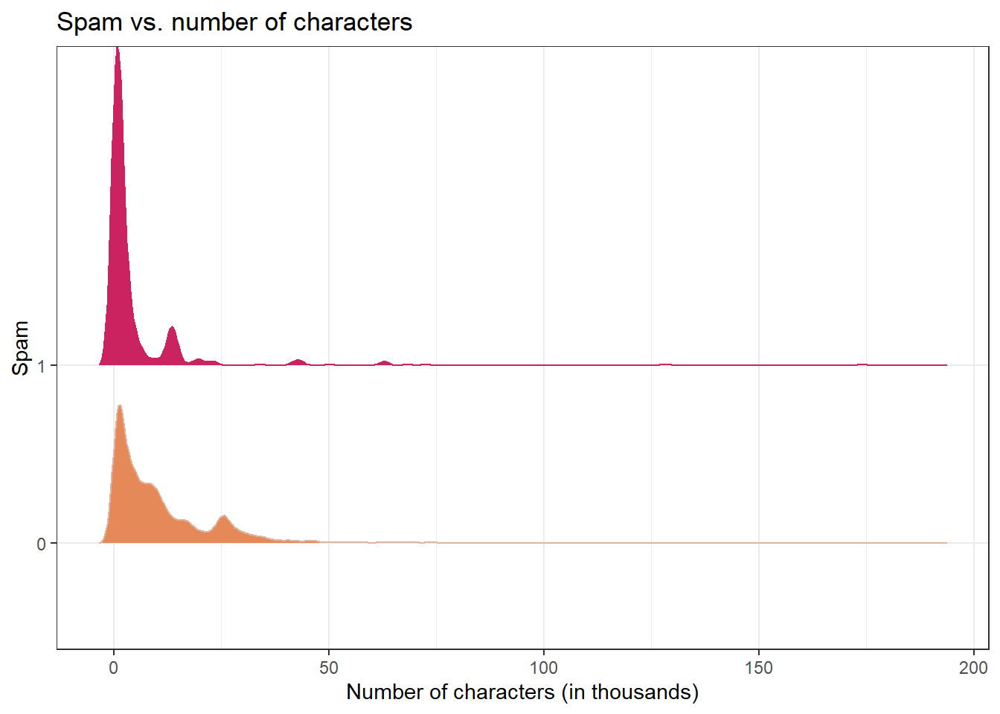


```
#> # A tibble: 2 × 2
#>   spam  mean_num_char
#>   <fct>         <dbl>
#> 1 0             11.3 
#> 2 1              5.44
```


> Question: Would you expect emails that have subjects starting with "Re:", "RE:", "re:", or "rE:" to be spam or not?

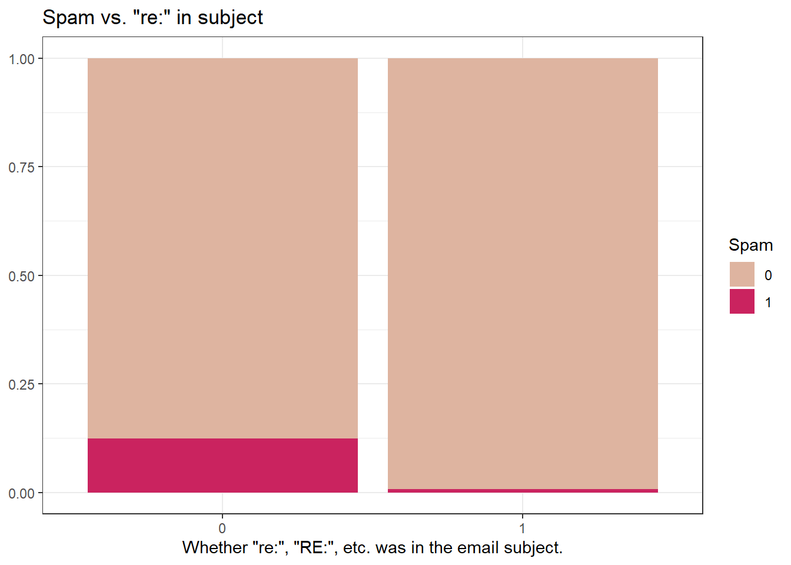


#### Modeling spam

- Both number of characters and whether the message has "re:" in the subject might be related to whether the email is spam. How do we come up with a model that will let us explore this relationship?

- For simplicity, we'll focus on the number of characters (`num_char`) as predictor, but the model we describe can be expanded to take multiple predictors as well.


This isn't something we can reasonably fit a linear model to -- we need something different!


```
#> Warning: Using `size` aesthetic for lines was deprecated in ggplot2 3.4.0.
#> ℹ Please use `linewidth` instead.
```

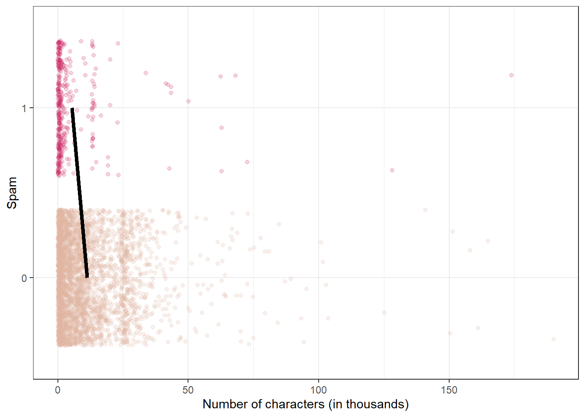


#### Framing the problem

- We can treat each outcome (spam and not) as successes and failures arising from separate Bernoulli trials
  - Bernoulli trial: a random experiment with exactly two possible outcomes, "success" and "failure", in which the probability of success is the same every time the experiment is conducted

- Each Bernoulli trial can have a separate probability of success

$$ y_i ∼ Bern(p) $$


- We can then use the predictor variables to model that probability of success, $p_i$


- We can't just use a linear model for $p_i$ (since $p_i$ must be between 0 and 1) but we can transform the linear model to have the appropriate range


#### Generalized linear models

- This is a very general way of addressing many problems in regression and the resulting models are called **generalized linear models (GLMs)**

- Logistic regression is just one example


#### Three characteristics of GLMs

All GLMs have the following three characteristics:

1. A probability distribution describing a generative model for the outcome variable

2. A linear model:
$$\eta = \beta_0 + \beta_1 X_1 + \cdots + \beta_k X_k$$

3. A link function that relates the linear model to the parameter of the outcome distribution
  


#### Logistic regression

- Logistic regression is a GLM used to model a binary categorical outcome using numerical and categorical predictors

- To finish specifying the Logistic model we just need to define a reasonable link function that connects $\eta_i$ to $p_i$: logit function


- **Logit function:** For $0\le p \le 1$

$$logit(p) = \log\left(\frac{p}{1-p}\right)$$


#### Logit function, visualized


```r
d <- tibble(p = seq(0.001, 0.999,
                    length.out = 1000)) %>%
  mutate(logit_p = log(p / (1 - p)))

ggplot(d, aes(x = p, y = logit_p)) +
  geom_line() +
  xlim(0, 1) +
  ylab("logit(p)") +
  labs(title = "logit(p) vs. p")
```


#### Properties of the logit

- The logit function takes a value between 0 and 1 and maps it to a value between $-\infty$ and $\infty$

- Inverse logit (logistic) function:
$$g^{-1}(x) = \frac{\exp(x)}{1+\exp(x)} = \frac{1}{1+\exp(-x)}$$


- The inverse logit function takes a value between $-\infty$ and $\infty$ and maps it to a value between 0 and 1

- This formulation is also useful for interpreting the model, since the logit can be interpreted as the log odds of a success -- more on this later


#### The logistic regression model

- Based on the three GLM criteria, we have
  - $y_i \sim \text{Bern}(p_i)$
  - $\eta_i = \beta_0+\beta_1 x_{1,i} + \cdots + \beta_n x_{n,i}$
  - $\text{logit}(p_i) = \eta_i$


- From which we get

$$p_i = \frac{\exp(\beta_0+\beta_1 x_{1,i} + \cdots + \beta_k x_{k,i})}{1+\exp(\beta_0+\beta_1 x_{1,i} + \cdots + \beta_k x_{k,i})}$$


#### Modeling spam

In R, we fit a GLM in the same way as a linear model except we

- specify the model with `logistic_reg()`
- use `"glm"` instead of `"lm"` as the engine 
- define `family = "binomial"` for the link function to be used in the model


```r
spam_fit <- logistic_reg() %>%
  set_engine("glm") %>%
  fit(spam ~ num_char,
      data = email,
      family = "binomial")

#tidy(spam_fit)
```


#### Spam model


```r
tidy(spam_fit)
#> # A tibble: 2 × 5
#>   term        estimate std.error statistic   p.value
#>   <chr>          <dbl>     <dbl>     <dbl>     <dbl>
#> 1 (Intercept)  -1.80     0.0716     -25.1  2.04e-139
#> 2 num_char     -0.0621   0.00801     -7.75 9.50e- 15
```


Model:
$$\log\left(\frac{p}{1-p}\right) = -1.80-0.0621\times \text{num_char}$$


#### P(spam) for an email with 2000 characters 

$$\log\left(\frac{p}{1-p}\right) = -1.80-0.0621\times 2$$

$$\frac{p}{1-p} = \exp(-1.9242) = 0.15 \rightarrow p = 0.15 \times (1 - p)$$


$$p = 0.15 - 0.15p \rightarrow 1.15p = 0.15$$

$$p = 0.15 / 1.15 = 0.13$$

> Question: What is the probability that an email with 15000 characters is spam? What about an email with 40000 characters?


- 2K chars: P(spam) = 0.13
- 15K chars, P(spam) = 0.06
- 40K chars, P(spam) = 0.01

> Question: Would you prefer an email with 2000 characters to be labeled as spam or not? How about 40,000 characters?


## Sensitivity and specificity

#### False positive and negative

|                         | Email is spam                 | Email is not spam         |
|-------------------------|-------------------------------|-------------------------------|
| Email labeled spam     | True positive                 | False positive (Type 1 error) |
| Email labeled not spam | False negative (Type 2 error) | True negative                 |


- False negative rate = P(Labeled not spam | Email spam) = FN / (TP + FN) 

- False positive rate = P(Labeled spam | Email not spam) = FP / (FP + TN)


#### Sensitivity and specificity

|                         | Email is spam                 | Email is not spam             |
|-------------------------|-------------------------------|-------------------------------|
| Email labeled spam     | True positive                 | False positive (Type 1 error) |
| Email labeled not spam | False negative (Type 2 error) | True negative                 |


- Sensitivity = P(Labeled spam | Email spam) = TP / (TP + FN)
  - Sensitivity = 1 − False negative rate
  
- Specificity = P(Labeled not spam | Email not spam) = TN / (FP + TN) 
  - Specificity = 1 − False positive rate


> Question: If you were designing a spam filter, would you want sensitivity and specificity to be high or low? What are the trade-offs associated with each decision? 


<!--DS4P Links-->
[course_web]: https://datascience4psych.github.io/DataScience4Psych
[course_git]: https://github.com/DataScience4Psych/DataScience4Psych
[course_repo]: https://github.com/DataScience4Psych
[course_slides]: https://github.com/DataScience4Psych/slides
[course_syllabus]: https://smasongarrison.github.io/syllabi/ 
<!-- https://smasongarrison.github.io/syllabi/data-science.html -->
[syllabi]: https://smasongarrison.github.io/syllabi
[pl_00]: https://www.youtube.com/playlist?list=PLKrrdtYgOUYaEAnJX20Ryy4OSie375rVY
[pl_01]: https://www.youtube.com/playlist?list=PLKrrdtYgOUYao_7t5ycK4KDXNKaY-ECup
[pl_02]: https://www.youtube.com/playlist?list=PLKrrdtYgOUYZmr_T3PnuxjVIlj0C0kUNI
[pl_03]: https://www.youtube.com/playlist?list=PLKrrdtYgOUYaHmjzdRvfg0yhOIYQnfjwE
[pl_04]: https://www.youtube.com/playlist?list=PLKrrdtYgOUYYWFcel6_vp8__RUKLxhX4y
[pl_05]: https://www.youtube.com/playlist?list=PLKrrdtYgOUYYMIguiV1F8RagMYibTY4iW
[pl_06]: https://www.youtube.com/playlist?list=PLKrrdtYgOUYYV_KDod3Mk9-RmtFXii9Dv
[pl_07]: https://www.youtube.com/watch?list=PLKrrdtYgOUYZxvEvQ8-PcWrOY_dwY_ETI
[pl_08]: https://www.youtube.com/playlist?list=PLKrrdtYgOUYZgOzYB_dmauw55M7jXvsdo
[pl_09]: https://www.youtube.com/playlist?list=PLKrrdtYgOUYbaiTmldRY2ddsLrHp3z6yO
[pl_10]: https://www.youtube.com/playlist?list=PLKrrdtYgOUYbPw5iYzYEzoOKa7mJKNIhq
[pl_11]: https://www.youtube.com/playlist?list=PLKrrdtYgOUYZ-u6LzBbanrNFoeLHKaLL6
[pl_12]: https://www.youtube.com/playlist?list=PLKrrdtYgOUYbwRS-9Htmb80_t1NG-021e
[pl_13]: https://www.youtube.com/playlist?list=PLKrrdtYgOUYbWGmSnbLIYwdLOnGm6une6
[pl_14]: https://www.youtube.com/playlist?list=PLKrrdtYgOUYbWGmSnbLIYwdLOnGm6une6
[pl_15]: https://www.youtube.com/playlist?list=PLKrrdtYgOUYa5MoYrV8EsWQ5jIr5ZYMpM
[pl_all]: https://www.youtube.com/playlist?list=PLKrrdtYgOUYZomNqf-1dtCDW94ySdLv-9


<!--AE Links-->
[ae01a_unvotes]: https://github.com/DataScience4Psych/ae01a_unvotes
[ae01b_covid]: https://github.com/DataScience4Psych/ae01b_covid
[ae02_bechdel]: https://github.com/DataScience4Psych/ae-02-bechdel-rmarkdown
[ae03_starwars]: https://github.com/DataScience4Psych/ae-03-starwars-dataviz


<!-- Lab Links-->

[lab01_hello]: https://github.com/DataScience4Psych/lab-01-hello-r

<!--Slides-->
[d01_welcome]: https://datascience4psych.github.io/slides/d01_welcome/d01_welcome.html
[d02_toolkit]: https://datascience4psych.github.io/slides/d02_toolkit/d02_toolkit.html
[d03_dataviz]: https://datascience4psych.github.io/slides/d03_dataviz/d03_dataviz.html
[d04_ggplot2]: https://datascience4psych.github.io/slides/d04_ggplot2/d04_ggplot2.html
[d05_viznum]: https://datascience4psych.github.io/slides/d05_viznum/d05_viznum.html
[d06_vizcat]: https://datascience4psych.github.io/slides/d06_vizcat/d06_vizcat.html
[d07_tidy]: https://datascience4psych.github.io/slides/d07_tidy/d07_tidy.html
[d08_grammar]: https://datascience4psych.github.io/slides/d08_grammar/d08_grammar.html
[d09_wrangle]: https://datascience4psych.github.io/slides/d09_wrangle/d09_wrangle.html
[d10_dfs]: https://datascience4psych.github.io/slides/d10_dfs/d10_dfs.html
[d11_types]: https://datascience4psych.github.io/slides/d11_types/d11_types.html
[d12_import]: https://datascience4psych.github.io/slides/d12_import/d12_import.html
[d13_goodviz]: https://datascience4psych.github.io/slides/d13_goodviz/d13_goodviz.html
[d13b_moreggplot]: https://datascience4psych.github.io/slides/d13_goodviz/d13b_moreggplot.html
[d14_confound]: https://datascience4psych.github.io/slides/d14_confound/d14_confound.html
[d15_goodtalk]: https://datascience4psych.github.io/slides/d15_goodtalk/d15_goodtalk.html
[d16_webscraping]: https://datascience4psych.github.io/slides/d16_webscraping/d16_webscraping.html
[d17_functions]: https://datascience4psych.github.io/slides/d17_functions/d17_functions.html
[d18_ethics]: https://datascience4psych.github.io/slides/d18_ethics/d18_ethics.html
[d19_bias]: https://datascience4psych.github.io/slides/d19_bias/d19_bias.html


<!--externals-->

[stat545]: https://stat545.com
[r4ds]: https://r4ds.had.co.nz
[cran]: https://cloud.r-project.org

<!--chapter:end:1002_logistic_notes.Rmd-->

# Lab: Modeling with multiple predictors {#lab10}

## Professor attractiveness and course evaluations, Pt. 2


In this lab, we revisit the professor evaluations data we modeled in the previous lab. In the last lab, we modeled evaluation scores using a single predictor at a time. However, this time we use multiple predictors to model evaluation scores.

If you don't remember the data, review the previous lab's introduction before continuing to the exercises.

## Getting started

### Packages

In this lab we will work with the **tidyverse**, **openintro**, and **broom** packages.


```r
library(tidyverse) 
library(broom)
library(openintro)
```

<!-- 
### Housekeeping

#### Git configuration / password caching

Configure your Git user name and email. If you cannot remember the instructions, refer to an earlier lab. Also remember that you can cache your password for a limited amount of time.

#### Project name

Update the name of your project to match the lab's title.

--> 

## Warm up


Before we introduce the data, let's warm up with some simple exercises.

### YAML

Open the R Markdown (Rmd) file in your project, change the author name to your name, and knit the document.

### Commiting and pushing changes

- Go to the **Git** pane in your RStudio. 
- View the **Diff** and confirm that you are happy with the changes.
- Add a commit message like "Update team name" in the **Commit message** box and hit **Commit**.
- Click on **Push**. This will prompt a dialogue box where you first need to enter your user name, and then your password.


## The data

The dataset we'll be using is called `evals` from the **openintro** package. Take a peek at the codebook with `?evals`.

## Exercises

### Part 1: Simple linear regression

1. Fit a linear model (one you have fit before): `m_bty`, predicting average
   professor evaluation `score` based on average beauty rating (`bty_avg`) only. Write the 
   linear model, and note the $R^2$ and the adjusted $R^2$.

### Part 2: Multiple linear regression

2. Fit a linear model (one you have fit before): `m_bty_gen`, predicting average
   professor evaluation `score` based on average beauty rating (`bty_avg`) and `gender`. 
   Write the linear model, and note the $R^2$ and the adjusted $R^2$.
   
3. Interpret the slope and intercept of `m_bty_gen` in context of the data.

4. What percent of the variability in `score` is explained by the model `m_bty_gen`.

5.  What is the equation of the line corresponding to *just* male professors?
    
6.  For two professors who received the same beauty rating, which gender tends to have the higher course evaluation score?
    
7. How does the relationship between beauty and evaluation score vary between male and female professors?
    
8. How do the adjusted $R^2$ values of `m_bty_gen` and `m_bty` compare? What does this tell us about how useful `gender` is in explaining the variability in evaluation scores when we already have information on the beauty score of the professor.

9. Compare the slopes of `bty_avg` under the two models (`m_bty` and `m_bty_gen`). Has the addition of `gender` to the model changed the parameter estimate (slope) for `bty_avg`?
    
10. Create a new model called `m_bty_rank` with `gender` removed and `rank`  added in. Write the equation of the linear model and interpret the slopes and intercept in context of the data. 

### Part 3: The search for the best model

Going forward, only consider the following variables as potential predictors: `rank`, `ethnicity`, `gender`, `language`, `age`, `cls_perc_eval`, `cls_did_eval`, `cls_students`, `cls_level`, `cls_profs`, `cls_credits`, `bty_avg`.

11. Which variable, on its own, would you expect to be the worst predictor of evaluation scores? Why? *Hint:* Think about which variable would you expect to not have any association with the professor's score.

12. Check your suspicions from the previous exercise. Include the model output for that variable in your response.
    
13. Suppose you wanted to fit a full model with the variables listed above. If you are already going to include `cls_perc_eval` and `cls_students`, which variable should you not include as an additional predictor? Why?

14. Fit a full model with all predictors listed above (except for the one you decided to exclude) in the previous question.

15. Using backward-selection with adjusted R-squared as the selection criterion, determine the *best* model. You do not need to show all steps in your answer, just the output for the final model. Also, write out the linear model for predicting score based on the final model you settle on.

16. Interpret the slopes of one numerical and one categorical predictor based on your final model.

17. Based on your final model, describe the characteristics of a professor and course at University of Texas at Austin that would be associated with a high evaluation score.

18. Would you be comfortable generalizing your conclusions to apply to professors generally (at any university)? Why or why not?
    


<!--chapter:end:1003_mlr_course_evals.Rmd-->

# (PART) Module 11 {-}


# Welcome to Overfitting and Cross-Validation

This module is designed to introduce you to cross-validation and overfitting. Please watch the videos and work your way through the notes. **The videos start on the next page.** You can find the video playlist for this module [here][pl_11]. Most of the slides used to make the videos in this module can be found in the [slides repo][course_slides]. 


## Module Materials

* Videos and Slides from Lectures
  * [Overfitting](https://datascience4psych.github.io/slides/d24_overfitting/d24_overfitting.html)
  * [Cross-validation](https://datascience4psych.github.io/slides/d25_crossvalidation/d25_crossvalidation.html)
* Suggested Readings
  * All subchapters of this module
  * Articles
    * [de Rooij, M., & Weeda, W. (2020). Cross-validation: A method every psychologist should know. Advances in Methods and Practices in Psychological Science, 3(2), 248-263.](https://journals.sagepub.com/doi/full/10.1177/2515245919898466)
    * [MacCallum, R. C., Zhang, S., Preacher, K. J., & Rucker, D. D. (2002). On the practice of dichotomization of quantitative variables. Psychological Methods, 7, 19-40.](http://www.quantpsy.org/pubs/maccallum_zhang_preacher_rucker_2002.pdf)
  * R4DS 
    * [Many Models](https://r4ds.had.co.nz/many-models.html)

# Overfitting!

You can follow along with the slides [here](https://datascience4psych.github.io/slides/d24_overfitting/d24_overfitting.html) if they do not appear below. The embedded code for feature enginering can be found [here](#featurenotes)


<iframe src="https://datascience4psych.github.io/slides/d24_overfitting/d24_overfitting.html#1" width="672" height="400px" data-external="1"></iframe>

## Prediction


```{=html}
<div class="vembedr" align="center">
<div>
<iframe src="https://www.youtube.com/embed/U70OmbO-DP4" width="533" height="300" frameborder="0" allowfullscreen="" data-external="1"></iframe>
</div>
</div>
```


<iframe src="https://datascience4psych.github.io/slides/d24_overfitting/d24_overfitting.html#2" width="672" height="400px" data-external="1"></iframe>


## Workflow


```{=html}
<div class="vembedr" align="center">
<div>
<iframe src="https://www.youtube.com/embed/R4h9u-sQHwI" width="533" height="300" frameborder="0" allowfullscreen="" data-external="1"></iframe>
</div>
</div>
```


<iframe src="https://datascience4psych.github.io/slides/d24_overfitting/d24_overfitting.html#17" width="672" height="400px" data-external="1"></iframe>


# Cross-Validation

You can follow along with the slides [here](https://datascience4psych.github.io/slides/d25_crossvalidation/d25_crossvalidation.html) if they do not appear below.


```{=html}
<div class="vembedr" align="center">
<div>
<iframe src="https://www.youtube.com/embed/KQ9f8s7RB5g" width="533" height="300" frameborder="0" allowfullscreen="" data-external="1"></iframe>
</div>
</div>
```


<iframe src="https://datascience4psych.github.io/slides/d25_crossvalidation/d25_crossvalidation.html" width="672" height="400px" data-external="1"></iframe>

## V-Fold


```{=html}
<div class="vembedr" align="center">
<div>
<iframe src="https://www.youtube.com/embed/quEVKV-Tk0Y" width="533" height="300" frameborder="0" allowfullscreen="" data-external="1"></iframe>
</div>
</div>
```


<iframe src="https://datascience4psych.github.io/slides/d25_crossvalidation/d25_crossvalidation.html#35" width="672" height="400px" data-external="1"></iframe>


# Notes on Feature Engineering {#featurenotes}


## Feature engineering

- We prefer simple models when possible, but **parsimony** does not mean sacrificing accuracy (or predictive performance) in the interest of simplicity


- Variables that go into the model and how they are represented are just as critical to success of the model


- **Feature engineering** allows us to get creative with our predictors in an effort to make them more useful for our model (to increase its predictive performance) 


### Same training and testing sets as before


```r
# Fix random numbers by setting the seed 
# Enables analysis to be reproducible when random numbers are used 
set.seed(1066)

# Put 80% of the data into the training set 
email_split <- initial_split(email, prop = 0.80)

# Create data frames for the two sets:
train_data <- training(email_split)
test_data  <- testing(email_split)
```


### A simple approach: `mutate()`


```r
train_data %>%
  mutate(
    date = date(time),
    dow  = wday(time),
    month = month(time)
    ) %>%
  select(time, date, dow, month) %>%
  sample_n(size = 5) # shuffle to show a variety
#> # A tibble: 5 × 4
#>   time                date         dow month
#>   <dttm>              <date>     <dbl> <dbl>
#> 1 2012-02-07 14:17:38 2012-02-07     3     2
#> 2 2012-02-28 19:24:15 2012-02-28     3     2
#> 3 2012-03-12 08:07:31 2012-03-12     2     3
#> 4 2012-01-26 13:58:18 2012-01-26     5     1
#> 5 2012-02-21 08:50:29 2012-02-21     3     2
```


## Modeling workflow, revisited

- Create a **recipe** for feature engineering steps to be applied to the training data

- Fit the model to the training data after these steps have been applied

- Using the model estimates from the training data, predict outcomes for the test data

- Evaluate the performance of the model on the test data


## Building recipes


### Initiate a recipe


```r
email_rec <- recipe(
  spam ~ .,          # formula
  data = train_data  # data to use for cataloguing names and types of variables
  )

summary(email_rec)
```


```
#> # A tibble: 21 × 4
#>    variable     type      role      source  
#>    <chr>        <list>    <chr>     <chr>   
#>  1 to_multiple  <chr [3]> predictor original
#>  2 from         <chr [3]> predictor original
#>  3 cc           <chr [2]> predictor original
#>  4 sent_email   <chr [3]> predictor original
#>  5 time         <chr [1]> predictor original
#>  6 image        <chr [2]> predictor original
#>  7 attach       <chr [2]> predictor original
#>  8 dollar       <chr [2]> predictor original
#>  9 winner       <chr [3]> predictor original
#> 10 inherit      <chr [2]> predictor original
#> 11 viagra       <chr [2]> predictor original
#> 12 password     <chr [2]> predictor original
#> 13 num_char     <chr [2]> predictor original
#> 14 line_breaks  <chr [2]> predictor original
#> 15 format       <chr [3]> predictor original
#> 16 re_subj      <chr [3]> predictor original
#> 17 exclaim_subj <chr [2]> predictor original
#> 18 urgent_subj  <chr [3]> predictor original
#> 19 exclaim_mess <chr [2]> predictor original
#> 20 number       <chr [3]> predictor original
#> 21 spam         <chr [3]> outcome   original
```


### Remove certain variables


```r
email_rec <- email_rec %>%
  step_rm(from, sent_email)
```


```
#> Recipe
#> 
#> Inputs:
#> 
#>       role #variables
#>    outcome          1
#>  predictor         20
#> 
#> Operations:
#> 
#> Variables removed from, sent_email
```


### Feature engineer date


```r
email_rec <- email_rec %>%
  step_date(time, features = c("dow", "month")) %>%
  step_rm(time)
```


```
#> Recipe
#> 
#> Inputs:
#> 
#>       role #variables
#>    outcome          1
#>  predictor         20
#> 
#> Operations:
#> 
#> Variables removed from, sent_email
#> Date features from time
#> Variables removed time
```


### Discretize numeric variables

Proceed with major caution! And please be sure to read [MacCallum, R. C., Zhang, S., Preacher, K. J., & Rucker, D. D. (2002). On the practice of dichotomization of quantitative variables. Psychological Methods, 7, 19-40.](http://www.quantpsy.org/pubs/maccallum_zhang_preacher_rucker_2002.pdf) and play around with the demo data from Kris's website: http://www.quantpsy.org/mzpr.htm


```r
email_rec <- email_rec %>%
  step_cut(cc, attach, dollar, breaks = c(0, 1)) %>%
  step_cut(inherit, password, breaks = c(0, 1, 5, 10, 20))
```


```
#> Recipe
#> 
#> Inputs:
#> 
#>       role #variables
#>    outcome          1
#>  predictor         20
#> 
#> Operations:
#> 
#> Variables removed from, sent_email
#> Date features from time
#> Variables removed time
#> Cut numeric for cc, attach, dollar
#> Cut numeric for inherit, password
```


### Create dummy variables


```r
email_rec <- email_rec %>%
  step_dummy(all_nominal(), -all_outcomes())
```


```
#> Recipe
#> 
#> Inputs:
#> 
#>       role #variables
#>    outcome          1
#>  predictor         20
#> 
#> Operations:
#> 
#> Variables removed from, sent_email
#> Date features from time
#> Variables removed time
#> Cut numeric for cc, attach, dollar
#> Cut numeric for inherit, password
#> Dummy variables from all_nominal(), -all_outcomes()
```


### Remove zero variance variables

Variables that contain only a single value


```r
email_rec <- email_rec %>%
  step_zv(all_predictors())
```


```
#> Recipe
#> 
#> Inputs:
#> 
#>       role #variables
#>    outcome          1
#>  predictor         20
#> 
#> Operations:
#> 
#> Variables removed from, sent_email
#> Date features from time
#> Variables removed time
#> Cut numeric for cc, attach, dollar
#> Cut numeric for inherit, password
#> Dummy variables from all_nominal(), -all_outcomes()
#> Zero variance filter on all_predictors()
```


### All in one place


```r
email_rec <- recipe(spam ~ ., data = email) %>%
  step_rm(from, sent_email) %>%
  step_date(time, features = c("dow", "month")) %>%               
  step_rm(time) %>%
  step_cut(cc, attach, dollar, breaks = c(0, 1)) %>%
  step_cut(inherit, password, breaks = c(0, 1, 5, 10, 20)) %>%
  step_dummy(all_nominal(), -all_outcomes()) %>%
  step_zv(all_predictors())
```


## Building workflows

### Define model


```r
email_mod <- logistic_reg() %>% 
  set_engine("glm")

email_mod
#> Logistic Regression Model Specification (classification)
#> 
#> Computational engine: glm
```

### Define workflow

**Workflows** bring together models and recipes so that they can be easily applied to both the training and test data.


```r
email_wflow <- workflow() %>% 
  add_model(email_mod) %>% 
  add_recipe(email_rec)
```


```
#> ══ Workflow ════════════════════════════════════════════════════════════════════════════════════════
#> Preprocessor: Recipe
#> Model: logistic_reg()
#> 
#> ── Preprocessor ────────────────────────────────────────────────────────────────────────────────────
#> 7 Recipe Steps
#> 
#> • step_rm()
#> • step_date()
#> • step_rm()
#> • step_cut()
#> • step_cut()
#> • step_dummy()
#> • step_zv()
#> 
#> ── Model ───────────────────────────────────────────────────────────────────────────────────────────
#> Logistic Regression Model Specification (classification)
#> 
#> Computational engine: glm
```


### Fit model to training data


```r
email_fit <- email_wflow %>% 
  fit(data = train_data)
#> Warning: glm.fit: fitted probabilities numerically 0 or 1 occurred
```


```r
tidy(email_fit) %>% print(n = 31)
#> # A tibble: 31 × 5
#>    term                estimate std.error statistic  p.value
#>    <chr>                  <dbl>     <dbl>     <dbl>    <dbl>
#>  1 (Intercept)        -1.11       0.264    -4.19    2.75e- 5
#>  2 image              -1.72       0.956    -1.80    7.23e- 2
#>  3 viagra              2.30     182.        0.0126  9.90e- 1
#>  4 num_char            0.0469     0.0271    1.73    8.41e- 2
#>  5 line_breaks        -0.00563    0.00151  -3.74    1.87e- 4
#>  6 exclaim_subj       -0.0721     0.271    -0.266   7.90e- 1
#>  7 exclaim_mess        0.0101     0.00214   4.72    2.36e- 6
#>  8 to_multiple_X1     -2.83       0.377    -7.49    6.71e-14
#>  9 cc_X.1.68.         -0.178      0.468    -0.382   7.03e- 1
#> 10 attach_X.1.21.      2.39       0.381     6.27    3.61e-10
#> 11 dollar_X.1.64.      0.0544     0.222     0.246   8.06e- 1
#> 12 winner_yes          2.20       0.415     5.31    1.11e- 7
#> 13 inherit_X.1.5.     -9.14     756.       -0.0121  9.90e- 1
#> 14 inherit_X.5.10.     1.95       1.27      1.54    1.23e- 1
#> 15 password_X.1.5.    -1.71       0.759    -2.25    2.43e- 2
#> 16 password_X.5.10.  -12.4      420.       -0.0296  9.76e- 1
#> 17 password_X.10.20. -13.8      812.       -0.0170  9.86e- 1
#> 18 password_X.20.28. -13.8      814.       -0.0170  9.86e- 1
#> 19 format_X1          -0.802      0.161    -4.99    6.17e- 7
#> 20 re_subj_X1         -2.78       0.400    -6.97    3.25e-12
#> 21 urgent_subj_X1      2.57       1.13      2.27    2.31e- 2
#> 22 number_small       -0.659      0.170    -3.87    1.10e- 4
#> 23 number_big          0.199      0.246     0.807   4.20e- 1
#> 24 time_dow_Mon       -0.0207     0.300    -0.0690  9.45e- 1
#> 25 time_dow_Tue        0.306      0.273     1.12    2.63e- 1
#> 26 time_dow_Wed       -0.204      0.279    -0.731   4.65e- 1
#> 27 time_dow_Thu       -0.237      0.297    -0.799   4.24e- 1
#> 28 time_dow_Fri        0.000702   0.284     0.00247 9.98e- 1
#> 29 time_dow_Sat        0.261      0.307     0.851   3.95e- 1
#> 30 time_month_Feb      0.912      0.183     4.97    6.68e- 7
#> 31 time_month_Mar      0.638      0.187     3.41    6.52e- 4
```


### Make predictions for test data


```r
email_pred <- predict(email_fit, test_data, type = "prob") %>% 
  bind_cols(test_data) 

email_pred
#> # A tibble: 785 × 23
#>    .pred_0  .pred_1 spam  to_mu…¹ from     cc sent_…² time                image attach dollar winner
#>      <dbl>    <dbl> <fct> <fct>   <fct> <int> <fct>   <dttm>              <dbl>  <dbl>  <dbl> <fct> 
#>  1   0.948 0.0522   0     0       1         0 0       2012-01-01 04:09:49     0      0      0 no    
#>  2   0.909 0.0914   0     0       1         0 0       2012-01-01 22:00:18     0      0      0 no    
#>  3   0.971 0.0292   0     0       1         0 0       2012-01-02 00:42:16     0      0      5 no    
#>  4   0.887 0.113    0     0       1         0 0       2012-01-01 20:58:14     0      0      0 no    
#>  5   0.992 0.00755  0     0       1         0 0       2012-01-02 02:07:22     0      0     21 no    
#>  6   1.00  0.000432 0     1       1         2 0       2012-01-02 13:09:45     0      0      0 no    
#>  7   0.999 0.000691 0     0       1         1 0       2012-01-02 10:12:51     0      0      0 no    
#>  8   1.00  0.000280 0     1       1         2 0       2012-01-02 16:24:21     0      0      0 no    
#>  9   0.971 0.0292   0     0       1         0 0       2012-01-03 04:34:50     0      0     11 no    
#> 10   0.978 0.0224   0     0       1         0 0       2012-01-03 08:33:28     0      0     18 no    
#> # … with 775 more rows, 11 more variables: inherit <dbl>, viagra <dbl>, password <dbl>,
#> #   num_char <dbl>, line_breaks <int>, format <fct>, re_subj <fct>, exclaim_subj <dbl>,
#> #   urgent_subj <fct>, exclaim_mess <dbl>, number <fct>, and abbreviated variable names
#> #   ¹​to_multiple, ²​sent_email
```


### Evaluate the performance


```r
email_pred %>%
  roc_curve(
    truth = spam,
    .pred_1,
    event_level = "second"
  ) %>%
  autoplot()
```


```r
email_pred %>%
  roc_auc(
    truth = spam,
    .pred_1,
    event_level = "second"
  )
#> # A tibble: 1 × 3
#>   .metric .estimator .estimate
#>   <chr>   <chr>          <dbl>
#> 1 roc_auc binary         0.864
```


## Making decisions


### Cutoff probability: 0.5

Suppose we decide to label an email as spam if the model predicts the probability of spam to be **more than 0.5**.


```r
cutoff_prob <- 0.5
email_pred %>%
  mutate(
    spam      = if_else(spam == 1, "Email is spam", "Email is not spam"),
    spam_pred = if_else(.pred_1 > cutoff_prob, "Email labelled spam", "Email labelled not spam")
    ) %>%
  count(spam_pred, spam) %>%
  pivot_wider(names_from = spam, values_from = n) %>%
  kable(col.names = c("", "Email is not spam", "Email is spam"))
```


|                        | Email is not spam| Email is spam|
|:-----------------------|-----------------:|-------------:|
|Email labelled not spam |               700|            68|
|Email labelled spam     |                 7|            10|


### Cutoff probability: 0.25

Suppose we decide to label an email as spam if the model predicts the probability of spam to be **more than 0.25**.


```r
cutoff_prob <- 0.25
email_pred %>%
  mutate(
    spam      = if_else(spam == 1, "Email is spam", "Email is not spam"),
    spam_pred = if_else(.pred_1 > cutoff_prob, "Email labelled spam", "Email labelled not spam")
    ) %>%
  count(spam_pred, spam) %>%
  pivot_wider(names_from = spam, values_from = n) %>%
  kable(col.names = c("", "Email is not spam", "Email is spam"))
```


|                        | Email is not spam| Email is spam|
|:-----------------------|-----------------:|-------------:|
|Email labelled not spam |               673|            42|
|Email labelled spam     |                34|            36|


### Cutoff probability: 0.75

Suppose we decide to label an email as spam if the model predicts the probability of spam to be **more than 0.75**.


```r
cutoff_prob <- 0.75
email_pred %>%
  mutate(
    spam      = if_else(spam == 1, "Email is spam", "Email is not spam"),
    spam_pred = if_else(.pred_1 > cutoff_prob, "Email labelled spam", "Email labelled not spam")
    ) %>%
  count(spam_pred, spam) %>%
  pivot_wider(names_from = spam, values_from = n) %>%
  kable(col.names = c("", "Email is not spam", "Email is spam"))
```


|                        | Email is not spam| Email is spam|
|:-----------------------|-----------------:|-------------:|
|Email labelled not spam |               703|            73|
|Email labelled spam     |                 4|             5|


<!--DS4P Links-->
[course_web]: https://datascience4psych.github.io/DataScience4Psych
[course_git]: https://github.com/DataScience4Psych/DataScience4Psych
[course_repo]: https://github.com/DataScience4Psych
[course_slides]: https://github.com/DataScience4Psych/slides
[course_syllabus]: https://smasongarrison.github.io/syllabi/ 
<!-- https://smasongarrison.github.io/syllabi/data-science.html -->
[syllabi]: https://smasongarrison.github.io/syllabi
[pl_00]: https://www.youtube.com/playlist?list=PLKrrdtYgOUYaEAnJX20Ryy4OSie375rVY
[pl_01]: https://www.youtube.com/playlist?list=PLKrrdtYgOUYao_7t5ycK4KDXNKaY-ECup
[pl_02]: https://www.youtube.com/playlist?list=PLKrrdtYgOUYZmr_T3PnuxjVIlj0C0kUNI
[pl_03]: https://www.youtube.com/playlist?list=PLKrrdtYgOUYaHmjzdRvfg0yhOIYQnfjwE
[pl_04]: https://www.youtube.com/playlist?list=PLKrrdtYgOUYYWFcel6_vp8__RUKLxhX4y
[pl_05]: https://www.youtube.com/playlist?list=PLKrrdtYgOUYYMIguiV1F8RagMYibTY4iW
[pl_06]: https://www.youtube.com/playlist?list=PLKrrdtYgOUYYV_KDod3Mk9-RmtFXii9Dv
[pl_07]: https://www.youtube.com/watch?list=PLKrrdtYgOUYZxvEvQ8-PcWrOY_dwY_ETI
[pl_08]: https://www.youtube.com/playlist?list=PLKrrdtYgOUYZgOzYB_dmauw55M7jXvsdo
[pl_09]: https://www.youtube.com/playlist?list=PLKrrdtYgOUYbaiTmldRY2ddsLrHp3z6yO
[pl_10]: https://www.youtube.com/playlist?list=PLKrrdtYgOUYbPw5iYzYEzoOKa7mJKNIhq
[pl_11]: https://www.youtube.com/playlist?list=PLKrrdtYgOUYZ-u6LzBbanrNFoeLHKaLL6
[pl_12]: https://www.youtube.com/playlist?list=PLKrrdtYgOUYbwRS-9Htmb80_t1NG-021e
[pl_13]: https://www.youtube.com/playlist?list=PLKrrdtYgOUYbWGmSnbLIYwdLOnGm6une6
[pl_14]: https://www.youtube.com/playlist?list=PLKrrdtYgOUYbWGmSnbLIYwdLOnGm6une6
[pl_15]: https://www.youtube.com/playlist?list=PLKrrdtYgOUYa5MoYrV8EsWQ5jIr5ZYMpM
[pl_all]: https://www.youtube.com/playlist?list=PLKrrdtYgOUYZomNqf-1dtCDW94ySdLv-9


<!--AE Links-->
[ae01a_unvotes]: https://github.com/DataScience4Psych/ae01a_unvotes
[ae01b_covid]: https://github.com/DataScience4Psych/ae01b_covid
[ae02_bechdel]: https://github.com/DataScience4Psych/ae-02-bechdel-rmarkdown
[ae03_starwars]: https://github.com/DataScience4Psych/ae-03-starwars-dataviz


<!-- Lab Links-->

[lab01_hello]: https://github.com/DataScience4Psych/lab-01-hello-r

<!--Slides-->
[d01_welcome]: https://datascience4psych.github.io/slides/d01_welcome/d01_welcome.html
[d02_toolkit]: https://datascience4psych.github.io/slides/d02_toolkit/d02_toolkit.html
[d03_dataviz]: https://datascience4psych.github.io/slides/d03_dataviz/d03_dataviz.html
[d04_ggplot2]: https://datascience4psych.github.io/slides/d04_ggplot2/d04_ggplot2.html
[d05_viznum]: https://datascience4psych.github.io/slides/d05_viznum/d05_viznum.html
[d06_vizcat]: https://datascience4psych.github.io/slides/d06_vizcat/d06_vizcat.html
[d07_tidy]: https://datascience4psych.github.io/slides/d07_tidy/d07_tidy.html
[d08_grammar]: https://datascience4psych.github.io/slides/d08_grammar/d08_grammar.html
[d09_wrangle]: https://datascience4psych.github.io/slides/d09_wrangle/d09_wrangle.html
[d10_dfs]: https://datascience4psych.github.io/slides/d10_dfs/d10_dfs.html
[d11_types]: https://datascience4psych.github.io/slides/d11_types/d11_types.html
[d12_import]: https://datascience4psych.github.io/slides/d12_import/d12_import.html
[d13_goodviz]: https://datascience4psych.github.io/slides/d13_goodviz/d13_goodviz.html
[d13b_moreggplot]: https://datascience4psych.github.io/slides/d13_goodviz/d13b_moreggplot.html
[d14_confound]: https://datascience4psych.github.io/slides/d14_confound/d14_confound.html
[d15_goodtalk]: https://datascience4psych.github.io/slides/d15_goodtalk/d15_goodtalk.html
[d16_webscraping]: https://datascience4psych.github.io/slides/d16_webscraping/d16_webscraping.html
[d17_functions]: https://datascience4psych.github.io/slides/d17_functions/d17_functions.html
[d18_ethics]: https://datascience4psych.github.io/slides/d18_ethics/d18_ethics.html
[d19_bias]: https://datascience4psych.github.io/slides/d19_bias/d19_bias.html


<!--externals-->

[stat545]: https://stat545.com
[r4ds]: https://r4ds.had.co.nz
[cran]: https://cloud.r-project.org


<!--chapter:end:1101_cv.Rmd-->

# ODD: Notes on Cross validation

A too technical and optional deep dive set of notes on cross-validation.


We have:

- Data $X_1, \ldots, X_n$.

- A tuning parameter $\theta$. Each value of $\theta$ corresponds to a different set of models.

- A function $L$ that takes a fitted model and a data point and returns a measure of model quality.

We would like to choose one model from the set of candidate models indexed by $\theta$.

## Example: Regression

- Data: Pairs of predictors and response variables, $(y_i, X_i)$, $i = 1,\ldots, n$, $y_i \in \mathbb R$, $X_i \in \mathbb R^p$

- Models: $y_i = X \beta + \epsilon$, $\beta_j = 0, j \in S_\theta$, where $S_\theta \subseteq \{1,\ldots, p\}$.

- Model quality: Squared-error loss. If $\hat \beta_\theta$ are our estimates of the regression coefficients in model $\theta$, model quality is measured by
$$
L(\hat \beta_\theta, (y_i, X_i)) = (y_i - X_i^T \hat \beta_\theta)^2
$$

We want to choose a subset of the predictors that do the best job of explaining the response.


Naive solution: Find the model that has the lowest value for the squared-error loss.

Why doesn't this work?

## Example: Mixture models

- Data: $x_1,\ldots, x_n$, $x_i \in \mathbb R$

- Models: Gaussian mixture models with $\theta$ mixture components.

- Model quality: Negative log likelihood of the data. If $\hat p_\theta$ is the density of the fitted model with $\theta$ components, model quality is measured by $L(\hat p_\theta, x_i) = -\log \hat p_\theta(x_i)$.

We want to choose the number of mixture components that best explains the data.


Naive solution: Choose the number of mixture components that minimizes the negative log likelihood of the data.


## Better Solution: Cross validation

Idea: Instead of measuring model quality on the same data we used to fit the model, we estimate model quality on new data.

If we knew the true distribution of the data, we could simulate new data and use a Monte Carlo estimate based on the simulations.

We can't actually get new data, and so we hold some back when we fit the model and then pretend that the held back data is new data.


Procedure:

- Divide the data into $K$ folds

- Let $X^{(k)}$ denote the data in fold $k$, and let $X^{(-k)}$ denote the data in all the folds except for $k$.

- For each fold and each value of the tuning parameter $\theta$, fit the model on $X^{(-k)}$ to get $\hat f_\theta^{(k)}$

- Compute
$$
\text{CV}(\theta) = \frac{1}{n} \sum_{k=1}^K \sum_{x \in X^{(k)}} L(\hat f_\theta^{(k)}, x)
$$

- Choose $\hat \theta = \text{argmin}_{\theta} \text{CV}(\theta)$

## Example


```r
n <- 100
p <- 20
X <- matrix(rnorm(n * p), nrow = n)
y <- rnorm(n)
get_rss_submodels <- function(n_predictors, y, X) {
    if(n_predictors == 0) {
        lm_submodel <- lm(y ~ 0)
    } else {
        lm_submodel <- lm(y ~ 0 + X[,1:n_predictors, drop = FALSE])
    }
    return(sum(residuals(lm_submodel)^2))
}
p_vec <- 0:p
rss <- sapply(p_vec, get_rss_submodels, y, X)
plot(rss ~ p_vec)
```

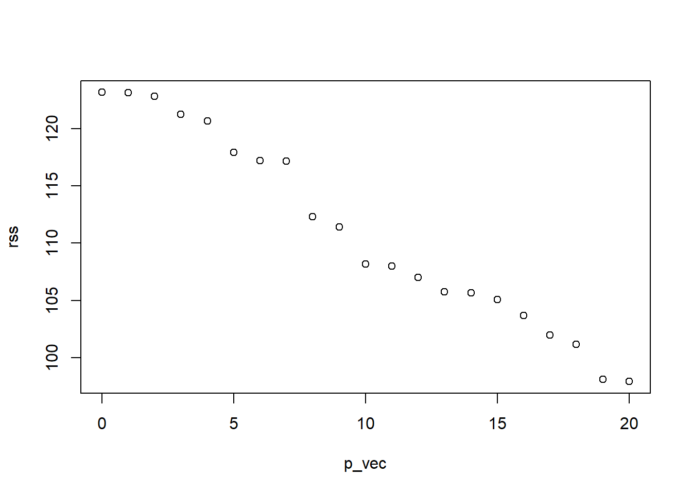


```r
get_cv_error <- function(n_predictors,
                         y,
                         X,
                         folds) 
    {
    cv_vec <- numeric(length(unique(folds)))
    for(f in unique(folds)) {
        cv_vec[f] <- rss_on_held_out(
                  n_predictors,
                  y_train = y[folds != f],
                  X_train = X[folds != f,],
                  y_test = y[folds == f],
                  X_test = X[folds == f,])
    }
    return(mean(cv_vec))
    }

rss_on_held_out <- function(n_predictors,
                            y_train,
                            X_train,
                            y_test,
                            X_test) {
    if(n_predictors == 0) {
        lm_submodel <- lm(y_train ~ 0)
        preds_on_test <- rep(0, length(y_test))
    } else {
        lm_submodel <- lm(y_train ~ 0 + X_train[,1:n_predictors, drop = FALSE])
        preds_on_test <- X_test[,1:n_predictors, drop= FALSE] %*% coef(lm_submodel)
    }

    return(sum((y_test - preds_on_test)^2))
    }
K <- 5

## normally you would do this at random
folds <- rep(1:K, each = n / K)
p_vec <- 0:p
cv_errors <- sapply(p_vec, get_cv_error, y, X, folds)
plot(cv_errors ~ p_vec)
```

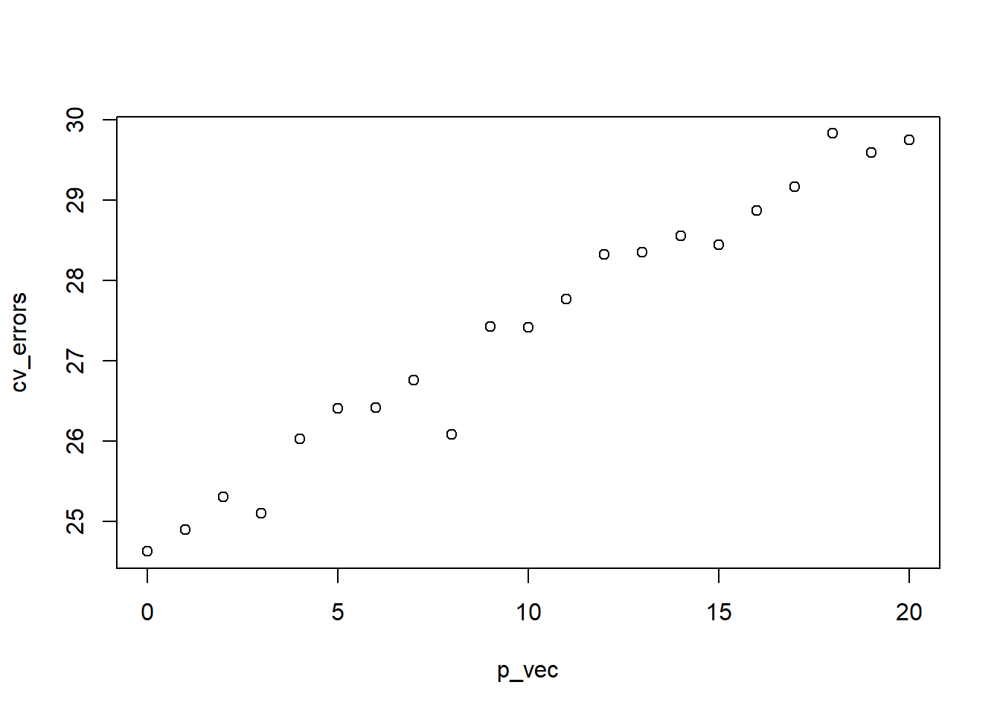

## Choice of $K$

Considerations:

- Larger $K$ means more computation (although sometimes there is a shortcut for leave-one-out cross validation)

- Larger $K$ means less bias in the estimate of model accuracy

- Larger $K$ also means more variance in the estimate, so we don't necessarily want $K = n$

- Usually choose $K = 5$ or $K = 10$

- If your problem is structured (e.g. time series, spatial), you should choose the folds to respect the structure.


## Summing up

- We can use simulations to estimate arbitrary functions of our random variables.

- If we know the underlying distribution, we can simply simulate from it (Monte Carlo integration).

- If we don't know the underlying distribution, we can "simulate" from the data by resampling from the data (cross validation; ish). Resampling methods will do well to the extent that the observed data reflect the true data-generating distribution.


<!--DS4P Links-->
[course_web]: https://datascience4psych.github.io/DataScience4Psych
[course_git]: https://github.com/DataScience4Psych/DataScience4Psych
[course_repo]: https://github.com/DataScience4Psych
[course_slides]: https://github.com/DataScience4Psych/slides
[course_syllabus]: https://smasongarrison.github.io/syllabi/ 
<!-- https://smasongarrison.github.io/syllabi/data-science.html -->
[syllabi]: https://smasongarrison.github.io/syllabi
[pl_00]: https://www.youtube.com/playlist?list=PLKrrdtYgOUYaEAnJX20Ryy4OSie375rVY
[pl_01]: https://www.youtube.com/playlist?list=PLKrrdtYgOUYao_7t5ycK4KDXNKaY-ECup
[pl_02]: https://www.youtube.com/playlist?list=PLKrrdtYgOUYZmr_T3PnuxjVIlj0C0kUNI
[pl_03]: https://www.youtube.com/playlist?list=PLKrrdtYgOUYaHmjzdRvfg0yhOIYQnfjwE
[pl_04]: https://www.youtube.com/playlist?list=PLKrrdtYgOUYYWFcel6_vp8__RUKLxhX4y
[pl_05]: https://www.youtube.com/playlist?list=PLKrrdtYgOUYYMIguiV1F8RagMYibTY4iW
[pl_06]: https://www.youtube.com/playlist?list=PLKrrdtYgOUYYV_KDod3Mk9-RmtFXii9Dv
[pl_07]: https://www.youtube.com/watch?list=PLKrrdtYgOUYZxvEvQ8-PcWrOY_dwY_ETI
[pl_08]: https://www.youtube.com/playlist?list=PLKrrdtYgOUYZgOzYB_dmauw55M7jXvsdo
[pl_09]: https://www.youtube.com/playlist?list=PLKrrdtYgOUYbaiTmldRY2ddsLrHp3z6yO
[pl_10]: https://www.youtube.com/playlist?list=PLKrrdtYgOUYbPw5iYzYEzoOKa7mJKNIhq
[pl_11]: https://www.youtube.com/playlist?list=PLKrrdtYgOUYZ-u6LzBbanrNFoeLHKaLL6
[pl_12]: https://www.youtube.com/playlist?list=PLKrrdtYgOUYbwRS-9Htmb80_t1NG-021e
[pl_13]: https://www.youtube.com/playlist?list=PLKrrdtYgOUYbWGmSnbLIYwdLOnGm6une6
[pl_14]: https://www.youtube.com/playlist?list=PLKrrdtYgOUYbWGmSnbLIYwdLOnGm6une6
[pl_15]: https://www.youtube.com/playlist?list=PLKrrdtYgOUYa5MoYrV8EsWQ5jIr5ZYMpM
[pl_all]: https://www.youtube.com/playlist?list=PLKrrdtYgOUYZomNqf-1dtCDW94ySdLv-9


<!--AE Links-->
[ae01a_unvotes]: https://github.com/DataScience4Psych/ae01a_unvotes
[ae01b_covid]: https://github.com/DataScience4Psych/ae01b_covid
[ae02_bechdel]: https://github.com/DataScience4Psych/ae-02-bechdel-rmarkdown
[ae03_starwars]: https://github.com/DataScience4Psych/ae-03-starwars-dataviz


<!-- Lab Links-->

[lab01_hello]: https://github.com/DataScience4Psych/lab-01-hello-r

<!--Slides-->
[d01_welcome]: https://datascience4psych.github.io/slides/d01_welcome/d01_welcome.html
[d02_toolkit]: https://datascience4psych.github.io/slides/d02_toolkit/d02_toolkit.html
[d03_dataviz]: https://datascience4psych.github.io/slides/d03_dataviz/d03_dataviz.html
[d04_ggplot2]: https://datascience4psych.github.io/slides/d04_ggplot2/d04_ggplot2.html
[d05_viznum]: https://datascience4psych.github.io/slides/d05_viznum/d05_viznum.html
[d06_vizcat]: https://datascience4psych.github.io/slides/d06_vizcat/d06_vizcat.html
[d07_tidy]: https://datascience4psych.github.io/slides/d07_tidy/d07_tidy.html
[d08_grammar]: https://datascience4psych.github.io/slides/d08_grammar/d08_grammar.html
[d09_wrangle]: https://datascience4psych.github.io/slides/d09_wrangle/d09_wrangle.html
[d10_dfs]: https://datascience4psych.github.io/slides/d10_dfs/d10_dfs.html
[d11_types]: https://datascience4psych.github.io/slides/d11_types/d11_types.html
[d12_import]: https://datascience4psych.github.io/slides/d12_import/d12_import.html
[d13_goodviz]: https://datascience4psych.github.io/slides/d13_goodviz/d13_goodviz.html
[d13b_moreggplot]: https://datascience4psych.github.io/slides/d13_goodviz/d13b_moreggplot.html
[d14_confound]: https://datascience4psych.github.io/slides/d14_confound/d14_confound.html
[d15_goodtalk]: https://datascience4psych.github.io/slides/d15_goodtalk/d15_goodtalk.html
[d16_webscraping]: https://datascience4psych.github.io/slides/d16_webscraping/d16_webscraping.html
[d17_functions]: https://datascience4psych.github.io/slides/d17_functions/d17_functions.html
[d18_ethics]: https://datascience4psych.github.io/slides/d18_ethics/d18_ethics.html
[d19_bias]: https://datascience4psych.github.io/slides/d19_bias/d19_bias.html


<!--externals-->

[stat545]: https://stat545.com
[r4ds]: https://r4ds.had.co.nz
[cran]: https://cloud.r-project.org

<!--chapter:end:1102_cvnotes.Rmd-->

# Optional Lab 08b {#lab08b}

This lab is optional. You are welcome to try it and can count it either as a lab or as a portfolio piece.

**Disclaimer** It is a more extensive lab that I'm not quite happy with. Specifically, I think it is a bit too time consuming and I've not been able to calibrate the difficulty.


<!--
In this assignment you will work on data scraping.
Having worked through the interactive tutorial titled [Money in politics](https://minecr.shinyapps.io/dsbox-05-moneyinpolitics/) will be a good preparation for this homework assignment as you'll be working with the same website.
-->


```{=html}
<details>
  <summary>Tired of typing your password?</summary>

<p>Chances are your browser has already saved your password, but if not, you can ask Git to save (cache) your password for a period of time, where you indicate the period of time in seconds. For example, if you want it to cache your password for 1 hour, that would be 3,600 seconds. To do so, run the following <b>in the console</b>, <code>usethis::use_git_config(credential.helper = "cache --timeout=3600")</code>. If you want to cache it for a longer amount of time, you can adjust the number in the code.</p>
  
</details>
```
## Packages

In this assignment we will use the following packages:

-   **tidyverse**: a collection of packages for doing data analysis in a "tidy" way
-   **robotstxt**: provides functions to download and parse `robots.txt` files, making it easy to check if bots (spiders, crawler, scrapers, ...) are allowed to access specific resources on a domain
-   **rvest**: helps you scrape information from web pages
-   **scales**: provides the internal scaling infrastructure used by ggplot2 and gives you tools to override the default breaks, labels, transformations and palettes

## Data collection via web scraping


The data come from [OpenSecrets.org](https://www.opensecrets.org), a *"website tracking the influence of money on U.S. politics, and how that money affects policy and citizens' lives"*.
This website is hosted by The Center for Responsive Politics, which is a nonpartisan, independent nonprofit that *"tracks money in U.S. politics and its effect on elections and public policy."*[^1]

Before getting started, let's check that a bot has permissions to access pages on this domain.


```r
library(robotstxt)
paths_allowed("https://www.opensecrets.org")
#> [1] TRUE
```

Our goal is to scrape data for contributions in all election years Open Secrets has data for.
Since that means repeating a task many times, let's first write a function that works on the first page.
Confirm it works on a few others.
Then iterate it over pages for all years.

::: {.box}
Complete the following set of steps in the `scrape-pac.R` file in the `scripts` folder of your repository.
This file already contains some starter code to help you out.
:::

-   Write a function called `scrape_pac()` that scrapes information from the Open Secrets webpage for foreign-contected PAC contributions in a given year.
    This function should

    -   have one input: the URL of the webpage and should return a data frame.
    -   rename variables scraped, using `snake_case` naming.
    -   clean up the `Country of Origin/Parent Company` variable with `str_squish()`.
    -   add a new column to the data frame for `year`. We will want this information when we ultimately have data from all years, so this is a good time to keep track of it. Our function doesn't take a year argument, but the year is embedded in the URL, so we can extract it out of there, and add it as a new column. Use the `str_sub()` function to extract the last 4 characters from the URL. You will probably want to look at the help for this function to figure out how to specify "last 4 characters".

-   Define the URLs for 2020, 2018, and 1998 contributions.
    Then, test your function using these URLs as inputs.
    Does the function seem to do what you expected it to do?

-   Construct a vector called `urls` that contains the URLs for each webpage that contains information on foreign-connected PAC contributions for a given year.

-   Map the `scrape_pac()` function over `urls` in a way that will result in a data frame called `pac_all`.

-   Write the data frame to a csv file called `pac-all.csv` in the `data` folder.

*✅⬆️ If you haven't yet done so, now is definitely a good time to commit and push your changes to GitHub with an appropriate commit message (e.g. "Data scraping complete"). Make sure to commit and push all changed files so that your Git pane is cleared up afterwards.*

1.  In your R Markdown file, load `pac-all.csv` and report its number of observations and variables using inline code.

## Data cleaning

In this section, we clean the `pac_all` data frame to prepare it for analysis and visualization.
We have two goals in data cleaning:

-   Separate the `country_parent` into two such that country and parent company appear in different columns for country-level analysis.

-   Convert contribution amounts in `total`, `dems`, and `repubs` from character strings to numeric values.

The following exercises walk you through how to make these fixes to the data.

2.  Use the `separate()` function to separate `country_parent` into `country` and `parent` columns.
    Note that country and parent company names are separated by `\` (which will need to be specified in your function) and also note that there are some entries where the `\` sign appears twice and in these cases we want to only split the value at the first occurrence of `\`.
    This can be accomplished by setting the `extra` argument in to `"merge"` so that the cell is split into only 2 segments, e.g. we want `"Denmark/Novo Nordisk A/S"` to be split into `"Denmark"` and `"Novo Nordisk A/S"`.
    (See help for `separate()` for more on this.) End your code chunk by printing out the top 10 rows of your data frame (if you just type the data frame name it should automatically do this for you).

3.  Remove the character strings including `$` and `,` signs in the `total`, `dems`,and `repubs` columns and convert these columns to numeric.
    End your code chunk by printing out the top 10 rows of your data frame (if you just type the data frame name it should automatically do this for you).
    A couple hints to help you out:

    -   The `$` character is a special character so it will need to be escaped.

    -   Some contribution amounts are in the millions (e.g. Anheuser-Busch contributed a total of \$1,510,897 in 2008).
        In this case we need to remove all occurrences of `,`, which we can do by using `str_remove_all()` instead of `str_remove()`.

🧶 ✅ ⬆️ *Now is a good time to knit your document, and commit and push your changes to GitHub with an appropriate commit message. Make sure to commit and push all changed files so that your Git pane is cleared up afterwards.*

## Data visualization and interpretation

4.  Create a line plot of total contributions from all foreign-connected PACs in the Canada and Mexico over the years.
    Once you have made the plot, write a brief interpretation of what the graph reveals.
    Few hints to help you out:

    -   Filter for only `Canada` and `Mexico`.
    -   Calculate sum of total contributions from PACs for each year for each country by using a sequence of `group_by()` then `summarize()`.
    -   Make a plot of total contributions (y-axis) by year (x-axis) where two lines identified by different colors represent each of Canada and Mexico.

<!-- -->

5.  Recreate the following visualization. Once you have made the plot, write a brief interpretation of what the graph reveals. Note that these are only UK contributions. You will need to make use of functions from the **scales** package for axis labels as well as from **ggplot2**. Remember, if you can't figure out certain bits, you can always ask on the class github!


🧶 ✅ ⬆️ *Knit your document, and commit and push your changes to GitHub with an appropriate commit message. Make sure to commit and push all changed files so that your Git pane is cleared up afterwards.*

[^1]: Source: [Open Secrets - About](https://www.opensecrets.org/about/).


<!--DS4P Links-->
[course_web]: https://datascience4psych.github.io/DataScience4Psych
[course_git]: https://github.com/DataScience4Psych/DataScience4Psych
[course_repo]: https://github.com/DataScience4Psych
[course_slides]: https://github.com/DataScience4Psych/slides
[course_syllabus]: https://smasongarrison.github.io/syllabi/ 
<!-- https://smasongarrison.github.io/syllabi/data-science.html -->
[syllabi]: https://smasongarrison.github.io/syllabi
[pl_00]: https://www.youtube.com/playlist?list=PLKrrdtYgOUYaEAnJX20Ryy4OSie375rVY
[pl_01]: https://www.youtube.com/playlist?list=PLKrrdtYgOUYao_7t5ycK4KDXNKaY-ECup
[pl_02]: https://www.youtube.com/playlist?list=PLKrrdtYgOUYZmr_T3PnuxjVIlj0C0kUNI
[pl_03]: https://www.youtube.com/playlist?list=PLKrrdtYgOUYaHmjzdRvfg0yhOIYQnfjwE
[pl_04]: https://www.youtube.com/playlist?list=PLKrrdtYgOUYYWFcel6_vp8__RUKLxhX4y
[pl_05]: https://www.youtube.com/playlist?list=PLKrrdtYgOUYYMIguiV1F8RagMYibTY4iW
[pl_06]: https://www.youtube.com/playlist?list=PLKrrdtYgOUYYV_KDod3Mk9-RmtFXii9Dv
[pl_07]: https://www.youtube.com/watch?list=PLKrrdtYgOUYZxvEvQ8-PcWrOY_dwY_ETI
[pl_08]: https://www.youtube.com/playlist?list=PLKrrdtYgOUYZgOzYB_dmauw55M7jXvsdo
[pl_09]: https://www.youtube.com/playlist?list=PLKrrdtYgOUYbaiTmldRY2ddsLrHp3z6yO
[pl_10]: https://www.youtube.com/playlist?list=PLKrrdtYgOUYbPw5iYzYEzoOKa7mJKNIhq
[pl_11]: https://www.youtube.com/playlist?list=PLKrrdtYgOUYZ-u6LzBbanrNFoeLHKaLL6
[pl_12]: https://www.youtube.com/playlist?list=PLKrrdtYgOUYbwRS-9Htmb80_t1NG-021e
[pl_13]: https://www.youtube.com/playlist?list=PLKrrdtYgOUYbWGmSnbLIYwdLOnGm6une6
[pl_14]: https://www.youtube.com/playlist?list=PLKrrdtYgOUYbWGmSnbLIYwdLOnGm6une6
[pl_15]: https://www.youtube.com/playlist?list=PLKrrdtYgOUYa5MoYrV8EsWQ5jIr5ZYMpM
[pl_all]: https://www.youtube.com/playlist?list=PLKrrdtYgOUYZomNqf-1dtCDW94ySdLv-9


<!--AE Links-->
[ae01a_unvotes]: https://github.com/DataScience4Psych/ae01a_unvotes
[ae01b_covid]: https://github.com/DataScience4Psych/ae01b_covid
[ae02_bechdel]: https://github.com/DataScience4Psych/ae-02-bechdel-rmarkdown
[ae03_starwars]: https://github.com/DataScience4Psych/ae-03-starwars-dataviz


<!-- Lab Links-->

[lab01_hello]: https://github.com/DataScience4Psych/lab-01-hello-r

<!--Slides-->
[d01_welcome]: https://datascience4psych.github.io/slides/d01_welcome/d01_welcome.html
[d02_toolkit]: https://datascience4psych.github.io/slides/d02_toolkit/d02_toolkit.html
[d03_dataviz]: https://datascience4psych.github.io/slides/d03_dataviz/d03_dataviz.html
[d04_ggplot2]: https://datascience4psych.github.io/slides/d04_ggplot2/d04_ggplot2.html
[d05_viznum]: https://datascience4psych.github.io/slides/d05_viznum/d05_viznum.html
[d06_vizcat]: https://datascience4psych.github.io/slides/d06_vizcat/d06_vizcat.html
[d07_tidy]: https://datascience4psych.github.io/slides/d07_tidy/d07_tidy.html
[d08_grammar]: https://datascience4psych.github.io/slides/d08_grammar/d08_grammar.html
[d09_wrangle]: https://datascience4psych.github.io/slides/d09_wrangle/d09_wrangle.html
[d10_dfs]: https://datascience4psych.github.io/slides/d10_dfs/d10_dfs.html
[d11_types]: https://datascience4psych.github.io/slides/d11_types/d11_types.html
[d12_import]: https://datascience4psych.github.io/slides/d12_import/d12_import.html
[d13_goodviz]: https://datascience4psych.github.io/slides/d13_goodviz/d13_goodviz.html
[d13b_moreggplot]: https://datascience4psych.github.io/slides/d13_goodviz/d13b_moreggplot.html
[d14_confound]: https://datascience4psych.github.io/slides/d14_confound/d14_confound.html
[d15_goodtalk]: https://datascience4psych.github.io/slides/d15_goodtalk/d15_goodtalk.html
[d16_webscraping]: https://datascience4psych.github.io/slides/d16_webscraping/d16_webscraping.html
[d17_functions]: https://datascience4psych.github.io/slides/d17_functions/d17_functions.html
[d18_ethics]: https://datascience4psych.github.io/slides/d18_ethics/d18_ethics.html
[d19_bias]: https://datascience4psych.github.io/slides/d19_bias/d19_bias.html


<!--externals-->

[stat545]: https://stat545.com
[r4ds]: https://r4ds.had.co.nz
[cran]: https://cloud.r-project.org


<!--chapter:end:1104_labmoney.Rmd-->

# (PART) Module 12 {-}


# Welcome to Quantifying Uncertainty

This module is designed to introduce ideas related to representing uncertainty. Please watch the videos and work your way through the notes. **The videos start on the next page.**  You can find the video playlist for this module [here][pl_13]. Most of the slides used to make the videos in this module can be found in the [slides repo][course_slides].


## Module Materials

* Slides from Lectures
  * [Quantifying Uncertainty](https://datascience4psych.github.io/slides/d26_quantify/d26_quantify.html)
  * [Bootstrapping](https://datascience4psych.github.io/slides/d27_bootstrap/d27_bootstrap.html)
* Suggested Readings
  * All subchapters of this module
  * About the Needle
    	* [The NYT's election forecast needle is stressing people out with fake jitter](https://www.theverge.com/2016/11/8/13571216/new-york-times-election-forecast-jitter-needle)
	* [Kopf, D. (2020, November 3). Why it's okay to look at the New York Times "election needle". Quartz](https://qz.com/1924611/its-okay-to-look-at-the-new-york-times-election-needle/)
* Lab
  * [Lab](#lab12)

# Quantifying Uncertainty!

You can follow along with the slides [here](https://datascience4psych.github.io/slides/d26_quantify/d26_quantify.html) if they do not appear below.  


```{=html}
<div class="vembedr" align="center">
<div>
<iframe src="https://www.youtube.com/embed/rQp3knI6Pdk" width="533" height="300" frameborder="0" allowfullscreen="" data-external="1"></iframe>
</div>
</div>
```

<iframe src="https://datascience4psych.github.io/slides/d26_quantify/d26_quantify.html" width="672" height="400px" data-external="1"></iframe>


```{=html}
<blockquote class="twitter-tweet" data-width="550" data-lang="en" data-dnt="true" data-theme="light"><p lang="en" dir="ltr">Introduce them to insight::format_p() !</p>&mdash; Brenton Wiernik 🏳️‍🌈 (@bmwiernik) <a href="https://twitter.com/bmwiernik/status/1451894527187431429?ref_src=twsrc%5Etfw">October 23, 2021</a></blockquote>

```


# Bootstrapping

You can follow along with the slides [here](https://datascience4psych.github.io/slides/d27_bootstrap/d27_bootstrap.html) if they do not appear below.


```{=html}
<div class="vembedr" align="center">
<div>
<iframe src="https://www.youtube.com/embed/j0cfD9290-s" width="533" height="300" frameborder="0" allowfullscreen="" data-external="1"></iframe>
</div>
</div>
```


<iframe src="https://datascience4psych.github.io/slides/d27_bootstrap/d27_bootstrap.html" width="672" height="400px" data-external="1"></iframe>


<!--DS4P Links-->
[course_web]: https://datascience4psych.github.io/DataScience4Psych
[course_git]: https://github.com/DataScience4Psych/DataScience4Psych
[course_repo]: https://github.com/DataScience4Psych
[course_slides]: https://github.com/DataScience4Psych/slides
[course_syllabus]: https://smasongarrison.github.io/syllabi/ 
<!-- https://smasongarrison.github.io/syllabi/data-science.html -->
[syllabi]: https://smasongarrison.github.io/syllabi
[pl_00]: https://www.youtube.com/playlist?list=PLKrrdtYgOUYaEAnJX20Ryy4OSie375rVY
[pl_01]: https://www.youtube.com/playlist?list=PLKrrdtYgOUYao_7t5ycK4KDXNKaY-ECup
[pl_02]: https://www.youtube.com/playlist?list=PLKrrdtYgOUYZmr_T3PnuxjVIlj0C0kUNI
[pl_03]: https://www.youtube.com/playlist?list=PLKrrdtYgOUYaHmjzdRvfg0yhOIYQnfjwE
[pl_04]: https://www.youtube.com/playlist?list=PLKrrdtYgOUYYWFcel6_vp8__RUKLxhX4y
[pl_05]: https://www.youtube.com/playlist?list=PLKrrdtYgOUYYMIguiV1F8RagMYibTY4iW
[pl_06]: https://www.youtube.com/playlist?list=PLKrrdtYgOUYYV_KDod3Mk9-RmtFXii9Dv
[pl_07]: https://www.youtube.com/watch?list=PLKrrdtYgOUYZxvEvQ8-PcWrOY_dwY_ETI
[pl_08]: https://www.youtube.com/playlist?list=PLKrrdtYgOUYZgOzYB_dmauw55M7jXvsdo
[pl_09]: https://www.youtube.com/playlist?list=PLKrrdtYgOUYbaiTmldRY2ddsLrHp3z6yO
[pl_10]: https://www.youtube.com/playlist?list=PLKrrdtYgOUYbPw5iYzYEzoOKa7mJKNIhq
[pl_11]: https://www.youtube.com/playlist?list=PLKrrdtYgOUYZ-u6LzBbanrNFoeLHKaLL6
[pl_12]: https://www.youtube.com/playlist?list=PLKrrdtYgOUYbwRS-9Htmb80_t1NG-021e
[pl_13]: https://www.youtube.com/playlist?list=PLKrrdtYgOUYbWGmSnbLIYwdLOnGm6une6
[pl_14]: https://www.youtube.com/playlist?list=PLKrrdtYgOUYbWGmSnbLIYwdLOnGm6une6
[pl_15]: https://www.youtube.com/playlist?list=PLKrrdtYgOUYa5MoYrV8EsWQ5jIr5ZYMpM
[pl_all]: https://www.youtube.com/playlist?list=PLKrrdtYgOUYZomNqf-1dtCDW94ySdLv-9


<!--AE Links-->
[ae01a_unvotes]: https://github.com/DataScience4Psych/ae01a_unvotes
[ae01b_covid]: https://github.com/DataScience4Psych/ae01b_covid
[ae02_bechdel]: https://github.com/DataScience4Psych/ae-02-bechdel-rmarkdown
[ae03_starwars]: https://github.com/DataScience4Psych/ae-03-starwars-dataviz


<!-- Lab Links-->

[lab01_hello]: https://github.com/DataScience4Psych/lab-01-hello-r

<!--Slides-->
[d01_welcome]: https://datascience4psych.github.io/slides/d01_welcome/d01_welcome.html
[d02_toolkit]: https://datascience4psych.github.io/slides/d02_toolkit/d02_toolkit.html
[d03_dataviz]: https://datascience4psych.github.io/slides/d03_dataviz/d03_dataviz.html
[d04_ggplot2]: https://datascience4psych.github.io/slides/d04_ggplot2/d04_ggplot2.html
[d05_viznum]: https://datascience4psych.github.io/slides/d05_viznum/d05_viznum.html
[d06_vizcat]: https://datascience4psych.github.io/slides/d06_vizcat/d06_vizcat.html
[d07_tidy]: https://datascience4psych.github.io/slides/d07_tidy/d07_tidy.html
[d08_grammar]: https://datascience4psych.github.io/slides/d08_grammar/d08_grammar.html
[d09_wrangle]: https://datascience4psych.github.io/slides/d09_wrangle/d09_wrangle.html
[d10_dfs]: https://datascience4psych.github.io/slides/d10_dfs/d10_dfs.html
[d11_types]: https://datascience4psych.github.io/slides/d11_types/d11_types.html
[d12_import]: https://datascience4psych.github.io/slides/d12_import/d12_import.html
[d13_goodviz]: https://datascience4psych.github.io/slides/d13_goodviz/d13_goodviz.html
[d13b_moreggplot]: https://datascience4psych.github.io/slides/d13_goodviz/d13b_moreggplot.html
[d14_confound]: https://datascience4psych.github.io/slides/d14_confound/d14_confound.html
[d15_goodtalk]: https://datascience4psych.github.io/slides/d15_goodtalk/d15_goodtalk.html
[d16_webscraping]: https://datascience4psych.github.io/slides/d16_webscraping/d16_webscraping.html
[d17_functions]: https://datascience4psych.github.io/slides/d17_functions/d17_functions.html
[d18_ethics]: https://datascience4psych.github.io/slides/d18_ethics/d18_ethics.html
[d19_bias]: https://datascience4psych.github.io/slides/d19_bias/d19_bias.html


<!--externals-->

[stat545]: https://stat545.com
[r4ds]: https://r4ds.had.co.nz
[cran]: https://cloud.r-project.org

<!--chapter:end:1201_uncertainty.Rmd-->

# Notes on Hypothesis Testing


## Hypothesis testing for a single proportion


```r
## Packages
library(tidyverse)
library(tidymodels)
```


### Organ donors

People providing an organ for donation sometimes seek the help of a special "medical consultant". These consultants assist the patient in all aspects of the surgery, with the goal of reducing the possibility of complications during the medical procedure and recovery. Patients might choose a consultant based in part on the historical complication rate of the consultant's clients. 

One consultant tried to attract patients by noting that the average complication rate for liver donor surgeries in the US is about 10%, but her clients have only had 3 complications in the 62 liver donor surgeries she has facilitated. She claims this is strong evidence that her work meaningfully contributes to reducing complications (and therefore she should be hired!).


### Data


```r
organ_donor %>%
  count(outcome)
#> # A tibble: 2 × 2
#>   outcome             n
#>   <chr>           <int>
#> 1 complication        3
#> 2 no complication    59
```


### Parameter vs. statistic

A **parameter** for a hypothesis test is the "true" value of interest. We typically estimate the parameter using a **sample statistic** as a **point estimate**.

$p~$: true rate of complication

$\hat{p}~$: rate of complication in the sample = $\frac{3}{62}$ = 
0.048


### Correlation vs. causation


> Is it possible to assess the consultant's claim using the data?


No. The claim is that there is a causal connection, but the data are observational. For example, maybe patients who can afford a medical consultant can afford better medical care, which can also lead to a lower complication rate. Although it is not possible to assess the causal claim, it is still possible to test for an association using these data. For this question we ask, could the low complication rate of $\hat{p}$ = 0.048 be due to chance?


### Two claims

- **Null hypothesis:** "There is nothing going on"

Complication rate for this consultant is no different than the US average of 10%

- **Alternative hypothesis:** "There is something going on"

Complication rate for this consultant is **lower** than the US average of 10%


### Hypothesis testing as a court trial

- **Null hypothesis**, $H_0$: Defendant is innocent

- **Alternative hypothesis**, $H_A$: Defendant is guilty


- **Present the evidence:** Collect data


- **Judge the evidence:** "Could these data plausibly have happened by chance if the null hypothesis were true?"
    * Yes: Fail to reject $H_0$
    * No: Reject $H_0$
    

### Hypothesis testing framework

- Start with a null hypothesis, $H_0$, that represents the status quo

- Set an alternative hypothesis, $H_A$, that represents the research question, i.e. what we're testing for

- Conduct a hypothesis test under the assumption that the null hypothesis is true and calculate a **p-value** (probability of observed or more extreme outcome given that the null hypothesis is true)
    - if the test results suggest that the data do not provide convincing evidence for the alternative hypothesis, stick with the null hypothesis
    - if they do, then reject the null hypothesis in favor of the alternative


### Setting the hypotheses

> Which of the following is the correct set of hypotheses?


(a) $H_0: p = 0.10$; $H_A: p \ne 0.10$ <br>

(b) $H_0: p = 0.10$; $H_A: p > 0.10$ <br>

(c) $H_0: p = 0.10$; $H_A: p < 0.10$ <br>

(d) $H_0: \hat{p} = 0.10$; $H_A: \hat{p} \ne 0.10$ <br>

(e) $H_0: \hat{p} = 0.10$; $H_A: \hat{p} > 0.10$ <br>

(f) $H_0: \hat{p} = 0.10$; $H_A: \hat{p} < 0.10$ <br>


### Simulating the null distribution

Since $H_0: p = 0.10$, we need to simulate a null distribution where the probability of success (complication) for each trial (patient) is 0.10.


> Describe how you would simulate the null distribution for this study using a bag of chips. How many chips? What colors? What do the colors indicate? How many draws? <b>With replacement</b> or <b>without replacement</b>?


### What do we expect?


> When sampling from the null distribution, what is the expected proportion of success (complications)?


### Simulation


Here are some simulations....


```
#> sim1
#>    complication no complication 
#>               3              59
#> [1] 0.0484
```


```
#> sim2
#>    complication no complication 
#>               9              53
#> [1] 0.145
```


```
#> sim3
#>    complication no complication 
#>               8              54
#> [1] 0.129
```


This is getting boring... We need a way to automate this process!


### Using tidymodels to generate the null distribution


```r
null_dist <- organ_donor %>%
  specify(response = outcome,
          success = "complication") %>%
  hypothesize(null = "point",
              p = c("complication" = 0.10,
                    "no complication" = 0.90)) %>% 
  generate(reps = 100,
           type = "simulate") %>% 
  calculate(stat = "prop")
#> The `"simulate"` generation type has been renamed to `"draw"`. Use `type = "draw"` instead to quiet this message.
```


```
#> Response: outcome (factor)
#> Null Hypothesis: point
#> # A tibble: 100 × 2
#>    replicate  stat
#>        <dbl> <dbl>
#>  1         1 0.161
#>  2         2 0.081
#>  3         3 0.161
#>  4         4 0.145
#>  5         5 0.097
#>  6         6 0.145
#>  7         7 0.081
#>  8         8 0.097
#>  9         9 0.161
#> 10        10 0.048
#> # … with 90 more rows
```


### Visualizing the null distribution


> What would you expect the center of the null distribution to be?


```r
ggplot(data = null_dist, mapping = aes(x = stat)) +
  geom_histogram(binwidth = 0.01) +
  labs(title = "Null distribution")
```


### Calculating the p-value, visually

> What is the p-value, i.e. in what % of the simulations was the simulated sample proportion at least as extreme as the observed sample proportion?


### Calculating the p-value, directly


```r
null_dist %>%
  filter(stat <= (3/62)) %>%
  summarize(p_value = n()/nrow(null_dist))
#> # A tibble: 1 × 1
#>   p_value
#>     <dbl>
#> 1    0.12
```


### Significance level

We often use 5% as the cutoff for whether the p-value is low enough that the data are unlikely to have come from the null model. This cutoff value is called the **significance level**, $\alpha$.

- If p-value < $\alpha$, reject $H_0$ in favor of $H_A$: The data provide convincing evidence for the alternative hypothesis.

- If p-value > $\alpha$, fail to reject $H_0$ in favor of $H_A$: The data do not provide convincing evidence for the alternative hypothesis.

### Conclusion


> What is the conclusion of the hypothesis test?


Since the p-value is greater than the significance level, we fail to reject the null hypothesis. 
These data do not provide convincing evidence that this consultant incurs a lower complication rate than 10% (overall US complication rate).


### Let's get real

- 100 simulations is not sufficient

- We usually simulate around 15,000 times to get an accurate distribution, but we'll do 1,000 here for efficiency.


### Run the test


```r
null_dist <- organ_donor %>%
  specify(response = outcome,
          success = "complication") %>%
  hypothesize(null = "point",
              p = c("complication" = 0.10,
                    "no complication" = 0.90)) %>% 
  generate(reps = 1000,
           type = "simulate") %>% 
  calculate(stat = "prop")
#> The `"simulate"` generation type has been renamed to `"draw"`. Use `type = "draw"` instead to quiet this message.
```


### Visualize and calculate


```r
ggplot(data = null_dist, mapping = aes(x = stat)) +
  geom_histogram(binwidth = 0.01) +
  geom_vline(xintercept = 3/62, color = "red")
```


```r

null_dist %>%
  filter(stat <= 3/62) %>%
  summarize(p_value = n()/nrow(null_dist))
#> # A tibble: 1 x 1
#>   p_value
#>     <dbl>
#> 1   0.124
```


## One vs. two sided hypothesis tests

### Types of alternative hypotheses

- One sided (one tailed) alternatives: The parameter is hypothesized to be less than or greater than the null value, < or >


- Two sided (two tailed) alternatives: The parameter is hypothesized to be not equal to the null value, $\ne$
    - Calculated as two times the tail area beyond the observed sample statistic
    - More objective, and hence more widely preferred
    


> Average systolic blood pressure of people with Stage 1 Hypertension is 150 mm Hg. 

> Suppose we want to use a hypothesis test to evaluate whether a new blood pressure medication has <b>an effect</b> on the average blood pressure of heart patients. What are the hypotheses?


## Testing for independence


### Is yawning contagious?


> Do you think yawning is contagious?


An experiment conducted by the MythBusters tested if a person can be subconsciously influenced into yawning if another person near them yawns. ([Video](https://www.discovery.com/tv-shows/mythbusters/videos/is-yawning-contagious-2))


### Study description

In this study, 50 people were randomly assigned to two groups: 34 to a group where a person near them yawned (treatment) and 16 to a control group where they didn't see someone yawn (control).

The data are in the **openintro** package: `yawn`


```r
yawn %>%
  count(group, result)
#> # A tibble: 4 × 3
#>   group result       n
#>   <fct> <fct>    <int>
#> 1 ctrl  not yawn    12
#> 2 ctrl  yawn         4
#> 3 trmt  not yawn    24
#> 4 trmt  yawn        10
```


### Proportion of yawners


```r
yawn %>%
  count(group, result) %>%
  group_by(group) %>%
  mutate(p_hat = n / sum(n))
#> # A tibble: 4 × 4
#> # Groups:   group [2]
#>   group result       n p_hat
#>   <fct> <fct>    <int> <dbl>
#> 1 ctrl  not yawn    12 0.75 
#> 2 ctrl  yawn         4 0.25 
#> 3 trmt  not yawn    24 0.706
#> 4 trmt  yawn        10 0.294
```


- Proportion of yawners in the treatment group: $\frac{10}{34} = 0.2941$
- Proportion of yawners in the control group: $\frac{4}{16} = 0.25$
- Difference: $0.2941 - 0.25 = 0.0441$
- Our results match the ones calculated on the MythBusters episode.


### Independence?


> Based on the proportions we calculated, do you think yawning is really contagious, i.e. are seeing someone yawn and yawning dependent?


```
#> # A tibble: 4 × 4
#> # Groups:   group [2]
#>   group result       n p_hat
#>   <fct> <fct>    <int> <dbl>
#> 1 ctrl  not yawn    12 0.75 
#> 2 ctrl  yawn         4 0.25 
#> 3 trmt  not yawn    24 0.706
#> 4 trmt  yawn        10 0.294
```


### Dependence, or another possible explanation?

- The observed differences might suggest that yawning is contagious, i.e. seeing someone yawn and yawning are dependent.

- But the differences are small enough that we might wonder if they might simple be **due to chance**.

- Perhaps if we were to repeat the experiment, we would see slightly different results.

- So we will do just that - well, somewhat - and see what happens.

- Instead of actually conducting the experiment many times, we will **simulate** our results.


### Two competing claims

- "There is nothing going on." 
Yawning and seeing someone yawn are **independent**, yawning is not contagious, observed difference in proportions is simply due to chance. $\rightarrow$ Null hypothesis

- "There is something going on."
Yawning and seeing someone yawn are **dependent**, yawning is contagious, observed difference in proportions is not due to chance. $\rightarrow$ Alternative hypothesis


### Simulation setup

1. A regular deck of cards is comprised of 52 cards: 4 aces, 4 of numbers 2-10, 4 jacks, 4 queens, and 4 kings.

2. Take out two aces from the deck of cards and set them aside.

3. The remaining 50 playing cards to represent each participant in the study:
    - 14 face cards (including the 2 aces) represent the people who yawn.
    - 36 non-face cards represent the people who don't yawn.


### Running the simulation

1. Shuffle the 50 cards at least 7 times^[http://www.dartmouth.edu/~chance/course/topics/winning_number.html] to ensure that the cards counted out are from a random process.

2. Count out the top 16 cards and set them aside. These cards represent the people in the control group.

3. Out of the remaining 34 cards (treatment group) count the \red{number of face cards} (the number of people who yawned in the treatment group).

4. Calculate the difference in proportions of yawners (treatment - control), and plot it 
on the board.

5. Mark the difference you find on the dot plot on the board.


### Simulation by hand


> Do the simulation results suggest that yawning is contagious, i.e. does seeing someone yawn and yawning appear to be dependent?


### Simulation by computation


```r
null_dist <- yawn %>%
  specify(response = result,
          explanatory = group, 
          success = "yawn") %>%
  hypothesize(null = "independence") %>%
  generate(100, type = "permute") %>%
  calculate(stat = "diff in props", 
            order = c("trmt", "ctrl"))
```


- Start with the data frame
- **Specify the variables**
    - **Since the response variable is categorical, specify the level which should be considered as "success"**


```r
yawn %>%
{{  specify(response = result, explanatory = group, 
          success = "yawn") }}
```

- **State the null hypothesis (yawning and whether or not you see someone yawn are independent)**


```r
yawn %>%
  specify(response = result, explanatory = group, 
          success = "yawn") %>%
{{ hypothesize(null = "independence") }}
```

- **Generate simulated differences via permutation**


```r
yawn %>%
  specify(response = result, explanatory = group, 
          success = "yawn") %>%
  hypothesize(null = "independence") %>%
{{ generate(100, type = "permute") }}
```

- **Calculate the sample statistic of interest (difference in proportions)**
    - **Since the explanatory variable is categorical, specify the order in which the subtraction should occur for the calculation of the sample statistic, $(\hat{p}_{treatment} - \hat{p}_{control})$.**
    

```r
yawn %>%
  specify(response = result, explanatory = group, 
          success = "yawn") %>%
  hypothesize(null = "independence") %>%
  generate(100, type = "permute") %>%
{{ calculate(stat = "diff in props", 
           order = c("trmt", "ctrl")) }}
```


### Recap

- **Save the result**
- Start with the data frame
- Specify the variables
    - Since the response variable is categorical, specify the level which should be considered as "success"
- State the null hypothesis (yawning and whether or not you see someone yawn are independent)
- Generate simulated differences via permutation
- Calculate the sample statistic of interest (difference in proportions)
    - Since the explanatory variable is categorical, specify the order in which the subtraction should occur for the calculation of the sample statistic, $(\hat{p}_{treatment} - \hat{p}_{control})$.
    

```r
{{null_dist <- yawn %>% }}
  specify(response = outcome, explanatory = group, 
          success = "yawn") %>%
  hypothesize(null = "independence") %>%
  generate(100, type = "permute") %>%
  calculate(stat = "diff in props", 
            order = c("treatment", "control"))
```


### Visualizing the null distribution


> What would you expect the center of the null distribution to be?


```r
ggplot(data = null_dist, mapping = aes(x = stat)) +
  geom_histogram(binwidth = 0.05) +
  labs(title = "Null distribution")
```


### Calculating the p-value, visually


> What is the p-value, i.e. in what % of the simulations was the simulated difference in sample proportion at least as extreme as the observed difference in sample proportions?


### Calculating the p-value, directly


```r
null_dist %>%
  filter(stat >= 0.0441) %>%
  summarize(p_value = n()/nrow(null_dist))
#> # A tibble: 1 × 1
#>   p_value
#>     <dbl>
#> 1    0.53
```


### Conclusion


> What is the conclusion of the hypothesis test?


> Do you "buy" this conclusion?


<!--DS4P Links-->
[course_web]: https://datascience4psych.github.io/DataScience4Psych
[course_git]: https://github.com/DataScience4Psych/DataScience4Psych
[course_repo]: https://github.com/DataScience4Psych
[course_slides]: https://github.com/DataScience4Psych/slides
[course_syllabus]: https://smasongarrison.github.io/syllabi/ 
<!-- https://smasongarrison.github.io/syllabi/data-science.html -->
[syllabi]: https://smasongarrison.github.io/syllabi
[pl_00]: https://www.youtube.com/playlist?list=PLKrrdtYgOUYaEAnJX20Ryy4OSie375rVY
[pl_01]: https://www.youtube.com/playlist?list=PLKrrdtYgOUYao_7t5ycK4KDXNKaY-ECup
[pl_02]: https://www.youtube.com/playlist?list=PLKrrdtYgOUYZmr_T3PnuxjVIlj0C0kUNI
[pl_03]: https://www.youtube.com/playlist?list=PLKrrdtYgOUYaHmjzdRvfg0yhOIYQnfjwE
[pl_04]: https://www.youtube.com/playlist?list=PLKrrdtYgOUYYWFcel6_vp8__RUKLxhX4y
[pl_05]: https://www.youtube.com/playlist?list=PLKrrdtYgOUYYMIguiV1F8RagMYibTY4iW
[pl_06]: https://www.youtube.com/playlist?list=PLKrrdtYgOUYYV_KDod3Mk9-RmtFXii9Dv
[pl_07]: https://www.youtube.com/watch?list=PLKrrdtYgOUYZxvEvQ8-PcWrOY_dwY_ETI
[pl_08]: https://www.youtube.com/playlist?list=PLKrrdtYgOUYZgOzYB_dmauw55M7jXvsdo
[pl_09]: https://www.youtube.com/playlist?list=PLKrrdtYgOUYbaiTmldRY2ddsLrHp3z6yO
[pl_10]: https://www.youtube.com/playlist?list=PLKrrdtYgOUYbPw5iYzYEzoOKa7mJKNIhq
[pl_11]: https://www.youtube.com/playlist?list=PLKrrdtYgOUYZ-u6LzBbanrNFoeLHKaLL6
[pl_12]: https://www.youtube.com/playlist?list=PLKrrdtYgOUYbwRS-9Htmb80_t1NG-021e
[pl_13]: https://www.youtube.com/playlist?list=PLKrrdtYgOUYbWGmSnbLIYwdLOnGm6une6
[pl_14]: https://www.youtube.com/playlist?list=PLKrrdtYgOUYbWGmSnbLIYwdLOnGm6une6
[pl_15]: https://www.youtube.com/playlist?list=PLKrrdtYgOUYa5MoYrV8EsWQ5jIr5ZYMpM
[pl_all]: https://www.youtube.com/playlist?list=PLKrrdtYgOUYZomNqf-1dtCDW94ySdLv-9


<!--AE Links-->
[ae01a_unvotes]: https://github.com/DataScience4Psych/ae01a_unvotes
[ae01b_covid]: https://github.com/DataScience4Psych/ae01b_covid
[ae02_bechdel]: https://github.com/DataScience4Psych/ae-02-bechdel-rmarkdown
[ae03_starwars]: https://github.com/DataScience4Psych/ae-03-starwars-dataviz


<!-- Lab Links-->

[lab01_hello]: https://github.com/DataScience4Psych/lab-01-hello-r

<!--Slides-->
[d01_welcome]: https://datascience4psych.github.io/slides/d01_welcome/d01_welcome.html
[d02_toolkit]: https://datascience4psych.github.io/slides/d02_toolkit/d02_toolkit.html
[d03_dataviz]: https://datascience4psych.github.io/slides/d03_dataviz/d03_dataviz.html
[d04_ggplot2]: https://datascience4psych.github.io/slides/d04_ggplot2/d04_ggplot2.html
[d05_viznum]: https://datascience4psych.github.io/slides/d05_viznum/d05_viznum.html
[d06_vizcat]: https://datascience4psych.github.io/slides/d06_vizcat/d06_vizcat.html
[d07_tidy]: https://datascience4psych.github.io/slides/d07_tidy/d07_tidy.html
[d08_grammar]: https://datascience4psych.github.io/slides/d08_grammar/d08_grammar.html
[d09_wrangle]: https://datascience4psych.github.io/slides/d09_wrangle/d09_wrangle.html
[d10_dfs]: https://datascience4psych.github.io/slides/d10_dfs/d10_dfs.html
[d11_types]: https://datascience4psych.github.io/slides/d11_types/d11_types.html
[d12_import]: https://datascience4psych.github.io/slides/d12_import/d12_import.html
[d13_goodviz]: https://datascience4psych.github.io/slides/d13_goodviz/d13_goodviz.html
[d13b_moreggplot]: https://datascience4psych.github.io/slides/d13_goodviz/d13b_moreggplot.html
[d14_confound]: https://datascience4psych.github.io/slides/d14_confound/d14_confound.html
[d15_goodtalk]: https://datascience4psych.github.io/slides/d15_goodtalk/d15_goodtalk.html
[d16_webscraping]: https://datascience4psych.github.io/slides/d16_webscraping/d16_webscraping.html
[d17_functions]: https://datascience4psych.github.io/slides/d17_functions/d17_functions.html
[d18_ethics]: https://datascience4psych.github.io/slides/d18_ethics/d18_ethics.html
[d19_bias]: https://datascience4psych.github.io/slides/d19_bias/d19_bias.html


<!--externals-->

[stat545]: https://stat545.com
[r4ds]: https://r4ds.had.co.nz
[cran]: https://cloud.r-project.org

<!--chapter:end:1202_hypothesis.Rmd-->

# Lab: So what if you smoke when pregnant? {#lab11}

## Simulation based inference


In 2004, the state of North Carolina released a large data set containing information on births recorded in this state. This data set is useful to researchers studying the relation between habits and practices of expectant mothers and the birth of their children. We will work with a random sample of observations from this data set.

## Getting started

### Packages

In this lab we will work with the **tidyverse**, **infer**, and **openintro** packages. We can install and load them with the following:


```r
library(tidyverse) 
library(infer)
library(openintro)
```

## Housekeeping

### Git configuration / password caching

Configure your Git user name and email. If you cannot remember the instructions, refer to an earlier lab. Also remember that you can cache your password for a limited amount of time.

### Project name

Update the name of your project to match the lab's title.

## Warm up


Before we introduce the data, let's warm up with some simple exercises.

### YAML

Open the R Markdown (Rmd) file in your project, change the author name to your name, and knit the document.

### Commiting and pushing changes

- Go to the **Git** pane in your RStudio. 
- View the **Diff** and confirm that you are happy with the changes.
- Add a commit message like "Update team name" in the **Commit message** box and hit **Commit**.
- Click on **Push**. This will prompt a dialogue box where you first need to enter your user name, and then your password.


## Set a seed!

In this lab, we'll be generating random samples. The last thing you want is those samples to change every time you knit your document. So, you should set a seed. There's an R chunk in your R Markdown file set aside for this. Locate it and add a seed.

## The data

Load the `ncbirths` data from the `openintro` package:


```r
data(ncbirths)
```

We have observations on 13 different variables, some categorical and some 
numerical. The meaning of each variable is as follows.

variable         | description
---------------- | ---------------------------------------------
`fage`           | father's age in years.
`mage`           | mother's age in years.
`mature`         | maturity status of mother.
`weeks`          | length of pregnancy in weeks.
`premie`         | whether the birth was classified as premature (premie) or full-term.
`visits`         | number of hospital visits during pregnancy.
`marital`        | whether mother is `married` or `not married` at birth.
`gained`         | weight gained by mother during pregnancy in pounds.
`weight`         | weight of the baby at birth in pounds.
`lowbirthweight` | whether baby was classified as low birthweight (`low`) or not (`not low`).
`gender`         | gender of the baby, `female` or `male`.
`habit`          | status of the mother as a `nonsmoker` or a `smoker`.
`whitemom`       | whether mom is `white` or `not white`.

## Exercises

1.  What are the cases in this data set? How many cases are there in our sample?

The first step in the analysis of a new dataset is getting acquainted with the data. Make summaries of the variables in your dataset, determine  which variables are  categorical and which are numerical. For numerical variables, are there outliers? If you aren't sure or want to take a closer look at the data, make a graph.

### Baby weights


> Wen, Shi Wu, Michael S. Kramer, and Robert H. Usher. "Comparison of birth weight distributions between Chinese and Caucasian infants." American Journal of Epidemiology 141.12 (1995): 1177-1187.


A 1995 study suggests that average weight of Caucasian babies born in the US is 3,369 grams (7.43 pounds). In this dataset, we only have information on mother's race, so we will make the simplifying assumption that babies of Caucasian mothers are also Caucasian, i.e. `whitemom = "white"`. (Yes, I know that this assumption is a gross oversimplification).

We want to evaluate whether the average weight of Caucasian babies has changed since 1995.

Our null hypothesis should state "there is nothing going on", i.e. no change since 1995: $H_0: \mu = 7.43~pounds$.

Our alternative hypothesis should reflect the research question, i.e. some change since 1995. Since the research question doesn't state a direction for the change, we use a two sided alternative hypothesis: $H_A: \mu \ne 7.43~pounds$.

3. Create a filtered data frame called `ncbirths_white` that contain data only from white mothers. Then, calculate the mean of the weights of their babies.

4. Are the conditions necessary for conducting simulation based inference satisfied? Explain your reasoning.

Let's discuss how this test would work. Our goal is to simulate a null distribution of sample means that is centered at the null value of 7.43 pounds. In order to do so, we 

- take a bootstrap sample of from the original sample,
- calculate this bootstrap sample's mean,
- repeat these two steps a large number of times to create a bootstrap distribution of means centered at the observed sample mean,
- shift this distribution to be centered at the null value by subtracting / adding X to all boostrap mean (X = difference between mean of bootstrap distribution and null value), and
- calculate the p-value as the proportion of bootstrap samples that yielded a sample mean at least as extreme as the observed sample mean.

5. Run the appropriate hypothesis test, visualize the null distribution, calculate the p-value, and interpret the results in context of the data and the hypothesis test.

### Baby weight vs. smoking

Consider the possible relationship between a mother's smoking habit and the weight of her baby. Plotting the data is a useful first step because it helps  us quickly visualize trends, identify strong associations, and develop research questions.

6.  Make side-by-side boxplots displaying the relationship between `habit` and `weight`. What does the plot highlight about the relationship between these two variables?

7. Before moving forward, save a version of the dataset omitting observations where there are NAs for `habit`. You can call this version `ncbirths_habitgiven`.

The box plots show how the medians of the two distributions compare, but we can also compare the means of the distributions using the following to first group the data by the `habit` variable, and then calculate the mean`weight` in these groups using.


```r
ncbirths_habitgiven %>%
  group_by(habit) %>%
  summarise(mean_weight = mean(weight))
```

There is an observed difference, but is this difference statistically significant? In order to answer this question, we will conduct a hypothesis test.

8. Write the hypotheses for testing if the average weights of babies born to smoking and non-smoking mothers are different.

9. Are the conditions necessary for conducting simulation based inference satisfied? Explain your reasoning.

10. Run the appropriate hypothesis test, calculate the p-value, and interpret the results in context of the data and the hypothesis test.

11. Construct a 95% confidence interval for the difference between the average weights of babies born to smoking and non-smoking mothers.

### Baby weight vs. mother's age
 
In this portion of the analysis, we focus on two variables. The first one is `maturemom`.

12. First, a non-inference task: Determine the age cutoff for younger and mature mothers. Use a method of your choice, and explain how your method works.

The other variable of interest is `lowbirthweight`.

13. Conduct a hypothesis test evaluating whether the proportion of low birth weight babies is higher for mature mothers. State the hypotheses, verify the conditions, run the test and calculate the p-value, and state your conclusion in context of the research question. Use $\alpha = 0.05$. If you find a significant difference, construct a confidence interval, at the equivalent level to the hypothesis test, for the difference between the proportions of low birth weight babies between mature and younger moms, and interpret this interval in context of the data.


<!--DS4P Links-->
[course_web]: https://datascience4psych.github.io/DataScience4Psych
[course_git]: https://github.com/DataScience4Psych/DataScience4Psych
[course_repo]: https://github.com/DataScience4Psych
[course_slides]: https://github.com/DataScience4Psych/slides
[course_syllabus]: https://smasongarrison.github.io/syllabi/ 
<!-- https://smasongarrison.github.io/syllabi/data-science.html -->
[syllabi]: https://smasongarrison.github.io/syllabi
[pl_00]: https://www.youtube.com/playlist?list=PLKrrdtYgOUYaEAnJX20Ryy4OSie375rVY
[pl_01]: https://www.youtube.com/playlist?list=PLKrrdtYgOUYao_7t5ycK4KDXNKaY-ECup
[pl_02]: https://www.youtube.com/playlist?list=PLKrrdtYgOUYZmr_T3PnuxjVIlj0C0kUNI
[pl_03]: https://www.youtube.com/playlist?list=PLKrrdtYgOUYaHmjzdRvfg0yhOIYQnfjwE
[pl_04]: https://www.youtube.com/playlist?list=PLKrrdtYgOUYYWFcel6_vp8__RUKLxhX4y
[pl_05]: https://www.youtube.com/playlist?list=PLKrrdtYgOUYYMIguiV1F8RagMYibTY4iW
[pl_06]: https://www.youtube.com/playlist?list=PLKrrdtYgOUYYV_KDod3Mk9-RmtFXii9Dv
[pl_07]: https://www.youtube.com/watch?list=PLKrrdtYgOUYZxvEvQ8-PcWrOY_dwY_ETI
[pl_08]: https://www.youtube.com/playlist?list=PLKrrdtYgOUYZgOzYB_dmauw55M7jXvsdo
[pl_09]: https://www.youtube.com/playlist?list=PLKrrdtYgOUYbaiTmldRY2ddsLrHp3z6yO
[pl_10]: https://www.youtube.com/playlist?list=PLKrrdtYgOUYbPw5iYzYEzoOKa7mJKNIhq
[pl_11]: https://www.youtube.com/playlist?list=PLKrrdtYgOUYZ-u6LzBbanrNFoeLHKaLL6
[pl_12]: https://www.youtube.com/playlist?list=PLKrrdtYgOUYbwRS-9Htmb80_t1NG-021e
[pl_13]: https://www.youtube.com/playlist?list=PLKrrdtYgOUYbWGmSnbLIYwdLOnGm6une6
[pl_14]: https://www.youtube.com/playlist?list=PLKrrdtYgOUYbWGmSnbLIYwdLOnGm6une6
[pl_15]: https://www.youtube.com/playlist?list=PLKrrdtYgOUYa5MoYrV8EsWQ5jIr5ZYMpM
[pl_all]: https://www.youtube.com/playlist?list=PLKrrdtYgOUYZomNqf-1dtCDW94ySdLv-9


<!--AE Links-->
[ae01a_unvotes]: https://github.com/DataScience4Psych/ae01a_unvotes
[ae01b_covid]: https://github.com/DataScience4Psych/ae01b_covid
[ae02_bechdel]: https://github.com/DataScience4Psych/ae-02-bechdel-rmarkdown
[ae03_starwars]: https://github.com/DataScience4Psych/ae-03-starwars-dataviz


<!-- Lab Links-->

[lab01_hello]: https://github.com/DataScience4Psych/lab-01-hello-r

<!--Slides-->
[d01_welcome]: https://datascience4psych.github.io/slides/d01_welcome/d01_welcome.html
[d02_toolkit]: https://datascience4psych.github.io/slides/d02_toolkit/d02_toolkit.html
[d03_dataviz]: https://datascience4psych.github.io/slides/d03_dataviz/d03_dataviz.html
[d04_ggplot2]: https://datascience4psych.github.io/slides/d04_ggplot2/d04_ggplot2.html
[d05_viznum]: https://datascience4psych.github.io/slides/d05_viznum/d05_viznum.html
[d06_vizcat]: https://datascience4psych.github.io/slides/d06_vizcat/d06_vizcat.html
[d07_tidy]: https://datascience4psych.github.io/slides/d07_tidy/d07_tidy.html
[d08_grammar]: https://datascience4psych.github.io/slides/d08_grammar/d08_grammar.html
[d09_wrangle]: https://datascience4psych.github.io/slides/d09_wrangle/d09_wrangle.html
[d10_dfs]: https://datascience4psych.github.io/slides/d10_dfs/d10_dfs.html
[d11_types]: https://datascience4psych.github.io/slides/d11_types/d11_types.html
[d12_import]: https://datascience4psych.github.io/slides/d12_import/d12_import.html
[d13_goodviz]: https://datascience4psych.github.io/slides/d13_goodviz/d13_goodviz.html
[d13b_moreggplot]: https://datascience4psych.github.io/slides/d13_goodviz/d13b_moreggplot.html
[d14_confound]: https://datascience4psych.github.io/slides/d14_confound/d14_confound.html
[d15_goodtalk]: https://datascience4psych.github.io/slides/d15_goodtalk/d15_goodtalk.html
[d16_webscraping]: https://datascience4psych.github.io/slides/d16_webscraping/d16_webscraping.html
[d17_functions]: https://datascience4psych.github.io/slides/d17_functions/d17_functions.html
[d18_ethics]: https://datascience4psych.github.io/slides/d18_ethics/d18_ethics.html
[d19_bias]: https://datascience4psych.github.io/slides/d19_bias/d19_bias.html


<!--externals-->

[stat545]: https://stat545.com
[r4ds]: https://r4ds.had.co.nz
[cran]: https://cloud.r-project.org

<!--chapter:end:1204_lab_smoking.Rmd-->

# (PART) Module 13 {-}


# Welcome to Simulating Data


This module is designed to introduce you to the key ideas behind simulating data. In essence, we are making our own data instead of using someone else's. Eventually, there will be video lectures. Once those videos exist, please watch the videos and work your way through the notes. **The videos will eventually start on the next page.**  You will eventually be able to find the video playlist for this module [here][pl_13]. The slides used to make the videos in this module will be able to be found in the [slides repo][course_slides].


## Module Materials

* Slides from Lectures
* Suggested Readings
  * All subchapters of this module, including
      * ...
  * R4DS     
      * [TBD](https://r4ds.had.co.nz/), including
        * [TBD]
        * [TBD]
* Activities
  * [TBD]
* Lab
  * [TBD](#labTBD)

## Estimated Video Length

<!--https://ytplaylist-len.herokuapp.com/ -->


No of videos : TBD

Average length of video : TBD

Total length of playlist : TBD


# Getting started with simulating data in R

> I adapted [this tutorial](https://github.com/aosmith16/simulation-helper-functions) from [Ariel Muldoon](https://github.com/aosmith16) 


There are many reasons we might want to simulate data in R, and I find being able to simulate data to be incredibly useful in my day-to-day work.  But how does someone get started simulating data?  

Today I'm going to take a closer look at some of the R functions that are useful to get to know when simulating data.  These functions are all from base R packages, not in add-on packages, so some of them may already familiar to you.

Here's what we'll do today:

1. Simulate quantitative variables via random number generation with `rnorm()`, `runif()` and `rpois()`.
2. Generate character variables that represent groups via `rep()`.  We'll explore how to create character vectors with different repeating patterns.
3. Create data with both quantitative and categorical variables, making use of functions from the first two steps above.
4. Learn to use `replicate()` to repeat the data simulation process many times.

## Generating random numbers

One way to generate numeric data is to pull random numbers from some distribution.  This can be done via the functions for generating random deviates.  These functions always start with `r` (for "random").

The basic distributions that I use the most for generating random numbers are the normal (`rnorm()`) and uniform (`runif()`) distributions.  We'll look at those today, plus the Poisson (`rpois()`) distribution for generating discrete counts. 

There are many other distributions available as part of the **stats** package (e.g., binomial, F, log normal, beta, exponential, Gamma) and, as you can imagine, even more available in add-on packages.  I recently needed to generate data from the Tweedie distribution to test a modeling tool, which I could do via package **tweedie**.  

The `r` functions for a chosen distribution all work basically the same way.  We define how many random numbers we want to generate in the first argument (`n`) and then define the parameters for the distribution we want to draw from.  This is easier to see with practice, so let's get started.

## `rnorm()` to generate random numbers from the normal distribution

I use `rnorm()` a lot, sometimes with good reason and other times when I need some numbers and I really don't care too much about what they are.

There are three arguments to `rnorm()`.  From the `Usage` section of the documentation:

> rnorm(n, mean = 0, sd = 1)
The `n` argument is the number of observations we want to generate.  The `mean` and `sd` arguments show what the default values are (note that `sd` is the *standard deviation*, not the variance).  Not all `r` functions have defaults to the arguments like this.

To get 5 random numbers from a $Normal(0, 1)$ (aka the *standard* normal) distribution we can write code like:


```r
rnorm(5)
#> [1] -0.9293 -2.7158 -0.2679 -0.3469  0.0876
```

There are a couple things about this code and the output to discuss.

First, the code got me 5 numbers, which is what I wanted. (Yay!)  However, the code itself isn't particularly clear.  What I might refer to as lazy coding on my part can look pretty mysterious to someone reading my code (or to my future self reading my code).  Since I used the default values for `mean` and `sd`, it's not clear exactly what distribution I drew the numbers from.   

### Writing out arguments for clearer code

Here's more readable code to do the same thing, where I write out the mean and standard deviation arguments explicitly even though I'm using the default values.  It is certainly not necessary to always be this careful, but I don't think I've run into a time when it was bad to have clear code.


```r
rnorm(n = 5, 
      mean = 0, 
      sd = 1)
#> [1] -1.4419 -1.3634  0.0907 -0.5217  0.4292
```

### Setting the random seed for reproducible random numbers

Second, if we run this code again we'll get different numbers.  To get reproducible random numbers we need to *set the seed* via `set.seed()`.

Making sure someone else will be able to exactly reproduce your results when running the same code can be desirable in teaching.  It is also is useful when making an example dataset to demonstrate a coding issue, like if you were asking a code question on Stack Overflow.

I also will set the seed when I'm making a function for simulations and I want to make sure it works correctly.  Otherwise in most simulations we don't actually want or need to set the seed.

If we set the seed prior to running `rnorm()`, we can reproduce the values we generate.


```r
set.seed(16)
rnorm(n = 5, 
      mean = 0, 
      sd = 1)
#> [1]  0.476 -0.125  1.096 -1.444  1.148
```

If we set the seed back to the same number and run the code again, we get the same values.


```r
set.seed(16)
rnorm(n = 5, 
      mean = 0, 
      sd = 1)
#> [1]  0.476 -0.125  1.096 -1.444  1.148
```

### Change parameters in `rnorm()`

For getting a quick set of numbers it's easy to use the default parameter values in `rnorm()` but we can certainly change the values to something else.  For example, when I'm exploring long-run behavior of variance estimated from linear models I will want to vary the standard deviation values.

The `sd` argument shows the *standard deviation* of the normal distribution.  So drawing from a $Normal(0, 4)$ can be done by setting `sd` to 2.


```r
rnorm(n = 5,
      mean = 0, 
      sd = 2)
#> [1] -0.937 -2.012  0.127  2.050  1.146
```

I've seen others change the mean and standard deviation to create a variable that is within some specific range, as well.  For example, if the mean is large and the standard deviation small in relation to the mean we can generate strictly positive numbers.  (I usually use `runif()` for this, which we'll see below.)


```r
rnorm(n = 5, 
      mean = 50, 
      sd = 20)
#> [1] 86.9 52.2 35.1 83.2 64.4
```

### Using vectors of values for the parameter arguments

We can also use vectors for arguments! We can pull random numbers from a normal distribution with distinct parameters if we use a vector for the parameter arguments.  For example, this could be useful for simulating data with different group means but the same variance.  We might want to use something like this if we were making data that we would analyze using an ANOVA.

I'll keep the standard deviation at 1 but will draw data from three distribution centered at three different locations: one at 0, one at 5, and one at 20. I request 10 total draws by changing `n` to 10. 

Note the repeating pattern: the function iteratively draws one value from each distribution until the total number requested is reached.  This can lead to imbalance in the sample size per distribution.


```r
rnorm(n = 10, 
      mean = c(0, 5, 20), 
      sd = 1)
#>  [1] -1.663  5.576 20.473 -0.543  6.128 18.352 -0.314  4.817 21.470 -0.866
```

A vector can also be passed to `sd`.  Here both the means and standard deviations vary among the three distributions used to generate values.


```r
rnorm(n = 10, 
      mean = c(0, 5, 20), 
      sd = c(1, 5, 20) )
#>  [1]  1.527 10.271 40.601  0.840  6.085  6.549  0.133  4.645  1.146 -1.022
```

Things are different for the `n` argument.  If a vector is passed to `n`, the *length* of that vector is taken to be the number required (see `Arguments` section of documentation for details).

Here's an example. Since the vector for `n` is length 3, we only get 3 values.


```r
rnorm(n = c(2, 10, 10), 
      mean = c(0, 5, 20), 
      sd = c(1, 5, 20) )
#> [1]  0.281  7.724 22.617
```

## Example of using the simulated numbers from `rnorm()`

Up to this point we've printed the results of each simulation. In reality we'd want to save our vectors as objects in R to use them for some further task.  

For example, maybe we want to simulate two unrelated variables and then look to see how correlated they appear to be.  This can be a fun exercise to demonstrate how variables can appear to be related by chance even when we know they are not, especially at small sample sizes.

Let's generate two quantitative vectors of length 10, which I'll name `x` and `y`, and plot the results.  I'm using the defaults for `mean` and `sd`.


```r
x <- rnorm(n = 10, 
          mean = 0, 
          sd = 1)
y <- rnorm(n = 10, 
          mean = 0, 
          sd = 1)

df_demo <- data.frame(var1=x, var2=y)

plot(y ~ x)
```


## `runif()` pulls from the uniform distribution

Pulling random numbers from other distributions is extremely similar to using `rnorm()`, so we'll go through them more quickly.

I've started using `runif()` pretty regularly, especially when I want to easily generate numbers that are strictly positive but continuous.  The uniform distribution is a continuous distribution, with numbers uniformly distributed between some minimum and maximum.

From `Usage` we can see that by default we pull random numbers between 0 and 1.  The first argument, as with all of these `r` functions, is the number of deviates we want to randomly generate:

> runif(n, min = 0, max = 1)
Let's generate 5 numbers between 0 and 1.


```r
runif(n = 5,
      min = 0,
      max = 1)
#> [1] 0.999 0.943 0.250 0.648 0.113
```

What if we want to generate 5 numbers between 50 and 100?  We can change the parameter values.


```r
runif(n = 5,
      min = 50, max = 100)
#> [1] 81.6 66.9 82.7 64.3 54.2
```

## Example of using the simulated numbers from `runif()`

One situation where I've found `runif()` handy is when I wanted to demonstrate the effect of the relative size of the variable values on the size of the estimated coefficient in a regression.  For example, the size of the coefficient measured in kilometers is smaller than if that variable was converted into meters.

Let's generate some data with the response variable (`y`) pulled from a standard normal distribution and then an explanatory variable with values between 1 and 2.  The two variables are unrelated.  

You see I'm still writing out my argument names for clarity, but you may get a sense how easy it would be to start cutting corners to avoid the extra typing.


```r
set.seed(16)
y <- rnorm(n = 100, mean = 0, sd = 1)
x1 <- runif(n = 100, min = 1, max = 2)
head(x1)
#> [1] 1.96 1.08 1.71 1.33 2.00 1.45
```

Now simulate a second explanatory variable with values between 200 and 300.  This variable is also unrelated to the other two.


```r
x2 <- runif(n = 100, min = 200, max = 300)
head(x2)
#> [1] 220 263 210 245 265 257
```

We can fit a multiple regression linear model via `lm()`.  The coefficient for the second variable, with a larger relative size, is generally going to be smaller than the first since the change in `y` for a "1-unit increase" in `x` depends on the units of `x`.


```r
lm(y ~ x1 + x2)
#> 
#> Call:
#> lm(formula = y ~ x1 + x2)
#> 
#> Coefficients:
#> (Intercept)           x1           x2  
#>     0.38089      0.10494     -0.00191
```

## Discrete counts with `rpois()`

Let's look at one last function for generating random numbers, this time for generating discrete integers (including 0) from a Poisson distribution with `rpois()`.

I use `rpois()` for generating counts for exploring generalized linear models.  I've also found this function useful in gaining a better understanding of the shape of Poisson distributions with different means.

The Poisson distribution is a single parameter distribution.  The function looks like:

> rpois(n, lambda)
The single parameter, `lambda`, is the mean.  It has no default setting so must always be defined by the user.

Let's generate five values from a Poisson distribution with a mean of 2.5.  Note that *mean* of the Poisson distribution can be any non-negative value (i.e., it doesn't have to be an integer) even though the observed values will be discrete integers.


```r
rpois(n = 5,
      lambda = 2.5)
#> [1] 2 1 4 1 2
```

## Example of using the simulated numbers from `rpois()`

Let's explore the Poisson distribution a little more, seeing how the distribution looks when changing the mean.  Being able to look at how the Poisson distribution changes with the mean via simulation helped me understand the distribution better, including why it so often does a poor job modeling ecological count data.

We'll draw 100 values from a Poisson distribution with a mean of 5.  We'll name this vector `y` and take a look at a summary of those values.


```r
y <- rpois(100, lambda = 5)
```

The vector of values we simulated fall between 1 and 14.


```r
summary(y)
#>    Min. 1st Qu.  Median    Mean 3rd Qu.    Max. 
#>    1.00    3.00    5.00    4.83    6.00   11.00
```

There is mild right-skew when we draw a histogram of the values.


```r
hist(y)
```


Let's do the same thing for a Poisson distribution with a mean of 100.  The range of values is pretty narrow; there are no values even remotely close to 0.


```r
y <- rpois(100, lambda = 100)
summary(y)
#>    Min. 1st Qu.  Median    Mean 3rd Qu.    Max. 
#>    76.0    94.8   102.0   101.3   108.0   124.0
```

And the distribution is pretty symmetric compared to the distribution with the smaller mean.


```r
hist(y)
```


An alternative to the Poisson distribution for discrete integers is the negative binomial distribution.  Packages **MASS** has a function called `rnegbin()` for random number generation from the negative binomial distribution.

# Generate character vectors with `rep()`

Quantitative variables are great, but in simulations we're often going to need categorical variables, as well.  

In my own work these are usually sort of "grouping" or "treatment" variable.  This means I need to have repeated observations of each character value.  The `rep()` function is one way to avoid having to write out an entire vector manually.  It's for *replicating elements of vectors and lists*.

## Using `letters` and `LETTERS`

The first argument of `rep()` is the vector to be repeated.  One option is to write out the character vector you want to repeat.  You can also get a simple character vector through the use of `letters` or `LETTERS`.  These are *built in constants* in R.  `letters` is the 26 lowercase letters of the Roman alphabet and `LETTERS` is the 26 uppercase letters.

Letters can be pulled out via the extract brackets (`[`).  I use these built-in constants for pure convenience when I need to make a basic categorical vector and it doesn't matter what form those categories take.  I find it more straightforward to type out the word and brackets than a vector of characters (complete with all those pesky quotes and such).

Here are the first two `letters`.


```r
letters[1:2]
#> [1] "a" "b"
```

And the last 17 `LETTERS`.


```r
LETTERS[10:26]
#>  [1] "J" "K" "L" "M" "N" "O" "P" "Q" "R" "S" "T" "U" "V" "W" "X" "Y" "Z"
```

## Repeat each element of a vector with `each`

There are three arguments that help us repeat the values in the vector in `rep()` with different patterns: `each`, `times`, and `length.out`.  These can be used individually or in combination.

With `each` we repeat each unique character in the vector the defined number of times.  The replication is done "elementwise", so the repeats of each unique character are all in a row.  

Let's repeat two characters three times each.  The resulting vector is 6 observations long.  

This is an example of how I might make a grouping variable for simulating data to be used in a two-sample analysis.  


```r
rep(letters[1:2], each = 3)
#> [1] "a" "a" "a" "b" "b" "b"
```

## Repeat a whole vector with the `times` argument

The `times` argument can be used when we want to repeat the whole vector rather than repeating it elementwise. 

We'll make a two-group variable again, but this time we'll change the repeating pattern of the values in the variable.


```r
rep(letters[1:2], times = 3)
#> [1] "a" "b" "a" "b" "a" "b"
```

## Set the output vector length with the `length.out` argument

The `length.out` argument has `rep()` repeat the whole vector.  However, it repeats the vector only until the defined length is reached.  Using `length.out` is another way to get unbalanced groups.  

Rather than defining the number of repeats like we did with `each` and `times` we define the length of the output vector.  

Here we'll make a two-group variable of length 5.  This means the second group will have one less value than the first.


```r
rep(letters[1:2], length.out = 5)
#> [1] "a" "b" "a" "b" "a"
```

## Repeat each element a different number of `times`

Unlike `each` and `length.out`, we can use `times` with a vector of values.  This allows us to repeat each element of the character vector a different number of times.  This is one way to simulate unbalanced groups.  Using `times` with a vector repeats each element like `each` does, which can make it harder to remember which argument does what.

Let's repeat the first element twice and the second four times.


```r
rep(letters[1:2], times = c(2, 4) )
#> [1] "a" "a" "b" "b" "b" "b"
```

## Combining `each` with `times`

As your simulation situation get more complicated, you may need more complicated patterns for your categorical variable.  The `each` argument can be combined with `times` to first repeat each value elementwise (via `each`) and then repeat that whole pattern (via `times`).

When using `times` this way it will only take a single value and not a vector.

Let's repeat each value twice, 3 times.


```r
rep(letters[1:2], each = 2, times = 3)
#>  [1] "a" "a" "b" "b" "a" "a" "b" "b" "a" "a" "b" "b"
```

## Combining `each` with `length.out`

Similarly we can use `each` with `length.out`.  This can lead to some imbalance.  

Here we'll repeat the two values twice each but with a total final vector length of 7.


```r
rep(letters[1:2], each = 2, length.out = 7)
#> [1] "a" "a" "b" "b" "a" "a" "b"
```

Note you can't use `length.out` and `times` together (if you try, `length.out` will be given priority and `times` ignored).


# Creating datasets with quantiative and categorical variables

We now have some tools for creating quantitative data as well as categorical.  Which means it's time to make some datasets!  We'll create several simple ones to get the general idea.

## Simulate data with no differences among two groups

Let's start by simulating data that we would use in a simple two-sample analysis with no difference between groups.  We'll make a total of 6 observations, three in each group.

We'll be using the tools we reviewed above but will now name the output and combine them into a data.frame.  This last step isn't always necessary, but does help keep things organized in certain types of simulations.

First we'll make separate vectors for the continuous and categorical data and then bind them together via `data.frame()`.  

Notice there is no need to use `cbind()` here, which is commonly done by R beginners (I know I did!).  Instead we can use `data.frame()` directly.


```r
group <- rep(letters[1:2], each = 3)
response <- rnorm(n = 6, mean = 0, sd = 1)
data.frame(group,
           response)
#>   group response
#> 1     a    0.493
#> 2     a    0.523
#> 3     a    1.237
#> 4     b    0.356
#> 5     b    0.575
#> 6     b   -0.422
```

When I make a data.frame like this I prefer to make my vectors and the data.frame simultaneously to avoid having a lot of variables cluttering up my R Environment.  

I often teach/blog with all the steps clearly delineated as I think it's easier when you are starting out, so (as always) use the method that works for you.


```r
data.frame(group = rep(letters[1:2], each = 3),
           response = rnorm(n = 6, mean = 0, sd = 1) )
#>   group response
#> 1     a    0.402
#> 2     a    0.959
#> 3     a   -1.876
#> 4     b   -0.212
#> 5     b    1.437
#> 6     b    0.386
```

Now let's add another categorical variable to this dataset.  

Say we are in a situation involving two factors, not one.  We have a single observations for every combination of the two factors (i.e., the two factors are *crossed*).    

The second factor, which we'll call `factor`, will take on the values "C", "D", and "E".  


```r
LETTERS[3:5]
#> [1] "C" "D" "E"
```

We need to repeat the values in a way that every combination of `group` and `factor` is present in the dataset at one time.

Remember the `group` factor is repeated elementwise.


```r
rep(letters[1:2], each = 3)
#> [1] "a" "a" "a" "b" "b" "b"
```

We need to repeat the three values twice.  But what argument do we use in `rep()` to do so?


```r
rep(LETTERS[3:5], ?)
```

Does `each` work?


```r
rep(LETTERS[3:5], each = 2)
#> [1] "C" "C" "D" "D" "E" "E"
```

No, if we use `each` then each element is repeated twice and some of the combinations of `group` and `factor` are missing.

This is a job for the `times` or `length.out` arguments, so the whole vector is repeated.  We can repeat the whole vector twice using `times`, or use `length.out = 6`.  I do the former.  

In the result below we can see every combination of the two factors is present once.


```r
data.frame(group = rep(letters[1:2], each = 3),
           factor = rep(LETTERS[3:5], times = 2),
           response = rnorm(n = 6, mean = 0, sd = 1) )
#>   group factor response
#> 1     a      C    0.426
#> 2     a      D    0.290
#> 3     a      E   -0.364
#> 4     b      C    1.978
#> 5     b      D    1.087
#> 6     b      E   -0.587
```

## Simulate data with a difference among groups

The dataset above is one with "no difference" among groups.  What if the means were different between groups?  Let's make two groups of three observations where the mean of one group is 5 and the other is 10.  The two groups have a shared variance (and so standard deviation) of 1.

Remembering how `rnorm()` works with a vector of means is key here.  The function draws iteratively from each distribution.  


```r
response <- rnorm(n = 6, mean = c(5, 10), sd = 1)
response
#> [1]  4.41 12.48  4.74 10.27  5.37 10.02
```

How do we get the `group` pattern correct?


```r
group <- rep(letters[1:2], ?)
```

We need to repeat the whole vector three times instead of elementwise.

To get the groups in the correct order we need to use `times` or `length.out` in `rep()`.  With `length.out` we define the output length of the vector, which is 6.  Alternatively we could use `times = 3` to repeat the whole vector 3 times.


```r
group <- rep(letters[1:2], length.out = 6)
group
#> [1] "a" "b" "a" "b" "a" "b"
```

These can then be combined into a data.frame.  Working out this process is another reason why sometimes we build each vector separately prior to combining together.


```r
data.frame(group,
            response)
#>   group response
#> 1     a     4.41
#> 2     b    12.48
#> 3     a     4.74
#> 4     b    10.27
#> 5     a     5.37
#> 6     b    10.02
```

## Multiple quantitative variables with groups

For our last dataset we'll have two groups, with 10 observations per group.


```r
rep(LETTERS[3:4], each = 10)
#>  [1] "C" "C" "C" "C" "C" "C" "C" "C" "C" "C" "D" "D" "D" "D" "D" "D" "D" "D" "D"
#> [20] "D"
```

Let's make a dataset that has two quantitative variables, unrelated to both each other and the groups.  One variable ranges from 10 and 15 and one from 100 and 150. 

How many observations should we draw from each uniform distribution?


```r
runif(n = ?, min = 10, max = 15)
```

We had 2 groups with 10 observations each and 2*10 = 20.  So we need to use `n = 20` in `runif()`.

Here is the dataset made in a single step.


```r
data.frame(group = rep(LETTERS[3:4], each = 10),
           x = runif(n = 20, min = 10, max = 15),
           y = runif(n = 20, min = 100, max = 150))
#>    group    x   y
#> 1      C 13.2 127
#> 2      C 13.9 137
#> 3      C 12.7 135
#> 4      C 14.3 123
#> 5      C 11.7 118
#> 6      C 14.6 108
#> 7      C 12.8 142
#> 8      C 13.5 104
#> 9      C 13.9 107
#> 10     C 12.2 145
#> 11     D 12.0 117
#> 12     D 13.7 121
#> 13     D 14.8 145
#> 14     D 11.7 120
#> 15     D 13.3 140
#> 16     D 10.8 107
#> 17     D 14.0 148
#> 18     D 14.9 113
#> 19     D 13.5 105
#> 20     D 14.4 120
```

What happens if we get this wrong?  If we're lucky we get an error.


```r
data.frame(group = rep(LETTERS[3:4], each = 10),
           x = runif(n = 15, min = 10, max = 15),
           y = runif(n = 15, min = 100, max = 150))
#> Error in data.frame(group = rep(LETTERS[3:4], each = 10), x = runif(n = 15, : arguments imply differing number of rows: 20, 15
```

But if we get things wrong and the number we use goes into the number we need evenly, R will *recycle* the vector to the end of the `data.frame()`.  

This is a hard mistake to catch.  If you look carefully through the output below you can see that the continuous variables start to repeat on line 10.


```r
data.frame(group = rep(LETTERS[3:4], each = 10),
           x = runif(n = 10, min = 10, max = 15),
           y = runif(n = 10, min = 100, max = 150))
#>    group    x   y
#> 1      C 12.3 108
#> 2      C 13.8 115
#> 3      C 12.4 105
#> 4      C 10.1 125
#> 5      C 10.8 130
#> 6      C 11.0 129
#> 7      C 11.5 149
#> 8      C 13.5 139
#> 9      C 11.6 120
#> 10     C 12.9 120
#> 11     D 12.3 108
#> 12     D 13.8 115
#> 13     D 12.4 105
#> 14     D 10.1 125
#> 15     D 10.8 130
#> 16     D 11.0 129
#> 17     D 11.5 149
#> 18     D 13.5 139
#> 19     D 11.6 120
#> 20     D 12.9 120
```

# Repeatedly simulate data with `replicate()`

The `replicate()` function is a real workhorse when making repeated simulations.  It is a member of the *apply* family in R, and is specifically made (per the documentation) for the *repeated evaluation of an expression (which will usually involve random number generation)*.  

We want to repeatedly simulate data that involves random number generation, so that sounds like a useful tool.

The `replicate()` function takes three arguments:

* `n`, which is the number of replications to perform.  This is to set the number of repeated runs we want.  
* `expr`, the expression that should be run repeatedly.  This is often a function.  
* `simplify`, which controls the type of output the results of `expr` are saved into.  Use `simplify = FALSE` to get output saved into a list instead of in an array.  

## Simple example of `replicate()`

Let's say we want to simulate some values from a normal distribution, which we can do using the `rnorm()` function as above.  But now instead of drawing some number of values from a distribution one time we want to do it many times.  This could be something we'd do when demonstrating the central limit theorem, for example.

Doing the random number generation many times is where `replicate()` comes in.  It allows us to run the function in `expr` exactly `n` times.  

Here I'll generate 5 values from a standard normal distribution three times.  Notice the addition of `simplify = FALSE` to get a list as output.

The output below is a list of three vectors.  Each vector is from a unique run of the function, so contains  five random numbers drawn from the normal distribution with a mean of 0 and standard deviation of 1.


```r
set.seed(16)
replicate(n = 3, 
          expr = rnorm(n = 5, mean = 0, sd = 1), 
          simplify = FALSE )
#> [[1]]
#> [1]  0.476 -0.125  1.096 -1.444  1.148
#> 
#> [[2]]
#> [1] -0.4684 -1.0060  0.0636  1.0250  0.5731
#> 
#> [[3]]
#> [1]  1.847  0.112 -0.746  1.658  0.722
```

Note if I don't use `simplify = FALSE` I will get a matrix of values instead of a list.  Each column in the matrix is the output from one run of the function.  

In this case there will be three columns in the output, one for each run, and 5 rows.  This can be a useful output type for some simulations.  I focus on list output throughout the rest of this post only because that's what I have been using recently for simulations.


```r
set.seed(16)
replicate(n = 3, 
          expr = rnorm(n = 5, mean = 0, sd = 1) )
#>        [,1]    [,2]   [,3]
#> [1,]  0.476 -0.4684  1.847
#> [2,] -0.125 -1.0060  0.112
#> [3,]  1.096  0.0636 -0.746
#> [4,] -1.444  1.0250  1.658
#> [5,]  1.148  0.5731  0.722
```

## An equivalent `for()` loop example

A `for()` loop can be used in place of `replicate()` for simulations.  With time and practice I've found `replicate()` to be much more convenient in terms of writing the code.  However, in my experience some folks find `for()` loops intuitive when they are starting out in R.  I think it's because `for()` loops are more explicit on the looping process: the user can see the values that `i` takes and the output for each `i` iteration is saved into the output object because the code is written out explicitly.

In my example I'll save the output of each iteration of the loop into a list called `list1`.  I initialize this as an empty list prior to starting the loop.  To match what I did with `replicate()` I do three iterations of the loop (`i in 1:3`), drawing 5 values via `rnorm()` each time.

The result is identical to my `replicate()` code above.  It took a little more code to do it but the process is very clear since it is explicitly written out.


```r
set.seed(16)
list1 <- list() # Make an empty list to save output in
for (i in 1:3) { # Indicate number of iterations with "i"
    list1[[i]] <- rnorm(n = 5, mean = 0, sd = 1) # Save output in list for each iteration
}
list1
#> [[1]]
#> [1]  0.476 -0.125  1.096 -1.444  1.148
#> 
#> [[2]]
#> [1] -0.4684 -1.0060  0.0636  1.0250  0.5731
#> 
#> [[3]]
#> [1]  1.847  0.112 -0.746  1.658  0.722
```

## Using `replicate()` to repeatedly make a dataset

Earlier we were making datasets with random numbers and some grouping variables.  Our code looked like


```r
data.frame(group = rep(letters[1:2], each = 3),
           response = rnorm(n = 6, mean = 0, sd = 1) )
#>   group response
#> 1     a   -1.663
#> 2     a    0.576
#> 3     a    0.473
#> 4     b   -0.543
#> 5     b    1.128
#> 6     b   -1.648
```


We could put this process as the `expr` argument in `replicate()` to get many simulated datasets.  I would do something like this if I wanted to compare the long-run performance of two different statistical tools using the exact same random datasets.  

I'll replicate things 3 times again to easily see the output.  I still use `simplify = FALSE` to get things into a list.


```r
simlist <- replicate(n = 3, 
          expr = data.frame(group = rep(letters[1:2], each = 3),
                            response = rnorm(n = 6, mean = 0, sd = 1) ),
          simplify = FALSE)
```

We can see this result is a list of three data.frames.


```r
str(simlist)
#> List of 3
#>  $ :'data.frame':	6 obs. of  2 variables:
#>   ..$ group   : chr [1:6] "a" "a" "a" "b" ...
#>   ..$ response: num [1:6] -0.314 -0.183 1.47 -0.866 1.527 ...
#>  $ :'data.frame':	6 obs. of  2 variables:
#>   ..$ group   : chr [1:6] "a" "a" "a" "b" ...
#>   ..$ response: num [1:6] 1.03 0.84 0.217 -0.673 0.133 ...
#>  $ :'data.frame':	6 obs. of  2 variables:
#>   ..$ group   : chr [1:6] "a" "a" "a" "b" ...
#>   ..$ response: num [1:6] -0.943 -1.022 0.281 0.545 0.131 ...
```

Here is the first one.


```r
simlist[[1]]
#>   group response
#> 1     a   -0.314
#> 2     a   -0.183
#> 3     a    1.470
#> 4     b   -0.866
#> 5     b    1.527
#> 6     b    1.054
```

# What's the next step?

I'm ending here, but there's still more to learn about simulations.  For a simulation to explore long-run behavior, some process is going to be repeated many times.  We did this via `replicate()`.  The next step would be to extract whatever results are of interest.  This latter process is often going to involve some sort of looping.  

By saving our generated variables or data.frames into a list we've made it so we can loop via list looping functions like `lapply()` or `purrr::map()`.  The family of *map* functions are newer and have a lot of convenient output types that make them pretty useful.  If you want to see how that might look for a simulations, you can see a few examples in my blog post [A closer look at replicate() and purrr::map() for simulations](https://aosmith.rbind.io/2018/06/05/a-closer-look-at-replicate-and-purrr/).

Happy simulating!

<!--chapter:end:1300_simulations.Rmd-->

# (PART) Module 14 {-}


# Welcome to interactive web apps {#rshiny}

This module will introduce you to interactive web apps. We'll focus on rshiny. Please watch the videos and work your way through the notes. **The videos start on the next page.**  You can find the video playlist for this module [here][pl_14]. Most of the slides used to make the videos in this module can be found in the [slides repo][course_slides].


```
#> Error in tweet_blockquote(tweet_url = tweet_url, maxwidth = maxwidth,  : 
#>   Not Found (HTTP 404).
```

## Module Materials

* Slides
  * [Interactive web apps](https://datascience4psych.github.io/slides/d28_interactive/d28_interactive.html)
* Videos
  * Curated Videos 
* Readings
  * [Rstudio tutorial](https://shiny.rstudio.com/tutorial/written-tutorial/lesson1/)
  * Written Lecture Notes
* Lab
  * No Lab!


# RShiny Overview


You can follow along with the slides [here](https://datascience4psych.github.io/slides/d28_interactive/d28_interactive.html) if they do not appear below.

<iframe src="https://datascience4psych.github.io/slides/d28_interactive/d28_interactive.html" width="672" height="400px" data-external="1"></iframe>


# Practical Advice from the Data Professor

I've outsourced the practical videos because, frankly, I'm a novice when it comes to rshiny. I know enough to be dangerous, but not enough to wield that power for teaching. However, my good twitter friend, [the Data Professor](https://twitter.com/thedataprof) has that power. You should check out his [youtube channel](https://www.youtube.com/channel/UCV8e2g4IWQqK71bbzGDEI4Q)


## Web Apps in R: Building your First Web Application in R


```{=html}
<div class="vembedr" align="center">
<div>
<iframe src="https://www.youtube.com/embed/tfN10IUX9Lo" width="533" height="300" frameborder="0" allowfullscreen="" data-external="1"></iframe>
</div>
</div>
```

## Web Apps in R: Build Interactive Histogram Web Application in R


```{=html}
<div class="vembedr" align="center">
<div>
<iframe src="https://www.youtube.com/embed/lC1Dk6gUbe0" width="533" height="300" frameborder="0" allowfullscreen="" data-external="1"></iframe>
</div>
</div>
```

## Web Apps in R: Building Data-Driven Web Application in R


```{=html}
<div class="vembedr" align="center">
<div>
<iframe src="https://www.youtube.com/embed/CYXvVuklWRM" width="533" height="300" frameborder="0" allowfullscreen="" data-external="1"></iframe>
</div>
</div>
```

## Web Apps in R: Building the Machine Learning Web Application in R

```{=html}
<div class="vembedr" align="center">
<div>
<iframe src="https://www.youtube.com/embed/ceg7MMQNln8" width="533" height="300" frameborder="0" allowfullscreen="" data-external="1"></iframe>
</div>
</div>
```

## Web Apps in R: Build BMI Calculator web application in R for health monitoring

```{=html}
<div class="vembedr" align="center">
<div>
<iframe src="https://www.youtube.com/embed/9EQ6cwBQpvo" width="533" height="300" frameborder="0" allowfullscreen="" data-external="1"></iframe>
</div>
</div>
```


<!--DS4P Links-->
[course_web]: https://datascience4psych.github.io/DataScience4Psych
[course_git]: https://github.com/DataScience4Psych/DataScience4Psych
[course_repo]: https://github.com/DataScience4Psych
[course_slides]: https://github.com/DataScience4Psych/slides
[course_syllabus]: https://smasongarrison.github.io/syllabi/ 
<!-- https://smasongarrison.github.io/syllabi/data-science.html -->
[syllabi]: https://smasongarrison.github.io/syllabi
[pl_00]: https://www.youtube.com/playlist?list=PLKrrdtYgOUYaEAnJX20Ryy4OSie375rVY
[pl_01]: https://www.youtube.com/playlist?list=PLKrrdtYgOUYao_7t5ycK4KDXNKaY-ECup
[pl_02]: https://www.youtube.com/playlist?list=PLKrrdtYgOUYZmr_T3PnuxjVIlj0C0kUNI
[pl_03]: https://www.youtube.com/playlist?list=PLKrrdtYgOUYaHmjzdRvfg0yhOIYQnfjwE
[pl_04]: https://www.youtube.com/playlist?list=PLKrrdtYgOUYYWFcel6_vp8__RUKLxhX4y
[pl_05]: https://www.youtube.com/playlist?list=PLKrrdtYgOUYYMIguiV1F8RagMYibTY4iW
[pl_06]: https://www.youtube.com/playlist?list=PLKrrdtYgOUYYV_KDod3Mk9-RmtFXii9Dv
[pl_07]: https://www.youtube.com/watch?list=PLKrrdtYgOUYZxvEvQ8-PcWrOY_dwY_ETI
[pl_08]: https://www.youtube.com/playlist?list=PLKrrdtYgOUYZgOzYB_dmauw55M7jXvsdo
[pl_09]: https://www.youtube.com/playlist?list=PLKrrdtYgOUYbaiTmldRY2ddsLrHp3z6yO
[pl_10]: https://www.youtube.com/playlist?list=PLKrrdtYgOUYbPw5iYzYEzoOKa7mJKNIhq
[pl_11]: https://www.youtube.com/playlist?list=PLKrrdtYgOUYZ-u6LzBbanrNFoeLHKaLL6
[pl_12]: https://www.youtube.com/playlist?list=PLKrrdtYgOUYbwRS-9Htmb80_t1NG-021e
[pl_13]: https://www.youtube.com/playlist?list=PLKrrdtYgOUYbWGmSnbLIYwdLOnGm6une6
[pl_14]: https://www.youtube.com/playlist?list=PLKrrdtYgOUYbWGmSnbLIYwdLOnGm6une6
[pl_15]: https://www.youtube.com/playlist?list=PLKrrdtYgOUYa5MoYrV8EsWQ5jIr5ZYMpM
[pl_all]: https://www.youtube.com/playlist?list=PLKrrdtYgOUYZomNqf-1dtCDW94ySdLv-9


<!--AE Links-->
[ae01a_unvotes]: https://github.com/DataScience4Psych/ae01a_unvotes
[ae01b_covid]: https://github.com/DataScience4Psych/ae01b_covid
[ae02_bechdel]: https://github.com/DataScience4Psych/ae-02-bechdel-rmarkdown
[ae03_starwars]: https://github.com/DataScience4Psych/ae-03-starwars-dataviz


<!-- Lab Links-->

[lab01_hello]: https://github.com/DataScience4Psych/lab-01-hello-r

<!--Slides-->
[d01_welcome]: https://datascience4psych.github.io/slides/d01_welcome/d01_welcome.html
[d02_toolkit]: https://datascience4psych.github.io/slides/d02_toolkit/d02_toolkit.html
[d03_dataviz]: https://datascience4psych.github.io/slides/d03_dataviz/d03_dataviz.html
[d04_ggplot2]: https://datascience4psych.github.io/slides/d04_ggplot2/d04_ggplot2.html
[d05_viznum]: https://datascience4psych.github.io/slides/d05_viznum/d05_viznum.html
[d06_vizcat]: https://datascience4psych.github.io/slides/d06_vizcat/d06_vizcat.html
[d07_tidy]: https://datascience4psych.github.io/slides/d07_tidy/d07_tidy.html
[d08_grammar]: https://datascience4psych.github.io/slides/d08_grammar/d08_grammar.html
[d09_wrangle]: https://datascience4psych.github.io/slides/d09_wrangle/d09_wrangle.html
[d10_dfs]: https://datascience4psych.github.io/slides/d10_dfs/d10_dfs.html
[d11_types]: https://datascience4psych.github.io/slides/d11_types/d11_types.html
[d12_import]: https://datascience4psych.github.io/slides/d12_import/d12_import.html
[d13_goodviz]: https://datascience4psych.github.io/slides/d13_goodviz/d13_goodviz.html
[d13b_moreggplot]: https://datascience4psych.github.io/slides/d13_goodviz/d13b_moreggplot.html
[d14_confound]: https://datascience4psych.github.io/slides/d14_confound/d14_confound.html
[d15_goodtalk]: https://datascience4psych.github.io/slides/d15_goodtalk/d15_goodtalk.html
[d16_webscraping]: https://datascience4psych.github.io/slides/d16_webscraping/d16_webscraping.html
[d17_functions]: https://datascience4psych.github.io/slides/d17_functions/d17_functions.html
[d18_ethics]: https://datascience4psych.github.io/slides/d18_ethics/d18_ethics.html
[d19_bias]: https://datascience4psych.github.io/slides/d19_bias/d19_bias.html


<!--externals-->

[stat545]: https://stat545.com
[r4ds]: https://r4ds.had.co.nz
[cran]: https://cloud.r-project.org


<!--HappyGitWithR Links-->


[hg-github-account]: https://happygitwithr.com/github-acct.html
[hg-install-r-rstudio]: https://happygitwithr.com/install-r-rstudio.html
[hg-connect-intro]: https://happygitwithr.com/connect-intro.html
[hg-browsability]: https://happygitwithr.com/workflows-browsability.html
[hg-shell]: https://happygitwithr.com/shell.html

<!--Package Links-->


[lubridate-web]: https://lubridate.tidyverse.org
[lubridate-cran]: https://CRAN.R-project.org/package=lubridate
[lubridate-github]: https://github.com/tidyverse/lubridate
[lubridate-vignette]: https://cran.r-project.org/web/packages/lubridate/vignettes/lubridate.html


[stringr-web]: https://stringr.tidyverse.org
[stringr-cran]: https://CRAN.R-project.org/package=stringr


[ggplot2-github]: https://github.com/tidyverse/ggplot2
[ggplot2-theme-args]: https://ggplot2.tidyverse.org/reference/ggtheme.html#arguments


[assertthat-cran]: https://CRAN.R-project.org/package=assertthat
[assertthat-github]: https://github.com/hadley/assertthat

[ensurer-cran]: https://CRAN.R-project.org/package=ensurer
[ensurer-github]: https://github.com/smbache/ensurer

[assertr-cran]: https://CRAN.R-project.org/package=assertr
[assertr-github]: https://github.com/ropensci/assertr

[assertive-cran]: https://CRAN.R-project.org/package=assertive
[assertive-bitbucket]: https://bitbucket.org/richierocks/assertive/src/master/

[testthat-cran]: https://CRAN.R-project.org/package=testthat
[testthat-github]: https://github.com/r-lib/testthat
[testthat-web]: https://testthat.r-lib.org

[viridis-cran]: https://CRAN.R-project.org/package=viridis
[viridis-github]: https://github.com/sjmgarnier/viridis
[viridis-vignette]: https://cran.r-project.org/web/packages/viridis/vignettes/intro-to-viridis.html

[colorspace-cran]: https://CRAN.R-project.org/package=colorspace
[colorspace-vignette]: https://cran.r-project.org/web/packages/colorspace/vignettes/hcl-colors.pdf

[cowplot-cran]: https://CRAN.R-project.org/package=cowplot
[cowplot-github]: https://github.com/wilkelab/cowplot
[cowplot-vignette]: https://cran.r-project.org/web/packages/cowplot/vignettes/introduction.html

[devtools-cran]: https://CRAN.R-project.org/package=devtools
[devtools-github]: https://github.com/r-lib/devtools
[devtools-web]: https://devtools.r-lib.org
[devtools-cheatsheet]: https://www.rstudio.com/wp-content/uploads/2015/03/devtools-cheatsheet.pdf
[devtools-cheatsheet-old]: https://rawgit.com/rstudio/cheatsheets/master/package-development.pdf
[devtools-1-6]: https://blog.rstudio.com/2014/10/02/devtools-1-6/
[devtools-1-8]: https://blog.rstudio.com/2015/05/11/devtools-1-9-0/
[devtools-1-9-1]: https://blog.rstudio.com/2015/09/13/devtools-1-9-1/

[googlesheets-cran]: https://CRAN.R-project.org/package=googlesheets
[googlesheets-github]: https://github.com/jennybc/googlesheets

[tidycensus-cran]: https://CRAN.R-project.org/package=tidycensus
[tidycensus-github]: https://github.com/walkerke/tidycensus
[tidycensus-web]: https://walkerke.github.io/tidycensus/index.html


[fs-cran]: https://CRAN.R-project.org/package=fs
[fs-github]: https://github.com/r-lib/fs

[plumber-web]: https://www.rplumber.io
[plumber-docs]: https://www.rplumber.io/docs/
[plumber-github]: https://github.com/trestletech/plumber
[plumber-cran]: https://CRAN.R-project.org/package=plumber


[glue-web]: https://glue.tidyverse.org
[stringi-cran]: https://CRAN.R-project.org/package=stringi
[rex-github]: https://github.com/kevinushey/rex
[rcolorbrewer-cran]: https://CRAN.R-project.org/package=RColorBrewer
[dichromat-cran]: https://CRAN.R-project.org/package=dichromat

[rdryad-web]: https://docs.ropensci.org/rdryad/
[rdryad-cran]: https://CRAN.R-project.org/package=rdryad
[rdryad-github]: https://github.com/ropensci/rdryad

[roxygen2-cran]: https://CRAN.R-project.org/package=roxygen2
[roxygen2-vignette]: https://cran.r-project.org/web/packages/roxygen2/vignettes/rd.html

[shinythemes-web]: https://rstudio.github.io/shinythemes/
[shinythemes-cran]: https://CRAN.R-project.org/package=shinythemes

[shinyjs-web]: https://deanattali.com/shinyjs/
[shinyjs-cran]: https://CRAN.R-project.org/package=shinyjs
[shinyjs-github]: https://github.com/daattali/shinyjs

[leaflet-web]: https://rstudio.github.io/leaflet/
[leaflet-cran]: https://CRAN.R-project.org/package=leaflet
[leaflet-github]: https://github.com/rstudio/leaflet

[ggvis-web]: https://ggvis.rstudio.com
[ggvis-cran]: https://CRAN.R-project.org/package=ggvis
 
[usethis-web]: https://usethis.r-lib.org
[usethis-cran]: https://CRAN.R-project.org/package=usethis
[usethis-github]: https://github.com/r-lib/usethis

[pkgdown-web]: https://pkgdown.r-lib.org
[gh-github]: https://github.com/r-lib/gh

[httr-web]: https://httr.r-lib.org
[httr-cran]: https://CRAN.R-project.org/package=httr
[httr-github]: https://github.com/r-lib/httr

[gistr-web]: https://docs.ropensci.org/gistr
[gistr-cran]: https://CRAN.R-project.org/package=gistr
[gistr-github]: https://github.com/ropensci/gistr

[rvest-web]: https://rvest.tidyverse.org
[rvest-cran]: https://CRAN.R-project.org/package=rvest
[rvest-github]: https://github.com/tidyverse/rvest

[xml2-web]: https://xml2.r-lib.org
[xml2-cran]: https://CRAN.R-project.org/package=xml2
[xml2-github]: https://github.com/r-lib/xml2

[jsonlite-paper]: https://arxiv.org/abs/1403.2805
[jsonlite-cran]: https://CRAN.R-project.org/package=jsonlite
[jsonlite-github]: https://github.com/jeroen/jsonlite

[readxl-web]: https://readxl.tidyverse.org
[readxl-github]: https://github.com/tidyverse/readxl
[readxl-cran]: https://CRAN.R-project.org/package=readxl

[janitor-web]: http://sfirke.github.io/janitor/
[janitor-cran]: https://CRAN.R-project.org/package=janitor
[janitor-github]: https://github.com/sfirke/janitor


<!--Shiny links-->
[shinydashboard-web]: https://rstudio.github.io/shinydashboard/
[shinydashboard-cran]: https://CRAN.R-project.org/package=shinydashboard
[shinydashboard-github]: https://github.com/rstudio/shinydashboard


[shiny-official-web]: https://shiny.rstudio.com
[shiny-official-tutorial]: https://shiny.rstudio.com/tutorial/
[shiny-cheatsheet]: https://shiny.rstudio.com/images/shiny-cheatsheet.pdf
[shiny-articles]: https://shiny.rstudio.com/articles/
[shiny-bookdown]: https://bookdown.org/yihui/rmarkdown/shiny-documents.html
[shiny-google-groups]: https://groups.google.com/forum/#!forum/shiny-discuss
[shiny-stack-overflow]: https://stackoverflow.com/questions/tagged/shiny
[shinyapps-web]: https://www.shinyapps.io
[shiny-server-setup]: https://deanattali.com/2015/05/09/setup-rstudio-shiny-server-digital-ocean/
[shiny-reactivity]: https://shiny.rstudio.com/articles/understanding-reactivity.html
[shiny-debugging]: https://shiny.rstudio.com/articles/debugging.html


<!--Publications--> 


[adv-r-defensive-programming]: http://adv-r.had.co.nz/Exceptions-Debugging.html#defensive-programming
[adv-r-fxn-args]: http://adv-r.had.co.nz/Functions.html#function-arguments
[adv-r-return-values]: http://adv-r.had.co.nz/Functions.html#return-values
[adv-r-closures]: http://adv-r.had.co.nz/Functional-programming.html#closures


[r4ds-strings]: https://r4ds.had.co.nz/strings.html
[r4ds-readr-strings]: https://r4ds.had.co.nz/data-import.html#readr-strings
[r4ds-dates-times]: https://r4ds.had.co.nz/dates-and-times.html
[r4ds-data-import]: http://r4ds.had.co.nz/data-import.html
[r4ds-relational-data]: https://r4ds.had.co.nz/relational-data.html
[r4ds-pepper-shaker]: https://r4ds.had.co.nz/vectors.html#lists-of-condiments

[r-pkgs2]: https://r-pkgs.org/index.html
[r-pkgs2-whole-game]: https://r-pkgs.org/whole-game.html
[r-pkgs2-description]: https://r-pkgs.org/description.html
[r-pkgs2-man]: https://r-pkgs.org/man.htm
[r-pkgs2-tests]: https://r-pkgs.org/tests.html
[r-pkgs2-namespace]: https://r-pkgs.org/namespace.html
[r-pkgs2-vignettes]: https://r-pkgs.org/vignettes.html
[r-pkgs2-release]: https://r-pkgs.org/release.html
[r-pkgs2-r-code]: https://r-pkgs.org/r.html#r

[r-graphics-cookbook]: http://shop.oreilly.com/product/0636920023135.do


[cookbook-for-r-graphs]: http://www.cookbook-r.com/Graphs/
[cookbook-for-r-multigraphs]: http://www.cookbook-r.com/Graphs/Multiple_graphs_on_one_page_(ggplot2)/


[testthat-article]: https://journal.r-project.org/archive/2011-1/RJournal_2011-1_Wickham.pdf
[worry-about-color]: https://github.com/DataScience4Psych/DataScience4Psych/blob/master/admin/pdfs/Why%20Should%20Engineers%20and%20Scientists%20Be%20Worried%20About%20Color.pdf
[escaping-rgbland-pdf]: https://eeecon.uibk.ac.at/~zeileis/papers/Zeileis+Hornik+Murrell-2009.pdf
[escaping-rgbland-doi]: https://doi.org/10.1016/j.csda.2008.11.033


<!--R Documentation-->
[rdocs-extremes]: https://rdrr.io/r/base/Extremes.html
[rdocs-range]: https://rdrr.io/r/base/range.html
[rdocs-quantile]: https://rdrr.io/r/stats/quantile.html
[rdocs-c]: https://rdrr.io/r/base/c.html
[rdocs-list]: https://rdrr.io/r/base/list.html
[rdocs-lm]: https://rdrr.io/r/stats/lm.html
[rdocs-coef]: https://rdrr.io/r/stats/coef.html
[rdocs-devices]: https://rdrr.io/r/grDevices/Devices.html
[rdocs-ggsave]: https://rdrr.io/cran/ggplot2/man/ggsave.html


<!--Wikipedia Links-->


[wiki-row-col-major-order]: https://en.wikipedia.org/wiki/Row-_and_column-major_order
[wiki-boxplot]: https://en.wikipedia.org/wiki/Box_plot
[wiki-brewer]: https://en.wikipedia.org/wiki/Cynthia_Brewer
[wiki-vector-graphics]: https://en.wikipedia.org/wiki/Vector_graphics
[wiki-raster-graphics]: https://en.wikipedia.org/wiki/Raster_graphics
[wiki-dry]: https://en.wikipedia.org/wiki/Don%27t_repeat_yourself
[wiki-web-scraping]: https://en.wikipedia.org/wiki/Web_scraping
[wiki-xpath]: https://en.wikipedia.org/wiki/XPath

<!--Misc. Links-->

[useR-2014-dropbox]: https://www.dropbox.com/sh/i8qnluwmuieicxc/AAAgt9tIKoIm7WZKIyK25lh6a

[html-preview]: http://htmlpreview.github.io
[research-workflow]: https://www.carlboettiger.info/2012/05/06/research-workflow.html


[blog-strings-as-factors]: https://notstatschat.tumblr.com/post/124987394001/stringsasfactors-sigh
[bio-strings-as-factors]: https://simplystatistics.org/2015/07/24/stringsasfactors-an-unauthorized-biography
[stackexchange-outage]: https://stackstatus.net/post/147710624694/outage-postmortem-july-20-2016

[fix-atom-bug]: https://davidvgalbraith.com/how-i-fixed-atom/
[icu-regex]: http://userguide.icu-project.org/strings/regexp
[regex101]: https://regex101.com

[utf8-debug]: http://www.i18nqa.com/debug/utf8-debug.html

[programmers-encoding]: http://kunststube.net/encoding/
[encoding-probs-ruby]: https://www.justinweiss.com/articles/3-steps-to-fix-encoding-problems-in-ruby/
[theyre-to-theyre]: https://www.justinweiss.com/articles/how-to-get-from-theyre-to-theyre/
[lubridate-ex1]: https://www.r-exercises.com/2016/08/15/dates-and-times-simple-and-easy-with-lubridate-part-1/
[lubridate-ex2]: https://www.r-exercises.com/2016/08/29/dates-and-times-simple-and-easy-with-lubridate-exercises-part-2/
[lubridate-ex3]: https://www.r-exercises.com/2016/10/04/dates-and-times-simple-and-easy-with-lubridate-exercises-part-3/
[google-sql-join]: https://www.google.com/search?q=sql+join&tbm=isch
[min-viable-product]: https://blog.fastmonkeys.com/
[telescope-rule]: http://c2.com/cgi/wiki?TelescopeRule
[unix-philosophy]: http://www.faqs.org/docs/artu/ch01s06.html
[twitter-wrathematics]: https://twitter.com/wrathematics
[robbins-effective-graphs]: https://www.amazon.com/Creating-Effective-Graphs-Naomi-Robbins/dp/0985911123
[r-graph-catalog-github]: https://github.com/jennybc/r-graph-catalog
[google-pie-charts]: https://www.google.com/search?q=pie+charts+suck
[why-pie-charts-suck]: https://www.richardhollins.com/blog/why-pie-charts-suck/
[worst-figure]: https://robjhyndman.com/hyndsight/worst-figure/
[naomi-robbins]: http://www.nbr-graphs.com
[hadley-github-index]: https://hadley.github.io
[scipy-2015-matplotlib-colors]: https://www.youtube.com/watch?v=xAoljeRJ3lU
[winston-chang-github]: https://github.com/wch
[favorite-rgb-color]: https://manyworldstheory.com/2013/01/15/my-favorite-rgb-color/
[stowers-color-chart]: https://web.archive.org/web/20121022044903/http://research.stowers-institute.org/efg/R/Color/Chart/
[stowers-using-color-in-R]: https://www.uv.es/conesa/CursoR/material/UsingColorInR.pdf
[zombie-project]: https://imgur.com/ewmBeQG
[tweet-project-resurfacing]: https://twitter.com/JohnDCook/status/522377493417033728
[rgraphics-looks-tips]: https://blog.revolutionanalytics.com/2009/01/10-tips-for-making-your-r-graphics-look-their-best.html
[rgraphics-svg-tips]: https://blog.revolutionanalytics.com/2011/07/r-svg-graphics.html
[zev-ross-cheatsheet]: http://zevross.com/blog/2014/08/04/beautiful-plotting-in-r-a-ggplot2-cheatsheet-3/
[parker-writing-r-packages]: https://hilaryparker.com/2014/04/29/writing-an-r-package-from-scratch/
[broman-r-packages]: https://kbroman.org/pkg_primer/
[broman-tools4rr]: https://kbroman.org/Tools4RR/
[leeks-r-packages]: https://github.com/jtleek/rpackages
[build-maintain-r-packages]: https://thepoliticalmethodologist.com/2014/08/14/building-and-maintaining-r-packages-with-devtools-and-roxygen2/
[murdoch-package-vignette-slides]: https://web.archive.org/web/20160824010213/http://www.stats.uwo.ca/faculty/murdoch/ism2013/5Vignettes.pdf
[how-r-searches]: http://blog.obeautifulcode.com/R/How-R-Searches-And-Finds-Stuff/


<!--chapter:end:1401_rshiny.Rmd-->

# All the Shiny things {#shiny-overview}


These notes are adapted from Jenny Bryan and Dean Attali.


<!--Original content: https://stat545.com/shiny00_index.html

* Chapter \@ref(shiny-slides) - Slides to accompany Chapter \@ref(shiny-tutorial).
* Chapter \@ref(shiny-tutorial) - Shiny tutorial with hands-on activity to build [this app](https://daattali.com/shiny/bcl/) using the BC Liquor Store dataset.
-->

## Building Slides {#shiny-slides}

See ["Building Shiny Apps" slides](https://docs.google.com/presentation/d/1dXhqqsD7dPOOdcC5Y7RW--dEU7UfU52qlb0YD3kKeLw/edit#slide=id.p) by Dean Attali.


## Building Shiny apps {#shiny-tutorial}


<!--Original content: https://stat545.com/shiny01_activity.html-->
<!--Original Author: Dean Attali-->

[Shiny][shiny-official-web] is a package from RStudio that can be used to build interactive web pages with R. While that may sound scary because of the words "web pages", Shiny is geared to R users who have zero experience with web development, and you do not need to know any HTML/CSS/JavaScript.

You can do quite a lot with Shiny: think of it as an easy way to make an interactive web page, and that web page can seamlessly interact with R and display R objects (plots, tables, of anything else you do in R). To get a sense of the wide range of things you can do with Shiny, you can visit my Shiny server (<https://daattali.com/shiny/>), which hosts some of my own Shiny apps.

This tutorial is a hands-on activity complement to a set of [presentation slides](#shiny-slides) for learning how to build Shiny apps. In this activity, we'll walk through all the steps of building a Shiny app using a dataset that lets you explore the products available at the BC Liquor Store. The final version of the app, including a few extra features that are left as exercises for the reader, can be seen here: <https://daattali.com/shiny/bcl/>. Any activity deemed as an exercise throughout this tutorial is not mandatory for building our app, but they are good for getting more practice with Shiny. 

This tutorial should take approximately an hour to complete. If you want even more practice, another great tutorial is the [official Shiny tutorial][shiny-official-tutorial]. RStudio also provides a [handy cheatsheet][shiny-cheatsheet] to remember all the little details after you already learned the basics.

### Before we begin {#shiny-tutorial-1}

You'll need to have the shiny package, so install it.

```r
install.packages("shiny")
```
To ensure you successfully installed Shiny, try running one of the demo apps.

```r
library(shiny)
runExample("01_hello")
```

If the example app is running, press *Escape* to close the app, and you are ready to build your first Shiny app!

**Exercise:** Visit <https://www.showmeshiny.com/>, which is a gallery of user-submitted Shiny apps, and click through some of the showcased apps. Get a feel for the wide range of things you can do with Shiny.


### Shiny app basics {#shiny-tutorial-2}

Every Shiny app is composed of a two parts: a web page that shows the app to the user, and a computer that powers the app. The computer that runs the app can either be your own laptop (such as when you're running an app from RStudio) or a server somewhere else. You, as the Shiny app developer, need to write these two parts (you're not going to write a computer, but rather the code that powers the app). In Shiny terminology, they are called *UI* (user interface) and *server*.

UI is just a web document that the user gets to see, it's HTML that you write using Shiny's functions. The UI is responsible for creating the layout of the app and telling Shiny exactly where things go. The server is responsible for the logic of the app; it's the set of instructions that tell the web page what to show when the user interacts with the page.

If you look at the app we will be building (<http://daattali.com/shiny/bcl/>), the page that you see is built with the UI code. You'll notice there are some controls that you, as the user, can manipulate. If you adjust the price or choose a country, you'll notice that the plot and the table get updated. The UI is responsible for creating these controls and telling Shiny *where* to place the controls and where to place the plot and table, while the server is responsible for creating the actual plot or the data in the table.

### Create an empty Shiny app {#shiny-tutorial-3}

All Shiny apps follow the same template:

```r
library(shiny)
ui <- fluidPage()
server <- function(input, output) {}
shinyApp(ui = ui, server = server)
```

This template is by itself a working minimal Shiny app that doesn't do much. It initializes an empty UI and an empty server, and runs an app using these empty parts. Copy this template into a new file named `app.R` in a new folder. It is **very important** that the name of the file is `app.R`, otherwise it would not be recognized as a Shiny app. It is also **very important** that you place this app in its own folder, and not in a folder that already has other R scripts or files, unless those other files are used by your app.

After saving the file, RStudio should recognize that this is a Shiny app, and you should see the usual *Run* button at the top change to *Run App*.

<div class="figure">

<p class="caption">(\#fig:unnamed-chunk-3)Shiny run app button</p>
</div>


If you don't see the *Run App* button, it means you either have a very old version of RStudio, don't have Shiny installed, or didn't follow the file naming conventions.

Click the *Run App* button, and now your app should run. You won't see much because it's an empty app, but you should see that the R Console has some text printed in the form of `Listening on http://127.0.0.1:5274` and that a little stop sign appeared at the top of the R Console  You'll also notice that you can't run any commands in the R Console This is because R is busy - your R session is currently powering a Shiny app and listening for user interaction (which won't happen because the app has nothing in it yet).

Click the stop button to stop the app, or press the *Escape* key.

<div class="figure">

<p class="caption">(\#fig:unnamed-chunk-4)Shiny stop app button</p>
</div>

You may have noticed that when you click the *Run App* button, all it's doing is just running the function `shiny::runApp()` in the R Console You can run that command instead of clicking the button if you prefer.

**Exercise:** Try running the empty app using the `runApp()` function instead of using the *Run App* button.

#### Alternate way to create a Shiny app: separate UI and server files

Another way to define a Shiny app is by separating the UI and server code into two files: `ui.R` and `server.R`. This is the preferable way to write Shiny apps when the app is complex and involves more code, but in this tutorial we'll stick to the simple single file.  If you want to break up your app into these two files, you simply put all code that is assigned to the `ui` variable in `ui.R` and all the code assigned to the `server` function in `server.R`. When RStudio sees these two files in the same folder, it will know you're writing a Shiny app. 

**Exercise:** Try making a new Shiny app by creating the two files `ui.R` and `server.R`. Remember that they have to be in the same folder. Also remember to put them in a *new, isolated* folder (not where your `app.R` already exists).

#### Let RStudio fill out a Shiny app template for you

You can also create a new Shiny app using RStudio's menu by selecting *File > New File > Shiny Web App...*. If you do this, RStudio will let you choose if you want a single-file app (`app.R`) or a two-file app (`ui.R`+`server.R`). RStudio will initialize a simple functional Shiny app with some code in it. I personally don't use this feature because I find it easier to simply type the few lines of a Shiny app and save the files.


### Load the dataset {#shiny-tutorial-4}

<!--TODO:
Link to the original dataset no longer works. The closest thing I could find is [this](https://catalogue.data.gov.bc.ca/dataset/bc-liquor-store-product-price-list-historical-prices) but it was just modified in 2019. The csv at deanattali.com is still live so will just refer to that for now. 
-->

The dataset we'll be using contains information about all the products sold by BC Liquor Store and is provided by [OpenDataBC](https://www.opendatabc.ca/dataset/bc-liquor-store-product-price-list-current-prices). They provide a direct link to download a CSV version of the data, and this data has the rare quality that it is immediately clean and useful. You can view the [raw data](http://pub.data.gov.bc.ca/datasets/176284/BC_Liquor_Store_Product_Price_List.csv) they provide, but I have taken a few steps to simplify the dataset to make it more useful for our app. I removed some columns, renamed other columns, and dropped a few rare factor levels.

The processed dataset we'll be using in this app is available [here](https://deanattali.com/files/bcl-data.csv). Download it now and place this file in the same folder as your Shiny app. Make sure the file is named `bcl-data.csv`.

Add a line in your app to load the data into a variable called `bcl`. It should look something like this


```r
bcl <- read.csv("bcl-data.csv", stringsAsFactors = FALSE)
```

Place this line in your app as the second line, just after `library(shiny)`.  Make sure the file path and file name are correct, otherwise your app won't run. Try to run the app to make sure the file can be loaded without errors.

If you want to verify that the app can successfully read the data, you can add a `print()` statement after reading the data. This won't make anything happen in your Shiny app, but you will see a summary of the dataset printed in the R Console, which should let you know that the dataset was indeed loaded correctly. You can place the following line after reading the data:


```r
print(str(bcl))
```

Once you get confirmation that the data is properly loaded, you can remove that line.

> In case you're curious, the code Jenny and Dean used to process the raw data into the data we'll be using is available [as a gist](https://gist.github.com/daattali/56b9fa8f3e99174fba63).

**Exercise:** Load the data file into R and get a feel for what's in it. How big is it, what variables are there, what are the normal price ranges, etc.

## Build the basic UI {#shiny-tutorial-5}

Let's start populating our app with some elements visually. This is usually the first thing you do when writing a Shiny app - add elements to the UI.

### Add plain text to the UI

You can place R strings inside `fluidPage()` to render text.

```r
fluidPage("BC Liquor Store", "prices")
```

Replace the line in your app that assigns an empty `fluidPage()` into `ui` with the one above, and run the app.

The entire UI will be built by passing comma-separated arguments into the `fluidPage()` function. By passing regular text, the web page will just render boring unformatted text.

**Exercise:** Add several more strings to `fluidPage()` and run the app. Nothing too exciting is happening yet, but you should just see all the text appear in one contiguous block.

#### Add formatted text and other HTML elements

If we want our text to be formatted nicer, Shiny has many functions that are wrappers around HTML tags that format text. We can use the...

* `h1()` function for a top-level header (`<h1>` in HTML)
* `h2()` for a secondary header (`<h2>` in HTML)
* `strong()` to make text bold (`<strong>` in HTML)
* `em()` to make text italicized (`<em>` in HTML)
* ...and many more.

There are also functions that are wrappers to other HTML tags, such as `br()` for a line break, `img()` for an image, `a()` for a hyperlink, and others.

All of these functions are actually just wrappers to HTML tags with the equivalent name. You can add any arbitrary HTML tag using the `tags` object, which you can learn more about by reading the help file via `?tags`.

Just as a demonstration, try replacing the `fluidPage()` function in your UI with the following:


```r
fluidPage(
  h1("My app"),
  "BC",
  "Liquor",
  br(),
  "Store",
  strong("prices")
)
```

Run the app with this code as the UI. Notice the formatting of the text and understand why it is rendered that way.

> For people who know basic HTML: any named argument you pass to an HTML function becomes an attribute of the HTML element, and any unnamed argument will be a child of the element. That means that you can, for example, create blue text with `div("this is blue", style = "color: blue;")`.

**Exercise:** Experiment with different HTML-wrapper functions inside `fluidPage()`. Run the `fluidPage(...)` function in the R Console and see the HTML that it creates.

#### Add a title

We could add a title to the app with `h1()`, but Shiny also has a special function `titlePanel()`. Using `titlePanel()` not only adds a visible big title-like text to the top of the page, but it also sets the "official" title of the web page. This means that when you look at the name of the tab in the browser, you'll see this title.

Overwrite the `fluidPage()` that you experimented with so far, and replace it with the simple one below, that simply has a title and nothing else.


```r
fluidPage(
  titlePanel("BC Liquor Store prices")
)
```

**Exercise:** Look at the documentation for the `titlePanel()` function and notice it has another argument. Use that argument and see if you can see what it does.

#### Add a layout

You may have noticed that so far, by just adding text and HTML tags, everything is unstructured and the elements simply stack up one below the other in one column. We'll use `sidebarLayout()` to add a simple structure. It provides a simple two-column layout with a smaller sidebar and a larger main panel. We'll build our app such that all the inputs that the user can manipulate will be in the sidebar, and the results will be shown in the main panel on the right.

Add the following code after the `titlePanel()`


```r
sidebarLayout(
  sidebarPanel("our inputs will go here"),
  mainPanel("the results will go here")
)
```

Remember that all the arguments inside `fluidPage()` need to be separated by commas.

So far our complete app looks like this (hopefully this isn't a surprise to you):


```r
library(shiny)
bcl <- read.csv("bcl-data.csv", stringsAsFactors = FALSE)

ui <- fluidPage(
  titlePanel("BC Liquor Store prices"),
  sidebarLayout(
    sidebarPanel("our inputs will go here"),
    mainPanel("the results will go here")
  )
)

server <- function(input, output) {}

shinyApp(ui = ui, server = server)
```

<div class="figure">

<p class="caption">(\#fig:unnamed-chunk-5)Our Shiny app so far</p>
</div>

> If you want to be a lot more flexible with the design, you can have much more fine control over where things go by using a grid layout. We won't cover that here, but if you're interested, look at the documentation for `?column` and `?fluidRow`.

**Exercise:** Add some UI into each of the two panels (sidebar panel and main panel) and see how your app now has two columns.

#### All UI functions are simply HTML wrappers

It's important to remember: the entire UI is just HTML, and Shiny simply gives you easy tools to write it without having to know HTML. To convince yourself of this reality, look at the output when printing the contents of the `ui` variable.


```r
print(ui)
```

```markdown
## <div class="container-fluid">
##   <h2>BC Liquor Store prices</h2>
##   <div class="row">
##     <div class="col-sm-4">
##       <form class="well">our inputs will go here</form>
##     </div>
##     <div class="col-sm-8">the results will go here</div>
##   </div>
## </div>
```

This output should make you appreciate Shiny for not making you write horrendous HTML by hand.

### Add inputs to the UI {#shiny-tutorial-6}

Inputs are what gives users a way to interact with a Shiny app. Shiny provides many input functions to support many kinds of interactions that the user could have with an app. For example, `textInput()` is used to let the user enter text, `numericInput()` lets the user select a number, `dateInput()` is for selecting a date, and `selectInput()` is for creating a select box (a.k.a. a dropdown menu).

<div class="figure">
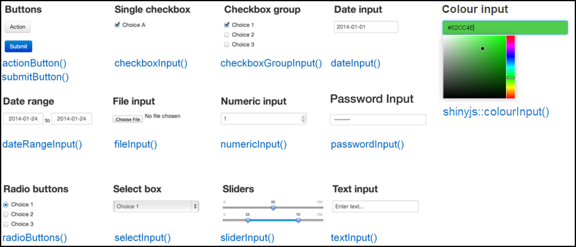
<p class="caption">(\#fig:unnamed-chunk-6)Shiny inputs</p>
</div>

All input functions have the same first two arguments: `inputId` and `label`. The `inputId` will be the name that Shiny will use to refer to this input when you want to retrieve its current value. It is important to note that every input must have a unique `inputId`. If you give more than one input the same `inputId`, Shiny will unfortunately not give you an explicit error, but your app won't work correctly. The `label` argument specifies the text in the display label that goes along with the input widget. Every input can also have multiple other arguments specific to that input type. The only way to find out what arguments you can use with a specific input function is to look at its help file.

**Exercise:** Read the documentation of `numericInput` (via `?numericInput`) and try adding a numeric input to the UI. Experiment with the different arguments. Run the app and see how you can interact with this input. Then try different inputs types.

#### Input for price

The first input we want to have is for specifying a price range (minimum and maximum price). The most sensible types of input for this are either `numericInput()` or `sliderInput()` since they are both used for selecting numbers. If we use `numericInput()`, we'd have to use two inputs, one for the minimum value and one for the maximum. Looking at the documentation for `sliderInput()`, you'll see that by supplying a vector of length two as the `value` argument, it can be used to specify a range rather than a single number. This sounds like what we want in this case, so we'll use `sliderInput()`. 

To create a slider input, a maximum value needs to be provided. We could use the maximum price in the dataset, which is $30,250, but I doubt I'd ever buy something that expensive. I think $100 is a more reasonable max price for me, and about 85% of the products in this dataset are below $100, so let's use that as our max.

By looking at the documentation for the slider input function, the following piece of code can be constructed.


```r
sliderInput("priceInput", "Price", min = 0, max = 100,
            value = c(25, 40), pre = "$")
```

Place the code for the slider input inside `sidebarPanel()` (replace the text we wrote earlier with this input).

**Exercise:** Run the code of the `sliderInput()` in the R Console and see what it returns. Change some of the parameters of `sliderInput()`, and see how that changes the result.  It's important to truly understand that all these functions in the UI are simply a convenient way to write HTML, as is apparent whenever you run these functions on their own.

#### Input for product type

Usually when going to the liquor store you know whether you're looking for beer or wine, and you don't want to waste your time in the wrong section.  The same is true in our app, we should be able to choose what type of product we want.

For this we want some kind of a text input. But allowing the user to enter text freely isn't the right solution because we want to restrict the user to only a few choices.  We could either use radio buttons or a select box for our purpose. Let's use radio buttons for now since there are only a few options, so take a look at the documentation for `radioButtons()` and come up with a reasonable input function code.  It should look like this:


```r
radioButtons("typeInput", "Product type",
            choices = c("BEER", "REFRESHMENT", "SPIRITS", "WINE"),
            selected = "WINE")
```

Add this input code inside `sidebarPanel()`, after the previous input (separate them with a comma).

> If you look at that input function and think "what if there were 100 types, listing them by hand would not be fun, there's got to be a better way!", then you're right.  This is where [`uiOutput()`](#shiny-tutorial-11) comes in handy, but we'll talk about that later.

#### Input for country

Sometimes Dean and Jenny like to feel fancy and only look for wines imported from France. We should add one last input, to select a `Country`. The most appropriate input type in this case is probably the select box. Look at the documentation for `selectInput()` and create an input function. For now let's only have `"CANADA"`, `"FRANCE"`, `"ITALY"` as options, and later we'll see how to include all countries. 


```r
selectInput("countryInput", "Country",
            choices = c("CANADA", "FRANCE", "ITALY"))
```

Add this function as well to your app. If you followed along, your entire app should have this code:


```r
library(shiny)
bcl <- read.csv("bcl-data.csv", stringsAsFactors = FALSE)

ui <- fluidPage(
  titlePanel("BC Liquor Store prices"),
  sidebarLayout(
    sidebarPanel(
      sliderInput("priceInput", "Price", 0, 100, c(25, 40), pre = "$"),
      radioButtons("typeInput", "Product type",
                  choices = c("BEER", "REFRESHMENT", "SPIRITS", "WINE"),
                  selected = "WINE"),
      selectInput("countryInput", "Country",
                  choices = c("CANADA", "FRANCE", "ITALY"))
    ),
    mainPanel("the results will go here")
  )
)

server <- function(input, output) {}

shinyApp(ui = ui, server = server)
```

<div class="figure">
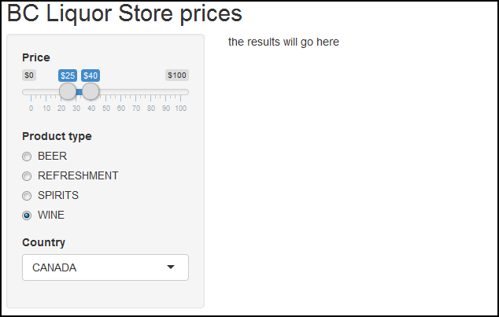
<p class="caption">(\#fig:unnamed-chunk-7)Adding inputs to our Shiny app</p>
</div>

### Add placeholders for outputs {#shiny-tutorial-7}

After creating all the inputs, we should add elements to the UI to display the outputs. Outputs can be any object that R creates and that we want to display in our app - such as a plot, a table, or text. We're still only building the UI, so at this point we can only add *placeholders* for the outputs that will determine where an output will be and what its ID is, but it won't actually show anything. Each output needs to be constructed in the server code later.

Shiny provides several output functions, one for each type of output. Similarly to the input functions, all the output functions have a `outputId` argument that is used to identify each output, and this argument must be unique for each output.

#### Output for a plot of the results

At the top of the main panel we'll have a plot showing some visualization of the results. Since we want a plot, the function we use is `plotOutput()`.

Add the following code into the `mainPanel()` (replace the existing text):


```r
plotOutput("coolplot")
```

This will add a placeholder in the UI for a plot named *coolplot*.

**Exercise:** To remind yourself that we are still merely constructing HTML and not creating actual plots yet, run the above `plotOutput()` function in the R Console to see that all it does is create some HTML.

### Output for a table summary of the results

Below the plot, we will have a table that shows all the results.  To get a table, we use the `tableOutput()` function.

Here is a simple way to create a UI element that will hold a table output:


```r
tableOutput("results")
```

Add this output to the `mainPanel()` as well. Maybe add a couple `br()` in between the two outputs, just as a space buffer so that they aren't too close to each other.

## Checkpoint: what our app looks like after implementing the UI {#shiny-tutorial-8}

If you've followed along, your app should now have this code:


```r
library(shiny)
bcl <- read.csv("bcl-data.csv", stringsAsFactors = FALSE)

ui <- fluidPage(
  titlePanel("BC Liquor Store prices"),
  sidebarLayout(
    sidebarPanel(
      sliderInput("priceInput", "Price", 0, 100, c(25, 40), pre = "$"),
      radioButtons("typeInput", "Product type",
                  choices = c("BEER", "REFRESHMENT", "SPIRITS", "WINE"),
                  selected = "WINE"),
      selectInput("countryInput", "Country",
                  choices = c("CANADA", "FRANCE", "ITALY"))
    ),
    mainPanel(
      plotOutput("coolplot"),
      br(), br(),
      tableOutput("results")
    )
  )
)

server <- function(input, output) {}

shinyApp(ui = ui, server = server)
```

### Implement server logic to create outputs {#shiny-tutorial-9}

So far we only wrote code inside that was assigned to the `ui` variable (or code that was written in `ui.R`). That's usually the easier part of a Shiny app. Now we have to write the `server` function, which will be responsible for listening to changes to the inputs and creating outputs to show in the app.

If you look at the server function, you'll notice that it is always defined with two arguments: `input` and `output`. You *must* define these two arguments! Both `input` and `output` are list-like objects. As the names suggest, `input` is a list you will read values *from* and `output` is a list you will write values *to*. `input` will contain the values of all the different inputs at any given time, and `output` is where you will save output objects (such as tables and plots) to display in your app.

#### Building an output

Recall that we created two output placeholders: *coolplot* (a plot) and *results* (a table). We need to write code in R that will tell Shiny what kind of plot or table to display. There are three rules to build an output in Shiny:

1. Save the output object into the `output` list (remember the app template - every server function has an `output` argument).
1. Build the object with a `render*` function, where `*` is the type of output.
1. Access input values using the `input` list (every server function has an `input` argument).

The third rule is only required if you want your output to depend on some input, so let's first see how to build a very basic output using only the first two rules. We'll create a plot and send it to the *coolplot* output. 


```r
output$coolplot <- renderPlot({
  plot(rnorm(100))
})
```

This simple code shows the first two rules: we're creating a plot inside the `renderPlot()` function, and assigning it to *coolplot* in the `output` list. Remember that every output created in the UI must have a unique ID, now we see why. In order to attach an R object to an output with ID *x*, we assign the R object to `output$x`.

Since *coolplot* was defined as a `plotOutput`, we must use the `renderPlot` function, and we must create a plot inside the `renderPlot` function.

If you add the code above inside the server function, you should see a plot with 100 random points in the app.

**Exercise:** The code inside `renderPlot()` doesn't have to be only one line, it can be as long as you'd like as long as it returns a plot. Try making a more complex plot using ggplot2. The plot doesn't have to use our dataset, it could be anything, just to make sure you can use `renderPlot()`.

#### Making an output react to an input

Now we'll take the plot one step further. Instead of always plotting the same plot (100 random numbers), let's use the minimum price selected as the number of points to show. It doesn't make too much sense, but it's just to learn how to make an output depend on an input.

Replace the previous code in your server function with the code below, and run the app.

```r
output$coolplot <- renderPlot({
  plot(rnorm(input$priceInput[1]))
})
```

Whenever you choose a new minimum price range, the plot will update with a new number of points. Notice that the only thing different in the code is that instead of using the number `100` we are using `input$priceInput[1]`. 

What does this mean? Just like the variable `output` contains a list of all the outputs (and we need to assign code into them), the variable `input` contains a list of all the inputs that are defined in the UI. `input$priceInput` return a vector of length two containing the minimum and maximum price. Whenever the user manipulates the slider in the app, these values are updated, and whatever code relies on it gets re-evaluated. This is a concept known as **reactivity**, which we will get to [soon](#reactivity-101).

Notice that these short three lines of code are using all the three rules for building outputs: 

* We are saving to the `output` list (`output$coolplot <-`).
* We are using a `render*` function to build the output (`renderPlot({})`).
* We are accessing an input value (`input$priceInput[1]`). 

### Building the plot output

Now we have all the knowledge required to build a plot visualizing some aspect of the data. We'll create a simple histogram of the alcohol content of the products by using the same three rules to create a plot output.

First we need to make sure ggplot2 is attached, so add a `library(ggplot2)` at the top.

Next we'll return a histogram of alcohol content from `renderPlot()`. Let's start with just a histogram of the whole data, unfiltered.


```r
output$coolplot <- renderPlot({
  ggplot(bcl, aes(Alcohol_Content)) +
    geom_histogram()
})
```

If you run the app with this code inside your server, you should see a histogram in the app.  But if you change the input values, nothing happens yet, so the next step is to actually filter the dataset based on the inputs.

Recall that we have 3 inputs: `priceInput`, `typeInput`, and `countryInput`. We can filter the data based on the values of these three inputs. We'll use dplyr functions to filter the data, so be sure to include dplyr at the top. Then we'll plot the filtered data instead of the original data.

Place this code in your server function and run the app:

```r
output$coolplot <- renderPlot({
  filtered <-
    bcl %>%
    filter(Price >= input$priceInput[1],
           Price <= input$priceInput[2],
           Type == input$typeInput,
           Country == input$countryInput
    )
  ggplot(filtered, aes(Alcohol_Content)) +
    geom_histogram()
})
```

If you change any input, you should see the histogram update. The way I know the histogram is correct is by noticing that the alcohol content is about 5% when I select beer, 40% for spirits, and 13% for wine. That sounds right.

Read this code and understand it. You've successfully created an interactive app - the plot is changing according to the user's selection.

To make sure we're on the same page, here is what your code should look like at this point:


```r
library(shiny)
library(ggplot2)
library(dplyr)

bcl <- read.csv("bcl-data.csv", stringsAsFactors = FALSE)

ui <- fluidPage(
  titlePanel("BC Liquor Store prices"),
  sidebarLayout(
    sidebarPanel(
      sliderInput("priceInput", "Price", 0, 100, c(25, 40), pre = "$"),
      radioButtons("typeInput", "Product type",
                  choices = c("BEER", "REFRESHMENT", "SPIRITS", "WINE"),
                  selected = "WINE"),
      selectInput("countryInput", "Country",
                  choices = c("CANADA", "FRANCE", "ITALY"))
    ),
    mainPanel(
      plotOutput("coolplot"),
      br(), br(),
      tableOutput("results")
    )
  )
)

server <- function(input, output) {
  output$coolplot <- renderPlot({
    filtered <-
      bcl %>%
      filter(Price >= input$priceInput[1],
             Price <= input$priceInput[2],
             Type == input$typeInput,
             Country == input$countryInput
      )
    ggplot(filtered, aes(Alcohol_Content)) +
      geom_histogram()
  })
}

shinyApp(ui = ui, server = server)
```

<div class="figure">

<p class="caption">(\#fig:unnamed-chunk-8)Adding a plot to our Shiny app</p>
</div>

**Exercise:** The current plot doesn't look very nice, you could enhance the plot and make it much more pleasant to look at.

#### Building the table output

Building the next output should be much easier now that we've done it once.  The other output we have was called `results` (as defined in the UI) and should be a table of all the products that match the filters.  Since it's a table output, we should use the `renderTable()` function. We'll do the exact same filtering on the data, and then simply return the data as a data.frame. Shiny will know that it needs to display it as a table because it's defined as a `tableOutput`.

The code for creating the table output should make sense to you without too much explanation:


```r
output$results <- renderTable({
  filtered <-
    bcl %>%
    filter(Price >= input$priceInput[1],
           Price <= input$priceInput[2],
           Type == input$typeInput,
           Country == input$countryInput
    )
  filtered
})
```

Add this code to your server. Don't overwrite the previous definition of `output$coolplot`, just add this code before or after that, but inside the server function. Run your app, and be amazed! You can now see a table showing all the products at the BC Liquor Store that match your criteria. 

**Exercise:** Add a new output. Either a new plot, a new table, or some piece of text that changes based on the inputs. For example, you could add a text output (`textOutput()` in the UI, `renderText()` in the server) that says how many results were found. If you choose to do this, I recommend first adding the output to the UI, then building the output in the server with static text to make sure you have the syntax correct. Only once you can see the text output in your app you should make it reflect the inputs. Pro-tip: since `textOutput()` is written in the UI, you can wrap it in other UI functions. For example, `h2(textOutput(...))` will result in larger text.


### Reactivity 101 {#shiny-tutorial-10}

Shiny uses a concept called **reactive** programming. This is what enables your outputs to *react* to changes in inputs.  Reactivity in Shiny is complex, but as an extreme oversimplification, it means that when the value of a variable `x` changes, then anything that relies on `x` gets re-evaluated.  Notice how this is very different from what you are used to in R.  Consider the following code:

```r
x <- 5
y <- x + 1
x <- 10
```

What is the value of `y`? It's 6.  But in reactive programming, if `x` and `y` are reactive variables, then the value of `y` would be 11 because it would be updated whenever `x` is changed. This is a very powerful technique that is very useful for creating the responsiveness of Shiny apps, but it might be a bit weird at first because it's a very different concept from what you're used to.

Only *reactive* variables behave this way, and in Shiny all inputs are automatically reactive. That's why you can always use `input$x` in render functions, and you can be sure that whatever output depends on `x` will use the updated value of `x` whenever `x` changes.

You might be wondering what it means to "depend" on a variable. This is not the official terminology, but it simply means that the variable is referenced in the code. So by merely accessing the value of a reactive variable, it causes the current code block to "depend" on that variable.  Consider the following sample code to create a plot with a specific number of points in a specific colour:

```r
output$someoutput <- renderPlot({
  col <- input$mycolour
  num <- input$mynumber
  plot(rnorm(num), col = col)
})
```

The above render function accesses two different inputs: `input$mycolour` and `input$mynumber`. This means that this code block depends on *both* of these variables, so whenever either one of the two inputs is updated, the code gets re-executed with the new input values and `output$someoutput` is updated. 

#### Creating and accessing reactive variables

One very important thing to remember about reactive variables (such as the `input` list) is that **they can only be used inside reactive contexts**. Any `render*` function is a reactive context, so you can always use `input$x` or any other reactive variable inside render functions. There are two other common reactive contexts that we'll get to in a minute: `reactive({})` and `observe({})`. To show you what this means, let's try accessing the price input value in the server function, without explicitly being inside a reactive context. Simply add `print(input$priceInput)` inside the `server` function, and you will get an error when running the app:

~~~
Operation not allowed without an active reactive context. (You tried to do something that can only be done from inside a reactive expression or observer.)
~~~

Shiny is very clear about what the error is: we are trying to access a reactive variable outside of a reactive context. To fix this, we can use the `observe({})` function to access the `input` variable.  Inside the server, replace `print(input$priceInput)` with `observe({ print(input$priceInput) })`, and now the app should run fine. Note that this `observe({})` statement *depends* on `input$priceInput`, so whenever you change the value of the price, the code inside this `observe({})` will run again, and the new value will be printed. This is actually a very simple yet useful debugging technique in Shiny: often you want to know what value a reactive variable holds, so you need to remember to wrap the `cat(input$x)` or `print(input$x)` by an `observe({})`.

So far we only saw one reactive variable: the `input` list. You can also create your own reactive variables using the `reactive({})` function. The `reactive({})` function is similar to `observe({})` in that it is also a reactive context, which means that it will get re-run whenever any of the reactive variables in it get updated. The difference between them is that `reactive({})` returns a value. To see it in action, let's create a variable called `priceDiff` that will be the difference between the maximum and minimum price selected. If you try to naively define `priceDiff <- diff(input$priceInput)`, you'll see the same error as before about doing something outside a reactive context. This is because `input$priceInput` is a reactive variable, and we can't use a reactive variable outside a reactive context. Since we want to assign a value, we use the `reactive({})` function. Try adding the following line to your server:

```r
priceDiff <- reactive({
  diff(input$priceInput)
})
```

Now your app will run. If you want to access a reactive variable defined with `reactive({})`, **you must add parentheses after the variable name, as if it's a function**. To demonstrate this, add `observe({ print(priceDiff()) })` to your server function. Notice that we use `priceDiff()` rather than `priceDiff`. It's very important to remember this, because you can get confusing unclear errors if you simply try to access a custom reactive variable without the parentheses.

You can think of reactivity as causing a chain reaction: when one reactive value changes, anything that depends on it will get updated. If any of the updated values are themselves reactive variables, then any reactive contexts that depend on those variables will also get updated in turn. As a concrete example, let's think about what happens when you change the value of the `priceInput` on the page. Since `input$priceInput` is a reactive variable, any expression that uses it will get updated. This means the two render functions from earlier will execute because they both depend on `input$priceInput`, as well as the `priceDiff` variable because it also depends on it. But since `priceDiff` is itself a reactive variable, Shiny will check if there is anything that depends on `priceDiff`, and indeed there is - the `observe({})` function that prints the value of `priceDiff`. So once `priceDiff` gets updated, the `observe({})` function will run, and the value will get printed.

Reactivity is usually the hardest part about Shiny to understand, so if you don't quite get it, don't feel bad. Try reading this section again, and I promise that with time and experience you will get more comfortable with reactivity. Once you do feel more confident with reactivity, it may be a good idea to read more advanced documentation describing reactivity, since this section greatly simplifies ideas to make them more understandable. A great resource is RStudio's [tutorial on reactivity][shiny-reactivity].

Before continuing to the next section, you can remove all the `observe({})` and `reactive({})` functions we wrote in this section since they were all just for learning purposes.

**Exercise:** Read this section again and really understand what a reactive variable means, what the three main reactive contexts are, how you can define reactive variables, and how a reactivity chain of events works.

#### Using reactive variables to reduce code duplication

You may have noticed that we have the exact same code filtering the dataset in two places, once in each render function. We can solve that problem by defining a reactive variable that will hold the filtered dataset, and use that variable in the render functions.

The first step would be to create the reactive variable. The following code should be added to the server function.


```r
filtered <- reactive({
  bcl %>%
    filter(Price >= input$priceInput[1],
           Price <= input$priceInput[2],
           Type == input$typeInput,
           Country == input$countryInput
    )
})
```

The variable `filtered` is being defined exactly like before, except the body is wrapped by a `reactive({})`, and it's defined in the server function instead of inside the individual render functions. Now that we have our reactive variable, we can use it in the output render functions.  Try it yourself, and when you think you're done, check the code below. Don't forget that in order to access the value of a reactive expression, you must follow the name of the variable with parentheses! This is how your server function should look now:


```r
server <- function(input, output) {
  filtered <- reactive({
    bcl %>%
      filter(Price >= input$priceInput[1],
             Price <= input$priceInput[2],
             Type == input$typeInput,
             Country == input$countryInput
      )
  })
  
  output$coolplot <- renderPlot({
    ggplot(filtered(), aes(Alcohol_Content)) +
      geom_histogram()
  })

  output$results <- renderTable({
    filtered()
  })
}
```

As a reminder, Shiny creates a dependency tree with all the reactive expressions to know what value depends on what other value. For example, when the price input changes, Shiny looks at what values depend on price, and sees that `filtered` is a reactive expression that depends on the price input, so it re-evaluates `filtered`. Then, because `filtered` is changed, Shiny now looks to see what expressions depend on `filtered`, and it finds that the two render functions use `filtered`. So Shiny re-executes the two render functions as well.


### Using `uiOutput()` to create UI elements dynamically {#shiny-tutorial-11}

One of the output functions you can add in the UI is `uiOutput()`. According to the naming convention (e.g. `plotOutput()` is an output to render a plot), this is an output used to render more UI. This may sound a bit confusing, but it's actually very useful. It's usually used to create inputs (or any other UI) from the server, or in other words - you can create inputs dynamically.

Any input that you normally create in the UI is created when the app starts, and it cannot be changed. But what if one of your inputs depends on another input? In that case, you want to be able to create an input dynamically, in the server, and you would use `uiOutput()`.  `uiOutput()` can be used to create *any* UI element, but it's most often used to create input UI elements. The same rules regarding building outputs apply, which means the output (which is a UI element in this case) is created with the function `renderUI()`.

#### Basic example of `uiOutput()`

As a very basic example, consider this app:


```r
library(shiny)
ui <- fluidPage(
  numericInput("num", "Maximum slider value", 5),
  uiOutput("slider")
)

server <- function(input, output) {
  output$slider <- renderUI({
    sliderInput("slider", "Slider", min = 0,
                max = input$num, value = 0)
  })
}

shinyApp(ui = ui, server = server)
```

If you run that tiny app, you will see that whenever you change the value of the numeric input, the slider input is re-generated. This behavior can come in handy often.

### Use `uiOutput()` in our app to populate the countries

We can use this concept in our app to populate the choices for the country selector. The country selector currently only holds 3 values that we manually entered, but instead we could render the country selector in the server and use the data to determine what countries it can have. 

First we need to replace the `selectInput("countryInput", ...)` in the UI with:


```r
uiOutput("countryOutput")
```

Then we need to create the output (which will create a UI element - yeah, it can be a bit confusing at first), so add the following code to the server function:


```r
output$countryOutput <- renderUI({
  selectInput("countryInput", "Country",
              sort(unique(bcl$Country)),
              selected = "CANADA")
})
```

Now if you run the app, you should be able to see all the countries that BC Liquor stores import from.

#### Errors showing up and quickly disappearing

You might notice that when you first run the app, each of the two outputs are throwing an error message, but the error message goes away after a second. The problem is that when the app initializes, `filtered` is trying to access the country input, but the country input hasn't been created yet. After Shiny finishes loading fully and the country input is generated, `filtered` tries accessing it again, this time it's successful, and the error goes away.

Once we understand why the error is happening, fixing it is simple. Inside the `filtered` reactive function, we should check if the country input exists, and if not then just return `NULL`.


```r
filtered <- reactive({
  if (is.null(input$countryInput)) {
    return(NULL)
  }    
  
  bcl %>%
    filter(Price >= input$priceInput[1],
           Price <= input$priceInput[2],
           Type == input$typeInput,
           Country == input$countryInput
    )
})
```

Now when the render function tries to access the data, it will get a `NULL` value before the app is fully loaded.  You will still get an error, because the `ggplot()` function will not work with a `NULL` dataset, so we also need to make a similar check in the `renderPlot()` function. Only once the data is loaded, we can try to plot.


```r
output$coolplot <- renderPlot({
  if (is.null(filtered())) {
    return()
  }
  ggplot(filtered(), aes(Alcohol_Content)) +
    geom_histogram()
})
```

The `renderTable()` function doesn't need this fix applied because Shiny doesn't have a problem rendering a `NULL` table.

**Exercise:** Change the product type radio buttons to get generated in the server with the values from the dataset, instead of being created in the UI with the values entered manually. If you're feeling confident, try adding an input for "subtype" that will get re-generated every time a new type is chosen, and will be populated with all the subtype options available for the currently selected type (for example, if `"WINE"` is selected, then the subtypes are white wine, red wine, etc.).


### Final Shiny app code {#shiny-tutorial-12}

In case you got lost somewhere, here is the final code. The app is now functional, but there are plenty of features you can add to make it better.


```r
library(shiny)
library(ggplot2)
library(dplyr)

bcl <- read.csv("bcl-data.csv", stringsAsFactors = FALSE)

ui <- fluidPage(
  titlePanel("BC Liquor Store prices"),
  sidebarLayout(
    sidebarPanel(
      sliderInput("priceInput", "Price", 0, 100, c(25, 40), pre = "$"),
      radioButtons("typeInput", "Product type",
                  choices = c("BEER", "REFRESHMENT", "SPIRITS", "WINE"),
                  selected = "WINE"),
      uiOutput("countryOutput")
    ),
    mainPanel(
      plotOutput("coolplot"),
      br(), br(),
      tableOutput("results")
    )
  )
)

server <- function(input, output) {
  output$countryOutput <- renderUI({
    selectInput("countryInput", "Country",
                sort(unique(bcl$Country)),
                selected = "CANADA")
  })  
  
  filtered <- reactive({
    if (is.null(input$countryInput)) {
      return(NULL)
    }    
    
    bcl %>%
      filter(Price >= input$priceInput[1],
             Price <= input$priceInput[2],
             Type == input$typeInput,
             Country == input$countryInput
      )
  })
  
  output$coolplot <- renderPlot({
    if (is.null(filtered())) {
      return()
    }
    ggplot(filtered(), aes(Alcohol_Content)) +
      geom_histogram()
  })

  output$results <- renderTable({
    filtered()
  })
}

shinyApp(ui = ui, server = server)
```

### Share your app with the world {#shiny-tutorial-13}

Remember how every single app is a web page powered by an R session on a computer? So far, you've been running Shiny locally, which means your computer was used to power the app. It also means that the app was not accessible to anyone on the internet. If you want to share your app with the world, you need to host it somewhere.

#### Host on shinyapps.io

RStudio provides a service called [shinyapps.io][shinyapps-web] which lets you host your apps for free. It is integrated seamlessly into RStudio so that you can publish your apps with the click of a button, and it has a free version.  The free version allows a certain number of apps per user and a certain number of activity on each app, but it should be good enough for most of you. It also lets you see some basic stats about usage of your app.

Hosting your app on shinyapps.io is the easy and recommended way of getting your app online.  Go to [www.shinyapps.io][shinyapps-web] and sign up for an account. When you're ready to publish your app, click on the "Publish Application" button in RStudio and follow the instructions. You might be asked to install a couple packages if it's your first time.

<div class="figure">

<p class="caption">(\#fig:unnamed-chunk-9)Shiny publish application button</p>
</div>


After a successful deployment to shinyapps.io, you will be redirected to your app in the browser. You can use that URL to show off to your family what a cool app you wrote.

#### Host on a Shiny Server

The other option for hosting your app is on your own private [Shiny Server](https://www.rstudio.com/products/shiny/shiny-server/). Shiny Server is also a product by RStudio that lets you host apps on your own server. This means that instead of RStudio hosting the app for you, you have it on your own private server. This means you have a lot more freedom and flexibility, but it also means you need to have a server and be comfortable administering a server. I currently host all my apps on [my own Shiny Server](https://daattali.com/shiny/) just because I like having the extra control, but when I first learned about Shiny I used shinyapps.io for several months.

If you're feeling adventurous and want to host your own server, you can follow [my tutorial for hosting a Shiny Server][shiny-server-setup].


### More Shiny features to check out {#shiny-tutorial-14}

Shiny is extremely powerful and has lots of features that we haven't covered. Here's a sneak peek of just a few other common Shiny features that are not too advanced. 

#### Shiny in R Markdown

You can include Shiny inputs and outputs in an R Markdown document! This means that your R Markdown document can be interactive. Learn more [here][shiny-bookdown]. Here's a simple example of how to include interactive Shiny elements in an R Markdown:

````markdown
---
output: html_document
runtime: shiny
---

```{r echo=FALSE}
sliderInput("num", "Choose a number",
            0, 100, 20)

renderPlot({
    plot(seq(input$num))
})
```
````
  
#### Use `conditionalPanel()` to conditionally show UI elements

You can use `conditionalPanel()` to either show or hide a UI element based on a simple condition, such as the value of another input. Learn more via `?conditionalPanel`.


```r
library(shiny)
ui <- fluidPage(
  numericInput("num", "Number", 5, 1, 10),
  conditionalPanel(
    "input.num >=5",
    "Hello!"
  )
)
server <- function(input, output) {}
shinyApp(ui = ui, server = server)
```

#### Use `navbarPage()` or `tabsetPanel()` to have multiple tabs in the UI

If your apps requires more than a single "view", you can have separate tabs. Learn more via `?navbarPage` or `?tabsetPanel`.


```r
library(shiny)
ui <- fluidPage(
  tabsetPanel(
    tabPanel("Tab 1", "Hello"),
    tabPanel("Tab 2", "there!")
  )
)
server <- function(input, output) {}
shinyApp(ui = ui, server = server)
```

#### Use DT for beautiful, interactive tables

Whenever you use `tableOutput()` + `renderTable()`, the table that Shiny creates is a static and boring-looking table. If you download the DT package, you can replace the default table with a much sleeker table by just using `DT::dataTableOutput()` + `DT::renderDataTable()`. It's worth trying. Learn more on [DT's website](https://rstudio.github.io/DT/).

#### Use `isolate()` function to remove a dependency on a reactive variable

When you have multiple reactive variables inside a reactive context, the whole code block will get re-executed whenever *any* of the reactive variables change because all the variables become dependencies of the code. If you want to suppress this behavior and cause a reactive variable to not be a dependency, you can wrap the code that uses that variable inside the `isolate()` function.  Any reactive variables that are inside `isolate()` will not result in the code re-executing when their value is changed. Read more about this behavior via `?isolate`.

#### Use `update*Input()` functions to update input values programmatically

Any input function has an equivalent `update*Input` function that can be used to update any of its parameters.

```r
library(shiny)
ui <- fluidPage(
  sliderInput("slider", "Move me", value = 5, 1, 10),
  numericInput("num", "Number", value = 5, 1, 10)
)
server <- function(input, output, session) {
  observe({
    updateNumericInput(session, "num", value = input$slider)
  })
}
shinyApp(ui = ui, server = server)
```

Note that we used an additional argument `session` when defining the `server` function. While the `input` and `output` arguments are mandatory, the `session` argument is optional. You need to define the `session` argument when you want to use functions that need to access the session. The `session` parameter actually has some useful information in it, you can learn more about this via `?shiny::session`.

### Scoping rules in Shiny apps

Scoping is very important to understand in Shiny once you want to support more than one user at a time. Since your app can be hosted online, multiple users can use your app simultaneously. If there are any variables (such as datasets or global parameters) that should be shared by all users, then you can safely define them globally. But any variable that should be specific to each user's session should be not be defined globally.

You can think of the `server` function as a sandbox for each user. Any code outside of the server function is run once and is shared by all the instances of your Shiny app. Any code inside the server is run once *for every user that visits your app*. This means that any user-specific variables should be defined inside server. If you look at the code in our BC Liquor Store app, you'll see that we followed this rule: the raw dataset was loaded outside the server and is therefore available to all users, but the `filtered` object is constructed inside the server so that every user has their own version of it.  If `filtered` was a global variable, then when one user changes the values in your app, all other users connected to your app would see the change happen.

You can learn more about the scoping rules in Shiny [here](https://shiny.rstudio.com/articles/scoping.html).

#### Use `global.R` to define objects available to both `ui.R` and `server.R`

If there are objects that you want to have available to both `ui.R` and `server.R`, you can place them in `global.R`. You can learn more about `global.R` and other scoping rules [here](https://shiny.rstudio.com/articles/scoping.html). 

### Add images 

You can add an image to your Shiny app by placing an image under the `www/` folder and using the UI function `img(src = "image.png")`. Shiny will know to automatically look in the `www/` folder for the image.

#### Add JavaScript/CSS

If you know JavaScript or CSS you are more than welcome to use some in your app.


```r
library(shiny)
ui <- fluidPage(
  tags$head(tags$script("alert('Hello!');")),
  tags$head(tags$style("body{ color: blue; }")),
  "Hello"
)
server <- function(input, output) {
  
}
shinyApp(ui = ui, server = server)
```

If you do want to add some JavaScript or use common JavaScript functions in your apps, you might want to check out [`shinyjs`][shinyjs-web].

## Ideas to improve our app {#shiny-tutorial-15}

The app we developed is functional, but there are plenty of improvements that can be made. You can compare the app we developed to [Dean's version of this app](https://daattali.com/shiny/bcl/) to get an idea of what a (slightly) more functional app could include. Here are some suggestions of varying difficulties. Each idea also has a hint, Dean recommends only reading the hint if you're stuck for 10 minutes. 

1. Split the app into two separate files: `ui.R` and `server.R`.
    - **Hint:** All the code assigned into the `ui` variable goes into `ui.R` and all the code for the `server` function goes into `server.R`. You do not need to explicitly call the `shinyApp()` function.
    
1. Add an option to sort the results table by price.
    - **Hint:** Use `checkboxInput()` to get `TRUE`/`FALSE` values from the user.

1. Add an image of the BC Liquor Store to the UI.
    - **Hint:** Place the image in a folder named `www`, and use `img(src = "imagename.png")` to add the image.

1. Share your app with everyone on the internet by deploying to shinyapps.io.
    - **Hint:** Go to [shinyapps.io][shinyapps-web], register for an account, then click the "Publish App" button in RStudio. 

1. Use the DT package to turn the current results table into an interactive table.
    - **Hint:** Install the DT package, replace `tableOutput()` with `DT::dataTableOutput()` and replace `renderTable()` with `DT::renderDataTable()`.

1. Add parameters to the plot.
    - **Hint:** You will need to add input functions that will be used as parameters for the plot. You could use `shinyjs::colourInput()` to let the user decide on the colours of the bars in the plot.

1. The app currently behaves strangely when the user selects filters that return 0 results. For example, try searching for wines from Belgium. There will be an empty plot and empty table generated, and there will be a warning message in the R Console. Try to figure out why this warning message is appearing, and how to fix it.
    - **Hint:** The problem happens because `renderPlot()` and `renderTable()` are trying to render an empty data frame. To fix this issue, the `filtered` reactive expression should check for the number of rows in the filtered data, and if that number is 0 then return `NULL` instead of a 0-row data frame.

1. Place the plot and the table in separate tabs.
    - **Hint:** Use `tabsetPanel()` to create an interface with multiple tabs.

1. If you know CSS, add CSS to make your app look nicer. 
    - **Hint:** Add a CSS file under `www` and use the function `includeCSS()` to use it in your app.

1. Experiment with packages that add extra features to Shiny, such as `shinyjs`, `leaflet`, `shinydashboard`, `shinythemes`, `ggvis`.
    - **Hint:** Each package is unique and has a different purpose, so you need to read the documentation of each package in order to know what it provides and how to use it.
    
1. Show the number of results found whenever the filters change. For example, when searching for Italian wines $20-$40, the app would show the text "We found 122 options for you".
    - **Hint:** Add a `textOutput()` to the UI, and in its corresponding `renderText()` use the number of rows in the `filtered()` object.

1. Allow the user to download the results table as a `.csv` file.
    - **Hint:** Look into the `downloadButton()` and `downloadHandler()` functions.
    
1. When the user wants to see only wines, show a new input that allows the user to filter by sweetness level. Only show this input if wines are selected.
    - **Hint:** Create a new input function for the sweetness level, and use it in the server code that filters the data. Use `conditionalPanel()` to conditionally show this new input. The `condition` argument of `conditionalPanel` should be something like `input.typeInput == "WINE"`.

1. Allow the user to search for multiple alcohol types simultaneously, instead of being able to choose only wines/beers/etc.
    - **Hint:** There are two approaches to do this. Either change the `typeInput` radio buttons into checkboxes (`checkboxGroupInput()`) since checkboxes support choosing multiple items, or change `typeInput` into a select box (`selectInput()`) with the argument `multiple = TRUE` to support choosing multiple options.
    
1. If you look at the dataset, you'll see that each product has a "type" (beer, wine, spirit, or refreshment) and also a "subtype" (red wine, rum, cider, etc.). Add an input for "subtype" that will let the user filter for only a specific subtype of products. Since each type has different subtype options, the choices for subtype should get re-generated every time a new type is chosen. For example, if "wine" is selected, then the subtypes available should be white wine, red wine, etc.
    - **Hint:** Use `uiOutput()` to create this input in the server code.
    
1. Provide a way for the user to show results from *all* countries (instead of forcing a filter by only one specific country).
    - **Hint:** There are two ways to approach this. You can either add a value of "All" to the dropdown list of country options, you can include a checkbox for "Filter by country" and only show the dropdown.


# Shiny Resources

Shiny is a very popular package and has lots of resources on the web. Here's a compiled list of a few resources I recommend, which are all fairly easy to read and understand.

- [Shiny official website][shiny-official-web]
- [Shiny official tutorial][shiny-official-tutorial]
- [Shiny cheatsheet][shiny-cheatsheet]
- [Lots of short useful articles about different topics in Shiny - **highly recommended**][shiny-articles]
- [Shiny in R Markdown](http://rmarkdown.rstudio.com/authoring_shiny.html)
- Get help from the [Shiny Google group][shiny-google-groups] or [StackOverflow][shiny-stack-overflow]
- [Publish your apps for free with shinyapps.io][shinyapps-web]
- [Host your app on your own Shiny server][shiny-server-setup]
- [Learn about how reactivity works][shiny-reactivity]
- [Learn about useful debugging techniques][shiny-debugging]

## Awesome add-on packages to Shiny

Many people have written packages that enhance Shiny in some way or add extra functionality. Here is a list of several popular packages that people often use together with Shiny:

* [shinythemes][shinythemes-web] - Easily alter the appearance of your app ([cran][shinythemes-cran]).
* [shinyjs][shinyjs-web] - Enhance user experience in Shiny apps using JavaScript functions without knowing JavaScript ([cran][shinyjs-cran]; [GitHub][shinyjs-github]).
* [leaflet][leaflet-web] - Add interactive maps to your apps ([cran][leaflet-cran]; [GitHub][leaflet-github]).
* [ggvis][ggvis-web] - Similar to ggplot2, but the plots are focused on being web-based and are more interactive ([cran][ggvis-cran]).
* [shinydashboard][shinydashboard-web] - Gives you tools to create visual "dashboards" ([cran][shinydashboard-cran]; [GitHub][shinydashboard-github]).


<!--DS4P Links-->
[course_web]: https://datascience4psych.github.io/DataScience4Psych
[course_git]: https://github.com/DataScience4Psych/DataScience4Psych
[course_repo]: https://github.com/DataScience4Psych
[course_slides]: https://github.com/DataScience4Psych/slides
[course_syllabus]: https://smasongarrison.github.io/syllabi/ 
<!-- https://smasongarrison.github.io/syllabi/data-science.html -->
[syllabi]: https://smasongarrison.github.io/syllabi
[pl_00]: https://www.youtube.com/playlist?list=PLKrrdtYgOUYaEAnJX20Ryy4OSie375rVY
[pl_01]: https://www.youtube.com/playlist?list=PLKrrdtYgOUYao_7t5ycK4KDXNKaY-ECup
[pl_02]: https://www.youtube.com/playlist?list=PLKrrdtYgOUYZmr_T3PnuxjVIlj0C0kUNI
[pl_03]: https://www.youtube.com/playlist?list=PLKrrdtYgOUYaHmjzdRvfg0yhOIYQnfjwE
[pl_04]: https://www.youtube.com/playlist?list=PLKrrdtYgOUYYWFcel6_vp8__RUKLxhX4y
[pl_05]: https://www.youtube.com/playlist?list=PLKrrdtYgOUYYMIguiV1F8RagMYibTY4iW
[pl_06]: https://www.youtube.com/playlist?list=PLKrrdtYgOUYYV_KDod3Mk9-RmtFXii9Dv
[pl_07]: https://www.youtube.com/watch?list=PLKrrdtYgOUYZxvEvQ8-PcWrOY_dwY_ETI
[pl_08]: https://www.youtube.com/playlist?list=PLKrrdtYgOUYZgOzYB_dmauw55M7jXvsdo
[pl_09]: https://www.youtube.com/playlist?list=PLKrrdtYgOUYbaiTmldRY2ddsLrHp3z6yO
[pl_10]: https://www.youtube.com/playlist?list=PLKrrdtYgOUYbPw5iYzYEzoOKa7mJKNIhq
[pl_11]: https://www.youtube.com/playlist?list=PLKrrdtYgOUYZ-u6LzBbanrNFoeLHKaLL6
[pl_12]: https://www.youtube.com/playlist?list=PLKrrdtYgOUYbwRS-9Htmb80_t1NG-021e
[pl_13]: https://www.youtube.com/playlist?list=PLKrrdtYgOUYbWGmSnbLIYwdLOnGm6une6
[pl_14]: https://www.youtube.com/playlist?list=PLKrrdtYgOUYbWGmSnbLIYwdLOnGm6une6
[pl_15]: https://www.youtube.com/playlist?list=PLKrrdtYgOUYa5MoYrV8EsWQ5jIr5ZYMpM
[pl_all]: https://www.youtube.com/playlist?list=PLKrrdtYgOUYZomNqf-1dtCDW94ySdLv-9


<!--AE Links-->
[ae01a_unvotes]: https://github.com/DataScience4Psych/ae01a_unvotes
[ae01b_covid]: https://github.com/DataScience4Psych/ae01b_covid
[ae02_bechdel]: https://github.com/DataScience4Psych/ae-02-bechdel-rmarkdown
[ae03_starwars]: https://github.com/DataScience4Psych/ae-03-starwars-dataviz


<!-- Lab Links-->

[lab01_hello]: https://github.com/DataScience4Psych/lab-01-hello-r

<!--Slides-->
[d01_welcome]: https://datascience4psych.github.io/slides/d01_welcome/d01_welcome.html
[d02_toolkit]: https://datascience4psych.github.io/slides/d02_toolkit/d02_toolkit.html
[d03_dataviz]: https://datascience4psych.github.io/slides/d03_dataviz/d03_dataviz.html
[d04_ggplot2]: https://datascience4psych.github.io/slides/d04_ggplot2/d04_ggplot2.html
[d05_viznum]: https://datascience4psych.github.io/slides/d05_viznum/d05_viznum.html
[d06_vizcat]: https://datascience4psych.github.io/slides/d06_vizcat/d06_vizcat.html
[d07_tidy]: https://datascience4psych.github.io/slides/d07_tidy/d07_tidy.html
[d08_grammar]: https://datascience4psych.github.io/slides/d08_grammar/d08_grammar.html
[d09_wrangle]: https://datascience4psych.github.io/slides/d09_wrangle/d09_wrangle.html
[d10_dfs]: https://datascience4psych.github.io/slides/d10_dfs/d10_dfs.html
[d11_types]: https://datascience4psych.github.io/slides/d11_types/d11_types.html
[d12_import]: https://datascience4psych.github.io/slides/d12_import/d12_import.html
[d13_goodviz]: https://datascience4psych.github.io/slides/d13_goodviz/d13_goodviz.html
[d13b_moreggplot]: https://datascience4psych.github.io/slides/d13_goodviz/d13b_moreggplot.html
[d14_confound]: https://datascience4psych.github.io/slides/d14_confound/d14_confound.html
[d15_goodtalk]: https://datascience4psych.github.io/slides/d15_goodtalk/d15_goodtalk.html
[d16_webscraping]: https://datascience4psych.github.io/slides/d16_webscraping/d16_webscraping.html
[d17_functions]: https://datascience4psych.github.io/slides/d17_functions/d17_functions.html
[d18_ethics]: https://datascience4psych.github.io/slides/d18_ethics/d18_ethics.html
[d19_bias]: https://datascience4psych.github.io/slides/d19_bias/d19_bias.html


<!--externals-->

[stat545]: https://stat545.com
[r4ds]: https://r4ds.had.co.nz
[cran]: https://cloud.r-project.org


<!--HappyGitWithR Links-->


[hg-github-account]: https://happygitwithr.com/github-acct.html
[hg-install-r-rstudio]: https://happygitwithr.com/install-r-rstudio.html
[hg-connect-intro]: https://happygitwithr.com/connect-intro.html
[hg-browsability]: https://happygitwithr.com/workflows-browsability.html
[hg-shell]: https://happygitwithr.com/shell.html

<!--Package Links-->


[lubridate-web]: https://lubridate.tidyverse.org
[lubridate-cran]: https://CRAN.R-project.org/package=lubridate
[lubridate-github]: https://github.com/tidyverse/lubridate
[lubridate-vignette]: https://cran.r-project.org/web/packages/lubridate/vignettes/lubridate.html


[stringr-web]: https://stringr.tidyverse.org
[stringr-cran]: https://CRAN.R-project.org/package=stringr


[ggplot2-github]: https://github.com/tidyverse/ggplot2
[ggplot2-theme-args]: https://ggplot2.tidyverse.org/reference/ggtheme.html#arguments


[assertthat-cran]: https://CRAN.R-project.org/package=assertthat
[assertthat-github]: https://github.com/hadley/assertthat

[ensurer-cran]: https://CRAN.R-project.org/package=ensurer
[ensurer-github]: https://github.com/smbache/ensurer

[assertr-cran]: https://CRAN.R-project.org/package=assertr
[assertr-github]: https://github.com/ropensci/assertr

[assertive-cran]: https://CRAN.R-project.org/package=assertive
[assertive-bitbucket]: https://bitbucket.org/richierocks/assertive/src/master/

[testthat-cran]: https://CRAN.R-project.org/package=testthat
[testthat-github]: https://github.com/r-lib/testthat
[testthat-web]: https://testthat.r-lib.org

[viridis-cran]: https://CRAN.R-project.org/package=viridis
[viridis-github]: https://github.com/sjmgarnier/viridis
[viridis-vignette]: https://cran.r-project.org/web/packages/viridis/vignettes/intro-to-viridis.html

[colorspace-cran]: https://CRAN.R-project.org/package=colorspace
[colorspace-vignette]: https://cran.r-project.org/web/packages/colorspace/vignettes/hcl-colors.pdf

[cowplot-cran]: https://CRAN.R-project.org/package=cowplot
[cowplot-github]: https://github.com/wilkelab/cowplot
[cowplot-vignette]: https://cran.r-project.org/web/packages/cowplot/vignettes/introduction.html

[devtools-cran]: https://CRAN.R-project.org/package=devtools
[devtools-github]: https://github.com/r-lib/devtools
[devtools-web]: https://devtools.r-lib.org
[devtools-cheatsheet]: https://www.rstudio.com/wp-content/uploads/2015/03/devtools-cheatsheet.pdf
[devtools-cheatsheet-old]: https://rawgit.com/rstudio/cheatsheets/master/package-development.pdf
[devtools-1-6]: https://blog.rstudio.com/2014/10/02/devtools-1-6/
[devtools-1-8]: https://blog.rstudio.com/2015/05/11/devtools-1-9-0/
[devtools-1-9-1]: https://blog.rstudio.com/2015/09/13/devtools-1-9-1/

[googlesheets-cran]: https://CRAN.R-project.org/package=googlesheets
[googlesheets-github]: https://github.com/jennybc/googlesheets

[tidycensus-cran]: https://CRAN.R-project.org/package=tidycensus
[tidycensus-github]: https://github.com/walkerke/tidycensus
[tidycensus-web]: https://walkerke.github.io/tidycensus/index.html


[fs-cran]: https://CRAN.R-project.org/package=fs
[fs-github]: https://github.com/r-lib/fs

[plumber-web]: https://www.rplumber.io
[plumber-docs]: https://www.rplumber.io/docs/
[plumber-github]: https://github.com/trestletech/plumber
[plumber-cran]: https://CRAN.R-project.org/package=plumber


[glue-web]: https://glue.tidyverse.org
[stringi-cran]: https://CRAN.R-project.org/package=stringi
[rex-github]: https://github.com/kevinushey/rex
[rcolorbrewer-cran]: https://CRAN.R-project.org/package=RColorBrewer
[dichromat-cran]: https://CRAN.R-project.org/package=dichromat

[rdryad-web]: https://docs.ropensci.org/rdryad/
[rdryad-cran]: https://CRAN.R-project.org/package=rdryad
[rdryad-github]: https://github.com/ropensci/rdryad

[roxygen2-cran]: https://CRAN.R-project.org/package=roxygen2
[roxygen2-vignette]: https://cran.r-project.org/web/packages/roxygen2/vignettes/rd.html

[shinythemes-web]: https://rstudio.github.io/shinythemes/
[shinythemes-cran]: https://CRAN.R-project.org/package=shinythemes

[shinyjs-web]: https://deanattali.com/shinyjs/
[shinyjs-cran]: https://CRAN.R-project.org/package=shinyjs
[shinyjs-github]: https://github.com/daattali/shinyjs

[leaflet-web]: https://rstudio.github.io/leaflet/
[leaflet-cran]: https://CRAN.R-project.org/package=leaflet
[leaflet-github]: https://github.com/rstudio/leaflet

[ggvis-web]: https://ggvis.rstudio.com
[ggvis-cran]: https://CRAN.R-project.org/package=ggvis
 
[usethis-web]: https://usethis.r-lib.org
[usethis-cran]: https://CRAN.R-project.org/package=usethis
[usethis-github]: https://github.com/r-lib/usethis

[pkgdown-web]: https://pkgdown.r-lib.org
[gh-github]: https://github.com/r-lib/gh

[httr-web]: https://httr.r-lib.org
[httr-cran]: https://CRAN.R-project.org/package=httr
[httr-github]: https://github.com/r-lib/httr

[gistr-web]: https://docs.ropensci.org/gistr
[gistr-cran]: https://CRAN.R-project.org/package=gistr
[gistr-github]: https://github.com/ropensci/gistr

[rvest-web]: https://rvest.tidyverse.org
[rvest-cran]: https://CRAN.R-project.org/package=rvest
[rvest-github]: https://github.com/tidyverse/rvest

[xml2-web]: https://xml2.r-lib.org
[xml2-cran]: https://CRAN.R-project.org/package=xml2
[xml2-github]: https://github.com/r-lib/xml2

[jsonlite-paper]: https://arxiv.org/abs/1403.2805
[jsonlite-cran]: https://CRAN.R-project.org/package=jsonlite
[jsonlite-github]: https://github.com/jeroen/jsonlite

[readxl-web]: https://readxl.tidyverse.org
[readxl-github]: https://github.com/tidyverse/readxl
[readxl-cran]: https://CRAN.R-project.org/package=readxl

[janitor-web]: http://sfirke.github.io/janitor/
[janitor-cran]: https://CRAN.R-project.org/package=janitor
[janitor-github]: https://github.com/sfirke/janitor


<!--Shiny links-->
[shinydashboard-web]: https://rstudio.github.io/shinydashboard/
[shinydashboard-cran]: https://CRAN.R-project.org/package=shinydashboard
[shinydashboard-github]: https://github.com/rstudio/shinydashboard


[shiny-official-web]: https://shiny.rstudio.com
[shiny-official-tutorial]: https://shiny.rstudio.com/tutorial/
[shiny-cheatsheet]: https://shiny.rstudio.com/images/shiny-cheatsheet.pdf
[shiny-articles]: https://shiny.rstudio.com/articles/
[shiny-bookdown]: https://bookdown.org/yihui/rmarkdown/shiny-documents.html
[shiny-google-groups]: https://groups.google.com/forum/#!forum/shiny-discuss
[shiny-stack-overflow]: https://stackoverflow.com/questions/tagged/shiny
[shinyapps-web]: https://www.shinyapps.io
[shiny-server-setup]: https://deanattali.com/2015/05/09/setup-rstudio-shiny-server-digital-ocean/
[shiny-reactivity]: https://shiny.rstudio.com/articles/understanding-reactivity.html
[shiny-debugging]: https://shiny.rstudio.com/articles/debugging.html


<!--Publications--> 


[adv-r-defensive-programming]: http://adv-r.had.co.nz/Exceptions-Debugging.html#defensive-programming
[adv-r-fxn-args]: http://adv-r.had.co.nz/Functions.html#function-arguments
[adv-r-return-values]: http://adv-r.had.co.nz/Functions.html#return-values
[adv-r-closures]: http://adv-r.had.co.nz/Functional-programming.html#closures


[r4ds-strings]: https://r4ds.had.co.nz/strings.html
[r4ds-readr-strings]: https://r4ds.had.co.nz/data-import.html#readr-strings
[r4ds-dates-times]: https://r4ds.had.co.nz/dates-and-times.html
[r4ds-data-import]: http://r4ds.had.co.nz/data-import.html
[r4ds-relational-data]: https://r4ds.had.co.nz/relational-data.html
[r4ds-pepper-shaker]: https://r4ds.had.co.nz/vectors.html#lists-of-condiments

[r-pkgs2]: https://r-pkgs.org/index.html
[r-pkgs2-whole-game]: https://r-pkgs.org/whole-game.html
[r-pkgs2-description]: https://r-pkgs.org/description.html
[r-pkgs2-man]: https://r-pkgs.org/man.htm
[r-pkgs2-tests]: https://r-pkgs.org/tests.html
[r-pkgs2-namespace]: https://r-pkgs.org/namespace.html
[r-pkgs2-vignettes]: https://r-pkgs.org/vignettes.html
[r-pkgs2-release]: https://r-pkgs.org/release.html
[r-pkgs2-r-code]: https://r-pkgs.org/r.html#r

[r-graphics-cookbook]: http://shop.oreilly.com/product/0636920023135.do


[cookbook-for-r-graphs]: http://www.cookbook-r.com/Graphs/
[cookbook-for-r-multigraphs]: http://www.cookbook-r.com/Graphs/Multiple_graphs_on_one_page_(ggplot2)/


[testthat-article]: https://journal.r-project.org/archive/2011-1/RJournal_2011-1_Wickham.pdf
[worry-about-color]: https://github.com/DataScience4Psych/DataScience4Psych/blob/master/admin/pdfs/Why%20Should%20Engineers%20and%20Scientists%20Be%20Worried%20About%20Color.pdf
[escaping-rgbland-pdf]: https://eeecon.uibk.ac.at/~zeileis/papers/Zeileis+Hornik+Murrell-2009.pdf
[escaping-rgbland-doi]: https://doi.org/10.1016/j.csda.2008.11.033


<!--R Documentation-->
[rdocs-extremes]: https://rdrr.io/r/base/Extremes.html
[rdocs-range]: https://rdrr.io/r/base/range.html
[rdocs-quantile]: https://rdrr.io/r/stats/quantile.html
[rdocs-c]: https://rdrr.io/r/base/c.html
[rdocs-list]: https://rdrr.io/r/base/list.html
[rdocs-lm]: https://rdrr.io/r/stats/lm.html
[rdocs-coef]: https://rdrr.io/r/stats/coef.html
[rdocs-devices]: https://rdrr.io/r/grDevices/Devices.html
[rdocs-ggsave]: https://rdrr.io/cran/ggplot2/man/ggsave.html


<!--Wikipedia Links-->


[wiki-row-col-major-order]: https://en.wikipedia.org/wiki/Row-_and_column-major_order
[wiki-boxplot]: https://en.wikipedia.org/wiki/Box_plot
[wiki-brewer]: https://en.wikipedia.org/wiki/Cynthia_Brewer
[wiki-vector-graphics]: https://en.wikipedia.org/wiki/Vector_graphics
[wiki-raster-graphics]: https://en.wikipedia.org/wiki/Raster_graphics
[wiki-dry]: https://en.wikipedia.org/wiki/Don%27t_repeat_yourself
[wiki-web-scraping]: https://en.wikipedia.org/wiki/Web_scraping
[wiki-xpath]: https://en.wikipedia.org/wiki/XPath

<!--Misc. Links-->

[useR-2014-dropbox]: https://www.dropbox.com/sh/i8qnluwmuieicxc/AAAgt9tIKoIm7WZKIyK25lh6a

[html-preview]: http://htmlpreview.github.io
[research-workflow]: https://www.carlboettiger.info/2012/05/06/research-workflow.html


[blog-strings-as-factors]: https://notstatschat.tumblr.com/post/124987394001/stringsasfactors-sigh
[bio-strings-as-factors]: https://simplystatistics.org/2015/07/24/stringsasfactors-an-unauthorized-biography
[stackexchange-outage]: https://stackstatus.net/post/147710624694/outage-postmortem-july-20-2016

[fix-atom-bug]: https://davidvgalbraith.com/how-i-fixed-atom/
[icu-regex]: http://userguide.icu-project.org/strings/regexp
[regex101]: https://regex101.com

[utf8-debug]: http://www.i18nqa.com/debug/utf8-debug.html

[programmers-encoding]: http://kunststube.net/encoding/
[encoding-probs-ruby]: https://www.justinweiss.com/articles/3-steps-to-fix-encoding-problems-in-ruby/
[theyre-to-theyre]: https://www.justinweiss.com/articles/how-to-get-from-theyre-to-theyre/
[lubridate-ex1]: https://www.r-exercises.com/2016/08/15/dates-and-times-simple-and-easy-with-lubridate-part-1/
[lubridate-ex2]: https://www.r-exercises.com/2016/08/29/dates-and-times-simple-and-easy-with-lubridate-exercises-part-2/
[lubridate-ex3]: https://www.r-exercises.com/2016/10/04/dates-and-times-simple-and-easy-with-lubridate-exercises-part-3/
[google-sql-join]: https://www.google.com/search?q=sql+join&tbm=isch
[min-viable-product]: https://blog.fastmonkeys.com/
[telescope-rule]: http://c2.com/cgi/wiki?TelescopeRule
[unix-philosophy]: http://www.faqs.org/docs/artu/ch01s06.html
[twitter-wrathematics]: https://twitter.com/wrathematics
[robbins-effective-graphs]: https://www.amazon.com/Creating-Effective-Graphs-Naomi-Robbins/dp/0985911123
[r-graph-catalog-github]: https://github.com/jennybc/r-graph-catalog
[google-pie-charts]: https://www.google.com/search?q=pie+charts+suck
[why-pie-charts-suck]: https://www.richardhollins.com/blog/why-pie-charts-suck/
[worst-figure]: https://robjhyndman.com/hyndsight/worst-figure/
[naomi-robbins]: http://www.nbr-graphs.com
[hadley-github-index]: https://hadley.github.io
[scipy-2015-matplotlib-colors]: https://www.youtube.com/watch?v=xAoljeRJ3lU
[winston-chang-github]: https://github.com/wch
[favorite-rgb-color]: https://manyworldstheory.com/2013/01/15/my-favorite-rgb-color/
[stowers-color-chart]: https://web.archive.org/web/20121022044903/http://research.stowers-institute.org/efg/R/Color/Chart/
[stowers-using-color-in-R]: https://www.uv.es/conesa/CursoR/material/UsingColorInR.pdf
[zombie-project]: https://imgur.com/ewmBeQG
[tweet-project-resurfacing]: https://twitter.com/JohnDCook/status/522377493417033728
[rgraphics-looks-tips]: https://blog.revolutionanalytics.com/2009/01/10-tips-for-making-your-r-graphics-look-their-best.html
[rgraphics-svg-tips]: https://blog.revolutionanalytics.com/2011/07/r-svg-graphics.html
[zev-ross-cheatsheet]: http://zevross.com/blog/2014/08/04/beautiful-plotting-in-r-a-ggplot2-cheatsheet-3/
[parker-writing-r-packages]: https://hilaryparker.com/2014/04/29/writing-an-r-package-from-scratch/
[broman-r-packages]: https://kbroman.org/pkg_primer/
[broman-tools4rr]: https://kbroman.org/Tools4RR/
[leeks-r-packages]: https://github.com/jtleek/rpackages
[build-maintain-r-packages]: https://thepoliticalmethodologist.com/2014/08/14/building-and-maintaining-r-packages-with-devtools-and-roxygen2/
[murdoch-package-vignette-slides]: https://web.archive.org/web/20160824010213/http://www.stats.uwo.ca/faculty/murdoch/ism2013/5Vignettes.pdf
[how-r-searches]: http://blog.obeautifulcode.com/R/How-R-Searches-And-Finds-Stuff/


<!--chapter:end:1402_shinyinfo.Rmd-->

# (PART) Module 15 {-}


# Special Topics: Machine, Learn!

This bonus module is designed to introduce machine learning and neural networks. Please watch the curated videos and work your way through the notes. 
You can find the video playlist for this module [here][pl_15]. 
Most of the slides used to make the videos in this module can be found in the [slides repo][course_slides].


```{=html}
<blockquote class="twitter-tweet" data-width="550" data-lang="en" data-dnt="true" data-theme="light"><p lang="en" dir="ltr">me, a statistician: *interviewing for a machine learning job* as i always say &quot;machine learning is basically statistics!&quot; <a href="https://t.co/OBY9KKDSRv">pic.twitter.com/OBY9KKDSRv</a></p>&mdash; Kareem Carr | Data Scientist (@kareem_carr) <a href="https://twitter.com/kareem_carr/status/1366565047019982856?ref_src=twsrc%5Etfw">March 2, 2021</a></blockquote>

```

```{=html}
<blockquote class="twitter-tweet" data-width="550" data-lang="en" data-dnt="true" data-theme="light"><p lang="en" dir="ltr">I hate to tell you this but most deep learning models are just three or more logistic regressions in a trench coat.</p>&mdash; Kareem Carr | Data Scientist (@kareem_carr) <a href="https://twitter.com/kareem_carr/status/1351338586063458304?ref_src=twsrc%5Etfw">January 19, 2021</a></blockquote>

```

```{=html}
<blockquote class="twitter-tweet" data-width="550" data-lang="en" data-dnt="true" data-theme="light"><p lang="en" dir="ltr">Here&#39;s my new experiment with AI-generated Pokémon: I finetuned an AI on *only one image* of Pikachu and had it generate new images of Pikachu.<br><br>Merry Christmas! <a href="https://t.co/u4GQFC0ASY">pic.twitter.com/u4GQFC0ASY</a></p>&mdash; Max Woolf (@minimaxir) <a href="https://twitter.com/minimaxir/status/1474913997807755268?ref_src=twsrc%5Etfw">December 26, 2021</a></blockquote>

```

## Module Materials


* Readings
  * [A visual introduction to machine learning](http://www.r2d3.us/visual-intro-to-machine-learning-part-1/)


# Neural Networks!

## What is a Neural Network?


```{=html}
<div class="vembedr" align="center">
<div>
<iframe src="https://www.youtube.com/embed/aircAruvnKk" width="533" height="300" frameborder="0" allowfullscreen="" data-external="1"></iframe>
</div>
</div>
```


```{=html}
<blockquote class="twitter-tweet" data-width="550" data-lang="en" data-dnt="true" data-theme="light"><p lang="en" dir="ltr">This is what <a href="https://twitter.com/hashtag/Tesla?src=hash&amp;ref_src=twsrc%5Etfw">#Tesla</a> Autopilot sees using <a href="https://twitter.com/hashtag/neuralnetworks?src=hash&amp;ref_src=twsrc%5Etfw">#neuralnetworks</a> that take 70.000 GPU hours to train and output 1,000 tensors at each timestep<a href="https://twitter.com/hashtag/AI?src=hash&amp;ref_src=twsrc%5Etfw">#AI</a> <a href="https://twitter.com/hashtag/DeepLearning?src=hash&amp;ref_src=twsrc%5Etfw">#DeepLearning</a> <a href="https://twitter.com/hashtag/AutonomousVehicles?src=hash&amp;ref_src=twsrc%5Etfw">#AutonomousVehicles</a><a href="https://twitter.com/mvollmer1?ref_src=twsrc%5Etfw">@mvollmer1</a> <a href="https://twitter.com/Hana_ElSayyed?ref_src=twsrc%5Etfw">@Hana_ElSayyed</a> <a href="https://twitter.com/JeroenBartelse?ref_src=twsrc%5Etfw">@JeroenBartelse</a> <a href="https://twitter.com/kalydeoo?ref_src=twsrc%5Etfw">@kalydeoo</a> <a href="https://twitter.com/WSWMUC?ref_src=twsrc%5Etfw">@WSWMUC</a> <a href="https://twitter.com/pascal_bornet?ref_src=twsrc%5Etfw">@pascal_bornet</a> <a href="https://twitter.com/CurieuxExplorer?ref_src=twsrc%5Etfw">@CurieuxExplorer</a> <a href="https://twitter.com/fogle_shane?ref_src=twsrc%5Etfw">@fogle_shane</a> <a href="https://t.co/h6ZOUSsoNF">pic.twitter.com/h6ZOUSsoNF</a></p>&mdash; Franco Ronconi 🇮🇹 (@FrRonconi) <a href="https://twitter.com/FrRonconi/status/1358045974451662854?ref_src=twsrc%5Etfw">February 6, 2021</a></blockquote>

```

```{=html}
<blockquote class="twitter-tweet" data-width="550" data-lang="en" data-dnt="true" data-theme="light"><p lang="en" dir="ltr">Machine learning folks are like, &quot;you could use an unsupervised neural net!&quot; but like, I AM an unsupervised neural net and it&#39;s a problem.</p>&mdash; Celeste Labedz (@celestelabedz) <a href="https://twitter.com/celestelabedz/status/1481472675864215554?ref_src=twsrc%5Etfw">January 13, 2022</a></blockquote>

```

## How does it learn?

The following videos by Youtuber and game developer [Dani](https://www.youtube.com/c/DaniDev/about) illustrate the iterative learning process. Specifically, I think his video on "[Teaching A.I. to Play my Game!](https://www.youtube.com/watch?v=JxdcuHXn9dc)" introduces the basic ideas behind neural networks well and shows the dynamic developement process. His video on "[Stickman A.I. Learns To Walk
](https://www.youtube.com/watch?v=kowCrRPqRMM)" builds upon these ideas and illustrates how the iterative learning process requires thoughtful interventions.


### Teaching A.I. to Play My Game!


```{=html}
<div class="vembedr" align="center">
<div>
<iframe src="https://www.youtube.com/embed/JxdcuHXn9dc" width="533" height="300" frameborder="0" allowfullscreen="" data-external="1"></iframe>
</div>
</div>
```

### Stickman A.I. Learns To Walk


```{=html}
<div class="vembedr" align="center">
<div>
<iframe src="https://www.youtube.com/embed/kowCrRPqRMM" width="533" height="300" frameborder="0" allowfullscreen="" data-external="1"></iframe>
</div>
</div>
```


# Natural Language Processing


```{=html}
<div class="vembedr" align="center">
<div>
<iframe src="https://www.youtube.com/embed/TfVYxnhuEdU" width="533" height="300" frameborder="0" allowfullscreen="" data-external="1"></iframe>
</div>
</div>
```

```{=html}
<div class="vembedr" align="center">
<div>
<iframe src="https://www.youtube.com/embed/Fw6GjAPpKuA" width="533" height="300" frameborder="0" allowfullscreen="" data-external="1"></iframe>
</div>
</div>
```

Resources:
- https://www.vox.com/future-perfect/2019/2/14/18222270/artificial-intelligence-open-ai-natural-language-processing
- https://app.inferkit.com/demo


<!--DS4P Links-->
[course_web]: https://datascience4psych.github.io/DataScience4Psych
[course_git]: https://github.com/DataScience4Psych/DataScience4Psych
[course_repo]: https://github.com/DataScience4Psych
[course_slides]: https://github.com/DataScience4Psych/slides
[course_syllabus]: https://smasongarrison.github.io/syllabi/ 
<!-- https://smasongarrison.github.io/syllabi/data-science.html -->
[syllabi]: https://smasongarrison.github.io/syllabi
[pl_00]: https://www.youtube.com/playlist?list=PLKrrdtYgOUYaEAnJX20Ryy4OSie375rVY
[pl_01]: https://www.youtube.com/playlist?list=PLKrrdtYgOUYao_7t5ycK4KDXNKaY-ECup
[pl_02]: https://www.youtube.com/playlist?list=PLKrrdtYgOUYZmr_T3PnuxjVIlj0C0kUNI
[pl_03]: https://www.youtube.com/playlist?list=PLKrrdtYgOUYaHmjzdRvfg0yhOIYQnfjwE
[pl_04]: https://www.youtube.com/playlist?list=PLKrrdtYgOUYYWFcel6_vp8__RUKLxhX4y
[pl_05]: https://www.youtube.com/playlist?list=PLKrrdtYgOUYYMIguiV1F8RagMYibTY4iW
[pl_06]: https://www.youtube.com/playlist?list=PLKrrdtYgOUYYV_KDod3Mk9-RmtFXii9Dv
[pl_07]: https://www.youtube.com/watch?list=PLKrrdtYgOUYZxvEvQ8-PcWrOY_dwY_ETI
[pl_08]: https://www.youtube.com/playlist?list=PLKrrdtYgOUYZgOzYB_dmauw55M7jXvsdo
[pl_09]: https://www.youtube.com/playlist?list=PLKrrdtYgOUYbaiTmldRY2ddsLrHp3z6yO
[pl_10]: https://www.youtube.com/playlist?list=PLKrrdtYgOUYbPw5iYzYEzoOKa7mJKNIhq
[pl_11]: https://www.youtube.com/playlist?list=PLKrrdtYgOUYZ-u6LzBbanrNFoeLHKaLL6
[pl_12]: https://www.youtube.com/playlist?list=PLKrrdtYgOUYbwRS-9Htmb80_t1NG-021e
[pl_13]: https://www.youtube.com/playlist?list=PLKrrdtYgOUYbWGmSnbLIYwdLOnGm6une6
[pl_14]: https://www.youtube.com/playlist?list=PLKrrdtYgOUYbWGmSnbLIYwdLOnGm6une6
[pl_15]: https://www.youtube.com/playlist?list=PLKrrdtYgOUYa5MoYrV8EsWQ5jIr5ZYMpM
[pl_all]: https://www.youtube.com/playlist?list=PLKrrdtYgOUYZomNqf-1dtCDW94ySdLv-9


<!--AE Links-->
[ae01a_unvotes]: https://github.com/DataScience4Psych/ae01a_unvotes
[ae01b_covid]: https://github.com/DataScience4Psych/ae01b_covid
[ae02_bechdel]: https://github.com/DataScience4Psych/ae-02-bechdel-rmarkdown
[ae03_starwars]: https://github.com/DataScience4Psych/ae-03-starwars-dataviz


<!-- Lab Links-->

[lab01_hello]: https://github.com/DataScience4Psych/lab-01-hello-r

<!--Slides-->
[d01_welcome]: https://datascience4psych.github.io/slides/d01_welcome/d01_welcome.html
[d02_toolkit]: https://datascience4psych.github.io/slides/d02_toolkit/d02_toolkit.html
[d03_dataviz]: https://datascience4psych.github.io/slides/d03_dataviz/d03_dataviz.html
[d04_ggplot2]: https://datascience4psych.github.io/slides/d04_ggplot2/d04_ggplot2.html
[d05_viznum]: https://datascience4psych.github.io/slides/d05_viznum/d05_viznum.html
[d06_vizcat]: https://datascience4psych.github.io/slides/d06_vizcat/d06_vizcat.html
[d07_tidy]: https://datascience4psych.github.io/slides/d07_tidy/d07_tidy.html
[d08_grammar]: https://datascience4psych.github.io/slides/d08_grammar/d08_grammar.html
[d09_wrangle]: https://datascience4psych.github.io/slides/d09_wrangle/d09_wrangle.html
[d10_dfs]: https://datascience4psych.github.io/slides/d10_dfs/d10_dfs.html
[d11_types]: https://datascience4psych.github.io/slides/d11_types/d11_types.html
[d12_import]: https://datascience4psych.github.io/slides/d12_import/d12_import.html
[d13_goodviz]: https://datascience4psych.github.io/slides/d13_goodviz/d13_goodviz.html
[d13b_moreggplot]: https://datascience4psych.github.io/slides/d13_goodviz/d13b_moreggplot.html
[d14_confound]: https://datascience4psych.github.io/slides/d14_confound/d14_confound.html
[d15_goodtalk]: https://datascience4psych.github.io/slides/d15_goodtalk/d15_goodtalk.html
[d16_webscraping]: https://datascience4psych.github.io/slides/d16_webscraping/d16_webscraping.html
[d17_functions]: https://datascience4psych.github.io/slides/d17_functions/d17_functions.html
[d18_ethics]: https://datascience4psych.github.io/slides/d18_ethics/d18_ethics.html
[d19_bias]: https://datascience4psych.github.io/slides/d19_bias/d19_bias.html


<!--externals-->

[stat545]: https://stat545.com
[r4ds]: https://r4ds.had.co.nz
[cran]: https://cloud.r-project.org

<!--chapter:end:1501_ml.Rmd-->

# (PART\*) Module Last {.unnumbered}

# Don't Miss The Last Module {.unnumbered}


This course was designed to be a starting point. You have learned so much in a short span. I am so proud of each and every one of you!!!!!


```r
#library(embedr)
#embed_audio("assets/audio/SoLongFarewellAllParts.mid")
```


Before you go -- I have some important practical things to walk you thru. Most of these are Wake Forest Specific... such as making sure to connect your github account to a non-WFU email. As well as a well other things...

## Important Wake Forest Stuff

For those of you who are graduating from Wake Forest University, you may not be aware that your email address gets shut off very soon after you graduate. Why do they do this? I do not know and this it is a silly policy. Regardless, before you lose access to your WFU email, you need to add a 2nd email address to your github account. Otherwise you will not be able to get access to your materials after you graduate.

Github has some incredibly useful guides to do this...

-   [How to add an email address to your github account](https://docs.github.com/en/github/setting-up-and-managing-your-github-user-account/adding-an-email-address-to-your-github-account)
-   [How to change your primary email address](https://docs.github.com/en/github/setting-up-and-managing-your-github-user-account/changing-your-primary-email-address)
-   [How to set up a backup email address](https://docs.github.com/en/github/setting-up-and-managing-your-github-user-account/setting-a-backup-email-address)

Please do not procrastinate this! It is really important to do this before you lose access!!!!

## What Next?


```{=html}
<blockquote class="twitter-tweet" data-width="550" data-lang="en" data-dnt="true" data-theme="light"><p lang="und" dir="ltr">💀 <a href="https://t.co/I3tm9GzUV4">pic.twitter.com/I3tm9GzUV4</a></p>&mdash; sam (@samuelmehr) <a href="https://twitter.com/samuelmehr/status/1437884883590950920?ref_src=twsrc%5Etfw">September 14, 2021</a></blockquote>

```

### Industry Transition Stories

#### Joe Hilgard


```{=html}
<blockquote class="twitter-tweet" data-width="550" data-lang="en" data-dnt="true" data-theme="light"><p lang="en" dir="ltr">I started a new job in industry as a data scientist. Smell you later. <a href="https://t.co/PkXniG7Mz5">https://t.co/PkXniG7Mz5</a></p>&mdash; Joe Hilgard, data guy (@JoeHilgard) <a href="https://twitter.com/JoeHilgard/status/1398692153451290624?ref_src=twsrc%5Etfw">May 29, 2021</a></blockquote>

```

#### Michael Mullarkey


```{=html}
<blockquote class="twitter-tweet" data-width="550" data-lang="en" data-dnt="true" data-theme="light"><p lang="en" dir="ltr">Hi y&#39;all, I have some news: I&#39;m opting out of the PI track and transitioning to data science<br><br>I thought it might be helpful for at least one person out there if I wrote down some thoughts. If you&#39;re making hard career decisions you&#39;re not alone<a href="https://t.co/p1QyKYmus2">https://t.co/p1QyKYmus2</a></p>&mdash; Dr. Michael Mullarkey (@mcmullarkey) <a href="https://twitter.com/mcmullarkey/status/1394769217988268042?ref_src=twsrc%5Etfw">May 18, 2021</a></blockquote>

```


<!--DS4P Links-->
[course_web]: https://datascience4psych.github.io/DataScience4Psych
[course_git]: https://github.com/DataScience4Psych/DataScience4Psych
[course_repo]: https://github.com/DataScience4Psych
[course_slides]: https://github.com/DataScience4Psych/slides
[course_syllabus]: https://smasongarrison.github.io/syllabi/ 
<!-- https://smasongarrison.github.io/syllabi/data-science.html -->
[syllabi]: https://smasongarrison.github.io/syllabi
[pl_00]: https://www.youtube.com/playlist?list=PLKrrdtYgOUYaEAnJX20Ryy4OSie375rVY
[pl_01]: https://www.youtube.com/playlist?list=PLKrrdtYgOUYao_7t5ycK4KDXNKaY-ECup
[pl_02]: https://www.youtube.com/playlist?list=PLKrrdtYgOUYZmr_T3PnuxjVIlj0C0kUNI
[pl_03]: https://www.youtube.com/playlist?list=PLKrrdtYgOUYaHmjzdRvfg0yhOIYQnfjwE
[pl_04]: https://www.youtube.com/playlist?list=PLKrrdtYgOUYYWFcel6_vp8__RUKLxhX4y
[pl_05]: https://www.youtube.com/playlist?list=PLKrrdtYgOUYYMIguiV1F8RagMYibTY4iW
[pl_06]: https://www.youtube.com/playlist?list=PLKrrdtYgOUYYV_KDod3Mk9-RmtFXii9Dv
[pl_07]: https://www.youtube.com/watch?list=PLKrrdtYgOUYZxvEvQ8-PcWrOY_dwY_ETI
[pl_08]: https://www.youtube.com/playlist?list=PLKrrdtYgOUYZgOzYB_dmauw55M7jXvsdo
[pl_09]: https://www.youtube.com/playlist?list=PLKrrdtYgOUYbaiTmldRY2ddsLrHp3z6yO
[pl_10]: https://www.youtube.com/playlist?list=PLKrrdtYgOUYbPw5iYzYEzoOKa7mJKNIhq
[pl_11]: https://www.youtube.com/playlist?list=PLKrrdtYgOUYZ-u6LzBbanrNFoeLHKaLL6
[pl_12]: https://www.youtube.com/playlist?list=PLKrrdtYgOUYbwRS-9Htmb80_t1NG-021e
[pl_13]: https://www.youtube.com/playlist?list=PLKrrdtYgOUYbWGmSnbLIYwdLOnGm6une6
[pl_14]: https://www.youtube.com/playlist?list=PLKrrdtYgOUYbWGmSnbLIYwdLOnGm6une6
[pl_15]: https://www.youtube.com/playlist?list=PLKrrdtYgOUYa5MoYrV8EsWQ5jIr5ZYMpM
[pl_all]: https://www.youtube.com/playlist?list=PLKrrdtYgOUYZomNqf-1dtCDW94ySdLv-9


<!--AE Links-->
[ae01a_unvotes]: https://github.com/DataScience4Psych/ae01a_unvotes
[ae01b_covid]: https://github.com/DataScience4Psych/ae01b_covid
[ae02_bechdel]: https://github.com/DataScience4Psych/ae-02-bechdel-rmarkdown
[ae03_starwars]: https://github.com/DataScience4Psych/ae-03-starwars-dataviz


<!-- Lab Links-->

[lab01_hello]: https://github.com/DataScience4Psych/lab-01-hello-r

<!--Slides-->
[d01_welcome]: https://datascience4psych.github.io/slides/d01_welcome/d01_welcome.html
[d02_toolkit]: https://datascience4psych.github.io/slides/d02_toolkit/d02_toolkit.html
[d03_dataviz]: https://datascience4psych.github.io/slides/d03_dataviz/d03_dataviz.html
[d04_ggplot2]: https://datascience4psych.github.io/slides/d04_ggplot2/d04_ggplot2.html
[d05_viznum]: https://datascience4psych.github.io/slides/d05_viznum/d05_viznum.html
[d06_vizcat]: https://datascience4psych.github.io/slides/d06_vizcat/d06_vizcat.html
[d07_tidy]: https://datascience4psych.github.io/slides/d07_tidy/d07_tidy.html
[d08_grammar]: https://datascience4psych.github.io/slides/d08_grammar/d08_grammar.html
[d09_wrangle]: https://datascience4psych.github.io/slides/d09_wrangle/d09_wrangle.html
[d10_dfs]: https://datascience4psych.github.io/slides/d10_dfs/d10_dfs.html
[d11_types]: https://datascience4psych.github.io/slides/d11_types/d11_types.html
[d12_import]: https://datascience4psych.github.io/slides/d12_import/d12_import.html
[d13_goodviz]: https://datascience4psych.github.io/slides/d13_goodviz/d13_goodviz.html
[d13b_moreggplot]: https://datascience4psych.github.io/slides/d13_goodviz/d13b_moreggplot.html
[d14_confound]: https://datascience4psych.github.io/slides/d14_confound/d14_confound.html
[d15_goodtalk]: https://datascience4psych.github.io/slides/d15_goodtalk/d15_goodtalk.html
[d16_webscraping]: https://datascience4psych.github.io/slides/d16_webscraping/d16_webscraping.html
[d17_functions]: https://datascience4psych.github.io/slides/d17_functions/d17_functions.html
[d18_ethics]: https://datascience4psych.github.io/slides/d18_ethics/d18_ethics.html
[d19_bias]: https://datascience4psych.github.io/slides/d19_bias/d19_bias.html


<!--externals-->

[stat545]: https://stat545.com
[r4ds]: https://r4ds.had.co.nz
[cran]: https://cloud.r-project.org

<!--chapter:end:1601_closer.Rmd-->

# (PART) R {.unnumbered}


# R Workflow

Note: Adapted from [Zachary M. Smith](https://github.com/zsmith27/rmarkdown_crash-course) ]

# R Project Development

## Overview

-   Easier to access files (relative path)

    -   Relative paths help prevent broken paths

        -   In general, DO NOT use setwd()
        -   Will work if the project folder is moved to a new location on you local machine or moved to a new machine.

-   Designed to easily integrate with version control (GIT)

-   In general, all data, scripts, and output should be stored within the project directory.

## Create a New R Project

1.  Create a new R project by clicking on the drop-down menu at the top right of RStudio and selecting "New Project"

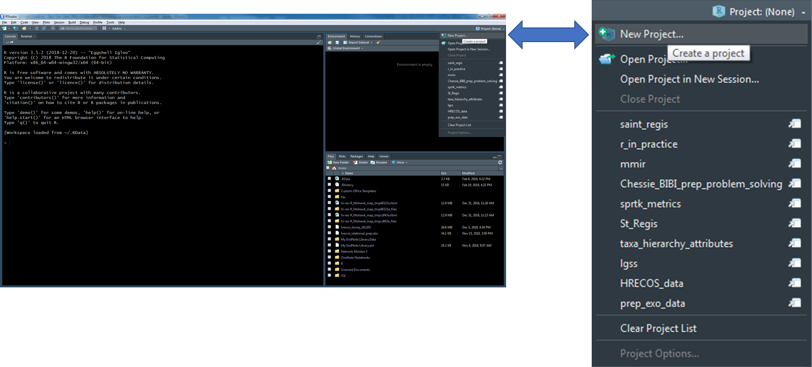{width="1000px"}

2.  Select "New Directory" within the "Create Project" window

{width="500px"}

3.  Select "New Project" within the "Project Type" window

{width="600px"}

4.  Enter a project name (below I have given the name "new_project"), the project directory (where the project should live), and select "Create Project"

> **Tip**: Create a "project" folder that will act as your parent directory for all R projects. This will make it much easier to navigate to and between projects.


5.  A new session specific to your R project will start within RStudio

    -   There are a number of ways to tell which project is open...


## Navigate Between Projects

Quickly navigate between recently opened R projects by clicking on the drop-down menu at the top right of RStudio and selecting the project of interest.

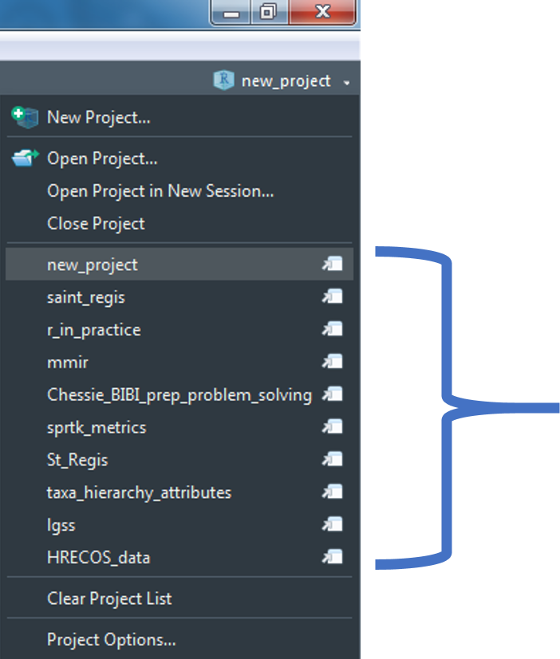{width="400px"}

## Recommended Workflow

1.  Set up a GitHub repository.
2.  Create an R-project connected to the GitHub repository.
3.  Develop R-scripts.
4.  Push and pull project changes to and from GitHub.


## Your Turn

1.  Open R Studio.

2.  Create a new Project.

3.  Add an "data" folder and add the example data set to this folder.

4.  Create a new R Script (Ctrl + Shift + N) and save the script as "lesson_1.R" to your project root folder.

5.  Add the following script and run it (Ctrl + Enter)

    -   Notice that the entire file path to CSV of interest ("zms_thesis_metrics.csv") was not specified just `file.path("data", "zms_thesis_metrics.csv")`.

    
    ```r
    thesis.df <- read.csv(file.path("data",
                                    "zms_thesis_metrics.csv"),
                          stringsAsFactors = FALSE)
    
    head(thesis.df)
    ```

6.  View `thesis.df` in the Environment panel

    -   How many rows and columns does our data frame have?

    -   Click on the drop-down menu (the blue circle to the left of `thesis.df`).

        -   Can you identify the column type (e.g., Character, Numeric, Integer, or Factor) of the columns `unique_id`, `substrate_size_d50`, `richness`, and `pct_diptera`?
        -   What are the first, second, and third `unique_id`'s represented in the data frame and which `richness` values are associated with each `unique_id`?

    -   Click on the button to view the data (the small girdded table to the far-right of `thesis.df`)

        -   Filter the data frame to only see data from Onondaga Lake (`lake` = "onon")

# Rmd Creation

## Create a New Document

1.  Click on the new document button:


2.  Click on R Markdown:

{width="400px"}

3.  Provide a "Title:", select the "Default Output Format:", and click "OK"

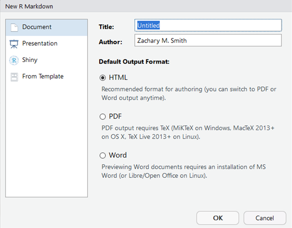{width="600px"}

4.  A new R Markdown document will appear with some instructions and example text/code.

{width="600px"}

## Compile the Document

{width="160px"}

To view the html document, you must compile the document using Knit. The easiest way to knit a document is to navigate to and click on the Knit button (it looks like a ball of yarn) in the toolbar above the editor window. If a window appears saying "Install Required Packages" for R Markdown, install the necessary packages for knitting the document. The compiled file will be saved in the same directory as your Rmd file (your R Markdown file). I generally store the R Markdown file(s) in a sub-directory labeled "rmarkdown" within the R-project folder (rproject/markdown), which prevents the project directory from becoming cluttered-- this is **NOT** necessary.

You can click on the small triangle to the right of the Knit button to view a drop-down menu of knitting options. Here you have the option to update the document type you want to knit (examples listed below).

-   Knit to HTML
-   Knit to PDF
-   Knit to Word

By clicking one of these options your YAML header updates automatically. We will discuss YAML headers in a later section, but in short the YAML header defines some of the formatting options associated with the document, including the output type. You can have multiple document types render at once (e.g., a separate HTML and Word document are created with each knit call).

## Document Types

There are multiple document types available which designate how the .Rmd file will be rendered (knit).

### HTML

Knitting to a Hyper Text Markup Language (HTML) document is the default for R Markdown. Using HTML will enable you to add interactive features to your document. To view HTML documents, simply open them in your internet browser of choice-- by default, your machine should open HTML documents in your default browser automatically.

#### R Markdown vs. R Notebook

R Markdown documents (`html_documents`) and R Notebook documents (`html_notebook`) are very similar; in fact, an R Notebook document is a special type of R Markdown document. The main difference is using R Markdown document (`html_documents`) you have to knit (render) the entire document each time you want to preview the document, even if you have made a minor change. However, using an R Notebook document (`html_notebook`) you can view a preview of the final document without rendering the entire document.

For all document types you can specify how you want to preview the rendered documents by clicking on the cog in the Source window toolbar to reveal a drop-down menu of options. The recommended setup for use of an R Notebook document would be to specify you want to view the preview in the Viewer pane (i.e., the bottom right pane shared with Files, Plots, Packages, and Help).


Then click on the "Preview" button in the Source window toolbar to render a preview of the final document.


Keep the Viewer pane open and do not close the preview of the document. Now begin to edit the markdown syntax in the document. Each time you save the document the preview window will render the changes made to the markdown syntax. If you edit R code chunks, you must run the code chunks within the notebook file prior to saving to see the changes in the Viewer window.

### PDF

You have the ability to knit to Portable Document Format (PDF) but you will not be able include interactive features in the document. Knitting to a PDF requires you to have the program LaTeX installed. You will get the following error message if you try to knit a PDF document without LaTeX installed on your machine: \> No LaTeX installation detected (LaTeX is required to create PDF output). You should install a LaTeX distribution for your platform: <https://www.latex-project.org/get/> If you are not sure, you may install TinyTeX in R: tinytex::install_tinytex() Otherwise consider MiKTeX on Windows - <http://miktex.org> MacTeX on macOS - <https://tug.org/mactex/> (NOTE: Download with Safari rather than Chrome *strongly* recommended) Linux: Use system package manager

### Word

You have the ability to knit to Microsoft Word if you have Microsoft Word installed on your machine. Similarly to PDFs, you will not be able to include interactive features in your Word documents.

### Templates

#### Provide Templates

There are a number of templates you can install or will come with packages you install, which you can view in the pop-up window that appears when you select that you want to create a new R Markdown file.


These templates may give you a jump-start to provide a large portion of the formatting specification to make specific documents. Some example templates from the package **pagedown** are:
-   Business Card
-   Letter
-   Paged HTML Documents
-   Resume
-   Journal Article
-   Poster
-   Thesis
-   Package Vignette

#### Custom Templates

You also have the ability to specify custom templates in your YAML header. We will discuss YAML headers in a later section ([Lesson 4: YAML Headers]).

I have only used this feature for Microsoft Word documents. I created a new document within Microsoft Word and selected all of the formatting options I wanted for my document. I then added the template to the YAML header of my R Markdown document to specify that when the document is knit (rendered) to apply the formatting specifications found in the template Microsoft Word document.

### Other Types

#### Presentations

You have the ability to create presentation slides using R Markdown. Below are the different format options available. Examples can be found in the following link under the "Presentation" section: <https://rmarkdown.rstudio.com/gallery.html>

-   ioslides (HTML)
-   Slidy (HTML)
-   Beamer (PDF)
    -   Requires LaTeX
-   Microsoft PowerPoint
    -   Requires Microsoft PowerPoint

I have tried to create presentations with R Markdown on several occasions but I always revert back to using Microsoft PowerPoint. I have not found these slides to be very flexible and seem to only be able to generate simple slides without much content. My recommendation would be to try these slides out if you are making a presentation demonstrating how to use simple R code.

#### Shiny Documents

Shiny documents enable you to embed a shiny application into an R Markdown document. This will enable you to insert custom interactive features into your document. The final document will need to be an HTML file.

## Your Turn

1.  Create a new HTML .Rmd file.

2.  Save the document to your project root folder.

3.  Knit the default document produced by RStudio.

4.  Using the Knit drop-down menu, specify that you want to create a Word document.

    -   This will only be possible if you have Microsoft Word installed on your machine.

5.  **Bonus:** Try creating new R Markdown documents and selecting Presentation, Shiny, and other templates available. Each selection will provide you with an example .Rmd file that you can knit (render) and explore.

# Basic Syntax

-   **Source:** <https://www.rstudio.com/wp-content/uploads/2015/03/rmarkdown-reference.pdf>

<center>

{width="800"}

</center>

## Heading Text

Heading text follows one or more hash-sign(s) (\#). The number of hash-signs determines the hierarchy of headings. For example, "\# Heading 1" would represent the primary heading, "\#\# Heading 2" would represent the secondary heading, "\#\#\# Heading 3" would represent the tertiary heading, and so forth.

## Plain Text

Simply add text below the YAML header. To start a new paragraph, you will need to end your plain text line with two (2) spaces.

## **Bold** and *Italicized* Text

There are two ways to format your text to be **bold** or *italicized*.

-   **Bold**

    -   Surround your text with two (2) asterisks (\*) on each side.
    -   Surround your text with two (2) underscores (\_) on each side.

-   *Italicized*

    -   Surround your text with one (1) asterisk (\*) on each side.
    -   Surround your text with one (1) underscore (\_) on each side.

The markdown syntax...


which renders to...

**Bold Text Example**

**Bold Text Example**

*Italicize Text Example*

*Italicize Text Example*

## Lists

### Unordered Lists

Unordered or bulleted lists can be generated by using a single asterisk (\*) followed by a space and the plain text intended to represent the bullet. To add another bullet, just hit enter or return and follow the previous steps. To add sub-bullets, insert two spaces and a plus sign (+) followed by a space and the plain text intended to represent the sub-bullet. You can do this at multiple levels; meaning you can add four spaces and a plus sign (+) to insert a sub-sub-bullet and six spaces and a plus sign (+) to add a sub-sub-sub-bullet.

The markdown syntax...


which renders to...

-   Bullet 1

-   Bullet 2

    -   Sub-Bullet 1

    -   Sub-Bullet 2

        -   Sub-Sub-Bullet 1
        -   Sub-Sub-Bullet 2

### Ordered Lists

Follow the steps in Unordered Lists but instead of using asterisk (\*) use sequential numbers followed by a period (.)-- this cannot be done for sub-bullets. For example, "1.", "2.", and "3.".

The markdown syntax...


which renders to...

1.  Bullet 1

    -   Sub-Bullet 1

2.  Bullet 2

    -   Sub-Bullet 1

    -   Sub-Bullet 2

        -   Sub-Sub-Bullet 1

## Link to a Section

You can link to a section within the document by surrounding the name of the section in square brackets.

The markdown syntax...

`[Lesson 3: Basic Syntax]`

would render to this...

[Lesson 3: Basic Syntax]

If you click on the "Lesson 3: Basic Syntax" above, it will jump you to the head of this section.

## Hyperlink

You simply need to paste in a full URL into your document and it will automatically be recognized as a hyperlink. For example...

<https://bookdown.org/yihui/rmarkdown>

If you want to hide the full link and represent it with text, then surround the text with square brackets followed by the URL in parenthesis.

The markdown syntax...

`[link](https://bookdown.org/yihui/rmarkdown/)`

would render to this...

[link](https://bookdown.org/yihui/rmarkdown/).

## Insert Images

You can insert images into your document using syntax similar to the hyperlink syntax above.

In the code below, you can see the file path the to the image. This image will render without a caption

``


You can add a caption for the image in between the square brackets.

``


You can control the size of the image like this...

`{width=200px}`

{width="100px"}

You can center the image with HTML like this...


<center>

{width="100px"}

</center>

## Tabbed Sections

Tabbed sections can be added to section of an HTML documents that will fold all of the subsequent sub-sections into separate tabs. To do this you specify a section header followed by `{.tabset}`. For example, `## My Section Header {.tabset}`.

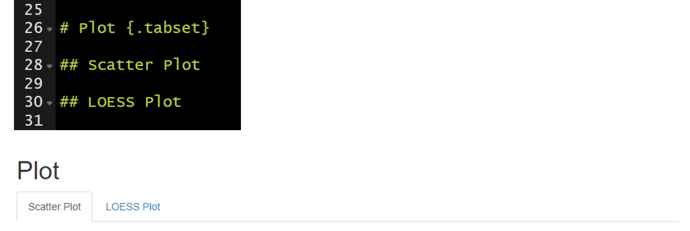

Note this feature is not available for use with **bookdown**.

## Your Turn

1.  Using the .Rmd file created in [Lesson 2: Rmd Creation], delete everything below the YAML header.

2.  Add the following level-1 headers and knit the document.

    -   Introduction
    -   Workflow
    -   Import Data
    -   Preprocessing
    -   Study Area
    -   Plot
    -   Conclusions

3.  Add two level-2 headers below the Plot header and knit the document.

    -   Scatter Plot
    -   LOESS Plot

4.  Add plain text below the Introduction header and knit the document.

    -   Be sure to include some **bold** and *italicized* text.
    -   Explain the purpose of the document (e.g., "This document was created during the 2020 NABs R Markdown workshop and will serve as an example workflow for my future use of R Markdown.")
    -   Include the hyperlink to R Markdown: The Definitive Guide (<https://bookdown.org/yihui/rmarkdown/>). This will be a helpful resource in the future.

5.  Add unordered or ordered list below the Workflow header and knit the document.

    -   Describe the workflow we have talked about thus far (e.g., create an R project, add folders, create an rmarkdown document, knit the document to render).
    -   Add sub-bullets with helpful details.

6.  Add the image provided with the data to the Introduction.

7.  Make the Plot section tabbed section with `{.tabset}`.

# Lesson 4: YAML Headers

**YAML:** YAML Ain't Markup Language

A YAML header contains YAML arguments, such as "title", "author", and "output", demarcated by three dashes (---) on either end.

<center>


</center>

## Title

The specified title (`title: "My Title"`) will appear at the head of the document with a larger font size than the rest of the document.

### Subtitle

You can specify subtitle (`subtitle: "My Subtitle"`), which will appear below and in slightly smaller font size than the title of the document.

## Author(s)

An author can be specified (`author: "Zachary M. Smith"`) and will appear at the head of the document but below the title(s). You can specify multiple authors by separating the names of the authors by a comma (`author: "Zachary M. Smith, John Doe"`).

## Date

You can supply a date (`date: "March 3rd, 2020"`) that will be added to the head of the document. You can specify a static date (`date: "March 3rd, 2020"`) or a dynamic date (see image below) that will update each time you knit (render) the document-- we will discuss this further in a subsequent section.

<center>


</center>

## Table of Contents (TOC)

<center>


</center>

### Floating Table of Contents (TOC)

<center>


</center>

## Themes

You can modify the YAML to specify the .theme of the document, which will change document styling (e.g., font type, color, size)

The following link provides examples of some of the available R Markdown themes: <https://www.datadreaming.org/post/r-markdown-theme-gallery/>

<center>


</center>

## Code Folding

Code folding refers to the HTML YAML option to hide code chunks by default, but enable the reader to click a button to show the underlying code chunk.

### Example without Code Folding

<center>


</center>

### Examples with Code Folding

#### Show

<center>


</center>

#### Hide

<center>


</center>

## output

The output option allows you to specify the type of document you want to create. This will be auto-populated if you generate the .Rmd file in RStudio by creating a new R Markdown file through the toolbar. You can manually modify the output type, but you must specify valid arguments.

Some valid arguments include:

-   `html_document`
-   `html_notebook`
-   `pdf_document`
-   `word_document`

You can click on the small triangle to the right of the Knit button to view a drop-down menu of knitting options. Here you have the option to update the document type you want to knit (examples listed below).

-   Knit to HTML
-   Knit to PDF
-   Knit to Word

By clicking one of these options, your YAML header updates automatically. You can have multiple document types render at once (e.g., a separate HTML and Word document are created with each knit call).

<center>


</center>

## Custom Template

You have the ability to specify custom templates in your YAML header.

I have only used this feature for Microsoft Word documents. I created a new document within Microsoft Word and selected all of the formatting options I wanted for my document. I then added the template to the YAML header of my R Markdown document to specify that when the document is knit (rendered) to apply the formatting specifications found in the template Microsoft Word document.

<center>

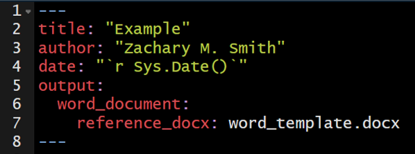

</center>

## ymlthis

**ymlthis** is an R package intended to make it easier for you to generate YAML headers. The package also includes an interactive addin that provides an intuitive user-interface for generating YAML headers. You can visit the following link to learn more about how to use ymlthis: []<https://ymlthis.r-lib.org/>

Addins can be accessed by navigating to "Tools" in the RStudio banner, scrolling down to "Addins", and selecting "Browse Addins." A pop-up window will appear. If you have **ymlthis** installed on your machine, you will see the **ymlthis** addin in the pop-up window table. Once you select the **ymlthis** addin, you will see a pop-up window like this...

<center>


</center>

## Your Turn

1.  Edit the YAML title and author and knit the document.

2.  Specify in the YAML that you want to include a table of contents and knit the document.

3.  Specify in the YAML that you want a floating table of contents and knit the document.

4.  Specify in the YAML that you want to change the theme to "journal" and knit the document.

5.  If you have Microsoft Word installed on your computer, change the YAML output to `word_document` and the knit the document.

6.  **Bonus:** If you finish early, install **ymlthis** (`install.packages("ymlthis")`), navigate to the **ymlthis** addin, and try to re-create the YAML header from steps 1-4.

# Lesson 5: Code Chunks and Inline Code

Up to this point in the workshop we have mostly just written a standard markdown document. However, we want to integrate R code into our document to create reproducible objects, such as figures, tables, and text.

## Code Chunks

To insert a code chunk, press **Ctrl + Alt + I** in the source pane (top left pane in the default settings of RStudio). A code chunk will appear: 

Inside the code chunk you can write and run R-code. If you print the output of your R-code it will appear below the code chunk in the source pane and the printed output will appear in the final compiled document. This is useful for producing figures and tables.


-   On the far right of the code chunk you will see three buttons.

    -   The cog makes it easy to specify code chunk options-- discussed below.
    -   The middle button will execute all code chunks prior to a given function (`Ctrl + Alt + P`)
    -   The far right button will execute all of the code in a code chunk.

<center>


</center>

### Shortcuts

**You will want to learn these ASAP.**

-   `Ctrl + Alt + I` - Insert a new code chunk
-   `Ctrl + Enter` - Run the line of code your cursor is on
-   `Ctrl + Alt + R` - Run all of the code in the document
-   `Ctrl + Alt + P` - Run all code chunks above your cursor
-   `Ctrl + Shift + F10` - Restart R

### Options

There are a number of code chunk options that can be specified in the code chunk header to modify how the code chunk is rendered while kniting. These options will not be visible in the rendered document-- even if you choose not to hide the code chunks in your rendered document.

A comprehensive list of chunk options can be found here: <https://yihui.org/knitr/options/>

#### name

Best practice is to include a short and unique name within each code chunk header. This will be especially beneficial if you need to troubleshoot an error in your document as you will be able to track the source of the error down by code chunk name. The "name" is not specified as an argument within the header; it is simply separated from the "r" by a space. This is exemplified in the image below on line 9 where "addition" is supplied as the name of the code chunk (`{r addition}`).

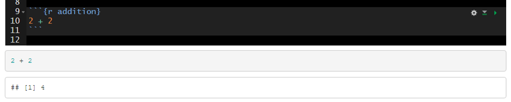

#### echo

A logical value (true or false) indicating if the code chunk should be visible in the rendered document. By default the code chunk will be visible upon knitting (`echo=true`). To hide a specific code chunk set echo to "false" (`echo=false`).

Include the code chunk in the rendered document with `echo=true`. 

Exclude the code chunk in the rendered document with `echo=false`. 

#### fig.width, fig.height, and fig.cap

The `fig.width` and `fig.height` options allow you to control the size of the figure generated from a given code chunk. `fig.cap` provides the ability to add a caption below the figure generated from a given code chunk.

Here is an example of the plot output form a code chunk. 

Here I have specified `fig.width`, `fig.height`, and `fig.cap`. Notice that plot dimensions have changed from the previous image and a caption has been added to the bottom of the figure. 

In many cases, you will want the captions to be numbered and you will want this to occur automatically. To this you will first need to install the package **bookdown** (`install.packages("bookdown")`). Specify in the YAML header that the output should be "html_document2" from the **bookdown** package (`output: bookdown::html_document2`). When you render the document the figures will now be automatically numbered by the order they appear in the document. To cross reference a figure by name in the text use `\@ref(fig:figure_name)`. Using the example from the figure below, you might write "In `\@ref(fig:IrisScatter)` we can see that the species setosoa tend to have shorter sepal lengths than the other two species." For more information visit <https://bookdown.org/yihui/rmarkdown-cookbook/figure-number.html>. 

#### message and warning

Using `message=FALSE` and/or `warning=FALSE` will suppress messages and warnings preventing them from printing in the rendered document. **Warning:** Suppress these messages/warnings at your own risk. Without these messages/warnings you may make it very difficult to track down any issues in your code.

An example of messages that are produced with the default `message=TRUE`. 

The messages above can be suppressed by setting `message=FALSE` in the code chunk header. 

#### include

Code chunk headers with `include=FALSE` will be ignored when the document is rendered. This can be useful during document development. For example, you may have a code chunk producing an error that prevents you from rendering the rest of your document or you may be questioning the need to keep a given code chunk. `include=FALSE` will exclude the code from the rendered document without deleting the code entirely from the .Rmd file.

The default is `include=TRUE`. In the example below, `include` is not altered from the default and therefore all of the code chunks are present in the rendered document. 

In the example below I added `include=FALSE` to the header of the second code chunk named "iris-sepal-scatter." The second code chunk is excluded from the rendered document. 

#### Setting Global Options

It can be helpful to establish global options to produce a standard format throughout the document. You can set this with the **knitr** function `opts_chunk$set()`. For instance, you may want to set a standard dimensions for figures produced by code chunks throughout your document. In the code chunk below, you can see that I set `fig.width` to 8 and `fig.height` to 4.


```r
knitr::opts_chunk$set(fig.width = 8, fig.height = 4)
```

The options specified in `opts_chunk$set()` become the default when rendering the document. However, you still have the ability to overwrite these options for specific code chunks. Building off of the previous example, you may find that one out of ten of your plots is not aesthetically pleasing with `fig.width = 8` and `fig.height = 4`. You could specify in the code chunk producing that plot that you want to set `fig.width = 6` and `fig.height = 6`, for example.

## Inline Code

Inline code enables you to insert R code into your document to dynamically updated portions of your text.

To insert inline code you need to encompass your R code within: 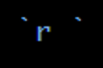.

For example, you could write:

 **Which would render to:** The mean sepal length found in the *iris* data set is 5.843.

I frequently use inline code to make my YAML header date update to the date the document was last rendered.

<center>

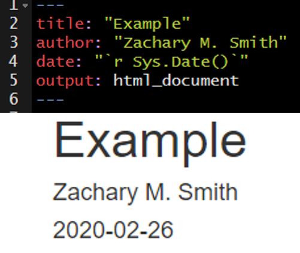

</center>

You can reformat the date using the `format()` function, as depicted in the image below. 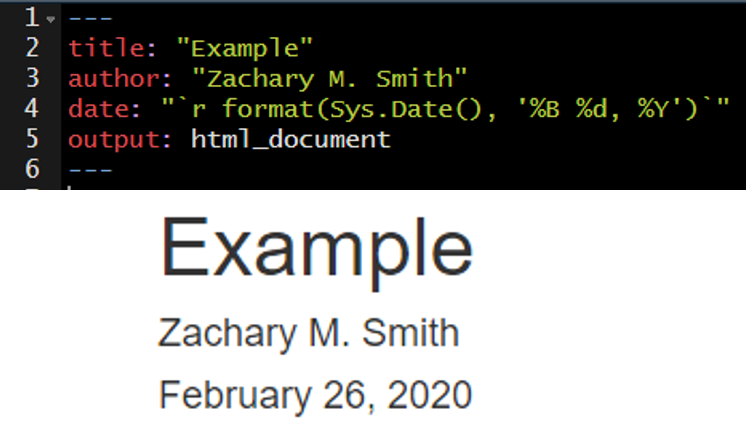

## Your Turn (Part 1)

*The point of this exercise is to get you familiar with code chunks and inline code, NOT to test your R knowledge; therefore, I have included the necessary code below each task.*

1.  Add a code chunk using **Ctrl + Alt + i** to import the example data set.

    -   `read.csv(file = file.path("data", "zms_thesis_metrics.csv"), stringsAsFactors = FALSE)`

    -   Add a name to this code chunk header and all subsequent code chunk headers.

    -   Add plain text description above the code chunk.

    -   Add the following unordered list describing the contents of the imported data.

        -   `unique_id` (character) unique sample ID
        -   `lake` (character) lake code: caz = Cazenovia lake, onon = Onondaga, and ot = Otisco
        -   `lat` (numeric) latitude of sampling location
        -   `long` (numeric) longitude of sampling location
        -   `substrate_size_d50` (numeric) median particle size from pebble count
        -   `conductivity` (numeric) specific conductivity (µS/cm)
        -   `richness` (numeric) taxonomic richness
        -   `shannon` (numeric) Shannon-Wiener diversity index values
        -   `pct_ephemeroptera` (numeric) relative abundance of Ephemeroptera taxa
        -   `pct_amphipoda` (numeric) relative abundance of Amphipoda taxa
        -   `pct_diptera` (numeric) relative abundance of Diptera taxa
        -   `dom_1` (numeric) relative abundance of the most dominant taxon observed in each sample

2.  Add a code chunk to import the **tidyverse** packages.

    -   `library(tidyverse)`
    -   Add plain text description above the code chunk.
    -   Add `message=FALSE` to the code chunk header to prevent the package start-up messages

3.  Add a code chunk below `libary(tidyverse)` to preprocess lake name (`lake`) associated with each sample.


```r
thesis.df <- thesis.df %>% 
  mutate(lake = case_when(
    lake %in% "caz" ~ "Cazenovia",
    lake %in% "onon" ~ "Onondaga",
    lake %in% "ot" ~ "Otisco",
    TRUE ~ "ERROR"
  ),
  lake = factor(lake, levels = c("Onondaga",
                                 "Otisco",
                                 "Cazenovia")))
```

4.  Add a code chunk just below the YAML header to specify global code chunk options

    -   specify `fig.width` and `fig.height`
    -   in the header specify `echo=FALSE` to hide this code chunk-- your reader does not need to see this

    
    ```r
    knitr::opts_chunk$set()
    ```

5.  Add a code chunk to generate a scatter plot.

    -   Add a caption

    
    ```r
    ggplot(thesis.df, aes(substrate_size_d50, pct_diptera, color = lake)) +
      geom_point()
    ```

6.  Add a code chunk generate a boxplot.

    -   Modify the figure size
    -   Add a caption

    
    ```r
    ggplot(thesis.df, aes(lake, richness, fill = lake)) +
      geom_boxplot()
    ```

7.  Add a brief interpretation of the figures into the "Conclusions" section.

8.  **Bonus:** Try using the cog at the top right of the code chunk to update a code chunks options.

<center>


</center>

## Interactive Features

Interactive tables and figures are a great way to make your document more interesting and can be very useful for data exploration. I will warn you that if you use these features too frequently your document will become cluttered and will likely load and run slowly.

### DT

The **DT** package enables you and your readers to interact with tables in your document. You can filter and sort the table to view data that you are most interested in exploring or understanding.

For more information visit <https://rstudio.github.io/DT/>


```r
library(DT)

datatable(iris)
```

```{=html}
<div class="datatables html-widget html-fill-item-overflow-hidden html-fill-item" id="htmlwidget-4a67bee628ff89d31e3a" style="width:100%;height:auto;"></div>
<script type="application/json" data-for="htmlwidget-4a67bee628ff89d31e3a">{"x":{"filter":"none","vertical":false,"data":[["1","2","3","4","5","6","7","8","9","10","11","12","13","14","15","16","17","18","19","20","21","22","23","24","25","26","27","28","29","30","31","32","33","34","35","36","37","38","39","40","41","42","43","44","45","46","47","48","49","50","51","52","53","54","55","56","57","58","59","60","61","62","63","64","65","66","67","68","69","70","71","72","73","74","75","76","77","78","79","80","81","82","83","84","85","86","87","88","89","90","91","92","93","94","95","96","97","98","99","100","101","102","103","104","105","106","107","108","109","110","111","112","113","114","115","116","117","118","119","120","121","122","123","124","125","126","127","128","129","130","131","132","133","134","135","136","137","138","139","140","141","142","143","144","145","146","147","148","149","150"],[5.1,4.9,4.7,4.6,5,5.4,4.6,5,4.4,4.9,5.4,4.8,4.8,4.3,5.8,5.7,5.4,5.1,5.7,5.1,5.4,5.1,4.6,5.1,4.8,5,5,5.2,5.2,4.7,4.8,5.4,5.2,5.5,4.9,5,5.5,4.9,4.4,5.1,5,4.5,4.4,5,5.1,4.8,5.1,4.6,5.3,5,7,6.4,6.9,5.5,6.5,5.7,6.3,4.9,6.6,5.2,5,5.9,6,6.1,5.6,6.7,5.6,5.8,6.2,5.6,5.9,6.1,6.3,6.1,6.4,6.6,6.8,6.7,6,5.7,5.5,5.5,5.8,6,5.4,6,6.7,6.3,5.6,5.5,5.5,6.1,5.8,5,5.6,5.7,5.7,6.2,5.1,5.7,6.3,5.8,7.1,6.3,6.5,7.6,4.9,7.3,6.7,7.2,6.5,6.4,6.8,5.7,5.8,6.4,6.5,7.7,7.7,6,6.9,5.6,7.7,6.3,6.7,7.2,6.2,6.1,6.4,7.2,7.4,7.9,6.4,6.3,6.1,7.7,6.3,6.4,6,6.9,6.7,6.9,5.8,6.8,6.7,6.7,6.3,6.5,6.2,5.9],[3.5,3,3.2,3.1,3.6,3.9,3.4,3.4,2.9,3.1,3.7,3.4,3,3,4,4.4,3.9,3.5,3.8,3.8,3.4,3.7,3.6,3.3,3.4,3,3.4,3.5,3.4,3.2,3.1,3.4,4.1,4.2,3.1,3.2,3.5,3.6,3,3.4,3.5,2.3,3.2,3.5,3.8,3,3.8,3.2,3.7,3.3,3.2,3.2,3.1,2.3,2.8,2.8,3.3,2.4,2.9,2.7,2,3,2.2,2.9,2.9,3.1,3,2.7,2.2,2.5,3.2,2.8,2.5,2.8,2.9,3,2.8,3,2.9,2.6,2.4,2.4,2.7,2.7,3,3.4,3.1,2.3,3,2.5,2.6,3,2.6,2.3,2.7,3,2.9,2.9,2.5,2.8,3.3,2.7,3,2.9,3,3,2.5,2.9,2.5,3.6,3.2,2.7,3,2.5,2.8,3.2,3,3.8,2.6,2.2,3.2,2.8,2.8,2.7,3.3,3.2,2.8,3,2.8,3,2.8,3.8,2.8,2.8,2.6,3,3.4,3.1,3,3.1,3.1,3.1,2.7,3.2,3.3,3,2.5,3,3.4,3],[1.4,1.4,1.3,1.5,1.4,1.7,1.4,1.5,1.4,1.5,1.5,1.6,1.4,1.1,1.2,1.5,1.3,1.4,1.7,1.5,1.7,1.5,1,1.7,1.9,1.6,1.6,1.5,1.4,1.6,1.6,1.5,1.5,1.4,1.5,1.2,1.3,1.4,1.3,1.5,1.3,1.3,1.3,1.6,1.9,1.4,1.6,1.4,1.5,1.4,4.7,4.5,4.9,4,4.6,4.5,4.7,3.3,4.6,3.9,3.5,4.2,4,4.7,3.6,4.4,4.5,4.1,4.5,3.9,4.8,4,4.9,4.7,4.3,4.4,4.8,5,4.5,3.5,3.8,3.7,3.9,5.1,4.5,4.5,4.7,4.4,4.1,4,4.4,4.6,4,3.3,4.2,4.2,4.2,4.3,3,4.1,6,5.1,5.9,5.6,5.8,6.6,4.5,6.3,5.8,6.1,5.1,5.3,5.5,5,5.1,5.3,5.5,6.7,6.9,5,5.7,4.9,6.7,4.9,5.7,6,4.8,4.9,5.6,5.8,6.1,6.4,5.6,5.1,5.6,6.1,5.6,5.5,4.8,5.4,5.6,5.1,5.1,5.9,5.7,5.2,5,5.2,5.4,5.1],[0.2,0.2,0.2,0.2,0.2,0.4,0.3,0.2,0.2,0.1,0.2,0.2,0.1,0.1,0.2,0.4,0.4,0.3,0.3,0.3,0.2,0.4,0.2,0.5,0.2,0.2,0.4,0.2,0.2,0.2,0.2,0.4,0.1,0.2,0.2,0.2,0.2,0.1,0.2,0.2,0.3,0.3,0.2,0.6,0.4,0.3,0.2,0.2,0.2,0.2,1.4,1.5,1.5,1.3,1.5,1.3,1.6,1,1.3,1.4,1,1.5,1,1.4,1.3,1.4,1.5,1,1.5,1.1,1.8,1.3,1.5,1.2,1.3,1.4,1.4,1.7,1.5,1,1.1,1,1.2,1.6,1.5,1.6,1.5,1.3,1.3,1.3,1.2,1.4,1.2,1,1.3,1.2,1.3,1.3,1.1,1.3,2.5,1.9,2.1,1.8,2.2,2.1,1.7,1.8,1.8,2.5,2,1.9,2.1,2,2.4,2.3,1.8,2.2,2.3,1.5,2.3,2,2,1.8,2.1,1.8,1.8,1.8,2.1,1.6,1.9,2,2.2,1.5,1.4,2.3,2.4,1.8,1.8,2.1,2.4,2.3,1.9,2.3,2.5,2.3,1.9,2,2.3,1.8],["setosa","setosa","setosa","setosa","setosa","setosa","setosa","setosa","setosa","setosa","setosa","setosa","setosa","setosa","setosa","setosa","setosa","setosa","setosa","setosa","setosa","setosa","setosa","setosa","setosa","setosa","setosa","setosa","setosa","setosa","setosa","setosa","setosa","setosa","setosa","setosa","setosa","setosa","setosa","setosa","setosa","setosa","setosa","setosa","setosa","setosa","setosa","setosa","setosa","setosa","versicolor","versicolor","versicolor","versicolor","versicolor","versicolor","versicolor","versicolor","versicolor","versicolor","versicolor","versicolor","versicolor","versicolor","versicolor","versicolor","versicolor","versicolor","versicolor","versicolor","versicolor","versicolor","versicolor","versicolor","versicolor","versicolor","versicolor","versicolor","versicolor","versicolor","versicolor","versicolor","versicolor","versicolor","versicolor","versicolor","versicolor","versicolor","versicolor","versicolor","versicolor","versicolor","versicolor","versicolor","versicolor","versicolor","versicolor","versicolor","versicolor","versicolor","virginica","virginica","virginica","virginica","virginica","virginica","virginica","virginica","virginica","virginica","virginica","virginica","virginica","virginica","virginica","virginica","virginica","virginica","virginica","virginica","virginica","virginica","virginica","virginica","virginica","virginica","virginica","virginica","virginica","virginica","virginica","virginica","virginica","virginica","virginica","virginica","virginica","virginica","virginica","virginica","virginica","virginica","virginica","virginica","virginica","virginica","virginica","virginica","virginica","virginica"]],"container":"<table class=\"display\">\n  <thead>\n    <tr>\n      <th> <\/th>\n      <th>Sepal.Length<\/th>\n      <th>Sepal.Width<\/th>\n      <th>Petal.Length<\/th>\n      <th>Petal.Width<\/th>\n      <th>Species<\/th>\n    <\/tr>\n  <\/thead>\n<\/table>","options":{"columnDefs":[{"className":"dt-right","targets":[1,2,3,4]},{"orderable":false,"targets":0}],"order":[],"autoWidth":false,"orderClasses":false}},"evals":[],"jsHooks":[]}</script>
```

### Plotly

**Plotly** makes it easy to create interactive figures. Some of the most useful features are the ability to...

-   rollover figure objects and see a pop-up information related to specific features
-   Zoom-in and zoom-out
-   take a picture of the figure

For more information visit: <https://plot.ly/ggplot2/>

I generally use **plotly** in conjunction with **ggplot2**. The **plotly** function, `ggplotly()`, makes it simple to convert **ggplot2** figures to interactive **plotly** figures.


```r
library(plotly)

scatter.plot <- ggplot(iris, aes(x = Petal.Width, y = Petal.Length,
                                 color = Species)) +
  geom_point()

ggplotly(scatter.plot)
```

```{=html}
<div class="plotly html-widget html-fill-item-overflow-hidden html-fill-item" id="htmlwidget-4dfcaa8f2ec5ea9efc85" style="width:672px;height:480px;"></div>
<script type="application/json" data-for="htmlwidget-4dfcaa8f2ec5ea9efc85">{"x":{"data":[{"x":[0.2,0.2,0.2,0.2,0.2,0.4,0.3,0.2,0.2,0.1,0.2,0.2,0.1,0.1,0.2,0.4,0.4,0.3,0.3,0.3,0.2,0.4,0.2,0.5,0.2,0.2,0.4,0.2,0.2,0.2,0.2,0.4,0.1,0.2,0.2,0.2,0.2,0.1,0.2,0.2,0.3,0.3,0.2,0.6,0.4,0.3,0.2,0.2,0.2,0.2],"y":[1.4,1.4,1.3,1.5,1.4,1.7,1.4,1.5,1.4,1.5,1.5,1.6,1.4,1.1,1.2,1.5,1.3,1.4,1.7,1.5,1.7,1.5,1,1.7,1.9,1.6,1.6,1.5,1.4,1.6,1.6,1.5,1.5,1.4,1.5,1.2,1.3,1.4,1.3,1.5,1.3,1.3,1.3,1.6,1.9,1.4,1.6,1.4,1.5,1.4],"text":["Petal.Width: 0.2<br />Petal.Length: 1.4<br />Species: setosa","Petal.Width: 0.2<br />Petal.Length: 1.4<br />Species: setosa","Petal.Width: 0.2<br />Petal.Length: 1.3<br />Species: setosa","Petal.Width: 0.2<br />Petal.Length: 1.5<br />Species: setosa","Petal.Width: 0.2<br />Petal.Length: 1.4<br />Species: setosa","Petal.Width: 0.4<br />Petal.Length: 1.7<br />Species: setosa","Petal.Width: 0.3<br />Petal.Length: 1.4<br />Species: setosa","Petal.Width: 0.2<br />Petal.Length: 1.5<br />Species: setosa","Petal.Width: 0.2<br />Petal.Length: 1.4<br />Species: setosa","Petal.Width: 0.1<br />Petal.Length: 1.5<br />Species: setosa","Petal.Width: 0.2<br />Petal.Length: 1.5<br />Species: setosa","Petal.Width: 0.2<br />Petal.Length: 1.6<br />Species: setosa","Petal.Width: 0.1<br />Petal.Length: 1.4<br />Species: setosa","Petal.Width: 0.1<br />Petal.Length: 1.1<br />Species: setosa","Petal.Width: 0.2<br />Petal.Length: 1.2<br />Species: setosa","Petal.Width: 0.4<br />Petal.Length: 1.5<br />Species: setosa","Petal.Width: 0.4<br />Petal.Length: 1.3<br />Species: setosa","Petal.Width: 0.3<br />Petal.Length: 1.4<br />Species: setosa","Petal.Width: 0.3<br />Petal.Length: 1.7<br />Species: setosa","Petal.Width: 0.3<br />Petal.Length: 1.5<br />Species: setosa","Petal.Width: 0.2<br />Petal.Length: 1.7<br />Species: setosa","Petal.Width: 0.4<br />Petal.Length: 1.5<br />Species: setosa","Petal.Width: 0.2<br />Petal.Length: 1.0<br />Species: setosa","Petal.Width: 0.5<br />Petal.Length: 1.7<br />Species: setosa","Petal.Width: 0.2<br />Petal.Length: 1.9<br />Species: setosa","Petal.Width: 0.2<br />Petal.Length: 1.6<br />Species: setosa","Petal.Width: 0.4<br />Petal.Length: 1.6<br />Species: setosa","Petal.Width: 0.2<br />Petal.Length: 1.5<br />Species: setosa","Petal.Width: 0.2<br />Petal.Length: 1.4<br />Species: setosa","Petal.Width: 0.2<br />Petal.Length: 1.6<br />Species: setosa","Petal.Width: 0.2<br />Petal.Length: 1.6<br />Species: setosa","Petal.Width: 0.4<br />Petal.Length: 1.5<br />Species: setosa","Petal.Width: 0.1<br />Petal.Length: 1.5<br />Species: setosa","Petal.Width: 0.2<br />Petal.Length: 1.4<br />Species: setosa","Petal.Width: 0.2<br />Petal.Length: 1.5<br />Species: setosa","Petal.Width: 0.2<br />Petal.Length: 1.2<br />Species: setosa","Petal.Width: 0.2<br />Petal.Length: 1.3<br />Species: setosa","Petal.Width: 0.1<br />Petal.Length: 1.4<br />Species: setosa","Petal.Width: 0.2<br />Petal.Length: 1.3<br />Species: setosa","Petal.Width: 0.2<br />Petal.Length: 1.5<br />Species: setosa","Petal.Width: 0.3<br />Petal.Length: 1.3<br />Species: setosa","Petal.Width: 0.3<br />Petal.Length: 1.3<br />Species: setosa","Petal.Width: 0.2<br />Petal.Length: 1.3<br />Species: setosa","Petal.Width: 0.6<br />Petal.Length: 1.6<br />Species: setosa","Petal.Width: 0.4<br />Petal.Length: 1.9<br />Species: setosa","Petal.Width: 0.3<br />Petal.Length: 1.4<br />Species: setosa","Petal.Width: 0.2<br />Petal.Length: 1.6<br />Species: setosa","Petal.Width: 0.2<br />Petal.Length: 1.4<br />Species: setosa","Petal.Width: 0.2<br />Petal.Length: 1.5<br />Species: setosa","Petal.Width: 0.2<br />Petal.Length: 1.4<br />Species: setosa"],"type":"scatter","mode":"markers","marker":{"autocolorscale":false,"color":"rgba(248,118,109,1)","opacity":1,"size":5.66929133858268,"symbol":"circle","line":{"width":1.88976377952756,"color":"rgba(248,118,109,1)"}},"hoveron":"points","name":"setosa","legendgroup":"setosa","showlegend":true,"xaxis":"x","yaxis":"y","hoverinfo":"text","frame":null},{"x":[1.4,1.5,1.5,1.3,1.5,1.3,1.6,1,1.3,1.4,1,1.5,1,1.4,1.3,1.4,1.5,1,1.5,1.1,1.8,1.3,1.5,1.2,1.3,1.4,1.4,1.7,1.5,1,1.1,1,1.2,1.6,1.5,1.6,1.5,1.3,1.3,1.3,1.2,1.4,1.2,1,1.3,1.2,1.3,1.3,1.1,1.3],"y":[4.7,4.5,4.9,4,4.6,4.5,4.7,3.3,4.6,3.9,3.5,4.2,4,4.7,3.6,4.4,4.5,4.1,4.5,3.9,4.8,4,4.9,4.7,4.3,4.4,4.8,5,4.5,3.5,3.8,3.7,3.9,5.1,4.5,4.5,4.7,4.4,4.1,4,4.4,4.6,4,3.3,4.2,4.2,4.2,4.3,3,4.1],"text":["Petal.Width: 1.4<br />Petal.Length: 4.7<br />Species: versicolor","Petal.Width: 1.5<br />Petal.Length: 4.5<br />Species: versicolor","Petal.Width: 1.5<br />Petal.Length: 4.9<br />Species: versicolor","Petal.Width: 1.3<br />Petal.Length: 4.0<br />Species: versicolor","Petal.Width: 1.5<br />Petal.Length: 4.6<br />Species: versicolor","Petal.Width: 1.3<br />Petal.Length: 4.5<br />Species: versicolor","Petal.Width: 1.6<br />Petal.Length: 4.7<br />Species: versicolor","Petal.Width: 1.0<br />Petal.Length: 3.3<br />Species: versicolor","Petal.Width: 1.3<br />Petal.Length: 4.6<br />Species: versicolor","Petal.Width: 1.4<br />Petal.Length: 3.9<br />Species: versicolor","Petal.Width: 1.0<br />Petal.Length: 3.5<br />Species: versicolor","Petal.Width: 1.5<br />Petal.Length: 4.2<br />Species: versicolor","Petal.Width: 1.0<br />Petal.Length: 4.0<br />Species: versicolor","Petal.Width: 1.4<br />Petal.Length: 4.7<br />Species: versicolor","Petal.Width: 1.3<br />Petal.Length: 3.6<br />Species: versicolor","Petal.Width: 1.4<br />Petal.Length: 4.4<br />Species: versicolor","Petal.Width: 1.5<br />Petal.Length: 4.5<br />Species: versicolor","Petal.Width: 1.0<br />Petal.Length: 4.1<br />Species: versicolor","Petal.Width: 1.5<br />Petal.Length: 4.5<br />Species: versicolor","Petal.Width: 1.1<br />Petal.Length: 3.9<br />Species: versicolor","Petal.Width: 1.8<br />Petal.Length: 4.8<br />Species: versicolor","Petal.Width: 1.3<br />Petal.Length: 4.0<br />Species: versicolor","Petal.Width: 1.5<br />Petal.Length: 4.9<br />Species: versicolor","Petal.Width: 1.2<br />Petal.Length: 4.7<br />Species: versicolor","Petal.Width: 1.3<br />Petal.Length: 4.3<br />Species: versicolor","Petal.Width: 1.4<br />Petal.Length: 4.4<br />Species: versicolor","Petal.Width: 1.4<br />Petal.Length: 4.8<br />Species: versicolor","Petal.Width: 1.7<br />Petal.Length: 5.0<br />Species: versicolor","Petal.Width: 1.5<br />Petal.Length: 4.5<br />Species: versicolor","Petal.Width: 1.0<br />Petal.Length: 3.5<br />Species: versicolor","Petal.Width: 1.1<br />Petal.Length: 3.8<br />Species: versicolor","Petal.Width: 1.0<br />Petal.Length: 3.7<br />Species: versicolor","Petal.Width: 1.2<br />Petal.Length: 3.9<br />Species: versicolor","Petal.Width: 1.6<br />Petal.Length: 5.1<br />Species: versicolor","Petal.Width: 1.5<br />Petal.Length: 4.5<br />Species: versicolor","Petal.Width: 1.6<br />Petal.Length: 4.5<br />Species: versicolor","Petal.Width: 1.5<br />Petal.Length: 4.7<br />Species: versicolor","Petal.Width: 1.3<br />Petal.Length: 4.4<br />Species: versicolor","Petal.Width: 1.3<br />Petal.Length: 4.1<br />Species: versicolor","Petal.Width: 1.3<br />Petal.Length: 4.0<br />Species: versicolor","Petal.Width: 1.2<br />Petal.Length: 4.4<br />Species: versicolor","Petal.Width: 1.4<br />Petal.Length: 4.6<br />Species: versicolor","Petal.Width: 1.2<br />Petal.Length: 4.0<br />Species: versicolor","Petal.Width: 1.0<br />Petal.Length: 3.3<br />Species: versicolor","Petal.Width: 1.3<br />Petal.Length: 4.2<br />Species: versicolor","Petal.Width: 1.2<br />Petal.Length: 4.2<br />Species: versicolor","Petal.Width: 1.3<br />Petal.Length: 4.2<br />Species: versicolor","Petal.Width: 1.3<br />Petal.Length: 4.3<br />Species: versicolor","Petal.Width: 1.1<br />Petal.Length: 3.0<br />Species: versicolor","Petal.Width: 1.3<br />Petal.Length: 4.1<br />Species: versicolor"],"type":"scatter","mode":"markers","marker":{"autocolorscale":false,"color":"rgba(0,186,56,1)","opacity":1,"size":5.66929133858268,"symbol":"circle","line":{"width":1.88976377952756,"color":"rgba(0,186,56,1)"}},"hoveron":"points","name":"versicolor","legendgroup":"versicolor","showlegend":true,"xaxis":"x","yaxis":"y","hoverinfo":"text","frame":null},{"x":[2.5,1.9,2.1,1.8,2.2,2.1,1.7,1.8,1.8,2.5,2,1.9,2.1,2,2.4,2.3,1.8,2.2,2.3,1.5,2.3,2,2,1.8,2.1,1.8,1.8,1.8,2.1,1.6,1.9,2,2.2,1.5,1.4,2.3,2.4,1.8,1.8,2.1,2.4,2.3,1.9,2.3,2.5,2.3,1.9,2,2.3,1.8],"y":[6,5.1,5.9,5.6,5.8,6.6,4.5,6.3,5.8,6.1,5.1,5.3,5.5,5,5.1,5.3,5.5,6.7,6.9,5,5.7,4.9,6.7,4.9,5.7,6,4.8,4.9,5.6,5.8,6.1,6.4,5.6,5.1,5.6,6.1,5.6,5.5,4.8,5.4,5.6,5.1,5.1,5.9,5.7,5.2,5,5.2,5.4,5.1],"text":["Petal.Width: 2.5<br />Petal.Length: 6.0<br />Species: virginica","Petal.Width: 1.9<br />Petal.Length: 5.1<br />Species: virginica","Petal.Width: 2.1<br />Petal.Length: 5.9<br />Species: virginica","Petal.Width: 1.8<br />Petal.Length: 5.6<br />Species: virginica","Petal.Width: 2.2<br />Petal.Length: 5.8<br />Species: virginica","Petal.Width: 2.1<br />Petal.Length: 6.6<br />Species: virginica","Petal.Width: 1.7<br />Petal.Length: 4.5<br />Species: virginica","Petal.Width: 1.8<br />Petal.Length: 6.3<br />Species: virginica","Petal.Width: 1.8<br />Petal.Length: 5.8<br />Species: virginica","Petal.Width: 2.5<br />Petal.Length: 6.1<br />Species: virginica","Petal.Width: 2.0<br />Petal.Length: 5.1<br />Species: virginica","Petal.Width: 1.9<br />Petal.Length: 5.3<br />Species: virginica","Petal.Width: 2.1<br />Petal.Length: 5.5<br />Species: virginica","Petal.Width: 2.0<br />Petal.Length: 5.0<br />Species: virginica","Petal.Width: 2.4<br />Petal.Length: 5.1<br />Species: virginica","Petal.Width: 2.3<br />Petal.Length: 5.3<br />Species: virginica","Petal.Width: 1.8<br />Petal.Length: 5.5<br />Species: virginica","Petal.Width: 2.2<br />Petal.Length: 6.7<br />Species: virginica","Petal.Width: 2.3<br />Petal.Length: 6.9<br />Species: virginica","Petal.Width: 1.5<br />Petal.Length: 5.0<br />Species: virginica","Petal.Width: 2.3<br />Petal.Length: 5.7<br />Species: virginica","Petal.Width: 2.0<br />Petal.Length: 4.9<br />Species: virginica","Petal.Width: 2.0<br />Petal.Length: 6.7<br />Species: virginica","Petal.Width: 1.8<br />Petal.Length: 4.9<br />Species: virginica","Petal.Width: 2.1<br />Petal.Length: 5.7<br />Species: virginica","Petal.Width: 1.8<br />Petal.Length: 6.0<br />Species: virginica","Petal.Width: 1.8<br />Petal.Length: 4.8<br />Species: virginica","Petal.Width: 1.8<br />Petal.Length: 4.9<br />Species: virginica","Petal.Width: 2.1<br />Petal.Length: 5.6<br />Species: virginica","Petal.Width: 1.6<br />Petal.Length: 5.8<br />Species: virginica","Petal.Width: 1.9<br />Petal.Length: 6.1<br />Species: virginica","Petal.Width: 2.0<br />Petal.Length: 6.4<br />Species: virginica","Petal.Width: 2.2<br />Petal.Length: 5.6<br />Species: virginica","Petal.Width: 1.5<br />Petal.Length: 5.1<br />Species: virginica","Petal.Width: 1.4<br />Petal.Length: 5.6<br />Species: virginica","Petal.Width: 2.3<br />Petal.Length: 6.1<br />Species: virginica","Petal.Width: 2.4<br />Petal.Length: 5.6<br />Species: virginica","Petal.Width: 1.8<br />Petal.Length: 5.5<br />Species: virginica","Petal.Width: 1.8<br />Petal.Length: 4.8<br />Species: virginica","Petal.Width: 2.1<br />Petal.Length: 5.4<br />Species: virginica","Petal.Width: 2.4<br />Petal.Length: 5.6<br />Species: virginica","Petal.Width: 2.3<br />Petal.Length: 5.1<br />Species: virginica","Petal.Width: 1.9<br />Petal.Length: 5.1<br />Species: virginica","Petal.Width: 2.3<br />Petal.Length: 5.9<br />Species: virginica","Petal.Width: 2.5<br />Petal.Length: 5.7<br />Species: virginica","Petal.Width: 2.3<br />Petal.Length: 5.2<br />Species: virginica","Petal.Width: 1.9<br />Petal.Length: 5.0<br />Species: virginica","Petal.Width: 2.0<br />Petal.Length: 5.2<br />Species: virginica","Petal.Width: 2.3<br />Petal.Length: 5.4<br />Species: virginica","Petal.Width: 1.8<br />Petal.Length: 5.1<br />Species: virginica"],"type":"scatter","mode":"markers","marker":{"autocolorscale":false,"color":"rgba(97,156,255,1)","opacity":1,"size":5.66929133858268,"symbol":"circle","line":{"width":1.88976377952756,"color":"rgba(97,156,255,1)"}},"hoveron":"points","name":"virginica","legendgroup":"virginica","showlegend":true,"xaxis":"x","yaxis":"y","hoverinfo":"text","frame":null}],"layout":{"margin":{"t":26.2283105022831,"r":7.30593607305936,"b":40.1826484018265,"l":31.4155251141553},"plot_bgcolor":"rgba(235,235,235,1)","paper_bgcolor":"rgba(255,255,255,1)","font":{"color":"rgba(0,0,0,1)","family":"","size":14.6118721461187},"xaxis":{"domain":[0,1],"automargin":true,"type":"linear","autorange":false,"range":[-0.02,2.62],"tickmode":"array","ticktext":["0.0","0.5","1.0","1.5","2.0","2.5"],"tickvals":[0,0.5,1,1.5,2,2.5],"categoryorder":"array","categoryarray":["0.0","0.5","1.0","1.5","2.0","2.5"],"nticks":null,"ticks":"outside","tickcolor":"rgba(51,51,51,1)","ticklen":3.65296803652968,"tickwidth":0.66417600664176,"showticklabels":true,"tickfont":{"color":"rgba(77,77,77,1)","family":"","size":11.689497716895},"tickangle":-0,"showline":false,"linecolor":null,"linewidth":0,"showgrid":true,"gridcolor":"rgba(255,255,255,1)","gridwidth":0.66417600664176,"zeroline":false,"anchor":"y","title":{"text":"Petal.Width","font":{"color":"rgba(0,0,0,1)","family":"","size":14.6118721461187}},"hoverformat":".2f"},"yaxis":{"domain":[0,1],"automargin":true,"type":"linear","autorange":false,"range":[0.705,7.195],"tickmode":"array","ticktext":["2","4","6"],"tickvals":[2,4,6],"categoryorder":"array","categoryarray":["2","4","6"],"nticks":null,"ticks":"outside","tickcolor":"rgba(51,51,51,1)","ticklen":3.65296803652968,"tickwidth":0.66417600664176,"showticklabels":true,"tickfont":{"color":"rgba(77,77,77,1)","family":"","size":11.689497716895},"tickangle":-0,"showline":false,"linecolor":null,"linewidth":0,"showgrid":true,"gridcolor":"rgba(255,255,255,1)","gridwidth":0.66417600664176,"zeroline":false,"anchor":"x","title":{"text":"Petal.Length","font":{"color":"rgba(0,0,0,1)","family":"","size":14.6118721461187}},"hoverformat":".2f"},"shapes":[{"type":"rect","fillcolor":null,"line":{"color":null,"width":0,"linetype":[]},"yref":"paper","xref":"paper","x0":0,"x1":1,"y0":0,"y1":1}],"showlegend":true,"legend":{"bgcolor":"rgba(255,255,255,1)","bordercolor":"transparent","borderwidth":1.88976377952756,"font":{"color":"rgba(0,0,0,1)","family":"","size":11.689497716895},"title":{"text":"Species","font":{"color":"rgba(0,0,0,1)","family":"","size":14.6118721461187}}},"hovermode":"closest","barmode":"relative"},"config":{"doubleClick":"reset","modeBarButtonsToAdd":["hoverclosest","hovercompare"],"showSendToCloud":false},"source":"A","attrs":{"2de42ed3517":{"x":{},"y":{},"colour":{},"type":"scatter"}},"cur_data":"2de42ed3517","visdat":{"2de42ed3517":["function (y) ","x"]},"highlight":{"on":"plotly_click","persistent":false,"dynamic":false,"selectize":false,"opacityDim":0.2,"selected":{"opacity":1},"debounce":0},"shinyEvents":["plotly_hover","plotly_click","plotly_selected","plotly_relayout","plotly_brushed","plotly_brushing","plotly_clickannotation","plotly_doubleclick","plotly_deselect","plotly_afterplot","plotly_sunburstclick"],"base_url":"https://plot.ly"},"evals":[],"jsHooks":[]}</script>
```

### Leaflet

**Leaflet** is a great resource for creating interactive maps with minimal amount of coding.

For more information visit: <https://rstudio.github.io/leaflet/>


```r
library(leaflet)

data("quakes")

leaflet(
  data = quakes,
  options = leafletOptions(
    minZoom = 4,
    maxZoom = 18
  )
) %>%
  addTiles() %>%
  addCircleMarkers(~long, ~lat,
    fillOpacity = 0.75,
    stroke = FALSE,
    popup = paste(
      "Sample ID:", quakes$unique_id, "<br/>",
      "Magnitude:", quakes$mag, "<br/>",
      "Latitude:", quakes$lat, "<br/>",
      "Longitude:", quakes$long
    )
  )
```

```{=html}
<div class="leaflet html-widget html-fill-item-overflow-hidden html-fill-item" id="htmlwidget-2ca96382dfca19eb2114" style="width:672px;height:480px;"></div>
<script type="application/json" data-for="htmlwidget-2ca96382dfca19eb2114">{"x":{"options":{"minZoom":4,"maxZoom":18,"crs":{"crsClass":"L.CRS.EPSG3857","code":null,"proj4def":null,"projectedBounds":null,"options":{}}},"calls":[{"method":"addTiles","args":["https://{s}.tile.openstreetmap.org/{z}/{x}/{y}.png",null,null,{"minZoom":0,"maxZoom":18,"tileSize":256,"subdomains":"abc","errorTileUrl":"","tms":false,"noWrap":false,"zoomOffset":0,"zoomReverse":false,"opacity":1,"zIndex":1,"detectRetina":false,"attribution":"&copy; <a href=\"https://openstreetmap.org\">OpenStreetMap<\/a> contributors, <a href=\"https://creativecommons.org/licenses/by-sa/2.0/\">CC-BY-SA<\/a>"}]},{"method":"addCircleMarkers","args":[[-20.42,-20.62,-26,-17.97,-20.42,-19.68,-11.7,-28.11,-28.74,-17.47,-21.44,-12.26,-18.54,-21,-20.7,-15.94,-13.64,-17.83,-23.5,-22.63,-20.84,-10.98,-23.3,-30.2,-19.66,-17.94,-14.72,-16.46,-20.97,-19.84,-22.58,-16.32,-15.55,-23.55,-16.3,-25.82,-18.73,-17.64,-17.66,-18.82,-37.37,-15.31,-24.97,-15.49,-19.23,-30.1,-26.4,-11.77,-24.12,-18.97,-18.75,-19.26,-22.75,-21.37,-20.1,-19.85,-22.7,-22.06,-17.8,-24.2,-20.69,-21.16,-13.82,-11.49,-20.68,-17.1,-20.14,-21.96,-20.42,-15.46,-15.31,-19.86,-11.55,-23.74,-17.7,-23.54,-19.21,-12.11,-21.81,-28.98,-34.02,-23.84,-19.57,-20.12,-17.7,-19.66,-21.5,-23.64,-15.43,-15.41,-15.48,-13.36,-20.64,-19.72,-15.44,-19.73,-27.24,-18.16,-13.66,-24.57,-16.98,-26.2,-21.88,-33,-21.33,-19.44,-34.89,-20.24,-22.55,-36.95,-15.75,-16.85,-19.06,-26.11,-26.2,-26.13,-13.66,-13.47,-14.6,-18.96,-14.65,-19.9,-22.05,-19.22,-31.24,-17.93,-19.3,-26.53,-27.72,-19.19,-17.43,-17.05,-19.52,-23.71,-21.3,-16.24,-16.14,-23.95,-25.2,-18.84,-12.66,-20.65,-13.23,-29.91,-14.31,-20.1,-17.8,-21.27,-23.58,-17.9,-23.34,-15.56,-23.83,-11.8,-15.54,-20.65,-11.75,-24.81,-20.9,-11.34,-17.98,-24.34,-13.86,-35.56,-35.48,-34.2,-26,-19.89,-23.43,-18.89,-17.82,-25.68,-20.2,-15.2,-15.03,-32.22,-22.64,-17.42,-17.84,-15.02,-18.04,-24.6,-19.88,-20.3,-20.45,-17.67,-22.3,-19.85,-24.27,-15.85,-20.02,-18.56,-17.87,-24.08,-32.2,-20.36,-23.85,-24,-20.41,-17.72,-19.67,-17.7,-16.23,-26.72,-12.95,-21.97,-21.96,-20.32,-30.28,-20.2,-30.66,-16.17,-28.25,-20.47,-23.55,-20.94,-26.67,-18.13,-20.21,-18.31,-16.52,-22.36,-22.43,-20.37,-23.77,-13.65,-21.55,-16.24,-23.73,-22.34,-19.4,-24.64,-16,-19.62,-23.84,-23.54,-28.23,-21.68,-13.44,-24.96,-20.08,-24.36,-14.7,-18.2,-16.65,-18.11,-17.95,-15.5,-23.36,-19.15,-10.97,-14.85,-17.8,-22.5,-29.1,-20.32,-16.09,-19.18,-23.81,-23.79,-19.02,-20.9,-19.06,-17.88,-19.41,-26.17,-14.95,-18.73,-20.21,-21.29,-19.76,-22.09,-23.8,-20.16,-22.13,-17.44,-23.33,-24.78,-22,-19.13,-30.72,-22.32,-16.45,-17.7,-17.95,-24.4,-19.3,-21.13,-18.07,-20.6,-18.48,-13.34,-20.92,-25.31,-15.24,-16.4,-24.57,-17.94,-30.64,-18.64,-13.09,-19.68,-16.44,-21.09,-14.99,-23.3,-17.68,-22,-21.38,-32.62,-13.05,-12.93,-18.6,-21.34,-21.48,-17.4,-17.32,-18.77,-26.16,-12.59,-14.82,-21.79,-19.83,-29.5,-12.49,-26.1,-21.04,-10.78,-20.76,-11.41,-19.1,-23.91,-27.33,-12.25,-23.49,-27.18,-25.8,-27.19,-27.27,-27.1,-27.22,-27.38,-27.27,-27.54,-27.2,-27.71,-27.6,-27.38,-21.54,-27.21,-28.96,-12.01,-17.46,-30.17,-27.27,-17.79,-22.19,-17.1,-27.18,-11.64,-17.98,-16.9,-21.98,-32.14,-18.8,-26.78,-20.43,-18.3,-15.83,-23.44,-23.73,-19.89,-17.59,-19.77,-20.31,-15.33,-18.2,-15.36,-15.29,-15.36,-16.24,-13.47,-25.5,-14.32,-20.04,-28.83,-17.82,-27.23,-10.72,-27,-20.36,-27.17,-20.94,-17.46,-21.04,-23.7,-17.72,-15.87,-17.84,-13.45,-30.8,-11.63,-30.4,-26.18,-15.7,-17.95,-20.51,-15.36,-23.61,-33.2,-17.68,-22.24,-20.07,-25.04,-21.5,-14.28,-14.43,-32.7,-34.1,-19.7,-24.19,-26.6,-17.04,-22.1,-32.6,-33,-20.58,-20.61,-19.47,-17.47,-18.4,-23.33,-18.55,-26.16,-21.8,-27.63,-18.89,-20.3,-20.56,-16.1,-12.66,-21.05,-17.97,-19.83,-22.55,-22.28,-15.72,-20.85,-21.11,-25.31,-26.46,-24.09,-16.96,-23.19,-20.81,-15.03,-18.06,-19,-23.53,-18.18,-15.66,-18,-18.08,-18.05,-29.9,-20.9,-15.61,-16.03,-17.68,-31.94,-19.14,-18,-16.95,-10.79,-20.83,-32.9,-37.93,-29.09,-23.56,-19.6,-21.39,-14.85,-22.7,-32.42,-17.9,-23.58,-34.4,-17.61,-21.07,-13.84,-30.24,-18.49,-23.45,-16.04,-17.14,-22.54,-15.9,-30.04,-24.03,-18.89,-16.51,-20.1,-21.06,-13.07,-23.46,-19.41,-11.81,-11.76,-12.08,-25.59,-26.54,-20.9,-16.99,-23.46,-17.81,-15.17,-11.67,-20.75,-19.5,-26.18,-20.66,-19.22,-24.68,-15.43,-32.45,-21.31,-15.44,-13.26,-15.26,-33.57,-15.77,-15.79,-21,-16.28,-23.28,-16.1,-17.7,-15.96,-15.95,-17.56,-15.9,-15.29,-15.86,-16.2,-15.71,-16.45,-11.54,-19.61,-15.61,-21.16,-20.65,-20.33,-15.08,-23.28,-23.44,-23.12,-23.65,-22.91,-22.06,-13.56,-17.99,-23.92,-30.69,-21.92,-25.04,-19.92,-27.75,-17.71,-19.6,-34.68,-14.46,-18.85,-17.02,-20.41,-18.18,-16.49,-17.74,-20.49,-18.51,-27.28,-15.9,-20.57,-11.25,-20.04,-20.89,-16.62,-20.09,-24.96,-20.95,-23.31,-20.95,-21.58,-13.62,-12.72,-21.79,-20.48,-12.84,-17.02,-23.89,-23.07,-27.98,-28.1,-21.24,-21.24,-19.89,-32.82,-22,-21.57,-24.5,-33.03,-30.09,-22.75,-17.99,-19.6,-15.65,-17.78,-22.04,-20.06,-18.07,-12.85,-33.29,-34.63,-24.18,-23.78,-22.37,-23.97,-34.12,-25.25,-22.87,-18.48,-21.46,-28.56,-28.56,-21.3,-20.08,-18.82,-19.51,-12.05,-17.4,-23.93,-21.23,-16.23,-28.15,-20.81,-20.72,-23.29,-38.46,-15.48,-37.03,-20.48,-18.12,-18.17,-11.4,-23.1,-14.28,-22.87,-17.59,-27.6,-17.94,-17.88,-30.01,-19.19,-18.14,-23.46,-18.44,-18.21,-18.26,-15.85,-23.82,-18.6,-17.8,-10.78,-18.12,-19.34,-15.34,-24.97,-15.97,-23.47,-23.11,-20.54,-18.92,-20.16,-25.48,-18.19,-15.35,-18.69,-18.89,-17.61,-20.93,-17.6,-17.96,-18.8,-20.61,-20.74,-25.23,-23.9,-18.07,-15.43,-14.3,-18.04,-13.9,-17.64,-17.98,-25,-19.45,-16.11,-23.73,-17.74,-21.56,-20.97,-15.45,-15.93,-21.47,-21.44,-22.16,-13.36,-21.22,-26.1,-18.35,-17.2,-22.42,-17.91,-26.53,-26.5,-16.31,-18.76,-17.1,-19.28,-23.5,-21.26,-17.97,-26.02,-30.3,-24.89,-14.57,-15.4,-22.06,-25.14,-20.3,-25.28,-20.63,-19.02,-22.1,-38.59,-19.3,-31.03,-30.51,-22.55,-22.14,-25.6,-18.04,-21.29,-21.08,-20.64,-24.41,-12.16,-17.1,-21.13,-12.34,-16.43,-20.7,-21.18,-17.78,-21.57,-13.7,-12.27,-19.1,-19.85,-11.37,-20.7,-20.24,-16.4,-19.6,-21.63,-21.6,-21.77,-21.8,-21.05,-10.8,-17.9,-22.26,-22.33,-24.04,-20.4,-15,-27.87,-14.12,-23.61,-21.56,-21.19,-18.07,-26,-20.21,-28,-20.74,-31.8,-18.91,-20.45,-22.9,-18.11,-23.8,-23.42,-23.2,-12.93,-21.14,-19.13,-21.08,-20.07,-20.9,-25.04,-21.85,-19.34,-15.83,-23.73,-18.1,-22.12,-15.39,-16.21,-21.75,-22.1,-24.97,-19.36,-22.14,-21.48,-18.54,-21.62,-13.4,-15.5,-15.67,-21.78,-30.63,-15.7,-19.2,-19.7,-19.4,-15.85,-17.38,-24.33,-20.89,-18.97,-17.99,-15.8,-25.42,-21.6,-26.06,-17.56,-25.63,-25.46,-22.23,-21.55,-15.18,-13.79,-15.18,-18.78,-17.9,-18.5,-14.82,-15.65,-30.01,-13.16,-21.03,-21.4,-17.93,-20.87,-12.01,-19.1,-22.85,-17.08,-21.14,-12.23,-20.91,-11.38,-11.02,-22.09,-17.8,-18.94,-18.85,-21.91,-22.03,-18.1,-18.4,-21.2,-12,-11.7,-26.72,-24.39,-19.64,-21.35,-22.82,-38.28,-12.57,-22.24,-13.8,-21.07,-17.74,-23.87,-21.29,-22.2,-15.24,-17.82,-32.14,-19.3,-33.09,-20.18,-17.46,-17.44,-24.71,-21.53,-19.17,-28.05,-23.39,-22.33,-15.28,-20.27,-10.96,-21.52,-19.57,-23.08,-25.06,-17.85,-15.99,-20.56,-17.98,-18.4,-27.64,-20.99,-14.86,-29.33,-25.81,-14.1,-17.63,-23.47,-23.92,-20.88,-20.25,-19.33,-18.14,-22.41,-20.77,-17.95,-20.83,-27.84,-19.94,-23.6,-23.7,-30.39,-18.98,-27.89,-23.5,-23.73,-17.93,-35.94,-18.68,-23.47,-23.49,-23.85,-27.08,-20.88,-20.97,-21.71,-23.9,-15.78,-12.57,-19.69,-22.04,-17.99,-23.5,-21.4,-15.86,-23.95,-25.79,-23.75,-24.1,-18.56,-23.3,-17.03,-20.77,-28.1,-18.83,-23,-20.82,-22.95,-28.22,-27.99,-15.54,-12.37,-22.33,-22.7,-17.86,-16,-20.73,-15.45,-20.05,-17.95,-17.7,-25.93,-12.28,-20.13,-17.4,-21.59],[181.62,181.03,184.1,181.66,181.96,184.31,166.1,181.93,181.74,179.59,180.69,167,182.11,181.66,169.92,184.95,165.96,181.5,179.78,180.31,181.16,166.32,180.16,182,180.28,181.49,167.51,180.79,181.47,182.37,179.24,166.74,185.05,180.8,186,179.33,169.23,181.28,181.4,169.33,176.78,186.1,179.82,186.04,169.41,182.3,181.7,166.32,180.08,185.25,182.35,184.42,173.2,180.67,182.16,182.13,181,180.6,181.35,179.2,181.55,182.4,172.38,166.22,181.41,184.93,181.6,179.62,181.86,187.81,185.8,184.35,166.2,179.99,181.23,180.04,184.7,167.06,181.71,181.11,180.21,180.99,182.38,183.4,181.7,184.31,170.5,179.96,186.3,186.44,167.53,167.06,182.02,169.71,185.26,182.4,181.11,183.41,166.54,179.92,185.61,178.41,180.39,181.6,180.69,183.5,180.6,169.49,185.9,177.81,185.23,182.31,182.45,178.3,178.35,178.31,172.23,172.29,167.4,169.48,166.97,178.9,180.4,182.43,180.6,167.89,183.84,178.57,181.7,183.51,185.43,181.22,168.98,180.3,180.82,168.02,187.32,182.8,182.6,184.16,169.46,181.4,167.1,181.43,173.5,184.4,185.17,173.49,180.17,181.5,184.5,167.62,182.56,165.8,167.68,181.32,166.07,180,169.84,166.24,180.5,179.52,167.16,180.2,179.9,179.43,182.12,183.84,180,169.42,181.83,180.34,180.9,184.68,182.29,180.2,180.64,185.16,181.48,184.24,181.75,183.5,184.3,183,181.85,187.09,181.9,181.85,179.88,185.13,184.09,169.31,182,179.5,179.61,181.19,182.53,182.75,181.74,180.3,182.18,182.2,183.59,183.35,169.09,182.32,180.54,181.69,180.62,182.3,180.13,184.1,181.71,185.68,180.27,181.58,182.4,181.52,183.83,182.39,185.7,171.65,184.48,182.1,180.16,166.66,182.9,185.75,182.53,171.52,180.94,180.81,182.82,185.35,180.13,179.93,182.68,180.63,166.53,180.22,182.74,182.84,166,183.68,185.51,181.67,181.65,186.9,180.01,169.5,166.26,167.24,181.38,170.4,182.1,180.88,184.89,169.33,179.36,179.89,184.23,181.51,169.01,181.47,183.05,184.2,167.24,168.8,182.37,180.85,181.41,180.38,179.9,181.99,180.38,181.4,180.18,179.22,180.52,182.51,180.1,180.54,177.77,185,184.68,179.85,180.6,185.32,181.57,182.28,181.49,166.2,181.5,179.69,186.21,185.86,178.4,181.51,181.2,169.32,169.28,184.14,185.74,181.38,171.39,179.7,181.36,180.53,181.39,181.5,169.58,169.63,181.91,181.41,183.78,181.02,181.03,169.24,179.5,167.1,167.32,183.48,182.04,182.31,166.36,182.3,181.2,165.77,185.77,166.24,183.87,180,182.6,166.6,179.07,182.18,182.1,182.18,182.38,182.18,182.28,181.7,182.5,182.5,182.39,182.47,182.4,182.39,185.48,182.43,182.61,166.29,181.32,182.02,182.36,181.32,171.4,182.68,182.53,166.47,181.58,185.72,179.6,179.9,169.21,183.61,182.37,183.2,182.51,182.93,179.99,184.08,181.09,181.4,184.06,186.75,181.6,186.66,186.42,186.71,167.95,167.14,182.82,167.33,182.01,181.66,181.49,180.98,165.99,183.88,186.16,183.68,181.26,181.9,181.2,179.6,181.42,188.13,181.3,170.3,182.16,166.14,181.4,178.59,184.5,181.5,182.3,167.51,180.23,181.6,186.8,184.56,169.14,180.1,185.2,167.26,167.26,181.7,181.8,186.2,180.38,182.77,186.8,179.71,180.9,182.4,181.24,182.6,169.15,180.96,183.4,180.26,182.23,178.47,183.2,182.93,169.48,182.3,182.04,185.32,166.37,184.68,168.52,182.54,183.81,183.52,185.64,181.59,181.5,180.15,182.5,179.68,167.7,182.8,184.7,167.32,181.59,185.6,179.99,180.63,186.8,180.62,180.7,180.86,181.16,181.9,167.5,185.43,181.11,180.57,184.36,185.48,185.94,166.06,185.9,181.6,177.47,183.2,180.23,185.2,180.68,184.87,183.3,181.21,181.3,183.4,180.5,181.2,181.13,170.62,181.63,169.04,180.23,183.54,185.31,172.91,185.3,181.2,180.22,184.46,187.1,186.3,183.81,166.87,180.09,182.3,165.98,165.96,165.76,180.02,183.63,184.28,187,180.17,181.82,187.2,166.02,184.52,186.9,179.79,185.77,182.54,183.33,167.38,181.15,180.84,167.18,167.01,183.13,180.8,167.01,166.83,183.2,166.94,184.6,167.25,181.31,166.69,167.34,181.59,167.42,166.9,166.85,166.8,166.91,167.54,166.18,181.91,187.15,181.41,182.22,168.71,166.62,184.61,184.6,184.42,184.46,183.95,180.47,166.49,181.57,184.47,182.1,182.8,180.97,183.91,182.26,181.18,183.84,179.82,167.26,187.55,182.41,186.51,182.04,187.8,181.31,181.69,182.64,183.4,167.16,181.33,166.36,181.87,181.25,186.74,168.75,179.87,181.42,179.27,181.06,181.9,167.15,166.28,185,169.76,166.78,182.93,182.39,184.03,181.96,182.25,180.81,180.86,174.46,179.8,185.5,185.62,180.92,180.2,182.4,170.99,168.98,181.87,186.26,181.53,184.91,168.69,181.54,165.67,181.3,179.1,179.02,180.31,171.5,179.91,181.75,179.86,172.65,182.37,181.02,183.47,183.59,180.92,183.22,182.21,183.97,167.39,186.54,180.18,181.09,167.91,183.4,185.01,181.41,184,176.03,186.73,177.52,181.38,181.88,181.98,166.07,180.12,170.34,171.72,180.98,182.1,180.6,180.58,180.8,182.3,180.87,180.11,181.04,180.87,180.98,184.83,180.09,184.28,181.32,166.1,181.71,182.62,167.1,182.85,186.08,180.24,179.15,181.66,169.37,184.27,180.94,181.74,186.4,169.1,181.24,183.32,181.54,181.5,181.4,182.41,182.44,181.53,179.86,179.9,181.58,185.19,167.32,181.57,167.18,177.01,181.51,180,184.48,187.48,179.98,186.78,183.23,181.72,186.73,167.91,185.86,170.45,180.49,172.76,181.51,182.5,185.27,182.9,171.4,181.48,178.3,178.29,168.08,169.71,182.8,182.78,180,181.69,181.48,181.2,180.8,179.67,167.24,186.87,183.95,178.42,181.4,181.17,181.61,186.83,185.3,175.7,183,181.59,181.3,183.34,180.64,180.3,181.84,185.77,180.85,169.66,180.03,167.03,185.9,185.6,167.43,186.73,184.3,180.92,185.33,183.86,166.75,167.41,184.52,184.51,166.55,186.3,185.1,182.73,184.53,180.77,180.5,181,183.6,180.9,165.8,181.5,171.44,171.46,184.85,186.1,184.62,183.4,166.64,180.27,185.5,181.58,181.65,178.43,181.9,182,180.7,180.6,169.46,182.1,183.8,181.63,184.7,180.21,184.8,169.52,181.06,184.97,181.3,181.75,182.02,179.84,180.89,186.59,167.1,183,181.72,180.49,185.1,186.52,180.67,180.4,179.54,186.36,179.62,182.44,168.93,182.4,166.9,185.3,185.23,183.11,180.9,185.1,184.37,182.44,182.29,185.9,168.63,179.97,185.26,169.44,181.62,185.25,182.65,169.9,180.05,181.23,180.26,179.98,180.48,181.39,185.93,166.56,167.23,186.72,181.41,185.4,171.17,185.17,181.15,167.24,180.78,180.78,181.89,181.7,166.66,169.63,181.37,185.96,174.21,167.02,181.57,167.05,167.01,180.58,181.2,182.43,182.2,181.28,179.77,181.63,184.84,181.4,166.2,166.3,182.69,178.98,169.5,170.04,184.52,177.1,167.11,180.28,166.53,183.78,181.25,180.15,185.8,180.58,185.11,181.27,180,185.86,180.94,181.62,181.42,181.33,179.85,170.52,169.53,182.39,179.97,171.51,185.98,181.51,165.97,169.75,184.47,183.45,182.8,181.44,167.95,184.41,181.61,181.77,182.22,181.02,167.32,182.72,182.54,166.01,185.13,180.21,180.21,185.18,184.75,186.16,181.71,183.99,181.16,181.73,181.01,182.1,182.39,183.99,184.13,182.4,182.32,182.92,184.9,184.49,181.62,178.52,184.5,179.95,180.06,180.26,183.44,184.95,181.2,183.58,184.6,167.44,166.72,184.23,183.95,181.59,180.13,180.74,166.98,184.64,182.38,184.5,184.5,169.05,184.68,185.74,183.71,183.5,182.26,170.7,181.67,170.56,183.6,183.5,187.15,166.93,171.66,170.3,181.3,184.53,181.42,181.42,183.86,181.37,188.1,179.54,167.06,184.2,187.8,170.56],10,null,null,{"interactive":true,"className":"","stroke":false,"color":"#03F","weight":5,"opacity":0.5,"fill":true,"fillColor":"#03F","fillOpacity":0.75},null,null,["Sample ID:  <br/> Magnitude: 4.8 <br/> Latitude: -20.42 <br/> Longitude: 181.62","Sample ID:  <br/> Magnitude: 4.2 <br/> Latitude: -20.62 <br/> Longitude: 181.03","Sample ID:  <br/> Magnitude: 5.4 <br/> Latitude: -26 <br/> Longitude: 184.1","Sample ID:  <br/> Magnitude: 4.1 <br/> Latitude: -17.97 <br/> Longitude: 181.66","Sample ID:  <br/> Magnitude: 4 <br/> Latitude: -20.42 <br/> Longitude: 181.96","Sample ID:  <br/> Magnitude: 4 <br/> Latitude: -19.68 <br/> Longitude: 184.31","Sample ID:  <br/> Magnitude: 4.8 <br/> Latitude: -11.7 <br/> Longitude: 166.1","Sample ID:  <br/> Magnitude: 4.4 <br/> Latitude: -28.11 <br/> Longitude: 181.93","Sample ID:  <br/> Magnitude: 4.7 <br/> Latitude: -28.74 <br/> Longitude: 181.74","Sample ID:  <br/> Magnitude: 4.3 <br/> Latitude: -17.47 <br/> Longitude: 179.59","Sample ID:  <br/> Magnitude: 4.4 <br/> Latitude: -21.44 <br/> Longitude: 180.69","Sample ID:  <br/> Magnitude: 4.6 <br/> Latitude: -12.26 <br/> Longitude: 167","Sample ID:  <br/> Magnitude: 4.4 <br/> Latitude: -18.54 <br/> Longitude: 182.11","Sample ID:  <br/> Magnitude: 4.4 <br/> Latitude: -21 <br/> Longitude: 181.66","Sample ID:  <br/> Magnitude: 6.1 <br/> Latitude: -20.7 <br/> Longitude: 169.92","Sample ID:  <br/> Magnitude: 4.3 <br/> Latitude: -15.94 <br/> Longitude: 184.95","Sample ID:  <br/> Magnitude: 6 <br/> Latitude: -13.64 <br/> Longitude: 165.96","Sample ID:  <br/> Magnitude: 4.5 <br/> Latitude: -17.83 <br/> Longitude: 181.5","Sample ID:  <br/> Magnitude: 4.4 <br/> Latitude: -23.5 <br/> Longitude: 179.78","Sample ID:  <br/> Magnitude: 4.4 <br/> Latitude: -22.63 <br/> Longitude: 180.31","Sample ID:  <br/> Magnitude: 4.5 <br/> Latitude: -20.84 <br/> Longitude: 181.16","Sample ID:  <br/> Magnitude: 4.2 <br/> Latitude: -10.98 <br/> Longitude: 166.32","Sample ID:  <br/> Magnitude: 4.4 <br/> Latitude: -23.3 <br/> Longitude: 180.16","Sample ID:  <br/> Magnitude: 4.7 <br/> Latitude: -30.2 <br/> Longitude: 182","Sample ID:  <br/> Magnitude: 5.4 <br/> Latitude: -19.66 <br/> Longitude: 180.28","Sample ID:  <br/> Magnitude: 4 <br/> Latitude: -17.94 <br/> Longitude: 181.49","Sample ID:  <br/> Magnitude: 4.6 <br/> Latitude: -14.72 <br/> Longitude: 167.51","Sample ID:  <br/> Magnitude: 5.2 <br/> Latitude: -16.46 <br/> Longitude: 180.79","Sample ID:  <br/> Magnitude: 4.5 <br/> Latitude: -20.97 <br/> Longitude: 181.47","Sample ID:  <br/> Magnitude: 4.4 <br/> Latitude: -19.84 <br/> Longitude: 182.37","Sample ID:  <br/> Magnitude: 4.6 <br/> Latitude: -22.58 <br/> Longitude: 179.24","Sample ID:  <br/> Magnitude: 4.7 <br/> Latitude: -16.32 <br/> Longitude: 166.74","Sample ID:  <br/> Magnitude: 4.8 <br/> Latitude: -15.55 <br/> Longitude: 185.05","Sample ID:  <br/> Magnitude: 4 <br/> Latitude: -23.55 <br/> Longitude: 180.8","Sample ID:  <br/> Magnitude: 4.5 <br/> Latitude: -16.3 <br/> Longitude: 186","Sample ID:  <br/> Magnitude: 4.3 <br/> Latitude: -25.82 <br/> Longitude: 179.33","Sample ID:  <br/> Magnitude: 4.5 <br/> Latitude: -18.73 <br/> Longitude: 169.23","Sample ID:  <br/> Magnitude: 4.6 <br/> Latitude: -17.64 <br/> Longitude: 181.28","Sample ID:  <br/> Magnitude: 4.1 <br/> Latitude: -17.66 <br/> Longitude: 181.4","Sample ID:  <br/> Magnitude: 4.4 <br/> Latitude: -18.82 <br/> Longitude: 169.33","Sample ID:  <br/> Magnitude: 4.7 <br/> Latitude: -37.37 <br/> Longitude: 176.78","Sample ID:  <br/> Magnitude: 4.6 <br/> Latitude: -15.31 <br/> Longitude: 186.1","Sample ID:  <br/> Magnitude: 4.4 <br/> Latitude: -24.97 <br/> Longitude: 179.82","Sample ID:  <br/> Magnitude: 4.3 <br/> Latitude: -15.49 <br/> Longitude: 186.04","Sample ID:  <br/> Magnitude: 4.6 <br/> Latitude: -19.23 <br/> Longitude: 169.41","Sample ID:  <br/> Magnitude: 4.9 <br/> Latitude: -30.1 <br/> Longitude: 182.3","Sample ID:  <br/> Magnitude: 4.5 <br/> Latitude: -26.4 <br/> Longitude: 181.7","Sample ID:  <br/> Magnitude: 4.4 <br/> Latitude: -11.77 <br/> Longitude: 166.32","Sample ID:  <br/> Magnitude: 4.3 <br/> Latitude: -24.12 <br/> Longitude: 180.08","Sample ID:  <br/> Magnitude: 5.1 <br/> Latitude: -18.97 <br/> Longitude: 185.25","Sample ID:  <br/> Magnitude: 4.2 <br/> Latitude: -18.75 <br/> Longitude: 182.35","Sample ID:  <br/> Magnitude: 4 <br/> Latitude: -19.26 <br/> Longitude: 184.42","Sample ID:  <br/> Magnitude: 4.6 <br/> Latitude: -22.75 <br/> Longitude: 173.2","Sample ID:  <br/> Magnitude: 4.3 <br/> Latitude: -21.37 <br/> Longitude: 180.67","Sample ID:  <br/> Magnitude: 4.2 <br/> Latitude: -20.1 <br/> Longitude: 182.16","Sample ID:  <br/> Magnitude: 4.4 <br/> Latitude: -19.85 <br/> Longitude: 182.13","Sample ID:  <br/> Magnitude: 4.5 <br/> Latitude: -22.7 <br/> Longitude: 181","Sample ID:  <br/> Magnitude: 4 <br/> Latitude: -22.06 <br/> Longitude: 180.6","Sample ID:  <br/> Magnitude: 4.4 <br/> Latitude: -17.8 <br/> Longitude: 181.35","Sample ID:  <br/> Magnitude: 4.3 <br/> Latitude: -24.2 <br/> Longitude: 179.2","Sample ID:  <br/> Magnitude: 4.7 <br/> Latitude: -20.69 <br/> Longitude: 181.55","Sample ID:  <br/> Magnitude: 4.1 <br/> Latitude: -21.16 <br/> Longitude: 182.4","Sample ID:  <br/> Magnitude: 5 <br/> Latitude: -13.82 <br/> Longitude: 172.38","Sample ID:  <br/> Magnitude: 4.6 <br/> Latitude: -11.49 <br/> Longitude: 166.22","Sample ID:  <br/> Magnitude: 4.9 <br/> Latitude: -20.68 <br/> Longitude: 181.41","Sample ID:  <br/> Magnitude: 4.7 <br/> Latitude: -17.1 <br/> Longitude: 184.93","Sample ID:  <br/> Magnitude: 4.1 <br/> Latitude: -20.14 <br/> Longitude: 181.6","Sample ID:  <br/> Magnitude: 5 <br/> Latitude: -21.96 <br/> Longitude: 179.62","Sample ID:  <br/> Magnitude: 4.5 <br/> Latitude: -20.42 <br/> Longitude: 181.86","Sample ID:  <br/> Magnitude: 5.5 <br/> Latitude: -15.46 <br/> Longitude: 187.81","Sample ID:  <br/> Magnitude: 4 <br/> Latitude: -15.31 <br/> Longitude: 185.8","Sample ID:  <br/> Magnitude: 4.5 <br/> Latitude: -19.86 <br/> Longitude: 184.35","Sample ID:  <br/> Magnitude: 4.3 <br/> Latitude: -11.55 <br/> Longitude: 166.2","Sample ID:  <br/> Magnitude: 5.2 <br/> Latitude: -23.74 <br/> Longitude: 179.99","Sample ID:  <br/> Magnitude: 4.4 <br/> Latitude: -17.7 <br/> Longitude: 181.23","Sample ID:  <br/> Magnitude: 4.3 <br/> Latitude: -23.54 <br/> Longitude: 180.04","Sample ID:  <br/> Magnitude: 4.1 <br/> Latitude: -19.21 <br/> Longitude: 184.7","Sample ID:  <br/> Magnitude: 4.5 <br/> Latitude: -12.11 <br/> Longitude: 167.06","Sample ID:  <br/> Magnitude: 4.2 <br/> Latitude: -21.81 <br/> Longitude: 181.71","Sample ID:  <br/> Magnitude: 5.3 <br/> Latitude: -28.98 <br/> Longitude: 181.11","Sample ID:  <br/> Magnitude: 5.2 <br/> Latitude: -34.02 <br/> Longitude: 180.21","Sample ID:  <br/> Magnitude: 4.5 <br/> Latitude: -23.84 <br/> Longitude: 180.99","Sample ID:  <br/> Magnitude: 4.6 <br/> Latitude: -19.57 <br/> Longitude: 182.38","Sample ID:  <br/> Magnitude: 4.3 <br/> Latitude: -20.12 <br/> Longitude: 183.4","Sample ID:  <br/> Magnitude: 4 <br/> Latitude: -17.7 <br/> Longitude: 181.7","Sample ID:  <br/> Magnitude: 4.3 <br/> Latitude: -19.66 <br/> Longitude: 184.31","Sample ID:  <br/> Magnitude: 4.7 <br/> Latitude: -21.5 <br/> Longitude: 170.5","Sample ID:  <br/> Magnitude: 4.5 <br/> Latitude: -23.64 <br/> Longitude: 179.96","Sample ID:  <br/> Magnitude: 4.2 <br/> Latitude: -15.43 <br/> Longitude: 186.3","Sample ID:  <br/> Magnitude: 4.3 <br/> Latitude: -15.41 <br/> Longitude: 186.44","Sample ID:  <br/> Magnitude: 5.1 <br/> Latitude: -15.48 <br/> Longitude: 167.53","Sample ID:  <br/> Magnitude: 4.7 <br/> Latitude: -13.36 <br/> Longitude: 167.06","Sample ID:  <br/> Magnitude: 5.2 <br/> Latitude: -20.64 <br/> Longitude: 182.02","Sample ID:  <br/> Magnitude: 4.2 <br/> Latitude: -19.72 <br/> Longitude: 169.71","Sample ID:  <br/> Magnitude: 4.2 <br/> Latitude: -15.44 <br/> Longitude: 185.26","Sample ID:  <br/> Magnitude: 4 <br/> Latitude: -19.73 <br/> Longitude: 182.4","Sample ID:  <br/> Magnitude: 4.5 <br/> Latitude: -27.24 <br/> Longitude: 181.11","Sample ID:  <br/> Magnitude: 5.2 <br/> Latitude: -18.16 <br/> Longitude: 183.41","Sample ID:  <br/> Magnitude: 5.1 <br/> Latitude: -13.66 <br/> Longitude: 166.54","Sample ID:  <br/> Magnitude: 4.7 <br/> Latitude: -24.57 <br/> Longitude: 179.92","Sample ID:  <br/> Magnitude: 4.1 <br/> Latitude: -16.98 <br/> Longitude: 185.61","Sample ID:  <br/> Magnitude: 4.6 <br/> Latitude: -26.2 <br/> Longitude: 178.41","Sample ID:  <br/> Magnitude: 4.7 <br/> Latitude: -21.88 <br/> Longitude: 180.39","Sample ID:  <br/> Magnitude: 4.7 <br/> Latitude: -33 <br/> Longitude: 181.6","Sample ID:  <br/> Magnitude: 4.6 <br/> Latitude: -21.33 <br/> Longitude: 180.69","Sample ID:  <br/> Magnitude: 4.2 <br/> Latitude: -19.44 <br/> Longitude: 183.5","Sample ID:  <br/> Magnitude: 4.4 <br/> Latitude: -34.89 <br/> Longitude: 180.6","Sample ID:  <br/> Magnitude: 4.6 <br/> Latitude: -20.24 <br/> Longitude: 169.49","Sample ID:  <br/> Magnitude: 5.7 <br/> Latitude: -22.55 <br/> Longitude: 185.9","Sample ID:  <br/> Magnitude: 5 <br/> Latitude: -36.95 <br/> Longitude: 177.81","Sample ID:  <br/> Magnitude: 4.5 <br/> Latitude: -15.75 <br/> Longitude: 185.23","Sample ID:  <br/> Magnitude: 4.2 <br/> Latitude: -16.85 <br/> Longitude: 182.31","Sample ID:  <br/> Magnitude: 4 <br/> Latitude: -19.06 <br/> Longitude: 182.45","Sample ID:  <br/> Magnitude: 4.8 <br/> Latitude: -26.11 <br/> Longitude: 178.3","Sample ID:  <br/> Magnitude: 4.4 <br/> Latitude: -26.2 <br/> Longitude: 178.35","Sample ID:  <br/> Magnitude: 4.2 <br/> Latitude: -26.13 <br/> Longitude: 178.31","Sample ID:  <br/> Magnitude: 5.3 <br/> Latitude: -13.66 <br/> Longitude: 172.23","Sample ID:  <br/> Magnitude: 4.7 <br/> Latitude: -13.47 <br/> Longitude: 172.29","Sample ID:  <br/> Magnitude: 4.8 <br/> Latitude: -14.6 <br/> Longitude: 167.4","Sample ID:  <br/> Magnitude: 4.2 <br/> Latitude: -18.96 <br/> Longitude: 169.48","Sample ID:  <br/> Magnitude: 4.8 <br/> Latitude: -14.65 <br/> Longitude: 166.97","Sample ID:  <br/> Magnitude: 4.3 <br/> Latitude: -19.9 <br/> Longitude: 178.9","Sample ID:  <br/> Magnitude: 4.7 <br/> Latitude: -22.05 <br/> Longitude: 180.4","Sample ID:  <br/> Magnitude: 4.5 <br/> Latitude: -19.22 <br/> Longitude: 182.43","Sample ID:  <br/> Magnitude: 4.4 <br/> Latitude: -31.24 <br/> Longitude: 180.6","Sample ID:  <br/> Magnitude: 5.1 <br/> Latitude: -17.93 <br/> Longitude: 167.89","Sample ID:  <br/> Magnitude: 4.2 <br/> Latitude: -19.3 <br/> Longitude: 183.84","Sample ID:  <br/> Magnitude: 5 <br/> Latitude: -26.53 <br/> Longitude: 178.57","Sample ID:  <br/> Magnitude: 4.8 <br/> Latitude: -27.72 <br/> Longitude: 181.7","Sample ID:  <br/> Magnitude: 4.3 <br/> Latitude: -19.19 <br/> Longitude: 183.51","Sample ID:  <br/> Magnitude: 4.5 <br/> Latitude: -17.43 <br/> Longitude: 185.43","Sample ID:  <br/> Magnitude: 4.2 <br/> Latitude: -17.05 <br/> Longitude: 181.22","Sample ID:  <br/> Magnitude: 4.5 <br/> Latitude: -19.52 <br/> Longitude: 168.98","Sample ID:  <br/> Magnitude: 4.6 <br/> Latitude: -23.71 <br/> Longitude: 180.3","Sample ID:  <br/> Magnitude: 4.3 <br/> Latitude: -21.3 <br/> Longitude: 180.82","Sample ID:  <br/> Magnitude: 4.7 <br/> Latitude: -16.24 <br/> Longitude: 168.02","Sample ID:  <br/> Magnitude: 5.1 <br/> Latitude: -16.14 <br/> Longitude: 187.32","Sample ID:  <br/> Magnitude: 4.6 <br/> Latitude: -23.95 <br/> Longitude: 182.8","Sample ID:  <br/> Magnitude: 4.9 <br/> Latitude: -25.2 <br/> Longitude: 182.6","Sample ID:  <br/> Magnitude: 4.2 <br/> Latitude: -18.84 <br/> Longitude: 184.16","Sample ID:  <br/> Magnitude: 4.6 <br/> Latitude: -12.66 <br/> Longitude: 169.46","Sample ID:  <br/> Magnitude: 4 <br/> Latitude: -20.65 <br/> Longitude: 181.4","Sample ID:  <br/> Magnitude: 5 <br/> Latitude: -13.23 <br/> Longitude: 167.1","Sample ID:  <br/> Magnitude: 4.4 <br/> Latitude: -29.91 <br/> Longitude: 181.43","Sample ID:  <br/> Magnitude: 4.2 <br/> Latitude: -14.31 <br/> Longitude: 173.5","Sample ID:  <br/> Magnitude: 4.2 <br/> Latitude: -20.1 <br/> Longitude: 184.4","Sample ID:  <br/> Magnitude: 4.4 <br/> Latitude: -17.8 <br/> Longitude: 185.17","Sample ID:  <br/> Magnitude: 4.9 <br/> Latitude: -21.27 <br/> Longitude: 173.49","Sample ID:  <br/> Magnitude: 5.3 <br/> Latitude: -23.58 <br/> Longitude: 180.17","Sample ID:  <br/> Magnitude: 4 <br/> Latitude: -17.9 <br/> Longitude: 181.5","Sample ID:  <br/> Magnitude: 5.7 <br/> Latitude: -23.34 <br/> Longitude: 184.5","Sample ID:  <br/> Magnitude: 6.4 <br/> Latitude: -15.56 <br/> Longitude: 167.62","Sample ID:  <br/> Magnitude: 4.3 <br/> Latitude: -23.83 <br/> Longitude: 182.56","Sample ID:  <br/> Magnitude: 4.2 <br/> Latitude: -11.8 <br/> Longitude: 165.8","Sample ID:  <br/> Magnitude: 4.7 <br/> Latitude: -15.54 <br/> Longitude: 167.68","Sample ID:  <br/> Magnitude: 4.7 <br/> Latitude: -20.65 <br/> Longitude: 181.32","Sample ID:  <br/> Magnitude: 4.2 <br/> Latitude: -11.75 <br/> Longitude: 166.07","Sample ID:  <br/> Magnitude: 4.3 <br/> Latitude: -24.81 <br/> Longitude: 180","Sample ID:  <br/> Magnitude: 4.9 <br/> Latitude: -20.9 <br/> Longitude: 169.84","Sample ID:  <br/> Magnitude: 4.6 <br/> Latitude: -11.34 <br/> Longitude: 166.24","Sample ID:  <br/> Magnitude: 4.1 <br/> Latitude: -17.98 <br/> Longitude: 180.5","Sample ID:  <br/> Magnitude: 4.8 <br/> Latitude: -24.34 <br/> Longitude: 179.52","Sample ID:  <br/> Magnitude: 4.6 <br/> Latitude: -13.86 <br/> Longitude: 167.16","Sample ID:  <br/> Magnitude: 4.6 <br/> Latitude: -35.56 <br/> Longitude: 180.2","Sample ID:  <br/> Magnitude: 4.8 <br/> Latitude: -35.48 <br/> Longitude: 179.9","Sample ID:  <br/> Magnitude: 5 <br/> Latitude: -34.2 <br/> Longitude: 179.43","Sample ID:  <br/> Magnitude: 5.6 <br/> Latitude: -26 <br/> Longitude: 182.12","Sample ID:  <br/> Magnitude: 5.3 <br/> Latitude: -19.89 <br/> Longitude: 183.84","Sample ID:  <br/> Magnitude: 4.7 <br/> Latitude: -23.43 <br/> Longitude: 180","Sample ID:  <br/> Magnitude: 4.5 <br/> Latitude: -18.89 <br/> Longitude: 169.42","Sample ID:  <br/> Magnitude: 4.3 <br/> Latitude: -17.82 <br/> Longitude: 181.83","Sample ID:  <br/> Magnitude: 4.6 <br/> Latitude: -25.68 <br/> Longitude: 180.34","Sample ID:  <br/> Magnitude: 4.1 <br/> Latitude: -20.2 <br/> Longitude: 180.9","Sample ID:  <br/> Magnitude: 4.1 <br/> Latitude: -15.2 <br/> Longitude: 184.68","Sample ID:  <br/> Magnitude: 4.1 <br/> Latitude: -15.03 <br/> Longitude: 182.29","Sample ID:  <br/> Magnitude: 5.7 <br/> Latitude: -32.22 <br/> Longitude: 180.2","Sample ID:  <br/> Magnitude: 5 <br/> Latitude: -22.64 <br/> Longitude: 180.64","Sample ID:  <br/> Magnitude: 4.5 <br/> Latitude: -17.42 <br/> Longitude: 185.16","Sample ID:  <br/> Magnitude: 4.1 <br/> Latitude: -17.84 <br/> Longitude: 181.48","Sample ID:  <br/> Magnitude: 4.6 <br/> Latitude: -15.02 <br/> Longitude: 184.24","Sample ID:  <br/> Magnitude: 4.5 <br/> Latitude: -18.04 <br/> Longitude: 181.75","Sample ID:  <br/> Magnitude: 4.3 <br/> Latitude: -24.6 <br/> Longitude: 183.5","Sample ID:  <br/> Magnitude: 4.4 <br/> Latitude: -19.88 <br/> Longitude: 184.3","Sample ID:  <br/> Magnitude: 4.2 <br/> Latitude: -20.3 <br/> Longitude: 183","Sample ID:  <br/> Magnitude: 4.1 <br/> Latitude: -20.45 <br/> Longitude: 181.85","Sample ID:  <br/> Magnitude: 4.9 <br/> Latitude: -17.67 <br/> Longitude: 187.09","Sample ID:  <br/> Magnitude: 4.3 <br/> Latitude: -22.3 <br/> Longitude: 181.9","Sample ID:  <br/> Magnitude: 4.9 <br/> Latitude: -19.85 <br/> Longitude: 181.85","Sample ID:  <br/> Magnitude: 4.6 <br/> Latitude: -24.27 <br/> Longitude: 179.88","Sample ID:  <br/> Magnitude: 4.6 <br/> Latitude: -15.85 <br/> Longitude: 185.13","Sample ID:  <br/> Magnitude: 5.3 <br/> Latitude: -20.02 <br/> Longitude: 184.09","Sample ID:  <br/> Magnitude: 4.7 <br/> Latitude: -18.56 <br/> Longitude: 169.31","Sample ID:  <br/> Magnitude: 4.6 <br/> Latitude: -17.87 <br/> Longitude: 182","Sample ID:  <br/> Magnitude: 4.1 <br/> Latitude: -24.08 <br/> Longitude: 179.5","Sample ID:  <br/> Magnitude: 4.6 <br/> Latitude: -32.2 <br/> Longitude: 179.61","Sample ID:  <br/> Magnitude: 4.2 <br/> Latitude: -20.36 <br/> Longitude: 181.19","Sample ID:  <br/> Magnitude: 4.6 <br/> Latitude: -23.85 <br/> Longitude: 182.53","Sample ID:  <br/> Magnitude: 4.5 <br/> Latitude: -24 <br/> Longitude: 182.75","Sample ID:  <br/> Magnitude: 4.3 <br/> Latitude: -20.41 <br/> Longitude: 181.74","Sample ID:  <br/> Magnitude: 5.2 <br/> Latitude: -17.72 <br/> Longitude: 180.3","Sample ID:  <br/> Magnitude: 4.3 <br/> Latitude: -19.67 <br/> Longitude: 182.18","Sample ID:  <br/> Magnitude: 4 <br/> Latitude: -17.7 <br/> Longitude: 182.2","Sample ID:  <br/> Magnitude: 4.7 <br/> Latitude: -16.23 <br/> Longitude: 183.59","Sample ID:  <br/> Magnitude: 4.5 <br/> Latitude: -26.72 <br/> Longitude: 183.35","Sample ID:  <br/> Magnitude: 4.5 <br/> Latitude: -12.95 <br/> Longitude: 169.09","Sample ID:  <br/> Magnitude: 4.3 <br/> Latitude: -21.97 <br/> Longitude: 182.32","Sample ID:  <br/> Magnitude: 5.2 <br/> Latitude: -21.96 <br/> Longitude: 180.54","Sample ID:  <br/> Magnitude: 4.5 <br/> Latitude: -20.32 <br/> Longitude: 181.69","Sample ID:  <br/> Magnitude: 4.7 <br/> Latitude: -30.28 <br/> Longitude: 180.62","Sample ID:  <br/> Magnitude: 4.2 <br/> Latitude: -20.2 <br/> Longitude: 182.3","Sample ID:  <br/> Magnitude: 4.7 <br/> Latitude: -30.66 <br/> Longitude: 180.13","Sample ID:  <br/> Magnitude: 4.3 <br/> Latitude: -16.17 <br/> Longitude: 184.1","Sample ID:  <br/> Magnitude: 4.1 <br/> Latitude: -28.25 <br/> Longitude: 181.71","Sample ID:  <br/> Magnitude: 5.4 <br/> Latitude: -20.47 <br/> Longitude: 185.68","Sample ID:  <br/> Magnitude: 4.3 <br/> Latitude: -23.55 <br/> Longitude: 180.27","Sample ID:  <br/> Magnitude: 4.3 <br/> Latitude: -20.94 <br/> Longitude: 181.58","Sample ID:  <br/> Magnitude: 4.2 <br/> Latitude: -26.67 <br/> Longitude: 182.4","Sample ID:  <br/> Magnitude: 4.6 <br/> Latitude: -18.13 <br/> Longitude: 181.52","Sample ID:  <br/> Magnitude: 4.4 <br/> Latitude: -20.21 <br/> Longitude: 183.83","Sample ID:  <br/> Magnitude: 4.2 <br/> Latitude: -18.31 <br/> Longitude: 182.39","Sample ID:  <br/> Magnitude: 4.7 <br/> Latitude: -16.52 <br/> Longitude: 185.7","Sample ID:  <br/> Magnitude: 4.6 <br/> Latitude: -22.36 <br/> Longitude: 171.65","Sample ID:  <br/> Magnitude: 4.9 <br/> Latitude: -22.43 <br/> Longitude: 184.48","Sample ID:  <br/> Magnitude: 4.2 <br/> Latitude: -20.37 <br/> Longitude: 182.1","Sample ID:  <br/> Magnitude: 4.5 <br/> Latitude: -23.77 <br/> Longitude: 180.16","Sample ID:  <br/> Magnitude: 4.9 <br/> Latitude: -13.65 <br/> Longitude: 166.66","Sample ID:  <br/> Magnitude: 4.2 <br/> Latitude: -21.55 <br/> Longitude: 182.9","Sample ID:  <br/> Magnitude: 4.5 <br/> Latitude: -16.24 <br/> Longitude: 185.75","Sample ID:  <br/> Magnitude: 5 <br/> Latitude: -23.73 <br/> Longitude: 182.53","Sample ID:  <br/> Magnitude: 5 <br/> Latitude: -22.34 <br/> Longitude: 171.52","Sample ID:  <br/> Magnitude: 4.7 <br/> Latitude: -19.4 <br/> Longitude: 180.94","Sample ID:  <br/> Magnitude: 4.3 <br/> Latitude: -24.64 <br/> Longitude: 180.81","Sample ID:  <br/> Magnitude: 4.4 <br/> Latitude: -16 <br/> Longitude: 182.82","Sample ID:  <br/> Magnitude: 4.9 <br/> Latitude: -19.62 <br/> Longitude: 185.35","Sample ID:  <br/> Magnitude: 4.5 <br/> Latitude: -23.84 <br/> Longitude: 180.13","Sample ID:  <br/> Magnitude: 4 <br/> Latitude: -23.54 <br/> Longitude: 179.93","Sample ID:  <br/> Magnitude: 4.4 <br/> Latitude: -28.23 <br/> Longitude: 182.68","Sample ID:  <br/> Magnitude: 5 <br/> Latitude: -21.68 <br/> Longitude: 180.63","Sample ID:  <br/> Magnitude: 4.7 <br/> Latitude: -13.44 <br/> Longitude: 166.53","Sample ID:  <br/> Magnitude: 4.8 <br/> Latitude: -24.96 <br/> Longitude: 180.22","Sample ID:  <br/> Magnitude: 4.5 <br/> Latitude: -20.08 <br/> Longitude: 182.74","Sample ID:  <br/> Magnitude: 4.1 <br/> Latitude: -24.36 <br/> Longitude: 182.84","Sample ID:  <br/> Magnitude: 5.3 <br/> Latitude: -14.7 <br/> Longitude: 166","Sample ID:  <br/> Magnitude: 4.8 <br/> Latitude: -18.2 <br/> Longitude: 183.68","Sample ID:  <br/> Magnitude: 5 <br/> Latitude: -16.65 <br/> Longitude: 185.51","Sample ID:  <br/> Magnitude: 4.6 <br/> Latitude: -18.11 <br/> Longitude: 181.67","Sample ID:  <br/> Magnitude: 4.3 <br/> Latitude: -17.95 <br/> Longitude: 181.65","Sample ID:  <br/> Magnitude: 4.7 <br/> Latitude: -15.5 <br/> Longitude: 186.9","Sample ID:  <br/> Magnitude: 5.3 <br/> Latitude: -23.36 <br/> Longitude: 180.01","Sample ID:  <br/> Magnitude: 4.2 <br/> Latitude: -19.15 <br/> Longitude: 169.5","Sample ID:  <br/> Magnitude: 4.7 <br/> Latitude: -10.97 <br/> Longitude: 166.26","Sample ID:  <br/> Magnitude: 4.5 <br/> Latitude: -14.85 <br/> Longitude: 167.24","Sample ID:  <br/> Magnitude: 5.1 <br/> Latitude: -17.8 <br/> Longitude: 181.38","Sample ID:  <br/> Magnitude: 4.9 <br/> Latitude: -22.5 <br/> Longitude: 170.4","Sample ID:  <br/> Magnitude: 4.4 <br/> Latitude: -29.1 <br/> Longitude: 182.1","Sample ID:  <br/> Magnitude: 4.2 <br/> Latitude: -20.32 <br/> Longitude: 180.88","Sample ID:  <br/> Magnitude: 4.6 <br/> Latitude: -16.09 <br/> Longitude: 184.89","Sample ID:  <br/> Magnitude: 4.7 <br/> Latitude: -19.18 <br/> Longitude: 169.33","Sample ID:  <br/> Magnitude: 4.2 <br/> Latitude: -23.81 <br/> Longitude: 179.36","Sample ID:  <br/> Magnitude: 4.9 <br/> Latitude: -23.79 <br/> Longitude: 179.89","Sample ID:  <br/> Magnitude: 5.1 <br/> Latitude: -19.02 <br/> Longitude: 184.23","Sample ID:  <br/> Magnitude: 4.7 <br/> Latitude: -20.9 <br/> Longitude: 181.51","Sample ID:  <br/> Magnitude: 4.4 <br/> Latitude: -19.06 <br/> Longitude: 169.01","Sample ID:  <br/> Magnitude: 4.4 <br/> Latitude: -17.88 <br/> Longitude: 181.47","Sample ID:  <br/> Magnitude: 4.2 <br/> Latitude: -19.41 <br/> Longitude: 183.05","Sample ID:  <br/> Magnitude: 4.9 <br/> Latitude: -26.17 <br/> Longitude: 184.2","Sample ID:  <br/> Magnitude: 4.6 <br/> Latitude: -14.95 <br/> Longitude: 167.24","Sample ID:  <br/> Magnitude: 4.4 <br/> Latitude: -18.73 <br/> Longitude: 168.8","Sample ID:  <br/> Magnitude: 4.6 <br/> Latitude: -20.21 <br/> Longitude: 182.37","Sample ID:  <br/> Magnitude: 4.5 <br/> Latitude: -21.29 <br/> Longitude: 180.85","Sample ID:  <br/> Magnitude: 4.4 <br/> Latitude: -19.76 <br/> Longitude: 181.41","Sample ID:  <br/> Magnitude: 4.9 <br/> Latitude: -22.09 <br/> Longitude: 180.38","Sample ID:  <br/> Magnitude: 4.1 <br/> Latitude: -23.8 <br/> Longitude: 179.9","Sample ID:  <br/> Magnitude: 4.2 <br/> Latitude: -20.16 <br/> Longitude: 181.99","Sample ID:  <br/> Magnitude: 5.7 <br/> Latitude: -22.13 <br/> Longitude: 180.38","Sample ID:  <br/> Magnitude: 4.6 <br/> Latitude: -17.44 <br/> Longitude: 181.4","Sample ID:  <br/> Magnitude: 5 <br/> Latitude: -23.33 <br/> Longitude: 180.18","Sample ID:  <br/> Magnitude: 4.3 <br/> Latitude: -24.78 <br/> Longitude: 179.22","Sample ID:  <br/> Magnitude: 4.5 <br/> Latitude: -22 <br/> Longitude: 180.52","Sample ID:  <br/> Magnitude: 5.2 <br/> Latitude: -19.13 <br/> Longitude: 182.51","Sample ID:  <br/> Magnitude: 4.4 <br/> Latitude: -30.72 <br/> Longitude: 180.1","Sample ID:  <br/> Magnitude: 4.2 <br/> Latitude: -22.32 <br/> Longitude: 180.54","Sample ID:  <br/> Magnitude: 4.6 <br/> Latitude: -16.45 <br/> Longitude: 177.77","Sample ID:  <br/> Magnitude: 4 <br/> Latitude: -17.7 <br/> Longitude: 185","Sample ID:  <br/> Magnitude: 4.4 <br/> Latitude: -17.95 <br/> Longitude: 184.68","Sample ID:  <br/> Magnitude: 4.7 <br/> Latitude: -24.4 <br/> Longitude: 179.85","Sample ID:  <br/> Magnitude: 4.2 <br/> Latitude: -19.3 <br/> Longitude: 180.6","Sample ID:  <br/> Magnitude: 4.7 <br/> Latitude: -21.13 <br/> Longitude: 185.32","Sample ID:  <br/> Magnitude: 4.5 <br/> Latitude: -18.07 <br/> Longitude: 181.57","Sample ID:  <br/> Magnitude: 5 <br/> Latitude: -20.6 <br/> Longitude: 182.28","Sample ID:  <br/> Magnitude: 5 <br/> Latitude: -18.48 <br/> Longitude: 181.49","Sample ID:  <br/> Magnitude: 4.8 <br/> Latitude: -13.34 <br/> Longitude: 166.2","Sample ID:  <br/> Magnitude: 4.6 <br/> Latitude: -20.92 <br/> Longitude: 181.5","Sample ID:  <br/> Magnitude: 4.6 <br/> Latitude: -25.31 <br/> Longitude: 179.69","Sample ID:  <br/> Magnitude: 5 <br/> Latitude: -15.24 <br/> Longitude: 186.21","Sample ID:  <br/> Magnitude: 5 <br/> Latitude: -16.4 <br/> Longitude: 185.86","Sample ID:  <br/> Magnitude: 5.6 <br/> Latitude: -24.57 <br/> Longitude: 178.4","Sample ID:  <br/> Magnitude: 4 <br/> Latitude: -17.94 <br/> Longitude: 181.51","Sample ID:  <br/> Magnitude: 4 <br/> Latitude: -30.64 <br/> Longitude: 181.2","Sample ID:  <br/> Magnitude: 4.6 <br/> Latitude: -18.64 <br/> Longitude: 169.32","Sample ID:  <br/> Magnitude: 4.4 <br/> Latitude: -13.09 <br/> Longitude: 169.28","Sample ID:  <br/> Magnitude: 4.8 <br/> Latitude: -19.68 <br/> Longitude: 184.14","Sample ID:  <br/> Magnitude: 4.7 <br/> Latitude: -16.44 <br/> Longitude: 185.74","Sample ID:  <br/> Magnitude: 4.6 <br/> Latitude: -21.09 <br/> Longitude: 181.38","Sample ID:  <br/> Magnitude: 4.3 <br/> Latitude: -14.99 <br/> Longitude: 171.39","Sample ID:  <br/> Magnitude: 4.7 <br/> Latitude: -23.3 <br/> Longitude: 179.7","Sample ID:  <br/> Magnitude: 4.1 <br/> Latitude: -17.68 <br/> Longitude: 181.36","Sample ID:  <br/> Magnitude: 4.9 <br/> Latitude: -22 <br/> Longitude: 180.53","Sample ID:  <br/> Magnitude: 4.6 <br/> Latitude: -21.38 <br/> Longitude: 181.39","Sample ID:  <br/> Magnitude: 4.8 <br/> Latitude: -32.62 <br/> Longitude: 181.5","Sample ID:  <br/> Magnitude: 4.9 <br/> Latitude: -13.05 <br/> Longitude: 169.58","Sample ID:  <br/> Magnitude: 5.1 <br/> Latitude: -12.93 <br/> Longitude: 169.63","Sample ID:  <br/> Magnitude: 5.4 <br/> Latitude: -18.6 <br/> Longitude: 181.91","Sample ID:  <br/> Magnitude: 4.5 <br/> Latitude: -21.34 <br/> Longitude: 181.41","Sample ID:  <br/> Magnitude: 4.9 <br/> Latitude: -21.48 <br/> Longitude: 183.78","Sample ID:  <br/> Magnitude: 4.4 <br/> Latitude: -17.4 <br/> Longitude: 181.02","Sample ID:  <br/> Magnitude: 4.1 <br/> Latitude: -17.32 <br/> Longitude: 181.03","Sample ID:  <br/> Magnitude: 5.3 <br/> Latitude: -18.77 <br/> Longitude: 169.24","Sample ID:  <br/> Magnitude: 4.5 <br/> Latitude: -26.16 <br/> Longitude: 179.5","Sample ID:  <br/> Magnitude: 4.9 <br/> Latitude: -12.59 <br/> Longitude: 167.1","Sample ID:  <br/> Magnitude: 4.8 <br/> Latitude: -14.82 <br/> Longitude: 167.32","Sample ID:  <br/> Magnitude: 5.2 <br/> Latitude: -21.79 <br/> Longitude: 183.48","Sample ID:  <br/> Magnitude: 4.4 <br/> Latitude: -19.83 <br/> Longitude: 182.04","Sample ID:  <br/> Magnitude: 4.4 <br/> Latitude: -29.5 <br/> Longitude: 182.31","Sample ID:  <br/> Magnitude: 4.9 <br/> Latitude: -12.49 <br/> Longitude: 166.36","Sample ID:  <br/> Magnitude: 4.4 <br/> Latitude: -26.1 <br/> Longitude: 182.3","Sample ID:  <br/> Magnitude: 4.2 <br/> Latitude: -21.04 <br/> Longitude: 181.2","Sample ID:  <br/> Magnitude: 4.6 <br/> Latitude: -10.78 <br/> Longitude: 165.77","Sample ID:  <br/> Magnitude: 4.6 <br/> Latitude: -20.76 <br/> Longitude: 185.77","Sample ID:  <br/> Magnitude: 5.3 <br/> Latitude: -11.41 <br/> Longitude: 166.24","Sample ID:  <br/> Magnitude: 5.3 <br/> Latitude: -19.1 <br/> Longitude: 183.87","Sample ID:  <br/> Magnitude: 4.5 <br/> Latitude: -23.91 <br/> Longitude: 180","Sample ID:  <br/> Magnitude: 4.4 <br/> Latitude: -27.33 <br/> Longitude: 182.6","Sample ID:  <br/> Magnitude: 5 <br/> Latitude: -12.25 <br/> Longitude: 166.6","Sample ID:  <br/> Magnitude: 5.1 <br/> Latitude: -23.49 <br/> Longitude: 179.07","Sample ID:  <br/> Magnitude: 4.5 <br/> Latitude: -27.18 <br/> Longitude: 182.18","Sample ID:  <br/> Magnitude: 4.5 <br/> Latitude: -25.8 <br/> Longitude: 182.1","Sample ID:  <br/> Magnitude: 5.4 <br/> Latitude: -27.19 <br/> Longitude: 182.18","Sample ID:  <br/> Magnitude: 4.5 <br/> Latitude: -27.27 <br/> Longitude: 182.38","Sample ID:  <br/> Magnitude: 4.7 <br/> Latitude: -27.1 <br/> Longitude: 182.18","Sample ID:  <br/> Magnitude: 4.2 <br/> Latitude: -27.22 <br/> Longitude: 182.28","Sample ID:  <br/> Magnitude: 4.8 <br/> Latitude: -27.38 <br/> Longitude: 181.7","Sample ID:  <br/> Magnitude: 4.5 <br/> Latitude: -27.27 <br/> Longitude: 182.5","Sample ID:  <br/> Magnitude: 4.3 <br/> Latitude: -27.54 <br/> Longitude: 182.5","Sample ID:  <br/> Magnitude: 4.3 <br/> Latitude: -27.2 <br/> Longitude: 182.39","Sample ID:  <br/> Magnitude: 4.3 <br/> Latitude: -27.71 <br/> Longitude: 182.47","Sample ID:  <br/> Magnitude: 4.6 <br/> Latitude: -27.6 <br/> Longitude: 182.4","Sample ID:  <br/> Magnitude: 4.5 <br/> Latitude: -27.38 <br/> Longitude: 182.39","Sample ID:  <br/> Magnitude: 5 <br/> Latitude: -21.54 <br/> Longitude: 185.48","Sample ID:  <br/> Magnitude: 4.6 <br/> Latitude: -27.21 <br/> Longitude: 182.43","Sample ID:  <br/> Magnitude: 4.6 <br/> Latitude: -28.96 <br/> Longitude: 182.61","Sample ID:  <br/> Magnitude: 4.9 <br/> Latitude: -12.01 <br/> Longitude: 166.29","Sample ID:  <br/> Magnitude: 4.1 <br/> Latitude: -17.46 <br/> Longitude: 181.32","Sample ID:  <br/> Magnitude: 5.5 <br/> Latitude: -30.17 <br/> Longitude: 182.02","Sample ID:  <br/> Magnitude: 4.7 <br/> Latitude: -27.27 <br/> Longitude: 182.36","Sample ID:  <br/> Magnitude: 5 <br/> Latitude: -17.79 <br/> Longitude: 181.32","Sample ID:  <br/> Magnitude: 5.1 <br/> Latitude: -22.19 <br/> Longitude: 171.4","Sample ID:  <br/> Magnitude: 5.5 <br/> Latitude: -17.1 <br/> Longitude: 182.68","Sample ID:  <br/> Magnitude: 4.6 <br/> Latitude: -27.18 <br/> Longitude: 182.53","Sample ID:  <br/> Magnitude: 4.7 <br/> Latitude: -11.64 <br/> Longitude: 166.47","Sample ID:  <br/> Magnitude: 4.2 <br/> Latitude: -17.98 <br/> Longitude: 181.58","Sample ID:  <br/> Magnitude: 4 <br/> Latitude: -16.9 <br/> Longitude: 185.72","Sample ID:  <br/> Magnitude: 5.4 <br/> Latitude: -21.98 <br/> Longitude: 179.6","Sample ID:  <br/> Magnitude: 4.3 <br/> Latitude: -32.14 <br/> Longitude: 179.9","Sample ID:  <br/> Magnitude: 4.4 <br/> Latitude: -18.8 <br/> Longitude: 169.21","Sample ID:  <br/> Magnitude: 4.6 <br/> Latitude: -26.78 <br/> Longitude: 183.61","Sample ID:  <br/> Magnitude: 5.1 <br/> Latitude: -20.43 <br/> Longitude: 182.37","Sample ID:  <br/> Magnitude: 4.5 <br/> Latitude: -18.3 <br/> Longitude: 183.2","Sample ID:  <br/> Magnitude: 4.2 <br/> Latitude: -15.83 <br/> Longitude: 182.51","Sample ID:  <br/> Magnitude: 4.1 <br/> Latitude: -23.44 <br/> Longitude: 182.93","Sample ID:  <br/> Magnitude: 5.1 <br/> Latitude: -23.73 <br/> Longitude: 179.99","Sample ID:  <br/> Magnitude: 5.4 <br/> Latitude: -19.89 <br/> Longitude: 184.08","Sample ID:  <br/> Magnitude: 5.1 <br/> Latitude: -17.59 <br/> Longitude: 181.09","Sample ID:  <br/> Magnitude: 5.1 <br/> Latitude: -19.77 <br/> Longitude: 181.4","Sample ID:  <br/> Magnitude: 4.4 <br/> Latitude: -20.31 <br/> Longitude: 184.06","Sample ID:  <br/> Magnitude: 5.7 <br/> Latitude: -15.33 <br/> Longitude: 186.75","Sample ID:  <br/> Magnitude: 4.4 <br/> Latitude: -18.2 <br/> Longitude: 181.6","Sample ID:  <br/> Magnitude: 5.1 <br/> Latitude: -15.36 <br/> Longitude: 186.66","Sample ID:  <br/> Magnitude: 4.6 <br/> Latitude: -15.29 <br/> Longitude: 186.42","Sample ID:  <br/> Magnitude: 5.5 <br/> Latitude: -15.36 <br/> Longitude: 186.71","Sample ID:  <br/> Magnitude: 5.1 <br/> Latitude: -16.24 <br/> Longitude: 167.95","Sample ID:  <br/> Magnitude: 4.4 <br/> Latitude: -13.47 <br/> Longitude: 167.14","Sample ID:  <br/> Magnitude: 5 <br/> Latitude: -25.5 <br/> Longitude: 182.82","Sample ID:  <br/> Magnitude: 5 <br/> Latitude: -14.32 <br/> Longitude: 167.33","Sample ID:  <br/> Magnitude: 5.1 <br/> Latitude: -20.04 <br/> Longitude: 182.01","Sample ID:  <br/> Magnitude: 5.1 <br/> Latitude: -28.83 <br/> Longitude: 181.66","Sample ID:  <br/> Magnitude: 4.2 <br/> Latitude: -17.82 <br/> Longitude: 181.49","Sample ID:  <br/> Magnitude: 4.5 <br/> Latitude: -27.23 <br/> Longitude: 180.98","Sample ID:  <br/> Magnitude: 4 <br/> Latitude: -10.72 <br/> Longitude: 165.99","Sample ID:  <br/> Magnitude: 4.9 <br/> Latitude: -27 <br/> Longitude: 183.88","Sample ID:  <br/> Magnitude: 4.3 <br/> Latitude: -20.36 <br/> Longitude: 186.16","Sample ID:  <br/> Magnitude: 4.8 <br/> Latitude: -27.17 <br/> Longitude: 183.68","Sample ID:  <br/> Magnitude: 4.4 <br/> Latitude: -20.94 <br/> Longitude: 181.26","Sample ID:  <br/> Magnitude: 4.2 <br/> Latitude: -17.46 <br/> Longitude: 181.9","Sample ID:  <br/> Magnitude: 4.9 <br/> Latitude: -21.04 <br/> Longitude: 181.2","Sample ID:  <br/> Magnitude: 4.2 <br/> Latitude: -23.7 <br/> Longitude: 179.6","Sample ID:  <br/> Magnitude: 5.3 <br/> Latitude: -17.72 <br/> Longitude: 181.42","Sample ID:  <br/> Magnitude: 5 <br/> Latitude: -15.87 <br/> Longitude: 188.13","Sample ID:  <br/> Magnitude: 5.7 <br/> Latitude: -17.84 <br/> Longitude: 181.3","Sample ID:  <br/> Magnitude: 5.3 <br/> Latitude: -13.45 <br/> Longitude: 170.3","Sample ID:  <br/> Magnitude: 4.7 <br/> Latitude: -30.8 <br/> Longitude: 182.16","Sample ID:  <br/> Magnitude: 4.6 <br/> Latitude: -11.63 <br/> Longitude: 166.14","Sample ID:  <br/> Magnitude: 4.3 <br/> Latitude: -30.4 <br/> Longitude: 181.4","Sample ID:  <br/> Magnitude: 5.4 <br/> Latitude: -26.18 <br/> Longitude: 178.59","Sample ID:  <br/> Magnitude: 4.4 <br/> Latitude: -15.7 <br/> Longitude: 184.5","Sample ID:  <br/> Magnitude: 4.3 <br/> Latitude: -17.95 <br/> Longitude: 181.5","Sample ID:  <br/> Magnitude: 4.3 <br/> Latitude: -20.51 <br/> Longitude: 182.3","Sample ID:  <br/> Magnitude: 4.7 <br/> Latitude: -15.36 <br/> Longitude: 167.51","Sample ID:  <br/> Magnitude: 4.4 <br/> Latitude: -23.61 <br/> Longitude: 180.23","Sample ID:  <br/> Magnitude: 4.2 <br/> Latitude: -33.2 <br/> Longitude: 181.6","Sample ID:  <br/> Magnitude: 4.5 <br/> Latitude: -17.68 <br/> Longitude: 186.8","Sample ID:  <br/> Magnitude: 4.8 <br/> Latitude: -22.24 <br/> Longitude: 184.56","Sample ID:  <br/> Magnitude: 4.8 <br/> Latitude: -20.07 <br/> Longitude: 169.14","Sample ID:  <br/> Magnitude: 4.3 <br/> Latitude: -25.04 <br/> Longitude: 180.1","Sample ID:  <br/> Magnitude: 4.4 <br/> Latitude: -21.5 <br/> Longitude: 185.2","Sample ID:  <br/> Magnitude: 5.1 <br/> Latitude: -14.28 <br/> Longitude: 167.26","Sample ID:  <br/> Magnitude: 4.4 <br/> Latitude: -14.43 <br/> Longitude: 167.26","Sample ID:  <br/> Magnitude: 4.4 <br/> Latitude: -32.7 <br/> Longitude: 181.7","Sample ID:  <br/> Magnitude: 4.3 <br/> Latitude: -34.1 <br/> Longitude: 181.8","Sample ID:  <br/> Magnitude: 4.8 <br/> Latitude: -19.7 <br/> Longitude: 186.2","Sample ID:  <br/> Magnitude: 4.3 <br/> Latitude: -24.19 <br/> Longitude: 180.38","Sample ID:  <br/> Magnitude: 4.5 <br/> Latitude: -26.6 <br/> Longitude: 182.77","Sample ID:  <br/> Magnitude: 4.1 <br/> Latitude: -17.04 <br/> Longitude: 186.8","Sample ID:  <br/> Magnitude: 5.1 <br/> Latitude: -22.1 <br/> Longitude: 179.71","Sample ID:  <br/> Magnitude: 4.7 <br/> Latitude: -32.6 <br/> Longitude: 180.9","Sample ID:  <br/> Magnitude: 4.6 <br/> Latitude: -33 <br/> Longitude: 182.4","Sample ID:  <br/> Magnitude: 4.7 <br/> Latitude: -20.58 <br/> Longitude: 181.24","Sample ID:  <br/> Magnitude: 4.6 <br/> Latitude: -20.61 <br/> Longitude: 182.6","Sample ID:  <br/> Magnitude: 4.4 <br/> Latitude: -19.47 <br/> Longitude: 169.15","Sample ID:  <br/> Magnitude: 4.2 <br/> Latitude: -17.47 <br/> Longitude: 180.96","Sample ID:  <br/> Magnitude: 4.1 <br/> Latitude: -18.4 <br/> Longitude: 183.4","Sample ID:  <br/> Magnitude: 4.7 <br/> Latitude: -23.33 <br/> Longitude: 180.26","Sample ID:  <br/> Magnitude: 4 <br/> Latitude: -18.55 <br/> Longitude: 182.23","Sample ID:  <br/> Magnitude: 4.8 <br/> Latitude: -26.16 <br/> Longitude: 178.47","Sample ID:  <br/> Magnitude: 4.4 <br/> Latitude: -21.8 <br/> Longitude: 183.2","Sample ID:  <br/> Magnitude: 4.3 <br/> Latitude: -27.63 <br/> Longitude: 182.93","Sample ID:  <br/> Magnitude: 4.4 <br/> Latitude: -18.89 <br/> Longitude: 169.48","Sample ID:  <br/> Magnitude: 4.5 <br/> Latitude: -20.3 <br/> Longitude: 182.3","Sample ID:  <br/> Magnitude: 4.5 <br/> Latitude: -20.56 <br/> Longitude: 182.04","Sample ID:  <br/> Magnitude: 4.7 <br/> Latitude: -16.1 <br/> Longitude: 185.32","Sample ID:  <br/> Magnitude: 4.3 <br/> Latitude: -12.66 <br/> Longitude: 166.37","Sample ID:  <br/> Magnitude: 4.7 <br/> Latitude: -21.05 <br/> Longitude: 184.68","Sample ID:  <br/> Magnitude: 4.8 <br/> Latitude: -17.97 <br/> Longitude: 168.52","Sample ID:  <br/> Magnitude: 4.6 <br/> Latitude: -19.83 <br/> Longitude: 182.54","Sample ID:  <br/> Magnitude: 5.1 <br/> Latitude: -22.55 <br/> Longitude: 183.81","Sample ID:  <br/> Magnitude: 4.7 <br/> Latitude: -22.28 <br/> Longitude: 183.52","Sample ID:  <br/> Magnitude: 4.3 <br/> Latitude: -15.72 <br/> Longitude: 185.64","Sample ID:  <br/> Magnitude: 5.1 <br/> Latitude: -20.85 <br/> Longitude: 181.59","Sample ID:  <br/> Magnitude: 5.5 <br/> Latitude: -21.11 <br/> Longitude: 181.5","Sample ID:  <br/> Magnitude: 4.5 <br/> Latitude: -25.31 <br/> Longitude: 180.15","Sample ID:  <br/> Magnitude: 4.3 <br/> Latitude: -26.46 <br/> Longitude: 182.5","Sample ID:  <br/> Magnitude: 4.3 <br/> Latitude: -24.09 <br/> Longitude: 179.68","Sample ID:  <br/> Magnitude: 4.7 <br/> Latitude: -16.96 <br/> Longitude: 167.7","Sample ID:  <br/> Magnitude: 4.3 <br/> Latitude: -23.19 <br/> Longitude: 182.8","Sample ID:  <br/> Magnitude: 4.3 <br/> Latitude: -20.81 <br/> Longitude: 184.7","Sample ID:  <br/> Magnitude: 4.6 <br/> Latitude: -15.03 <br/> Longitude: 167.32","Sample ID:  <br/> Magnitude: 4.5 <br/> Latitude: -18.06 <br/> Longitude: 181.59","Sample ID:  <br/> Magnitude: 4.5 <br/> Latitude: -19 <br/> Longitude: 185.6","Sample ID:  <br/> Magnitude: 5.4 <br/> Latitude: -23.53 <br/> Longitude: 179.99","Sample ID:  <br/> Magnitude: 4.6 <br/> Latitude: -18.18 <br/> Longitude: 180.63","Sample ID:  <br/> Magnitude: 4.4 <br/> Latitude: -15.66 <br/> Longitude: 186.8","Sample ID:  <br/> Magnitude: 5 <br/> Latitude: -18 <br/> Longitude: 180.62","Sample ID:  <br/> Magnitude: 5.2 <br/> Latitude: -18.08 <br/> Longitude: 180.7","Sample ID:  <br/> Magnitude: 4.4 <br/> Latitude: -18.05 <br/> Longitude: 180.86","Sample ID:  <br/> Magnitude: 5.1 <br/> Latitude: -29.9 <br/> Longitude: 181.16","Sample ID:  <br/> Magnitude: 4.4 <br/> Latitude: -20.9 <br/> Longitude: 181.9","Sample ID:  <br/> Magnitude: 4.4 <br/> Latitude: -15.61 <br/> Longitude: 167.5","Sample ID:  <br/> Magnitude: 4.8 <br/> Latitude: -16.03 <br/> Longitude: 185.43","Sample ID:  <br/> Magnitude: 4.4 <br/> Latitude: -17.68 <br/> Longitude: 181.11","Sample ID:  <br/> Magnitude: 4.7 <br/> Latitude: -31.94 <br/> Longitude: 180.57","Sample ID:  <br/> Magnitude: 4.7 <br/> Latitude: -19.14 <br/> Longitude: 184.36","Sample ID:  <br/> Magnitude: 4.4 <br/> Latitude: -18 <br/> Longitude: 185.48","Sample ID:  <br/> Magnitude: 4.3 <br/> Latitude: -16.95 <br/> Longitude: 185.94","Sample ID:  <br/> Magnitude: 5 <br/> Latitude: -10.79 <br/> Longitude: 166.06","Sample ID:  <br/> Magnitude: 4.5 <br/> Latitude: -20.83 <br/> Longitude: 185.9","Sample ID:  <br/> Magnitude: 4.6 <br/> Latitude: -32.9 <br/> Longitude: 181.6","Sample ID:  <br/> Magnitude: 5.4 <br/> Latitude: -37.93 <br/> Longitude: 177.47","Sample ID:  <br/> Magnitude: 4.6 <br/> Latitude: -29.09 <br/> Longitude: 183.2","Sample ID:  <br/> Magnitude: 4.5 <br/> Latitude: -23.56 <br/> Longitude: 180.23","Sample ID:  <br/> Magnitude: 4.4 <br/> Latitude: -19.6 <br/> Longitude: 185.2","Sample ID:  <br/> Magnitude: 4.5 <br/> Latitude: -21.39 <br/> Longitude: 180.68","Sample ID:  <br/> Magnitude: 4.1 <br/> Latitude: -14.85 <br/> Longitude: 184.87","Sample ID:  <br/> Magnitude: 4 <br/> Latitude: -22.7 <br/> Longitude: 183.3","Sample ID:  <br/> Magnitude: 4.9 <br/> Latitude: -32.42 <br/> Longitude: 181.21","Sample ID:  <br/> Magnitude: 4.1 <br/> Latitude: -17.9 <br/> Longitude: 181.3","Sample ID:  <br/> Magnitude: 5.2 <br/> Latitude: -23.58 <br/> Longitude: 183.4","Sample ID:  <br/> Magnitude: 4.4 <br/> Latitude: -34.4 <br/> Longitude: 180.5","Sample ID:  <br/> Magnitude: 4.1 <br/> Latitude: -17.61 <br/> Longitude: 181.2","Sample ID:  <br/> Magnitude: 4.9 <br/> Latitude: -21.07 <br/> Longitude: 181.13","Sample ID:  <br/> Magnitude: 4.6 <br/> Latitude: -13.84 <br/> Longitude: 170.62","Sample ID:  <br/> Magnitude: 4.5 <br/> Latitude: -30.24 <br/> Longitude: 181.63","Sample ID:  <br/> Magnitude: 4.8 <br/> Latitude: -18.49 <br/> Longitude: 169.04","Sample ID:  <br/> Magnitude: 4.2 <br/> Latitude: -23.45 <br/> Longitude: 180.23","Sample ID:  <br/> Magnitude: 4.2 <br/> Latitude: -16.04 <br/> Longitude: 183.54","Sample ID:  <br/> Magnitude: 4.1 <br/> Latitude: -17.14 <br/> Longitude: 185.31","Sample ID:  <br/> Magnitude: 5.5 <br/> Latitude: -22.54 <br/> Longitude: 172.91","Sample ID:  <br/> Magnitude: 4.4 <br/> Latitude: -15.9 <br/> Longitude: 185.3","Sample ID:  <br/> Magnitude: 4.8 <br/> Latitude: -30.04 <br/> Longitude: 181.2","Sample ID:  <br/> Magnitude: 4.2 <br/> Latitude: -24.03 <br/> Longitude: 180.22","Sample ID:  <br/> Magnitude: 4.8 <br/> Latitude: -18.89 <br/> Longitude: 184.46","Sample ID:  <br/> Magnitude: 4.9 <br/> Latitude: -16.51 <br/> Longitude: 187.1","Sample ID:  <br/> Magnitude: 4.6 <br/> Latitude: -20.1 <br/> Longitude: 186.3","Sample ID:  <br/> Magnitude: 4.5 <br/> Latitude: -21.06 <br/> Longitude: 183.81","Sample ID:  <br/> Magnitude: 4.4 <br/> Latitude: -13.07 <br/> Longitude: 166.87","Sample ID:  <br/> Magnitude: 4.6 <br/> Latitude: -23.46 <br/> Longitude: 180.09","Sample ID:  <br/> Magnitude: 4.2 <br/> Latitude: -19.41 <br/> Longitude: 182.3","Sample ID:  <br/> Magnitude: 4.7 <br/> Latitude: -11.81 <br/> Longitude: 165.98","Sample ID:  <br/> Magnitude: 4.4 <br/> Latitude: -11.76 <br/> Longitude: 165.96","Sample ID:  <br/> Magnitude: 4.5 <br/> Latitude: -12.08 <br/> Longitude: 165.76","Sample ID:  <br/> Magnitude: 4.9 <br/> Latitude: -25.59 <br/> Longitude: 180.02","Sample ID:  <br/> Magnitude: 4.7 <br/> Latitude: -26.54 <br/> Longitude: 183.63","Sample ID:  <br/> Magnitude: 5.5 <br/> Latitude: -20.9 <br/> Longitude: 184.28","Sample ID:  <br/> Magnitude: 4.7 <br/> Latitude: -16.99 <br/> Longitude: 187","Sample ID:  <br/> Magnitude: 4.6 <br/> Latitude: -23.46 <br/> Longitude: 180.17","Sample ID:  <br/> Magnitude: 4.1 <br/> Latitude: -17.81 <br/> Longitude: 181.82","Sample ID:  <br/> Magnitude: 4.7 <br/> Latitude: -15.17 <br/> Longitude: 187.2","Sample ID:  <br/> Magnitude: 4.6 <br/> Latitude: -11.67 <br/> Longitude: 166.02","Sample ID:  <br/> Magnitude: 4.3 <br/> Latitude: -20.75 <br/> Longitude: 184.52","Sample ID:  <br/> Magnitude: 4.4 <br/> Latitude: -19.5 <br/> Longitude: 186.9","Sample ID:  <br/> Magnitude: 4.7 <br/> Latitude: -26.18 <br/> Longitude: 179.79","Sample ID:  <br/> Magnitude: 4.3 <br/> Latitude: -20.66 <br/> Longitude: 185.77","Sample ID:  <br/> Magnitude: 4.1 <br/> Latitude: -19.22 <br/> Longitude: 182.54","Sample ID:  <br/> Magnitude: 4.7 <br/> Latitude: -24.68 <br/> Longitude: 183.33","Sample ID:  <br/> Magnitude: 4.5 <br/> Latitude: -15.43 <br/> Longitude: 167.38","Sample ID:  <br/> Magnitude: 5.5 <br/> Latitude: -32.45 <br/> Longitude: 181.15","Sample ID:  <br/> Magnitude: 4.5 <br/> Latitude: -21.31 <br/> Longitude: 180.84","Sample ID:  <br/> Magnitude: 4.6 <br/> Latitude: -15.44 <br/> Longitude: 167.18","Sample ID:  <br/> Magnitude: 5.1 <br/> Latitude: -13.26 <br/> Longitude: 167.01","Sample ID:  <br/> Magnitude: 4.4 <br/> Latitude: -15.26 <br/> Longitude: 183.13","Sample ID:  <br/> Magnitude: 4.7 <br/> Latitude: -33.57 <br/> Longitude: 180.8","Sample ID:  <br/> Magnitude: 5.5 <br/> Latitude: -15.77 <br/> Longitude: 167.01","Sample ID:  <br/> Magnitude: 4.6 <br/> Latitude: -15.79 <br/> Longitude: 166.83","Sample ID:  <br/> Magnitude: 4 <br/> Latitude: -21 <br/> Longitude: 183.2","Sample ID:  <br/> Magnitude: 4.6 <br/> Latitude: -16.28 <br/> Longitude: 166.94","Sample ID:  <br/> Magnitude: 4.8 <br/> Latitude: -23.28 <br/> Longitude: 184.6","Sample ID:  <br/> Magnitude: 4.7 <br/> Latitude: -16.1 <br/> Longitude: 167.25","Sample ID:  <br/> Magnitude: 4.7 <br/> Latitude: -17.7 <br/> Longitude: 181.31","Sample ID:  <br/> Magnitude: 4.2 <br/> Latitude: -15.96 <br/> Longitude: 166.69","Sample ID:  <br/> Magnitude: 5.4 <br/> Latitude: -15.95 <br/> Longitude: 167.34","Sample ID:  <br/> Magnitude: 4.6 <br/> Latitude: -17.56 <br/> Longitude: 181.59","Sample ID:  <br/> Magnitude: 5.5 <br/> Latitude: -15.9 <br/> Longitude: 167.42","Sample ID:  <br/> Magnitude: 4.2 <br/> Latitude: -15.29 <br/> Longitude: 166.9","Sample ID:  <br/> Magnitude: 4.5 <br/> Latitude: -15.86 <br/> Longitude: 166.85","Sample ID:  <br/> Magnitude: 4.5 <br/> Latitude: -16.2 <br/> Longitude: 166.8","Sample ID:  <br/> Magnitude: 4.8 <br/> Latitude: -15.71 <br/> Longitude: 166.91","Sample ID:  <br/> Magnitude: 4.6 <br/> Latitude: -16.45 <br/> Longitude: 167.54","Sample ID:  <br/> Magnitude: 5.4 <br/> Latitude: -11.54 <br/> Longitude: 166.18","Sample ID:  <br/> Magnitude: 4.6 <br/> Latitude: -19.61 <br/> Longitude: 181.91","Sample ID:  <br/> Magnitude: 5 <br/> Latitude: -15.61 <br/> Longitude: 187.15","Sample ID:  <br/> Magnitude: 4.3 <br/> Latitude: -21.16 <br/> Longitude: 181.41","Sample ID:  <br/> Magnitude: 4.3 <br/> Latitude: -20.65 <br/> Longitude: 182.22","Sample ID:  <br/> Magnitude: 4.8 <br/> Latitude: -20.33 <br/> Longitude: 168.71","Sample ID:  <br/> Magnitude: 4.7 <br/> Latitude: -15.08 <br/> Longitude: 166.62","Sample ID:  <br/> Magnitude: 4.7 <br/> Latitude: -23.28 <br/> Longitude: 184.61","Sample ID:  <br/> Magnitude: 4.8 <br/> Latitude: -23.44 <br/> Longitude: 184.6","Sample ID:  <br/> Magnitude: 4.2 <br/> Latitude: -23.12 <br/> Longitude: 184.42","Sample ID:  <br/> Magnitude: 4.2 <br/> Latitude: -23.65 <br/> Longitude: 184.46","Sample ID:  <br/> Magnitude: 5.9 <br/> Latitude: -22.91 <br/> Longitude: 183.95","Sample ID:  <br/> Magnitude: 4.6 <br/> Latitude: -22.06 <br/> Longitude: 180.47","Sample ID:  <br/> Magnitude: 4.5 <br/> Latitude: -13.56 <br/> Longitude: 166.49","Sample ID:  <br/> Magnitude: 4.9 <br/> Latitude: -17.99 <br/> Longitude: 181.57","Sample ID:  <br/> Magnitude: 4.7 <br/> Latitude: -23.92 <br/> Longitude: 184.47","Sample ID:  <br/> Magnitude: 4.9 <br/> Latitude: -30.69 <br/> Longitude: 182.1","Sample ID:  <br/> Magnitude: 5.3 <br/> Latitude: -21.92 <br/> Longitude: 182.8","Sample ID:  <br/> Magnitude: 4.2 <br/> Latitude: -25.04 <br/> Longitude: 180.97","Sample ID:  <br/> Magnitude: 4.2 <br/> Latitude: -19.92 <br/> Longitude: 183.91","Sample ID:  <br/> Magnitude: 4.5 <br/> Latitude: -27.75 <br/> Longitude: 182.26","Sample ID:  <br/> Magnitude: 5.2 <br/> Latitude: -17.71 <br/> Longitude: 181.18","Sample ID:  <br/> Magnitude: 4.5 <br/> Latitude: -19.6 <br/> Longitude: 183.84","Sample ID:  <br/> Magnitude: 5.6 <br/> Latitude: -34.68 <br/> Longitude: 179.82","Sample ID:  <br/> Magnitude: 5.2 <br/> Latitude: -14.46 <br/> Longitude: 167.26","Sample ID:  <br/> Magnitude: 4.8 <br/> Latitude: -18.85 <br/> Longitude: 187.55","Sample ID:  <br/> Magnitude: 4.5 <br/> Latitude: -17.02 <br/> Longitude: 182.41","Sample ID:  <br/> Magnitude: 5 <br/> Latitude: -20.41 <br/> Longitude: 186.51","Sample ID:  <br/> Magnitude: 4.4 <br/> Latitude: -18.18 <br/> Longitude: 182.04","Sample ID:  <br/> Magnitude: 4.5 <br/> Latitude: -16.49 <br/> Longitude: 187.8","Sample ID:  <br/> Magnitude: 4.6 <br/> Latitude: -17.74 <br/> Longitude: 181.31","Sample ID:  <br/> Magnitude: 4.5 <br/> Latitude: -20.49 <br/> Longitude: 181.69","Sample ID:  <br/> Magnitude: 5.2 <br/> Latitude: -18.51 <br/> Longitude: 182.64","Sample ID:  <br/> Magnitude: 5.1 <br/> Latitude: -27.28 <br/> Longitude: 183.4","Sample ID:  <br/> Magnitude: 4.8 <br/> Latitude: -15.9 <br/> Longitude: 167.16","Sample ID:  <br/> Magnitude: 4.3 <br/> Latitude: -20.57 <br/> Longitude: 181.33","Sample ID:  <br/> Magnitude: 5.1 <br/> Latitude: -11.25 <br/> Longitude: 166.36","Sample ID:  <br/> Magnitude: 4.7 <br/> Latitude: -20.04 <br/> Longitude: 181.87","Sample ID:  <br/> Magnitude: 4.6 <br/> Latitude: -20.89 <br/> Longitude: 181.25","Sample ID:  <br/> Magnitude: 4.8 <br/> Latitude: -16.62 <br/> Longitude: 186.74","Sample ID:  <br/> Magnitude: 4.6 <br/> Latitude: -20.09 <br/> Longitude: 168.75","Sample ID:  <br/> Magnitude: 4.4 <br/> Latitude: -24.96 <br/> Longitude: 179.87","Sample ID:  <br/> Magnitude: 4.6 <br/> Latitude: -20.95 <br/> Longitude: 181.42","Sample ID:  <br/> Magnitude: 5.1 <br/> Latitude: -23.31 <br/> Longitude: 179.27","Sample ID:  <br/> Magnitude: 4.3 <br/> Latitude: -20.95 <br/> Longitude: 181.06","Sample ID:  <br/> Magnitude: 4.4 <br/> Latitude: -21.58 <br/> Longitude: 181.9","Sample ID:  <br/> Magnitude: 4.7 <br/> Latitude: -13.62 <br/> Longitude: 167.15","Sample ID:  <br/> Magnitude: 4.8 <br/> Latitude: -12.72 <br/> Longitude: 166.28","Sample ID:  <br/> Magnitude: 4.1 <br/> Latitude: -21.79 <br/> Longitude: 185","Sample ID:  <br/> Magnitude: 4.6 <br/> Latitude: -20.48 <br/> Longitude: 169.76","Sample ID:  <br/> Magnitude: 4.9 <br/> Latitude: -12.84 <br/> Longitude: 166.78","Sample ID:  <br/> Magnitude: 4 <br/> Latitude: -17.02 <br/> Longitude: 182.93","Sample ID:  <br/> Magnitude: 4.7 <br/> Latitude: -23.89 <br/> Longitude: 182.39","Sample ID:  <br/> Magnitude: 4.7 <br/> Latitude: -23.07 <br/> Longitude: 184.03","Sample ID:  <br/> Magnitude: 5.2 <br/> Latitude: -27.98 <br/> Longitude: 181.96","Sample ID:  <br/> Magnitude: 4.6 <br/> Latitude: -28.1 <br/> Longitude: 182.25","Sample ID:  <br/> Magnitude: 4.6 <br/> Latitude: -21.24 <br/> Longitude: 180.81","Sample ID:  <br/> Magnitude: 4.9 <br/> Latitude: -21.24 <br/> Longitude: 180.86","Sample ID:  <br/> Magnitude: 5.7 <br/> Latitude: -19.89 <br/> Longitude: 174.46","Sample ID:  <br/> Magnitude: 4.7 <br/> Latitude: -32.82 <br/> Longitude: 179.8","Sample ID:  <br/> Magnitude: 4.4 <br/> Latitude: -22 <br/> Longitude: 185.5","Sample ID:  <br/> Magnitude: 4.9 <br/> Latitude: -21.57 <br/> Longitude: 185.62","Sample ID:  <br/> Magnitude: 4.8 <br/> Latitude: -24.5 <br/> Longitude: 180.92","Sample ID:  <br/> Magnitude: 4.6 <br/> Latitude: -33.03 <br/> Longitude: 180.2","Sample ID:  <br/> Magnitude: 4.4 <br/> Latitude: -30.09 <br/> Longitude: 182.4","Sample ID:  <br/> Magnitude: 4.8 <br/> Latitude: -22.75 <br/> Longitude: 170.99","Sample ID:  <br/> Magnitude: 4.7 <br/> Latitude: -17.99 <br/> Longitude: 168.98","Sample ID:  <br/> Magnitude: 4.2 <br/> Latitude: -19.6 <br/> Longitude: 181.87","Sample ID:  <br/> Magnitude: 5.1 <br/> Latitude: -15.65 <br/> Longitude: 186.26","Sample ID:  <br/> Magnitude: 4.8 <br/> Latitude: -17.78 <br/> Longitude: 181.53","Sample ID:  <br/> Magnitude: 4.9 <br/> Latitude: -22.04 <br/> Longitude: 184.91","Sample ID:  <br/> Magnitude: 5.1 <br/> Latitude: -20.06 <br/> Longitude: 168.69","Sample ID:  <br/> Magnitude: 4.3 <br/> Latitude: -18.07 <br/> Longitude: 181.54","Sample ID:  <br/> Magnitude: 4.4 <br/> Latitude: -12.85 <br/> Longitude: 165.67","Sample ID:  <br/> Magnitude: 4.7 <br/> Latitude: -33.29 <br/> Longitude: 181.3","Sample ID:  <br/> Magnitude: 4.7 <br/> Latitude: -34.63 <br/> Longitude: 179.1","Sample ID:  <br/> Magnitude: 5.3 <br/> Latitude: -24.18 <br/> Longitude: 179.02","Sample ID:  <br/> Magnitude: 5.1 <br/> Latitude: -23.78 <br/> Longitude: 180.31","Sample ID:  <br/> Magnitude: 4.9 <br/> Latitude: -22.37 <br/> Longitude: 171.5","Sample ID:  <br/> Magnitude: 4.5 <br/> Latitude: -23.97 <br/> Longitude: 179.91","Sample ID:  <br/> Magnitude: 4.7 <br/> Latitude: -34.12 <br/> Longitude: 181.75","Sample ID:  <br/> Magnitude: 4.2 <br/> Latitude: -25.25 <br/> Longitude: 179.86","Sample ID:  <br/> Magnitude: 5.1 <br/> Latitude: -22.87 <br/> Longitude: 172.65","Sample ID:  <br/> Magnitude: 4.8 <br/> Latitude: -18.48 <br/> Longitude: 182.37","Sample ID:  <br/> Magnitude: 4.2 <br/> Latitude: -21.46 <br/> Longitude: 181.02","Sample ID:  <br/> Magnitude: 4.8 <br/> Latitude: -28.56 <br/> Longitude: 183.47","Sample ID:  <br/> Magnitude: 4.4 <br/> Latitude: -28.56 <br/> Longitude: 183.59","Sample ID:  <br/> Magnitude: 4.5 <br/> Latitude: -21.3 <br/> Longitude: 180.92","Sample ID:  <br/> Magnitude: 4.3 <br/> Latitude: -20.08 <br/> Longitude: 183.22","Sample ID:  <br/> Magnitude: 5.6 <br/> Latitude: -18.82 <br/> Longitude: 182.21","Sample ID:  <br/> Magnitude: 4 <br/> Latitude: -19.51 <br/> Longitude: 183.97","Sample ID:  <br/> Magnitude: 5 <br/> Latitude: -12.05 <br/> Longitude: 167.39","Sample ID:  <br/> Magnitude: 4.2 <br/> Latitude: -17.4 <br/> Longitude: 186.54","Sample ID:  <br/> Magnitude: 4.6 <br/> Latitude: -23.93 <br/> Longitude: 180.18","Sample ID:  <br/> Magnitude: 4.6 <br/> Latitude: -21.23 <br/> Longitude: 181.09","Sample ID:  <br/> Magnitude: 4.5 <br/> Latitude: -16.23 <br/> Longitude: 167.91","Sample ID:  <br/> Magnitude: 5 <br/> Latitude: -28.15 <br/> Longitude: 183.4","Sample ID:  <br/> Magnitude: 4.7 <br/> Latitude: -20.81 <br/> Longitude: 185.01","Sample ID:  <br/> Magnitude: 4.6 <br/> Latitude: -20.72 <br/> Longitude: 181.41","Sample ID:  <br/> Magnitude: 4.8 <br/> Latitude: -23.29 <br/> Longitude: 184","Sample ID:  <br/> Magnitude: 4.6 <br/> Latitude: -38.46 <br/> Longitude: 176.03","Sample ID:  <br/> Magnitude: 4.4 <br/> Latitude: -15.48 <br/> Longitude: 186.73","Sample ID:  <br/> Magnitude: 5.6 <br/> Latitude: -37.03 <br/> Longitude: 177.52","Sample ID:  <br/> Magnitude: 4.2 <br/> Latitude: -20.48 <br/> Longitude: 181.38","Sample ID:  <br/> Magnitude: 5.4 <br/> Latitude: -18.12 <br/> Longitude: 181.88","Sample ID:  <br/> Magnitude: 4.8 <br/> Latitude: -18.17 <br/> Longitude: 181.98","Sample ID:  <br/> Magnitude: 5.6 <br/> Latitude: -11.4 <br/> Longitude: 166.07","Sample ID:  <br/> Magnitude: 4.4 <br/> Latitude: -23.1 <br/> Longitude: 180.12","Sample ID:  <br/> Magnitude: 4.7 <br/> Latitude: -14.28 <br/> Longitude: 170.34","Sample ID:  <br/> Magnitude: 4.6 <br/> Latitude: -22.87 <br/> Longitude: 171.72","Sample ID:  <br/> Magnitude: 5.1 <br/> Latitude: -17.59 <br/> Longitude: 180.98","Sample ID:  <br/> Magnitude: 4.6 <br/> Latitude: -27.6 <br/> Longitude: 182.1","Sample ID:  <br/> Magnitude: 4.5 <br/> Latitude: -17.94 <br/> Longitude: 180.6","Sample ID:  <br/> Magnitude: 4.2 <br/> Latitude: -17.88 <br/> Longitude: 180.58","Sample ID:  <br/> Magnitude: 4.8 <br/> Latitude: -30.01 <br/> Longitude: 180.8","Sample ID:  <br/> Magnitude: 4.9 <br/> Latitude: -19.19 <br/> Longitude: 182.3","Sample ID:  <br/> Magnitude: 5.5 <br/> Latitude: -18.14 <br/> Longitude: 180.87","Sample ID:  <br/> Magnitude: 5 <br/> Latitude: -23.46 <br/> Longitude: 180.11","Sample ID:  <br/> Magnitude: 4.2 <br/> Latitude: -18.44 <br/> Longitude: 181.04","Sample ID:  <br/> Magnitude: 5.2 <br/> Latitude: -18.21 <br/> Longitude: 180.87","Sample ID:  <br/> Magnitude: 4.8 <br/> Latitude: -18.26 <br/> Longitude: 180.98","Sample ID:  <br/> Magnitude: 4.4 <br/> Latitude: -15.85 <br/> Longitude: 184.83","Sample ID:  <br/> Magnitude: 4.8 <br/> Latitude: -23.82 <br/> Longitude: 180.09","Sample ID:  <br/> Magnitude: 4.4 <br/> Latitude: -18.6 <br/> Longitude: 184.28","Sample ID:  <br/> Magnitude: 4.1 <br/> Latitude: -17.8 <br/> Longitude: 181.32","Sample ID:  <br/> Magnitude: 4.9 <br/> Latitude: -10.78 <br/> Longitude: 166.1","Sample ID:  <br/> Magnitude: 4.6 <br/> Latitude: -18.12 <br/> Longitude: 181.71","Sample ID:  <br/> Magnitude: 4.5 <br/> Latitude: -19.34 <br/> Longitude: 182.62","Sample ID:  <br/> Magnitude: 5.3 <br/> Latitude: -15.34 <br/> Longitude: 167.1","Sample ID:  <br/> Magnitude: 4.8 <br/> Latitude: -24.97 <br/> Longitude: 182.85","Sample ID:  <br/> Magnitude: 4.6 <br/> Latitude: -15.97 <br/> Longitude: 186.08","Sample ID:  <br/> Magnitude: 4.8 <br/> Latitude: -23.47 <br/> Longitude: 180.24","Sample ID:  <br/> Magnitude: 4.7 <br/> Latitude: -23.11 <br/> Longitude: 179.15","Sample ID:  <br/> Magnitude: 4.9 <br/> Latitude: -20.54 <br/> Longitude: 181.66","Sample ID:  <br/> Magnitude: 5.3 <br/> Latitude: -18.92 <br/> Longitude: 169.37","Sample ID:  <br/> Magnitude: 4.4 <br/> Latitude: -20.16 <br/> Longitude: 184.27","Sample ID:  <br/> Magnitude: 4.6 <br/> Latitude: -25.48 <br/> Longitude: 180.94","Sample ID:  <br/> Magnitude: 4.3 <br/> Latitude: -18.19 <br/> Longitude: 181.74","Sample ID:  <br/> Magnitude: 4.4 <br/> Latitude: -15.35 <br/> Longitude: 186.4","Sample ID:  <br/> Magnitude: 4.2 <br/> Latitude: -18.69 <br/> Longitude: 169.1","Sample ID:  <br/> Magnitude: 4.1 <br/> Latitude: -18.89 <br/> Longitude: 181.24","Sample ID:  <br/> Magnitude: 4.2 <br/> Latitude: -17.61 <br/> Longitude: 183.32","Sample ID:  <br/> Magnitude: 5 <br/> Latitude: -20.93 <br/> Longitude: 181.54","Sample ID:  <br/> Magnitude: 4.1 <br/> Latitude: -17.6 <br/> Longitude: 181.5","Sample ID:  <br/> Magnitude: 4.3 <br/> Latitude: -17.96 <br/> Longitude: 181.4","Sample ID:  <br/> Magnitude: 5.2 <br/> Latitude: -18.8 <br/> Longitude: 182.41","Sample ID:  <br/> Magnitude: 4.2 <br/> Latitude: -20.61 <br/> Longitude: 182.44","Sample ID:  <br/> Magnitude: 4.5 <br/> Latitude: -20.74 <br/> Longitude: 181.53","Sample ID:  <br/> Magnitude: 4.4 <br/> Latitude: -25.23 <br/> Longitude: 179.86","Sample ID:  <br/> Magnitude: 4.4 <br/> Latitude: -23.9 <br/> Longitude: 179.9","Sample ID:  <br/> Magnitude: 5 <br/> Latitude: -18.07 <br/> Longitude: 181.58","Sample ID:  <br/> Magnitude: 4 <br/> Latitude: -15.43 <br/> Longitude: 185.19","Sample ID:  <br/> Magnitude: 4.8 <br/> Latitude: -14.3 <br/> Longitude: 167.32","Sample ID:  <br/> Magnitude: 5 <br/> Latitude: -18.04 <br/> Longitude: 181.57","Sample ID:  <br/> Magnitude: 4.2 <br/> Latitude: -13.9 <br/> Longitude: 167.18","Sample ID:  <br/> Magnitude: 5.2 <br/> Latitude: -17.64 <br/> Longitude: 177.01","Sample ID:  <br/> Magnitude: 5.2 <br/> Latitude: -17.98 <br/> Longitude: 181.51","Sample ID:  <br/> Magnitude: 4.5 <br/> Latitude: -25 <br/> Longitude: 180","Sample ID:  <br/> Magnitude: 4.3 <br/> Latitude: -19.45 <br/> Longitude: 184.48","Sample ID:  <br/> Magnitude: 4.5 <br/> Latitude: -16.11 <br/> Longitude: 187.48","Sample ID:  <br/> Magnitude: 4.6 <br/> Latitude: -23.73 <br/> Longitude: 179.98","Sample ID:  <br/> Magnitude: 5.1 <br/> Latitude: -17.74 <br/> Longitude: 186.78","Sample ID:  <br/> Magnitude: 4.4 <br/> Latitude: -21.56 <br/> Longitude: 183.23","Sample ID:  <br/> Magnitude: 4.3 <br/> Latitude: -20.97 <br/> Longitude: 181.72","Sample ID:  <br/> Magnitude: 4.7 <br/> Latitude: -15.45 <br/> Longitude: 186.73","Sample ID:  <br/> Magnitude: 5.6 <br/> Latitude: -15.93 <br/> Longitude: 167.91","Sample ID:  <br/> Magnitude: 4.9 <br/> Latitude: -21.47 <br/> Longitude: 185.86","Sample ID:  <br/> Magnitude: 5.1 <br/> Latitude: -21.44 <br/> Longitude: 170.45","Sample ID:  <br/> Magnitude: 4.6 <br/> Latitude: -22.16 <br/> Longitude: 180.49","Sample ID:  <br/> Magnitude: 4.4 <br/> Latitude: -13.36 <br/> Longitude: 172.76","Sample ID:  <br/> Magnitude: 4.8 <br/> Latitude: -21.22 <br/> Longitude: 181.51","Sample ID:  <br/> Magnitude: 4.2 <br/> Latitude: -26.1 <br/> Longitude: 182.5","Sample ID:  <br/> Magnitude: 4.7 <br/> Latitude: -18.35 <br/> Longitude: 185.27","Sample ID:  <br/> Magnitude: 4.1 <br/> Latitude: -17.2 <br/> Longitude: 182.9","Sample ID:  <br/> Magnitude: 4.7 <br/> Latitude: -22.42 <br/> Longitude: 171.4","Sample ID:  <br/> Magnitude: 4 <br/> Latitude: -17.91 <br/> Longitude: 181.48","Sample ID:  <br/> Magnitude: 4.9 <br/> Latitude: -26.53 <br/> Longitude: 178.3","Sample ID:  <br/> Magnitude: 5 <br/> Latitude: -26.5 <br/> Longitude: 178.29","Sample ID:  <br/> Magnitude: 4.5 <br/> Latitude: -16.31 <br/> Longitude: 168.08","Sample ID:  <br/> Magnitude: 4.4 <br/> Latitude: -18.76 <br/> Longitude: 169.71","Sample ID:  <br/> Magnitude: 4 <br/> Latitude: -17.1 <br/> Longitude: 182.8","Sample ID:  <br/> Magnitude: 4.5 <br/> Latitude: -19.28 <br/> Longitude: 182.78","Sample ID:  <br/> Magnitude: 4.7 <br/> Latitude: -23.5 <br/> Longitude: 180","Sample ID:  <br/> Magnitude: 4.4 <br/> Latitude: -21.26 <br/> Longitude: 181.69","Sample ID:  <br/> Magnitude: 4.7 <br/> Latitude: -17.97 <br/> Longitude: 181.48","Sample ID:  <br/> Magnitude: 4.7 <br/> Latitude: -26.02 <br/> Longitude: 181.2","Sample ID:  <br/> Magnitude: 4 <br/> Latitude: -30.3 <br/> Longitude: 180.8","Sample ID:  <br/> Magnitude: 4.2 <br/> Latitude: -24.89 <br/> Longitude: 179.67","Sample ID:  <br/> Magnitude: 4.5 <br/> Latitude: -14.57 <br/> Longitude: 167.24","Sample ID:  <br/> Magnitude: 4.7 <br/> Latitude: -15.4 <br/> Longitude: 186.87","Sample ID:  <br/> Magnitude: 4.5 <br/> Latitude: -22.06 <br/> Longitude: 183.95","Sample ID:  <br/> Magnitude: 4.1 <br/> Latitude: -25.14 <br/> Longitude: 178.42","Sample ID:  <br/> Magnitude: 4.6 <br/> Latitude: -20.3 <br/> Longitude: 181.4","Sample ID:  <br/> Magnitude: 4.3 <br/> Latitude: -25.28 <br/> Longitude: 181.17","Sample ID:  <br/> Magnitude: 4.6 <br/> Latitude: -20.63 <br/> Longitude: 181.61","Sample ID:  <br/> Magnitude: 5.2 <br/> Latitude: -19.02 <br/> Longitude: 186.83","Sample ID:  <br/> Magnitude: 4.6 <br/> Latitude: -22.1 <br/> Longitude: 185.3","Sample ID:  <br/> Magnitude: 4.7 <br/> Latitude: -38.59 <br/> Longitude: 175.7","Sample ID:  <br/> Magnitude: 5 <br/> Latitude: -19.3 <br/> Longitude: 183","Sample ID:  <br/> Magnitude: 5.2 <br/> Latitude: -31.03 <br/> Longitude: 181.59","Sample ID:  <br/> Magnitude: 4.4 <br/> Latitude: -30.51 <br/> Longitude: 181.3","Sample ID:  <br/> Magnitude: 4.6 <br/> Latitude: -22.55 <br/> Longitude: 183.34","Sample ID:  <br/> Magnitude: 4.5 <br/> Latitude: -22.14 <br/> Longitude: 180.64","Sample ID:  <br/> Magnitude: 4 <br/> Latitude: -25.6 <br/> Longitude: 180.3","Sample ID:  <br/> Magnitude: 4.2 <br/> Latitude: -18.04 <br/> Longitude: 181.84","Sample ID:  <br/> Magnitude: 5.3 <br/> Latitude: -21.29 <br/> Longitude: 185.77","Sample ID:  <br/> Magnitude: 5.9 <br/> Latitude: -21.08 <br/> Longitude: 180.85","Sample ID:  <br/> Magnitude: 4.9 <br/> Latitude: -20.64 <br/> Longitude: 169.66","Sample ID:  <br/> Magnitude: 4.5 <br/> Latitude: -24.41 <br/> Longitude: 180.03","Sample ID:  <br/> Magnitude: 4.4 <br/> Latitude: -12.16 <br/> Longitude: 167.03","Sample ID:  <br/> Magnitude: 5.4 <br/> Latitude: -17.1 <br/> Longitude: 185.9","Sample ID:  <br/> Magnitude: 5.3 <br/> Latitude: -21.13 <br/> Longitude: 185.6","Sample ID:  <br/> Magnitude: 5.1 <br/> Latitude: -12.34 <br/> Longitude: 167.43","Sample ID:  <br/> Magnitude: 4.1 <br/> Latitude: -16.43 <br/> Longitude: 186.73","Sample ID:  <br/> Magnitude: 4.3 <br/> Latitude: -20.7 <br/> Longitude: 184.3","Sample ID:  <br/> Magnitude: 4.5 <br/> Latitude: -21.18 <br/> Longitude: 180.92","Sample ID:  <br/> Magnitude: 4.1 <br/> Latitude: -17.78 <br/> Longitude: 185.33","Sample ID:  <br/> Magnitude: 5.1 <br/> Latitude: -21.57 <br/> Longitude: 183.86","Sample ID:  <br/> Magnitude: 5.3 <br/> Latitude: -13.7 <br/> Longitude: 166.75","Sample ID:  <br/> Magnitude: 4.5 <br/> Latitude: -12.27 <br/> Longitude: 167.41","Sample ID:  <br/> Magnitude: 4.1 <br/> Latitude: -19.1 <br/> Longitude: 184.52","Sample ID:  <br/> Magnitude: 4.4 <br/> Latitude: -19.85 <br/> Longitude: 184.51","Sample ID:  <br/> Magnitude: 4.7 <br/> Latitude: -11.37 <br/> Longitude: 166.55","Sample ID:  <br/> Magnitude: 4 <br/> Latitude: -20.7 <br/> Longitude: 186.3","Sample ID:  <br/> Magnitude: 5.1 <br/> Latitude: -20.24 <br/> Longitude: 185.1","Sample ID:  <br/> Magnitude: 4 <br/> Latitude: -16.4 <br/> Longitude: 182.73","Sample ID:  <br/> Magnitude: 4.3 <br/> Latitude: -19.6 <br/> Longitude: 184.53","Sample ID:  <br/> Magnitude: 4.3 <br/> Latitude: -21.63 <br/> Longitude: 180.77","Sample ID:  <br/> Magnitude: 4 <br/> Latitude: -21.6 <br/> Longitude: 180.5","Sample ID:  <br/> Magnitude: 4.1 <br/> Latitude: -21.77 <br/> Longitude: 181","Sample ID:  <br/> Magnitude: 4.4 <br/> Latitude: -21.8 <br/> Longitude: 183.6","Sample ID:  <br/> Magnitude: 4.3 <br/> Latitude: -21.05 <br/> Longitude: 180.9","Sample ID:  <br/> Magnitude: 4.2 <br/> Latitude: -10.8 <br/> Longitude: 165.8","Sample ID:  <br/> Magnitude: 4 <br/> Latitude: -17.9 <br/> Longitude: 181.5","Sample ID:  <br/> Magnitude: 4.5 <br/> Latitude: -22.26 <br/> Longitude: 171.44","Sample ID:  <br/> Magnitude: 4.7 <br/> Latitude: -22.33 <br/> Longitude: 171.46","Sample ID:  <br/> Magnitude: 5 <br/> Latitude: -24.04 <br/> Longitude: 184.85","Sample ID:  <br/> Magnitude: 4.3 <br/> Latitude: -20.4 <br/> Longitude: 186.1","Sample ID:  <br/> Magnitude: 5.1 <br/> Latitude: -15 <br/> Longitude: 184.62","Sample ID:  <br/> Magnitude: 4.7 <br/> Latitude: -27.87 <br/> Longitude: 183.4","Sample ID:  <br/> Magnitude: 5.3 <br/> Latitude: -14.12 <br/> Longitude: 166.64","Sample ID:  <br/> Magnitude: 5 <br/> Latitude: -23.61 <br/> Longitude: 180.27","Sample ID:  <br/> Magnitude: 4.5 <br/> Latitude: -21.56 <br/> Longitude: 185.5","Sample ID:  <br/> Magnitude: 5 <br/> Latitude: -21.19 <br/> Longitude: 181.58","Sample ID:  <br/> Magnitude: 4.1 <br/> Latitude: -18.07 <br/> Longitude: 181.65","Sample ID:  <br/> Magnitude: 4.9 <br/> Latitude: -26 <br/> Longitude: 178.43","Sample ID:  <br/> Magnitude: 4.1 <br/> Latitude: -20.21 <br/> Longitude: 181.9","Sample ID:  <br/> Magnitude: 4 <br/> Latitude: -28 <br/> Longitude: 182","Sample ID:  <br/> Magnitude: 4.4 <br/> Latitude: -20.74 <br/> Longitude: 180.7","Sample ID:  <br/> Magnitude: 4.5 <br/> Latitude: -31.8 <br/> Longitude: 180.6","Sample ID:  <br/> Magnitude: 4.4 <br/> Latitude: -18.91 <br/> Longitude: 169.46","Sample ID:  <br/> Magnitude: 4.5 <br/> Latitude: -20.45 <br/> Longitude: 182.1","Sample ID:  <br/> Magnitude: 4.3 <br/> Latitude: -22.9 <br/> Longitude: 183.8","Sample ID:  <br/> Magnitude: 4.3 <br/> Latitude: -18.11 <br/> Longitude: 181.63","Sample ID:  <br/> Magnitude: 5 <br/> Latitude: -23.8 <br/> Longitude: 184.7","Sample ID:  <br/> Magnitude: 4.5 <br/> Latitude: -23.42 <br/> Longitude: 180.21","Sample ID:  <br/> Magnitude: 4.5 <br/> Latitude: -23.2 <br/> Longitude: 184.8","Sample ID:  <br/> Magnitude: 4.4 <br/> Latitude: -12.93 <br/> Longitude: 169.52","Sample ID:  <br/> Magnitude: 4.5 <br/> Latitude: -21.14 <br/> Longitude: 181.06","Sample ID:  <br/> Magnitude: 4.1 <br/> Latitude: -19.13 <br/> Longitude: 184.97","Sample ID:  <br/> Magnitude: 4.9 <br/> Latitude: -21.08 <br/> Longitude: 181.3","Sample ID:  <br/> Magnitude: 4.7 <br/> Latitude: -20.07 <br/> Longitude: 181.75","Sample ID:  <br/> Magnitude: 4.3 <br/> Latitude: -20.9 <br/> Longitude: 182.02","Sample ID:  <br/> Magnitude: 4.6 <br/> Latitude: -25.04 <br/> Longitude: 179.84","Sample ID:  <br/> Magnitude: 4.6 <br/> Latitude: -21.85 <br/> Longitude: 180.89","Sample ID:  <br/> Magnitude: 5.2 <br/> Latitude: -19.34 <br/> Longitude: 186.59","Sample ID:  <br/> Magnitude: 4.5 <br/> Latitude: -15.83 <br/> Longitude: 167.1","Sample ID:  <br/> Magnitude: 4.3 <br/> Latitude: -23.73 <br/> Longitude: 183","Sample ID:  <br/> Magnitude: 4.6 <br/> Latitude: -18.1 <br/> Longitude: 181.72","Sample ID:  <br/> Magnitude: 4 <br/> Latitude: -22.12 <br/> Longitude: 180.49","Sample ID:  <br/> Magnitude: 4.5 <br/> Latitude: -15.39 <br/> Longitude: 185.1","Sample ID:  <br/> Magnitude: 4.8 <br/> Latitude: -16.21 <br/> Longitude: 186.52","Sample ID:  <br/> Magnitude: 4.6 <br/> Latitude: -21.75 <br/> Longitude: 180.67","Sample ID:  <br/> Magnitude: 4.1 <br/> Latitude: -22.1 <br/> Longitude: 180.4","Sample ID:  <br/> Magnitude: 4.9 <br/> Latitude: -24.97 <br/> Longitude: 179.54","Sample ID:  <br/> Magnitude: 4.7 <br/> Latitude: -19.36 <br/> Longitude: 186.36","Sample ID:  <br/> Magnitude: 4.1 <br/> Latitude: -22.14 <br/> Longitude: 179.62","Sample ID:  <br/> Magnitude: 4.3 <br/> Latitude: -21.48 <br/> Longitude: 182.44","Sample ID:  <br/> Magnitude: 4.4 <br/> Latitude: -18.54 <br/> Longitude: 168.93","Sample ID:  <br/> Magnitude: 4 <br/> Latitude: -21.62 <br/> Longitude: 182.4","Sample ID:  <br/> Magnitude: 4.8 <br/> Latitude: -13.4 <br/> Longitude: 166.9","Sample ID:  <br/> Magnitude: 4.4 <br/> Latitude: -15.5 <br/> Longitude: 185.3","Sample ID:  <br/> Magnitude: 4.4 <br/> Latitude: -15.67 <br/> Longitude: 185.23","Sample ID:  <br/> Magnitude: 4.6 <br/> Latitude: -21.78 <br/> Longitude: 183.11","Sample ID:  <br/> Magnitude: 4.2 <br/> Latitude: -30.63 <br/> Longitude: 180.9","Sample ID:  <br/> Magnitude: 4.1 <br/> Latitude: -15.7 <br/> Longitude: 185.1","Sample ID:  <br/> Magnitude: 4.2 <br/> Latitude: -19.2 <br/> Longitude: 184.37","Sample ID:  <br/> Magnitude: 4 <br/> Latitude: -19.7 <br/> Longitude: 182.44","Sample ID:  <br/> Magnitude: 4.1 <br/> Latitude: -19.4 <br/> Longitude: 182.29","Sample ID:  <br/> Magnitude: 4.1 <br/> Latitude: -15.85 <br/> Longitude: 185.9","Sample ID:  <br/> Magnitude: 4.7 <br/> Latitude: -17.38 <br/> Longitude: 168.63","Sample ID:  <br/> Magnitude: 4.8 <br/> Latitude: -24.33 <br/> Longitude: 179.97","Sample ID:  <br/> Magnitude: 5.1 <br/> Latitude: -20.89 <br/> Longitude: 185.26","Sample ID:  <br/> Magnitude: 5 <br/> Latitude: -18.97 <br/> Longitude: 169.44","Sample ID:  <br/> Magnitude: 4.8 <br/> Latitude: -17.99 <br/> Longitude: 181.62","Sample ID:  <br/> Magnitude: 4.4 <br/> Latitude: -15.8 <br/> Longitude: 185.25","Sample ID:  <br/> Magnitude: 5 <br/> Latitude: -25.42 <br/> Longitude: 182.65","Sample ID:  <br/> Magnitude: 5.2 <br/> Latitude: -21.6 <br/> Longitude: 169.9","Sample ID:  <br/> Magnitude: 4.2 <br/> Latitude: -26.06 <br/> Longitude: 180.05","Sample ID:  <br/> Magnitude: 4.1 <br/> Latitude: -17.56 <br/> Longitude: 181.23","Sample ID:  <br/> Magnitude: 4.8 <br/> Latitude: -25.63 <br/> Longitude: 180.26","Sample ID:  <br/> Magnitude: 4.5 <br/> Latitude: -25.46 <br/> Longitude: 179.98","Sample ID:  <br/> Magnitude: 5 <br/> Latitude: -22.23 <br/> Longitude: 180.48","Sample ID:  <br/> Magnitude: 5.1 <br/> Latitude: -21.55 <br/> Longitude: 181.39","Sample ID:  <br/> Magnitude: 4.1 <br/> Latitude: -15.18 <br/> Longitude: 185.93","Sample ID:  <br/> Magnitude: 4.7 <br/> Latitude: -13.79 <br/> Longitude: 166.56","Sample ID:  <br/> Magnitude: 5.2 <br/> Latitude: -15.18 <br/> Longitude: 167.23","Sample ID:  <br/> Magnitude: 4.8 <br/> Latitude: -18.78 <br/> Longitude: 186.72","Sample ID:  <br/> Magnitude: 4.5 <br/> Latitude: -17.9 <br/> Longitude: 181.41","Sample ID:  <br/> Magnitude: 4 <br/> Latitude: -18.5 <br/> Longitude: 185.4","Sample ID:  <br/> Magnitude: 4.7 <br/> Latitude: -14.82 <br/> Longitude: 171.17","Sample ID:  <br/> Magnitude: 4.1 <br/> Latitude: -15.65 <br/> Longitude: 185.17","Sample ID:  <br/> Magnitude: 4.3 <br/> Latitude: -30.01 <br/> Longitude: 181.15","Sample ID:  <br/> Magnitude: 4.3 <br/> Latitude: -13.16 <br/> Longitude: 167.24","Sample ID:  <br/> Magnitude: 4 <br/> Latitude: -21.03 <br/> Longitude: 180.78","Sample ID:  <br/> Magnitude: 4.7 <br/> Latitude: -21.4 <br/> Longitude: 180.78","Sample ID:  <br/> Magnitude: 4.1 <br/> Latitude: -17.93 <br/> Longitude: 181.89","Sample ID:  <br/> Magnitude: 4.2 <br/> Latitude: -20.87 <br/> Longitude: 181.7","Sample ID:  <br/> Magnitude: 4.8 <br/> Latitude: -12.01 <br/> Longitude: 166.66","Sample ID:  <br/> Magnitude: 4.8 <br/> Latitude: -19.1 <br/> Longitude: 169.63","Sample ID:  <br/> Magnitude: 4.2 <br/> Latitude: -22.85 <br/> Longitude: 181.37","Sample ID:  <br/> Magnitude: 4.2 <br/> Latitude: -17.08 <br/> Longitude: 185.96","Sample ID:  <br/> Magnitude: 5.7 <br/> Latitude: -21.14 <br/> Longitude: 174.21","Sample ID:  <br/> Magnitude: 6 <br/> Latitude: -12.23 <br/> Longitude: 167.02","Sample ID:  <br/> Magnitude: 4.2 <br/> Latitude: -20.91 <br/> Longitude: 181.57","Sample ID:  <br/> Magnitude: 4.5 <br/> Latitude: -11.38 <br/> Longitude: 167.05","Sample ID:  <br/> Magnitude: 4.9 <br/> Latitude: -11.02 <br/> Longitude: 167.01","Sample ID:  <br/> Magnitude: 4.4 <br/> Latitude: -22.09 <br/> Longitude: 180.58","Sample ID:  <br/> Magnitude: 4 <br/> Latitude: -17.8 <br/> Longitude: 181.2","Sample ID:  <br/> Magnitude: 4.3 <br/> Latitude: -18.94 <br/> Longitude: 182.43","Sample ID:  <br/> Magnitude: 4.2 <br/> Latitude: -18.85 <br/> Longitude: 182.2","Sample ID:  <br/> Magnitude: 4.5 <br/> Latitude: -21.91 <br/> Longitude: 181.28","Sample ID:  <br/> Magnitude: 4.8 <br/> Latitude: -22.03 <br/> Longitude: 179.77","Sample ID:  <br/> Magnitude: 4.4 <br/> Latitude: -18.1 <br/> Longitude: 181.63","Sample ID:  <br/> Magnitude: 4.2 <br/> Latitude: -18.4 <br/> Longitude: 184.84","Sample ID:  <br/> Magnitude: 4.2 <br/> Latitude: -21.2 <br/> Longitude: 181.4","Sample ID:  <br/> Magnitude: 5 <br/> Latitude: -12 <br/> Longitude: 166.2","Sample ID:  <br/> Magnitude: 4.2 <br/> Latitude: -11.7 <br/> Longitude: 166.3","Sample ID:  <br/> Magnitude: 5.2 <br/> Latitude: -26.72 <br/> Longitude: 182.69","Sample ID:  <br/> Magnitude: 4.5 <br/> Latitude: -24.39 <br/> Longitude: 178.98","Sample ID:  <br/> Magnitude: 4.6 <br/> Latitude: -19.64 <br/> Longitude: 169.5","Sample ID:  <br/> Magnitude: 5 <br/> Latitude: -21.35 <br/> Longitude: 170.04","Sample ID:  <br/> Magnitude: 5 <br/> Latitude: -22.82 <br/> Longitude: 184.52","Sample ID:  <br/> Magnitude: 5.4 <br/> Latitude: -38.28 <br/> Longitude: 177.1","Sample ID:  <br/> Magnitude: 4.8 <br/> Latitude: -12.57 <br/> Longitude: 167.11","Sample ID:  <br/> Magnitude: 4.2 <br/> Latitude: -22.24 <br/> Longitude: 180.28","Sample ID:  <br/> Magnitude: 5.5 <br/> Latitude: -13.8 <br/> Longitude: 166.53","Sample ID:  <br/> Magnitude: 4.3 <br/> Latitude: -21.07 <br/> Longitude: 183.78","Sample ID:  <br/> Magnitude: 4.1 <br/> Latitude: -17.74 <br/> Longitude: 181.25","Sample ID:  <br/> Magnitude: 4.4 <br/> Latitude: -23.87 <br/> Longitude: 180.15","Sample ID:  <br/> Magnitude: 4.9 <br/> Latitude: -21.29 <br/> Longitude: 185.8","Sample ID:  <br/> Magnitude: 4.5 <br/> Latitude: -22.2 <br/> Longitude: 180.58","Sample ID:  <br/> Magnitude: 4.9 <br/> Latitude: -15.24 <br/> Longitude: 185.11","Sample ID:  <br/> Magnitude: 4 <br/> Latitude: -17.82 <br/> Longitude: 181.27","Sample ID:  <br/> Magnitude: 4.5 <br/> Latitude: -32.14 <br/> Longitude: 180","Sample ID:  <br/> Magnitude: 5 <br/> Latitude: -19.3 <br/> Longitude: 185.86","Sample ID:  <br/> Magnitude: 4.9 <br/> Latitude: -33.09 <br/> Longitude: 180.94","Sample ID:  <br/> Magnitude: 4.5 <br/> Latitude: -20.18 <br/> Longitude: 181.62","Sample ID:  <br/> Magnitude: 4.2 <br/> Latitude: -17.46 <br/> Longitude: 181.42","Sample ID:  <br/> Magnitude: 4.2 <br/> Latitude: -17.44 <br/> Longitude: 181.33","Sample ID:  <br/> Magnitude: 4.2 <br/> Latitude: -24.71 <br/> Longitude: 179.85","Sample ID:  <br/> Magnitude: 5.2 <br/> Latitude: -21.53 <br/> Longitude: 170.52","Sample ID:  <br/> Magnitude: 4.3 <br/> Latitude: -19.17 <br/> Longitude: 169.53","Sample ID:  <br/> Magnitude: 5.1 <br/> Latitude: -28.05 <br/> Longitude: 182.39","Sample ID:  <br/> Magnitude: 4.6 <br/> Latitude: -23.39 <br/> Longitude: 179.97","Sample ID:  <br/> Magnitude: 4.6 <br/> Latitude: -22.33 <br/> Longitude: 171.51","Sample ID:  <br/> Magnitude: 4.4 <br/> Latitude: -15.28 <br/> Longitude: 185.98","Sample ID:  <br/> Magnitude: 4.4 <br/> Latitude: -20.27 <br/> Longitude: 181.51","Sample ID:  <br/> Magnitude: 4.9 <br/> Latitude: -10.96 <br/> Longitude: 165.97","Sample ID:  <br/> Magnitude: 5.1 <br/> Latitude: -21.52 <br/> Longitude: 169.75","Sample ID:  <br/> Magnitude: 4.2 <br/> Latitude: -19.57 <br/> Longitude: 184.47","Sample ID:  <br/> Magnitude: 4.7 <br/> Latitude: -23.08 <br/> Longitude: 183.45","Sample ID:  <br/> Magnitude: 4 <br/> Latitude: -25.06 <br/> Longitude: 182.8","Sample ID:  <br/> Magnitude: 5.6 <br/> Latitude: -17.85 <br/> Longitude: 181.44","Sample ID:  <br/> Magnitude: 5.3 <br/> Latitude: -15.99 <br/> Longitude: 167.95","Sample ID:  <br/> Magnitude: 5 <br/> Latitude: -20.56 <br/> Longitude: 184.41","Sample ID:  <br/> Magnitude: 4.3 <br/> Latitude: -17.98 <br/> Longitude: 181.61","Sample ID:  <br/> Magnitude: 4.1 <br/> Latitude: -18.4 <br/> Longitude: 181.77","Sample ID:  <br/> Magnitude: 5.1 <br/> Latitude: -27.64 <br/> Longitude: 182.22","Sample ID:  <br/> Magnitude: 4.5 <br/> Latitude: -20.99 <br/> Longitude: 181.02","Sample ID:  <br/> Magnitude: 4.9 <br/> Latitude: -14.86 <br/> Longitude: 167.32","Sample ID:  <br/> Magnitude: 5.4 <br/> Latitude: -29.33 <br/> Longitude: 182.72","Sample ID:  <br/> Magnitude: 4.7 <br/> Latitude: -25.81 <br/> Longitude: 182.54","Sample ID:  <br/> Magnitude: 4.8 <br/> Latitude: -14.1 <br/> Longitude: 166.01","Sample ID:  <br/> Magnitude: 4.5 <br/> Latitude: -17.63 <br/> Longitude: 185.13","Sample ID:  <br/> Magnitude: 4.2 <br/> Latitude: -23.47 <br/> Longitude: 180.21","Sample ID:  <br/> Magnitude: 4.6 <br/> Latitude: -23.92 <br/> Longitude: 180.21","Sample ID:  <br/> Magnitude: 4.6 <br/> Latitude: -20.88 <br/> Longitude: 185.18","Sample ID:  <br/> Magnitude: 5.6 <br/> Latitude: -20.25 <br/> Longitude: 184.75","Sample ID:  <br/> Magnitude: 5.4 <br/> Latitude: -19.33 <br/> Longitude: 186.16","Sample ID:  <br/> Magnitude: 4 <br/> Latitude: -18.14 <br/> Longitude: 181.71","Sample ID:  <br/> Magnitude: 5.2 <br/> Latitude: -22.41 <br/> Longitude: 183.99","Sample ID:  <br/> Magnitude: 4.2 <br/> Latitude: -20.77 <br/> Longitude: 181.16","Sample ID:  <br/> Magnitude: 4.7 <br/> Latitude: -17.95 <br/> Longitude: 181.73","Sample ID:  <br/> Magnitude: 4.3 <br/> Latitude: -20.83 <br/> Longitude: 181.01","Sample ID:  <br/> Magnitude: 4.8 <br/> Latitude: -27.84 <br/> Longitude: 182.1","Sample ID:  <br/> Magnitude: 4.6 <br/> Latitude: -19.94 <br/> Longitude: 182.39","Sample ID:  <br/> Magnitude: 5.4 <br/> Latitude: -23.6 <br/> Longitude: 183.99","Sample ID:  <br/> Magnitude: 4.8 <br/> Latitude: -23.7 <br/> Longitude: 184.13","Sample ID:  <br/> Magnitude: 4.6 <br/> Latitude: -30.39 <br/> Longitude: 182.4","Sample ID:  <br/> Magnitude: 4.2 <br/> Latitude: -18.98 <br/> Longitude: 182.32","Sample ID:  <br/> Magnitude: 5.5 <br/> Latitude: -27.89 <br/> Longitude: 182.92","Sample ID:  <br/> Magnitude: 4.7 <br/> Latitude: -23.5 <br/> Longitude: 184.9","Sample ID:  <br/> Magnitude: 4.7 <br/> Latitude: -23.73 <br/> Longitude: 184.49","Sample ID:  <br/> Magnitude: 4.5 <br/> Latitude: -17.93 <br/> Longitude: 181.62","Sample ID:  <br/> Magnitude: 5.5 <br/> Latitude: -35.94 <br/> Longitude: 178.52","Sample ID:  <br/> Magnitude: 4.5 <br/> Latitude: -18.68 <br/> Longitude: 184.5","Sample ID:  <br/> Magnitude: 4.1 <br/> Latitude: -23.47 <br/> Longitude: 179.95","Sample ID:  <br/> Magnitude: 4 <br/> Latitude: -23.49 <br/> Longitude: 180.06","Sample ID:  <br/> Magnitude: 4.3 <br/> Latitude: -23.85 <br/> Longitude: 180.26","Sample ID:  <br/> Magnitude: 4.7 <br/> Latitude: -27.08 <br/> Longitude: 183.44","Sample ID:  <br/> Magnitude: 4.9 <br/> Latitude: -20.88 <br/> Longitude: 184.95","Sample ID:  <br/> Magnitude: 4.5 <br/> Latitude: -20.97 <br/> Longitude: 181.2","Sample ID:  <br/> Magnitude: 4.7 <br/> Latitude: -21.71 <br/> Longitude: 183.58","Sample ID:  <br/> Magnitude: 4.5 <br/> Latitude: -23.9 <br/> Longitude: 184.6","Sample ID:  <br/> Magnitude: 4.8 <br/> Latitude: -15.78 <br/> Longitude: 167.44","Sample ID:  <br/> Magnitude: 4.3 <br/> Latitude: -12.57 <br/> Longitude: 166.72","Sample ID:  <br/> Magnitude: 4.1 <br/> Latitude: -19.69 <br/> Longitude: 184.23","Sample ID:  <br/> Magnitude: 5.4 <br/> Latitude: -22.04 <br/> Longitude: 183.95","Sample ID:  <br/> Magnitude: 4.1 <br/> Latitude: -17.99 <br/> Longitude: 181.59","Sample ID:  <br/> Magnitude: 4.8 <br/> Latitude: -23.5 <br/> Longitude: 180.13","Sample ID:  <br/> Magnitude: 4.2 <br/> Latitude: -21.4 <br/> Longitude: 180.74","Sample ID:  <br/> Magnitude: 4.8 <br/> Latitude: -15.86 <br/> Longitude: 166.98","Sample ID:  <br/> Magnitude: 5.4 <br/> Latitude: -23.95 <br/> Longitude: 184.64","Sample ID:  <br/> Magnitude: 4.4 <br/> Latitude: -25.79 <br/> Longitude: 182.38","Sample ID:  <br/> Magnitude: 5.2 <br/> Latitude: -23.75 <br/> Longitude: 184.5","Sample ID:  <br/> Magnitude: 4.7 <br/> Latitude: -24.1 <br/> Longitude: 184.5","Sample ID:  <br/> Magnitude: 4.9 <br/> Latitude: -18.56 <br/> Longitude: 169.05","Sample ID:  <br/> Magnitude: 4.9 <br/> Latitude: -23.3 <br/> Longitude: 184.68","Sample ID:  <br/> Magnitude: 4.2 <br/> Latitude: -17.03 <br/> Longitude: 185.74","Sample ID:  <br/> Magnitude: 4.4 <br/> Latitude: -20.77 <br/> Longitude: 183.71","Sample ID:  <br/> Magnitude: 4.4 <br/> Latitude: -28.1 <br/> Longitude: 183.5","Sample ID:  <br/> Magnitude: 4.3 <br/> Latitude: -18.83 <br/> Longitude: 182.26","Sample ID:  <br/> Magnitude: 4.9 <br/> Latitude: -23 <br/> Longitude: 170.7","Sample ID:  <br/> Magnitude: 5 <br/> Latitude: -20.82 <br/> Longitude: 181.67","Sample ID:  <br/> Magnitude: 4.7 <br/> Latitude: -22.95 <br/> Longitude: 170.56","Sample ID:  <br/> Magnitude: 4.9 <br/> Latitude: -28.22 <br/> Longitude: 183.6","Sample ID:  <br/> Magnitude: 4.3 <br/> Latitude: -27.99 <br/> Longitude: 183.5","Sample ID:  <br/> Magnitude: 4.5 <br/> Latitude: -15.54 <br/> Longitude: 187.15","Sample ID:  <br/> Magnitude: 4.2 <br/> Latitude: -12.37 <br/> Longitude: 166.93","Sample ID:  <br/> Magnitude: 5.2 <br/> Latitude: -22.33 <br/> Longitude: 171.66","Sample ID:  <br/> Magnitude: 4.8 <br/> Latitude: -22.7 <br/> Longitude: 170.3","Sample ID:  <br/> Magnitude: 4 <br/> Latitude: -17.86 <br/> Longitude: 181.3","Sample ID:  <br/> Magnitude: 4.7 <br/> Latitude: -16 <br/> Longitude: 184.53","Sample ID:  <br/> Magnitude: 4.3 <br/> Latitude: -20.73 <br/> Longitude: 181.42","Sample ID:  <br/> Magnitude: 4.3 <br/> Latitude: -15.45 <br/> Longitude: 181.42","Sample ID:  <br/> Magnitude: 4.9 <br/> Latitude: -20.05 <br/> Longitude: 183.86","Sample ID:  <br/> Magnitude: 4 <br/> Latitude: -17.95 <br/> Longitude: 181.37","Sample ID:  <br/> Magnitude: 4.2 <br/> Latitude: -17.7 <br/> Longitude: 188.1","Sample ID:  <br/> Magnitude: 4.4 <br/> Latitude: -25.93 <br/> Longitude: 179.54","Sample ID:  <br/> Magnitude: 4.7 <br/> Latitude: -12.28 <br/> Longitude: 167.06","Sample ID:  <br/> Magnitude: 4.5 <br/> Latitude: -20.13 <br/> Longitude: 184.2","Sample ID:  <br/> Magnitude: 4.5 <br/> Latitude: -17.4 <br/> Longitude: 187.8","Sample ID:  <br/> Magnitude: 6 <br/> Latitude: -21.59 <br/> Longitude: 170.56"],null,null,{"interactive":false,"permanent":false,"direction":"auto","opacity":1,"offset":[0,0],"textsize":"10px","textOnly":false,"className":"","sticky":true},null]}],"limits":{"lat":[-38.59,-10.72],"lng":[165.67,188.13]}},"evals":[],"jsHooks":[]}</script>
```

Another neat feature is the ability to cluster points to better visualize density. You can do this by setting `clusterOptions = markerClusterOptions()`.


```r
library(leaflet)

data("quakes")

leaflet(data = quakes,
        options = leafletOptions(minZoom = 4,
                                 maxZoom = 18)) %>% 
  addTiles() %>% 
  addCircleMarkers(~long, ~lat,
                   fillOpacity = 0.75,
                   stroke = FALSE,
             popup = paste("Sample ID:", quakes$unique_id, "<br/>",
                           "Magnitude:", quakes$mag, "<br/>",
                           "Latitude:", quakes$lat, "<br/>",
                           "Longitude:", quakes$long),
             clusterOptions = markerClusterOptions()
             )
```

```{=html}
<div class="leaflet html-widget html-fill-item-overflow-hidden html-fill-item" id="htmlwidget-af9496129f7b74c9f8e7" style="width:672px;height:480px;"></div>
<script type="application/json" data-for="htmlwidget-af9496129f7b74c9f8e7">{"x":{"options":{"minZoom":4,"maxZoom":18,"crs":{"crsClass":"L.CRS.EPSG3857","code":null,"proj4def":null,"projectedBounds":null,"options":{}}},"calls":[{"method":"addTiles","args":["https://{s}.tile.openstreetmap.org/{z}/{x}/{y}.png",null,null,{"minZoom":0,"maxZoom":18,"tileSize":256,"subdomains":"abc","errorTileUrl":"","tms":false,"noWrap":false,"zoomOffset":0,"zoomReverse":false,"opacity":1,"zIndex":1,"detectRetina":false,"attribution":"&copy; <a href=\"https://openstreetmap.org\">OpenStreetMap<\/a> contributors, <a href=\"https://creativecommons.org/licenses/by-sa/2.0/\">CC-BY-SA<\/a>"}]},{"method":"addCircleMarkers","args":[[-20.42,-20.62,-26,-17.97,-20.42,-19.68,-11.7,-28.11,-28.74,-17.47,-21.44,-12.26,-18.54,-21,-20.7,-15.94,-13.64,-17.83,-23.5,-22.63,-20.84,-10.98,-23.3,-30.2,-19.66,-17.94,-14.72,-16.46,-20.97,-19.84,-22.58,-16.32,-15.55,-23.55,-16.3,-25.82,-18.73,-17.64,-17.66,-18.82,-37.37,-15.31,-24.97,-15.49,-19.23,-30.1,-26.4,-11.77,-24.12,-18.97,-18.75,-19.26,-22.75,-21.37,-20.1,-19.85,-22.7,-22.06,-17.8,-24.2,-20.69,-21.16,-13.82,-11.49,-20.68,-17.1,-20.14,-21.96,-20.42,-15.46,-15.31,-19.86,-11.55,-23.74,-17.7,-23.54,-19.21,-12.11,-21.81,-28.98,-34.02,-23.84,-19.57,-20.12,-17.7,-19.66,-21.5,-23.64,-15.43,-15.41,-15.48,-13.36,-20.64,-19.72,-15.44,-19.73,-27.24,-18.16,-13.66,-24.57,-16.98,-26.2,-21.88,-33,-21.33,-19.44,-34.89,-20.24,-22.55,-36.95,-15.75,-16.85,-19.06,-26.11,-26.2,-26.13,-13.66,-13.47,-14.6,-18.96,-14.65,-19.9,-22.05,-19.22,-31.24,-17.93,-19.3,-26.53,-27.72,-19.19,-17.43,-17.05,-19.52,-23.71,-21.3,-16.24,-16.14,-23.95,-25.2,-18.84,-12.66,-20.65,-13.23,-29.91,-14.31,-20.1,-17.8,-21.27,-23.58,-17.9,-23.34,-15.56,-23.83,-11.8,-15.54,-20.65,-11.75,-24.81,-20.9,-11.34,-17.98,-24.34,-13.86,-35.56,-35.48,-34.2,-26,-19.89,-23.43,-18.89,-17.82,-25.68,-20.2,-15.2,-15.03,-32.22,-22.64,-17.42,-17.84,-15.02,-18.04,-24.6,-19.88,-20.3,-20.45,-17.67,-22.3,-19.85,-24.27,-15.85,-20.02,-18.56,-17.87,-24.08,-32.2,-20.36,-23.85,-24,-20.41,-17.72,-19.67,-17.7,-16.23,-26.72,-12.95,-21.97,-21.96,-20.32,-30.28,-20.2,-30.66,-16.17,-28.25,-20.47,-23.55,-20.94,-26.67,-18.13,-20.21,-18.31,-16.52,-22.36,-22.43,-20.37,-23.77,-13.65,-21.55,-16.24,-23.73,-22.34,-19.4,-24.64,-16,-19.62,-23.84,-23.54,-28.23,-21.68,-13.44,-24.96,-20.08,-24.36,-14.7,-18.2,-16.65,-18.11,-17.95,-15.5,-23.36,-19.15,-10.97,-14.85,-17.8,-22.5,-29.1,-20.32,-16.09,-19.18,-23.81,-23.79,-19.02,-20.9,-19.06,-17.88,-19.41,-26.17,-14.95,-18.73,-20.21,-21.29,-19.76,-22.09,-23.8,-20.16,-22.13,-17.44,-23.33,-24.78,-22,-19.13,-30.72,-22.32,-16.45,-17.7,-17.95,-24.4,-19.3,-21.13,-18.07,-20.6,-18.48,-13.34,-20.92,-25.31,-15.24,-16.4,-24.57,-17.94,-30.64,-18.64,-13.09,-19.68,-16.44,-21.09,-14.99,-23.3,-17.68,-22,-21.38,-32.62,-13.05,-12.93,-18.6,-21.34,-21.48,-17.4,-17.32,-18.77,-26.16,-12.59,-14.82,-21.79,-19.83,-29.5,-12.49,-26.1,-21.04,-10.78,-20.76,-11.41,-19.1,-23.91,-27.33,-12.25,-23.49,-27.18,-25.8,-27.19,-27.27,-27.1,-27.22,-27.38,-27.27,-27.54,-27.2,-27.71,-27.6,-27.38,-21.54,-27.21,-28.96,-12.01,-17.46,-30.17,-27.27,-17.79,-22.19,-17.1,-27.18,-11.64,-17.98,-16.9,-21.98,-32.14,-18.8,-26.78,-20.43,-18.3,-15.83,-23.44,-23.73,-19.89,-17.59,-19.77,-20.31,-15.33,-18.2,-15.36,-15.29,-15.36,-16.24,-13.47,-25.5,-14.32,-20.04,-28.83,-17.82,-27.23,-10.72,-27,-20.36,-27.17,-20.94,-17.46,-21.04,-23.7,-17.72,-15.87,-17.84,-13.45,-30.8,-11.63,-30.4,-26.18,-15.7,-17.95,-20.51,-15.36,-23.61,-33.2,-17.68,-22.24,-20.07,-25.04,-21.5,-14.28,-14.43,-32.7,-34.1,-19.7,-24.19,-26.6,-17.04,-22.1,-32.6,-33,-20.58,-20.61,-19.47,-17.47,-18.4,-23.33,-18.55,-26.16,-21.8,-27.63,-18.89,-20.3,-20.56,-16.1,-12.66,-21.05,-17.97,-19.83,-22.55,-22.28,-15.72,-20.85,-21.11,-25.31,-26.46,-24.09,-16.96,-23.19,-20.81,-15.03,-18.06,-19,-23.53,-18.18,-15.66,-18,-18.08,-18.05,-29.9,-20.9,-15.61,-16.03,-17.68,-31.94,-19.14,-18,-16.95,-10.79,-20.83,-32.9,-37.93,-29.09,-23.56,-19.6,-21.39,-14.85,-22.7,-32.42,-17.9,-23.58,-34.4,-17.61,-21.07,-13.84,-30.24,-18.49,-23.45,-16.04,-17.14,-22.54,-15.9,-30.04,-24.03,-18.89,-16.51,-20.1,-21.06,-13.07,-23.46,-19.41,-11.81,-11.76,-12.08,-25.59,-26.54,-20.9,-16.99,-23.46,-17.81,-15.17,-11.67,-20.75,-19.5,-26.18,-20.66,-19.22,-24.68,-15.43,-32.45,-21.31,-15.44,-13.26,-15.26,-33.57,-15.77,-15.79,-21,-16.28,-23.28,-16.1,-17.7,-15.96,-15.95,-17.56,-15.9,-15.29,-15.86,-16.2,-15.71,-16.45,-11.54,-19.61,-15.61,-21.16,-20.65,-20.33,-15.08,-23.28,-23.44,-23.12,-23.65,-22.91,-22.06,-13.56,-17.99,-23.92,-30.69,-21.92,-25.04,-19.92,-27.75,-17.71,-19.6,-34.68,-14.46,-18.85,-17.02,-20.41,-18.18,-16.49,-17.74,-20.49,-18.51,-27.28,-15.9,-20.57,-11.25,-20.04,-20.89,-16.62,-20.09,-24.96,-20.95,-23.31,-20.95,-21.58,-13.62,-12.72,-21.79,-20.48,-12.84,-17.02,-23.89,-23.07,-27.98,-28.1,-21.24,-21.24,-19.89,-32.82,-22,-21.57,-24.5,-33.03,-30.09,-22.75,-17.99,-19.6,-15.65,-17.78,-22.04,-20.06,-18.07,-12.85,-33.29,-34.63,-24.18,-23.78,-22.37,-23.97,-34.12,-25.25,-22.87,-18.48,-21.46,-28.56,-28.56,-21.3,-20.08,-18.82,-19.51,-12.05,-17.4,-23.93,-21.23,-16.23,-28.15,-20.81,-20.72,-23.29,-38.46,-15.48,-37.03,-20.48,-18.12,-18.17,-11.4,-23.1,-14.28,-22.87,-17.59,-27.6,-17.94,-17.88,-30.01,-19.19,-18.14,-23.46,-18.44,-18.21,-18.26,-15.85,-23.82,-18.6,-17.8,-10.78,-18.12,-19.34,-15.34,-24.97,-15.97,-23.47,-23.11,-20.54,-18.92,-20.16,-25.48,-18.19,-15.35,-18.69,-18.89,-17.61,-20.93,-17.6,-17.96,-18.8,-20.61,-20.74,-25.23,-23.9,-18.07,-15.43,-14.3,-18.04,-13.9,-17.64,-17.98,-25,-19.45,-16.11,-23.73,-17.74,-21.56,-20.97,-15.45,-15.93,-21.47,-21.44,-22.16,-13.36,-21.22,-26.1,-18.35,-17.2,-22.42,-17.91,-26.53,-26.5,-16.31,-18.76,-17.1,-19.28,-23.5,-21.26,-17.97,-26.02,-30.3,-24.89,-14.57,-15.4,-22.06,-25.14,-20.3,-25.28,-20.63,-19.02,-22.1,-38.59,-19.3,-31.03,-30.51,-22.55,-22.14,-25.6,-18.04,-21.29,-21.08,-20.64,-24.41,-12.16,-17.1,-21.13,-12.34,-16.43,-20.7,-21.18,-17.78,-21.57,-13.7,-12.27,-19.1,-19.85,-11.37,-20.7,-20.24,-16.4,-19.6,-21.63,-21.6,-21.77,-21.8,-21.05,-10.8,-17.9,-22.26,-22.33,-24.04,-20.4,-15,-27.87,-14.12,-23.61,-21.56,-21.19,-18.07,-26,-20.21,-28,-20.74,-31.8,-18.91,-20.45,-22.9,-18.11,-23.8,-23.42,-23.2,-12.93,-21.14,-19.13,-21.08,-20.07,-20.9,-25.04,-21.85,-19.34,-15.83,-23.73,-18.1,-22.12,-15.39,-16.21,-21.75,-22.1,-24.97,-19.36,-22.14,-21.48,-18.54,-21.62,-13.4,-15.5,-15.67,-21.78,-30.63,-15.7,-19.2,-19.7,-19.4,-15.85,-17.38,-24.33,-20.89,-18.97,-17.99,-15.8,-25.42,-21.6,-26.06,-17.56,-25.63,-25.46,-22.23,-21.55,-15.18,-13.79,-15.18,-18.78,-17.9,-18.5,-14.82,-15.65,-30.01,-13.16,-21.03,-21.4,-17.93,-20.87,-12.01,-19.1,-22.85,-17.08,-21.14,-12.23,-20.91,-11.38,-11.02,-22.09,-17.8,-18.94,-18.85,-21.91,-22.03,-18.1,-18.4,-21.2,-12,-11.7,-26.72,-24.39,-19.64,-21.35,-22.82,-38.28,-12.57,-22.24,-13.8,-21.07,-17.74,-23.87,-21.29,-22.2,-15.24,-17.82,-32.14,-19.3,-33.09,-20.18,-17.46,-17.44,-24.71,-21.53,-19.17,-28.05,-23.39,-22.33,-15.28,-20.27,-10.96,-21.52,-19.57,-23.08,-25.06,-17.85,-15.99,-20.56,-17.98,-18.4,-27.64,-20.99,-14.86,-29.33,-25.81,-14.1,-17.63,-23.47,-23.92,-20.88,-20.25,-19.33,-18.14,-22.41,-20.77,-17.95,-20.83,-27.84,-19.94,-23.6,-23.7,-30.39,-18.98,-27.89,-23.5,-23.73,-17.93,-35.94,-18.68,-23.47,-23.49,-23.85,-27.08,-20.88,-20.97,-21.71,-23.9,-15.78,-12.57,-19.69,-22.04,-17.99,-23.5,-21.4,-15.86,-23.95,-25.79,-23.75,-24.1,-18.56,-23.3,-17.03,-20.77,-28.1,-18.83,-23,-20.82,-22.95,-28.22,-27.99,-15.54,-12.37,-22.33,-22.7,-17.86,-16,-20.73,-15.45,-20.05,-17.95,-17.7,-25.93,-12.28,-20.13,-17.4,-21.59],[181.62,181.03,184.1,181.66,181.96,184.31,166.1,181.93,181.74,179.59,180.69,167,182.11,181.66,169.92,184.95,165.96,181.5,179.78,180.31,181.16,166.32,180.16,182,180.28,181.49,167.51,180.79,181.47,182.37,179.24,166.74,185.05,180.8,186,179.33,169.23,181.28,181.4,169.33,176.78,186.1,179.82,186.04,169.41,182.3,181.7,166.32,180.08,185.25,182.35,184.42,173.2,180.67,182.16,182.13,181,180.6,181.35,179.2,181.55,182.4,172.38,166.22,181.41,184.93,181.6,179.62,181.86,187.81,185.8,184.35,166.2,179.99,181.23,180.04,184.7,167.06,181.71,181.11,180.21,180.99,182.38,183.4,181.7,184.31,170.5,179.96,186.3,186.44,167.53,167.06,182.02,169.71,185.26,182.4,181.11,183.41,166.54,179.92,185.61,178.41,180.39,181.6,180.69,183.5,180.6,169.49,185.9,177.81,185.23,182.31,182.45,178.3,178.35,178.31,172.23,172.29,167.4,169.48,166.97,178.9,180.4,182.43,180.6,167.89,183.84,178.57,181.7,183.51,185.43,181.22,168.98,180.3,180.82,168.02,187.32,182.8,182.6,184.16,169.46,181.4,167.1,181.43,173.5,184.4,185.17,173.49,180.17,181.5,184.5,167.62,182.56,165.8,167.68,181.32,166.07,180,169.84,166.24,180.5,179.52,167.16,180.2,179.9,179.43,182.12,183.84,180,169.42,181.83,180.34,180.9,184.68,182.29,180.2,180.64,185.16,181.48,184.24,181.75,183.5,184.3,183,181.85,187.09,181.9,181.85,179.88,185.13,184.09,169.31,182,179.5,179.61,181.19,182.53,182.75,181.74,180.3,182.18,182.2,183.59,183.35,169.09,182.32,180.54,181.69,180.62,182.3,180.13,184.1,181.71,185.68,180.27,181.58,182.4,181.52,183.83,182.39,185.7,171.65,184.48,182.1,180.16,166.66,182.9,185.75,182.53,171.52,180.94,180.81,182.82,185.35,180.13,179.93,182.68,180.63,166.53,180.22,182.74,182.84,166,183.68,185.51,181.67,181.65,186.9,180.01,169.5,166.26,167.24,181.38,170.4,182.1,180.88,184.89,169.33,179.36,179.89,184.23,181.51,169.01,181.47,183.05,184.2,167.24,168.8,182.37,180.85,181.41,180.38,179.9,181.99,180.38,181.4,180.18,179.22,180.52,182.51,180.1,180.54,177.77,185,184.68,179.85,180.6,185.32,181.57,182.28,181.49,166.2,181.5,179.69,186.21,185.86,178.4,181.51,181.2,169.32,169.28,184.14,185.74,181.38,171.39,179.7,181.36,180.53,181.39,181.5,169.58,169.63,181.91,181.41,183.78,181.02,181.03,169.24,179.5,167.1,167.32,183.48,182.04,182.31,166.36,182.3,181.2,165.77,185.77,166.24,183.87,180,182.6,166.6,179.07,182.18,182.1,182.18,182.38,182.18,182.28,181.7,182.5,182.5,182.39,182.47,182.4,182.39,185.48,182.43,182.61,166.29,181.32,182.02,182.36,181.32,171.4,182.68,182.53,166.47,181.58,185.72,179.6,179.9,169.21,183.61,182.37,183.2,182.51,182.93,179.99,184.08,181.09,181.4,184.06,186.75,181.6,186.66,186.42,186.71,167.95,167.14,182.82,167.33,182.01,181.66,181.49,180.98,165.99,183.88,186.16,183.68,181.26,181.9,181.2,179.6,181.42,188.13,181.3,170.3,182.16,166.14,181.4,178.59,184.5,181.5,182.3,167.51,180.23,181.6,186.8,184.56,169.14,180.1,185.2,167.26,167.26,181.7,181.8,186.2,180.38,182.77,186.8,179.71,180.9,182.4,181.24,182.6,169.15,180.96,183.4,180.26,182.23,178.47,183.2,182.93,169.48,182.3,182.04,185.32,166.37,184.68,168.52,182.54,183.81,183.52,185.64,181.59,181.5,180.15,182.5,179.68,167.7,182.8,184.7,167.32,181.59,185.6,179.99,180.63,186.8,180.62,180.7,180.86,181.16,181.9,167.5,185.43,181.11,180.57,184.36,185.48,185.94,166.06,185.9,181.6,177.47,183.2,180.23,185.2,180.68,184.87,183.3,181.21,181.3,183.4,180.5,181.2,181.13,170.62,181.63,169.04,180.23,183.54,185.31,172.91,185.3,181.2,180.22,184.46,187.1,186.3,183.81,166.87,180.09,182.3,165.98,165.96,165.76,180.02,183.63,184.28,187,180.17,181.82,187.2,166.02,184.52,186.9,179.79,185.77,182.54,183.33,167.38,181.15,180.84,167.18,167.01,183.13,180.8,167.01,166.83,183.2,166.94,184.6,167.25,181.31,166.69,167.34,181.59,167.42,166.9,166.85,166.8,166.91,167.54,166.18,181.91,187.15,181.41,182.22,168.71,166.62,184.61,184.6,184.42,184.46,183.95,180.47,166.49,181.57,184.47,182.1,182.8,180.97,183.91,182.26,181.18,183.84,179.82,167.26,187.55,182.41,186.51,182.04,187.8,181.31,181.69,182.64,183.4,167.16,181.33,166.36,181.87,181.25,186.74,168.75,179.87,181.42,179.27,181.06,181.9,167.15,166.28,185,169.76,166.78,182.93,182.39,184.03,181.96,182.25,180.81,180.86,174.46,179.8,185.5,185.62,180.92,180.2,182.4,170.99,168.98,181.87,186.26,181.53,184.91,168.69,181.54,165.67,181.3,179.1,179.02,180.31,171.5,179.91,181.75,179.86,172.65,182.37,181.02,183.47,183.59,180.92,183.22,182.21,183.97,167.39,186.54,180.18,181.09,167.91,183.4,185.01,181.41,184,176.03,186.73,177.52,181.38,181.88,181.98,166.07,180.12,170.34,171.72,180.98,182.1,180.6,180.58,180.8,182.3,180.87,180.11,181.04,180.87,180.98,184.83,180.09,184.28,181.32,166.1,181.71,182.62,167.1,182.85,186.08,180.24,179.15,181.66,169.37,184.27,180.94,181.74,186.4,169.1,181.24,183.32,181.54,181.5,181.4,182.41,182.44,181.53,179.86,179.9,181.58,185.19,167.32,181.57,167.18,177.01,181.51,180,184.48,187.48,179.98,186.78,183.23,181.72,186.73,167.91,185.86,170.45,180.49,172.76,181.51,182.5,185.27,182.9,171.4,181.48,178.3,178.29,168.08,169.71,182.8,182.78,180,181.69,181.48,181.2,180.8,179.67,167.24,186.87,183.95,178.42,181.4,181.17,181.61,186.83,185.3,175.7,183,181.59,181.3,183.34,180.64,180.3,181.84,185.77,180.85,169.66,180.03,167.03,185.9,185.6,167.43,186.73,184.3,180.92,185.33,183.86,166.75,167.41,184.52,184.51,166.55,186.3,185.1,182.73,184.53,180.77,180.5,181,183.6,180.9,165.8,181.5,171.44,171.46,184.85,186.1,184.62,183.4,166.64,180.27,185.5,181.58,181.65,178.43,181.9,182,180.7,180.6,169.46,182.1,183.8,181.63,184.7,180.21,184.8,169.52,181.06,184.97,181.3,181.75,182.02,179.84,180.89,186.59,167.1,183,181.72,180.49,185.1,186.52,180.67,180.4,179.54,186.36,179.62,182.44,168.93,182.4,166.9,185.3,185.23,183.11,180.9,185.1,184.37,182.44,182.29,185.9,168.63,179.97,185.26,169.44,181.62,185.25,182.65,169.9,180.05,181.23,180.26,179.98,180.48,181.39,185.93,166.56,167.23,186.72,181.41,185.4,171.17,185.17,181.15,167.24,180.78,180.78,181.89,181.7,166.66,169.63,181.37,185.96,174.21,167.02,181.57,167.05,167.01,180.58,181.2,182.43,182.2,181.28,179.77,181.63,184.84,181.4,166.2,166.3,182.69,178.98,169.5,170.04,184.52,177.1,167.11,180.28,166.53,183.78,181.25,180.15,185.8,180.58,185.11,181.27,180,185.86,180.94,181.62,181.42,181.33,179.85,170.52,169.53,182.39,179.97,171.51,185.98,181.51,165.97,169.75,184.47,183.45,182.8,181.44,167.95,184.41,181.61,181.77,182.22,181.02,167.32,182.72,182.54,166.01,185.13,180.21,180.21,185.18,184.75,186.16,181.71,183.99,181.16,181.73,181.01,182.1,182.39,183.99,184.13,182.4,182.32,182.92,184.9,184.49,181.62,178.52,184.5,179.95,180.06,180.26,183.44,184.95,181.2,183.58,184.6,167.44,166.72,184.23,183.95,181.59,180.13,180.74,166.98,184.64,182.38,184.5,184.5,169.05,184.68,185.74,183.71,183.5,182.26,170.7,181.67,170.56,183.6,183.5,187.15,166.93,171.66,170.3,181.3,184.53,181.42,181.42,183.86,181.37,188.1,179.54,167.06,184.2,187.8,170.56],10,null,null,{"interactive":true,"className":"","stroke":false,"color":"#03F","weight":5,"opacity":0.5,"fill":true,"fillColor":"#03F","fillOpacity":0.75},{"showCoverageOnHover":true,"zoomToBoundsOnClick":true,"spiderfyOnMaxZoom":true,"removeOutsideVisibleBounds":true,"spiderLegPolylineOptions":{"weight":1.5,"color":"#222","opacity":0.5},"freezeAtZoom":false},null,["Sample ID:  <br/> Magnitude: 4.8 <br/> Latitude: -20.42 <br/> Longitude: 181.62","Sample ID:  <br/> Magnitude: 4.2 <br/> Latitude: -20.62 <br/> Longitude: 181.03","Sample ID:  <br/> Magnitude: 5.4 <br/> Latitude: -26 <br/> Longitude: 184.1","Sample ID:  <br/> Magnitude: 4.1 <br/> Latitude: -17.97 <br/> Longitude: 181.66","Sample ID:  <br/> Magnitude: 4 <br/> Latitude: -20.42 <br/> Longitude: 181.96","Sample ID:  <br/> Magnitude: 4 <br/> Latitude: -19.68 <br/> Longitude: 184.31","Sample ID:  <br/> Magnitude: 4.8 <br/> Latitude: -11.7 <br/> Longitude: 166.1","Sample ID:  <br/> Magnitude: 4.4 <br/> Latitude: -28.11 <br/> Longitude: 181.93","Sample ID:  <br/> Magnitude: 4.7 <br/> Latitude: -28.74 <br/> Longitude: 181.74","Sample ID:  <br/> Magnitude: 4.3 <br/> Latitude: -17.47 <br/> Longitude: 179.59","Sample ID:  <br/> Magnitude: 4.4 <br/> Latitude: -21.44 <br/> Longitude: 180.69","Sample ID:  <br/> Magnitude: 4.6 <br/> Latitude: -12.26 <br/> Longitude: 167","Sample ID:  <br/> Magnitude: 4.4 <br/> Latitude: -18.54 <br/> Longitude: 182.11","Sample ID:  <br/> Magnitude: 4.4 <br/> Latitude: -21 <br/> Longitude: 181.66","Sample ID:  <br/> Magnitude: 6.1 <br/> Latitude: -20.7 <br/> Longitude: 169.92","Sample ID:  <br/> Magnitude: 4.3 <br/> Latitude: -15.94 <br/> Longitude: 184.95","Sample ID:  <br/> Magnitude: 6 <br/> Latitude: -13.64 <br/> Longitude: 165.96","Sample ID:  <br/> Magnitude: 4.5 <br/> Latitude: -17.83 <br/> Longitude: 181.5","Sample ID:  <br/> Magnitude: 4.4 <br/> Latitude: -23.5 <br/> Longitude: 179.78","Sample ID:  <br/> Magnitude: 4.4 <br/> Latitude: -22.63 <br/> Longitude: 180.31","Sample ID:  <br/> Magnitude: 4.5 <br/> Latitude: -20.84 <br/> Longitude: 181.16","Sample ID:  <br/> Magnitude: 4.2 <br/> Latitude: -10.98 <br/> Longitude: 166.32","Sample ID:  <br/> Magnitude: 4.4 <br/> Latitude: -23.3 <br/> Longitude: 180.16","Sample ID:  <br/> Magnitude: 4.7 <br/> Latitude: -30.2 <br/> Longitude: 182","Sample ID:  <br/> Magnitude: 5.4 <br/> Latitude: -19.66 <br/> Longitude: 180.28","Sample ID:  <br/> Magnitude: 4 <br/> Latitude: -17.94 <br/> Longitude: 181.49","Sample ID:  <br/> Magnitude: 4.6 <br/> Latitude: -14.72 <br/> Longitude: 167.51","Sample ID:  <br/> Magnitude: 5.2 <br/> Latitude: -16.46 <br/> Longitude: 180.79","Sample ID:  <br/> Magnitude: 4.5 <br/> Latitude: -20.97 <br/> Longitude: 181.47","Sample ID:  <br/> Magnitude: 4.4 <br/> Latitude: -19.84 <br/> Longitude: 182.37","Sample ID:  <br/> Magnitude: 4.6 <br/> Latitude: -22.58 <br/> Longitude: 179.24","Sample ID:  <br/> Magnitude: 4.7 <br/> Latitude: -16.32 <br/> Longitude: 166.74","Sample ID:  <br/> Magnitude: 4.8 <br/> Latitude: -15.55 <br/> Longitude: 185.05","Sample ID:  <br/> Magnitude: 4 <br/> Latitude: -23.55 <br/> Longitude: 180.8","Sample ID:  <br/> Magnitude: 4.5 <br/> Latitude: -16.3 <br/> Longitude: 186","Sample ID:  <br/> Magnitude: 4.3 <br/> Latitude: -25.82 <br/> Longitude: 179.33","Sample ID:  <br/> Magnitude: 4.5 <br/> Latitude: -18.73 <br/> Longitude: 169.23","Sample ID:  <br/> Magnitude: 4.6 <br/> Latitude: -17.64 <br/> Longitude: 181.28","Sample ID:  <br/> Magnitude: 4.1 <br/> Latitude: -17.66 <br/> Longitude: 181.4","Sample ID:  <br/> Magnitude: 4.4 <br/> Latitude: -18.82 <br/> Longitude: 169.33","Sample ID:  <br/> Magnitude: 4.7 <br/> Latitude: -37.37 <br/> Longitude: 176.78","Sample ID:  <br/> Magnitude: 4.6 <br/> Latitude: -15.31 <br/> Longitude: 186.1","Sample ID:  <br/> Magnitude: 4.4 <br/> Latitude: -24.97 <br/> Longitude: 179.82","Sample ID:  <br/> Magnitude: 4.3 <br/> Latitude: -15.49 <br/> Longitude: 186.04","Sample ID:  <br/> Magnitude: 4.6 <br/> Latitude: -19.23 <br/> Longitude: 169.41","Sample ID:  <br/> Magnitude: 4.9 <br/> Latitude: -30.1 <br/> Longitude: 182.3","Sample ID:  <br/> Magnitude: 4.5 <br/> Latitude: -26.4 <br/> Longitude: 181.7","Sample ID:  <br/> Magnitude: 4.4 <br/> Latitude: -11.77 <br/> Longitude: 166.32","Sample ID:  <br/> Magnitude: 4.3 <br/> Latitude: -24.12 <br/> Longitude: 180.08","Sample ID:  <br/> Magnitude: 5.1 <br/> Latitude: -18.97 <br/> Longitude: 185.25","Sample ID:  <br/> Magnitude: 4.2 <br/> Latitude: -18.75 <br/> Longitude: 182.35","Sample ID:  <br/> Magnitude: 4 <br/> Latitude: -19.26 <br/> Longitude: 184.42","Sample ID:  <br/> Magnitude: 4.6 <br/> Latitude: -22.75 <br/> Longitude: 173.2","Sample ID:  <br/> Magnitude: 4.3 <br/> Latitude: -21.37 <br/> Longitude: 180.67","Sample ID:  <br/> Magnitude: 4.2 <br/> Latitude: -20.1 <br/> Longitude: 182.16","Sample ID:  <br/> Magnitude: 4.4 <br/> Latitude: -19.85 <br/> Longitude: 182.13","Sample ID:  <br/> Magnitude: 4.5 <br/> Latitude: -22.7 <br/> Longitude: 181","Sample ID:  <br/> Magnitude: 4 <br/> Latitude: -22.06 <br/> Longitude: 180.6","Sample ID:  <br/> Magnitude: 4.4 <br/> Latitude: -17.8 <br/> Longitude: 181.35","Sample ID:  <br/> Magnitude: 4.3 <br/> Latitude: -24.2 <br/> Longitude: 179.2","Sample ID:  <br/> Magnitude: 4.7 <br/> Latitude: -20.69 <br/> Longitude: 181.55","Sample ID:  <br/> Magnitude: 4.1 <br/> Latitude: -21.16 <br/> Longitude: 182.4","Sample ID:  <br/> Magnitude: 5 <br/> Latitude: -13.82 <br/> Longitude: 172.38","Sample ID:  <br/> Magnitude: 4.6 <br/> Latitude: -11.49 <br/> Longitude: 166.22","Sample ID:  <br/> Magnitude: 4.9 <br/> Latitude: -20.68 <br/> Longitude: 181.41","Sample ID:  <br/> Magnitude: 4.7 <br/> Latitude: -17.1 <br/> Longitude: 184.93","Sample ID:  <br/> Magnitude: 4.1 <br/> Latitude: -20.14 <br/> Longitude: 181.6","Sample ID:  <br/> Magnitude: 5 <br/> Latitude: -21.96 <br/> Longitude: 179.62","Sample ID:  <br/> Magnitude: 4.5 <br/> Latitude: -20.42 <br/> Longitude: 181.86","Sample ID:  <br/> Magnitude: 5.5 <br/> Latitude: -15.46 <br/> Longitude: 187.81","Sample ID:  <br/> Magnitude: 4 <br/> Latitude: -15.31 <br/> Longitude: 185.8","Sample ID:  <br/> Magnitude: 4.5 <br/> Latitude: -19.86 <br/> Longitude: 184.35","Sample ID:  <br/> Magnitude: 4.3 <br/> Latitude: -11.55 <br/> Longitude: 166.2","Sample ID:  <br/> Magnitude: 5.2 <br/> Latitude: -23.74 <br/> Longitude: 179.99","Sample ID:  <br/> Magnitude: 4.4 <br/> Latitude: -17.7 <br/> Longitude: 181.23","Sample ID:  <br/> Magnitude: 4.3 <br/> Latitude: -23.54 <br/> Longitude: 180.04","Sample ID:  <br/> Magnitude: 4.1 <br/> Latitude: -19.21 <br/> Longitude: 184.7","Sample ID:  <br/> Magnitude: 4.5 <br/> Latitude: -12.11 <br/> Longitude: 167.06","Sample ID:  <br/> Magnitude: 4.2 <br/> Latitude: -21.81 <br/> Longitude: 181.71","Sample ID:  <br/> Magnitude: 5.3 <br/> Latitude: -28.98 <br/> Longitude: 181.11","Sample ID:  <br/> Magnitude: 5.2 <br/> Latitude: -34.02 <br/> Longitude: 180.21","Sample ID:  <br/> Magnitude: 4.5 <br/> Latitude: -23.84 <br/> Longitude: 180.99","Sample ID:  <br/> Magnitude: 4.6 <br/> Latitude: -19.57 <br/> Longitude: 182.38","Sample ID:  <br/> Magnitude: 4.3 <br/> Latitude: -20.12 <br/> Longitude: 183.4","Sample ID:  <br/> Magnitude: 4 <br/> Latitude: -17.7 <br/> Longitude: 181.7","Sample ID:  <br/> Magnitude: 4.3 <br/> Latitude: -19.66 <br/> Longitude: 184.31","Sample ID:  <br/> Magnitude: 4.7 <br/> Latitude: -21.5 <br/> Longitude: 170.5","Sample ID:  <br/> Magnitude: 4.5 <br/> Latitude: -23.64 <br/> Longitude: 179.96","Sample ID:  <br/> Magnitude: 4.2 <br/> Latitude: -15.43 <br/> Longitude: 186.3","Sample ID:  <br/> Magnitude: 4.3 <br/> Latitude: -15.41 <br/> Longitude: 186.44","Sample ID:  <br/> Magnitude: 5.1 <br/> Latitude: -15.48 <br/> Longitude: 167.53","Sample ID:  <br/> Magnitude: 4.7 <br/> Latitude: -13.36 <br/> Longitude: 167.06","Sample ID:  <br/> Magnitude: 5.2 <br/> Latitude: -20.64 <br/> Longitude: 182.02","Sample ID:  <br/> Magnitude: 4.2 <br/> Latitude: -19.72 <br/> Longitude: 169.71","Sample ID:  <br/> Magnitude: 4.2 <br/> Latitude: -15.44 <br/> Longitude: 185.26","Sample ID:  <br/> Magnitude: 4 <br/> Latitude: -19.73 <br/> Longitude: 182.4","Sample ID:  <br/> Magnitude: 4.5 <br/> Latitude: -27.24 <br/> Longitude: 181.11","Sample ID:  <br/> Magnitude: 5.2 <br/> Latitude: -18.16 <br/> Longitude: 183.41","Sample ID:  <br/> Magnitude: 5.1 <br/> Latitude: -13.66 <br/> Longitude: 166.54","Sample ID:  <br/> Magnitude: 4.7 <br/> Latitude: -24.57 <br/> Longitude: 179.92","Sample ID:  <br/> Magnitude: 4.1 <br/> Latitude: -16.98 <br/> Longitude: 185.61","Sample ID:  <br/> Magnitude: 4.6 <br/> Latitude: -26.2 <br/> Longitude: 178.41","Sample ID:  <br/> Magnitude: 4.7 <br/> Latitude: -21.88 <br/> Longitude: 180.39","Sample ID:  <br/> Magnitude: 4.7 <br/> Latitude: -33 <br/> Longitude: 181.6","Sample ID:  <br/> Magnitude: 4.6 <br/> Latitude: -21.33 <br/> Longitude: 180.69","Sample ID:  <br/> Magnitude: 4.2 <br/> Latitude: -19.44 <br/> Longitude: 183.5","Sample ID:  <br/> Magnitude: 4.4 <br/> Latitude: -34.89 <br/> Longitude: 180.6","Sample ID:  <br/> Magnitude: 4.6 <br/> Latitude: -20.24 <br/> Longitude: 169.49","Sample ID:  <br/> Magnitude: 5.7 <br/> Latitude: -22.55 <br/> Longitude: 185.9","Sample ID:  <br/> Magnitude: 5 <br/> Latitude: -36.95 <br/> Longitude: 177.81","Sample ID:  <br/> Magnitude: 4.5 <br/> Latitude: -15.75 <br/> Longitude: 185.23","Sample ID:  <br/> Magnitude: 4.2 <br/> Latitude: -16.85 <br/> Longitude: 182.31","Sample ID:  <br/> Magnitude: 4 <br/> Latitude: -19.06 <br/> Longitude: 182.45","Sample ID:  <br/> Magnitude: 4.8 <br/> Latitude: -26.11 <br/> Longitude: 178.3","Sample ID:  <br/> Magnitude: 4.4 <br/> Latitude: -26.2 <br/> Longitude: 178.35","Sample ID:  <br/> Magnitude: 4.2 <br/> Latitude: -26.13 <br/> Longitude: 178.31","Sample ID:  <br/> Magnitude: 5.3 <br/> Latitude: -13.66 <br/> Longitude: 172.23","Sample ID:  <br/> Magnitude: 4.7 <br/> Latitude: -13.47 <br/> Longitude: 172.29","Sample ID:  <br/> Magnitude: 4.8 <br/> Latitude: -14.6 <br/> Longitude: 167.4","Sample ID:  <br/> Magnitude: 4.2 <br/> Latitude: -18.96 <br/> Longitude: 169.48","Sample ID:  <br/> Magnitude: 4.8 <br/> Latitude: -14.65 <br/> Longitude: 166.97","Sample ID:  <br/> Magnitude: 4.3 <br/> Latitude: -19.9 <br/> Longitude: 178.9","Sample ID:  <br/> Magnitude: 4.7 <br/> Latitude: -22.05 <br/> Longitude: 180.4","Sample ID:  <br/> Magnitude: 4.5 <br/> Latitude: -19.22 <br/> Longitude: 182.43","Sample ID:  <br/> Magnitude: 4.4 <br/> Latitude: -31.24 <br/> Longitude: 180.6","Sample ID:  <br/> Magnitude: 5.1 <br/> Latitude: -17.93 <br/> Longitude: 167.89","Sample ID:  <br/> Magnitude: 4.2 <br/> Latitude: -19.3 <br/> Longitude: 183.84","Sample ID:  <br/> Magnitude: 5 <br/> Latitude: -26.53 <br/> Longitude: 178.57","Sample ID:  <br/> Magnitude: 4.8 <br/> Latitude: -27.72 <br/> Longitude: 181.7","Sample ID:  <br/> Magnitude: 4.3 <br/> Latitude: -19.19 <br/> Longitude: 183.51","Sample ID:  <br/> Magnitude: 4.5 <br/> Latitude: -17.43 <br/> Longitude: 185.43","Sample ID:  <br/> Magnitude: 4.2 <br/> Latitude: -17.05 <br/> Longitude: 181.22","Sample ID:  <br/> Magnitude: 4.5 <br/> Latitude: -19.52 <br/> Longitude: 168.98","Sample ID:  <br/> Magnitude: 4.6 <br/> Latitude: -23.71 <br/> Longitude: 180.3","Sample ID:  <br/> Magnitude: 4.3 <br/> Latitude: -21.3 <br/> Longitude: 180.82","Sample ID:  <br/> Magnitude: 4.7 <br/> Latitude: -16.24 <br/> Longitude: 168.02","Sample ID:  <br/> Magnitude: 5.1 <br/> Latitude: -16.14 <br/> Longitude: 187.32","Sample ID:  <br/> Magnitude: 4.6 <br/> Latitude: -23.95 <br/> Longitude: 182.8","Sample ID:  <br/> Magnitude: 4.9 <br/> Latitude: -25.2 <br/> Longitude: 182.6","Sample ID:  <br/> Magnitude: 4.2 <br/> Latitude: -18.84 <br/> Longitude: 184.16","Sample ID:  <br/> Magnitude: 4.6 <br/> Latitude: -12.66 <br/> Longitude: 169.46","Sample ID:  <br/> Magnitude: 4 <br/> Latitude: -20.65 <br/> Longitude: 181.4","Sample ID:  <br/> Magnitude: 5 <br/> Latitude: -13.23 <br/> Longitude: 167.1","Sample ID:  <br/> Magnitude: 4.4 <br/> Latitude: -29.91 <br/> Longitude: 181.43","Sample ID:  <br/> Magnitude: 4.2 <br/> Latitude: -14.31 <br/> Longitude: 173.5","Sample ID:  <br/> Magnitude: 4.2 <br/> Latitude: -20.1 <br/> Longitude: 184.4","Sample ID:  <br/> Magnitude: 4.4 <br/> Latitude: -17.8 <br/> Longitude: 185.17","Sample ID:  <br/> Magnitude: 4.9 <br/> Latitude: -21.27 <br/> Longitude: 173.49","Sample ID:  <br/> Magnitude: 5.3 <br/> Latitude: -23.58 <br/> Longitude: 180.17","Sample ID:  <br/> Magnitude: 4 <br/> Latitude: -17.9 <br/> Longitude: 181.5","Sample ID:  <br/> Magnitude: 5.7 <br/> Latitude: -23.34 <br/> Longitude: 184.5","Sample ID:  <br/> Magnitude: 6.4 <br/> Latitude: -15.56 <br/> Longitude: 167.62","Sample ID:  <br/> Magnitude: 4.3 <br/> Latitude: -23.83 <br/> Longitude: 182.56","Sample ID:  <br/> Magnitude: 4.2 <br/> Latitude: -11.8 <br/> Longitude: 165.8","Sample ID:  <br/> Magnitude: 4.7 <br/> Latitude: -15.54 <br/> Longitude: 167.68","Sample ID:  <br/> Magnitude: 4.7 <br/> Latitude: -20.65 <br/> Longitude: 181.32","Sample ID:  <br/> Magnitude: 4.2 <br/> Latitude: -11.75 <br/> Longitude: 166.07","Sample ID:  <br/> Magnitude: 4.3 <br/> Latitude: -24.81 <br/> Longitude: 180","Sample ID:  <br/> Magnitude: 4.9 <br/> Latitude: -20.9 <br/> Longitude: 169.84","Sample ID:  <br/> Magnitude: 4.6 <br/> Latitude: -11.34 <br/> Longitude: 166.24","Sample ID:  <br/> Magnitude: 4.1 <br/> Latitude: -17.98 <br/> Longitude: 180.5","Sample ID:  <br/> Magnitude: 4.8 <br/> Latitude: -24.34 <br/> Longitude: 179.52","Sample ID:  <br/> Magnitude: 4.6 <br/> Latitude: -13.86 <br/> Longitude: 167.16","Sample ID:  <br/> Magnitude: 4.6 <br/> Latitude: -35.56 <br/> Longitude: 180.2","Sample ID:  <br/> Magnitude: 4.8 <br/> Latitude: -35.48 <br/> Longitude: 179.9","Sample ID:  <br/> Magnitude: 5 <br/> Latitude: -34.2 <br/> Longitude: 179.43","Sample ID:  <br/> Magnitude: 5.6 <br/> Latitude: -26 <br/> Longitude: 182.12","Sample ID:  <br/> Magnitude: 5.3 <br/> Latitude: -19.89 <br/> Longitude: 183.84","Sample ID:  <br/> Magnitude: 4.7 <br/> Latitude: -23.43 <br/> Longitude: 180","Sample ID:  <br/> Magnitude: 4.5 <br/> Latitude: -18.89 <br/> Longitude: 169.42","Sample ID:  <br/> Magnitude: 4.3 <br/> Latitude: -17.82 <br/> Longitude: 181.83","Sample ID:  <br/> Magnitude: 4.6 <br/> Latitude: -25.68 <br/> Longitude: 180.34","Sample ID:  <br/> Magnitude: 4.1 <br/> Latitude: -20.2 <br/> Longitude: 180.9","Sample ID:  <br/> Magnitude: 4.1 <br/> Latitude: -15.2 <br/> Longitude: 184.68","Sample ID:  <br/> Magnitude: 4.1 <br/> Latitude: -15.03 <br/> Longitude: 182.29","Sample ID:  <br/> Magnitude: 5.7 <br/> Latitude: -32.22 <br/> Longitude: 180.2","Sample ID:  <br/> Magnitude: 5 <br/> Latitude: -22.64 <br/> Longitude: 180.64","Sample ID:  <br/> Magnitude: 4.5 <br/> Latitude: -17.42 <br/> Longitude: 185.16","Sample ID:  <br/> Magnitude: 4.1 <br/> Latitude: -17.84 <br/> Longitude: 181.48","Sample ID:  <br/> Magnitude: 4.6 <br/> Latitude: -15.02 <br/> Longitude: 184.24","Sample ID:  <br/> Magnitude: 4.5 <br/> Latitude: -18.04 <br/> Longitude: 181.75","Sample ID:  <br/> Magnitude: 4.3 <br/> Latitude: -24.6 <br/> Longitude: 183.5","Sample ID:  <br/> Magnitude: 4.4 <br/> Latitude: -19.88 <br/> Longitude: 184.3","Sample ID:  <br/> Magnitude: 4.2 <br/> Latitude: -20.3 <br/> Longitude: 183","Sample ID:  <br/> Magnitude: 4.1 <br/> Latitude: -20.45 <br/> Longitude: 181.85","Sample ID:  <br/> Magnitude: 4.9 <br/> Latitude: -17.67 <br/> Longitude: 187.09","Sample ID:  <br/> Magnitude: 4.3 <br/> Latitude: -22.3 <br/> Longitude: 181.9","Sample ID:  <br/> Magnitude: 4.9 <br/> Latitude: -19.85 <br/> Longitude: 181.85","Sample ID:  <br/> Magnitude: 4.6 <br/> Latitude: -24.27 <br/> Longitude: 179.88","Sample ID:  <br/> Magnitude: 4.6 <br/> Latitude: -15.85 <br/> Longitude: 185.13","Sample ID:  <br/> Magnitude: 5.3 <br/> Latitude: -20.02 <br/> Longitude: 184.09","Sample ID:  <br/> Magnitude: 4.7 <br/> Latitude: -18.56 <br/> Longitude: 169.31","Sample ID:  <br/> Magnitude: 4.6 <br/> Latitude: -17.87 <br/> Longitude: 182","Sample ID:  <br/> Magnitude: 4.1 <br/> Latitude: -24.08 <br/> Longitude: 179.5","Sample ID:  <br/> Magnitude: 4.6 <br/> Latitude: -32.2 <br/> Longitude: 179.61","Sample ID:  <br/> Magnitude: 4.2 <br/> Latitude: -20.36 <br/> Longitude: 181.19","Sample ID:  <br/> Magnitude: 4.6 <br/> Latitude: -23.85 <br/> Longitude: 182.53","Sample ID:  <br/> Magnitude: 4.5 <br/> Latitude: -24 <br/> Longitude: 182.75","Sample ID:  <br/> Magnitude: 4.3 <br/> Latitude: -20.41 <br/> Longitude: 181.74","Sample ID:  <br/> Magnitude: 5.2 <br/> Latitude: -17.72 <br/> Longitude: 180.3","Sample ID:  <br/> Magnitude: 4.3 <br/> Latitude: -19.67 <br/> Longitude: 182.18","Sample ID:  <br/> Magnitude: 4 <br/> Latitude: -17.7 <br/> Longitude: 182.2","Sample ID:  <br/> Magnitude: 4.7 <br/> Latitude: -16.23 <br/> Longitude: 183.59","Sample ID:  <br/> Magnitude: 4.5 <br/> Latitude: -26.72 <br/> Longitude: 183.35","Sample ID:  <br/> Magnitude: 4.5 <br/> Latitude: -12.95 <br/> Longitude: 169.09","Sample ID:  <br/> Magnitude: 4.3 <br/> Latitude: -21.97 <br/> Longitude: 182.32","Sample ID:  <br/> Magnitude: 5.2 <br/> Latitude: -21.96 <br/> Longitude: 180.54","Sample ID:  <br/> Magnitude: 4.5 <br/> Latitude: -20.32 <br/> Longitude: 181.69","Sample ID:  <br/> Magnitude: 4.7 <br/> Latitude: -30.28 <br/> Longitude: 180.62","Sample ID:  <br/> Magnitude: 4.2 <br/> Latitude: -20.2 <br/> Longitude: 182.3","Sample ID:  <br/> Magnitude: 4.7 <br/> Latitude: -30.66 <br/> Longitude: 180.13","Sample ID:  <br/> Magnitude: 4.3 <br/> Latitude: -16.17 <br/> Longitude: 184.1","Sample ID:  <br/> Magnitude: 4.1 <br/> Latitude: -28.25 <br/> Longitude: 181.71","Sample ID:  <br/> Magnitude: 5.4 <br/> Latitude: -20.47 <br/> Longitude: 185.68","Sample ID:  <br/> Magnitude: 4.3 <br/> Latitude: -23.55 <br/> Longitude: 180.27","Sample ID:  <br/> Magnitude: 4.3 <br/> Latitude: -20.94 <br/> Longitude: 181.58","Sample ID:  <br/> Magnitude: 4.2 <br/> Latitude: -26.67 <br/> Longitude: 182.4","Sample ID:  <br/> Magnitude: 4.6 <br/> Latitude: -18.13 <br/> Longitude: 181.52","Sample ID:  <br/> Magnitude: 4.4 <br/> Latitude: -20.21 <br/> Longitude: 183.83","Sample ID:  <br/> Magnitude: 4.2 <br/> Latitude: -18.31 <br/> Longitude: 182.39","Sample ID:  <br/> Magnitude: 4.7 <br/> Latitude: -16.52 <br/> Longitude: 185.7","Sample ID:  <br/> Magnitude: 4.6 <br/> Latitude: -22.36 <br/> Longitude: 171.65","Sample ID:  <br/> Magnitude: 4.9 <br/> Latitude: -22.43 <br/> Longitude: 184.48","Sample ID:  <br/> Magnitude: 4.2 <br/> Latitude: -20.37 <br/> Longitude: 182.1","Sample ID:  <br/> Magnitude: 4.5 <br/> Latitude: -23.77 <br/> Longitude: 180.16","Sample ID:  <br/> Magnitude: 4.9 <br/> Latitude: -13.65 <br/> Longitude: 166.66","Sample ID:  <br/> Magnitude: 4.2 <br/> Latitude: -21.55 <br/> Longitude: 182.9","Sample ID:  <br/> Magnitude: 4.5 <br/> Latitude: -16.24 <br/> Longitude: 185.75","Sample ID:  <br/> Magnitude: 5 <br/> Latitude: -23.73 <br/> Longitude: 182.53","Sample ID:  <br/> Magnitude: 5 <br/> Latitude: -22.34 <br/> Longitude: 171.52","Sample ID:  <br/> Magnitude: 4.7 <br/> Latitude: -19.4 <br/> Longitude: 180.94","Sample ID:  <br/> Magnitude: 4.3 <br/> Latitude: -24.64 <br/> Longitude: 180.81","Sample ID:  <br/> Magnitude: 4.4 <br/> Latitude: -16 <br/> Longitude: 182.82","Sample ID:  <br/> Magnitude: 4.9 <br/> Latitude: -19.62 <br/> Longitude: 185.35","Sample ID:  <br/> Magnitude: 4.5 <br/> Latitude: -23.84 <br/> Longitude: 180.13","Sample ID:  <br/> Magnitude: 4 <br/> Latitude: -23.54 <br/> Longitude: 179.93","Sample ID:  <br/> Magnitude: 4.4 <br/> Latitude: -28.23 <br/> Longitude: 182.68","Sample ID:  <br/> Magnitude: 5 <br/> Latitude: -21.68 <br/> Longitude: 180.63","Sample ID:  <br/> Magnitude: 4.7 <br/> Latitude: -13.44 <br/> Longitude: 166.53","Sample ID:  <br/> Magnitude: 4.8 <br/> Latitude: -24.96 <br/> Longitude: 180.22","Sample ID:  <br/> Magnitude: 4.5 <br/> Latitude: -20.08 <br/> Longitude: 182.74","Sample ID:  <br/> Magnitude: 4.1 <br/> Latitude: -24.36 <br/> Longitude: 182.84","Sample ID:  <br/> Magnitude: 5.3 <br/> Latitude: -14.7 <br/> Longitude: 166","Sample ID:  <br/> Magnitude: 4.8 <br/> Latitude: -18.2 <br/> Longitude: 183.68","Sample ID:  <br/> Magnitude: 5 <br/> Latitude: -16.65 <br/> Longitude: 185.51","Sample ID:  <br/> Magnitude: 4.6 <br/> Latitude: -18.11 <br/> Longitude: 181.67","Sample ID:  <br/> Magnitude: 4.3 <br/> Latitude: -17.95 <br/> Longitude: 181.65","Sample ID:  <br/> Magnitude: 4.7 <br/> Latitude: -15.5 <br/> Longitude: 186.9","Sample ID:  <br/> Magnitude: 5.3 <br/> Latitude: -23.36 <br/> Longitude: 180.01","Sample ID:  <br/> Magnitude: 4.2 <br/> Latitude: -19.15 <br/> Longitude: 169.5","Sample ID:  <br/> Magnitude: 4.7 <br/> Latitude: -10.97 <br/> Longitude: 166.26","Sample ID:  <br/> Magnitude: 4.5 <br/> Latitude: -14.85 <br/> Longitude: 167.24","Sample ID:  <br/> Magnitude: 5.1 <br/> Latitude: -17.8 <br/> Longitude: 181.38","Sample ID:  <br/> Magnitude: 4.9 <br/> Latitude: -22.5 <br/> Longitude: 170.4","Sample ID:  <br/> Magnitude: 4.4 <br/> Latitude: -29.1 <br/> Longitude: 182.1","Sample ID:  <br/> Magnitude: 4.2 <br/> Latitude: -20.32 <br/> Longitude: 180.88","Sample ID:  <br/> Magnitude: 4.6 <br/> Latitude: -16.09 <br/> Longitude: 184.89","Sample ID:  <br/> Magnitude: 4.7 <br/> Latitude: -19.18 <br/> Longitude: 169.33","Sample ID:  <br/> Magnitude: 4.2 <br/> Latitude: -23.81 <br/> Longitude: 179.36","Sample ID:  <br/> Magnitude: 4.9 <br/> Latitude: -23.79 <br/> Longitude: 179.89","Sample ID:  <br/> Magnitude: 5.1 <br/> Latitude: -19.02 <br/> Longitude: 184.23","Sample ID:  <br/> Magnitude: 4.7 <br/> Latitude: -20.9 <br/> Longitude: 181.51","Sample ID:  <br/> Magnitude: 4.4 <br/> Latitude: -19.06 <br/> Longitude: 169.01","Sample ID:  <br/> Magnitude: 4.4 <br/> Latitude: -17.88 <br/> Longitude: 181.47","Sample ID:  <br/> Magnitude: 4.2 <br/> Latitude: -19.41 <br/> Longitude: 183.05","Sample ID:  <br/> Magnitude: 4.9 <br/> Latitude: -26.17 <br/> Longitude: 184.2","Sample ID:  <br/> Magnitude: 4.6 <br/> Latitude: -14.95 <br/> Longitude: 167.24","Sample ID:  <br/> Magnitude: 4.4 <br/> Latitude: -18.73 <br/> Longitude: 168.8","Sample ID:  <br/> Magnitude: 4.6 <br/> Latitude: -20.21 <br/> Longitude: 182.37","Sample ID:  <br/> Magnitude: 4.5 <br/> Latitude: -21.29 <br/> Longitude: 180.85","Sample ID:  <br/> Magnitude: 4.4 <br/> Latitude: -19.76 <br/> Longitude: 181.41","Sample ID:  <br/> Magnitude: 4.9 <br/> Latitude: -22.09 <br/> Longitude: 180.38","Sample ID:  <br/> Magnitude: 4.1 <br/> Latitude: -23.8 <br/> Longitude: 179.9","Sample ID:  <br/> Magnitude: 4.2 <br/> Latitude: -20.16 <br/> Longitude: 181.99","Sample ID:  <br/> Magnitude: 5.7 <br/> Latitude: -22.13 <br/> Longitude: 180.38","Sample ID:  <br/> Magnitude: 4.6 <br/> Latitude: -17.44 <br/> Longitude: 181.4","Sample ID:  <br/> Magnitude: 5 <br/> Latitude: -23.33 <br/> Longitude: 180.18","Sample ID:  <br/> Magnitude: 4.3 <br/> Latitude: -24.78 <br/> Longitude: 179.22","Sample ID:  <br/> Magnitude: 4.5 <br/> Latitude: -22 <br/> Longitude: 180.52","Sample ID:  <br/> Magnitude: 5.2 <br/> Latitude: -19.13 <br/> Longitude: 182.51","Sample ID:  <br/> Magnitude: 4.4 <br/> Latitude: -30.72 <br/> Longitude: 180.1","Sample ID:  <br/> Magnitude: 4.2 <br/> Latitude: -22.32 <br/> Longitude: 180.54","Sample ID:  <br/> Magnitude: 4.6 <br/> Latitude: -16.45 <br/> Longitude: 177.77","Sample ID:  <br/> Magnitude: 4 <br/> Latitude: -17.7 <br/> Longitude: 185","Sample ID:  <br/> Magnitude: 4.4 <br/> Latitude: -17.95 <br/> Longitude: 184.68","Sample ID:  <br/> Magnitude: 4.7 <br/> Latitude: -24.4 <br/> Longitude: 179.85","Sample ID:  <br/> Magnitude: 4.2 <br/> Latitude: -19.3 <br/> Longitude: 180.6","Sample ID:  <br/> Magnitude: 4.7 <br/> Latitude: -21.13 <br/> Longitude: 185.32","Sample ID:  <br/> Magnitude: 4.5 <br/> Latitude: -18.07 <br/> Longitude: 181.57","Sample ID:  <br/> Magnitude: 5 <br/> Latitude: -20.6 <br/> Longitude: 182.28","Sample ID:  <br/> Magnitude: 5 <br/> Latitude: -18.48 <br/> Longitude: 181.49","Sample ID:  <br/> Magnitude: 4.8 <br/> Latitude: -13.34 <br/> Longitude: 166.2","Sample ID:  <br/> Magnitude: 4.6 <br/> Latitude: -20.92 <br/> Longitude: 181.5","Sample ID:  <br/> Magnitude: 4.6 <br/> Latitude: -25.31 <br/> Longitude: 179.69","Sample ID:  <br/> Magnitude: 5 <br/> Latitude: -15.24 <br/> Longitude: 186.21","Sample ID:  <br/> Magnitude: 5 <br/> Latitude: -16.4 <br/> Longitude: 185.86","Sample ID:  <br/> Magnitude: 5.6 <br/> Latitude: -24.57 <br/> Longitude: 178.4","Sample ID:  <br/> Magnitude: 4 <br/> Latitude: -17.94 <br/> Longitude: 181.51","Sample ID:  <br/> Magnitude: 4 <br/> Latitude: -30.64 <br/> Longitude: 181.2","Sample ID:  <br/> Magnitude: 4.6 <br/> Latitude: -18.64 <br/> Longitude: 169.32","Sample ID:  <br/> Magnitude: 4.4 <br/> Latitude: -13.09 <br/> Longitude: 169.28","Sample ID:  <br/> Magnitude: 4.8 <br/> Latitude: -19.68 <br/> Longitude: 184.14","Sample ID:  <br/> Magnitude: 4.7 <br/> Latitude: -16.44 <br/> Longitude: 185.74","Sample ID:  <br/> Magnitude: 4.6 <br/> Latitude: -21.09 <br/> Longitude: 181.38","Sample ID:  <br/> Magnitude: 4.3 <br/> Latitude: -14.99 <br/> Longitude: 171.39","Sample ID:  <br/> Magnitude: 4.7 <br/> Latitude: -23.3 <br/> Longitude: 179.7","Sample ID:  <br/> Magnitude: 4.1 <br/> Latitude: -17.68 <br/> Longitude: 181.36","Sample ID:  <br/> Magnitude: 4.9 <br/> Latitude: -22 <br/> Longitude: 180.53","Sample ID:  <br/> Magnitude: 4.6 <br/> Latitude: -21.38 <br/> Longitude: 181.39","Sample ID:  <br/> Magnitude: 4.8 <br/> Latitude: -32.62 <br/> Longitude: 181.5","Sample ID:  <br/> Magnitude: 4.9 <br/> Latitude: -13.05 <br/> Longitude: 169.58","Sample ID:  <br/> Magnitude: 5.1 <br/> Latitude: -12.93 <br/> Longitude: 169.63","Sample ID:  <br/> Magnitude: 5.4 <br/> Latitude: -18.6 <br/> Longitude: 181.91","Sample ID:  <br/> Magnitude: 4.5 <br/> Latitude: -21.34 <br/> Longitude: 181.41","Sample ID:  <br/> Magnitude: 4.9 <br/> Latitude: -21.48 <br/> Longitude: 183.78","Sample ID:  <br/> Magnitude: 4.4 <br/> Latitude: -17.4 <br/> Longitude: 181.02","Sample ID:  <br/> Magnitude: 4.1 <br/> Latitude: -17.32 <br/> Longitude: 181.03","Sample ID:  <br/> Magnitude: 5.3 <br/> Latitude: -18.77 <br/> Longitude: 169.24","Sample ID:  <br/> Magnitude: 4.5 <br/> Latitude: -26.16 <br/> Longitude: 179.5","Sample ID:  <br/> Magnitude: 4.9 <br/> Latitude: -12.59 <br/> Longitude: 167.1","Sample ID:  <br/> Magnitude: 4.8 <br/> Latitude: -14.82 <br/> Longitude: 167.32","Sample ID:  <br/> Magnitude: 5.2 <br/> Latitude: -21.79 <br/> Longitude: 183.48","Sample ID:  <br/> Magnitude: 4.4 <br/> Latitude: -19.83 <br/> Longitude: 182.04","Sample ID:  <br/> Magnitude: 4.4 <br/> Latitude: -29.5 <br/> Longitude: 182.31","Sample ID:  <br/> Magnitude: 4.9 <br/> Latitude: -12.49 <br/> Longitude: 166.36","Sample ID:  <br/> Magnitude: 4.4 <br/> Latitude: -26.1 <br/> Longitude: 182.3","Sample ID:  <br/> Magnitude: 4.2 <br/> Latitude: -21.04 <br/> Longitude: 181.2","Sample ID:  <br/> Magnitude: 4.6 <br/> Latitude: -10.78 <br/> Longitude: 165.77","Sample ID:  <br/> Magnitude: 4.6 <br/> Latitude: -20.76 <br/> Longitude: 185.77","Sample ID:  <br/> Magnitude: 5.3 <br/> Latitude: -11.41 <br/> Longitude: 166.24","Sample ID:  <br/> Magnitude: 5.3 <br/> Latitude: -19.1 <br/> Longitude: 183.87","Sample ID:  <br/> Magnitude: 4.5 <br/> Latitude: -23.91 <br/> Longitude: 180","Sample ID:  <br/> Magnitude: 4.4 <br/> Latitude: -27.33 <br/> Longitude: 182.6","Sample ID:  <br/> Magnitude: 5 <br/> Latitude: -12.25 <br/> Longitude: 166.6","Sample ID:  <br/> Magnitude: 5.1 <br/> Latitude: -23.49 <br/> Longitude: 179.07","Sample ID:  <br/> Magnitude: 4.5 <br/> Latitude: -27.18 <br/> Longitude: 182.18","Sample ID:  <br/> Magnitude: 4.5 <br/> Latitude: -25.8 <br/> Longitude: 182.1","Sample ID:  <br/> Magnitude: 5.4 <br/> Latitude: -27.19 <br/> Longitude: 182.18","Sample ID:  <br/> Magnitude: 4.5 <br/> Latitude: -27.27 <br/> Longitude: 182.38","Sample ID:  <br/> Magnitude: 4.7 <br/> Latitude: -27.1 <br/> Longitude: 182.18","Sample ID:  <br/> Magnitude: 4.2 <br/> Latitude: -27.22 <br/> Longitude: 182.28","Sample ID:  <br/> Magnitude: 4.8 <br/> Latitude: -27.38 <br/> Longitude: 181.7","Sample ID:  <br/> Magnitude: 4.5 <br/> Latitude: -27.27 <br/> Longitude: 182.5","Sample ID:  <br/> Magnitude: 4.3 <br/> Latitude: -27.54 <br/> Longitude: 182.5","Sample ID:  <br/> Magnitude: 4.3 <br/> Latitude: -27.2 <br/> Longitude: 182.39","Sample ID:  <br/> Magnitude: 4.3 <br/> Latitude: -27.71 <br/> Longitude: 182.47","Sample ID:  <br/> Magnitude: 4.6 <br/> Latitude: -27.6 <br/> Longitude: 182.4","Sample ID:  <br/> Magnitude: 4.5 <br/> Latitude: -27.38 <br/> Longitude: 182.39","Sample ID:  <br/> Magnitude: 5 <br/> Latitude: -21.54 <br/> Longitude: 185.48","Sample ID:  <br/> Magnitude: 4.6 <br/> Latitude: -27.21 <br/> Longitude: 182.43","Sample ID:  <br/> Magnitude: 4.6 <br/> Latitude: -28.96 <br/> Longitude: 182.61","Sample ID:  <br/> Magnitude: 4.9 <br/> Latitude: -12.01 <br/> Longitude: 166.29","Sample ID:  <br/> Magnitude: 4.1 <br/> Latitude: -17.46 <br/> Longitude: 181.32","Sample ID:  <br/> Magnitude: 5.5 <br/> Latitude: -30.17 <br/> Longitude: 182.02","Sample ID:  <br/> Magnitude: 4.7 <br/> Latitude: -27.27 <br/> Longitude: 182.36","Sample ID:  <br/> Magnitude: 5 <br/> Latitude: -17.79 <br/> Longitude: 181.32","Sample ID:  <br/> Magnitude: 5.1 <br/> Latitude: -22.19 <br/> Longitude: 171.4","Sample ID:  <br/> Magnitude: 5.5 <br/> Latitude: -17.1 <br/> Longitude: 182.68","Sample ID:  <br/> Magnitude: 4.6 <br/> Latitude: -27.18 <br/> Longitude: 182.53","Sample ID:  <br/> Magnitude: 4.7 <br/> Latitude: -11.64 <br/> Longitude: 166.47","Sample ID:  <br/> Magnitude: 4.2 <br/> Latitude: -17.98 <br/> Longitude: 181.58","Sample ID:  <br/> Magnitude: 4 <br/> Latitude: -16.9 <br/> Longitude: 185.72","Sample ID:  <br/> Magnitude: 5.4 <br/> Latitude: -21.98 <br/> Longitude: 179.6","Sample ID:  <br/> Magnitude: 4.3 <br/> Latitude: -32.14 <br/> Longitude: 179.9","Sample ID:  <br/> Magnitude: 4.4 <br/> Latitude: -18.8 <br/> Longitude: 169.21","Sample ID:  <br/> Magnitude: 4.6 <br/> Latitude: -26.78 <br/> Longitude: 183.61","Sample ID:  <br/> Magnitude: 5.1 <br/> Latitude: -20.43 <br/> Longitude: 182.37","Sample ID:  <br/> Magnitude: 4.5 <br/> Latitude: -18.3 <br/> Longitude: 183.2","Sample ID:  <br/> Magnitude: 4.2 <br/> Latitude: -15.83 <br/> Longitude: 182.51","Sample ID:  <br/> Magnitude: 4.1 <br/> Latitude: -23.44 <br/> Longitude: 182.93","Sample ID:  <br/> Magnitude: 5.1 <br/> Latitude: -23.73 <br/> Longitude: 179.99","Sample ID:  <br/> Magnitude: 5.4 <br/> Latitude: -19.89 <br/> Longitude: 184.08","Sample ID:  <br/> Magnitude: 5.1 <br/> Latitude: -17.59 <br/> Longitude: 181.09","Sample ID:  <br/> Magnitude: 5.1 <br/> Latitude: -19.77 <br/> Longitude: 181.4","Sample ID:  <br/> Magnitude: 4.4 <br/> Latitude: -20.31 <br/> Longitude: 184.06","Sample ID:  <br/> Magnitude: 5.7 <br/> Latitude: -15.33 <br/> Longitude: 186.75","Sample ID:  <br/> Magnitude: 4.4 <br/> Latitude: -18.2 <br/> Longitude: 181.6","Sample ID:  <br/> Magnitude: 5.1 <br/> Latitude: -15.36 <br/> Longitude: 186.66","Sample ID:  <br/> Magnitude: 4.6 <br/> Latitude: -15.29 <br/> Longitude: 186.42","Sample ID:  <br/> Magnitude: 5.5 <br/> Latitude: -15.36 <br/> Longitude: 186.71","Sample ID:  <br/> Magnitude: 5.1 <br/> Latitude: -16.24 <br/> Longitude: 167.95","Sample ID:  <br/> Magnitude: 4.4 <br/> Latitude: -13.47 <br/> Longitude: 167.14","Sample ID:  <br/> Magnitude: 5 <br/> Latitude: -25.5 <br/> Longitude: 182.82","Sample ID:  <br/> Magnitude: 5 <br/> Latitude: -14.32 <br/> Longitude: 167.33","Sample ID:  <br/> Magnitude: 5.1 <br/> Latitude: -20.04 <br/> Longitude: 182.01","Sample ID:  <br/> Magnitude: 5.1 <br/> Latitude: -28.83 <br/> Longitude: 181.66","Sample ID:  <br/> Magnitude: 4.2 <br/> Latitude: -17.82 <br/> Longitude: 181.49","Sample ID:  <br/> Magnitude: 4.5 <br/> Latitude: -27.23 <br/> Longitude: 180.98","Sample ID:  <br/> Magnitude: 4 <br/> Latitude: -10.72 <br/> Longitude: 165.99","Sample ID:  <br/> Magnitude: 4.9 <br/> Latitude: -27 <br/> Longitude: 183.88","Sample ID:  <br/> Magnitude: 4.3 <br/> Latitude: -20.36 <br/> Longitude: 186.16","Sample ID:  <br/> Magnitude: 4.8 <br/> Latitude: -27.17 <br/> Longitude: 183.68","Sample ID:  <br/> Magnitude: 4.4 <br/> Latitude: -20.94 <br/> Longitude: 181.26","Sample ID:  <br/> Magnitude: 4.2 <br/> Latitude: -17.46 <br/> Longitude: 181.9","Sample ID:  <br/> Magnitude: 4.9 <br/> Latitude: -21.04 <br/> Longitude: 181.2","Sample ID:  <br/> Magnitude: 4.2 <br/> Latitude: -23.7 <br/> Longitude: 179.6","Sample ID:  <br/> Magnitude: 5.3 <br/> Latitude: -17.72 <br/> Longitude: 181.42","Sample ID:  <br/> Magnitude: 5 <br/> Latitude: -15.87 <br/> Longitude: 188.13","Sample ID:  <br/> Magnitude: 5.7 <br/> Latitude: -17.84 <br/> Longitude: 181.3","Sample ID:  <br/> Magnitude: 5.3 <br/> Latitude: -13.45 <br/> Longitude: 170.3","Sample ID:  <br/> Magnitude: 4.7 <br/> Latitude: -30.8 <br/> Longitude: 182.16","Sample ID:  <br/> Magnitude: 4.6 <br/> Latitude: -11.63 <br/> Longitude: 166.14","Sample ID:  <br/> Magnitude: 4.3 <br/> Latitude: -30.4 <br/> Longitude: 181.4","Sample ID:  <br/> Magnitude: 5.4 <br/> Latitude: -26.18 <br/> Longitude: 178.59","Sample ID:  <br/> Magnitude: 4.4 <br/> Latitude: -15.7 <br/> Longitude: 184.5","Sample ID:  <br/> Magnitude: 4.3 <br/> Latitude: -17.95 <br/> Longitude: 181.5","Sample ID:  <br/> Magnitude: 4.3 <br/> Latitude: -20.51 <br/> Longitude: 182.3","Sample ID:  <br/> Magnitude: 4.7 <br/> Latitude: -15.36 <br/> Longitude: 167.51","Sample ID:  <br/> Magnitude: 4.4 <br/> Latitude: -23.61 <br/> Longitude: 180.23","Sample ID:  <br/> Magnitude: 4.2 <br/> Latitude: -33.2 <br/> Longitude: 181.6","Sample ID:  <br/> Magnitude: 4.5 <br/> Latitude: -17.68 <br/> Longitude: 186.8","Sample ID:  <br/> Magnitude: 4.8 <br/> Latitude: -22.24 <br/> Longitude: 184.56","Sample ID:  <br/> Magnitude: 4.8 <br/> Latitude: -20.07 <br/> Longitude: 169.14","Sample ID:  <br/> Magnitude: 4.3 <br/> Latitude: -25.04 <br/> Longitude: 180.1","Sample ID:  <br/> Magnitude: 4.4 <br/> Latitude: -21.5 <br/> Longitude: 185.2","Sample ID:  <br/> Magnitude: 5.1 <br/> Latitude: -14.28 <br/> Longitude: 167.26","Sample ID:  <br/> Magnitude: 4.4 <br/> Latitude: -14.43 <br/> Longitude: 167.26","Sample ID:  <br/> Magnitude: 4.4 <br/> Latitude: -32.7 <br/> Longitude: 181.7","Sample ID:  <br/> Magnitude: 4.3 <br/> Latitude: -34.1 <br/> Longitude: 181.8","Sample ID:  <br/> Magnitude: 4.8 <br/> Latitude: -19.7 <br/> Longitude: 186.2","Sample ID:  <br/> Magnitude: 4.3 <br/> Latitude: -24.19 <br/> Longitude: 180.38","Sample ID:  <br/> Magnitude: 4.5 <br/> Latitude: -26.6 <br/> Longitude: 182.77","Sample ID:  <br/> Magnitude: 4.1 <br/> Latitude: -17.04 <br/> Longitude: 186.8","Sample ID:  <br/> Magnitude: 5.1 <br/> Latitude: -22.1 <br/> Longitude: 179.71","Sample ID:  <br/> Magnitude: 4.7 <br/> Latitude: -32.6 <br/> Longitude: 180.9","Sample ID:  <br/> Magnitude: 4.6 <br/> Latitude: -33 <br/> Longitude: 182.4","Sample ID:  <br/> Magnitude: 4.7 <br/> Latitude: -20.58 <br/> Longitude: 181.24","Sample ID:  <br/> Magnitude: 4.6 <br/> Latitude: -20.61 <br/> Longitude: 182.6","Sample ID:  <br/> Magnitude: 4.4 <br/> Latitude: -19.47 <br/> Longitude: 169.15","Sample ID:  <br/> Magnitude: 4.2 <br/> Latitude: -17.47 <br/> Longitude: 180.96","Sample ID:  <br/> Magnitude: 4.1 <br/> Latitude: -18.4 <br/> Longitude: 183.4","Sample ID:  <br/> Magnitude: 4.7 <br/> Latitude: -23.33 <br/> Longitude: 180.26","Sample ID:  <br/> Magnitude: 4 <br/> Latitude: -18.55 <br/> Longitude: 182.23","Sample ID:  <br/> Magnitude: 4.8 <br/> Latitude: -26.16 <br/> Longitude: 178.47","Sample ID:  <br/> Magnitude: 4.4 <br/> Latitude: -21.8 <br/> Longitude: 183.2","Sample ID:  <br/> Magnitude: 4.3 <br/> Latitude: -27.63 <br/> Longitude: 182.93","Sample ID:  <br/> Magnitude: 4.4 <br/> Latitude: -18.89 <br/> Longitude: 169.48","Sample ID:  <br/> Magnitude: 4.5 <br/> Latitude: -20.3 <br/> Longitude: 182.3","Sample ID:  <br/> Magnitude: 4.5 <br/> Latitude: -20.56 <br/> Longitude: 182.04","Sample ID:  <br/> Magnitude: 4.7 <br/> Latitude: -16.1 <br/> Longitude: 185.32","Sample ID:  <br/> Magnitude: 4.3 <br/> Latitude: -12.66 <br/> Longitude: 166.37","Sample ID:  <br/> Magnitude: 4.7 <br/> Latitude: -21.05 <br/> Longitude: 184.68","Sample ID:  <br/> Magnitude: 4.8 <br/> Latitude: -17.97 <br/> Longitude: 168.52","Sample ID:  <br/> Magnitude: 4.6 <br/> Latitude: -19.83 <br/> Longitude: 182.54","Sample ID:  <br/> Magnitude: 5.1 <br/> Latitude: -22.55 <br/> Longitude: 183.81","Sample ID:  <br/> Magnitude: 4.7 <br/> Latitude: -22.28 <br/> Longitude: 183.52","Sample ID:  <br/> Magnitude: 4.3 <br/> Latitude: -15.72 <br/> Longitude: 185.64","Sample ID:  <br/> Magnitude: 5.1 <br/> Latitude: -20.85 <br/> Longitude: 181.59","Sample ID:  <br/> Magnitude: 5.5 <br/> Latitude: -21.11 <br/> Longitude: 181.5","Sample ID:  <br/> Magnitude: 4.5 <br/> Latitude: -25.31 <br/> Longitude: 180.15","Sample ID:  <br/> Magnitude: 4.3 <br/> Latitude: -26.46 <br/> Longitude: 182.5","Sample ID:  <br/> Magnitude: 4.3 <br/> Latitude: -24.09 <br/> Longitude: 179.68","Sample ID:  <br/> Magnitude: 4.7 <br/> Latitude: -16.96 <br/> Longitude: 167.7","Sample ID:  <br/> Magnitude: 4.3 <br/> Latitude: -23.19 <br/> Longitude: 182.8","Sample ID:  <br/> Magnitude: 4.3 <br/> Latitude: -20.81 <br/> Longitude: 184.7","Sample ID:  <br/> Magnitude: 4.6 <br/> Latitude: -15.03 <br/> Longitude: 167.32","Sample ID:  <br/> Magnitude: 4.5 <br/> Latitude: -18.06 <br/> Longitude: 181.59","Sample ID:  <br/> Magnitude: 4.5 <br/> Latitude: -19 <br/> Longitude: 185.6","Sample ID:  <br/> Magnitude: 5.4 <br/> Latitude: -23.53 <br/> Longitude: 179.99","Sample ID:  <br/> Magnitude: 4.6 <br/> Latitude: -18.18 <br/> Longitude: 180.63","Sample ID:  <br/> Magnitude: 4.4 <br/> Latitude: -15.66 <br/> Longitude: 186.8","Sample ID:  <br/> Magnitude: 5 <br/> Latitude: -18 <br/> Longitude: 180.62","Sample ID:  <br/> Magnitude: 5.2 <br/> Latitude: -18.08 <br/> Longitude: 180.7","Sample ID:  <br/> Magnitude: 4.4 <br/> Latitude: -18.05 <br/> Longitude: 180.86","Sample ID:  <br/> Magnitude: 5.1 <br/> Latitude: -29.9 <br/> Longitude: 181.16","Sample ID:  <br/> Magnitude: 4.4 <br/> Latitude: -20.9 <br/> Longitude: 181.9","Sample ID:  <br/> Magnitude: 4.4 <br/> Latitude: -15.61 <br/> Longitude: 167.5","Sample ID:  <br/> Magnitude: 4.8 <br/> Latitude: -16.03 <br/> Longitude: 185.43","Sample ID:  <br/> Magnitude: 4.4 <br/> Latitude: -17.68 <br/> Longitude: 181.11","Sample ID:  <br/> Magnitude: 4.7 <br/> Latitude: -31.94 <br/> Longitude: 180.57","Sample ID:  <br/> Magnitude: 4.7 <br/> Latitude: -19.14 <br/> Longitude: 184.36","Sample ID:  <br/> Magnitude: 4.4 <br/> Latitude: -18 <br/> Longitude: 185.48","Sample ID:  <br/> Magnitude: 4.3 <br/> Latitude: -16.95 <br/> Longitude: 185.94","Sample ID:  <br/> Magnitude: 5 <br/> Latitude: -10.79 <br/> Longitude: 166.06","Sample ID:  <br/> Magnitude: 4.5 <br/> Latitude: -20.83 <br/> Longitude: 185.9","Sample ID:  <br/> Magnitude: 4.6 <br/> Latitude: -32.9 <br/> Longitude: 181.6","Sample ID:  <br/> Magnitude: 5.4 <br/> Latitude: -37.93 <br/> Longitude: 177.47","Sample ID:  <br/> Magnitude: 4.6 <br/> Latitude: -29.09 <br/> Longitude: 183.2","Sample ID:  <br/> Magnitude: 4.5 <br/> Latitude: -23.56 <br/> Longitude: 180.23","Sample ID:  <br/> Magnitude: 4.4 <br/> Latitude: -19.6 <br/> Longitude: 185.2","Sample ID:  <br/> Magnitude: 4.5 <br/> Latitude: -21.39 <br/> Longitude: 180.68","Sample ID:  <br/> Magnitude: 4.1 <br/> Latitude: -14.85 <br/> Longitude: 184.87","Sample ID:  <br/> Magnitude: 4 <br/> Latitude: -22.7 <br/> Longitude: 183.3","Sample ID:  <br/> Magnitude: 4.9 <br/> Latitude: -32.42 <br/> Longitude: 181.21","Sample ID:  <br/> Magnitude: 4.1 <br/> Latitude: -17.9 <br/> Longitude: 181.3","Sample ID:  <br/> Magnitude: 5.2 <br/> Latitude: -23.58 <br/> Longitude: 183.4","Sample ID:  <br/> Magnitude: 4.4 <br/> Latitude: -34.4 <br/> Longitude: 180.5","Sample ID:  <br/> Magnitude: 4.1 <br/> Latitude: -17.61 <br/> Longitude: 181.2","Sample ID:  <br/> Magnitude: 4.9 <br/> Latitude: -21.07 <br/> Longitude: 181.13","Sample ID:  <br/> Magnitude: 4.6 <br/> Latitude: -13.84 <br/> Longitude: 170.62","Sample ID:  <br/> Magnitude: 4.5 <br/> Latitude: -30.24 <br/> Longitude: 181.63","Sample ID:  <br/> Magnitude: 4.8 <br/> Latitude: -18.49 <br/> Longitude: 169.04","Sample ID:  <br/> Magnitude: 4.2 <br/> Latitude: -23.45 <br/> Longitude: 180.23","Sample ID:  <br/> Magnitude: 4.2 <br/> Latitude: -16.04 <br/> Longitude: 183.54","Sample ID:  <br/> Magnitude: 4.1 <br/> Latitude: -17.14 <br/> Longitude: 185.31","Sample ID:  <br/> Magnitude: 5.5 <br/> Latitude: -22.54 <br/> Longitude: 172.91","Sample ID:  <br/> Magnitude: 4.4 <br/> Latitude: -15.9 <br/> Longitude: 185.3","Sample ID:  <br/> Magnitude: 4.8 <br/> Latitude: -30.04 <br/> Longitude: 181.2","Sample ID:  <br/> Magnitude: 4.2 <br/> Latitude: -24.03 <br/> Longitude: 180.22","Sample ID:  <br/> Magnitude: 4.8 <br/> Latitude: -18.89 <br/> Longitude: 184.46","Sample ID:  <br/> Magnitude: 4.9 <br/> Latitude: -16.51 <br/> Longitude: 187.1","Sample ID:  <br/> Magnitude: 4.6 <br/> Latitude: -20.1 <br/> Longitude: 186.3","Sample ID:  <br/> Magnitude: 4.5 <br/> Latitude: -21.06 <br/> Longitude: 183.81","Sample ID:  <br/> Magnitude: 4.4 <br/> Latitude: -13.07 <br/> Longitude: 166.87","Sample ID:  <br/> Magnitude: 4.6 <br/> Latitude: -23.46 <br/> Longitude: 180.09","Sample ID:  <br/> Magnitude: 4.2 <br/> Latitude: -19.41 <br/> Longitude: 182.3","Sample ID:  <br/> Magnitude: 4.7 <br/> Latitude: -11.81 <br/> Longitude: 165.98","Sample ID:  <br/> Magnitude: 4.4 <br/> Latitude: -11.76 <br/> Longitude: 165.96","Sample ID:  <br/> Magnitude: 4.5 <br/> Latitude: -12.08 <br/> Longitude: 165.76","Sample ID:  <br/> Magnitude: 4.9 <br/> Latitude: -25.59 <br/> Longitude: 180.02","Sample ID:  <br/> Magnitude: 4.7 <br/> Latitude: -26.54 <br/> Longitude: 183.63","Sample ID:  <br/> Magnitude: 5.5 <br/> Latitude: -20.9 <br/> Longitude: 184.28","Sample ID:  <br/> Magnitude: 4.7 <br/> Latitude: -16.99 <br/> Longitude: 187","Sample ID:  <br/> Magnitude: 4.6 <br/> Latitude: -23.46 <br/> Longitude: 180.17","Sample ID:  <br/> Magnitude: 4.1 <br/> Latitude: -17.81 <br/> Longitude: 181.82","Sample ID:  <br/> Magnitude: 4.7 <br/> Latitude: -15.17 <br/> Longitude: 187.2","Sample ID:  <br/> Magnitude: 4.6 <br/> Latitude: -11.67 <br/> Longitude: 166.02","Sample ID:  <br/> Magnitude: 4.3 <br/> Latitude: -20.75 <br/> Longitude: 184.52","Sample ID:  <br/> Magnitude: 4.4 <br/> Latitude: -19.5 <br/> Longitude: 186.9","Sample ID:  <br/> Magnitude: 4.7 <br/> Latitude: -26.18 <br/> Longitude: 179.79","Sample ID:  <br/> Magnitude: 4.3 <br/> Latitude: -20.66 <br/> Longitude: 185.77","Sample ID:  <br/> Magnitude: 4.1 <br/> Latitude: -19.22 <br/> Longitude: 182.54","Sample ID:  <br/> Magnitude: 4.7 <br/> Latitude: -24.68 <br/> Longitude: 183.33","Sample ID:  <br/> Magnitude: 4.5 <br/> Latitude: -15.43 <br/> Longitude: 167.38","Sample ID:  <br/> Magnitude: 5.5 <br/> Latitude: -32.45 <br/> Longitude: 181.15","Sample ID:  <br/> Magnitude: 4.5 <br/> Latitude: -21.31 <br/> Longitude: 180.84","Sample ID:  <br/> Magnitude: 4.6 <br/> Latitude: -15.44 <br/> Longitude: 167.18","Sample ID:  <br/> Magnitude: 5.1 <br/> Latitude: -13.26 <br/> Longitude: 167.01","Sample ID:  <br/> Magnitude: 4.4 <br/> Latitude: -15.26 <br/> Longitude: 183.13","Sample ID:  <br/> Magnitude: 4.7 <br/> Latitude: -33.57 <br/> Longitude: 180.8","Sample ID:  <br/> Magnitude: 5.5 <br/> Latitude: -15.77 <br/> Longitude: 167.01","Sample ID:  <br/> Magnitude: 4.6 <br/> Latitude: -15.79 <br/> Longitude: 166.83","Sample ID:  <br/> Magnitude: 4 <br/> Latitude: -21 <br/> Longitude: 183.2","Sample ID:  <br/> Magnitude: 4.6 <br/> Latitude: -16.28 <br/> Longitude: 166.94","Sample ID:  <br/> Magnitude: 4.8 <br/> Latitude: -23.28 <br/> Longitude: 184.6","Sample ID:  <br/> Magnitude: 4.7 <br/> Latitude: -16.1 <br/> Longitude: 167.25","Sample ID:  <br/> Magnitude: 4.7 <br/> Latitude: -17.7 <br/> Longitude: 181.31","Sample ID:  <br/> Magnitude: 4.2 <br/> Latitude: -15.96 <br/> Longitude: 166.69","Sample ID:  <br/> Magnitude: 5.4 <br/> Latitude: -15.95 <br/> Longitude: 167.34","Sample ID:  <br/> Magnitude: 4.6 <br/> Latitude: -17.56 <br/> Longitude: 181.59","Sample ID:  <br/> Magnitude: 5.5 <br/> Latitude: -15.9 <br/> Longitude: 167.42","Sample ID:  <br/> Magnitude: 4.2 <br/> Latitude: -15.29 <br/> Longitude: 166.9","Sample ID:  <br/> Magnitude: 4.5 <br/> Latitude: -15.86 <br/> Longitude: 166.85","Sample ID:  <br/> Magnitude: 4.5 <br/> Latitude: -16.2 <br/> Longitude: 166.8","Sample ID:  <br/> Magnitude: 4.8 <br/> Latitude: -15.71 <br/> Longitude: 166.91","Sample ID:  <br/> Magnitude: 4.6 <br/> Latitude: -16.45 <br/> Longitude: 167.54","Sample ID:  <br/> Magnitude: 5.4 <br/> Latitude: -11.54 <br/> Longitude: 166.18","Sample ID:  <br/> Magnitude: 4.6 <br/> Latitude: -19.61 <br/> Longitude: 181.91","Sample ID:  <br/> Magnitude: 5 <br/> Latitude: -15.61 <br/> Longitude: 187.15","Sample ID:  <br/> Magnitude: 4.3 <br/> Latitude: -21.16 <br/> Longitude: 181.41","Sample ID:  <br/> Magnitude: 4.3 <br/> Latitude: -20.65 <br/> Longitude: 182.22","Sample ID:  <br/> Magnitude: 4.8 <br/> Latitude: -20.33 <br/> Longitude: 168.71","Sample ID:  <br/> Magnitude: 4.7 <br/> Latitude: -15.08 <br/> Longitude: 166.62","Sample ID:  <br/> Magnitude: 4.7 <br/> Latitude: -23.28 <br/> Longitude: 184.61","Sample ID:  <br/> Magnitude: 4.8 <br/> Latitude: -23.44 <br/> Longitude: 184.6","Sample ID:  <br/> Magnitude: 4.2 <br/> Latitude: -23.12 <br/> Longitude: 184.42","Sample ID:  <br/> Magnitude: 4.2 <br/> Latitude: -23.65 <br/> Longitude: 184.46","Sample ID:  <br/> Magnitude: 5.9 <br/> Latitude: -22.91 <br/> Longitude: 183.95","Sample ID:  <br/> Magnitude: 4.6 <br/> Latitude: -22.06 <br/> Longitude: 180.47","Sample ID:  <br/> Magnitude: 4.5 <br/> Latitude: -13.56 <br/> Longitude: 166.49","Sample ID:  <br/> Magnitude: 4.9 <br/> Latitude: -17.99 <br/> Longitude: 181.57","Sample ID:  <br/> Magnitude: 4.7 <br/> Latitude: -23.92 <br/> Longitude: 184.47","Sample ID:  <br/> Magnitude: 4.9 <br/> Latitude: -30.69 <br/> Longitude: 182.1","Sample ID:  <br/> Magnitude: 5.3 <br/> Latitude: -21.92 <br/> Longitude: 182.8","Sample ID:  <br/> Magnitude: 4.2 <br/> Latitude: -25.04 <br/> Longitude: 180.97","Sample ID:  <br/> Magnitude: 4.2 <br/> Latitude: -19.92 <br/> Longitude: 183.91","Sample ID:  <br/> Magnitude: 4.5 <br/> Latitude: -27.75 <br/> Longitude: 182.26","Sample ID:  <br/> Magnitude: 5.2 <br/> Latitude: -17.71 <br/> Longitude: 181.18","Sample ID:  <br/> Magnitude: 4.5 <br/> Latitude: -19.6 <br/> Longitude: 183.84","Sample ID:  <br/> Magnitude: 5.6 <br/> Latitude: -34.68 <br/> Longitude: 179.82","Sample ID:  <br/> Magnitude: 5.2 <br/> Latitude: -14.46 <br/> Longitude: 167.26","Sample ID:  <br/> Magnitude: 4.8 <br/> Latitude: -18.85 <br/> Longitude: 187.55","Sample ID:  <br/> Magnitude: 4.5 <br/> Latitude: -17.02 <br/> Longitude: 182.41","Sample ID:  <br/> Magnitude: 5 <br/> Latitude: -20.41 <br/> Longitude: 186.51","Sample ID:  <br/> Magnitude: 4.4 <br/> Latitude: -18.18 <br/> Longitude: 182.04","Sample ID:  <br/> Magnitude: 4.5 <br/> Latitude: -16.49 <br/> Longitude: 187.8","Sample ID:  <br/> Magnitude: 4.6 <br/> Latitude: -17.74 <br/> Longitude: 181.31","Sample ID:  <br/> Magnitude: 4.5 <br/> Latitude: -20.49 <br/> Longitude: 181.69","Sample ID:  <br/> Magnitude: 5.2 <br/> Latitude: -18.51 <br/> Longitude: 182.64","Sample ID:  <br/> Magnitude: 5.1 <br/> Latitude: -27.28 <br/> Longitude: 183.4","Sample ID:  <br/> Magnitude: 4.8 <br/> Latitude: -15.9 <br/> Longitude: 167.16","Sample ID:  <br/> Magnitude: 4.3 <br/> Latitude: -20.57 <br/> Longitude: 181.33","Sample ID:  <br/> Magnitude: 5.1 <br/> Latitude: -11.25 <br/> Longitude: 166.36","Sample ID:  <br/> Magnitude: 4.7 <br/> Latitude: -20.04 <br/> Longitude: 181.87","Sample ID:  <br/> Magnitude: 4.6 <br/> Latitude: -20.89 <br/> Longitude: 181.25","Sample ID:  <br/> Magnitude: 4.8 <br/> Latitude: -16.62 <br/> Longitude: 186.74","Sample ID:  <br/> Magnitude: 4.6 <br/> Latitude: -20.09 <br/> Longitude: 168.75","Sample ID:  <br/> Magnitude: 4.4 <br/> Latitude: -24.96 <br/> Longitude: 179.87","Sample ID:  <br/> Magnitude: 4.6 <br/> Latitude: -20.95 <br/> Longitude: 181.42","Sample ID:  <br/> Magnitude: 5.1 <br/> Latitude: -23.31 <br/> Longitude: 179.27","Sample ID:  <br/> Magnitude: 4.3 <br/> Latitude: -20.95 <br/> Longitude: 181.06","Sample ID:  <br/> Magnitude: 4.4 <br/> Latitude: -21.58 <br/> Longitude: 181.9","Sample ID:  <br/> Magnitude: 4.7 <br/> Latitude: -13.62 <br/> Longitude: 167.15","Sample ID:  <br/> Magnitude: 4.8 <br/> Latitude: -12.72 <br/> Longitude: 166.28","Sample ID:  <br/> Magnitude: 4.1 <br/> Latitude: -21.79 <br/> Longitude: 185","Sample ID:  <br/> Magnitude: 4.6 <br/> Latitude: -20.48 <br/> Longitude: 169.76","Sample ID:  <br/> Magnitude: 4.9 <br/> Latitude: -12.84 <br/> Longitude: 166.78","Sample ID:  <br/> Magnitude: 4 <br/> Latitude: -17.02 <br/> Longitude: 182.93","Sample ID:  <br/> Magnitude: 4.7 <br/> Latitude: -23.89 <br/> Longitude: 182.39","Sample ID:  <br/> Magnitude: 4.7 <br/> Latitude: -23.07 <br/> Longitude: 184.03","Sample ID:  <br/> Magnitude: 5.2 <br/> Latitude: -27.98 <br/> Longitude: 181.96","Sample ID:  <br/> Magnitude: 4.6 <br/> Latitude: -28.1 <br/> Longitude: 182.25","Sample ID:  <br/> Magnitude: 4.6 <br/> Latitude: -21.24 <br/> Longitude: 180.81","Sample ID:  <br/> Magnitude: 4.9 <br/> Latitude: -21.24 <br/> Longitude: 180.86","Sample ID:  <br/> Magnitude: 5.7 <br/> Latitude: -19.89 <br/> Longitude: 174.46","Sample ID:  <br/> Magnitude: 4.7 <br/> Latitude: -32.82 <br/> Longitude: 179.8","Sample ID:  <br/> Magnitude: 4.4 <br/> Latitude: -22 <br/> Longitude: 185.5","Sample ID:  <br/> Magnitude: 4.9 <br/> Latitude: -21.57 <br/> Longitude: 185.62","Sample ID:  <br/> Magnitude: 4.8 <br/> Latitude: -24.5 <br/> Longitude: 180.92","Sample ID:  <br/> Magnitude: 4.6 <br/> Latitude: -33.03 <br/> Longitude: 180.2","Sample ID:  <br/> Magnitude: 4.4 <br/> Latitude: -30.09 <br/> Longitude: 182.4","Sample ID:  <br/> Magnitude: 4.8 <br/> Latitude: -22.75 <br/> Longitude: 170.99","Sample ID:  <br/> Magnitude: 4.7 <br/> Latitude: -17.99 <br/> Longitude: 168.98","Sample ID:  <br/> Magnitude: 4.2 <br/> Latitude: -19.6 <br/> Longitude: 181.87","Sample ID:  <br/> Magnitude: 5.1 <br/> Latitude: -15.65 <br/> Longitude: 186.26","Sample ID:  <br/> Magnitude: 4.8 <br/> Latitude: -17.78 <br/> Longitude: 181.53","Sample ID:  <br/> Magnitude: 4.9 <br/> Latitude: -22.04 <br/> Longitude: 184.91","Sample ID:  <br/> Magnitude: 5.1 <br/> Latitude: -20.06 <br/> Longitude: 168.69","Sample ID:  <br/> Magnitude: 4.3 <br/> Latitude: -18.07 <br/> Longitude: 181.54","Sample ID:  <br/> Magnitude: 4.4 <br/> Latitude: -12.85 <br/> Longitude: 165.67","Sample ID:  <br/> Magnitude: 4.7 <br/> Latitude: -33.29 <br/> Longitude: 181.3","Sample ID:  <br/> Magnitude: 4.7 <br/> Latitude: -34.63 <br/> Longitude: 179.1","Sample ID:  <br/> Magnitude: 5.3 <br/> Latitude: -24.18 <br/> Longitude: 179.02","Sample ID:  <br/> Magnitude: 5.1 <br/> Latitude: -23.78 <br/> Longitude: 180.31","Sample ID:  <br/> Magnitude: 4.9 <br/> Latitude: -22.37 <br/> Longitude: 171.5","Sample ID:  <br/> Magnitude: 4.5 <br/> Latitude: -23.97 <br/> Longitude: 179.91","Sample ID:  <br/> Magnitude: 4.7 <br/> Latitude: -34.12 <br/> Longitude: 181.75","Sample ID:  <br/> Magnitude: 4.2 <br/> Latitude: -25.25 <br/> Longitude: 179.86","Sample ID:  <br/> Magnitude: 5.1 <br/> Latitude: -22.87 <br/> Longitude: 172.65","Sample ID:  <br/> Magnitude: 4.8 <br/> Latitude: -18.48 <br/> Longitude: 182.37","Sample ID:  <br/> Magnitude: 4.2 <br/> Latitude: -21.46 <br/> Longitude: 181.02","Sample ID:  <br/> Magnitude: 4.8 <br/> Latitude: -28.56 <br/> Longitude: 183.47","Sample ID:  <br/> Magnitude: 4.4 <br/> Latitude: -28.56 <br/> Longitude: 183.59","Sample ID:  <br/> Magnitude: 4.5 <br/> Latitude: -21.3 <br/> Longitude: 180.92","Sample ID:  <br/> Magnitude: 4.3 <br/> Latitude: -20.08 <br/> Longitude: 183.22","Sample ID:  <br/> Magnitude: 5.6 <br/> Latitude: -18.82 <br/> Longitude: 182.21","Sample ID:  <br/> Magnitude: 4 <br/> Latitude: -19.51 <br/> Longitude: 183.97","Sample ID:  <br/> Magnitude: 5 <br/> Latitude: -12.05 <br/> Longitude: 167.39","Sample ID:  <br/> Magnitude: 4.2 <br/> Latitude: -17.4 <br/> Longitude: 186.54","Sample ID:  <br/> Magnitude: 4.6 <br/> Latitude: -23.93 <br/> Longitude: 180.18","Sample ID:  <br/> Magnitude: 4.6 <br/> Latitude: -21.23 <br/> Longitude: 181.09","Sample ID:  <br/> Magnitude: 4.5 <br/> Latitude: -16.23 <br/> Longitude: 167.91","Sample ID:  <br/> Magnitude: 5 <br/> Latitude: -28.15 <br/> Longitude: 183.4","Sample ID:  <br/> Magnitude: 4.7 <br/> Latitude: -20.81 <br/> Longitude: 185.01","Sample ID:  <br/> Magnitude: 4.6 <br/> Latitude: -20.72 <br/> Longitude: 181.41","Sample ID:  <br/> Magnitude: 4.8 <br/> Latitude: -23.29 <br/> Longitude: 184","Sample ID:  <br/> Magnitude: 4.6 <br/> Latitude: -38.46 <br/> Longitude: 176.03","Sample ID:  <br/> Magnitude: 4.4 <br/> Latitude: -15.48 <br/> Longitude: 186.73","Sample ID:  <br/> Magnitude: 5.6 <br/> Latitude: -37.03 <br/> Longitude: 177.52","Sample ID:  <br/> Magnitude: 4.2 <br/> Latitude: -20.48 <br/> Longitude: 181.38","Sample ID:  <br/> Magnitude: 5.4 <br/> Latitude: -18.12 <br/> Longitude: 181.88","Sample ID:  <br/> Magnitude: 4.8 <br/> Latitude: -18.17 <br/> Longitude: 181.98","Sample ID:  <br/> Magnitude: 5.6 <br/> Latitude: -11.4 <br/> Longitude: 166.07","Sample ID:  <br/> Magnitude: 4.4 <br/> Latitude: -23.1 <br/> Longitude: 180.12","Sample ID:  <br/> Magnitude: 4.7 <br/> Latitude: -14.28 <br/> Longitude: 170.34","Sample ID:  <br/> Magnitude: 4.6 <br/> Latitude: -22.87 <br/> Longitude: 171.72","Sample ID:  <br/> Magnitude: 5.1 <br/> Latitude: -17.59 <br/> Longitude: 180.98","Sample ID:  <br/> Magnitude: 4.6 <br/> Latitude: -27.6 <br/> Longitude: 182.1","Sample ID:  <br/> Magnitude: 4.5 <br/> Latitude: -17.94 <br/> Longitude: 180.6","Sample ID:  <br/> Magnitude: 4.2 <br/> Latitude: -17.88 <br/> Longitude: 180.58","Sample ID:  <br/> Magnitude: 4.8 <br/> Latitude: -30.01 <br/> Longitude: 180.8","Sample ID:  <br/> Magnitude: 4.9 <br/> Latitude: -19.19 <br/> Longitude: 182.3","Sample ID:  <br/> Magnitude: 5.5 <br/> Latitude: -18.14 <br/> Longitude: 180.87","Sample ID:  <br/> Magnitude: 5 <br/> Latitude: -23.46 <br/> Longitude: 180.11","Sample ID:  <br/> Magnitude: 4.2 <br/> Latitude: -18.44 <br/> Longitude: 181.04","Sample ID:  <br/> Magnitude: 5.2 <br/> Latitude: -18.21 <br/> Longitude: 180.87","Sample ID:  <br/> Magnitude: 4.8 <br/> Latitude: -18.26 <br/> Longitude: 180.98","Sample ID:  <br/> Magnitude: 4.4 <br/> Latitude: -15.85 <br/> Longitude: 184.83","Sample ID:  <br/> Magnitude: 4.8 <br/> Latitude: -23.82 <br/> Longitude: 180.09","Sample ID:  <br/> Magnitude: 4.4 <br/> Latitude: -18.6 <br/> Longitude: 184.28","Sample ID:  <br/> Magnitude: 4.1 <br/> Latitude: -17.8 <br/> Longitude: 181.32","Sample ID:  <br/> Magnitude: 4.9 <br/> Latitude: -10.78 <br/> Longitude: 166.1","Sample ID:  <br/> Magnitude: 4.6 <br/> Latitude: -18.12 <br/> Longitude: 181.71","Sample ID:  <br/> Magnitude: 4.5 <br/> Latitude: -19.34 <br/> Longitude: 182.62","Sample ID:  <br/> Magnitude: 5.3 <br/> Latitude: -15.34 <br/> Longitude: 167.1","Sample ID:  <br/> Magnitude: 4.8 <br/> Latitude: -24.97 <br/> Longitude: 182.85","Sample ID:  <br/> Magnitude: 4.6 <br/> Latitude: -15.97 <br/> Longitude: 186.08","Sample ID:  <br/> Magnitude: 4.8 <br/> Latitude: -23.47 <br/> Longitude: 180.24","Sample ID:  <br/> Magnitude: 4.7 <br/> Latitude: -23.11 <br/> Longitude: 179.15","Sample ID:  <br/> Magnitude: 4.9 <br/> Latitude: -20.54 <br/> Longitude: 181.66","Sample ID:  <br/> Magnitude: 5.3 <br/> Latitude: -18.92 <br/> Longitude: 169.37","Sample ID:  <br/> Magnitude: 4.4 <br/> Latitude: -20.16 <br/> Longitude: 184.27","Sample ID:  <br/> Magnitude: 4.6 <br/> Latitude: -25.48 <br/> Longitude: 180.94","Sample ID:  <br/> Magnitude: 4.3 <br/> Latitude: -18.19 <br/> Longitude: 181.74","Sample ID:  <br/> Magnitude: 4.4 <br/> Latitude: -15.35 <br/> Longitude: 186.4","Sample ID:  <br/> Magnitude: 4.2 <br/> Latitude: -18.69 <br/> Longitude: 169.1","Sample ID:  <br/> Magnitude: 4.1 <br/> Latitude: -18.89 <br/> Longitude: 181.24","Sample ID:  <br/> Magnitude: 4.2 <br/> Latitude: -17.61 <br/> Longitude: 183.32","Sample ID:  <br/> Magnitude: 5 <br/> Latitude: -20.93 <br/> Longitude: 181.54","Sample ID:  <br/> Magnitude: 4.1 <br/> Latitude: -17.6 <br/> Longitude: 181.5","Sample ID:  <br/> Magnitude: 4.3 <br/> Latitude: -17.96 <br/> Longitude: 181.4","Sample ID:  <br/> Magnitude: 5.2 <br/> Latitude: -18.8 <br/> Longitude: 182.41","Sample ID:  <br/> Magnitude: 4.2 <br/> Latitude: -20.61 <br/> Longitude: 182.44","Sample ID:  <br/> Magnitude: 4.5 <br/> Latitude: -20.74 <br/> Longitude: 181.53","Sample ID:  <br/> Magnitude: 4.4 <br/> Latitude: -25.23 <br/> Longitude: 179.86","Sample ID:  <br/> Magnitude: 4.4 <br/> Latitude: -23.9 <br/> Longitude: 179.9","Sample ID:  <br/> Magnitude: 5 <br/> Latitude: -18.07 <br/> Longitude: 181.58","Sample ID:  <br/> Magnitude: 4 <br/> Latitude: -15.43 <br/> Longitude: 185.19","Sample ID:  <br/> Magnitude: 4.8 <br/> Latitude: -14.3 <br/> Longitude: 167.32","Sample ID:  <br/> Magnitude: 5 <br/> Latitude: -18.04 <br/> Longitude: 181.57","Sample ID:  <br/> Magnitude: 4.2 <br/> Latitude: -13.9 <br/> Longitude: 167.18","Sample ID:  <br/> Magnitude: 5.2 <br/> Latitude: -17.64 <br/> Longitude: 177.01","Sample ID:  <br/> Magnitude: 5.2 <br/> Latitude: -17.98 <br/> Longitude: 181.51","Sample ID:  <br/> Magnitude: 4.5 <br/> Latitude: -25 <br/> Longitude: 180","Sample ID:  <br/> Magnitude: 4.3 <br/> Latitude: -19.45 <br/> Longitude: 184.48","Sample ID:  <br/> Magnitude: 4.5 <br/> Latitude: -16.11 <br/> Longitude: 187.48","Sample ID:  <br/> Magnitude: 4.6 <br/> Latitude: -23.73 <br/> Longitude: 179.98","Sample ID:  <br/> Magnitude: 5.1 <br/> Latitude: -17.74 <br/> Longitude: 186.78","Sample ID:  <br/> Magnitude: 4.4 <br/> Latitude: -21.56 <br/> Longitude: 183.23","Sample ID:  <br/> Magnitude: 4.3 <br/> Latitude: -20.97 <br/> Longitude: 181.72","Sample ID:  <br/> Magnitude: 4.7 <br/> Latitude: -15.45 <br/> Longitude: 186.73","Sample ID:  <br/> Magnitude: 5.6 <br/> Latitude: -15.93 <br/> Longitude: 167.91","Sample ID:  <br/> Magnitude: 4.9 <br/> Latitude: -21.47 <br/> Longitude: 185.86","Sample ID:  <br/> Magnitude: 5.1 <br/> Latitude: -21.44 <br/> Longitude: 170.45","Sample ID:  <br/> Magnitude: 4.6 <br/> Latitude: -22.16 <br/> Longitude: 180.49","Sample ID:  <br/> Magnitude: 4.4 <br/> Latitude: -13.36 <br/> Longitude: 172.76","Sample ID:  <br/> Magnitude: 4.8 <br/> Latitude: -21.22 <br/> Longitude: 181.51","Sample ID:  <br/> Magnitude: 4.2 <br/> Latitude: -26.1 <br/> Longitude: 182.5","Sample ID:  <br/> Magnitude: 4.7 <br/> Latitude: -18.35 <br/> Longitude: 185.27","Sample ID:  <br/> Magnitude: 4.1 <br/> Latitude: -17.2 <br/> Longitude: 182.9","Sample ID:  <br/> Magnitude: 4.7 <br/> Latitude: -22.42 <br/> Longitude: 171.4","Sample ID:  <br/> Magnitude: 4 <br/> Latitude: -17.91 <br/> Longitude: 181.48","Sample ID:  <br/> Magnitude: 4.9 <br/> Latitude: -26.53 <br/> Longitude: 178.3","Sample ID:  <br/> Magnitude: 5 <br/> Latitude: -26.5 <br/> Longitude: 178.29","Sample ID:  <br/> Magnitude: 4.5 <br/> Latitude: -16.31 <br/> Longitude: 168.08","Sample ID:  <br/> Magnitude: 4.4 <br/> Latitude: -18.76 <br/> Longitude: 169.71","Sample ID:  <br/> Magnitude: 4 <br/> Latitude: -17.1 <br/> Longitude: 182.8","Sample ID:  <br/> Magnitude: 4.5 <br/> Latitude: -19.28 <br/> Longitude: 182.78","Sample ID:  <br/> Magnitude: 4.7 <br/> Latitude: -23.5 <br/> Longitude: 180","Sample ID:  <br/> Magnitude: 4.4 <br/> Latitude: -21.26 <br/> Longitude: 181.69","Sample ID:  <br/> Magnitude: 4.7 <br/> Latitude: -17.97 <br/> Longitude: 181.48","Sample ID:  <br/> Magnitude: 4.7 <br/> Latitude: -26.02 <br/> Longitude: 181.2","Sample ID:  <br/> Magnitude: 4 <br/> Latitude: -30.3 <br/> Longitude: 180.8","Sample ID:  <br/> Magnitude: 4.2 <br/> Latitude: -24.89 <br/> Longitude: 179.67","Sample ID:  <br/> Magnitude: 4.5 <br/> Latitude: -14.57 <br/> Longitude: 167.24","Sample ID:  <br/> Magnitude: 4.7 <br/> Latitude: -15.4 <br/> Longitude: 186.87","Sample ID:  <br/> Magnitude: 4.5 <br/> Latitude: -22.06 <br/> Longitude: 183.95","Sample ID:  <br/> Magnitude: 4.1 <br/> Latitude: -25.14 <br/> Longitude: 178.42","Sample ID:  <br/> Magnitude: 4.6 <br/> Latitude: -20.3 <br/> Longitude: 181.4","Sample ID:  <br/> Magnitude: 4.3 <br/> Latitude: -25.28 <br/> Longitude: 181.17","Sample ID:  <br/> Magnitude: 4.6 <br/> Latitude: -20.63 <br/> Longitude: 181.61","Sample ID:  <br/> Magnitude: 5.2 <br/> Latitude: -19.02 <br/> Longitude: 186.83","Sample ID:  <br/> Magnitude: 4.6 <br/> Latitude: -22.1 <br/> Longitude: 185.3","Sample ID:  <br/> Magnitude: 4.7 <br/> Latitude: -38.59 <br/> Longitude: 175.7","Sample ID:  <br/> Magnitude: 5 <br/> Latitude: -19.3 <br/> Longitude: 183","Sample ID:  <br/> Magnitude: 5.2 <br/> Latitude: -31.03 <br/> Longitude: 181.59","Sample ID:  <br/> Magnitude: 4.4 <br/> Latitude: -30.51 <br/> Longitude: 181.3","Sample ID:  <br/> Magnitude: 4.6 <br/> Latitude: -22.55 <br/> Longitude: 183.34","Sample ID:  <br/> Magnitude: 4.5 <br/> Latitude: -22.14 <br/> Longitude: 180.64","Sample ID:  <br/> Magnitude: 4 <br/> Latitude: -25.6 <br/> Longitude: 180.3","Sample ID:  <br/> Magnitude: 4.2 <br/> Latitude: -18.04 <br/> Longitude: 181.84","Sample ID:  <br/> Magnitude: 5.3 <br/> Latitude: -21.29 <br/> Longitude: 185.77","Sample ID:  <br/> Magnitude: 5.9 <br/> Latitude: -21.08 <br/> Longitude: 180.85","Sample ID:  <br/> Magnitude: 4.9 <br/> Latitude: -20.64 <br/> Longitude: 169.66","Sample ID:  <br/> Magnitude: 4.5 <br/> Latitude: -24.41 <br/> Longitude: 180.03","Sample ID:  <br/> Magnitude: 4.4 <br/> Latitude: -12.16 <br/> Longitude: 167.03","Sample ID:  <br/> Magnitude: 5.4 <br/> Latitude: -17.1 <br/> Longitude: 185.9","Sample ID:  <br/> Magnitude: 5.3 <br/> Latitude: -21.13 <br/> Longitude: 185.6","Sample ID:  <br/> Magnitude: 5.1 <br/> Latitude: -12.34 <br/> Longitude: 167.43","Sample ID:  <br/> Magnitude: 4.1 <br/> Latitude: -16.43 <br/> Longitude: 186.73","Sample ID:  <br/> Magnitude: 4.3 <br/> Latitude: -20.7 <br/> Longitude: 184.3","Sample ID:  <br/> Magnitude: 4.5 <br/> Latitude: -21.18 <br/> Longitude: 180.92","Sample ID:  <br/> Magnitude: 4.1 <br/> Latitude: -17.78 <br/> Longitude: 185.33","Sample ID:  <br/> Magnitude: 5.1 <br/> Latitude: -21.57 <br/> Longitude: 183.86","Sample ID:  <br/> Magnitude: 5.3 <br/> Latitude: -13.7 <br/> Longitude: 166.75","Sample ID:  <br/> Magnitude: 4.5 <br/> Latitude: -12.27 <br/> Longitude: 167.41","Sample ID:  <br/> Magnitude: 4.1 <br/> Latitude: -19.1 <br/> Longitude: 184.52","Sample ID:  <br/> Magnitude: 4.4 <br/> Latitude: -19.85 <br/> Longitude: 184.51","Sample ID:  <br/> Magnitude: 4.7 <br/> Latitude: -11.37 <br/> Longitude: 166.55","Sample ID:  <br/> Magnitude: 4 <br/> Latitude: -20.7 <br/> Longitude: 186.3","Sample ID:  <br/> Magnitude: 5.1 <br/> Latitude: -20.24 <br/> Longitude: 185.1","Sample ID:  <br/> Magnitude: 4 <br/> Latitude: -16.4 <br/> Longitude: 182.73","Sample ID:  <br/> Magnitude: 4.3 <br/> Latitude: -19.6 <br/> Longitude: 184.53","Sample ID:  <br/> Magnitude: 4.3 <br/> Latitude: -21.63 <br/> Longitude: 180.77","Sample ID:  <br/> Magnitude: 4 <br/> Latitude: -21.6 <br/> Longitude: 180.5","Sample ID:  <br/> Magnitude: 4.1 <br/> Latitude: -21.77 <br/> Longitude: 181","Sample ID:  <br/> Magnitude: 4.4 <br/> Latitude: -21.8 <br/> Longitude: 183.6","Sample ID:  <br/> Magnitude: 4.3 <br/> Latitude: -21.05 <br/> Longitude: 180.9","Sample ID:  <br/> Magnitude: 4.2 <br/> Latitude: -10.8 <br/> Longitude: 165.8","Sample ID:  <br/> Magnitude: 4 <br/> Latitude: -17.9 <br/> Longitude: 181.5","Sample ID:  <br/> Magnitude: 4.5 <br/> Latitude: -22.26 <br/> Longitude: 171.44","Sample ID:  <br/> Magnitude: 4.7 <br/> Latitude: -22.33 <br/> Longitude: 171.46","Sample ID:  <br/> Magnitude: 5 <br/> Latitude: -24.04 <br/> Longitude: 184.85","Sample ID:  <br/> Magnitude: 4.3 <br/> Latitude: -20.4 <br/> Longitude: 186.1","Sample ID:  <br/> Magnitude: 5.1 <br/> Latitude: -15 <br/> Longitude: 184.62","Sample ID:  <br/> Magnitude: 4.7 <br/> Latitude: -27.87 <br/> Longitude: 183.4","Sample ID:  <br/> Magnitude: 5.3 <br/> Latitude: -14.12 <br/> Longitude: 166.64","Sample ID:  <br/> Magnitude: 5 <br/> Latitude: -23.61 <br/> Longitude: 180.27","Sample ID:  <br/> Magnitude: 4.5 <br/> Latitude: -21.56 <br/> Longitude: 185.5","Sample ID:  <br/> Magnitude: 5 <br/> Latitude: -21.19 <br/> Longitude: 181.58","Sample ID:  <br/> Magnitude: 4.1 <br/> Latitude: -18.07 <br/> Longitude: 181.65","Sample ID:  <br/> Magnitude: 4.9 <br/> Latitude: -26 <br/> Longitude: 178.43","Sample ID:  <br/> Magnitude: 4.1 <br/> Latitude: -20.21 <br/> Longitude: 181.9","Sample ID:  <br/> Magnitude: 4 <br/> Latitude: -28 <br/> Longitude: 182","Sample ID:  <br/> Magnitude: 4.4 <br/> Latitude: -20.74 <br/> Longitude: 180.7","Sample ID:  <br/> Magnitude: 4.5 <br/> Latitude: -31.8 <br/> Longitude: 180.6","Sample ID:  <br/> Magnitude: 4.4 <br/> Latitude: -18.91 <br/> Longitude: 169.46","Sample ID:  <br/> Magnitude: 4.5 <br/> Latitude: -20.45 <br/> Longitude: 182.1","Sample ID:  <br/> Magnitude: 4.3 <br/> Latitude: -22.9 <br/> Longitude: 183.8","Sample ID:  <br/> Magnitude: 4.3 <br/> Latitude: -18.11 <br/> Longitude: 181.63","Sample ID:  <br/> Magnitude: 5 <br/> Latitude: -23.8 <br/> Longitude: 184.7","Sample ID:  <br/> Magnitude: 4.5 <br/> Latitude: -23.42 <br/> Longitude: 180.21","Sample ID:  <br/> Magnitude: 4.5 <br/> Latitude: -23.2 <br/> Longitude: 184.8","Sample ID:  <br/> Magnitude: 4.4 <br/> Latitude: -12.93 <br/> Longitude: 169.52","Sample ID:  <br/> Magnitude: 4.5 <br/> Latitude: -21.14 <br/> Longitude: 181.06","Sample ID:  <br/> Magnitude: 4.1 <br/> Latitude: -19.13 <br/> Longitude: 184.97","Sample ID:  <br/> Magnitude: 4.9 <br/> Latitude: -21.08 <br/> Longitude: 181.3","Sample ID:  <br/> Magnitude: 4.7 <br/> Latitude: -20.07 <br/> Longitude: 181.75","Sample ID:  <br/> Magnitude: 4.3 <br/> Latitude: -20.9 <br/> Longitude: 182.02","Sample ID:  <br/> Magnitude: 4.6 <br/> Latitude: -25.04 <br/> Longitude: 179.84","Sample ID:  <br/> Magnitude: 4.6 <br/> Latitude: -21.85 <br/> Longitude: 180.89","Sample ID:  <br/> Magnitude: 5.2 <br/> Latitude: -19.34 <br/> Longitude: 186.59","Sample ID:  <br/> Magnitude: 4.5 <br/> Latitude: -15.83 <br/> Longitude: 167.1","Sample ID:  <br/> Magnitude: 4.3 <br/> Latitude: -23.73 <br/> Longitude: 183","Sample ID:  <br/> Magnitude: 4.6 <br/> Latitude: -18.1 <br/> Longitude: 181.72","Sample ID:  <br/> Magnitude: 4 <br/> Latitude: -22.12 <br/> Longitude: 180.49","Sample ID:  <br/> Magnitude: 4.5 <br/> Latitude: -15.39 <br/> Longitude: 185.1","Sample ID:  <br/> Magnitude: 4.8 <br/> Latitude: -16.21 <br/> Longitude: 186.52","Sample ID:  <br/> Magnitude: 4.6 <br/> Latitude: -21.75 <br/> Longitude: 180.67","Sample ID:  <br/> Magnitude: 4.1 <br/> Latitude: -22.1 <br/> Longitude: 180.4","Sample ID:  <br/> Magnitude: 4.9 <br/> Latitude: -24.97 <br/> Longitude: 179.54","Sample ID:  <br/> Magnitude: 4.7 <br/> Latitude: -19.36 <br/> Longitude: 186.36","Sample ID:  <br/> Magnitude: 4.1 <br/> Latitude: -22.14 <br/> Longitude: 179.62","Sample ID:  <br/> Magnitude: 4.3 <br/> Latitude: -21.48 <br/> Longitude: 182.44","Sample ID:  <br/> Magnitude: 4.4 <br/> Latitude: -18.54 <br/> Longitude: 168.93","Sample ID:  <br/> Magnitude: 4 <br/> Latitude: -21.62 <br/> Longitude: 182.4","Sample ID:  <br/> Magnitude: 4.8 <br/> Latitude: -13.4 <br/> Longitude: 166.9","Sample ID:  <br/> Magnitude: 4.4 <br/> Latitude: -15.5 <br/> Longitude: 185.3","Sample ID:  <br/> Magnitude: 4.4 <br/> Latitude: -15.67 <br/> Longitude: 185.23","Sample ID:  <br/> Magnitude: 4.6 <br/> Latitude: -21.78 <br/> Longitude: 183.11","Sample ID:  <br/> Magnitude: 4.2 <br/> Latitude: -30.63 <br/> Longitude: 180.9","Sample ID:  <br/> Magnitude: 4.1 <br/> Latitude: -15.7 <br/> Longitude: 185.1","Sample ID:  <br/> Magnitude: 4.2 <br/> Latitude: -19.2 <br/> Longitude: 184.37","Sample ID:  <br/> Magnitude: 4 <br/> Latitude: -19.7 <br/> Longitude: 182.44","Sample ID:  <br/> Magnitude: 4.1 <br/> Latitude: -19.4 <br/> Longitude: 182.29","Sample ID:  <br/> Magnitude: 4.1 <br/> Latitude: -15.85 <br/> Longitude: 185.9","Sample ID:  <br/> Magnitude: 4.7 <br/> Latitude: -17.38 <br/> Longitude: 168.63","Sample ID:  <br/> Magnitude: 4.8 <br/> Latitude: -24.33 <br/> Longitude: 179.97","Sample ID:  <br/> Magnitude: 5.1 <br/> Latitude: -20.89 <br/> Longitude: 185.26","Sample ID:  <br/> Magnitude: 5 <br/> Latitude: -18.97 <br/> Longitude: 169.44","Sample ID:  <br/> Magnitude: 4.8 <br/> Latitude: -17.99 <br/> Longitude: 181.62","Sample ID:  <br/> Magnitude: 4.4 <br/> Latitude: -15.8 <br/> Longitude: 185.25","Sample ID:  <br/> Magnitude: 5 <br/> Latitude: -25.42 <br/> Longitude: 182.65","Sample ID:  <br/> Magnitude: 5.2 <br/> Latitude: -21.6 <br/> Longitude: 169.9","Sample ID:  <br/> Magnitude: 4.2 <br/> Latitude: -26.06 <br/> Longitude: 180.05","Sample ID:  <br/> Magnitude: 4.1 <br/> Latitude: -17.56 <br/> Longitude: 181.23","Sample ID:  <br/> Magnitude: 4.8 <br/> Latitude: -25.63 <br/> Longitude: 180.26","Sample ID:  <br/> Magnitude: 4.5 <br/> Latitude: -25.46 <br/> Longitude: 179.98","Sample ID:  <br/> Magnitude: 5 <br/> Latitude: -22.23 <br/> Longitude: 180.48","Sample ID:  <br/> Magnitude: 5.1 <br/> Latitude: -21.55 <br/> Longitude: 181.39","Sample ID:  <br/> Magnitude: 4.1 <br/> Latitude: -15.18 <br/> Longitude: 185.93","Sample ID:  <br/> Magnitude: 4.7 <br/> Latitude: -13.79 <br/> Longitude: 166.56","Sample ID:  <br/> Magnitude: 5.2 <br/> Latitude: -15.18 <br/> Longitude: 167.23","Sample ID:  <br/> Magnitude: 4.8 <br/> Latitude: -18.78 <br/> Longitude: 186.72","Sample ID:  <br/> Magnitude: 4.5 <br/> Latitude: -17.9 <br/> Longitude: 181.41","Sample ID:  <br/> Magnitude: 4 <br/> Latitude: -18.5 <br/> Longitude: 185.4","Sample ID:  <br/> Magnitude: 4.7 <br/> Latitude: -14.82 <br/> Longitude: 171.17","Sample ID:  <br/> Magnitude: 4.1 <br/> Latitude: -15.65 <br/> Longitude: 185.17","Sample ID:  <br/> Magnitude: 4.3 <br/> Latitude: -30.01 <br/> Longitude: 181.15","Sample ID:  <br/> Magnitude: 4.3 <br/> Latitude: -13.16 <br/> Longitude: 167.24","Sample ID:  <br/> Magnitude: 4 <br/> Latitude: -21.03 <br/> Longitude: 180.78","Sample ID:  <br/> Magnitude: 4.7 <br/> Latitude: -21.4 <br/> Longitude: 180.78","Sample ID:  <br/> Magnitude: 4.1 <br/> Latitude: -17.93 <br/> Longitude: 181.89","Sample ID:  <br/> Magnitude: 4.2 <br/> Latitude: -20.87 <br/> Longitude: 181.7","Sample ID:  <br/> Magnitude: 4.8 <br/> Latitude: -12.01 <br/> Longitude: 166.66","Sample ID:  <br/> Magnitude: 4.8 <br/> Latitude: -19.1 <br/> Longitude: 169.63","Sample ID:  <br/> Magnitude: 4.2 <br/> Latitude: -22.85 <br/> Longitude: 181.37","Sample ID:  <br/> Magnitude: 4.2 <br/> Latitude: -17.08 <br/> Longitude: 185.96","Sample ID:  <br/> Magnitude: 5.7 <br/> Latitude: -21.14 <br/> Longitude: 174.21","Sample ID:  <br/> Magnitude: 6 <br/> Latitude: -12.23 <br/> Longitude: 167.02","Sample ID:  <br/> Magnitude: 4.2 <br/> Latitude: -20.91 <br/> Longitude: 181.57","Sample ID:  <br/> Magnitude: 4.5 <br/> Latitude: -11.38 <br/> Longitude: 167.05","Sample ID:  <br/> Magnitude: 4.9 <br/> Latitude: -11.02 <br/> Longitude: 167.01","Sample ID:  <br/> Magnitude: 4.4 <br/> Latitude: -22.09 <br/> Longitude: 180.58","Sample ID:  <br/> Magnitude: 4 <br/> Latitude: -17.8 <br/> Longitude: 181.2","Sample ID:  <br/> Magnitude: 4.3 <br/> Latitude: -18.94 <br/> Longitude: 182.43","Sample ID:  <br/> Magnitude: 4.2 <br/> Latitude: -18.85 <br/> Longitude: 182.2","Sample ID:  <br/> Magnitude: 4.5 <br/> Latitude: -21.91 <br/> Longitude: 181.28","Sample ID:  <br/> Magnitude: 4.8 <br/> Latitude: -22.03 <br/> Longitude: 179.77","Sample ID:  <br/> Magnitude: 4.4 <br/> Latitude: -18.1 <br/> Longitude: 181.63","Sample ID:  <br/> Magnitude: 4.2 <br/> Latitude: -18.4 <br/> Longitude: 184.84","Sample ID:  <br/> Magnitude: 4.2 <br/> Latitude: -21.2 <br/> Longitude: 181.4","Sample ID:  <br/> Magnitude: 5 <br/> Latitude: -12 <br/> Longitude: 166.2","Sample ID:  <br/> Magnitude: 4.2 <br/> Latitude: -11.7 <br/> Longitude: 166.3","Sample ID:  <br/> Magnitude: 5.2 <br/> Latitude: -26.72 <br/> Longitude: 182.69","Sample ID:  <br/> Magnitude: 4.5 <br/> Latitude: -24.39 <br/> Longitude: 178.98","Sample ID:  <br/> Magnitude: 4.6 <br/> Latitude: -19.64 <br/> Longitude: 169.5","Sample ID:  <br/> Magnitude: 5 <br/> Latitude: -21.35 <br/> Longitude: 170.04","Sample ID:  <br/> Magnitude: 5 <br/> Latitude: -22.82 <br/> Longitude: 184.52","Sample ID:  <br/> Magnitude: 5.4 <br/> Latitude: -38.28 <br/> Longitude: 177.1","Sample ID:  <br/> Magnitude: 4.8 <br/> Latitude: -12.57 <br/> Longitude: 167.11","Sample ID:  <br/> Magnitude: 4.2 <br/> Latitude: -22.24 <br/> Longitude: 180.28","Sample ID:  <br/> Magnitude: 5.5 <br/> Latitude: -13.8 <br/> Longitude: 166.53","Sample ID:  <br/> Magnitude: 4.3 <br/> Latitude: -21.07 <br/> Longitude: 183.78","Sample ID:  <br/> Magnitude: 4.1 <br/> Latitude: -17.74 <br/> Longitude: 181.25","Sample ID:  <br/> Magnitude: 4.4 <br/> Latitude: -23.87 <br/> Longitude: 180.15","Sample ID:  <br/> Magnitude: 4.9 <br/> Latitude: -21.29 <br/> Longitude: 185.8","Sample ID:  <br/> Magnitude: 4.5 <br/> Latitude: -22.2 <br/> Longitude: 180.58","Sample ID:  <br/> Magnitude: 4.9 <br/> Latitude: -15.24 <br/> Longitude: 185.11","Sample ID:  <br/> Magnitude: 4 <br/> Latitude: -17.82 <br/> Longitude: 181.27","Sample ID:  <br/> Magnitude: 4.5 <br/> Latitude: -32.14 <br/> Longitude: 180","Sample ID:  <br/> Magnitude: 5 <br/> Latitude: -19.3 <br/> Longitude: 185.86","Sample ID:  <br/> Magnitude: 4.9 <br/> Latitude: -33.09 <br/> Longitude: 180.94","Sample ID:  <br/> Magnitude: 4.5 <br/> Latitude: -20.18 <br/> Longitude: 181.62","Sample ID:  <br/> Magnitude: 4.2 <br/> Latitude: -17.46 <br/> Longitude: 181.42","Sample ID:  <br/> Magnitude: 4.2 <br/> Latitude: -17.44 <br/> Longitude: 181.33","Sample ID:  <br/> Magnitude: 4.2 <br/> Latitude: -24.71 <br/> Longitude: 179.85","Sample ID:  <br/> Magnitude: 5.2 <br/> Latitude: -21.53 <br/> Longitude: 170.52","Sample ID:  <br/> Magnitude: 4.3 <br/> Latitude: -19.17 <br/> Longitude: 169.53","Sample ID:  <br/> Magnitude: 5.1 <br/> Latitude: -28.05 <br/> Longitude: 182.39","Sample ID:  <br/> Magnitude: 4.6 <br/> Latitude: -23.39 <br/> Longitude: 179.97","Sample ID:  <br/> Magnitude: 4.6 <br/> Latitude: -22.33 <br/> Longitude: 171.51","Sample ID:  <br/> Magnitude: 4.4 <br/> Latitude: -15.28 <br/> Longitude: 185.98","Sample ID:  <br/> Magnitude: 4.4 <br/> Latitude: -20.27 <br/> Longitude: 181.51","Sample ID:  <br/> Magnitude: 4.9 <br/> Latitude: -10.96 <br/> Longitude: 165.97","Sample ID:  <br/> Magnitude: 5.1 <br/> Latitude: -21.52 <br/> Longitude: 169.75","Sample ID:  <br/> Magnitude: 4.2 <br/> Latitude: -19.57 <br/> Longitude: 184.47","Sample ID:  <br/> Magnitude: 4.7 <br/> Latitude: -23.08 <br/> Longitude: 183.45","Sample ID:  <br/> Magnitude: 4 <br/> Latitude: -25.06 <br/> Longitude: 182.8","Sample ID:  <br/> Magnitude: 5.6 <br/> Latitude: -17.85 <br/> Longitude: 181.44","Sample ID:  <br/> Magnitude: 5.3 <br/> Latitude: -15.99 <br/> Longitude: 167.95","Sample ID:  <br/> Magnitude: 5 <br/> Latitude: -20.56 <br/> Longitude: 184.41","Sample ID:  <br/> Magnitude: 4.3 <br/> Latitude: -17.98 <br/> Longitude: 181.61","Sample ID:  <br/> Magnitude: 4.1 <br/> Latitude: -18.4 <br/> Longitude: 181.77","Sample ID:  <br/> Magnitude: 5.1 <br/> Latitude: -27.64 <br/> Longitude: 182.22","Sample ID:  <br/> Magnitude: 4.5 <br/> Latitude: -20.99 <br/> Longitude: 181.02","Sample ID:  <br/> Magnitude: 4.9 <br/> Latitude: -14.86 <br/> Longitude: 167.32","Sample ID:  <br/> Magnitude: 5.4 <br/> Latitude: -29.33 <br/> Longitude: 182.72","Sample ID:  <br/> Magnitude: 4.7 <br/> Latitude: -25.81 <br/> Longitude: 182.54","Sample ID:  <br/> Magnitude: 4.8 <br/> Latitude: -14.1 <br/> Longitude: 166.01","Sample ID:  <br/> Magnitude: 4.5 <br/> Latitude: -17.63 <br/> Longitude: 185.13","Sample ID:  <br/> Magnitude: 4.2 <br/> Latitude: -23.47 <br/> Longitude: 180.21","Sample ID:  <br/> Magnitude: 4.6 <br/> Latitude: -23.92 <br/> Longitude: 180.21","Sample ID:  <br/> Magnitude: 4.6 <br/> Latitude: -20.88 <br/> Longitude: 185.18","Sample ID:  <br/> Magnitude: 5.6 <br/> Latitude: -20.25 <br/> Longitude: 184.75","Sample ID:  <br/> Magnitude: 5.4 <br/> Latitude: -19.33 <br/> Longitude: 186.16","Sample ID:  <br/> Magnitude: 4 <br/> Latitude: -18.14 <br/> Longitude: 181.71","Sample ID:  <br/> Magnitude: 5.2 <br/> Latitude: -22.41 <br/> Longitude: 183.99","Sample ID:  <br/> Magnitude: 4.2 <br/> Latitude: -20.77 <br/> Longitude: 181.16","Sample ID:  <br/> Magnitude: 4.7 <br/> Latitude: -17.95 <br/> Longitude: 181.73","Sample ID:  <br/> Magnitude: 4.3 <br/> Latitude: -20.83 <br/> Longitude: 181.01","Sample ID:  <br/> Magnitude: 4.8 <br/> Latitude: -27.84 <br/> Longitude: 182.1","Sample ID:  <br/> Magnitude: 4.6 <br/> Latitude: -19.94 <br/> Longitude: 182.39","Sample ID:  <br/> Magnitude: 5.4 <br/> Latitude: -23.6 <br/> Longitude: 183.99","Sample ID:  <br/> Magnitude: 4.8 <br/> Latitude: -23.7 <br/> Longitude: 184.13","Sample ID:  <br/> Magnitude: 4.6 <br/> Latitude: -30.39 <br/> Longitude: 182.4","Sample ID:  <br/> Magnitude: 4.2 <br/> Latitude: -18.98 <br/> Longitude: 182.32","Sample ID:  <br/> Magnitude: 5.5 <br/> Latitude: -27.89 <br/> Longitude: 182.92","Sample ID:  <br/> Magnitude: 4.7 <br/> Latitude: -23.5 <br/> Longitude: 184.9","Sample ID:  <br/> Magnitude: 4.7 <br/> Latitude: -23.73 <br/> Longitude: 184.49","Sample ID:  <br/> Magnitude: 4.5 <br/> Latitude: -17.93 <br/> Longitude: 181.62","Sample ID:  <br/> Magnitude: 5.5 <br/> Latitude: -35.94 <br/> Longitude: 178.52","Sample ID:  <br/> Magnitude: 4.5 <br/> Latitude: -18.68 <br/> Longitude: 184.5","Sample ID:  <br/> Magnitude: 4.1 <br/> Latitude: -23.47 <br/> Longitude: 179.95","Sample ID:  <br/> Magnitude: 4 <br/> Latitude: -23.49 <br/> Longitude: 180.06","Sample ID:  <br/> Magnitude: 4.3 <br/> Latitude: -23.85 <br/> Longitude: 180.26","Sample ID:  <br/> Magnitude: 4.7 <br/> Latitude: -27.08 <br/> Longitude: 183.44","Sample ID:  <br/> Magnitude: 4.9 <br/> Latitude: -20.88 <br/> Longitude: 184.95","Sample ID:  <br/> Magnitude: 4.5 <br/> Latitude: -20.97 <br/> Longitude: 181.2","Sample ID:  <br/> Magnitude: 4.7 <br/> Latitude: -21.71 <br/> Longitude: 183.58","Sample ID:  <br/> Magnitude: 4.5 <br/> Latitude: -23.9 <br/> Longitude: 184.6","Sample ID:  <br/> Magnitude: 4.8 <br/> Latitude: -15.78 <br/> Longitude: 167.44","Sample ID:  <br/> Magnitude: 4.3 <br/> Latitude: -12.57 <br/> Longitude: 166.72","Sample ID:  <br/> Magnitude: 4.1 <br/> Latitude: -19.69 <br/> Longitude: 184.23","Sample ID:  <br/> Magnitude: 5.4 <br/> Latitude: -22.04 <br/> Longitude: 183.95","Sample ID:  <br/> Magnitude: 4.1 <br/> Latitude: -17.99 <br/> Longitude: 181.59","Sample ID:  <br/> Magnitude: 4.8 <br/> Latitude: -23.5 <br/> Longitude: 180.13","Sample ID:  <br/> Magnitude: 4.2 <br/> Latitude: -21.4 <br/> Longitude: 180.74","Sample ID:  <br/> Magnitude: 4.8 <br/> Latitude: -15.86 <br/> Longitude: 166.98","Sample ID:  <br/> Magnitude: 5.4 <br/> Latitude: -23.95 <br/> Longitude: 184.64","Sample ID:  <br/> Magnitude: 4.4 <br/> Latitude: -25.79 <br/> Longitude: 182.38","Sample ID:  <br/> Magnitude: 5.2 <br/> Latitude: -23.75 <br/> Longitude: 184.5","Sample ID:  <br/> Magnitude: 4.7 <br/> Latitude: -24.1 <br/> Longitude: 184.5","Sample ID:  <br/> Magnitude: 4.9 <br/> Latitude: -18.56 <br/> Longitude: 169.05","Sample ID:  <br/> Magnitude: 4.9 <br/> Latitude: -23.3 <br/> Longitude: 184.68","Sample ID:  <br/> Magnitude: 4.2 <br/> Latitude: -17.03 <br/> Longitude: 185.74","Sample ID:  <br/> Magnitude: 4.4 <br/> Latitude: -20.77 <br/> Longitude: 183.71","Sample ID:  <br/> Magnitude: 4.4 <br/> Latitude: -28.1 <br/> Longitude: 183.5","Sample ID:  <br/> Magnitude: 4.3 <br/> Latitude: -18.83 <br/> Longitude: 182.26","Sample ID:  <br/> Magnitude: 4.9 <br/> Latitude: -23 <br/> Longitude: 170.7","Sample ID:  <br/> Magnitude: 5 <br/> Latitude: -20.82 <br/> Longitude: 181.67","Sample ID:  <br/> Magnitude: 4.7 <br/> Latitude: -22.95 <br/> Longitude: 170.56","Sample ID:  <br/> Magnitude: 4.9 <br/> Latitude: -28.22 <br/> Longitude: 183.6","Sample ID:  <br/> Magnitude: 4.3 <br/> Latitude: -27.99 <br/> Longitude: 183.5","Sample ID:  <br/> Magnitude: 4.5 <br/> Latitude: -15.54 <br/> Longitude: 187.15","Sample ID:  <br/> Magnitude: 4.2 <br/> Latitude: -12.37 <br/> Longitude: 166.93","Sample ID:  <br/> Magnitude: 5.2 <br/> Latitude: -22.33 <br/> Longitude: 171.66","Sample ID:  <br/> Magnitude: 4.8 <br/> Latitude: -22.7 <br/> Longitude: 170.3","Sample ID:  <br/> Magnitude: 4 <br/> Latitude: -17.86 <br/> Longitude: 181.3","Sample ID:  <br/> Magnitude: 4.7 <br/> Latitude: -16 <br/> Longitude: 184.53","Sample ID:  <br/> Magnitude: 4.3 <br/> Latitude: -20.73 <br/> Longitude: 181.42","Sample ID:  <br/> Magnitude: 4.3 <br/> Latitude: -15.45 <br/> Longitude: 181.42","Sample ID:  <br/> Magnitude: 4.9 <br/> Latitude: -20.05 <br/> Longitude: 183.86","Sample ID:  <br/> Magnitude: 4 <br/> Latitude: -17.95 <br/> Longitude: 181.37","Sample ID:  <br/> Magnitude: 4.2 <br/> Latitude: -17.7 <br/> Longitude: 188.1","Sample ID:  <br/> Magnitude: 4.4 <br/> Latitude: -25.93 <br/> Longitude: 179.54","Sample ID:  <br/> Magnitude: 4.7 <br/> Latitude: -12.28 <br/> Longitude: 167.06","Sample ID:  <br/> Magnitude: 4.5 <br/> Latitude: -20.13 <br/> Longitude: 184.2","Sample ID:  <br/> Magnitude: 4.5 <br/> Latitude: -17.4 <br/> Longitude: 187.8","Sample ID:  <br/> Magnitude: 6 <br/> Latitude: -21.59 <br/> Longitude: 170.56"],null,null,{"interactive":false,"permanent":false,"direction":"auto","opacity":1,"offset":[0,0],"textsize":"10px","textOnly":false,"className":"","sticky":true},null]}],"limits":{"lat":[-38.59,-10.72],"lng":[165.67,188.13]}},"evals":[],"jsHooks":[]}</script>
```

## Your Turn (Part 2)

1.  Add a code chunk below the "Preproccessing" header and add the following **DT** code

    -   add this link (<https://rstudio.github.io/DT/>) to your description above the code chunk to describe where you can find more information on **DT**

    
    ```r
    library(DT)
    
    datatable(thesis.df, options = list(scrollX = TRUE))
    ```

2.  Add a code chunk below the "Study Area" header and add the following **leaflet** code

    -   add this link (<https://rstudio.github.io/leaflet/>) to your description above the code chunk to describe where you can find more information on **leaflet**

    
    ```r
    library(leaflet)
    
    pal <- colorFactor(c("#619Cff", "#F8766D", "#00BA38"),
                       domain = c("Cazenovia", "Onondaga", "Otisco"))
    
    leaflet(data = thesis.df,
            options = leafletOptions(minZoom = 7,
                                     maxZoom = 13)) %>% 
      addTiles() %>% 
      addCircleMarkers(~long, ~lat,
                       fillOpacity = 0.75,
                       fillColor = ~pal(lake),
                       stroke = FALSE,
                 popup = paste("Sample ID:", thesis.df$unique_id, "<br/>",
                               "Lake:", thesis.df$lake, "<br/>",
                               "Latitude:", thesis.df$lat, "<br/>",
                               "Longitude:", thesis.df$long)
                 )
    ```

3.  Edit the scatter plot code chunk to make the figure interactive with **plotly**

    -   add this link (<https://plot.ly/ggplot2/>) to your description above the code chunk

    -   play around with the interactive plot and the tools provided at the top right of the plot

        -   For example, you can zoom in, click on points to get more information, take a snapshot of the current plot, etc.

        
        ```r
        library(plotly)
        
        scatter.plot <- ggplot(thesis.df,
                               aes(substrate_size_d50,
                                   pct_diptera)) +
          geom_point(aes(color = lake)) +
          geom_smooth(method = "lm")
        
        ggplotly(scatter.plot)
        ```

# Child Documents

In general, I find that a single R Markdown file quickly becomes unwieldy. I recommend breaking the document up into multiple "child" documents and sourcing these child documents in a parent document. My child documents generally represent major subsections of the document.

I prefer to store the parent R Markdown file in a folder labeled "markdown" (rproject/markdown) and the child R Markdown files in a sub-directory of my "markdown" folder called "sections" (rproject/markdown/sections). In the parent file, the child files are sourced within the code chunk header using `child = 'sections/example.Rmd'`. After sourcing all the child chunks, the parent file can be knit (compiled) like a normal R markdown document. The child documents cannot be run in the parent file.

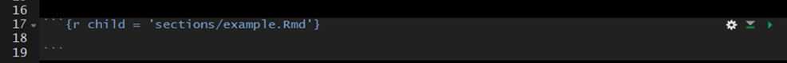

## Extract and Run R-Code from R Markdown Files

The parent file is great for organizing sections of your document, but the child documents cannot be executed within R Studio like a normal code chunk. Without the ability to easily execute the R code within the child documents it can become very difficult to develop new child documents because new child documents often depend on upstream code execution.

Imagine you have a parent document that sources child sections which import your data and clean your data. You now want to visualize your data; accordingly, you begin to develop a visualization child document, which depends on information from the upstream child sections. It would be inefficient and inappropriate to perform all the steps in the upstream child sections within the visualization section. Therefore, you need an effective way to execute the upstream child sections while you continue to develop the visualization section. The inefficient way of doing this is to open each child Rmd file in R Studio and execute them manually in the correct sequence. This becomes tedious after you have three or more documents (imagine doing this for 10+ child sections). The most efficient way that I have found to run upstream child sections is to extract the R-code chunks from each Rmd file, save them in a "raw_scripts" folder, and then source/execute the scripts within a regular R script file (.R).

### R Code

In this section we establish the file path to the folder that contains all the child documents. The names of the child documents are extracted and stored as a vector. The `grepl()` function is used to retain only the Rmd files stored in the vector.


```r
sections.path <- file.path(rprojroot::find_root("r_in_practice.Rproj"),
                           "markdown",
                           "sections")
r.files.vec <- list.files(sections.path)
r.files.vec <- r.files.vec[grepl(".Rmd", r.files.vec)]
```

Next, a file path is specified for the R-scripts that will be extracted from the R Markdown documents; I place these files within a "raw_script/extracted" folder. The `map()` function from the purrr package is used to loop through each file in the vector (r.files.vec). Within the `map()` loop, the `purl()` function from knitr is used to extract the R-code from the R Markdown documents and save the code to the specified folder.


```r
extracted.path <- file.path(rprojroot::find_root("r_in_practice.Rproj"),
                           "markdown",
                           "raw_scripts",
                           "extracted")

purrr::map(r.files.vec, function(file.i) {
  # print(file.i)
  file.name <- gsub(".Rmd", "", file.i)
  extracted.file <- paste0(file.name, ".R")
  knitr::purl(
    file.path(sections.path, file.i),
    file.path(extracted.path, extracted.file)
    )
})
```

Finally, create a vector of file names (`source.vec`) stored in the "raw_script/extracted" folder. You will want to type these out manually (do not use `list.files()` functions) because in this format you can easily comment out certain scripts and only run the scripts of interest. `map()` is then used to loop through each specified file in `source.vec`. Keep in mind that the order of the file names specified in `source.vec` will determine the order that these files are executed in the `map()` function; therefore, order the files in `source.vec` from furthest upstream to furthest downstream. Each iteration of the loop, executes (sources) the specified R-script.


```r
source.vec <- c(
  "introduction.R",
  "quick_reference.R",
  "installation_updates.R",
  "r_project.R",
  "version_control.R"
)

purrr::map(source.vec, function(source.i) {
  source(file.path(extracted.path, source.i))
})
```

Once all the R-scripts extracted from the upstream child R Markdown files have been executed, you can begin or continue work on a new child R Markdown document. I keep all the above code in a single R-script and execute the entire script each time I use this file to make sure all of the files are up-to-date.

## Your Turn

1.  Create an R Markdown document for each of the sections, designated by Header level 1s, we have created thus far.

    -   save the documents within your project root (where your .Rproj file lives)

2.  Copy the Header and the relevant content below the header. Paste the content into the appropriate R Markdown document.

3.  Create a parent R Markdown document.

    -   create a code chunk for each section.
    -   add `child = 'insert-file-name-here.Rmd'` to the header of the appropriate code chunk

4.  Knit the document

# Parameterized Reports

Parameterized reports enable you to create a report template and generate reports for a subset of the data based on this template.

For example, imagine you are tasked with generating 100 one page fact sheets for lakes in your state. The fact sheets will include boilerplate language but for each lake's fact sheet you will need to update the name of the lake used through out the document, provide a list of metrics relevant to the lake (e.g., lake area, lat/longs, and max depth), and map of the lake. Think about how long it would take you to compile of the necessary components (e.g., lake metrics and lake maps), the amount of time it would take you to manually add these components to each fact sheet, and the struggles you would likely run into with formatting. Now imagine you complete all 100 fact sheets, hand the fact sheets to your boss, and they ask you to change the format of all the maps in the fact sheets. You would likely need to manually re-generate all of the maps and manually replace the maps in each document.

Here is a link to a great lecture on creating parameterized reports: <https://www.coursera.org/lecture/reproducible-templates-analysis/adding-parameters-in-a-document-template-6fQwc>

## params

To add a parameter or parameters to your document, add the `params:` argument below `output: html_document`. Below `params:` you can specify any parameter name you want to use and any default value you want to supply. In this example I will be using the `iris` data set, and therefore I specified that the name of my parameter would be "species" and the default value would be "setosa."

<center>

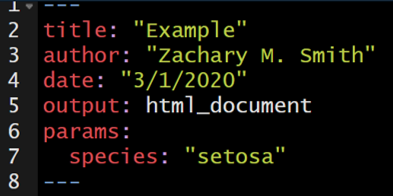

</center>

The specified parameter can be used throughout the document with the syntax `params$species`. `params$species` will act as a place holder throughout the document until the document is rendered and, in this case, the species is specified; this specified species will be used throughout the document where `params$species` was acting as a placeholder.

In the example below, I use inline code to insert the species name into the title of the document. Therefore, the title will automatically update during rendering depending on the specified parameter.

<center>


</center>

The parameters can also be used to filter the original data frame to a subset of interest. For example, the iris data frame can be filtered to only include the specified species of interest using the code below.


```r
data(iris)

iris.sub <- iris[iris$Species %in% params$species, ]
```

The parameter can be referenced frequently to update the text in the document or to filter to the data of interest. In the image below, the iris data set will be filtered by the specified parameter to generate `iris.sub`. `iris.sub` will be used to calculate the mean value for each flower characteristic.

<center>


</center>

## Knitting

To the knit the document, click on the knit drop-down menu (the small triangle to the right of the Knit button) and select "Knit with Parameters..." A pop-up window will appear specifying the list of available parameters and their default values. These default values can be edited prior to clicking "knit" at the bottom right of the window.

<center>


</center>

The document will then render.

<center>

{width="600px"}

</center>

## rmarkdown::render()

The **rmarkdown** function `render()` can also be used to compile the document. The `input` specifies the parameterized .Rmd file. The `params` argument species the parameter values to be used when rendering the document. Note that the value supplied to `params` must be wrapped by `list()`.


```r
rmarkdown::render(input = "parameterized/param_template.Rmd",
                  params = list(species = "setosa"))
```

It would not be efficient to specify each parameter of interest one-by-one. Instead a loop can be written to iteratively generate parameterized documents. Below the function `lapply()` is used to create the loop. `unique(iris$Species)` supplies a vector of unique species names (i.e., "setosa", "versicolor", and "virginica") to generate parameterized reports. `species.i` is specified as a placeholder to represent each unique species in the iris data set; therefore `species.i` is used to specify what the species parameter should equal and it is used to generate a unique and easy to interpret file name `output_file = paste0(species.i, ".HTML")`.


```r
lapply(unique(iris$Species), function(species.i) {
  rmarkdown::render("parameterized/param_template.Rmd",
                    params = list(species = species.i),
                    output_file = paste0(species.i, ".HTML"))
})
```

## Your Turn

1.  Create a new .Rmd file and copy/paste the content of the .Rmd file created in [Lesson 5: Code Chunks and Inline Code]
2.  add `params:` and specify lake as a parameter with Onondaga as the default (`lake: Onondaga`) to the YAML header
3.  Use inline code to have the YAML title update to include the specified parameter (`params$lake`)
4.  In your introductory paragraph, use inline code to specify that this document is specific to X Lake.
5.  Filter `thesis.df` to only represent the specified lake parameter


```r
thesis.df <- thesis.df %>% 
  filter(lake %in% params$lake)
```

5.  Update your conclusion section text to specify that the results are from X Lake and use inline code to specify:

    -   the minimum relative abundance of Diptera taxa `min(thesis.df$pct_diptera)`
    -   the maximum relative abundance of Diptera taxa `max(thesis.df$pct_diptera)`
    -   the median richness value observed in the lake `median(thesis.df$richness)`

6.  Render the document using the "Knit with Parameters..." button

    -   Use the default parameter
    -   Specify a different parameter (e.g., lake = Cazenovia)

7.  **Bonus:** Try to write a loop with `lapply()` and `render()` to automate the process to generate a report for each of the three lakes in the data set.

<!--chapter:end:1701_markdown.Rmd-->


# Thoughts from Hadley Wickham on Tidyverse {-}

Although I'm perpetually reluctant to embed videos that I don't host, I think hearing from Hadley Wickham is worthwhile. 

##  Dive into Hadley Wickham's Tidyverse


```{=html}
<div class="vembedr" align="center">
<div>
<iframe src="https://www.youtube.com/embed/MjHQo-t2v_c" width="533" height="300" frameborder="0" allowfullscreen="" data-external="1"></iframe>
</div>
</div>
```


## Current State of the Tidyverse (2020)


```{=html}
<div class="vembedr" align="center">
<div>
<iframe src="https://www.youtube.com/embed/OwwYfxB8CA0" width="533" height="300" frameborder="0" allowfullscreen="" data-external="1"></iframe>
</div>
</div>
```


<!--DS4P Links-->
[course_web]: https://datascience4psych.github.io/DataScience4Psych
[course_git]: https://github.com/DataScience4Psych/DataScience4Psych
[course_repo]: https://github.com/DataScience4Psych
[course_slides]: https://github.com/DataScience4Psych/slides
[course_syllabus]: https://smasongarrison.github.io/syllabi/ 
<!-- https://smasongarrison.github.io/syllabi/data-science.html -->
[syllabi]: https://smasongarrison.github.io/syllabi
[pl_00]: https://www.youtube.com/playlist?list=PLKrrdtYgOUYaEAnJX20Ryy4OSie375rVY
[pl_01]: https://www.youtube.com/playlist?list=PLKrrdtYgOUYao_7t5ycK4KDXNKaY-ECup
[pl_02]: https://www.youtube.com/playlist?list=PLKrrdtYgOUYZmr_T3PnuxjVIlj0C0kUNI
[pl_03]: https://www.youtube.com/playlist?list=PLKrrdtYgOUYaHmjzdRvfg0yhOIYQnfjwE
[pl_04]: https://www.youtube.com/playlist?list=PLKrrdtYgOUYYWFcel6_vp8__RUKLxhX4y
[pl_05]: https://www.youtube.com/playlist?list=PLKrrdtYgOUYYMIguiV1F8RagMYibTY4iW
[pl_06]: https://www.youtube.com/playlist?list=PLKrrdtYgOUYYV_KDod3Mk9-RmtFXii9Dv
[pl_07]: https://www.youtube.com/watch?list=PLKrrdtYgOUYZxvEvQ8-PcWrOY_dwY_ETI
[pl_08]: https://www.youtube.com/playlist?list=PLKrrdtYgOUYZgOzYB_dmauw55M7jXvsdo
[pl_09]: https://www.youtube.com/playlist?list=PLKrrdtYgOUYbaiTmldRY2ddsLrHp3z6yO
[pl_10]: https://www.youtube.com/playlist?list=PLKrrdtYgOUYbPw5iYzYEzoOKa7mJKNIhq
[pl_11]: https://www.youtube.com/playlist?list=PLKrrdtYgOUYZ-u6LzBbanrNFoeLHKaLL6
[pl_12]: https://www.youtube.com/playlist?list=PLKrrdtYgOUYbwRS-9Htmb80_t1NG-021e
[pl_13]: https://www.youtube.com/playlist?list=PLKrrdtYgOUYbWGmSnbLIYwdLOnGm6une6
[pl_14]: https://www.youtube.com/playlist?list=PLKrrdtYgOUYbWGmSnbLIYwdLOnGm6une6
[pl_15]: https://www.youtube.com/playlist?list=PLKrrdtYgOUYa5MoYrV8EsWQ5jIr5ZYMpM
[pl_all]: https://www.youtube.com/playlist?list=PLKrrdtYgOUYZomNqf-1dtCDW94ySdLv-9


<!--AE Links-->
[ae01a_unvotes]: https://github.com/DataScience4Psych/ae01a_unvotes
[ae01b_covid]: https://github.com/DataScience4Psych/ae01b_covid
[ae02_bechdel]: https://github.com/DataScience4Psych/ae-02-bechdel-rmarkdown
[ae03_starwars]: https://github.com/DataScience4Psych/ae-03-starwars-dataviz


<!-- Lab Links-->

[lab01_hello]: https://github.com/DataScience4Psych/lab-01-hello-r

<!--Slides-->
[d01_welcome]: https://datascience4psych.github.io/slides/d01_welcome/d01_welcome.html
[d02_toolkit]: https://datascience4psych.github.io/slides/d02_toolkit/d02_toolkit.html
[d03_dataviz]: https://datascience4psych.github.io/slides/d03_dataviz/d03_dataviz.html
[d04_ggplot2]: https://datascience4psych.github.io/slides/d04_ggplot2/d04_ggplot2.html
[d05_viznum]: https://datascience4psych.github.io/slides/d05_viznum/d05_viznum.html
[d06_vizcat]: https://datascience4psych.github.io/slides/d06_vizcat/d06_vizcat.html
[d07_tidy]: https://datascience4psych.github.io/slides/d07_tidy/d07_tidy.html
[d08_grammar]: https://datascience4psych.github.io/slides/d08_grammar/d08_grammar.html
[d09_wrangle]: https://datascience4psych.github.io/slides/d09_wrangle/d09_wrangle.html
[d10_dfs]: https://datascience4psych.github.io/slides/d10_dfs/d10_dfs.html
[d11_types]: https://datascience4psych.github.io/slides/d11_types/d11_types.html
[d12_import]: https://datascience4psych.github.io/slides/d12_import/d12_import.html
[d13_goodviz]: https://datascience4psych.github.io/slides/d13_goodviz/d13_goodviz.html
[d13b_moreggplot]: https://datascience4psych.github.io/slides/d13_goodviz/d13b_moreggplot.html
[d14_confound]: https://datascience4psych.github.io/slides/d14_confound/d14_confound.html
[d15_goodtalk]: https://datascience4psych.github.io/slides/d15_goodtalk/d15_goodtalk.html
[d16_webscraping]: https://datascience4psych.github.io/slides/d16_webscraping/d16_webscraping.html
[d17_functions]: https://datascience4psych.github.io/slides/d17_functions/d17_functions.html
[d18_ethics]: https://datascience4psych.github.io/slides/d18_ethics/d18_ethics.html
[d19_bias]: https://datascience4psych.github.io/slides/d19_bias/d19_bias.html


<!--externals-->

[stat545]: https://stat545.com
[r4ds]: https://r4ds.had.co.nz
[cran]: https://cloud.r-project.org


<!--chapter:end:2306_hadley.Rmd-->

# (PART) Back Matter {-}


# Good Resources

* https://psychnerdjae.github.io/into-the-tidyverse/
* [Automatic Grading with RMarkdown example](https://github.com/rundel/hw01)
* [Git/Github for virtual learning](https://afredston.github.io/learn-git/learn-git.html) (from [this tweet](https://twitter.com/AFredston/status/1354865931772682243))
* [Learn-Datascience-for-Free](https://github.com/therealsreehari/Learn-Datascience-for-Free)
* https://allisonhorst.shinyapps.io/dplyr-learnr/

## Cheatsheets

Rstudio has a glorious number of [cheatsheets](https://rstudio.com/resources/cheatsheets/), including:

+ [Data Wrangling](https://github.com/rstudio/cheatsheets/blob/master/old/pdfs/data-wrangling-cheatsheet.pdf)


# Media without a home yet

## SIPS Resources

* [Data Management Hackathon - Syllabus](https://docs.google.com/document/d/1z15bL9cP84re6d4zdkO60q06lnknnN3xEktN7GnLFFQ/edit)
* [SIPS Products](http://improvingpsych.org/sipsinaction/sips-products/)


## Visualizing Linear Models: An R Bag of Tricks

* [Visualizing Linear Models: An R Bag of Tricks](https://friendly.github.io/VisMLM-course/)

```{=html}
<blockquote class="twitter-tweet" data-width="550" data-lang="en" data-dnt="true" data-theme="light"><p lang="en" dir="ltr">I&#39;m starting a 3-week <a href="https://twitter.com/hashtag/rstats?src=hash&amp;ref_src=twsrc%5Etfw">#rstats</a> short course, Visualizing Linear Models: An R Bag of Tricks.<br>One week on univariate models, two weeks on models for multivariate responses. <br>Lectures notes, examples and exercises are at: <a href="https://t.co/LF1iVPZOPs">https://t.co/LF1iVPZOPs</a></p>&mdash; Michael Friendly (@datavisFriendly) <a href="https://twitter.com/datavisFriendly/status/1365801123584565249?ref_src=twsrc%5Etfw">February 27, 2021</a></blockquote>

```


## For new programmers learning keyboard shortcuts...

https://www.shortcutfoo.com/

## Are you a student? If yes, this is the best data science project for you!


```{=html}
<div class="vembedr" align="center">
<div>
<iframe src="https://www.youtube.com/embed/2goqyY5XBeI" width="533" height="300" frameborder="0" allowfullscreen="" data-external="1"></iframe>
</div>
</div>
```

## rstudio is magic


```{=html}
<blockquote class="twitter-tweet" data-width="550" data-lang="en" data-dnt="true" data-theme="light"><p lang="en" dir="ltr">Multiple cursors in <a href="https://twitter.com/rstudio?ref_src=twsrc%5Etfw">@RStudio</a> are so handy! Holding down the option key and drag gives me multiple synced cursors 🖱️🖱️🖱️ <a href="https://t.co/nQKzqIwsou">pic.twitter.com/nQKzqIwsou</a></p>&mdash; Emil Hvitfeldt (@Emil_Hvitfeldt) <a href="https://twitter.com/Emil_Hvitfeldt/status/1356468455101227009?ref_src=twsrc%5Etfw">February 2, 2021</a></blockquote>

```

## automation quote


```{=html}
<blockquote class="twitter-tweet" data-width="550" data-lang="en" data-dnt="true" data-theme="light"><p lang="en" dir="ltr">&quot;I’ve always objected to doing anything over again if I had already done it once.&quot; – Grace Hopper</p>&mdash; Programming Wisdom (@CodeWisdom) <a href="https://twitter.com/CodeWisdom/status/1358724807525871617?ref_src=twsrc%5Etfw">February 8, 2021</a></blockquote>

```


## How computer memory works!


```{=html}
<div class="vembedr" align="center">
<div>
<iframe src="https://www.youtube.com/embed/p3q5zWCw8J4" width="533" height="300" frameborder="0" allowfullscreen="" data-external="1"></iframe>
</div>
</div>
```

## Is Coding a Math Skill or a Language Skill? Neither? Both?


```{=html}
<div class="vembedr" align="center">
<div>
<iframe src="https://www.youtube.com/embed/xPecMsFmEm4?t=7" width="533" height="300" frameborder="0" allowfullscreen="" data-external="1"></iframe>
</div>
</div>
```


## Quantum Computers Explained!


```{=html}
<div class="vembedr" align="center">
<div>
<iframe src="https://www.youtube.com/embed/JhHMJCUmq28" width="533" height="300" frameborder="0" allowfullscreen="" data-external="1"></iframe>
</div>
</div>
```


## The Rise of the Machines – Why Automation is Different this Time


```{=html}
<div class="vembedr" align="center">
<div>
<iframe src="https://www.youtube.com/embed/WSKi8HfcxEk" width="533" height="300" frameborder="0" allowfullscreen="" data-external="1"></iframe>
</div>
</div>
```

## Emergence – How Stupid Things Become Smart Together


```{=html}
<div class="vembedr" align="center">
<div>
<iframe src="https://www.youtube.com/embed/16W7c0mb-rE" width="533" height="300" frameborder="0" allowfullscreen="" data-external="1"></iframe>
</div>
</div>
```


## How not to ask for help

```
#> Error in tweet_blockquote(tweet_url = tweet_url, maxwidth = maxwidth,  : 
#>   Not Found (HTTP 404).
```

## The Birthday Paradox


```{=html}
<div class="vembedr" align="center">
<div>
<iframe src="https://www.youtube.com/embed/ofTb57aZHZs" width="533" height="300" frameborder="0" allowfullscreen="" data-external="1"></iframe>
</div>
</div>
```

## Why can't you divide by zero?


```{=html}
<div class="vembedr" align="center">
<div>
<iframe src="https://www.youtube.com/embed/NKmGVE85GUU" width="533" height="300" frameborder="0" allowfullscreen="" data-external="1"></iframe>
</div>
</div>
```

## Yea he's chewing up my stats homework but that face though...

<blockquote class="reddit-card" data-card-created="1611607953"><a href="https://www.reddit.com/r/CatsBeingCats/comments/l4fnqx/yea_hes_chewing_up_my_stats_homework_but_that/">Yea he's chewing up my stats homework but that face though...</a> from <a href="http://www.reddit.com/r/CatsBeingCats">r/CatsBeingCats</a></blockquote>
<script async src="//embed.redditmedia.com/widgets/platform.js" charset="UTF-8"></script>

## Coding Kitty

https://hostrider.com/


```{=html}
<blockquote class="twitter-tweet" data-width="550" data-lang="en" data-dnt="true" data-theme="light"><p lang="en" dir="ltr">I’ve been using R since 2008. Today I learned about stats::reformulate(). <a href="https://t.co/7xm4CiHkW9">https://t.co/7xm4CiHkW9</a></p>&mdash; James E. Pustejovsky (@jepusto) <a href="https://twitter.com/jepusto/status/1471297801506234368?ref_src=twsrc%5Etfw">December 16, 2021</a></blockquote>

```

## Democratic databases: science on GitHub

*Nature:* "[Democratic databases: science on GitHub](https://www.nature.com/news/democratic-databases-science-on-github-1.20719)" (Perkel, 2016).


## Ten simple rules for getting started on Twitter as a scientist

https://journals.plos.org/ploscompbiol/article?id=10.1371/journal.pcbi.1007513


## NYT data ethics stuff

https://www.nytimes.com/2021/01/31/technology/facial-recognition-photo-tool.html

##


```{=html}
<blockquote class="twitter-tweet" data-width="550" data-lang="en" data-dnt="true" data-theme="light"><p lang="qst" dir="ltr">Art! <a href="https://t.co/XuDToJAmnp">https://t.co/XuDToJAmnp</a></p>&mdash; Prof. Mason Garrison 🌈💫✨ (@SMasonGarrison) <a href="https://twitter.com/SMasonGarrison/status/1372640164493856773?ref_src=twsrc%5Etfw">March 18, 2021</a></blockquote>

```


<!--DS4P Links-->
[course_web]: https://datascience4psych.github.io/DataScience4Psych
[course_git]: https://github.com/DataScience4Psych/DataScience4Psych
[course_repo]: https://github.com/DataScience4Psych
[course_slides]: https://github.com/DataScience4Psych/slides
[course_syllabus]: https://smasongarrison.github.io/syllabi/ 
<!-- https://smasongarrison.github.io/syllabi/data-science.html -->
[syllabi]: https://smasongarrison.github.io/syllabi
[pl_00]: https://www.youtube.com/playlist?list=PLKrrdtYgOUYaEAnJX20Ryy4OSie375rVY
[pl_01]: https://www.youtube.com/playlist?list=PLKrrdtYgOUYao_7t5ycK4KDXNKaY-ECup
[pl_02]: https://www.youtube.com/playlist?list=PLKrrdtYgOUYZmr_T3PnuxjVIlj0C0kUNI
[pl_03]: https://www.youtube.com/playlist?list=PLKrrdtYgOUYaHmjzdRvfg0yhOIYQnfjwE
[pl_04]: https://www.youtube.com/playlist?list=PLKrrdtYgOUYYWFcel6_vp8__RUKLxhX4y
[pl_05]: https://www.youtube.com/playlist?list=PLKrrdtYgOUYYMIguiV1F8RagMYibTY4iW
[pl_06]: https://www.youtube.com/playlist?list=PLKrrdtYgOUYYV_KDod3Mk9-RmtFXii9Dv
[pl_07]: https://www.youtube.com/watch?list=PLKrrdtYgOUYZxvEvQ8-PcWrOY_dwY_ETI
[pl_08]: https://www.youtube.com/playlist?list=PLKrrdtYgOUYZgOzYB_dmauw55M7jXvsdo
[pl_09]: https://www.youtube.com/playlist?list=PLKrrdtYgOUYbaiTmldRY2ddsLrHp3z6yO
[pl_10]: https://www.youtube.com/playlist?list=PLKrrdtYgOUYbPw5iYzYEzoOKa7mJKNIhq
[pl_11]: https://www.youtube.com/playlist?list=PLKrrdtYgOUYZ-u6LzBbanrNFoeLHKaLL6
[pl_12]: https://www.youtube.com/playlist?list=PLKrrdtYgOUYbwRS-9Htmb80_t1NG-021e
[pl_13]: https://www.youtube.com/playlist?list=PLKrrdtYgOUYbWGmSnbLIYwdLOnGm6une6
[pl_14]: https://www.youtube.com/playlist?list=PLKrrdtYgOUYbWGmSnbLIYwdLOnGm6une6
[pl_15]: https://www.youtube.com/playlist?list=PLKrrdtYgOUYa5MoYrV8EsWQ5jIr5ZYMpM
[pl_all]: https://www.youtube.com/playlist?list=PLKrrdtYgOUYZomNqf-1dtCDW94ySdLv-9


<!--AE Links-->
[ae01a_unvotes]: https://github.com/DataScience4Psych/ae01a_unvotes
[ae01b_covid]: https://github.com/DataScience4Psych/ae01b_covid
[ae02_bechdel]: https://github.com/DataScience4Psych/ae-02-bechdel-rmarkdown
[ae03_starwars]: https://github.com/DataScience4Psych/ae-03-starwars-dataviz


<!-- Lab Links-->

[lab01_hello]: https://github.com/DataScience4Psych/lab-01-hello-r

<!--Slides-->
[d01_welcome]: https://datascience4psych.github.io/slides/d01_welcome/d01_welcome.html
[d02_toolkit]: https://datascience4psych.github.io/slides/d02_toolkit/d02_toolkit.html
[d03_dataviz]: https://datascience4psych.github.io/slides/d03_dataviz/d03_dataviz.html
[d04_ggplot2]: https://datascience4psych.github.io/slides/d04_ggplot2/d04_ggplot2.html
[d05_viznum]: https://datascience4psych.github.io/slides/d05_viznum/d05_viznum.html
[d06_vizcat]: https://datascience4psych.github.io/slides/d06_vizcat/d06_vizcat.html
[d07_tidy]: https://datascience4psych.github.io/slides/d07_tidy/d07_tidy.html
[d08_grammar]: https://datascience4psych.github.io/slides/d08_grammar/d08_grammar.html
[d09_wrangle]: https://datascience4psych.github.io/slides/d09_wrangle/d09_wrangle.html
[d10_dfs]: https://datascience4psych.github.io/slides/d10_dfs/d10_dfs.html
[d11_types]: https://datascience4psych.github.io/slides/d11_types/d11_types.html
[d12_import]: https://datascience4psych.github.io/slides/d12_import/d12_import.html
[d13_goodviz]: https://datascience4psych.github.io/slides/d13_goodviz/d13_goodviz.html
[d13b_moreggplot]: https://datascience4psych.github.io/slides/d13_goodviz/d13b_moreggplot.html
[d14_confound]: https://datascience4psych.github.io/slides/d14_confound/d14_confound.html
[d15_goodtalk]: https://datascience4psych.github.io/slides/d15_goodtalk/d15_goodtalk.html
[d16_webscraping]: https://datascience4psych.github.io/slides/d16_webscraping/d16_webscraping.html
[d17_functions]: https://datascience4psych.github.io/slides/d17_functions/d17_functions.html
[d18_ethics]: https://datascience4psych.github.io/slides/d18_ethics/d18_ethics.html
[d19_bias]: https://datascience4psych.github.io/slides/d19_bias/d19_bias.html


<!--externals-->

[stat545]: https://stat545.com
[r4ds]: https://r4ds.had.co.nz
[cran]: https://cloud.r-project.org


<!--HappyGitWithR Links-->


[hg-github-account]: https://happygitwithr.com/github-acct.html
[hg-install-r-rstudio]: https://happygitwithr.com/install-r-rstudio.html
[hg-connect-intro]: https://happygitwithr.com/connect-intro.html
[hg-browsability]: https://happygitwithr.com/workflows-browsability.html
[hg-shell]: https://happygitwithr.com/shell.html

<!--Package Links-->


[lubridate-web]: https://lubridate.tidyverse.org
[lubridate-cran]: https://CRAN.R-project.org/package=lubridate
[lubridate-github]: https://github.com/tidyverse/lubridate
[lubridate-vignette]: https://cran.r-project.org/web/packages/lubridate/vignettes/lubridate.html


[stringr-web]: https://stringr.tidyverse.org
[stringr-cran]: https://CRAN.R-project.org/package=stringr


[ggplot2-github]: https://github.com/tidyverse/ggplot2
[ggplot2-theme-args]: https://ggplot2.tidyverse.org/reference/ggtheme.html#arguments


[assertthat-cran]: https://CRAN.R-project.org/package=assertthat
[assertthat-github]: https://github.com/hadley/assertthat

[ensurer-cran]: https://CRAN.R-project.org/package=ensurer
[ensurer-github]: https://github.com/smbache/ensurer

[assertr-cran]: https://CRAN.R-project.org/package=assertr
[assertr-github]: https://github.com/ropensci/assertr

[assertive-cran]: https://CRAN.R-project.org/package=assertive
[assertive-bitbucket]: https://bitbucket.org/richierocks/assertive/src/master/

[testthat-cran]: https://CRAN.R-project.org/package=testthat
[testthat-github]: https://github.com/r-lib/testthat
[testthat-web]: https://testthat.r-lib.org

[viridis-cran]: https://CRAN.R-project.org/package=viridis
[viridis-github]: https://github.com/sjmgarnier/viridis
[viridis-vignette]: https://cran.r-project.org/web/packages/viridis/vignettes/intro-to-viridis.html

[colorspace-cran]: https://CRAN.R-project.org/package=colorspace
[colorspace-vignette]: https://cran.r-project.org/web/packages/colorspace/vignettes/hcl-colors.pdf

[cowplot-cran]: https://CRAN.R-project.org/package=cowplot
[cowplot-github]: https://github.com/wilkelab/cowplot
[cowplot-vignette]: https://cran.r-project.org/web/packages/cowplot/vignettes/introduction.html

[devtools-cran]: https://CRAN.R-project.org/package=devtools
[devtools-github]: https://github.com/r-lib/devtools
[devtools-web]: https://devtools.r-lib.org
[devtools-cheatsheet]: https://www.rstudio.com/wp-content/uploads/2015/03/devtools-cheatsheet.pdf
[devtools-cheatsheet-old]: https://rawgit.com/rstudio/cheatsheets/master/package-development.pdf
[devtools-1-6]: https://blog.rstudio.com/2014/10/02/devtools-1-6/
[devtools-1-8]: https://blog.rstudio.com/2015/05/11/devtools-1-9-0/
[devtools-1-9-1]: https://blog.rstudio.com/2015/09/13/devtools-1-9-1/

[googlesheets-cran]: https://CRAN.R-project.org/package=googlesheets
[googlesheets-github]: https://github.com/jennybc/googlesheets

[tidycensus-cran]: https://CRAN.R-project.org/package=tidycensus
[tidycensus-github]: https://github.com/walkerke/tidycensus
[tidycensus-web]: https://walkerke.github.io/tidycensus/index.html


[fs-cran]: https://CRAN.R-project.org/package=fs
[fs-github]: https://github.com/r-lib/fs

[plumber-web]: https://www.rplumber.io
[plumber-docs]: https://www.rplumber.io/docs/
[plumber-github]: https://github.com/trestletech/plumber
[plumber-cran]: https://CRAN.R-project.org/package=plumber


[glue-web]: https://glue.tidyverse.org
[stringi-cran]: https://CRAN.R-project.org/package=stringi
[rex-github]: https://github.com/kevinushey/rex
[rcolorbrewer-cran]: https://CRAN.R-project.org/package=RColorBrewer
[dichromat-cran]: https://CRAN.R-project.org/package=dichromat

[rdryad-web]: https://docs.ropensci.org/rdryad/
[rdryad-cran]: https://CRAN.R-project.org/package=rdryad
[rdryad-github]: https://github.com/ropensci/rdryad

[roxygen2-cran]: https://CRAN.R-project.org/package=roxygen2
[roxygen2-vignette]: https://cran.r-project.org/web/packages/roxygen2/vignettes/rd.html

[shinythemes-web]: https://rstudio.github.io/shinythemes/
[shinythemes-cran]: https://CRAN.R-project.org/package=shinythemes

[shinyjs-web]: https://deanattali.com/shinyjs/
[shinyjs-cran]: https://CRAN.R-project.org/package=shinyjs
[shinyjs-github]: https://github.com/daattali/shinyjs

[leaflet-web]: https://rstudio.github.io/leaflet/
[leaflet-cran]: https://CRAN.R-project.org/package=leaflet
[leaflet-github]: https://github.com/rstudio/leaflet

[ggvis-web]: https://ggvis.rstudio.com
[ggvis-cran]: https://CRAN.R-project.org/package=ggvis
 
[usethis-web]: https://usethis.r-lib.org
[usethis-cran]: https://CRAN.R-project.org/package=usethis
[usethis-github]: https://github.com/r-lib/usethis

[pkgdown-web]: https://pkgdown.r-lib.org
[gh-github]: https://github.com/r-lib/gh

[httr-web]: https://httr.r-lib.org
[httr-cran]: https://CRAN.R-project.org/package=httr
[httr-github]: https://github.com/r-lib/httr

[gistr-web]: https://docs.ropensci.org/gistr
[gistr-cran]: https://CRAN.R-project.org/package=gistr
[gistr-github]: https://github.com/ropensci/gistr

[rvest-web]: https://rvest.tidyverse.org
[rvest-cran]: https://CRAN.R-project.org/package=rvest
[rvest-github]: https://github.com/tidyverse/rvest

[xml2-web]: https://xml2.r-lib.org
[xml2-cran]: https://CRAN.R-project.org/package=xml2
[xml2-github]: https://github.com/r-lib/xml2

[jsonlite-paper]: https://arxiv.org/abs/1403.2805
[jsonlite-cran]: https://CRAN.R-project.org/package=jsonlite
[jsonlite-github]: https://github.com/jeroen/jsonlite

[readxl-web]: https://readxl.tidyverse.org
[readxl-github]: https://github.com/tidyverse/readxl
[readxl-cran]: https://CRAN.R-project.org/package=readxl

[janitor-web]: http://sfirke.github.io/janitor/
[janitor-cran]: https://CRAN.R-project.org/package=janitor
[janitor-github]: https://github.com/sfirke/janitor


<!--Shiny links-->
[shinydashboard-web]: https://rstudio.github.io/shinydashboard/
[shinydashboard-cran]: https://CRAN.R-project.org/package=shinydashboard
[shinydashboard-github]: https://github.com/rstudio/shinydashboard


[shiny-official-web]: https://shiny.rstudio.com
[shiny-official-tutorial]: https://shiny.rstudio.com/tutorial/
[shiny-cheatsheet]: https://shiny.rstudio.com/images/shiny-cheatsheet.pdf
[shiny-articles]: https://shiny.rstudio.com/articles/
[shiny-bookdown]: https://bookdown.org/yihui/rmarkdown/shiny-documents.html
[shiny-google-groups]: https://groups.google.com/forum/#!forum/shiny-discuss
[shiny-stack-overflow]: https://stackoverflow.com/questions/tagged/shiny
[shinyapps-web]: https://www.shinyapps.io
[shiny-server-setup]: https://deanattali.com/2015/05/09/setup-rstudio-shiny-server-digital-ocean/
[shiny-reactivity]: https://shiny.rstudio.com/articles/understanding-reactivity.html
[shiny-debugging]: https://shiny.rstudio.com/articles/debugging.html


<!--Publications--> 


[adv-r-defensive-programming]: http://adv-r.had.co.nz/Exceptions-Debugging.html#defensive-programming
[adv-r-fxn-args]: http://adv-r.had.co.nz/Functions.html#function-arguments
[adv-r-return-values]: http://adv-r.had.co.nz/Functions.html#return-values
[adv-r-closures]: http://adv-r.had.co.nz/Functional-programming.html#closures


[r4ds-strings]: https://r4ds.had.co.nz/strings.html
[r4ds-readr-strings]: https://r4ds.had.co.nz/data-import.html#readr-strings
[r4ds-dates-times]: https://r4ds.had.co.nz/dates-and-times.html
[r4ds-data-import]: http://r4ds.had.co.nz/data-import.html
[r4ds-relational-data]: https://r4ds.had.co.nz/relational-data.html
[r4ds-pepper-shaker]: https://r4ds.had.co.nz/vectors.html#lists-of-condiments

[r-pkgs2]: https://r-pkgs.org/index.html
[r-pkgs2-whole-game]: https://r-pkgs.org/whole-game.html
[r-pkgs2-description]: https://r-pkgs.org/description.html
[r-pkgs2-man]: https://r-pkgs.org/man.htm
[r-pkgs2-tests]: https://r-pkgs.org/tests.html
[r-pkgs2-namespace]: https://r-pkgs.org/namespace.html
[r-pkgs2-vignettes]: https://r-pkgs.org/vignettes.html
[r-pkgs2-release]: https://r-pkgs.org/release.html
[r-pkgs2-r-code]: https://r-pkgs.org/r.html#r

[r-graphics-cookbook]: http://shop.oreilly.com/product/0636920023135.do


[cookbook-for-r-graphs]: http://www.cookbook-r.com/Graphs/
[cookbook-for-r-multigraphs]: http://www.cookbook-r.com/Graphs/Multiple_graphs_on_one_page_(ggplot2)/


[testthat-article]: https://journal.r-project.org/archive/2011-1/RJournal_2011-1_Wickham.pdf
[worry-about-color]: https://github.com/DataScience4Psych/DataScience4Psych/blob/master/admin/pdfs/Why%20Should%20Engineers%20and%20Scientists%20Be%20Worried%20About%20Color.pdf
[escaping-rgbland-pdf]: https://eeecon.uibk.ac.at/~zeileis/papers/Zeileis+Hornik+Murrell-2009.pdf
[escaping-rgbland-doi]: https://doi.org/10.1016/j.csda.2008.11.033


<!--R Documentation-->
[rdocs-extremes]: https://rdrr.io/r/base/Extremes.html
[rdocs-range]: https://rdrr.io/r/base/range.html
[rdocs-quantile]: https://rdrr.io/r/stats/quantile.html
[rdocs-c]: https://rdrr.io/r/base/c.html
[rdocs-list]: https://rdrr.io/r/base/list.html
[rdocs-lm]: https://rdrr.io/r/stats/lm.html
[rdocs-coef]: https://rdrr.io/r/stats/coef.html
[rdocs-devices]: https://rdrr.io/r/grDevices/Devices.html
[rdocs-ggsave]: https://rdrr.io/cran/ggplot2/man/ggsave.html


<!--Wikipedia Links-->


[wiki-row-col-major-order]: https://en.wikipedia.org/wiki/Row-_and_column-major_order
[wiki-boxplot]: https://en.wikipedia.org/wiki/Box_plot
[wiki-brewer]: https://en.wikipedia.org/wiki/Cynthia_Brewer
[wiki-vector-graphics]: https://en.wikipedia.org/wiki/Vector_graphics
[wiki-raster-graphics]: https://en.wikipedia.org/wiki/Raster_graphics
[wiki-dry]: https://en.wikipedia.org/wiki/Don%27t_repeat_yourself
[wiki-web-scraping]: https://en.wikipedia.org/wiki/Web_scraping
[wiki-xpath]: https://en.wikipedia.org/wiki/XPath

<!--Misc. Links-->

[useR-2014-dropbox]: https://www.dropbox.com/sh/i8qnluwmuieicxc/AAAgt9tIKoIm7WZKIyK25lh6a

[html-preview]: http://htmlpreview.github.io
[research-workflow]: https://www.carlboettiger.info/2012/05/06/research-workflow.html


[blog-strings-as-factors]: https://notstatschat.tumblr.com/post/124987394001/stringsasfactors-sigh
[bio-strings-as-factors]: https://simplystatistics.org/2015/07/24/stringsasfactors-an-unauthorized-biography
[stackexchange-outage]: https://stackstatus.net/post/147710624694/outage-postmortem-july-20-2016

[fix-atom-bug]: https://davidvgalbraith.com/how-i-fixed-atom/
[icu-regex]: http://userguide.icu-project.org/strings/regexp
[regex101]: https://regex101.com

[utf8-debug]: http://www.i18nqa.com/debug/utf8-debug.html

[programmers-encoding]: http://kunststube.net/encoding/
[encoding-probs-ruby]: https://www.justinweiss.com/articles/3-steps-to-fix-encoding-problems-in-ruby/
[theyre-to-theyre]: https://www.justinweiss.com/articles/how-to-get-from-theyre-to-theyre/
[lubridate-ex1]: https://www.r-exercises.com/2016/08/15/dates-and-times-simple-and-easy-with-lubridate-part-1/
[lubridate-ex2]: https://www.r-exercises.com/2016/08/29/dates-and-times-simple-and-easy-with-lubridate-exercises-part-2/
[lubridate-ex3]: https://www.r-exercises.com/2016/10/04/dates-and-times-simple-and-easy-with-lubridate-exercises-part-3/
[google-sql-join]: https://www.google.com/search?q=sql+join&tbm=isch
[min-viable-product]: https://blog.fastmonkeys.com/
[telescope-rule]: http://c2.com/cgi/wiki?TelescopeRule
[unix-philosophy]: http://www.faqs.org/docs/artu/ch01s06.html
[twitter-wrathematics]: https://twitter.com/wrathematics
[robbins-effective-graphs]: https://www.amazon.com/Creating-Effective-Graphs-Naomi-Robbins/dp/0985911123
[r-graph-catalog-github]: https://github.com/jennybc/r-graph-catalog
[google-pie-charts]: https://www.google.com/search?q=pie+charts+suck
[why-pie-charts-suck]: https://www.richardhollins.com/blog/why-pie-charts-suck/
[worst-figure]: https://robjhyndman.com/hyndsight/worst-figure/
[naomi-robbins]: http://www.nbr-graphs.com
[hadley-github-index]: https://hadley.github.io
[scipy-2015-matplotlib-colors]: https://www.youtube.com/watch?v=xAoljeRJ3lU
[winston-chang-github]: https://github.com/wch
[favorite-rgb-color]: https://manyworldstheory.com/2013/01/15/my-favorite-rgb-color/
[stowers-color-chart]: https://web.archive.org/web/20121022044903/http://research.stowers-institute.org/efg/R/Color/Chart/
[stowers-using-color-in-R]: https://www.uv.es/conesa/CursoR/material/UsingColorInR.pdf
[zombie-project]: https://imgur.com/ewmBeQG
[tweet-project-resurfacing]: https://twitter.com/JohnDCook/status/522377493417033728
[rgraphics-looks-tips]: https://blog.revolutionanalytics.com/2009/01/10-tips-for-making-your-r-graphics-look-their-best.html
[rgraphics-svg-tips]: https://blog.revolutionanalytics.com/2011/07/r-svg-graphics.html
[zev-ross-cheatsheet]: http://zevross.com/blog/2014/08/04/beautiful-plotting-in-r-a-ggplot2-cheatsheet-3/
[parker-writing-r-packages]: https://hilaryparker.com/2014/04/29/writing-an-r-package-from-scratch/
[broman-r-packages]: https://kbroman.org/pkg_primer/
[broman-tools4rr]: https://kbroman.org/Tools4RR/
[leeks-r-packages]: https://github.com/jtleek/rpackages
[build-maintain-r-packages]: https://thepoliticalmethodologist.com/2014/08/14/building-and-maintaining-r-packages-with-devtools-and-roxygen2/
[murdoch-package-vignette-slides]: https://web.archive.org/web/20160824010213/http://www.stats.uwo.ca/faculty/murdoch/ism2013/5Vignettes.pdf
[how-r-searches]: http://blog.obeautifulcode.com/R/How-R-Searches-And-Finds-Stuff/


<!--chapter:end:9997_resources.Rmd-->


# Public Health {-}

Ok, so I know that this class is about data science, R, and data visualization... However, I figured that it might be helpful for us all to have some public health dashboards in one easy place. If you want, we can pretend that this section is course content related... because it shows data and whatnot. Or that it can give you ideas for portfolio pieces...


## Crowns and Tears: A Covid-19 visualization with a Music Box and punch cards {-}


```{=html}
<div class="vembedr" align="center">
<div>
<iframe src="https://www.youtube.com/embed/DqfrOPs2pKM" width="533" height="300" frameborder="0" allowfullscreen="" data-external="1"></iframe>
</div>
</div>
```
Source Code: https://github.com/simonhuwiler/crowns-and-tears


```{=html}
<div class="vembedr" align="center">
<div>
<iframe src="https://www.youtube.com/embed/Tp-BrzUtMBM" width="533" height="300" frameborder="0" allowfullscreen="" data-external="1"></iframe>
</div>
</div>
```

## Masks  {-}

```{=html}
<div class="vembedr" align="center">
<div>
<iframe src="https://www.youtube.com/embed/pa6BlJlrL-k" width="533" height="300" frameborder="0" allowfullscreen="" data-external="1"></iframe>
</div>
</div>
```

## Dashboards {-}

### Wake Forest {-}

The embedded dashboards are maintained by Wake Forest University and are made using [Microsoft Power BI](https://powerbi.microsoft.com/en-us/what-is-power-bi/). More info about the dashboard can be found here [here](https://ourwayforward.wfu.edu/covid-19-dashboard)

<br>

<iframe src="https://ourwayforward.wfu.edu/covid-19-dashboard/#powerbi-embedded-1946"  scrolling="no" style="width: 100%; height:775px"></iframe>


### North Carolina {-}

<iframe src="https://mapf.maps.arcgis.com/apps/opsdashboard/index.html#/926f40a0fb9d43729fbc0f42f0f5a940" style="width:100%;height:600px"></iframe>

<iframe style="width:100%>
<div class='tableauPlaceholder' id='viz1647719625614' style='position: relative'><noscript>
               <a href='https:&#47;&#47;covid19.ncdhhs.gov&#47;dashboard&#47;wastewater-monitoring'></a></noscript><object class='tableauViz'  style='display:none;'><param name='host_url' value='https%3A%2F%2Fpublic.tableau.com%2F' /> <param name='embed_code_version' value='3' /> <param name='path' value='shared&#47;4Q7H8WCY4' /> <param name='toolbar' value='no' /><param name='static_image' value='https:&#47;&#47;public.tableau.com&#47;static&#47;images&#47;4Q&#47;4Q7H8WCY4&#47;1.png' /> <param name='animate_transition' value='yes' /><param name='display_static_image' value='yes' /><param name='display_spinner' value='yes' /><param name='display_overlay' value='yes' /><param name='display_count' value='yes' /></object></div>                <script type='text/javascript'>                    var divElement = document.getElementById('viz1647719625614');                    var vizElement = divElement.getElementsByTagName('object')[0];                    if ( divElement.offsetWidth > 800 ) { vizElement.style.width='700px';vizElement.style.height='1750px';} else if ( divElement.offsetWidth > 500 ) { vizElement.style.width='700px';vizElement.style.height='1750px';} else { vizElement.style.width='100%';vizElement.style.height='2050px';}                     var scriptElement = document.createElement('script');                    scriptElement.src = 'https://public.tableau.com/javascripts/api/viz_v1.js';                    vizElement.parentNode.insertBefore(scriptElement, vizElement);                </script>
</iframe>

<!--chapter:end:9998_publichealth.Rmd-->


# References {-}


<!--chapter:end:9999_references.Rmd-->

