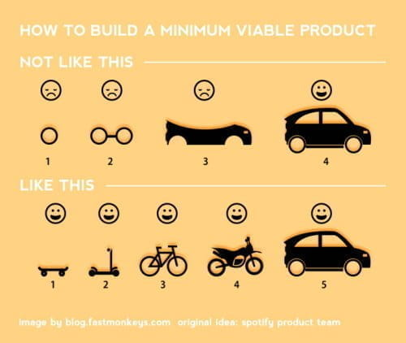
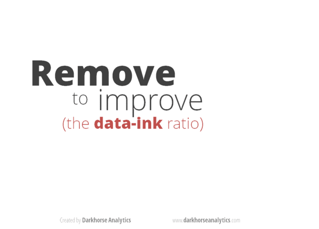

--- 
title: "PSY 703"
subtitle: "Data Science for Psychologists: A Modernized Exploratory and Graphical Data Analysis with R"
author: 
- S. Mason Garrison

knit: "bookdown::render_book"
site: bookdown::bookdown_site
url: 'https\://github.com/R-Computing-Lab/DataScience4Psych'
github-repo: R-Computing-Lab/DataScience4Psych
twitter-handle: smasongarrison
cover-image: assets/logo.png
documentclass: book
bibliography: [book.bib, packages.bib]
biblio-style: apalike
link-citations: yes
description: "PSY 703: Data Science for Psychologists: A Modernized Exploratory and Graphical Data Analysis with R"
favicon: assets/favicon.ico
---

# Welcome to PSY 703 {-}


Welcome to class! This website is designed to accompany Mason Garrison's Data Science for Psychologists (DS4P). DS4P is a graduate-level quantitative methods course at Wake Forest University. This website is both the syllabus and primary lecture materials. All the embedded lecture videos can be found on a [youtube playlist](https://www.youtube.com/playlist?list=PLKrrdtYgOUYbWGmSnbLIYwdLOnGm6une6)

<center><iframe width="560" height="315" src="http://www.youtube.com/embed/nYYJmmcgzr8?rel=0" frameborder="0" allowfullscreen></iframe></center>

## Course Introduction {-}


Data Science for Psychologists (DS4P) introduces on the principles of data science, including:

* data wrangling, 
* modeling, 
* visualization, and 
* communication. 

In this class, we link those principles to psychological methods and open science practices by emphasizing exploratory analyses and description, rather than confirmatory analyses and prediction. Through the semester we will work our way thru [Wickham and Grolemund's R for Data Science text](http://r4ds.had.co.nz/) and develop proficiency with [tidyverse](https://www.tidyverse.org/). This class emphasizes replication and reproducibility. DS4P is a practical skilled-based class and should be useful to students aiming for academia as well as those interested in industry. Applications of these methods can be applied to a full range of psychological areas, including perception (e.g, eye-tracking data), neuroscience (e.g., visualizing neural networks), and individual differences (e.g., valence analysis).


## Broad Topics {-}
This class cover the following broad five areas:

* Reproducibility;
* Replication;
* Robust Methods;
* Resplendent Visualizations; and
* R Programming.


## Materials {-}

### Hardware {-}

This class is requires that you have a laptop that can run R.

### Required Texts {-}

The text is intended to supplement the videos, lecture notes, and in-class tutorials. You need to consume all four in order to be successful in this class.

* [R for Data Science text](http://r4ds.had.co.nz/) [@Wickham2017R]

### Software {-}

#### R {-}

R is a free software environment for statistical computing and graphics. It compiles and runs on a wide variety of UNIX platforms, Windows, and MacOS.


#### R Studio {-}


#### GitHub {-}


## Course Modality

This class is a blended class. The online portions are asynchronous. I've created a video highlighting how to be a successful asynchronous learner. 

<center><iframe width="560" height="315" src="http://www.youtube.com/embed/dc3D2tbl8G0?rel=0" frameborder="0" allowfullscreen></iframe></center>

Much of this information comes from Northeastern University's [Tips for Taking Online Classes](https://www.northeastern.edu/graduate/blog/tips-for-taking-online-classes/)

## Attribution {-}

This class leans heavily on other peoples' materials and ideas. I have done my best to document the origin of the materials and ideas. They include: 

* Jenny Bryan's ([jennybryan.org](https://jennybryan.org)) [STAT 545](https://www.Stat545.com);

* Joe Rodgers's PSY 8751 Exploratory and Graphical Data Analysis Course

* [Julia Fukuyama](https://jfukuyama.github.io/)'s [EXPLORATORY DATA ANALYSIS](https://jfukuyama.github.io/teaching/stat670/)

You can see specific changes by examining the [edit history on the git repo](https://github.com/R-Computing-Lab/DataScience4Psych/commits/master)

### STAT 545 {-}

Jenny Bryan's ([jennybryan.org](https://jennybryan.org)) [STAT 545](https://www.Stat545.com) course is from the University of British Columbia.

> "The STAT 545 course became notable as an early example of a data science course taught in a statistics program. It is also notable for its focus on teaching using modern R packages, Git and GitHub, its extensive sharing of teaching materials openly online, and its strong emphasis on practical data cleaning, exploration, and visualization skills, rather than algorithms and theory." 
>  
> --- [Wikipedia](https://en.wikipedia.org/wiki/Jenny_Bryan)


### PSY 8751 {-}

Joe Rodgers's EXPLORATORY and GRAPHICAL DATA ANALYSIS course was developed at the University of Oklahoma. I took his class while a graduate student at Vanderbilt University.

### Stat 470/670 {-}

[Julia Fukuyama](https://jfukuyama.github.io/)'s [EXPLORATORY DATA ANALYSIS](https://jfukuyama.github.io/teaching/stat670/) is an R based class. She's an Assistant Professor in the Department of Statistics at Indiana University.

## Colophon {-}

This book was written in [bookdown](http://bookdown.org/) inside [RStudio](http://www.rstudio.com/ide/). The website [r-computing-lab.github.io/DataScience4Psych](https://r-computing-lab.github.io/DataScience4Psych) is hosted with [github](https://www.github.com), The complete source is available from [GitHub](https://github.com/R-Computing-Lab/DataScience4Psych).

The [Psych 703 logo](assets/logo.png) was designed by me and the book style was designed by [Desirée De Leon](https://desiree.rbind.io/).

This version of the book was built with:


```
#> Finding R package dependencies ... Done!
#>  setting  value                       
#>  version  R version 4.0.3 (2020-10-10)
#>  os       Windows 10 x64              
#>  system   x86_64, mingw32             
#>  ui       RTerm                       
#>  language (EN)                        
#>  collate  English_United States.1252  
#>  ctype    English_United States.1252  
#>  tz       America/New_York            
#>  date     2021-01-03
```

Along with these packages:

preservef0cea46c887ec49d

## License {-}

This work is licensed under a [Creative Commons Attribution-ShareAlike 4.0 International License](https://creativecommons.org/licenses/by-sa/4.0/).

<center>
<i class="fab fa-creative-commons fa-2x"></i><i class="fab fa-creative-commons-by fa-2x"></i><i class="fab fa-creative-commons-sa fa-2x"></i>
</center>

*This is a human-readable summary of (and not a substitute for) the license.
Please see <https://creativecommons.org/licenses/by-sa/4.0/legalcode> for the full legal text.*

**You are free to:**

- **Share**---copy and redistribute the material in any medium or
  format

- **Remix**---remix, transform, and build upon the material for any
  purpose, even commercially.

The licensor cannot revoke these freedoms as long as you follow the
license terms.

**Under the following terms:**

- **Attribution**---You must give appropriate credit, provide a link
  to the license, and indicate if changes were made. You may do so in
  any reasonable manner, but not in any way that suggests the licensor
  endorses you or your use.
  
- **ShareAlike**---If you remix, transform, or build upon the material, you must distribute your contributions under the same license as the original. 

- **No additional restrictions**---You may not apply legal terms or
  technological measures that legally restrict others from doing
  anything the license permits.

**Notices:**

You do not have to comply with the license for elements of the
material in the public domain or where your use is permitted by an
applicable exception or limitation.

No warranties are given. The license may not give you all of the
permissions necessary for your intended use. For example, other rights
such as publicity, privacy, or moral rights may limit how you use the
material.


<!--chapter:end:index.Rmd-->

# (PART) Get your R act together {-} 

# Install R and RStudio {#install}


<!--Original content: https://stat545.com/block000_r-rstudio-install.html-->


## R and RStudio


<iframe width="560" height="315" src="http://www.youtube.com/embed/9bZkp7q19f0?rel=0" frameborder="0" allowfullscreen></iframe>

* Install [R, a free software environment for statistical computing and graphics][r-proj] from [CRAN][cran], the Comprehensive R Archive Network. I __highly recommend__ you install a precompiled binary distribution for your operating system -- use the links up at the top of the CRAN page linked above!

* Install RStudio's IDE (stands for _integrated development environment_), a powerful user interface for R. Get the Open Source Edition of RStudio Desktop.

  - You can run either the [Preview version][rstudio-preview] or the official releases available [here][rstudio-official].
  - RStudio comes with a __text editor__, so there is no immediate need to install a separate stand-alone editor.
  - RStudio can __interface with Git(Hub)__. However, you must do all the Git(Hub) set up [described elsewhere][happy-git] before you can take advantage of this.
    
If you have a pre-existing installation of R and/or RStudio, I __highly recommend__ that you reinstall both and get as current as possible. It can be considerably harder to run old software than new.

* If you upgrade R, you will need to update any packages you have installed. The command below should get you started, though you may need to specify more arguments if, e.g., you have been using a non-default library for your packages.

    ``` r
    update.packages(ask = FALSE, checkBuilt = TRUE)
    ```

  __Note:__ this will only look for updates on CRAN. So if you use a package that lives *only* on GitHub or if you want a development version from GitHub, you will need to  update manually, e.g. via `devtools::install_github()`.


## Testing testing

* Do whatever is appropriate for your OS to launch RStudio. You should get a window similar to the screenshot you see [here][rstudio-workbench], but yours will be more boring because you haven't written any code or made any figures yet!

* Put your cursor in the pane labeled Console, which is where you interact with the live R process. Create a simple object with code like `x <- 2 * 4` (followed by enter or return). Then inspect the `x` object by typing `x` followed by enter or return. You should see the value 8 print to screen. If yes, you've succeeded in installing R and RStudio.

## Add-on packages

R is an extensible system and many people share useful code they have developed as a _package_ via CRAN and GitHub. To install a package from CRAN, for example the [dplyr][dplyr-cran] package for data manipulation, here is one way to do it in the R console (there are others).

```r
install.packages("dplyr", dependencies = TRUE)
```

By including `dependencies = TRUE`, we are being explicit and extra-careful to install any additional packages the target package, dplyr in the example above, needs to have around.

You could use the above method to install the following packages, all of which we will use:

* tidyr, [package webpage][tidyr-web]
* ggplot2, [package webpage][ggplot2-web]


## Further resources

The above will get your basic setup ready but here are some links if you are interested in reading a bit further.

* [How to Use RStudio][rstudio-support]
* [RStudio's leads for learning R][rstudio-R-help]
* [R FAQ][cran-faq]
* [R Installation and Administration][cran-R-admin]
* [More about add-on packages in the R Installation and Administration Manual][cran-add-ons]
    


[cran]: https://cloud.r-project.org
[cran-faq]: https://cran.r-project.org/faqs.html
[cran-R-admin]: http://cran.r-project.org/doc/manuals/R-admin.html
[cran-add-ons]: https://cran.r-project.org/doc/manuals/R-admin.html#Add_002don-packages
[r-proj]: https://www.r-project.org
[stat-545]: https://stat545.com
[software-carpentry]: https://software-carpentry.org
[cran-r-extensions]: https://cran.r-project.org/doc/manuals/r-release/R-exts.html


<!--RStudio Links-->
[rstudio-preview]: https://www.rstudio.com/products/rstudio/download/preview/
[rstudio-official]: https://www.rstudio.com/products/rstudio/#Desktop
[rstudio-workbench]: https://www.rstudio.com/wp-content/uploads/2014/04/rstudio-workbench.png
[rstudio-support]: https://support.rstudio.com/hc/en-us
[rstudio-R-help]: https://support.rstudio.com/hc/en-us/articles/200552336-Getting-Help-with-R
[rstudio-customizing]: https://support.rstudio.com/hc/en-us/articles/200549016-Customizing-RStudio
[rstudio-key-shortcuts]: https://support.rstudio.com/hc/en-us/articles/200711853-Keyboard-Shortcuts
[rstudio-command-history]: https://support.rstudio.com/hc/en-us/articles/200526217-Command-History
[rstudio-using-projects]: https://support.rstudio.com/hc/en-us/articles/200526207-Using-Projects
[rstudio-code-snippets]: https://support.rstudio.com/hc/en-us/articles/204463668-Code-Snippets
[rstudio-dplyr-cheatsheet-download]: https://github.com/rstudio/cheatsheets/raw/master/data-transformation.pdf
[rstudio-regex-cheatsheet]: https://www.rstudio.com/wp-content/uploads/2016/09/RegExCheatsheet.pdf
[rstudio-devtools]: https://www.rstudio.com/products/rpackages/devtools/

<!--HappyGitWithR Links-->
[happy-git]: https://happygitwithr.com
[hg-install-git]: https://happygitwithr.com/install-git.html
[hg-git-client]: https://happygitwithr.com/git-client.html
[hg-github-account]: https://happygitwithr.com/github-acct.html
[hg-install-r-rstudio]: https://happygitwithr.com/install-r-rstudio.html
[hg-connect-intro]: https://happygitwithr.com/connect-intro.html
[hg-browsability]: https://happygitwithr.com/workflows-browsability.html
[hg-shell]: https://happygitwithr.com/shell.html

<!--Package Links-->
[rmarkdown]: https://rmarkdown.rstudio.com
[knitr-faq]: https://yihui.name/knitr/faq/

[tidyverse-main-page]: https://www.tidyverse.org
[tidyverse-web]: https://tidyverse.tidyverse.org
[tidyverse-github]: https://github.com/hadley/tidyverse

[dplyr-web]: https://dplyr.tidyverse.org
[dplyr-cran]: https://CRAN.R-project.org/package=dplyr
[dplyr-github]: https://github.com/hadley/dplyr
[dplyr-vignette-intro]: https://cran.r-project.org/web/packages/dplyr/vignettes/dplyr.html
[dplyr-vignette-window-fxns]: https://cran.r-project.org/web/packages/dplyr/vignettes/window-functions.html
[dplyr-vignette-two-table]: https://dplyr.tidyverse.org/articles/two-table.html

[lubridate-web]: https://lubridate.tidyverse.org
[lubridate-cran]: https://CRAN.R-project.org/package=lubridate
[lubridate-github]: https://github.com/tidyverse/lubridate
[lubridate-vignette]: https://cran.r-project.org/web/packages/lubridate/vignettes/lubridate.html

[tidyr-web]: https://tidyr.tidyverse.org
[tidyr-cran]: https://CRAN.R-project.org/package=tidyr 

[readr-web]: https://readr.tidyverse.org
[readr-vignette-intro]: https://cran.r-project.org/web/packages/readr/vignettes/readr.html

[stringr-web]: https://stringr.tidyverse.org
[stringr-cran]: https://CRAN.R-project.org/package=stringr

[ggplot2-web]: https://ggplot2.tidyverse.org
[ggplot2-tutorial]: https://github.com/jennybc/ggplot2-tutorial
[ggplot2-reference]: https://docs.ggplot2.org/current/
[ggplot2-cran]: https://CRAN.R-project.org/package=ggplot2
[ggplot2-github]: https://github.com/tidyverse/ggplot2
[ggplot2-theme-args]: https://ggplot2.tidyverse.org/reference/ggtheme.html#arguments

[gapminder-web]: https://www.gapminder.org
[gapminder-cran]: https://CRAN.R-project.org/package=gapminder

[assertthat-cran]: https://CRAN.R-project.org/package=assertthat
[assertthat-github]: https://github.com/hadley/assertthat

[ensurer-cran]: https://CRAN.R-project.org/package=ensurer
[ensurer-github]: https://github.com/smbache/ensurer

[assertr-cran]: https://CRAN.R-project.org/package=assertr
[assertr-github]: https://github.com/ropensci/assertr

[assertive-cran]: https://CRAN.R-project.org/package=assertive
[assertive-bitbucket]: https://bitbucket.org/richierocks/assertive/src/master/

[testthat-cran]: https://CRAN.R-project.org/package=testthat
[testthat-github]: https://github.com/r-lib/testthat
[testthat-web]: https://testthat.r-lib.org

[viridis-cran]: https://CRAN.R-project.org/package=viridis
[viridis-github]: https://github.com/sjmgarnier/viridis
[viridis-vignette]: https://cran.r-project.org/web/packages/viridis/vignettes/intro-to-viridis.html

[colorspace-cran]: https://CRAN.R-project.org/package=colorspace
[colorspace-vignette]: https://cran.r-project.org/web/packages/colorspace/vignettes/hcl-colors.pdf

[cowplot-cran]: https://CRAN.R-project.org/package=cowplot
[cowplot-github]: https://github.com/wilkelab/cowplot
[cowplot-vignette]: https://cran.r-project.org/web/packages/cowplot/vignettes/introduction.html

[devtools-cran]: https://CRAN.R-project.org/package=devtools
[devtools-github]: https://github.com/r-lib/devtools
[devtools-web]: https://devtools.r-lib.org
[devtools-cheatsheet]: https://www.rstudio.com/wp-content/uploads/2015/03/devtools-cheatsheet.pdf
[devtools-cheatsheet-old]: https://rawgit.com/rstudio/cheatsheets/master/package-development.pdf
[devtools-1-6]: https://blog.rstudio.com/2014/10/02/devtools-1-6/
[devtools-1-8]: https://blog.rstudio.com/2015/05/11/devtools-1-9-0/
[devtools-1-9-1]: https://blog.rstudio.com/2015/09/13/devtools-1-9-1/

[googlesheets-cran]: https://CRAN.R-project.org/package=googlesheets
[googlesheets-github]: https://github.com/jennybc/googlesheets

[tidycensus-cran]: https://CRAN.R-project.org/package=tidycensus
[tidycensus-github]: https://github.com/walkerke/tidycensus
[tidycensus-web]: https://walkerke.github.io/tidycensus/index.html

[fs-web]: https://fs.r-lib.org/index.html
[fs-cran]: https://CRAN.R-project.org/package=fs
[fs-github]: https://github.com/r-lib/fs

[plumber-web]: https://www.rplumber.io
[plumber-docs]: https://www.rplumber.io/docs/
[plumber-github]: https://github.com/trestletech/plumber
[plumber-cran]: https://CRAN.R-project.org/package=plumber

[plyr-web]: http://plyr.had.co.nz

[magrittr-web]: https://magrittr.tidyverse.org
[forcats-web]: https://forcats.tidyverse.org
[glue-web]: https://glue.tidyverse.org
[stringi-cran]: https://CRAN.R-project.org/package=stringi
[rex-github]: https://github.com/kevinushey/rex
[rcolorbrewer-cran]: https://CRAN.R-project.org/package=RColorBrewer
[dichromat-cran]: https://CRAN.R-project.org/package=dichromat

[rdryad-web]: https://docs.ropensci.org/rdryad/
[rdryad-cran]: https://CRAN.R-project.org/package=rdryad
[rdryad-github]: https://github.com/ropensci/rdryad

[roxygen2-cran]: https://CRAN.R-project.org/package=roxygen2
[roxygen2-vignette]: https://cran.r-project.org/web/packages/roxygen2/vignettes/rd.html

[shinythemes-web]: https://rstudio.github.io/shinythemes/
[shinythemes-cran]: https://CRAN.R-project.org/package=shinythemes

[shinyjs-web]: https://deanattali.com/shinyjs/
[shinyjs-cran]: https://CRAN.R-project.org/package=shinyjs
[shinyjs-github]: https://github.com/daattali/shinyjs

[leaflet-web]: https://rstudio.github.io/leaflet/
[leaflet-cran]: https://CRAN.R-project.org/package=leaflet
[leaflet-github]: https://github.com/rstudio/leaflet

[ggvis-web]: https://ggvis.rstudio.com
[ggvis-cran]: https://CRAN.R-project.org/package=ggvis
 
[usethis-web]: https://usethis.r-lib.org
[usethis-cran]: https://CRAN.R-project.org/package=usethis
[usethis-github]: https://github.com/r-lib/usethis

[pkgdown-web]: https://pkgdown.r-lib.org
[gh-github]: https://github.com/r-lib/gh

[httr-web]: https://httr.r-lib.org
[httr-cran]: https://CRAN.R-project.org/package=httr
[httr-github]: https://github.com/r-lib/httr

[gistr-web]: https://docs.ropensci.org/gistr
[gistr-cran]: https://CRAN.R-project.org/package=gistr
[gistr-github]: https://github.com/ropensci/gistr

[rvest-web]: https://rvest.tidyverse.org
[rvest-cran]: https://CRAN.R-project.org/package=rvest
[rvest-github]: https://github.com/tidyverse/rvest

[xml2-web]: https://xml2.r-lib.org
[xml2-cran]: https://CRAN.R-project.org/package=xml2
[xml2-github]: https://github.com/r-lib/xml2

[jsonlite-paper]: https://arxiv.org/abs/1403.2805
[jsonlite-cran]: https://CRAN.R-project.org/package=jsonlite
[jsonlite-github]: https://github.com/jeroen/jsonlite

[readxl-web]: https://readxl.tidyverse.org
[readxl-github]: https://github.com/tidyverse/readxl
[readxl-cran]: https://CRAN.R-project.org/package=readxl

[janitor-web]: http://sfirke.github.io/janitor/
[janitor-cran]: https://CRAN.R-project.org/package=janitor
[janitor-github]: https://github.com/sfirke/janitor

[purrr-web]: https://purrr.tidyverse.org
[curl-cran]: https://CRAN.R-project.org/package=curl

<!--Shiny links-->
[shinydashboard-web]: https://rstudio.github.io/shinydashboard/
[shinydashboard-cran]: https://CRAN.R-project.org/package=shinydashboard
[shinydashboard-github]: https://github.com/rstudio/shinydashboard


[shiny-official-web]: https://shiny.rstudio.com
[shiny-official-tutorial]: https://shiny.rstudio.com/tutorial/
[shiny-cheatsheet]: https://shiny.rstudio.com/images/shiny-cheatsheet.pdf
[shiny-articles]: https://shiny.rstudio.com/articles/
[shiny-bookdown]: https://bookdown.org/yihui/rmarkdown/shiny-documents.html
[shiny-google-groups]: https://groups.google.com/forum/#!forum/shiny-discuss
[shiny-stack-overflow]: https://stackoverflow.com/questions/tagged/shiny
[shinyapps-web]: https://www.shinyapps.io
[shiny-server-setup]: https://deanattali.com/2015/05/09/setup-rstudio-shiny-server-digital-ocean/
[shiny-reactivity]: https://shiny.rstudio.com/articles/understanding-reactivity.html
[shiny-debugging]: https://shiny.rstudio.com/articles/debugging.html
[shiny-server]: https://www.rstudio.com/products/shiny/shiny-server/

<!--Publications--> 
[adv-r]: http://adv-r.had.co.nz
[adv-r-fxns]: http://adv-r.had.co.nz/Functions.html
[adv-r-dsl]: http://adv-r.had.co.nz/dsl.html
[adv-r-defensive-programming]: http://adv-r.had.co.nz/Exceptions-Debugging.html#defensive-programming
[adv-r-fxn-args]: http://adv-r.had.co.nz/Functions.html#function-arguments
[adv-r-return-values]: http://adv-r.had.co.nz/Functions.html#return-values
[adv-r-closures]: http://adv-r.had.co.nz/Functional-programming.html#closures

[r4ds]: https://r4ds.had.co.nz
[r4ds-transform]: https://r4ds.had.co.nz/transform.html
[r4ds-strings]: https://r4ds.had.co.nz/strings.html
[r4ds-readr-strings]: https://r4ds.had.co.nz/data-import.html#readr-strings
[r4ds-dates-times]: https://r4ds.had.co.nz/dates-and-times.html
[r4ds-data-import]: http://r4ds.had.co.nz/data-import.html
[r4ds-relational-data]: https://r4ds.had.co.nz/relational-data.html
[r4ds-pepper-shaker]: https://r4ds.had.co.nz/vectors.html#lists-of-condiments

[r-pkgs2]: https://r-pkgs.org/index.html
[r-pkgs2-whole-game]: https://r-pkgs.org/whole-game.html
[r-pkgs2-description]: https://r-pkgs.org/description.html
[r-pkgs2-man]: https://r-pkgs.org/man.htm
[r-pkgs2-tests]: https://r-pkgs.org/tests.html
[r-pkgs2-namespace]: https://r-pkgs.org/namespace.html
[r-pkgs2-vignettes]: https://r-pkgs.org/vignettes.html
[r-pkgs2-release]: https://r-pkgs.org/release.html
[r-pkgs2-r-code]: https://r-pkgs.org/r.html#r

[r-graphics-cookbook]: http://shop.oreilly.com/product/0636920023135.do

[cookbook-for-r]: http://www.cookbook-r.com 
[cookbook-for-r-graphs]: http://www.cookbook-r.com/Graphs/
[cookbook-for-r-multigraphs]: http://www.cookbook-r.com/Graphs/Multiple_graphs_on_one_page_(ggplot2)/

[elegant-graphics-springer]: https://www.springer.com/gp/book/9780387981413

[testthat-article]: https://journal.r-project.org/archive/2011-1/RJournal_2011-1_Wickham.pdf
[worry-about-color]: https://www.google.com/url?sa=t&rct=j&q=&esrc=s&source=web&cd=2&cad=rja&uact=8&ved=2ahUKEwi0xYqJ8JbjAhWNvp4KHViYDxsQFjABegQIABAC&url=https%3A%2F%2Fwww.researchgate.net%2Fprofile%2FAhmed_Elhattab2%2Fpost%2FPlease_suggest_some_good_3D_plot_tool_Software_for_surface_plot%2Fattachment%2F5c05ba35cfe4a7645506948e%2FAS%253A699894335557644%25401543879221725%2Fdownload%2FWhy%2BShould%2BEngineers%2Band%2BScientists%2BBe%2BWorried%2BAbout%2BColor_.pdf&usg=AOvVaw1qwjjGMd7h_z6TLUjzu7Nb
[escaping-rgbland-pdf]: https://eeecon.uibk.ac.at/~zeileis/papers/Zeileis+Hornik+Murrell-2009.pdf
[escaping-rgbland-doi]: https://doi.org/10.1016/j.csda.2008.11.033


<!--R Documentation-->
[rdocs-extremes]: https://rdrr.io/r/base/Extremes.html
[rdocs-range]: https://rdrr.io/r/base/range.html
[rdocs-quantile]: https://rdrr.io/r/stats/quantile.html
[rdocs-c]: https://rdrr.io/r/base/c.html
[rdocs-list]: https://rdrr.io/r/base/list.html
[rdocs-lm]: https://rdrr.io/r/stats/lm.html
[rdocs-coef]: https://rdrr.io/r/stats/coef.html
[rdocs-devices]: https://rdrr.io/r/grDevices/Devices.html
[rdocs-ggsave]: https://rdrr.io/cran/ggplot2/man/ggsave.html
[rdocs-dev]: https://rdrr.io/r/grDevices/dev.html


<!--Wikipedia Links-->
[wiki-snake-case]: https://en.wikipedia.org/wiki/Snake_case
[wiki-hello-world]: https://en.wikipedia.org/wiki/%22Hello,_world!%22_program
[wiki-janus]: https://en.wikipedia.org/wiki/Janus
[wiki-nesting-dolls]: https://en.wikipedia.org/wiki/Matryoshka_doll
[wiki-pure-fxns]: https://en.wikipedia.org/wiki/Pure_function
[wiki-camel-case]: https://en.wikipedia.org/wiki/Camel_case
[wiki-mojibake]: https://en.wikipedia.org/wiki/Mojibake
[wiki-row-col-major-order]: https://en.wikipedia.org/wiki/Row-_and_column-major_order
[wiki-boxplot]: https://en.wikipedia.org/wiki/Box_plot
[wiki-brewer]: https://en.wikipedia.org/wiki/Cynthia_Brewer
[wiki-vector-graphics]: https://en.wikipedia.org/wiki/Vector_graphics
[wiki-raster-graphics]: https://en.wikipedia.org/wiki/Raster_graphics
[wiki-dry]: https://en.wikipedia.org/wiki/Don%27t_repeat_yourself
[wiki-web-scraping]: https://en.wikipedia.org/wiki/Web_scraping
[wiki-xpath]: https://en.wikipedia.org/wiki/XPath
[wiki-css-selector]: https://en.wikipedia.org/wiki/Cascading_Style_Sheets#Selector


<!--Misc. Links-->
[split-apply-combine]: https://www.jstatsoft.org/article/view/v040i01
[useR-2014-dropbox]: https://www.dropbox.com/sh/i8qnluwmuieicxc/AAAgt9tIKoIm7WZKIyK25lh6a
[gh-pages]: https://pages.github.com
[html-preview]: http://htmlpreview.github.io
[tj-mahr-slides]: https://github.com/tjmahr/MadR_Pipelines
[dataschool-dplyr]: https://www.dataschool.io/dplyr-tutorial-for-faster-data-manipulation-in-r/
[xckd-randall-munroe]: https://fivethirtyeight.com/features/xkcd-randall-munroe-qanda-what-if/
[athena-zeus-forehead]: https://tinyurl.com/athenaforehead
[tidydata-lotr]: https://github.com/jennybc/lotr-tidy#readme
[minimal-make]: https://kbroman.org/minimal_make/
[write-data-tweet]: https://twitter.com/vsbuffalo/statuses/358699162679787521
[belt-and-suspenders]: https://www.wisegeek.com/what-does-it-mean-to-wear-belt-and-suspenders.htm
[research-workflow]: https://www.carlboettiger.info/2012/05/06/research-workflow.html
[yak-shaving]: https://seths.blog/2005/03/dont_shave_that/
[yaml-with-csv]: https://blog.datacite.org/using-yaml-frontmatter-with-csv/
[reproducible-examples]: https://stackoverflow.com/questions/5963269/how-to-make-a-great-r-reproducible-example
[blog-strings-as-factors]: https://notstatschat.tumblr.com/post/124987394001/stringsasfactors-sigh
[bio-strings-as-factors]: https://simplystatistics.org/2015/07/24/stringsasfactors-an-unauthorized-biography
[stackexchange-outage]: https://stackstatus.net/post/147710624694/outage-postmortem-july-20-2016
[email-regex]: https://emailregex.com
[fix-atom-bug]: https://davidvgalbraith.com/how-i-fixed-atom/
[icu-regex]: http://userguide.icu-project.org/strings/regexp
[regex101]: https://regex101.com
[regexr]: https://regexr.com
[utf8-debug]: http://www.i18nqa.com/debug/utf8-debug.html
[unicode-no-excuses]: https://www.joelonsoftware.com/2003/10/08/the-absolute-minimum-every-software-developer-absolutely-positively-must-know-about-unicode-and-character-sets-no-excuses/
[programmers-encoding]: http://kunststube.net/encoding/
[encoding-probs-ruby]: https://www.justinweiss.com/articles/3-steps-to-fix-encoding-problems-in-ruby/
[theyre-to-theyre]: https://www.justinweiss.com/articles/how-to-get-from-theyre-to-theyre/
[lubridate-ex1]: https://www.r-exercises.com/2016/08/15/dates-and-times-simple-and-easy-with-lubridate-part-1/
[lubridate-ex2]: https://www.r-exercises.com/2016/08/29/dates-and-times-simple-and-easy-with-lubridate-exercises-part-2/
[lubridate-ex3]: https://www.r-exercises.com/2016/10/04/dates-and-times-simple-and-easy-with-lubridate-exercises-part-3/
[google-sql-join]: https://www.google.com/search?q=sql+join&tbm=isch
[min-viable-product]: https://blog.fastmonkeys.com/?utm_content=bufferc2d6e&utm_medium=social&utm_source=twitter.com&utm_campaign=buffer
[telescope-rule]: http://c2.com/cgi/wiki?TelescopeRule
[unix-philosophy]: http://www.faqs.org/docs/artu/ch01s06.html
[twitter-wrathematics]: https://twitter.com/wrathematics
[robbins-effective-graphs]: https://www.amazon.com/Creating-Effective-Graphs-Naomi-Robbins/dp/0985911123
[r-graph-catalog-github]: https://github.com/jennybc/r-graph-catalog
[google-pie-charts]: https://www.google.com/search?q=pie+charts+suck
[why-pie-charts-suck]: https://www.richardhollins.com/blog/why-pie-charts-suck/
[worst-figure]: https://robjhyndman.com/hyndsight/worst-figure/
[naomi-robbins]: http://www.nbr-graphs.com
[hadley-github-index]: https://hadley.github.io
[scipy-2015-matplotlib-colors]: https://www.youtube.com/watch?v=xAoljeRJ3lU&feature=youtu.be
[winston-chang-github]: https://github.com/wch
[favorite-rgb-color]: https://manyworldstheory.com/2013/01/15/my-favorite-rgb-color/
[stowers-color-chart]: https://web.archive.org/web/20121022044903/http://research.stowers-institute.org/efg/R/Color/Chart/
[stowers-using-color-in-R]: https://www.uv.es/conesa/CursoR/material/UsingColorInR.pdf
[zombie-project]: https://imgur.com/ewmBeQG
[tweet-project-resurfacing]: https://twitter.com/JohnDCook/status/522377493417033728
[rgraphics-looks-tips]: https://blog.revolutionanalytics.com/2009/01/10-tips-for-making-your-r-graphics-look-their-best.html
[rgraphics-svg-tips]: https://blog.revolutionanalytics.com/2011/07/r-svg-graphics.html
[zev-ross-cheatsheet]: http://zevross.com/blog/2014/08/04/beautiful-plotting-in-r-a-ggplot2-cheatsheet-3/
[parker-writing-r-packages]: https://hilaryparker.com/2014/04/29/writing-an-r-package-from-scratch/
[broman-r-packages]: https://kbroman.org/pkg_primer/
[broman-tools4rr]: https://kbroman.org/Tools4RR/
[leeks-r-packages]: https://github.com/jtleek/rpackages
[build-maintain-r-packages]: https://thepoliticalmethodologist.com/2014/08/14/building-and-maintaining-r-packages-with-devtools-and-roxygen2/
[murdoch-package-vignette-slides]: https://web.archive.org/web/20160824010213/http://www.stats.uwo.ca/faculty/murdoch/ism2013/5Vignettes.pdf
[how-r-searches]: http://blog.obeautifulcode.com/R/How-R-Searches-And-Finds-Stuff/

<!--chapter:end:001_install.Rmd-->

# R basics and workflows {#r-basics}


<!--Original content: https://stat545.com/block002_hello-r-workspace-wd-project.html-->

## Basics of working with R at the command line and RStudio goodies

Launch RStudio/R.

Notice the default panes:

* Console (entire left)
* Environment/History (tabbed in upper right)
* Files/Plots/Packages/Help (tabbed in lower right)

FYI: you can change the default location of the panes, among many other things: [Customizing RStudio][rstudio-customizing].

Go into the Console, where we interact with the live R process.

Make an assignment and then inspect the object you just created:


```r
x <- 3 * 4
x
#> [1] 12
```

All R statements where you create objects -- "assignments" -- have this form:

```r
objectName <- value
```
and in my head I hear, e.g., "x gets 12".

You will make lots of assignments and the operator `<-` is a pain to type. Don't be lazy and use `=`, although it would work, because it will just sow confusion later. Instead, utilize RStudio's keyboard shortcut: Alt + - (the minus sign).

Notice that RStudio automagically surrounds `<-` with spaces, which demonstrates a useful code formatting practice. Code is miserable to read on a good day. Give your eyes a break and use spaces.

RStudio offers many handy [keyboard shortcuts][rstudio-key-shortcuts]. Also, Alt+Shift+K brings up a keyboard shortcut reference card.

Object names cannot start with a digit and cannot contain certain other characters such as a comma or a space. You will be wise to adopt a [convention for demarcating words][wiki-snake-case] in names.

```
i_use_snake_case
other.people.use.periods
evenOthersUseCamelCase
```

Make another assignment:

```r
this_is_a_really_long_name <- 2.5
```

To inspect this, try out RStudio's completion facility: type the first few characters, press TAB, add characters until you disambiguate, then press return.

Make another assignment:

```r
jenny_rocks <- 2 ^ 3
```

Let's try to inspect:

```r
jennyrocks
#> Error in eval(expr, envir, enclos): object 'jennyrocks' not found
jeny_rocks
#> Error in eval(expr, envir, enclos): object 'jeny_rocks' not found
```

Implicit contract with the computer / scripting language: Computer will do tedious computation for you. In return, you will be completely precise in your instructions. Typos matter. Case matters. Get better at typing.

R has a mind-blowing collection of built-in functions that are accessed like so:


```r
functionName(arg1 = val1, arg2 = val2, and so on)
```

Let's try using `seq()` which makes regular sequences of numbers and, while we're at it, demo more helpful features of RStudio.

Type `se` and hit TAB. A pop up shows you possible completions. Specify `seq()` by typing more to disambiguate or using the up/down arrows to select. Notice the floating tool-tip-type help that pops up, reminding you of a function's arguments. If you want even more help, press F1 as directed to get the full documentation in the help tab of the lower right pane. Now open the parentheses and notice the automatic addition of the closing parenthesis and the placement of cursor in the middle.  Type the arguments `1, 10` and hit return. RStudio also exits the parenthetical expression for you.  IDEs are great.


```r
seq(1, 10)
#>  [1]  1  2  3  4  5  6  7  8  9 10
```

The above also demonstrates something about how R resolves function arguments. You can always specify in `name = value` form. But if you do not, R attempts to resolve by position. So above, it is assumed that we want a sequence `from = 1` that goes `to = 10`. Since we didn't specify step size, the default value of `by` in the function definition is used, which ends up being 1 in this case. For functions I call often, I might use this resolve by position for the first
argument or maybe the first two. After that, I always use `name = value`.


Make this assignment and notice similar help with quotation marks.

```r
yo <- "hello world"
```

If you just make an assignment, you don't get to see the value, so then you're tempted to immediately inspect.


```r
y <- seq(1, 10)
y
#>  [1]  1  2  3  4  5  6  7  8  9 10
```

This common action can be shortened by surrounding the assignment with parentheses, which causes assignment and "print to screen" to happen.


```r
(y <- seq(1, 10))
#>  [1]  1  2  3  4  5  6  7  8  9 10
```

Not all functions have (or require) arguments:

```r
date()
#> [1] "Sun Jan 03 12:26:38 2021"
```

Now look at your workspace -- in the upper right pane. The workspace is where user-defined objects accumulate. You can also get a listing of these objects with commands:


```r
objects()
#> [1] "check_quietly"              "install_quietly"           
#> [3] "jenny_rocks"                "pretty_install"            
#> [5] "shhh_check"                 "this_is_a_really_long_name"
#> [7] "x"                          "y"                         
#> [9] "yo"
ls()
#> [1] "check_quietly"              "install_quietly"           
#> [3] "jenny_rocks"                "pretty_install"            
#> [5] "shhh_check"                 "this_is_a_really_long_name"
#> [7] "x"                          "y"                         
#> [9] "yo"
```

If you want to remove the object named `y`, you can do this:


```r
rm(y)
```

To remove everything:


```r
rm(list = ls())
```

or click the broom in RStudio's Environment pane.

## Workspace and working directory

One day you will need to quit R, go do something else and return to your analysis later.

One day you will have multiple analyses going that use R and you want to keep them separate.

One day you will need to bring data from the outside world into R and send numerical results and figures from R back out into the world.

To handle these real life situations, you need to make two decisions:

* What about your analysis is "real", i.e. will you save it as your lasting record of what happened?
* Where does your analysis "live"?

### Workspace, `.RData`

As a beginning R user, it's OK to consider your workspace "real". _Very soon_, I urge you to evolve to the next level, where you consider your saved R scripts as "real". (In either case, of course the input data is very much real and requires preservation!) With the input data and the R code you used, you can reproduce
_everything_. You can make your analysis fancier. You can get to the bottom of puzzling results and discover and fix bugs in your code. You can reuse the code to conduct similar analyses in new projects. You can remake a figure with different aspect ratio or save is as TIFF instead of PDF. You are ready to take questions. You are ready for the future.

If you regard your workspace as "real" (saving and reloading all the time), if you need to redo analysis ... you're going to either redo a lot of typing (making mistakes all the way) or will have to mine your R history for the commands you used. Rather than [becoming an expert on managing the R history][rstudio-command-history], a better use of your time and psychic energy is to keep your "good" R code in a script for future reuse.

Because it can be useful sometimes, note the commands you've recently run appear in the History pane.

But you don't have to choose right now and the two strategies are not incompatible. Let's demo the save / reload the workspace approach.

Upon quitting R, you have to decide if you want to save your workspace, for potential restoration the next time you launch R. Depending on your set up, R or your IDE, e.g. RStudio, will probably prompt you to make this decision.

Quit R/RStudio, either from the menu, using a keyboard shortcut, or by typing `q()` in the Console. You'll get a prompt like this:

> Save workspace image to ~/.Rdata?

_Note where the workspace image is to be saved_ and then click "Save".

Using your favorite method, visit the directory where image was saved and verify there is a file named `.RData`. You will also see a file `.Rhistory`, holding the commands submitted in your recent session.

Restart RStudio. In the Console you will see a line like this:

```
[Workspace loaded from ~/.RData]
```

indicating that your workspace has been restored. Look in the Workspace pane and you'll see the same objects as before. In the History tab of the same pane, you should also see your command history. You're back in business. This way of starting and stopping analytical work will not serve you well for long but it's a start.

### Working directory

Any process running on your computer has a notion of its "working directory". In R, this is where R will look, by default, for files you ask it to load. It also where, by default, any files you write to disk will go. Chances are your current working directory is the directory we inspected above, i.e. the one where RStudio wanted to save the workspace.

You can explicitly check your working directory with:


```r
getwd()
```

It is also displayed at the top of the RStudio console.

As a beginning R user, it's OK let your home directory or any other weird directory on your computer be R's working directory. _Very soon_, I urge you to evolve to the next level, where you organize your analytical projects into directories and, when working on project A, set R's working directory to the associated directory.

__Although I do not recommend it__, in case you're curious, you can set R's working directory at the command line like so:


```r
setwd("~/myCoolProject")
```

__Although I do not recommend it__, you can also use RStudio's Files pane to navigate to a directory and then set it as working directory from the menu: *Session > Set Working Directory > To Files Pane Location*. (You'll see even more options there). Or within the Files pane, choose "More" and "Set As Working Directory".

But there's a better way. A way that also puts you on the path to managing your R work like an expert.

## RStudio projects {#rprojs}

Keeping all the files associated with a project organized together -- input data, R scripts, analytical results, figures -- is such a wise and common practice that RStudio has built-in support for this via its [_projects_][rstudio-using-projects].

Let's make one to use for the rest of this workshop/class. Do this: *File > New Project...*. The directory name you choose here will be the project name. Call it whatever you want (or follow me for convenience).

I created a directory and, therefore RStudio project, called `swc` in my `tmp` directory, FYI.

<!--JB: https://github.com/yihui/knitr/issues/277 -->

```r
setwd("~/tmp/swc")
```

Now check that the "home" directory for your project is the working directory of our current R process:

```r
getwd()
```
_I can't print my output here because this document itself does not reside in the RStudio Project we just created._

Let's enter a few commands in the Console, as if we are just beginning a project:


```r
a <- 2
b <- -3
sig_sq <- 0.5
x <- runif(40)
y <- a + b * x + rnorm(40, sd = sqrt(sig_sq))
(avg_x <- mean(x))
#> [1] 0.464
write(avg_x, "avg_x.txt")
plot(x, y)
abline(a, b, col = "purple")
```


```r
dev.print(pdf, "toy_line_plot.pdf")
#> png 
#>   2
```

Let's say this is a good start of an analysis and your ready to start preserving the logic and code. Visit the History tab of the upper right pane. Select these commands. Click "To Source". Now you have a new pane containing a nascent R script. Click on the floppy disk to save. Give it a name ending in `.R` or `.r`, I used `toy-line.r` and note that, by default, it will go in the directory associated with your project.

Quit RStudio. Inspect the folder associated with your project if you wish. Maybe view the PDF in an external viewer.

Restart RStudio. Notice that things, by default, restore to where we were earlier, e.g. objects in the workspace, the command history, which files are open for editing, where we are in the file system browser, the working directory for the R process, etc. These are all Good Things.

Change some things about your code. Top priority would be to set a sample size `n` at the top, e.g. `n <- 40`, and then replace all the hard-wired 40's with `n`. Change some other minor-but-detectable stuff, e.g. alter the sample size `n`, the slope of the line `b`,the color of the line ... whatever. Practice the different ways to re-run the code:

* Walk through line by line by keyboard shortcut (Command+Enter) or mouse (click "Run" in the upper right corner of editor pane).
  
* Source the entire document -- equivalent to entering `source('toy-line.r')` in the Console -- by keyboard shortcut (Shift+Command+S) or mouse (click "Source" in the upper right corner of editor pane or select from the mini-menu accessible from the associated down triangle).
  
* Source with echo from the Source mini-menu.
  
Visit your figure in an external viewer to verify that the PDF is changing as you expect.

In your favorite OS-specific way, search your files for `toy_line_plot.pdf` and presumably you will find the PDF itself (no surprise) but _also the script that created it (`toy-line.r`)_. This latter phenomenon is a huge win. One day you will want to remake a figure or just simply understand where it came from. If you rigorously save figures to file __with R code and not ever ever ever the mouse or the clipboard__, you will sing my praises one day. Trust me.

## Stuff

It is traditional to save R scripts with a `.R` or `.r` suffix. Follow this convention unless you have some extraordinary reason not to. 

Comments start with one or more `#` symbols. Use them. RStudio helps you (de)comment selected lines with Ctrl+Shift+C (Windows and Linux) or Command+Shift+C (Mac).

Clean out the workspace, i.e. pretend like you've just revisited this project after a long absence.  The broom icon or `rm(list = ls())`. Good idea to do this, restart R (available from the Session menu), re-run your analysis to truly check that the code you're saving is complete and correct (or at least rule out obvious problems!).

This workflow will serve you well in the future:

* Create an RStudio project for an analytical project
* Keep inputs there (we'll soon talk about importing)
* Keep scripts there; edit them, run them in bits or as a whole from there
* Keep outputs there (like the PDF written above)

Avoid using the mouse for pieces of your analytical workflow, such as loading a dataset or saving a figure. Terribly important for reproducibility and for making it possible to retrospectively determine how a numerical table or PDF was actually produced (searching on local disk on filename, among `.R` files, will lead to the relevant script).

Many long-time users never save the workspace, never save `.RData` files (I'm one of them), never save or consult the history. Once/if you get to that point, there are options available in RStudio to disable the loading of `.RData` and permanently suppress the prompt on exit to save the workspace (go to *Tools > Options > General*).

For the record, when loading data into R and/or writing outputs to file, you can always specify the absolute path and thereby insulate yourself from the current working directory. This is rarely necessary when using RStudio projects properly.


[cran]: https://cloud.r-project.org
[cran-faq]: https://cran.r-project.org/faqs.html
[cran-R-admin]: http://cran.r-project.org/doc/manuals/R-admin.html
[cran-add-ons]: https://cran.r-project.org/doc/manuals/R-admin.html#Add_002don-packages
[r-proj]: https://www.r-project.org
[stat-545]: https://stat545.com
[software-carpentry]: https://software-carpentry.org
[cran-r-extensions]: https://cran.r-project.org/doc/manuals/r-release/R-exts.html


<!--RStudio Links-->
[rstudio-preview]: https://www.rstudio.com/products/rstudio/download/preview/
[rstudio-official]: https://www.rstudio.com/products/rstudio/#Desktop
[rstudio-workbench]: https://www.rstudio.com/wp-content/uploads/2014/04/rstudio-workbench.png
[rstudio-support]: https://support.rstudio.com/hc/en-us
[rstudio-R-help]: https://support.rstudio.com/hc/en-us/articles/200552336-Getting-Help-with-R
[rstudio-customizing]: https://support.rstudio.com/hc/en-us/articles/200549016-Customizing-RStudio
[rstudio-key-shortcuts]: https://support.rstudio.com/hc/en-us/articles/200711853-Keyboard-Shortcuts
[rstudio-command-history]: https://support.rstudio.com/hc/en-us/articles/200526217-Command-History
[rstudio-using-projects]: https://support.rstudio.com/hc/en-us/articles/200526207-Using-Projects
[rstudio-code-snippets]: https://support.rstudio.com/hc/en-us/articles/204463668-Code-Snippets
[rstudio-dplyr-cheatsheet-download]: https://github.com/rstudio/cheatsheets/raw/master/data-transformation.pdf
[rstudio-regex-cheatsheet]: https://www.rstudio.com/wp-content/uploads/2016/09/RegExCheatsheet.pdf
[rstudio-devtools]: https://www.rstudio.com/products/rpackages/devtools/

<!--HappyGitWithR Links-->
[happy-git]: https://happygitwithr.com
[hg-install-git]: https://happygitwithr.com/install-git.html
[hg-git-client]: https://happygitwithr.com/git-client.html
[hg-github-account]: https://happygitwithr.com/github-acct.html
[hg-install-r-rstudio]: https://happygitwithr.com/install-r-rstudio.html
[hg-connect-intro]: https://happygitwithr.com/connect-intro.html
[hg-browsability]: https://happygitwithr.com/workflows-browsability.html
[hg-shell]: https://happygitwithr.com/shell.html

<!--Package Links-->
[rmarkdown]: https://rmarkdown.rstudio.com
[knitr-faq]: https://yihui.name/knitr/faq/

[tidyverse-main-page]: https://www.tidyverse.org
[tidyverse-web]: https://tidyverse.tidyverse.org
[tidyverse-github]: https://github.com/hadley/tidyverse

[dplyr-web]: https://dplyr.tidyverse.org
[dplyr-cran]: https://CRAN.R-project.org/package=dplyr
[dplyr-github]: https://github.com/hadley/dplyr
[dplyr-vignette-intro]: https://cran.r-project.org/web/packages/dplyr/vignettes/dplyr.html
[dplyr-vignette-window-fxns]: https://cran.r-project.org/web/packages/dplyr/vignettes/window-functions.html
[dplyr-vignette-two-table]: https://dplyr.tidyverse.org/articles/two-table.html

[lubridate-web]: https://lubridate.tidyverse.org
[lubridate-cran]: https://CRAN.R-project.org/package=lubridate
[lubridate-github]: https://github.com/tidyverse/lubridate
[lubridate-vignette]: https://cran.r-project.org/web/packages/lubridate/vignettes/lubridate.html

[tidyr-web]: https://tidyr.tidyverse.org
[tidyr-cran]: https://CRAN.R-project.org/package=tidyr 

[readr-web]: https://readr.tidyverse.org
[readr-vignette-intro]: https://cran.r-project.org/web/packages/readr/vignettes/readr.html

[stringr-web]: https://stringr.tidyverse.org
[stringr-cran]: https://CRAN.R-project.org/package=stringr

[ggplot2-web]: https://ggplot2.tidyverse.org
[ggplot2-tutorial]: https://github.com/jennybc/ggplot2-tutorial
[ggplot2-reference]: https://docs.ggplot2.org/current/
[ggplot2-cran]: https://CRAN.R-project.org/package=ggplot2
[ggplot2-github]: https://github.com/tidyverse/ggplot2
[ggplot2-theme-args]: https://ggplot2.tidyverse.org/reference/ggtheme.html#arguments

[gapminder-web]: https://www.gapminder.org
[gapminder-cran]: https://CRAN.R-project.org/package=gapminder

[assertthat-cran]: https://CRAN.R-project.org/package=assertthat
[assertthat-github]: https://github.com/hadley/assertthat

[ensurer-cran]: https://CRAN.R-project.org/package=ensurer
[ensurer-github]: https://github.com/smbache/ensurer

[assertr-cran]: https://CRAN.R-project.org/package=assertr
[assertr-github]: https://github.com/ropensci/assertr

[assertive-cran]: https://CRAN.R-project.org/package=assertive
[assertive-bitbucket]: https://bitbucket.org/richierocks/assertive/src/master/

[testthat-cran]: https://CRAN.R-project.org/package=testthat
[testthat-github]: https://github.com/r-lib/testthat
[testthat-web]: https://testthat.r-lib.org

[viridis-cran]: https://CRAN.R-project.org/package=viridis
[viridis-github]: https://github.com/sjmgarnier/viridis
[viridis-vignette]: https://cran.r-project.org/web/packages/viridis/vignettes/intro-to-viridis.html

[colorspace-cran]: https://CRAN.R-project.org/package=colorspace
[colorspace-vignette]: https://cran.r-project.org/web/packages/colorspace/vignettes/hcl-colors.pdf

[cowplot-cran]: https://CRAN.R-project.org/package=cowplot
[cowplot-github]: https://github.com/wilkelab/cowplot
[cowplot-vignette]: https://cran.r-project.org/web/packages/cowplot/vignettes/introduction.html

[devtools-cran]: https://CRAN.R-project.org/package=devtools
[devtools-github]: https://github.com/r-lib/devtools
[devtools-web]: https://devtools.r-lib.org
[devtools-cheatsheet]: https://www.rstudio.com/wp-content/uploads/2015/03/devtools-cheatsheet.pdf
[devtools-cheatsheet-old]: https://rawgit.com/rstudio/cheatsheets/master/package-development.pdf
[devtools-1-6]: https://blog.rstudio.com/2014/10/02/devtools-1-6/
[devtools-1-8]: https://blog.rstudio.com/2015/05/11/devtools-1-9-0/
[devtools-1-9-1]: https://blog.rstudio.com/2015/09/13/devtools-1-9-1/

[googlesheets-cran]: https://CRAN.R-project.org/package=googlesheets
[googlesheets-github]: https://github.com/jennybc/googlesheets

[tidycensus-cran]: https://CRAN.R-project.org/package=tidycensus
[tidycensus-github]: https://github.com/walkerke/tidycensus
[tidycensus-web]: https://walkerke.github.io/tidycensus/index.html

[fs-web]: https://fs.r-lib.org/index.html
[fs-cran]: https://CRAN.R-project.org/package=fs
[fs-github]: https://github.com/r-lib/fs

[plumber-web]: https://www.rplumber.io
[plumber-docs]: https://www.rplumber.io/docs/
[plumber-github]: https://github.com/trestletech/plumber
[plumber-cran]: https://CRAN.R-project.org/package=plumber

[plyr-web]: http://plyr.had.co.nz

[magrittr-web]: https://magrittr.tidyverse.org
[forcats-web]: https://forcats.tidyverse.org
[glue-web]: https://glue.tidyverse.org
[stringi-cran]: https://CRAN.R-project.org/package=stringi
[rex-github]: https://github.com/kevinushey/rex
[rcolorbrewer-cran]: https://CRAN.R-project.org/package=RColorBrewer
[dichromat-cran]: https://CRAN.R-project.org/package=dichromat

[rdryad-web]: https://docs.ropensci.org/rdryad/
[rdryad-cran]: https://CRAN.R-project.org/package=rdryad
[rdryad-github]: https://github.com/ropensci/rdryad

[roxygen2-cran]: https://CRAN.R-project.org/package=roxygen2
[roxygen2-vignette]: https://cran.r-project.org/web/packages/roxygen2/vignettes/rd.html

[shinythemes-web]: https://rstudio.github.io/shinythemes/
[shinythemes-cran]: https://CRAN.R-project.org/package=shinythemes

[shinyjs-web]: https://deanattali.com/shinyjs/
[shinyjs-cran]: https://CRAN.R-project.org/package=shinyjs
[shinyjs-github]: https://github.com/daattali/shinyjs

[leaflet-web]: https://rstudio.github.io/leaflet/
[leaflet-cran]: https://CRAN.R-project.org/package=leaflet
[leaflet-github]: https://github.com/rstudio/leaflet

[ggvis-web]: https://ggvis.rstudio.com
[ggvis-cran]: https://CRAN.R-project.org/package=ggvis
 
[usethis-web]: https://usethis.r-lib.org
[usethis-cran]: https://CRAN.R-project.org/package=usethis
[usethis-github]: https://github.com/r-lib/usethis

[pkgdown-web]: https://pkgdown.r-lib.org
[gh-github]: https://github.com/r-lib/gh

[httr-web]: https://httr.r-lib.org
[httr-cran]: https://CRAN.R-project.org/package=httr
[httr-github]: https://github.com/r-lib/httr

[gistr-web]: https://docs.ropensci.org/gistr
[gistr-cran]: https://CRAN.R-project.org/package=gistr
[gistr-github]: https://github.com/ropensci/gistr

[rvest-web]: https://rvest.tidyverse.org
[rvest-cran]: https://CRAN.R-project.org/package=rvest
[rvest-github]: https://github.com/tidyverse/rvest

[xml2-web]: https://xml2.r-lib.org
[xml2-cran]: https://CRAN.R-project.org/package=xml2
[xml2-github]: https://github.com/r-lib/xml2

[jsonlite-paper]: https://arxiv.org/abs/1403.2805
[jsonlite-cran]: https://CRAN.R-project.org/package=jsonlite
[jsonlite-github]: https://github.com/jeroen/jsonlite

[readxl-web]: https://readxl.tidyverse.org
[readxl-github]: https://github.com/tidyverse/readxl
[readxl-cran]: https://CRAN.R-project.org/package=readxl

[janitor-web]: http://sfirke.github.io/janitor/
[janitor-cran]: https://CRAN.R-project.org/package=janitor
[janitor-github]: https://github.com/sfirke/janitor

[purrr-web]: https://purrr.tidyverse.org
[curl-cran]: https://CRAN.R-project.org/package=curl

<!--Shiny links-->
[shinydashboard-web]: https://rstudio.github.io/shinydashboard/
[shinydashboard-cran]: https://CRAN.R-project.org/package=shinydashboard
[shinydashboard-github]: https://github.com/rstudio/shinydashboard


[shiny-official-web]: https://shiny.rstudio.com
[shiny-official-tutorial]: https://shiny.rstudio.com/tutorial/
[shiny-cheatsheet]: https://shiny.rstudio.com/images/shiny-cheatsheet.pdf
[shiny-articles]: https://shiny.rstudio.com/articles/
[shiny-bookdown]: https://bookdown.org/yihui/rmarkdown/shiny-documents.html
[shiny-google-groups]: https://groups.google.com/forum/#!forum/shiny-discuss
[shiny-stack-overflow]: https://stackoverflow.com/questions/tagged/shiny
[shinyapps-web]: https://www.shinyapps.io
[shiny-server-setup]: https://deanattali.com/2015/05/09/setup-rstudio-shiny-server-digital-ocean/
[shiny-reactivity]: https://shiny.rstudio.com/articles/understanding-reactivity.html
[shiny-debugging]: https://shiny.rstudio.com/articles/debugging.html
[shiny-server]: https://www.rstudio.com/products/shiny/shiny-server/

<!--Publications--> 
[adv-r]: http://adv-r.had.co.nz
[adv-r-fxns]: http://adv-r.had.co.nz/Functions.html
[adv-r-dsl]: http://adv-r.had.co.nz/dsl.html
[adv-r-defensive-programming]: http://adv-r.had.co.nz/Exceptions-Debugging.html#defensive-programming
[adv-r-fxn-args]: http://adv-r.had.co.nz/Functions.html#function-arguments
[adv-r-return-values]: http://adv-r.had.co.nz/Functions.html#return-values
[adv-r-closures]: http://adv-r.had.co.nz/Functional-programming.html#closures

[r4ds]: https://r4ds.had.co.nz
[r4ds-transform]: https://r4ds.had.co.nz/transform.html
[r4ds-strings]: https://r4ds.had.co.nz/strings.html
[r4ds-readr-strings]: https://r4ds.had.co.nz/data-import.html#readr-strings
[r4ds-dates-times]: https://r4ds.had.co.nz/dates-and-times.html
[r4ds-data-import]: http://r4ds.had.co.nz/data-import.html
[r4ds-relational-data]: https://r4ds.had.co.nz/relational-data.html
[r4ds-pepper-shaker]: https://r4ds.had.co.nz/vectors.html#lists-of-condiments

[r-pkgs2]: https://r-pkgs.org/index.html
[r-pkgs2-whole-game]: https://r-pkgs.org/whole-game.html
[r-pkgs2-description]: https://r-pkgs.org/description.html
[r-pkgs2-man]: https://r-pkgs.org/man.htm
[r-pkgs2-tests]: https://r-pkgs.org/tests.html
[r-pkgs2-namespace]: https://r-pkgs.org/namespace.html
[r-pkgs2-vignettes]: https://r-pkgs.org/vignettes.html
[r-pkgs2-release]: https://r-pkgs.org/release.html
[r-pkgs2-r-code]: https://r-pkgs.org/r.html#r

[r-graphics-cookbook]: http://shop.oreilly.com/product/0636920023135.do

[cookbook-for-r]: http://www.cookbook-r.com 
[cookbook-for-r-graphs]: http://www.cookbook-r.com/Graphs/
[cookbook-for-r-multigraphs]: http://www.cookbook-r.com/Graphs/Multiple_graphs_on_one_page_(ggplot2)/

[elegant-graphics-springer]: https://www.springer.com/gp/book/9780387981413

[testthat-article]: https://journal.r-project.org/archive/2011-1/RJournal_2011-1_Wickham.pdf
[worry-about-color]: https://www.google.com/url?sa=t&rct=j&q=&esrc=s&source=web&cd=2&cad=rja&uact=8&ved=2ahUKEwi0xYqJ8JbjAhWNvp4KHViYDxsQFjABegQIABAC&url=https%3A%2F%2Fwww.researchgate.net%2Fprofile%2FAhmed_Elhattab2%2Fpost%2FPlease_suggest_some_good_3D_plot_tool_Software_for_surface_plot%2Fattachment%2F5c05ba35cfe4a7645506948e%2FAS%253A699894335557644%25401543879221725%2Fdownload%2FWhy%2BShould%2BEngineers%2Band%2BScientists%2BBe%2BWorried%2BAbout%2BColor_.pdf&usg=AOvVaw1qwjjGMd7h_z6TLUjzu7Nb
[escaping-rgbland-pdf]: https://eeecon.uibk.ac.at/~zeileis/papers/Zeileis+Hornik+Murrell-2009.pdf
[escaping-rgbland-doi]: https://doi.org/10.1016/j.csda.2008.11.033


<!--R Documentation-->
[rdocs-extremes]: https://rdrr.io/r/base/Extremes.html
[rdocs-range]: https://rdrr.io/r/base/range.html
[rdocs-quantile]: https://rdrr.io/r/stats/quantile.html
[rdocs-c]: https://rdrr.io/r/base/c.html
[rdocs-list]: https://rdrr.io/r/base/list.html
[rdocs-lm]: https://rdrr.io/r/stats/lm.html
[rdocs-coef]: https://rdrr.io/r/stats/coef.html
[rdocs-devices]: https://rdrr.io/r/grDevices/Devices.html
[rdocs-ggsave]: https://rdrr.io/cran/ggplot2/man/ggsave.html
[rdocs-dev]: https://rdrr.io/r/grDevices/dev.html


<!--Wikipedia Links-->
[wiki-snake-case]: https://en.wikipedia.org/wiki/Snake_case
[wiki-hello-world]: https://en.wikipedia.org/wiki/%22Hello,_world!%22_program
[wiki-janus]: https://en.wikipedia.org/wiki/Janus
[wiki-nesting-dolls]: https://en.wikipedia.org/wiki/Matryoshka_doll
[wiki-pure-fxns]: https://en.wikipedia.org/wiki/Pure_function
[wiki-camel-case]: https://en.wikipedia.org/wiki/Camel_case
[wiki-mojibake]: https://en.wikipedia.org/wiki/Mojibake
[wiki-row-col-major-order]: https://en.wikipedia.org/wiki/Row-_and_column-major_order
[wiki-boxplot]: https://en.wikipedia.org/wiki/Box_plot
[wiki-brewer]: https://en.wikipedia.org/wiki/Cynthia_Brewer
[wiki-vector-graphics]: https://en.wikipedia.org/wiki/Vector_graphics
[wiki-raster-graphics]: https://en.wikipedia.org/wiki/Raster_graphics
[wiki-dry]: https://en.wikipedia.org/wiki/Don%27t_repeat_yourself
[wiki-web-scraping]: https://en.wikipedia.org/wiki/Web_scraping
[wiki-xpath]: https://en.wikipedia.org/wiki/XPath
[wiki-css-selector]: https://en.wikipedia.org/wiki/Cascading_Style_Sheets#Selector


<!--Misc. Links-->
[split-apply-combine]: https://www.jstatsoft.org/article/view/v040i01
[useR-2014-dropbox]: https://www.dropbox.com/sh/i8qnluwmuieicxc/AAAgt9tIKoIm7WZKIyK25lh6a
[gh-pages]: https://pages.github.com
[html-preview]: http://htmlpreview.github.io
[tj-mahr-slides]: https://github.com/tjmahr/MadR_Pipelines
[dataschool-dplyr]: https://www.dataschool.io/dplyr-tutorial-for-faster-data-manipulation-in-r/
[xckd-randall-munroe]: https://fivethirtyeight.com/features/xkcd-randall-munroe-qanda-what-if/
[athena-zeus-forehead]: https://tinyurl.com/athenaforehead
[tidydata-lotr]: https://github.com/jennybc/lotr-tidy#readme
[minimal-make]: https://kbroman.org/minimal_make/
[write-data-tweet]: https://twitter.com/vsbuffalo/statuses/358699162679787521
[belt-and-suspenders]: https://www.wisegeek.com/what-does-it-mean-to-wear-belt-and-suspenders.htm
[research-workflow]: https://www.carlboettiger.info/2012/05/06/research-workflow.html
[yak-shaving]: https://seths.blog/2005/03/dont_shave_that/
[yaml-with-csv]: https://blog.datacite.org/using-yaml-frontmatter-with-csv/
[reproducible-examples]: https://stackoverflow.com/questions/5963269/how-to-make-a-great-r-reproducible-example
[blog-strings-as-factors]: https://notstatschat.tumblr.com/post/124987394001/stringsasfactors-sigh
[bio-strings-as-factors]: https://simplystatistics.org/2015/07/24/stringsasfactors-an-unauthorized-biography
[stackexchange-outage]: https://stackstatus.net/post/147710624694/outage-postmortem-july-20-2016
[email-regex]: https://emailregex.com
[fix-atom-bug]: https://davidvgalbraith.com/how-i-fixed-atom/
[icu-regex]: http://userguide.icu-project.org/strings/regexp
[regex101]: https://regex101.com
[regexr]: https://regexr.com
[utf8-debug]: http://www.i18nqa.com/debug/utf8-debug.html
[unicode-no-excuses]: https://www.joelonsoftware.com/2003/10/08/the-absolute-minimum-every-software-developer-absolutely-positively-must-know-about-unicode-and-character-sets-no-excuses/
[programmers-encoding]: http://kunststube.net/encoding/
[encoding-probs-ruby]: https://www.justinweiss.com/articles/3-steps-to-fix-encoding-problems-in-ruby/
[theyre-to-theyre]: https://www.justinweiss.com/articles/how-to-get-from-theyre-to-theyre/
[lubridate-ex1]: https://www.r-exercises.com/2016/08/15/dates-and-times-simple-and-easy-with-lubridate-part-1/
[lubridate-ex2]: https://www.r-exercises.com/2016/08/29/dates-and-times-simple-and-easy-with-lubridate-exercises-part-2/
[lubridate-ex3]: https://www.r-exercises.com/2016/10/04/dates-and-times-simple-and-easy-with-lubridate-exercises-part-3/
[google-sql-join]: https://www.google.com/search?q=sql+join&tbm=isch
[min-viable-product]: https://blog.fastmonkeys.com/?utm_content=bufferc2d6e&utm_medium=social&utm_source=twitter.com&utm_campaign=buffer
[telescope-rule]: http://c2.com/cgi/wiki?TelescopeRule
[unix-philosophy]: http://www.faqs.org/docs/artu/ch01s06.html
[twitter-wrathematics]: https://twitter.com/wrathematics
[robbins-effective-graphs]: https://www.amazon.com/Creating-Effective-Graphs-Naomi-Robbins/dp/0985911123
[r-graph-catalog-github]: https://github.com/jennybc/r-graph-catalog
[google-pie-charts]: https://www.google.com/search?q=pie+charts+suck
[why-pie-charts-suck]: https://www.richardhollins.com/blog/why-pie-charts-suck/
[worst-figure]: https://robjhyndman.com/hyndsight/worst-figure/
[naomi-robbins]: http://www.nbr-graphs.com
[hadley-github-index]: https://hadley.github.io
[scipy-2015-matplotlib-colors]: https://www.youtube.com/watch?v=xAoljeRJ3lU&feature=youtu.be
[winston-chang-github]: https://github.com/wch
[favorite-rgb-color]: https://manyworldstheory.com/2013/01/15/my-favorite-rgb-color/
[stowers-color-chart]: https://web.archive.org/web/20121022044903/http://research.stowers-institute.org/efg/R/Color/Chart/
[stowers-using-color-in-R]: https://www.uv.es/conesa/CursoR/material/UsingColorInR.pdf
[zombie-project]: https://imgur.com/ewmBeQG
[tweet-project-resurfacing]: https://twitter.com/JohnDCook/status/522377493417033728
[rgraphics-looks-tips]: https://blog.revolutionanalytics.com/2009/01/10-tips-for-making-your-r-graphics-look-their-best.html
[rgraphics-svg-tips]: https://blog.revolutionanalytics.com/2011/07/r-svg-graphics.html
[zev-ross-cheatsheet]: http://zevross.com/blog/2014/08/04/beautiful-plotting-in-r-a-ggplot2-cheatsheet-3/
[parker-writing-r-packages]: https://hilaryparker.com/2014/04/29/writing-an-r-package-from-scratch/
[broman-r-packages]: https://kbroman.org/pkg_primer/
[broman-tools4rr]: https://kbroman.org/Tools4RR/
[leeks-r-packages]: https://github.com/jtleek/rpackages
[build-maintain-r-packages]: https://thepoliticalmethodologist.com/2014/08/14/building-and-maintaining-r-packages-with-devtools-and-roxygen2/
[murdoch-package-vignette-slides]: https://web.archive.org/web/20160824010213/http://www.stats.uwo.ca/faculty/murdoch/ism2013/5Vignettes.pdf
[how-r-searches]: http://blog.obeautifulcode.com/R/How-R-Searches-And-Finds-Stuff/

<!--chapter:end:002_r-basics.Rmd-->

# (PART) Version control and R Markdown  {-} 


# Overview {-}

Although this part now links out to external resources, if you're working through this material on your own, let this be a nudge to pause around here and think about your workflow. I give you permission to spend some time and energy sorting this out! It can be as or more important than learning a new R function or package. The experts don't talk about this much, because they've already got a workflow and it's something they do almost without thinking.

Working through subsequent material in R Markdown documents, possibly using Git and GitHub to track and share your progress, is a great idea and will leave you more prepared for your future data analysis projects. Typing individual lines of R code is but a small part of data analysis and it pays off to think holistically about your workflow.

# Git, GitHub, and RStudio {#version-control}

<!--Original content: https://stat545.com/git08_claim-stat545-repo.html-->

At this point in DS4P, all students receive their own DS4P GitHub repository that they will use to develop their course work throughout the rest of the course.

This has two purposes:

  * It is helpful for course mechanics, e.g. homework submission and grading,
    peer review.
  * Learning to use Git and GitHub, with R and RStudio, is a legitimate
    pedagogical goal.
    
Our instructions around installation, setup, and early Git usage eventually grew so extensive that we created a dedicated website. This content can now be found here:

<https://happygitwithr.com>

# R Markdown {#r-markdown}

<!--Original content: https://stat545.com/block007_first-use-rmarkdown.html-->

DS4P course work is generally submitted in the form of R Markdown documents. Students submit an `.Rmd` file, which they have executed or rendered to a `.md` markdown file. R Markdown is a very accessible way to create computational documents that combine prose and tables and figures produced by R code.

An introductory R Markdown workflow, including how it intersects with Git, GitHub, and RStudio, is now maintained within the Happy Git site:

[Test drive R Markdown](https://happygitwithr.com/rmd-test-drive.html)

<!--chapter:end:003_version-control-r-markdown.Rmd-->

# (PART) Data analysis 1 {-} 

# Basic care and feeding of data in R {#basic-data-care}


<!--Original content: https://stat545.com/block006_care-feeding-data.html-->


## Buckle your seatbelt

*Ignore if you don't need this bit of support.*

Now is the time to make sure you are working in an appropriate directory on your computer, probably through the use of an [RStudio project](#rprojs). Enter `getwd()` in the Console to see current working directory or, in RStudio, this is displayed in the bar at the top of Console.

You should clean out your workspace. In RStudio, click on the "Clear" broom icon from the Environment tab or use *Session > Clear Workspace*. You can also enter `rm(list = ls())` in the Console to accomplish same.

Now restart R. This will ensure you don't have any packages loaded from previous calls to `library()`. In RStudio, use *Session > Restart R*. Otherwise, quit R with `q()` and re-launch it.

Why do we do this? So that the code you write is complete and re-runnable. If you return to a clean slate often, you will root out hidden dependencies where one snippet of code only works because it relies on objects created by code saved elsewhere or, much worse, never saved at all. Similarly, an aggressive clean slate approach will expose any usage of packages that have not been explicitly loaded. 

Finally, open a new R script and develop and run your code from there. In RStudio, use *File > New File > R Script*. Save this script with a name ending in `.r` or `.R`, containing no spaces or other funny stuff, and that evokes whatever it is we're doing today. __Example:__ `cm004_data-care-feeding.r`.

Another great idea is to do this in an R Markdown document. See [Test drive R Markdown](#r-markdown) for a refresher.

## Data frames are awesome

Whenever you have rectangular, spreadsheet-y data, your default data receptacle in R is a data frame. Do not depart from this without good reason. Data frames are awesome because...

* Data frames package related variables neatly together,
  - keeping them in sync vis-a-vis row order
  - applying any filtering of observations uniformly
* Most functions for inference, modelling, and graphing are happy to be passed a data frame via a `data =` argument. This has been true in base R for a long time.
* The set of packages known as the [tidyverse][tidyverse-main-page] takes this one step further and explicitly prioritizes the processing of data frames. This includes popular packages like dplyr and ggplot2. In fact the tidyverse prioritizes a special flavor of data frame, called a "tibble".

Data frames -- unlike general arrays or, specifically, matrices in R -- can hold variables of different flavors, such as character data (subject ID or name), quantitative data (white blood cell count), and categorical information (treated vs. untreated). If you use homogeneous structures, like matrices, for data analysis, you  are likely to make the terrible mistake of spreading a dataset out over multiple, unlinked objects. Why? Because you can't put character data, such as subject name, into the numeric matrix that holds white blood cell count. This fragmentation is a Bad Idea.

## Get the Gapminder data

We will work with some of the data from the [Gapminder project][gapminder-web]. I've released this as an [R package][gapminder-cran], so we can install it from CRAN like so:


```r
install.packages("gapminder")
```

Now load the package:


```r
library(gapminder)
```

## Meet the `gapminder` data frame or "tibble"

By loading the gapminder package, we now have access to a data frame by the same name. Get an overview of this with `str()`, which displays the structure of an object.


```r
str(gapminder)
#> tibble [1,704 x 6] (S3: tbl_df/tbl/data.frame)
#>  $ country  : Factor w/ 142 levels "Afghanistan",..: 1 1 1 1 1 1 1 1 1 1 ...
#>  $ continent: Factor w/ 5 levels "Africa","Americas",..: 3 3 3 3 3 3 3 3 3 3 ...
#>  $ year     : int [1:1704] 1952 1957 1962 1967 1972 1977 1982 1987 1992 1997 ...
#>  $ lifeExp  : num [1:1704] 28.8 30.3 32 34 36.1 ...
#>  $ pop      : int [1:1704] 8425333 9240934 10267083 11537966 13079460 14880372..
#>  $ gdpPercap: num [1:1704] 779 821 853 836 740 ...
```

`str()` will provide a sensible description of almost anything and, worst case, nothing bad can actually happen. When in doubt, just `str()` some of the recently created objects to get some ideas about what to do next.

We could print the `gapminder` object itself to screen. However, if you've used R before, you might be reluctant to do this, because large datasets just fill up your Console and provide very little insight.

This is the first big win for **tibbles**. The [tidyverse][tidyverse-web] offers a special case of R's default data frame: the "tibble", which is a nod to the actual class of these objects, `tbl_df`.

If you have not already done so, install the tidyverse meta-package now:


```r
install.packages("tidyverse")
```

Now load it:


```r
library(tidyverse)
#> -- Attaching packages ------------------
#> v ggplot2 3.3.2     v purrr   0.3.4
#> v tibble  3.0.3     v dplyr   1.0.2
#> v tidyr   1.1.2     v stringr 1.4.0
#> v readr   1.3.1     v forcats 0.5.0
#> -- Conflicts -- tidyverse_conflicts() --
#> x dplyr::filter() masks stats::filter()
#> x dplyr::lag()    masks stats::lag()
```

Now we can boldly print `gapminder` to screen! It is a tibble (and also a regular data frame) and the tidyverse provides a nice print method that shows the most important stuff and doesn't fill up your Console.


```r
## see? it's still a regular data frame, but also a tibble
class(gapminder)
#> [1] "tbl_df"     "tbl"        "data.frame"
gapminder
#> # A tibble: 1,704 x 6
#>    country     continent  year lifeExp      pop gdpPercap
#>    <fct>       <fct>     <int>   <dbl>    <int>     <dbl>
#>  1 Afghanistan Asia       1952    28.8  8425333      779.
#>  2 Afghanistan Asia       1957    30.3  9240934      821.
#>  3 Afghanistan Asia       1962    32.0 10267083      853.
#>  4 Afghanistan Asia       1967    34.0 11537966      836.
#>  5 Afghanistan Asia       1972    36.1 13079460      740.
#>  6 Afghanistan Asia       1977    38.4 14880372      786.
#>  7 Afghanistan Asia       1982    39.9 12881816      978.
#>  8 Afghanistan Asia       1987    40.8 13867957      852.
#>  9 Afghanistan Asia       1992    41.7 16317921      649.
#> 10 Afghanistan Asia       1997    41.8 22227415      635.
#> # ... with 1,694 more rows
```

If you are dealing with plain vanilla data frames, you can rein in data frame printing explicitly with `head()` and `tail()`. Or turn it into a tibble with `as_tibble()`!


```r
head(gapminder)
#> # A tibble: 6 x 6
#>   country     continent  year lifeExp      pop gdpPercap
#>   <fct>       <fct>     <int>   <dbl>    <int>     <dbl>
#> 1 Afghanistan Asia       1952    28.8  8425333      779.
#> 2 Afghanistan Asia       1957    30.3  9240934      821.
#> 3 Afghanistan Asia       1962    32.0 10267083      853.
#> 4 Afghanistan Asia       1967    34.0 11537966      836.
#> 5 Afghanistan Asia       1972    36.1 13079460      740.
#> 6 Afghanistan Asia       1977    38.4 14880372      786.
tail(gapminder)
#> # A tibble: 6 x 6
#>   country  continent  year lifeExp      pop gdpPercap
#>   <fct>    <fct>     <int>   <dbl>    <int>     <dbl>
#> 1 Zimbabwe Africa     1982    60.4  7636524      789.
#> 2 Zimbabwe Africa     1987    62.4  9216418      706.
#> 3 Zimbabwe Africa     1992    60.4 10704340      693.
#> 4 Zimbabwe Africa     1997    46.8 11404948      792.
#> 5 Zimbabwe Africa     2002    40.0 11926563      672.
#> 6 Zimbabwe Africa     2007    43.5 12311143      470.
as_tibble(iris)
#> # A tibble: 150 x 5
#>    Sepal.Length Sepal.Width Petal.Length Petal.Width Species
#>           <dbl>       <dbl>        <dbl>       <dbl> <fct>  
#>  1          5.1         3.5          1.4         0.2 setosa 
#>  2          4.9         3            1.4         0.2 setosa 
#>  3          4.7         3.2          1.3         0.2 setosa 
#>  4          4.6         3.1          1.5         0.2 setosa 
#>  5          5           3.6          1.4         0.2 setosa 
#>  6          5.4         3.9          1.7         0.4 setosa 
#>  7          4.6         3.4          1.4         0.3 setosa 
#>  8          5           3.4          1.5         0.2 setosa 
#>  9          4.4         2.9          1.4         0.2 setosa 
#> 10          4.9         3.1          1.5         0.1 setosa 
#> # ... with 140 more rows
```

More ways to query basic info on a data frame:


```r
names(gapminder)
#> [1] "country"   "continent" "year"      "lifeExp"   "pop"       "gdpPercap"
ncol(gapminder)
#> [1] 6
length(gapminder)
#> [1] 6
dim(gapminder)
#> [1] 1704    6
nrow(gapminder)
#> [1] 1704
```

A statistical overview can be obtained with `summary()`:


```r
summary(gapminder)
#>         country        continent        year         lifeExp    
#>  Afghanistan:  12   Africa  :624   Min.   :1952   Min.   :23.6  
#>  Albania    :  12   Americas:300   1st Qu.:1966   1st Qu.:48.2  
#>  Algeria    :  12   Asia    :396   Median :1980   Median :60.7  
#>  Angola     :  12   Europe  :360   Mean   :1980   Mean   :59.5  
#>  Argentina  :  12   Oceania : 24   3rd Qu.:1993   3rd Qu.:70.8  
#>  Australia  :  12                  Max.   :2007   Max.   :82.6  
#>  (Other)    :1632                                               
#>       pop             gdpPercap     
#>  Min.   :6.00e+04   Min.   :   241  
#>  1st Qu.:2.79e+06   1st Qu.:  1202  
#>  Median :7.02e+06   Median :  3532  
#>  Mean   :2.96e+07   Mean   :  7215  
#>  3rd Qu.:1.96e+07   3rd Qu.:  9325  
#>  Max.   :1.32e+09   Max.   :113523  
#> 
```

Although we haven't begun our formal coverage of visualization yet, it's so important for smell-testing dataset that we will make a few figures anyway. Here we use only base R graphics, which are very basic.


```r
plot(lifeExp ~ year, gapminder)
```


```r
plot(lifeExp ~ gdpPercap, gapminder)
```


```r
plot(lifeExp ~ log(gdpPercap), gapminder)
```


<!--JB: This is a non-sequitur here ... where came from originally?
> Sidebar on equals: A single equal sign `=` is most commonly used to specify values of arguments when calling functions in R, e.g. `group = continent`. It can be used for assignment but we advise against that, in favor of `<-`. A double equal sign `==` is a binary comparison operator, akin to less than `<` or greater than `>`, returning the logical value `TRUE` in the case of equality and `FALSE` otherwise. Although you may not yet understand exactly why, `subset = country == "Colombia"` restricts operation -- scatterplotting, in above examples -- to observations where the country is Colombia.
-->

Let's go back to the result of `str()` to talk about what a data frame is.


```r
str(gapminder)
#> tibble [1,704 x 6] (S3: tbl_df/tbl/data.frame)
#>  $ country  : Factor w/ 142 levels "Afghanistan",..: 1 1 1 1 1 1 1 1 1 1 ...
#>  $ continent: Factor w/ 5 levels "Africa","Americas",..: 3 3 3 3 3 3 3 3 3 3 ...
#>  $ year     : int [1:1704] 1952 1957 1962 1967 1972 1977 1982 1987 1992 1997 ...
#>  $ lifeExp  : num [1:1704] 28.8 30.3 32 34 36.1 ...
#>  $ pop      : int [1:1704] 8425333 9240934 10267083 11537966 13079460 14880372..
#>  $ gdpPercap: num [1:1704] 779 821 853 836 740 ...
```

A data frame is a special case of a *list*, which is used in R to hold just about anything. Data frames are a special case where the length of each list component is the same. Data frames are superior to matrices in R because they can hold vectors of different flavors, e.g. numeric, character, and categorical data can be stored together. This comes up a lot!

## Look at the variables inside a data frame

To specify a single variable from a data frame, use the dollar sign `$`. Let's explore the numeric variable for life expectancy.


```r
head(gapminder$lifeExp)
#> [1] 28.8 30.3 32.0 34.0 36.1 38.4
summary(gapminder$lifeExp)
#>    Min. 1st Qu.  Median    Mean 3rd Qu.    Max. 
#>    23.6    48.2    60.7    59.5    70.8    82.6
hist(gapminder$lifeExp)
```


The year variable is an integer variable, but since there are so few unique values it also functions a bit like a categorical variable.


```r
summary(gapminder$year)
#>    Min. 1st Qu.  Median    Mean 3rd Qu.    Max. 
#>    1952    1966    1980    1980    1993    2007
table(gapminder$year)
#> 
#> 1952 1957 1962 1967 1972 1977 1982 1987 1992 1997 2002 2007 
#>  142  142  142  142  142  142  142  142  142  142  142  142
```

The variables for country and continent hold truly categorical information, which is stored as a *factor* in R.


```r
class(gapminder$continent)
#> [1] "factor"
summary(gapminder$continent)
#>   Africa Americas     Asia   Europe  Oceania 
#>      624      300      396      360       24
levels(gapminder$continent)
#> [1] "Africa"   "Americas" "Asia"     "Europe"   "Oceania"
nlevels(gapminder$continent)
#> [1] 5
```

The __levels__ of the factor `continent` are "Africa", "Americas", etc. and this is what's usually presented to your eyeballs by R. In general, the levels are friendly human-readable character strings, like "male/female" and "control/treated". But *never ever ever* forget that, under the hood, R is really storing integer codes 1, 2, 3, etc. Look at the result from `str(gapminder$continent)` if you are skeptical.


```r
str(gapminder$continent)
#>  Factor w/ 5 levels "Africa","Americas",..: 3 3 3 3 3 3 3 3 3 3 ...
```

This [Janus][wiki-janus]-like nature of factors means they are rich with booby traps for the unsuspecting but they are a necessary evil. I recommend you resolve to learn how to [properly care and feed for factors](#factors-boss). The pros far outweigh the cons. Specifically in modelling and figure-making, factors are anticipated and accommodated by the functions and packages you will want to exploit.

Here we count how many observations are associated with each continent and, as usual, try to portray that info visually. This makes it much easier to quickly see that African countries are well represented in this dataset.

```r
table(gapminder$continent)
#> 
#>   Africa Americas     Asia   Europe  Oceania 
#>      624      300      396      360       24
barplot(table(gapminder$continent))
```


In the figures below, we see how factors can be put to work in figures. The `continent` factor is easily mapped into "facets" or colors and a legend by the ggplot2 package. *Making figures with ggplot2 is covered in Chapter \@ref(ggplot2-tutorial) so feel free to just sit back and enjoy these plots or blindly copy/paste.*


```r
## we exploit the fact that ggplot2 was installed and loaded via the tidyverse
p <- ggplot(filter(gapminder, continent != "Oceania"),
            aes(x = gdpPercap, y = lifeExp)) # just initializes
p <- p + scale_x_log10() # log the x axis the right way
p + geom_point() # scatterplot
p + geom_point(aes(color = continent)) # map continent to color
p + geom_point(alpha = (1/3), size = 3) + geom_smooth(lwd = 3, se = FALSE)
#> `geom_smooth()` using method = 'gam' and formula 'y ~ s(x, bs = "cs")'
p + geom_point(alpha = (1/3), size = 3) + facet_wrap(~ continent) +
  geom_smooth(lwd = 1.5, se = FALSE)
#> `geom_smooth()` using method = 'loess' and formula 'y ~ x'
```


<!---JB:
EXERCISES I have used and let languish.
Let's get the data for just 2007.
How many rows?
How many observations per continent?
Scatterplot life expectancy against GDP per capita.
Variants of that: indicate continent by color, do for just one continent, do for multiple continents at once but in separate plots

```r
hDat <- subset(gapminder, subset = year == 2007)
str(hDat)
#> tibble [142 x 6] (S3: tbl_df/tbl/data.frame)
#>  $ country  : Factor w/ 142 levels "Afghanistan",..: 1 2 3 4 5 6 7 8 9 10 ...
#>  $ continent: Factor w/ 5 levels "Africa","Americas",..: 3 4 1 1 2 5 4 3 3 4 ...
#>  $ year     : int [1:142] 2007 2007 2007 2007 2007 2007 2007 2007 2007 2007 ...
#>  $ lifeExp  : num [1:142] 43.8 76.4 72.3 42.7 75.3 ...
#>  $ pop      : int [1:142] 31889923 3600523 33333216 12420476 40301927 20434176..
#>  $ gdpPercap: num [1:142] 975 5937 6223 4797 12779 ...
table(hDat$continent)
#> 
#>   Africa Americas     Asia   Europe  Oceania 
#>       52       25       33       30        2
#xyplot(lifeExp ~ gdpPercap, hDat)
#xyplot(lifeExp ~ gdpPercap, hDat, group = continent, auto.key = TRUE)
#xyplot(lifeExp ~ gdpPercap | continent, hDat)
```
## if you want just some rows and/or just some variables, for inspection or to
## assign as a new object, use subset()
subset(gapminder, subset = country == "Cambodia")
subset(gapminder, subset = country %in% c("Japan", "Belgium"))
subset(gapminder, subset = year == 1952)
subset(gapminder, subset = country == "Uruguay", select = c(country, year, lifeExp))

plot(lifeExp ~ year, gapminder, subset = country == "Zimbabwe")
plot(lifeExp ~ log(gdpPercap), gapminder, subset = year == 2007)

## exercise:
## get data for which life expectancy is less than 32 years
## assign to an object
## how many rows? how many observations per continent?
--->

## Recap

* Use data frames!!!

* Use the [tidyverse][tidyverse-web]!!! This will provide a special type of data frame called a "tibble" that has nice default printing behavior, among other benefits.

* When in doubt, `str()` something or print something.

* Always understand the basic extent of your data frames: number of rows and columns.

* Understand what flavor the variables are.

* Use factors!!! But with intention and care.

* Do basic statistical and visual sanity checking of each variable.

* Refer to variables by name, e.g., `gapminder$lifeExp`, not by column number. Your code will be more robust and readable.


[cran]: https://cloud.r-project.org
[cran-faq]: https://cran.r-project.org/faqs.html
[cran-R-admin]: http://cran.r-project.org/doc/manuals/R-admin.html
[cran-add-ons]: https://cran.r-project.org/doc/manuals/R-admin.html#Add_002don-packages
[r-proj]: https://www.r-project.org
[stat-545]: https://stat545.com
[software-carpentry]: https://software-carpentry.org
[cran-r-extensions]: https://cran.r-project.org/doc/manuals/r-release/R-exts.html


<!--RStudio Links-->
[rstudio-preview]: https://www.rstudio.com/products/rstudio/download/preview/
[rstudio-official]: https://www.rstudio.com/products/rstudio/#Desktop
[rstudio-workbench]: https://www.rstudio.com/wp-content/uploads/2014/04/rstudio-workbench.png
[rstudio-support]: https://support.rstudio.com/hc/en-us
[rstudio-R-help]: https://support.rstudio.com/hc/en-us/articles/200552336-Getting-Help-with-R
[rstudio-customizing]: https://support.rstudio.com/hc/en-us/articles/200549016-Customizing-RStudio
[rstudio-key-shortcuts]: https://support.rstudio.com/hc/en-us/articles/200711853-Keyboard-Shortcuts
[rstudio-command-history]: https://support.rstudio.com/hc/en-us/articles/200526217-Command-History
[rstudio-using-projects]: https://support.rstudio.com/hc/en-us/articles/200526207-Using-Projects
[rstudio-code-snippets]: https://support.rstudio.com/hc/en-us/articles/204463668-Code-Snippets
[rstudio-dplyr-cheatsheet-download]: https://github.com/rstudio/cheatsheets/raw/master/data-transformation.pdf
[rstudio-regex-cheatsheet]: https://www.rstudio.com/wp-content/uploads/2016/09/RegExCheatsheet.pdf
[rstudio-devtools]: https://www.rstudio.com/products/rpackages/devtools/

<!--HappyGitWithR Links-->
[happy-git]: https://happygitwithr.com
[hg-install-git]: https://happygitwithr.com/install-git.html
[hg-git-client]: https://happygitwithr.com/git-client.html
[hg-github-account]: https://happygitwithr.com/github-acct.html
[hg-install-r-rstudio]: https://happygitwithr.com/install-r-rstudio.html
[hg-connect-intro]: https://happygitwithr.com/connect-intro.html
[hg-browsability]: https://happygitwithr.com/workflows-browsability.html
[hg-shell]: https://happygitwithr.com/shell.html

<!--Package Links-->
[rmarkdown]: https://rmarkdown.rstudio.com
[knitr-faq]: https://yihui.name/knitr/faq/

[tidyverse-main-page]: https://www.tidyverse.org
[tidyverse-web]: https://tidyverse.tidyverse.org
[tidyverse-github]: https://github.com/hadley/tidyverse

[dplyr-web]: https://dplyr.tidyverse.org
[dplyr-cran]: https://CRAN.R-project.org/package=dplyr
[dplyr-github]: https://github.com/hadley/dplyr
[dplyr-vignette-intro]: https://cran.r-project.org/web/packages/dplyr/vignettes/dplyr.html
[dplyr-vignette-window-fxns]: https://cran.r-project.org/web/packages/dplyr/vignettes/window-functions.html
[dplyr-vignette-two-table]: https://dplyr.tidyverse.org/articles/two-table.html

[lubridate-web]: https://lubridate.tidyverse.org
[lubridate-cran]: https://CRAN.R-project.org/package=lubridate
[lubridate-github]: https://github.com/tidyverse/lubridate
[lubridate-vignette]: https://cran.r-project.org/web/packages/lubridate/vignettes/lubridate.html

[tidyr-web]: https://tidyr.tidyverse.org
[tidyr-cran]: https://CRAN.R-project.org/package=tidyr 

[readr-web]: https://readr.tidyverse.org
[readr-vignette-intro]: https://cran.r-project.org/web/packages/readr/vignettes/readr.html

[stringr-web]: https://stringr.tidyverse.org
[stringr-cran]: https://CRAN.R-project.org/package=stringr

[ggplot2-web]: https://ggplot2.tidyverse.org
[ggplot2-tutorial]: https://github.com/jennybc/ggplot2-tutorial
[ggplot2-reference]: https://docs.ggplot2.org/current/
[ggplot2-cran]: https://CRAN.R-project.org/package=ggplot2
[ggplot2-github]: https://github.com/tidyverse/ggplot2
[ggplot2-theme-args]: https://ggplot2.tidyverse.org/reference/ggtheme.html#arguments

[gapminder-web]: https://www.gapminder.org
[gapminder-cran]: https://CRAN.R-project.org/package=gapminder

[assertthat-cran]: https://CRAN.R-project.org/package=assertthat
[assertthat-github]: https://github.com/hadley/assertthat

[ensurer-cran]: https://CRAN.R-project.org/package=ensurer
[ensurer-github]: https://github.com/smbache/ensurer

[assertr-cran]: https://CRAN.R-project.org/package=assertr
[assertr-github]: https://github.com/ropensci/assertr

[assertive-cran]: https://CRAN.R-project.org/package=assertive
[assertive-bitbucket]: https://bitbucket.org/richierocks/assertive/src/master/

[testthat-cran]: https://CRAN.R-project.org/package=testthat
[testthat-github]: https://github.com/r-lib/testthat
[testthat-web]: https://testthat.r-lib.org

[viridis-cran]: https://CRAN.R-project.org/package=viridis
[viridis-github]: https://github.com/sjmgarnier/viridis
[viridis-vignette]: https://cran.r-project.org/web/packages/viridis/vignettes/intro-to-viridis.html

[colorspace-cran]: https://CRAN.R-project.org/package=colorspace
[colorspace-vignette]: https://cran.r-project.org/web/packages/colorspace/vignettes/hcl-colors.pdf

[cowplot-cran]: https://CRAN.R-project.org/package=cowplot
[cowplot-github]: https://github.com/wilkelab/cowplot
[cowplot-vignette]: https://cran.r-project.org/web/packages/cowplot/vignettes/introduction.html

[devtools-cran]: https://CRAN.R-project.org/package=devtools
[devtools-github]: https://github.com/r-lib/devtools
[devtools-web]: https://devtools.r-lib.org
[devtools-cheatsheet]: https://www.rstudio.com/wp-content/uploads/2015/03/devtools-cheatsheet.pdf
[devtools-cheatsheet-old]: https://rawgit.com/rstudio/cheatsheets/master/package-development.pdf
[devtools-1-6]: https://blog.rstudio.com/2014/10/02/devtools-1-6/
[devtools-1-8]: https://blog.rstudio.com/2015/05/11/devtools-1-9-0/
[devtools-1-9-1]: https://blog.rstudio.com/2015/09/13/devtools-1-9-1/

[googlesheets-cran]: https://CRAN.R-project.org/package=googlesheets
[googlesheets-github]: https://github.com/jennybc/googlesheets

[tidycensus-cran]: https://CRAN.R-project.org/package=tidycensus
[tidycensus-github]: https://github.com/walkerke/tidycensus
[tidycensus-web]: https://walkerke.github.io/tidycensus/index.html

[fs-web]: https://fs.r-lib.org/index.html
[fs-cran]: https://CRAN.R-project.org/package=fs
[fs-github]: https://github.com/r-lib/fs

[plumber-web]: https://www.rplumber.io
[plumber-docs]: https://www.rplumber.io/docs/
[plumber-github]: https://github.com/trestletech/plumber
[plumber-cran]: https://CRAN.R-project.org/package=plumber

[plyr-web]: http://plyr.had.co.nz

[magrittr-web]: https://magrittr.tidyverse.org
[forcats-web]: https://forcats.tidyverse.org
[glue-web]: https://glue.tidyverse.org
[stringi-cran]: https://CRAN.R-project.org/package=stringi
[rex-github]: https://github.com/kevinushey/rex
[rcolorbrewer-cran]: https://CRAN.R-project.org/package=RColorBrewer
[dichromat-cran]: https://CRAN.R-project.org/package=dichromat

[rdryad-web]: https://docs.ropensci.org/rdryad/
[rdryad-cran]: https://CRAN.R-project.org/package=rdryad
[rdryad-github]: https://github.com/ropensci/rdryad

[roxygen2-cran]: https://CRAN.R-project.org/package=roxygen2
[roxygen2-vignette]: https://cran.r-project.org/web/packages/roxygen2/vignettes/rd.html

[shinythemes-web]: https://rstudio.github.io/shinythemes/
[shinythemes-cran]: https://CRAN.R-project.org/package=shinythemes

[shinyjs-web]: https://deanattali.com/shinyjs/
[shinyjs-cran]: https://CRAN.R-project.org/package=shinyjs
[shinyjs-github]: https://github.com/daattali/shinyjs

[leaflet-web]: https://rstudio.github.io/leaflet/
[leaflet-cran]: https://CRAN.R-project.org/package=leaflet
[leaflet-github]: https://github.com/rstudio/leaflet

[ggvis-web]: https://ggvis.rstudio.com
[ggvis-cran]: https://CRAN.R-project.org/package=ggvis
 
[usethis-web]: https://usethis.r-lib.org
[usethis-cran]: https://CRAN.R-project.org/package=usethis
[usethis-github]: https://github.com/r-lib/usethis

[pkgdown-web]: https://pkgdown.r-lib.org
[gh-github]: https://github.com/r-lib/gh

[httr-web]: https://httr.r-lib.org
[httr-cran]: https://CRAN.R-project.org/package=httr
[httr-github]: https://github.com/r-lib/httr

[gistr-web]: https://docs.ropensci.org/gistr
[gistr-cran]: https://CRAN.R-project.org/package=gistr
[gistr-github]: https://github.com/ropensci/gistr

[rvest-web]: https://rvest.tidyverse.org
[rvest-cran]: https://CRAN.R-project.org/package=rvest
[rvest-github]: https://github.com/tidyverse/rvest

[xml2-web]: https://xml2.r-lib.org
[xml2-cran]: https://CRAN.R-project.org/package=xml2
[xml2-github]: https://github.com/r-lib/xml2

[jsonlite-paper]: https://arxiv.org/abs/1403.2805
[jsonlite-cran]: https://CRAN.R-project.org/package=jsonlite
[jsonlite-github]: https://github.com/jeroen/jsonlite

[readxl-web]: https://readxl.tidyverse.org
[readxl-github]: https://github.com/tidyverse/readxl
[readxl-cran]: https://CRAN.R-project.org/package=readxl

[janitor-web]: http://sfirke.github.io/janitor/
[janitor-cran]: https://CRAN.R-project.org/package=janitor
[janitor-github]: https://github.com/sfirke/janitor

[purrr-web]: https://purrr.tidyverse.org
[curl-cran]: https://CRAN.R-project.org/package=curl

<!--Shiny links-->
[shinydashboard-web]: https://rstudio.github.io/shinydashboard/
[shinydashboard-cran]: https://CRAN.R-project.org/package=shinydashboard
[shinydashboard-github]: https://github.com/rstudio/shinydashboard


[shiny-official-web]: https://shiny.rstudio.com
[shiny-official-tutorial]: https://shiny.rstudio.com/tutorial/
[shiny-cheatsheet]: https://shiny.rstudio.com/images/shiny-cheatsheet.pdf
[shiny-articles]: https://shiny.rstudio.com/articles/
[shiny-bookdown]: https://bookdown.org/yihui/rmarkdown/shiny-documents.html
[shiny-google-groups]: https://groups.google.com/forum/#!forum/shiny-discuss
[shiny-stack-overflow]: https://stackoverflow.com/questions/tagged/shiny
[shinyapps-web]: https://www.shinyapps.io
[shiny-server-setup]: https://deanattali.com/2015/05/09/setup-rstudio-shiny-server-digital-ocean/
[shiny-reactivity]: https://shiny.rstudio.com/articles/understanding-reactivity.html
[shiny-debugging]: https://shiny.rstudio.com/articles/debugging.html
[shiny-server]: https://www.rstudio.com/products/shiny/shiny-server/

<!--Publications--> 
[adv-r]: http://adv-r.had.co.nz
[adv-r-fxns]: http://adv-r.had.co.nz/Functions.html
[adv-r-dsl]: http://adv-r.had.co.nz/dsl.html
[adv-r-defensive-programming]: http://adv-r.had.co.nz/Exceptions-Debugging.html#defensive-programming
[adv-r-fxn-args]: http://adv-r.had.co.nz/Functions.html#function-arguments
[adv-r-return-values]: http://adv-r.had.co.nz/Functions.html#return-values
[adv-r-closures]: http://adv-r.had.co.nz/Functional-programming.html#closures

[r4ds]: https://r4ds.had.co.nz
[r4ds-transform]: https://r4ds.had.co.nz/transform.html
[r4ds-strings]: https://r4ds.had.co.nz/strings.html
[r4ds-readr-strings]: https://r4ds.had.co.nz/data-import.html#readr-strings
[r4ds-dates-times]: https://r4ds.had.co.nz/dates-and-times.html
[r4ds-data-import]: http://r4ds.had.co.nz/data-import.html
[r4ds-relational-data]: https://r4ds.had.co.nz/relational-data.html
[r4ds-pepper-shaker]: https://r4ds.had.co.nz/vectors.html#lists-of-condiments

[r-pkgs2]: https://r-pkgs.org/index.html
[r-pkgs2-whole-game]: https://r-pkgs.org/whole-game.html
[r-pkgs2-description]: https://r-pkgs.org/description.html
[r-pkgs2-man]: https://r-pkgs.org/man.htm
[r-pkgs2-tests]: https://r-pkgs.org/tests.html
[r-pkgs2-namespace]: https://r-pkgs.org/namespace.html
[r-pkgs2-vignettes]: https://r-pkgs.org/vignettes.html
[r-pkgs2-release]: https://r-pkgs.org/release.html
[r-pkgs2-r-code]: https://r-pkgs.org/r.html#r

[r-graphics-cookbook]: http://shop.oreilly.com/product/0636920023135.do

[cookbook-for-r]: http://www.cookbook-r.com 
[cookbook-for-r-graphs]: http://www.cookbook-r.com/Graphs/
[cookbook-for-r-multigraphs]: http://www.cookbook-r.com/Graphs/Multiple_graphs_on_one_page_(ggplot2)/

[elegant-graphics-springer]: https://www.springer.com/gp/book/9780387981413

[testthat-article]: https://journal.r-project.org/archive/2011-1/RJournal_2011-1_Wickham.pdf
[worry-about-color]: https://www.google.com/url?sa=t&rct=j&q=&esrc=s&source=web&cd=2&cad=rja&uact=8&ved=2ahUKEwi0xYqJ8JbjAhWNvp4KHViYDxsQFjABegQIABAC&url=https%3A%2F%2Fwww.researchgate.net%2Fprofile%2FAhmed_Elhattab2%2Fpost%2FPlease_suggest_some_good_3D_plot_tool_Software_for_surface_plot%2Fattachment%2F5c05ba35cfe4a7645506948e%2FAS%253A699894335557644%25401543879221725%2Fdownload%2FWhy%2BShould%2BEngineers%2Band%2BScientists%2BBe%2BWorried%2BAbout%2BColor_.pdf&usg=AOvVaw1qwjjGMd7h_z6TLUjzu7Nb
[escaping-rgbland-pdf]: https://eeecon.uibk.ac.at/~zeileis/papers/Zeileis+Hornik+Murrell-2009.pdf
[escaping-rgbland-doi]: https://doi.org/10.1016/j.csda.2008.11.033


<!--R Documentation-->
[rdocs-extremes]: https://rdrr.io/r/base/Extremes.html
[rdocs-range]: https://rdrr.io/r/base/range.html
[rdocs-quantile]: https://rdrr.io/r/stats/quantile.html
[rdocs-c]: https://rdrr.io/r/base/c.html
[rdocs-list]: https://rdrr.io/r/base/list.html
[rdocs-lm]: https://rdrr.io/r/stats/lm.html
[rdocs-coef]: https://rdrr.io/r/stats/coef.html
[rdocs-devices]: https://rdrr.io/r/grDevices/Devices.html
[rdocs-ggsave]: https://rdrr.io/cran/ggplot2/man/ggsave.html
[rdocs-dev]: https://rdrr.io/r/grDevices/dev.html


<!--Wikipedia Links-->
[wiki-snake-case]: https://en.wikipedia.org/wiki/Snake_case
[wiki-hello-world]: https://en.wikipedia.org/wiki/%22Hello,_world!%22_program
[wiki-janus]: https://en.wikipedia.org/wiki/Janus
[wiki-nesting-dolls]: https://en.wikipedia.org/wiki/Matryoshka_doll
[wiki-pure-fxns]: https://en.wikipedia.org/wiki/Pure_function
[wiki-camel-case]: https://en.wikipedia.org/wiki/Camel_case
[wiki-mojibake]: https://en.wikipedia.org/wiki/Mojibake
[wiki-row-col-major-order]: https://en.wikipedia.org/wiki/Row-_and_column-major_order
[wiki-boxplot]: https://en.wikipedia.org/wiki/Box_plot
[wiki-brewer]: https://en.wikipedia.org/wiki/Cynthia_Brewer
[wiki-vector-graphics]: https://en.wikipedia.org/wiki/Vector_graphics
[wiki-raster-graphics]: https://en.wikipedia.org/wiki/Raster_graphics
[wiki-dry]: https://en.wikipedia.org/wiki/Don%27t_repeat_yourself
[wiki-web-scraping]: https://en.wikipedia.org/wiki/Web_scraping
[wiki-xpath]: https://en.wikipedia.org/wiki/XPath
[wiki-css-selector]: https://en.wikipedia.org/wiki/Cascading_Style_Sheets#Selector


<!--Misc. Links-->
[split-apply-combine]: https://www.jstatsoft.org/article/view/v040i01
[useR-2014-dropbox]: https://www.dropbox.com/sh/i8qnluwmuieicxc/AAAgt9tIKoIm7WZKIyK25lh6a
[gh-pages]: https://pages.github.com
[html-preview]: http://htmlpreview.github.io
[tj-mahr-slides]: https://github.com/tjmahr/MadR_Pipelines
[dataschool-dplyr]: https://www.dataschool.io/dplyr-tutorial-for-faster-data-manipulation-in-r/
[xckd-randall-munroe]: https://fivethirtyeight.com/features/xkcd-randall-munroe-qanda-what-if/
[athena-zeus-forehead]: https://tinyurl.com/athenaforehead
[tidydata-lotr]: https://github.com/jennybc/lotr-tidy#readme
[minimal-make]: https://kbroman.org/minimal_make/
[write-data-tweet]: https://twitter.com/vsbuffalo/statuses/358699162679787521
[belt-and-suspenders]: https://www.wisegeek.com/what-does-it-mean-to-wear-belt-and-suspenders.htm
[research-workflow]: https://www.carlboettiger.info/2012/05/06/research-workflow.html
[yak-shaving]: https://seths.blog/2005/03/dont_shave_that/
[yaml-with-csv]: https://blog.datacite.org/using-yaml-frontmatter-with-csv/
[reproducible-examples]: https://stackoverflow.com/questions/5963269/how-to-make-a-great-r-reproducible-example
[blog-strings-as-factors]: https://notstatschat.tumblr.com/post/124987394001/stringsasfactors-sigh
[bio-strings-as-factors]: https://simplystatistics.org/2015/07/24/stringsasfactors-an-unauthorized-biography
[stackexchange-outage]: https://stackstatus.net/post/147710624694/outage-postmortem-july-20-2016
[email-regex]: https://emailregex.com
[fix-atom-bug]: https://davidvgalbraith.com/how-i-fixed-atom/
[icu-regex]: http://userguide.icu-project.org/strings/regexp
[regex101]: https://regex101.com
[regexr]: https://regexr.com
[utf8-debug]: http://www.i18nqa.com/debug/utf8-debug.html
[unicode-no-excuses]: https://www.joelonsoftware.com/2003/10/08/the-absolute-minimum-every-software-developer-absolutely-positively-must-know-about-unicode-and-character-sets-no-excuses/
[programmers-encoding]: http://kunststube.net/encoding/
[encoding-probs-ruby]: https://www.justinweiss.com/articles/3-steps-to-fix-encoding-problems-in-ruby/
[theyre-to-theyre]: https://www.justinweiss.com/articles/how-to-get-from-theyre-to-theyre/
[lubridate-ex1]: https://www.r-exercises.com/2016/08/15/dates-and-times-simple-and-easy-with-lubridate-part-1/
[lubridate-ex2]: https://www.r-exercises.com/2016/08/29/dates-and-times-simple-and-easy-with-lubridate-exercises-part-2/
[lubridate-ex3]: https://www.r-exercises.com/2016/10/04/dates-and-times-simple-and-easy-with-lubridate-exercises-part-3/
[google-sql-join]: https://www.google.com/search?q=sql+join&tbm=isch
[min-viable-product]: https://blog.fastmonkeys.com/?utm_content=bufferc2d6e&utm_medium=social&utm_source=twitter.com&utm_campaign=buffer
[telescope-rule]: http://c2.com/cgi/wiki?TelescopeRule
[unix-philosophy]: http://www.faqs.org/docs/artu/ch01s06.html
[twitter-wrathematics]: https://twitter.com/wrathematics
[robbins-effective-graphs]: https://www.amazon.com/Creating-Effective-Graphs-Naomi-Robbins/dp/0985911123
[r-graph-catalog-github]: https://github.com/jennybc/r-graph-catalog
[google-pie-charts]: https://www.google.com/search?q=pie+charts+suck
[why-pie-charts-suck]: https://www.richardhollins.com/blog/why-pie-charts-suck/
[worst-figure]: https://robjhyndman.com/hyndsight/worst-figure/
[naomi-robbins]: http://www.nbr-graphs.com
[hadley-github-index]: https://hadley.github.io
[scipy-2015-matplotlib-colors]: https://www.youtube.com/watch?v=xAoljeRJ3lU&feature=youtu.be
[winston-chang-github]: https://github.com/wch
[favorite-rgb-color]: https://manyworldstheory.com/2013/01/15/my-favorite-rgb-color/
[stowers-color-chart]: https://web.archive.org/web/20121022044903/http://research.stowers-institute.org/efg/R/Color/Chart/
[stowers-using-color-in-R]: https://www.uv.es/conesa/CursoR/material/UsingColorInR.pdf
[zombie-project]: https://imgur.com/ewmBeQG
[tweet-project-resurfacing]: https://twitter.com/JohnDCook/status/522377493417033728
[rgraphics-looks-tips]: https://blog.revolutionanalytics.com/2009/01/10-tips-for-making-your-r-graphics-look-their-best.html
[rgraphics-svg-tips]: https://blog.revolutionanalytics.com/2011/07/r-svg-graphics.html
[zev-ross-cheatsheet]: http://zevross.com/blog/2014/08/04/beautiful-plotting-in-r-a-ggplot2-cheatsheet-3/
[parker-writing-r-packages]: https://hilaryparker.com/2014/04/29/writing-an-r-package-from-scratch/
[broman-r-packages]: https://kbroman.org/pkg_primer/
[broman-tools4rr]: https://kbroman.org/Tools4RR/
[leeks-r-packages]: https://github.com/jtleek/rpackages
[build-maintain-r-packages]: https://thepoliticalmethodologist.com/2014/08/14/building-and-maintaining-r-packages-with-devtools-and-roxygen2/
[murdoch-package-vignette-slides]: https://web.archive.org/web/20160824010213/http://www.stats.uwo.ca/faculty/murdoch/ism2013/5Vignettes.pdf
[how-r-searches]: http://blog.obeautifulcode.com/R/How-R-Searches-And-Finds-Stuff/

<!--chapter:end:005_data-care-feeding.Rmd-->

# Introduction to dplyr {#dplyr-intro}


<!--Original content: https://stat545.com/block009_dplyr-intro.html-->

## Intro

[dplyr][dplyr-web] is a package for data manipulation, developed by Hadley Wickham and Romain Francois. It is built to be fast, highly expressive, and open-minded about how your data is stored. It is installed as part of the [tidyverse][tidyverse-web] meta-package and, as a core package, it is among those loaded via `library(tidyverse)`.

dplyr's roots are in an earlier package called [plyr][plyr-web], which implements the ["split-apply-combine" strategy for data analysis][split-apply-combine] [@wickham2011a]. Where plyr covers a diverse set of inputs and outputs (e.g., arrays, data frames, lists), dplyr has a laser-like focus on data frames or, in the tidyverse, "tibbles". dplyr is a package-level treatment of the `ddply()` function from plyr, because "data frame in, data frame out" proved to be so incredibly important.

Have no idea what I'm talking about? Not sure if you care? If you use these base R functions: `subset()`, `apply()`, `[sl]apply()`, `tapply()`, `aggregate()`, `split()`, `do.call()`, `with()`, `within()`, then you should keep reading. Also, if you use `for()` loops a lot, you might enjoy learning other ways to iterate over rows or groups of rows or variables in a data frame.

### Load dplyr and gapminder

I choose to load the tidyverse, which will load dplyr, among other packages we use incidentally below. 


```r
library(tidyverse)
#> -- Attaching packages ------------------
#> v ggplot2 3.3.2     v purrr   0.3.4
#> v tibble  3.0.3     v dplyr   1.0.2
#> v tidyr   1.1.2     v stringr 1.4.0
#> v readr   1.3.1     v forcats 0.5.0
#> -- Conflicts -- tidyverse_conflicts() --
#> x dplyr::filter() masks stats::filter()
#> x dplyr::lag()    masks stats::lag()
```

Also load gapminder.


```r
library(gapminder)
```

### Say hello to the `gapminder` tibble

The `gapminder` data frame is a special kind of data frame: a tibble.


```r
gapminder
#> # A tibble: 1,704 x 6
#>    country     continent  year lifeExp      pop gdpPercap
#>    <fct>       <fct>     <int>   <dbl>    <int>     <dbl>
#>  1 Afghanistan Asia       1952    28.8  8425333      779.
#>  2 Afghanistan Asia       1957    30.3  9240934      821.
#>  3 Afghanistan Asia       1962    32.0 10267083      853.
#>  4 Afghanistan Asia       1967    34.0 11537966      836.
#>  5 Afghanistan Asia       1972    36.1 13079460      740.
#>  6 Afghanistan Asia       1977    38.4 14880372      786.
#>  7 Afghanistan Asia       1982    39.9 12881816      978.
#>  8 Afghanistan Asia       1987    40.8 13867957      852.
#>  9 Afghanistan Asia       1992    41.7 16317921      649.
#> 10 Afghanistan Asia       1997    41.8 22227415      635.
#> # ... with 1,694 more rows
```

It's tibble-ness is why we get nice compact printing. For a reminder of the problems with base data frame printing, go type `iris` in the R Console or, better yet, print a data frame to screen that has lots of columns.

Note how `gapminder`'s `class()` includes `tbl_df`; the "tibble" terminology is a nod to this.


```r
class(gapminder)
#> [1] "tbl_df"     "tbl"        "data.frame"
```

There will be some functions, like `print()`, that know about tibbles and do something special. There will others that do not, like `summary()`. In which case the regular data frame treatment will happen, because every tibble is also a regular data frame.

To turn any data frame into a tibble use `as_tibble()`:


```r
as_tibble(iris)
#> # A tibble: 150 x 5
#>    Sepal.Length Sepal.Width Petal.Length Petal.Width Species
#>           <dbl>       <dbl>        <dbl>       <dbl> <fct>  
#>  1          5.1         3.5          1.4         0.2 setosa 
#>  2          4.9         3            1.4         0.2 setosa 
#>  3          4.7         3.2          1.3         0.2 setosa 
#>  4          4.6         3.1          1.5         0.2 setosa 
#>  5          5           3.6          1.4         0.2 setosa 
#>  6          5.4         3.9          1.7         0.4 setosa 
#>  7          4.6         3.4          1.4         0.3 setosa 
#>  8          5           3.4          1.5         0.2 setosa 
#>  9          4.4         2.9          1.4         0.2 setosa 
#> 10          4.9         3.1          1.5         0.1 setosa 
#> # ... with 140 more rows
```

## Think before you create excerpts of your data ...

If you feel the urge to store a little snippet of your data:


```r
(canada <- gapminder[241:252, ])
#> # A tibble: 12 x 6
#>    country continent  year lifeExp      pop gdpPercap
#>    <fct>   <fct>     <int>   <dbl>    <int>     <dbl>
#>  1 Canada  Americas   1952    68.8 14785584    11367.
#>  2 Canada  Americas   1957    70.0 17010154    12490.
#>  3 Canada  Americas   1962    71.3 18985849    13462.
#>  4 Canada  Americas   1967    72.1 20819767    16077.
#>  5 Canada  Americas   1972    72.9 22284500    18971.
#>  6 Canada  Americas   1977    74.2 23796400    22091.
#>  7 Canada  Americas   1982    75.8 25201900    22899.
#>  8 Canada  Americas   1987    76.9 26549700    26627.
#>  9 Canada  Americas   1992    78.0 28523502    26343.
#> 10 Canada  Americas   1997    78.6 30305843    28955.
#> 11 Canada  Americas   2002    79.8 31902268    33329.
#> 12 Canada  Americas   2007    80.7 33390141    36319.
```

Stop and ask yourself ...

> Do I want to create mini datasets for each level of some factor (or unique combination of several factors) ... in order to compute or graph something?  

If YES, __use proper data aggregation techniques__ or faceting in ggplot2 -- __don’t subset the data__. Or, more realistic, only subset the data as a temporary measure while you develop your elegant code for computing on or visualizing these data subsets.

If NO, then maybe you really do need to store a copy of a subset of the data. But seriously consider whether you can achieve your goals by simply using the `subset =` argument of, e.g., the `lm()` function, to limit computation to your excerpt of choice. Lots of functions offer a `subset =` argument!

Copies and excerpts of your data clutter your workspace, invite mistakes, and sow general confusion. Avoid whenever possible.

Reality can also lie somewhere in between. You will find the workflows presented below can help you accomplish your goals with minimal creation of temporary, intermediate objects.

## Use `filter()` to subset data row-wise

`filter()` takes logical expressions and returns the rows for which all are `TRUE`.


```r
filter(gapminder, lifeExp < 29)
#> # A tibble: 2 x 6
#>   country     continent  year lifeExp     pop gdpPercap
#>   <fct>       <fct>     <int>   <dbl>   <int>     <dbl>
#> 1 Afghanistan Asia       1952    28.8 8425333      779.
#> 2 Rwanda      Africa     1992    23.6 7290203      737.
filter(gapminder, country == "Rwanda", year > 1979)
#> # A tibble: 6 x 6
#>   country continent  year lifeExp     pop gdpPercap
#>   <fct>   <fct>     <int>   <dbl>   <int>     <dbl>
#> 1 Rwanda  Africa     1982    46.2 5507565      882.
#> 2 Rwanda  Africa     1987    44.0 6349365      848.
#> 3 Rwanda  Africa     1992    23.6 7290203      737.
#> 4 Rwanda  Africa     1997    36.1 7212583      590.
#> 5 Rwanda  Africa     2002    43.4 7852401      786.
#> 6 Rwanda  Africa     2007    46.2 8860588      863.
filter(gapminder, country %in% c("Rwanda", "Afghanistan"))
#> # A tibble: 24 x 6
#>    country     continent  year lifeExp      pop gdpPercap
#>    <fct>       <fct>     <int>   <dbl>    <int>     <dbl>
#>  1 Afghanistan Asia       1952    28.8  8425333      779.
#>  2 Afghanistan Asia       1957    30.3  9240934      821.
#>  3 Afghanistan Asia       1962    32.0 10267083      853.
#>  4 Afghanistan Asia       1967    34.0 11537966      836.
#>  5 Afghanistan Asia       1972    36.1 13079460      740.
#>  6 Afghanistan Asia       1977    38.4 14880372      786.
#>  7 Afghanistan Asia       1982    39.9 12881816      978.
#>  8 Afghanistan Asia       1987    40.8 13867957      852.
#>  9 Afghanistan Asia       1992    41.7 16317921      649.
#> 10 Afghanistan Asia       1997    41.8 22227415      635.
#> # ... with 14 more rows
```

Compare with some base R code to accomplish the same things:

```r
gapminder[gapminder$lifeExp < 29, ] ## repeat `gapminder`, [i, j] indexing is distracting
subset(gapminder, country == "Rwanda") ## almost same as filter; quite nice actually
```

Under no circumstances should you subset your data the way I did at first:


```r
excerpt <- gapminder[241:252, ]
```

Why is this a terrible idea?

* It is not self-documenting. What is so special about rows 241 through 252?
* It is fragile. This line of code will produce different results if someone changes the row order of `gapminder`, e.g. sorts the data earlier in the script.
  

```r
filter(gapminder, country == "Canada")
```

This call explains itself and is fairly robust.

## Meet the new pipe operator

Before we go any further, we should exploit the new pipe operator that the tidyverse imports from the [magrittr][magrittr-web] package by Stefan Bache. This is going to change your data analytical life. You no longer need to enact multi-operation commands by nesting them inside each other, like so many [Russian nesting dolls][wiki-nesting-dolls]. This new syntax leads to code that is much easier to write and to read.

Here's what it looks like: `%>%`. The RStudio keyboard shortcut: Ctrl+Shift+M (Windows), Cmd+Shift+M (Mac).

Let's demo then I'll explain.


```r
gapminder %>% head()
#> # A tibble: 6 x 6
#>   country     continent  year lifeExp      pop gdpPercap
#>   <fct>       <fct>     <int>   <dbl>    <int>     <dbl>
#> 1 Afghanistan Asia       1952    28.8  8425333      779.
#> 2 Afghanistan Asia       1957    30.3  9240934      821.
#> 3 Afghanistan Asia       1962    32.0 10267083      853.
#> 4 Afghanistan Asia       1967    34.0 11537966      836.
#> 5 Afghanistan Asia       1972    36.1 13079460      740.
#> 6 Afghanistan Asia       1977    38.4 14880372      786.
```

This is equivalent to `head(gapminder)`. The pipe operator takes the thing on the left-hand-side and __pipes__ it into the function call on the right-hand-side -- literally, drops it in as the first argument.

Never fear, you can still specify other arguments to this function! To see the first 3 rows of `gapminder`, we could say `head(gapminder, 3)` or this:


```r
gapminder %>% head(3)
#> # A tibble: 3 x 6
#>   country     continent  year lifeExp      pop gdpPercap
#>   <fct>       <fct>     <int>   <dbl>    <int>     <dbl>
#> 1 Afghanistan Asia       1952    28.8  8425333      779.
#> 2 Afghanistan Asia       1957    30.3  9240934      821.
#> 3 Afghanistan Asia       1962    32.0 10267083      853.
```

I've advised you to think "gets" whenever you see the assignment operator, `<-`. Similarly, you should think "then" whenever you see the pipe operator, `%>%`.

You are probably not impressed yet, but the magic will soon happen.

## Use `select()` to subset the data on variables or columns.

Back to dplyr....

Use `select()` to subset the data on variables or columns. Here's a conventional call:


```r
select(gapminder, year, lifeExp)
#> # A tibble: 1,704 x 2
#>     year lifeExp
#>    <int>   <dbl>
#>  1  1952    28.8
#>  2  1957    30.3
#>  3  1962    32.0
#>  4  1967    34.0
#>  5  1972    36.1
#>  6  1977    38.4
#>  7  1982    39.9
#>  8  1987    40.8
#>  9  1992    41.7
#> 10  1997    41.8
#> # ... with 1,694 more rows
```

And here's the same operation, but written with the pipe operator and piped through `head()`:

```r
gapminder %>%
  select(year, lifeExp) %>%
  head(4)
#> # A tibble: 4 x 2
#>    year lifeExp
#>   <int>   <dbl>
#> 1  1952    28.8
#> 2  1957    30.3
#> 3  1962    32.0
#> 4  1967    34.0
```

Think: "Take `gapminder`, then select the variables year and lifeExp, then show the first 4 rows."

## Revel in the convenience

Here's the data for Cambodia, but only certain variables:


```r
gapminder %>%
  filter(country == "Cambodia") %>%
  select(year, lifeExp)
#> # A tibble: 12 x 2
#>     year lifeExp
#>    <int>   <dbl>
#>  1  1952    39.4
#>  2  1957    41.4
#>  3  1962    43.4
#>  4  1967    45.4
#>  5  1972    40.3
#>  6  1977    31.2
#>  7  1982    51.0
#>  8  1987    53.9
#>  9  1992    55.8
#> 10  1997    56.5
#> 11  2002    56.8
#> 12  2007    59.7
```

and what a typical base R call would look like:


```r
gapminder[gapminder$country == "Cambodia", c("year", "lifeExp")]
#> # A tibble: 12 x 2
#>     year lifeExp
#>    <int>   <dbl>
#>  1  1952    39.4
#>  2  1957    41.4
#>  3  1962    43.4
#>  4  1967    45.4
#>  5  1972    40.3
#>  6  1977    31.2
#>  7  1982    51.0
#>  8  1987    53.9
#>  9  1992    55.8
#> 10  1997    56.5
#> 11  2002    56.8
#> 12  2007    59.7
```

## Pure, predictable, pipeable

We've barely scratched the surface of dplyr but I want to point out key principles you may start to appreciate. If you're new to R or "programming with data", feel free skip this section and [move on](#dplyr-single).

dplyr's verbs, such as `filter()` and `select()`, are what's called [pure functions][wiki-pure-fxns]. To quote from Wickham's [Advanced R Programming book][adv-r-fxns]  [-@wickham2015a]:

> The functions that are the easiest to understand and reason about are pure functions: functions that always map the same input to the same output and have no other impact on the workspace. In other words, pure functions have no side effects: they don’t affect the state of the world in any way apart from the value they return.

In fact, these verbs are a special case of pure functions: they take the same flavor of object as input and output. Namely, a data frame or one of the other data receptacles dplyr supports.

And finally, the data is __always__ the very first argument of the verb functions.

This set of deliberate design choices, together with the new pipe operator, produces a highly effective, low friction [domain-specific language][adv-r-dsl] for data analysis.

Go to the next Chapter, [dplyr functions for a single dataset](#dplyr-single), for more dplyr!

## Resources

dplyr official stuff:

* Package home [on CRAN][dplyr-cran].
  - Note there are several vignettes, with the [introduction][dplyr-vignette-intro] being the most relevant right now.
  - The [one on window functions][dplyr-vignette-window-fxns] will also be interesting to you now.
* Development home [on GitHub][dplyr-github].
* [Tutorial HW delivered][useR-2014-dropbox] (note this links to a DropBox folder) at useR! 2014 conference.     
    
[RStudio Data Transformation Cheat Sheet][rstudio-dplyr-cheatsheet-download], covering dplyr. Remember you can get to these via *Help > Cheatsheets.* 

[Data transformation][r4ds-transform] chapter of [R for Data Science][r4ds] [@wickham2016].

<!--TODO: This should probably be updated with something more recent-->
[Excellent slides][tj-mahr-slides] on pipelines and dplyr by TJ Mahr, talk given to the Madison R Users Group.

<!--TODO: This should probably be updated with something more recent-->
Blog post [Hands-on dplyr tutorial for faster data manipulation in R][dataschool-dplyr] by Data School, that includes a link to an R Markdown document and links to videos.

Chapter \@ref(join-cheatsheet): cheatsheet I made for dplyr join functions (not relevant yet but soon).


[cran]: https://cloud.r-project.org
[cran-faq]: https://cran.r-project.org/faqs.html
[cran-R-admin]: http://cran.r-project.org/doc/manuals/R-admin.html
[cran-add-ons]: https://cran.r-project.org/doc/manuals/R-admin.html#Add_002don-packages
[r-proj]: https://www.r-project.org
[stat-545]: https://stat545.com
[software-carpentry]: https://software-carpentry.org
[cran-r-extensions]: https://cran.r-project.org/doc/manuals/r-release/R-exts.html


<!--RStudio Links-->
[rstudio-preview]: https://www.rstudio.com/products/rstudio/download/preview/
[rstudio-official]: https://www.rstudio.com/products/rstudio/#Desktop
[rstudio-workbench]: https://www.rstudio.com/wp-content/uploads/2014/04/rstudio-workbench.png
[rstudio-support]: https://support.rstudio.com/hc/en-us
[rstudio-R-help]: https://support.rstudio.com/hc/en-us/articles/200552336-Getting-Help-with-R
[rstudio-customizing]: https://support.rstudio.com/hc/en-us/articles/200549016-Customizing-RStudio
[rstudio-key-shortcuts]: https://support.rstudio.com/hc/en-us/articles/200711853-Keyboard-Shortcuts
[rstudio-command-history]: https://support.rstudio.com/hc/en-us/articles/200526217-Command-History
[rstudio-using-projects]: https://support.rstudio.com/hc/en-us/articles/200526207-Using-Projects
[rstudio-code-snippets]: https://support.rstudio.com/hc/en-us/articles/204463668-Code-Snippets
[rstudio-dplyr-cheatsheet-download]: https://github.com/rstudio/cheatsheets/raw/master/data-transformation.pdf
[rstudio-regex-cheatsheet]: https://www.rstudio.com/wp-content/uploads/2016/09/RegExCheatsheet.pdf
[rstudio-devtools]: https://www.rstudio.com/products/rpackages/devtools/

<!--HappyGitWithR Links-->
[happy-git]: https://happygitwithr.com
[hg-install-git]: https://happygitwithr.com/install-git.html
[hg-git-client]: https://happygitwithr.com/git-client.html
[hg-github-account]: https://happygitwithr.com/github-acct.html
[hg-install-r-rstudio]: https://happygitwithr.com/install-r-rstudio.html
[hg-connect-intro]: https://happygitwithr.com/connect-intro.html
[hg-browsability]: https://happygitwithr.com/workflows-browsability.html
[hg-shell]: https://happygitwithr.com/shell.html

<!--Package Links-->
[rmarkdown]: https://rmarkdown.rstudio.com
[knitr-faq]: https://yihui.name/knitr/faq/

[tidyverse-main-page]: https://www.tidyverse.org
[tidyverse-web]: https://tidyverse.tidyverse.org
[tidyverse-github]: https://github.com/hadley/tidyverse

[dplyr-web]: https://dplyr.tidyverse.org
[dplyr-cran]: https://CRAN.R-project.org/package=dplyr
[dplyr-github]: https://github.com/hadley/dplyr
[dplyr-vignette-intro]: https://cran.r-project.org/web/packages/dplyr/vignettes/dplyr.html
[dplyr-vignette-window-fxns]: https://cran.r-project.org/web/packages/dplyr/vignettes/window-functions.html
[dplyr-vignette-two-table]: https://dplyr.tidyverse.org/articles/two-table.html

[lubridate-web]: https://lubridate.tidyverse.org
[lubridate-cran]: https://CRAN.R-project.org/package=lubridate
[lubridate-github]: https://github.com/tidyverse/lubridate
[lubridate-vignette]: https://cran.r-project.org/web/packages/lubridate/vignettes/lubridate.html

[tidyr-web]: https://tidyr.tidyverse.org
[tidyr-cran]: https://CRAN.R-project.org/package=tidyr 

[readr-web]: https://readr.tidyverse.org
[readr-vignette-intro]: https://cran.r-project.org/web/packages/readr/vignettes/readr.html

[stringr-web]: https://stringr.tidyverse.org
[stringr-cran]: https://CRAN.R-project.org/package=stringr

[ggplot2-web]: https://ggplot2.tidyverse.org
[ggplot2-tutorial]: https://github.com/jennybc/ggplot2-tutorial
[ggplot2-reference]: https://docs.ggplot2.org/current/
[ggplot2-cran]: https://CRAN.R-project.org/package=ggplot2
[ggplot2-github]: https://github.com/tidyverse/ggplot2
[ggplot2-theme-args]: https://ggplot2.tidyverse.org/reference/ggtheme.html#arguments

[gapminder-web]: https://www.gapminder.org
[gapminder-cran]: https://CRAN.R-project.org/package=gapminder

[assertthat-cran]: https://CRAN.R-project.org/package=assertthat
[assertthat-github]: https://github.com/hadley/assertthat

[ensurer-cran]: https://CRAN.R-project.org/package=ensurer
[ensurer-github]: https://github.com/smbache/ensurer

[assertr-cran]: https://CRAN.R-project.org/package=assertr
[assertr-github]: https://github.com/ropensci/assertr

[assertive-cran]: https://CRAN.R-project.org/package=assertive
[assertive-bitbucket]: https://bitbucket.org/richierocks/assertive/src/master/

[testthat-cran]: https://CRAN.R-project.org/package=testthat
[testthat-github]: https://github.com/r-lib/testthat
[testthat-web]: https://testthat.r-lib.org

[viridis-cran]: https://CRAN.R-project.org/package=viridis
[viridis-github]: https://github.com/sjmgarnier/viridis
[viridis-vignette]: https://cran.r-project.org/web/packages/viridis/vignettes/intro-to-viridis.html

[colorspace-cran]: https://CRAN.R-project.org/package=colorspace
[colorspace-vignette]: https://cran.r-project.org/web/packages/colorspace/vignettes/hcl-colors.pdf

[cowplot-cran]: https://CRAN.R-project.org/package=cowplot
[cowplot-github]: https://github.com/wilkelab/cowplot
[cowplot-vignette]: https://cran.r-project.org/web/packages/cowplot/vignettes/introduction.html

[devtools-cran]: https://CRAN.R-project.org/package=devtools
[devtools-github]: https://github.com/r-lib/devtools
[devtools-web]: https://devtools.r-lib.org
[devtools-cheatsheet]: https://www.rstudio.com/wp-content/uploads/2015/03/devtools-cheatsheet.pdf
[devtools-cheatsheet-old]: https://rawgit.com/rstudio/cheatsheets/master/package-development.pdf
[devtools-1-6]: https://blog.rstudio.com/2014/10/02/devtools-1-6/
[devtools-1-8]: https://blog.rstudio.com/2015/05/11/devtools-1-9-0/
[devtools-1-9-1]: https://blog.rstudio.com/2015/09/13/devtools-1-9-1/

[googlesheets-cran]: https://CRAN.R-project.org/package=googlesheets
[googlesheets-github]: https://github.com/jennybc/googlesheets

[tidycensus-cran]: https://CRAN.R-project.org/package=tidycensus
[tidycensus-github]: https://github.com/walkerke/tidycensus
[tidycensus-web]: https://walkerke.github.io/tidycensus/index.html

[fs-web]: https://fs.r-lib.org/index.html
[fs-cran]: https://CRAN.R-project.org/package=fs
[fs-github]: https://github.com/r-lib/fs

[plumber-web]: https://www.rplumber.io
[plumber-docs]: https://www.rplumber.io/docs/
[plumber-github]: https://github.com/trestletech/plumber
[plumber-cran]: https://CRAN.R-project.org/package=plumber

[plyr-web]: http://plyr.had.co.nz

[magrittr-web]: https://magrittr.tidyverse.org
[forcats-web]: https://forcats.tidyverse.org
[glue-web]: https://glue.tidyverse.org
[stringi-cran]: https://CRAN.R-project.org/package=stringi
[rex-github]: https://github.com/kevinushey/rex
[rcolorbrewer-cran]: https://CRAN.R-project.org/package=RColorBrewer
[dichromat-cran]: https://CRAN.R-project.org/package=dichromat

[rdryad-web]: https://docs.ropensci.org/rdryad/
[rdryad-cran]: https://CRAN.R-project.org/package=rdryad
[rdryad-github]: https://github.com/ropensci/rdryad

[roxygen2-cran]: https://CRAN.R-project.org/package=roxygen2
[roxygen2-vignette]: https://cran.r-project.org/web/packages/roxygen2/vignettes/rd.html

[shinythemes-web]: https://rstudio.github.io/shinythemes/
[shinythemes-cran]: https://CRAN.R-project.org/package=shinythemes

[shinyjs-web]: https://deanattali.com/shinyjs/
[shinyjs-cran]: https://CRAN.R-project.org/package=shinyjs
[shinyjs-github]: https://github.com/daattali/shinyjs

[leaflet-web]: https://rstudio.github.io/leaflet/
[leaflet-cran]: https://CRAN.R-project.org/package=leaflet
[leaflet-github]: https://github.com/rstudio/leaflet

[ggvis-web]: https://ggvis.rstudio.com
[ggvis-cran]: https://CRAN.R-project.org/package=ggvis
 
[usethis-web]: https://usethis.r-lib.org
[usethis-cran]: https://CRAN.R-project.org/package=usethis
[usethis-github]: https://github.com/r-lib/usethis

[pkgdown-web]: https://pkgdown.r-lib.org
[gh-github]: https://github.com/r-lib/gh

[httr-web]: https://httr.r-lib.org
[httr-cran]: https://CRAN.R-project.org/package=httr
[httr-github]: https://github.com/r-lib/httr

[gistr-web]: https://docs.ropensci.org/gistr
[gistr-cran]: https://CRAN.R-project.org/package=gistr
[gistr-github]: https://github.com/ropensci/gistr

[rvest-web]: https://rvest.tidyverse.org
[rvest-cran]: https://CRAN.R-project.org/package=rvest
[rvest-github]: https://github.com/tidyverse/rvest

[xml2-web]: https://xml2.r-lib.org
[xml2-cran]: https://CRAN.R-project.org/package=xml2
[xml2-github]: https://github.com/r-lib/xml2

[jsonlite-paper]: https://arxiv.org/abs/1403.2805
[jsonlite-cran]: https://CRAN.R-project.org/package=jsonlite
[jsonlite-github]: https://github.com/jeroen/jsonlite

[readxl-web]: https://readxl.tidyverse.org
[readxl-github]: https://github.com/tidyverse/readxl
[readxl-cran]: https://CRAN.R-project.org/package=readxl

[janitor-web]: http://sfirke.github.io/janitor/
[janitor-cran]: https://CRAN.R-project.org/package=janitor
[janitor-github]: https://github.com/sfirke/janitor

[purrr-web]: https://purrr.tidyverse.org
[curl-cran]: https://CRAN.R-project.org/package=curl

<!--Shiny links-->
[shinydashboard-web]: https://rstudio.github.io/shinydashboard/
[shinydashboard-cran]: https://CRAN.R-project.org/package=shinydashboard
[shinydashboard-github]: https://github.com/rstudio/shinydashboard


[shiny-official-web]: https://shiny.rstudio.com
[shiny-official-tutorial]: https://shiny.rstudio.com/tutorial/
[shiny-cheatsheet]: https://shiny.rstudio.com/images/shiny-cheatsheet.pdf
[shiny-articles]: https://shiny.rstudio.com/articles/
[shiny-bookdown]: https://bookdown.org/yihui/rmarkdown/shiny-documents.html
[shiny-google-groups]: https://groups.google.com/forum/#!forum/shiny-discuss
[shiny-stack-overflow]: https://stackoverflow.com/questions/tagged/shiny
[shinyapps-web]: https://www.shinyapps.io
[shiny-server-setup]: https://deanattali.com/2015/05/09/setup-rstudio-shiny-server-digital-ocean/
[shiny-reactivity]: https://shiny.rstudio.com/articles/understanding-reactivity.html
[shiny-debugging]: https://shiny.rstudio.com/articles/debugging.html
[shiny-server]: https://www.rstudio.com/products/shiny/shiny-server/

<!--Publications--> 
[adv-r]: http://adv-r.had.co.nz
[adv-r-fxns]: http://adv-r.had.co.nz/Functions.html
[adv-r-dsl]: http://adv-r.had.co.nz/dsl.html
[adv-r-defensive-programming]: http://adv-r.had.co.nz/Exceptions-Debugging.html#defensive-programming
[adv-r-fxn-args]: http://adv-r.had.co.nz/Functions.html#function-arguments
[adv-r-return-values]: http://adv-r.had.co.nz/Functions.html#return-values
[adv-r-closures]: http://adv-r.had.co.nz/Functional-programming.html#closures

[r4ds]: https://r4ds.had.co.nz
[r4ds-transform]: https://r4ds.had.co.nz/transform.html
[r4ds-strings]: https://r4ds.had.co.nz/strings.html
[r4ds-readr-strings]: https://r4ds.had.co.nz/data-import.html#readr-strings
[r4ds-dates-times]: https://r4ds.had.co.nz/dates-and-times.html
[r4ds-data-import]: http://r4ds.had.co.nz/data-import.html
[r4ds-relational-data]: https://r4ds.had.co.nz/relational-data.html
[r4ds-pepper-shaker]: https://r4ds.had.co.nz/vectors.html#lists-of-condiments

[r-pkgs2]: https://r-pkgs.org/index.html
[r-pkgs2-whole-game]: https://r-pkgs.org/whole-game.html
[r-pkgs2-description]: https://r-pkgs.org/description.html
[r-pkgs2-man]: https://r-pkgs.org/man.htm
[r-pkgs2-tests]: https://r-pkgs.org/tests.html
[r-pkgs2-namespace]: https://r-pkgs.org/namespace.html
[r-pkgs2-vignettes]: https://r-pkgs.org/vignettes.html
[r-pkgs2-release]: https://r-pkgs.org/release.html
[r-pkgs2-r-code]: https://r-pkgs.org/r.html#r

[r-graphics-cookbook]: http://shop.oreilly.com/product/0636920023135.do

[cookbook-for-r]: http://www.cookbook-r.com 
[cookbook-for-r-graphs]: http://www.cookbook-r.com/Graphs/
[cookbook-for-r-multigraphs]: http://www.cookbook-r.com/Graphs/Multiple_graphs_on_one_page_(ggplot2)/

[elegant-graphics-springer]: https://www.springer.com/gp/book/9780387981413

[testthat-article]: https://journal.r-project.org/archive/2011-1/RJournal_2011-1_Wickham.pdf
[worry-about-color]: https://www.google.com/url?sa=t&rct=j&q=&esrc=s&source=web&cd=2&cad=rja&uact=8&ved=2ahUKEwi0xYqJ8JbjAhWNvp4KHViYDxsQFjABegQIABAC&url=https%3A%2F%2Fwww.researchgate.net%2Fprofile%2FAhmed_Elhattab2%2Fpost%2FPlease_suggest_some_good_3D_plot_tool_Software_for_surface_plot%2Fattachment%2F5c05ba35cfe4a7645506948e%2FAS%253A699894335557644%25401543879221725%2Fdownload%2FWhy%2BShould%2BEngineers%2Band%2BScientists%2BBe%2BWorried%2BAbout%2BColor_.pdf&usg=AOvVaw1qwjjGMd7h_z6TLUjzu7Nb
[escaping-rgbland-pdf]: https://eeecon.uibk.ac.at/~zeileis/papers/Zeileis+Hornik+Murrell-2009.pdf
[escaping-rgbland-doi]: https://doi.org/10.1016/j.csda.2008.11.033


<!--R Documentation-->
[rdocs-extremes]: https://rdrr.io/r/base/Extremes.html
[rdocs-range]: https://rdrr.io/r/base/range.html
[rdocs-quantile]: https://rdrr.io/r/stats/quantile.html
[rdocs-c]: https://rdrr.io/r/base/c.html
[rdocs-list]: https://rdrr.io/r/base/list.html
[rdocs-lm]: https://rdrr.io/r/stats/lm.html
[rdocs-coef]: https://rdrr.io/r/stats/coef.html
[rdocs-devices]: https://rdrr.io/r/grDevices/Devices.html
[rdocs-ggsave]: https://rdrr.io/cran/ggplot2/man/ggsave.html
[rdocs-dev]: https://rdrr.io/r/grDevices/dev.html


<!--Wikipedia Links-->
[wiki-snake-case]: https://en.wikipedia.org/wiki/Snake_case
[wiki-hello-world]: https://en.wikipedia.org/wiki/%22Hello,_world!%22_program
[wiki-janus]: https://en.wikipedia.org/wiki/Janus
[wiki-nesting-dolls]: https://en.wikipedia.org/wiki/Matryoshka_doll
[wiki-pure-fxns]: https://en.wikipedia.org/wiki/Pure_function
[wiki-camel-case]: https://en.wikipedia.org/wiki/Camel_case
[wiki-mojibake]: https://en.wikipedia.org/wiki/Mojibake
[wiki-row-col-major-order]: https://en.wikipedia.org/wiki/Row-_and_column-major_order
[wiki-boxplot]: https://en.wikipedia.org/wiki/Box_plot
[wiki-brewer]: https://en.wikipedia.org/wiki/Cynthia_Brewer
[wiki-vector-graphics]: https://en.wikipedia.org/wiki/Vector_graphics
[wiki-raster-graphics]: https://en.wikipedia.org/wiki/Raster_graphics
[wiki-dry]: https://en.wikipedia.org/wiki/Don%27t_repeat_yourself
[wiki-web-scraping]: https://en.wikipedia.org/wiki/Web_scraping
[wiki-xpath]: https://en.wikipedia.org/wiki/XPath
[wiki-css-selector]: https://en.wikipedia.org/wiki/Cascading_Style_Sheets#Selector


<!--Misc. Links-->
[split-apply-combine]: https://www.jstatsoft.org/article/view/v040i01
[useR-2014-dropbox]: https://www.dropbox.com/sh/i8qnluwmuieicxc/AAAgt9tIKoIm7WZKIyK25lh6a
[gh-pages]: https://pages.github.com
[html-preview]: http://htmlpreview.github.io
[tj-mahr-slides]: https://github.com/tjmahr/MadR_Pipelines
[dataschool-dplyr]: https://www.dataschool.io/dplyr-tutorial-for-faster-data-manipulation-in-r/
[xckd-randall-munroe]: https://fivethirtyeight.com/features/xkcd-randall-munroe-qanda-what-if/
[athena-zeus-forehead]: https://tinyurl.com/athenaforehead
[tidydata-lotr]: https://github.com/jennybc/lotr-tidy#readme
[minimal-make]: https://kbroman.org/minimal_make/
[write-data-tweet]: https://twitter.com/vsbuffalo/statuses/358699162679787521
[belt-and-suspenders]: https://www.wisegeek.com/what-does-it-mean-to-wear-belt-and-suspenders.htm
[research-workflow]: https://www.carlboettiger.info/2012/05/06/research-workflow.html
[yak-shaving]: https://seths.blog/2005/03/dont_shave_that/
[yaml-with-csv]: https://blog.datacite.org/using-yaml-frontmatter-with-csv/
[reproducible-examples]: https://stackoverflow.com/questions/5963269/how-to-make-a-great-r-reproducible-example
[blog-strings-as-factors]: https://notstatschat.tumblr.com/post/124987394001/stringsasfactors-sigh
[bio-strings-as-factors]: https://simplystatistics.org/2015/07/24/stringsasfactors-an-unauthorized-biography
[stackexchange-outage]: https://stackstatus.net/post/147710624694/outage-postmortem-july-20-2016
[email-regex]: https://emailregex.com
[fix-atom-bug]: https://davidvgalbraith.com/how-i-fixed-atom/
[icu-regex]: http://userguide.icu-project.org/strings/regexp
[regex101]: https://regex101.com
[regexr]: https://regexr.com
[utf8-debug]: http://www.i18nqa.com/debug/utf8-debug.html
[unicode-no-excuses]: https://www.joelonsoftware.com/2003/10/08/the-absolute-minimum-every-software-developer-absolutely-positively-must-know-about-unicode-and-character-sets-no-excuses/
[programmers-encoding]: http://kunststube.net/encoding/
[encoding-probs-ruby]: https://www.justinweiss.com/articles/3-steps-to-fix-encoding-problems-in-ruby/
[theyre-to-theyre]: https://www.justinweiss.com/articles/how-to-get-from-theyre-to-theyre/
[lubridate-ex1]: https://www.r-exercises.com/2016/08/15/dates-and-times-simple-and-easy-with-lubridate-part-1/
[lubridate-ex2]: https://www.r-exercises.com/2016/08/29/dates-and-times-simple-and-easy-with-lubridate-exercises-part-2/
[lubridate-ex3]: https://www.r-exercises.com/2016/10/04/dates-and-times-simple-and-easy-with-lubridate-exercises-part-3/
[google-sql-join]: https://www.google.com/search?q=sql+join&tbm=isch
[min-viable-product]: https://blog.fastmonkeys.com/?utm_content=bufferc2d6e&utm_medium=social&utm_source=twitter.com&utm_campaign=buffer
[telescope-rule]: http://c2.com/cgi/wiki?TelescopeRule
[unix-philosophy]: http://www.faqs.org/docs/artu/ch01s06.html
[twitter-wrathematics]: https://twitter.com/wrathematics
[robbins-effective-graphs]: https://www.amazon.com/Creating-Effective-Graphs-Naomi-Robbins/dp/0985911123
[r-graph-catalog-github]: https://github.com/jennybc/r-graph-catalog
[google-pie-charts]: https://www.google.com/search?q=pie+charts+suck
[why-pie-charts-suck]: https://www.richardhollins.com/blog/why-pie-charts-suck/
[worst-figure]: https://robjhyndman.com/hyndsight/worst-figure/
[naomi-robbins]: http://www.nbr-graphs.com
[hadley-github-index]: https://hadley.github.io
[scipy-2015-matplotlib-colors]: https://www.youtube.com/watch?v=xAoljeRJ3lU&feature=youtu.be
[winston-chang-github]: https://github.com/wch
[favorite-rgb-color]: https://manyworldstheory.com/2013/01/15/my-favorite-rgb-color/
[stowers-color-chart]: https://web.archive.org/web/20121022044903/http://research.stowers-institute.org/efg/R/Color/Chart/
[stowers-using-color-in-R]: https://www.uv.es/conesa/CursoR/material/UsingColorInR.pdf
[zombie-project]: https://imgur.com/ewmBeQG
[tweet-project-resurfacing]: https://twitter.com/JohnDCook/status/522377493417033728
[rgraphics-looks-tips]: https://blog.revolutionanalytics.com/2009/01/10-tips-for-making-your-r-graphics-look-their-best.html
[rgraphics-svg-tips]: https://blog.revolutionanalytics.com/2011/07/r-svg-graphics.html
[zev-ross-cheatsheet]: http://zevross.com/blog/2014/08/04/beautiful-plotting-in-r-a-ggplot2-cheatsheet-3/
[parker-writing-r-packages]: https://hilaryparker.com/2014/04/29/writing-an-r-package-from-scratch/
[broman-r-packages]: https://kbroman.org/pkg_primer/
[broman-tools4rr]: https://kbroman.org/Tools4RR/
[leeks-r-packages]: https://github.com/jtleek/rpackages
[build-maintain-r-packages]: https://thepoliticalmethodologist.com/2014/08/14/building-and-maintaining-r-packages-with-devtools-and-roxygen2/
[murdoch-package-vignette-slides]: https://web.archive.org/web/20160824010213/http://www.stats.uwo.ca/faculty/murdoch/ism2013/5Vignettes.pdf
[how-r-searches]: http://blog.obeautifulcode.com/R/How-R-Searches-And-Finds-Stuff/

<!--chapter:end:006_dplyr-intro.Rmd-->

# Single table dplyr functions {#dplyr-single}


<!--Original content: https://stat545.com/block010_dplyr-end-single-table.html-->

## Where were we?

In Chapter \@ref(dplyr-intro), [Introduction to dplyr](#dplyr-intro), we used two very important verbs and an operator:

* `filter()` for subsetting data with row logic
* `select()` for subsetting data variable- or column-wise
* the pipe operator `%>%`, which feeds the LHS as the first argument to the expression on the RHS
  
We also discussed dplyr's role inside the tidyverse and tibbles:

* dplyr is a core package in the [tidyverse][tidyverse-github] meta-package. Since we often make incidental usage of the others, we will load dplyr and the others via `library(tidyverse)`.
* The tidyverse embraces a special flavor of data frame, called a tibble. The `gapminder` dataset is stored as a tibble.  

## Load dplyr and gapminder

I choose to load the tidyverse, which will load dplyr, among other packages we use incidentally below. 


```r
library(tidyverse)
#> -- Attaching packages ------------------
#> v ggplot2 3.3.2     v purrr   0.3.4
#> v tibble  3.0.3     v dplyr   1.0.2
#> v tidyr   1.1.2     v stringr 1.4.0
#> v readr   1.3.1     v forcats 0.5.0
#> -- Conflicts -- tidyverse_conflicts() --
#> x dplyr::filter() masks stats::filter()
#> x dplyr::lag()    masks stats::lag()
```

Also load `gapminder.`

```r
library(gapminder)
```


## Create a copy of `gapminder`

We're going to make changes to the `gapminder` tibble. To eliminate any fear that you're damaging the data that comes with the package, we create an explicit copy of `gapminder` for our experiments.


```r
(my_gap <- gapminder)
#> # A tibble: 1,704 x 6
#>    country     continent  year lifeExp      pop gdpPercap
#>    <fct>       <fct>     <int>   <dbl>    <int>     <dbl>
#>  1 Afghanistan Asia       1952    28.8  8425333      779.
#>  2 Afghanistan Asia       1957    30.3  9240934      821.
#>  3 Afghanistan Asia       1962    32.0 10267083      853.
#>  4 Afghanistan Asia       1967    34.0 11537966      836.
#>  5 Afghanistan Asia       1972    36.1 13079460      740.
#>  6 Afghanistan Asia       1977    38.4 14880372      786.
#>  7 Afghanistan Asia       1982    39.9 12881816      978.
#>  8 Afghanistan Asia       1987    40.8 13867957      852.
#>  9 Afghanistan Asia       1992    41.7 16317921      649.
#> 10 Afghanistan Asia       1997    41.8 22227415      635.
#> # ... with 1,694 more rows
```

**Pay close attention** to when we evaluate statements but let the output just print to screen:


```r
## let output print to screen, but do not store
my_gap %>% filter(country == "Canada")
```

... versus when we assign the output to an object, possibly overwriting an existing object.


```r
## store the output as an R object
my_precious <- my_gap %>% filter(country == "Canada")
```

## Use `mutate()` to add new variables

Imagine we wanted to recover each country's GDP. After all, the Gapminder data has a variable for population and GDP per capita. Let's multiply them together.

`mutate()` is a function that defines and inserts new variables into a tibble. You can refer to existing variables by name.


```r
my_gap %>%
  mutate(gdp = pop * gdpPercap)
#> # A tibble: 1,704 x 7
#>    country     continent  year lifeExp      pop gdpPercap          gdp
#>    <fct>       <fct>     <int>   <dbl>    <int>     <dbl>        <dbl>
#>  1 Afghanistan Asia       1952    28.8  8425333      779.  6567086330.
#>  2 Afghanistan Asia       1957    30.3  9240934      821.  7585448670.
#>  3 Afghanistan Asia       1962    32.0 10267083      853.  8758855797.
#>  4 Afghanistan Asia       1967    34.0 11537966      836.  9648014150.
#>  5 Afghanistan Asia       1972    36.1 13079460      740.  9678553274.
#>  6 Afghanistan Asia       1977    38.4 14880372      786. 11697659231.
#>  7 Afghanistan Asia       1982    39.9 12881816      978. 12598563401.
#>  8 Afghanistan Asia       1987    40.8 13867957      852. 11820990309.
#>  9 Afghanistan Asia       1992    41.7 16317921      649. 10595901589.
#> 10 Afghanistan Asia       1997    41.8 22227415      635. 14121995875.
#> # ... with 1,694 more rows
```

Hmmmm ... those GDP numbers are almost uselessly large and abstract. Consider the [advice of Randall Munroe of xkcd][xckd-randall-munroe]:

>One thing that bothers me is large numbers presented without context... 'If I added a zero to this number, would the sentence containing it mean something different to me?' If the answer is 'no,' maybe the number has no business being in the sentence in the first place."

Maybe it would be more meaningful to consumers of my tables and figures to stick with GDP per capita. But what if I reported GDP per capita, *relative to some benchmark country*. Since Canada is my adopted home, I'll go with that. 

I need to create a new variable that is `gdpPercap` divided by Canadian `gdpPercap`, taking care that I always divide two numbers that pertain to the same year.

How I achieve this:

1. Filter down to the rows for Canada.
1. Create a new temporary variable in `my_gap`:
    i) Extract the `gdpPercap` variable from the Canadian data.
    i) Replicate it once per country in the dataset, so it has the right length.
1. Divide raw `gdpPercap` by this Canadian figure.
1. Discard the temporary variable of replicated Canadian `gdpPercap`.


```r
ctib <- my_gap %>%
  filter(country == "Canada")
## this is a semi-dangerous way to add this variable
## I'd prefer to join on year, but we haven't covered joins yet
my_gap <- my_gap %>%
  mutate(tmp = rep(ctib$gdpPercap, nlevels(country)),
         gdpPercapRel = gdpPercap / tmp,
         tmp = NULL)
```

Note that, `mutate()` builds new variables sequentially so you can reference earlier ones (like `tmp`) when defining later ones (like `gdpPercapRel`). Also, you can get rid of a variable by setting it to `NULL`.

How could we sanity check that this worked? The Canadian values for `gdpPercapRel` better all be 1!


```r
my_gap %>% 
  filter(country == "Canada") %>% 
  select(country, year, gdpPercapRel)
#> # A tibble: 12 x 3
#>    country  year gdpPercapRel
#>    <fct>   <int>        <dbl>
#>  1 Canada   1952            1
#>  2 Canada   1957            1
#>  3 Canada   1962            1
#>  4 Canada   1967            1
#>  5 Canada   1972            1
#>  6 Canada   1977            1
#>  7 Canada   1982            1
#>  8 Canada   1987            1
#>  9 Canada   1992            1
#> 10 Canada   1997            1
#> 11 Canada   2002            1
#> 12 Canada   2007            1
```

I perceive Canada to be a "high GDP" country, so I predict that the distribution of `gdpPercapRel` is located below 1, possibly even well below. Check your intuition!


```r
summary(my_gap$gdpPercapRel)
#>    Min. 1st Qu.  Median    Mean 3rd Qu.    Max. 
#>    0.01    0.06    0.17    0.33    0.45    9.53
```

The relative GDP per capita numbers are, in general, well below 1. We see that most of the countries covered by this dataset have substantially lower GDP per capita, relative to Canada, across the entire time period.

Remember: Trust No One. Including (especially?) yourself. Always try to find a way to check that you've done what meant to. Prepare to be horrified.

## Use `arrange()` to row-order data in a principled way

`arrange()` reorders the rows in a data frame. Imagine you wanted this data ordered by year then country, as opposed to by country then year.


```r
my_gap %>%
  arrange(year, country)
#> # A tibble: 1,704 x 7
#>    country     continent  year lifeExp      pop gdpPercap gdpPercapRel
#>    <fct>       <fct>     <int>   <dbl>    <int>     <dbl>        <dbl>
#>  1 Afghanistan Asia       1952    28.8  8425333      779.       0.0686
#>  2 Albania     Europe     1952    55.2  1282697     1601.       0.141 
#>  3 Algeria     Africa     1952    43.1  9279525     2449.       0.215 
#>  4 Angola      Africa     1952    30.0  4232095     3521.       0.310 
#>  5 Argentina   Americas   1952    62.5 17876956     5911.       0.520 
#>  6 Australia   Oceania    1952    69.1  8691212    10040.       0.883 
#>  7 Austria     Europe     1952    66.8  6927772     6137.       0.540 
#>  8 Bahrain     Asia       1952    50.9   120447     9867.       0.868 
#>  9 Bangladesh  Asia       1952    37.5 46886859      684.       0.0602
#> 10 Belgium     Europe     1952    68    8730405     8343.       0.734 
#> # ... with 1,694 more rows
```

Or maybe you want just the data from 2007, sorted on life expectancy?


```r
my_gap %>%
  filter(year == 2007) %>%
  arrange(lifeExp)
#> # A tibble: 142 x 7
#>    country                continent  year lifeExp     pop gdpPercap gdpPercapRel
#>    <fct>                  <fct>     <int>   <dbl>   <int>     <dbl>        <dbl>
#>  1 Swaziland              Africa     2007    39.6  1.13e6     4513.       0.124 
#>  2 Mozambique             Africa     2007    42.1  2.00e7      824.       0.0227
#>  3 Zambia                 Africa     2007    42.4  1.17e7     1271.       0.0350
#>  4 Sierra Leone           Africa     2007    42.6  6.14e6      863.       0.0237
#>  5 Lesotho                Africa     2007    42.6  2.01e6     1569.       0.0432
#>  6 Angola                 Africa     2007    42.7  1.24e7     4797.       0.132 
#>  7 Zimbabwe               Africa     2007    43.5  1.23e7      470.       0.0129
#>  8 Afghanistan            Asia       2007    43.8  3.19e7      975.       0.0268
#>  9 Central African Repub~ Africa     2007    44.7  4.37e6      706.       0.0194
#> 10 Liberia                Africa     2007    45.7  3.19e6      415.       0.0114
#> # ... with 132 more rows
```

Oh, you'd like to sort on life expectancy in **desc**ending order? Then use `desc()`.


```r
my_gap %>%
  filter(year == 2007) %>%
  arrange(desc(lifeExp))
#> # A tibble: 142 x 7
#>    country          continent  year lifeExp       pop gdpPercap gdpPercapRel
#>    <fct>            <fct>     <int>   <dbl>     <int>     <dbl>        <dbl>
#>  1 Japan            Asia       2007    82.6 127467972    31656.        0.872
#>  2 Hong Kong, China Asia       2007    82.2   6980412    39725.        1.09 
#>  3 Iceland          Europe     2007    81.8    301931    36181.        0.996
#>  4 Switzerland      Europe     2007    81.7   7554661    37506.        1.03 
#>  5 Australia        Oceania    2007    81.2  20434176    34435.        0.948
#>  6 Spain            Europe     2007    80.9  40448191    28821.        0.794
#>  7 Sweden           Europe     2007    80.9   9031088    33860.        0.932
#>  8 Israel           Asia       2007    80.7   6426679    25523.        0.703
#>  9 France           Europe     2007    80.7  61083916    30470.        0.839
#> 10 Canada           Americas   2007    80.7  33390141    36319.        1    
#> # ... with 132 more rows
```

I advise that your analyses NEVER rely on rows or variables being in a specific order. But it's still true that human beings write the code and the interactive development process can be much nicer if you reorder the rows of your data as you go along. Also, once you are preparing tables for human eyeballs, it is imperative that you step up and take control of row order.

## Use `rename()` to rename variables

When I first cleaned this Gapminder excerpt, I was a [`camelCase`][wiki-camel-case] person, but now I'm all about [`snake_case`][wiki-snake-case]. So I am vexed by the variable names I chose when I cleaned this data years ago. Let's rename some variables!


```r
my_gap %>%
  rename(life_exp = lifeExp,
         gdp_percap = gdpPercap,
         gdp_percap_rel = gdpPercapRel)
#> # A tibble: 1,704 x 7
#>    country     continent  year life_exp      pop gdp_percap gdp_percap_rel
#>    <fct>       <fct>     <int>    <dbl>    <int>      <dbl>          <dbl>
#>  1 Afghanistan Asia       1952     28.8  8425333       779.         0.0686
#>  2 Afghanistan Asia       1957     30.3  9240934       821.         0.0657
#>  3 Afghanistan Asia       1962     32.0 10267083       853.         0.0634
#>  4 Afghanistan Asia       1967     34.0 11537966       836.         0.0520
#>  5 Afghanistan Asia       1972     36.1 13079460       740.         0.0390
#>  6 Afghanistan Asia       1977     38.4 14880372       786.         0.0356
#>  7 Afghanistan Asia       1982     39.9 12881816       978.         0.0427
#>  8 Afghanistan Asia       1987     40.8 13867957       852.         0.0320
#>  9 Afghanistan Asia       1992     41.7 16317921       649.         0.0246
#> 10 Afghanistan Asia       1997     41.8 22227415       635.         0.0219
#> # ... with 1,694 more rows
```

I did NOT assign the post-rename object back to `my_gap` because that would make the chunks in this tutorial harder to copy/paste and run out of order. In real life, I would probably assign this back to `my_gap`, in a data preparation script, and proceed with the new variable names.

## `select()` can rename and reposition variables

You've seen simple use of `select()`. There are two tricks you might enjoy:

1. `select()` can rename the variables you request to keep.
1. `select()` can be used with `everything()` to hoist a variable up to the front of the tibble.
  

```r
my_gap %>%
  filter(country == "Burundi", year > 1996) %>% 
  select(yr = year, lifeExp, gdpPercap) %>% 
  select(gdpPercap, everything())
#> # A tibble: 3 x 3
#>   gdpPercap    yr lifeExp
#>       <dbl> <int>   <dbl>
#> 1      463.  1997    45.3
#> 2      446.  2002    47.4
#> 3      430.  2007    49.6
```

`everything()` is one of several helpers for variable selection. Read its help to see the rest.

## `group_by()` is a mighty weapon

I have found ~~friends and family~~ collaborators love to ask seemingly innocuous questions like, "which country experienced the sharpest 5-year drop in life expectancy?". In fact, that is a totally natural question to ask. But if you are using a language that doesn't know about data, it's an incredibly annoying question to answer.


dplyr offers powerful tools to solve this class of problem:

* `group_by()` adds extra structure to your dataset -- grouping information -- which lays the groundwork for computations within the groups.
* `summarize()` takes a dataset with $n$ observations, computes requested summaries, and returns a dataset with 1 observation.
* Window functions take a dataset with $n$ observations and return a dataset with $n$ observations.
* `mutate()` and `summarize()` will honor groups.
* You can also do very general computations on your groups with `do()`, though elsewhere in this course, I advocate for other approaches that I find more intuitive, using the [purrr package][purrr-web].
  
Combined with the verbs you already know, these new tools allow you to solve an extremely diverse set of problems with relative ease.

### Counting things up

Let's start with simple counting.  How many observations do we have per continent?


```r
my_gap %>%
  group_by(continent) %>%
  summarize(n = n())
#> `summarise()` ungrouping output (override with `.groups` argument)
#> # A tibble: 5 x 2
#>   continent     n
#>   <fct>     <int>
#> 1 Africa      624
#> 2 Americas    300
#> 3 Asia        396
#> 4 Europe      360
#> 5 Oceania      24
```

Let us pause here to think about the tidyverse. You could get these same frequencies using `table()` from base R.


```r
table(gapminder$continent)
#> 
#>   Africa Americas     Asia   Europe  Oceania 
#>      624      300      396      360       24
str(table(gapminder$continent))
#>  'table' int [1:5(1d)] 624 300 396 360 24
#>  - attr(*, "dimnames")=List of 1
#>   ..$ : chr [1:5] "Africa" "Americas" "Asia" "Europe" ...
```

But the object of class `table` that is returned makes downstream computation a bit fiddlier than you'd like. For example, it's too bad the continent levels come back only as *names* and not as a proper factor, with the original set of levels. This is an example of how the tidyverse smooths transitions where you want the output of step `i` to become the input of step `i + 1`.

The `tally()` function is a convenience function that knows to count rows. It honors groups.


```r
my_gap %>%
  group_by(continent) %>%
  tally()
#> # A tibble: 5 x 2
#>   continent     n
#>   <fct>     <int>
#> 1 Africa      624
#> 2 Americas    300
#> 3 Asia        396
#> 4 Europe      360
#> 5 Oceania      24
```

The `count()` function is an even more convenient function that does both grouping and counting.


```r
my_gap %>% 
  count(continent)
#> # A tibble: 5 x 2
#>   continent     n
#>   <fct>     <int>
#> 1 Africa      624
#> 2 Americas    300
#> 3 Asia        396
#> 4 Europe      360
#> 5 Oceania      24
```

What if we wanted to add the number of unique countries for each continent? You can compute multiple summaries inside `summarize()`. Use the `n_distinct()` function to count the number of distinct countries within each continent.


```r
my_gap %>%
  group_by(continent) %>%
  summarize(n = n(),
            n_countries = n_distinct(country))
#> `summarise()` ungrouping output (override with `.groups` argument)
#> # A tibble: 5 x 3
#>   continent     n n_countries
#>   <fct>     <int>       <int>
#> 1 Africa      624          52
#> 2 Americas    300          25
#> 3 Asia        396          33
#> 4 Europe      360          30
#> 5 Oceania      24           2
```

### General summarization

The functions you'll apply within `summarize()` include classical statistical summaries, like  `mean()`, `median()`, `var()`, `sd()`, `mad()`, `IQR()`, `min()`, and `max()`. Remember they are functions that take $n$ inputs and distill them down into 1 output.

Although this may be statistically ill-advised, let's compute the average life expectancy by continent.


```r
my_gap %>%
  group_by(continent) %>%
  summarize(avg_lifeExp = mean(lifeExp))
#> `summarise()` ungrouping output (override with `.groups` argument)
#> # A tibble: 5 x 2
#>   continent avg_lifeExp
#>   <fct>           <dbl>
#> 1 Africa           48.9
#> 2 Americas         64.7
#> 3 Asia             60.1
#> 4 Europe           71.9
#> 5 Oceania          74.3
```

<!--TODO: summarize_at() is soft deprecated as of dplyr 0.8.0-->
`summarize_at()` applies the same summary function(s) to multiple variables. Let's compute average and median life expectancy and GDP per capita by continent by year...but only for 1952 and 2007.


```r
my_gap %>%
  filter(year %in% c(1952, 2007)) %>%
  group_by(continent, year) %>%
  summarize_at(vars(lifeExp, gdpPercap), list(~mean(.), ~median(.)))
#> # A tibble: 10 x 6
#> # Groups:   continent [5]
#>    continent  year lifeExp_mean gdpPercap_mean lifeExp_median gdpPercap_median
#>    <fct>     <int>        <dbl>          <dbl>          <dbl>            <dbl>
#>  1 Africa     1952         39.1          1253.           38.8             987.
#>  2 Africa     2007         54.8          3089.           52.9            1452.
#>  3 Americas   1952         53.3          4079.           54.7            3048.
#>  4 Americas   2007         73.6         11003.           72.9            8948.
#>  5 Asia       1952         46.3          5195.           44.9            1207.
#>  6 Asia       2007         70.7         12473.           72.4            4471.
#>  7 Europe     1952         64.4          5661.           65.9            5142.
#>  8 Europe     2007         77.6         25054.           78.6           28054.
#>  9 Oceania    1952         69.3         10298.           69.3           10298.
#> 10 Oceania    2007         80.7         29810.           80.7           29810.
```

Let's focus just on Asia. What are the minimum and maximum life expectancies seen by year?


```r
my_gap %>%
  filter(continent == "Asia") %>%
  group_by(year) %>%
  summarize(min_lifeExp = min(lifeExp), max_lifeExp = max(lifeExp))
#> `summarise()` ungrouping output (override with `.groups` argument)
#> # A tibble: 12 x 3
#>     year min_lifeExp max_lifeExp
#>    <int>       <dbl>       <dbl>
#>  1  1952        28.8        65.4
#>  2  1957        30.3        67.8
#>  3  1962        32.0        69.4
#>  4  1967        34.0        71.4
#>  5  1972        36.1        73.4
#>  6  1977        31.2        75.4
#>  7  1982        39.9        77.1
#>  8  1987        40.8        78.7
#>  9  1992        41.7        79.4
#> 10  1997        41.8        80.7
#> 11  2002        42.1        82  
#> 12  2007        43.8        82.6
```

Of course it would be much more interesting to see *which* country contributed these extreme observations. Is the minimum (maximum) always coming from the same country? We tackle that with window functions shortly.

## Grouped mutate

Sometimes you don't want to collapse the $n$ rows for each group into one row. You want to keep your groups, but compute within them.

### Computing with group-wise summaries

Let's make a new variable that is the years of life expectancy gained (lost) relative to 1952, for each individual country. We group by country and use `mutate()` to make a new variable. The `first()` function extracts the first value from a vector. Notice that `first()` is operating on the vector of life expectancies *within each country group*.


```r
my_gap %>% 
  group_by(country) %>% 
  select(country, year, lifeExp) %>% 
  mutate(lifeExp_gain = lifeExp - first(lifeExp)) %>% 
  filter(year < 1963)
#> # A tibble: 426 x 4
#> # Groups:   country [142]
#>    country      year lifeExp lifeExp_gain
#>    <fct>       <int>   <dbl>        <dbl>
#>  1 Afghanistan  1952    28.8         0   
#>  2 Afghanistan  1957    30.3         1.53
#>  3 Afghanistan  1962    32.0         3.20
#>  4 Albania      1952    55.2         0   
#>  5 Albania      1957    59.3         4.05
#>  6 Albania      1962    64.8         9.59
#>  7 Algeria      1952    43.1         0   
#>  8 Algeria      1957    45.7         2.61
#>  9 Algeria      1962    48.3         5.23
#> 10 Angola       1952    30.0         0   
#> # ... with 416 more rows
```

Within country, we take the difference between life expectancy in year $i$ and life expectancy in 1952. Therefore we always see zeroes for 1952 and, for most countries, a sequence of positive and increasing numbers.

### Window functions {#window-functions}

Window functions take $n$ inputs and give back $n$ outputs. Furthermore, the output depends on all the values. So `rank()` is a window function but `log()` is not. Here we use window functions based on ranks and offsets.

Let's revisit the worst and best life expectancies in Asia over time, but retaining info about *which* country contributes these extreme values.


```r
my_gap %>%
  filter(continent == "Asia") %>%
  select(year, country, lifeExp) %>%
  group_by(year) %>%
  filter(min_rank(desc(lifeExp)) < 2 | min_rank(lifeExp) < 2) %>% 
  arrange(year) %>%
  print(n = Inf)
#> # A tibble: 24 x 3
#> # Groups:   year [12]
#>     year country     lifeExp
#>    <int> <fct>         <dbl>
#>  1  1952 Afghanistan    28.8
#>  2  1952 Israel         65.4
#>  3  1957 Afghanistan    30.3
#>  4  1957 Israel         67.8
#>  5  1962 Afghanistan    32.0
#>  6  1962 Israel         69.4
#>  7  1967 Afghanistan    34.0
#>  8  1967 Japan          71.4
#>  9  1972 Afghanistan    36.1
#> 10  1972 Japan          73.4
#> 11  1977 Cambodia       31.2
#> 12  1977 Japan          75.4
#> 13  1982 Afghanistan    39.9
#> 14  1982 Japan          77.1
#> 15  1987 Afghanistan    40.8
#> 16  1987 Japan          78.7
#> 17  1992 Afghanistan    41.7
#> 18  1992 Japan          79.4
#> 19  1997 Afghanistan    41.8
#> 20  1997 Japan          80.7
#> 21  2002 Afghanistan    42.1
#> 22  2002 Japan          82  
#> 23  2007 Afghanistan    43.8
#> 24  2007 Japan          82.6
```

We see that (min = Afghanistan, max = Japan) is the most frequent result, but Cambodia and Israel pop up at least once each as the min or max, respectively. That table should make you impatient for our upcoming work on tidying and reshaping data! Wouldn't it be nice to have one row per year?

How did that actually work? First, I store and view a partial that leaves off the `filter()` statement. All of these operations should be familiar.


```r
asia <- my_gap %>%
  filter(continent == "Asia") %>%
  select(year, country, lifeExp) %>%
  group_by(year)
asia
#> # A tibble: 396 x 3
#> # Groups:   year [12]
#>     year country     lifeExp
#>    <int> <fct>         <dbl>
#>  1  1952 Afghanistan    28.8
#>  2  1957 Afghanistan    30.3
#>  3  1962 Afghanistan    32.0
#>  4  1967 Afghanistan    34.0
#>  5  1972 Afghanistan    36.1
#>  6  1977 Afghanistan    38.4
#>  7  1982 Afghanistan    39.9
#>  8  1987 Afghanistan    40.8
#>  9  1992 Afghanistan    41.7
#> 10  1997 Afghanistan    41.8
#> # ... with 386 more rows
```

Now we apply a window function -- `min_rank()`. Since `asia` is grouped by year, `min_rank()` operates within mini-datasets, each for a specific year. Applied to the variable `lifeExp`, `min_rank()` returns the rank of each country's observed life expectancy. FYI, the `min` part just specifies how ties are broken. Here is an explicit peek at these within-year life expectancy ranks, in both the (default) ascending and descending order.

For concreteness, I use `mutate()` to actually create these variables, even though I dropped this in the solution above. Let's look at a bit of that.


```r
asia %>%
  mutate(le_rank = min_rank(lifeExp),
         le_desc_rank = min_rank(desc(lifeExp))) %>% 
  filter(country %in% c("Afghanistan", "Japan", "Thailand"), year > 1995)
#> # A tibble: 9 x 5
#> # Groups:   year [3]
#>    year country     lifeExp le_rank le_desc_rank
#>   <int> <fct>         <dbl>   <int>        <int>
#> 1  1997 Afghanistan    41.8       1           33
#> 2  2002 Afghanistan    42.1       1           33
#> 3  2007 Afghanistan    43.8       1           33
#> 4  1997 Japan          80.7      33            1
#> 5  2002 Japan          82        33            1
#> 6  2007 Japan          82.6      33            1
#> 7  1997 Thailand       67.5      12           22
#> 8  2002 Thailand       68.6      12           22
#> 9  2007 Thailand       70.6      12           22
```

Afghanistan tends to present 1's in the `le_rank` variable, Japan tends to present 1's in the `le_desc_rank` variable and other countries, like Thailand, present less extreme ranks.

You can understand the original `filter()` statement now:


```r
filter(min_rank(desc(lifeExp)) < 2 | min_rank(lifeExp) < 2)
```

These two sets of ranks are formed on-the-fly, within year group, and `filter()` retains rows with rank less than 2, which means ... the row with rank = 1. Since we do for ascending and descending ranks, we get both the min and the max.

If we had wanted just the min OR the max, an alternative approach using `top_n()` would have worked.


```r
my_gap %>%
  filter(continent == "Asia") %>%
  select(year, country, lifeExp) %>%
  arrange(year) %>%
  group_by(year) %>%
  #top_n(1, wt = lifeExp)        ## gets the min
  top_n(1, wt = desc(lifeExp)) ## gets the max
#> # A tibble: 12 x 3
#> # Groups:   year [12]
#>     year country     lifeExp
#>    <int> <fct>         <dbl>
#>  1  1952 Afghanistan    28.8
#>  2  1957 Afghanistan    30.3
#>  3  1962 Afghanistan    32.0
#>  4  1967 Afghanistan    34.0
#>  5  1972 Afghanistan    36.1
#>  6  1977 Cambodia       31.2
#>  7  1982 Afghanistan    39.9
#>  8  1987 Afghanistan    40.8
#>  9  1992 Afghanistan    41.7
#> 10  1997 Afghanistan    41.8
#> 11  2002 Afghanistan    42.1
#> 12  2007 Afghanistan    43.8
```

## Grand Finale

So let's answer that "simple" question: which country experienced the sharpest 5-year drop in life expectancy? Recall that this excerpt of the Gapminder data only has data every five years, e.g. for 1952, 1957, etc. So this really means looking at life expectancy changes between adjacent timepoints.

At this point, that's just too easy, so let's do it by continent while we're at it.


```r
my_gap %>%
  select(country, year, continent, lifeExp) %>%
  group_by(continent, country) %>%
  ## within country, take (lifeExp in year i) - (lifeExp in year i - 1)
  ## positive means lifeExp went up, negative means it went down
  mutate(le_delta = lifeExp - lag(lifeExp)) %>% 
  ## within country, retain the worst lifeExp change = smallest or most negative
  summarize(worst_le_delta = min(le_delta, na.rm = TRUE)) %>% 
  ## within continent, retain the row with the lowest worst_le_delta
  top_n(-1, wt = worst_le_delta) %>% 
  arrange(worst_le_delta)
#> `summarise()` regrouping output by 'continent' (override with `.groups` argument)
#> # A tibble: 5 x 3
#> # Groups:   continent [5]
#>   continent country     worst_le_delta
#>   <fct>     <fct>                <dbl>
#> 1 Africa    Rwanda             -20.4  
#> 2 Asia      Cambodia            -9.10 
#> 3 Americas  El Salvador         -1.51 
#> 4 Europe    Montenegro          -1.46 
#> 5 Oceania   Australia            0.170
```

Ponder that for a while. The subject matter and the code. Mostly you're seeing what genocide looks like in dry statistics on average life expectancy.

Break the code into pieces, starting at the top, and inspect the intermediate results. That's certainly how I was able to *write* such a thing. These commands do not [leap fully formed out of anyone's forehead][athena-zeus-forehead] -- they are built up gradually, with lots of errors and refinements along the way. I'm not even sure it's a great idea to do so much manipulation in one fell swoop. Is the statement above really hard for you to read? If yes, then by all means break it into pieces and make some intermediate objects. Your code should be easy to write and read when you're done.

In later tutorials, we'll explore more of dplyr, such as operations based on two datasets.

## Resources

dplyr official stuff:

* Package home [on CRAN][dplyr-cran].
  - Note there are several vignettes, with the [introduction][dplyr-vignette-intro] being the most relevant right now.
  - The [one on window functions][dplyr-vignette-window-fxns] will also be interesting to you now.
* Development home [on GitHub][dplyr-github].
* [Tutorial HW delivered][useR-2014-dropbox] (note this links to a DropBox folder) at useR! 2014 conference.     
    
[RStudio Data Transformation Cheat Sheet][rstudio-dplyr-cheatsheet-download], covering dplyr. Remember you can get to these via *Help > Cheatsheets.* 

[Data transformation][r4ds-transform] chapter of [R for Data Science][r4ds] [@wickham2016].

<!--TODO: This should probably be updated with something more recent-->
[Excellent slides][tj-mahr-slides] on pipelines and dplyr by TJ Mahr, talk given to the Madison R Users Group.

<!--TODO: This should probably be updated with something more recent-->
Blog post [Hands-on dplyr tutorial for faster data manipulation in R][dataschool-dplyr] by Data School, that includes a link to an R Markdown document and links to videos.

Chapter \@ref(join-cheatsheet): cheatsheet I made for dplyr join functions (not relevant yet but soon).


[cran]: https://cloud.r-project.org
[cran-faq]: https://cran.r-project.org/faqs.html
[cran-R-admin]: http://cran.r-project.org/doc/manuals/R-admin.html
[cran-add-ons]: https://cran.r-project.org/doc/manuals/R-admin.html#Add_002don-packages
[r-proj]: https://www.r-project.org
[stat-545]: https://stat545.com
[software-carpentry]: https://software-carpentry.org
[cran-r-extensions]: https://cran.r-project.org/doc/manuals/r-release/R-exts.html


<!--RStudio Links-->
[rstudio-preview]: https://www.rstudio.com/products/rstudio/download/preview/
[rstudio-official]: https://www.rstudio.com/products/rstudio/#Desktop
[rstudio-workbench]: https://www.rstudio.com/wp-content/uploads/2014/04/rstudio-workbench.png
[rstudio-support]: https://support.rstudio.com/hc/en-us
[rstudio-R-help]: https://support.rstudio.com/hc/en-us/articles/200552336-Getting-Help-with-R
[rstudio-customizing]: https://support.rstudio.com/hc/en-us/articles/200549016-Customizing-RStudio
[rstudio-key-shortcuts]: https://support.rstudio.com/hc/en-us/articles/200711853-Keyboard-Shortcuts
[rstudio-command-history]: https://support.rstudio.com/hc/en-us/articles/200526217-Command-History
[rstudio-using-projects]: https://support.rstudio.com/hc/en-us/articles/200526207-Using-Projects
[rstudio-code-snippets]: https://support.rstudio.com/hc/en-us/articles/204463668-Code-Snippets
[rstudio-dplyr-cheatsheet-download]: https://github.com/rstudio/cheatsheets/raw/master/data-transformation.pdf
[rstudio-regex-cheatsheet]: https://www.rstudio.com/wp-content/uploads/2016/09/RegExCheatsheet.pdf
[rstudio-devtools]: https://www.rstudio.com/products/rpackages/devtools/

<!--HappyGitWithR Links-->
[happy-git]: https://happygitwithr.com
[hg-install-git]: https://happygitwithr.com/install-git.html
[hg-git-client]: https://happygitwithr.com/git-client.html
[hg-github-account]: https://happygitwithr.com/github-acct.html
[hg-install-r-rstudio]: https://happygitwithr.com/install-r-rstudio.html
[hg-connect-intro]: https://happygitwithr.com/connect-intro.html
[hg-browsability]: https://happygitwithr.com/workflows-browsability.html
[hg-shell]: https://happygitwithr.com/shell.html

<!--Package Links-->
[rmarkdown]: https://rmarkdown.rstudio.com
[knitr-faq]: https://yihui.name/knitr/faq/

[tidyverse-main-page]: https://www.tidyverse.org
[tidyverse-web]: https://tidyverse.tidyverse.org
[tidyverse-github]: https://github.com/hadley/tidyverse

[dplyr-web]: https://dplyr.tidyverse.org
[dplyr-cran]: https://CRAN.R-project.org/package=dplyr
[dplyr-github]: https://github.com/hadley/dplyr
[dplyr-vignette-intro]: https://cran.r-project.org/web/packages/dplyr/vignettes/dplyr.html
[dplyr-vignette-window-fxns]: https://cran.r-project.org/web/packages/dplyr/vignettes/window-functions.html
[dplyr-vignette-two-table]: https://dplyr.tidyverse.org/articles/two-table.html

[lubridate-web]: https://lubridate.tidyverse.org
[lubridate-cran]: https://CRAN.R-project.org/package=lubridate
[lubridate-github]: https://github.com/tidyverse/lubridate
[lubridate-vignette]: https://cran.r-project.org/web/packages/lubridate/vignettes/lubridate.html

[tidyr-web]: https://tidyr.tidyverse.org
[tidyr-cran]: https://CRAN.R-project.org/package=tidyr 

[readr-web]: https://readr.tidyverse.org
[readr-vignette-intro]: https://cran.r-project.org/web/packages/readr/vignettes/readr.html

[stringr-web]: https://stringr.tidyverse.org
[stringr-cran]: https://CRAN.R-project.org/package=stringr

[ggplot2-web]: https://ggplot2.tidyverse.org
[ggplot2-tutorial]: https://github.com/jennybc/ggplot2-tutorial
[ggplot2-reference]: https://docs.ggplot2.org/current/
[ggplot2-cran]: https://CRAN.R-project.org/package=ggplot2
[ggplot2-github]: https://github.com/tidyverse/ggplot2
[ggplot2-theme-args]: https://ggplot2.tidyverse.org/reference/ggtheme.html#arguments

[gapminder-web]: https://www.gapminder.org
[gapminder-cran]: https://CRAN.R-project.org/package=gapminder

[assertthat-cran]: https://CRAN.R-project.org/package=assertthat
[assertthat-github]: https://github.com/hadley/assertthat

[ensurer-cran]: https://CRAN.R-project.org/package=ensurer
[ensurer-github]: https://github.com/smbache/ensurer

[assertr-cran]: https://CRAN.R-project.org/package=assertr
[assertr-github]: https://github.com/ropensci/assertr

[assertive-cran]: https://CRAN.R-project.org/package=assertive
[assertive-bitbucket]: https://bitbucket.org/richierocks/assertive/src/master/

[testthat-cran]: https://CRAN.R-project.org/package=testthat
[testthat-github]: https://github.com/r-lib/testthat
[testthat-web]: https://testthat.r-lib.org

[viridis-cran]: https://CRAN.R-project.org/package=viridis
[viridis-github]: https://github.com/sjmgarnier/viridis
[viridis-vignette]: https://cran.r-project.org/web/packages/viridis/vignettes/intro-to-viridis.html

[colorspace-cran]: https://CRAN.R-project.org/package=colorspace
[colorspace-vignette]: https://cran.r-project.org/web/packages/colorspace/vignettes/hcl-colors.pdf

[cowplot-cran]: https://CRAN.R-project.org/package=cowplot
[cowplot-github]: https://github.com/wilkelab/cowplot
[cowplot-vignette]: https://cran.r-project.org/web/packages/cowplot/vignettes/introduction.html

[devtools-cran]: https://CRAN.R-project.org/package=devtools
[devtools-github]: https://github.com/r-lib/devtools
[devtools-web]: https://devtools.r-lib.org
[devtools-cheatsheet]: https://www.rstudio.com/wp-content/uploads/2015/03/devtools-cheatsheet.pdf
[devtools-cheatsheet-old]: https://rawgit.com/rstudio/cheatsheets/master/package-development.pdf
[devtools-1-6]: https://blog.rstudio.com/2014/10/02/devtools-1-6/
[devtools-1-8]: https://blog.rstudio.com/2015/05/11/devtools-1-9-0/
[devtools-1-9-1]: https://blog.rstudio.com/2015/09/13/devtools-1-9-1/

[googlesheets-cran]: https://CRAN.R-project.org/package=googlesheets
[googlesheets-github]: https://github.com/jennybc/googlesheets

[tidycensus-cran]: https://CRAN.R-project.org/package=tidycensus
[tidycensus-github]: https://github.com/walkerke/tidycensus
[tidycensus-web]: https://walkerke.github.io/tidycensus/index.html

[fs-web]: https://fs.r-lib.org/index.html
[fs-cran]: https://CRAN.R-project.org/package=fs
[fs-github]: https://github.com/r-lib/fs

[plumber-web]: https://www.rplumber.io
[plumber-docs]: https://www.rplumber.io/docs/
[plumber-github]: https://github.com/trestletech/plumber
[plumber-cran]: https://CRAN.R-project.org/package=plumber

[plyr-web]: http://plyr.had.co.nz

[magrittr-web]: https://magrittr.tidyverse.org
[forcats-web]: https://forcats.tidyverse.org
[glue-web]: https://glue.tidyverse.org
[stringi-cran]: https://CRAN.R-project.org/package=stringi
[rex-github]: https://github.com/kevinushey/rex
[rcolorbrewer-cran]: https://CRAN.R-project.org/package=RColorBrewer
[dichromat-cran]: https://CRAN.R-project.org/package=dichromat

[rdryad-web]: https://docs.ropensci.org/rdryad/
[rdryad-cran]: https://CRAN.R-project.org/package=rdryad
[rdryad-github]: https://github.com/ropensci/rdryad

[roxygen2-cran]: https://CRAN.R-project.org/package=roxygen2
[roxygen2-vignette]: https://cran.r-project.org/web/packages/roxygen2/vignettes/rd.html

[shinythemes-web]: https://rstudio.github.io/shinythemes/
[shinythemes-cran]: https://CRAN.R-project.org/package=shinythemes

[shinyjs-web]: https://deanattali.com/shinyjs/
[shinyjs-cran]: https://CRAN.R-project.org/package=shinyjs
[shinyjs-github]: https://github.com/daattali/shinyjs

[leaflet-web]: https://rstudio.github.io/leaflet/
[leaflet-cran]: https://CRAN.R-project.org/package=leaflet
[leaflet-github]: https://github.com/rstudio/leaflet

[ggvis-web]: https://ggvis.rstudio.com
[ggvis-cran]: https://CRAN.R-project.org/package=ggvis
 
[usethis-web]: https://usethis.r-lib.org
[usethis-cran]: https://CRAN.R-project.org/package=usethis
[usethis-github]: https://github.com/r-lib/usethis

[pkgdown-web]: https://pkgdown.r-lib.org
[gh-github]: https://github.com/r-lib/gh

[httr-web]: https://httr.r-lib.org
[httr-cran]: https://CRAN.R-project.org/package=httr
[httr-github]: https://github.com/r-lib/httr

[gistr-web]: https://docs.ropensci.org/gistr
[gistr-cran]: https://CRAN.R-project.org/package=gistr
[gistr-github]: https://github.com/ropensci/gistr

[rvest-web]: https://rvest.tidyverse.org
[rvest-cran]: https://CRAN.R-project.org/package=rvest
[rvest-github]: https://github.com/tidyverse/rvest

[xml2-web]: https://xml2.r-lib.org
[xml2-cran]: https://CRAN.R-project.org/package=xml2
[xml2-github]: https://github.com/r-lib/xml2

[jsonlite-paper]: https://arxiv.org/abs/1403.2805
[jsonlite-cran]: https://CRAN.R-project.org/package=jsonlite
[jsonlite-github]: https://github.com/jeroen/jsonlite

[readxl-web]: https://readxl.tidyverse.org
[readxl-github]: https://github.com/tidyverse/readxl
[readxl-cran]: https://CRAN.R-project.org/package=readxl

[janitor-web]: http://sfirke.github.io/janitor/
[janitor-cran]: https://CRAN.R-project.org/package=janitor
[janitor-github]: https://github.com/sfirke/janitor

[purrr-web]: https://purrr.tidyverse.org
[curl-cran]: https://CRAN.R-project.org/package=curl

<!--Shiny links-->
[shinydashboard-web]: https://rstudio.github.io/shinydashboard/
[shinydashboard-cran]: https://CRAN.R-project.org/package=shinydashboard
[shinydashboard-github]: https://github.com/rstudio/shinydashboard


[shiny-official-web]: https://shiny.rstudio.com
[shiny-official-tutorial]: https://shiny.rstudio.com/tutorial/
[shiny-cheatsheet]: https://shiny.rstudio.com/images/shiny-cheatsheet.pdf
[shiny-articles]: https://shiny.rstudio.com/articles/
[shiny-bookdown]: https://bookdown.org/yihui/rmarkdown/shiny-documents.html
[shiny-google-groups]: https://groups.google.com/forum/#!forum/shiny-discuss
[shiny-stack-overflow]: https://stackoverflow.com/questions/tagged/shiny
[shinyapps-web]: https://www.shinyapps.io
[shiny-server-setup]: https://deanattali.com/2015/05/09/setup-rstudio-shiny-server-digital-ocean/
[shiny-reactivity]: https://shiny.rstudio.com/articles/understanding-reactivity.html
[shiny-debugging]: https://shiny.rstudio.com/articles/debugging.html
[shiny-server]: https://www.rstudio.com/products/shiny/shiny-server/

<!--Publications--> 
[adv-r]: http://adv-r.had.co.nz
[adv-r-fxns]: http://adv-r.had.co.nz/Functions.html
[adv-r-dsl]: http://adv-r.had.co.nz/dsl.html
[adv-r-defensive-programming]: http://adv-r.had.co.nz/Exceptions-Debugging.html#defensive-programming
[adv-r-fxn-args]: http://adv-r.had.co.nz/Functions.html#function-arguments
[adv-r-return-values]: http://adv-r.had.co.nz/Functions.html#return-values
[adv-r-closures]: http://adv-r.had.co.nz/Functional-programming.html#closures

[r4ds]: https://r4ds.had.co.nz
[r4ds-transform]: https://r4ds.had.co.nz/transform.html
[r4ds-strings]: https://r4ds.had.co.nz/strings.html
[r4ds-readr-strings]: https://r4ds.had.co.nz/data-import.html#readr-strings
[r4ds-dates-times]: https://r4ds.had.co.nz/dates-and-times.html
[r4ds-data-import]: http://r4ds.had.co.nz/data-import.html
[r4ds-relational-data]: https://r4ds.had.co.nz/relational-data.html
[r4ds-pepper-shaker]: https://r4ds.had.co.nz/vectors.html#lists-of-condiments

[r-pkgs2]: https://r-pkgs.org/index.html
[r-pkgs2-whole-game]: https://r-pkgs.org/whole-game.html
[r-pkgs2-description]: https://r-pkgs.org/description.html
[r-pkgs2-man]: https://r-pkgs.org/man.htm
[r-pkgs2-tests]: https://r-pkgs.org/tests.html
[r-pkgs2-namespace]: https://r-pkgs.org/namespace.html
[r-pkgs2-vignettes]: https://r-pkgs.org/vignettes.html
[r-pkgs2-release]: https://r-pkgs.org/release.html
[r-pkgs2-r-code]: https://r-pkgs.org/r.html#r

[r-graphics-cookbook]: http://shop.oreilly.com/product/0636920023135.do

[cookbook-for-r]: http://www.cookbook-r.com 
[cookbook-for-r-graphs]: http://www.cookbook-r.com/Graphs/
[cookbook-for-r-multigraphs]: http://www.cookbook-r.com/Graphs/Multiple_graphs_on_one_page_(ggplot2)/

[elegant-graphics-springer]: https://www.springer.com/gp/book/9780387981413

[testthat-article]: https://journal.r-project.org/archive/2011-1/RJournal_2011-1_Wickham.pdf
[worry-about-color]: https://www.google.com/url?sa=t&rct=j&q=&esrc=s&source=web&cd=2&cad=rja&uact=8&ved=2ahUKEwi0xYqJ8JbjAhWNvp4KHViYDxsQFjABegQIABAC&url=https%3A%2F%2Fwww.researchgate.net%2Fprofile%2FAhmed_Elhattab2%2Fpost%2FPlease_suggest_some_good_3D_plot_tool_Software_for_surface_plot%2Fattachment%2F5c05ba35cfe4a7645506948e%2FAS%253A699894335557644%25401543879221725%2Fdownload%2FWhy%2BShould%2BEngineers%2Band%2BScientists%2BBe%2BWorried%2BAbout%2BColor_.pdf&usg=AOvVaw1qwjjGMd7h_z6TLUjzu7Nb
[escaping-rgbland-pdf]: https://eeecon.uibk.ac.at/~zeileis/papers/Zeileis+Hornik+Murrell-2009.pdf
[escaping-rgbland-doi]: https://doi.org/10.1016/j.csda.2008.11.033


<!--R Documentation-->
[rdocs-extremes]: https://rdrr.io/r/base/Extremes.html
[rdocs-range]: https://rdrr.io/r/base/range.html
[rdocs-quantile]: https://rdrr.io/r/stats/quantile.html
[rdocs-c]: https://rdrr.io/r/base/c.html
[rdocs-list]: https://rdrr.io/r/base/list.html
[rdocs-lm]: https://rdrr.io/r/stats/lm.html
[rdocs-coef]: https://rdrr.io/r/stats/coef.html
[rdocs-devices]: https://rdrr.io/r/grDevices/Devices.html
[rdocs-ggsave]: https://rdrr.io/cran/ggplot2/man/ggsave.html
[rdocs-dev]: https://rdrr.io/r/grDevices/dev.html


<!--Wikipedia Links-->
[wiki-snake-case]: https://en.wikipedia.org/wiki/Snake_case
[wiki-hello-world]: https://en.wikipedia.org/wiki/%22Hello,_world!%22_program
[wiki-janus]: https://en.wikipedia.org/wiki/Janus
[wiki-nesting-dolls]: https://en.wikipedia.org/wiki/Matryoshka_doll
[wiki-pure-fxns]: https://en.wikipedia.org/wiki/Pure_function
[wiki-camel-case]: https://en.wikipedia.org/wiki/Camel_case
[wiki-mojibake]: https://en.wikipedia.org/wiki/Mojibake
[wiki-row-col-major-order]: https://en.wikipedia.org/wiki/Row-_and_column-major_order
[wiki-boxplot]: https://en.wikipedia.org/wiki/Box_plot
[wiki-brewer]: https://en.wikipedia.org/wiki/Cynthia_Brewer
[wiki-vector-graphics]: https://en.wikipedia.org/wiki/Vector_graphics
[wiki-raster-graphics]: https://en.wikipedia.org/wiki/Raster_graphics
[wiki-dry]: https://en.wikipedia.org/wiki/Don%27t_repeat_yourself
[wiki-web-scraping]: https://en.wikipedia.org/wiki/Web_scraping
[wiki-xpath]: https://en.wikipedia.org/wiki/XPath
[wiki-css-selector]: https://en.wikipedia.org/wiki/Cascading_Style_Sheets#Selector


<!--Misc. Links-->
[split-apply-combine]: https://www.jstatsoft.org/article/view/v040i01
[useR-2014-dropbox]: https://www.dropbox.com/sh/i8qnluwmuieicxc/AAAgt9tIKoIm7WZKIyK25lh6a
[gh-pages]: https://pages.github.com
[html-preview]: http://htmlpreview.github.io
[tj-mahr-slides]: https://github.com/tjmahr/MadR_Pipelines
[dataschool-dplyr]: https://www.dataschool.io/dplyr-tutorial-for-faster-data-manipulation-in-r/
[xckd-randall-munroe]: https://fivethirtyeight.com/features/xkcd-randall-munroe-qanda-what-if/
[athena-zeus-forehead]: https://tinyurl.com/athenaforehead
[tidydata-lotr]: https://github.com/jennybc/lotr-tidy#readme
[minimal-make]: https://kbroman.org/minimal_make/
[write-data-tweet]: https://twitter.com/vsbuffalo/statuses/358699162679787521
[belt-and-suspenders]: https://www.wisegeek.com/what-does-it-mean-to-wear-belt-and-suspenders.htm
[research-workflow]: https://www.carlboettiger.info/2012/05/06/research-workflow.html
[yak-shaving]: https://seths.blog/2005/03/dont_shave_that/
[yaml-with-csv]: https://blog.datacite.org/using-yaml-frontmatter-with-csv/
[reproducible-examples]: https://stackoverflow.com/questions/5963269/how-to-make-a-great-r-reproducible-example
[blog-strings-as-factors]: https://notstatschat.tumblr.com/post/124987394001/stringsasfactors-sigh
[bio-strings-as-factors]: https://simplystatistics.org/2015/07/24/stringsasfactors-an-unauthorized-biography
[stackexchange-outage]: https://stackstatus.net/post/147710624694/outage-postmortem-july-20-2016
[email-regex]: https://emailregex.com
[fix-atom-bug]: https://davidvgalbraith.com/how-i-fixed-atom/
[icu-regex]: http://userguide.icu-project.org/strings/regexp
[regex101]: https://regex101.com
[regexr]: https://regexr.com
[utf8-debug]: http://www.i18nqa.com/debug/utf8-debug.html
[unicode-no-excuses]: https://www.joelonsoftware.com/2003/10/08/the-absolute-minimum-every-software-developer-absolutely-positively-must-know-about-unicode-and-character-sets-no-excuses/
[programmers-encoding]: http://kunststube.net/encoding/
[encoding-probs-ruby]: https://www.justinweiss.com/articles/3-steps-to-fix-encoding-problems-in-ruby/
[theyre-to-theyre]: https://www.justinweiss.com/articles/how-to-get-from-theyre-to-theyre/
[lubridate-ex1]: https://www.r-exercises.com/2016/08/15/dates-and-times-simple-and-easy-with-lubridate-part-1/
[lubridate-ex2]: https://www.r-exercises.com/2016/08/29/dates-and-times-simple-and-easy-with-lubridate-exercises-part-2/
[lubridate-ex3]: https://www.r-exercises.com/2016/10/04/dates-and-times-simple-and-easy-with-lubridate-exercises-part-3/
[google-sql-join]: https://www.google.com/search?q=sql+join&tbm=isch
[min-viable-product]: https://blog.fastmonkeys.com/?utm_content=bufferc2d6e&utm_medium=social&utm_source=twitter.com&utm_campaign=buffer
[telescope-rule]: http://c2.com/cgi/wiki?TelescopeRule
[unix-philosophy]: http://www.faqs.org/docs/artu/ch01s06.html
[twitter-wrathematics]: https://twitter.com/wrathematics
[robbins-effective-graphs]: https://www.amazon.com/Creating-Effective-Graphs-Naomi-Robbins/dp/0985911123
[r-graph-catalog-github]: https://github.com/jennybc/r-graph-catalog
[google-pie-charts]: https://www.google.com/search?q=pie+charts+suck
[why-pie-charts-suck]: https://www.richardhollins.com/blog/why-pie-charts-suck/
[worst-figure]: https://robjhyndman.com/hyndsight/worst-figure/
[naomi-robbins]: http://www.nbr-graphs.com
[hadley-github-index]: https://hadley.github.io
[scipy-2015-matplotlib-colors]: https://www.youtube.com/watch?v=xAoljeRJ3lU&feature=youtu.be
[winston-chang-github]: https://github.com/wch
[favorite-rgb-color]: https://manyworldstheory.com/2013/01/15/my-favorite-rgb-color/
[stowers-color-chart]: https://web.archive.org/web/20121022044903/http://research.stowers-institute.org/efg/R/Color/Chart/
[stowers-using-color-in-R]: https://www.uv.es/conesa/CursoR/material/UsingColorInR.pdf
[zombie-project]: https://imgur.com/ewmBeQG
[tweet-project-resurfacing]: https://twitter.com/JohnDCook/status/522377493417033728
[rgraphics-looks-tips]: https://blog.revolutionanalytics.com/2009/01/10-tips-for-making-your-r-graphics-look-their-best.html
[rgraphics-svg-tips]: https://blog.revolutionanalytics.com/2011/07/r-svg-graphics.html
[zev-ross-cheatsheet]: http://zevross.com/blog/2014/08/04/beautiful-plotting-in-r-a-ggplot2-cheatsheet-3/
[parker-writing-r-packages]: https://hilaryparker.com/2014/04/29/writing-an-r-package-from-scratch/
[broman-r-packages]: https://kbroman.org/pkg_primer/
[broman-tools4rr]: https://kbroman.org/Tools4RR/
[leeks-r-packages]: https://github.com/jtleek/rpackages
[build-maintain-r-packages]: https://thepoliticalmethodologist.com/2014/08/14/building-and-maintaining-r-packages-with-devtools-and-roxygen2/
[murdoch-package-vignette-slides]: https://web.archive.org/web/20160824010213/http://www.stats.uwo.ca/faculty/murdoch/ism2013/5Vignettes.pdf
[how-r-searches]: http://blog.obeautifulcode.com/R/How-R-Searches-And-Finds-Stuff/

<!--chapter:end:007_dplyr-single-table.Rmd-->

# Tidy data {#tidy-data}


[Tidy data using Lord of the Rings][tidydata-lotr]: tidy data, tidyr.


[cran]: https://cloud.r-project.org
[cran-faq]: https://cran.r-project.org/faqs.html
[cran-R-admin]: http://cran.r-project.org/doc/manuals/R-admin.html
[cran-add-ons]: https://cran.r-project.org/doc/manuals/R-admin.html#Add_002don-packages
[r-proj]: https://www.r-project.org
[stat-545]: https://stat545.com
[software-carpentry]: https://software-carpentry.org
[cran-r-extensions]: https://cran.r-project.org/doc/manuals/r-release/R-exts.html


<!--RStudio Links-->
[rstudio-preview]: https://www.rstudio.com/products/rstudio/download/preview/
[rstudio-official]: https://www.rstudio.com/products/rstudio/#Desktop
[rstudio-workbench]: https://www.rstudio.com/wp-content/uploads/2014/04/rstudio-workbench.png
[rstudio-support]: https://support.rstudio.com/hc/en-us
[rstudio-R-help]: https://support.rstudio.com/hc/en-us/articles/200552336-Getting-Help-with-R
[rstudio-customizing]: https://support.rstudio.com/hc/en-us/articles/200549016-Customizing-RStudio
[rstudio-key-shortcuts]: https://support.rstudio.com/hc/en-us/articles/200711853-Keyboard-Shortcuts
[rstudio-command-history]: https://support.rstudio.com/hc/en-us/articles/200526217-Command-History
[rstudio-using-projects]: https://support.rstudio.com/hc/en-us/articles/200526207-Using-Projects
[rstudio-code-snippets]: https://support.rstudio.com/hc/en-us/articles/204463668-Code-Snippets
[rstudio-dplyr-cheatsheet-download]: https://github.com/rstudio/cheatsheets/raw/master/data-transformation.pdf
[rstudio-regex-cheatsheet]: https://www.rstudio.com/wp-content/uploads/2016/09/RegExCheatsheet.pdf
[rstudio-devtools]: https://www.rstudio.com/products/rpackages/devtools/

<!--HappyGitWithR Links-->
[happy-git]: https://happygitwithr.com
[hg-install-git]: https://happygitwithr.com/install-git.html
[hg-git-client]: https://happygitwithr.com/git-client.html
[hg-github-account]: https://happygitwithr.com/github-acct.html
[hg-install-r-rstudio]: https://happygitwithr.com/install-r-rstudio.html
[hg-connect-intro]: https://happygitwithr.com/connect-intro.html
[hg-browsability]: https://happygitwithr.com/workflows-browsability.html
[hg-shell]: https://happygitwithr.com/shell.html

<!--Package Links-->
[rmarkdown]: https://rmarkdown.rstudio.com
[knitr-faq]: https://yihui.name/knitr/faq/

[tidyverse-main-page]: https://www.tidyverse.org
[tidyverse-web]: https://tidyverse.tidyverse.org
[tidyverse-github]: https://github.com/hadley/tidyverse

[dplyr-web]: https://dplyr.tidyverse.org
[dplyr-cran]: https://CRAN.R-project.org/package=dplyr
[dplyr-github]: https://github.com/hadley/dplyr
[dplyr-vignette-intro]: https://cran.r-project.org/web/packages/dplyr/vignettes/dplyr.html
[dplyr-vignette-window-fxns]: https://cran.r-project.org/web/packages/dplyr/vignettes/window-functions.html
[dplyr-vignette-two-table]: https://dplyr.tidyverse.org/articles/two-table.html

[lubridate-web]: https://lubridate.tidyverse.org
[lubridate-cran]: https://CRAN.R-project.org/package=lubridate
[lubridate-github]: https://github.com/tidyverse/lubridate
[lubridate-vignette]: https://cran.r-project.org/web/packages/lubridate/vignettes/lubridate.html

[tidyr-web]: https://tidyr.tidyverse.org
[tidyr-cran]: https://CRAN.R-project.org/package=tidyr 

[readr-web]: https://readr.tidyverse.org
[readr-vignette-intro]: https://cran.r-project.org/web/packages/readr/vignettes/readr.html

[stringr-web]: https://stringr.tidyverse.org
[stringr-cran]: https://CRAN.R-project.org/package=stringr

[ggplot2-web]: https://ggplot2.tidyverse.org
[ggplot2-tutorial]: https://github.com/jennybc/ggplot2-tutorial
[ggplot2-reference]: https://docs.ggplot2.org/current/
[ggplot2-cran]: https://CRAN.R-project.org/package=ggplot2
[ggplot2-github]: https://github.com/tidyverse/ggplot2
[ggplot2-theme-args]: https://ggplot2.tidyverse.org/reference/ggtheme.html#arguments

[gapminder-web]: https://www.gapminder.org
[gapminder-cran]: https://CRAN.R-project.org/package=gapminder

[assertthat-cran]: https://CRAN.R-project.org/package=assertthat
[assertthat-github]: https://github.com/hadley/assertthat

[ensurer-cran]: https://CRAN.R-project.org/package=ensurer
[ensurer-github]: https://github.com/smbache/ensurer

[assertr-cran]: https://CRAN.R-project.org/package=assertr
[assertr-github]: https://github.com/ropensci/assertr

[assertive-cran]: https://CRAN.R-project.org/package=assertive
[assertive-bitbucket]: https://bitbucket.org/richierocks/assertive/src/master/

[testthat-cran]: https://CRAN.R-project.org/package=testthat
[testthat-github]: https://github.com/r-lib/testthat
[testthat-web]: https://testthat.r-lib.org

[viridis-cran]: https://CRAN.R-project.org/package=viridis
[viridis-github]: https://github.com/sjmgarnier/viridis
[viridis-vignette]: https://cran.r-project.org/web/packages/viridis/vignettes/intro-to-viridis.html

[colorspace-cran]: https://CRAN.R-project.org/package=colorspace
[colorspace-vignette]: https://cran.r-project.org/web/packages/colorspace/vignettes/hcl-colors.pdf

[cowplot-cran]: https://CRAN.R-project.org/package=cowplot
[cowplot-github]: https://github.com/wilkelab/cowplot
[cowplot-vignette]: https://cran.r-project.org/web/packages/cowplot/vignettes/introduction.html

[devtools-cran]: https://CRAN.R-project.org/package=devtools
[devtools-github]: https://github.com/r-lib/devtools
[devtools-web]: https://devtools.r-lib.org
[devtools-cheatsheet]: https://www.rstudio.com/wp-content/uploads/2015/03/devtools-cheatsheet.pdf
[devtools-cheatsheet-old]: https://rawgit.com/rstudio/cheatsheets/master/package-development.pdf
[devtools-1-6]: https://blog.rstudio.com/2014/10/02/devtools-1-6/
[devtools-1-8]: https://blog.rstudio.com/2015/05/11/devtools-1-9-0/
[devtools-1-9-1]: https://blog.rstudio.com/2015/09/13/devtools-1-9-1/

[googlesheets-cran]: https://CRAN.R-project.org/package=googlesheets
[googlesheets-github]: https://github.com/jennybc/googlesheets

[tidycensus-cran]: https://CRAN.R-project.org/package=tidycensus
[tidycensus-github]: https://github.com/walkerke/tidycensus
[tidycensus-web]: https://walkerke.github.io/tidycensus/index.html

[fs-web]: https://fs.r-lib.org/index.html
[fs-cran]: https://CRAN.R-project.org/package=fs
[fs-github]: https://github.com/r-lib/fs

[plumber-web]: https://www.rplumber.io
[plumber-docs]: https://www.rplumber.io/docs/
[plumber-github]: https://github.com/trestletech/plumber
[plumber-cran]: https://CRAN.R-project.org/package=plumber

[plyr-web]: http://plyr.had.co.nz

[magrittr-web]: https://magrittr.tidyverse.org
[forcats-web]: https://forcats.tidyverse.org
[glue-web]: https://glue.tidyverse.org
[stringi-cran]: https://CRAN.R-project.org/package=stringi
[rex-github]: https://github.com/kevinushey/rex
[rcolorbrewer-cran]: https://CRAN.R-project.org/package=RColorBrewer
[dichromat-cran]: https://CRAN.R-project.org/package=dichromat

[rdryad-web]: https://docs.ropensci.org/rdryad/
[rdryad-cran]: https://CRAN.R-project.org/package=rdryad
[rdryad-github]: https://github.com/ropensci/rdryad

[roxygen2-cran]: https://CRAN.R-project.org/package=roxygen2
[roxygen2-vignette]: https://cran.r-project.org/web/packages/roxygen2/vignettes/rd.html

[shinythemes-web]: https://rstudio.github.io/shinythemes/
[shinythemes-cran]: https://CRAN.R-project.org/package=shinythemes

[shinyjs-web]: https://deanattali.com/shinyjs/
[shinyjs-cran]: https://CRAN.R-project.org/package=shinyjs
[shinyjs-github]: https://github.com/daattali/shinyjs

[leaflet-web]: https://rstudio.github.io/leaflet/
[leaflet-cran]: https://CRAN.R-project.org/package=leaflet
[leaflet-github]: https://github.com/rstudio/leaflet

[ggvis-web]: https://ggvis.rstudio.com
[ggvis-cran]: https://CRAN.R-project.org/package=ggvis
 
[usethis-web]: https://usethis.r-lib.org
[usethis-cran]: https://CRAN.R-project.org/package=usethis
[usethis-github]: https://github.com/r-lib/usethis

[pkgdown-web]: https://pkgdown.r-lib.org
[gh-github]: https://github.com/r-lib/gh

[httr-web]: https://httr.r-lib.org
[httr-cran]: https://CRAN.R-project.org/package=httr
[httr-github]: https://github.com/r-lib/httr

[gistr-web]: https://docs.ropensci.org/gistr
[gistr-cran]: https://CRAN.R-project.org/package=gistr
[gistr-github]: https://github.com/ropensci/gistr

[rvest-web]: https://rvest.tidyverse.org
[rvest-cran]: https://CRAN.R-project.org/package=rvest
[rvest-github]: https://github.com/tidyverse/rvest

[xml2-web]: https://xml2.r-lib.org
[xml2-cran]: https://CRAN.R-project.org/package=xml2
[xml2-github]: https://github.com/r-lib/xml2

[jsonlite-paper]: https://arxiv.org/abs/1403.2805
[jsonlite-cran]: https://CRAN.R-project.org/package=jsonlite
[jsonlite-github]: https://github.com/jeroen/jsonlite

[readxl-web]: https://readxl.tidyverse.org
[readxl-github]: https://github.com/tidyverse/readxl
[readxl-cran]: https://CRAN.R-project.org/package=readxl

[janitor-web]: http://sfirke.github.io/janitor/
[janitor-cran]: https://CRAN.R-project.org/package=janitor
[janitor-github]: https://github.com/sfirke/janitor

[purrr-web]: https://purrr.tidyverse.org
[curl-cran]: https://CRAN.R-project.org/package=curl

<!--Shiny links-->
[shinydashboard-web]: https://rstudio.github.io/shinydashboard/
[shinydashboard-cran]: https://CRAN.R-project.org/package=shinydashboard
[shinydashboard-github]: https://github.com/rstudio/shinydashboard


[shiny-official-web]: https://shiny.rstudio.com
[shiny-official-tutorial]: https://shiny.rstudio.com/tutorial/
[shiny-cheatsheet]: https://shiny.rstudio.com/images/shiny-cheatsheet.pdf
[shiny-articles]: https://shiny.rstudio.com/articles/
[shiny-bookdown]: https://bookdown.org/yihui/rmarkdown/shiny-documents.html
[shiny-google-groups]: https://groups.google.com/forum/#!forum/shiny-discuss
[shiny-stack-overflow]: https://stackoverflow.com/questions/tagged/shiny
[shinyapps-web]: https://www.shinyapps.io
[shiny-server-setup]: https://deanattali.com/2015/05/09/setup-rstudio-shiny-server-digital-ocean/
[shiny-reactivity]: https://shiny.rstudio.com/articles/understanding-reactivity.html
[shiny-debugging]: https://shiny.rstudio.com/articles/debugging.html
[shiny-server]: https://www.rstudio.com/products/shiny/shiny-server/

<!--Publications--> 
[adv-r]: http://adv-r.had.co.nz
[adv-r-fxns]: http://adv-r.had.co.nz/Functions.html
[adv-r-dsl]: http://adv-r.had.co.nz/dsl.html
[adv-r-defensive-programming]: http://adv-r.had.co.nz/Exceptions-Debugging.html#defensive-programming
[adv-r-fxn-args]: http://adv-r.had.co.nz/Functions.html#function-arguments
[adv-r-return-values]: http://adv-r.had.co.nz/Functions.html#return-values
[adv-r-closures]: http://adv-r.had.co.nz/Functional-programming.html#closures

[r4ds]: https://r4ds.had.co.nz
[r4ds-transform]: https://r4ds.had.co.nz/transform.html
[r4ds-strings]: https://r4ds.had.co.nz/strings.html
[r4ds-readr-strings]: https://r4ds.had.co.nz/data-import.html#readr-strings
[r4ds-dates-times]: https://r4ds.had.co.nz/dates-and-times.html
[r4ds-data-import]: http://r4ds.had.co.nz/data-import.html
[r4ds-relational-data]: https://r4ds.had.co.nz/relational-data.html
[r4ds-pepper-shaker]: https://r4ds.had.co.nz/vectors.html#lists-of-condiments

[r-pkgs2]: https://r-pkgs.org/index.html
[r-pkgs2-whole-game]: https://r-pkgs.org/whole-game.html
[r-pkgs2-description]: https://r-pkgs.org/description.html
[r-pkgs2-man]: https://r-pkgs.org/man.htm
[r-pkgs2-tests]: https://r-pkgs.org/tests.html
[r-pkgs2-namespace]: https://r-pkgs.org/namespace.html
[r-pkgs2-vignettes]: https://r-pkgs.org/vignettes.html
[r-pkgs2-release]: https://r-pkgs.org/release.html
[r-pkgs2-r-code]: https://r-pkgs.org/r.html#r

[r-graphics-cookbook]: http://shop.oreilly.com/product/0636920023135.do

[cookbook-for-r]: http://www.cookbook-r.com 
[cookbook-for-r-graphs]: http://www.cookbook-r.com/Graphs/
[cookbook-for-r-multigraphs]: http://www.cookbook-r.com/Graphs/Multiple_graphs_on_one_page_(ggplot2)/

[elegant-graphics-springer]: https://www.springer.com/gp/book/9780387981413

[testthat-article]: https://journal.r-project.org/archive/2011-1/RJournal_2011-1_Wickham.pdf
[worry-about-color]: https://www.google.com/url?sa=t&rct=j&q=&esrc=s&source=web&cd=2&cad=rja&uact=8&ved=2ahUKEwi0xYqJ8JbjAhWNvp4KHViYDxsQFjABegQIABAC&url=https%3A%2F%2Fwww.researchgate.net%2Fprofile%2FAhmed_Elhattab2%2Fpost%2FPlease_suggest_some_good_3D_plot_tool_Software_for_surface_plot%2Fattachment%2F5c05ba35cfe4a7645506948e%2FAS%253A699894335557644%25401543879221725%2Fdownload%2FWhy%2BShould%2BEngineers%2Band%2BScientists%2BBe%2BWorried%2BAbout%2BColor_.pdf&usg=AOvVaw1qwjjGMd7h_z6TLUjzu7Nb
[escaping-rgbland-pdf]: https://eeecon.uibk.ac.at/~zeileis/papers/Zeileis+Hornik+Murrell-2009.pdf
[escaping-rgbland-doi]: https://doi.org/10.1016/j.csda.2008.11.033


<!--R Documentation-->
[rdocs-extremes]: https://rdrr.io/r/base/Extremes.html
[rdocs-range]: https://rdrr.io/r/base/range.html
[rdocs-quantile]: https://rdrr.io/r/stats/quantile.html
[rdocs-c]: https://rdrr.io/r/base/c.html
[rdocs-list]: https://rdrr.io/r/base/list.html
[rdocs-lm]: https://rdrr.io/r/stats/lm.html
[rdocs-coef]: https://rdrr.io/r/stats/coef.html
[rdocs-devices]: https://rdrr.io/r/grDevices/Devices.html
[rdocs-ggsave]: https://rdrr.io/cran/ggplot2/man/ggsave.html
[rdocs-dev]: https://rdrr.io/r/grDevices/dev.html


<!--Wikipedia Links-->
[wiki-snake-case]: https://en.wikipedia.org/wiki/Snake_case
[wiki-hello-world]: https://en.wikipedia.org/wiki/%22Hello,_world!%22_program
[wiki-janus]: https://en.wikipedia.org/wiki/Janus
[wiki-nesting-dolls]: https://en.wikipedia.org/wiki/Matryoshka_doll
[wiki-pure-fxns]: https://en.wikipedia.org/wiki/Pure_function
[wiki-camel-case]: https://en.wikipedia.org/wiki/Camel_case
[wiki-mojibake]: https://en.wikipedia.org/wiki/Mojibake
[wiki-row-col-major-order]: https://en.wikipedia.org/wiki/Row-_and_column-major_order
[wiki-boxplot]: https://en.wikipedia.org/wiki/Box_plot
[wiki-brewer]: https://en.wikipedia.org/wiki/Cynthia_Brewer
[wiki-vector-graphics]: https://en.wikipedia.org/wiki/Vector_graphics
[wiki-raster-graphics]: https://en.wikipedia.org/wiki/Raster_graphics
[wiki-dry]: https://en.wikipedia.org/wiki/Don%27t_repeat_yourself
[wiki-web-scraping]: https://en.wikipedia.org/wiki/Web_scraping
[wiki-xpath]: https://en.wikipedia.org/wiki/XPath
[wiki-css-selector]: https://en.wikipedia.org/wiki/Cascading_Style_Sheets#Selector


<!--Misc. Links-->
[split-apply-combine]: https://www.jstatsoft.org/article/view/v040i01
[useR-2014-dropbox]: https://www.dropbox.com/sh/i8qnluwmuieicxc/AAAgt9tIKoIm7WZKIyK25lh6a
[gh-pages]: https://pages.github.com
[html-preview]: http://htmlpreview.github.io
[tj-mahr-slides]: https://github.com/tjmahr/MadR_Pipelines
[dataschool-dplyr]: https://www.dataschool.io/dplyr-tutorial-for-faster-data-manipulation-in-r/
[xckd-randall-munroe]: https://fivethirtyeight.com/features/xkcd-randall-munroe-qanda-what-if/
[athena-zeus-forehead]: https://tinyurl.com/athenaforehead
[tidydata-lotr]: https://github.com/jennybc/lotr-tidy#readme
[minimal-make]: https://kbroman.org/minimal_make/
[write-data-tweet]: https://twitter.com/vsbuffalo/statuses/358699162679787521
[belt-and-suspenders]: https://www.wisegeek.com/what-does-it-mean-to-wear-belt-and-suspenders.htm
[research-workflow]: https://www.carlboettiger.info/2012/05/06/research-workflow.html
[yak-shaving]: https://seths.blog/2005/03/dont_shave_that/
[yaml-with-csv]: https://blog.datacite.org/using-yaml-frontmatter-with-csv/
[reproducible-examples]: https://stackoverflow.com/questions/5963269/how-to-make-a-great-r-reproducible-example
[blog-strings-as-factors]: https://notstatschat.tumblr.com/post/124987394001/stringsasfactors-sigh
[bio-strings-as-factors]: https://simplystatistics.org/2015/07/24/stringsasfactors-an-unauthorized-biography
[stackexchange-outage]: https://stackstatus.net/post/147710624694/outage-postmortem-july-20-2016
[email-regex]: https://emailregex.com
[fix-atom-bug]: https://davidvgalbraith.com/how-i-fixed-atom/
[icu-regex]: http://userguide.icu-project.org/strings/regexp
[regex101]: https://regex101.com
[regexr]: https://regexr.com
[utf8-debug]: http://www.i18nqa.com/debug/utf8-debug.html
[unicode-no-excuses]: https://www.joelonsoftware.com/2003/10/08/the-absolute-minimum-every-software-developer-absolutely-positively-must-know-about-unicode-and-character-sets-no-excuses/
[programmers-encoding]: http://kunststube.net/encoding/
[encoding-probs-ruby]: https://www.justinweiss.com/articles/3-steps-to-fix-encoding-problems-in-ruby/
[theyre-to-theyre]: https://www.justinweiss.com/articles/how-to-get-from-theyre-to-theyre/
[lubridate-ex1]: https://www.r-exercises.com/2016/08/15/dates-and-times-simple-and-easy-with-lubridate-part-1/
[lubridate-ex2]: https://www.r-exercises.com/2016/08/29/dates-and-times-simple-and-easy-with-lubridate-exercises-part-2/
[lubridate-ex3]: https://www.r-exercises.com/2016/10/04/dates-and-times-simple-and-easy-with-lubridate-exercises-part-3/
[google-sql-join]: https://www.google.com/search?q=sql+join&tbm=isch
[min-viable-product]: https://blog.fastmonkeys.com/?utm_content=bufferc2d6e&utm_medium=social&utm_source=twitter.com&utm_campaign=buffer
[telescope-rule]: http://c2.com/cgi/wiki?TelescopeRule
[unix-philosophy]: http://www.faqs.org/docs/artu/ch01s06.html
[twitter-wrathematics]: https://twitter.com/wrathematics
[robbins-effective-graphs]: https://www.amazon.com/Creating-Effective-Graphs-Naomi-Robbins/dp/0985911123
[r-graph-catalog-github]: https://github.com/jennybc/r-graph-catalog
[google-pie-charts]: https://www.google.com/search?q=pie+charts+suck
[why-pie-charts-suck]: https://www.richardhollins.com/blog/why-pie-charts-suck/
[worst-figure]: https://robjhyndman.com/hyndsight/worst-figure/
[naomi-robbins]: http://www.nbr-graphs.com
[hadley-github-index]: https://hadley.github.io
[scipy-2015-matplotlib-colors]: https://www.youtube.com/watch?v=xAoljeRJ3lU&feature=youtu.be
[winston-chang-github]: https://github.com/wch
[favorite-rgb-color]: https://manyworldstheory.com/2013/01/15/my-favorite-rgb-color/
[stowers-color-chart]: https://web.archive.org/web/20121022044903/http://research.stowers-institute.org/efg/R/Color/Chart/
[stowers-using-color-in-R]: https://www.uv.es/conesa/CursoR/material/UsingColorInR.pdf
[zombie-project]: https://imgur.com/ewmBeQG
[tweet-project-resurfacing]: https://twitter.com/JohnDCook/status/522377493417033728
[rgraphics-looks-tips]: https://blog.revolutionanalytics.com/2009/01/10-tips-for-making-your-r-graphics-look-their-best.html
[rgraphics-svg-tips]: https://blog.revolutionanalytics.com/2011/07/r-svg-graphics.html
[zev-ross-cheatsheet]: http://zevross.com/blog/2014/08/04/beautiful-plotting-in-r-a-ggplot2-cheatsheet-3/
[parker-writing-r-packages]: https://hilaryparker.com/2014/04/29/writing-an-r-package-from-scratch/
[broman-r-packages]: https://kbroman.org/pkg_primer/
[broman-tools4rr]: https://kbroman.org/Tools4RR/
[leeks-r-packages]: https://github.com/jtleek/rpackages
[build-maintain-r-packages]: https://thepoliticalmethodologist.com/2014/08/14/building-and-maintaining-r-packages-with-devtools-and-roxygen2/
[murdoch-package-vignette-slides]: https://web.archive.org/web/20160824010213/http://www.stats.uwo.ca/faculty/murdoch/ism2013/5Vignettes.pdf
[how-r-searches]: http://blog.obeautifulcode.com/R/How-R-Searches-And-Finds-Stuff/

<!--chapter:end:008_tidy-data.Rmd-->

# Writing and reading files {#import-export}


<!--Original content: https://stat545.com/block026_file-out-in.html-->

## File I/O overview

We've been loading the Gapminder data as a data frame from the gapminder data package. We haven't been explicitly writing any data or derived results to file. In real life, you'll bring rectangular data into and out of R all the time. Sometimes you'll need to do same for non-rectangular objects.

How do you do this? What issues should you think about?

### Data import mindset

Data import generally feels one of two ways:

* "Surprise me!" This is the attitude you must adopt when you first get a dataset. You are just happy to import without an error. You start to explore. You discover flaws in the data and/or the import. You address them. Lather, rinse, repeat.
* "Another day in paradise." This is the attitude when you bring in a tidy dataset you have maniacally cleaned in one or more cleaning scripts. There should be no surprises. You should express your expectations about the data in formal assertions at the very start of these downstream scripts.
  
In the second case, and as the first cases progresses, you actually know a lot about how the data is / should be. My main import advice: **use the arguments of your import function to get as far as you can, as fast as possible**. Novice code often has a great deal of unnecessary post import fussing around. Read the docs for the import functions and take maximum advantage of the arguments to control the import.

### Data export mindset

There will be many occasions when you need to write data from R. Two main examples:

* a tidy ready-to-analyze dataset that you heroically created from messy data
* a numerical result from data aggregation or modelling or statistical inference 

First tip: __today's outputs are tomorrow's inputs__. Think back on all the pain you have suffered importing data and don't inflict such pain on yourself!

Second tip: don't be too cute or clever. A plain text file that is readable by a human being in a text editor should be your default until you have __actual proof__ that this will not work. Reading and writing to exotic or proprietary formats will be the first thing to break in the future or on a different computer. It also creates barriers for anyone who has a different toolkit than you do. Be software-agnostic. Aim for future-proof and moron-proof.

How does this fit with our emphasis on dynamic reporting via R Markdown? There is a time and place for everything. There are projects and documents where the scope and personnel will allow you to geek out with knitr and R Markdown. But there are lots of good reasons why (parts of) an analysis should not (only) be embedded in a dynamic report. Maybe you are just doing data cleaning to produce a valid input dataset. Maybe you are making a small but crucial contribution to a giant multi-author paper. Etc. Also remember there are other tools and workflows for making something reproducible. I'm looking at you, [make][minimal-make].

## Load the tidyverse

The main package we will be using is [readr][readr-web], which provides drop-in substitute functions for `read.table()` and friends. However, to make some points about data export and import, it is nice to reorder factor levels. For that, we will use the [forcats][forcats-web] package, which is also included in the tidyverse package.


```r
library(tidyverse)
#> -- Attaching packages ------------------
#> v ggplot2 3.3.2     v purrr   0.3.4
#> v tibble  3.0.3     v dplyr   1.0.2
#> v tidyr   1.1.2     v stringr 1.4.0
#> v readr   1.3.1     v forcats 0.5.0
#> -- Conflicts -- tidyverse_conflicts() --
#> x dplyr::filter() masks stats::filter()
#> x dplyr::lag()    masks stats::lag()
```

## Locate the Gapminder data

We could load the data from the package as usual, but instead we will load it from tab delimited file. The gapminder package includes the data normally found in the `gapminder` data frame as a `.tsv`. So let's get the path to that file on *your* system using the [`fs` package][fs-web].


```r
library(fs)
(gap_tsv <- path_package("gapminder", "extdata", "gapminder.tsv"))
#> C:/Users/smaso/Documents/R/win-library/4.0/gapminder/extdata/gapminder.tsv
```

## Bring rectangular data in

The workhorse data import function of readr is `read_delim()`. Here we'll use a variant, `read_tsv()`, that anticipates tab-delimited data:


```r
gapminder <- read_tsv(gap_tsv)
#> Parsed with column specification:
#> cols(
#>   country = col_character(),
#>   continent = col_character(),
#>   year = col_double(),
#>   lifeExp = col_double(),
#>   pop = col_double(),
#>   gdpPercap = col_double()
#> )
str(gapminder, give.attr = FALSE)
#> tibble [1,704 x 6] (S3: spec_tbl_df/tbl_df/tbl/data.frame)
#>  $ country  : chr [1:1704] "Afghanistan" "Afghanistan" "Afghanistan" "Afghani"..
#>  $ continent: chr [1:1704] "Asia" "Asia" "Asia" "Asia" ...
#>  $ year     : num [1:1704] 1952 1957 1962 1967 1972 ...
#>  $ lifeExp  : num [1:1704] 28.8 30.3 32 34 36.1 ...
#>  $ pop      : num [1:1704] 8425333 9240934 10267083 11537966 13079460 ...
#>  $ gdpPercap: num [1:1704] 779 821 853 836 740 ...
```

For full flexibility re: specifying the delimiter, you can always use `readr::read_delim()`.

There's a similar convenience wrapper for comma-separated values, `read_csv()`.

The most noticeable difference between the readr functions and base is that readr does NOT convert strings to factors by default. In the grand scheme of things, this is better default behavior, although we go ahead and convert them to factor here. Do not be deceived -- in general, you will do less post-import fussing if you use readr.


```r
gapminder <- gapminder %>%
  mutate(country = factor(country),
         continent = factor(continent))
str(gapminder)
#> tibble [1,704 x 6] (S3: spec_tbl_df/tbl_df/tbl/data.frame)
#>  $ country  : Factor w/ 142 levels "Afghanistan",..: 1 1 1 1 1 1 1 1 1 1 ...
#>  $ continent: Factor w/ 5 levels "Africa","Americas",..: 3 3 3 3 3 3 3 3 3 3 ...
#>  $ year     : num [1:1704] 1952 1957 1962 1967 1972 ...
#>  $ lifeExp  : num [1:1704] 28.8 30.3 32 34 36.1 ...
#>  $ pop      : num [1:1704] 8425333 9240934 10267083 11537966 13079460 ...
#>  $ gdpPercap: num [1:1704] 779 821 853 836 740 ...
#>  - attr(*, "spec")=
#>   .. cols(
#>   ..   country = col_character(),
#>   ..   continent = col_character(),
#>   ..   year = col_double(),
#>   ..   lifeExp = col_double(),
#>   ..   pop = col_double(),
#>   ..   gdpPercap = col_double()
#>   .. )
```

### Bring rectangular data in -- summary

Default to `readr::read_delim()` and friends. Use the arguments!

The Gapminder data is too clean and simple to show off the great features of readr, so I encourage you to check out the part of the introduction vignette on [column types][readr-vignette-intro]. There are many variable types that you will be able to parse correctly upon import, thereby eliminating a great deal of post-import fussing.

## Compute something worthy of export

We need compute something worth writing to file. Let's create a country-level summary of maximum life expectancy.


```r
gap_life_exp <- gapminder %>%
  group_by(country, continent) %>% 
  summarise(life_exp = max(lifeExp)) %>% 
  ungroup()
#> `summarise()` regrouping output by 'country' (override with `.groups` argument)
gap_life_exp
#> # A tibble: 142 x 3
#>    country     continent life_exp
#>    <fct>       <fct>        <dbl>
#>  1 Afghanistan Asia          43.8
#>  2 Albania     Europe        76.4
#>  3 Algeria     Africa        72.3
#>  4 Angola      Africa        42.7
#>  5 Argentina   Americas      75.3
#>  6 Australia   Oceania       81.2
#>  7 Austria     Europe        79.8
#>  8 Bahrain     Asia          75.6
#>  9 Bangladesh  Asia          64.1
#> 10 Belgium     Europe        79.4
#> # ... with 132 more rows
```

The `gap_life_exp` data frame is an example of an intermediate result that we want to store for the future and for downstream analyses or visualizations.

## Write rectangular data out

The workhorse export function for rectangular data in readr is `write_delim()` and friends. Let's use `write_csv()` to get a comma-delimited file.


```r
write_csv(gap_life_exp, "gap_life_exp.csv")
```

Let's look at the first few lines of `gap_life_exp.csv`. If you're following along, you should be able to open this file or, in a shell, use `head()` on it.


```
country,continent,life_exp
Afghanistan,Asia,43.828
Albania,Europe,76.423
Algeria,Africa,72.301
Angola,Africa,42.731
Argentina,Americas,75.32
```

This is pretty decent looking, though there is no visible alignment or separation into columns. Had we used the base function `read.csv()`, we would be seeing rownames and lots of quotes, unless we had explicitly shut that down. Nicer default behavior is the main reason we are using `readr::write_csv()` over `write.csv()`.

* It's not really fair to complain about the lack of visible alignment. Remember we are ["writing data for computers"][write-data-tweet]. If you really want to browse around the file, use `View()` in RStudio or open it in Microsoft Excel (!) but don't succumb to the temptation to start doing artisanal data manipulations there ... get back to R and construct commands that you can re-run the next 15 times you import/clean/aggregate/export the same dataset. Trust me, it will happen.

## Invertibility

It turns out these self-imposed rules are often in conflict with one another:

* Write to plain text files
* Break analysis into pieces: the output of script `i` is an input for script `i + 1`
* Be the boss of factors: order the levels in a meaningful, usually non-alphabetical way
* Avoid duplication of code and data

__Example:__ after performing the country-level summarization, we reorder the levels of the country factor, based on life expectancy. This reordering operation is conceptually important and must be embodied in R commands stored in a script. However, as soon as we write `gap_life_exp` to a plain text file, that meta-information about the countries is lost. Upon re-import with `read_delim()` and friends, we are back to alphabetically ordered factor levels. Any measure we take to avoid this loss immediately breaks another one of our rules.

So what do I do? I must admit I save (and re-load) R-specific binary files. Right after I save the plain text file. [Belt and suspenders][belt-and-suspenders].

I have toyed with the idea of writing import helper functions for a specific project, that would re-order factor levels in principled ways. They could be defined in one file and called from many. This would also have a very natural implementation within [a workflow where each analytical project is an R package][research-workflow]. But so far it has seemed too much like [yak shaving][yak-shaving]. I'm intrigued by a recent discussion of putting such information in YAML frontmatter (see Martin Fenner blog post [Using YAML frontmatter with CSV][yaml-with-csv]).

## Reordering the levels of the country factor

The topic of factor level reordering is covered in Chapter \@ref(factors-boss), so let's Just. Do. It. I reorder the country factor levels according to the life expectancy summary we've already computed.


```r
head(levels(gap_life_exp$country)) # alphabetical order
#> [1] "Afghanistan" "Albania"     "Algeria"     "Angola"      "Argentina"  
#> [6] "Australia"
gap_life_exp <- gap_life_exp %>% 
  mutate(country = fct_reorder(country, life_exp))
head(levels(gap_life_exp$country)) # in increasing order of maximum life expectancy
#> [1] "Sierra Leone" "Angola"       "Afghanistan"  "Liberia"      "Rwanda"      
#> [6] "Mozambique"
head(gap_life_exp)
#> # A tibble: 6 x 3
#>   country     continent life_exp
#>   <fct>       <fct>        <dbl>
#> 1 Afghanistan Asia          43.8
#> 2 Albania     Europe        76.4
#> 3 Algeria     Africa        72.3
#> 4 Angola      Africa        42.7
#> 5 Argentina   Americas      75.3
#> 6 Australia   Oceania       81.2
```

Note that the __row order of `gap_life_exp` has not changed__. I could choose to reorder the rows of the data frame if, for example, I was about to prepare a table to present to people. But I'm not, so I won't.

## `saveRDS()` and `readRDS()`

If you have a data frame AND you have exerted yourself to rationalize the factor levels, you have my blessing to save it to file in a way that will preserve this hard work upon re-import. Use `saveRDS()`.


```r
saveRDS(gap_life_exp, "gap_life_exp.rds")
```

`saveRDS()` serializes an R object to a binary file. It's not a file you will able to open in an editor, diff nicely with Git(Hub), or share with non-R friends. It's a special purpose, limited use function that I use in specific situations.

The opposite of `saveRDS()` is `readRDS()`. You must assign the return value to an object. I highly recommend you assign back to the same name as before. Why confuse yourself?!?


```r
rm(gap_life_exp)
gap_life_exp
#> Error in eval(expr, envir, enclos): object 'gap_life_exp' not found
gap_life_exp <- readRDS("gap_life_exp.rds")
gap_life_exp
#> # A tibble: 142 x 3
#>    country     continent life_exp
#>    <fct>       <fct>        <dbl>
#>  1 Afghanistan Asia          43.8
#>  2 Albania     Europe        76.4
#>  3 Algeria     Africa        72.3
#>  4 Angola      Africa        42.7
#>  5 Argentina   Americas      75.3
#>  6 Australia   Oceania       81.2
#>  7 Austria     Europe        79.8
#>  8 Bahrain     Asia          75.6
#>  9 Bangladesh  Asia          64.1
#> 10 Belgium     Europe        79.4
#> # ... with 132 more rows
```

`saveRDS()` has more arguments, in particular `compress` for controlling compression, so read the help for more advanced usage. It is also very handy for saving non-rectangular objects, like a fitted regression model, that took a nontrivial amount of time to compute.

You will eventually hear about `save()` + `load()` and even `save.image()`. You may even see them in documentation and tutorials, but don't be tempted. Just say no. These functions encourage unsafe practices, like storing multiple objects together and even entire workspaces. There are legitimate uses of these functions, but not in your typical data analysis.

## Retaining factor levels upon re-import

Concrete demonstration of how non-alphabetical factor level order is lost with `write_delim()` / `read_delim()` workflows but maintained with `saveRDS()` / `readRDS()`.


```r
(country_levels <- tibble(original = head(levels(gap_life_exp$country))))
#> # A tibble: 6 x 1
#>   original    
#>   <chr>       
#> 1 Sierra Leone
#> 2 Angola      
#> 3 Afghanistan 
#> 4 Liberia     
#> 5 Rwanda      
#> 6 Mozambique
write_csv(gap_life_exp, "gap_life_exp.csv")
saveRDS(gap_life_exp, "gap_life_exp.rds")
rm(gap_life_exp)
head(gap_life_exp) # will cause error! proving gap_life_exp is really gone 
#> Error in head(gap_life_exp): object 'gap_life_exp' not found
gap_via_csv <- read_csv("gap_life_exp.csv") %>% 
  mutate(country = factor(country))
#> Parsed with column specification:
#> cols(
#>   country = col_character(),
#>   continent = col_character(),
#>   life_exp = col_double()
#> )
gap_via_rds <- readRDS("gap_life_exp.rds")
country_levels <- country_levels %>% 
  mutate(via_csv = head(levels(gap_via_csv$country)),
         via_rds = head(levels(gap_via_rds$country)))
country_levels
#> # A tibble: 6 x 3
#>   original     via_csv     via_rds     
#>   <chr>        <chr>       <chr>       
#> 1 Sierra Leone Afghanistan Sierra Leone
#> 2 Angola       Albania     Angola      
#> 3 Afghanistan  Algeria     Afghanistan 
#> 4 Liberia      Angola      Liberia     
#> 5 Rwanda       Argentina   Rwanda      
#> 6 Mozambique   Australia   Mozambique
```

Note how the original, post-reordering country factor levels are restored using the `saveRDS()` / `readRDS()` strategy but revert to alphabetical ordering using `write_csv()` / `read_csv()`.

## `dput()` and `dget()`

One last method of saving and restoring data deserves a mention: `dput()` and `dget()`. `dput()` offers this odd combination of features: it creates a plain text representation of an R object which still manages to be quite opaque. If you use the `file =` argument, `dput()` can write this representation to file but you won't be tempted to actually read that thing. `dput()` creates an R-specific-but-not-binary representation. Let's try it out.


```r
## first restore gap_life_exp with our desired country factor level order
gap_life_exp <- readRDS("gap_life_exp.rds")
dput(gap_life_exp, "gap_life_exp-dput.txt")
```

Now let's look at the first few lines of the file `gap_life_exp-dput.txt`.


```
structure(list(country = structure(c(3L, 107L, 74L, 2L, 98L, 
138L, 128L, 102L, 49L, 125L, 26L, 56L, 96L, 47L, 75L, 85L, 18L, 
12L, 37L, 24L, 133L, 13L, 16L, 117L, 84L, 82L, 53L, 9L, 28L, 
120L, 22L, 104L, 114L, 109L, 115L, 23L, 73L, 97L, 66L, 71L, 15L, 
29L, 20L, 122L, 134L, 40L, 35L, 123L, 38L, 126L, 60L, 25L, 7L, 
39L, 59L, 141L, 86L, 140L, 51L, 63L, 64L, 52L, 121L, 135L, 132L, 
```

Huh? Don't worry about it. Remember we are ["writing data for computers"][write-data-tweet]. The partner function `dget()` reads this representation back in.


```r
gap_life_exp_dget <- dget("gap_life_exp-dput.txt")
country_levels <- country_levels %>% 
  mutate(via_dput = head(levels(gap_life_exp_dget$country)))
country_levels
#> # A tibble: 6 x 4
#>   original     via_csv     via_rds      via_dput    
#>   <chr>        <chr>       <chr>        <chr>       
#> 1 Sierra Leone Afghanistan Sierra Leone Sierra Leone
#> 2 Angola       Albania     Angola       Angola      
#> 3 Afghanistan  Algeria     Afghanistan  Afghanistan 
#> 4 Liberia      Angola      Liberia      Liberia     
#> 5 Rwanda       Argentina   Rwanda       Rwanda      
#> 6 Mozambique   Australia   Mozambique   Mozambique
```

Note how the original, post-reordering country factor levels are restored using the `dput()` / `dget()` strategy.

But why on earth would you ever do this?

The main application of this is [the creation of highly portable, self-contained minimal examples][reproducible-examples]. For example, if you want to pose a question on a forum or directly to an expert, it might be required or just plain courteous to NOT attach any data files. You will need a monolithic, plain text blob that defines any necessary objects and has the necessary code. `dput()` can be helpful for producing the piece of code that defines the object. If you `dput()` without specifying a file, you can copy the return value from Console and paste into a script. Or you can write to file and copy from there or add R commands below.

## Other types of objects to use `dput()` or `saveRDS()` on

My special dispensation to abandon human-readable, plain text files is even broader than I've let on. Above, I give my blessing to store data.frames via `dput()` and/or `saveRDS()`, when you've done some rational factor level re-ordering. The same advice and mechanics apply a bit more broadly: you're also allowed to use R-specific file formats to save vital non-rectangular objects, such as a fitted nonlinear mixed effects model or a classification and regression tree.

## Clean up

We've written several files in this tutorial. Some of them are not of lasting value or have confusing filenames. I choose to delete them, while demonstrating some of the many functions R offers for interacting with the filesystem. It's up to you whether you want to submit this command or not.


```r
file.remove(list.files(pattern = "^gap_life_exp"))
#> [1] TRUE TRUE TRUE
```

## Pitfalls of delimited files

If a delimited file contains fields where a human being has typed, be crazy paranoid because people do really nutty things. Especially people who aren't in the business of programming and have never had to compute on text. Claim: a person's regular expression skill is inversely proportional to the skill required to handle the files they create. Implication: if someone has never heard of regular expressions, prepare for lots of pain working with their files.

When the header fields (often, but not always, the variable names) or actual data contain the delimiter, it can lead to parsing and import failures. Two popular delimiters are the comma `,` and the TAB `\t` and humans tend to use these when typing. If you can design this problem away during data capture, such as by using a drop down menu on an input form, by all means do so. Sometimes this is impossible or undesirable and you must deal with fairly free form text. That's a good time to allow/force text to be protected with quotes, because it will make parsing the delimited file go more smoothly.

Sometimes, instead of rigid tab-delimiting, whitespace is used as the delimiter. That is, in fact, the default for both `read.table()` and `write.table()`. Assuming you will write/read variable names from the first line (a.k.a. the `header` in `write.table()` and `read.table()`), they must be valid R variable names ... or they will be coerced into something valid. So, for these two reasons, it is good practice to use "one word" variable names whenever possible. If you need to evoke multiple words, use `snake_case` or `camelCase` to cope. __Example:__ the header entry for the field holding the subject's last name should be `last_name` or `lastName` NOT `last name`. With the readr package, "column names are left as is, not munged into valid R identifiers (i.e. there is no `check.names = TRUE`)". So you can get away with whitespace in variable names and yet I recommend that you do not.

## Resources

[Data import](http://r4ds.had.co.nz/data-import.html) chapter of [R for Data Science][r4ds] by Hadley Wickham and Garrett Grolemund [-@wickham2016].

White et al.'s "Nine simple ways to make it easier to (re)use your data" [-@white2013]. 

* First appeared [in PeerJ Preprints](https://doi.org/10.7287/peerj.preprints.7v2)
* Published in [Ideas in Ecology and Evolution in 2013](https://ojs.library.queensu.ca/index.php/IEE/article/view/4608)
* Section 4 "Use Standard Data Formats" is especially good reading.
  
Wickham's paper on tidy data in the Journal of Statistical Software [-@wickham2014]. 

* Available as a PDF [here](http://vita.had.co.nz/papers/tidy-data.pdf)

Data Manipulation in R by Phil Spector [-@spector2008].

* Available via [SpringerLink](https://www.springer.com/gp/book/9780387747309)
* [Author's webpage](https://www.stat.berkeley.edu/%7Espector/)
* [GoogleBooks search](https://books.google.com/books?id=grfuq1twFe4C&lpg=PP1&dq=data%2520manipulation%2520spector&pg=PP1#v=onepage&q&f=false)
* See Chapter 2 ("Reading and Writing Data")


[cran]: https://cloud.r-project.org
[cran-faq]: https://cran.r-project.org/faqs.html
[cran-R-admin]: http://cran.r-project.org/doc/manuals/R-admin.html
[cran-add-ons]: https://cran.r-project.org/doc/manuals/R-admin.html#Add_002don-packages
[r-proj]: https://www.r-project.org
[stat-545]: https://stat545.com
[software-carpentry]: https://software-carpentry.org
[cran-r-extensions]: https://cran.r-project.org/doc/manuals/r-release/R-exts.html


<!--RStudio Links-->
[rstudio-preview]: https://www.rstudio.com/products/rstudio/download/preview/
[rstudio-official]: https://www.rstudio.com/products/rstudio/#Desktop
[rstudio-workbench]: https://www.rstudio.com/wp-content/uploads/2014/04/rstudio-workbench.png
[rstudio-support]: https://support.rstudio.com/hc/en-us
[rstudio-R-help]: https://support.rstudio.com/hc/en-us/articles/200552336-Getting-Help-with-R
[rstudio-customizing]: https://support.rstudio.com/hc/en-us/articles/200549016-Customizing-RStudio
[rstudio-key-shortcuts]: https://support.rstudio.com/hc/en-us/articles/200711853-Keyboard-Shortcuts
[rstudio-command-history]: https://support.rstudio.com/hc/en-us/articles/200526217-Command-History
[rstudio-using-projects]: https://support.rstudio.com/hc/en-us/articles/200526207-Using-Projects
[rstudio-code-snippets]: https://support.rstudio.com/hc/en-us/articles/204463668-Code-Snippets
[rstudio-dplyr-cheatsheet-download]: https://github.com/rstudio/cheatsheets/raw/master/data-transformation.pdf
[rstudio-regex-cheatsheet]: https://www.rstudio.com/wp-content/uploads/2016/09/RegExCheatsheet.pdf
[rstudio-devtools]: https://www.rstudio.com/products/rpackages/devtools/

<!--HappyGitWithR Links-->
[happy-git]: https://happygitwithr.com
[hg-install-git]: https://happygitwithr.com/install-git.html
[hg-git-client]: https://happygitwithr.com/git-client.html
[hg-github-account]: https://happygitwithr.com/github-acct.html
[hg-install-r-rstudio]: https://happygitwithr.com/install-r-rstudio.html
[hg-connect-intro]: https://happygitwithr.com/connect-intro.html
[hg-browsability]: https://happygitwithr.com/workflows-browsability.html
[hg-shell]: https://happygitwithr.com/shell.html

<!--Package Links-->
[rmarkdown]: https://rmarkdown.rstudio.com
[knitr-faq]: https://yihui.name/knitr/faq/

[tidyverse-main-page]: https://www.tidyverse.org
[tidyverse-web]: https://tidyverse.tidyverse.org
[tidyverse-github]: https://github.com/hadley/tidyverse

[dplyr-web]: https://dplyr.tidyverse.org
[dplyr-cran]: https://CRAN.R-project.org/package=dplyr
[dplyr-github]: https://github.com/hadley/dplyr
[dplyr-vignette-intro]: https://cran.r-project.org/web/packages/dplyr/vignettes/dplyr.html
[dplyr-vignette-window-fxns]: https://cran.r-project.org/web/packages/dplyr/vignettes/window-functions.html
[dplyr-vignette-two-table]: https://dplyr.tidyverse.org/articles/two-table.html

[lubridate-web]: https://lubridate.tidyverse.org
[lubridate-cran]: https://CRAN.R-project.org/package=lubridate
[lubridate-github]: https://github.com/tidyverse/lubridate
[lubridate-vignette]: https://cran.r-project.org/web/packages/lubridate/vignettes/lubridate.html

[tidyr-web]: https://tidyr.tidyverse.org
[tidyr-cran]: https://CRAN.R-project.org/package=tidyr 

[readr-web]: https://readr.tidyverse.org
[readr-vignette-intro]: https://cran.r-project.org/web/packages/readr/vignettes/readr.html

[stringr-web]: https://stringr.tidyverse.org
[stringr-cran]: https://CRAN.R-project.org/package=stringr

[ggplot2-web]: https://ggplot2.tidyverse.org
[ggplot2-tutorial]: https://github.com/jennybc/ggplot2-tutorial
[ggplot2-reference]: https://docs.ggplot2.org/current/
[ggplot2-cran]: https://CRAN.R-project.org/package=ggplot2
[ggplot2-github]: https://github.com/tidyverse/ggplot2
[ggplot2-theme-args]: https://ggplot2.tidyverse.org/reference/ggtheme.html#arguments

[gapminder-web]: https://www.gapminder.org
[gapminder-cran]: https://CRAN.R-project.org/package=gapminder

[assertthat-cran]: https://CRAN.R-project.org/package=assertthat
[assertthat-github]: https://github.com/hadley/assertthat

[ensurer-cran]: https://CRAN.R-project.org/package=ensurer
[ensurer-github]: https://github.com/smbache/ensurer

[assertr-cran]: https://CRAN.R-project.org/package=assertr
[assertr-github]: https://github.com/ropensci/assertr

[assertive-cran]: https://CRAN.R-project.org/package=assertive
[assertive-bitbucket]: https://bitbucket.org/richierocks/assertive/src/master/

[testthat-cran]: https://CRAN.R-project.org/package=testthat
[testthat-github]: https://github.com/r-lib/testthat
[testthat-web]: https://testthat.r-lib.org

[viridis-cran]: https://CRAN.R-project.org/package=viridis
[viridis-github]: https://github.com/sjmgarnier/viridis
[viridis-vignette]: https://cran.r-project.org/web/packages/viridis/vignettes/intro-to-viridis.html

[colorspace-cran]: https://CRAN.R-project.org/package=colorspace
[colorspace-vignette]: https://cran.r-project.org/web/packages/colorspace/vignettes/hcl-colors.pdf

[cowplot-cran]: https://CRAN.R-project.org/package=cowplot
[cowplot-github]: https://github.com/wilkelab/cowplot
[cowplot-vignette]: https://cran.r-project.org/web/packages/cowplot/vignettes/introduction.html

[devtools-cran]: https://CRAN.R-project.org/package=devtools
[devtools-github]: https://github.com/r-lib/devtools
[devtools-web]: https://devtools.r-lib.org
[devtools-cheatsheet]: https://www.rstudio.com/wp-content/uploads/2015/03/devtools-cheatsheet.pdf
[devtools-cheatsheet-old]: https://rawgit.com/rstudio/cheatsheets/master/package-development.pdf
[devtools-1-6]: https://blog.rstudio.com/2014/10/02/devtools-1-6/
[devtools-1-8]: https://blog.rstudio.com/2015/05/11/devtools-1-9-0/
[devtools-1-9-1]: https://blog.rstudio.com/2015/09/13/devtools-1-9-1/

[googlesheets-cran]: https://CRAN.R-project.org/package=googlesheets
[googlesheets-github]: https://github.com/jennybc/googlesheets

[tidycensus-cran]: https://CRAN.R-project.org/package=tidycensus
[tidycensus-github]: https://github.com/walkerke/tidycensus
[tidycensus-web]: https://walkerke.github.io/tidycensus/index.html

[fs-web]: https://fs.r-lib.org/index.html
[fs-cran]: https://CRAN.R-project.org/package=fs
[fs-github]: https://github.com/r-lib/fs

[plumber-web]: https://www.rplumber.io
[plumber-docs]: https://www.rplumber.io/docs/
[plumber-github]: https://github.com/trestletech/plumber
[plumber-cran]: https://CRAN.R-project.org/package=plumber

[plyr-web]: http://plyr.had.co.nz

[magrittr-web]: https://magrittr.tidyverse.org
[forcats-web]: https://forcats.tidyverse.org
[glue-web]: https://glue.tidyverse.org
[stringi-cran]: https://CRAN.R-project.org/package=stringi
[rex-github]: https://github.com/kevinushey/rex
[rcolorbrewer-cran]: https://CRAN.R-project.org/package=RColorBrewer
[dichromat-cran]: https://CRAN.R-project.org/package=dichromat

[rdryad-web]: https://docs.ropensci.org/rdryad/
[rdryad-cran]: https://CRAN.R-project.org/package=rdryad
[rdryad-github]: https://github.com/ropensci/rdryad

[roxygen2-cran]: https://CRAN.R-project.org/package=roxygen2
[roxygen2-vignette]: https://cran.r-project.org/web/packages/roxygen2/vignettes/rd.html

[shinythemes-web]: https://rstudio.github.io/shinythemes/
[shinythemes-cran]: https://CRAN.R-project.org/package=shinythemes

[shinyjs-web]: https://deanattali.com/shinyjs/
[shinyjs-cran]: https://CRAN.R-project.org/package=shinyjs
[shinyjs-github]: https://github.com/daattali/shinyjs

[leaflet-web]: https://rstudio.github.io/leaflet/
[leaflet-cran]: https://CRAN.R-project.org/package=leaflet
[leaflet-github]: https://github.com/rstudio/leaflet

[ggvis-web]: https://ggvis.rstudio.com
[ggvis-cran]: https://CRAN.R-project.org/package=ggvis
 
[usethis-web]: https://usethis.r-lib.org
[usethis-cran]: https://CRAN.R-project.org/package=usethis
[usethis-github]: https://github.com/r-lib/usethis

[pkgdown-web]: https://pkgdown.r-lib.org
[gh-github]: https://github.com/r-lib/gh

[httr-web]: https://httr.r-lib.org
[httr-cran]: https://CRAN.R-project.org/package=httr
[httr-github]: https://github.com/r-lib/httr

[gistr-web]: https://docs.ropensci.org/gistr
[gistr-cran]: https://CRAN.R-project.org/package=gistr
[gistr-github]: https://github.com/ropensci/gistr

[rvest-web]: https://rvest.tidyverse.org
[rvest-cran]: https://CRAN.R-project.org/package=rvest
[rvest-github]: https://github.com/tidyverse/rvest

[xml2-web]: https://xml2.r-lib.org
[xml2-cran]: https://CRAN.R-project.org/package=xml2
[xml2-github]: https://github.com/r-lib/xml2

[jsonlite-paper]: https://arxiv.org/abs/1403.2805
[jsonlite-cran]: https://CRAN.R-project.org/package=jsonlite
[jsonlite-github]: https://github.com/jeroen/jsonlite

[readxl-web]: https://readxl.tidyverse.org
[readxl-github]: https://github.com/tidyverse/readxl
[readxl-cran]: https://CRAN.R-project.org/package=readxl

[janitor-web]: http://sfirke.github.io/janitor/
[janitor-cran]: https://CRAN.R-project.org/package=janitor
[janitor-github]: https://github.com/sfirke/janitor

[purrr-web]: https://purrr.tidyverse.org
[curl-cran]: https://CRAN.R-project.org/package=curl

<!--Shiny links-->
[shinydashboard-web]: https://rstudio.github.io/shinydashboard/
[shinydashboard-cran]: https://CRAN.R-project.org/package=shinydashboard
[shinydashboard-github]: https://github.com/rstudio/shinydashboard


[shiny-official-web]: https://shiny.rstudio.com
[shiny-official-tutorial]: https://shiny.rstudio.com/tutorial/
[shiny-cheatsheet]: https://shiny.rstudio.com/images/shiny-cheatsheet.pdf
[shiny-articles]: https://shiny.rstudio.com/articles/
[shiny-bookdown]: https://bookdown.org/yihui/rmarkdown/shiny-documents.html
[shiny-google-groups]: https://groups.google.com/forum/#!forum/shiny-discuss
[shiny-stack-overflow]: https://stackoverflow.com/questions/tagged/shiny
[shinyapps-web]: https://www.shinyapps.io
[shiny-server-setup]: https://deanattali.com/2015/05/09/setup-rstudio-shiny-server-digital-ocean/
[shiny-reactivity]: https://shiny.rstudio.com/articles/understanding-reactivity.html
[shiny-debugging]: https://shiny.rstudio.com/articles/debugging.html
[shiny-server]: https://www.rstudio.com/products/shiny/shiny-server/

<!--Publications--> 
[adv-r]: http://adv-r.had.co.nz
[adv-r-fxns]: http://adv-r.had.co.nz/Functions.html
[adv-r-dsl]: http://adv-r.had.co.nz/dsl.html
[adv-r-defensive-programming]: http://adv-r.had.co.nz/Exceptions-Debugging.html#defensive-programming
[adv-r-fxn-args]: http://adv-r.had.co.nz/Functions.html#function-arguments
[adv-r-return-values]: http://adv-r.had.co.nz/Functions.html#return-values
[adv-r-closures]: http://adv-r.had.co.nz/Functional-programming.html#closures

[r4ds]: https://r4ds.had.co.nz
[r4ds-transform]: https://r4ds.had.co.nz/transform.html
[r4ds-strings]: https://r4ds.had.co.nz/strings.html
[r4ds-readr-strings]: https://r4ds.had.co.nz/data-import.html#readr-strings
[r4ds-dates-times]: https://r4ds.had.co.nz/dates-and-times.html
[r4ds-data-import]: http://r4ds.had.co.nz/data-import.html
[r4ds-relational-data]: https://r4ds.had.co.nz/relational-data.html
[r4ds-pepper-shaker]: https://r4ds.had.co.nz/vectors.html#lists-of-condiments

[r-pkgs2]: https://r-pkgs.org/index.html
[r-pkgs2-whole-game]: https://r-pkgs.org/whole-game.html
[r-pkgs2-description]: https://r-pkgs.org/description.html
[r-pkgs2-man]: https://r-pkgs.org/man.htm
[r-pkgs2-tests]: https://r-pkgs.org/tests.html
[r-pkgs2-namespace]: https://r-pkgs.org/namespace.html
[r-pkgs2-vignettes]: https://r-pkgs.org/vignettes.html
[r-pkgs2-release]: https://r-pkgs.org/release.html
[r-pkgs2-r-code]: https://r-pkgs.org/r.html#r

[r-graphics-cookbook]: http://shop.oreilly.com/product/0636920023135.do

[cookbook-for-r]: http://www.cookbook-r.com 
[cookbook-for-r-graphs]: http://www.cookbook-r.com/Graphs/
[cookbook-for-r-multigraphs]: http://www.cookbook-r.com/Graphs/Multiple_graphs_on_one_page_(ggplot2)/

[elegant-graphics-springer]: https://www.springer.com/gp/book/9780387981413

[testthat-article]: https://journal.r-project.org/archive/2011-1/RJournal_2011-1_Wickham.pdf
[worry-about-color]: https://www.google.com/url?sa=t&rct=j&q=&esrc=s&source=web&cd=2&cad=rja&uact=8&ved=2ahUKEwi0xYqJ8JbjAhWNvp4KHViYDxsQFjABegQIABAC&url=https%3A%2F%2Fwww.researchgate.net%2Fprofile%2FAhmed_Elhattab2%2Fpost%2FPlease_suggest_some_good_3D_plot_tool_Software_for_surface_plot%2Fattachment%2F5c05ba35cfe4a7645506948e%2FAS%253A699894335557644%25401543879221725%2Fdownload%2FWhy%2BShould%2BEngineers%2Band%2BScientists%2BBe%2BWorried%2BAbout%2BColor_.pdf&usg=AOvVaw1qwjjGMd7h_z6TLUjzu7Nb
[escaping-rgbland-pdf]: https://eeecon.uibk.ac.at/~zeileis/papers/Zeileis+Hornik+Murrell-2009.pdf
[escaping-rgbland-doi]: https://doi.org/10.1016/j.csda.2008.11.033


<!--R Documentation-->
[rdocs-extremes]: https://rdrr.io/r/base/Extremes.html
[rdocs-range]: https://rdrr.io/r/base/range.html
[rdocs-quantile]: https://rdrr.io/r/stats/quantile.html
[rdocs-c]: https://rdrr.io/r/base/c.html
[rdocs-list]: https://rdrr.io/r/base/list.html
[rdocs-lm]: https://rdrr.io/r/stats/lm.html
[rdocs-coef]: https://rdrr.io/r/stats/coef.html
[rdocs-devices]: https://rdrr.io/r/grDevices/Devices.html
[rdocs-ggsave]: https://rdrr.io/cran/ggplot2/man/ggsave.html
[rdocs-dev]: https://rdrr.io/r/grDevices/dev.html


<!--Wikipedia Links-->
[wiki-snake-case]: https://en.wikipedia.org/wiki/Snake_case
[wiki-hello-world]: https://en.wikipedia.org/wiki/%22Hello,_world!%22_program
[wiki-janus]: https://en.wikipedia.org/wiki/Janus
[wiki-nesting-dolls]: https://en.wikipedia.org/wiki/Matryoshka_doll
[wiki-pure-fxns]: https://en.wikipedia.org/wiki/Pure_function
[wiki-camel-case]: https://en.wikipedia.org/wiki/Camel_case
[wiki-mojibake]: https://en.wikipedia.org/wiki/Mojibake
[wiki-row-col-major-order]: https://en.wikipedia.org/wiki/Row-_and_column-major_order
[wiki-boxplot]: https://en.wikipedia.org/wiki/Box_plot
[wiki-brewer]: https://en.wikipedia.org/wiki/Cynthia_Brewer
[wiki-vector-graphics]: https://en.wikipedia.org/wiki/Vector_graphics
[wiki-raster-graphics]: https://en.wikipedia.org/wiki/Raster_graphics
[wiki-dry]: https://en.wikipedia.org/wiki/Don%27t_repeat_yourself
[wiki-web-scraping]: https://en.wikipedia.org/wiki/Web_scraping
[wiki-xpath]: https://en.wikipedia.org/wiki/XPath
[wiki-css-selector]: https://en.wikipedia.org/wiki/Cascading_Style_Sheets#Selector


<!--Misc. Links-->
[split-apply-combine]: https://www.jstatsoft.org/article/view/v040i01
[useR-2014-dropbox]: https://www.dropbox.com/sh/i8qnluwmuieicxc/AAAgt9tIKoIm7WZKIyK25lh6a
[gh-pages]: https://pages.github.com
[html-preview]: http://htmlpreview.github.io
[tj-mahr-slides]: https://github.com/tjmahr/MadR_Pipelines
[dataschool-dplyr]: https://www.dataschool.io/dplyr-tutorial-for-faster-data-manipulation-in-r/
[xckd-randall-munroe]: https://fivethirtyeight.com/features/xkcd-randall-munroe-qanda-what-if/
[athena-zeus-forehead]: https://tinyurl.com/athenaforehead
[tidydata-lotr]: https://github.com/jennybc/lotr-tidy#readme
[minimal-make]: https://kbroman.org/minimal_make/
[write-data-tweet]: https://twitter.com/vsbuffalo/statuses/358699162679787521
[belt-and-suspenders]: https://www.wisegeek.com/what-does-it-mean-to-wear-belt-and-suspenders.htm
[research-workflow]: https://www.carlboettiger.info/2012/05/06/research-workflow.html
[yak-shaving]: https://seths.blog/2005/03/dont_shave_that/
[yaml-with-csv]: https://blog.datacite.org/using-yaml-frontmatter-with-csv/
[reproducible-examples]: https://stackoverflow.com/questions/5963269/how-to-make-a-great-r-reproducible-example
[blog-strings-as-factors]: https://notstatschat.tumblr.com/post/124987394001/stringsasfactors-sigh
[bio-strings-as-factors]: https://simplystatistics.org/2015/07/24/stringsasfactors-an-unauthorized-biography
[stackexchange-outage]: https://stackstatus.net/post/147710624694/outage-postmortem-july-20-2016
[email-regex]: https://emailregex.com
[fix-atom-bug]: https://davidvgalbraith.com/how-i-fixed-atom/
[icu-regex]: http://userguide.icu-project.org/strings/regexp
[regex101]: https://regex101.com
[regexr]: https://regexr.com
[utf8-debug]: http://www.i18nqa.com/debug/utf8-debug.html
[unicode-no-excuses]: https://www.joelonsoftware.com/2003/10/08/the-absolute-minimum-every-software-developer-absolutely-positively-must-know-about-unicode-and-character-sets-no-excuses/
[programmers-encoding]: http://kunststube.net/encoding/
[encoding-probs-ruby]: https://www.justinweiss.com/articles/3-steps-to-fix-encoding-problems-in-ruby/
[theyre-to-theyre]: https://www.justinweiss.com/articles/how-to-get-from-theyre-to-theyre/
[lubridate-ex1]: https://www.r-exercises.com/2016/08/15/dates-and-times-simple-and-easy-with-lubridate-part-1/
[lubridate-ex2]: https://www.r-exercises.com/2016/08/29/dates-and-times-simple-and-easy-with-lubridate-exercises-part-2/
[lubridate-ex3]: https://www.r-exercises.com/2016/10/04/dates-and-times-simple-and-easy-with-lubridate-exercises-part-3/
[google-sql-join]: https://www.google.com/search?q=sql+join&tbm=isch
[min-viable-product]: https://blog.fastmonkeys.com/?utm_content=bufferc2d6e&utm_medium=social&utm_source=twitter.com&utm_campaign=buffer
[telescope-rule]: http://c2.com/cgi/wiki?TelescopeRule
[unix-philosophy]: http://www.faqs.org/docs/artu/ch01s06.html
[twitter-wrathematics]: https://twitter.com/wrathematics
[robbins-effective-graphs]: https://www.amazon.com/Creating-Effective-Graphs-Naomi-Robbins/dp/0985911123
[r-graph-catalog-github]: https://github.com/jennybc/r-graph-catalog
[google-pie-charts]: https://www.google.com/search?q=pie+charts+suck
[why-pie-charts-suck]: https://www.richardhollins.com/blog/why-pie-charts-suck/
[worst-figure]: https://robjhyndman.com/hyndsight/worst-figure/
[naomi-robbins]: http://www.nbr-graphs.com
[hadley-github-index]: https://hadley.github.io
[scipy-2015-matplotlib-colors]: https://www.youtube.com/watch?v=xAoljeRJ3lU&feature=youtu.be
[winston-chang-github]: https://github.com/wch
[favorite-rgb-color]: https://manyworldstheory.com/2013/01/15/my-favorite-rgb-color/
[stowers-color-chart]: https://web.archive.org/web/20121022044903/http://research.stowers-institute.org/efg/R/Color/Chart/
[stowers-using-color-in-R]: https://www.uv.es/conesa/CursoR/material/UsingColorInR.pdf
[zombie-project]: https://imgur.com/ewmBeQG
[tweet-project-resurfacing]: https://twitter.com/JohnDCook/status/522377493417033728
[rgraphics-looks-tips]: https://blog.revolutionanalytics.com/2009/01/10-tips-for-making-your-r-graphics-look-their-best.html
[rgraphics-svg-tips]: https://blog.revolutionanalytics.com/2011/07/r-svg-graphics.html
[zev-ross-cheatsheet]: http://zevross.com/blog/2014/08/04/beautiful-plotting-in-r-a-ggplot2-cheatsheet-3/
[parker-writing-r-packages]: https://hilaryparker.com/2014/04/29/writing-an-r-package-from-scratch/
[broman-r-packages]: https://kbroman.org/pkg_primer/
[broman-tools4rr]: https://kbroman.org/Tools4RR/
[leeks-r-packages]: https://github.com/jtleek/rpackages
[build-maintain-r-packages]: https://thepoliticalmethodologist.com/2014/08/14/building-and-maintaining-r-packages-with-devtools-and-roxygen2/
[murdoch-package-vignette-slides]: https://web.archive.org/web/20160824010213/http://www.stats.uwo.ca/faculty/murdoch/ism2013/5Vignettes.pdf
[how-r-searches]: http://blog.obeautifulcode.com/R/How-R-Searches-And-Finds-Stuff/

<!--chapter:end:009_import-export.Rmd-->

# (PART) Data analysis 2 {-} 

# Be the boss of your factors {#factors-boss}


<!--Original content: https://stat545.com/block029_factors.html-->

## Factors: where they fit in

We've spent a lot of time working with big, beautiful data frames, like the Gapminder data. But we also need to manage the individual variables housed within.

Factors are the variable type that useRs love to hate. It is how we store truly categorical information in R. The values a factor can take on are called the **levels**. For example, the levels of the factor `continent` in Gapminder are are "Africa", "Americas", etc. and this is what's usually presented to your eyeballs by R. In general, the levels are friendly human-readable character strings, like "male/female" and "control/treated". But *never ever ever* forget that, under the hood, R is really storing integer codes 1, 2, 3, etc.

This [Janus][wiki-janus]-like nature of factors means they are rich with booby traps for the unsuspecting but they are a necessary evil. I recommend you learn how to be the boss of your factors. The pros far outweigh the cons. Specifically in modelling and figure-making, factors are anticipated and accommodated by the functions and packages you will want to exploit.

**The worst kind of factor is the stealth factor.** The variable that you think of as character, but that is actually a factor (numeric!!). This is a classic R gotcha. Check your variable types explicitly when things seem weird. It happens to the best of us.

Where do stealth factors come from? Base R has a burning desire to turn character information into factor. The happens most commonly at data import via `read.table()` and friends. But `data.frame()` and other functions are also eager to convert character to factor. To shut this down, use `stringsAsFactors = FALSE` in `read.table()` and `data.frame()` or -- even better -- **use the tidyverse**! For data import, use `readr::read_csv()`, `readr::read_tsv()`, etc. For data frame creation, use `tibble::tibble()`. And so on.

Good articles about how the factor fiasco came to be:

* [stringsAsFactors: An unauthorized biography][bio-strings-as-factors] by Roger Peng
* [stringsAsFactors = \<sigh\>][blog-strings-as-factors] by Thomas Lumley

## The forcats package

[forcats][forcats-web] is a core package in the tidyverse. It is installed via `install.packages("tidyverse")`, and loaded with `library(tidyverse)`. You can also install via `install.packages("forcats")`and load it yourself separately as needed via `library(forcats)`. Main functions start with `fct_`. There really is no coherent family of base functions that forcats replaces -- that's why it's such a welcome addition.

Currently this lesson will be mostly code vs prose. See the previous lesson for more discussion during the transition.

## Load forcats and gapminder

I choose to load the tidyverse, which will load forcats, among other packages we use incidentally below. 


```r
library(tidyverse)
#> -- Attaching packages ------------------
#> v ggplot2 3.3.2     v purrr   0.3.4
#> v tibble  3.0.3     v dplyr   1.0.2
#> v tidyr   1.1.2     v stringr 1.4.0
#> v readr   1.3.1     v forcats 0.5.0
#> -- Conflicts -- tidyverse_conflicts() --
#> x dplyr::filter() masks stats::filter()
#> x dplyr::lag()    masks stats::lag()
```

Also load gapminder.


```r
library(gapminder)
```

## Factor inspection

Get to know your factor before you start touching it! It's polite. Let's use `gapminder$continent` as our example.


```r
str(gapminder$continent)
#>  Factor w/ 5 levels "Africa","Americas",..: 3 3 3 3 3 3 3 3 3 3 ...
levels(gapminder$continent)
#> [1] "Africa"   "Americas" "Asia"     "Europe"   "Oceania"
nlevels(gapminder$continent)
#> [1] 5
class(gapminder$continent)
#> [1] "factor"
```

To get a frequency table as a tibble, from a tibble, use `dplyr::count()`. To get similar from a free-range factor, use `forcats::fct_count()`.


```r
gapminder %>% 
  count(continent)
#> # A tibble: 5 x 2
#>   continent     n
#>   <fct>     <int>
#> 1 Africa      624
#> 2 Americas    300
#> 3 Asia        396
#> 4 Europe      360
#> 5 Oceania      24
fct_count(gapminder$continent)
#> # A tibble: 5 x 2
#>   f            n
#>   <fct>    <int>
#> 1 Africa     624
#> 2 Americas   300
#> 3 Asia       396
#> 4 Europe     360
#> 5 Oceania     24
```

## Dropping unused levels

Just because you drop all the rows corresponding to a specific factor level, the levels of the factor itself do not change. Sometimes all these unused levels can come back to haunt you later, e.g., in figure legends.

Watch what happens to the levels of `country` (= nothing) when we filter Gapminder to a handful of countries.


```r
nlevels(gapminder$country)
#> [1] 142
h_countries <- c("Egypt", "Haiti", "Romania", "Thailand", "Venezuela")
h_gap <- gapminder %>%
  filter(country %in% h_countries)
nlevels(h_gap$country)
#> [1] 142
```

Even though `h_gap` only has data for a handful of countries, we are still schlepping around all 142 levels from the original `gapminder` tibble.

How can you get rid of them? The base function `droplevels()` operates on all the factors in a data frame or on a single factor. The function `forcats::fct_drop()` operates on a factor.


```r
h_gap_dropped <- h_gap %>% 
  droplevels()
nlevels(h_gap_dropped$country)
#> [1] 5

## use forcats::fct_drop() on a free-range factor
h_gap$country %>%
  fct_drop() %>%
  levels()
#> [1] "Egypt"     "Haiti"     "Romania"   "Thailand"  "Venezuela"
```

__Exercise:__ Filter the gapminder data down to rows where population is less than a quarter of a million, i.e. 250,000. Get rid of the unused factor levels for `country` and `continent` in different ways, such as:

* `droplevels()`
* `fct_drop()` inside `mutate()`
* `fct_dopr()` with `mutate_at()` or `mutate_if()`


## Change order of the levels, principled {#reorder-factors}

By default, factor levels are ordered alphabetically. Which might as well be random, when you think about it! It is preferable to order the levels according to some principle:

* Frequency. Make the most common level the first and so on.
* Another variable. Order factor levels according to a summary statistic for another variable. __Example:__ order Gapminder countries by life expectancy.

First, let's order continent by frequency, forwards and backwards. This is often a great idea for tables and figures, esp. frequency barplots.


```r
## default order is alphabetical
gapminder$continent %>%
  levels()
#> [1] "Africa"   "Americas" "Asia"     "Europe"   "Oceania"

## order by frequency
gapminder$continent %>% 
  fct_infreq() %>%
  levels()
#> [1] "Africa"   "Asia"     "Europe"   "Americas" "Oceania"

## backwards!
gapminder$continent %>% 
  fct_infreq() %>%
  fct_rev() %>% 
  levels()
#> [1] "Oceania"  "Americas" "Europe"   "Asia"     "Africa"
```

These two barcharts of frequency by continent differ only in the order of the continents. Which do you prefer?


Now we order `country` by another variable, forwards and backwards. This other variable is usually quantitative and you will order the factor according to a grouped summary. The factor is the grouping variable and the default summarizing function is `median()` but you can specify something else.


```r
## order countries by median life expectancy
fct_reorder(gapminder$country, gapminder$lifeExp) %>% 
  levels() %>% head()
#> [1] "Sierra Leone"  "Guinea-Bissau" "Afghanistan"   "Angola"       
#> [5] "Somalia"       "Guinea"

## order accoring to minimum life exp instead of median
fct_reorder(gapminder$country, gapminder$lifeExp, min) %>% 
  levels() %>% head()
#> [1] "Rwanda"       "Afghanistan"  "Gambia"       "Angola"       "Sierra Leone"
#> [6] "Cambodia"

## backwards!
fct_reorder(gapminder$country, gapminder$lifeExp, .desc = TRUE) %>% 
  levels() %>% head()
#> [1] "Iceland"     "Japan"       "Sweden"      "Switzerland" "Netherlands"
#> [6] "Norway"
```

Example of why we reorder factor levels: often makes plots much better! When a factor is mapped to x or y, it should almost always be reordered by the quantitative variable you are mapping to the other one.


Compare the interpretability of these two plots of life expectancy in Asian countries in 2007. The *only difference* is the order of the `country` factor. Which one do you find easier to learn from?


```r
gap_asia_2007 <- gapminder %>% filter(year == 2007, continent == "Asia")
ggplot(gap_asia_2007, aes(x = lifeExp, y = country)) + geom_point()
ggplot(gap_asia_2007, aes(x = lifeExp, y = fct_reorder(country, lifeExp))) +
  geom_point()
```


Use `fct_reorder2()` when you have a line chart of a quantitative x against another quantitative y and your factor provides the color. This way the legend appears in some order as the data! Contrast the legend on the left with the one on the right.


```r
h_countries <- c("Egypt", "Haiti", "Romania", "Thailand", "Venezuela")
h_gap <- gapminder %>%
  filter(country %in% h_countries) %>% 
  droplevels()
ggplot(h_gap, aes(x = year, y = lifeExp, color = country)) +
  geom_line()
ggplot(h_gap, aes(x = year, y = lifeExp,
                  color = fct_reorder2(country, year, lifeExp))) +
  geom_line() +
  labs(color = "country")
```


## Change order of the levels, "because I said so"

Sometimes you just want to hoist one or more levels to the front. Why? Because I said so. This resembles what we do when we move variables to the front with `dplyr::select(special_var, everything())`.


```r
h_gap$country %>% levels()
#> [1] "Egypt"     "Haiti"     "Romania"   "Thailand"  "Venezuela"
h_gap$country %>% fct_relevel("Romania", "Haiti") %>% levels()
#> [1] "Romania"   "Haiti"     "Egypt"     "Thailand"  "Venezuela"
```

This might be useful if you are preparing a report for, say, the Romanian government. The reason for always putting Romania first has nothing to do with the *data*, it is important for external reasons and you need a way to express this.

## Recode the levels

Sometimes you have better ideas about what certain levels should be. This is called recoding.


```r
i_gap <- gapminder %>% 
  filter(country %in% c("United States", "Sweden", "Australia")) %>% 
  droplevels()
i_gap$country %>% levels()
#> [1] "Australia"     "Sweden"        "United States"
i_gap$country %>%
  fct_recode("USA" = "United States", "Oz" = "Australia") %>% levels()
#> [1] "Oz"     "Sweden" "USA"
```

__Exercise:__ Isolate the data for `"Australia"`, `"Korea, Dem. Rep."`, and `"Korea, Rep."` in the 2000x. Revalue the country factor levels to `"Oz"`, `"North Korea"`, and `"South Korea"`.

## Grow a factor

Let's create two data frames, each with data from two countries, dropping unused factor levels.


```r
df1 <- gapminder %>%
  filter(country %in% c("United States", "Mexico"), year > 2000) %>%
  droplevels()
df2 <- gapminder %>%
  filter(country %in% c("France", "Germany"), year > 2000) %>%
  droplevels()
```

The `country` factors in `df1` and `df2` have different levels.


```r
levels(df1$country)
#> [1] "Mexico"        "United States"
levels(df2$country)
#> [1] "France"  "Germany"
```

Can you just combine them?


```r
c(df1$country, df2$country)
#> [1] 1 1 2 2 1 1 2 2
```

Umm, no. That is wrong on many levels! Use `fct_c()` to do this.


```r
fct_c(df1$country, df2$country)
#> [1] Mexico        Mexico        United States United States France       
#> [6] France        Germany       Germany      
#> Levels: Mexico United States France Germany
```

__Exercise:__ Explore how different forms of row binding work behave here, in terms of the `country` variable in the result.


```r
bind_rows(df1, df2)
#> # A tibble: 8 x 6
#>   country       continent  year lifeExp       pop gdpPercap
#>   <fct>         <fct>     <int>   <dbl>     <int>     <dbl>
#> 1 Mexico        Americas   2002    74.9 102479927    10742.
#> 2 Mexico        Americas   2007    76.2 108700891    11978.
#> 3 United States Americas   2002    77.3 287675526    39097.
#> 4 United States Americas   2007    78.2 301139947    42952.
#> 5 France        Europe     2002    79.6  59925035    28926.
#> 6 France        Europe     2007    80.7  61083916    30470.
#> 7 Germany       Europe     2002    78.7  82350671    30036.
#> 8 Germany       Europe     2007    79.4  82400996    32170.
rbind(df1, df2)
#> # A tibble: 8 x 6
#>   country       continent  year lifeExp       pop gdpPercap
#>   <fct>         <fct>     <int>   <dbl>     <int>     <dbl>
#> 1 Mexico        Americas   2002    74.9 102479927    10742.
#> 2 Mexico        Americas   2007    76.2 108700891    11978.
#> 3 United States Americas   2002    77.3 287675526    39097.
#> 4 United States Americas   2007    78.2 301139947    42952.
#> 5 France        Europe     2002    79.6  59925035    28926.
#> 6 France        Europe     2007    80.7  61083916    30470.
#> 7 Germany       Europe     2002    78.7  82350671    30036.
#> 8 Germany       Europe     2007    79.4  82400996    32170.
```


[cran]: https://cloud.r-project.org
[cran-faq]: https://cran.r-project.org/faqs.html
[cran-R-admin]: http://cran.r-project.org/doc/manuals/R-admin.html
[cran-add-ons]: https://cran.r-project.org/doc/manuals/R-admin.html#Add_002don-packages
[r-proj]: https://www.r-project.org
[stat-545]: https://stat545.com
[software-carpentry]: https://software-carpentry.org
[cran-r-extensions]: https://cran.r-project.org/doc/manuals/r-release/R-exts.html


<!--RStudio Links-->
[rstudio-preview]: https://www.rstudio.com/products/rstudio/download/preview/
[rstudio-official]: https://www.rstudio.com/products/rstudio/#Desktop
[rstudio-workbench]: https://www.rstudio.com/wp-content/uploads/2014/04/rstudio-workbench.png
[rstudio-support]: https://support.rstudio.com/hc/en-us
[rstudio-R-help]: https://support.rstudio.com/hc/en-us/articles/200552336-Getting-Help-with-R
[rstudio-customizing]: https://support.rstudio.com/hc/en-us/articles/200549016-Customizing-RStudio
[rstudio-key-shortcuts]: https://support.rstudio.com/hc/en-us/articles/200711853-Keyboard-Shortcuts
[rstudio-command-history]: https://support.rstudio.com/hc/en-us/articles/200526217-Command-History
[rstudio-using-projects]: https://support.rstudio.com/hc/en-us/articles/200526207-Using-Projects
[rstudio-code-snippets]: https://support.rstudio.com/hc/en-us/articles/204463668-Code-Snippets
[rstudio-dplyr-cheatsheet-download]: https://github.com/rstudio/cheatsheets/raw/master/data-transformation.pdf
[rstudio-regex-cheatsheet]: https://www.rstudio.com/wp-content/uploads/2016/09/RegExCheatsheet.pdf
[rstudio-devtools]: https://www.rstudio.com/products/rpackages/devtools/

<!--HappyGitWithR Links-->
[happy-git]: https://happygitwithr.com
[hg-install-git]: https://happygitwithr.com/install-git.html
[hg-git-client]: https://happygitwithr.com/git-client.html
[hg-github-account]: https://happygitwithr.com/github-acct.html
[hg-install-r-rstudio]: https://happygitwithr.com/install-r-rstudio.html
[hg-connect-intro]: https://happygitwithr.com/connect-intro.html
[hg-browsability]: https://happygitwithr.com/workflows-browsability.html
[hg-shell]: https://happygitwithr.com/shell.html

<!--Package Links-->
[rmarkdown]: https://rmarkdown.rstudio.com
[knitr-faq]: https://yihui.name/knitr/faq/

[tidyverse-main-page]: https://www.tidyverse.org
[tidyverse-web]: https://tidyverse.tidyverse.org
[tidyverse-github]: https://github.com/hadley/tidyverse

[dplyr-web]: https://dplyr.tidyverse.org
[dplyr-cran]: https://CRAN.R-project.org/package=dplyr
[dplyr-github]: https://github.com/hadley/dplyr
[dplyr-vignette-intro]: https://cran.r-project.org/web/packages/dplyr/vignettes/dplyr.html
[dplyr-vignette-window-fxns]: https://cran.r-project.org/web/packages/dplyr/vignettes/window-functions.html
[dplyr-vignette-two-table]: https://dplyr.tidyverse.org/articles/two-table.html

[lubridate-web]: https://lubridate.tidyverse.org
[lubridate-cran]: https://CRAN.R-project.org/package=lubridate
[lubridate-github]: https://github.com/tidyverse/lubridate
[lubridate-vignette]: https://cran.r-project.org/web/packages/lubridate/vignettes/lubridate.html

[tidyr-web]: https://tidyr.tidyverse.org
[tidyr-cran]: https://CRAN.R-project.org/package=tidyr 

[readr-web]: https://readr.tidyverse.org
[readr-vignette-intro]: https://cran.r-project.org/web/packages/readr/vignettes/readr.html

[stringr-web]: https://stringr.tidyverse.org
[stringr-cran]: https://CRAN.R-project.org/package=stringr

[ggplot2-web]: https://ggplot2.tidyverse.org
[ggplot2-tutorial]: https://github.com/jennybc/ggplot2-tutorial
[ggplot2-reference]: https://docs.ggplot2.org/current/
[ggplot2-cran]: https://CRAN.R-project.org/package=ggplot2
[ggplot2-github]: https://github.com/tidyverse/ggplot2
[ggplot2-theme-args]: https://ggplot2.tidyverse.org/reference/ggtheme.html#arguments

[gapminder-web]: https://www.gapminder.org
[gapminder-cran]: https://CRAN.R-project.org/package=gapminder

[assertthat-cran]: https://CRAN.R-project.org/package=assertthat
[assertthat-github]: https://github.com/hadley/assertthat

[ensurer-cran]: https://CRAN.R-project.org/package=ensurer
[ensurer-github]: https://github.com/smbache/ensurer

[assertr-cran]: https://CRAN.R-project.org/package=assertr
[assertr-github]: https://github.com/ropensci/assertr

[assertive-cran]: https://CRAN.R-project.org/package=assertive
[assertive-bitbucket]: https://bitbucket.org/richierocks/assertive/src/master/

[testthat-cran]: https://CRAN.R-project.org/package=testthat
[testthat-github]: https://github.com/r-lib/testthat
[testthat-web]: https://testthat.r-lib.org

[viridis-cran]: https://CRAN.R-project.org/package=viridis
[viridis-github]: https://github.com/sjmgarnier/viridis
[viridis-vignette]: https://cran.r-project.org/web/packages/viridis/vignettes/intro-to-viridis.html

[colorspace-cran]: https://CRAN.R-project.org/package=colorspace
[colorspace-vignette]: https://cran.r-project.org/web/packages/colorspace/vignettes/hcl-colors.pdf

[cowplot-cran]: https://CRAN.R-project.org/package=cowplot
[cowplot-github]: https://github.com/wilkelab/cowplot
[cowplot-vignette]: https://cran.r-project.org/web/packages/cowplot/vignettes/introduction.html

[devtools-cran]: https://CRAN.R-project.org/package=devtools
[devtools-github]: https://github.com/r-lib/devtools
[devtools-web]: https://devtools.r-lib.org
[devtools-cheatsheet]: https://www.rstudio.com/wp-content/uploads/2015/03/devtools-cheatsheet.pdf
[devtools-cheatsheet-old]: https://rawgit.com/rstudio/cheatsheets/master/package-development.pdf
[devtools-1-6]: https://blog.rstudio.com/2014/10/02/devtools-1-6/
[devtools-1-8]: https://blog.rstudio.com/2015/05/11/devtools-1-9-0/
[devtools-1-9-1]: https://blog.rstudio.com/2015/09/13/devtools-1-9-1/

[googlesheets-cran]: https://CRAN.R-project.org/package=googlesheets
[googlesheets-github]: https://github.com/jennybc/googlesheets

[tidycensus-cran]: https://CRAN.R-project.org/package=tidycensus
[tidycensus-github]: https://github.com/walkerke/tidycensus
[tidycensus-web]: https://walkerke.github.io/tidycensus/index.html

[fs-web]: https://fs.r-lib.org/index.html
[fs-cran]: https://CRAN.R-project.org/package=fs
[fs-github]: https://github.com/r-lib/fs

[plumber-web]: https://www.rplumber.io
[plumber-docs]: https://www.rplumber.io/docs/
[plumber-github]: https://github.com/trestletech/plumber
[plumber-cran]: https://CRAN.R-project.org/package=plumber

[plyr-web]: http://plyr.had.co.nz

[magrittr-web]: https://magrittr.tidyverse.org
[forcats-web]: https://forcats.tidyverse.org
[glue-web]: https://glue.tidyverse.org
[stringi-cran]: https://CRAN.R-project.org/package=stringi
[rex-github]: https://github.com/kevinushey/rex
[rcolorbrewer-cran]: https://CRAN.R-project.org/package=RColorBrewer
[dichromat-cran]: https://CRAN.R-project.org/package=dichromat

[rdryad-web]: https://docs.ropensci.org/rdryad/
[rdryad-cran]: https://CRAN.R-project.org/package=rdryad
[rdryad-github]: https://github.com/ropensci/rdryad

[roxygen2-cran]: https://CRAN.R-project.org/package=roxygen2
[roxygen2-vignette]: https://cran.r-project.org/web/packages/roxygen2/vignettes/rd.html

[shinythemes-web]: https://rstudio.github.io/shinythemes/
[shinythemes-cran]: https://CRAN.R-project.org/package=shinythemes

[shinyjs-web]: https://deanattali.com/shinyjs/
[shinyjs-cran]: https://CRAN.R-project.org/package=shinyjs
[shinyjs-github]: https://github.com/daattali/shinyjs

[leaflet-web]: https://rstudio.github.io/leaflet/
[leaflet-cran]: https://CRAN.R-project.org/package=leaflet
[leaflet-github]: https://github.com/rstudio/leaflet

[ggvis-web]: https://ggvis.rstudio.com
[ggvis-cran]: https://CRAN.R-project.org/package=ggvis
 
[usethis-web]: https://usethis.r-lib.org
[usethis-cran]: https://CRAN.R-project.org/package=usethis
[usethis-github]: https://github.com/r-lib/usethis

[pkgdown-web]: https://pkgdown.r-lib.org
[gh-github]: https://github.com/r-lib/gh

[httr-web]: https://httr.r-lib.org
[httr-cran]: https://CRAN.R-project.org/package=httr
[httr-github]: https://github.com/r-lib/httr

[gistr-web]: https://docs.ropensci.org/gistr
[gistr-cran]: https://CRAN.R-project.org/package=gistr
[gistr-github]: https://github.com/ropensci/gistr

[rvest-web]: https://rvest.tidyverse.org
[rvest-cran]: https://CRAN.R-project.org/package=rvest
[rvest-github]: https://github.com/tidyverse/rvest

[xml2-web]: https://xml2.r-lib.org
[xml2-cran]: https://CRAN.R-project.org/package=xml2
[xml2-github]: https://github.com/r-lib/xml2

[jsonlite-paper]: https://arxiv.org/abs/1403.2805
[jsonlite-cran]: https://CRAN.R-project.org/package=jsonlite
[jsonlite-github]: https://github.com/jeroen/jsonlite

[readxl-web]: https://readxl.tidyverse.org
[readxl-github]: https://github.com/tidyverse/readxl
[readxl-cran]: https://CRAN.R-project.org/package=readxl

[janitor-web]: http://sfirke.github.io/janitor/
[janitor-cran]: https://CRAN.R-project.org/package=janitor
[janitor-github]: https://github.com/sfirke/janitor

[purrr-web]: https://purrr.tidyverse.org
[curl-cran]: https://CRAN.R-project.org/package=curl

<!--Shiny links-->
[shinydashboard-web]: https://rstudio.github.io/shinydashboard/
[shinydashboard-cran]: https://CRAN.R-project.org/package=shinydashboard
[shinydashboard-github]: https://github.com/rstudio/shinydashboard


[shiny-official-web]: https://shiny.rstudio.com
[shiny-official-tutorial]: https://shiny.rstudio.com/tutorial/
[shiny-cheatsheet]: https://shiny.rstudio.com/images/shiny-cheatsheet.pdf
[shiny-articles]: https://shiny.rstudio.com/articles/
[shiny-bookdown]: https://bookdown.org/yihui/rmarkdown/shiny-documents.html
[shiny-google-groups]: https://groups.google.com/forum/#!forum/shiny-discuss
[shiny-stack-overflow]: https://stackoverflow.com/questions/tagged/shiny
[shinyapps-web]: https://www.shinyapps.io
[shiny-server-setup]: https://deanattali.com/2015/05/09/setup-rstudio-shiny-server-digital-ocean/
[shiny-reactivity]: https://shiny.rstudio.com/articles/understanding-reactivity.html
[shiny-debugging]: https://shiny.rstudio.com/articles/debugging.html
[shiny-server]: https://www.rstudio.com/products/shiny/shiny-server/

<!--Publications--> 
[adv-r]: http://adv-r.had.co.nz
[adv-r-fxns]: http://adv-r.had.co.nz/Functions.html
[adv-r-dsl]: http://adv-r.had.co.nz/dsl.html
[adv-r-defensive-programming]: http://adv-r.had.co.nz/Exceptions-Debugging.html#defensive-programming
[adv-r-fxn-args]: http://adv-r.had.co.nz/Functions.html#function-arguments
[adv-r-return-values]: http://adv-r.had.co.nz/Functions.html#return-values
[adv-r-closures]: http://adv-r.had.co.nz/Functional-programming.html#closures

[r4ds]: https://r4ds.had.co.nz
[r4ds-transform]: https://r4ds.had.co.nz/transform.html
[r4ds-strings]: https://r4ds.had.co.nz/strings.html
[r4ds-readr-strings]: https://r4ds.had.co.nz/data-import.html#readr-strings
[r4ds-dates-times]: https://r4ds.had.co.nz/dates-and-times.html
[r4ds-data-import]: http://r4ds.had.co.nz/data-import.html
[r4ds-relational-data]: https://r4ds.had.co.nz/relational-data.html
[r4ds-pepper-shaker]: https://r4ds.had.co.nz/vectors.html#lists-of-condiments

[r-pkgs2]: https://r-pkgs.org/index.html
[r-pkgs2-whole-game]: https://r-pkgs.org/whole-game.html
[r-pkgs2-description]: https://r-pkgs.org/description.html
[r-pkgs2-man]: https://r-pkgs.org/man.htm
[r-pkgs2-tests]: https://r-pkgs.org/tests.html
[r-pkgs2-namespace]: https://r-pkgs.org/namespace.html
[r-pkgs2-vignettes]: https://r-pkgs.org/vignettes.html
[r-pkgs2-release]: https://r-pkgs.org/release.html
[r-pkgs2-r-code]: https://r-pkgs.org/r.html#r

[r-graphics-cookbook]: http://shop.oreilly.com/product/0636920023135.do

[cookbook-for-r]: http://www.cookbook-r.com 
[cookbook-for-r-graphs]: http://www.cookbook-r.com/Graphs/
[cookbook-for-r-multigraphs]: http://www.cookbook-r.com/Graphs/Multiple_graphs_on_one_page_(ggplot2)/

[elegant-graphics-springer]: https://www.springer.com/gp/book/9780387981413

[testthat-article]: https://journal.r-project.org/archive/2011-1/RJournal_2011-1_Wickham.pdf
[worry-about-color]: https://www.google.com/url?sa=t&rct=j&q=&esrc=s&source=web&cd=2&cad=rja&uact=8&ved=2ahUKEwi0xYqJ8JbjAhWNvp4KHViYDxsQFjABegQIABAC&url=https%3A%2F%2Fwww.researchgate.net%2Fprofile%2FAhmed_Elhattab2%2Fpost%2FPlease_suggest_some_good_3D_plot_tool_Software_for_surface_plot%2Fattachment%2F5c05ba35cfe4a7645506948e%2FAS%253A699894335557644%25401543879221725%2Fdownload%2FWhy%2BShould%2BEngineers%2Band%2BScientists%2BBe%2BWorried%2BAbout%2BColor_.pdf&usg=AOvVaw1qwjjGMd7h_z6TLUjzu7Nb
[escaping-rgbland-pdf]: https://eeecon.uibk.ac.at/~zeileis/papers/Zeileis+Hornik+Murrell-2009.pdf
[escaping-rgbland-doi]: https://doi.org/10.1016/j.csda.2008.11.033


<!--R Documentation-->
[rdocs-extremes]: https://rdrr.io/r/base/Extremes.html
[rdocs-range]: https://rdrr.io/r/base/range.html
[rdocs-quantile]: https://rdrr.io/r/stats/quantile.html
[rdocs-c]: https://rdrr.io/r/base/c.html
[rdocs-list]: https://rdrr.io/r/base/list.html
[rdocs-lm]: https://rdrr.io/r/stats/lm.html
[rdocs-coef]: https://rdrr.io/r/stats/coef.html
[rdocs-devices]: https://rdrr.io/r/grDevices/Devices.html
[rdocs-ggsave]: https://rdrr.io/cran/ggplot2/man/ggsave.html
[rdocs-dev]: https://rdrr.io/r/grDevices/dev.html


<!--Wikipedia Links-->
[wiki-snake-case]: https://en.wikipedia.org/wiki/Snake_case
[wiki-hello-world]: https://en.wikipedia.org/wiki/%22Hello,_world!%22_program
[wiki-janus]: https://en.wikipedia.org/wiki/Janus
[wiki-nesting-dolls]: https://en.wikipedia.org/wiki/Matryoshka_doll
[wiki-pure-fxns]: https://en.wikipedia.org/wiki/Pure_function
[wiki-camel-case]: https://en.wikipedia.org/wiki/Camel_case
[wiki-mojibake]: https://en.wikipedia.org/wiki/Mojibake
[wiki-row-col-major-order]: https://en.wikipedia.org/wiki/Row-_and_column-major_order
[wiki-boxplot]: https://en.wikipedia.org/wiki/Box_plot
[wiki-brewer]: https://en.wikipedia.org/wiki/Cynthia_Brewer
[wiki-vector-graphics]: https://en.wikipedia.org/wiki/Vector_graphics
[wiki-raster-graphics]: https://en.wikipedia.org/wiki/Raster_graphics
[wiki-dry]: https://en.wikipedia.org/wiki/Don%27t_repeat_yourself
[wiki-web-scraping]: https://en.wikipedia.org/wiki/Web_scraping
[wiki-xpath]: https://en.wikipedia.org/wiki/XPath
[wiki-css-selector]: https://en.wikipedia.org/wiki/Cascading_Style_Sheets#Selector


<!--Misc. Links-->
[split-apply-combine]: https://www.jstatsoft.org/article/view/v040i01
[useR-2014-dropbox]: https://www.dropbox.com/sh/i8qnluwmuieicxc/AAAgt9tIKoIm7WZKIyK25lh6a
[gh-pages]: https://pages.github.com
[html-preview]: http://htmlpreview.github.io
[tj-mahr-slides]: https://github.com/tjmahr/MadR_Pipelines
[dataschool-dplyr]: https://www.dataschool.io/dplyr-tutorial-for-faster-data-manipulation-in-r/
[xckd-randall-munroe]: https://fivethirtyeight.com/features/xkcd-randall-munroe-qanda-what-if/
[athena-zeus-forehead]: https://tinyurl.com/athenaforehead
[tidydata-lotr]: https://github.com/jennybc/lotr-tidy#readme
[minimal-make]: https://kbroman.org/minimal_make/
[write-data-tweet]: https://twitter.com/vsbuffalo/statuses/358699162679787521
[belt-and-suspenders]: https://www.wisegeek.com/what-does-it-mean-to-wear-belt-and-suspenders.htm
[research-workflow]: https://www.carlboettiger.info/2012/05/06/research-workflow.html
[yak-shaving]: https://seths.blog/2005/03/dont_shave_that/
[yaml-with-csv]: https://blog.datacite.org/using-yaml-frontmatter-with-csv/
[reproducible-examples]: https://stackoverflow.com/questions/5963269/how-to-make-a-great-r-reproducible-example
[blog-strings-as-factors]: https://notstatschat.tumblr.com/post/124987394001/stringsasfactors-sigh
[bio-strings-as-factors]: https://simplystatistics.org/2015/07/24/stringsasfactors-an-unauthorized-biography
[stackexchange-outage]: https://stackstatus.net/post/147710624694/outage-postmortem-july-20-2016
[email-regex]: https://emailregex.com
[fix-atom-bug]: https://davidvgalbraith.com/how-i-fixed-atom/
[icu-regex]: http://userguide.icu-project.org/strings/regexp
[regex101]: https://regex101.com
[regexr]: https://regexr.com
[utf8-debug]: http://www.i18nqa.com/debug/utf8-debug.html
[unicode-no-excuses]: https://www.joelonsoftware.com/2003/10/08/the-absolute-minimum-every-software-developer-absolutely-positively-must-know-about-unicode-and-character-sets-no-excuses/
[programmers-encoding]: http://kunststube.net/encoding/
[encoding-probs-ruby]: https://www.justinweiss.com/articles/3-steps-to-fix-encoding-problems-in-ruby/
[theyre-to-theyre]: https://www.justinweiss.com/articles/how-to-get-from-theyre-to-theyre/
[lubridate-ex1]: https://www.r-exercises.com/2016/08/15/dates-and-times-simple-and-easy-with-lubridate-part-1/
[lubridate-ex2]: https://www.r-exercises.com/2016/08/29/dates-and-times-simple-and-easy-with-lubridate-exercises-part-2/
[lubridate-ex3]: https://www.r-exercises.com/2016/10/04/dates-and-times-simple-and-easy-with-lubridate-exercises-part-3/
[google-sql-join]: https://www.google.com/search?q=sql+join&tbm=isch
[min-viable-product]: https://blog.fastmonkeys.com/?utm_content=bufferc2d6e&utm_medium=social&utm_source=twitter.com&utm_campaign=buffer
[telescope-rule]: http://c2.com/cgi/wiki?TelescopeRule
[unix-philosophy]: http://www.faqs.org/docs/artu/ch01s06.html
[twitter-wrathematics]: https://twitter.com/wrathematics
[robbins-effective-graphs]: https://www.amazon.com/Creating-Effective-Graphs-Naomi-Robbins/dp/0985911123
[r-graph-catalog-github]: https://github.com/jennybc/r-graph-catalog
[google-pie-charts]: https://www.google.com/search?q=pie+charts+suck
[why-pie-charts-suck]: https://www.richardhollins.com/blog/why-pie-charts-suck/
[worst-figure]: https://robjhyndman.com/hyndsight/worst-figure/
[naomi-robbins]: http://www.nbr-graphs.com
[hadley-github-index]: https://hadley.github.io
[scipy-2015-matplotlib-colors]: https://www.youtube.com/watch?v=xAoljeRJ3lU&feature=youtu.be
[winston-chang-github]: https://github.com/wch
[favorite-rgb-color]: https://manyworldstheory.com/2013/01/15/my-favorite-rgb-color/
[stowers-color-chart]: https://web.archive.org/web/20121022044903/http://research.stowers-institute.org/efg/R/Color/Chart/
[stowers-using-color-in-R]: https://www.uv.es/conesa/CursoR/material/UsingColorInR.pdf
[zombie-project]: https://imgur.com/ewmBeQG
[tweet-project-resurfacing]: https://twitter.com/JohnDCook/status/522377493417033728
[rgraphics-looks-tips]: https://blog.revolutionanalytics.com/2009/01/10-tips-for-making-your-r-graphics-look-their-best.html
[rgraphics-svg-tips]: https://blog.revolutionanalytics.com/2011/07/r-svg-graphics.html
[zev-ross-cheatsheet]: http://zevross.com/blog/2014/08/04/beautiful-plotting-in-r-a-ggplot2-cheatsheet-3/
[parker-writing-r-packages]: https://hilaryparker.com/2014/04/29/writing-an-r-package-from-scratch/
[broman-r-packages]: https://kbroman.org/pkg_primer/
[broman-tools4rr]: https://kbroman.org/Tools4RR/
[leeks-r-packages]: https://github.com/jtleek/rpackages
[build-maintain-r-packages]: https://thepoliticalmethodologist.com/2014/08/14/building-and-maintaining-r-packages-with-devtools-and-roxygen2/
[murdoch-package-vignette-slides]: https://web.archive.org/web/20160824010213/http://www.stats.uwo.ca/faculty/murdoch/ism2013/5Vignettes.pdf
[how-r-searches]: http://blog.obeautifulcode.com/R/How-R-Searches-And-Finds-Stuff/

<!--chapter:end:010_factors.Rmd-->

# Character vectors {#character-vectors}


<!--Original content: https://stat545.com/block028_character-data.html-->

## Character vectors: where they fit in

We've spent a lot of time working with big, beautiful data frames. That are clean and wholesome, like the Gapminder data.

But real life will be much nastier. You will bring data into R from the outside world and discover there are problems. You might think: how hard can it be to deal with character data? And the answer is: it can be very hard!

* [Stack Exchange outage][stackexchange-outage]
* [Regexes to validate/match email addresses][email-regex]
* [Fixing an Atom bug][fix-atom-bug]

Here we discuss common remedial tasks for cleaning and transforming character data, also known as "strings". A data frame or tibble will consist of one or more *atomic vectors* of a certain class. This lesson deals with things you can do with vectors of class `character`.

## Resources

I start with this because we cannot possibly do this topic justice in a short amount of time. Our goal is to make you aware of broad classes of problems and their respective solutions. Once you have a character problem in real life, these resources will be extremely helpful as you delve deeper.

### Manipulating character vectors

* [stringr package][stringr-web].
  - A core package in the `tidyverse.` It is installed via `install.packages("tidyverse")` and also loaded via `library(tidyverse)`. Of course, you can also install or load it individually.
  - Main functions start with `str_`. Auto-complete is your friend.
  - Replacements for base functions re: string manipulation and regular expressions (see below).
  - Main advantages over base functions: greater consistency about inputs and outputs. Outputs are more ready for your next analytical task. 
* [tidyr package][tidyr-web].
  - Especially useful for functions that split one character vector into many and *vice versa*: `separate()`, `unite()`, `extract()`.
* Base functions: `nchar()`, `strsplit()`, `substr()`, `paste()`, `paste0()`.
* The [glue package][glue-web] is fantastic for string interpolation. If `stringr::str_interp()` doesn't get your job done, check out the glue package.

### Regular expressions resources

A God-awful and powerful language for expressing patterns to match in text or for search-and-replace. Frequently described as "write only", because regular expressions are easier to write than to read/understand. And they are not particularly easy to write.

* We again prefer the [stringr package][stringr-cran] over base functions. Why?
  - Wraps [stringi][stringi-cran], which is a great place to look if stringr isn't powerful enough.
  - Standardized on [ICU regular expressions][icu-regex], so you can stop toggling `perl = TRUE/FALSE` at random.
  - Results come back in a form that is much friendlier for downstream work.
* The [Strings chapter][r4ds-strings] of [R for Data Science][r4ds] [@wickham2016] is a great resource.
* RStudio Cheat Sheet on [Regular Expressions in R][rstudio-regex-cheatsheet].
* Regex testers:
  - [regex101.com][regex101]
  - [regexr.com][regexr]
* [`rex` R package][rex-github]: make regular expression from human readable expressions.
* Base functions: `grep()` and friends.

### Character encoding resources

* [Strings subsection of data import chapter][r4ds-readr-strings] in [R for Data Science][r4ds] [@wickham2016].
* Screeds on the Minimum Everyone Needs to Know about encoding:
  - [The Absolute Minimum Every Software Developer Absolutely, Positively Must Know About Unicode and Character Sets (No Excuses!)][unicode-no-excuses]
  - [What Every Programmer Absolutely, Positively Needs To Know About Encodings And Character Sets To Work With Text][programmers-encoding]
* Chapter \@ref(character-encoding) - I've translated this blog post [Guide to fixing encoding problems in Ruby][encoding-probs-ruby] into R as the first step to developing a lesson.

### Character vectors that live in a data frame

* Certain operations are facilitated by tidyr. These are described below.
* For a general discussion of how to work on variables that live in a data frame, see [Vectors versus tibbles](#oldies) (Appendix \@ref(oldies)).

## Load the tidyverse, which includes stringr


```r
library(tidyverse)
#> -- Attaching packages ------------------
#> v ggplot2 3.3.2     v purrr   0.3.4
#> v tibble  3.0.3     v dplyr   1.0.2
#> v tidyr   1.1.2     v stringr 1.4.0
#> v readr   1.3.1     v forcats 0.5.0
#> -- Conflicts -- tidyverse_conflicts() --
#> x dplyr::filter() masks stats::filter()
#> x dplyr::lag()    masks stats::lag()
```

## Regex-free string manipulation with stringr and tidyr

Basic string manipulation tasks:

* Study a single character vector
  - How long are the strings?
  - Presence/absence of a literal string
* Operate on a single character vector
  - Keep/discard elements that contain a literal string
  - Split into two or more character vectors using a fixed delimiter    
  - Snip out pieces of the strings based on character position
  - Collapse into a single string
* Operate on two or more character vectors
  - Glue them together element-wise to get a new character vector.

*`fruit`, `words`, and `sentences` are character vectors that ship with stringr for practicing.*

### Detect or filter on a target string

Determine presence/absence of a literal string with `str_detect()`. Spoiler: later we see `str_detect()` also detects regular expressions.

Which fruits actually use the word "fruit"?


```r
str_detect(fruit, pattern = "fruit")
#>  [1] FALSE FALSE FALSE FALSE FALSE FALSE FALSE FALSE FALSE FALSE FALSE  TRUE
#> [13] FALSE FALSE FALSE FALSE FALSE FALSE FALSE FALSE FALSE FALSE FALSE FALSE
#> [25] FALSE  TRUE FALSE FALSE FALSE FALSE FALSE FALSE FALSE FALSE  TRUE FALSE
#> [37] FALSE FALSE  TRUE FALSE FALSE  TRUE FALSE FALSE FALSE FALSE FALSE FALSE
#> [49] FALSE FALSE FALSE FALSE FALSE FALSE FALSE FALSE  TRUE FALSE FALSE FALSE
#> [61] FALSE FALSE FALSE FALSE FALSE FALSE FALSE FALSE FALSE FALSE FALSE FALSE
#> [73] FALSE FALSE  TRUE FALSE FALSE FALSE  TRUE FALSE
```

What's the easiest way to get the actual fruits that match? Use `str_subset()` to keep only the matching elements. Note we are storing this new vector `my_fruit` to use in later examples!


```r
(my_fruit <- str_subset(fruit, pattern = "fruit"))
#> [1] "breadfruit"   "dragonfruit"  "grapefruit"   "jackfruit"    "kiwi fruit"  
#> [6] "passionfruit" "star fruit"   "ugli fruit"
```

### String splitting by delimiter

Use `stringr::str_split()` to split strings on a delimiter. Some of our fruits are compound words, like "grapefruit", but some have two words, like "ugli fruit". Here we split on a single space `" "`, but show use of a regular expression later. 


```r
str_split(my_fruit, pattern = " ")
#> [[1]]
#> [1] "breadfruit"
#> 
#> [[2]]
#> [1] "dragonfruit"
#> 
#> [[3]]
#> [1] "grapefruit"
#> 
#> [[4]]
#> [1] "jackfruit"
#> 
#> [[5]]
#> [1] "kiwi"  "fruit"
#> 
#> [[6]]
#> [1] "passionfruit"
#> 
#> [[7]]
#> [1] "star"  "fruit"
#> 
#> [[8]]
#> [1] "ugli"  "fruit"
```

It's bummer that we get a *list* back. But it must be so! In full generality, split strings must return list, because who knows how many pieces there will be?

If you are willing to commit to the number of pieces, you can use `str_split_fixed()` and get a character matrix. You're welcome!


```r
str_split_fixed(my_fruit, pattern = " ", n = 2)
#>      [,1]           [,2]   
#> [1,] "breadfruit"   ""     
#> [2,] "dragonfruit"  ""     
#> [3,] "grapefruit"   ""     
#> [4,] "jackfruit"    ""     
#> [5,] "kiwi"         "fruit"
#> [6,] "passionfruit" ""     
#> [7,] "star"         "fruit"
#> [8,] "ugli"         "fruit"
```

If the to-be-split variable lives in a data frame, `tidyr::separate()` will split it into 2 or more variables.


```r
my_fruit_df <- tibble(my_fruit)
my_fruit_df %>% 
  separate(my_fruit, into = c("pre", "post"), sep = " ")
#> Warning: Expected 2 pieces. Missing pieces filled with `NA` in 5 rows [1, 2, 3,
#> 4, 6].
#> # A tibble: 8 x 2
#>   pre          post 
#>   <chr>        <chr>
#> 1 breadfruit   <NA> 
#> 2 dragonfruit  <NA> 
#> 3 grapefruit   <NA> 
#> 4 jackfruit    <NA> 
#> 5 kiwi         fruit
#> 6 passionfruit <NA> 
#> 7 star         fruit
#> 8 ugli         fruit
```

### Substring extraction (and replacement) by position

Count characters in your strings with `str_length()`. Note this is different from the length of the character vector itself.


```r
length(my_fruit)
#> [1] 8
str_length(my_fruit)
#> [1] 10 11 10  9 10 12 10 10
```

You can snip out substrings based on character position with `str_sub()`.


```r
head(fruit) %>% 
  str_sub(1, 3)
#> [1] "app" "apr" "avo" "ban" "bel" "bil"
```

The `start` and `end` arguments are vectorised. __Example:__ a sliding 3-character window.


```r
tibble(fruit) %>% 
  head() %>% 
  mutate(snip = str_sub(fruit, 1:6, 3:8))
#> # A tibble: 6 x 2
#>   fruit       snip 
#>   <chr>       <chr>
#> 1 apple       "app"
#> 2 apricot     "pri"
#> 3 avocado     "oca"
#> 4 banana      "ana"
#> 5 bell pepper " pe"
#> 6 bilberry    "rry"
```

Finally, `str_sub()` also works for assignment, i.e. on the left hand side of `<-`.


```r
(x <- head(fruit, 3))
#> [1] "apple"   "apricot" "avocado"
str_sub(x, 1, 3) <- "AAA"
x
#> [1] "AAAle"   "AAAicot" "AAAcado"
```

### Collapse a vector

You can collapse a character vector of length `n > 1` to a single string with `str_c()`, which also has other uses (see the [next section](#catenate-vectors)).


```r
head(fruit) %>% 
  str_c(collapse = ", ")
#> [1] "apple, apricot, avocado, banana, bell pepper, bilberry"
```

### Create a character vector by catenating multiple vectors {#catenate-vectors}

If you have two or more character vectors of the same length, you can glue them together element-wise, to get a new vector of that length. Here are some ... awful smoothie flavors?


```r
str_c(fruit[1:4], fruit[5:8], sep = " & ")
#> [1] "apple & bell pepper"   "apricot & bilberry"    "avocado & blackberry" 
#> [4] "banana & blackcurrant"
```

Element-wise catenation can be combined with collapsing.


```r
str_c(fruit[1:4], fruit[5:8], sep = " & ", collapse = ", ")
#> [1] "apple & bell pepper, apricot & bilberry, avocado & blackberry, banana & blackcurrant"
```

If the to-be-combined vectors are variables in a data frame, you can use `tidyr::unite()` to make a single new variable from them.


```r
fruit_df <- tibble(
  fruit1 = fruit[1:4],
  fruit2 = fruit[5:8]
)
fruit_df %>% 
  unite("flavor_combo", fruit1, fruit2, sep = " & ")
#> # A tibble: 4 x 1
#>   flavor_combo         
#>   <chr>                
#> 1 apple & bell pepper  
#> 2 apricot & bilberry   
#> 3 avocado & blackberry 
#> 4 banana & blackcurrant
```

### Substring replacement 

You can replace a pattern with `str_replace()`. Here we use an explicit string-to-replace, but later we revisit with a regular expression.


```r
str_replace(my_fruit, pattern = "fruit", replacement = "THINGY")
#> [1] "breadTHINGY"   "dragonTHINGY"  "grapeTHINGY"   "jackTHINGY"   
#> [5] "kiwi THINGY"   "passionTHINGY" "star THINGY"   "ugli THINGY"
```

A special case that comes up a lot is replacing `NA`, for which there is `str_replace_na()`.


```r
melons <- str_subset(fruit, pattern = "melon")
melons[2] <- NA
melons
#> [1] "canary melon" NA             "watermelon"
str_replace_na(melons, "UNKNOWN MELON")
#> [1] "canary melon"  "UNKNOWN MELON" "watermelon"
```

If the `NA`-afflicted variable lives in a data frame, you can use `tidyr::replace_na()`.


```r
tibble(melons) %>% 
  replace_na(replace = list(melons = "UNKNOWN MELON"))
#> # A tibble: 3 x 1
#>   melons       
#>   <chr>        
#> 1 canary melon 
#> 2 UNKNOWN MELON
#> 3 watermelon
```

And that concludes our treatment of regex-free manipulations of character data!

## Regular expressions with stringr

<div class="figure">

<p class="caption">(\#fig:unnamed-chunk-18)From [\@ThePracticalDev](https://twitter.com/ThePracticalDev/status/774309983467016193)</p>
</div>

### Load gapminder

The country names in the `gapminder` dataset are convenient for examples. Load it now and store the 142 unique country names to the object `countries`.


```r
library(gapminder)
countries <- levels(gapminder$country)
```

### Characters with special meaning

Frequently your string tasks cannot be expressed in terms of a fixed string, but can be described in terms of a **pattern**. Regular expressions, aka "regexes", are the standard way to specify these patterns. In regexes, specific characters and constructs take on special meaning in order to match multiple strings.

The first metacharacter is the period `.`, which stands for any single character, except a newline (which by the way, is represented by `\n`). The regex `a.b` will match all countries that have an `a`, followed by any single character, followed by `b`. Yes, regexes are case sensitive, i.e. "Italy" does not match.


```r
str_subset(countries, pattern = "i.a")
#>  [1] "Argentina"                "Bosnia and Herzegovina"  
#>  [3] "Burkina Faso"             "Central African Republic"
#>  [5] "China"                    "Costa Rica"              
#>  [7] "Dominican Republic"       "Hong Kong, China"        
#>  [9] "Jamaica"                  "Mauritania"              
#> [11] "Nicaragua"                "South Africa"            
#> [13] "Swaziland"                "Taiwan"                  
#> [15] "Thailand"                 "Trinidad and Tobago"
```

Notice that `i.a` matches "ina", "ica", "ita", and more.

**Anchors** can be included to express where the expression must occur within the string. The `^` indicates the beginning of string and `$` indicates the end.

Note how the regex `i.a$` matches many fewer countries than `i.a` alone. Likewise, more elements of `my_fruit` match `d` than `^d`, which requires "d" at string start.


```r
str_subset(countries, pattern = "i.a$")
#> [1] "Argentina"              "Bosnia and Herzegovina" "China"                 
#> [4] "Costa Rica"             "Hong Kong, China"       "Jamaica"               
#> [7] "South Africa"
str_subset(my_fruit, pattern = "d")
#> [1] "breadfruit"  "dragonfruit"
str_subset(my_fruit, pattern = "^d")
#> [1] "dragonfruit"
```

The metacharacter `\b` indicates a **word boundary** and `\B` indicates NOT a word boundary. This is our first encounter with something called "escaping" and right now I just want you at accept that we need to prepend a second backslash to use these sequences in regexes in R. We'll come back to this tedious point later.


```r
str_subset(fruit, pattern = "melon")
#> [1] "canary melon" "rock melon"   "watermelon"
str_subset(fruit, pattern = "\\bmelon")
#> [1] "canary melon" "rock melon"
str_subset(fruit, pattern = "\\Bmelon")
#> [1] "watermelon"
```

### Character classes

Characters can be specified via classes. You can make them explicitly "by hand" or use some pre-existing ones.  The [2014 STAT 545 regex lesson](#oldies) (Appendix \@ref(oldies)) has a good list of character classes. Character classes are usually given inside square brackets, `[]` but a few come up so often that we have a metacharacter for them, such as `\d` for a single digit.

Here we match `ia` at the end of the country name, preceded by one of the characters in the class. Or, in the negated class, preceded by anything but one of those characters.


```r
## make a class "by hand"
str_subset(countries, pattern = "[nls]ia$")
#>  [1] "Albania"    "Australia"  "Indonesia"  "Malaysia"   "Mauritania"
#>  [6] "Mongolia"   "Romania"    "Slovenia"   "Somalia"    "Tanzania"  
#> [11] "Tunisia"
## use ^ to negate the class
str_subset(countries, pattern = "[^nls]ia$")
#>  [1] "Algeria"      "Austria"      "Bolivia"      "Bulgaria"     "Cambodia"    
#>  [6] "Colombia"     "Croatia"      "Ethiopia"     "Gambia"       "India"       
#> [11] "Liberia"      "Namibia"      "Nigeria"      "Saudi Arabia" "Serbia"      
#> [16] "Syria"        "Zambia"
```

Here we revisit splitting `my_fruit` with two more general ways to match whitespace: the `\s` metacharacter and the POSIX class `[:space:]`. Notice that we must prepend an extra backslash `\` to escape `\s` and the POSIX class has to be surrounded by two sets of square brackets.


```r
## remember this?
# str_split_fixed(fruit, pattern = " ", n = 2)
## alternatives
str_split_fixed(my_fruit, pattern = "\\s", n = 2)
#>      [,1]           [,2]   
#> [1,] "breadfruit"   ""     
#> [2,] "dragonfruit"  ""     
#> [3,] "grapefruit"   ""     
#> [4,] "jackfruit"    ""     
#> [5,] "kiwi"         "fruit"
#> [6,] "passionfruit" ""     
#> [7,] "star"         "fruit"
#> [8,] "ugli"         "fruit"
str_split_fixed(my_fruit, pattern = "[[:space:]]", n = 2)
#>      [,1]           [,2]   
#> [1,] "breadfruit"   ""     
#> [2,] "dragonfruit"  ""     
#> [3,] "grapefruit"   ""     
#> [4,] "jackfruit"    ""     
#> [5,] "kiwi"         "fruit"
#> [6,] "passionfruit" ""     
#> [7,] "star"         "fruit"
#> [8,] "ugli"         "fruit"
```

Let's see the country names that contain punctuation.


```r
str_subset(countries, "[[:punct:]]")
#> [1] "Congo, Dem. Rep." "Congo, Rep."      "Cote d'Ivoire"    "Guinea-Bissau"   
#> [5] "Hong Kong, China" "Korea, Dem. Rep." "Korea, Rep."      "Yemen, Rep."
```

### Quantifiers

You can decorate characters (and other constructs, like metacharacters and classes) with information about how many characters they are allowed to match.

| quantifier | meaning   | quantifier | meaning                    |
|------------|-----------|------------|----------------------------|
| *          | 0 or more | {n}        | exactly n                  |
| +          | 1 or more | {n,}       | at least n                 |
| ?          | 0 or 1    | {,m}       | at most m                  |
|            |           | {n,m}      | between n and m, inclusive |

Explore these by inspecting matches for `l` followed by `e`, allowing for various numbers of characters in between.

`l.*e` will match strings with 0 or more characters in between, i.e. any string with an `l` eventually followed by an `e`. This is the most inclusive regex for this example, so we store the result as `matches` to use as a baseline for comparison.


```r
(matches <- str_subset(fruit, pattern = "l.*e"))
#>  [1] "apple"             "bell pepper"       "bilberry"         
#>  [4] "blackberry"        "blood orange"      "blueberry"        
#>  [7] "cantaloupe"        "chili pepper"      "clementine"       
#> [10] "cloudberry"        "elderberry"        "huckleberry"      
#> [13] "lemon"             "lime"              "lychee"           
#> [16] "mulberry"          "olive"             "pineapple"        
#> [19] "purple mangosteen" "salal berry"
```

Change the quantifier from `*` to `+` to require at least one intervening character. The strings that no longer match: all have a literal `le` with no preceding `l` and no following `e`.


```r
list(match = intersect(matches, str_subset(fruit, pattern = "l.+e")),
     no_match = setdiff(matches, str_subset(fruit, pattern = "l.+e")))
#> $match
#>  [1] "bell pepper"       "bilberry"          "blackberry"       
#>  [4] "blood orange"      "blueberry"         "cantaloupe"       
#>  [7] "chili pepper"      "clementine"        "cloudberry"       
#> [10] "elderberry"        "huckleberry"       "lime"             
#> [13] "lychee"            "mulberry"          "olive"            
#> [16] "purple mangosteen" "salal berry"      
#> 
#> $no_match
#> [1] "apple"     "lemon"     "pineapple"
```

Change the quantifier from `*` to `?` to require at most one intervening character. In the strings that no longer match, the shortest gap between `l` and following `e` is at least two characters.


```r
list(match = intersect(matches, str_subset(fruit, pattern = "l.?e")),
     no_match = setdiff(matches, str_subset(fruit, pattern = "l.?e")))
#> $match
#>  [1] "apple"             "bilberry"          "blueberry"        
#>  [4] "clementine"        "elderberry"        "huckleberry"      
#>  [7] "lemon"             "mulberry"          "pineapple"        
#> [10] "purple mangosteen"
#> 
#> $no_match
#>  [1] "bell pepper"  "blackberry"   "blood orange" "cantaloupe"   "chili pepper"
#>  [6] "cloudberry"   "lime"         "lychee"       "olive"        "salal berry"
```

Finally, we remove the quantifier and allow for no intervening characters. The strings that no longer match lack a literal `le`.


```r
list(match = intersect(matches, str_subset(fruit, pattern = "le")),
     no_match = setdiff(matches, str_subset(fruit, pattern = "le")))
#> $match
#> [1] "apple"             "clementine"        "huckleberry"      
#> [4] "lemon"             "pineapple"         "purple mangosteen"
#> 
#> $no_match
#>  [1] "bell pepper"  "bilberry"     "blackberry"   "blood orange" "blueberry"   
#>  [6] "cantaloupe"   "chili pepper" "cloudberry"   "elderberry"   "lime"        
#> [11] "lychee"       "mulberry"     "olive"        "salal berry"
```

### Escaping

You've probably caught on by now that there are certain characters with special meaning in regexes, including `$ * + . ? [ ] ^ { } | ( ) \`.

What if you really need the plus sign to be a literal plus sign and not a regex quantifier? You will need to *escape* it by prepending a backslash. But wait ... there's more! Before a regex is interpreted as a regular expression, it is also interpreted by R as a string. And backslash is used to escape there as well. So, in the end, you need to preprend two backslashes in order to match a literal plus sign in a regex.

This will be more clear with examples!

#### Escapes in plain old strings

Here is routine, non-regex use of backslash `\` escapes in plain vanilla R strings. We intentionally use `cat()` instead of `print()` here.

* To escape quotes inside quotes:
    
    ```r
    cat("Do you use \"airquotes\" much?")
    #> Do you use "airquotes" much?
    ```
    Sidebar: eliminating the need for these escapes is exactly why people use double quotes inside single quotes and *vice versa*.    
    
* To insert newline (`\n`) or tab (`\t`):
    
    ```r
    cat("before the newline\nafter the newline")
    #> before the newline
    #> after the newline
    cat("before the tab\tafter the tab")
    #> before the tab	after the tab
    ```

#### Escapes in regular expressions

Examples of using escapes in regexes to match characters that would otherwise have a special interpretation.

We know several `gapminder` country names contain a period. How do we isolate them? Although it's tempting, this command `str_subset(countries, pattern = ".")` won't work!


```r
## cheating using a POSIX class ;)
str_subset(countries, pattern = "[[:punct:]]")
#> [1] "Congo, Dem. Rep." "Congo, Rep."      "Cote d'Ivoire"    "Guinea-Bissau"   
#> [5] "Hong Kong, China" "Korea, Dem. Rep." "Korea, Rep."      "Yemen, Rep."
## using two backslashes to escape the period
str_subset(countries, pattern = "\\.")
#> [1] "Congo, Dem. Rep." "Congo, Rep."      "Korea, Dem. Rep." "Korea, Rep."     
#> [5] "Yemen, Rep."
```

A last example that matches an actual square bracket.


```r
(x <- c("whatever", "X is distributed U[0,1]"))
#> [1] "whatever"                "X is distributed U[0,1]"
str_subset(x, pattern = "\\[")
#> [1] "X is distributed U[0,1]"
```

### Groups and backreferences

Your first use of regex is likely to be simple matching: detecting or isolating strings that match a pattern.

But soon you will want to use regexes to transform the strings in character vectors. That means you need a way to address specific parts of the matching strings and to operate on them.

You can use parentheses inside regexes to define *groups* and you can refer to those groups later with *backreferences*.

For now, this lesson will refer you to other place to read up on this:

* STAT 545 [2014 Intro to regular expressions](#oldies) by TA Gloria Li (Appendix \@ref(oldies)).
* The [Strings chapter][r4ds-strings] of [R for Data Science][r4ds] [@wickham2016].


[cran]: https://cloud.r-project.org
[cran-faq]: https://cran.r-project.org/faqs.html
[cran-R-admin]: http://cran.r-project.org/doc/manuals/R-admin.html
[cran-add-ons]: https://cran.r-project.org/doc/manuals/R-admin.html#Add_002don-packages
[r-proj]: https://www.r-project.org
[stat-545]: https://stat545.com
[software-carpentry]: https://software-carpentry.org
[cran-r-extensions]: https://cran.r-project.org/doc/manuals/r-release/R-exts.html


<!--RStudio Links-->
[rstudio-preview]: https://www.rstudio.com/products/rstudio/download/preview/
[rstudio-official]: https://www.rstudio.com/products/rstudio/#Desktop
[rstudio-workbench]: https://www.rstudio.com/wp-content/uploads/2014/04/rstudio-workbench.png
[rstudio-support]: https://support.rstudio.com/hc/en-us
[rstudio-R-help]: https://support.rstudio.com/hc/en-us/articles/200552336-Getting-Help-with-R
[rstudio-customizing]: https://support.rstudio.com/hc/en-us/articles/200549016-Customizing-RStudio
[rstudio-key-shortcuts]: https://support.rstudio.com/hc/en-us/articles/200711853-Keyboard-Shortcuts
[rstudio-command-history]: https://support.rstudio.com/hc/en-us/articles/200526217-Command-History
[rstudio-using-projects]: https://support.rstudio.com/hc/en-us/articles/200526207-Using-Projects
[rstudio-code-snippets]: https://support.rstudio.com/hc/en-us/articles/204463668-Code-Snippets
[rstudio-dplyr-cheatsheet-download]: https://github.com/rstudio/cheatsheets/raw/master/data-transformation.pdf
[rstudio-regex-cheatsheet]: https://www.rstudio.com/wp-content/uploads/2016/09/RegExCheatsheet.pdf
[rstudio-devtools]: https://www.rstudio.com/products/rpackages/devtools/

<!--HappyGitWithR Links-->
[happy-git]: https://happygitwithr.com
[hg-install-git]: https://happygitwithr.com/install-git.html
[hg-git-client]: https://happygitwithr.com/git-client.html
[hg-github-account]: https://happygitwithr.com/github-acct.html
[hg-install-r-rstudio]: https://happygitwithr.com/install-r-rstudio.html
[hg-connect-intro]: https://happygitwithr.com/connect-intro.html
[hg-browsability]: https://happygitwithr.com/workflows-browsability.html
[hg-shell]: https://happygitwithr.com/shell.html

<!--Package Links-->
[rmarkdown]: https://rmarkdown.rstudio.com
[knitr-faq]: https://yihui.name/knitr/faq/

[tidyverse-main-page]: https://www.tidyverse.org
[tidyverse-web]: https://tidyverse.tidyverse.org
[tidyverse-github]: https://github.com/hadley/tidyverse

[dplyr-web]: https://dplyr.tidyverse.org
[dplyr-cran]: https://CRAN.R-project.org/package=dplyr
[dplyr-github]: https://github.com/hadley/dplyr
[dplyr-vignette-intro]: https://cran.r-project.org/web/packages/dplyr/vignettes/dplyr.html
[dplyr-vignette-window-fxns]: https://cran.r-project.org/web/packages/dplyr/vignettes/window-functions.html
[dplyr-vignette-two-table]: https://dplyr.tidyverse.org/articles/two-table.html

[lubridate-web]: https://lubridate.tidyverse.org
[lubridate-cran]: https://CRAN.R-project.org/package=lubridate
[lubridate-github]: https://github.com/tidyverse/lubridate
[lubridate-vignette]: https://cran.r-project.org/web/packages/lubridate/vignettes/lubridate.html

[tidyr-web]: https://tidyr.tidyverse.org
[tidyr-cran]: https://CRAN.R-project.org/package=tidyr 

[readr-web]: https://readr.tidyverse.org
[readr-vignette-intro]: https://cran.r-project.org/web/packages/readr/vignettes/readr.html

[stringr-web]: https://stringr.tidyverse.org
[stringr-cran]: https://CRAN.R-project.org/package=stringr

[ggplot2-web]: https://ggplot2.tidyverse.org
[ggplot2-tutorial]: https://github.com/jennybc/ggplot2-tutorial
[ggplot2-reference]: https://docs.ggplot2.org/current/
[ggplot2-cran]: https://CRAN.R-project.org/package=ggplot2
[ggplot2-github]: https://github.com/tidyverse/ggplot2
[ggplot2-theme-args]: https://ggplot2.tidyverse.org/reference/ggtheme.html#arguments

[gapminder-web]: https://www.gapminder.org
[gapminder-cran]: https://CRAN.R-project.org/package=gapminder

[assertthat-cran]: https://CRAN.R-project.org/package=assertthat
[assertthat-github]: https://github.com/hadley/assertthat

[ensurer-cran]: https://CRAN.R-project.org/package=ensurer
[ensurer-github]: https://github.com/smbache/ensurer

[assertr-cran]: https://CRAN.R-project.org/package=assertr
[assertr-github]: https://github.com/ropensci/assertr

[assertive-cran]: https://CRAN.R-project.org/package=assertive
[assertive-bitbucket]: https://bitbucket.org/richierocks/assertive/src/master/

[testthat-cran]: https://CRAN.R-project.org/package=testthat
[testthat-github]: https://github.com/r-lib/testthat
[testthat-web]: https://testthat.r-lib.org

[viridis-cran]: https://CRAN.R-project.org/package=viridis
[viridis-github]: https://github.com/sjmgarnier/viridis
[viridis-vignette]: https://cran.r-project.org/web/packages/viridis/vignettes/intro-to-viridis.html

[colorspace-cran]: https://CRAN.R-project.org/package=colorspace
[colorspace-vignette]: https://cran.r-project.org/web/packages/colorspace/vignettes/hcl-colors.pdf

[cowplot-cran]: https://CRAN.R-project.org/package=cowplot
[cowplot-github]: https://github.com/wilkelab/cowplot
[cowplot-vignette]: https://cran.r-project.org/web/packages/cowplot/vignettes/introduction.html

[devtools-cran]: https://CRAN.R-project.org/package=devtools
[devtools-github]: https://github.com/r-lib/devtools
[devtools-web]: https://devtools.r-lib.org
[devtools-cheatsheet]: https://www.rstudio.com/wp-content/uploads/2015/03/devtools-cheatsheet.pdf
[devtools-cheatsheet-old]: https://rawgit.com/rstudio/cheatsheets/master/package-development.pdf
[devtools-1-6]: https://blog.rstudio.com/2014/10/02/devtools-1-6/
[devtools-1-8]: https://blog.rstudio.com/2015/05/11/devtools-1-9-0/
[devtools-1-9-1]: https://blog.rstudio.com/2015/09/13/devtools-1-9-1/

[googlesheets-cran]: https://CRAN.R-project.org/package=googlesheets
[googlesheets-github]: https://github.com/jennybc/googlesheets

[tidycensus-cran]: https://CRAN.R-project.org/package=tidycensus
[tidycensus-github]: https://github.com/walkerke/tidycensus
[tidycensus-web]: https://walkerke.github.io/tidycensus/index.html

[fs-web]: https://fs.r-lib.org/index.html
[fs-cran]: https://CRAN.R-project.org/package=fs
[fs-github]: https://github.com/r-lib/fs

[plumber-web]: https://www.rplumber.io
[plumber-docs]: https://www.rplumber.io/docs/
[plumber-github]: https://github.com/trestletech/plumber
[plumber-cran]: https://CRAN.R-project.org/package=plumber

[plyr-web]: http://plyr.had.co.nz

[magrittr-web]: https://magrittr.tidyverse.org
[forcats-web]: https://forcats.tidyverse.org
[glue-web]: https://glue.tidyverse.org
[stringi-cran]: https://CRAN.R-project.org/package=stringi
[rex-github]: https://github.com/kevinushey/rex
[rcolorbrewer-cran]: https://CRAN.R-project.org/package=RColorBrewer
[dichromat-cran]: https://CRAN.R-project.org/package=dichromat

[rdryad-web]: https://docs.ropensci.org/rdryad/
[rdryad-cran]: https://CRAN.R-project.org/package=rdryad
[rdryad-github]: https://github.com/ropensci/rdryad

[roxygen2-cran]: https://CRAN.R-project.org/package=roxygen2
[roxygen2-vignette]: https://cran.r-project.org/web/packages/roxygen2/vignettes/rd.html

[shinythemes-web]: https://rstudio.github.io/shinythemes/
[shinythemes-cran]: https://CRAN.R-project.org/package=shinythemes

[shinyjs-web]: https://deanattali.com/shinyjs/
[shinyjs-cran]: https://CRAN.R-project.org/package=shinyjs
[shinyjs-github]: https://github.com/daattali/shinyjs

[leaflet-web]: https://rstudio.github.io/leaflet/
[leaflet-cran]: https://CRAN.R-project.org/package=leaflet
[leaflet-github]: https://github.com/rstudio/leaflet

[ggvis-web]: https://ggvis.rstudio.com
[ggvis-cran]: https://CRAN.R-project.org/package=ggvis
 
[usethis-web]: https://usethis.r-lib.org
[usethis-cran]: https://CRAN.R-project.org/package=usethis
[usethis-github]: https://github.com/r-lib/usethis

[pkgdown-web]: https://pkgdown.r-lib.org
[gh-github]: https://github.com/r-lib/gh

[httr-web]: https://httr.r-lib.org
[httr-cran]: https://CRAN.R-project.org/package=httr
[httr-github]: https://github.com/r-lib/httr

[gistr-web]: https://docs.ropensci.org/gistr
[gistr-cran]: https://CRAN.R-project.org/package=gistr
[gistr-github]: https://github.com/ropensci/gistr

[rvest-web]: https://rvest.tidyverse.org
[rvest-cran]: https://CRAN.R-project.org/package=rvest
[rvest-github]: https://github.com/tidyverse/rvest

[xml2-web]: https://xml2.r-lib.org
[xml2-cran]: https://CRAN.R-project.org/package=xml2
[xml2-github]: https://github.com/r-lib/xml2

[jsonlite-paper]: https://arxiv.org/abs/1403.2805
[jsonlite-cran]: https://CRAN.R-project.org/package=jsonlite
[jsonlite-github]: https://github.com/jeroen/jsonlite

[readxl-web]: https://readxl.tidyverse.org
[readxl-github]: https://github.com/tidyverse/readxl
[readxl-cran]: https://CRAN.R-project.org/package=readxl

[janitor-web]: http://sfirke.github.io/janitor/
[janitor-cran]: https://CRAN.R-project.org/package=janitor
[janitor-github]: https://github.com/sfirke/janitor

[purrr-web]: https://purrr.tidyverse.org
[curl-cran]: https://CRAN.R-project.org/package=curl

<!--Shiny links-->
[shinydashboard-web]: https://rstudio.github.io/shinydashboard/
[shinydashboard-cran]: https://CRAN.R-project.org/package=shinydashboard
[shinydashboard-github]: https://github.com/rstudio/shinydashboard


[shiny-official-web]: https://shiny.rstudio.com
[shiny-official-tutorial]: https://shiny.rstudio.com/tutorial/
[shiny-cheatsheet]: https://shiny.rstudio.com/images/shiny-cheatsheet.pdf
[shiny-articles]: https://shiny.rstudio.com/articles/
[shiny-bookdown]: https://bookdown.org/yihui/rmarkdown/shiny-documents.html
[shiny-google-groups]: https://groups.google.com/forum/#!forum/shiny-discuss
[shiny-stack-overflow]: https://stackoverflow.com/questions/tagged/shiny
[shinyapps-web]: https://www.shinyapps.io
[shiny-server-setup]: https://deanattali.com/2015/05/09/setup-rstudio-shiny-server-digital-ocean/
[shiny-reactivity]: https://shiny.rstudio.com/articles/understanding-reactivity.html
[shiny-debugging]: https://shiny.rstudio.com/articles/debugging.html
[shiny-server]: https://www.rstudio.com/products/shiny/shiny-server/

<!--Publications--> 
[adv-r]: http://adv-r.had.co.nz
[adv-r-fxns]: http://adv-r.had.co.nz/Functions.html
[adv-r-dsl]: http://adv-r.had.co.nz/dsl.html
[adv-r-defensive-programming]: http://adv-r.had.co.nz/Exceptions-Debugging.html#defensive-programming
[adv-r-fxn-args]: http://adv-r.had.co.nz/Functions.html#function-arguments
[adv-r-return-values]: http://adv-r.had.co.nz/Functions.html#return-values
[adv-r-closures]: http://adv-r.had.co.nz/Functional-programming.html#closures

[r4ds]: https://r4ds.had.co.nz
[r4ds-transform]: https://r4ds.had.co.nz/transform.html
[r4ds-strings]: https://r4ds.had.co.nz/strings.html
[r4ds-readr-strings]: https://r4ds.had.co.nz/data-import.html#readr-strings
[r4ds-dates-times]: https://r4ds.had.co.nz/dates-and-times.html
[r4ds-data-import]: http://r4ds.had.co.nz/data-import.html
[r4ds-relational-data]: https://r4ds.had.co.nz/relational-data.html
[r4ds-pepper-shaker]: https://r4ds.had.co.nz/vectors.html#lists-of-condiments

[r-pkgs2]: https://r-pkgs.org/index.html
[r-pkgs2-whole-game]: https://r-pkgs.org/whole-game.html
[r-pkgs2-description]: https://r-pkgs.org/description.html
[r-pkgs2-man]: https://r-pkgs.org/man.htm
[r-pkgs2-tests]: https://r-pkgs.org/tests.html
[r-pkgs2-namespace]: https://r-pkgs.org/namespace.html
[r-pkgs2-vignettes]: https://r-pkgs.org/vignettes.html
[r-pkgs2-release]: https://r-pkgs.org/release.html
[r-pkgs2-r-code]: https://r-pkgs.org/r.html#r

[r-graphics-cookbook]: http://shop.oreilly.com/product/0636920023135.do

[cookbook-for-r]: http://www.cookbook-r.com 
[cookbook-for-r-graphs]: http://www.cookbook-r.com/Graphs/
[cookbook-for-r-multigraphs]: http://www.cookbook-r.com/Graphs/Multiple_graphs_on_one_page_(ggplot2)/

[elegant-graphics-springer]: https://www.springer.com/gp/book/9780387981413

[testthat-article]: https://journal.r-project.org/archive/2011-1/RJournal_2011-1_Wickham.pdf
[worry-about-color]: https://www.google.com/url?sa=t&rct=j&q=&esrc=s&source=web&cd=2&cad=rja&uact=8&ved=2ahUKEwi0xYqJ8JbjAhWNvp4KHViYDxsQFjABegQIABAC&url=https%3A%2F%2Fwww.researchgate.net%2Fprofile%2FAhmed_Elhattab2%2Fpost%2FPlease_suggest_some_good_3D_plot_tool_Software_for_surface_plot%2Fattachment%2F5c05ba35cfe4a7645506948e%2FAS%253A699894335557644%25401543879221725%2Fdownload%2FWhy%2BShould%2BEngineers%2Band%2BScientists%2BBe%2BWorried%2BAbout%2BColor_.pdf&usg=AOvVaw1qwjjGMd7h_z6TLUjzu7Nb
[escaping-rgbland-pdf]: https://eeecon.uibk.ac.at/~zeileis/papers/Zeileis+Hornik+Murrell-2009.pdf
[escaping-rgbland-doi]: https://doi.org/10.1016/j.csda.2008.11.033


<!--R Documentation-->
[rdocs-extremes]: https://rdrr.io/r/base/Extremes.html
[rdocs-range]: https://rdrr.io/r/base/range.html
[rdocs-quantile]: https://rdrr.io/r/stats/quantile.html
[rdocs-c]: https://rdrr.io/r/base/c.html
[rdocs-list]: https://rdrr.io/r/base/list.html
[rdocs-lm]: https://rdrr.io/r/stats/lm.html
[rdocs-coef]: https://rdrr.io/r/stats/coef.html
[rdocs-devices]: https://rdrr.io/r/grDevices/Devices.html
[rdocs-ggsave]: https://rdrr.io/cran/ggplot2/man/ggsave.html
[rdocs-dev]: https://rdrr.io/r/grDevices/dev.html


<!--Wikipedia Links-->
[wiki-snake-case]: https://en.wikipedia.org/wiki/Snake_case
[wiki-hello-world]: https://en.wikipedia.org/wiki/%22Hello,_world!%22_program
[wiki-janus]: https://en.wikipedia.org/wiki/Janus
[wiki-nesting-dolls]: https://en.wikipedia.org/wiki/Matryoshka_doll
[wiki-pure-fxns]: https://en.wikipedia.org/wiki/Pure_function
[wiki-camel-case]: https://en.wikipedia.org/wiki/Camel_case
[wiki-mojibake]: https://en.wikipedia.org/wiki/Mojibake
[wiki-row-col-major-order]: https://en.wikipedia.org/wiki/Row-_and_column-major_order
[wiki-boxplot]: https://en.wikipedia.org/wiki/Box_plot
[wiki-brewer]: https://en.wikipedia.org/wiki/Cynthia_Brewer
[wiki-vector-graphics]: https://en.wikipedia.org/wiki/Vector_graphics
[wiki-raster-graphics]: https://en.wikipedia.org/wiki/Raster_graphics
[wiki-dry]: https://en.wikipedia.org/wiki/Don%27t_repeat_yourself
[wiki-web-scraping]: https://en.wikipedia.org/wiki/Web_scraping
[wiki-xpath]: https://en.wikipedia.org/wiki/XPath
[wiki-css-selector]: https://en.wikipedia.org/wiki/Cascading_Style_Sheets#Selector


<!--Misc. Links-->
[split-apply-combine]: https://www.jstatsoft.org/article/view/v040i01
[useR-2014-dropbox]: https://www.dropbox.com/sh/i8qnluwmuieicxc/AAAgt9tIKoIm7WZKIyK25lh6a
[gh-pages]: https://pages.github.com
[html-preview]: http://htmlpreview.github.io
[tj-mahr-slides]: https://github.com/tjmahr/MadR_Pipelines
[dataschool-dplyr]: https://www.dataschool.io/dplyr-tutorial-for-faster-data-manipulation-in-r/
[xckd-randall-munroe]: https://fivethirtyeight.com/features/xkcd-randall-munroe-qanda-what-if/
[athena-zeus-forehead]: https://tinyurl.com/athenaforehead
[tidydata-lotr]: https://github.com/jennybc/lotr-tidy#readme
[minimal-make]: https://kbroman.org/minimal_make/
[write-data-tweet]: https://twitter.com/vsbuffalo/statuses/358699162679787521
[belt-and-suspenders]: https://www.wisegeek.com/what-does-it-mean-to-wear-belt-and-suspenders.htm
[research-workflow]: https://www.carlboettiger.info/2012/05/06/research-workflow.html
[yak-shaving]: https://seths.blog/2005/03/dont_shave_that/
[yaml-with-csv]: https://blog.datacite.org/using-yaml-frontmatter-with-csv/
[reproducible-examples]: https://stackoverflow.com/questions/5963269/how-to-make-a-great-r-reproducible-example
[blog-strings-as-factors]: https://notstatschat.tumblr.com/post/124987394001/stringsasfactors-sigh
[bio-strings-as-factors]: https://simplystatistics.org/2015/07/24/stringsasfactors-an-unauthorized-biography
[stackexchange-outage]: https://stackstatus.net/post/147710624694/outage-postmortem-july-20-2016
[email-regex]: https://emailregex.com
[fix-atom-bug]: https://davidvgalbraith.com/how-i-fixed-atom/
[icu-regex]: http://userguide.icu-project.org/strings/regexp
[regex101]: https://regex101.com
[regexr]: https://regexr.com
[utf8-debug]: http://www.i18nqa.com/debug/utf8-debug.html
[unicode-no-excuses]: https://www.joelonsoftware.com/2003/10/08/the-absolute-minimum-every-software-developer-absolutely-positively-must-know-about-unicode-and-character-sets-no-excuses/
[programmers-encoding]: http://kunststube.net/encoding/
[encoding-probs-ruby]: https://www.justinweiss.com/articles/3-steps-to-fix-encoding-problems-in-ruby/
[theyre-to-theyre]: https://www.justinweiss.com/articles/how-to-get-from-theyre-to-theyre/
[lubridate-ex1]: https://www.r-exercises.com/2016/08/15/dates-and-times-simple-and-easy-with-lubridate-part-1/
[lubridate-ex2]: https://www.r-exercises.com/2016/08/29/dates-and-times-simple-and-easy-with-lubridate-exercises-part-2/
[lubridate-ex3]: https://www.r-exercises.com/2016/10/04/dates-and-times-simple-and-easy-with-lubridate-exercises-part-3/
[google-sql-join]: https://www.google.com/search?q=sql+join&tbm=isch
[min-viable-product]: https://blog.fastmonkeys.com/?utm_content=bufferc2d6e&utm_medium=social&utm_source=twitter.com&utm_campaign=buffer
[telescope-rule]: http://c2.com/cgi/wiki?TelescopeRule
[unix-philosophy]: http://www.faqs.org/docs/artu/ch01s06.html
[twitter-wrathematics]: https://twitter.com/wrathematics
[robbins-effective-graphs]: https://www.amazon.com/Creating-Effective-Graphs-Naomi-Robbins/dp/0985911123
[r-graph-catalog-github]: https://github.com/jennybc/r-graph-catalog
[google-pie-charts]: https://www.google.com/search?q=pie+charts+suck
[why-pie-charts-suck]: https://www.richardhollins.com/blog/why-pie-charts-suck/
[worst-figure]: https://robjhyndman.com/hyndsight/worst-figure/
[naomi-robbins]: http://www.nbr-graphs.com
[hadley-github-index]: https://hadley.github.io
[scipy-2015-matplotlib-colors]: https://www.youtube.com/watch?v=xAoljeRJ3lU&feature=youtu.be
[winston-chang-github]: https://github.com/wch
[favorite-rgb-color]: https://manyworldstheory.com/2013/01/15/my-favorite-rgb-color/
[stowers-color-chart]: https://web.archive.org/web/20121022044903/http://research.stowers-institute.org/efg/R/Color/Chart/
[stowers-using-color-in-R]: https://www.uv.es/conesa/CursoR/material/UsingColorInR.pdf
[zombie-project]: https://imgur.com/ewmBeQG
[tweet-project-resurfacing]: https://twitter.com/JohnDCook/status/522377493417033728
[rgraphics-looks-tips]: https://blog.revolutionanalytics.com/2009/01/10-tips-for-making-your-r-graphics-look-their-best.html
[rgraphics-svg-tips]: https://blog.revolutionanalytics.com/2011/07/r-svg-graphics.html
[zev-ross-cheatsheet]: http://zevross.com/blog/2014/08/04/beautiful-plotting-in-r-a-ggplot2-cheatsheet-3/
[parker-writing-r-packages]: https://hilaryparker.com/2014/04/29/writing-an-r-package-from-scratch/
[broman-r-packages]: https://kbroman.org/pkg_primer/
[broman-tools4rr]: https://kbroman.org/Tools4RR/
[leeks-r-packages]: https://github.com/jtleek/rpackages
[build-maintain-r-packages]: https://thepoliticalmethodologist.com/2014/08/14/building-and-maintaining-r-packages-with-devtools-and-roxygen2/
[murdoch-package-vignette-slides]: https://web.archive.org/web/20160824010213/http://www.stats.uwo.ca/faculty/murdoch/ism2013/5Vignettes.pdf
[how-r-searches]: http://blog.obeautifulcode.com/R/How-R-Searches-And-Finds-Stuff/

<!--chapter:end:011_character-vectors.Rmd-->

# Character encoding {#character-encoding}


<!--TODO: *under development ... not clear where this is going*-->

<!--Original content: https://stat545.com/block032_character-encoding.html-->

## Resources

* [Strings subsection of data import chapter][r4ds-readr-strings] in R for Data Science [@wickham2016].
* Screeds on the Minimum Everyone Needs to Know about encoding:
  - [The Absolute Minimum Every Software Developer Absolutely, Positively Must Know About Unicode and Character Sets (No Excuses!)][unicode-no-excuses]
  - [What Every Programmer Absolutely, Positively Needs To Know About Encodings And Character Sets To Work With Text][programmers-encoding]
* Debugging charts:
  - [Windows-1252 Characters to UTF-8 Bytes to Latin-1 Characters][utf8-debug]
* Character inspection:
  - <https://apps.timwhitlock.info/unicode/inspect>

## Translating two blog posts from Ruby to R

For now, this page walks through these two mini-tutorials (written for Ruby), but translated to R:

* [Guide to fixing encoding problems in Ruby][encoding-probs-ruby]
* [How to Get From They’re to They’re][theyre-to-theyre]
  
Don't expect much creativity from me here. My goal is faithful translation.

## What is an encoding?

Look at the string `"hello!"` in bytes. *Ruby*
 
```ruby
irb(main):001:0> "hello!".bytes
=> [104, 101, 108, 108, 111, 33]
```
 
The base function `charToRaw()` "converts a length-one character string to raw bytes. It does so without taking into account any declared encoding". It displays bytes in hexadecimal. Use `as.integer()` to convert to decimal, which is more intuitive and allows us to compare against the Ruby results.


```r
charToRaw("hello!")
#> [1] 68 65 6c 6c 6f 21
as.integer(charToRaw("hello!"))
#> [1] 104 101 108 108 111  33
```

Use a character less common in English: *Ruby*

```
irb(main):002:0> "hellṏ!".bytes
=> [104, 101, 108, 108, 225, 185, 143, 33]
```


```r
charToRaw("hellṏ!")
#>  [1] 68 65 6c 6c 3c 55 2b 31 45 34 46 3e 21
as.integer(charToRaw("hellṏ!"))
#>  [1] 104 101 108 108  60  85  43  49  69  52  70  62  33
```

Now we see that it takes more than one byte to represent `"ṏ"`. Three in fact: [60, 85, 43, 49, 69, 52, 70, 62]. The encoding of a string defines this relationship: encoding is a map between one or more bytes and a displayable character.

Take a look at what a single set of bytes looks like when you try different encodings.

Here's, a string encoded as ISO-8859-1 (also known as "Latin1") with a special character. *Ruby*

```
irb(main):003:0> str = "hellÔ!".encode("ISO-8859-1"); str.encode("UTF-8")
=> "hellÔ!"

irb(main):004:0> str.bytes
=> [104, 101, 108, 108, 212, 33]
```


```r
string_latin <- iconv("hellÔ!", from = "UTF-8", to = "Latin1")
string_latin
#> [1] NA
charToRaw(string_latin)
#> [1] 4e 41
as.integer(charToRaw(string_latin))
#> [1] 78 65
```

We've confirmed that we have the correct bytes (meaning the same as the Ruby example). What would that string look like interpreted as ISO-8859-5 instead? *Ruby*

```
irb(main):005:0> str.force_encoding("ISO-8859-5"); str.encode("UTF-8")
=> "hellд!"
```


```r
iconv(string_latin, from = "ISO-8859-5", to = "UTF-8")
#> [1] NA
```

It's garbled, which is your first tip-off to an encoding problem.

Also not all strings can be represented in all encodings: *Ruby*

```
irb(main):006:0> "hi∑".encode("Windows-1252")
Encoding::UndefinedConversionError: U+2211 to WINDOWS-1252 in conversion from UTF-8 to WINDOWS-1252
 from (irb):61:in `encode'
 from (irb):61
 from /usr/local/bin/irb:11:in `<main>'
```


```r
(string <- "hi∑")
#> [1] "hi<U+2211>"
Encoding(string)
#> [1] "unknown"
as.integer(charToRaw(string))
#>  [1] 104 105  60  85  43  50  50  49  49  62
(string_windows <- iconv(string, from = "UTF-8", to = "Windows-1252"))
#> [1] "hi<U+2211>"
```

In Ruby, apparently that is an error. In R, we just get `NA`. Alternatively, and somewhat like Ruby, you can specify a substitution for non-convertible bytes.


```r
(string_windows <- iconv(string, from = "UTF-8", to = "Windows-1252", sub = "?"))
#> [1] "hi<U+2211>"
```

In the Ruby post, we've seen 3 string functions so far. Review and note which R function was used in the translation.

* `encode` translates a string to another encoding. We've used `iconv(x, from = "UTF-8", to = <DIFFERENT_ENCODING>)` here.
* `bytes` shows the bytes that make up a string. We've used `charToRaw()`, which returns hexadecimal in R. For the sake of comparison to the Ruby post, I've converted to decimal with `as.integer()`.
* `force_encoding` shows what the input bytes would look like if interpreted by a different encoding. We've used `iconv(x, from = <DIFFERENT_ENCODING>, to = "UTF-8")`.

## A three-step process for fixing encoding bugs

### Discover which encoding your string is actually in.

Shhh. Secret: this is encoded as Windows-1252. `\x99` should be the trademark symbol ™. Ruby can guess at the encoding. *Ruby*

```ruby
irb(main):078:0> "hi\x99!".encoding
=> #<Encoding:UTF-8>
```

Ruby's guess is bad. This is not encoded as UTF-8. R admits it doesn't know and `stringi`'s guess is not good.


```r
string <- "hi\x99!"
string
#> [1] "hi\231!"
Encoding(string)
#> [1] "latin1"
stringi::stri_enc_detect(string)
#> [[1]]
#>   Encoding Language Confidence
#> 1 UTF-16BE                 0.1
#> 2 UTF-16LE                 0.1
#> 3   EUC-JP       ja        0.1
#> 4   EUC-KR       ko        0.1
```

Advice given in post is to sleuth it out based on where the data came from. With larger amounts of text, each language's guessing facilities presumably do better than they do here. In real life, all of this advice can prove to be ... overly optimistic?

I find it helpful to scrutinize debugging charts and look for the weird stuff showing up in my text. Here's [one that shows what UTF-8 bytes look like][utf8-debug] when erroneously interpreted under Windows-1252 encoding. This phenomenon is known as [*mojibake*][wiki-mojibake], which is a delightful word for a super-annoying phenomenon. If it helps, know that the most common encodings are UTF-8, ISO-8859-1 (or Latin1), and Windows-1252, so that really narrows things down.

### Decide which encoding you want the string to be

That's easy. UTF-8. Done.

### Re-encode your string

```
irb(main):088:0> "hi\x99!".encode("UTF-8", "Windows-1252")
=> "hi™!"
```


```r
string_windows <- "hi\x99!"
string_utf8 <- iconv(string_windows, from = "Windows-1252", to = "UTF-8")
Encoding(string_utf8)
#> [1] "UTF-8"
string_utf8
#> [1] "hi\231!"
```

## How to Get From They’re to They’re

Moving on to the second blog post now.

### Multi-byte characters

Since we need to represent more than 256 characters, not all can be represented by a single byte. Let's look at the curly single quote. *Ruby*

```
irb(main):001:0> "they’re".bytes
=> [116, 104, 101, 121, 226, 128, 153, 114, 101]
```


```r
string_curly <- "they’re"
charToRaw(string_curly)
#> [1] 74 68 65 79 92 72 65
as.integer(charToRaw(string_curly))
#> [1] 116 104 101 121 146 114 101
length(as.integer(charToRaw(string_curly)))
#> [1] 7
nchar(string_curly)
#> [1] 7
```

The string has 7 characters, but 9 bytes, because we're using 3 bytes to represent the curly single quote. Let's focus just on that. *Ruby*

```
irb(main):002:0> "’".bytes
=> [226, 128, 153]
```


```r
charToRaw("’")
#> [1] 92
as.integer(charToRaw("’"))
#> [1] 146
length(as.integer(charToRaw("’")))
#> [1] 1
```

One of the most common encoding fiascos you'll see is this: they’re. Note that the curly single quote has been turned into a 3 character monstrosity. This is no coincidence. Remember those 3 bytes?

This is what happens when you interpret bytes that represent text in the UTF-8 encoding as if it's encoded as Windows-1252. Learn to recognize it. *Ruby*

```
irb(main):003:0> "they’re".force_encoding("Windows-1252").encode("UTF-8")
=> "they’re"
```


```r
(string_mis_encoded <- iconv(string_curly, to = "UTF-8", from = "windows-1252"))
#> [1] "they’re"
```

Let's assume this little gem is buried in some large file and you don't immediately notice. So this string is interpreted with the wrong encoding, i.e. stored as the wrong bytes, either in an R object or in a file on disk. Now what?

Let's review the original, correct bytes vs. the current, incorrect bytes and print the associated strings.


```r
as.integer(charToRaw(string_curly))
#> [1] 116 104 101 121 146 114 101
as.integer(charToRaw(string_mis_encoded))
#> [1] 116 104 101 121 226 128 153 114 101
string_curly
#> [1] "they’re"
string_mis_encoded
#> [1] "they’re"
```

### Encoding repair

How do you fix this? You have to reverse your steps. You have a UTF-8 encoded string. Convert it back to Windows-1252, to get the original bytes. Then re-encode that as UTF-8. *Ruby*

```
irb(main):006:0> "they’re".encode("Windows-1252").force_encoding("UTF-8")
=> "they’re"
```


```r
string_mis_encoded
#> [1] "they’re"
backwards_one <- iconv(string_mis_encoded, from = "UTF-8", to = "Windows-1252")
backwards_one
#> [1] "they’re"
Encoding(backwards_one)
#> [1] "unknown"
as.integer(charToRaw(backwards_one))
#> [1] 116 104 101 121 146 114 101
as.integer(charToRaw(string_curly))
#> [1] 116 104 101 121 146 114 101
```


[cran]: https://cloud.r-project.org
[cran-faq]: https://cran.r-project.org/faqs.html
[cran-R-admin]: http://cran.r-project.org/doc/manuals/R-admin.html
[cran-add-ons]: https://cran.r-project.org/doc/manuals/R-admin.html#Add_002don-packages
[r-proj]: https://www.r-project.org
[stat-545]: https://stat545.com
[software-carpentry]: https://software-carpentry.org
[cran-r-extensions]: https://cran.r-project.org/doc/manuals/r-release/R-exts.html


<!--RStudio Links-->
[rstudio-preview]: https://www.rstudio.com/products/rstudio/download/preview/
[rstudio-official]: https://www.rstudio.com/products/rstudio/#Desktop
[rstudio-workbench]: https://www.rstudio.com/wp-content/uploads/2014/04/rstudio-workbench.png
[rstudio-support]: https://support.rstudio.com/hc/en-us
[rstudio-R-help]: https://support.rstudio.com/hc/en-us/articles/200552336-Getting-Help-with-R
[rstudio-customizing]: https://support.rstudio.com/hc/en-us/articles/200549016-Customizing-RStudio
[rstudio-key-shortcuts]: https://support.rstudio.com/hc/en-us/articles/200711853-Keyboard-Shortcuts
[rstudio-command-history]: https://support.rstudio.com/hc/en-us/articles/200526217-Command-History
[rstudio-using-projects]: https://support.rstudio.com/hc/en-us/articles/200526207-Using-Projects
[rstudio-code-snippets]: https://support.rstudio.com/hc/en-us/articles/204463668-Code-Snippets
[rstudio-dplyr-cheatsheet-download]: https://github.com/rstudio/cheatsheets/raw/master/data-transformation.pdf
[rstudio-regex-cheatsheet]: https://www.rstudio.com/wp-content/uploads/2016/09/RegExCheatsheet.pdf
[rstudio-devtools]: https://www.rstudio.com/products/rpackages/devtools/

<!--HappyGitWithR Links-->
[happy-git]: https://happygitwithr.com
[hg-install-git]: https://happygitwithr.com/install-git.html
[hg-git-client]: https://happygitwithr.com/git-client.html
[hg-github-account]: https://happygitwithr.com/github-acct.html
[hg-install-r-rstudio]: https://happygitwithr.com/install-r-rstudio.html
[hg-connect-intro]: https://happygitwithr.com/connect-intro.html
[hg-browsability]: https://happygitwithr.com/workflows-browsability.html
[hg-shell]: https://happygitwithr.com/shell.html

<!--Package Links-->
[rmarkdown]: https://rmarkdown.rstudio.com
[knitr-faq]: https://yihui.name/knitr/faq/

[tidyverse-main-page]: https://www.tidyverse.org
[tidyverse-web]: https://tidyverse.tidyverse.org
[tidyverse-github]: https://github.com/hadley/tidyverse

[dplyr-web]: https://dplyr.tidyverse.org
[dplyr-cran]: https://CRAN.R-project.org/package=dplyr
[dplyr-github]: https://github.com/hadley/dplyr
[dplyr-vignette-intro]: https://cran.r-project.org/web/packages/dplyr/vignettes/dplyr.html
[dplyr-vignette-window-fxns]: https://cran.r-project.org/web/packages/dplyr/vignettes/window-functions.html
[dplyr-vignette-two-table]: https://dplyr.tidyverse.org/articles/two-table.html

[lubridate-web]: https://lubridate.tidyverse.org
[lubridate-cran]: https://CRAN.R-project.org/package=lubridate
[lubridate-github]: https://github.com/tidyverse/lubridate
[lubridate-vignette]: https://cran.r-project.org/web/packages/lubridate/vignettes/lubridate.html

[tidyr-web]: https://tidyr.tidyverse.org
[tidyr-cran]: https://CRAN.R-project.org/package=tidyr 

[readr-web]: https://readr.tidyverse.org
[readr-vignette-intro]: https://cran.r-project.org/web/packages/readr/vignettes/readr.html

[stringr-web]: https://stringr.tidyverse.org
[stringr-cran]: https://CRAN.R-project.org/package=stringr

[ggplot2-web]: https://ggplot2.tidyverse.org
[ggplot2-tutorial]: https://github.com/jennybc/ggplot2-tutorial
[ggplot2-reference]: https://docs.ggplot2.org/current/
[ggplot2-cran]: https://CRAN.R-project.org/package=ggplot2
[ggplot2-github]: https://github.com/tidyverse/ggplot2
[ggplot2-theme-args]: https://ggplot2.tidyverse.org/reference/ggtheme.html#arguments

[gapminder-web]: https://www.gapminder.org
[gapminder-cran]: https://CRAN.R-project.org/package=gapminder

[assertthat-cran]: https://CRAN.R-project.org/package=assertthat
[assertthat-github]: https://github.com/hadley/assertthat

[ensurer-cran]: https://CRAN.R-project.org/package=ensurer
[ensurer-github]: https://github.com/smbache/ensurer

[assertr-cran]: https://CRAN.R-project.org/package=assertr
[assertr-github]: https://github.com/ropensci/assertr

[assertive-cran]: https://CRAN.R-project.org/package=assertive
[assertive-bitbucket]: https://bitbucket.org/richierocks/assertive/src/master/

[testthat-cran]: https://CRAN.R-project.org/package=testthat
[testthat-github]: https://github.com/r-lib/testthat
[testthat-web]: https://testthat.r-lib.org

[viridis-cran]: https://CRAN.R-project.org/package=viridis
[viridis-github]: https://github.com/sjmgarnier/viridis
[viridis-vignette]: https://cran.r-project.org/web/packages/viridis/vignettes/intro-to-viridis.html

[colorspace-cran]: https://CRAN.R-project.org/package=colorspace
[colorspace-vignette]: https://cran.r-project.org/web/packages/colorspace/vignettes/hcl-colors.pdf

[cowplot-cran]: https://CRAN.R-project.org/package=cowplot
[cowplot-github]: https://github.com/wilkelab/cowplot
[cowplot-vignette]: https://cran.r-project.org/web/packages/cowplot/vignettes/introduction.html

[devtools-cran]: https://CRAN.R-project.org/package=devtools
[devtools-github]: https://github.com/r-lib/devtools
[devtools-web]: https://devtools.r-lib.org
[devtools-cheatsheet]: https://www.rstudio.com/wp-content/uploads/2015/03/devtools-cheatsheet.pdf
[devtools-cheatsheet-old]: https://rawgit.com/rstudio/cheatsheets/master/package-development.pdf
[devtools-1-6]: https://blog.rstudio.com/2014/10/02/devtools-1-6/
[devtools-1-8]: https://blog.rstudio.com/2015/05/11/devtools-1-9-0/
[devtools-1-9-1]: https://blog.rstudio.com/2015/09/13/devtools-1-9-1/

[googlesheets-cran]: https://CRAN.R-project.org/package=googlesheets
[googlesheets-github]: https://github.com/jennybc/googlesheets

[tidycensus-cran]: https://CRAN.R-project.org/package=tidycensus
[tidycensus-github]: https://github.com/walkerke/tidycensus
[tidycensus-web]: https://walkerke.github.io/tidycensus/index.html

[fs-web]: https://fs.r-lib.org/index.html
[fs-cran]: https://CRAN.R-project.org/package=fs
[fs-github]: https://github.com/r-lib/fs

[plumber-web]: https://www.rplumber.io
[plumber-docs]: https://www.rplumber.io/docs/
[plumber-github]: https://github.com/trestletech/plumber
[plumber-cran]: https://CRAN.R-project.org/package=plumber

[plyr-web]: http://plyr.had.co.nz

[magrittr-web]: https://magrittr.tidyverse.org
[forcats-web]: https://forcats.tidyverse.org
[glue-web]: https://glue.tidyverse.org
[stringi-cran]: https://CRAN.R-project.org/package=stringi
[rex-github]: https://github.com/kevinushey/rex
[rcolorbrewer-cran]: https://CRAN.R-project.org/package=RColorBrewer
[dichromat-cran]: https://CRAN.R-project.org/package=dichromat

[rdryad-web]: https://docs.ropensci.org/rdryad/
[rdryad-cran]: https://CRAN.R-project.org/package=rdryad
[rdryad-github]: https://github.com/ropensci/rdryad

[roxygen2-cran]: https://CRAN.R-project.org/package=roxygen2
[roxygen2-vignette]: https://cran.r-project.org/web/packages/roxygen2/vignettes/rd.html

[shinythemes-web]: https://rstudio.github.io/shinythemes/
[shinythemes-cran]: https://CRAN.R-project.org/package=shinythemes

[shinyjs-web]: https://deanattali.com/shinyjs/
[shinyjs-cran]: https://CRAN.R-project.org/package=shinyjs
[shinyjs-github]: https://github.com/daattali/shinyjs

[leaflet-web]: https://rstudio.github.io/leaflet/
[leaflet-cran]: https://CRAN.R-project.org/package=leaflet
[leaflet-github]: https://github.com/rstudio/leaflet

[ggvis-web]: https://ggvis.rstudio.com
[ggvis-cran]: https://CRAN.R-project.org/package=ggvis
 
[usethis-web]: https://usethis.r-lib.org
[usethis-cran]: https://CRAN.R-project.org/package=usethis
[usethis-github]: https://github.com/r-lib/usethis

[pkgdown-web]: https://pkgdown.r-lib.org
[gh-github]: https://github.com/r-lib/gh

[httr-web]: https://httr.r-lib.org
[httr-cran]: https://CRAN.R-project.org/package=httr
[httr-github]: https://github.com/r-lib/httr

[gistr-web]: https://docs.ropensci.org/gistr
[gistr-cran]: https://CRAN.R-project.org/package=gistr
[gistr-github]: https://github.com/ropensci/gistr

[rvest-web]: https://rvest.tidyverse.org
[rvest-cran]: https://CRAN.R-project.org/package=rvest
[rvest-github]: https://github.com/tidyverse/rvest

[xml2-web]: https://xml2.r-lib.org
[xml2-cran]: https://CRAN.R-project.org/package=xml2
[xml2-github]: https://github.com/r-lib/xml2

[jsonlite-paper]: https://arxiv.org/abs/1403.2805
[jsonlite-cran]: https://CRAN.R-project.org/package=jsonlite
[jsonlite-github]: https://github.com/jeroen/jsonlite

[readxl-web]: https://readxl.tidyverse.org
[readxl-github]: https://github.com/tidyverse/readxl
[readxl-cran]: https://CRAN.R-project.org/package=readxl

[janitor-web]: http://sfirke.github.io/janitor/
[janitor-cran]: https://CRAN.R-project.org/package=janitor
[janitor-github]: https://github.com/sfirke/janitor

[purrr-web]: https://purrr.tidyverse.org
[curl-cran]: https://CRAN.R-project.org/package=curl

<!--Shiny links-->
[shinydashboard-web]: https://rstudio.github.io/shinydashboard/
[shinydashboard-cran]: https://CRAN.R-project.org/package=shinydashboard
[shinydashboard-github]: https://github.com/rstudio/shinydashboard


[shiny-official-web]: https://shiny.rstudio.com
[shiny-official-tutorial]: https://shiny.rstudio.com/tutorial/
[shiny-cheatsheet]: https://shiny.rstudio.com/images/shiny-cheatsheet.pdf
[shiny-articles]: https://shiny.rstudio.com/articles/
[shiny-bookdown]: https://bookdown.org/yihui/rmarkdown/shiny-documents.html
[shiny-google-groups]: https://groups.google.com/forum/#!forum/shiny-discuss
[shiny-stack-overflow]: https://stackoverflow.com/questions/tagged/shiny
[shinyapps-web]: https://www.shinyapps.io
[shiny-server-setup]: https://deanattali.com/2015/05/09/setup-rstudio-shiny-server-digital-ocean/
[shiny-reactivity]: https://shiny.rstudio.com/articles/understanding-reactivity.html
[shiny-debugging]: https://shiny.rstudio.com/articles/debugging.html
[shiny-server]: https://www.rstudio.com/products/shiny/shiny-server/

<!--Publications--> 
[adv-r]: http://adv-r.had.co.nz
[adv-r-fxns]: http://adv-r.had.co.nz/Functions.html
[adv-r-dsl]: http://adv-r.had.co.nz/dsl.html
[adv-r-defensive-programming]: http://adv-r.had.co.nz/Exceptions-Debugging.html#defensive-programming
[adv-r-fxn-args]: http://adv-r.had.co.nz/Functions.html#function-arguments
[adv-r-return-values]: http://adv-r.had.co.nz/Functions.html#return-values
[adv-r-closures]: http://adv-r.had.co.nz/Functional-programming.html#closures

[r4ds]: https://r4ds.had.co.nz
[r4ds-transform]: https://r4ds.had.co.nz/transform.html
[r4ds-strings]: https://r4ds.had.co.nz/strings.html
[r4ds-readr-strings]: https://r4ds.had.co.nz/data-import.html#readr-strings
[r4ds-dates-times]: https://r4ds.had.co.nz/dates-and-times.html
[r4ds-data-import]: http://r4ds.had.co.nz/data-import.html
[r4ds-relational-data]: https://r4ds.had.co.nz/relational-data.html
[r4ds-pepper-shaker]: https://r4ds.had.co.nz/vectors.html#lists-of-condiments

[r-pkgs2]: https://r-pkgs.org/index.html
[r-pkgs2-whole-game]: https://r-pkgs.org/whole-game.html
[r-pkgs2-description]: https://r-pkgs.org/description.html
[r-pkgs2-man]: https://r-pkgs.org/man.htm
[r-pkgs2-tests]: https://r-pkgs.org/tests.html
[r-pkgs2-namespace]: https://r-pkgs.org/namespace.html
[r-pkgs2-vignettes]: https://r-pkgs.org/vignettes.html
[r-pkgs2-release]: https://r-pkgs.org/release.html
[r-pkgs2-r-code]: https://r-pkgs.org/r.html#r

[r-graphics-cookbook]: http://shop.oreilly.com/product/0636920023135.do

[cookbook-for-r]: http://www.cookbook-r.com 
[cookbook-for-r-graphs]: http://www.cookbook-r.com/Graphs/
[cookbook-for-r-multigraphs]: http://www.cookbook-r.com/Graphs/Multiple_graphs_on_one_page_(ggplot2)/

[elegant-graphics-springer]: https://www.springer.com/gp/book/9780387981413

[testthat-article]: https://journal.r-project.org/archive/2011-1/RJournal_2011-1_Wickham.pdf
[worry-about-color]: https://www.google.com/url?sa=t&rct=j&q=&esrc=s&source=web&cd=2&cad=rja&uact=8&ved=2ahUKEwi0xYqJ8JbjAhWNvp4KHViYDxsQFjABegQIABAC&url=https%3A%2F%2Fwww.researchgate.net%2Fprofile%2FAhmed_Elhattab2%2Fpost%2FPlease_suggest_some_good_3D_plot_tool_Software_for_surface_plot%2Fattachment%2F5c05ba35cfe4a7645506948e%2FAS%253A699894335557644%25401543879221725%2Fdownload%2FWhy%2BShould%2BEngineers%2Band%2BScientists%2BBe%2BWorried%2BAbout%2BColor_.pdf&usg=AOvVaw1qwjjGMd7h_z6TLUjzu7Nb
[escaping-rgbland-pdf]: https://eeecon.uibk.ac.at/~zeileis/papers/Zeileis+Hornik+Murrell-2009.pdf
[escaping-rgbland-doi]: https://doi.org/10.1016/j.csda.2008.11.033


<!--R Documentation-->
[rdocs-extremes]: https://rdrr.io/r/base/Extremes.html
[rdocs-range]: https://rdrr.io/r/base/range.html
[rdocs-quantile]: https://rdrr.io/r/stats/quantile.html
[rdocs-c]: https://rdrr.io/r/base/c.html
[rdocs-list]: https://rdrr.io/r/base/list.html
[rdocs-lm]: https://rdrr.io/r/stats/lm.html
[rdocs-coef]: https://rdrr.io/r/stats/coef.html
[rdocs-devices]: https://rdrr.io/r/grDevices/Devices.html
[rdocs-ggsave]: https://rdrr.io/cran/ggplot2/man/ggsave.html
[rdocs-dev]: https://rdrr.io/r/grDevices/dev.html


<!--Wikipedia Links-->
[wiki-snake-case]: https://en.wikipedia.org/wiki/Snake_case
[wiki-hello-world]: https://en.wikipedia.org/wiki/%22Hello,_world!%22_program
[wiki-janus]: https://en.wikipedia.org/wiki/Janus
[wiki-nesting-dolls]: https://en.wikipedia.org/wiki/Matryoshka_doll
[wiki-pure-fxns]: https://en.wikipedia.org/wiki/Pure_function
[wiki-camel-case]: https://en.wikipedia.org/wiki/Camel_case
[wiki-mojibake]: https://en.wikipedia.org/wiki/Mojibake
[wiki-row-col-major-order]: https://en.wikipedia.org/wiki/Row-_and_column-major_order
[wiki-boxplot]: https://en.wikipedia.org/wiki/Box_plot
[wiki-brewer]: https://en.wikipedia.org/wiki/Cynthia_Brewer
[wiki-vector-graphics]: https://en.wikipedia.org/wiki/Vector_graphics
[wiki-raster-graphics]: https://en.wikipedia.org/wiki/Raster_graphics
[wiki-dry]: https://en.wikipedia.org/wiki/Don%27t_repeat_yourself
[wiki-web-scraping]: https://en.wikipedia.org/wiki/Web_scraping
[wiki-xpath]: https://en.wikipedia.org/wiki/XPath
[wiki-css-selector]: https://en.wikipedia.org/wiki/Cascading_Style_Sheets#Selector


<!--Misc. Links-->
[split-apply-combine]: https://www.jstatsoft.org/article/view/v040i01
[useR-2014-dropbox]: https://www.dropbox.com/sh/i8qnluwmuieicxc/AAAgt9tIKoIm7WZKIyK25lh6a
[gh-pages]: https://pages.github.com
[html-preview]: http://htmlpreview.github.io
[tj-mahr-slides]: https://github.com/tjmahr/MadR_Pipelines
[dataschool-dplyr]: https://www.dataschool.io/dplyr-tutorial-for-faster-data-manipulation-in-r/
[xckd-randall-munroe]: https://fivethirtyeight.com/features/xkcd-randall-munroe-qanda-what-if/
[athena-zeus-forehead]: https://tinyurl.com/athenaforehead
[tidydata-lotr]: https://github.com/jennybc/lotr-tidy#readme
[minimal-make]: https://kbroman.org/minimal_make/
[write-data-tweet]: https://twitter.com/vsbuffalo/statuses/358699162679787521
[belt-and-suspenders]: https://www.wisegeek.com/what-does-it-mean-to-wear-belt-and-suspenders.htm
[research-workflow]: https://www.carlboettiger.info/2012/05/06/research-workflow.html
[yak-shaving]: https://seths.blog/2005/03/dont_shave_that/
[yaml-with-csv]: https://blog.datacite.org/using-yaml-frontmatter-with-csv/
[reproducible-examples]: https://stackoverflow.com/questions/5963269/how-to-make-a-great-r-reproducible-example
[blog-strings-as-factors]: https://notstatschat.tumblr.com/post/124987394001/stringsasfactors-sigh
[bio-strings-as-factors]: https://simplystatistics.org/2015/07/24/stringsasfactors-an-unauthorized-biography
[stackexchange-outage]: https://stackstatus.net/post/147710624694/outage-postmortem-july-20-2016
[email-regex]: https://emailregex.com
[fix-atom-bug]: https://davidvgalbraith.com/how-i-fixed-atom/
[icu-regex]: http://userguide.icu-project.org/strings/regexp
[regex101]: https://regex101.com
[regexr]: https://regexr.com
[utf8-debug]: http://www.i18nqa.com/debug/utf8-debug.html
[unicode-no-excuses]: https://www.joelonsoftware.com/2003/10/08/the-absolute-minimum-every-software-developer-absolutely-positively-must-know-about-unicode-and-character-sets-no-excuses/
[programmers-encoding]: http://kunststube.net/encoding/
[encoding-probs-ruby]: https://www.justinweiss.com/articles/3-steps-to-fix-encoding-problems-in-ruby/
[theyre-to-theyre]: https://www.justinweiss.com/articles/how-to-get-from-theyre-to-theyre/
[lubridate-ex1]: https://www.r-exercises.com/2016/08/15/dates-and-times-simple-and-easy-with-lubridate-part-1/
[lubridate-ex2]: https://www.r-exercises.com/2016/08/29/dates-and-times-simple-and-easy-with-lubridate-exercises-part-2/
[lubridate-ex3]: https://www.r-exercises.com/2016/10/04/dates-and-times-simple-and-easy-with-lubridate-exercises-part-3/
[google-sql-join]: https://www.google.com/search?q=sql+join&tbm=isch
[min-viable-product]: https://blog.fastmonkeys.com/?utm_content=bufferc2d6e&utm_medium=social&utm_source=twitter.com&utm_campaign=buffer
[telescope-rule]: http://c2.com/cgi/wiki?TelescopeRule
[unix-philosophy]: http://www.faqs.org/docs/artu/ch01s06.html
[twitter-wrathematics]: https://twitter.com/wrathematics
[robbins-effective-graphs]: https://www.amazon.com/Creating-Effective-Graphs-Naomi-Robbins/dp/0985911123
[r-graph-catalog-github]: https://github.com/jennybc/r-graph-catalog
[google-pie-charts]: https://www.google.com/search?q=pie+charts+suck
[why-pie-charts-suck]: https://www.richardhollins.com/blog/why-pie-charts-suck/
[worst-figure]: https://robjhyndman.com/hyndsight/worst-figure/
[naomi-robbins]: http://www.nbr-graphs.com
[hadley-github-index]: https://hadley.github.io
[scipy-2015-matplotlib-colors]: https://www.youtube.com/watch?v=xAoljeRJ3lU&feature=youtu.be
[winston-chang-github]: https://github.com/wch
[favorite-rgb-color]: https://manyworldstheory.com/2013/01/15/my-favorite-rgb-color/
[stowers-color-chart]: https://web.archive.org/web/20121022044903/http://research.stowers-institute.org/efg/R/Color/Chart/
[stowers-using-color-in-R]: https://www.uv.es/conesa/CursoR/material/UsingColorInR.pdf
[zombie-project]: https://imgur.com/ewmBeQG
[tweet-project-resurfacing]: https://twitter.com/JohnDCook/status/522377493417033728
[rgraphics-looks-tips]: https://blog.revolutionanalytics.com/2009/01/10-tips-for-making-your-r-graphics-look-their-best.html
[rgraphics-svg-tips]: https://blog.revolutionanalytics.com/2011/07/r-svg-graphics.html
[zev-ross-cheatsheet]: http://zevross.com/blog/2014/08/04/beautiful-plotting-in-r-a-ggplot2-cheatsheet-3/
[parker-writing-r-packages]: https://hilaryparker.com/2014/04/29/writing-an-r-package-from-scratch/
[broman-r-packages]: https://kbroman.org/pkg_primer/
[broman-tools4rr]: https://kbroman.org/Tools4RR/
[leeks-r-packages]: https://github.com/jtleek/rpackages
[build-maintain-r-packages]: https://thepoliticalmethodologist.com/2014/08/14/building-and-maintaining-r-packages-with-devtools-and-roxygen2/
[murdoch-package-vignette-slides]: https://web.archive.org/web/20160824010213/http://www.stats.uwo.ca/faculty/murdoch/ism2013/5Vignettes.pdf
[how-r-searches]: http://blog.obeautifulcode.com/R/How-R-Searches-And-Finds-Stuff/

<!--chapter:end:012_character-encoding.Rmd-->

# Dates and times {#date-time}


<!--JB: *Under development ... really just a placeholder / collection of links*-->

<!--Original content: https://stat545.com/block030_date-times.html--> 

## Date-time vectors: where they fit in

We've spent a lot of time working with big, beautiful data frames. That are clean and wholesome, like the Gapminder data. With crude temporal information like, "THE YEAR IS 1952".

But real life will be much nastier. This information will come to you with much greater precision, reported to the last second or worse, complicated by time zones and daylight savings time idiosyncrasies. Or in some weird format.

Here we discuss common remedial tasks for dealing with date-times.

## Resources

I start with this because we cannot possibly do this topic justice in a short amount of time. Our goal is to make you aware of specific problems and solutions. Once you have a character problem in real life, these resources will be extremely helpful as you delve deeper.

[Dates and times][r4ds-dates-times] chapter from [R for Data Science][r4ds] by Hadley Wickham and Garrett Grolemund [-@wickham2016]. See also the subsection on dates and times in the [Data import chapter][r4ds-data-import].

The [lubridate][lubridate-web] package ([CRAN][lubridate-cran]; [GitHub][lubridate-github]; [main vignette][lubridate-vignette]).

Grolemund and Wickham's paper on lubridate in the Journal of Statistical Software [-@grolemund2011].

Exercises to push you to learn lubridate: [part 1][lubridate-ex1], [part 2][lubridate-ex2], and [part 3][lubridate-ex3] *posts include links to answers!*

## Load the tidyverse and lubridate


```r
library(tidyverse)
library(lubridate)
```


## Get your hands on some dates or date-times

Use base `Sys.Date()` or lubridate's `today()` to get today's date, without any time.


```r
Sys.Date()
#> [1] "2021-01-03"
today()
#> [1] "2021-01-03"
```

They both give you something of class `Date`.


```r
str(Sys.Date())
#>  Date[1:1], format: "2021-01-03"
class(Sys.Date())
#> [1] "Date"
str(today())
#>  Date[1:1], format: "2021-01-03"
class(today())
#> [1] "Date"
```

Use base `Sys.time()` or lubridate's `now()` to get RIGHT NOW, meaning the date and the time.


```r
Sys.time()
#> [1] "2021-01-03 12:27:07 EST"
now()
#> [1] "2021-01-03 12:27:07 EST"
```

They both give you something of class `POSIXct` in R jargon.


```r
str(Sys.time())
#>  POSIXct[1:1], format: "2021-01-03 12:27:07"
class(Sys.time())
#> [1] "POSIXct" "POSIXt"
str(now())
#>  POSIXct[1:1], format: "2021-01-03 12:27:07"
class(now())
#> [1] "POSIXct" "POSIXt"
```

## Get date or date-time from character

One of the main ways dates and date-times come into your life:

<http://r4ds.had.co.nz/dates-and-times.html#creating-datetimes#from-strings>

## Build date or date-time from parts

Second most common way dates and date-times come into your life:

<http://r4ds.had.co.nz/dates-and-times.html#creating-datetimes#from-individual-components>

Once you have dates, you might want to edit them in a non-annoying way:

<http://r4ds.had.co.nz/dates-and-times.html#setting-components>

## Get parts from date or date-time

<http://r4ds.had.co.nz/dates-and-times.html#date-time-components#getting-components>

## Arithmetic with date or date-time

<http://r4ds.had.co.nz/dates-and-times.html#time-spans>

## Get character from date or date-time

Eventually you will need to print this stuff in, say, a report.

*I always use `format()` but assumed lubridate had something else/better. Am I missing something here? Probably. For now, read the help: `?format.POSIXct`.*


[cran]: https://cloud.r-project.org
[cran-faq]: https://cran.r-project.org/faqs.html
[cran-R-admin]: http://cran.r-project.org/doc/manuals/R-admin.html
[cran-add-ons]: https://cran.r-project.org/doc/manuals/R-admin.html#Add_002don-packages
[r-proj]: https://www.r-project.org
[stat-545]: https://stat545.com
[software-carpentry]: https://software-carpentry.org
[cran-r-extensions]: https://cran.r-project.org/doc/manuals/r-release/R-exts.html


<!--RStudio Links-->
[rstudio-preview]: https://www.rstudio.com/products/rstudio/download/preview/
[rstudio-official]: https://www.rstudio.com/products/rstudio/#Desktop
[rstudio-workbench]: https://www.rstudio.com/wp-content/uploads/2014/04/rstudio-workbench.png
[rstudio-support]: https://support.rstudio.com/hc/en-us
[rstudio-R-help]: https://support.rstudio.com/hc/en-us/articles/200552336-Getting-Help-with-R
[rstudio-customizing]: https://support.rstudio.com/hc/en-us/articles/200549016-Customizing-RStudio
[rstudio-key-shortcuts]: https://support.rstudio.com/hc/en-us/articles/200711853-Keyboard-Shortcuts
[rstudio-command-history]: https://support.rstudio.com/hc/en-us/articles/200526217-Command-History
[rstudio-using-projects]: https://support.rstudio.com/hc/en-us/articles/200526207-Using-Projects
[rstudio-code-snippets]: https://support.rstudio.com/hc/en-us/articles/204463668-Code-Snippets
[rstudio-dplyr-cheatsheet-download]: https://github.com/rstudio/cheatsheets/raw/master/data-transformation.pdf
[rstudio-regex-cheatsheet]: https://www.rstudio.com/wp-content/uploads/2016/09/RegExCheatsheet.pdf
[rstudio-devtools]: https://www.rstudio.com/products/rpackages/devtools/

<!--HappyGitWithR Links-->
[happy-git]: https://happygitwithr.com
[hg-install-git]: https://happygitwithr.com/install-git.html
[hg-git-client]: https://happygitwithr.com/git-client.html
[hg-github-account]: https://happygitwithr.com/github-acct.html
[hg-install-r-rstudio]: https://happygitwithr.com/install-r-rstudio.html
[hg-connect-intro]: https://happygitwithr.com/connect-intro.html
[hg-browsability]: https://happygitwithr.com/workflows-browsability.html
[hg-shell]: https://happygitwithr.com/shell.html

<!--Package Links-->
[rmarkdown]: https://rmarkdown.rstudio.com
[knitr-faq]: https://yihui.name/knitr/faq/

[tidyverse-main-page]: https://www.tidyverse.org
[tidyverse-web]: https://tidyverse.tidyverse.org
[tidyverse-github]: https://github.com/hadley/tidyverse

[dplyr-web]: https://dplyr.tidyverse.org
[dplyr-cran]: https://CRAN.R-project.org/package=dplyr
[dplyr-github]: https://github.com/hadley/dplyr
[dplyr-vignette-intro]: https://cran.r-project.org/web/packages/dplyr/vignettes/dplyr.html
[dplyr-vignette-window-fxns]: https://cran.r-project.org/web/packages/dplyr/vignettes/window-functions.html
[dplyr-vignette-two-table]: https://dplyr.tidyverse.org/articles/two-table.html

[lubridate-web]: https://lubridate.tidyverse.org
[lubridate-cran]: https://CRAN.R-project.org/package=lubridate
[lubridate-github]: https://github.com/tidyverse/lubridate
[lubridate-vignette]: https://cran.r-project.org/web/packages/lubridate/vignettes/lubridate.html

[tidyr-web]: https://tidyr.tidyverse.org
[tidyr-cran]: https://CRAN.R-project.org/package=tidyr 

[readr-web]: https://readr.tidyverse.org
[readr-vignette-intro]: https://cran.r-project.org/web/packages/readr/vignettes/readr.html

[stringr-web]: https://stringr.tidyverse.org
[stringr-cran]: https://CRAN.R-project.org/package=stringr

[ggplot2-web]: https://ggplot2.tidyverse.org
[ggplot2-tutorial]: https://github.com/jennybc/ggplot2-tutorial
[ggplot2-reference]: https://docs.ggplot2.org/current/
[ggplot2-cran]: https://CRAN.R-project.org/package=ggplot2
[ggplot2-github]: https://github.com/tidyverse/ggplot2
[ggplot2-theme-args]: https://ggplot2.tidyverse.org/reference/ggtheme.html#arguments

[gapminder-web]: https://www.gapminder.org
[gapminder-cran]: https://CRAN.R-project.org/package=gapminder

[assertthat-cran]: https://CRAN.R-project.org/package=assertthat
[assertthat-github]: https://github.com/hadley/assertthat

[ensurer-cran]: https://CRAN.R-project.org/package=ensurer
[ensurer-github]: https://github.com/smbache/ensurer

[assertr-cran]: https://CRAN.R-project.org/package=assertr
[assertr-github]: https://github.com/ropensci/assertr

[assertive-cran]: https://CRAN.R-project.org/package=assertive
[assertive-bitbucket]: https://bitbucket.org/richierocks/assertive/src/master/

[testthat-cran]: https://CRAN.R-project.org/package=testthat
[testthat-github]: https://github.com/r-lib/testthat
[testthat-web]: https://testthat.r-lib.org

[viridis-cran]: https://CRAN.R-project.org/package=viridis
[viridis-github]: https://github.com/sjmgarnier/viridis
[viridis-vignette]: https://cran.r-project.org/web/packages/viridis/vignettes/intro-to-viridis.html

[colorspace-cran]: https://CRAN.R-project.org/package=colorspace
[colorspace-vignette]: https://cran.r-project.org/web/packages/colorspace/vignettes/hcl-colors.pdf

[cowplot-cran]: https://CRAN.R-project.org/package=cowplot
[cowplot-github]: https://github.com/wilkelab/cowplot
[cowplot-vignette]: https://cran.r-project.org/web/packages/cowplot/vignettes/introduction.html

[devtools-cran]: https://CRAN.R-project.org/package=devtools
[devtools-github]: https://github.com/r-lib/devtools
[devtools-web]: https://devtools.r-lib.org
[devtools-cheatsheet]: https://www.rstudio.com/wp-content/uploads/2015/03/devtools-cheatsheet.pdf
[devtools-cheatsheet-old]: https://rawgit.com/rstudio/cheatsheets/master/package-development.pdf
[devtools-1-6]: https://blog.rstudio.com/2014/10/02/devtools-1-6/
[devtools-1-8]: https://blog.rstudio.com/2015/05/11/devtools-1-9-0/
[devtools-1-9-1]: https://blog.rstudio.com/2015/09/13/devtools-1-9-1/

[googlesheets-cran]: https://CRAN.R-project.org/package=googlesheets
[googlesheets-github]: https://github.com/jennybc/googlesheets

[tidycensus-cran]: https://CRAN.R-project.org/package=tidycensus
[tidycensus-github]: https://github.com/walkerke/tidycensus
[tidycensus-web]: https://walkerke.github.io/tidycensus/index.html

[fs-web]: https://fs.r-lib.org/index.html
[fs-cran]: https://CRAN.R-project.org/package=fs
[fs-github]: https://github.com/r-lib/fs

[plumber-web]: https://www.rplumber.io
[plumber-docs]: https://www.rplumber.io/docs/
[plumber-github]: https://github.com/trestletech/plumber
[plumber-cran]: https://CRAN.R-project.org/package=plumber

[plyr-web]: http://plyr.had.co.nz

[magrittr-web]: https://magrittr.tidyverse.org
[forcats-web]: https://forcats.tidyverse.org
[glue-web]: https://glue.tidyverse.org
[stringi-cran]: https://CRAN.R-project.org/package=stringi
[rex-github]: https://github.com/kevinushey/rex
[rcolorbrewer-cran]: https://CRAN.R-project.org/package=RColorBrewer
[dichromat-cran]: https://CRAN.R-project.org/package=dichromat

[rdryad-web]: https://docs.ropensci.org/rdryad/
[rdryad-cran]: https://CRAN.R-project.org/package=rdryad
[rdryad-github]: https://github.com/ropensci/rdryad

[roxygen2-cran]: https://CRAN.R-project.org/package=roxygen2
[roxygen2-vignette]: https://cran.r-project.org/web/packages/roxygen2/vignettes/rd.html

[shinythemes-web]: https://rstudio.github.io/shinythemes/
[shinythemes-cran]: https://CRAN.R-project.org/package=shinythemes

[shinyjs-web]: https://deanattali.com/shinyjs/
[shinyjs-cran]: https://CRAN.R-project.org/package=shinyjs
[shinyjs-github]: https://github.com/daattali/shinyjs

[leaflet-web]: https://rstudio.github.io/leaflet/
[leaflet-cran]: https://CRAN.R-project.org/package=leaflet
[leaflet-github]: https://github.com/rstudio/leaflet

[ggvis-web]: https://ggvis.rstudio.com
[ggvis-cran]: https://CRAN.R-project.org/package=ggvis
 
[usethis-web]: https://usethis.r-lib.org
[usethis-cran]: https://CRAN.R-project.org/package=usethis
[usethis-github]: https://github.com/r-lib/usethis

[pkgdown-web]: https://pkgdown.r-lib.org
[gh-github]: https://github.com/r-lib/gh

[httr-web]: https://httr.r-lib.org
[httr-cran]: https://CRAN.R-project.org/package=httr
[httr-github]: https://github.com/r-lib/httr

[gistr-web]: https://docs.ropensci.org/gistr
[gistr-cran]: https://CRAN.R-project.org/package=gistr
[gistr-github]: https://github.com/ropensci/gistr

[rvest-web]: https://rvest.tidyverse.org
[rvest-cran]: https://CRAN.R-project.org/package=rvest
[rvest-github]: https://github.com/tidyverse/rvest

[xml2-web]: https://xml2.r-lib.org
[xml2-cran]: https://CRAN.R-project.org/package=xml2
[xml2-github]: https://github.com/r-lib/xml2

[jsonlite-paper]: https://arxiv.org/abs/1403.2805
[jsonlite-cran]: https://CRAN.R-project.org/package=jsonlite
[jsonlite-github]: https://github.com/jeroen/jsonlite

[readxl-web]: https://readxl.tidyverse.org
[readxl-github]: https://github.com/tidyverse/readxl
[readxl-cran]: https://CRAN.R-project.org/package=readxl

[janitor-web]: http://sfirke.github.io/janitor/
[janitor-cran]: https://CRAN.R-project.org/package=janitor
[janitor-github]: https://github.com/sfirke/janitor

[purrr-web]: https://purrr.tidyverse.org
[curl-cran]: https://CRAN.R-project.org/package=curl

<!--Shiny links-->
[shinydashboard-web]: https://rstudio.github.io/shinydashboard/
[shinydashboard-cran]: https://CRAN.R-project.org/package=shinydashboard
[shinydashboard-github]: https://github.com/rstudio/shinydashboard


[shiny-official-web]: https://shiny.rstudio.com
[shiny-official-tutorial]: https://shiny.rstudio.com/tutorial/
[shiny-cheatsheet]: https://shiny.rstudio.com/images/shiny-cheatsheet.pdf
[shiny-articles]: https://shiny.rstudio.com/articles/
[shiny-bookdown]: https://bookdown.org/yihui/rmarkdown/shiny-documents.html
[shiny-google-groups]: https://groups.google.com/forum/#!forum/shiny-discuss
[shiny-stack-overflow]: https://stackoverflow.com/questions/tagged/shiny
[shinyapps-web]: https://www.shinyapps.io
[shiny-server-setup]: https://deanattali.com/2015/05/09/setup-rstudio-shiny-server-digital-ocean/
[shiny-reactivity]: https://shiny.rstudio.com/articles/understanding-reactivity.html
[shiny-debugging]: https://shiny.rstudio.com/articles/debugging.html
[shiny-server]: https://www.rstudio.com/products/shiny/shiny-server/

<!--Publications--> 
[adv-r]: http://adv-r.had.co.nz
[adv-r-fxns]: http://adv-r.had.co.nz/Functions.html
[adv-r-dsl]: http://adv-r.had.co.nz/dsl.html
[adv-r-defensive-programming]: http://adv-r.had.co.nz/Exceptions-Debugging.html#defensive-programming
[adv-r-fxn-args]: http://adv-r.had.co.nz/Functions.html#function-arguments
[adv-r-return-values]: http://adv-r.had.co.nz/Functions.html#return-values
[adv-r-closures]: http://adv-r.had.co.nz/Functional-programming.html#closures

[r4ds]: https://r4ds.had.co.nz
[r4ds-transform]: https://r4ds.had.co.nz/transform.html
[r4ds-strings]: https://r4ds.had.co.nz/strings.html
[r4ds-readr-strings]: https://r4ds.had.co.nz/data-import.html#readr-strings
[r4ds-dates-times]: https://r4ds.had.co.nz/dates-and-times.html
[r4ds-data-import]: http://r4ds.had.co.nz/data-import.html
[r4ds-relational-data]: https://r4ds.had.co.nz/relational-data.html
[r4ds-pepper-shaker]: https://r4ds.had.co.nz/vectors.html#lists-of-condiments

[r-pkgs2]: https://r-pkgs.org/index.html
[r-pkgs2-whole-game]: https://r-pkgs.org/whole-game.html
[r-pkgs2-description]: https://r-pkgs.org/description.html
[r-pkgs2-man]: https://r-pkgs.org/man.htm
[r-pkgs2-tests]: https://r-pkgs.org/tests.html
[r-pkgs2-namespace]: https://r-pkgs.org/namespace.html
[r-pkgs2-vignettes]: https://r-pkgs.org/vignettes.html
[r-pkgs2-release]: https://r-pkgs.org/release.html
[r-pkgs2-r-code]: https://r-pkgs.org/r.html#r

[r-graphics-cookbook]: http://shop.oreilly.com/product/0636920023135.do

[cookbook-for-r]: http://www.cookbook-r.com 
[cookbook-for-r-graphs]: http://www.cookbook-r.com/Graphs/
[cookbook-for-r-multigraphs]: http://www.cookbook-r.com/Graphs/Multiple_graphs_on_one_page_(ggplot2)/

[elegant-graphics-springer]: https://www.springer.com/gp/book/9780387981413

[testthat-article]: https://journal.r-project.org/archive/2011-1/RJournal_2011-1_Wickham.pdf
[worry-about-color]: https://www.google.com/url?sa=t&rct=j&q=&esrc=s&source=web&cd=2&cad=rja&uact=8&ved=2ahUKEwi0xYqJ8JbjAhWNvp4KHViYDxsQFjABegQIABAC&url=https%3A%2F%2Fwww.researchgate.net%2Fprofile%2FAhmed_Elhattab2%2Fpost%2FPlease_suggest_some_good_3D_plot_tool_Software_for_surface_plot%2Fattachment%2F5c05ba35cfe4a7645506948e%2FAS%253A699894335557644%25401543879221725%2Fdownload%2FWhy%2BShould%2BEngineers%2Band%2BScientists%2BBe%2BWorried%2BAbout%2BColor_.pdf&usg=AOvVaw1qwjjGMd7h_z6TLUjzu7Nb
[escaping-rgbland-pdf]: https://eeecon.uibk.ac.at/~zeileis/papers/Zeileis+Hornik+Murrell-2009.pdf
[escaping-rgbland-doi]: https://doi.org/10.1016/j.csda.2008.11.033


<!--R Documentation-->
[rdocs-extremes]: https://rdrr.io/r/base/Extremes.html
[rdocs-range]: https://rdrr.io/r/base/range.html
[rdocs-quantile]: https://rdrr.io/r/stats/quantile.html
[rdocs-c]: https://rdrr.io/r/base/c.html
[rdocs-list]: https://rdrr.io/r/base/list.html
[rdocs-lm]: https://rdrr.io/r/stats/lm.html
[rdocs-coef]: https://rdrr.io/r/stats/coef.html
[rdocs-devices]: https://rdrr.io/r/grDevices/Devices.html
[rdocs-ggsave]: https://rdrr.io/cran/ggplot2/man/ggsave.html
[rdocs-dev]: https://rdrr.io/r/grDevices/dev.html


<!--Wikipedia Links-->
[wiki-snake-case]: https://en.wikipedia.org/wiki/Snake_case
[wiki-hello-world]: https://en.wikipedia.org/wiki/%22Hello,_world!%22_program
[wiki-janus]: https://en.wikipedia.org/wiki/Janus
[wiki-nesting-dolls]: https://en.wikipedia.org/wiki/Matryoshka_doll
[wiki-pure-fxns]: https://en.wikipedia.org/wiki/Pure_function
[wiki-camel-case]: https://en.wikipedia.org/wiki/Camel_case
[wiki-mojibake]: https://en.wikipedia.org/wiki/Mojibake
[wiki-row-col-major-order]: https://en.wikipedia.org/wiki/Row-_and_column-major_order
[wiki-boxplot]: https://en.wikipedia.org/wiki/Box_plot
[wiki-brewer]: https://en.wikipedia.org/wiki/Cynthia_Brewer
[wiki-vector-graphics]: https://en.wikipedia.org/wiki/Vector_graphics
[wiki-raster-graphics]: https://en.wikipedia.org/wiki/Raster_graphics
[wiki-dry]: https://en.wikipedia.org/wiki/Don%27t_repeat_yourself
[wiki-web-scraping]: https://en.wikipedia.org/wiki/Web_scraping
[wiki-xpath]: https://en.wikipedia.org/wiki/XPath
[wiki-css-selector]: https://en.wikipedia.org/wiki/Cascading_Style_Sheets#Selector


<!--Misc. Links-->
[split-apply-combine]: https://www.jstatsoft.org/article/view/v040i01
[useR-2014-dropbox]: https://www.dropbox.com/sh/i8qnluwmuieicxc/AAAgt9tIKoIm7WZKIyK25lh6a
[gh-pages]: https://pages.github.com
[html-preview]: http://htmlpreview.github.io
[tj-mahr-slides]: https://github.com/tjmahr/MadR_Pipelines
[dataschool-dplyr]: https://www.dataschool.io/dplyr-tutorial-for-faster-data-manipulation-in-r/
[xckd-randall-munroe]: https://fivethirtyeight.com/features/xkcd-randall-munroe-qanda-what-if/
[athena-zeus-forehead]: https://tinyurl.com/athenaforehead
[tidydata-lotr]: https://github.com/jennybc/lotr-tidy#readme
[minimal-make]: https://kbroman.org/minimal_make/
[write-data-tweet]: https://twitter.com/vsbuffalo/statuses/358699162679787521
[belt-and-suspenders]: https://www.wisegeek.com/what-does-it-mean-to-wear-belt-and-suspenders.htm
[research-workflow]: https://www.carlboettiger.info/2012/05/06/research-workflow.html
[yak-shaving]: https://seths.blog/2005/03/dont_shave_that/
[yaml-with-csv]: https://blog.datacite.org/using-yaml-frontmatter-with-csv/
[reproducible-examples]: https://stackoverflow.com/questions/5963269/how-to-make-a-great-r-reproducible-example
[blog-strings-as-factors]: https://notstatschat.tumblr.com/post/124987394001/stringsasfactors-sigh
[bio-strings-as-factors]: https://simplystatistics.org/2015/07/24/stringsasfactors-an-unauthorized-biography
[stackexchange-outage]: https://stackstatus.net/post/147710624694/outage-postmortem-july-20-2016
[email-regex]: https://emailregex.com
[fix-atom-bug]: https://davidvgalbraith.com/how-i-fixed-atom/
[icu-regex]: http://userguide.icu-project.org/strings/regexp
[regex101]: https://regex101.com
[regexr]: https://regexr.com
[utf8-debug]: http://www.i18nqa.com/debug/utf8-debug.html
[unicode-no-excuses]: https://www.joelonsoftware.com/2003/10/08/the-absolute-minimum-every-software-developer-absolutely-positively-must-know-about-unicode-and-character-sets-no-excuses/
[programmers-encoding]: http://kunststube.net/encoding/
[encoding-probs-ruby]: https://www.justinweiss.com/articles/3-steps-to-fix-encoding-problems-in-ruby/
[theyre-to-theyre]: https://www.justinweiss.com/articles/how-to-get-from-theyre-to-theyre/
[lubridate-ex1]: https://www.r-exercises.com/2016/08/15/dates-and-times-simple-and-easy-with-lubridate-part-1/
[lubridate-ex2]: https://www.r-exercises.com/2016/08/29/dates-and-times-simple-and-easy-with-lubridate-exercises-part-2/
[lubridate-ex3]: https://www.r-exercises.com/2016/10/04/dates-and-times-simple-and-easy-with-lubridate-exercises-part-3/
[google-sql-join]: https://www.google.com/search?q=sql+join&tbm=isch
[min-viable-product]: https://blog.fastmonkeys.com/?utm_content=bufferc2d6e&utm_medium=social&utm_source=twitter.com&utm_campaign=buffer
[telescope-rule]: http://c2.com/cgi/wiki?TelescopeRule
[unix-philosophy]: http://www.faqs.org/docs/artu/ch01s06.html
[twitter-wrathematics]: https://twitter.com/wrathematics
[robbins-effective-graphs]: https://www.amazon.com/Creating-Effective-Graphs-Naomi-Robbins/dp/0985911123
[r-graph-catalog-github]: https://github.com/jennybc/r-graph-catalog
[google-pie-charts]: https://www.google.com/search?q=pie+charts+suck
[why-pie-charts-suck]: https://www.richardhollins.com/blog/why-pie-charts-suck/
[worst-figure]: https://robjhyndman.com/hyndsight/worst-figure/
[naomi-robbins]: http://www.nbr-graphs.com
[hadley-github-index]: https://hadley.github.io
[scipy-2015-matplotlib-colors]: https://www.youtube.com/watch?v=xAoljeRJ3lU&feature=youtu.be
[winston-chang-github]: https://github.com/wch
[favorite-rgb-color]: https://manyworldstheory.com/2013/01/15/my-favorite-rgb-color/
[stowers-color-chart]: https://web.archive.org/web/20121022044903/http://research.stowers-institute.org/efg/R/Color/Chart/
[stowers-using-color-in-R]: https://www.uv.es/conesa/CursoR/material/UsingColorInR.pdf
[zombie-project]: https://imgur.com/ewmBeQG
[tweet-project-resurfacing]: https://twitter.com/JohnDCook/status/522377493417033728
[rgraphics-looks-tips]: https://blog.revolutionanalytics.com/2009/01/10-tips-for-making-your-r-graphics-look-their-best.html
[rgraphics-svg-tips]: https://blog.revolutionanalytics.com/2011/07/r-svg-graphics.html
[zev-ross-cheatsheet]: http://zevross.com/blog/2014/08/04/beautiful-plotting-in-r-a-ggplot2-cheatsheet-3/
[parker-writing-r-packages]: https://hilaryparker.com/2014/04/29/writing-an-r-package-from-scratch/
[broman-r-packages]: https://kbroman.org/pkg_primer/
[broman-tools4rr]: https://kbroman.org/Tools4RR/
[leeks-r-packages]: https://github.com/jtleek/rpackages
[build-maintain-r-packages]: https://thepoliticalmethodologist.com/2014/08/14/building-and-maintaining-r-packages-with-devtools-and-roxygen2/
[murdoch-package-vignette-slides]: https://web.archive.org/web/20160824010213/http://www.stats.uwo.ca/faculty/murdoch/ism2013/5Vignettes.pdf
[how-r-searches]: http://blog.obeautifulcode.com/R/How-R-Searches-And-Finds-Stuff/

<!--chapter:end:013_date-times.Rmd-->

# (PART) Data analysis 3 {-} 

# When one tibble is not enough {#multiple-tibbles}


<!--Original content: https://stat545.com/block033_working-with-two-tables.html-->

We've covered many topics on how to manipulate and reshape a single data frame:

* Chapter \@ref(basic-data-care) - Basic care and feeding of data in R
  + Data frames (and tibbles) are awesome.
* Chapter \@ref(dplyr-intro) - Introduction to dplyr
  + Filter, select, the pipe.
* Chapter \@ref(dplyr-single) - dplyr functions for a single dataset
  + Single table verbs.
* Chapter \@ref(tidy-data) - Tidy data using Lord of the Rings
  + Tidy data, tidyr. 
  + *This actually kicks off with a row bind operation, discussed below.*

But what if your data arrives in many pieces? There are many good (and bad) reasons why this might happen. How do you get it into one big beautiful tibble? These tasks break down into 3 main classes:

* Bind
* Join
* Lookup

## Typology of data combination tasks

__Bind__ - This is basically smashing ~~rocks~~ tibbles together. You can smash things together row-wise ("row binding") or column-wise ("column binding"). Why do I characterize this as rock-smashing? They're often fairly crude operations, with lots of responsibility falling on the analyst for making sure that the whole enterprise even makes sense.

When row binding, you need to consider the variables in the two tibbles. Do the same variables exist in each? Are they of the same type? Different approaches for row binding have different combinations of flexibility vs rigidity around these matters.

When column binding, the onus is entirely on the analyst to make sure that the rows are aligned. I would avoid column binding whenever possible. If you can introduce new variables through any other, safer means, do so! By safer, I mean: use a mechanism where the row alignment is correct **by definition**. A proper join is the gold standard. In addition to joins, functions like `dplyr::mutate()` and `tidyr::separate()` can be very useful for forcing yourself to work inside the constraint of a tibble.

__Join__ - Here you designate a variable (or a combination of variables) as a **key**. A row in one data frame gets matched with a row in another data frame because they have the same key. You can then bring information from variables in a secondary data frame into a primary data frame based on this key-based lookup. That description is incredibly oversimplified, but that's the basic idea.

A variety of row- and column-wise operations fit into this framework, which implies there are many different flavors of join. The concepts and vocabulary around joins come from the database world. The relevant functions in dplyr follow this convention and all mention `join`. The most relevant base R function is `merge()`.

__Lookup__ - Lookups are really just a special case of join. But it's a special case worth making for two reasons:

* If you've ever used `LOOKUP()` and friends in Excel, you already have a mental model for this. Let's exploit that!
* Joins are defined in terms of two tables or data frames. But sometimes this task has a "vector" vibe. You might be creating a vector or variable. Or maybe the secondary data source is a named vector. In any case, there's at least one vector in the mix. I call that a lookup.

Let's explore each type of operation with a few examples.

First, let's load the tidyverse (and expose version information).


```r
library(tidyverse)
#> -- Attaching packages ------------------
#> v ggplot2 3.3.2     v purrr   0.3.4
#> v tibble  3.0.3     v dplyr   1.0.2
#> v tidyr   1.1.2     v stringr 1.4.0
#> v readr   1.3.1     v forcats 0.5.0
#> -- Conflicts -- tidyverse_conflicts() --
#> x dplyr::filter() masks stats::filter()
#> x dplyr::lag()    masks stats::lag()
```

## Bind

### Row binding

We used word count data from the Lord of the Rings trilogy to explore the concept of tidy data. That kicked off with a quiet, successful row bind. Let's revisit that.

Here's what a perfect row bind of three (untidy!) data frames looks like.


```r
fship <- tribble(
                         ~Film,    ~Race, ~Female, ~Male,
  "The Fellowship Of The Ring",    "Elf",    1229,   971,
  "The Fellowship Of The Ring", "Hobbit",      14,  3644,
  "The Fellowship Of The Ring",    "Man",       0,  1995
)
rking <- tribble(
                         ~Film,    ~Race, ~Female, ~Male,
      "The Return Of The King",    "Elf",     183,   510,
      "The Return Of The King", "Hobbit",       2,  2673,
      "The Return Of The King",    "Man",     268,  2459
)
ttow <- tribble(
                         ~Film,    ~Race, ~Female, ~Male,
              "The Two Towers",    "Elf",     331,   513,
              "The Two Towers", "Hobbit",       0,  2463,
              "The Two Towers",    "Man",     401,  3589
)
(lotr_untidy <- bind_rows(fship, ttow, rking))
#> # A tibble: 9 x 4
#>   Film                       Race   Female  Male
#>   <chr>                      <chr>   <dbl> <dbl>
#> 1 The Fellowship Of The Ring Elf      1229   971
#> 2 The Fellowship Of The Ring Hobbit     14  3644
#> 3 The Fellowship Of The Ring Man         0  1995
#> 4 The Two Towers             Elf       331   513
#> 5 The Two Towers             Hobbit      0  2463
#> 6 The Two Towers             Man       401  3589
#> 7 The Return Of The King     Elf       183   510
#> 8 The Return Of The King     Hobbit      2  2673
#> 9 The Return Of The King     Man       268  2459
```

`dplyr::bind_rows()` works like a charm with these very row-bindable data frames! So does base `rbind()` (try it!).

But what if one of the data frames is somehow missing a variable? Let's mangle one and find out.


```r
ttow_no_Female <- ttow %>% mutate(Female = NULL)
bind_rows(fship, ttow_no_Female, rking)
#> # A tibble: 9 x 4
#>   Film                       Race   Female  Male
#>   <chr>                      <chr>   <dbl> <dbl>
#> 1 The Fellowship Of The Ring Elf      1229   971
#> 2 The Fellowship Of The Ring Hobbit     14  3644
#> 3 The Fellowship Of The Ring Man         0  1995
#> 4 The Two Towers             Elf        NA   513
#> 5 The Two Towers             Hobbit     NA  2463
#> 6 The Two Towers             Man        NA  3589
#> 7 The Return Of The King     Elf       183   510
#> 8 The Return Of The King     Hobbit      2  2673
#> 9 The Return Of The King     Man       268  2459
rbind(fship, ttow_no_Female, rking)
#> Error in rbind(deparse.level, ...): numbers of columns of arguments do not match
```

We see that `dplyr::bind_rows()` does the row bind and puts `NA` in for the missing values caused by the lack of `Female` data from The Two Towers. Base `rbind()` refuses to row bind in this situation.

I invite you to experiment with other realistic, challenging scenarios, e.g.:

* Change the order of variables. Does row binding match variables by name or position?
* Row bind data frames where the variable `x` is of one type in one data frame and another type in the other. Try combinations that you think should work and some that should not. What actually happens?
* Row bind data frames in which the factor `x` has different levels in one data frame and different levels in the other. What happens?

In conclusion, row binding usually works when it should (especially with `dplyr::bind_rows()`) and usually doesn't when it shouldn't. The biggest risk is being aggravated.

### Column binding

Column binding is much more dangerous because it often "works" when it should not. It's **your job** to the rows are aligned and it's all too easy to screw this up.

The data in `gapminder` was originally excavated from 3 messy Excel spreadsheets: one each for life expectancy, population, and GDP per capital. Let's relive some of the data wrangling joy and show a column bind gone wrong.

I create 3 separate data frames, do some evil row sorting, then column bind. There are no errors. The result `gapminder_garbage` sort of looks OK. Univariate summary statistics and exploratory plots will look OK. But I've created complete nonsense!


```r
library(gapminder)

life_exp <- gapminder %>%
  select(country, year, lifeExp)

pop <- gapminder %>%
  arrange(year) %>% 
  select(pop)
  
gdp_percap <- gapminder %>% 
  arrange(pop) %>% 
  select(gdpPercap)

(gapminder_garbage <- bind_cols(life_exp, pop, gdp_percap))
#> # A tibble: 1,704 x 5
#>    country      year lifeExp      pop gdpPercap
#>    <fct>       <int>   <dbl>    <int>     <dbl>
#>  1 Afghanistan  1952    28.8  8425333      880.
#>  2 Afghanistan  1957    30.3  1282697      861.
#>  3 Afghanistan  1962    32.0  9279525     2670.
#>  4 Afghanistan  1967    34.0  4232095     1072.
#>  5 Afghanistan  1972    36.1 17876956     1385.
#>  6 Afghanistan  1977    38.4  8691212     2865.
#>  7 Afghanistan  1982    39.9  6927772     1533.
#>  8 Afghanistan  1987    40.8   120447     1738.
#>  9 Afghanistan  1992    41.7 46886859     3021.
#> 10 Afghanistan  1997    41.8  8730405     1890.
#> # ... with 1,694 more rows

summary(gapminder$lifeExp)
#>    Min. 1st Qu.  Median    Mean 3rd Qu.    Max. 
#>    23.6    48.2    60.7    59.5    70.8    82.6
summary(gapminder_garbage$lifeExp)
#>    Min. 1st Qu.  Median    Mean 3rd Qu.    Max. 
#>    23.6    48.2    60.7    59.5    70.8    82.6
range(gapminder$gdpPercap)
#> [1]    241 113523
range(gapminder_garbage$gdpPercap)
#> [1]    241 113523
```

One last cautionary tale about column binding. This one requires the use of `cbind()` and it's why the tidyverse is generally unwilling to recycle when combining things of different length.

I create a tibble with most of the `gapminder` columns. I create another with the remainder, but filtered down to just one country. I am able to `cbind()` these objects! Why? Because the 12 rows for Canada divide evenly into the 1704 rows of `gapminder`. Note that `dplyr::bind_cols()` refuses to column bind here.


```r
gapminder_mostly <- gapminder %>% select(-pop, -gdpPercap)
gapminder_leftovers_filtered <- gapminder %>% 
  filter(country == "Canada") %>% 
  select(pop, gdpPercap)

gapminder_nonsense <- cbind(gapminder_mostly, gapminder_leftovers_filtered)
head(gapminder_nonsense, 14)
#>        country continent year lifeExp      pop gdpPercap
#> 1  Afghanistan      Asia 1952    28.8 14785584     11367
#> 2  Afghanistan      Asia 1957    30.3 17010154     12490
#> 3  Afghanistan      Asia 1962    32.0 18985849     13462
#> 4  Afghanistan      Asia 1967    34.0 20819767     16077
#> 5  Afghanistan      Asia 1972    36.1 22284500     18971
#> 6  Afghanistan      Asia 1977    38.4 23796400     22091
#> 7  Afghanistan      Asia 1982    39.9 25201900     22899
#> 8  Afghanistan      Asia 1987    40.8 26549700     26627
#> 9  Afghanistan      Asia 1992    41.7 28523502     26343
#> 10 Afghanistan      Asia 1997    41.8 30305843     28955
#> 11 Afghanistan      Asia 2002    42.1 31902268     33329
#> 12 Afghanistan      Asia 2007    43.8 33390141     36319
#> 13     Albania    Europe 1952    55.2 14785584     11367
#> 14     Albania    Europe 1957    59.3 17010154     12490
```

This data frame isn't obviously wrong, but it is wrong. See how the Canada's population and GDP per capita repeat for each country?

Bottom line: Row bind when you need to, but inspect the results re: coercion. Column bind only if you must and be extremely paranoid.

## Joins in dplyr

Visit Chapter \@ref(join-cheatsheet) to see concrete examples of all the joins implemented in dplyr, based on comic characters and publishers.


The most recent release of gapminder includes a new data frame, `country_codes`, with country names and ISO codes. Therefore you can also use it to practice joins.


```r
gapminder %>% 
  select(country, continent) %>% 
  group_by(country) %>% 
  slice(1) %>% 
  left_join(country_codes)
#> Joining, by = "country"
#> # A tibble: 142 x 4
#> # Groups:   country [142]
#>    country     continent iso_alpha iso_num
#>    <chr>       <fct>     <chr>       <int>
#>  1 Afghanistan Asia      AFG             4
#>  2 Albania     Europe    ALB             8
#>  3 Algeria     Africa    DZA            12
#>  4 Angola      Africa    AGO            24
#>  5 Argentina   Americas  ARG            32
#>  6 Australia   Oceania   AUS            36
#>  7 Austria     Europe    AUT            40
#>  8 Bahrain     Asia      BHR            48
#>  9 Bangladesh  Asia      BGD            50
#> 10 Belgium     Europe    BEL            56
#> # ... with 132 more rows
```

## Table Lookup

See Chapter \@ref(lookup) for examples.


[cran]: https://cloud.r-project.org
[cran-faq]: https://cran.r-project.org/faqs.html
[cran-R-admin]: http://cran.r-project.org/doc/manuals/R-admin.html
[cran-add-ons]: https://cran.r-project.org/doc/manuals/R-admin.html#Add_002don-packages
[r-proj]: https://www.r-project.org
[stat-545]: https://stat545.com
[software-carpentry]: https://software-carpentry.org
[cran-r-extensions]: https://cran.r-project.org/doc/manuals/r-release/R-exts.html


<!--RStudio Links-->
[rstudio-preview]: https://www.rstudio.com/products/rstudio/download/preview/
[rstudio-official]: https://www.rstudio.com/products/rstudio/#Desktop
[rstudio-workbench]: https://www.rstudio.com/wp-content/uploads/2014/04/rstudio-workbench.png
[rstudio-support]: https://support.rstudio.com/hc/en-us
[rstudio-R-help]: https://support.rstudio.com/hc/en-us/articles/200552336-Getting-Help-with-R
[rstudio-customizing]: https://support.rstudio.com/hc/en-us/articles/200549016-Customizing-RStudio
[rstudio-key-shortcuts]: https://support.rstudio.com/hc/en-us/articles/200711853-Keyboard-Shortcuts
[rstudio-command-history]: https://support.rstudio.com/hc/en-us/articles/200526217-Command-History
[rstudio-using-projects]: https://support.rstudio.com/hc/en-us/articles/200526207-Using-Projects
[rstudio-code-snippets]: https://support.rstudio.com/hc/en-us/articles/204463668-Code-Snippets
[rstudio-dplyr-cheatsheet-download]: https://github.com/rstudio/cheatsheets/raw/master/data-transformation.pdf
[rstudio-regex-cheatsheet]: https://www.rstudio.com/wp-content/uploads/2016/09/RegExCheatsheet.pdf
[rstudio-devtools]: https://www.rstudio.com/products/rpackages/devtools/

<!--HappyGitWithR Links-->
[happy-git]: https://happygitwithr.com
[hg-install-git]: https://happygitwithr.com/install-git.html
[hg-git-client]: https://happygitwithr.com/git-client.html
[hg-github-account]: https://happygitwithr.com/github-acct.html
[hg-install-r-rstudio]: https://happygitwithr.com/install-r-rstudio.html
[hg-connect-intro]: https://happygitwithr.com/connect-intro.html
[hg-browsability]: https://happygitwithr.com/workflows-browsability.html
[hg-shell]: https://happygitwithr.com/shell.html

<!--Package Links-->
[rmarkdown]: https://rmarkdown.rstudio.com
[knitr-faq]: https://yihui.name/knitr/faq/

[tidyverse-main-page]: https://www.tidyverse.org
[tidyverse-web]: https://tidyverse.tidyverse.org
[tidyverse-github]: https://github.com/hadley/tidyverse

[dplyr-web]: https://dplyr.tidyverse.org
[dplyr-cran]: https://CRAN.R-project.org/package=dplyr
[dplyr-github]: https://github.com/hadley/dplyr
[dplyr-vignette-intro]: https://cran.r-project.org/web/packages/dplyr/vignettes/dplyr.html
[dplyr-vignette-window-fxns]: https://cran.r-project.org/web/packages/dplyr/vignettes/window-functions.html
[dplyr-vignette-two-table]: https://dplyr.tidyverse.org/articles/two-table.html

[lubridate-web]: https://lubridate.tidyverse.org
[lubridate-cran]: https://CRAN.R-project.org/package=lubridate
[lubridate-github]: https://github.com/tidyverse/lubridate
[lubridate-vignette]: https://cran.r-project.org/web/packages/lubridate/vignettes/lubridate.html

[tidyr-web]: https://tidyr.tidyverse.org
[tidyr-cran]: https://CRAN.R-project.org/package=tidyr 

[readr-web]: https://readr.tidyverse.org
[readr-vignette-intro]: https://cran.r-project.org/web/packages/readr/vignettes/readr.html

[stringr-web]: https://stringr.tidyverse.org
[stringr-cran]: https://CRAN.R-project.org/package=stringr

[ggplot2-web]: https://ggplot2.tidyverse.org
[ggplot2-tutorial]: https://github.com/jennybc/ggplot2-tutorial
[ggplot2-reference]: https://docs.ggplot2.org/current/
[ggplot2-cran]: https://CRAN.R-project.org/package=ggplot2
[ggplot2-github]: https://github.com/tidyverse/ggplot2
[ggplot2-theme-args]: https://ggplot2.tidyverse.org/reference/ggtheme.html#arguments

[gapminder-web]: https://www.gapminder.org
[gapminder-cran]: https://CRAN.R-project.org/package=gapminder

[assertthat-cran]: https://CRAN.R-project.org/package=assertthat
[assertthat-github]: https://github.com/hadley/assertthat

[ensurer-cran]: https://CRAN.R-project.org/package=ensurer
[ensurer-github]: https://github.com/smbache/ensurer

[assertr-cran]: https://CRAN.R-project.org/package=assertr
[assertr-github]: https://github.com/ropensci/assertr

[assertive-cran]: https://CRAN.R-project.org/package=assertive
[assertive-bitbucket]: https://bitbucket.org/richierocks/assertive/src/master/

[testthat-cran]: https://CRAN.R-project.org/package=testthat
[testthat-github]: https://github.com/r-lib/testthat
[testthat-web]: https://testthat.r-lib.org

[viridis-cran]: https://CRAN.R-project.org/package=viridis
[viridis-github]: https://github.com/sjmgarnier/viridis
[viridis-vignette]: https://cran.r-project.org/web/packages/viridis/vignettes/intro-to-viridis.html

[colorspace-cran]: https://CRAN.R-project.org/package=colorspace
[colorspace-vignette]: https://cran.r-project.org/web/packages/colorspace/vignettes/hcl-colors.pdf

[cowplot-cran]: https://CRAN.R-project.org/package=cowplot
[cowplot-github]: https://github.com/wilkelab/cowplot
[cowplot-vignette]: https://cran.r-project.org/web/packages/cowplot/vignettes/introduction.html

[devtools-cran]: https://CRAN.R-project.org/package=devtools
[devtools-github]: https://github.com/r-lib/devtools
[devtools-web]: https://devtools.r-lib.org
[devtools-cheatsheet]: https://www.rstudio.com/wp-content/uploads/2015/03/devtools-cheatsheet.pdf
[devtools-cheatsheet-old]: https://rawgit.com/rstudio/cheatsheets/master/package-development.pdf
[devtools-1-6]: https://blog.rstudio.com/2014/10/02/devtools-1-6/
[devtools-1-8]: https://blog.rstudio.com/2015/05/11/devtools-1-9-0/
[devtools-1-9-1]: https://blog.rstudio.com/2015/09/13/devtools-1-9-1/

[googlesheets-cran]: https://CRAN.R-project.org/package=googlesheets
[googlesheets-github]: https://github.com/jennybc/googlesheets

[tidycensus-cran]: https://CRAN.R-project.org/package=tidycensus
[tidycensus-github]: https://github.com/walkerke/tidycensus
[tidycensus-web]: https://walkerke.github.io/tidycensus/index.html

[fs-web]: https://fs.r-lib.org/index.html
[fs-cran]: https://CRAN.R-project.org/package=fs
[fs-github]: https://github.com/r-lib/fs

[plumber-web]: https://www.rplumber.io
[plumber-docs]: https://www.rplumber.io/docs/
[plumber-github]: https://github.com/trestletech/plumber
[plumber-cran]: https://CRAN.R-project.org/package=plumber

[plyr-web]: http://plyr.had.co.nz

[magrittr-web]: https://magrittr.tidyverse.org
[forcats-web]: https://forcats.tidyverse.org
[glue-web]: https://glue.tidyverse.org
[stringi-cran]: https://CRAN.R-project.org/package=stringi
[rex-github]: https://github.com/kevinushey/rex
[rcolorbrewer-cran]: https://CRAN.R-project.org/package=RColorBrewer
[dichromat-cran]: https://CRAN.R-project.org/package=dichromat

[rdryad-web]: https://docs.ropensci.org/rdryad/
[rdryad-cran]: https://CRAN.R-project.org/package=rdryad
[rdryad-github]: https://github.com/ropensci/rdryad

[roxygen2-cran]: https://CRAN.R-project.org/package=roxygen2
[roxygen2-vignette]: https://cran.r-project.org/web/packages/roxygen2/vignettes/rd.html

[shinythemes-web]: https://rstudio.github.io/shinythemes/
[shinythemes-cran]: https://CRAN.R-project.org/package=shinythemes

[shinyjs-web]: https://deanattali.com/shinyjs/
[shinyjs-cran]: https://CRAN.R-project.org/package=shinyjs
[shinyjs-github]: https://github.com/daattali/shinyjs

[leaflet-web]: https://rstudio.github.io/leaflet/
[leaflet-cran]: https://CRAN.R-project.org/package=leaflet
[leaflet-github]: https://github.com/rstudio/leaflet

[ggvis-web]: https://ggvis.rstudio.com
[ggvis-cran]: https://CRAN.R-project.org/package=ggvis
 
[usethis-web]: https://usethis.r-lib.org
[usethis-cran]: https://CRAN.R-project.org/package=usethis
[usethis-github]: https://github.com/r-lib/usethis

[pkgdown-web]: https://pkgdown.r-lib.org
[gh-github]: https://github.com/r-lib/gh

[httr-web]: https://httr.r-lib.org
[httr-cran]: https://CRAN.R-project.org/package=httr
[httr-github]: https://github.com/r-lib/httr

[gistr-web]: https://docs.ropensci.org/gistr
[gistr-cran]: https://CRAN.R-project.org/package=gistr
[gistr-github]: https://github.com/ropensci/gistr

[rvest-web]: https://rvest.tidyverse.org
[rvest-cran]: https://CRAN.R-project.org/package=rvest
[rvest-github]: https://github.com/tidyverse/rvest

[xml2-web]: https://xml2.r-lib.org
[xml2-cran]: https://CRAN.R-project.org/package=xml2
[xml2-github]: https://github.com/r-lib/xml2

[jsonlite-paper]: https://arxiv.org/abs/1403.2805
[jsonlite-cran]: https://CRAN.R-project.org/package=jsonlite
[jsonlite-github]: https://github.com/jeroen/jsonlite

[readxl-web]: https://readxl.tidyverse.org
[readxl-github]: https://github.com/tidyverse/readxl
[readxl-cran]: https://CRAN.R-project.org/package=readxl

[janitor-web]: http://sfirke.github.io/janitor/
[janitor-cran]: https://CRAN.R-project.org/package=janitor
[janitor-github]: https://github.com/sfirke/janitor

[purrr-web]: https://purrr.tidyverse.org
[curl-cran]: https://CRAN.R-project.org/package=curl

<!--Shiny links-->
[shinydashboard-web]: https://rstudio.github.io/shinydashboard/
[shinydashboard-cran]: https://CRAN.R-project.org/package=shinydashboard
[shinydashboard-github]: https://github.com/rstudio/shinydashboard


[shiny-official-web]: https://shiny.rstudio.com
[shiny-official-tutorial]: https://shiny.rstudio.com/tutorial/
[shiny-cheatsheet]: https://shiny.rstudio.com/images/shiny-cheatsheet.pdf
[shiny-articles]: https://shiny.rstudio.com/articles/
[shiny-bookdown]: https://bookdown.org/yihui/rmarkdown/shiny-documents.html
[shiny-google-groups]: https://groups.google.com/forum/#!forum/shiny-discuss
[shiny-stack-overflow]: https://stackoverflow.com/questions/tagged/shiny
[shinyapps-web]: https://www.shinyapps.io
[shiny-server-setup]: https://deanattali.com/2015/05/09/setup-rstudio-shiny-server-digital-ocean/
[shiny-reactivity]: https://shiny.rstudio.com/articles/understanding-reactivity.html
[shiny-debugging]: https://shiny.rstudio.com/articles/debugging.html
[shiny-server]: https://www.rstudio.com/products/shiny/shiny-server/

<!--Publications--> 
[adv-r]: http://adv-r.had.co.nz
[adv-r-fxns]: http://adv-r.had.co.nz/Functions.html
[adv-r-dsl]: http://adv-r.had.co.nz/dsl.html
[adv-r-defensive-programming]: http://adv-r.had.co.nz/Exceptions-Debugging.html#defensive-programming
[adv-r-fxn-args]: http://adv-r.had.co.nz/Functions.html#function-arguments
[adv-r-return-values]: http://adv-r.had.co.nz/Functions.html#return-values
[adv-r-closures]: http://adv-r.had.co.nz/Functional-programming.html#closures

[r4ds]: https://r4ds.had.co.nz
[r4ds-transform]: https://r4ds.had.co.nz/transform.html
[r4ds-strings]: https://r4ds.had.co.nz/strings.html
[r4ds-readr-strings]: https://r4ds.had.co.nz/data-import.html#readr-strings
[r4ds-dates-times]: https://r4ds.had.co.nz/dates-and-times.html
[r4ds-data-import]: http://r4ds.had.co.nz/data-import.html
[r4ds-relational-data]: https://r4ds.had.co.nz/relational-data.html
[r4ds-pepper-shaker]: https://r4ds.had.co.nz/vectors.html#lists-of-condiments

[r-pkgs2]: https://r-pkgs.org/index.html
[r-pkgs2-whole-game]: https://r-pkgs.org/whole-game.html
[r-pkgs2-description]: https://r-pkgs.org/description.html
[r-pkgs2-man]: https://r-pkgs.org/man.htm
[r-pkgs2-tests]: https://r-pkgs.org/tests.html
[r-pkgs2-namespace]: https://r-pkgs.org/namespace.html
[r-pkgs2-vignettes]: https://r-pkgs.org/vignettes.html
[r-pkgs2-release]: https://r-pkgs.org/release.html
[r-pkgs2-r-code]: https://r-pkgs.org/r.html#r

[r-graphics-cookbook]: http://shop.oreilly.com/product/0636920023135.do

[cookbook-for-r]: http://www.cookbook-r.com 
[cookbook-for-r-graphs]: http://www.cookbook-r.com/Graphs/
[cookbook-for-r-multigraphs]: http://www.cookbook-r.com/Graphs/Multiple_graphs_on_one_page_(ggplot2)/

[elegant-graphics-springer]: https://www.springer.com/gp/book/9780387981413

[testthat-article]: https://journal.r-project.org/archive/2011-1/RJournal_2011-1_Wickham.pdf
[worry-about-color]: https://www.google.com/url?sa=t&rct=j&q=&esrc=s&source=web&cd=2&cad=rja&uact=8&ved=2ahUKEwi0xYqJ8JbjAhWNvp4KHViYDxsQFjABegQIABAC&url=https%3A%2F%2Fwww.researchgate.net%2Fprofile%2FAhmed_Elhattab2%2Fpost%2FPlease_suggest_some_good_3D_plot_tool_Software_for_surface_plot%2Fattachment%2F5c05ba35cfe4a7645506948e%2FAS%253A699894335557644%25401543879221725%2Fdownload%2FWhy%2BShould%2BEngineers%2Band%2BScientists%2BBe%2BWorried%2BAbout%2BColor_.pdf&usg=AOvVaw1qwjjGMd7h_z6TLUjzu7Nb
[escaping-rgbland-pdf]: https://eeecon.uibk.ac.at/~zeileis/papers/Zeileis+Hornik+Murrell-2009.pdf
[escaping-rgbland-doi]: https://doi.org/10.1016/j.csda.2008.11.033


<!--R Documentation-->
[rdocs-extremes]: https://rdrr.io/r/base/Extremes.html
[rdocs-range]: https://rdrr.io/r/base/range.html
[rdocs-quantile]: https://rdrr.io/r/stats/quantile.html
[rdocs-c]: https://rdrr.io/r/base/c.html
[rdocs-list]: https://rdrr.io/r/base/list.html
[rdocs-lm]: https://rdrr.io/r/stats/lm.html
[rdocs-coef]: https://rdrr.io/r/stats/coef.html
[rdocs-devices]: https://rdrr.io/r/grDevices/Devices.html
[rdocs-ggsave]: https://rdrr.io/cran/ggplot2/man/ggsave.html
[rdocs-dev]: https://rdrr.io/r/grDevices/dev.html


<!--Wikipedia Links-->
[wiki-snake-case]: https://en.wikipedia.org/wiki/Snake_case
[wiki-hello-world]: https://en.wikipedia.org/wiki/%22Hello,_world!%22_program
[wiki-janus]: https://en.wikipedia.org/wiki/Janus
[wiki-nesting-dolls]: https://en.wikipedia.org/wiki/Matryoshka_doll
[wiki-pure-fxns]: https://en.wikipedia.org/wiki/Pure_function
[wiki-camel-case]: https://en.wikipedia.org/wiki/Camel_case
[wiki-mojibake]: https://en.wikipedia.org/wiki/Mojibake
[wiki-row-col-major-order]: https://en.wikipedia.org/wiki/Row-_and_column-major_order
[wiki-boxplot]: https://en.wikipedia.org/wiki/Box_plot
[wiki-brewer]: https://en.wikipedia.org/wiki/Cynthia_Brewer
[wiki-vector-graphics]: https://en.wikipedia.org/wiki/Vector_graphics
[wiki-raster-graphics]: https://en.wikipedia.org/wiki/Raster_graphics
[wiki-dry]: https://en.wikipedia.org/wiki/Don%27t_repeat_yourself
[wiki-web-scraping]: https://en.wikipedia.org/wiki/Web_scraping
[wiki-xpath]: https://en.wikipedia.org/wiki/XPath
[wiki-css-selector]: https://en.wikipedia.org/wiki/Cascading_Style_Sheets#Selector


<!--Misc. Links-->
[split-apply-combine]: https://www.jstatsoft.org/article/view/v040i01
[useR-2014-dropbox]: https://www.dropbox.com/sh/i8qnluwmuieicxc/AAAgt9tIKoIm7WZKIyK25lh6a
[gh-pages]: https://pages.github.com
[html-preview]: http://htmlpreview.github.io
[tj-mahr-slides]: https://github.com/tjmahr/MadR_Pipelines
[dataschool-dplyr]: https://www.dataschool.io/dplyr-tutorial-for-faster-data-manipulation-in-r/
[xckd-randall-munroe]: https://fivethirtyeight.com/features/xkcd-randall-munroe-qanda-what-if/
[athena-zeus-forehead]: https://tinyurl.com/athenaforehead
[tidydata-lotr]: https://github.com/jennybc/lotr-tidy#readme
[minimal-make]: https://kbroman.org/minimal_make/
[write-data-tweet]: https://twitter.com/vsbuffalo/statuses/358699162679787521
[belt-and-suspenders]: https://www.wisegeek.com/what-does-it-mean-to-wear-belt-and-suspenders.htm
[research-workflow]: https://www.carlboettiger.info/2012/05/06/research-workflow.html
[yak-shaving]: https://seths.blog/2005/03/dont_shave_that/
[yaml-with-csv]: https://blog.datacite.org/using-yaml-frontmatter-with-csv/
[reproducible-examples]: https://stackoverflow.com/questions/5963269/how-to-make-a-great-r-reproducible-example
[blog-strings-as-factors]: https://notstatschat.tumblr.com/post/124987394001/stringsasfactors-sigh
[bio-strings-as-factors]: https://simplystatistics.org/2015/07/24/stringsasfactors-an-unauthorized-biography
[stackexchange-outage]: https://stackstatus.net/post/147710624694/outage-postmortem-july-20-2016
[email-regex]: https://emailregex.com
[fix-atom-bug]: https://davidvgalbraith.com/how-i-fixed-atom/
[icu-regex]: http://userguide.icu-project.org/strings/regexp
[regex101]: https://regex101.com
[regexr]: https://regexr.com
[utf8-debug]: http://www.i18nqa.com/debug/utf8-debug.html
[unicode-no-excuses]: https://www.joelonsoftware.com/2003/10/08/the-absolute-minimum-every-software-developer-absolutely-positively-must-know-about-unicode-and-character-sets-no-excuses/
[programmers-encoding]: http://kunststube.net/encoding/
[encoding-probs-ruby]: https://www.justinweiss.com/articles/3-steps-to-fix-encoding-problems-in-ruby/
[theyre-to-theyre]: https://www.justinweiss.com/articles/how-to-get-from-theyre-to-theyre/
[lubridate-ex1]: https://www.r-exercises.com/2016/08/15/dates-and-times-simple-and-easy-with-lubridate-part-1/
[lubridate-ex2]: https://www.r-exercises.com/2016/08/29/dates-and-times-simple-and-easy-with-lubridate-exercises-part-2/
[lubridate-ex3]: https://www.r-exercises.com/2016/10/04/dates-and-times-simple-and-easy-with-lubridate-exercises-part-3/
[google-sql-join]: https://www.google.com/search?q=sql+join&tbm=isch
[min-viable-product]: https://blog.fastmonkeys.com/?utm_content=bufferc2d6e&utm_medium=social&utm_source=twitter.com&utm_campaign=buffer
[telescope-rule]: http://c2.com/cgi/wiki?TelescopeRule
[unix-philosophy]: http://www.faqs.org/docs/artu/ch01s06.html
[twitter-wrathematics]: https://twitter.com/wrathematics
[robbins-effective-graphs]: https://www.amazon.com/Creating-Effective-Graphs-Naomi-Robbins/dp/0985911123
[r-graph-catalog-github]: https://github.com/jennybc/r-graph-catalog
[google-pie-charts]: https://www.google.com/search?q=pie+charts+suck
[why-pie-charts-suck]: https://www.richardhollins.com/blog/why-pie-charts-suck/
[worst-figure]: https://robjhyndman.com/hyndsight/worst-figure/
[naomi-robbins]: http://www.nbr-graphs.com
[hadley-github-index]: https://hadley.github.io
[scipy-2015-matplotlib-colors]: https://www.youtube.com/watch?v=xAoljeRJ3lU&feature=youtu.be
[winston-chang-github]: https://github.com/wch
[favorite-rgb-color]: https://manyworldstheory.com/2013/01/15/my-favorite-rgb-color/
[stowers-color-chart]: https://web.archive.org/web/20121022044903/http://research.stowers-institute.org/efg/R/Color/Chart/
[stowers-using-color-in-R]: https://www.uv.es/conesa/CursoR/material/UsingColorInR.pdf
[zombie-project]: https://imgur.com/ewmBeQG
[tweet-project-resurfacing]: https://twitter.com/JohnDCook/status/522377493417033728
[rgraphics-looks-tips]: https://blog.revolutionanalytics.com/2009/01/10-tips-for-making-your-r-graphics-look-their-best.html
[rgraphics-svg-tips]: https://blog.revolutionanalytics.com/2011/07/r-svg-graphics.html
[zev-ross-cheatsheet]: http://zevross.com/blog/2014/08/04/beautiful-plotting-in-r-a-ggplot2-cheatsheet-3/
[parker-writing-r-packages]: https://hilaryparker.com/2014/04/29/writing-an-r-package-from-scratch/
[broman-r-packages]: https://kbroman.org/pkg_primer/
[broman-tools4rr]: https://kbroman.org/Tools4RR/
[leeks-r-packages]: https://github.com/jtleek/rpackages
[build-maintain-r-packages]: https://thepoliticalmethodologist.com/2014/08/14/building-and-maintaining-r-packages-with-devtools-and-roxygen2/
[murdoch-package-vignette-slides]: https://web.archive.org/web/20160824010213/http://www.stats.uwo.ca/faculty/murdoch/ism2013/5Vignettes.pdf
[how-r-searches]: http://blog.obeautifulcode.com/R/How-R-Searches-And-Finds-Stuff/

<!--chapter:end:014_multiple-tibbles.Rmd-->

# Join two tables {#join-cheatsheet}


<!--Original content: https://stat545.com/bit001_dplyr-cheatsheet.html--> 

Join (a.k.a. merge) two tables: dplyr join cheatsheet with comic characters and publishers.


## Why the cheatsheet

Examples for those of us who don't speak SQL so good. There are lots of [Venn diagrams re: SQL joins on the internet][google-sql-join], but I wanted R examples. Those diagrams also utterly fail to show what's really going on vis-a-vis rows AND columns.


Other great places to read about joins:

* The dplyr vignette on [Two-table verbs][dplyr-vignette-two-table].
* The [Relational data chapter][r4ds-relational-data] in [R for Data Science][r4ds] [@wickham2016]. Excellent diagrams.
  
## The data

Working with two small data frames: `superheroes` and `publishers`.


```r
library(tidyverse) ## dplyr provides the join functions

superheroes <- tibble::tribble(
       ~name, ~alignment,  ~gender,          ~publisher,
   "Magneto",      "bad",   "male",            "Marvel",
     "Storm",     "good", "female",            "Marvel",
  "Mystique",      "bad", "female",            "Marvel",
    "Batman",     "good",   "male",                "DC",
     "Joker",      "bad",   "male",                "DC",
  "Catwoman",      "bad", "female",                "DC",
   "Hellboy",     "good",   "male", "Dark Horse Comics"
  )

publishers <- tibble::tribble(
  ~publisher, ~yr_founded,
        "DC",       1934L,
    "Marvel",       1939L,
     "Image",       1992L
  )
```

Sorry, cheat sheet does not illustrate "multiple match" situations terribly well.

Sub-plot: watch the row and variable order of the join results for a healthy reminder of why it's dangerous to rely on any of that in an analysis.


## `inner_join(superheroes, publishers)`

> `inner_join(x, y)`: Return all rows from `x` where there are matching values in `y`, and all columns from `x` and `y`. If there are multiple matches between `x` and `y`, all combination of the matches are returned. This is a mutating join.


```r
(ijsp <- inner_join(superheroes, publishers))
#> Joining, by = "publisher"
#> # A tibble: 6 x 5
#>   name     alignment gender publisher yr_founded
#>   <chr>    <chr>     <chr>  <chr>          <int>
#> 1 Magneto  bad       male   Marvel          1939
#> 2 Storm    good      female Marvel          1939
#> 3 Mystique bad       female Marvel          1939
#> 4 Batman   good      male   DC              1934
#> 5 Joker    bad       male   DC              1934
#> 6 Catwoman bad       female DC              1934
```

We lose Hellboy in the join because, although he appears in `x = superheroes`, his publisher Dark Horse Comics does not appear in `y = publishers`. The join result has all variables from `x = superheroes` plus `yr_founded`, from `y`.


preserve64890f6f3af8afc6


## `semi_join(superheroes, publishers)`

> `semi_join(x, y)`: Return all rows from `x` where there are matching values in `y`, keeping just columns from `x`. A semi join differs from an inner join because an inner join will return one row of `x` for each matching row of `y`, where a semi join will never duplicate rows of `x`. This is a filtering join.


```r
(sjsp <- semi_join(superheroes, publishers))
#> Joining, by = "publisher"
#> # A tibble: 6 x 4
#>   name     alignment gender publisher
#>   <chr>    <chr>     <chr>  <chr>    
#> 1 Magneto  bad       male   Marvel   
#> 2 Storm    good      female Marvel   
#> 3 Mystique bad       female Marvel   
#> 4 Batman   good      male   DC       
#> 5 Joker    bad       male   DC       
#> 6 Catwoman bad       female DC
```

We get a similar result as with `inner_join()` but the join result contains only the variables originally found in `x = superheroes`.


preserveefd1bf2324cd7c2a


## `left_join(superheroes, publishers)`

> `left_join(x, y)`: Return all rows from `x`, and all columns from `x` and `y`. If there are multiple matches between `x` and `y`, all combination of the matches are returned. This is a mutating join.


```r
(ljsp <- left_join(superheroes, publishers))
#> Joining, by = "publisher"
#> # A tibble: 7 x 5
#>   name     alignment gender publisher         yr_founded
#>   <chr>    <chr>     <chr>  <chr>                  <int>
#> 1 Magneto  bad       male   Marvel                  1939
#> 2 Storm    good      female Marvel                  1939
#> 3 Mystique bad       female Marvel                  1939
#> 4 Batman   good      male   DC                      1934
#> 5 Joker    bad       male   DC                      1934
#> 6 Catwoman bad       female DC                      1934
#> 7 Hellboy  good      male   Dark Horse Comics         NA
```

We basically get `x = superheroes` back, but with the addition of variable `yr_founded`, which is unique to `y = publishers`. Hellboy, whose publisher does not appear in `y = publishers`, has an `NA` for `yr_founded`.


preserve554b49639e5315fd


## `anti_join(superheroes, publishers)`

> `anti_join(x, y)`: Return all rows from `x` where there are not matching values in `y`, keeping just columns from `x`. This is a filtering join.


```r
(ajsp <- anti_join(superheroes, publishers))
#> Joining, by = "publisher"
#> # A tibble: 1 x 4
#>   name    alignment gender publisher        
#>   <chr>   <chr>     <chr>  <chr>            
#> 1 Hellboy good      male   Dark Horse Comics
```

We keep __only__ Hellboy now (and do not get `yr_founded`).


preservecc07f59b23b86931


## `inner_join(publishers, superheroes)`

> `inner_join(x, y)`: Return all rows from `x` where there are matching values in `y`, and all columns from `x` and `y`. If there are multiple matches between `x` and `y`, all combination of the matches are returned. This is a mutating join.


```r
(ijps <- inner_join(publishers, superheroes))
#> Joining, by = "publisher"
#> # A tibble: 6 x 5
#>   publisher yr_founded name     alignment gender
#>   <chr>          <int> <chr>    <chr>     <chr> 
#> 1 DC              1934 Batman   good      male  
#> 2 DC              1934 Joker    bad       male  
#> 3 DC              1934 Catwoman bad       female
#> 4 Marvel          1939 Magneto  bad       male  
#> 5 Marvel          1939 Storm    good      female
#> 6 Marvel          1939 Mystique bad       female
```

In a way, this does illustrate multiple matches, if you think about it from the `x = publishers` direction. Every publisher that has a match in `y = superheroes` appears multiple times in the result, once for each match. In fact, we're getting the same result as with `inner_join(superheroes, publishers)`, up to variable order (which you should also never rely on in an analysis).


preservec3a60dd44712e3aa


## `semi_join(publishers, superheroes)`

> `semi_join(x, y)`: Return all rows from `x` where there are matching values in `y`, keeping just columns from `x`. A semi join differs from an inner join because an inner join will return one row of `x` for each matching row of `y`, where a semi join will never duplicate rows of `x`. This is a filtering join.


```r
(sjps <- semi_join(x = publishers, y = superheroes))
#> Joining, by = "publisher"
#> # A tibble: 2 x 2
#>   publisher yr_founded
#>   <chr>          <int>
#> 1 DC              1934
#> 2 Marvel          1939
```

Now the effects of switching the `x` and `y` roles is more clear. The result resembles `x = publishers`, but the publisher Image is lost, because there are no observations where `publisher == "Image"` in `y = superheroes`.


preserve51d5056225d7d1af


## `left_join(publishers, superheroes)`

> `left_join(x, y)`: Return all rows from `x`, and all columns from `x` and `y`. If there are multiple matches between `x` and `y`, all combination of the matches are returned. This is a mutating join.


```r
(ljps <- left_join(publishers, superheroes))
#> Joining, by = "publisher"
#> # A tibble: 7 x 5
#>   publisher yr_founded name     alignment gender
#>   <chr>          <int> <chr>    <chr>     <chr> 
#> 1 DC              1934 Batman   good      male  
#> 2 DC              1934 Joker    bad       male  
#> 3 DC              1934 Catwoman bad       female
#> 4 Marvel          1939 Magneto  bad       male  
#> 5 Marvel          1939 Storm    good      female
#> 6 Marvel          1939 Mystique bad       female
#> 7 Image           1992 <NA>     <NA>      <NA>
```

We get a similar result as with `inner_join()` but the publisher Image survives in the join, even though no superheroes from Image appear in `y = superheroes`. As a result, Image has `NA`s for `name`, `alignment`, and `gender`.


preserve9d125b67bad2562e

## `anti_join(publishers, superheroes)`

> `anti_join(x, y)`: Return all rows from `x` where there are not matching values in `y`, keeping just columns from `x`. This is a filtering join.


```r
(ajps <- anti_join(publishers, superheroes))
#> Joining, by = "publisher"
#> # A tibble: 1 x 2
#>   publisher yr_founded
#>   <chr>          <int>
#> 1 Image           1992
```

We keep __only__ publisher Image now (and the variables found in `x = publishers`).


preservec0ee70f5e2e52f15

## `full_join(superheroes, publishers)`

> `full_join(x, y)`: Return all rows and all columns from both `x` and `y`. Where there are not matching values, returns `NA` for the one missing. This is a mutating join.


```r
(fjsp <- full_join(superheroes, publishers))
#> Joining, by = "publisher"
#> # A tibble: 8 x 5
#>   name     alignment gender publisher         yr_founded
#>   <chr>    <chr>     <chr>  <chr>                  <int>
#> 1 Magneto  bad       male   Marvel                  1939
#> 2 Storm    good      female Marvel                  1939
#> 3 Mystique bad       female Marvel                  1939
#> 4 Batman   good      male   DC                      1934
#> 5 Joker    bad       male   DC                      1934
#> 6 Catwoman bad       female DC                      1934
#> 7 Hellboy  good      male   Dark Horse Comics         NA
#> 8 <NA>     <NA>      <NA>   Image                   1992
```

We get all rows of `x = superheroes` plus a new row from `y = publishers`, containing the publisher Image. We get all variables from `x = superheroes` AND all variables from `y = publishers`. Any row that derives solely from one table or the other carries `NA`s in the variables found only in the other table.


preserve71c5c116c6eefd0f


[cran]: https://cloud.r-project.org
[cran-faq]: https://cran.r-project.org/faqs.html
[cran-R-admin]: http://cran.r-project.org/doc/manuals/R-admin.html
[cran-add-ons]: https://cran.r-project.org/doc/manuals/R-admin.html#Add_002don-packages
[r-proj]: https://www.r-project.org
[stat-545]: https://stat545.com
[software-carpentry]: https://software-carpentry.org
[cran-r-extensions]: https://cran.r-project.org/doc/manuals/r-release/R-exts.html


<!--RStudio Links-->
[rstudio-preview]: https://www.rstudio.com/products/rstudio/download/preview/
[rstudio-official]: https://www.rstudio.com/products/rstudio/#Desktop
[rstudio-workbench]: https://www.rstudio.com/wp-content/uploads/2014/04/rstudio-workbench.png
[rstudio-support]: https://support.rstudio.com/hc/en-us
[rstudio-R-help]: https://support.rstudio.com/hc/en-us/articles/200552336-Getting-Help-with-R
[rstudio-customizing]: https://support.rstudio.com/hc/en-us/articles/200549016-Customizing-RStudio
[rstudio-key-shortcuts]: https://support.rstudio.com/hc/en-us/articles/200711853-Keyboard-Shortcuts
[rstudio-command-history]: https://support.rstudio.com/hc/en-us/articles/200526217-Command-History
[rstudio-using-projects]: https://support.rstudio.com/hc/en-us/articles/200526207-Using-Projects
[rstudio-code-snippets]: https://support.rstudio.com/hc/en-us/articles/204463668-Code-Snippets
[rstudio-dplyr-cheatsheet-download]: https://github.com/rstudio/cheatsheets/raw/master/data-transformation.pdf
[rstudio-regex-cheatsheet]: https://www.rstudio.com/wp-content/uploads/2016/09/RegExCheatsheet.pdf
[rstudio-devtools]: https://www.rstudio.com/products/rpackages/devtools/

<!--HappyGitWithR Links-->
[happy-git]: https://happygitwithr.com
[hg-install-git]: https://happygitwithr.com/install-git.html
[hg-git-client]: https://happygitwithr.com/git-client.html
[hg-github-account]: https://happygitwithr.com/github-acct.html
[hg-install-r-rstudio]: https://happygitwithr.com/install-r-rstudio.html
[hg-connect-intro]: https://happygitwithr.com/connect-intro.html
[hg-browsability]: https://happygitwithr.com/workflows-browsability.html
[hg-shell]: https://happygitwithr.com/shell.html

<!--Package Links-->
[rmarkdown]: https://rmarkdown.rstudio.com
[knitr-faq]: https://yihui.name/knitr/faq/

[tidyverse-main-page]: https://www.tidyverse.org
[tidyverse-web]: https://tidyverse.tidyverse.org
[tidyverse-github]: https://github.com/hadley/tidyverse

[dplyr-web]: https://dplyr.tidyverse.org
[dplyr-cran]: https://CRAN.R-project.org/package=dplyr
[dplyr-github]: https://github.com/hadley/dplyr
[dplyr-vignette-intro]: https://cran.r-project.org/web/packages/dplyr/vignettes/dplyr.html
[dplyr-vignette-window-fxns]: https://cran.r-project.org/web/packages/dplyr/vignettes/window-functions.html
[dplyr-vignette-two-table]: https://dplyr.tidyverse.org/articles/two-table.html

[lubridate-web]: https://lubridate.tidyverse.org
[lubridate-cran]: https://CRAN.R-project.org/package=lubridate
[lubridate-github]: https://github.com/tidyverse/lubridate
[lubridate-vignette]: https://cran.r-project.org/web/packages/lubridate/vignettes/lubridate.html

[tidyr-web]: https://tidyr.tidyverse.org
[tidyr-cran]: https://CRAN.R-project.org/package=tidyr 

[readr-web]: https://readr.tidyverse.org
[readr-vignette-intro]: https://cran.r-project.org/web/packages/readr/vignettes/readr.html

[stringr-web]: https://stringr.tidyverse.org
[stringr-cran]: https://CRAN.R-project.org/package=stringr

[ggplot2-web]: https://ggplot2.tidyverse.org
[ggplot2-tutorial]: https://github.com/jennybc/ggplot2-tutorial
[ggplot2-reference]: https://docs.ggplot2.org/current/
[ggplot2-cran]: https://CRAN.R-project.org/package=ggplot2
[ggplot2-github]: https://github.com/tidyverse/ggplot2
[ggplot2-theme-args]: https://ggplot2.tidyverse.org/reference/ggtheme.html#arguments

[gapminder-web]: https://www.gapminder.org
[gapminder-cran]: https://CRAN.R-project.org/package=gapminder

[assertthat-cran]: https://CRAN.R-project.org/package=assertthat
[assertthat-github]: https://github.com/hadley/assertthat

[ensurer-cran]: https://CRAN.R-project.org/package=ensurer
[ensurer-github]: https://github.com/smbache/ensurer

[assertr-cran]: https://CRAN.R-project.org/package=assertr
[assertr-github]: https://github.com/ropensci/assertr

[assertive-cran]: https://CRAN.R-project.org/package=assertive
[assertive-bitbucket]: https://bitbucket.org/richierocks/assertive/src/master/

[testthat-cran]: https://CRAN.R-project.org/package=testthat
[testthat-github]: https://github.com/r-lib/testthat
[testthat-web]: https://testthat.r-lib.org

[viridis-cran]: https://CRAN.R-project.org/package=viridis
[viridis-github]: https://github.com/sjmgarnier/viridis
[viridis-vignette]: https://cran.r-project.org/web/packages/viridis/vignettes/intro-to-viridis.html

[colorspace-cran]: https://CRAN.R-project.org/package=colorspace
[colorspace-vignette]: https://cran.r-project.org/web/packages/colorspace/vignettes/hcl-colors.pdf

[cowplot-cran]: https://CRAN.R-project.org/package=cowplot
[cowplot-github]: https://github.com/wilkelab/cowplot
[cowplot-vignette]: https://cran.r-project.org/web/packages/cowplot/vignettes/introduction.html

[devtools-cran]: https://CRAN.R-project.org/package=devtools
[devtools-github]: https://github.com/r-lib/devtools
[devtools-web]: https://devtools.r-lib.org
[devtools-cheatsheet]: https://www.rstudio.com/wp-content/uploads/2015/03/devtools-cheatsheet.pdf
[devtools-cheatsheet-old]: https://rawgit.com/rstudio/cheatsheets/master/package-development.pdf
[devtools-1-6]: https://blog.rstudio.com/2014/10/02/devtools-1-6/
[devtools-1-8]: https://blog.rstudio.com/2015/05/11/devtools-1-9-0/
[devtools-1-9-1]: https://blog.rstudio.com/2015/09/13/devtools-1-9-1/

[googlesheets-cran]: https://CRAN.R-project.org/package=googlesheets
[googlesheets-github]: https://github.com/jennybc/googlesheets

[tidycensus-cran]: https://CRAN.R-project.org/package=tidycensus
[tidycensus-github]: https://github.com/walkerke/tidycensus
[tidycensus-web]: https://walkerke.github.io/tidycensus/index.html

[fs-web]: https://fs.r-lib.org/index.html
[fs-cran]: https://CRAN.R-project.org/package=fs
[fs-github]: https://github.com/r-lib/fs

[plumber-web]: https://www.rplumber.io
[plumber-docs]: https://www.rplumber.io/docs/
[plumber-github]: https://github.com/trestletech/plumber
[plumber-cran]: https://CRAN.R-project.org/package=plumber

[plyr-web]: http://plyr.had.co.nz

[magrittr-web]: https://magrittr.tidyverse.org
[forcats-web]: https://forcats.tidyverse.org
[glue-web]: https://glue.tidyverse.org
[stringi-cran]: https://CRAN.R-project.org/package=stringi
[rex-github]: https://github.com/kevinushey/rex
[rcolorbrewer-cran]: https://CRAN.R-project.org/package=RColorBrewer
[dichromat-cran]: https://CRAN.R-project.org/package=dichromat

[rdryad-web]: https://docs.ropensci.org/rdryad/
[rdryad-cran]: https://CRAN.R-project.org/package=rdryad
[rdryad-github]: https://github.com/ropensci/rdryad

[roxygen2-cran]: https://CRAN.R-project.org/package=roxygen2
[roxygen2-vignette]: https://cran.r-project.org/web/packages/roxygen2/vignettes/rd.html

[shinythemes-web]: https://rstudio.github.io/shinythemes/
[shinythemes-cran]: https://CRAN.R-project.org/package=shinythemes

[shinyjs-web]: https://deanattali.com/shinyjs/
[shinyjs-cran]: https://CRAN.R-project.org/package=shinyjs
[shinyjs-github]: https://github.com/daattali/shinyjs

[leaflet-web]: https://rstudio.github.io/leaflet/
[leaflet-cran]: https://CRAN.R-project.org/package=leaflet
[leaflet-github]: https://github.com/rstudio/leaflet

[ggvis-web]: https://ggvis.rstudio.com
[ggvis-cran]: https://CRAN.R-project.org/package=ggvis
 
[usethis-web]: https://usethis.r-lib.org
[usethis-cran]: https://CRAN.R-project.org/package=usethis
[usethis-github]: https://github.com/r-lib/usethis

[pkgdown-web]: https://pkgdown.r-lib.org
[gh-github]: https://github.com/r-lib/gh

[httr-web]: https://httr.r-lib.org
[httr-cran]: https://CRAN.R-project.org/package=httr
[httr-github]: https://github.com/r-lib/httr

[gistr-web]: https://docs.ropensci.org/gistr
[gistr-cran]: https://CRAN.R-project.org/package=gistr
[gistr-github]: https://github.com/ropensci/gistr

[rvest-web]: https://rvest.tidyverse.org
[rvest-cran]: https://CRAN.R-project.org/package=rvest
[rvest-github]: https://github.com/tidyverse/rvest

[xml2-web]: https://xml2.r-lib.org
[xml2-cran]: https://CRAN.R-project.org/package=xml2
[xml2-github]: https://github.com/r-lib/xml2

[jsonlite-paper]: https://arxiv.org/abs/1403.2805
[jsonlite-cran]: https://CRAN.R-project.org/package=jsonlite
[jsonlite-github]: https://github.com/jeroen/jsonlite

[readxl-web]: https://readxl.tidyverse.org
[readxl-github]: https://github.com/tidyverse/readxl
[readxl-cran]: https://CRAN.R-project.org/package=readxl

[janitor-web]: http://sfirke.github.io/janitor/
[janitor-cran]: https://CRAN.R-project.org/package=janitor
[janitor-github]: https://github.com/sfirke/janitor

[purrr-web]: https://purrr.tidyverse.org
[curl-cran]: https://CRAN.R-project.org/package=curl

<!--Shiny links-->
[shinydashboard-web]: https://rstudio.github.io/shinydashboard/
[shinydashboard-cran]: https://CRAN.R-project.org/package=shinydashboard
[shinydashboard-github]: https://github.com/rstudio/shinydashboard


[shiny-official-web]: https://shiny.rstudio.com
[shiny-official-tutorial]: https://shiny.rstudio.com/tutorial/
[shiny-cheatsheet]: https://shiny.rstudio.com/images/shiny-cheatsheet.pdf
[shiny-articles]: https://shiny.rstudio.com/articles/
[shiny-bookdown]: https://bookdown.org/yihui/rmarkdown/shiny-documents.html
[shiny-google-groups]: https://groups.google.com/forum/#!forum/shiny-discuss
[shiny-stack-overflow]: https://stackoverflow.com/questions/tagged/shiny
[shinyapps-web]: https://www.shinyapps.io
[shiny-server-setup]: https://deanattali.com/2015/05/09/setup-rstudio-shiny-server-digital-ocean/
[shiny-reactivity]: https://shiny.rstudio.com/articles/understanding-reactivity.html
[shiny-debugging]: https://shiny.rstudio.com/articles/debugging.html
[shiny-server]: https://www.rstudio.com/products/shiny/shiny-server/

<!--Publications--> 
[adv-r]: http://adv-r.had.co.nz
[adv-r-fxns]: http://adv-r.had.co.nz/Functions.html
[adv-r-dsl]: http://adv-r.had.co.nz/dsl.html
[adv-r-defensive-programming]: http://adv-r.had.co.nz/Exceptions-Debugging.html#defensive-programming
[adv-r-fxn-args]: http://adv-r.had.co.nz/Functions.html#function-arguments
[adv-r-return-values]: http://adv-r.had.co.nz/Functions.html#return-values
[adv-r-closures]: http://adv-r.had.co.nz/Functional-programming.html#closures

[r4ds]: https://r4ds.had.co.nz
[r4ds-transform]: https://r4ds.had.co.nz/transform.html
[r4ds-strings]: https://r4ds.had.co.nz/strings.html
[r4ds-readr-strings]: https://r4ds.had.co.nz/data-import.html#readr-strings
[r4ds-dates-times]: https://r4ds.had.co.nz/dates-and-times.html
[r4ds-data-import]: http://r4ds.had.co.nz/data-import.html
[r4ds-relational-data]: https://r4ds.had.co.nz/relational-data.html
[r4ds-pepper-shaker]: https://r4ds.had.co.nz/vectors.html#lists-of-condiments

[r-pkgs2]: https://r-pkgs.org/index.html
[r-pkgs2-whole-game]: https://r-pkgs.org/whole-game.html
[r-pkgs2-description]: https://r-pkgs.org/description.html
[r-pkgs2-man]: https://r-pkgs.org/man.htm
[r-pkgs2-tests]: https://r-pkgs.org/tests.html
[r-pkgs2-namespace]: https://r-pkgs.org/namespace.html
[r-pkgs2-vignettes]: https://r-pkgs.org/vignettes.html
[r-pkgs2-release]: https://r-pkgs.org/release.html
[r-pkgs2-r-code]: https://r-pkgs.org/r.html#r

[r-graphics-cookbook]: http://shop.oreilly.com/product/0636920023135.do

[cookbook-for-r]: http://www.cookbook-r.com 
[cookbook-for-r-graphs]: http://www.cookbook-r.com/Graphs/
[cookbook-for-r-multigraphs]: http://www.cookbook-r.com/Graphs/Multiple_graphs_on_one_page_(ggplot2)/

[elegant-graphics-springer]: https://www.springer.com/gp/book/9780387981413

[testthat-article]: https://journal.r-project.org/archive/2011-1/RJournal_2011-1_Wickham.pdf
[worry-about-color]: https://www.google.com/url?sa=t&rct=j&q=&esrc=s&source=web&cd=2&cad=rja&uact=8&ved=2ahUKEwi0xYqJ8JbjAhWNvp4KHViYDxsQFjABegQIABAC&url=https%3A%2F%2Fwww.researchgate.net%2Fprofile%2FAhmed_Elhattab2%2Fpost%2FPlease_suggest_some_good_3D_plot_tool_Software_for_surface_plot%2Fattachment%2F5c05ba35cfe4a7645506948e%2FAS%253A699894335557644%25401543879221725%2Fdownload%2FWhy%2BShould%2BEngineers%2Band%2BScientists%2BBe%2BWorried%2BAbout%2BColor_.pdf&usg=AOvVaw1qwjjGMd7h_z6TLUjzu7Nb
[escaping-rgbland-pdf]: https://eeecon.uibk.ac.at/~zeileis/papers/Zeileis+Hornik+Murrell-2009.pdf
[escaping-rgbland-doi]: https://doi.org/10.1016/j.csda.2008.11.033


<!--R Documentation-->
[rdocs-extremes]: https://rdrr.io/r/base/Extremes.html
[rdocs-range]: https://rdrr.io/r/base/range.html
[rdocs-quantile]: https://rdrr.io/r/stats/quantile.html
[rdocs-c]: https://rdrr.io/r/base/c.html
[rdocs-list]: https://rdrr.io/r/base/list.html
[rdocs-lm]: https://rdrr.io/r/stats/lm.html
[rdocs-coef]: https://rdrr.io/r/stats/coef.html
[rdocs-devices]: https://rdrr.io/r/grDevices/Devices.html
[rdocs-ggsave]: https://rdrr.io/cran/ggplot2/man/ggsave.html
[rdocs-dev]: https://rdrr.io/r/grDevices/dev.html


<!--Wikipedia Links-->
[wiki-snake-case]: https://en.wikipedia.org/wiki/Snake_case
[wiki-hello-world]: https://en.wikipedia.org/wiki/%22Hello,_world!%22_program
[wiki-janus]: https://en.wikipedia.org/wiki/Janus
[wiki-nesting-dolls]: https://en.wikipedia.org/wiki/Matryoshka_doll
[wiki-pure-fxns]: https://en.wikipedia.org/wiki/Pure_function
[wiki-camel-case]: https://en.wikipedia.org/wiki/Camel_case
[wiki-mojibake]: https://en.wikipedia.org/wiki/Mojibake
[wiki-row-col-major-order]: https://en.wikipedia.org/wiki/Row-_and_column-major_order
[wiki-boxplot]: https://en.wikipedia.org/wiki/Box_plot
[wiki-brewer]: https://en.wikipedia.org/wiki/Cynthia_Brewer
[wiki-vector-graphics]: https://en.wikipedia.org/wiki/Vector_graphics
[wiki-raster-graphics]: https://en.wikipedia.org/wiki/Raster_graphics
[wiki-dry]: https://en.wikipedia.org/wiki/Don%27t_repeat_yourself
[wiki-web-scraping]: https://en.wikipedia.org/wiki/Web_scraping
[wiki-xpath]: https://en.wikipedia.org/wiki/XPath
[wiki-css-selector]: https://en.wikipedia.org/wiki/Cascading_Style_Sheets#Selector


<!--Misc. Links-->
[split-apply-combine]: https://www.jstatsoft.org/article/view/v040i01
[useR-2014-dropbox]: https://www.dropbox.com/sh/i8qnluwmuieicxc/AAAgt9tIKoIm7WZKIyK25lh6a
[gh-pages]: https://pages.github.com
[html-preview]: http://htmlpreview.github.io
[tj-mahr-slides]: https://github.com/tjmahr/MadR_Pipelines
[dataschool-dplyr]: https://www.dataschool.io/dplyr-tutorial-for-faster-data-manipulation-in-r/
[xckd-randall-munroe]: https://fivethirtyeight.com/features/xkcd-randall-munroe-qanda-what-if/
[athena-zeus-forehead]: https://tinyurl.com/athenaforehead
[tidydata-lotr]: https://github.com/jennybc/lotr-tidy#readme
[minimal-make]: https://kbroman.org/minimal_make/
[write-data-tweet]: https://twitter.com/vsbuffalo/statuses/358699162679787521
[belt-and-suspenders]: https://www.wisegeek.com/what-does-it-mean-to-wear-belt-and-suspenders.htm
[research-workflow]: https://www.carlboettiger.info/2012/05/06/research-workflow.html
[yak-shaving]: https://seths.blog/2005/03/dont_shave_that/
[yaml-with-csv]: https://blog.datacite.org/using-yaml-frontmatter-with-csv/
[reproducible-examples]: https://stackoverflow.com/questions/5963269/how-to-make-a-great-r-reproducible-example
[blog-strings-as-factors]: https://notstatschat.tumblr.com/post/124987394001/stringsasfactors-sigh
[bio-strings-as-factors]: https://simplystatistics.org/2015/07/24/stringsasfactors-an-unauthorized-biography
[stackexchange-outage]: https://stackstatus.net/post/147710624694/outage-postmortem-july-20-2016
[email-regex]: https://emailregex.com
[fix-atom-bug]: https://davidvgalbraith.com/how-i-fixed-atom/
[icu-regex]: http://userguide.icu-project.org/strings/regexp
[regex101]: https://regex101.com
[regexr]: https://regexr.com
[utf8-debug]: http://www.i18nqa.com/debug/utf8-debug.html
[unicode-no-excuses]: https://www.joelonsoftware.com/2003/10/08/the-absolute-minimum-every-software-developer-absolutely-positively-must-know-about-unicode-and-character-sets-no-excuses/
[programmers-encoding]: http://kunststube.net/encoding/
[encoding-probs-ruby]: https://www.justinweiss.com/articles/3-steps-to-fix-encoding-problems-in-ruby/
[theyre-to-theyre]: https://www.justinweiss.com/articles/how-to-get-from-theyre-to-theyre/
[lubridate-ex1]: https://www.r-exercises.com/2016/08/15/dates-and-times-simple-and-easy-with-lubridate-part-1/
[lubridate-ex2]: https://www.r-exercises.com/2016/08/29/dates-and-times-simple-and-easy-with-lubridate-exercises-part-2/
[lubridate-ex3]: https://www.r-exercises.com/2016/10/04/dates-and-times-simple-and-easy-with-lubridate-exercises-part-3/
[google-sql-join]: https://www.google.com/search?q=sql+join&tbm=isch
[min-viable-product]: https://blog.fastmonkeys.com/?utm_content=bufferc2d6e&utm_medium=social&utm_source=twitter.com&utm_campaign=buffer
[telescope-rule]: http://c2.com/cgi/wiki?TelescopeRule
[unix-philosophy]: http://www.faqs.org/docs/artu/ch01s06.html
[twitter-wrathematics]: https://twitter.com/wrathematics
[robbins-effective-graphs]: https://www.amazon.com/Creating-Effective-Graphs-Naomi-Robbins/dp/0985911123
[r-graph-catalog-github]: https://github.com/jennybc/r-graph-catalog
[google-pie-charts]: https://www.google.com/search?q=pie+charts+suck
[why-pie-charts-suck]: https://www.richardhollins.com/blog/why-pie-charts-suck/
[worst-figure]: https://robjhyndman.com/hyndsight/worst-figure/
[naomi-robbins]: http://www.nbr-graphs.com
[hadley-github-index]: https://hadley.github.io
[scipy-2015-matplotlib-colors]: https://www.youtube.com/watch?v=xAoljeRJ3lU&feature=youtu.be
[winston-chang-github]: https://github.com/wch
[favorite-rgb-color]: https://manyworldstheory.com/2013/01/15/my-favorite-rgb-color/
[stowers-color-chart]: https://web.archive.org/web/20121022044903/http://research.stowers-institute.org/efg/R/Color/Chart/
[stowers-using-color-in-R]: https://www.uv.es/conesa/CursoR/material/UsingColorInR.pdf
[zombie-project]: https://imgur.com/ewmBeQG
[tweet-project-resurfacing]: https://twitter.com/JohnDCook/status/522377493417033728
[rgraphics-looks-tips]: https://blog.revolutionanalytics.com/2009/01/10-tips-for-making-your-r-graphics-look-their-best.html
[rgraphics-svg-tips]: https://blog.revolutionanalytics.com/2011/07/r-svg-graphics.html
[zev-ross-cheatsheet]: http://zevross.com/blog/2014/08/04/beautiful-plotting-in-r-a-ggplot2-cheatsheet-3/
[parker-writing-r-packages]: https://hilaryparker.com/2014/04/29/writing-an-r-package-from-scratch/
[broman-r-packages]: https://kbroman.org/pkg_primer/
[broman-tools4rr]: https://kbroman.org/Tools4RR/
[leeks-r-packages]: https://github.com/jtleek/rpackages
[build-maintain-r-packages]: https://thepoliticalmethodologist.com/2014/08/14/building-and-maintaining-r-packages-with-devtools-and-roxygen2/
[murdoch-package-vignette-slides]: https://web.archive.org/web/20160824010213/http://www.stats.uwo.ca/faculty/murdoch/ism2013/5Vignettes.pdf
[how-r-searches]: http://blog.obeautifulcode.com/R/How-R-Searches-And-Finds-Stuff/

<!--chapter:end:015_join-tibbles.Rmd-->

# Table lookup {#lookup}


<!--Original content: https://stat545.com/bit008_lookup.html-->

I try to use [dplyr joins](#join-cheatsheet) for most tasks that combine data from two tibbles. But sometimes you just need good old "table lookup". Party like it's Microsoft Excel `LOOKUP()` time!

## Load gapminder and the tidyverse


```r
library(gapminder)
library(tidyverse)
```

## Create mini Gapminder

Work with a tiny subset of Gapminder, `mini_gap`.


```r
mini_gap <- gapminder %>% 
  filter(country %in% c("Belgium", "Canada", "United States", "Mexico"),
         year > 2000) %>% 
  select(-pop, -gdpPercap) %>% 
  droplevels()
mini_gap
#> # A tibble: 8 x 4
#>   country       continent  year lifeExp
#>   <fct>         <fct>     <int>   <dbl>
#> 1 Belgium       Europe     2002    78.3
#> 2 Belgium       Europe     2007    79.4
#> 3 Canada        Americas   2002    79.8
#> 4 Canada        Americas   2007    80.7
#> 5 Mexico        Americas   2002    74.9
#> 6 Mexico        Americas   2007    76.2
#> 7 United States Americas   2002    77.3
#> 8 United States Americas   2007    78.2
```

## Dorky national food example.

Make a lookup table of national foods. Or at least the stereotype. Yes, I have intentionally kept Mexico in mini-Gapminder and neglected to put Mexico here.


```r
food <- tribble(
        ~ country,    ~ food,
        "Belgium",  "waffle",
         "Canada", "poutine",
  "United States", "Twinkie"
)
food
#> # A tibble: 3 x 2
#>   country       food   
#>   <chr>         <chr>  
#> 1 Belgium       waffle 
#> 2 Canada        poutine
#> 3 United States Twinkie
```

## Lookup national food

`match(x, table)` reports where the values in the key `x` appear in the lookup variable `table`. It returns positive integers for use as indices. It assumes `x` and `table` are free-range vectors, i.e. there's no implicit data frame on the radar here.

Gapminder's `country` plays the role of the key `x`. It is replicated, i.e. non-unique, in `mini_gap`, but not in `food`, i.e. no country appears more than once `food$country`. FYI `match()` actually allows for multiple matches by only consulting the first.


```r
match(x = mini_gap$country, table = food$country)
#> [1]  1  1  2  2 NA NA  3  3
```

In table lookup, there is always a value variable `y` that you plan to index with the `match(x, table)` result.  It often lives together with `table` in a data frame; they should certainly be the same length and synced up with respect to row order.

But first...

I get `x` and `table` backwards some non-negligible percentage of the time. So I store the match indices and index the data frame where `table` lives with it. Add `x` as a column and eyeball-o-metrically assess that all is well.


```r
(indices <- match(x = mini_gap$country, table = food$country))
#> [1]  1  1  2  2 NA NA  3  3
add_column(food[indices, ], x = mini_gap$country)
#> # A tibble: 8 x 3
#>   country       food    x            
#>   <chr>         <chr>   <fct>        
#> 1 Belgium       waffle  Belgium      
#> 2 Belgium       waffle  Belgium      
#> 3 Canada        poutine Canada       
#> 4 Canada        poutine Canada       
#> 5 <NA>          <NA>    Mexico       
#> 6 <NA>          <NA>    Mexico       
#> 7 United States Twinkie United States
#> 8 United States Twinkie United States
```

Once all looks good, do the actual table lookup and, possibly, add the new info to your main table.


```r
mini_gap %>% 
  mutate(food = food$food[indices])
#> # A tibble: 8 x 5
#>   country       continent  year lifeExp food   
#>   <fct>         <fct>     <int>   <dbl> <chr>  
#> 1 Belgium       Europe     2002    78.3 waffle 
#> 2 Belgium       Europe     2007    79.4 waffle 
#> 3 Canada        Americas   2002    79.8 poutine
#> 4 Canada        Americas   2007    80.7 poutine
#> 5 Mexico        Americas   2002    74.9 <NA>   
#> 6 Mexico        Americas   2007    76.2 <NA>   
#> 7 United States Americas   2002    77.3 Twinkie
#> 8 United States Americas   2007    78.2 Twinkie
```

Of course, if this was really our exact task, we could have used a join!


```r
mini_gap %>% 
  left_join(food)
#> Joining, by = "country"
#> # A tibble: 8 x 5
#>   country       continent  year lifeExp food   
#>   <chr>         <fct>     <int>   <dbl> <chr>  
#> 1 Belgium       Europe     2002    78.3 waffle 
#> 2 Belgium       Europe     2007    79.4 waffle 
#> 3 Canada        Americas   2002    79.8 poutine
#> 4 Canada        Americas   2007    80.7 poutine
#> 5 Mexico        Americas   2002    74.9 <NA>   
#> 6 Mexico        Americas   2007    76.2 <NA>   
#> 7 United States Americas   2002    77.3 Twinkie
#> 8 United States Americas   2007    78.2 Twinkie
```

But sometimes you have a substantive reason (or psychological hangup) that makes you prefer the table look up interface.

## World's laziest table lookup

While I'm here, let's demo another standard R trick that's based on indexing by name.

Imagine the table you want to consult isn't even a tibble but is, instead, a named character vector.


```r
(food_vec <- setNames(food$food, food$country))
#>       Belgium        Canada United States 
#>      "waffle"     "poutine"     "Twinkie"
```

Another way to get the national foods for mini-Gapminder is to simply index `food_vec` with `mini_gap$country`.


```r
mini_gap %>% 
  mutate(food = food_vec[country])
#> # A tibble: 8 x 5
#>   country       continent  year lifeExp food   
#>   <fct>         <fct>     <int>   <dbl> <chr>  
#> 1 Belgium       Europe     2002    78.3 waffle 
#> 2 Belgium       Europe     2007    79.4 waffle 
#> 3 Canada        Americas   2002    79.8 poutine
#> 4 Canada        Americas   2007    80.7 poutine
#> 5 Mexico        Americas   2002    74.9 Twinkie
#> 6 Mexico        Americas   2007    76.2 Twinkie
#> 7 United States Americas   2002    77.3 <NA>   
#> 8 United States Americas   2007    78.2 <NA>
```

HOLD ON. STOP. Twinkies aren't the national food of Mexico!?! What went wrong?

Remember `mini_gap$country` is a factor. So when we use it in an indexing context, it's integer nature is expressed. It is pure luck that we get the right foods for Belgium and Canada. Luckily the Mexico - United States situation tipped us off. Here's what we are really indexing `food_vec` by above:


```r
unclass(mini_gap$country)
#> [1] 1 1 2 2 3 3 4 4
#> attr(,"levels")
#> [1] "Belgium"       "Canada"        "Mexico"        "United States"
```

To get our desired result, we need to explicitly coerce `mini_gap$country` to character.


```r
mini_gap %>% 
  mutate(food = food_vec[as.character(country)])
#> # A tibble: 8 x 5
#>   country       continent  year lifeExp food   
#>   <fct>         <fct>     <int>   <dbl> <chr>  
#> 1 Belgium       Europe     2002    78.3 waffle 
#> 2 Belgium       Europe     2007    79.4 waffle 
#> 3 Canada        Americas   2002    79.8 poutine
#> 4 Canada        Americas   2007    80.7 poutine
#> 5 Mexico        Americas   2002    74.9 <NA>   
#> 6 Mexico        Americas   2007    76.2 <NA>   
#> 7 United States Americas   2002    77.3 Twinkie
#> 8 United States Americas   2007    78.2 Twinkie
```

When your key variable is character (and not a factor), you can skip this step.


[cran]: https://cloud.r-project.org
[cran-faq]: https://cran.r-project.org/faqs.html
[cran-R-admin]: http://cran.r-project.org/doc/manuals/R-admin.html
[cran-add-ons]: https://cran.r-project.org/doc/manuals/R-admin.html#Add_002don-packages
[r-proj]: https://www.r-project.org
[stat-545]: https://stat545.com
[software-carpentry]: https://software-carpentry.org
[cran-r-extensions]: https://cran.r-project.org/doc/manuals/r-release/R-exts.html


<!--RStudio Links-->
[rstudio-preview]: https://www.rstudio.com/products/rstudio/download/preview/
[rstudio-official]: https://www.rstudio.com/products/rstudio/#Desktop
[rstudio-workbench]: https://www.rstudio.com/wp-content/uploads/2014/04/rstudio-workbench.png
[rstudio-support]: https://support.rstudio.com/hc/en-us
[rstudio-R-help]: https://support.rstudio.com/hc/en-us/articles/200552336-Getting-Help-with-R
[rstudio-customizing]: https://support.rstudio.com/hc/en-us/articles/200549016-Customizing-RStudio
[rstudio-key-shortcuts]: https://support.rstudio.com/hc/en-us/articles/200711853-Keyboard-Shortcuts
[rstudio-command-history]: https://support.rstudio.com/hc/en-us/articles/200526217-Command-History
[rstudio-using-projects]: https://support.rstudio.com/hc/en-us/articles/200526207-Using-Projects
[rstudio-code-snippets]: https://support.rstudio.com/hc/en-us/articles/204463668-Code-Snippets
[rstudio-dplyr-cheatsheet-download]: https://github.com/rstudio/cheatsheets/raw/master/data-transformation.pdf
[rstudio-regex-cheatsheet]: https://www.rstudio.com/wp-content/uploads/2016/09/RegExCheatsheet.pdf
[rstudio-devtools]: https://www.rstudio.com/products/rpackages/devtools/

<!--HappyGitWithR Links-->
[happy-git]: https://happygitwithr.com
[hg-install-git]: https://happygitwithr.com/install-git.html
[hg-git-client]: https://happygitwithr.com/git-client.html
[hg-github-account]: https://happygitwithr.com/github-acct.html
[hg-install-r-rstudio]: https://happygitwithr.com/install-r-rstudio.html
[hg-connect-intro]: https://happygitwithr.com/connect-intro.html
[hg-browsability]: https://happygitwithr.com/workflows-browsability.html
[hg-shell]: https://happygitwithr.com/shell.html

<!--Package Links-->
[rmarkdown]: https://rmarkdown.rstudio.com
[knitr-faq]: https://yihui.name/knitr/faq/

[tidyverse-main-page]: https://www.tidyverse.org
[tidyverse-web]: https://tidyverse.tidyverse.org
[tidyverse-github]: https://github.com/hadley/tidyverse

[dplyr-web]: https://dplyr.tidyverse.org
[dplyr-cran]: https://CRAN.R-project.org/package=dplyr
[dplyr-github]: https://github.com/hadley/dplyr
[dplyr-vignette-intro]: https://cran.r-project.org/web/packages/dplyr/vignettes/dplyr.html
[dplyr-vignette-window-fxns]: https://cran.r-project.org/web/packages/dplyr/vignettes/window-functions.html
[dplyr-vignette-two-table]: https://dplyr.tidyverse.org/articles/two-table.html

[lubridate-web]: https://lubridate.tidyverse.org
[lubridate-cran]: https://CRAN.R-project.org/package=lubridate
[lubridate-github]: https://github.com/tidyverse/lubridate
[lubridate-vignette]: https://cran.r-project.org/web/packages/lubridate/vignettes/lubridate.html

[tidyr-web]: https://tidyr.tidyverse.org
[tidyr-cran]: https://CRAN.R-project.org/package=tidyr 

[readr-web]: https://readr.tidyverse.org
[readr-vignette-intro]: https://cran.r-project.org/web/packages/readr/vignettes/readr.html

[stringr-web]: https://stringr.tidyverse.org
[stringr-cran]: https://CRAN.R-project.org/package=stringr

[ggplot2-web]: https://ggplot2.tidyverse.org
[ggplot2-tutorial]: https://github.com/jennybc/ggplot2-tutorial
[ggplot2-reference]: https://docs.ggplot2.org/current/
[ggplot2-cran]: https://CRAN.R-project.org/package=ggplot2
[ggplot2-github]: https://github.com/tidyverse/ggplot2
[ggplot2-theme-args]: https://ggplot2.tidyverse.org/reference/ggtheme.html#arguments

[gapminder-web]: https://www.gapminder.org
[gapminder-cran]: https://CRAN.R-project.org/package=gapminder

[assertthat-cran]: https://CRAN.R-project.org/package=assertthat
[assertthat-github]: https://github.com/hadley/assertthat

[ensurer-cran]: https://CRAN.R-project.org/package=ensurer
[ensurer-github]: https://github.com/smbache/ensurer

[assertr-cran]: https://CRAN.R-project.org/package=assertr
[assertr-github]: https://github.com/ropensci/assertr

[assertive-cran]: https://CRAN.R-project.org/package=assertive
[assertive-bitbucket]: https://bitbucket.org/richierocks/assertive/src/master/

[testthat-cran]: https://CRAN.R-project.org/package=testthat
[testthat-github]: https://github.com/r-lib/testthat
[testthat-web]: https://testthat.r-lib.org

[viridis-cran]: https://CRAN.R-project.org/package=viridis
[viridis-github]: https://github.com/sjmgarnier/viridis
[viridis-vignette]: https://cran.r-project.org/web/packages/viridis/vignettes/intro-to-viridis.html

[colorspace-cran]: https://CRAN.R-project.org/package=colorspace
[colorspace-vignette]: https://cran.r-project.org/web/packages/colorspace/vignettes/hcl-colors.pdf

[cowplot-cran]: https://CRAN.R-project.org/package=cowplot
[cowplot-github]: https://github.com/wilkelab/cowplot
[cowplot-vignette]: https://cran.r-project.org/web/packages/cowplot/vignettes/introduction.html

[devtools-cran]: https://CRAN.R-project.org/package=devtools
[devtools-github]: https://github.com/r-lib/devtools
[devtools-web]: https://devtools.r-lib.org
[devtools-cheatsheet]: https://www.rstudio.com/wp-content/uploads/2015/03/devtools-cheatsheet.pdf
[devtools-cheatsheet-old]: https://rawgit.com/rstudio/cheatsheets/master/package-development.pdf
[devtools-1-6]: https://blog.rstudio.com/2014/10/02/devtools-1-6/
[devtools-1-8]: https://blog.rstudio.com/2015/05/11/devtools-1-9-0/
[devtools-1-9-1]: https://blog.rstudio.com/2015/09/13/devtools-1-9-1/

[googlesheets-cran]: https://CRAN.R-project.org/package=googlesheets
[googlesheets-github]: https://github.com/jennybc/googlesheets

[tidycensus-cran]: https://CRAN.R-project.org/package=tidycensus
[tidycensus-github]: https://github.com/walkerke/tidycensus
[tidycensus-web]: https://walkerke.github.io/tidycensus/index.html

[fs-web]: https://fs.r-lib.org/index.html
[fs-cran]: https://CRAN.R-project.org/package=fs
[fs-github]: https://github.com/r-lib/fs

[plumber-web]: https://www.rplumber.io
[plumber-docs]: https://www.rplumber.io/docs/
[plumber-github]: https://github.com/trestletech/plumber
[plumber-cran]: https://CRAN.R-project.org/package=plumber

[plyr-web]: http://plyr.had.co.nz

[magrittr-web]: https://magrittr.tidyverse.org
[forcats-web]: https://forcats.tidyverse.org
[glue-web]: https://glue.tidyverse.org
[stringi-cran]: https://CRAN.R-project.org/package=stringi
[rex-github]: https://github.com/kevinushey/rex
[rcolorbrewer-cran]: https://CRAN.R-project.org/package=RColorBrewer
[dichromat-cran]: https://CRAN.R-project.org/package=dichromat

[rdryad-web]: https://docs.ropensci.org/rdryad/
[rdryad-cran]: https://CRAN.R-project.org/package=rdryad
[rdryad-github]: https://github.com/ropensci/rdryad

[roxygen2-cran]: https://CRAN.R-project.org/package=roxygen2
[roxygen2-vignette]: https://cran.r-project.org/web/packages/roxygen2/vignettes/rd.html

[shinythemes-web]: https://rstudio.github.io/shinythemes/
[shinythemes-cran]: https://CRAN.R-project.org/package=shinythemes

[shinyjs-web]: https://deanattali.com/shinyjs/
[shinyjs-cran]: https://CRAN.R-project.org/package=shinyjs
[shinyjs-github]: https://github.com/daattali/shinyjs

[leaflet-web]: https://rstudio.github.io/leaflet/
[leaflet-cran]: https://CRAN.R-project.org/package=leaflet
[leaflet-github]: https://github.com/rstudio/leaflet

[ggvis-web]: https://ggvis.rstudio.com
[ggvis-cran]: https://CRAN.R-project.org/package=ggvis
 
[usethis-web]: https://usethis.r-lib.org
[usethis-cran]: https://CRAN.R-project.org/package=usethis
[usethis-github]: https://github.com/r-lib/usethis

[pkgdown-web]: https://pkgdown.r-lib.org
[gh-github]: https://github.com/r-lib/gh

[httr-web]: https://httr.r-lib.org
[httr-cran]: https://CRAN.R-project.org/package=httr
[httr-github]: https://github.com/r-lib/httr

[gistr-web]: https://docs.ropensci.org/gistr
[gistr-cran]: https://CRAN.R-project.org/package=gistr
[gistr-github]: https://github.com/ropensci/gistr

[rvest-web]: https://rvest.tidyverse.org
[rvest-cran]: https://CRAN.R-project.org/package=rvest
[rvest-github]: https://github.com/tidyverse/rvest

[xml2-web]: https://xml2.r-lib.org
[xml2-cran]: https://CRAN.R-project.org/package=xml2
[xml2-github]: https://github.com/r-lib/xml2

[jsonlite-paper]: https://arxiv.org/abs/1403.2805
[jsonlite-cran]: https://CRAN.R-project.org/package=jsonlite
[jsonlite-github]: https://github.com/jeroen/jsonlite

[readxl-web]: https://readxl.tidyverse.org
[readxl-github]: https://github.com/tidyverse/readxl
[readxl-cran]: https://CRAN.R-project.org/package=readxl

[janitor-web]: http://sfirke.github.io/janitor/
[janitor-cran]: https://CRAN.R-project.org/package=janitor
[janitor-github]: https://github.com/sfirke/janitor

[purrr-web]: https://purrr.tidyverse.org
[curl-cran]: https://CRAN.R-project.org/package=curl

<!--Shiny links-->
[shinydashboard-web]: https://rstudio.github.io/shinydashboard/
[shinydashboard-cran]: https://CRAN.R-project.org/package=shinydashboard
[shinydashboard-github]: https://github.com/rstudio/shinydashboard


[shiny-official-web]: https://shiny.rstudio.com
[shiny-official-tutorial]: https://shiny.rstudio.com/tutorial/
[shiny-cheatsheet]: https://shiny.rstudio.com/images/shiny-cheatsheet.pdf
[shiny-articles]: https://shiny.rstudio.com/articles/
[shiny-bookdown]: https://bookdown.org/yihui/rmarkdown/shiny-documents.html
[shiny-google-groups]: https://groups.google.com/forum/#!forum/shiny-discuss
[shiny-stack-overflow]: https://stackoverflow.com/questions/tagged/shiny
[shinyapps-web]: https://www.shinyapps.io
[shiny-server-setup]: https://deanattali.com/2015/05/09/setup-rstudio-shiny-server-digital-ocean/
[shiny-reactivity]: https://shiny.rstudio.com/articles/understanding-reactivity.html
[shiny-debugging]: https://shiny.rstudio.com/articles/debugging.html
[shiny-server]: https://www.rstudio.com/products/shiny/shiny-server/

<!--Publications--> 
[adv-r]: http://adv-r.had.co.nz
[adv-r-fxns]: http://adv-r.had.co.nz/Functions.html
[adv-r-dsl]: http://adv-r.had.co.nz/dsl.html
[adv-r-defensive-programming]: http://adv-r.had.co.nz/Exceptions-Debugging.html#defensive-programming
[adv-r-fxn-args]: http://adv-r.had.co.nz/Functions.html#function-arguments
[adv-r-return-values]: http://adv-r.had.co.nz/Functions.html#return-values
[adv-r-closures]: http://adv-r.had.co.nz/Functional-programming.html#closures

[r4ds]: https://r4ds.had.co.nz
[r4ds-transform]: https://r4ds.had.co.nz/transform.html
[r4ds-strings]: https://r4ds.had.co.nz/strings.html
[r4ds-readr-strings]: https://r4ds.had.co.nz/data-import.html#readr-strings
[r4ds-dates-times]: https://r4ds.had.co.nz/dates-and-times.html
[r4ds-data-import]: http://r4ds.had.co.nz/data-import.html
[r4ds-relational-data]: https://r4ds.had.co.nz/relational-data.html
[r4ds-pepper-shaker]: https://r4ds.had.co.nz/vectors.html#lists-of-condiments

[r-pkgs2]: https://r-pkgs.org/index.html
[r-pkgs2-whole-game]: https://r-pkgs.org/whole-game.html
[r-pkgs2-description]: https://r-pkgs.org/description.html
[r-pkgs2-man]: https://r-pkgs.org/man.htm
[r-pkgs2-tests]: https://r-pkgs.org/tests.html
[r-pkgs2-namespace]: https://r-pkgs.org/namespace.html
[r-pkgs2-vignettes]: https://r-pkgs.org/vignettes.html
[r-pkgs2-release]: https://r-pkgs.org/release.html
[r-pkgs2-r-code]: https://r-pkgs.org/r.html#r

[r-graphics-cookbook]: http://shop.oreilly.com/product/0636920023135.do

[cookbook-for-r]: http://www.cookbook-r.com 
[cookbook-for-r-graphs]: http://www.cookbook-r.com/Graphs/
[cookbook-for-r-multigraphs]: http://www.cookbook-r.com/Graphs/Multiple_graphs_on_one_page_(ggplot2)/

[elegant-graphics-springer]: https://www.springer.com/gp/book/9780387981413

[testthat-article]: https://journal.r-project.org/archive/2011-1/RJournal_2011-1_Wickham.pdf
[worry-about-color]: https://www.google.com/url?sa=t&rct=j&q=&esrc=s&source=web&cd=2&cad=rja&uact=8&ved=2ahUKEwi0xYqJ8JbjAhWNvp4KHViYDxsQFjABegQIABAC&url=https%3A%2F%2Fwww.researchgate.net%2Fprofile%2FAhmed_Elhattab2%2Fpost%2FPlease_suggest_some_good_3D_plot_tool_Software_for_surface_plot%2Fattachment%2F5c05ba35cfe4a7645506948e%2FAS%253A699894335557644%25401543879221725%2Fdownload%2FWhy%2BShould%2BEngineers%2Band%2BScientists%2BBe%2BWorried%2BAbout%2BColor_.pdf&usg=AOvVaw1qwjjGMd7h_z6TLUjzu7Nb
[escaping-rgbland-pdf]: https://eeecon.uibk.ac.at/~zeileis/papers/Zeileis+Hornik+Murrell-2009.pdf
[escaping-rgbland-doi]: https://doi.org/10.1016/j.csda.2008.11.033


<!--R Documentation-->
[rdocs-extremes]: https://rdrr.io/r/base/Extremes.html
[rdocs-range]: https://rdrr.io/r/base/range.html
[rdocs-quantile]: https://rdrr.io/r/stats/quantile.html
[rdocs-c]: https://rdrr.io/r/base/c.html
[rdocs-list]: https://rdrr.io/r/base/list.html
[rdocs-lm]: https://rdrr.io/r/stats/lm.html
[rdocs-coef]: https://rdrr.io/r/stats/coef.html
[rdocs-devices]: https://rdrr.io/r/grDevices/Devices.html
[rdocs-ggsave]: https://rdrr.io/cran/ggplot2/man/ggsave.html
[rdocs-dev]: https://rdrr.io/r/grDevices/dev.html


<!--Wikipedia Links-->
[wiki-snake-case]: https://en.wikipedia.org/wiki/Snake_case
[wiki-hello-world]: https://en.wikipedia.org/wiki/%22Hello,_world!%22_program
[wiki-janus]: https://en.wikipedia.org/wiki/Janus
[wiki-nesting-dolls]: https://en.wikipedia.org/wiki/Matryoshka_doll
[wiki-pure-fxns]: https://en.wikipedia.org/wiki/Pure_function
[wiki-camel-case]: https://en.wikipedia.org/wiki/Camel_case
[wiki-mojibake]: https://en.wikipedia.org/wiki/Mojibake
[wiki-row-col-major-order]: https://en.wikipedia.org/wiki/Row-_and_column-major_order
[wiki-boxplot]: https://en.wikipedia.org/wiki/Box_plot
[wiki-brewer]: https://en.wikipedia.org/wiki/Cynthia_Brewer
[wiki-vector-graphics]: https://en.wikipedia.org/wiki/Vector_graphics
[wiki-raster-graphics]: https://en.wikipedia.org/wiki/Raster_graphics
[wiki-dry]: https://en.wikipedia.org/wiki/Don%27t_repeat_yourself
[wiki-web-scraping]: https://en.wikipedia.org/wiki/Web_scraping
[wiki-xpath]: https://en.wikipedia.org/wiki/XPath
[wiki-css-selector]: https://en.wikipedia.org/wiki/Cascading_Style_Sheets#Selector


<!--Misc. Links-->
[split-apply-combine]: https://www.jstatsoft.org/article/view/v040i01
[useR-2014-dropbox]: https://www.dropbox.com/sh/i8qnluwmuieicxc/AAAgt9tIKoIm7WZKIyK25lh6a
[gh-pages]: https://pages.github.com
[html-preview]: http://htmlpreview.github.io
[tj-mahr-slides]: https://github.com/tjmahr/MadR_Pipelines
[dataschool-dplyr]: https://www.dataschool.io/dplyr-tutorial-for-faster-data-manipulation-in-r/
[xckd-randall-munroe]: https://fivethirtyeight.com/features/xkcd-randall-munroe-qanda-what-if/
[athena-zeus-forehead]: https://tinyurl.com/athenaforehead
[tidydata-lotr]: https://github.com/jennybc/lotr-tidy#readme
[minimal-make]: https://kbroman.org/minimal_make/
[write-data-tweet]: https://twitter.com/vsbuffalo/statuses/358699162679787521
[belt-and-suspenders]: https://www.wisegeek.com/what-does-it-mean-to-wear-belt-and-suspenders.htm
[research-workflow]: https://www.carlboettiger.info/2012/05/06/research-workflow.html
[yak-shaving]: https://seths.blog/2005/03/dont_shave_that/
[yaml-with-csv]: https://blog.datacite.org/using-yaml-frontmatter-with-csv/
[reproducible-examples]: https://stackoverflow.com/questions/5963269/how-to-make-a-great-r-reproducible-example
[blog-strings-as-factors]: https://notstatschat.tumblr.com/post/124987394001/stringsasfactors-sigh
[bio-strings-as-factors]: https://simplystatistics.org/2015/07/24/stringsasfactors-an-unauthorized-biography
[stackexchange-outage]: https://stackstatus.net/post/147710624694/outage-postmortem-july-20-2016
[email-regex]: https://emailregex.com
[fix-atom-bug]: https://davidvgalbraith.com/how-i-fixed-atom/
[icu-regex]: http://userguide.icu-project.org/strings/regexp
[regex101]: https://regex101.com
[regexr]: https://regexr.com
[utf8-debug]: http://www.i18nqa.com/debug/utf8-debug.html
[unicode-no-excuses]: https://www.joelonsoftware.com/2003/10/08/the-absolute-minimum-every-software-developer-absolutely-positively-must-know-about-unicode-and-character-sets-no-excuses/
[programmers-encoding]: http://kunststube.net/encoding/
[encoding-probs-ruby]: https://www.justinweiss.com/articles/3-steps-to-fix-encoding-problems-in-ruby/
[theyre-to-theyre]: https://www.justinweiss.com/articles/how-to-get-from-theyre-to-theyre/
[lubridate-ex1]: https://www.r-exercises.com/2016/08/15/dates-and-times-simple-and-easy-with-lubridate-part-1/
[lubridate-ex2]: https://www.r-exercises.com/2016/08/29/dates-and-times-simple-and-easy-with-lubridate-exercises-part-2/
[lubridate-ex3]: https://www.r-exercises.com/2016/10/04/dates-and-times-simple-and-easy-with-lubridate-exercises-part-3/
[google-sql-join]: https://www.google.com/search?q=sql+join&tbm=isch
[min-viable-product]: https://blog.fastmonkeys.com/?utm_content=bufferc2d6e&utm_medium=social&utm_source=twitter.com&utm_campaign=buffer
[telescope-rule]: http://c2.com/cgi/wiki?TelescopeRule
[unix-philosophy]: http://www.faqs.org/docs/artu/ch01s06.html
[twitter-wrathematics]: https://twitter.com/wrathematics
[robbins-effective-graphs]: https://www.amazon.com/Creating-Effective-Graphs-Naomi-Robbins/dp/0985911123
[r-graph-catalog-github]: https://github.com/jennybc/r-graph-catalog
[google-pie-charts]: https://www.google.com/search?q=pie+charts+suck
[why-pie-charts-suck]: https://www.richardhollins.com/blog/why-pie-charts-suck/
[worst-figure]: https://robjhyndman.com/hyndsight/worst-figure/
[naomi-robbins]: http://www.nbr-graphs.com
[hadley-github-index]: https://hadley.github.io
[scipy-2015-matplotlib-colors]: https://www.youtube.com/watch?v=xAoljeRJ3lU&feature=youtu.be
[winston-chang-github]: https://github.com/wch
[favorite-rgb-color]: https://manyworldstheory.com/2013/01/15/my-favorite-rgb-color/
[stowers-color-chart]: https://web.archive.org/web/20121022044903/http://research.stowers-institute.org/efg/R/Color/Chart/
[stowers-using-color-in-R]: https://www.uv.es/conesa/CursoR/material/UsingColorInR.pdf
[zombie-project]: https://imgur.com/ewmBeQG
[tweet-project-resurfacing]: https://twitter.com/JohnDCook/status/522377493417033728
[rgraphics-looks-tips]: https://blog.revolutionanalytics.com/2009/01/10-tips-for-making-your-r-graphics-look-their-best.html
[rgraphics-svg-tips]: https://blog.revolutionanalytics.com/2011/07/r-svg-graphics.html
[zev-ross-cheatsheet]: http://zevross.com/blog/2014/08/04/beautiful-plotting-in-r-a-ggplot2-cheatsheet-3/
[parker-writing-r-packages]: https://hilaryparker.com/2014/04/29/writing-an-r-package-from-scratch/
[broman-r-packages]: https://kbroman.org/pkg_primer/
[broman-tools4rr]: https://kbroman.org/Tools4RR/
[leeks-r-packages]: https://github.com/jtleek/rpackages
[build-maintain-r-packages]: https://thepoliticalmethodologist.com/2014/08/14/building-and-maintaining-r-packages-with-devtools-and-roxygen2/
[murdoch-package-vignette-slides]: https://web.archive.org/web/20160824010213/http://www.stats.uwo.ca/faculty/murdoch/ism2013/5Vignettes.pdf
[how-r-searches]: http://blog.obeautifulcode.com/R/How-R-Searches-And-Finds-Stuff/

<!--chapter:end:016_table-lookup.Rmd-->

# (PART) R as a programming language {-} 

# R objects and indexing {#r-objects}


<!--Original content: https://stat545.com/block004_basic-r-objects.html-->

R objects (beyond data.frames) and indexing.

> "Rigor and clarity are not synonymous" -- Larry Wasserman

> "Never hesitate to sacrifice truth for clarity." -- Greg Wilson's dad

## Vectors are everywhere

Your garden variety R object is a vector. A single piece of info that you regard as a scalar is just a vector of length 1 and R will cheerfully let you add stuff to it. Square brackets are used for isolating elements of a vector for inspection, modification, etc. This is often called __indexing__. Go through the following code carefully, as it's really rather surprising. BTW, indexing begins at 1 in R, unlike many other languages that index from 0.


```r
x <- 3 * 4
x
#> [1] 12
is.vector(x)
#> [1] TRUE
length(x)
#> [1] 1
x[2] <- 100
x
#> [1]  12 100
x[5] <- 3
x
#> [1]  12 100  NA  NA   3
x[11]
#> [1] NA
x[0]
#> numeric(0)
```

R is built to work with vectors. Many operations are *vectorized*, i.e. by default they will happen component-wise when given a vector as input. Novices often don't internalize or exploit this and they write lots of unnecessary `for` loops.

```r
x <- 1:4
## which would you rather write and read?
## the vectorized version ...
(y <- x^2) 
#> [1]  1  4  9 16
## or the for loop version?
z <- vector(mode = mode(x), length = length(x))
for(i in seq_along(x)) {
  z[i] <- x[i]^2
}
identical(y, z)
#> [1] TRUE
```

When reading function documentation, keep your eyes peeled for arguments that can be vectors. You'll be surprised how common they are. For example, the mean and standard deviation of random normal variates can be provided as vectors.

```r
set.seed(1999)
rnorm(5, mean = 10^(1:5))
#> [1]     10.7    100.0   1001.2  10001.5 100000.1
round(rnorm(5, sd = 10^(0:4)), 2)
#> [1]     0.52    -5.49  -118.56 -1147.28 11607.42
```
This could be awesome in some settings, but dangerous in others, i.e. if you exploit this by mistake and get no warning. This is one of the reasons it's so important to keep close tabs on your R objects: are they what you expect in terms of their flavor and length or dimensions? Check early and check often.

Notice that R also recycles vectors, if they are not the necessary length. You will get a warning if R suspects recycling is unintended, i.e. when one length is not an integer multiple of another, but recycling is silent if it seems like you know what you're doing. Can be a beautiful thing when you're doing this deliberately, but devastating when you don't.

> Question: is there a way to turn recycling off? Not that I know of.


```r
(y <- 1:3)
#> [1] 1 2 3
(z <- 3:7)
#> [1] 3 4 5 6 7
y + z
#> Warning in y + z: longer object length is not a multiple of shorter object
#> length
#> [1] 4 6 8 7 9
(y <- 1:10)
#>  [1]  1  2  3  4  5  6  7  8  9 10
(z <- 3:7)
#> [1] 3 4 5 6 7
y + z
#>  [1]  4  6  8 10 12  9 11 13 15 17
```

The combine function `c()` is your go-to function for making vectors.


```r
str(c("hello", "world"))
#>  chr [1:2] "hello" "world"
str(c(1:3, 100, 150))
#>  num [1:5] 1 2 3 100 150
```

Plain vanilla R objects are called "atomic vectors" and an absolute requirement is that all the bits of info they hold are of the same flavor, i.e. all numeric or logical or character. If that's not already true upon creation, the elements will be coerced to the same flavor, using a "lowest common denominator" approach (usually character). This is another stellar opportunity for you to create an object of one flavor without meaning to do so and to remain ignorant of that for a long time. Check early, check often.


```r
(x <- c("cabbage", pi, TRUE, 4.3))
#> [1] "cabbage"          "3.14159265358979" "TRUE"             "4.3"
str(x)
#>  chr [1:4] "cabbage" "3.14159265358979" "TRUE" "4.3"
length(x)
#> [1] 4
mode(x)
#> [1] "character"
class(x)
#> [1] "character"
```

The most important atomic vector types are:

* __logical__: TRUE's AND FALSE's, easily coerced into 1's and 0's
* __numeric__: numbers and, yes, integers and double-precision floating point numbers are different but you can live happily for a long time without worrying about this
* __character__

Let's create some simple vectors for more demos below.


```r
n <- 8
set.seed(1)
(w <- round(rnorm(n), 2)) # numeric floating point
#> [1] -0.63  0.18 -0.84  1.60  0.33 -0.82  0.49  0.74
(x <- 1:n) # numeric integer
#> [1] 1 2 3 4 5 6 7 8
## another way to accomplish by hand is x <- c(1, 2, 3, 4, 5, 6, 7, 8)
(y <- LETTERS[1:n]) # character
#> [1] "A" "B" "C" "D" "E" "F" "G" "H"
(z <- runif(n) > 0.3) # logical
#> [1]  TRUE  TRUE  TRUE  TRUE  TRUE FALSE  TRUE FALSE
```

Use `str()` and any other functions you wish to inspect these objects, such as `length()`, `mode()`, `class()`, `is.numeric()`, `is.logical()`, etc. Like the `is.xxx()` family of functions, there are also `as.xxx()` functions you can experiment with.


```r
str(w)
#>  num [1:8] -0.63 0.18 -0.84 1.6 0.33 -0.82 0.49 0.74
length(x)
#> [1] 8
is.logical(y)
#> [1] FALSE
as.numeric(z)
#> [1] 1 1 1 1 1 0 1 0
```

## Indexing a vector

We've said, and even seen, that square brackets are used to index a vector. There is great flexibility in what one can put inside the square brackets and it's worth understanding the many options. They are all useful, just in different contexts.

Most common, useful ways to index a vector:

* __logical vector__: keep elements associated with TRUE's, ditch the FALSE's
* __vector of positive integers__: specifying the keepers
* __vector of negative integers__: specifying the losers
* __character vector__: naming the keepers


```r
w
#> [1] -0.63  0.18 -0.84  1.60  0.33 -0.82  0.49  0.74
names(w) <- letters[seq_along(w)]
w
#>     a     b     c     d     e     f     g     h 
#> -0.63  0.18 -0.84  1.60  0.33 -0.82  0.49  0.74
w < 0
#>     a     b     c     d     e     f     g     h 
#>  TRUE FALSE  TRUE FALSE FALSE  TRUE FALSE FALSE
which(w < 0)
#> a c f 
#> 1 3 6
w[w < 0]
#>     a     c     f 
#> -0.63 -0.84 -0.82
seq(from = 1, to = length(w), by = 2)
#> [1] 1 3 5 7
w[seq(from = 1, to = length(w), by = 2)]
#>     a     c     e     g 
#> -0.63 -0.84  0.33  0.49
w[-c(2, 5)]
#>     a     c     d     f     g     h 
#> -0.63 -0.84  1.60 -0.82  0.49  0.74
w[c('c', 'a', 'f')]
#>     c     a     f 
#> -0.84 -0.63 -0.82
```

## lists hold just about anything

Lists are basically über-vectors in R. It's like a vector, but with no requirement that the elements be of the same flavor. In data analysis, you won't make lists very often, at least not consciously, but you should still know about them. Why?

* data.frames are lists! They are a special case where each element is an atomic vector, all having the same length.
* many functions will return lists to you and you will want to extract goodies from them, such as the p-value for a hypothesis test or the estimated error variance in a regression model

Here we repeat an assignment from above, using `list()` instead of `c()` to combine things and you'll notice that the different flavors of the constituent parts are retained this time.

```r
## earlier: a <- c("cabbage", pi, TRUE, 4.3)
(a <- list("cabbage", pi, TRUE, 4.3))
#> [[1]]
#> [1] "cabbage"
#> 
#> [[2]]
#> [1] 3.14
#> 
#> [[3]]
#> [1] TRUE
#> 
#> [[4]]
#> [1] 4.3
str(a)
#> List of 4
#>  $ : chr "cabbage"
#>  $ : num 3.14
#>  $ : logi TRUE
#>  $ : num 4.3
length(a)
#> [1] 4
mode(a)
#> [1] "list"
class(a)
#> [1] "list"
```

List components can also have names. You can create or change names after a list already exists or this can be integrated into the initial assignment.

```r
names(a)
#> NULL
names(a) <- c("veg", "dessert", "myAim", "number")
a
#> $veg
#> [1] "cabbage"
#> 
#> $dessert
#> [1] 3.14
#> 
#> $myAim
#> [1] TRUE
#> 
#> $number
#> [1] 4.3
a <- list(veg = "cabbage", dessert = pi, myAim = TRUE, number = 4.3)
names(a)
#> [1] "veg"     "dessert" "myAim"   "number"
```

Indexing a list is similar to indexing a vector but it is necessarily more complex. The fundamental issue is this: if you request a single element from the list, do you want a list of length 1 containing only that element or do you want the element itself? For the former (desired return value is a list), we use single square brackets, `[` and `]`, just like indexing a vector. For the latter (desired return value is a single element), we use a dollar sign `$`, which you've already used to get one variable from a data.frame, or double square brackets, `[[` and `]]`.

The ["pepper shaker photos" in R for Data Science][r4ds-pepper-shaker] are a splendid visual explanation of the different ways to get stuff out of a list. Highly recommended.

> Warning: the rest of this section might make your eyes glaze over. Skip to the next section if you need to; come back later when some list is ruining your day.

A slightly more complicated list will make our demos more educational. Now we really see that the elements can differ in flavor and length.


```r
(a <- list(veg = c("cabbage", "eggplant"),
           tNum = c(pi, exp(1), sqrt(2)),
           myAim = TRUE,
           joeNum = 2:6))
#> $veg
#> [1] "cabbage"  "eggplant"
#> 
#> $tNum
#> [1] 3.14 2.72 1.41
#> 
#> $myAim
#> [1] TRUE
#> 
#> $joeNum
#> [1] 2 3 4 5 6
str(a)
#> List of 4
#>  $ veg   : chr [1:2] "cabbage" "eggplant"
#>  $ tNum  : num [1:3] 3.14 2.72 1.41
#>  $ myAim : logi TRUE
#>  $ joeNum: int [1:5] 2 3 4 5 6
length(a)
#> [1] 4
class(a)
#> [1] "list"
mode(a)
#> [1] "list"
```

Here's are ways to get a single list element:

```r
a[[2]] # index with a positive integer
#> [1] 3.14 2.72 1.41
a$myAim # use dollar sign and element name
#> [1] TRUE
str(a$myAim) # we get myAim itself, a length 1 logical vector
#>  logi TRUE
a[["tNum"]] # index with length 1 character vector 
#> [1] 3.14 2.72 1.41
str(a[["tNum"]]) # we get tNum itself, a length 3 numeric vector
#>  num [1:3] 3.14 2.72 1.41
iWantThis <- "joeNum" # indexing with length 1 character object
a[[iWantThis]] # we get joeNum itself, a length 5 integer vector
#> [1] 2 3 4 5 6
a[[c("joeNum", "veg")]] # does not work! can't get > 1 elements! see below
#> Error in a[[c("joeNum", "veg")]]: subscript out of bounds
```
A case when one must use the double bracket approach, as opposed to the dollar sign, is when the indexing object itself is an R object; we show that above.

What if you want more than one element? You must index vector-style with single square brackets. Note that the return value will always be a list, unlike the return value from double square brackets, even if you only request 1 element.


```r
names(a)
#> [1] "veg"    "tNum"   "myAim"  "joeNum"
a[c("tNum", "veg")] # indexing by length 2 character vector
#> $tNum
#> [1] 3.14 2.72 1.41
#> 
#> $veg
#> [1] "cabbage"  "eggplant"
str(a[c("tNum", "veg")]) # returns list of length 2
#> List of 2
#>  $ tNum: num [1:3] 3.14 2.72 1.41
#>  $ veg : chr [1:2] "cabbage" "eggplant"
a["veg"] # indexing by length 1 character vector
#> $veg
#> [1] "cabbage"  "eggplant"
str(a["veg"])# returns list of length 1
#> List of 1
#>  $ veg: chr [1:2] "cabbage" "eggplant"
length(a["veg"]) # really, it does!
#> [1] 1
length(a["veg"][[1]]) # contrast with length of the veg vector itself
#> [1] 2
```

## Creating a data.frame explicitly

In data analysis, we often import data into data.frame via `read.table()`. But one can also construct a data.frame directly using `data.frame()`.


```r
n <- 8
set.seed(1)
(jDat <- data.frame(w = round(rnorm(n), 2),
                    x = 1:n,
                    y = I(LETTERS[1:n]),
                    z = runif(n) > 0.3,
                    v = rep(LETTERS[9:12], each = 2)))
#>       w x y     z v
#> 1 -0.63 1 A  TRUE I
#> 2  0.18 2 B  TRUE I
#> 3 -0.84 3 C  TRUE J
#> 4  1.60 4 D  TRUE J
#> 5  0.33 5 E  TRUE K
#> 6 -0.82 6 F FALSE K
#> 7  0.49 7 G  TRUE L
#> 8  0.74 8 H FALSE L
str(jDat)
#> 'data.frame':	8 obs. of  5 variables:
#>  $ w: num  -0.63 0.18 -0.84 1.6 0.33 -0.82 0.49 0.74
#>  $ x: int  1 2 3 4 5 6 7 8
#>  $ y: 'AsIs' chr  "A" "B" "C" "D" ...
#>  $ z: logi  TRUE TRUE TRUE TRUE TRUE FALSE ...
#>  $ v: chr  "I" "I" "J" "J" ...
mode(jDat)
#> [1] "list"
class(jDat)
#> [1] "data.frame"
```

> Sidebar: What is `I()`, used when creating the variable $y$ in the above data.frame? Short version: it tells R to do something _quite literally_. Here we are protecting the letters from being coerced to factor. We are ensuring we get a character vector. Note we let character-to-factor conversion happen in creating the $v$ variable above. More about (foiling) R's determination to convert character data to factor can be found [here](#factors-boss).


data.frames really are lists! Double square brackets can be used to get individual variables. Single square brackets can be used to get one or more variables, returned as a data.frame (though `subset(..., select = ...))` is how I would more likely do in a data analysis).


```r
is.list(jDat) # data.frames are lists
#> [1] TRUE
jDat[[5]] # this works but I prefer ...
#> [1] "I" "I" "J" "J" "K" "K" "L" "L"
jDat$v # using dollar sign and name, when possible
#> [1] "I" "I" "J" "J" "K" "K" "L" "L"
jDat[c("x", "z")] # get multiple variables
#>   x     z
#> 1 1  TRUE
#> 2 2  TRUE
#> 3 3  TRUE
#> 4 4  TRUE
#> 5 5  TRUE
#> 6 6 FALSE
#> 7 7  TRUE
#> 8 8 FALSE
str(jDat[c("x", "z")]) # returns a data.frame
#> 'data.frame':	8 obs. of  2 variables:
#>  $ x: int  1 2 3 4 5 6 7 8
#>  $ z: logi  TRUE TRUE TRUE TRUE TRUE FALSE ...
identical(subset(jDat, select = c(x, z)), jDat[c("x", "z")])
#> [1] TRUE
```

> Question: How do I make a data.frame from a list? It is an absolute requirement that the constituent vectors have the same length, although they can be of different flavors. Assuming you meet that requirement, use `as.data.frame()` to convert.


```r
## note difference in the printing of a list vs. a data.frame
(qDat <- list(w = round(rnorm(n), 2),
              x = 1:(n-1), ## <-- LOOK HERE! I MADE THIS VECTOR SHORTER!
              y = I(LETTERS[1:n])))
#> $w
#> [1] -0.62 -2.21  1.12 -0.04 -0.02  0.94  0.82  0.59
#> 
#> $x
#> [1] 1 2 3 4 5 6 7
#> 
#> $y
#> [1] "A" "B" "C" "D" "E" "F" "G" "H"
as.data.frame(qDat) ## does not work! elements don't have same length!
#> Error in (function (..., row.names = NULL, check.rows = FALSE, check.names = TRUE, : arguments imply differing number of rows: 8, 7
qDat$x <- 1:n ## fix the short variable x
(qDat <- as.data.frame(qDat)) ## we're back in business
#>       w x y
#> 1 -0.62 1 A
#> 2 -2.21 2 B
#> 3  1.12 3 C
#> 4 -0.04 4 D
#> 5 -0.02 5 E
#> 6  0.94 6 F
#> 7  0.82 7 G
#> 8  0.59 8 H
```

You will encounter weirder situations in which you want to make a data.frame out of a list and there are many tricks. Ask me and we'll beef up this section.

## Indexing arrays, e.g. matrices

Though data.frames are recommended as the default receptacle for rectangular data, there are times when one will store rectangular data as a matrix instead. A matrix is a generalization of an atomic vector and the requirement that all the elements be of the same flavor still holds. General arrays are available in R, where a matrix is an important special case having dimension 2.

Let's make a simple matrix and give it decent row and column names, which we know is a good practice. You'll see familiar or self-explanatory functions below for getting to know a matrix.


```r
## don't worry if the construction of this matrix confuses you; just focus on
## the product
jMat <- outer(as.character(1:4), as.character(1:4),
              function(x, y) {
                paste0('x', x, y)
                })
jMat
#>      [,1]  [,2]  [,3]  [,4] 
#> [1,] "x11" "x12" "x13" "x14"
#> [2,] "x21" "x22" "x23" "x24"
#> [3,] "x31" "x32" "x33" "x34"
#> [4,] "x41" "x42" "x43" "x44"
str(jMat)
#>  chr [1:4, 1:4] "x11" "x21" "x31" "x41" ...
class(jMat)
#> [1] "matrix" "array"
mode(jMat)
#> [1] "character"
dim(jMat)
#> [1] 4 4
nrow(jMat)
#> [1] 4
ncol(jMat)
#> [1] 4
rownames(jMat)
#> NULL
rownames(jMat) <- paste0("row", seq_len(nrow(jMat)))
colnames(jMat) <- paste0("col", seq_len(ncol(jMat)))
dimnames(jMat) # also useful for assignment
#> [[1]]
#> [1] "row1" "row2" "row3" "row4"
#> 
#> [[2]]
#> [1] "col1" "col2" "col3" "col4"
jMat
#>      col1  col2  col3  col4 
#> row1 "x11" "x12" "x13" "x14"
#> row2 "x21" "x22" "x23" "x24"
#> row3 "x31" "x32" "x33" "x34"
#> row4 "x41" "x42" "x43" "x44"
```

Indexing a matrix is very similar to indexing a vector or a list: use square brackets and index with logical, integer numeric (positive or negative), or character vectors. Combine those approaches if you like! The main new wrinkle is the use of a comma `,` to distinguish rows and columns. The $i,j$-th element is the element at the intersection of row $i$ and column $j$ and is obtained with `jMat[i, j]`. Request an entire row or an entire column by simply leaving the associated index empty. The `drop =` argument controls whether the return value should be an atomic vector (`drop = TRUE`) or a matrix with a single row or column (`drop = FALSE`). Notice how row and column names persist and can help you stay oriented.


```r
jMat[2, 3]
#> [1] "x23"
jMat[2, ] # getting row 2
#>  col1  col2  col3  col4 
#> "x21" "x22" "x23" "x24"
is.vector(jMat[2, ]) # we get row 2 as an atomic vector
#> [1] TRUE
jMat[ , 3, drop = FALSE] # getting column 3
#>      col3 
#> row1 "x13"
#> row2 "x23"
#> row3 "x33"
#> row4 "x43"
dim(jMat[ , 3, drop = FALSE]) # we get column 3 as a 4 x 1 matrix
#> [1] 4 1
jMat[c("row1", "row4"), c("col2", "col3")]
#>      col2  col3 
#> row1 "x12" "x13"
#> row4 "x42" "x43"
jMat[-c(2, 3), c(TRUE, TRUE, FALSE, FALSE)] # wacky but possible
#>      col1  col2 
#> row1 "x11" "x12"
#> row4 "x41" "x42"
```

Under the hood, of course, matrices are just vectors with some extra facilities for indexing. R is a [column-major order][wiki-row-col-major-order] language, in contrast to C and Python which use row-major order. What this means is that in the underlying vector storage of a matrix, the columns are stacked up one after the other. Matrices can be indexed *exactly* like a vector, i.e. with no comma $i,j$ business, like so:

```r
jMat[7]
#> [1] "x32"
jMat
#>      col1  col2  col3  col4 
#> row1 "x11" "x12" "x13" "x14"
#> row2 "x21" "x22" "x23" "x24"
#> row3 "x31" "x32" "x33" "x34"
#> row4 "x41" "x42" "x43" "x44"
```
How to understand this: start counting in the upper left corner, move down the column, continue  from the top of column 2 and you'll land on the element "x32" when you get to 7.

If you have meaningful, systematic row or column names, there are many possibilities for indexing via regular expressions. Maybe we will talk about `grep` later....

```r
jMat[1, grepl("[24]", colnames(jMat))]
#>  col2  col4 
#> "x12" "x14"
```

Note also that one can put an indexed matrix on the receiving end of an assignment operation and, as long as your replacement values have valid shape or extent, you can change the matrix.

```r
jMat["row1", 2:3] <- c("HEY!", "THIS IS NUTS!")
jMat
#>      col1  col2   col3            col4 
#> row1 "x11" "HEY!" "THIS IS NUTS!" "x14"
#> row2 "x21" "x22"  "x23"           "x24"
#> row3 "x31" "x32"  "x33"           "x34"
#> row4 "x41" "x42"  "x43"           "x44"
```

Note that R can also work with vectors and matrices in the proper mathematical sense, i.e. perform matrix algebra. That is a separate topic. To get you started, read the help on `%*%` for matrix multiplication....

## Creating arrays, e.g. matrices

There are three main ways to create a matrix. It goes without saying that the inputs must comply with the requirement that all matrix elements are the same flavor. If that's not true, you risk an error or, worse, silent conversion to character.

* Filling a matrix with a vector
* Glueing vectors together as rows or columns
* Conversion of a data.frame

Let's demonstrate. Here we fill a matrix with a vector, explore filling by rows and giving row and columns at creation. Notice that recycling happens here too, so if the input vector is not large enough, R will recycle it.


```r
matrix(1:15, nrow = 5)
#>      [,1] [,2] [,3]
#> [1,]    1    6   11
#> [2,]    2    7   12
#> [3,]    3    8   13
#> [4,]    4    9   14
#> [5,]    5   10   15
matrix("yo!", nrow = 3, ncol = 6)
#>      [,1]  [,2]  [,3]  [,4]  [,5]  [,6] 
#> [1,] "yo!" "yo!" "yo!" "yo!" "yo!" "yo!"
#> [2,] "yo!" "yo!" "yo!" "yo!" "yo!" "yo!"
#> [3,] "yo!" "yo!" "yo!" "yo!" "yo!" "yo!"
matrix(c("yo!", "foo?"), nrow = 3, ncol = 6)
#>      [,1]   [,2]   [,3]   [,4]   [,5]   [,6]  
#> [1,] "yo!"  "foo?" "yo!"  "foo?" "yo!"  "foo?"
#> [2,] "foo?" "yo!"  "foo?" "yo!"  "foo?" "yo!" 
#> [3,] "yo!"  "foo?" "yo!"  "foo?" "yo!"  "foo?"
matrix(1:15, nrow = 5, byrow = TRUE)
#>      [,1] [,2] [,3]
#> [1,]    1    2    3
#> [2,]    4    5    6
#> [3,]    7    8    9
#> [4,]   10   11   12
#> [5,]   13   14   15
matrix(1:15, nrow = 5,
       dimnames = list(paste0("row", 1:5),
                       paste0("col", 1:3)))
#>      col1 col2 col3
#> row1    1    6   11
#> row2    2    7   12
#> row3    3    8   13
#> row4    4    9   14
#> row5    5   10   15
```

Here we create a matrix by glueing vectors together. Watch the vector names propagate as row or column names.


```r
vec1 <- 5:1
vec2 <- 2^(1:5)
cbind(vec1, vec2)
#>      vec1 vec2
#> [1,]    5    2
#> [2,]    4    4
#> [3,]    3    8
#> [4,]    2   16
#> [5,]    1   32
rbind(vec1, vec2)
#>      [,1] [,2] [,3] [,4] [,5]
#> vec1    5    4    3    2    1
#> vec2    2    4    8   16   32
```

Here we create a matrix from a data.frame.


```r
vecDat <- data.frame(vec1 = 5:1,
                     vec2 = 2^(1:5))
str(vecDat)
#> 'data.frame':	5 obs. of  2 variables:
#>  $ vec1: int  5 4 3 2 1
#>  $ vec2: num  2 4 8 16 32
vecMat <- as.matrix(vecDat)
str(vecMat)
#>  num [1:5, 1:2] 5 4 3 2 1 2 4 8 16 32
#>  - attr(*, "dimnames")=List of 2
#>   ..$ : NULL
#>   ..$ : chr [1:2] "vec1" "vec2"
```

Here we create a matrix from a data.frame, but experience the "silently convert everything to character" fail. As an added bonus, I'm also allowing the "convert character to factor" thing to happen when we create the data.frame initially. Let this be a reminder to take control of your objects!


```r
multiDat <- data.frame(vec1 = 5:1,
                       vec2 = paste0("hi", 1:5))
str(multiDat)
#> 'data.frame':	5 obs. of  2 variables:
#>  $ vec1: int  5 4 3 2 1
#>  $ vec2: chr  "hi1" "hi2" "hi3" "hi4" ...
(multiMat <- as.matrix(multiDat))
#>      vec1 vec2 
#> [1,] "5"  "hi1"
#> [2,] "4"  "hi2"
#> [3,] "3"  "hi3"
#> [4,] "2"  "hi4"
#> [5,] "1"  "hi5"
str(multiMat)
#>  chr [1:5, 1:2] "5" "4" "3" "2" ...
#>  - attr(*, "dimnames")=List of 2
#>   ..$ : NULL
#>   ..$ : chr [1:2] "vec1" "vec2"
```

## Putting it all together...implications for data.frames

This behind the scenes tour is still aimed at making you a better data analyst. Hopefully the slog through vectors, matrices, and lists will be redeemed by greater prowess at manipulating data.frames. Why should this be true?

* a data.frame is a *list*
* the list elements are the variables and they are *atomic vectors*
* data.frames are rectangular, like their matrix friends, so your intuition -- and even some syntax -- can be borrowed from the matrix world

A data.frame is a list that quacks like a matrix.

Reviewing list-style indexing of a data.frame:

```r
jDat
#>       w x y     z v
#> 1 -0.63 1 A  TRUE I
#> 2  0.18 2 B  TRUE I
#> 3 -0.84 3 C  TRUE J
#> 4  1.60 4 D  TRUE J
#> 5  0.33 5 E  TRUE K
#> 6 -0.82 6 F FALSE K
#> 7  0.49 7 G  TRUE L
#> 8  0.74 8 H FALSE L
jDat$z
#> [1]  TRUE  TRUE  TRUE  TRUE  TRUE FALSE  TRUE FALSE
iWantThis <- "z"
jDat[[iWantThis]]
#> [1]  TRUE  TRUE  TRUE  TRUE  TRUE FALSE  TRUE FALSE
str(jDat[[iWantThis]]) # we get an atomic vector
#>  logi [1:8] TRUE TRUE TRUE TRUE TRUE FALSE ...
```

Reviewing vector-style indexing of a data.frame:

```r
jDat["y"]
#>   y
#> 1 A
#> 2 B
#> 3 C
#> 4 D
#> 5 E
#> 6 F
#> 7 G
#> 8 H
str(jDat["y"]) # we get a data.frame with one variable, y
#> 'data.frame':	8 obs. of  1 variable:
#>  $ y: 'AsIs' chr  "A" "B" "C" "D" ...
iWantThis <- c("w", "v")
jDat[iWantThis] # index with a vector of variable names
#>       w v
#> 1 -0.63 I
#> 2  0.18 I
#> 3 -0.84 J
#> 4  1.60 J
#> 5  0.33 K
#> 6 -0.82 K
#> 7  0.49 L
#> 8  0.74 L
str(jDat[c("w", "v")])
#> 'data.frame':	8 obs. of  2 variables:
#>  $ w: num  -0.63 0.18 -0.84 1.6 0.33 -0.82 0.49 0.74
#>  $ v: chr  "I" "I" "J" "J" ...
str(subset(jDat, select = c(w, v))) # using subset() function
#> 'data.frame':	8 obs. of  2 variables:
#>  $ w: num  -0.63 0.18 -0.84 1.6 0.33 -0.82 0.49 0.74
#>  $ v: chr  "I" "I" "J" "J" ...
```

Demonstrating matrix-style indexing of a data.frame:

```r
jDat[ , "v"]
#> [1] "I" "I" "J" "J" "K" "K" "L" "L"
str(jDat[ , "v"])
#>  chr [1:8] "I" "I" "J" "J" ...
jDat[ , "v", drop = FALSE]
#>   v
#> 1 I
#> 2 I
#> 3 J
#> 4 J
#> 5 K
#> 6 K
#> 7 L
#> 8 L
str(jDat[ , "v", drop = FALSE])
#> 'data.frame':	8 obs. of  1 variable:
#>  $ v: chr  "I" "I" "J" "J" ...
jDat[c(2, 4, 7), c(1, 4)] # awful and arbitrary but syntax works
#>      w    z
#> 2 0.18 TRUE
#> 4 1.60 TRUE
#> 7 0.49 TRUE
jDat[jDat$z, ]
#>       w x y    z v
#> 1 -0.63 1 A TRUE I
#> 2  0.18 2 B TRUE I
#> 3 -0.84 3 C TRUE J
#> 4  1.60 4 D TRUE J
#> 5  0.33 5 E TRUE K
#> 7  0.49 7 G TRUE L
subset(jDat, subset = z)
#>       w x y    z v
#> 1 -0.63 1 A TRUE I
#> 2  0.18 2 B TRUE I
#> 3 -0.84 3 C TRUE J
#> 4  1.60 4 D TRUE J
#> 5  0.33 5 E TRUE K
#> 7  0.49 7 G TRUE L
```

## Table of atomic R object flavors

> This table will be hideous unless Pandoc is used to compile.

+-----------+---------------+-----------+-----------+
| "flavor"  | type reported | mode()    | class()   |
|           | by typeof()   |           |           |
+===========+===============+===========+===========+
| character | character     | character | character |
+-----------+---------------+-----------+-----------+
| logical   | logical       | logical   | logical   |
+-----------+---------------+-----------+-----------+
| numeric   | integer       | numeric   | integer   |
|           | or double     |           | or double |
+-----------+---------------+-----------+-----------+
| factor    | integer       | numeric   | factor    |
+-----------+---------------+-----------+-----------+

> This should be legible no matter what.

```
+-----------+---------------+-----------+-----------+
| "flavor"  | type reported | mode()    | class()   |
|           | by typeof()   |           |           |
+===========+===============+===========+===========+
| character | character     | character | character |
+-----------+---------------+-----------+-----------+
| logical   | logical       | logical   | logical   |
+-----------+---------------+-----------+-----------+
| numeric   | integer       | numeric   | integer   |
|           | or double     |           | or double |
+-----------+---------------+-----------+-----------+
| factor    | integer       | numeric   | factor    |
+-----------+---------------+-----------+-----------+
```

Thinking about objects according to the flavors above will work fairly well for most purposes most of the time, at least when you're first getting started. Notice that most rows in the table are quite homogeneous, i.e. a logical vector is a logical vector is a logical vector. But the row pertaining to factors is an exception, which highlights the special nature of factors. (for more, go [here](#factors-boss)).

<!--JB:
> JB note to self. Possible TO ADD but probably belongs in separate tutorial on changing and adding to data.frames: cbind and rbind with data.frames, transform(). do.call() tricks for data.frames. adding/removing variables to/from data.frames. Does this belong in earlier tutorial on the care and feeding of a data.frame? Fits in well with subset(), after all.
-->


[cran]: https://cloud.r-project.org
[cran-faq]: https://cran.r-project.org/faqs.html
[cran-R-admin]: http://cran.r-project.org/doc/manuals/R-admin.html
[cran-add-ons]: https://cran.r-project.org/doc/manuals/R-admin.html#Add_002don-packages
[r-proj]: https://www.r-project.org
[stat-545]: https://stat545.com
[software-carpentry]: https://software-carpentry.org
[cran-r-extensions]: https://cran.r-project.org/doc/manuals/r-release/R-exts.html


<!--RStudio Links-->
[rstudio-preview]: https://www.rstudio.com/products/rstudio/download/preview/
[rstudio-official]: https://www.rstudio.com/products/rstudio/#Desktop
[rstudio-workbench]: https://www.rstudio.com/wp-content/uploads/2014/04/rstudio-workbench.png
[rstudio-support]: https://support.rstudio.com/hc/en-us
[rstudio-R-help]: https://support.rstudio.com/hc/en-us/articles/200552336-Getting-Help-with-R
[rstudio-customizing]: https://support.rstudio.com/hc/en-us/articles/200549016-Customizing-RStudio
[rstudio-key-shortcuts]: https://support.rstudio.com/hc/en-us/articles/200711853-Keyboard-Shortcuts
[rstudio-command-history]: https://support.rstudio.com/hc/en-us/articles/200526217-Command-History
[rstudio-using-projects]: https://support.rstudio.com/hc/en-us/articles/200526207-Using-Projects
[rstudio-code-snippets]: https://support.rstudio.com/hc/en-us/articles/204463668-Code-Snippets
[rstudio-dplyr-cheatsheet-download]: https://github.com/rstudio/cheatsheets/raw/master/data-transformation.pdf
[rstudio-regex-cheatsheet]: https://www.rstudio.com/wp-content/uploads/2016/09/RegExCheatsheet.pdf
[rstudio-devtools]: https://www.rstudio.com/products/rpackages/devtools/

<!--HappyGitWithR Links-->
[happy-git]: https://happygitwithr.com
[hg-install-git]: https://happygitwithr.com/install-git.html
[hg-git-client]: https://happygitwithr.com/git-client.html
[hg-github-account]: https://happygitwithr.com/github-acct.html
[hg-install-r-rstudio]: https://happygitwithr.com/install-r-rstudio.html
[hg-connect-intro]: https://happygitwithr.com/connect-intro.html
[hg-browsability]: https://happygitwithr.com/workflows-browsability.html
[hg-shell]: https://happygitwithr.com/shell.html

<!--Package Links-->
[rmarkdown]: https://rmarkdown.rstudio.com
[knitr-faq]: https://yihui.name/knitr/faq/

[tidyverse-main-page]: https://www.tidyverse.org
[tidyverse-web]: https://tidyverse.tidyverse.org
[tidyverse-github]: https://github.com/hadley/tidyverse

[dplyr-web]: https://dplyr.tidyverse.org
[dplyr-cran]: https://CRAN.R-project.org/package=dplyr
[dplyr-github]: https://github.com/hadley/dplyr
[dplyr-vignette-intro]: https://cran.r-project.org/web/packages/dplyr/vignettes/dplyr.html
[dplyr-vignette-window-fxns]: https://cran.r-project.org/web/packages/dplyr/vignettes/window-functions.html
[dplyr-vignette-two-table]: https://dplyr.tidyverse.org/articles/two-table.html

[lubridate-web]: https://lubridate.tidyverse.org
[lubridate-cran]: https://CRAN.R-project.org/package=lubridate
[lubridate-github]: https://github.com/tidyverse/lubridate
[lubridate-vignette]: https://cran.r-project.org/web/packages/lubridate/vignettes/lubridate.html

[tidyr-web]: https://tidyr.tidyverse.org
[tidyr-cran]: https://CRAN.R-project.org/package=tidyr 

[readr-web]: https://readr.tidyverse.org
[readr-vignette-intro]: https://cran.r-project.org/web/packages/readr/vignettes/readr.html

[stringr-web]: https://stringr.tidyverse.org
[stringr-cran]: https://CRAN.R-project.org/package=stringr

[ggplot2-web]: https://ggplot2.tidyverse.org
[ggplot2-tutorial]: https://github.com/jennybc/ggplot2-tutorial
[ggplot2-reference]: https://docs.ggplot2.org/current/
[ggplot2-cran]: https://CRAN.R-project.org/package=ggplot2
[ggplot2-github]: https://github.com/tidyverse/ggplot2
[ggplot2-theme-args]: https://ggplot2.tidyverse.org/reference/ggtheme.html#arguments

[gapminder-web]: https://www.gapminder.org
[gapminder-cran]: https://CRAN.R-project.org/package=gapminder

[assertthat-cran]: https://CRAN.R-project.org/package=assertthat
[assertthat-github]: https://github.com/hadley/assertthat

[ensurer-cran]: https://CRAN.R-project.org/package=ensurer
[ensurer-github]: https://github.com/smbache/ensurer

[assertr-cran]: https://CRAN.R-project.org/package=assertr
[assertr-github]: https://github.com/ropensci/assertr

[assertive-cran]: https://CRAN.R-project.org/package=assertive
[assertive-bitbucket]: https://bitbucket.org/richierocks/assertive/src/master/

[testthat-cran]: https://CRAN.R-project.org/package=testthat
[testthat-github]: https://github.com/r-lib/testthat
[testthat-web]: https://testthat.r-lib.org

[viridis-cran]: https://CRAN.R-project.org/package=viridis
[viridis-github]: https://github.com/sjmgarnier/viridis
[viridis-vignette]: https://cran.r-project.org/web/packages/viridis/vignettes/intro-to-viridis.html

[colorspace-cran]: https://CRAN.R-project.org/package=colorspace
[colorspace-vignette]: https://cran.r-project.org/web/packages/colorspace/vignettes/hcl-colors.pdf

[cowplot-cran]: https://CRAN.R-project.org/package=cowplot
[cowplot-github]: https://github.com/wilkelab/cowplot
[cowplot-vignette]: https://cran.r-project.org/web/packages/cowplot/vignettes/introduction.html

[devtools-cran]: https://CRAN.R-project.org/package=devtools
[devtools-github]: https://github.com/r-lib/devtools
[devtools-web]: https://devtools.r-lib.org
[devtools-cheatsheet]: https://www.rstudio.com/wp-content/uploads/2015/03/devtools-cheatsheet.pdf
[devtools-cheatsheet-old]: https://rawgit.com/rstudio/cheatsheets/master/package-development.pdf
[devtools-1-6]: https://blog.rstudio.com/2014/10/02/devtools-1-6/
[devtools-1-8]: https://blog.rstudio.com/2015/05/11/devtools-1-9-0/
[devtools-1-9-1]: https://blog.rstudio.com/2015/09/13/devtools-1-9-1/

[googlesheets-cran]: https://CRAN.R-project.org/package=googlesheets
[googlesheets-github]: https://github.com/jennybc/googlesheets

[tidycensus-cran]: https://CRAN.R-project.org/package=tidycensus
[tidycensus-github]: https://github.com/walkerke/tidycensus
[tidycensus-web]: https://walkerke.github.io/tidycensus/index.html

[fs-web]: https://fs.r-lib.org/index.html
[fs-cran]: https://CRAN.R-project.org/package=fs
[fs-github]: https://github.com/r-lib/fs

[plumber-web]: https://www.rplumber.io
[plumber-docs]: https://www.rplumber.io/docs/
[plumber-github]: https://github.com/trestletech/plumber
[plumber-cran]: https://CRAN.R-project.org/package=plumber

[plyr-web]: http://plyr.had.co.nz

[magrittr-web]: https://magrittr.tidyverse.org
[forcats-web]: https://forcats.tidyverse.org
[glue-web]: https://glue.tidyverse.org
[stringi-cran]: https://CRAN.R-project.org/package=stringi
[rex-github]: https://github.com/kevinushey/rex
[rcolorbrewer-cran]: https://CRAN.R-project.org/package=RColorBrewer
[dichromat-cran]: https://CRAN.R-project.org/package=dichromat

[rdryad-web]: https://docs.ropensci.org/rdryad/
[rdryad-cran]: https://CRAN.R-project.org/package=rdryad
[rdryad-github]: https://github.com/ropensci/rdryad

[roxygen2-cran]: https://CRAN.R-project.org/package=roxygen2
[roxygen2-vignette]: https://cran.r-project.org/web/packages/roxygen2/vignettes/rd.html

[shinythemes-web]: https://rstudio.github.io/shinythemes/
[shinythemes-cran]: https://CRAN.R-project.org/package=shinythemes

[shinyjs-web]: https://deanattali.com/shinyjs/
[shinyjs-cran]: https://CRAN.R-project.org/package=shinyjs
[shinyjs-github]: https://github.com/daattali/shinyjs

[leaflet-web]: https://rstudio.github.io/leaflet/
[leaflet-cran]: https://CRAN.R-project.org/package=leaflet
[leaflet-github]: https://github.com/rstudio/leaflet

[ggvis-web]: https://ggvis.rstudio.com
[ggvis-cran]: https://CRAN.R-project.org/package=ggvis
 
[usethis-web]: https://usethis.r-lib.org
[usethis-cran]: https://CRAN.R-project.org/package=usethis
[usethis-github]: https://github.com/r-lib/usethis

[pkgdown-web]: https://pkgdown.r-lib.org
[gh-github]: https://github.com/r-lib/gh

[httr-web]: https://httr.r-lib.org
[httr-cran]: https://CRAN.R-project.org/package=httr
[httr-github]: https://github.com/r-lib/httr

[gistr-web]: https://docs.ropensci.org/gistr
[gistr-cran]: https://CRAN.R-project.org/package=gistr
[gistr-github]: https://github.com/ropensci/gistr

[rvest-web]: https://rvest.tidyverse.org
[rvest-cran]: https://CRAN.R-project.org/package=rvest
[rvest-github]: https://github.com/tidyverse/rvest

[xml2-web]: https://xml2.r-lib.org
[xml2-cran]: https://CRAN.R-project.org/package=xml2
[xml2-github]: https://github.com/r-lib/xml2

[jsonlite-paper]: https://arxiv.org/abs/1403.2805
[jsonlite-cran]: https://CRAN.R-project.org/package=jsonlite
[jsonlite-github]: https://github.com/jeroen/jsonlite

[readxl-web]: https://readxl.tidyverse.org
[readxl-github]: https://github.com/tidyverse/readxl
[readxl-cran]: https://CRAN.R-project.org/package=readxl

[janitor-web]: http://sfirke.github.io/janitor/
[janitor-cran]: https://CRAN.R-project.org/package=janitor
[janitor-github]: https://github.com/sfirke/janitor

[purrr-web]: https://purrr.tidyverse.org
[curl-cran]: https://CRAN.R-project.org/package=curl

<!--Shiny links-->
[shinydashboard-web]: https://rstudio.github.io/shinydashboard/
[shinydashboard-cran]: https://CRAN.R-project.org/package=shinydashboard
[shinydashboard-github]: https://github.com/rstudio/shinydashboard


[shiny-official-web]: https://shiny.rstudio.com
[shiny-official-tutorial]: https://shiny.rstudio.com/tutorial/
[shiny-cheatsheet]: https://shiny.rstudio.com/images/shiny-cheatsheet.pdf
[shiny-articles]: https://shiny.rstudio.com/articles/
[shiny-bookdown]: https://bookdown.org/yihui/rmarkdown/shiny-documents.html
[shiny-google-groups]: https://groups.google.com/forum/#!forum/shiny-discuss
[shiny-stack-overflow]: https://stackoverflow.com/questions/tagged/shiny
[shinyapps-web]: https://www.shinyapps.io
[shiny-server-setup]: https://deanattali.com/2015/05/09/setup-rstudio-shiny-server-digital-ocean/
[shiny-reactivity]: https://shiny.rstudio.com/articles/understanding-reactivity.html
[shiny-debugging]: https://shiny.rstudio.com/articles/debugging.html
[shiny-server]: https://www.rstudio.com/products/shiny/shiny-server/

<!--Publications--> 
[adv-r]: http://adv-r.had.co.nz
[adv-r-fxns]: http://adv-r.had.co.nz/Functions.html
[adv-r-dsl]: http://adv-r.had.co.nz/dsl.html
[adv-r-defensive-programming]: http://adv-r.had.co.nz/Exceptions-Debugging.html#defensive-programming
[adv-r-fxn-args]: http://adv-r.had.co.nz/Functions.html#function-arguments
[adv-r-return-values]: http://adv-r.had.co.nz/Functions.html#return-values
[adv-r-closures]: http://adv-r.had.co.nz/Functional-programming.html#closures

[r4ds]: https://r4ds.had.co.nz
[r4ds-transform]: https://r4ds.had.co.nz/transform.html
[r4ds-strings]: https://r4ds.had.co.nz/strings.html
[r4ds-readr-strings]: https://r4ds.had.co.nz/data-import.html#readr-strings
[r4ds-dates-times]: https://r4ds.had.co.nz/dates-and-times.html
[r4ds-data-import]: http://r4ds.had.co.nz/data-import.html
[r4ds-relational-data]: https://r4ds.had.co.nz/relational-data.html
[r4ds-pepper-shaker]: https://r4ds.had.co.nz/vectors.html#lists-of-condiments

[r-pkgs2]: https://r-pkgs.org/index.html
[r-pkgs2-whole-game]: https://r-pkgs.org/whole-game.html
[r-pkgs2-description]: https://r-pkgs.org/description.html
[r-pkgs2-man]: https://r-pkgs.org/man.htm
[r-pkgs2-tests]: https://r-pkgs.org/tests.html
[r-pkgs2-namespace]: https://r-pkgs.org/namespace.html
[r-pkgs2-vignettes]: https://r-pkgs.org/vignettes.html
[r-pkgs2-release]: https://r-pkgs.org/release.html
[r-pkgs2-r-code]: https://r-pkgs.org/r.html#r

[r-graphics-cookbook]: http://shop.oreilly.com/product/0636920023135.do

[cookbook-for-r]: http://www.cookbook-r.com 
[cookbook-for-r-graphs]: http://www.cookbook-r.com/Graphs/
[cookbook-for-r-multigraphs]: http://www.cookbook-r.com/Graphs/Multiple_graphs_on_one_page_(ggplot2)/

[elegant-graphics-springer]: https://www.springer.com/gp/book/9780387981413

[testthat-article]: https://journal.r-project.org/archive/2011-1/RJournal_2011-1_Wickham.pdf
[worry-about-color]: https://www.google.com/url?sa=t&rct=j&q=&esrc=s&source=web&cd=2&cad=rja&uact=8&ved=2ahUKEwi0xYqJ8JbjAhWNvp4KHViYDxsQFjABegQIABAC&url=https%3A%2F%2Fwww.researchgate.net%2Fprofile%2FAhmed_Elhattab2%2Fpost%2FPlease_suggest_some_good_3D_plot_tool_Software_for_surface_plot%2Fattachment%2F5c05ba35cfe4a7645506948e%2FAS%253A699894335557644%25401543879221725%2Fdownload%2FWhy%2BShould%2BEngineers%2Band%2BScientists%2BBe%2BWorried%2BAbout%2BColor_.pdf&usg=AOvVaw1qwjjGMd7h_z6TLUjzu7Nb
[escaping-rgbland-pdf]: https://eeecon.uibk.ac.at/~zeileis/papers/Zeileis+Hornik+Murrell-2009.pdf
[escaping-rgbland-doi]: https://doi.org/10.1016/j.csda.2008.11.033


<!--R Documentation-->
[rdocs-extremes]: https://rdrr.io/r/base/Extremes.html
[rdocs-range]: https://rdrr.io/r/base/range.html
[rdocs-quantile]: https://rdrr.io/r/stats/quantile.html
[rdocs-c]: https://rdrr.io/r/base/c.html
[rdocs-list]: https://rdrr.io/r/base/list.html
[rdocs-lm]: https://rdrr.io/r/stats/lm.html
[rdocs-coef]: https://rdrr.io/r/stats/coef.html
[rdocs-devices]: https://rdrr.io/r/grDevices/Devices.html
[rdocs-ggsave]: https://rdrr.io/cran/ggplot2/man/ggsave.html
[rdocs-dev]: https://rdrr.io/r/grDevices/dev.html


<!--Wikipedia Links-->
[wiki-snake-case]: https://en.wikipedia.org/wiki/Snake_case
[wiki-hello-world]: https://en.wikipedia.org/wiki/%22Hello,_world!%22_program
[wiki-janus]: https://en.wikipedia.org/wiki/Janus
[wiki-nesting-dolls]: https://en.wikipedia.org/wiki/Matryoshka_doll
[wiki-pure-fxns]: https://en.wikipedia.org/wiki/Pure_function
[wiki-camel-case]: https://en.wikipedia.org/wiki/Camel_case
[wiki-mojibake]: https://en.wikipedia.org/wiki/Mojibake
[wiki-row-col-major-order]: https://en.wikipedia.org/wiki/Row-_and_column-major_order
[wiki-boxplot]: https://en.wikipedia.org/wiki/Box_plot
[wiki-brewer]: https://en.wikipedia.org/wiki/Cynthia_Brewer
[wiki-vector-graphics]: https://en.wikipedia.org/wiki/Vector_graphics
[wiki-raster-graphics]: https://en.wikipedia.org/wiki/Raster_graphics
[wiki-dry]: https://en.wikipedia.org/wiki/Don%27t_repeat_yourself
[wiki-web-scraping]: https://en.wikipedia.org/wiki/Web_scraping
[wiki-xpath]: https://en.wikipedia.org/wiki/XPath
[wiki-css-selector]: https://en.wikipedia.org/wiki/Cascading_Style_Sheets#Selector


<!--Misc. Links-->
[split-apply-combine]: https://www.jstatsoft.org/article/view/v040i01
[useR-2014-dropbox]: https://www.dropbox.com/sh/i8qnluwmuieicxc/AAAgt9tIKoIm7WZKIyK25lh6a
[gh-pages]: https://pages.github.com
[html-preview]: http://htmlpreview.github.io
[tj-mahr-slides]: https://github.com/tjmahr/MadR_Pipelines
[dataschool-dplyr]: https://www.dataschool.io/dplyr-tutorial-for-faster-data-manipulation-in-r/
[xckd-randall-munroe]: https://fivethirtyeight.com/features/xkcd-randall-munroe-qanda-what-if/
[athena-zeus-forehead]: https://tinyurl.com/athenaforehead
[tidydata-lotr]: https://github.com/jennybc/lotr-tidy#readme
[minimal-make]: https://kbroman.org/minimal_make/
[write-data-tweet]: https://twitter.com/vsbuffalo/statuses/358699162679787521
[belt-and-suspenders]: https://www.wisegeek.com/what-does-it-mean-to-wear-belt-and-suspenders.htm
[research-workflow]: https://www.carlboettiger.info/2012/05/06/research-workflow.html
[yak-shaving]: https://seths.blog/2005/03/dont_shave_that/
[yaml-with-csv]: https://blog.datacite.org/using-yaml-frontmatter-with-csv/
[reproducible-examples]: https://stackoverflow.com/questions/5963269/how-to-make-a-great-r-reproducible-example
[blog-strings-as-factors]: https://notstatschat.tumblr.com/post/124987394001/stringsasfactors-sigh
[bio-strings-as-factors]: https://simplystatistics.org/2015/07/24/stringsasfactors-an-unauthorized-biography
[stackexchange-outage]: https://stackstatus.net/post/147710624694/outage-postmortem-july-20-2016
[email-regex]: https://emailregex.com
[fix-atom-bug]: https://davidvgalbraith.com/how-i-fixed-atom/
[icu-regex]: http://userguide.icu-project.org/strings/regexp
[regex101]: https://regex101.com
[regexr]: https://regexr.com
[utf8-debug]: http://www.i18nqa.com/debug/utf8-debug.html
[unicode-no-excuses]: https://www.joelonsoftware.com/2003/10/08/the-absolute-minimum-every-software-developer-absolutely-positively-must-know-about-unicode-and-character-sets-no-excuses/
[programmers-encoding]: http://kunststube.net/encoding/
[encoding-probs-ruby]: https://www.justinweiss.com/articles/3-steps-to-fix-encoding-problems-in-ruby/
[theyre-to-theyre]: https://www.justinweiss.com/articles/how-to-get-from-theyre-to-theyre/
[lubridate-ex1]: https://www.r-exercises.com/2016/08/15/dates-and-times-simple-and-easy-with-lubridate-part-1/
[lubridate-ex2]: https://www.r-exercises.com/2016/08/29/dates-and-times-simple-and-easy-with-lubridate-exercises-part-2/
[lubridate-ex3]: https://www.r-exercises.com/2016/10/04/dates-and-times-simple-and-easy-with-lubridate-exercises-part-3/
[google-sql-join]: https://www.google.com/search?q=sql+join&tbm=isch
[min-viable-product]: https://blog.fastmonkeys.com/?utm_content=bufferc2d6e&utm_medium=social&utm_source=twitter.com&utm_campaign=buffer
[telescope-rule]: http://c2.com/cgi/wiki?TelescopeRule
[unix-philosophy]: http://www.faqs.org/docs/artu/ch01s06.html
[twitter-wrathematics]: https://twitter.com/wrathematics
[robbins-effective-graphs]: https://www.amazon.com/Creating-Effective-Graphs-Naomi-Robbins/dp/0985911123
[r-graph-catalog-github]: https://github.com/jennybc/r-graph-catalog
[google-pie-charts]: https://www.google.com/search?q=pie+charts+suck
[why-pie-charts-suck]: https://www.richardhollins.com/blog/why-pie-charts-suck/
[worst-figure]: https://robjhyndman.com/hyndsight/worst-figure/
[naomi-robbins]: http://www.nbr-graphs.com
[hadley-github-index]: https://hadley.github.io
[scipy-2015-matplotlib-colors]: https://www.youtube.com/watch?v=xAoljeRJ3lU&feature=youtu.be
[winston-chang-github]: https://github.com/wch
[favorite-rgb-color]: https://manyworldstheory.com/2013/01/15/my-favorite-rgb-color/
[stowers-color-chart]: https://web.archive.org/web/20121022044903/http://research.stowers-institute.org/efg/R/Color/Chart/
[stowers-using-color-in-R]: https://www.uv.es/conesa/CursoR/material/UsingColorInR.pdf
[zombie-project]: https://imgur.com/ewmBeQG
[tweet-project-resurfacing]: https://twitter.com/JohnDCook/status/522377493417033728
[rgraphics-looks-tips]: https://blog.revolutionanalytics.com/2009/01/10-tips-for-making-your-r-graphics-look-their-best.html
[rgraphics-svg-tips]: https://blog.revolutionanalytics.com/2011/07/r-svg-graphics.html
[zev-ross-cheatsheet]: http://zevross.com/blog/2014/08/04/beautiful-plotting-in-r-a-ggplot2-cheatsheet-3/
[parker-writing-r-packages]: https://hilaryparker.com/2014/04/29/writing-an-r-package-from-scratch/
[broman-r-packages]: https://kbroman.org/pkg_primer/
[broman-tools4rr]: https://kbroman.org/Tools4RR/
[leeks-r-packages]: https://github.com/jtleek/rpackages
[build-maintain-r-packages]: https://thepoliticalmethodologist.com/2014/08/14/building-and-maintaining-r-packages-with-devtools-and-roxygen2/
[murdoch-package-vignette-slides]: https://web.archive.org/web/20160824010213/http://www.stats.uwo.ca/faculty/murdoch/ism2013/5Vignettes.pdf
[how-r-searches]: http://blog.obeautifulcode.com/R/How-R-Searches-And-Finds-Stuff/

<!--chapter:end:017_r-objects-indexing.Rmd-->

# Write your own R functions, part 1 {#functions-part1}


<!--Original content: https://stat545.com/block011_write-your-own-function-01.html-->

## What and why?

My goal here is to reveal the __process__ a long-time useR employs for writing functions. I also want to illustrate why the process is the way it is. Merely looking at the finished product, e.g. source code for R packages, can be extremely deceiving. Reality is generally much uglier ... but more interesting!

Why are we covering this now, smack in the middle of data aggregation? Powerful machines like dplyr, purrr, and the built-in "apply" family of functions, are ready and waiting to apply your purpose-built functions to various bits of your data. If you can express your analytical wishes in a function, these tools will give you great power.

## Load the Gapminder data

As usual, load gapminder.


```r
library(gapminder)
str(gapminder)
#> tibble [1,704 x 6] (S3: tbl_df/tbl/data.frame)
#>  $ country  : Factor w/ 142 levels "Afghanistan",..: 1 1 1 1 1 1 1 1 1 1 ...
#>  $ continent: Factor w/ 5 levels "Africa","Americas",..: 3 3 3 3 3 3 3 3 3 3 ...
#>  $ year     : int [1:1704] 1952 1957 1962 1967 1972 1977 1982 1987 1992 1997 ...
#>  $ lifeExp  : num [1:1704] 28.8 30.3 32 34 36.1 ...
#>  $ pop      : int [1:1704] 8425333 9240934 10267083 11537966 13079460 14880372..
#>  $ gdpPercap: num [1:1704] 779 821 853 836 740 ...
```

## Max - min

Say you've got a numeric vector, and you want to compute the difference between its max and min. `lifeExp` or `pop` or `gdpPercap` are great examples of a typical input. You can imagine wanting to get this statistic after we slice up the Gapminder data by year, country, continent, or combinations thereof.

## Get something that works

First, develop some working code for interactive use, using a representative input. I'll use Gapminder's life expectancy variable.

R functions that will be useful: `min()`, `max()`, `range()`. (__Read their documentation:__ [here][rdocs-extremes] and [here][rdocs-range])


```r
## get to know the functions mentioned above
min(gapminder$lifeExp)
#> [1] 23.6
max(gapminder$lifeExp)
#> [1] 82.6
range(gapminder$lifeExp)
#> [1] 23.6 82.6

## some natural solutions
max(gapminder$lifeExp) - min(gapminder$lifeExp)
#> [1] 59
with(gapminder, max(lifeExp) - min(lifeExp))
#> [1] 59
range(gapminder$lifeExp)[2] - range(gapminder$lifeExp)[1]
#> [1] 59
with(gapminder, range(lifeExp)[2] - range(lifeExp)[1])
#> [1] 59
diff(range(gapminder$lifeExp))
#> [1] 59
```

Internalize this "answer" because our informal testing relies on you noticing departures from this.

### Skateboard >> perfectly formed rear-view mirror

This image [widely attributed to the Spotify development team][min-viable-product] conveys an important point.

<div class="figure">

<p class="caption">(\#fig:spotify-howtobuildmvp)From [Your ultimate guide to Minimum Viable Product (+great examples)](https://blog.fastmonkeys.com/2014/06/18/minimum-viable-product-your-ultimate-guide-to-mvp-great-examples/)</p>
</div>

Build that skateboard before you build the car or some fancy car part. A limited-but-functioning thing is very useful. It also keeps the spirits high.

This is related to the valuable [Telescope Rule][telescope-rule]:

> It is faster to make a four-inch mirror then a six-inch mirror than to make a six-inch mirror.

## Turn the working interactive code into a function

Add NO new functionality! Just write your very first R function.


```r
max_minus_min <- function(x) max(x) - min(x)
max_minus_min(gapminder$lifeExp)
#> [1] 59
```

Check that you're getting the same answer as you did with your interactive code. Test it eyeball-o-metrically at this point.

## Test your function

### Test on new inputs

Pick some new artificial inputs where you know (at least approximately) what your function should return.


```r
max_minus_min(1:10)
#> [1] 9
max_minus_min(runif(1000))
#> [1] 0.999
```

I know that 10 minus 1 is 9. I know that random uniform [0, 1] variates will be between 0 and 1. Therefore max - min should be less than 1. If I take LOTS of them, max - min should be pretty close to 1.

It is intentional that I tested on integer input as well as floating point. Likewise, I like to use valid-but-random data for this sort of check.

### Test on real data but *different* real data

Back to the real world now. Two other quantitative variables are lying around: `gdpPercap` and `pop`. Let's have a go.


```r
max_minus_min(gapminder$gdpPercap)
#> [1] 113282
max_minus_min(gapminder$pop)
#> [1] 1318623085
```

Either check these results "by hand" or apply the "does that even make sense?" test.

### Test on weird stuff

Now we try to break our function. Don't get truly diabolical (yet). Just make the kind of mistakes you can imagine making at 2am when, 3 years from now, you rediscover this useful function you wrote. Give your function inputs it's not expecting.


```r
max_minus_min(gapminder) ## hey sometimes things "just work" on data.frames!
#> Error in FUN(X[[i]], ...): only defined on a data frame with all numeric variables
max_minus_min(gapminder$country) ## factors are kind of like integer vectors, no?
#> Error in Summary.factor(structure(c(1L, 1L, 1L, 1L, 1L, 1L, 1L, 1L, 1L, : 'max' not meaningful for factors
max_minus_min("eggplants are purple") ## i have no excuse for this one
#> Error in max(x) - min(x): non-numeric argument to binary operator
```

How happy are you with those error messages? You must imagine that some entire __script__ has failed and that you were hoping to just `source()` it without re-reading it. If a colleague or future you encountered these errors, do you run screaming from the room? How hard is it to pinpoint the usage problem?

### I will scare you now

Here are some great examples STAT545 students devised during class where the function __should break but it does not.__


```r
max_minus_min(gapminder[c('lifeExp', 'gdpPercap', 'pop')])
#> [1] 1.32e+09
max_minus_min(c(TRUE, TRUE, FALSE, TRUE, TRUE))
#> [1] 1
```

In both cases, R's eagerness to make sense of our requests is unfortunately successful. In the first case, a data.frame containing just the quantitative variables is eventually coerced into numeric vector. We can compute max minus min, even though it makes absolutely no sense at all. In the second case, a logical vector is converted to zeroes and ones, which might merit an error or at least a warning.

## Check the validity of arguments

For functions that will be used again -- which is not all of them! -- it is good to check the validity of arguments. This implements a rule from [the Unix philosophy][unix-philosophy]:

> Rule of Repair: When you must fail, fail noisily and as soon as possible.

### stop if not

`stopifnot()` is the entry level solution. I use it here to make sure the input `x` is a numeric vector.


```r
mmm <- function(x) {
  stopifnot(is.numeric(x))
  max(x) - min(x)
}
mmm(gapminder)
#> Error in mmm(gapminder): is.numeric(x) is not TRUE
mmm(gapminder$country)
#> Error in mmm(gapminder$country): is.numeric(x) is not TRUE
mmm("eggplants are purple")
#> Error in mmm("eggplants are purple"): is.numeric(x) is not TRUE
mmm(gapminder[c('lifeExp', 'gdpPercap', 'pop')])
#> Error in mmm(gapminder[c("lifeExp", "gdpPercap", "pop")]): is.numeric(x) is not TRUE
mmm(c(TRUE, TRUE, FALSE, TRUE, TRUE))
#> Error in mmm(c(TRUE, TRUE, FALSE, TRUE, TRUE)): is.numeric(x) is not TRUE
```

And we see that it catches all of the self-inflicted damage we would like to avoid.

### if then stop

`stopifnot()` doesn't provide a very good error message. The next approach is very widely used. Put your validity check inside an `if()` statement and call `stop()` yourself, with a custom error message, in the body.


```r
mmm2 <- function(x) {
  if(!is.numeric(x)) {
    stop('I am so sorry, but this function only works for numeric input!\n',
         'You have provided an object of class: ', class(x)[1])
  }
  max(x) - min(x)
}
mmm2(gapminder)
#> Error in mmm2(gapminder): I am so sorry, but this function only works for numeric input!
#> You have provided an object of class: tbl_df
```

In addition to a gratuitous apology, the error raised also contains two more pieces of helpful info:
  
* *Which* function threw the error.
* Hints on how to fix things: expected class of input vs actual class.

If it is easy to do so, I highly recommend this template: "you gave me THIS, but I need THAT".

The tidyverse style guide has a very useful [chapter on how to construct error messages](https://style.tidyverse.org/error-messages.html).

### Sidebar: non-programming uses for assertions

Another good use of this pattern is to leave checks behind in data analytical scripts. Consider our repetitive use of Gapminder in this course. Every time we load it, we inspect it, hoping to see the usual stuff. If we were loading from file (vs. a stable data package), we might want to formalize our expectations about the number of rows and columns, the names and flavors of the variables, etc. This would alert us if the data suddenly changed, which can be a useful wake-up call in scripts that you re-run *ad nauseam* on auto-pilot or non-interactively.

## Wrap-up and what's next?

Here's the function we've written so far:


```r
mmm2
#> function(x) {
#>   if(!is.numeric(x)) {
#>     stop('I am so sorry, but this function only works for numeric input!\n',
#>          'You have provided an object of class: ', class(x)[1])
#>   }
#>   max(x) - min(x)
#> }
```

What we've accomplished:

* We've written our first function.
* We are checking the validity of its input, argument `x`.
* We've done a good amount of informal testing.
  
Where to next? In [part 2](#functions-part2) we generalize this function to take differences in other quantiles and learn how to set default values for arguments.

## Resources

Packages for runtime assertions (the last 3 seem to be under more active development than `assertthat`):

* assertthat on [CRAN][assertthat-cran] and [GitHub][assertthat-github] - *the Hadleyverse option*
* ensurer on [CRAN][ensurer-cran] and [GitHub][ensurer-github] - *general purpose, pipe-friendly*
* assertr on [CRAN][assertr-cran] and [GitHub][assertr-github] - *explicitly data pipeline oriented*
* assertive on [CRAN][assertive-cran] and [Bitbucket][assertive-bitbucket] - *rich set of built-in functions*

Hadley Wickham's book [Advanced R][adv-r] [-@wickham2015a]:

* Section on [defensive programming][adv-r-defensive-programming]


[cran]: https://cloud.r-project.org
[cran-faq]: https://cran.r-project.org/faqs.html
[cran-R-admin]: http://cran.r-project.org/doc/manuals/R-admin.html
[cran-add-ons]: https://cran.r-project.org/doc/manuals/R-admin.html#Add_002don-packages
[r-proj]: https://www.r-project.org
[stat-545]: https://stat545.com
[software-carpentry]: https://software-carpentry.org
[cran-r-extensions]: https://cran.r-project.org/doc/manuals/r-release/R-exts.html


<!--RStudio Links-->
[rstudio-preview]: https://www.rstudio.com/products/rstudio/download/preview/
[rstudio-official]: https://www.rstudio.com/products/rstudio/#Desktop
[rstudio-workbench]: https://www.rstudio.com/wp-content/uploads/2014/04/rstudio-workbench.png
[rstudio-support]: https://support.rstudio.com/hc/en-us
[rstudio-R-help]: https://support.rstudio.com/hc/en-us/articles/200552336-Getting-Help-with-R
[rstudio-customizing]: https://support.rstudio.com/hc/en-us/articles/200549016-Customizing-RStudio
[rstudio-key-shortcuts]: https://support.rstudio.com/hc/en-us/articles/200711853-Keyboard-Shortcuts
[rstudio-command-history]: https://support.rstudio.com/hc/en-us/articles/200526217-Command-History
[rstudio-using-projects]: https://support.rstudio.com/hc/en-us/articles/200526207-Using-Projects
[rstudio-code-snippets]: https://support.rstudio.com/hc/en-us/articles/204463668-Code-Snippets
[rstudio-dplyr-cheatsheet-download]: https://github.com/rstudio/cheatsheets/raw/master/data-transformation.pdf
[rstudio-regex-cheatsheet]: https://www.rstudio.com/wp-content/uploads/2016/09/RegExCheatsheet.pdf
[rstudio-devtools]: https://www.rstudio.com/products/rpackages/devtools/

<!--HappyGitWithR Links-->
[happy-git]: https://happygitwithr.com
[hg-install-git]: https://happygitwithr.com/install-git.html
[hg-git-client]: https://happygitwithr.com/git-client.html
[hg-github-account]: https://happygitwithr.com/github-acct.html
[hg-install-r-rstudio]: https://happygitwithr.com/install-r-rstudio.html
[hg-connect-intro]: https://happygitwithr.com/connect-intro.html
[hg-browsability]: https://happygitwithr.com/workflows-browsability.html
[hg-shell]: https://happygitwithr.com/shell.html

<!--Package Links-->
[rmarkdown]: https://rmarkdown.rstudio.com
[knitr-faq]: https://yihui.name/knitr/faq/

[tidyverse-main-page]: https://www.tidyverse.org
[tidyverse-web]: https://tidyverse.tidyverse.org
[tidyverse-github]: https://github.com/hadley/tidyverse

[dplyr-web]: https://dplyr.tidyverse.org
[dplyr-cran]: https://CRAN.R-project.org/package=dplyr
[dplyr-github]: https://github.com/hadley/dplyr
[dplyr-vignette-intro]: https://cran.r-project.org/web/packages/dplyr/vignettes/dplyr.html
[dplyr-vignette-window-fxns]: https://cran.r-project.org/web/packages/dplyr/vignettes/window-functions.html
[dplyr-vignette-two-table]: https://dplyr.tidyverse.org/articles/two-table.html

[lubridate-web]: https://lubridate.tidyverse.org
[lubridate-cran]: https://CRAN.R-project.org/package=lubridate
[lubridate-github]: https://github.com/tidyverse/lubridate
[lubridate-vignette]: https://cran.r-project.org/web/packages/lubridate/vignettes/lubridate.html

[tidyr-web]: https://tidyr.tidyverse.org
[tidyr-cran]: https://CRAN.R-project.org/package=tidyr 

[readr-web]: https://readr.tidyverse.org
[readr-vignette-intro]: https://cran.r-project.org/web/packages/readr/vignettes/readr.html

[stringr-web]: https://stringr.tidyverse.org
[stringr-cran]: https://CRAN.R-project.org/package=stringr

[ggplot2-web]: https://ggplot2.tidyverse.org
[ggplot2-tutorial]: https://github.com/jennybc/ggplot2-tutorial
[ggplot2-reference]: https://docs.ggplot2.org/current/
[ggplot2-cran]: https://CRAN.R-project.org/package=ggplot2
[ggplot2-github]: https://github.com/tidyverse/ggplot2
[ggplot2-theme-args]: https://ggplot2.tidyverse.org/reference/ggtheme.html#arguments

[gapminder-web]: https://www.gapminder.org
[gapminder-cran]: https://CRAN.R-project.org/package=gapminder

[assertthat-cran]: https://CRAN.R-project.org/package=assertthat
[assertthat-github]: https://github.com/hadley/assertthat

[ensurer-cran]: https://CRAN.R-project.org/package=ensurer
[ensurer-github]: https://github.com/smbache/ensurer

[assertr-cran]: https://CRAN.R-project.org/package=assertr
[assertr-github]: https://github.com/ropensci/assertr

[assertive-cran]: https://CRAN.R-project.org/package=assertive
[assertive-bitbucket]: https://bitbucket.org/richierocks/assertive/src/master/

[testthat-cran]: https://CRAN.R-project.org/package=testthat
[testthat-github]: https://github.com/r-lib/testthat
[testthat-web]: https://testthat.r-lib.org

[viridis-cran]: https://CRAN.R-project.org/package=viridis
[viridis-github]: https://github.com/sjmgarnier/viridis
[viridis-vignette]: https://cran.r-project.org/web/packages/viridis/vignettes/intro-to-viridis.html

[colorspace-cran]: https://CRAN.R-project.org/package=colorspace
[colorspace-vignette]: https://cran.r-project.org/web/packages/colorspace/vignettes/hcl-colors.pdf

[cowplot-cran]: https://CRAN.R-project.org/package=cowplot
[cowplot-github]: https://github.com/wilkelab/cowplot
[cowplot-vignette]: https://cran.r-project.org/web/packages/cowplot/vignettes/introduction.html

[devtools-cran]: https://CRAN.R-project.org/package=devtools
[devtools-github]: https://github.com/r-lib/devtools
[devtools-web]: https://devtools.r-lib.org
[devtools-cheatsheet]: https://www.rstudio.com/wp-content/uploads/2015/03/devtools-cheatsheet.pdf
[devtools-cheatsheet-old]: https://rawgit.com/rstudio/cheatsheets/master/package-development.pdf
[devtools-1-6]: https://blog.rstudio.com/2014/10/02/devtools-1-6/
[devtools-1-8]: https://blog.rstudio.com/2015/05/11/devtools-1-9-0/
[devtools-1-9-1]: https://blog.rstudio.com/2015/09/13/devtools-1-9-1/

[googlesheets-cran]: https://CRAN.R-project.org/package=googlesheets
[googlesheets-github]: https://github.com/jennybc/googlesheets

[tidycensus-cran]: https://CRAN.R-project.org/package=tidycensus
[tidycensus-github]: https://github.com/walkerke/tidycensus
[tidycensus-web]: https://walkerke.github.io/tidycensus/index.html

[fs-web]: https://fs.r-lib.org/index.html
[fs-cran]: https://CRAN.R-project.org/package=fs
[fs-github]: https://github.com/r-lib/fs

[plumber-web]: https://www.rplumber.io
[plumber-docs]: https://www.rplumber.io/docs/
[plumber-github]: https://github.com/trestletech/plumber
[plumber-cran]: https://CRAN.R-project.org/package=plumber

[plyr-web]: http://plyr.had.co.nz

[magrittr-web]: https://magrittr.tidyverse.org
[forcats-web]: https://forcats.tidyverse.org
[glue-web]: https://glue.tidyverse.org
[stringi-cran]: https://CRAN.R-project.org/package=stringi
[rex-github]: https://github.com/kevinushey/rex
[rcolorbrewer-cran]: https://CRAN.R-project.org/package=RColorBrewer
[dichromat-cran]: https://CRAN.R-project.org/package=dichromat

[rdryad-web]: https://docs.ropensci.org/rdryad/
[rdryad-cran]: https://CRAN.R-project.org/package=rdryad
[rdryad-github]: https://github.com/ropensci/rdryad

[roxygen2-cran]: https://CRAN.R-project.org/package=roxygen2
[roxygen2-vignette]: https://cran.r-project.org/web/packages/roxygen2/vignettes/rd.html

[shinythemes-web]: https://rstudio.github.io/shinythemes/
[shinythemes-cran]: https://CRAN.R-project.org/package=shinythemes

[shinyjs-web]: https://deanattali.com/shinyjs/
[shinyjs-cran]: https://CRAN.R-project.org/package=shinyjs
[shinyjs-github]: https://github.com/daattali/shinyjs

[leaflet-web]: https://rstudio.github.io/leaflet/
[leaflet-cran]: https://CRAN.R-project.org/package=leaflet
[leaflet-github]: https://github.com/rstudio/leaflet

[ggvis-web]: https://ggvis.rstudio.com
[ggvis-cran]: https://CRAN.R-project.org/package=ggvis
 
[usethis-web]: https://usethis.r-lib.org
[usethis-cran]: https://CRAN.R-project.org/package=usethis
[usethis-github]: https://github.com/r-lib/usethis

[pkgdown-web]: https://pkgdown.r-lib.org
[gh-github]: https://github.com/r-lib/gh

[httr-web]: https://httr.r-lib.org
[httr-cran]: https://CRAN.R-project.org/package=httr
[httr-github]: https://github.com/r-lib/httr

[gistr-web]: https://docs.ropensci.org/gistr
[gistr-cran]: https://CRAN.R-project.org/package=gistr
[gistr-github]: https://github.com/ropensci/gistr

[rvest-web]: https://rvest.tidyverse.org
[rvest-cran]: https://CRAN.R-project.org/package=rvest
[rvest-github]: https://github.com/tidyverse/rvest

[xml2-web]: https://xml2.r-lib.org
[xml2-cran]: https://CRAN.R-project.org/package=xml2
[xml2-github]: https://github.com/r-lib/xml2

[jsonlite-paper]: https://arxiv.org/abs/1403.2805
[jsonlite-cran]: https://CRAN.R-project.org/package=jsonlite
[jsonlite-github]: https://github.com/jeroen/jsonlite

[readxl-web]: https://readxl.tidyverse.org
[readxl-github]: https://github.com/tidyverse/readxl
[readxl-cran]: https://CRAN.R-project.org/package=readxl

[janitor-web]: http://sfirke.github.io/janitor/
[janitor-cran]: https://CRAN.R-project.org/package=janitor
[janitor-github]: https://github.com/sfirke/janitor

[purrr-web]: https://purrr.tidyverse.org
[curl-cran]: https://CRAN.R-project.org/package=curl

<!--Shiny links-->
[shinydashboard-web]: https://rstudio.github.io/shinydashboard/
[shinydashboard-cran]: https://CRAN.R-project.org/package=shinydashboard
[shinydashboard-github]: https://github.com/rstudio/shinydashboard


[shiny-official-web]: https://shiny.rstudio.com
[shiny-official-tutorial]: https://shiny.rstudio.com/tutorial/
[shiny-cheatsheet]: https://shiny.rstudio.com/images/shiny-cheatsheet.pdf
[shiny-articles]: https://shiny.rstudio.com/articles/
[shiny-bookdown]: https://bookdown.org/yihui/rmarkdown/shiny-documents.html
[shiny-google-groups]: https://groups.google.com/forum/#!forum/shiny-discuss
[shiny-stack-overflow]: https://stackoverflow.com/questions/tagged/shiny
[shinyapps-web]: https://www.shinyapps.io
[shiny-server-setup]: https://deanattali.com/2015/05/09/setup-rstudio-shiny-server-digital-ocean/
[shiny-reactivity]: https://shiny.rstudio.com/articles/understanding-reactivity.html
[shiny-debugging]: https://shiny.rstudio.com/articles/debugging.html
[shiny-server]: https://www.rstudio.com/products/shiny/shiny-server/

<!--Publications--> 
[adv-r]: http://adv-r.had.co.nz
[adv-r-fxns]: http://adv-r.had.co.nz/Functions.html
[adv-r-dsl]: http://adv-r.had.co.nz/dsl.html
[adv-r-defensive-programming]: http://adv-r.had.co.nz/Exceptions-Debugging.html#defensive-programming
[adv-r-fxn-args]: http://adv-r.had.co.nz/Functions.html#function-arguments
[adv-r-return-values]: http://adv-r.had.co.nz/Functions.html#return-values
[adv-r-closures]: http://adv-r.had.co.nz/Functional-programming.html#closures

[r4ds]: https://r4ds.had.co.nz
[r4ds-transform]: https://r4ds.had.co.nz/transform.html
[r4ds-strings]: https://r4ds.had.co.nz/strings.html
[r4ds-readr-strings]: https://r4ds.had.co.nz/data-import.html#readr-strings
[r4ds-dates-times]: https://r4ds.had.co.nz/dates-and-times.html
[r4ds-data-import]: http://r4ds.had.co.nz/data-import.html
[r4ds-relational-data]: https://r4ds.had.co.nz/relational-data.html
[r4ds-pepper-shaker]: https://r4ds.had.co.nz/vectors.html#lists-of-condiments

[r-pkgs2]: https://r-pkgs.org/index.html
[r-pkgs2-whole-game]: https://r-pkgs.org/whole-game.html
[r-pkgs2-description]: https://r-pkgs.org/description.html
[r-pkgs2-man]: https://r-pkgs.org/man.htm
[r-pkgs2-tests]: https://r-pkgs.org/tests.html
[r-pkgs2-namespace]: https://r-pkgs.org/namespace.html
[r-pkgs2-vignettes]: https://r-pkgs.org/vignettes.html
[r-pkgs2-release]: https://r-pkgs.org/release.html
[r-pkgs2-r-code]: https://r-pkgs.org/r.html#r

[r-graphics-cookbook]: http://shop.oreilly.com/product/0636920023135.do

[cookbook-for-r]: http://www.cookbook-r.com 
[cookbook-for-r-graphs]: http://www.cookbook-r.com/Graphs/
[cookbook-for-r-multigraphs]: http://www.cookbook-r.com/Graphs/Multiple_graphs_on_one_page_(ggplot2)/

[elegant-graphics-springer]: https://www.springer.com/gp/book/9780387981413

[testthat-article]: https://journal.r-project.org/archive/2011-1/RJournal_2011-1_Wickham.pdf
[worry-about-color]: https://www.google.com/url?sa=t&rct=j&q=&esrc=s&source=web&cd=2&cad=rja&uact=8&ved=2ahUKEwi0xYqJ8JbjAhWNvp4KHViYDxsQFjABegQIABAC&url=https%3A%2F%2Fwww.researchgate.net%2Fprofile%2FAhmed_Elhattab2%2Fpost%2FPlease_suggest_some_good_3D_plot_tool_Software_for_surface_plot%2Fattachment%2F5c05ba35cfe4a7645506948e%2FAS%253A699894335557644%25401543879221725%2Fdownload%2FWhy%2BShould%2BEngineers%2Band%2BScientists%2BBe%2BWorried%2BAbout%2BColor_.pdf&usg=AOvVaw1qwjjGMd7h_z6TLUjzu7Nb
[escaping-rgbland-pdf]: https://eeecon.uibk.ac.at/~zeileis/papers/Zeileis+Hornik+Murrell-2009.pdf
[escaping-rgbland-doi]: https://doi.org/10.1016/j.csda.2008.11.033


<!--R Documentation-->
[rdocs-extremes]: https://rdrr.io/r/base/Extremes.html
[rdocs-range]: https://rdrr.io/r/base/range.html
[rdocs-quantile]: https://rdrr.io/r/stats/quantile.html
[rdocs-c]: https://rdrr.io/r/base/c.html
[rdocs-list]: https://rdrr.io/r/base/list.html
[rdocs-lm]: https://rdrr.io/r/stats/lm.html
[rdocs-coef]: https://rdrr.io/r/stats/coef.html
[rdocs-devices]: https://rdrr.io/r/grDevices/Devices.html
[rdocs-ggsave]: https://rdrr.io/cran/ggplot2/man/ggsave.html
[rdocs-dev]: https://rdrr.io/r/grDevices/dev.html


<!--Wikipedia Links-->
[wiki-snake-case]: https://en.wikipedia.org/wiki/Snake_case
[wiki-hello-world]: https://en.wikipedia.org/wiki/%22Hello,_world!%22_program
[wiki-janus]: https://en.wikipedia.org/wiki/Janus
[wiki-nesting-dolls]: https://en.wikipedia.org/wiki/Matryoshka_doll
[wiki-pure-fxns]: https://en.wikipedia.org/wiki/Pure_function
[wiki-camel-case]: https://en.wikipedia.org/wiki/Camel_case
[wiki-mojibake]: https://en.wikipedia.org/wiki/Mojibake
[wiki-row-col-major-order]: https://en.wikipedia.org/wiki/Row-_and_column-major_order
[wiki-boxplot]: https://en.wikipedia.org/wiki/Box_plot
[wiki-brewer]: https://en.wikipedia.org/wiki/Cynthia_Brewer
[wiki-vector-graphics]: https://en.wikipedia.org/wiki/Vector_graphics
[wiki-raster-graphics]: https://en.wikipedia.org/wiki/Raster_graphics
[wiki-dry]: https://en.wikipedia.org/wiki/Don%27t_repeat_yourself
[wiki-web-scraping]: https://en.wikipedia.org/wiki/Web_scraping
[wiki-xpath]: https://en.wikipedia.org/wiki/XPath
[wiki-css-selector]: https://en.wikipedia.org/wiki/Cascading_Style_Sheets#Selector


<!--Misc. Links-->
[split-apply-combine]: https://www.jstatsoft.org/article/view/v040i01
[useR-2014-dropbox]: https://www.dropbox.com/sh/i8qnluwmuieicxc/AAAgt9tIKoIm7WZKIyK25lh6a
[gh-pages]: https://pages.github.com
[html-preview]: http://htmlpreview.github.io
[tj-mahr-slides]: https://github.com/tjmahr/MadR_Pipelines
[dataschool-dplyr]: https://www.dataschool.io/dplyr-tutorial-for-faster-data-manipulation-in-r/
[xckd-randall-munroe]: https://fivethirtyeight.com/features/xkcd-randall-munroe-qanda-what-if/
[athena-zeus-forehead]: https://tinyurl.com/athenaforehead
[tidydata-lotr]: https://github.com/jennybc/lotr-tidy#readme
[minimal-make]: https://kbroman.org/minimal_make/
[write-data-tweet]: https://twitter.com/vsbuffalo/statuses/358699162679787521
[belt-and-suspenders]: https://www.wisegeek.com/what-does-it-mean-to-wear-belt-and-suspenders.htm
[research-workflow]: https://www.carlboettiger.info/2012/05/06/research-workflow.html
[yak-shaving]: https://seths.blog/2005/03/dont_shave_that/
[yaml-with-csv]: https://blog.datacite.org/using-yaml-frontmatter-with-csv/
[reproducible-examples]: https://stackoverflow.com/questions/5963269/how-to-make-a-great-r-reproducible-example
[blog-strings-as-factors]: https://notstatschat.tumblr.com/post/124987394001/stringsasfactors-sigh
[bio-strings-as-factors]: https://simplystatistics.org/2015/07/24/stringsasfactors-an-unauthorized-biography
[stackexchange-outage]: https://stackstatus.net/post/147710624694/outage-postmortem-july-20-2016
[email-regex]: https://emailregex.com
[fix-atom-bug]: https://davidvgalbraith.com/how-i-fixed-atom/
[icu-regex]: http://userguide.icu-project.org/strings/regexp
[regex101]: https://regex101.com
[regexr]: https://regexr.com
[utf8-debug]: http://www.i18nqa.com/debug/utf8-debug.html
[unicode-no-excuses]: https://www.joelonsoftware.com/2003/10/08/the-absolute-minimum-every-software-developer-absolutely-positively-must-know-about-unicode-and-character-sets-no-excuses/
[programmers-encoding]: http://kunststube.net/encoding/
[encoding-probs-ruby]: https://www.justinweiss.com/articles/3-steps-to-fix-encoding-problems-in-ruby/
[theyre-to-theyre]: https://www.justinweiss.com/articles/how-to-get-from-theyre-to-theyre/
[lubridate-ex1]: https://www.r-exercises.com/2016/08/15/dates-and-times-simple-and-easy-with-lubridate-part-1/
[lubridate-ex2]: https://www.r-exercises.com/2016/08/29/dates-and-times-simple-and-easy-with-lubridate-exercises-part-2/
[lubridate-ex3]: https://www.r-exercises.com/2016/10/04/dates-and-times-simple-and-easy-with-lubridate-exercises-part-3/
[google-sql-join]: https://www.google.com/search?q=sql+join&tbm=isch
[min-viable-product]: https://blog.fastmonkeys.com/?utm_content=bufferc2d6e&utm_medium=social&utm_source=twitter.com&utm_campaign=buffer
[telescope-rule]: http://c2.com/cgi/wiki?TelescopeRule
[unix-philosophy]: http://www.faqs.org/docs/artu/ch01s06.html
[twitter-wrathematics]: https://twitter.com/wrathematics
[robbins-effective-graphs]: https://www.amazon.com/Creating-Effective-Graphs-Naomi-Robbins/dp/0985911123
[r-graph-catalog-github]: https://github.com/jennybc/r-graph-catalog
[google-pie-charts]: https://www.google.com/search?q=pie+charts+suck
[why-pie-charts-suck]: https://www.richardhollins.com/blog/why-pie-charts-suck/
[worst-figure]: https://robjhyndman.com/hyndsight/worst-figure/
[naomi-robbins]: http://www.nbr-graphs.com
[hadley-github-index]: https://hadley.github.io
[scipy-2015-matplotlib-colors]: https://www.youtube.com/watch?v=xAoljeRJ3lU&feature=youtu.be
[winston-chang-github]: https://github.com/wch
[favorite-rgb-color]: https://manyworldstheory.com/2013/01/15/my-favorite-rgb-color/
[stowers-color-chart]: https://web.archive.org/web/20121022044903/http://research.stowers-institute.org/efg/R/Color/Chart/
[stowers-using-color-in-R]: https://www.uv.es/conesa/CursoR/material/UsingColorInR.pdf
[zombie-project]: https://imgur.com/ewmBeQG
[tweet-project-resurfacing]: https://twitter.com/JohnDCook/status/522377493417033728
[rgraphics-looks-tips]: https://blog.revolutionanalytics.com/2009/01/10-tips-for-making-your-r-graphics-look-their-best.html
[rgraphics-svg-tips]: https://blog.revolutionanalytics.com/2011/07/r-svg-graphics.html
[zev-ross-cheatsheet]: http://zevross.com/blog/2014/08/04/beautiful-plotting-in-r-a-ggplot2-cheatsheet-3/
[parker-writing-r-packages]: https://hilaryparker.com/2014/04/29/writing-an-r-package-from-scratch/
[broman-r-packages]: https://kbroman.org/pkg_primer/
[broman-tools4rr]: https://kbroman.org/Tools4RR/
[leeks-r-packages]: https://github.com/jtleek/rpackages
[build-maintain-r-packages]: https://thepoliticalmethodologist.com/2014/08/14/building-and-maintaining-r-packages-with-devtools-and-roxygen2/
[murdoch-package-vignette-slides]: https://web.archive.org/web/20160824010213/http://www.stats.uwo.ca/faculty/murdoch/ism2013/5Vignettes.pdf
[how-r-searches]: http://blog.obeautifulcode.com/R/How-R-Searches-And-Finds-Stuff/

<!--chapter:end:018_functions-part1.Rmd-->

# Write your own R functions, part 2 {#functions-part2}


<!--Original content: https://stat545.com/block011_write-your-own-function-02.html-->

## Where were we? Where are we going?

In [part 1](#functions-part1) we wrote our first R function to compute the difference between the max and min of a numeric vector. We checked the validity of the function's only argument and, informally, we verified that it worked pretty well.

In this part, we generalize this function, learn more technical details about R functions, and set default values for some arguments.

## Load the Gapminder data

As usual, load gapminder.


```r
library(gapminder)
```

## Restore our max minus min function

Let's keep our previous function around as a baseline.


```r
mmm <- function(x) {
  stopifnot(is.numeric(x))
  max(x) - min(x)
}
```

## Generalize our function to other quantiles

The max and the min are special cases of a __quantile__. Here are other special cases you may have heard of:

* median = 0.5 quantile
* 1st quartile = 0.25 quantile
* 3rd quartile = 0.75 quantile
  
If you're familiar with [box plots][wiki-boxplot], the rectangle typically runs from the 1st quartile to the 3rd quartile, with a line at the median.

If $q$ is the $p$-th quantile of a set of $n$ observations, what does that mean? Approximately $pn$ of the observations are less than $q$ and $(1 - p)n$ are greater than $q$. Yeah, you need to worry about rounding to an integer and less/greater than or equal to, but these details aren't critical here.

Let's generalize our function to take the difference between any two quantiles. We can still consider the max and min, if we like, but we're not limited to that.

## Get something that works, again

The eventual inputs to our new function will be the data `x` and two probabilities.

First, play around with the `quantile()` function. Convince yourself you know how to use it, for example, by cross-checking your results with other built-in functions.


```r
quantile(gapminder$lifeExp)
#>   0%  25%  50%  75% 100% 
#> 23.6 48.2 60.7 70.8 82.6
quantile(gapminder$lifeExp, probs = 0.5)
#>  50% 
#> 60.7
median(gapminder$lifeExp)
#> [1] 60.7
quantile(gapminder$lifeExp, probs = c(0.25, 0.75))
#>  25%  75% 
#> 48.2 70.8
boxplot(gapminder$lifeExp, plot = FALSE)$stats
#>      [,1]
#> [1,] 23.6
#> [2,] 48.2
#> [3,] 60.7
#> [4,] 70.8
#> [5,] 82.6
```

Now write a code snippet that takes the difference between two quantiles.


```r
the_probs <- c(0.25, 0.75)
the_quantiles <- quantile(gapminder$lifeExp, probs = the_probs)
max(the_quantiles) - min(the_quantiles)
#> [1] 22.6
```

## Turn the working interactive code into a function, again

I'll use `qdiff` as the base of our function's name. I copy the overall structure from our previous "max minus min" work but replace the guts of the function with the more general code we just developed.


```r
qdiff1 <- function(x, probs) {
  stopifnot(is.numeric(x))
  the_quantiles <- quantile(x = x, probs = probs)
  max(the_quantiles) - min(the_quantiles)
}
qdiff1(gapminder$lifeExp, probs = c(0.25, 0.75))
#> [1] 22.6
IQR(gapminder$lifeExp) # hey, we've reinvented IQR
#> [1] 22.6
qdiff1(gapminder$lifeExp, probs = c(0, 1))
#> [1] 59
mmm(gapminder$lifeExp)
#> [1] 59
```

Again we do some informal tests against familiar results and external implementations.

## Argument names: freedom and conventions

I want you to understand the importance of argument names.

I can name my arguments almost anything I like. Proof:


```r
qdiff2 <- function(zeus, hera) {
  stopifnot(is.numeric(zeus))
  the_quantiles <- quantile(x = zeus, probs = hera)
  max(the_quantiles) - min(the_quantiles)
}
qdiff2(zeus = gapminder$lifeExp, hera = 0:1)
#> [1] 59
```

While I can name my arguments after Greek gods, it's usually a bad idea. Take all opportunities to make things more self-explanatory via meaningful names.

If you are going to pass the arguments of your function as arguments of a built-in function, consider copying the argument names. Unless you have a good reason to do your own thing (some argument names are bad!), be consistent with the existing function. Again, the reason is to reduce your cognitive load. This is what I've been doing all along and now you know why:


```r
qdiff1
#> function(x, probs) {
#>   stopifnot(is.numeric(x))
#>   the_quantiles <- quantile(x = x, probs = probs)
#>   max(the_quantiles) - min(the_quantiles)
#> }
#> <bytecode: 0x000000001aee0b68>
```

We took this detour so you could see there is no *structural* relationship between my arguments (`x` and `probs`) and those of `quantile()` (also `x` and `probs`). The similarity or equivalence of the names __accomplishes nothing__ as far as R is concerned; it is solely for the benefit of humans reading, writing, and using the code. Which is very important!

## What a function returns

By this point, I expect someone will have asked about the last line in my function's body. Look above for a reminder of the function's definition.

By default, a function returns the result of the last line of the body. I am just letting that happen with the line `max(the_quantiles) - min(the_quantiles)`. However, there is an explicit function for this: `return()`. I could just as easily make this the last line of my function's body:


```r
return(max(the_quantiles) - min(the_quantiles))
```

You absolutely must use `return()` if you want to return early based on some condition, i.e. before execution gets to the last line of the body. Otherwise, you can decide your own conventions about when you use `return()` and when you don't.

## Default values: freedom to NOT specify the arguments

What happens if we call our function but neglect to specify the probabilities?


```r
qdiff1(gapminder$lifeExp)
#> Error in quantile(x = x, probs = probs): argument "probs" is missing, with no default
```

Oops! At the moment, this causes a fatal error. It can be nice to provide some reasonable default values for certain arguments. In our case, it would be crazy to specify a default value for the primary input `x`, but very kind to specify a default for `probs`.

We started by focusing on the max and the min, so I think those make reasonable defaults. Here's how to specify that in a function definition.


```r
qdiff3 <- function(x, probs = c(0, 1)) {
  stopifnot(is.numeric(x))
  the_quantiles <- quantile(x, probs)
  max(the_quantiles) - min(the_quantiles)
}
```

Again we check how the function works, in old examples and new, specifying the `probs` argument and not.


```r
qdiff3(gapminder$lifeExp)
#> [1] 59
mmm(gapminder$lifeExp)
#> [1] 59
qdiff3(gapminder$lifeExp, c(0.1, 0.9))
#> [1] 33.6
```

## Check the validity of arguments, again

__Exercise:__ upgrade our argument validity checks in light of the new argument `probs`.


```r
## problems identified during class
## we're not checking that probs is numeric
## we're not checking that probs is length 2
## we're not checking that probs are in [0,1]
```

## Wrap-up and what's next?

Here's the function we've written so far:


```r
qdiff3
#> function(x, probs = c(0, 1)) {
#>   stopifnot(is.numeric(x))
#>   the_quantiles <- quantile(x, probs)
#>   max(the_quantiles) - min(the_quantiles)
#> }
#> <bytecode: 0x000000001bcab388>
```

What we've accomplished:

* We've generalized our first function to take a difference between arbitrary quantiles.
* We've specified default values for the probabilities that set the quantiles.
  
Where to next? In [part 3](#functions-part3) we tackle `NA`s, the special `...` argument, and formal unit testing.

## Resources

Hadley Wickham's book [Advanced R][adv-r] [-@wickham2015a]:

* Section on [function arguments][adv-r-fxn-args]
* Section on [return values][adv-r-return-values]
  


[cran]: https://cloud.r-project.org
[cran-faq]: https://cran.r-project.org/faqs.html
[cran-R-admin]: http://cran.r-project.org/doc/manuals/R-admin.html
[cran-add-ons]: https://cran.r-project.org/doc/manuals/R-admin.html#Add_002don-packages
[r-proj]: https://www.r-project.org
[stat-545]: https://stat545.com
[software-carpentry]: https://software-carpentry.org
[cran-r-extensions]: https://cran.r-project.org/doc/manuals/r-release/R-exts.html


<!--RStudio Links-->
[rstudio-preview]: https://www.rstudio.com/products/rstudio/download/preview/
[rstudio-official]: https://www.rstudio.com/products/rstudio/#Desktop
[rstudio-workbench]: https://www.rstudio.com/wp-content/uploads/2014/04/rstudio-workbench.png
[rstudio-support]: https://support.rstudio.com/hc/en-us
[rstudio-R-help]: https://support.rstudio.com/hc/en-us/articles/200552336-Getting-Help-with-R
[rstudio-customizing]: https://support.rstudio.com/hc/en-us/articles/200549016-Customizing-RStudio
[rstudio-key-shortcuts]: https://support.rstudio.com/hc/en-us/articles/200711853-Keyboard-Shortcuts
[rstudio-command-history]: https://support.rstudio.com/hc/en-us/articles/200526217-Command-History
[rstudio-using-projects]: https://support.rstudio.com/hc/en-us/articles/200526207-Using-Projects
[rstudio-code-snippets]: https://support.rstudio.com/hc/en-us/articles/204463668-Code-Snippets
[rstudio-dplyr-cheatsheet-download]: https://github.com/rstudio/cheatsheets/raw/master/data-transformation.pdf
[rstudio-regex-cheatsheet]: https://www.rstudio.com/wp-content/uploads/2016/09/RegExCheatsheet.pdf
[rstudio-devtools]: https://www.rstudio.com/products/rpackages/devtools/

<!--HappyGitWithR Links-->
[happy-git]: https://happygitwithr.com
[hg-install-git]: https://happygitwithr.com/install-git.html
[hg-git-client]: https://happygitwithr.com/git-client.html
[hg-github-account]: https://happygitwithr.com/github-acct.html
[hg-install-r-rstudio]: https://happygitwithr.com/install-r-rstudio.html
[hg-connect-intro]: https://happygitwithr.com/connect-intro.html
[hg-browsability]: https://happygitwithr.com/workflows-browsability.html
[hg-shell]: https://happygitwithr.com/shell.html

<!--Package Links-->
[rmarkdown]: https://rmarkdown.rstudio.com
[knitr-faq]: https://yihui.name/knitr/faq/

[tidyverse-main-page]: https://www.tidyverse.org
[tidyverse-web]: https://tidyverse.tidyverse.org
[tidyverse-github]: https://github.com/hadley/tidyverse

[dplyr-web]: https://dplyr.tidyverse.org
[dplyr-cran]: https://CRAN.R-project.org/package=dplyr
[dplyr-github]: https://github.com/hadley/dplyr
[dplyr-vignette-intro]: https://cran.r-project.org/web/packages/dplyr/vignettes/dplyr.html
[dplyr-vignette-window-fxns]: https://cran.r-project.org/web/packages/dplyr/vignettes/window-functions.html
[dplyr-vignette-two-table]: https://dplyr.tidyverse.org/articles/two-table.html

[lubridate-web]: https://lubridate.tidyverse.org
[lubridate-cran]: https://CRAN.R-project.org/package=lubridate
[lubridate-github]: https://github.com/tidyverse/lubridate
[lubridate-vignette]: https://cran.r-project.org/web/packages/lubridate/vignettes/lubridate.html

[tidyr-web]: https://tidyr.tidyverse.org
[tidyr-cran]: https://CRAN.R-project.org/package=tidyr 

[readr-web]: https://readr.tidyverse.org
[readr-vignette-intro]: https://cran.r-project.org/web/packages/readr/vignettes/readr.html

[stringr-web]: https://stringr.tidyverse.org
[stringr-cran]: https://CRAN.R-project.org/package=stringr

[ggplot2-web]: https://ggplot2.tidyverse.org
[ggplot2-tutorial]: https://github.com/jennybc/ggplot2-tutorial
[ggplot2-reference]: https://docs.ggplot2.org/current/
[ggplot2-cran]: https://CRAN.R-project.org/package=ggplot2
[ggplot2-github]: https://github.com/tidyverse/ggplot2
[ggplot2-theme-args]: https://ggplot2.tidyverse.org/reference/ggtheme.html#arguments

[gapminder-web]: https://www.gapminder.org
[gapminder-cran]: https://CRAN.R-project.org/package=gapminder

[assertthat-cran]: https://CRAN.R-project.org/package=assertthat
[assertthat-github]: https://github.com/hadley/assertthat

[ensurer-cran]: https://CRAN.R-project.org/package=ensurer
[ensurer-github]: https://github.com/smbache/ensurer

[assertr-cran]: https://CRAN.R-project.org/package=assertr
[assertr-github]: https://github.com/ropensci/assertr

[assertive-cran]: https://CRAN.R-project.org/package=assertive
[assertive-bitbucket]: https://bitbucket.org/richierocks/assertive/src/master/

[testthat-cran]: https://CRAN.R-project.org/package=testthat
[testthat-github]: https://github.com/r-lib/testthat
[testthat-web]: https://testthat.r-lib.org

[viridis-cran]: https://CRAN.R-project.org/package=viridis
[viridis-github]: https://github.com/sjmgarnier/viridis
[viridis-vignette]: https://cran.r-project.org/web/packages/viridis/vignettes/intro-to-viridis.html

[colorspace-cran]: https://CRAN.R-project.org/package=colorspace
[colorspace-vignette]: https://cran.r-project.org/web/packages/colorspace/vignettes/hcl-colors.pdf

[cowplot-cran]: https://CRAN.R-project.org/package=cowplot
[cowplot-github]: https://github.com/wilkelab/cowplot
[cowplot-vignette]: https://cran.r-project.org/web/packages/cowplot/vignettes/introduction.html

[devtools-cran]: https://CRAN.R-project.org/package=devtools
[devtools-github]: https://github.com/r-lib/devtools
[devtools-web]: https://devtools.r-lib.org
[devtools-cheatsheet]: https://www.rstudio.com/wp-content/uploads/2015/03/devtools-cheatsheet.pdf
[devtools-cheatsheet-old]: https://rawgit.com/rstudio/cheatsheets/master/package-development.pdf
[devtools-1-6]: https://blog.rstudio.com/2014/10/02/devtools-1-6/
[devtools-1-8]: https://blog.rstudio.com/2015/05/11/devtools-1-9-0/
[devtools-1-9-1]: https://blog.rstudio.com/2015/09/13/devtools-1-9-1/

[googlesheets-cran]: https://CRAN.R-project.org/package=googlesheets
[googlesheets-github]: https://github.com/jennybc/googlesheets

[tidycensus-cran]: https://CRAN.R-project.org/package=tidycensus
[tidycensus-github]: https://github.com/walkerke/tidycensus
[tidycensus-web]: https://walkerke.github.io/tidycensus/index.html

[fs-web]: https://fs.r-lib.org/index.html
[fs-cran]: https://CRAN.R-project.org/package=fs
[fs-github]: https://github.com/r-lib/fs

[plumber-web]: https://www.rplumber.io
[plumber-docs]: https://www.rplumber.io/docs/
[plumber-github]: https://github.com/trestletech/plumber
[plumber-cran]: https://CRAN.R-project.org/package=plumber

[plyr-web]: http://plyr.had.co.nz

[magrittr-web]: https://magrittr.tidyverse.org
[forcats-web]: https://forcats.tidyverse.org
[glue-web]: https://glue.tidyverse.org
[stringi-cran]: https://CRAN.R-project.org/package=stringi
[rex-github]: https://github.com/kevinushey/rex
[rcolorbrewer-cran]: https://CRAN.R-project.org/package=RColorBrewer
[dichromat-cran]: https://CRAN.R-project.org/package=dichromat

[rdryad-web]: https://docs.ropensci.org/rdryad/
[rdryad-cran]: https://CRAN.R-project.org/package=rdryad
[rdryad-github]: https://github.com/ropensci/rdryad

[roxygen2-cran]: https://CRAN.R-project.org/package=roxygen2
[roxygen2-vignette]: https://cran.r-project.org/web/packages/roxygen2/vignettes/rd.html

[shinythemes-web]: https://rstudio.github.io/shinythemes/
[shinythemes-cran]: https://CRAN.R-project.org/package=shinythemes

[shinyjs-web]: https://deanattali.com/shinyjs/
[shinyjs-cran]: https://CRAN.R-project.org/package=shinyjs
[shinyjs-github]: https://github.com/daattali/shinyjs

[leaflet-web]: https://rstudio.github.io/leaflet/
[leaflet-cran]: https://CRAN.R-project.org/package=leaflet
[leaflet-github]: https://github.com/rstudio/leaflet

[ggvis-web]: https://ggvis.rstudio.com
[ggvis-cran]: https://CRAN.R-project.org/package=ggvis
 
[usethis-web]: https://usethis.r-lib.org
[usethis-cran]: https://CRAN.R-project.org/package=usethis
[usethis-github]: https://github.com/r-lib/usethis

[pkgdown-web]: https://pkgdown.r-lib.org
[gh-github]: https://github.com/r-lib/gh

[httr-web]: https://httr.r-lib.org
[httr-cran]: https://CRAN.R-project.org/package=httr
[httr-github]: https://github.com/r-lib/httr

[gistr-web]: https://docs.ropensci.org/gistr
[gistr-cran]: https://CRAN.R-project.org/package=gistr
[gistr-github]: https://github.com/ropensci/gistr

[rvest-web]: https://rvest.tidyverse.org
[rvest-cran]: https://CRAN.R-project.org/package=rvest
[rvest-github]: https://github.com/tidyverse/rvest

[xml2-web]: https://xml2.r-lib.org
[xml2-cran]: https://CRAN.R-project.org/package=xml2
[xml2-github]: https://github.com/r-lib/xml2

[jsonlite-paper]: https://arxiv.org/abs/1403.2805
[jsonlite-cran]: https://CRAN.R-project.org/package=jsonlite
[jsonlite-github]: https://github.com/jeroen/jsonlite

[readxl-web]: https://readxl.tidyverse.org
[readxl-github]: https://github.com/tidyverse/readxl
[readxl-cran]: https://CRAN.R-project.org/package=readxl

[janitor-web]: http://sfirke.github.io/janitor/
[janitor-cran]: https://CRAN.R-project.org/package=janitor
[janitor-github]: https://github.com/sfirke/janitor

[purrr-web]: https://purrr.tidyverse.org
[curl-cran]: https://CRAN.R-project.org/package=curl

<!--Shiny links-->
[shinydashboard-web]: https://rstudio.github.io/shinydashboard/
[shinydashboard-cran]: https://CRAN.R-project.org/package=shinydashboard
[shinydashboard-github]: https://github.com/rstudio/shinydashboard


[shiny-official-web]: https://shiny.rstudio.com
[shiny-official-tutorial]: https://shiny.rstudio.com/tutorial/
[shiny-cheatsheet]: https://shiny.rstudio.com/images/shiny-cheatsheet.pdf
[shiny-articles]: https://shiny.rstudio.com/articles/
[shiny-bookdown]: https://bookdown.org/yihui/rmarkdown/shiny-documents.html
[shiny-google-groups]: https://groups.google.com/forum/#!forum/shiny-discuss
[shiny-stack-overflow]: https://stackoverflow.com/questions/tagged/shiny
[shinyapps-web]: https://www.shinyapps.io
[shiny-server-setup]: https://deanattali.com/2015/05/09/setup-rstudio-shiny-server-digital-ocean/
[shiny-reactivity]: https://shiny.rstudio.com/articles/understanding-reactivity.html
[shiny-debugging]: https://shiny.rstudio.com/articles/debugging.html
[shiny-server]: https://www.rstudio.com/products/shiny/shiny-server/

<!--Publications--> 
[adv-r]: http://adv-r.had.co.nz
[adv-r-fxns]: http://adv-r.had.co.nz/Functions.html
[adv-r-dsl]: http://adv-r.had.co.nz/dsl.html
[adv-r-defensive-programming]: http://adv-r.had.co.nz/Exceptions-Debugging.html#defensive-programming
[adv-r-fxn-args]: http://adv-r.had.co.nz/Functions.html#function-arguments
[adv-r-return-values]: http://adv-r.had.co.nz/Functions.html#return-values
[adv-r-closures]: http://adv-r.had.co.nz/Functional-programming.html#closures

[r4ds]: https://r4ds.had.co.nz
[r4ds-transform]: https://r4ds.had.co.nz/transform.html
[r4ds-strings]: https://r4ds.had.co.nz/strings.html
[r4ds-readr-strings]: https://r4ds.had.co.nz/data-import.html#readr-strings
[r4ds-dates-times]: https://r4ds.had.co.nz/dates-and-times.html
[r4ds-data-import]: http://r4ds.had.co.nz/data-import.html
[r4ds-relational-data]: https://r4ds.had.co.nz/relational-data.html
[r4ds-pepper-shaker]: https://r4ds.had.co.nz/vectors.html#lists-of-condiments

[r-pkgs2]: https://r-pkgs.org/index.html
[r-pkgs2-whole-game]: https://r-pkgs.org/whole-game.html
[r-pkgs2-description]: https://r-pkgs.org/description.html
[r-pkgs2-man]: https://r-pkgs.org/man.htm
[r-pkgs2-tests]: https://r-pkgs.org/tests.html
[r-pkgs2-namespace]: https://r-pkgs.org/namespace.html
[r-pkgs2-vignettes]: https://r-pkgs.org/vignettes.html
[r-pkgs2-release]: https://r-pkgs.org/release.html
[r-pkgs2-r-code]: https://r-pkgs.org/r.html#r

[r-graphics-cookbook]: http://shop.oreilly.com/product/0636920023135.do

[cookbook-for-r]: http://www.cookbook-r.com 
[cookbook-for-r-graphs]: http://www.cookbook-r.com/Graphs/
[cookbook-for-r-multigraphs]: http://www.cookbook-r.com/Graphs/Multiple_graphs_on_one_page_(ggplot2)/

[elegant-graphics-springer]: https://www.springer.com/gp/book/9780387981413

[testthat-article]: https://journal.r-project.org/archive/2011-1/RJournal_2011-1_Wickham.pdf
[worry-about-color]: https://www.google.com/url?sa=t&rct=j&q=&esrc=s&source=web&cd=2&cad=rja&uact=8&ved=2ahUKEwi0xYqJ8JbjAhWNvp4KHViYDxsQFjABegQIABAC&url=https%3A%2F%2Fwww.researchgate.net%2Fprofile%2FAhmed_Elhattab2%2Fpost%2FPlease_suggest_some_good_3D_plot_tool_Software_for_surface_plot%2Fattachment%2F5c05ba35cfe4a7645506948e%2FAS%253A699894335557644%25401543879221725%2Fdownload%2FWhy%2BShould%2BEngineers%2Band%2BScientists%2BBe%2BWorried%2BAbout%2BColor_.pdf&usg=AOvVaw1qwjjGMd7h_z6TLUjzu7Nb
[escaping-rgbland-pdf]: https://eeecon.uibk.ac.at/~zeileis/papers/Zeileis+Hornik+Murrell-2009.pdf
[escaping-rgbland-doi]: https://doi.org/10.1016/j.csda.2008.11.033


<!--R Documentation-->
[rdocs-extremes]: https://rdrr.io/r/base/Extremes.html
[rdocs-range]: https://rdrr.io/r/base/range.html
[rdocs-quantile]: https://rdrr.io/r/stats/quantile.html
[rdocs-c]: https://rdrr.io/r/base/c.html
[rdocs-list]: https://rdrr.io/r/base/list.html
[rdocs-lm]: https://rdrr.io/r/stats/lm.html
[rdocs-coef]: https://rdrr.io/r/stats/coef.html
[rdocs-devices]: https://rdrr.io/r/grDevices/Devices.html
[rdocs-ggsave]: https://rdrr.io/cran/ggplot2/man/ggsave.html
[rdocs-dev]: https://rdrr.io/r/grDevices/dev.html


<!--Wikipedia Links-->
[wiki-snake-case]: https://en.wikipedia.org/wiki/Snake_case
[wiki-hello-world]: https://en.wikipedia.org/wiki/%22Hello,_world!%22_program
[wiki-janus]: https://en.wikipedia.org/wiki/Janus
[wiki-nesting-dolls]: https://en.wikipedia.org/wiki/Matryoshka_doll
[wiki-pure-fxns]: https://en.wikipedia.org/wiki/Pure_function
[wiki-camel-case]: https://en.wikipedia.org/wiki/Camel_case
[wiki-mojibake]: https://en.wikipedia.org/wiki/Mojibake
[wiki-row-col-major-order]: https://en.wikipedia.org/wiki/Row-_and_column-major_order
[wiki-boxplot]: https://en.wikipedia.org/wiki/Box_plot
[wiki-brewer]: https://en.wikipedia.org/wiki/Cynthia_Brewer
[wiki-vector-graphics]: https://en.wikipedia.org/wiki/Vector_graphics
[wiki-raster-graphics]: https://en.wikipedia.org/wiki/Raster_graphics
[wiki-dry]: https://en.wikipedia.org/wiki/Don%27t_repeat_yourself
[wiki-web-scraping]: https://en.wikipedia.org/wiki/Web_scraping
[wiki-xpath]: https://en.wikipedia.org/wiki/XPath
[wiki-css-selector]: https://en.wikipedia.org/wiki/Cascading_Style_Sheets#Selector


<!--Misc. Links-->
[split-apply-combine]: https://www.jstatsoft.org/article/view/v040i01
[useR-2014-dropbox]: https://www.dropbox.com/sh/i8qnluwmuieicxc/AAAgt9tIKoIm7WZKIyK25lh6a
[gh-pages]: https://pages.github.com
[html-preview]: http://htmlpreview.github.io
[tj-mahr-slides]: https://github.com/tjmahr/MadR_Pipelines
[dataschool-dplyr]: https://www.dataschool.io/dplyr-tutorial-for-faster-data-manipulation-in-r/
[xckd-randall-munroe]: https://fivethirtyeight.com/features/xkcd-randall-munroe-qanda-what-if/
[athena-zeus-forehead]: https://tinyurl.com/athenaforehead
[tidydata-lotr]: https://github.com/jennybc/lotr-tidy#readme
[minimal-make]: https://kbroman.org/minimal_make/
[write-data-tweet]: https://twitter.com/vsbuffalo/statuses/358699162679787521
[belt-and-suspenders]: https://www.wisegeek.com/what-does-it-mean-to-wear-belt-and-suspenders.htm
[research-workflow]: https://www.carlboettiger.info/2012/05/06/research-workflow.html
[yak-shaving]: https://seths.blog/2005/03/dont_shave_that/
[yaml-with-csv]: https://blog.datacite.org/using-yaml-frontmatter-with-csv/
[reproducible-examples]: https://stackoverflow.com/questions/5963269/how-to-make-a-great-r-reproducible-example
[blog-strings-as-factors]: https://notstatschat.tumblr.com/post/124987394001/stringsasfactors-sigh
[bio-strings-as-factors]: https://simplystatistics.org/2015/07/24/stringsasfactors-an-unauthorized-biography
[stackexchange-outage]: https://stackstatus.net/post/147710624694/outage-postmortem-july-20-2016
[email-regex]: https://emailregex.com
[fix-atom-bug]: https://davidvgalbraith.com/how-i-fixed-atom/
[icu-regex]: http://userguide.icu-project.org/strings/regexp
[regex101]: https://regex101.com
[regexr]: https://regexr.com
[utf8-debug]: http://www.i18nqa.com/debug/utf8-debug.html
[unicode-no-excuses]: https://www.joelonsoftware.com/2003/10/08/the-absolute-minimum-every-software-developer-absolutely-positively-must-know-about-unicode-and-character-sets-no-excuses/
[programmers-encoding]: http://kunststube.net/encoding/
[encoding-probs-ruby]: https://www.justinweiss.com/articles/3-steps-to-fix-encoding-problems-in-ruby/
[theyre-to-theyre]: https://www.justinweiss.com/articles/how-to-get-from-theyre-to-theyre/
[lubridate-ex1]: https://www.r-exercises.com/2016/08/15/dates-and-times-simple-and-easy-with-lubridate-part-1/
[lubridate-ex2]: https://www.r-exercises.com/2016/08/29/dates-and-times-simple-and-easy-with-lubridate-exercises-part-2/
[lubridate-ex3]: https://www.r-exercises.com/2016/10/04/dates-and-times-simple-and-easy-with-lubridate-exercises-part-3/
[google-sql-join]: https://www.google.com/search?q=sql+join&tbm=isch
[min-viable-product]: https://blog.fastmonkeys.com/?utm_content=bufferc2d6e&utm_medium=social&utm_source=twitter.com&utm_campaign=buffer
[telescope-rule]: http://c2.com/cgi/wiki?TelescopeRule
[unix-philosophy]: http://www.faqs.org/docs/artu/ch01s06.html
[twitter-wrathematics]: https://twitter.com/wrathematics
[robbins-effective-graphs]: https://www.amazon.com/Creating-Effective-Graphs-Naomi-Robbins/dp/0985911123
[r-graph-catalog-github]: https://github.com/jennybc/r-graph-catalog
[google-pie-charts]: https://www.google.com/search?q=pie+charts+suck
[why-pie-charts-suck]: https://www.richardhollins.com/blog/why-pie-charts-suck/
[worst-figure]: https://robjhyndman.com/hyndsight/worst-figure/
[naomi-robbins]: http://www.nbr-graphs.com
[hadley-github-index]: https://hadley.github.io
[scipy-2015-matplotlib-colors]: https://www.youtube.com/watch?v=xAoljeRJ3lU&feature=youtu.be
[winston-chang-github]: https://github.com/wch
[favorite-rgb-color]: https://manyworldstheory.com/2013/01/15/my-favorite-rgb-color/
[stowers-color-chart]: https://web.archive.org/web/20121022044903/http://research.stowers-institute.org/efg/R/Color/Chart/
[stowers-using-color-in-R]: https://www.uv.es/conesa/CursoR/material/UsingColorInR.pdf
[zombie-project]: https://imgur.com/ewmBeQG
[tweet-project-resurfacing]: https://twitter.com/JohnDCook/status/522377493417033728
[rgraphics-looks-tips]: https://blog.revolutionanalytics.com/2009/01/10-tips-for-making-your-r-graphics-look-their-best.html
[rgraphics-svg-tips]: https://blog.revolutionanalytics.com/2011/07/r-svg-graphics.html
[zev-ross-cheatsheet]: http://zevross.com/blog/2014/08/04/beautiful-plotting-in-r-a-ggplot2-cheatsheet-3/
[parker-writing-r-packages]: https://hilaryparker.com/2014/04/29/writing-an-r-package-from-scratch/
[broman-r-packages]: https://kbroman.org/pkg_primer/
[broman-tools4rr]: https://kbroman.org/Tools4RR/
[leeks-r-packages]: https://github.com/jtleek/rpackages
[build-maintain-r-packages]: https://thepoliticalmethodologist.com/2014/08/14/building-and-maintaining-r-packages-with-devtools-and-roxygen2/
[murdoch-package-vignette-slides]: https://web.archive.org/web/20160824010213/http://www.stats.uwo.ca/faculty/murdoch/ism2013/5Vignettes.pdf
[how-r-searches]: http://blog.obeautifulcode.com/R/How-R-Searches-And-Finds-Stuff/

<!--chapter:end:019_functions-part2.Rmd-->

# Write your own R functions, part 3 {#functions-part3}


<!--Original content: https://stat545.com/block011_write-your-own-function-03.html-->

## Where were we? Where are we going?

In [part 2](#functions-part2) we generalized our first R function so it could take the difference between any two quantiles of a numeric vector. We also set default values for the underlying probabilities, so that, by default, we compute the max minus the min.

In this part, we tackle `NA`s, the special argument `...` and formal testing.

## Load the Gapminder data

As usual, load gapminder.


```r
library(gapminder)
```

## Restore our max minus min function

Let's keep our previous function around as a baseline.


```r
qdiff3 <- function(x, probs = c(0, 1)) {
  stopifnot(is.numeric(x))
  the_quantiles <- quantile(x, probs)
  max(the_quantiles) - min(the_quantiles)
}
```

## Be proactive about `NA`s

I am being gentle by letting you practice with the Gapminder data. In real life, missing data will make your life a living hell. If you are lucky, it will be properly indicated by the special value `NA`, but don't hold your breath. Many built-in R functions have an `na.rm =` argument through which you can specify how you want to handle `NA`s. Typically the default value is `na.rm = FALSE` and typical default behavior is to either let `NA`s propagate or to raise an error. Let's see how `quantile()` handles `NA`s:


```r
z <- gapminder$lifeExp
z[3] <- NA
quantile(gapminder$lifeExp)
#>   0%  25%  50%  75% 100% 
#> 23.6 48.2 60.7 70.8 82.6
quantile(z)
#> Error in quantile.default(z): missing values and NaN's not allowed if 'na.rm' is FALSE
quantile(z, na.rm = TRUE)
#>   0%  25%  50%  75% 100% 
#> 23.6 48.2 60.8 70.8 82.6
```

So `quantile()` simply will not operate in the presence of `NA`s unless `na.rm = TRUE`. How shall we modify our function?

If we wanted to hardwire `na.rm = TRUE`, we could. Focus on our call to `quantile()` inside our function definition.


```r
qdiff4 <- function(x, probs = c(0, 1)) {
  stopifnot(is.numeric(x))
  the_quantiles <- quantile(x, probs, na.rm = TRUE)
  max(the_quantiles) - min(the_quantiles)
}
qdiff4(gapminder$lifeExp)
#> [1] 59
qdiff4(z)
#> [1] 59
```

This works but it is dangerous to invert the default behavior of a well-known built-in function and to provide the user with no way to override this.

We could add an `na.rm =` argument to our own function. We might even enforce our preferred default -- but at least we're giving the user a way to control the behavior around `NA`s.


```r
qdiff5 <- function(x, probs = c(0, 1), na.rm = TRUE) {
  stopifnot(is.numeric(x))
  the_quantiles <- quantile(x, probs, na.rm = na.rm)
  max(the_quantiles) - min(the_quantiles)
}
qdiff5(gapminder$lifeExp)
#> [1] 59
qdiff5(z)
#> [1] 59
qdiff5(z, na.rm = FALSE)
#> Error in quantile.default(x, probs, na.rm = na.rm): missing values and NaN's not allowed if 'na.rm' is FALSE
```

## The useful but mysterious `...` argument

You probably could have lived a long and happy life without knowing there are at least 9 different algorithms for computing quantiles. [Go read about the `type` argument][rdocs-quantile] of `quantile()`. TLDR: If a quantile is not unambiguously equal to an observed data point, you must somehow average two data points. You can weight this average different ways, depending on the rest of the data, and `type =` controls this.

Let's say we want to give the user of our function the ability to specify how the quantiles are computed, but we want to accomplish with as little fuss as possible. In fact, we don't even want to clutter our function's interface with this! This calls for the very special `...` argument. In English, this set of three dots is frequently called an "ellipsis".


```r
qdiff6 <- function(x, probs = c(0, 1), na.rm = TRUE, ...) {
  the_quantiles <- quantile(x = x, probs = probs, na.rm = na.rm, ...)
  max(the_quantiles) - min(the_quantiles)
}
```

The practical significance of the `type =` argument is virtually nonexistent, so we can't demo with the Gapminder data. Thanks to [\@wrathematics][twitter-wrathematics], here's a small example where we can (barely) detect a difference due to `type`.


```r
set.seed(1234)
z <- rnorm(10)
quantile(z, type = 1)
#>     0%    25%    50%    75%   100% 
#> -2.346 -0.890 -0.564  0.429  1.084
quantile(z, type = 4)
#>     0%    25%    50%    75%   100% 
#> -2.346 -1.049 -0.564  0.353  1.084
all.equal(quantile(z, type = 1), quantile(z, type = 4))
#> [1] "Mean relative difference: 0.178"
```

Now we can call our function, requesting that quantiles be computed in different ways.


```r
qdiff6(z, probs = c(0.25, 0.75), type = 1)
#> [1] 1.32
qdiff6(z, probs = c(0.25, 0.75), type = 4)
#> [1] 1.4
```

While the difference may be subtle, __it's there__. Marvel at the fact that we have passed `type = 1` through to `quantile()` *even though it was not a formal argument of our own function*.

The special argument `...` is very useful when you want the ability to pass arbitrary arguments down to another function, but without constantly expanding the formal arguments to your function. This leaves you with a less cluttered function definition and gives you future flexibility to specify these arguments only when you need to.

You will also encounter the `...` argument in many built-in functions -- read up on [`c()`][rdocs-c] or [`list()`][rdocs-list] -- and now you have a better sense of what it means. It is not a breezy "and so on and so forth."

There are also downsides to `...`, so use it with intention. In a package, you will have to work harder to create truly informative documentation for your user. Also, the quiet, absorbent properties of `...` mean it can sometimes silently swallow other named arguments, when the user has a typo in the name. Depending on whether or how this fails, it can be a little tricky to find out what went wrong.

The [ellipsis package](https://ellipsis.r-lib.org) provides tools that help package developers use `...` more safely. The in-progress tidyverse principles guide provides further guidance on the design of functions that take `...` in [Data, dots, details](https://principles.tidyverse.org/dots-position.html).

## Use testthat for formal unit tests

Until now, we've relied on informal tests of our evolving function. If you are going to use a function a lot, especially if it is part of a package, it is wise to use formal unit tests.

The [testthat][testthat-web] package ([CRAN][testthat-cran]; [GitHub][testthat-github]) provides excellent facilities for this, with a distinct emphasis on automated unit testing of entire packages. However, we can take it out for a test drive even with our one measly function.

We will construct a test with `test_that()` and, within it, we put one or more *expectations* that check actual against expected results. You simply harden your informal, interactive tests into formal unit tests. Here are some examples of tests and indicative expectations.


```r
library(testthat)

test_that('invalid args are detected', {
  expect_error(qdiff6("eggplants are purple"))
  expect_error(qdiff6(iris))
})

test_that('NA handling works', {
  expect_error(qdiff6(c(1:5, NA), na.rm = FALSE))
  expect_equal(qdiff6(c(1:5, NA)), 4)
})
```

No news is good news! Let's see what test failure would look like. Let's revert to a version of our function that does no `NA` handling, then test for proper `NA` handling. We can watch it fail.


```r
qdiff_no_NA <- function(x, probs = c(0, 1)) {
  the_quantiles <- quantile(x = x, probs = probs)
  max(the_quantiles) - min(the_quantiles)
}

test_that('NA handling works', {
  expect_that(qdiff_no_NA(c(1:5, NA)), equals(4))
})
```

Similar to the advice to use assertions in data analytical scripts, I recommend you use unit tests to monitor the behavior of functions you (or others) will use often. If your tests cover the function's important behavior, then you can edit the internals freely. You'll rest easy in the knowledge that, if you broke anything important, the tests will fail and alert you to the problem. A function that is important enough for unit tests probably also belongs in a package, where there are obvious mechanisms for running the tests as part of overall package checks.

<!--JB:

## other content

match.arg()

defaulting to NULL then checking is.null() and take it from there

-->

## Resources

* Hadley Wickham's book [Advanced R][adv-r] [-@wickham2015a]
  + Section on [function arguments][adv-r-fxn-args]
* Unit testing with testthat
  + On [CRAN][testthat-cran], development on [GitHub][testthat-github], main [webpage][testthat-web]
* Wickham and Bryan's [R Packages][r-pkgs2] book [-@wickham-unpub]
  + [Testing chapter](https://r-pkgs.org/tests.html)
* Wickham's [testthat: Get Started with Testing][testthat-article] article in The R Journal [-@wickham2011b]. Maybe this is completely superseded by the newer chapter above? Be aware that parts could be out of date, but I recall it was a helpful read.


[cran]: https://cloud.r-project.org
[cran-faq]: https://cran.r-project.org/faqs.html
[cran-R-admin]: http://cran.r-project.org/doc/manuals/R-admin.html
[cran-add-ons]: https://cran.r-project.org/doc/manuals/R-admin.html#Add_002don-packages
[r-proj]: https://www.r-project.org
[stat-545]: https://stat545.com
[software-carpentry]: https://software-carpentry.org
[cran-r-extensions]: https://cran.r-project.org/doc/manuals/r-release/R-exts.html


<!--RStudio Links-->
[rstudio-preview]: https://www.rstudio.com/products/rstudio/download/preview/
[rstudio-official]: https://www.rstudio.com/products/rstudio/#Desktop
[rstudio-workbench]: https://www.rstudio.com/wp-content/uploads/2014/04/rstudio-workbench.png
[rstudio-support]: https://support.rstudio.com/hc/en-us
[rstudio-R-help]: https://support.rstudio.com/hc/en-us/articles/200552336-Getting-Help-with-R
[rstudio-customizing]: https://support.rstudio.com/hc/en-us/articles/200549016-Customizing-RStudio
[rstudio-key-shortcuts]: https://support.rstudio.com/hc/en-us/articles/200711853-Keyboard-Shortcuts
[rstudio-command-history]: https://support.rstudio.com/hc/en-us/articles/200526217-Command-History
[rstudio-using-projects]: https://support.rstudio.com/hc/en-us/articles/200526207-Using-Projects
[rstudio-code-snippets]: https://support.rstudio.com/hc/en-us/articles/204463668-Code-Snippets
[rstudio-dplyr-cheatsheet-download]: https://github.com/rstudio/cheatsheets/raw/master/data-transformation.pdf
[rstudio-regex-cheatsheet]: https://www.rstudio.com/wp-content/uploads/2016/09/RegExCheatsheet.pdf
[rstudio-devtools]: https://www.rstudio.com/products/rpackages/devtools/

<!--HappyGitWithR Links-->
[happy-git]: https://happygitwithr.com
[hg-install-git]: https://happygitwithr.com/install-git.html
[hg-git-client]: https://happygitwithr.com/git-client.html
[hg-github-account]: https://happygitwithr.com/github-acct.html
[hg-install-r-rstudio]: https://happygitwithr.com/install-r-rstudio.html
[hg-connect-intro]: https://happygitwithr.com/connect-intro.html
[hg-browsability]: https://happygitwithr.com/workflows-browsability.html
[hg-shell]: https://happygitwithr.com/shell.html

<!--Package Links-->
[rmarkdown]: https://rmarkdown.rstudio.com
[knitr-faq]: https://yihui.name/knitr/faq/

[tidyverse-main-page]: https://www.tidyverse.org
[tidyverse-web]: https://tidyverse.tidyverse.org
[tidyverse-github]: https://github.com/hadley/tidyverse

[dplyr-web]: https://dplyr.tidyverse.org
[dplyr-cran]: https://CRAN.R-project.org/package=dplyr
[dplyr-github]: https://github.com/hadley/dplyr
[dplyr-vignette-intro]: https://cran.r-project.org/web/packages/dplyr/vignettes/dplyr.html
[dplyr-vignette-window-fxns]: https://cran.r-project.org/web/packages/dplyr/vignettes/window-functions.html
[dplyr-vignette-two-table]: https://dplyr.tidyverse.org/articles/two-table.html

[lubridate-web]: https://lubridate.tidyverse.org
[lubridate-cran]: https://CRAN.R-project.org/package=lubridate
[lubridate-github]: https://github.com/tidyverse/lubridate
[lubridate-vignette]: https://cran.r-project.org/web/packages/lubridate/vignettes/lubridate.html

[tidyr-web]: https://tidyr.tidyverse.org
[tidyr-cran]: https://CRAN.R-project.org/package=tidyr 

[readr-web]: https://readr.tidyverse.org
[readr-vignette-intro]: https://cran.r-project.org/web/packages/readr/vignettes/readr.html

[stringr-web]: https://stringr.tidyverse.org
[stringr-cran]: https://CRAN.R-project.org/package=stringr

[ggplot2-web]: https://ggplot2.tidyverse.org
[ggplot2-tutorial]: https://github.com/jennybc/ggplot2-tutorial
[ggplot2-reference]: https://docs.ggplot2.org/current/
[ggplot2-cran]: https://CRAN.R-project.org/package=ggplot2
[ggplot2-github]: https://github.com/tidyverse/ggplot2
[ggplot2-theme-args]: https://ggplot2.tidyverse.org/reference/ggtheme.html#arguments

[gapminder-web]: https://www.gapminder.org
[gapminder-cran]: https://CRAN.R-project.org/package=gapminder

[assertthat-cran]: https://CRAN.R-project.org/package=assertthat
[assertthat-github]: https://github.com/hadley/assertthat

[ensurer-cran]: https://CRAN.R-project.org/package=ensurer
[ensurer-github]: https://github.com/smbache/ensurer

[assertr-cran]: https://CRAN.R-project.org/package=assertr
[assertr-github]: https://github.com/ropensci/assertr

[assertive-cran]: https://CRAN.R-project.org/package=assertive
[assertive-bitbucket]: https://bitbucket.org/richierocks/assertive/src/master/

[testthat-cran]: https://CRAN.R-project.org/package=testthat
[testthat-github]: https://github.com/r-lib/testthat
[testthat-web]: https://testthat.r-lib.org

[viridis-cran]: https://CRAN.R-project.org/package=viridis
[viridis-github]: https://github.com/sjmgarnier/viridis
[viridis-vignette]: https://cran.r-project.org/web/packages/viridis/vignettes/intro-to-viridis.html

[colorspace-cran]: https://CRAN.R-project.org/package=colorspace
[colorspace-vignette]: https://cran.r-project.org/web/packages/colorspace/vignettes/hcl-colors.pdf

[cowplot-cran]: https://CRAN.R-project.org/package=cowplot
[cowplot-github]: https://github.com/wilkelab/cowplot
[cowplot-vignette]: https://cran.r-project.org/web/packages/cowplot/vignettes/introduction.html

[devtools-cran]: https://CRAN.R-project.org/package=devtools
[devtools-github]: https://github.com/r-lib/devtools
[devtools-web]: https://devtools.r-lib.org
[devtools-cheatsheet]: https://www.rstudio.com/wp-content/uploads/2015/03/devtools-cheatsheet.pdf
[devtools-cheatsheet-old]: https://rawgit.com/rstudio/cheatsheets/master/package-development.pdf
[devtools-1-6]: https://blog.rstudio.com/2014/10/02/devtools-1-6/
[devtools-1-8]: https://blog.rstudio.com/2015/05/11/devtools-1-9-0/
[devtools-1-9-1]: https://blog.rstudio.com/2015/09/13/devtools-1-9-1/

[googlesheets-cran]: https://CRAN.R-project.org/package=googlesheets
[googlesheets-github]: https://github.com/jennybc/googlesheets

[tidycensus-cran]: https://CRAN.R-project.org/package=tidycensus
[tidycensus-github]: https://github.com/walkerke/tidycensus
[tidycensus-web]: https://walkerke.github.io/tidycensus/index.html

[fs-web]: https://fs.r-lib.org/index.html
[fs-cran]: https://CRAN.R-project.org/package=fs
[fs-github]: https://github.com/r-lib/fs

[plumber-web]: https://www.rplumber.io
[plumber-docs]: https://www.rplumber.io/docs/
[plumber-github]: https://github.com/trestletech/plumber
[plumber-cran]: https://CRAN.R-project.org/package=plumber

[plyr-web]: http://plyr.had.co.nz

[magrittr-web]: https://magrittr.tidyverse.org
[forcats-web]: https://forcats.tidyverse.org
[glue-web]: https://glue.tidyverse.org
[stringi-cran]: https://CRAN.R-project.org/package=stringi
[rex-github]: https://github.com/kevinushey/rex
[rcolorbrewer-cran]: https://CRAN.R-project.org/package=RColorBrewer
[dichromat-cran]: https://CRAN.R-project.org/package=dichromat

[rdryad-web]: https://docs.ropensci.org/rdryad/
[rdryad-cran]: https://CRAN.R-project.org/package=rdryad
[rdryad-github]: https://github.com/ropensci/rdryad

[roxygen2-cran]: https://CRAN.R-project.org/package=roxygen2
[roxygen2-vignette]: https://cran.r-project.org/web/packages/roxygen2/vignettes/rd.html

[shinythemes-web]: https://rstudio.github.io/shinythemes/
[shinythemes-cran]: https://CRAN.R-project.org/package=shinythemes

[shinyjs-web]: https://deanattali.com/shinyjs/
[shinyjs-cran]: https://CRAN.R-project.org/package=shinyjs
[shinyjs-github]: https://github.com/daattali/shinyjs

[leaflet-web]: https://rstudio.github.io/leaflet/
[leaflet-cran]: https://CRAN.R-project.org/package=leaflet
[leaflet-github]: https://github.com/rstudio/leaflet

[ggvis-web]: https://ggvis.rstudio.com
[ggvis-cran]: https://CRAN.R-project.org/package=ggvis
 
[usethis-web]: https://usethis.r-lib.org
[usethis-cran]: https://CRAN.R-project.org/package=usethis
[usethis-github]: https://github.com/r-lib/usethis

[pkgdown-web]: https://pkgdown.r-lib.org
[gh-github]: https://github.com/r-lib/gh

[httr-web]: https://httr.r-lib.org
[httr-cran]: https://CRAN.R-project.org/package=httr
[httr-github]: https://github.com/r-lib/httr

[gistr-web]: https://docs.ropensci.org/gistr
[gistr-cran]: https://CRAN.R-project.org/package=gistr
[gistr-github]: https://github.com/ropensci/gistr

[rvest-web]: https://rvest.tidyverse.org
[rvest-cran]: https://CRAN.R-project.org/package=rvest
[rvest-github]: https://github.com/tidyverse/rvest

[xml2-web]: https://xml2.r-lib.org
[xml2-cran]: https://CRAN.R-project.org/package=xml2
[xml2-github]: https://github.com/r-lib/xml2

[jsonlite-paper]: https://arxiv.org/abs/1403.2805
[jsonlite-cran]: https://CRAN.R-project.org/package=jsonlite
[jsonlite-github]: https://github.com/jeroen/jsonlite

[readxl-web]: https://readxl.tidyverse.org
[readxl-github]: https://github.com/tidyverse/readxl
[readxl-cran]: https://CRAN.R-project.org/package=readxl

[janitor-web]: http://sfirke.github.io/janitor/
[janitor-cran]: https://CRAN.R-project.org/package=janitor
[janitor-github]: https://github.com/sfirke/janitor

[purrr-web]: https://purrr.tidyverse.org
[curl-cran]: https://CRAN.R-project.org/package=curl

<!--Shiny links-->
[shinydashboard-web]: https://rstudio.github.io/shinydashboard/
[shinydashboard-cran]: https://CRAN.R-project.org/package=shinydashboard
[shinydashboard-github]: https://github.com/rstudio/shinydashboard


[shiny-official-web]: https://shiny.rstudio.com
[shiny-official-tutorial]: https://shiny.rstudio.com/tutorial/
[shiny-cheatsheet]: https://shiny.rstudio.com/images/shiny-cheatsheet.pdf
[shiny-articles]: https://shiny.rstudio.com/articles/
[shiny-bookdown]: https://bookdown.org/yihui/rmarkdown/shiny-documents.html
[shiny-google-groups]: https://groups.google.com/forum/#!forum/shiny-discuss
[shiny-stack-overflow]: https://stackoverflow.com/questions/tagged/shiny
[shinyapps-web]: https://www.shinyapps.io
[shiny-server-setup]: https://deanattali.com/2015/05/09/setup-rstudio-shiny-server-digital-ocean/
[shiny-reactivity]: https://shiny.rstudio.com/articles/understanding-reactivity.html
[shiny-debugging]: https://shiny.rstudio.com/articles/debugging.html
[shiny-server]: https://www.rstudio.com/products/shiny/shiny-server/

<!--Publications--> 
[adv-r]: http://adv-r.had.co.nz
[adv-r-fxns]: http://adv-r.had.co.nz/Functions.html
[adv-r-dsl]: http://adv-r.had.co.nz/dsl.html
[adv-r-defensive-programming]: http://adv-r.had.co.nz/Exceptions-Debugging.html#defensive-programming
[adv-r-fxn-args]: http://adv-r.had.co.nz/Functions.html#function-arguments
[adv-r-return-values]: http://adv-r.had.co.nz/Functions.html#return-values
[adv-r-closures]: http://adv-r.had.co.nz/Functional-programming.html#closures

[r4ds]: https://r4ds.had.co.nz
[r4ds-transform]: https://r4ds.had.co.nz/transform.html
[r4ds-strings]: https://r4ds.had.co.nz/strings.html
[r4ds-readr-strings]: https://r4ds.had.co.nz/data-import.html#readr-strings
[r4ds-dates-times]: https://r4ds.had.co.nz/dates-and-times.html
[r4ds-data-import]: http://r4ds.had.co.nz/data-import.html
[r4ds-relational-data]: https://r4ds.had.co.nz/relational-data.html
[r4ds-pepper-shaker]: https://r4ds.had.co.nz/vectors.html#lists-of-condiments

[r-pkgs2]: https://r-pkgs.org/index.html
[r-pkgs2-whole-game]: https://r-pkgs.org/whole-game.html
[r-pkgs2-description]: https://r-pkgs.org/description.html
[r-pkgs2-man]: https://r-pkgs.org/man.htm
[r-pkgs2-tests]: https://r-pkgs.org/tests.html
[r-pkgs2-namespace]: https://r-pkgs.org/namespace.html
[r-pkgs2-vignettes]: https://r-pkgs.org/vignettes.html
[r-pkgs2-release]: https://r-pkgs.org/release.html
[r-pkgs2-r-code]: https://r-pkgs.org/r.html#r

[r-graphics-cookbook]: http://shop.oreilly.com/product/0636920023135.do

[cookbook-for-r]: http://www.cookbook-r.com 
[cookbook-for-r-graphs]: http://www.cookbook-r.com/Graphs/
[cookbook-for-r-multigraphs]: http://www.cookbook-r.com/Graphs/Multiple_graphs_on_one_page_(ggplot2)/

[elegant-graphics-springer]: https://www.springer.com/gp/book/9780387981413

[testthat-article]: https://journal.r-project.org/archive/2011-1/RJournal_2011-1_Wickham.pdf
[worry-about-color]: https://www.google.com/url?sa=t&rct=j&q=&esrc=s&source=web&cd=2&cad=rja&uact=8&ved=2ahUKEwi0xYqJ8JbjAhWNvp4KHViYDxsQFjABegQIABAC&url=https%3A%2F%2Fwww.researchgate.net%2Fprofile%2FAhmed_Elhattab2%2Fpost%2FPlease_suggest_some_good_3D_plot_tool_Software_for_surface_plot%2Fattachment%2F5c05ba35cfe4a7645506948e%2FAS%253A699894335557644%25401543879221725%2Fdownload%2FWhy%2BShould%2BEngineers%2Band%2BScientists%2BBe%2BWorried%2BAbout%2BColor_.pdf&usg=AOvVaw1qwjjGMd7h_z6TLUjzu7Nb
[escaping-rgbland-pdf]: https://eeecon.uibk.ac.at/~zeileis/papers/Zeileis+Hornik+Murrell-2009.pdf
[escaping-rgbland-doi]: https://doi.org/10.1016/j.csda.2008.11.033


<!--R Documentation-->
[rdocs-extremes]: https://rdrr.io/r/base/Extremes.html
[rdocs-range]: https://rdrr.io/r/base/range.html
[rdocs-quantile]: https://rdrr.io/r/stats/quantile.html
[rdocs-c]: https://rdrr.io/r/base/c.html
[rdocs-list]: https://rdrr.io/r/base/list.html
[rdocs-lm]: https://rdrr.io/r/stats/lm.html
[rdocs-coef]: https://rdrr.io/r/stats/coef.html
[rdocs-devices]: https://rdrr.io/r/grDevices/Devices.html
[rdocs-ggsave]: https://rdrr.io/cran/ggplot2/man/ggsave.html
[rdocs-dev]: https://rdrr.io/r/grDevices/dev.html


<!--Wikipedia Links-->
[wiki-snake-case]: https://en.wikipedia.org/wiki/Snake_case
[wiki-hello-world]: https://en.wikipedia.org/wiki/%22Hello,_world!%22_program
[wiki-janus]: https://en.wikipedia.org/wiki/Janus
[wiki-nesting-dolls]: https://en.wikipedia.org/wiki/Matryoshka_doll
[wiki-pure-fxns]: https://en.wikipedia.org/wiki/Pure_function
[wiki-camel-case]: https://en.wikipedia.org/wiki/Camel_case
[wiki-mojibake]: https://en.wikipedia.org/wiki/Mojibake
[wiki-row-col-major-order]: https://en.wikipedia.org/wiki/Row-_and_column-major_order
[wiki-boxplot]: https://en.wikipedia.org/wiki/Box_plot
[wiki-brewer]: https://en.wikipedia.org/wiki/Cynthia_Brewer
[wiki-vector-graphics]: https://en.wikipedia.org/wiki/Vector_graphics
[wiki-raster-graphics]: https://en.wikipedia.org/wiki/Raster_graphics
[wiki-dry]: https://en.wikipedia.org/wiki/Don%27t_repeat_yourself
[wiki-web-scraping]: https://en.wikipedia.org/wiki/Web_scraping
[wiki-xpath]: https://en.wikipedia.org/wiki/XPath
[wiki-css-selector]: https://en.wikipedia.org/wiki/Cascading_Style_Sheets#Selector


<!--Misc. Links-->
[split-apply-combine]: https://www.jstatsoft.org/article/view/v040i01
[useR-2014-dropbox]: https://www.dropbox.com/sh/i8qnluwmuieicxc/AAAgt9tIKoIm7WZKIyK25lh6a
[gh-pages]: https://pages.github.com
[html-preview]: http://htmlpreview.github.io
[tj-mahr-slides]: https://github.com/tjmahr/MadR_Pipelines
[dataschool-dplyr]: https://www.dataschool.io/dplyr-tutorial-for-faster-data-manipulation-in-r/
[xckd-randall-munroe]: https://fivethirtyeight.com/features/xkcd-randall-munroe-qanda-what-if/
[athena-zeus-forehead]: https://tinyurl.com/athenaforehead
[tidydata-lotr]: https://github.com/jennybc/lotr-tidy#readme
[minimal-make]: https://kbroman.org/minimal_make/
[write-data-tweet]: https://twitter.com/vsbuffalo/statuses/358699162679787521
[belt-and-suspenders]: https://www.wisegeek.com/what-does-it-mean-to-wear-belt-and-suspenders.htm
[research-workflow]: https://www.carlboettiger.info/2012/05/06/research-workflow.html
[yak-shaving]: https://seths.blog/2005/03/dont_shave_that/
[yaml-with-csv]: https://blog.datacite.org/using-yaml-frontmatter-with-csv/
[reproducible-examples]: https://stackoverflow.com/questions/5963269/how-to-make-a-great-r-reproducible-example
[blog-strings-as-factors]: https://notstatschat.tumblr.com/post/124987394001/stringsasfactors-sigh
[bio-strings-as-factors]: https://simplystatistics.org/2015/07/24/stringsasfactors-an-unauthorized-biography
[stackexchange-outage]: https://stackstatus.net/post/147710624694/outage-postmortem-july-20-2016
[email-regex]: https://emailregex.com
[fix-atom-bug]: https://davidvgalbraith.com/how-i-fixed-atom/
[icu-regex]: http://userguide.icu-project.org/strings/regexp
[regex101]: https://regex101.com
[regexr]: https://regexr.com
[utf8-debug]: http://www.i18nqa.com/debug/utf8-debug.html
[unicode-no-excuses]: https://www.joelonsoftware.com/2003/10/08/the-absolute-minimum-every-software-developer-absolutely-positively-must-know-about-unicode-and-character-sets-no-excuses/
[programmers-encoding]: http://kunststube.net/encoding/
[encoding-probs-ruby]: https://www.justinweiss.com/articles/3-steps-to-fix-encoding-problems-in-ruby/
[theyre-to-theyre]: https://www.justinweiss.com/articles/how-to-get-from-theyre-to-theyre/
[lubridate-ex1]: https://www.r-exercises.com/2016/08/15/dates-and-times-simple-and-easy-with-lubridate-part-1/
[lubridate-ex2]: https://www.r-exercises.com/2016/08/29/dates-and-times-simple-and-easy-with-lubridate-exercises-part-2/
[lubridate-ex3]: https://www.r-exercises.com/2016/10/04/dates-and-times-simple-and-easy-with-lubridate-exercises-part-3/
[google-sql-join]: https://www.google.com/search?q=sql+join&tbm=isch
[min-viable-product]: https://blog.fastmonkeys.com/?utm_content=bufferc2d6e&utm_medium=social&utm_source=twitter.com&utm_campaign=buffer
[telescope-rule]: http://c2.com/cgi/wiki?TelescopeRule
[unix-philosophy]: http://www.faqs.org/docs/artu/ch01s06.html
[twitter-wrathematics]: https://twitter.com/wrathematics
[robbins-effective-graphs]: https://www.amazon.com/Creating-Effective-Graphs-Naomi-Robbins/dp/0985911123
[r-graph-catalog-github]: https://github.com/jennybc/r-graph-catalog
[google-pie-charts]: https://www.google.com/search?q=pie+charts+suck
[why-pie-charts-suck]: https://www.richardhollins.com/blog/why-pie-charts-suck/
[worst-figure]: https://robjhyndman.com/hyndsight/worst-figure/
[naomi-robbins]: http://www.nbr-graphs.com
[hadley-github-index]: https://hadley.github.io
[scipy-2015-matplotlib-colors]: https://www.youtube.com/watch?v=xAoljeRJ3lU&feature=youtu.be
[winston-chang-github]: https://github.com/wch
[favorite-rgb-color]: https://manyworldstheory.com/2013/01/15/my-favorite-rgb-color/
[stowers-color-chart]: https://web.archive.org/web/20121022044903/http://research.stowers-institute.org/efg/R/Color/Chart/
[stowers-using-color-in-R]: https://www.uv.es/conesa/CursoR/material/UsingColorInR.pdf
[zombie-project]: https://imgur.com/ewmBeQG
[tweet-project-resurfacing]: https://twitter.com/JohnDCook/status/522377493417033728
[rgraphics-looks-tips]: https://blog.revolutionanalytics.com/2009/01/10-tips-for-making-your-r-graphics-look-their-best.html
[rgraphics-svg-tips]: https://blog.revolutionanalytics.com/2011/07/r-svg-graphics.html
[zev-ross-cheatsheet]: http://zevross.com/blog/2014/08/04/beautiful-plotting-in-r-a-ggplot2-cheatsheet-3/
[parker-writing-r-packages]: https://hilaryparker.com/2014/04/29/writing-an-r-package-from-scratch/
[broman-r-packages]: https://kbroman.org/pkg_primer/
[broman-tools4rr]: https://kbroman.org/Tools4RR/
[leeks-r-packages]: https://github.com/jtleek/rpackages
[build-maintain-r-packages]: https://thepoliticalmethodologist.com/2014/08/14/building-and-maintaining-r-packages-with-devtools-and-roxygen2/
[murdoch-package-vignette-slides]: https://web.archive.org/web/20160824010213/http://www.stats.uwo.ca/faculty/murdoch/ism2013/5Vignettes.pdf
[how-r-searches]: http://blog.obeautifulcode.com/R/How-R-Searches-And-Finds-Stuff/

<!--chapter:end:020_functions-part3.Rmd-->

# Function-writing practicum {#functions-practicum}


<!--Original content: https://stat545.com/block012_function-regress-lifeexp-on-year.html-->

## Overview

We recently learned how to write our own R functions ([part 1](#functions-part1), [part 2](#functions-part2), [part 3](#functions-part3)).

Now we use that knowledge to write another useful function, within the context of the Gapminder data:

* Input: a data.frame that contains (at least) a life expectancy variable `lifeExp` and a variable for year `year`
* Output: a vector of estimated intercept and slope, from a linear regression of `lifeExp` on `year`
  
The ultimate goal is to apply this function to the Gapminder data for a specific country. We will eventually scale up to *all* countries using external machinery, e.g., the `dplyr::group_by()` + `dplyr::do()`.

## Load the Gapminder data

As usual, load gapminder. Load ggplot2 because we'll make some plots and load dplyr too.


```r
library(gapminder)
library(ggplot2)
library(dplyr)
```

## Get data to practice with

I extract the data for one country in order to develop some working code interactively.


```r
j_country <- "France" # pick, but do not hard wire, an example
(j_dat <- gapminder %>% 
  filter(country == j_country))
#> # A tibble: 12 x 6
#>    country continent  year lifeExp      pop gdpPercap
#>    <fct>   <fct>     <int>   <dbl>    <int>     <dbl>
#>  1 France  Europe     1952    67.4 42459667     7030.
#>  2 France  Europe     1957    68.9 44310863     8663.
#>  3 France  Europe     1962    70.5 47124000    10560.
#>  4 France  Europe     1967    71.6 49569000    13000.
#>  5 France  Europe     1972    72.4 51732000    16107.
#>  6 France  Europe     1977    73.8 53165019    18293.
#>  7 France  Europe     1982    74.9 54433565    20294.
#>  8 France  Europe     1987    76.3 55630100    22066.
#>  9 France  Europe     1992    77.5 57374179    24704.
#> 10 France  Europe     1997    78.6 58623428    25890.
#> 11 France  Europe     2002    79.6 59925035    28926.
#> 12 France  Europe     2007    80.7 61083916    30470.
```

Always always always plot the data. Yes, even now.


```r
p <- ggplot(j_dat, aes(x = year, y = lifeExp))
p + geom_point() + geom_smooth(method = "lm", se = FALSE)
#> `geom_smooth()` using formula 'y ~ x'
```


## Get some code that works

Fit the regression:

```r
j_fit <- lm(lifeExp ~ year, j_dat)
coef(j_fit)
#> (Intercept)        year 
#>    -397.765       0.239
```

Whoa, check out that crazy intercept! Apparently the life expectancy in France around year 0 A.D. was minus 400 years! Never forget to sanity check a model. In this case, a reparametrization is in order. I think it makes more sense for the intercept to correspond to life expectancy in 1952, the earliest date in our dataset. Estimate the intercept eye-ball-o-metrically from the plot and confirm that we've got something sane and interpretable now.


```r
j_fit <- lm(lifeExp ~ I(year - 1952), j_dat)
coef(j_fit)
#>    (Intercept) I(year - 1952) 
#>         67.790          0.239
```

### Sidebar: regression stuff

There are two things above that might prompt questions.

First, how did I know to get the estimated coefficients from a fitted model via `coef()`? Years of experience. But how might a novice learn such things? Read [the documentation for `lm()`][rdocs-lm], in this case. The "See also" section advises us about many functions that can operate on fitted linear model objects, including, but by no means limited to, `coef()`. Read [the documentation on `coef()`][rdocs-coef] too.

Second, what am I doing here: `lm(lifeExp ~ I(year - 1952))`? I want the intercept to correspond to 1952 and an easy way to accomplish that is to create a new predictor on the fly: year minus 1952. The way I achieve that in the model formula, `I(year - 1952)`, uses the `I()` function which "inhibits interpretation/conversion of objects". By protecting the expression `year - 1952`, I ensure it is interpreted in the obvious arithmetical way.

## Turn working code into a function

Create the basic definition of a function and drop your working code inside. Add arguments and edit the inner code to match. Apply it to the practice data. Do you get the same result as before?


```r
le_lin_fit <- function(dat, offset = 1952) {
  the_fit <- lm(lifeExp ~ I(year - offset), dat)
  coef(the_fit)
}
le_lin_fit(j_dat)
#>      (Intercept) I(year - offset) 
#>           67.790            0.239
```

I had to decide how to handle the offset. Given that I will scale this up to many countries, which, in theory, might have data for different dates, I chose to set a default of 1952. Strategies that compute the offset from data, either the main Gapminder dataset or the excerpt passed to this function, are also reasonable to consider.

I loathe the names on this return value. This is not my first rodeo and I know that, downstream, these will contaminate variable names and factor levels and show up in public places like plots and tables. Fix names early!


```r
le_lin_fit <- function(dat, offset = 1952) {
  the_fit <- lm(lifeExp ~ I(year - offset), dat)
  setNames(coef(the_fit), c("intercept", "slope"))
}
le_lin_fit(j_dat)
#> intercept     slope 
#>    67.790     0.239
```

Much better!

## Test on other data and in a clean workspace

It's always good to rotate through examples during development. The most common error this will help you catch is when you accidentally hard-wire your example into your function. If you're paying attention to your informal tests, you will find it creepy that your function returns __exactly the same results__ regardless which input data you give it. This actually happened to me while I was writing this document, I kid you not! I had left `j_fit` inside the call to `coef()`, instead of switching it to `the_fit`. How did I catch that error? I saw the fitted line below, which clearly did not have an intercept in the late 60s and a positive slope, as my first example did. Figures are a mighty weapon in the fight against nonsense. I don't trust analyses that have few/no figures.


```r
j_country <- "Zimbabwe"
(j_dat <- gapminder %>% filter(country == j_country))
#> # A tibble: 12 x 6
#>    country  continent  year lifeExp      pop gdpPercap
#>    <fct>    <fct>     <int>   <dbl>    <int>     <dbl>
#>  1 Zimbabwe Africa     1952    48.5  3080907      407.
#>  2 Zimbabwe Africa     1957    50.5  3646340      519.
#>  3 Zimbabwe Africa     1962    52.4  4277736      527.
#>  4 Zimbabwe Africa     1967    54.0  4995432      570.
#>  5 Zimbabwe Africa     1972    55.6  5861135      799.
#>  6 Zimbabwe Africa     1977    57.7  6642107      686.
#>  7 Zimbabwe Africa     1982    60.4  7636524      789.
#>  8 Zimbabwe Africa     1987    62.4  9216418      706.
#>  9 Zimbabwe Africa     1992    60.4 10704340      693.
#> 10 Zimbabwe Africa     1997    46.8 11404948      792.
#> 11 Zimbabwe Africa     2002    40.0 11926563      672.
#> 12 Zimbabwe Africa     2007    43.5 12311143      470.
p <- ggplot(j_dat, aes(x = year, y = lifeExp))
p + geom_point() + geom_smooth(method = "lm", se = FALSE)
#> `geom_smooth()` using formula 'y ~ x'
```


```r
le_lin_fit(j_dat)
#> intercept     slope 
#>    55.221    -0.093
```

The linear fit is comically bad, but yes I believe the visual line and the regression results match up.

It's also a good idea to clean out the workspace, rerun the minimum amount of code, and retest your function. This will help you catch another common mistake: accidentally relying on objects that were lying around in the workspace during development but that are not actually defined in your function nor passed as formal arguments.


```r
rm(list = ls())
le_lin_fit <- function(dat, offset = 1952) {
  the_fit <- lm(lifeExp ~ I(year - offset), dat)
  setNames(coef(the_fit), c("intercept", "slope"))
}
le_lin_fit(gapminder %>% filter(country == "Zimbabwe"))
#> intercept     slope 
#>    55.221    -0.093
```

## Are we there yet?

Yes.

Given how I plan to use this function, I don't feel the need to put it under formal unit tests or put in argument validity checks. 


[cran]: https://cloud.r-project.org
[cran-faq]: https://cran.r-project.org/faqs.html
[cran-R-admin]: http://cran.r-project.org/doc/manuals/R-admin.html
[cran-add-ons]: https://cran.r-project.org/doc/manuals/R-admin.html#Add_002don-packages
[r-proj]: https://www.r-project.org
[stat-545]: https://stat545.com
[software-carpentry]: https://software-carpentry.org
[cran-r-extensions]: https://cran.r-project.org/doc/manuals/r-release/R-exts.html


<!--RStudio Links-->
[rstudio-preview]: https://www.rstudio.com/products/rstudio/download/preview/
[rstudio-official]: https://www.rstudio.com/products/rstudio/#Desktop
[rstudio-workbench]: https://www.rstudio.com/wp-content/uploads/2014/04/rstudio-workbench.png
[rstudio-support]: https://support.rstudio.com/hc/en-us
[rstudio-R-help]: https://support.rstudio.com/hc/en-us/articles/200552336-Getting-Help-with-R
[rstudio-customizing]: https://support.rstudio.com/hc/en-us/articles/200549016-Customizing-RStudio
[rstudio-key-shortcuts]: https://support.rstudio.com/hc/en-us/articles/200711853-Keyboard-Shortcuts
[rstudio-command-history]: https://support.rstudio.com/hc/en-us/articles/200526217-Command-History
[rstudio-using-projects]: https://support.rstudio.com/hc/en-us/articles/200526207-Using-Projects
[rstudio-code-snippets]: https://support.rstudio.com/hc/en-us/articles/204463668-Code-Snippets
[rstudio-dplyr-cheatsheet-download]: https://github.com/rstudio/cheatsheets/raw/master/data-transformation.pdf
[rstudio-regex-cheatsheet]: https://www.rstudio.com/wp-content/uploads/2016/09/RegExCheatsheet.pdf
[rstudio-devtools]: https://www.rstudio.com/products/rpackages/devtools/

<!--HappyGitWithR Links-->
[happy-git]: https://happygitwithr.com
[hg-install-git]: https://happygitwithr.com/install-git.html
[hg-git-client]: https://happygitwithr.com/git-client.html
[hg-github-account]: https://happygitwithr.com/github-acct.html
[hg-install-r-rstudio]: https://happygitwithr.com/install-r-rstudio.html
[hg-connect-intro]: https://happygitwithr.com/connect-intro.html
[hg-browsability]: https://happygitwithr.com/workflows-browsability.html
[hg-shell]: https://happygitwithr.com/shell.html

<!--Package Links-->
[rmarkdown]: https://rmarkdown.rstudio.com
[knitr-faq]: https://yihui.name/knitr/faq/

[tidyverse-main-page]: https://www.tidyverse.org
[tidyverse-web]: https://tidyverse.tidyverse.org
[tidyverse-github]: https://github.com/hadley/tidyverse

[dplyr-web]: https://dplyr.tidyverse.org
[dplyr-cran]: https://CRAN.R-project.org/package=dplyr
[dplyr-github]: https://github.com/hadley/dplyr
[dplyr-vignette-intro]: https://cran.r-project.org/web/packages/dplyr/vignettes/dplyr.html
[dplyr-vignette-window-fxns]: https://cran.r-project.org/web/packages/dplyr/vignettes/window-functions.html
[dplyr-vignette-two-table]: https://dplyr.tidyverse.org/articles/two-table.html

[lubridate-web]: https://lubridate.tidyverse.org
[lubridate-cran]: https://CRAN.R-project.org/package=lubridate
[lubridate-github]: https://github.com/tidyverse/lubridate
[lubridate-vignette]: https://cran.r-project.org/web/packages/lubridate/vignettes/lubridate.html

[tidyr-web]: https://tidyr.tidyverse.org
[tidyr-cran]: https://CRAN.R-project.org/package=tidyr 

[readr-web]: https://readr.tidyverse.org
[readr-vignette-intro]: https://cran.r-project.org/web/packages/readr/vignettes/readr.html

[stringr-web]: https://stringr.tidyverse.org
[stringr-cran]: https://CRAN.R-project.org/package=stringr

[ggplot2-web]: https://ggplot2.tidyverse.org
[ggplot2-tutorial]: https://github.com/jennybc/ggplot2-tutorial
[ggplot2-reference]: https://docs.ggplot2.org/current/
[ggplot2-cran]: https://CRAN.R-project.org/package=ggplot2
[ggplot2-github]: https://github.com/tidyverse/ggplot2
[ggplot2-theme-args]: https://ggplot2.tidyverse.org/reference/ggtheme.html#arguments

[gapminder-web]: https://www.gapminder.org
[gapminder-cran]: https://CRAN.R-project.org/package=gapminder

[assertthat-cran]: https://CRAN.R-project.org/package=assertthat
[assertthat-github]: https://github.com/hadley/assertthat

[ensurer-cran]: https://CRAN.R-project.org/package=ensurer
[ensurer-github]: https://github.com/smbache/ensurer

[assertr-cran]: https://CRAN.R-project.org/package=assertr
[assertr-github]: https://github.com/ropensci/assertr

[assertive-cran]: https://CRAN.R-project.org/package=assertive
[assertive-bitbucket]: https://bitbucket.org/richierocks/assertive/src/master/

[testthat-cran]: https://CRAN.R-project.org/package=testthat
[testthat-github]: https://github.com/r-lib/testthat
[testthat-web]: https://testthat.r-lib.org

[viridis-cran]: https://CRAN.R-project.org/package=viridis
[viridis-github]: https://github.com/sjmgarnier/viridis
[viridis-vignette]: https://cran.r-project.org/web/packages/viridis/vignettes/intro-to-viridis.html

[colorspace-cran]: https://CRAN.R-project.org/package=colorspace
[colorspace-vignette]: https://cran.r-project.org/web/packages/colorspace/vignettes/hcl-colors.pdf

[cowplot-cran]: https://CRAN.R-project.org/package=cowplot
[cowplot-github]: https://github.com/wilkelab/cowplot
[cowplot-vignette]: https://cran.r-project.org/web/packages/cowplot/vignettes/introduction.html

[devtools-cran]: https://CRAN.R-project.org/package=devtools
[devtools-github]: https://github.com/r-lib/devtools
[devtools-web]: https://devtools.r-lib.org
[devtools-cheatsheet]: https://www.rstudio.com/wp-content/uploads/2015/03/devtools-cheatsheet.pdf
[devtools-cheatsheet-old]: https://rawgit.com/rstudio/cheatsheets/master/package-development.pdf
[devtools-1-6]: https://blog.rstudio.com/2014/10/02/devtools-1-6/
[devtools-1-8]: https://blog.rstudio.com/2015/05/11/devtools-1-9-0/
[devtools-1-9-1]: https://blog.rstudio.com/2015/09/13/devtools-1-9-1/

[googlesheets-cran]: https://CRAN.R-project.org/package=googlesheets
[googlesheets-github]: https://github.com/jennybc/googlesheets

[tidycensus-cran]: https://CRAN.R-project.org/package=tidycensus
[tidycensus-github]: https://github.com/walkerke/tidycensus
[tidycensus-web]: https://walkerke.github.io/tidycensus/index.html

[fs-web]: https://fs.r-lib.org/index.html
[fs-cran]: https://CRAN.R-project.org/package=fs
[fs-github]: https://github.com/r-lib/fs

[plumber-web]: https://www.rplumber.io
[plumber-docs]: https://www.rplumber.io/docs/
[plumber-github]: https://github.com/trestletech/plumber
[plumber-cran]: https://CRAN.R-project.org/package=plumber

[plyr-web]: http://plyr.had.co.nz

[magrittr-web]: https://magrittr.tidyverse.org
[forcats-web]: https://forcats.tidyverse.org
[glue-web]: https://glue.tidyverse.org
[stringi-cran]: https://CRAN.R-project.org/package=stringi
[rex-github]: https://github.com/kevinushey/rex
[rcolorbrewer-cran]: https://CRAN.R-project.org/package=RColorBrewer
[dichromat-cran]: https://CRAN.R-project.org/package=dichromat

[rdryad-web]: https://docs.ropensci.org/rdryad/
[rdryad-cran]: https://CRAN.R-project.org/package=rdryad
[rdryad-github]: https://github.com/ropensci/rdryad

[roxygen2-cran]: https://CRAN.R-project.org/package=roxygen2
[roxygen2-vignette]: https://cran.r-project.org/web/packages/roxygen2/vignettes/rd.html

[shinythemes-web]: https://rstudio.github.io/shinythemes/
[shinythemes-cran]: https://CRAN.R-project.org/package=shinythemes

[shinyjs-web]: https://deanattali.com/shinyjs/
[shinyjs-cran]: https://CRAN.R-project.org/package=shinyjs
[shinyjs-github]: https://github.com/daattali/shinyjs

[leaflet-web]: https://rstudio.github.io/leaflet/
[leaflet-cran]: https://CRAN.R-project.org/package=leaflet
[leaflet-github]: https://github.com/rstudio/leaflet

[ggvis-web]: https://ggvis.rstudio.com
[ggvis-cran]: https://CRAN.R-project.org/package=ggvis
 
[usethis-web]: https://usethis.r-lib.org
[usethis-cran]: https://CRAN.R-project.org/package=usethis
[usethis-github]: https://github.com/r-lib/usethis

[pkgdown-web]: https://pkgdown.r-lib.org
[gh-github]: https://github.com/r-lib/gh

[httr-web]: https://httr.r-lib.org
[httr-cran]: https://CRAN.R-project.org/package=httr
[httr-github]: https://github.com/r-lib/httr

[gistr-web]: https://docs.ropensci.org/gistr
[gistr-cran]: https://CRAN.R-project.org/package=gistr
[gistr-github]: https://github.com/ropensci/gistr

[rvest-web]: https://rvest.tidyverse.org
[rvest-cran]: https://CRAN.R-project.org/package=rvest
[rvest-github]: https://github.com/tidyverse/rvest

[xml2-web]: https://xml2.r-lib.org
[xml2-cran]: https://CRAN.R-project.org/package=xml2
[xml2-github]: https://github.com/r-lib/xml2

[jsonlite-paper]: https://arxiv.org/abs/1403.2805
[jsonlite-cran]: https://CRAN.R-project.org/package=jsonlite
[jsonlite-github]: https://github.com/jeroen/jsonlite

[readxl-web]: https://readxl.tidyverse.org
[readxl-github]: https://github.com/tidyverse/readxl
[readxl-cran]: https://CRAN.R-project.org/package=readxl

[janitor-web]: http://sfirke.github.io/janitor/
[janitor-cran]: https://CRAN.R-project.org/package=janitor
[janitor-github]: https://github.com/sfirke/janitor

[purrr-web]: https://purrr.tidyverse.org
[curl-cran]: https://CRAN.R-project.org/package=curl

<!--Shiny links-->
[shinydashboard-web]: https://rstudio.github.io/shinydashboard/
[shinydashboard-cran]: https://CRAN.R-project.org/package=shinydashboard
[shinydashboard-github]: https://github.com/rstudio/shinydashboard


[shiny-official-web]: https://shiny.rstudio.com
[shiny-official-tutorial]: https://shiny.rstudio.com/tutorial/
[shiny-cheatsheet]: https://shiny.rstudio.com/images/shiny-cheatsheet.pdf
[shiny-articles]: https://shiny.rstudio.com/articles/
[shiny-bookdown]: https://bookdown.org/yihui/rmarkdown/shiny-documents.html
[shiny-google-groups]: https://groups.google.com/forum/#!forum/shiny-discuss
[shiny-stack-overflow]: https://stackoverflow.com/questions/tagged/shiny
[shinyapps-web]: https://www.shinyapps.io
[shiny-server-setup]: https://deanattali.com/2015/05/09/setup-rstudio-shiny-server-digital-ocean/
[shiny-reactivity]: https://shiny.rstudio.com/articles/understanding-reactivity.html
[shiny-debugging]: https://shiny.rstudio.com/articles/debugging.html
[shiny-server]: https://www.rstudio.com/products/shiny/shiny-server/

<!--Publications--> 
[adv-r]: http://adv-r.had.co.nz
[adv-r-fxns]: http://adv-r.had.co.nz/Functions.html
[adv-r-dsl]: http://adv-r.had.co.nz/dsl.html
[adv-r-defensive-programming]: http://adv-r.had.co.nz/Exceptions-Debugging.html#defensive-programming
[adv-r-fxn-args]: http://adv-r.had.co.nz/Functions.html#function-arguments
[adv-r-return-values]: http://adv-r.had.co.nz/Functions.html#return-values
[adv-r-closures]: http://adv-r.had.co.nz/Functional-programming.html#closures

[r4ds]: https://r4ds.had.co.nz
[r4ds-transform]: https://r4ds.had.co.nz/transform.html
[r4ds-strings]: https://r4ds.had.co.nz/strings.html
[r4ds-readr-strings]: https://r4ds.had.co.nz/data-import.html#readr-strings
[r4ds-dates-times]: https://r4ds.had.co.nz/dates-and-times.html
[r4ds-data-import]: http://r4ds.had.co.nz/data-import.html
[r4ds-relational-data]: https://r4ds.had.co.nz/relational-data.html
[r4ds-pepper-shaker]: https://r4ds.had.co.nz/vectors.html#lists-of-condiments

[r-pkgs2]: https://r-pkgs.org/index.html
[r-pkgs2-whole-game]: https://r-pkgs.org/whole-game.html
[r-pkgs2-description]: https://r-pkgs.org/description.html
[r-pkgs2-man]: https://r-pkgs.org/man.htm
[r-pkgs2-tests]: https://r-pkgs.org/tests.html
[r-pkgs2-namespace]: https://r-pkgs.org/namespace.html
[r-pkgs2-vignettes]: https://r-pkgs.org/vignettes.html
[r-pkgs2-release]: https://r-pkgs.org/release.html
[r-pkgs2-r-code]: https://r-pkgs.org/r.html#r

[r-graphics-cookbook]: http://shop.oreilly.com/product/0636920023135.do

[cookbook-for-r]: http://www.cookbook-r.com 
[cookbook-for-r-graphs]: http://www.cookbook-r.com/Graphs/
[cookbook-for-r-multigraphs]: http://www.cookbook-r.com/Graphs/Multiple_graphs_on_one_page_(ggplot2)/

[elegant-graphics-springer]: https://www.springer.com/gp/book/9780387981413

[testthat-article]: https://journal.r-project.org/archive/2011-1/RJournal_2011-1_Wickham.pdf
[worry-about-color]: https://www.google.com/url?sa=t&rct=j&q=&esrc=s&source=web&cd=2&cad=rja&uact=8&ved=2ahUKEwi0xYqJ8JbjAhWNvp4KHViYDxsQFjABegQIABAC&url=https%3A%2F%2Fwww.researchgate.net%2Fprofile%2FAhmed_Elhattab2%2Fpost%2FPlease_suggest_some_good_3D_plot_tool_Software_for_surface_plot%2Fattachment%2F5c05ba35cfe4a7645506948e%2FAS%253A699894335557644%25401543879221725%2Fdownload%2FWhy%2BShould%2BEngineers%2Band%2BScientists%2BBe%2BWorried%2BAbout%2BColor_.pdf&usg=AOvVaw1qwjjGMd7h_z6TLUjzu7Nb
[escaping-rgbland-pdf]: https://eeecon.uibk.ac.at/~zeileis/papers/Zeileis+Hornik+Murrell-2009.pdf
[escaping-rgbland-doi]: https://doi.org/10.1016/j.csda.2008.11.033


<!--R Documentation-->
[rdocs-extremes]: https://rdrr.io/r/base/Extremes.html
[rdocs-range]: https://rdrr.io/r/base/range.html
[rdocs-quantile]: https://rdrr.io/r/stats/quantile.html
[rdocs-c]: https://rdrr.io/r/base/c.html
[rdocs-list]: https://rdrr.io/r/base/list.html
[rdocs-lm]: https://rdrr.io/r/stats/lm.html
[rdocs-coef]: https://rdrr.io/r/stats/coef.html
[rdocs-devices]: https://rdrr.io/r/grDevices/Devices.html
[rdocs-ggsave]: https://rdrr.io/cran/ggplot2/man/ggsave.html
[rdocs-dev]: https://rdrr.io/r/grDevices/dev.html


<!--Wikipedia Links-->
[wiki-snake-case]: https://en.wikipedia.org/wiki/Snake_case
[wiki-hello-world]: https://en.wikipedia.org/wiki/%22Hello,_world!%22_program
[wiki-janus]: https://en.wikipedia.org/wiki/Janus
[wiki-nesting-dolls]: https://en.wikipedia.org/wiki/Matryoshka_doll
[wiki-pure-fxns]: https://en.wikipedia.org/wiki/Pure_function
[wiki-camel-case]: https://en.wikipedia.org/wiki/Camel_case
[wiki-mojibake]: https://en.wikipedia.org/wiki/Mojibake
[wiki-row-col-major-order]: https://en.wikipedia.org/wiki/Row-_and_column-major_order
[wiki-boxplot]: https://en.wikipedia.org/wiki/Box_plot
[wiki-brewer]: https://en.wikipedia.org/wiki/Cynthia_Brewer
[wiki-vector-graphics]: https://en.wikipedia.org/wiki/Vector_graphics
[wiki-raster-graphics]: https://en.wikipedia.org/wiki/Raster_graphics
[wiki-dry]: https://en.wikipedia.org/wiki/Don%27t_repeat_yourself
[wiki-web-scraping]: https://en.wikipedia.org/wiki/Web_scraping
[wiki-xpath]: https://en.wikipedia.org/wiki/XPath
[wiki-css-selector]: https://en.wikipedia.org/wiki/Cascading_Style_Sheets#Selector


<!--Misc. Links-->
[split-apply-combine]: https://www.jstatsoft.org/article/view/v040i01
[useR-2014-dropbox]: https://www.dropbox.com/sh/i8qnluwmuieicxc/AAAgt9tIKoIm7WZKIyK25lh6a
[gh-pages]: https://pages.github.com
[html-preview]: http://htmlpreview.github.io
[tj-mahr-slides]: https://github.com/tjmahr/MadR_Pipelines
[dataschool-dplyr]: https://www.dataschool.io/dplyr-tutorial-for-faster-data-manipulation-in-r/
[xckd-randall-munroe]: https://fivethirtyeight.com/features/xkcd-randall-munroe-qanda-what-if/
[athena-zeus-forehead]: https://tinyurl.com/athenaforehead
[tidydata-lotr]: https://github.com/jennybc/lotr-tidy#readme
[minimal-make]: https://kbroman.org/minimal_make/
[write-data-tweet]: https://twitter.com/vsbuffalo/statuses/358699162679787521
[belt-and-suspenders]: https://www.wisegeek.com/what-does-it-mean-to-wear-belt-and-suspenders.htm
[research-workflow]: https://www.carlboettiger.info/2012/05/06/research-workflow.html
[yak-shaving]: https://seths.blog/2005/03/dont_shave_that/
[yaml-with-csv]: https://blog.datacite.org/using-yaml-frontmatter-with-csv/
[reproducible-examples]: https://stackoverflow.com/questions/5963269/how-to-make-a-great-r-reproducible-example
[blog-strings-as-factors]: https://notstatschat.tumblr.com/post/124987394001/stringsasfactors-sigh
[bio-strings-as-factors]: https://simplystatistics.org/2015/07/24/stringsasfactors-an-unauthorized-biography
[stackexchange-outage]: https://stackstatus.net/post/147710624694/outage-postmortem-july-20-2016
[email-regex]: https://emailregex.com
[fix-atom-bug]: https://davidvgalbraith.com/how-i-fixed-atom/
[icu-regex]: http://userguide.icu-project.org/strings/regexp
[regex101]: https://regex101.com
[regexr]: https://regexr.com
[utf8-debug]: http://www.i18nqa.com/debug/utf8-debug.html
[unicode-no-excuses]: https://www.joelonsoftware.com/2003/10/08/the-absolute-minimum-every-software-developer-absolutely-positively-must-know-about-unicode-and-character-sets-no-excuses/
[programmers-encoding]: http://kunststube.net/encoding/
[encoding-probs-ruby]: https://www.justinweiss.com/articles/3-steps-to-fix-encoding-problems-in-ruby/
[theyre-to-theyre]: https://www.justinweiss.com/articles/how-to-get-from-theyre-to-theyre/
[lubridate-ex1]: https://www.r-exercises.com/2016/08/15/dates-and-times-simple-and-easy-with-lubridate-part-1/
[lubridate-ex2]: https://www.r-exercises.com/2016/08/29/dates-and-times-simple-and-easy-with-lubridate-exercises-part-2/
[lubridate-ex3]: https://www.r-exercises.com/2016/10/04/dates-and-times-simple-and-easy-with-lubridate-exercises-part-3/
[google-sql-join]: https://www.google.com/search?q=sql+join&tbm=isch
[min-viable-product]: https://blog.fastmonkeys.com/?utm_content=bufferc2d6e&utm_medium=social&utm_source=twitter.com&utm_campaign=buffer
[telescope-rule]: http://c2.com/cgi/wiki?TelescopeRule
[unix-philosophy]: http://www.faqs.org/docs/artu/ch01s06.html
[twitter-wrathematics]: https://twitter.com/wrathematics
[robbins-effective-graphs]: https://www.amazon.com/Creating-Effective-Graphs-Naomi-Robbins/dp/0985911123
[r-graph-catalog-github]: https://github.com/jennybc/r-graph-catalog
[google-pie-charts]: https://www.google.com/search?q=pie+charts+suck
[why-pie-charts-suck]: https://www.richardhollins.com/blog/why-pie-charts-suck/
[worst-figure]: https://robjhyndman.com/hyndsight/worst-figure/
[naomi-robbins]: http://www.nbr-graphs.com
[hadley-github-index]: https://hadley.github.io
[scipy-2015-matplotlib-colors]: https://www.youtube.com/watch?v=xAoljeRJ3lU&feature=youtu.be
[winston-chang-github]: https://github.com/wch
[favorite-rgb-color]: https://manyworldstheory.com/2013/01/15/my-favorite-rgb-color/
[stowers-color-chart]: https://web.archive.org/web/20121022044903/http://research.stowers-institute.org/efg/R/Color/Chart/
[stowers-using-color-in-R]: https://www.uv.es/conesa/CursoR/material/UsingColorInR.pdf
[zombie-project]: https://imgur.com/ewmBeQG
[tweet-project-resurfacing]: https://twitter.com/JohnDCook/status/522377493417033728
[rgraphics-looks-tips]: https://blog.revolutionanalytics.com/2009/01/10-tips-for-making-your-r-graphics-look-their-best.html
[rgraphics-svg-tips]: https://blog.revolutionanalytics.com/2011/07/r-svg-graphics.html
[zev-ross-cheatsheet]: http://zevross.com/blog/2014/08/04/beautiful-plotting-in-r-a-ggplot2-cheatsheet-3/
[parker-writing-r-packages]: https://hilaryparker.com/2014/04/29/writing-an-r-package-from-scratch/
[broman-r-packages]: https://kbroman.org/pkg_primer/
[broman-tools4rr]: https://kbroman.org/Tools4RR/
[leeks-r-packages]: https://github.com/jtleek/rpackages
[build-maintain-r-packages]: https://thepoliticalmethodologist.com/2014/08/14/building-and-maintaining-r-packages-with-devtools-and-roxygen2/
[murdoch-package-vignette-slides]: https://web.archive.org/web/20160824010213/http://www.stats.uwo.ca/faculty/murdoch/ism2013/5Vignettes.pdf
[how-r-searches]: http://blog.obeautifulcode.com/R/How-R-Searches-And-Finds-Stuff/

<!--chapter:end:021_functions-practicum.Rmd-->

# (PART) All the graph things {-} 

# Overview {-#graphics-overview}


<!--Original content: https://stat545.com/graph00_index.html-->

We work on visualization throughout the course. Here are the bits in rough order of presentation.

* Chapter \@ref(graphics-slides) - R graphics landscape slides
  - Why we prefer ggplot2 over base R graphics or lattice
  - The underappreciated importance of data frames, tidy data, and factor management to graphics
  - Basic jargon of ggplot2
* Chapter \@ref(ggplot2-tutorial) - Learning ggplot2 by using it
  - My [ggplot2 tutorial][ggplot2-tutorial] gives indicative code and all resulting figures 
  - Scatterplots, stripplots, distributions, bars, themes, managing a color scheme, bubble and line plots
* Chapter \@ref(effective-graphs) - Do's and don'ts of making effective graphs
  - Effective = easy for audience to decode numerical info
  - Our ability to decode position along common axis >> area, angle, color, etc. 
* Colors 
  - Chapter \@ref(colors) - Using colors in R
  - Chapter \@ref(qualitative-colors) Taking control of qualitative colors in ggplot2
* Practical pro tips, i.e. a return to mechanics
  - Chapter \@ref(secrets) - Secrets of happy graphing life: data.frames! tidy data! factors!
  - Chapter \@ref(save-figs) - Writing figures to file
  - Chapter \@ref(multiple-plots) - Multiple plots on a page


<!--TODO: The R Graph Catalog link and the ugrad.stat.ubc.ca link are both broken. Find a replacement? Currently links all point to github repo-->

<!--JB:
* The [R Graph Catalog](http://shiny.stat.ubc.ca/r-graph-catalog/) presents a visual, clickable index of 100+ figures
    - mostly from Naomi Robbins' book ["Creating More Effective Graphs"](http://www.amazon.com/Creating-Effective-Graphs-Naomi-Robbins/dp/0985911123)
    - see figure and the exact ggplot2 code to produce it, side-by-side
    - code for all figures and app itself is on [GitHub](https://github.com/jennybc/r-graph-catalog)
* underappreciated basics: density plots, high-volume scatterplots good stuff here: http://www.ugrad.stat.ubc.ca/~stat540/seminars/seminar03_graphics-ggplot2.html
-->


# R graphics landscape {#graphics-slides}


<script async class="speakerdeck-embed" data-id="f5ebca79660c4c3eb05b5bfbe1018545" data-ratio="1.33333333333333" src="//speakerdeck.com/assets/embed.js"></script> <div style="margin-bottom:5px"> <strong> <a href="https://speakerdeck.com/jennybc/ggplot2-tutorial" title="hello ggplot2" target="_blank">hello ggplot2!</a> </strong> from <strong><a href="https://speakerdeck.com/jennybc" target="_blank">Jennifer Bryan</a></strong> </div>


[cran]: https://cloud.r-project.org
[cran-faq]: https://cran.r-project.org/faqs.html
[cran-R-admin]: http://cran.r-project.org/doc/manuals/R-admin.html
[cran-add-ons]: https://cran.r-project.org/doc/manuals/R-admin.html#Add_002don-packages
[r-proj]: https://www.r-project.org
[stat-545]: https://stat545.com
[software-carpentry]: https://software-carpentry.org
[cran-r-extensions]: https://cran.r-project.org/doc/manuals/r-release/R-exts.html


<!--RStudio Links-->
[rstudio-preview]: https://www.rstudio.com/products/rstudio/download/preview/
[rstudio-official]: https://www.rstudio.com/products/rstudio/#Desktop
[rstudio-workbench]: https://www.rstudio.com/wp-content/uploads/2014/04/rstudio-workbench.png
[rstudio-support]: https://support.rstudio.com/hc/en-us
[rstudio-R-help]: https://support.rstudio.com/hc/en-us/articles/200552336-Getting-Help-with-R
[rstudio-customizing]: https://support.rstudio.com/hc/en-us/articles/200549016-Customizing-RStudio
[rstudio-key-shortcuts]: https://support.rstudio.com/hc/en-us/articles/200711853-Keyboard-Shortcuts
[rstudio-command-history]: https://support.rstudio.com/hc/en-us/articles/200526217-Command-History
[rstudio-using-projects]: https://support.rstudio.com/hc/en-us/articles/200526207-Using-Projects
[rstudio-code-snippets]: https://support.rstudio.com/hc/en-us/articles/204463668-Code-Snippets
[rstudio-dplyr-cheatsheet-download]: https://github.com/rstudio/cheatsheets/raw/master/data-transformation.pdf
[rstudio-regex-cheatsheet]: https://www.rstudio.com/wp-content/uploads/2016/09/RegExCheatsheet.pdf
[rstudio-devtools]: https://www.rstudio.com/products/rpackages/devtools/

<!--HappyGitWithR Links-->
[happy-git]: https://happygitwithr.com
[hg-install-git]: https://happygitwithr.com/install-git.html
[hg-git-client]: https://happygitwithr.com/git-client.html
[hg-github-account]: https://happygitwithr.com/github-acct.html
[hg-install-r-rstudio]: https://happygitwithr.com/install-r-rstudio.html
[hg-connect-intro]: https://happygitwithr.com/connect-intro.html
[hg-browsability]: https://happygitwithr.com/workflows-browsability.html
[hg-shell]: https://happygitwithr.com/shell.html

<!--Package Links-->
[rmarkdown]: https://rmarkdown.rstudio.com
[knitr-faq]: https://yihui.name/knitr/faq/

[tidyverse-main-page]: https://www.tidyverse.org
[tidyverse-web]: https://tidyverse.tidyverse.org
[tidyverse-github]: https://github.com/hadley/tidyverse

[dplyr-web]: https://dplyr.tidyverse.org
[dplyr-cran]: https://CRAN.R-project.org/package=dplyr
[dplyr-github]: https://github.com/hadley/dplyr
[dplyr-vignette-intro]: https://cran.r-project.org/web/packages/dplyr/vignettes/dplyr.html
[dplyr-vignette-window-fxns]: https://cran.r-project.org/web/packages/dplyr/vignettes/window-functions.html
[dplyr-vignette-two-table]: https://dplyr.tidyverse.org/articles/two-table.html

[lubridate-web]: https://lubridate.tidyverse.org
[lubridate-cran]: https://CRAN.R-project.org/package=lubridate
[lubridate-github]: https://github.com/tidyverse/lubridate
[lubridate-vignette]: https://cran.r-project.org/web/packages/lubridate/vignettes/lubridate.html

[tidyr-web]: https://tidyr.tidyverse.org
[tidyr-cran]: https://CRAN.R-project.org/package=tidyr 

[readr-web]: https://readr.tidyverse.org
[readr-vignette-intro]: https://cran.r-project.org/web/packages/readr/vignettes/readr.html

[stringr-web]: https://stringr.tidyverse.org
[stringr-cran]: https://CRAN.R-project.org/package=stringr

[ggplot2-web]: https://ggplot2.tidyverse.org
[ggplot2-tutorial]: https://github.com/jennybc/ggplot2-tutorial
[ggplot2-reference]: https://docs.ggplot2.org/current/
[ggplot2-cran]: https://CRAN.R-project.org/package=ggplot2
[ggplot2-github]: https://github.com/tidyverse/ggplot2
[ggplot2-theme-args]: https://ggplot2.tidyverse.org/reference/ggtheme.html#arguments

[gapminder-web]: https://www.gapminder.org
[gapminder-cran]: https://CRAN.R-project.org/package=gapminder

[assertthat-cran]: https://CRAN.R-project.org/package=assertthat
[assertthat-github]: https://github.com/hadley/assertthat

[ensurer-cran]: https://CRAN.R-project.org/package=ensurer
[ensurer-github]: https://github.com/smbache/ensurer

[assertr-cran]: https://CRAN.R-project.org/package=assertr
[assertr-github]: https://github.com/ropensci/assertr

[assertive-cran]: https://CRAN.R-project.org/package=assertive
[assertive-bitbucket]: https://bitbucket.org/richierocks/assertive/src/master/

[testthat-cran]: https://CRAN.R-project.org/package=testthat
[testthat-github]: https://github.com/r-lib/testthat
[testthat-web]: https://testthat.r-lib.org

[viridis-cran]: https://CRAN.R-project.org/package=viridis
[viridis-github]: https://github.com/sjmgarnier/viridis
[viridis-vignette]: https://cran.r-project.org/web/packages/viridis/vignettes/intro-to-viridis.html

[colorspace-cran]: https://CRAN.R-project.org/package=colorspace
[colorspace-vignette]: https://cran.r-project.org/web/packages/colorspace/vignettes/hcl-colors.pdf

[cowplot-cran]: https://CRAN.R-project.org/package=cowplot
[cowplot-github]: https://github.com/wilkelab/cowplot
[cowplot-vignette]: https://cran.r-project.org/web/packages/cowplot/vignettes/introduction.html

[devtools-cran]: https://CRAN.R-project.org/package=devtools
[devtools-github]: https://github.com/r-lib/devtools
[devtools-web]: https://devtools.r-lib.org
[devtools-cheatsheet]: https://www.rstudio.com/wp-content/uploads/2015/03/devtools-cheatsheet.pdf
[devtools-cheatsheet-old]: https://rawgit.com/rstudio/cheatsheets/master/package-development.pdf
[devtools-1-6]: https://blog.rstudio.com/2014/10/02/devtools-1-6/
[devtools-1-8]: https://blog.rstudio.com/2015/05/11/devtools-1-9-0/
[devtools-1-9-1]: https://blog.rstudio.com/2015/09/13/devtools-1-9-1/

[googlesheets-cran]: https://CRAN.R-project.org/package=googlesheets
[googlesheets-github]: https://github.com/jennybc/googlesheets

[tidycensus-cran]: https://CRAN.R-project.org/package=tidycensus
[tidycensus-github]: https://github.com/walkerke/tidycensus
[tidycensus-web]: https://walkerke.github.io/tidycensus/index.html

[fs-web]: https://fs.r-lib.org/index.html
[fs-cran]: https://CRAN.R-project.org/package=fs
[fs-github]: https://github.com/r-lib/fs

[plumber-web]: https://www.rplumber.io
[plumber-docs]: https://www.rplumber.io/docs/
[plumber-github]: https://github.com/trestletech/plumber
[plumber-cran]: https://CRAN.R-project.org/package=plumber

[plyr-web]: http://plyr.had.co.nz

[magrittr-web]: https://magrittr.tidyverse.org
[forcats-web]: https://forcats.tidyverse.org
[glue-web]: https://glue.tidyverse.org
[stringi-cran]: https://CRAN.R-project.org/package=stringi
[rex-github]: https://github.com/kevinushey/rex
[rcolorbrewer-cran]: https://CRAN.R-project.org/package=RColorBrewer
[dichromat-cran]: https://CRAN.R-project.org/package=dichromat

[rdryad-web]: https://docs.ropensci.org/rdryad/
[rdryad-cran]: https://CRAN.R-project.org/package=rdryad
[rdryad-github]: https://github.com/ropensci/rdryad

[roxygen2-cran]: https://CRAN.R-project.org/package=roxygen2
[roxygen2-vignette]: https://cran.r-project.org/web/packages/roxygen2/vignettes/rd.html

[shinythemes-web]: https://rstudio.github.io/shinythemes/
[shinythemes-cran]: https://CRAN.R-project.org/package=shinythemes

[shinyjs-web]: https://deanattali.com/shinyjs/
[shinyjs-cran]: https://CRAN.R-project.org/package=shinyjs
[shinyjs-github]: https://github.com/daattali/shinyjs

[leaflet-web]: https://rstudio.github.io/leaflet/
[leaflet-cran]: https://CRAN.R-project.org/package=leaflet
[leaflet-github]: https://github.com/rstudio/leaflet

[ggvis-web]: https://ggvis.rstudio.com
[ggvis-cran]: https://CRAN.R-project.org/package=ggvis
 
[usethis-web]: https://usethis.r-lib.org
[usethis-cran]: https://CRAN.R-project.org/package=usethis
[usethis-github]: https://github.com/r-lib/usethis

[pkgdown-web]: https://pkgdown.r-lib.org
[gh-github]: https://github.com/r-lib/gh

[httr-web]: https://httr.r-lib.org
[httr-cran]: https://CRAN.R-project.org/package=httr
[httr-github]: https://github.com/r-lib/httr

[gistr-web]: https://docs.ropensci.org/gistr
[gistr-cran]: https://CRAN.R-project.org/package=gistr
[gistr-github]: https://github.com/ropensci/gistr

[rvest-web]: https://rvest.tidyverse.org
[rvest-cran]: https://CRAN.R-project.org/package=rvest
[rvest-github]: https://github.com/tidyverse/rvest

[xml2-web]: https://xml2.r-lib.org
[xml2-cran]: https://CRAN.R-project.org/package=xml2
[xml2-github]: https://github.com/r-lib/xml2

[jsonlite-paper]: https://arxiv.org/abs/1403.2805
[jsonlite-cran]: https://CRAN.R-project.org/package=jsonlite
[jsonlite-github]: https://github.com/jeroen/jsonlite

[readxl-web]: https://readxl.tidyverse.org
[readxl-github]: https://github.com/tidyverse/readxl
[readxl-cran]: https://CRAN.R-project.org/package=readxl

[janitor-web]: http://sfirke.github.io/janitor/
[janitor-cran]: https://CRAN.R-project.org/package=janitor
[janitor-github]: https://github.com/sfirke/janitor

[purrr-web]: https://purrr.tidyverse.org
[curl-cran]: https://CRAN.R-project.org/package=curl

<!--Shiny links-->
[shinydashboard-web]: https://rstudio.github.io/shinydashboard/
[shinydashboard-cran]: https://CRAN.R-project.org/package=shinydashboard
[shinydashboard-github]: https://github.com/rstudio/shinydashboard


[shiny-official-web]: https://shiny.rstudio.com
[shiny-official-tutorial]: https://shiny.rstudio.com/tutorial/
[shiny-cheatsheet]: https://shiny.rstudio.com/images/shiny-cheatsheet.pdf
[shiny-articles]: https://shiny.rstudio.com/articles/
[shiny-bookdown]: https://bookdown.org/yihui/rmarkdown/shiny-documents.html
[shiny-google-groups]: https://groups.google.com/forum/#!forum/shiny-discuss
[shiny-stack-overflow]: https://stackoverflow.com/questions/tagged/shiny
[shinyapps-web]: https://www.shinyapps.io
[shiny-server-setup]: https://deanattali.com/2015/05/09/setup-rstudio-shiny-server-digital-ocean/
[shiny-reactivity]: https://shiny.rstudio.com/articles/understanding-reactivity.html
[shiny-debugging]: https://shiny.rstudio.com/articles/debugging.html
[shiny-server]: https://www.rstudio.com/products/shiny/shiny-server/

<!--Publications--> 
[adv-r]: http://adv-r.had.co.nz
[adv-r-fxns]: http://adv-r.had.co.nz/Functions.html
[adv-r-dsl]: http://adv-r.had.co.nz/dsl.html
[adv-r-defensive-programming]: http://adv-r.had.co.nz/Exceptions-Debugging.html#defensive-programming
[adv-r-fxn-args]: http://adv-r.had.co.nz/Functions.html#function-arguments
[adv-r-return-values]: http://adv-r.had.co.nz/Functions.html#return-values
[adv-r-closures]: http://adv-r.had.co.nz/Functional-programming.html#closures

[r4ds]: https://r4ds.had.co.nz
[r4ds-transform]: https://r4ds.had.co.nz/transform.html
[r4ds-strings]: https://r4ds.had.co.nz/strings.html
[r4ds-readr-strings]: https://r4ds.had.co.nz/data-import.html#readr-strings
[r4ds-dates-times]: https://r4ds.had.co.nz/dates-and-times.html
[r4ds-data-import]: http://r4ds.had.co.nz/data-import.html
[r4ds-relational-data]: https://r4ds.had.co.nz/relational-data.html
[r4ds-pepper-shaker]: https://r4ds.had.co.nz/vectors.html#lists-of-condiments

[r-pkgs2]: https://r-pkgs.org/index.html
[r-pkgs2-whole-game]: https://r-pkgs.org/whole-game.html
[r-pkgs2-description]: https://r-pkgs.org/description.html
[r-pkgs2-man]: https://r-pkgs.org/man.htm
[r-pkgs2-tests]: https://r-pkgs.org/tests.html
[r-pkgs2-namespace]: https://r-pkgs.org/namespace.html
[r-pkgs2-vignettes]: https://r-pkgs.org/vignettes.html
[r-pkgs2-release]: https://r-pkgs.org/release.html
[r-pkgs2-r-code]: https://r-pkgs.org/r.html#r

[r-graphics-cookbook]: http://shop.oreilly.com/product/0636920023135.do

[cookbook-for-r]: http://www.cookbook-r.com 
[cookbook-for-r-graphs]: http://www.cookbook-r.com/Graphs/
[cookbook-for-r-multigraphs]: http://www.cookbook-r.com/Graphs/Multiple_graphs_on_one_page_(ggplot2)/

[elegant-graphics-springer]: https://www.springer.com/gp/book/9780387981413

[testthat-article]: https://journal.r-project.org/archive/2011-1/RJournal_2011-1_Wickham.pdf
[worry-about-color]: https://www.google.com/url?sa=t&rct=j&q=&esrc=s&source=web&cd=2&cad=rja&uact=8&ved=2ahUKEwi0xYqJ8JbjAhWNvp4KHViYDxsQFjABegQIABAC&url=https%3A%2F%2Fwww.researchgate.net%2Fprofile%2FAhmed_Elhattab2%2Fpost%2FPlease_suggest_some_good_3D_plot_tool_Software_for_surface_plot%2Fattachment%2F5c05ba35cfe4a7645506948e%2FAS%253A699894335557644%25401543879221725%2Fdownload%2FWhy%2BShould%2BEngineers%2Band%2BScientists%2BBe%2BWorried%2BAbout%2BColor_.pdf&usg=AOvVaw1qwjjGMd7h_z6TLUjzu7Nb
[escaping-rgbland-pdf]: https://eeecon.uibk.ac.at/~zeileis/papers/Zeileis+Hornik+Murrell-2009.pdf
[escaping-rgbland-doi]: https://doi.org/10.1016/j.csda.2008.11.033


<!--R Documentation-->
[rdocs-extremes]: https://rdrr.io/r/base/Extremes.html
[rdocs-range]: https://rdrr.io/r/base/range.html
[rdocs-quantile]: https://rdrr.io/r/stats/quantile.html
[rdocs-c]: https://rdrr.io/r/base/c.html
[rdocs-list]: https://rdrr.io/r/base/list.html
[rdocs-lm]: https://rdrr.io/r/stats/lm.html
[rdocs-coef]: https://rdrr.io/r/stats/coef.html
[rdocs-devices]: https://rdrr.io/r/grDevices/Devices.html
[rdocs-ggsave]: https://rdrr.io/cran/ggplot2/man/ggsave.html
[rdocs-dev]: https://rdrr.io/r/grDevices/dev.html


<!--Wikipedia Links-->
[wiki-snake-case]: https://en.wikipedia.org/wiki/Snake_case
[wiki-hello-world]: https://en.wikipedia.org/wiki/%22Hello,_world!%22_program
[wiki-janus]: https://en.wikipedia.org/wiki/Janus
[wiki-nesting-dolls]: https://en.wikipedia.org/wiki/Matryoshka_doll
[wiki-pure-fxns]: https://en.wikipedia.org/wiki/Pure_function
[wiki-camel-case]: https://en.wikipedia.org/wiki/Camel_case
[wiki-mojibake]: https://en.wikipedia.org/wiki/Mojibake
[wiki-row-col-major-order]: https://en.wikipedia.org/wiki/Row-_and_column-major_order
[wiki-boxplot]: https://en.wikipedia.org/wiki/Box_plot
[wiki-brewer]: https://en.wikipedia.org/wiki/Cynthia_Brewer
[wiki-vector-graphics]: https://en.wikipedia.org/wiki/Vector_graphics
[wiki-raster-graphics]: https://en.wikipedia.org/wiki/Raster_graphics
[wiki-dry]: https://en.wikipedia.org/wiki/Don%27t_repeat_yourself
[wiki-web-scraping]: https://en.wikipedia.org/wiki/Web_scraping
[wiki-xpath]: https://en.wikipedia.org/wiki/XPath
[wiki-css-selector]: https://en.wikipedia.org/wiki/Cascading_Style_Sheets#Selector


<!--Misc. Links-->
[split-apply-combine]: https://www.jstatsoft.org/article/view/v040i01
[useR-2014-dropbox]: https://www.dropbox.com/sh/i8qnluwmuieicxc/AAAgt9tIKoIm7WZKIyK25lh6a
[gh-pages]: https://pages.github.com
[html-preview]: http://htmlpreview.github.io
[tj-mahr-slides]: https://github.com/tjmahr/MadR_Pipelines
[dataschool-dplyr]: https://www.dataschool.io/dplyr-tutorial-for-faster-data-manipulation-in-r/
[xckd-randall-munroe]: https://fivethirtyeight.com/features/xkcd-randall-munroe-qanda-what-if/
[athena-zeus-forehead]: https://tinyurl.com/athenaforehead
[tidydata-lotr]: https://github.com/jennybc/lotr-tidy#readme
[minimal-make]: https://kbroman.org/minimal_make/
[write-data-tweet]: https://twitter.com/vsbuffalo/statuses/358699162679787521
[belt-and-suspenders]: https://www.wisegeek.com/what-does-it-mean-to-wear-belt-and-suspenders.htm
[research-workflow]: https://www.carlboettiger.info/2012/05/06/research-workflow.html
[yak-shaving]: https://seths.blog/2005/03/dont_shave_that/
[yaml-with-csv]: https://blog.datacite.org/using-yaml-frontmatter-with-csv/
[reproducible-examples]: https://stackoverflow.com/questions/5963269/how-to-make-a-great-r-reproducible-example
[blog-strings-as-factors]: https://notstatschat.tumblr.com/post/124987394001/stringsasfactors-sigh
[bio-strings-as-factors]: https://simplystatistics.org/2015/07/24/stringsasfactors-an-unauthorized-biography
[stackexchange-outage]: https://stackstatus.net/post/147710624694/outage-postmortem-july-20-2016
[email-regex]: https://emailregex.com
[fix-atom-bug]: https://davidvgalbraith.com/how-i-fixed-atom/
[icu-regex]: http://userguide.icu-project.org/strings/regexp
[regex101]: https://regex101.com
[regexr]: https://regexr.com
[utf8-debug]: http://www.i18nqa.com/debug/utf8-debug.html
[unicode-no-excuses]: https://www.joelonsoftware.com/2003/10/08/the-absolute-minimum-every-software-developer-absolutely-positively-must-know-about-unicode-and-character-sets-no-excuses/
[programmers-encoding]: http://kunststube.net/encoding/
[encoding-probs-ruby]: https://www.justinweiss.com/articles/3-steps-to-fix-encoding-problems-in-ruby/
[theyre-to-theyre]: https://www.justinweiss.com/articles/how-to-get-from-theyre-to-theyre/
[lubridate-ex1]: https://www.r-exercises.com/2016/08/15/dates-and-times-simple-and-easy-with-lubridate-part-1/
[lubridate-ex2]: https://www.r-exercises.com/2016/08/29/dates-and-times-simple-and-easy-with-lubridate-exercises-part-2/
[lubridate-ex3]: https://www.r-exercises.com/2016/10/04/dates-and-times-simple-and-easy-with-lubridate-exercises-part-3/
[google-sql-join]: https://www.google.com/search?q=sql+join&tbm=isch
[min-viable-product]: https://blog.fastmonkeys.com/?utm_content=bufferc2d6e&utm_medium=social&utm_source=twitter.com&utm_campaign=buffer
[telescope-rule]: http://c2.com/cgi/wiki?TelescopeRule
[unix-philosophy]: http://www.faqs.org/docs/artu/ch01s06.html
[twitter-wrathematics]: https://twitter.com/wrathematics
[robbins-effective-graphs]: https://www.amazon.com/Creating-Effective-Graphs-Naomi-Robbins/dp/0985911123
[r-graph-catalog-github]: https://github.com/jennybc/r-graph-catalog
[google-pie-charts]: https://www.google.com/search?q=pie+charts+suck
[why-pie-charts-suck]: https://www.richardhollins.com/blog/why-pie-charts-suck/
[worst-figure]: https://robjhyndman.com/hyndsight/worst-figure/
[naomi-robbins]: http://www.nbr-graphs.com
[hadley-github-index]: https://hadley.github.io
[scipy-2015-matplotlib-colors]: https://www.youtube.com/watch?v=xAoljeRJ3lU&feature=youtu.be
[winston-chang-github]: https://github.com/wch
[favorite-rgb-color]: https://manyworldstheory.com/2013/01/15/my-favorite-rgb-color/
[stowers-color-chart]: https://web.archive.org/web/20121022044903/http://research.stowers-institute.org/efg/R/Color/Chart/
[stowers-using-color-in-R]: https://www.uv.es/conesa/CursoR/material/UsingColorInR.pdf
[zombie-project]: https://imgur.com/ewmBeQG
[tweet-project-resurfacing]: https://twitter.com/JohnDCook/status/522377493417033728
[rgraphics-looks-tips]: https://blog.revolutionanalytics.com/2009/01/10-tips-for-making-your-r-graphics-look-their-best.html
[rgraphics-svg-tips]: https://blog.revolutionanalytics.com/2011/07/r-svg-graphics.html
[zev-ross-cheatsheet]: http://zevross.com/blog/2014/08/04/beautiful-plotting-in-r-a-ggplot2-cheatsheet-3/
[parker-writing-r-packages]: https://hilaryparker.com/2014/04/29/writing-an-r-package-from-scratch/
[broman-r-packages]: https://kbroman.org/pkg_primer/
[broman-tools4rr]: https://kbroman.org/Tools4RR/
[leeks-r-packages]: https://github.com/jtleek/rpackages
[build-maintain-r-packages]: https://thepoliticalmethodologist.com/2014/08/14/building-and-maintaining-r-packages-with-devtools-and-roxygen2/
[murdoch-package-vignette-slides]: https://web.archive.org/web/20160824010213/http://www.stats.uwo.ca/faculty/murdoch/ism2013/5Vignettes.pdf
[how-r-searches]: http://blog.obeautifulcode.com/R/How-R-Searches-And-Finds-Stuff/

<!--chapter:end:022_r-graphics.Rmd-->

# ggplot2 tutorial {#ggplot2-tutorial}


[ggplot2 tutorial][ggplot2-tutorial], heavy on code and examples.


[cran]: https://cloud.r-project.org
[cran-faq]: https://cran.r-project.org/faqs.html
[cran-R-admin]: http://cran.r-project.org/doc/manuals/R-admin.html
[cran-add-ons]: https://cran.r-project.org/doc/manuals/R-admin.html#Add_002don-packages
[r-proj]: https://www.r-project.org
[stat-545]: https://stat545.com
[software-carpentry]: https://software-carpentry.org
[cran-r-extensions]: https://cran.r-project.org/doc/manuals/r-release/R-exts.html


<!--RStudio Links-->
[rstudio-preview]: https://www.rstudio.com/products/rstudio/download/preview/
[rstudio-official]: https://www.rstudio.com/products/rstudio/#Desktop
[rstudio-workbench]: https://www.rstudio.com/wp-content/uploads/2014/04/rstudio-workbench.png
[rstudio-support]: https://support.rstudio.com/hc/en-us
[rstudio-R-help]: https://support.rstudio.com/hc/en-us/articles/200552336-Getting-Help-with-R
[rstudio-customizing]: https://support.rstudio.com/hc/en-us/articles/200549016-Customizing-RStudio
[rstudio-key-shortcuts]: https://support.rstudio.com/hc/en-us/articles/200711853-Keyboard-Shortcuts
[rstudio-command-history]: https://support.rstudio.com/hc/en-us/articles/200526217-Command-History
[rstudio-using-projects]: https://support.rstudio.com/hc/en-us/articles/200526207-Using-Projects
[rstudio-code-snippets]: https://support.rstudio.com/hc/en-us/articles/204463668-Code-Snippets
[rstudio-dplyr-cheatsheet-download]: https://github.com/rstudio/cheatsheets/raw/master/data-transformation.pdf
[rstudio-regex-cheatsheet]: https://www.rstudio.com/wp-content/uploads/2016/09/RegExCheatsheet.pdf
[rstudio-devtools]: https://www.rstudio.com/products/rpackages/devtools/

<!--HappyGitWithR Links-->
[happy-git]: https://happygitwithr.com
[hg-install-git]: https://happygitwithr.com/install-git.html
[hg-git-client]: https://happygitwithr.com/git-client.html
[hg-github-account]: https://happygitwithr.com/github-acct.html
[hg-install-r-rstudio]: https://happygitwithr.com/install-r-rstudio.html
[hg-connect-intro]: https://happygitwithr.com/connect-intro.html
[hg-browsability]: https://happygitwithr.com/workflows-browsability.html
[hg-shell]: https://happygitwithr.com/shell.html

<!--Package Links-->
[rmarkdown]: https://rmarkdown.rstudio.com
[knitr-faq]: https://yihui.name/knitr/faq/

[tidyverse-main-page]: https://www.tidyverse.org
[tidyverse-web]: https://tidyverse.tidyverse.org
[tidyverse-github]: https://github.com/hadley/tidyverse

[dplyr-web]: https://dplyr.tidyverse.org
[dplyr-cran]: https://CRAN.R-project.org/package=dplyr
[dplyr-github]: https://github.com/hadley/dplyr
[dplyr-vignette-intro]: https://cran.r-project.org/web/packages/dplyr/vignettes/dplyr.html
[dplyr-vignette-window-fxns]: https://cran.r-project.org/web/packages/dplyr/vignettes/window-functions.html
[dplyr-vignette-two-table]: https://dplyr.tidyverse.org/articles/two-table.html

[lubridate-web]: https://lubridate.tidyverse.org
[lubridate-cran]: https://CRAN.R-project.org/package=lubridate
[lubridate-github]: https://github.com/tidyverse/lubridate
[lubridate-vignette]: https://cran.r-project.org/web/packages/lubridate/vignettes/lubridate.html

[tidyr-web]: https://tidyr.tidyverse.org
[tidyr-cran]: https://CRAN.R-project.org/package=tidyr 

[readr-web]: https://readr.tidyverse.org
[readr-vignette-intro]: https://cran.r-project.org/web/packages/readr/vignettes/readr.html

[stringr-web]: https://stringr.tidyverse.org
[stringr-cran]: https://CRAN.R-project.org/package=stringr

[ggplot2-web]: https://ggplot2.tidyverse.org
[ggplot2-tutorial]: https://github.com/jennybc/ggplot2-tutorial
[ggplot2-reference]: https://docs.ggplot2.org/current/
[ggplot2-cran]: https://CRAN.R-project.org/package=ggplot2
[ggplot2-github]: https://github.com/tidyverse/ggplot2
[ggplot2-theme-args]: https://ggplot2.tidyverse.org/reference/ggtheme.html#arguments

[gapminder-web]: https://www.gapminder.org
[gapminder-cran]: https://CRAN.R-project.org/package=gapminder

[assertthat-cran]: https://CRAN.R-project.org/package=assertthat
[assertthat-github]: https://github.com/hadley/assertthat

[ensurer-cran]: https://CRAN.R-project.org/package=ensurer
[ensurer-github]: https://github.com/smbache/ensurer

[assertr-cran]: https://CRAN.R-project.org/package=assertr
[assertr-github]: https://github.com/ropensci/assertr

[assertive-cran]: https://CRAN.R-project.org/package=assertive
[assertive-bitbucket]: https://bitbucket.org/richierocks/assertive/src/master/

[testthat-cran]: https://CRAN.R-project.org/package=testthat
[testthat-github]: https://github.com/r-lib/testthat
[testthat-web]: https://testthat.r-lib.org

[viridis-cran]: https://CRAN.R-project.org/package=viridis
[viridis-github]: https://github.com/sjmgarnier/viridis
[viridis-vignette]: https://cran.r-project.org/web/packages/viridis/vignettes/intro-to-viridis.html

[colorspace-cran]: https://CRAN.R-project.org/package=colorspace
[colorspace-vignette]: https://cran.r-project.org/web/packages/colorspace/vignettes/hcl-colors.pdf

[cowplot-cran]: https://CRAN.R-project.org/package=cowplot
[cowplot-github]: https://github.com/wilkelab/cowplot
[cowplot-vignette]: https://cran.r-project.org/web/packages/cowplot/vignettes/introduction.html

[devtools-cran]: https://CRAN.R-project.org/package=devtools
[devtools-github]: https://github.com/r-lib/devtools
[devtools-web]: https://devtools.r-lib.org
[devtools-cheatsheet]: https://www.rstudio.com/wp-content/uploads/2015/03/devtools-cheatsheet.pdf
[devtools-cheatsheet-old]: https://rawgit.com/rstudio/cheatsheets/master/package-development.pdf
[devtools-1-6]: https://blog.rstudio.com/2014/10/02/devtools-1-6/
[devtools-1-8]: https://blog.rstudio.com/2015/05/11/devtools-1-9-0/
[devtools-1-9-1]: https://blog.rstudio.com/2015/09/13/devtools-1-9-1/

[googlesheets-cran]: https://CRAN.R-project.org/package=googlesheets
[googlesheets-github]: https://github.com/jennybc/googlesheets

[tidycensus-cran]: https://CRAN.R-project.org/package=tidycensus
[tidycensus-github]: https://github.com/walkerke/tidycensus
[tidycensus-web]: https://walkerke.github.io/tidycensus/index.html

[fs-web]: https://fs.r-lib.org/index.html
[fs-cran]: https://CRAN.R-project.org/package=fs
[fs-github]: https://github.com/r-lib/fs

[plumber-web]: https://www.rplumber.io
[plumber-docs]: https://www.rplumber.io/docs/
[plumber-github]: https://github.com/trestletech/plumber
[plumber-cran]: https://CRAN.R-project.org/package=plumber

[plyr-web]: http://plyr.had.co.nz

[magrittr-web]: https://magrittr.tidyverse.org
[forcats-web]: https://forcats.tidyverse.org
[glue-web]: https://glue.tidyverse.org
[stringi-cran]: https://CRAN.R-project.org/package=stringi
[rex-github]: https://github.com/kevinushey/rex
[rcolorbrewer-cran]: https://CRAN.R-project.org/package=RColorBrewer
[dichromat-cran]: https://CRAN.R-project.org/package=dichromat

[rdryad-web]: https://docs.ropensci.org/rdryad/
[rdryad-cran]: https://CRAN.R-project.org/package=rdryad
[rdryad-github]: https://github.com/ropensci/rdryad

[roxygen2-cran]: https://CRAN.R-project.org/package=roxygen2
[roxygen2-vignette]: https://cran.r-project.org/web/packages/roxygen2/vignettes/rd.html

[shinythemes-web]: https://rstudio.github.io/shinythemes/
[shinythemes-cran]: https://CRAN.R-project.org/package=shinythemes

[shinyjs-web]: https://deanattali.com/shinyjs/
[shinyjs-cran]: https://CRAN.R-project.org/package=shinyjs
[shinyjs-github]: https://github.com/daattali/shinyjs

[leaflet-web]: https://rstudio.github.io/leaflet/
[leaflet-cran]: https://CRAN.R-project.org/package=leaflet
[leaflet-github]: https://github.com/rstudio/leaflet

[ggvis-web]: https://ggvis.rstudio.com
[ggvis-cran]: https://CRAN.R-project.org/package=ggvis
 
[usethis-web]: https://usethis.r-lib.org
[usethis-cran]: https://CRAN.R-project.org/package=usethis
[usethis-github]: https://github.com/r-lib/usethis

[pkgdown-web]: https://pkgdown.r-lib.org
[gh-github]: https://github.com/r-lib/gh

[httr-web]: https://httr.r-lib.org
[httr-cran]: https://CRAN.R-project.org/package=httr
[httr-github]: https://github.com/r-lib/httr

[gistr-web]: https://docs.ropensci.org/gistr
[gistr-cran]: https://CRAN.R-project.org/package=gistr
[gistr-github]: https://github.com/ropensci/gistr

[rvest-web]: https://rvest.tidyverse.org
[rvest-cran]: https://CRAN.R-project.org/package=rvest
[rvest-github]: https://github.com/tidyverse/rvest

[xml2-web]: https://xml2.r-lib.org
[xml2-cran]: https://CRAN.R-project.org/package=xml2
[xml2-github]: https://github.com/r-lib/xml2

[jsonlite-paper]: https://arxiv.org/abs/1403.2805
[jsonlite-cran]: https://CRAN.R-project.org/package=jsonlite
[jsonlite-github]: https://github.com/jeroen/jsonlite

[readxl-web]: https://readxl.tidyverse.org
[readxl-github]: https://github.com/tidyverse/readxl
[readxl-cran]: https://CRAN.R-project.org/package=readxl

[janitor-web]: http://sfirke.github.io/janitor/
[janitor-cran]: https://CRAN.R-project.org/package=janitor
[janitor-github]: https://github.com/sfirke/janitor

[purrr-web]: https://purrr.tidyverse.org
[curl-cran]: https://CRAN.R-project.org/package=curl

<!--Shiny links-->
[shinydashboard-web]: https://rstudio.github.io/shinydashboard/
[shinydashboard-cran]: https://CRAN.R-project.org/package=shinydashboard
[shinydashboard-github]: https://github.com/rstudio/shinydashboard


[shiny-official-web]: https://shiny.rstudio.com
[shiny-official-tutorial]: https://shiny.rstudio.com/tutorial/
[shiny-cheatsheet]: https://shiny.rstudio.com/images/shiny-cheatsheet.pdf
[shiny-articles]: https://shiny.rstudio.com/articles/
[shiny-bookdown]: https://bookdown.org/yihui/rmarkdown/shiny-documents.html
[shiny-google-groups]: https://groups.google.com/forum/#!forum/shiny-discuss
[shiny-stack-overflow]: https://stackoverflow.com/questions/tagged/shiny
[shinyapps-web]: https://www.shinyapps.io
[shiny-server-setup]: https://deanattali.com/2015/05/09/setup-rstudio-shiny-server-digital-ocean/
[shiny-reactivity]: https://shiny.rstudio.com/articles/understanding-reactivity.html
[shiny-debugging]: https://shiny.rstudio.com/articles/debugging.html
[shiny-server]: https://www.rstudio.com/products/shiny/shiny-server/

<!--Publications--> 
[adv-r]: http://adv-r.had.co.nz
[adv-r-fxns]: http://adv-r.had.co.nz/Functions.html
[adv-r-dsl]: http://adv-r.had.co.nz/dsl.html
[adv-r-defensive-programming]: http://adv-r.had.co.nz/Exceptions-Debugging.html#defensive-programming
[adv-r-fxn-args]: http://adv-r.had.co.nz/Functions.html#function-arguments
[adv-r-return-values]: http://adv-r.had.co.nz/Functions.html#return-values
[adv-r-closures]: http://adv-r.had.co.nz/Functional-programming.html#closures

[r4ds]: https://r4ds.had.co.nz
[r4ds-transform]: https://r4ds.had.co.nz/transform.html
[r4ds-strings]: https://r4ds.had.co.nz/strings.html
[r4ds-readr-strings]: https://r4ds.had.co.nz/data-import.html#readr-strings
[r4ds-dates-times]: https://r4ds.had.co.nz/dates-and-times.html
[r4ds-data-import]: http://r4ds.had.co.nz/data-import.html
[r4ds-relational-data]: https://r4ds.had.co.nz/relational-data.html
[r4ds-pepper-shaker]: https://r4ds.had.co.nz/vectors.html#lists-of-condiments

[r-pkgs2]: https://r-pkgs.org/index.html
[r-pkgs2-whole-game]: https://r-pkgs.org/whole-game.html
[r-pkgs2-description]: https://r-pkgs.org/description.html
[r-pkgs2-man]: https://r-pkgs.org/man.htm
[r-pkgs2-tests]: https://r-pkgs.org/tests.html
[r-pkgs2-namespace]: https://r-pkgs.org/namespace.html
[r-pkgs2-vignettes]: https://r-pkgs.org/vignettes.html
[r-pkgs2-release]: https://r-pkgs.org/release.html
[r-pkgs2-r-code]: https://r-pkgs.org/r.html#r

[r-graphics-cookbook]: http://shop.oreilly.com/product/0636920023135.do

[cookbook-for-r]: http://www.cookbook-r.com 
[cookbook-for-r-graphs]: http://www.cookbook-r.com/Graphs/
[cookbook-for-r-multigraphs]: http://www.cookbook-r.com/Graphs/Multiple_graphs_on_one_page_(ggplot2)/

[elegant-graphics-springer]: https://www.springer.com/gp/book/9780387981413

[testthat-article]: https://journal.r-project.org/archive/2011-1/RJournal_2011-1_Wickham.pdf
[worry-about-color]: https://www.google.com/url?sa=t&rct=j&q=&esrc=s&source=web&cd=2&cad=rja&uact=8&ved=2ahUKEwi0xYqJ8JbjAhWNvp4KHViYDxsQFjABegQIABAC&url=https%3A%2F%2Fwww.researchgate.net%2Fprofile%2FAhmed_Elhattab2%2Fpost%2FPlease_suggest_some_good_3D_plot_tool_Software_for_surface_plot%2Fattachment%2F5c05ba35cfe4a7645506948e%2FAS%253A699894335557644%25401543879221725%2Fdownload%2FWhy%2BShould%2BEngineers%2Band%2BScientists%2BBe%2BWorried%2BAbout%2BColor_.pdf&usg=AOvVaw1qwjjGMd7h_z6TLUjzu7Nb
[escaping-rgbland-pdf]: https://eeecon.uibk.ac.at/~zeileis/papers/Zeileis+Hornik+Murrell-2009.pdf
[escaping-rgbland-doi]: https://doi.org/10.1016/j.csda.2008.11.033


<!--R Documentation-->
[rdocs-extremes]: https://rdrr.io/r/base/Extremes.html
[rdocs-range]: https://rdrr.io/r/base/range.html
[rdocs-quantile]: https://rdrr.io/r/stats/quantile.html
[rdocs-c]: https://rdrr.io/r/base/c.html
[rdocs-list]: https://rdrr.io/r/base/list.html
[rdocs-lm]: https://rdrr.io/r/stats/lm.html
[rdocs-coef]: https://rdrr.io/r/stats/coef.html
[rdocs-devices]: https://rdrr.io/r/grDevices/Devices.html
[rdocs-ggsave]: https://rdrr.io/cran/ggplot2/man/ggsave.html
[rdocs-dev]: https://rdrr.io/r/grDevices/dev.html


<!--Wikipedia Links-->
[wiki-snake-case]: https://en.wikipedia.org/wiki/Snake_case
[wiki-hello-world]: https://en.wikipedia.org/wiki/%22Hello,_world!%22_program
[wiki-janus]: https://en.wikipedia.org/wiki/Janus
[wiki-nesting-dolls]: https://en.wikipedia.org/wiki/Matryoshka_doll
[wiki-pure-fxns]: https://en.wikipedia.org/wiki/Pure_function
[wiki-camel-case]: https://en.wikipedia.org/wiki/Camel_case
[wiki-mojibake]: https://en.wikipedia.org/wiki/Mojibake
[wiki-row-col-major-order]: https://en.wikipedia.org/wiki/Row-_and_column-major_order
[wiki-boxplot]: https://en.wikipedia.org/wiki/Box_plot
[wiki-brewer]: https://en.wikipedia.org/wiki/Cynthia_Brewer
[wiki-vector-graphics]: https://en.wikipedia.org/wiki/Vector_graphics
[wiki-raster-graphics]: https://en.wikipedia.org/wiki/Raster_graphics
[wiki-dry]: https://en.wikipedia.org/wiki/Don%27t_repeat_yourself
[wiki-web-scraping]: https://en.wikipedia.org/wiki/Web_scraping
[wiki-xpath]: https://en.wikipedia.org/wiki/XPath
[wiki-css-selector]: https://en.wikipedia.org/wiki/Cascading_Style_Sheets#Selector


<!--Misc. Links-->
[split-apply-combine]: https://www.jstatsoft.org/article/view/v040i01
[useR-2014-dropbox]: https://www.dropbox.com/sh/i8qnluwmuieicxc/AAAgt9tIKoIm7WZKIyK25lh6a
[gh-pages]: https://pages.github.com
[html-preview]: http://htmlpreview.github.io
[tj-mahr-slides]: https://github.com/tjmahr/MadR_Pipelines
[dataschool-dplyr]: https://www.dataschool.io/dplyr-tutorial-for-faster-data-manipulation-in-r/
[xckd-randall-munroe]: https://fivethirtyeight.com/features/xkcd-randall-munroe-qanda-what-if/
[athena-zeus-forehead]: https://tinyurl.com/athenaforehead
[tidydata-lotr]: https://github.com/jennybc/lotr-tidy#readme
[minimal-make]: https://kbroman.org/minimal_make/
[write-data-tweet]: https://twitter.com/vsbuffalo/statuses/358699162679787521
[belt-and-suspenders]: https://www.wisegeek.com/what-does-it-mean-to-wear-belt-and-suspenders.htm
[research-workflow]: https://www.carlboettiger.info/2012/05/06/research-workflow.html
[yak-shaving]: https://seths.blog/2005/03/dont_shave_that/
[yaml-with-csv]: https://blog.datacite.org/using-yaml-frontmatter-with-csv/
[reproducible-examples]: https://stackoverflow.com/questions/5963269/how-to-make-a-great-r-reproducible-example
[blog-strings-as-factors]: https://notstatschat.tumblr.com/post/124987394001/stringsasfactors-sigh
[bio-strings-as-factors]: https://simplystatistics.org/2015/07/24/stringsasfactors-an-unauthorized-biography
[stackexchange-outage]: https://stackstatus.net/post/147710624694/outage-postmortem-july-20-2016
[email-regex]: https://emailregex.com
[fix-atom-bug]: https://davidvgalbraith.com/how-i-fixed-atom/
[icu-regex]: http://userguide.icu-project.org/strings/regexp
[regex101]: https://regex101.com
[regexr]: https://regexr.com
[utf8-debug]: http://www.i18nqa.com/debug/utf8-debug.html
[unicode-no-excuses]: https://www.joelonsoftware.com/2003/10/08/the-absolute-minimum-every-software-developer-absolutely-positively-must-know-about-unicode-and-character-sets-no-excuses/
[programmers-encoding]: http://kunststube.net/encoding/
[encoding-probs-ruby]: https://www.justinweiss.com/articles/3-steps-to-fix-encoding-problems-in-ruby/
[theyre-to-theyre]: https://www.justinweiss.com/articles/how-to-get-from-theyre-to-theyre/
[lubridate-ex1]: https://www.r-exercises.com/2016/08/15/dates-and-times-simple-and-easy-with-lubridate-part-1/
[lubridate-ex2]: https://www.r-exercises.com/2016/08/29/dates-and-times-simple-and-easy-with-lubridate-exercises-part-2/
[lubridate-ex3]: https://www.r-exercises.com/2016/10/04/dates-and-times-simple-and-easy-with-lubridate-exercises-part-3/
[google-sql-join]: https://www.google.com/search?q=sql+join&tbm=isch
[min-viable-product]: https://blog.fastmonkeys.com/?utm_content=bufferc2d6e&utm_medium=social&utm_source=twitter.com&utm_campaign=buffer
[telescope-rule]: http://c2.com/cgi/wiki?TelescopeRule
[unix-philosophy]: http://www.faqs.org/docs/artu/ch01s06.html
[twitter-wrathematics]: https://twitter.com/wrathematics
[robbins-effective-graphs]: https://www.amazon.com/Creating-Effective-Graphs-Naomi-Robbins/dp/0985911123
[r-graph-catalog-github]: https://github.com/jennybc/r-graph-catalog
[google-pie-charts]: https://www.google.com/search?q=pie+charts+suck
[why-pie-charts-suck]: https://www.richardhollins.com/blog/why-pie-charts-suck/
[worst-figure]: https://robjhyndman.com/hyndsight/worst-figure/
[naomi-robbins]: http://www.nbr-graphs.com
[hadley-github-index]: https://hadley.github.io
[scipy-2015-matplotlib-colors]: https://www.youtube.com/watch?v=xAoljeRJ3lU&feature=youtu.be
[winston-chang-github]: https://github.com/wch
[favorite-rgb-color]: https://manyworldstheory.com/2013/01/15/my-favorite-rgb-color/
[stowers-color-chart]: https://web.archive.org/web/20121022044903/http://research.stowers-institute.org/efg/R/Color/Chart/
[stowers-using-color-in-R]: https://www.uv.es/conesa/CursoR/material/UsingColorInR.pdf
[zombie-project]: https://imgur.com/ewmBeQG
[tweet-project-resurfacing]: https://twitter.com/JohnDCook/status/522377493417033728
[rgraphics-looks-tips]: https://blog.revolutionanalytics.com/2009/01/10-tips-for-making-your-r-graphics-look-their-best.html
[rgraphics-svg-tips]: https://blog.revolutionanalytics.com/2011/07/r-svg-graphics.html
[zev-ross-cheatsheet]: http://zevross.com/blog/2014/08/04/beautiful-plotting-in-r-a-ggplot2-cheatsheet-3/
[parker-writing-r-packages]: https://hilaryparker.com/2014/04/29/writing-an-r-package-from-scratch/
[broman-r-packages]: https://kbroman.org/pkg_primer/
[broman-tools4rr]: https://kbroman.org/Tools4RR/
[leeks-r-packages]: https://github.com/jtleek/rpackages
[build-maintain-r-packages]: https://thepoliticalmethodologist.com/2014/08/14/building-and-maintaining-r-packages-with-devtools-and-roxygen2/
[murdoch-package-vignette-slides]: https://web.archive.org/web/20160824010213/http://www.stats.uwo.ca/faculty/murdoch/ism2013/5Vignettes.pdf
[how-r-searches]: http://blog.obeautifulcode.com/R/How-R-Searches-And-Finds-Stuff/

<!--chapter:end:023_ggplot2.Rmd-->

# Do's and don'ts of making effective graphics {#effective-graphs}


<!--Original content: https://stat545.com/block015_graph-dos-donts.html-->

<!--JB:
*In 2015, this was mercifully replaced by a [guest lecture from UBC colleague Tamara Munzner](http://stat545-ubc.github.io/cm014_viz-design-munzner.html). The content below would be better with links to specific figures from Naomi Robbins' book, but the Shiny app does not make that possible. Or perhaps I should just embed my versions of them.*
-->

## Goal: create more effective graphs

According to Naomi Robbins, effective graphs "improve understanding of data". They do not confuse or mislead.

To paraphrase: Most of us use a computer to write but we would never characterize a Nobel prize winning writer as being highly skilled with Microsoft Word. Similarly, advanced ggplot2 skills won't necessarily lead to effective communication of numerical data. You have to master the __principles of effective graphs__ in addition to the mechanics.

> One graph is more effective than another if its quantitative information can be decoded more quickly or more easily by most observers.

When I'm lost in data and struggling to make a figure, I repeat this mantra distilled from Gelman, et al. [-@gelman2002]:

* Facilitate comparisons
* Reveal trends

*CMEG = Naomi Robbins' book ["Creating More Effective Graphs"][robbins-effective-graphs] [-@robbins2012]; visual catalog of figures via the [R Graph Catalog][r-graph-catalog-github]*

## No no's

### Pie charts

The [most loathed graph of all][google-pie-charts] and yet surprisingly common. Give your average person a bunch of numbers that add up to one and they want to make a pie chart. Why? My hypothesis is it goes back to all the pies and pizzas referenced when kids learn to work with fractions.

Why do the pros hate pie charts? They are awful because they encode quantitative information in angles and areas, which are very hard for humans to judge. Skeptical? Read on.

Examples from CMEG and the [R Graph Catalog][r-graph-catalog-github]:

* Try to place the wedges in order from largest to smallest based on the pie chart in Fig 1.1. Now do same using the dot plot in Fig 1.2. Which figure made this task easier? Which presentation of this data improves your understanding of the data? Reflect on the same info presented as a table, Fig 1.3.
* Try to decode the data from the pie chart in Fig 2.2. Now do the same using the dot plot in Fig 2.3.
  
We are best able to make comparisons via position of objects along a common scale, which is why these simple dot plots are so much more effective than the pie charts.

### More pie charts

Tufte, as quoted by Robbins: "the only worse design than a pie chart is several of them."

* "Problem 2: pie charts are worse at showing trends" from [Three reasons that pie charts suck][why-pie-charts-suck] shows a series of 3 pie charts versus a line chart.
* Rob Hyndman nominated a 3 pie chart series as [the worst figure][worst-figure], which has the added horror of cross-hatching. Sorry, no before and after here.

### Stacked and group bar charts

The average person, if told they should not make a pie chart, might then take that bunch of numbers for different categories and make a stacked bar chart. Especially if they have a a series of such numbers. But this is also a very difficult graph to decode.

* Fig 8.11 from CMEG (not in the Catalog) presents a series of 4 pie charts, showing various nations' share of world car production from 1977 to 1980. The same data is presented as a stacked bar chart in Fig 8.12. How easy is it to figure out which countries are gaining and losing share? Now take a look at the faceted line chart in Fig 8.13. BOOM!
  
Stacked bar charts are difficult to decode because we need a common baseline to judge changes in length. So the trend for the category on the "ground floor" is easy to see but trends for those stuck in the middle are hard to see.

* Fig 5.1 shows petroleum stocks held by various countries over time as a stacked bar chart. Again it's easy to see the trend for the US, which sits on the "ground floor," but who knows what's going on with other countries. Fig 5.2 and 5.3 show alternative presentations that are much more effective.

Grouped bar charts also make it hard to see trends.

* Fig 8.1 shows high, average, and low prices for gold over time as a stacked bar chart. The same info is presented differently in Fig 8.2, to much better effect.
  
Grouped bar charts are difficult because it's hard to make comparisons between things that aren't adjacent or at least very near each other.

### Self-contradiction

When your text (especially the caption!) and the figure contradict each other, it undermines the reader's trust in everything you present. You can dramatically reduce your ability to shoot yourself in the foot this way by using an integrated reporting approach, such as R Markdown. If figures are made from live R code in chunks and numbers are inserted via live inline R code, the two cannot diverge.

Barring that, my advice is to proofread like a maniac.

### Using Microsoft Excel to obscure your data and annoy your readers

We will look through this section (slides 1 - 36) of Karl Broman's excellent talk How to Display Data Badly (see [Resources](#effective-graphs-resources) for links).

## Do: make the data stand out

This animation created by Darkhorse Analytics illustrates how communication can be greatly enhanced by eliminating clutter and de-emphasizing supporting elements. Every aspect of a figure should be there on a "need to have it" basis.

<div class="figure">

<p class="caption">(\#fig:unnamed-chunk-2)From  [Data Looks Better Naked](https://www.darkhorseanalytics.com/blog/data-looks-better-naked) by Darkhorse Analytics</p>
</div>

In CMEG, Figs 6.2 vs 6.3 make much the same point, i.e. stripping the figure way down is a huge improvement. Figs 5.4 and 5.5 are both decent graphs but using dots (Fig 5.5) instead of bars (Fig 5.4) improves the data\:ink ratio.

## Do: spare your reader from mental gymnastics

If you're going to talk about the difference between this and that, then please go ahead a plot the difference between this and that! Sure, it might be nice to plot this and that, on their own, but don't stop there. *You've got a computer. And software.* Use them to do annoying arithmetic for your reader.

* Figs 2.14 and 2.15 show imports to England and exports from England from long ago. But if you are interested in the balance of trade, imports - exports, then plot that! It's very hard to do this well in your head.
* Fig 2.16 show the function $y = \frac{1}{x^2}$ and the same function shifted vertically by a constant. But the figure is incredibly deceptive, underscoring how bad we are at taking differences.
* Figs 8.3, 8.4, 8.5, 8.6 show the time taken for subjects to do annoying things, like set the clock on their VCR, with two different sets of instructions. The original graph spread this out over 10 small bar charts, but the next 3 graphs present more direct looks at the improvement offered by revised instructions.

## Do: use position along a common scale

We are best able to make comparisons if items are positioned along a common scale. Design your graphs to take advantage of this.

We have a harder time with area, volume, length of non-adjacent things, length without a common baseline, angle, color, and shape.

* Fig 2.18 shows a poorly ordered bubble plot that depicts population of various cities. It's really hard to order the cities by population, until you look at the clean dot plot in Fig 2.19.
* Figs 6.24 and 6.25 encode numbers in the area of rectangles and triangles, respectively, when a simple bar chart or dotplot would have been better.  

## Do: take control of aspect ratio

We can see differences in angles when they're around 45 degrees. But as they get steeper, our ability to compare goes down quickly. You control the angles of line segments in your graphs by controlling the *aspect ratio*. Pick the ratio so that the "average line segment" is around 45 degrees, a.k.a. banking to 45.

* Fig 7.1 shows how a proper aspect ratio makes it easier to see that the sunspot data rises much faster than it falls.

## Do: think about including zero

There is no global rule about whether axis limits must be chosen to include zero. It depends.

Robbins proposes you always include it in bar charts, but use your judgement with, e.g., line charts or dot plots.

Figs 7.3, 7.4, and 7.5 explore the inclusion of zero.

## Do: choose the scale with intention

Logarithmically transformed scales are useful when:

* It makes sense to think of changes on a multiplicative scale, instead of additive.
    - example: gene expression ratios are naturally viewed on the log 2 scale, where 0 represents a ratio of 1 and equal expression and -1 and 1 represent ratios of 1/2 and 2, respectively
* The data are skewed

Figs 7.7 and 7.8 show a skewed dataset before and after log transformation. We are also used to logging the `gdpPercap` variable in the Gapminder data, for the same reasons.

How about presenting two scales for the same axis?

* It is OK to present tick marks in different "units," i.e. temperature in Fahrenheit vs. Celsius (Fig 7.16) or GDP per capita in raw dollars versus on the log 10 scale. However, this is not easy to do in ggplot2!
* It is NOT OK to present two entirely different scales, just so you can squeeze two different variables onto the same plot.
  - Figs 7.17 and 7.18 explore how deceptive this can be.
* Even if variables are technically reported in the same units, it might make a better graph to use facets and choose axis limits accordingly.
  - Figs 7.19 and 7.21 show the importance of faceting when looking at levels of blood lipids.

## Do: connect the dots with care

Consider two quantitative variables, where the x-axis is time or something similar. There are many legitimate ways to present such data. In ggplot2 jargon, there are many relevant geoms.

* Fig 4.17 shows a single time series presented 4 different ways, each serving a different purpose.
* Fig 4.21 presents another line graph, showing used car price against mileage of car. Connecting these dots allows buyers and sellers to determine fair value, even if a specific car's mileage is not in the dataset.

Beware connecting the dots when the x axis represents an unordered categorical variable.

* Figs 4.22, 4.23, and 4.24 depict mountain heights for different continents. The connecting line can be misleading here. What it the graph were targeted at an audience that speaks a different language? Even alphabetical is not a well-defined ordering. Unless sorting on size, best to avoid connecting these dots (and even then one must be careful).

## Do: convey groups clearly

Consider two quantitative variables, plus a third categorical variable. How to encode the factor?

If superposing, you have shape, filled-ness, and color at your disposal.

* Figs 6.6 and 6.7 explore using these singly or, often better, in combination.

It is often better to avoid superposition and, instead, to put the groups into different facets.

* Fig 6.8 revisits the data from Figs 6.6 and 6.7, but using faceting. Gridlines can be very helpful to facilitate comparisons across facets.
* Figs 6.9 and 6.10 make this point for line charts.

### A tour of the Do's

We will look through another section (slides 48 - 62) of Karl Broman's excellent talk How to Display Data Badly (see [Resources](#effective-graphs-resources) for links).

## Resources {#effective-graphs-resources}

["Creating More Effective Graphs"][robbins-effective-graphs] by [Naomi Robbins][naomi-robbins] [-@robbins2012].   

The [R Graph Catalog][r-graph-catalog-github] presents the figures from ["Creating More Effective Graphs"][robbins-effective-graphs] as a visual quilt. Click on a figure to see the ggplot2 code that makes it.

Karl Broman's talk "How to display data badly"  

* Home on GitHub: https://github.com/kbroman/Talk_Graphs  
* The version I showed is the [combined PDF from the iowastate2013 branch](https://www.biostat.wisc.edu/~kbroman/presentations/IowaState2013/graphs_combined.pdf)     
  
[ggplot2][ggplot2-web] written by [Hadley Wickham][hadley-github-index].  

[Winston Chang's][winston-chang-github] book ["R Graphics Cookbook"][r-graphics-cookbook] [-@chang2013] and the [Graphs section][cookbook-for-r-graphs] of his [Cookbook for R website][cookbook-for-r].  

Chapter \@ref(ggplot2-tutorial) - my [ggplot2 tutorial][ggplot2-tutorial].

Gelman et al.'s ["Let's Practice What We Preach"](https://www.jstor.org/stable/3087382?seq=1#page_scan_tab_contents) in The American Statistician [-@gelman2002].


<!--JB:
### Distribution one quantitative variable

stripplot (+ summary stats, jittering) Fig 4.1, 4.8
histogram Fig 4.6
densityplot
boxplot
combinations of the above

### Two quantitative variables

scatterplot + regression line / smooth
high volume scatterplots
-->


[cran]: https://cloud.r-project.org
[cran-faq]: https://cran.r-project.org/faqs.html
[cran-R-admin]: http://cran.r-project.org/doc/manuals/R-admin.html
[cran-add-ons]: https://cran.r-project.org/doc/manuals/R-admin.html#Add_002don-packages
[r-proj]: https://www.r-project.org
[stat-545]: https://stat545.com
[software-carpentry]: https://software-carpentry.org
[cran-r-extensions]: https://cran.r-project.org/doc/manuals/r-release/R-exts.html


<!--RStudio Links-->
[rstudio-preview]: https://www.rstudio.com/products/rstudio/download/preview/
[rstudio-official]: https://www.rstudio.com/products/rstudio/#Desktop
[rstudio-workbench]: https://www.rstudio.com/wp-content/uploads/2014/04/rstudio-workbench.png
[rstudio-support]: https://support.rstudio.com/hc/en-us
[rstudio-R-help]: https://support.rstudio.com/hc/en-us/articles/200552336-Getting-Help-with-R
[rstudio-customizing]: https://support.rstudio.com/hc/en-us/articles/200549016-Customizing-RStudio
[rstudio-key-shortcuts]: https://support.rstudio.com/hc/en-us/articles/200711853-Keyboard-Shortcuts
[rstudio-command-history]: https://support.rstudio.com/hc/en-us/articles/200526217-Command-History
[rstudio-using-projects]: https://support.rstudio.com/hc/en-us/articles/200526207-Using-Projects
[rstudio-code-snippets]: https://support.rstudio.com/hc/en-us/articles/204463668-Code-Snippets
[rstudio-dplyr-cheatsheet-download]: https://github.com/rstudio/cheatsheets/raw/master/data-transformation.pdf
[rstudio-regex-cheatsheet]: https://www.rstudio.com/wp-content/uploads/2016/09/RegExCheatsheet.pdf
[rstudio-devtools]: https://www.rstudio.com/products/rpackages/devtools/

<!--HappyGitWithR Links-->
[happy-git]: https://happygitwithr.com
[hg-install-git]: https://happygitwithr.com/install-git.html
[hg-git-client]: https://happygitwithr.com/git-client.html
[hg-github-account]: https://happygitwithr.com/github-acct.html
[hg-install-r-rstudio]: https://happygitwithr.com/install-r-rstudio.html
[hg-connect-intro]: https://happygitwithr.com/connect-intro.html
[hg-browsability]: https://happygitwithr.com/workflows-browsability.html
[hg-shell]: https://happygitwithr.com/shell.html

<!--Package Links-->
[rmarkdown]: https://rmarkdown.rstudio.com
[knitr-faq]: https://yihui.name/knitr/faq/

[tidyverse-main-page]: https://www.tidyverse.org
[tidyverse-web]: https://tidyverse.tidyverse.org
[tidyverse-github]: https://github.com/hadley/tidyverse

[dplyr-web]: https://dplyr.tidyverse.org
[dplyr-cran]: https://CRAN.R-project.org/package=dplyr
[dplyr-github]: https://github.com/hadley/dplyr
[dplyr-vignette-intro]: https://cran.r-project.org/web/packages/dplyr/vignettes/dplyr.html
[dplyr-vignette-window-fxns]: https://cran.r-project.org/web/packages/dplyr/vignettes/window-functions.html
[dplyr-vignette-two-table]: https://dplyr.tidyverse.org/articles/two-table.html

[lubridate-web]: https://lubridate.tidyverse.org
[lubridate-cran]: https://CRAN.R-project.org/package=lubridate
[lubridate-github]: https://github.com/tidyverse/lubridate
[lubridate-vignette]: https://cran.r-project.org/web/packages/lubridate/vignettes/lubridate.html

[tidyr-web]: https://tidyr.tidyverse.org
[tidyr-cran]: https://CRAN.R-project.org/package=tidyr 

[readr-web]: https://readr.tidyverse.org
[readr-vignette-intro]: https://cran.r-project.org/web/packages/readr/vignettes/readr.html

[stringr-web]: https://stringr.tidyverse.org
[stringr-cran]: https://CRAN.R-project.org/package=stringr

[ggplot2-web]: https://ggplot2.tidyverse.org
[ggplot2-tutorial]: https://github.com/jennybc/ggplot2-tutorial
[ggplot2-reference]: https://docs.ggplot2.org/current/
[ggplot2-cran]: https://CRAN.R-project.org/package=ggplot2
[ggplot2-github]: https://github.com/tidyverse/ggplot2
[ggplot2-theme-args]: https://ggplot2.tidyverse.org/reference/ggtheme.html#arguments

[gapminder-web]: https://www.gapminder.org
[gapminder-cran]: https://CRAN.R-project.org/package=gapminder

[assertthat-cran]: https://CRAN.R-project.org/package=assertthat
[assertthat-github]: https://github.com/hadley/assertthat

[ensurer-cran]: https://CRAN.R-project.org/package=ensurer
[ensurer-github]: https://github.com/smbache/ensurer

[assertr-cran]: https://CRAN.R-project.org/package=assertr
[assertr-github]: https://github.com/ropensci/assertr

[assertive-cran]: https://CRAN.R-project.org/package=assertive
[assertive-bitbucket]: https://bitbucket.org/richierocks/assertive/src/master/

[testthat-cran]: https://CRAN.R-project.org/package=testthat
[testthat-github]: https://github.com/r-lib/testthat
[testthat-web]: https://testthat.r-lib.org

[viridis-cran]: https://CRAN.R-project.org/package=viridis
[viridis-github]: https://github.com/sjmgarnier/viridis
[viridis-vignette]: https://cran.r-project.org/web/packages/viridis/vignettes/intro-to-viridis.html

[colorspace-cran]: https://CRAN.R-project.org/package=colorspace
[colorspace-vignette]: https://cran.r-project.org/web/packages/colorspace/vignettes/hcl-colors.pdf

[cowplot-cran]: https://CRAN.R-project.org/package=cowplot
[cowplot-github]: https://github.com/wilkelab/cowplot
[cowplot-vignette]: https://cran.r-project.org/web/packages/cowplot/vignettes/introduction.html

[devtools-cran]: https://CRAN.R-project.org/package=devtools
[devtools-github]: https://github.com/r-lib/devtools
[devtools-web]: https://devtools.r-lib.org
[devtools-cheatsheet]: https://www.rstudio.com/wp-content/uploads/2015/03/devtools-cheatsheet.pdf
[devtools-cheatsheet-old]: https://rawgit.com/rstudio/cheatsheets/master/package-development.pdf
[devtools-1-6]: https://blog.rstudio.com/2014/10/02/devtools-1-6/
[devtools-1-8]: https://blog.rstudio.com/2015/05/11/devtools-1-9-0/
[devtools-1-9-1]: https://blog.rstudio.com/2015/09/13/devtools-1-9-1/

[googlesheets-cran]: https://CRAN.R-project.org/package=googlesheets
[googlesheets-github]: https://github.com/jennybc/googlesheets

[tidycensus-cran]: https://CRAN.R-project.org/package=tidycensus
[tidycensus-github]: https://github.com/walkerke/tidycensus
[tidycensus-web]: https://walkerke.github.io/tidycensus/index.html

[fs-web]: https://fs.r-lib.org/index.html
[fs-cran]: https://CRAN.R-project.org/package=fs
[fs-github]: https://github.com/r-lib/fs

[plumber-web]: https://www.rplumber.io
[plumber-docs]: https://www.rplumber.io/docs/
[plumber-github]: https://github.com/trestletech/plumber
[plumber-cran]: https://CRAN.R-project.org/package=plumber

[plyr-web]: http://plyr.had.co.nz

[magrittr-web]: https://magrittr.tidyverse.org
[forcats-web]: https://forcats.tidyverse.org
[glue-web]: https://glue.tidyverse.org
[stringi-cran]: https://CRAN.R-project.org/package=stringi
[rex-github]: https://github.com/kevinushey/rex
[rcolorbrewer-cran]: https://CRAN.R-project.org/package=RColorBrewer
[dichromat-cran]: https://CRAN.R-project.org/package=dichromat

[rdryad-web]: https://docs.ropensci.org/rdryad/
[rdryad-cran]: https://CRAN.R-project.org/package=rdryad
[rdryad-github]: https://github.com/ropensci/rdryad

[roxygen2-cran]: https://CRAN.R-project.org/package=roxygen2
[roxygen2-vignette]: https://cran.r-project.org/web/packages/roxygen2/vignettes/rd.html

[shinythemes-web]: https://rstudio.github.io/shinythemes/
[shinythemes-cran]: https://CRAN.R-project.org/package=shinythemes

[shinyjs-web]: https://deanattali.com/shinyjs/
[shinyjs-cran]: https://CRAN.R-project.org/package=shinyjs
[shinyjs-github]: https://github.com/daattali/shinyjs

[leaflet-web]: https://rstudio.github.io/leaflet/
[leaflet-cran]: https://CRAN.R-project.org/package=leaflet
[leaflet-github]: https://github.com/rstudio/leaflet

[ggvis-web]: https://ggvis.rstudio.com
[ggvis-cran]: https://CRAN.R-project.org/package=ggvis
 
[usethis-web]: https://usethis.r-lib.org
[usethis-cran]: https://CRAN.R-project.org/package=usethis
[usethis-github]: https://github.com/r-lib/usethis

[pkgdown-web]: https://pkgdown.r-lib.org
[gh-github]: https://github.com/r-lib/gh

[httr-web]: https://httr.r-lib.org
[httr-cran]: https://CRAN.R-project.org/package=httr
[httr-github]: https://github.com/r-lib/httr

[gistr-web]: https://docs.ropensci.org/gistr
[gistr-cran]: https://CRAN.R-project.org/package=gistr
[gistr-github]: https://github.com/ropensci/gistr

[rvest-web]: https://rvest.tidyverse.org
[rvest-cran]: https://CRAN.R-project.org/package=rvest
[rvest-github]: https://github.com/tidyverse/rvest

[xml2-web]: https://xml2.r-lib.org
[xml2-cran]: https://CRAN.R-project.org/package=xml2
[xml2-github]: https://github.com/r-lib/xml2

[jsonlite-paper]: https://arxiv.org/abs/1403.2805
[jsonlite-cran]: https://CRAN.R-project.org/package=jsonlite
[jsonlite-github]: https://github.com/jeroen/jsonlite

[readxl-web]: https://readxl.tidyverse.org
[readxl-github]: https://github.com/tidyverse/readxl
[readxl-cran]: https://CRAN.R-project.org/package=readxl

[janitor-web]: http://sfirke.github.io/janitor/
[janitor-cran]: https://CRAN.R-project.org/package=janitor
[janitor-github]: https://github.com/sfirke/janitor

[purrr-web]: https://purrr.tidyverse.org
[curl-cran]: https://CRAN.R-project.org/package=curl

<!--Shiny links-->
[shinydashboard-web]: https://rstudio.github.io/shinydashboard/
[shinydashboard-cran]: https://CRAN.R-project.org/package=shinydashboard
[shinydashboard-github]: https://github.com/rstudio/shinydashboard


[shiny-official-web]: https://shiny.rstudio.com
[shiny-official-tutorial]: https://shiny.rstudio.com/tutorial/
[shiny-cheatsheet]: https://shiny.rstudio.com/images/shiny-cheatsheet.pdf
[shiny-articles]: https://shiny.rstudio.com/articles/
[shiny-bookdown]: https://bookdown.org/yihui/rmarkdown/shiny-documents.html
[shiny-google-groups]: https://groups.google.com/forum/#!forum/shiny-discuss
[shiny-stack-overflow]: https://stackoverflow.com/questions/tagged/shiny
[shinyapps-web]: https://www.shinyapps.io
[shiny-server-setup]: https://deanattali.com/2015/05/09/setup-rstudio-shiny-server-digital-ocean/
[shiny-reactivity]: https://shiny.rstudio.com/articles/understanding-reactivity.html
[shiny-debugging]: https://shiny.rstudio.com/articles/debugging.html
[shiny-server]: https://www.rstudio.com/products/shiny/shiny-server/

<!--Publications--> 
[adv-r]: http://adv-r.had.co.nz
[adv-r-fxns]: http://adv-r.had.co.nz/Functions.html
[adv-r-dsl]: http://adv-r.had.co.nz/dsl.html
[adv-r-defensive-programming]: http://adv-r.had.co.nz/Exceptions-Debugging.html#defensive-programming
[adv-r-fxn-args]: http://adv-r.had.co.nz/Functions.html#function-arguments
[adv-r-return-values]: http://adv-r.had.co.nz/Functions.html#return-values
[adv-r-closures]: http://adv-r.had.co.nz/Functional-programming.html#closures

[r4ds]: https://r4ds.had.co.nz
[r4ds-transform]: https://r4ds.had.co.nz/transform.html
[r4ds-strings]: https://r4ds.had.co.nz/strings.html
[r4ds-readr-strings]: https://r4ds.had.co.nz/data-import.html#readr-strings
[r4ds-dates-times]: https://r4ds.had.co.nz/dates-and-times.html
[r4ds-data-import]: http://r4ds.had.co.nz/data-import.html
[r4ds-relational-data]: https://r4ds.had.co.nz/relational-data.html
[r4ds-pepper-shaker]: https://r4ds.had.co.nz/vectors.html#lists-of-condiments

[r-pkgs2]: https://r-pkgs.org/index.html
[r-pkgs2-whole-game]: https://r-pkgs.org/whole-game.html
[r-pkgs2-description]: https://r-pkgs.org/description.html
[r-pkgs2-man]: https://r-pkgs.org/man.htm
[r-pkgs2-tests]: https://r-pkgs.org/tests.html
[r-pkgs2-namespace]: https://r-pkgs.org/namespace.html
[r-pkgs2-vignettes]: https://r-pkgs.org/vignettes.html
[r-pkgs2-release]: https://r-pkgs.org/release.html
[r-pkgs2-r-code]: https://r-pkgs.org/r.html#r

[r-graphics-cookbook]: http://shop.oreilly.com/product/0636920023135.do

[cookbook-for-r]: http://www.cookbook-r.com 
[cookbook-for-r-graphs]: http://www.cookbook-r.com/Graphs/
[cookbook-for-r-multigraphs]: http://www.cookbook-r.com/Graphs/Multiple_graphs_on_one_page_(ggplot2)/

[elegant-graphics-springer]: https://www.springer.com/gp/book/9780387981413

[testthat-article]: https://journal.r-project.org/archive/2011-1/RJournal_2011-1_Wickham.pdf
[worry-about-color]: https://www.google.com/url?sa=t&rct=j&q=&esrc=s&source=web&cd=2&cad=rja&uact=8&ved=2ahUKEwi0xYqJ8JbjAhWNvp4KHViYDxsQFjABegQIABAC&url=https%3A%2F%2Fwww.researchgate.net%2Fprofile%2FAhmed_Elhattab2%2Fpost%2FPlease_suggest_some_good_3D_plot_tool_Software_for_surface_plot%2Fattachment%2F5c05ba35cfe4a7645506948e%2FAS%253A699894335557644%25401543879221725%2Fdownload%2FWhy%2BShould%2BEngineers%2Band%2BScientists%2BBe%2BWorried%2BAbout%2BColor_.pdf&usg=AOvVaw1qwjjGMd7h_z6TLUjzu7Nb
[escaping-rgbland-pdf]: https://eeecon.uibk.ac.at/~zeileis/papers/Zeileis+Hornik+Murrell-2009.pdf
[escaping-rgbland-doi]: https://doi.org/10.1016/j.csda.2008.11.033


<!--R Documentation-->
[rdocs-extremes]: https://rdrr.io/r/base/Extremes.html
[rdocs-range]: https://rdrr.io/r/base/range.html
[rdocs-quantile]: https://rdrr.io/r/stats/quantile.html
[rdocs-c]: https://rdrr.io/r/base/c.html
[rdocs-list]: https://rdrr.io/r/base/list.html
[rdocs-lm]: https://rdrr.io/r/stats/lm.html
[rdocs-coef]: https://rdrr.io/r/stats/coef.html
[rdocs-devices]: https://rdrr.io/r/grDevices/Devices.html
[rdocs-ggsave]: https://rdrr.io/cran/ggplot2/man/ggsave.html
[rdocs-dev]: https://rdrr.io/r/grDevices/dev.html


<!--Wikipedia Links-->
[wiki-snake-case]: https://en.wikipedia.org/wiki/Snake_case
[wiki-hello-world]: https://en.wikipedia.org/wiki/%22Hello,_world!%22_program
[wiki-janus]: https://en.wikipedia.org/wiki/Janus
[wiki-nesting-dolls]: https://en.wikipedia.org/wiki/Matryoshka_doll
[wiki-pure-fxns]: https://en.wikipedia.org/wiki/Pure_function
[wiki-camel-case]: https://en.wikipedia.org/wiki/Camel_case
[wiki-mojibake]: https://en.wikipedia.org/wiki/Mojibake
[wiki-row-col-major-order]: https://en.wikipedia.org/wiki/Row-_and_column-major_order
[wiki-boxplot]: https://en.wikipedia.org/wiki/Box_plot
[wiki-brewer]: https://en.wikipedia.org/wiki/Cynthia_Brewer
[wiki-vector-graphics]: https://en.wikipedia.org/wiki/Vector_graphics
[wiki-raster-graphics]: https://en.wikipedia.org/wiki/Raster_graphics
[wiki-dry]: https://en.wikipedia.org/wiki/Don%27t_repeat_yourself
[wiki-web-scraping]: https://en.wikipedia.org/wiki/Web_scraping
[wiki-xpath]: https://en.wikipedia.org/wiki/XPath
[wiki-css-selector]: https://en.wikipedia.org/wiki/Cascading_Style_Sheets#Selector


<!--Misc. Links-->
[split-apply-combine]: https://www.jstatsoft.org/article/view/v040i01
[useR-2014-dropbox]: https://www.dropbox.com/sh/i8qnluwmuieicxc/AAAgt9tIKoIm7WZKIyK25lh6a
[gh-pages]: https://pages.github.com
[html-preview]: http://htmlpreview.github.io
[tj-mahr-slides]: https://github.com/tjmahr/MadR_Pipelines
[dataschool-dplyr]: https://www.dataschool.io/dplyr-tutorial-for-faster-data-manipulation-in-r/
[xckd-randall-munroe]: https://fivethirtyeight.com/features/xkcd-randall-munroe-qanda-what-if/
[athena-zeus-forehead]: https://tinyurl.com/athenaforehead
[tidydata-lotr]: https://github.com/jennybc/lotr-tidy#readme
[minimal-make]: https://kbroman.org/minimal_make/
[write-data-tweet]: https://twitter.com/vsbuffalo/statuses/358699162679787521
[belt-and-suspenders]: https://www.wisegeek.com/what-does-it-mean-to-wear-belt-and-suspenders.htm
[research-workflow]: https://www.carlboettiger.info/2012/05/06/research-workflow.html
[yak-shaving]: https://seths.blog/2005/03/dont_shave_that/
[yaml-with-csv]: https://blog.datacite.org/using-yaml-frontmatter-with-csv/
[reproducible-examples]: https://stackoverflow.com/questions/5963269/how-to-make-a-great-r-reproducible-example
[blog-strings-as-factors]: https://notstatschat.tumblr.com/post/124987394001/stringsasfactors-sigh
[bio-strings-as-factors]: https://simplystatistics.org/2015/07/24/stringsasfactors-an-unauthorized-biography
[stackexchange-outage]: https://stackstatus.net/post/147710624694/outage-postmortem-july-20-2016
[email-regex]: https://emailregex.com
[fix-atom-bug]: https://davidvgalbraith.com/how-i-fixed-atom/
[icu-regex]: http://userguide.icu-project.org/strings/regexp
[regex101]: https://regex101.com
[regexr]: https://regexr.com
[utf8-debug]: http://www.i18nqa.com/debug/utf8-debug.html
[unicode-no-excuses]: https://www.joelonsoftware.com/2003/10/08/the-absolute-minimum-every-software-developer-absolutely-positively-must-know-about-unicode-and-character-sets-no-excuses/
[programmers-encoding]: http://kunststube.net/encoding/
[encoding-probs-ruby]: https://www.justinweiss.com/articles/3-steps-to-fix-encoding-problems-in-ruby/
[theyre-to-theyre]: https://www.justinweiss.com/articles/how-to-get-from-theyre-to-theyre/
[lubridate-ex1]: https://www.r-exercises.com/2016/08/15/dates-and-times-simple-and-easy-with-lubridate-part-1/
[lubridate-ex2]: https://www.r-exercises.com/2016/08/29/dates-and-times-simple-and-easy-with-lubridate-exercises-part-2/
[lubridate-ex3]: https://www.r-exercises.com/2016/10/04/dates-and-times-simple-and-easy-with-lubridate-exercises-part-3/
[google-sql-join]: https://www.google.com/search?q=sql+join&tbm=isch
[min-viable-product]: https://blog.fastmonkeys.com/?utm_content=bufferc2d6e&utm_medium=social&utm_source=twitter.com&utm_campaign=buffer
[telescope-rule]: http://c2.com/cgi/wiki?TelescopeRule
[unix-philosophy]: http://www.faqs.org/docs/artu/ch01s06.html
[twitter-wrathematics]: https://twitter.com/wrathematics
[robbins-effective-graphs]: https://www.amazon.com/Creating-Effective-Graphs-Naomi-Robbins/dp/0985911123
[r-graph-catalog-github]: https://github.com/jennybc/r-graph-catalog
[google-pie-charts]: https://www.google.com/search?q=pie+charts+suck
[why-pie-charts-suck]: https://www.richardhollins.com/blog/why-pie-charts-suck/
[worst-figure]: https://robjhyndman.com/hyndsight/worst-figure/
[naomi-robbins]: http://www.nbr-graphs.com
[hadley-github-index]: https://hadley.github.io
[scipy-2015-matplotlib-colors]: https://www.youtube.com/watch?v=xAoljeRJ3lU&feature=youtu.be
[winston-chang-github]: https://github.com/wch
[favorite-rgb-color]: https://manyworldstheory.com/2013/01/15/my-favorite-rgb-color/
[stowers-color-chart]: https://web.archive.org/web/20121022044903/http://research.stowers-institute.org/efg/R/Color/Chart/
[stowers-using-color-in-R]: https://www.uv.es/conesa/CursoR/material/UsingColorInR.pdf
[zombie-project]: https://imgur.com/ewmBeQG
[tweet-project-resurfacing]: https://twitter.com/JohnDCook/status/522377493417033728
[rgraphics-looks-tips]: https://blog.revolutionanalytics.com/2009/01/10-tips-for-making-your-r-graphics-look-their-best.html
[rgraphics-svg-tips]: https://blog.revolutionanalytics.com/2011/07/r-svg-graphics.html
[zev-ross-cheatsheet]: http://zevross.com/blog/2014/08/04/beautiful-plotting-in-r-a-ggplot2-cheatsheet-3/
[parker-writing-r-packages]: https://hilaryparker.com/2014/04/29/writing-an-r-package-from-scratch/
[broman-r-packages]: https://kbroman.org/pkg_primer/
[broman-tools4rr]: https://kbroman.org/Tools4RR/
[leeks-r-packages]: https://github.com/jtleek/rpackages
[build-maintain-r-packages]: https://thepoliticalmethodologist.com/2014/08/14/building-and-maintaining-r-packages-with-devtools-and-roxygen2/
[murdoch-package-vignette-slides]: https://web.archive.org/web/20160824010213/http://www.stats.uwo.ca/faculty/murdoch/ism2013/5Vignettes.pdf
[how-r-searches]: http://blog.obeautifulcode.com/R/How-R-Searches-And-Finds-Stuff/

<!--chapter:end:024_effective-graphs.Rmd-->

# Using colors in R {#colors}


<!--Original content: https://stat545.com/block018_colors.html-->

<!--TODO: The link below is broken. Found it listed [here](https://www.showmeshiny.com/r-graph-catalog/) which links this [repo](https://github.com/jennybc/r-graph-catalog) as the source code

[R Graph Catalog](http://shiny.stat.ubc.ca/r-graph-catalog/), a visual, clickable index of 100+ figures + ggplot2 code to make them

Note that I SKIPPED THE R GRAPH CATALOG LINK
-->

## Load dplyr and gapminder


```r
library(dplyr)
library(gapminder)
```

## Change the default plotting symbol to a solid circle

The color demos below will be more effective if the default plotting symbol is a solid circle. We limit ourselves to base R graphics in this tutorial, therefore we use `par()`, the function that queries and sets base R graphical parameters. In an interactive session or in a plain R script, do this:


```r
## how to change the plot symbol in a simple, non-knitr setting
opar <- par(pch = 19)
```

Technically, you don't need to make the assignment, but it's a good practice. We're killing two birds with one stone:

1. Changing the default plotting symbol to a filled circle, which has code 19 in R. (Below I link to some samplers showing all the plotting symbols, FYI.)
2. Storing the pre-existing and, in this case, default graphical parameters in `opar`.
  
When you change a graphical parameter via `par()`, the original values are returned and we're capturing them via assignment to `opar`. At the very bottom of this tutorial, we use `opar` to restore the original state. 

Big picture, it is best practice to restore the original, default state of hidden things that affect an R session. This is polite if you plan to inflict your code on others. Even if you live on an R desert island, this practice will prevent you from creating maddening little puzzles for yourself to solve in the middle of the night before a deadline.

Because of the way figures are handled by knitr, it is more complicated to change the default plotting symbol throughout an R Markdown document. To see how I've done it, check out a hidden chunk around here in the [source of this page](https://github.com/rstudio-education/stat545/blob/master/25_colors.Rmd).


## Basic color specification and the default palette

I need a small well-behaved excerpt from the Gapminder data for demonstration purposes. I randomly draw 8 countries, keep their data from 2007, and sort the rows based on GDP per capita. Meet `jdat`.


```r
jdat
#> # A tibble: 8 x 6
#>   country                  continent  year lifeExp        pop gdpPercap
#>   <fct>                    <fct>     <int>   <dbl>      <int>     <dbl>
#> 1 Central African Republic Africa     2007    44.7    4369038      706.
#> 2 Guinea                   Africa     2007    56.0    9947814      943.
#> 3 Cote d'Ivoire            Africa     2007    48.3   18013409     1545.
#> 4 India                    Asia       2007    64.7 1110396331     2452.
#> 5 Pakistan                 Asia       2007    65.5  169270617     2606.
#> 6 South Africa             Africa     2007    49.3   43997828     9270.
#> 7 Costa Rica               Americas   2007    78.8    4133884     9645.
#> 8 Panama                   Americas   2007    75.5    3242173     9809.
```

A simple scatterplot, using `plot()` from the base package `graphics`.


```r
j_xlim <- c(460, 60000)
j_ylim <- c(47, 82)
plot(lifeExp ~ gdpPercap, jdat, log = 'x', xlim = j_xlim, ylim = j_ylim,
     main = "Start your engines ...")
```


You can specify color explicitly by name by supplying a character vector with one or more color names (more on those soon). If you need a color for 8 points and you input fewer, recycling will kick in. Here's what happens when you specify one or two colors via the `col =` argument of `plot()`.


```r
plot(lifeExp ~ gdpPercap, jdat, log = 'x', xlim = j_xlim, ylim = j_ylim,
     col = "red", main = 'col = "red"')
plot(lifeExp ~ gdpPercap, jdat, log = 'x', xlim = j_xlim, ylim = j_ylim,
     col = c("blue", "orange"), main = 'col = c("blue", "orange")')
```


You can specify color explicitly with a small positive integer, which is interpreted as indexing into the current palette, which can be inspected via `palette()`. I've added these integers and the color names as labels to the figures below. The default palette contains 8 colors, which is why we're looking at data from eight countries. The default palette is ugly.


```r
plot(lifeExp ~ gdpPercap, jdat, log = 'x', xlim = j_xlim, ylim = j_ylim,
     col = 1:n_c, main = paste0('col = 1:', n_c))
with(jdat, text(x = gdpPercap, y = lifeExp, pos = 1))
plot(lifeExp ~ gdpPercap, jdat, log = 'x', xlim = j_xlim, ylim = j_ylim,
     col = 1:n_c, main = 'the default palette()')
with(jdat, text(x = gdpPercap, y = lifeExp, labels = palette(),
                pos = rep(c(1, 3, 1), c(5, 1, 2))))     
```


You can provide your own vector of colors instead. I am intentionally modelling best practice here too: if you're going to use custom colors, store them as an object in exactly one place, and use that object in plot calls, legend-making, etc. This makes it much easier to fiddle with your custom colors, which few of us can resist.


```r
j_colors <- c('chartreuse3', 'cornflowerblue', 'darkgoldenrod1', 'peachpuff3',
             'mediumorchid2', 'turquoise3', 'wheat4', 'slategray2')
plot(lifeExp ~ gdpPercap, jdat, log = 'x', xlim = j_xlim, ylim = j_ylim,
     col = j_colors, main = 'custom colors!')
with(jdat, text(x = gdpPercap, y = lifeExp, labels = j_colors,
                pos = rep(c(1, 3, 1), c(5, 1, 2)))) 
```


## What colors are available? Ditto for symbols and line types

Who would have guessed that R knows about "peachpuff3"? To see the names of all 657 the built-in colors, use `colors()`.


```r
head(colors())
#> [1] "white"         "aliceblue"     "antiquewhite"  "antiquewhite1"
#> [5] "antiquewhite2" "antiquewhite3"
tail(colors())
#> [1] "yellow"      "yellow1"     "yellow2"     "yellow3"     "yellow4"    
#> [6] "yellowgreen"
```

But it's much more exciting to see the colors displayed! Lots of people have tackled this -- for colors, plotting symbols, line types -- and put their work on the internet. Some examples:

* I put color names [on a white background](img/r.col.white.bkgd.pdf) and [on black](img/r.col.black.bkgd.pdf) *(sorry, these are PDFs)*
* I printed [the first 30 plotting symbols](img/r.pch.pdf) (presumably using code found elsewhere or in documentation? can't remember whom to credit) *(sorry, it's a PDF)*
* In [Chapter 3 of R Graphics 1st edition](https://www.stat.auckland.ac.nz/~paul/RGraphics/chapter3.html) [-@murrell2005], Paul Murrell shows predefined and custom line types in [Figure 3.6](https://www.stat.auckland.ac.nz/~paul/RGraphics/custombase-lty.png) and plotting symbols in [Figure 3.10](https://www.stat.auckland.ac.nz/~paul/RGraphics/custombase-datasymbols.png).
  
<!--TODO: The link below is broken, replace with something similar?
  * Earl F. Glynn offers [an excellent resource](http://research.stowers-institute.org/efg/R/Color/Chart/) on R's built-in named colors.
-->


## RColorBrewer

Most of us are pretty lousy at choosing colors and it's easy to spend too much time fiddling with them. [Cynthia Brewer][wiki-brewer], a geographer and color specialist, has created sets of colors for print and the web and they are available in the add-on package [RColorBrewer][rcolorbrewer-cran]. You will need to install and load this package to use.


```r
# install.packages("RColorBrewer")
library(RColorBrewer)
```

Let's look at all the associated palettes.


```r
display.brewer.all()
```


They fall into three classes. From top to bottom, they are

* __sequential__: great for low-to-high things where one extreme is exciting and the other is boring, like (transformations of) p-values and correlations (caveat: here I'm assuming the only exciting correlations you're likely to see are positive, i.e. near 1)
* __qualitative__: great for non-ordered categorical things -- such as your typical factor, like country or continent. Note the special case "Paired" palette; example where that's useful: a non-experimental factor (e.g. type of wheat) and a binary experimental factor (e.g. untreated vs. treated).
* __diverging__: great for things that range from "extreme and negative" to "extreme and positive", going through "non extreme and boring" along the way, such as t-statistics and z-scores and signed correlations

You can view a single RColorBrewer palette by specifying its name:


```r
display.brewer.pal(n = 8, name = 'Dark2')
```


The package is, frankly, rather clunky, as evidenced by the requirement to specify `n` above. Sorry folks, you'll just have to cope.

Here we revisit specifying custom colors as we did above, but using a palette from RColorBrewer instead of our artisanal "peachpuff3" work of art. As before, I display the colors themselves but you'll see we're not getting the friendly names you've seen before, which brings us to our next topic.


```r
j_brew_colors <- brewer.pal(n = 8, name = "Dark2")
plot(lifeExp ~ gdpPercap, jdat, log = 'x', xlim = j_xlim, ylim = j_ylim,
     col = j_brew_colors, main = 'Dark2 qualitative palette from RColorBrewer')
with(jdat, text(x = gdpPercap, y = lifeExp, labels = j_brew_colors,
                pos = rep(c(1, 3, 1), c(5, 1, 2)))) 
```


## viridis

In 2015 Stéfan van der Walt and Nathaniel Smith designed new color maps for matplotlib and [presented them in a talk at SciPy 2015][scipy-2015-matplotlib-colors]. The viridis R package provides four new palettes for use in R: on [CRAN][viridis-cran] with development on [GitHub][viridis-github]. From DESCRIPTION:

> These color maps are designed in such a way that they will analytically be perfectly perceptually-uniform, both in regular form and also when converted to black-and-white. They are also designed to be perceived by readers with the most common form of color blindness (all color maps in this package) and color vision deficiency ('cividis' only).

I encourage you to install viridis and read [the vignette][viridis-vignette]. It is easy to use these palettes in ggplot2 via `scale_color_viridis()` and `scale_fill_viridis()`. Taking control of color palettes in ggplot2 is covered elsewhere (see Chapter \@ref(qualitative-colors).

Here are two examples that show the viridis palettes:


```r
library(ggplot2)
library(viridis)
ggplot(data.frame(x = rnorm(10000), y = rnorm(10000)), aes(x = x, y = y)) +
  geom_hex() + coord_fixed() +
  scale_fill_viridis() + theme_bw()
```


<div class="figure">

<p class="caption">(\#fig:unnamed-chunk-17)From [https://github.com/sjmgarnier/viridis](https://github.com/sjmgarnier/viridis)</p>
</div>

## Hexadecimal RGB color specification

Instead of small positive integers and Crayola-style names, a more general and machine-readable approach to color specification is as hexadecimal triplets. Here is how the RColorBrewer Dark2 palette is actually stored:


```r
brewer.pal(n = 8, name = "Dark2")
#> [1] "#1B9E77" "#D95F02" "#7570B3" "#E7298A" "#66A61E" "#E6AB02" "#A6761D"
#> [8] "#666666"
```

The leading `#` is just there by convention. Parse the hexadecimal string like so: `#rrggbb`, where `rr`, `gg`, and `bb` refer to color intensity in the red, green, and blue channels, respectively. Each is specified as a two-digit base 16 number, which is the meaning of "hexadecimal" (or "hex" for short). 

Here's a table relating base 16 numbers to the beloved base 10 system.

preserve7a2c0e1b33e1db5c

__Example:__ the first color in the palette is specified as "#1B9E77", so the intensity in the green channel is 9E. What does that mean?
$$
9E = 9 * 16^1 + 14 * 16^0 = 9 * 16 + 14 = 158
$$
Note that the lowest possible channel intensity is `00` = 0 and the highest is `FF` = 255.

Important special cases that help you stay oriented. Here are the saturated RGB colors, red, blue, and green:

preserve93e1b9815238f523

Here are shades of gray:

preserveb2501f8ed7b200d0

Note that everywhere you see "gray" above, you will get the same results if you substitute "grey". We see that white corresponds to maximum intensity in all channels and black to the minimum.

To review, here are the ways to specify colors in R:

* a *positive integer*, used to index into the current color palette (queried or manipulated via `palette()`)
* a *color name* among those found in `colors()`
* a *hexadecimal string*; in addition to a hexadecimal triple, in some contexts this can be extended to a hexadecimal quadruple with the fourth channel referring to alpha transparency

Here are some functions to read up on if you want to learn more -- don't forget to mine the "See Also" section of the help to expand your horizons: `rgb()`, `col2rgb()`, `convertColor()`.

## Alternatives to the RGB color model, especially HCL

The RGB color space or model is by no means the only or best one. It's natural for describing colors for display on a computer screen but some really important color picking tasks are hard to execute in this model. For example, it's not obvious how to construct a qualitative palette where the colors are easy for humans to distinguish, but are also perceptually comparable to one other. Appreciate this: we can use RGB to describe colors to the computer __but we don't have to use it as the space where we construct color systems__.

Color models generally have three dimensions, as RGB does, due to the physiological reality that humans have three different receptors in the retina. ([Here is an informative blog post][favorite-rgb-color] on RGB and the human visual system.) The closer a color model's dimensions correspond to distinct qualities people can perceive, the more useful it is. This correspondence facilitates the deliberate construction of palettes and paths through color space with specific properties. RGB lacks this concordance with human perception. Just because you have photoreceptors that detect red, green, and blue light, it doesn't mean that your *perceptual experience* of color breaks down that way. Do you experience the color yellow as a mix of red and green light? No, of course not, but that's the physiological reality. An RGB alternative you may have encountered is the Hue-Saturation-Value (HSV) model. Unfortunately, it is also quite problematic for color picking, due to its dimensions being confounded with each other.

What are the good perceptually-based color models? CIELUV and CIELAB are two well-known examples. We will focus on a variant of CIELUV, namely the Hue-Chroma-Luminance (HCL) model. It is written up nicely for an R audience in Zeileis et al.'s ["Escaping RGBland: Selecting Colors for Statistical Graphs"][escaping-rgbland-pdf] in [Computational Statistics & Data Analysis][escaping-rgbland-doi] [-@zeileis2009]. There is a companion R package colorspace, which will help you to explore and exploit the HCL color model. Finally, this color model is fully embraced in ggplot2 (as are the RColorBrewer palettes).

Here's what I can tell you about the HCL model's three dimensions:

* __Hue__ is what you usually think of when you think "what color is that?" It's the easy one! It is given as an angle, going from 0 to 360, so imagine a rainbow donut.
* __Chroma__ refers to colorfullness, i.e. how pure or vivid a color is. The more something seems mixed with gray, the lower its chromaticity. The lowest possible value is 0, which corresponds to actual gray. The maximum value varies with luminance.
* __Luminance__ is related to brightness, lightness, intensity, and value. Low luminance means dark and indeed black has luminance 0. High luminance means light and white has luminance 1.
  
Full disclosure: I have a hard time really grasping and distinguishing chroma and luminance. As we point out above, they are not entirely independent, which speaks to the weird shape of the 3 dimensional HCL space.
  
This figure in Wickham's [ggplot2: Elegant Graphics for Data Analysis](https://ggplot2-book.org/index.html) [-@wickham2009] book is helpful for understanding the HCL color space:


<div class="figure">

<p class="caption">(\#fig:unnamed-chunk-19)From [ggplot2: Elegant Graphics for Data Analysis](https://ggplot2-book.org/index.html) by Hadley Wickham [-@wickham2009]</p>
</div>

Paraphrasing Wickham: Each facet or panel depicts a slice through HCL space for a specific luminance, going from low to high. The extreme luminance values of 0 and 100 are omitted because they would, respectively, be a single black point and a single white point. Within a slice, the centre has chroma 0, which corresponds to a shade of grey. As you move toward the slice's edge, chroma increases and the color gets more pure and intense. Hue is mapped to angle.
  
A valuable contribution of the colorspace package is that it provides functions to create color palettes traversing color space in a rational way. In contrast, the palettes offered by RColorBrewer, though well-crafted, are unfortunately fixed.


Here is an article that uses compelling examples to advocate for perceptually based color systems and to demonstrate the importance of signalling where zero is in colorspace:

* ["Why Should Engineers and Scientists Be Worried About Color?"][worry-about-color] [@rogowitz1996]

<!--TODO: Insert/recreate some visuals from the Zeileis et al. paper or from the colorspace vignette. Show actual usage! -->

## Accommodating color blindness

The dichromat package ([on CRAN][dichromat-cran]) will help you select a color scheme that will be effective for color blind readers.


```r
# install.packages("dichromat")
library(dichromat)
```

This `colorschemes` list contains `length(colorschemes)` color schemes "suitable for people with deficient or anomalous red-green vision":

<div class="figure">

<p class="caption">(\#fig:dichromat-colorschemes)Color schemes "suitable for people with deficient or anomalous red-green vision"</p>
</div>

What else does the dichromat package offer? The `dichromat()` function transforms colors to approximate the effect of different forms of color blindness, allowing you to assess the performance of a candidate scheme. The command `data("dalton")` will make two objects available which represent a 256-color palette as it would appear with normal vision, with two types of red-green color blindness, and with green-blue color blindness. 


## Clean up


```r
## NOT RUN
## execute this if you followed my code for
## changing the default plot symbol in a simple, non-knitr setting
## reversing the effects of this: opar <- par(pch = 19)
par(opar)
```

## Resources

* Zeileis et al.'s ["Escaping RGBland: Selecting Colors for Statistical Graphs"][escaping-rgbland-pdf] in [Computational Statistics & Data Analysis][escaping-rgbland-doi] [-@zeileis2009]. 
* [Vignette][colorspace-vignette] for the [colorspace][colorspace-cran] package.
* Earl F. Glynn (Stowers Institute for Medical Research):
    + [Excellent resources][stowers-color-chart] for named colors, i.e. the ones available via `colors()`.
    + Informative talk ["Using Color in R"][stowers-using-color-in-R], though features some questionable *use* of color itself.
* Blog post [My favorite RGB color][favorite-rgb-color] on the Many World Theory blog.
* Wickham's [ggplot2: Elegant Graphics for Data Analysis][elegant-graphics-springer] [-@wickham2009].
  + [Online docs (nice!)][ggplot2-reference] 
  + [Package webpage][ggplot2-web]
  + ggplot2 on [CRAN][ggplot2-cran] and [GitHub][ggplot2-github]
  + Section 6.4.3 Colour
* ["Why Should Engineers and Scientists Be Worried About Color?"][worry-about-color] by Bernice E. Rogowitz and Lloyd A. Treinish of IBM Research [-@rogowitz1996], h/t [\@EdwardTufte](https://twitter.com/EdwardTufte).


[cran]: https://cloud.r-project.org
[cran-faq]: https://cran.r-project.org/faqs.html
[cran-R-admin]: http://cran.r-project.org/doc/manuals/R-admin.html
[cran-add-ons]: https://cran.r-project.org/doc/manuals/R-admin.html#Add_002don-packages
[r-proj]: https://www.r-project.org
[stat-545]: https://stat545.com
[software-carpentry]: https://software-carpentry.org
[cran-r-extensions]: https://cran.r-project.org/doc/manuals/r-release/R-exts.html


<!--RStudio Links-->
[rstudio-preview]: https://www.rstudio.com/products/rstudio/download/preview/
[rstudio-official]: https://www.rstudio.com/products/rstudio/#Desktop
[rstudio-workbench]: https://www.rstudio.com/wp-content/uploads/2014/04/rstudio-workbench.png
[rstudio-support]: https://support.rstudio.com/hc/en-us
[rstudio-R-help]: https://support.rstudio.com/hc/en-us/articles/200552336-Getting-Help-with-R
[rstudio-customizing]: https://support.rstudio.com/hc/en-us/articles/200549016-Customizing-RStudio
[rstudio-key-shortcuts]: https://support.rstudio.com/hc/en-us/articles/200711853-Keyboard-Shortcuts
[rstudio-command-history]: https://support.rstudio.com/hc/en-us/articles/200526217-Command-History
[rstudio-using-projects]: https://support.rstudio.com/hc/en-us/articles/200526207-Using-Projects
[rstudio-code-snippets]: https://support.rstudio.com/hc/en-us/articles/204463668-Code-Snippets
[rstudio-dplyr-cheatsheet-download]: https://github.com/rstudio/cheatsheets/raw/master/data-transformation.pdf
[rstudio-regex-cheatsheet]: https://www.rstudio.com/wp-content/uploads/2016/09/RegExCheatsheet.pdf
[rstudio-devtools]: https://www.rstudio.com/products/rpackages/devtools/

<!--HappyGitWithR Links-->
[happy-git]: https://happygitwithr.com
[hg-install-git]: https://happygitwithr.com/install-git.html
[hg-git-client]: https://happygitwithr.com/git-client.html
[hg-github-account]: https://happygitwithr.com/github-acct.html
[hg-install-r-rstudio]: https://happygitwithr.com/install-r-rstudio.html
[hg-connect-intro]: https://happygitwithr.com/connect-intro.html
[hg-browsability]: https://happygitwithr.com/workflows-browsability.html
[hg-shell]: https://happygitwithr.com/shell.html

<!--Package Links-->
[rmarkdown]: https://rmarkdown.rstudio.com
[knitr-faq]: https://yihui.name/knitr/faq/

[tidyverse-main-page]: https://www.tidyverse.org
[tidyverse-web]: https://tidyverse.tidyverse.org
[tidyverse-github]: https://github.com/hadley/tidyverse

[dplyr-web]: https://dplyr.tidyverse.org
[dplyr-cran]: https://CRAN.R-project.org/package=dplyr
[dplyr-github]: https://github.com/hadley/dplyr
[dplyr-vignette-intro]: https://cran.r-project.org/web/packages/dplyr/vignettes/dplyr.html
[dplyr-vignette-window-fxns]: https://cran.r-project.org/web/packages/dplyr/vignettes/window-functions.html
[dplyr-vignette-two-table]: https://dplyr.tidyverse.org/articles/two-table.html

[lubridate-web]: https://lubridate.tidyverse.org
[lubridate-cran]: https://CRAN.R-project.org/package=lubridate
[lubridate-github]: https://github.com/tidyverse/lubridate
[lubridate-vignette]: https://cran.r-project.org/web/packages/lubridate/vignettes/lubridate.html

[tidyr-web]: https://tidyr.tidyverse.org
[tidyr-cran]: https://CRAN.R-project.org/package=tidyr 

[readr-web]: https://readr.tidyverse.org
[readr-vignette-intro]: https://cran.r-project.org/web/packages/readr/vignettes/readr.html

[stringr-web]: https://stringr.tidyverse.org
[stringr-cran]: https://CRAN.R-project.org/package=stringr

[ggplot2-web]: https://ggplot2.tidyverse.org
[ggplot2-tutorial]: https://github.com/jennybc/ggplot2-tutorial
[ggplot2-reference]: https://docs.ggplot2.org/current/
[ggplot2-cran]: https://CRAN.R-project.org/package=ggplot2
[ggplot2-github]: https://github.com/tidyverse/ggplot2
[ggplot2-theme-args]: https://ggplot2.tidyverse.org/reference/ggtheme.html#arguments

[gapminder-web]: https://www.gapminder.org
[gapminder-cran]: https://CRAN.R-project.org/package=gapminder

[assertthat-cran]: https://CRAN.R-project.org/package=assertthat
[assertthat-github]: https://github.com/hadley/assertthat

[ensurer-cran]: https://CRAN.R-project.org/package=ensurer
[ensurer-github]: https://github.com/smbache/ensurer

[assertr-cran]: https://CRAN.R-project.org/package=assertr
[assertr-github]: https://github.com/ropensci/assertr

[assertive-cran]: https://CRAN.R-project.org/package=assertive
[assertive-bitbucket]: https://bitbucket.org/richierocks/assertive/src/master/

[testthat-cran]: https://CRAN.R-project.org/package=testthat
[testthat-github]: https://github.com/r-lib/testthat
[testthat-web]: https://testthat.r-lib.org

[viridis-cran]: https://CRAN.R-project.org/package=viridis
[viridis-github]: https://github.com/sjmgarnier/viridis
[viridis-vignette]: https://cran.r-project.org/web/packages/viridis/vignettes/intro-to-viridis.html

[colorspace-cran]: https://CRAN.R-project.org/package=colorspace
[colorspace-vignette]: https://cran.r-project.org/web/packages/colorspace/vignettes/hcl-colors.pdf

[cowplot-cran]: https://CRAN.R-project.org/package=cowplot
[cowplot-github]: https://github.com/wilkelab/cowplot
[cowplot-vignette]: https://cran.r-project.org/web/packages/cowplot/vignettes/introduction.html

[devtools-cran]: https://CRAN.R-project.org/package=devtools
[devtools-github]: https://github.com/r-lib/devtools
[devtools-web]: https://devtools.r-lib.org
[devtools-cheatsheet]: https://www.rstudio.com/wp-content/uploads/2015/03/devtools-cheatsheet.pdf
[devtools-cheatsheet-old]: https://rawgit.com/rstudio/cheatsheets/master/package-development.pdf
[devtools-1-6]: https://blog.rstudio.com/2014/10/02/devtools-1-6/
[devtools-1-8]: https://blog.rstudio.com/2015/05/11/devtools-1-9-0/
[devtools-1-9-1]: https://blog.rstudio.com/2015/09/13/devtools-1-9-1/

[googlesheets-cran]: https://CRAN.R-project.org/package=googlesheets
[googlesheets-github]: https://github.com/jennybc/googlesheets

[tidycensus-cran]: https://CRAN.R-project.org/package=tidycensus
[tidycensus-github]: https://github.com/walkerke/tidycensus
[tidycensus-web]: https://walkerke.github.io/tidycensus/index.html

[fs-web]: https://fs.r-lib.org/index.html
[fs-cran]: https://CRAN.R-project.org/package=fs
[fs-github]: https://github.com/r-lib/fs

[plumber-web]: https://www.rplumber.io
[plumber-docs]: https://www.rplumber.io/docs/
[plumber-github]: https://github.com/trestletech/plumber
[plumber-cran]: https://CRAN.R-project.org/package=plumber

[plyr-web]: http://plyr.had.co.nz

[magrittr-web]: https://magrittr.tidyverse.org
[forcats-web]: https://forcats.tidyverse.org
[glue-web]: https://glue.tidyverse.org
[stringi-cran]: https://CRAN.R-project.org/package=stringi
[rex-github]: https://github.com/kevinushey/rex
[rcolorbrewer-cran]: https://CRAN.R-project.org/package=RColorBrewer
[dichromat-cran]: https://CRAN.R-project.org/package=dichromat

[rdryad-web]: https://docs.ropensci.org/rdryad/
[rdryad-cran]: https://CRAN.R-project.org/package=rdryad
[rdryad-github]: https://github.com/ropensci/rdryad

[roxygen2-cran]: https://CRAN.R-project.org/package=roxygen2
[roxygen2-vignette]: https://cran.r-project.org/web/packages/roxygen2/vignettes/rd.html

[shinythemes-web]: https://rstudio.github.io/shinythemes/
[shinythemes-cran]: https://CRAN.R-project.org/package=shinythemes

[shinyjs-web]: https://deanattali.com/shinyjs/
[shinyjs-cran]: https://CRAN.R-project.org/package=shinyjs
[shinyjs-github]: https://github.com/daattali/shinyjs

[leaflet-web]: https://rstudio.github.io/leaflet/
[leaflet-cran]: https://CRAN.R-project.org/package=leaflet
[leaflet-github]: https://github.com/rstudio/leaflet

[ggvis-web]: https://ggvis.rstudio.com
[ggvis-cran]: https://CRAN.R-project.org/package=ggvis
 
[usethis-web]: https://usethis.r-lib.org
[usethis-cran]: https://CRAN.R-project.org/package=usethis
[usethis-github]: https://github.com/r-lib/usethis

[pkgdown-web]: https://pkgdown.r-lib.org
[gh-github]: https://github.com/r-lib/gh

[httr-web]: https://httr.r-lib.org
[httr-cran]: https://CRAN.R-project.org/package=httr
[httr-github]: https://github.com/r-lib/httr

[gistr-web]: https://docs.ropensci.org/gistr
[gistr-cran]: https://CRAN.R-project.org/package=gistr
[gistr-github]: https://github.com/ropensci/gistr

[rvest-web]: https://rvest.tidyverse.org
[rvest-cran]: https://CRAN.R-project.org/package=rvest
[rvest-github]: https://github.com/tidyverse/rvest

[xml2-web]: https://xml2.r-lib.org
[xml2-cran]: https://CRAN.R-project.org/package=xml2
[xml2-github]: https://github.com/r-lib/xml2

[jsonlite-paper]: https://arxiv.org/abs/1403.2805
[jsonlite-cran]: https://CRAN.R-project.org/package=jsonlite
[jsonlite-github]: https://github.com/jeroen/jsonlite

[readxl-web]: https://readxl.tidyverse.org
[readxl-github]: https://github.com/tidyverse/readxl
[readxl-cran]: https://CRAN.R-project.org/package=readxl

[janitor-web]: http://sfirke.github.io/janitor/
[janitor-cran]: https://CRAN.R-project.org/package=janitor
[janitor-github]: https://github.com/sfirke/janitor

[purrr-web]: https://purrr.tidyverse.org
[curl-cran]: https://CRAN.R-project.org/package=curl

<!--Shiny links-->
[shinydashboard-web]: https://rstudio.github.io/shinydashboard/
[shinydashboard-cran]: https://CRAN.R-project.org/package=shinydashboard
[shinydashboard-github]: https://github.com/rstudio/shinydashboard


[shiny-official-web]: https://shiny.rstudio.com
[shiny-official-tutorial]: https://shiny.rstudio.com/tutorial/
[shiny-cheatsheet]: https://shiny.rstudio.com/images/shiny-cheatsheet.pdf
[shiny-articles]: https://shiny.rstudio.com/articles/
[shiny-bookdown]: https://bookdown.org/yihui/rmarkdown/shiny-documents.html
[shiny-google-groups]: https://groups.google.com/forum/#!forum/shiny-discuss
[shiny-stack-overflow]: https://stackoverflow.com/questions/tagged/shiny
[shinyapps-web]: https://www.shinyapps.io
[shiny-server-setup]: https://deanattali.com/2015/05/09/setup-rstudio-shiny-server-digital-ocean/
[shiny-reactivity]: https://shiny.rstudio.com/articles/understanding-reactivity.html
[shiny-debugging]: https://shiny.rstudio.com/articles/debugging.html
[shiny-server]: https://www.rstudio.com/products/shiny/shiny-server/

<!--Publications--> 
[adv-r]: http://adv-r.had.co.nz
[adv-r-fxns]: http://adv-r.had.co.nz/Functions.html
[adv-r-dsl]: http://adv-r.had.co.nz/dsl.html
[adv-r-defensive-programming]: http://adv-r.had.co.nz/Exceptions-Debugging.html#defensive-programming
[adv-r-fxn-args]: http://adv-r.had.co.nz/Functions.html#function-arguments
[adv-r-return-values]: http://adv-r.had.co.nz/Functions.html#return-values
[adv-r-closures]: http://adv-r.had.co.nz/Functional-programming.html#closures

[r4ds]: https://r4ds.had.co.nz
[r4ds-transform]: https://r4ds.had.co.nz/transform.html
[r4ds-strings]: https://r4ds.had.co.nz/strings.html
[r4ds-readr-strings]: https://r4ds.had.co.nz/data-import.html#readr-strings
[r4ds-dates-times]: https://r4ds.had.co.nz/dates-and-times.html
[r4ds-data-import]: http://r4ds.had.co.nz/data-import.html
[r4ds-relational-data]: https://r4ds.had.co.nz/relational-data.html
[r4ds-pepper-shaker]: https://r4ds.had.co.nz/vectors.html#lists-of-condiments

[r-pkgs2]: https://r-pkgs.org/index.html
[r-pkgs2-whole-game]: https://r-pkgs.org/whole-game.html
[r-pkgs2-description]: https://r-pkgs.org/description.html
[r-pkgs2-man]: https://r-pkgs.org/man.htm
[r-pkgs2-tests]: https://r-pkgs.org/tests.html
[r-pkgs2-namespace]: https://r-pkgs.org/namespace.html
[r-pkgs2-vignettes]: https://r-pkgs.org/vignettes.html
[r-pkgs2-release]: https://r-pkgs.org/release.html
[r-pkgs2-r-code]: https://r-pkgs.org/r.html#r

[r-graphics-cookbook]: http://shop.oreilly.com/product/0636920023135.do

[cookbook-for-r]: http://www.cookbook-r.com 
[cookbook-for-r-graphs]: http://www.cookbook-r.com/Graphs/
[cookbook-for-r-multigraphs]: http://www.cookbook-r.com/Graphs/Multiple_graphs_on_one_page_(ggplot2)/

[elegant-graphics-springer]: https://www.springer.com/gp/book/9780387981413

[testthat-article]: https://journal.r-project.org/archive/2011-1/RJournal_2011-1_Wickham.pdf
[worry-about-color]: https://www.google.com/url?sa=t&rct=j&q=&esrc=s&source=web&cd=2&cad=rja&uact=8&ved=2ahUKEwi0xYqJ8JbjAhWNvp4KHViYDxsQFjABegQIABAC&url=https%3A%2F%2Fwww.researchgate.net%2Fprofile%2FAhmed_Elhattab2%2Fpost%2FPlease_suggest_some_good_3D_plot_tool_Software_for_surface_plot%2Fattachment%2F5c05ba35cfe4a7645506948e%2FAS%253A699894335557644%25401543879221725%2Fdownload%2FWhy%2BShould%2BEngineers%2Band%2BScientists%2BBe%2BWorried%2BAbout%2BColor_.pdf&usg=AOvVaw1qwjjGMd7h_z6TLUjzu7Nb
[escaping-rgbland-pdf]: https://eeecon.uibk.ac.at/~zeileis/papers/Zeileis+Hornik+Murrell-2009.pdf
[escaping-rgbland-doi]: https://doi.org/10.1016/j.csda.2008.11.033


<!--R Documentation-->
[rdocs-extremes]: https://rdrr.io/r/base/Extremes.html
[rdocs-range]: https://rdrr.io/r/base/range.html
[rdocs-quantile]: https://rdrr.io/r/stats/quantile.html
[rdocs-c]: https://rdrr.io/r/base/c.html
[rdocs-list]: https://rdrr.io/r/base/list.html
[rdocs-lm]: https://rdrr.io/r/stats/lm.html
[rdocs-coef]: https://rdrr.io/r/stats/coef.html
[rdocs-devices]: https://rdrr.io/r/grDevices/Devices.html
[rdocs-ggsave]: https://rdrr.io/cran/ggplot2/man/ggsave.html
[rdocs-dev]: https://rdrr.io/r/grDevices/dev.html


<!--Wikipedia Links-->
[wiki-snake-case]: https://en.wikipedia.org/wiki/Snake_case
[wiki-hello-world]: https://en.wikipedia.org/wiki/%22Hello,_world!%22_program
[wiki-janus]: https://en.wikipedia.org/wiki/Janus
[wiki-nesting-dolls]: https://en.wikipedia.org/wiki/Matryoshka_doll
[wiki-pure-fxns]: https://en.wikipedia.org/wiki/Pure_function
[wiki-camel-case]: https://en.wikipedia.org/wiki/Camel_case
[wiki-mojibake]: https://en.wikipedia.org/wiki/Mojibake
[wiki-row-col-major-order]: https://en.wikipedia.org/wiki/Row-_and_column-major_order
[wiki-boxplot]: https://en.wikipedia.org/wiki/Box_plot
[wiki-brewer]: https://en.wikipedia.org/wiki/Cynthia_Brewer
[wiki-vector-graphics]: https://en.wikipedia.org/wiki/Vector_graphics
[wiki-raster-graphics]: https://en.wikipedia.org/wiki/Raster_graphics
[wiki-dry]: https://en.wikipedia.org/wiki/Don%27t_repeat_yourself
[wiki-web-scraping]: https://en.wikipedia.org/wiki/Web_scraping
[wiki-xpath]: https://en.wikipedia.org/wiki/XPath
[wiki-css-selector]: https://en.wikipedia.org/wiki/Cascading_Style_Sheets#Selector


<!--Misc. Links-->
[split-apply-combine]: https://www.jstatsoft.org/article/view/v040i01
[useR-2014-dropbox]: https://www.dropbox.com/sh/i8qnluwmuieicxc/AAAgt9tIKoIm7WZKIyK25lh6a
[gh-pages]: https://pages.github.com
[html-preview]: http://htmlpreview.github.io
[tj-mahr-slides]: https://github.com/tjmahr/MadR_Pipelines
[dataschool-dplyr]: https://www.dataschool.io/dplyr-tutorial-for-faster-data-manipulation-in-r/
[xckd-randall-munroe]: https://fivethirtyeight.com/features/xkcd-randall-munroe-qanda-what-if/
[athena-zeus-forehead]: https://tinyurl.com/athenaforehead
[tidydata-lotr]: https://github.com/jennybc/lotr-tidy#readme
[minimal-make]: https://kbroman.org/minimal_make/
[write-data-tweet]: https://twitter.com/vsbuffalo/statuses/358699162679787521
[belt-and-suspenders]: https://www.wisegeek.com/what-does-it-mean-to-wear-belt-and-suspenders.htm
[research-workflow]: https://www.carlboettiger.info/2012/05/06/research-workflow.html
[yak-shaving]: https://seths.blog/2005/03/dont_shave_that/
[yaml-with-csv]: https://blog.datacite.org/using-yaml-frontmatter-with-csv/
[reproducible-examples]: https://stackoverflow.com/questions/5963269/how-to-make-a-great-r-reproducible-example
[blog-strings-as-factors]: https://notstatschat.tumblr.com/post/124987394001/stringsasfactors-sigh
[bio-strings-as-factors]: https://simplystatistics.org/2015/07/24/stringsasfactors-an-unauthorized-biography
[stackexchange-outage]: https://stackstatus.net/post/147710624694/outage-postmortem-july-20-2016
[email-regex]: https://emailregex.com
[fix-atom-bug]: https://davidvgalbraith.com/how-i-fixed-atom/
[icu-regex]: http://userguide.icu-project.org/strings/regexp
[regex101]: https://regex101.com
[regexr]: https://regexr.com
[utf8-debug]: http://www.i18nqa.com/debug/utf8-debug.html
[unicode-no-excuses]: https://www.joelonsoftware.com/2003/10/08/the-absolute-minimum-every-software-developer-absolutely-positively-must-know-about-unicode-and-character-sets-no-excuses/
[programmers-encoding]: http://kunststube.net/encoding/
[encoding-probs-ruby]: https://www.justinweiss.com/articles/3-steps-to-fix-encoding-problems-in-ruby/
[theyre-to-theyre]: https://www.justinweiss.com/articles/how-to-get-from-theyre-to-theyre/
[lubridate-ex1]: https://www.r-exercises.com/2016/08/15/dates-and-times-simple-and-easy-with-lubridate-part-1/
[lubridate-ex2]: https://www.r-exercises.com/2016/08/29/dates-and-times-simple-and-easy-with-lubridate-exercises-part-2/
[lubridate-ex3]: https://www.r-exercises.com/2016/10/04/dates-and-times-simple-and-easy-with-lubridate-exercises-part-3/
[google-sql-join]: https://www.google.com/search?q=sql+join&tbm=isch
[min-viable-product]: https://blog.fastmonkeys.com/?utm_content=bufferc2d6e&utm_medium=social&utm_source=twitter.com&utm_campaign=buffer
[telescope-rule]: http://c2.com/cgi/wiki?TelescopeRule
[unix-philosophy]: http://www.faqs.org/docs/artu/ch01s06.html
[twitter-wrathematics]: https://twitter.com/wrathematics
[robbins-effective-graphs]: https://www.amazon.com/Creating-Effective-Graphs-Naomi-Robbins/dp/0985911123
[r-graph-catalog-github]: https://github.com/jennybc/r-graph-catalog
[google-pie-charts]: https://www.google.com/search?q=pie+charts+suck
[why-pie-charts-suck]: https://www.richardhollins.com/blog/why-pie-charts-suck/
[worst-figure]: https://robjhyndman.com/hyndsight/worst-figure/
[naomi-robbins]: http://www.nbr-graphs.com
[hadley-github-index]: https://hadley.github.io
[scipy-2015-matplotlib-colors]: https://www.youtube.com/watch?v=xAoljeRJ3lU&feature=youtu.be
[winston-chang-github]: https://github.com/wch
[favorite-rgb-color]: https://manyworldstheory.com/2013/01/15/my-favorite-rgb-color/
[stowers-color-chart]: https://web.archive.org/web/20121022044903/http://research.stowers-institute.org/efg/R/Color/Chart/
[stowers-using-color-in-R]: https://www.uv.es/conesa/CursoR/material/UsingColorInR.pdf
[zombie-project]: https://imgur.com/ewmBeQG
[tweet-project-resurfacing]: https://twitter.com/JohnDCook/status/522377493417033728
[rgraphics-looks-tips]: https://blog.revolutionanalytics.com/2009/01/10-tips-for-making-your-r-graphics-look-their-best.html
[rgraphics-svg-tips]: https://blog.revolutionanalytics.com/2011/07/r-svg-graphics.html
[zev-ross-cheatsheet]: http://zevross.com/blog/2014/08/04/beautiful-plotting-in-r-a-ggplot2-cheatsheet-3/
[parker-writing-r-packages]: https://hilaryparker.com/2014/04/29/writing-an-r-package-from-scratch/
[broman-r-packages]: https://kbroman.org/pkg_primer/
[broman-tools4rr]: https://kbroman.org/Tools4RR/
[leeks-r-packages]: https://github.com/jtleek/rpackages
[build-maintain-r-packages]: https://thepoliticalmethodologist.com/2014/08/14/building-and-maintaining-r-packages-with-devtools-and-roxygen2/
[murdoch-package-vignette-slides]: https://web.archive.org/web/20160824010213/http://www.stats.uwo.ca/faculty/murdoch/ism2013/5Vignettes.pdf
[how-r-searches]: http://blog.obeautifulcode.com/R/How-R-Searches-And-Finds-Stuff/

<!--chapter:end:025_colors.Rmd-->

# Taking control of qualitative colors in ggplot {#qualitative-colors}


<!--Original content: https://stat545.com/block019_enforce-color-scheme.html-->

## Load packages and prepare the Gapminder data

Load the ggplot and dplyr packages and bring in the usual Gapminder data but drop Oceania, which only has two countries. 

We also sort the country factor based on population and then sort the data as well. Why? In the bubble plots below, we don't want large countries to hide small countries. This is a case where, sadly, the row order of the data truly affects the visual output.


```r
library(ggplot2)
library(dplyr)
library(gapminder)

jdat <- gapminder %>% 
  filter(continent != "Oceania") %>% 
  droplevels() %>% 
  mutate(country = reorder(country, -1 * pop)) %>% 
  arrange(year, country)  
```

## Take control of the size and color of points

Let's use ggplot to move towards the classic Gapminder bubble chart. Crawl then walk then run.

First, make a simple scatterplot for a single year.


```r
j_year <- 2007

q <- jdat %>% 
  filter(year == j_year) %>% 
  ggplot(aes(x = gdpPercap, y = lifeExp)) +
  scale_x_log10(limits = c(230, 63000))

q + geom_point()
```


Take control of the plotting symbol, its size, and its color. Use obnoxious settings so that success versus failure is completely obvious. Now is not the time for the delicate operation of inserting your fancy color scheme. Be bold!


```r
## do I have control of size and fill color? YES!
q + geom_point(pch = 21, size = 8, fill = I("darkorchid1"))
```


## Circle area = population

We want the size of the circle to reflect population. I have two complaints with my first attempt: the circles are still too small for my taste and I don't want the size legend. So in my second attempt, I suppress the legend with `show.legend = FALSE` and I increase the range of sizes by explicitly setting the range for the scale that maps `pop` into circle size.


```r
q + geom_point(aes(size = pop), pch = 21)
(r <- q +
   geom_point(aes(size = pop), pch = 21, show.legend = FALSE) +
   scale_size_continuous(range = c(1,40)))
```


## Circle fill color determined by a factor

Now I use `aes()` to map a factor to color. For the moment, I settle for the `continent` factor and for the automatic color scheme. I also facet by continent. Why? Because it will be helpful below for checking my progress on using my custom color scheme. Since all the countries, say, in Europe, are some shade of green, if the continent facets have circles of many colors, I'll know something's wrong.


```r
(r <- r + facet_wrap(~ continent) + ylim(c(39, 87)))
r + aes(fill = continent)
```


## Get the color scheme for the countries

The gapminder package comes with color palettes for the continents and the individual countries. For example, here's the country color scheme:

<div class="figure">

<p class="caption">(\#fig:unnamed-chunk-3)From [https://github.com/jennybc/gapminder](https://github.com/jennybc/gapminder)</p>
</div>


```r
str(country_colors)
#>  Named chr [1:142] "#7F3B08" "#833D07" "#873F07" "#8B4107" ...
#>  - attr(*, "names")= chr [1:142] "Nigeria" "Egypt" "Ethiopia" "Congo, Dem. Re"..
head(country_colors)
#>          Nigeria            Egypt         Ethiopia Congo, Dem. Rep. 
#>        "#7F3B08"        "#833D07"        "#873F07"        "#8B4107" 
#>     South Africa            Sudan 
#>        "#8F4407"        "#934607"
```

`country_colors` is a named character vector, with one element per country, holding the RGB hex strings encoding the color scheme.

__Note:__ The order of `country_colors` is not alphabetical. The countries are actually sorted by size (in which particular year, I don't recall) within continent, reflecting the logic by which the scheme was created. No problem. Ideally, nothing in your analysis should depend on row order, although that's not always possible in reality.

## Prepare the color scheme for use with ggplot

In a [grammar of graphics](https://vita.had.co.nz/papers/layered-grammar.html), a __scale__ controls the mapping from a variable in the data to an aesthetic [@wickham2010]. So far we've let the coloring / filling scale be determined automatically by `ggplot2.` But to use our custom color scheme, we need to take control of the mapping of the `country` factor into fill color in `geom_point()`.

We will use `scale_fill_manual()`, a member of a family of functions for customization of the discrete scales. The main argument is `values =`, which is a vector of aesthetic values -- fill colors, in our case. If this vector has names, they will be consulted during the mapping. This is incredibly useful! This is why `country_colors` does **exactly that**. This saves us from any worry about the order of levels of the `country` factor, the row order of the data, or exactly which countries are being plotted.

## Make the ggplot bubble chart

This is deceptively simple at this point. Like many things, it looks really easy, once we figure everything out! The last two bits we add are to use `aes()` to specify that the country should be mapped to color and to use `scale_fill_manual()` to specify our custom color scheme.


```r
r + aes(fill = country) + scale_fill_manual(values = country_colors)
```


## All together now

The complete code to make the plot.


```r
j_year <- 2007
jdat %>% 
  filter(year == j_year) %>% 
  ggplot(aes(x = gdpPercap, y = lifeExp, fill = country)) +
  scale_fill_manual(values = country_colors) +
  facet_wrap(~ continent) +
  geom_point(aes(size = pop), pch = 21, show.legend = FALSE) +
  scale_x_log10(limits = c(230, 63000)) +
  scale_size_continuous(range = c(1,40)) + ylim(c(39, 87))
```


[cran]: https://cloud.r-project.org
[cran-faq]: https://cran.r-project.org/faqs.html
[cran-R-admin]: http://cran.r-project.org/doc/manuals/R-admin.html
[cran-add-ons]: https://cran.r-project.org/doc/manuals/R-admin.html#Add_002don-packages
[r-proj]: https://www.r-project.org
[stat-545]: https://stat545.com
[software-carpentry]: https://software-carpentry.org
[cran-r-extensions]: https://cran.r-project.org/doc/manuals/r-release/R-exts.html


<!--RStudio Links-->
[rstudio-preview]: https://www.rstudio.com/products/rstudio/download/preview/
[rstudio-official]: https://www.rstudio.com/products/rstudio/#Desktop
[rstudio-workbench]: https://www.rstudio.com/wp-content/uploads/2014/04/rstudio-workbench.png
[rstudio-support]: https://support.rstudio.com/hc/en-us
[rstudio-R-help]: https://support.rstudio.com/hc/en-us/articles/200552336-Getting-Help-with-R
[rstudio-customizing]: https://support.rstudio.com/hc/en-us/articles/200549016-Customizing-RStudio
[rstudio-key-shortcuts]: https://support.rstudio.com/hc/en-us/articles/200711853-Keyboard-Shortcuts
[rstudio-command-history]: https://support.rstudio.com/hc/en-us/articles/200526217-Command-History
[rstudio-using-projects]: https://support.rstudio.com/hc/en-us/articles/200526207-Using-Projects
[rstudio-code-snippets]: https://support.rstudio.com/hc/en-us/articles/204463668-Code-Snippets
[rstudio-dplyr-cheatsheet-download]: https://github.com/rstudio/cheatsheets/raw/master/data-transformation.pdf
[rstudio-regex-cheatsheet]: https://www.rstudio.com/wp-content/uploads/2016/09/RegExCheatsheet.pdf
[rstudio-devtools]: https://www.rstudio.com/products/rpackages/devtools/

<!--HappyGitWithR Links-->
[happy-git]: https://happygitwithr.com
[hg-install-git]: https://happygitwithr.com/install-git.html
[hg-git-client]: https://happygitwithr.com/git-client.html
[hg-github-account]: https://happygitwithr.com/github-acct.html
[hg-install-r-rstudio]: https://happygitwithr.com/install-r-rstudio.html
[hg-connect-intro]: https://happygitwithr.com/connect-intro.html
[hg-browsability]: https://happygitwithr.com/workflows-browsability.html
[hg-shell]: https://happygitwithr.com/shell.html

<!--Package Links-->
[rmarkdown]: https://rmarkdown.rstudio.com
[knitr-faq]: https://yihui.name/knitr/faq/

[tidyverse-main-page]: https://www.tidyverse.org
[tidyverse-web]: https://tidyverse.tidyverse.org
[tidyverse-github]: https://github.com/hadley/tidyverse

[dplyr-web]: https://dplyr.tidyverse.org
[dplyr-cran]: https://CRAN.R-project.org/package=dplyr
[dplyr-github]: https://github.com/hadley/dplyr
[dplyr-vignette-intro]: https://cran.r-project.org/web/packages/dplyr/vignettes/dplyr.html
[dplyr-vignette-window-fxns]: https://cran.r-project.org/web/packages/dplyr/vignettes/window-functions.html
[dplyr-vignette-two-table]: https://dplyr.tidyverse.org/articles/two-table.html

[lubridate-web]: https://lubridate.tidyverse.org
[lubridate-cran]: https://CRAN.R-project.org/package=lubridate
[lubridate-github]: https://github.com/tidyverse/lubridate
[lubridate-vignette]: https://cran.r-project.org/web/packages/lubridate/vignettes/lubridate.html

[tidyr-web]: https://tidyr.tidyverse.org
[tidyr-cran]: https://CRAN.R-project.org/package=tidyr 

[readr-web]: https://readr.tidyverse.org
[readr-vignette-intro]: https://cran.r-project.org/web/packages/readr/vignettes/readr.html

[stringr-web]: https://stringr.tidyverse.org
[stringr-cran]: https://CRAN.R-project.org/package=stringr

[ggplot2-web]: https://ggplot2.tidyverse.org
[ggplot2-tutorial]: https://github.com/jennybc/ggplot2-tutorial
[ggplot2-reference]: https://docs.ggplot2.org/current/
[ggplot2-cran]: https://CRAN.R-project.org/package=ggplot2
[ggplot2-github]: https://github.com/tidyverse/ggplot2
[ggplot2-theme-args]: https://ggplot2.tidyverse.org/reference/ggtheme.html#arguments

[gapminder-web]: https://www.gapminder.org
[gapminder-cran]: https://CRAN.R-project.org/package=gapminder

[assertthat-cran]: https://CRAN.R-project.org/package=assertthat
[assertthat-github]: https://github.com/hadley/assertthat

[ensurer-cran]: https://CRAN.R-project.org/package=ensurer
[ensurer-github]: https://github.com/smbache/ensurer

[assertr-cran]: https://CRAN.R-project.org/package=assertr
[assertr-github]: https://github.com/ropensci/assertr

[assertive-cran]: https://CRAN.R-project.org/package=assertive
[assertive-bitbucket]: https://bitbucket.org/richierocks/assertive/src/master/

[testthat-cran]: https://CRAN.R-project.org/package=testthat
[testthat-github]: https://github.com/r-lib/testthat
[testthat-web]: https://testthat.r-lib.org

[viridis-cran]: https://CRAN.R-project.org/package=viridis
[viridis-github]: https://github.com/sjmgarnier/viridis
[viridis-vignette]: https://cran.r-project.org/web/packages/viridis/vignettes/intro-to-viridis.html

[colorspace-cran]: https://CRAN.R-project.org/package=colorspace
[colorspace-vignette]: https://cran.r-project.org/web/packages/colorspace/vignettes/hcl-colors.pdf

[cowplot-cran]: https://CRAN.R-project.org/package=cowplot
[cowplot-github]: https://github.com/wilkelab/cowplot
[cowplot-vignette]: https://cran.r-project.org/web/packages/cowplot/vignettes/introduction.html

[devtools-cran]: https://CRAN.R-project.org/package=devtools
[devtools-github]: https://github.com/r-lib/devtools
[devtools-web]: https://devtools.r-lib.org
[devtools-cheatsheet]: https://www.rstudio.com/wp-content/uploads/2015/03/devtools-cheatsheet.pdf
[devtools-cheatsheet-old]: https://rawgit.com/rstudio/cheatsheets/master/package-development.pdf
[devtools-1-6]: https://blog.rstudio.com/2014/10/02/devtools-1-6/
[devtools-1-8]: https://blog.rstudio.com/2015/05/11/devtools-1-9-0/
[devtools-1-9-1]: https://blog.rstudio.com/2015/09/13/devtools-1-9-1/

[googlesheets-cran]: https://CRAN.R-project.org/package=googlesheets
[googlesheets-github]: https://github.com/jennybc/googlesheets

[tidycensus-cran]: https://CRAN.R-project.org/package=tidycensus
[tidycensus-github]: https://github.com/walkerke/tidycensus
[tidycensus-web]: https://walkerke.github.io/tidycensus/index.html

[fs-web]: https://fs.r-lib.org/index.html
[fs-cran]: https://CRAN.R-project.org/package=fs
[fs-github]: https://github.com/r-lib/fs

[plumber-web]: https://www.rplumber.io
[plumber-docs]: https://www.rplumber.io/docs/
[plumber-github]: https://github.com/trestletech/plumber
[plumber-cran]: https://CRAN.R-project.org/package=plumber

[plyr-web]: http://plyr.had.co.nz

[magrittr-web]: https://magrittr.tidyverse.org
[forcats-web]: https://forcats.tidyverse.org
[glue-web]: https://glue.tidyverse.org
[stringi-cran]: https://CRAN.R-project.org/package=stringi
[rex-github]: https://github.com/kevinushey/rex
[rcolorbrewer-cran]: https://CRAN.R-project.org/package=RColorBrewer
[dichromat-cran]: https://CRAN.R-project.org/package=dichromat

[rdryad-web]: https://docs.ropensci.org/rdryad/
[rdryad-cran]: https://CRAN.R-project.org/package=rdryad
[rdryad-github]: https://github.com/ropensci/rdryad

[roxygen2-cran]: https://CRAN.R-project.org/package=roxygen2
[roxygen2-vignette]: https://cran.r-project.org/web/packages/roxygen2/vignettes/rd.html

[shinythemes-web]: https://rstudio.github.io/shinythemes/
[shinythemes-cran]: https://CRAN.R-project.org/package=shinythemes

[shinyjs-web]: https://deanattali.com/shinyjs/
[shinyjs-cran]: https://CRAN.R-project.org/package=shinyjs
[shinyjs-github]: https://github.com/daattali/shinyjs

[leaflet-web]: https://rstudio.github.io/leaflet/
[leaflet-cran]: https://CRAN.R-project.org/package=leaflet
[leaflet-github]: https://github.com/rstudio/leaflet

[ggvis-web]: https://ggvis.rstudio.com
[ggvis-cran]: https://CRAN.R-project.org/package=ggvis
 
[usethis-web]: https://usethis.r-lib.org
[usethis-cran]: https://CRAN.R-project.org/package=usethis
[usethis-github]: https://github.com/r-lib/usethis

[pkgdown-web]: https://pkgdown.r-lib.org
[gh-github]: https://github.com/r-lib/gh

[httr-web]: https://httr.r-lib.org
[httr-cran]: https://CRAN.R-project.org/package=httr
[httr-github]: https://github.com/r-lib/httr

[gistr-web]: https://docs.ropensci.org/gistr
[gistr-cran]: https://CRAN.R-project.org/package=gistr
[gistr-github]: https://github.com/ropensci/gistr

[rvest-web]: https://rvest.tidyverse.org
[rvest-cran]: https://CRAN.R-project.org/package=rvest
[rvest-github]: https://github.com/tidyverse/rvest

[xml2-web]: https://xml2.r-lib.org
[xml2-cran]: https://CRAN.R-project.org/package=xml2
[xml2-github]: https://github.com/r-lib/xml2

[jsonlite-paper]: https://arxiv.org/abs/1403.2805
[jsonlite-cran]: https://CRAN.R-project.org/package=jsonlite
[jsonlite-github]: https://github.com/jeroen/jsonlite

[readxl-web]: https://readxl.tidyverse.org
[readxl-github]: https://github.com/tidyverse/readxl
[readxl-cran]: https://CRAN.R-project.org/package=readxl

[janitor-web]: http://sfirke.github.io/janitor/
[janitor-cran]: https://CRAN.R-project.org/package=janitor
[janitor-github]: https://github.com/sfirke/janitor

[purrr-web]: https://purrr.tidyverse.org
[curl-cran]: https://CRAN.R-project.org/package=curl

<!--Shiny links-->
[shinydashboard-web]: https://rstudio.github.io/shinydashboard/
[shinydashboard-cran]: https://CRAN.R-project.org/package=shinydashboard
[shinydashboard-github]: https://github.com/rstudio/shinydashboard


[shiny-official-web]: https://shiny.rstudio.com
[shiny-official-tutorial]: https://shiny.rstudio.com/tutorial/
[shiny-cheatsheet]: https://shiny.rstudio.com/images/shiny-cheatsheet.pdf
[shiny-articles]: https://shiny.rstudio.com/articles/
[shiny-bookdown]: https://bookdown.org/yihui/rmarkdown/shiny-documents.html
[shiny-google-groups]: https://groups.google.com/forum/#!forum/shiny-discuss
[shiny-stack-overflow]: https://stackoverflow.com/questions/tagged/shiny
[shinyapps-web]: https://www.shinyapps.io
[shiny-server-setup]: https://deanattali.com/2015/05/09/setup-rstudio-shiny-server-digital-ocean/
[shiny-reactivity]: https://shiny.rstudio.com/articles/understanding-reactivity.html
[shiny-debugging]: https://shiny.rstudio.com/articles/debugging.html
[shiny-server]: https://www.rstudio.com/products/shiny/shiny-server/

<!--Publications--> 
[adv-r]: http://adv-r.had.co.nz
[adv-r-fxns]: http://adv-r.had.co.nz/Functions.html
[adv-r-dsl]: http://adv-r.had.co.nz/dsl.html
[adv-r-defensive-programming]: http://adv-r.had.co.nz/Exceptions-Debugging.html#defensive-programming
[adv-r-fxn-args]: http://adv-r.had.co.nz/Functions.html#function-arguments
[adv-r-return-values]: http://adv-r.had.co.nz/Functions.html#return-values
[adv-r-closures]: http://adv-r.had.co.nz/Functional-programming.html#closures

[r4ds]: https://r4ds.had.co.nz
[r4ds-transform]: https://r4ds.had.co.nz/transform.html
[r4ds-strings]: https://r4ds.had.co.nz/strings.html
[r4ds-readr-strings]: https://r4ds.had.co.nz/data-import.html#readr-strings
[r4ds-dates-times]: https://r4ds.had.co.nz/dates-and-times.html
[r4ds-data-import]: http://r4ds.had.co.nz/data-import.html
[r4ds-relational-data]: https://r4ds.had.co.nz/relational-data.html
[r4ds-pepper-shaker]: https://r4ds.had.co.nz/vectors.html#lists-of-condiments

[r-pkgs2]: https://r-pkgs.org/index.html
[r-pkgs2-whole-game]: https://r-pkgs.org/whole-game.html
[r-pkgs2-description]: https://r-pkgs.org/description.html
[r-pkgs2-man]: https://r-pkgs.org/man.htm
[r-pkgs2-tests]: https://r-pkgs.org/tests.html
[r-pkgs2-namespace]: https://r-pkgs.org/namespace.html
[r-pkgs2-vignettes]: https://r-pkgs.org/vignettes.html
[r-pkgs2-release]: https://r-pkgs.org/release.html
[r-pkgs2-r-code]: https://r-pkgs.org/r.html#r

[r-graphics-cookbook]: http://shop.oreilly.com/product/0636920023135.do

[cookbook-for-r]: http://www.cookbook-r.com 
[cookbook-for-r-graphs]: http://www.cookbook-r.com/Graphs/
[cookbook-for-r-multigraphs]: http://www.cookbook-r.com/Graphs/Multiple_graphs_on_one_page_(ggplot2)/

[elegant-graphics-springer]: https://www.springer.com/gp/book/9780387981413

[testthat-article]: https://journal.r-project.org/archive/2011-1/RJournal_2011-1_Wickham.pdf
[worry-about-color]: https://www.google.com/url?sa=t&rct=j&q=&esrc=s&source=web&cd=2&cad=rja&uact=8&ved=2ahUKEwi0xYqJ8JbjAhWNvp4KHViYDxsQFjABegQIABAC&url=https%3A%2F%2Fwww.researchgate.net%2Fprofile%2FAhmed_Elhattab2%2Fpost%2FPlease_suggest_some_good_3D_plot_tool_Software_for_surface_plot%2Fattachment%2F5c05ba35cfe4a7645506948e%2FAS%253A699894335557644%25401543879221725%2Fdownload%2FWhy%2BShould%2BEngineers%2Band%2BScientists%2BBe%2BWorried%2BAbout%2BColor_.pdf&usg=AOvVaw1qwjjGMd7h_z6TLUjzu7Nb
[escaping-rgbland-pdf]: https://eeecon.uibk.ac.at/~zeileis/papers/Zeileis+Hornik+Murrell-2009.pdf
[escaping-rgbland-doi]: https://doi.org/10.1016/j.csda.2008.11.033


<!--R Documentation-->
[rdocs-extremes]: https://rdrr.io/r/base/Extremes.html
[rdocs-range]: https://rdrr.io/r/base/range.html
[rdocs-quantile]: https://rdrr.io/r/stats/quantile.html
[rdocs-c]: https://rdrr.io/r/base/c.html
[rdocs-list]: https://rdrr.io/r/base/list.html
[rdocs-lm]: https://rdrr.io/r/stats/lm.html
[rdocs-coef]: https://rdrr.io/r/stats/coef.html
[rdocs-devices]: https://rdrr.io/r/grDevices/Devices.html
[rdocs-ggsave]: https://rdrr.io/cran/ggplot2/man/ggsave.html
[rdocs-dev]: https://rdrr.io/r/grDevices/dev.html


<!--Wikipedia Links-->
[wiki-snake-case]: https://en.wikipedia.org/wiki/Snake_case
[wiki-hello-world]: https://en.wikipedia.org/wiki/%22Hello,_world!%22_program
[wiki-janus]: https://en.wikipedia.org/wiki/Janus
[wiki-nesting-dolls]: https://en.wikipedia.org/wiki/Matryoshka_doll
[wiki-pure-fxns]: https://en.wikipedia.org/wiki/Pure_function
[wiki-camel-case]: https://en.wikipedia.org/wiki/Camel_case
[wiki-mojibake]: https://en.wikipedia.org/wiki/Mojibake
[wiki-row-col-major-order]: https://en.wikipedia.org/wiki/Row-_and_column-major_order
[wiki-boxplot]: https://en.wikipedia.org/wiki/Box_plot
[wiki-brewer]: https://en.wikipedia.org/wiki/Cynthia_Brewer
[wiki-vector-graphics]: https://en.wikipedia.org/wiki/Vector_graphics
[wiki-raster-graphics]: https://en.wikipedia.org/wiki/Raster_graphics
[wiki-dry]: https://en.wikipedia.org/wiki/Don%27t_repeat_yourself
[wiki-web-scraping]: https://en.wikipedia.org/wiki/Web_scraping
[wiki-xpath]: https://en.wikipedia.org/wiki/XPath
[wiki-css-selector]: https://en.wikipedia.org/wiki/Cascading_Style_Sheets#Selector


<!--Misc. Links-->
[split-apply-combine]: https://www.jstatsoft.org/article/view/v040i01
[useR-2014-dropbox]: https://www.dropbox.com/sh/i8qnluwmuieicxc/AAAgt9tIKoIm7WZKIyK25lh6a
[gh-pages]: https://pages.github.com
[html-preview]: http://htmlpreview.github.io
[tj-mahr-slides]: https://github.com/tjmahr/MadR_Pipelines
[dataschool-dplyr]: https://www.dataschool.io/dplyr-tutorial-for-faster-data-manipulation-in-r/
[xckd-randall-munroe]: https://fivethirtyeight.com/features/xkcd-randall-munroe-qanda-what-if/
[athena-zeus-forehead]: https://tinyurl.com/athenaforehead
[tidydata-lotr]: https://github.com/jennybc/lotr-tidy#readme
[minimal-make]: https://kbroman.org/minimal_make/
[write-data-tweet]: https://twitter.com/vsbuffalo/statuses/358699162679787521
[belt-and-suspenders]: https://www.wisegeek.com/what-does-it-mean-to-wear-belt-and-suspenders.htm
[research-workflow]: https://www.carlboettiger.info/2012/05/06/research-workflow.html
[yak-shaving]: https://seths.blog/2005/03/dont_shave_that/
[yaml-with-csv]: https://blog.datacite.org/using-yaml-frontmatter-with-csv/
[reproducible-examples]: https://stackoverflow.com/questions/5963269/how-to-make-a-great-r-reproducible-example
[blog-strings-as-factors]: https://notstatschat.tumblr.com/post/124987394001/stringsasfactors-sigh
[bio-strings-as-factors]: https://simplystatistics.org/2015/07/24/stringsasfactors-an-unauthorized-biography
[stackexchange-outage]: https://stackstatus.net/post/147710624694/outage-postmortem-july-20-2016
[email-regex]: https://emailregex.com
[fix-atom-bug]: https://davidvgalbraith.com/how-i-fixed-atom/
[icu-regex]: http://userguide.icu-project.org/strings/regexp
[regex101]: https://regex101.com
[regexr]: https://regexr.com
[utf8-debug]: http://www.i18nqa.com/debug/utf8-debug.html
[unicode-no-excuses]: https://www.joelonsoftware.com/2003/10/08/the-absolute-minimum-every-software-developer-absolutely-positively-must-know-about-unicode-and-character-sets-no-excuses/
[programmers-encoding]: http://kunststube.net/encoding/
[encoding-probs-ruby]: https://www.justinweiss.com/articles/3-steps-to-fix-encoding-problems-in-ruby/
[theyre-to-theyre]: https://www.justinweiss.com/articles/how-to-get-from-theyre-to-theyre/
[lubridate-ex1]: https://www.r-exercises.com/2016/08/15/dates-and-times-simple-and-easy-with-lubridate-part-1/
[lubridate-ex2]: https://www.r-exercises.com/2016/08/29/dates-and-times-simple-and-easy-with-lubridate-exercises-part-2/
[lubridate-ex3]: https://www.r-exercises.com/2016/10/04/dates-and-times-simple-and-easy-with-lubridate-exercises-part-3/
[google-sql-join]: https://www.google.com/search?q=sql+join&tbm=isch
[min-viable-product]: https://blog.fastmonkeys.com/?utm_content=bufferc2d6e&utm_medium=social&utm_source=twitter.com&utm_campaign=buffer
[telescope-rule]: http://c2.com/cgi/wiki?TelescopeRule
[unix-philosophy]: http://www.faqs.org/docs/artu/ch01s06.html
[twitter-wrathematics]: https://twitter.com/wrathematics
[robbins-effective-graphs]: https://www.amazon.com/Creating-Effective-Graphs-Naomi-Robbins/dp/0985911123
[r-graph-catalog-github]: https://github.com/jennybc/r-graph-catalog
[google-pie-charts]: https://www.google.com/search?q=pie+charts+suck
[why-pie-charts-suck]: https://www.richardhollins.com/blog/why-pie-charts-suck/
[worst-figure]: https://robjhyndman.com/hyndsight/worst-figure/
[naomi-robbins]: http://www.nbr-graphs.com
[hadley-github-index]: https://hadley.github.io
[scipy-2015-matplotlib-colors]: https://www.youtube.com/watch?v=xAoljeRJ3lU&feature=youtu.be
[winston-chang-github]: https://github.com/wch
[favorite-rgb-color]: https://manyworldstheory.com/2013/01/15/my-favorite-rgb-color/
[stowers-color-chart]: https://web.archive.org/web/20121022044903/http://research.stowers-institute.org/efg/R/Color/Chart/
[stowers-using-color-in-R]: https://www.uv.es/conesa/CursoR/material/UsingColorInR.pdf
[zombie-project]: https://imgur.com/ewmBeQG
[tweet-project-resurfacing]: https://twitter.com/JohnDCook/status/522377493417033728
[rgraphics-looks-tips]: https://blog.revolutionanalytics.com/2009/01/10-tips-for-making-your-r-graphics-look-their-best.html
[rgraphics-svg-tips]: https://blog.revolutionanalytics.com/2011/07/r-svg-graphics.html
[zev-ross-cheatsheet]: http://zevross.com/blog/2014/08/04/beautiful-plotting-in-r-a-ggplot2-cheatsheet-3/
[parker-writing-r-packages]: https://hilaryparker.com/2014/04/29/writing-an-r-package-from-scratch/
[broman-r-packages]: https://kbroman.org/pkg_primer/
[broman-tools4rr]: https://kbroman.org/Tools4RR/
[leeks-r-packages]: https://github.com/jtleek/rpackages
[build-maintain-r-packages]: https://thepoliticalmethodologist.com/2014/08/14/building-and-maintaining-r-packages-with-devtools-and-roxygen2/
[murdoch-package-vignette-slides]: https://web.archive.org/web/20160824010213/http://www.stats.uwo.ca/faculty/murdoch/ism2013/5Vignettes.pdf
[how-r-searches]: http://blog.obeautifulcode.com/R/How-R-Searches-And-Finds-Stuff/

<!--chapter:end:026_qualitative-colors.Rmd-->

# Secrets of a happy graphing life {#secrets}


<!--Original content: https://stat545.com/block016_secrets-happy-graphing.html-->

##  Load gapminder and the tidyverse


```r
library(gapminder)
library(tidyverse)
```

##  Hidden data wrangling problems

If you are struggling to make a figure, don't assume it's a problem between you and ggplot2. Stop and ask yourself which of these rules you are breaking:

* Keep stuff in data frames
* Keep your data frames *tidy*; be willing to reshape your data often
* Use factors and be the boss of them
  
In my experience, the vast majority of graphing agony is due to insufficient data wrangling. Tackle your latent data storage and manipulation problems and your graphing problem often melts away.

##  Keep stuff in data frames

I see a fair amount of student code where variables are *copied out* of a data frame, to exist as stand-alone objects in the workspace.


```r
life_exp <- gapminder$lifeExp
year <- gapminder$year
```

<!--TODO: This is no longer true, needs to be updated--> 
Problem is, ggplot2 has an incredibly strong preference for variables in data frames; it is virtually a requirement for the main data frame underpinning a plot.


```r
ggplot(mapping = aes(x = year, y = life_exp)) + geom_jitter()
```


**Just leave the variables in place and pass the associated data frame!** This advice applies to base and lattice graphics as well. It is not specific to ggplot2.


```r
ggplot(data = gapminder, aes(x = year, y = life_exp)) + geom_jitter()
```


What if we wanted to filter the data by country, continent, or year? This is much easier to do safely if all affected variables live together in a data frame, not as individual objects that can get "out of sync."

Don't write-off ggplot2 as a highly opinionated outlier! In fact, keeping data in data frames and computing and visualizing it *in situ* are widely regarded as best practices. The option to pass a data frame via `data =` is a common feature of many high-use R functions, e.g. `lm()`, `aggregate()`, `plot()`, and `t.test()`, so make this your default *modus operandi*.

### Explicit data frame creation via `tibble::tibble()` and `tibble::tribble()`

If your data is already lying around and it's __not__ in a data frame, ask yourself "why not?". Did you create those variables? Maybe you should have created them in a data frame in the first place! The `tibble()` function is an improved version of the built-in `data.frame()`, which makes it possible to define one variable in terms of another and which won't turn character data into factor. If constructing tiny tibbles "by hand", `tribble()` can be an even handier function, in which your code will be laid out like the table you are creating. These functions should remove the most common excuses for data frame procrastination and avoidance.


```r
my_dat <-
  tibble(x = 1:5,
         y = x ^ 2,
         text = c("alpha", "beta", "gamma", "delta", "epsilon"))
## if you're truly "hand coding", tribble() is an alternative
my_dat <- tribble(
  ~ x, ~ y,    ~ text,
    1,   1,   "alpha",
    2,   4,    "beta",
    3,   9,   "gamma",
    4,  16,   "delta",
    5,  25, "epsilon"
)
str(my_dat)
#> tibble [5 x 3] (S3: tbl_df/tbl/data.frame)
#>  $ x   : num [1:5] 1 2 3 4 5
#>  $ y   : num [1:5] 1 4 9 16 25
#>  $ text: chr [1:5] "alpha" "beta" "gamma" "delta" ...
ggplot(my_dat, aes(x, y)) + geom_line() + geom_text(aes(label = text))
```


Together with `dplyr::mutate()`, which adds new variables to a data frame, this gives you the tools to work within data frames whenever you're handling related variables of the same length.

### Sidebar: `with()`

Sadly, not all functions offer a `data =` argument. Take `cor()`, for example, which computes correlation. This does __not__ work:


```r
cor(year, lifeExp, data = gapminder)
#> Error in cor(year, lifeExp, data = gapminder): unused argument (data = gapminder)
```

Sure, you can always just repeat the data frame name like so:

```r
cor(gapminder$year, gapminder$lifeExp)
#> [1] 0.436
```

but people hate typing. I suspect subconscious dread of repeatedly typing `gapminder` is what motivates those who copy variables into stand-alone objects in the workspace.

The `with()` function is a better workaround. Provide the data frame as the first argument. The second argument is an expression that will be evaluated in a special environment. It could be a single command or a multi-line snippet of code. What's special is that you can refer to variables in the data frame by name.


```r
with(gapminder,
     cor(year, lifeExp))
#> [1] 0.436
```

If you use the magrittr package, another option is to use the `%$%` operator to expose the variables inside a data frame for further computation:


```r
library(magrittr)
gapminder %$%
  cor(year, lifeExp)
#> [1] 0.436
```

##  Tidying and reshaping

This is an entire topic covered elsewhere:

Chapter \@ref(tidy-data) - [Tidy data using Lord of the Rings][tidydata-lotr]

##  Factor management
 
This is an entire topic covered elsewhere:

Chapter \@ref(factors-boss) - [Be the boss of your factors](#factors-boss)

##  Worked example

Inspired by this question from a student when we first started using ggplot2: How can I focus in on country, Japan for example, and plot all the quantitative variables against year?

Your first instinct might be to filter the Gapminder data for Japan and then loop over the variables, creating separate plots which need to be glued together. And, indeed, this can be done. But in my opinion, the data reshaping route is more "R native" given our current ecosystem, than the loop way.

### Reshape your data

We filter the Gapminder data and keep only Japan. Then we use `tidyr::gather()` to *gather* up the variables `pop`, `lifeExp`, and `gdpPercap` into a single `value` variable, with a companion variable `key`.


```r
japan_dat <- gapminder %>%
  filter(country == "Japan")
japan_tidy <- japan_dat %>%
  gather(key = var, value = value, pop, lifeExp, gdpPercap)
dim(japan_dat)
#> [1] 12  6
dim(japan_tidy)
#> [1] 36  5
```

The filtered `japan_dat` has 12 rows. Since we are gathering or stacking three variables in `japan_tidy`, it makes sense to see three times as many rows, namely 36 in the reshaped result.

### Iterate over the variables via faceting

Now that we have the data we need in a tidy data frame, with a proper factor representing the variables we want to "iterate" over, we just have to facet.


```r
p <- ggplot(japan_tidy, aes(x = year, y = value)) +
  facet_wrap(~ var, scales="free_y")
p + geom_point() + geom_line() +
  scale_x_continuous(breaks = seq(1950, 2011, 15))
```


### Recap

Here's the minimal code to produce our Japan example.


```r
japan_tidy <- gapminder %>%
  filter(country == "Japan") %>%
  gather(key = var, value = value, pop, lifeExp, gdpPercap)
ggplot(japan_tidy, aes(x = year, y = value)) +
  facet_wrap(~ var, scales="free_y") +
  geom_point() + geom_line() +
  scale_x_continuous(breaks = seq(1950, 2011, 15))
```

This snippet demonstrates the payoffs from the rules we laid out at the start:

* We isolate the Japan data into its own __data frame__.
* We __reshape__ the data. We gather three columns into one, because we want to depict them via position along the y-axis in the plot.
* We use a __factor__ to distinguish the observations that belong in each mini-plot, which then becomes a simple application of faceting.
* This is an example of expedient data reshaping. I don't actually believe that `gdpPercap`, `lifeExp`, and `pop` naturally belong together in one variable. But gathering them was by far the easiest way to get this plot.


[cran]: https://cloud.r-project.org
[cran-faq]: https://cran.r-project.org/faqs.html
[cran-R-admin]: http://cran.r-project.org/doc/manuals/R-admin.html
[cran-add-ons]: https://cran.r-project.org/doc/manuals/R-admin.html#Add_002don-packages
[r-proj]: https://www.r-project.org
[stat-545]: https://stat545.com
[software-carpentry]: https://software-carpentry.org
[cran-r-extensions]: https://cran.r-project.org/doc/manuals/r-release/R-exts.html


<!--RStudio Links-->
[rstudio-preview]: https://www.rstudio.com/products/rstudio/download/preview/
[rstudio-official]: https://www.rstudio.com/products/rstudio/#Desktop
[rstudio-workbench]: https://www.rstudio.com/wp-content/uploads/2014/04/rstudio-workbench.png
[rstudio-support]: https://support.rstudio.com/hc/en-us
[rstudio-R-help]: https://support.rstudio.com/hc/en-us/articles/200552336-Getting-Help-with-R
[rstudio-customizing]: https://support.rstudio.com/hc/en-us/articles/200549016-Customizing-RStudio
[rstudio-key-shortcuts]: https://support.rstudio.com/hc/en-us/articles/200711853-Keyboard-Shortcuts
[rstudio-command-history]: https://support.rstudio.com/hc/en-us/articles/200526217-Command-History
[rstudio-using-projects]: https://support.rstudio.com/hc/en-us/articles/200526207-Using-Projects
[rstudio-code-snippets]: https://support.rstudio.com/hc/en-us/articles/204463668-Code-Snippets
[rstudio-dplyr-cheatsheet-download]: https://github.com/rstudio/cheatsheets/raw/master/data-transformation.pdf
[rstudio-regex-cheatsheet]: https://www.rstudio.com/wp-content/uploads/2016/09/RegExCheatsheet.pdf
[rstudio-devtools]: https://www.rstudio.com/products/rpackages/devtools/

<!--HappyGitWithR Links-->
[happy-git]: https://happygitwithr.com
[hg-install-git]: https://happygitwithr.com/install-git.html
[hg-git-client]: https://happygitwithr.com/git-client.html
[hg-github-account]: https://happygitwithr.com/github-acct.html
[hg-install-r-rstudio]: https://happygitwithr.com/install-r-rstudio.html
[hg-connect-intro]: https://happygitwithr.com/connect-intro.html
[hg-browsability]: https://happygitwithr.com/workflows-browsability.html
[hg-shell]: https://happygitwithr.com/shell.html

<!--Package Links-->
[rmarkdown]: https://rmarkdown.rstudio.com
[knitr-faq]: https://yihui.name/knitr/faq/

[tidyverse-main-page]: https://www.tidyverse.org
[tidyverse-web]: https://tidyverse.tidyverse.org
[tidyverse-github]: https://github.com/hadley/tidyverse

[dplyr-web]: https://dplyr.tidyverse.org
[dplyr-cran]: https://CRAN.R-project.org/package=dplyr
[dplyr-github]: https://github.com/hadley/dplyr
[dplyr-vignette-intro]: https://cran.r-project.org/web/packages/dplyr/vignettes/dplyr.html
[dplyr-vignette-window-fxns]: https://cran.r-project.org/web/packages/dplyr/vignettes/window-functions.html
[dplyr-vignette-two-table]: https://dplyr.tidyverse.org/articles/two-table.html

[lubridate-web]: https://lubridate.tidyverse.org
[lubridate-cran]: https://CRAN.R-project.org/package=lubridate
[lubridate-github]: https://github.com/tidyverse/lubridate
[lubridate-vignette]: https://cran.r-project.org/web/packages/lubridate/vignettes/lubridate.html

[tidyr-web]: https://tidyr.tidyverse.org
[tidyr-cran]: https://CRAN.R-project.org/package=tidyr 

[readr-web]: https://readr.tidyverse.org
[readr-vignette-intro]: https://cran.r-project.org/web/packages/readr/vignettes/readr.html

[stringr-web]: https://stringr.tidyverse.org
[stringr-cran]: https://CRAN.R-project.org/package=stringr

[ggplot2-web]: https://ggplot2.tidyverse.org
[ggplot2-tutorial]: https://github.com/jennybc/ggplot2-tutorial
[ggplot2-reference]: https://docs.ggplot2.org/current/
[ggplot2-cran]: https://CRAN.R-project.org/package=ggplot2
[ggplot2-github]: https://github.com/tidyverse/ggplot2
[ggplot2-theme-args]: https://ggplot2.tidyverse.org/reference/ggtheme.html#arguments

[gapminder-web]: https://www.gapminder.org
[gapminder-cran]: https://CRAN.R-project.org/package=gapminder

[assertthat-cran]: https://CRAN.R-project.org/package=assertthat
[assertthat-github]: https://github.com/hadley/assertthat

[ensurer-cran]: https://CRAN.R-project.org/package=ensurer
[ensurer-github]: https://github.com/smbache/ensurer

[assertr-cran]: https://CRAN.R-project.org/package=assertr
[assertr-github]: https://github.com/ropensci/assertr

[assertive-cran]: https://CRAN.R-project.org/package=assertive
[assertive-bitbucket]: https://bitbucket.org/richierocks/assertive/src/master/

[testthat-cran]: https://CRAN.R-project.org/package=testthat
[testthat-github]: https://github.com/r-lib/testthat
[testthat-web]: https://testthat.r-lib.org

[viridis-cran]: https://CRAN.R-project.org/package=viridis
[viridis-github]: https://github.com/sjmgarnier/viridis
[viridis-vignette]: https://cran.r-project.org/web/packages/viridis/vignettes/intro-to-viridis.html

[colorspace-cran]: https://CRAN.R-project.org/package=colorspace
[colorspace-vignette]: https://cran.r-project.org/web/packages/colorspace/vignettes/hcl-colors.pdf

[cowplot-cran]: https://CRAN.R-project.org/package=cowplot
[cowplot-github]: https://github.com/wilkelab/cowplot
[cowplot-vignette]: https://cran.r-project.org/web/packages/cowplot/vignettes/introduction.html

[devtools-cran]: https://CRAN.R-project.org/package=devtools
[devtools-github]: https://github.com/r-lib/devtools
[devtools-web]: https://devtools.r-lib.org
[devtools-cheatsheet]: https://www.rstudio.com/wp-content/uploads/2015/03/devtools-cheatsheet.pdf
[devtools-cheatsheet-old]: https://rawgit.com/rstudio/cheatsheets/master/package-development.pdf
[devtools-1-6]: https://blog.rstudio.com/2014/10/02/devtools-1-6/
[devtools-1-8]: https://blog.rstudio.com/2015/05/11/devtools-1-9-0/
[devtools-1-9-1]: https://blog.rstudio.com/2015/09/13/devtools-1-9-1/

[googlesheets-cran]: https://CRAN.R-project.org/package=googlesheets
[googlesheets-github]: https://github.com/jennybc/googlesheets

[tidycensus-cran]: https://CRAN.R-project.org/package=tidycensus
[tidycensus-github]: https://github.com/walkerke/tidycensus
[tidycensus-web]: https://walkerke.github.io/tidycensus/index.html

[fs-web]: https://fs.r-lib.org/index.html
[fs-cran]: https://CRAN.R-project.org/package=fs
[fs-github]: https://github.com/r-lib/fs

[plumber-web]: https://www.rplumber.io
[plumber-docs]: https://www.rplumber.io/docs/
[plumber-github]: https://github.com/trestletech/plumber
[plumber-cran]: https://CRAN.R-project.org/package=plumber

[plyr-web]: http://plyr.had.co.nz

[magrittr-web]: https://magrittr.tidyverse.org
[forcats-web]: https://forcats.tidyverse.org
[glue-web]: https://glue.tidyverse.org
[stringi-cran]: https://CRAN.R-project.org/package=stringi
[rex-github]: https://github.com/kevinushey/rex
[rcolorbrewer-cran]: https://CRAN.R-project.org/package=RColorBrewer
[dichromat-cran]: https://CRAN.R-project.org/package=dichromat

[rdryad-web]: https://docs.ropensci.org/rdryad/
[rdryad-cran]: https://CRAN.R-project.org/package=rdryad
[rdryad-github]: https://github.com/ropensci/rdryad

[roxygen2-cran]: https://CRAN.R-project.org/package=roxygen2
[roxygen2-vignette]: https://cran.r-project.org/web/packages/roxygen2/vignettes/rd.html

[shinythemes-web]: https://rstudio.github.io/shinythemes/
[shinythemes-cran]: https://CRAN.R-project.org/package=shinythemes

[shinyjs-web]: https://deanattali.com/shinyjs/
[shinyjs-cran]: https://CRAN.R-project.org/package=shinyjs
[shinyjs-github]: https://github.com/daattali/shinyjs

[leaflet-web]: https://rstudio.github.io/leaflet/
[leaflet-cran]: https://CRAN.R-project.org/package=leaflet
[leaflet-github]: https://github.com/rstudio/leaflet

[ggvis-web]: https://ggvis.rstudio.com
[ggvis-cran]: https://CRAN.R-project.org/package=ggvis
 
[usethis-web]: https://usethis.r-lib.org
[usethis-cran]: https://CRAN.R-project.org/package=usethis
[usethis-github]: https://github.com/r-lib/usethis

[pkgdown-web]: https://pkgdown.r-lib.org
[gh-github]: https://github.com/r-lib/gh

[httr-web]: https://httr.r-lib.org
[httr-cran]: https://CRAN.R-project.org/package=httr
[httr-github]: https://github.com/r-lib/httr

[gistr-web]: https://docs.ropensci.org/gistr
[gistr-cran]: https://CRAN.R-project.org/package=gistr
[gistr-github]: https://github.com/ropensci/gistr

[rvest-web]: https://rvest.tidyverse.org
[rvest-cran]: https://CRAN.R-project.org/package=rvest
[rvest-github]: https://github.com/tidyverse/rvest

[xml2-web]: https://xml2.r-lib.org
[xml2-cran]: https://CRAN.R-project.org/package=xml2
[xml2-github]: https://github.com/r-lib/xml2

[jsonlite-paper]: https://arxiv.org/abs/1403.2805
[jsonlite-cran]: https://CRAN.R-project.org/package=jsonlite
[jsonlite-github]: https://github.com/jeroen/jsonlite

[readxl-web]: https://readxl.tidyverse.org
[readxl-github]: https://github.com/tidyverse/readxl
[readxl-cran]: https://CRAN.R-project.org/package=readxl

[janitor-web]: http://sfirke.github.io/janitor/
[janitor-cran]: https://CRAN.R-project.org/package=janitor
[janitor-github]: https://github.com/sfirke/janitor

[purrr-web]: https://purrr.tidyverse.org
[curl-cran]: https://CRAN.R-project.org/package=curl

<!--Shiny links-->
[shinydashboard-web]: https://rstudio.github.io/shinydashboard/
[shinydashboard-cran]: https://CRAN.R-project.org/package=shinydashboard
[shinydashboard-github]: https://github.com/rstudio/shinydashboard


[shiny-official-web]: https://shiny.rstudio.com
[shiny-official-tutorial]: https://shiny.rstudio.com/tutorial/
[shiny-cheatsheet]: https://shiny.rstudio.com/images/shiny-cheatsheet.pdf
[shiny-articles]: https://shiny.rstudio.com/articles/
[shiny-bookdown]: https://bookdown.org/yihui/rmarkdown/shiny-documents.html
[shiny-google-groups]: https://groups.google.com/forum/#!forum/shiny-discuss
[shiny-stack-overflow]: https://stackoverflow.com/questions/tagged/shiny
[shinyapps-web]: https://www.shinyapps.io
[shiny-server-setup]: https://deanattali.com/2015/05/09/setup-rstudio-shiny-server-digital-ocean/
[shiny-reactivity]: https://shiny.rstudio.com/articles/understanding-reactivity.html
[shiny-debugging]: https://shiny.rstudio.com/articles/debugging.html
[shiny-server]: https://www.rstudio.com/products/shiny/shiny-server/

<!--Publications--> 
[adv-r]: http://adv-r.had.co.nz
[adv-r-fxns]: http://adv-r.had.co.nz/Functions.html
[adv-r-dsl]: http://adv-r.had.co.nz/dsl.html
[adv-r-defensive-programming]: http://adv-r.had.co.nz/Exceptions-Debugging.html#defensive-programming
[adv-r-fxn-args]: http://adv-r.had.co.nz/Functions.html#function-arguments
[adv-r-return-values]: http://adv-r.had.co.nz/Functions.html#return-values
[adv-r-closures]: http://adv-r.had.co.nz/Functional-programming.html#closures

[r4ds]: https://r4ds.had.co.nz
[r4ds-transform]: https://r4ds.had.co.nz/transform.html
[r4ds-strings]: https://r4ds.had.co.nz/strings.html
[r4ds-readr-strings]: https://r4ds.had.co.nz/data-import.html#readr-strings
[r4ds-dates-times]: https://r4ds.had.co.nz/dates-and-times.html
[r4ds-data-import]: http://r4ds.had.co.nz/data-import.html
[r4ds-relational-data]: https://r4ds.had.co.nz/relational-data.html
[r4ds-pepper-shaker]: https://r4ds.had.co.nz/vectors.html#lists-of-condiments

[r-pkgs2]: https://r-pkgs.org/index.html
[r-pkgs2-whole-game]: https://r-pkgs.org/whole-game.html
[r-pkgs2-description]: https://r-pkgs.org/description.html
[r-pkgs2-man]: https://r-pkgs.org/man.htm
[r-pkgs2-tests]: https://r-pkgs.org/tests.html
[r-pkgs2-namespace]: https://r-pkgs.org/namespace.html
[r-pkgs2-vignettes]: https://r-pkgs.org/vignettes.html
[r-pkgs2-release]: https://r-pkgs.org/release.html
[r-pkgs2-r-code]: https://r-pkgs.org/r.html#r

[r-graphics-cookbook]: http://shop.oreilly.com/product/0636920023135.do

[cookbook-for-r]: http://www.cookbook-r.com 
[cookbook-for-r-graphs]: http://www.cookbook-r.com/Graphs/
[cookbook-for-r-multigraphs]: http://www.cookbook-r.com/Graphs/Multiple_graphs_on_one_page_(ggplot2)/

[elegant-graphics-springer]: https://www.springer.com/gp/book/9780387981413

[testthat-article]: https://journal.r-project.org/archive/2011-1/RJournal_2011-1_Wickham.pdf
[worry-about-color]: https://www.google.com/url?sa=t&rct=j&q=&esrc=s&source=web&cd=2&cad=rja&uact=8&ved=2ahUKEwi0xYqJ8JbjAhWNvp4KHViYDxsQFjABegQIABAC&url=https%3A%2F%2Fwww.researchgate.net%2Fprofile%2FAhmed_Elhattab2%2Fpost%2FPlease_suggest_some_good_3D_plot_tool_Software_for_surface_plot%2Fattachment%2F5c05ba35cfe4a7645506948e%2FAS%253A699894335557644%25401543879221725%2Fdownload%2FWhy%2BShould%2BEngineers%2Band%2BScientists%2BBe%2BWorried%2BAbout%2BColor_.pdf&usg=AOvVaw1qwjjGMd7h_z6TLUjzu7Nb
[escaping-rgbland-pdf]: https://eeecon.uibk.ac.at/~zeileis/papers/Zeileis+Hornik+Murrell-2009.pdf
[escaping-rgbland-doi]: https://doi.org/10.1016/j.csda.2008.11.033


<!--R Documentation-->
[rdocs-extremes]: https://rdrr.io/r/base/Extremes.html
[rdocs-range]: https://rdrr.io/r/base/range.html
[rdocs-quantile]: https://rdrr.io/r/stats/quantile.html
[rdocs-c]: https://rdrr.io/r/base/c.html
[rdocs-list]: https://rdrr.io/r/base/list.html
[rdocs-lm]: https://rdrr.io/r/stats/lm.html
[rdocs-coef]: https://rdrr.io/r/stats/coef.html
[rdocs-devices]: https://rdrr.io/r/grDevices/Devices.html
[rdocs-ggsave]: https://rdrr.io/cran/ggplot2/man/ggsave.html
[rdocs-dev]: https://rdrr.io/r/grDevices/dev.html


<!--Wikipedia Links-->
[wiki-snake-case]: https://en.wikipedia.org/wiki/Snake_case
[wiki-hello-world]: https://en.wikipedia.org/wiki/%22Hello,_world!%22_program
[wiki-janus]: https://en.wikipedia.org/wiki/Janus
[wiki-nesting-dolls]: https://en.wikipedia.org/wiki/Matryoshka_doll
[wiki-pure-fxns]: https://en.wikipedia.org/wiki/Pure_function
[wiki-camel-case]: https://en.wikipedia.org/wiki/Camel_case
[wiki-mojibake]: https://en.wikipedia.org/wiki/Mojibake
[wiki-row-col-major-order]: https://en.wikipedia.org/wiki/Row-_and_column-major_order
[wiki-boxplot]: https://en.wikipedia.org/wiki/Box_plot
[wiki-brewer]: https://en.wikipedia.org/wiki/Cynthia_Brewer
[wiki-vector-graphics]: https://en.wikipedia.org/wiki/Vector_graphics
[wiki-raster-graphics]: https://en.wikipedia.org/wiki/Raster_graphics
[wiki-dry]: https://en.wikipedia.org/wiki/Don%27t_repeat_yourself
[wiki-web-scraping]: https://en.wikipedia.org/wiki/Web_scraping
[wiki-xpath]: https://en.wikipedia.org/wiki/XPath
[wiki-css-selector]: https://en.wikipedia.org/wiki/Cascading_Style_Sheets#Selector


<!--Misc. Links-->
[split-apply-combine]: https://www.jstatsoft.org/article/view/v040i01
[useR-2014-dropbox]: https://www.dropbox.com/sh/i8qnluwmuieicxc/AAAgt9tIKoIm7WZKIyK25lh6a
[gh-pages]: https://pages.github.com
[html-preview]: http://htmlpreview.github.io
[tj-mahr-slides]: https://github.com/tjmahr/MadR_Pipelines
[dataschool-dplyr]: https://www.dataschool.io/dplyr-tutorial-for-faster-data-manipulation-in-r/
[xckd-randall-munroe]: https://fivethirtyeight.com/features/xkcd-randall-munroe-qanda-what-if/
[athena-zeus-forehead]: https://tinyurl.com/athenaforehead
[tidydata-lotr]: https://github.com/jennybc/lotr-tidy#readme
[minimal-make]: https://kbroman.org/minimal_make/
[write-data-tweet]: https://twitter.com/vsbuffalo/statuses/358699162679787521
[belt-and-suspenders]: https://www.wisegeek.com/what-does-it-mean-to-wear-belt-and-suspenders.htm
[research-workflow]: https://www.carlboettiger.info/2012/05/06/research-workflow.html
[yak-shaving]: https://seths.blog/2005/03/dont_shave_that/
[yaml-with-csv]: https://blog.datacite.org/using-yaml-frontmatter-with-csv/
[reproducible-examples]: https://stackoverflow.com/questions/5963269/how-to-make-a-great-r-reproducible-example
[blog-strings-as-factors]: https://notstatschat.tumblr.com/post/124987394001/stringsasfactors-sigh
[bio-strings-as-factors]: https://simplystatistics.org/2015/07/24/stringsasfactors-an-unauthorized-biography
[stackexchange-outage]: https://stackstatus.net/post/147710624694/outage-postmortem-july-20-2016
[email-regex]: https://emailregex.com
[fix-atom-bug]: https://davidvgalbraith.com/how-i-fixed-atom/
[icu-regex]: http://userguide.icu-project.org/strings/regexp
[regex101]: https://regex101.com
[regexr]: https://regexr.com
[utf8-debug]: http://www.i18nqa.com/debug/utf8-debug.html
[unicode-no-excuses]: https://www.joelonsoftware.com/2003/10/08/the-absolute-minimum-every-software-developer-absolutely-positively-must-know-about-unicode-and-character-sets-no-excuses/
[programmers-encoding]: http://kunststube.net/encoding/
[encoding-probs-ruby]: https://www.justinweiss.com/articles/3-steps-to-fix-encoding-problems-in-ruby/
[theyre-to-theyre]: https://www.justinweiss.com/articles/how-to-get-from-theyre-to-theyre/
[lubridate-ex1]: https://www.r-exercises.com/2016/08/15/dates-and-times-simple-and-easy-with-lubridate-part-1/
[lubridate-ex2]: https://www.r-exercises.com/2016/08/29/dates-and-times-simple-and-easy-with-lubridate-exercises-part-2/
[lubridate-ex3]: https://www.r-exercises.com/2016/10/04/dates-and-times-simple-and-easy-with-lubridate-exercises-part-3/
[google-sql-join]: https://www.google.com/search?q=sql+join&tbm=isch
[min-viable-product]: https://blog.fastmonkeys.com/?utm_content=bufferc2d6e&utm_medium=social&utm_source=twitter.com&utm_campaign=buffer
[telescope-rule]: http://c2.com/cgi/wiki?TelescopeRule
[unix-philosophy]: http://www.faqs.org/docs/artu/ch01s06.html
[twitter-wrathematics]: https://twitter.com/wrathematics
[robbins-effective-graphs]: https://www.amazon.com/Creating-Effective-Graphs-Naomi-Robbins/dp/0985911123
[r-graph-catalog-github]: https://github.com/jennybc/r-graph-catalog
[google-pie-charts]: https://www.google.com/search?q=pie+charts+suck
[why-pie-charts-suck]: https://www.richardhollins.com/blog/why-pie-charts-suck/
[worst-figure]: https://robjhyndman.com/hyndsight/worst-figure/
[naomi-robbins]: http://www.nbr-graphs.com
[hadley-github-index]: https://hadley.github.io
[scipy-2015-matplotlib-colors]: https://www.youtube.com/watch?v=xAoljeRJ3lU&feature=youtu.be
[winston-chang-github]: https://github.com/wch
[favorite-rgb-color]: https://manyworldstheory.com/2013/01/15/my-favorite-rgb-color/
[stowers-color-chart]: https://web.archive.org/web/20121022044903/http://research.stowers-institute.org/efg/R/Color/Chart/
[stowers-using-color-in-R]: https://www.uv.es/conesa/CursoR/material/UsingColorInR.pdf
[zombie-project]: https://imgur.com/ewmBeQG
[tweet-project-resurfacing]: https://twitter.com/JohnDCook/status/522377493417033728
[rgraphics-looks-tips]: https://blog.revolutionanalytics.com/2009/01/10-tips-for-making-your-r-graphics-look-their-best.html
[rgraphics-svg-tips]: https://blog.revolutionanalytics.com/2011/07/r-svg-graphics.html
[zev-ross-cheatsheet]: http://zevross.com/blog/2014/08/04/beautiful-plotting-in-r-a-ggplot2-cheatsheet-3/
[parker-writing-r-packages]: https://hilaryparker.com/2014/04/29/writing-an-r-package-from-scratch/
[broman-r-packages]: https://kbroman.org/pkg_primer/
[broman-tools4rr]: https://kbroman.org/Tools4RR/
[leeks-r-packages]: https://github.com/jtleek/rpackages
[build-maintain-r-packages]: https://thepoliticalmethodologist.com/2014/08/14/building-and-maintaining-r-packages-with-devtools-and-roxygen2/
[murdoch-package-vignette-slides]: https://web.archive.org/web/20160824010213/http://www.stats.uwo.ca/faculty/murdoch/ism2013/5Vignettes.pdf
[how-r-searches]: http://blog.obeautifulcode.com/R/How-R-Searches-And-Finds-Stuff/

<!--chapter:end:027_secrets-happy-graphics.Rmd-->

# Writing figures to file {#save-figs}


<!--Original content: https://stat545.com/block017_write-figure-to-file.html-->

It is not always appropriate or sufficient for figures to exist *only* inside a dynamic report, such as an R Markdown document. You should know how to write key figures to file for downstream use in a variety of settings. 

During development, you need the immediate feedback from seeing your figures appear in a screen device, such as the RStudio Plots pane. Once you're satisfied, make sure you have all of the commands to produce the figure saved in an R script. You want *everything*, nachos to cheesecake: data import, any necessary manipulation, then plotting.

Now what? How do you preserve the figure in a file?

## Step away from the mouse

_Do not_ succumb to the temptation of a mouse-based process. If might feel handy at the time, but you will regret it. This establishes no link between the source code and the figure product. So when -- not if -- you need to remake the figure with a different color scheme or aspect ratio or graphics device, you will struggle to dig up the proper source code. Use one of the methods below to avoid this predicament.

## Good names are like breadcrumbs

If you save figure-making code in a source file and you give figure files machine-readable, self-documenting names, your future self will be able to find its way back to this code.

Hypothetical: a [zombie project][zombie-project] comes back to life and your collaborator presents you with [a figure you made 18 months ago][tweet-project-resurfacing]. Can you remake `fig08_scatterplot-lifeExp-vs-year.pdf` as a TIFF and with smooth regression? Fun times!

This filename offers several properties to help you find the code that produced it:

  * __Human-readability__: It's helpful to know you're searching for a scatterplot and maybe which variables are important. It gives important context for your personal archaeological dig.
  
  * __Specificity__: Note how specific and descriptive the name of this figure file is; we didn't settle for the generic `fig08.pdf` or `scatterplot.pdf`. This makes the name at least somewhat unique, which will help you search your home directory for files containing part or all of this filename.

* __Machine-readability__: Every modern OS provides a way to search your hard drive for a file with a specific name or containing a specific string. This will be easier if the name contains no spaces, punctuation, or other funny stuff. If you use conventional extensions, you can even narrow the search to files ending in `.R` or `.Rmd`.

All of these human practices will help you zero in on the R code you need, so you can modify, re-run, and reuse.

## Graphics devices

Read the [R help for `Devices`][rdocs-devices] to learn about graphics devices in general and which are available on your system (*obviously requires that you read your local help*).

It is very important to understand the difference between [vector graphics][wiki-vector-graphics] and [raster graphics][wiki-raster-graphics]. Vector graphics are represented in terms of shapes and lines, whereas raster graphics are pixel-based.

  * __Vector__ examples: PDF, postscript, SVG
    - Pros: re-size gracefully, good for print. SVG is where the web is heading, though we are not necessarily quite there yet. 
  * __Raster__ examples: PNG, JPEG, BMP, GIF 
    - Cons: look awful "blown up" ... in fact, look awful quite frequently
    - Pros: play very nicely with Microsoft Office products and the web. Files can be blessedly small!
  
Tough love: you will not be able to pick vector or raster or a single device and use it all the time. You must think about your downstream use cases and plan accordingly. It is entirely possible that you should save key figures __in more than one format__ for maximum flexibility in the future. Worst case, if you obey the rules given here, you can always remake the figure to save in a new format.

FWIW most of my figures exist as `pdf()`, `png()`, or both. Although it is not true yet, SVG will hopefully become the new standard, offering the resizability of vector graphics but with web-friendliness as well.

Here are two good posts from the [Revolutions Analytics blog](https://blog.revolutionanalytics.com) with tips for saving figures to file:

  * [10 tips for making your R graphics look their best][rgraphics-looks-tips]
  * [High-quality R graphics on the Web with SVG][rgraphics-svg-tips]
  
## Write figures to file with `ggsave()`

If you are using ggplot2, write figures to file with [`ggsave()`][rdocs-ggsave].

If you are staring at a plot you just made on your screen, you can call `ggsave()`, specifying only a filename:

```r
ggsave("my-awesome-graph.png")
```

It makes a sensible decision about everything else. In particular, as long as you use a conventional extension, it will guess what type of graphics file you want. If you need control over, e.g., width, height, or dpi, roll up your sleeves and [use the arguments][rdocs-ggsave].

### Passing a plot object to `ggsave()`

After the filename, the most common argument you will provide is `plot =`, which is the second argument by position. If you've been building up a plot with the typical ggplot2 workflow, you will pass the resulting object to `ggsave()`. __Example:__


```r
p <- ggplot(gapminder, aes(x = year, y = lifeExp)) + geom_jitter()
# during development, you will uncomment next line to print p to screen
# p
ggsave("fig-io-practice.png", p)
```

See below for gotchas and FAQs when making figures in a non-interactive setting!

### Scaling

Figures need to be prepared differently for a presentation versus a poster versus a manuscript. You need to fiddle with the size of text, such as the title and axis labels, relative to the entire plot area. There are at least two ways to do this, with slightly different effects and workflows.

__Via the `scale =` argument to `ggsave()`__: This actually changes the physical size of the plot, but as an interesting side effect, it changes the relative size of the title and axis labels. Therefore, tweaking this can be a quick-and-dirty way to get different versions of a figure appropriate for a presentation versus a poster versus a manuscript. You can still insert the figure downstream with a different physical size, though you may need to adjust the dpi accordingly on the front end. When `scale < 1`, various plot elements will be bigger relative to the plotting area; when `scale > 1`, these elements will be smaller. YMMV but `scale = 0.8` often works well for posters and slides. Figure \@ref(fig:exaggerated-scale) shows two versions of a figure, with exaggerated values of `scale`, to illustrate its effect.


```r
library(ggplot2)
library(gapminder)
p <- ggplot(gapminder, aes(x = year, y = lifeExp)) + geom_jitter()
```

```r
p1 <- p + ggtitle("scale = 0.6")
p2 <- p + ggtitle("scale = 2")

ggsave("img/fig-io-practice-scale-0.6.png", p1, scale = 0.6)
#> Saving 4.2 x 3 in image
ggsave("img/fig-io-practice-scale-2.png", p2, scale = 2)
#> Saving 14 x 10 in image
```

<div class="figure">

<p class="caption">(\#fig:exaggerated-scale)Two versions of a figure with exaggerated values of `scale`</p>
</div>


__Via the `base_size` of the active theme__: The `base_size` of the [theme][ggplot2-theme-args] refers to the base font size. This is NOT a theme element that can be modified via `ggplot(...) + theme(...)`. Rather, it's an argument to various functions that set theme elements. Therefore, to get the desired effect you need to create a complete theme, specifying the desired `base_size`. By setting `base size < 12`, the default value, you shrink text elements and by setting `base_size > 12`, you make them larger. Figure \@ref(fig:exaggerated-base-size) shows two versions of a figure, with exaggerated values of `base_size`, to illustrate its effect. 

```r
p3 <- p + ggtitle("base_size = 20") + theme_grey(base_size = 20)
p4 <- p + ggtitle("base_size = 3") + theme_grey(base_size = 3)

ggsave("img/fig-io-practice-base-size-20.png", p3)
#> Saving 7 x 5 in image
ggsave("img/fig-io-practice-base-size-3.png", p4)
#> Saving 7 x 5 in image
```

<div class="figure">

<p class="caption">(\#fig:exaggerated-base-size)Two versions of a figure with exaggerated values of `base_size`</p>
</div>

*Thanks to [Casey Shannon](https://twitter.com/cashoes_) for tips about `scale =` and this [cheatsheet from Zev Ross][zev-ross-cheatsheet] for tips about `base_size`.*


## Write non-ggplot2 figures to file

Recall that `ggsave()` is recommended if you're using ggplot2. But if you're using base graphics or lattice, here's generic advice for writing figures to file. To be clear, this *also* works for ggplot2 graphs, but I can't think of any good reasons to NOT use `ggsave()`.
  
Edit your source code in the following way: precede the figure-making code by opening a graphics device and follow it with a command that closes the device. Here's an example:


```r
pdf("test-fig-proper.pdf")    # starts writing a PDF to file
plot(1:10)                    # makes the actual plot
dev.off()                     # closes the PDF file
#> png 
#>   2
```

You will see that there's a new file in the working directory:


```r
list.files(pattern = "^test-fig*")
#> [1] "test-fig-proper.pdf"
```

If you run this code interactively, don't be surprised when you don't see the figure appear in your screen device. While you're sending graphics output to, e.g. the `pdf()` device, you'll be "flying blind", which is why it's important to work out the graphics commands in advance. This is like using `sink()`, which diverts the output you'd normally see in R Console.

Read the [R help for `Devices`][rdocs-devices] to learn about graphics devices in general and which are available on your system (*obviously requires that you read your local help*). If you need control over, e.g., width, height, or dpi, roll up your sleeves and use the arguments to the graphics device function you are using. There are many.

If you are staring at a plot you just made on your screen, here's a handy short cut for writing a figure to file:


```r
plot(1:10)    # makes the actual plot
```


```r
dev.print(pdf, "test-fig-quick-dirty.pdf")    # copies the plot to a the PDF file
#> png 
#>   2
```

You will see there's now another new file in the working directory:


```r
list.files(pattern = "^test-fig*")
#> [1] "test-fig-proper.pdf"      "test-fig-quick-dirty.pdf"
```

The appeal of this method is that you will literally copy the figure in front of your eyeballs to file, which is pleasingly immediate. There's also less code to repeatedly (de-)comment as you run and re-run the script during development.

Why is this method improper? Various aspects of a figure -- such as font size -- are determined by the target graphics device and its physical size. Therefore, it is best practice to open your desired graphics device explicitly, using any necessary arguments to control height, width, fonts, etc. Make your plot. And close the device. But for lots of everyday plots the `dev.print()` method works just fine.

If you call up the help file for [`dev.off()`, `dev.print()`, and friends][rdocs-dev], you can learn about many other functions for controlling graphics devices.

## Preemptive answers to some FAQs

### Despair over non-existent or empty figures

Certain workflows are suited to interactive development and will break when played back non-interactively or at arm's length. Wake up and pay attention when you cross these lines:

* You package graph-producing code into a function or put it inside a loop or other iterative machine.
* You run an R script non-interactively, e.g. via `source()`, `Rscript`, or `R CMD batch`.

__Basic issue__: When working interactively, if you inspect the plot object `p` by entering `p` at the command line, the plot gets printed to screen. You're actually enjoying the result of `print(p)`, but it's easy to not realize this. To get the same result from code run non-interactively, you will need to call `print()` explicitly yourself.

Here I wrap plotting commands inside a function. The function on the left will fail to produce a PNG, whereas the function on the right will produce a good PNG. Both assume the Gapminder data is present as `gapminder` and that ggplot2 has been loaded.

<table>
<tr>
<td valign="top">
```r
## implicit print --> no PNG
f_despair <- function() {
  png("test-fig-despair.png")
  p <- ggplot(gapminder,
     aes(x = year, y = lifeExp))
  p + geom_jitter()
  dev.off()    
}
f_despair()
```
</td>
<td valign="top">
```r
## explicit print --> good PNG
f_joy <- function() {
  png("test-fig-joy.png")
  p <- ggplot(gapminder,
     aes(x = year, y = lifeExp))
  p <- p + geom_jitter()
  print(p) ## <-- VERY IMPORTANT!!!
  dev.off()    
}
f_joy() 
```
</td>
</tr>
</table>

Other versions of this fiasco result in a figure file that is, frustratingly, empty. If you expect a figure, but it's missing or empty, __remember to print the plot explicitly.__

It is worth noting here that the `ggsave()` workflow is not vulnerable to this gotcha, which is yet another reason to prefer it when using ggplot2.

Some relevant threads on stackoverflow:

* [Using png not working when called within a function](https://stackoverflow.com/questions/9206110/using-png-function-not-working-when-called-within-a-function)
* [ggplot's qplot does not execute on sourcing](https://stackoverflow.com/questions/6675066/ggplots-qplot-does-not-execute-on-sourcing)
* [Save ggplot within a function](https://stackoverflow.com/questions/7034647/save-ggplot-within-a-function)

### Mysterious empty `Rplots.pdf` file

*Note: [This has been fixed as of ggplot2 v2.0.0](https://github.com/tidyverse/ggplot2/issues/1326). Hallelujah! I will leave this here for a while, since old versions of a package like ggplot2 linger around for months and years.*

When creating and writing figures from R running non-interactively, you can inadvertently trigger a request to query the active graphics device. For example, `ggsave()` might try to ascertain the physical size of the current device. But when running non-interactively there is often no such device available, which can lead to the unexpected creation of `Rplots.pdf` so this request can be fulfilled.

I don't know of a reliable way to suppress this behavior uniformly and I just peacefully coexist with `Rplots.pdf` when this happens. That is, I just delete it.

Some relevant threads on stackoverflow:

* [How to stop R from creating empty Rplots.pdf file when using ggsave and Rscript](https://stackoverflow.com/questions/17348359/how-to-stop-r-from-creating-empty-rplots-pdf-file-when-using-ggsave-and-rscript)

## Chunk name determines figure file name

Coming full circle, we return to the topic of figures produced via an R chunk in an R Markdown file. If you are writing [GitHub-flavored markdown or keeping the intermediate markdown](#r-markdown-step3), your figures will also be saved to file. Rendering `foo.Rmd` will leave behind `foo.md`, maybe `foo.html`, and a directory `foo_files`, containing any figures created in the document. By default, they will have meaningless names, like `unnamed-chunk-7.png`. This makes it difficult to find specific figures, e.g. for unplanned use in another setting. However, if you name an R chunk, this name will be baked into the figure file name.

<!--JB: the "live" version of the chunk I include verbatim below -->


__Example:__ here's an R chunk called `scatterplot-lifeExp-vs-year`:
 
````
```{r scatterplot-lifeExp-vs-year}
p <- ggplot(gapminder, aes(x = year, y = lifeExp)) + geom_jitter()
p
```
````

And it will lead to the creation of a suitably named figure file (you may see other figures produced in the document as well):


```r
book_figs <- fs::path("_bookdown_files", "stat545_files", "figure-html")
fs::dir_ls(book_figs, regexp = "scatterplot-lifeExp")
```

If you have concrete plans to use a figure elsewhere, you should probably write it to file using an explicit method described above. But the chunk-naming trick is a nice way to avoid that work, while maintaining flexibility for the future.

## Clean up

Let's delete the temp files we've created.


```r
library(fs)
file_delete(dir_ls(path("img"), regexp = "fig-io-practice"))
file_delete(dir_ls(".", regexp = "test-fig"))
```


[cran]: https://cloud.r-project.org
[cran-faq]: https://cran.r-project.org/faqs.html
[cran-R-admin]: http://cran.r-project.org/doc/manuals/R-admin.html
[cran-add-ons]: https://cran.r-project.org/doc/manuals/R-admin.html#Add_002don-packages
[r-proj]: https://www.r-project.org
[stat-545]: https://stat545.com
[software-carpentry]: https://software-carpentry.org
[cran-r-extensions]: https://cran.r-project.org/doc/manuals/r-release/R-exts.html


<!--RStudio Links-->
[rstudio-preview]: https://www.rstudio.com/products/rstudio/download/preview/
[rstudio-official]: https://www.rstudio.com/products/rstudio/#Desktop
[rstudio-workbench]: https://www.rstudio.com/wp-content/uploads/2014/04/rstudio-workbench.png
[rstudio-support]: https://support.rstudio.com/hc/en-us
[rstudio-R-help]: https://support.rstudio.com/hc/en-us/articles/200552336-Getting-Help-with-R
[rstudio-customizing]: https://support.rstudio.com/hc/en-us/articles/200549016-Customizing-RStudio
[rstudio-key-shortcuts]: https://support.rstudio.com/hc/en-us/articles/200711853-Keyboard-Shortcuts
[rstudio-command-history]: https://support.rstudio.com/hc/en-us/articles/200526217-Command-History
[rstudio-using-projects]: https://support.rstudio.com/hc/en-us/articles/200526207-Using-Projects
[rstudio-code-snippets]: https://support.rstudio.com/hc/en-us/articles/204463668-Code-Snippets
[rstudio-dplyr-cheatsheet-download]: https://github.com/rstudio/cheatsheets/raw/master/data-transformation.pdf
[rstudio-regex-cheatsheet]: https://www.rstudio.com/wp-content/uploads/2016/09/RegExCheatsheet.pdf
[rstudio-devtools]: https://www.rstudio.com/products/rpackages/devtools/

<!--HappyGitWithR Links-->
[happy-git]: https://happygitwithr.com
[hg-install-git]: https://happygitwithr.com/install-git.html
[hg-git-client]: https://happygitwithr.com/git-client.html
[hg-github-account]: https://happygitwithr.com/github-acct.html
[hg-install-r-rstudio]: https://happygitwithr.com/install-r-rstudio.html
[hg-connect-intro]: https://happygitwithr.com/connect-intro.html
[hg-browsability]: https://happygitwithr.com/workflows-browsability.html
[hg-shell]: https://happygitwithr.com/shell.html

<!--Package Links-->
[rmarkdown]: https://rmarkdown.rstudio.com
[knitr-faq]: https://yihui.name/knitr/faq/

[tidyverse-main-page]: https://www.tidyverse.org
[tidyverse-web]: https://tidyverse.tidyverse.org
[tidyverse-github]: https://github.com/hadley/tidyverse

[dplyr-web]: https://dplyr.tidyverse.org
[dplyr-cran]: https://CRAN.R-project.org/package=dplyr
[dplyr-github]: https://github.com/hadley/dplyr
[dplyr-vignette-intro]: https://cran.r-project.org/web/packages/dplyr/vignettes/dplyr.html
[dplyr-vignette-window-fxns]: https://cran.r-project.org/web/packages/dplyr/vignettes/window-functions.html
[dplyr-vignette-two-table]: https://dplyr.tidyverse.org/articles/two-table.html

[lubridate-web]: https://lubridate.tidyverse.org
[lubridate-cran]: https://CRAN.R-project.org/package=lubridate
[lubridate-github]: https://github.com/tidyverse/lubridate
[lubridate-vignette]: https://cran.r-project.org/web/packages/lubridate/vignettes/lubridate.html

[tidyr-web]: https://tidyr.tidyverse.org
[tidyr-cran]: https://CRAN.R-project.org/package=tidyr 

[readr-web]: https://readr.tidyverse.org
[readr-vignette-intro]: https://cran.r-project.org/web/packages/readr/vignettes/readr.html

[stringr-web]: https://stringr.tidyverse.org
[stringr-cran]: https://CRAN.R-project.org/package=stringr

[ggplot2-web]: https://ggplot2.tidyverse.org
[ggplot2-tutorial]: https://github.com/jennybc/ggplot2-tutorial
[ggplot2-reference]: https://docs.ggplot2.org/current/
[ggplot2-cran]: https://CRAN.R-project.org/package=ggplot2
[ggplot2-github]: https://github.com/tidyverse/ggplot2
[ggplot2-theme-args]: https://ggplot2.tidyverse.org/reference/ggtheme.html#arguments

[gapminder-web]: https://www.gapminder.org
[gapminder-cran]: https://CRAN.R-project.org/package=gapminder

[assertthat-cran]: https://CRAN.R-project.org/package=assertthat
[assertthat-github]: https://github.com/hadley/assertthat

[ensurer-cran]: https://CRAN.R-project.org/package=ensurer
[ensurer-github]: https://github.com/smbache/ensurer

[assertr-cran]: https://CRAN.R-project.org/package=assertr
[assertr-github]: https://github.com/ropensci/assertr

[assertive-cran]: https://CRAN.R-project.org/package=assertive
[assertive-bitbucket]: https://bitbucket.org/richierocks/assertive/src/master/

[testthat-cran]: https://CRAN.R-project.org/package=testthat
[testthat-github]: https://github.com/r-lib/testthat
[testthat-web]: https://testthat.r-lib.org

[viridis-cran]: https://CRAN.R-project.org/package=viridis
[viridis-github]: https://github.com/sjmgarnier/viridis
[viridis-vignette]: https://cran.r-project.org/web/packages/viridis/vignettes/intro-to-viridis.html

[colorspace-cran]: https://CRAN.R-project.org/package=colorspace
[colorspace-vignette]: https://cran.r-project.org/web/packages/colorspace/vignettes/hcl-colors.pdf

[cowplot-cran]: https://CRAN.R-project.org/package=cowplot
[cowplot-github]: https://github.com/wilkelab/cowplot
[cowplot-vignette]: https://cran.r-project.org/web/packages/cowplot/vignettes/introduction.html

[devtools-cran]: https://CRAN.R-project.org/package=devtools
[devtools-github]: https://github.com/r-lib/devtools
[devtools-web]: https://devtools.r-lib.org
[devtools-cheatsheet]: https://www.rstudio.com/wp-content/uploads/2015/03/devtools-cheatsheet.pdf
[devtools-cheatsheet-old]: https://rawgit.com/rstudio/cheatsheets/master/package-development.pdf
[devtools-1-6]: https://blog.rstudio.com/2014/10/02/devtools-1-6/
[devtools-1-8]: https://blog.rstudio.com/2015/05/11/devtools-1-9-0/
[devtools-1-9-1]: https://blog.rstudio.com/2015/09/13/devtools-1-9-1/

[googlesheets-cran]: https://CRAN.R-project.org/package=googlesheets
[googlesheets-github]: https://github.com/jennybc/googlesheets

[tidycensus-cran]: https://CRAN.R-project.org/package=tidycensus
[tidycensus-github]: https://github.com/walkerke/tidycensus
[tidycensus-web]: https://walkerke.github.io/tidycensus/index.html

[fs-web]: https://fs.r-lib.org/index.html
[fs-cran]: https://CRAN.R-project.org/package=fs
[fs-github]: https://github.com/r-lib/fs

[plumber-web]: https://www.rplumber.io
[plumber-docs]: https://www.rplumber.io/docs/
[plumber-github]: https://github.com/trestletech/plumber
[plumber-cran]: https://CRAN.R-project.org/package=plumber

[plyr-web]: http://plyr.had.co.nz

[magrittr-web]: https://magrittr.tidyverse.org
[forcats-web]: https://forcats.tidyverse.org
[glue-web]: https://glue.tidyverse.org
[stringi-cran]: https://CRAN.R-project.org/package=stringi
[rex-github]: https://github.com/kevinushey/rex
[rcolorbrewer-cran]: https://CRAN.R-project.org/package=RColorBrewer
[dichromat-cran]: https://CRAN.R-project.org/package=dichromat

[rdryad-web]: https://docs.ropensci.org/rdryad/
[rdryad-cran]: https://CRAN.R-project.org/package=rdryad
[rdryad-github]: https://github.com/ropensci/rdryad

[roxygen2-cran]: https://CRAN.R-project.org/package=roxygen2
[roxygen2-vignette]: https://cran.r-project.org/web/packages/roxygen2/vignettes/rd.html

[shinythemes-web]: https://rstudio.github.io/shinythemes/
[shinythemes-cran]: https://CRAN.R-project.org/package=shinythemes

[shinyjs-web]: https://deanattali.com/shinyjs/
[shinyjs-cran]: https://CRAN.R-project.org/package=shinyjs
[shinyjs-github]: https://github.com/daattali/shinyjs

[leaflet-web]: https://rstudio.github.io/leaflet/
[leaflet-cran]: https://CRAN.R-project.org/package=leaflet
[leaflet-github]: https://github.com/rstudio/leaflet

[ggvis-web]: https://ggvis.rstudio.com
[ggvis-cran]: https://CRAN.R-project.org/package=ggvis
 
[usethis-web]: https://usethis.r-lib.org
[usethis-cran]: https://CRAN.R-project.org/package=usethis
[usethis-github]: https://github.com/r-lib/usethis

[pkgdown-web]: https://pkgdown.r-lib.org
[gh-github]: https://github.com/r-lib/gh

[httr-web]: https://httr.r-lib.org
[httr-cran]: https://CRAN.R-project.org/package=httr
[httr-github]: https://github.com/r-lib/httr

[gistr-web]: https://docs.ropensci.org/gistr
[gistr-cran]: https://CRAN.R-project.org/package=gistr
[gistr-github]: https://github.com/ropensci/gistr

[rvest-web]: https://rvest.tidyverse.org
[rvest-cran]: https://CRAN.R-project.org/package=rvest
[rvest-github]: https://github.com/tidyverse/rvest

[xml2-web]: https://xml2.r-lib.org
[xml2-cran]: https://CRAN.R-project.org/package=xml2
[xml2-github]: https://github.com/r-lib/xml2

[jsonlite-paper]: https://arxiv.org/abs/1403.2805
[jsonlite-cran]: https://CRAN.R-project.org/package=jsonlite
[jsonlite-github]: https://github.com/jeroen/jsonlite

[readxl-web]: https://readxl.tidyverse.org
[readxl-github]: https://github.com/tidyverse/readxl
[readxl-cran]: https://CRAN.R-project.org/package=readxl

[janitor-web]: http://sfirke.github.io/janitor/
[janitor-cran]: https://CRAN.R-project.org/package=janitor
[janitor-github]: https://github.com/sfirke/janitor

[purrr-web]: https://purrr.tidyverse.org
[curl-cran]: https://CRAN.R-project.org/package=curl

<!--Shiny links-->
[shinydashboard-web]: https://rstudio.github.io/shinydashboard/
[shinydashboard-cran]: https://CRAN.R-project.org/package=shinydashboard
[shinydashboard-github]: https://github.com/rstudio/shinydashboard


[shiny-official-web]: https://shiny.rstudio.com
[shiny-official-tutorial]: https://shiny.rstudio.com/tutorial/
[shiny-cheatsheet]: https://shiny.rstudio.com/images/shiny-cheatsheet.pdf
[shiny-articles]: https://shiny.rstudio.com/articles/
[shiny-bookdown]: https://bookdown.org/yihui/rmarkdown/shiny-documents.html
[shiny-google-groups]: https://groups.google.com/forum/#!forum/shiny-discuss
[shiny-stack-overflow]: https://stackoverflow.com/questions/tagged/shiny
[shinyapps-web]: https://www.shinyapps.io
[shiny-server-setup]: https://deanattali.com/2015/05/09/setup-rstudio-shiny-server-digital-ocean/
[shiny-reactivity]: https://shiny.rstudio.com/articles/understanding-reactivity.html
[shiny-debugging]: https://shiny.rstudio.com/articles/debugging.html
[shiny-server]: https://www.rstudio.com/products/shiny/shiny-server/

<!--Publications--> 
[adv-r]: http://adv-r.had.co.nz
[adv-r-fxns]: http://adv-r.had.co.nz/Functions.html
[adv-r-dsl]: http://adv-r.had.co.nz/dsl.html
[adv-r-defensive-programming]: http://adv-r.had.co.nz/Exceptions-Debugging.html#defensive-programming
[adv-r-fxn-args]: http://adv-r.had.co.nz/Functions.html#function-arguments
[adv-r-return-values]: http://adv-r.had.co.nz/Functions.html#return-values
[adv-r-closures]: http://adv-r.had.co.nz/Functional-programming.html#closures

[r4ds]: https://r4ds.had.co.nz
[r4ds-transform]: https://r4ds.had.co.nz/transform.html
[r4ds-strings]: https://r4ds.had.co.nz/strings.html
[r4ds-readr-strings]: https://r4ds.had.co.nz/data-import.html#readr-strings
[r4ds-dates-times]: https://r4ds.had.co.nz/dates-and-times.html
[r4ds-data-import]: http://r4ds.had.co.nz/data-import.html
[r4ds-relational-data]: https://r4ds.had.co.nz/relational-data.html
[r4ds-pepper-shaker]: https://r4ds.had.co.nz/vectors.html#lists-of-condiments

[r-pkgs2]: https://r-pkgs.org/index.html
[r-pkgs2-whole-game]: https://r-pkgs.org/whole-game.html
[r-pkgs2-description]: https://r-pkgs.org/description.html
[r-pkgs2-man]: https://r-pkgs.org/man.htm
[r-pkgs2-tests]: https://r-pkgs.org/tests.html
[r-pkgs2-namespace]: https://r-pkgs.org/namespace.html
[r-pkgs2-vignettes]: https://r-pkgs.org/vignettes.html
[r-pkgs2-release]: https://r-pkgs.org/release.html
[r-pkgs2-r-code]: https://r-pkgs.org/r.html#r

[r-graphics-cookbook]: http://shop.oreilly.com/product/0636920023135.do

[cookbook-for-r]: http://www.cookbook-r.com 
[cookbook-for-r-graphs]: http://www.cookbook-r.com/Graphs/
[cookbook-for-r-multigraphs]: http://www.cookbook-r.com/Graphs/Multiple_graphs_on_one_page_(ggplot2)/

[elegant-graphics-springer]: https://www.springer.com/gp/book/9780387981413

[testthat-article]: https://journal.r-project.org/archive/2011-1/RJournal_2011-1_Wickham.pdf
[worry-about-color]: https://www.google.com/url?sa=t&rct=j&q=&esrc=s&source=web&cd=2&cad=rja&uact=8&ved=2ahUKEwi0xYqJ8JbjAhWNvp4KHViYDxsQFjABegQIABAC&url=https%3A%2F%2Fwww.researchgate.net%2Fprofile%2FAhmed_Elhattab2%2Fpost%2FPlease_suggest_some_good_3D_plot_tool_Software_for_surface_plot%2Fattachment%2F5c05ba35cfe4a7645506948e%2FAS%253A699894335557644%25401543879221725%2Fdownload%2FWhy%2BShould%2BEngineers%2Band%2BScientists%2BBe%2BWorried%2BAbout%2BColor_.pdf&usg=AOvVaw1qwjjGMd7h_z6TLUjzu7Nb
[escaping-rgbland-pdf]: https://eeecon.uibk.ac.at/~zeileis/papers/Zeileis+Hornik+Murrell-2009.pdf
[escaping-rgbland-doi]: https://doi.org/10.1016/j.csda.2008.11.033


<!--R Documentation-->
[rdocs-extremes]: https://rdrr.io/r/base/Extremes.html
[rdocs-range]: https://rdrr.io/r/base/range.html
[rdocs-quantile]: https://rdrr.io/r/stats/quantile.html
[rdocs-c]: https://rdrr.io/r/base/c.html
[rdocs-list]: https://rdrr.io/r/base/list.html
[rdocs-lm]: https://rdrr.io/r/stats/lm.html
[rdocs-coef]: https://rdrr.io/r/stats/coef.html
[rdocs-devices]: https://rdrr.io/r/grDevices/Devices.html
[rdocs-ggsave]: https://rdrr.io/cran/ggplot2/man/ggsave.html
[rdocs-dev]: https://rdrr.io/r/grDevices/dev.html


<!--Wikipedia Links-->
[wiki-snake-case]: https://en.wikipedia.org/wiki/Snake_case
[wiki-hello-world]: https://en.wikipedia.org/wiki/%22Hello,_world!%22_program
[wiki-janus]: https://en.wikipedia.org/wiki/Janus
[wiki-nesting-dolls]: https://en.wikipedia.org/wiki/Matryoshka_doll
[wiki-pure-fxns]: https://en.wikipedia.org/wiki/Pure_function
[wiki-camel-case]: https://en.wikipedia.org/wiki/Camel_case
[wiki-mojibake]: https://en.wikipedia.org/wiki/Mojibake
[wiki-row-col-major-order]: https://en.wikipedia.org/wiki/Row-_and_column-major_order
[wiki-boxplot]: https://en.wikipedia.org/wiki/Box_plot
[wiki-brewer]: https://en.wikipedia.org/wiki/Cynthia_Brewer
[wiki-vector-graphics]: https://en.wikipedia.org/wiki/Vector_graphics
[wiki-raster-graphics]: https://en.wikipedia.org/wiki/Raster_graphics
[wiki-dry]: https://en.wikipedia.org/wiki/Don%27t_repeat_yourself
[wiki-web-scraping]: https://en.wikipedia.org/wiki/Web_scraping
[wiki-xpath]: https://en.wikipedia.org/wiki/XPath
[wiki-css-selector]: https://en.wikipedia.org/wiki/Cascading_Style_Sheets#Selector


<!--Misc. Links-->
[split-apply-combine]: https://www.jstatsoft.org/article/view/v040i01
[useR-2014-dropbox]: https://www.dropbox.com/sh/i8qnluwmuieicxc/AAAgt9tIKoIm7WZKIyK25lh6a
[gh-pages]: https://pages.github.com
[html-preview]: http://htmlpreview.github.io
[tj-mahr-slides]: https://github.com/tjmahr/MadR_Pipelines
[dataschool-dplyr]: https://www.dataschool.io/dplyr-tutorial-for-faster-data-manipulation-in-r/
[xckd-randall-munroe]: https://fivethirtyeight.com/features/xkcd-randall-munroe-qanda-what-if/
[athena-zeus-forehead]: https://tinyurl.com/athenaforehead
[tidydata-lotr]: https://github.com/jennybc/lotr-tidy#readme
[minimal-make]: https://kbroman.org/minimal_make/
[write-data-tweet]: https://twitter.com/vsbuffalo/statuses/358699162679787521
[belt-and-suspenders]: https://www.wisegeek.com/what-does-it-mean-to-wear-belt-and-suspenders.htm
[research-workflow]: https://www.carlboettiger.info/2012/05/06/research-workflow.html
[yak-shaving]: https://seths.blog/2005/03/dont_shave_that/
[yaml-with-csv]: https://blog.datacite.org/using-yaml-frontmatter-with-csv/
[reproducible-examples]: https://stackoverflow.com/questions/5963269/how-to-make-a-great-r-reproducible-example
[blog-strings-as-factors]: https://notstatschat.tumblr.com/post/124987394001/stringsasfactors-sigh
[bio-strings-as-factors]: https://simplystatistics.org/2015/07/24/stringsasfactors-an-unauthorized-biography
[stackexchange-outage]: https://stackstatus.net/post/147710624694/outage-postmortem-july-20-2016
[email-regex]: https://emailregex.com
[fix-atom-bug]: https://davidvgalbraith.com/how-i-fixed-atom/
[icu-regex]: http://userguide.icu-project.org/strings/regexp
[regex101]: https://regex101.com
[regexr]: https://regexr.com
[utf8-debug]: http://www.i18nqa.com/debug/utf8-debug.html
[unicode-no-excuses]: https://www.joelonsoftware.com/2003/10/08/the-absolute-minimum-every-software-developer-absolutely-positively-must-know-about-unicode-and-character-sets-no-excuses/
[programmers-encoding]: http://kunststube.net/encoding/
[encoding-probs-ruby]: https://www.justinweiss.com/articles/3-steps-to-fix-encoding-problems-in-ruby/
[theyre-to-theyre]: https://www.justinweiss.com/articles/how-to-get-from-theyre-to-theyre/
[lubridate-ex1]: https://www.r-exercises.com/2016/08/15/dates-and-times-simple-and-easy-with-lubridate-part-1/
[lubridate-ex2]: https://www.r-exercises.com/2016/08/29/dates-and-times-simple-and-easy-with-lubridate-exercises-part-2/
[lubridate-ex3]: https://www.r-exercises.com/2016/10/04/dates-and-times-simple-and-easy-with-lubridate-exercises-part-3/
[google-sql-join]: https://www.google.com/search?q=sql+join&tbm=isch
[min-viable-product]: https://blog.fastmonkeys.com/?utm_content=bufferc2d6e&utm_medium=social&utm_source=twitter.com&utm_campaign=buffer
[telescope-rule]: http://c2.com/cgi/wiki?TelescopeRule
[unix-philosophy]: http://www.faqs.org/docs/artu/ch01s06.html
[twitter-wrathematics]: https://twitter.com/wrathematics
[robbins-effective-graphs]: https://www.amazon.com/Creating-Effective-Graphs-Naomi-Robbins/dp/0985911123
[r-graph-catalog-github]: https://github.com/jennybc/r-graph-catalog
[google-pie-charts]: https://www.google.com/search?q=pie+charts+suck
[why-pie-charts-suck]: https://www.richardhollins.com/blog/why-pie-charts-suck/
[worst-figure]: https://robjhyndman.com/hyndsight/worst-figure/
[naomi-robbins]: http://www.nbr-graphs.com
[hadley-github-index]: https://hadley.github.io
[scipy-2015-matplotlib-colors]: https://www.youtube.com/watch?v=xAoljeRJ3lU&feature=youtu.be
[winston-chang-github]: https://github.com/wch
[favorite-rgb-color]: https://manyworldstheory.com/2013/01/15/my-favorite-rgb-color/
[stowers-color-chart]: https://web.archive.org/web/20121022044903/http://research.stowers-institute.org/efg/R/Color/Chart/
[stowers-using-color-in-R]: https://www.uv.es/conesa/CursoR/material/UsingColorInR.pdf
[zombie-project]: https://imgur.com/ewmBeQG
[tweet-project-resurfacing]: https://twitter.com/JohnDCook/status/522377493417033728
[rgraphics-looks-tips]: https://blog.revolutionanalytics.com/2009/01/10-tips-for-making-your-r-graphics-look-their-best.html
[rgraphics-svg-tips]: https://blog.revolutionanalytics.com/2011/07/r-svg-graphics.html
[zev-ross-cheatsheet]: http://zevross.com/blog/2014/08/04/beautiful-plotting-in-r-a-ggplot2-cheatsheet-3/
[parker-writing-r-packages]: https://hilaryparker.com/2014/04/29/writing-an-r-package-from-scratch/
[broman-r-packages]: https://kbroman.org/pkg_primer/
[broman-tools4rr]: https://kbroman.org/Tools4RR/
[leeks-r-packages]: https://github.com/jtleek/rpackages
[build-maintain-r-packages]: https://thepoliticalmethodologist.com/2014/08/14/building-and-maintaining-r-packages-with-devtools-and-roxygen2/
[murdoch-package-vignette-slides]: https://web.archive.org/web/20160824010213/http://www.stats.uwo.ca/faculty/murdoch/ism2013/5Vignettes.pdf
[how-r-searches]: http://blog.obeautifulcode.com/R/How-R-Searches-And-Finds-Stuff/

<!--chapter:end:028_saving-figures.Rmd-->

# Multiple plots on a page {#multiple-plots}


<!--Original content: https://stat545.com/block020_multiple-plots-on-a-page.html-->

<!--TODO: add patchwork package here?-->

## Faceting is not a panacea

Faceting is useful for constructing an array of similar plots where each panel corresponds to a level of a factor or a combination of levels from multiple factors. Pragmatic reshaping can make lots of graphing problems have this "look". But this does not cover the entire spectrum of multi-plot needs in the real world. Sometimes you need to get more than one plot on a virtual page and the plots are rather disconnected. How do you do that?

## Meet the gridExtra package

Under the hood, ggplot2 uses the grid package to create figures. The gridExtra packages provides some extra goodies and we will draw on them to place multiple ggplot2 plots on a single virtual page.

You may need to install gridExtra and you will certainly need to load it.


```r
# install.packages("gridExtra")
library(gridExtra)
```

## Load gapminder and ggplot2


```r
library(gapminder)
library(ggplot2)
```

## Use the `arrangeGrob()` function and friends

Store the constituent plots to plot objects and then pass them to `grid.arrange()` or `arrangeGrob()`.


```r
p_dens <- ggplot(gapminder, aes(x = gdpPercap)) + geom_density() + scale_x_log10() +
  theme(axis.text.x = element_blank(),
        axis.ticks = element_blank(),
        axis.title.x = element_blank())
p_scatter <- ggplot(gapminder, aes(x = gdpPercap, y = lifeExp)) +
  geom_point() + scale_x_log10()
#p_both <- arrangeGrob(p_dens, p_scatter, nrow = 2, heights = c(0.35, 0.65))
#print(p_both)
grid.arrange(p_dens, p_scatter, nrow = 2, heights = c(0.35, 0.65))
```


You can find other examples of this workflow in the [R Graph Catalog][r-graph-catalog-github].

## Use the `multiplot()` function

In the [Graphs](http://www.cookbook-r.com/Graphs/Multiple_graphs_on_one_page_(ggplot2)/) chapter of his [Cookbook for R][cookbook-for-r], Winston Chang uses the grid package to define the `multiplot()` function:


```r
# Multiple plot function
#
# ggplot objects can be passed in ..., or to plotlist (as a list of ggplot objects)
# - cols:   Number of columns in layout
# - layout: A matrix specifying the layout. If present, 'cols' is ignored.
#
# If the layout is something like matrix(c(1,2,3,3), nrow=2, byrow=TRUE),
# then plot 1 will go in the upper left, 2 will go in the upper right, and
# 3 will go all the way across the bottom.
#
multiplot <- function(..., plotlist=NULL, file, cols=1, layout=NULL) {
  require(grid)

  # Make a list from the ... arguments and plotlist
  plots <- c(list(...), plotlist)

  numPlots = length(plots)

  # If layout is NULL, then use 'cols' to determine layout
  if (is.null(layout)) {
    # Make the panel
    # ncol: Number of columns of plots
    # nrow: Number of rows needed, calculated from # of cols
    layout <- matrix(seq(1, cols * ceiling(numPlots/cols)),
                    ncol = cols, nrow = ceiling(numPlots/cols))
  }

 if (numPlots==1) {
    print(plots[[1]])

  } else {
    # Set up the page
    grid.newpage()
    pushViewport(viewport(layout = grid.layout(nrow(layout), ncol(layout))))

    # Make each plot, in the correct location
    for (i in 1:numPlots) {
      # Get the i,j matrix positions of the regions that contain this subplot
      matchidx <- as.data.frame(which(layout == i, arr.ind = TRUE))

      print(plots[[i]], vp = viewport(layout.pos.row = matchidx$row,
                                      layout.pos.col = matchidx$col))
    }
  }
}
```

Assuming that the plot objects `p1`, `p2`, `p3`, and `p4` are pre-defined, call the function like this:


```r
multiplot(p1, p2, p3, p4, cols = 2)
```

Visit [Multiple graphs on one page (ggplot2)][cookbook-for-r-multigraphs] to see a complete worked example.

## Use the cowplot package

The cowplot package ([CRAN][cowplot-cran]; [GitHub][cowplot-github]) does (at least) two things:

  * Provides a publication-ready theme for ggplot2.
  * Helps combine multiple plots into one figure.

Check out [the vignette][cowplot-vignette] to see it in action.


[cran]: https://cloud.r-project.org
[cran-faq]: https://cran.r-project.org/faqs.html
[cran-R-admin]: http://cran.r-project.org/doc/manuals/R-admin.html
[cran-add-ons]: https://cran.r-project.org/doc/manuals/R-admin.html#Add_002don-packages
[r-proj]: https://www.r-project.org
[stat-545]: https://stat545.com
[software-carpentry]: https://software-carpentry.org
[cran-r-extensions]: https://cran.r-project.org/doc/manuals/r-release/R-exts.html


<!--RStudio Links-->
[rstudio-preview]: https://www.rstudio.com/products/rstudio/download/preview/
[rstudio-official]: https://www.rstudio.com/products/rstudio/#Desktop
[rstudio-workbench]: https://www.rstudio.com/wp-content/uploads/2014/04/rstudio-workbench.png
[rstudio-support]: https://support.rstudio.com/hc/en-us
[rstudio-R-help]: https://support.rstudio.com/hc/en-us/articles/200552336-Getting-Help-with-R
[rstudio-customizing]: https://support.rstudio.com/hc/en-us/articles/200549016-Customizing-RStudio
[rstudio-key-shortcuts]: https://support.rstudio.com/hc/en-us/articles/200711853-Keyboard-Shortcuts
[rstudio-command-history]: https://support.rstudio.com/hc/en-us/articles/200526217-Command-History
[rstudio-using-projects]: https://support.rstudio.com/hc/en-us/articles/200526207-Using-Projects
[rstudio-code-snippets]: https://support.rstudio.com/hc/en-us/articles/204463668-Code-Snippets
[rstudio-dplyr-cheatsheet-download]: https://github.com/rstudio/cheatsheets/raw/master/data-transformation.pdf
[rstudio-regex-cheatsheet]: https://www.rstudio.com/wp-content/uploads/2016/09/RegExCheatsheet.pdf
[rstudio-devtools]: https://www.rstudio.com/products/rpackages/devtools/

<!--HappyGitWithR Links-->
[happy-git]: https://happygitwithr.com
[hg-install-git]: https://happygitwithr.com/install-git.html
[hg-git-client]: https://happygitwithr.com/git-client.html
[hg-github-account]: https://happygitwithr.com/github-acct.html
[hg-install-r-rstudio]: https://happygitwithr.com/install-r-rstudio.html
[hg-connect-intro]: https://happygitwithr.com/connect-intro.html
[hg-browsability]: https://happygitwithr.com/workflows-browsability.html
[hg-shell]: https://happygitwithr.com/shell.html

<!--Package Links-->
[rmarkdown]: https://rmarkdown.rstudio.com
[knitr-faq]: https://yihui.name/knitr/faq/

[tidyverse-main-page]: https://www.tidyverse.org
[tidyverse-web]: https://tidyverse.tidyverse.org
[tidyverse-github]: https://github.com/hadley/tidyverse

[dplyr-web]: https://dplyr.tidyverse.org
[dplyr-cran]: https://CRAN.R-project.org/package=dplyr
[dplyr-github]: https://github.com/hadley/dplyr
[dplyr-vignette-intro]: https://cran.r-project.org/web/packages/dplyr/vignettes/dplyr.html
[dplyr-vignette-window-fxns]: https://cran.r-project.org/web/packages/dplyr/vignettes/window-functions.html
[dplyr-vignette-two-table]: https://dplyr.tidyverse.org/articles/two-table.html

[lubridate-web]: https://lubridate.tidyverse.org
[lubridate-cran]: https://CRAN.R-project.org/package=lubridate
[lubridate-github]: https://github.com/tidyverse/lubridate
[lubridate-vignette]: https://cran.r-project.org/web/packages/lubridate/vignettes/lubridate.html

[tidyr-web]: https://tidyr.tidyverse.org
[tidyr-cran]: https://CRAN.R-project.org/package=tidyr 

[readr-web]: https://readr.tidyverse.org
[readr-vignette-intro]: https://cran.r-project.org/web/packages/readr/vignettes/readr.html

[stringr-web]: https://stringr.tidyverse.org
[stringr-cran]: https://CRAN.R-project.org/package=stringr

[ggplot2-web]: https://ggplot2.tidyverse.org
[ggplot2-tutorial]: https://github.com/jennybc/ggplot2-tutorial
[ggplot2-reference]: https://docs.ggplot2.org/current/
[ggplot2-cran]: https://CRAN.R-project.org/package=ggplot2
[ggplot2-github]: https://github.com/tidyverse/ggplot2
[ggplot2-theme-args]: https://ggplot2.tidyverse.org/reference/ggtheme.html#arguments

[gapminder-web]: https://www.gapminder.org
[gapminder-cran]: https://CRAN.R-project.org/package=gapminder

[assertthat-cran]: https://CRAN.R-project.org/package=assertthat
[assertthat-github]: https://github.com/hadley/assertthat

[ensurer-cran]: https://CRAN.R-project.org/package=ensurer
[ensurer-github]: https://github.com/smbache/ensurer

[assertr-cran]: https://CRAN.R-project.org/package=assertr
[assertr-github]: https://github.com/ropensci/assertr

[assertive-cran]: https://CRAN.R-project.org/package=assertive
[assertive-bitbucket]: https://bitbucket.org/richierocks/assertive/src/master/

[testthat-cran]: https://CRAN.R-project.org/package=testthat
[testthat-github]: https://github.com/r-lib/testthat
[testthat-web]: https://testthat.r-lib.org

[viridis-cran]: https://CRAN.R-project.org/package=viridis
[viridis-github]: https://github.com/sjmgarnier/viridis
[viridis-vignette]: https://cran.r-project.org/web/packages/viridis/vignettes/intro-to-viridis.html

[colorspace-cran]: https://CRAN.R-project.org/package=colorspace
[colorspace-vignette]: https://cran.r-project.org/web/packages/colorspace/vignettes/hcl-colors.pdf

[cowplot-cran]: https://CRAN.R-project.org/package=cowplot
[cowplot-github]: https://github.com/wilkelab/cowplot
[cowplot-vignette]: https://cran.r-project.org/web/packages/cowplot/vignettes/introduction.html

[devtools-cran]: https://CRAN.R-project.org/package=devtools
[devtools-github]: https://github.com/r-lib/devtools
[devtools-web]: https://devtools.r-lib.org
[devtools-cheatsheet]: https://www.rstudio.com/wp-content/uploads/2015/03/devtools-cheatsheet.pdf
[devtools-cheatsheet-old]: https://rawgit.com/rstudio/cheatsheets/master/package-development.pdf
[devtools-1-6]: https://blog.rstudio.com/2014/10/02/devtools-1-6/
[devtools-1-8]: https://blog.rstudio.com/2015/05/11/devtools-1-9-0/
[devtools-1-9-1]: https://blog.rstudio.com/2015/09/13/devtools-1-9-1/

[googlesheets-cran]: https://CRAN.R-project.org/package=googlesheets
[googlesheets-github]: https://github.com/jennybc/googlesheets

[tidycensus-cran]: https://CRAN.R-project.org/package=tidycensus
[tidycensus-github]: https://github.com/walkerke/tidycensus
[tidycensus-web]: https://walkerke.github.io/tidycensus/index.html

[fs-web]: https://fs.r-lib.org/index.html
[fs-cran]: https://CRAN.R-project.org/package=fs
[fs-github]: https://github.com/r-lib/fs

[plumber-web]: https://www.rplumber.io
[plumber-docs]: https://www.rplumber.io/docs/
[plumber-github]: https://github.com/trestletech/plumber
[plumber-cran]: https://CRAN.R-project.org/package=plumber

[plyr-web]: http://plyr.had.co.nz

[magrittr-web]: https://magrittr.tidyverse.org
[forcats-web]: https://forcats.tidyverse.org
[glue-web]: https://glue.tidyverse.org
[stringi-cran]: https://CRAN.R-project.org/package=stringi
[rex-github]: https://github.com/kevinushey/rex
[rcolorbrewer-cran]: https://CRAN.R-project.org/package=RColorBrewer
[dichromat-cran]: https://CRAN.R-project.org/package=dichromat

[rdryad-web]: https://docs.ropensci.org/rdryad/
[rdryad-cran]: https://CRAN.R-project.org/package=rdryad
[rdryad-github]: https://github.com/ropensci/rdryad

[roxygen2-cran]: https://CRAN.R-project.org/package=roxygen2
[roxygen2-vignette]: https://cran.r-project.org/web/packages/roxygen2/vignettes/rd.html

[shinythemes-web]: https://rstudio.github.io/shinythemes/
[shinythemes-cran]: https://CRAN.R-project.org/package=shinythemes

[shinyjs-web]: https://deanattali.com/shinyjs/
[shinyjs-cran]: https://CRAN.R-project.org/package=shinyjs
[shinyjs-github]: https://github.com/daattali/shinyjs

[leaflet-web]: https://rstudio.github.io/leaflet/
[leaflet-cran]: https://CRAN.R-project.org/package=leaflet
[leaflet-github]: https://github.com/rstudio/leaflet

[ggvis-web]: https://ggvis.rstudio.com
[ggvis-cran]: https://CRAN.R-project.org/package=ggvis
 
[usethis-web]: https://usethis.r-lib.org
[usethis-cran]: https://CRAN.R-project.org/package=usethis
[usethis-github]: https://github.com/r-lib/usethis

[pkgdown-web]: https://pkgdown.r-lib.org
[gh-github]: https://github.com/r-lib/gh

[httr-web]: https://httr.r-lib.org
[httr-cran]: https://CRAN.R-project.org/package=httr
[httr-github]: https://github.com/r-lib/httr

[gistr-web]: https://docs.ropensci.org/gistr
[gistr-cran]: https://CRAN.R-project.org/package=gistr
[gistr-github]: https://github.com/ropensci/gistr

[rvest-web]: https://rvest.tidyverse.org
[rvest-cran]: https://CRAN.R-project.org/package=rvest
[rvest-github]: https://github.com/tidyverse/rvest

[xml2-web]: https://xml2.r-lib.org
[xml2-cran]: https://CRAN.R-project.org/package=xml2
[xml2-github]: https://github.com/r-lib/xml2

[jsonlite-paper]: https://arxiv.org/abs/1403.2805
[jsonlite-cran]: https://CRAN.R-project.org/package=jsonlite
[jsonlite-github]: https://github.com/jeroen/jsonlite

[readxl-web]: https://readxl.tidyverse.org
[readxl-github]: https://github.com/tidyverse/readxl
[readxl-cran]: https://CRAN.R-project.org/package=readxl

[janitor-web]: http://sfirke.github.io/janitor/
[janitor-cran]: https://CRAN.R-project.org/package=janitor
[janitor-github]: https://github.com/sfirke/janitor

[purrr-web]: https://purrr.tidyverse.org
[curl-cran]: https://CRAN.R-project.org/package=curl

<!--Shiny links-->
[shinydashboard-web]: https://rstudio.github.io/shinydashboard/
[shinydashboard-cran]: https://CRAN.R-project.org/package=shinydashboard
[shinydashboard-github]: https://github.com/rstudio/shinydashboard


[shiny-official-web]: https://shiny.rstudio.com
[shiny-official-tutorial]: https://shiny.rstudio.com/tutorial/
[shiny-cheatsheet]: https://shiny.rstudio.com/images/shiny-cheatsheet.pdf
[shiny-articles]: https://shiny.rstudio.com/articles/
[shiny-bookdown]: https://bookdown.org/yihui/rmarkdown/shiny-documents.html
[shiny-google-groups]: https://groups.google.com/forum/#!forum/shiny-discuss
[shiny-stack-overflow]: https://stackoverflow.com/questions/tagged/shiny
[shinyapps-web]: https://www.shinyapps.io
[shiny-server-setup]: https://deanattali.com/2015/05/09/setup-rstudio-shiny-server-digital-ocean/
[shiny-reactivity]: https://shiny.rstudio.com/articles/understanding-reactivity.html
[shiny-debugging]: https://shiny.rstudio.com/articles/debugging.html
[shiny-server]: https://www.rstudio.com/products/shiny/shiny-server/

<!--Publications--> 
[adv-r]: http://adv-r.had.co.nz
[adv-r-fxns]: http://adv-r.had.co.nz/Functions.html
[adv-r-dsl]: http://adv-r.had.co.nz/dsl.html
[adv-r-defensive-programming]: http://adv-r.had.co.nz/Exceptions-Debugging.html#defensive-programming
[adv-r-fxn-args]: http://adv-r.had.co.nz/Functions.html#function-arguments
[adv-r-return-values]: http://adv-r.had.co.nz/Functions.html#return-values
[adv-r-closures]: http://adv-r.had.co.nz/Functional-programming.html#closures

[r4ds]: https://r4ds.had.co.nz
[r4ds-transform]: https://r4ds.had.co.nz/transform.html
[r4ds-strings]: https://r4ds.had.co.nz/strings.html
[r4ds-readr-strings]: https://r4ds.had.co.nz/data-import.html#readr-strings
[r4ds-dates-times]: https://r4ds.had.co.nz/dates-and-times.html
[r4ds-data-import]: http://r4ds.had.co.nz/data-import.html
[r4ds-relational-data]: https://r4ds.had.co.nz/relational-data.html
[r4ds-pepper-shaker]: https://r4ds.had.co.nz/vectors.html#lists-of-condiments

[r-pkgs2]: https://r-pkgs.org/index.html
[r-pkgs2-whole-game]: https://r-pkgs.org/whole-game.html
[r-pkgs2-description]: https://r-pkgs.org/description.html
[r-pkgs2-man]: https://r-pkgs.org/man.htm
[r-pkgs2-tests]: https://r-pkgs.org/tests.html
[r-pkgs2-namespace]: https://r-pkgs.org/namespace.html
[r-pkgs2-vignettes]: https://r-pkgs.org/vignettes.html
[r-pkgs2-release]: https://r-pkgs.org/release.html
[r-pkgs2-r-code]: https://r-pkgs.org/r.html#r

[r-graphics-cookbook]: http://shop.oreilly.com/product/0636920023135.do

[cookbook-for-r]: http://www.cookbook-r.com 
[cookbook-for-r-graphs]: http://www.cookbook-r.com/Graphs/
[cookbook-for-r-multigraphs]: http://www.cookbook-r.com/Graphs/Multiple_graphs_on_one_page_(ggplot2)/

[elegant-graphics-springer]: https://www.springer.com/gp/book/9780387981413

[testthat-article]: https://journal.r-project.org/archive/2011-1/RJournal_2011-1_Wickham.pdf
[worry-about-color]: https://www.google.com/url?sa=t&rct=j&q=&esrc=s&source=web&cd=2&cad=rja&uact=8&ved=2ahUKEwi0xYqJ8JbjAhWNvp4KHViYDxsQFjABegQIABAC&url=https%3A%2F%2Fwww.researchgate.net%2Fprofile%2FAhmed_Elhattab2%2Fpost%2FPlease_suggest_some_good_3D_plot_tool_Software_for_surface_plot%2Fattachment%2F5c05ba35cfe4a7645506948e%2FAS%253A699894335557644%25401543879221725%2Fdownload%2FWhy%2BShould%2BEngineers%2Band%2BScientists%2BBe%2BWorried%2BAbout%2BColor_.pdf&usg=AOvVaw1qwjjGMd7h_z6TLUjzu7Nb
[escaping-rgbland-pdf]: https://eeecon.uibk.ac.at/~zeileis/papers/Zeileis+Hornik+Murrell-2009.pdf
[escaping-rgbland-doi]: https://doi.org/10.1016/j.csda.2008.11.033


<!--R Documentation-->
[rdocs-extremes]: https://rdrr.io/r/base/Extremes.html
[rdocs-range]: https://rdrr.io/r/base/range.html
[rdocs-quantile]: https://rdrr.io/r/stats/quantile.html
[rdocs-c]: https://rdrr.io/r/base/c.html
[rdocs-list]: https://rdrr.io/r/base/list.html
[rdocs-lm]: https://rdrr.io/r/stats/lm.html
[rdocs-coef]: https://rdrr.io/r/stats/coef.html
[rdocs-devices]: https://rdrr.io/r/grDevices/Devices.html
[rdocs-ggsave]: https://rdrr.io/cran/ggplot2/man/ggsave.html
[rdocs-dev]: https://rdrr.io/r/grDevices/dev.html


<!--Wikipedia Links-->
[wiki-snake-case]: https://en.wikipedia.org/wiki/Snake_case
[wiki-hello-world]: https://en.wikipedia.org/wiki/%22Hello,_world!%22_program
[wiki-janus]: https://en.wikipedia.org/wiki/Janus
[wiki-nesting-dolls]: https://en.wikipedia.org/wiki/Matryoshka_doll
[wiki-pure-fxns]: https://en.wikipedia.org/wiki/Pure_function
[wiki-camel-case]: https://en.wikipedia.org/wiki/Camel_case
[wiki-mojibake]: https://en.wikipedia.org/wiki/Mojibake
[wiki-row-col-major-order]: https://en.wikipedia.org/wiki/Row-_and_column-major_order
[wiki-boxplot]: https://en.wikipedia.org/wiki/Box_plot
[wiki-brewer]: https://en.wikipedia.org/wiki/Cynthia_Brewer
[wiki-vector-graphics]: https://en.wikipedia.org/wiki/Vector_graphics
[wiki-raster-graphics]: https://en.wikipedia.org/wiki/Raster_graphics
[wiki-dry]: https://en.wikipedia.org/wiki/Don%27t_repeat_yourself
[wiki-web-scraping]: https://en.wikipedia.org/wiki/Web_scraping
[wiki-xpath]: https://en.wikipedia.org/wiki/XPath
[wiki-css-selector]: https://en.wikipedia.org/wiki/Cascading_Style_Sheets#Selector


<!--Misc. Links-->
[split-apply-combine]: https://www.jstatsoft.org/article/view/v040i01
[useR-2014-dropbox]: https://www.dropbox.com/sh/i8qnluwmuieicxc/AAAgt9tIKoIm7WZKIyK25lh6a
[gh-pages]: https://pages.github.com
[html-preview]: http://htmlpreview.github.io
[tj-mahr-slides]: https://github.com/tjmahr/MadR_Pipelines
[dataschool-dplyr]: https://www.dataschool.io/dplyr-tutorial-for-faster-data-manipulation-in-r/
[xckd-randall-munroe]: https://fivethirtyeight.com/features/xkcd-randall-munroe-qanda-what-if/
[athena-zeus-forehead]: https://tinyurl.com/athenaforehead
[tidydata-lotr]: https://github.com/jennybc/lotr-tidy#readme
[minimal-make]: https://kbroman.org/minimal_make/
[write-data-tweet]: https://twitter.com/vsbuffalo/statuses/358699162679787521
[belt-and-suspenders]: https://www.wisegeek.com/what-does-it-mean-to-wear-belt-and-suspenders.htm
[research-workflow]: https://www.carlboettiger.info/2012/05/06/research-workflow.html
[yak-shaving]: https://seths.blog/2005/03/dont_shave_that/
[yaml-with-csv]: https://blog.datacite.org/using-yaml-frontmatter-with-csv/
[reproducible-examples]: https://stackoverflow.com/questions/5963269/how-to-make-a-great-r-reproducible-example
[blog-strings-as-factors]: https://notstatschat.tumblr.com/post/124987394001/stringsasfactors-sigh
[bio-strings-as-factors]: https://simplystatistics.org/2015/07/24/stringsasfactors-an-unauthorized-biography
[stackexchange-outage]: https://stackstatus.net/post/147710624694/outage-postmortem-july-20-2016
[email-regex]: https://emailregex.com
[fix-atom-bug]: https://davidvgalbraith.com/how-i-fixed-atom/
[icu-regex]: http://userguide.icu-project.org/strings/regexp
[regex101]: https://regex101.com
[regexr]: https://regexr.com
[utf8-debug]: http://www.i18nqa.com/debug/utf8-debug.html
[unicode-no-excuses]: https://www.joelonsoftware.com/2003/10/08/the-absolute-minimum-every-software-developer-absolutely-positively-must-know-about-unicode-and-character-sets-no-excuses/
[programmers-encoding]: http://kunststube.net/encoding/
[encoding-probs-ruby]: https://www.justinweiss.com/articles/3-steps-to-fix-encoding-problems-in-ruby/
[theyre-to-theyre]: https://www.justinweiss.com/articles/how-to-get-from-theyre-to-theyre/
[lubridate-ex1]: https://www.r-exercises.com/2016/08/15/dates-and-times-simple-and-easy-with-lubridate-part-1/
[lubridate-ex2]: https://www.r-exercises.com/2016/08/29/dates-and-times-simple-and-easy-with-lubridate-exercises-part-2/
[lubridate-ex3]: https://www.r-exercises.com/2016/10/04/dates-and-times-simple-and-easy-with-lubridate-exercises-part-3/
[google-sql-join]: https://www.google.com/search?q=sql+join&tbm=isch
[min-viable-product]: https://blog.fastmonkeys.com/?utm_content=bufferc2d6e&utm_medium=social&utm_source=twitter.com&utm_campaign=buffer
[telescope-rule]: http://c2.com/cgi/wiki?TelescopeRule
[unix-philosophy]: http://www.faqs.org/docs/artu/ch01s06.html
[twitter-wrathematics]: https://twitter.com/wrathematics
[robbins-effective-graphs]: https://www.amazon.com/Creating-Effective-Graphs-Naomi-Robbins/dp/0985911123
[r-graph-catalog-github]: https://github.com/jennybc/r-graph-catalog
[google-pie-charts]: https://www.google.com/search?q=pie+charts+suck
[why-pie-charts-suck]: https://www.richardhollins.com/blog/why-pie-charts-suck/
[worst-figure]: https://robjhyndman.com/hyndsight/worst-figure/
[naomi-robbins]: http://www.nbr-graphs.com
[hadley-github-index]: https://hadley.github.io
[scipy-2015-matplotlib-colors]: https://www.youtube.com/watch?v=xAoljeRJ3lU&feature=youtu.be
[winston-chang-github]: https://github.com/wch
[favorite-rgb-color]: https://manyworldstheory.com/2013/01/15/my-favorite-rgb-color/
[stowers-color-chart]: https://web.archive.org/web/20121022044903/http://research.stowers-institute.org/efg/R/Color/Chart/
[stowers-using-color-in-R]: https://www.uv.es/conesa/CursoR/material/UsingColorInR.pdf
[zombie-project]: https://imgur.com/ewmBeQG
[tweet-project-resurfacing]: https://twitter.com/JohnDCook/status/522377493417033728
[rgraphics-looks-tips]: https://blog.revolutionanalytics.com/2009/01/10-tips-for-making-your-r-graphics-look-their-best.html
[rgraphics-svg-tips]: https://blog.revolutionanalytics.com/2011/07/r-svg-graphics.html
[zev-ross-cheatsheet]: http://zevross.com/blog/2014/08/04/beautiful-plotting-in-r-a-ggplot2-cheatsheet-3/
[parker-writing-r-packages]: https://hilaryparker.com/2014/04/29/writing-an-r-package-from-scratch/
[broman-r-packages]: https://kbroman.org/pkg_primer/
[broman-tools4rr]: https://kbroman.org/Tools4RR/
[leeks-r-packages]: https://github.com/jtleek/rpackages
[build-maintain-r-packages]: https://thepoliticalmethodologist.com/2014/08/14/building-and-maintaining-r-packages-with-devtools-and-roxygen2/
[murdoch-package-vignette-slides]: https://web.archive.org/web/20160824010213/http://www.stats.uwo.ca/faculty/murdoch/ism2013/5Vignettes.pdf
[how-r-searches]: http://blog.obeautifulcode.com/R/How-R-Searches-And-Finds-Stuff/

<!--chapter:end:029_multiple-plots.Rmd-->

# (PART) All the package things {-} 

# Overview {-#package-overview}


<!--Original content: https://stat545.com/packages00_index.html-->

* Chapter \@ref(package-slides) - Writing your first R package slides
  + What is an R package?
  + What is a library?
  + Why make an R package?
  + How `devtools` creates a happy workflow.
* Chapter \@ref(system-prep) - Prepare your system for package development
  + Although we'll build a very simple package, we're still going to use the most modern and powerful tools for R package development. In theory, this could eventually involve compiling C/C++ code, which means you need what's called a *build environment*. See Chapter \@ref(system-prep) for help preparing your system.
* Chapter \@ref(package-from-scratch) - Write your own R Package
  + A guided walk-through of creating a small package from scratch.

## Resources {-}

* [R Packages][r-pkgs2] book: the second edition is under development by Hadley Wickham and Jennifer Bryan.
* [Writing R Extensions][cran-r-extensions], the One True Official Document on creating R packages.


[cran]: https://cloud.r-project.org
[cran-faq]: https://cran.r-project.org/faqs.html
[cran-R-admin]: http://cran.r-project.org/doc/manuals/R-admin.html
[cran-add-ons]: https://cran.r-project.org/doc/manuals/R-admin.html#Add_002don-packages
[r-proj]: https://www.r-project.org
[stat-545]: https://stat545.com
[software-carpentry]: https://software-carpentry.org
[cran-r-extensions]: https://cran.r-project.org/doc/manuals/r-release/R-exts.html


<!--RStudio Links-->
[rstudio-preview]: https://www.rstudio.com/products/rstudio/download/preview/
[rstudio-official]: https://www.rstudio.com/products/rstudio/#Desktop
[rstudio-workbench]: https://www.rstudio.com/wp-content/uploads/2014/04/rstudio-workbench.png
[rstudio-support]: https://support.rstudio.com/hc/en-us
[rstudio-R-help]: https://support.rstudio.com/hc/en-us/articles/200552336-Getting-Help-with-R
[rstudio-customizing]: https://support.rstudio.com/hc/en-us/articles/200549016-Customizing-RStudio
[rstudio-key-shortcuts]: https://support.rstudio.com/hc/en-us/articles/200711853-Keyboard-Shortcuts
[rstudio-command-history]: https://support.rstudio.com/hc/en-us/articles/200526217-Command-History
[rstudio-using-projects]: https://support.rstudio.com/hc/en-us/articles/200526207-Using-Projects
[rstudio-code-snippets]: https://support.rstudio.com/hc/en-us/articles/204463668-Code-Snippets
[rstudio-dplyr-cheatsheet-download]: https://github.com/rstudio/cheatsheets/raw/master/data-transformation.pdf
[rstudio-regex-cheatsheet]: https://www.rstudio.com/wp-content/uploads/2016/09/RegExCheatsheet.pdf
[rstudio-devtools]: https://www.rstudio.com/products/rpackages/devtools/

<!--HappyGitWithR Links-->
[happy-git]: https://happygitwithr.com
[hg-install-git]: https://happygitwithr.com/install-git.html
[hg-git-client]: https://happygitwithr.com/git-client.html
[hg-github-account]: https://happygitwithr.com/github-acct.html
[hg-install-r-rstudio]: https://happygitwithr.com/install-r-rstudio.html
[hg-connect-intro]: https://happygitwithr.com/connect-intro.html
[hg-browsability]: https://happygitwithr.com/workflows-browsability.html
[hg-shell]: https://happygitwithr.com/shell.html

<!--Package Links-->
[rmarkdown]: https://rmarkdown.rstudio.com
[knitr-faq]: https://yihui.name/knitr/faq/

[tidyverse-main-page]: https://www.tidyverse.org
[tidyverse-web]: https://tidyverse.tidyverse.org
[tidyverse-github]: https://github.com/hadley/tidyverse

[dplyr-web]: https://dplyr.tidyverse.org
[dplyr-cran]: https://CRAN.R-project.org/package=dplyr
[dplyr-github]: https://github.com/hadley/dplyr
[dplyr-vignette-intro]: https://cran.r-project.org/web/packages/dplyr/vignettes/dplyr.html
[dplyr-vignette-window-fxns]: https://cran.r-project.org/web/packages/dplyr/vignettes/window-functions.html
[dplyr-vignette-two-table]: https://dplyr.tidyverse.org/articles/two-table.html

[lubridate-web]: https://lubridate.tidyverse.org
[lubridate-cran]: https://CRAN.R-project.org/package=lubridate
[lubridate-github]: https://github.com/tidyverse/lubridate
[lubridate-vignette]: https://cran.r-project.org/web/packages/lubridate/vignettes/lubridate.html

[tidyr-web]: https://tidyr.tidyverse.org
[tidyr-cran]: https://CRAN.R-project.org/package=tidyr 

[readr-web]: https://readr.tidyverse.org
[readr-vignette-intro]: https://cran.r-project.org/web/packages/readr/vignettes/readr.html

[stringr-web]: https://stringr.tidyverse.org
[stringr-cran]: https://CRAN.R-project.org/package=stringr

[ggplot2-web]: https://ggplot2.tidyverse.org
[ggplot2-tutorial]: https://github.com/jennybc/ggplot2-tutorial
[ggplot2-reference]: https://docs.ggplot2.org/current/
[ggplot2-cran]: https://CRAN.R-project.org/package=ggplot2
[ggplot2-github]: https://github.com/tidyverse/ggplot2
[ggplot2-theme-args]: https://ggplot2.tidyverse.org/reference/ggtheme.html#arguments

[gapminder-web]: https://www.gapminder.org
[gapminder-cran]: https://CRAN.R-project.org/package=gapminder

[assertthat-cran]: https://CRAN.R-project.org/package=assertthat
[assertthat-github]: https://github.com/hadley/assertthat

[ensurer-cran]: https://CRAN.R-project.org/package=ensurer
[ensurer-github]: https://github.com/smbache/ensurer

[assertr-cran]: https://CRAN.R-project.org/package=assertr
[assertr-github]: https://github.com/ropensci/assertr

[assertive-cran]: https://CRAN.R-project.org/package=assertive
[assertive-bitbucket]: https://bitbucket.org/richierocks/assertive/src/master/

[testthat-cran]: https://CRAN.R-project.org/package=testthat
[testthat-github]: https://github.com/r-lib/testthat
[testthat-web]: https://testthat.r-lib.org

[viridis-cran]: https://CRAN.R-project.org/package=viridis
[viridis-github]: https://github.com/sjmgarnier/viridis
[viridis-vignette]: https://cran.r-project.org/web/packages/viridis/vignettes/intro-to-viridis.html

[colorspace-cran]: https://CRAN.R-project.org/package=colorspace
[colorspace-vignette]: https://cran.r-project.org/web/packages/colorspace/vignettes/hcl-colors.pdf

[cowplot-cran]: https://CRAN.R-project.org/package=cowplot
[cowplot-github]: https://github.com/wilkelab/cowplot
[cowplot-vignette]: https://cran.r-project.org/web/packages/cowplot/vignettes/introduction.html

[devtools-cran]: https://CRAN.R-project.org/package=devtools
[devtools-github]: https://github.com/r-lib/devtools
[devtools-web]: https://devtools.r-lib.org
[devtools-cheatsheet]: https://www.rstudio.com/wp-content/uploads/2015/03/devtools-cheatsheet.pdf
[devtools-cheatsheet-old]: https://rawgit.com/rstudio/cheatsheets/master/package-development.pdf
[devtools-1-6]: https://blog.rstudio.com/2014/10/02/devtools-1-6/
[devtools-1-8]: https://blog.rstudio.com/2015/05/11/devtools-1-9-0/
[devtools-1-9-1]: https://blog.rstudio.com/2015/09/13/devtools-1-9-1/

[googlesheets-cran]: https://CRAN.R-project.org/package=googlesheets
[googlesheets-github]: https://github.com/jennybc/googlesheets

[tidycensus-cran]: https://CRAN.R-project.org/package=tidycensus
[tidycensus-github]: https://github.com/walkerke/tidycensus
[tidycensus-web]: https://walkerke.github.io/tidycensus/index.html

[fs-web]: https://fs.r-lib.org/index.html
[fs-cran]: https://CRAN.R-project.org/package=fs
[fs-github]: https://github.com/r-lib/fs

[plumber-web]: https://www.rplumber.io
[plumber-docs]: https://www.rplumber.io/docs/
[plumber-github]: https://github.com/trestletech/plumber
[plumber-cran]: https://CRAN.R-project.org/package=plumber

[plyr-web]: http://plyr.had.co.nz

[magrittr-web]: https://magrittr.tidyverse.org
[forcats-web]: https://forcats.tidyverse.org
[glue-web]: https://glue.tidyverse.org
[stringi-cran]: https://CRAN.R-project.org/package=stringi
[rex-github]: https://github.com/kevinushey/rex
[rcolorbrewer-cran]: https://CRAN.R-project.org/package=RColorBrewer
[dichromat-cran]: https://CRAN.R-project.org/package=dichromat

[rdryad-web]: https://docs.ropensci.org/rdryad/
[rdryad-cran]: https://CRAN.R-project.org/package=rdryad
[rdryad-github]: https://github.com/ropensci/rdryad

[roxygen2-cran]: https://CRAN.R-project.org/package=roxygen2
[roxygen2-vignette]: https://cran.r-project.org/web/packages/roxygen2/vignettes/rd.html

[shinythemes-web]: https://rstudio.github.io/shinythemes/
[shinythemes-cran]: https://CRAN.R-project.org/package=shinythemes

[shinyjs-web]: https://deanattali.com/shinyjs/
[shinyjs-cran]: https://CRAN.R-project.org/package=shinyjs
[shinyjs-github]: https://github.com/daattali/shinyjs

[leaflet-web]: https://rstudio.github.io/leaflet/
[leaflet-cran]: https://CRAN.R-project.org/package=leaflet
[leaflet-github]: https://github.com/rstudio/leaflet

[ggvis-web]: https://ggvis.rstudio.com
[ggvis-cran]: https://CRAN.R-project.org/package=ggvis
 
[usethis-web]: https://usethis.r-lib.org
[usethis-cran]: https://CRAN.R-project.org/package=usethis
[usethis-github]: https://github.com/r-lib/usethis

[pkgdown-web]: https://pkgdown.r-lib.org
[gh-github]: https://github.com/r-lib/gh

[httr-web]: https://httr.r-lib.org
[httr-cran]: https://CRAN.R-project.org/package=httr
[httr-github]: https://github.com/r-lib/httr

[gistr-web]: https://docs.ropensci.org/gistr
[gistr-cran]: https://CRAN.R-project.org/package=gistr
[gistr-github]: https://github.com/ropensci/gistr

[rvest-web]: https://rvest.tidyverse.org
[rvest-cran]: https://CRAN.R-project.org/package=rvest
[rvest-github]: https://github.com/tidyverse/rvest

[xml2-web]: https://xml2.r-lib.org
[xml2-cran]: https://CRAN.R-project.org/package=xml2
[xml2-github]: https://github.com/r-lib/xml2

[jsonlite-paper]: https://arxiv.org/abs/1403.2805
[jsonlite-cran]: https://CRAN.R-project.org/package=jsonlite
[jsonlite-github]: https://github.com/jeroen/jsonlite

[readxl-web]: https://readxl.tidyverse.org
[readxl-github]: https://github.com/tidyverse/readxl
[readxl-cran]: https://CRAN.R-project.org/package=readxl

[janitor-web]: http://sfirke.github.io/janitor/
[janitor-cran]: https://CRAN.R-project.org/package=janitor
[janitor-github]: https://github.com/sfirke/janitor

[purrr-web]: https://purrr.tidyverse.org
[curl-cran]: https://CRAN.R-project.org/package=curl

<!--Shiny links-->
[shinydashboard-web]: https://rstudio.github.io/shinydashboard/
[shinydashboard-cran]: https://CRAN.R-project.org/package=shinydashboard
[shinydashboard-github]: https://github.com/rstudio/shinydashboard


[shiny-official-web]: https://shiny.rstudio.com
[shiny-official-tutorial]: https://shiny.rstudio.com/tutorial/
[shiny-cheatsheet]: https://shiny.rstudio.com/images/shiny-cheatsheet.pdf
[shiny-articles]: https://shiny.rstudio.com/articles/
[shiny-bookdown]: https://bookdown.org/yihui/rmarkdown/shiny-documents.html
[shiny-google-groups]: https://groups.google.com/forum/#!forum/shiny-discuss
[shiny-stack-overflow]: https://stackoverflow.com/questions/tagged/shiny
[shinyapps-web]: https://www.shinyapps.io
[shiny-server-setup]: https://deanattali.com/2015/05/09/setup-rstudio-shiny-server-digital-ocean/
[shiny-reactivity]: https://shiny.rstudio.com/articles/understanding-reactivity.html
[shiny-debugging]: https://shiny.rstudio.com/articles/debugging.html
[shiny-server]: https://www.rstudio.com/products/shiny/shiny-server/

<!--Publications--> 
[adv-r]: http://adv-r.had.co.nz
[adv-r-fxns]: http://adv-r.had.co.nz/Functions.html
[adv-r-dsl]: http://adv-r.had.co.nz/dsl.html
[adv-r-defensive-programming]: http://adv-r.had.co.nz/Exceptions-Debugging.html#defensive-programming
[adv-r-fxn-args]: http://adv-r.had.co.nz/Functions.html#function-arguments
[adv-r-return-values]: http://adv-r.had.co.nz/Functions.html#return-values
[adv-r-closures]: http://adv-r.had.co.nz/Functional-programming.html#closures

[r4ds]: https://r4ds.had.co.nz
[r4ds-transform]: https://r4ds.had.co.nz/transform.html
[r4ds-strings]: https://r4ds.had.co.nz/strings.html
[r4ds-readr-strings]: https://r4ds.had.co.nz/data-import.html#readr-strings
[r4ds-dates-times]: https://r4ds.had.co.nz/dates-and-times.html
[r4ds-data-import]: http://r4ds.had.co.nz/data-import.html
[r4ds-relational-data]: https://r4ds.had.co.nz/relational-data.html
[r4ds-pepper-shaker]: https://r4ds.had.co.nz/vectors.html#lists-of-condiments

[r-pkgs2]: https://r-pkgs.org/index.html
[r-pkgs2-whole-game]: https://r-pkgs.org/whole-game.html
[r-pkgs2-description]: https://r-pkgs.org/description.html
[r-pkgs2-man]: https://r-pkgs.org/man.htm
[r-pkgs2-tests]: https://r-pkgs.org/tests.html
[r-pkgs2-namespace]: https://r-pkgs.org/namespace.html
[r-pkgs2-vignettes]: https://r-pkgs.org/vignettes.html
[r-pkgs2-release]: https://r-pkgs.org/release.html
[r-pkgs2-r-code]: https://r-pkgs.org/r.html#r

[r-graphics-cookbook]: http://shop.oreilly.com/product/0636920023135.do

[cookbook-for-r]: http://www.cookbook-r.com 
[cookbook-for-r-graphs]: http://www.cookbook-r.com/Graphs/
[cookbook-for-r-multigraphs]: http://www.cookbook-r.com/Graphs/Multiple_graphs_on_one_page_(ggplot2)/

[elegant-graphics-springer]: https://www.springer.com/gp/book/9780387981413

[testthat-article]: https://journal.r-project.org/archive/2011-1/RJournal_2011-1_Wickham.pdf
[worry-about-color]: https://www.google.com/url?sa=t&rct=j&q=&esrc=s&source=web&cd=2&cad=rja&uact=8&ved=2ahUKEwi0xYqJ8JbjAhWNvp4KHViYDxsQFjABegQIABAC&url=https%3A%2F%2Fwww.researchgate.net%2Fprofile%2FAhmed_Elhattab2%2Fpost%2FPlease_suggest_some_good_3D_plot_tool_Software_for_surface_plot%2Fattachment%2F5c05ba35cfe4a7645506948e%2FAS%253A699894335557644%25401543879221725%2Fdownload%2FWhy%2BShould%2BEngineers%2Band%2BScientists%2BBe%2BWorried%2BAbout%2BColor_.pdf&usg=AOvVaw1qwjjGMd7h_z6TLUjzu7Nb
[escaping-rgbland-pdf]: https://eeecon.uibk.ac.at/~zeileis/papers/Zeileis+Hornik+Murrell-2009.pdf
[escaping-rgbland-doi]: https://doi.org/10.1016/j.csda.2008.11.033


<!--R Documentation-->
[rdocs-extremes]: https://rdrr.io/r/base/Extremes.html
[rdocs-range]: https://rdrr.io/r/base/range.html
[rdocs-quantile]: https://rdrr.io/r/stats/quantile.html
[rdocs-c]: https://rdrr.io/r/base/c.html
[rdocs-list]: https://rdrr.io/r/base/list.html
[rdocs-lm]: https://rdrr.io/r/stats/lm.html
[rdocs-coef]: https://rdrr.io/r/stats/coef.html
[rdocs-devices]: https://rdrr.io/r/grDevices/Devices.html
[rdocs-ggsave]: https://rdrr.io/cran/ggplot2/man/ggsave.html
[rdocs-dev]: https://rdrr.io/r/grDevices/dev.html


<!--Wikipedia Links-->
[wiki-snake-case]: https://en.wikipedia.org/wiki/Snake_case
[wiki-hello-world]: https://en.wikipedia.org/wiki/%22Hello,_world!%22_program
[wiki-janus]: https://en.wikipedia.org/wiki/Janus
[wiki-nesting-dolls]: https://en.wikipedia.org/wiki/Matryoshka_doll
[wiki-pure-fxns]: https://en.wikipedia.org/wiki/Pure_function
[wiki-camel-case]: https://en.wikipedia.org/wiki/Camel_case
[wiki-mojibake]: https://en.wikipedia.org/wiki/Mojibake
[wiki-row-col-major-order]: https://en.wikipedia.org/wiki/Row-_and_column-major_order
[wiki-boxplot]: https://en.wikipedia.org/wiki/Box_plot
[wiki-brewer]: https://en.wikipedia.org/wiki/Cynthia_Brewer
[wiki-vector-graphics]: https://en.wikipedia.org/wiki/Vector_graphics
[wiki-raster-graphics]: https://en.wikipedia.org/wiki/Raster_graphics
[wiki-dry]: https://en.wikipedia.org/wiki/Don%27t_repeat_yourself
[wiki-web-scraping]: https://en.wikipedia.org/wiki/Web_scraping
[wiki-xpath]: https://en.wikipedia.org/wiki/XPath
[wiki-css-selector]: https://en.wikipedia.org/wiki/Cascading_Style_Sheets#Selector


<!--Misc. Links-->
[split-apply-combine]: https://www.jstatsoft.org/article/view/v040i01
[useR-2014-dropbox]: https://www.dropbox.com/sh/i8qnluwmuieicxc/AAAgt9tIKoIm7WZKIyK25lh6a
[gh-pages]: https://pages.github.com
[html-preview]: http://htmlpreview.github.io
[tj-mahr-slides]: https://github.com/tjmahr/MadR_Pipelines
[dataschool-dplyr]: https://www.dataschool.io/dplyr-tutorial-for-faster-data-manipulation-in-r/
[xckd-randall-munroe]: https://fivethirtyeight.com/features/xkcd-randall-munroe-qanda-what-if/
[athena-zeus-forehead]: https://tinyurl.com/athenaforehead
[tidydata-lotr]: https://github.com/jennybc/lotr-tidy#readme
[minimal-make]: https://kbroman.org/minimal_make/
[write-data-tweet]: https://twitter.com/vsbuffalo/statuses/358699162679787521
[belt-and-suspenders]: https://www.wisegeek.com/what-does-it-mean-to-wear-belt-and-suspenders.htm
[research-workflow]: https://www.carlboettiger.info/2012/05/06/research-workflow.html
[yak-shaving]: https://seths.blog/2005/03/dont_shave_that/
[yaml-with-csv]: https://blog.datacite.org/using-yaml-frontmatter-with-csv/
[reproducible-examples]: https://stackoverflow.com/questions/5963269/how-to-make-a-great-r-reproducible-example
[blog-strings-as-factors]: https://notstatschat.tumblr.com/post/124987394001/stringsasfactors-sigh
[bio-strings-as-factors]: https://simplystatistics.org/2015/07/24/stringsasfactors-an-unauthorized-biography
[stackexchange-outage]: https://stackstatus.net/post/147710624694/outage-postmortem-july-20-2016
[email-regex]: https://emailregex.com
[fix-atom-bug]: https://davidvgalbraith.com/how-i-fixed-atom/
[icu-regex]: http://userguide.icu-project.org/strings/regexp
[regex101]: https://regex101.com
[regexr]: https://regexr.com
[utf8-debug]: http://www.i18nqa.com/debug/utf8-debug.html
[unicode-no-excuses]: https://www.joelonsoftware.com/2003/10/08/the-absolute-minimum-every-software-developer-absolutely-positively-must-know-about-unicode-and-character-sets-no-excuses/
[programmers-encoding]: http://kunststube.net/encoding/
[encoding-probs-ruby]: https://www.justinweiss.com/articles/3-steps-to-fix-encoding-problems-in-ruby/
[theyre-to-theyre]: https://www.justinweiss.com/articles/how-to-get-from-theyre-to-theyre/
[lubridate-ex1]: https://www.r-exercises.com/2016/08/15/dates-and-times-simple-and-easy-with-lubridate-part-1/
[lubridate-ex2]: https://www.r-exercises.com/2016/08/29/dates-and-times-simple-and-easy-with-lubridate-exercises-part-2/
[lubridate-ex3]: https://www.r-exercises.com/2016/10/04/dates-and-times-simple-and-easy-with-lubridate-exercises-part-3/
[google-sql-join]: https://www.google.com/search?q=sql+join&tbm=isch
[min-viable-product]: https://blog.fastmonkeys.com/?utm_content=bufferc2d6e&utm_medium=social&utm_source=twitter.com&utm_campaign=buffer
[telescope-rule]: http://c2.com/cgi/wiki?TelescopeRule
[unix-philosophy]: http://www.faqs.org/docs/artu/ch01s06.html
[twitter-wrathematics]: https://twitter.com/wrathematics
[robbins-effective-graphs]: https://www.amazon.com/Creating-Effective-Graphs-Naomi-Robbins/dp/0985911123
[r-graph-catalog-github]: https://github.com/jennybc/r-graph-catalog
[google-pie-charts]: https://www.google.com/search?q=pie+charts+suck
[why-pie-charts-suck]: https://www.richardhollins.com/blog/why-pie-charts-suck/
[worst-figure]: https://robjhyndman.com/hyndsight/worst-figure/
[naomi-robbins]: http://www.nbr-graphs.com
[hadley-github-index]: https://hadley.github.io
[scipy-2015-matplotlib-colors]: https://www.youtube.com/watch?v=xAoljeRJ3lU&feature=youtu.be
[winston-chang-github]: https://github.com/wch
[favorite-rgb-color]: https://manyworldstheory.com/2013/01/15/my-favorite-rgb-color/
[stowers-color-chart]: https://web.archive.org/web/20121022044903/http://research.stowers-institute.org/efg/R/Color/Chart/
[stowers-using-color-in-R]: https://www.uv.es/conesa/CursoR/material/UsingColorInR.pdf
[zombie-project]: https://imgur.com/ewmBeQG
[tweet-project-resurfacing]: https://twitter.com/JohnDCook/status/522377493417033728
[rgraphics-looks-tips]: https://blog.revolutionanalytics.com/2009/01/10-tips-for-making-your-r-graphics-look-their-best.html
[rgraphics-svg-tips]: https://blog.revolutionanalytics.com/2011/07/r-svg-graphics.html
[zev-ross-cheatsheet]: http://zevross.com/blog/2014/08/04/beautiful-plotting-in-r-a-ggplot2-cheatsheet-3/
[parker-writing-r-packages]: https://hilaryparker.com/2014/04/29/writing-an-r-package-from-scratch/
[broman-r-packages]: https://kbroman.org/pkg_primer/
[broman-tools4rr]: https://kbroman.org/Tools4RR/
[leeks-r-packages]: https://github.com/jtleek/rpackages
[build-maintain-r-packages]: https://thepoliticalmethodologist.com/2014/08/14/building-and-maintaining-r-packages-with-devtools-and-roxygen2/
[murdoch-package-vignette-slides]: https://web.archive.org/web/20160824010213/http://www.stats.uwo.ca/faculty/murdoch/ism2013/5Vignettes.pdf
[how-r-searches]: http://blog.obeautifulcode.com/R/How-R-Searches-And-Finds-Stuff/

<!--chapter:end:030_package-overview.Rmd-->

# Write your first R package {#package-slides}


<script async class="speakerdeck-embed" data-id="2f5adff04cb5013256c03a03dde42de4" data-ratio="1.33333333333333" src="//speakerdeck.com/assets/embed.js"></script> <div style="margin-bottom:5px"> <strong> <a href="https://speakerdeck.com/jennybc/ubc-stat545-2015-writing-your-first-r-package" title="UBC STAT545 2015 Writing your first R package" target="_blank">UBC STAT545 2015 Writing your first R package</a> </strong> from <strong><a href="https://speakerdeck.com/jennybc" target="_blank">Jennifer Bryan</a></strong> </div>

<!--chapter:end:031_write-package.Rmd-->

# System preparation for package development {#system-prep}


<!--Original content: https://stat545.com/packages01_system-prep.html-->

Although we'll build a very simple package, we'll use the most modern and powerful tools for R package development. In theory, this could eventually involve compiling C/C++ code, which means you need what's called a *build environment*.

## Update R and RStudio

Embarking on your career as an R package developer is an important milestone. Why not celebrate by updating R and RStudio? This is something we recommended early and we recommend doing it often. Go back to Chapter \@ref(install) for reminders on the process. **DO IT NOW. We are not very interested in solving problems that stem from running outdated versions of R and RStudio.**

*2016-11 FYI: Jenny is running R version 3.3.1 (2016-06-21) Bug in Your Hair and RStudio 1.0.44 at the time of writing.*

## Install `devtools` from CRAN

We use the `devtools` package to help us develop our R package. Do this:

``` r
install.packages("devtools")
library(devtools)
```

## Windows: system prep

You will probably get an immediate warning from devtools, complaining that you need Rtools in order to build R packages.

You *can ignore* this and successfully develop an R package that consists solely of R code. Such as our toy package.

However, we recommend you install Rtools, so you can take full advantage of devtools. Soon, you will want to use `devtools::install_github()` to install R packages from GitHub, instead of CRAN. You will inevitably need to build a package that includes C/C++ code, which *will require* Rtools.

Rtools is __NOT an R package__ but is rather ["a collection of resources for building packages for R under Microsoft Windows, or for building R itself"](https://cran.r-project.org/bin/windows/Rtools/).

Go here and do what it says:

<https://cran.r-project.org/bin/windows/Rtools/>

During the installation of Rtools you will get to a window asking you to "Select Additional Tasks". **It is important that you make sure to select the box for "Edit the system PATH"**.

*Are we going to recommend making sure Git Bash is NOT on `PATH`? See [#230](https://github.com/STAT545-UBC/Discussion/issues/230#issuecomment-155236031).*

<div class="figure">

<p class="caption">(\#fig:unnamed-chunk-2)Rtools installation</p>
</div>

After installing Rtools, restart RStudio, then do:

``` r
library(devtools)
find_rtools()
```

Hopefully you will simply see a message saying `TRUE`, indicating that Rtools is properly installed. But if there was a problem, you will see a longer message with next steps.

## macOS: system prep

You will not get an *immediate* warning from `devtools` that you need to install anything. But before you can build R package with compiled code, you will also need to install more software. Pick one of the following:

* Minimalist approach (what I do): Install Xcode Command Line Tools.
  - In the shell: `xcode-select --install`
* Install the current release of full Xcode from the Mac App Store. WAY more stuff than you need but advantage is App Store convenience.
* Get older or beta releases of Xcode from <https://developer.apple.com/support/xcode/>.
  
## Linux: system prep

*We've never had this section but [RStudio's `devtools` guide][rstudio-devtools] and [R Packages](https://r-pkgs.org/intro.html#linux) both say the `r-devel` or `r-base-dev` package is required. What gives?*

## Check system prep

`devtools` offers a diagnostic function to check if your system is ready.

``` r
library(devtools)
has_devel()
```

Hopefully you see `TRUE`!

## R packages to help you build yet more R packages

Install more packages. If you already have them, update them.

* knitr
* roxygen2
* testthat

*2016-11 FYI: Jenny is running these versions of these packages at the time of writing.*

```
#>    package *     version       date                              source
#> 1 devtools * 1.12.0.9000 2016-11-23                               local
#> 2    knitr *      1.14.2 2016-09-07        Github (yihui/knitr@f02600d)
#> 3 roxygen2 *  5.0.1.9000 2016-10-23 Github (klutometis/roxygen@9ffbad0)
#> 4 testthat *  1.0.2.9000 2016-09-09    Github (hadley/testthat@46d15da)
```

How to check which version of a specific package you've got installed:

``` r
packageVersion("devtools")
```

How to install a package and all it's dependencies:

``` r
install.packages("devtools", dependencies = TRUE)
```

See how profound your problem with out-of-date packages is:

``` r
old.packages()
```

Update one package:

``` r
update.packages("knitr")
```

Just update everything:

``` r
update.packages(ask = FALSE)
```
        
__CAVEAT:__ The above examples will only consult your default library and default CRAN mirror. If you want to target a non-default library, use function arguments to say so. Packages that you have installed from GitHub? You'll need to check the current-ness of your version and perform upgrades yourself.

## Optional: install `devtools` from GitHub

We aren't using bleeding edge features of `devtools`, but you could upgrade to the development version of `devtools` at this point.

macOS and Linux users have it easy. Do this:

``` r
devtools::install_github("r-lib/devtools")
```

For Windows instructions, see the [`devtools` README][devtools-github].


[cran]: https://cloud.r-project.org
[cran-faq]: https://cran.r-project.org/faqs.html
[cran-R-admin]: http://cran.r-project.org/doc/manuals/R-admin.html
[cran-add-ons]: https://cran.r-project.org/doc/manuals/R-admin.html#Add_002don-packages
[r-proj]: https://www.r-project.org
[stat-545]: https://stat545.com
[software-carpentry]: https://software-carpentry.org
[cran-r-extensions]: https://cran.r-project.org/doc/manuals/r-release/R-exts.html


<!--RStudio Links-->
[rstudio-preview]: https://www.rstudio.com/products/rstudio/download/preview/
[rstudio-official]: https://www.rstudio.com/products/rstudio/#Desktop
[rstudio-workbench]: https://www.rstudio.com/wp-content/uploads/2014/04/rstudio-workbench.png
[rstudio-support]: https://support.rstudio.com/hc/en-us
[rstudio-R-help]: https://support.rstudio.com/hc/en-us/articles/200552336-Getting-Help-with-R
[rstudio-customizing]: https://support.rstudio.com/hc/en-us/articles/200549016-Customizing-RStudio
[rstudio-key-shortcuts]: https://support.rstudio.com/hc/en-us/articles/200711853-Keyboard-Shortcuts
[rstudio-command-history]: https://support.rstudio.com/hc/en-us/articles/200526217-Command-History
[rstudio-using-projects]: https://support.rstudio.com/hc/en-us/articles/200526207-Using-Projects
[rstudio-code-snippets]: https://support.rstudio.com/hc/en-us/articles/204463668-Code-Snippets
[rstudio-dplyr-cheatsheet-download]: https://github.com/rstudio/cheatsheets/raw/master/data-transformation.pdf
[rstudio-regex-cheatsheet]: https://www.rstudio.com/wp-content/uploads/2016/09/RegExCheatsheet.pdf
[rstudio-devtools]: https://www.rstudio.com/products/rpackages/devtools/

<!--HappyGitWithR Links-->
[happy-git]: https://happygitwithr.com
[hg-install-git]: https://happygitwithr.com/install-git.html
[hg-git-client]: https://happygitwithr.com/git-client.html
[hg-github-account]: https://happygitwithr.com/github-acct.html
[hg-install-r-rstudio]: https://happygitwithr.com/install-r-rstudio.html
[hg-connect-intro]: https://happygitwithr.com/connect-intro.html
[hg-browsability]: https://happygitwithr.com/workflows-browsability.html
[hg-shell]: https://happygitwithr.com/shell.html

<!--Package Links-->
[rmarkdown]: https://rmarkdown.rstudio.com
[knitr-faq]: https://yihui.name/knitr/faq/

[tidyverse-main-page]: https://www.tidyverse.org
[tidyverse-web]: https://tidyverse.tidyverse.org
[tidyverse-github]: https://github.com/hadley/tidyverse

[dplyr-web]: https://dplyr.tidyverse.org
[dplyr-cran]: https://CRAN.R-project.org/package=dplyr
[dplyr-github]: https://github.com/hadley/dplyr
[dplyr-vignette-intro]: https://cran.r-project.org/web/packages/dplyr/vignettes/dplyr.html
[dplyr-vignette-window-fxns]: https://cran.r-project.org/web/packages/dplyr/vignettes/window-functions.html
[dplyr-vignette-two-table]: https://dplyr.tidyverse.org/articles/two-table.html

[lubridate-web]: https://lubridate.tidyverse.org
[lubridate-cran]: https://CRAN.R-project.org/package=lubridate
[lubridate-github]: https://github.com/tidyverse/lubridate
[lubridate-vignette]: https://cran.r-project.org/web/packages/lubridate/vignettes/lubridate.html

[tidyr-web]: https://tidyr.tidyverse.org
[tidyr-cran]: https://CRAN.R-project.org/package=tidyr 

[readr-web]: https://readr.tidyverse.org
[readr-vignette-intro]: https://cran.r-project.org/web/packages/readr/vignettes/readr.html

[stringr-web]: https://stringr.tidyverse.org
[stringr-cran]: https://CRAN.R-project.org/package=stringr

[ggplot2-web]: https://ggplot2.tidyverse.org
[ggplot2-tutorial]: https://github.com/jennybc/ggplot2-tutorial
[ggplot2-reference]: https://docs.ggplot2.org/current/
[ggplot2-cran]: https://CRAN.R-project.org/package=ggplot2
[ggplot2-github]: https://github.com/tidyverse/ggplot2
[ggplot2-theme-args]: https://ggplot2.tidyverse.org/reference/ggtheme.html#arguments

[gapminder-web]: https://www.gapminder.org
[gapminder-cran]: https://CRAN.R-project.org/package=gapminder

[assertthat-cran]: https://CRAN.R-project.org/package=assertthat
[assertthat-github]: https://github.com/hadley/assertthat

[ensurer-cran]: https://CRAN.R-project.org/package=ensurer
[ensurer-github]: https://github.com/smbache/ensurer

[assertr-cran]: https://CRAN.R-project.org/package=assertr
[assertr-github]: https://github.com/ropensci/assertr

[assertive-cran]: https://CRAN.R-project.org/package=assertive
[assertive-bitbucket]: https://bitbucket.org/richierocks/assertive/src/master/

[testthat-cran]: https://CRAN.R-project.org/package=testthat
[testthat-github]: https://github.com/r-lib/testthat
[testthat-web]: https://testthat.r-lib.org

[viridis-cran]: https://CRAN.R-project.org/package=viridis
[viridis-github]: https://github.com/sjmgarnier/viridis
[viridis-vignette]: https://cran.r-project.org/web/packages/viridis/vignettes/intro-to-viridis.html

[colorspace-cran]: https://CRAN.R-project.org/package=colorspace
[colorspace-vignette]: https://cran.r-project.org/web/packages/colorspace/vignettes/hcl-colors.pdf

[cowplot-cran]: https://CRAN.R-project.org/package=cowplot
[cowplot-github]: https://github.com/wilkelab/cowplot
[cowplot-vignette]: https://cran.r-project.org/web/packages/cowplot/vignettes/introduction.html

[devtools-cran]: https://CRAN.R-project.org/package=devtools
[devtools-github]: https://github.com/r-lib/devtools
[devtools-web]: https://devtools.r-lib.org
[devtools-cheatsheet]: https://www.rstudio.com/wp-content/uploads/2015/03/devtools-cheatsheet.pdf
[devtools-cheatsheet-old]: https://rawgit.com/rstudio/cheatsheets/master/package-development.pdf
[devtools-1-6]: https://blog.rstudio.com/2014/10/02/devtools-1-6/
[devtools-1-8]: https://blog.rstudio.com/2015/05/11/devtools-1-9-0/
[devtools-1-9-1]: https://blog.rstudio.com/2015/09/13/devtools-1-9-1/

[googlesheets-cran]: https://CRAN.R-project.org/package=googlesheets
[googlesheets-github]: https://github.com/jennybc/googlesheets

[tidycensus-cran]: https://CRAN.R-project.org/package=tidycensus
[tidycensus-github]: https://github.com/walkerke/tidycensus
[tidycensus-web]: https://walkerke.github.io/tidycensus/index.html

[fs-web]: https://fs.r-lib.org/index.html
[fs-cran]: https://CRAN.R-project.org/package=fs
[fs-github]: https://github.com/r-lib/fs

[plumber-web]: https://www.rplumber.io
[plumber-docs]: https://www.rplumber.io/docs/
[plumber-github]: https://github.com/trestletech/plumber
[plumber-cran]: https://CRAN.R-project.org/package=plumber

[plyr-web]: http://plyr.had.co.nz

[magrittr-web]: https://magrittr.tidyverse.org
[forcats-web]: https://forcats.tidyverse.org
[glue-web]: https://glue.tidyverse.org
[stringi-cran]: https://CRAN.R-project.org/package=stringi
[rex-github]: https://github.com/kevinushey/rex
[rcolorbrewer-cran]: https://CRAN.R-project.org/package=RColorBrewer
[dichromat-cran]: https://CRAN.R-project.org/package=dichromat

[rdryad-web]: https://docs.ropensci.org/rdryad/
[rdryad-cran]: https://CRAN.R-project.org/package=rdryad
[rdryad-github]: https://github.com/ropensci/rdryad

[roxygen2-cran]: https://CRAN.R-project.org/package=roxygen2
[roxygen2-vignette]: https://cran.r-project.org/web/packages/roxygen2/vignettes/rd.html

[shinythemes-web]: https://rstudio.github.io/shinythemes/
[shinythemes-cran]: https://CRAN.R-project.org/package=shinythemes

[shinyjs-web]: https://deanattali.com/shinyjs/
[shinyjs-cran]: https://CRAN.R-project.org/package=shinyjs
[shinyjs-github]: https://github.com/daattali/shinyjs

[leaflet-web]: https://rstudio.github.io/leaflet/
[leaflet-cran]: https://CRAN.R-project.org/package=leaflet
[leaflet-github]: https://github.com/rstudio/leaflet

[ggvis-web]: https://ggvis.rstudio.com
[ggvis-cran]: https://CRAN.R-project.org/package=ggvis
 
[usethis-web]: https://usethis.r-lib.org
[usethis-cran]: https://CRAN.R-project.org/package=usethis
[usethis-github]: https://github.com/r-lib/usethis

[pkgdown-web]: https://pkgdown.r-lib.org
[gh-github]: https://github.com/r-lib/gh

[httr-web]: https://httr.r-lib.org
[httr-cran]: https://CRAN.R-project.org/package=httr
[httr-github]: https://github.com/r-lib/httr

[gistr-web]: https://docs.ropensci.org/gistr
[gistr-cran]: https://CRAN.R-project.org/package=gistr
[gistr-github]: https://github.com/ropensci/gistr

[rvest-web]: https://rvest.tidyverse.org
[rvest-cran]: https://CRAN.R-project.org/package=rvest
[rvest-github]: https://github.com/tidyverse/rvest

[xml2-web]: https://xml2.r-lib.org
[xml2-cran]: https://CRAN.R-project.org/package=xml2
[xml2-github]: https://github.com/r-lib/xml2

[jsonlite-paper]: https://arxiv.org/abs/1403.2805
[jsonlite-cran]: https://CRAN.R-project.org/package=jsonlite
[jsonlite-github]: https://github.com/jeroen/jsonlite

[readxl-web]: https://readxl.tidyverse.org
[readxl-github]: https://github.com/tidyverse/readxl
[readxl-cran]: https://CRAN.R-project.org/package=readxl

[janitor-web]: http://sfirke.github.io/janitor/
[janitor-cran]: https://CRAN.R-project.org/package=janitor
[janitor-github]: https://github.com/sfirke/janitor

[purrr-web]: https://purrr.tidyverse.org
[curl-cran]: https://CRAN.R-project.org/package=curl

<!--Shiny links-->
[shinydashboard-web]: https://rstudio.github.io/shinydashboard/
[shinydashboard-cran]: https://CRAN.R-project.org/package=shinydashboard
[shinydashboard-github]: https://github.com/rstudio/shinydashboard


[shiny-official-web]: https://shiny.rstudio.com
[shiny-official-tutorial]: https://shiny.rstudio.com/tutorial/
[shiny-cheatsheet]: https://shiny.rstudio.com/images/shiny-cheatsheet.pdf
[shiny-articles]: https://shiny.rstudio.com/articles/
[shiny-bookdown]: https://bookdown.org/yihui/rmarkdown/shiny-documents.html
[shiny-google-groups]: https://groups.google.com/forum/#!forum/shiny-discuss
[shiny-stack-overflow]: https://stackoverflow.com/questions/tagged/shiny
[shinyapps-web]: https://www.shinyapps.io
[shiny-server-setup]: https://deanattali.com/2015/05/09/setup-rstudio-shiny-server-digital-ocean/
[shiny-reactivity]: https://shiny.rstudio.com/articles/understanding-reactivity.html
[shiny-debugging]: https://shiny.rstudio.com/articles/debugging.html
[shiny-server]: https://www.rstudio.com/products/shiny/shiny-server/

<!--Publications--> 
[adv-r]: http://adv-r.had.co.nz
[adv-r-fxns]: http://adv-r.had.co.nz/Functions.html
[adv-r-dsl]: http://adv-r.had.co.nz/dsl.html
[adv-r-defensive-programming]: http://adv-r.had.co.nz/Exceptions-Debugging.html#defensive-programming
[adv-r-fxn-args]: http://adv-r.had.co.nz/Functions.html#function-arguments
[adv-r-return-values]: http://adv-r.had.co.nz/Functions.html#return-values
[adv-r-closures]: http://adv-r.had.co.nz/Functional-programming.html#closures

[r4ds]: https://r4ds.had.co.nz
[r4ds-transform]: https://r4ds.had.co.nz/transform.html
[r4ds-strings]: https://r4ds.had.co.nz/strings.html
[r4ds-readr-strings]: https://r4ds.had.co.nz/data-import.html#readr-strings
[r4ds-dates-times]: https://r4ds.had.co.nz/dates-and-times.html
[r4ds-data-import]: http://r4ds.had.co.nz/data-import.html
[r4ds-relational-data]: https://r4ds.had.co.nz/relational-data.html
[r4ds-pepper-shaker]: https://r4ds.had.co.nz/vectors.html#lists-of-condiments

[r-pkgs2]: https://r-pkgs.org/index.html
[r-pkgs2-whole-game]: https://r-pkgs.org/whole-game.html
[r-pkgs2-description]: https://r-pkgs.org/description.html
[r-pkgs2-man]: https://r-pkgs.org/man.htm
[r-pkgs2-tests]: https://r-pkgs.org/tests.html
[r-pkgs2-namespace]: https://r-pkgs.org/namespace.html
[r-pkgs2-vignettes]: https://r-pkgs.org/vignettes.html
[r-pkgs2-release]: https://r-pkgs.org/release.html
[r-pkgs2-r-code]: https://r-pkgs.org/r.html#r

[r-graphics-cookbook]: http://shop.oreilly.com/product/0636920023135.do

[cookbook-for-r]: http://www.cookbook-r.com 
[cookbook-for-r-graphs]: http://www.cookbook-r.com/Graphs/
[cookbook-for-r-multigraphs]: http://www.cookbook-r.com/Graphs/Multiple_graphs_on_one_page_(ggplot2)/

[elegant-graphics-springer]: https://www.springer.com/gp/book/9780387981413

[testthat-article]: https://journal.r-project.org/archive/2011-1/RJournal_2011-1_Wickham.pdf
[worry-about-color]: https://www.google.com/url?sa=t&rct=j&q=&esrc=s&source=web&cd=2&cad=rja&uact=8&ved=2ahUKEwi0xYqJ8JbjAhWNvp4KHViYDxsQFjABegQIABAC&url=https%3A%2F%2Fwww.researchgate.net%2Fprofile%2FAhmed_Elhattab2%2Fpost%2FPlease_suggest_some_good_3D_plot_tool_Software_for_surface_plot%2Fattachment%2F5c05ba35cfe4a7645506948e%2FAS%253A699894335557644%25401543879221725%2Fdownload%2FWhy%2BShould%2BEngineers%2Band%2BScientists%2BBe%2BWorried%2BAbout%2BColor_.pdf&usg=AOvVaw1qwjjGMd7h_z6TLUjzu7Nb
[escaping-rgbland-pdf]: https://eeecon.uibk.ac.at/~zeileis/papers/Zeileis+Hornik+Murrell-2009.pdf
[escaping-rgbland-doi]: https://doi.org/10.1016/j.csda.2008.11.033


<!--R Documentation-->
[rdocs-extremes]: https://rdrr.io/r/base/Extremes.html
[rdocs-range]: https://rdrr.io/r/base/range.html
[rdocs-quantile]: https://rdrr.io/r/stats/quantile.html
[rdocs-c]: https://rdrr.io/r/base/c.html
[rdocs-list]: https://rdrr.io/r/base/list.html
[rdocs-lm]: https://rdrr.io/r/stats/lm.html
[rdocs-coef]: https://rdrr.io/r/stats/coef.html
[rdocs-devices]: https://rdrr.io/r/grDevices/Devices.html
[rdocs-ggsave]: https://rdrr.io/cran/ggplot2/man/ggsave.html
[rdocs-dev]: https://rdrr.io/r/grDevices/dev.html


<!--Wikipedia Links-->
[wiki-snake-case]: https://en.wikipedia.org/wiki/Snake_case
[wiki-hello-world]: https://en.wikipedia.org/wiki/%22Hello,_world!%22_program
[wiki-janus]: https://en.wikipedia.org/wiki/Janus
[wiki-nesting-dolls]: https://en.wikipedia.org/wiki/Matryoshka_doll
[wiki-pure-fxns]: https://en.wikipedia.org/wiki/Pure_function
[wiki-camel-case]: https://en.wikipedia.org/wiki/Camel_case
[wiki-mojibake]: https://en.wikipedia.org/wiki/Mojibake
[wiki-row-col-major-order]: https://en.wikipedia.org/wiki/Row-_and_column-major_order
[wiki-boxplot]: https://en.wikipedia.org/wiki/Box_plot
[wiki-brewer]: https://en.wikipedia.org/wiki/Cynthia_Brewer
[wiki-vector-graphics]: https://en.wikipedia.org/wiki/Vector_graphics
[wiki-raster-graphics]: https://en.wikipedia.org/wiki/Raster_graphics
[wiki-dry]: https://en.wikipedia.org/wiki/Don%27t_repeat_yourself
[wiki-web-scraping]: https://en.wikipedia.org/wiki/Web_scraping
[wiki-xpath]: https://en.wikipedia.org/wiki/XPath
[wiki-css-selector]: https://en.wikipedia.org/wiki/Cascading_Style_Sheets#Selector


<!--Misc. Links-->
[split-apply-combine]: https://www.jstatsoft.org/article/view/v040i01
[useR-2014-dropbox]: https://www.dropbox.com/sh/i8qnluwmuieicxc/AAAgt9tIKoIm7WZKIyK25lh6a
[gh-pages]: https://pages.github.com
[html-preview]: http://htmlpreview.github.io
[tj-mahr-slides]: https://github.com/tjmahr/MadR_Pipelines
[dataschool-dplyr]: https://www.dataschool.io/dplyr-tutorial-for-faster-data-manipulation-in-r/
[xckd-randall-munroe]: https://fivethirtyeight.com/features/xkcd-randall-munroe-qanda-what-if/
[athena-zeus-forehead]: https://tinyurl.com/athenaforehead
[tidydata-lotr]: https://github.com/jennybc/lotr-tidy#readme
[minimal-make]: https://kbroman.org/minimal_make/
[write-data-tweet]: https://twitter.com/vsbuffalo/statuses/358699162679787521
[belt-and-suspenders]: https://www.wisegeek.com/what-does-it-mean-to-wear-belt-and-suspenders.htm
[research-workflow]: https://www.carlboettiger.info/2012/05/06/research-workflow.html
[yak-shaving]: https://seths.blog/2005/03/dont_shave_that/
[yaml-with-csv]: https://blog.datacite.org/using-yaml-frontmatter-with-csv/
[reproducible-examples]: https://stackoverflow.com/questions/5963269/how-to-make-a-great-r-reproducible-example
[blog-strings-as-factors]: https://notstatschat.tumblr.com/post/124987394001/stringsasfactors-sigh
[bio-strings-as-factors]: https://simplystatistics.org/2015/07/24/stringsasfactors-an-unauthorized-biography
[stackexchange-outage]: https://stackstatus.net/post/147710624694/outage-postmortem-july-20-2016
[email-regex]: https://emailregex.com
[fix-atom-bug]: https://davidvgalbraith.com/how-i-fixed-atom/
[icu-regex]: http://userguide.icu-project.org/strings/regexp
[regex101]: https://regex101.com
[regexr]: https://regexr.com
[utf8-debug]: http://www.i18nqa.com/debug/utf8-debug.html
[unicode-no-excuses]: https://www.joelonsoftware.com/2003/10/08/the-absolute-minimum-every-software-developer-absolutely-positively-must-know-about-unicode-and-character-sets-no-excuses/
[programmers-encoding]: http://kunststube.net/encoding/
[encoding-probs-ruby]: https://www.justinweiss.com/articles/3-steps-to-fix-encoding-problems-in-ruby/
[theyre-to-theyre]: https://www.justinweiss.com/articles/how-to-get-from-theyre-to-theyre/
[lubridate-ex1]: https://www.r-exercises.com/2016/08/15/dates-and-times-simple-and-easy-with-lubridate-part-1/
[lubridate-ex2]: https://www.r-exercises.com/2016/08/29/dates-and-times-simple-and-easy-with-lubridate-exercises-part-2/
[lubridate-ex3]: https://www.r-exercises.com/2016/10/04/dates-and-times-simple-and-easy-with-lubridate-exercises-part-3/
[google-sql-join]: https://www.google.com/search?q=sql+join&tbm=isch
[min-viable-product]: https://blog.fastmonkeys.com/?utm_content=bufferc2d6e&utm_medium=social&utm_source=twitter.com&utm_campaign=buffer
[telescope-rule]: http://c2.com/cgi/wiki?TelescopeRule
[unix-philosophy]: http://www.faqs.org/docs/artu/ch01s06.html
[twitter-wrathematics]: https://twitter.com/wrathematics
[robbins-effective-graphs]: https://www.amazon.com/Creating-Effective-Graphs-Naomi-Robbins/dp/0985911123
[r-graph-catalog-github]: https://github.com/jennybc/r-graph-catalog
[google-pie-charts]: https://www.google.com/search?q=pie+charts+suck
[why-pie-charts-suck]: https://www.richardhollins.com/blog/why-pie-charts-suck/
[worst-figure]: https://robjhyndman.com/hyndsight/worst-figure/
[naomi-robbins]: http://www.nbr-graphs.com
[hadley-github-index]: https://hadley.github.io
[scipy-2015-matplotlib-colors]: https://www.youtube.com/watch?v=xAoljeRJ3lU&feature=youtu.be
[winston-chang-github]: https://github.com/wch
[favorite-rgb-color]: https://manyworldstheory.com/2013/01/15/my-favorite-rgb-color/
[stowers-color-chart]: https://web.archive.org/web/20121022044903/http://research.stowers-institute.org/efg/R/Color/Chart/
[stowers-using-color-in-R]: https://www.uv.es/conesa/CursoR/material/UsingColorInR.pdf
[zombie-project]: https://imgur.com/ewmBeQG
[tweet-project-resurfacing]: https://twitter.com/JohnDCook/status/522377493417033728
[rgraphics-looks-tips]: https://blog.revolutionanalytics.com/2009/01/10-tips-for-making-your-r-graphics-look-their-best.html
[rgraphics-svg-tips]: https://blog.revolutionanalytics.com/2011/07/r-svg-graphics.html
[zev-ross-cheatsheet]: http://zevross.com/blog/2014/08/04/beautiful-plotting-in-r-a-ggplot2-cheatsheet-3/
[parker-writing-r-packages]: https://hilaryparker.com/2014/04/29/writing-an-r-package-from-scratch/
[broman-r-packages]: https://kbroman.org/pkg_primer/
[broman-tools4rr]: https://kbroman.org/Tools4RR/
[leeks-r-packages]: https://github.com/jtleek/rpackages
[build-maintain-r-packages]: https://thepoliticalmethodologist.com/2014/08/14/building-and-maintaining-r-packages-with-devtools-and-roxygen2/
[murdoch-package-vignette-slides]: https://web.archive.org/web/20160824010213/http://www.stats.uwo.ca/faculty/murdoch/ism2013/5Vignettes.pdf
[how-r-searches]: http://blog.obeautifulcode.com/R/How-R-Searches-And-Finds-Stuff/

<!--chapter:end:032_system-prep-packages.Rmd-->

# Write your own R package {#package-from-scratch}


<!--Original content: https://stat545.com/packages06_foofactors-package.html-->

*The content that originally lived here now appears as the [The Whole Game][r-pkgs2-whole-game] in the under-development 2nd edition of the [R Packages][r-pkgs2] book.*

<!--chapter:end:033_create-package.Rmd-->

# (PART) All the automation things {-} 

# Overview {-#automation-overview}


<!--Original content: https://stat545.com/automation00_index.html-->
<!--TODO: All this section of website is specific to make - want to skip in favor of more WTF style workflows?-->

Although we spend a lot of time working with data interactively, this sort of hands-on babysitting is not always appropriate. We have a philosophy of "source is real" in this class and that philosophy can be implemented on a grander scale. Just as we save R code in a script so we can replay analytical steps, we can also record how a series of scripts and commands work together to produce a set of analytical results. This is what we mean by automating data analysis or building an analytical pipeline.

* Chapter \@ref(automation-slides) - Why and how we automate data analyses + examples
* Chapter \@ref(make-windows) - `make`: special considerations for Windows
  + *2015-11-17 NOTE: since we have already set up a build environment for R packages, it is my hope that everyone has `make`. These instructions were from 2014, when we did everything in a different order. Cross your fingers and ignore!*
  + (If you are running macOS or Linux, `make` should already be installed.)
* Chapter \@ref(make-test-drive) - Test drive `make` and RStudio
  + Walk before you run! Prove that `make` is actually installed and that it can be found and executed from the [shell][hg-shell] and from RStudio. It is also important to tell RStudio to NOT substitute spaces for tabs when editing a `Makefile` (applies to any text editor).
* Chapter \@ref(automating-pipeline) - Hands-on activity
  + This fully developed example shows you:
    * How to run an R script non-interactively
    * How to use `make`...
      - To record which files are inputs vs intermediates vs outputs
      - To capture how scripts and commands convert inputs to outputs
      - To re-run parts of an analysis that are out-of-date
    * The intersection of R and `make`, i.e. how to...
      - Run snippets of R code
      - Run an entire R script
      - Render an R Markdown document (or R script)
    * The interface between RStudio and `make`
    * How to use `make` from the [shell][hg-shell]
    * How Git facilitates the process of building a pipeline
  + *2015-11-19 Andrew MacDonald translated the above into a pipeline for the [`remake` package](https://github.com/richfitz/remake) from Rich Fitzjohn: see [this gist](https://gist.github.com/aammd/72a5b98356893c001001).*
* Chapter \@ref(example-pipelines) - Three more toy pipelines, using the Lord of the Rings data

## Resources {-}

<!--TODO: Link for Karl Broman's "Tools for Reproducible Research" course goes to a list of his courses instead, need to track down actual course-->

* [xkcd comic on automation](https://xkcd.com/1319/). 'Automating' comes from the roots 'auto-' meaning 'self-', and 'mating', meaning 'screwing'.
* Karl Broman covers [GNU Make](https://www.gnu.org/software/make/) in his course [Tools for Reproducible Research](https://kbroman.org/Tools4RR/pages/schedule.html).
* Karl Broman also wrote [minimal make: a minimal tutorial on make](https://kbroman.org/minimal_make/), aimed at stats / data science types.
* [Using Make for reproducible scientific analyses](https://web.archive.org/web/20160306042959/http://www.bendmorris.com/2013/09/using-make-for-reproducible-scientific.html), blog post by Ben Morris.
* Software Carpentry's [Slides on `Make`](https://web.archive.org/web/20150110211213/http://software-carpentry.org/v4/make/index.html).
* Zachary M. Jones wrote [GNU Make for Reproducible Data Analysis](http://zmjones.com/make/).
* [Keeping tabs on your data analysis workflow](https://adamlaiacano.tumblr.com/post/45356689519/keeping-tabs-on-your-data-analysis-workflow), blog post by Adam Laiacano.
* Mike Bostock, of D3.js and New York Times fame, explains [Why Use Make](https://bost.ocks.org/mike/make/): "it's about the benefits of capturing workflows via a file-based dependency-tracking build system".
* [Make for Data Scientists](https://paulbutler.org/2012/make-for-data-scientists/), blog post by Paul Butler, who also made a [beautiful map of Facebook connections](https://www.facebook.com/notes/facebook-engineering/visualizing-friendships/469716398919) using R.
* Other, more modern data-oriented alternatives to `make`:
  + [Drake](https://github.com/Factual/drake), a kind of "make for data"
  + [Nextflow](https://www.nextflow.io) for "data-driven computational pipelines"
  + [`remake`](https://github.com/richfitz/remake), "Make-like declarative workflows in R"
* [Managing Projects with GNU Make, 3rd Edition](http://shop.oreilly.com/product/9780596006105.do) by Robert Mecklenburg [-@mecklenburg2009] is a fantastic book but, sadly, is very focused on compiling software.
* [`littler`](http://dirk.eddelbuettel.com/code/littler.html) is an R package maintained by Dirk Eddelbuettel that "provides the `r` program, a simplified command-line interface for GNU R."


# Why and how we automate data analyses + examples {#automation-slides}

<!--Original content: https://stat545.com/automation01_slides/index.html-->
<!--TODO: Link currently leads to https://STAT545-UBC.github.io/STAT545-UBC.github.io/, wasn't able to get slides in supporting-docs/automation01_slides to render-->

See ["Automating data analysis pipelines" slides](https://github.com/STAT545-UBC/STAT545-UBC-original-website/blob/master/automation01_slides/slides.md) by Shaun Jackman and Jenny Bryan.

# `make`: special considerations for Windows {#make-windows}

<!--Original content: https://stat545.com/automation02_windows.html-->
<!--Original authors: Shaun Jackman, Dean Attali, Jenny Bryan-->

*2015-11-17 NOTE: This year we made R packages before we used `make` The hope is, therefore, that the `make` that ships with Rtools is all we need. So hopefully we can ignore this?*

## Install `make` on Microsoft Windows

We are still working out the best way to install `make` on Windows. Our current best recommendation is to install *msysGit*, which includes `make` as well as `git` and `bash`.

Download and [install msysGit](https://github.com/msysgit/msysgit/releases/download/Git-1.9.4-preview20140929/msysGit-netinstall-1.9.4-preview20140929.exe). The two software packages [msysGit](https://github.com/msysgit/msysgit) and [Git for Windows](http://msysgit.github.io/) are related. Both install `git` and `bash`, but only *msysGit* installs `make`. The programs installed by *msysGit* are found by default in `C:\msysGit\bin`. Here is the [complete list](https://github.com/msysgit/msysgit/tree/master/bin) of programs included with *msysGit*. For this activity, RStudio needs to be able to find in your `PATH` environment variable the program `make`, the [shell][hg-shell] `bash`, other utilities like `rm` and `cp`, and `Rscript`.

Here is another alternative for installing `make` alone:

* Go to the [Make for Windows](http://gnuwin32.sourceforge.net/packages/make.htm) web site.
* Download the [Setup program](http://gnuwin32.sourceforge.net/downlinks/make.php).
* Install the file you just downloaded and copy to your clipboard the directory in which it is being installed.
  - FYI: The default directory is `C:\Program Files (x86)\GnuWin32\`
* You now have `make` installed, but you need to tell Windows where to find the program. This is called [updating your `PATH`](https://www.google.ca/webhp?sourceid=chrome-instant&ion=1&espv=2&ie=UTF-8#q=windows%20update%20path%20variable). You will want to update the `PATH` to include the `bin` directory of the newly installed program.

## Update your `PATH`

If you installed Make for Windows (as opposed to the `make` that comes with Git for Windows), you still need to update your `PATH`.

These are the steps on Windows 7 (we don't have such a write-up yet for Windows 8 -- feel free to send one!):

* Click on the Windows logo.
* Right click on *Computer*.
* Select *Properties*.
* Select *Advanced System Settings*.
* Select *Environment variables*.
* Select the line that has the `PATH` variable. You may have to scroll down to find it.
* Select *Edit*.
* Go to the end of the line and add a semicolon `;`, followed by the path where the program was installed, followed by `\bin`.
  - Typical example of what one might add: `;C:\Program Files (x86)\GnuWin32\bin`
* Click Okay and close all the windows that you opened.
* Quit RStudio and open it again.
* You should now be able to use `make` from RStudio and the command line.

## Issues we are still clarifying

See [issue 58](https://github.com/STAT545-UBC/Discussion/issues/58) for what seems to be the most comprehensive statement of the Windows situation.

What are the tricky bits?

* Getting the same `Makefile` to "work" via RStudio's Build buttons/menus and in the [shell][hg-shell]. And, for that matter, which [shell][hg-shell]? Git Bash or ???
* Ensuring `make`, `Rscript`, `pandoc`, `rm`, etc. can be found = updating `PATH`.
* Getting `make` to use the correct [shell][hg-shell].
  - See [issue 54](https://github.com/STAT545-UBC/Discussion/issues/54) on the Discussion repo.


# Automation: test drive `make` {#make-test-drive}

<!--Original content: https://stat545.com/automation03_make-test-drive.html-->
<!--Original authors: Shaun Jackman, Jenny Bryan-->

Before we use `make` for real work, we want to prove beyond a shadow of a doubt that it's installed and findable from RStudio and/or the [shell][hg-shell].

## Create a temporary RStudio project

You can delete this project after this test drive, so don't sweat too much about what you name it or where you put it.

* Create an RStudio project: *File > New Project*
* Create a new text file: *File > New File > Text File*
* We are about to write our first `Makefile`!
  
But first ...

## Disable "insert spaces for tab"

Tabs are very meaningful in `Makefiles`, so it's important to make sure your text editor is not "helpfully" but silently converting tabs to spaces.

Here's how to disable this in RStudio.

* Global setting: *Tools > Global Options... > Code > Editing*. Make sure "Insert spaces for tab" is __unchecked__.
* Project-specific setting: *Tools > Project Options... > Code Editing*. Make sure "Insert spaces for tab" is __unchecked__.
  
RStudio can reveal information about the whitespace in a file: *RStudio > Preferences... > Code > Display >* "Show whitespace characters". When in doubt, make darn sure your `Makefile` is indented with tabs and not spaces!
  
## Write a toy `Makefile`

Type or paste this into your new text file. Make sure the indentation before `@echo` is always a tab! Save as `Makefile`:
  
```makefile
all:
	@echo Build all

clean:
	@echo Clean all
```

## Configure this RStudio project to use `make`

Select *Build > Configure Build Tools... > Build Tools > Project build tools > Makefile*.

This will make a new tab and buttons and menus available in RStudio, usually in the upper right-hand pane, similar to the Git stuff.

## Run `make` via RStudio

Select *Build > Build All* (the hammer icon).

The result and any error messages should appear under the *Build* tab.

Hopefully you will see this:

```sh
Build all
```

If you see something like this:

```sh
Makefile:2: *** missing separator.  Stop.
```
you probably have spaces instead of tabs as indentation. Fix that and try again.

RStudio offers these buttons or menu items to run things from your `Makefile`:

* *Build All* - runs `make all`, as we just saw
* *Clean All* - runs `make clean`
* *Clean and Rebuild* - runs `make clean all`

For these menu items to work, your `Makefile` needs to have targets named `all` and `clean`. These non-file targets are called phony targets.

You should be able to select *Build > More > Clean All* and get this:

```sh
Clean all
```

You should be able to select *Build > More > Clean and Rebuild* and get this:

```sh
Clean all
Build all
```

This proves that `make` is installed and working from RStudio.

## Run `make` from the shell

RStudio only provides access to a very limited bit of `make` -- it's even more limited than the RStudio Git client. In the long run, it's important to be able to run `make` from the [shell][hg-shell].

* Select *Tools > Shell*
* Run

	```sh
	make clean
	make all
	make clean all
	```

You should be seeing similar output as you saw in the Build tab of RStudio.

If you are not, are you getting the error message that's characteristic of a "spaces instead of tabs" problem? Or does it look more like `make` or other commands aren't being found? If the latter, go back to the [Windows installation page](#make-windows) or reach out to the course staff.


# Automating data-analysis pipelines {#automating-pipeline}

<!--Original content: https://stat545.com/automation04_make-activity.html-->
<!--Original authors: Shaun Jackman and Jenny Bryan-->

The goal of this activity is to create a pipeline that will...

* Obtain a large file of English words.
* Calculate a histogram of word lengths.
* Determine the most common word length.
* Generate a figure of this histogram.
* Render a R Markdown report in HTML and PDF.

You will automate this pipeline using `make`!

## Dependency graph of the pipeline

<!--TO DO (JB): remake the figure to say words.txt not words.tsv and the new words downloading strategy -->

<div class="figure">

<p class="caption">(\#fig:unnamed-chunk-2)Dependency graph of the pipeline</p>
</div>

## Set up a new RStudio project (and Git repo)

In RStudio: *File > New Project > New Directory > Empty Project.* If you're a Git user, we strongly encourage you to click on "Create a git repository."

This project will be useful as a reference in the future, so give it an informative name and location. If you're a GitHub user, you may want to push it there as well.

Git(Hub) users: from here on out, we assume you will be committing at regular intervals. At key points, we explicitly prompt you to commit.

*Git folks:* commit now.

## Sample project and Git repository

We walked through this activity ourselves and [this Git repo](https://github.com/STAT545-UBC/make-activity) reflects how our project evolved.

The project is set up for use with `make` at [this commit](https://github.com/STAT545-UBC/make-activity/tree/5d282f87ec3fd46d13b500be51a74c9df146d283).

## Create the `Makefile`

In RStudio: *File > New File > Text File.* Save it with the name `Makefile`. Keep adding the rules we write below to this file, saving regularly.

Once you've saved the file with the name `Makefile`, RStudio should indent with tabs instead of spaces. I recommend you display whitespace in order to visually confirm this: *RStudio > Preferences > Code > Display > Display whitespace characters*. A more extreme measure is to set project or global preferences to NOT replace tabs with spaces, but this will wreak havoc elsewhere.

You also want RStudio to recognize the presence of the `Makefile`. Pick one:

* Set Project Build Tools to `Makefile`
* Quit and relaunch

You should see a "Build" tab now in the same pane as "Environment", "History", and, if applicable, "Git".

*Git folks:* commit now.

## Get the dictionary of words

Depending on your OS and mood, you can get the file of English words by copying a local file or downloading from the internet.

### Download the dictionary

Our first `Makefile` rule will download the dictionary `words.txt`. The command of this rule is a one-line R script, so instead of putting the R script in a separate file, we'll include the command directly in the `Makefile`, since it's so short. *Sure, we could download a file without using R at all but humor us: this is a tutorial about `make` and R!*

```makefile
words.txt:
	Rscript -e 'download.file("https://svnweb.freebsd.org/base/head/share/dict/web2?view=co", destfile = "words.txt", quiet = TRUE)'
```

__Suggested workflow:__

* *Git folks:* commit anything new/modified. Start with a clean working tree.
* Submit the above `download.file()` command in the R Console to make sure it works.
* Inspect the downloaded words file any way you know how; make sure it's not garbage. Size should be about 2.4MB.
* Delete `words.txt`.
* Put the above rule into your `Makefile`. From the [shell][hg-shell], enter `make words.txt` to verify rule works. Reinspect the words file.
* *Git folks:* commit `Makefile` and `words.txt`.
  
See the sample project at this point in [this commit](https://github.com/STAT545-UBC/make-activity/tree/c30ecc9c890a2f2261eb94118997f0774012eeb8).

### Copy the dictionary

On Mac or Linux systems, rather than download the dictionary, we can simply copy the file `/usr/share/dict/words` that comes with the operating system. In this alternative rule, we use the [shell][hg-shell] command `cp` to copy the file.

```makefile
words.txt: /usr/share/dict/words
	cp /usr/share/dict/words words.txt
```

This rule copies the input file `/usr/share/dict/words` to create the output file `words.txt`. We then repeat these file names in the command rule, which is redundant and leaves us vulnerable to typos. `make` offers many automatic variables, so the revised rule below uses `$<` and `$@` to represent the input file and output file, respectively.

```makefile
words.txt: /usr/share/dict/words
	cp $< $@
```

__Suggested workflow:__

* *Git folks:* commit anything new/modified. Start with a clean working tree.
* Remove `words.txt` if you succeeded with the download approach.
* Submit the above `cp` command in the [shell][hg-shell] to make sure it works.
* Inspect the copied words file any way you know how; make sure it's not garbage. Size should be about 2.4MB.
* Delete `words.txt`.
* Put the above rule into your `Makefile`. From the [shell][hg-shell], enter `make words.txt` to verify rule works. Reinspect the words file.
* *Git folks:* look at the diff. You should see how your `words.txt` rule has changed and you might also see some differences between the local and remote words files. Interesting! Commit `Makefile` and `words.txt`.

See the sample project at this point in [this commit](https://github.com/STAT545-UBC/make-activity/tree/1131791548e0c5bbc5104eebb19710ed435146e3).

## Create rules for all and clean

It would be nice to execute our `make` rules from RStudio. So it's urgent that we create phony targets `all` and `clean`, which are the only targets accessible from RStudio. These targets are phony in the sense that they do not specify an actual file to be made, rather they just make it easy to trigger a certain action. `all` and `clean` are phony targets that appear in most `Makefiles`, which is why RStudio makes it easy to access them from the IDE.

Edit your `Makefile` to look like this (where your `words.txt` rule can be the copy or download version):

```makefile
all: words.txt

clean:
	rm -f words.txt

words.txt: /usr/share/dict/words
	cp /usr/share/dict/words words.txt
```

Since our only output so far is `words.txt`, that's what we associate with the `all` target. Likewise, the only product we can re-make so far is `words.txt`, so it's the only thing we delete via `clean`.

__Suggested workflow:__

* Use `make clean` from the shell and/or *RStudio > Build > More > Clean All* to delete `words.txt`.
  - Does it go away?
  - *Git folks:* does the deletion of this file show up in your Git tab?
* Use `make all` from the shell and/or *RStudio > Build > Build All* to get `words.txt` back.
  - Does it come back?
  - *Git folks:* does the restoration of `words.txt` cause it to drop off your radar as a changed/deleted file? See how this stuff all works together?
* *Git folks:* Commit.

See the sample project at this point in [this commit](https://github.com/STAT545-UBC/make-activity/tree/9e1a556adc602ffce91b5c8edccd223237080c54).

## Create a table of word lengths

This rule will read the list of words and generate a table of word length frequency, stored in a tab-separated-values (TSV) file. This R script is a little longer, so we'll put it in its own file, named `histogram.r`. If either the script `histogram.r` or the data file `words.txt` were to change, we'd need to rerun this command to get up-to-date results, so both files are dependencies of this rule. The input-file variable `$<` refers to the *first* dependency, `histogram.r`.

```makefile
histogram.tsv: histogram.r words.txt
	Rscript $<
```

FYI: `Rscript` allows you to execute R scripts from the [shell][hg-shell]. It is a more modern replacement for `R CMD BATCH` (don't worry if you've never heard of that).

Create the R script `histogram.r` that reads the list of words from `words.txt` and writes the table of word length frequency to `histogram.tsv`. It should be a tab-delimited TSV file with a header and two columns, named `Length` and `Freq`. Hint: you can accomplish this task using four functions: `readLines`, `nchar`, `table` and `write.table`. Here's [one solution](https://raw.githubusercontent.com/STAT545-UBC/STAT545-UBC.github.io/master/automation10_holding-area/activity/histogram.r), but try not to peek until you've attempted this task yourself.

__Suggested workflow:__

* Develop your `histogram.r` script interactively. Make sure it works when you step through it line-by-line. Debugging only gets harder once you're running entire scripts at arm's length via `make`!
* Remove `histogram.tsv`. Clean out the workspace and restart R. Run `histogram.r` via `source()` or using RStudio's Source button. Make sure it works!
* Add the `histogram.tsv` rule to your `Makefile`.
* Remove `histogram.tsv` and regenerate it via `make histogram.tsv` from the [shell][hg-shell].
* *Git folks:* Commit.
  
See the sample project at this point in [this commit](https://github.com/STAT545-UBC/make-activity/tree/889e01a3d610e900c7e58ebd32a0506c61543fd9).

## Update rules for all and clean

The new output `histogram.tsv` can replace `words.txt` as our most definitive output. So it will go in the `all` rule. Likewise, we should add `histogram.tsv` to the `clean` rule. Edit your `all` and `clean` rules to look like this:

```makefile
all: histogram.tsv

clean:
	rm -f words.txt histogram.tsv
```

__Suggested workflow:__

* Use `make clean` from the shell and/or *RStudio > Build > More > Clean All*.
  - Do `words.txt` and `histogram.tsv` go away?
  - *Git folks:* does the deletion of these files show up in your Git tab?
* Use `make all` from the shell and/or *RStudio > Build > Build All* to get `words.txt` back.
  - Does it come back?
  - *Git folks:* does the restoration of the files cause them to drop off your radar as changed/deleted files?
* *Git folks:* Commit.

See the sample project at this point in [this commit](https://github.com/STAT545-UBC/make-activity/tree/4f392d0e20bb7e4bfcdc00a812190e40e27ae3d4).

## Plot a histogram of word lengths, update all and clean

This rule will read the table of word lengths and plot a histogram using `ggplot2::qplot()`. The R snippet is three lines long, but we'll still include the script in the `Makefile` directly, and use semicolons `;` to separate the R commands. The variable `$@` refers to the output file, `histogram.png`.

```makefile
histogram.png: histogram.tsv
	Rscript -e 'library(ggplot2); qplot(Length, Freq, data=read.delim("$<")); ggsave("$@")'
```

__Suggested workflow:__

* Test the histogram-drawing code in the R Console to make sure it works.
* Inspect the resulting PNG to make sure it's good.
* Clean up after yourself.
* Add the above rule to your `Makefile`.
* Test that new rule works.
* If you get an unexpected empty plot `Rplots.pdf`, don't worry about it yet.
* Update the `all` and `clean` targets in light of this addition to the pipeline.
* Test the new definitions of `all` and `clean`.
* *Git folks:* commit.

*NOTE: Why are we writing this PNG to file when, by the end of the activity, we are writing an R Markdown report? We could include this figure-making code in an R chunk there. We're doing it this way to demonstrate more about R and `make` workflows. Plus sometimes we do work this way in real life, if a figure has a life outside one specific R Markdown report.*

See the sample project at this point in [this commit](https://github.com/STAT545-UBC/make-activity/tree/221c2d66fe9fd7a359835492db6557e258178780).

## Use `make` to deal with an annoyance

The code used above to create `histogram.png` usually leaves an empty `Rplots.pdf` file behind. You can read [this thread on stackoverflow](http://stackoverflow.com/questions/17348359/how-to-stop-r-from-creating-empty-rplots-pdf-file-when-using-ggsave-and-rscript) if you'd like to know more.

We'll just use this as a teachable moment to demonstrate how handy an automated pipeline is for dealing with such annoyances and to show a multi-line `make` rule.

Update the `histogram.png` rule like so:

```makefile
histogram.png: histogram.tsv
	Rscript -e 'library(ggplot2); qplot(Length, Freq, data=read.delim("$<")); ggsave("$@")'
	rm Rplots.pdf
```

__Suggested workflow:__

* Remove `Rplots.pdf` manually
* Add the `rm Rplots.pdf` command to the `histogram.png` rule.
* Test that new rule works.
* Test that behavior of `all` and `clean` still good.
* *Git folks:* commit.

See the sample project at this point in [this commit](https://github.com/STAT545-UBC/make-activity/tree/3b75dac0d0cd8dd7e7cd3c2e66799a65d90b9fff).

## Render an HTML report

Finally, we'll use `rmarkdown::render()` to generate an HTML report. If we think narrowly, we might say that the HTML report depends only on its Markdown predecessor, which would lead to a rule like this: 

```makefile
report.html: report.md
	Rscript -e 'rmarkdown::render("$<")'
```

But we really shouldn't hard-wire statements about word length in Markdown; we should use inline R code to compute that from the word length table. Similarly, if the plotted histogram were to change, we'd need to remake the HTML report. Here is a better rule that captures all of these dependencies:

```makefile
report.html: report.rmd histogram.tsv histogram.png
	Rscript -e 'rmarkdown::render("$<")'
```

Create the R Markdown file `report.rmd` that reads the table of word lengths `histogram.tsv`, reports the most common word length, and displays the pre-made histogram `histogram.png`. Here's [one solution](https://raw.githubusercontent.com/STAT545-UBC/STAT545-UBC.github.io/master/automation10_holding-area/activity/report.rmd), but try not to peek until you've attempted this task yourself.

__Suggested workflow:__

* Develop `report.rmd`, running the R chunks often, from a clean workspace and fresh R session. Debugging only gets harder once you're rendering entire reports at arm's length via `make`!
* Render the report using `rmarkdown::render()` in the Console or RStudio's Preview HTML button.
* Clean up after yourself.
* Add the above rule for `report.html` to your `Makefile`.
* Test that new rule works.
* Update the `all` and `clean` targets in light of this addition to the pipeline.
* Test the new definitions of `all` and `clean`.
* *Git folks:* commit.
  
See the sample project at this point in [this commit](https://github.com/STAT545-UBC/make-activity/tree/91ebcfc7d25743ebd8d6c9684ed7923ad4758585).

<!-- TO DO: this PDF bit awaiting attention from Shaun -->
 
<!--

Render a PDF report
================================================================================

Can you modify the `rmarkdown::render` command to generate a PDF report instead of an HTML report? Hint: look at the optional second argument of `rmarkdown::render`. Alternatively, click the *Knit* dropdown box and select *Knit PDF*, and look at how RStudio modifies the header of your R Markdown script.

--> 

## The final `Makefile`

At this point, your `Makefile` should look something like this:

```makefile
all: report.html

clean:
	rm -f words.txt histogram.tsv histogram.png report.md report.html

words.txt: /usr/share/dict/words
	cp /usr/share/dict/words words.txt

histogram.tsv: histogram.r words.txt
	Rscript $<

histogram.png: histogram.tsv
	Rscript -e 'library(ggplot2); qplot(Length, Freq, data=read.delim("$<")); ggsave("$@")'
	rm Rplots.pdf

report.html: report.rmd histogram.tsv histogram.png
	Rscript -e 'rmarkdown::render("$<")'
```

Remember, you can review the entire activity via the commit history of the sample project: <https://github.com/STAT545-UBC/make-activity>.

And that's how a data analytical pipeline gets built using `make`, the shell, R, RStudio, and optionally Git.

## Extending the `Makefile`

Here are [some additions](https://www.gnu.org/software/make/manual/html_node/Special-Targets.html) you might like to include in your `Makefile`:

```sh
.PHONY: all clean
.DELETE_ON_ERROR:
.SECONDARY:
```

The `.PHONY` line is where you declare which targets are *phony*, i.e. are not actual files to be made in the literal sense. It's a good idea to explicitly tell `make` which targets are phony, instead of letting it try to deduce this. `make` can get confused if you create a file that has the same name as a phony target. If for example you create a directory named `clean` to hold your clean data and run `make clean`, then `make` will report `'clean' is up to date`, because a directory with that name already exists.

`.DELETE_ON_ERROR` causes `make` to "delete the target of a rule if it has changed and its recipe exits with a nonzero exit status". In English, this means that -- if a rule starts to run but then exits due to error -- any outputs written in the course of that fiasco will be deleted. This can protect you from having half-baked, erroneous files lying around that will just confuse you later.

`.SECONDARY` tells `make` not to delete intermediate files of a chain of pattern rules. Consider creating a `Makefile` with two pattern rules, `%.md: %.rmd` and `%.html: %.md`, and then running `make report.html`. After `make` has created `report.md` and `report.html`, it will delete the intermediate file `report.md`. Adding `.SECONDARY` to your `Makefile` prevents the intermediate file from being deleted.

# More example pipelines {#example-pipelines}

There are three more toy pipelines, using the Lord of the Rings data, that reinforce:

* [`01_automation-example_just-r`](https://github.com/STAT545-UBC/STAT545-UBC.github.io/tree/master/automation10_holding-area/01_automation-example_just-r) - use of an R script as a pseudo-`Makefile`.
* [`02_automation-example_r-and-make`](https://github.com/STAT545-UBC/STAT545-UBC.github.io/tree/master/automation10_holding-area/02_automation-example_r-and-make) - use of a simple `Makefile`.
* [`03_automation-example_render-without-rstudio`](https://github.com/STAT545-UBC/STAT545-UBC.github.io/tree/master/automation10_holding-area/03_automation-example_render-without-rstudio) - use of `rmarkdown::render()` from a `Makefile`, as the default way of running an R script or an R Markdown document, leading to pretty HTML reports without any mouse clicks.


[cran]: https://cloud.r-project.org
[cran-faq]: https://cran.r-project.org/faqs.html
[cran-R-admin]: http://cran.r-project.org/doc/manuals/R-admin.html
[cran-add-ons]: https://cran.r-project.org/doc/manuals/R-admin.html#Add_002don-packages
[r-proj]: https://www.r-project.org
[stat-545]: https://stat545.com
[software-carpentry]: https://software-carpentry.org
[cran-r-extensions]: https://cran.r-project.org/doc/manuals/r-release/R-exts.html


<!--RStudio Links-->
[rstudio-preview]: https://www.rstudio.com/products/rstudio/download/preview/
[rstudio-official]: https://www.rstudio.com/products/rstudio/#Desktop
[rstudio-workbench]: https://www.rstudio.com/wp-content/uploads/2014/04/rstudio-workbench.png
[rstudio-support]: https://support.rstudio.com/hc/en-us
[rstudio-R-help]: https://support.rstudio.com/hc/en-us/articles/200552336-Getting-Help-with-R
[rstudio-customizing]: https://support.rstudio.com/hc/en-us/articles/200549016-Customizing-RStudio
[rstudio-key-shortcuts]: https://support.rstudio.com/hc/en-us/articles/200711853-Keyboard-Shortcuts
[rstudio-command-history]: https://support.rstudio.com/hc/en-us/articles/200526217-Command-History
[rstudio-using-projects]: https://support.rstudio.com/hc/en-us/articles/200526207-Using-Projects
[rstudio-code-snippets]: https://support.rstudio.com/hc/en-us/articles/204463668-Code-Snippets
[rstudio-dplyr-cheatsheet-download]: https://github.com/rstudio/cheatsheets/raw/master/data-transformation.pdf
[rstudio-regex-cheatsheet]: https://www.rstudio.com/wp-content/uploads/2016/09/RegExCheatsheet.pdf
[rstudio-devtools]: https://www.rstudio.com/products/rpackages/devtools/

<!--HappyGitWithR Links-->
[happy-git]: https://happygitwithr.com
[hg-install-git]: https://happygitwithr.com/install-git.html
[hg-git-client]: https://happygitwithr.com/git-client.html
[hg-github-account]: https://happygitwithr.com/github-acct.html
[hg-install-r-rstudio]: https://happygitwithr.com/install-r-rstudio.html
[hg-connect-intro]: https://happygitwithr.com/connect-intro.html
[hg-browsability]: https://happygitwithr.com/workflows-browsability.html
[hg-shell]: https://happygitwithr.com/shell.html

<!--Package Links-->
[rmarkdown]: https://rmarkdown.rstudio.com
[knitr-faq]: https://yihui.name/knitr/faq/

[tidyverse-main-page]: https://www.tidyverse.org
[tidyverse-web]: https://tidyverse.tidyverse.org
[tidyverse-github]: https://github.com/hadley/tidyverse

[dplyr-web]: https://dplyr.tidyverse.org
[dplyr-cran]: https://CRAN.R-project.org/package=dplyr
[dplyr-github]: https://github.com/hadley/dplyr
[dplyr-vignette-intro]: https://cran.r-project.org/web/packages/dplyr/vignettes/dplyr.html
[dplyr-vignette-window-fxns]: https://cran.r-project.org/web/packages/dplyr/vignettes/window-functions.html
[dplyr-vignette-two-table]: https://dplyr.tidyverse.org/articles/two-table.html

[lubridate-web]: https://lubridate.tidyverse.org
[lubridate-cran]: https://CRAN.R-project.org/package=lubridate
[lubridate-github]: https://github.com/tidyverse/lubridate
[lubridate-vignette]: https://cran.r-project.org/web/packages/lubridate/vignettes/lubridate.html

[tidyr-web]: https://tidyr.tidyverse.org
[tidyr-cran]: https://CRAN.R-project.org/package=tidyr 

[readr-web]: https://readr.tidyverse.org
[readr-vignette-intro]: https://cran.r-project.org/web/packages/readr/vignettes/readr.html

[stringr-web]: https://stringr.tidyverse.org
[stringr-cran]: https://CRAN.R-project.org/package=stringr

[ggplot2-web]: https://ggplot2.tidyverse.org
[ggplot2-tutorial]: https://github.com/jennybc/ggplot2-tutorial
[ggplot2-reference]: https://docs.ggplot2.org/current/
[ggplot2-cran]: https://CRAN.R-project.org/package=ggplot2
[ggplot2-github]: https://github.com/tidyverse/ggplot2
[ggplot2-theme-args]: https://ggplot2.tidyverse.org/reference/ggtheme.html#arguments

[gapminder-web]: https://www.gapminder.org
[gapminder-cran]: https://CRAN.R-project.org/package=gapminder

[assertthat-cran]: https://CRAN.R-project.org/package=assertthat
[assertthat-github]: https://github.com/hadley/assertthat

[ensurer-cran]: https://CRAN.R-project.org/package=ensurer
[ensurer-github]: https://github.com/smbache/ensurer

[assertr-cran]: https://CRAN.R-project.org/package=assertr
[assertr-github]: https://github.com/ropensci/assertr

[assertive-cran]: https://CRAN.R-project.org/package=assertive
[assertive-bitbucket]: https://bitbucket.org/richierocks/assertive/src/master/

[testthat-cran]: https://CRAN.R-project.org/package=testthat
[testthat-github]: https://github.com/r-lib/testthat
[testthat-web]: https://testthat.r-lib.org

[viridis-cran]: https://CRAN.R-project.org/package=viridis
[viridis-github]: https://github.com/sjmgarnier/viridis
[viridis-vignette]: https://cran.r-project.org/web/packages/viridis/vignettes/intro-to-viridis.html

[colorspace-cran]: https://CRAN.R-project.org/package=colorspace
[colorspace-vignette]: https://cran.r-project.org/web/packages/colorspace/vignettes/hcl-colors.pdf

[cowplot-cran]: https://CRAN.R-project.org/package=cowplot
[cowplot-github]: https://github.com/wilkelab/cowplot
[cowplot-vignette]: https://cran.r-project.org/web/packages/cowplot/vignettes/introduction.html

[devtools-cran]: https://CRAN.R-project.org/package=devtools
[devtools-github]: https://github.com/r-lib/devtools
[devtools-web]: https://devtools.r-lib.org
[devtools-cheatsheet]: https://www.rstudio.com/wp-content/uploads/2015/03/devtools-cheatsheet.pdf
[devtools-cheatsheet-old]: https://rawgit.com/rstudio/cheatsheets/master/package-development.pdf
[devtools-1-6]: https://blog.rstudio.com/2014/10/02/devtools-1-6/
[devtools-1-8]: https://blog.rstudio.com/2015/05/11/devtools-1-9-0/
[devtools-1-9-1]: https://blog.rstudio.com/2015/09/13/devtools-1-9-1/

[googlesheets-cran]: https://CRAN.R-project.org/package=googlesheets
[googlesheets-github]: https://github.com/jennybc/googlesheets

[tidycensus-cran]: https://CRAN.R-project.org/package=tidycensus
[tidycensus-github]: https://github.com/walkerke/tidycensus
[tidycensus-web]: https://walkerke.github.io/tidycensus/index.html

[fs-web]: https://fs.r-lib.org/index.html
[fs-cran]: https://CRAN.R-project.org/package=fs
[fs-github]: https://github.com/r-lib/fs

[plumber-web]: https://www.rplumber.io
[plumber-docs]: https://www.rplumber.io/docs/
[plumber-github]: https://github.com/trestletech/plumber
[plumber-cran]: https://CRAN.R-project.org/package=plumber

[plyr-web]: http://plyr.had.co.nz

[magrittr-web]: https://magrittr.tidyverse.org
[forcats-web]: https://forcats.tidyverse.org
[glue-web]: https://glue.tidyverse.org
[stringi-cran]: https://CRAN.R-project.org/package=stringi
[rex-github]: https://github.com/kevinushey/rex
[rcolorbrewer-cran]: https://CRAN.R-project.org/package=RColorBrewer
[dichromat-cran]: https://CRAN.R-project.org/package=dichromat

[rdryad-web]: https://docs.ropensci.org/rdryad/
[rdryad-cran]: https://CRAN.R-project.org/package=rdryad
[rdryad-github]: https://github.com/ropensci/rdryad

[roxygen2-cran]: https://CRAN.R-project.org/package=roxygen2
[roxygen2-vignette]: https://cran.r-project.org/web/packages/roxygen2/vignettes/rd.html

[shinythemes-web]: https://rstudio.github.io/shinythemes/
[shinythemes-cran]: https://CRAN.R-project.org/package=shinythemes

[shinyjs-web]: https://deanattali.com/shinyjs/
[shinyjs-cran]: https://CRAN.R-project.org/package=shinyjs
[shinyjs-github]: https://github.com/daattali/shinyjs

[leaflet-web]: https://rstudio.github.io/leaflet/
[leaflet-cran]: https://CRAN.R-project.org/package=leaflet
[leaflet-github]: https://github.com/rstudio/leaflet

[ggvis-web]: https://ggvis.rstudio.com
[ggvis-cran]: https://CRAN.R-project.org/package=ggvis
 
[usethis-web]: https://usethis.r-lib.org
[usethis-cran]: https://CRAN.R-project.org/package=usethis
[usethis-github]: https://github.com/r-lib/usethis

[pkgdown-web]: https://pkgdown.r-lib.org
[gh-github]: https://github.com/r-lib/gh

[httr-web]: https://httr.r-lib.org
[httr-cran]: https://CRAN.R-project.org/package=httr
[httr-github]: https://github.com/r-lib/httr

[gistr-web]: https://docs.ropensci.org/gistr
[gistr-cran]: https://CRAN.R-project.org/package=gistr
[gistr-github]: https://github.com/ropensci/gistr

[rvest-web]: https://rvest.tidyverse.org
[rvest-cran]: https://CRAN.R-project.org/package=rvest
[rvest-github]: https://github.com/tidyverse/rvest

[xml2-web]: https://xml2.r-lib.org
[xml2-cran]: https://CRAN.R-project.org/package=xml2
[xml2-github]: https://github.com/r-lib/xml2

[jsonlite-paper]: https://arxiv.org/abs/1403.2805
[jsonlite-cran]: https://CRAN.R-project.org/package=jsonlite
[jsonlite-github]: https://github.com/jeroen/jsonlite

[readxl-web]: https://readxl.tidyverse.org
[readxl-github]: https://github.com/tidyverse/readxl
[readxl-cran]: https://CRAN.R-project.org/package=readxl

[janitor-web]: http://sfirke.github.io/janitor/
[janitor-cran]: https://CRAN.R-project.org/package=janitor
[janitor-github]: https://github.com/sfirke/janitor

[purrr-web]: https://purrr.tidyverse.org
[curl-cran]: https://CRAN.R-project.org/package=curl

<!--Shiny links-->
[shinydashboard-web]: https://rstudio.github.io/shinydashboard/
[shinydashboard-cran]: https://CRAN.R-project.org/package=shinydashboard
[shinydashboard-github]: https://github.com/rstudio/shinydashboard


[shiny-official-web]: https://shiny.rstudio.com
[shiny-official-tutorial]: https://shiny.rstudio.com/tutorial/
[shiny-cheatsheet]: https://shiny.rstudio.com/images/shiny-cheatsheet.pdf
[shiny-articles]: https://shiny.rstudio.com/articles/
[shiny-bookdown]: https://bookdown.org/yihui/rmarkdown/shiny-documents.html
[shiny-google-groups]: https://groups.google.com/forum/#!forum/shiny-discuss
[shiny-stack-overflow]: https://stackoverflow.com/questions/tagged/shiny
[shinyapps-web]: https://www.shinyapps.io
[shiny-server-setup]: https://deanattali.com/2015/05/09/setup-rstudio-shiny-server-digital-ocean/
[shiny-reactivity]: https://shiny.rstudio.com/articles/understanding-reactivity.html
[shiny-debugging]: https://shiny.rstudio.com/articles/debugging.html
[shiny-server]: https://www.rstudio.com/products/shiny/shiny-server/

<!--Publications--> 
[adv-r]: http://adv-r.had.co.nz
[adv-r-fxns]: http://adv-r.had.co.nz/Functions.html
[adv-r-dsl]: http://adv-r.had.co.nz/dsl.html
[adv-r-defensive-programming]: http://adv-r.had.co.nz/Exceptions-Debugging.html#defensive-programming
[adv-r-fxn-args]: http://adv-r.had.co.nz/Functions.html#function-arguments
[adv-r-return-values]: http://adv-r.had.co.nz/Functions.html#return-values
[adv-r-closures]: http://adv-r.had.co.nz/Functional-programming.html#closures

[r4ds]: https://r4ds.had.co.nz
[r4ds-transform]: https://r4ds.had.co.nz/transform.html
[r4ds-strings]: https://r4ds.had.co.nz/strings.html
[r4ds-readr-strings]: https://r4ds.had.co.nz/data-import.html#readr-strings
[r4ds-dates-times]: https://r4ds.had.co.nz/dates-and-times.html
[r4ds-data-import]: http://r4ds.had.co.nz/data-import.html
[r4ds-relational-data]: https://r4ds.had.co.nz/relational-data.html
[r4ds-pepper-shaker]: https://r4ds.had.co.nz/vectors.html#lists-of-condiments

[r-pkgs2]: https://r-pkgs.org/index.html
[r-pkgs2-whole-game]: https://r-pkgs.org/whole-game.html
[r-pkgs2-description]: https://r-pkgs.org/description.html
[r-pkgs2-man]: https://r-pkgs.org/man.htm
[r-pkgs2-tests]: https://r-pkgs.org/tests.html
[r-pkgs2-namespace]: https://r-pkgs.org/namespace.html
[r-pkgs2-vignettes]: https://r-pkgs.org/vignettes.html
[r-pkgs2-release]: https://r-pkgs.org/release.html
[r-pkgs2-r-code]: https://r-pkgs.org/r.html#r

[r-graphics-cookbook]: http://shop.oreilly.com/product/0636920023135.do

[cookbook-for-r]: http://www.cookbook-r.com 
[cookbook-for-r-graphs]: http://www.cookbook-r.com/Graphs/
[cookbook-for-r-multigraphs]: http://www.cookbook-r.com/Graphs/Multiple_graphs_on_one_page_(ggplot2)/

[elegant-graphics-springer]: https://www.springer.com/gp/book/9780387981413

[testthat-article]: https://journal.r-project.org/archive/2011-1/RJournal_2011-1_Wickham.pdf
[worry-about-color]: https://www.google.com/url?sa=t&rct=j&q=&esrc=s&source=web&cd=2&cad=rja&uact=8&ved=2ahUKEwi0xYqJ8JbjAhWNvp4KHViYDxsQFjABegQIABAC&url=https%3A%2F%2Fwww.researchgate.net%2Fprofile%2FAhmed_Elhattab2%2Fpost%2FPlease_suggest_some_good_3D_plot_tool_Software_for_surface_plot%2Fattachment%2F5c05ba35cfe4a7645506948e%2FAS%253A699894335557644%25401543879221725%2Fdownload%2FWhy%2BShould%2BEngineers%2Band%2BScientists%2BBe%2BWorried%2BAbout%2BColor_.pdf&usg=AOvVaw1qwjjGMd7h_z6TLUjzu7Nb
[escaping-rgbland-pdf]: https://eeecon.uibk.ac.at/~zeileis/papers/Zeileis+Hornik+Murrell-2009.pdf
[escaping-rgbland-doi]: https://doi.org/10.1016/j.csda.2008.11.033


<!--R Documentation-->
[rdocs-extremes]: https://rdrr.io/r/base/Extremes.html
[rdocs-range]: https://rdrr.io/r/base/range.html
[rdocs-quantile]: https://rdrr.io/r/stats/quantile.html
[rdocs-c]: https://rdrr.io/r/base/c.html
[rdocs-list]: https://rdrr.io/r/base/list.html
[rdocs-lm]: https://rdrr.io/r/stats/lm.html
[rdocs-coef]: https://rdrr.io/r/stats/coef.html
[rdocs-devices]: https://rdrr.io/r/grDevices/Devices.html
[rdocs-ggsave]: https://rdrr.io/cran/ggplot2/man/ggsave.html
[rdocs-dev]: https://rdrr.io/r/grDevices/dev.html


<!--Wikipedia Links-->
[wiki-snake-case]: https://en.wikipedia.org/wiki/Snake_case
[wiki-hello-world]: https://en.wikipedia.org/wiki/%22Hello,_world!%22_program
[wiki-janus]: https://en.wikipedia.org/wiki/Janus
[wiki-nesting-dolls]: https://en.wikipedia.org/wiki/Matryoshka_doll
[wiki-pure-fxns]: https://en.wikipedia.org/wiki/Pure_function
[wiki-camel-case]: https://en.wikipedia.org/wiki/Camel_case
[wiki-mojibake]: https://en.wikipedia.org/wiki/Mojibake
[wiki-row-col-major-order]: https://en.wikipedia.org/wiki/Row-_and_column-major_order
[wiki-boxplot]: https://en.wikipedia.org/wiki/Box_plot
[wiki-brewer]: https://en.wikipedia.org/wiki/Cynthia_Brewer
[wiki-vector-graphics]: https://en.wikipedia.org/wiki/Vector_graphics
[wiki-raster-graphics]: https://en.wikipedia.org/wiki/Raster_graphics
[wiki-dry]: https://en.wikipedia.org/wiki/Don%27t_repeat_yourself
[wiki-web-scraping]: https://en.wikipedia.org/wiki/Web_scraping
[wiki-xpath]: https://en.wikipedia.org/wiki/XPath
[wiki-css-selector]: https://en.wikipedia.org/wiki/Cascading_Style_Sheets#Selector


<!--Misc. Links-->
[split-apply-combine]: https://www.jstatsoft.org/article/view/v040i01
[useR-2014-dropbox]: https://www.dropbox.com/sh/i8qnluwmuieicxc/AAAgt9tIKoIm7WZKIyK25lh6a
[gh-pages]: https://pages.github.com
[html-preview]: http://htmlpreview.github.io
[tj-mahr-slides]: https://github.com/tjmahr/MadR_Pipelines
[dataschool-dplyr]: https://www.dataschool.io/dplyr-tutorial-for-faster-data-manipulation-in-r/
[xckd-randall-munroe]: https://fivethirtyeight.com/features/xkcd-randall-munroe-qanda-what-if/
[athena-zeus-forehead]: https://tinyurl.com/athenaforehead
[tidydata-lotr]: https://github.com/jennybc/lotr-tidy#readme
[minimal-make]: https://kbroman.org/minimal_make/
[write-data-tweet]: https://twitter.com/vsbuffalo/statuses/358699162679787521
[belt-and-suspenders]: https://www.wisegeek.com/what-does-it-mean-to-wear-belt-and-suspenders.htm
[research-workflow]: https://www.carlboettiger.info/2012/05/06/research-workflow.html
[yak-shaving]: https://seths.blog/2005/03/dont_shave_that/
[yaml-with-csv]: https://blog.datacite.org/using-yaml-frontmatter-with-csv/
[reproducible-examples]: https://stackoverflow.com/questions/5963269/how-to-make-a-great-r-reproducible-example
[blog-strings-as-factors]: https://notstatschat.tumblr.com/post/124987394001/stringsasfactors-sigh
[bio-strings-as-factors]: https://simplystatistics.org/2015/07/24/stringsasfactors-an-unauthorized-biography
[stackexchange-outage]: https://stackstatus.net/post/147710624694/outage-postmortem-july-20-2016
[email-regex]: https://emailregex.com
[fix-atom-bug]: https://davidvgalbraith.com/how-i-fixed-atom/
[icu-regex]: http://userguide.icu-project.org/strings/regexp
[regex101]: https://regex101.com
[regexr]: https://regexr.com
[utf8-debug]: http://www.i18nqa.com/debug/utf8-debug.html
[unicode-no-excuses]: https://www.joelonsoftware.com/2003/10/08/the-absolute-minimum-every-software-developer-absolutely-positively-must-know-about-unicode-and-character-sets-no-excuses/
[programmers-encoding]: http://kunststube.net/encoding/
[encoding-probs-ruby]: https://www.justinweiss.com/articles/3-steps-to-fix-encoding-problems-in-ruby/
[theyre-to-theyre]: https://www.justinweiss.com/articles/how-to-get-from-theyre-to-theyre/
[lubridate-ex1]: https://www.r-exercises.com/2016/08/15/dates-and-times-simple-and-easy-with-lubridate-part-1/
[lubridate-ex2]: https://www.r-exercises.com/2016/08/29/dates-and-times-simple-and-easy-with-lubridate-exercises-part-2/
[lubridate-ex3]: https://www.r-exercises.com/2016/10/04/dates-and-times-simple-and-easy-with-lubridate-exercises-part-3/
[google-sql-join]: https://www.google.com/search?q=sql+join&tbm=isch
[min-viable-product]: https://blog.fastmonkeys.com/?utm_content=bufferc2d6e&utm_medium=social&utm_source=twitter.com&utm_campaign=buffer
[telescope-rule]: http://c2.com/cgi/wiki?TelescopeRule
[unix-philosophy]: http://www.faqs.org/docs/artu/ch01s06.html
[twitter-wrathematics]: https://twitter.com/wrathematics
[robbins-effective-graphs]: https://www.amazon.com/Creating-Effective-Graphs-Naomi-Robbins/dp/0985911123
[r-graph-catalog-github]: https://github.com/jennybc/r-graph-catalog
[google-pie-charts]: https://www.google.com/search?q=pie+charts+suck
[why-pie-charts-suck]: https://www.richardhollins.com/blog/why-pie-charts-suck/
[worst-figure]: https://robjhyndman.com/hyndsight/worst-figure/
[naomi-robbins]: http://www.nbr-graphs.com
[hadley-github-index]: https://hadley.github.io
[scipy-2015-matplotlib-colors]: https://www.youtube.com/watch?v=xAoljeRJ3lU&feature=youtu.be
[winston-chang-github]: https://github.com/wch
[favorite-rgb-color]: https://manyworldstheory.com/2013/01/15/my-favorite-rgb-color/
[stowers-color-chart]: https://web.archive.org/web/20121022044903/http://research.stowers-institute.org/efg/R/Color/Chart/
[stowers-using-color-in-R]: https://www.uv.es/conesa/CursoR/material/UsingColorInR.pdf
[zombie-project]: https://imgur.com/ewmBeQG
[tweet-project-resurfacing]: https://twitter.com/JohnDCook/status/522377493417033728
[rgraphics-looks-tips]: https://blog.revolutionanalytics.com/2009/01/10-tips-for-making-your-r-graphics-look-their-best.html
[rgraphics-svg-tips]: https://blog.revolutionanalytics.com/2011/07/r-svg-graphics.html
[zev-ross-cheatsheet]: http://zevross.com/blog/2014/08/04/beautiful-plotting-in-r-a-ggplot2-cheatsheet-3/
[parker-writing-r-packages]: https://hilaryparker.com/2014/04/29/writing-an-r-package-from-scratch/
[broman-r-packages]: https://kbroman.org/pkg_primer/
[broman-tools4rr]: https://kbroman.org/Tools4RR/
[leeks-r-packages]: https://github.com/jtleek/rpackages
[build-maintain-r-packages]: https://thepoliticalmethodologist.com/2014/08/14/building-and-maintaining-r-packages-with-devtools-and-roxygen2/
[murdoch-package-vignette-slides]: https://web.archive.org/web/20160824010213/http://www.stats.uwo.ca/faculty/murdoch/ism2013/5Vignettes.pdf
[how-r-searches]: http://blog.obeautifulcode.com/R/How-R-Searches-And-Finds-Stuff/

<!--chapter:end:034_workflows.Rmd-->

# (PART) Get data from the web {-} 

# Slides {#web-data-slides}


<!--Original content: https://stat545.com/webdata01_slides.html-->

See ["Getting data from the web - R packages" slides](supporting-docs/webdata01_slides.html) by Andrew MacDonald.

<!--chapter:end:035_get-data-from-web.Rmd-->

# Use API-wrapping packages {#api-wrappers}


<!--Original content: https://stat545.com/webdata02_activity.html-->
<!--Original author: Andrew MacDonald-->

## Introduction

**All this and more is described at the [rOpenSci repository of R tools for interacting with the internet]( https://github.com/ropensci/webservices).**

There are many ways to obtain data from the internet; let's consider four categories:

* *Click-and-download* - on the internet as a "flat" file, such as CSV, XLS.
* *Install-and-play* - an API for which someone has written a handy R package.
* *API-query* - published with an unwrapped API.
* *Scraping* - implicit in an HTML website.

## Click-and-Download

In the simplest case, the data you need is already on the internet in a tabular format. There are a couple of strategies here:

* Use `read.csv` or `readr::read_csv` to read the data straight into R.
* Use the command line program `curl` to do that work, and place it in a `Makefile` or shell script (see the [section on `make`](#automation-overview) for more on this).

The second case is most useful when the data you want has been provided in a format that needs cleanup. For example, the World Value Survey makes several datasets available as Excel sheets. The safest option here is to download the `.xls` file, then read it into R with `readxl::read_excel()` or something similar. An exception to this is data provided as Google Spreadsheets, which can be read straight into R using the [`googlesheets`](https://github.com/jennybc/googlesheets) package.

### From rOpenSci web services page:

From rOpenSci's [CRAN Task View: Web Technologies and Services](https://github.com/ropensci/webservices):

* `downloader::download()` for SSL.
* `curl::curl()` for SSL.
* `httr::GET` data read this way needs to be parsed later with `read.table()`.
* `rio::import()` can "read a number of common data formats directly from an `https://` URL".  Isn't that very similar to the previous?


What about packages that install data?

## Data supplied on the web

Many times, the data that you want is not already organized into one or a few tables that you can read directly into R. More frequently, you find this data is given in the form of an API. **A**pplication **P**rogramming **I**nterfaces (APIs) are descriptions of the kind of requests that can be made of a certain piece of software, and descriptions of the kind of answers that are returned. 

Many sources of data -- databases, websites, services -- have made all (or part) of their data available via APIs over the internet. Computer programs ("clients") can make requests of the server, and the server will respond by sending data (or an error message). This client can be many kinds of other programs or websites, including R running from your laptop.

## Install-and-play

Many common web services and APIs have been "wrapped", i.e. R functions have been written around them which send your query to the server and format the response.

Why would we want this?

* Provenance
* Reproducible
* Updating
* Ease
* Scaling

### Load the tidyverse


```r
library(tidyverse)
```

### Sightings of birds: rebird

[rebird](https://github.com/ropensci/rebird) is an R interface for the [eBird](http://ebird.org/content/ebird/) database. eBird lets birders upload sightings of birds, and allows everyone access to those data. rebird is on CRAN.


```r
# install.packages("rebird")
library(rebird)
```


#### Search birds by geography

The eBird website categorizes some popular locations as "Hotspots". These are areas where there are both lots of birds and lots of birders. One such location is at Iona Island, near Vancouver. You can see data for this Hotspot at [http://ebird.org/ebird/hotspot/L261851](http://ebird.org/ebird/hotspot/L261851).

At that link, you will see a page like this:

<div class="figure">

<p class="caption">(\#fig:ebird-iona-island)Iona Island</p>
</div>


The data already looks to be organized in a data frame! rebird allows us to read these data directly into R (the ID code for Iona Island is **"L261851"**).

<!--TODO: The following chunks are broken; ebird now requires an API key.-->

```r
ebirdhotspot(locID = "L261851") %>%
  head() %>%
  kable()
```

We can use the function `ebirdgeo()` to get a list for an area (note that South and West are negative):


```r
vanbirds <- ebirdgeo(lat = 49.2500, lng = -123.1000)
vanbirds %>%
  head() %>%
  kable()
```

**Note**: Check the defaults on this function (e.g. radius of circle, time of year).

We can also search by "region", which refers to short codes which serve as common shorthands for different political units. For example, France is represented by the letters **FR**.


```r
frenchbirds <- ebirdregion("FR")
frenchbirds %>%
  head() %>%
  kable()
```

Find out *when* a bird has been seen in a certain place! Choosing a name from `vanbirds` above (the Bald Eagle):


```r
eagle <- ebirdgeo(species = 'Haliaeetus leucocephalus', lat = 42, lng = -76)
eagle %>%
  head() %>%
  kable()
```

rebird **knows where you are**:

```r
ebirdgeo(species = 'Buteo lagopus')
```

### Searching geographic info: geonames {#geonames}

[rOpenSci](https://ropensci.org) has a package called [geonames](https://docs.ropensci.org/geonames/) for accessing the [GeoNames API](https://www.geonames.org). First, install the geonames package from CRAN and load it. 


```r
# install.packages("geonames")
library(geonames)
```

The [geonames package website](https://docs.ropensci.org/geonames/) tells us that there are a few things we need to do before we can use geonames to access the GeoNames API:

1. Go to [the GeoNames site](https://www.geonames.org/login) and create a new user account. 
1. Check your email and follow the instructions to activate your account. 
1. Click [here] to enable the free web services for your account (Note! You must be logged into your GeoNames account already for the link to work).
1. Tell R your GeoNames username. 

To do the last step, we could run this line in R...
```r 
options(geonamesUsername="my_user_name")
``` 
...but this is insecure. We don't want to risk committing this line and pushing it to our public GitHub page! 

Instead, we can add this line to our `.Rprofile` so it will be hidden. One way to edit your `.Rprofile` is with the helper function `edit_r_profile()` from the [usethis][usethis-web] package. Install/load the usethis package and run `edit_r_profile()` in the R Console:


```r
# install.packages("usethis")
library(usethis)
edit_r_profile()
```

This will open up your `.Rprofile` file. Add `options(geonamesUsername="my_user_name")` on a new line (replace "my_user_name" with your GeoNames username). 

**Important**: Make sure your `.Rprofile` ends with a blank line! 

Save the file, close it, and restart R. Now we're ready to start using geonames to search the GeoNames API. 

(Also see the [Cache credentials for HTTPS](https://happygitwithr.com/credential-caching.html) chapter of [Happy Git and GitHub for the useR](https://happygitwithr.com).)

#### Using GeoNames

What can we do? We can get access to lots of geographical information via the various [GeoNames WebServices](http://www.geonames.org/export/ws-overview.html).


```r
countryInfo <- GNcountryInfo()
```


```r
glimpse(countryInfo)
```


This `countryInfo` dataset is very helpful for accessing the rest of the data because it gives us the standardized codes for country and language.  

#### Remixing geonames and rebird:

What are the cities of France?


```r
francedata <- countryInfo %>%
  filter(countryName == "France")
```


```r
frenchcities <-	with(francedata, GNcities(north = north, east = east, 
                                          south = south, west = west, 
                                          maxRows = 500))
```


```r
glimpse(frenchcities)
```


### Wikipedia searching 

We can use geonames to search for georeferenced Wikipedia articles. Here are those within 20 km of Rio de Janerio, comparing results for English-language Wikipedia (`lang = "en"`) and Portuguese-language Wikipedia (`lang = "pt"`):


```r
rio_english <- GNfindNearbyWikipedia(lat = -22.9083, lng = -43.1964,
                                     radius = 20, lang = "en", maxRows = 500)
rio_portuguese <- GNfindNearbyWikipedia(lat = -22.9083, lng = -43.1964,
                                        radius = 20, lang = "pt", maxRows = 500)
```


```r
nrow(rio_english)
nrow(rio_portuguese)
```


### Searching the Public Library of Science: rplos {#plos-one}

[PLOS ONE](https://journals.plos.org/plosone/) is an open-access journal. They allow access to an impressive range of search tools, and allow you to obtain the full text of their articles. rOpenSci has a package called rplos that we can use to interact with the [PLOS API](http://api.plos.org). They have a nice tutorial on the rOpenSci website that you can see [here](https://ropensci.org/tutorials/rplos_tutorial.html). First, install/load the rplos package from CRAN.


```r
# install.packages("rplos")
library(rplos)
```

#### Searching PLOS ONE

Let's follow along with the [`rOpenSci` tutorial](https://ropensci.org/tutorials/rplos_tutorial.html) and do some searches:


```r
searchplos(q= "Helianthus", fl= "id", limit = 5)
#> $meta
#> # A tibble: 1 x 2
#>   numFound start
#>      <int> <int>
#> 1      642     0
#> 
#> $data
#> # A tibble: 5 x 1
#>   id                          
#>   <chr>                       
#> 1 10.1371/journal.pone.0198869
#> 2 10.1371/journal.pone.0213065
#> 3 10.1371/journal.pone.0148280
#> 4 10.1371/journal.pone.0111982
#> 5 10.1371/journal.pone.0212371
```


```r
searchplos("materials_and_methods:France", fl = "title, materials_and_methods")
#> $meta
#> # A tibble: 1 x 2
#>   numFound start
#>      <int> <int>
#> 1    16091     0
#> 
#> $data
#> # A tibble: 10 x 2
#>    title                               materials_and_methods                    
#>    <chr>                               <chr>                                    
#>  1 Borna Disease Virus Phosphoprotein~ "\nEthics statement\nHuman fetuses were ~
#>  2 Population Structure in Naegleria ~ "\nSampling\nThe 47 N. fowleri strains a~
#>  3 Prevalent hepatitis B surface anti~ "\nStudy site\nThe study was carried out~
#>  4 The Plasminogen Activation System ~ "\n        Differentiation of ESCs\n    ~
#>  5 Human Neural Cells Transiently Exp~ "\nBiological samples\nTwelve human embr~
#>  6 Immunity Traits in Pigs: Substanti~ "\n        Ethics Statement\n        Our~
#>  7 Different Oxidative Stress Respons~ "\n         Ethics Statement\n         N~
#>  8 Immunomodulation Stimulates the In~ "\nAnimals and tissues\nAll procedures w~
#>  9 Neonatal Hyperglycemia Inhibits An~ "\nEthics\nAll experimental protocols an~
#> 10 Identification of pOENI-1 and Rela~ "\n        Bacteria strains and culture ~
```


```r
searchplos("materials_and_methods:study site", fl = "title, materials_and_methods")
#> $meta
#> # A tibble: 1 x 2
#>   numFound start
#>      <int> <int>
#> 1   112212     0
#> 
#> $data
#> # A tibble: 10 x 2
#>    title                               materials_and_methods                    
#>    <chr>                               <chr>                                    
#>  1 Whi5 Regulation by Site Specific C~ "\nYeast Culture and Strains\nCells were~
#>  2 Remote Source Document Verificatio~ "Two NIH-sponsored clinical trial networ~
#>  3 Variance Component Analysis of a M~ "\n1) The study\nAddona et al. [6] condu~
#>  4 Obtaining Valid Laboratory Data in~ "The study was a randomised, double-blin~
#>  5 Transposable Prophage Mu Is Organi~ "\nStrain construction\nAll strains used~
#>  6 Effects of land-use change and rel~ "\nBiodiversity data and species status\~
#>  7 Structural and functional dissecti~ "\nBacterial strains and culture conditi~
#>  8 Retention in Care and Outpatient C~ "\nEthics Statement\nThe Boston Universi~
#>  9 Global migration of clinical resea~ "\nPrimary data source\nOur primary data~
#> 10 Risk of Injection-Site Abscess amo~ "\nStudy Sites\nThe VAEIK study is a Pha~
```


```r
searchplos("*:*", fl = "id")
#> $meta
#> # A tibble: 1 x 2
#>   numFound start
#>      <int> <int>
#> 1  2469527     0
#> 
#> $data
#> # A tibble: 10 x 1
#>    id                                                 
#>    <chr>                                              
#>  1 10.1371/journal.pbio.1000146/title                 
#>  2 10.1371/journal.pbio.1000146/abstract              
#>  3 10.1371/journal.pbio.1000146/references            
#>  4 10.1371/journal.pbio.1000146/body                  
#>  5 10.1371/journal.pbio.1000146/supporting_information
#>  6 10.1371/journal.pbio.1000146/conclusions           
#>  7 10.1371/journal.pbio.1000147/title                 
#>  8 10.1371/journal.pbio.1000147/abstract              
#>  9 10.1371/journal.pbio.1000147/references            
#> 10 10.1371/journal.pbio.1000147/body
```

Here is a list of [options for the search](http://api.plos.org/solr/search-fields/) or you can run `data(plosfields)` followed by `plosfields` in the R Console.


#### Take a highbrow look!

The `highplos()` function does "highlighted searches on PLOS Journals full-text content". 


```r
highlighted <- highplos(q='alcohol', hl.fl = 'abstract', rows=10)
```

We can then pass this output to `highbrow()`, which will open up our default browser where we can browse the highlighted fragments. When we run `highbrow(highlighted)` in our R Console this is what we see in our browser:

<div class="figure">

<p class="caption">(\#fig:unnamed-chunk-24)Example rplos highlights</p>
</div>

#### Plots over time

We can use the `plot_throughtime()` function to visualize the results of a search over time. 


```r
plot_throughtime(terms = "phylogeny", limit = 200)
```


### Is it a boy or a girl? gender-associated names throughout US history

The gender package allows you access to data on the gender of names in the US. Because names change gender over the years, the probability of a name belonging to a man or a woman also depends on the *year*. 

First, install/load the gender package from CRAN. You may be prompted to also install the companion package, genderdata. Go ahead and say yes. If you don't see this message no need to worry, it is a one-time install. 


```r
# install.packages("gender")
library(gender)
#> PLEASE NOTE: The method provided by this package must be used cautiously
#> and responsibly. Please be sure to see the guidelines and warnings about
#> usage in the README or the package documentation.
```

Let's do some searches for the name Kelsey.

```r
gender("Kelsey")
#> # A tibble: 1 x 6
#>   name   proportion_male proportion_female gender year_min year_max
#>   <chr>            <dbl>             <dbl> <chr>     <dbl>    <dbl>
#> 1 Kelsey          0.0314             0.969 female     1932     2012
gender("Kelsey", years = 1940)
#> # A tibble: 1 x 6
#>   name   proportion_male proportion_female gender year_min year_max
#>   <chr>            <dbl>             <dbl> <chr>     <dbl>    <dbl>
#> 1 Kelsey               1                 0 male       1940     1940
```


[cran]: https://cloud.r-project.org
[cran-faq]: https://cran.r-project.org/faqs.html
[cran-R-admin]: http://cran.r-project.org/doc/manuals/R-admin.html
[cran-add-ons]: https://cran.r-project.org/doc/manuals/R-admin.html#Add_002don-packages
[r-proj]: https://www.r-project.org
[stat-545]: https://stat545.com
[software-carpentry]: https://software-carpentry.org
[cran-r-extensions]: https://cran.r-project.org/doc/manuals/r-release/R-exts.html


<!--RStudio Links-->
[rstudio-preview]: https://www.rstudio.com/products/rstudio/download/preview/
[rstudio-official]: https://www.rstudio.com/products/rstudio/#Desktop
[rstudio-workbench]: https://www.rstudio.com/wp-content/uploads/2014/04/rstudio-workbench.png
[rstudio-support]: https://support.rstudio.com/hc/en-us
[rstudio-R-help]: https://support.rstudio.com/hc/en-us/articles/200552336-Getting-Help-with-R
[rstudio-customizing]: https://support.rstudio.com/hc/en-us/articles/200549016-Customizing-RStudio
[rstudio-key-shortcuts]: https://support.rstudio.com/hc/en-us/articles/200711853-Keyboard-Shortcuts
[rstudio-command-history]: https://support.rstudio.com/hc/en-us/articles/200526217-Command-History
[rstudio-using-projects]: https://support.rstudio.com/hc/en-us/articles/200526207-Using-Projects
[rstudio-code-snippets]: https://support.rstudio.com/hc/en-us/articles/204463668-Code-Snippets
[rstudio-dplyr-cheatsheet-download]: https://github.com/rstudio/cheatsheets/raw/master/data-transformation.pdf
[rstudio-regex-cheatsheet]: https://www.rstudio.com/wp-content/uploads/2016/09/RegExCheatsheet.pdf
[rstudio-devtools]: https://www.rstudio.com/products/rpackages/devtools/

<!--HappyGitWithR Links-->
[happy-git]: https://happygitwithr.com
[hg-install-git]: https://happygitwithr.com/install-git.html
[hg-git-client]: https://happygitwithr.com/git-client.html
[hg-github-account]: https://happygitwithr.com/github-acct.html
[hg-install-r-rstudio]: https://happygitwithr.com/install-r-rstudio.html
[hg-connect-intro]: https://happygitwithr.com/connect-intro.html
[hg-browsability]: https://happygitwithr.com/workflows-browsability.html
[hg-shell]: https://happygitwithr.com/shell.html

<!--Package Links-->
[rmarkdown]: https://rmarkdown.rstudio.com
[knitr-faq]: https://yihui.name/knitr/faq/

[tidyverse-main-page]: https://www.tidyverse.org
[tidyverse-web]: https://tidyverse.tidyverse.org
[tidyverse-github]: https://github.com/hadley/tidyverse

[dplyr-web]: https://dplyr.tidyverse.org
[dplyr-cran]: https://CRAN.R-project.org/package=dplyr
[dplyr-github]: https://github.com/hadley/dplyr
[dplyr-vignette-intro]: https://cran.r-project.org/web/packages/dplyr/vignettes/dplyr.html
[dplyr-vignette-window-fxns]: https://cran.r-project.org/web/packages/dplyr/vignettes/window-functions.html
[dplyr-vignette-two-table]: https://dplyr.tidyverse.org/articles/two-table.html

[lubridate-web]: https://lubridate.tidyverse.org
[lubridate-cran]: https://CRAN.R-project.org/package=lubridate
[lubridate-github]: https://github.com/tidyverse/lubridate
[lubridate-vignette]: https://cran.r-project.org/web/packages/lubridate/vignettes/lubridate.html

[tidyr-web]: https://tidyr.tidyverse.org
[tidyr-cran]: https://CRAN.R-project.org/package=tidyr 

[readr-web]: https://readr.tidyverse.org
[readr-vignette-intro]: https://cran.r-project.org/web/packages/readr/vignettes/readr.html

[stringr-web]: https://stringr.tidyverse.org
[stringr-cran]: https://CRAN.R-project.org/package=stringr

[ggplot2-web]: https://ggplot2.tidyverse.org
[ggplot2-tutorial]: https://github.com/jennybc/ggplot2-tutorial
[ggplot2-reference]: https://docs.ggplot2.org/current/
[ggplot2-cran]: https://CRAN.R-project.org/package=ggplot2
[ggplot2-github]: https://github.com/tidyverse/ggplot2
[ggplot2-theme-args]: https://ggplot2.tidyverse.org/reference/ggtheme.html#arguments

[gapminder-web]: https://www.gapminder.org
[gapminder-cran]: https://CRAN.R-project.org/package=gapminder

[assertthat-cran]: https://CRAN.R-project.org/package=assertthat
[assertthat-github]: https://github.com/hadley/assertthat

[ensurer-cran]: https://CRAN.R-project.org/package=ensurer
[ensurer-github]: https://github.com/smbache/ensurer

[assertr-cran]: https://CRAN.R-project.org/package=assertr
[assertr-github]: https://github.com/ropensci/assertr

[assertive-cran]: https://CRAN.R-project.org/package=assertive
[assertive-bitbucket]: https://bitbucket.org/richierocks/assertive/src/master/

[testthat-cran]: https://CRAN.R-project.org/package=testthat
[testthat-github]: https://github.com/r-lib/testthat
[testthat-web]: https://testthat.r-lib.org

[viridis-cran]: https://CRAN.R-project.org/package=viridis
[viridis-github]: https://github.com/sjmgarnier/viridis
[viridis-vignette]: https://cran.r-project.org/web/packages/viridis/vignettes/intro-to-viridis.html

[colorspace-cran]: https://CRAN.R-project.org/package=colorspace
[colorspace-vignette]: https://cran.r-project.org/web/packages/colorspace/vignettes/hcl-colors.pdf

[cowplot-cran]: https://CRAN.R-project.org/package=cowplot
[cowplot-github]: https://github.com/wilkelab/cowplot
[cowplot-vignette]: https://cran.r-project.org/web/packages/cowplot/vignettes/introduction.html

[devtools-cran]: https://CRAN.R-project.org/package=devtools
[devtools-github]: https://github.com/r-lib/devtools
[devtools-web]: https://devtools.r-lib.org
[devtools-cheatsheet]: https://www.rstudio.com/wp-content/uploads/2015/03/devtools-cheatsheet.pdf
[devtools-cheatsheet-old]: https://rawgit.com/rstudio/cheatsheets/master/package-development.pdf
[devtools-1-6]: https://blog.rstudio.com/2014/10/02/devtools-1-6/
[devtools-1-8]: https://blog.rstudio.com/2015/05/11/devtools-1-9-0/
[devtools-1-9-1]: https://blog.rstudio.com/2015/09/13/devtools-1-9-1/

[googlesheets-cran]: https://CRAN.R-project.org/package=googlesheets
[googlesheets-github]: https://github.com/jennybc/googlesheets

[tidycensus-cran]: https://CRAN.R-project.org/package=tidycensus
[tidycensus-github]: https://github.com/walkerke/tidycensus
[tidycensus-web]: https://walkerke.github.io/tidycensus/index.html

[fs-web]: https://fs.r-lib.org/index.html
[fs-cran]: https://CRAN.R-project.org/package=fs
[fs-github]: https://github.com/r-lib/fs

[plumber-web]: https://www.rplumber.io
[plumber-docs]: https://www.rplumber.io/docs/
[plumber-github]: https://github.com/trestletech/plumber
[plumber-cran]: https://CRAN.R-project.org/package=plumber

[plyr-web]: http://plyr.had.co.nz

[magrittr-web]: https://magrittr.tidyverse.org
[forcats-web]: https://forcats.tidyverse.org
[glue-web]: https://glue.tidyverse.org
[stringi-cran]: https://CRAN.R-project.org/package=stringi
[rex-github]: https://github.com/kevinushey/rex
[rcolorbrewer-cran]: https://CRAN.R-project.org/package=RColorBrewer
[dichromat-cran]: https://CRAN.R-project.org/package=dichromat

[rdryad-web]: https://docs.ropensci.org/rdryad/
[rdryad-cran]: https://CRAN.R-project.org/package=rdryad
[rdryad-github]: https://github.com/ropensci/rdryad

[roxygen2-cran]: https://CRAN.R-project.org/package=roxygen2
[roxygen2-vignette]: https://cran.r-project.org/web/packages/roxygen2/vignettes/rd.html

[shinythemes-web]: https://rstudio.github.io/shinythemes/
[shinythemes-cran]: https://CRAN.R-project.org/package=shinythemes

[shinyjs-web]: https://deanattali.com/shinyjs/
[shinyjs-cran]: https://CRAN.R-project.org/package=shinyjs
[shinyjs-github]: https://github.com/daattali/shinyjs

[leaflet-web]: https://rstudio.github.io/leaflet/
[leaflet-cran]: https://CRAN.R-project.org/package=leaflet
[leaflet-github]: https://github.com/rstudio/leaflet

[ggvis-web]: https://ggvis.rstudio.com
[ggvis-cran]: https://CRAN.R-project.org/package=ggvis
 
[usethis-web]: https://usethis.r-lib.org
[usethis-cran]: https://CRAN.R-project.org/package=usethis
[usethis-github]: https://github.com/r-lib/usethis

[pkgdown-web]: https://pkgdown.r-lib.org
[gh-github]: https://github.com/r-lib/gh

[httr-web]: https://httr.r-lib.org
[httr-cran]: https://CRAN.R-project.org/package=httr
[httr-github]: https://github.com/r-lib/httr

[gistr-web]: https://docs.ropensci.org/gistr
[gistr-cran]: https://CRAN.R-project.org/package=gistr
[gistr-github]: https://github.com/ropensci/gistr

[rvest-web]: https://rvest.tidyverse.org
[rvest-cran]: https://CRAN.R-project.org/package=rvest
[rvest-github]: https://github.com/tidyverse/rvest

[xml2-web]: https://xml2.r-lib.org
[xml2-cran]: https://CRAN.R-project.org/package=xml2
[xml2-github]: https://github.com/r-lib/xml2

[jsonlite-paper]: https://arxiv.org/abs/1403.2805
[jsonlite-cran]: https://CRAN.R-project.org/package=jsonlite
[jsonlite-github]: https://github.com/jeroen/jsonlite

[readxl-web]: https://readxl.tidyverse.org
[readxl-github]: https://github.com/tidyverse/readxl
[readxl-cran]: https://CRAN.R-project.org/package=readxl

[janitor-web]: http://sfirke.github.io/janitor/
[janitor-cran]: https://CRAN.R-project.org/package=janitor
[janitor-github]: https://github.com/sfirke/janitor

[purrr-web]: https://purrr.tidyverse.org
[curl-cran]: https://CRAN.R-project.org/package=curl

<!--Shiny links-->
[shinydashboard-web]: https://rstudio.github.io/shinydashboard/
[shinydashboard-cran]: https://CRAN.R-project.org/package=shinydashboard
[shinydashboard-github]: https://github.com/rstudio/shinydashboard


[shiny-official-web]: https://shiny.rstudio.com
[shiny-official-tutorial]: https://shiny.rstudio.com/tutorial/
[shiny-cheatsheet]: https://shiny.rstudio.com/images/shiny-cheatsheet.pdf
[shiny-articles]: https://shiny.rstudio.com/articles/
[shiny-bookdown]: https://bookdown.org/yihui/rmarkdown/shiny-documents.html
[shiny-google-groups]: https://groups.google.com/forum/#!forum/shiny-discuss
[shiny-stack-overflow]: https://stackoverflow.com/questions/tagged/shiny
[shinyapps-web]: https://www.shinyapps.io
[shiny-server-setup]: https://deanattali.com/2015/05/09/setup-rstudio-shiny-server-digital-ocean/
[shiny-reactivity]: https://shiny.rstudio.com/articles/understanding-reactivity.html
[shiny-debugging]: https://shiny.rstudio.com/articles/debugging.html
[shiny-server]: https://www.rstudio.com/products/shiny/shiny-server/

<!--Publications--> 
[adv-r]: http://adv-r.had.co.nz
[adv-r-fxns]: http://adv-r.had.co.nz/Functions.html
[adv-r-dsl]: http://adv-r.had.co.nz/dsl.html
[adv-r-defensive-programming]: http://adv-r.had.co.nz/Exceptions-Debugging.html#defensive-programming
[adv-r-fxn-args]: http://adv-r.had.co.nz/Functions.html#function-arguments
[adv-r-return-values]: http://adv-r.had.co.nz/Functions.html#return-values
[adv-r-closures]: http://adv-r.had.co.nz/Functional-programming.html#closures

[r4ds]: https://r4ds.had.co.nz
[r4ds-transform]: https://r4ds.had.co.nz/transform.html
[r4ds-strings]: https://r4ds.had.co.nz/strings.html
[r4ds-readr-strings]: https://r4ds.had.co.nz/data-import.html#readr-strings
[r4ds-dates-times]: https://r4ds.had.co.nz/dates-and-times.html
[r4ds-data-import]: http://r4ds.had.co.nz/data-import.html
[r4ds-relational-data]: https://r4ds.had.co.nz/relational-data.html
[r4ds-pepper-shaker]: https://r4ds.had.co.nz/vectors.html#lists-of-condiments

[r-pkgs2]: https://r-pkgs.org/index.html
[r-pkgs2-whole-game]: https://r-pkgs.org/whole-game.html
[r-pkgs2-description]: https://r-pkgs.org/description.html
[r-pkgs2-man]: https://r-pkgs.org/man.htm
[r-pkgs2-tests]: https://r-pkgs.org/tests.html
[r-pkgs2-namespace]: https://r-pkgs.org/namespace.html
[r-pkgs2-vignettes]: https://r-pkgs.org/vignettes.html
[r-pkgs2-release]: https://r-pkgs.org/release.html
[r-pkgs2-r-code]: https://r-pkgs.org/r.html#r

[r-graphics-cookbook]: http://shop.oreilly.com/product/0636920023135.do

[cookbook-for-r]: http://www.cookbook-r.com 
[cookbook-for-r-graphs]: http://www.cookbook-r.com/Graphs/
[cookbook-for-r-multigraphs]: http://www.cookbook-r.com/Graphs/Multiple_graphs_on_one_page_(ggplot2)/

[elegant-graphics-springer]: https://www.springer.com/gp/book/9780387981413

[testthat-article]: https://journal.r-project.org/archive/2011-1/RJournal_2011-1_Wickham.pdf
[worry-about-color]: https://www.google.com/url?sa=t&rct=j&q=&esrc=s&source=web&cd=2&cad=rja&uact=8&ved=2ahUKEwi0xYqJ8JbjAhWNvp4KHViYDxsQFjABegQIABAC&url=https%3A%2F%2Fwww.researchgate.net%2Fprofile%2FAhmed_Elhattab2%2Fpost%2FPlease_suggest_some_good_3D_plot_tool_Software_for_surface_plot%2Fattachment%2F5c05ba35cfe4a7645506948e%2FAS%253A699894335557644%25401543879221725%2Fdownload%2FWhy%2BShould%2BEngineers%2Band%2BScientists%2BBe%2BWorried%2BAbout%2BColor_.pdf&usg=AOvVaw1qwjjGMd7h_z6TLUjzu7Nb
[escaping-rgbland-pdf]: https://eeecon.uibk.ac.at/~zeileis/papers/Zeileis+Hornik+Murrell-2009.pdf
[escaping-rgbland-doi]: https://doi.org/10.1016/j.csda.2008.11.033


<!--R Documentation-->
[rdocs-extremes]: https://rdrr.io/r/base/Extremes.html
[rdocs-range]: https://rdrr.io/r/base/range.html
[rdocs-quantile]: https://rdrr.io/r/stats/quantile.html
[rdocs-c]: https://rdrr.io/r/base/c.html
[rdocs-list]: https://rdrr.io/r/base/list.html
[rdocs-lm]: https://rdrr.io/r/stats/lm.html
[rdocs-coef]: https://rdrr.io/r/stats/coef.html
[rdocs-devices]: https://rdrr.io/r/grDevices/Devices.html
[rdocs-ggsave]: https://rdrr.io/cran/ggplot2/man/ggsave.html
[rdocs-dev]: https://rdrr.io/r/grDevices/dev.html


<!--Wikipedia Links-->
[wiki-snake-case]: https://en.wikipedia.org/wiki/Snake_case
[wiki-hello-world]: https://en.wikipedia.org/wiki/%22Hello,_world!%22_program
[wiki-janus]: https://en.wikipedia.org/wiki/Janus
[wiki-nesting-dolls]: https://en.wikipedia.org/wiki/Matryoshka_doll
[wiki-pure-fxns]: https://en.wikipedia.org/wiki/Pure_function
[wiki-camel-case]: https://en.wikipedia.org/wiki/Camel_case
[wiki-mojibake]: https://en.wikipedia.org/wiki/Mojibake
[wiki-row-col-major-order]: https://en.wikipedia.org/wiki/Row-_and_column-major_order
[wiki-boxplot]: https://en.wikipedia.org/wiki/Box_plot
[wiki-brewer]: https://en.wikipedia.org/wiki/Cynthia_Brewer
[wiki-vector-graphics]: https://en.wikipedia.org/wiki/Vector_graphics
[wiki-raster-graphics]: https://en.wikipedia.org/wiki/Raster_graphics
[wiki-dry]: https://en.wikipedia.org/wiki/Don%27t_repeat_yourself
[wiki-web-scraping]: https://en.wikipedia.org/wiki/Web_scraping
[wiki-xpath]: https://en.wikipedia.org/wiki/XPath
[wiki-css-selector]: https://en.wikipedia.org/wiki/Cascading_Style_Sheets#Selector


<!--Misc. Links-->
[split-apply-combine]: https://www.jstatsoft.org/article/view/v040i01
[useR-2014-dropbox]: https://www.dropbox.com/sh/i8qnluwmuieicxc/AAAgt9tIKoIm7WZKIyK25lh6a
[gh-pages]: https://pages.github.com
[html-preview]: http://htmlpreview.github.io
[tj-mahr-slides]: https://github.com/tjmahr/MadR_Pipelines
[dataschool-dplyr]: https://www.dataschool.io/dplyr-tutorial-for-faster-data-manipulation-in-r/
[xckd-randall-munroe]: https://fivethirtyeight.com/features/xkcd-randall-munroe-qanda-what-if/
[athena-zeus-forehead]: https://tinyurl.com/athenaforehead
[tidydata-lotr]: https://github.com/jennybc/lotr-tidy#readme
[minimal-make]: https://kbroman.org/minimal_make/
[write-data-tweet]: https://twitter.com/vsbuffalo/statuses/358699162679787521
[belt-and-suspenders]: https://www.wisegeek.com/what-does-it-mean-to-wear-belt-and-suspenders.htm
[research-workflow]: https://www.carlboettiger.info/2012/05/06/research-workflow.html
[yak-shaving]: https://seths.blog/2005/03/dont_shave_that/
[yaml-with-csv]: https://blog.datacite.org/using-yaml-frontmatter-with-csv/
[reproducible-examples]: https://stackoverflow.com/questions/5963269/how-to-make-a-great-r-reproducible-example
[blog-strings-as-factors]: https://notstatschat.tumblr.com/post/124987394001/stringsasfactors-sigh
[bio-strings-as-factors]: https://simplystatistics.org/2015/07/24/stringsasfactors-an-unauthorized-biography
[stackexchange-outage]: https://stackstatus.net/post/147710624694/outage-postmortem-july-20-2016
[email-regex]: https://emailregex.com
[fix-atom-bug]: https://davidvgalbraith.com/how-i-fixed-atom/
[icu-regex]: http://userguide.icu-project.org/strings/regexp
[regex101]: https://regex101.com
[regexr]: https://regexr.com
[utf8-debug]: http://www.i18nqa.com/debug/utf8-debug.html
[unicode-no-excuses]: https://www.joelonsoftware.com/2003/10/08/the-absolute-minimum-every-software-developer-absolutely-positively-must-know-about-unicode-and-character-sets-no-excuses/
[programmers-encoding]: http://kunststube.net/encoding/
[encoding-probs-ruby]: https://www.justinweiss.com/articles/3-steps-to-fix-encoding-problems-in-ruby/
[theyre-to-theyre]: https://www.justinweiss.com/articles/how-to-get-from-theyre-to-theyre/
[lubridate-ex1]: https://www.r-exercises.com/2016/08/15/dates-and-times-simple-and-easy-with-lubridate-part-1/
[lubridate-ex2]: https://www.r-exercises.com/2016/08/29/dates-and-times-simple-and-easy-with-lubridate-exercises-part-2/
[lubridate-ex3]: https://www.r-exercises.com/2016/10/04/dates-and-times-simple-and-easy-with-lubridate-exercises-part-3/
[google-sql-join]: https://www.google.com/search?q=sql+join&tbm=isch
[min-viable-product]: https://blog.fastmonkeys.com/?utm_content=bufferc2d6e&utm_medium=social&utm_source=twitter.com&utm_campaign=buffer
[telescope-rule]: http://c2.com/cgi/wiki?TelescopeRule
[unix-philosophy]: http://www.faqs.org/docs/artu/ch01s06.html
[twitter-wrathematics]: https://twitter.com/wrathematics
[robbins-effective-graphs]: https://www.amazon.com/Creating-Effective-Graphs-Naomi-Robbins/dp/0985911123
[r-graph-catalog-github]: https://github.com/jennybc/r-graph-catalog
[google-pie-charts]: https://www.google.com/search?q=pie+charts+suck
[why-pie-charts-suck]: https://www.richardhollins.com/blog/why-pie-charts-suck/
[worst-figure]: https://robjhyndman.com/hyndsight/worst-figure/
[naomi-robbins]: http://www.nbr-graphs.com
[hadley-github-index]: https://hadley.github.io
[scipy-2015-matplotlib-colors]: https://www.youtube.com/watch?v=xAoljeRJ3lU&feature=youtu.be
[winston-chang-github]: https://github.com/wch
[favorite-rgb-color]: https://manyworldstheory.com/2013/01/15/my-favorite-rgb-color/
[stowers-color-chart]: https://web.archive.org/web/20121022044903/http://research.stowers-institute.org/efg/R/Color/Chart/
[stowers-using-color-in-R]: https://www.uv.es/conesa/CursoR/material/UsingColorInR.pdf
[zombie-project]: https://imgur.com/ewmBeQG
[tweet-project-resurfacing]: https://twitter.com/JohnDCook/status/522377493417033728
[rgraphics-looks-tips]: https://blog.revolutionanalytics.com/2009/01/10-tips-for-making-your-r-graphics-look-their-best.html
[rgraphics-svg-tips]: https://blog.revolutionanalytics.com/2011/07/r-svg-graphics.html
[zev-ross-cheatsheet]: http://zevross.com/blog/2014/08/04/beautiful-plotting-in-r-a-ggplot2-cheatsheet-3/
[parker-writing-r-packages]: https://hilaryparker.com/2014/04/29/writing-an-r-package-from-scratch/
[broman-r-packages]: https://kbroman.org/pkg_primer/
[broman-tools4rr]: https://kbroman.org/Tools4RR/
[leeks-r-packages]: https://github.com/jtleek/rpackages
[build-maintain-r-packages]: https://thepoliticalmethodologist.com/2014/08/14/building-and-maintaining-r-packages-with-devtools-and-roxygen2/
[murdoch-package-vignette-slides]: https://web.archive.org/web/20160824010213/http://www.stats.uwo.ca/faculty/murdoch/ism2013/5Vignettes.pdf
[how-r-searches]: http://blog.obeautifulcode.com/R/How-R-Searches-And-Finds-Stuff/

<!--chapter:end:036_api-wrappers.Rmd-->

# DIY web data {#diy-web-data}


```
No OMDb key available. Code chunks will not be evaluated.
```

<!--Original content: https://stat545.com/webdata03_activity.html-->
<!--Original author: Andrew MacDonald-->

## Interacting with an API

In Chapter \@ref(api-wrappers) we experimented with several packages that "wrapped" APIs.  That is, they handled the creation of the request and the formatting of the output. In this chapter we're going to look at (part of) what these functions were doing.

### Load the tidyverse

We will be using the functions from the [tidyverse][tidyverse-main-page] throughout this chapter, so go ahead and load tidyverse package now.


```r
library(tidyverse)
```

### Examine the structure of API requests using the Open Movie Database

First we're going to examine the structure of API requests via the [Open Movie Database](http://www.omdbapi.com/) (OMDb). OMDb is very similar to IMDb, except it has a nice, simple API. We can go to the website, input some search parameters, and obtain both the XML query and the response from it. 

<!--TODO: Will frequently get an "Error: Daily request limit reached" message when using the demo. Seems to be an issue on their end: https://github.com/omdbapi/OMDb-API/issues/124 Maybe remove this exercise from the chapter to avoid problems?-->

**Exercise:** determine the shape of an API request. Scroll down to the ["Examples" section](http://www.omdbapi.com/#examples) on the OMDb site and play around with the parameters. Take a look at the resulting API call and the query you get back.

If we enter the following parameters:

+ `title = Interstellar`, 
+ `year = 2014`, 
+ `plot = full`, 
+ `response = JSON`

Here is what we see:


The request URL is:

```http
http://www.omdbapi.com/?t=Interstellar&y=2014&plot=full
```

Notice the pattern in the request. Let's try changing the response field from JSON to XML.


Now the request URL is:

```http
http://www.omdbapi.com/?t=Interstellar&y=2014&plot=full&r=xml
```

Try pasting these URLs into your browser. You should see this if you tried the first URL:

```JSON
{"Response":"False","Error":"No API key provided."}
```

...and this if you tried the second URL (where `r=xml`):

```XML
<root response="False">
  <error>No API key provided.</error>
</root>
```

### Create an OMDb API Key

This tells us that we need an API key to access the OMDb API. We will store our key for the OMDb API in our `.Renviron` file using the helper function `edit_r_environ()` from the [usethis][usethis-web] package. Follow these steps:

1. Visit this URL and request your free API key: <https://www.omdbapi.com/apikey.aspx>
1. Check your email and follow the instructions to activate your key.
1. Install/load the usethis package and run `edit_r_environ()` in the R Console:

    
    ```r
    # install.packages("usethis")
    library(usethis)
    edit_r_environ()
    ```

1. Add `OMDB_API_KEY=<your-secret-key>` on a new line, press enter to add a blank line at the end (important!), save the file, and close it. 
    + Note that we use `<your-secret-key>` as a placeholder here and throughout these instructions. Your actual API key will look something like: `p319s0aa` (no quotes or other characters like `<` or `>` should go on the right of the `=` sign).
1. Restart R.
1. You can now access your OMDb API key from the R console and save it as an object:
    
    ```r
    Sys.getenv("OMDB_API_KEY")
    ```
    
    
    
    
1. We can use this to easily add our API key to the request URL. Let's make this API key an object we can refer to as `movie_key`:

    
    ```r
    # save it as an object
    movie_key <- Sys.getenv("OMDB_API_KEY")
    ```
    
    

#### Alternative strategy for keeping keys: `.Rprofile`

**Remember to protect your key! It is important for your privacy. You know, like a key.**

Now we follow the rOpenSci [tutorial on API keys](https://github.com/ropensci/rOpenSci/wiki/Installation-and-use-of-API-keys):

* ___Add `.Rprofile` to your `.gitignore` !!___
* Make a `.Rprofile` file ([windows tips](http://cran.r-project.org/bin/windows/rw-FAQ.html#What-are-HOME-and-working-directories_003f); [mac tips](http://cran.r-project.org/bin/macosx/RMacOSX-FAQ.html#The-R-Console)).
* Write the following in it:


```r
options(OMBD_API_KEY = "YOUR_KEY")
```

* Restart R (i.e. reopen your RStudio project).

This code adds another element to the list of options, which you can see by calling `options()`. Part of the work done by `rplos::searchplos()` and friends is to go and obtain the value of this option with the function `getOption("OMBD_API_KEY")`.  This indicates two things: 

1. Spelling is important when you set the option in your `.Rprofile`
2. You can do a similar process for an arbitrary package or key. For example:


```r
## in .Rprofile
options("this_is_my_key" = XXXX)
## later, in the R script:
key <- getOption("this_is_my_key")
```

This is a simple means to keep your keys private, especially if you are sharing the same authentication across several projects.


#### A few timely reminders about your `.Rprofile`

```r
print("This is Andrew's Rprofile and you can't have it!")
options(OMBD_API_KEY = "XXXXXXXXX")
```

* It must end with a blank line!
* It lives in the project's working directory, i.e. the location of your `.Rproj`.
* It must be gitignored.

Remember that using `.Rprofile` makes your code un-reproducible.  In this case, that is exactly what we want!  


### Recreate the request URL in R

How can we recreate the same request URLs in R? We could use the [`glue` package](https://glue.tidyverse.org/) to paste together the base URL, parameter labels, and parameter values:


```r
request <- glue::glue("http://www.omdbapi.com/?t=Interstellar&y=2014&plot=short&r=xml&apikey={movie_key}")
request
```

This works, but it only works for movie titled `Interstellar` from 2014 where we want the short plot and the XML format. Let's try to pull out more variables and paste them in with `glue`:


```r
glue::glue("http://www.omdbapi.com/?t={title}&y={year}&plot={plot}&r={format}&apikey={api_key}",
           title = "Interstellar",
           year = "2014",
           plot = "short",
           format = "xml",
           api_key = movie_key)
```

We could go even further and make this into a function called `omdb()` that we can reuse more easily.


```r
omdb <- function(title, year, plot, format, api_key) {
  glue::glue("http://www.omdbapi.com/?t={title}&y={year}&plot={plot}&r={format}&apikey={api_key}")
}
```

### Get data using the curl package


Now we have a handy function that returns the API query. We can paste in the link, but we can also obtain data from within R using the [curl][curl-cran] package. Install/load the curl package first.


```r
# install.packages("curl")
library(curl)
```

Using curl to get the data in XML format:

```r
request_xml <- omdb(title = "Interstellar", year = "2014", plot = "short", 
                    format = "xml", api_key = movie_key)

con <-  curl(request_xml)
answer_xml <- readLines(con, warn = FALSE)
close(con)
answer_xml
```


Using curl to get the data in JSON format:

```r
request_json <- omdb(title = "Interstellar", year = "2014", plot = "short", 
                     format = "json", api_key = movie_key)

con <- curl(request_json)
answer_json <- readLines(con, warn = FALSE)
close(con)
answer_json  
```


We have two forms of data that are obviously structured. What are they?

## Intro to JSON and XML

<!--TODO: Add more to this section?-->

There are two common languages of web services: 

1. **J**ava**S**cript **O**bject **N**otation (JSON)
1. e**X**tensible **M**arkup **L**anguage (XML)

Here's an example of JSON (from [this wonderful site](https://zapier.com/learn/apis/chapter-3-data-formats/)):

```javascript
{
  "crust": "original",
  "toppings": ["cheese", "pepperoni", "garlic"],
  "status": "cooking",
  "customer": {
    "name": "Brian",
    "phone": "573-111-1111"
  }
}
```

And here is XML (also from [this site](https://zapier.com/learn/apis/chapter-3-data-formats/)):

```XML
<order>
    <crust>original</crust>
    <toppings>
        <topping>cheese</topping>
        <topping>pepperoni</topping>
        <topping>garlic</topping>
    </toppings>
    <status>cooking</status>
</order>
```

You can see that both of these data structures are quite easy to read. They are "self-describing". In other words, they tell you how they are meant to be read. There are easy means of taking these data types and creating R objects. 

### Parsing the JSON response with jsonlite

Our JSON response above can be parsed using `jsonlite::fromJSON()`. First install/load the jsonlite package.


```r
# install.packages("jsonlite")
library(jsonlite)
```

Parsing our JSON response with `fromJSON()`:

```r
answer_json %>% 
  fromJSON()
```

The output is a named list. A familiar and friendly R structure. Because data frames are lists and because this list has no nested lists-within-lists, we can coerce it very simply:


```r
answer_json %>% 
  fromJSON() %>% 
  as_tibble() %>% 
  glimpse()
```

### Parsing the XML response using xml2

We can use the [xml2][xml2-web] package to wrangle our XML response.


```r
# install.packages("xml2")
library(xml2)
```

Parsing our XML response with `read_xml()`:


```r
(xml_parsed <- read_xml(answer_xml))
```

Not exactly the result we were hoping for! However, this does tell us about the XML document's structure: 

* It has a `<root>` node, which has a single child node, `<movie>`. 
* The information we want is all stored as attributes (e.g. title, year, etc.).

The xml2 package has various functions to assist in navigating through XML. We can use the `xml_children()` function to extract all of the children nodes (i.e. the single child, `<movie>`):


```r
(contents <- xml_contents(xml_parsed))
```

The `xml_attrs()` function "retrieves all attribute values as a named character vector". Let's use this to extract the information that we want from the `<movie>` node:


```r
(attrs <- xml_attrs(contents)[[1]])
```

We can transform this named character vector into a data frame with the help of `dplyr::bind_rows()`:


```r
attrs %>% 
  bind_rows() %>% 
  glimpse()
```

## Introducing the easy way: httr

[httr][httr-web] is yet another star in the [tidyverse][tidyverse-main-page]. It is a package designed to facilitate all things HTTP from within R. This includes the major HTTP verbs, which are:

<!--TODO: Find source for these definitions-->
* __`GET()`__ - Fetch an existing resource. The URL contains all the necessary information the server needs to locate and return the resource.
* __`POST()`__ - Create a new resource. POST requests usually carry a payload that specifies the data for the new resource.
* __`PUT()`__ - Update an existing resource. The payload may contain the updated data for the resource.
* __`DELETE()`__ - Delete an existing resource.

<!--TODO: It's not clear in the original stat545 lesson what this is referring to. I checked the paragraphs above and below and wasn't able to find them at this site. Keeping the link here to revisit later.

(from [HTTP made really easy](http://www.jmarshall.com/easy/http/))
-->


HTTP is the foundation for APIs; understanding how it works is the key to interacting with all the diverse APIs out there. An excellent beginning resource for APIs (including HTTP basics) is [An Introduction to APIs](https://zapier.com/learn/apis/) by Brian Cooksey.

httr also facilitates a variety of ___authentication___ protocols.

httr contains one function for every HTTP verb. The functions have the same names as the verbs (e.g. `GET()`, `POST()`).  They have more informative outputs than simply using curl and come with nice convenience functions for working with the output:


```r
# install.packages("httr")
library(httr)
```

Using httr to get the data in JSON format:

```r
request_json <- omdb(title = "Interstellar", year = "2014", plot = "short", 
                     format = "json", api_key = movie_key)
response_json <- GET(request_json)
content(response_json, as = "parsed", type = "application/json")
```


Using httr to get the data in XML format:

```r
request_xml <- omdb(title = "Interstellar", year = "2014", plot = "short", 
                    format = "xml", api_key = movie_key)

response_xml <- GET(request_xml)
content(response_xml, as = "parsed")
```


httr also gives us access to lots of useful information about the quality of our response. For example, the header:


```r
headers(response_xml)
```

And also a handy means to extract specifically the HTTP status code:


```r
status_code(response_xml)
```

In fact, we didn't need to create `omdb()` at all. httr provides a straightforward means of making an HTTP request with the `query` argument:


```r
the_martian <- GET("http://www.omdbapi.com/?", 
                   query = list(t = "The Martian", y = 2015, plot = "short", 
                                r = "json", apikey = movie_key))
content(the_martian)
```


With httr, we are able to pass in the named arguments to the API call as a named list. We are also able to use spaces in movie names; httr encodes these in the URL before making the GET request.

It is very good to [learn your HTTP status codes](https://www.flickr.com/photos/girliemac/sets/72157628409467125).  

The documentation for httr includes a vignette of ["Best practices for writing an API package"](https://httr.r-lib.org/articles/api-packages.html), which is useful for when you want to bring your favourite web resource into the world of R.


## Scraping

What if data is present on a website, but isn't provided in an API at all? It is possible to grab that information too.  How easy that is to do depends a lot on the quality of the website that we are using.

HTML is a structured way of displaying information. It is very similar in structure to XML (in fact many modern html sites are actually XHTML5, [which is also valid XML](http://www.w3.org/TR/html5/the-xhtml-syntax.html)).


Two pieces of equipment:

1. The [rvest][rvest-web] package ([CRAN][rvest-cran]; [GitHub][rvest-github]). Install via `install.packages("rvest)"`.
1. SelectorGadget: point and click CSS selectors. [Install in your browser](http://selectorgadget.com/).

Before we go any further, [let's play a game together](http://flukeout.github.io)!

### Obtain a table

Let's make a simple HTML table and then parse it.

1. Make a new, empty project
1. Make a totally empty `.Rmd` file and save it as `"GapminderHead.Rmd"`
1. Copy this into the body:

````markdown
---
output: html_document
---

```{r echo=FALSE, results='asis'}
library(gapminder)
knitr::kable(head(gapminder))
```
````

Knit the document and click "View in Browser". It should look like this:


We have created a simple HTML table with the head of `gapminder` in it! We can get our data back by parsing this table into a data frame again. Extracting data from HTML is called "scraping", and we can do it in R with the rvest package:


```r
# install.packages("rvest")
library(rvest)
```


```r
read_html("GapminderHead.html") %>%
  html_table()
```


## Scraping via CSS selectors

Let's practice scraping websites using our newfound abilities. Here is a table of research [publications by country](https://www.scimagojr.com/countryrank.php).


We can try to get this data directly into R using `read_html()` and `html_table()`:


```r
research <- read_html("https://www.scimagojr.com/countryrank.php") %>% 
  html_table(fill = TRUE)
```

If you look at the structure of `research` (i.e. via `str(research)`) you'll see that we've obtained a list of data.frames. The top of the page contains another table element. This was also scraped! 

Can we be more specific about what we obtain from this page? We can, by highlighting that table with CSS selectors:


```r
research <- read_html("http://www.scimagojr.com/countryrank.php") %>% 
  html_node(".tabla_datos") %>%
	html_table()
glimpse(research)
```


## Random observations on scraping

* Make sure you've obtained ONLY what you want! Scroll over the whole page to ensure that SelectorGadget hasn't found too many things.
* If you are having trouble parsing, try selecting a smaller subset of the thing you are seeking (e.g. being more precise).

**MOST IMPORTANTLY** confirm that there is NO [rOpenSci package](https://ropensci.org/packages/) and NO API before you [spend hours scraping](https://rpubs.com/aammd/kivascrape) (the [API was right here](http://build.kiva.org/)).

## Extras

### Airports

First, go to this website about [Airports](https://www.developer.aero/Airport-API). Follow the link to get your API key (you will need to click a confirmation email).

List of all the airports on the planet:

```url
https://airport.api.aero/airport/?user_key={yourkey}
```

List of all the airports matching Toronto:
```
https://airport.api.aero/airport/match/toronto?user_key={yourkey}
```

The distance between YVR and LAX:

```
https://airport.api.aero/airport/distance/YVR/LAX?user_key={yourkey}
```

Do you need just the US airports? [This API does that](https://github.com/Federal-Aviation-Administration/ASWS) (also see [this](https://www.fly.faa.gov/flyfaa/usmap.jsp)) and is free.


<!--chapter:end:037_diy-web-data.Rmd-->

# (PART) All the Shiny things {-} 

# Overview {-#shiny-overview}

<!--Original content: https://stat545.com/shiny00_index.html-->

* Chapter \@ref(shiny-slides) - Slides to accompany Chapter \@ref(shiny-tutorial).
* Chapter \@ref(shiny-tutorial) - Shiny tutorial with hands-on activity to build [this app](https://daattali.com/shiny/bcl/) using the BC Liquor Store dataset.

## Awesome add-on packages to Shiny {-}

Many people have written packages that enhance Shiny in some way or add extra functionality. Here is a list of several popular packages that people often use together with Shiny:

* [shinythemes][shinythemes-web] - Easily alter the appearance of your app ([CRAN][shinythemes-cran]).
* [shinyjs][shinyjs-web] - Enhance user experience in Shiny apps using JavaScript functions without knowing JavaScript ([CRAN][shinyjs-cran]; [GitHub][shinyjs-github]).
* [leaflet][leaflet-web] - Add interactive maps to your apps ([CRAN][leaflet-cran]; [GitHub][leaflet-github]).
* [ggvis][ggvis-web] - Similar to ggplot2, but the plots are focused on being web-based and are more interactive ([CRAN][ggvis-cran]).
* [shinydashboard][shinydashboard-web] - Gives you tools to create visual “dashboards” ([CRAN][shinydashboard-cran]; [GitHub][shinydashboard-github]).


## Resources {-}

Shiny is a very popular package and has lots of resources on the web. Here's a compiled list of a few resources I recommend, which are all fairly easy to read and understand.

- [Shiny official website][shiny-official-web]
- [Shiny official tutorial][shiny-official-tutorial]
- [Shiny cheatsheet][shiny-cheatsheet]
- [Lots of short useful articles about different topics in Shiny - **highly recommended**][shiny-articles]
- [Shiny in R Markdown](http://rmarkdown.rstudio.com/authoring_shiny.html)
- Get help from the [Shiny Google group][shiny-google-groups] or [StackOverflow][shiny-stack-overflow]
- [Publish your apps for free with shinyapps.io][shinyapps-web]
- [Host your app on your own Shiny server][shiny-server-setup]
- [Learn about how reactivity works][shiny-reactivity]
- [Learn about useful debugging techniques][shiny-debugging]


# Slides {#shiny-slides}

See ["Building Shiny Apps" slides](https://docs.google.com/presentation/d/1dXhqqsD7dPOOdcC5Y7RW--dEU7UfU52qlb0YD3kKeLw/edit#slide=id.p) by Dean Attali.


# Building Shiny apps {#shiny-tutorial}


<!--Original content: https://stat545.com/shiny01_activity.html-->
<!--Original Author: Dean Attali-->

[Shiny][shiny-official-web] is a package from RStudio that can be used to build interactive web pages with R. While that may sound scary because of the words "web pages", Shiny is geared to R users who have zero experience with web development, and you do not need to know any HTML/CSS/JavaScript.

You can do quite a lot with Shiny: think of it as an easy way to make an interactive web page, and that web page can seamlessly interact with R and display R objects (plots, tables, of anything else you do in R). To get a sense of the wide range of things you can do with Shiny, you can visit my Shiny server (<https://daattali.com/shiny/>), which hosts some of my own Shiny apps.

This tutorial is a hands-on activity complement to a set of [presentation slides](#shiny-slides) for learning how to build Shiny apps. In this activity, we'll walk through all the steps of building a Shiny app using a dataset that lets you explore the products available at the BC Liquor Store. The final version of the app, including a few extra features that are left as exercises for the reader, can be seen here: <https://daattali.com/shiny/bcl/>. Any activity deemed as an exercise throughout this tutorial is not mandatory for building our app, but they are good for getting more practice with Shiny. 

This tutorial should take approximately an hour to complete. If you want even more practice, another great tutorial is the [official Shiny tutorial][shiny-official-tutorial]. RStudio also provides a [handy cheatsheet][shiny-cheatsheet] to remember all the little details after you already learned the basics.

## Before we begin {#shiny-tutorial-1}

You'll need to have the shiny package, so install it.

```r
install.packages("shiny")
```
To ensure you successfully installed Shiny, try running one of the demo apps.

```r
library(shiny)
runExample("01_hello")
```

If the example app is running, press *Escape* to close the app, and you are ready to build your first Shiny app!

**Exercise:** Visit <https://www.showmeshiny.com/>, which is a gallery of user-submitted Shiny apps, and click through some of the showcased apps. Get a feel for the wide range of things you can do with Shiny.


## Shiny app basics {#shiny-tutorial-2}

Every Shiny app is composed of a two parts: a web page that shows the app to the user, and a computer that powers the app. The computer that runs the app can either be your own laptop (such as when you're running an app from RStudio) or a server somewhere else. You, as the Shiny app developer, need to write these two parts (you're not going to write a computer, but rather the code that powers the app). In Shiny terminology, they are called *UI* (user interface) and *server*.

UI is just a web document that the user gets to see, it's HTML that you write using Shiny's functions. The UI is responsible for creating the layout of the app and telling Shiny exactly where things go. The server is responsible for the logic of the app; it's the set of instructions that tell the web page what to show when the user interacts with the page.

If you look at the app we will be building (<http://daattali.com/shiny/bcl/>), the page that you see is built with the UI code. You'll notice there are some controls that you, as the user, can manipulate. If you adjust the price or choose a country, you'll notice that the plot and the table get updated. The UI is responsible for creating these controls and telling Shiny *where* to place the controls and where to place the plot and table, while the server is responsible for creating the actual plot or the data in the table.

## Create an empty Shiny app {#shiny-tutorial-3}

All Shiny apps follow the same template:

```r
library(shiny)
ui <- fluidPage()
server <- function(input, output) {}
shinyApp(ui = ui, server = server)
```

This template is by itself a working minimal Shiny app that doesn't do much. It initializes an empty UI and an empty server, and runs an app using these empty parts. Copy this template into a new file named `app.R` in a new folder. It is **very important** that the name of the file is `app.R`, otherwise it would not be recognized as a Shiny app. It is also **very important** that you place this app in its own folder, and not in a folder that already has other R scripts or files, unless those other files are used by your app.

After saving the file, RStudio should recognize that this is a Shiny app, and you should see the usual *Run* button at the top change to *Run App*.

<div class="figure">

<p class="caption">(\#fig:unnamed-chunk-2)Shiny run app button</p>
</div>


If you don't see the *Run App* button, it means you either have a very old version of RStudio, don't have Shiny installed, or didn't follow the file naming conventions.

Click the *Run App* button, and now your app should run. You won't see much because it's an empty app, but you should see that the R Console has some text printed in the form of `Listening on http://127.0.0.1:5274` and that a little stop sign appeared at the top of the R Console  You'll also notice that you can't run any commands in the R Console This is because R is busy - your R session is currently powering a Shiny app and listening for user interaction (which won't happen because the app has nothing in it yet).

Click the stop button to stop the app, or press the *Escape* key.

<div class="figure">

<p class="caption">(\#fig:unnamed-chunk-3)Shiny stop app button</p>
</div>

You may have noticed that when you click the *Run App* button, all it's doing is just running the function `shiny::runApp()` in the R Console You can run that command instead of clicking the button if you prefer.

**Exercise:** Try running the empty app using the `runApp()` function instead of using the *Run App* button.

### Alternate way to create a Shiny app: separate UI and server files

Another way to define a Shiny app is by separating the UI and server code into two files: `ui.R` and `server.R`. This is the preferable way to write Shiny apps when the app is complex and involves more code, but in this tutorial we'll stick to the simple single file.  If you want to break up your app into these two files, you simply put all code that is assigned to the `ui` variable in `ui.R` and all the code assigned to the `server` function in `server.R`. When RStudio sees these two files in the same folder, it will know you're writing a Shiny app. 

**Exercise:** Try making a new Shiny app by creating the two files `ui.R` and `server.R`. Remember that they have to be in the same folder. Also remember to put them in a *new, isolated* folder (not where your `app.R` already exists).

### Let RStudio fill out a Shiny app template for you

You can also create a new Shiny app using RStudio's menu by selecting *File > New File > Shiny Web App...*. If you do this, RStudio will let you choose if you want a single-file app (`app.R`) or a two-file app (`ui.R`+`server.R`). RStudio will initialize a simple functional Shiny app with some code in it. I personally don't use this feature because I find it easier to simply type the few lines of a Shiny app and save the files.


## Load the dataset {#shiny-tutorial-4}

<!--TODO:
Link to the original dataset no longer works. The closest thing I could find is [this](https://catalogue.data.gov.bc.ca/dataset/bc-liquor-store-product-price-list-historical-prices) but it was just modified in 2019. The csv at deanattali.com is still live so will just refer to that for now. 
-->

The dataset we'll be using contains information about all the products sold by BC Liquor Store and is provided by [OpenDataBC](https://www.opendatabc.ca/dataset/bc-liquor-store-product-price-list-current-prices). They provide a direct link to download a CSV version of the data, and this data has the rare quality that it is immediately clean and useful. You can view the [raw data](http://pub.data.gov.bc.ca/datasets/176284/BC_Liquor_Store_Product_Price_List.csv) they provide, but I have taken a few steps to simplify the dataset to make it more useful for our app. I removed some columns, renamed other columns, and dropped a few rare factor levels.

The processed dataset we'll be using in this app is available [here](https://deanattali.com/files/bcl-data.csv). Download it now and place this file in the same folder as your Shiny app. Make sure the file is named `bcl-data.csv`.

Add a line in your app to load the data into a variable called `bcl`. It should look something like this


```r
bcl <- read.csv("bcl-data.csv", stringsAsFactors = FALSE)
```

Place this line in your app as the second line, just after `library(shiny)`.  Make sure the file path and file name are correct, otherwise your app won't run. Try to run the app to make sure the file can be loaded without errors.

If you want to verify that the app can successfully read the data, you can add a `print()` statement after reading the data. This won't make anything happen in your Shiny app, but you will see a summary of the dataset printed in the R Console, which should let you know that the dataset was indeed loaded correctly. You can place the following line after reading the data:


```r
print(str(bcl))
```

Once you get confirmation that the data is properly loaded, you can remove that line.

> In case you're curious, the code I used to process the raw data into the data we'll be using is available [as a gist](https://gist.github.com/daattali/56b9fa8f3e99174fba63).

**Exercise:** Load the data file into R and get a feel for what's in it. How big is it, what variables are there, what are the normal price ranges, etc.

## Build the basic UI {#shiny-tutorial-5}

Let's start populating our app with some elements visually. This is usually the first thing you do when writing a Shiny app - add elements to the UI.

### Add plain text to the UI

You can place R strings inside `fluidPage()` to render text.

```r
fluidPage("BC Liquor Store", "prices")
```

Replace the line in your app that assigns an empty `fluidPage()` into `ui` with the one above, and run the app.

The entire UI will be built by passing comma-separated arguments into the `fluidPage()` function. By passing regular text, the web page will just render boring unformatted text.

**Exercise:** Add several more strings to `fluidPage()` and run the app. Nothing too exciting is happening yet, but you should just see all the text appear in one contiguous block.

### Add formatted text and other HTML elements

If we want our text to be formatted nicer, Shiny has many functions that are wrappers around HTML tags that format text. We can use the...

* `h1()` function for a top-level header (`<h1>` in HTML)
* `h2()` for a secondary header (`<h2>` in HTML)
* `strong()` to make text bold (`<strong>` in HTML)
* `em()` to make text italicized (`<em>` in HTML)
* ...and many more.

There are also functions that are wrappers to other HTML tags, such as `br()` for a line break, `img()` for an image, `a()` for a hyperlink, and others.

All of these functions are actually just wrappers to HTML tags with the equivalent name. You can add any arbitrary HTML tag using the `tags` object, which you can learn more about by reading the help file via `?tags`.

Just as a demonstration, try replacing the `fluidPage()` function in your UI with the following:


```r
fluidPage(
  h1("My app"),
  "BC",
  "Liquor",
  br(),
  "Store",
  strong("prices")
)
```

Run the app with this code as the UI. Notice the formatting of the text and understand why it is rendered that way.

> For people who know basic HTML: any named argument you pass to an HTML function becomes an attribute of the HTML element, and any unnamed argument will be a child of the element. That means that you can, for example, create blue text with `div("this is blue", style = "color: blue;")`.

**Exercise:** Experiment with different HTML-wrapper functions inside `fluidPage()`. Run the `fluidPage(...)` function in the R Console and see the HTML that it creates.

### Add a title

We could add a title to the app with `h1()`, but Shiny also has a special function `titlePanel()`. Using `titlePanel()` not only adds a visible big title-like text to the top of the page, but it also sets the "official" title of the web page. This means that when you look at the name of the tab in the browser, you'll see this title.

Overwrite the `fluidPage()` that you experimented with so far, and replace it with the simple one below, that simply has a title and nothing else.


```r
fluidPage(
  titlePanel("BC Liquor Store prices")
)
```

**Exercise:** Look at the documentation for the `titlePanel()` function and notice it has another argument. Use that argument and see if you can see what it does.

### Add a layout

You may have noticed that so far, by just adding text and HTML tags, everything is unstructured and the elements simply stack up one below the other in one column. We'll use `sidebarLayout()` to add a simple structure. It provides a simple two-column layout with a smaller sidebar and a larger main panel. We'll build our app such that all the inputs that the user can manipulate will be in the sidebar, and the results will be shown in the main panel on the right.

Add the following code after the `titlePanel()`


```r
sidebarLayout(
  sidebarPanel("our inputs will go here"),
  mainPanel("the results will go here")
)
```

Remember that all the arguments inside `fluidPage()` need to be separated by commas.

So far our complete app looks like this (hopefully this isn't a surprise to you):


```r
library(shiny)
bcl <- read.csv("bcl-data.csv", stringsAsFactors = FALSE)

ui <- fluidPage(
  titlePanel("BC Liquor Store prices"),
  sidebarLayout(
    sidebarPanel("our inputs will go here"),
    mainPanel("the results will go here")
  )
)

server <- function(input, output) {}

shinyApp(ui = ui, server = server)
```

<div class="figure">

<p class="caption">(\#fig:unnamed-chunk-4)Our Shiny app so far</p>
</div>

> If you want to be a lot more flexible with the design, you can have much more fine control over where things go by using a grid layout. We won't cover that here, but if you're interested, look at the documentation for `?column` and `?fluidRow`.

**Exercise:** Add some UI into each of the two panels (sidebar panel and main panel) and see how your app now has two columns.

### All UI functions are simply HTML wrappers

This was already mentioned, but it's important to remember: the entire UI is just HTML, and Shiny simply gives you easy tools to write it without having to know HTML. To convince yourself of this, look at the output when printing the contents of the `ui` variable.


```r
print(ui)
```

```markdown
## <div class="container-fluid">
##   <h2>BC Liquor Store prices</h2>
##   <div class="row">
##     <div class="col-sm-4">
##       <form class="well">our inputs will go here</form>
##     </div>
##     <div class="col-sm-8">the results will go here</div>
##   </div>
## </div>
```

This should make you appreciate Shiny for not making you write horrendous HTML by hand.

## Add inputs to the UI {#shiny-tutorial-6}

Inputs are what gives users a way to interact with a Shiny app. Shiny provides many input functions to support many kinds of interactions that the user could have with an app. For example, `textInput()` is used to let the user enter text, `numericInput()` lets the user select a number, `dateInput()` is for selecting a date, and `selectInput()` is for creating a select box (a.k.a. a dropdown menu).

<div class="figure">

<p class="caption">(\#fig:unnamed-chunk-5)Shiny inputs</p>
</div>

All input functions have the same first two arguments: `inputId` and `label`. The `inputId` will be the name that Shiny will use to refer to this input when you want to retrieve its current value. It is important to note that every input must have a unique `inputId`. If you give more than one input the same `inputId`, Shiny will unfortunately not give you an explicit error, but your app won't work correctly. The `label` argument specifies the text in the display label that goes along with the input widget. Every input can also have multiple other arguments specific to that input type. The only way to find out what arguments you can use with a specific input function is to look at its help file.

**Exercise:** Read the documentation of `numericInput` (via `?numericInput`) and try adding a numeric input to the UI. Experiment with the different arguments. Run the app and see how you can interact with this input. Then try different inputs types.

### Input for price

The first input we want to have is for specifying a price range (minimum and maximum price). The most sensible types of input for this are either `numericInput()` or `sliderInput()` since they are both used for selecting numbers. If we use `numericInput()`, we'd have to use two inputs, one for the minimum value and one for the maximum. Looking at the documentation for `sliderInput()`, you'll see that by supplying a vector of length two as the `value` argument, it can be used to specify a range rather than a single number. This sounds like what we want in this case, so we'll use `sliderInput()`. 

To create a slider input, a maximum value needs to be provided. We could use the maximum price in the dataset, which is $30,250, but I doubt I'd ever buy something that expensive. I think $100 is a more reasonable max price for me, and about 85% of the products in this dataset are below $100, so let's use that as our max.

By looking at the documentation for the slider input function, the following piece of code can be constructed.


```r
sliderInput("priceInput", "Price", min = 0, max = 100,
            value = c(25, 40), pre = "$")
```

Place the code for the slider input inside `sidebarPanel()` (replace the text we wrote earlier with this input).

**Exercise:** Run the code of the `sliderInput()` in the R Console and see what it returns. Change some of the parameters of `sliderInput()`, and see how that changes the result.  It's important to truly understand that all these functions in the UI are simply a convenient way to write HTML, as is apparent whenever you run these functions on their own.

### Input for product type

Usually when going to the liquor store you know whether you're looking for beer or wine, and you don't want to waste your time in the wrong section.  The same is true in our app, we should be able to choose what type of product we want.

For this we want some kind of a text input. But allowing the user to enter text freely isn't the right solution because we want to restrict the user to only a few choices.  We could either use radio buttons or a select box for our purpose. Let's use radio buttons for now since there are only a few options, so take a look at the documentation for `radioButtons()` and come up with a reasonable input function code.  It should look like this:


```r
radioButtons("typeInput", "Product type",
            choices = c("BEER", "REFRESHMENT", "SPIRITS", "WINE"),
            selected = "WINE")
```

Add this input code inside `sidebarPanel()`, after the previous input (separate them with a comma).

> If you look at that input function and think "what if there were 100 types, listing them by hand would not be fun, there's got to be a better way!", then you're right.  This is where [`uiOutput()`](#shiny-tutorial-11) comes in handy, but we'll talk about that later.

### Input for country

Sometimes I like to feel fancy and only look for wines imported from France. We should add one last input, to select a `Country`. The most appropriate input type in this case is probably the select box. Look at the documentation for `selectInput()` and create an input function. For now let's only have `"CANADA"`, `"FRANCE"`, `"ITALY"` as options, and later we'll see how to include all countries. 


```r
selectInput("countryInput", "Country",
            choices = c("CANADA", "FRANCE", "ITALY"))
```

Add this function as well to your app. If you followed along, your entire app should have this code:


```r
library(shiny)
bcl <- read.csv("bcl-data.csv", stringsAsFactors = FALSE)

ui <- fluidPage(
  titlePanel("BC Liquor Store prices"),
  sidebarLayout(
    sidebarPanel(
      sliderInput("priceInput", "Price", 0, 100, c(25, 40), pre = "$"),
      radioButtons("typeInput", "Product type",
                  choices = c("BEER", "REFRESHMENT", "SPIRITS", "WINE"),
                  selected = "WINE"),
      selectInput("countryInput", "Country",
                  choices = c("CANADA", "FRANCE", "ITALY"))
    ),
    mainPanel("the results will go here")
  )
)

server <- function(input, output) {}

shinyApp(ui = ui, server = server)
```

<div class="figure">

<p class="caption">(\#fig:unnamed-chunk-6)Adding inputs to our Shiny app</p>
</div>

## Add placeholders for outputs {#shiny-tutorial-7}

After creating all the inputs, we should add elements to the UI to display the outputs. Outputs can be any object that R creates and that we want to display in our app - such as a plot, a table, or text. We're still only building the UI, so at this point we can only add *placeholders* for the outputs that will determine where an output will be and what its ID is, but it won't actually show anything. Each output needs to be constructed in the server code later.

Shiny provides several output functions, one for each type of output. Similarly to the input functions, all the output functions have a `outputId` argument that is used to identify each output, and this argument must be unique for each output.

### Output for a plot of the results

At the top of the main panel we'll have a plot showing some visualization of the results. Since we want a plot, the function we use is `plotOutput()`.

Add the following code into the `mainPanel()` (replace the existing text):


```r
plotOutput("coolplot")
```

This will add a placeholder in the UI for a plot named *coolplot*.

**Exercise:** To remind yourself that we are still merely constructing HTML and not creating actual plots yet, run the above `plotOutput()` function in the R Console to see that all it does is create some HTML.

### Output for a table summary of the results

Below the plot, we will have a table that shows all the results.  To get a table, we use the `tableOutput()` function.

Here is a simple way to create a UI element that will hold a table output:


```r
tableOutput("results")
```

Add this output to the `mainPanel()` as well. Maybe add a couple `br()` in between the two outputs, just as a space buffer so that they aren't too close to each other.

## Checkpoint: what our app looks like after implementing the UI {#shiny-tutorial-8}

If you've followed along, your app should now have this code:


```r
library(shiny)
bcl <- read.csv("bcl-data.csv", stringsAsFactors = FALSE)

ui <- fluidPage(
  titlePanel("BC Liquor Store prices"),
  sidebarLayout(
    sidebarPanel(
      sliderInput("priceInput", "Price", 0, 100, c(25, 40), pre = "$"),
      radioButtons("typeInput", "Product type",
                  choices = c("BEER", "REFRESHMENT", "SPIRITS", "WINE"),
                  selected = "WINE"),
      selectInput("countryInput", "Country",
                  choices = c("CANADA", "FRANCE", "ITALY"))
    ),
    mainPanel(
      plotOutput("coolplot"),
      br(), br(),
      tableOutput("results")
    )
  )
)

server <- function(input, output) {}

shinyApp(ui = ui, server = server)
```

## Implement server logic to create outputs {#shiny-tutorial-9}

So far we only wrote code inside that was assigned to the `ui` variable (or code that was written in `ui.R`). That's usually the easier part of a Shiny app. Now we have to write the `server` function, which will be responsible for listening to changes to the inputs and creating outputs to show in the app.

If you look at the server function, you'll notice that it is always defined with two arguments: `input` and `output`. You *must* define these two arguments! Both `input` and `output` are list-like objects. As the names suggest, `input` is a list you will read values *from* and `output` is a list you will write values *to*. `input` will contain the values of all the different inputs at any given time, and `output` is where you will save output objects (such as tables and plots) to display in your app.

### Building an output

Recall that we created two output placeholders: *coolplot* (a plot) and *results* (a table). We need to write code in R that will tell Shiny what kind of plot or table to display. There are three rules to build an output in Shiny:

1. Save the output object into the `output` list (remember the app template - every server function has an `output` argument).
1. Build the object with a `render*` function, where `*` is the type of output.
1. Access input values using the `input` list (every server function has an `input` argument).

The third rule is only required if you want your output to depend on some input, so let's first see how to build a very basic output using only the first two rules. We'll create a plot and send it to the *coolplot* output. 


```r
output$coolplot <- renderPlot({
  plot(rnorm(100))
})
```

This simple code shows the first two rules: we're creating a plot inside the `renderPlot()` function, and assigning it to *coolplot* in the `output` list. Remember that every output created in the UI must have a unique ID, now we see why. In order to attach an R object to an output with ID *x*, we assign the R object to `output$x`.

Since *coolplot* was defined as a `plotOutput`, we must use the `renderPlot` function, and we must create a plot inside the `renderPlot` function.

If you add the code above inside the server function, you should see a plot with 100 random points in the app.

**Exercise:** The code inside `renderPlot()` doesn't have to be only one line, it can be as long as you'd like as long as it returns a plot. Try making a more complex plot using ggplot2. The plot doesn't have to use our dataset, it could be anything, just to make sure you can use `renderPlot()`.

### Making an output react to an input

Now we'll take the plot one step further. Instead of always plotting the same plot (100 random numbers), let's use the minimum price selected as the number of points to show. It doesn't make too much sense, but it's just to learn how to make an output depend on an input.

Replace the previous code in your server function with the code below, and run the app.

```r
output$coolplot <- renderPlot({
  plot(rnorm(input$priceInput[1]))
})
```

Whenever you choose a new minimum price range, the plot will update with a new number of points. Notice that the only thing different in the code is that instead of using the number `100` we are using `input$priceInput[1]`. 

What does this mean? Just like the variable `output` contains a list of all the outputs (and we need to assign code into them), the variable `input` contains a list of all the inputs that are defined in the UI. `input$priceInput` return a vector of length two containing the minimum and maximum price. Whenever the user manipulates the slider in the app, these values are updated, and whatever code relies on it gets re-evaluated. This is a concept known as **reactivity**, which we will get to [soon](#reactivity-101).

Notice that these short three lines of code are using all the three rules for building outputs: 

* We are saving to the `output` list (`output$coolplot <-`).
* We are using a `render*` function to build the output (`renderPlot({})`).
* We are accessing an input value (`input$priceInput[1]`). 

### Building the plot output

Now we have all the knowledge required to build a plot visualizing some aspect of the data. We'll create a simple histogram of the alcohol content of the products by using the same three rules to create a plot output.

First we need to make sure ggplot2 is attached, so add a `library(ggplot2)` at the top.

Next we'll return a histogram of alcohol content from `renderPlot()`. Let's start with just a histogram of the whole data, unfiltered.


```r
output$coolplot <- renderPlot({
  ggplot(bcl, aes(Alcohol_Content)) +
    geom_histogram()
})
```

If you run the app with this code inside your server, you should see a histogram in the app.  But if you change the input values, nothing happens yet, so the next step is to actually filter the dataset based on the inputs.

Recall that we have 3 inputs: `priceInput`, `typeInput`, and `countryInput`. We can filter the data based on the values of these three inputs. We'll use dplyr functions to filter the data, so be sure to include dplyr at the top. Then we'll plot the filtered data instead of the original data.

Place this code in your server function and run the app:

```r
output$coolplot <- renderPlot({
  filtered <-
    bcl %>%
    filter(Price >= input$priceInput[1],
           Price <= input$priceInput[2],
           Type == input$typeInput,
           Country == input$countryInput
    )
  ggplot(filtered, aes(Alcohol_Content)) +
    geom_histogram()
})
```

If you change any input, you should see the histogram update. The way I know the histogram is correct is by noticing that the alcohol content is about 5% when I select beer, 40% for spirits, and 13% for wine. That sounds right.

Read this code and understand it. You've successfully created an interactive app - the plot is changing according to the user's selection.

To make sure we're on the same page, here is what your code should look like at this point:


```r
library(shiny)
library(ggplot2)
library(dplyr)

bcl <- read.csv("bcl-data.csv", stringsAsFactors = FALSE)

ui <- fluidPage(
  titlePanel("BC Liquor Store prices"),
  sidebarLayout(
    sidebarPanel(
      sliderInput("priceInput", "Price", 0, 100, c(25, 40), pre = "$"),
      radioButtons("typeInput", "Product type",
                  choices = c("BEER", "REFRESHMENT", "SPIRITS", "WINE"),
                  selected = "WINE"),
      selectInput("countryInput", "Country",
                  choices = c("CANADA", "FRANCE", "ITALY"))
    ),
    mainPanel(
      plotOutput("coolplot"),
      br(), br(),
      tableOutput("results")
    )
  )
)

server <- function(input, output) {
  output$coolplot <- renderPlot({
    filtered <-
      bcl %>%
      filter(Price >= input$priceInput[1],
             Price <= input$priceInput[2],
             Type == input$typeInput,
             Country == input$countryInput
      )
    ggplot(filtered, aes(Alcohol_Content)) +
      geom_histogram()
  })
}

shinyApp(ui = ui, server = server)
```

<div class="figure">

<p class="caption">(\#fig:unnamed-chunk-7)Adding a plot to our Shiny app</p>
</div>

**Exercise:** The current plot doesn't look very nice, you could enhance the plot and make it much more pleasant to look at.

### Building the table output

Building the next output should be much easier now that we've done it once.  The other output we have was called `results` (as defined in the UI) and should be a table of all the products that match the filters.  Since it's a table output, we should use the `renderTable()` function. We'll do the exact same filtering on the data, and then simply return the data as a data.frame. Shiny will know that it needs to display it as a table because it's defined as a `tableOutput`.

The code for creating the table output should make sense to you without too much explanation:


```r
output$results <- renderTable({
  filtered <-
    bcl %>%
    filter(Price >= input$priceInput[1],
           Price <= input$priceInput[2],
           Type == input$typeInput,
           Country == input$countryInput
    )
  filtered
})
```

Add this code to your server. Don't overwrite the previous definition of `output$coolplot`, just add this code before or after that, but inside the server function. Run your app, and be amazed! You can now see a table showing all the products at the BC Liquor Store that match your criteria. 

**Exercise:** Add a new output. Either a new plot, a new table, or some piece of text that changes based on the inputs. For example, you could add a text output (`textOutput()` in the UI, `renderText()` in the server) that says how many results were found. If you choose to do this, I recommend first adding the output to the UI, then building the output in the server with static text to make sure you have the syntax correct. Only once you can see the text output in your app you should make it reflect the inputs. Pro-tip: since `textOutput()` is written in the UI, you can wrap it in other UI functions. For example, `h2(textOutput(...))` will result in larger text.


## Reactivity 101 {#shiny-tutorial-10}

Shiny uses a concept called **reactive** programming. This is what enables your outputs to *react* to changes in inputs.  Reactivity in Shiny is complex, but as an extreme oversimplification, it means that when the value of a variable `x` changes, then anything that relies on `x` gets re-evaluated.  Notice how this is very different from what you are used to in R.  Consider the following code:

```r
x <- 5
y <- x + 1
x <- 10
```

What is the value of `y`? It's 6.  But in reactive programming, if `x` and `y` are reactive variables, then the value of `y` would be 11 because it would be updated whenever `x` is changed. This is a very powerful technique that is very useful for creating the responsiveness of Shiny apps, but it might be a bit weird at first because it's a very different concept from what you're used to.

Only *reactive* variables behave this way, and in Shiny all inputs are automatically reactive. That's why you can always use `input$x` in render functions, and you can be sure that whatever output depends on `x` will use the updated value of `x` whenever `x` changes.

You might be wondering what it means to "depend" on a variable. This is not the official terminology, but it simply means that the variable is referenced in the code. So by merely accessing the value of a reactive variable, it causes the current code block to "depend" on that variable.  Consider the following sample code to create a plot with a specific number of points in a specific colour:

```r
output$someoutput <- renderPlot({
  col <- input$mycolour
  num <- input$mynumber
  plot(rnorm(num), col = col)
})
```

The above render function accesses two different inputs: `input$mycolour` and `input$mynumber`. This means that this code block depends on *both* of these variables, so whenever either one of the two inputs is updated, the code gets re-executed with the new input values and `output$someoutput` is updated. 

### Creating and accessing reactive variables

One very important thing to remember about reactive variables (such as the `input` list) is that **they can only be used inside reactive contexts**. Any `render*` function is a reactive context, so you can always use `input$x` or any other reactive variable inside render functions. There are two other common reactive contexts that we'll get to in a minute: `reactive({})` and `observe({})`. To show you what this means, let's try accessing the price input value in the server function, without explicitly being inside a reactive context. Simply add `print(input$priceInput)` inside the `server` function, and you will get an error when running the app:

~~~
Operation not allowed without an active reactive context. (You tried to do something that can only be done from inside a reactive expression or observer.)
~~~

Shiny is very clear about what the error is: we are trying to access a reactive variable outside of a reactive context. To fix this, we can use the `observe({})` function to access the `input` variable.  Inside the server, replace `print(input$priceInput)` with `observe({ print(input$priceInput) })`, and now the app should run fine. Note that this `observe({})` statement *depends* on `input$priceInput`, so whenever you change the value of the price, the code inside this `observe({})` will run again, and the new value will be printed. This is actually a very simple yet useful debugging technique in Shiny: often you want to know what value a reactive variable holds, so you need to remember to wrap the `cat(input$x)` or `print(input$x)` by an `observe({})`.

So far we only saw one reactive variable: the `input` list. You can also create your own reactive variables using the `reactive({})` function. The `reactive({})` function is similar to `observe({})` in that it is also a reactive context, which means that it will get re-run whenever any of the reactive variables in it get updated. The difference between them is that `reactive({})` returns a value. To see it in action, let's create a variable called `priceDiff` that will be the difference between the maximum and minimum price selected. If you try to naively define `priceDiff <- diff(input$priceInput)`, you'll see the same error as before about doing something outside a reactive context. This is because `input$priceInput` is a reactive variable, and we can't use a reactive variable outside a reactive context. Since we want to assign a value, we use the `reactive({})` function. Try adding the following line to your server:

```r
priceDiff <- reactive({
  diff(input$priceInput)
})
```

Now your app will run. If you want to access a reactive variable defined with `reactive({})`, **you must add parentheses after the variable name, as if it's a function**. To demonstrate this, add `observe({ print(priceDiff()) })` to your server function. Notice that we use `priceDiff()` rather than `priceDiff`. It's very important to remember this, because you can get confusing unclear errors if you simply try to access a custom reactive variable without the parentheses.

You can think of reactivity as causing a chain reaction: when one reactive value changes, anything that depends on it will get updated. If any of the updated values are themselves reactive variables, then any reactive contexts that depend on those variables will also get updated in turn. As a concrete example, let's think about what happens when you change the value of the `priceInput` on the page. Since `input$priceInput` is a reactive variable, any expression that uses it will get updated. This means the two render functions from earlier will execute because they both depend on `input$priceInput`, as well as the `priceDiff` variable because it also depends on it. But since `priceDiff` is itself a reactive variable, Shiny will check if there is anything that depends on `priceDiff`, and indeed there is - the `observe({})` function that prints the value of `priceDiff`. So once `priceDiff` gets updated, the `observe({})` function will run, and the value will get printed.

Reactivity is usually the hardest part about Shiny to understand, so if you don't quite get it, don't feel bad. Try reading this section again, and I promise that with time and experience you will get more comfortable with reactivity. Once you do feel more confident with reactivity, it may be a good idea to read more advanced documentation describing reactivity, since this section greatly simplifies ideas to make them more understandable. A great resource is RStudio's [tutorial on reactivity][shiny-reactivity].

Before continuing to the next section, you can remove all the `observe({})` and `reactive({})` functions we wrote in this section since they were all just for learning purposes.

**Exercise:** Read this section again and really understand what a reactive variable means, what the three main reactive contexts are, how you can define reactive variables, and how a reactivity chain of events works.

### Using reactive variables to reduce code duplication

You may have noticed that we have the exact same code filtering the dataset in two places, once in each render function. We can solve that problem by defining a reactive variable that will hold the filtered dataset, and use that variable in the render functions.

The first step would be to create the reactive variable. The following code should be added to the server function.


```r
filtered <- reactive({
  bcl %>%
    filter(Price >= input$priceInput[1],
           Price <= input$priceInput[2],
           Type == input$typeInput,
           Country == input$countryInput
    )
})
```

The variable `filtered` is being defined exactly like before, except the body is wrapped by a `reactive({})`, and it's defined in the server function instead of inside the individual render functions. Now that we have our reactive variable, we can use it in the output render functions.  Try it yourself, and when you think you're done, check the code below. Don't forget that in order to access the value of a reactive expression, you must follow the name of the variable with parentheses! This is how your server function should look now:


```r
server <- function(input, output) {
  filtered <- reactive({
    bcl %>%
      filter(Price >= input$priceInput[1],
             Price <= input$priceInput[2],
             Type == input$typeInput,
             Country == input$countryInput
      )
  })
  
  output$coolplot <- renderPlot({
    ggplot(filtered(), aes(Alcohol_Content)) +
      geom_histogram()
  })

  output$results <- renderTable({
    filtered()
  })
}
```

As a reminder, Shiny creates a dependency tree with all the reactive expressions to know what value depends on what other value. For example, when the price input changes, Shiny looks at what values depend on price, and sees that `filtered` is a reactive expression that depends on the price input, so it re-evaluates `filtered`. Then, because `filtered` is changed, Shiny now looks to see what expressions depend on `filtered`, and it finds that the two render functions use `filtered`. So Shiny re-executes the two render functions as well.


## Using `uiOutput()` to create UI elements dynamically {#shiny-tutorial-11}

One of the output functions you can add in the UI is `uiOutput()`. According to the naming convention (e.g. `plotOutput()` is an output to render a plot), this is an output used to render more UI. This may sound a bit confusing, but it's actually very useful. It's usually used to create inputs (or any other UI) from the server, or in other words - you can create inputs dynamically.

Any input that you normally create in the UI is created when the app starts, and it cannot be changed. But what if one of your inputs depends on another input? In that case, you want to be able to create an input dynamically, in the server, and you would use `uiOutput()`.  `uiOutput()` can be used to create *any* UI element, but it's most often used to create input UI elements. The same rules regarding building outputs apply, which means the output (which is a UI element in this case) is created with the function `renderUI()`.

### Basic example of `uiOutput()`

As a very basic example, consider this app:


```r
library(shiny)
ui <- fluidPage(
  numericInput("num", "Maximum slider value", 5),
  uiOutput("slider")
)

server <- function(input, output) {
  output$slider <- renderUI({
    sliderInput("slider", "Slider", min = 0,
                max = input$num, value = 0)
  })
}

shinyApp(ui = ui, server = server)
```

If you run that tiny app, you will see that whenever you change the value of the numeric input, the slider input is re-generated. This behavior can come in handy often.

### Use `uiOutput()` in our app to populate the countries

We can use this concept in our app to populate the choices for the country selector. The country selector currently only holds 3 values that we manually entered, but instead we could render the country selector in the server and use the data to determine what countries it can have. 

First we need to replace the `selectInput("countryInput", ...)` in the UI with:


```r
uiOutput("countryOutput")
```

Then we need to create the output (which will create a UI element - yeah, it can be a bit confusing at first), so add the following code to the server function:


```r
output$countryOutput <- renderUI({
  selectInput("countryInput", "Country",
              sort(unique(bcl$Country)),
              selected = "CANADA")
})
```

Now if you run the app, you should be able to see all the countries that BC Liquor stores import from.

### Errors showing up and quickly disappearing

You might notice that when you first run the app, each of the two outputs are throwing an error message, but the error message goes away after a second. The problem is that when the app initializes, `filtered` is trying to access the country input, but the country input hasn't been created yet. After Shiny finishes loading fully and the country input is generated, `filtered` tries accessing it again, this time it's successful, and the error goes away.

Once we understand why the error is happening, fixing it is simple. Inside the `filtered` reactive function, we should check if the country input exists, and if not then just return `NULL`.


```r
filtered <- reactive({
  if (is.null(input$countryInput)) {
    return(NULL)
  }    
  
  bcl %>%
    filter(Price >= input$priceInput[1],
           Price <= input$priceInput[2],
           Type == input$typeInput,
           Country == input$countryInput
    )
})
```

Now when the render function tries to access the data, it will get a `NULL` value before the app is fully loaded.  You will still get an error, because the `ggplot()` function will not work with a `NULL` dataset, so we also need to make a similar check in the `renderPlot()` function. Only once the data is loaded, we can try to plot.


```r
output$coolplot <- renderPlot({
  if (is.null(filtered())) {
    return()
  }
  ggplot(filtered(), aes(Alcohol_Content)) +
    geom_histogram()
})
```

The `renderTable()` function doesn't need this fix applied because Shiny doesn't have a problem rendering a `NULL` table.

**Exercise:** Change the product type radio buttons to get generated in the server with the values from the dataset, instead of being created in the UI with the values entered manually. If you're feeling confident, try adding an input for "subtype" that will get re-generated every time a new type is chosen, and will be populated with all the subtype options available for the currently selected type (for example, if `"WINE"` is selected, then the subtypes are white wine, red wine, etc.).


## Final Shiny app code {#shiny-tutorial-12}

In case you got lost somewhere, here is the final code. The app is now functional, but there are plenty of features you can add to make it better.


```r
library(shiny)
library(ggplot2)
library(dplyr)

bcl <- read.csv("bcl-data.csv", stringsAsFactors = FALSE)

ui <- fluidPage(
  titlePanel("BC Liquor Store prices"),
  sidebarLayout(
    sidebarPanel(
      sliderInput("priceInput", "Price", 0, 100, c(25, 40), pre = "$"),
      radioButtons("typeInput", "Product type",
                  choices = c("BEER", "REFRESHMENT", "SPIRITS", "WINE"),
                  selected = "WINE"),
      uiOutput("countryOutput")
    ),
    mainPanel(
      plotOutput("coolplot"),
      br(), br(),
      tableOutput("results")
    )
  )
)

server <- function(input, output) {
  output$countryOutput <- renderUI({
    selectInput("countryInput", "Country",
                sort(unique(bcl$Country)),
                selected = "CANADA")
  })  
  
  filtered <- reactive({
    if (is.null(input$countryInput)) {
      return(NULL)
    }    
    
    bcl %>%
      filter(Price >= input$priceInput[1],
             Price <= input$priceInput[2],
             Type == input$typeInput,
             Country == input$countryInput
      )
  })
  
  output$coolplot <- renderPlot({
    if (is.null(filtered())) {
      return()
    }
    ggplot(filtered(), aes(Alcohol_Content)) +
      geom_histogram()
  })

  output$results <- renderTable({
    filtered()
  })
}

shinyApp(ui = ui, server = server)
```

## Share your app with the world {#shiny-tutorial-13}

Remember how every single app is a web page powered by an R session on a computer? So far, you've been running Shiny locally, which means your computer was used to power the app. It also means that the app was not accessible to anyone on the internet. If you want to share your app with the world, you need to host it somewhere.

### Host on shinyapps.io

RStudio provides a service called [shinyapps.io][shinyapps-web] which lets you host your apps for free. It is integrated seamlessly into RStudio so that you can publish your apps with the click of a button, and it has a free version.  The free version allows a certain number of apps per user and a certain number of activity on each app, but it should be good enough for most of you. It also lets you see some basic stats about usage of your app.

Hosting your app on shinyapps.io is the easy and recommended way of getting your app online.  Go to [www.shinyapps.io][shinyapps-web] and sign up for an account. When you're ready to publish your app, click on the "Publish Application" button in RStudio and follow the instructions. You might be asked to install a couple packages if it's your first time.

<div class="figure">

<p class="caption">(\#fig:unnamed-chunk-8)Shiny publish application button</p>
</div>


After a successful deployment to shinyapps.io, you will be redirected to your app in the browser. You can use that URL to show off to your family what a cool app you wrote.

### Host on a Shiny Server

The other option for hosting your app is on your own private [Shiny Server][shiny-server]. Shiny Server is also a product by RStudio that lets you host apps on your own server. This means that instead of RStudio hosting the app for you, you have it on your own private server. This means you have a lot more freedom and flexibility, but it also means you need to have a server and be comfortable administering a server. I currently host all my apps on [my own Shiny Server](https://daattali.com/shiny/) just because I like having the extra control, but when I first learned about Shiny I used shinyapps.io for several months.

If you're feeling adventurous and want to host your own server, you can follow [my tutorial for hosting a Shiny Server][shiny-server-setup].


## More Shiny features to check out {#shiny-tutorial-14}

Shiny is extremely powerful and has lots of features that we haven't covered. Here's a sneak peek of just a few other common Shiny features that are not too advanced. 

### Shiny in R Markdown

You can include Shiny inputs and outputs in an R Markdown document! This means that your R Markdown document can be interactive. Learn more [here][shiny-bookdown]. Here's a simple example of how to include interactive Shiny elements in an R Markdown:

````markdown
---
output: html_document
runtime: shiny
---

```{r echo=FALSE}
sliderInput("num", "Choose a number",
            0, 100, 20)

renderPlot({
    plot(seq(input$num))
})
```
````
  
### Use `conditionalPanel()` to conditionally show UI elements

You can use `conditionalPanel()` to either show or hide a UI element based on a simple condition, such as the value of another input. Learn more via `?conditionalPanel`.


```r
library(shiny)
ui <- fluidPage(
  numericInput("num", "Number", 5, 1, 10),
  conditionalPanel(
    "input.num >=5",
    "Hello!"
  )
)
server <- function(input, output) {}
shinyApp(ui = ui, server = server)
```

### Use `navbarPage()` or `tabsetPanel()` to have multiple tabs in the UI

If your apps requires more than a single "view", you can have separate tabs. Learn more via `?navbarPage` or `?tabsetPanel`.


```r
library(shiny)
ui <- fluidPage(
  tabsetPanel(
    tabPanel("Tab 1", "Hello"),
    tabPanel("Tab 2", "there!")
  )
)
server <- function(input, output) {}
shinyApp(ui = ui, server = server)
```

### Use DT for beautiful, interactive tables

Whenever you use `tableOutput()` + `renderTable()`, the table that Shiny creates is a static and boring-looking table. If you download the DT package, you can replace the default table with a much sleeker table by just using `DT::dataTableOutput()` + `DT::renderDataTable()`. It's worth trying. Learn more on [DT's website](https://rstudio.github.io/DT/).

### Use `isolate()` function to remove a dependency on a reactive variable

When you have multiple reactive variables inside a reactive context, the whole code block will get re-executed whenever *any* of the reactive variables change because all the variables become dependencies of the code. If you want to suppress this behavior and cause a reactive variable to not be a dependency, you can wrap the code that uses that variable inside the `isolate()` function.  Any reactive variables that are inside `isolate()` will not result in the code re-executing when their value is changed. Read more about this behavior via `?isolate`.

### Use `update*Input()` functions to update input values programmatically

Any input function has an equivalent `update*Input` function that can be used to update any of its parameters.

```r
library(shiny)
ui <- fluidPage(
  sliderInput("slider", "Move me", value = 5, 1, 10),
  numericInput("num", "Number", value = 5, 1, 10)
)
server <- function(input, output, session) {
  observe({
    updateNumericInput(session, "num", value = input$slider)
  })
}
shinyApp(ui = ui, server = server)
```

Note that we used an additional argument `session` when defining the `server` function. While the `input` and `output` arguments are mandatory, the `session` argument is optional. You need to define the `session` argument when you want to use functions that need to access the session. The `session` parameter actually has some useful information in it, you can learn more about this via `?shiny::session`.

### Scoping rules in Shiny apps

Scoping is very important to understand in Shiny once you want to support more than one user at a time. Since your app can be hosted online, multiple users can use your app simultaneously. If there are any variables (such as datasets or global parameters) that should be shared by all users, then you can safely define them globally. But any variable that should be specific to each user's session should be not be defined globally.

You can think of the `server` function as a sandbox for each user. Any code outside of the server function is run once and is shared by all the instances of your Shiny app. Any code inside the server is run once *for every user that visits your app*. This means that any user-specific variables should be defined inside server. If you look at the code in our BC Liquor Store app, you'll see that we followed this rule: the raw dataset was loaded outside the server and is therefore available to all users, but the `filtered` object is constructed inside the server so that every user has their own version of it.  If `filtered` was a global variable, then when one user changes the values in your app, all other users connected to your app would see the change happen.

You can learn more about the scoping rules in Shiny [here](https://shiny.rstudio.com/articles/scoping.html).

### Use `global.R` to define objects available to both `ui.R` and `server.R`

If there are objects that you want to have available to both `ui.R` and `server.R`, you can place them in `global.R`. You can learn more about `global.R` and other scoping rules [here](https://shiny.rstudio.com/articles/scoping.html). 

### Add images 

You can add an image to your Shiny app by placing an image under the `www/` folder and using the UI function `img(src = "image.png")`. Shiny will know to automatically look in the `www/` folder for the image.

### Add JavaScript/CSS

If you know JavaScript or CSS you are more than welcome to use some in your app.


```r
library(shiny)
ui <- fluidPage(
  tags$head(tags$script("alert('Hello!');")),
  tags$head(tags$style("body{ color: blue; }")),
  "Hello"
)
server <- function(input, output) {
  
}
shinyApp(ui = ui, server = server)
```

If you do want to add some JavaScript or use common JavaScript functions in your apps, you might want to check out [`shinyjs`][shinyjs-web].

## Ideas to improve our app {#shiny-tutorial-15}

The app we developed is functional, but there are plenty of improvements that can be made. You can compare the app we developed to [my version of this app](https://daattali.com/shiny/bcl/) to get an idea of what a (slightly) more functional app could include. Here are some suggestions of varying difficulties. Each idea also has a hint, I would recommend only reading the hint if you're stuck for 10 minutes. 

1. Split the app into two separate files: `ui.R` and `server.R`.
    - **Hint:** All the code assigned into the `ui` variable goes into `ui.R` and all the code for the `server` function goes into `server.R`. You do not need to explicitly call the `shinyApp()` function.
    
1. Add an option to sort the results table by price.
    - **Hint:** Use `checkboxInput()` to get `TRUE`/`FALSE` values from the user.

1. Add an image of the BC Liquor Store to the UI.
    - **Hint:** Place the image in a folder named `www`, and use `img(src = "imagename.png")` to add the image.

1. Share your app with everyone on the internet by deploying to shinyapps.io.
    - **Hint:** Go to [shinyapps.io][shinyapps-web], register for an account, then click the "Publish App" button in RStudio. 

1. Use the DT package to turn the current results table into an interactive table.
    - **Hint:** Install the DT package, replace `tableOutput()` with `DT::dataTableOutput()` and replace `renderTable()` with `DT::renderDataTable()`.

1. Add parameters to the plot.
    - **Hint:** You will need to add input functions that will be used as parameters for the plot. You could use `shinyjs::colourInput()` to let the user decide on the colours of the bars in the plot.

1. The app currently behaves strangely when the user selects filters that return 0 results. For example, try searching for wines from Belgium. There will be an empty plot and empty table generated, and there will be a warning message in the R Console. Try to figure out why this warning message is appearing, and how to fix it.
    - **Hint:** The problem happens because `renderPlot()` and `renderTable()` are trying to render an empty data frame. To fix this issue, the `filtered` reactive expression should check for the number of rows in the filtered data, and if that number is 0 then return `NULL` instead of a 0-row data frame.

1. Place the plot and the table in separate tabs.
    - **Hint:** Use `tabsetPanel()` to create an interface with multiple tabs.

1. If you know CSS, add CSS to make your app look nicer. 
    - **Hint:** Add a CSS file under `www` and use the function `includeCSS()` to use it in your app.

1. Experiment with packages that add extra features to Shiny, such as `shinyjs`, `leaflet`, `shinydashboard`, `shinythemes`, `ggvis`.
    - **Hint:** Each package is unique and has a different purpose, so you need to read the documentation of each package in order to know what it provides and how to use it.
    
1. Show the number of results found whenever the filters change. For example, when searching for Italian wines $20-$40, the app would show the text "We found 122 options for you".
    - **Hint:** Add a `textOutput()` to the UI, and in its corresponding `renderText()` use the number of rows in the `filtered()` object.

1. Allow the user to download the results table as a `.csv` file.
    - **Hint:** Look into the `downloadButton()` and `downloadHandler()` functions.
    
1. When the user wants to see only wines, show a new input that allows the user to filter by sweetness level. Only show this input if wines are selected.
    - **Hint:** Create a new input function for the sweetness level, and use it in the server code that filters the data. Use `conditionalPanel()` to conditionally show this new input. The `condition` argument of `conditionalPanel` should be something like `input.typeInput == "WINE"`.

1. Allow the user to search for multiple alcohol types simultaneously, instead of being able to choose only wines/beers/etc.
    - **Hint:** There are two approaches to do this. Either change the `typeInput` radio buttons into checkboxes (`checkboxGroupInput()`) since checkboxes support choosing multiple items, or change `typeInput` into a select box (`selectInput()`) with the argument `multiple = TRUE` to support choosing multiple options.
    
1. If you look at the dataset, you'll see that each product has a "type" (beer, wine, spirit, or refreshment) and also a "subtype" (red wine, rum, cider, etc.). Add an input for "subtype" that will let the user filter for only a specific subtype of products. Since each type has different subtype options, the choices for subtype should get re-generated every time a new type is chosen. For example, if "wine" is selected, then the subtypes available should be white wine, red wine, etc.
    - **Hint:** Use `uiOutput()` to create this input in the server code.
    
1. Provide a way for the user to show results from *all* countries (instead of forcing a filter by only one specific country).
    - **Hint:** There are two ways to approach this. You can either add a value of "All" to the dropdown list of country options, you can include a checkbox for "Filter by country" and only show the dropdown.


[cran]: https://cloud.r-project.org
[cran-faq]: https://cran.r-project.org/faqs.html
[cran-R-admin]: http://cran.r-project.org/doc/manuals/R-admin.html
[cran-add-ons]: https://cran.r-project.org/doc/manuals/R-admin.html#Add_002don-packages
[r-proj]: https://www.r-project.org
[stat-545]: https://stat545.com
[software-carpentry]: https://software-carpentry.org
[cran-r-extensions]: https://cran.r-project.org/doc/manuals/r-release/R-exts.html


<!--RStudio Links-->
[rstudio-preview]: https://www.rstudio.com/products/rstudio/download/preview/
[rstudio-official]: https://www.rstudio.com/products/rstudio/#Desktop
[rstudio-workbench]: https://www.rstudio.com/wp-content/uploads/2014/04/rstudio-workbench.png
[rstudio-support]: https://support.rstudio.com/hc/en-us
[rstudio-R-help]: https://support.rstudio.com/hc/en-us/articles/200552336-Getting-Help-with-R
[rstudio-customizing]: https://support.rstudio.com/hc/en-us/articles/200549016-Customizing-RStudio
[rstudio-key-shortcuts]: https://support.rstudio.com/hc/en-us/articles/200711853-Keyboard-Shortcuts
[rstudio-command-history]: https://support.rstudio.com/hc/en-us/articles/200526217-Command-History
[rstudio-using-projects]: https://support.rstudio.com/hc/en-us/articles/200526207-Using-Projects
[rstudio-code-snippets]: https://support.rstudio.com/hc/en-us/articles/204463668-Code-Snippets
[rstudio-dplyr-cheatsheet-download]: https://github.com/rstudio/cheatsheets/raw/master/data-transformation.pdf
[rstudio-regex-cheatsheet]: https://www.rstudio.com/wp-content/uploads/2016/09/RegExCheatsheet.pdf
[rstudio-devtools]: https://www.rstudio.com/products/rpackages/devtools/

<!--HappyGitWithR Links-->
[happy-git]: https://happygitwithr.com
[hg-install-git]: https://happygitwithr.com/install-git.html
[hg-git-client]: https://happygitwithr.com/git-client.html
[hg-github-account]: https://happygitwithr.com/github-acct.html
[hg-install-r-rstudio]: https://happygitwithr.com/install-r-rstudio.html
[hg-connect-intro]: https://happygitwithr.com/connect-intro.html
[hg-browsability]: https://happygitwithr.com/workflows-browsability.html
[hg-shell]: https://happygitwithr.com/shell.html

<!--Package Links-->
[rmarkdown]: https://rmarkdown.rstudio.com
[knitr-faq]: https://yihui.name/knitr/faq/

[tidyverse-main-page]: https://www.tidyverse.org
[tidyverse-web]: https://tidyverse.tidyverse.org
[tidyverse-github]: https://github.com/hadley/tidyverse

[dplyr-web]: https://dplyr.tidyverse.org
[dplyr-cran]: https://CRAN.R-project.org/package=dplyr
[dplyr-github]: https://github.com/hadley/dplyr
[dplyr-vignette-intro]: https://cran.r-project.org/web/packages/dplyr/vignettes/dplyr.html
[dplyr-vignette-window-fxns]: https://cran.r-project.org/web/packages/dplyr/vignettes/window-functions.html
[dplyr-vignette-two-table]: https://dplyr.tidyverse.org/articles/two-table.html

[lubridate-web]: https://lubridate.tidyverse.org
[lubridate-cran]: https://CRAN.R-project.org/package=lubridate
[lubridate-github]: https://github.com/tidyverse/lubridate
[lubridate-vignette]: https://cran.r-project.org/web/packages/lubridate/vignettes/lubridate.html

[tidyr-web]: https://tidyr.tidyverse.org
[tidyr-cran]: https://CRAN.R-project.org/package=tidyr 

[readr-web]: https://readr.tidyverse.org
[readr-vignette-intro]: https://cran.r-project.org/web/packages/readr/vignettes/readr.html

[stringr-web]: https://stringr.tidyverse.org
[stringr-cran]: https://CRAN.R-project.org/package=stringr

[ggplot2-web]: https://ggplot2.tidyverse.org
[ggplot2-tutorial]: https://github.com/jennybc/ggplot2-tutorial
[ggplot2-reference]: https://docs.ggplot2.org/current/
[ggplot2-cran]: https://CRAN.R-project.org/package=ggplot2
[ggplot2-github]: https://github.com/tidyverse/ggplot2
[ggplot2-theme-args]: https://ggplot2.tidyverse.org/reference/ggtheme.html#arguments

[gapminder-web]: https://www.gapminder.org
[gapminder-cran]: https://CRAN.R-project.org/package=gapminder

[assertthat-cran]: https://CRAN.R-project.org/package=assertthat
[assertthat-github]: https://github.com/hadley/assertthat

[ensurer-cran]: https://CRAN.R-project.org/package=ensurer
[ensurer-github]: https://github.com/smbache/ensurer

[assertr-cran]: https://CRAN.R-project.org/package=assertr
[assertr-github]: https://github.com/ropensci/assertr

[assertive-cran]: https://CRAN.R-project.org/package=assertive
[assertive-bitbucket]: https://bitbucket.org/richierocks/assertive/src/master/

[testthat-cran]: https://CRAN.R-project.org/package=testthat
[testthat-github]: https://github.com/r-lib/testthat
[testthat-web]: https://testthat.r-lib.org

[viridis-cran]: https://CRAN.R-project.org/package=viridis
[viridis-github]: https://github.com/sjmgarnier/viridis
[viridis-vignette]: https://cran.r-project.org/web/packages/viridis/vignettes/intro-to-viridis.html

[colorspace-cran]: https://CRAN.R-project.org/package=colorspace
[colorspace-vignette]: https://cran.r-project.org/web/packages/colorspace/vignettes/hcl-colors.pdf

[cowplot-cran]: https://CRAN.R-project.org/package=cowplot
[cowplot-github]: https://github.com/wilkelab/cowplot
[cowplot-vignette]: https://cran.r-project.org/web/packages/cowplot/vignettes/introduction.html

[devtools-cran]: https://CRAN.R-project.org/package=devtools
[devtools-github]: https://github.com/r-lib/devtools
[devtools-web]: https://devtools.r-lib.org
[devtools-cheatsheet]: https://www.rstudio.com/wp-content/uploads/2015/03/devtools-cheatsheet.pdf
[devtools-cheatsheet-old]: https://rawgit.com/rstudio/cheatsheets/master/package-development.pdf
[devtools-1-6]: https://blog.rstudio.com/2014/10/02/devtools-1-6/
[devtools-1-8]: https://blog.rstudio.com/2015/05/11/devtools-1-9-0/
[devtools-1-9-1]: https://blog.rstudio.com/2015/09/13/devtools-1-9-1/

[googlesheets-cran]: https://CRAN.R-project.org/package=googlesheets
[googlesheets-github]: https://github.com/jennybc/googlesheets

[tidycensus-cran]: https://CRAN.R-project.org/package=tidycensus
[tidycensus-github]: https://github.com/walkerke/tidycensus
[tidycensus-web]: https://walkerke.github.io/tidycensus/index.html

[fs-web]: https://fs.r-lib.org/index.html
[fs-cran]: https://CRAN.R-project.org/package=fs
[fs-github]: https://github.com/r-lib/fs

[plumber-web]: https://www.rplumber.io
[plumber-docs]: https://www.rplumber.io/docs/
[plumber-github]: https://github.com/trestletech/plumber
[plumber-cran]: https://CRAN.R-project.org/package=plumber

[plyr-web]: http://plyr.had.co.nz

[magrittr-web]: https://magrittr.tidyverse.org
[forcats-web]: https://forcats.tidyverse.org
[glue-web]: https://glue.tidyverse.org
[stringi-cran]: https://CRAN.R-project.org/package=stringi
[rex-github]: https://github.com/kevinushey/rex
[rcolorbrewer-cran]: https://CRAN.R-project.org/package=RColorBrewer
[dichromat-cran]: https://CRAN.R-project.org/package=dichromat

[rdryad-web]: https://docs.ropensci.org/rdryad/
[rdryad-cran]: https://CRAN.R-project.org/package=rdryad
[rdryad-github]: https://github.com/ropensci/rdryad

[roxygen2-cran]: https://CRAN.R-project.org/package=roxygen2
[roxygen2-vignette]: https://cran.r-project.org/web/packages/roxygen2/vignettes/rd.html

[shinythemes-web]: https://rstudio.github.io/shinythemes/
[shinythemes-cran]: https://CRAN.R-project.org/package=shinythemes

[shinyjs-web]: https://deanattali.com/shinyjs/
[shinyjs-cran]: https://CRAN.R-project.org/package=shinyjs
[shinyjs-github]: https://github.com/daattali/shinyjs

[leaflet-web]: https://rstudio.github.io/leaflet/
[leaflet-cran]: https://CRAN.R-project.org/package=leaflet
[leaflet-github]: https://github.com/rstudio/leaflet

[ggvis-web]: https://ggvis.rstudio.com
[ggvis-cran]: https://CRAN.R-project.org/package=ggvis
 
[usethis-web]: https://usethis.r-lib.org
[usethis-cran]: https://CRAN.R-project.org/package=usethis
[usethis-github]: https://github.com/r-lib/usethis

[pkgdown-web]: https://pkgdown.r-lib.org
[gh-github]: https://github.com/r-lib/gh

[httr-web]: https://httr.r-lib.org
[httr-cran]: https://CRAN.R-project.org/package=httr
[httr-github]: https://github.com/r-lib/httr

[gistr-web]: https://docs.ropensci.org/gistr
[gistr-cran]: https://CRAN.R-project.org/package=gistr
[gistr-github]: https://github.com/ropensci/gistr

[rvest-web]: https://rvest.tidyverse.org
[rvest-cran]: https://CRAN.R-project.org/package=rvest
[rvest-github]: https://github.com/tidyverse/rvest

[xml2-web]: https://xml2.r-lib.org
[xml2-cran]: https://CRAN.R-project.org/package=xml2
[xml2-github]: https://github.com/r-lib/xml2

[jsonlite-paper]: https://arxiv.org/abs/1403.2805
[jsonlite-cran]: https://CRAN.R-project.org/package=jsonlite
[jsonlite-github]: https://github.com/jeroen/jsonlite

[readxl-web]: https://readxl.tidyverse.org
[readxl-github]: https://github.com/tidyverse/readxl
[readxl-cran]: https://CRAN.R-project.org/package=readxl

[janitor-web]: http://sfirke.github.io/janitor/
[janitor-cran]: https://CRAN.R-project.org/package=janitor
[janitor-github]: https://github.com/sfirke/janitor

[purrr-web]: https://purrr.tidyverse.org
[curl-cran]: https://CRAN.R-project.org/package=curl

<!--Shiny links-->
[shinydashboard-web]: https://rstudio.github.io/shinydashboard/
[shinydashboard-cran]: https://CRAN.R-project.org/package=shinydashboard
[shinydashboard-github]: https://github.com/rstudio/shinydashboard


[shiny-official-web]: https://shiny.rstudio.com
[shiny-official-tutorial]: https://shiny.rstudio.com/tutorial/
[shiny-cheatsheet]: https://shiny.rstudio.com/images/shiny-cheatsheet.pdf
[shiny-articles]: https://shiny.rstudio.com/articles/
[shiny-bookdown]: https://bookdown.org/yihui/rmarkdown/shiny-documents.html
[shiny-google-groups]: https://groups.google.com/forum/#!forum/shiny-discuss
[shiny-stack-overflow]: https://stackoverflow.com/questions/tagged/shiny
[shinyapps-web]: https://www.shinyapps.io
[shiny-server-setup]: https://deanattali.com/2015/05/09/setup-rstudio-shiny-server-digital-ocean/
[shiny-reactivity]: https://shiny.rstudio.com/articles/understanding-reactivity.html
[shiny-debugging]: https://shiny.rstudio.com/articles/debugging.html
[shiny-server]: https://www.rstudio.com/products/shiny/shiny-server/

<!--Publications--> 
[adv-r]: http://adv-r.had.co.nz
[adv-r-fxns]: http://adv-r.had.co.nz/Functions.html
[adv-r-dsl]: http://adv-r.had.co.nz/dsl.html
[adv-r-defensive-programming]: http://adv-r.had.co.nz/Exceptions-Debugging.html#defensive-programming
[adv-r-fxn-args]: http://adv-r.had.co.nz/Functions.html#function-arguments
[adv-r-return-values]: http://adv-r.had.co.nz/Functions.html#return-values
[adv-r-closures]: http://adv-r.had.co.nz/Functional-programming.html#closures

[r4ds]: https://r4ds.had.co.nz
[r4ds-transform]: https://r4ds.had.co.nz/transform.html
[r4ds-strings]: https://r4ds.had.co.nz/strings.html
[r4ds-readr-strings]: https://r4ds.had.co.nz/data-import.html#readr-strings
[r4ds-dates-times]: https://r4ds.had.co.nz/dates-and-times.html
[r4ds-data-import]: http://r4ds.had.co.nz/data-import.html
[r4ds-relational-data]: https://r4ds.had.co.nz/relational-data.html
[r4ds-pepper-shaker]: https://r4ds.had.co.nz/vectors.html#lists-of-condiments

[r-pkgs2]: https://r-pkgs.org/index.html
[r-pkgs2-whole-game]: https://r-pkgs.org/whole-game.html
[r-pkgs2-description]: https://r-pkgs.org/description.html
[r-pkgs2-man]: https://r-pkgs.org/man.htm
[r-pkgs2-tests]: https://r-pkgs.org/tests.html
[r-pkgs2-namespace]: https://r-pkgs.org/namespace.html
[r-pkgs2-vignettes]: https://r-pkgs.org/vignettes.html
[r-pkgs2-release]: https://r-pkgs.org/release.html
[r-pkgs2-r-code]: https://r-pkgs.org/r.html#r

[r-graphics-cookbook]: http://shop.oreilly.com/product/0636920023135.do

[cookbook-for-r]: http://www.cookbook-r.com 
[cookbook-for-r-graphs]: http://www.cookbook-r.com/Graphs/
[cookbook-for-r-multigraphs]: http://www.cookbook-r.com/Graphs/Multiple_graphs_on_one_page_(ggplot2)/

[elegant-graphics-springer]: https://www.springer.com/gp/book/9780387981413

[testthat-article]: https://journal.r-project.org/archive/2011-1/RJournal_2011-1_Wickham.pdf
[worry-about-color]: https://www.google.com/url?sa=t&rct=j&q=&esrc=s&source=web&cd=2&cad=rja&uact=8&ved=2ahUKEwi0xYqJ8JbjAhWNvp4KHViYDxsQFjABegQIABAC&url=https%3A%2F%2Fwww.researchgate.net%2Fprofile%2FAhmed_Elhattab2%2Fpost%2FPlease_suggest_some_good_3D_plot_tool_Software_for_surface_plot%2Fattachment%2F5c05ba35cfe4a7645506948e%2FAS%253A699894335557644%25401543879221725%2Fdownload%2FWhy%2BShould%2BEngineers%2Band%2BScientists%2BBe%2BWorried%2BAbout%2BColor_.pdf&usg=AOvVaw1qwjjGMd7h_z6TLUjzu7Nb
[escaping-rgbland-pdf]: https://eeecon.uibk.ac.at/~zeileis/papers/Zeileis+Hornik+Murrell-2009.pdf
[escaping-rgbland-doi]: https://doi.org/10.1016/j.csda.2008.11.033


<!--R Documentation-->
[rdocs-extremes]: https://rdrr.io/r/base/Extremes.html
[rdocs-range]: https://rdrr.io/r/base/range.html
[rdocs-quantile]: https://rdrr.io/r/stats/quantile.html
[rdocs-c]: https://rdrr.io/r/base/c.html
[rdocs-list]: https://rdrr.io/r/base/list.html
[rdocs-lm]: https://rdrr.io/r/stats/lm.html
[rdocs-coef]: https://rdrr.io/r/stats/coef.html
[rdocs-devices]: https://rdrr.io/r/grDevices/Devices.html
[rdocs-ggsave]: https://rdrr.io/cran/ggplot2/man/ggsave.html
[rdocs-dev]: https://rdrr.io/r/grDevices/dev.html


<!--Wikipedia Links-->
[wiki-snake-case]: https://en.wikipedia.org/wiki/Snake_case
[wiki-hello-world]: https://en.wikipedia.org/wiki/%22Hello,_world!%22_program
[wiki-janus]: https://en.wikipedia.org/wiki/Janus
[wiki-nesting-dolls]: https://en.wikipedia.org/wiki/Matryoshka_doll
[wiki-pure-fxns]: https://en.wikipedia.org/wiki/Pure_function
[wiki-camel-case]: https://en.wikipedia.org/wiki/Camel_case
[wiki-mojibake]: https://en.wikipedia.org/wiki/Mojibake
[wiki-row-col-major-order]: https://en.wikipedia.org/wiki/Row-_and_column-major_order
[wiki-boxplot]: https://en.wikipedia.org/wiki/Box_plot
[wiki-brewer]: https://en.wikipedia.org/wiki/Cynthia_Brewer
[wiki-vector-graphics]: https://en.wikipedia.org/wiki/Vector_graphics
[wiki-raster-graphics]: https://en.wikipedia.org/wiki/Raster_graphics
[wiki-dry]: https://en.wikipedia.org/wiki/Don%27t_repeat_yourself
[wiki-web-scraping]: https://en.wikipedia.org/wiki/Web_scraping
[wiki-xpath]: https://en.wikipedia.org/wiki/XPath
[wiki-css-selector]: https://en.wikipedia.org/wiki/Cascading_Style_Sheets#Selector


<!--Misc. Links-->
[split-apply-combine]: https://www.jstatsoft.org/article/view/v040i01
[useR-2014-dropbox]: https://www.dropbox.com/sh/i8qnluwmuieicxc/AAAgt9tIKoIm7WZKIyK25lh6a
[gh-pages]: https://pages.github.com
[html-preview]: http://htmlpreview.github.io
[tj-mahr-slides]: https://github.com/tjmahr/MadR_Pipelines
[dataschool-dplyr]: https://www.dataschool.io/dplyr-tutorial-for-faster-data-manipulation-in-r/
[xckd-randall-munroe]: https://fivethirtyeight.com/features/xkcd-randall-munroe-qanda-what-if/
[athena-zeus-forehead]: https://tinyurl.com/athenaforehead
[tidydata-lotr]: https://github.com/jennybc/lotr-tidy#readme
[minimal-make]: https://kbroman.org/minimal_make/
[write-data-tweet]: https://twitter.com/vsbuffalo/statuses/358699162679787521
[belt-and-suspenders]: https://www.wisegeek.com/what-does-it-mean-to-wear-belt-and-suspenders.htm
[research-workflow]: https://www.carlboettiger.info/2012/05/06/research-workflow.html
[yak-shaving]: https://seths.blog/2005/03/dont_shave_that/
[yaml-with-csv]: https://blog.datacite.org/using-yaml-frontmatter-with-csv/
[reproducible-examples]: https://stackoverflow.com/questions/5963269/how-to-make-a-great-r-reproducible-example
[blog-strings-as-factors]: https://notstatschat.tumblr.com/post/124987394001/stringsasfactors-sigh
[bio-strings-as-factors]: https://simplystatistics.org/2015/07/24/stringsasfactors-an-unauthorized-biography
[stackexchange-outage]: https://stackstatus.net/post/147710624694/outage-postmortem-july-20-2016
[email-regex]: https://emailregex.com
[fix-atom-bug]: https://davidvgalbraith.com/how-i-fixed-atom/
[icu-regex]: http://userguide.icu-project.org/strings/regexp
[regex101]: https://regex101.com
[regexr]: https://regexr.com
[utf8-debug]: http://www.i18nqa.com/debug/utf8-debug.html
[unicode-no-excuses]: https://www.joelonsoftware.com/2003/10/08/the-absolute-minimum-every-software-developer-absolutely-positively-must-know-about-unicode-and-character-sets-no-excuses/
[programmers-encoding]: http://kunststube.net/encoding/
[encoding-probs-ruby]: https://www.justinweiss.com/articles/3-steps-to-fix-encoding-problems-in-ruby/
[theyre-to-theyre]: https://www.justinweiss.com/articles/how-to-get-from-theyre-to-theyre/
[lubridate-ex1]: https://www.r-exercises.com/2016/08/15/dates-and-times-simple-and-easy-with-lubridate-part-1/
[lubridate-ex2]: https://www.r-exercises.com/2016/08/29/dates-and-times-simple-and-easy-with-lubridate-exercises-part-2/
[lubridate-ex3]: https://www.r-exercises.com/2016/10/04/dates-and-times-simple-and-easy-with-lubridate-exercises-part-3/
[google-sql-join]: https://www.google.com/search?q=sql+join&tbm=isch
[min-viable-product]: https://blog.fastmonkeys.com/?utm_content=bufferc2d6e&utm_medium=social&utm_source=twitter.com&utm_campaign=buffer
[telescope-rule]: http://c2.com/cgi/wiki?TelescopeRule
[unix-philosophy]: http://www.faqs.org/docs/artu/ch01s06.html
[twitter-wrathematics]: https://twitter.com/wrathematics
[robbins-effective-graphs]: https://www.amazon.com/Creating-Effective-Graphs-Naomi-Robbins/dp/0985911123
[r-graph-catalog-github]: https://github.com/jennybc/r-graph-catalog
[google-pie-charts]: https://www.google.com/search?q=pie+charts+suck
[why-pie-charts-suck]: https://www.richardhollins.com/blog/why-pie-charts-suck/
[worst-figure]: https://robjhyndman.com/hyndsight/worst-figure/
[naomi-robbins]: http://www.nbr-graphs.com
[hadley-github-index]: https://hadley.github.io
[scipy-2015-matplotlib-colors]: https://www.youtube.com/watch?v=xAoljeRJ3lU&feature=youtu.be
[winston-chang-github]: https://github.com/wch
[favorite-rgb-color]: https://manyworldstheory.com/2013/01/15/my-favorite-rgb-color/
[stowers-color-chart]: https://web.archive.org/web/20121022044903/http://research.stowers-institute.org/efg/R/Color/Chart/
[stowers-using-color-in-R]: https://www.uv.es/conesa/CursoR/material/UsingColorInR.pdf
[zombie-project]: https://imgur.com/ewmBeQG
[tweet-project-resurfacing]: https://twitter.com/JohnDCook/status/522377493417033728
[rgraphics-looks-tips]: https://blog.revolutionanalytics.com/2009/01/10-tips-for-making-your-r-graphics-look-their-best.html
[rgraphics-svg-tips]: https://blog.revolutionanalytics.com/2011/07/r-svg-graphics.html
[zev-ross-cheatsheet]: http://zevross.com/blog/2014/08/04/beautiful-plotting-in-r-a-ggplot2-cheatsheet-3/
[parker-writing-r-packages]: https://hilaryparker.com/2014/04/29/writing-an-r-package-from-scratch/
[broman-r-packages]: https://kbroman.org/pkg_primer/
[broman-tools4rr]: https://kbroman.org/Tools4RR/
[leeks-r-packages]: https://github.com/jtleek/rpackages
[build-maintain-r-packages]: https://thepoliticalmethodologist.com/2014/08/14/building-and-maintaining-r-packages-with-devtools-and-roxygen2/
[murdoch-package-vignette-slides]: https://web.archive.org/web/20160824010213/http://www.stats.uwo.ca/faculty/murdoch/ism2013/5Vignettes.pdf
[how-r-searches]: http://blog.obeautifulcode.com/R/How-R-Searches-And-Finds-Stuff/

<!--chapter:end:038_shiny.Rmd-->

# (APPENDIX) Appendix {-}

# Deprecated {#oldies}


preserve872f2f67d82f6994

# Short random things {#random}

## Draw the rest of the owl, a pep talk for building off simple examples {#draw-the-owl}

<!--Original content: https://stat545.com/bit007_draw-the-rest-of-the-owl.html-->


<div class="figure">

<p class="caption">(\#fig:draw-an-owl)"How to draw an owl" from [imgur](http://imgur.com/gallery/RadSf)"</p>
</div>

Figure \@ref(fig:draw-an-owl) is an image that is often used to illustrate how hard it can be to go from simple examples to the real thing you actually want.

I recently needed to draw a f\*cking owl in R, so I decided to record the process as an experiment.

When I teach [STAT545][stat-545] or [Software Carpentry][software-carpentry], I try to convey as much about *process* as anything else. You can always look up technical details, e.g., syntax, but you don't usually get to see how other people work. This is also how I approach teaching about [writing R functions](#functions-part1). Newcomers often look at finished code and assume it flowed perfectly formed out of someone's fingertips. It probably did not.

My *modus operandi*: start with something that works and add features in small increments, maniacally checking that everything still works. Other people undoubtedly move faster (and, therefore, travel faster but crash harder), but I'm OK with that.


### Context: writing a function factory

I have an R package [`googlesheets`][googlesheets-github] that gets Google Sheets in and out of R. Lately we've had a lot of trouble with  `Internal Server Error (HTTP 500)`, which, as you might expect, is an error on the Google server side. All you can do as a user is try, try again. But this is a showstopper for unattended scripts or multi-step operations, like building and checking the package. A single error renders lots of other work moot, which is completely infuriating.

I want to catch these errors and automatically retry the request after an appropriate delay.

The brute force approach would be to literally drop little `for` or `while` loops all over the package, to inspect the response and retry if necessary. But I try to follow the [DRY principle][wiki-dry], so would prefer to write a new "retry-capable" version of the function that makes these http requests.

It also turns out there's more than one function for making these requests. I'm talking about the [HTTP verbs you use with REST APIs](https://www.restapitutorial.com/lessons/httpmethods.html): GET, POST, PATCH, etc. I potentially need to give them all the "retry" treatment. So what I really need is a *function factory*: an HTTP verb goes in and out comes a retry-capable version of the verb.

It turns out you can write R (or S) for ~20 years and not be very facile with this technique. I certainly am not! But I can read, which is how I got the two circles to start my owl.

### Start at the beginning

My reference is the section of Wickham's [Advanced R][adv-r] [-@wickham2015a] that is about [closures][adv-r-closures], "functions written by functions". Here's one of the two main examples: a function that creates an exponentiation function.


```r
power <- function(exponent) {
  function(x) {
    x ^ exponent
  }
}
square <- power(2)
square(2)
#> [1] 4
square(4)
#> [1] 16
cube <- power(3)
cube(2)
#> [1] 8
cube(4)
#> [1] 64
```

I make myself type all this code in and run it. No shortcuts!

What have I learned? I can write a factory, `power()`, that takes some input, `exponent`, and gives me back a function, such as `square()` or `cube()`.

But let's be honest, this is pretty far from what I need to do.

### Can the input be a function?

My problem is different. My input is a *function*, not an exponent like 2 or 3. Can I even do that?

The simplest thing I could think of that sort of looks like my problem:

* The factory takes a function as input.
* It returns a function that executes the input function twice, with whatever inputs that function had in the first place.
  

```r
call_me_twice <- function(f) {
  function(...) {
    f(...)
    f(...)
  }
}
```

Now I need an input function to be the guinea pig. It needs to take input and be chatty, so I can tell if it's getting executed. Make sure it works as expected!


```r
jfun <- function(x) cat(x, "\n")
jfun("a")
#> a
jfun(1)
#> 1
```

Put it all together.


```r
jfunner <- call_me_twice(jfun)
jfunner("a")
#> a 
#> a
jfunner(1)
#> 1 
#> 1
```

I won't lie, I'm pleasantly surprised this worked. Morale boost.
 
### Faux VERB

I need a placeholder for the HTTP verbs with these qualities:

* Takes some input.
* Generates a non-deterministic status.
* Returns a list with the input, status, and some content.


```r
VERB <- function(url = "URL!")
  list(url = url,
       status = sample(c(200, 500), size = 1, prob = c(0.6, 0.4)),
       content = rnorm(5))
VERB()
#> $url
#> [1] "URL!"
#> 
#> $status
#> [1] 500
#> 
#> $content
#> [1]  0.773  0.922  2.287  0.608 -0.256
VERB()
#> $url
#> [1] "URL!"
#> 
#> $status
#> [1] 200
#> 
#> $content
#> [1] -1.695  0.156  0.917  1.237  0.163
```

Oh wait, we have functions in R to do something over and over again.


```r
replicate(5, VERB())
#>         [,1]      [,2]      [,3]      [,4]      [,5]     
#> url     "URL!"    "URL!"    "URL!"    "URL!"    "URL!"   
#> status  200       200       500       500       200      
#> content Numeric,5 Numeric,5 Numeric,5 Numeric,5 Numeric,5
```

Send `VERB()` off to the function factory.


```r
VERB_twice <- call_me_twice(VERB)
replicate(5, VERB_twice())
#>         [,1]      [,2]      [,3]      [,4]      [,5]     
#> url     "URL!"    "URL!"    "URL!"    "URL!"    "URL!"   
#> status  500       200       200       200       200      
#> content Numeric,5 Numeric,5 Numeric,5 Numeric,5 Numeric,5
```

Hmmmm...I only see one output per call of `VERB_twice()`. But why? Is it because `VERB()` is only getting called once? That means I've screwed up. Or is `VERB()` getting called twice but I'm only seeing evidence of the second call?

### A better faux VERB


```r
VERB <- function(url = "URL!") {
  req <- list(url = url,
              status = sample(c(200, 500), size = 1, prob = c(0.6, 0.4)),
              content = rnorm(5))
  message(req$status)
  req
}
replicate(5, VERB())
#> 200
#> 200
#> 500
#> 200
#> 200
#>         [,1]      [,2]      [,3]      [,4]      [,5]     
#> url     "URL!"    "URL!"    "URL!"    "URL!"    "URL!"   
#> status  200       200       500       200       200      
#> content Numeric,5 Numeric,5 Numeric,5 Numeric,5 Numeric,5
```

Why is this better? Each call of `VERB()` causes a message AND returns something.

Send new and improved `VERB()` off to the function factory.


```r
VERB_twice <- call_me_twice(VERB)
replicate(5, VERB_twice())
#> 200
#> 200
#> 500
#> 200
#> 200
#> 200
#> 200
#> 200
#> 200
#> 200
#>         [,1]      [,2]      [,3]      [,4]      [,5]     
#> url     "URL!"    "URL!"    "URL!"    "URL!"    "URL!"   
#> status  200       200       200       200       200      
#> content Numeric,5 Numeric,5 Numeric,5 Numeric,5 Numeric,5
```

I like it! What do I like about it?

  * 5 calls produce 10 messages, which tells me `VERB()` is getting called twice.
  * 5 calls produce 5 outputs, which is good for my eventual goal, where I will only want to return the value of the last call of the enclosed function.
  
### Retry `n` times ... and a temporary setback

Instead of hard-wiring 2 calls of the enclosed function `f`, let's call it `n` times via a `for` loop.


```r
call_me_n <- function(f, n = 3) {
  function(...) for (i in seq_len(n)) f(...)
}
```

Let's try my new function factory.


```r
VERB_3 <- call_me_n(VERB)
VERB_3()
#> 500
#> 200
#> 200
```

That's disappointing. I see the message, but get no actual output. Is there really no output coming back? Or is it just invisible?


```r
x <- VERB_3()
#> 200
#> 500
#> 200
str(x)
#>  NULL
```

Nope, there really is no output. Fix that.


```r
call_me_n <- function(f, n = 3) {
  function(...) {
    for (i in seq_len(n)) out <- f(...)
    out
  }
}
VERB_3 <- call_me_n(VERB)
VERB_3()
#> 200
#> 500
#> 200
#> $url
#> [1] "URL!"
#> 
#> $status
#> [1] 200
#> 
#> $content
#> [1] -1.3931 -1.1298 -2.6355  0.7029 -0.0562
```

YAY! Before I move on, let's make sure I can actually set the `n` argument to something other than 3.


```r
VERB_4 <- call_me_n(VERB, 4)
VERB_4()
#> 200
#> 200
#> 200
#> 200
#> $url
#> [1] "URL!"
#> 
#> $status
#> [1] 200
#> 
#> $content
#> [1]  1.480 -0.021  0.475  0.649 -1.092
```

### Conditional retries

Almost done!

My real factory needs to use the output of the enclosed HTTP verb to decide whether a retry is sensible. The new name reflects HTTP verb specificity. I now add the actual logic and behavior I need in real life.


```r
VERB_n <- function(VERB, n = 3) {
  force(VERB)
  force(n)
  function(...) {
    for (i in seq_len(n)) {
      out <- VERB(...)
      if (out$status < 499 || i == n) break
      backoff <- runif(n = 1, min = 0, max = 2 ^ i - 1)
      message("HTTP error ", out$status, " on attempt ", i,
              " ... retrying after a back off of ", round(backoff, 2),
              " seconds.")
      Sys.sleep(backoff)
    }
    out
  }
}
```

I send my existing faux `VERB()` off to the new and improved factory. Start providing input again, just to make sure that all still works.


```r
VERB_5 <- VERB_n(VERB, n = 5)
VERB_5("Owls can rotate their necks 270 degrees.")
#> 200
#> $url
#> [1] "Owls can rotate their necks 270 degrees."
#> 
#> $status
#> [1] 200
#> 
#> $content
#> [1]  1.381 -1.811 -0.326 -0.494 -1.732
VERB_5("Owls are cute.")
#> 200
#> $url
#> [1] "Owls are cute."
#> 
#> $status
#> [1] 200
#> 
#> $content
#> [1]  0.365 -0.258  0.574 -0.681  0.347
VERB_5("A group of owls is called a Parliament.")
#> 500
#> HTTP error 500 on attempt 1 ... retrying after a back off of 0.91 seconds.
#> 500
#> HTTP error 500 on attempt 2 ... retrying after a back off of 0.92 seconds.
#> 500
#> HTTP error 500 on attempt 3 ... retrying after a back off of 5.66 seconds.
#> 200
#> $url
#> [1] "A group of owls is called a Parliament."
#> 
#> $status
#> [1] 200
#> 
#> $content
#> [1] -1.1191 -2.3098  0.5061 -0.0282  0.3780
```

And we have drawn some f\*cking owls, with retries!

<div class="figure">

<p class="caption">(\#fig:unnamed-chunk-20)From [BuzzFeed](https://img.buzzfeed.com/buzzfeed-static/static/2014-03/enhanced/webdr05/7/10/enhanced-22024-1394207918-30.jpg)</p>
</div>


### The final result is not that exciting

Now in real life, I create retry-capable HTTP verbs like so: `rGET <- VERB_n(httr::GET)`. Then just replace all instances of `httr::GET()` with `rGet()`. It's terribly anticlimactic.

The final version of the function factory is about a dozen lines of fairly pedestrian code. I probably wrote and discarded at least 10x that. This is typical, so don't be surprised if this is how it works for you too. Get a working example and take tiny steps to morph it into the thing you need.

*The __results__ of this effort are, however, pretty gratifying. I have had zero build/check failures locally and on Travis, since I implemented retries on `httr::GET()`. Or, to be honest, I've had failures, but for other reasons. So it was totally worth it! I also thank Konrad Rudolph and Kevin Ushey for [straightening me out](https://gist.github.com/jennybc/65c577f98c2bad7e2b3d0ccb773dfaf8) on the need to use `force()` inside the function factory.*

## How to obtain a bunch of GitHub issues or pull requests with R {#gh-package}

[Using dplyr + purrr + tidyr](https://github.com/jennybc/analyze-github-stuff-with-r) to analyze data about GitHub repos via the [gh package][gh-github]

## How to tame XML with nested data frames and purrr {#tame-google-sheets}

[Using dplyr + purrr + tidyr + xml2](https://github.com/jennybc/manipulate-xml-with-purrr-dplyr-tidyr) to tame the annoying XML from Google Sheets

## Make browsing your GitHub repos more rewarding {#github-browsability}

<!--Original content: https://stat545.com/bit006_github-browsability-wins.html-->

*The unreasonable effectiveness of GitHub browsability*

One of my favorite aspects of GitHub is the ability to inspect a repository's files in a browser. Certain practices make browsing more rewarding and can postpone the day when you must create a proper website for a project. Perhaps indefinitely.

### Be savvy about your files

Keep files in the plainest, web-friendliest form that is compatible with your main goals. Plain text is the very best. GitHub offers special handling for certain types of files:

* Markdown files, which may be destined for conversion into, e.g., HTML
* Markdown files named `README.md`
* HTML files, often the result of compiling Markdown files
* Source code, such as `.R` files
* Delimited files, containing data one might bring into R via `read.table()`
* PNG files

### Get over your hang ups re: committing derived products

Let's acknowledge the discomfort some people feel about putting derived products under version control. Specifically, if you've got an R Markdown document `foo.Rmd`, it can be `knit()` to produce the intermediate product `foo.md`, which can be converted to the ultimate output `foo.html`. Which of those files are you "allowed" to put under version control? Source-is-real hardliners will say only `foo.Rmd` but pragmatists know this can be a serious bummer in real life. Just because I *can* rebuild everything from scratch, it doesn't mean I *want* to.

The taboo of keeping derived products under version control originates from compilation of binary executables from source. Software built on a Mac would not work on Windows and so it made sense to keep these binaries out of the holy source code repository. Also, you could assume the people with access to the repository have the full development stack and relish opportunities to use it. None of these arguments really apply to the `foo.Rmd --> foo.md --> foo.html` workflow. We don't have to blindly follow traditions from the compilation domain!

In fact, looking at the diffs for `foo.md` or `foo-figure-01.png` can be extremely informative. This is also true in larger data analytic projects projects after a `make clean; make all` operation. By looking at the diffs in the downstream products, you often catch unexpected changes. This can tip you off to changes in the underlying data and/or the behavior of packages you depend on.

This is a note about cool things GitHub can do with various file types, if they happen to end up in your repo. I won't ask you how they got there.

### Markdown

You will quickly discover that GitHub renders Markdown files very nicely. By clicking on `foo.md`, you'll get a decent preview of `foo.html`. Yay!

Aggressively exploit this handy feature. Make Markdown your default format for narrative text files and use them liberally to embed notes to yourself and others in a repository hosted on GitHub. It's an easy way to get pseudo-webpages inside a project "for free". You may never even compile these files to HTML explicitly; in many cases, the HTML preview offered by GitHub is all you ever need.

What does this mean for R Markdown files? **Keep intermediate Markdown.** Commit both `foo.Rmd` and `foo.md`, even if you choose to `.gitignore` the final `foo.html`. As of [September 2014](https://github.com/github/markup/pull/343), GitHub renders R Markdown files nicely, like Markdown, and with proper syntax highlighting, which is great. But, of course, the code blocks just sit there un-executed, so my advice about keeping intermediate Markdown still holds. You want YAML frontmatter that looks something like [this](https://gist.github.com/jennybc/402761e30b9be8023af9#file-yaml_frontmatter_rmd_keep_md-yml) for `.Rmd`:


``` yaml
---
title: "Something fascinating"
author: "Jenny Bryan"
date: "`r format(Sys.Date())`"
output:
  html_document:
    keep_md: TRUE
---
```

or like [this](https://gist.github.com/jennybc/402761e30b9be8023af9#file-yaml_frontmatter_r_keep_md-yml) for `.R`:

``` yaml
#' ---
#' title: "Something fascinating"
#' author: "Jenny Bryan"
#' date: "`r format(Sys.Date())`"
#' output:
#'   html_document:
#'     keep_md: TRUE
#' ---
```

In RStudio, when editing `.Rmd`, click on the gear next to "Knit HTML" for YAML authoring help
For a quick, stand-alone document that doesn't fit neatly into a repository or project (yet), make it a [Gist](https://gist.github.com). 

__Example:__ Hadley Wickham's [advice on what you need to do to become a data scientist](https://gist.github.com/hadley/820f09ded347c62c2864). Gists can contain multiple files, so you can still provide the R script or R Markdown source __and__ the resulting Markdown, as I've done in this write-up of [Twitter-sourced tips for cross-tabulation](https://gist.github.com/jennybc/04b71bfaaf0f88d9d2eb).

### `README.md`

You probably already know that GitHub renders `README.md` at the top-level of your repo as the *de facto* landing page. This is analogous to what happens when you point a web browser at a directory instead of a specific web page: if there is a file named `index.html`, that's what the server will show you by default. On GitHub, files named `README.md` play exactly this role for directories in your repo. 

Implication: for any logical group of files or mini project-within-your-project, create a sub-directory in your repository. And then create a `README.md` file to annotate these files, collect relevant links, etc. Now when you navigate to the sub-directory on GitHub the nicely rendered `README.md` will simply appear.

Some repositories consist solely of `README.md`. __Examples:__ Jeff Leek's write-ups on [How to share data with a statistician](https://github.com/jtleek/datasharing) or [Developing R packages](https://github.com/jtleek/rpackages). I am becoming a bigger fan of `README`-only repos than gists because repo issues trigger notifications, whereas comments on gists do not.

If you've got a directory full of web-friendly figures, such as PNGs, you can use [code like this](https://gist.github.com/jennybc/0239f65633e09df7e5f4) to generate a `README.md` for a quick DIY gallery, as Karl Broman has done with [his FruitSnacks](https://github.com/kbroman/FruitSnacks/blob/master/PhotoGallery.md). I have also used this device to share Keynote slides on GitHub (*mea culpa!*). Export them as PNGs images and throw 'em into a README gallery: slides on [file organization](https://github.com/Reproducible-Science-Curriculum/rr-organization1/tree/27883c8fc4cdd4dcc6a8232f1fe5c726e96708a0/slides/organization-slides) and some on [file naming](https://github.com/Reproducible-Science-Curriculum/rr-organization1/tree/27883c8fc4cdd4dcc6a8232f1fe5c726e96708a0/slides/naming-slides).

### Finding stuff

OK these are pure GitHub tips but if you've made it this far, you're obviously a keener.

* Press `t` to activate [the file finder](https://github.com/blog/793-introducing-the-file-finder) whenever you're in a repo's file and directory view. AWESOME, especially when there are files tucked into lots of subdirectories.
* Press `y` to [get a permanent link](https://help.github.com/articles/getting-permanent-links-to-files/) when you're viewing a specific file. Watch what changes in the URL. This is important if you are about to *link* to a file or [to specific lines](http://stackoverflow.com/questions/23821235/how-to-link-to-specific-line-number-on-github). Otherwise your links will break easily in the future. If the file is deleted or renamed or if lines get inserted or deleted, your links will no longer point to what you intended. Use `y` to get links that include a specific commit in the URL.

### HTML

If you have an HTML file in a GitHub repository, simply visiting the file shows the raw HTML. Here's a nice ugly example:

  * <https://github.com/STAT545-UBC/STAT545-UBC.github.io/blob/master/bit003_api-key-env-var.html>

No one wants to look at that. ~~You can provide this URL to [rawgit.com](http://rawgit.com) to serve this HTML more properly and get a decent preview.~~

~~You can form two different types of URLs with [rawgit.com](http://rawgit.com):~~

* ~~For sharing low-traffic, temporary examples or demos with small numbers of people, do this:~~
  - ~~<https://rawgit.com/STAT545-UBC/STAT545-UBC.github.io/master/bit003_api-key-env-var.html>~~
  - ~~Basically: replace `https://github.com/` with `https://rawgit.com/`~~
* ~~For use on production websites with any amount of traffic, do this:~~
  - ~~<https://cdn.rawgit.com/STAT545-UBC/STAT545-UBC.github.io/master/bit003_api-key-env-var.html>~~
  - ~~Basically: replace `https://github.com/` with `https://cdn.rawgit.com/`~~

*2018-10-09 update: RawGit [announced](https://rawgit.com/) that it is in a sunset phase and will soon shut down. They recommended: [jsDelivr](https://www.jsdelivr.com/rawgit), [GitHub Pages](https://pages.github.com/), [CodeSandbox](https://codesandbox.io/), and [unpkg](https://unpkg.com/#/) as alternatives.*


You may also want to check out this [Chrome extension](https://chrome.google.com/webstore/detail/github-html-preview/cphnnfjainnhgejcpgboeeakfkgbkfek?hl=en) or [GitHub & BitBucket HTML Preview](https://htmlpreview.github.io).

This sort of enhanced link might be one of the useful things to put in a `README.md` or other Markdown file in the repo.

Sometimes including HTML files will cause GitHub to think that your R repository is HTML. Besides being slightly annoying, this can make it difficult for people to find your work if they are searching specifically for R repos.  You can exclude these files or directories from GitHub's language statistics by [adding a .gitattributes file](https://github.com/github/linguist#using-gitattributes) that marks them as 'documentation' rather than code. [See an example here](https://github.com/jennybc/googlesheets/blob/master/.gitattributes).

### Source code

You will notice that GitHub does automatic syntax highlighting for source code. For example, notice the coloring of this [R script](https://github.com/jennybc/ggplot2-tutorial/blob/master/gapminder-ggplot2-stripplot.r). The file's extension is the primary determinant for if/how syntax highlighting will be applied. You can see information on recognized languages, the default extensions and more at [github/linguist](https://github.com/github/linguist/blob/master/lib/linguist/languages.yml). You should be doing it anyway, but let this be another reason to follow convention in your use of file extensions.

Note you can click on "Raw" in this context as well, to get just the plain text and nothing but the plain text.
    
### Delimited files

GitHub will nicely render tabular data in the form of `.csv` (comma-separated) and `.tsv` (tab-separated) files. You can read more in the [blog post](https://github.com/blog/1601-see-your-csvs) announcing this feature in August 2013 or in [this GitHub help page](https://help.github.com/articles/rendering-csv-and-tsv-data).

Advice: take advantage of this! If something in your repo can be naturally stored as delimited data, by all means, do so. Make the comma or tab your default delimiter and use the file suffixes GitHub is expecting. I have noticed that GitHub is more easily confused than R about things like quoting, so always inspect the GitHub-rendered `.csv` or `.tsv` file in the browser. You may need to do light cleaning to get the automagic rendering to work properly. Think of it as yet another way to learn about imperfections in your data.

Here's an example of a tab delimited file on GitHub: [lotr_clean.tsv](https://github.com/jennybc/lotr/blob/master/lotr_clean.tsv), originally found ~~here~~ (nope, IBM shut down manyeyes July 2015).

Note you can click on "Raw" in this context as well, to get just the plain text and nothing but the plain text.

### PNGs

PNG is the "no brainer" format in which to store figures for the web. But many of us like a vector-based format, such as PDF, for general purpose figures. Bottom line: PNGs will drive you less crazy than PDFs on GitHub. To reduce the aggravation around viewing figures in the browser, make sure to have a PNG version in the repo.

Examples:

* [This PNG figure](https://github.com/jennybc/STAT545A/blob/master/hw06_scaffolds/01_justR/stripplot_wordsByRace_The_Fellowship_Of_The_Ring.png) just shows up in the browser
* A different figure [stored as PDF](https://github.com/jennybc/ggplot2-tutorial/blob/master/gapminder-country-colors.pdf) ~~produces the dreaded, annoying "View Raw" speed bump. You'll have to click through and, on my OS + browser, wait for the PDF to appear in an external PDF viewer.~~ *2015-06-19 update: since I first wrote this GitHub has [elevated its treatment of PDFs](https://github.com/blog/1974-pdf-viewing) so YAY. It's slow but it works.*
  
Hopefully we are moving towards a world where you can have "web friendly" and "vector" at the same time, without undue headaches. As of [October 2014](https://github.com/blog/1902-svg-viewing-diffing), GitHub provides enhanced viewing and diffing of SVGs. So don't read this advice as discouraging SVGs. Make them! But consider keeping a PNG around as emergency back up for now.
  
### Linking to a ZIP archive of your repo

The browsability of GitHub makes your work accessible to people who care about your content but who don't (yet) use Git themselves. What if such a person wants all the files? Yes, there is a clickable "Download ZIP" button offered by GitHub. But what if you want a link to include in an email or other document? If you add `/archive/master.zip` *to the end* of the URL for your repo, you construct a link that will download a ZIP archive of your repository. Click here to try this out on a very small repo:

<https://github.com/jennybc/lotr/archive/master.zip>

Go look in your downloads folder!

### Links and embedded figures

* To link to another page in your repo, just use a relative link: 
  + `[admin](courseAdmin/)` will link to the `courseAdmin/` directory inside the current directory. 
  + `[admin](/courseAdmin/)` will link to the top-level `courseAdmin/` directory from any where in the repo.
* The same idea also works for images. `` will include `image.png` located in the current directory.

### Let people correct you on the internet

They love that!

You can create a link that takes people directly to an editing interface in the browser. Behind the scenes, assuming the clicker is signed into GitHub but is not you, this will create a fork in their account and send you a pull request. When I click the link below, I am able to actually commit directly to `master` for this repo.

[CLICK HERE to suggest an edit to this page!](https://github.com/rstudio-education/stat545/edit/master/39_appendix.Rmd)

Here's what that link looks like in the Markdown source:

```
[CLICK HERE to suggest an edit to this page!](https://github.com/rstudio-education/stat545/edit/master/39_appendix.Rmd)
```

and here it is with placeholders:

```
[INVITATION TO EDIT](<URL to your repo>/edit/master/<path to your md file>)
```

AFAIK, to do that in a slick automatic way across an entire repo/site, you need to be using Jekyll or some other automated system. But you could easily handcode such links on a small scale.

## How to send a bunch of emails from R {#email-in-r}

[Workflow](https://github.com/jennybc/send-email-with-r) for sending email with R and [`gmailr`](https://CRAN.R-project.org/package=gmailr).

## Store an API key as an environment variable {#store-api-key}

<!--Original content: https://stat545.com/bit003_api-key-env-var.html-->

This can be found [here](https://happygitwithr.com/credential-caching.html).


[cran]: https://cloud.r-project.org
[cran-faq]: https://cran.r-project.org/faqs.html
[cran-R-admin]: http://cran.r-project.org/doc/manuals/R-admin.html
[cran-add-ons]: https://cran.r-project.org/doc/manuals/R-admin.html#Add_002don-packages
[r-proj]: https://www.r-project.org
[stat-545]: https://stat545.com
[software-carpentry]: https://software-carpentry.org
[cran-r-extensions]: https://cran.r-project.org/doc/manuals/r-release/R-exts.html


<!--RStudio Links-->
[rstudio-preview]: https://www.rstudio.com/products/rstudio/download/preview/
[rstudio-official]: https://www.rstudio.com/products/rstudio/#Desktop
[rstudio-workbench]: https://www.rstudio.com/wp-content/uploads/2014/04/rstudio-workbench.png
[rstudio-support]: https://support.rstudio.com/hc/en-us
[rstudio-R-help]: https://support.rstudio.com/hc/en-us/articles/200552336-Getting-Help-with-R
[rstudio-customizing]: https://support.rstudio.com/hc/en-us/articles/200549016-Customizing-RStudio
[rstudio-key-shortcuts]: https://support.rstudio.com/hc/en-us/articles/200711853-Keyboard-Shortcuts
[rstudio-command-history]: https://support.rstudio.com/hc/en-us/articles/200526217-Command-History
[rstudio-using-projects]: https://support.rstudio.com/hc/en-us/articles/200526207-Using-Projects
[rstudio-code-snippets]: https://support.rstudio.com/hc/en-us/articles/204463668-Code-Snippets
[rstudio-dplyr-cheatsheet-download]: https://github.com/rstudio/cheatsheets/raw/master/data-transformation.pdf
[rstudio-regex-cheatsheet]: https://www.rstudio.com/wp-content/uploads/2016/09/RegExCheatsheet.pdf
[rstudio-devtools]: https://www.rstudio.com/products/rpackages/devtools/

<!--HappyGitWithR Links-->
[happy-git]: https://happygitwithr.com
[hg-install-git]: https://happygitwithr.com/install-git.html
[hg-git-client]: https://happygitwithr.com/git-client.html
[hg-github-account]: https://happygitwithr.com/github-acct.html
[hg-install-r-rstudio]: https://happygitwithr.com/install-r-rstudio.html
[hg-connect-intro]: https://happygitwithr.com/connect-intro.html
[hg-browsability]: https://happygitwithr.com/workflows-browsability.html
[hg-shell]: https://happygitwithr.com/shell.html

<!--Package Links-->
[rmarkdown]: https://rmarkdown.rstudio.com
[knitr-faq]: https://yihui.name/knitr/faq/

[tidyverse-main-page]: https://www.tidyverse.org
[tidyverse-web]: https://tidyverse.tidyverse.org
[tidyverse-github]: https://github.com/hadley/tidyverse

[dplyr-web]: https://dplyr.tidyverse.org
[dplyr-cran]: https://CRAN.R-project.org/package=dplyr
[dplyr-github]: https://github.com/hadley/dplyr
[dplyr-vignette-intro]: https://cran.r-project.org/web/packages/dplyr/vignettes/dplyr.html
[dplyr-vignette-window-fxns]: https://cran.r-project.org/web/packages/dplyr/vignettes/window-functions.html
[dplyr-vignette-two-table]: https://dplyr.tidyverse.org/articles/two-table.html

[lubridate-web]: https://lubridate.tidyverse.org
[lubridate-cran]: https://CRAN.R-project.org/package=lubridate
[lubridate-github]: https://github.com/tidyverse/lubridate
[lubridate-vignette]: https://cran.r-project.org/web/packages/lubridate/vignettes/lubridate.html

[tidyr-web]: https://tidyr.tidyverse.org
[tidyr-cran]: https://CRAN.R-project.org/package=tidyr 

[readr-web]: https://readr.tidyverse.org
[readr-vignette-intro]: https://cran.r-project.org/web/packages/readr/vignettes/readr.html

[stringr-web]: https://stringr.tidyverse.org
[stringr-cran]: https://CRAN.R-project.org/package=stringr

[ggplot2-web]: https://ggplot2.tidyverse.org
[ggplot2-tutorial]: https://github.com/jennybc/ggplot2-tutorial
[ggplot2-reference]: https://docs.ggplot2.org/current/
[ggplot2-cran]: https://CRAN.R-project.org/package=ggplot2
[ggplot2-github]: https://github.com/tidyverse/ggplot2
[ggplot2-theme-args]: https://ggplot2.tidyverse.org/reference/ggtheme.html#arguments

[gapminder-web]: https://www.gapminder.org
[gapminder-cran]: https://CRAN.R-project.org/package=gapminder

[assertthat-cran]: https://CRAN.R-project.org/package=assertthat
[assertthat-github]: https://github.com/hadley/assertthat

[ensurer-cran]: https://CRAN.R-project.org/package=ensurer
[ensurer-github]: https://github.com/smbache/ensurer

[assertr-cran]: https://CRAN.R-project.org/package=assertr
[assertr-github]: https://github.com/ropensci/assertr

[assertive-cran]: https://CRAN.R-project.org/package=assertive
[assertive-bitbucket]: https://bitbucket.org/richierocks/assertive/src/master/

[testthat-cran]: https://CRAN.R-project.org/package=testthat
[testthat-github]: https://github.com/r-lib/testthat
[testthat-web]: https://testthat.r-lib.org

[viridis-cran]: https://CRAN.R-project.org/package=viridis
[viridis-github]: https://github.com/sjmgarnier/viridis
[viridis-vignette]: https://cran.r-project.org/web/packages/viridis/vignettes/intro-to-viridis.html

[colorspace-cran]: https://CRAN.R-project.org/package=colorspace
[colorspace-vignette]: https://cran.r-project.org/web/packages/colorspace/vignettes/hcl-colors.pdf

[cowplot-cran]: https://CRAN.R-project.org/package=cowplot
[cowplot-github]: https://github.com/wilkelab/cowplot
[cowplot-vignette]: https://cran.r-project.org/web/packages/cowplot/vignettes/introduction.html

[devtools-cran]: https://CRAN.R-project.org/package=devtools
[devtools-github]: https://github.com/r-lib/devtools
[devtools-web]: https://devtools.r-lib.org
[devtools-cheatsheet]: https://www.rstudio.com/wp-content/uploads/2015/03/devtools-cheatsheet.pdf
[devtools-cheatsheet-old]: https://rawgit.com/rstudio/cheatsheets/master/package-development.pdf
[devtools-1-6]: https://blog.rstudio.com/2014/10/02/devtools-1-6/
[devtools-1-8]: https://blog.rstudio.com/2015/05/11/devtools-1-9-0/
[devtools-1-9-1]: https://blog.rstudio.com/2015/09/13/devtools-1-9-1/

[googlesheets-cran]: https://CRAN.R-project.org/package=googlesheets
[googlesheets-github]: https://github.com/jennybc/googlesheets

[tidycensus-cran]: https://CRAN.R-project.org/package=tidycensus
[tidycensus-github]: https://github.com/walkerke/tidycensus
[tidycensus-web]: https://walkerke.github.io/tidycensus/index.html

[fs-web]: https://fs.r-lib.org/index.html
[fs-cran]: https://CRAN.R-project.org/package=fs
[fs-github]: https://github.com/r-lib/fs

[plumber-web]: https://www.rplumber.io
[plumber-docs]: https://www.rplumber.io/docs/
[plumber-github]: https://github.com/trestletech/plumber
[plumber-cran]: https://CRAN.R-project.org/package=plumber

[plyr-web]: http://plyr.had.co.nz

[magrittr-web]: https://magrittr.tidyverse.org
[forcats-web]: https://forcats.tidyverse.org
[glue-web]: https://glue.tidyverse.org
[stringi-cran]: https://CRAN.R-project.org/package=stringi
[rex-github]: https://github.com/kevinushey/rex
[rcolorbrewer-cran]: https://CRAN.R-project.org/package=RColorBrewer
[dichromat-cran]: https://CRAN.R-project.org/package=dichromat

[rdryad-web]: https://docs.ropensci.org/rdryad/
[rdryad-cran]: https://CRAN.R-project.org/package=rdryad
[rdryad-github]: https://github.com/ropensci/rdryad

[roxygen2-cran]: https://CRAN.R-project.org/package=roxygen2
[roxygen2-vignette]: https://cran.r-project.org/web/packages/roxygen2/vignettes/rd.html

[shinythemes-web]: https://rstudio.github.io/shinythemes/
[shinythemes-cran]: https://CRAN.R-project.org/package=shinythemes

[shinyjs-web]: https://deanattali.com/shinyjs/
[shinyjs-cran]: https://CRAN.R-project.org/package=shinyjs
[shinyjs-github]: https://github.com/daattali/shinyjs

[leaflet-web]: https://rstudio.github.io/leaflet/
[leaflet-cran]: https://CRAN.R-project.org/package=leaflet
[leaflet-github]: https://github.com/rstudio/leaflet

[ggvis-web]: https://ggvis.rstudio.com
[ggvis-cran]: https://CRAN.R-project.org/package=ggvis
 
[usethis-web]: https://usethis.r-lib.org
[usethis-cran]: https://CRAN.R-project.org/package=usethis
[usethis-github]: https://github.com/r-lib/usethis

[pkgdown-web]: https://pkgdown.r-lib.org
[gh-github]: https://github.com/r-lib/gh

[httr-web]: https://httr.r-lib.org
[httr-cran]: https://CRAN.R-project.org/package=httr
[httr-github]: https://github.com/r-lib/httr

[gistr-web]: https://docs.ropensci.org/gistr
[gistr-cran]: https://CRAN.R-project.org/package=gistr
[gistr-github]: https://github.com/ropensci/gistr

[rvest-web]: https://rvest.tidyverse.org
[rvest-cran]: https://CRAN.R-project.org/package=rvest
[rvest-github]: https://github.com/tidyverse/rvest

[xml2-web]: https://xml2.r-lib.org
[xml2-cran]: https://CRAN.R-project.org/package=xml2
[xml2-github]: https://github.com/r-lib/xml2

[jsonlite-paper]: https://arxiv.org/abs/1403.2805
[jsonlite-cran]: https://CRAN.R-project.org/package=jsonlite
[jsonlite-github]: https://github.com/jeroen/jsonlite

[readxl-web]: https://readxl.tidyverse.org
[readxl-github]: https://github.com/tidyverse/readxl
[readxl-cran]: https://CRAN.R-project.org/package=readxl

[janitor-web]: http://sfirke.github.io/janitor/
[janitor-cran]: https://CRAN.R-project.org/package=janitor
[janitor-github]: https://github.com/sfirke/janitor

[purrr-web]: https://purrr.tidyverse.org
[curl-cran]: https://CRAN.R-project.org/package=curl

<!--Shiny links-->
[shinydashboard-web]: https://rstudio.github.io/shinydashboard/
[shinydashboard-cran]: https://CRAN.R-project.org/package=shinydashboard
[shinydashboard-github]: https://github.com/rstudio/shinydashboard


[shiny-official-web]: https://shiny.rstudio.com
[shiny-official-tutorial]: https://shiny.rstudio.com/tutorial/
[shiny-cheatsheet]: https://shiny.rstudio.com/images/shiny-cheatsheet.pdf
[shiny-articles]: https://shiny.rstudio.com/articles/
[shiny-bookdown]: https://bookdown.org/yihui/rmarkdown/shiny-documents.html
[shiny-google-groups]: https://groups.google.com/forum/#!forum/shiny-discuss
[shiny-stack-overflow]: https://stackoverflow.com/questions/tagged/shiny
[shinyapps-web]: https://www.shinyapps.io
[shiny-server-setup]: https://deanattali.com/2015/05/09/setup-rstudio-shiny-server-digital-ocean/
[shiny-reactivity]: https://shiny.rstudio.com/articles/understanding-reactivity.html
[shiny-debugging]: https://shiny.rstudio.com/articles/debugging.html
[shiny-server]: https://www.rstudio.com/products/shiny/shiny-server/

<!--Publications--> 
[adv-r]: http://adv-r.had.co.nz
[adv-r-fxns]: http://adv-r.had.co.nz/Functions.html
[adv-r-dsl]: http://adv-r.had.co.nz/dsl.html
[adv-r-defensive-programming]: http://adv-r.had.co.nz/Exceptions-Debugging.html#defensive-programming
[adv-r-fxn-args]: http://adv-r.had.co.nz/Functions.html#function-arguments
[adv-r-return-values]: http://adv-r.had.co.nz/Functions.html#return-values
[adv-r-closures]: http://adv-r.had.co.nz/Functional-programming.html#closures

[r4ds]: https://r4ds.had.co.nz
[r4ds-transform]: https://r4ds.had.co.nz/transform.html
[r4ds-strings]: https://r4ds.had.co.nz/strings.html
[r4ds-readr-strings]: https://r4ds.had.co.nz/data-import.html#readr-strings
[r4ds-dates-times]: https://r4ds.had.co.nz/dates-and-times.html
[r4ds-data-import]: http://r4ds.had.co.nz/data-import.html
[r4ds-relational-data]: https://r4ds.had.co.nz/relational-data.html
[r4ds-pepper-shaker]: https://r4ds.had.co.nz/vectors.html#lists-of-condiments

[r-pkgs2]: https://r-pkgs.org/index.html
[r-pkgs2-whole-game]: https://r-pkgs.org/whole-game.html
[r-pkgs2-description]: https://r-pkgs.org/description.html
[r-pkgs2-man]: https://r-pkgs.org/man.htm
[r-pkgs2-tests]: https://r-pkgs.org/tests.html
[r-pkgs2-namespace]: https://r-pkgs.org/namespace.html
[r-pkgs2-vignettes]: https://r-pkgs.org/vignettes.html
[r-pkgs2-release]: https://r-pkgs.org/release.html
[r-pkgs2-r-code]: https://r-pkgs.org/r.html#r

[r-graphics-cookbook]: http://shop.oreilly.com/product/0636920023135.do

[cookbook-for-r]: http://www.cookbook-r.com 
[cookbook-for-r-graphs]: http://www.cookbook-r.com/Graphs/
[cookbook-for-r-multigraphs]: http://www.cookbook-r.com/Graphs/Multiple_graphs_on_one_page_(ggplot2)/

[elegant-graphics-springer]: https://www.springer.com/gp/book/9780387981413

[testthat-article]: https://journal.r-project.org/archive/2011-1/RJournal_2011-1_Wickham.pdf
[worry-about-color]: https://www.google.com/url?sa=t&rct=j&q=&esrc=s&source=web&cd=2&cad=rja&uact=8&ved=2ahUKEwi0xYqJ8JbjAhWNvp4KHViYDxsQFjABegQIABAC&url=https%3A%2F%2Fwww.researchgate.net%2Fprofile%2FAhmed_Elhattab2%2Fpost%2FPlease_suggest_some_good_3D_plot_tool_Software_for_surface_plot%2Fattachment%2F5c05ba35cfe4a7645506948e%2FAS%253A699894335557644%25401543879221725%2Fdownload%2FWhy%2BShould%2BEngineers%2Band%2BScientists%2BBe%2BWorried%2BAbout%2BColor_.pdf&usg=AOvVaw1qwjjGMd7h_z6TLUjzu7Nb
[escaping-rgbland-pdf]: https://eeecon.uibk.ac.at/~zeileis/papers/Zeileis+Hornik+Murrell-2009.pdf
[escaping-rgbland-doi]: https://doi.org/10.1016/j.csda.2008.11.033


<!--R Documentation-->
[rdocs-extremes]: https://rdrr.io/r/base/Extremes.html
[rdocs-range]: https://rdrr.io/r/base/range.html
[rdocs-quantile]: https://rdrr.io/r/stats/quantile.html
[rdocs-c]: https://rdrr.io/r/base/c.html
[rdocs-list]: https://rdrr.io/r/base/list.html
[rdocs-lm]: https://rdrr.io/r/stats/lm.html
[rdocs-coef]: https://rdrr.io/r/stats/coef.html
[rdocs-devices]: https://rdrr.io/r/grDevices/Devices.html
[rdocs-ggsave]: https://rdrr.io/cran/ggplot2/man/ggsave.html
[rdocs-dev]: https://rdrr.io/r/grDevices/dev.html


<!--Wikipedia Links-->
[wiki-snake-case]: https://en.wikipedia.org/wiki/Snake_case
[wiki-hello-world]: https://en.wikipedia.org/wiki/%22Hello,_world!%22_program
[wiki-janus]: https://en.wikipedia.org/wiki/Janus
[wiki-nesting-dolls]: https://en.wikipedia.org/wiki/Matryoshka_doll
[wiki-pure-fxns]: https://en.wikipedia.org/wiki/Pure_function
[wiki-camel-case]: https://en.wikipedia.org/wiki/Camel_case
[wiki-mojibake]: https://en.wikipedia.org/wiki/Mojibake
[wiki-row-col-major-order]: https://en.wikipedia.org/wiki/Row-_and_column-major_order
[wiki-boxplot]: https://en.wikipedia.org/wiki/Box_plot
[wiki-brewer]: https://en.wikipedia.org/wiki/Cynthia_Brewer
[wiki-vector-graphics]: https://en.wikipedia.org/wiki/Vector_graphics
[wiki-raster-graphics]: https://en.wikipedia.org/wiki/Raster_graphics
[wiki-dry]: https://en.wikipedia.org/wiki/Don%27t_repeat_yourself
[wiki-web-scraping]: https://en.wikipedia.org/wiki/Web_scraping
[wiki-xpath]: https://en.wikipedia.org/wiki/XPath
[wiki-css-selector]: https://en.wikipedia.org/wiki/Cascading_Style_Sheets#Selector


<!--Misc. Links-->
[split-apply-combine]: https://www.jstatsoft.org/article/view/v040i01
[useR-2014-dropbox]: https://www.dropbox.com/sh/i8qnluwmuieicxc/AAAgt9tIKoIm7WZKIyK25lh6a
[gh-pages]: https://pages.github.com
[html-preview]: http://htmlpreview.github.io
[tj-mahr-slides]: https://github.com/tjmahr/MadR_Pipelines
[dataschool-dplyr]: https://www.dataschool.io/dplyr-tutorial-for-faster-data-manipulation-in-r/
[xckd-randall-munroe]: https://fivethirtyeight.com/features/xkcd-randall-munroe-qanda-what-if/
[athena-zeus-forehead]: https://tinyurl.com/athenaforehead
[tidydata-lotr]: https://github.com/jennybc/lotr-tidy#readme
[minimal-make]: https://kbroman.org/minimal_make/
[write-data-tweet]: https://twitter.com/vsbuffalo/statuses/358699162679787521
[belt-and-suspenders]: https://www.wisegeek.com/what-does-it-mean-to-wear-belt-and-suspenders.htm
[research-workflow]: https://www.carlboettiger.info/2012/05/06/research-workflow.html
[yak-shaving]: https://seths.blog/2005/03/dont_shave_that/
[yaml-with-csv]: https://blog.datacite.org/using-yaml-frontmatter-with-csv/
[reproducible-examples]: https://stackoverflow.com/questions/5963269/how-to-make-a-great-r-reproducible-example
[blog-strings-as-factors]: https://notstatschat.tumblr.com/post/124987394001/stringsasfactors-sigh
[bio-strings-as-factors]: https://simplystatistics.org/2015/07/24/stringsasfactors-an-unauthorized-biography
[stackexchange-outage]: https://stackstatus.net/post/147710624694/outage-postmortem-july-20-2016
[email-regex]: https://emailregex.com
[fix-atom-bug]: https://davidvgalbraith.com/how-i-fixed-atom/
[icu-regex]: http://userguide.icu-project.org/strings/regexp
[regex101]: https://regex101.com
[regexr]: https://regexr.com
[utf8-debug]: http://www.i18nqa.com/debug/utf8-debug.html
[unicode-no-excuses]: https://www.joelonsoftware.com/2003/10/08/the-absolute-minimum-every-software-developer-absolutely-positively-must-know-about-unicode-and-character-sets-no-excuses/
[programmers-encoding]: http://kunststube.net/encoding/
[encoding-probs-ruby]: https://www.justinweiss.com/articles/3-steps-to-fix-encoding-problems-in-ruby/
[theyre-to-theyre]: https://www.justinweiss.com/articles/how-to-get-from-theyre-to-theyre/
[lubridate-ex1]: https://www.r-exercises.com/2016/08/15/dates-and-times-simple-and-easy-with-lubridate-part-1/
[lubridate-ex2]: https://www.r-exercises.com/2016/08/29/dates-and-times-simple-and-easy-with-lubridate-exercises-part-2/
[lubridate-ex3]: https://www.r-exercises.com/2016/10/04/dates-and-times-simple-and-easy-with-lubridate-exercises-part-3/
[google-sql-join]: https://www.google.com/search?q=sql+join&tbm=isch
[min-viable-product]: https://blog.fastmonkeys.com/?utm_content=bufferc2d6e&utm_medium=social&utm_source=twitter.com&utm_campaign=buffer
[telescope-rule]: http://c2.com/cgi/wiki?TelescopeRule
[unix-philosophy]: http://www.faqs.org/docs/artu/ch01s06.html
[twitter-wrathematics]: https://twitter.com/wrathematics
[robbins-effective-graphs]: https://www.amazon.com/Creating-Effective-Graphs-Naomi-Robbins/dp/0985911123
[r-graph-catalog-github]: https://github.com/jennybc/r-graph-catalog
[google-pie-charts]: https://www.google.com/search?q=pie+charts+suck
[why-pie-charts-suck]: https://www.richardhollins.com/blog/why-pie-charts-suck/
[worst-figure]: https://robjhyndman.com/hyndsight/worst-figure/
[naomi-robbins]: http://www.nbr-graphs.com
[hadley-github-index]: https://hadley.github.io
[scipy-2015-matplotlib-colors]: https://www.youtube.com/watch?v=xAoljeRJ3lU&feature=youtu.be
[winston-chang-github]: https://github.com/wch
[favorite-rgb-color]: https://manyworldstheory.com/2013/01/15/my-favorite-rgb-color/
[stowers-color-chart]: https://web.archive.org/web/20121022044903/http://research.stowers-institute.org/efg/R/Color/Chart/
[stowers-using-color-in-R]: https://www.uv.es/conesa/CursoR/material/UsingColorInR.pdf
[zombie-project]: https://imgur.com/ewmBeQG
[tweet-project-resurfacing]: https://twitter.com/JohnDCook/status/522377493417033728
[rgraphics-looks-tips]: https://blog.revolutionanalytics.com/2009/01/10-tips-for-making-your-r-graphics-look-their-best.html
[rgraphics-svg-tips]: https://blog.revolutionanalytics.com/2011/07/r-svg-graphics.html
[zev-ross-cheatsheet]: http://zevross.com/blog/2014/08/04/beautiful-plotting-in-r-a-ggplot2-cheatsheet-3/
[parker-writing-r-packages]: https://hilaryparker.com/2014/04/29/writing-an-r-package-from-scratch/
[broman-r-packages]: https://kbroman.org/pkg_primer/
[broman-tools4rr]: https://kbroman.org/Tools4RR/
[leeks-r-packages]: https://github.com/jtleek/rpackages
[build-maintain-r-packages]: https://thepoliticalmethodologist.com/2014/08/14/building-and-maintaining-r-packages-with-devtools-and-roxygen2/
[murdoch-package-vignette-slides]: https://web.archive.org/web/20160824010213/http://www.stats.uwo.ca/faculty/murdoch/ism2013/5Vignettes.pdf
[how-r-searches]: http://blog.obeautifulcode.com/R/How-R-Searches-And-Finds-Stuff/

<!--chapter:end:039_appendix.Rmd-->


# References {-}


<!--chapter:end:040_references.Rmd-->

# Contract Grading

A: 12 Portfolio Pieces

B: 8 portfolio pieces

C: 4 portfolio pieces


# Portfolio

## Possible Assignments

* Data Cleaning Project using Lab Data (Your portfolio can apply this to 
* Web scraping project
* Tidy Tuesday Project
* Handmade Assignment
* Data Innovation
* Recreate a classic visualization
* Interactive Project (Rshiny)
* Infographic
* master's thesis / first year project
* Misleading Graph
* Impossible to Read
* Colorblind Friendly
* Visualization that only uses X colors
* Animated/video
* Tutorial
* Webscraper data
* Digital Humanities Project
* reproduce findings from an article in your content area
* machine learn!
* live dashboard
* maps/ geospatial
* lie to me graphic

<!--chapter:end:contractgrading.Rmd-->

