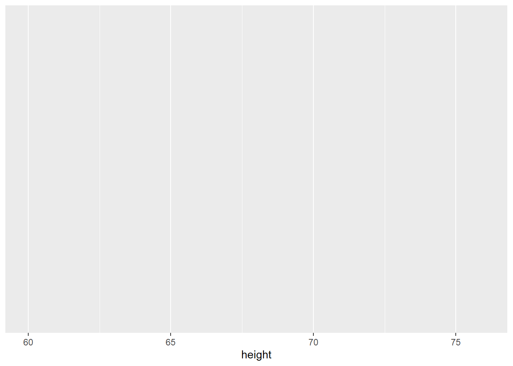
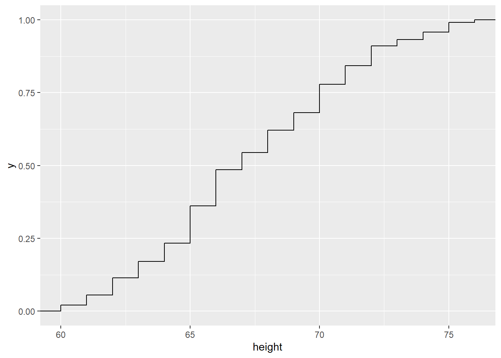
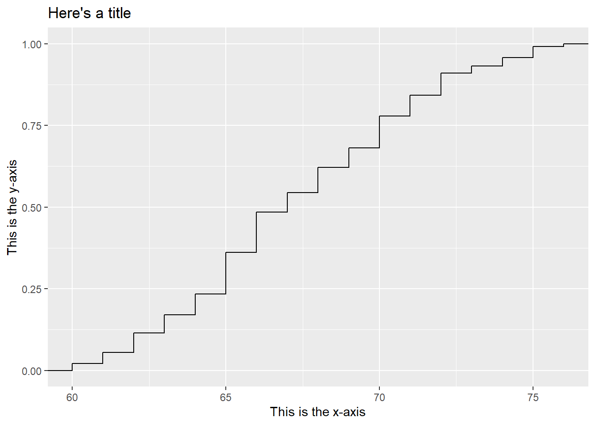
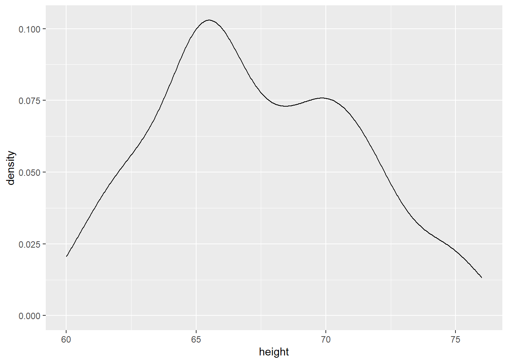
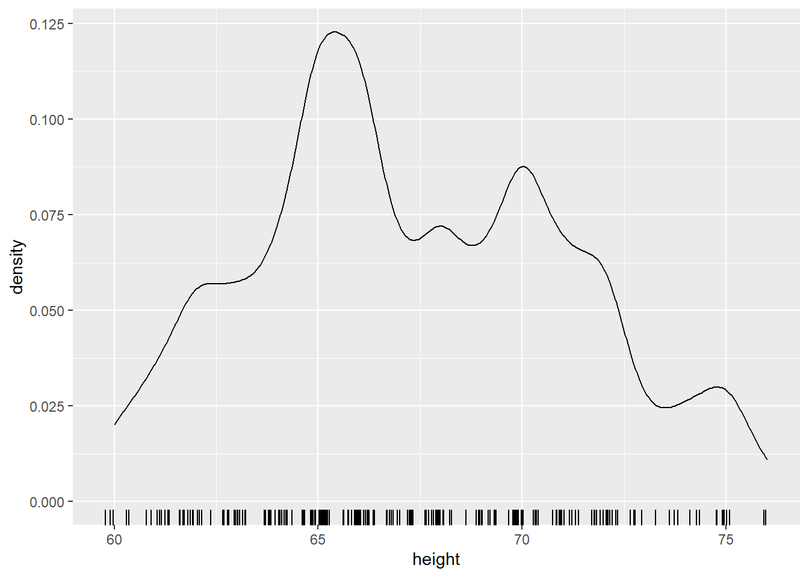
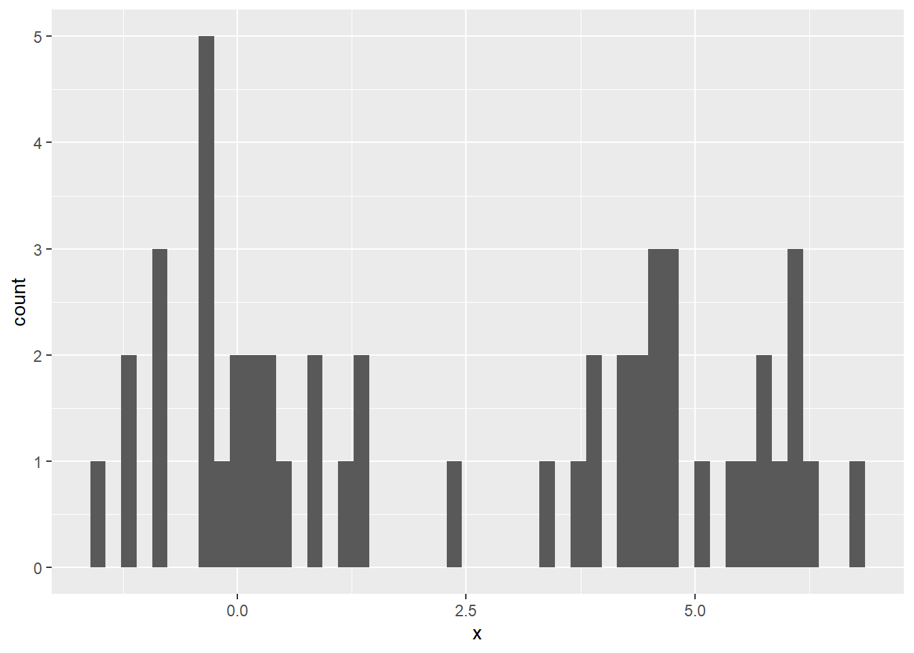
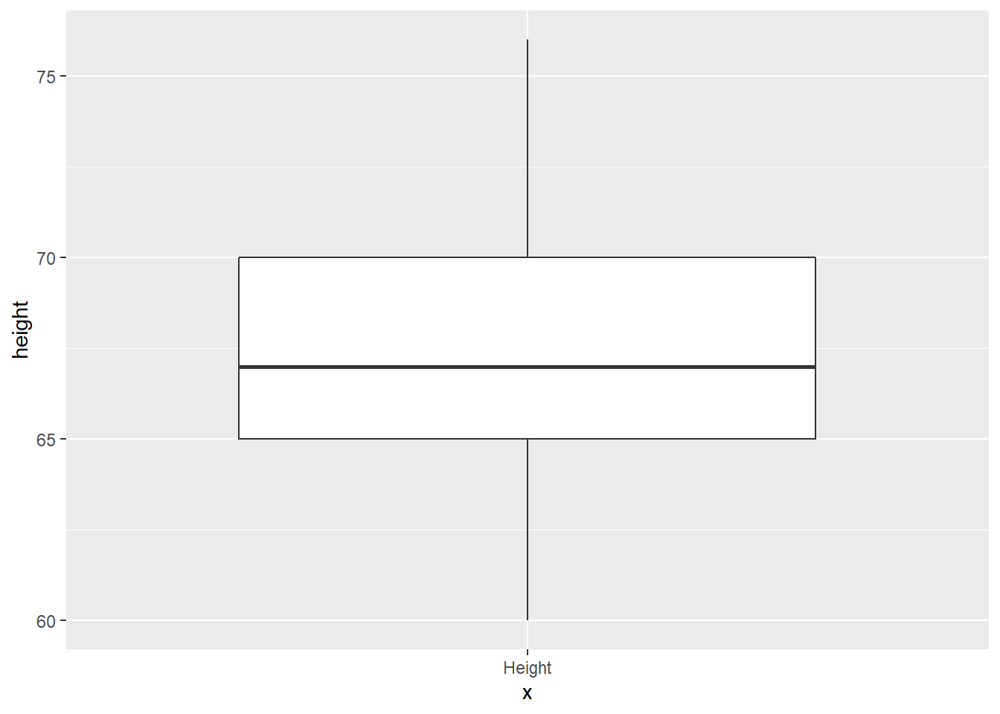

# (PART) Week 2 {-}


# Video Roadmap Week 2

- Univariate Data Visualization
	- Goals
	- Quantile Plots
	- Histograms and Density Estimates
	- Q-Q Plots
	- Box Plots

# R Examples
## Univariate Data Visualization


```r
## load-packages
## lattice has the singer data that we're going to use
library(lattice)
library(ggplot2)
library(dplyr)
```

```
## 
## Attaching package: 'dplyr'
```

```
## The following objects are masked from 'package:stats':
## 
##     filter, lag
```

```
## The following objects are masked from 'package:base':
## 
##     intersect, setdiff, setequal, union
```

```r
library(magrittr)
library(stringr)

## ----blank-ggplot--------------------------------------------------------
## nothing gets plotted! why not?
ggplot(singer, aes(x = height))
```



```r
## ----ecdf-ggplot---------------------------------------------------------
## we need to tell it not just that we want to plot height, but how to plot it.
## here we're saying to plot height as an ecdf
ggplot(singer, aes(x = height)) + stat_ecdf()
```



```r
## ecdf-ggplot-take-2
## another way of doing the same thing, ggplots can come in pieces
singer.gg = ggplot(singer, aes(x = height))
singer.gg + stat_ecdf()
```


```r
## ecdf-ggplot-labeled
## and if we want to label the axes
singer.gg + stat_ecdf() +
    xlab("This is the x-axis") +
    ylab("This is the y-axis") + 
        ggtitle("Here's a title")
```



```r
ggplot(singer, aes(x = height, color = voice.part)) + stat_ecdf()
```


```r
ggplot(singer, aes(x = height)) +
    stat_ecdf() +
    facet_wrap(~ voice.part, ncol = 2)
```


```r
## quantile-plot-setup
## quantile plots by hand
Tenor1 = singer %>%
    subset(voice.part == "Tenor 1") %>%
    arrange(height)
## exactly the same as
Tenor1 = arrange(
    subset(singer, voice.part == "Tenor 1"), height)
## close to the same as
sort(singer$height[singer$voice.part == "Tenor 1"])
```

```
##  [1] 64 64 65 66 66 66 67 67 68 68 68 69 70 70 71 71 72 72 73 74 76
```

```r
nTenor1 = nrow(Tenor1)
f.value = (0.5:(nTenor1 - 0.5))/nTenor1
Tenor1$f.value = f.value

## quantile-plot
ggplot(Tenor1, aes(x = f.value, y = height)) +
    geom_line() +
    geom_point()
```


```r
## histogram
ggplot(singer, aes(x = height)) + geom_histogram()
```

```
## `stat_bin()` using `bins = 30`. Pick better value with `binwidth`.
```


```r
## density
ggplot(singer, aes(x = height)) + geom_density()
```



```r
## density-with-rug
ggplot(singer, aes(x = height)) +
    geom_density(adjust = .5) +
    geom_rug(aes(y = 0), sides = "b",
             position = position_jitter(height = 0))
```



```r
## histogram-simulation
set.seed(0)
df = data.frame(x = c(rnorm(25, 0, 1), rnorm(25, 5, 1)))
ggplot(df) + geom_histogram(aes(x = x))
```

```
## `stat_bin()` using `bins = 30`. Pick better value with `binwidth`.
```


```r
## histogram-simulation-more-bins
ggplot(df) + geom_histogram(aes(x = x), bins = 50)
```



```r
## ecdf-simulation
ggplot(df) + stat_ecdf(aes(x = x))
```


```r
## qq-base
Tenor1 = singer %>% subset(voice.part == "Tenor 1")
Bass2 = singer %>% subset(voice.part == "Bass 2")
qq.df = as.data.frame(qqplot(Tenor1$height, Bass2$height,
    plot.it = FALSE))

## qq-ggplot
ggplot(qq.df, aes(x = x, y = y)) + geom_point()
```


```r
## qnorm-simulation
ggplot(data.frame(x = rnorm(100))) +
    stat_qq(aes(sample = x)) +
    geom_abline(aes(slope = 1, intercept = 0))
```


```r
##qnorm-singers
ggplot(singer) + stat_qq(aes(sample = height), distribution = qnorm)
```


```r
## boxplot-theory
(iqr = qnorm(.75) * 2)
```

```
## [1] 1.34898
```

```r
(uav = qnorm(.75) + 1.5 * iqr)
```

```
## [1] 2.697959
```

```r
(prob_outside = pnorm(uav, lower.tail = FALSE) * 2)
```

```
## [1] 0.006976603
```

```r
## boxplot-one
ggplot(singer, aes(x = "Height", y = height)) +
    geom_boxplot()
```



```r
## boxplot-two
ggplot(singer, aes(x = voice.part, y = height)) +
    geom_boxplot() +
    coord_flip()
```


