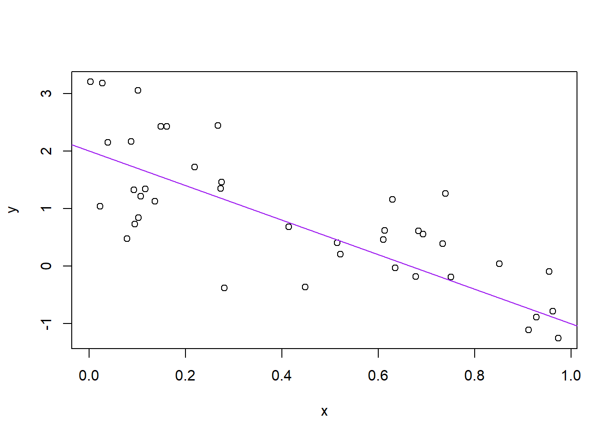

# R basics and workflows {#r-basics}


<!--Original content: https://stat545.com/block002_hello-r-workspace-wd-project.html-->

## Basics of working with R at the command line and RStudio goodies

Launch RStudio/R.

Notice the default panes:

* Console (entire left)
* Environment/History (tabbed in upper right)
* Files/Plots/Packages/Help (tabbed in lower right)

FYI: you can change the default location of the panes, among many other things: [Customizing RStudio][rstudio-customizing].

Go into the Console, where we interact with the live R process.

Make an assignment and then inspect the object you just created:


```r
x <- 3 * 4
x
#> [1] 12
```

All R statements where you create objects -- "assignments" -- have this form:

```r
objectName <- value
```
and in my head I hear, e.g., "x gets 12".

You will make lots of assignments and the operator `<-` is a pain to type. Don't be lazy and use `=`, although it would work, because it will just sow confusion later. Instead, utilize RStudio's keyboard shortcut: Alt + - (the minus sign).

Notice that RStudio automagically surrounds `<-` with spaces, which demonstrates a useful code formatting practice. Code is miserable to read on a good day. Give your eyes a break and use spaces.

RStudio offers many handy [keyboard shortcuts][rstudio-key-shortcuts]. Also, Alt+Shift+K brings up a keyboard shortcut reference card.

Object names cannot start with a digit and cannot contain certain other characters such as a comma or a space. You will be wise to adopt a [convention for demarcating words][wiki-snake-case] in names.

```
i_use_snake_case
other.people.use.periods
evenOthersUseCamelCase
```

Make another assignment:

```r
this_is_a_really_long_name <- 2.5
```

To inspect this, try out RStudio's completion facility: type the first few characters, press TAB, add characters until you disambiguate, then press return.

Make another assignment:

```r
jenny_rocks <- 2 ^ 3
```

Let's try to inspect:

```r
jennyrocks
#> Error in eval(expr, envir, enclos): object 'jennyrocks' not found
jeny_rocks
#> Error in eval(expr, envir, enclos): object 'jeny_rocks' not found
```

Implicit contract with the computer / scripting language: Computer will do tedious computation for you. In return, you will be completely precise in your instructions. Typos matter. Case matters. Get better at typing.

R has a mind-blowing collection of built-in functions that are accessed like so:


```r
functionName(arg1 = val1, arg2 = val2, and so on)
```

Let's try using `seq()` which makes regular sequences of numbers and, while we're at it, demo more helpful features of RStudio.

Type `se` and hit TAB. A pop up shows you possible completions. Specify `seq()` by typing more to disambiguate or using the up/down arrows to select. Notice the floating tool-tip-type help that pops up, reminding you of a function's arguments. If you want even more help, press F1 as directed to get the full documentation in the help tab of the lower right pane. Now open the parentheses and notice the automatic addition of the closing parenthesis and the placement of cursor in the middle.  Type the arguments `1, 10` and hit return. RStudio also exits the parenthetical expression for you.  IDEs are great.


```r
seq(1, 10)
#>  [1]  1  2  3  4  5  6  7  8  9 10
```

The above also demonstrates something about how R resolves function arguments. You can always specify in `name = value` form. But if you do not, R attempts to resolve by position. So above, it is assumed that we want a sequence `from = 1` that goes `to = 10`. Since we didn't specify step size, the default value of `by` in the function definition is used, which ends up being 1 in this case. For functions I call often, I might use this resolve by position for the first
argument or maybe the first two. After that, I always use `name = value`.


Make this assignment and notice similar help with quotation marks.

```r
yo <- "hello world"
```

If you just make an assignment, you don't get to see the value, so then you're tempted to immediately inspect.


```r
y <- seq(1, 10)
y
#>  [1]  1  2  3  4  5  6  7  8  9 10
```

This common action can be shortened by surrounding the assignment with parentheses, which causes assignment and "print to screen" to happen.


```r
(y <- seq(1, 10))
#>  [1]  1  2  3  4  5  6  7  8  9 10
```

Not all functions have (or require) arguments:

```r
date()
#> [1] "Sun Jan 03 12:32:01 2021"
```

Now look at your workspace -- in the upper right pane. The workspace is where user-defined objects accumulate. You can also get a listing of these objects with commands:


```r
objects()
#> [1] "check_quietly"              "install_quietly"           
#> [3] "jenny_rocks"                "pretty_install"            
#> [5] "shhh_check"                 "this_is_a_really_long_name"
#> [7] "x"                          "y"                         
#> [9] "yo"
ls()
#> [1] "check_quietly"              "install_quietly"           
#> [3] "jenny_rocks"                "pretty_install"            
#> [5] "shhh_check"                 "this_is_a_really_long_name"
#> [7] "x"                          "y"                         
#> [9] "yo"
```

If you want to remove the object named `y`, you can do this:


```r
rm(y)
```

To remove everything:


```r
rm(list = ls())
```

or click the broom in RStudio's Environment pane.

## Workspace and working directory

One day you will need to quit R, go do something else and return to your analysis later.

One day you will have multiple analyses going that use R and you want to keep them separate.

One day you will need to bring data from the outside world into R and send numerical results and figures from R back out into the world.

To handle these real life situations, you need to make two decisions:

* What about your analysis is "real", i.e. will you save it as your lasting record of what happened?
* Where does your analysis "live"?

### Workspace, `.RData`

As a beginning R user, it's OK to consider your workspace "real". _Very soon_, I urge you to evolve to the next level, where you consider your saved R scripts as "real". (In either case, of course the input data is very much real and requires preservation!) With the input data and the R code you used, you can reproduce
_everything_. You can make your analysis fancier. You can get to the bottom of puzzling results and discover and fix bugs in your code. You can reuse the code to conduct similar analyses in new projects. You can remake a figure with different aspect ratio or save is as TIFF instead of PDF. You are ready to take questions. You are ready for the future.

If you regard your workspace as "real" (saving and reloading all the time), if you need to redo analysis ... you're going to either redo a lot of typing (making mistakes all the way) or will have to mine your R history for the commands you used. Rather than [becoming an expert on managing the R history][rstudio-command-history], a better use of your time and psychic energy is to keep your "good" R code in a script for future reuse.

Because it can be useful sometimes, note the commands you've recently run appear in the History pane.

But you don't have to choose right now and the two strategies are not incompatible. Let's demo the save / reload the workspace approach.

Upon quitting R, you have to decide if you want to save your workspace, for potential restoration the next time you launch R. Depending on your set up, R or your IDE, e.g. RStudio, will probably prompt you to make this decision.

Quit R/RStudio, either from the menu, using a keyboard shortcut, or by typing `q()` in the Console. You'll get a prompt like this:

> Save workspace image to ~/.Rdata?

_Note where the workspace image is to be saved_ and then click "Save".

Using your favorite method, visit the directory where image was saved and verify there is a file named `.RData`. You will also see a file `.Rhistory`, holding the commands submitted in your recent session.

Restart RStudio. In the Console you will see a line like this:

```
[Workspace loaded from ~/.RData]
```

indicating that your workspace has been restored. Look in the Workspace pane and you'll see the same objects as before. In the History tab of the same pane, you should also see your command history. You're back in business. This way of starting and stopping analytical work will not serve you well for long but it's a start.

### Working directory

Any process running on your computer has a notion of its "working directory". In R, this is where R will look, by default, for files you ask it to load. It also where, by default, any files you write to disk will go. Chances are your current working directory is the directory we inspected above, i.e. the one where RStudio wanted to save the workspace.

You can explicitly check your working directory with:


```r
getwd()
```

It is also displayed at the top of the RStudio console.

As a beginning R user, it's OK let your home directory or any other weird directory on your computer be R's working directory. _Very soon_, I urge you to evolve to the next level, where you organize your analytical projects into directories and, when working on project A, set R's working directory to the associated directory.

__Although I do not recommend it__, in case you're curious, you can set R's working directory at the command line like so:


```r
setwd("~/myCoolProject")
```

__Although I do not recommend it__, you can also use RStudio's Files pane to navigate to a directory and then set it as working directory from the menu: *Session > Set Working Directory > To Files Pane Location*. (You'll see even more options there). Or within the Files pane, choose "More" and "Set As Working Directory".

But there's a better way. A way that also puts you on the path to managing your R work like an expert.

## RStudio projects {#rprojs}

Keeping all the files associated with a project organized together -- input data, R scripts, analytical results, figures -- is such a wise and common practice that RStudio has built-in support for this via its [_projects_][rstudio-using-projects].

Let's make one to use for the rest of this workshop/class. Do this: *File > New Project...*. The directory name you choose here will be the project name. Call it whatever you want (or follow me for convenience).

I created a directory and, therefore RStudio project, called `swc` in my `tmp` directory, FYI.

<!--JB: https://github.com/yihui/knitr/issues/277 -->

```r
setwd("~/tmp/swc")
```

Now check that the "home" directory for your project is the working directory of our current R process:

```r
getwd()
```
_I can't print my output here because this document itself does not reside in the RStudio Project we just created._

Let's enter a few commands in the Console, as if we are just beginning a project:


```r
a <- 2
b <- -3
sig_sq <- 0.5
x <- runif(40)
y <- a + b * x + rnorm(40, sd = sqrt(sig_sq))
(avg_x <- mean(x))
#> [1] 0.559
write(avg_x, "avg_x.txt")
plot(x, y)
abline(a, b, col = "purple")
```



```r
dev.print(pdf, "toy_line_plot.pdf")
#> png 
#>   2
```

Let's say this is a good start of an analysis and your ready to start preserving the logic and code. Visit the History tab of the upper right pane. Select these commands. Click "To Source". Now you have a new pane containing a nascent R script. Click on the floppy disk to save. Give it a name ending in `.R` or `.r`, I used `toy-line.r` and note that, by default, it will go in the directory associated with your project.

Quit RStudio. Inspect the folder associated with your project if you wish. Maybe view the PDF in an external viewer.

Restart RStudio. Notice that things, by default, restore to where we were earlier, e.g. objects in the workspace, the command history, which files are open for editing, where we are in the file system browser, the working directory for the R process, etc. These are all Good Things.

Change some things about your code. Top priority would be to set a sample size `n` at the top, e.g. `n <- 40`, and then replace all the hard-wired 40's with `n`. Change some other minor-but-detectable stuff, e.g. alter the sample size `n`, the slope of the line `b`,the color of the line ... whatever. Practice the different ways to re-run the code:

* Walk through line by line by keyboard shortcut (Command+Enter) or mouse (click "Run" in the upper right corner of editor pane).
  
* Source the entire document -- equivalent to entering `source('toy-line.r')` in the Console -- by keyboard shortcut (Shift+Command+S) or mouse (click "Source" in the upper right corner of editor pane or select from the mini-menu accessible from the associated down triangle).
  
* Source with echo from the Source mini-menu.
  
Visit your figure in an external viewer to verify that the PDF is changing as you expect.

In your favorite OS-specific way, search your files for `toy_line_plot.pdf` and presumably you will find the PDF itself (no surprise) but _also the script that created it (`toy-line.r`)_. This latter phenomenon is a huge win. One day you will want to remake a figure or just simply understand where it came from. If you rigorously save figures to file __with R code and not ever ever ever the mouse or the clipboard__, you will sing my praises one day. Trust me.

## Stuff

It is traditional to save R scripts with a `.R` or `.r` suffix. Follow this convention unless you have some extraordinary reason not to. 

Comments start with one or more `#` symbols. Use them. RStudio helps you (de)comment selected lines with Ctrl+Shift+C (Windows and Linux) or Command+Shift+C (Mac).

Clean out the workspace, i.e. pretend like you've just revisited this project after a long absence.  The broom icon or `rm(list = ls())`. Good idea to do this, restart R (available from the Session menu), re-run your analysis to truly check that the code you're saving is complete and correct (or at least rule out obvious problems!).

This workflow will serve you well in the future:

* Create an RStudio project for an analytical project
* Keep inputs there (we'll soon talk about importing)
* Keep scripts there; edit them, run them in bits or as a whole from there
* Keep outputs there (like the PDF written above)

Avoid using the mouse for pieces of your analytical workflow, such as loading a dataset or saving a figure. Terribly important for reproducibility and for making it possible to retrospectively determine how a numerical table or PDF was actually produced (searching on local disk on filename, among `.R` files, will lead to the relevant script).

Many long-time users never save the workspace, never save `.RData` files (I'm one of them), never save or consult the history. Once/if you get to that point, there are options available in RStudio to disable the loading of `.RData` and permanently suppress the prompt on exit to save the workspace (go to *Tools > Options > General*).

For the record, when loading data into R and/or writing outputs to file, you can always specify the absolute path and thereby insulate yourself from the current working directory. This is rarely necessary when using RStudio projects properly.


[cran]: https://cloud.r-project.org
[cran-faq]: https://cran.r-project.org/faqs.html
[cran-R-admin]: http://cran.r-project.org/doc/manuals/R-admin.html
[cran-add-ons]: https://cran.r-project.org/doc/manuals/R-admin.html#Add_002don-packages
[r-proj]: https://www.r-project.org
[stat-545]: https://stat545.com
[software-carpentry]: https://software-carpentry.org
[cran-r-extensions]: https://cran.r-project.org/doc/manuals/r-release/R-exts.html


<!--RStudio Links-->
[rstudio-preview]: https://www.rstudio.com/products/rstudio/download/preview/
[rstudio-official]: https://www.rstudio.com/products/rstudio/#Desktop
[rstudio-workbench]: https://www.rstudio.com/wp-content/uploads/2014/04/rstudio-workbench.png
[rstudio-support]: https://support.rstudio.com/hc/en-us
[rstudio-R-help]: https://support.rstudio.com/hc/en-us/articles/200552336-Getting-Help-with-R
[rstudio-customizing]: https://support.rstudio.com/hc/en-us/articles/200549016-Customizing-RStudio
[rstudio-key-shortcuts]: https://support.rstudio.com/hc/en-us/articles/200711853-Keyboard-Shortcuts
[rstudio-command-history]: https://support.rstudio.com/hc/en-us/articles/200526217-Command-History
[rstudio-using-projects]: https://support.rstudio.com/hc/en-us/articles/200526207-Using-Projects
[rstudio-code-snippets]: https://support.rstudio.com/hc/en-us/articles/204463668-Code-Snippets
[rstudio-dplyr-cheatsheet-download]: https://github.com/rstudio/cheatsheets/raw/master/data-transformation.pdf
[rstudio-regex-cheatsheet]: https://www.rstudio.com/wp-content/uploads/2016/09/RegExCheatsheet.pdf
[rstudio-devtools]: https://www.rstudio.com/products/rpackages/devtools/

<!--HappyGitWithR Links-->
[happy-git]: https://happygitwithr.com
[hg-install-git]: https://happygitwithr.com/install-git.html
[hg-git-client]: https://happygitwithr.com/git-client.html
[hg-github-account]: https://happygitwithr.com/github-acct.html
[hg-install-r-rstudio]: https://happygitwithr.com/install-r-rstudio.html
[hg-connect-intro]: https://happygitwithr.com/connect-intro.html
[hg-browsability]: https://happygitwithr.com/workflows-browsability.html
[hg-shell]: https://happygitwithr.com/shell.html

<!--Package Links-->
[rmarkdown]: https://rmarkdown.rstudio.com
[knitr-faq]: https://yihui.name/knitr/faq/

[tidyverse-main-page]: https://www.tidyverse.org
[tidyverse-web]: https://tidyverse.tidyverse.org
[tidyverse-github]: https://github.com/hadley/tidyverse

[dplyr-web]: https://dplyr.tidyverse.org
[dplyr-cran]: https://CRAN.R-project.org/package=dplyr
[dplyr-github]: https://github.com/hadley/dplyr
[dplyr-vignette-intro]: https://cran.r-project.org/web/packages/dplyr/vignettes/dplyr.html
[dplyr-vignette-window-fxns]: https://cran.r-project.org/web/packages/dplyr/vignettes/window-functions.html
[dplyr-vignette-two-table]: https://dplyr.tidyverse.org/articles/two-table.html

[lubridate-web]: https://lubridate.tidyverse.org
[lubridate-cran]: https://CRAN.R-project.org/package=lubridate
[lubridate-github]: https://github.com/tidyverse/lubridate
[lubridate-vignette]: https://cran.r-project.org/web/packages/lubridate/vignettes/lubridate.html

[tidyr-web]: https://tidyr.tidyverse.org
[tidyr-cran]: https://CRAN.R-project.org/package=tidyr 

[readr-web]: https://readr.tidyverse.org
[readr-vignette-intro]: https://cran.r-project.org/web/packages/readr/vignettes/readr.html

[stringr-web]: https://stringr.tidyverse.org
[stringr-cran]: https://CRAN.R-project.org/package=stringr

[ggplot2-web]: https://ggplot2.tidyverse.org
[ggplot2-tutorial]: https://github.com/jennybc/ggplot2-tutorial
[ggplot2-reference]: https://docs.ggplot2.org/current/
[ggplot2-cran]: https://CRAN.R-project.org/package=ggplot2
[ggplot2-github]: https://github.com/tidyverse/ggplot2
[ggplot2-theme-args]: https://ggplot2.tidyverse.org/reference/ggtheme.html#arguments

[gapminder-web]: https://www.gapminder.org
[gapminder-cran]: https://CRAN.R-project.org/package=gapminder

[assertthat-cran]: https://CRAN.R-project.org/package=assertthat
[assertthat-github]: https://github.com/hadley/assertthat

[ensurer-cran]: https://CRAN.R-project.org/package=ensurer
[ensurer-github]: https://github.com/smbache/ensurer

[assertr-cran]: https://CRAN.R-project.org/package=assertr
[assertr-github]: https://github.com/ropensci/assertr

[assertive-cran]: https://CRAN.R-project.org/package=assertive
[assertive-bitbucket]: https://bitbucket.org/richierocks/assertive/src/master/

[testthat-cran]: https://CRAN.R-project.org/package=testthat
[testthat-github]: https://github.com/r-lib/testthat
[testthat-web]: https://testthat.r-lib.org

[viridis-cran]: https://CRAN.R-project.org/package=viridis
[viridis-github]: https://github.com/sjmgarnier/viridis
[viridis-vignette]: https://cran.r-project.org/web/packages/viridis/vignettes/intro-to-viridis.html

[colorspace-cran]: https://CRAN.R-project.org/package=colorspace
[colorspace-vignette]: https://cran.r-project.org/web/packages/colorspace/vignettes/hcl-colors.pdf

[cowplot-cran]: https://CRAN.R-project.org/package=cowplot
[cowplot-github]: https://github.com/wilkelab/cowplot
[cowplot-vignette]: https://cran.r-project.org/web/packages/cowplot/vignettes/introduction.html

[devtools-cran]: https://CRAN.R-project.org/package=devtools
[devtools-github]: https://github.com/r-lib/devtools
[devtools-web]: https://devtools.r-lib.org
[devtools-cheatsheet]: https://www.rstudio.com/wp-content/uploads/2015/03/devtools-cheatsheet.pdf
[devtools-cheatsheet-old]: https://rawgit.com/rstudio/cheatsheets/master/package-development.pdf
[devtools-1-6]: https://blog.rstudio.com/2014/10/02/devtools-1-6/
[devtools-1-8]: https://blog.rstudio.com/2015/05/11/devtools-1-9-0/
[devtools-1-9-1]: https://blog.rstudio.com/2015/09/13/devtools-1-9-1/

[googlesheets-cran]: https://CRAN.R-project.org/package=googlesheets
[googlesheets-github]: https://github.com/jennybc/googlesheets

[tidycensus-cran]: https://CRAN.R-project.org/package=tidycensus
[tidycensus-github]: https://github.com/walkerke/tidycensus
[tidycensus-web]: https://walkerke.github.io/tidycensus/index.html

[fs-web]: https://fs.r-lib.org/index.html
[fs-cran]: https://CRAN.R-project.org/package=fs
[fs-github]: https://github.com/r-lib/fs

[plumber-web]: https://www.rplumber.io
[plumber-docs]: https://www.rplumber.io/docs/
[plumber-github]: https://github.com/trestletech/plumber
[plumber-cran]: https://CRAN.R-project.org/package=plumber

[plyr-web]: http://plyr.had.co.nz

[magrittr-web]: https://magrittr.tidyverse.org
[forcats-web]: https://forcats.tidyverse.org
[glue-web]: https://glue.tidyverse.org
[stringi-cran]: https://CRAN.R-project.org/package=stringi
[rex-github]: https://github.com/kevinushey/rex
[rcolorbrewer-cran]: https://CRAN.R-project.org/package=RColorBrewer
[dichromat-cran]: https://CRAN.R-project.org/package=dichromat

[rdryad-web]: https://docs.ropensci.org/rdryad/
[rdryad-cran]: https://CRAN.R-project.org/package=rdryad
[rdryad-github]: https://github.com/ropensci/rdryad

[roxygen2-cran]: https://CRAN.R-project.org/package=roxygen2
[roxygen2-vignette]: https://cran.r-project.org/web/packages/roxygen2/vignettes/rd.html

[shinythemes-web]: https://rstudio.github.io/shinythemes/
[shinythemes-cran]: https://CRAN.R-project.org/package=shinythemes

[shinyjs-web]: https://deanattali.com/shinyjs/
[shinyjs-cran]: https://CRAN.R-project.org/package=shinyjs
[shinyjs-github]: https://github.com/daattali/shinyjs

[leaflet-web]: https://rstudio.github.io/leaflet/
[leaflet-cran]: https://CRAN.R-project.org/package=leaflet
[leaflet-github]: https://github.com/rstudio/leaflet

[ggvis-web]: https://ggvis.rstudio.com
[ggvis-cran]: https://CRAN.R-project.org/package=ggvis
 
[usethis-web]: https://usethis.r-lib.org
[usethis-cran]: https://CRAN.R-project.org/package=usethis
[usethis-github]: https://github.com/r-lib/usethis

[pkgdown-web]: https://pkgdown.r-lib.org
[gh-github]: https://github.com/r-lib/gh

[httr-web]: https://httr.r-lib.org
[httr-cran]: https://CRAN.R-project.org/package=httr
[httr-github]: https://github.com/r-lib/httr

[gistr-web]: https://docs.ropensci.org/gistr
[gistr-cran]: https://CRAN.R-project.org/package=gistr
[gistr-github]: https://github.com/ropensci/gistr

[rvest-web]: https://rvest.tidyverse.org
[rvest-cran]: https://CRAN.R-project.org/package=rvest
[rvest-github]: https://github.com/tidyverse/rvest

[xml2-web]: https://xml2.r-lib.org
[xml2-cran]: https://CRAN.R-project.org/package=xml2
[xml2-github]: https://github.com/r-lib/xml2

[jsonlite-paper]: https://arxiv.org/abs/1403.2805
[jsonlite-cran]: https://CRAN.R-project.org/package=jsonlite
[jsonlite-github]: https://github.com/jeroen/jsonlite

[readxl-web]: https://readxl.tidyverse.org
[readxl-github]: https://github.com/tidyverse/readxl
[readxl-cran]: https://CRAN.R-project.org/package=readxl

[janitor-web]: http://sfirke.github.io/janitor/
[janitor-cran]: https://CRAN.R-project.org/package=janitor
[janitor-github]: https://github.com/sfirke/janitor

[purrr-web]: https://purrr.tidyverse.org
[curl-cran]: https://CRAN.R-project.org/package=curl

<!--Shiny links-->
[shinydashboard-web]: https://rstudio.github.io/shinydashboard/
[shinydashboard-cran]: https://CRAN.R-project.org/package=shinydashboard
[shinydashboard-github]: https://github.com/rstudio/shinydashboard


[shiny-official-web]: https://shiny.rstudio.com
[shiny-official-tutorial]: https://shiny.rstudio.com/tutorial/
[shiny-cheatsheet]: https://shiny.rstudio.com/images/shiny-cheatsheet.pdf
[shiny-articles]: https://shiny.rstudio.com/articles/
[shiny-bookdown]: https://bookdown.org/yihui/rmarkdown/shiny-documents.html
[shiny-google-groups]: https://groups.google.com/forum/#!forum/shiny-discuss
[shiny-stack-overflow]: https://stackoverflow.com/questions/tagged/shiny
[shinyapps-web]: https://www.shinyapps.io
[shiny-server-setup]: https://deanattali.com/2015/05/09/setup-rstudio-shiny-server-digital-ocean/
[shiny-reactivity]: https://shiny.rstudio.com/articles/understanding-reactivity.html
[shiny-debugging]: https://shiny.rstudio.com/articles/debugging.html
[shiny-server]: https://www.rstudio.com/products/shiny/shiny-server/

<!--Publications--> 
[adv-r]: http://adv-r.had.co.nz
[adv-r-fxns]: http://adv-r.had.co.nz/Functions.html
[adv-r-dsl]: http://adv-r.had.co.nz/dsl.html
[adv-r-defensive-programming]: http://adv-r.had.co.nz/Exceptions-Debugging.html#defensive-programming
[adv-r-fxn-args]: http://adv-r.had.co.nz/Functions.html#function-arguments
[adv-r-return-values]: http://adv-r.had.co.nz/Functions.html#return-values
[adv-r-closures]: http://adv-r.had.co.nz/Functional-programming.html#closures

[r4ds]: https://r4ds.had.co.nz
[r4ds-transform]: https://r4ds.had.co.nz/transform.html
[r4ds-strings]: https://r4ds.had.co.nz/strings.html
[r4ds-readr-strings]: https://r4ds.had.co.nz/data-import.html#readr-strings
[r4ds-dates-times]: https://r4ds.had.co.nz/dates-and-times.html
[r4ds-data-import]: http://r4ds.had.co.nz/data-import.html
[r4ds-relational-data]: https://r4ds.had.co.nz/relational-data.html
[r4ds-pepper-shaker]: https://r4ds.had.co.nz/vectors.html#lists-of-condiments

[r-pkgs2]: https://r-pkgs.org/index.html
[r-pkgs2-whole-game]: https://r-pkgs.org/whole-game.html
[r-pkgs2-description]: https://r-pkgs.org/description.html
[r-pkgs2-man]: https://r-pkgs.org/man.htm
[r-pkgs2-tests]: https://r-pkgs.org/tests.html
[r-pkgs2-namespace]: https://r-pkgs.org/namespace.html
[r-pkgs2-vignettes]: https://r-pkgs.org/vignettes.html
[r-pkgs2-release]: https://r-pkgs.org/release.html
[r-pkgs2-r-code]: https://r-pkgs.org/r.html#r

[r-graphics-cookbook]: http://shop.oreilly.com/product/0636920023135.do

[cookbook-for-r]: http://www.cookbook-r.com 
[cookbook-for-r-graphs]: http://www.cookbook-r.com/Graphs/
[cookbook-for-r-multigraphs]: http://www.cookbook-r.com/Graphs/Multiple_graphs_on_one_page_(ggplot2)/

[elegant-graphics-springer]: https://www.springer.com/gp/book/9780387981413

[testthat-article]: https://journal.r-project.org/archive/2011-1/RJournal_2011-1_Wickham.pdf
[worry-about-color]: https://www.google.com/url?sa=t&rct=j&q=&esrc=s&source=web&cd=2&cad=rja&uact=8&ved=2ahUKEwi0xYqJ8JbjAhWNvp4KHViYDxsQFjABegQIABAC&url=https%3A%2F%2Fwww.researchgate.net%2Fprofile%2FAhmed_Elhattab2%2Fpost%2FPlease_suggest_some_good_3D_plot_tool_Software_for_surface_plot%2Fattachment%2F5c05ba35cfe4a7645506948e%2FAS%253A699894335557644%25401543879221725%2Fdownload%2FWhy%2BShould%2BEngineers%2Band%2BScientists%2BBe%2BWorried%2BAbout%2BColor_.pdf&usg=AOvVaw1qwjjGMd7h_z6TLUjzu7Nb
[escaping-rgbland-pdf]: https://eeecon.uibk.ac.at/~zeileis/papers/Zeileis+Hornik+Murrell-2009.pdf
[escaping-rgbland-doi]: https://doi.org/10.1016/j.csda.2008.11.033


<!--R Documentation-->
[rdocs-extremes]: https://rdrr.io/r/base/Extremes.html
[rdocs-range]: https://rdrr.io/r/base/range.html
[rdocs-quantile]: https://rdrr.io/r/stats/quantile.html
[rdocs-c]: https://rdrr.io/r/base/c.html
[rdocs-list]: https://rdrr.io/r/base/list.html
[rdocs-lm]: https://rdrr.io/r/stats/lm.html
[rdocs-coef]: https://rdrr.io/r/stats/coef.html
[rdocs-devices]: https://rdrr.io/r/grDevices/Devices.html
[rdocs-ggsave]: https://rdrr.io/cran/ggplot2/man/ggsave.html
[rdocs-dev]: https://rdrr.io/r/grDevices/dev.html


<!--Wikipedia Links-->
[wiki-snake-case]: https://en.wikipedia.org/wiki/Snake_case
[wiki-hello-world]: https://en.wikipedia.org/wiki/%22Hello,_world!%22_program
[wiki-janus]: https://en.wikipedia.org/wiki/Janus
[wiki-nesting-dolls]: https://en.wikipedia.org/wiki/Matryoshka_doll
[wiki-pure-fxns]: https://en.wikipedia.org/wiki/Pure_function
[wiki-camel-case]: https://en.wikipedia.org/wiki/Camel_case
[wiki-mojibake]: https://en.wikipedia.org/wiki/Mojibake
[wiki-row-col-major-order]: https://en.wikipedia.org/wiki/Row-_and_column-major_order
[wiki-boxplot]: https://en.wikipedia.org/wiki/Box_plot
[wiki-brewer]: https://en.wikipedia.org/wiki/Cynthia_Brewer
[wiki-vector-graphics]: https://en.wikipedia.org/wiki/Vector_graphics
[wiki-raster-graphics]: https://en.wikipedia.org/wiki/Raster_graphics
[wiki-dry]: https://en.wikipedia.org/wiki/Don%27t_repeat_yourself
[wiki-web-scraping]: https://en.wikipedia.org/wiki/Web_scraping
[wiki-xpath]: https://en.wikipedia.org/wiki/XPath
[wiki-css-selector]: https://en.wikipedia.org/wiki/Cascading_Style_Sheets#Selector


<!--Misc. Links-->
[split-apply-combine]: https://www.jstatsoft.org/article/view/v040i01
[useR-2014-dropbox]: https://www.dropbox.com/sh/i8qnluwmuieicxc/AAAgt9tIKoIm7WZKIyK25lh6a
[gh-pages]: https://pages.github.com
[html-preview]: http://htmlpreview.github.io
[tj-mahr-slides]: https://github.com/tjmahr/MadR_Pipelines
[dataschool-dplyr]: https://www.dataschool.io/dplyr-tutorial-for-faster-data-manipulation-in-r/
[xckd-randall-munroe]: https://fivethirtyeight.com/features/xkcd-randall-munroe-qanda-what-if/
[athena-zeus-forehead]: https://tinyurl.com/athenaforehead
[tidydata-lotr]: https://github.com/jennybc/lotr-tidy#readme
[minimal-make]: https://kbroman.org/minimal_make/
[write-data-tweet]: https://twitter.com/vsbuffalo/statuses/358699162679787521
[belt-and-suspenders]: https://www.wisegeek.com/what-does-it-mean-to-wear-belt-and-suspenders.htm
[research-workflow]: https://www.carlboettiger.info/2012/05/06/research-workflow.html
[yak-shaving]: https://seths.blog/2005/03/dont_shave_that/
[yaml-with-csv]: https://blog.datacite.org/using-yaml-frontmatter-with-csv/
[reproducible-examples]: https://stackoverflow.com/questions/5963269/how-to-make-a-great-r-reproducible-example
[blog-strings-as-factors]: https://notstatschat.tumblr.com/post/124987394001/stringsasfactors-sigh
[bio-strings-as-factors]: https://simplystatistics.org/2015/07/24/stringsasfactors-an-unauthorized-biography
[stackexchange-outage]: https://stackstatus.net/post/147710624694/outage-postmortem-july-20-2016
[email-regex]: https://emailregex.com
[fix-atom-bug]: https://davidvgalbraith.com/how-i-fixed-atom/
[icu-regex]: http://userguide.icu-project.org/strings/regexp
[regex101]: https://regex101.com
[regexr]: https://regexr.com
[utf8-debug]: http://www.i18nqa.com/debug/utf8-debug.html
[unicode-no-excuses]: https://www.joelonsoftware.com/2003/10/08/the-absolute-minimum-every-software-developer-absolutely-positively-must-know-about-unicode-and-character-sets-no-excuses/
[programmers-encoding]: http://kunststube.net/encoding/
[encoding-probs-ruby]: https://www.justinweiss.com/articles/3-steps-to-fix-encoding-problems-in-ruby/
[theyre-to-theyre]: https://www.justinweiss.com/articles/how-to-get-from-theyre-to-theyre/
[lubridate-ex1]: https://www.r-exercises.com/2016/08/15/dates-and-times-simple-and-easy-with-lubridate-part-1/
[lubridate-ex2]: https://www.r-exercises.com/2016/08/29/dates-and-times-simple-and-easy-with-lubridate-exercises-part-2/
[lubridate-ex3]: https://www.r-exercises.com/2016/10/04/dates-and-times-simple-and-easy-with-lubridate-exercises-part-3/
[google-sql-join]: https://www.google.com/search?q=sql+join&tbm=isch
[min-viable-product]: https://blog.fastmonkeys.com/?utm_content=bufferc2d6e&utm_medium=social&utm_source=twitter.com&utm_campaign=buffer
[telescope-rule]: http://c2.com/cgi/wiki?TelescopeRule
[unix-philosophy]: http://www.faqs.org/docs/artu/ch01s06.html
[twitter-wrathematics]: https://twitter.com/wrathematics
[robbins-effective-graphs]: https://www.amazon.com/Creating-Effective-Graphs-Naomi-Robbins/dp/0985911123
[r-graph-catalog-github]: https://github.com/jennybc/r-graph-catalog
[google-pie-charts]: https://www.google.com/search?q=pie+charts+suck
[why-pie-charts-suck]: https://www.richardhollins.com/blog/why-pie-charts-suck/
[worst-figure]: https://robjhyndman.com/hyndsight/worst-figure/
[naomi-robbins]: http://www.nbr-graphs.com
[hadley-github-index]: https://hadley.github.io
[scipy-2015-matplotlib-colors]: https://www.youtube.com/watch?v=xAoljeRJ3lU&feature=youtu.be
[winston-chang-github]: https://github.com/wch
[favorite-rgb-color]: https://manyworldstheory.com/2013/01/15/my-favorite-rgb-color/
[stowers-color-chart]: https://web.archive.org/web/20121022044903/http://research.stowers-institute.org/efg/R/Color/Chart/
[stowers-using-color-in-R]: https://www.uv.es/conesa/CursoR/material/UsingColorInR.pdf
[zombie-project]: https://imgur.com/ewmBeQG
[tweet-project-resurfacing]: https://twitter.com/JohnDCook/status/522377493417033728
[rgraphics-looks-tips]: https://blog.revolutionanalytics.com/2009/01/10-tips-for-making-your-r-graphics-look-their-best.html
[rgraphics-svg-tips]: https://blog.revolutionanalytics.com/2011/07/r-svg-graphics.html
[zev-ross-cheatsheet]: http://zevross.com/blog/2014/08/04/beautiful-plotting-in-r-a-ggplot2-cheatsheet-3/
[parker-writing-r-packages]: https://hilaryparker.com/2014/04/29/writing-an-r-package-from-scratch/
[broman-r-packages]: https://kbroman.org/pkg_primer/
[broman-tools4rr]: https://kbroman.org/Tools4RR/
[leeks-r-packages]: https://github.com/jtleek/rpackages
[build-maintain-r-packages]: https://thepoliticalmethodologist.com/2014/08/14/building-and-maintaining-r-packages-with-devtools-and-roxygen2/
[murdoch-package-vignette-slides]: https://web.archive.org/web/20160824010213/http://www.stats.uwo.ca/faculty/murdoch/ism2013/5Vignettes.pdf
[how-r-searches]: http://blog.obeautifulcode.com/R/How-R-Searches-And-Finds-Stuff/
