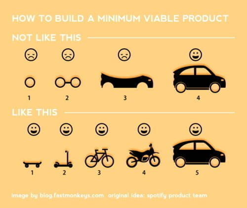

# Write your own R functions, part 1 {#functions-part1}


<!--Original content: https://stat545.com/block011_write-your-own-function-01.html-->

## What and why?

My goal here is to reveal the __process__ a long-time useR employs for writing functions. I also want to illustrate why the process is the way it is. Merely looking at the finished product, e.g. source code for R packages, can be extremely deceiving. Reality is generally much uglier ... but more interesting!

Why are we covering this now, smack in the middle of data aggregation? Powerful machines like dplyr, purrr, and the built-in "apply" family of functions, are ready and waiting to apply your purpose-built functions to various bits of your data. If you can express your analytical wishes in a function, these tools will give you great power.

## Load the Gapminder data

As usual, load gapminder.


```r
library(gapminder)
str(gapminder)
#> tibble [1,704 x 6] (S3: tbl_df/tbl/data.frame)
#>  $ country  : Factor w/ 142 levels "Afghanistan",..: 1 1 1 1 1 1 1 1 1 1 ...
#>  $ continent: Factor w/ 5 levels "Africa","Americas",..: 3 3 3 3 3 3 3 3 3 3 ...
#>  $ year     : int [1:1704] 1952 1957 1962 1967 1972 1977 1982 1987 1992 1997 ...
#>  $ lifeExp  : num [1:1704] 28.8 30.3 32 34 36.1 ...
#>  $ pop      : int [1:1704] 8425333 9240934 10267083 11537966 13079460 14880372..
#>  $ gdpPercap: num [1:1704] 779 821 853 836 740 ...
```

## Max - min

Say you've got a numeric vector, and you want to compute the difference between its max and min. `lifeExp` or `pop` or `gdpPercap` are great examples of a typical input. You can imagine wanting to get this statistic after we slice up the Gapminder data by year, country, continent, or combinations thereof.

## Get something that works

First, develop some working code for interactive use, using a representative input. I'll use Gapminder's life expectancy variable.

R functions that will be useful: `min()`, `max()`, `range()`. (__Read their documentation:__ [here][rdocs-extremes] and [here][rdocs-range])


```r
## get to know the functions mentioned above
min(gapminder$lifeExp)
#> [1] 23.6
max(gapminder$lifeExp)
#> [1] 82.6
range(gapminder$lifeExp)
#> [1] 23.6 82.6

## some natural solutions
max(gapminder$lifeExp) - min(gapminder$lifeExp)
#> [1] 59
with(gapminder, max(lifeExp) - min(lifeExp))
#> [1] 59
range(gapminder$lifeExp)[2] - range(gapminder$lifeExp)[1]
#> [1] 59
with(gapminder, range(lifeExp)[2] - range(lifeExp)[1])
#> [1] 59
diff(range(gapminder$lifeExp))
#> [1] 59
```

Internalize this "answer" because our informal testing relies on you noticing departures from this.

### Skateboard >> perfectly formed rear-view mirror

This image [widely attributed to the Spotify development team][min-viable-product] conveys an important point.

<div class="figure">

<p class="caption">(\#fig:spotify-howtobuildmvp)From [Your ultimate guide to Minimum Viable Product (+great examples)](https://blog.fastmonkeys.com/2014/06/18/minimum-viable-product-your-ultimate-guide-to-mvp-great-examples/)</p>
</div>

Build that skateboard before you build the car or some fancy car part. A limited-but-functioning thing is very useful. It also keeps the spirits high.

This is related to the valuable [Telescope Rule][telescope-rule]:

> It is faster to make a four-inch mirror then a six-inch mirror than to make a six-inch mirror.

## Turn the working interactive code into a function

Add NO new functionality! Just write your very first R function.


```r
max_minus_min <- function(x) max(x) - min(x)
max_minus_min(gapminder$lifeExp)
#> [1] 59
```

Check that you're getting the same answer as you did with your interactive code. Test it eyeball-o-metrically at this point.

## Test your function

### Test on new inputs

Pick some new artificial inputs where you know (at least approximately) what your function should return.


```r
max_minus_min(1:10)
#> [1] 9
max_minus_min(runif(1000))
#> [1] 0.995
```

I know that 10 minus 1 is 9. I know that random uniform [0, 1] variates will be between 0 and 1. Therefore max - min should be less than 1. If I take LOTS of them, max - min should be pretty close to 1.

It is intentional that I tested on integer input as well as floating point. Likewise, I like to use valid-but-random data for this sort of check.

### Test on real data but *different* real data

Back to the real world now. Two other quantitative variables are lying around: `gdpPercap` and `pop`. Let's have a go.


```r
max_minus_min(gapminder$gdpPercap)
#> [1] 113282
max_minus_min(gapminder$pop)
#> [1] 1318623085
```

Either check these results "by hand" or apply the "does that even make sense?" test.

### Test on weird stuff

Now we try to break our function. Don't get truly diabolical (yet). Just make the kind of mistakes you can imagine making at 2am when, 3 years from now, you rediscover this useful function you wrote. Give your function inputs it's not expecting.


```r
max_minus_min(gapminder) ## hey sometimes things "just work" on data.frames!
#> Error in FUN(X[[i]], ...): only defined on a data frame with all numeric variables
max_minus_min(gapminder$country) ## factors are kind of like integer vectors, no?
#> Error in Summary.factor(structure(c(1L, 1L, 1L, 1L, 1L, 1L, 1L, 1L, 1L, : 'max' not meaningful for factors
max_minus_min("eggplants are purple") ## i have no excuse for this one
#> Error in max(x) - min(x): non-numeric argument to binary operator
```

How happy are you with those error messages? You must imagine that some entire __script__ has failed and that you were hoping to just `source()` it without re-reading it. If a colleague or future you encountered these errors, do you run screaming from the room? How hard is it to pinpoint the usage problem?

### I will scare you now

Here are some great examples STAT545 students devised during class where the function __should break but it does not.__


```r
max_minus_min(gapminder[c('lifeExp', 'gdpPercap', 'pop')])
#> [1] 1.32e+09
max_minus_min(c(TRUE, TRUE, FALSE, TRUE, TRUE))
#> [1] 1
```

In both cases, R's eagerness to make sense of our requests is unfortunately successful. In the first case, a data.frame containing just the quantitative variables is eventually coerced into numeric vector. We can compute max minus min, even though it makes absolutely no sense at all. In the second case, a logical vector is converted to zeroes and ones, which might merit an error or at least a warning.

## Check the validity of arguments

For functions that will be used again -- which is not all of them! -- it is good to check the validity of arguments. This implements a rule from [the Unix philosophy][unix-philosophy]:

> Rule of Repair: When you must fail, fail noisily and as soon as possible.

### stop if not

`stopifnot()` is the entry level solution. I use it here to make sure the input `x` is a numeric vector.


```r
mmm <- function(x) {
  stopifnot(is.numeric(x))
  max(x) - min(x)
}
mmm(gapminder)
#> Error in mmm(gapminder): is.numeric(x) is not TRUE
mmm(gapminder$country)
#> Error in mmm(gapminder$country): is.numeric(x) is not TRUE
mmm("eggplants are purple")
#> Error in mmm("eggplants are purple"): is.numeric(x) is not TRUE
mmm(gapminder[c('lifeExp', 'gdpPercap', 'pop')])
#> Error in mmm(gapminder[c("lifeExp", "gdpPercap", "pop")]): is.numeric(x) is not TRUE
mmm(c(TRUE, TRUE, FALSE, TRUE, TRUE))
#> Error in mmm(c(TRUE, TRUE, FALSE, TRUE, TRUE)): is.numeric(x) is not TRUE
```

And we see that it catches all of the self-inflicted damage we would like to avoid.

### if then stop

`stopifnot()` doesn't provide a very good error message. The next approach is very widely used. Put your validity check inside an `if()` statement and call `stop()` yourself, with a custom error message, in the body.


```r
mmm2 <- function(x) {
  if(!is.numeric(x)) {
    stop('I am so sorry, but this function only works for numeric input!\n',
         'You have provided an object of class: ', class(x)[1])
  }
  max(x) - min(x)
}
mmm2(gapminder)
#> Error in mmm2(gapminder): I am so sorry, but this function only works for numeric input!
#> You have provided an object of class: tbl_df
```

In addition to a gratuitous apology, the error raised also contains two more pieces of helpful info:
  
* *Which* function threw the error.
* Hints on how to fix things: expected class of input vs actual class.

If it is easy to do so, I highly recommend this template: "you gave me THIS, but I need THAT".

The tidyverse style guide has a very useful [chapter on how to construct error messages](https://style.tidyverse.org/error-messages.html).

### Sidebar: non-programming uses for assertions

Another good use of this pattern is to leave checks behind in data analytical scripts. Consider our repetitive use of Gapminder in this course. Every time we load it, we inspect it, hoping to see the usual stuff. If we were loading from file (vs. a stable data package), we might want to formalize our expectations about the number of rows and columns, the names and flavors of the variables, etc. This would alert us if the data suddenly changed, which can be a useful wake-up call in scripts that you re-run *ad nauseam* on auto-pilot or non-interactively.

## Wrap-up and what's next?

Here's the function we've written so far:


```r
mmm2
#> function(x) {
#>   if(!is.numeric(x)) {
#>     stop('I am so sorry, but this function only works for numeric input!\n',
#>          'You have provided an object of class: ', class(x)[1])
#>   }
#>   max(x) - min(x)
#> }
```

What we've accomplished:

* We've written our first function.
* We are checking the validity of its input, argument `x`.
* We've done a good amount of informal testing.
  
Where to next? In [part 2](#functions-part2) we generalize this function to take differences in other quantiles and learn how to set default values for arguments.

## Resources

Packages for runtime assertions (the last 3 seem to be under more active development than `assertthat`):

* assertthat on [CRAN][assertthat-cran] and [GitHub][assertthat-github] - *the Hadleyverse option*
* ensurer on [CRAN][ensurer-cran] and [GitHub][ensurer-github] - *general purpose, pipe-friendly*
* assertr on [CRAN][assertr-cran] and [GitHub][assertr-github] - *explicitly data pipeline oriented*
* assertive on [CRAN][assertive-cran] and [Bitbucket][assertive-bitbucket] - *rich set of built-in functions*

Hadley Wickham's book [Advanced R][adv-r] [-@wickham2015a]:

* Section on [defensive programming][adv-r-defensive-programming]


[cran]: https://cloud.r-project.org
[cran-faq]: https://cran.r-project.org/faqs.html
[cran-R-admin]: http://cran.r-project.org/doc/manuals/R-admin.html
[cran-add-ons]: https://cran.r-project.org/doc/manuals/R-admin.html#Add_002don-packages
[r-proj]: https://www.r-project.org
[stat-545]: https://stat545.com
[software-carpentry]: https://software-carpentry.org
[cran-r-extensions]: https://cran.r-project.org/doc/manuals/r-release/R-exts.html


<!--RStudio Links-->
[rstudio-preview]: https://www.rstudio.com/products/rstudio/download/preview/
[rstudio-official]: https://www.rstudio.com/products/rstudio/#Desktop
[rstudio-workbench]: https://www.rstudio.com/wp-content/uploads/2014/04/rstudio-workbench.png
[rstudio-support]: https://support.rstudio.com/hc/en-us
[rstudio-R-help]: https://support.rstudio.com/hc/en-us/articles/200552336-Getting-Help-with-R
[rstudio-customizing]: https://support.rstudio.com/hc/en-us/articles/200549016-Customizing-RStudio
[rstudio-key-shortcuts]: https://support.rstudio.com/hc/en-us/articles/200711853-Keyboard-Shortcuts
[rstudio-command-history]: https://support.rstudio.com/hc/en-us/articles/200526217-Command-History
[rstudio-using-projects]: https://support.rstudio.com/hc/en-us/articles/200526207-Using-Projects
[rstudio-code-snippets]: https://support.rstudio.com/hc/en-us/articles/204463668-Code-Snippets
[rstudio-dplyr-cheatsheet-download]: https://github.com/rstudio/cheatsheets/raw/master/data-transformation.pdf
[rstudio-regex-cheatsheet]: https://www.rstudio.com/wp-content/uploads/2016/09/RegExCheatsheet.pdf
[rstudio-devtools]: https://www.rstudio.com/products/rpackages/devtools/

<!--HappyGitWithR Links-->
[happy-git]: https://happygitwithr.com
[hg-install-git]: https://happygitwithr.com/install-git.html
[hg-git-client]: https://happygitwithr.com/git-client.html
[hg-github-account]: https://happygitwithr.com/github-acct.html
[hg-install-r-rstudio]: https://happygitwithr.com/install-r-rstudio.html
[hg-connect-intro]: https://happygitwithr.com/connect-intro.html
[hg-browsability]: https://happygitwithr.com/workflows-browsability.html
[hg-shell]: https://happygitwithr.com/shell.html

<!--Package Links-->
[rmarkdown]: https://rmarkdown.rstudio.com
[knitr-faq]: https://yihui.name/knitr/faq/

[tidyverse-main-page]: https://www.tidyverse.org
[tidyverse-web]: https://tidyverse.tidyverse.org
[tidyverse-github]: https://github.com/hadley/tidyverse

[dplyr-web]: https://dplyr.tidyverse.org
[dplyr-cran]: https://CRAN.R-project.org/package=dplyr
[dplyr-github]: https://github.com/hadley/dplyr
[dplyr-vignette-intro]: https://cran.r-project.org/web/packages/dplyr/vignettes/dplyr.html
[dplyr-vignette-window-fxns]: https://cran.r-project.org/web/packages/dplyr/vignettes/window-functions.html
[dplyr-vignette-two-table]: https://dplyr.tidyverse.org/articles/two-table.html

[lubridate-web]: https://lubridate.tidyverse.org
[lubridate-cran]: https://CRAN.R-project.org/package=lubridate
[lubridate-github]: https://github.com/tidyverse/lubridate
[lubridate-vignette]: https://cran.r-project.org/web/packages/lubridate/vignettes/lubridate.html

[tidyr-web]: https://tidyr.tidyverse.org
[tidyr-cran]: https://CRAN.R-project.org/package=tidyr 

[readr-web]: https://readr.tidyverse.org
[readr-vignette-intro]: https://cran.r-project.org/web/packages/readr/vignettes/readr.html

[stringr-web]: https://stringr.tidyverse.org
[stringr-cran]: https://CRAN.R-project.org/package=stringr

[ggplot2-web]: https://ggplot2.tidyverse.org
[ggplot2-tutorial]: https://github.com/jennybc/ggplot2-tutorial
[ggplot2-reference]: https://docs.ggplot2.org/current/
[ggplot2-cran]: https://CRAN.R-project.org/package=ggplot2
[ggplot2-github]: https://github.com/tidyverse/ggplot2
[ggplot2-theme-args]: https://ggplot2.tidyverse.org/reference/ggtheme.html#arguments

[gapminder-web]: https://www.gapminder.org
[gapminder-cran]: https://CRAN.R-project.org/package=gapminder

[assertthat-cran]: https://CRAN.R-project.org/package=assertthat
[assertthat-github]: https://github.com/hadley/assertthat

[ensurer-cran]: https://CRAN.R-project.org/package=ensurer
[ensurer-github]: https://github.com/smbache/ensurer

[assertr-cran]: https://CRAN.R-project.org/package=assertr
[assertr-github]: https://github.com/ropensci/assertr

[assertive-cran]: https://CRAN.R-project.org/package=assertive
[assertive-bitbucket]: https://bitbucket.org/richierocks/assertive/src/master/

[testthat-cran]: https://CRAN.R-project.org/package=testthat
[testthat-github]: https://github.com/r-lib/testthat
[testthat-web]: https://testthat.r-lib.org

[viridis-cran]: https://CRAN.R-project.org/package=viridis
[viridis-github]: https://github.com/sjmgarnier/viridis
[viridis-vignette]: https://cran.r-project.org/web/packages/viridis/vignettes/intro-to-viridis.html

[colorspace-cran]: https://CRAN.R-project.org/package=colorspace
[colorspace-vignette]: https://cran.r-project.org/web/packages/colorspace/vignettes/hcl-colors.pdf

[cowplot-cran]: https://CRAN.R-project.org/package=cowplot
[cowplot-github]: https://github.com/wilkelab/cowplot
[cowplot-vignette]: https://cran.r-project.org/web/packages/cowplot/vignettes/introduction.html

[devtools-cran]: https://CRAN.R-project.org/package=devtools
[devtools-github]: https://github.com/r-lib/devtools
[devtools-web]: https://devtools.r-lib.org
[devtools-cheatsheet]: https://www.rstudio.com/wp-content/uploads/2015/03/devtools-cheatsheet.pdf
[devtools-cheatsheet-old]: https://rawgit.com/rstudio/cheatsheets/master/package-development.pdf
[devtools-1-6]: https://blog.rstudio.com/2014/10/02/devtools-1-6/
[devtools-1-8]: https://blog.rstudio.com/2015/05/11/devtools-1-9-0/
[devtools-1-9-1]: https://blog.rstudio.com/2015/09/13/devtools-1-9-1/

[googlesheets-cran]: https://CRAN.R-project.org/package=googlesheets
[googlesheets-github]: https://github.com/jennybc/googlesheets

[tidycensus-cran]: https://CRAN.R-project.org/package=tidycensus
[tidycensus-github]: https://github.com/walkerke/tidycensus
[tidycensus-web]: https://walkerke.github.io/tidycensus/index.html

[fs-web]: https://fs.r-lib.org/index.html
[fs-cran]: https://CRAN.R-project.org/package=fs
[fs-github]: https://github.com/r-lib/fs

[plumber-web]: https://www.rplumber.io
[plumber-docs]: https://www.rplumber.io/docs/
[plumber-github]: https://github.com/trestletech/plumber
[plumber-cran]: https://CRAN.R-project.org/package=plumber

[plyr-web]: http://plyr.had.co.nz

[magrittr-web]: https://magrittr.tidyverse.org
[forcats-web]: https://forcats.tidyverse.org
[glue-web]: https://glue.tidyverse.org
[stringi-cran]: https://CRAN.R-project.org/package=stringi
[rex-github]: https://github.com/kevinushey/rex
[rcolorbrewer-cran]: https://CRAN.R-project.org/package=RColorBrewer
[dichromat-cran]: https://CRAN.R-project.org/package=dichromat

[rdryad-web]: https://docs.ropensci.org/rdryad/
[rdryad-cran]: https://CRAN.R-project.org/package=rdryad
[rdryad-github]: https://github.com/ropensci/rdryad

[roxygen2-cran]: https://CRAN.R-project.org/package=roxygen2
[roxygen2-vignette]: https://cran.r-project.org/web/packages/roxygen2/vignettes/rd.html

[shinythemes-web]: https://rstudio.github.io/shinythemes/
[shinythemes-cran]: https://CRAN.R-project.org/package=shinythemes

[shinyjs-web]: https://deanattali.com/shinyjs/
[shinyjs-cran]: https://CRAN.R-project.org/package=shinyjs
[shinyjs-github]: https://github.com/daattali/shinyjs

[leaflet-web]: https://rstudio.github.io/leaflet/
[leaflet-cran]: https://CRAN.R-project.org/package=leaflet
[leaflet-github]: https://github.com/rstudio/leaflet

[ggvis-web]: https://ggvis.rstudio.com
[ggvis-cran]: https://CRAN.R-project.org/package=ggvis
 
[usethis-web]: https://usethis.r-lib.org
[usethis-cran]: https://CRAN.R-project.org/package=usethis
[usethis-github]: https://github.com/r-lib/usethis

[pkgdown-web]: https://pkgdown.r-lib.org
[gh-github]: https://github.com/r-lib/gh

[httr-web]: https://httr.r-lib.org
[httr-cran]: https://CRAN.R-project.org/package=httr
[httr-github]: https://github.com/r-lib/httr

[gistr-web]: https://docs.ropensci.org/gistr
[gistr-cran]: https://CRAN.R-project.org/package=gistr
[gistr-github]: https://github.com/ropensci/gistr

[rvest-web]: https://rvest.tidyverse.org
[rvest-cran]: https://CRAN.R-project.org/package=rvest
[rvest-github]: https://github.com/tidyverse/rvest

[xml2-web]: https://xml2.r-lib.org
[xml2-cran]: https://CRAN.R-project.org/package=xml2
[xml2-github]: https://github.com/r-lib/xml2

[jsonlite-paper]: https://arxiv.org/abs/1403.2805
[jsonlite-cran]: https://CRAN.R-project.org/package=jsonlite
[jsonlite-github]: https://github.com/jeroen/jsonlite

[readxl-web]: https://readxl.tidyverse.org
[readxl-github]: https://github.com/tidyverse/readxl
[readxl-cran]: https://CRAN.R-project.org/package=readxl

[janitor-web]: http://sfirke.github.io/janitor/
[janitor-cran]: https://CRAN.R-project.org/package=janitor
[janitor-github]: https://github.com/sfirke/janitor

[purrr-web]: https://purrr.tidyverse.org
[curl-cran]: https://CRAN.R-project.org/package=curl

<!--Shiny links-->
[shinydashboard-web]: https://rstudio.github.io/shinydashboard/
[shinydashboard-cran]: https://CRAN.R-project.org/package=shinydashboard
[shinydashboard-github]: https://github.com/rstudio/shinydashboard


[shiny-official-web]: https://shiny.rstudio.com
[shiny-official-tutorial]: https://shiny.rstudio.com/tutorial/
[shiny-cheatsheet]: https://shiny.rstudio.com/images/shiny-cheatsheet.pdf
[shiny-articles]: https://shiny.rstudio.com/articles/
[shiny-bookdown]: https://bookdown.org/yihui/rmarkdown/shiny-documents.html
[shiny-google-groups]: https://groups.google.com/forum/#!forum/shiny-discuss
[shiny-stack-overflow]: https://stackoverflow.com/questions/tagged/shiny
[shinyapps-web]: https://www.shinyapps.io
[shiny-server-setup]: https://deanattali.com/2015/05/09/setup-rstudio-shiny-server-digital-ocean/
[shiny-reactivity]: https://shiny.rstudio.com/articles/understanding-reactivity.html
[shiny-debugging]: https://shiny.rstudio.com/articles/debugging.html
[shiny-server]: https://www.rstudio.com/products/shiny/shiny-server/

<!--Publications--> 
[adv-r]: http://adv-r.had.co.nz
[adv-r-fxns]: http://adv-r.had.co.nz/Functions.html
[adv-r-dsl]: http://adv-r.had.co.nz/dsl.html
[adv-r-defensive-programming]: http://adv-r.had.co.nz/Exceptions-Debugging.html#defensive-programming
[adv-r-fxn-args]: http://adv-r.had.co.nz/Functions.html#function-arguments
[adv-r-return-values]: http://adv-r.had.co.nz/Functions.html#return-values
[adv-r-closures]: http://adv-r.had.co.nz/Functional-programming.html#closures

[r4ds]: https://r4ds.had.co.nz
[r4ds-transform]: https://r4ds.had.co.nz/transform.html
[r4ds-strings]: https://r4ds.had.co.nz/strings.html
[r4ds-readr-strings]: https://r4ds.had.co.nz/data-import.html#readr-strings
[r4ds-dates-times]: https://r4ds.had.co.nz/dates-and-times.html
[r4ds-data-import]: http://r4ds.had.co.nz/data-import.html
[r4ds-relational-data]: https://r4ds.had.co.nz/relational-data.html
[r4ds-pepper-shaker]: https://r4ds.had.co.nz/vectors.html#lists-of-condiments

[r-pkgs2]: https://r-pkgs.org/index.html
[r-pkgs2-whole-game]: https://r-pkgs.org/whole-game.html
[r-pkgs2-description]: https://r-pkgs.org/description.html
[r-pkgs2-man]: https://r-pkgs.org/man.htm
[r-pkgs2-tests]: https://r-pkgs.org/tests.html
[r-pkgs2-namespace]: https://r-pkgs.org/namespace.html
[r-pkgs2-vignettes]: https://r-pkgs.org/vignettes.html
[r-pkgs2-release]: https://r-pkgs.org/release.html
[r-pkgs2-r-code]: https://r-pkgs.org/r.html#r

[r-graphics-cookbook]: http://shop.oreilly.com/product/0636920023135.do

[cookbook-for-r]: http://www.cookbook-r.com 
[cookbook-for-r-graphs]: http://www.cookbook-r.com/Graphs/
[cookbook-for-r-multigraphs]: http://www.cookbook-r.com/Graphs/Multiple_graphs_on_one_page_(ggplot2)/

[elegant-graphics-springer]: https://www.springer.com/gp/book/9780387981413

[testthat-article]: https://journal.r-project.org/archive/2011-1/RJournal_2011-1_Wickham.pdf
[worry-about-color]: https://www.google.com/url?sa=t&rct=j&q=&esrc=s&source=web&cd=2&cad=rja&uact=8&ved=2ahUKEwi0xYqJ8JbjAhWNvp4KHViYDxsQFjABegQIABAC&url=https%3A%2F%2Fwww.researchgate.net%2Fprofile%2FAhmed_Elhattab2%2Fpost%2FPlease_suggest_some_good_3D_plot_tool_Software_for_surface_plot%2Fattachment%2F5c05ba35cfe4a7645506948e%2FAS%253A699894335557644%25401543879221725%2Fdownload%2FWhy%2BShould%2BEngineers%2Band%2BScientists%2BBe%2BWorried%2BAbout%2BColor_.pdf&usg=AOvVaw1qwjjGMd7h_z6TLUjzu7Nb
[escaping-rgbland-pdf]: https://eeecon.uibk.ac.at/~zeileis/papers/Zeileis+Hornik+Murrell-2009.pdf
[escaping-rgbland-doi]: https://doi.org/10.1016/j.csda.2008.11.033


<!--R Documentation-->
[rdocs-extremes]: https://rdrr.io/r/base/Extremes.html
[rdocs-range]: https://rdrr.io/r/base/range.html
[rdocs-quantile]: https://rdrr.io/r/stats/quantile.html
[rdocs-c]: https://rdrr.io/r/base/c.html
[rdocs-list]: https://rdrr.io/r/base/list.html
[rdocs-lm]: https://rdrr.io/r/stats/lm.html
[rdocs-coef]: https://rdrr.io/r/stats/coef.html
[rdocs-devices]: https://rdrr.io/r/grDevices/Devices.html
[rdocs-ggsave]: https://rdrr.io/cran/ggplot2/man/ggsave.html
[rdocs-dev]: https://rdrr.io/r/grDevices/dev.html


<!--Wikipedia Links-->
[wiki-snake-case]: https://en.wikipedia.org/wiki/Snake_case
[wiki-hello-world]: https://en.wikipedia.org/wiki/%22Hello,_world!%22_program
[wiki-janus]: https://en.wikipedia.org/wiki/Janus
[wiki-nesting-dolls]: https://en.wikipedia.org/wiki/Matryoshka_doll
[wiki-pure-fxns]: https://en.wikipedia.org/wiki/Pure_function
[wiki-camel-case]: https://en.wikipedia.org/wiki/Camel_case
[wiki-mojibake]: https://en.wikipedia.org/wiki/Mojibake
[wiki-row-col-major-order]: https://en.wikipedia.org/wiki/Row-_and_column-major_order
[wiki-boxplot]: https://en.wikipedia.org/wiki/Box_plot
[wiki-brewer]: https://en.wikipedia.org/wiki/Cynthia_Brewer
[wiki-vector-graphics]: https://en.wikipedia.org/wiki/Vector_graphics
[wiki-raster-graphics]: https://en.wikipedia.org/wiki/Raster_graphics
[wiki-dry]: https://en.wikipedia.org/wiki/Don%27t_repeat_yourself
[wiki-web-scraping]: https://en.wikipedia.org/wiki/Web_scraping
[wiki-xpath]: https://en.wikipedia.org/wiki/XPath
[wiki-css-selector]: https://en.wikipedia.org/wiki/Cascading_Style_Sheets#Selector


<!--Misc. Links-->
[split-apply-combine]: https://www.jstatsoft.org/article/view/v040i01
[useR-2014-dropbox]: https://www.dropbox.com/sh/i8qnluwmuieicxc/AAAgt9tIKoIm7WZKIyK25lh6a
[gh-pages]: https://pages.github.com
[html-preview]: http://htmlpreview.github.io
[tj-mahr-slides]: https://github.com/tjmahr/MadR_Pipelines
[dataschool-dplyr]: https://www.dataschool.io/dplyr-tutorial-for-faster-data-manipulation-in-r/
[xckd-randall-munroe]: https://fivethirtyeight.com/features/xkcd-randall-munroe-qanda-what-if/
[athena-zeus-forehead]: https://tinyurl.com/athenaforehead
[tidydata-lotr]: https://github.com/jennybc/lotr-tidy#readme
[minimal-make]: https://kbroman.org/minimal_make/
[write-data-tweet]: https://twitter.com/vsbuffalo/statuses/358699162679787521
[belt-and-suspenders]: https://www.wisegeek.com/what-does-it-mean-to-wear-belt-and-suspenders.htm
[research-workflow]: https://www.carlboettiger.info/2012/05/06/research-workflow.html
[yak-shaving]: https://seths.blog/2005/03/dont_shave_that/
[yaml-with-csv]: https://blog.datacite.org/using-yaml-frontmatter-with-csv/
[reproducible-examples]: https://stackoverflow.com/questions/5963269/how-to-make-a-great-r-reproducible-example
[blog-strings-as-factors]: https://notstatschat.tumblr.com/post/124987394001/stringsasfactors-sigh
[bio-strings-as-factors]: https://simplystatistics.org/2015/07/24/stringsasfactors-an-unauthorized-biography
[stackexchange-outage]: https://stackstatus.net/post/147710624694/outage-postmortem-july-20-2016
[email-regex]: https://emailregex.com
[fix-atom-bug]: https://davidvgalbraith.com/how-i-fixed-atom/
[icu-regex]: http://userguide.icu-project.org/strings/regexp
[regex101]: https://regex101.com
[regexr]: https://regexr.com
[utf8-debug]: http://www.i18nqa.com/debug/utf8-debug.html
[unicode-no-excuses]: https://www.joelonsoftware.com/2003/10/08/the-absolute-minimum-every-software-developer-absolutely-positively-must-know-about-unicode-and-character-sets-no-excuses/
[programmers-encoding]: http://kunststube.net/encoding/
[encoding-probs-ruby]: https://www.justinweiss.com/articles/3-steps-to-fix-encoding-problems-in-ruby/
[theyre-to-theyre]: https://www.justinweiss.com/articles/how-to-get-from-theyre-to-theyre/
[lubridate-ex1]: https://www.r-exercises.com/2016/08/15/dates-and-times-simple-and-easy-with-lubridate-part-1/
[lubridate-ex2]: https://www.r-exercises.com/2016/08/29/dates-and-times-simple-and-easy-with-lubridate-exercises-part-2/
[lubridate-ex3]: https://www.r-exercises.com/2016/10/04/dates-and-times-simple-and-easy-with-lubridate-exercises-part-3/
[google-sql-join]: https://www.google.com/search?q=sql+join&tbm=isch
[min-viable-product]: https://blog.fastmonkeys.com/?utm_content=bufferc2d6e&utm_medium=social&utm_source=twitter.com&utm_campaign=buffer
[telescope-rule]: http://c2.com/cgi/wiki?TelescopeRule
[unix-philosophy]: http://www.faqs.org/docs/artu/ch01s06.html
[twitter-wrathematics]: https://twitter.com/wrathematics
[robbins-effective-graphs]: https://www.amazon.com/Creating-Effective-Graphs-Naomi-Robbins/dp/0985911123
[r-graph-catalog-github]: https://github.com/jennybc/r-graph-catalog
[google-pie-charts]: https://www.google.com/search?q=pie+charts+suck
[why-pie-charts-suck]: https://www.richardhollins.com/blog/why-pie-charts-suck/
[worst-figure]: https://robjhyndman.com/hyndsight/worst-figure/
[naomi-robbins]: http://www.nbr-graphs.com
[hadley-github-index]: https://hadley.github.io
[scipy-2015-matplotlib-colors]: https://www.youtube.com/watch?v=xAoljeRJ3lU&feature=youtu.be
[winston-chang-github]: https://github.com/wch
[favorite-rgb-color]: https://manyworldstheory.com/2013/01/15/my-favorite-rgb-color/
[stowers-color-chart]: https://web.archive.org/web/20121022044903/http://research.stowers-institute.org/efg/R/Color/Chart/
[stowers-using-color-in-R]: https://www.uv.es/conesa/CursoR/material/UsingColorInR.pdf
[zombie-project]: https://imgur.com/ewmBeQG
[tweet-project-resurfacing]: https://twitter.com/JohnDCook/status/522377493417033728
[rgraphics-looks-tips]: https://blog.revolutionanalytics.com/2009/01/10-tips-for-making-your-r-graphics-look-their-best.html
[rgraphics-svg-tips]: https://blog.revolutionanalytics.com/2011/07/r-svg-graphics.html
[zev-ross-cheatsheet]: http://zevross.com/blog/2014/08/04/beautiful-plotting-in-r-a-ggplot2-cheatsheet-3/
[parker-writing-r-packages]: https://hilaryparker.com/2014/04/29/writing-an-r-package-from-scratch/
[broman-r-packages]: https://kbroman.org/pkg_primer/
[broman-tools4rr]: https://kbroman.org/Tools4RR/
[leeks-r-packages]: https://github.com/jtleek/rpackages
[build-maintain-r-packages]: https://thepoliticalmethodologist.com/2014/08/14/building-and-maintaining-r-packages-with-devtools-and-roxygen2/
[murdoch-package-vignette-slides]: https://web.archive.org/web/20160824010213/http://www.stats.uwo.ca/faculty/murdoch/ism2013/5Vignettes.pdf
[how-r-searches]: http://blog.obeautifulcode.com/R/How-R-Searches-And-Finds-Stuff/
