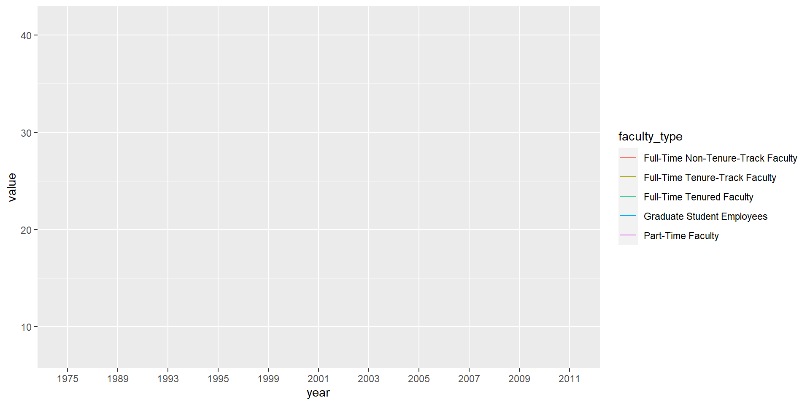

# Ugly charts: Lab 06


Given below are two data visualizations that violate many data visualization best practices.
Improve these visualizations using R and the tips for effective visualizations that we introduced in class.
You should produce one visualization per dataset.
Your visualization should be accompanied by a brief paragraph describing the choices you made in your improvement, specifically discussing what you didn't like in the original plots and why, and how you addressed them in the visualization you created.

On the due date you will give a brief presentation describing one of your improved visualizations and the reasoning for the choices you made.

The learning goals for this lab are:

-   Telling a story with data
-   Data visualization best practices
-   Reshaping data

## Getting started

Go to the course GitHub organization and locate your lab repo.
Grab the URL of the repo, and clone it in RStudio.
Refer to Lab 01 if you would like to see step-by-step instructions for cloning a repo into an RStudio project.

First, open the R Markdown document and Knit it.
Make sure it compiles without errors.
The output will be in the file markdown `.md` file with the same name.

### Housekeeping


```marginfigure
Your email address is the address tied to your GitHub account and your name should be first and last name.
```

Before we can get started we need to take care of some required housekeeping.
Specifically, we need to do some configuration so that RStudio can communicate with GitHub.
This requires two pieces of information: your email address and your name.

Run the following (but update it for your name and email!) in the Console to configure git:


```r
library(usethis)
use_git_config(user.name = "Your Name", 
               user.email = "your.email@address.com")
```

### Workflow

This is the second week you're working in teams, so we're going to make things a little more interesting and let all of you make changes and push those changes to your team repository.
Sometimes things will go swimmingly, and sometimes you'll run into merge conflicts.
So our first task today is to walk you through a merge conflict!

## Merges and merge conflicts

-   Pushing to a repo replaces the code on GitHub with the code you have on your computer.
-   If a collaborator has made a change to your repo on GitHub that you haven't incorporated into your local work, GitHub will stop you from pushing to the repo because this could overwrite your collaborator's work!
-   So you need to explicitly "merge" your collaborator's work before you can push.
-   If your and your collaborator's changes are in different files or in different parts of the same file, git merges the work for you automatically when you *pull*.
-   If you both changed the same part of a file, git will produce a **merge conflict** because it doesn't know how which change you want to keep and which change you want to overwrite.

Git will put conflict markers in your code that look like:

    <<<<<<< HEAD 
    See also: [dplyr documentation](https://dplyr.tidyverse.org/)   
    ======= 
    See also [ggplot2 documentation](https://ggplot2.tidyverse.org/)  
    >>>>>>> some1alpha2numeric3string4

The `===`s separate *your* changes (top) from *their* changes (bottom).
Note that on top you see the word `HEAD`, which indicates that these are your changes.
And at the bottom you see `some1alpha2numeric3string4` (well, it probably looks more like `28e7b2ceb39972085a0860892062810fb812a08f`).
This is the *hash* (a unique identifier) of the commit your collaborator made with the conflicting change.

Your job is to *reconcile* the changes: edit the file so that it incorporates the best of both versions and delete the `<<<`, `===`, and `>>>` lines.
Then Stage and Commit the result.

### Setup

-   Clone the repo and open the .Rmd file.
-   Assign the numbers 1, 2, 3, and 4 to each of the team members. If your team has fewer than 4 people, some people will need to have multiple numbers. If your team has more than 4 people, some people will need to share some numbers.

### Let's cause a merge conflict!

Our goal is to see two different types of merges: first we'll see a type of merge that git can't figure out on its own how to do on its own (a **merge conflict**) and requires human intervention, then another type of where that git can figure out how to do without human intervention.

Doing this will require some tight choreography, so pay attention!

Take turns in completing the exercise, only one member at a time.
**Others should just watch, not doing anything on their own projects (this includes not even pulling changes!)** until they are instructed to.
If you feel like you won't be able to resist the urge to touch your computer when it's not your turn, we recommend putting your hands in your pockets or sitting on them!

**Before starting**: everyone should have the repo cloned and know which role number(s) they are.

**Role 1:**

-   Change the team name to your actual team name.
-   Knit, commit, push.

🛑 Wait for instructions before moving on to the next step.

**Role 2:**

-   Change the team name to some other word.
-   Knit, commit, push. You should get an error.
-   Pull. Take a look at the document with the merge conflict.
-   Clear the merge conflict by editing the document to choose the correct/preferred change.
-   Knit.
-   **Click the Stage checkbox** for all files in your Git tab. Make sure they all have check marks, not filled-in boxes.
-   Commit and push.

🛑 Wait for instructions before moving on to the next step.

**Role 3:**

-   Add a label to the first code chunk
-   Knit, commit, push. You should get an error.
-   Pull. No merge conflicts should occur, but you should see a message about merging.
-   Now push.

🛑 Wait for instructions before moving on to the next step.

**Role 4:**

-   Add a different label to the first code chunk.
-   Knit, commit, push. You should get an error.
-   Pull. Take a look at the document with the merge conflict. Clear the merge conflict by choosing the correct/preferred change. Commit, and push.

🛑 Wait for instructions before moving on to the next step.

**Everyone:** Pull, and observe the changes in your document.

### Tips for collaborating via GitHub

-   Always pull first before you start working.
-   Resolve a merge conflict (commit and push) *before* continuing your work. Never do new work while resolving a merge conflict.
-   Knit, commit, and push often to minimize merge conflicts and/or to make merge conflicts easier to resolve.
-   If you find yourself in a situation that is difficult to resolve, ask questions ASAP. Don't let it linger and get bigger.

## Packages

Run the following code in the Console to load this package.


```r
library(tidyverse)
```

## Take a sad plot and make it better

### Instructional staff employment trends

The American Association of University Professors (AAUP) is a nonprofit membership association of faculty and other academic professionals.
[This report](https://www.aaup.org/sites/default/files/files/AAUP_Report_InstrStaff-75-11_apr2013.pdf) compiled by the AAUP shows trends in instructional staff employees between 1975 and 2011, and contains an image very similar to the one given below.


Let's start by loading the data used to create this plot.


```r
staff <- read_csv("data/instructional-staff.csv")
```

Each row in this dataset represents a faculty type, and the columns are the years for which we have data.
The values are percentage of hires of that type of faculty for each year.


```
## # A tibble: 5 x 12
##   faculty_type `1975` `1989` `1993` `1995` `1999` `2001` `2003` `2005` `2007`
##   <chr>         <dbl>  <dbl>  <dbl>  <dbl>  <dbl>  <dbl>  <dbl>  <dbl>  <dbl>
## 1 Full-Time T~   29     27.6   25     24.8   21.8   20.3   19.3   17.8   17.2
## 2 Full-Time T~   16.1   11.4   10.2    9.6    8.9    9.2    8.8    8.2    8  
## 3 Full-Time N~   10.3   14.1   13.6   13.6   15.2   15.5   15     14.8   14.9
## 4 Part-Time F~   24     30.4   33.1   33.2   35.5   36     37     39.3   40.5
## 5 Graduate St~   20.5   16.5   18.1   18.8   18.7   19     20     19.9   19.5
## # ... with 2 more variables: `2009` <dbl>, `2011` <dbl>
```

In order to recreate this visualization we need to first reshape the data to have one variable for faculty type and one variable for year.
In other words, we will convert the data from wide format to long format.

But before we do so, a thought exercise: *How many rows will the long-format data have?* It will have a row for each combination of year and faculty type.
If there are 5 faculty types and 11 years of data, how many rows will we have?

We do the wide to long conversion using a new function: `pivot_longer()`.
The animation below show how this function works, as well as its counterpart `pivot_wider()`.

<!-- -->

The function has the following arguments:


```r
pivot_longer(data, cols, names_to = "name")
```

-   The first argument is `data` as usual.
-   The second argument, `cols`, is where you specify which columns to pivot into longer format -- in this case all columns except for the `faculty_type`
-   The third argument, `names_to`, is a string specifying the name of the column to create from the data stored in the column names of data -- in this case `year`


```r
staff_long <- staff %>%
  pivot_longer(cols = -faculty_type, names_to = "year") %>%
  mutate(value = as.numeric(value))
```

Let's take a look at what the new longer data frame looks like.


```r
staff_long
```

```
## # A tibble: 55 x 3
##    faculty_type              year  value
##    <chr>                     <chr> <dbl>
##  1 Full-Time Tenured Faculty 1975   29  
##  2 Full-Time Tenured Faculty 1989   27.6
##  3 Full-Time Tenured Faculty 1993   25  
##  4 Full-Time Tenured Faculty 1995   24.8
##  5 Full-Time Tenured Faculty 1999   21.8
##  6 Full-Time Tenured Faculty 2001   20.3
##  7 Full-Time Tenured Faculty 2003   19.3
##  8 Full-Time Tenured Faculty 2005   17.8
##  9 Full-Time Tenured Faculty 2007   17.2
## 10 Full-Time Tenured Faculty 2009   16.8
## # ... with 45 more rows
```

And now let's plot is as a line plot.
A possible approach for creating a line plot where we color the lines by faculty type is the following:


```r
staff_long %>%
  ggplot(aes(x = year, y = value, color = faculty_type)) +
  geom_line()
```

```
## geom_path: Each group consists of only one observation. Do you need to adjust
## the group aesthetic?
```



But note that this results in a message as well as an unexpected plot.
The message is saying that there is only one observation for each faculty type year combination.
We can fix this using the `group` aesthetic following.


```r
staff_long %>%
  ggplot(aes(x = year, y = value, group = faculty_type, color = faculty_type)) +
  geom_line()
```

1.  Include the line plot you made above in your report and make sure the figure width is large enough to make it legible.
    Also fix the title, axis labels, and legend label.

2.  Suppose the objective of this plot was to show that the proportion of part-time faculty have gone up over time compared to other instructional staff types.
    What changes would you propose making to this plot to tell this story.
    (You don't need to implement these changes now, you will get to do that as part of this week's homework. But work as a team to come up with ideas and list them as bullet points. The more precise you are, the easier your homework will be.)

✅ ⬆️ *Commit and push your changes to GitHub with an appropriate commit message again. Make sure to commit and push all changed files so that your Git pane is cleared up afterwards.*

### Fisheries

Fisheries and Aquaculture Department of the Food and Agriculture Organization of the United Nations collects data on fisheries production of countries.
[This Wikipedia page](https://en.wikipedia.org/wiki/Fishing_industry_by_country) lists fishery production of countries for 2016.
For each country tonnage from capture and aquaculture are listed.
Note that countries whose total harvest was less than 100,000 tons are not included in the visualization.

A researcher shared with you the following visualization they created based on these data 😳.


3.  Can you help them make improve it? First, brainstorm how you would improve it. Then create the improved visualization and write up the changes/decisions you made as bullet points. It's ok if some of your improvements are aspirational, i.e. you don't know how to implement it, but you think it's a good idea. Ask a tutor for help, but also keep an eye on the time. Implement what you can and leave note identifying the aspirational improvements.


```r
fisheries <- read_csv("data/fisheries.csv")
```

✅ ⬆️ *Commit and push your changes to GitHub with an appropriate commit message again. Make sure to commit and push all changed files so that your Git pane is cleared up afterwards.*

## Wrapping up

Go back through your write up to make sure you're following coding style guidelines we discussed in class.
Make any edits as needed.

Also, make sure all of your R chunks are properly labeled, and your figures are reasonably sized.

Once the team leader for the week pushes their final changes, others should *pull* the changes and knit the R Markdown document to confirm that they can reproduce the report.

## More ugly charts

Want to see more ugly charts?

-   [Flowing Data - Ugly Charts](https://flowingdata.com/category/visualization/ugly-visualization/)
-   [Reddit - Data is ugly](https://www.reddit.com/r/dataisugly/)
-   [Missed Opportunities and Graphical Failures](http://www.datavis.ca/gallery/missed.php)
-   [(Mostly Bad) Graphics and Tables](http://users.stat.umn.edu/~rend0020/Teaching/STAT8801-resources/graphics/index.html)
