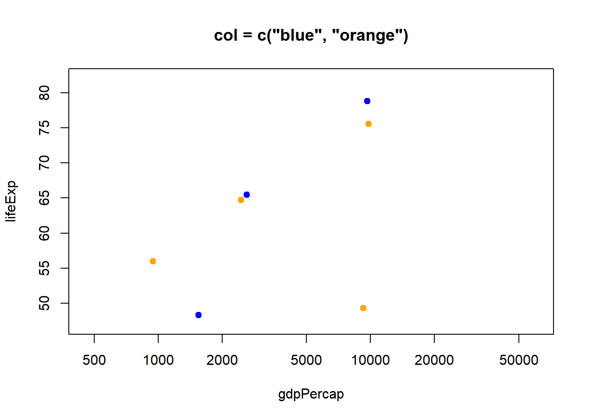
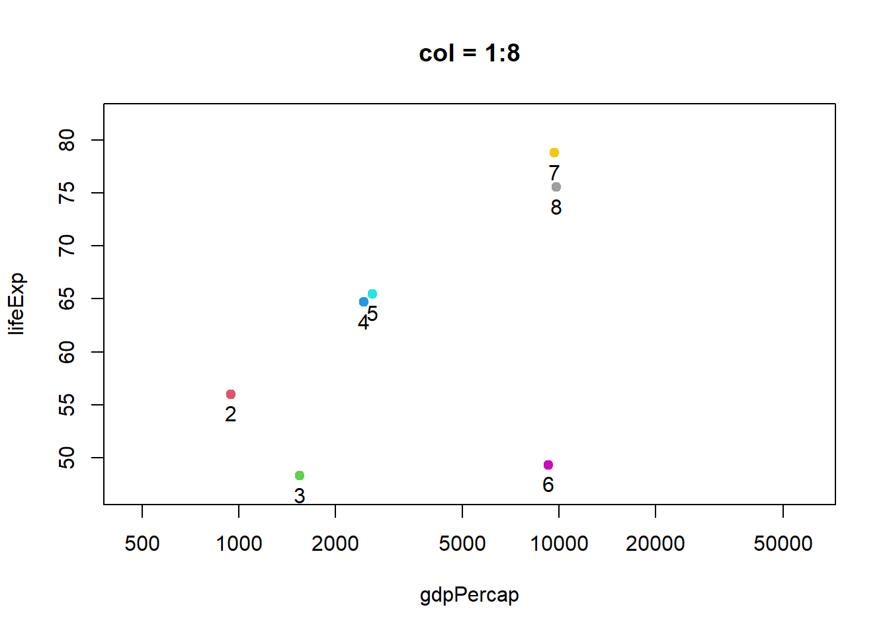
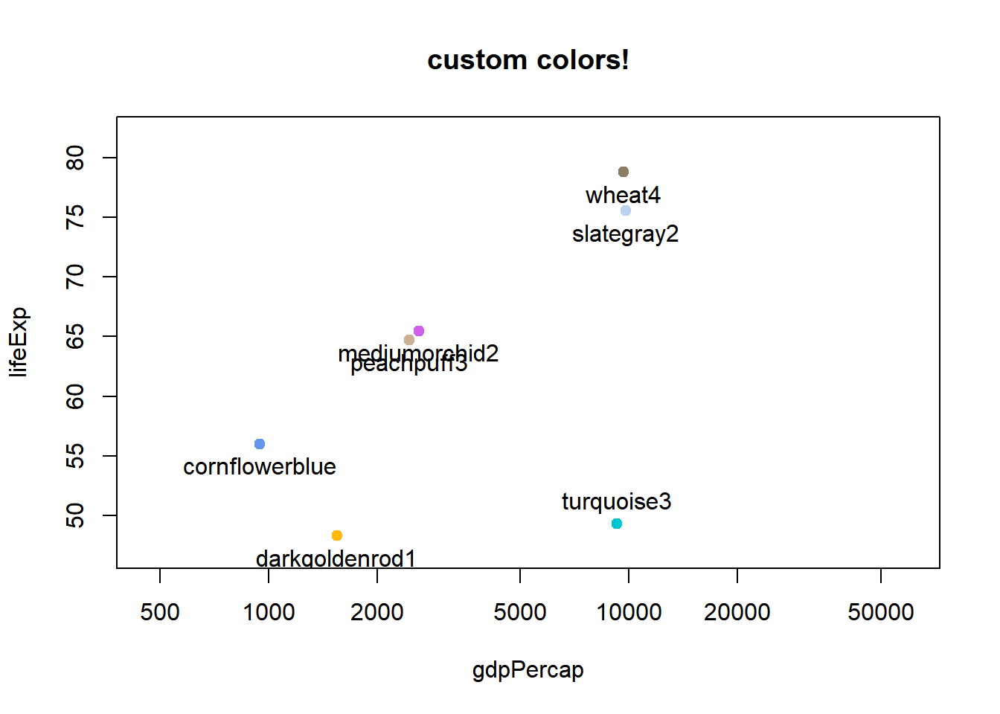
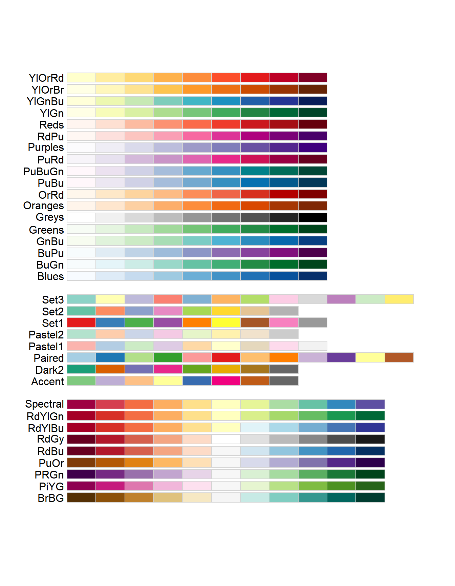
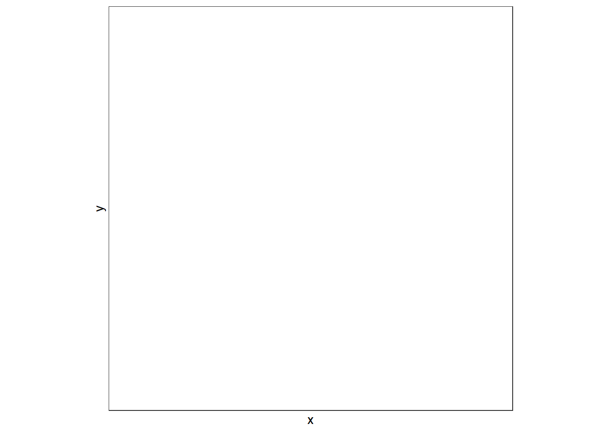
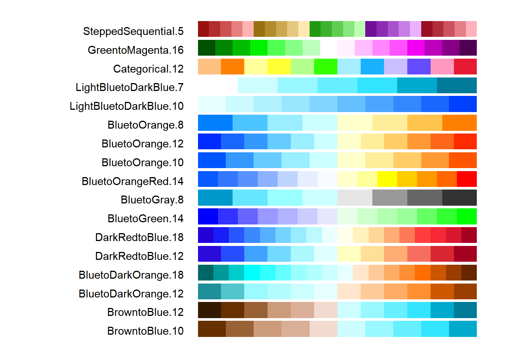

# Using colors in R {#colors}


<!--Original content: https://stat545.com/block018_colors.html-->

<!--TODO: The link below is broken. Found it listed [here](https://www.showmeshiny.com/r-graph-catalog/) which links this [repo](https://github.com/jennybc/r-graph-catalog) as the source code

[R Graph Catalog](http://shiny.stat.ubc.ca/r-graph-catalog/), a visual, clickable index of 100+ figures + ggplot2 code to make them

Note that I SKIPPED THE R GRAPH CATALOG LINK
-->

## Load dplyr and gapminder


```r
library(dplyr)
library(gapminder)
```

## Change the default plotting symbol to a solid circle

The color demos below will be more effective if the default plotting symbol is a solid circle. We limit ourselves to base R graphics in this tutorial, therefore we use `par()`, the function that queries and sets base R graphical parameters. In an interactive session or in a plain R script, do this:


```r
## how to change the plot symbol in a simple, non-knitr setting
opar <- par(pch = 19)
```

Technically, you don't need to make the assignment, but it's a good practice. We're killing two birds with one stone:

1. Changing the default plotting symbol to a filled circle, which has code 19 in R. (Below I link to some samplers showing all the plotting symbols, FYI.)
2. Storing the pre-existing and, in this case, default graphical parameters in `opar`.
  
When you change a graphical parameter via `par()`, the original values are returned and we're capturing them via assignment to `opar`. At the very bottom of this tutorial, we use `opar` to restore the original state. 

Big picture, it is best practice to restore the original, default state of hidden things that affect an R session. This is polite if you plan to inflict your code on others. Even if you live on an R desert island, this practice will prevent you from creating maddening little puzzles for yourself to solve in the middle of the night before a deadline.

Because of the way figures are handled by knitr, it is more complicated to change the default plotting symbol throughout an R Markdown document. To see how I've done it, check out a hidden chunk around here in the [source of this page](https://github.com/rstudio-education/stat545/blob/master/25_colors.Rmd).


## Basic color specification and the default palette

I need a small well-behaved excerpt from the Gapminder data for demonstration purposes. I randomly draw 8 countries, keep their data from 2007, and sort the rows based on GDP per capita. Meet `jdat`.


```r
jdat
#> # A tibble: 8 x 6
#>   country                  continent  year lifeExp        pop gdpPercap
#>   <fct>                    <fct>     <int>   <dbl>      <int>     <dbl>
#> 1 Central African Republic Africa     2007    44.7    4369038      706.
#> 2 Guinea                   Africa     2007    56.0    9947814      943.
#> 3 Cote d'Ivoire            Africa     2007    48.3   18013409     1545.
#> 4 India                    Asia       2007    64.7 1110396331     2452.
#> 5 Pakistan                 Asia       2007    65.5  169270617     2606.
#> 6 South Africa             Africa     2007    49.3   43997828     9270.
#> 7 Costa Rica               Americas   2007    78.8    4133884     9645.
#> 8 Panama                   Americas   2007    75.5    3242173     9809.
```

A simple scatterplot, using `plot()` from the base package `graphics`.


```r
j_xlim <- c(460, 60000)
j_ylim <- c(47, 82)
plot(lifeExp ~ gdpPercap, jdat, log = 'x', xlim = j_xlim, ylim = j_ylim,
     main = "Start your engines ...")
```


You can specify color explicitly by name by supplying a character vector with one or more color names (more on those soon). If you need a color for 8 points and you input fewer, recycling will kick in. Here's what happens when you specify one or two colors via the `col =` argument of `plot()`.


```r
plot(lifeExp ~ gdpPercap, jdat, log = 'x', xlim = j_xlim, ylim = j_ylim,
     col = "red", main = 'col = "red"')
plot(lifeExp ~ gdpPercap, jdat, log = 'x', xlim = j_xlim, ylim = j_ylim,
     col = c("blue", "orange"), main = 'col = c("blue", "orange")')
```



You can specify color explicitly with a small positive integer, which is interpreted as indexing into the current palette, which can be inspected via `palette()`. I've added these integers and the color names as labels to the figures below. The default palette contains 8 colors, which is why we're looking at data from eight countries. The default palette is ugly.


```r
plot(lifeExp ~ gdpPercap, jdat, log = 'x', xlim = j_xlim, ylim = j_ylim,
     col = 1:n_c, main = paste0('col = 1:', n_c))
with(jdat, text(x = gdpPercap, y = lifeExp, pos = 1))
plot(lifeExp ~ gdpPercap, jdat, log = 'x', xlim = j_xlim, ylim = j_ylim,
     col = 1:n_c, main = 'the default palette()')
with(jdat, text(x = gdpPercap, y = lifeExp, labels = palette(),
                pos = rep(c(1, 3, 1), c(5, 1, 2))))     
```



You can provide your own vector of colors instead. I am intentionally modelling best practice here too: if you're going to use custom colors, store them as an object in exactly one place, and use that object in plot calls, legend-making, etc. This makes it much easier to fiddle with your custom colors, which few of us can resist.


```r
j_colors <- c('chartreuse3', 'cornflowerblue', 'darkgoldenrod1', 'peachpuff3',
             'mediumorchid2', 'turquoise3', 'wheat4', 'slategray2')
plot(lifeExp ~ gdpPercap, jdat, log = 'x', xlim = j_xlim, ylim = j_ylim,
     col = j_colors, main = 'custom colors!')
with(jdat, text(x = gdpPercap, y = lifeExp, labels = j_colors,
                pos = rep(c(1, 3, 1), c(5, 1, 2)))) 
```



## What colors are available? Ditto for symbols and line types

Who would have guessed that R knows about "peachpuff3"? To see the names of all 657 the built-in colors, use `colors()`.


```r
head(colors())
#> [1] "white"         "aliceblue"     "antiquewhite"  "antiquewhite1"
#> [5] "antiquewhite2" "antiquewhite3"
tail(colors())
#> [1] "yellow"      "yellow1"     "yellow2"     "yellow3"     "yellow4"    
#> [6] "yellowgreen"
```

But it's much more exciting to see the colors displayed! Lots of people have tackled this -- for colors, plotting symbols, line types -- and put their work on the internet. Some examples:

* I put color names [on a white background](img/r.col.white.bkgd.pdf) and [on black](img/r.col.black.bkgd.pdf) *(sorry, these are PDFs)*
* I printed [the first 30 plotting symbols](img/r.pch.pdf) (presumably using code found elsewhere or in documentation? can't remember whom to credit) *(sorry, it's a PDF)*
* In [Chapter 3 of R Graphics 1st edition](https://www.stat.auckland.ac.nz/~paul/RGraphics/chapter3.html) [-@murrell2005], Paul Murrell shows predefined and custom line types in [Figure 3.6](https://www.stat.auckland.ac.nz/~paul/RGraphics/custombase-lty.png) and plotting symbols in [Figure 3.10](https://www.stat.auckland.ac.nz/~paul/RGraphics/custombase-datasymbols.png).
  
<!--TODO: The link below is broken, replace with something similar?
  * Earl F. Glynn offers [an excellent resource](http://research.stowers-institute.org/efg/R/Color/Chart/) on R's built-in named colors.
-->


## RColorBrewer

Most of us are pretty lousy at choosing colors and it's easy to spend too much time fiddling with them. [Cynthia Brewer][wiki-brewer], a geographer and color specialist, has created sets of colors for print and the web and they are available in the add-on package [RColorBrewer][rcolorbrewer-cran]. You will need to install and load this package to use.


```r
# install.packages("RColorBrewer")
library(RColorBrewer)
```

Let's look at all the associated palettes.


```r
display.brewer.all()
```



They fall into three classes. From top to bottom, they are

* __sequential__: great for low-to-high things where one extreme is exciting and the other is boring, like (transformations of) p-values and correlations (caveat: here I'm assuming the only exciting correlations you're likely to see are positive, i.e. near 1)
* __qualitative__: great for non-ordered categorical things -- such as your typical factor, like country or continent. Note the special case "Paired" palette; example where that's useful: a non-experimental factor (e.g. type of wheat) and a binary experimental factor (e.g. untreated vs. treated).
* __diverging__: great for things that range from "extreme and negative" to "extreme and positive", going through "non extreme and boring" along the way, such as t-statistics and z-scores and signed correlations

You can view a single RColorBrewer palette by specifying its name:


```r
display.brewer.pal(n = 8, name = 'Dark2')
```


The package is, frankly, rather clunky, as evidenced by the requirement to specify `n` above. Sorry folks, you'll just have to cope.

Here we revisit specifying custom colors as we did above, but using a palette from RColorBrewer instead of our artisanal "peachpuff3" work of art. As before, I display the colors themselves but you'll see we're not getting the friendly names you've seen before, which brings us to our next topic.


```r
j_brew_colors <- brewer.pal(n = 8, name = "Dark2")
plot(lifeExp ~ gdpPercap, jdat, log = 'x', xlim = j_xlim, ylim = j_ylim,
     col = j_brew_colors, main = 'Dark2 qualitative palette from RColorBrewer')
with(jdat, text(x = gdpPercap, y = lifeExp, labels = j_brew_colors,
                pos = rep(c(1, 3, 1), c(5, 1, 2)))) 
```


## viridis

In 2015 Stéfan van der Walt and Nathaniel Smith designed new color maps for matplotlib and [presented them in a talk at SciPy 2015][scipy-2015-matplotlib-colors]. The viridis R package provides four new palettes for use in R: on [CRAN][viridis-cran] with development on [GitHub][viridis-github]. From DESCRIPTION:

> These color maps are designed in such a way that they will analytically be perfectly perceptually-uniform, both in regular form and also when converted to black-and-white. They are also designed to be perceived by readers with the most common form of color blindness (all color maps in this package) and color vision deficiency ('cividis' only).

I encourage you to install viridis and read [the vignette][viridis-vignette]. It is easy to use these palettes in ggplot2 via `scale_color_viridis()` and `scale_fill_viridis()`. Taking control of color palettes in ggplot2 is covered elsewhere (see Chapter \@ref(qualitative-colors).

Here are two examples that show the viridis palettes:


```r
library(ggplot2)
library(viridis)
ggplot(data.frame(x = rnorm(10000), y = rnorm(10000)), aes(x = x, y = y)) +
  geom_hex() + coord_fixed() +
  scale_fill_viridis() + theme_bw()
```




<div class="figure">

<p class="caption">(\#fig:unnamed-chunk-17)From [https://github.com/sjmgarnier/viridis](https://github.com/sjmgarnier/viridis)</p>
</div>

## Hexadecimal RGB color specification

Instead of small positive integers and Crayola-style names, a more general and machine-readable approach to color specification is as hexadecimal triplets. Here is how the RColorBrewer Dark2 palette is actually stored:


```r
brewer.pal(n = 8, name = "Dark2")
#> [1] "#1B9E77" "#D95F02" "#7570B3" "#E7298A" "#66A61E" "#E6AB02" "#A6761D"
#> [8] "#666666"
```

The leading `#` is just there by convention. Parse the hexadecimal string like so: `#rrggbb`, where `rr`, `gg`, and `bb` refer to color intensity in the red, green, and blue channels, respectively. Each is specified as a two-digit base 16 number, which is the meaning of "hexadecimal" (or "hex" for short). 

Here's a table relating base 16 numbers to the beloved base 10 system.

<!--html_preserve--><style>html {
  font-family: -apple-system, BlinkMacSystemFont, 'Segoe UI', Roboto, Oxygen, Ubuntu, Cantarell, 'Helvetica Neue', 'Fira Sans', 'Droid Sans', Arial, sans-serif;
}

#yydyoplrpq .gt_table {
  display: table;
  border-collapse: collapse;
  margin-left: auto;
  margin-right: auto;
  color: #333333;
  font-size: 16px;
  font-weight: normal;
  font-style: normal;
  background-color: #FFFFFF;
  width: auto;
  border-top-style: solid;
  border-top-width: 2px;
  border-top-color: #A8A8A8;
  border-right-style: none;
  border-right-width: 2px;
  border-right-color: #D3D3D3;
  border-bottom-style: solid;
  border-bottom-width: 2px;
  border-bottom-color: #A8A8A8;
  border-left-style: none;
  border-left-width: 2px;
  border-left-color: #D3D3D3;
}

#yydyoplrpq .gt_heading {
  background-color: #FFFFFF;
  text-align: center;
  border-bottom-color: #FFFFFF;
  border-left-style: none;
  border-left-width: 1px;
  border-left-color: #D3D3D3;
  border-right-style: none;
  border-right-width: 1px;
  border-right-color: #D3D3D3;
}

#yydyoplrpq .gt_title {
  color: #333333;
  font-size: 125%;
  font-weight: initial;
  padding-top: 4px;
  padding-bottom: 4px;
  border-bottom-color: #FFFFFF;
  border-bottom-width: 0;
}

#yydyoplrpq .gt_subtitle {
  color: #333333;
  font-size: 85%;
  font-weight: initial;
  padding-top: 0;
  padding-bottom: 4px;
  border-top-color: #FFFFFF;
  border-top-width: 0;
}

#yydyoplrpq .gt_bottom_border {
  border-bottom-style: solid;
  border-bottom-width: 2px;
  border-bottom-color: #D3D3D3;
}

#yydyoplrpq .gt_col_headings {
  border-top-style: solid;
  border-top-width: 2px;
  border-top-color: #D3D3D3;
  border-bottom-style: solid;
  border-bottom-width: 2px;
  border-bottom-color: #D3D3D3;
  border-left-style: none;
  border-left-width: 1px;
  border-left-color: #D3D3D3;
  border-right-style: none;
  border-right-width: 1px;
  border-right-color: #D3D3D3;
}

#yydyoplrpq .gt_col_heading {
  color: #333333;
  background-color: #FFFFFF;
  font-size: 100%;
  font-weight: bold;
  text-transform: inherit;
  border-left-style: none;
  border-left-width: 1px;
  border-left-color: #D3D3D3;
  border-right-style: none;
  border-right-width: 1px;
  border-right-color: #D3D3D3;
  vertical-align: bottom;
  padding-top: 5px;
  padding-bottom: 6px;
  padding-left: 5px;
  padding-right: 5px;
  overflow-x: hidden;
}

#yydyoplrpq .gt_column_spanner_outer {
  color: #333333;
  background-color: #FFFFFF;
  font-size: 100%;
  font-weight: bold;
  text-transform: inherit;
  padding-top: 0;
  padding-bottom: 0;
  padding-left: 4px;
  padding-right: 4px;
}

#yydyoplrpq .gt_column_spanner_outer:first-child {
  padding-left: 0;
}

#yydyoplrpq .gt_column_spanner_outer:last-child {
  padding-right: 0;
}

#yydyoplrpq .gt_column_spanner {
  border-bottom-style: solid;
  border-bottom-width: 2px;
  border-bottom-color: #D3D3D3;
  vertical-align: bottom;
  padding-top: 5px;
  padding-bottom: 6px;
  overflow-x: hidden;
  display: inline-block;
  width: 100%;
}

#yydyoplrpq .gt_group_heading {
  padding: 8px;
  color: #333333;
  background-color: #FFFFFF;
  font-size: 100%;
  font-weight: initial;
  text-transform: inherit;
  border-top-style: solid;
  border-top-width: 2px;
  border-top-color: #D3D3D3;
  border-bottom-style: solid;
  border-bottom-width: 2px;
  border-bottom-color: #D3D3D3;
  border-left-style: none;
  border-left-width: 1px;
  border-left-color: #D3D3D3;
  border-right-style: none;
  border-right-width: 1px;
  border-right-color: #D3D3D3;
  vertical-align: middle;
}

#yydyoplrpq .gt_empty_group_heading {
  padding: 0.5px;
  color: #333333;
  background-color: #FFFFFF;
  font-size: 100%;
  font-weight: initial;
  border-top-style: solid;
  border-top-width: 2px;
  border-top-color: #D3D3D3;
  border-bottom-style: solid;
  border-bottom-width: 2px;
  border-bottom-color: #D3D3D3;
  vertical-align: middle;
}

#yydyoplrpq .gt_from_md > :first-child {
  margin-top: 0;
}

#yydyoplrpq .gt_from_md > :last-child {
  margin-bottom: 0;
}

#yydyoplrpq .gt_row {
  padding-top: 8px;
  padding-bottom: 8px;
  padding-left: 5px;
  padding-right: 5px;
  margin: 10px;
  border-top-style: solid;
  border-top-width: 1px;
  border-top-color: #D3D3D3;
  border-left-style: none;
  border-left-width: 1px;
  border-left-color: #D3D3D3;
  border-right-style: none;
  border-right-width: 1px;
  border-right-color: #D3D3D3;
  vertical-align: middle;
  overflow-x: hidden;
}

#yydyoplrpq .gt_stub {
  color: #333333;
  background-color: #FFFFFF;
  font-size: 100%;
  font-weight: initial;
  text-transform: inherit;
  border-right-style: solid;
  border-right-width: 2px;
  border-right-color: #D3D3D3;
  padding-left: 12px;
}

#yydyoplrpq .gt_summary_row {
  color: #333333;
  background-color: #FFFFFF;
  text-transform: inherit;
  padding-top: 8px;
  padding-bottom: 8px;
  padding-left: 5px;
  padding-right: 5px;
}

#yydyoplrpq .gt_first_summary_row {
  padding-top: 8px;
  padding-bottom: 8px;
  padding-left: 5px;
  padding-right: 5px;
  border-top-style: solid;
  border-top-width: 2px;
  border-top-color: #D3D3D3;
}

#yydyoplrpq .gt_grand_summary_row {
  color: #333333;
  background-color: #FFFFFF;
  text-transform: inherit;
  padding-top: 8px;
  padding-bottom: 8px;
  padding-left: 5px;
  padding-right: 5px;
}

#yydyoplrpq .gt_first_grand_summary_row {
  padding-top: 8px;
  padding-bottom: 8px;
  padding-left: 5px;
  padding-right: 5px;
  border-top-style: double;
  border-top-width: 6px;
  border-top-color: #D3D3D3;
}

#yydyoplrpq .gt_striped {
  background-color: rgba(128, 128, 128, 0.05);
}

#yydyoplrpq .gt_table_body {
  border-top-style: solid;
  border-top-width: 2px;
  border-top-color: #D3D3D3;
  border-bottom-style: solid;
  border-bottom-width: 2px;
  border-bottom-color: #D3D3D3;
}

#yydyoplrpq .gt_footnotes {
  color: #333333;
  background-color: #FFFFFF;
  border-bottom-style: none;
  border-bottom-width: 2px;
  border-bottom-color: #D3D3D3;
  border-left-style: none;
  border-left-width: 2px;
  border-left-color: #D3D3D3;
  border-right-style: none;
  border-right-width: 2px;
  border-right-color: #D3D3D3;
}

#yydyoplrpq .gt_footnote {
  margin: 0px;
  font-size: 90%;
  padding: 4px;
}

#yydyoplrpq .gt_sourcenotes {
  color: #333333;
  background-color: #FFFFFF;
  border-bottom-style: none;
  border-bottom-width: 2px;
  border-bottom-color: #D3D3D3;
  border-left-style: none;
  border-left-width: 2px;
  border-left-color: #D3D3D3;
  border-right-style: none;
  border-right-width: 2px;
  border-right-color: #D3D3D3;
}

#yydyoplrpq .gt_sourcenote {
  font-size: 90%;
  padding: 4px;
}

#yydyoplrpq .gt_left {
  text-align: left;
}

#yydyoplrpq .gt_center {
  text-align: center;
}

#yydyoplrpq .gt_right {
  text-align: right;
  font-variant-numeric: tabular-nums;
}

#yydyoplrpq .gt_font_normal {
  font-weight: normal;
}

#yydyoplrpq .gt_font_bold {
  font-weight: bold;
}

#yydyoplrpq .gt_font_italic {
  font-style: italic;
}

#yydyoplrpq .gt_super {
  font-size: 65%;
}

#yydyoplrpq .gt_footnote_marks {
  font-style: italic;
  font-size: 65%;
}
</style>
<div id="yydyoplrpq" style="overflow-x:auto;overflow-y:auto;width:auto;height:auto;"><table class="gt_table">
  
  <thead class="gt_col_headings">
    <tr>
      <th class="gt_col_heading gt_columns_bottom_border gt_left" rowspan="1" colspan="1"></th>
      <th class="gt_col_heading gt_columns_bottom_border gt_left" rowspan="1" colspan="1">1</th>
      <th class="gt_col_heading gt_columns_bottom_border gt_left" rowspan="1" colspan="1">2</th>
      <th class="gt_col_heading gt_columns_bottom_border gt_left" rowspan="1" colspan="1">3</th>
      <th class="gt_col_heading gt_columns_bottom_border gt_left" rowspan="1" colspan="1">4</th>
      <th class="gt_col_heading gt_columns_bottom_border gt_left" rowspan="1" colspan="1">5</th>
      <th class="gt_col_heading gt_columns_bottom_border gt_left" rowspan="1" colspan="1">6</th>
      <th class="gt_col_heading gt_columns_bottom_border gt_left" rowspan="1" colspan="1">7</th>
      <th class="gt_col_heading gt_columns_bottom_border gt_left" rowspan="1" colspan="1">8</th>
      <th class="gt_col_heading gt_columns_bottom_border gt_left" rowspan="1" colspan="1">9</th>
      <th class="gt_col_heading gt_columns_bottom_border gt_left" rowspan="1" colspan="1">10</th>
      <th class="gt_col_heading gt_columns_bottom_border gt_left" rowspan="1" colspan="1">11</th>
      <th class="gt_col_heading gt_columns_bottom_border gt_left" rowspan="1" colspan="1">12</th>
      <th class="gt_col_heading gt_columns_bottom_border gt_left" rowspan="1" colspan="1">13</th>
      <th class="gt_col_heading gt_columns_bottom_border gt_left" rowspan="1" colspan="1">14</th>
      <th class="gt_col_heading gt_columns_bottom_border gt_left" rowspan="1" colspan="1">15</th>
      <th class="gt_col_heading gt_columns_bottom_border gt_left" rowspan="1" colspan="1">16</th>
    </tr>
  </thead>
  <tbody class="gt_table_body">
    <tr>
      <td class="gt_row gt_left gt_stub">hex</td>
      <td class="gt_row gt_left">0</td>
      <td class="gt_row gt_left">1</td>
      <td class="gt_row gt_left">2</td>
      <td class="gt_row gt_left">3</td>
      <td class="gt_row gt_left">4</td>
      <td class="gt_row gt_left">5</td>
      <td class="gt_row gt_left">6</td>
      <td class="gt_row gt_left">7</td>
      <td class="gt_row gt_left">8</td>
      <td class="gt_row gt_left">9</td>
      <td class="gt_row gt_left">A</td>
      <td class="gt_row gt_left">B</td>
      <td class="gt_row gt_left">C</td>
      <td class="gt_row gt_left">D</td>
      <td class="gt_row gt_left">E</td>
      <td class="gt_row gt_left">F</td>
    </tr>
    <tr>
      <td class="gt_row gt_left gt_stub">decimal</td>
      <td class="gt_row gt_left">0</td>
      <td class="gt_row gt_left">1</td>
      <td class="gt_row gt_left">2</td>
      <td class="gt_row gt_left">3</td>
      <td class="gt_row gt_left">4</td>
      <td class="gt_row gt_left">5</td>
      <td class="gt_row gt_left">6</td>
      <td class="gt_row gt_left">7</td>
      <td class="gt_row gt_left">8</td>
      <td class="gt_row gt_left">9</td>
      <td class="gt_row gt_left">10</td>
      <td class="gt_row gt_left">11</td>
      <td class="gt_row gt_left">12</td>
      <td class="gt_row gt_left">13</td>
      <td class="gt_row gt_left">14</td>
      <td class="gt_row gt_left">15</td>
    </tr>
  </tbody>
  
  
</table></div><!--/html_preserve-->

__Example:__ the first color in the palette is specified as "#1B9E77", so the intensity in the green channel is 9E. What does that mean?
$$
9E = 9 * 16^1 + 14 * 16^0 = 9 * 16 + 14 = 158
$$
Note that the lowest possible channel intensity is `00` = 0 and the highest is `FF` = 255.

Important special cases that help you stay oriented. Here are the saturated RGB colors, red, blue, and green:

<!--html_preserve--><style>html {
  font-family: -apple-system, BlinkMacSystemFont, 'Segoe UI', Roboto, Oxygen, Ubuntu, Cantarell, 'Helvetica Neue', 'Fira Sans', 'Droid Sans', Arial, sans-serif;
}

#uacqlwcxlm .gt_table {
  display: table;
  border-collapse: collapse;
  margin-left: auto;
  margin-right: auto;
  color: #333333;
  font-size: 16px;
  font-weight: normal;
  font-style: normal;
  background-color: #FFFFFF;
  width: auto;
  border-top-style: solid;
  border-top-width: 2px;
  border-top-color: #A8A8A8;
  border-right-style: none;
  border-right-width: 2px;
  border-right-color: #D3D3D3;
  border-bottom-style: solid;
  border-bottom-width: 2px;
  border-bottom-color: #A8A8A8;
  border-left-style: none;
  border-left-width: 2px;
  border-left-color: #D3D3D3;
}

#uacqlwcxlm .gt_heading {
  background-color: #FFFFFF;
  text-align: center;
  border-bottom-color: #FFFFFF;
  border-left-style: none;
  border-left-width: 1px;
  border-left-color: #D3D3D3;
  border-right-style: none;
  border-right-width: 1px;
  border-right-color: #D3D3D3;
}

#uacqlwcxlm .gt_title {
  color: #333333;
  font-size: 125%;
  font-weight: initial;
  padding-top: 4px;
  padding-bottom: 4px;
  border-bottom-color: #FFFFFF;
  border-bottom-width: 0;
}

#uacqlwcxlm .gt_subtitle {
  color: #333333;
  font-size: 85%;
  font-weight: initial;
  padding-top: 0;
  padding-bottom: 4px;
  border-top-color: #FFFFFF;
  border-top-width: 0;
}

#uacqlwcxlm .gt_bottom_border {
  border-bottom-style: solid;
  border-bottom-width: 2px;
  border-bottom-color: #D3D3D3;
}

#uacqlwcxlm .gt_col_headings {
  border-top-style: solid;
  border-top-width: 2px;
  border-top-color: #D3D3D3;
  border-bottom-style: solid;
  border-bottom-width: 2px;
  border-bottom-color: #D3D3D3;
  border-left-style: none;
  border-left-width: 1px;
  border-left-color: #D3D3D3;
  border-right-style: none;
  border-right-width: 1px;
  border-right-color: #D3D3D3;
}

#uacqlwcxlm .gt_col_heading {
  color: #333333;
  background-color: #FFFFFF;
  font-size: 100%;
  font-weight: bold;
  text-transform: inherit;
  border-left-style: none;
  border-left-width: 1px;
  border-left-color: #D3D3D3;
  border-right-style: none;
  border-right-width: 1px;
  border-right-color: #D3D3D3;
  vertical-align: bottom;
  padding-top: 5px;
  padding-bottom: 6px;
  padding-left: 5px;
  padding-right: 5px;
  overflow-x: hidden;
}

#uacqlwcxlm .gt_column_spanner_outer {
  color: #333333;
  background-color: #FFFFFF;
  font-size: 100%;
  font-weight: bold;
  text-transform: inherit;
  padding-top: 0;
  padding-bottom: 0;
  padding-left: 4px;
  padding-right: 4px;
}

#uacqlwcxlm .gt_column_spanner_outer:first-child {
  padding-left: 0;
}

#uacqlwcxlm .gt_column_spanner_outer:last-child {
  padding-right: 0;
}

#uacqlwcxlm .gt_column_spanner {
  border-bottom-style: solid;
  border-bottom-width: 2px;
  border-bottom-color: #D3D3D3;
  vertical-align: bottom;
  padding-top: 5px;
  padding-bottom: 6px;
  overflow-x: hidden;
  display: inline-block;
  width: 100%;
}

#uacqlwcxlm .gt_group_heading {
  padding: 8px;
  color: #333333;
  background-color: #FFFFFF;
  font-size: 100%;
  font-weight: initial;
  text-transform: inherit;
  border-top-style: solid;
  border-top-width: 2px;
  border-top-color: #D3D3D3;
  border-bottom-style: solid;
  border-bottom-width: 2px;
  border-bottom-color: #D3D3D3;
  border-left-style: none;
  border-left-width: 1px;
  border-left-color: #D3D3D3;
  border-right-style: none;
  border-right-width: 1px;
  border-right-color: #D3D3D3;
  vertical-align: middle;
}

#uacqlwcxlm .gt_empty_group_heading {
  padding: 0.5px;
  color: #333333;
  background-color: #FFFFFF;
  font-size: 100%;
  font-weight: initial;
  border-top-style: solid;
  border-top-width: 2px;
  border-top-color: #D3D3D3;
  border-bottom-style: solid;
  border-bottom-width: 2px;
  border-bottom-color: #D3D3D3;
  vertical-align: middle;
}

#uacqlwcxlm .gt_from_md > :first-child {
  margin-top: 0;
}

#uacqlwcxlm .gt_from_md > :last-child {
  margin-bottom: 0;
}

#uacqlwcxlm .gt_row {
  padding-top: 8px;
  padding-bottom: 8px;
  padding-left: 5px;
  padding-right: 5px;
  margin: 10px;
  border-top-style: solid;
  border-top-width: 1px;
  border-top-color: #D3D3D3;
  border-left-style: none;
  border-left-width: 1px;
  border-left-color: #D3D3D3;
  border-right-style: none;
  border-right-width: 1px;
  border-right-color: #D3D3D3;
  vertical-align: middle;
  overflow-x: hidden;
}

#uacqlwcxlm .gt_stub {
  color: #333333;
  background-color: #FFFFFF;
  font-size: 100%;
  font-weight: initial;
  text-transform: inherit;
  border-right-style: solid;
  border-right-width: 2px;
  border-right-color: #D3D3D3;
  padding-left: 12px;
}

#uacqlwcxlm .gt_summary_row {
  color: #333333;
  background-color: #FFFFFF;
  text-transform: inherit;
  padding-top: 8px;
  padding-bottom: 8px;
  padding-left: 5px;
  padding-right: 5px;
}

#uacqlwcxlm .gt_first_summary_row {
  padding-top: 8px;
  padding-bottom: 8px;
  padding-left: 5px;
  padding-right: 5px;
  border-top-style: solid;
  border-top-width: 2px;
  border-top-color: #D3D3D3;
}

#uacqlwcxlm .gt_grand_summary_row {
  color: #333333;
  background-color: #FFFFFF;
  text-transform: inherit;
  padding-top: 8px;
  padding-bottom: 8px;
  padding-left: 5px;
  padding-right: 5px;
}

#uacqlwcxlm .gt_first_grand_summary_row {
  padding-top: 8px;
  padding-bottom: 8px;
  padding-left: 5px;
  padding-right: 5px;
  border-top-style: double;
  border-top-width: 6px;
  border-top-color: #D3D3D3;
}

#uacqlwcxlm .gt_striped {
  background-color: rgba(128, 128, 128, 0.05);
}

#uacqlwcxlm .gt_table_body {
  border-top-style: solid;
  border-top-width: 2px;
  border-top-color: #D3D3D3;
  border-bottom-style: solid;
  border-bottom-width: 2px;
  border-bottom-color: #D3D3D3;
}

#uacqlwcxlm .gt_footnotes {
  color: #333333;
  background-color: #FFFFFF;
  border-bottom-style: none;
  border-bottom-width: 2px;
  border-bottom-color: #D3D3D3;
  border-left-style: none;
  border-left-width: 2px;
  border-left-color: #D3D3D3;
  border-right-style: none;
  border-right-width: 2px;
  border-right-color: #D3D3D3;
}

#uacqlwcxlm .gt_footnote {
  margin: 0px;
  font-size: 90%;
  padding: 4px;
}

#uacqlwcxlm .gt_sourcenotes {
  color: #333333;
  background-color: #FFFFFF;
  border-bottom-style: none;
  border-bottom-width: 2px;
  border-bottom-color: #D3D3D3;
  border-left-style: none;
  border-left-width: 2px;
  border-left-color: #D3D3D3;
  border-right-style: none;
  border-right-width: 2px;
  border-right-color: #D3D3D3;
}

#uacqlwcxlm .gt_sourcenote {
  font-size: 90%;
  padding: 4px;
}

#uacqlwcxlm .gt_left {
  text-align: left;
}

#uacqlwcxlm .gt_center {
  text-align: center;
}

#uacqlwcxlm .gt_right {
  text-align: right;
  font-variant-numeric: tabular-nums;
}

#uacqlwcxlm .gt_font_normal {
  font-weight: normal;
}

#uacqlwcxlm .gt_font_bold {
  font-weight: bold;
}

#uacqlwcxlm .gt_font_italic {
  font-style: italic;
}

#uacqlwcxlm .gt_super {
  font-size: 65%;
}

#uacqlwcxlm .gt_footnote_marks {
  font-style: italic;
  font-size: 65%;
}
</style>
<div id="uacqlwcxlm" style="overflow-x:auto;overflow-y:auto;width:auto;height:auto;"><table class="gt_table">
  
  <thead class="gt_col_headings">
    <tr>
      <th class="gt_col_heading gt_columns_bottom_border gt_left" rowspan="1" colspan="1">color_name</th>
      <th class="gt_col_heading gt_columns_bottom_border gt_left" rowspan="1" colspan="1">hex</th>
      <th class="gt_col_heading gt_columns_bottom_border gt_right" rowspan="1" colspan="1">red</th>
      <th class="gt_col_heading gt_columns_bottom_border gt_right" rowspan="1" colspan="1">green</th>
      <th class="gt_col_heading gt_columns_bottom_border gt_right" rowspan="1" colspan="1">blue</th>
    </tr>
  </thead>
  <tbody class="gt_table_body">
    <tr>
      <td class="gt_row gt_left gt_stub">blue</td>
      <td class="gt_row gt_left" style="color: white; background-color: #0000FF;">#0000FF</td>
      <td class="gt_row gt_right" style="color: white; background-color: #0000FF;">0</td>
      <td class="gt_row gt_right" style="color: white; background-color: #0000FF;">0</td>
      <td class="gt_row gt_right" style="color: white; background-color: #0000FF;">255</td>
    </tr>
    <tr>
      <td class="gt_row gt_left gt_stub">green</td>
      <td class="gt_row gt_left" style="color: white; background-color: #00FF00;">#00FF00</td>
      <td class="gt_row gt_right" style="color: white; background-color: #00FF00;">0</td>
      <td class="gt_row gt_right" style="color: white; background-color: #00FF00;">255</td>
      <td class="gt_row gt_right" style="color: white; background-color: #00FF00;">0</td>
    </tr>
    <tr>
      <td class="gt_row gt_left gt_stub">red</td>
      <td class="gt_row gt_left" style="color: white; background-color: #FF0000;">#FF0000</td>
      <td class="gt_row gt_right" style="color: white; background-color: #FF0000;">255</td>
      <td class="gt_row gt_right" style="color: white; background-color: #FF0000;">0</td>
      <td class="gt_row gt_right" style="color: white; background-color: #FF0000;">0</td>
    </tr>
  </tbody>
  
  
</table></div><!--/html_preserve-->

Here are shades of gray:

<!--html_preserve--><style>html {
  font-family: -apple-system, BlinkMacSystemFont, 'Segoe UI', Roboto, Oxygen, Ubuntu, Cantarell, 'Helvetica Neue', 'Fira Sans', 'Droid Sans', Arial, sans-serif;
}

#gmlroblcts .gt_table {
  display: table;
  border-collapse: collapse;
  margin-left: auto;
  margin-right: auto;
  color: #333333;
  font-size: 16px;
  font-weight: normal;
  font-style: normal;
  background-color: #FFFFFF;
  width: auto;
  border-top-style: solid;
  border-top-width: 2px;
  border-top-color: #A8A8A8;
  border-right-style: none;
  border-right-width: 2px;
  border-right-color: #D3D3D3;
  border-bottom-style: solid;
  border-bottom-width: 2px;
  border-bottom-color: #A8A8A8;
  border-left-style: none;
  border-left-width: 2px;
  border-left-color: #D3D3D3;
}

#gmlroblcts .gt_heading {
  background-color: #FFFFFF;
  text-align: center;
  border-bottom-color: #FFFFFF;
  border-left-style: none;
  border-left-width: 1px;
  border-left-color: #D3D3D3;
  border-right-style: none;
  border-right-width: 1px;
  border-right-color: #D3D3D3;
}

#gmlroblcts .gt_title {
  color: #333333;
  font-size: 125%;
  font-weight: initial;
  padding-top: 4px;
  padding-bottom: 4px;
  border-bottom-color: #FFFFFF;
  border-bottom-width: 0;
}

#gmlroblcts .gt_subtitle {
  color: #333333;
  font-size: 85%;
  font-weight: initial;
  padding-top: 0;
  padding-bottom: 4px;
  border-top-color: #FFFFFF;
  border-top-width: 0;
}

#gmlroblcts .gt_bottom_border {
  border-bottom-style: solid;
  border-bottom-width: 2px;
  border-bottom-color: #D3D3D3;
}

#gmlroblcts .gt_col_headings {
  border-top-style: solid;
  border-top-width: 2px;
  border-top-color: #D3D3D3;
  border-bottom-style: solid;
  border-bottom-width: 2px;
  border-bottom-color: #D3D3D3;
  border-left-style: none;
  border-left-width: 1px;
  border-left-color: #D3D3D3;
  border-right-style: none;
  border-right-width: 1px;
  border-right-color: #D3D3D3;
}

#gmlroblcts .gt_col_heading {
  color: #333333;
  background-color: #FFFFFF;
  font-size: 100%;
  font-weight: bold;
  text-transform: inherit;
  border-left-style: none;
  border-left-width: 1px;
  border-left-color: #D3D3D3;
  border-right-style: none;
  border-right-width: 1px;
  border-right-color: #D3D3D3;
  vertical-align: bottom;
  padding-top: 5px;
  padding-bottom: 6px;
  padding-left: 5px;
  padding-right: 5px;
  overflow-x: hidden;
}

#gmlroblcts .gt_column_spanner_outer {
  color: #333333;
  background-color: #FFFFFF;
  font-size: 100%;
  font-weight: bold;
  text-transform: inherit;
  padding-top: 0;
  padding-bottom: 0;
  padding-left: 4px;
  padding-right: 4px;
}

#gmlroblcts .gt_column_spanner_outer:first-child {
  padding-left: 0;
}

#gmlroblcts .gt_column_spanner_outer:last-child {
  padding-right: 0;
}

#gmlroblcts .gt_column_spanner {
  border-bottom-style: solid;
  border-bottom-width: 2px;
  border-bottom-color: #D3D3D3;
  vertical-align: bottom;
  padding-top: 5px;
  padding-bottom: 6px;
  overflow-x: hidden;
  display: inline-block;
  width: 100%;
}

#gmlroblcts .gt_group_heading {
  padding: 8px;
  color: #333333;
  background-color: #FFFFFF;
  font-size: 100%;
  font-weight: initial;
  text-transform: inherit;
  border-top-style: solid;
  border-top-width: 2px;
  border-top-color: #D3D3D3;
  border-bottom-style: solid;
  border-bottom-width: 2px;
  border-bottom-color: #D3D3D3;
  border-left-style: none;
  border-left-width: 1px;
  border-left-color: #D3D3D3;
  border-right-style: none;
  border-right-width: 1px;
  border-right-color: #D3D3D3;
  vertical-align: middle;
}

#gmlroblcts .gt_empty_group_heading {
  padding: 0.5px;
  color: #333333;
  background-color: #FFFFFF;
  font-size: 100%;
  font-weight: initial;
  border-top-style: solid;
  border-top-width: 2px;
  border-top-color: #D3D3D3;
  border-bottom-style: solid;
  border-bottom-width: 2px;
  border-bottom-color: #D3D3D3;
  vertical-align: middle;
}

#gmlroblcts .gt_from_md > :first-child {
  margin-top: 0;
}

#gmlroblcts .gt_from_md > :last-child {
  margin-bottom: 0;
}

#gmlroblcts .gt_row {
  padding-top: 8px;
  padding-bottom: 8px;
  padding-left: 5px;
  padding-right: 5px;
  margin: 10px;
  border-top-style: solid;
  border-top-width: 1px;
  border-top-color: #D3D3D3;
  border-left-style: none;
  border-left-width: 1px;
  border-left-color: #D3D3D3;
  border-right-style: none;
  border-right-width: 1px;
  border-right-color: #D3D3D3;
  vertical-align: middle;
  overflow-x: hidden;
}

#gmlroblcts .gt_stub {
  color: #333333;
  background-color: #FFFFFF;
  font-size: 100%;
  font-weight: initial;
  text-transform: inherit;
  border-right-style: solid;
  border-right-width: 2px;
  border-right-color: #D3D3D3;
  padding-left: 12px;
}

#gmlroblcts .gt_summary_row {
  color: #333333;
  background-color: #FFFFFF;
  text-transform: inherit;
  padding-top: 8px;
  padding-bottom: 8px;
  padding-left: 5px;
  padding-right: 5px;
}

#gmlroblcts .gt_first_summary_row {
  padding-top: 8px;
  padding-bottom: 8px;
  padding-left: 5px;
  padding-right: 5px;
  border-top-style: solid;
  border-top-width: 2px;
  border-top-color: #D3D3D3;
}

#gmlroblcts .gt_grand_summary_row {
  color: #333333;
  background-color: #FFFFFF;
  text-transform: inherit;
  padding-top: 8px;
  padding-bottom: 8px;
  padding-left: 5px;
  padding-right: 5px;
}

#gmlroblcts .gt_first_grand_summary_row {
  padding-top: 8px;
  padding-bottom: 8px;
  padding-left: 5px;
  padding-right: 5px;
  border-top-style: double;
  border-top-width: 6px;
  border-top-color: #D3D3D3;
}

#gmlroblcts .gt_striped {
  background-color: rgba(128, 128, 128, 0.05);
}

#gmlroblcts .gt_table_body {
  border-top-style: solid;
  border-top-width: 2px;
  border-top-color: #D3D3D3;
  border-bottom-style: solid;
  border-bottom-width: 2px;
  border-bottom-color: #D3D3D3;
}

#gmlroblcts .gt_footnotes {
  color: #333333;
  background-color: #FFFFFF;
  border-bottom-style: none;
  border-bottom-width: 2px;
  border-bottom-color: #D3D3D3;
  border-left-style: none;
  border-left-width: 2px;
  border-left-color: #D3D3D3;
  border-right-style: none;
  border-right-width: 2px;
  border-right-color: #D3D3D3;
}

#gmlroblcts .gt_footnote {
  margin: 0px;
  font-size: 90%;
  padding: 4px;
}

#gmlroblcts .gt_sourcenotes {
  color: #333333;
  background-color: #FFFFFF;
  border-bottom-style: none;
  border-bottom-width: 2px;
  border-bottom-color: #D3D3D3;
  border-left-style: none;
  border-left-width: 2px;
  border-left-color: #D3D3D3;
  border-right-style: none;
  border-right-width: 2px;
  border-right-color: #D3D3D3;
}

#gmlroblcts .gt_sourcenote {
  font-size: 90%;
  padding: 4px;
}

#gmlroblcts .gt_left {
  text-align: left;
}

#gmlroblcts .gt_center {
  text-align: center;
}

#gmlroblcts .gt_right {
  text-align: right;
  font-variant-numeric: tabular-nums;
}

#gmlroblcts .gt_font_normal {
  font-weight: normal;
}

#gmlroblcts .gt_font_bold {
  font-weight: bold;
}

#gmlroblcts .gt_font_italic {
  font-style: italic;
}

#gmlroblcts .gt_super {
  font-size: 65%;
}

#gmlroblcts .gt_footnote_marks {
  font-style: italic;
  font-size: 65%;
}
</style>
<div id="gmlroblcts" style="overflow-x:auto;overflow-y:auto;width:auto;height:auto;"><table class="gt_table">
  
  <thead class="gt_col_headings">
    <tr>
      <th class="gt_col_heading gt_columns_bottom_border gt_left" rowspan="1" colspan="1">color_name</th>
      <th class="gt_col_heading gt_columns_bottom_border gt_left" rowspan="1" colspan="1">hex</th>
      <th class="gt_col_heading gt_columns_bottom_border gt_right" rowspan="1" colspan="1">red</th>
      <th class="gt_col_heading gt_columns_bottom_border gt_right" rowspan="1" colspan="1">green</th>
      <th class="gt_col_heading gt_columns_bottom_border gt_right" rowspan="1" colspan="1">blue</th>
    </tr>
  </thead>
  <tbody class="gt_table_body">
    <tr>
      <td class="gt_row gt_left gt_stub">white, gray100</td>
      <td class="gt_row gt_left" style="background-color: #FFFFFF;">#FFFFFF</td>
      <td class="gt_row gt_right" style="background-color: #FFFFFF;">255</td>
      <td class="gt_row gt_right" style="background-color: #FFFFFF;">255</td>
      <td class="gt_row gt_right" style="background-color: #FFFFFF;">255</td>
    </tr>
    <tr>
      <td class="gt_row gt_left gt_stub">gray67</td>
      <td class="gt_row gt_left" style="color: white; background-color: #ABABAB;">#ABABAB</td>
      <td class="gt_row gt_right" style="color: white; background-color: #ABABAB;">171</td>
      <td class="gt_row gt_right" style="color: white; background-color: #ABABAB;">171</td>
      <td class="gt_row gt_right" style="color: white; background-color: #ABABAB;">171</td>
    </tr>
    <tr>
      <td class="gt_row gt_left gt_stub">gray33</td>
      <td class="gt_row gt_left" style="color: white; background-color: #545454;">#545454</td>
      <td class="gt_row gt_right" style="color: white; background-color: #545454;">84</td>
      <td class="gt_row gt_right" style="color: white; background-color: #545454;">84</td>
      <td class="gt_row gt_right" style="color: white; background-color: #545454;">84</td>
    </tr>
    <tr>
      <td class="gt_row gt_left gt_stub">black, gray0</td>
      <td class="gt_row gt_left" style="color: white; background-color: #000000;">#000000</td>
      <td class="gt_row gt_right" style="color: white; background-color: #000000;">0</td>
      <td class="gt_row gt_right" style="color: white; background-color: #000000;">0</td>
      <td class="gt_row gt_right" style="color: white; background-color: #000000;">0</td>
    </tr>
  </tbody>
  
  
</table></div><!--/html_preserve-->

Note that everywhere you see "gray" above, you will get the same results if you substitute "grey". We see that white corresponds to maximum intensity in all channels and black to the minimum.

To review, here are the ways to specify colors in R:

* a *positive integer*, used to index into the current color palette (queried or manipulated via `palette()`)
* a *color name* among those found in `colors()`
* a *hexadecimal string*; in addition to a hexadecimal triple, in some contexts this can be extended to a hexadecimal quadruple with the fourth channel referring to alpha transparency

Here are some functions to read up on if you want to learn more -- don't forget to mine the "See Also" section of the help to expand your horizons: `rgb()`, `col2rgb()`, `convertColor()`.

## Alternatives to the RGB color model, especially HCL

The RGB color space or model is by no means the only or best one. It's natural for describing colors for display on a computer screen but some really important color picking tasks are hard to execute in this model. For example, it's not obvious how to construct a qualitative palette where the colors are easy for humans to distinguish, but are also perceptually comparable to one other. Appreciate this: we can use RGB to describe colors to the computer __but we don't have to use it as the space where we construct color systems__.

Color models generally have three dimensions, as RGB does, due to the physiological reality that humans have three different receptors in the retina. ([Here is an informative blog post][favorite-rgb-color] on RGB and the human visual system.) The closer a color model's dimensions correspond to distinct qualities people can perceive, the more useful it is. This correspondence facilitates the deliberate construction of palettes and paths through color space with specific properties. RGB lacks this concordance with human perception. Just because you have photoreceptors that detect red, green, and blue light, it doesn't mean that your *perceptual experience* of color breaks down that way. Do you experience the color yellow as a mix of red and green light? No, of course not, but that's the physiological reality. An RGB alternative you may have encountered is the Hue-Saturation-Value (HSV) model. Unfortunately, it is also quite problematic for color picking, due to its dimensions being confounded with each other.

What are the good perceptually-based color models? CIELUV and CIELAB are two well-known examples. We will focus on a variant of CIELUV, namely the Hue-Chroma-Luminance (HCL) model. It is written up nicely for an R audience in Zeileis et al.'s ["Escaping RGBland: Selecting Colors for Statistical Graphs"][escaping-rgbland-pdf] in [Computational Statistics & Data Analysis][escaping-rgbland-doi] [-@zeileis2009]. There is a companion R package colorspace, which will help you to explore and exploit the HCL color model. Finally, this color model is fully embraced in ggplot2 (as are the RColorBrewer palettes).

Here's what I can tell you about the HCL model's three dimensions:

* __Hue__ is what you usually think of when you think "what color is that?" It's the easy one! It is given as an angle, going from 0 to 360, so imagine a rainbow donut.
* __Chroma__ refers to colorfullness, i.e. how pure or vivid a color is. The more something seems mixed with gray, the lower its chromaticity. The lowest possible value is 0, which corresponds to actual gray. The maximum value varies with luminance.
* __Luminance__ is related to brightness, lightness, intensity, and value. Low luminance means dark and indeed black has luminance 0. High luminance means light and white has luminance 1.
  
Full disclosure: I have a hard time really grasping and distinguishing chroma and luminance. As we point out above, they are not entirely independent, which speaks to the weird shape of the 3 dimensional HCL space.
  
This figure in Wickham's [ggplot2: Elegant Graphics for Data Analysis](https://ggplot2-book.org/index.html) [-@wickham2009] book is helpful for understanding the HCL color space:


<div class="figure">

<p class="caption">(\#fig:unnamed-chunk-19)From [ggplot2: Elegant Graphics for Data Analysis](https://ggplot2-book.org/index.html) by Hadley Wickham [-@wickham2009]</p>
</div>

Paraphrasing Wickham: Each facet or panel depicts a slice through HCL space for a specific luminance, going from low to high. The extreme luminance values of 0 and 100 are omitted because they would, respectively, be a single black point and a single white point. Within a slice, the centre has chroma 0, which corresponds to a shade of grey. As you move toward the slice's edge, chroma increases and the color gets more pure and intense. Hue is mapped to angle.
  
A valuable contribution of the colorspace package is that it provides functions to create color palettes traversing color space in a rational way. In contrast, the palettes offered by RColorBrewer, though well-crafted, are unfortunately fixed.


Here is an article that uses compelling examples to advocate for perceptually based color systems and to demonstrate the importance of signalling where zero is in colorspace:

* ["Why Should Engineers and Scientists Be Worried About Color?"][worry-about-color] [@rogowitz1996]

<!--TODO: Insert/recreate some visuals from the Zeileis et al. paper or from the colorspace vignette. Show actual usage! -->

## Accommodating color blindness

The dichromat package ([on CRAN][dichromat-cran]) will help you select a color scheme that will be effective for color blind readers.


```r
# install.packages("dichromat")
library(dichromat)
```

This `colorschemes` list contains `length(colorschemes)` color schemes "suitable for people with deficient or anomalous red-green vision":

<div class="figure">

<p class="caption">(\#fig:dichromat-colorschemes)Color schemes "suitable for people with deficient or anomalous red-green vision"</p>
</div>

What else does the dichromat package offer? The `dichromat()` function transforms colors to approximate the effect of different forms of color blindness, allowing you to assess the performance of a candidate scheme. The command `data("dalton")` will make two objects available which represent a 256-color palette as it would appear with normal vision, with two types of red-green color blindness, and with green-blue color blindness. 


## Clean up


```r
## NOT RUN
## execute this if you followed my code for
## changing the default plot symbol in a simple, non-knitr setting
## reversing the effects of this: opar <- par(pch = 19)
par(opar)
```

## Resources

* Zeileis et al.'s ["Escaping RGBland: Selecting Colors for Statistical Graphs"][escaping-rgbland-pdf] in [Computational Statistics & Data Analysis][escaping-rgbland-doi] [-@zeileis2009]. 
* [Vignette][colorspace-vignette] for the [colorspace][colorspace-cran] package.
* Earl F. Glynn (Stowers Institute for Medical Research):
    + [Excellent resources][stowers-color-chart] for named colors, i.e. the ones available via `colors()`.
    + Informative talk ["Using Color in R"][stowers-using-color-in-R], though features some questionable *use* of color itself.
* Blog post [My favorite RGB color][favorite-rgb-color] on the Many World Theory blog.
* Wickham's [ggplot2: Elegant Graphics for Data Analysis][elegant-graphics-springer] [-@wickham2009].
  + [Online docs (nice!)][ggplot2-reference] 
  + [Package webpage][ggplot2-web]
  + ggplot2 on [CRAN][ggplot2-cran] and [GitHub][ggplot2-github]
  + Section 6.4.3 Colour
* ["Why Should Engineers and Scientists Be Worried About Color?"][worry-about-color] by Bernice E. Rogowitz and Lloyd A. Treinish of IBM Research [-@rogowitz1996], h/t [\@EdwardTufte](https://twitter.com/EdwardTufte).


[cran]: https://cloud.r-project.org
[cran-faq]: https://cran.r-project.org/faqs.html
[cran-R-admin]: http://cran.r-project.org/doc/manuals/R-admin.html
[cran-add-ons]: https://cran.r-project.org/doc/manuals/R-admin.html#Add_002don-packages
[r-proj]: https://www.r-project.org
[stat-545]: https://stat545.com
[software-carpentry]: https://software-carpentry.org
[cran-r-extensions]: https://cran.r-project.org/doc/manuals/r-release/R-exts.html


<!--RStudio Links-->
[rstudio-preview]: https://www.rstudio.com/products/rstudio/download/preview/
[rstudio-official]: https://www.rstudio.com/products/rstudio/#Desktop
[rstudio-workbench]: https://www.rstudio.com/wp-content/uploads/2014/04/rstudio-workbench.png
[rstudio-support]: https://support.rstudio.com/hc/en-us
[rstudio-R-help]: https://support.rstudio.com/hc/en-us/articles/200552336-Getting-Help-with-R
[rstudio-customizing]: https://support.rstudio.com/hc/en-us/articles/200549016-Customizing-RStudio
[rstudio-key-shortcuts]: https://support.rstudio.com/hc/en-us/articles/200711853-Keyboard-Shortcuts
[rstudio-command-history]: https://support.rstudio.com/hc/en-us/articles/200526217-Command-History
[rstudio-using-projects]: https://support.rstudio.com/hc/en-us/articles/200526207-Using-Projects
[rstudio-code-snippets]: https://support.rstudio.com/hc/en-us/articles/204463668-Code-Snippets
[rstudio-dplyr-cheatsheet-download]: https://github.com/rstudio/cheatsheets/raw/master/data-transformation.pdf
[rstudio-regex-cheatsheet]: https://www.rstudio.com/wp-content/uploads/2016/09/RegExCheatsheet.pdf
[rstudio-devtools]: https://www.rstudio.com/products/rpackages/devtools/

<!--HappyGitWithR Links-->
[happy-git]: https://happygitwithr.com
[hg-install-git]: https://happygitwithr.com/install-git.html
[hg-git-client]: https://happygitwithr.com/git-client.html
[hg-github-account]: https://happygitwithr.com/github-acct.html
[hg-install-r-rstudio]: https://happygitwithr.com/install-r-rstudio.html
[hg-connect-intro]: https://happygitwithr.com/connect-intro.html
[hg-browsability]: https://happygitwithr.com/workflows-browsability.html
[hg-shell]: https://happygitwithr.com/shell.html

<!--Package Links-->
[rmarkdown]: https://rmarkdown.rstudio.com
[knitr-faq]: https://yihui.name/knitr/faq/

[tidyverse-main-page]: https://www.tidyverse.org
[tidyverse-web]: https://tidyverse.tidyverse.org
[tidyverse-github]: https://github.com/hadley/tidyverse

[dplyr-web]: https://dplyr.tidyverse.org
[dplyr-cran]: https://CRAN.R-project.org/package=dplyr
[dplyr-github]: https://github.com/hadley/dplyr
[dplyr-vignette-intro]: https://cran.r-project.org/web/packages/dplyr/vignettes/dplyr.html
[dplyr-vignette-window-fxns]: https://cran.r-project.org/web/packages/dplyr/vignettes/window-functions.html
[dplyr-vignette-two-table]: https://dplyr.tidyverse.org/articles/two-table.html

[lubridate-web]: https://lubridate.tidyverse.org
[lubridate-cran]: https://CRAN.R-project.org/package=lubridate
[lubridate-github]: https://github.com/tidyverse/lubridate
[lubridate-vignette]: https://cran.r-project.org/web/packages/lubridate/vignettes/lubridate.html

[tidyr-web]: https://tidyr.tidyverse.org
[tidyr-cran]: https://CRAN.R-project.org/package=tidyr 

[readr-web]: https://readr.tidyverse.org
[readr-vignette-intro]: https://cran.r-project.org/web/packages/readr/vignettes/readr.html

[stringr-web]: https://stringr.tidyverse.org
[stringr-cran]: https://CRAN.R-project.org/package=stringr

[ggplot2-web]: https://ggplot2.tidyverse.org
[ggplot2-tutorial]: https://github.com/jennybc/ggplot2-tutorial
[ggplot2-reference]: https://docs.ggplot2.org/current/
[ggplot2-cran]: https://CRAN.R-project.org/package=ggplot2
[ggplot2-github]: https://github.com/tidyverse/ggplot2
[ggplot2-theme-args]: https://ggplot2.tidyverse.org/reference/ggtheme.html#arguments

[gapminder-web]: https://www.gapminder.org
[gapminder-cran]: https://CRAN.R-project.org/package=gapminder

[assertthat-cran]: https://CRAN.R-project.org/package=assertthat
[assertthat-github]: https://github.com/hadley/assertthat

[ensurer-cran]: https://CRAN.R-project.org/package=ensurer
[ensurer-github]: https://github.com/smbache/ensurer

[assertr-cran]: https://CRAN.R-project.org/package=assertr
[assertr-github]: https://github.com/ropensci/assertr

[assertive-cran]: https://CRAN.R-project.org/package=assertive
[assertive-bitbucket]: https://bitbucket.org/richierocks/assertive/src/master/

[testthat-cran]: https://CRAN.R-project.org/package=testthat
[testthat-github]: https://github.com/r-lib/testthat
[testthat-web]: https://testthat.r-lib.org

[viridis-cran]: https://CRAN.R-project.org/package=viridis
[viridis-github]: https://github.com/sjmgarnier/viridis
[viridis-vignette]: https://cran.r-project.org/web/packages/viridis/vignettes/intro-to-viridis.html

[colorspace-cran]: https://CRAN.R-project.org/package=colorspace
[colorspace-vignette]: https://cran.r-project.org/web/packages/colorspace/vignettes/hcl-colors.pdf

[cowplot-cran]: https://CRAN.R-project.org/package=cowplot
[cowplot-github]: https://github.com/wilkelab/cowplot
[cowplot-vignette]: https://cran.r-project.org/web/packages/cowplot/vignettes/introduction.html

[devtools-cran]: https://CRAN.R-project.org/package=devtools
[devtools-github]: https://github.com/r-lib/devtools
[devtools-web]: https://devtools.r-lib.org
[devtools-cheatsheet]: https://www.rstudio.com/wp-content/uploads/2015/03/devtools-cheatsheet.pdf
[devtools-cheatsheet-old]: https://rawgit.com/rstudio/cheatsheets/master/package-development.pdf
[devtools-1-6]: https://blog.rstudio.com/2014/10/02/devtools-1-6/
[devtools-1-8]: https://blog.rstudio.com/2015/05/11/devtools-1-9-0/
[devtools-1-9-1]: https://blog.rstudio.com/2015/09/13/devtools-1-9-1/

[googlesheets-cran]: https://CRAN.R-project.org/package=googlesheets
[googlesheets-github]: https://github.com/jennybc/googlesheets

[tidycensus-cran]: https://CRAN.R-project.org/package=tidycensus
[tidycensus-github]: https://github.com/walkerke/tidycensus
[tidycensus-web]: https://walkerke.github.io/tidycensus/index.html

[fs-web]: https://fs.r-lib.org/index.html
[fs-cran]: https://CRAN.R-project.org/package=fs
[fs-github]: https://github.com/r-lib/fs

[plumber-web]: https://www.rplumber.io
[plumber-docs]: https://www.rplumber.io/docs/
[plumber-github]: https://github.com/trestletech/plumber
[plumber-cran]: https://CRAN.R-project.org/package=plumber

[plyr-web]: http://plyr.had.co.nz

[magrittr-web]: https://magrittr.tidyverse.org
[forcats-web]: https://forcats.tidyverse.org
[glue-web]: https://glue.tidyverse.org
[stringi-cran]: https://CRAN.R-project.org/package=stringi
[rex-github]: https://github.com/kevinushey/rex
[rcolorbrewer-cran]: https://CRAN.R-project.org/package=RColorBrewer
[dichromat-cran]: https://CRAN.R-project.org/package=dichromat

[rdryad-web]: https://docs.ropensci.org/rdryad/
[rdryad-cran]: https://CRAN.R-project.org/package=rdryad
[rdryad-github]: https://github.com/ropensci/rdryad

[roxygen2-cran]: https://CRAN.R-project.org/package=roxygen2
[roxygen2-vignette]: https://cran.r-project.org/web/packages/roxygen2/vignettes/rd.html

[shinythemes-web]: https://rstudio.github.io/shinythemes/
[shinythemes-cran]: https://CRAN.R-project.org/package=shinythemes

[shinyjs-web]: https://deanattali.com/shinyjs/
[shinyjs-cran]: https://CRAN.R-project.org/package=shinyjs
[shinyjs-github]: https://github.com/daattali/shinyjs

[leaflet-web]: https://rstudio.github.io/leaflet/
[leaflet-cran]: https://CRAN.R-project.org/package=leaflet
[leaflet-github]: https://github.com/rstudio/leaflet

[ggvis-web]: https://ggvis.rstudio.com
[ggvis-cran]: https://CRAN.R-project.org/package=ggvis
 
[usethis-web]: https://usethis.r-lib.org
[usethis-cran]: https://CRAN.R-project.org/package=usethis
[usethis-github]: https://github.com/r-lib/usethis

[pkgdown-web]: https://pkgdown.r-lib.org
[gh-github]: https://github.com/r-lib/gh

[httr-web]: https://httr.r-lib.org
[httr-cran]: https://CRAN.R-project.org/package=httr
[httr-github]: https://github.com/r-lib/httr

[gistr-web]: https://docs.ropensci.org/gistr
[gistr-cran]: https://CRAN.R-project.org/package=gistr
[gistr-github]: https://github.com/ropensci/gistr

[rvest-web]: https://rvest.tidyverse.org
[rvest-cran]: https://CRAN.R-project.org/package=rvest
[rvest-github]: https://github.com/tidyverse/rvest

[xml2-web]: https://xml2.r-lib.org
[xml2-cran]: https://CRAN.R-project.org/package=xml2
[xml2-github]: https://github.com/r-lib/xml2

[jsonlite-paper]: https://arxiv.org/abs/1403.2805
[jsonlite-cran]: https://CRAN.R-project.org/package=jsonlite
[jsonlite-github]: https://github.com/jeroen/jsonlite

[readxl-web]: https://readxl.tidyverse.org
[readxl-github]: https://github.com/tidyverse/readxl
[readxl-cran]: https://CRAN.R-project.org/package=readxl

[janitor-web]: http://sfirke.github.io/janitor/
[janitor-cran]: https://CRAN.R-project.org/package=janitor
[janitor-github]: https://github.com/sfirke/janitor

[purrr-web]: https://purrr.tidyverse.org
[curl-cran]: https://CRAN.R-project.org/package=curl

<!--Shiny links-->
[shinydashboard-web]: https://rstudio.github.io/shinydashboard/
[shinydashboard-cran]: https://CRAN.R-project.org/package=shinydashboard
[shinydashboard-github]: https://github.com/rstudio/shinydashboard


[shiny-official-web]: https://shiny.rstudio.com
[shiny-official-tutorial]: https://shiny.rstudio.com/tutorial/
[shiny-cheatsheet]: https://shiny.rstudio.com/images/shiny-cheatsheet.pdf
[shiny-articles]: https://shiny.rstudio.com/articles/
[shiny-bookdown]: https://bookdown.org/yihui/rmarkdown/shiny-documents.html
[shiny-google-groups]: https://groups.google.com/forum/#!forum/shiny-discuss
[shiny-stack-overflow]: https://stackoverflow.com/questions/tagged/shiny
[shinyapps-web]: https://www.shinyapps.io
[shiny-server-setup]: https://deanattali.com/2015/05/09/setup-rstudio-shiny-server-digital-ocean/
[shiny-reactivity]: https://shiny.rstudio.com/articles/understanding-reactivity.html
[shiny-debugging]: https://shiny.rstudio.com/articles/debugging.html
[shiny-server]: https://www.rstudio.com/products/shiny/shiny-server/

<!--Publications--> 
[adv-r]: http://adv-r.had.co.nz
[adv-r-fxns]: http://adv-r.had.co.nz/Functions.html
[adv-r-dsl]: http://adv-r.had.co.nz/dsl.html
[adv-r-defensive-programming]: http://adv-r.had.co.nz/Exceptions-Debugging.html#defensive-programming
[adv-r-fxn-args]: http://adv-r.had.co.nz/Functions.html#function-arguments
[adv-r-return-values]: http://adv-r.had.co.nz/Functions.html#return-values
[adv-r-closures]: http://adv-r.had.co.nz/Functional-programming.html#closures

[r4ds]: https://r4ds.had.co.nz
[r4ds-transform]: https://r4ds.had.co.nz/transform.html
[r4ds-strings]: https://r4ds.had.co.nz/strings.html
[r4ds-readr-strings]: https://r4ds.had.co.nz/data-import.html#readr-strings
[r4ds-dates-times]: https://r4ds.had.co.nz/dates-and-times.html
[r4ds-data-import]: http://r4ds.had.co.nz/data-import.html
[r4ds-relational-data]: https://r4ds.had.co.nz/relational-data.html
[r4ds-pepper-shaker]: https://r4ds.had.co.nz/vectors.html#lists-of-condiments

[r-pkgs2]: https://r-pkgs.org/index.html
[r-pkgs2-whole-game]: https://r-pkgs.org/whole-game.html
[r-pkgs2-description]: https://r-pkgs.org/description.html
[r-pkgs2-man]: https://r-pkgs.org/man.htm
[r-pkgs2-tests]: https://r-pkgs.org/tests.html
[r-pkgs2-namespace]: https://r-pkgs.org/namespace.html
[r-pkgs2-vignettes]: https://r-pkgs.org/vignettes.html
[r-pkgs2-release]: https://r-pkgs.org/release.html
[r-pkgs2-r-code]: https://r-pkgs.org/r.html#r

[r-graphics-cookbook]: http://shop.oreilly.com/product/0636920023135.do

[cookbook-for-r]: http://www.cookbook-r.com 
[cookbook-for-r-graphs]: http://www.cookbook-r.com/Graphs/
[cookbook-for-r-multigraphs]: http://www.cookbook-r.com/Graphs/Multiple_graphs_on_one_page_(ggplot2)/

[elegant-graphics-springer]: https://www.springer.com/gp/book/9780387981413

[testthat-article]: https://journal.r-project.org/archive/2011-1/RJournal_2011-1_Wickham.pdf
[worry-about-color]: https://www.google.com/url?sa=t&rct=j&q=&esrc=s&source=web&cd=2&cad=rja&uact=8&ved=2ahUKEwi0xYqJ8JbjAhWNvp4KHViYDxsQFjABegQIABAC&url=https%3A%2F%2Fwww.researchgate.net%2Fprofile%2FAhmed_Elhattab2%2Fpost%2FPlease_suggest_some_good_3D_plot_tool_Software_for_surface_plot%2Fattachment%2F5c05ba35cfe4a7645506948e%2FAS%253A699894335557644%25401543879221725%2Fdownload%2FWhy%2BShould%2BEngineers%2Band%2BScientists%2BBe%2BWorried%2BAbout%2BColor_.pdf&usg=AOvVaw1qwjjGMd7h_z6TLUjzu7Nb
[escaping-rgbland-pdf]: https://eeecon.uibk.ac.at/~zeileis/papers/Zeileis+Hornik+Murrell-2009.pdf
[escaping-rgbland-doi]: https://doi.org/10.1016/j.csda.2008.11.033


<!--R Documentation-->
[rdocs-extremes]: https://rdrr.io/r/base/Extremes.html
[rdocs-range]: https://rdrr.io/r/base/range.html
[rdocs-quantile]: https://rdrr.io/r/stats/quantile.html
[rdocs-c]: https://rdrr.io/r/base/c.html
[rdocs-list]: https://rdrr.io/r/base/list.html
[rdocs-lm]: https://rdrr.io/r/stats/lm.html
[rdocs-coef]: https://rdrr.io/r/stats/coef.html
[rdocs-devices]: https://rdrr.io/r/grDevices/Devices.html
[rdocs-ggsave]: https://rdrr.io/cran/ggplot2/man/ggsave.html
[rdocs-dev]: https://rdrr.io/r/grDevices/dev.html


<!--Wikipedia Links-->
[wiki-snake-case]: https://en.wikipedia.org/wiki/Snake_case
[wiki-hello-world]: https://en.wikipedia.org/wiki/%22Hello,_world!%22_program
[wiki-janus]: https://en.wikipedia.org/wiki/Janus
[wiki-nesting-dolls]: https://en.wikipedia.org/wiki/Matryoshka_doll
[wiki-pure-fxns]: https://en.wikipedia.org/wiki/Pure_function
[wiki-camel-case]: https://en.wikipedia.org/wiki/Camel_case
[wiki-mojibake]: https://en.wikipedia.org/wiki/Mojibake
[wiki-row-col-major-order]: https://en.wikipedia.org/wiki/Row-_and_column-major_order
[wiki-boxplot]: https://en.wikipedia.org/wiki/Box_plot
[wiki-brewer]: https://en.wikipedia.org/wiki/Cynthia_Brewer
[wiki-vector-graphics]: https://en.wikipedia.org/wiki/Vector_graphics
[wiki-raster-graphics]: https://en.wikipedia.org/wiki/Raster_graphics
[wiki-dry]: https://en.wikipedia.org/wiki/Don%27t_repeat_yourself
[wiki-web-scraping]: https://en.wikipedia.org/wiki/Web_scraping
[wiki-xpath]: https://en.wikipedia.org/wiki/XPath
[wiki-css-selector]: https://en.wikipedia.org/wiki/Cascading_Style_Sheets#Selector


<!--Misc. Links-->
[split-apply-combine]: https://www.jstatsoft.org/article/view/v040i01
[useR-2014-dropbox]: https://www.dropbox.com/sh/i8qnluwmuieicxc/AAAgt9tIKoIm7WZKIyK25lh6a
[gh-pages]: https://pages.github.com
[html-preview]: http://htmlpreview.github.io
[tj-mahr-slides]: https://github.com/tjmahr/MadR_Pipelines
[dataschool-dplyr]: https://www.dataschool.io/dplyr-tutorial-for-faster-data-manipulation-in-r/
[xckd-randall-munroe]: https://fivethirtyeight.com/features/xkcd-randall-munroe-qanda-what-if/
[athena-zeus-forehead]: https://tinyurl.com/athenaforehead
[tidydata-lotr]: https://github.com/jennybc/lotr-tidy#readme
[minimal-make]: https://kbroman.org/minimal_make/
[write-data-tweet]: https://twitter.com/vsbuffalo/statuses/358699162679787521
[belt-and-suspenders]: https://www.wisegeek.com/what-does-it-mean-to-wear-belt-and-suspenders.htm
[research-workflow]: https://www.carlboettiger.info/2012/05/06/research-workflow.html
[yak-shaving]: https://seths.blog/2005/03/dont_shave_that/
[yaml-with-csv]: https://blog.datacite.org/using-yaml-frontmatter-with-csv/
[reproducible-examples]: https://stackoverflow.com/questions/5963269/how-to-make-a-great-r-reproducible-example
[blog-strings-as-factors]: https://notstatschat.tumblr.com/post/124987394001/stringsasfactors-sigh
[bio-strings-as-factors]: https://simplystatistics.org/2015/07/24/stringsasfactors-an-unauthorized-biography
[stackexchange-outage]: https://stackstatus.net/post/147710624694/outage-postmortem-july-20-2016
[email-regex]: https://emailregex.com
[fix-atom-bug]: https://davidvgalbraith.com/how-i-fixed-atom/
[icu-regex]: http://userguide.icu-project.org/strings/regexp
[regex101]: https://regex101.com
[regexr]: https://regexr.com
[utf8-debug]: http://www.i18nqa.com/debug/utf8-debug.html
[unicode-no-excuses]: https://www.joelonsoftware.com/2003/10/08/the-absolute-minimum-every-software-developer-absolutely-positively-must-know-about-unicode-and-character-sets-no-excuses/
[programmers-encoding]: http://kunststube.net/encoding/
[encoding-probs-ruby]: https://www.justinweiss.com/articles/3-steps-to-fix-encoding-problems-in-ruby/
[theyre-to-theyre]: https://www.justinweiss.com/articles/how-to-get-from-theyre-to-theyre/
[lubridate-ex1]: https://www.r-exercises.com/2016/08/15/dates-and-times-simple-and-easy-with-lubridate-part-1/
[lubridate-ex2]: https://www.r-exercises.com/2016/08/29/dates-and-times-simple-and-easy-with-lubridate-exercises-part-2/
[lubridate-ex3]: https://www.r-exercises.com/2016/10/04/dates-and-times-simple-and-easy-with-lubridate-exercises-part-3/
[google-sql-join]: https://www.google.com/search?q=sql+join&tbm=isch
[min-viable-product]: https://blog.fastmonkeys.com/?utm_content=bufferc2d6e&utm_medium=social&utm_source=twitter.com&utm_campaign=buffer
[telescope-rule]: http://c2.com/cgi/wiki?TelescopeRule
[unix-philosophy]: http://www.faqs.org/docs/artu/ch01s06.html
[twitter-wrathematics]: https://twitter.com/wrathematics
[robbins-effective-graphs]: https://www.amazon.com/Creating-Effective-Graphs-Naomi-Robbins/dp/0985911123
[r-graph-catalog-github]: https://github.com/jennybc/r-graph-catalog
[google-pie-charts]: https://www.google.com/search?q=pie+charts+suck
[why-pie-charts-suck]: https://www.richardhollins.com/blog/why-pie-charts-suck/
[worst-figure]: https://robjhyndman.com/hyndsight/worst-figure/
[naomi-robbins]: http://www.nbr-graphs.com
[hadley-github-index]: https://hadley.github.io
[scipy-2015-matplotlib-colors]: https://www.youtube.com/watch?v=xAoljeRJ3lU&feature=youtu.be
[winston-chang-github]: https://github.com/wch
[favorite-rgb-color]: https://manyworldstheory.com/2013/01/15/my-favorite-rgb-color/
[stowers-color-chart]: https://web.archive.org/web/20121022044903/http://research.stowers-institute.org/efg/R/Color/Chart/
[stowers-using-color-in-R]: https://www.uv.es/conesa/CursoR/material/UsingColorInR.pdf
[zombie-project]: https://imgur.com/ewmBeQG
[tweet-project-resurfacing]: https://twitter.com/JohnDCook/status/522377493417033728
[rgraphics-looks-tips]: https://blog.revolutionanalytics.com/2009/01/10-tips-for-making-your-r-graphics-look-their-best.html
[rgraphics-svg-tips]: https://blog.revolutionanalytics.com/2011/07/r-svg-graphics.html
[zev-ross-cheatsheet]: http://zevross.com/blog/2014/08/04/beautiful-plotting-in-r-a-ggplot2-cheatsheet-3/
[parker-writing-r-packages]: https://hilaryparker.com/2014/04/29/writing-an-r-package-from-scratch/
[broman-r-packages]: https://kbroman.org/pkg_primer/
[broman-tools4rr]: https://kbroman.org/Tools4RR/
[leeks-r-packages]: https://github.com/jtleek/rpackages
[build-maintain-r-packages]: https://thepoliticalmethodologist.com/2014/08/14/building-and-maintaining-r-packages-with-devtools-and-roxygen2/
[murdoch-package-vignette-slides]: https://web.archive.org/web/20160824010213/http://www.stats.uwo.ca/faculty/murdoch/ism2013/5Vignettes.pdf
[how-r-searches]: http://blog.obeautifulcode.com/R/How-R-Searches-And-Finds-Stuff/
